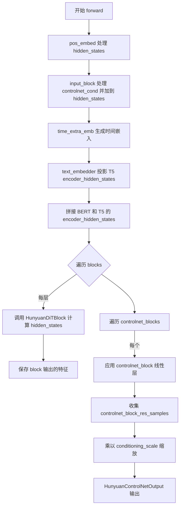
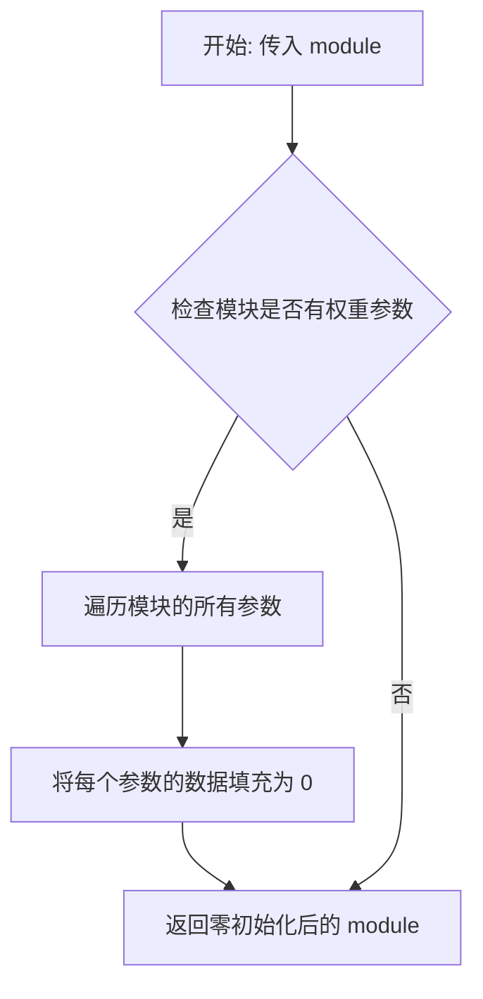
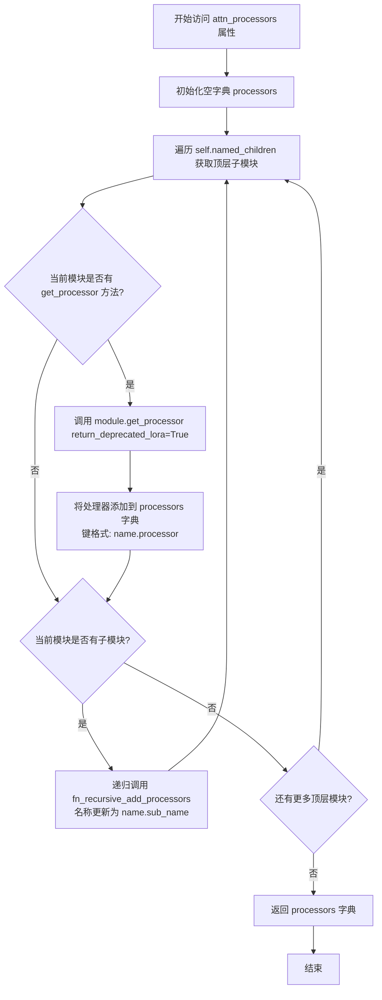
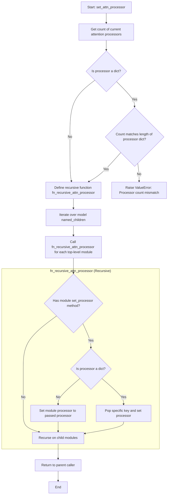
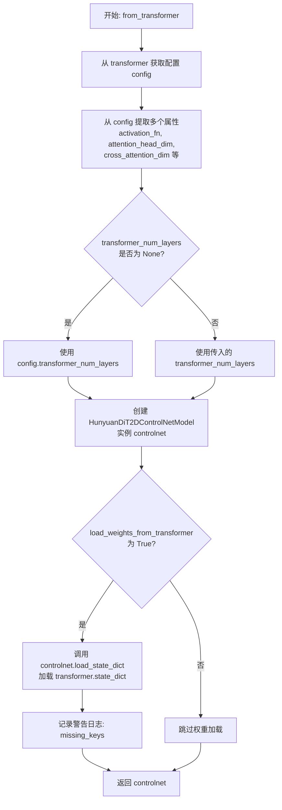
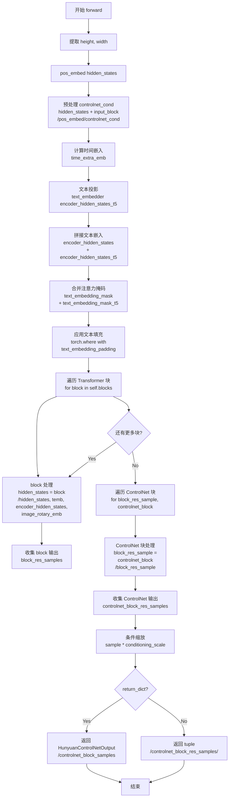

# `diffusers\src\diffusers\models\controlnets\controlnet_hunyuan.py` 详细设计文档

HunyuanDiT ControlNet 实现，提供了单、多 ControlNet 模型类，用于在扩散模型的去噪过程中引入额外的图像条件控制，支持文本embedding、时间步、风格和图像元信息等多模态条件输入，并输出中间层特征以指导主扩散模型。

## 整体流程



## 类结构

```
HunyuanControlNetOutput (数据类)
HunyuanDiT2DControlNetModel (主模型类)
HunyuanDiT2DMultiControlNetModel (多控制网包装类)
```

## 全局变量及字段


### `logger`
    
模块级日志记录器，用于输出警告和信息日志

类型：`logging.Logger`
    


### `HunyuanControlNetOutput.controlnet_block_samples`
    
ControlNet块输出的特征张量元组，用于后续与主模型特征融合

类型：`tuple[torch.Tensor]`
    


### `HunyuanDiT2DControlNetModel.num_heads`
    
多头注意力机制中的注意力头数量，决定并行注意力的分支数

类型：`int`
    


### `HunyuanDiT2DControlNetModel.inner_dim`
    
内部隐藏维度，等于num_heads * attention_head_dim，计算Transformer内部特征维度

类型：`int`
    


### `HunyuanDiT2DControlNetModel.text_embedder`
    
文本嵌入投影层，将T5文本编码器的高维输出投影到交叉注意力所需维度

类型：`PixArtAlphaTextProjection`
    


### `HunyuanDiT2DControlNetModel.text_embedding_padding`
    
可学习的文本嵌入填充参数，用于在注意力掩码为False时替换无效的文本嵌入

类型：`nn.Parameter`
    


### `HunyuanDiT2DControlNetModel.pos_embed`
    
图像分块嵌入层，将输入图像按patch_size切分并转换为序列嵌入向量

类型：`PatchEmbed`
    


### `HunyuanDiT2DControlNetModel.time_extra_emb`
    
时间步、图像尺寸和风格条件的联合嵌入层，生成去噪所需的条件嵌入

类型：`HunyuanCombinedTimestepTextSizeStyleEmbedding`
    


### `HunyuanDiT2DControlNetModel.controlnet_blocks`
    
ControlNet的中间特征提取块列表，用于从Transformer块输出中提取控制特征

类型：`nn.ModuleList`
    


### `HunyuanDiT2DControlNetModel.blocks`
    
HunyuanDiTTransformer块列表，包含前半部分层用于特征处理和条件注入

类型：`nn.ModuleList`
    


### `HunyuanDiT2DControlNetModel.input_block`
    
输入处理线性层，对ControlNet条件输入进行初步特征变换后与主输入相加

类型：`nn.Linear`
    


### `HunyuanDiT2DMultiControlNetModel.nets`
    
多个HunyuanDiT2DControlNetModel实例的模块列表，用于多条件控制融合

类型：`nn.ModuleList`
    
    

## 全局函数及方法


```markdown
### `zero_module`

`zero_module` 是从 `controlnet` 模块导入的一个工具函数，用于将传入的神经网络模块（如 `nn.Linear`）的所有参数（权重和偏置）初始化为零，常用于 ControlNet 中以保持与预训练扩散模型权重的兼容性。

参数：

-  `module`：`torch.nn.Module`，需要进行零初始化的神经网络模块（例如 `nn.Linear`）

返回值：`torch.nn.Module`，返回经过零初始化处理后的神经网络模块。

#### 流程图



#### 带注释源码

```python
# zero_module 函数源码（从 controlnet 模块导入，此处为推测实现）

def zero_module(module):
    """
    将模块的所有参数（权重和偏置）初始化为零。
    
    在 ControlNet 中使用此函数是为了确保初始时 ControlNet 的输出对原始预训练
    扩散模型的影响为零，从而实现更稳定的训练初始状态。
    
    参数:
        module (torch.nn.Module): 需要进行零初始化的神经网络模块
        
    返回:
        torch.nn.Module: 返回经过零初始化处理后的模块
    """
    for param in module.parameters():
        # 将每个参数的值设置为 0
        param.data.zero_()
    
    # 返回已经零初始化的模块
    return module
```

#### 使用示例

在 `HunyuanDiT2DControlNetModel` 类中的实际调用：

```python
# 输入块使用零初始化
self.input_block = zero_module(nn.Linear(hidden_size, hidden_size))

# ControlNet 块使用零初始化
for _ in range(len(self.blocks)):
    controlnet_block = nn.Linear(hidden_size, hidden_size)
    controlnet_block = zero_module(controlnet_block)
    self.controlnet_blocks.append(controlnet_block)
```
```


### `HunyuanDiT2DControlNetModel.attn_processors`

该属性方法递归遍历模型的所有子模块，收集并返回模型中所有注意力处理器（AttentionProcessor）的字典，以权重名称作为键进行索引，用于获取或检查模型中使用的注意力处理机制。

参数：

- （无参数，该方法为属性访问器）

返回值：`dict[str, AttentionProcessor]`，包含模型中所有注意力处理器的字典，键为权重名称（如 `"blocks.0.attn1.processor"`），值为对应的 `AttentionProcessor` 实例。

#### 流程图



#### 带注释源码

```python
@property
def attn_processors(self) -> dict[str, AttentionProcessor]:
    r"""
    Returns:
        `dict` of attention processors: A dictionary containing all attention processors used in the model with
        indexed by its weight name.
    """
    # 初始化用于存储注意力处理器的空字典
    # 键为权重名称，值为 AttentionProcessor 实例
    processors = {}

    def fn_recursive_add_processors(name: str, module: torch.nn.Module, processors: dict[str, AttentionProcessor]):
        """
        递归函数：遍历模块的所有子模块，收集具有 get_processor 方法的模块
        
        参数:
            name: 当前模块的名称路径（如 "blocks.0"）
            module: 要检查的 PyTorch 模块
            processors: 要填充的处理器字典
        """
        # 检查当前模块是否有 get_processor 方法（即是否为注意力层）
        if hasattr(module, "get_processor"):
            # 获取处理器实例，return_deprecated_lora=True 表示同时返回旧的 LORA 处理器
            processors[f"{name}.processor"] = module.get_processor(return_deprecated_lora=True)

        # 递归遍历当前模块的所有子模块
        for sub_name, child in module.named_children():
            # 递归调用，名称累加（如 "blocks.0.attn1"）
            fn_recursive_add_processors(f"{name}.{sub_name}", child, processors)

        return processors

    # 遍历模型的所有顶层子模块（如 blocks, controlnet_blocks, pos_embed 等）
    for name, module in self.named_children():
        fn_recursive_add_processors(name, module, processors)

    # 返回包含所有注意力处理器的字典
    return processors
```


### `HunyuanDiT2DControlNetModel.set_attn_processor`

该方法用于配置模型中所有注意力层（Attention Layers）的注意力处理器（Attention Processor）。它支持传入单个处理器实例以应用于所有层，或传入字典以针对不同模块路径设置特定的处理器。

参数：

- `processor`：`AttentionProcessor | dict[str, AttentionProcessor]`，注意力处理器的实例或字典。如果传入字典，键需要定义对应的跨注意力处理器路径，这在设置可训练注意力处理器时强烈推荐。

返回值：`None`，该方法直接修改模型内部状态，不返回值。

#### 流程图



#### 带注释源码

```python
def set_attn_processor(self, processor: AttentionProcessor | dict[str, AttentionProcessor]):
    r"""
    Sets the attention processor to use to compute attention.

    Parameters:
        processor (`dict` of `AttentionProcessor` or only `AttentionProcessor`):
            The instantiated processor class or a dictionary of processor classes that will be set as the processor
            for **all** `Attention` layers. If `processor` is a dict, the key needs to define the path to the
            corresponding cross attention processor. This is strongly recommended when setting trainable attention
            processors.
    """
    # 1. 获取当前模型中已有的注意力处理器数量
    count = len(self.attn_processors.keys())

    # 2. 验证输入：如果传入的是字典，则检查字典长度是否与处理器数量匹配
    if isinstance(processor, dict) and len(processor) != count:
        raise ValueError(
            f"A dict of processors was passed, but the number of processors {len(processor)} does not match the"
            f" number of attention layers: {count}. Please make sure to pass {count} processor classes."
        )

    # 3. 定义递归函数，用于遍历模型的所有子模块并设置处理器
    def fn_recursive_attn_processor(name: str, module: torch.nn.Module, processor):
        # 如果当前模块拥有 set_processor 方法（通常是 Attention 模块）
        if hasattr(module, "set_processor"):
            if not isinstance(processor, dict):
                # 如果传入的不是字典，直接将全局 processor 应用到此模块
                module.set_processor(processor)
            else:
                # 如果传入的是字典，根据模块名称路径取出对应的 processor
                module.set_processor(processor.pop(f"{name}.processor"))

        # 4. 递归遍历子模块
        for sub_name, child in module.named_children():
            fn_recursive_attn_processor(f"{name}.{sub_name}", child, processor)

    # 5. 启动递归遍历，从模型的顶层子模块开始
    for name, module in self.named_children():
        fn_recursive_attn_processor(name, module, processor)
```


### `HunyuanDiT2DControlNetModel.from_transformer`

该类方法是一个工厂方法，用于从预训练的 HunyuanDiT (Diffusion Transformer) 模型实例化一个 HunyuanDiT2DControlNetModel。它通过复制 Transformer 的配置参数来创建 ControlNet 模型，并可选地从 Transformer 加载预训练权重，实现模型权重的复用和迁移。

参数：

- `cls`：类本身，用于调用类的构造函数
- `transformer`：HunyuanDiT 模型实例，作为配置和权重来源
- `conditioning_channels`：`int`，默认值 3，控制网络的输入通道数
- `transformer_num_layers`：`int | None`，默认值 None，要使用的 Transformer 层数，如果为 None 则使用配置中的默认值
- `load_weights_from_transformer`：`bool`，默认值 True，是否从 Transformer 加载预训练权重

返回值：`HunyuanDiT2DControlNetModel`，返回新创建的 ControlNet 模型实例

#### 流程图



#### 带注释源码

```python
@classmethod
def from_transformer(
    cls,  # 类本身，用于调用类的构造函数
    transformer,  # HunyuanDiT 模型实例，作为配置和权重来源
    conditioning_channels=3,  # 控制网络的输入通道数，默认3
    transformer_num_layers=None,  # 要使用的 Transformer 层数，None 时使用配置默认值
    load_weights_from_transformer=True  # 是否从 Transformer 加载预训练权重
):
    """
    从预训练的 HunyuanDiT 模型创建 HunyuanDiT2DControlNetModel
    
    这是一个类方法（工厂方法），用于从已训练的 Transformer 模型实例化 ControlNet。
    它复制 Transformer 的配置参数创建 ControlNet，并可选地加载 Transformer 的权重。
    """
    # 1. 从 transformer 获取配置对象
    config = transformer.config
    
    # 2. 从配置中提取各种参数
    activation_fn = config.activation_fn  # 激活函数类型
    attention_head_dim = config.attention_head_dim  # 注意力头维度
    cross_attention_dim = config.cross_attention_dim  # 跨注意力维度
    cross_attention_dim_t5 = config.cross_attention_dim_t5  # T5 跨注意力维度
    hidden_size = config.hidden_size  # 隐藏层大小
    in_channels = config.in_channels  # 输入通道数
    mlp_ratio = config.mlp_ratio  # MLP 扩展比率
    num_attention_heads = config.num_attention_heads  # 注意力头数量
    patch_size = config.patch_size  # 补丁大小
    sample_size = config.sample_size  # 样本大小
    text_len = config.text_len  # 文本长度
    text_len_t5 = config.text_len_t5  # T5 文本长度
    
    # 3. 处理条件通道数和层数参数
    conditioning_channels = conditioning_channels  # 保持传入值不变
    # 如果 transformer_num_layers 为 None，则使用配置中的值
    transformer_num_layers = transformer_num_layers or config.transformer_num_layers
    
    # 4. 使用提取的参数创建 ControlNet 模型实例
    controlnet = cls(
        conditioning_channels=conditioning_channels,
        transformer_num_layers=transformer_num_layers,
        activation_fn=activation_fn,
        attention_head_dim=attention_head_dim,
        cross_attention_dim=cross_attention_dim,
        cross_attention_dim_t5=cross_attention_dim_t5,
        hidden_size=hidden_size,
        in_channels=in_channels,
        mlp_ratio=mlp_ratio,
        num_attention_heads=num_attention_heads,
        patch_size=patch_size,
        sample_size=sample_size,
        text_len=text_len,
        text_len_t5=text_len_t5,
    )
    
    # 5. 可选：加载 Transformer 的预训练权重
    if load_weights_from_transformer:
        # strict=False 允许部分匹配，允许权重大小不完全一致
        key = controlnet.load_state_dict(transformer.state_dict(), strict=False)
        # 记录缺失的键（权重参数不匹配的警告）
        logger.warning(f"controlnet load from Hunyuan-DiT. missing_keys: {key[0]}")
    
    # 6. 返回新创建的 ControlNet 模型
    return controlnet
```


### HunyuanDiT2DControlNetModel.forward

该方法是 HunyuanDiT2DControlNetModel 类的核心前向传播方法，负责处理 ControlNet 的条件推理过程。它接收图像潜在表示、时间步长、ControlNet 条件输入、文本编码器输出等参数，通过位置嵌入、时间嵌入、Transformer 块处理和 ControlNet 块提取特征，最后返回经过条件缩放的 ControlNet 特征样本，用于引导主模型的去噪过程。

参数：

- `hidden_states`：`torch.Tensor`，形状为 `(batch size, dim, height, width)`，输入的张量，表示图像的潜在表示
- `timestep`：`torch.LongTensor`，用于指示去噪步骤的时间步长
- `controlnet_cond`：`torch.Tensor`，ControlNet 的条件输入，通常是经过预处理的图像条件
- `conditioning_scale`：`float`，默认为 1.0，条件缩放因子，用于调节 ControlNet 特征的影响程度
- `encoder_hidden_states`：`torch.Tensor`，形状为 `(batch size, sequence len, embed dims)`，交叉注意力层的条件嵌入，来自 BertModel 的输出
- `text_embedding_mask`：`torch.Tensor`，形状为 `(batch, key_tokens)`，应用于 `encoder_hidden_states` 的注意力掩码，来自 BertModel 的输出
- `encoder_hidden_states_t5`：`torch.Tensor`，形状为 `(batch size, sequence len, embed dims)`，来自 T5 文本编码器的条件嵌入
- `text_embedding_mask_t5`：`torch.Tensor`，形状为 `(batch, key_tokens)`，应用于 T5 编码器输出的注意力掩码
- `image_meta_size`：`torch.Tensor`，指示图像大小的条件嵌入
- `style`：`torch.Tensor`，指示风格的条件嵌入
- `image_rotary_emb`：`torch.Tensor`，在注意力计算中应用于查询和键张量的图像旋转嵌入
- `return_dict`：`bool`，默认为 True，是否返回字典格式的结果

返回值：`HunyuanControlNetOutput` 或 `tuple[torch.Tensor]`，返回 ControlNet 的输出，包含 `controlnet_block_samples: tuple[torch.Tensor]`，即经过条件缩放的 ControlNet 特征样本元组

#### 流程图



#### 带注释源码

```python
def forward(
    self,
    hidden_states,  # torch.Tensor: (batch size, dim, height, width) 输入图像潜在表示
    timestep,  # torch.LongTensor: 去噪步骤的时间步长
    controlnet_cond: torch.Tensor,  # ControlNet 的条件输入图像
    conditioning_scale: float = 1.0,  # 条件缩放因子，默认为 1.0
    encoder_hidden_states=None,  # torch.Tensor: (batch size, sequence len, embed dims) BERT 文本嵌入
    text_embedding_mask=None,  # torch.Tensor: (batch, key_tokens) BERT 文本嵌入的注意力掩码
    encoder_hidden_states_t5=None,  # torch.Tensor: (batch size, sequence len, embed dims) T5 文本嵌入
    text_embedding_mask_t5=None,  # torch.Tensor: (batch, key_tokens) T5 文本嵌入的注意力掩码
    image_meta_size=None,  # torch.Tensor: 图像大小条件嵌入
    style=None,  # torch.Tensor: 风格条件嵌入
    image_rotary_emb=None,  # torch.Tensor: 图像旋转嵌入，用于注意力计算
    return_dict=True,  # bool: 是否返回字典格式
):
    """
    The [`HunyuanDiT2DControlNetModel`] forward method.

    Args:
    hidden_states (`torch.Tensor` of shape `(batch size, dim, height, width)`):
        The input tensor.
    timestep ( `torch.LongTensor`, *optional*):
        Used to indicate denoising step.
    controlnet_cond ( `torch.Tensor` ):
        The conditioning input to ControlNet.
    conditioning_scale ( `float` ):
        Indicate the conditioning scale.
    encoder_hidden_states ( `torch.Tensor` of shape `(batch size, sequence len, embed dims)`, *optional*):
        Conditional embeddings for cross attention layer. This is the output of `BertModel`.
    text_embedding_mask: torch.Tensor
        An attention mask of shape `(batch, key_tokens)` is applied to `encoder_hidden_states`. This is the output
        of `BertModel`.
    encoder_hidden_states_t5 ( `torch.Tensor` of shape `(batch size, sequence len, embed dims)`, *optional*):
        Conditional embeddings for cross attention layer. This is the output of T5 Text Encoder.
    text_embedding_mask_t5: torch.Tensor
        An attention mask of shape `(batch, key_tokens)` is applied to `encoder_hidden_states`. This is the output
        of T5 Text Encoder.
    image_meta_size (torch.Tensor):
        Conditional embedding indicate the image sizes
    style: torch.Tensor:
        Conditional embedding indicate the style
    image_rotary_emb (`torch.Tensor`):
        The image rotary embeddings to apply on query and key tensors during attention calculation.
    return_dict: bool
        Whether to return a dictionary.
    """

    # 步骤 1: 从 hidden_states 提取高度和宽度
    height, width = hidden_states.shape[-2:]

    # 步骤 2: 对 hidden_states 进行位置嵌入 (b,c,H,W) -> (b, N, C)
    # 将图像分割成 patches 并添加位置信息
    hidden_states = self.pos_embed(hidden_states)

    # 步骤 3: 预处理 controlnet_cond
    # 对 controlnet_cond 进行位置嵌入，然后通过 input_block 处理，最后加到 hidden_states
    # 这里实现了 ControlNet 的条件注入机制
    hidden_states = hidden_states + self.input_block(self.pos_embed(controlnet_cond))

    # 步骤 4: 计算时间额外嵌入
    # 包含时间步、图像元信息、风格条件的组合嵌入
    # 输出形状: [B, D]
    temb = self.time_extra_emb(
        timestep, encoder_hidden_states_t5, image_meta_size, style, hidden_dtype=timestep.dtype
    )

    # 步骤 5: 文本投影 - 将 T5 文本编码器输出投影到目标维度
    # 获取 batch size 和序列长度
    batch_size, sequence_length, _ = encoder_hidden_states_t5.shape
    # 对 T5 文本嵌入进行投影变换
    encoder_hidden_states_t5 = self.text_embedder(
        encoder_hidden_states_t5.view(-1, encoder_hidden_states_t5.shape[-1])
    )
    # 恢复原始批次和序列维度
    encoder_hidden_states_t5 = encoder_hidden_states_t5.view(batch_size, sequence_length, -1)

    # 步骤 6: 拼接文本嵌入 - 将 BERT 和 T5 的文本嵌入在序列维度连接
    encoder_hidden_states = torch.cat([encoder_hidden_states, encoder_hidden_states_t5], dim=1)
    # 合并注意力掩码
    text_embedding_mask = torch.cat([text_embedding_mask, text_embedding_mask_t5], dim=-1)
    # 扩展维度并转换为布尔类型
    text_embedding_mask = text_embedding_mask.unsqueeze(2).bool()

    # 步骤 7: 应用文本嵌入填充
    # 使用填充参数替换被掩码覆盖的位置
    encoder_hidden_states = torch.where(text_embedding_mask, encoder_hidden_states, self.text_embedding_padding)

    # 步骤 8: 遍历所有 Transformer 块进行处理
    block_res_samples = ()  # 初始化存储每层输出的元组
    for layer, block in enumerate(self.blocks):
        # 每层处理: 输入 hidden_states，添加时间嵌入、文本条件、旋转嵌入
        # 输出形状: (N, L, D) - N 是 patch 数量，L 是序列长度，D 是特征维度
        hidden_states = block(
            hidden_states,
            temb=temb,
            encoder_hidden_states=encoder_hidden_states,
            image_rotary_emb=image_rotary_emb,
        )

        # 收集每层的输出用于后续 ControlNet 处理
        block_res_samples = block_res_samples + (hidden_states,)

    # 步骤 9: 遍历 ControlNet 块处理特征
    # 将每层 Transformer 的输出通过对应的 ControlNet 块进行变换
    controlnet_block_res_samples = ()
    for block_res_sample, controlnet_block in zip(block_res_samples, self.controlnet_blocks):
        # ControlNet 块输出与主模型相同维度的特征
        block_res_sample = controlnet_block(block_res_sample)
        controlnet_block_res_samples = controlnet_block_res_samples + (block_res_sample,)

    # 步骤 10: 条件缩放
    # 将所有 ControlNet 特征乘以 conditioning_scale，用于调节条件影响的强度
    controlnet_block_res_samples = [sample * conditioning_scale for sample in controlnet_block_res_samples]

    # 步骤 11: 返回结果
    if not return_dict:
        # 如果不返回字典格式，直接返回元组
        return (controlnet_block_res_samples,)

    # 返回命名输出对象，包含 ControlNet 特征样本
    return HunyuanControlNetOutput(controlnet_block_samples=controlnet_block_res_samples)
```


# HunyuanDiT2DMultiControlNetModel.forward 设计文档

## 一段话描述

`HunyuanDiT2DMultiControlNetModel.forward` 是 HunyuanDiT 多控制网（Multi-ControlNet）模型的前向传播方法，通过遍历多个独立的 `HunyuanDiT2DControlNetModel` 实例，分别提取条件特征并将其输出进行逐元素相加融合，以实现对多个控制信号的协同使用。

## 文件的整体运行流程

本文件实现了 HunyuanDiT 的 ControlNet 功能，包含两个核心类：

1. **HunyuanDiT2DControlNetModel**：单个 ControlNet 模型，负责从输入图像中提取条件特征
2. **HunyuanDiT2DMultiControlNetModel**：多 ControlNet 包装器，用于合并多个 ControlNet 的输出

运行流程：
- MultiControlNet 接收多个控制条件（如深度图、边缘图等）
- 遍历每个 ControlNet，分别提取特征
- 将所有 ControlNet 的输出进行特征融合
- 返回合并后的条件特征

## 类的详细信息

### HunyuanDiT2DMultiControlNetModel

#### 类字段

- `nets`：`nn.ModuleList`，存储多个 HunyuanDiT2DControlNetModel 实例

#### 类方法

##### forward

**参数：**

- `hidden_states`：`torch.Tensor`，形状为 `(batch size, dim, height, width)`，输入张量
- `timestep`：`torch.LongTensor`，可选，用于指示去噪步骤
- `controlnet_cond`：`torch.Tensor`，ControlNet 的条件输入
- `conditioning_scale`：`float`，条件缩放因子，默认为 1.0
- `encoder_hidden_states`：`torch.Tensor`，形状为 `(batch size, sequence len, embed dims)`，可选，BertModel 的交叉注意力条件嵌入
- `text_embedding_mask`：`torch.Tensor`，应用于 encoder_hidden_states 的注意力掩码
- `encoder_hidden_states_t5`：`torch.Tensor`，形状为 `(batch size, sequence len, embed dims)`，可选，T5 文本编码器的输出
- `text_embedding_mask_t5`：`torch.Tensor`，应用于 T5 编码器输出的注意力掩码
- `image_meta_size`：`torch.Tensor`，图像尺寸的条件嵌入
- `style`：`torch.Tensor`，风格的条件的嵌入
- `image_rotary_emb`：`torch.Tensor`，图像旋转嵌入，用于注意力计算中的查询和键张量
- `return_dict`：`bool`，是否返回字典格式，默认为 True

**返回值：** 根据 `return_dict` 值：
- 若为 `True`：返回 `HunyuanControlNetOutput` 对象，包含 `controlnet_block_samples: tuple[torch.Tensor]`
- 若为 `False`：返回元组 `(controlnet_block_samples,)`

#### 流程图

```mermaid
flowchart TD
    A[开始 forward] --> B[遍历 controlnet_cond, conditioning_scale, self.nets]
    B --> C[调用单个 ControlNet forward]
    C --> D[获取该 ControlNet 的输出 block_samples]
    E{是否是第一个 ControlNet?}
    D --> E
    E -->|是| F[control_block_samples = block_samples]
    E -->|否| G[逐元素相加融合]
    G --> H[control_block_samples = (融合后的样本,)]
    F --> I{还有更多 ControlNet?}
    H --> I
    I -->|是| B
    I -->|否| J[返回 control_block_samples]
    
    style A fill:#f9f,stroke:#333
    style J fill:#9f9,stroke:#333
```

#### 带注释源码

```python
def forward(
    self,
    hidden_states,
    timestep,
    controlnet_cond: torch.Tensor,
    conditioning_scale: float = 1.0,
    encoder_hidden_states=None,
    text_embedding_mask=None,
    encoder_hidden_states_t5=None,
    text_embedding_mask_t5=None,
    image_meta_size=None,
    style=None,
    image_rotary_emb=None,
    return_dict=True,
):
    """
    The [`HunyuanDiT2DControlNetModel`] forward method.

    Args:
    hidden_states (`torch.Tensor` of shape `(batch size, dim, height, width)`):
        The input tensor.
    timestep ( `torch.LongTensor`, *optional*):
        Used to indicate denoising step.
    controlnet_cond ( `torch.Tensor` ):
        The conditioning input to ControlNet.
    conditioning_scale ( `float` ):
        Indicate the conditioning scale.
    encoder_hidden_states ( `torch.Tensor` of shape `(batch size, sequence len, embed dims)`, *optional*):
        Conditional embeddings for cross attention layer. This is the output of `BertModel`.
    text_embedding_mask: torch.Tensor
        An attention mask of shape `(batch, key_tokens)` is applied to `encoder_hidden_states`. This is the output
        of `BertModel`.
    encoder_hidden_states_t5 ( `torch.Tensor` of shape `(batch size, sequence len, embed dims)`, *optional*):
        Conditional embeddings for cross attention layer. This is the output of T5 Text Encoder.
    text_embedding_mask_t5: torch.Tensor
        An attention mask of shape `(batch, key_tokens)` is applied to `encoder_hidden_states`. This is the output
        of T5 Text Encoder.
    image_meta_size (torch.Tensor):
        Conditional embedding indicate the image sizes
    style: torch.Tensor:
        Conditional embedding indicate the style
    image_rotary_emb (`torch.Tensor`):
        The image rotary embeddings to apply on query and key tensors during attention calculation.
    return_dict: bool
        Whether to return a dictionary.
    """
    # 遍历每个 ControlNet 实例，使用 zip 同时迭代条件输入、缩放因子和网络
    for i, (image, scale, controlnet) in enumerate(zip(controlnet_cond, conditioning_scale, self.nets)):
        # 调用单个 ControlNet 的前向传播，获取特征块
        block_samples = controlnet(
            hidden_states=hidden_states,
            timestep=timestep,
            controlnet_cond=image,           # 当前 ControlNet 对应的条件输入
            conditioning_scale=scale,         # 当前 ControlNet 的缩放因子
            encoder_hidden_states=encoder_hidden_states,
            text_embedding_mask=text_embedding_mask,
            encoder_hidden_states_t5=encoder_hidden_states_t5,
            text_embedding_mask_t5=text_embedding_mask_t5,
            image_meta_size=image_meta_size,
            style=style,
            image_rotary_emb=image_rotary_emb,
            return_dict=return_dict,
        )

        # 合并样本：将当前 ControlNet 的输出与之前的结果逐元素相加
        if i == 0:
            # 第一个 ControlNet，直接赋值作为初始合并结果
            control_block_samples = block_samples
        else:
            # 后续 ControlNet，将特征块逐元素相加融合
            control_block_samples = [
                control_block_sample + block_sample
                for control_block_sample, block_sample in zip(control_block_samples[0], block_samples[0])
            ]
            # 包装为元组格式以保持一致性
            control_block_samples = (control_block_samples,)

    # 返回合并后的 ControlNet 特征样本
    return control_block_samples
```

## 关键组件信息

| 组件名称 | 一句话描述 |
|---------|-----------|
| HunyuanDiT2DControlNetModel | 单个 ControlNet 模型，提取输入图像的条件特征 |
| HunyuanDiTBlock | HunyuanDiT 的 Transformer 块，包含自注意力和交叉注意力 |
| HunyuanControlNetOutput | 输出数据类，包含 ControlNet 块样本的元组 |
| controlnet_blocks | 线性层列表，用于从 Transformer 输出中提取 ControlNet 特征 |

## 潜在的技术债务或优化空间

1. **重复计算问题**：每个 ControlNet 都对相同的 `hidden_states`、`timestep`、`encoder_hidden_states` 等进行计算，可以考虑共享计算结果
2. **内存占用**：多个 ControlNet 会占用较多显存，可以考虑使用模型并行或权重共享
3. **融合方式单一**：当前仅支持逐元素相加，可以考虑支持加权融合或注意力融合
4. **类型注解不完整**：`conditioning_scale` 在 MultiControlNet 中应为列表或张量，但当前标注为 `float`

## 其它项目

### 设计目标与约束

- **设计目标**：支持多个 ControlNet 条件输入的协同使用，通过特征融合提升生成质量
- **约束**：API 需要与单 ControlNet (`HunyuanDiT2DControlNetModel`) 兼容

### 错误处理与异常设计

- 当 `conditioning_scale` 长度与 `controlnet_cond` 不匹配时，会在 `zip` 迭代时自动截断，可能导致静默错误
- 缺少对 `controlnet_cond` 和 `conditioning_scale` 长度一致性的显式验证

### 数据流与状态机

数据流：
1. 接收多个条件输入 (`controlnet_cond`) 和对应的缩放因子 (`conditioning_scale`)
2. 依次通过各个 ControlNet 提取特征
3. 逐层累加融合特征块
4. 输出融合后的 ControlNet 特征

### 外部依赖与接口契约

- **依赖**：需要 `HunyuanDiT2DControlNetModel` 类作为子模块
- **接口**：与 `HunyuanDiT2DControlNetModel.forward` 接口兼容，支持 `return_dict` 参数控制输出格式

## 关键组件


### HunyuanControlNetOutput

数据类，封装ControlNet的输出结果，包含多个中间块样本的元组，用于后续与主去噪网络的特征进行融合。

### HunyuanDiT2DControlNetModel

主ControlNet模型类，继承自ModelMixin和ConfigMixin，负责从HunyuanDiT transformer中提取多尺度条件特征。核心功能是将图像条件信息编码为控制信号，辅助扩散模型生成过程。

### HunyuanDiT2DMultiControlNetModel

多ControlNet包装器类，用于同时运行多个ControlNet实例并将输出特征进行累加融合，支持多条件控制的图像生成场景。

### 张量索引与条件处理

在forward方法中，通过torch.where和text_embedding_mask实现条件文本嵌入的选择性填充，使用索引机制处理变长文本序列。

### 注意力处理器系统

通过attn_processors属性和set_attn_processor方法实现注意力处理器的递归查询与设置，支持可训练的LORA注意力机制。

### ControlNet特征提取

使用controlnet_blocks模块列表对每个transformer块的输出进行零初始化卷积处理，生成多尺度控制特征。

### 权重加载机制

from_transformer类方法支持从预训练HunyuanDiT transformer模型加载权重，支持部分匹配(strict=False)以适应模型结构的差异。

### 条件尺度缩放

在forward方法的最后，对所有ControlNet块输出乘以conditioning_scale参数，实现对控制强度的动态调节。

### 文本嵌入处理

集成了PixArtAlphaTextProjection模块对T5文本编码器输出进行投影降维，并与BERT文本嵌入进行拼接融合。

### HunyuanDiTBlock transformer块

使用HunyuanDiTBlock模块堆叠构成主干网络，包含交叉注意力机制和旋转位置编码支持。


## 问题及建议


### 已知问题

-   **冗余变量赋值**: 在 `from_transformer` 方法中存在 `conditioning_channels = conditioning_channels` 的冗余赋值，没有任何实际作用。
-   **魔法数字**: `transformer_num_layers // 2 - 1` 硬编码假设 transformer 层数是 controlnet 的两倍，缺乏灵活性和文档说明。
-   **类型提示不完整**: `sample_size=32` 缺少类型注解 `sample_size: int = 32`，`text_len: int = 77` 也存在同样问题。
-   **前向方法返回值不一致**: `HunyuanDiT2DMultiControlNetModel.forward` 返回的是普通元组 `(control_block_samples,)`，而 `HunyuanDiT2DControlNetModel.forward` 返回 `HunyuanControlNetOutput` 对象，调用方需要做不同的处理。
-   **循环中元组拼接效率低**: `block_res_samples = block_res_samples + (hidden_states,)` 在每次迭代中创建新元组，应使用列表后再转换。
-   **`input_block` 命名语义不清**: 这是一个零初始化的 Linear 层，名字叫 `input_block` 但实际只处理 `controlnet_cond`，容易引起误解。
-   **`HunyuanDiTBlock` 的 `skip` 参数硬编码为 False**: 在所有 block 初始化时都传递 `skip=False`，这个参数似乎是冗余的。
-   **缺少输入验证**: `forward` 方法没有对 `hidden_states`、`timestep` 等关键输入进行形状或类型校验。
-   **MultiControlNet 第一次循环逻辑重复**: 第一次循环时直接赋值 `control_block_samples = block_samples`，后续才做累加，可以统一处理逻辑。

### 优化建议

-   移除 `from_transformer` 方法中冗余的 `conditioning_channels = conditioning_channels` 赋值。
-   将 `transformer_num_layers // 2 - 1` 提取为配置参数或添加显式注释说明层数关系。
-   补充所有参数的完整类型注解。
-   统一 `HunyuanDiT2DMultiControlNetModel.forward` 的返回值类型，也返回 `HunyuanControlNetOutput` 对象或在文档中明确说明差异。
-   将元组拼接改为列表操作：`block_res_samples = []` → `block_res_samples.append(hidden_states)` → 最后 `tuple(block_res_samples)`。
-   为 `input_block` 重命名以更准确反映其用途（如 `controlnet_cond_proj`）。
-   考虑添加梯度 checkpointing 支持以优化大模型训练内存占用。
-   在 `forward` 方法入口添加基本的输入校验（如检查 hidden_states 维度、timestep 是否为 LongTensor 等）。


## 其它


### 设计目标与约束

本模块旨在为HunyuanDiT扩散模型提供ControlNet条件控制能力，通过额外的控制信号（如边缘图、姿态等）引导图像生成过程。设计目标包括：(1) 支持多种条件输入并将其有效地注入到扩散UNet的潜在空间中；(2) 保持与原生HunyuanDiT模型的权重兼容性，支持从预训练模型加载；(3) 提供Multi-ControlNet支持以组合多个控制信号。约束条件包括：输入图像通道数必须与conditioning_channels匹配，默认3通道RGB；文本编码器使用BERT和T5双编码器架构；模型层数应为原始transformer的一半（因ControlNet仅处理前半部分）。

### 错误处理与异常设计

参数验证：在from_transformer类方法中，若load_weights_from_transformer为True但状态字典加载出现missing_keys或unexpected_keys，仅通过logger.warning记录而不抛出异常，确保模型可以继续运行；若strict加载失败可能导致功能不完整。注意力处理器设置：set_attn_processor方法在处理器数量不匹配时抛出ValueError，明确要求传入正确数量的处理器类。输入形状兼容性：forward方法未对输入张量进行显式的形状校验，假设调用方已确保hidden_states、encoder_hidden_states等维度正确匹配，否则会在后续计算时产生torch运行时错误。

### 数据流与状态机

数据流遵循以下路径：(1) 输入阶段：hidden_states经过pos_embed进行patch嵌入，controlnet_cond经过input_block处理后叠加；(2) 时间步嵌入：timestep与text_embedding、image_meta_size、style一同送入time_extra_emb生成时间条件向量；(3) 文本处理：encoder_hidden_states（BERT）和encoder_hidden_states_t5（T5）分别处理后拼接，文本embedding mask用于填充无效位置；(4) 主体变换：hidden_states依次通过HunyuanDiTBlock序列，每层输出同时保存到block_res_samples；(5) ControlNet输出：每个block的中间特征经过对应的controlnet_block处理并乘以conditioning_scale后输出。无显式状态机，模型为纯前馈计算图。

### 外部依赖与接口契约

核心依赖包括：(1) torch.nn：基础神经网络组件；(2) ...configuration_utils.ConfigMixin和register_to_config：HuggingFace配置管理机制；(3) ...utils.BaseOutput和logging：统一输出格式和日志；(4) ...attention_processor.AttentionProcessor：可插拔的注意力计算策略；(5) ...embeddings中的PixArtAlphaTextProjection、PatchEmbed、HunyuanCombinedTimestepTextSizeStyleEmbedding：各类嵌入层；(6) ...modeling_utils.ModelMixin：基础模型Mixin；(7) ...transformers.hunyuan_transformer_2d.HunyuanDiTBlock：核心DiT变换器块；(8) .controlnet.zero_module：用于将卷积/线性层权重初始化为零的工具函数。接口契约：forward方法接收hidden_states (B,C,H,W)、timestep、controlnet_cond (B,C,H,W)、conditioning_scale、encoder_hidden_states、text_embedding_mask、encoder_hidden_states_t5、text_embedding_mask_t5、image_meta_size、style、image_rotary_emb，返回HungryuanControlNetOutput或元组。

### 性能考虑与优化空间

计算复杂度：模型包含transformer_num_layers//2-1个DiT Block（前向通过约19层），每个block包含多头自注意力、交叉注意力和FFN，复杂度为O(N^2d + Nd^2)，其中N为patch序列长度。内存占用：hidden_states、block_res_samples和controlnet_block_res_samples会保留完整中间激活，序列长度增长时内存消耗显著。优化方向：(1) 可以考虑使用checkpointing技术减少内存占用；(2) controlnet_blocks采用zero_module初始化，训练初期对主模型影响为零，但推理时可考虑剪枝；(3) 当前实现为串行遍历blocks，可利用torch.compile或CUDA流并行化独立分支。

### 配置参数详细说明

conditioning_channels：控制输入通道数，默认3对应RGB图像。num_attention_heads与attention_head_dim共同决定inner_dim = heads * head_dim，控制注意力头数和每个头的维度。in_channels和patch_size与位置嵌入相关，sample_size定义输入分辨率。hidden_size为隐空间维度，transformer_num_layers指定总层数但实际使用一半。mlp_ratio控制FFN中间层扩展比例。cross_attention_dim和cross_attention_dim_t5分别对应BERT和T5文本编码器的投影维度。pooled_projection_dim为池化后的文本投影维度。text_len和text_len_t5分别为两种文本编码器的最大序列长度。use_style_cond_and_image_meta_size控制是否启用风格和图像元信息条件。

### 版本兼容性说明

本模块设计为与HuggingFace Diffusers库生态兼容，继承ModelMixin和ConfigMixin以获得标准的save/load和from_pretrained功能。依赖的HunyuanDiTBlock需确保版本匹配。当前代码中qkv投影使用qk_norm=True以符合标准化注意力机制。如需在旧版PyTorch（<2.0）运行，需注意torch.compile相关API的可用性。

### 安全与权限控制

代码本身不包含用户输入处理或网络通信，主要安全考虑集中在模型加载阶段：from_transformer方法使用strict=False加载权重，允许部分权重不匹配；logger.warning仅输出missing_keys信息，不包含敏感数据。模型权重来源于HuggingFace Hub，需确保来源可信。
</think>
    