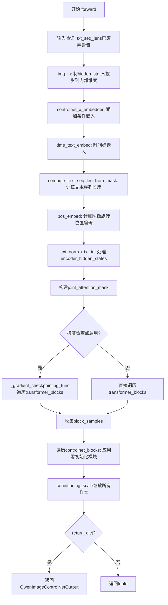
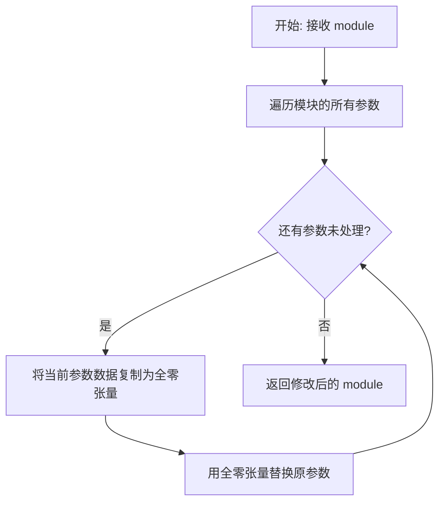
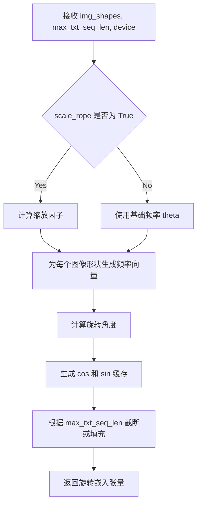
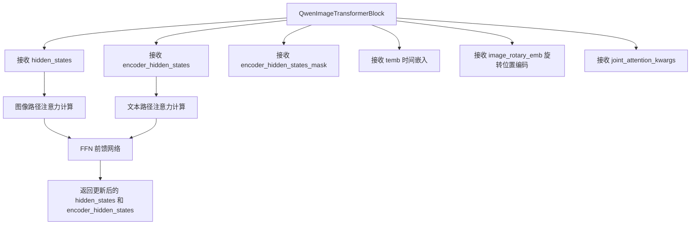
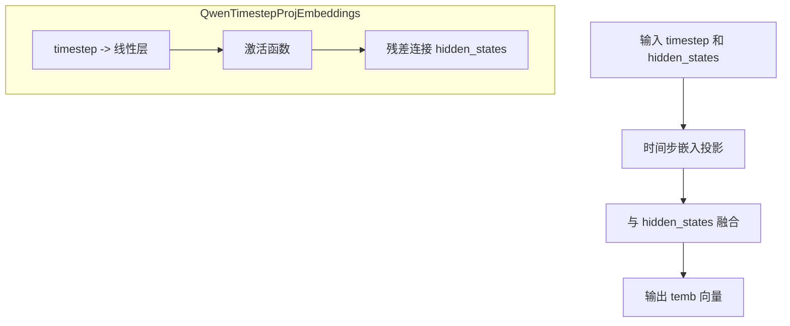
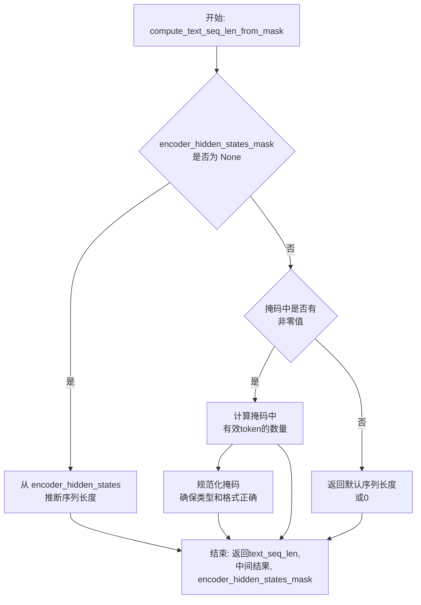
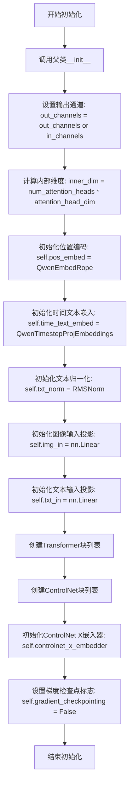
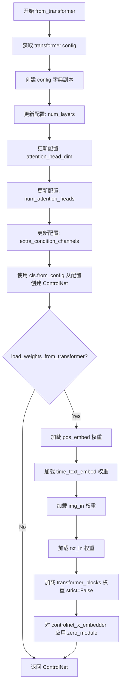
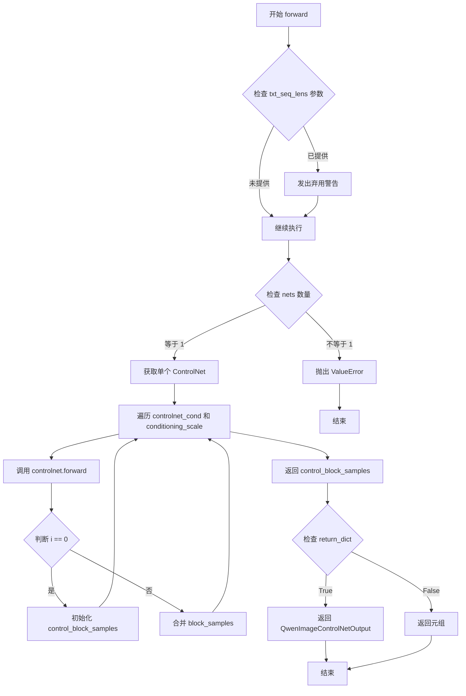

# `diffusers\src\diffusers\models\controlnets\controlnet_qwenimage.py` 详细设计文档

这是一个基于QwenImage架构的ControlNet实现，用于图像生成任务中的条件控制。该模型继承自多个Diffusers基础Mixin类，支持LoRA、PEFT适配器、梯度检查点等功能，能够从预训练的QwenImage Transformer模型迁移权重，并输出多个控制块样本用于控制Net的各级特征。

## 整体流程



## 类结构

```
BaseOutput
├── QwenImageControlNetOutput (dataclass)
ModelMixin
├── QwenImageControlNetModel
└── QwenImageMultiControlNetModel
AttentionMixin (继承自 ..attention)
ConfigMixin (继承自 ...configuration_utils)
PeftAdapterMixin (继承自 ...loaders)
FromOriginalModelMixin (继承自 ...loaders)
CacheMixin (继承自 ...cache_utils)
```

## 全局变量及字段


### `logger`
    
Logger instance for the module, used for logging messages throughout the ControlNet model.

类型：`logging.Logger`
    


### `QwenImageControlNetOutput.controlnet_block_samples`
    
Tuple of tensor outputs from each ControlNet block, representing intermediate feature maps.

类型：`tuple[torch.Tensor]`
    


### `QwenImageControlNetModel.out_channels`
    
Number of output channels for the model, defaults to in_channels if not specified.

类型：`int | None`
    


### `QwenImageControlNetModel.inner_dim`
    
Internal dimension size calculated as the product of attention heads and head dimension.

类型：`int`
    


### `QwenImageControlNetModel.pos_embed`
    
Rotary Position Embedding (RoPE) module for encoding positional information in image features.

类型：`QwenEmbedRope`
    


### `QwenImageControlNetModel.time_text_embed`
    
Embedding projection layer for timestep and text conditioning signals.

类型：`QwenTimestepProjEmbeddings`
    


### `QwenImageControlNetModel.txt_norm`
    
RMS Normalization layer for normalizing text encoder hidden states.

类型：`RMSNorm`
    


### `QwenImageControlNetModel.img_in`
    
Linear projection layer that maps image input features to the internal hidden dimension.

类型：`nn.Linear`
    


### `QwenImageControlNetModel.txt_in`
    
Linear projection layer that maps text encoder hidden states to the internal hidden dimension.

类型：`nn.Linear`
    


### `QwenImageControlNetModel.transformer_blocks`
    
Module list containing the stack of transformer blocks for processing image and text features.

类型：`nn.ModuleList[QwenImageTransformerBlock]`
    


### `QwenImageControlNetModel.controlnet_blocks`
    
Module list of linear layers that extract intermediate features from each transformer block for ControlNet output.

类型：`nn.ModuleList[nn.Linear]`
    


### `QwenImageControlNetModel.controlnet_x_embedder`
    
Linear embedding layer that projects the ControlNet conditioning input to the hidden dimension.

类型：`nn.Linear`
    


### `QwenImageControlNetModel.gradient_checkpointing`
    
Boolean flag indicating whether gradient checkpointing is enabled to save memory during training.

类型：`bool`
    


### `QwenImageMultiControlNetModel.nets`
    
Module list containing multiple QwenImageControlNetModel instances for multi-condition ControlNet processing.

类型：`nn.ModuleList[QwenImageControlNetModel]`
    
    

## 全局函数及方法


### `zero_module`

`zero_module` 是一个用于将神经网络模块的参数（权重和偏置）初始化为零的函数。它通常用于 ControlNet 架构中，以确保 ControlNet 块的输出在训练初期对主模型的 影响较小，从而实现更稳定的训练和更好的微调效果。

参数：

- `module`：`torch.nn.Module`，要初始化为零的神经网络模块（如 `nn.Linear`、`nn.Conv2d` 等）

返回值：`torch.nn.Module`，返回参数已初始化为零的模块

#### 流程图



#### 带注释源码

```
def zero_module(module):
    """
    将神经网络模块的参数初始化为零。
    
    在 ControlNet 中使用此函数是为了确保 ControlNet 块的输出
    在训练初期对主模型的影响较小，从而实现更稳定的训练。
    
    Args:
        module (torch.nn.Module): 要初始化为零的神经网络模块
        
    Returns:
        torch.nn.Module: 参数已初始化为零的模块
    """
    # 遍历模块的所有参数（权重和偏置）
    for param in module.parameters():
        # 将每个参数的数据替换为全零张量
        # 保持参数的形状和requires_grad属性不变
        param.data.zero_()
    
    # 返回修改后的模块
    return module
```

#### 使用示例

在提供的代码中，`zero_module` 被用于以下场景：

1. **创建 ControlNet 块**：
```python
self.controlnet_blocks = nn.ModuleList([])
for _ in range(len(self.transformer_blocks)):
    self.controlnet_blocks.append(zero_module(nn.Linear(self.inner_dim, self.inner_dim)))
```

2. **创建条件嵌入器**：
```python
self.controlnet_x_embedder = zero_module(
    torch.nn.Linear(in_channels + extra_condition_channels, self.inner_dim)
)
```

3. **从预训练模型加载权重后重新初始化**：
```python
controlnet.controlnet_x_embedder = zero_module(controlnet.controlnet_x_embedder)
```


### `QwenEmbedRope`

QwenEmbedRope 是一种旋转位置嵌入（RoPE）模块，用于在 Qwen2.5-VL 图像控制网络中为图像和文本特征生成旋转位置编码，支持可配置的轴维度和可选的 RoPE 缩放。

参数：

- `img_shapes`：`list[tuple[int, int, int]]`，图像形状列表，每个元素为 (channel, height, width)
- `max_txt_seq_len`：`int`，最大文本序列长度，用于计算联合注意力中的位置编码维度
- `device`：`torch.device`，计算设备

返回值：`torch.Tensor`，旋转位置嵌入张量，用于在注意力计算中编码位置信息

#### 流程图



#### 带注释源码

```python
# QwenEmbedRope 类的使用示例（从 QwenImageControlNetModel.__init__ 中提取）
self.pos_embed = QwenEmbedRope(
    theta=10000,              # 基础频率参数，控制旋转角度的周期
    axes_dim=list(axes_dims_rope),  # 各轴维度 (16, 56, 56)，对应通道、高度和宽度
    scale_rope=True           # 启用 RoPE 缩放，允许动态调整位置编码维度
)

# QwenEmbedRope 的调用方式（从 QwenImageControlNetModel.forward 中提取）
image_rotary_emb = self.pos_embed(
    img_shapes,               # 图像形状列表 [(c, h, w), ...]
    max_txt_seq_len=text_seq_len,  # 最大文本序列长度
    device=hidden_states.device    # 计算设备
)
```

#### 详细设计说明

| 属性 | 值 |
|------|-----|
| **模块来源** | `diffusers.models.transformers.transformer_qwenimage` |
| **功能类型** | 旋转位置嵌入（Rotary Position Embedding） |
| **核心算法** | 使用复数旋转矩阵为序列中的每个位置生成唯一的旋转角度 |
| **设计目标** | 支持多维位置编码（通道、高度、宽度三个轴向） |
| **优化空间** | 可考虑缓存已计算的嵌入以避免重复计算 |


由于 `QwenImageTransformerBlock` 是从 `..transformers.transformer_qwenimage` 模块导入的，而不是在当前文件中定义的，因此我无法直接获取其完整源代码实现。

不过，根据当前文件中的使用方式，我可以提供该函数的调用信息和上下文分析：

### QwenImageTransformerBlock

这是 Qwen 图像 Transformer 的核心构建块，用于处理图像和文本的联合注意力机制。

参数：

- `dim`：`int`，隐藏层维度，等于 `num_attention_heads * attention_head_dim`
- `num_attention_heads`：`int`，注意力头的数量
- `attention_head_dim`：`int`，每个注意力头的维度

返回值：应返回处理后的隐藏状态元组 `(encoder_hidden_states, hidden_states)`

#### 流程图



#### 带注释源码

```
# QwenImageTransformerBlock 在当前文件中的调用方式
# 注意：实际源码定义在 ..transformers.transformer_qwenimage 模块中

# 在 QwenImageControlNetModel.__init__ 中的定义：
self.transformer_blocks = nn.ModuleList(
    [
        QwenImageTransformerBlock(
            dim=self.inner_dim,                    # 隐藏层维度
            num_attention_heads=num_attention_heads, # 注意力头数量
            attention_head_dim=attention_head_dim, # 每个头的维度
        )
        for _ in range(num_layers)
    ]
)

# 在 forward 方法中的调用：
for block in self.transformer_blocks:
    # ... 梯度检查点处理 ...
    encoder_hidden_states, hidden_states = block(
        hidden_states=hidden_states,                    # 图像隐藏状态
        encoder_hidden_states=encoder_hidden_states,    # 文本编码隐藏状态
        encoder_hidden_states_mask=None,                # 文本注意力掩码（使用 joint_attention_mask 代替）
        temb=temb,                                      # 时间嵌入
        image_rotary_emb=image_rotary_emb,              # 旋转位置编码
        joint_attention_kwargs=block_attention_kwargs,  # 联合注意力参数
    )
```

---

**注意**：完整的 `QwenImageTransformerBlock` 类定义位于 `src/diffusers/models/transformers/transformer_qwenimage.py` 文件中，当前提供的代码片段仅展示了该类的使用方式。如需获取完整的类定义（包括所有方法、属性和内部实现），请查阅源文件。


### `QwenTimestepProjEmbeddings`

时间步投影嵌入层，用于将去噪时间步（timestep）和图像隐藏状态进行投影并融合，生成用于后续Transformer块的时间条件嵌入向量。

参数：

- `embedding_dim`：`int`，嵌入维度，通常设置为 inner_dim（即 num_attention_heads * attention_head_dim）
- `timestep`：`torch.LongTensor`，去噪过程的时间步长张量
- `hidden_states`：`torch.Tensor`，图像的隐藏状态张量

返回值：`torch.Tensor`，融合后的时间条件嵌入向量，形状与 hidden_states 的序列维度匹配

#### 流程图



#### 带注释源码

```python
# QwenTimestepProjEmbeddings 类
# 位置: ..transformers.transformer_qwenimage
# 该类未在此文件中实现源码，仅根据使用方式推断

# 初始化方式（在 QwenImageControlNetModel.__init__ 中）:
# self.time_text_embed = QwenTimestepProjEmbeddings(embedding_dim=self.inner_dim)

# 调用方式（在 QwenImageControlNetModel.forward 中）:
# temb = self.time_text_embed(timestep, hidden_states)

# 推断的内部结构可能包含:
# 1. 时间步的嵌入层 (nn.Embedding 或 nn.Linear)
# 2. 投影层将时间步映射到隐藏空间
# 3. 与 hidden_states 的融合逻辑 (可能是加法或拼接)

# 注意: 实际源码不在此文件中，需要查看 ..transformers.transformer_qwenimage 模块
```

#### 备注

由于 `QwenTimestepProjEmbeddings` 的实际源代码不在当前文件中（仅通过导入使用），以上信息基于以下代码线索推断：

1. **导入来源**：`from ..transformers.transformer_qwenimage import QwenTimestepProjEmbeddings`
2. **初始化调用**：`self.time_text_embed = QwenTimestepProjEmbeddings(embedding_dim=self.inner_dim)`
3. **前向调用**：`temb = self.time_text_embed(timestep, hidden_states)`

实际实现细节需查阅 `src/diffusers/models/transformers/transformer_qwenimage.py` 源文件。


### RMSNorm

RMSNorm 是一种归一化技术，用于对输入张量进行均方根归一化，通过计算特征维度的均方根值进行缩放，实现对深层神经网络训练的稳定和加速，是 LayerNorm 的轻量级替代方案。

参数：

- `hidden_size`：`int`，隐藏层维度（特征维度），表示需要归一化的特征数量
- `eps`：`float`，默认值 `1e-6`，用于数值稳定性，防止除零操作

返回值：`nn.Module`，返回一个归一化层模块

#### 流程图

```mermaid
flowchart TD
    A[输入 Tensor x] --> B[计算 RMS = sqrt(mean(x²))]
    B --> C[归一化: x_norm = x / RMS]
    D[可学习缩放参数 gamma] --> E[输出: y = gamma * x_norm]
    C --> E
```

#### 带注释源码

```python
class RMSNorm(nn.Module):
    """
    RMSNorm (Root Mean Square Normalization) 归一化层
    
    相比 LayerNorm，RMSNorm 省略了均值计算，只使用均方根进行归一化，
    具有更低的计算复杂度和相当的性能表现。
    """
    
    def __init__(self, hidden_size: int, eps: float = 1e-6):
        super().__init__()
        self.hidden_size = hidden_size  # 特征维度
        self.eps = eps  # 数值稳定性参数
        
        # 可学习的缩放参数 gamma，初始化为全1
        self.weight = nn.Parameter(torch.ones(hidden_size))
        
    def forward(self, x: torch.Tensor) -> torch.Tensor:
        """
        前向传播
        
        Args:
            x: 输入张量，形状为 (batch, ..., hidden_size)
            
        Returns:
            归一化后的张量，形状与输入相同
        """
        # 获取输入的数据类型
        input_dtype = x.dtype
        
        # 计算均方根 (RMS)
        # 使用 x.float() 确保计算精度，然后转换回原 dtype
        # RMS = sqrt(mean(x^2))
        rms = x.float().pow(2).mean(-1, keepdim=True).add(self.eps).rsqrt()
        
        # 归一化: x / RMS
        x_normed = x * rms
        
        # 应用可学习的缩放参数 gamma
        return (x_normed * self.weight).to(input_dtype)
```

**说明**：上述源码是基于代码中 `RMSNorm(joint_attention_dim, eps=1e-6)` 的使用方式推导的典型 RMSNorm 实现。实际的 `transformer_qwenimage` 模块中的实现可能略有差异，但核心逻辑相同。在 `QwenImageControlNetModel` 中，该层被用于文本嵌入的归一化：

```python
self.txt_norm = RMSNorm(joint_attention_dim, eps=1e-6)
...
encoder_hidden_states = self.txt_norm(encoder_hidden_states)
```


### compute_text_seq_len_from_mask

该函数用于从编码器隐藏状态（encoder_hidden_states）和掩码（encoder_hidden_states_mask）中计算文本序列的实际长度，并对掩码进行规范化处理，为后续的注意力机制和旋转位置编码（RoPE）提供正确的序列长度信息。

参数：

- `encoder_hidden_states`：`torch.Tensor`，编码器的隐藏状态，形状为 `(batch size, sequence_len, embed_dims)`，表示文本的嵌入表示
- `encoder_hidden_states_mask`：`torch.Tensor | None`，编码器隐藏状态的掩码，形状为 `(batch_size, text_sequence_length)`，用于标识有效 token（1.0）和填充 token（0.0）

返回值：

- `text_seq_len`：`int`，文本序列的实际长度（有效 token 的数量）
- `_`：第二个返回值（被调用方忽略），可能是规范化后的某些中间结果
- `encoder_hidden_states_mask`：`torch.Tensor`，处理（规范化）后的编码器隐藏状态掩码

#### 流程图



#### 带注释源码

```python
# 注意：此源码基于函数在 QwenImageControlNetModel.forward() 中的调用方式推断
# 实际实现位于 ..transformers.transformer_qwenimage 模块中

def compute_text_seq_len_from_mask(
    encoder_hidden_states: torch.Tensor,      # 编码器隐藏状态张量
    encoder_hidden_states_mask: torch.Tensor | None  # 文本掩码（可选）
) -> tuple[int, Any, torch.Tensor]:
    """
    从 encoder_hidden_states 和 encoder_hidden_states_mask 计算文本序列长度。
    
    此函数在 QwenImageControlNetModel.forward() 中被调用，用于：
    1. 获取文本序列的实际长度（用于 RoPE 位置编码计算）
    2. 对掩码进行规范化处理，确保其适合注意力机制使用
    
    参数:
        encoder_hidden_states: 形状为 (batch, seq_len, embed_dim) 的文本嵌入
        encoder_hidden_states_mask: 形状为 (batch, text_seq_len) 的掩码，
                                   1.0 表示有效 token，0.0 表示填充 token
    
    返回:
        text_seq_len: 整数，表示文本序列的实际长度
        _: 中间结果（函数调用中被忽略）
        encoder_hidden_states_mask: 处理后的掩码张量
    """
    
    # 场景1：如果没有提供掩码，则直接从 encoder_hidden_states 的形状推断序列长度
    if encoder_hidden_states_mask is None:
        # encoder_hidden_states 形状: (batch, seq_len, embed_dim)
        text_seq_len = encoder_hidden_states.shape[1]
        # 返回推断的长度和一个全 True 的掩码（假设所有 token 都有效）
        return text_seq_len, None, encoder_hidden_states_mask
    
    # 场景2：如果提供了掩码，计算有效 token 的数量
    # 掩码通常为布尔类型或浮点类型（1.0=有效，0.0=填充）
    # 使用 sum 统计有效 token 数量，或者取第一个 batch 的长度
    if encoder_hidden_states_mask.dtype != torch.bool:
        # 如果是浮点掩码（1.0/0.0），转换为布尔掩码进行计算
        valid_mask = encoder_hidden_states_mask > 0.0
    else:
        valid_mask = encoder_hidden_states_mask
    
    # 计算每个 batch 的序列长度（假设同一 batch 内长度一致，取第一个样本）
    # 或者计算所有 batch 的最大长度
    text_seq_len = valid_mask.sum(dim=-1).max().item()
    
    # 规范化掩码：确保类型正确并可用于注意力机制
    # 可能包括类型转换、形状调整等操作
    encoder_hidden_states_mask = encoder_hidden_states_mask.to(dtype=torch.bool)
    
    return text_seq_len, None, encoder_hidden_states_mask
```

---

### 补充说明

#### 潜在技术债务

1. **函数实现不可见**：该函数的具体实现位于 `transformers.transformer_qwenimage` 模块中，无法从当前代码片段直接审查其逻辑正确性
2. **返回值处理不一致**：函数返回三个值，但调用方只使用第一个和第三个（第二个用 `_` 忽略），这种设计可能导致未来维护时的困惑

#### 调用上下文分析

在 `QwenImageControlNetModel.forward()` 中的使用方式：

```python
# 使用 encoder_hidden_states 序列长度进行 RoPE 计算，并规范化掩码
text_seq_len, _, encoder_hidden_states_mask = compute_text_seq_len_from_mask(
    encoder_hidden_states, encoder_hidden_states_mask
)

# 将处理后的序列长度用于旋转位置编码
image_rotary_emb = self.pos_embed(img_shapes, max_txt_seq_len=text_seq_len, device=hidden_states.device)
```

这个函数的设计目的是解耦文本序列长度的计算逻辑，使得模型能够灵活处理变长文本输入，同时为 RoPE（旋转位置嵌入）提供正确的最大序列长度参数。


### `QwenImageControlNetModel.__init__`

这是`QwenImageControlNetModel`类的初始化方法，用于构建ControlNet模型的各个核心组件，包括位置编码（RoPE）、时间文本嵌入层、输入投影层、Transformer块堆栈以及ControlNet输出块等。

参数：

- `patch_size`：`int`，默认值=2，补丁大小，用于处理输入图像的分块
- `in_channels`：`int`，默认值=64，输入通道数，指定输入数据的通道维度
- `out_channels`：`int | None`，默认值=16，输出通道数，若为None则默认为in_channels的值
- `num_layers`：`int`，默认值=60，Transformer块的数量
- `attention_head_dim`：`int`，默认值=128，每个注意力头的维度
- `num_attention_heads`：`int`，默认值=24，注意力头的数量
- `joint_attention_dim`：`int`，默认值=3584，联合注意力机制的维度
- `axes_dims_rope`：`tuple[int, int, int]`，默认值=(16, 56, 56)，旋转位置编码（RoPE）的轴维度
- `extra_condition_channels`：`int`，默认值=0，额外条件通道数，用于ControlNet图像修复场景

返回值：`None`，无返回值（构造函数）

#### 流程图



#### 带注释源码

```python
@register_to_config
def __init__(
    self,
    patch_size: int = 2,
    in_channels: int = 64,
    out_channels: int | None = 16,
    num_layers: int = 60,
    attention_head_dim: int = 128,
    num_attention_heads: int = 24,
    joint_attention_dim: int = 3584,
    axes_dims_rope: tuple[int, int, int] = (16, 56, 56),
    extra_condition_channels: int = 0,  # for controlnet-inpainting
):
    """
    初始化QwenImageControlNetModel模型结构
    
    Args:
        patch_size: 输入图像的补丁大小，默认为2
        in_channels: 输入通道数，默认为64
        out_channels: 输出通道数，若为None则使用in_channels的值
        num_layers: Transformer块的数量，默认为60
        attention_head_dim: 注意力头的维度，默认为128
        num_attention_heads: 注意力头的数量，默认为24
        joint_attention_dim: 联合注意力维度，默认为3584
        axes_dims_rope: 旋转位置编码的轴维度，默认为(16, 56, 56)
        extra_condition_channels: 额外条件通道数，用于ControlNet图像修复
    """
    # 调用父类的初始化方法
    super().__init__()
    
    # 设置输出通道数：如果out_channels为None，则使用in_channels的值
    self.out_channels = out_channels or in_channels
    
    # 计算内部维度：注意力头数乘以每个头的维度
    self.inner_dim = num_attention_heads * attention_head_dim

    # 初始化旋转位置编码（RoPE）模块，用于处理图像的空间位置信息
    self.pos_embed = QwenEmbedRope(theta=10000, axes_dim=list(axes_dims_rope), scale_rope=True)

    # 初始化时间步和文本嵌入层，用于处理条件输入
    self.time_text_embed = QwenTimestepProjEmbeddings(embedding_dim=self.inner_dim)

    # 初始化文本序列的归一化层
    self.txt_norm = RMSNorm(joint_attention_dim, eps=1e-6)

    # 初始化图像输入投影层：将输入图像特征映射到内部维度空间
    self.img_in = nn.Linear(in_channels, self.inner_dim)
    
    # 初始化文本输入投影层：将文本特征映射到内部维度空间
    self.txt_in = nn.Linear(joint_attention_dim, self.inner_dim)

    # 创建Transformer块列表
    self.transformer_blocks = nn.ModuleList(
        [
            QwenImageTransformerBlock(
                dim=self.inner_dim,
                num_attention_heads=num_attention_heads,
                attention_head_dim=attention_head_dim,
            )
            for _ in range(num_layers)
        ]
    )

    # 创建ControlNet输出块列表
    # ControlNet块与Transformer块一一对应，用于提取中间特征
    self.controlnet_blocks = nn.ModuleList([])
    for _ in range(len(self.transformer_blocks)):
        # 使用zero_module初始化，使输出初始为零
        self.controlnet_blocks.append(zero_module(nn.Linear(self.inner_dim, self.inner_dim)))
    
    # 初始化ControlNet X嵌入器，用于处理控制条件输入
    self.controlnet_x_embedder = zero_module(
        torch.nn.Linear(in_channels + extra_condition_channels, self.inner_dim)
    )

    # 设置梯度检查点标志，默认为False以节省显存
    self.gradient_checkpointing = False
```


### `QwenImageControlNetModel.from_transformer`

该类方法用于从预训练的QwenImageTransformer模型创建ControlNet模型实例，可选择性地加载原始transformer的权重到新创建的ControlNet中，实现模型的快速适配和权重共享。

参数：

- `cls`：类本身（隐式参数），用于创建类的新实例
- `transformer`：任意Transformer模型实例，源模型，其配置和权重将被复制到ControlNet中
- `num_layers`：`int`，默认值5，要创建的ControlNet的层数
- `attention_head_dim`：`int`，默认值128，注意力头的维度
- `num_attention_heads`：`int`，默认值24，注意力头的数量
- `load_weights_from_transformer`：`bool`，默认值True，是否从源transformer加载权重
- `extra_condition_channels`：`int`，默认值0，额外的条件通道数（用于ControlNet inpainting）

返回值：`QwenImageControlNetModel`，从transformer配置创建的ControlNet模型实例

#### 流程图



#### 带注释源码

```python
@classmethod
def from_transformer(
    cls,
    transformer,
    num_layers: int = 5,
    attention_head_dim: int = 128,
    num_attention_heads: int = 24,
    load_weights_from_transformer=True,
    extra_condition_channels: int = 0,
):
    """
    从预训练的Transformer模型创建ControlNet模型
    
    该类方法允许用户基于已训练的Transformer模型快速创建对应的ControlNet模型。
    ControlNet是一种用于条件图像生成的结构，可以接收额外的条件输入（如边缘图、深度图等）。
    
    Args:
        transformer: 源Transformer模型实例
        num_layers: ControlNet的层数，默认5
        attention_head_dim: 注意力头维度，默认128
        num_attention_heads: 注意力头数量，默认24
        load_weights_from_transformer: 是否加载权重，默认True
        extra_condition_channels: 额外条件通道数，默认0（用于inpainting）
    
    Returns:
        QwenImageControlNetModel: 新创建的ControlNet模型实例
    """
    # 第一步：从源transformer获取配置并创建副本
    # 这是因为from_config会修改配置对象，所以需要深拷贝
    config = dict(transformer.config)
    
    # 第二步：更新配置参数
    # ControlNet通常使用较少的层数来提高推理效率
    config["num_layers"] = num_layers
    config["attention_head_dim"] = attention_head_dim
    config["num_attention_heads"] = num_attention_heads
    config["extra_condition_channels"] = extra_condition_channels

    # 第三步：从更新后的配置创建ControlNet实例
    # 使用from_config方法根据配置字典初始化模型结构
    controlnet = cls.from_config(config)

    # 第四步：可选地加载预训练权重
    # 这使得ControlNet可以复用Transformer的预训练知识
    if load_weights_from_transformer:
        # 加载位置编码（RoPE）的权重
        controlnet.pos_embed.load_state_dict(transformer.pos_embed.state_dict())
        
        # 加载时间-文本嵌入层的权重
        controlnet.time_text_embed.load_state_dict(transformer.time_text_embed.state_dict())
        
        # 加载图像输入投影层的权重
        controlnet.img_in.load_state_dict(transformer.img_in.state_dict())
        
        # 加载文本输入投影层的权重
        controlnet.txt_in.load_state_dict(transformer.txt_in.state_dict())
        
        # 加载Transformer块权重
        # strict=False允许加载匹配的权重，跳过不匹配的层（如ControlNet特有的层）
        controlnet.transformer_blocks.load_state_dict(transformer.transformer_blocks.state_dict(), strict=False)
        
        # 对x_embedder应用zero_module
        # zero_module将权重初始化为零，这是ControlNet的常见做法
        # 使得ControlNet的输出从零开始学习，更稳定
        controlnet.controlnet_x_embedder = zero_module(controlnet.controlnet_x_embedder)

    # 返回创建的ControlNet模型
    return controlnet
```


### `QwenImageControlNetModel.forward`

该方法是 QwenImageControlNetModel 的前向传播函数，接收图像 hidden states、条件输入、 conditioning scale 等参数，通过 img_in 和 controlnet_x_embedder 处理输入，经过 transformer_blocks 的多层处理后，利用 controlnet_blocks 提取控制特征，最后对每个 block 的输出乘以 conditioning_scale 并返回 QwenImageControlNetOutput。

参数：

- `self`：隐藏的 `self` 参数，代表模型实例本身
- `hidden_states`：`torch.Tensor`，形状为 `(batch size, channel, height, width)`，输入的图像 hidden states
- `controlnet_cond`：`torch.Tensor`，条件输入张量，形状为 `(batch_size, sequence_length, hidden_size)`，用于提供额外的控制条件
- `conditioning_scale`：`float`，默认为 `1.0`，ControlNet 输出的缩放因子，用于调节控制影响的强度
- `encoder_hidden_states`：`torch.FloatTensor`，形状为 `(batch size, sequence_len, embed_dims)`，条件嵌入（从输入条件如 prompt 计算的嵌入）
- `encoder_hidden_states_mask`：`torch.Tensor`，形状为 `(batch_size, text_sequence_length)`，编码器 hidden states 的掩码，有效 token 为 1.0，填充 token 为 0.0
- `timestep`：`torch.LongTensor`，用于指示去噪步骤的时间步
- `img_shapes`：`list[tuple[int, int, int]] | None`，用于 RoPE 计算的图像形状列表
- `txt_seq_lens`：`list[int] | None`，已弃用参数，不再需要
- `joint_attention_kwargs`：`dict[str, Any] | None`，可选的 kwargs 字典传递给 AttentionProcessor
- `return_dict`：`bool`，默认为 `True`，是否返回 `QwenImageControlNetOutput` 而非元组

返回值：`torch.FloatTensor | Transformer2DModelOutput`，当 `return_dict` 为 True 时返回 `QwenImageControlNetOutput`，否则返回元组（第一个元素为 controlnet block samples）

#### 流程图

```mermaid
flowchart TD
    A[开始 forward] --> B{检查 txt_seq_lens 是否存在}
    B -->|是| C[发出弃用警告并忽略参数]
    B -->|否| D[hidden_states = self.img_inhidden_states]
    D --> E[hidden_states = hidden_states + self.controlnet_x_embeddercontrolnet_cond]
    E --> F[temb = self.time_text_embedtimestep, hidden_states]
    F --> G[计算 text_seq_len 和 encoder_hidden_states_mask]
    G --> H[image_rotary_emb = self.pos_embedimg_shapes, max_txt_seq_len]
    H --> I[处理 timestep 和 encoder_hidden_states 类型]
    I --> J[构建 joint_attention_mask]
    J --> K[初始化 block_samples = ()]
    K --> L{遍历 transformer_blocks}
    L -->|是| M{梯度检查点启用且需要梯度}
    M -->|是| N[使用 _gradient_checkpointing_func 执行 block]
    M -->|否| O[直接执行 block]
    N --> P[更新 encoder_hidden_states 和 hidden_states]
    O --> P
    P --> Q[block_samples += hidden_states]
    Q --> L
    L -->|否| R[初始化 controlnet_block_samples = ()]
    R --> S{遍历 block_samples 和 controlnet_blocks}
    S --> T[block_sample = controlnet_blockblock_sample]
    T --> U[controlnet_block_samples += block_sample]
    U --> S
    S --> V[对所有 sample 乘以 conditioning_scale]
    V --> W{return_dict 为 True?}
    W -->|是| X[返回 QwenImageControlNetOutput]
    W -->|否| Y[返回 tuple]
    X --> Z[结束]
    Y --> Z
```

#### 带注释源码

```python
@apply_lora_scale("joint_attention_kwargs")
def forward(
    self,
    hidden_states: torch.Tensor,
    controlnet_cond: torch.Tensor,
    conditioning_scale: float = 1.0,
    encoder_hidden_states: torch.Tensor = None,
    encoder_hidden_states_mask: torch.Tensor = None,
    timestep: torch.LongTensor = None,
    img_shapes: list[tuple[int, int, int]] | None = None,
    txt_seq_lens: list[int] | None = None,
    joint_attention_kwargs: dict[str, Any] | None = None,
    return_dict: bool = True,
) -> torch.FloatTensor | Transformer2DModelOutput:
    """
    The [`QwenImageControlNetModel`] forward method.

    Args:
        hidden_states (`torch.FloatTensor` of shape `(batch size, channel, height, width)`):
            Input `hidden_states`.
        controlnet_cond (`torch.Tensor`):
            The conditional input tensor of shape `(batch_size, sequence_length, hidden_size)`.
        conditioning_scale (`float`, defaults to `1.0`):
            The scale factor for ControlNet outputs.
        encoder_hidden_states (`torch.FloatTensor` of shape `(batch size, sequence_len, embed_dims)`):
            Conditional embeddings (embeddings computed from the input conditions such as prompts) to use.
        encoder_hidden_states_mask (`torch.Tensor` of shape `(batch_size, text_sequence_length)`, *optional*):
            Mask for the encoder hidden states. Expected to have 1.0 for valid tokens and 0.0 for padding tokens.
            Used in the attention processor to prevent attending to padding tokens. The mask can have any pattern
            (not just contiguous valid tokens followed by padding) since it's applied element-wise in attention.
        timestep (`torch.LongTensor`):
            Used to indicate denoising step.
        img_shapes (`list[tuple[int, int, int]]`, *optional*):
            Image shapes for RoPE computation.
        txt_seq_lens (`list[int]`, *optional*):
            **Deprecated**. Not needed anymore, we use `encoder_hidden_states` instead to infer text sequence
            length.
        joint_attention_kwargs (`dict`, *optional*):
            A kwargs dictionary that if specified is passed along to the `AttentionProcessor` as defined under
            `self.processor` in
            [diffusers.models.attention_processor](https://github.com/huggingface/diffusers/blob/main/src/diffusers/models/attention_processor.py).
        return_dict (`bool`, *optional*, defaults to `True`):
            Whether or not to return a [`~models.controlnet.ControlNetOutput`] instead of a plain tuple.

    Returns:
        If `return_dict` is True, a [`~models.controlnet.ControlNetOutput`] is returned, otherwise a `tuple` where
        the first element is the controlnet block samples.
    """
    # Handle deprecated txt_seq_lens parameter
    # 检查是否传入了已弃用的 txt_seq_lens 参数，如果是则发出警告
    if txt_seq_lens is not None:
        deprecate(
            "txt_seq_lens",
            "0.39.0",
            "Passing `txt_seq_lens` to `QwenImageControlNetModel.forward()` is deprecated and will be removed in "
            "version 0.39.0. The text sequence length is now automatically inferred from `encoder_hidden_states` "
            "and `encoder_hidden_states_mask`.",
            standard_warn=False,
        )

    # 将输入 hidden_states 通过线性层 img_in 进行投影变换
    hidden_states = self.img_in(hidden_states)

    # add
    # 将条件输入 controlnet_cond 通过 controlnet_x_embedder 投影后添加到 hidden_states
    # 这一步实现了 ControlNet 的核心思想：将条件信息注入到特征中
    hidden_states = hidden_states + self.controlnet_x_embedder(controlnet_cond)

    # 使用时间步嵌入层处理 timestep 和 hidden_states，得到时间-文本嵌入
    temb = self.time_text_embed(timestep, hidden_states)

    # Use the encoder_hidden_states sequence length for RoPE computation and normalize mask
    # 从 encoder_hidden_states 和 encoder_hidden_states_mask 计算文本序列长度
    # 这个长度用于 RoPE（旋转位置嵌入）的计算
    text_seq_len, _, encoder_hidden_states_mask = compute_text_seq_len_from_mask(
        encoder_hidden_states, encoder_hidden_states_mask
    )

    # 计算图像的旋转位置嵌入（RoPE），考虑最大文本序列长度
    image_rotary_emb = self.pos_embed(img_shapes, max_txt_seq_len=text_seq_len, device=hidden_states.device)

    # 将 timestep 转换为与 hidden_states 相同的 dtype
    timestep = timestep.to(hidden_states.dtype)
    # 对 encoder_hidden_states 进行归一化处理
    encoder_hidden_states = self.txt_norm(encoder_hidden_states)
    # 将 encoder_hidden_states 投影到内部维度
    encoder_hidden_states = self.txt_in(encoder_hidden_states)

    # Construct joint attention mask once to avoid reconstructing in every block
    # 复制一份注意力参数字典，避免在每个 block 中重复修改原字典
    block_attention_kwargs = joint_attention_kwargs.copy() if joint_attention_kwargs is not None else {}
    if encoder_hidden_states_mask is not None:
        # Build joint mask: [text_mask, all_ones_for_image]
        # 构建联合注意力掩码：文本掩码 + 全1的图像掩码
        batch_size, image_seq_len = hidden_states.shape[:2]
        # 创建图像部分的掩码（全1，表示所有图像 token 都有效）
        image_mask = torch.ones((batch_size, image_seq_len), dtype=torch.bool, device=hidden_states.device)
        # 将文本掩码和图像掩码拼接起来
        joint_attention_mask = torch.cat([encoder_hidden_states_mask, image_mask], dim=1)
        block_attention_kwargs["attention_mask"] = joint_attention_mask

    # 初始化 block_samples 元组，用于存储每个 transformer block 的输出
    block_samples = ()
    # 遍历所有 transformer blocks 进行前向传播
    for block in self.transformer_blocks:
        # 检查是否启用梯度计算且开启了梯度检查点
        if torch.is_grad_enabled() and self.gradient_checkpointing:
            # 使用梯度检查点方式执行 block，节省显存
            encoder_hidden_states, hidden_states = self._gradient_checkpointing_func(
                block,
                hidden_states,
                encoder_hidden_states,
                None,  # Don't pass encoder_hidden_states_mask (using attention_mask instead)
                temb,
                image_rotary_emb,
                block_attention_kwargs,
            )

        else:
            # 直接执行 block 的前向传播
            encoder_hidden_states, hidden_states = block(
                hidden_states=hidden_states,
                encoder_hidden_states=encoder_hidden_states,
                encoder_hidden_states_mask=None,  # Don't pass (using attention_mask instead)
                temb=temb,
                image_rotary_emb=image_rotary_emb,
                joint_attention_kwargs=block_attention_kwargs,
            )
        # 将当前 block 的输出添加到 block_samples 元组中
        block_samples = block_samples + (hidden_states,)

    # controlnet block
    # 遍历 transformer block 的输出和对应的 controlnet block
    # 对每个 block 的输出应用 controlnet 块进行特征提取
    controlnet_block_samples = ()
    for block_sample, controlnet_block in zip(block_samples, self.controlnet_blocks):
        # 通过 controlnet 块处理 block_sample
        block_sample = controlnet_block(block_sample)
        controlnet_block_samples = controlnet_block_samples + (block_sample,)

    # scaling
    # 对所有 controlnet block 的输出乘以 conditioning_scale 进行缩放
    controlnet_block_samples = [sample * conditioning_scale for sample in controlnet_block_samples]
    # 如果结果为空，则设为 None
    controlnet_block_samples = None if len(controlnet_block_samples) == 0 else controlnet_block_samples

    # 根据 return_dict 决定返回值格式
    if not return_dict:
        return controlnet_block_samples

    # 返回包含 controlnet_block_samples 的 QwenImageControlNetOutput 对象
    return QwenImageControlNetOutput(
        controlnet_block_samples=controlnet_block_samples,
    )
```


### `QwenImageMultiControlNetModel.__init__`

这是 `QwenImageMultiControlNetModel` 类的初始化方法，用于将多个 `QwenImageControlNetModel` 实例包装成一个多ControlNet模型。

参数：

- `controlnets`：`list[QwenImageControlNetModel]`，一个包含多个 `QwenImageControlNetModel` 实例的列表，用于在去噪过程中提供额外的条件控制

返回值：`None`，该方法为构造函数，不返回任何值

#### 流程图

```mermaid
flowchart TD
    A[开始 __init__] --> B[调用 super().__init__ 初始化基类]
    B --> C[创建 nn.ModuleList 并赋值给 self.nets]
    D[结束 __init__]
    C --> D
```

#### 带注释源码

```python
def __init__(self, controlnets):
    """
    QwenImageMultiControlNetModel 类的初始化方法
    
    参数:
        controlnets: 多个 QwenImageControlNetModel 实例的列表，用于多条件控制
    """
    # 调用父类 ModelMixin, ConfigMixin, PeftAdapterMixin, FromOriginalModelMixin, CacheMixin 的初始化方法
    super().__init__()
    
    # 使用 nn.ModuleList 包装 controlnets，确保所有子模块被正确注册到 PyTorch 参数系统中
    # ModuleList 允许通过索引访问每个 ControlNet
    self.nets = nn.ModuleList(controlnets)
```


### `QwenImageMultiControlNetModel.forward`

这是 `QwenImageMultiControlNetModel` 类的前向传播方法，用于处理多个 ControlNet 条件输入，实现 ControlNet-Union 功能。该方法支持单个 ControlNet 的多次条件输入，通过对每个条件应用不同的缩放因子并将结果合并，以实现更灵活的条件控制。

参数：

- `hidden_states`：`torch.FloatTensor`，输入的隐藏状态张量
- `controlnet_cond`：`list[torch.tensor]`，ControlNet 条件输入列表，每个元素对应一个条件图像
- `conditioning_scale`：`list[float]`，条件缩放因子列表，用于调整每个 ControlNet 条件输出的权重
- `encoder_hidden_states`：`torch.Tensor`，条件嵌入向量，来自编码器的隐藏状态
- `encoder_hidden_states_mask`：`torch.Tensor`，编码器隐藏状态的掩码，用于标识有效 tokens
- `timestep`：`torch.LongTensor`，去噪步骤的时间步长
- `img_shapes`：`list[tuple[int, int, int]] | None`，图像形状列表，用于 RoPE 计算
- `txt_seq_lens`：`list[int] | None`，文本序列长度列表（已弃用参数）
- `joint_attention_kwargs`：`dict[str, Any] | None`，联合注意力机制的其他参数
- `return_dict`：`bool`，是否返回字典格式的输出

返回值：`QwenImageControlNetOutput | tuple`，当 return_dict 为 True 时返回 QwenImageControlNetOutput 对象，否则返回元组

#### 流程图



#### 带注释源码

```python
def forward(
    self,
    hidden_states: torch.FloatTensor,
    controlnet_cond: list[torch.tensor],
    conditioning_scale: list[float],
    encoder_hidden_states: torch.Tensor = None,
    encoder_hidden_states_mask: torch.Tensor = None,
    timestep: torch.LongTensor = None,
    img_shapes: list[tuple[int, int, int]] | None = None,
    txt_seq_lens: list[int] | None = None,
    joint_attention_kwargs: dict[str, Any] | None = None,
    return_dict: bool = True,
) -> QwenImageControlNetOutput | tuple:
    # 检查是否传入了已弃用的 txt_seq_lens 参数
    if txt_seq_lens is not None:
        deprecate(
            "txt_seq_lens",
            "0.39.0",
            "Passing `txt_seq_lens` to `QwenImageMultiControlNetModel.forward()` is deprecated and will be "
            "removed in version 0.39.0. The text sequence length is now automatically inferred from "
            "`encoder_hidden_states` and `encoder_hidden_states_mask`.",
            standard_warn=False,
        )
    
    # ControlNet-Union with multiple conditions
    # 只有当只有一个 ControlNet 时才执行，以节省内存
    if len(self.nets) == 1:
        # 获取唯一的 ControlNet 实例
        controlnet = self.nets[0]

        # 遍历所有条件图像和对应的缩放因子
        for i, (image, scale) in enumerate(zip(controlnet_cond, conditioning_scale)):
            # 调用单个 ControlNet 的 forward 方法
            block_samples = controlnet(
                hidden_states=hidden_states,
                controlnet_cond=image,
                conditioning_scale=scale,
                encoder_hidden_states=encoder_hidden_states,
                encoder_hidden_states_mask=encoder_hidden_states_mask,
                timestep=timestep,
                img_shapes=img_shapes,
                joint_attention_kwargs=joint_attention_kwargs,
                return_dict=return_dict,
            )

            # 合并样本
            if i == 0:
                # 第一个条件，直接赋值
                control_block_samples = block_samples
            else:
                # 后续条件，将样本逐元素相加
                if block_samples is not None and control_block_samples is not None:
                    control_block_samples = [
                        control_block_sample + block_sample
                        for control_block_sample, block_sample in zip(control_block_samples, block_samples)
                    ]
    else:
        # 目前只支持单个 ControlNet 的联合
        raise ValueError("QwenImageMultiControlNetModel only supports a single controlnet-union now.")

    # 返回合并后的 ControlNet 块样本
    return control_block_samples
```

## 关键组件


### QwenImageControlNetModel

核心控制网络模型类，继承自多个Mixin类，支持梯度检查点、LoRA、PEFT适配器和从原始模型加载权重。用于基于Qwen2-VL图像编码器的ControlNet实现。

### QwenImageMultiControlNetModel

多ControlNet模型包装类，用于支持多个控制网络的组合推理，当前仅支持单个ControlNet联合推理模式。

### QwenImageControlNetOutput

输出数据类，封装controlnet_block_samples元组，包含来自所有Transformer块的中间输出。

### transformer_blocks

Transformer块列表(QwenImageTransformerBlock)，共num_layers个，每个块包含注意力机制和前馈网络。

### controlnet_blocks

ControlNet输出块列表，与transformer_blocks一一对应，用于从每个Transformer块提取控制信号。

### controlnet_x_embedder

条件输入嵌入器，将controlnet_cond映射到内部维度，使用zero_module初始化(权重置零)。

### pos_embed (QwenEmbedRope)

旋转位置嵌入(RoPE)模块，支持2D图像位置编码，配置axes_dims_rope参数。

### time_text_embed (QwenTimestepProjEmbeddings)

时间和文本条件嵌入层，用于编码timestep和条件信息。

### gradient_checkpointing

梯度检查点标志，控制是否启用梯度检查点以节省显存。

### from_transformer

类方法，从预训练的transformer模型创建ControlNet实例，可选择性加载权重并配置层数。

### forward

核心前向传播方法，处理隐藏状态、条件输入、尺度因子等，输出ControlNet中间块样本列表。

### joint_attention_mask构建

在forward中动态构建联合注意力掩码，合并文本序列掩码和图像全1掩码，避免在每个块中重复构建。

### controlnet_block_samples缩放

对所有ControlNet块输出应用conditioning_scale缩放因子，实现条件强度控制。


## 问题及建议


### 已知问题

- `txt_seq_lens` 参数虽然已标记为弃用并计划在0.39.0版本移除，但仍在代码中保留了大量弃用处理逻辑，增加了代码复杂性和维护成本。
- `QwenImageMultiControlNetModel` 类的设计支持多个ControlNet，但当前实现只支持单个ControlNet-union，代码中包含未使用的分支逻辑（`if len(self.nets) == 1`），存在"死代码"。
- `from_transformer` 类方法直接使用 `transformer.config` 字典进行配置克隆，可能存在深拷贝问题，原transformer的config对象可能被意外修改。
- `controlnet_cond` 参数类型标注为 `torch.Tensor`，但在 `QwenImageMultiControlNetModel.forward()` 中传入的是 `list[torch.tensor]`，类型标注不一致。
- 梯度检查点（gradient checkpointing）实现中存在逻辑不一致：外部使用 `encoder_hidden_states_mask` 构建 `joint_attention_mask`，但传给block时传入 `None` 并在block内部使用 `attention_mask`，增加了理解难度。
- `joint_attention_kwargs` 使用浅拷贝（`.copy()`）传递给每个block，如果block内部修改了嵌套字典，可能导致意外的副作用。
- 循环中不断进行 `block_samples = block_samples + (hidden_states,)` 的元组拼接操作，时间复杂度为O(n²)，应使用列表替代。

### 优化建议

- 移除所有 `txt_seq_lens` 相关弃用逻辑，包括 `deprecate` 调用和参数定义，以简化代码并减少维护负担。
- 完成 `QwenImageMultiControlNetModel` 的多ControlNet支持，或明确将其改为单ControlNet包装类，移除无用的分支逻辑。
- 在 `from_transformer` 方法中使用 `copy.deepcopy(transformer.config)` 或 `transformer.config.to_dict()` 创建独立配置副本，避免共享引用问题。
- 统一 `controlnet_cond` 的类型标注，在多ControlNet版本中使用 `list[torch.Tensor]` 并确保各模块间的类型一致性。
- 重构梯度检查点逻辑，使其在block内外使用一致的attention mask处理方式，或添加更清晰的注释说明设计意图。
- 使用 `block_attention_kwargs = dict(joint_attention_kwargs) if joint_attention_kwargs else {}` 替代浅拷贝，确保每个block获得独立的参数副本。
- 将 `block_samples = ()` 改为 `block_samples = []`，在循环中使用 `block_samples.append(hidden_states)`，最后再转换为元组，以将时间复杂度从O(n²)降至O(n)。

## 其它


### 设计目标与约束

本模块旨在为Qwen2.5-VL图像生成模型提供ControlNet条件控制能力，支持通过额外的条件输入（controlnet_cond）影响生成过程。设计约束包括：1）必须保持与QwenImageTransformerBlock的兼容性；2）支持梯度检查点以节省显存；3）支持LoRA微调；4）支持PEFT适配器；5) 支持多ControlNet联合推理（当前版本仅支持单一ControlNet Union）。

### 错误处理与异常设计

1. 参数校验错误：当num_layers、attention_head_dim等参数为负数或0时，ModuleList创建将失败，建议在__init__中添加参数校验；2. 维度不匹配错误：当in_channels、out_channels、joint_attention_dim等参数与预训练模型不兼容时，load_state_dict会报错；3. 缺失参数警告：当encoder_hidden_states为None但encoder_hidden_states_mask不为None时，可能导致后续处理异常；4. 废弃参数处理：txt_seq_lens参数已废弃但仍支持，通过deprecate函数发出警告。

### 数据流与状态机

1. 输入状态：hidden_states (B,C,H,W) → img_in线性层 → (B,H*W,inner_dim)；2. 条件融合：controlnet_cond经controlnet_x_embedder处理后与hidden_states相加；3. 时间步处理：timestep经time_text_embed投影后与hidden_states相加；4. 文本处理：encoder_hidden_states经txt_norm和txt_in处理；5. 循环处理：遍历transformer_blocks进行自注意力和交叉注意力计算；6. ControlNet输出：每个block的输出经对应的controlnet_block处理并缩放；7. 最终输出：返回QwenImageControlNetOutput或tuple。

### 外部依赖与接口契约

1. 核心依赖：torch、torch.nn、dataclasses；2. Diffusers依赖：ConfigMixin、register_to_config、ModelMixin、FromOriginalModelMixin、PeftAdapterMixin、CacheMixin、AttentionMixin、BaseOutput、apply_lora_scale、deprecate、logging；3. 内部模块依赖：QwenEmbedRope、QwenImageTransformerBlock、QwenTimestepProjEmbeddings、RMSNorm、compute_text_seq_len_from_mask、Transformer2DModelOutput、zero_module；4. 接口契约：forward方法接受特定的参数组合，返回QwenImageControlNetOutput或tuple。

### 性能考虑与优化策略

1. 梯度检查点：支持gradient_checkpointing以时间换显存，显著减少大型模型的显存占用；2. 注意力掩码复用：在循环外构建joint_attention_mask，避免在每个transformer block中重复计算；3. 模块列表优化：transformer_blocks和controlnet_blocks使用nn.ModuleList以正确注册参数；4. 内存效率：ControlNet-Union模式支持多条件共享单个ControlNet推理，减少内存占用。

### 配置参数详细说明

1. patch_size: 图像分块大小，默认为2；2. in_channels: 输入通道数，默认为64；3. out_channels: 输出通道数，默认为与in_channels相同；4. num_layers: Transformer块数量，默认为60；5. attention_head_dim: 注意力头维度，默认为128；6. num_attention_heads: 注意力头数量，默认为24；7. joint_attention_dim: 联合注意力维度，默认为3584；8. axes_dims_rope: RoPE轴维度，默认为(16,56,56)；9. extra_condition_channels: 额外条件通道数，用于ControlNet-inpainting。

### 使用示例与调用流程

1. 基础用法：创建QwenImageControlNetModel实例，调用forward方法进行推理；2. 从Transformer创建：使用from_transformer类方法从预训练的Transformer模型创建ControlNet；3. 多ControlNet用法：使用QwenImageMultiControlNetModel包装多个ControlNet，实现条件融合；4. LoRA应用：通过joint_attention_kwargs参数传递LoRA配置。

### 兼容性说明

1. 向后兼容：支持废弃的txt_seq_lens参数但会发出警告；2. 模型兼容性：from_transformer方法支持从原始Transformer模型加载权重；3. PEFT兼容：继承PeftAdapterMixin支持PEFT适配器；4. Cache兼容：继承CacheMixin支持缓存机制。

### 版本历史与迁移指南

1. 0.39.0版本：txt_seq_lens参数将被移除，建议迁移到使用encoder_hidden_states和encoder_hidden_states_mask；2. 当前版本：QwenImageMultiControlNetModel仅支持单一ControlNet Union模式，多ControlNet并行推理功能待实现。

### 测试策略

1. 单元测试：测试__init__、from_transformer、forward等核心方法；2. 梯度测试：验证gradient_checkpointing正确工作；3. 权重加载测试：测试from_transformer的load_weights_from_transformer选项；4. 集成测试：与完整Diffusers pipeline集成测试。

### 部署注意事项

1. 模型导出：支持通过torch.jit导出；2. 设备放置：注意pos_embed、controlnet_x_embedder等模块的设备一致性；3. 精度要求：建议在FP16或BF16下运行以提高性能；4. 批处理：支持批量处理但需注意显存限制。

### 安全性考虑

1. 输入验证：建议对controlnet_cond、encoder_hidden_states等输入进行形状和类型验证；2. 数值安全：注意conditioning_scale可能导致数值溢出；3. 敏感信息：模型权重包含预训练知识，需遵守许可证要求。

### 监控与日志

1. 日志级别：使用logger记录配置信息和废弃警告；2. 性能监控：建议监控transformer_blocks循环的GPU内存使用；3. 错误追踪：deprecate函数提供版本信息便于追踪废弃功能使用。

### 许可证与版权

本代码基于Apache License 2.0开源，由Black Forest Labs、The HuggingFace Team和The InstantX Team贡献。需遵守License条款使用，特别是在商业应用中需注意相关限制。


    