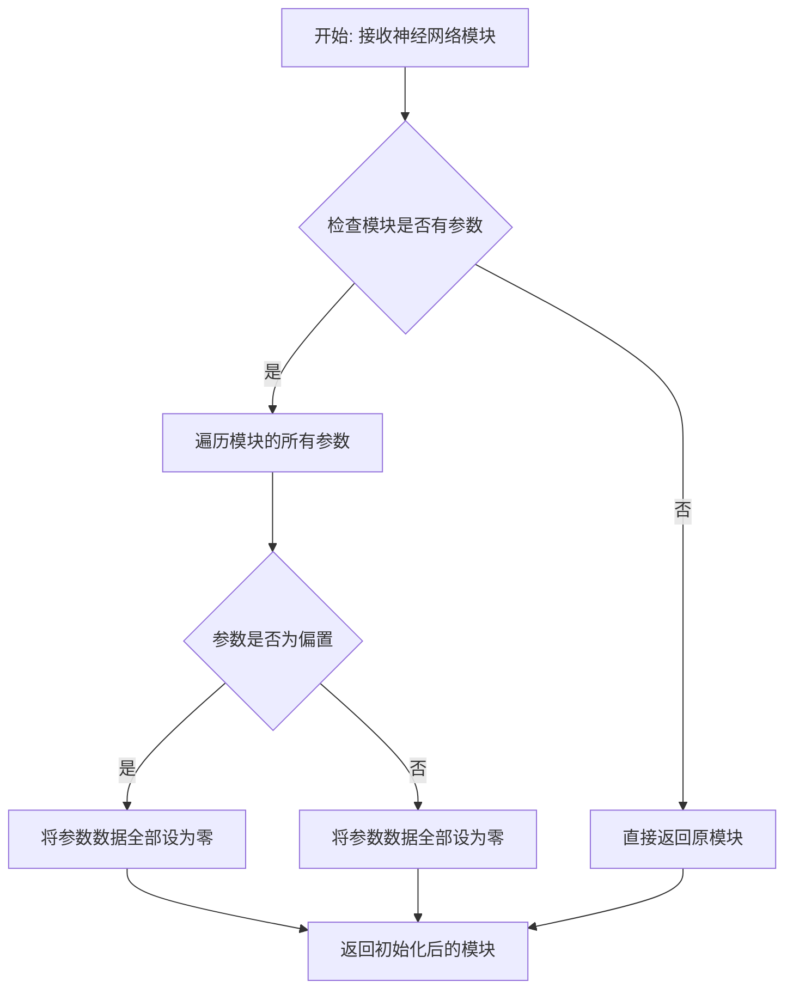
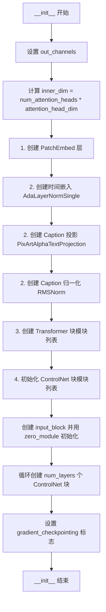

# `diffusers\src\diffusers\models\controlnets\controlnet_sana.py` 详细设计文档

这是 Hugging Face Diffusers 库中的 SanaControlNetModel 实现，用于图像生成任务中的 ControlNet 功能。该模型接收图像 latent、文本编码和时间步作为输入，通过 transformer blocks 和 controlnet blocks 处理后，输出多尺度特征图以指导主模型生成图像。

## 整体流程

```mermaid
graph TD
A[输入: hidden_states, encoder_hidden_states, timestep, controlnet_cond] --> B[Patch Embedding]
B --> C[添加 input_block 处理的 controlnet_cond]
C --> D[Time Embedding: AdaLayerNormSingle]
D --> E[Caption Projection + Norm]
E --> F{是否启用梯度检查点?}
F -- 是 --> G[逐个执行 transformer_blocks (梯度检查点模式)]
F -- 否 --> H[逐个执行 transformer_blocks (普通模式)]
G --> I[收集 block_res_samples]
H --> I
I --> J[通过 controlnet_blocks 处理]
J --> K[应用 conditioning_scale]
K --> L[输出 SanaControlNetOutput]
```

## 类结构

```
ModelMixin (基类)
├── SanaControlNetModel (主类)
│   ├── AttentionMixin
│   ├── ConfigMixin
│   └── PeftAdapterMixin
```

## 全局变量及字段


### `logger`
    
用于记录模块日志的日志记录器对象

类型：`logging.Logger`
    


### `SanaControlNetOutput.controlnet_block_samples`
    
存储控制网络中间块输出的张量元组，用于传递给主网络进行特征融合

类型：`tuple[torch.Tensor]`
    


### `SanaControlNetModel.patch_embed`
    
补丁嵌入层，将输入图像转换为补丁序列并进行位置编码嵌入

类型：`PatchEmbed`
    


### `SanaControlNetModel.time_embed`
    
自适应时间嵌入层，根据时间步长动态调整归一化参数

类型：`AdaLayerNormSingle`
    


### `SanaControlNetModel.caption_projection`
    
标题投影层，将文本特征映射到与图像特征相同的维度空间

类型：`PixArtAlphaTextProjection`
    


### `SanaControlNetModel.caption_norm`
    
标题特征归一化层，对文本嵌入进行均方根归一化处理

类型：`RMSNorm`
    


### `SanaControlNetModel.transformer_blocks`
    
Transformer块模块列表，包含多个SanaTransformerBlock用于多层特征变换

类型：`nn.ModuleList[SanaTransformerBlock]`
    


### `SanaControlNetModel.controlnet_blocks`
    
控制网络块模块列表，用于从中间特征中提取控制信号并经过零初始化

类型：`nn.ModuleList[nn.Linear]`
    


### `SanaControlNetModel.input_block`
    
输入块线性层，对条件输入进行初步特征变换并经过零初始化

类型：`nn.Linear`
    


### `SanaControlNetModel.gradient_checkpointing`
    
梯度检查点标志，控制是否使用梯度检查点技术以节省显存

类型：`bool`
    
    

## 全局函数及方法


### `zero_module`

`zero_module` 是一个工具函数，用于将神经网络模块的所有参数（权重和偏置）初始化为零。在 SanaControlNetModel 中，该函数用于初始化 `input_block` 和 `controlnet_blocks` 中的线性层，以确保 ControlNet 块的输出在初始时不会对主模型产生额外的影响，这通常用于 ControlNet 与主模型的特征融合场景。

参数：

-  `module`：`torch.nn.Module`，需要进行零初始化的神经网络模块（如 `nn.Linear`）

返回值：`torch.nn.Module`，返回参数被初始化为零的模块（原地修改）

#### 流程图



#### 带注释源码

```python
# 以下为基于代码导入和典型实现的推断源码
# 源码位于: src/diffusers/models/controlnet.py (推断位置)

def zero_module(module):
    """
    将神经网络模块的所有参数初始化为零。
    
    这个函数通常用于 ControlNet 中，将某些层的权重初始化为零，
    以确保在训练初期 ControlNet 的输出对主模型的影响最小，
    类似于 Neural Entity Representation 中的 padding 概念。
    
    参数:
        module: 需要进行零初始化的 PyTorch 模块
        
    返回:
        返回参数被初始化为零的同一模块（原地修改）
    """
    # 遍历模块的所有参数（权重矩阵和偏置向量）
    for param in module.parameters():
        # 将参数数据初始化为零张量
        # 保持原有的 dtype 和 device 属性不变
        param.data.zero_()
    
    # 返回已初始化的模块（注意：不是返回副本，而是原地修改）
    return module
```

#### 使用示例（在 SanaControlNetModel 中）

```python
# 在 SanaControlNetModel.__init__ 中的使用方式

# 初始化输入块，使用零初始化
self.input_block = zero_module(nn.Linear(inner_dim, inner_dim))

# 为每个 transformer 层创建对应的 controlnet 块，并零初始化
for _ in range(len(self.transformer_blocks)):
    controlnet_block = nn.Linear(inner_dim, inner_dim)
    controlnet_block = zero_module(controlnet_block)
    self.controlnet_blocks.append(controlnet_block)
```

#### 设计意图与约束

1. **设计目标**：确保 ControlNet 的输出在训练初期为零，使模型能够渐进式学习 ControlNet 的贡献
2. **约束条件**：只初始化 `torch.nn.Module` 的可学习参数，不修改模块结构
3. **零初始化的作用**：防止 ControlNet 在训练初期引入不必要的偏移量，允许主模型和 ControlNet 逐步学习如何融合特征


### `SanaControlNetModel.__init__`

这是 SanaControlNetModel 类的构造函数，负责初始化 ControlNet 模型的所有组件，包括Patch嵌入层、时间嵌入层、 caption 投影层、Transformer 块以及 ControlNet 块，并配置模型的各项超参数。

参数：

- `in_channels`：`int`，输入通道数，默认为 32
- `out_channels`：`int | None`，输出通道数，默认为 None（等同于 in_channels）
- `num_attention_heads`：`int`，注意力头数量，默认为 70
- `attention_head_dim`：`int`，注意力头维度，默认为 32
- `num_layers`：`int`，Transformer 块层数，默认为 7
- `num_cross_attention_heads`：`int | None`，交叉注意力头数量，默认为 20
- `cross_attention_head_dim`：`int | None`，交叉注意力头维度，默认为 112
- `cross_attention_dim`：`int | None`，交叉注意力维度，默认为 2240
- `caption_channels`：`int`，caption 特征通道数，默认为 2304
- `mlp_ratio`：`float`，MLP 扩展比率，默认为 2.5
- `dropout`：`float`，Dropout 概率，默认为 0.0
- `attention_bias`：`bool`，是否使用注意力偏置，默认为 False
- `sample_size`：`int`，输入样本的空间尺寸，默认为 32
- `patch_size`：`int`，Patch 嵌入的 patch 大小，默认为 1
- `norm_elementwise_affine`：`bool`，是否使用逐元素仿射归一化，默认为 False
- `norm_eps`：`float`，归一化层 epsilon 值，默认为 1e-6
- `interpolation_scale`：`int | None`，位置嵌入插值缩放因子，默认为 None

返回值：`None`，构造函数无返回值

#### 流程图



#### 带注释源码

```python
@register_to_config
def __init__(
    self,
    in_channels: int = 32,
    out_channels: int | None = 32,
    num_attention_heads: int = 70,
    attention_head_dim: int = 32,
    num_layers: int = 7,
    num_cross_attention_heads: int | None = 20,
    cross_attention_head_dim: int | None = 112,
    cross_attention_dim: int | None = 2240,
    caption_channels: int = 2304,
    mlp_ratio: float = 2.5,
    dropout: float = 0.0,
    attention_bias: bool = False,
    sample_size: int = 32,
    patch_size: int = 1,
    norm_elementwise_affine: bool = False,
    norm_eps: float = 1e-6,
    interpolation_scale: int | None = None,
) -> None:
    """初始化 SanaControlNetModel 模型"""
    super().__init__()  # 调用父类初始化方法

    # 如果未指定输出通道数，则使用输入通道数
    out_channels = out_channels or in_channels
    # 计算内部维度：注意力头数 × 注意力头维度
    inner_dim = num_attention_heads * attention_head_dim

    # 1. Patch Embedding: 将输入图像转换为 patch 序列
    self.patch_embed = PatchEmbed(
        height=sample_size,
        width=sample_size,
        patch_size=patch_size,
        in_channels=in_channels,
        embed_dim=inner_dim,
        interpolation_scale=interpolation_scale,
        pos_embed_type="sincos" if interpolation_scale is not None else None,
    )

    # 2. Additional condition embeddings: 条件嵌入层
    # 时间嵌入层：AdaLayerNormSingle 用于注入时间步信息
    self.time_embed = AdaLayerNormSingle(inner_dim)

    # Caption 投影层：将文本特征投影到模型空间
    self.caption_projection = PixArtAlphaTextProjection(in_features=caption_channels, hidden_size=inner_dim)
    # Caption 特征归一化层
    self.caption_norm = RMSNorm(inner_dim, eps=1e-5, elementwise_affine=True)

    # 3. Transformer blocks: 创建多个 Transformer 块
    self.transformer_blocks = nn.ModuleList(
        [
            SanaTransformerBlock(
                inner_dim,
                num_attention_heads,
                attention_head_dim,
                dropout=dropout,
                num_cross_attention_heads=num_cross_attention_heads,
                cross_attention_head_dim=cross_attention_head_dim,
                cross_attention_dim=cross_attention_dim,
                attention_bias=attention_bias,
                norm_elementwise_affine=norm_elementwise_affine,
                norm_eps=norm_eps,
                mlp_ratio=mlp_ratio,
            )
            for _ in range(num_layers)
        ]
    )

    # controlnet_blocks: 初始化 ControlNet 块列表
    self.controlnet_blocks = nn.ModuleList([])

    # 输入块：用于处理 ControlNet 条件输入
    self.input_block = zero_module(nn.Linear(inner_dim, inner_dim))
    # 为每个 Transformer 层创建对应的 ControlNet 块
    for _ in range(len(self.transformer_blocks)):
        controlnet_block = nn.Linear(inner_dim, inner_dim)
        # 使用 zero_module 将权重初始化为零，用于渐进式训练
        controlnet_block = zero_module(controlnet_block)
        self.controlnet_blocks.append(controlnet_block)

    # 梯度检查点标志：用于节省显存
    self.gradient_checkpointing = False
```


### `SanaControlNetModel.forward`

这是 SanaControlNetModel 类的前向传播方法，用于执行 ControlNet 的推理过程。该方法接收隐藏状态、时间步、编码器隐藏状态等输入，通过 patch 嵌入、Transformer 块和 ControlNet 块处理后，输出中间层的特征样本，这些样本可以用于条件图像生成任务中的 ControlNet 控制。

参数：

- `hidden_states`：`torch.Tensor`，输入的图像隐藏状态，形状为 [batch, channels, height, width]
- `encoder_hidden_states`：`torch.Tensor`，编码器的隐藏状态（文本嵌入），形状为 [batch, seq_len, hidden_dim]
- `timestep`：`torch.LongTensor`，扩散过程的时间步，用于时间嵌入
- `controlnet_cond`：`torch.Tensor`，ControlNet 的条件输入，用于提供额外的控制信号
- `conditioning_scale`：`float = 1.0`，条件缩放因子，用于调整 ControlNet 输出的权重
- `encoder_attention_mask`：`torch.Tensor | None = None`，编码器的注意力掩码，用于控制文本token的注意力
- `attention_mask`：`torch.Tensor | None = None`，输入的注意力掩码，用于控制图像token的注意力
- `attention_kwargs`：`dict[str, Any] | None = None`，额外的注意力参数，如 LoRA 相关的配置
- `return_dict`：`bool = True`，是否返回字典格式的输出

返回值：`tuple[torch.Tensor, ...] | Transformer2DModelOutput`，返回 ControlNet 块的中间输出样本元组，或者包含控制网络块的 SanaControlNetOutput 对象

#### 流程图

```mermaid
flowchart TD
    A[开始 forward] --> B{attention_mask 是否存在且为2维?}
    B -->|是| C[将mask转换为bias: (1-mask)*-10000]
    C --> D[添加singleton query_tokens维度]
    B -->|否| E{encoder_attention_mask 是否存在且为2维?}
    E -->|是| F[将encoder mask转换为bias]
    F --> G[添加singleton query_tokens维度]
    E -->|否| H[获取hidden_states形状信息]
    H --> I[执行patch_embed]
    I --> J[对controlnet_cond执行patch_embed并加上input_block]
    J --> K[执行time_embed获取timestep和embedded_timestep]
    K --> L[执行caption_projection和caption_norm]
    L --> M{是否启用gradient_checkpointing?}
    M -->|是| N[遍历transformer_blocks并使用gradient_checkpointing]
    N --> O[收集block_res_samples]
    M -->|否| P[遍历transformer_blocks正常执行]
    P --> O
    O --> Q[遍历block_res_samples和controlnet_blocks]
    Q --> R[对每个样本执行controlnet_block]
    R --> S[收集controlnet_block_res_samples]
    S --> T{conditioning_scale != 1.0?}
    T -->|是| U[对每个样本乘以conditioning_scale]
    T -->|否| V{return_dict = True?}
    U --> V
    V -->|是| W[返回SanaControlNetOutput对象]
    V -->|否| X[返回tuple]
    W --> Y[结束]
    X --> Y
```

#### 带注释源码

```python
@apply_lora_scale("attention_kwargs")
def forward(
    self,
    hidden_states: torch.Tensor,
    encoder_hidden_states: torch.Tensor,
    timestep: torch.LongTensor,
    controlnet_cond: torch.Tensor,
    conditioning_scale: float = 1.0,
    encoder_attention_mask: torch.Tensor | None = None,
    attention_mask: torch.Tensor | None = None,
    attention_kwargs: dict[str, Any] | None = None,
    return_dict: bool = True,
) -> tuple[torch.Tensor, ...] | Transformer2DModelOutput:
    # 确保attention_mask是一个bias形式，并且有一个singleton query_tokens维度
    # 如果我们从UNet2DConditionModel#forward过来可能已经转换过了
    # 通过检查维度数来判断; 如果ndim == 2: 是一个mask而不是bias
    # 期望mask形状: [batch, key_tokens]
    # 添加singleton query_tokens维度: [batch, 1, key_tokens]
    # 这有助于将mask作为bias广播到attention scores，attention scores的形状可能是:
    #   [batch, heads, query_tokens, key_tokens] (例如 torch sdp attn)
    #   [batch * heads, query_tokens, key_tokens] (例如 xformers 或 classic attn)
    if attention_mask is not None and attention_mask.ndim == 2:
        # 假设mask表示为:
        #   (1 = keep,      0 = discard)
        # 将mask转换为可以加到attention scores的bias:
        #       (keep = +0,     discard = -10000.0)
        attention_mask = (1 - attention_mask.to(hidden_states.dtype)) * -10000.0
        attention_mask = attention_mask.unsqueeze(1)

    # 按照与attention_mask相同的方式转换encoder_attention_mask为bias
    if encoder_attention_mask is not None and encoder_attention_mask.ndim == 2:
        encoder_attention_mask = (1 - encoder_attention_mask.to(hidden_states.dtype)) * -10000.0
        encoder_attention_mask = encoder_attention_mask.unsqueeze(1)

    # 1. Input - 获取输入维度信息并进行patch嵌入
    batch_size, num_channels, height, width = hidden_states.shape
    p = self.config.patch_size
    post_patch_height, post_patch_width = height // p, width // p

    # 对输入hidden_states进行patch嵌入
    hidden_states = self.patch_embed(hidden_states)
    # 对controlnet条件进行patch嵌入并通过input_block处理后加到hidden_states上
    hidden_states = hidden_states + self.input_block(self.patch_embed(controlnet_cond.to(hidden_states.dtype)))

    # 对timestep进行时间嵌入，获取时间步和嵌入后的时间步
    timestep, embedded_timestep = self.time_embed(
        timestep, batch_size=batch_size, hidden_dtype=hidden_states.dtype
    )

    # 对encoder_hidden_states（文本嵌入）进行caption投影和规范化
    encoder_hidden_states = self.caption_projection(encoder_hidden_states)
    encoder_hidden_states = encoder_hidden_states.view(batch_size, -1, hidden_states.shape[-1])
    encoder_hidden_states = self.caption_norm(encoder_hidden_states)

    # 2. Transformer blocks - 通过Transformer块处理
    block_res_samples = ()
    if torch.is_grad_enabled() and self.gradient_checkpointing:
        # 使用gradient checkpointing来节省显存
        for block in self.transformer_blocks:
            hidden_states = self._gradient_checkpointing_func(
                block,
                hidden_states,
                attention_mask,
                encoder_hidden_states,
                encoder_attention_mask,
                timestep,
                post_patch_height,
                post_patch_width,
            )
            block_res_samples = block_res_samples + (hidden_states,)
    else:
        # 正常前向传播
        for block in self.transformer_blocks:
            hidden_states = block(
                hidden_states,
                attention_mask,
                encoder_hidden_states,
                encoder_attention_mask,
                timestep,
                post_patch_height,
                post_patch_width,
            )
            block_res_samples = block_res_samples + (hidden_states,)

    # 3. ControlNet blocks - 通过ControlNet块处理中间特征
    controlnet_block_res_samples = ()
    for block_res_sample, controlnet_block in zip(block_res_samples, self.controlnet_blocks):
        block_res_sample = controlnet_block(block_res_sample)
        controlnet_block_res_samples = controlnet_block_res_samples + (block_res_sample,)

    # 应用条件缩放因子
    controlnet_block_res_samples = [sample * conditioning_scale for sample in controlnet_block_res_samples]

    # 根据return_dict决定返回格式
    if not return_dict:
        return (controlnet_block_res_samples,)

    # 返回包含控制网络块样本的输出对象
    return SanaControlNetOutput(controlnet_block_res_samples=controlnet_block_res_samples)
```

## 关键组件


### 张量索引与惰性加载

代码通过 `torch.is_grad_enabled()` 和 `gradient_checkpointing` 标志实现梯度检查点（Gradient Checkpointing），这是一种惰性加载技术。它只在需要时计算中间激活值，通过 `self._gradient_checkpointing_func` 包装的模块执行，以显存换计算时间。控制网络块（controlnet_blocks）采用动态构建方式，每次仅在 forward 时处理对应的 block_res_sample。

### 反量化支持

代码中多处使用 `.to(hidden_states.dtype)` 进行类型转换，包括将 `controlnet_cond` 转换为与 hidden_states 相同的数据类型，以及将 attention_mask 和 encoder_attention_mask 转换为隐藏状态的 dtype。这确保了在混合精度训练或不同数据类型输入时能够正确处理张量类型不一致的问题。

### 量化策略

attention_mask 和 encoder_attention_mask 的处理体现了量化思维的逆向应用。代码将原始 mask（1=keep, 0=discard）转换为注意力偏置（keep=+0, discard=-10000.0），这种-10000.0的极负值在softmax后近似于零，从而实现对无效token的"量化屏蔽"效果。

### SanaControlNetOutput

输出数据类，封装 `controlnet_block_samples` 元组，包含多个控制网络块的输出特征，用于后续与主网络特征进行融合。

### SanaControlNetModel

主控制网络模型类，继承自 ModelMixin、AttentionMixin、ConfigMixin 和 PeftAdapterMixin。支持梯度检查点，跳过特定层的类型转换。

### Patch Embedding 组件

由 `patch_embed`（PatchEmbed）和 `input_block`（zero_module nn.Linear）组成，负责将输入图像和条件图像转换为 patch 序列并添加位置嵌入。

### 时间与文本嵌入组件

包括 `time_embed`（AdaLayerNormSingle）用于时间步嵌入、`caption_projection`（PixArtAlphaTextProjection）用于文本特征投影、`caption_norm`（RMSNorm）用于文本特征归一化。

### Transformer 块组件

`transformer_blocks` 是 SanaTransformerBlock 的模块列表，按配置数量（num_layers）动态创建，构成控制网络的核心特征提取主干。

### ControlNet 块组件

`controlnet_blocks` 是 zero_module 初始化的线性层列表，与 transformer_blocks 一一对应，用于从每个 transformer 块的输出中提取控制信号。

### 注意力掩码处理

代码对输入的二维注意力掩码进行维度扩展和偏置转换，使其能够广播到注意力分数的不同形状（[batch, heads, query_tokens, key_tokens] 或 [batch*heads, query_tokens, key_tokens]）。

### 梯度检查点实现

通过 `self.gradient_checkpointing` 标志控制，在训练且启用梯度检查点时，使用 `self._gradient_checkpointing_func` 包装 transformer 块的执行，实现激活值的惰性计算。


## 问题及建议


### 已知问题

- **硬编码的eps值**: `self.caption_norm = RMSNorm(inner_dim, eps=1e-5, elementwise_affine=True)` 中eps值硬编码为1e-5，而类中已有`norm_eps`参数可配置，造成参数不一致
- **未使用的attention_kwargs参数**: `forward`方法接收`attention_kwargs`参数但未实际传递给transformer blocks，仅用于LoRA scale装饰器
- **魔法数字**: 注意力掩码转换中使用`-10000.0`作为硬编码的屏蔽值，缺乏常量定义
- **梯度 checkpointing 中的元组累加**: 在`block_res_samples = block_res_samples + (hidden_states,)`循环中重复创建元组，效率较低
- **controlnet_cond处理逻辑**: `self.patch_embed(controlnet_cond.to(hidden_states.dtype))`直接将condition通过patch_embed，与主hidden_states处理方式相同但未提供配置选项
- **缺少模型推理模式控制**: 没有显式的`enable_gradient_checkpointing()`和`disable_gradient_checkpointing()`方法

### 优化建议

- 统一使用`norm_eps`参数初始化`caption_norm`，或将其添加到config中
- 定义常量`ATTENTION_MASK_FILL_VALUE = -10000.0`替代魔法数字
- 考虑使用`list`替代tuple进行梯度checkpointing中的中间结果收集，最后统一转换为tuple
- 将attention_mask和encoder_attention_mask的转换逻辑抽取为私有方法以提高可读性
- 添加显式的gradient checkpointing控制方法，或在文档中说明通过`model.gradient_checkpointing = True`设置
- 评估是否需要将`controlnet_cond`的patch_embed处理抽取为可配置模块，增强模型灵活性

## 其它


### 设计目标与约束

本模块实现 Sana 模型的 ControlNet 变体，用于条件图像生成。核心目标是将预训练的 Sana Transformer 作为骨干网络，通过 ControlNet 结构提取中间层特征，为下游任务提供多尺度条件信号。设计约束包括：(1) 必须继承 ModelMixin、AttentionMixin、ConfigMixin 和 PeftAdapterMixin 以兼容 HuggingFace Diffusers 框架；(2) 支持梯度检查点以节省显存；(3) 支持 LoRA 微调机制；(4) 输入必须为 (batch, channels, height, width) 格式的 4D 张量；(5) patch_size 默认为 1，不进行空间patch化。

### 错误处理与异常设计

代码中未显式实现异常处理，主要依赖框架级别的错误传播。潜在错误场景包括：(1) 输入张量维度不匹配 - hidden_states 必须为 4D，encoder_hidden_states 必须为 3D；(2) dtype 不一致 - attention_mask 转换时可能发生类型冲突；(3) 梯度检查点启用时，backward pass 可能因保存的中间张量过多导致 OOM；(4) PeftAdapterMixin 的 attention_kwargs 参数校验。建议在 forward 方法入口添加输入形状校验和 dtype 统一处理。

### 数据流与状态机

数据流主要分为三个阶段：编码阶段、变换阶段和输出阶段。编码阶段将 hidden_states 通过 PatchEmbed 转换为序列表示，并与 controlnet_cond 投影相加；时间嵌入和文本嵌入分别通过 AdaLayerNormSingle 和 PixArtAlphaTextProjection + RMSNorm 处理。变换阶段数据流经 num_layers 个 SanaTransformerBlock，每个 block 输出的隐藏状态被保存到 block_res_samples 元组中。输出阶段将每个 block 输出通过对应的 controlnet_block 线性层，并乘以 conditioning_scale 缩放因子后输出。状态机涉及 attention_mask 和 encoder_attention_mask 从 mask 到 bias 的转换逻辑。

### 外部依赖与接口契约

核心依赖包括：(1) torch 和 torch.nn - 张量计算和神经网络模块；(2) dataclasses.dataclass - 输出数据类定义；(3) configuration_utils.ConfigMixin 和 register_to_config - 配置注册机制；(4) loaders.PeftAdapterMixin - PEFT 适配器支持；(5) attention.AttentionMixin - 注意力机制混入；(6) embeddings.PatchEmbed 和 PixArtAlphaTextProjection - 嵌入层；(7) normalization.AdaLayerNormSingle 和 RMSNorm - 归一化层；(8) transformers.SanaTransformerBlock - 核心变换块；(9) modeling_utils.ModelMixin - 模型基类；(10) loaders.LoraWeightsMixin - LoRA 权重支持；(11) utils.apply_lora_scale 和 logging - 工具函数。输出接口遵循 SanaControlNetOutput 数据类，包含 controlnet_block_samples 元组。

### 性能考虑与优化空间

性能优化点包括：(1) 梯度检查点 - 通过 _gradient_checkpointing_func 减少显存占用，适用于大 batch 场景；(2) attention_mask 和 encoder_attention_mask 的批量处理 - 使用向量化操作而非循环；(3) 控制信号处理 - controlnet_cond 仅通过一个线性层处理，未使用复杂网络。潜在优化方向：(1) 可添加 xformers 或 Flash Attention 支持以加速自注意力计算；(2) 可实现 ONNX 导出优化；(3) 可考虑混合精度训练支持；(4) 可添加 JIT 编译优化。

### 配置管理与参数说明

主要配置参数包括：in_channels (默认32) - 输入通道数；out_channels (默认32) - 输出通道数；num_attention_heads (默认70) - 注意力头数；attention_head_dim (默认32) - 每个头的维度；num_layers (默认7) - Transformer 块数量；num_cross_attention_heads (默认20) - 交叉注意力头数；cross_attention_dim (默认2240) - 交叉注意力维度；caption_channels (默认2304) - 文本嵌入通道数；mlp_ratio (默认2.5) - MLP 扩展比率；dropout (默认0.0) - Dropout 概率；sample_size (默认32) - 输入样本尺寸；patch_size (默认1) - 补丁尺寸；norm_elementwise_affine (默认False) - 归一化是否使用仿射参数。所有参数通过 @register_to_config 装饰器注册，支持从配置文件加载。

### 版本兼容性与框架集成

本模块设计用于 HuggingFace Diffusers 框架，兼容以下特性：(1) ModelMixin 提供了 from_pretrained、save_pretrained 等方法；(2) ConfigMixin 支持配置序列化；(3) PeftAdapterMixin 支持 PEFT (如 LoRA) 微调；(4) _supports_gradient_checkpointing 标志启用梯度检查点；(5) _no_split_modules 指定不可分割的模块单元。版本兼容性需关注 SanaTransformerBlock 的接口变化以及 Diffusers 框架的配置加载机制变更。

### 测试策略建议

应覆盖的测试场景包括：(1) 前向传播输出形状验证 - controlnet_block_samples 数量应等于 num_layers；(2) 梯度检查点功能验证 - 确认显存节省和梯度计算正确性；(3) LoRA 微调验证 - 确认 attention_kwargs 参数正确应用；(4) 配置加载/保存 roundtrip 测试；(5) 不同输入尺寸兼容性测试；(6) dtype 混合精度测试；(7) attention_mask 和 encoder_attention_mask 处理逻辑测试。

### 安全性与伦理考量

本模块为图像生成模型的组件，自身不直接涉及用户数据处理。安全性考虑包括：(1) 模型权重来源可信度验证；(2) ControlNet 可用于生成受版权保护图像的条件控制，需在应用层添加适当的使用条款和过滤机制；(3) 推理过程中的数值稳定性 - 需处理极端 conditioning_scale 值导致的数值溢出。

    