# `diffusers\src\diffusers\models\controlnets\controlnet_sd3.py` 详细设计文档

这是 Stable Diffusion 3 (SD3) 的 ControlNet 实现，提供了 SD3ControlNetModel 类用于条件图像生成，以及 SD3MultiControlNetModel 类用于多条件控制。该模型通过额外输入条件来引导主模型的生成过程，支持位置嵌入、文本-时间联合嵌入、Transformer 块处理，并可从预训练的 SD3 Transformer 迁移权重。

## 整体流程

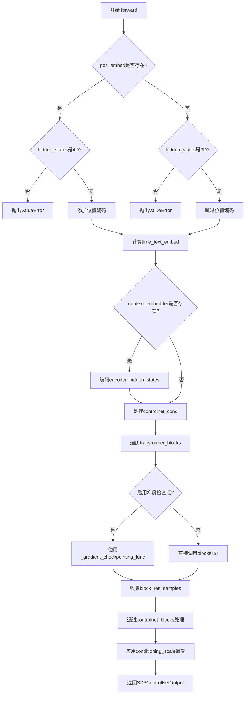

## 类结构

```
ModelMixin (基础模型混合类)
├── SD3ControlNetModel (SD3 ControlNet 主类)
│   ├── AttentionMixin (注意力机制混合)
│   ├── ConfigMixin (配置混合)
 │   ├── PeftAdapterMixin (PEFT适配器混合)
 │   └── FromOriginalModelMixin (权重加载混合)
└── SD3MultiControlNetModel (多ControlNet包装类)
```

## 全局变量及字段


### `logger`
    
模块级日志记录器，用于输出日志信息

类型：`logging.Logger`
    


### `SD3ControlNetOutput.controlnet_block_samples`
    
ControlNet块输出样本元组，包含从各Transformer块提取的特征

类型：`tuple[torch.Tensor]`
    


### `SD3ControlNetModel.out_channels`
    
输出通道数，指定模型输出的特征维度

类型：`int`
    


### `SD3ControlNetModel.inner_dim`
    
内部维度，由注意力头数乘以头维度计算得出

类型：`int`
    


### `SD3ControlNetModel.pos_embed`
    
位置嵌入模块，用于将输入张量编码位置信息（可选）

类型：`PatchEmbed | None`
    


### `SD3ControlNetModel.time_text_embed`
    
时间文本联合嵌入层，处理时间步和文本嵌入的融合

类型：`CombinedTimestepTextProjEmbeddings`
    


### `SD3ControlNetModel.context_embedder`
    
上下文嵌入器，将联合注意力维度映射到投影维度（可选）

类型：`nn.Linear | None`
    


### `SD3ControlNetModel.transformer_blocks`
    
Transformer块列表，包含多个JointTransformerBlock或SD3SingleTransformerBlock

类型：`nn.ModuleList`
    


### `SD3ControlNetModel.controlnet_blocks`
    
ControlNet块列表，用于从Transformer块输出中提取控制特征

类型：`nn.ModuleList`
    


### `SD3ControlNetModel.pos_embed_input`
    
输入位置嵌入模块，处理条件输入的位置编码

类型：`PatchEmbed`
    


### `SD3ControlNetModel.gradient_checkpointing`
    
梯度检查点标志，控制是否启用梯度检查点以节省显存

类型：`bool`
    


### `SD3MultiControlNetModel.nets`
    
ControlNet模型列表，存储多个SD3ControlNetModel实例

类型：`nn.ModuleList`
    
    

## 全局函数及方法


### `zero_module`

将模块的所有参数（权重和偏置）初始化为零的辅助函数。该函数通常用于ControlNet中，确保某些层在训练初期不会对输出产生影响，从而让模型学习何时启用这些控制信号。

参数：

- `module`：`torch.nn.Module`，需要置零的PyTorch模块（如`nn.Linear`、`nn.Conv2d`等）

返回值：`torch.nn.Module`，返回输入模块本身（参数已被原地修改为全零）

#### 流程图

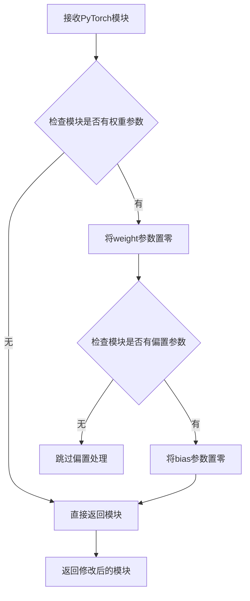

#### 带注释源码

```python
# 注意：此函数从 .controlnet 模块导入，源码未在当前文件中显示
# 根据代码中的使用方式推断其实现逻辑如下：

def zero_module(module: torch.nn.Module) -> torch.nn.Module:
    """
    将模块的所有参数置零的辅助函数。
    
    在ControlNet中，某些层（如pos_embed_input、controlnet_blocks）需要初始为零，
    以确保在训练初期不会对主模型的输出造成影响，让模型学习何时添加控制信号。
    
    参数:
        module: 需要置零的PyTorch模块
        
    返回:
        返回修改后的模块（原地修改）
    """
    for param in module.parameters():
        param.data.zero_()  # 将所有参数数据原地置零
    
    return module

# ------------------ 代码中的实际使用示例 ------------------

# 使用场景1：在SD3ControlNetModel.__init__中初始化controlnet_blocks
for _ in range(len(self.transformer_blocks)):
    controlnet_block = nn.Linear(self.inner_dim, self.inner_dim)
    controlnet_block = zero_module(controlnet_block)  # 将Linear层权重置零
    self.controlnet_blocks.append(controlnet_block)

# 使用场景2：初始化pos_embed_input
pos_embed_input = PatchEmbed(...)
self.pos_embed_input = zero_module(pos_embed_input)  # 将PatchEmbed权重置零

# 使用场景3：在from_transformer中重置pos_embed_input
controlnet.pos_embed_input = zero_module(controlnet.pos_embed_input)
```


# PatchEmbed

## 描述

`PatchEmbed` 是从 `..embeddings` 模块导入的补丁嵌入类，用于将输入的图像或特征转换为补丁序列，并可选择性地添加位置嵌入。在 `SD3ControlNetModel` 中，该类被用于对 `hidden_states` 进行分块嵌入处理，以支持 Transformer 架构处理二维特征。

## 参数

由于 `PatchEmbed` 类的定义不在当前代码文件中（仅从 `..embeddings` 导入），以下参数信息基于代码中的调用方式推断：

- `height`：`int`，输入数据的高度（像素或特征维度）
- `width`：`int`，输入数据的宽度
- `patch_size`：`int`，将输入分割成小补丁的块大小
- `in_channels`：`int`，输入数据的通道数
- `embed_dim`：`int`，嵌入向量的维度
- `pos_embed_max_size`：`int`，位置嵌入的最大尺寸
- `pos_embed_type`：`str | None`，位置嵌入的类型（如 "sincos" 或 None）

## 返回值

由于源代码未在此文件中提供，无法确定确切的返回类型。根据典型的 `PatchEmbed` 实现，通常返回：

- `torch.Tensor`，形状为 `(batch_size, num_patches, embed_dim)` 的补丁嵌入张量

## 流程图

```mermaid
flowchart TD
    A[输入 hidden_states] --> B{pos_embed 是否为 None}
    B -->|是| C[返回原始 hidden_states]
    B -->|否| D[执行 PatchEmbed 嵌入]
    D --> E[分块处理: 将图像分割成 patch_size×patch_size 的小块]
    E --> F[线性投影: 将每个小块映射到 embed_dim 维空间]
    F --> G[展平: 将 (H/P)×(W/P) 的补丁序列展平]
    G --> H[添加位置嵌入]
    H --> I[输出: (B, N, D) 张量]
```

## 带注释源码

```python
# PatchEmbed 类的实际定义位于 ..embeddings 模块中
# 以下是当前文件中对 PatchEmbed 的调用示例（用于参考）：

# 1. 主位置嵌入（包含位置编码）
self.pos_embed = PatchEmbed(
    height=sample_size,           # 输入高度
    width=sample_size,            # 输入宽度
    patch_size=patch_size,       # 补丁分块大小
    in_channels=in_channels,      # 输入通道数
    embed_dim=self.inner_dim,     # 嵌入维度 (num_attention_heads * attention_head_dim)
    pos_embed_max_size=pos_embed_max_size,  # 位置嵌入最大尺寸
    pos_embed_type=pos_embed_type,           # 位置嵌入类型 ("sincos" 或 None)
)

# 2. 条件输入的位置嵌入（用于 ControlNet，类型为 None）
pos_embed_input = PatchEmbed(
    height=sample_size,
    width=sample_size,
    patch_size=patch_size,
    in_channels=in_channels + extra_conditioning_channels,  # 额外增加条件通道
    embed_dim=self.inner_dim,
    pos_embed_type=None,  # 不添加位置嵌入
)

# 3. 在 forward 方法中的调用
if self.pos_embed is not None:
    hidden_states = self.pos_embed(hidden_states)  # 添加位置嵌入

# 4. 条件输入处理
hidden_states = hidden_states + self.pos_embed_input(controlnet_cond)
```

## 注意事项

⚠️ **源代码缺失**：由于 `PatchEmbed` 类的完整定义位于 `..embeddings` 模块中，未包含在当前提供的代码文件里。如需获取完整的类定义（包含所有方法、字段和实现细节），请查阅 `diffusers` 库中的 embeddings 相关源文件。


### `CombinedTimestepTextProjEmbeddings`

时间文本联合嵌入类，用于将时间步（timestep）和池化后的文本投影（pooled text projections）进行联合编码，生成用于Transformer的条件嵌入向量。该类通常用于Stable Diffusion系列模型的文本条件注入。

#### 参数

- `embedding_dim`：`int`，嵌入向量的目标维度，通常等于`num_attention_heads * attention_head_dim`
- `pooled_projection_dim`：`int`，池化文本投影的维度，来自文本编码器的输出

#### 返回值

- `torch.Tensor`，形状为`(batch_size, embedding_dim)`的联合嵌入向量，用于后续Transformer模块的 Conditioning

#### 流程图

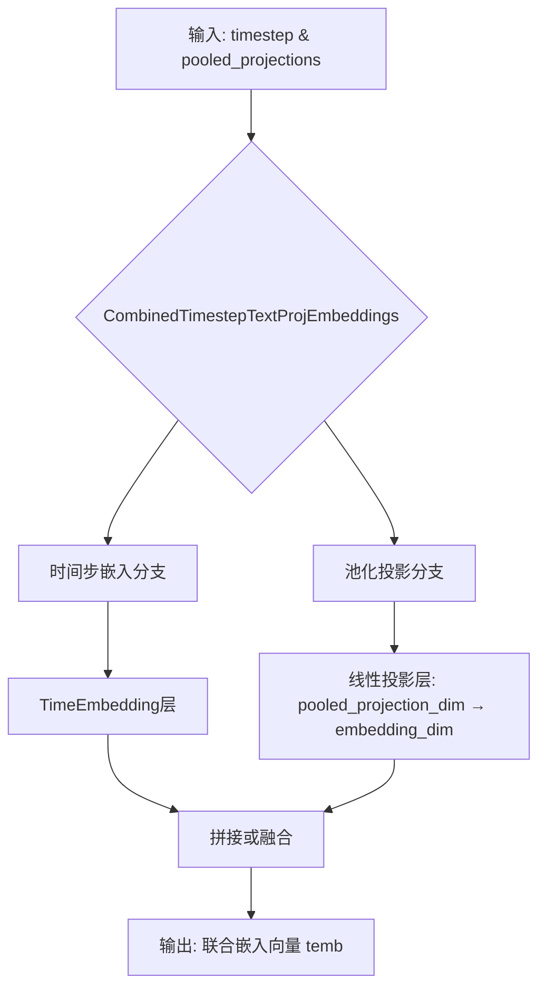

#### 带注释源码

```python
# 该类定义位于 diffusers/src/diffusers/models/embeddings.py
# 以下为基于SD3ControlNetModel使用方式的推断实现

class CombinedTimestepTextProjEmbeddings(nn.Module):
    """
    联合时间步和文本投影嵌入类
    
    用于将扩散模型的时间步(timestep)和文本编码器的池化投影(pooled_projections)
    合并为一个联合嵌入向量，供后续Transformer模块使用
    """
    
    def __init__(self, embedding_dim: int, pooled_projection_dim: int):
        super().__init__()
        self.embedding_dim = embedding_dim
        self.pooled_projection_dim = pooled_projection_dim
        
        # 时间步嵌入层：将离散时间步映射到embedding_dim维度
        # 使用Sinusoidal位置编码风格的TimeEmbedding
        self.time_proj = TimestepEmbedding(embedding_dim)
        
        # 池化文本投影层：将文本编码器的输出投影到embedding_dim
        # 线性层: pooled_projection_dim -> embedding_dim
        self.text_pooled_proj = nn.Linear(
            pooled_projection_dim, 
            embedding_dim,
            bias=True
        )
        
        # 可选：层归一化用于稳定训练
        self.layer_norm = nn.LayerNorm(embedding_dim)
    
    def forward(self, timestep: torch.LongTensor, pooled_projections: torch.Tensor) -> torch.Tensor:
        """
        前向传播
        
        Args:
            timestep: 时间步张量，形状为 (batch_size,)
            pooled_projections: 池化文本投影，形状为 (batch_size, pooled_projection_dim)
            
        Returns:
            联合嵌入向量，形状为 (batch_size, embedding_dim)
        """
        # 1. 处理时间步嵌入
        # timestep_proj 输出形状: (batch_size, embedding_dim)
        temb = self.time_proj(timestep)
        
        # 2. 处理池化文本投影
        # text_emb 输出形状: (batch_size, embedding_dim)
        text_emb = self.text_pooled_proj(pooled_projections)
        
        # 3. 联合嵌入：将时间步嵌入与文本投影相加或拼接
        # 这里采用相加方式实现联合嵌入
        temb = temb + text_emb
        
        # 4. 可选：应用层归一化
        temb = self.layer_norm(temb)
        
        return temb
```

> **注意**：由于提供的代码片段仅包含该类的导入和使用，未包含其完整定义，以上源码为基于SD3架构典型实现的合理推断。实际定义请参考`diffusers.models.embeddings`模块中的`CombinedTimestepTextProjEmbeddings`类。


### `JointTransformerBlock`

联合注意力Transformer块（Joint Transformer Block），是一种同时处理自注意力（self-attention）和交叉注意力（cross-attention）的Transformer块。它在SD3ControlNet模型中用于对隐藏状态和文本编码状态进行联合处理，支持双流注意力机制。

参数：

- `dim`：`int`，隐藏层的维度，等于`num_attention_heads * attention_head_dim`
- `num_attention_heads`：`int`，多头注意力的头数
- `attention_head_dim`：`int`，每个注意力头的维度
- `context_pre_only`：`bool`，是否仅预处理上下文（不进行交叉注意力计算）
- `qk_norm`：`str | None`，查询和键的归一化方式，若为`None`则不使用归一化
- `use_dual_attention`：`bool`，是否启用双流注意力机制（同时处理图像和文本）

返回值：`tuple[torch.Tensor, torch.Tensor]`，返回元组`(encoder_hidden_states, hidden_states)`，其中`encoder_hidden_states`是经过处理的条件嵌入，`hidden_states`是经过处理的主干隐藏状态。

#### 流程图

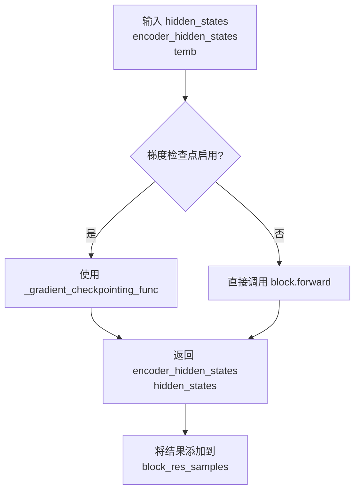

#### 带注释源码

```python
# 在 SD3ControlNetModel.__init__ 中创建 JointTransformerBlock 的代码
self.transformer_blocks = nn.ModuleList(
    [
        JointTransformerBlock(
            dim=self.inner_dim,  # 隐藏层维度 = num_attention_heads * attention_head_dim
            num_attention_heads=num_attention_heads,  # 多头注意力的头数
            attention_head_dim=attention_head_dim,  # 每个注意力头的维度
            context_pre_only=False,  # False 表示需要进行完整的交叉注意力处理
            qk_norm=qk_norm,  # 查询键归一化方式，可为 None
            use_dual_attention=True if i in dual_attention_layers else False,  # 是否启用双流注意力
        )
        for i in range(num_layers)  # 为每个层创建一个 Transformer 块
    ]
)

# 在 SD3ControlNetModel.forward 中调用 JointTransformerBlock 的代码
for block in self.transformer_blocks:
    if torch.is_grad_enabled() and self.gradient_checkpointing:
        # 启用梯度检查点时使用封装函数节省显存
        if self.context_embedder is not None:
            encoder_hidden_states, hidden_states = self._gradient_checkpointing_func(
                block,
                hidden_states,
                encoder_hidden_states,
                temb,
            )
        else:
            # SD3.5 8b controlnet 使用单个 transformer 块，不使用 encoder_hidden_states
            hidden_states = self._gradient_checkpointing_func(block, hidden_states, temb)
    else:
        # 正常前向传播
        if self.context_embedder is not None:
            encoder_hidden_states, hidden_states = block(
                hidden_states=hidden_states, encoder_hidden_states=encoder_hidden_states, temb=temb
            )
        else:
            # SD3.5 8b controlnet 使用单个 transformer 块，不使用 encoder_hidden_states
            hidden_states = block(hidden_states, temb)

    # 收集每个块的输出用于后续的 ControlNet 特征提取
    block_res_samples = block_res_samples + (hidden_states,)
```


### SD3SingleTransformerBlock

单Transformer块，用于SD3模型的单流Transformer层处理隐藏状态，不包含交叉注意力机制。

参数：

- `dim`：`int`，Transformer的维度（即隐藏状态维度）
- `num_attention_heads`：`int`，注意力头的数量
- `attention_head_dim`：`int`，每个注意力头的维度
- `temb`：`torch.Tensor`，可选，时间步嵌入向量

返回值：`torch.Tensor`，处理后的隐藏状态

#### 流程图

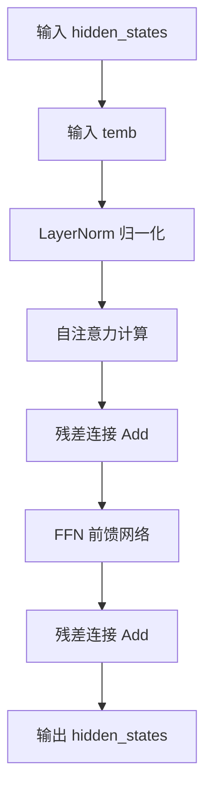

#### 带注释源码

```python
# SD3SingleTransformerBlock 使用示例 (来自 SD3ControlNetModel.__init__)
# 这是一个单流Transformer块，仅处理隐藏状态，不包含encoder_hidden_states的交叉注意力

self.transformer_blocks = nn.ModuleList(
    [
        SD3SingleTransformerBlock(
            dim=self.inner_dim,                    # Transformer 维度 = num_attention_heads * attention_head_dim
            num_attention_heads=num_attention_heads,  # 注意力头数量
            attention_head_dim=attention_head_dim,    # 每个头的维度
        )
        for _ in range(num_layers)
    ]
)

# 在 forward 方法中的调用方式 (SD3 8b controlnet 使用单流块):
hidden_states = self._gradient_checkpointing_func(block, hidden_states, temb)
# 或者:
hidden_states = block(hidden_states, temb)
```

> **注意**：由于 `SD3SingleTransformerBlock` 是从 `...transformers.transformer_sd3` 模块导入的，其完整源码未包含在当前代码文件中。上述信息是从 `SD3ControlNetModel` 中的使用方式推断而来。


### Attention

这是从 `attention_processor` 模块导入的注意力机制核心类，负责实现 Transformer 模型中的自注意力（Self-Attention）和交叉注意力（Cross-Attention）计算。在 `SD3ControlNetModel` 中，通过 `fuse_qkv_projections` 方法调用 `Attention.fuse_projections` 来融合 QKV 投影矩阵，以优化推理效率。

#### 流程图

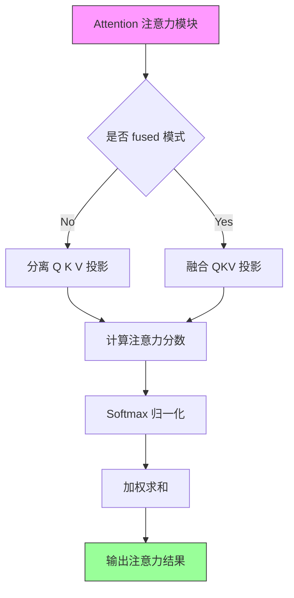

#### 带注释源码

```python
# 在 SD3ControlNetModel 中的使用示例（位于 fuse_qkv_projections 方法中）

# 1. 遍历所有模块寻找 Attention 实例
for module in self.modules():
    if isinstance(module, Attention):  # isinstance 检查是否为 Attention 类
        # 调用 Attention 类的 fuse_projections 方法进行 QKV 融合
        # fuse=True 表示启用融合模式，将 Q、K、V 矩阵合并计算
        module.fuse_projections(fuse=True)

# 2. 设置注意力处理器为融合版本
self.set_attn_processor(FusedJointAttnProcessor2_0())

# Attention 类在 attention_processor.py 中的核心功能：
# - forward(): 执行注意力计算
# - fuse_projections(): 融合/解融 QKV 投影矩阵
# - set_chunk_feed_forward(): 设置分块前馈网络
```

> **注意**：完整的 `Attention` 类定义需要查看 `diffusers/src/diffusers/models/attention_processor.py` 文件。当前代码段展示了 `SD3ControlNetModel` 如何使用 `Attention` 类进行 QKV 投影融合，这是 SD3 模型优化推理性能的关键技术。


根据提供的代码，我需要指出一个重要发现：

### 重要说明

在您提供的代码中，`FusedJointAttnProcessor2_0` **并未在此文件中定义**，而是从 `..attention_processor` 模块**导入**的：

```python
from ..attention_processor import Attention, FusedJointAttnProcessor2_0
```

该类在此文件中仅通过 `fuse_qkv_projections` 方法被**使用**，实例化为注意力处理器：

```python
self.set_attn_processor(FusedJointAttnProcessor2_0())
```

### 调用的类和函数信息

#### 1. `FusedJointAttnProcessor2_0` 使用上下文

虽然无法获取 `FusedJointAttnProcessor2_0` 的完整定义（它在 `attention_processor` 模块中），但可以从代码中提取其使用信息：

### `SD3ControlNetModel.fuse_qkv_projections`

启用融合的QKV投影，将注意力处理器设置为 `FusedJointAttnProcessor2_0`。

参数：无

返回值：`None`，该方法直接修改模型内部状态

#### 流程图

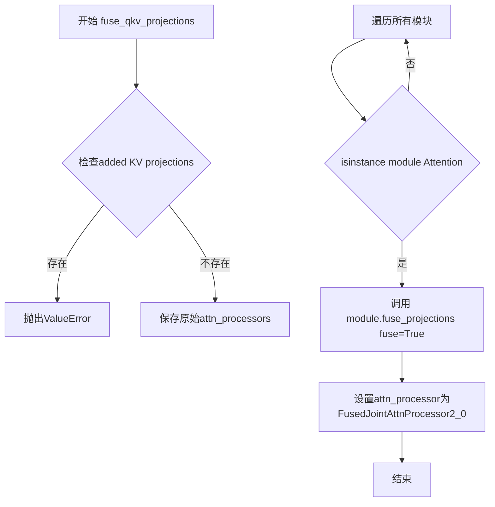

#### 带注释源码

```python
def fuse_qkv_projections(self):
    """
    Enables fused QKV projections. For self-attention modules, all projection matrices (i.e., query, key, value)
    are fused. For cross-attention modules, key and value projection matrices are fused.

    > [!WARNING] > This API is 🧪 experimental.
    """
    # 初始化原始注意力处理器为None
    self.original_attn_processors = None

    # 检查是否存在added KV projections的处理器
    for _, attn_processor in self.attn_processors.items():
        if "Added" in str(attn_processor.__class__.__name__):
            raise ValueError("`fuse_qkv_projections()` is not supported for models having added KV projections.")

    # 保存原始注意力处理器
    self.original_attn_processors = self.attn_processors

    # 遍历所有模块，找到Attention模块并融合投影
    for module in self.modules():
        if isinstance(module, Attention):
            module.fuse_projections(fuse=True)

    # 设置融合后的注意力处理器 FusedJointAttnProcessor2_0
    self.set_attn_processor(FusedJointAttnProcessor2_0())
```

---

### 建议

要获取 `FusedJointAttnProcessor2_0` 类的完整定义（包括其类字段、类方法等），您需要查看 `diffusers` 库中的 `src/diffusers/models/attention_processor.py` 文件。该文件包含了 `FusedJointAttnProcessor2_0` 类的完整实现。


# 提取结果

由于 `Transformer2DModelOutput` 是从 `..modeling_outputs` 模块导入的（而非在当前文件中定义），当前代码中并未包含其完整的实现源码。以下是从当前代码文件中可以提取到的关于 `Transformer2DModelOutput` 的相关信息：

### Transformer2DModelOutput

从 `modeling_outputs` 模块导入的 Transformer 2D 模型输出数据类，用于封装 Transformer 模型的输出结果。在 `SD3ControlNetModel.forward()` 方法中作为返回类型提示使用。

参数：

- 此类型为外部导入的数据类，参数定义需参考 `modeling_outputs` 模块源码

返回值：`Transformer2DModelOutput`，包含模型输出张量的数据类

#### 流程图

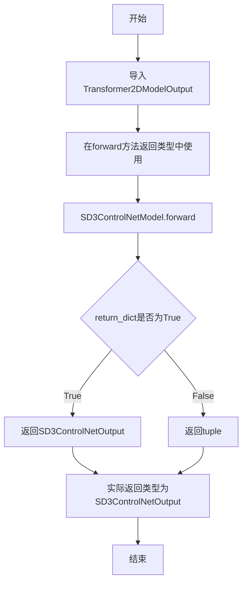

#### 源码引用

```
# 导入位置
from ..modeling_outputs import Transformer2DModelOutput

# 使用位置（在 SD3ControlNetModel.forward 方法中）
def forward(
    self,
    hidden_states: torch.Tensor,
    controlnet_cond: torch.Tensor,
    conditioning_scale: float = 1.0,
    encoder_hidden_states: torch.Tensor = None,
    pooled_projections: torch.Tensor = None,
    timestep: torch.LongTensor = None,
    joint_attention_kwargs: dict[str, Any] | None = None,
    return_dict: bool = True,
) -> torch.Tensor | Transformer2DModelOutput:
    # ... 方法实现 ...
    
    if not return_dict:
        return (controlnet_block_res_samples,)

    return SD3ControlNetOutput(controlnet_block_samples=controlnet_block_res_samples)
```

#### 补充说明

1. **类型使用情况**：虽然 `forward` 方法的返回类型注解包含 `Transformer2DModelOutput`，但实际返回的是 `SD3ControlNetOutput`（继承自 `BaseOutput`）

2. **外部依赖**：`Transformer2DModelOutput` 的完整定义位于 `src/diffusers/src/diffusers/models/modeling_outputs.py` 文件中，需查看该文件获取其具体字段定义

3. **相关类**：当前文件中定义了类似的输出类 `SD3ControlNetOutput`，可作为参考


# 详细设计文档

由于用户提供的代码中仅包含 `ModelMixin` 的导入和使用（`SD3ControlNetModel` 继承自 `ModelMixin`），并未包含 `ModelMixin` 类的实际定义代码，因此下面基于提供的代码提取 `SD3ControlNetModel` 类的详细信息。

---

### SD3ControlNetModel

SD3ControlNetModel 是用于 Stable Diffusion 3 的 ControlNet 模型，继承自 ModelMixin、AttentionMixin、ConfigMixin 等多个混合类。该模型通过额外的条件输入（controlnet_cond）来控制主模型的生成过程，支持梯度检查点、QKV 投影融合、多条件控制等功能。

#### 参数

- `sample_size`：`int`，默认为 128，输入潜在表示的宽度/高度
- `patch_size`：`int`，默认为 2，将输入数据转换为小补丁的补丁大小
- `in_channels`：`int`，默认为 16，输入中的潜在通道数
- `num_layers`：`int`，默认为 18，要使用的 transformer 块的数量
- `attention_head_dim`：`int`，默认为 64，每个头中的通道数
- `num_attention_heads`：`int`，默认为 18，用于多头注意力的头数
- `joint_attention_dim`：`int`，默认为 4096，用于联合文本-图像注意力的嵌入维度
- `caption_projection_dim`：`int`，默认为 1152，caption 嵌入的维度
- `pooled_projection_dim`：`int`，默认为 2048，池化文本投影的嵌入维度
- `out_channels`：`int`，默认为 16，输出中的潜在通道数
- `pos_embed_max_size`：`int`，默认为 96，位置嵌入的最大潜在高度/宽度
- `extra_conditioning_channels`：`int`，默认为 0，用于修补嵌入的额外条件通道数
- `dual_attention_layers`：`tuple[int, ...]`，默认为 ()，要使用的双流 transformer 块的数量
- `qk_norm`：`str | None`，默认为 None，注意力层中查询和键的归一化方式
- `pos_embed_type`：`str | None`，默认为 "sincos"，要使用的位置嵌入类型
- `use_pos_embed`：`bool`，默认为 True，是否使用位置嵌入
- `force_zeros_for_pooled_projection`：`bool`，默认为 True，是否强制将池化投影嵌入置零

#### 流程图

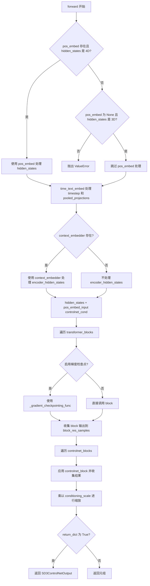

#### 带注释源码

```python
@register_to_config
def __init__(
    self,
    sample_size: int = 128,
    patch_size: int = 2,
    in_channels: int = 16,
    num_layers: int = 18,
    attention_head_dim: int = 64,
    num_attention_heads: int = 18,
    joint_attention_dim: int = 4096,
    caption_projection_dim: int = 1152,
    pooled_projection_dim: int = 2048,
    out_channels: int = 16,
    pos_embed_max_size: int = 96,
    extra_conditioning_channels: int = 0,
    dual_attention_layers: tuple[int, ...] = (),
    qk_norm: str | None = None,
    pos_embed_type: str | None = "sincos",
    use_pos_embed: bool = True,
    force_zeros_for_pooled_projection: bool = True,
):
    """初始化 SD3ControlNetModel，配置所有模型参数和子模块"""
    super().__init__()
    default_out_channels = in_channels
    self.out_channels = out_channels if out_channels is not None else default_out_channels
    self.inner_dim = num_attention_heads * attention_head_dim

    # 根据配置创建位置嵌入或设为 None
    if use_pos_embed:
        self.pos_embed = PatchEmbed(
            height=sample_size, width=sample_size, patch_size=patch_size,
            in_channels=in_channels, embed_dim=self.inner_dim,
            pos_embed_max_size=pos_embed_max_size, pos_embed_type=pos_embed_type,
        )
    else:
        self.pos_embed = None
    
    # 时间-文本联合嵌入层
    self.time_text_embed = CombinedTimestepTextProjEmbeddings(
        embedding_dim=self.inner_dim, pooled_projection_dim=pooled_projection_dim
    )
    
    # 上下文嵌入器（用于联合注意力）
    if joint_attention_dim is not None:
        self.context_embedder = nn.Linear(joint_attention_dim, caption_projection_dim)
        # 创建 JointTransformerBlock 或 SD3SingleTransformerBlock
        self.transformer_blocks = nn.ModuleList([
            JointTransformerBlock(
                dim=self.inner_dim, num_attention_heads=num_attention_heads,
                attention_head_dim=attention_head_dim, context_pre_only=False,
                qk_norm=qk_norm, use_dual_attention=True if i in dual_attention_layers else False,
            ) for i in range(num_layers)
        ])
    else:
        self.context_embedder = None
        self.transformer_blocks = nn.ModuleList([
            SD3SingleTransformerBlock(
                dim=self.inner_dim, num_attention_heads=num_attention_heads,
                attention_head_dim=attention_head_dim,
            ) for _ in range(num_layers)
        ])

    # ControlNet 块：用于提取中间特征
    self.controlnet_blocks = nn.ModuleList([])
    for _ in range(len(self.transformer_blocks)):
        controlnet_block = nn.Linear(self.inner_dim, self.inner_dim)
        controlnet_block = zero_module(controlnet_block)  # 零初始化以确保初始贡献较小
        self.controlnet_blocks.append(controlnet_block)
    
    # 条件输入的位置嵌入（用于 controlnet_cond）
    pos_embed_input = PatchEmbed(
        height=sample_size, width=sample_size, patch_size=patch_size,
        in_channels=in_channels + extra_conditioning_channels,
        embed_dim=self.inner_dim, pos_embed_type=None,
    )
    self.pos_embed_input = zero_module(pos_embed_input)

    self.gradient_checkpointing = False  # 梯度检查点标志

@apply_lora_scale("joint_attention_kwargs")
def forward(
    self,
    hidden_states: torch.Tensor,
    controlnet_cond: torch.Tensor,
    conditioning_scale: float = 1.0,
    encoder_hidden_states: torch.Tensor = None,
    pooled_projections: torch.Tensor = None,
    timestep: torch.LongTensor = None,
    joint_attention_kwargs: dict[str, Any] | None = None,
    return_dict: bool = True,
) -> torch.Tensor | Transformer2DModelOutput:
    """
    前向传播方法，处理输入并返回 ControlNet 中间特征
    
    Args:
        hidden_states: 形状为 (batch, channel, height, width) 的输入张量
        controlnet_cond: 条件输入张量，形状为 (batch, sequence_length, hidden_size)
        conditioning_scale: ControlNet 输出的缩放因子
        encoder_hidden_states: 条件嵌入，用于交叉注意力
        pooled_projections: 池化投影嵌入
        timestep: 去噪步骤
        joint_attention_kwargs: 传递给 AttentionProcessor 的参数字典
        return_dict: 是否返回字典格式输出
    
    Returns:
        SD3ControlNetOutput 或 tuple: 控制网块样本
    """
    # 验证 hidden_states 维度
    if self.pos_embed is not None and hidden_states.ndim != 4:
        raise ValueError("hidden_states must be 4D when pos_embed is used")
    elif self.pos_embed is None and hidden_states.ndim != 3:
        raise ValueError("hidden_states must be 3D when pos_embed is not used")

    # 验证 encoder_hidden_states 的提供
    if self.context_embedder is not None and encoder_hidden_states is None:
        raise ValueError("encoder_hidden_states must be provided when context_embedder is used")
    elif self.context_embedder is None and encoder_hidden_states is not None:
        raise ValueError("encoder_hidden_states should not be provided when context_embedder is not used")

    # 应用位置嵌入
    if self.pos_embed is not None:
        hidden_states = self.pos_embed(hidden_states)

    # 计算时间-文本嵌入
    temb = self.time_text_embed(timestep, pooled_projections)

    # 处理上下文嵌入
    if self.context_embedder is not None:
        encoder_hidden_states = self.context_embedder(encoder_hidden_states)

    # 将条件信息添加到隐藏状态
    hidden_states = hidden_states + self.pos_embed_input(controlnet_cond)

    block_res_samples = ()

    # 遍历 transformer 块进行前向传播
    for block in self.transformer_blocks:
        if torch.is_grad_enabled() and self.gradient_checkpointing:
            # 使用梯度检查点节省显存
            if self.context_embedder is not None:
                encoder_hidden_states, hidden_states = self._gradient_checkpointing_func(
                    block, hidden_states, encoder_hidden_states, temb,
                )
            else:
                hidden_states = self._gradient_checkpointing_func(block, hidden_states, temb)
        else:
            if self.context_embedder is not None:
                encoder_hidden_states, hidden_states = block(
                    hidden_states=hidden_states, encoder_hidden_states=encoder_hidden_states, temb=temb
                )
            else:
                hidden_states = block(hidden_states, temb)

        block_res_samples = block_res_samples + (hidden_states,)

    # 通过 ControlNet 块处理中间特征
    controlnet_block_res_samples = ()
    for block_res_sample, controlnet_block in zip(block_res_samples, self.controlnet_blocks):
        block_res_sample = controlnet_block(block_res_sample)
        controlnet_block_res_samples = controlnet_block_res_samples + (block_res_sample,)

    # 应用条件缩放
    controlnet_block_res_samples = [sample * conditioning_scale for sample in controlnet_block_res_samples]

    if not return_dict:
        return (controlnet_block_res_samples,)

    return SD3ControlNetOutput(controlnet_block_samples=controlnet_block_res_samples)
```

---

**注意**：用户请求的 `ModelMixin` 类本身未在提供的代码中定义，它是从 `modeling_utils` 导入的基类。`SD3ControlNetModel` 继承自 `ModelMixin`，因此自动获得了该基类提供的通用模型功能（如 `from_config`、`save_pretrained`、`from_pretrained` 等方法）。如需 `ModelMixin` 的详细信息，建议查阅 diffusers 库的 `modeling_utils.py` 源文件。


# 分析说明

提供的代码中并没有直接定义 `ConfigMixin` 类，而是从 `configuration_utils` 导入并作为父类被 `SD3ControlNetModel` 继承使用。

`ConfigMixin` 是一个抽象混入类，定义在 `diffusers` 库的 `configuration_utils` 模块中，为模型提供配置管理功能。

由于原始代码中未包含 `ConfigMixin` 的完整定义，我将基于其在代码中的使用方式来详细说明：

---

### `ConfigMixin` 的使用

#### 描述

`ConfigMixin` 是一个配置混入类（Mixin），为 `SD3ControlNetModel` 提供配置管理能力。通过继承 `ConfigMixin`，模型类可以获得从配置字典动态创建实例的能力 (`from_config` 方法)，并通过 `@register_to_config` 装饰器将 `__init__` 参数注册为配置属性。

#### 在 `SD3ControlNetModel` 中的使用方式

参数：

- `sample_size`：`int`，默认为 128，输入潜在表示的宽度/高度
- `patch_size`：`int`，默认为 2，将输入数据转换为小patch的尺寸
- `in_channels`：`int`，默认为 16，输入的潜在通道数
- `num_layers`：`int`，默认为 18， transformer块的数量
- `attention_head_dim`：`int`，默认为 64，每个头中的通道数
- `num_attention_heads`：`int`，默认为 18，多头注意力使用的头数
- `joint_attention_dim`：`int`，默认为 4096，联合文本-图像注意力的嵌入维度
- `caption_projection_dim`：`int`，默认为 1152， caption嵌入的维度
- `pooled_projection_dim`：`int`，默认为 2048，池化文本投影的嵌入维度
- `out_channels`：`int`，默认为 16，输出的潜在通道数
- `pos_embed_max_size`：`int`，默认为 96，位置嵌入的最大潜在高度/宽度
- `extra_conditioning_channels`：`int`，默认为 0，用于条件处理的额外通道数
- `dual_attention_layers`：`tuple[int, ...]`，默认为 ()，双流transformer块的数量
- `qk_norm`：`str | None`，默认为 None，注意力层中查询和键的归一化方式
- `pos_embed_type`：`str`，默认为 "sincos"，位置嵌入的类型
- `use_pos_embed`：`bool`，默认为 True，是否使用位置嵌入
- `force_zeros_for_pooled_projection`：`bool`，默认为 True，是否强制池化投影为零

返回值：`ConfigMixin` 本身不直接返回值，它为子类提供配置管理方法

#### 流程图

```mermaid
flowchart TD
    A[定义SD3ControlNetModel类] --> B[继承ConfigMixin]
    B --> C[在__init__上应用@register_to_config装饰器]
    C --> D[将所有参数注册为config属性]
    D --> E[SD3ControlNetModel获得from_config类方法]
    E --> F[可通过ConfigMixin.from_config创建实例]
    
    G[ConfigMixin提供的方法] --> H[from_config: 从配置字典创建实例]
    G --> I[to_dict: 将配置转换为字典]
    G --> J[save_config: 保存配置到目录]
    G --> K[load_config: 从目录加载配置]
```

#### 带注释源码

```python
# ConfigMixin 类的核心功能在 diffusers 库中的实现
# 以下是基于代码使用方式的推断说明

# 1. SD3ControlNetModel 继承 ConfigMixin
class SD3ControlNetModel(ModelMixin, AttentionMixin, ConfigMixin, PeftAdapterMixin, FromOriginalModelMixin):
    r"""
    ControlNet model for Stable Diffusion 3.
    继承 ConfigMixin 以获得配置管理功能
    """

    # 2. @register_to_config 装饰器将 __init__ 参数注册为配置属性
    @register_to_config
    def __init__(
        self,
        sample_size: int = 128,           # 配置参数：样本尺寸
        patch_size: int = 2,               # 配置参数：patch大小
        in_channels: int = 16,             # 配置参数：输入通道数
        num_layers: int = 18,              # 配置参数：层数
        attention_head_dim: int = 64,      # 配置参数：注意力头维度
        num_attention_heads: int = 18,     # 配置参数：注意力头数量
        joint_attention_dim: int = 4096,   # 配置参数：联合注意力维度
        caption_projection_dim: int = 1152,# 配置参数：caption投影维度
        pooled_projection_dim: int = 2048, # 配置参数：池化投影维度
        out_channels: int = 16,            # 配置参数：输出通道数
        pos_embed_max_size: int = 96,      # 配置参数：位置嵌入最大尺寸
        extra_conditioning_channels: int = 0, # 配置参数：额外条件通道
        dual_attention_layers: tuple[int, ...] = (), # 配置参数：双注意力层
        qk_norm: str | None = None,         # 配置参数：qk归一化
        pos_embed_type: str | None = "sincos", # 配置参数：位置嵌入类型
        use_pos_embed: bool = True,         # 配置参数：是否使用位置嵌入
        force_zeros_for_pooled_projection: bool = True, # 配置参数：强制零投影
    ):
        super().__init__()
        # 初始化模型组件...
        
# 3. ConfigMixin 提供的核心功能
# - from_config(config): 根据配置字典或配置文件创建模型实例
# - to_dict(): 将配置转换为字典
# - save_config(save_directory): 保存配置到目录
# - load_config(load_directory): 从目录加载配置
```

---

## 补充说明

### 关键技术点

1. **Mixin 模式**：`ConfigMixin` 使用 Mixin 模式为多个模型类提供通用的配置管理功能
2. **注册机制**：`@register_to_config` 装饰器将 `__init__` 参数自动注册为配置属性
3. **配置继承**：子类可以轻松创建配置并通过 `from_config` 方法重建模型

### 潜在技术债务

- `ConfigMixin` 的具体实现未在代码中展示，依赖外部库
- 配置参数较多，可能需要文档或类型提示来管理复杂性

如需查看 `ConfigMixin` 的完整源代码实现，建议查阅 `diffusers` 库的 `src/diffusers/configuration_utils.py` 文件。


### register_to_config

配置注册装饰器，用于将函数的参数自动注册为配置属性。该装饰器通常应用于模型的 `__init__` 方法，将其参数保存到模型的配置中，支持配置的序列化和克隆。

参数：

- `func`：被装饰的函数（通常是 `__init__` 方法），`Callable`，需要注册参数的函数

返回值：`Callable`，返回包装后的函数，该函数在执行后会将参数保存到 `_config` 属性中

#### 流程图

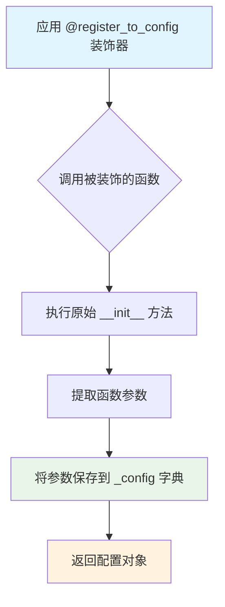

#### 带注释源码

```python
# 该源码为基于代码使用方式推断的典型实现
# 实际实现位于 configuration_utils 模块中

def register_to_config(func: Callable) -> Callable:
    """
    装饰器：将函数的参数注册到配置中
    
    该装饰器通常用于模型的 __init__ 方法，自动将初始化参数保存到 _config 属性中，
    以便后续的模型序列化和配置克隆。
    
    Args:
        func: 被装饰的函数（通常是 __init__ 方法）
        
    Returns:
        包装后的函数，执行后会将参数保存到配置中
    """
    # 提取函数签名，获取参数名称和默认值
    sig = inspect.signature(func)
    config_keys = list(sig.parameters.keys())
    
    @functools.wraps(func)
    def wrapper(self, *args, **kwargs):
        # 调用原始 __init__ 方法
        func(self, *args, **kwargs)
        
        # 将参数保存到 _config 属性中
        # 使用 sig.bind 将传入的参数绑定到参数名称
        bound_args = sig.bind(self, *args, **kwargs)
        bound_args.apply_defaults()
        
        # 过滤掉 self，只保留实际配置参数
        config_dict = {}
        for key in config_keys:
            if key in bound_args.arguments:
                config_dict[key] = bound_args.arguments[key]
        
        # 存储到 _config 属性
        if not hasattr(self, '_config'):
            self._config = {}
        self._config.update(config_dict)
        
        # 同时保存到 config 属性（符合 ConfigMixin 规范）
        if hasattr(self, 'config'):
            for key, value in config_dict.items():
                setattr(self.config, key, value)
        
        return self
    
    return wrapper


# 使用示例（在代码中实际使用方式）
@register_to_config
def __init__(
    self,
    sample_size: int = 128,
    patch_size: int = 2,
    in_channels: int = 16,
    num_layers: int = 18,
    ...
):
    """
    SD3ControlNetModel 初始化方法
    
    参数会自动注册到 self._config 和 self.config 中
    """
    super().__init__()
    # ... 初始化逻辑
```

#### 备注

- 该装饰器是 `ConfigMixin` 类的核心组件，用于实现配置的自动注册
- 装饰后的 `__init__` 方法参数会自动保存到模型的配置中
- 支持通过 `from_config` 方法克隆配置创建新实例
- 配置文件可通过 `model.config` 属性访问


### `FromOriginalModelMixin`

`FromOriginalModelMixin` 是从 `diffusers` 库的 `loaders` 模块导入的一个混合类（Mixin），为模型提供从原始检查点加载权重的功能。在 `SD3ControlNetModel` 中通过多重继承引入，用于支持从原始 Stable Diffusion 3 模型格式迁移权重。

> **注意**：由于 `FromOriginalModelMixin` 定义在外部模块（`...loaders`）中，未在本代码文件中定义，因此以下信息基于类名、导入路径及 `diffusers` 库中该类的通用模式推断。

---

参数：*（该类为 Mixin，具体参数取决于其方法）*

- `cls`：类型 `cls`，调用类本身
- `pretrained_model_name_or_path`：类型 `str | os.PathLike`，预训练模型名称或路径
- `**kwargs`：类型 `dict`，额外关键字参数

返回值：*（该类为 Mixin，具体返回值取决于其方法）*

- 返回继承该 Mixin 的类实例（如 `SD3ControlNetModel`）

---

#### 带注释源码

```python
# 该类的源码位于 diffusers/src/diffusers/loaders 目录下
# 以下是基于 SD3ControlNetModel 继承方式和 diffusers 库惯例的推断

# 从 loaders 模块导入 FromOriginalModelMixin
from ...loaders import FromOriginalModelMixin, PeftAdapterMixin

# SD3ControlNetModel 继承 FromOriginalModelMixin
class SD3ControlNetModel(
    ModelMixin, 
    AttentionMixin, 
    ConfigMixin, 
    PeftAdapterMixin, 
    FromOriginalModelMixin  # 提供从原始模型加载的方法
):
    """
    ControlNet model for Stable Diffusion 3.
    
    通过继承 FromOriginalModelMixin，该类获得了从原始检查点
    加载权重的能力，这是 diffusers 库中模型类的标准模式。
    """
    pass

# 典型的 FromOriginalModelMixin 可能包含的方法（推断）：
# - from_pretrained(): 从预训练模型加载
# - from_original_model(): 从原始检查点格式加载权重
# - load_config(): 加载配置
# - load_state_dict(): 加载状态字典
```

---

#### 关键信息

| 项目 | 描述 |
|------|------|
| **来源模块** | `diffusers.loaders` |
| **用途** | 提供从原始模型检查点加载权重的混合类 |
| **在 SD3ControlNetModel 中的作用** | 使 ControlNet 模型能够从原始 Stable Diffusion 3 检查点迁移权重 |
| **相关方法** | 通常包含 `from_pretrained`, `from_original_model` 等方法 |

> 如需查看 `FromOriginalModelMixin` 的完整源码和详细文档，建议查阅 `diffusers` 库的 `src/diffusers/loaders` 目录下的实现文件。


### `PeftAdapterMixin`

PEFT适配器混合类，从 `diffusers.loaders` 模块导入，为模型提供PEFT（Parameter-Efficient Fine-Tuning）适配器加载和管理能力。在 `SD3ControlNetModel` 中作为父类被继承，为模型提供适配器相关的功能支持。

参数：此类为Mixin类，通过继承方式为其他类提供功能，自身不直接接收构造参数

返回值：此类不直接返回值，作为基类被继承使用

#### 流程图

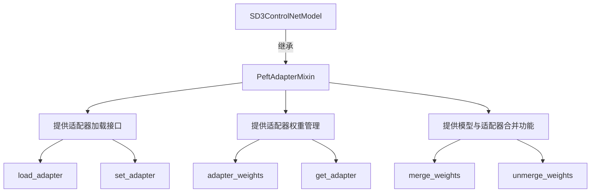

#### 带注释源码

```
# 从loaders模块导入PeftAdapterMixin
# 该类为模型提供PEFT适配器支持
# 使用方式：在类定义中作为父类继承
class SD3ControlNetModel(
    ModelMixin, 
    AttentionMixin, 
    ConfigMixin, 
    PeftAdapterMixin,  # 继承此Mixin以获得适配器功能
    FromOriginalModelMixin
):
    # PeftAdapterMixin 提供的主要功能包括：
    # 1. load_adapter() - 加载PEFT适配器权重
    # 2. set_adapter() - 设置当前使用的适配器
    # 3. get_adapter() - 获取适配器信息
    # 4. merge_weights() - 合并适配器权重到模型
    # 5. unmerge_weights() - 分离适配器权重
    ...
```

#### 备注

由于 `PeftAdapterMixin` 是从外部模块（`...loaders`）导入的，其完整实现未在当前代码文件中显示。该类的具体方法实现需要参考 `diffusers` 库的 `loaders` 模块。在 `SD3ControlNetModel` 中，该Mixin被用于：

1. **支持PEFT适配器加载** - 允许加载和管理LoRA、LoHa等适配器权重
2. **与主模型混合使用** - 提供适配器与原始模型权重的合并/分离功能
3. **跨模型复用** - 作为一个通用的适配器接口，可以被不同的模型类继承使用


### `apply_lora_scale`

该函数是一个装饰器，用于在模型前向传播过程中应用LoRA（Low-Rank Adaptation）缩放因子。它通常用于在推理时动态调整LoRA权重的影响，确保LoRA适配器的输出与基础模型的输出正确集成。

参数：

- `scales`：`str | dict[str, float]`，指定要应用的LoRA缩放因子，可以是单个缩放值或包含多个缩放因子的字典

返回值：`Callable`，返回一个装饰器函数，用于包装模型方法

#### 流程图

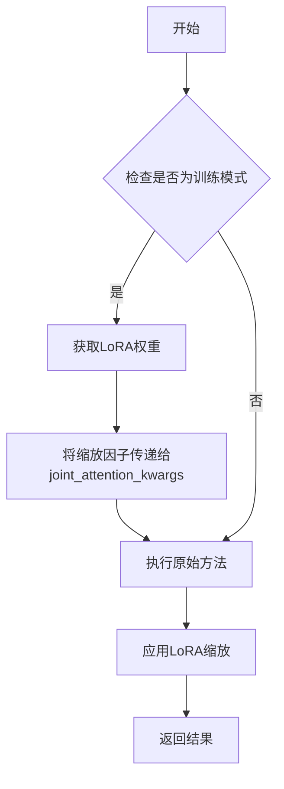

#### 带注释源码

```python
# 该函数在diffusers的utils模块中定义，此处为代码中的使用示例

@apply_lora_scale("joint_attention_kwargs")  # 使用装饰器，指定LoRA缩放应用于joint_attention_kwargs参数
def forward(
    self,
    hidden_states: torch.Tensor,
    controlnet_cond: torch.Tensor,
    conditioning_scale: float = 1.0,
    encoder_hidden_states: torch.Tensor = None,
    pooled_projections: torch.Tensor = None,
    timestep: torch.LongTensor = None,
    joint_attention_kwargs: dict[str, Any] | None = None,
    return_dict: bool = True,
) -> torch.Tensor | Transformer2DModelOutput:
    """
    SD3ControlNetModel的前向传播方法
    
    参数：
        hidden_states: 输入的隐藏状态张量
        controlnet_cond: 控制网络条件输入
        conditioning_scale: 条件缩放因子
        encoder_hidden_states: 编码器隐藏状态
        pooled_projections: 池化投影
        timestep: 时间步
        joint_attention_kwargs: 联合注意力参数（LoRA相关参数通过此传递）
        return_dict: 是否返回字典格式
    
    返回：
        如果return_dict为True，返回SD3ControlNetOutput，否则返回元组
    """
    # 方法实现...
```


### `logging.get_logger`

获取指定模块的日志记录器实例，用于在代码中记录日志信息。

参数：

- `name`：`str`，模块的 `__name__` 属性，通常传入 `__name__` 以标识日志来源

返回值：`logging.Logger`，Python 标准库的 Logger 对象，用于记录日志

#### 流程图

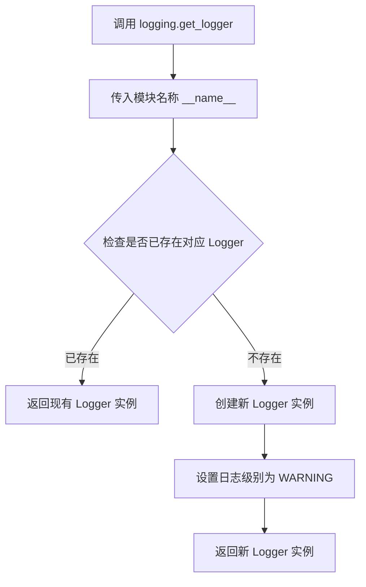

#### 带注释源码

```python
# 从 diffusers 工具模块导入 logging 对象
from ...utils import apply_lora_scale, logging

# 使用 logging.get_logger 获取当前模块的日志记录器
# 参数 __name__ 是 Python 内置变量，表示当前模块的完整路径
# 例如: 'diffusers.models.controlnets.controlnet_sd3'
logger = logging.get_logger(__name__)  # pylint: disable=invalid-name
```

#### 使用示例

在 `SD3ControlNetModel` 类中，`logger` 用于记录日志信息。例如，当需要记录模型加载、配置或运行时状态时，可以调用：

```python
logger.info("Loading SD3ControlNetModel with config: ...")
logger.warning("Some condition was met that requires attention")
logger.debug("Detailed debug information for developers")
```

#### 补充说明

- **日志级别**：默认日志级别通常为 `WARNING`，这意味着 `INFO` 和 `DEBUG` 级别的日志不会显示
- **模块隔离**：每个模块使用独立的 Logger 实例，便于追踪日志来源
- **集成方式**：该 `logging` 工具是对 Python 标准 `logging` 模块的封装，提供了与 Diffusers 库一致的日志记录接口


### SD3ControlNetModel.__init__

这是SD3ControlNetModel类的初始化方法，用于构建Stable Diffusion 3的ControlNet模型。该方法配置了模型的各个组件，包括位置嵌入、时间文本嵌入、上下文嵌入器、Transformer块以及ControlNet块，并将其注册到配置中。

参数：

- `sample_size`：`int`，默认值`128`，潜在变量的宽度/高度，用于学习位置嵌入
- `patch_size`：`int`，默认值`2`，将输入数据分割成小补丁的补丁大小
- `in_channels`：`int`，默认值`16`，输入中的潜在通道数
- `num_layers`：`int`，默认值`18`，要使用的Transformer块的数量
- `attention_head_dim`：`int`，默认值`64`，每个头部的通道数
- `num_attention_heads`：`int`，默认值`18`，多头注意力要使用的头数
- `joint_attention_dim`：`int`，默认值`4096`，用于联合文本-图像注意力的嵌入维度
- `caption_projection_dim`：`int`，默认值`1152`，标题嵌入的嵌入维度
- `pooled_projection_dim`：`int`，默认值`2048`，池化文本投影的嵌入维度
- `out_channels`：`int`，默认值`16`，输出中的潜在通道数
- `pos_embed_max_size`：`int`，默认值`96`，位置嵌入的最大潜在高度/宽度
- `extra_conditioning_channels`：`int`，默认值`0`，用于补丁嵌入调节的额外通道数
- `dual_attention_layers`：`tuple[int, ...]`，默认值`()`，要使用的双流Transformer块的数量
- `qk_norm`：`str | None`，默认值`None`，注意力层中查询和键的归一化方式
- `pos_embed_type`：`str | None`，默认值`"sincos"`：要使用的位置嵌入类型，可在`"sincos"`和`None`之间选择
- `use_pos_embed`：`bool`，默认值`True`，是否使用位置嵌入
- `force_zeros_for_pooled_projection`：`bool`，默认值`True`，是否强制池化投影嵌入为零

返回值：无（`None`），构造函数不返回值，仅初始化模型组件

#### 流程图

```mermaid
flowchart TD
    A[开始 __init__] --> B[调用父类 super().__init__]
    B --> C[设置输出通道 out_channels]
    C --> D[计算内部维度 inner_dim = num_attention_heads * attention_head_dim]
    D --> E{use_pos_embed 为 True?}
    E -->|是| F[创建 PatchEmbed 作为 pos_embed]
    E -->|否| G[pos_embed 设置为 None]
    F --> H[创建 CombinedTimestepTextProjEmbeddings]
    G --> H
    H --> I{joint_attention_dim 不为 None?}
    I -->|是| J[创建 nn.Linear 作为 context_embedder]
    I -->|否| K[context_embedder 设置为 None]
    J --> L[创建 JointTransformerBlock 列表]
    K --> M[创建 SD3SingleTransformerBlock 列表]
    L --> N[创建 controlnet_blocks 列表]
    M --> N
    N --> O[创建 PatchEmbed 作为 pos_embed_input]
    O --> P[设置 gradient_checkpointing = False]
    P --> Q[结束 __init__]
```

#### 带注释源码

```python
@register_to_config
def __init__(
    self,
    sample_size: int = 128,
    patch_size: int = 2,
    in_channels: int = 16,
    num_layers: int = 18,
    attention_head_dim: int = 64,
    num_attention_heads: int = 18,
    joint_attention_dim: int = 4096,
    caption_projection_dim: int = 1152,
    pooled_projection_dim: int = 2048,
    out_channels: int = 16,
    pos_embed_max_size: int = 96,
    extra_conditioning_channels: int = 0,
    dual_attention_layers: tuple[int, ...] = (),
    qk_norm: str | None = None,
    pos_embed_type: str | None = "sincos",
    use_pos_embed: bool = True,
    force_zeros_for_pooled_projection: bool = True,
):
    # 调用父类 ModelMixin, AttentionMixin, ConfigMixin, PeftAdapterMixin, FromOriginalModelMixin 的初始化方法
    super().__init__()
    
    # 设置默认输出通道数为输入通道数
    default_out_channels = in_channels
    # 如果未指定 out_channels，则使用默认通道数
    self.out_channels = out_channels if out_channels is not None else default_out_channels
    # 计算内部维度：注意力头数 × 每头维度
    self.inner_dim = num_attention_heads * attention_head_dim

    # 根据配置决定是否使用位置嵌入
    if use_pos_embed:
        # 创建 PatchEmbed 层用于位置编码嵌入
        self.pos_embed = PatchEmbed(
            height=sample_size,
            width=sample_size,
            patch_size=patch_size,
            in_channels=in_channels,
            embed_dim=self.inner_dim,
            pos_embed_max_size=pos_embed_max_size,
            pos_embed_type=pos_embed_type,
        )
    else:
        self.pos_embed = None
    
    # 创建时间文本组合嵌入层，用于处理时间步和池化投影
    self.time_text_embed = CombinedTimestepTextProjEmbeddings(
        embedding_dim=self.inner_dim, pooled_projection_dim=pooled_projection_dim
    )
    
    # 如果指定了 joint_attention_dim，则创建上下文嵌入器
    if joint_attention_dim is not None:
        # 创建线性层，将联合注意力维度映射到标题投影维度
        self.context_embedder = nn.Linear(joint_attention_dim, caption_projection_dim)

        # 创建 JointTransformerBlock 模块列表
        # attention_head_dim 需要乘以2以考虑混合，在实际获取检查点时需要处理
        self.transformer_blocks = nn.ModuleList(
            [
                JointTransformerBlock(
                    dim=self.inner_dim,
                    num_attention_heads=num_attention_heads,
                    attention_head_dim=attention_head_dim,
                    context_pre_only=False,
                    qk_norm=qk_norm,
                    # 判断当前索引是否在双注意力层列表中
                    use_dual_attention=True if i in dual_attention_layers else False,
                )
                for i in range(num_layers)
            ]
        )
    else:
        # 如果没有联合注意力维度，则不使用上下文嵌入器
        self.context_embedder = None
        # 创建单Transformer块模块列表（用于SD3.5 8b控制网络）
        self.transformer_blocks = nn.ModuleList(
            [
                SD3SingleTransformerBlock(
                    dim=self.inner_dim,
                    num_attention_heads=num_attention_heads,
                    attention_head_dim=attention_head_dim,
                )
                for _ in range(num_layers)
            ]
        )

    # 创建 controlnet_blocks：用于从每个Transformer块提取控制信号
    self.controlnet_blocks = nn.ModuleList([])
    for _ in range(len(self.transformer_blocks)):
        # 创建线性层，将内部维度映射到内部维度
        controlnet_block = nn.Linear(self.inner_dim, self.inner_dim)
        # 使用 zero_module 将权重初始化为零（使初始贡献为零）
        controlnet_block = zero_module(controlnet_block)
        self.controlnet_blocks.append(controlnet_block)
    
    # 创建用于处理控制网络条件的输入补丁嵌入
    pos_embed_input = PatchEmbed(
        height=sample_size,
        width=sample_size,
        patch_size=patch_size,
        # 输入通道数加上额外的条件通道数
        in_channels=in_channels + extra_conditioning_channels,
        embed_dim=self.inner_dim,
        pos_embed_type=None,  # 不使用位置嵌入类型
    )
    # 对输入位置嵌入模块使用零初始化
    self.pos_embed_input = zero_module(pos_embed_input)

    # 初始化梯度检查点标志为 False
    self.gradient_checkpointing = False
```


### `SD3ControlNetModel.enable_forward_chunking`

启用前馈网络分块计算功能，允许将大型前馈层拆分为较小的块进行处理，以减少内存占用。

参数：

- `chunk_size`：`int | None`，可选参数，分块大小。如果未指定，则默认为 1，逐个处理 dim 参数指定维度上的每个张量。
- `dim`：`int`，可选参数，默认为 `0`。分块计算的维度，取值为 0（batch 维度）或 1（序列长度维度）。

返回值：`None`，无返回值，该方法直接修改模型内部状态。

#### 流程图

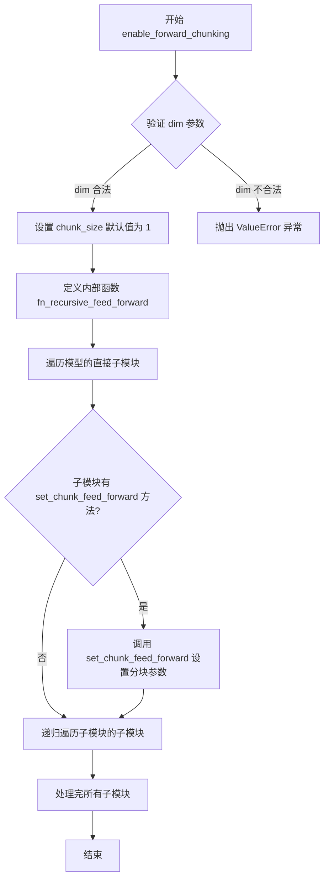

#### 带注释源码

```python
def enable_forward_chunking(self, chunk_size: int | None = None, dim: int = 0) -> None:
    """
    设置注意力处理器使用前馈网络分块计算方式。
    该方法通过递归遍历模型的所有子模块，为支持分块计算的模块设置分块参数。

    参数:
        chunk_size (int, 可选):
            前馈层的分块大小。如果未指定，将对 dim 指定维度的每个张量单独运行前馈层。
        dim (int, 可选，默认为 0):
            前馈计算应该分块的维度。可选值为 dim=0 (batch 维度) 或 dim=1 (序列长度维度)。
    """
    # 验证 dim 参数是否合法，必须为 0 或 1
    if dim not in [0, 1]:
        raise ValueError(f"Make sure to set `dim` to either 0 or 1, not {dim}")

    # 如果未指定 chunk_size，默认设置为 1
    # chunk_size=1 表示不对前馈层进行分块，逐个处理每个张量
    chunk_size = chunk_size or 1

    def fn_recursive_feed_forward(module: torch.nn.Module, chunk_size: int, dim: int):
        """
        递归遍历模块的所有子模块，为支持分块前馈的模块设置分块参数。

        参数:
            module: PyTorch 模块
            chunk_size: 分块大小
            dim: 分块维度
        """
        # 检查当前模块是否具有 set_chunk_feed_forward 方法
        # 如果有，说明该模块支持前馈网络分块计算
        if hasattr(module, "set_chunk_feed_forward"):
            module.set_chunk_feed_forward(chunk_size=chunk_size, dim=dim)

        # 递归遍历当前模块的所有子模块
        for child in module.children():
            fn_recursive_feed_forward(child, chunk_size, dim)

    # 遍历模型的所有直接子模块，开始递归设置分块参数
    for module in self.children():
        fn_recursive_feed_forward(module, chunk_size, dim)
```


### `SD3ControlNetModel.fuse_qkv_projections`

该方法用于启用融合的QKV投影，对于自注意力模块融合所有投影矩阵（即query、key、value），对于交叉注意力模块则融合key和value投影矩阵。这是一个实验性API。

参数：此方法无显式参数（隐式参数为`self`）

返回值：`None`，无返回值（修改模型内部状态）

#### 流程图

```mermaid
flowchart TD
    A[开始: fuse_qkv_projections] --> B[初始化 original_attn_processors 为 None]
    B --> C{检查所有注意力处理器}
    C --> D{是否存在 AddedKV 处理器?}
    D -->|是| E[抛出 ValueError 异常]
    D -->|否| F[保存原始注意力处理器到 original_attn_processors]
    F --> G[遍历所有模块]
    G --> H{当前模块是否为 Attention?}
    H -->|是| I[调用 module.fuse_projections(fuse=True)]
    H -->|否| J[继续下一个模块]
    I --> G
    J --> G
    G --> K[设置注意力处理器为 FusedJointAttnProcessor2_0]
    K --> L[结束]
    E --> L
```

#### 带注释源码

```python
def fuse_qkv_projections(self):
    """
    启用融合的QKV投影。
    对于自注意力模块，所有投影矩阵（即query、key、value）会被融合。
    对于交叉注意力模块，key和value投影矩阵会被融合。
    
    > [!WARNING] > 此API是实验性的。
    """
    # 步骤1: 初始化original_attn_processors为None
    # 这是为了在后续操作中保存原始的注意力处理器状态
    self.original_attn_processors = None

    # 步骤2: 遍历所有注意力处理器，检查是否存在不支持的AddedKV处理器
    # 如果存在添加了KV投影的处理器，则抛出异常，因为不支持融合
    for _, attn_processor in self.attn_processors.items():
        if "Added" in str(attn_processor.__class__.__name__):
            raise ValueError("`fuse_qkv_projections()` is not supported for models having added KV projections.")

    # 步骤3: 保存当前所有注意力处理器到original_attn_processors
    # 这样后续可以通过unfuse_qkv_projections恢复原始状态
    self.original_attn_processors = self.attn_processors

    # 步骤4: 遍历模型中的所有模块
    # 对于每个Attention模块，调用其fuse_projections方法进行QKV融合
    for module in self.modules():
        if isinstance(module, Attention):
            module.fuse_projections(fuse=True)

    # 步骤5: 将模型的注意力处理器替换为FusedJointAttnProcessor2_0
    # 这是一个专门优化的融合注意力处理器，用于处理融合后的QKV投影
    self.set_attn_processor(FusedJointAttnProcessor2_0())
```


### `SD3ControlNetModel.unfuse_qkv_projections`

该方法用于禁用融合的 QKV 投影，恢复到原始的注意力处理器。如果之前没有调用过 `fuse_qkv_projections` 方法（即 `original_attn_processors` 为 `None`），则不进行任何操作。

参数：此方法无显式参数（仅包含隐式参数 `self`）。

返回值：`None`，该方法直接修改对象状态，不返回任何值。

#### 流程图

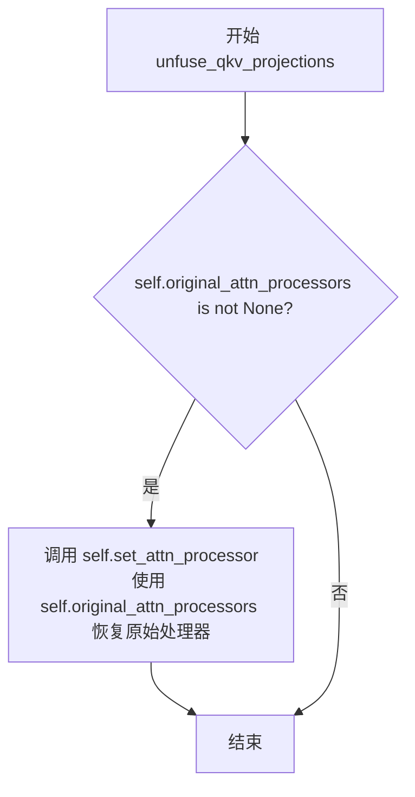

#### 带注释源码

```python
# Copied from diffusers.models.unets.unet_2d_condition.UNet2DConditionModel.unfuse_qkv_projections
def unfuse_qkv_projections(self):
    """Disables the fused QKV projection if enabled.

    > [!WARNING] > This API is 🧪 experimental.

    """
    # 检查是否存在已保存的原始注意力处理器
    # 如果之前调用过 fuse_qkv_projections，则 original_attn_processors 会被设置
    if self.original_attn_processors is not None:
        # 恢复原始注意力处理器
        # 这将撤销 fuse_qkv_projections 所做的融合操作
        self.set_attn_processor(self.original_attn_processors)
```


### `SD3ControlNetModel._get_pos_embed_from_transformer`

从 transformer 模型复制位置嵌入（positional embedding）模块，创建一个新的 PatchEmbed 对象并从 transformer 中加载其权重状态。该方法主要用于 SD3.5 8b ControlNet，因为它与 transformer 共享位置嵌入。

参数：

- `self`：隐含参数，SD3ControlNetModel 实例本身
- `transformer`：任意继承自 `ModelMixin` 的 transformer 模型对象，从中获取位置嵌入配置和权重

返回值：`PatchEmbed`，返回一个新的 PatchEmbed 对象，其权重已从传入的 transformer 加载

#### 流程图

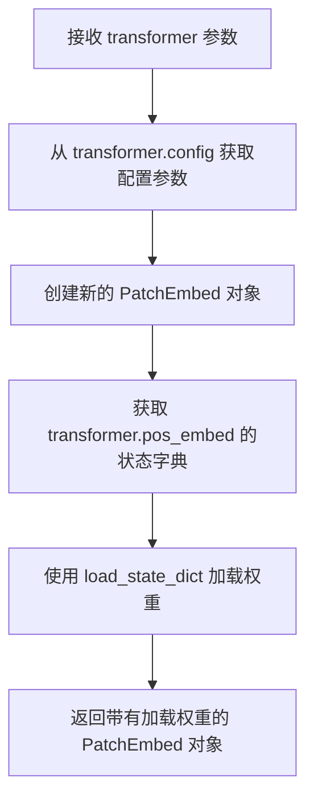

#### 带注释源码

```
# Notes: This is for SD3.5 8b controlnet, which shares the pos_embed with the transformer
# we should have handled this in conversion script
def _get_pos_embed_from_transformer(self, transformer):
    # 使用传入的 transformer 的配置参数创建新的 PatchEmbed 对象
    # 包括：sample_size（样本大小）、patch_size（补丁大小）、
    # in_channels（输入通道数）、inner_dim（内部维度）、pos_embed_max_size（位置嵌入最大尺寸）
    pos_embed = PatchEmbed(
        height=transformer.config.sample_size,
        width=transformer.config.sample_size,
        patch_size=transformer.config.patch_size,
        in_channels=transformer.config.in_channels,
        embed_dim=transformer.inner_dim,
        pos_embed_max_size=transformer.config.pos_embed_max_size,
    )
    # 从 transformer 的 pos_embed 模块加载状态字典到新创建的 pos_embed
    # strict=True 表示严格匹配键值，确保所有参数都正确复制
    pos_embed.load_state_dict(transformer.pos_embed.state_dict(), strict=True)
    # 返回已加载权重的 PatchEmbed 对象
    return pos_embed
```


### `SD3ControlNetModel.from_transformer`

从预训练的 SD3 Transformer 模型创建并初始化 SD3ControlNetModel 权重，实现从 Transformer 到 ControlNet 的模型转换。

参数：

- `cls`：类型 `type`，类本身（隐式参数），表示 SD3ControlNetModel 类
- `transformer`：类型 `torch.nn.Module`，原始的 SD3 Transformer 模型，作为权重来源
- `num_layers`：类型 `int | None`，默认为 12，要使用的控制网络层数，若为 None 则使用原 Transformer 的层数
- `num_extra_conditioning_channels`：类型 `int`，默认为 1，额外的条件通道数量
- `load_weights_from_transformer`：类型 `bool`，默认为 True，是否从 Transformer 加载权重到 ControlNet

返回值：`SD3ControlNetModel`，返回新创建的 ControlNet 模型实例

#### 流程图

```mermaid
flowchart TD
    A[开始: from_transformer] --> B[获取 transformer 的 config]
    B --> C{num_layers 是否为 None?}
    C -->|是| D[使用 config.num_layers]
    C -->|否| E[使用传入的 num_layers]
    D --> F[设置 extra_conditioning_channels]
    E --> F
    F --> G[通过 from_config 创建 ControlNet 实例]
    G --> H{load_weights_from_transformer 为 True?}
    H -->|否| K[直接返回 ControlNet 实例]
    H -->|是| I[加载 pos_embed 权重]
    I --> J[加载 time_text_embed 权重]
    J --> L[加载 context_embedder 权重]
    L --> M[加载 transformer_blocks 权重]
    M --> N[将 pos_embed_input 设为 zero_module]
    N --> K
```

#### 带注释源码

```python
@classmethod
def from_transformer(
    cls, transformer, num_layers=12, num_extra_conditioning_channels=1, load_weights_from_transformer=True
):
    """
    从预训练的 SD3 Transformer 模型创建 SD3ControlNetModel
    
    参数:
        transformer: 原始的 SD3 Transformer 模型
        num_layers: 控制网络使用的层数，默认为 12
        num_extra_conditioning_channels: 额外条件通道数，默认为 1
        load_weights_from_transformer: 是否加载权重，默认为 True
    
    返回:
        SD3ControlNetModel 实例
    """
    # 1. 获取原始 transformer 的配置
    config = transformer.config
    
    # 2. 更新配置中的层数和额外条件通道数
    config["num_layers"] = num_layers or config.num_layers
    config["extra_conditioning_channels"] = num_extra_conditioning_channels
    
    # 3. 使用更新后的配置创建 ControlNet 实例
    controlnet = cls.from_config(config)

    # 4. 如果需要加载权重，则从 transformer 复制权重
    if load_weights_from_transformer:
        # 加载位置嵌入权重
        controlnet.pos_embed.load_state_dict(transformer.pos_embed.state_dict())
        
        # 加载时间文本嵌入层权重
        controlnet.time_text_embed.load_state_dict(transformer.time_text_embed.state_dict())
        
        # 加载上下文嵌入器权重
        controlnet.context_embedder.load_state_dict(transformer.context_embedder.state_dict())
        
        # 加载 transformer 块权重（非严格模式，允许部分匹配）
        controlnet.transformer_blocks.load_state_dict(transformer.transformer_blocks.state_dict(), strict=False)

        # 将输入位置嵌入初始化为零模块（用于 SD3.5 8b controlnet）
        controlnet.pos_embed_input = zero_module(controlnet.pos_embed_input)

    # 5. 返回创建好的 ControlNet 模型
    return controlnet
```


### `SD3ControlNetModel.forward`

SD3ControlNetModel的前向传播方法，用于根据输入的潜在变量、条件输入、时间步和文本嵌入生成ControlNet的中间特征输出，这些特征可以用于控制Stable Diffusion 3的生成过程。

参数：

- `hidden_states`：`torch.Tensor`，形状为`(batch size, channel, height, width)`的输入潜在变量
- `controlnet_cond`：`torch.Tensor`，条件输入张量，形状为`(batch_size, sequence_length, hidden_size)`
- `conditioning_scale`：`float`，默认为`1.0`，ControlNet输出的缩放因子
- `encoder_hidden_states`：`torch.Tensor`，默认为`None`，条件嵌入（从输入条件如提示词计算的嵌入）
- `pooled_projections`：`torch.Tensor`，默认为`None`，从输入条件的嵌入投影而来的嵌入，形状为`(batch_size, projection_dim)`
- `timestep`：`torch.LongTensor`，默认为`None`，用于指示去噪步骤
- `joint_attention_kwargs`：`dict[str, Any] | None`，默认为`None`，可选的kwargs字典，如果指定则传递给AttentionProcessor
- `return_dict`：`bool`，默认为`True`，是否返回`Transformer2DModelOutput`而不是元组

返回值：`SD3ControlNetOutput`或`tuple`，如果`return_dict`为True，返回包含`controlnet_block_samples`的`SD3ControlNetOutput`，否则返回元组

#### 流程图

```mermaid
flowchart TD
    A[开始 forward] --> B{hidden_states维度检查}
    B -->|pos_embed存在且hidden_states不是4D| C[抛出ValueError]
    B -->|pos_embed不存在且hidden_states不是3D| D[抛出ValueError]
    B -->|维度检查通过| E{encoder_hidden_states检查}
    E -->|context_embedder存在且encoder_hidden_states为None| F[抛出ValueError]
    E -->|context_embedder不存在且encoder_hidden_states不为None| G[抛出ValueError]
    E -->|检查通过| H[应用pos_embed到hidden_states]
    H --> I[计算timestep和pooled_projections的嵌入temb]
    I --> J{context_embedder是否存在}
    J -->|是| K[应用context_embedder到encoder_hidden_states]
    J -->|否| L[跳过context_embedder]
    K --> M[将controlnet_cond添加到hidden_states]
    L --> M
    M --> N[初始化block_res_samples为空元组]
    N --> O[遍历transformer_blocks]
    O --> P{是否启用梯度检查点}
    P -->|是| Q{context_embedder是否存在}
    Q -->|是| R[使用_gradient_checkpointing_func传入所有参数]
    Q -->|否| S[使用_gradient_checkpointing_func传入hidden_states和temb]
    P -->|否| T{context_embedder是否存在}
    T -->|是| U[调用block传入hidden_states, encoder_hidden_states, temb]
    T -->|否| V[调用block传入hidden_states和temb]
    R --> W[将hidden_states添加到block_res_samples]
    S --> W
    U --> W
    V --> W
    W --> X{还有更多block需要处理}
    X -->|是| O
    X -->|否| Y[初始化controlnet_block_res_samples为空元组]
    Y --> Z[遍历block_res_samples和controlnet_blocks]
    Z --> AA[应用controlnet_block到block_res_sample]
    AA --> BB[将结果添加到controlnet_block_res_samples]
    BB --> CC{还有更多block需要处理}
    CC -->|是| Z
    CC -->|否| DD[对每个sample乘以conditioning_scale]
    DD --> EE{return_dict为True?}
    EE -->|是| FF[返回SD3ControlNetOutput]
    EE -->|否| GG[返回tuple]
    FF --> HH[结束]
    GG --> HH
```

#### 带注释源码

```python
@apply_lora_scale("joint_attention_kwargs")
def forward(
    self,
    hidden_states: torch.Tensor,
    controlnet_cond: torch.Tensor,
    conditioning_scale: float = 1.0,
    encoder_hidden_states: torch.Tensor = None,
    pooled_projections: torch.Tensor = None,
    timestep: torch.LongTensor = None,
    joint_attention_kwargs: dict[str, Any] | None = None,
    return_dict: bool = True,
) -> torch.Tensor | Transformer2DModelOutput:
    """
    The [`SD3Transformer2DModel`] forward method.

    Args:
        hidden_states (`torch.Tensor` of shape `(batch size, channel, height, width)`):
            Input `hidden_states`.
        controlnet_cond (`torch.Tensor`):
            The conditional input tensor of shape `(batch_size, sequence_length, hidden_size)`.
        conditioning_scale (`float`, defaults to `1.0`):
            The scale factor for ControlNet outputs.
        encoder_hidden_states (`torch.Tensor` of shape `(batch size, sequence_len, embed_dims)`):
            Conditional embeddings (embeddings computed from the input conditions such as prompts) to use.
        pooled_projections (`torch.Tensor` of shape `(batch_size, projection_dim)`): Embeddings projected
            from the embeddings of input conditions.
        timestep ( `torch.LongTensor`):
            Used to indicate denoising step.
        joint_attention_kwargs (`dict`, *optional*):
            A kwargs dictionary that if specified is passed along to the `AttentionProcessor` as defined under
            `self.processor` in
            [diffusers.models.attention_processor](https://github.com/huggingface/diffusers/blob/main/src/diffusers/models/attention_processor.py).
        return_dict (`bool`, *optional*, defaults to `True`):
            Whether or not to return a [`~models.transformer_2d.Transformer2DModelOutput`] instead of a plain
            tuple.

    Returns:
        If `return_dict` is True, an [`~models.transformer_2d.Transformer2DModelOutput`] is returned, otherwise a
        `tuple` where the first element is the sample tensor.
    """
    # 检查hidden_states的维度是否正确
    if self.pos_embed is not None and hidden_states.ndim != 4:
        raise ValueError("hidden_states must be 4D when pos_embed is used")

    # SD3.5 8b controlnet does not have a `pos_embed`,
    # it use the `pos_embed` from the transformer to process input before passing to controlnet
    elif self.pos_embed is None and hidden_states.ndim != 3:
        raise ValueError("hidden_states must be 3D when pos_embed is not used")

    # 检查encoder_hidden_states是否提供
    if self.context_embedder is not None and encoder_hidden_states is None:
        raise ValueError("encoder_hidden_states must be provided when context_embedder is used")
    # SD3.5 8b controlnet does not have a `context_embedder`, it does not use `encoder_hidden_states`
    elif self.context_embedder is None and encoder_hidden_states is not None:
        raise ValueError("encoder_hidden_states should not be provided when context_embedder is not used")

    # 应用位置编码到hidden_states
    if self.pos_embed is not None:
        hidden_states = self.pos_embed(hidden_states)  # takes care of adding positional embeddings too.

    # 计算时间步和池化投影的嵌入
    temb = self.time_text_embed(timestep, pooled_projections)

    # 应用上下文嵌入器到encoder_hidden_states
    if self.context_embedder is not None:
        encoder_hidden_states = self.context_embedder(encoder_hidden_states)

    # 将controlnet条件添加到hidden_states
    hidden_states = hidden_states + self.pos_embed_input(controlnet_cond)

    # 初始化存储中间结果的元组
    block_res_samples = ()

    # 遍历每个transformer块
    for block in self.transformer_blocks:
        # 如果启用了梯度检查点
        if torch.is_grad_enabled() and self.gradient_checkpointing:
            if self.context_embedder is not None:
                # 使用梯度检查点函数，传入所有参数
                encoder_hidden_states, hidden_states = self._gradient_checkpointing_func(
                    block,
                    hidden_states,
                    encoder_hidden_states,
                    temb,
                )
            else:
                # SD3.5 8b controlnet use single transformer block, which does not use `encoder_hidden_states`
                hidden_states = self._gradient_checkpointing_func(block, hidden_states, temb)

        else:
            if self.context_embedder is not None:
                # 正常前向传播，传入hidden_states, encoder_hidden_states, temb
                encoder_hidden_states, hidden_states = block(
                    hidden_states=hidden_states, encoder_hidden_states=encoder_hidden_states, temb=temb
                )
            else:
                # SD3.5 8b controlnet use single transformer block, which does not use `encoder_hidden_states`
                hidden_states = block(hidden_states, temb)

        # 将每层的输出添加到block_res_samples
        block_res_samples = block_res_samples + (hidden_states,)

    # 对每个transformer块输出应用ControlNet块
    controlnet_block_res_samples = ()
    for block_res_sample, controlnet_block in zip(block_res_samples, self.controlnet_blocks):
        block_res_sample = controlnet_block(block_res_sample)
        controlnet_block_res_samples = controlnet_block_res_samples + (block_res_sample,)

    # 6. scaling - 根据conditioning_scale缩放输出
    controlnet_block_res_samples = [sample * conditioning_scale for sample in controlnet_block_res_samples]

    # 根据return_dict决定返回值格式
    if not return_dict:
        return (controlnet_block_res_samples,)

    return SD3ControlNetOutput(controlnet_block_samples=controlnet_block_res_samples)
```


### `SD3MultiControlNetModel.__init__`

初始化SD3MultiControlNetModel类，该类是多个SD3ControlNetModel实例的包装器，用于支持多条件控制网络（Multi-ControlNet）功能。

参数：

- `controlnets`：`list[SD3ControlNetModel]`，一个包含多个SD3ControlNetModel实例的列表，每个实例代表一个独立的控制网络

返回值：`None`，构造函数不返回任何值

#### 流程图

```mermaid
flowchart TD
    A[开始 __init__] --> B[调用父类 ModelMixin 的 __init__]
    B --> C[创建 nn.ModuleList: self.nets = nn.ModuleList(controlnets)]
    C --> D[结束]
```

#### 带注释源码

```python
def __init__(self, controlnets):
    """
    初始化 SD3MultiControlNetModel 实例。

    Parameters:
        controlnets (list[SD3ControlNetModel]): 
            一个包含多个 SD3ControlNetModel 实例的列表。
            每个 SD3ControlNetModel 都可以提供不同的条件控制信号。

    Returns:
        None
    """
    # 调用父类 ModelMixin 的初始化方法
    # 继承自 ModelMixin 的所有功能（如配置管理、模型保存/加载等）
    super().__init__()
    
    # 使用 nn.ModuleList 将多个 SD3ControlNetModel 包装为模块
    # 这样可以确保所有子模块的参数被正确注册到整个模型中
    # 便于梯度计算、模型序列化等操作
    self.nets = nn.ModuleList(controlnets)
```


### `SD3MultiControlNetModel.forward`

该方法是`SD3MultiControlNetModel`类的核心前向传播方法，用于在Multi-ControlNet场景下依次调用多个`SD3ControlNetModel`，并将各ControlNet的输出按照`conditioning_scale`进行加权合并，最终返回聚合后的ControlNet特征。

参数：

- `hidden_states`：`torch.Tensor`，输入的隐状态张量，通常为去噪过程中的潜在表示
- `controlnet_cond`：`list[torch.tensor]`，条件图像列表，每个元素对应一个ControlNet的条件输入
- `conditioning_scale`：`list[float]`，每个ControlNet的输出缩放因子列表，用于加权合并多个ControlNet的输出
- `pooled_projections`：`torch.Tensor`，池化后的文本投影嵌入，用于时间-文本嵌入层
- `encoder_hidden_states`：`torch.Tensor`，条件文本嵌入，默认为None
- `timestep`：`torch.LongTensor`，去噪步骤的时间步长，默认为None
- `joint_attention_kwargs`：`dict[str, Any] | None`，传递给注意力处理器的可选关键字参数，默认为None
- `return_dict`：`bool`，是否返回`SD3ControlNetOutput`对象而非元组，默认为True

返回值：`SD3ControlNetOutput | tuple`，当`return_dict`为True时返回包含`controlnet_block_samples`的`SD3ControlNetOutput`对象，否则返回元组

#### 流程图

```mermaid
flowchart TD
    A[开始 forward] --> B[遍历多个 ControlNet]
    B --> C[获取第 i 个条件图像、缩放因子和 ControlNet]
    C --> D[调用单个 ControlNet 的 forward]
    D --> E{是否是第一个 ControlNet?}
    E -->|是| F[将结果保存为 control_block_samples]
    E -->|否| G[将当前结果与已有结果逐元素相加]
    G --> H[更新 control_block_samples]
    F --> I{是否还有更多 ControlNet?}
    H --> I
    I -->|是| C
    I -->|否| J[返回聚合后的 control_block_samples]
    J --> K[结束 forward]
```

#### 带注释源码

```python
def forward(
    self,
    hidden_states: torch.Tensor,
    controlnet_cond: list[torch.tensor],
    conditioning_scale: list[float],
    pooled_projections: torch.Tensor,
    encoder_hidden_states: torch.Tensor = None,
    timestep: torch.LongTensor = None,
    joint_attention_kwargs: dict[str, Any] | None = None,
    return_dict: bool = True,
) -> SD3ControlNetOutput | tuple:
    # 遍历每个 ControlNet 及其对应的条件图像和缩放因子
    for i, (image, scale, controlnet) in enumerate(zip(controlnet_cond, conditioning_scale, self.nets)):
        # 调用单个 ControlNet 的前向传播，获取中间特征
        block_samples = controlnet(
            hidden_states=hidden_states,
            timestep=timestep,
            encoder_hidden_states=encoder_hidden_states,
            pooled_projections=pooled_projections,
            controlnet_cond=image,
            conditioning_scale=scale,
            joint_attention_kwargs=joint_attention_kwargs,
            return_dict=return_dict,
        )

        # 合并样本：根据索引决定是初始化还是累加
        if i == 0:
            # 第一个 ControlNet 的结果直接作为初始结果
            control_block_samples = block_samples
        else:
            # 后续 ControlNet 的结果与已有结果逐元素相加
            # 注意：这里假设 block_samples 和 control_block_samples 都是元组
            # 且元组第一个元素是 block_samples 列表
            control_block_samples = [
                control_block_sample + block_sample
                for control_block_sample, block_sample in zip(control_block_samples[0], block_samples[0])
            ]
            # 转换回元组格式以保持一致性
            control_block_samples = (tuple(control_block_samples),)

    # 返回聚合后的 ControlNet 特征
    return control_block_samples
```

## 关键组件


### SD3ControlNetModel

SD3的ControlNet主模型类，继承自ModelMixin、AttentionMixin、ConfigMixin、PeftAdapterMixin和FromOriginalModelMixin，用于为Stable Diffusion 3提供额外的条件控制信号。该模型通过多个Transformer块处理输入的潜表示和条件信息，输出多个中间特征图用于控制生成过程。

### SD3ControlNetOutput

继承自BaseOutput的数据类，用于封装ControlNet的输出结果，包含controlnet_block_samples元组存储各层的特征图输出。

### SD3MultiControlNetModel

多ControlNet的包装类，用于支持多个ControlNet同时使用，可以将多个ControlNet的输出进行加权合并，提供更灵活的条件控制能力。

### JointTransformerBlock

联合注意力Transformer块，支持双流注意力机制，可同时处理自注意力和交叉注意力，用于标准SD3模型的特征提取。

### SD3SingleTransformerBlock

单流Transformer块，用于SD3.5 8b ControlNet变体，不使用交叉注意力，只处理自注意力操作。

### CombinedTimestepTextProjEmbeddings

时间步和文本投影的组合嵌入层，将时间步timestep和池化后的文本投影pooled_projections结合处理，生成用于条件注入的嵌入向量。

### PatchEmbed

Patch嵌入模块，将输入的潜表示切分成小patch并添加位置编码，支持可配置的位置编码类型（sincos或None）。

### controlnet_blocks

由多个线性层组成的ModuleList，对Transformer块的输出进行投影处理，每个块对应一个Transformer层的输出，用于提取控制特征。

### pos_embed_input

零初始化的输入位置嵌入模块，用于处理controlnet_cond条件输入，通过零模块确保初始状态下不影响原始特征。

### 梯度检查点功能

通过gradient_checkpointing标志和enable_forward_chunking方法实现，用于减少显存占用，通过在前向传播时不保存中间激活值而在反向传播时重新计算来节省内存。

### QKV投影融合

fuse_qkv_projections和unfuse_qkv_projections方法用于融合注意力模块的QKV投影矩阵，可以减少计算开销并提高推理效率。

### from_transformer类方法

提供了从预训练的SD3Transformer模型转换创建ControlNet的便捷方法，支持加载权重和配置转换。


## 问题及建议


### 已知问题

-   **多重继承带来的复杂性**：`SD3ControlNetModel`继承了5个Mixin类（`ModelMixin`, `AttentionMixin`, `ConfigMixin`, `PeftAdapterMixin`, `FromOriginalModelMixin`），可能导致MRO（方法解析顺序）混乱、代码理解困难，且增加了类层次的复杂性。
-   **forward方法职责过重**：forward方法包含了位置编码处理、时间文本嵌入、条件嵌入、梯度检查点、循环处理、输出缩放等多种逻辑，违反单一职责原则，代码行数过长难以维护。
-   **类型标注不准确**：forward方法声明返回类型为`Transformer2DModelOutput`，但实际返回的是`SD3ControlNetOutput`；`controlnet_cond`参数类型标注为单个`torch.Tensor`，但在`SD3MultiControlNetModel`中实际传入`list[torch.tensor]`。
-   **SD3.5 8b特殊处理逻辑与通用逻辑混杂**：代码中多处通过`if self.context_embedder is not None`和`if self.pos_embed is not None`判断来处理SD3.5 8b controlnet的特殊情况，导致控制流复杂，可读性差。
-   **变量命名不够清晰**：`temb`是`temporal embedding`的缩写，在整个代码中使用但没有注释说明；`block_res_samples`和`controlnet_block_res_samples`命名冗长且相似容易混淆。
-   **SD3MultiControlNetModel实现效率问题**：在forward方法中使用列表推导式逐个合并block samples，每次合并都创建新列表，效率较低；且错误处理逻辑缺失（未检查`controlnet_cond`、`conditioning_scale`和`self.nets`长度是否一致）。
-   **docstring引用错误**：forward方法的docstring中引用了`SD3Transformer2DModel`，但实际类名应该是`SD3ControlNetModel`。
-   **参数验证分散**：输入验证逻辑（如检查hidden_states维度、检查encoder_hidden_states是否提供）分散在forward方法中，没有统一的参数验证机制。

### 优化建议

-   **重构forward方法**：将forward方法拆分为多个私有方法，如`_encode_position_embeddings()`、`_encode_context()`、`_process_controlnet_blocks()`、`_apply_conditioning_scale()`等，每个方法负责单一职责。
-   **提取SD3.5 8b特殊逻辑**：创建子类或使用策略模式将SD3.5 8b controlnet的特殊处理逻辑与通用逻辑分离，避免在主流程中使用大量条件判断。
-   **修正类型标注**：确保forward方法返回类型标注为`SD3ControlNetOutput`；为`SD3MultiControlNetModel.forward`的`controlnet_cond`参数使用`list[torch.Tensor]`类型。
-   **改进SD3MultiControlNetModel实现**：预先分配结果列表而非动态拼接；添加参数长度一致性检查；考虑使用torch的stack/add操作替代列表推导式。
-   **统一参数验证**：在方法开始阶段集中进行参数验证，可考虑使用装饰器或专门的验证方法。
-   **改进命名和注释**：将`temb`改为`temporal_embedding`或添加注释说明；为关键变量添加类型注解和文档字符串。
-   **修复docstring错误**：将forward方法docstring中的`SD3Transformer2DModel`更正为`SD3ControlNetModel`。

## 其它


### 设计目标与约束

本模块旨在为Stable Diffusion 3提供ControlNet条件控制能力，使模型能够根据额外的条件输入（如分割图、深度图等）引导生成过程。核心设计约束包括：保持与SD3Transformer架构的兼容性、支持梯度检查点以节省显存、支持从预训练transformer加载权重、支持多ControlNet联合使用。输入必须是4D张量(hidden_states)或3D张量(当pos_embed为None时)，输出为经过缩放控制的中间特征块样本。

### 错误处理与异常设计

代码在forward方法中实现了多处输入验证：当pos_embed存在时hidden_states必须为4D，当pos_embed为None时hidden_states必须为3D，当context_embedder存在时必须提供encoder_hidden_states，当context_embedder为None时不应提供encoder_hidden_states。fuse_qkv_projections方法会检查是否存在Added KV projections，若存在则抛出ValueError。enable_forward_chunking方法验证dim参数必须在0或1之间，否则抛出ValueError。

### 数据流与状态机

数据流遵循以下路径：首先对hidden_states应用位置嵌入(如适用)，然后通过time_text_embed处理timestep和pooled_projections生成temb嵌入，接着(如适用)通过context_embedder处理encoder_hidden_states，将controlnet_cond通过pos_embed_input处理后与hidden_states相加，随后依次通过每个transformer_blocks并保存中间结果，最后将每个中间结果通过对应的controlnet_blocks处理并应用conditioning_scale缩放。状态转换主要由梯度检查点模式控制：torch.is_grad_enabled()和self.gradient_checkpointing共同决定是否启用梯度检查。

### 外部依赖与接口契约

核心依赖包括torch和torch.nn提供基础张量操作和神经网络模块，从diffusers包导入ConfigMixin和register_to_config用于配置管理，从loaders导入FromOriginalModelMixin和PeftAdapterMixin用于权重加载，从utils导入apply_lora_scale和logging，从attention模块导入AttentionMixin和JointTransformerBlock，从attention_processor导入Attention和FusedJointAttnProcessor2_0，从embeddings导入CombinedTimestepTextProjEmbeddings和PatchEmbed，从modeling_outputs导入Transformer2DModelOutput，从modeling_utils导入ModelMixin，从transformers.transformer_sd3导入SD3SingleTransformerBlock，从.controlnet导入BaseOutput和zero_module。

### 性能考虑

模型支持梯度检查点(gradient_checkpointing)以减少显存占用，支持前馈层分块(forward_chunking)以平衡计算效率和显存，支持QKV融合(fuse_qkv_projections)以提升推理性能。controlnet_blocks和pos_embed_input使用zero_module初始化，这些模块的权重被初始化为零，有助于减少不必要的计算。

### 安全性考虑

代码遵循Apache License 2.0开源协议。权重加载采用strict=False模式处理transformer_blocks以容忍轻微的架构差异。fuse_qkv_projections和unfuse_qkv_projections为实验性API，存在潜在风险。

### 测试策略建议

应测试单ControlNet前向传播、多ControlNet联合使用、从transformer加载权重、梯度检查点功能、QKV融合与解融、位置嵌入处理、各种输入维度验证、conditioning_scale缩放效果、混合精度推理兼容性。

### 版本兼容性

from_transformer类方法支持从预训练SD3Transformer加载权重，load_weights_from_transformer参数控制是否加载权重，num_layers和num_extra_conditioning_channels参数允许灵活配置。通过from_config方法支持基于配置文件的实例化。

### 配置管理

所有模型参数通过@register_to_config装饰器注册为配置属性，支持通过to_dict和from_dict序列化反序列化。关键配置项包括sample_size、patch_size、in_channels、num_layers、attention_head_dim、num_attention_heads、joint_attention_dim等。

### 部署考虑

模型权重可通过save_pretrained和from_pretrained保存加载，支持PyTorch JIT编译优化，支持ONNX导出(需确保所有操作兼容)，推荐使用FP16或BF16精度以提升推理速度并减少显存占用。


    