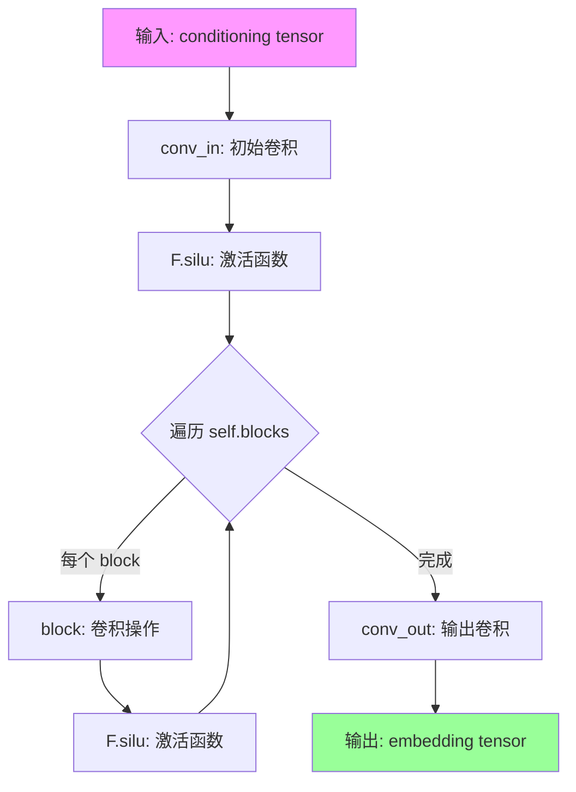
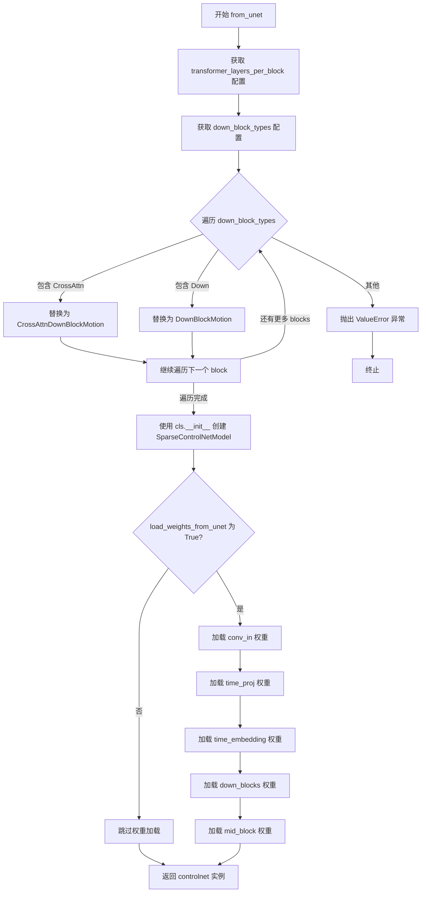
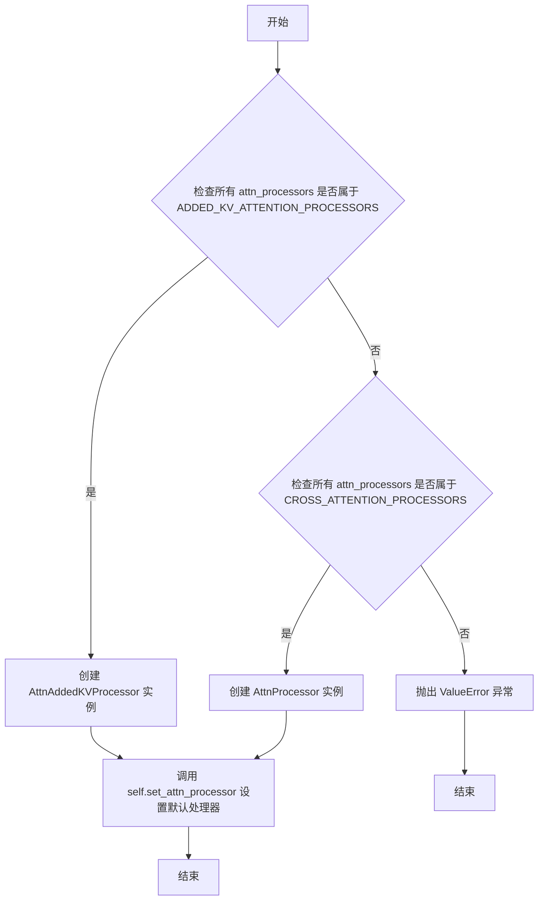

# `diffusers\src\diffusers\models\controlnets\controlnet_sparsectrl.py` 详细设计文档

A SparseControlNet model implementation for text-to-video diffusion, capable of processing temporal (video) and spatial (image) conditioning inputs to generate intermediate multi-scale feature maps for guiding a UNet, featuring motion-specific attention blocks.

## 整体流程

```mermaid
graph TD
    Input[Input: Sample(Tensor), Timestep, EncoderHiddenStates, ControlNetCond] --> TimeStep[Time Embedding: Project Timestep & Expand for Frames]
    TimeStep --> PreProcess[Pre-process: Conv2d Input & Cond Embedding]
    PreProcess --> DownBlocks[Down Blocks: Iterate Motion/ResNet Blocks]
    DownBlocks --> MidBlock[Mid Block: CrossAttn Mid Processing]
    MidBlock --> CtrlNetBlocks[ControlNet Blocks: Process Residual Samples]
    CtrlNetBlocks --> Scaling[Apply Scaling: conditioning_scale & guess_mode]
    Scaling --> Output[SparseControlNetOutput]
```

## 类结构

```
nn.Module (Base)
├── SparseControlNetConditioningEmbedding
├── SparseControlNetOutput (Dataclass)
└── SparseControlNetModel (Main Class)
    ├── ModelMixin
    ├── AttentionMixin
    ├── ConfigMixin
    └── FromOriginalModelMixin
```

## 全局变量及字段


### `logger`
    
Logger instance for the module, used for logging messages throughout the SparseControlNet implementation

类型：`logging.Logger`
    


### `zero_module`
    
Utility function that initializes all parameters of a given PyTorch module to zero, commonly used for zero-initializing controlnet blocks

类型：`Callable[[nn.Module], nn.Module]`
    


### `SparseControlNetOutput.down_block_res_samples`
    
Multi-resolution down-sampling features extracted from each down-sampling block, used to condition the original UNet's downsampling activations

类型：`tuple[torch.Tensor]`
    


### `SparseControlNetOutput.mid_block_res_sample`
    
Middle block activation feature at the lowest sample resolution, used to condition the original UNet's middle block

类型：`torch.Tensor`
    


### `SparseControlNetConditioningEmbedding.conv_in`
    
Initial convolution layer that processes the conditioning input tensor

类型：`nn.Conv2d`
    


### `SparseControlNetConditioningEmbedding.blocks`
    
Stacked convolution blocks for encoding the conditioning input into a embedding

类型：`nn.ModuleList`
    


### `SparseControlNetConditioningEmbedding.conv_out`
    
Output convolution layer that produces the final conditioning embedding

类型：`nn.Conv2d`
    


### `SparseControlNetModel.conv_in`
    
Main input convolution layer that processes the noisy sample tensor

类型：`nn.Conv2d`
    


### `SparseControlNetModel.time_proj`
    
Time embedding projection module that converts timesteps to time embeddings

类型：`Timesteps`
    


### `SparseControlNetModel.time_embedding`
    
Time embedding layer that processes projected timesteps into final embeddings

类型：`TimestepEmbedding`
    


### `SparseControlNetModel.controlnet_cond_embedding`
    
Conditioning encoder module, either SparseControlNetConditioningEmbedding or a simplified Conv2d based on use_simplified_condition_embedding flag

类型：`nn.Module`
    


### `SparseControlNetModel.down_blocks`
    
List of down-sampling blocks with motion module support for the main UNet path

类型：`nn.ModuleList`
    


### `SparseControlNetModel.controlnet_down_blocks`
    
Parallel down blocks that extract control signals corresponding to each down-sampling layer

类型：`nn.ModuleList`
    


### `SparseControlNetModel.mid_block`
    
Middle UNet block with cross attention for processing the bottleneck features

类型：`nn.Module`
    


### `SparseControlNetModel.controlnet_mid_block`
    
Middle block that extracts control signal from the bottleneck layer

类型：`nn.Module`
    


### `SparseControlNetModel.use_simplified_condition_embedding`
    
Flag indicating whether to use simplified (Conv2d) or complex (SparseControlNetConditioningEmbedding) conditioning encoder

类型：`bool`
    


### `SparseControlNetModel.concat_conditioning_mask`
    
Flag indicating whether to concatenate the conditioning mask with the controlnet conditioning input

类型：`bool`
    
    

## 全局函数及方法


### `zero_module`

将输入的 PyTorch 模块的所有可学习参数（权重和偏置）初始化为零的实用函数。该函数通常用于创建 ControlNet 的零初始化输出层，以实现对主模型的条件控制。

参数：

- `module`：`nn.Module`，需要被零初始化的 PyTorch 模块

返回值：`nn.Module`，返回输入模块本身（所有参数已被零初始化）

#### 流程图

```mermaid
flowchart TD
    A[开始: 输入 module] --> B{遍历 module 的所有参数}
    B --> C[对每个参数 p 执行 nn.init.zeros_(p)]
    C --> D{是否还有更多参数?}
    D -->|是| B
    D -->|否| E[返回零初始化后的 module]
```

#### 带注释源码

```python
def zero_module(module: nn.Module) -> nn.Module:
    """
    将输入模块的所有参数初始化为零。
    
    此函数通常用于确保 ControlNet 的输出层对原始模型的影响从零开始，
    使模型能够学习条件控制的有效强度。
    
    Args:
        module (nn.Module): 需要进行零初始化的 PyTorch 模块
        
    Returns:
        nn.Module: 返回已零初始化的输入模块
    """
    # 遍历模块的所有参数（包括权重和偏置）
    for p in module.parameters():
        # 使用 PyTorch 的初始化方法将参数值设置为零
        nn.init.zeros_(p)
    # 返回已修改的模块（便于链式调用）
    return module
```

---

**设计说明**：

`zero_module` 是一个简单但关键的辅助函数，主要用于以下场景：

1. **ControlNet 架构**：在 SparseControlNet 中，零初始化用于控制网络输出层，使其初始不对主 UNet 模型产生任何影响
2. **渐进式学习**：通过从零开始，网络可以学习到合适的控制强度，而不是从随机初始化的状态开始
3. **梯度流动**：零初始化的权重确保梯度能够正确地从目标模块反向传播回控制网络

这种设计遵循了深度学习中的一个常见模式：让辅助网络（如 ControlNet）从"无影响"状态开始学习，逐步调整其输出权重以达到最佳的控制效果。


### `SparseControlNetConditioningEmbedding.forward`

该方法是`SparseControlNetConditioningEmbedding`类的前向传播函数，负责将输入的条件控制信号（conditioning）转换为固定维度的embedding表示，用于后续 SparseControlNet 的条件控制。方法通过一系列卷积层和 SiLU 激活函数对输入进行逐步下采样和特征提取，最终输出与主模型兼容的 conditioning embedding。

参数：

- `conditioning`：`torch.Tensor`，输入的条件控制张量，通常为图像形式，形状为 `(batch_size, channels, height, width)`

返回值：`torch.Tensor`，经过处理后的条件 embedding 张量，形状为 `(batch_size, conditioning_embedding_channels, H//8, W//8)`

#### 流程图



#### 带注释源码

```python
def forward(self, conditioning: torch.Tensor) -> torch.Tensor:
    """
    前向传播：将条件输入转换为 embedding 表示
    
    处理流程：
    1. 初始卷积 + SiLU 激活
    2. 多次下采样卷积块 + SiLU 激活
    3. 输出卷积（参数初始化为 0）
    
    参数:
        conditioning: 输入的条件张量，形状为 (batch_size, conditioning_channels, height, width)
    
    返回:
        embedding: 输出的条件 embedding，形状为 (batch_size, conditioning_embedding_channels, H//8, W//8)
    """
    # 第一层卷积：将输入通道转换为第一个 block_out_channels
    embedding = self.conv_in(conditioning)
    # SiLU 激活函数（Swish）
    embedding = F.silu(embedding)
    
    # 遍历中间的下采样卷积块（每个 block 包含两个卷积：保持分辨率的卷积 + 下采样卷积）
    for block in self.blocks:
        embedding = block(embedding)
        embedding = F.silu(embedding)
    
    # 最终输出卷积，将通道数转换为目标 conditioning_embedding_channels
    # 使用 zero_module 初始化，参数全部为 0
    embedding = self.conv_out(embedding)
    return embedding
```


### `SparseControlNetModel.__init__`

这是 `SparseControlNetModel` 类的构造函数，负责初始化整个 SparseControlNet 模型的结构。该方法配置并创建了模型的各个组件，包括输入卷积层、时间嵌入层、条件嵌入层、下采样块（包含普通块和运动块）以及中间块，同时完成了控制网络对应块的初始化。

参数：

- `in_channels`：`int`，输入样本的通道数，默认为 4
- `conditioning_channels`：`int`，控制网络条件嵌入模块的输入通道数，默认为 4
- `flip_sin_to_cos`：`bool`，是否将正弦函数转换为余弦函数用于时间嵌入，默认为 `True`
- `freq_shift`：`int`，时间嵌入的频率偏移量，默认为 0
- `down_block_types`：`tuple[str, ...]`，下采样块的类型元组，默认为 `("CrossAttnDownBlockMotion", "CrossAttnDownBlockMotion", "CrossAttnDownBlockMotion", "DownBlockMotion")`
- `only_cross_attention`：`bool | tuple[bool]`，是否仅使用交叉注意力，默认为 `False`
- `block_out_channels`：`tuple[int, ...]`，每个块的输出通道数元组，默认为 `(320, 640, 1280, 1280)`
- `layers_per_block`：`int`，每个块的层数，默认为 2
- `downsample_padding`：`int`，下采样卷积的填充数，默认为 1
- `mid_block_scale_factor`：`float`，中间块的缩放因子，默认为 1
- `act_fn`：`str`，激活函数名称，默认为 `"silu"`
- `norm_num_groups`：`int | None`，归一化的组数，默认为 32
- `norm_eps`：`float`，归一化的 epsilon 值，默认为 1e-5
- `cross_attention_dim`：`int`，交叉注意力特征的维度，默认为 768
- `transformer_layers_per_block`：`int | tuple[int, ...]`，每个块的 Transformer 层数，默认为 1
- `transformer_layers_per_mid_block`：`int | tuple[int] | None`，中间块的 Transformer 层数，默认为 None
- `temporal_transformer_layers_per_block`：`int | tuple[int, ...]`，每个块的时间 Transformer 层数，默认为 1
- `attention_head_dim`：`int | tuple[int, ...]`，注意力头的维度，默认为 8
- `num_attention_heads`：`int | tuple[int, ...] | None`，多头注意力使用的头数，默认为 None
- `use_linear_projection`：`bool`，是否使用线性投影，默认为 `False`
- `upcast_attention`：`bool`，是否上播注意力，默认为 `False`
- `resnet_time_scale_shift`：`str`，ResNet 块的时间缩放偏移配置，默认为 `"default"`
- `conditioning_embedding_out_channels`：`tuple[int, ...] | None`，条件嵌入层每个块的输出通道数，默认为 `(16, 32, 96, 256)`
- `global_pool_conditions`：`bool`，是否全局池化条件，默认为 `False`
- `controlnet_conditioning_channel_order`：`str`，控制网络条件通道顺序，默认为 `"rgb"`
- `motion_max_seq_length`：`int`，运动模块的最大序列长度，默认为 32
- `motion_num_attention_heads`：`int`，运动模块注意力头的数量，默认为 8
- `concat_conditioning_mask`：`bool`，是否拼接条件掩码，默认为 `True`
- `use_simplified_condition_embedding`：`bool`，是否使用简化的条件嵌入，默认为 `True`

返回值：`None`，无返回值（`__init__` 方法）

#### 流程图

```mermaid
flowchart TD
    A[开始 __init__] --> B[调用父类 super().__init__]
    B --> C[设置 use_simplified_condition_embedding]
    C --> D[修正 num_attention_heads 如果未定义]
    D --> E{验证输入参数合法性}
    E -->|不合法| F[抛出 ValueError]
    E -->|合法| G[创建 conv_in 卷积层]
    G --> H{concat_conditioning_mask?}
    H -->|是| I[conditioning_channels += 1]
    H -->|否| J[跳过]
    I --> K
    J --> K
    K --> L{use_simplified_condition_embedding?}
    K -->|是| M[创建简化的 controlnet_cond_embedding]
    K -->|否| N[创建完整的 SparseControlNetConditioningEmbedding]
    M --> O
    N --> O
    O[创建时间嵌入组件: time_proj 和 time_embedding] --> P[初始化空的下采样块列表]
    P --> Q[将参数扩展为元组形式]
    Q --> R[创建初始控制网络块并添加到 controlnet_down_blocks]
    R --> S{遍历 down_block_types}
    S --> T{CrossAttnDownBlockMotion?}
    T -->|是| U[创建 CrossAttnDownBlockMotion]
    T -->|否| V{DownBlockMotion?}
    V -->|是| W[创建 DownBlockMotion]
    V -->|否| X[抛出 ValueError]
    U --> Y
    W --> Y
    Y[将 down_block 添加到 down_blocks] --> Z[为每层创建控制网络块]
    Z --> AA{不是最终块?}
    AA -->|是| AB[创建下采样控制网络块]
    AA -->|否| AC[跳过]
    AB --> AD
    AC --> AD
    AD --> AE{还有更多块?}
    AD -->|是| S
    AD -->|否| AF[创建中间控制网络块]
    AF --> AG[创建 UNetMidBlock2DCrossAttn]
    AG --> AH[结束 __init__]
```

#### 带注释源码

```python
@register_to_config
def __init__(
    self,
    in_channels: int = 4,  # 输入样本的通道数
    conditioning_channels: int = 4,  # 控制网络条件嵌入的输入通道数
    flip_sin_to_cos: bool = True,  # 是否将正弦转换为余弦
    freq_shift: int = 0,  # 频率偏移量
    down_block_types: tuple[str, ...] = (  # 下采样块的类型
        "CrossAttnDownBlockMotion",
        "CrossAttnDownBlockMotion",
        "CrossAttnDownBlockMotion",
        "DownBlockMotion",
    ),
    only_cross_attention: bool | tuple[bool] = False,  # 是否仅使用交叉注意力
    block_out_channels: tuple[int, ...] = (320, 640, 1280, 1280),  # 每个块的输出通道
    layers_per_block: int = 2,  # 每个块的层数
    downsample_padding: int = 1,  # 下采样填充
    mid_block_scale_factor: float = 1,  # 中间块缩放因子
    act_fn: str = "silu",  # 激活函数
    norm_num_groups: int | None = 32,  # 归一化组数
    norm_eps: float = 1e-5,  # 归一化 epsilon
    cross_attention_dim: int = 768,  # 交叉注意力维度
    transformer_layers_per_block: int | tuple[int, ...] = 1,  # 每个块的 Transformer 层数
    transformer_layers_per_mid_block: int | tuple[int] | None = None,  # 中间块的 Transformer 层数
    temporal_transformer_layers_per_block: int | tuple[int, ...] = 1,  # 时间 Transformer 层数
    attention_head_dim: int | tuple[int, ...] = 8,  # 注意力头维度
    num_attention_heads: int | tuple[int, ...] | None = None,  # 注意力头数量
    use_linear_projection: bool = False,  # 是否使用线性投影
    upcast_attention: bool = False,  # 是否上播注意力
    resnet_time_scale_shift: str = "default",  # ResNet 时间缩放偏移
    conditioning_embedding_out_channels: tuple[int, ...] | None = (16, 32, 96, 256),  # 条件嵌入输出通道
    global_pool_conditions: bool = False,  # 是否全局池化条件
    controlnet_conditioning_channel_order: str = "rgb",  # 条件通道顺序
    motion_max_seq_length: int = 32,  # 运动最大序列长度
    motion_num_attention_heads: int = 8,  # 运动注意力头数
    concat_conditioning_mask: bool = True,  # 是否拼接条件掩码
    use_simplified_condition_embedding: bool = True,  # 是否使用简化条件嵌入
):
    super().__init__()  # 调用父类初始化
    self.use_simplified_condition_embedding = use_simplified_condition_embedding

    # 如果 num_attention_heads 未定义，则默认为 attention_head_dim
    # 这是为了兼容早期版本中变量命名不正确的问题
    num_attention_heads = num_attention_heads or attention_head_dim

    # ============ 输入验证 ============
    # 验证 block_out_channels 与 down_block_types 长度一致
    if len(block_out_channels) != len(down_block_types):
        raise ValueError(
            f"Must provide the same number of `block_out_channels` as `down_block_types`. "
            f"`block_out_channels`: {block_out_channels}. `down_block_types`: {down_block_types}."
        )

    # 验证 only_cross_attention 与 down_block_types 长度一致
    if not isinstance(only_cross_attention, bool) and len(only_cross_attention) != len(down_block_types):
        raise ValueError(
            f"Must provide the same number of `only_cross_attention` as `down_block_types`. "
            f"`only_cross_attention`: {only_cross_attention}. `down_block_types`: {down_block_types}."
        )

    # 验证 num_attention_heads 与 down_block_types 长度一致
    if not isinstance(num_attention_heads, int) and len(num_attention_heads) != len(down_block_types):
        raise ValueError(
            f"Must provide the same number of `num_attention_heads` as `down_block_types`. "
            f"`num_attention_heads`: {num_attention_heads}. `down_block_types`: {down_block_types}."
        )

    # ============ 将整数参数转换为列表以便后续处理 ============
    if isinstance(transformer_layers_per_block, int):
        transformer_layers_per_block = [transformer_layers_per_block] * len(down_block_types)
    if isinstance(temporal_transformer_layers_per_block, int):
        temporal_transformer_layers_per_block = [temporal_transformer_layers_per_block] * len(down_block_types)

    # ============ 输入卷积层 ============
    conv_in_kernel = 3
    conv_in_padding = (conv_in_kernel - 1) // 2
    self.conv_in = nn.Conv2d(
        in_channels, block_out_channels[0], kernel_size=conv_in_kernel, padding=conv_in_padding
    )

    # ============ 条件掩码处理 ============
    if concat_conditioning_mask:
        conditioning_channels = conditioning_channels + 1  # 增加通道数用于掩码
    self.concat_conditioning_mask = concat_conditioning_mask

    # ============ 控制网络条件嵌入层 ============
    if use_simplified_condition_embedding:
        # 使用简化的单层卷积作为条件嵌入
        self.controlnet_cond_embedding = zero_module(
            nn.Conv2d(conditioning_channels, block_out_channels[0], kernel_size=3, padding=1)
        )
    else:
        # 使用完整的多层卷积网络作为条件嵌入
        self.controlnet_cond_embedding = SparseControlNetConditioningEmbedding(
            conditioning_embedding_channels=block_out_channels[0],
            block_out_channels=conditioning_embedding_out_channels,
            conditioning_channels=conditioning_channels,
        )

    # ============ 时间嵌入组件 ============
    time_embed_dim = block_out_channels[0] * 4  # 时间嵌入维度通常是块输出的 4 倍
    self.time_proj = Timesteps(block_out_channels[0], flip_sin_to_cos, freq_shift)
    timestep_input_dim = block_out_channels[0]

    self.time_embedding = TimestepEmbedding(
        timestep_input_dim,
        time_embed_dim,
        act_fn=act_fn,
    )

    # ============ 初始化块列表 ============
    self.down_blocks = nn.ModuleList([])
    self.controlnet_down_blocks = nn.ModuleList([])

    # ============ 参数标准化处理 ============
    # 将各种参数统一转换为元组形式
    if isinstance(cross_attention_dim, int):
        cross_attention_dim = (cross_attention_dim,) * len(down_block_types)
    if isinstance(only_cross_attention, bool):
        only_cross_attention = [only_cross_attention] * len(down_block_types)
    if isinstance(attention_head_dim, int):
        attention_head_dim = (attention_head_dim,) * len(down_block_types)
    if isinstance(num_attention_heads, int):
        num_attention_heads = (num_attention_heads,) * len(down_block_types)
    if isinstance(motion_num_attention_heads, int):
        motion_num_attention_heads = (motion_num_attention_heads,) * len(down_block_types)

    # ============ 创建下采样块和控制网络块 ============
    output_channel = block_out_channels[0]

    # 初始控制网络块
    controlnet_block = nn.Conv2d(output_channel, output_channel, kernel_size=1)
    controlnet_block = zero_module(controlnet_block)
    self.controlnet_down_blocks.append(controlnet_block)

    # 遍历每种下采样块类型创建对应的块
    for i, down_block_type in enumerate(down_block_types):
        input_channel = output_channel
        output_channel = block_out_channels[i]
        is_final_block = i == len(block_out_channels) - 1

        # 根据块类型创建对应的下采样块
        if down_block_type == "CrossAttnDownBlockMotion":
            down_block = CrossAttnDownBlockMotion(
                in_channels=input_channel,
                out_channels=output_channel,
                temb_channels=time_embed_dim,
                dropout=0,
                num_layers=layers_per_block,
                transformer_layers_per_block=transformer_layers_per_block[i],
                resnet_eps=norm_eps,
                resnet_time_scale_shift=resnet_time_scale_shift,
                resnet_act_fn=act_fn,
                resnet_groups=norm_num_groups,
                resnet_pre_norm=True,
                num_attention_heads=num_attention_heads[i],
                cross_attention_dim=cross_attention_dim[i],
                add_downsample=not is_final_block,
                dual_cross_attention=False,
                use_linear_projection=use_linear_projection,
                only_cross_attention=only_cross_attention[i],
                upcast_attention=upcast_attention,
                temporal_num_attention_heads=motion_num_attention_heads[i],
                temporal_max_seq_length=motion_max_seq_length,
                temporal_transformer_layers_per_block=temporal_transformer_layers_per_block[i],
                temporal_double_self_attention=False,
            )
        elif down_block_type == "DownBlockMotion":
            down_block = DownBlockMotion(
                in_channels=input_channel,
                out_channels=output_channel,
                temb_channels=time_embed_dim,
                dropout=0,
                num_layers=layers_per_block,
                resnet_eps=norm_eps,
                resnet_time_scale_shift=resnet_time_scale_shift,
                resnet_act_fn=act_fn,
                resnet_groups=norm_num_groups,
                resnet_pre_norm=True,
                add_downsample=not is_final_block,
                temporal_num_attention_heads=motion_num_attention_heads[i],
                temporal_max_seq_length=motion_max_seq_length,
                temporal_transformer_layers_per_block=temporal_transformer_layers_per_block[i],
                temporal_double_self_attention=False,
            )
        else:
            raise ValueError(
                "Invalid `block_type` encountered. Must be one of `CrossAttnDownBlockMotion` or `DownBlockMotion`"
            )

        self.down_blocks.append(down_block)

        # 为每层创建对应的控制网络块
        for _ in range(layers_per_block):
            controlnet_block = nn.Conv2d(output_channel, output_channel, kernel_size=1)
            controlnet_block = zero_module(controlnet_block)
            self.controlnet_down_blocks.append(controlnet_block)

        # 如果不是最终块，创建下采样控制网络块
        if not is_final_block:
            controlnet_block = nn.Conv2d(output_channel, output_channel, kernel_size=1)
            controlnet_block = zero_module(controlnet_block)
            self.controlnet_down_blocks.append(controlnet_block)

    # ============ 创建中间块 ============
    mid_block_channels = block_out_channels[-1]

    # 中间控制网络块
    controlnet_block = nn.Conv2d(mid_block_channels, mid_block_channels, kernel_size=1)
    controlnet_block = zero_module(controlnet_block)
    self.controlnet_mid_block = controlnet_block

    # 确定中间块的 Transformer 层数
    if transformer_layers_per_mid_block is None:
        transformer_layers_per_mid_block = (
            transformer_layers_per_block[-1] if isinstance(transformer_layers_per_block[-1], int) else 1
        )

    # 创建中间块
    self.mid_block = UNetMidBlock2DCrossAttn(
        in_channels=mid_block_channels,
        temb_channels=time_embed_dim,
        dropout=0,
        num_layers=1,
        transformer_layers_per_block=transformer_layers_per_mid_block,
        resnet_eps=norm_eps,
        resnet_time_scale_shift=resnet_time_scale_shift,
        resnet_act_fn=act_fn,
        resnet_groups=norm_num_groups,
        resnet_pre_norm=True,
        num_attention_heads=num_attention_heads[-1],
        output_scale_factor=mid_block_scale_factor,
        cross_attention_dim=cross_attention_dim[-1],
        dual_cross_attention=False,
        use_linear_projection=use_linear_projection,
        upcast_attention=upcast_attention,
        attention_type="default",
    )
```


### `SparseControlNetModel.from_unet`

此类方法用于从预训练的 `UNet2DConditionModel` 实例化一个 `SparseControlNetModel`，常用于 SparseCtrl 论文中描述的稀疏控制网络场景，支持视频扩散模型的稀疏控制。

参数：

- `cls`：类型，代表 `SparseControlNetModel` 类本身（Python 类方法隐含参数）
- `unet`：`UNet2DConditionModel`，要从中复制权重的 UNet 模型，其所有配置选项也会被复制到新的 SparseControlNetModel 中
- `controlnet_conditioning_channel_order`：`str`，默认为 `"rgb"`，控制网络条件嵌入的通道顺序
- `conditioning_embedding_out_channels`：`tuple[int, ...] | None`，默认为 `(16, 32, 96, 256)`，条件嵌入层各块的输出通道数
- `load_weights_from_unet`：`bool`，默认为 `True`，是否从 UNet 加载权重到新创建的 SparseControlNetModel
- `conditioning_channels`：`int`，默认为 `3`，输入条件图像的通道数

返回值：`SparseControlNetModel`，返回从 UNet 配置和权重（可选）创建的新 SparseControlNetModel 实例

#### 流程图



#### 带注释源码

```python
@classmethod
def from_unet(
    cls,
    unet: UNet2DConditionModel,
    controlnet_conditioning_channel_order: str = "rgb",
    conditioning_embedding_out_channels: tuple[int, ...] | None = (16, 32, 96, 256),
    load_weights_from_unet: bool = True,
    conditioning_channels: int = 3,
) -> "SparseControlNetModel":
    r"""
    Instantiate a [`SparseControlNetModel`] from [`UNet2DConditionModel`].

    Parameters:
        unet (`UNet2DConditionModel`):
            The UNet model weights to copy to the [`SparseControlNetModel`]. All configuration options are also
            copied where applicable.
    """
    # 从 UNet 配置中获取 transformer_layers_per_block，如果不存在则默认为 1
    transformer_layers_per_block = (
        unet.config.transformer_layers_per_block if "transformer_layers_per_block" in unet.config else 1
    )
    # 获取 UNet 的下采样块类型列表
    down_block_types = unet.config.down_block_types

    # 遍历并转换 UNet 的块类型为对应的 Motion 版本
    for i in range(len(down_block_types)):
        if "CrossAttn" in down_block_types[i]:
            down_block_types[i] = "CrossAttnDownBlockMotion"
        elif "Down" in down_block_types[i]:
            down_block_types[i] = "DownBlockMotion"
        else:
            raise ValueError("Invalid `block_type` encountered. Must be a cross-attention or down block")

    # 使用 UNet 的配置参数创建 SparseControlNetModel 实例
    controlnet = cls(
        in_channels=unet.config.in_channels,
        conditioning_channels=conditioning_channels,
        flip_sin_to_cos=unet.config.flip_sin_to_cos,
        freq_shift=unet.config.freq_shift,
        down_block_types=unet.config.down_block_types,
        only_cross_attention=unet.config.only_cross_attention,
        block_out_channels=unet.config.block_out_channels,
        layers_per_block=unet.config.layers_per_block,
        downsample_padding=unet.config.downsample_padding,
        mid_block_scale_factor=unet.config.mid_block_scale_factor,
        act_fn=unet.config.act_fn,
        norm_num_groups=unet.config.norm_num_groups,
        norm_eps=unet.config.norm_eps,
        cross_attention_dim=unet.config.cross_attention_dim,
        transformer_layers_per_block=transformer_layers_per_block,
        attention_head_dim=unet.config.attention_head_dim,
        num_attention_heads=unet.config.num_attention_heads,
        use_linear_projection=unet.config.use_linear_projection,
        upcast_attention=unet.config.upcast_attention,
        resnet_time_scale_shift=unet.config.resnet_time_scale_shift,
        conditioning_embedding_out_channels=conditioning_embedding_out_channels,
        controlnet_conditioning_channel_order=controlnet_conditioning_channel_order,
    )

    # 如果设置了 load_weights_from_unet，则从 UNet 加载权重
    if load_weights_from_unet:
        # 加载输入卷积层的权重
        controlnet.conv_in.load_state_dict(unet.conv_in.state_dict(), strict=False)
        # 加载时间投影层的权重
        controlnet.time_proj.load_state_dict(unet.time_proj.state_dict(), strict=False)
        # 加载时间嵌入层的权重
        controlnet.time_embedding.load_state_dict(unet.time_embedding.state_dict(), strict=False)
        # 加载下采样块的所有权重
        controlnet.down_blocks.load_state_dict(unet.down_blocks.state_dict(), strict=False)
        # 加载中间块的权重
        controlnet.mid_block.load_state_dict(unet.mid_block.state_dict(), strict=False)

    # 返回创建的 SparseControlNetModel 实例
    return controlnet
```


### `SparseControlNetModel.set_default_attn_processor`

该方法用于禁用自定义注意力处理器，并将注意力实现重置为默认实现。它会检查当前所有注意力处理器的类型，根据类型选择合适的默认处理器（AttnAddedKVProcessor 或 AttnProcessor），然后调用 set_attn_processor 应用默认处理器。

参数：
- 该方法无显式参数（隐式参数 `self` 表示模型实例本身）

返回值：`None`，无返回值（该方法直接修改模型内部状态）

#### 流程图



#### 带注释源码

```python
# 继承自 diffusers.models.unets.unet_2d_condition.UNet2DConditionModel.set_default_attn_processor
def set_default_attn_processor(self):
    """
    Disables custom attention processors and sets the default attention implementation.
    """
    # 检查所有注意力处理器是否都属于 ADDED_KV_ATTENTION_PROCESSORS 类型
    # ADDED_KV_ATTENTION_PROCESSORS 是用于处理额外键值对的注意力处理器
    if all(proc.__class__ in ADDED_KV_ATTENTION_PROCESSORS for proc in self.attn_processors.values()):
        # 如果当前使用的是添加 KV 的处理器，则使用 AttnAddedKVProcessor 作为默认
        processor = AttnAddedKVProcessor()
    # 检查所有注意力处理器是否都属于 CROSS_ATTENTION_PROCESSORS 类型
    # CROSS_ATTENTION_PROCESSORS 是标准交叉注意力处理器
    elif all(proc.__class__ in CROSS_ATTENTION_PROCESSORS for proc in self.attn_processors.values()):
        # 如果当前使用的是交叉注意力处理器，则使用 AttnProcessor 作为默认
        processor = AttnProcessor()
    else:
        # 如果处理器类型混合或不属于上述任何一类，抛出 ValueError 异常
        # 这表明当前配置不兼容默认处理器设置
        raise ValueError(
            f"Cannot call `set_default_attn_processor` when attention processors are of type {next(iter(self.attn_processors.values()))}"
        )

    # 调用模型自身的 set_attn_processor 方法，将选定的默认处理器应用到整个模型
    self.set_attn_processor(processor)
```


### SparseControlNetModel.set_attention_slice

该方法用于启用切片注意力计算。当启用此选项时，注意力模块会将输入张量分割成多个切片分步计算，以节省内存为代价换取轻微的速度下降。

参数：

- `slice_size`：`str | int | list[int]`，切片大小。当为 `"auto"` 时，输入到注意力头的数据减半，注意力分两步计算；当为 `"max"` 时，最大限度节省内存，每次只运行一个切片；当为数字时，使用 `attention_head_dim // slice_size` 数量的切片。

返回值：`None`，无返回值。

#### 流程图

```mermaid
flowchart TD
    A[开始 set_attention_slice] --> B[初始化空列表 sliceable_head_dims]
    B --> C[定义 fn_recursive_retrieve_sliceable_dims 递归函数]
    C --> D[遍历所有子模块收集可切片维度]
    D --> E{slice_size == 'auto'?}
    E -->|是| F[slice_size = dim // 2]
    E -->|否| G{slice_size == 'max'?}
    G -->|是| H[slice_size = [1] * num_sliceable_layers]
    G -->|否| I[保持原 slice_size]
    F --> J[转换为列表]
    H --> J
    I --> J
    J --> K{检查 slice_size 长度是否匹配?}
    K -->|否| L[抛出 ValueError]
    K -->|是| M{检查每个 size <= dim?}
    M -->|否| N[抛出 ValueError]
    M -->|是| O[定义 fn_recursive_set_attention_slice]
    O --> P[反转 slice_size 列表]
    P --> Q[遍历子模块递归设置切片大小]
    Q --> R[结束]
```

#### 带注释源码

```python
def set_attention_slice(self, slice_size: str | int | list[int]) -> None:
    r"""
    Enable sliced attention computation.

    When this option is enabled, the attention module splits the input tensor in slices to compute attention in
    several steps. This is useful for saving some memory in exchange for a small decrease in speed.

    Args:
        slice_size (`str` or `int` or `list(int)`, *optional*, defaults to `"auto"`):
            When `"auto"`, input to the attention heads is halved, so attention is computed in two steps. If
            `"max"`, maximum amount of memory is saved by running only one slice at a time. If a number is
            provided, uses as many slices as `attention_head_dim // slice_size`. In this case, `attention_head_dim`
            must be a multiple of `slice_size`.
    """
    # 用于存储所有可切片注意力模块的头维度
    sliceable_head_dims = []

    def fn_recursive_retrieve_sliceable_dims(module: torch.nn.Module):
        """递归遍历模块，收集具有 set_attention_slice 方法的模块的 sliceable_head_dim"""
        if hasattr(module, "set_attention_slice"):
            sliceable_head_dims.append(module.sliceable_head_dim)

        for child in module.children():
            fn_recursive_retrieve_sliceable_dims(child)

    # retrieve number of attention layers
    # 遍历所有子模块，收集可切片的注意力层维度
    for module in self.children():
        fn_recursive_retrieve_sliceable_dims(module)

    num_sliceable_layers = len(sliceable_head_dims)

    if slice_size == "auto":
        # half the attention head size is usually a good trade-off between
        # speed and memory
        # 自动模式：将每个维度除以2，注意力分两步计算
        slice_size = [dim // 2 for dim in sliceable_head_dims]
    elif slice_size == "max":
        # make smallest slice possible
        # 最大程度节省内存：每个层只使用一个切片
        slice_size = num_sliceable_layers * [1]

    # 如果不是列表，则扩展为与可切片层数量相同的列表
    slice_size = num_sliceable_layers * [slice_size] if not isinstance(slice_size, list) else slice_size

    # 验证提供的切片数量是否与可切片层数量匹配
    if len(slice_size) != len(sliceable_head_dims):
        raise ValueError(
            f"You have provided {len(slice_size)}, but {self.config} has {len(sliceable_head_dims)} different"
            f" attention layers. Make sure to match `len(slice_size)` to be {len(sliceable_head_dims)}."
        )

    # 验证每个切片大小不超过对应的注意力头维度
    for i in range(len(slice_size)):
        size = slice_size[i]
        dim = sliceable_head_dims[i]
        if size is not None and size > dim:
            raise ValueError(f"size {size} has to be smaller or equal to {dim}.")

    # Recursively walk through all the children.
    # Any children which exposes the set_attention_slice method
    # gets the message
    def fn_recursive_set_attention_slice(module: torch.nn.Module, slice_size: list[int]):
        """递归设置每个子模块的注意力切片大小"""
        if hasattr(module, "set_attention_slice"):
            module.set_attention_slice(slice_size.pop())

        for child in module.children():
            fn_recursive_set_attention_slice(child, slice_size)

    # 反转切片大小列表，以便从后向前依次为各层设置
    reversed_slice_size = list(reversed(slice_size))
    for module in self.children():
        fn_recursive_set_attention_slice(module, reversed_slice_size)
```


### `SparseControlNetModel.forward`

该方法是 `SparseControlNetModel` 的核心前向传播逻辑，用于根据输入的噪声样本、时间步、条件embedding和注意力掩码等条件，计算并返回 ControlNet 的中间输出（down block 和 mid block 的特征），以供主扩散模型使用。

参数：

- `self`：`SparseControlNetModel` 实例本身。
- `sample`：`torch.Tensor`，形状为 `(batch_size, channels, num_frames, height, width)` 的输入噪声样本。
- `timestep`：`torch.Tensor | float | int`，去噪过程中的时间步，可以是张量或标量。
- `encoder_hidden_states`：`torch.Tensor`，编码器隐藏状态，通常为文本嵌入。
- `controlnet_cond`：`torch.Tensor`，条件输入张量，形状为 `(batch_size, channels, num_frames, height, width)`。
- `conditioning_scale`：`float`，默认为 `1.0`，用于缩放 ControlNet 输出的比例因子。
- `timestep_cond`：`torch.Tensor | None`，可选的时间步条件嵌入。
- `attention_mask`：`torch.Tensor | None`，可选的注意力掩码。
- `cross_attention_kwargs`：`dict[str, Any] | None`，传递给交叉注意力处理器的额外关键字参数。
- `conditioning_mask`：`torch.Tensor | None`，用于条件输入的掩码。
- `guess_mode`：`bool`，默认为 `False`，如果为真，ControlNet 会尝试更积极地识别输入内容。
- `return_dict`：`bool`，默认为 `True`，是否返回字典格式的输出。

返回值：`SparseControlNetOutput` 或 `tuple[tuple[torch.Tensor, ...], torch.Tensor]`，包含下采样块和中间块的特征样本。

#### 流程图

```mermaid
flowchart TD
    A[Start] --> B[sample = torch.zeros_like(sample)]
    B --> C{channel_order == 'rgb'}
    C -->|Yes| D[Pass]
    C -->|No| E[Flip controlnet_cond]
    D --> F[Prepare attention_mask]
    E --> F
    F --> G{isinstance(timestep, Tensor)}
    G -->|No| H[Convert timestep to Tensor]
    G -->|Yes| I[Expand timestep to batch]
    H --> J[time_proj and time_embedding]
    I --> J
    J --> K[Preprocess sample: reshape and conv_in]
    K --> L{concat_conditioning_mask}
    L -->|Yes| M[Concat controlnet_cond with conditioning_mask]
    L --> |No| N[Embed controlnet_cond]
    M --> N
    N --> O[Add sample and controlnet_cond]
    O --> P[Down Blocks Loop]
    P --> Q[Mid Block]
    Q --> R[Apply ControlNet Down Blocks]
    R --> S[Apply ControlNet Mid Block]
    S --> T{guess_mode}
    T -->|Yes| U[Logspace Scaling]
    T -->|No| V[Conditioning Scale Scaling]
    U --> W{global_pool_conditions}
    V --> W
    W -->|Yes| X[Mean Pooling]
    W -->|No| Y{return_dict}
    X --> Y
    Y -->|Yes| Z[Return SparseControlNetOutput]
    Y -->|No| AA[Return Tuple]
    Z --> AB[End]
    AA --> AB
```

#### 带注释源码

```python
def forward(
    self,
    sample: torch.Tensor,
    timestep: torch.Tensor | float | int,
    encoder_hidden_states: torch.Tensor,
    controlnet_cond: torch.Tensor,
    conditioning_scale: float = 1.0,
    timestep_cond: torch.Tensor | None = None,
    attention_mask: torch.Tensor | None = None,
    cross_attention_kwargs: dict[str, Any] | None = None,
    conditioning_mask: torch.Tensor | None = None,
    guess_mode: bool = False,
    return_dict: bool = True,
) -> SparseControlNetOutput | tuple[tuple[torch.Tensor, ...], torch.Tensor]:
    """
    The [`SparseControlNetModel`] forward method.

    Args:
        sample (`torch.Tensor`):
            The noisy input tensor.
        timestep (`torch.Tensor | float | int`):
            The number of timesteps to denoise an input.
        encoder_hidden_states (`torch.Tensor`):
            The encoder hidden states.
        controlnet_cond (`torch.Tensor`):
            The conditional input tensor of shape `(batch_size, sequence_length, hidden_size)`.
        conditioning_scale (`float`, defaults to `1.0`):
            The scale factor for ControlNet outputs.
        class_labels (`torch.Tensor`, *optional*, defaults to `None`):
            Optional class labels for conditioning. Their embeddings will be summed with the timestep embeddings.
        timestep_cond (`torch.Tensor`, *optional*, defaults to `None`):
            Additional conditional embeddings for timestep. If provided, the embeddings will be summed with the
            timestep_embedding passed through the `self.time_embedding` layer to obtain the final timestep
            embeddings.
        attention_mask (`torch.Tensor`, *optional*, defaults to `None`):
            An attention mask of shape `(batch, key_tokens)` is applied to `encoder_hidden_states`. If `1` the mask
            is kept, otherwise if `0` it is discarded. Mask will be converted into a bias, which adds large
            negative values to the attention scores corresponding to "discard" tokens.
        added_cond_kwargs (`dict`):
            Additional conditions for the Stable Diffusion XL UNet.
        cross_attention_kwargs (`dict[str]`, *optional*, defaults to `None`):
            A kwargs dictionary that if specified is passed along to the `AttnProcessor`.
        guess_mode (`bool`, defaults to `False`):
            In this mode, the ControlNet encoder tries its best to recognize the input content of the input even if
            you remove all prompts. A `guidance_scale` between 3.0 and 5.0 is recommended.
        return_dict (`bool`, defaults to `True`):
            Whether or not to return a [`~models.controlnet.ControlNetOutput`] instead of a plain tuple.
    Returns:
        [`~models.controlnet.ControlNetOutput`] **or** `tuple`:
            If `return_dict` is `True`, a [`~models.controlnet.ControlNetOutput`] is returned, otherwise a tuple is
            returned where the first element is the sample tensor.
    """
    # 获取输入样本的维度信息，并将样本初始化为零张量（可能用于保持形状或特定行为）
    sample_batch_size, sample_channels, sample_num_frames, sample_height, sample_width = sample.shape
    sample = torch.zeros_like(sample)

    # 检查通道顺序配置
    channel_order = self.config.controlnet_conditioning_channel_order

    if channel_order == "rgb":
        # 默认RGB顺序，不做处理
        ...
    elif channel_order == "bgr":
        # 如果是BGR顺序，则翻转条件输入的通道维度
        controlnet_cond = torch.flip(controlnet_cond, dims=[1])
    else:
        raise ValueError(f"unknown `controlnet_conditioning_channel_order`: {channel_order}")

    # 准备注意力掩码，如果提供则转换为正确的形状和类型
    if attention_mask is not None:
        attention_mask = (1 - attention_mask.to(sample.dtype)) * -10000.0
        attention_mask = attention_mask.unsqueeze(1)

    # 1. 时间步处理
    timesteps = timestep
    if not torch.is_tensor(timesteps):
        # 如果时间步不是张量，则转换为张量
        is_mps = sample.device.type == "mps"
        is_npu = sample.device.type == "npu"
        if isinstance(timestep, float):
            # 根据设备类型选择float类型
            dtype = torch.float32 if (is_mps or is_npu) else torch.float64
        else:
            # 根据设备类型选择int类型
            dtype = torch.int32 if (is_mps or is_npu) else torch.int64
        timesteps = torch.tensor([timesteps], dtype=dtype, device=sample.device)
    elif len(timesteps.shape) == 0:
        # 如果是标量张量，则扩展维度
        timesteps = timesteps[None].to(sample.device)

    # 广播时间步以匹配批次维度
    timesteps = timesteps.expand(sample.shape[0])

    # 计算时间嵌入
    t_emb = self.time_proj(timesteps)

    # 确保时间嵌入类型与样本一致（因为time_embedding可能运行在fp16）
    t_emb = t_emb.to(dtype=sample.dtype)

    # 获取时间嵌入，并重复以匹配帧数
    emb = self.time_embedding(t_emb, timestep_cond)
    emb = emb.repeat_interleave(sample_num_frames, dim=0, output_size=emb.shape[0] * sample_num_frames)

    # 2. 预处理输入样本
    batch_size, channels, num_frames, height, width = sample.shape

    # 调整样本维度顺序以适应2D卷积：(B, C, T, H, W) -> (B*T, C, H, W)
    sample = sample.permute(0, 2, 1, 3, 4).reshape(batch_size * num_frames, channels, height, width)
    # 应用输入卷积
    sample = self.conv_in(sample)

    # 再次调整形状以包含帧维度
    batch_frames, channels, height, width = sample.shape
    sample = sample[:, None].reshape(sample_batch_size, sample_num_frames, channels, height, width)

    # 如果配置了连接条件掩码，则将条件输入与掩码连接
    if self.concat_conditioning_mask:
        controlnet_cond = torch.cat([controlnet_cond, conditioning_mask], dim=1)

    # 预处理条件输入
    batch_size, channels, num_frames, height, width = controlnet_cond.shape
    controlnet_cond = controlnet_cond.permute(0, 2, 1, 3, 4).reshape(
        batch_size * num_frames, channels, height, width
    )
    # 应用条件嵌入卷积
    controlnet_cond = self.controlnet_cond_embedding(controlnet_cond)
    # 调整形状
    batch_frames, channels, height, width = controlnet_cond.shape
    controlnet_cond = controlnet_cond[:, None].reshape(batch_size, num_frames, channels, height, width)

    # 将条件信息添加到样本中
    sample = sample + controlnet_cond

    # 展平样本以进行下采样块处理
    batch_size, num_frames, channels, height, width = sample.shape
    sample = sample.reshape(sample_batch_size * sample_num_frames, channels, height, width)

    # 3. 下采样块处理
    down_block_res_samples = (sample,)
    for downsample_block in self.down_blocks:
        # 判断块是否包含交叉注意力
        if hasattr(downsample_block, "has_cross_attention") and downsample_block.has_cross_attention:
            sample, res_samples = downsample_block(
                hidden_states=sample,
                temb=emb,
                encoder_hidden_states=encoder_hidden_states,
                attention_mask=attention_mask,
                num_frames=num_frames,
                cross_attention_kwargs=cross_attention_kwargs,
            )
        else:
            sample, res_samples = downsample_block(hidden_states=sample, temb=emb, num_frames=num_frames)

        # 收集残差样本
        down_block_res_samples += res_samples

    # 4. 中间块处理
    if self.mid_block is not None:
        if hasattr(self.mid_block, "has_cross_attention") and self.mid_block.has_cross_attention:
            sample = self.mid_block(
                sample,
                emb,
                encoder_hidden_states=encoder_hidden_states,
                attention_mask=attention_mask,
                cross_attention_kwargs=cross_attention_kwargs,
            )
        else:
            sample = self.mid_block(sample, emb)

    # 5. 应用 ControlNet 块（卷积层）
    controlnet_down_block_res_samples = ()

    for down_block_res_sample, controlnet_block in zip(down_block_res_samples, self.controlnet_down_blocks):
        # 对每个残差样本应用ControlNet的卷积块
        down_block_res_sample = controlnet_block(down_block_res_sample)
        controlnet_down_block_res_samples = controlnet_down_block_res_samples + (down_block_res_sample,)

    # 更新残差样本列表
    down_block_res_samples = controlnet_down_block_res_samples
    # 应用中间块的ControlNet卷积
    mid_block_res_sample = self.controlnet_mid_block(sample)

    # 6. 缩放处理
    if guess_mode and not self.config.global_pool_conditions:
        # 在Guess模式下，使用对数空间缩放
        scales = torch.logspace(-1, 0, len(down_block_res_samples) + 1, device=sample.device)  # 0.1 to 1.0
        scales = scales * conditioning_scale
        # 应用缩放
        down_block_res_samples = [sample * scale for sample, scale in zip(down_block_res_samples, scales)]
        mid_block_res_sample = mid_block_res_sample * scales[-1]  # 最后一个缩放值
    else:
        # 标准缩放
        down_block_res_samples = [sample * conditioning_scale for sample in down_block_res_samples]
        mid_block_res_sample = mid_block_res_sample * conditioning_scale

    # 可选的全局池化
    if self.config.global_pool_conditions:
        down_block_res_samples = [
            torch.mean(sample, dim=(2, 3), keepdim=True) for sample in down_block_res_samples
        ]
        mid_block_res_sample = torch.mean(mid_block_res_sample, dim=(2, 3), keepdim=True)

    # 返回结果
    if not return_dict:
        return (down_block_res_samples, mid_block_res_sample)

    return SparseControlNetOutput(
        down_block_res_samples=down_block_res_samples, mid_block_res_sample=mid_block_res_sample
    )
```

## 关键组件


### SparseControlNetOutput

数据类，定义 SparseControlNetModel 的输出结构，包含下采样块的中间激活结果（down_block_res_samples）和中间块的激活结果（mid_block_res_sample），用于条件化原始 UNet 的下采样和中间块激活。

### SparseControlNetConditioningEmbedding

卷积神经网络模块，用于将条件输入（如稀疏控制信号）编码为与 UNet 兼容的嵌入表示。通过多层卷积块和 SiLU 激活函数处理输入条件，支持可配置的输出通道数。

### SparseControlNetModel

核心模型类，继承自 ModelMixin、AttentionMixin、ConfigMixin 和 FromOriginalModelMixin。实现 SparseControlNet 架构，支持从预训练 UNet 权重初始化，包含时间嵌入、下采样块、中间块和 ControlNet 特有的控制块。支持运动模块（temporal transformer layers）、注意力切片、梯度检查点等功能。

### zero_module

工具函数，用于将模块所有参数初始化为零，用于 ControlNet 中需要零初始化的卷积层，以确保初始输出对扩散过程影响最小。

### 时间嵌入组件（TimestepEmbedding, Timesteps）

处理扩散模型的时间步嵌入，将离散时间步转换为高维向量表示，供模型进行条件化。

### 下采样块（CrossAttnDownBlockMotion, DownBlockMotion）

支持运动注意力的下采样块，包含 ResNet 层和时空注意力机制，用于处理视频扩散模型的时序信息。

### 控制块（controlnet_down_blocks, controlnet_mid_block）

独立于 UNet 的卷积块序列，用于从不同尺度提取控制特征，支持条件缩放和猜测模式。


## 问题及建议


### 已知问题

- **未使用的参数**：`global_pool_conditions` 参数在文档中被标记为 "TODO(Patrick) - unused parameter"，但仍然保留在配置中，造成代码冗余。
- **输入被丢弃**：`forward` 方法中 `sample = torch.zeros_like(sample)` 直接将输入样本替换为零张量，导致原始输入信息完全丢失，这是一个潜在的严重 bug。
- **空代码分支**：在 `forward` 方法处理 channel order 时，`if channel_order == "rgb": ...` 分支只包含省略号 `...`，逻辑不完整。
- **文档与实现不一致**：`forward` 方法的 docstring 中提到 `class_labels` 和 `added_cond_kwargs` 参数，但实际方法签名中并不存在这些参数。
- **类型提示不一致**：`transformer_layers_per_mid_block` 参数的类型注解混合使用了 `int | tuple[int] | None`，`temporal_transformer_layers_per_block` 也有类似问题。
- **重复代码**：注意力处理器的设置方法 `set_default_attn_processor` 和 `set_attention_slice` 是从 `UNet2DConditionModel` 复制的，存在代码重复。
- **硬编码值**：多处使用硬编码的 `dropout=0`，缺乏灵活性。
- **内存效率问题**：张量 reshape 和 permute 操作频繁，可能造成不必要的内存复制。

### 优化建议

- **修复输入丢失问题**：检查 `sample = torch.zeros_like(sample)` 的业务逻辑，如果是占位符实现，应改为正确的噪声添加逻辑或移除。
- **完善 channel order 处理**：补充 `if channel_order == "rgb"` 分支的实际处理逻辑，或移除该条件分支。
- **统一类型注解**：规范所有元组类型参数使用 `tuple[int, ...]` 形式的一致性。
- **删除未使用参数**：移除 `global_pool_conditions` 参数或在代码中实现其功能。
- **更新文档**：使 docstring 与实际方法签名保持一致，添加缺失参数或移除文档中的引用。
- **提取公共方法**：将复制的注意力处理器方法移至基类或工具类中，减少代码重复。
- **添加输入验证**：在 `forward` 方法中添加张量形状验证，确保维度匹配。
- **优化内存使用**：考虑使用视图（view）替代部分 reshape 操作，减少内存分配。

## 其它


### 设计目标与约束

本模块实现了SparseControlNet模型，用于将稀疏控制信号添加到文本到视频的扩散模型中。核心设计目标包括：(1) 支持从预训练UNet模型快速迁移权重；(2) 提供条件嵌入层处理控制信号；(3) 输出多尺度特征用于引导主去噪网络；(4) 支持运动模块的时间序列注意力机制。约束条件包括：输入样本必须为5D张量(batch_size, channels, num_frames, height, width)；控制条件张量维度需与样本匹配；不支持梯度检查点的动态调整。

### 错误处理与异常设计

主要异常场景包括：(1) `ValueError` - 当block_out_channels与down_block_types数量不匹配、only_cross_attention长度不匹配、num_attention_heads长度不匹配、slice_size与可切片层数量不匹配时抛出；(2) `ValueError` - 当block_type不是支持的类型时抛出；(3) `ValueError` - 当controlnet_conditioning_channel_order不是"rgb"或"bgr"时抛出；(4) `ValueError` - 当attention_mask类型不兼容或set_default_attn_processor检测到混合处理器类型时抛出。代码中使用try-except包裹ONNX/CUDA同步操作以处理设备兼容性问题。

### 数据流与状态机

正向传播流程分为6个阶段：初始化阶段将输入sample置零；通道排序阶段根据config.controlnet_conditioning_channel_order处理BGR/RGB转换；时间嵌入阶段将timestep转换为embedding并按帧数扩展；预处理阶段对sample和controlnet_cond进行维度变换和卷积处理；下采样阶段遍历down_blocks收集中间结果；控制网络块阶段应用1x1卷积处理下采样特征；缩放阶段根据guess_mode和global_pool_conditions应用对数缩放或均值池化。

### 外部依赖与接口契约

核心依赖包括：torch和torch.nn用于张量计算；torch.nn.functional.F用于激活函数；diffusers.configuration_utils.ConfigMixin和register_to_config用于配置管理；diffusers.loaders.FromOriginalModelMixin用于模型加载；diffusers.utils.BaseOutput和logging用于输出和日志；diffusers.models.attention.AttentionMixin用于注意力处理；diffusers.models.attention_processor中的处理器类；TimestepEmbedding和Timesteps用于时间嵌入；UNetMidBlock2DCrossAttn用于中间块；CrossAttnDownBlockMotion和DownBlockMotion用于运动模块下采样块。输入契约要求sample为5D张量，timestep为张量/浮点/整数，encoder_hidden_states为3D张量，controlnet_cond为5D张量，conditioning_scale为浮点数。输出契约返回SparseControlNetOutput包含down_block_res_samples元组和mid_block_res_sample张量。

### 性能优化考虑

代码中已实现多项性能优化：使用zero_module初始化控制网络块以加速收敛；支持梯度检查点(_supports_gradient_checkpointing=True)；set_attention_slice方法支持切片注意力计算以节省显存；时间嵌入使用repeat_interleave而非循环扩展以提高效率；控制网络块使用1x1卷积减少计算量。潜在优化方向包括：混合精度训练的进一步支持；KV缓存机制在推理阶段的利用；动态分辨率输入的兼容性提升。


    