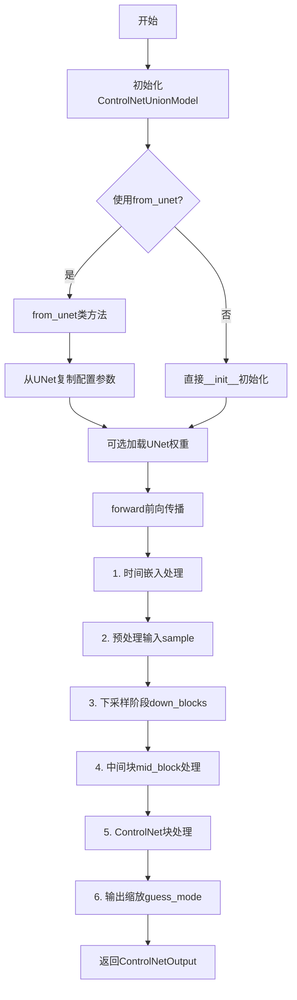
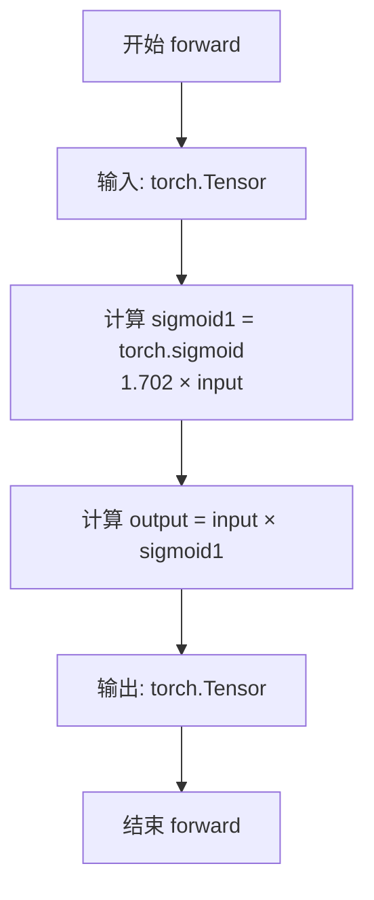
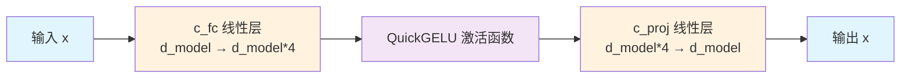
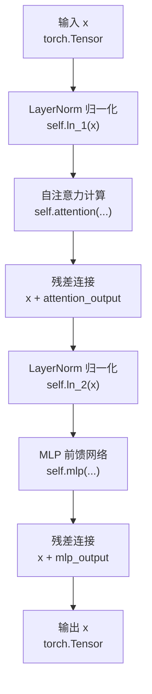
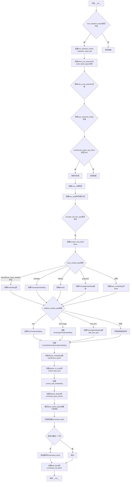
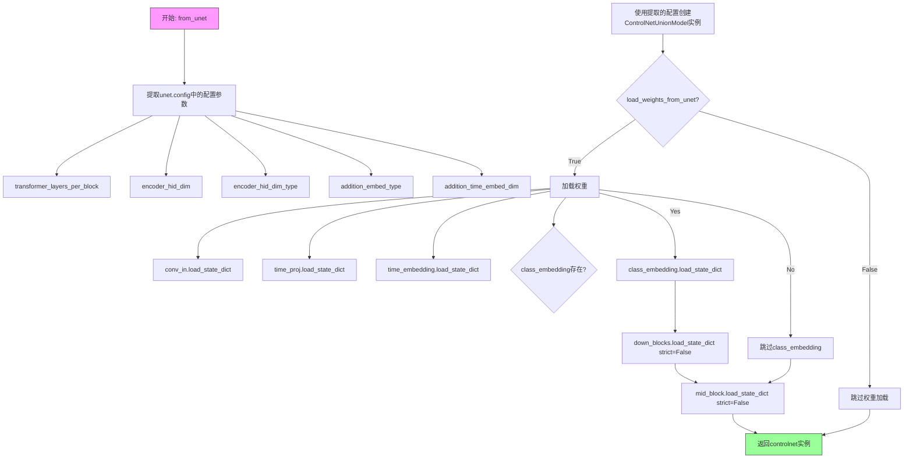
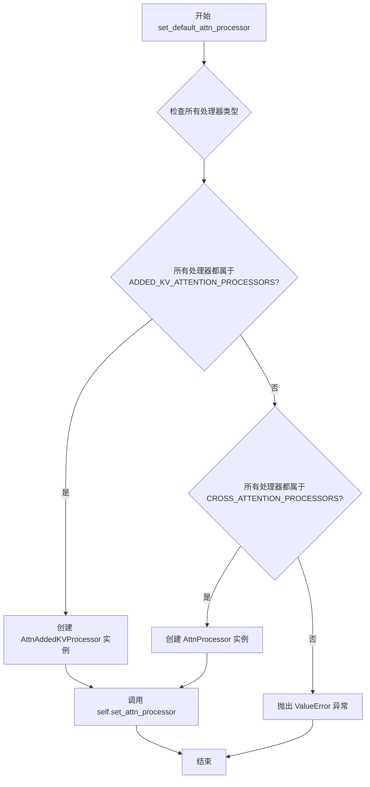

# `diffusers\src\diffusers\models\controlnets\controlnet_union.py` 详细设计文档

一个ControlNetUnion模型实现，用于扩散模型的辅助条件控制，支持多种控制类型（control types）和条件嵌入，可从UNet2DConditionModel加载权重，用于图像生成过程中的条件引导。

## 整体流程



## 类结构

```
QuickGELU (激活函数类)
ResidualAttentionMlp (残差注意力MLP)
ResidualAttentionBlock (残差注意力块)
ControlNetUnionModel (主控制网络模型)
    ├── 继承: ModelMixin, AttentionMixin, ConfigMixin, FromOriginalModelMixin
```

## 全局变量及字段


### `logger`
    
模块级别的日志记录器，用于输出调试和信息日志

类型：`logging.Logger`
    


### `ResidualAttentionMlp.c_fc`
    
第一层全连接线性变换，将输入维度扩展4倍

类型：`nn.Linear`
    


### `ResidualAttentionMlp.gelu`
    
GELU激活函数近似，用于非线性变换

类型：`QuickGELU`
    


### `ResidualAttentionMlp.c_proj`
    
第二层全连接线性变换，将扩展维度投影回原始维度

类型：`nn.Linear`
    


### `ResidualAttentionBlock.attn`
    
多头自注意力机制，用于捕捉序列中的依赖关系

类型：`nn.MultiheadAttention`
    


### `ResidualAttentionBlock.ln_1`
    
第一个层归一化，用于注意力前的特征标准化

类型：`nn.LayerNorm`
    


### `ResidualAttentionBlock.mlp`
    
前馈神经网络模块，包含两层线性变换和激活函数

类型：`ResidualAttentionMlp`
    


### `ResidualAttentionBlock.ln_2`
    
第二个层归一化，用于MLP前的特征标准化

类型：`nn.LayerNorm`
    


### `ResidualAttentionBlock.attn_mask`
    
可选的注意力掩码，用于控制注意力机制的稀疏性

类型：`torch.Tensor`
    


### `ControlNetUnionModel.conv_in`
    
输入卷积层，将输入图像通道映射到初始特征维度

类型：`nn.Conv2d`
    


### `ControlNetUnionModel.time_proj`
    
时间步投影层，将时间步转换为正弦余弦嵌入

类型：`Timesteps`
    


### `ControlNetUnionModel.time_embedding`
    
时间步嵌入层，将投影后的时间特征映射到高维空间

类型：`TimestepEmbedding`
    


### `ControlNetUnionModel.encoder_hid_proj`
    
编码器隐藏状态投影层，用于条件嵌入的维度转换

类型：`nn.Module | None`
    


### `ControlNetUnionModel.class_embedding`
    
类别嵌入层，用于分类条件的特征注入

类型：`nn.Module | None`
    


### `ControlNetUnionModel.add_embedding`
    
额外条件嵌入层，支持文本或文本图像时间嵌入

类型：`nn.Module | None`
    


### `ControlNetUnionModel.add_time_proj`
    
额外时间投影层，用于文本时间嵌入的时间编码

类型：`Timesteps | None`
    


### `ControlNetUnionModel.controlnet_cond_embedding`
    
ControlNet条件嵌入层，对输入条件图像进行特征提取

类型：`ControlNetConditioningEmbedding`
    


### `ControlNetUnionModel.task_embedding`
    
可学习的任务嵌入参数，用于区分不同的控制类型

类型：`nn.Parameter`
    


### `ControlNetUnionModel.transformer_layes`
    
残差注意力块列表，用于处理控制条件的序列特征

类型：`nn.ModuleList`
    


### `ControlNetUnionModel.spatial_ch_projs`
    
空间通道投影层，将变换器输出投影到目标通道维度

类型：`nn.Linear`
    


### `ControlNetUnionModel.control_type_proj`
    
控制类型投影层，对控制类型标识进行时间编码

类型：`Timesteps`
    


### `ControlNetUnionModel.control_add_embedding`
    
控制类型嵌入层，将控制类型编码融入时间嵌入

类型：`TimestepEmbedding`
    


### `ControlNetUnionModel.down_blocks`
    
UNet下采样块列表，包含多个跨注意力下采样块

类型：`nn.ModuleList`
    


### `ControlNetUnionModel.controlnet_down_blocks`
    
ControlNet独立的下采样块，用于提取多尺度条件特征

类型：`nn.ModuleList`
    


### `ControlNetUnionModel.mid_block`
    
UNet中间块，包含跨注意力机制的特征融合

类型：`UNetMidBlock2DCrossAttn`
    


### `ControlNetUnionModel.controlnet_mid_block`
    
ControlNet中间块的卷积层，用于处理最深层特征

类型：`nn.Conv2d`
    
    

## 全局函数及方法


### `QuickGELU.forward`

该方法是 `QuickGELU` 类的成员方法，实现了 GELU 激活函数的快速近似版本。通过将输入乘以 sigmoid(1.702 * input) 来近似 GELU 激活，这是一种计算效率高但精度略低的激活函数实现。

参数：

- `self`：`nn.Module`，PyTorch 模块的实例本身
- `input`：`torch.Tensor`，输入的张量，通常是多维张量（如 2D、3D 或 4D），表示需要经过激活函数处理的数据

返回值：`torch.Tensor`，返回经过 QuickGELU 激活函数处理后的张量，与输入张量形状相同

#### 流程图



#### 带注释源码

```python
class QuickGELU(nn.Module):
    """
    Applies GELU approximation that is fast but somewhat inaccurate. See: https://github.com/hendrycks/GELUs
    
    该类实现了一种快速但精度略低的 GELU 激活函数近似算法。
    GELU (Gaussian Error Linear Unit) 是一种深度学习中常用的激活函数，
    原始定义为: GELU(x) = x * Φ(x)，其中 Φ 是标准正态分布的累积分布函数。
    精确计算涉及高斯误差函数 (erf)，计算成本较高。
    
    QuickGELU 使用公式: f(x) = x * sigmoid(1.702 * x) 来近似 GELU，
    这种近似由 Hendrycks 和 Gimpel 提出，在实际应用中效果良好。
    """

    def forward(self, input: torch.Tensor) -> torch.Tensor:
        """
        对输入张量应用 QuickGELU 激活函数
        
        参数:
            input: torch.Tensor - 输入的张量，可以是任意维度的张量
            
        返回:
            torch.Tensor - 激活后的张量，形状与输入相同
            
        公式说明:
            output = input * σ(1.702 * input)
            其中 σ(x) = 1 / (1 + e^(-x)) 是 sigmoid 函数
            系数 1.702 是一个经验值，用于使近似曲线更接近真实的 GELU
        """
        return input * torch.sigmoid(1.702 * input)
```

#### 设计说明

| 项目 | 说明 |
|------|------|
| **设计目标** | 提供一种计算效率高的 GELU 近似激活函数 |
| **数学原理** | 使用 `sigmoid(1.702 * x)` 近似 `Φ(x)` (标准正态分布的 CDF) |
| **精度权衡** | 比精确的 GELU 计算更快，但曲线拟合存在一定误差 |
| **使用场景** | 对推理速度有较高要求的深度学习模型中作为激活函数 |
| **典型应用** | 在 `ResidualAttentionMlp` 类中作为 MLP 块的激活函数使用 |


### `ResidualAttentionMlp.forward`

该方法实现了一个带有扩展-压缩结构的MLP模块，包含三个核心步骤：首先通过全连接层将输入维度扩展4倍，然后应用QuickGELU激活函数，最后通过投影层将维度压缩回原始大小。这种设计借鉴了Transformer中FFN的思想，旨在增加模型的表达能力。

参数：

- `x`：`torch.Tensor`，输入张量，通常为形状为 `(batch_size, seq_len, d_model)` 的隐藏状态

返回值：`torch.Tensor`，经过MLP处理后的输出张量，形状与输入相同 `(batch_size, seq_len, d_model)`

#### 流程图



#### 带注释源码

```python
def forward(self, x: torch.Tensor):
    # 第一步：扩展维度 (d_model -> d_model * 4)
    # 使用线性变换将输入特征维度扩展4倍
    # 这允许模型在更高维空间中进行非线性变换，增加表达能力
    x = self.c_fc(x)
    
    # 第二步：应用QuickGELU激活函数
    # QuickGELU是GELU的快速近似实现: x * sigmoid(1.702 * x)
    # 相比ReLU，GELU能够提供更平滑的非线性激活
    x = self.gelu(x)
    
    # 第三步：压缩维度 (d_model * 4 -> d_model)
    # 使用线性变换将扩展后的维度压缩回原始大小
    # 这个投影层有助于细化特征表示
    x = self.c_proj(x)
    
    # 返回处理后的张量，形状与输入相同
    return x
```

#### 关键设计说明

| 设计要素 | 说明 |
|---------|------|
| **扩展比例** | 使用4倍扩展因子（d_model * 4），这是Transformer架构中FFN层的常见配置 |
| **激活函数** | QuickGELU是标准GELU的快速近似，公式为 `x * sigmoid(1.702 * x)` |
| **对称性** | 先扩展后压缩的设计保持了输入输出维度的一致性，便于残差连接 |
| **位置** | 该MLP作为ResidualAttentionBlock中的前馈网络部分，与自注意力层交替使用 |


### `ResidualAttentionBlock.attention`

该方法实现了 ResidualAttentionBlock 的自注意力机制，将输入张量通过 MultiheadAttention 层进行自注意力计算，并返回注意力输出。

参数：

- `x`：`torch.Tensor`，输入的张量，通常是经过 LayerNorm 处理的特征表示

返回值：`torch.Tensor`，经过自注意力机制处理的输出张量

#### 流程图

```mermaid
flowchart TD
    A[输入 x] --> B{self.attn_mask 是否存在?}
    B -- 是 --> C[将 attn_mask 转换到 x 的 dtype 和 device]
    B -- 否 --> D[attn_mask 设置为 None]
    C --> E[调用 self.attn 进行自注意力计算]
    D --> E
    E --> F[MultiheadAttention 返回元组]
    F --> G[取元组第一个元素 [0]]
    G --> H[返回注意力输出张量]
```

#### 带注释源码

```python
def attention(self, x: torch.Tensor):
    """
    执行自注意力计算
    
    参数:
        x: 输入张量，形状为 (seq_len, batch, d_model) 或 (batch, seq_len, d_model)
           取决于 MultiheadAttention 的输入格式要求
    
    返回:
        经过自注意力处理后的张量
    """
    # 如果存在注意力掩码，则将其转换到与输入 x 相同的 dtype 和 device
    # 以确保计算一致性；如果不存在则设为 None
    self.attn_mask = self.attn_mask.to(dtype=x.dtype, device=x.device) if self.attn_mask is not None else None
    
    # 调用 MultiheadAttention 层进行自注意力计算
    # 参数: (query, key, value, need_weights, attn_mask)
    # 返回值是一个元组 (output, attention_weights)
    # 这里 need_weights=False 表示不需要返回注意力权重
    # 取 [0] 获取输出张量，忽略注意力权重
    return self.attn(x, x, x, need_weights=False, attn_mask=self.attn_mask)[0]
```


### `ResidualAttentionBlock.forward`

该方法实现了一个标准的Transformer残差注意力块，包含自注意力机制和前馈神经网络（MLP），通过层归一化和残差连接来处理输入张量，这是Vision Transformer架构的核心组成单元。

参数：

- `x`：`torch.Tensor`，输入张量，形状为 `(seq_len, batch_size, d_model)` 或 `(batch_size, seq_len, d_model)`，代表序列嵌入向量

返回值：`torch.Tensor`，返回经过注意力块处理后的张量，形状与输入相同

#### 流程图



#### 带注释源码

```python
def forward(self, x: torch.Tensor) -> torch.Tensor:
    """
    ResidualAttentionBlock 的前向传播方法。
    
    实现标准的Transformer编码器块结构：
    1. 首先进行自注意力计算（带残差连接和层归一化）
    2. 然后进行MLP前馈网络处理（带残差连接和层归一化）
    
    Args:
        x (torch.Tensor): 输入张量，形状为 (seq_len, batch_size, d_model) 或 (batch_size, seq_len, d_model)
                        代表经过嵌入的序列数据
    
    Returns:
        torch.Tensor: 经过注意力块处理后的张量，形状与输入相同
    """
    # 第一步：自注意力机制
    # 1. 对输入 x 进行 LayerNorm 归一化
    # 2. 计算自注意力，query/key/value 都是 x 自身
    # 3. 加上残差连接（x + attention_output）
    x = x + self.attention(self.ln_1(x))
    
    # 第二步：前馈神经网络（MLP）
    # 1. 对上一步结果进行 LayerNorm 归一化
    # 2. 通过 MLP 网络进行处理
    # 3. 加上残差连接（x + mlp_output）
    x = x + self.mlp(self.ln_2(x))
    
    # 返回处理后的张量
    return x
```


### `ControlNetUnionModel.__init__`

该方法是`ControlNetUnionModel`类的构造函数，负责初始化一个支持多种控制类型的ControlNet联合模型。它配置了时间嵌入、类别嵌入、文本嵌入、任务嵌入、变换器层、下采样块、上采样块、中间块等所有组件，并进行了多轮参数校验以确保模型结构的正确性。

参数：

- `in_channels`：`int`，输入样本的通道数，默认为4
- `conditioning_channels`：`int`，条件图像的通道数，默认为3
- `flip_sin_to_cos`：`bool`，是否将正弦换为余弦用于时间嵌入，默认为`True`
- `freq_shift`：`int`，时间嵌入的频率偏移量，默认为0
- `down_block_types`：`tuple[str, ...]`，下采样块的元组类型，默认为`("CrossAttnDownBlock2D", "CrossAttnDownBlock2D", "CrossAttnDownBlock2D", "DownBlock2D")`
- `only_cross_attention`：`bool | tuple[bool]`，是否仅使用交叉注意力，默认为`False`
- `block_out_channels`：`tuple[int, ...]`，每个块的输出通道数元组，默认为`(320, 640, 1280, 1280)`
- `layers_per_block`：`int`，每个块的层数，默认为2
- `downsample_padding`：`int`，下采样卷积的填充数，默认为1
- `mid_block_scale_factor`：`float`，中间块的缩放因子，默认为1
- `act_fn`：`str`，激活函数名称，默认为`"silu"`
- `norm_num_groups`：`int | None`，归一化的组数，默认为32
- `norm_eps`：`float`，归一化的epsilon值，默认为1e-5
- `cross_attention_dim`：`int`，交叉注意力特征的维度，默认为1280
- `transformer_layers_per_block`：`int | tuple[int, ...]`，每个块的变换器层数，默认为1
- `encoder_hid_dim`：`int | None`，编码器隐藏层维度，默认为`None`
- `encoder_hid_dim_type`：`str | None`，编码器隐藏层维度类型，默认为`None`
- `attention_head_dim`：`int | tuple[int, ...]`，注意力头维度，默认为8
- `num_attention_heads`：`int | tuple[int, ...] | None`，注意力头数量，默认为`None`
- `use_linear_projection`：`bool`，是否使用线性投影，默认为`False`
- `class_embed_type`：`str | None`，类别嵌入类型，默认为`None`
- `addition_embed_type`：`str | None`，额外嵌入类型，默认为`None`
- `addition_time_embed_dim`：`int | None`，额外时间嵌入维度，默认为`None`
- `num_class_embeds`：`int | None`，类别嵌入数量，默认为`None`
- `upcast_attention`：`bool`，是否上转注意力，默认为`False`
- `resnet_time_scale_shift`：`str`，ResNet时间尺度偏移配置，默认为`"default"`
- `projection_class_embeddings_input_dim`：`int | None`，投影类别嵌入的输入维度，默认为`None`
- `controlnet_conditioning_channel_order`：`str`，条件图像的通道顺序，默认为`"rgb"`
- `conditioning_embedding_out_channels`：`tuple[int, ...] | None`，条件嵌入层每个块的输出通道数，默认为`(48, 96, 192, 384)`
- `global_pool_conditions`：`bool`，是否全局池化条件，默认为`False`
- `addition_embed_type_num_heads`：`int`，额外嵌入类型的注意力头数，默认为64
- `num_control_type`：`int`，控制类型数量，默认为6
- `num_trans_channel`：`int`，变换器通道数，默认为320
- `num_trans_head`：`int`，变换器注意力头数，默认为8
- `num_trans_layer`：`int`，变换器层数，默认为1
- `num_proj_channel`：`int`，投影通道数，默认为320

返回值：`None`，该方法为构造函数，不返回任何值

#### 流程图



#### 带注释源码

```python
@register_to_config
def __init__(
    self,
    in_channels: int = 4,
    conditioning_channels: int = 3,
    flip_sin_to_cos: bool = True,
    freq_shift: int = 0,
    down_block_types: tuple[str, ...] = (
        "CrossAttnDownBlock2D",
        "CrossAttnDownBlock2D",
        "CrossAttnDownBlock2D",
        "DownBlock2D",
    ),
    only_cross_attention: bool | tuple[bool] = False,
    block_out_channels: tuple[int, ...] = (320, 640, 1280, 1280),
    layers_per_block: int = 2,
    downsample_padding: int = 1,
    mid_block_scale_factor: float = 1,
    act_fn: str = "silu",
    norm_num_groups: int | None = 32,
    norm_eps: float = 1e-5,
    cross_attention_dim: int = 1280,
    transformer_layers_per_block: int | tuple[int, ...] = 1,
    encoder_hid_dim: int | None = None,
    encoder_hid_dim_type: str | None = None,
    attention_head_dim: int | tuple[int, ...] = 8,
    num_attention_heads: int | tuple[int, ...] | None = None,
    use_linear_projection: bool = False,
    class_embed_type: str | None = None,
    addition_embed_type: str | None = None,
    addition_time_embed_dim: int | None = None,
    num_class_embeds: int | None = None,
    upcast_attention: bool = False,
    resnet_time_scale_shift: str = "default",
    projection_class_embeddings_input_dim: int | None = None,
    controlnet_conditioning_channel_order: str = "rgb",
    conditioning_embedding_out_channels: tuple[int, ...] | None = (48, 96, 192, 384),
    global_pool_conditions: bool = False,
    addition_embed_type_num_heads: int = 64,
    num_control_type: int = 6,
    num_trans_channel: int = 320,
    num_trans_head: int = 8,
    num_trans_layer: int = 1,
    num_proj_channel: int = 320,
):
    super().__init__()

    # 如果`num_attention_heads`未定义（大多数模型的默认情况），则默认为`attention_head_dim`
    # 这是为了兼容早期版本中错误命名的变量
    num_attention_heads = num_attention_heads or attention_head_dim

    # 检查输入参数的一致性
    if len(block_out_channels) != len(down_block_types):
        raise ValueError(
            f"Must provide the same number of `block_out_channels` as `down_block_types`. `block_out_channels`: {block_out_channels}. `down_block_types`: {down_block_types}."
        )

    if not isinstance(only_cross_attention, bool) and len(only_cross_attention) != len(down_block_types):
        raise ValueError(
            f"Must provide the same number of `only_cross_attention` as `down_block_types`. `only_cross_attention`: {only_cross_attention}. `down_block_types`: {down_block_types}."
        )

    if not isinstance(num_attention_heads, int) and len(num_attention_heads) != len(down_block_types):
        raise ValueError(
            f"Must provide the same number of `num_attention_heads` as `down_block_types`. `num_attention_heads`: {num_attention_heads}. `down_block_types`: {down_block_types}."
        )

    # 如果transformer_layers_per_block是单个整数，则转换为列表
    if isinstance(transformer_layers_per_block, int):
        transformer_layers_per_block = [transformer_layers_per_block] * len(down_block_types)

    # 输入卷积层：将输入图像转换为初始特征图
    conv_in_kernel = 3
    conv_in_padding = (conv_in_kernel - 1) // 2
    self.conv_in = nn.Conv2d(
        in_channels, block_out_channels[0], kernel_size=conv_in_kernel, padding=conv_in_padding
    )

    # 时间嵌入层：将时间步转换为高维向量
    time_embed_dim = block_out_channels[0] * 4
    self.time_proj = Timesteps(block_out_channels[0], flip_sin_to_cos, freq_shift)
    timestep_input_dim = block_out_channels[0]
    self.time_embedding = TimestepEmbedding(
        timestep_input_dim,
        time_embed_dim,
        act_fn=act_fn,
    )

    # 编码器隐藏投影：目前不支持，非None时抛出异常
    if encoder_hid_dim_type is not None:
        raise ValueError(f"encoder_hid_dim_type: {encoder_hid_dim_type} must be None.")
    else:
        self.encoder_hid_proj = None

    # 类别嵌入：根据不同类型选择不同的嵌入方式
    if class_embed_type is None and num_class_embeds is not None:
        self.class_embedding = nn.Embedding(num_class_embeds, time_embed_dim)
    elif class_embed_type == "timestep":
        self.class_embedding = TimestepEmbedding(timestep_input_dim, time_embed_dim)
    elif class_embed_type == "identity":
        self.class_embedding = nn.Identity(time_embed_dim, time_embed_dim)
    elif class_embed_type == "projection":
        if projection_class_embeddings_input_dim is None:
            raise ValueError(
                "`class_embed_type`: 'projection' requires `projection_class_embeddings_input_dim` be set"
            )
        self.class_embedding = TimestepEmbedding(projection_class_embeddings_input_dim, time_embed_dim)
    else:
        self.class_embedding = None

    # 额外嵌入：支持文本、文本图像、文本时间等类型
    if addition_embed_type == "text":
        if encoder_hid_dim is not None:
            text_time_embedding_from_dim = encoder_hid_dim
        else:
            text_time_embedding_from_dim = cross_attention_dim

        self.add_embedding = TextTimeEmbedding(
            text_time_embedding_from_dim, time_embed_dim, num_heads=addition_embed_type_num_heads
        )
    elif addition_embed_type == "text_image":
        self.add_embedding = TextImageTimeEmbedding(
            text_embed_dim=cross_attention_dim, image_embed_dim=cross_attention_dim, time_embed_dim=time_embed_dim
        )
    elif addition_embed_type == "text_time":
        self.add_time_proj = Timesteps(addition_time_embed_dim, flip_sin_to_cos, freq_shift)
        self.add_embedding = TimestepEmbedding(projection_class_embeddings_input_dim, time_embed_dim)

    elif addition_embed_type is not None:
        raise ValueError(f"addition_embed_type: {addition_embed_type} must be None, 'text' or 'text_image'.")

    # ControlNet条件嵌入层：处理输入条件图像
    self.controlnet_cond_embedding = ControlNetConditioningEmbedding(
        conditioning_embedding_channels=block_out_channels[0],
        block_out_channels=conditioning_embedding_out_channels,
        conditioning_channels=conditioning_channels,
    )

    # 任务嵌入和变换器层：用于处理多种控制类型
    task_scale_factor = num_trans_channel**0.5
    self.task_embedding = nn.Parameter(task_scale_factor * torch.randn(num_control_type, num_trans_channel))
    self.transformer_layes = nn.ModuleList(
        [ResidualAttentionBlock(num_trans_channel, num_trans_head) for _ in range(num_trans_layer)]
    )
    self.spatial_ch_projs = zero_module(nn.Linear(num_trans_channel, num_proj_channel))
    self.control_type_proj = Timesteps(addition_time_embed_dim, flip_sin_to_cos, freq_shift)
    self.control_add_embedding = TimestepEmbedding(addition_time_embed_dim * num_control_type, time_embed_dim)

    # 初始化下采样块和ControlNet下采样块列表
    self.down_blocks = nn.ModuleList([])
    self.controlnet_down_blocks = nn.ModuleList([])

    # 将only_cross_attention和attention_head_dim转换为列表形式
    if isinstance(only_cross_attention, bool):
        only_cross_attention = [only_cross_attention] * len(down_block_types)

    if isinstance(attention_head_dim, int):
        attention_head_dim = (attention_head_dim,) * len(down_block_types)

    if isinstance(num_attention_heads, int):
        num_attention_heads = (num_attention_heads,) * len(down_block_types)

    # 下采样阶段：构建UNet的下采样路径和对应的ControlNet块
    output_channel = block_out_channels[0]

    controlnet_block = nn.Conv2d(output_channel, output_channel, kernel_size=1)
    controlnet_block = zero_module(controlnet_block)
    self.controlnet_down_blocks.append(controlnet_block)

    for i, down_block_type in enumerate(down_block_types):
        input_channel = output_channel
        output_channel = block_out_channels[i]
        is_final_block = i == len(block_out_channels) - 1

        # 获取并添加下采样块
        down_block = get_down_block(
            down_block_type,
            num_layers=layers_per_block,
            transformer_layers_per_block=transformer_layers_per_block[i],
            in_channels=input_channel,
            out_channels=output_channel,
            temb_channels=time_embed_dim,
            add_downsample=not is_final_block,
            resnet_eps=norm_eps,
            resnet_act_fn=act_fn,
            resnet_groups=norm_num_groups,
            cross_attention_dim=cross_attention_dim,
            num_attention_heads=num_attention_heads[i],
            attention_head_dim=attention_head_dim[i] if attention_head_dim[i] is not None else output_channel,
            downsample_padding=downsample_padding,
            use_linear_projection=use_linear_projection,
            only_cross_attention=only_cross_attention[i],
            upcast_attention=upcast_attention,
            resnet_time_scale_shift=resnet_time_scale_shift,
        )
        self.down_blocks.append(down_block)

        # 为每个层添加ControlNet块
        for _ in range(layers_per_block):
            controlnet_block = nn.Conv2d(output_channel, output_channel, kernel_size=1)
            controlnet_block = zero_module(controlnet_block)
            self.controlnet_down_blocks.append(controlnet_block)

        # 如果不是最后一块，添加下采样ControlNet块
        if not is_final_block:
            controlnet_block = nn.Conv2d(output_channel, output_channel, kernel_size=1)
            controlnet_block = zero_module(controlnet_block)
            self.controlnet_down_blocks.append(controlnet_block)

    # 中间阶段：构建UNet的中间块和对应的ControlNet块
    mid_block_channel = block_out_channels[-1]

    controlnet_block = nn.Conv2d(mid_block_channel, mid_block_channel, kernel_size=1)
    controlnet_block = zero_module(controlnet_block)
    self.controlnet_mid_block = controlnet_block

    self.mid_block = UNetMidBlock2DCrossAttn(
        transformer_layers_per_block=transformer_layers_per_block[-1],
        in_channels=mid_block_channel,
        temb_channels=time_embed_dim,
        resnet_eps=norm_eps,
        resnet_act_fn=act_fn,
        output_scale_factor=mid_block_scale_factor,
        resnet_time_scale_shift=resnet_time_scale_shift,
        cross_attention_dim=cross_attention_dim,
        num_attention_heads=num_attention_heads[-1],
        resnet_groups=norm_num_groups,
        use_linear_projection=use_linear_projection,
        upcast_attention=upcast_attention,
    )
```


### `ControlNetUnionModel.from_unet`

该类方法用于从预训练的 `UNet2DConditionModel` 实例化一个 `ControlNetUnionModel`，同时复制 UNet 的配置参数，并可选地加载其权重。

参数：

- `cls`：隐式参数，表示类本身
- `unet`：`UNet2DConditionModel`，UNet 模型权重，将被复制到 ControlNetUnionModel 中
- `controlnet_conditioning_channel_order`：`str`，默认为 `"rgb"`，条件图像的通道顺序
- `conditioning_embedding_out_channels`：`tuple[int, ...] | None`，默认为 `(16, 32, 96, 256)`，conditioning embedding 层每个块的输出通道数元组
- `load_weights_from_unet`：`bool`，默认为 `True`，是否从 UNet 加载权重

返回值：`ControlNetUnionModel`，从 UNet 实例化的 ControlNetUnionModel

#### 流程图



#### 带注释源码

```python
@classmethod
def from_unet(
    cls,
    unet: UNet2DConditionModel,
    controlnet_conditioning_channel_order: str = "rgb",
    conditioning_embedding_out_channels: tuple[int, ...] | None = (16, 32, 96, 256),
    load_weights_from_unet: bool = True,
):
    r"""
    从 UNet2DConditionModel 实例化一个 ControlNetUnionModel。

    Parameters:
        unet (UNet2DConditionModel):
            UNet 模型权重，将复制到 ControlNetUnionModel。
            所有配置选项也会被复制（如果适用）。
    """
    # 从 UNet 配置中提取可选参数，若不存在则使用默认值
    transformer_layers_per_block = (
        unet.config.transformer_layers_per_block if "transformer_layers_per_block" in unet.config else 1
    )
    encoder_hid_dim = unet.config.encoder_hid_dim if "encoder_hid_dim" in unet.config else None
    encoder_hid_dim_type = unet.config.encoder_hid_dim_type if "encoder_hid_dim_type" in unet.config else None
    addition_embed_type = unet.config.addition_embed_type if "addition_embed_type" in unet.config else None
    addition_time_embed_dim = (
        unet.config.addition_time_embed_dim if "addition_time_embed_dim" in unet.config else None
    )

    # 使用从 UNet 提取的配置创建 ControlNetUnionModel 实例
    controlnet = cls(
        encoder_hid_dim=encoder_hid_dim,
        encoder_hid_dim_type=encoder_hid_dim_type,
        addition_embed_type=addition_embed_type,
        addition_time_embed_dim=addition_time_embed_dim,
        transformer_layers_per_block=transformer_layers_per_block,
        in_channels=unet.config.in_channels,
        flip_sin_to_cos=unet.config.flip_sin_to_cos,
        freq_shift=unet.config.freq_shift,
        down_block_types=unet.config.down_block_types,
        only_cross_attention=unet.config.only_cross_attention,
        block_out_channels=unet.config.block_out_channels,
        layers_per_block=unet.config.layers_per_block,
        downsample_padding=unet.config.downsample_padding,
        mid_block_scale_factor=unet.config.mid_block_scale_factor,
        act_fn=unet.config.act_fn,
        norm_num_groups=unet.config.norm_num_groups,
        norm_eps=unet.config.norm_eps,
        cross_attention_dim=unet.config.cross_attention_dim,
        attention_head_dim=unet.config.attention_head_dim,
        num_attention_heads=unet.config.num_attention_heads,
        use_linear_projection=unet.config.use_linear_projection,
        class_embed_type=unet.config.class_embed_type,
        num_class_embeds=unet.config.num_class_embeds,
        upcast_attention=unet.config.upcast_attention,
        resnet_time_scale_shift=unet.config.resnet_time_scale_shift,
        projection_class_embeddings_input_dim=unet.config.projection_class_embeddings_input_dim,
        controlnet_conditioning_channel_order=controlnet_conditioning_channel_order,
        conditioning_embedding_out_channels=conditioning_embedding_out_channels,
    )

    # 如果需要从 UNet 加载权重
    if load_weights_from_unet:
        # 加载输入卷积层权重
        controlnet.conv_in.load_state_dict(unet.conv_in.state_dict())
        # 加载时间投影层权重
        controlnet.time_proj.load_state_dict(unet.time_proj.state_dict())
        # 加载时间嵌入层权重
        controlnet.time_embedding.load_state_dict(unet.time_embedding.state_dict())

        # 如果存在类别嵌入，则加载其权重
        if controlnet.class_embedding:
            controlnet.class_embedding.load_state_dict(unet.class_embedding.state_dict())

        # 加载下采样块权重（strict=False 允许部分权重不匹配）
        controlnet.down_blocks.load_state_dict(unet.down_blocks.state_dict(), strict=False)
        # 加载中间块权重
        controlnet.mid_block.load_state_dict(unet.mid_block.state_dict(), strict=False)

    # 返回创建的 ControlNetUnionModel 实例
    return controlnet
```


### `ControlNetUnionModel.set_default_attn_processor`

该方法用于禁用模型中所有自定义的注意力处理器，并根据当前已注册的注意力处理器类型自动选择并设置默认的注意力实现（AttnAddedKVProcessor 或 AttnProcessor）。

参数： 无

返回值：`None`，该方法直接在实例上修改注意力处理器，无返回值

#### 流程图



#### 带注释源码

```python
def set_default_attn_processor(self):
    """
    Disables custom attention processors and sets the default attention implementation.
    
    该方法会遍历模型中所有的注意力处理器（self.attn_processors），
    根据处理器的类型自动选择合适的默认处理器：
    - 如果所有处理器都属于 ADDED_KV_ATTENTION_PROCESSORS 类型，则使用 AttnAddedKVProcessor
    - 如果所有处理器都属于 CROSS_ATTENTION_PROCESSORS 类型，则使用 AttnProcessor
    - 否则抛出 ValueError 异常
    """
    # 检查所有注意力处理器是否都属于 ADDED_KV_ATTENTION_PROCESSORS 类型
    if all(proc.__class__ in ADDED_KV_ATTENTION_PROCESSORS for proc in self.attn_processors.values()):
        # 创建支持额外键值对的注意力处理器实例
        processor = AttnAddedKVProcessor()
    # 检查所有注意力处理器是否都属于 CROSS_ATTENTION_PROCESSORS 类型
    elif all(proc.__class__ in CROSS_ATTENTION_PROCESSORS for proc in self.attn_processors.values()):
        # 创建标准交叉注意力处理器实例
        processor = AttnProcessor()
    else:
        # 处理器类型混合或不支持，抛出异常
        raise ValueError(
            f"Cannot call `set_default_attn_processor` when attention processors are of type {next(iter(self.attn_processors.values()))}"
        )

    # 使用默认处理器替换当前的所有注意力处理器
    self.set_attn_processor(processor)
```


### ControlNetUnionModel.set_attention_slice

该方法用于启用切片注意力计算。通过将输入张量分割成多个切片分步计算注意力，以节省显存为代价换取轻微的速度下降。该方法会递归遍历模型的所有子模块，将切片大小传递给支持该功能的注意力模块。

参数：

- `slice_size`：`str | int | list[int]`，切片大小参数。当值为 `"auto"` 时，输入到注意力头的数据减半，注意力分两步计算；当值为 `"max"` 时，通过每次仅运行一个切片来最大程度节省显存；如果传入数字，则使用 `attention_head_dim // slice_size` 个切片，此时 `attention_head_dim` 必须是 `slice_size` 的倍数

返回值：`None`，无返回值，该方法直接修改模型内部状态

#### 流程图

```mermaid
flowchart TD
    A[开始 set_attention_slice] --> B[初始化空列表 sliceable_head_dims]
    B --> C[定义 fn_recursive_retrieve_sliceable_dims 递归函数]
    C --> D[遍历 self.children 获取所有 sliceable_head_dim]
    D --> E{slice_size == 'auto'?}
    E -->|是| F[slice_size = dim // 2 for each dim]
    E -->|否| G{slice_size == 'max'?}
    G -->|是| H[slice_size = [1] * num_sliceable_layers]
    G -->|否| I[保持原 slice_size]
    F --> J[验证 slice_size 长度]
    H --> J
    I --> J
    J --> K{len(slice_size) == len(sliceable_head_dims)?}
    K -->|否| L[抛出 ValueError]
    K -->|是| M{遍历每个 slice_size[i]}
    M --> N{size <= dim?}
    N -->|否| O[抛出 ValueError]
    N -->|是| P[继续下一个]
    M --> Q[反转 slice_size 列表]
    Q --> R[定义 fn_recursive_set_attention_slice 递归函数]
    R --> S[遍历子模块调用 set_attention_slice]
    S --> T[结束]
    L --> T
    O --> T
```

#### 带注释源码

```python
def set_attention_slice(self, slice_size: str | int | list[int]) -> None:
    r"""
    Enable sliced attention computation.

    When this option is enabled, the attention module splits the input tensor in slices to compute attention in
    several steps. This is useful for saving some memory in exchange for a small decrease in speed.

    Args:
        slice_size (`str` or `int` or `list(int)`, *optional*, defaults to `"auto"`):
            When `"auto"`, input to the attention heads is halved, so attention is computed in two steps. If
            `"max"`, maximum amount of memory is saved by running only one slice at a time. If a number is
            provided, uses as many slices as `attention_head_dim // slice_size`. In this case, `attention_head_dim`
            must be a multiple of `slice_size`.
    """
    # 用于存储所有可切片注意力层的 head 维度
    sliceable_head_dims = []

    def fn_recursive_retrieve_sliceable_dims(module: torch.nn.Module):
        """递归遍历模块，获取所有具有 set_attention_slice 方法的子模块的 sliceable_head_dim"""
        if hasattr(module, "set_attention_slice"):
            # 将当前模块的 sliceable_head_dim 添加到列表中
            sliceable_head_dims.append(module.sliceable_head_dim)

        # 递归遍历所有子模块
        for child in module.children():
            fn_recursive_retrieve_sliceable_dims(child)

    # 遍历顶层模块，收集所有可切片注意力层的维度信息
    for module in self.children():
        fn_recursive_retrieve_sliceable_dims(module)

    # 计算可切片的注意力层总数
    num_sliceable_layers = len(sliceable_head_dims)

    # 根据 slice_size 参数确定具体的切片策略
    if slice_size == "auto":
        # "auto" 模式下，将每个注意力头的维度减半
        # 这样可以在速度和内存之间取得较好的平衡
        slice_size = [dim // 2 for dim in sliceable_head_dims]
    elif slice_size == "max":
        # "max" 模式下，使用最小的切片（每层一个切片）
        # 这样可以最大程度地节省显存
        slice_size = num_sliceable_layers * [1]

    # 如果 slice_size 不是列表，则将其扩展为与可切片层数量相同的列表
    slice_size = num_sliceable_layers * [slice_size] if not isinstance(slice_size, list) else slice_size

    # 验证 slice_size 列表长度是否与可切片层数量匹配
    if len(slice_size) != len(sliceable_head_dims):
        raise ValueError(
            f"You have provided {len(slice_size)}, but {self.config} has {len(sliceable_head_dims)} different"
            f" attention layers. Make sure to match `len(slice_size)` to be {len(sliceable_head_dims)}."
        )

    # 验证每个切片大小是否不超过对应的注意力维度
    for i in range(len(slice_size)):
        size = slice_size[i]
        dim = sliceable_head_dims[i]
        if size is not None and size > dim:
            raise ValueError(f"size {size} has to be smaller or equal to {dim}.")

    # 定义递归函数，为每个子模块设置切片大小
    def fn_recursive_set_attention_slice(module: torch.nn.Module, slice_size: list[int]):
        # 如果模块具有 set_attention_slice 方法，则调用它并从列表中弹出切片大小
        if hasattr(module, "set_attention_slice"):
            module.set_attention_slice(slice_size.pop())

        # 递归遍历所有子模块
        for child in module.children():
            fn_recursive_set_attention_slice(child, slice_size)

    # 反转切片大小列表，以便从后往前匹配模块
    reversed_slice_size = list(reversed(slice_size))
    # 遍历顶层模块，应用切片设置
    for module in self.children():
        fn_recursive_set_attention_slice(module, reversed_slice_size)
```


### `ControlNetUnionModel.forward`

该方法是 `ControlNetUnionModel` 类的核心前向传播方法，实现了多条件 ControlNet 联合推理。它接收噪声样本、时间步、编码器隐藏状态以及多个控制条件（如边缘图、分割图等），通过时间嵌入、条件处理、下采样网络和中间块，输出不同层级的特征用于后续图像生成引导。

参数：

- `sample`：`torch.Tensor`，噪声输入张量，是需要进行去噪处理的初始图像表示
- `timestep`：`torch.Tensor | float | int`，去噪所需的时间步长，用于调度噪声添加
- `encoder_hidden_states`：`torch.Tensor`，编码器的隐藏状态，通常为文本嵌入向量
- `controlnet_cond`：`list[torch.Tensor]`，ControlNet 的条件输入列表，每个元素为一种控制条件（如 Canny 边缘、深度图等）
- `control_type`：`torch.Tensor`，形状为 `(batch, num_control_type)` 的张量，值为 0 或 1，指示使用哪些控制类型
- `control_type_idx`：`list[int]`，控制类型的索引列表，指定当前使用哪些条件
- `conditioning_scale`：`float | list[float]`，默认为 `1.0`，ControlNet 输出的缩放因子
- `class_labels`：`torch.Tensor | None`，可选的类别标签，用于类别条件生成
- `timestep_cond`：`torch.Tensor | None`，可选的时间步条件嵌入
- `attention_mask`：`torch.Tensor | None`，可选的注意力掩码，应用于 encoder_hidden_states
- `added_cond_kwargs`：`dict[str, torch.Tensor] | None`，额外的条件参数字典，用于 SDXL UNet
- `cross_attention_kwargs`：`dict[str, Any] | None`，交叉注意力模块的额外关键字参数
- `from_multi`：`bool`，默认为 `False`，是否从 MultiControlNetUnionModel 调用
- `guess_mode`：`bool`，默认为 `False`，猜测模式，在没有提示的情况下尝试识别输入内容
- `return_dict`：`bool`，默认为 `True`，是否返回 ControlNetOutput 对象

返回值：`ControlNetOutput | tuple[tuple[torch.Tensor, ...], torch.Tensor]`，若 return_dict 为 True，返回包含下采样块特征列表和中block特征的 ControlNetOutput 对象；否则返回元组

#### 流程图

```mermaid
flowchart TD
    A[Start: forward] --> B{conditioning_scale是否为float?}
    B -->|Yes| C[转换为list长度与controlnet_cond相同]
    B -->|No| D[保持原样]
    C --> E[验证channel_order]
    D --> E
    E --> F[准备attention_mask]
    F --> G[处理timestep为tensor并broadcast到batch维度]
    G --> H[计算time_embedding]
    H --> I{class_embedding是否存在?}
    I -->|Yes| J[添加class_labels嵌入]
    I -->|No| K
    J --> K
    K{addition_embed_type是否存在?}
    K -->|text| L[计算text embedding]
    K -->|text_time| M[计算text+time embedding]
    K -->|None| N
    L --> N
    M --> N
    N[计算control_type嵌入并添加到emb]
    N --> O[conv_in预处理sample]
    O --> P[遍历controlnet_cond和control_type_idx]
    P --> Q[计算condition特征和task_embedding]
    Q --> R[拼接inputs和condition_list]
    R --> S[通过transformer_layers]
    S --> T[融合controlnet条件到sample]
    T --> U[下采样阶段: 遍历down_blocks]
    U --> V[收集down_block_res_samples]
    V --> W[中间block处理mid_block]
    W --> X[通过controlnet_down_blocks处理特征]
    X --> Y[通过controlnet_mid_block处理中间特征]
    Y --> Z{guess_mode且非global_pool?}
    Z -->|Yes| AA[使用logspace缩放]
    Z -->|No| AB{from_multi或len==1?}
    AA --> AC[应用缩放到down和mid特征]
    AB -->|Yes| AD[使用conditioning_scale[0]缩放]
    AB -->|No| AE[保持原始缩放]
    AD --> AC
    AE --> AC
    AC --> AF{global_pool?}
    AF -->|Yes| AG[对每个特征进行全局平均池化]
    AF -->|No| AH
    AG --> AH
    AH --> AI{return_dict?}
    AI -->|Yes| AJ[返回ControlNetOutput对象]
    AI -->|No| AK[返回tuple]
```

#### 带注释源码

```python
def forward(
    self,
    sample: torch.Tensor,  # 噪声输入张量 (batch, channels, height, width)
    timestep: torch.Tensor | float | int,  # 时间步
    encoder_hidden_states: torch.Tensor,  # 文本/条件编码 (batch, seq_len, hidden_dim)
    controlnet_cond: list[torch.Tensor],  # 控制条件列表，每个元素 (batch, c, h, w)
    control_type: torch.Tensor,  # 控制类型张量 (batch, num_control_type)
    control_type_idx: list[int],  # 使用的控制类型索引
    conditioning_scale: float | list[float] = 1.0,  # 条件缩放因子
    class_labels: torch.Tensor | None = None,  # 类别标签
    timestep_cond: torch.Tensor | None = None,  # 时间步条件
    attention_mask: torch.Tensor | None = None,  # 注意力掩码
    added_cond_kwargs: dict[str, torch.Tensor] | None = None,  # 额外条件参数
    cross_attention_kwargs: dict[str, Any] | None = None,  # 交叉注意力参数
    from_multi: bool = False,  # 是否从多模型调用
    guess_mode: bool = False,  # 猜测模式
    return_dict: bool = True,  # 是否返回字典
) -> ControlNetOutput | tuple[tuple[torch.Tensor, ...], torch.Tensor]:
    """
    ControlNetUnionModel 前向传播
    支持多条件联合推理，每个条件可独立缩放
    """
    # 1. 规范化 conditioning_scale 为列表
    if isinstance(conditioning_scale, float):
        conditioning_scale = [conditioning_scale] * len(controlnet_cond)

    # 2. 验证通道顺序
    channel_order = self.config.controlnet_conditioning_channel_order
    if channel_order != "rgb":
        raise ValueError(f"unknown `controlnet_conditioning_channel_order`: {channel_order}")

    # 3. 准备注意力掩码：转换为偏置形式 (1-mask) * -10000
    if attention_mask is not None:
        attention_mask = (1 - attention_mask.to(sample.dtype)) * -10000.0
        attention_mask = attention_mask.unsqueeze(1)

    # 4. 时间步处理：转换为 tensor 并 broadcast 到 batch 维度
    timesteps = timestep
    if not torch.is_tensor(timesteps):
        # 根据设备类型选择 dtype
        is_mps = sample.device.type == "mps"
        is_npu = sample.device.type == "npu"
        if isinstance(timestep, float):
            dtype = torch.float32 if (is_mps or is_npu) else torch.float64
        else:
            dtype = torch.int32 if (is_mps or is_npu) else torch.int64
        timesteps = torch.tensor([timesteps], dtype=dtype, device=sample.device)
    elif len(timesteps.shape) == 0:
        timesteps = timesteps[None].to(sample.device)

    # broadcast 到 batch 维度
    timesteps = timesteps.expand(sample.shape[0])

    # 5. 时间嵌入计算
    t_emb = self.time_proj(timesteps)  # (batch,) -> (batch, time_dim)
    t_emb = t_emb.to(dtype=sample.dtype)  # 转换 dtype 避免不匹配

    # 时间嵌入 + 可选的 timestep_cond
    emb = self.time_embedding(t_emb, timestep_cond)
    aug_emb = None  # 额外的文本/图像嵌入

    # 6. 类别嵌入处理
    if self.class_embedding is not None:
        if class_labels is None:
            raise ValueError("class_labels should be provided when num_class_embeds > 0")

        if self.config.class_embed_type == "timestep":
            class_labels = self.time_proj(class_labels)

        class_emb = self.class_embedding(class_labels).to(dtype=self.dtype)
        emb = emb + class_emb  # 叠加类别嵌入

    # 7. 额外文本/图像条件嵌入
    if self.config.addition_embed_type is not None:
        if self.config.addition_embed_type == "text":
            aug_emb = self.add_embedding(encoder_hidden_states)

        elif self.config.addition_embed_type == "text_time":
            # 提取 text_embeds 和 time_ids
            if "text_embeds" not in added_cond_kwargs:
                raise ValueError(
                    f"{self.__class__} has the config param `addition_embed_type` set to 'text_time' "
                    "which requires the keyword argument `text_embeds` to be passed in `added_cond_kwargs`"
                )
            text_embeds = added_cond_kwargs.get("text_embeds")
            if "time_ids" not in added_cond_kwargs:
                raise ValueError(
                    f"{self.__class__} has the config param `addition_embed_type` set to 'text_time' "
                    "which requires the keyword argument `time_ids` to be passed in `added_cond_kwargs`"
                )
            time_ids = added_cond_kwargs.get("time_ids")
            time_embeds = self.add_time_proj(time_ids.flatten())
            time_embeds = time_embeds.reshape((text_embeds.shape[0], -1))

            add_embeds = torch.concat([text_embeds, time_embeds], dim=-1)
            add_embeds = add_embeds.to(emb.dtype)
            aug_emb = self.add_embedding(add_embeds)

    # 8. 控制类型嵌入计算并添加到时间嵌入
    control_embeds = self.control_type_proj(control_type.flatten())  # (batch, num_control_type) -> (batch, ...)
    control_embeds = control_embeds.reshape((t_emb.shape[0], -1))
    control_embeds = control_embeds.to(emb.dtype)
    control_emb = self.control_add_embedding(control_embeds)
    emb = emb + control_emb  # 叠加控制类型嵌入
    emb = emb + aug_emb if aug_emb is not None else emb  # 叠加额外嵌入

    # 9. 预处理输入样本
    sample = self.conv_in(sample)  # 卷积调整通道数

    # 10. 处理每个 ControlNet 条件
    inputs = []
    condition_list = []

    for cond, control_idx, scale in zip(controlnet_cond, control_type_idx, conditioning_scale):
        # 条件编码 embedding
        condition = self.controlnet_cond_embedding(cond)
        
        # 计算空间平均特征 + 任务嵌入
        feat_seq = torch.mean(condition, dim=(2, 3))  # (batch, channels)
        feat_seq = feat_seq + self.task_embedding[control_idx]
        
        if from_multi or len(control_type_idx) == 1:
            # 多模型或单条件：不应用缩放
            inputs.append(feat_seq.unsqueeze(1))  # (batch, 1, channels)
            condition_list.append(condition)
        else:
            # 多条件：应用缩放
            inputs.append(feat_seq.unsqueeze(1) * scale)
            condition_list.append(condition * scale)

    # 添加原始样本作为条件之一
    condition = sample
    feat_seq = torch.mean(condition, dim=(2, 3))
    inputs.append(feat_seq.unsqueeze(1))
    condition_list.append(condition)

    # 11. Transformer 层处理条件特征
    x = torch.cat(inputs, dim=1)  # (batch, num_conditions+1, channels)
    for layer in self.transformer_layes:
        x = layer(x)

    # 12. 融合 ControlNet 条件到样本
    controlnet_cond_fuser = sample * 0.0  # 初始化为零
    for (idx, condition), scale in zip(enumerate(condition_list[:-1]), conditioning_scale):
        alpha = self.spatial_ch_projs(x[:, idx])  # 学习到的融合权重
        alpha = alpha.unsqueeze(-1).unsqueeze(-1)  # 扩展到空间维度
        
        if from_multi or len(control_type_idx) == 1:
            controlnet_cond_fuser += condition + alpha
        else:
            controlnet_cond_fuser += condition + alpha * scale

    sample = sample + controlnet_cond_fuser  # 残差连接

    # 13. 下采样阶段
    down_block_res_samples = (sample,)
    for downsample_block in self.down_blocks:
        if hasattr(downsample_block, "has_cross_attention") and downsample_block.has_cross_attention:
            sample, res_samples = downsample_block(
                hidden_states=sample,
                temb=emb,
                encoder_hidden_states=encoder_hidden_states,
                attention_mask=attention_mask,
                cross_attention_kwargs=cross_attention_kwargs,
            )
        else:
            sample, res_samples = downsample_block(hidden_states=sample, temb=emb)

        down_block_res_samples += res_samples

    # 14. 中间块处理
    if self.mid_block is not None:
        sample = self.mid_block(
            sample,
            emb,
            encoder_hidden_states=encoder_hidden_states,
            attention_mask=attention_mask,
            cross_attention_kwargs=cross_attention_kwargs,
        )

    # 15. ControlNet 块处理下采样特征
    controlnet_down_block_res_samples = ()

    for down_block_res_sample, controlnet_block in zip(down_block_res_samples, self.controlnet_down_blocks):
        down_block_res_sample = controlnet_block(down_block_res_sample)
        controlnet_down_block_res_samples = controlnet_down_block_res_samples + (down_block_res_sample,)

    down_block_res_samples = controlnet_down_block_res_samples

    # 16. ControlNet 中间块处理
    mid_block_res_sample = self.controlnet_mid_block(sample)

    # 17. 输出缩放
    if guess_mode and not self.config.global_pool_conditions:
        # 猜测模式：使用对数空间缩放 (0.1 到 1.0)
        scales = torch.logspace(-1, 0, len(down_block_res_samples) + 1, device=sample.device)
        if from_multi or len(control_type_idx) == 1:
            scales = scales * conditioning_scale[0]
        down_block_res_samples = [sample * scale for sample, scale in zip(down_block_res_samples, scales)]
        mid_block_res_sample = mid_block_res_sample * scales[-1]
    elif from_multi or len(control_type_idx) == 1:
        down_block_res_samples = [sample * conditioning_scale[0] for sample in down_block_res_samples]
        mid_block_res_sample = mid_block_res_sample * conditioning_scale[0]

    # 18. 全局池化 (可选)
    if self.config.global_pool_conditions:
        down_block_res_samples = [
            torch.mean(sample, dim=(2, 3), keepdim=True) for sample in down_block_res_samples
        ]
        mid_block_res_sample = torch.mean(mid_block_res_sample, dim=(2, 3), keepdim=True)

    # 19. 返回结果
    if not return_dict:
        return (down_block_res_samples, mid_block_res_sample)

    return ControlNetOutput(
        down_block_res_samples=down_block_res_samples, 
        mid_block_res_sample=mid_block_res_sample
    )
```

## 关键组件


### QuickGELU

GELU激活函数的快速近似实现，使用sigmoid函数进行计算，相比标准GELU更快但精度略低。

### ResidualAttentionMlp

用于残差注意力块的多层感知机，包含三个线性层：输入投影、激活函数应用和输出投影，使用QuickGELU作为激活函数。

### ResidualAttentionBlock

变压器风格的残差注意力块，包含多头注意力机制、两个层归一化层和一个MLP模块，支持可选的注意力掩码。

### ControlNetUnionModel

主控网络模型类，继承自ModelMixin、AttentionMixin、ConfigMixin和FromOriginalModelMixin。用于条件图像生成，支持多个控制类型的联合处理。

### time_proj & time_embedding

时间嵌入层，将时间步长投影到高维空间并转换为嵌入向量，用于条件扩散模型的时序信息编码。

### controlnet_cond_embedding

控制网络条件嵌入层，负责将条件图像编码到特征空间，支持可配置的通道数和输出通道。

### task_embedding

任务嵌入参数，通过可学习的参数向量为不同控制类型生成任务相关的嵌入表示。

### transformer_layes

Transformer层列表，使用ResidualAttentionBlock实现，用于处理任务嵌入的特征变换。

### spatial_ch_projs

空间通道投影层，将Transformer输出映射到控制网络的特征空间，实现条件信息的融合。

### control_type_proj & control_add_embedding

控制类型投影和嵌入层，将控制类型张量转换为模型可用的条件嵌入，用于调节主网络。

### down_blocks

下采样块列表，包含多个下采样stage，用于逐步降低特征图分辨率并提取多尺度特征。

### controlnet_down_blocks

控制网络下采样块列表，与主网络下采样块对应，用于提取控制条件的中间特征。

### mid_block

中间块，位于U-Net的瓶颈处，包含交叉注意力机制，用于融合全局信息。

### controlnet_mid_block

控制网络中间块，处理主网络瓶颈层的特征，生成相应的控制信号。

### forward 方法

主前向传播方法，处理噪声样本、时间步、条件嵌入和多控制类型输入，输出下采样块和中间块的特征样本，用于条件图像生成。

### from_unet 类方法

从预训练的UNet2DConditionModel实例化ControlNetUnionModel的类方法，可选择性地加载UNet权重，实现模型迁移。


## 问题及建议


### 已知问题

- **拼写错误**: `self.transformer_layes` 应该是 `self.transformer_layers`（第239行），这是一个潜在的维护性问题，容易导致混淆。
- **硬编码magic number**: `QuickGELU` 类中的 `1.702` 是硬编码的GELU近似参数（第30行），缺乏可配置性。
- **未使用的导入**: `AttnAddedKVProcessor` 和 `AttnProcessor` 被导入但仅在 `set_default_attn_processor` 中使用，该方法看起来是复制自 `UNet2DConditionModel` 的遗留代码，可能并不完全适用于 ControlNetUnionModel。
- **不完整的 `encoder_hid_dim_type` 处理**: 代码在 `__init__` 中检查 `encoder_hid_dim_type` 并直接抛出异常要求其为 `None`（第245行），这意味着该参数被接受但实际未使用，设计不一致。
- **复杂的条件逻辑**: `forward` 方法中的 `from_multi` 和 `guess_mode` 逻辑导致大量条件分支（第446-452行，第526-539行），增加了代码复杂度和维护成本。
- **重复的投影逻辑**: `control_type_proj` 和 `control_add_embedding` 的逻辑与 `time_proj` 和 `time_embedding` 高度相似，存在代码重复。

### 优化建议

- **修复拼写错误**: 将 `transformer_layes` 重命名为 `transformer_layers` 以保持一致性。
- **参数化magic number**: 将 `QuickGELU` 中的 `1.702` 作为可配置参数，或使用标准 `nn.GELU` 替代。
- **移除未使用的导入和代码**: 清理 `AttnAddedKVProcessor` 和 `AttnProcessor` 的导入，或重新评估 `set_default_attn_processor` 方法的必要性。
- **统一 `encoder_hid_dim_type` 设计**: 要么完全移除该参数的支持，要么实现完整的功能，而不是简单地检查并抛出异常。
- **提取条件逻辑**: 将 `from_multi` 和 `guess_mode` 相关的逻辑提取为独立方法或使用策略模式简化。
- **创建共享投影基类**: 将时间嵌入和控制器类型嵌入的投影逻辑抽象为共享基类或函数，减少代码重复。
- **添加配置验证**: 在 `__init__` 初期添加更全面的配置验证，避免在 `forward` 方法中进行大量运行时检查。

## 其它


### 设计目标与约束

该代码实现了一个ControlNetUnionModel，用于扩散模型的条件图像生成。核心目标是通过多条件控制机制，使模型能够根据不同的控制类型（如边缘检测、深度图、姿态等）来引导图像生成过程。设计约束包括：1）输入必须符合特定的通道顺序（RGB）；2）conditioning_scale参数必须与controlnet_cond列表长度匹配；3）transformer_layers_per_block参数必须与down_block_types长度一致；4）模型继承自多个混入类（ModelMixin、AttentionMixin、ConfigMixin、FromOriginalModelMixin），支持从预训练的UNet2DConditionModel加载权重。

### 错误处理与异常设计

代码中包含多处参数验证逻辑：在__init__方法中检查block_out_channels与down_block_types长度一致性、only_cross_attention与down_block_types长度一致性、num_attention_heads与down_block_types长度一致性；在forward方法中检查channel_order是否为"rgb"、验证class_labels在需要时已提供、验证addition_embed_type为"text_time"时必须提供text_embeds和time_ids；此外还检查attention_processor类型是否兼容set_default_attn_processor方法。所有错误均通过ValueError抛出，并附带清晰的错误消息说明具体问题。

### 数据流与状态机

数据流主要分为以下几个阶段：1）时间嵌入处理阶段：将timestep转换为时间嵌入向量；2）条件嵌入处理阶段：处理class_embedding、addition_embedding和control_type_embedding；3）预处理阶段：通过conv_in卷积层处理输入样本；4）条件嵌入融合阶段：对多个controlnet_cond进行embedding并与task_embedding融合；5）下采样阶段：通过down_blocks进行多级下采样并收集残差连接；6）中间块处理阶段：通过mid_block进行特征提取；7）ControlNet块处理：对下采样和中间特征应用控制网络块；8）输出缩放阶段：根据guess_mode和global_pool_conditions应用不同的缩放策略。

### 外部依赖与接口契约

主要依赖包括：torch和torch.nn用于张量操作和神经网络构建；configuration_utils中的ConfigMixin和register_to_config用于配置管理；loaders.single_file_model中的FromOriginalModelMixin用于从原始模型加载；utils.logging用于日志记录；attention相关模块（AttentionMixin、AttentionProcessor等）用于注意力机制；embeddings模块（TimestepEmbedding、TextTimeEmbedding等）用于各种嵌入层；modeling_utils中的ModelMixin提供基础模型功能；unet_2d_blocks和unet_2d_condition提供UNet结构组件。接口契约要求调用者提供sample（噪声图像）、timestep（时间步）、encoder_hidden_states（编码器隐藏状态）、controlnet_cond（条件图像列表）、control_type（控制类型张量）、control_type_idx（控制类型索引）等参数。

### 配置参数详解

核心配置参数包括：in_channels（输入通道数，默认4）、block_out_channels（各块输出通道数，默认(320, 640, 1280, 1280)）、down_block_types（下采样块类型）、layers_per_block（每块层数，默认2）、cross_attention_dim（交叉注意力维度，默认1280）、transformer_layers_per_block（Transformer块数）、attention_head_dim（注意力头维度，默认8）、use_linear_projection（是否使用线性投影，默认False）、num_control_type（控制类型数量，默认6）、num_trans_channel（Transformer通道数，默认320）、num_trans_head（Transformer头数，默认8）、num_trans_layer（Transformer层数，默认1）。这些参数共同决定了模型的架构和容量。

### 性能考虑

代码包含梯度检查点支持（_supports_gradient_checkpointing = True），可以通过set_attention_slice方法实现注意力计算的切片优化以节省显存。Task embedding和spatial channel projections使用可训练参数，在推理时可以通过冻结这些参数来加速。模型支持从预训练UNet加载权重，避免了从头训练的计算开销。条件嵌入的平均池化操作（torch.mean）在大尺寸图像上可能成为瓶颈，考虑使用自适应池化替代。

### 使用示例

可以通过两种方式创建模型：1）直接实例化：controlnet = ControlNetUnionModel(...)；2）从UNet加载：controlnet = ControlNetUnionModel.from_unet(unet_model, load_weights_from_unet=True)。前向传播示例：output = controlnet(sample=noisy_tensor, timestep=timestep_tensor, encoder_hidden_states=encoder_hidden_states, controlnet_cond=[cond_tensor], control_type=control_type_tensor, control_type_idx=[0], conditioning_scale=1.0)。输出为ControlNetOutput对象，包含down_block_res_samples和mid_block_res_sample，可用于指导去噪过程。

### 潜在改进空间

当前实现存在以下优化空间：1）control_type_proj使用Timesteps模块处理控制类型嵌入，可能不是最优设计；2）transformer_layes变量名存在拼写错误（应为transformer_layers）；3）forward方法中多次使用列表推导式创建新列表，可以优化内存使用；4）缺少对动态control_type_idx长度的完整验证；5）可以从配置中暴露更多参数如dropout率；6）可以添加混合精度训练支持；7）可以增加ONNX导出兼容性检查；8）可以添加模型蒸馏相关接口。

### 关键组件信息

QuickGELU类实现快速但近似的GELU激活函数；ResidualAttentionMlp类实现带残差连接的MLP模块，用于Transformer块的前馈网络；ResidualAttentionBlock类实现完整的Transformer注意力块，包含多头注意力、层归一化和前馈网络；ControlNetUnionModel类是主模型，整合了UNet结构、条件嵌入、多控制类型支持和权重加载功能。

    