# `diffusers\src\diffusers\models\controlnets\controlnet_xs.py` 详细设计文档

该代码实现了一个轻量级的 ControlNet-XS 模型，旨在与标准的 Stable Diffusion UNet (`UNet2DConditionModel`) 融合使用。它通过 `ControlNetXSAdapter` 提供条件控制信息，并通过 `UNetControlNetXSModel` 在内部合并主干网络和控制网络的特征（通过跨块连接进行拼接与相加），从而实现高效的条件图像生成。

## 整体流程

```mermaid
graph TD
    Start[开始: 输入 Sample, Timestep, EncoderHiddenStates, ControlNetCond] --> TimeEmb[时间嵌入处理]
    TimeEmb --> ConvIn[Conv In: 基础UNet卷积 & 控制Net卷积]
    ConvIn --> GuidedHint[ControlNet条件嵌入: controlnet_cond_embedding]
    ConvIn --> Merge1{合并基础与控制特征}
    Merge1 --> DownBlocks[遍历 Down Blocks]
    DownBlocks --> MidBlock[中间块 Mid Block]
    MidBlock --> UpBlocks[遍历 Up Blocks]
    UpBlocks --> ConvOut[基础UNet输出卷积]
    ConvOut --> End[结束: 返回 ControlNetXSOutput]
    
    subgraph DownBlockLogic [DownBlock 内部逻辑]
        DB_Base[处理基础隐藏态] --> DB_Concat[拼接 基础->控制]
        DB_Concat --> DB_Ctrl[处理控制隐藏态]
        DB_Ctrl --> DB_Add[相加 控制->基础 (乘以 conditioning_scale)]
    end
```

## 类结构

```
nn.Module (基类)
├── ControlNetXSOutput (数据类)
├── DownBlockControlNetXSAdapter (适配器容器)
├── MidBlockControlNetXSAdapter (适配器容器)
├── UpBlockControlNetXSAdapter (适配器容器)
├── ControlNetXSAdapter (主干Adapter模型)
│   └── @register_to_config
├── UNetControlNetXSModel (融合模型 - 核心)
│   └── @register_to_config
├── ControlNetXSCrossAttnDownBlock2D (下采样融合块)
├── ControlNetXSCrossAttnMidBlock2D (中间融合块)
└── ControlNetXSCrossAttnUpBlock2D (上采样融合块)
```

## 全局变量及字段


### `logger`
    
模块级日志记录器，用于输出调试和信息日志

类型：`logging.Logger`
    


### `ControlNetXSOutput.sample`
    
模型的最终输出张量，形状为 (batch_size, num_channels, height, width)

类型：`Tensor`
    


### `DownBlockControlNetXSAdapter.resnets`
    
包含ResNet块的列表，用于处理控制网络的下采样特征

类型：`nn.ModuleList`
    


### `DownBlockControlNetXSAdapter.base_to_ctrl`
    
将基础模型特征传递到控制网络的卷积层列表

类型：`nn.ModuleList`
    


### `DownBlockControlNetXSAdapter.ctrl_to_base`
    
将控制网络特征传递回基础模型的卷积层列表

类型：`nn.ModuleList`
    


### `DownBlockControlNetXSAdapter.attentions`
    
可选的交叉注意力模块列表，用于处理Transformer层

类型：`nn.ModuleList | None`
    


### `DownBlockControlNetXSAdapter.downsamplers`
    
可选的下采样层，用于降低特征图的空间分辨率

类型：`Downsample2D | None`
    


### `MidBlockControlNetXSAdapter.midblock`
    
中间块，包含基础模型的中间处理单元

类型：`UNetMidBlock2DCrossAttn`
    


### `MidBlockControlNetXSAdapter.base_to_ctrl`
    
将基础模型中间特征传递到控制网络的卷积层

类型：`nn.ModuleList`
    


### `MidBlockControlNetXSAdapter.ctrl_to_base`
    
将控制网络中间特征传递回基础模型的卷积层

类型：`nn.ModuleList`
    


### `UpBlockControlNetXSAdapter.ctrl_to_base`
    
将控制网络上采样特征传递回基础模型的卷积层列表

类型：`nn.ModuleList`
    


### `ControlNetXSAdapter.controlnet_cond_embedding`
    
条件嵌入层，将控制条件（如图像）编码为特征

类型：`ControlNetConditioningEmbedding`
    


### `ControlNetXSAdapter.time_embedding`
    
时间步嵌入层，用于编码扩散过程的时间步

类型：`TimestepEmbedding | None`
    


### `ControlNetXSAdapter.conv_in`
    
输入卷积层，将噪声样本映射到特征空间

类型：`nn.Conv2d`
    


### `ControlNetXSAdapter.control_to_base_for_conv_in`
    
将控制网络初始特征添加到基础模型初始特征的卷积层

类型：`nn.Module`
    


### `ControlNetXSAdapter.down_blocks`
    
下采样块列表，包含多个下采样阶段

类型：`nn.ModuleList`
    


### `ControlNetXSAdapter.mid_block`
    
中间块，处理基础模型中间层的特征

类型：`MidBlockControlNetXSAdapter`
    


### `ControlNetXSAdapter.up_connections`
    
上采样连接列表，用于上采样块之间的连接

类型：`nn.ModuleList`
    


### `UNetControlNetXSModel.base_conv_in`
    
基础UNet模型的输入卷积层

类型：`nn.Conv2d`
    


### `UNetControlNetXSModel.ctrl_conv_in`
    
控制网络分支的输入卷积层

类型：`nn.Conv2d`
    


### `UNetControlNetXSModel.base_time_proj`
    
基础模型的时间步投影层

类型：`Timesteps`
    


### `UNetControlNetXSModel.base_time_embedding`
    
基础模型的时间步嵌入层

类型：`TimestepEmbedding`
    


### `UNetControlNetXSModel.ctrl_time_embedding`
    
控制网络分支的时间步嵌入层（可选）

类型：`TimestepEmbedding | None`
    


### `UNetControlNetXSModel.controlnet_cond_embedding`
    
条件嵌入层，将控制条件编码为特征向量

类型：`ControlNetConditioningEmbedding`
    


### `UNetControlNetXSModel.control_to_base_for_conv_in`
    
将控制网络初始特征添加到基础模型初始特征的卷积层

类型：`nn.Module`
    


### `UNetControlNetXSModel.down_blocks`
    
下采样块列表，包含基础模型和控制网络的下采样层

类型：`nn.ModuleList`
    


### `UNetControlNetXSModel.mid_block`
    
中间交叉注意力块，处理基础模型和控制网络的中间特征

类型：`ControlNetXSCrossAttnMidBlock2D`
    


### `UNetControlNetXSModel.up_blocks`
    
上采样块列表，包含基础模型和控制网络的上采样层

类型：`nn.ModuleList`
    


### `UNetControlNetXSModel.base_conv_norm_out`
    
基础模型输出前的组归一化层

类型：`nn.GroupNorm`
    


### `UNetControlNetXSModel.base_conv_act`
    
基础模型输出前的SiLU激活函数

类型：`nn.SiLU`
    


### `UNetControlNetXSModel.base_conv_out`
    
基础模型输出卷积层，将特征映射回图像空间

类型：`nn.Conv2d`
    


### `ControlNetXSCrossAttnDownBlock2D.base_resnets`
    
基础模型的下采样ResNet块列表

类型：`nn.ModuleList`
    


### `ControlNetXSCrossAttnDownBlock2D.ctrl_resnets`
    
控制网络分支的ResNet块列表

类型：`nn.ModuleList`
    


### `ControlNetXSCrossAttnDownBlock2D.base_attentions`
    
基础模型的交叉注意力模块列表

类型：`nn.ModuleList`
    


### `ControlNetXSCrossAttnDownBlock2D.ctrl_attentions`
    
控制网络分支的交叉注意力模块列表

类型：`nn.ModuleList`
    


### `ControlNetXSCrossAttnDownBlock2D.base_to_ctrl`
    
将基础模型特征传递到控制网络的卷积层列表

类型：`nn.ModuleList`
    


### `ControlNetXSCrossAttnDownBlock2D.ctrl_to_base`
    
将控制网络特征传递回基础模型的卷积层列表

类型：`nn.ModuleList`
    


### `ControlNetXSCrossAttnDownBlock2D.base_downsamplers`
    
基础模型的下采样层

类型：`Downsample2D | None`
    


### `ControlNetXSCrossAttnDownBlock2D.ctrl_downsamplers`
    
控制网络分支的下采样层

类型：`Downsample2D | None`
    


### `ControlNetXSCrossAttnMidBlock2D.base_to_ctrl`
    
将基础模型中间特征传递到控制网络的卷积层

类型：`nn.Module`
    


### `ControlNetXSCrossAttnMidBlock2D.base_midblock`
    
基础模型的中间交叉注意力块

类型：`UNetMidBlock2DCrossAttn`
    


### `ControlNetXSCrossAttnMidBlock2D.ctrl_midblock`
    
控制网络分支的中间交叉注意力块

类型：`UNetMidBlock2DCrossAttn`
    


### `ControlNetXSCrossAttnMidBlock2D.ctrl_to_base`
    
将控制网络中间特征传递回基础模型的卷积层

类型：`nn.Module`
    


### `ControlNetXSCrossAttnUpBlock2D.resnets`
    
上采样块中的ResNet块列表

类型：`nn.ModuleList`
    


### `ControlNetXSCrossAttnUpBlock2D.attentions`
    
上采样块中的交叉注意力模块列表

类型：`nn.ModuleList`
    


### `ControlNetXSCrossAttnUpBlock2D.ctrl_to_base`
    
将控制网络上采样特征传递回基础模型的卷积层列表

类型：`nn.ModuleList`
    


### `ControlNetXSCrossAttnUpBlock2D.upsamplers`
    
可选的上采样层，用于增加特征图的空间分辨率

类型：`Upsample2D | None`
    
    

## 全局函数及方法


### `get_down_block_adapter`

该函数是ControlNet-XS架构中用于构建下采样块适配器的核心工厂函数。它根据传入的通道维度、注意力配置等参数，创建包含残差块、交叉注意力模块、以及用于在基础模型（Base UNet）和控制模型（ControlNet）之间传递特征信息的零卷积层的完整下采样组件。

参数：

- `base_in_channels`：`int`，基础UNet块的输入通道数
- `base_out_channels`：`int`，基础UNet块的输出通道数
- `ctrl_in_channels`：`int`，控制网络适配器的输入通道数
- `ctrl_out_channels`：`int`，控制网络适配器的输出通道数
- `temb_channels`：`int`，时间嵌入（timestep embedding）的通道维度
- `max_norm_num_groups`：`int | None = 32`，组归一化的最大分组数，实际使用的分组数将是该值以内能整除通道数的最大因子
- `has_crossattn`：`bool = True`，是否在适配器中包含交叉注意力模块
- `transformer_layers_per_block`：`int | tuple[int] | None = 1`，每个块的Transformer层数，可以是整数或整数元组
- `num_attention_heads`：`int | None = 1`，注意力头的数量
- `cross_attention_dim`：`int | None = 1024`，交叉注意力机制的查询向量维度
- `add_downsample`：`bool = True`，是否在块末尾添加下采样层
- `upcast_attention`：`bool | None = False`，是否将注意力计算强制转换为float32
- `use_linear_projection`：`bool | None = True`，是否使用线性投影而非卷积进行注意力计算

返回值：`DownBlockControlNetXSAdapter`，返回包含resnets（残差块列表）、base_to_ctrl（基础到控制网络的连接）、ctrl_to_base（控制网络到基础的连接）、attentions（注意力模块列表，可选）和downsamplers（下采样层，可选）的适配器对象

#### 流程图

```mermaid
flowchart TD
    A[开始: get_down_block_adapter] --> B[设置 num_layers = 2]
    B --> C[初始化空列表: resnets, attentions, ctrl_to_base, base_to_ctrl]
    C --> D{transformer_layers_per_block 是 int?}
    D -->|是| E[转换为列表: [transformer_layers_per_block] * num_layers]
    D -->|否| F[保持原样]
    E --> G[循环 i 从 0 到 num_layers-1]
    F --> G
    
    G --> H[计算当前层的基础和控制输入通道]
    H --> I[创建 base_to_ctrl 零卷积层]
    I --> J[创建 ResnetBlock2D: 输入通道=ctrl_in + base_in, 输出=ctrl_out]
    J --> K{has_crossattn == True?}
    K -->|是| L[创建 Transformer2DModel 注意力模块]
    K -->|否| M[跳过注意力创建]
    L --> N[创建 ctrl_to_base 零卷积层]
    M --> N
    N --> O{add_downsample == True?}
    
    O -->|是| P[创建额外的 base_to_ctrl 零卷积]
    P --> Q[创建 Downsample2D 下采样层]
    Q --> R[创建额外的 ctrl_to_base 零卷积]
    O -->|否| S[downsamplers = None]
    R --> T
    S --> T
    
    T --> U[创建 DownBlockControlNetXSAdapter 对象]
    U --> V[如果有注意力模块则添加到适配器]
    V --> W[如果有下采样器则添加到适配器]
    W --> X[返回 down_block_components]
    
    style X fill:#90EE90
```

#### 带注释源码

```python
def get_down_block_adapter(
    base_in_channels: int,
    base_out_channels: int,
    ctrl_in_channels: int,
    ctrl_out_channels: int,
    temb_channels: int,
    max_norm_num_groups: int | None = 32,
    has_crossattn=True,
    transformer_layers_per_block: int | tuple[int] | None = 1,
    num_attention_heads: int | None = 1,
    cross_attention_dim: int | None = 1024,
    add_downsample: bool = True,
    upcast_attention: bool | None = False,
    use_linear_projection: bool | None = True,
):
    """
    构建ControlNet-XS下采样块的适配器组件。
    
    该函数创建一个包含多个组件的适配器，用于在基础UNet和ControlNet之间
    建立连接，实现特征的双向流动（基础->控制，控制->基础）。
    
    参数:
        base_in_channels: 基础UNet块的输入通道数
        base_out_channels: 基础UNet块的输出通道数
        ctrl_in_channels: 控制网络适配器的输入通道数
        ctrl_out_channels: 控制网络适配器的输出通道数
        temb_channels: 时间嵌入的通道维度
        max_norm_num_groups: 组归一化的最大分组数
        has_crossattn: 是否包含交叉注意力
        transformer_layers_per_block: Transformer层数配置
        num_attention_heads: 注意力头数量
        cross_attention_dim: 交叉注意力维度
        add_downsample: 是否添加下采样层
        upcast_attention: 是否强制上cast注意力计算精度
        use_linear_projection: 是否使用线性投影
    
    返回:
        DownBlockControlNetXSAdapter: 包含所有下采样块组件的适配器对象
    """
    num_layers = 2  # only support sd + sdxl

    # 初始化用于存储各个组件的列表
    resnets = []           # 残差块列表
    attentions = []         # 注意力模块列表
    ctrl_to_base = []      # 控制网络到基础网络的连接（用于残差连接）
    base_to_ctrl = []      # 基础网络到控制网络的连接（用于特征融合）

    # 如果transformer_layers_per_block是单个整数，则扩展为与层数相同的列表
    if isinstance(transformer_layers_per_block, int):
        transformer_layers_per_block = [transformer_layers_per_block] * num_layers

    # 遍历每一层，构建残差块和注意力模块
    for i in range(num_layers):
        # 确定当前层的基础和控制网络输入通道
        # 第一层使用传入的输入通道，后续层使用上一层的输出通道
        base_in_channels = base_in_channels if i == 0 else base_out_channels
        ctrl_in_channels = ctrl_in_channels if i == 0 else ctrl_out_channels

        # Before the resnet/attention application, information is concatted from base to control.
        # Concat doesn't require change in number of channels
        # 在应用残差块/注意力之前，将基础网络的特征连接到控制网络
        # 拼接操作不改变通道数，因此零卷积的输入输出通道数相同
        base_to_ctrl.append(make_zero_conv(base_in_channels, base_in_channels))

        # 创建控制网络的残差块
        # 输入通道数 = 控制网络输入通道 + 基础网络输入通道（特征拼接）
        resnets.append(
            ResnetBlock2D(
                in_channels=ctrl_in_channels + base_in_channels,  # information from base is concatted to ctrl
                out_channels=ctrl_out_channels,
                temb_channels=temb_channels,
                # 找到能整除输入通道数的最大分组数
                groups=find_largest_factor(ctrl_in_channels + base_in_channels, max_factor=max_norm_num_groups),
                # 找到能整除输出通道数的最大分组数
                groups_out=find_largest_factor(ctrl_out_channels, max_factor=max_norm_num_groups),
                eps=1e-5,
            )
        )

        # 如果需要交叉注意力，则添加Transformer模块
        if has_crossattn:
            attentions.append(
                Transformer2DModel(
                    num_attention_heads,
                    ctrl_out_channels // num_attention_heads,
                    in_channels=ctrl_out_channels,
                    num_layers=transformer_layers_per_block[i],
                    cross_attention_dim=cross_attention_dim,
                    use_linear_projection=use_linear_projection,
                    upcast_attention=upcast_attention,
                    # 使用能整除控制网络输出通道数的分组数
                    norm_num_groups=find_largest_factor(ctrl_out_channels, max_factor=max_norm_num_groups),
                )
            )

        # After the resnet/attention application, information is added from control to base
        # Addition requires change in number of channels
        # 在残差块/注意力应用之后，从控制网络添加信息到基础网络
        # 加法操作需要通道数匹配，因此这里进行通道数转换
        ctrl_to_base.append(make_zero_conv(ctrl_out_channels, base_out_channels))

    # 处理下采样层（可选）
    if add_downsample:
        # Before the downsampler application, information is concatted from base to control
        # Concat doesn't require change in number of channels
        # 下采样前，将基础网络特征连接到控制网络
        base_to_ctrl.append(make_zero_conv(base_out_channels, base_out_channels))

        # 创建组合后的下采样层
        # 输入通道 = 控制网络输出通道 + 基础网络输出通道
        downsamplers = Downsample2D(
            ctrl_out_channels + base_out_channels, use_conv=True, out_channels=ctrl_out_channels, name="op"
        )

        # After the downsampler application, information is added from control to base
        # Addition requires change in number of channels
        # 下采样后，从控制网络添加信息到基础网络
        ctrl_to_base.append(make_zero_conv(ctrl_out_channels, base_out_channels))
    else:
        downsamplers = None

    # 组装所有组件到适配器对象中
    down_block_components = DownBlockControlNetXSAdapter(
        resnets=nn.ModuleList(resnets),
        base_to_ctrl=nn.ModuleList(base_to_ctrl),
        ctrl_to_base=nn.ModuleList(ctrl_to_base),
    )

    # 如果有注意力模块，则添加到适配器
    if has_crossattn:
        down_block_components.attentions = nn.ModuleList(attentions)
    # 如果有下采样器，则添加到适配器
    if downsamplers is not None:
        down_block_components.downsamplers = downsamplers

    return down_block_components
```


### `get_mid_block_adapter`

该函数是 ControlNet-XS 适配器的工厂函数，用于构建中间块（Mid Block）的适配器组件。它创建信息传递层（base_to_ctrl 和 ctrl_to_base）以及核心的 UNetMidBlock2DCrossAttn 中间块，并将其封装到 MidBlockControlNetXSAdapter 类中返回。

参数：

- `base_channels`：`int`，基础模型（UNet）的中间块通道数
- `ctrl_channels`：`int`，控制网络（ControlNet）中间块的通道数
- `temb_channels`：`int | None`，时间嵌入（timestep embedding）的通道数
- `max_norm_num_groups`：`int | None`，分组归一化的最大组数，默认值为 32
- `transformer_layers_per_block`：`int`，每个块的 Transformer 层数，默认值为 1
- `num_attention_heads`：`int | None`，注意力头的数量，默认值为 1
- `cross_attention_dim`：`int | None`，交叉注意力机制的维度，默认值为 1024
- `upcast_attention`：`bool`，是否对注意力进行上转，默认值为 False
- `use_linear_projection`：`bool`，是否使用线性投影，默认值为 True

返回值：`MidBlockControlNetXSAdapter`，包含 base_to_ctrl、midblock 和 ctrl_to_base 三个组件的适配器对象

#### 流程图

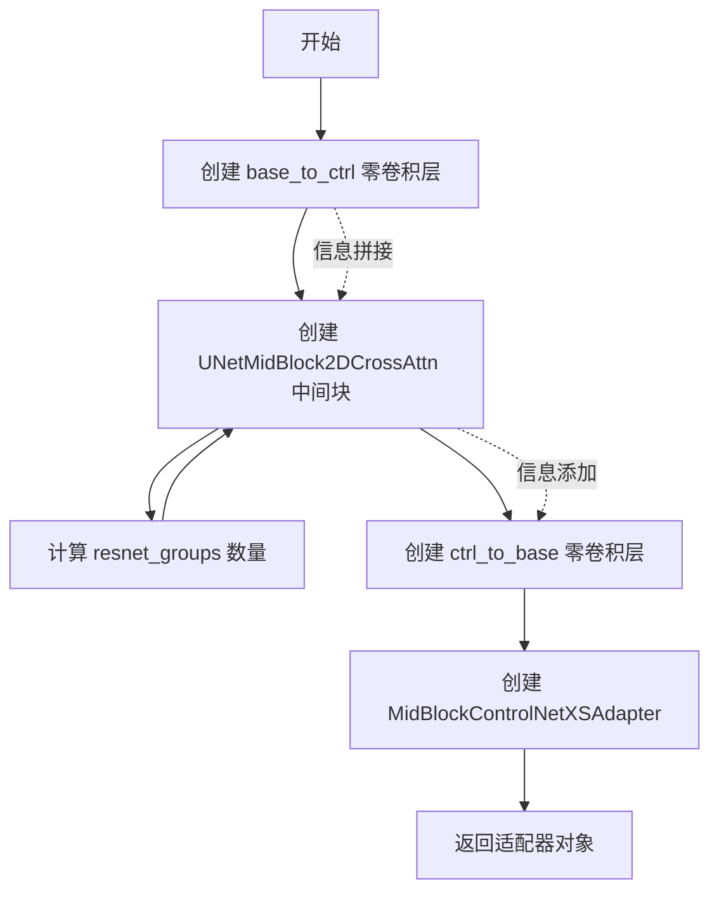

#### 带注释源码

```python
def get_mid_block_adapter(
    base_channels: int,                     # 基础模型中间块通道数
    ctrl_channels: int,                    # 控制网络中间块通道数
    temb_channels: int | None = None,       # 时间嵌入通道数
    max_norm_num_groups: int | None = 32,  # 分组归一化最大组数
    transformer_layers_per_block: int = 1, # Transformer层数
    num_attention_heads: int | None = 1,    # 注意力头数
    cross_attention_dim: int | None = 1024, # 交叉注意力维度
    upcast_attention: bool = False,        # 是否上转注意力
    use_linear_projection: bool = True,     # 是否使用线性投影
):
    # 在中间块应用之前，信息从基础模型拼接（concat）到控制网络
    # 拼接操作不需要改变通道数
    base_to_ctrl = make_zero_conv(base_channels, base_channels)

    # 创建 UNetMidBlock2DCrossAttn 中间块
    midblock = UNetMidBlock2DCrossAttn(
        transformer_layers_per_block=transformer_layers_per_block,
        # 输入通道数 = 控制网络通道数 + 基础模型通道数（拼接后）
        in_channels=ctrl_channels + base_channels,
        out_channels=ctrl_channels,
        temb_channels=temb_channels,
        # 分组归一化的组数必须同时整除 in_channels 和 out_channels
        # 使用最大公约数和最大组数限制来确定合适的组数
        resnet_groups=find_largest_factor(
            gcd(ctrl_channels, ctrl_channels + base_channels), 
            max_norm_num_groups
        ),
        cross_attention_dim=cross_attention_dim,
        num_attention_heads=num_attention_heads,
        use_linear_projection=use_linear_projection,
        upcast_attention=upcast_attention,
    )

    # 在中间块应用之后，信息从控制网络添加（add）到基础模型
    # 添加操作需要改变通道数
    ctrl_to_base = make_zero_conv(ctrl_channels, base_channels)

    # 返回包含三个组件的适配器对象
    return MidBlockControlNetXSAdapter(
        base_to_ctrl=base_to_ctrl,  # 基础到控制网络的零卷积层
        midblock=midblock,           # 中间块核心组件
        ctrl_to_base=ctrl_to_base   # 控制网络到基础网络的零卷积层
    )
```


### `get_up_block_adapter`

该函数用于构建 ControlNet-XS 适配器的上采样块（Up Block）组件。它创建了一个 `UpBlockControlNetXSAdapter` 对象，其中包含用于将控制网络（ControlNet）的特征添加到基础 UNet 模型的跳过连接（skip connections）中的零卷积层。

参数：

- `out_channels`：`int`，上采样块的输出通道数
- `prev_output_channel`：`int`，前一个块的输出通道数，用于确定第一层的输入通道
- `ctrl_skip_channels`：`list[int]`，控制网络的跳过通道列表，每个元素对应一层 resnet 的跳过连接通道

返回值：`UpBlockControlNetXSAdapter`，包含控制网络到基础网络跳过连接映射的适配器组件

#### 流程图

```mermaid
flowchart TD
    A[开始 get_up_block_adapter] --> B[初始化空列表 ctrl_to_base]
    B --> C[设置 num_layers = 3]
    C --> D{遍历 i 从 0 到 2}
    D -->|i == 0| E[resnet_in_channels = prev_output_channel]
    D -->|i != 0| F[resnet_in_channels = out_channels]
    E --> G[创建零卷积层: make_zero_conv ctrl_skip_channels[i], resnet_in_channels]
    F --> G
    G --> H[将零卷积添加到 ctrl_to_base 列表]
    H --> I{遍历完成?}
    I -->|否| D
    I -->|是| J[创建 UpBlockControlNetXSAdapter 对象]
    J --> K[返回适配器实例]
```

#### 带注释源码

```python
def get_up_block_adapter(
    out_channels: int,
    prev_output_channel: int,
    ctrl_skip_channels: list[int],
):
    """
    构建 ControlNet-XS 上采样块的适配器组件。
    
    该函数创建一个适配器，用于在上采样过程中将控制网络（ControlNet）的特征
    映射到基础 UNet 模型的跳过连接中。它使用零卷积（zero convolution）来实现
    这种映射，这是一种权重初始化为零的卷积层，用于学习控制网络特征的适当贡献。
    
    参数:
        out_channels: 上采样块的输出通道数
        prev_output_channel: 前一个块的输出通道数，用于第一层的输入
        ctrl_skip_channels: 控制网络的跳过通道列表，长度应为3
    
    返回:
        包含控制网络到基础网络映射的 UpBlockControlNetXSAdapter 对象
    """
    # 初始化用于存储控制网络到基础网络映射的列表
    ctrl_to_base = []
    
    # 仅支持 SD 和 SDXL 两种配置，均为3层
    num_layers = 3
    
    # 遍历每一层，创建相应的零卷积层
    for i in range(num_layers):
        # 确定当前层的输入通道数：
        # - 第一层（i==0）使用前一个块的输出通道作为输入
        # - 后续层使用当前块的输出通道作为输入
        resnet_in_channels = prev_output_channel if i == 0 else out_channels
        
        # 创建零卷积层，将控制网络的跳过通道映射到 resnet 的输入通道
        # ctrl_skip_channels[i] 是控制网络第i层的跳过连接通道数
        # resnet_in_channels 是对应的 resnet 输入通道数
        ctrl_to_base.append(make_zero_conv(ctrl_skip_channels[i], resnet_in_channels))
    
    # 创建并返回上块适配器对象
    return UpBlockControlNetXSAdapter(ctrl_to_base=nn.ModuleList(ctrl_to_base))
```


### `make_zero_conv`

该函数用于创建一个1x1卷积层，并将其所有权重参数初始化为零。在ControlNet-XS架构中，这种零初始化的卷积层用于实现控制信号到基础模型的"addition"（加法）操作，由于权重为零，卷积输出也为零，因此可以安全地进行特征相加操作。

参数：

- `in_channels`：`int`，输入特征图的通道数
- `out_channels`：`int | None`，输出特征图的通道数，默认为`None`（此时等于`in_channels`）

返回值：`nn.Conv2d`，返回一个权重已全部初始化为零的1x1卷积层

#### 流程图

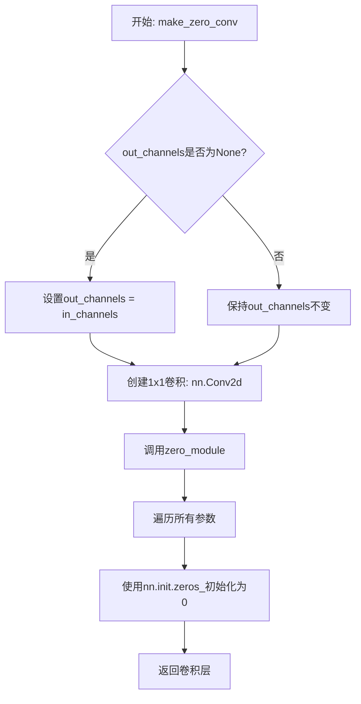

#### 带注释源码

```python
def make_zero_conv(in_channels, out_channels=None):
    """
    创建一个权重初始化为零的1x1卷积层。
    
    在ControlNet-XS中，这种零卷积用于实现控制信号到基础模型的加法融合。
    由于权重为零，卷积的输出也为零，因此可以安全地进行特征相加操作，
    实际的影响通过conditioning_scale参数控制。
    
    参数:
        in_channels (int): 输入特征图的通道数
        out_channels (int, optional): 输出特征图的通道数。如果为None，则等于in_channels
        
    返回:
        nn.Conv2d: 一个1x1卷积层，其所有权重参数已被初始化为零
    """
    # 处理可选的out_channels参数
    # 如果未指定，则输出通道数等于输入通道数
    if out_channels is None:
        out_channels = in_channels
    
    # 创建一个1x1卷积层
    # kernel_size=1: 1x1卷积，不改变空间维度
    # padding=0: 保持空间尺寸不变
    conv_layer = nn.Conv2d(in_channels, out_channels, 1, padding=0)
    
    # 将卷积层传递给zero_module进行零初始化
    return zero_module(conv_layer)


def zero_module(module):
    """
    将模块的所有参数初始化为零。
    
    这是一个辅助函数，用于将给定模块的所有可训练参数
    （权重和偏置）设置为零。
    
    参数:
        module (nn.Module): 任意PyTorch模块
        
    返回:
        nn.Module: 输入模块，其所有参数已被初始化为零
    """
    # 遍历模块的所有参数
    for p in module.parameters():
        # 使用PyTorch的初始化方法将参数值设置为零
        nn.init.zeros_(p)
    return module
```


### `zero_module`

将传入的 PyTorch 模块的所有参数初始化为零的工具函数。

参数：

- `module`：`nn.Module`，要被初始化为零的 PyTorch 模块

返回值：`nn.Module`，返回输入的模块（其所有参数已被初始化为零）

#### 流程图

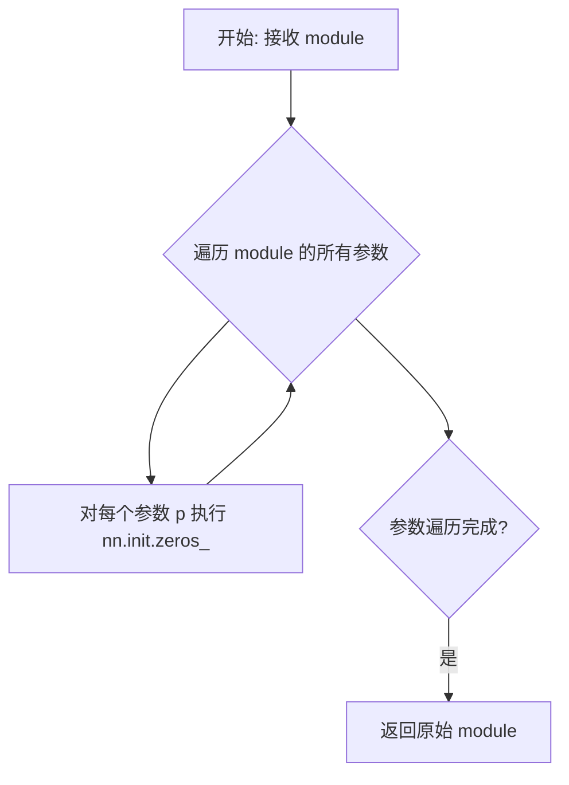

#### 带注释源码

```python
def zero_module(module):
    """
    将模块的所有参数初始化为零。
    
    这个函数遍历传入模块的所有参数，并将每个参数的值设置为0。
    常用于创建零初始化的卷积层或线性层，例如在 ControlNet-XS 中
    用于实现控制信号的可学习零投影。
    
    参数:
        module (nn.Module): 要被初始化为零的 PyTorch 模块
        
    返回:
        nn.Module: 返回输入的模块，其所有参数已被初始化为零
    """
    # 遍历模块的所有参数
    for p in module.parameters():
        # 使用 PyTorch 的初始化方法将参数值设为零
        nn.init.zeros_(p)
    # 返回原始模块（已被原地修改）
    return module
```

#### 关键信息

| 属性 | 值 |
|------|-----|
| 位置 | 文件底部辅助函数区域 |
| 调用者 | `make_zero_conv` 函数 |
| 用途 | 创建零初始化的卷积层，用于 ControlNet-XS 中的控制信号传递 |
| 设计意图 | 通过零初始化实现控制信号的可学习加权，防止未训练时控制信号对基础模型产生额外影响 |


### `find_largest_factor`

该函数用于在深度学习模型（特别是 ControlNet-XS）中计算分组归一化（Group Normalization）的最佳分组数。它从 `max_factor` 开始向下遍历，返回不超过 `max_factor` 的、能够整除 `number` 的最大因子，以确保 Group Normalization 的有效性。

参数：

- `number`：`int`，需要进行因式分解的数字（通常是通道数）
- `max_factor`：`int`，允许的最大因子（通常是硬件对齐要求，如 32）

返回值：`int`，返回不超过 `max_factor` 的最大因数

#### 流程图

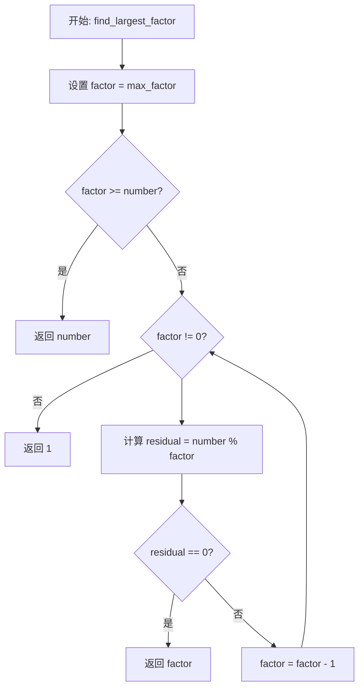

#### 带注释源码

```python
def find_largest_factor(number, max_factor):
    """
    找到不超过 max_factor 的最大因数。
    
    在 Group Normalization 中，num_groups 必须同时整除 in_channels 和 out_channels。
    此函数用于找到满足条件且不超过 max_factor 的最大分组数。
    
    参数:
        number: 需要因式分解的数字（通常是通道数）
        max_factor: 最大因子限制（通常为 32，用于硬件对齐）
    
    返回:
        不超过 max_factor 的最大因数
    """
    factor = max_factor  # 从最大允许因子开始
    
    # 如果最大因子已经大于等于 number，直接返回 number
    # 因为任何数的最大因子就是它本身
    if factor >= number:
        return number
    
    # 从 max_factor 开始向下遍历，找到第一个能整除 number 的因子
    while factor != 0:
        residual = number % factor  # 取余运算
        if residual == 0:  # 如果能够整除
            return factor  # 找到最大因子，返回
        factor -= 1  # 否则继续尝试更小的因子
    
    # 理论上不会到达这里（因为 1 总是能整除任何数）
    return 1
```


### `DownBlockControlNetXSAdapter.__init__`

初始化 `DownBlockControlNetXSAdapter` 类，该类是 ControlNet-XS 中下采样块的适配器组件，用于在基础 UNet 模型和 ControlNet 适配器之间传递和融合特征信息。

参数：

- `resnets`：`nn.ModuleList`，包含 ResNet2D 块的列表，用于对控制网络的特征进行下采样处理
- `base_to_ctrl`：`nn.ModuleList`，零卷积模块列表，用于在应用 ResNet/注意力机制前将基础模型的特征拼接到控制网络
- `ctrl_to_base`：`nn.ModuleList`，零卷积模块列表，用于在应用 ResNet/注意力机制后将控制网络的特征添加到基础模型
- `attentions`：`nn.ModuleList | None`，可选的 Transformer2DModel 注意力模块列表，用于跨注意力操作
- `downsampler`：`nn.Conv2d | None`，可选的下采样卷积层，用于对控制网络特征进行下采样

返回值：无（`None`），构造函数没有返回值

#### 流程图

```mermaid
flowchart TD
    A[开始 __init__] --> B[调用 super().__init__]
    B --> C[设置 self.resnets = resnets]
    C --> D[设置 self.base_to_ctrl = base_to_ctrl]
    D --> E[设置 self.ctrl_to_base = ctrl_to_base]
    E --> F[设置 self.attentions = attentions]
    F --> G[设置 self.downsamplers = downsampler]
    G --> H[结束 __init__]
```

#### 带注释源码

```python
def __init__(
    self,
    resnets: nn.ModuleList,
    base_to_ctrl: nn.ModuleList,
    ctrl_to_base: nn.ModuleList,
    attentions: nn.ModuleList | None = None,
    downsampler: nn.Conv2d | None = None,
):
    """
    初始化 DownBlockControlNetXSAdapter。

    参数:
        resnets: 控制网络的 ResNet 块列表
        base_to_ctrl: 零卷积模块列表，用于将基础模型特征拼接到控制网络
        ctrl_to_base: 零卷积模块列表，用于将控制网络特征添加到基础模型
        attentions: 可选的 Transformer 注意力模块列表
        downsampler: 可选的下采样卷积层
    """
    # 调用父类 nn.Module 的初始化方法
    super().__init__()
    
    # 存储传入的 ResNet 块模块列表，用于控制网络的特征处理
    self.resnets = resnets
    
    # 存储基础模型到控制网络的特征映射模块（零卷积）
    self.base_to_ctrl = base_to_ctrl
    
    # 存储控制网络到基础模型的特征映射模块（零卷积）
    self.ctrl_to_base = ctrl_to_base
    
    # 存储可选的注意力模块列表
    self.attentions = attentions
    
    # 存储可选的下采样器（注意：这里使用的是 downsamplers 复数形式）
    self.downsamplers = downsampler
```


### `MidBlockControlNetXSAdapter.__init__`

该方法是 `MidBlockControlNetXSAdapter` 类的构造函数，负责初始化用于连接基础 UNet 中间块（Mid Block）和 ControlNet-XS 适配器的组件。它主要存储中间块本身以及用于在基础模型（Base）和控制模型（Control）之间传递特征信息的投影层（ModuleList）。

参数：

- `midblock`：`UNetMidBlock2DCrossAttn`，核心的中间块处理单元，负责在最低分辨率特征图上进行跨注意力操作。
- `base_to_ctrl`：`nn.ModuleList`，包含一系列卷积层（通常为 ZeroConv2d），用于将基础模型的特征投影并连接到控制模型的特征空间中。
- `ctrl_to_base`：`nn.ModuleList`，包含一系列卷积层，用于将控制模型学习到的特征增量（Residual）添加回基础模型的特征空间中。

返回值：`None`（`__init__` 方法无返回值）

#### 流程图

```mermaid
flowchart TD
    A([Start __init__]) --> B[调用 super().__init__]
    B --> C[赋值 self.midblock = midblock]
    C --> D[赋值 self.base_to_ctrl = base_to_ctrl]
    D --> E[赋值 self.ctrl_to_base = ctrl_to_base]
    E --> F([End])
```

#### 带注释源码

```python
def __init__(self, midblock: UNetMidBlock2DCrossAttn, base_to_ctrl: nn.ModuleList, ctrl_to_base: nn.ModuleList):
    """
    初始化中间块适配器。

    参数:
        midblock (UNetMidBlock2DCrossAttn): 来自基础UNet的中间块实例。
        base_to_ctrl (nn.ModuleList): 用于将基础特征映射到控制特征的模块列表。
        ctrl_to_base (nn.ModuleList): 用于将控制特征映射回基础特征的模块列表。
    """
    # 调用 PyTorch nn.Module 的初始化方法，注册内部参数
    super().__init__()
    
    # 存储核心的中间块处理单元
    self.midblock = midblock
    
    # 存储基础到控制的投影层
    self.base_to_ctrl = base_to_ctrl
    
    # 存储控制到基础的投影层
    self.ctrl_to_base = ctrl_to_base
```

#### 类的其它详细信息

**类字段 (Class Fields):**

- `midblock` (`UNetMidBlock2DCrossAttn`): 核心中间块。
- `base_to_ctrl` (`nn.ModuleList`): 基础到控制的连接层。
- `ctrl_to_base` (`nn.ModuleList`): 控制到基础的连接层。

**潜在的技术债务与优化空间：**

1.  **功能单一性 (Lack of Logic):** 此类目前仅充当数据容器（Data Container），包含三个属性。如果未来中间块的处理逻辑（如特征融合策略）需要在此类内部直接处理而非在外部 `forward` 方法中处理，当前的结构可能会导致重构。目前它完全依赖于外部调用者（如 `ControlNetXSCrossAttnMidBlock2D`）来执行 `base_to_ctrl` 和 `ctrl_to_base` 的操作，这在语义上将控制流的责任转移给了外部。
2.  **零初始化依赖 (Dependency on Zero Initialization):** 该类的功能严重依赖于传入的 `base_to_ctrl` 和 `ctrl_to_base` 是否为 `make_zero_conv`（零卷积）。这种模式虽然巧妙（允许模型在训练初期像标准UNet一样工作），但增加了代码的理解难度，需要查看 `get_mid_block_adapter` 的实现才能理解数据流。

**外部依赖与接口契约：**

- **依赖:** 依赖于 `UNetMidBlock2DCrossAttn` 的存在和结构。
- **接口:** 作为一个 "Adapter" 组件，它暴露了 `midblock` 属性供外部模型直接调用，同时也暴露了 `base_to_ctrl` 和 `ctrl_to_base` 供外部模型在 `forward` 传播过程中手动调用（Concat/Add 操作）。


### `UpBlockControlNetXSAdapter.__init__`

该方法是 `UpBlockControlNetXSAdapter` 类的构造函数，用于初始化控制网 XS 适配器的上采样块组件。该类负责管理与基础模型对应组件协同工作以形成 `ControlNetXSCrossAttnUpBlock2D` 的关键组件，主要保存控制网到基础模型的连接关系。

参数：

- `ctrl_to_base`：`nn.ModuleList`，从控制网到基础模型的信息传递模块列表

返回值：`None`，构造函数无返回值

#### 流程图

```mermaid
flowchart TD
    A[开始 __init__] --> B[调用 super().__init__]
    B --> C[赋值 self.ctrl_to_base = ctrl_to_base]
    C --> D[结束]
```

#### 带注释源码

```python
class UpBlockControlNetXSAdapter(nn.Module):
    """Components that together with corresponding components from the base model will form a `ControlNetXSCrossAttnUpBlock2D`"""

    def __init__(self, ctrl_to_base: nn.ModuleList):
        """
        初始化 UpBlockControlNetXSAdapter
        
        Args:
            ctrl_to_base: nn.ModuleList，控制网到基础模型的连接模块列表，
                         用于在forward过程中将控制网特征添加到基础模型
        """
        super().__init__()  # 调用父类nn.Module的初始化方法
        self.ctrl_to_base = ctrl_to_base  # 保存控制网到基础模型的连接模块
```


### `ControlNetXSAdapter.__init__`

该方法是 `ControlNetXSAdapter` 类的构造函数，负责初始化 ControlNet-XS 适配器的所有组件，包括条件嵌入层、时间嵌入、下采样块、中间块和上采样连接。它根据传入的参数构建完整的网络架构，并进行输入验证以确保参数的一致性。

参数：

- `conditioning_channels`：`int`，默认为 3，条件输入的通道数（例如图像的通道数）
- `conditioning_channel_order`：`str`，默认为 "rgb"，条件图像的通道顺序，支持 "rgb" 或 "bgr"
- `conditioning_embedding_out_channels`：`tuple[int]`，默认为 (16, 32, 96, 256)，controlnet_cond_embedding 层每个块的输出通道数
- `time_embedding_mix`：`float`，默认为 1.0，时间嵌入混合参数，0 表示仅使用 control adapter 的时间嵌入，1 表示仅使用 base unet 的时间嵌入，其他值则混合两者
- `learn_time_embedding`：`bool`，默认为 False，是否学习时间嵌入
- `num_attention_heads`：`int | tuple[int]`，默认为 4，注意力头的数量
- `block_out_channels`：`tuple[int]`，默认为 (4, 8, 16, 16)，control model 中每个块的输出通道数
- `base_block_out_channels`：`tuple[int]`，默认为 (320, 640, 1280, 1280)，base unet 中每个块的输出通道数
- `cross_attention_dim`：`int`，默认为 1024，交叉注意力特征的维度
- `down_block_types`：`tuple[str]`，默认为 ("CrossAttnDownBlock2D", "CrossAttnDownBlock2D", "CrossAttnDownBlock2D", "DownBlock2D")，下采样块的类型
- `sample_size`：`int | None`，默认为 96，输入/输出样本的高度和宽度
- `transformer_layers_per_block`：`int | tuple[int]`，默认为 1，每个块的 Transformer 块数量
- `upcast_attention`：`bool`，默认为 True，是否始终对注意力计算进行上cast
- `max_norm_num_groups`：`int`，默认为 32，组归一化中的最大组数
- `use_linear_projection`：`bool`，默认为 True，是否使用线性投影

返回值：`None`，该方法为构造函数，不返回任何值

#### 流程图

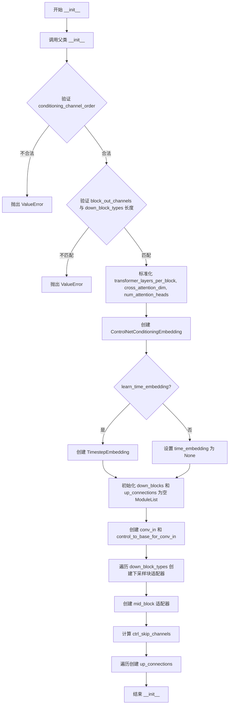

#### 带注释源码

```python
@register_to_config
def __init__(
    self,
    conditioning_channels: int = 3,
    conditioning_channel_order: str = "rgb",
    conditioning_embedding_out_channels: tuple[int] = (16, 32, 96, 256),
    time_embedding_mix: float = 1.0,
    learn_time_embedding: bool = False,
    num_attention_heads: int | tuple[int] = 4,
    block_out_channels: tuple[int] = (4, 8, 16, 16),
    base_block_out_channels: tuple[int] = (320, 640, 1280, 1280),
    cross_attention_dim: int = 1024,
    down_block_types: tuple[str] = (
        "CrossAttnDownBlock2D",
        "CrossAttnDownBlock2D",
        "CrossAttnDownBlock2D",
        "DownBlock2D",
    ),
    sample_size: int | None = 96,
    transformer_layers_per_block: int | tuple[int] = 1,
    upcast_attention: bool = True,
    max_norm_num_groups: int = 32,
    use_linear_projection: bool = True,
):
    """
    初始化 ControlNetXSAdapter 模型。
    
    参数:
        conditioning_channels: 条件输入的通道数
        conditioning_channel_order: 条件图像的通道顺序
        conditioning_embedding_out_channels: embedding层的输出通道
        time_embedding_mix: 时间嵌入混合比例
        learn_time_embedding: 是否学习时间嵌入
        num_attention_heads: 注意力头数量
        block_out_channels: 控制模型的输出通道
        base_block_out_channels: 基础UNet的输出通道
        cross_attention_dim: 交叉注意力维度
        down_block_types: 下采样块类型
        sample_size: 样本尺寸
        transformer_layers_per_block: 每块的Transformer层数
        upcast_attention: 是否上cast注意力
        max_norm_num_groups: 最大归一化组数
        use_linear_projection: 是否使用线性投影
    """
    super().__init__()  # 调用父类初始化

    # 计算时间嵌入的输入和输出维度，基于base模型的第一层输出通道
    time_embedding_input_dim = base_block_out_channels[0]
    time_embedding_dim = base_block_out_channels[0] * 4

    # 检查输入参数
    if conditioning_channel_order not in ["rgb", "bgr"]:
        raise ValueError(f"unknown `conditioning_channel_order`: {conditioning_channel_order}")

    if len(block_out_channels) != len(down_block_types):
        raise ValueError(
            f"Must provide the same number of `block_out_channels` as `down_block_types`. `block_out_channels`: {block_out_channels}. `down_block_types`: {down_block_types}."
        )

    # 标准化参数为列表形式，以便统一处理
    if not isinstance(transformer_layers_per_block, (list, tuple)):
        transformer_layers_per_block = [transformer_layers_per_block] * len(down_block_types)
    if not isinstance(cross_attention_dim, (list, tuple)):
        cross_attention_dim = [cross_attention_dim] * len(down_block_types)
    # 注意: 参见 https://github.com/huggingface/diffusers/issues/2011#issuecomment-1547958131 了解为何使用 num_attention_heads
    if not isinstance(num_attention_heads, (list, tuple)):
        num_attention_heads = [num_attention_heads] * len(down_block_types)

    if len(num_attention_heads) != len(down_block_types):
        raise ValueError(
            f"Must provide the same number of `num_attention_heads` as `down_block_types`. `num_attention_heads`: {num_attention_heads}. `down_block_types`: {down_block_types}."
        )

    # 创建条件提示嵌入层
    self.controlnet_cond_embedding = ControlNetConditioningEmbedding(
        conditioning_embedding_channels=block_out_channels[0],
        block_out_channels=conditioning_embedding_out_channels,
        conditioning_channels=conditioning_channels,
    )

    # 时间嵌入层: 根据 learn_time_embedding 决定是否创建可学习的时间嵌入
    if learn_time_embedding:
        self.time_embedding = TimestepEmbedding(time_embedding_input_dim, time_embedding_dim)
    else:
        self.time_embedding = None

    # 初始化下采样块和上采样连接的模块列表
    self.down_blocks = nn.ModuleList([])
    self.up_connections = nn.ModuleList([])

    # 输入卷积层: 将输入从4通道转换到block_out_channels[0]
    self.conv_in = nn.Conv2d(4, block_out_channels[0], kernel_size=3, padding=1)
    # 控制到基础模型的零卷积，用于连接控制分支和基础分支
    self.control_to_base_for_conv_in = make_zero_conv(block_out_channels[0], base_block_out_channels[0])

    # 下采样阶段: 遍历每种下块类型，创建对应的适配器
    base_out_channels = base_block_out_channels[0]
    ctrl_out_channels = block_out_channels[0]
    for i, down_block_type in enumerate(down_block_types):
        base_in_channels = base_out_channels
        base_out_channels = base_block_out_channels[i]
        ctrl_in_channels = ctrl_out_channels
        ctrl_out_channels = block_out_channels[i]
        has_crossattn = "CrossAttn" in down_block_type  # 判断是否包含交叉注意力
        is_final_block = i == len(down_block_types) - 1  # 判断是否为最后一个块

        self.down_blocks.append(
            get_down_block_adapter(
                base_in_channels=base_in_channels,
                base_out_channels=base_out_channels,
                ctrl_in_channels=ctrl_in_channels,
                ctrl_out_channels=ctrl_out_channels,
                temb_channels=time_embedding_dim,
                max_norm_num_groups=max_norm_num_groups,
                has_crossattn=has_crossattn,
                transformer_layers_per_block=transformer_layers_per_block[i],
                num_attention_heads=num_attention_heads[i],
                cross_attention_dim=cross_attention_dim[i],
                add_downsample=not is_final_block,
                upcast_attention=upcast_attention,
                use_linear_projection=use_linear_projection,
            )
        )

    # 中间块: 创建中间块适配器，连接基础模型和控制模型的中间层
    self.mid_block = get_mid_block_adapter(
        base_channels=base_block_out_channels[-1],
        ctrl_channels=block_out_channels[-1],
        temb_channels=time_embedding_dim,
        transformer_layers_per_block=transformer_layers_per_block[-1],
        num_attention_heads=num_attention_heads[-1],
        cross_attention_dim=cross_attention_dim[-1],
        upcast_attention=upcast_attention,
        use_linear_projection=use_linear_projection,
    )

    # 上采样阶段准备: 计算跳过连接的通道数
    # 跳过连接通道包括 conv_in 的输出和所有下采样子块的输出
    ctrl_skip_channels = [block_out_channels[0]]
    for i, out_channels in enumerate(block_out_channels):
        # 每个块有3个子块，最后一个块只有2个子块（没有下采样器）
        number_of_subblocks = (
            3 if i < len(block_out_channels) - 1 else 2
        )
        ctrl_skip_channels.extend([out_channels] * number_of_subblocks)

    reversed_base_block_out_channels = list(reversed(base_block_out_channels))

    # 上采样阶段: 创建上采样连接适配器
    base_out_channels = reversed_base_block_out_channels[0]
    for i in range(len(down_block_types)):
        prev_base_output_channel = base_out_channels
        base_out_channels = reversed_base_block_out_channels[i]
        ctrl_skip_channels_ = [ctrl_skip_channels.pop() for _ in range(3)]

        self.up_connections.append(
            get_up_block_adapter(
                out_channels=base_out_channels,
                prev_output_channel=prev_base_output_channel,
                ctrl_skip_channels=ctrl_skip_channels_,
            )
        )
```


### ControlNetXSAdapter.from_unet

该方法是一个类方法（@classmethod），用于从预训练的 `UNet2DConditionModel` 实例化一个 `ControlNetXSAdapter`。它根据传入的 UNet 模型配置和可选的尺寸比例或显式通道数来构建适配器，使其能够与基础 UNet 模型协同工作，实现 ControlNet-XS 架构。

参数：

- `cls`：类型 `type`，隐式参数，表示类本身
- `unet`：`UNet2DConditionModel`，要控制的 UNet 模型，适配器的维度将根据此模型进行调整
- `size_ratio`：`float | None`，可选参数，默认 `None`，当提供时，`block_out_channels` 被设置为 base 模型 `block_out_channels` 的一定比例，必须与 `block_out_channels` 二选一使用
- `block_out_channels`：`list[int] | None`，可选参数，默认 `None`，控制模型中下采样块的输出通道数，必须与 `size_ratio` 二选一使用
- `num_attention_heads`：`list[int] | None`，可选参数，默认 `None`，注意力头的维度，具体命名有些混淆，详见 https://github.com/huggingface/diffusers/issues/2011#issuecomment-1547958131
- `learn_time_embedding`：`bool`，默认 `False`，是否让 `ControlNetXSAdapter` 学习时间嵌入
- `time_embedding_mix`：`int`，默认 `1.0`，时间嵌入混合参数，0 表示仅使用 control adapter 的时间嵌入，1 表示仅使用 base unet 的时间嵌入，否则两者混合
- `conditioning_channels`：`int`，默认 `3`，条件输入的通道数（例如图像）
- `conditioning_channel_order`：`str`，默认 `"rgb"`，条件图像的通道顺序，如果是 `"bgr"` 则转换为 `"rgb"`
- `conditioning_embedding_out_channels`：`tuple[int]`，默认 `(16, 32, 96, 256)`，controlnet 条件嵌入层中每个块的输出通道元组

返回值：`ControlNetXSAdapter`，返回新创建的 ControlNetXSAdapter 实例

#### 流程图

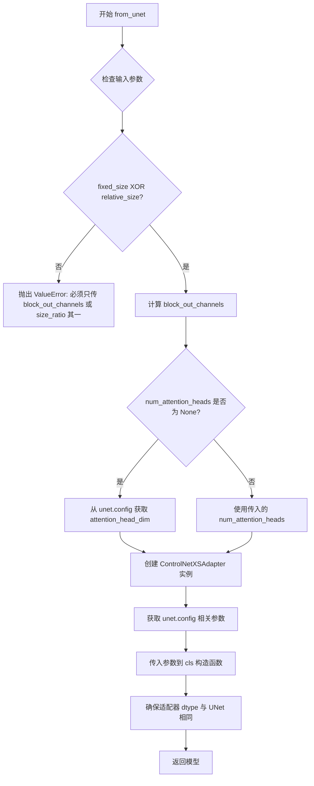

#### 带注释源码

```python
@classmethod
def from_unet(
    cls,
    unet: UNet2DConditionModel,
    size_ratio: float | None = None,
    block_out_channels: list[int] | None = None,
    num_attention_heads: list[int] | None = None,
    learn_time_embedding: bool = False,
    time_embedding_mix: int = 1.0,
    conditioning_channels: int = 3,
    conditioning_channel_order: str = "rgb",
    conditioning_embedding_out_channels: tuple[int] = (16, 32, 96, 256),
):
    r"""
    Instantiate a [`ControlNetXSAdapter`] from a [`UNet2DConditionModel`].

    Parameters:
        unet (`UNet2DConditionModel`):
            The UNet model we want to control. The dimensions of the ControlNetXSAdapter will be adapted to it.
        size_ratio (float, *optional*, defaults to `None`):
            When given, block_out_channels is set to a fraction of the base model's block_out_channels. Either this
            or `block_out_channels` must be given.
        block_out_channels (`list[int]`, *optional*, defaults to `None`):
            Down blocks output channels in control model. Either this or `size_ratio` must be given.
        num_attention_heads (`list[int]`, *optional*, defaults to `None`):
            The dimension of the attention heads. The naming seems a bit confusing and it is, see
            https://github.com/huggingface/diffusers/issues/2011#issuecomment-1547958131 for why.
        learn_time_embedding (`bool`, defaults to `False`):
            Whether the `ControlNetXSAdapter` should learn a time embedding.
        time_embedding_mix (`float`, defaults to 1.0):
            If 0, then only the control adapter's time embedding is used. If 1, then only the base unet's time
            embedding is used. Otherwise, both are combined.
        conditioning_channels (`int`, defaults to 3):
            Number of channels of conditioning input (e.g. an image)
        conditioning_channel_order (`str`, defaults to `"rgb"`):
            The channel order of conditional image. Will convert to `rgb` if it's `bgr`.
        conditioning_embedding_out_channels (`tuple[int]`, defaults to `(16, 32, 96, 256)`):
            The tuple of output channel for each block in the `controlnet_cond_embedding` layer.
    """

    # Check input: 确保恰好传入 block_out_channels（绝对尺寸）或 size_ratio（相对尺寸）之一
    fixed_size = block_out_channels is not None
    relative_size = size_ratio is not None
    if not (fixed_size ^ relative_size):
        raise ValueError(
            "Pass exactly one of `block_out_channels` (for absolute sizing) or `size_ratio` (for relative sizing)."
        )

    # Create model: 如果没有指定 block_out_channels，则根据 size_ratio 计算
    block_out_channels = block_out_channels or [int(b * size_ratio) for b in unet.config.block_out_channels]
    if num_attention_heads is None:
        # The naming seems a bit confusing and it is, see https://github.com/huggingface/diffusers/issues/2011#issuecomment-1547958131 for why.
        num_attention_heads = unet.config.attention_head_dim

    # 调用类的构造函数创建 ControlNetXSAdapter 实例
    model = cls(
        conditioning_channels=conditioning_channels,
        conditioning_channel_order=conditioning_channel_order,
        conditioning_embedding_out_channels=conditioning_embedding_out_channels,
        time_embedding_mix=time_embedding_mix,
        learn_time_embedding=learn_time_embedding,
        num_attention_heads=num_attention_heads,
        block_out_channels=block_out_channels,
        base_block_out_channels=unet.config.block_out_channels,
        cross_attention_dim=unet.config.cross_attention_dim,
        down_block_types=unet.config.down_block_types,
        sample_size=unet.config.sample_size,
        transformer_layers_per_block=unet.config.transformer_layers_per_block,
        upcast_attention=unet.config.upcast_attention,
        max_norm_num_groups=unet.config.norm_num_groups,
        use_linear_projection=unet.config.use_linear_projection,
    )

    # ensure that the ControlNetXSAdapter is the same dtype as the UNet2DConditionModel
    # 确保适配器的数据类型与 UNet2DConditionModel 相同
    model.to(unet.dtype)

    return model
```


### `ControlNetXSAdapter.forward`

该方法用于处理输入张量并生成条件输出，但由于 `ControlNetXSAdapter` 设计上不能单独运行，此方法始终抛出 `ValueError` 异常，提示用户必须将其与 `UNet2DConditionModel` 结合使用才能实例化 `UNetControlNetXSModel`。

参数：
- `*args`：可变位置参数，不接受任何有效参数
- `**kwargs`：可变关键字参数，不接受任何有效参数

返回值：无（方法不返回任何值，始终抛出异常）

#### 流程图

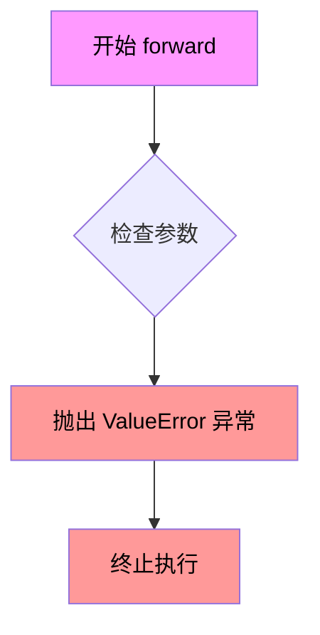

#### 带注释源码

```python
def forward(self, *args, **kwargs):
    """
    Forward 方法不接受任何有效参数。
    ControlNetXSAdapter 不能单独运行，必须与 UNet2DConditionModel 结合使用。
    
    参数:
        *args: 可变位置参数（不接受任何有效参数）
        **kwargs: 可变关键字参数（不接受任何有效参数）
    
    返回值:
        无（总是抛出异常）
    
    异常:
        ValueError: 总是抛出，提示用户需要使用 UNetControlNetXSModel
    """
    # 抛出异常，说明该适配器不能单独运行
    raise ValueError(
        "A ControlNetXSAdapter cannot be run by itself. Use it together with a UNet2DConditionModel to instantiate a UNetControlNetXSModel."
    )
```


### `UNetControlNetXSModel.__init__`

这是 `UNetControlNetXSModel` 类的构造函数，负责初始化一个融合了 ControlNet-XS 适配器的 UNet 模型。该模型结合了基础 UNet2DConditionModel 和 ControlNetXSAdapter，用于条件图像生成任务（如 Stable Diffusion），通过控制网络来调节主模型的输出。

参数：

- `sample_size`：`int | None`，输入/输出样本的高度和宽度，默认 96
- `down_block_types`：`tuple[str]`，下采样块的类型列表，默认 ("CrossAttnDownBlock2D", "CrossAttnDownBlock2D", "CrossAttnDownBlock2D", "DownBlock2D")
- `up_block_types`：`tuple[str]`，上采样块的类型列表，默认 ("UpBlock2D", "CrossAttnUpBlock2D", "CrossAttnUpBlock2D", "CrossAttnUpBlock2D")
- `block_out_channels`：`tuple[int]`，基础模型各块的输出通道数，默认 (320, 640, 1280, 1280)
- `norm_num_groups`：`int | None`，组归一化的组数，默认 32
- `cross_attention_dim`：`int | tuple[int]`，交叉注意力维度，默认 1024
- `transformer_layers_per_block`：`int | tuple[int]`，每个块的 transformer 层数，默认 1
- `num_attention_heads`：`int | tuple[int]`，注意力头数量，默认 8
- `addition_embed_type`：`str | None`，额外嵌入类型，默认 None（仅支持 StableDiffusion 和 SDXL）
- `addition_time_embed_dim`：`int | None`，额外时间嵌入维度，默认 None
- `upcast_attention`：`bool`，是否向上转换注意力计算，默认 True
- `use_linear_projection`：`bool`，是否使用线性投影，默认 True
- `time_cond_proj_dim`：`int | None`，时间条件投影维度，默认 None
- `projection_class_embeddings_input_dim`：`int | None`，投影类嵌入输入维度，默认 None
- `time_embedding_mix`：`float`，时间嵌入混合参数（0-1之间），默认 1.0
- `ctrl_conditioning_channels`：`int`，控制网络条件输入的通道数，默认 3
- `ctrl_conditioning_embedding_out_channels`：`tuple[int]`，控制网络条件嵌入的输出通道数，默认 (16, 32, 96, 256)
- `ctrl_conditioning_channel_order`：`str`，条件图像的通道顺序（"rgb" 或 "bgr"），默认 "rgb"
- `ctrl_learn_time_embedding`：`bool`，是否学习控制网络的时间嵌入，默认 False
- `ctrl_block_out_channels`：`tuple[int]`，控制网络各块的输出通道数，默认 (4, 8, 16, 16)
- `ctrl_num_attention_heads`：`int | tuple[int]`，控制网络的注意力头数量，默认 4
- `ctrl_max_norm_num_groups`：`int`，控制网络的最大归一化组数，默认 32

返回值：无（构造函数）

#### 流程图

```mermaid
flowchart TD
    A[开始 __init__] --> B{验证 time_embedding_mix 在 [0,1] 范围}
    B -->|否| C[抛出 ValueError]
    B -->|是| D{time_embedding_mix < 1 且<br/>ctrl_learn_time_embedding=False?}
    D -->|是| E[抛出 ValueError]
    D -->|否| F{addition_embed_type 合法?}
    F -->|否| G[抛出 ValueError]
    F -->|是| H[转换 transformer_layers_per_block<br/>cross_attention_dim<br/>num_attention_heads<br/>ctrl_num_attention_heads 为列表]
    
    H --> I[创建 base_conv_in: nn.Conv2d]
    J[创建 controlnet_cond_embedding:<br/>ControlNetConditioningEmbedding]
    K[创建 ctrl_conv_in: nn.Conv2d]
    L[创建 control_to_base_for_conv_in:<br/>make_zero_conv]
    
    I --> M[创建 base_time_proj: Timesteps]
    M --> N[创建 base_time_embedding:<br/>TimestepEmbedding]
    N --> O{ctrl_learn_time_embedding?}
    O -->|是| P[创建 ctrl_time_embedding]
    O -->|否| Q[ctrl_time_embedding = None]
    P --> R[创建 base_add_time_proj 和<br/>base_add_embedding 或设为 None]
    Q --> R
    
    R --> S[遍历 down_block_types 创建下采样块]
    S --> T[创建 mid_block:<br/>ControlNetXSCrossAttnMidBlock2D]
    T --> U[计算 ctrl_skip_channels]
    U --> V[遍历 up_block_types 创建上采样块]
    V --> W[创建 base_conv_norm_out:<br/>nn.GroupNorm]
    X[创建 base_conv_act: nn.SiLU]
    Y[创建 base_conv_out: nn.Conv2d]
    
    W --> Z[保存所有模块到对应属性]
    Z --> AA[结束 __init__]
```

#### 带注释源码

```python
@register_to_config
def __init__(
    self,
    # unet configs - 基础 UNet 配置参数
    sample_size: int | None = 96,
    down_block_types: tuple[str] = (
        "CrossAttnDownBlock2D",
        "CrossAttnDownBlock2D",
        "CrossAttnDownBlock2D",
        "DownBlock2D",
    ),
    up_block_types: tuple[str] = ("UpBlock2D", "CrossAttnUpBlock2D", "CrossAttnUpBlock2D", "CrossAttnUpBlock2D"),
    block_out_channels: tuple[int] = (320, 640, 1280, 1280),
    norm_num_groups: int | None = 32,
    cross_attention_dim: int | tuple[int] = 1024,
    transformer_layers_per_block: int | tuple[int] = 1,
    num_attention_heads: int | tuple[int] = 8,
    addition_embed_type: str | None = None,
    addition_time_embed_dim: int | None = None,
    upcast_attention: bool = True,
    use_linear_projection: bool = True,
    time_cond_proj_dim: int | None = None,
    projection_class_embeddings_input_dim: int | None = None,
    # additional controlnet configs - 额外的 ControlNet 配置参数
    time_embedding_mix: float = 1.0,
    ctrl_conditioning_channels: int = 3,
    ctrl_conditioning_embedding_out_channels: tuple[int] = (16, 32, 96, 256),
    ctrl_conditioning_channel_order: str = "rgb",
    ctrl_learn_time_embedding: bool = False,
    ctrl_block_out_channels: tuple[int] = (4, 8, 16, 16),
    ctrl_num_attention_heads: int | tuple[int] = 4,
    ctrl_max_norm_num_groups: int = 32,
):
    super().__init__()  # 调用父类 ModelMixin, AttentionMixin, ConfigMixin 的初始化

    # 验证输入参数的合法性
    if time_embedding_mix < 0 or time_embedding_mix > 1:
        raise ValueError("`time_embedding_mix` needs to be between 0 and 1.")
    if time_embedding_mix < 1 and not ctrl_learn_time_embedding:
        raise ValueError("To use `time_embedding_mix` < 1, `ctrl_learn_time_embedding` must be `True`")

    # 仅支持 StableDiffusion 和 StableDiffusion-XL
    if addition_embed_type is not None and addition_embed_type != "text_time":
        raise ValueError(
            "As `UNetControlNetXSModel` currently only supports StableDiffusion and StableDiffusion-XL, `addition_embed_type` must be `None` or `'text_time'`."
        )

    # 将标量参数转换为列表，以匹配块数量
    if not isinstance(transformer_layers_per_block, (list, tuple)):
        transformer_layers_per_block = [transformer_layers_per_block] * len(down_block_types)
    if not isinstance(cross_attention_dim, (list, tuple)):
        cross_attention_dim = [cross_attention_dim] * len(down_block_types)
    if not isinstance(num_attention_heads, (list, tuple)):
        num_attention_heads = [num_attention_heads] * len(down_block_types)
    if not isinstance(ctrl_num_attention_heads, (list, tuple)):
        ctrl_num_attention_heads = [ctrl_num_attention_heads] * len(down_block_types)

    base_num_attention_heads = num_attention_heads  # 保存基础模型的注意力头数

    self.in_channels = 4  # 设置输入通道数（RGB + alpha）

    # # Input - 输入层
    # 基础模型的卷积输入层
    self.base_conv_in = nn.Conv2d(4, block_out_channels[0], kernel_size=3, padding=1)
    # 控制网络的条件嵌入层，将条件图像转换为特征
    self.controlnet_cond_embedding = ControlNetConditioningEmbedding(
        conditioning_embedding_channels=ctrl_block_out_channels[0],
        block_out_channels=ctrl_conditioning_embedding_out_channels,
        conditioning_channels=ctrl_conditioning_channels,
    )
    # 控制网络的卷积输入层
    self.ctrl_conv_in = nn.Conv2d(4, ctrl_block_out_channels[0], kernel_size=3, padding=1)
    # 将控制网络特征添加到基础模型的零卷积（用于信息传递）
    self.control_to_base_for_conv_in = make_zero_conv(ctrl_block_out_channels[0], block_out_channels[0])

    # # Time - 时间嵌入层
    time_embed_input_dim = block_out_channels[0]
    time_embed_dim = block_out_channels[0] * 4

    # 基础模型的时间投影和嵌入
    self.base_time_proj = Timesteps(block_out_channels[0], flip_sin_to_cos=True, downscale_freq_shift=0)
    self.base_time_embedding = TimestepEmbedding(
        time_embed_input_dim,
        time_embed_dim,
        cond_proj_dim=time_cond_proj_dim,
    )
    # 可选的控制网络时间嵌入
    if ctrl_learn_time_embedding:
        self.ctrl_time_embedding = TimestepEmbedding(
            in_channels=time_embed_input_dim, time_embed_dim=time_embed_dim
        )
    else:
        self.ctrl_time_embedding = None

    # 额外的时间嵌入（用于 SDXL）
    if addition_embed_type is None:
        self.base_add_time_proj = None
        self.base_add_embedding = None
    else:
        self.base_add_time_proj = Timesteps(addition_time_embed_dim, flip_sin_to_cos=True, downscale_freq_shift=0)
        self.base_add_embedding = TimestepEmbedding(projection_class_embeddings_input_dim, time_embed_dim)

    # # Create down blocks - 创建下采样块
    down_blocks = []
    base_out_channels = block_out_channels[0]
    ctrl_out_channels = ctrl_block_out_channels[0]
    # 遍历每种下块类型，创建对应的 ControlNetXS 交叉注意力下块
    for i, down_block_type in enumerate(down_block_types):
        base_in_channels = base_out_channels
        base_out_channels = block_out_channels[i]
        ctrl_in_channels = ctrl_out_channels
        ctrl_out_channels = ctrl_block_out_channels[i]
        has_crossattn = "CrossAttn" in down_block_type  # 是否使用交叉注意力
        is_final_block = i == len(down_block_types) - 1  # 是否是最后一个块

        down_blocks.append(
            ControlNetXSCrossAttnDownBlock2D(
                base_in_channels=base_in_channels,
                base_out_channels=base_out_channels,
                ctrl_in_channels=ctrl_in_channels,
                ctrl_out_channels=ctrl_out_channels,
                temb_channels=time_embed_dim,
                norm_num_groups=norm_num_groups,
                ctrl_max_norm_num_groups=ctrl_max_norm_num_groups,
                has_crossattn=has_crossattn,
                transformer_layers_per_block=transformer_layers_per_block[i],
                base_num_attention_heads=base_num_attention_heads[i],
                ctrl_num_attention_heads=ctrl_num_attention_heads[i],
                cross_attention_dim=cross_attention_dim[i],
                add_downsample=not is_final_block,
                upcast_attention=upcast_attention,
                use_linear_projection=use_linear_projection,
            )
        )

    # # Create mid block - 创建中间块
    self.mid_block = ControlNetXSCrossAttnMidBlock2D(
        base_channels=block_out_channels[-1],
        ctrl_channels=ctrl_block_out_channels[-1],
        temb_channels=time_embed_dim,
        norm_num_groups=norm_num_groups,
        ctrl_max_norm_num_groups=ctrl_max_norm_num_groups,
        transformer_layers_per_block=transformer_layers_per_block[-1],
        base_num_attention_heads=base_num_attention_heads[-1],
        ctrl_num_attention_heads=ctrl_num_attention_heads[-1],
        cross_attention_dim=cross_attention_dim[-1],
        upcast_attention=upcast_attention,
        use_linear_projection=use_linear_projection,
    )

    # # Create up blocks - 创建上采样块
    up_blocks = []
    rev_transformer_layers_per_block = list(reversed(transformer_layers_per_block))
    rev_num_attention_heads = list(reversed(base_num_attention_heads))
    rev_cross_attention_dim = list(reversed(cross_attention_dim))

    # 计算控制网络的跳跃连接通道数
    ctrl_skip_channels = [ctrl_block_out_channels[0]]
    for i, out_channels in enumerate(ctrl_block_out_channels):
        number_of_subblocks = (
            3 if i < len(ctrl_block_out_channels) - 1 else 2
        )  # 每个块有3个子块，最后一个只有2个（无下采样）
        ctrl_skip_channels.extend([out_channels] * number_of_subblocks)

    reversed_block_out_channels = list(reversed(block_out_channels))

    out_channels = reversed_block_out_channels[0]
    for i, up_block_type in enumerate(up_block_types):
        prev_output_channel = out_channels
        out_channels = reversed_block_out_channels[i]
        in_channels = reversed_block_out_channels[min(i + 1, len(block_out_channels) - 1)]
        ctrl_skip_channels_ = [ctrl_skip_channels.pop() for _ in range(3)]

        has_crossattn = "CrossAttn" in up_block_type
        is_final_block = i == len(block_out_channels) - 1

        up_blocks.append(
            ControlNetXSCrossAttnUpBlock2D(
                in_channels=in_channels,
                out_channels=out_channels,
                prev_output_channel=prev_output_channel,
                ctrl_skip_channels=ctrl_skip_channels_,
                temb_channels=time_embed_dim,
                resolution_idx=i,
                has_crossattn=has_crossattn,
                transformer_layers_per_block=rev_transformer_layers_per_block[i],
                num_attention_heads=rev_num_attention_heads[i],
                cross_attention_dim=rev_cross_attention_dim[i],
                add_upsample=not is_final_block,
                upcast_attention=upcast_attention,
                norm_num_groups=norm_num_groups,
                use_linear_projection=use_linear_projection,
            )
        )

    # 将下块和上块保存为 ModuleList
    self.down_blocks = nn.ModuleList(down_blocks)
    self.up_blocks = nn.ModuleList(up_blocks)

    # # Output - 输出层
    self.base_conv_norm_out = nn.GroupNorm(num_channels=block_out_channels[0], num_groups=norm_num_groups)
    self.base_conv_act = nn.SiLU()  # Swish 激活函数
    self.base_conv_out = nn.Conv2d(block_out_channels[0], 4, kernel_size=3, padding=1)
```


### `UNetControlNetXSModel.from_unet`

此类方法用于从预训练的`UNet2DConditionModel`实例化一个`UNetControlNetXSModel`，支持可选的`ControlNetXSAdapter`。该方法会自动根据UNet的配置构建控制网络结构，并从UNet和ControlNetXSAdapter中复制相应的权重到融合模型中。

参数：

- `unet`：`UNet2DConditionModel`，要控制的UNet模型，模型的维度将用于适配ControlNetXSAdapter
- `controlnet`：`ControlNetXSAdapter | None`，可选的ControlNet-XS适配器，如果为None则根据其他参数创建新适配器
- `size_ratio`：`float | None`，相对尺寸比例，用于当未提供controlnet时计算block_out_channels
- `ctrl_block_out_channels`：`list[float] | None`，控制网络的输出通道数列表，用于当未提供controlnet时构建适配器
- `time_embedding_mix`：`float | None`，时间嵌入混合参数，用于控制基础模型和适配器时间嵌入的混合比例
- `ctrl_optional_kwargs`：`dict | None`，传递给新controlnet初始化函数的可选参数字典

返回值：`UNetControlNetXSModel`，融合了UNet和ControlNet-XS的模型实例

#### 流程图

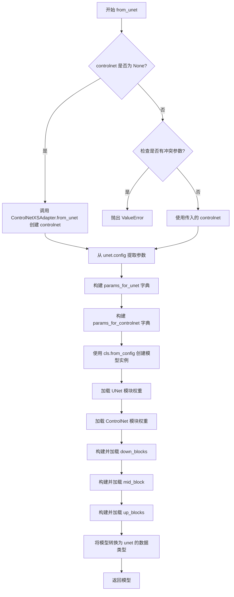

#### 带注释源码

```python
@classmethod
def from_unet(
    cls,  # 类本身，隐式参数
    unet: UNet2DConditionModel,  # 基础UNet模型
    controlnet: ControlNetXSAdapter | None = None,  # 可选的ControlNet-XS适配器
    size_ratio: float | None = None,  # 相对尺寸比例
    ctrl_block_out_channels: list[float] | None = None,  # 控制网络输出通道
    time_embedding_mix: float | None = None,  # 时间嵌入混合参数
    ctrl_optional_kwargs: dict | None = None,  # 控制网络额外参数
):
    r"""
    Instantiate a [`UNetControlNetXSModel`] from a [`UNet2DConditionModel`] and an optional [`ControlNetXSAdapter`]
    .

    Parameters:
        unet (`UNet2DConditionModel`):
            The UNet model we want to control.
        controlnet (`ControlNetXSAdapter`):
            The ControlNet-XS adapter with which the UNet will be fused. If none is given, a new ControlNet-XS
            adapter will be created.
        size_ratio (float, *optional*, defaults to `None`):
            Used to construct the controlnet if none is given. See [`ControlNetXSAdapter.from_unet`] for details.
        ctrl_block_out_channels (`list[int]`, *optional*, defaults to `None`):
            Used to construct the controlnet if none is given. See [`ControlNetXSAdapter.from_unet`] for details,
            where this parameter is called `block_out_channels`.
        time_embedding_mix (`float`, *optional*, defaults to None):
            Used to construct the controlnet if none is given. See [`ControlNetXSAdapter.from_unet`] for details.
        ctrl_optional_kwargs (`Dict`, *optional*, defaults to `None`):
            Passed to the `init` of the new controlnet if no controlnet was given.
    """
    # 如果未提供controlnet，则根据参数创建新的ControlNetXSAdapter
    if controlnet is None:
        controlnet = ControlNetXSAdapter.from_unet(
            unet, size_ratio, ctrl_block_out_channels, **ctrl_optional_kwargs
        )
    else:
        # 如果提供了controlnet，则不应传递其他构建参数
        if any(
            o is not None for o in (size_ratio, ctrl_block_out_channels, time_embedding_mix, ctrl_optional_kwargs)
        ):
            raise ValueError(
                "When a controlnet is passed, none of these parameters should be passed: size_ratio, ctrl_block_out_channels, time_embedding_mix, ctrl_optional_kwargs."
            )

    # 从UNet配置中提取需要传递给模型的参数列表
    params_for_unet = [
        "sample_size",
        "down_block_types",
        "up_block_types",
        "block_out_channels",
        "norm_num_groups",
        "cross_attention_dim",
        "transformer_layers_per_block",
        "addition_embed_type",
        "addition_time_embed_dim",
        "upcast_attention",
        "use_linear_projection",
        "time_cond_proj_dim",
        "projection_class_embeddings_input_dim",
    ]
    # 筛选并获取UNet配置中的相关参数
    params_for_unet = {k: v for k, v in unet.config.items() if k in params_for_unet}
    # 注意：UNet配置中使用attention_head_dim，但这里需要映射为num_attention_heads
    params_for_unet["num_attention_heads"] = unet.config.attention_head_dim

    # 从ControlNet配置中提取参数，注意参数名前需要添加"ctrl_"前缀
    params_for_controlnet = [
        "conditioning_channels",
        "conditioning_embedding_out_channels",
        "conditioning_channel_order",
        "learn_time_embedding",
        "block_out_channels",
        "num_attention_heads",
        "max_norm_num_groups",
    ]
    params_for_controlnet = {"ctrl_" + k: v for k, v in controlnet.config.items() if k in params_for_controlnet}
    params_for_controlnet["time_embedding_mix"] = controlnet.config.time_embedding_mix

    # 使用合并的配置参数创建UNetControlNetXSModel实例
    model = cls.from_config({**params_for_unet, **params_for_controlnet})

    # 从UNet模型中加载需要共享的模块权重
    # 这些模块名称前缀为"base_"以区分基础UNet部分
    modules_from_unet = [
        "time_embedding",
        "conv_in",
        "conv_norm_out",
        "conv_out",
    ]
    for m in modules_from_unet:
        getattr(model, "base_" + m).load_state_dict(getattr(unet, m).state_dict())

    # 加载可选的UNet模块（如Text-to-Image模型可能没有这些）
    optional_modules_from_unet = [
        "add_time_proj",
        "add_embedding",
    ]
    for m in optional_modules_from_unet:
        if hasattr(unet, m) and getattr(unet, m) is not None:
            getattr(model, "base_" + m).load_state_dict(getattr(unet, m).state_dict())

    # 从ControlNet适配器中加载条件嵌入和卷积权重
    model.controlnet_cond_embedding.load_state_dict(controlnet.controlnet_cond_embedding.state_dict())
    model.ctrl_conv_in.load_state_dict(controlnet.conv_in.state_dict())
    if controlnet.time_embedding is not None:
        model.ctrl_time_embedding.load_state_dict(controlnet.time_embedding.state_dict())
    model.control_to_base_for_conv_in.load_state_dict(controlnet.control_to_base_for_conv_in.state_dict())

    # 使用from_modules方法融合UNet和ControlNet的模块
    # 这些方法会创建新的融合块并加载权重
    model.down_blocks = nn.ModuleList(
        ControlNetXSCrossAttnDownBlock2D.from_modules(b, c)
        for b, c in zip(unet.down_blocks, controlnet.down_blocks)
    )
    model.mid_block = ControlNetXSCrossAttnMidBlock2D.from_modules(unet.mid_block, controlnet.mid_block)
    model.up_blocks = nn.ModuleList(
        ControlNetXSCrossAttnUpBlock2D.from_modules(b, c)
        for b, c in zip(unet.up_blocks, controlnet.up_connections)
    )

    # 确保UNetControlNetXSModel的数据类型与UNet2DConditionModel一致
    model.to(unet.dtype)

    return model
```


### `UNetControlNetXSModel.forward`

该方法是 `UNetControlNetXSModel` 类的前向传播方法，用于执行 ControlNet-XS 模型的推理过程。该方法接收噪声样本、时间步长、编码器隐藏状态以及可选的控制网络条件输入，通过结合基础 UNet 模型和控制适配器来生成最终的去噪输出。方法支持条件缩放、注意力掩码、交叉注意力参数等高级配置，并可选择是否应用控制信号。

参数：

- `sample`：`Tensor`，噪声输入张量，形状为 `(batch_size, num_channels, height, width)`
- `timestep`：`torch.Tensor | float | int`，去噪所需的 timesteps 数量
- `encoder_hidden_states`：`torch.Tensor`，编码器的隐藏状态
- `controlnet_cond`：`torch.Tensor | None`，条件输入张量，形状为 `(batch_size, sequence_length, hidden_size)`
- `conditioning_scale`：`float | None`，默认为 `1.0`，控制模型对基础模型输出的影响程度
- `class_labels`：`torch.Tensor | None`，可选的类别标签，用于条件处理
- `timestep_cond`：`torch.Tensor | None`，用于时间步的额外条件嵌入
- `attention_mask`：`torch.Tensor | None`，形状为 `(batch, key_tokens)` 的注意力掩码
- `cross_attention_kwargs`：`dict[str, Any] | None`，传递给 AttnProcessor 的关键字参数字典
- `added_cond_kwargs`：`dict[str, torch.Tensor] | None`，Stable Diffusion XL UNet 的额外条件
- `return_dict`：`bool`，默认为 `True`，是否返回 `ControlNetXSOutput` 而不是元组
- `apply_control`：`bool`，默认为 `True`，如果为 `False`，则仅通过基础模型运行

返回值：`ControlNetXSOutput | tuple`，如果 `return_dict` 为 `True`，返回 `ControlNetXSOutput` 对象（包含 sample 张量），否则返回元组

#### 流程图

```mermaid
flowchart TD
    A[开始 forward] --> B{检查 channel order<br/>是否为 bgr}
    B -->|是| C[翻转 controlnet_cond]
    B -->|否| D[准备 attention_mask]
    C --> D
    D --> E[处理 timesteps<br/>转换为 tensor 并扩展到 batch 维度]
    E --> F[base_time_proj 处理 t_emb]
    F --> G{ctrl_learn_time_embedding<br/>且 apply_control}
    G -->|是| H[计算混合 time embedding]
    G -->|否| I[仅使用 base_time_embedding]
    H --> J[处理额外 embeddings<br/>SDXL text_time 条件]
    I --> J
    J --> K[设置 h_ctrl = h_base = sample<br/>初始化 hs_base, hs_ctrl 列表]
    K --> L[controlnet_cond_embedding<br/>处理 guided_hint]
    L --> M[base_conv_in 和 ctrl_conv_in<br/>处理 h_base 和 h_ctrl]
    M --> N{guided_hint is not None}
    N -->|是| O[h_ctrl += guided_hint]
    N -->|否| P{apply_control}
    O --> P
    P -->|是| Q[h_base = h_base + control_to_base_for_conv_in<br/>* conditioning_scale]
    P -->|否| R[保存 h_base 到 hs_base<br/>保存 h_ctrl 到 hs_ctrl]
    Q --> R
    R --> S[遍历 down_blocks]
    S --> T[down block 处理<br/>返回 h_base, h_ctrl 及残差]
    T --> U[保存残差到 hs_base, hs_ctrl]
    U --> V{还有更多 down blocks}
    V -->|是| S
    V -->|否| W[mid_block 处理<br/>h_base, h_ctrl]
    W --> X[遍历 up_blocks]
    X --> Y[获取 skip connections<br/>skips_hb, skips_hc]
    Y --> Z[up block 处理]
    Z --> AA{还有更多 up blocks}
    AA -->|是| X
    AA -->|否| AB[conv_out 处理<br/>norm -> act -> conv]
    AB --> AC{return_dict}
    AC -->|是| AD[返回 ControlNetXSOutput]
    AC -->|否| AE[返回 tuple (h_base,)]
```

#### 带注释源码

```python
def forward(
    self,
    sample: Tensor,
    timestep: torch.Tensor | float | int,
    encoder_hidden_states: torch.Tensor,
    controlnet_cond: torch.Tensor | None = None,
    conditioning_scale: float | None = 1.0,
    class_labels: torch.Tensor | None = None,
    timestep_cond: torch.Tensor | None = None,
    attention_mask: torch.Tensor | None = None,
    cross_attention_kwargs: dict[str, Any] | None = None,
    added_cond_kwargs: dict[str, torch.Tensor] | None = None,
    return_dict: bool = True,
    apply_control: bool = True,
) -> ControlNetXSOutput | tuple:
    """
    The [`ControlNetXSModel`] forward method.

    Args:
        sample (`Tensor`):
            The noisy input tensor.
        timestep (`torch.Tensor | float | int`):
            The number of timesteps to denoise an input.
        encoder_hidden_states (`torch.Tensor`):
            The encoder hidden states.
        controlnet_cond (`Tensor`):
            The conditional input tensor of shape `(batch_size, sequence_length, hidden_size)`.
        conditioning_scale (`float`, defaults to `1.0`):
            How much the control model affects the base model outputs.
        class_labels (`torch.Tensor`, *optional*, defaults to `None`):
            Optional class labels for conditioning. Their embeddings will be summed with the timestep embeddings.
        timestep_cond (`torch.Tensor`, *optional*, defaults to `None`):
            Additional conditional embeddings for timestep. If provided, the embeddings will be summed with the
            timestep_embedding passed through the `self.time_embedding` layer to obtain the final timestep
            embeddings.
        attention_mask (`torch.Tensor`, *optional*, defaults to `None`):
            An attention mask of shape `(batch, key_tokens)` is applied to `encoder_hidden_states`. If `1` the mask
            is kept, otherwise if `0` it is discarded. Mask will be converted into a bias, which adds large
            negative values to the attention scores corresponding to "discard" tokens.
        cross_attention_kwargs (`dict[str]`, *optional*, defaults to `None`):
            A kwargs dictionary that if specified is passed along to the `AttnProcessor`.
        added_cond_kwargs (`dict`):
            Additional conditions for the Stable Diffusion XL UNet.
        return_dict (`bool`, defaults to `True`):
            Whether or not to return a [`~models.controlnets.controlnet.ControlNetOutput`] instead of a plain
            tuple.
        apply_control (`bool`, defaults to `True`):
            If `False`, the input is run only through the base model.

    Returns:
        [`~models.controlnetxs.ControlNetXSOutput`] **or** `tuple`:
            If `return_dict` is `True`, a [`~models.controlnetxs.ControlNetXSOutput`] is returned, otherwise a
            tuple is returned where the first element is the sample tensor.
    """

    # 检查 channel order，如果是 bgr 则翻转
    if self.config.ctrl_conditioning_channel_order == "bgr":
        controlnet_cond = torch.flip(controlnet_cond, dims=[1])

    # 准备 attention_mask，将其转换为偏置
    if attention_mask is not None:
        attention_mask = (1 - attention_mask.to(sample.dtype)) * -10000.0
        attention_mask = attention_mask.unsqueeze(1)

    # 1. time 处理
    timesteps = timestep
    if not torch.is_tensor(timesteps):
        # 检查设备类型以确定数据类型
        is_mps = sample.device.type == "mps"
        is_npu = sample.device.type == "npu"
        if isinstance(timestep, float):
            dtype = torch.float32 if (is_mps or is_npu) else torch.float64
        else:
            dtype = torch.int32 if (is_mps or is_npu) else torch.int64
        timesteps = torch.tensor([timesteps], dtype=dtype, device=sample.device)
    elif len(timesteps.shape) == 0:
        timesteps = timesteps[None].to(sample.device)

    # 广播到 batch 维度
    timesteps = timesteps.expand(sample.shape[0])

    # 时间投影
    t_emb = self.base_time_proj(timesteps)

    # 转换为与 sample 相同的 dtype
    t_emb = t_emb.to(dtype=sample.dtype)

    # 根据配置混合时间嵌入
    if self.config.ctrl_learn_time_embedding and apply_control:
        # 控制网络和基础网络的时间嵌入进行混合
        ctrl_temb = self.ctrl_time_embedding(t_emb, timestep_cond)
        base_temb = self.base_time_embedding(t_emb, timestep_cond)
        interpolation_param = self.config.time_embedding_mix**0.3

        # 加权混合
        temb = ctrl_temb * interpolation_param + base_temb * (1 - interpolation_param)
    else:
        temb = self.base_time_embedding(t_emb)

    # 额外的时间 & 文本嵌入 (SDXL 支持)
    aug_emb = None

    if self.config.addition_embed_type is None:
        pass
    elif self.config.addition_embed_type == "text_time":
        # SDXL 风格
        if "text_embeds" not in added_cond_kwargs:
            raise ValueError(
                f"{self.__class__} has the config param `addition_embed_type` set to 'text_time' which requires the keyword argument `text_embeds` to be passed in `added_cond_kwargs`"
            )
        text_embeds = added_cond_kwargs.get("text_embeds")
        if "time_ids" not in added_cond_kwargs:
            raise ValueError(
                f"{self.__class__} has the config param `addition_embed_type` set to 'text_time' which requires the keyword argument `time_ids` to be passed in `added_cond_kwargs`"
            )
        time_ids = added_cond_kwargs.get("time_ids")
        time_embeds = self.base_add_time_proj(time_ids.flatten())
        time_embeds = time_embeds.reshape((text_embeds.shape[0], -1))
        add_embeds = torch.concat([text_embeds, time_embeds], dim=-1)
        add_embeds = add_embeds.to(temb.dtype)
        aug_emb = self.base_add_embedding(add_embeds)
    else:
        raise ValueError(
            f"ControlNet-XS currently only supports StableDiffusion and StableDiffusion-XL, so addition_embed_type = {self.config.addition_embed_type} is currently not supported."
        )

    # 将额外嵌入加到 temb
    temb = temb + aug_emb if aug_emb is not None else temb

    # 文本嵌入
    cemb = encoder_hidden_states

    # 初始化 hidden states
    h_ctrl = h_base = sample
    hs_base, hs_ctrl = [], []

    # Cross Control: 处理条件输入
    guided_hint = self.controlnet_cond_embedding(controlnet_cond)

    # 1 - conv in & down 处理
    h_base = self.base_conv_in(h_base)
    h_ctrl = self.ctrl_conv_in(h_ctrl)
    if guided_hint is not None:
        h_ctrl += guided_hint
    if apply_control:
        # 控制信息添加到基础网络
        h_base = h_base + self.control_to_base_for_conv_in(h_ctrl) * conditioning_scale

    hs_base.append(h_base)
    hs_ctrl.append(h_ctrl)

    # 遍历下采样块
    for down in self.down_blocks:
        h_base, h_ctrl, residual_hb, residual_hc = down(
            hidden_states_base=h_base,
            hidden_states_ctrl=h_ctrl,
            temb=temb,
            encoder_hidden_states=cemb,
            conditioning_scale=conditioning_scale,
            cross_attention_kwargs=cross_attention_kwargs,
            attention_mask=attention_mask,
            apply_control=apply_control,
        )
        hs_base.extend(residual_hb)
        hs_ctrl.extend(residual_hc)

    # 2 - 中间块处理
    h_base, h_ctrl = self.mid_block(
        hidden_states_base=h_base,
        hidden_states_ctrl=h_ctrl,
        temb=temb,
        encoder_hidden_states=cemb,
        conditioning_scale=conditioning_scale,
        cross_attention_kwargs=cross_attention_kwargs,
        attention_mask=attention_mask,
        apply_control=apply_control,
    )

    # 3 - 上采样块处理
    for up in self.up_blocks:
        n_resnets = len(up.resnets)
        skips_hb = hs_base[-n_resnets:]
        skips_hc = hs_ctrl[-n_resnets:]
        hs_base = hs_base[:-n_resnets]
        hs_ctrl = hs_ctrl[:-n_resnets]
        h_base = up(
            hidden_states=h_base,
            res_hidden_states_tuple_base=skips_hb,
            res_hidden_states_tuple_ctrl=skips_hc,
            temb=temb,
            encoder_hidden_states=cemb,
            conditioning_scale=conditioning_scale,
            cross_attention_kwargs=cross_attention_kwargs,
            attention_mask=attention_mask,
            apply_control=apply_control,
        )

    # 4 - conv out 输出处理
    h_base = self.base_conv_norm_out(h_base)
    h_base = self.base_conv_act(h_base)
    h_base = self.base_conv_out(h_base)

    if not return_dict:
        return (h_base,)

    return ControlNetXSOutput(sample=h_base)
```


### `UNetControlNetXSModel.freeze_unet_params`

该方法用于冻结基础 UNet2DConditionModel 相关的参数，只保留 ControlNet-XS 适配器部分的参数可训练，以实现高效的微调训练。

参数：

- `self`：`UNetControlNetXSModel` 实例，隐式参数，无需显式传递

返回值：`None`，无返回值

#### 流程图

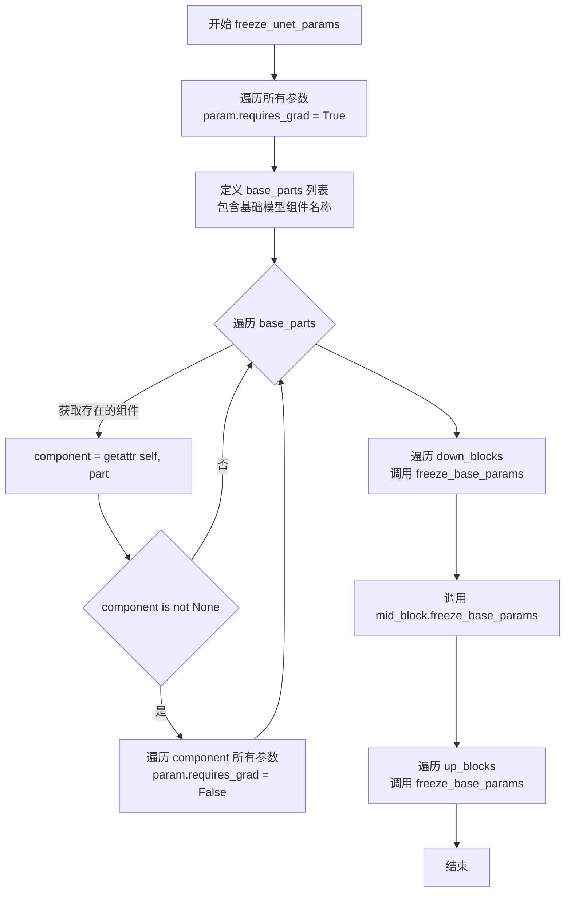

#### 带注释源码

```python
def freeze_unet_params(self) -> None:
    """
    Freeze the weights of the parts belonging to the base UNet2DConditionModel, 
    and leave everything else unfrozen for fine tuning.
    
    该方法的设计目的是:
    1. 首先将所有参数设置为可训练状态 (requires_grad = True)
    2. 然后明确冻结属于基础 UNet2DConditionModel 的部分
    3. 最后通过调用各子模块的 freeze_base_params 方法冻结对应的基础部分
    这样可以确保只有 ControlNet-XS 适配器部分的参数参与梯度更新
    """
    # 第一步：先将所有参数设置为可训练状态
    # 原因：确保后续对特定部分的冻结操作能够正确执行
    # 如果某些参数原本就是冻结的，这一操作可以解除冻结
    for param in self.parameters():
        param.requires_grad = True

    # 第二步：定义需要冻结的基础模型组件名称列表
    # 这些是与基础 UNet2DConditionModel 直接对应的组件
    base_parts = [
        "base_time_proj",        # 时间投影层
        "base_time_embedding",   # 时间嵌入层
        "base_add_time_proj",    # 额外时间投影层
        "base_add_embedding",    # 额外嵌入层
        "base_conv_in",          # 输入卷积层
        "base_conv_norm_out",    # 输出归一化层
        "base_conv_act",         # 输出激活层
        "base_conv_out",         # 输出卷积层
    ]
    
    # 获取实际存在的组件（有些组件可能为 None）
    base_parts = [getattr(self, part) for part in base_parts if getattr(self, part) is not None]
    
    # 冻结这些基础组件的所有参数
    for part in base_parts:
        for param in part.parameters():
            param.requires_grad = False

    # 第三步：冻结下采样块中的基础模型参数
    # 遍历所有下采样块，调用各自的 freeze_base_params 方法
    for d in self.down_blocks:
        d.freeze_base_params()
    
    # 第四步：冻结中间块的基础模型参数
    self.mid_block.freeze_base_params()
    
    # 第五步：冻结上采样块中的基础模型参数
    for u in self.up_blocks:
        u.freeze_base_params()
```


### `UNetControlNetXSModel.set_default_attn_processor`

该方法用于禁用自定义注意力处理器，并将注意力实现设置为默认实现。它会根据当前已注册的注意力处理器类型，自动选择合适的默认处理器（`AttnAddedKVProcessor` 或 `AttnProcessor`），然后调用 `set_attn_processor` 进行全局替换。

参数：

- `self`：`UNetControlNetXSModel` 实例本身，无需显式传递

返回值：`None`，该方法无返回值，直接修改实例内部的注意力处理器状态

#### 流程图

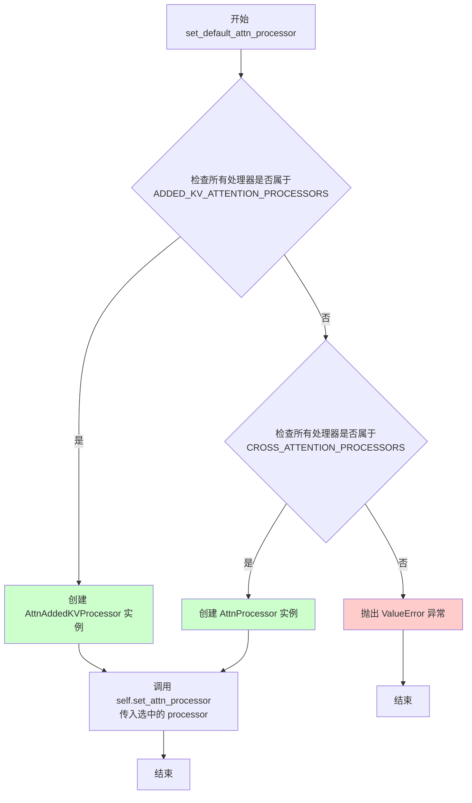

#### 带注释源码

```python
def set_default_attn_processor(self):
    """
    Disables custom attention processors and sets the default attention implementation.
    该方法用于禁用自定义注意力处理器，并将注意力实现设置为默认实现。
    """
    # 判断当前所有注意力处理器是否都属于 ADDED_KV_ATTENTION_PROCESSORS 类型
    # ADDED_KV_ATTENTION_PROCESSORS 是支持额外键值对注入的处理器集合
    if all(proc.__class__ in ADDED_KV_ATTENTION_PROCESSORS for proc in self.attn_processors.values()):
        # 如果所有处理器都是 ADDED_KV 类型，则使用 AttnAddedKVProcessor 作为默认处理器
        processor = AttnAddedKVProcessor()
    # 判断当前所有注意力处理器是否都属于 CROSS_ATTENTION_PROCESSORS 类型
    elif all(proc.__class__ in CROSS_ATTENTION_PROCESSORS for proc in self.attn_processors.values()):
        # 如果所有处理器都是 CROSS_ATTENTION 类型，则使用 AttnProcessor 作为默认处理器
        processor = AttnProcessor()
    else:
        # 如果处理器类型混合或不属于上述两类，则抛出 ValueError 异常
        # 错误信息包含当前处理器的实际类型
        raise ValueError(
            f"Cannot call `set_default_attn_processor` when attention processors are of type {next(iter(self.attn_processors.values()))}"
        )

    # 调用 set_attn_processor 方法，将选定的默认处理器应用到整个模型
    # 这会替换 self.attn_processors 字典中的所有处理器为同一个默认实例
    self.set_attn_processor(processor)
```


### `UNetControlNetXSModel.enable_freeu`

启用 FreeU 机制，通过为上采样块设置缩放参数来减轻去噪过程中的"过度平滑效应"。

参数：

- `s1`：`float`，第一阶段的缩放因子，用于衰减跳跃特征的贡献
- `s2`：`float`，第二阶段的缩放因子，用于衰减跳跃特征的贡献
- `b1`：`float`，第一阶段的缩放因子，用于放大主干特征的贡献
- `b2`：`float`，第二阶段的缩放因子，用于放大主干特征的贡献

返回值：`None`，无返回值，仅修改模型状态

#### 流程图

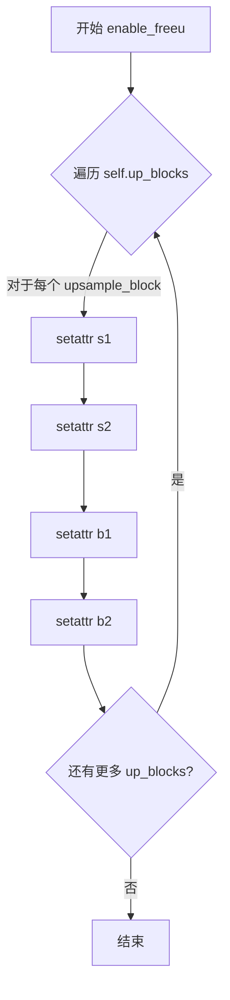

#### 带注释源码

```python
def enable_freeu(self, s1: float, s2: float, b1: float, b2: float):
    r"""Enables the FreeU mechanism from https://huggingface.co/papers/2309.11497.

    The suffixes after the scaling factors represent the stage blocks where they are being applied.

    Please refer to the [official repository](https://github.com/ChenyangSi/FreeU) for combinations of values that
    are known to work well for different pipelines such as Stable Diffusion v1, v2, and Stable Diffusion XL.

    Args:
        s1 (`float`):
            Scaling factor for stage 1 to attenuate the contributions of the skip features. This is done to
            mitigate the "oversmoothing effect" in the enhanced denoising process.
        s2 (`float`):
            Scaling factor for stage 2 to attenuate the contributions of the skip features. This is done to
            mitigate the "oversmoothing effect" in the enhanced denoising process.
        b1 (`float`): Scaling factor for stage 1 to amplify the contributions of backbone features.
        b2 (`float`): Scaling factor for stage 2 to amplify the contributions of backbone features.
    """
    # 遍历所有的上采样块（up_blocks）
    for i, upsample_block in enumerate(self.up_blocks):
        # 为每个上采样块设置FreeU的四个缩放参数
        # s1, s2: 控制跳跃特征（skip features）的衰减程度
        # b1, b2: 控制主干特征（backbone features）的放大程度
        # 这些参数将在forward过程中被maybe_apply_freeu_to_subblock函数使用
        setattr(upsample_block, "s1", s1)
        setattr(upsample_block, "s2", s2)
        setattr(upsample_block, "b1", b1)
        setattr(upsample_block, "b2", b2)
```


### `UNetControlNetXSModel.disable_freeu`

该方法用于禁用 FreeU（Fast FreeU）机制。FreeU 是一种用于改善扩散模型去噪过程的技巧，通过调整跳跃特征（skip features）和骨干特征（backbone features）的贡献来减轻"过度平滑效应"。此方法遍历所有上采样块，将 FreeU 相关的缩放参数（s1、s2、b1、b2）设置为 None，从而关闭该机制。

参数：

- 该方法没有显式参数（除隐含的 `self`）

返回值：`None`，无返回值

#### 流程图

```mermaid
flowchart TD
    A[开始: disable_freeu] --> B[定义 freeu_keys = {'s1', 's2', 'b1', 'b2'}]
    B --> C[遍历 self.up_blocks 中的每个 upsample_block]
    C --> D{遍历 freeu_keys 中的每个 key k}
    D --> E{检查 upsample_block 是否拥有属性 k}
    E -->|是| F[将 upsample_block.k 设置为 None]
    E -->|否| G{检查 getattr(upsample_block, k, None) 是否不为 None}
    G -->|是| F
    G -->|否| H[跳过该 key]
    F --> H
    H --> D
    D --> I{是否还有未处理的 key}
    I -->|是| D
    I -->|否| C
    C --> J{是否还有未处理的上采样块}
    J -->|是| C
    J -->|否| K[结束: FreeU 机制已禁用]
```

#### 带注释源码

```python
def disable_freeu(self):
    """Disables the FreeU mechanism."""
    # 定义 FreeU 机制使用的缩放因子键名集合
    # s1, s2: 用于衰减跳跃特征的缩放因子（stage 1 和 stage 2）
    # b1, b2: 用于放大骨干特征的缩放因子（stage 1 和 stage 2）
    freeu_keys = {"s1", "s2", "b1", "b2"}
    
    # 遍历模型中所有的上采样块（up_blocks）
    # 这些块在 enable_freeu 时被设置了 s1, s2, b1, b2 属性
    for i, upsample_block in enumerate(self.up_blocks):
        
        # 遍历每个 FreeU 键，检查并禁用对应的属性
        for k in freeu_keys:
            # 条件：属性存在，或者属性值不为 None
            # 使用 hasattr 检查属性是否存在
            # 使用 getattr 检查属性值是否为非 None
            if hasattr(upsample_block, k) or getattr(upsample_block, k, None) is not None:
                # 将该缩放因子设置为 None，从而禁用 FreeU 机制
                setattr(upsample_block, k, None)
```


### `UNetControlNetXSModel.fuse_qkv_projections`

该方法用于启用融合的QKV投影，对于自注意力模块，将所有投影矩阵（即query、key、value）融合在一起；对于交叉注意力模块，则融合key和value投影矩阵。这是一个实验性API。

参数：
- 无

返回值：`None`，无返回值描述

#### 流程图

```mermaid
flowchart TD
    A[开始 fuse_qkv_projections] --> B{检查是否有Added KV attention processors}
    B -->|是| C[抛出ValueError异常]
    B -->|否| D[保存原始attention processors到original_attn_processors]
    D --> E{遍历所有modules}
    E -->|找到Attention模块| F[调用module.fuse_projections fuse=True]
    E -->|未找到| G[继续遍历]
    F --> E
    G --> H[设置attn processor为FusedAttnProcessor2_0]
    H --> I[结束]
```

#### 带注释源码

```python
def fuse_qkv_projections(self):
    """
    Enables fused QKV projections. For self-attention modules, all projection matrices 
    (i.e., query, key, value) are fused. For cross-attention modules, key and value 
    projection matrices are fused.

    > [!WARNING] > This API is 🧪 experimental.
    """
    # 初始化original_attn_processors为None
    self.original_attn_processors = None

    # 检查所有的attention processors是否包含Added KV projections
    # 如果有则抛出异常，因为不支持融合带有added KV的模型
    for _, attn_processor in self.attn_processors.items():
        if "Added" in str(attn_processor.__class__.__name__):
            raise ValueError("`fuse_qkv_projections()` is not supported for models having added KV projections.")

    # 保存原始的attention processors，以便后续可以通过unfuse_qkv_projections恢复
    self.original_attn_processors = self.attn_processors

    # 遍历模型中的所有模块
    for module in self.modules():
        # 找到所有Attention模块并融合其QKV投影
        if isinstance(module, Attention):
            module.fuse_projections(fuse=True)

    # 将attention processor设置为FusedAttnProcessor2_0
    # 这是一个优化的attention processor，支持 fused QKV
    self.set_attn_processor(FusedAttnProcessor2_0())
```


### `UNetControlNetXSModel.unfuse_qkv_projections`

该方法用于禁用融合的 QKV 投影，将模型的注意力处理器恢复为融合之前的状态。这是 `fuse_qkv_projections` 方法的逆操作，允许模型在融合优化和标准注意力机制之间切换。

参数：无

返回值：`None`，无返回值

#### 流程图

```mermaid
flowchart TD
    A[开始] --> B{self.original_attn_processors 是否不为 None}
    B -->|是| C[调用 self.set_attn_processor<br/>使用原始注意力处理器]
    C --> D[结束]
    B -->|否| D
```

#### 带注释源码

```python
# Copied from diffusers.models.unets.unet_2d_condition.UNet2DConditionModel.unfuse_qkv_projections
def unfuse_qkv_projections(self):
    """Disables the fused QKV projection if enabled.

    > [!WARNING] > This API is 🧪 experimental.

    """
    # 检查是否存在之前保存的原始注意力处理器
    # 如果之前调用过 fuse_qkv_projections，则会保存原始处理器到 original_attn_processors
    if self.original_attn_processors is not None:
        # 恢复模型使用原始的注意力处理器
        # 这将禁用融合的 QKV 投影，恢复标准的分离 QKV 计算
        self.set_attn_processor(self.original_attn_processors)
```


### `ControlNetXSCrossAttnDownBlock2D.__init__`

该方法是 `ControlNetXSCrossAttnDownBlock2D` 类的初始化方法，用于构建一个支持 ControlNet-XS 架构的交叉注意力下采样块。该块同时处理基础模型（base）和控制模型（control）的特征，通过残差块、Transformer 注意力模块和上下采样模块实现双向特征融合，并支持梯度检查点以节省显存。

参数：

- `base_in_channels`：`int`，基础模型（base UNet）的输入通道数
- `base_out_channels`：`int`，基础模型的输出通道数
- `ctrl_in_channels`：`int`，控制模型（control）的输入通道数
- `ctrl_out_channels`：`int`，控制模型的输出通道数
- `temb_channels`：`int`，时间嵌入（timestep embedding）的通道数
- `norm_num_groups`：`int`，默认为 32，基础模型的组归一化（GroupNorm）的组数
- `ctrl_max_norm_num_groups`：`int`，默认为 32，控制模型的组归一化最大组数
- `has_crossattn`：`bool`，默认为 `True`，是否包含交叉注意力模块
- `transformer_layers_per_block`：`int | tuple[int] | None`，默认为 1，每个块的 Transformer 层数
- `base_num_attention_heads`：`int | None`，默认为 1，基础模型的注意力头数
- `ctrl_num_attention_heads`：`int | None`，默认为 1，控制模型的注意力头数
- `cross_attention_dim`：`int | None`，默认为 1024，交叉注意力的维度
- `add_downsample`：`bool`，默认为 `True`，是否添加下采样层
- `upcast_attention`：`bool | None`，默认为 `False`，是否向上转换注意力计算精度
- `use_linear_projection`：`bool | None`，默认为 `True`，是否使用线性投影

返回值：`None`，无返回值（初始化方法）

#### 流程图

```mermaid
flowchart TD
    A[开始 __init__] --> B[调用 super().__init__]
    B --> C[初始化空列表: base_resnets, base_attentions, ctrl_resnets, ctrl_attentions, ctrl_to_base, base_to_ctrl]
    C --> D{transformer_layers_per_block 是否为 int}
    D -->|是| E[转换为列表: [transformer_layers_per_block] * 2]
    D -->|否| F[直接使用列表]
    E --> G[循环 i in range(2)]
    F --> G
    G --> H[计算当前层 base_in_channels 和 ctrl_in_channels]
    H --> I[创建 base_to_ctrl 零卷积]
    I --> J[创建 base_resnets 残差块]
    J --> K[创建 ctrl_resnets 残差块<br/>输入 channels = ctrl_in_channels + base_in_channels]
    K --> L{has_crossattn 为真?}
    L -->|是| M[创建 base_attentions Transformer2DModel]
    M --> N[创建 ctrl_attentions Transformer2DModel]
    L -->|否| O[跳过注意力创建]
    N --> P[创建 ctrl_to_base 零卷积]
    O --> P
    P --> Q{add_downsample 为真?}
    Q -->|是| R[创建 base_to_ctrl 零卷积<br/>创建 base_downsamplers<br/>创建 ctrl_downsamplers<br/>创建 ctrl_to_base 零卷积]
    Q -->|否| S[设置 downsamplers 为 None]
    R --> T[将所有列表转换为 nn.ModuleList]
    S --> T
    T --> U[设置 gradient_checkpointing = False]
    U --> V[结束]
```

#### 带注释源码

```python
def __init__(
    self,
    base_in_channels: int,
    base_out_channels: int,
    ctrl_in_channels: int,
    ctrl_out_channels: int,
    temb_channels: int,
    norm_num_groups: int = 32,
    ctrl_max_norm_num_groups: int = 32,
    has_crossattn=True,
    transformer_layers_per_block: int | tuple[int] | None = 1,
    base_num_attention_heads: int | None = 1,
    ctrl_num_attention_heads: int | None = 1,
    cross_attention_dim: int | None = 1024,
    add_downsample: bool = True,
    upcast_attention: bool | None = False,
    use_linear_projection: bool | None = True,
):
    """
    初始化 ControlNet-XS 交叉注意力下采样块。

    该块同时维护 base（基础 UNet）和 control（控制网络）两条分支：
    - 在残差/注意力应用前，将 base 特征 concat 到 control 特征
    - 在残差/注意力应用后，将 control 特征 add 回 base 特征
    - 支持下采样和梯度检查点
    """
    super().__init__()  # 调用 nn.Module 的初始化

    # 初始化存储各组件的列表
    base_resnets = []
    base_attentions = []
    ctrl_resnets = []
    ctrl_attentions = []
    ctrl_to_base = []
    base_to_ctrl = []

    # 固定为 2 层（仅支持 SD + SDXL）
    num_layers = 2

    # 标准化 transformer_layers_per_block 为列表格式
    if isinstance(transformer_layers_per_block, int):
        transformer_layers_per_block = [transformer_layers_per_block] * num_layers

    # 遍历每层构建基础和控制分支的组件
    for i in range(num_layers):
        # 每层根据索引确定输入通道（首层用传入值，后续层用前一层输出）
        base_in_channels = base_in_channels if i == 0 else base_out_channels
        ctrl_in_channels = ctrl_in_channels if i == 0 else ctrl_out_channels

        # === 阶段 1: 残差/注意力应用前 ===
        # 在应用残差块之前，将 base 特征 concat 到 control 特征
        # Concat 操作不改变通道数，所以使用零卷积进行通道映射
        base_to_ctrl.append(make_zero_conv(base_in_channels, base_in_channels))

        # 构建 base 分支的残差块
        base_resnets.append(
            ResnetBlock2D(
                in_channels=base_in_channels,
                out_channels=base_out_channels,
                temb_channels=temb_channels,
                groups=norm_num_groups,
            )
        )

        # 构建 control 分支的残差块
        # 注意: 输入通道是 ctrl_in_channels + base_in_channels，因为 base 特征被 concat 进来
        ctrl_resnets.append(
            ResnetBlock2D(
                in_channels=ctrl_in_channels + base_in_channels,  # 信息来自 base 的 concat
                out_channels=ctrl_out_channels,
                temb_channels=temb_channels,
                groups=find_largest_factor(
                    ctrl_in_channels + base_in_channels, max_factor=ctrl_max_norm_num_groups
                ),
                groups_out=find_largest_factor(ctrl_out_channels, max_factor=ctrl_max_norm_num_groups),
                eps=1e-5,
            )
        )

        # 如果需要交叉注意力，分别构建 base 和 control 的 Transformer 模块
        if has_crossattn:
            base_attentions.append(
                Transformer2DModel(
                    base_num_attention_heads,
                    base_out_channels // base_num_attention_heads,
                    in_channels=base_out_channels,
                    num_layers=transformer_layers_per_block[i],
                    cross_attention_dim=cross_attention_dim,
                    use_linear_projection=use_linear_projection,
                    upcast_attention=upcast_attention,
                    norm_num_groups=norm_num_groups,
                )
            )
            ctrl_attentions.append(
                Transformer2DModel(
                    ctrl_num_attention_heads,
                    ctrl_out_channels // ctrl_num_attention_heads,
                    in_channels=ctrl_out_channels,
                    num_layers=transformer_layers_per_block[i],
                    cross_attention_dim=cross_attention_dim,
                    use_linear_projection=use_linear_projection,
                    upcast_attention=upcast_attention,
                    norm_num_groups=find_largest_factor(ctrl_out_channels, max_factor=ctrl_max_norm_num_groups),
                )
            )

        # === 阶段 2: 残差/注意力应用后 ===
        # 在残差/注意力应用后，将 control 特征 add 回 base 特征
        # Addition 操作需要改变通道数，所以使用零卷积进行通道变换
        ctrl_to_base.append(make_zero_conv(ctrl_out_channels, base_out_channels))

    # === 下采样阶段 ===
    if add_downsample:
        # 下采样前：将 base 特征 concat 到 control（concat 不改变通道数）
        base_to_ctrl.append(make_zero_conv(base_out_channels, base_out_channels))

        # 分别创建 base 和 control 的下采样器
        self.base_downsamplers = Downsample2D(
            base_out_channels, use_conv=True, out_channels=base_out_channels, name="op"
        )
        self.ctrl_downsamplers = Downsample2D(
            ctrl_out_channels + base_out_channels, use_conv=True, out_channels=ctrl_out_channels, name="op"
        )

        # 下采样后：将 control 特征 add 回 base（需要改变通道数）
        ctrl_to_base.append(make_zero_conv(ctrl_out_channels, base_out_channels))
    else:
        # 不需要下采样时设为 None
        self.base_downsamplers = None
        self.ctrl_downsamplers = None

    # === 将所有组件转换为 nn.ModuleList ===
    self.base_resnets = nn.ModuleList(base_resnets)
    self.ctrl_resnets = nn.ModuleList(ctrl_resnets)
    # 注意力模块：如果没有交叉注意力，则用 None 占位符列表
    self.base_attentions = nn.ModuleList(base_attentions) if has_crossattn else [None] * num_layers
    self.ctrl_attentions = nn.ModuleList(ctrl_attentions) if has_crossattn else [None] * num_layers
    self.base_to_ctrl = nn.ModuleList(base_to_ctrl)
    self.ctrl_to_base = nn.ModuleList(ctrl_to_base)

    # 初始化梯度检查点标志
    self.gradient_checkpointing = False
```


### `ControlNetXSCrossAttnDownBlock2D.from_modules`

该类方法通过合并基础UNet的下采样块（CrossAttnDownBlock2D）和ControlNet-XS适配器的下采样块（DownBlockControlNetXSAdapter）来构建一个联合的ControlNetXSCrossAttnDownBlock2D模块。它从两个模块中提取参数和权重，并返回一个包含基础模型和ControlNet-XS控制路径的融合块。

参数：

- `cls`：类型`type`，类方法所在的类本身（ControlNetXSCrossAttnDownBlock2D）
- `base_downblock`：类型`CrossAttnDownBlock2D`，来自UNet2DConditionModel的下采样块，包含基础模型的ResNet和注意力模块
- `ctrl_downblock`：类型`DownBlockControlNetXSAdapter`，来自ControlNetXSAdapter的下采样块适配器，包含控制模型的组件

返回值：类型`ControlNetXSCrossAttnDownBlock2D`，返回一个融合了基础模型块和控制适配器块的ControlNetXSCrossAttnDownBlock2D实例

#### 流程图

```mermaid
flowchart TD
    A["from_modules(cls, base_downblock, ctrl_downblock)"] --> B["定义辅助函数 get_first_cross_attention(block)"]
    B --> C["从base_downblock提取基础参数:<br/>base_in_channels, base_out_channels, temb_channels, num_groups等"]
    C --> D["从ctrl_downblock提取控制参数:<br/>ctrl_in_channels, ctrl_out_channels, ctrl_num_groups等"]
    D --> E{"检查base_downblock是否<br/>has_attentions属性"}
    E -->|是| F["提取注意力参数:<br/>has_crossattn=True<br/>transformer_layers_per_block<br/>base_num_attention_heads<br/>ctrl_num_attention_heads<br/>cross_attention_dim<br/>upcast_attention<br/>use_linear_projection"]
    E -->|否| G["设置has_crossattn=False<br/>其他注意力参数为None"]
    F --> H["检查base_downblock.downsamplers是否存在"]
    G --> H
    H -->|是| I["add_downsample=True"]
    H -->|否| J["add_downsample=False"]
    I --> K["使用提取的参数创建ControlNetXSCrossAttnDownBlock2D模型实例"]
    J --> K
    K --> L["加载权重:<br/>base_resnets<br/>ctrl_resnets"]
    L --> M{"has_crossattn?"}
    M -->|是| N["加载base_attentions和ctrl_attentions权重"]
    M -->|否| O["跳过注意力权重加载"]
    N --> P
    O --> P{"add_downsample?"}
    P -->|是| Q["加载base_downsamplers和ctrl_downsamplers权重"]
    P -->|否| R["跳过下采样器权重加载"]
    Q --> S["加载base_to_ctrl和ctrl_to_base权重"]
    R --> S
    S --> T["返回融合后的模型实例"]
```

#### 带注释源码

```python
@classmethod
def from_modules(cls, base_downblock: CrossAttnDownBlock2D, ctrl_downblock: DownBlockControlNetXSAdapter):
    # 定义辅助函数，用于从注意力块中获取第一个交叉注意力模块
    # 这个函数帮助提取注意力相关的配置参数
    def get_first_cross_attention(block):
        return block.attentions[0].transformer_blocks[0].attn2

    # 从基础UNet的下采样块中提取通道参数
    base_in_channels = base_downblock.resnets[0].in_channels
    base_out_channels = base_downblock.resnets[0].out_channels
    
    # 计算控制块的输入通道数：由于在初始化时基础通道被拼接到了控制通道
    # 控制块的输入通道数需要减去基础通道数
    ctrl_in_channels = (
        ctrl_downblock.resnets[0].in_channels - base_in_channels
    )  # base channels are concatted to ctrl channels in init
    
    # 从控制适配器块中提取输出通道数
    ctrl_out_channels = ctrl_downblock.resnets[0].out_channels
    
    # 提取时间嵌入通道数（从ResNet的时间嵌入投影层）
    temb_channels = base_downblock.resnets[0].time_emb_proj.in_features
    
    # 提取基础块的归一化组数
    num_groups = base_downblock.resnets[0].norm1.num_groups
    # 提取控制块的归一化组数
    ctrl_num_groups = ctrl_downblock.resnets[0].norm1.num_groups
    
    # 检查基础块是否具有注意力模块
    if hasattr(base_downblock, "attentions"):
        has_crossattn = True  # 启用交叉注意力
        # 获取每个块的transformer层数
        transformer_layers_per_block = len(base_downblock.attentions[0].transformer_blocks)
        # 获取基础注意力头数
        base_num_attention_heads = get_first_cross_attention(base_downblock).heads
        # 获取控制注意力头数
        ctrl_num_attention_heads = get_first_cross_attention(ctrl_downblock).heads
        # 获取交叉注意力维度
        cross_attention_dim = get_first_cross_attention(base_downblock).cross_attention_dim
        # 获取是否启用注意力上cast
        upcast_attention = get_first_cross_attention(base_downblock).upcast_attention
        # 获取是否使用线性投影
        use_linear_projection = base_downblock.attentions[0].use_linear_projection
    else:
        # 如果没有注意力模块，设置相关参数为None或False
        has_crossattn = False
        transformer_layers_per_block = None
        base_num_attention_heads = None
        ctrl_num_attention_heads = None
        cross_attention_dim = None
        upcast_attention = None
        use_linear_projection = None
    
    # 检查是否需要下采样
    add_downsample = base_downblock.downsamplers is not None

    # 使用提取的参数创建ControlNetXSCrossAttnDownBlock2D模型
    model = cls(
        base_in_channels=base_in_channels,
        base_out_channels=base_out_channels,
        ctrl_in_channels=ctrl_in_channels,
        ctrl_out_channels=ctrl_out_channels,
        temb_channels=temb_channels,
        norm_num_groups=num_groups,
        ctrl_max_norm_num_groups=ctrl_num_groups,
        has_crossattn=has_crossattn,
        transformer_layers_per_block=transformer_layers_per_block,
        base_num_attention_heads=base_num_attention_heads,
        ctrl_num_attention_heads=ctrl_num_attention_heads,
        cross_attention_dim=cross_attention_dim,
        add_downsample=add_downsample,
        upcast_attention=upcast_attention,
        use_linear_projection=use_linear_projection,
    )

    # 加载基础ResNet块的权重
    model.base_resnets.load_state_dict(base_downblock.resnets.state_dict())
    # 加载控制ResNet块的权重
    model.ctrl_resnets.load_state_dict(ctrl_downblock.resnets.state_dict())
    
    # 如果有交叉注意力模块，加载注意力权重
    if has_crossattn:
        model.base_attentions.load_state_dict(base_downblock.attentions.state_dict())
        model.ctrl_attentions.load_state_dict(ctrl_downblock.attentions.state_dict())
    
    # 如果有下采样器，加载下采样器权重
    if add_downsample:
        model.base_downsamplers.load_state_dict(base_downblock.downsamplers[0].state_dict())
        model.ctrl_downsamplers.load_state_dict(ctrl_downblock.downsamplers.state_dict())
    
    # 加载基础到控制、控制到基础的连接层权重
    model.base_to_ctrl.load_state_dict(ctrl_downblock.base_to_ctrl.state_dict())
    model.ctrl_to_base.load_state_dict(ctrl_downblock.ctrl_to_base.state_dict())

    # 返回融合后的模型实例
    return model
```


### ControlNetXSCrossAttnDownBlock2D.freeze_base_params

该方法用于冻结属于基础UNet2DConditionModel的权重，同时将其他部分保持为可训练状态，以便进行微调。

参数：

- 无显式参数（`self`为隐式参数）

返回值：`None`，无返回值（该方法直接修改模型参数的梯度计算属性）

#### 流程图

```mermaid
flowchart TD
    A[开始 freeze_base_params] --> B[将所有参数设为 requires_grad=True]
    B --> C[初始化 base_parts 列表]
    C --> D{self.base_attentions 是 nn.ModuleList?}
    D -->|是| E[将 self.base_attentions 加入 base_parts]
    D -->|否| F{self.base_downsamplers 不为 None?}
    E --> F
    F -->|是| G[将 self.base_downsamplers 加入 base_parts]
    F -->|否| H[遍历 base_parts 中的每个部分]
    G --> H
    H --> I[将该部分所有参数设为 requires_grad=False]
    I --> J[结束]
```

#### 带注释源码

```python
def freeze_base_params(self) -> None:
    """Freeze the weights of the parts belonging to the base UNet2DConditionModel, and leave everything else unfrozen for fine
    tuning."""
    # Unfreeze everything
    # 首先将所有参数设置为可训练状态，这是为了确保后续可以正确地只冻结基础部分
    for param in self.parameters():
        param.requires_grad = True

    # Freeze base part
    # 初始化基础部分列表，包含基础残差网络
    base_parts = [self.base_resnets]
    
    # 如果基础注意力模块是 nn.ModuleList（而非 None 列表），则将其加入冻结列表
    # 注意：attentions 可以是包含 None 的列表，需要判断类型
    if isinstance(self.base_attentions, nn.ModuleList):  # attentions can be a list of Nones
        base_parts.append(self.base_attentions)
    
    # 如果存在下采样器，也将其加入冻结列表
    if self.base_downsamplers is not None:
        base_parts.append(self.base_downsamplers)
    
    # 遍历所有基础部分，将其所有参数设置为不可训练
    # 这样可以冻结基础UNet的权重，只训练ControlNet-XS的适配器部分
    for part in base_parts:
        for param in part.parameters():
            param.requires_grad = False
```


### `ControlNetXSCrossAttnDownBlock2D.forward`

该方法是 `ControlNetXSCrossAttnDownBlock2D` 类的核心前向传播函数，负责在 ControlNet-XS 架构中同时处理基础 UNet 和控制网络的down block，通过特征拼接和信息交互实现条件控制图像生成。

参数：

- `self`：`ControlNetXSCrossAttnDownBlock2D` 实例本身
- `hidden_states_base`：`Tensor`，基础模型的隐藏状态输入，形状为 `(batch_size, channels, height, width)`
- `temb`：`Tensor`，时间嵌入向量，用于条件时间步信息
- `encoder_hidden_states`：`Tensor | None`，编码器的隐藏状态（如文本嵌入），用于交叉注意力机制
- `hidden_states_ctrl`：`Tensor | None`，控制网络的隐藏状态输入
- `conditioning_scale`：`float | None`，控制网络对基础模型的影响权重，默认为 1.0
- `attention_mask`：`Tensor | None`，注意力掩码，用于控制哪些位置参与注意力计算
- `cross_attention_kwargs`：`dict[str, Any] | None`，交叉注意力的额外关键字参数
- `encoder_attention_mask`：`Tensor | None`，编码器注意力掩码
- `apply_control`：`bool`，是否应用控制网络的影响，默认为 True

返回值：`tuple[Tensor, Tensor, tuple[Tensor, ...], tuple[Tensor, ...]]`，返回一个四元组，包含：
- 第一个元素：处理后的基础模型隐藏状态 `h_base`
- 第二个元素：处理后的控制网络隐藏状态 `h_ctrl`
- 第三个元素：基础模型各层输出状态的元组 `base_output_states`
- 第四个元素：控制网络各层输出状态的元组 `ctrl_output_states`

#### 流程图

```mermaid
flowchart TD
    A[输入 hidden_states_base, hidden_states_ctrl, temb] --> B[初始化输出状态]
    B --> C{是否启用梯度检查点}
    
    C -->|是| D[使用 gradient_checkpointing_func]
    C -->|否| E[直接调用模块]
    
    D --> F[遍历 base_resnets + base_attentions 和 ctrl_resnets + ctrl_attentions]
    E --> F
    
    F --> G[concat base_to_ctrl 转换后的特征到 ctrl]
    G --> H[应用 base resnet 块]
    H --> I{base_attention 是否存在}
    I -->|是| J[应用 base attention 块]
    I -->|否| K[跳过 attention]
    
    J --> L[应用 ctrl resnet 块]
    K --> L
    L --> M{ctrl_attention 是否存在}
    M -->|是| N[应用 ctrl attention 块]
    M -->|否| O[跳过 attention]
    
    N --> P[将 ctrl_to_base 转换后的特征加到 base]
    O --> P
    
    P --> Q[保存输出状态到 base_output_states 和 ctrl_output_states]
    Q --> R{是否有下采样器}
    
    R -->|是| S[concat base_to_ctrl 最后层转换]
    S --> T[应用 base_downsamplers]
    T --> U[应用 ctrl_downsamplers]
    U --> V[添加 ctrl_to_base 转换到 base]
    V --> W[保存下采样后的输出状态]
    
    R -->|否| X
    
    W --> X[返回 h_base, h_ctrl, base_output_states, ctrl_output_states]
    X --> Y[返回最终结果]
```

#### 带注释源码

```python
def forward(
    self,
    hidden_states_base: Tensor,
    temb: Tensor,
    encoder_hidden_states: Tensor | None = None,
    hidden_states_ctrl: Tensor | None = None,
    conditioning_scale: float | None = 1.0,
    attention_mask: Tensor | None = None,
    cross_attention_kwargs: dict[str, Any] | None = None,
    encoder_attention_mask: Tensor | None = None,
    apply_control: bool = True,
) -> tuple[Tensor, Tensor, tuple[Tensor, ...], tuple[Tensor, ...]]:
    """
    ControlNet-XS Down Block 的前向传播方法
    
    该方法同时处理基础 UNet 和控制网络的特征，通过以下步骤：
    1. 遍历每层的 resnet 和 attention 块
    2. 在 base 和 ctrl 之间进行特征拼接和添加操作
    3. 可选地应用下采样
    
    Args:
        hidden_states_base: 基础模型的隐藏状态
        temb: 时间嵌入
        encoder_hidden_states: 编码器隐藏状态（文本等条件）
        hidden_states_ctrl: 控制网络隐藏状态
        conditioning_scale: 控制网络影响系数
        attention_mask: 注意力掩码
        cross_attention_kwargs: 交叉注意力额外参数
        encoder_attention_mask: 编码器注意力掩码
        apply_control: 是否应用控制
    
    Returns:
        (h_base, h_ctrl, base_output_states, ctrl_output_states)
    """
    # 检查并警告 cross_attention_kwargs 中的 scale 参数已弃用
    if cross_attention_kwargs is not None:
        if cross_attention_kwargs.get("scale", None) is not None:
            logger.warning("Passing `scale` to `cross_attention_kwargs` is deprecated. `scale` will be ignored.")

    # 将输入隐藏状态赋值给局部变量
    h_base = hidden_states_base
    h_ctrl = hidden_states_ctrl

    # 初始化输出状态元组
    base_output_states = ()
    ctrl_output_states = ()

    # 将 base 和 ctrl 的 resnets 与 attentions 配对
    base_blocks = list(zip(self.base_resnets, self.base_attentions))
    ctrl_blocks = list(zip(self.ctrl_resnets, self.ctrl_attentions))

    # 遍历每一层的 base 和 ctrl 块
    for (b_res, b_attn), (c_res, c_attn), b2c, c2b in zip(
        base_blocks, ctrl_blocks, self.base_to_ctrl, self.ctrl_to_base
    ):
        # === 步骤1: 将 base 特征拼接到 ctrl ===
        # 在应用 resnet/attention 之前，将 base 的信息通过 base_to_ctrl 转换后拼接到 ctrl
        if apply_control:
            h_ctrl = torch.cat([h_ctrl, b2c(h_base)], dim=1)

        # === 步骤2: 应用 base 子块 ===
        # 根据是否启用梯度检查点选择不同的执行方式
        if torch.is_grad_enabled() and self.gradient_checkpointing:
            h_base = self._gradient_checkpointing_func(b_res, h_base, temb)
        else:
            h_base = b_res(h_base, temb)

        # 应用 base 的注意力机制（如果存在）
        if b_attn is not None:
            h_base = b_attn(
                h_base,
                encoder_hidden_states=encoder_hidden_states,
                cross_attention_kwargs=cross_attention_kwargs,
                attention_mask=attention_mask,
                encoder_attention_mask=encoder_attention_mask,
                return_dict=False,
            )[0]

        # === 步骤3: 应用 ctrl 子块 ===
        if apply_control:
            # 应用 ctrl 的 resnet 块
            if torch.is_grad_enabled() and self.gradient_checkpointing:
                h_ctrl = self._gradient_checkpointing_func(c_res, h_ctrl, temb)
            else:
                h_ctrl = c_res(h_ctrl, temb)
            
            # 应用 ctrl 的注意力机制（如果存在）
            if c_attn is not None:
                h_ctrl = c_attn(
                    h_ctrl,
                    encoder_hidden_states=encoder_hidden_states,
                    cross_attention_kwargs=cross_attention_kwargs,
                    attention_mask=attention_mask,
                    encoder_attention_mask=encoder_attention_mask,
                    return_dict=False,
                )[0]

        # === 步骤4: 将 ctrl 特征添加到 base ===
        # 在 resnet/attention 应用后，将控制网络的信息添加到基础模型
        if apply_control:
            h_base = h_base + c2b(h_ctrl) * conditioning_scale

        # 保存每一层的输出状态
        base_output_states = base_output_states + (h_base,)
        ctrl_output_states = ctrl_output_states + (h_ctrl,)

    # === 步骤5: 应用下采样器（如果存在） ===
    if self.base_downsamplers is not None:  # if we have a base_downsampler, then also a ctrl_downsampler
        b2c = self.base_to_ctrl[-1]
        c2b = self.ctrl_to_base[-1]

        # concat base -> ctrl
        if apply_control:
            h_ctrl = torch.cat([h_ctrl, b2c(h_base)], dim=1)
        
        # apply base subblock
        h_base = self.base_downsamplers(h_base)
        
        # apply ctrl subblock
        if apply_control:
            h_ctrl = self.ctrl_downsamplers(h_ctrl)
        
        # add ctrl -> base
        if apply_control:
            h_base = h_base + c2b(h_ctrl) * conditioning_scale

        # 保存下采样后的输出状态
        base_output_states = base_output_states + (h_base,)
        ctrl_output_states = ctrl_output_states + (h_ctrl,)

    # 返回最终结果
    return h_base, h_ctrl, base_output_states, ctrl_output_states
```


### ControlNetXSCrossAttnMidBlock2D.__init__

该方法是 `ControlNetXSCrossAttnMidBlock2D` 类的初始化方法，负责构建 ControlNet-XS 模型的中间块（Mid Block），该中间块包含基础 UNet 的中间块、ControlNet 的中间块以及用于在基础模型和控制模型之间传递信息的卷积层。

参数：

- `base_channels`：`int`，基础 UNet 模型的通道数
- `ctrl_channels`：`int`，ControlNet 适配器的通道数
- `temb_channels`：`int | None`，时间嵌入的通道数，默认为 None
- `norm_num_groups`：`int`，基础模型的归一化组数，默认为 32
- `ctrl_max_norm_num_groups`：`int`，ControlNet 模型的最大归一化组数，默认为 32
- `transformer_layers_per_block`：`int`，每个块的 Transformer 层数，默认为 1
- `base_num_attention_heads`：`int | None`，基础模型的注意力头数，默认为 1
- `ctrl_num_attention_heads`：`int | None`，ControlNet 模型的注意力头数，默认为 1
- `cross_attention_dim`：`int | None`，交叉注意力维度，默认为 1024
- `upcast_attention`：`bool`，是否向上转换注意力计算，默认为 False
- `use_linear_projection`：`bool | None`，是否使用线性投影，默认为 True

返回值：无（`None`）

#### 流程图

```mermaid
flowchart TD
    A[开始 __init__] --> B[调用 super().__init__]
    B --> C[创建 base_to_ctrl 卷积层]
    C --> D[创建 base_midblock UNetMidBlock2DCrossAttn]
    D --> E[创建 ctrl_midblock UNetMidBlock2DCrossAttn]
    E --> F[创建 ctrl_to_base 卷积层]
    F --> G[设置 gradient_checkpointing = False]
    G --> H[结束 __init__]
    
    C -.-> C1[make_zero_conv base_channels -> base_channels]
    D -.-> D1[输入通道: base_channels<br/>注意力头: base_num_attention_heads<br/>使用线性投影]
    E -.-> E1[输入通道: ctrl_channels + base_channels<br/>输出通道: ctrl_channels<br/>注意力头: ctrl_num_attention_heads<br/>使用 find_largest_factor 计算归一化组数]
    F -.-> F1[make_zero_conv ctrl_channels -> base_channels]
```

#### 带注释源码

```python
def __init__(
    self,
    base_channels: int,
    ctrl_channels: int,
    temb_channels: int | None = None,
    norm_num_groups: int = 32,
    ctrl_max_norm_num_groups: int = 32,
    transformer_layers_per_block: int = 1,
    base_num_attention_heads: int | None = 1,
    ctrl_num_attention_heads: int | None = 1,
    cross_attention_dim: int | None = 1024,
    upcast_attention: bool = False,
    use_linear_projection: bool | None = True,
):
    super().__init__()

    # 在中间块应用之前，信息从基础模型连接到控制模型
    # 连接不需要改变通道数
    # 创建一个零卷积层，用于将基础模型的特征传递到控制模型
    self.base_to_ctrl = make_zero_conv(base_channels, base_channels)

    # 创建基础 UNet 的中间块
    # 该中间块处理来自基础 UNet 的特征
    self.base_midblock = UNetMidBlock2DCrossAttn(
        transformer_layers_per_block=transformer_layers_per_block,
        in_channels=base_channels,
        temb_channels=temb_channels,
        resnet_groups=norm_num_groups,
        cross_attention_dim=cross_attention_dim,
        num_attention_heads=base_num_attention_heads,
        use_linear_projection=use_linear_projection,
        upcast_attention=upcast_attention,
    )

    # 创建 ControlNet 的中间块
    # 该中间块处理来自控制模型的特征，输入通道是 ctrl_channels + base_channels（基础特征被连接到控制特征）
    # 输出通道是 ctrl_channels
    # 归一化组数必须同时整除 in_channels 和 out_channels
    self.ctrl_midblock = UNetMidBlock2DCrossAttn(
        transformer_layers_per_block=transformer_layers_per_block,
        in_channels=ctrl_channels + base_channels,
        out_channels=ctrl_channels,
        temb_channels=temb_channels,
        # 归一化组数必须同时整除 in_channels 和 out_channels
        # 使用 find_largest_factor 函数找到满足条件的最大组数
        resnet_groups=find_largest_factor(
            gcd(ctrl_channels, ctrl_channels + base_channels), ctrl_max_norm_num_groups
        ),
        cross_attention_dim=cross_attention_dim,
        num_attention_heads=ctrl_num_attention_heads,
        use_linear_projection=use_linear_projection,
        upcast_attention=upcast_attention,
    )

    # 在中间块应用之后，信息从控制模型添加到基础模型
    # 添加需要改变通道数
    # 创建一个零卷积层，用于将控制模型的特征添加到基础模型
    self.ctrl_to_base = make_zero_conv(ctrl_channels, base_channels)

    # 设置梯度检查点标志为 False
    self.gradient_checkpointing = False
```


### `ControlNetXSCrossAttnMidBlock2D.from_modules`

该类方法通过组合基础UNet模型的中block（`base_midblock`）和ControlNetXS适配器的中block（`ctrl_midblock`），创建一个融合了控制网络功能的 `ControlNetXSCrossAttnMidBlock2D` 实例，同时迁移预训练权重。

参数：

-  `cls`：类型`type`，隐式参数，表示类本身
-  `base_midblock`：`UNetMidBlock2DCrossAttn`，来自基础UNet2DConditionModel的中block模块
-  `ctrl_midblock`：`MidBlockControlNetXSAdapter`，来自ControlNetXSAdapter的中block适配器模块，包含midblock、base_to_ctrl和ctrl_to_base组件

返回值：`ControlNetXSCrossAttnMidBlock2D`，返回新创建的融合了基础模型和ControlNet-XS控制网络的中block模块实例

#### 流程图

```mermaid
flowchart TD
    A["from_modules(cls, base_midblock, ctrl_midblock)"] --> B["从ctrl_midblock提取组件"]
    B --> B1["提取 base_to_ctrl 通道映射"]
    B --> B2["提取 ctrl_to_base 通道映射"]
    B --> B3["提取 ctrl_midblock.midblock"]
    
    B3 --> C["从base_midblock提取参数"]
    C --> C1["base_channels = ctrl_to_base.out_channels"]
    C --> C2["ctrl_channels = ctrl_to_base.in_channels"]
    C --> C3["transformer_layers_per_block"]
    C --> C4["temb_channels / num_groups"]
    C --> C5["注意力头数 / cross_attention_dim"]
    C --> C6["upcast_attention / use_linear_projection"]
    
    C6 --> D["创建模型实例 cls(...)"]
    D --> E["加载预训练权重"]
    E --> E1["model.base_to_ctrl.load_state_dict(base_to_ctrl)"]
    E --> E2["model.base_midblock.load_state_dict(base_midblock)"]
    E --> E3["model.ctrl_midblock.load_state_dict(ctrl_midblock)"]
    E --> E4["model.ctrl_to_base.load_state_dict(ctrl_to_base)"]
    
    E4 --> F["return model"]
    
    style A fill:#e1f5fe
    style D fill:#e8f5e8
    style F fill:#fff3e0
```

#### 带注释源码

```python
@classmethod
def from_modules(
    cls,
    base_midblock: UNetMidBlock2DCrossAttn,
    ctrl_midblock: MidBlockControlNetXSAdapter,
):
    """
    从基础UNet的中block和ControlNetXS适配器的中block创建融合的MidBlock实例。

    Parameters:
        base_midblock: 来自UNet2DConditionModel的UNetMidBlock2DCrossAttn模块
        ctrl_midblock: 来自ControlNetXSAdapter的MidBlockControlNetXSAdapter模块

    Returns:
        融合了控制网络功能的ControlNetXSCrossAttnMidBlock2D实例
    """
    # 第一步：从ctrl_midblock中提取组件
    # base_to_ctrl: 将基础模型特征映射到控制网络的通道
    base_to_ctrl = ctrl_midblock.base_to_ctrl
    # ctrl_to_base: 将控制网络特征映射回基础模型的通道
    ctrl_to_base = ctrl_midblock.ctrl_to_base
    # 实际的midblock模块
    ctrl_midblock = ctrl_midblock.midblock

    # 定义辅助函数：获取第一个交叉注意力层
    def get_first_cross_attention(midblock):
        # midblock.attentions[0]获取第一个注意力块
        # .transformer_blocks[0]获取第一个transformer块
        # .attn2获取交叉注意力层(attn1是自注意力, attn2是交叉注意力)
        return midblock.attentions[0].transformer_blocks[0].attn2

    # 第二步：从模块中提取参数
    # 通道数从ctrl_to_base的权重形状推断
    base_channels = ctrl_to_base.out_channels  # 基础模型的通道数
    ctrl_channels = ctrl_to_base.in_channels   # 控制网络的通道数
    
    # Transformer层数：统计transformer_blocks的数量
    transformer_layers_per_block = len(base_midblock.attentions[0].transformer_blocks)
    
    # 时间嵌入通道：从resnet的时间嵌入投影层获取
    temb_channels = base_midblock.resnets[0].time_emb_proj.in_features
    
    # 归一化组数
    num_groups = base_midblock.resnets[0].norm1.num_groups
    ctrl_num_groups = ctrl_midblock.resnets[0].norm1.num_groups
    
    # 注意力相关参数
    base_num_attention_heads = get_first_cross_attention(base_midblock).heads
    ctrl_num_attention_heads = get_first_cross_attention(ctrl_midblock).heads
    cross_attention_dim = get_first_cross_attention(base_midblock).cross_attention_dim
    upcast_attention = get_first_cross_attention(base_midblock).upcast_attention
    use_linear_projection = base_midblock.attentions[0].use_linear_projection

    # 第三步：创建模型实例
    model = cls(
        base_channels=base_channels,
        ctrl_channels=ctrl_channels,
        temb_channels=temb_channels,
        norm_num_groups=num_groups,
        ctrl_max_norm_num_groups=ctrl_num_groups,
        transformer_layers_per_block=transformer_layers_per_block,
        base_num_attention_heads=base_num_attention_heads,
        ctrl_num_attention_heads=ctrl_num_attention_heads,
        cross_attention_dim=cross_attention_dim,
        upcast_attention=upcast_attention,
        use_linear_projection=use_linear_projection,
    )

    # 第四步：加载预训练权重
    # 加载通道映射层权重
    model.base_to_ctrl.load_state_dict(base_to_ctrl.state_dict())
    # 加载基础模型midblock权重
    model.base_midblock.load_state_dict(base_midblock.state_dict())
    # 加载控制网络midblock权重
    model.ctrl_midblock.load_state_dict(ctrl_midblock.state_dict())
    # 加载控制到基础映射层权重
    model.ctrl_to_base.load_state_dict(ctrl_to_base.state_dict())

    return model
```


### `ControlNetXSCrossAttnMidBlock2D.freeze_base_params`

冻结属于基础 UNet2DConditionModel 的权重参数，并将其他参数保持为可训练状态，以便进行微调。

参数：
- 该方法无显式参数（`self` 为隐式参数）

返回值：`None`，无返回值，仅修改模型参数的梯度需求属性

#### 流程图

```mermaid
flowchart TD
    A[开始 freeze_base_params] --> B[遍历所有参数<br/>param.requires_grad = True]
    B --> C[遍历 base_midblock 的所有参数<br/>param.requires_grad = False]
    C --> D[结束]
    
    style A fill:#f9f,stroke:#333
    style B fill:#bbf,stroke:#333
    style C fill:#bbf,stroke:#333
    style D fill:#bfb,stroke:#333
```

#### 带注释源码

```python
def freeze_base_params(self) -> None:
    """
    冻结属于基础 UNet2DConditionModel 的权重，并保持其他部分可训练以进行微调。
    
    该方法的目的是在 ControlNet-XS 模型中实现部分冻结微调：
    - 基础 UNet 部分的参数被冻结（用于保持预训练知识）
    - ControlNet 控制适配器的参数保持可训练（用于学习新的控制条件）
    """
    # 第一步：先将所有参数设置为可训练状态
    # 这是为了确保之前可能被冻结的参数现在变为可训练
    for param in self.parameters():
        param.requires_grad = True

    # 第二步：冻结 base_midblock（基础模型的中间块）的所有参数
    # base_midblock 继承自 UNet2DConditionModel 的中间块部分
    # 通过将其参数设置为 requires_grad=False 来冻结这些权重
    for param in self.base_midblock.parameters():
        param.requires_grad = False
```


### ControlNetXSCrossAttnMidBlock2D.forward

该方法是ControlNet-XS模型中中间块的转发方法，负责处理UNet的中间层，并在base模型和control adapter之间进行信息交互（连接base信息到control块，然后从control块添加回基础块）。

参数：

- `hidden_states_base`：`Tensor`，基础UNet模型的中间隐藏状态
- `temb`：`Tensor`，时间嵌入向量
- `encoder_hidden_states`：`Tensor`，编码器的隐藏状态（用于交叉注意力）
- `hidden_states_ctrl`：`Tensor | None`，ControlNet-XS适配器的隐藏状态，默认为None
- `conditioning_scale`：`float | None`，控制模型对基础模型影响的缩放因子，默认为1.0
- `cross_attention_kwargs`：`dict[str, Any] | None`，交叉注意力模块的额外关键字参数，默认为None
- `attention_mask`：`Tensor | None`，注意力掩码，默认为None
- `encoder_attention_mask`：`Tensor | None`，编码器注意力掩码，默认为None
- `apply_control`：`bool`，是否应用控制模型的影响，默认为True

返回值：`tuple[Tensor, Tensor]`，处理后的基础隐藏状态和控制隐藏状态

#### 流程图

```mermaid
flowchart TD
    A[开始 forward] --> B{apply_control?}
    B -->|Yes| C[连接 base_to_ctrl 到 hidden_states_ctrl]
    B -->|No| D[跳过连接]
    C --> E[应用 base_midblock]
    D --> E
    E --> F{apply_control?}
    F -->|Yes| G[应用 ctrl_midblock]
    F -->|No| H[跳过 ctrl_midblock]
    G --> I[添加 ctrl_to_base 到 base]
    H --> J[返回结果]
    I --> J
    J --> K[结束, 返回 h_base 和 h_ctrl]
```

#### 带注释源码

```python
def forward(
    self,
    hidden_states_base: Tensor,
    temb: Tensor,
    encoder_hidden_states: Tensor,
    hidden_states_ctrl: Tensor | None = None,
    conditioning_scale: float | None = 1.0,
    cross_attention_kwargs: dict[str, Any] | None = None,
    attention_mask: Tensor | None = None,
    encoder_attention_mask: Tensor | None = None,
    apply_control: bool = True,
) -> tuple[Tensor, Tensor]:
    """
    ControlNet-XS 中间块的转发方法
    
    该方法执行以下操作：
    1. 如果 apply_control 为真，将基础模型的特征通过 base_to_ctrl 连接卷积后连接到控制模型的隐藏状态
    2. 应用基础模型的中间块 (base_midblock)
    3. 如果 apply_control 为真，应用控制模型的中间块 (ctrl_midblock)
    4. 将控制模型的特征通过 ctrl_to_base 添加卷积后与基础模型特征相加（带 conditioning_scale 缩放）
    
    参数:
        hidden_states_base: 基础UNet模型的中间隐藏状态
        temb: 时间嵌入向量
        encoder_hidden_states: 编码器的隐藏状态用于交叉注意力
        hidden_states_ctrl: ControlNet-XS适配器的隐藏状态
        conditioning_scale: 控制模型对基础模型影响的缩放因子
        cross_attention_kwargs: 交叉注意力模块的额外参数
        attention_mask: 注意力掩码
        encoder_attention_mask: 编码器注意力掩码
        apply_control: 是否应用控制模型的影响
    
    返回:
        tuple[Tensor, Tensor]: 处理后的 (基础隐藏状态, 控制隐藏状态)
    """
    # 检查 cross_attention_kwargs 中是否传递了已弃用的 scale 参数
    if cross_attention_kwargs is not None:
        if cross_attention_kwargs.get("scale", None) is not None:
            logger.warning("Passing `scale` to `cross_attention_kwargs` is deprecated. `scale` will be ignored.")

    # 将输入赋值给局部变量
    h_base = hidden_states_base
    h_ctrl = hidden_states_ctrl

    # 构建共享参数字典，包含需要传递给中间块的参数
    joint_args = {
        "temb": temb,
        "encoder_hidden_states": encoder_hidden_states,
        "attention_mask": attention_mask,
        "cross_attention_kwargs": cross_attention_kwargs,
        "encoder_attention_mask": encoder_attention_mask,
    }

    # 如果启用控制，则将基础特征连接到控制模型
    # 这里实现了 ControlNet-XS 的核心设计：在中间块处理前，将 base 信息通过 concat 传入 ctrl
    if apply_control:
        # 连接方式: [h_ctrl, base_to_ctrl(h_base)]
        # base_to_ctrl 是一个零卷积，用于调整通道数但不改变特征
        h_ctrl = torch.cat([h_ctrl, self.base_to_ctrl(h_base)], dim=1)  # concat base -> ctrl
    
    # 应用基础模型的中间块（带交叉注意力）
    h_base = self.base_midblock(h_base, **joint_args)  # apply base mid block
    
    # 如果启用控制，则应用控制模型的中间块
    if apply_control:
        h_ctrl = self.ctrl_midblock(h_ctrl, **joint_args)  # apply ctrl mid block
        # 将控制特征添加回基础特征，实现 ControlNet-XS 的特征融合
        # ctrl_to_base 将 ctrl 通道映射回 base 通道，conditioning_scale 控制影响程度
        h_base = h_base + self.ctrl_to_base(h_ctrl) * conditioning_scale  # add ctrl -> base

    # 返回处理后的基础隐藏状态和控制隐藏状态
    return h_base, h_ctrl
```


### ControlNetXSCrossAttnUpBlock2D.__init__

这是 ControlNet-XS 模型中上采样交叉注意力块（Up Block）的初始化方法，负责构建上采样模块的各个子组件，包括 ResNet 块、注意力机制以及控制网络到基础网络的跳跃连接通道。

参数：

- `in_channels`：`int`，输入特征图的通道数
- `out_channels`：`int`，输出特征图的通道数
- `prev_output_channel`：`int`，前一个上采样层的输出通道数，用于构建跳跃连接
- `ctrl_skip_channels`：`list[int]`，控制网络跳跃连接的通道数列表，包含了从控制网络各层提取的特征通道数
- `temb_channels`：`int`，时间嵌入（timestep embedding）的通道数
- `norm_num_groups`：`int = 32`，GroupNorm 归一化的组数
- `resolution_idx`：`int | None = None`，当前上采样块的分辨率索引，用于 FreeU 机制
- `has_crossattn`：`bool = True`，是否包含交叉注意力机制
- `transformer_layers_per_block`：`int = 1`，每个块的 Transformer 层数
- `num_attention_heads`：`int = 1`，注意力头的数量
- `cross_attention_dim`：`int = 1024`，交叉注意力机制的维度
- `add_upsample`：`bool = True`，是否添加上采样操作
- `upcast_attention`：`bool = False`，是否对注意力进行上转（upcast）
- `use_linear_projection`：`bool | None = True`，是否使用线性投影

返回值：`None`，该方法为构造函数，不返回任何值

#### 流程图

```mermaid
flowchart TD
    A[开始初始化] --> B[设置类属性 has_cross_attention 和 num_attention_heads]
    B --> C{transformer_layers_per_block 是 int?}
    C -->|是| D[转换为列表]
    C -->|否| E[保持原样]
    D --> F
    E --> F[循环 i 从 0 到 num_layers-1]
    
    F --> G[计算 res_skip_channels]
    H --> I[创建 ctrl_to_base 零卷积]
    G --> H[计算 resnet_in_channels]
    
    I --> J[创建 ResnetBlock2D]
    J --> K{has_crossattn?}
    K -->|是| L[创建 Transformer2DModel 注意力模块]
    K -->|否| M[跳过注意力创建]
    L --> N
    M --> N[构建 nn.ModuleList]
    
    N --> O{add_upsample?}
    O -->|是| P[创建 Upsample2D]
    O -->|否| Q[设置 upsamplers 为 None]
    P --> R
    Q --> R[设置 gradient_checkpointing 和 resolution_idx]
    R --> S[结束]
```

#### 带注释源码

```python
def __init__(
    self,
    in_channels: int,
    out_channels: int,
    prev_output_channel: int,
    ctrl_skip_channels: list[int],
    temb_channels: int,
    norm_num_groups: int = 32,
    resolution_idx: int | None = None,
    has_crossattn=True,
    transformer_layers_per_block: int = 1,
    num_attention_heads: int = 1,
    cross_attention_dim: int = 1024,
    add_upsample: bool = True,
    upcast_attention: bool = False,
    use_linear_projection: bool | None = True,
):
    super().__init__()
    resnets = []  # 存储 ResNet 块
    attentions = []  # 存储注意力模块
    ctrl_to_base = []  # 存储控制网络到基础网络的通道转换

    num_layers = 3  # 固定为3层（仅支持 SD 和 SDXL）

    # 保存类属性供前向传播使用
    self.has_cross_attention = has_crossattn
    self.num_attention_heads = num_attention_heads

    # 如果是整数，则扩展为列表（每个层对应一个值）
    if isinstance(transformer_layers_per_block, int):
        transformer_layers_per_block = [transformer_layers_per_block] * num_layers

    # 遍历每一层构建子模块
    for i in range(num_layers):
        # 计算跳跃连接的通道数：最后一层使用 in_channels，其他层使用 out_channels
        res_skip_channels = in_channels if (i == num_layers - 1) else out_channels
        # 计算 ResNet 的输入通道数：第一层使用 prev_output_channel，其他层使用 out_channels
        resnet_in_channels = prev_output_channel if i == 0 else out_channels

        # 创建从控制网络跳跃连接到基础网络的零卷积（通道转换）
        ctrl_to_base.append(make_zero_conv(ctrl_skip_channels[i], resnet_in_channels))

        # 创建 ResNet 块，输入通道 = resnet_in_channels + res_skip_channels
        resnets.append(
            ResnetBlock2D(
                in_channels=resnet_in_channels + res_skip_channels,
                out_channels=out_channels,
                temb_channels=temb_channels,
                groups=norm_num_groups,
            )
        )

        # 如果需要交叉注意力，则创建 Transformer2DModel
        if has_crossattn:
            attentions.append(
                Transformer2DModel(
                    num_attention_heads,
                    out_channels // num_attention_heads,
                    in_channels=out_channels,
                    num_layers=transformer_layers_per_block[i],
                    cross_attention_dim=cross_attention_dim,
                    use_linear_projection=use_linear_projection,
                    upcast_attention=upcast_attention,
                    norm_num_groups=norm_num_groups,
                )
            )

    # 将列表转换为 nn.ModuleList
    self.resnets = nn.ModuleList(resnets)
    self.attentions = nn.ModuleList(attentions) if has_crossattn else [None] * num_layers
    self.ctrl_to_base = nn.ModuleList(ctrl_to_base)

    # 如果需要上采样，创建 Upsample2D 模块
    if add_upsample:
        self.upsamplers = Upsample2D(out_channels, use_conv=True, out_channels=out_channels)
    else:
        self.upsamplers = None

    # 初始化梯度检查点标志
    self.gradient_checkpointing = False
    # 保存分辨率索引，供 FreeU 机制使用
    self.resolution_idx = resolution_idx
```


### `ControlNetXSCrossAttnUpBlock2D.from_modules`

这是一个类方法，用于从预训练的 UNet 基础模型的上采样块（`CrossAttnUpBlock2D`）和 ControlNet-XS 适配器的上采样块（`UpBlockControlNetXSAdapter`）实例化一个 `ControlNetXSCrossAttnUpBlock2D` 对象。该方法提取两个模块的参数和权重，并将其组合成一个统一的控制网络上采样块。

参数：

- `base_upblock`：`CrossAttnUpBlock2D`，来自基础 UNet 模型的上采样块，包含基础模型的残差网络和注意力模块。
- `ctrl_upblock`：`UpBlockControlNetXSAdapter`，来自 ControlNet-XS 适配器的上采样块，包含控制网络到基础模型的跳过连接映射。

返回值：`ControlNetXSCrossAttnUpBlock2D`，一个组合了基础模型和控制网络适配器的上采样块实例。

#### 流程图

```mermaid
flowchart TD
    A[开始 from_modules] --> B[提取 ctrl_upblock 的 ctrl_to_base 跳过连接]
    B --> C{检查 base_upblock 是否有 attentions}
    C -->|是| D[获取交叉注意力参数: heads, cross_attention_dim, upcast_attention, use_linear_projection]
    C -->|否| E[设置 has_crossattn=False, 其他参数为 None]
    D --> F[计算模型参数: in_channels, out_channels, prev_output_channels, ctrl_skip_channels 等]
    E --> F
    F --> G[创建 ControlNetXSCrossAttnUpBlock2D 模型实例]
    G --> H[加载基础模型权重: resnets, attentions, upsamplers]
    H --> I[加载控制网络适配器权重: ctrl_to_base]
    I --> J[返回组合后的模型实例]
```

#### 带注释源码

```python
@classmethod
def from_modules(cls, base_upblock: CrossAttnUpBlock2D, ctrl_upblock: UpBlockControlNetXSAdapter):
    """
    从基础 UNet 的上采样块和控制网络适配器的上采样块创建 ControlNetXSCrossAttnUpBlock2D 实例。
    
    参数:
        base_upblock: 来自 UNet2DConditionModel 的 CrossAttnUpBlock2D 上采样块
        ctrl_upblock: 来自 ControlNetXSAdapter 的 UpBlockControlNetXSAdapter 上采样块
    
    返回:
        组合了基础模型和控制网络适配器的 ControlNetXSCrossAttnUpBlock2D 实例
    """
    # 获取控制网络适配器的跳过连接映射列表
    ctrl_to_base_skip_connections = ctrl_upblock.ctrl_to_base

    # 定义辅助函数：获取第一个交叉注意力模块
    def get_first_cross_attention(block):
        return block.attentions[0].transformer_blocks[0].attn2

    # === 提取模型参数 ===
    # 基础模型输出通道数
    out_channels = base_upblock.resnets[0].out_channels
    # 输入通道数：基础模型最后一层resnet的输入通道减去输出通道
    in_channels = base_upblock.resnets[-1].in_channels - out_channels
    # 前一层输出通道数：基础模型第一层resnet的输入通道减去输出通道
    prev_output_channels = base_upblock.resnets[0].in_channels - out_channels
    # 控制网络跳过连接通道数列表
    ctrl_skip_channelss = [c.in_channels for c in ctrl_to_base_skip_connections]
    # 时间嵌入通道数
    temb_channels = base_upblock.resnets[0].time_emb_proj.in_features
    # 归一化组数
    num_groups = base_upblock.resnets[0].norm1.num_groups
    # 分辨率索引
    resolution_idx = base_upblock.resolution_idx

    # 检查是否有交叉注意力模块
    if hasattr(base_upblock, "attentions"):
        has_crossattn = True
        # 每个块的 Transformer 层数
        transformer_layers_per_block = len(base_upblock.attentions[0].transformer_blocks)
        # 注意力头数
        num_attention_heads = get_first_cross_attention(base_upblock).heads
        # 交叉注意力维度
        cross_attention_dim = get_first_cross_attention(base_upblock).cross_attention_dim
        # 是否上播注意力
        upcast_attention = get_first_cross_attention(base_upblock).upcast_attention
        # 是否使用线性投影
        use_linear_projection = base_upblock.attentions[0].use_linear_projection
    else:
        has_crossattn = False
        transformer_layers_per_block = None
        num_attention_heads = None
        cross_attention_dim = None
        upcast_attention = None
        use_linear_projection = None

    # 是否添加上采样
    add_upsample = base_upblock.upsamplers is not None

    # === 创建模型实例 ===
    model = cls(
        in_channels=in_channels,
        out_channels=out_channels,
        prev_output_channel=prev_output_channels,
        ctrl_skip_channels=ctrl_skip_channelss,
        temb_channels=temb_channels,
        norm_num_groups=num_groups,
        resolution_idx=resolution_idx,
        has_crossattn=has_crossattn,
        transformer_layers_per_block=transformer_layers_per_block,
        num_attention_heads=num_attention_heads,
        cross_attention_dim=cross_attention_dim,
        add_upsample=add_upsample,
        upcast_attention=upcast_attention,
        use_linear_projection=use_linear_projection,
    )

    # === 加载权重 ===
    # 加载基础模型的残差网络权重
    model.resnets.load_state_dict(base_upblock.resnets.state_dict())
    
    # 如果有交叉注意力，加载注意力模块权重
    if has_crossattn:
        model.attentions.load_state_dict(base_upblock.attentions.state_dict())
    
    # 如果有上采样器，加载上采样器权重
    if add_upsample:
        model.upsamplers.load_state_dict(base_upblock.upsamplers[0].state_dict())
    
    # 加载控制网络适配器的跳过连接映射权重
    model.ctrl_to_base.load_state_dict(ctrl_to_base_skip_connections.state_dict())

    return model
```


### ControlNetXSCrossAttnUpBlock2D.freeze_base_params

该方法用于冻结基础UNet2DConditionModel部分的权重，同时保持其他部分（ControlNet-XS适配器部分）可训练，以支持微调。

参数： 无

返回值：`None`，无返回值

#### 流程图

```mermaid
flowchart TD
    A[开始 freeze_base_params] --> B[解冻所有参数: param.requires_grad = True]
    B --> C[定义基础部分列表: base_parts = [self.resnets]]
    C --> D{self.attentions 是 nn.ModuleList?}
    D -->|是| E[将 self.attentions 添加到 base_parts]
    D -->|否| F{self.upsamplers 不为 None?}
    E --> F
    F -->|是| G[将 self.upsamplers 添加到 base_parts]
    F -->|否| H[遍历 base_parts 中的每个部分]
    H --> I[冻结该部分所有参数: param.requires_grad = False]
    I --> J[结束]
```

#### 带注释源码

```python
def freeze_base_params(self) -> None:
    """Freeze the weights of the parts belonging to the base UNet2DConditionModel, and leave everything else unfrozen for fine
    tuning."""
    # Unfreeze everything
    # 首先解冻所有参数，确保后续可以正确冻结基础部分
    for param in self.parameters():
        param.requires_grad = True

    # Freeze base part
    # 定义属于基础UNet的组件列表
    base_parts = [self.resnets]
    # attentions可能为None或nn.ModuleList，需要检查类型
    if isinstance(self.attentions, nn.ModuleList):  # attentions can be a list of Nones
        base_parts.append(self.attentions)
    # 如果存在上采样器，也将其加入基础部分
    if self.upsamplers is not None:
        base_parts.append(self.upsamplers)
    # 遍历所有基础部分，冻结其参数
    for part in base_parts:
        for param in part.parameters():
            param.requires_grad = False
```


### `ControlNetXSCrossAttnUpBlock2D.forward`

该方法是 ControlNet-XS 模型中上采样块（Up Block）的前向传播逻辑。它负责接收来自下采样阶段的特征（skip connections），并结合时间嵌入与文本嵌入进行上采样操作。在上采样过程中，它会根据 `apply_control` 参数决定是否融合 ControlNetAdapter 提供的控制特征（通过 `ctrl_to_base` 模块进行加权融合），并可选地应用 FreeU 机制来优化特征流动。最终输出经过残差连接和注意力机制处理后的高分辨率特征图。

参数：

-  `self`：类实例本身。
-  `hidden_states`：`Tensor`，当前层的主输入特征图，通常来自上一层的输出。
-  `res_hidden_states_tuple_base`：`tuple[Tensor, ...]`，来自基础 UNet 模型的跳跃连接（skip connections）元组。
-  `res_hidden_states_tuple_ctrl`：`tuple[Tensor, ...]`，来自 ControlNetXS Adapter 的跳跃连接元组。
-  `temb`：`Tensor`，时间嵌入向量，用于残差块（Resnet）的条件注入。
-  `encoder_hidden_states`：`Tensor | None`，编码器隐藏状态（通常为文本嵌入），用于交叉注意力机制。
-  `conditioning_scale`：`float | None`，控制 ControlNet 特征对基础模型影响的缩放因子。
-  `cross_attention_kwargs`：`dict[str, Any] | None`，传递给注意力处理器的额外关键字参数。
-  `attention_mask`：`Tensor | None`，用于注意力机制的可选掩码。
-  `upsample_size`：`int | None`，上采样操作的可选尺寸参数。
-  `encoder_attention_mask`：`Tensor | None`，用于交叉注意力的编码器端掩码。
-  `apply_control`：`bool`，布尔标志，决定是否在此块中应用 ControlNet 的控制特征。

返回值：`Tensor`，处理并上采样后的特征图。

#### 流程图

```mermaid
flowchart TD
    A[Start forward] --> B{Check cross_attention_kwargs}
    B -->|Deprecated scale warning| C{is_freeu_enabled?}
    C -->|Yes| D[Define maybe_apply_freeu_to_subblock]
    C -->|No| E[Loop through resnets, attentions, ctrl_to_base]
    
    E --> F{apply_control?}
    F -->|Yes| G[Add scaled ctrl skip: hidden_states + c2b<br>res_h_ctrl * conditioning_scale]
    F -->|No| H[Skip Add]
    
    G --> I{maybe_apply_freeu}
    H --> I
    
    I --> J[Concat hidden_states + res_h_base]
    J --> K[Apply Resnet Block]
    K --> L{Attention exists?}
    
    L -->|Yes| M[Apply Transformer Attention]
    L -->|No| N[End of Loop]
    M --> N
    
    N --> O{upsamplers exists?}
    O -->|Yes| P[Apply Upsample2D]
    O -->|No| Q[Return hidden_states]
    P --> Q
    
    D --> E
```

#### 带注释源码

```python
def forward(
    self,
    hidden_states: Tensor,
    res_hidden_states_tuple_base: tuple[Tensor, ...],
    res_hidden_states_tuple_ctrl: tuple[Tensor, ...],
    temb: Tensor,
    encoder_hidden_states: Tensor | None = None,
    conditioning_scale: float | None = 1.0,
    cross_attention_kwargs: dict[str, Any] | None = None,
    attention_mask: Tensor | None = None,
    upsample_size: int | None = None,
    encoder_attention_mask: Tensor | None = None,
    apply_control: bool = True,
) -> Tensor:
    # 检查是否有弃用的参数传递
    if cross_attention_kwargs is not None:
        if cross_attention_kwargs.get("scale", None) is not None:
            logger.warning("Passing `scale` to `cross_attention_kwargs` is deprecated. `scale` will be ignored.")

    # 检查是否启用了 FreeU 机制 (一种用于改善上采样细节的技术)
    is_freeu_enabled = (
        getattr(self, "s1", None)
        and getattr(self, "s2", None)
        and getattr(self, "b1", None)
        and getattr(self, "b2", None)
    )

    # 定义一个内部函数来处理 FreeU 的应用
    def maybe_apply_freeu_to_subblock(hidden_states, res_h_base):
        # FreeU: 仅在前两个阶段操作
        if is_freeu_enabled:
            return apply_freeu(
                self.resolution_idx,
                hidden_states,
                res_h_base,
                s1=self.s1,
                s2=self.s2,
                b1=self.b1,
                b2=self.b2,
            )
        else:
            return hidden_states, res_h_base

    # 遍历上采样块中的所有子模块：Resnets, Attentions, Ctrl->Base 转换层
    # 并逆序遍历跳跃连接，因为上采样路径通常从最深层的特征开始
    for resnet, attn, c2b, res_h_base, res_h_ctrl in zip(
        self.resnets,
        self.attentions,
        self.ctrl_to_base,
        reversed(res_hidden_states_tuple_base),
        reversed(res_hidden_states_tuple_ctrl),
    ):
        # 1. 如果启用控制，将 ControlNet 的跳跃连接加到主特征上
        if apply_control:
            hidden_states += c2b(res_h_ctrl) * conditioning_scale

        # 2. 可选地应用 FreeU 技术
        hidden_states, res_h_base = maybe_apply_freeu_to_subblock(hidden_states, res_h_base)
        
        # 3. 将处理后的跳跃连接（Residual）与当前特征在通道维度上拼接
        hidden_states = torch.cat([hidden_states, res_h_base], dim=1)

        # 4. 应用残差块 (ResNet Block)
        if torch.is_grad_enabled() and self.gradient_checkpointing:
            hidden_states = self._gradient_checkpointing_func(resnet, hidden_states, temb)
        else:
            hidden_states = resnet(hidden_states, temb)

        # 5. 如果存在交叉注意力模块，则应用
        if attn is not None:
            hidden_states = attn(
                hidden_states,
                encoder_hidden_states=encoder_hidden_states,
                cross_attention_kwargs=cross_attention_kwargs,
                attention_mask=attention_mask,
                encoder_attention_mask=encoder_attention_mask,
                return_dict=False,
            )[0]

    # 6. 如果存在上采样器，则进行上采样
    if self.upsamplers is not None:
        hidden_states = self.upsamplers(hidden_states, upsample_size)

    return hidden_states
```

## 关键组件


### ControlNetXSAdapter

ControlNet-XS适配器模型，作为轻量级控制网络与UNet2DConditionModel结合使用，支持StableDiffusion和StableDiffusion-XL。

### UNetControlNetXSModel

融合了ControlNet-XS适配器的UNet模型，将基础UNet与控制网络XS适配器合并，实现条件图像生成控制。

### DownBlockControlNetXSAdapter

下采样块适配器组件，包含resnets、base_to_ctrl和ctrl_to_base模块，用于在基础模型的downblock与控制适配器之间传递信息。

### MidBlockControlNetXSAdapter

中间块适配器组件，包含midblock、base_to_ctrl和ctrl_to_base模块，用于在基础模型的midblock与控制适配器之间传递信息。

### UpBlockControlNetXSAdapter

上采样块适配器组件，仅包含ctrl_to_base模块，用于在基础模型的upblock与控制适配器之间传递跳过连接信息。

### ControlNetXSCrossAttnDownBlock2D

带交叉注意力的下采样块，包含基础和控制网络两条路径，支持在残差和注意力应用前后进行信息拼接与添加，实现双向信息流控制。

### ControlNetXSCrossAttnMidBlock2D

带交叉注意力的中间块，包含基础中间块和控制中间块，通过base_to_ctrl和ctrl_to_base实现基础模型与控制网络的信息交互。

### ControlNetXSCrossAttnUpBlock2D

带交叉注意力的上采样块，支持FreeU机制，通过ctrl_to_base接收控制网络的跳过连接，实现上采样过程中的条件控制。

### get_down_block_adapter

创建下采样块适配器的工厂函数，构建resnets、attentions和双向信息传递模块（base_to_ctrl、ctrl_to_base）。

### get_mid_block_adapter

创建中间块适配器的工厂函数，构建包含控制网络中间块和双向信息传递模块的完整中间块适配器。

### get_up_block_adapter

创建上采样块适配器的工厂函数，根据skip通道构建ctrl_to_base连接模块列表。

### make_zero_conv

零卷积工厂函数，创建一个输出权重初始化为零的1x1卷积层，用于信息添加而不引入额外噪声。

### zero_module

模块权重置零辅助函数，遍历并初始化所有参数为零。

### find_largest_factor

寻找最大因子辅助函数，计算不超过max_factor的最大整除因子，用于分组归一化的组数计算。

### ControlNetXSOutput

输出数据类，包含sample张量，表示UNetControlNetXSModel的最终输出。

### freeze_base_params

冻结基础UNet参数的函数，用于微调时仅训练控制网络部分，保持基础模型权重不变。

### from_unet

类方法，从现有UNet2DConditionModel实例化ControlNetXSAdapter或UNetControlNetXSModel，支持相对尺寸比例或绝对通道数配置。

## 问题及建议


### 已知问题

- `freeze_unet_params` 方法存在严重逻辑错误：先设置所有参数 `requires_grad = True`，然后尝试冻结基础部分，但实际效果是将所有参数都冻结（包括 ControlNet 部分），与注释描述的"freeze base, leave others unfrozen"相矛盾
- `from_unet` 方法中 `ctrl_block_out_channels` 参数类型注解为 `list[float]`，但实际接收 `list[int]`，类型注解错误
- `get_down_block_adapter` 和 `get_up_block_adapter` 函数中硬编码了 `num_layers = 2` 和 `num_layers = 3`，导致仅支持 SD 和 SDXL 两种架构，缺乏扩展性
- `UNetControlNetXSModel.from_unet` 中 `params_for_controlnet` 字典使用 `"ctrl_"` 前缀拼接参数名，但某些参数名本身已包含前缀如 `ctrl_block_out_channels`，导致最终参数名变成 `ctrl_ctrl_block_out_channels` 的双前缀问题
- `ControlNetXSAdapter` 类的 `forward` 方法直接抛出异常，要求与 `UNet2DConditionModel` 配合使用，这种设计导致该类无法单独进行单元测试
- `from_modules` 类方法在多个类中重复实现，代码冗余度高，可抽取为通用基类方法

### 优化建议

- 修复 `freeze_unet_params` 方法：将初始的 `requires_grad = True` 改为 `False`，或直接移除初始设置，依赖默认的 `requires_grad` 状态
- 修正 `ctrl_block_out_channels` 的类型注解为 `list[int]`
- 将硬编码的 `num_layers` 改为可配置参数，添加对其他扩散模型架构的支持
- 简化 `from_unet` 中的参数映射逻辑，避免双前缀问题，可使用 `removeprefix` 或重新组织参数传递方式
- 为 `ControlNetXSAdapter` 提供一个最小化的 `forward` 实现或添加 `is_trainable` 检查，使其可以独立运行用于调试
- 抽取 `from_modules` 为混入类或工具函数，减少重复代码
- 考虑将 `time_embedding_mix` 的插值计算 `interpolation_param = self.config.time_embedding_mix**0.3` 改为更显式的线性插值公式，提升可读性

## 其它


### 设计目标与约束

**设计目标：**
实现一个轻量级的ControlNet-XS适配器，通过与UNet2DConditionModel融合，实现对图像生成过程的条件控制。该设计旨在减少ControlNet的参数量同时保持控制效果，支持StableDiffusion和StableDiffusion-XL两种主流扩散模型。

**主要约束：**
1. 仅支持SD和SDXL两种架构，不支持其他扩散模型
2. down block和up block的数量必须与base UNet匹配
3. num_layers固定为2（down block）和3（up block）
4. cross_attention_dim必须与base UNet一致
5. time_embedding_mix参数必须在0到1之间
6. 当time_embedding_mix < 1时，必须设置ctrl_learn_time_embedding=True
7. addition_embed_type仅支持None或"text_time"

### 错误处理与异常设计

**参数校验异常：**
- conditioning_channel_order必须为"rgb"或"bgr"，否则抛出ValueError
- block_out_channels长度必须与down_block_types一致，否则抛出ValueError
- num_attention_heads长度必须与down_block_types一致，否则抛出ValueError
- size_ratio和block_out_channels必须二选一，不能同时提供或同时为空

**运行时异常：**
- ControlNetXSAdapter不能独立运行，调用forward时抛出ValueError提示需要与UNet2DConditionModel配合使用
- 当addition_embed_type为"text_time"时，必须在added_cond_kwargs中提供text_embeds和time_ids

**兼容性检查：**
- from_unet方法会确保ControlNetXSAdapter的数据类型与UNet2DConditionModel一致
- 权重加载时会验证维度匹配

### 数据流与状态机

**前向传播数据流：**

1. **输入阶段：**
   - sample: 噪声输入 tensor (batch_size, 4, height, width)
   - timestep: 去噪步数
   - encoder_hidden_states: 文本编码隐藏状态
   - controlnet_cond: 控制条件图像

2. **时间嵌入处理：**
   - base_time_proj处理timestep得到t_emb
   - 根据ctrl_learn_time_embedding和time_embedding_mix决定使用base/ctrl时间嵌入或混合

3. **下采样阶段（Down Blocks）：**
   - base和ctrl分别经过conv_in处理
   - guided_hint = controlnet_cond_embedding(controlnet_cond)
   - 在每个down block中：base信息通过base_to_ctrl传递给ctrl → ctrl处理 → ctrl_to_base将结果添加回base

4. **中间块处理（Mid Block）：**
   - base信息通过base_to_ctrl传递给ctrl → ctrl处理 → ctrl_to_base将结果添加回base

5. **上采样阶段（Up Blocks）：**
   - 接收来自down阶段的skip connections
   - ctrl信息通过ctrl_to_base添加到base处理流程

6. **输出阶段：**
   - 经过conv_norm_out、conv_act、conv_out处理
   - 输出sample tensor

**状态标志：**
- apply_control: 控制是否应用ControlNet影响，默认为True
- conditioning_scale: 控制强度，默认为1.0

### 外部依赖与接口契约

**主要依赖模块：**
- torch, torch.nn: 基础神经网络框架
- dataclasses.dataclass: 输出数据类定义
- math.gcd: 最大公约数计算
- configuration_utils.ConfigMixin, register_to_config: 配置管理
- modeling_utils.ModelMixin: 模型基类
- attention.AttentionMixin: 注意力机制混合
- embeddings.TimestepEmbedding, Timesteps: 时间嵌入
- unets.unet_2d_blocks: UNet构建块
- unets.unet_2d_condition.UNet2DConditionModel: 条件UNet模型
- controlnet.ControlNetConditioningEmbedding: ControlNet条件嵌入
- utils.logging: 日志记录

**公共接口契约：**

1. **ControlNetXSAdapter.from_unet()**
   - 输入: UNet2DConditionModel实例
   - 输出: ControlNetXSAdapter实例
   - 自动适配UNet的channel和block配置

2. **UNetControlNetXSModel.from_unet()**
   - 输入: UNet2DConditionModel实例，可选ControlNetXSAdapter
   - 输出: 融合后的UNetControlNetXSModel实例
   - 支持size_ratio或ctrl_block_out_channels指定adapter大小

3. **UNetControlNetXSModel.forward()**
   - 输入参数: sample, timestep, encoder_hidden_states, controlnet_cond等
   - 输出: ControlNetXSOutput(sample=tensor)
   - 支持return_dict参数控制输出格式

### 性能考虑

**内存优化：**
- 使用make_zero_conv创建零初始化卷积层，减少参数学习负担
- 支持gradient_checkpointing减少内存占用
- freeze_unet_params方法允许冻结base UNet参数，仅训练adapter部分

**计算优化：**
- 默认使用use_linear_projection=True提升attention计算效率
- 支持fused QKV projections (fuse_qkv_projections方法)
- FreeU机制支持，通过enable_freeu/disable_freeu控制

**模型规模：**
- 通过size_ratio参数可动态调整adapter规模
- 典型配置：block_out_channels = [4, 8, 16, 16] (相比base的[320, 640, 1280, 1280]大幅缩减)

### 安全性考虑

**输入验证：**
- controlnet_cond的channel order检查与转换
- attention_mask的自动处理，转换为合适的bias格式
- timestep的设备与dtype处理

**数值稳定性：**
- 使用eps=1e-5防止归一化除零
- 支持fp16/fp32/fp64自动转换
- gradient_checkpointing支持大batch场景

### 版本兼容性

**支持的模型版本：**
- StableDiffusion (SD)
- StableDiffusion-XL (SDXL)

**已知限制：**
- 不支持其他基于UNet的扩散模型
- addition_embed_type仅支持None和"text_time"
- num_layers固定为SD/SDXL规格，不支持自定义

### 测试策略建议

**单元测试：**
- 参数校验逻辑测试（channel order, dimension mismatch等）
- forward方法在apply_control=True/False时的行为验证
- freeze/unfreeze参数功能测试

**集成测试：**
- 与UNet2DConditionModel的融合测试
- 权重加载与保存测试
- 不同size_ratio配置下的模型构建测试

**性能测试：**
- 内存占用对比（adapter vs full ControlNet）
- 推理速度测试
- gradient_checkpointing效果验证
</think>

这是根据代码分析得出的补充项目内容。这些项目完善了详细设计文档，涵盖了架构决策、运行时行为、外部依赖关系以及各种设计考量。
    