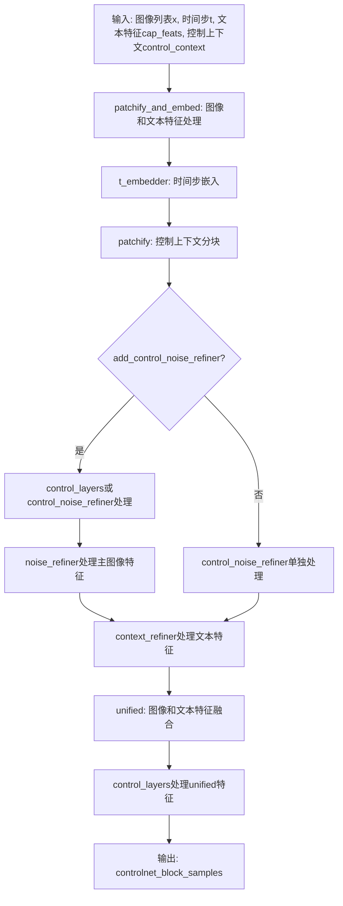
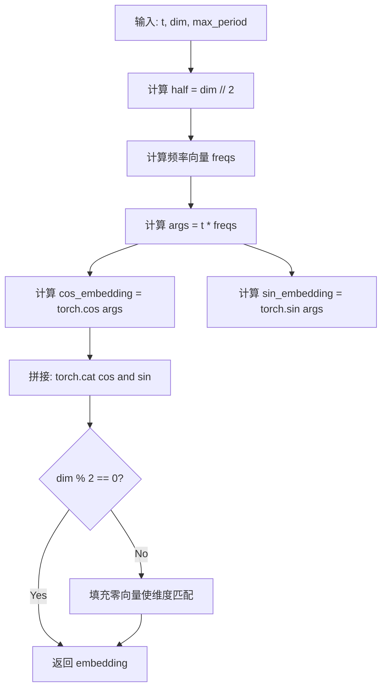
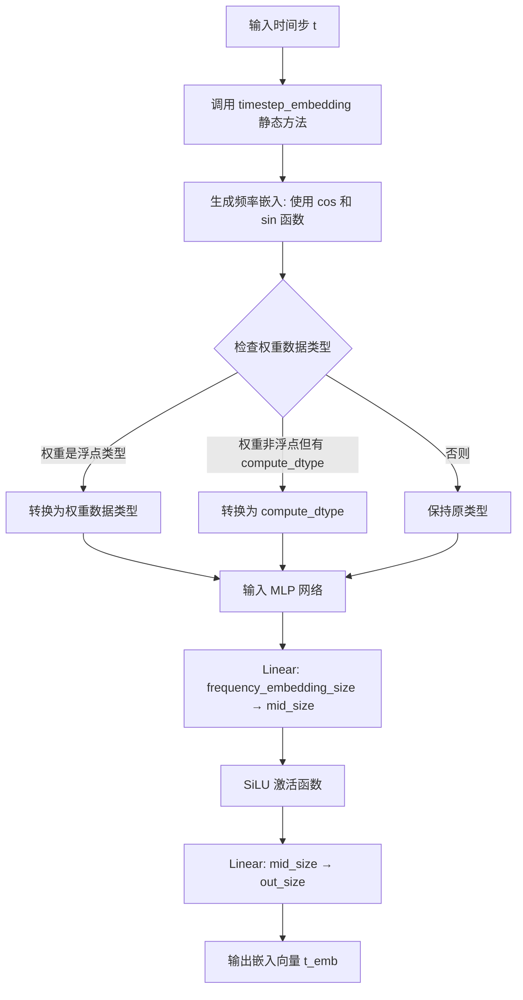
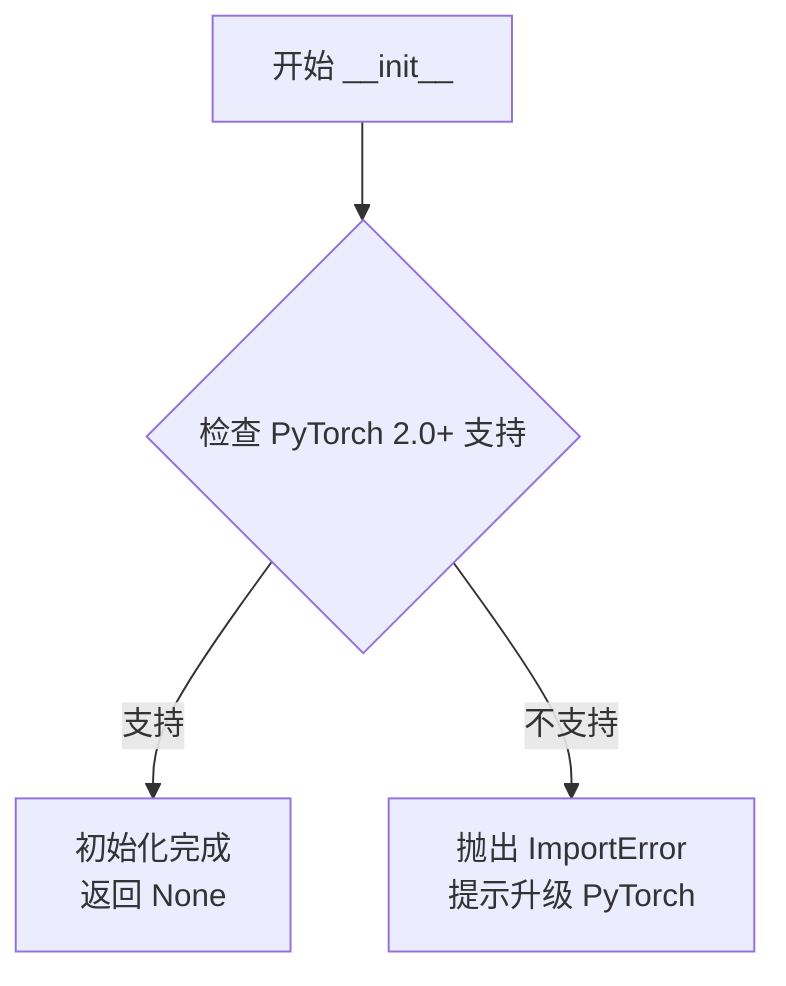
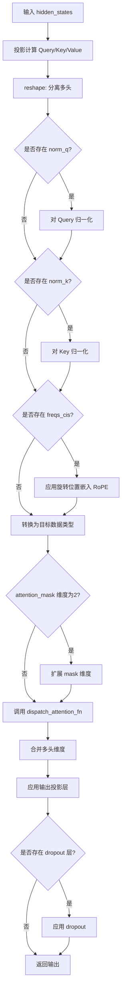
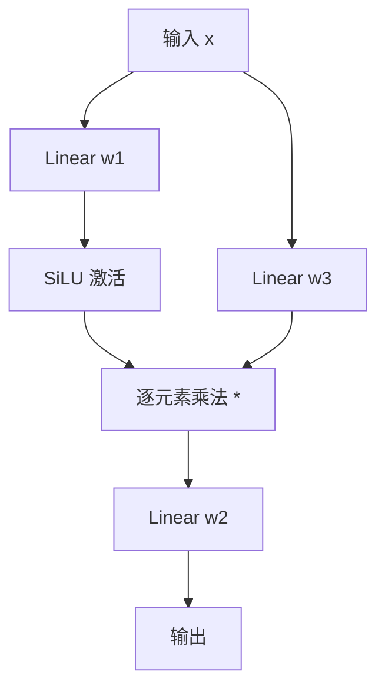
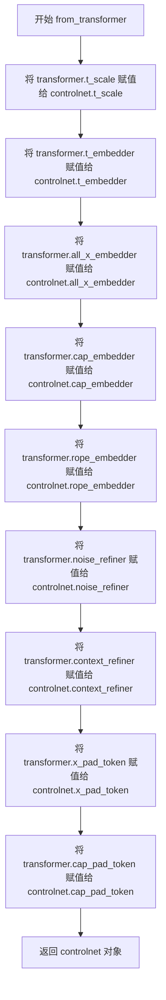
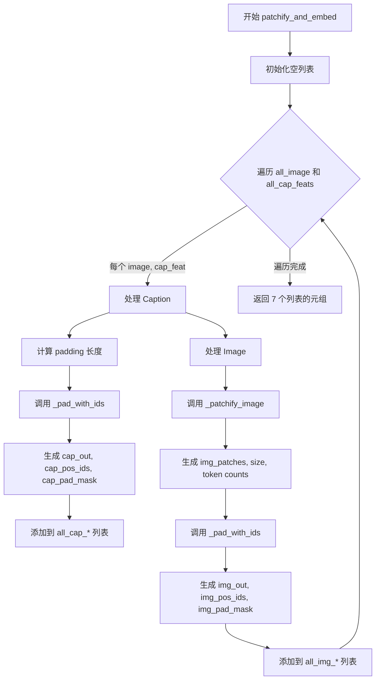

# `diffusers\src\diffusers\models\controlnets\controlnet_z_image.py` 详细设计文档

这是一个Z-Image控制网络（ControlNet）模型实现，用于图像生成任务。该模型基于Transformer架构，支持RoPE位置编码、AdaLN调制和噪声细化功能，能够接收图像和文本条件信息，输出用于控制生成过程的多层级特征。

## 整体流程



## 类结构

```
TimestepEmbedder (时间步嵌入器)
ZSingleStreamAttnProcessor (单流注意力处理器)
FeedForward (前馈神经网络)
select_per_token (辅助函数)
ZImageTransformerBlock (图像Transformer块)
RopeEmbedder (RoPE嵌入器)
ZImageControlTransformerBlock (控制Transformer块)
ZImageControlNetModel (主模型类)
```

## 全局变量及字段


### `ADALN_EMBED_DIM`
    
AdaLN嵌入维度常量，值为256

类型：`int`
    


### `SEQ_MULTI_OF`
    
序列长度对齐倍数常量，值为32

类型：`int`
    


### `select_per_token`
    
根据噪声掩码选择噪声或干净token的函数

类型：`function`
    


### `TimestepEmbedder.mlp`
    
多层感知机，用于将频率嵌入转换为输出维度

类型：`nn.Sequential`
    


### `TimestepEmbedder.frequency_embedding_size`
    
频率嵌入维度

类型：`int`
    


### `ZSingleStreamAttnProcessor._attention_backend`
    
注意力计算后端

类型：`class variable`
    


### `ZSingleStreamAttnProcessor._parallel_config`
    
并行配置参数

类型：`class variable`
    


### `FeedForward.w1`
    
第一个线性层，从dim到hidden_dim

类型：`nn.Linear`
    


### `FeedForward.w2`
    
第二个线性层，从hidden_dim到dim

类型：`nn.Linear`
    


### `FeedForward.w3`
    
第三个线性层（门控），从dim到hidden_dim

类型：`nn.Linear`
    


### `ZImageTransformerBlock.dim`
    
模型维度

类型：`int`
    


### `ZImageTransformerBlock.head_dim`
    
注意力头维度

类型：`int`
    


### `ZImageTransformerBlock.attention`
    
注意力模块

类型：`Attention`
    


### `ZImageTransformerBlock.feed_forward`
    
前馈网络

类型：`FeedForward`
    


### `ZImageTransformerBlock.layer_id`
    
层ID标识符

类型：`int`
    


### `ZImageTransformerBlock.attention_norm1`
    
注意力第一次归一化

类型：`RMSNorm`
    


### `ZImageTransformerBlock.attention_norm2`
    
注意力第二次归一化

类型：`RMSNorm`
    


### `ZImageTransformerBlock.ffn_norm1`
    
前馈网络第一次归一化

类型：`RMSNorm`
    


### `ZImageTransformerBlock.ffn_norm2`
    
前馈网络第二次归一化

类型：`RMSNorm`
    


### `ZImageTransformerBlock.modulation`
    
是否启用AdaLN调制

类型：`bool`
    


### `ZImageTransformerBlock.adaLN_modulation`
    
AdaLN调制层，生成scale和gate参数

类型：`nn.Sequential`
    


### `RopeEmbedder.theta`
    
RoPE基础频率参数

类型：`float`
    


### `RopeEmbedder.axes_dims`
    
各轴的维度列表

类型：`list[int]`
    


### `RopeEmbedder.axes_lens`
    
各轴的长度列表

类型：`list[int]`
    


### `RopeEmbedder.freqs_cis`
    
预计算的RoPE频率复数张量

类型：`torch.Tensor`
    


### `ZImageControlTransformerBlock.dim`
    
模型维度

类型：`int`
    


### `ZImageControlTransformerBlock.head_dim`
    
注意力头维度

类型：`int`
    


### `ZImageControlTransformerBlock.attention`
    
注意力模块

类型：`Attention`
    


### `ZImageControlTransformerBlock.feed_forward`
    
前馈网络

类型：`FeedForward`
    


### `ZImageControlTransformerBlock.layer_id`
    
层ID标识符

类型：`int`
    


### `ZImageControlTransformerBlock.attention_norm1`
    
注意力第一次归一化

类型：`RMSNorm`
    


### `ZImageControlTransformerBlock.attention_norm2`
    
注意力第二次归一化

类型：`RMSNorm`
    


### `ZImageControlTransformerBlock.ffn_norm1`
    
前馈网络第一次归一化

类型：`RMSNorm`
    


### `ZImageControlTransformerBlock.ffn_norm2`
    
前馈网络第二次归一化

类型：`RMSNorm`
    


### `ZImageControlTransformerBlock.modulation`
    
是否启用AdaLN调制

类型：`bool`
    


### `ZImageControlTransformerBlock.adaLN_modulation`
    
AdaLN调制层

类型：`nn.Sequential`
    


### `ZImageControlTransformerBlock.block_id`
    
控制块ID，用于区分不同块

类型：`int`
    


### `ZImageControlTransformerBlock.before_proj`
    
控制前置投影层，仅block_id==0时使用

类型：`nn.Linear`
    


### `ZImageControlTransformerBlock.after_proj`
    
控制后置投影层

类型：`nn.Linear`
    


### `ZImageControlNetModel.control_layers_places`
    
控制层位置索引列表

类型：`list[int]`
    


### `ZImageControlNetModel.control_in_dim`
    
控制输入维度

类型：`int`
    


### `ZImageControlNetModel.control_refiner_layers_places`
    
控制细化层位置索引列表

类型：`list[int]`
    


### `ZImageControlNetModel.add_control_noise_refiner`
    
噪声细化器类型配置

类型：`str | None`
    


### `ZImageControlNetModel.control_layers`
    
控制层模块列表

类型：`nn.ModuleList`
    


### `ZImageControlNetModel.control_all_x_embedder`
    
控制图像patch嵌入器字典

类型：`nn.ModuleDict`
    


### `ZImageControlNetModel.control_noise_refiner`
    
噪声细化器模块列表

类型：`nn.ModuleList`
    


### `ZImageControlNetModel.t_scale`
    
时间步缩放因子

类型：`float | None`
    


### `ZImageControlNetModel.t_embedder`
    
时间步嵌入器

类型：`TimestepEmbedder | None`
    


### `ZImageControlNetModel.all_x_embedder`
    
图像patch嵌入器字典

类型：`nn.ModuleDict | None`
    


### `ZImageControlNetModel.cap_embedder`
    
文本caption嵌入器

类型：`nn.Sequential | None`
    


### `ZImageControlNetModel.rope_embedder`
    
RoPE位置编码嵌入器

类型：`RopeEmbedder | None`
    


### `ZImageControlNetModel.noise_refiner`
    
噪声细化器模块列表

类型：`nn.ModuleList | None`
    


### `ZImageControlNetModel.context_refiner`
    
上下文细化器模块列表

类型：`nn.ModuleList | None`
    


### `ZImageControlNetModel.x_pad_token`
    
图像填充token参数

类型：`nn.Parameter | None`
    


### `ZImageControlNetModel.cap_pad_token`
    
文本填充token参数

类型：`nn.Parameter | None`
    
    

## 全局函数及方法


### `select_per_token`

该函数根据噪声掩码（noise_mask）在噪声值（value_noisy）和干净值（value_clean）之间逐 token 选择输出，常用于扩散模型的去噪过程中，根据每个 token 是否被噪声污染来动态选择对应的调制参数（如缩放因子和门控因子）。

参数：

- `value_noisy`：`torch.Tensor`，形状为 (batch, dim)，表示噪声条件下的调制参数（如噪声特征的缩放因子 gate_msa_noisy）
- `value_clean`：`torch.Tensor`，形状为 (batch, dim)，表示干净条件下的调制参数（如干净特征的缩放因子 gate_msa_clean）
- `noise_mask`：`torch.Tensor`，形状为 (batch, seq_len)，二进制掩码，1 表示该位置被噪声污染，0 表示该位置是干净的
- `seq_len`：`int`，序列长度，用于将 (batch, dim) 的参数广播到 (batch, seq_len, dim) 的空间维度

返回值：`torch.Tensor`，形状为 (batch, seq_len, dim)，根据 noise_mask 选择后的调制参数

#### 流程图

```mermaid
flowchart TD
    A[开始: select_per_token] --> B[输入: value_noisy, value_clean, noise_mask, seq_len]
    B --> C[noise_mask_expanded = noise_mask.unsqueeze -1]
    C --> D[batch, seq_len, 1]
    D --> E[value_noisy_expanded = value_noisy.unsqueeze 1 .expand -1, seq_len, -1]
    E --> F[value_clean_expanded = value_clean.unsqueeze 1 .expand -1, seq_len, -1]
    F --> G[torch.where: noise_mask_expanded == 1 ? value_noisy_expanded : value_clean_expanded]
    G --> H[输出: (batch, seq_len, dim) 选择后的张量]
    H --> I[结束]
```

#### 带注释源码

```python
def select_per_token(
    value_noisy: torch.Tensor,  # 噪声条件下的值, shape: (batch, dim)
    value_clean: torch.Tensor,  # 干净条件下的值, shape: (batch, dim)
    noise_mask: torch.Tensor,   # 噪声掩码, shape: (batch, seq_len), 1=噪声, 0=干净
    seq_len: int,               # 序列长度，用于广播维度
) -> torch.Tensor:
    """
    根据噪声掩码在噪声值和干净值之间选择。
    
    此函数是 Z-Image 变压器块中 AdaLN 调制的核心组件，
    用于实现 per-token 级别的条件注入。
    
    参数:
        value_noisy: 噪声条件下的调制参数 (batch, dim)
        value_clean: 干净条件下的调制参数 (batch, dim)
        noise_mask: 二进制掩码标识噪声位置 (batch, seq_len)
        seq_len: 目标序列长度
    
    返回:
        根据掩码选择后的张量 (batch, seq_len, dim)
    """
    # 扩展噪声掩码: (batch, seq_len) -> (batch, seq_len, 1)
    # 便于与 (batch, seq_len, dim) 形状的值进行逐元素比较
    noise_mask_expanded = noise_mask.unsqueeze(-1)
    
    # 将 value_noisy 从 (batch, dim) 广播到 (batch, seq_len, dim)
    # .expand(-1, seq_len, -1) 创建视图而非复制，内存高效
    value_noisy_expanded = value_noisy.unsqueeze(1).expand(-1, seq_len, -1)
    
    # 同样将 value_clean 广播到 (batch, seq_len, dim)
    value_clean_expanded = value_clean.unsqueeze(1).expand(-1, seq_len, -1)
    
    # torch.where: 掩码为1选择噪声值，掩码为0选择干净值
    # 条件: noise_mask_expanded == 1
    # 为真: value_noisy_expanded
    # 为假: value_clean_expanded
    return torch.where(
        noise_mask_expanded == 1,
        value_noisy_expanded,
        value_clean_expanded,
    )
```


### `TimestepEmbedder.timestep_embedding`

静态方法，用于计算时间步（timestep）的时间嵌入（temporal embedding），通过使用正弦和余弦函数将时间步映射到高维向量空间，以捕获不同频率的时间信息。

参数：

- `t`：`torch.Tensor`，时间步张量，形状为 `(batch_size,)` 或 `(batch_size, 1)`，表示输入的时间步数值
- `dim`：`int`，目标嵌入向量的维度，决定了输出嵌入的总维度
- `max_period`：`float`，可选参数，默认值为 `10000`，控制频率衰减的最大周期，用于调节嵌入的频率范围

返回值：`torch.Tensor`，时间步嵌入向量，形状为 `(batch_size, dim)`，包含正弦和余弦函数的组合编码

#### 流程图



#### 带注释源码

```python
@staticmethod
def timestep_embedding(t, dim, max_period=10000):
    """
    计算时间步嵌入（timestep embedding）
    
    参数:
        t: 时间步张量，形状 (batch_size,) 或 (batch_size, 1)
        dim: 目标嵌入维度
        max_period: 频率衰减的最大周期，默认10000
    
    返回:
        形状为 (batch_size, dim) 的嵌入张量
    """
    # 禁用自动混合精度（AMP），确保计算精度
    with torch.amp.autocast("cuda", enabled=False):
        # 计算嵌入维度的一半（因为使用cos和sin成对出现）
        half = dim // 2
        
        # 计算频率向量：使用指数衰减
        # freqs[i] = exp(-log(max_period) * i / half)
        # 这创建了从高频到低频的频率谱
        freqs = torch.exp(
            -math.log(max_period) * torch.arange(start=0, end=half, dtype=torch.float32, device=t.device) / half
        )
        
        # 计算角度参数：将时间步与频率相乘
        # t: (batch_size,) -> t[:, None]: (batch_size, 1)
        # freqs[None]: (1, half) -> args: (batch_size, half)
        args = t[:, None].float() * freqs[None]
        
        # 计算正弦和余弦嵌入并拼接
        # embedding: (batch_size, half * 2) = (batch_size, dim) 当dim为偶数时
        embedding = torch.cat([torch.cos(args), torch.sin(args)], dim=-1)
        
        # 如果目标维度为奇数，需要填充一个零向量
        if dim % 2:
            embedding = torch.cat([embedding, torch.zeros_like(embedding[:, :1])], dim=-1)
        
        return embedding
```


### `TimestepEmbedder.forward`

该方法是时间步嵌入器的核心前向传播逻辑，将时间步输入转换为高维嵌入向量。方法首先通过正弦和余弦函数生成频率域的时间嵌入，然后根据MLP层的权重数据类型进行类型转换，最后通过一个三层神经网络（Linear -> SiLU -> Linear）生成最终的嵌入表示。

参数：

-  `t`：`torch.Tensor`，时间步输入张量，形状为 `(batch_size,)` 或 `(batch_size, 1)`，包含需要转换为嵌入的原始时间值

返回值：`torch.Tensor`，形状为 `(batch_size, out_size)` 的嵌入向量，其中 `out_size` 是初始化时指定的输出维度

#### 流程图



#### 带注释源码

```python
def forward(self, t):
    """
    将时间步转换为嵌入向量
    
    参数:
        t: 时间步张量，形状为 (batch_size,)
    
    返回:
        t_emb: 嵌入后的张量，形状为 (batch_size, out_size)
    """
    # 步骤1: 调用静态方法 timestep_embedding 生成频率嵌入
    # 使用正弦和余弦函数将时间步映射到高频周期特征空间
    t_freq = self.timestep_embedding(t, self.frequency_embedding_size)
    
    # 步骤2: 获取 MLP 第一层权重的数据类型
    weight_dtype = self.mlp[0].weight.dtype
    
    # 尝试获取自定义的 compute_dtype 属性（如果存在）
    compute_dtype = getattr(self.mlp[0], "compute_dtype", None)
    
    # 步骤3: 根据权重类型进行数据类型转换以匹配计算精度
    if weight_dtype.is_floating_point:
        # 如果权重是浮点类型，将嵌入转换为权重类型
        t_freq = t_freq.to(weight_dtype)
    elif compute_dtype is not None:
        # 否则使用预设的 compute_dtype（如果有）
        t_freq = t_freq.to(compute_dtype)
    
    # 步骤4: 通过 MLP 网络生成最终嵌入
    # MLP 结构: Linear(frequency_embedding_size, mid_size) -> SiLU -> Linear(mid_size, out_size)
    t_emb = self.mlp(t_freq)
    
    return t_emb
```


### `ZSingleStreamAttnProcessor.__init__`

该方法是 `ZSingleStreamAttnProcessor` 类的构造函数，用于初始化单流注意力处理器。它在实例化时检查当前 PyTorch 版本是否支持 `scaled_dot_product_attention` 函数（PyTorch 2.0+ 新增），若不支持则抛出 `ImportError` 异常以阻止后续使用，确保运行环境满足最低版本要求。

参数： 无显式参数（除隐含的 `self`）

返回值： 无返回值（`None`）

#### 流程图



#### 带注释源码

```python
def __init__(self):
    """
    初始化 ZSingleStreamAttnProcessor 实例。
    检查 PyTorch 版本是否支持 scaled_dot_product_attention 函数（PyTorch 2.0+）。
    
    抛出：
        ImportError: 当 PyTorch 版本低于 2.0 时抛出，提示用户升级。
    """
    # 检查 PyTorch 是否支持 scaled_dot_product_attention 函数
    # 该函数是 PyTorch 2.0 引入的高效注意力计算实现
    if not hasattr(F, "scaled_dot_product_attention"):
        raise ImportError(
            "ZSingleStreamAttnProcessor requires PyTorch 2.0. To use it, please upgrade PyTorch to version 2.0 or higher."
        )
```

---

#### 类完整信息

**类名：** `ZSingleStreamAttnProcessor`

**类描述：** 处理 Z-Image 单流注意力的处理器，适配现有的 `Attention` 类以匹配原始 Z-ImageAttention 模块的行为。

**类字段：**
- `_attention_backend`：类变量，表示注意力计算的后端实现（类型：`Any`，描述：可选的后端配置）
- `_parallel_config`：类变量，表示并行计算配置（类型：`Any`，描述：用于并行注意力计算的配置）

**类方法：**
- `__init__()`：初始化处理器，检查 PyTorch 2.0+ 支持
- `__call__()`：执行注意力计算的核心方法，接收隐藏状态并应用 RoPE 变换和注意力机制


### `ZSingleStreamAttnProcessor.__call__`

执行单流注意力计算，将输入的隐藏状态通过查询、键、值的投影、归一化、旋转位置嵌入（RoPE）以及注意力机制的处理，最终输出经过注意力处理后的张量。

参数：

- `attn`：`Attention`，注意力模块实例，提供查询、键、值的投影层（to_q、to_k、to_v）和输出层（to_out），以及归一化层（norm_q、norm_k）和头数信息（heads）
- `hidden_states`：`torch.Tensor`，输入的隐藏状态张量，形状为 [batch, seq_len, dim]
- `encoder_hidden_states`：`torch.Tensor | None`，编码器的隐藏状态，当前实现中未使用，保留为接口兼容性
- `attention_mask`：`torch.Tensor | None`，注意力掩码，用于屏蔽某些位置的注意力计算，形状为 [batch, seq_len] 或 [batch, 1, 1, seq_len]
- `freqs_cis`：`torch.Tensor | None`，旋转位置编码（RoPE）的复数频率张量，用于实现旋转位置嵌入

返回值：`torch.Tensor`，经过注意力处理后的输出张量，形状为 [batch, seq_len, dim]

#### 流程图



#### 带注释源码

```python
def __call__(
    self,
    attn: Attention,
    hidden_states: torch.Tensor,
    encoder_hidden_states: torch.Tensor | None = None,
    attention_mask: torch.Tensor | None = None,
    freqs_cis: torch.Tensor | None = None,
) -> torch.Tensor:
    # 步骤1: 通过线性层将 hidden_states 投影为 Query、Key、Value
    # 这些投影将输入从 [batch, seq_len, dim] 变换为 [batch, seq_len, dim]
    query = attn.to_q(hidden_states)
    key = attn.to_k(hidden_states)
    value = attn.to_v(hidden_states)

    # 步骤2: 将投影后的张量从 [batch, seq_len, dim] reshape 为 [batch, seq_len, heads, head_dim]
    # unflatten(-1, (attn.heads, -1)) 将最后一个维度分解为 (heads, head_dim)
    query = query.unflatten(-1, (attn.heads, -1))
    key = key.unflatten(-1, (attn.heads, -1))
    value = value.unflatten(-1, (attn.heads, -1))

    # 步骤3: 应用归一化层（如果存在）
    # norm_q 和 norm_k 通常是 RMSNorm，用于对 Query 和 Key 进行归一化
    if attn.norm_q is not None:
        query = attn.norm_q(query)
    if attn.norm_k is not None:
        key = attn.norm_k(key)

    # 步骤4: 定义旋转位置嵌入（RoPE）应用函数
    # RoPE 通过复数乘法将位置信息编码到 Query 和 Key 中
    def apply_rotary_emb(x_in: torch.Tensor, freqs_cis: torch.Tensor) -> torch.Tensor:
        with torch.amp.autocast("cuda", enabled=False):
            # 将实数张量转换为复数形式，以便与复数频率进行乘法运算
            x = torch.view_as_complex(x_in.float().reshape(*x_in.shape[:-1], -1, 2))
            # 为频率张量添加额外的维度以进行广播
            freqs_cis = freqs_cis.unsqueeze(2)
            # 执行复数乘法，应用旋转
            x_out = torch.view_as_real(x * freqs_cis).flatten(3)
            # 将结果转换回原始数据类型
            return x_out.type_as(x_in)  # todo

    # 步骤5: 应用旋转位置嵌入（如果提供了 freqs_cis）
    if freqs_cis is not None:
        query = apply_rotary_emb(query, freqs_cis)
        key = apply_rotary_emb(key, freqs_cis)

    # 步骤6: 确保 Query 和 Key 的数据类型一致
    # 避免因数据类型不一致导致的计算错误
    dtype = query.dtype
    query, key = query.to(dtype), key.to(dtype)

    # 步骤7: 处理注意力掩码
    # 如果掩码是 [batch, seq_len]，扩展为 [batch, 1, 1, seq_len] 以支持广播
    if attention_mask is not None and attention_mask.ndim == 2:
        attention_mask = attention_mask[:, None, None, :]

    # 步骤8: 调用注意力函数计算注意力输出
    # dispatch_attention_fn 是一个调度函数，支持不同的注意力后端实现
    hidden_states = dispatch_attention_fn(
        query,
        key,
        value,
        attn_mask=attention_mask,
        dropout_p=0.0,
        is_causal=False,
        backend=self._attention_backend,
        parallel_config=self._parallel_config,
    )

    # 步骤9: 将输出从 [batch, heads, seq_len, head_dim] 恢复为 [batch, seq_len, dim]
    hidden_states = hidden_states.flatten(2, 3)
    hidden_states = hidden_states.to(dtype)

    # 步骤10: 应用输出投影层
    # to_out 是一个 ModuleList，通常包含线性层和可选的 Dropout 层
    output = attn.to_out[0](hidden_states)
    if len(attn.to_out) > 1:  # dropout
        output = attn.to_out[1](output)

    return output
```


### `FeedForward._forward_silu_gating`

该方法实现了 SiLU（Sigmoid Linear Unit）门控机制，对第一个输入应用 SiLU 激活函数后与第三个输入进行逐元素相乘，实现类似 SwiGLU 的门控前向传播。

参数：

- `x1`：`torch.Tensor`，第一个输入张量，通常是经过 w1 线性变换后的隐藏层激活
- `x3`：`torch.Tensor`，第三个输入张量，通常是经过 w3 线性变换后的门控信号

返回值：`torch.Tensor`，返回 SiLU 激活后的 x1 与 x3 的逐元素乘积

#### 流程图

```mermaid
flowchart TD
    A[输入 x1, x3] --> B[对 x1 应用 F.silu 激活函数]
    B --> C[计算 SiLU(x1) * x3]
    C --> D[返回门控结果]
```

#### 带注释源码

```python
def _forward_silu_gating(self, x1, torch.Tensor, x3: torch.Tensor):
    """
    SiLU 门控前向传播
    
    该方法实现了一种类似于 SwiGLU 的门控机制：
    - 对 x1 应用 SiLU (Sigmoid Linear Unit) 激活函数
    - 将激活后的结果与 x3 进行逐元素相乘
    
    这种门控机制最早在 "SwiGLU: SwiGLU: Stabilizing Transformers with Layerwise Normalization" 中提出，
    能够在 Transformer 前馈网络中提供更好的门控效果。
    
    参数:
        x1: 第一个输入张量，通常是经过 w1 线性变换后的隐藏层激活
        x3: 第三个输入张量，通常是经过 w3 线性变换后的门控信号
    
    返回:
        门控后的激活值，即 SiLU(x1) * x3
    """
    return F.silu(x1) * x3
```


### `FeedForward.forward`

该方法是 Z-Image Transformer 中的前馈网络（Feed-Forward Network）实现，采用 SwiGLU 激活函数。它接收隐藏状态 `x`，通过三个线性变换（`w1` 升维、`w3` 升维用于门控、`w2` 降维）处理输入，其中门控分支使用 SiLU 激活并与输入逐元素相乘，最终输出与输入维度相同的张量。

参数：

-  `x`：`torch.Tensor`，输入张量，形状为 `(batch_size, seq_len, dim)`

返回值：`torch.Tensor`，输出张量，形状为 `(batch_size, seq_len, dim)`

#### 流程图



#### 带注释源码

```python
def forward(self, x):
    """
    前馈网络的前向传播。

    实现 SwiGLU (SiLU 门控线性单元)：
    output = w2(SiLU(w1(x)) * w3(x))

    参数:
        x: 输入张量，形状为 (batch_size, seq_len, dim)

    返回:
        输出张量，形状为 (batch_size, seq_len, dim)
    """
    # 计算门控分支：w1(x) 经过 SiLU 激活后与 w3(x) 逐元素相乘
    # 这里使用了 F.silu 即 SiLU 激活函数，公式为 x * sigmoid(x)
    gate = self._forward_silu_gating(self.w1(x), self.w3(x))
    
    # 将门控结果通过 w2 投影回原始维度
    return self.w2(gate)
```


### `ZImageTransformerBlock.forward`

该方法是 Z-Image Transformer 块的前向传播函数，实现了带有自适应层归一化（AdaLN）调制的注意力机制和前馈网络，支持两种调制模式：基于噪声掩码的逐令牌调制（per-token modulation）和全局调制（global modulation），用于图像生成任务中的特征变换。

参数：

- `x`：`torch.Tensor`，输入的隐藏状态，形状为 `(batch, seq_len, dim)`
- `attn_mask`：`torch.Tensor`，注意力掩码，用于控制注意力计算的遮挡区域
- `freqs_cis`：`torch.Tensor`，旋转位置编码（RoPE）的频率复数张量，用于旋转式位置嵌入
- `adaln_input`：`torch.Tensor | None`，自适应层归一化的输入，用于全局调制模式
- `noise_mask`：`torch.Tensor | None`，噪声掩码，标识哪些令牌是噪声的，用于逐令牌调制模式
- `adaln_noisy`：`torch.Tensor | None`，噪声令牌的自适应层归一化输入，用于逐令牌调制模式
- `adaln_clean`：`torch.Tensor | None`，干净令牌的自适应层归一化输入，用于逐令牌调制模式

返回值：`torch.Tensor`，经过注意力块和前馈网络变换后的隐藏状态，形状为 `(batch, seq_len, dim)`

#### 流程图

```mermaid
flowchart TD
    A[输入 x, attn_mask, freqs_cis] --> B{modulation=True?}
    B -->|Yes| C{noise_mask is not None?}
    C -->|Yes| D[Per-token modulation]
    C -->|No| E[Global modulation]
    D --> F[计算 adaLN_modulation]
    D --> G[分割为 scale_msa, gate_msa, scale_mlp, gate_mlp]
    D --> H[select_per_token 选择每令牌参数]
    E --> I[计算 adaLN_modulation]
    E --> J[unsqueeze 并分割为 scale_msa, gate_msa, scale_mlp, gate_mlp]
    H --> K[应用 AdaLN: attention_norm1(x) * scale_msa]
    J --> K
    K --> L[调用 attention 注意力层]
    L --> M[残差连接: x + gate_msa * attention_norm2(attn_out)]
    M --> N[FFN 归一化: ffn_norm1(x) * scale_mlp]
    N --> O[调用 feed_forward 前馈网络]
    O --> P[残差连接: x + gate_mlp * ffn_norm2(feed_forward_out)]
    P --> Q[返回 x]
    B -->|No| R[标准模式 - 无调制]
    R --> S[attention_norm1(x)]
    S --> T[调用 attention 注意力层]
    T --> U[残差连接: x + attention_norm2(attn_out)]
    U --> V[ffn_norm1(x)]
    V --> W[调用 feed_forward 前馈网络]
    W --> X[残差连接: x + ffn_norm2(feed_forward_out)]
    X --> Q
```

#### 带注释源码

```python
def forward(
    self,
    x: torch.Tensor,
    attn_mask: torch.Tensor,
    freqs_cis: torch.Tensor,
    adaln_input: torch.Tensor | None = None,
    noise_mask: torch.Tensor | None = None,
    adaln_noisy: torch.Tensor | None = None,
    adaln_clean: torch.Tensor | None = None,
):
    """
    Z-Image Transformer 块的前向传播
    
    参数:
        x: 输入隐藏状态 (batch, seq_len, dim)
        attn_mask: 注意力掩码
        freqs_cis: RoPE 旋转位置编码
        adaln_input: 全局调制输入 (当 noise_mask 为 None 时使用)
        noise_mask: 噪声掩码，标识噪声令牌位置 (当提供时使用逐令牌调制)
        adaln_noisy: 噪声令牌的调制输入 (与 noise_mask 配合使用)
        adaln_clean: 干净令牌的调制输入 (与 noise_mask 配合使用)
    
    返回:
        变换后的隐藏状态 (batch, seq_len, dim)
    """
    # 判断是否启用调制模式
    if self.modulation:
        seq_len = x.shape[1]  # 获取序列长度

        if noise_mask is not None:
            # ===== 逐令牌调制模式 (Per-token modulation) =====
            # 适用于噪声预测等任务，根据 noise_mask 为噪声令牌和干净令牌应用不同的调制参数
            
            # 分别对噪声令牌和干净令牌的输入计算调制参数
            mod_noisy = self.adaLN_modulation(adaln_noisy)  # (batch, 4*dim)
            mod_clean = self.adaLN_modulation(adaln_clean)  # (batch, 4*dim)

            # 将调制参数分割为四个部分：MSA缩放、MSA门控、MLP缩放、MLP门控
            scale_msa_noisy, gate_msa_noisy, scale_mlp_noisy, gate_mlp_noisy = mod_noisy.chunk(4, dim=1)
            scale_msa_clean, gate_msa_clean, scale_mlp_clean, gate_mlp_clean = mod_clean.chunk(4, dim=1)

            # 对门控参数应用 tanh 激活，将其限制在 [-1, 1] 范围内
            gate_msa_noisy, gate_mlp_noisy = gate_msa_noisy.tanh(), gate_mlp_noisy.tanh()
            gate_msa_clean, gate_mlp_clean = gate_msa_clean.tanh(), gate_mlp_clean.tanh()

            # 对缩放参数加 1，实现原始工作中的移位操作 (shift)
            scale_msa_noisy, scale_mlp_noisy = 1.0 + scale_msa_noisy, 1.0 + scale_mlp_noisy
            scale_msa_clean, scale_mlp_clean = 1.0 + scale_msa_clean, 1.0 + scale_mlp_clean

            # 根据 noise_mask 选择对应的缩放和门控参数
            # noise_mask=1 选择噪声参数，noise_mask=0 选择干净参数
            scale_msa = select_per_token(scale_msa_noisy, scale_msa_clean, noise_mask, seq_len)
            scale_mlp = select_per_token(scale_mlp_noisy, scale_mlp_clean, noise_mask, seq_len)
            gate_msa = select_per_token(gate_msa_noisy, gate_msa_clean, noise_mask, seq_len)
            gate_mlp = select_per_token(gate_mlp_noisy, gate_mlp_clean, noise_mask, seq_len)
        else:
            # ===== 全局调制模式 (Global modulation) =====
            # 适用于文本条件生成等场景，所有令牌使用相同的调制参数
            
            # 计算全局调制参数
            mod = self.adaLN_modulation(adaln_input)  # (batch, 4*dim)
            # unsqueeze(1) 将 (batch, 4*dim) 变为 (batch, 1, 4*dim)，便于广播
            scale_msa, gate_msa, scale_mlp, gate_mlp = mod.unsqueeze(1).chunk(4, dim=2)
            
            # 应用 tanh 门控和移位缩放
            gate_msa, gate_mlp = gate_msa.tanh(), gate_mlp.tanh()
            scale_msa, scale_mlp = 1.0 + scale_msa, 1.0 + scale_mlp

        # ===== 注意力块 (Attention Block) =====
        # 1. 对输入进行归一化
        # 2. 应用 AdaLN 缩放 (scale_msa)
        # 3. 通过注意力层
        # 4. 应用 AdaLN 门控 (gate_msa) 和残差连接
        attn_out = self.attention(
            self.attention_norm1(x) * scale_msa,  # 归一化后乘以缩放因子
            attention_mask=attn_mask,
            freqs_cis=freqs_cis
        )
        x = x + gate_msa * self.attention_norm2(attn_out)  # 门控残差连接

        # ===== 前馈网络块 (FFN Block) =====
        # 1. 对输入进行归一化
        # 2. 应用 AdaLN 缩放 (scale_mlp)
        # 3. 通过前馈网络
        # 4. 应用 AdaLN 门控 (gate_mlp) 和残差连接
        x = x + gate_mlp * self.ffn_norm2(self.feed_forward(self.ffn_norm1(x) * scale_mlp))
    else:
        # ===== 标准模式 (无调制) =====
        # 原始 Transformer 块的標準殘差連接結構
        
        # 注意力块
        attn_out = self.attention(self.attention_norm1(x), attention_mask=attn_mask, freqs_cis=freqs_cis)
        x = x + self.attention_norm2(attn_out)

        # FFN 块
        x = x + self.ffn_norm2(self.feed_forward(self.ffn_norm1(x)))

    return x
```


### `RopeEmbedder.precompute_freqs_cis`

这是一个静态方法，用于预计算旋转位置编码（RoPE）的频率复数张量。该方法根据给定的维度、序列长度和theta参数，为每个轴生成复数形式的频率矩阵，这些频率将用于在注意力机制中引入相对位置信息。

参数：

- `dim`：`list[int]`，每个轴的维度列表，用于确定每个轴的频率计算维度
- `end`：`list[int]`，每个轴的长度列表，用于确定时间步的范围
- `theta`：`float = 256.0`，RoPE的基础频率参数，默认值为256.0

返回值：`list[torch.Tensor]`，返回复数类型的频率张量列表，每个元素对应一个轴的频率矩阵

#### 流程图

```mermaid
flowchart TD
    A[开始] --> B[创建空列表freqs_cis]
    B --> C{遍历dim和end}
    C -->|第i个轴| D[计算频率向量: theta ** (arange / d)]
    D --> E[计算时间步向量: arange from 0 to e]
    E --> F[计算外积: outer(timestep, freqs)]
    F --> G[使用polar创建复数: ones + freqs角度]
    G --> H[转换为complex64类型]
    H --> I[添加到freqs_cis列表]
    C --> J{是否还有更多轴?}
    J -->|是| C
    J -->|否| K[返回freqs_cis列表]
```

#### 带注释源码

```python
@staticmethod
def precompute_freqs_cis(dim: list[int], end: list[int], theta: float = 256.0):
    """
    预计算旋转位置编码的频率复数张量
    
    参数:
        dim: 每个轴的维度列表
        end: 每个轴的长度列表  
        theta: RoPE基础频率参数
    
    返回:
        复数类型的频率张量列表
    """
    # 强制使用CPU设备进行计算，避免GPU内存占用
    with torch.device("cpu"):
        freqs_cis = []  # 存储每个轴的频率复数
        # 遍历每个轴的维度和长度
        for i, (d, e) in enumerate(zip(dim, end)):
            # 计算频率向量: theta ^ (arange(0, d, 2) / d)
            # 使用偶数索引确保维度对称
            freqs = 1.0 / (theta ** (torch.arange(0, d, 2, dtype=torch.float64, device="cpu") / d))
            
            # 计算时间步向量: [0, 1, 2, ..., e-1]
            timestep = torch.arange(e, device=freqs.device, dtype=torch.float64)
            
            # 计算外积得到频率矩阵: timestep x freqs
            # 形状为 [e, d//2]
            freqs = torch.outer(timestep, freqs).float()
            
            # 使用polar创建复数表示
            # 实部为1，虚部为freqs的角度
            freqs_cis_i = torch.polar(torch.ones_like(freqs), freqs).to(torch.complex64)
            freqs_cis.append(freqs_cis_i)
        
        return freqs_cis
```


### `RopeEmbedder.__call__`

获取给定ID的频率复数向量，用于旋转位置编码（RoPE）。

参数：

- `ids`：`torch.Tensor`，形状为 `(batch_size, num_axes)` 的二维张量，每行包含用于检索频率向量的索引

返回值：`torch.Tensor`，拼接后的频率复数向量，形状为 `(batch_size, sum(axes_dims))`

#### 流程图

```mermaid
flowchart TD
    A[开始: ids] --> B{检查 ids 维度}
    B -->|ndim != 2| C[抛出 AssertionError]
    B --> D{检查 ids 最后一维长度}
    D -->|不等于 len| C
    D --> E{检查 freqs_cis 是否已缓存}
    E -->|是 None| F[调用 precompute_freqs_cis]
    F --> G[将 freqs_cis 转移到 device]
    E -->|已缓存| H{检查设备是否一致}
    H -->|设备不一致| I[将 freqs_cis 转移到 device]
    H -->|设备一致| J[跳过转移]
    G --> J
    J --> K[遍历每个轴]
    K --> L[提取索引: index = ids[:, i]]
    L --> M[从 freqs_cis[i] 中索引]
    M --> N[添加到结果列表]
    N --> O{是否还有更多轴?}
    O -->|是| K
    O -->|否| P[沿最后一维拼接结果]
    P --> Q[返回结果]
```

#### 带注释源码

```python
def __call__(self, ids: torch.Tensor):
    """
    获取给定ID的频率复数向量，用于旋转位置编码（RoPE）。

    参数:
        ids: 形状为 (batch_size, num_axes) 的二维张量，
             每行包含用于检索频率向量的索引

    返回值:
        拼接后的频率复数向量，形状为 (batch_size, sum(axes_dims))
    """
    # 断言：确保 ids 是二维张量
    assert ids.ndim == 2
    # 断言：确保 ids 的最后一维长度等于 axes_dims 的长度
    assert ids.shape[-1] == len(self.axes_dims)

    # 获取输入张量的设备
    device = ids.device

    # 第一次调用时预计算并缓存 freqs_cis
    if self.freqs_cis is None:
        # 调用静态方法预计算频率复数向量
        self.freqs_cis = self.precompute_freqs_cis(
            self.axes_dims,
            self.axes_lens,
            theta=self.theta
        )
        # 将预计算的频率向量转移到目标设备
        self.freqs_cis = [freqs_cis.to(device) for freqs_cis in self.freqs_cis]
    else:
        # 缓存已存在，确保 freqs_cis 与 ids 在同一设备上
        if self.freqs_cis[0].device != device:
            self.freqs_cis = [freqs_cis.to(device) for freqs_cis in self.freqs_cis]

    # 用于存储每个轴的检索结果
    result = []
    # 遍历每个轴，从预计算的频率表中检索对应的频率向量
    for i in range(len(self.axes_dims)):
        # 提取第 i 个轴的索引
        index = ids[:, i]
        # 使用索引从预计算的频率复数向量中检索
        result.append(self.freqs_cis[i][index])

    # 沿最后一维拼接所有轴的频率向量
    return torch.cat(result, dim=-1)
```


### `ZImageControlTransformerBlock.forward`

该方法实现了Z-Image控制Transformer块的前向传播，接收控制信号张量c和主信号张量x，通过AdaLN调制机制进行条件化处理，经注意力模块和前馈网络变换后，将输出与历史控制信号堆叠返回，实现ControlNet的多层级控制信号提取。

参数：

- `self`：`ZImageControlTransformerBlock`实例本身
- `c`：`torch.Tensor`，控制信号张量，在block_id为0时为初始控制信号，否则为包含多个历史控制信号的张量
- `x`：`torch.Tensor`，主信号张量，来自主Transformer的输出
- `attn_mask`：`torch.Tensor`，注意力掩码，用于控制注意力计算中的有效位置
- `freqs_cis`：`torch.Tensor`，旋转位置编码的复数频率张量，用于RoPE旋转位置嵌入
- `adaln_input`：`torch.Tensor | None`，AdaLN调制的输入张量，用于生成缩放和门控参数

返回值：`torch.Tensor`，堆叠后的控制信号张量，形状为(层数+1, batch, seq_len, dim)，包含每层的跳跃连接输出及最终输出

#### 流程图

```mermaid
flowchart TD
    A[开始 forward] --> B{self.block_id == 0?}
    B -->|Yes| C[c = self.before_proj(c) + x]
    C --> D[all_c = []]
    B -->|No| E[all_c = list(torch.unbind(c))]
    E --> F[c = all_c.pop(-1)]
    D --> G{self.modulation == True?}
    F --> G
    G -->|Yes| H[adaln_input is not None?]
    H -->|Yes| I[mod = self.adaLN_modulation(adaln_input)]
    I --> J[scale_msa, gate_msa, scale_mlp, gate_mlp = mod.unsqueeze(1).chunk(4, dim=2)]
    J --> K[gate_msa, gate_mlp = tanh(gate_msa), tanh(gate_mlp)]
    K --> L[scale_msa, scale_mlp = 1 + scale_msa, 1 + scale_mlp]
    G -->|No| M[attn_out = self.attention<br>self.attention_norm1(c)]
    L --> N[attn_out = self.attention<br>self.attention_norm1(c) * scale_msa]
    N --> O[c = c + gate_msa * self.attention_norm2(attn_out)]
    M --> P[c = c + self.attention_norm2(attn_out)]
    O --> Q[c = c + gate_mlp * self.ffn_norm2<br>self.feed_forward<br>self.ffn_norm1(c) * scale_mlp]
    P --> R[c = c + self.ffn_norm2<br>self.feed_forward<br>self.ffn_norm1(c)]
    Q --> S[c_skip = self.after_proj(c)]
    R --> S
    S --> T[all_c += [c_skip, c]]
    T --> U[c = torch.stack(all_c)]
    U --> V[返回 c]
```

#### 带注释源码

```python
def forward(
    self,
    c: torch.Tensor,
    x: torch.Tensor,
    attn_mask: torch.Tensor,
    freqs_cis: torch.Tensor,
    adaln_input: torch.Tensor | None = None,
):
    # 控制信号处理：根据block_id判断是否为第一个块
    if self.block_id == 0:
        # 第一个块：对控制信号进行投影后与主信号相加
        c = self.before_proj(c) + x
        # 初始化空列表用于存储所有中间控制信号
        all_c = []
    else:
        # 非第一个块：从堆叠的控制信号中获取历史记录
        all_c = list(torch.unbind(c))
        # 弹出当前需要处理的控制信号
        c = all_c.pop(-1)

    # 与ZImageTransformerBlock对比：x -> c（控制信号替代主信号进行变换）
    if self.modulation:
        # 确认AdaLN输入存在
        assert adaln_input is not None
        # 生成AdaLN调制参数：4个缩放/门控因子
        scale_msa, gate_msa, scale_mlp, gate_mlp = self.adaLN_modulation(adaln_input).unsqueeze(1).chunk(4, dim=2)
        # 对门控参数应用tanh激活
        gate_msa, gate_mlp = gate_msa.tanh(), gate_mlp.tanh()
        # 缩放参数偏移1.0，使默认行为是无缩放
        scale_msa, scale_mlp = 1.0 + scale_msa, 1.0 + scale_mlp

        # 注意力块：应用norm、缩放、注意力计算、残差连接
        attn_out = self.attention(
            self.attention_norm1(c) * scale_msa, attention_mask=attn_mask, freqs_cis=freqs_cis
        )
        c = c + gate_msa * self.attention_norm2(attn_out)

        # 前馈网络块：应用norm、缩放、FFN、残差连接
        c = c + gate_mlp * self.ffn_norm2(self.feed_forward(self.ffn_norm1(c) * scale_mlp))
    else:
        # 无调制模式：标准Transformer块结构
        # 注意力块
        attn_out = self.attention(self.attention_norm1(c), attention_mask=attn_mask, freqs_cis=freqs_cis)
        c = c + self.attention_norm2(attn_out)

        # FFN块
        c = c + self.ffn_norm2(self.feed_forward(self.ffn_norm1(c)))

    # 控制：投影输出并构建返回的堆叠张量
    c_skip = self.after_proj(c)
    # 将当前跳跃连接和输出追加到历史列表
    all_c += [c_skip, c]
    # 堆叠所有控制信号用于下一层或输出
    c = torch.stack(all_c)
    return c
```


### `ZImageControlNetModel.from_transformer`

该方法是一个类方法（`@classmethod`），用于从 `transformer` 模型中共享必要的模块（如时间嵌入器、patch 嵌入器、RoPE 嵌入器、噪声精炼器、上下文精炼器等）到 `controlnet` 模型，避免重复创建这些模块，实现权重共享和内存优化。

参数：

- `cls`：类型 `type`，表示类本身（类方法的第一个隐式参数）
- `controlnet`：类型 `ZImageControlNetModel`，目标对象，需要接收共享模块的 ControlNet 模型实例
- `transformer`：类型 `ZImageTransformer2DModel`，源对象，包含待共享的模块

返回值：`ZImageControlNetModel`，返回完成模块共享后的 `controlnet` 对象

#### 流程图



#### 带注释源码

```python
@classmethod
def from_transformer(cls, controlnet, transformer):
    """
    从 transformer 模型共享模块到 controlnet 模型。
    
    该方法实现了模块共享机制，将 transformer 中已初始化的组件直接赋值给 controlnet，
    避免重复创建相同的模块，节省内存和计算资源。
    
    参数:
        cls: 类方法隐含的类本身
        controlnet: 目标 ZImageControlNetModel 实例
        transformer: 源 ZImageTransformer2DModel 实例
    
    返回:
        controlnet: 完成模块共享后的 ZImageControlNetModel 实例
    """
    # 共享时间缩放因子
    controlnet.t_scale = transformer.t_scale
    
    # 共享时间嵌入器 (TimestepEmbedder)
    controlnet.t_embedder = transformer.t_embedder
    
    # 共享图像 patch 嵌入器模块字典
    controlnet.all_x_embedder = transformer.all_x_embedder
    
    # 共享 caption 嵌入器
    controlnet.cap_embedder = transformer.cap_embedder
    
    # 共享 RoPE 位置编码嵌入器
    controlnet.rope_embedder = transformer.rope_embedder
    
    # 共享噪声精炼层模块列表
    controlnet.noise_refiner = transformer.noise_refiner
    
    # 共享上下文精炼层模块列表
    controlnet.context_refiner = transformer.context_refiner
    
    # 共享图像 padding token 参数
    controlnet.x_pad_token = transformer.x_pad_token
    
    # 共享 caption padding token 参数
    controlnet.cap_pad_token = transformer.cap_pad_token
    
    # 返回完成模块共享的 controlnet 对象
    return controlnet
```


### `ZImageControlNetModel.create_coordinate_grid`

创建坐标网格，用于生成多维空间中的坐标索引。该方法通过给定的大小和起始位置生成网格坐标，常用于位置编码或图像分块处理。

参数：

- `size`：`tuple[int, ...]`，表示每个维度的网格大小，例如 `(H, W)` 表示生成 2D 网格
- `start`：`tuple[int, ...] | None`，可选参数，表示每个维度的起始坐标，默认为全0起始
- `device`：`torch.device | None`，可选参数，指定生成的坐标张量存放的设备（CPU 或 CUDA）

返回值：`torch.Tensor`，返回的坐标网格，形状为 `(*size, len(size))`，即每个位置点包含其在各维度的坐标索引

#### 流程图

```mermaid
flowchart TD
    A[开始] --> B{检查 start 是否为 None}
    B -->|是| C[start = (0 for _ in size)]
    B -->|否| D[使用传入的 start]
    C --> E[遍历 size 和 start]
    D --> E
    E --> F[为每个维度创建 torch.arange 序列]
    F --> G[使用 torch.meshgrid 生成网格坐标]
    G --> H[使用 torch.stack 堆叠各维度坐标]
    H --> I[返回坐标网格张量]
    I --> J[结束]
```

#### 带注释源码

```python
@staticmethod
# Copied from diffusers.models.transformers.transformer_z_image.ZImageTransformer2DModel.create_coordinate_grid
def create_coordinate_grid(size, start=None, device=None):
    """
    创建多维坐标网格
    
    参数:
        size: 每个维度的网格大小，如 (H, W, D) 表示创建 3D 网格
        start: 每个维度的起始坐标，默认为 (0, 0, 0, ...)
        device: 张量存放设备
    
    返回:
        形状为 (*size, len(size)) 的坐标张量
    """
    # 如果未指定起始位置，默认从0开始
    if start is None:
        start = (0 for _ in size)
    
    # 为每个维度生成从 start[i] 到 start[i] + size[i] - 1 的整数序列
    # 例如：size=(3,4), start=(1,2) -> 生成 [1,2,3] 和 [2,3,4,5]
    axes = [torch.arange(x0, x0 + span, dtype=torch.int32, device=device) for x0, span in zip(start, size)]
    
    # 使用 meshgrid 生成网格坐标，indexing="ij" 表示使用行列索引（而非 xy 索引）
    grids = torch.meshgrid(axes, indexing="ij")
    
    # 将各维度的坐标堆叠到最后一个维度
    # 结果形状: (size[0], size[1], ..., len(size))
    return torch.stack(grids, dim=-1)
```


### `ZImageControlNetModel._patchify_image`

该方法将单个图像张量从形状 (C, F, H, W) 转换为 patches 序列 (num_patches, patch_dim)，实现图像的空间和特征维度分块，以便于后续的 Transformer 处理。

参数：

-  `self`：`ZImageControlNetModel` 类实例方法
-  `image`：`torch.Tensor`，输入的图像张量，形状为 (C, F, H, W)，其中 C 是通道数，F 是帧/特征维度，H 和 W 是空间高度和宽度
-  `patch_size`：`int`，空间 patch 的大小（高度和宽度方向）
-  `f_patch_size`：`int`，特征维度（帧方向）的 patch 大小

返回值：`tuple`，包含以下三个元素：
-  `torch.Tensor`：分块后的图像 patches，形状为 (F_tokens * H_tokens * W_tokens, pF * pH * pW * C)
-  `tuple`：原始图像尺寸 (F, H, W)
-  `tuple`：各维度的 token 数量 (F_tokens, H_tokens, W_tokens)

#### 流程图

```mermaid
flowchart TD
    A[输入 image: (C, F, H, W)] --> B[解析 patch_size 和 f_patch_size]
    B --> C[提取图像维度: C, F, H, W]
    C --> D[计算 token 数量<br/>F_tokens = F // pF<br/>H_tokens = H // pH<br/>W_tokens = W // pW]
    D --> E[重塑图像<br/>view(C, F_tokens, pF, H_tokens, pH, W_tokens, pW)]
    E --> F[维度重排列<br/>permute(1, 3, 5, 2, 4, 6, 0)]
    F --> G[展平为 2D<br/>reshape(F_tokens*H_tokens*W_tokens, pF*pH*pW*C)]
    G --> H[返回 patches 和尺寸信息]
```

#### 带注释源码

```python
def _patchify_image(self, image: torch.Tensor, patch_size: int, f_patch_size: int):
    """
    Patchify a single image tensor: (C, F, H, W) -> (num_patches, patch_dim).
    
    将单个图像张量从 (C, F, H, W) 形状转换为 (num_patches, patch_dim) 形状。
    这实现了图像的空间和特征维度的分块，以便用于 Transformer 模型。
    
    参数:
        image: 输入图像张量，形状为 (C, F, H, W)
            - C: 通道数
            - F: 帧/特征维度
            - H: 高度
            - W: 宽度
        patch_size: 空间 patch 大小（应用于 H 和 W 维度）
        f_patch_size: 特征 patch 大小（应用于 F 维度）
    
    返回:
        tuple: (patches, ori_size, token_size)
            - patches: 形状为 (F_tokens * H_tokens * W_tokens, pF * pH * pW * C) 的张量
            - ori_size: 原始尺寸 (F, H, W)
            - token_size: 分块后的 token 数量 (F_tokens, H_tokens, W_tokens)
    """
    # 设置各维度的 patch 大小
    pH, pW, pF = patch_size, patch_size, f_patch_size
    
    # 提取输入图像的维度信息
    C, F, H, W = image.size()
    
    # 计算每个维度的 token 数量
    # F_tokens: 特征维度的 token 数
    # H_tokens: 高度维度的 token 数
    # W_tokens: 宽度维度的 token 数
    F_tokens, H_tokens, W_tokens = F // pF, H // pH, W // pW
    
    # 重新视图：将图像分割成多个小的 patch 块
    # 从 (C, F, H, W) 变为 (C, F_tokens, pF, H_tokens, pH, W_tokens, pW)
    # 这样每个 patch 块包含 pF*pH*pW 个像素点
    image = image.view(C, F_tokens, pF, H_tokens, pH, W_tokens, pW)
    
    # 维度重排列：从 (C, F_tokens, pF, H_tokens, pH, W_tokens, pW) 
    # 变为 (F_tokens, H_tokens, W_tokens, pF, pH, pW, C)
    # 这样可以将空间维度和 patch 维度分离
    image = image.permute(1, 3, 5, 2, 4, 6, 0).reshape(F_tokens * H_tokens * W_tokens, pF * pH * pW * C)
    
    # 返回：
    # 1. 分块后的图像 patches - 2D 张量 (num_patches, patch_dim)
    # 2. 原始图像尺寸 (F, H, W)
    # 3. 各维度的 token 数量 (F_tokens, H_tokens, W_tokens)
    return image, (F, H, W), (F_tokens, H_tokens, W_tokens)
```


### `ZImageControlNetModel._pad_with_ids`

该方法用于将特征填充到 SEQ_MULTI_OF（32）的整数倍长度，同时生成对应的位置ID和填充掩码，用于确保不同长度的特征序列能够被标准化处理。

参数：

- `self`：隐式参数，类实例本身
- `feat`：`torch.Tensor`，输入的特征张量，通常是已经过嵌入处理的特征序列
- `pos_grid_size`：`tuple`，位置网格尺寸，用于生成原始特征的位置ID，格式为 (F, H, W) 表示时空三个维度的网格大小
- `pos_start`：`tuple`，位置起始坐标，用于生成原始特征的位置ID，格式为 (F_start, H_start, W_start)
- `device`：`torch.device`，计算设备，用于在指定设备上创建张量
- `noise_mask_val`：`int | None`，可选参数，噪声掩码值，用于生成 token 级别的噪声掩码，如果为 None 则不生成噪声掩码

返回值：返回5个元素的元组
- `padded_feat`：`torch.Tensor`，填充后的特征张量，长度为 SEQ_MULTI_OF 的整数倍
- `pos_ids`：`torch.Tensor`，位置ID张量，包含原始位置ID和填充位置ID
- `pad_mask`：`torch.Tensor`，布尔类型的填充掩码，True 表示该位置是填充的
- `total_len`：`int`，填充后的总长度
- `noise_mask`：`list[int] | None`，噪声掩码列表，长度为 total_len，如果 noise_mask_val 为 None 则返回 None

#### 流程图

```mermaid
flowchart TD
    A[开始] --> B[获取原始特征长度 ori_len]
    B --> C[计算填充长度: pad_len = (-ori_len % SEQ_MULTI_OF]
    C --> D[计算总长度: total_len = ori_len + pad_len]
    D --> E[生成原始位置ID: create_coordinate_grid]
    E --> F{需要填充?<br/>pad_len > 0}
    F -->|是| G[生成填充位置ID]
    G --> H[拼接位置ID: ori_pos_ids + pad_pos_ids]
    H --> I[复制特征最后一行填充: feat[-1:].repeat]
    I --> J[拼接特征: feat + padded_feat]
    J --> K[创建填充掩码: zeros + ones]
    F -->|否| L[位置ID = 原始位置ID]
    L --> M[特征 = 原始特征]
    M --> K
    K --> N{noise_mask_val<br/>不为 None?}
    N -->|是| O[创建噪声掩码列表]
    N -->|否| P[noise_mask = None]
    O --> Q[返回 padded_feat, pos_ids, pad_mask, total_len, noise_mask]
    P --> Q
```

#### 带注释源码

```python
def _pad_with_ids(
    self,
    feat: torch.Tensor,
    pos_grid_size: tuple,
    pos_start: tuple,
    device: torch.device,
    noise_mask_val: int | None = None,
):
    """Pad feature to SEQ_MULTI_OF, create position IDs and pad mask."""
    # 获取原始特征的长度
    ori_len = len(feat)
    # 计算需要填充的长度，使其能够被 SEQ_MULTI_OF(32) 整除
    # 使用取模运算：(-ori_len) % SEQ_MULTI_OF 等价于 (SEQ_MULTI_OF - ori_len % SEQ_MULTI_OF) % SEQ_MULTI_OF
    pad_len = (-ori_len) % SEQ_MULTI_OF
    # 计算填充后的总长度
    total_len = ori_len + pad_len

    # 生成原始特征的位置ID
    # create_coordinate_grid 创建三维坐标网格，然后 flatten 成二维张量
    ori_pos_ids = self.create_coordinate_grid(size=pos_grid_size, start=pos_start, device=device).flatten(0, 2)
    
    # 判断是否需要填充
    if pad_len > 0:
        # 生成填充位置ID，使用 (0,0,0) 作为起始坐标
        pad_pos_ids = (
            self.create_coordinate_grid(size=(1, 1, 1), start=(0, 0, 0), device=device)
            .flatten(0, 2)
            .repeat(pad_len, 1)  # 复制 pad_len 份
        )
        # 拼接原始位置ID和填充位置ID
        pos_ids = torch.cat([ori_pos_ids, pad_pos_ids], dim=0)
        
        # 填充特征：复制特征张量的最后一行 pad_len 次，然后拼接到原始特征后面
        padded_feat = torch.cat([feat, feat[-1:].repeat(pad_len, 1)], dim=0)
        
        # 创建填充掩码：原始位置为 False，填充位置为 True
        pad_mask = torch.cat(
            [
                torch.zeros(ori_len, dtype=torch.bool, device=device),
                torch.ones(pad_len, dtype=torch.bool, device=device),
            ]
        )
    else:
        # 不需要填充的情况
        pos_ids = ori_pos_ids
        padded_feat = feat
        pad_mask = torch.zeros(ori_len, dtype=torch.bool, device=device)

    # 生成噪声掩码（token 级别），如果提供了 noise_mask_val 则创建列表，否则为 None
    noise_mask = [noise_mask_val] * total_len if noise_mask_val is not None else None
    
    return padded_feat, pos_ids, pad_mask, total_len, noise_mask
```


### `ZImageControlNetModel.patchify_and_embed`

该方法执行图像分块（patchify）和嵌入操作，将输入的图像和caption特征转换为带有位置信息和padding mask的token序列，为后续的Transformer处理做准备。这是Z-Image ControlNet模型数据预处理的核心步骤。

参数：

- `self`：`ZImageControlNetModel`，模型实例本身
- `all_image`：`list[torch.Tensor]`，输入图像列表，每个元素为形状(C, F, H, W)的4D张量，其中C是通道数，F/H/W分别表示特征/高度/宽度维度
- `all_cap_feats`：`list[torch.Tensor]`，输入caption特征列表，每个元素为形状(seq_len, feat_dim)的2D张量
- `patch_size`：`int`，空间维度的patch大小（用于H和W维度）
- `f_patch_size`：`int`，特征维度的patch大小（用于F维度）

返回值：`tuple[list[torch.Tensor], list[torch.Tensor], list[tuple], list[torch.Tensor], list[torch.Tensor], list[torch.Tensor], list[torch.Tensor]]`

- `all_img_out`：list[torch.Tensor]，分块并padding后的图像token列表，每个元素形状为(total_patches, patch_dim)
- `all_cap_out`：list[torch.Tensor]，padding后的caption特征列表
- `all_img_size`：list[tuple]，原始图像尺寸(F, H, W)列表
- `all_img_pos_ids`：list[torch.Tensor]，每个图像的位置ID列表
- `all_cap_pos_ids`：list[torch.Tensor]，每个caption的位置ID列表
- `all_img_pad_mask`：list[torch.Tensor]，图像padding mask列表（True表示padding位置）
- `all_cap_pad_mask`：list[torch.Tensor]，caption padding mask列表

#### 流程图



#### 带注释源码

```python
def patchify_and_embed(
    self, all_image: list[torch.Tensor], all_cap_feats: list[torch.Tensor], patch_size: int, f_patch_size: int
):
    """Patchify for basic mode: single image per batch item."""
    # 获取设备信息
    device = all_image[0].device
    
    # 初始化输出列表
    all_img_out, all_img_size, all_img_pos_ids, all_img_pad_mask = [], [], [], []
    all_cap_out, all_cap_pos_ids, all_cap_pad_mask = [], [], []

    # 遍历批次中的每个样本（图像+caption配对）
    for image, cap_feat in zip(all_image, all_cap_feats):
        # ======== Caption 处理 ========
        # 计算caption的目标长度（padding到SEQ_MULTI_OF的倍数）
        cap_out, cap_pos_ids, cap_pad_mask, cap_len, _ = self._pad_with_ids(
            cap_feat, 
            (len(cap_feat) + (-len(cap_feat)) % SEQ_MULTI_OF, 1, 1),  # 目标尺寸：padding后的长度,1,1
            (1, 0, 0),  # 位置起始坐标：(1,0,0) 预留一个位置给特殊token
            device
        )
        # 将处理后的caption添加到输出列表
        all_cap_out.append(cap_out)
        all_cap_pos_ids.append(cap_pos_ids)
        all_cap_pad_mask.append(cap_pad_mask)

        # ======== Image 处理 ========
        # 1. 对图像进行分块（patchify）
        img_patches, size, (F_t, H_t, W_t) = self._patchify_image(image, patch_size, f_patch_size)
        
        # 2. 对图像patches进行padding
        # 位置起始坐标 = caption长度 + 1（预留位置）
        img_out, img_pos_ids, img_pad_mask, _, _ = self._pad_with_ids(
            img_patches, 
            (F_t, H_t, W_t),  # 图像patch网格尺寸
            (cap_len + 1, 0, 0),  # 位置起始坐标
            device
        )
        
        # 将处理后的图像添加到输出列表
        all_img_out.append(img_out)
        all_img_size.append(size)
        all_img_pos_ids.append(img_pos_ids)
        all_img_pad_mask.append(img_pad_mask)

    # 返回处理后的所有数据
    return (
        all_img_out,       # 分块并padding后的图像tokens
        all_cap_out,       # padding后的caption特征
        all_img_size,      # 原始图像尺寸(F,H,W)
        all_img_pos_ids,   # 图像位置IDs
        all_cap_pos_ids,   # caption位置IDs
        all_img_pad_mask,  # 图像padding mask
        all_cap_pad_mask,  # caption padding mask
    )
```


### `ZImageControlNetModel.patchify`

该方法用于对图像进行分块（patchify）处理，将输入的图像列表按照指定的 patch 大小进行切分，并填充到序列长度模数（SEQ_MULTI_OF）的整数倍，以便于批量处理。

参数：

- `self`：`ZImageControlNetModel` 实例本身
- `all_image`：`list[torch.Tensor]`，输入的图像列表，每个图像 tensor 形状为 (C, F, H, W)，其中 C 是通道数，F/H/W 是帧/高度/宽度维度
- `patch_size`：`int`，空间维度的 patch 大小，同时应用于高度和宽度维度
- `f_patch_size`：`int`，时间/帧维度的 patch 大小

返回值：`list[torch.Tensor]`，返回处理后的图像分块列表，每个元素是填充后的图像特征，形状为 (num_patches, patch_dim)，其中 num_patches = (F//f_patch_size) * (H//patch_size) * (W//patch_size)，patch_dim = f_patch_size * patch_size * patch_size * C

#### 流程图

```mermaid
flowchart TD
    A[开始 patchify] --> B[初始化 pH=pW=patch_size, pF=f_patch_size]
    B --> C[遍历 all_image 中的每个 image]
    C --> D{遍历结束?}
    D -->|否| E[获取图像尺寸 C, F, H, W]
    E --> F[计算 token 数量: F_tokens=F//pF, H_tokens=H//pH, W_tokens=W//pW]
    F --> G[view 操作重塑图像: (C, F, H, W) -> (C, F_tokens, pF, H_tokens, pH, W_tokens, pW)]
    G --> H[permute 维度重排: (1,3,5,2,4,6,0)]
    H --> I[reshape 为 2D: (F_tokens*H_tokens*W_tokens, pF*pH*pW*C)]
    I --> J[计算原始长度和填充长度: image_ori_len, image_padding_len=(-image_ori_len)%SEQ_MULTI_OF]
    J --> K[拼接填充: torch.cat([image, image[-1:].repeat(image_padding_len, 1)], dim=0)]
    K --> L[将填充后的特征添加到 all_image_out]
    L --> C
    D -->|是| M[返回 all_image_out]
```

#### 带注释源码

```python
def patchify(
    self,
    all_image: list[torch.Tensor],
    patch_size: int,
    f_patch_size: int,
):
    """
    对图像列表进行分块处理并进行填充。
    
    参数:
        all_image: 图像列表，每个图像形状为 (C, F, H, W)
        patch_size: 空间 patch 大小
        f_patch_size: 时间/帧 patch 大小
    
    返回:
        填充后的图像特征列表
    """
    pH = pW = patch_size  # 高度和宽度的 patch 大小
    pF = f_patch_size    # 帧/时间的 patch 大小
    all_image_out = []   # 存储处理后的图像

    for i, image in enumerate(all_image):
        ### Process Image
        # 获取图像的通道数和空间维度
        C, F, H, W = image.size()
        
        # 计算每个维度上的 token 数量
        F_tokens, H_tokens, W_tokens = F // pF, H // pH, W // pW

        # 重新视图为 (C, F_tokens, pF, H_tokens, pH, W_tokens, pW)
        # 这一步将图像划分为多个小的 patch 块
        image = image.view(C, F_tokens, pF, H_tokens, pH, W_tokens, pW)
        
        # 维度重排: "c f pf h ph w pw -> (f h w) (pf ph pw c)"
        # 将通道维度移到最后，合并所有 patch 维度
        image = image.permute(1, 3, 5, 2, 4, 6, 0).reshape(F_tokens * H_tokens * W_tokens, pF * pH * pW * C)

        # 计算原始长度和需要填充的长度
        # 填充是为了让序列长度对齐到 SEQ_MULTI_OF 的整数倍
        image_ori_len = len(image)
        image_padding_len = (-image_ori_len) % SEQ_MULTI_OF

        # padded feature
        # 使用最后一个 token 的值进行填充
        image_padded_feat = torch.cat([image, image[-1:].repeat(image_padding_len, 1)], dim=0)
        all_image_out.append(image_padded_feat)

    return all_image_out
```


### `ZImageControlNetModel.forward`

该方法实现了Z-Image ControlNet模型的完整前向传播过程，包括图像和文本特征的patchify与嵌入、条件扩散的时间步处理、控制上下文的refine、噪声refiner处理、上下文refiner处理、以及最终的unified处理并输出controlnet_block_samples。

参数：

-  `self`：`ZImageControlNetModel`实例本身
-  `x`：`list[torch.Tensor]`，输入图像tensor列表，每个tensor的shape为(C, F, H, W)
-  `t`：`Any`，时间步张量，通常为1D tensor
-  `cap_feats`：`list[torch.Tensor]`，caption特征列表，每个tensor为2D tensor (seq_len, cap_dim)
-  `control_context`：`list[torch.Tensor]`，控制上下文列表，每个tensor的shape为(C, F, H, W)
-  `conditioning_scale`：`float`，条件缩放因子，用于缩放controlnet输出，默认值为1.0
-  `patch_size`：`int`，空间patch大小，默认值为2
-  `f_patch_size`：`int`，特征patch大小，默认值为1

返回值：`dict[int, torch.Tensor]`，返回controlnet block samples字典，键为layer_idx，值为对应层的输出张量（已乘以conditioning_scale）

#### 流程图

```mermaid
flowchart TD
    A[开始 forward] --> B[检查必需的模块是否已初始化]
    B --> C{检查通过?}
    C -->|否| D[抛出 ValueError]
    C -->|是| E[时间步处理: t = t * t_scale, t = t_embedder(t)]
    E --> F[图像和caption特征patchify与嵌入:
    patchify_and_embed]
    F --> G[获取图像序列长度信息: x_item_seqlens, x_max_item_seqlen]
    G --> H[控制上下文patchify: patchify]
    H --> I[控制上下文嵌入: control_all_x_embedder]
    I --> J[填充控制上下文中的pad位置: x_pad_token]
    J --> K[图像嵌入: all_x_embedder]
    K --> L[准备adaln_input: 类型转换 t -> x类型]
    L --> M[填充图像中的pad位置: x_pad_token]
    M --> N[计算RoPE频率: rope_embedder]
    N --> O[构建图像attention mask: x_attn_mask]
    O --> P{add_control_noise_refiner不为None?}
    P -->|是| Q[控制层或噪声refiner处理control_context]
    Q --> R[提取hints和最终control_context]
    R --> S[构建noise_refiner_block_samples字典]
    P -->|否| T[noise_refiner_block_samples = None]
    S --> U
    T --> U[噪声refiner处理x: noise_refiner]
    U --> V[caption嵌入与处理: cap_embedder]
    V --> W[上下文refiner处理caption: context_refiner]
    W --> X[unified合并: 图像+caption]
    X --> Y{add_control_noise_refiner为False?}
    Y -->|是| Z[处理control_noise_refiner]
    Y -->|否| AA[跳过control_noise_refiner]
    Z --> AB
    AA --> AB[unified control_context处理: control_layers]
    AB --> AC[提取hints构建controlnet_block_samples]
    AC --> AD[返回 controlnet_block_samples]
```

#### 带注释源码

```
    def forward(
        self,
        x: list[torch.Tensor],          # 输入图像列表，每个(C, F, H, W)
        t,                               # 时间步张量
        cap_feats: list[torch.Tensor],   # caption特征列表
        control_context: list[torch.Tensor],  # 控制上下文列表
        conditioning_scale: float = 1.0, # 条件缩放因子
        patch_size=2,                    # 空间patch大小
        f_patch_size=1,                  # 特征patch大小
    ):
        # 检查必需的模块是否通过from_transformer正确初始化
        if (
            self.t_scale is None
            or self.t_embedder is None
            or self.all_x_embedder is None
            or self.cap_embedder is None
            or self.rope_embedder is None
            or self.noise_refiner is None
            or self.context_refiner is None
            or self.x_pad_token is None
            or self.cap_pad_token is None
        ):
            raise ValueError(
                "Required modules are `None`, use `from_transformer` to share required modules from `transformer`."
            )

        # 验证patch_size参数是否在配置中
        assert patch_size in self.config.all_patch_size
        assert f_patch_size in self.config.all_f_patch_size

        bsz = len(x)  # batch size
        device = x[0].device
        
        # 时间步处理: 缩放并嵌入
        t = t * self.t_scale
        t = self.t_embedder(t)

        # 图像和caption特征的patchify与嵌入
        (
            x,
            cap_feats,
            x_size,
            x_pos_ids,
            cap_pos_ids,
            x_inner_pad_mask,
            cap_inner_pad_mask,
        ) = self.patchify_and_embed(x, cap_feats, patch_size, f_patch_size)

        # 获取每个样本的序列长度
        x_item_seqlens = [len(_) for _ in x]
        assert all(_ % SEQ_MULTI_OF == 0 for _ in x_item_seqlens)
        x_max_item_seqlen = max(x_item_seqlens)

        # 控制上下文patchify
        control_context = self.patchify(control_context, patch_size, f_patch_size)
        control_context = torch.cat(control_context, dim=0)
        # 嵌入控制上下文
        control_context = self.control_all_x_embedder[f"{patch_size}-{f_patch_size}"](control_context)

        # 使用pad_token填充控制上下文中的masked位置
        control_context[torch.cat(x_inner_pad_mask)] = self.x_pad_token
        control_context = list(control_context.split(x_item_seqlens, dim=0))

        # 填充到相同长度
        control_context = pad_sequence(control_context, batch_first=True, padding_value=0.0)

        # 图像嵌入
        x = torch.cat(x, dim=0)
        x = self.all_x_embedder[f"{patch_size}-{f_patch_size}"](x)

        # 准备adaln输入，匹配x的数据类型
        adaln_input = t.type_as(x)
        
        # 填充图像中的masked位置
        x[torch.cat(x_inner_pad_mask)] = self.x_pad_token
        x = list(x.split(x_item_seqlens, dim=0))
        
        # 计算RoPE频率编码
        x_freqs_cis = list(self.rope_embedder(torch.cat(x_pos_ids, dim=0)).split([len(_) for _ in x_pos_ids], dim=0))

        # 填充图像特征和RoPE编码
        x = pad_sequence(x, batch_first=True, padding_value=0.0)
        x_freqs_cis = pad_sequence(x_freqs_cis, batch_first=True, padding_value=0.0)
        # 确保长度匹配以满足Dynamo的符号形状推断
        x_freqs_cis = x_freqs_cis[:, : x.shape[1]]

        # 构建图像attention mask
        x_attn_mask = torch.zeros((bsz, x_max_item_seqlen), dtype=torch.bool, device=device)
        for i, seq_len in enumerate(x_item_seqlens):
            x_attn_mask[i, :seq_len] = 1

        # 根据配置选择control层或noise refiner处理control_context
        if self.add_control_noise_refiner is not None:
            if self.add_control_noise_refiner == "control_layers":
                layers = self.control_layers
            elif self.add_control_noise_refiner == "control_noise_refiner":
                layers = self.control_noise_refiner
            else:
                raise ValueError(f"Unsupported `add_control_noise_refiner` type: {self.add_control_noise_refiner}.")
            
            # 遍历各层处理control_context
            for layer in layers:
                if torch.is_grad_enabled() and self.gradient_checkpointing:
                    # 使用梯度检查点节省显存
                    control_context = self._gradient_checkpointing_func(
                        layer, control_context, x, x_attn_mask, x_freqs_cis, adaln_input
                    )
                else:
                    control_context = layer(control_context, x, x_attn_mask, x_freqs_cis, adaln_input)

            # 提取hints（中间层输出）和最终的control_context
            hints = torch.unbind(control_context)[:-1]
            control_context = torch.unbind(control_context)[-1]
            # 构建noise refiner block samples字典
            noise_refiner_block_samples = {
                layer_idx: hints[idx] * conditioning_scale
                for idx, layer_idx in enumerate(self.control_refiner_layers_places)
            }
        else:
            noise_refiner_block_samples = None

        # 使用noise refiner处理图像特征x
        if torch.is_grad_enabled() and self.gradient_checkpointing:
            for layer_idx, layer in enumerate(self.noise_refiner):
                x = self._gradient_checkpointing_func(layer, x, x_attn_mask, x_freqs_cis, adaln_input)
                # 如果有noise refiner block samples，则叠加
                if noise_refiner_block_samples is not None:
                    if layer_idx in noise_refiner_block_samples:
                        x = x + noise_refiner_block_samples[layer_idx]
        else:
            for layer_idx, layer in enumerate(self.noise_refiner):
                x = layer(x, x_attn_mask, x_freqs_cis, adaln_input)
                if noise_refiner_block_samples is not None:
                    if layer_idx in noise_refiner_block_samples:
                        x = x + noise_refiner_block_samples[layer_idx]

        # Caption嵌入处理
        cap_item_seqlens = [len(_) for _ in cap_feats]
        cap_max_item_seqlen = max(cap_item_seqlens)

        cap_feats = torch.cat(cap_feats, dim=0)
        cap_feats = self.cap_embedder(cap_feats)
        cap_feats[torch.cat(cap_inner_pad_mask)] = self.cap_pad_token
        cap_feats = list(cap_feats.split(cap_item_seqlens, dim=0))
        
        # 计算caption的RoPE频率
        cap_freqs_cis = list(
            self.rope_embedder(torch.cat(cap_pos_ids, dim=0)).split([len(_) for _ in cap_pos_ids], dim=0)
        )

        # 填充caption特征和RoPE编码
        cap_feats = pad_sequence(cap_feats, batch_first=True, padding_value=0.0)
        cap_freqs_cis = pad_sequence(cap_freqs_cis, batch_first=True, padding_value=0.0)
        cap_freqs_cis = cap_freqs_cis[:, : cap_feats.shape[1]]

        # 构建caption attention mask
        cap_attn_mask = torch.zeros((bsz, cap_max_item_seqlen), dtype=torch.bool, device=device)
        for i, seq_len in enumerate(cap_item_seqlens):
            cap_attn_mask[i, :seq_len] = 1

        # 使用context refiner处理caption
        if torch.is_grad_enabled() and self.gradient_checkpointing:
            for layer in self.context_refiner:
                cap_feats = self._gradient_checkpointing_func(layer, cap_feats, cap_attn_mask, cap_freqs_cis)
        else:
            for layer in self.context_refiner:
                cap_feats = layer(cap_feats, cap_attn_mask, cap_freqs_cis)

        # Unified: 合并图像和caption特征
        unified = []
        unified_freqs_cis = []
        for i in range(bsz):
            x_len = x_item_seqlens[i]
            cap_len = cap_item_seqlens[i]
            unified.append(torch.cat([x[i][:x_len], cap_feats[i][:cap_len]]))
            unified_freqs_cis.append(torch.cat([x_freqs_cis[i][:x_len], cap_freqs_cis[i][:cap_len]]))
        
        unified_item_seqlens = [a + b for a, b in zip(cap_item_seqlens, x_item_seqlens)]
        assert unified_item_seqlens == [len(_) for _ in unified]
        unified_max_item_seqlen = max(unified_item_seqlens)

        unified = pad_sequence(unified, batch_first=True, padding_value=0.0)
        unified_freqs_cis = pad_sequence(unified_freqs_cis, batch_first=True, padding_value=0.0)
        
        # 构建unified attention mask
        unified_attn_mask = torch.zeros((bsz, unified_max_item_seqlen), dtype=torch.bool, device=device)
        for i, seq_len in enumerate(unified_item_seqlens):
            unified_attn_mask[i, :seq_len] = 1

        # ControlNet: 如果没有add_control_noise_refiner，则处理control_noise_refiner
        if not self.add_control_noise_refiner:
            if torch.is_grad_enabled() and self.gradient_checkpointing:
                for layer in self.control_noise_refiner:
                    control_context = self._gradient_checkpointing_func(
                        layer, control_context, x_attn_mask, x_freqs_cis, adaln_input
                    )
            else:
                for layer in self.control_noise_refiner:
                    control_context = layer(control_context, x_attn_mask, x_freqs_cis, adaln_input)

        # Unified control_context: 合并图像和caption
        control_context_unified = []
        for i in range(bsz):
            x_len = x_item_seqlens[i]
            cap_len = cap_item_seqlens[i]
            control_context_unified.append(torch.cat([control_context[i][:x_len], cap_feats[i][:cap_len]]))
        control_context_unified = pad_sequence(control_context_unified, batch_first=True, padding_value=0.0)

        # 处理control_layers得到最终的controlnet输出
        for layer in self.control_layers:
            if torch.is_grad_enabled() and self.gradient_checkpointing:
                control_context_unified = self._gradient_checkpointing_func(
                    layer, control_context_unified, unified, unified_attn_mask, unified_freqs_cis, adaln_input
                )
            else:
                control_context_unified = layer(
                    control_context_unified, unified, unified_attn_mask, unified_freqs_cis, adaln_input
                )

        # 提取hints并构建最终的controlnet_block_samples
        hints = torch.unbind(control_context_unified)[:-1]
        controlnet_block_samples = {
            layer_idx: hints[idx] * conditioning_scale for idx, layer_idx in enumerate(self.control_layers_places)
        }
        return controlnet_block_samples
```

## 关键组件


### TimestepEmbedder

时间步嵌入器，将离散的时间步转换为高频嵌入向量，经过MLP后得到最终的t_emb用于后续模块的调制。

### ZSingleStreamAttnProcessor

单流注意力处理器，实现Z-Image自定义的单流注意力机制，包含RoPE旋转位置编码应用和通过dispatch_attention_fn分发注意力计算。

### FeedForward

前馈神经网络，采用SwiGLU门控机制，包含三个线性层w1、w2、w3实现门控线性变换。

### select_per_token

按token选择的工具函数，根据noise_mask从value_noisy和value_clean中选择对应的值，实现去噪与干净token的分别调制。

### ZImageTransformerBlock

Z-Image transformer块，包含注意力层和前馈层，支持AdaLN调制（全局或per-token模式），通过RMSNorm进行归一化。

### RopeEmbedder

旋转位置编码（RoPE）嵌入器，预计算多轴频率复数张量，支持动态设备迁移和延迟加载。

### ZImageControlTransformerBlock

用于ControlNet的控制transformer块，在ZImageTransformerBlock基础上增加了before_proj和after_proj投影层，用于处理控制信号与主干的融合。

### ZImageControlNetModel

主控制Net模型类，整合所有组件实现完整的控制Net前向传播，支持图像patchify、位置编码、噪声refiner、context refiner和多层级控制信号输出。


## 问题及建议


### 已知问题

-   **代码重复**: `ZImageTransformerBlock` 和 `ZImageControlTransformerBlock` 存在大量重复的逻辑，包括前馈网络、注意力规范化和调制逻辑的实现，应提取为共享基类
-   **类型注解不完整**: `forward` 方法中多个参数（如 `t`, `cap_feats`, `control_context`）缺少类型注解，混合使用了 `|` 和 `Optional` 语法
-   **硬编码魔法数字**: `int(dim / 3 * 8)` 用于前馈网络隐藏层维度缺乏解释，`ADALN_EMBED_DIM` 和 `SEQ_MULTI_OF` 的值硬编码且无文档说明
-   **错误处理使用断言**: 代码大量使用 `assert` 进行输入验证，在生产环境中应使用显式的异常抛出
-   **冗余计算**: `select_per_token` 函数中 `noise_mask_expanded == 1` 的比较可以优化为直接布尔索引；多次调用 `.tanh()` 可合并
-   **API 设计问题**: `from_transformer` 方法直接修改控制网络实例的内部状态而非返回新实例，违反了函数式编程原则
-   **重复张量操作**: `pad_sequence` 被多次调用进行相同的 padding 操作，可在流程早期统一处理
-   **RoPE 嵌入延迟计算**: `RopeEmbedder.__call__` 中每次调用都检查 `freqs_cis` 是否为 None，首次调用时会同步执行设备转移操作

### 优化建议

-   **提取基类**: 将 `ZImageTransformerBlock` 和 `ZImageControlTransformerBlock` 的公共逻辑提取到抽象基类中，减少约 50% 的重复代码
-   **完善类型注解**: 统一使用 `typing` 模块中的 `Optional`、`List` 等，并为所有公开方法添加完整的类型注解
-   **配置参数化**: 将魔法数字提取为 `__init__` 参数或配置文件，使用 `dataclass` 或 `dataclass` 封装相关配置
-   **改进错误处理**: 将 `assert` 替换为 `raise ValueError()` 或 `raise TypeError()`，并添加详细的错误消息
-   **优化张量操作**: 使用 `torch.where(noise_mask.bool(), ...)` 替代比较操作；在调制计算中缓存 `tanh` 结果
-   **重构 `from_transformer`**: 改为 `cls.from_transformer(transformer)` 模式，创建新实例而非修改现有实例
-   **预计算并缓存**: 在模型初始化时预计算并缓存 RoPE 频率矩阵，避免每次前向传播时重复计算和设备转移
-   **添加文档字符串**: 为所有公开类和方法的文档字符串，提高代码可维护性
-   **性能分析**: 使用 PyTorch Profiler 分析 `forward` 方法的热点，优化频繁调用的小函数（如 `select_per_token` 可考虑融合到调用处）


## 其它


### 设计目标与约束

本模块的设计目标是实现一个Z-Image控制网络（ControlNet），用于在图像生成过程中引入条件控制信息。该模型继承自diffusers库的ModelMixin、ConfigMixin、PeftAdapterMixin和FromOriginalModelMixin，旨在与Z-Image Transformer模型协同工作，提供基于图像条件的控制能力。设计约束包括：必须通过from_transformer方法共享transformer的嵌入器和refiner模块；控制层位置必须包含索引0；所有序列长度必须能被SEQ_MULTI_OF（32）整除；patch_size和f_patch_size必须在配置的all_patch_size和all_f_patch_size中。

### 错误处理与异常设计

代码中包含多个关键的错误处理机制：1) ZSingleStreamAttnProcessor的__init__方法检查PyTorch版本是否支持scaled_dot_product_attention，若不支持则抛出ImportError；2) forward方法中检查必需模块（t_scale、t_embedder、all_x_embedder等）是否为None，若为None则抛出ValueError并提示使用from_transformer方法；3) RopeEmbedder的__call__方法验证输入张量的维度（ndim==2）和形状（最后一个维度等于axes_dims长度）；4) patchify_and_embed方法中对patch_size和f_patch_size进行断言检查，确保它们在配置的支持列表中；5) forward方法中对序列长度进行断言验证，确保所有序列长度能被SEQ_MULTI_OF整除。

### 数据流与状态机

数据流主要分为以下几个阶段：1) 预处理阶段：将输入图像和caption特征进行patchify处理，将图像从(C,F,H,W)转换为(num_patches, patch_dim)形式；2) 嵌入阶段：使用all_x_embedder和cap_embedder分别对图像和caption进行嵌入，并添加位置信息（通过rope_embedder）；3) 控制层处理阶段：control_context通过控制层进行处理，生成控制提示；4) 噪声精炼阶段：x通过noise_refiner进行处理，可选择性地添加control_layers或control_noise_refiner的输出；5) 上下文精炼阶段：cap_feats通过context_refiner进行处理；6) 统一阶段：将处理后的图像特征和caption特征进行拼接，形成统一的表示；7) 最终控制阶段：在统一空间中进行最终的控制层处理，输出controlnet_block_samples。

### 外部依赖与接口契约

主要外部依赖包括：1) PyTorch和torch.nn模块 - 核心深度学习框架；2) diffusers库的ConfigMixin、register_to_config、ModelMixin、PeftAdapterMixin、FromOriginalModelMixin - 模型基础架构；3) RMSNorm - 来自diffusers.models.normalization的归一化层；4) Attention - 来自diffusers.models.attention_processor的注意力机制；5) dispatch_attention_fn - 来自diffusers.models.attention_dispatch的注意力调度函数；6) zero_module - 来自diffusers.models.controlnets.controlnet的模块初始化工具；7) pad_sequence - 用于序列填充。接口契约方面：from_transformer方法接受controlnet和transformer两个参数，将transformer的嵌入器和refiner模块复制到controlnet；forward方法接受x（图像列表）、t（时间步）、cap_feats（caption特征列表）、control_context（控制上下文列表）、conditioning_scale（条件缩放因子）、patch_size和f_patch_size参数，返回controlnet_block_samples字典。

### 性能考虑

代码中包含多项性能优化：1) 梯度检查点（gradient_checkpointing）支持，通过_gradient_checkpointing_func在训练时减少显存占用；2) 使用pad_sequence进行批量处理，避免手动处理变长序列；3) 预计算freqs_cis并缓存，避免重复计算旋转位置编码；4) 在可能的情况下使用torch.cat和split进行批量操作，减少Python循环开销；5) 使用torch.zeros创建注意力掩码，比.full方法更高效；6) 对控制模块使用zero_module进行初始化，确保初始输出接近零，有助于稳定训练。

### 安全性考虑

代码遵循Apache 2.0许可证。安全相关实现包括：1) 模块参数默认requires_grad=True，支持梯度计算；2) 使用torch.is_grad_enabled()检查梯度状态，确保在推理和训练时正确处理；3) 设备管理使用device参数，确保张量在正确的设备上运行；4) 未发现敏感数据处理或用户输入验证的明显需求，因为该模块主要在离线训练/推理环境中运行。

### 配置参数说明

ZImageControlNetModel的主要配置参数包括：control_layers_places - 控制层的位置索引列表，必须包含0；control_refiner_layers_places - 控制噪声精炼层的位置索引列表；control_in_dim - 控制输入维度；add_control_noise_refiner - 添加控制噪声精炼器的类型，可选"control_layers"、"control_noise_refiner"或None；all_patch_size - 支持的patch大小元组；all_f_patch_size - 支持的f_patch大小元组；dim - 模型隐藏维度；n_refiner_layers - 精炼层数量；n_heads - 注意力头数；n_kv_heads - 键值头数；norm_eps - 归一化 epsilon；qk_norm - 是否使用QK归一化。

### 使用示例

```python
# 基本用法
from ZImageControlNet import ZImageControlNetModel

# 创建模型实例
controlnet = ZImageControlNetModel(
    control_layers_places=[0, 5, 10],
    control_refiner_layers_places=[0, 5],
    control_in_dim=256,
    add_control_noise_refiner="control_layers",
    dim=3840,
    n_heads=30,
    n_kv_heads=30,
)

# 从transformer共享模块
controlnet = ZImageControlNetModel.from_transformer(controlnet, transformer_model)

# 前向传播
controlnet_block_samples = controlnet(
    x=images,
    t=timesteps,
    cap_feats=caption_features,
    control_context=control_images,
    conditioning_scale=1.0,
    patch_size=2,
    f_patch_size=1,
)
```

### 版本历史与变更日志

该代码文件版权声明为2025年Alibaba Z-Image Team和The HuggingFace Team。代码中包含多处"Copied from"注释，表明部分类和方法是从diffusers库的其他 transformers（如transformer_z_image）中复制而来，并进行了适应性修改。主要变更包括：将原始Z-Image的注意力机制适配为使用diffusers的Attention类；添加了ZImageControlTransformerBlock支持控制网络功能；实现了多种控制噪声精炼模式（control_layers和control_noise_refiner）；集成了PEFT适配器支持（PeftAdapterMixin）。


    