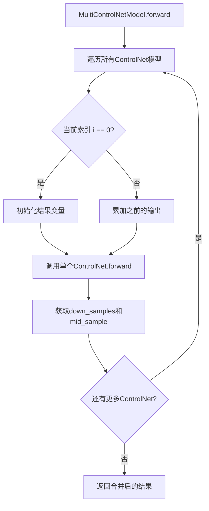
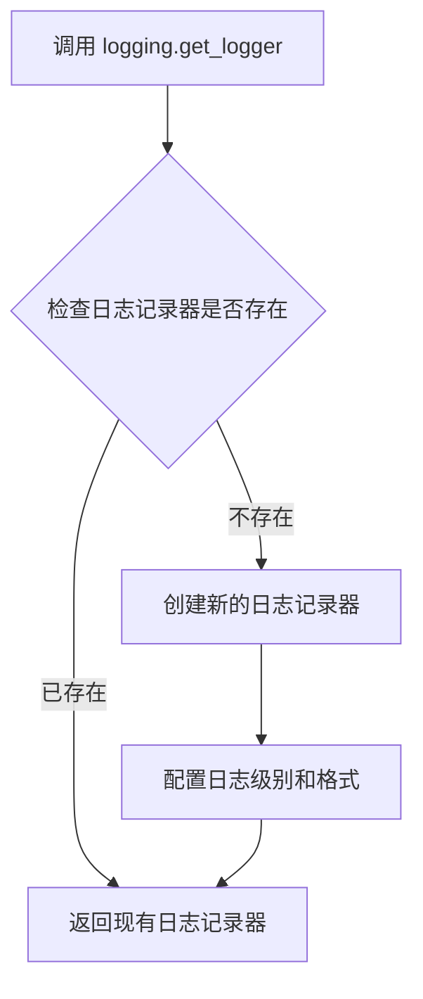
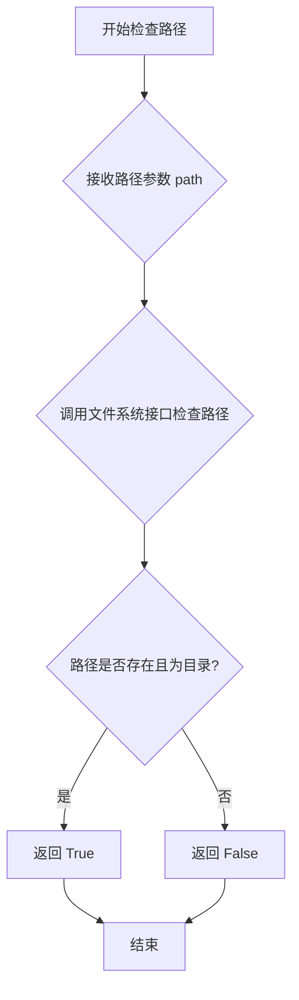
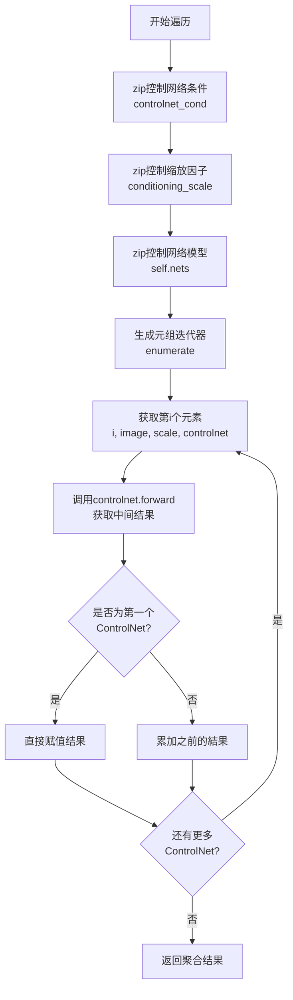
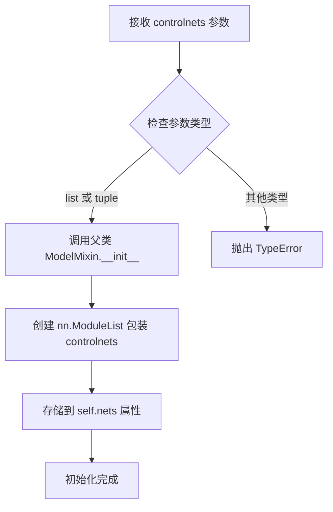
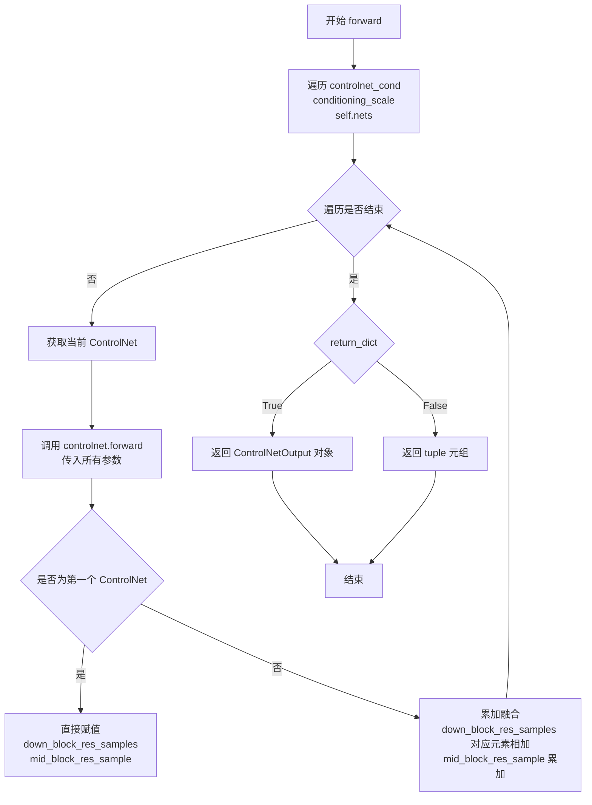

# `diffusers\src\diffusers\models\controlnets\multicontrolnet.py` 详细设计文档

MultiControlNetModel是一个包装多个ControlNetModel实例的封装类，用于支持多条件控制网络（Multi-ControlNet）功能，通过对多个控制网络的输出进行合并，实现更强大的图像生成条件控制能力。

## 整体流程



## 类结构

```
ModelMixin (基类)
└── MultiControlNetModel
    ├── __init__
    ├── forward
    ├── save_pretrained
    └── from_pretrained (类方法)
```

## 全局变量及字段


### `logger`
    
模块级日志记录器，用于输出类和方法的运行信息

类型：`logging.Logger`
    


### `idx`
    
在from_pretrained方法中用于追踪已加载的ControlNet模型索引

类型：`int`
    


### `model_path_to_load`
    
存储当前需要加载的ControlNet模型路径

类型：`str | os.PathLike`
    


### `down_block_res_samples`
    
存储累积的下采样块残差样本，用于合并多个ControlNet的输出

类型：`list[torch.Tensor]`
    


### `mid_block_res_sample`
    
存储累积的中间块残差样本，用于合并多个ControlNet的输出

类型：`torch.Tensor`
    


### `image`
    
当前ControlNet的输入条件图像，来自controlnet_cond列表

类型：`torch.Tensor`
    


### `scale`
    
当前ControlNet的条件缩放因子，来自conditioning_scale列表

类型：`float`
    


### `controlnet`
    
当前遍历的ControlNetModel实例，来自self.nets列表

类型：`ControlNetModel`
    


### `down_samples`
    
单个ControlNet模型返回的下采样块残差样本

类型：`tuple[torch.Tensor]`
    


### `mid_sample`
    
单个ControlNet模型返回的中间块残差样本

类型：`torch.Tensor`
    


### `MultiControlNetModel.nets`
    
存储多个ControlNetModel实例的模块列表，用于Multi-ControlNet推理

类型：`nn.ModuleList[ControlNetModel]`
    
    

## 全局函数及方法


### `logging.get_logger`

获取一个日志记录器实例，用于在模块中记录日志信息。

参数：

- `name`：`str`，日志记录器的名称，通常传入 `__name__` 以表示当前模块

返回值：`logging.Logger`，返回一个 Python 日志记录器对象，用于输出日志信息

#### 流程图



#### 带注释源码

```python
# 从 diffusers.utils 模块导入 logging 对象
from ...utils import logging

# 调用 logging.get_logger 函数获取当前模块的日志记录器
# __name__ 是 Python 内置变量，表示当前模块的完整路径
# 例如: 'diffusers.models.controlnets.multicontrolnet'
logger = logging.get_logger(__name__)

# 后续在代码中使用 logger 进行日志记录
# 示例: logger.info(f"{len(controlnets)} controlnets loaded from {pretrained_model_path}.")
```

#### 补充说明

`logging.get_logger` 是 Diffusers 库中的一个工具函数，用于获取模块级别的日志记录器。该函数：

1. **设计目标**：提供统一的日志管理机制，允许通过配置控制不同模块的日志级别
2. **返回值类型**：返回 `logging.Logger` 对象，这是 Python 标准库 `logging` 模块中的类
3. **使用场景**：在 `MultiControlNetModel.from_pretrained` 方法中用于输出加载信息：`logger.info(f"{len(controlnets)} controlnets loaded from {pretrained_model_path}.")`
4. **外部依赖**：依赖于 `...utils.logging` 模块，该模块是 Diffusers 库内部封装的日志工具，提供了更便捷的日志配置接口


### os.path.isdir

检查给定路径是否是一个存在的目录。

参数：
- `path`：`str | os.PathLike`，要检查的路径，可以是字符串或 PathLike 对象

返回值：`bool`，如果 path 是一个存在的目录则返回 True，否则返回 False

#### 流程图



#### 带注释源码

```python
# os.path.isdir 函数源码（Python 标准库实现逻辑）

def isdir(s):
    """
    检查路径是否是一个存在的目录。
    
    参数:
        s: str 或 os.PathLike - 要检查的路径
        
    返回:
        bool - 如果路径存在且为目录返回 True，否则返回 False
    """
    try:
        # 尝试将路径转换为 Path 对象并检查是否为目录
        # 如果路径不存在或不是目录，会抛出异常
        return os.stat(s).st_mode & 0o170000 == 0o040000
    except OSError:
        # 路径不存在或无法访问时返回 False
        return False

# 在 MultiControlNetModel.from_pretrained 中的实际使用：
# while os.path.isdir(model_path_to_load):
#     # 循环检查是否存在 controlnet 目录
#     # 首次检查: ./mydirectory/controlnet
#     # 后续检查: ./mydirectory/controlnet_1, controlnet_2, ...
#     controlnet = ControlNetModel.from_pretrained(model_path_to_load, **kwargs)
#     controlnets.append(controlnet)
#     idx += 1
#     model_path_to_load = pretrained_model_path + f"_{idx}"
```


### `MultiControlNetModel.from_pretrained`

该类方法是 `MultiControlNetModel` 的工厂方法，用于从预训练模型目录加载多个 ControlNet 模型。它通过循环检测目录中是否存在主模型（controlnet）和多个分支模型（controlnet_0、controlnet_1 等），逐个加载并组合为 `MultiControlNetModel` 实例。

参数：

- `cls`：类型 `type`，代表类本身，用于类方法的第一个隐式参数
- `pretrained_model_path`：类型 `str | os.PathLike | None`，指向包含模型权重的目录路径，该目录应包含通过 `save_pretrained` 保存的 ControlNet 模型文件
- `**kwargs`：类型 `dict`，可变关键字参数，用于传递给底层 `ControlNetModel.from_pretrained` 的额外参数，如 `torch_dtype`、`device_map`、`variant` 等

返回值：类型 `MultiControlNetModel`，返回加载完成的多个 ControlNet 组合模型实例

#### 流程图

```mermaid
flowchart TD
    A[开始 from_pretrained] --> B[初始化 idx = 0, controlnets = []]
    B --> C[设置 model_path_to_load = pretrained_model_path]
    C --> D{os.path.isdir<br/>model_path_to_load?}
    D -->|是| E[调用 ControlNetModel.from_pretrained<br/>加载当前路径的模型]
    E --> F[controlnets.append 加载的模型]
    F --> G[idx += 1]
    G --> H[更新 model_path_to_load =<br/>pretrained_model_path + f'_{idx}']
    H --> D
    D -->|否| I{len<br/>controlnets == 0?}
    I -->|是| J[抛出 ValueError:<br/>未找到任何 ControlNets]
    I -->|否| K[记录日志:<br/>X controlnets loaded]
    K --> L[返回 cls(controlnets)<br/>创建 MultiControlNetModel 实例]
    J --> M[结束]
    L --> M
```

#### 带注释源码

```python
@classmethod
def from_pretrained(cls, pretrained_model_path: str | os.PathLike | None, **kwargs):
    r"""
    Instantiate a pretrained MultiControlNet model from multiple pre-trained controlnet models.

    The model is set in evaluation mode by default using `model.eval()` (Dropout modules are deactivated). To train
    the model, you should first set it back in training mode with `model.train()`.

    The warning *Weights from XXX not initialized from pretrained model* means that the weights of XXX do not come
    pretrained with the rest of the model. It is up to you to train those weights with a downstream fine-tuning
    task.

    The warning *Weights from XXX not used in YYY* means that the layer XXX is not used by YYY, therefore those
    weights are discarded.

    Parameters:
        pretrained_model_path (`os.PathLike`):
            A path to a *directory* containing model weights saved using
            [`~models.controlnets.multicontrolnet.MultiControlNetModel.save_pretrained`], e.g.,
            `./my_model_directory/controlnet`.
        torch_dtype (`torch.dtype`, *optional*):
            Override the default `torch.dtype` and load the model under this dtype.
        output_loading_info(`bool`, *optional*, defaults to `False`):
            Whether or not to also return a dictionary containing missing keys, unexpected keys and error messages.
        device_map (`str` or `dict[str, int | str | torch.device]`, *optional*):
            A map that specifies where each submodule should go. It doesn't need to be refined to each
            parameter/buffer name, once a given module name is inside, every submodule of it will be sent to the
            same device.

            To have Accelerate compute the most optimized `device_map` automatically, set `device_map="auto"`. For
            more information about each option see [designing a device
            map](https://hf.co/docs/accelerate/main/en/usage_guides/big_modeling#designing-a-device-map).
        max_memory (`Dict`, *optional*):
            A dictionary device identifier to maximum memory. Will default to the maximum memory available for each
            GPU and the available CPU RAM if unset.
        low_cpu_mem_usage (`bool`, *optional*, defaults to `True` if torch version >= 1.9.0 else `False`):
            Speed up model loading by not initializing the weights and only loading the pre-trained weights. This
            also tries to not use more than 1x model size in CPU memory (including peak memory) while loading the
            model. This is only supported when torch version >= 1.9.0. If you are using an older version of torch,
            setting this argument to `True` will raise an error.
        variant (`str`, *optional*):
            If specified load weights from `variant` filename, *e.g.* pytorch_model.<variant>.bin. `variant` is
            ignored when using `from_flax`.
        use_safetensors (`bool`, *optional*, defaults to `None`):
            If set to `None`, the `safetensors` weights will be downloaded if they're available **and** if the
            `safetensors` library is installed. If set to `True`, the model will be forcibly loaded from
            `safetensors` weights. If set to `False`, loading will *not* use `safetensors`.
    """
    # 初始化索引和 ControlNet 列表
    idx = 0
    controlnets = []

    # 循环加载 ControlNet 直到没有更多目录存在
    # 第一个 ControlNet 必须保存在 ./mydirectory/controlnet 以符合 DiffusionPipeline.from_pretrained
    # 第二个、第三个... ControlNet 必须分别保存在 ./mydirectory/controlnet_1, ./mydirectory/controlnet_2 等
    model_path_to_load = pretrained_model_path
    # 检查目录是否存在，持续加载直到目录不存在为止
    while os.path.isdir(model_path_to_load):
        # 调用 ControlNetModel.from_pretrained 加载单个模型
        # **kwargs 传递所有可选参数如 torch_dtype, device_map 等
        controlnet = ControlNetModel.from_pretrained(model_path_to_load, **kwargs)
        # 将加载的模型添加到列表
        controlnets.append(controlnet)

        # 递增索引，准备加载下一个 ControlNet
        idx += 1
        # 更新路径为带索引后缀的路径，如 controlnet_1, controlnet_2
        model_path_to_load = pretrained_model_path + f"_{idx}"

    # 记录加载的 ControlNet 数量
    logger.info(f"{len(controlnets)} controlnets loaded from {pretrained_model_path}.")

    # 如果没有加载到任何 ControlNet，抛出错误
    if len(controlnets) == 0:
        raise ValueError(
            f"No ControlNets found under {os.path.dirname(pretrained_model_path)}. Expected at least {pretrained_model_path + '_0'}."
        )

    # 返回组合了多个 ControlNet 的 MultiControlNetModel 实例
    return cls(controlnets)
```


### `zip`

在 `MultiControlNetModel.forward()` 方法中，`zip` 函数用于并行遍历三个可迭代对象：控制网络条件列表、控制缩放因子列表和控制网络模型列表，从而实现对多个 ControlNet 的顺序调用和结果聚合。

参数：

- `iterable1` (`list[torch.Tensor]`): 控制网络条件列表 `controlnet_cond`
- `iterable2` (`list[float]`): 控制缩放因子列表 `conditioning_scale`
- `iterable3` (`ModuleList`): 控制网络模型列表 `self.nets`

返回值：`Iterator[tuple]`，返回一个元组迭代器，每个元组包含 `(image, scale, controlnet)`

#### 流程图



#### 带注释源码

```python
# 在 MultiControlNetModel.forward() 方法中使用 zip
# 用于并行遍历三个列表：控制条件、控制缩放因子、控制网络模型

for i, (image, scale, controlnet) in enumerate(zip(controlnet_cond, conditioning_scale, self.nets)):
    """
    zip 函数将三个可迭代对象打包成元组：
    - controlnet_cond: 控制网络输入条件列表
    - conditioning_scale: 控制网络缩放因子列表
    - self.nets: 控制网络模型 ModuleList
    
    enumerate 添加索引 i，用于判断是否是第一个 ControlNet
    """
    
    # 调用每个 ControlNet 的 forward 方法获取中间结果
    down_samples, mid_sample = controlnet(
        sample=sample,
        timestep=timestep,
        encoder_hidden_states=encoder_hidden_states,
        controlnet_cond=image,           # 当前索引的控制条件
        conditioning_scale=scale,        # 当前索引的缩放因子
        class_labels=class_labels,
        timestep_cond=timestimestep_cond,
        attention_mask=attention_mask,
        added_cond_kwargs=added_cond_kwargs,
        cross_attention_kwargs=cross_attention_kwargs,
        guess_mode=guess_mode,
        return_dict=return_dict,
    )

    # 合并样本结果
    if i == 0:
        # 第一个 ControlNet：直接赋值
        down_block_res_samples, mid_block_res_sample = down_samples, mid_sample
    else:
        # 后续 ControlNet：累加结果
        down_block_res_samples = [
            samples_prev + samples_curr
            for samples_prev, samples_curr in zip(down_block_res_samples, down_samples)
        ]
        mid_block_res_sample += mid_sample
```

---

### 备注

**关于 `zip` 函数**：
- `zip` 是 Python 内置函数，官方文档：https://docs.python.org/3/library/functions.html#zip
- 在 Python 3 中返回迭代器而非列表
- 当最短的可迭代对象耗尽时，迭代停止
- 可使用 `*zip(*zip_result)` 进行解压缩操作


### `enumerate`

这是 Python 的内置函数，用于在循环中同时获取可迭代对象的索引和值。在 `MultiControlNetModel.forward` 方法中，enumerate 被用于同时遍历 controlnet_cond、conditioning_scale 和 self.nets 三个列表。

参数：

- `iterable`：可迭代对象，这里是 `zip(controlnet_cond, conditioning_scale, self.nets)` 的结果，用于将三个序列打包成元组列表
- `start`：起始索引，默认为 0（可选参数，在此代码中未显式指定）

返回值：返回一个枚举迭代器，产生由索引和对应值组成的元组

#### 流程图

```mermaid
flowchart TD
    A[开始遍历] --> B[获取 zip 迭代器]
    B --> C[enumerate 包装 zip 迭代器]
    C --> D[循环: 获取 i, (image, scale, controlnet)]
    D --> E{是否第一个 ControlNet?}
    E -->|是| F[直接赋值 down_block_res_samples 和 mid_block_res_sample]
    E -->|否| G[累加 down_block_res_samples 和 mid_block_res_sample]
    F --> H[继续下一个 ControlNet 或结束]
    G --> H
    H --> I{还有更多 ControlNet?}
    I -->|是| D
    I -->|否| J[返回结果]
```

#### 带注释源码

```python
# enumerate 的使用位置在 forward 方法中
for i, (image, scale, controlnet) in enumerate(zip(controlnet_cond, conditioning_scale, self.nets)):
    """
    enumerate(zip(controlnet_cond, conditioning_scale, self.nets)):
    - zip(): 将三个列表按位置打包成元组 [(cond[0], scale[0], net[0]), (cond[1], scale[1], net[1]), ...]
    - enumerate(): 给每个元素添加索引 i，从 0 开始
    - i: 当前 ControlNet 的索引 (0, 1, 2, ...)
    - image: 当前 ControlNet 的条件图像
    - scale: 当前 ControlNet 的条件缩放因子
    - controlnet: 当前的 ControlNetModel 实例
    """
    
    down_samples, mid_sample = controlnet(
        sample=sample,
        timestep=timestep,
        encoder_hidden_states=encoder_hidden_states,
        controlnet_cond=image,
        conditioning_scale=scale,
        class_labels=class_labels,
        timestep_cond=timestep_cond,
        attention_mask=attention_mask,
        added_cond_kwargs=added_cond_kwargs,
        cross_attention_kwargs=cross_attention_kwargs,
        guess_mode=guess_mode,
        return_dict=return_dict,
    )

    # 合并样本
    if i == 0:
        # 第一个 ControlNet 直接赋值
        down_block_res_samples, mid_block_res_sample = down_samples, mid_sample
    else:
        # 后续 ControlNet 累加结果
        down_block_res_samples = [
            samples_prev + samples_curr
            for samples_prev, samples_curr in zip(down_block_res_samples, down_samples)
        ]
        mid_block_res_sample += mid_sample
```


### `MultiControlNetModel.__init__`

这是 `MultiControlNetModel` 类的构造函数，用于初始化多个 `ControlNetModel` 实例的封装器。它接受一个 `ControlNetModel` 列表或元组，并将其存储为 `nn.ModuleList`，以便作为统一的模块进行管理和训练。

参数：

- `controlnets`：`list[ControlNetModel] | tuple[ControlNetModel]`，需要封装的多个 ControlNet 模型实例列表或元组

返回值：`None`，构造函数不返回任何值

#### 流程图



#### 带注释源码

```python
def __init__(self, controlnets: list[ControlNetModel] | tuple[ControlNetModel]):
    """
    初始化 MultiControlNetModel 实例
    
    参数:
        controlnets: ControlNetModel 实例的列表或元组，用于多个条件控制
    """
    # 调用父类 ModelMixin 的初始化方法
    # 父类通常会负责一些基础初始化工作，如参数初始化等
    super().__init__()
    
    # 使用 nn.ModuleList 包装 controlnets
    # nn.ModuleList 是 nn.Module 的子类,会自动注册其中的参数
    # 这样当使用 model.parameters() 时,会包含所有 ControlNet 的参数
    # 同时也方便模型的序列化和移动设备
    self.nets = nn.ModuleList(controlnets)
```


### `MultiControlNetModel.forward`

该方法是 `MultiControlNetModel` 类的核心前向传播方法，用于在多控制网（Multi-ControlNet）架构中并行处理多个 `ControlNetModel`，并将各控制网的输出结果按指定的缩放因子进行加权融合，最终返回融合后的下采样特征和中间特征。

参数：

- `sample`：`torch.Tensor`，潜在图像表示，作为去噪过程的输入
- `timestep`：`torch.Tensor | float | int`，去噪过程的当前时间步
- `encoder_hidden_states`：`torch.Tensor`，来自编码器的隐藏状态，用于条件生成
- `controlnet_cond`：`list[torch.tensor]`，控制网条件输入列表，每个元素对应一个控制网的图像条件
- `conditioning_scale`：`list[float]`，每个控制网的输出缩放因子列表，用于加权融合
- `class_labels`：`torch.Tensor | None = None`，类别标签，用于分类条件生成
- `timestep_cond`：`torch.Tensor | None = None`，时间步条件嵌入
- `attention_mask`：`torch.Tensor | None = None`，交叉注意力掩码
- `added_cond_kwargs`：`dict[str, torch.Tensor] | None = None`，额外的条件参数字典
- `cross_attention_kwargs`：`dict[str, Any] | None = None`，交叉注意力额外参数
- `guess_mode`：`bool = False`，猜测模式标志，启用时控制网会输出更多可能的条件信息
- `return_dict`：`bool = True`，是否返回字典格式的输出

返回值：`ControlNetOutput | tuple`，当 `return_dict=True` 时返回 `ControlNetOutput` 对象，包含 `down_block_res_samples`（下采样特征列表）和 `mid_block_res_sample`（中间特征）；当 `return_dict=False` 时返回元组 `down_block_res_samples, mid_block_res_sample`

#### 流程图



#### 带注释源码

```python
def forward(
    self,
    sample: torch.Tensor,                              # 输入的潜在图像张量
    timestep: torch.Tensor | float | int,               # 去噪时间步
    encoder_hidden_states: torch.Tensor,               # 编码器输出的隐藏状态
    controlnet_cond: list[torch.tensor],                # 控制网条件图像列表
    conditioning_scale: list[float],                    # 各控制网的缩放因子
    class_labels: torch.Tensor | None = None,          # 类别标签（可选）
    timestep_cond: torch.Tensor | None = None,         # 时间步条件（可选）
    attention_mask: torch.Tensor | None = None,        # 注意力掩码（可选）
    added_cond_kwargs: dict[str, torch.Tensor] | None = None,  # 额外条件参数
    cross_attention_kwargs: dict[str, Any] | None = None,     # 交叉注意力参数
    guess_mode: bool = False,                          # 猜测模式
    return_dict: bool = True,                          # 是否返回字典格式
) -> ControlNetOutput | tuple:
    # 遍历所有控制网模型、条件图像和缩放因子
    for i, (image, scale, controlnet) in enumerate(zip(controlnet_cond, conditioning_scale, self.nets)):
        # 调用当前 ControlNet 模型的前向传播
        down_samples, mid_sample = controlnet(
            sample=sample,
            timestep=timestep,
            encoder_hidden_states=encoder_hidden_states,
            controlnet_cond=image,                      # 当前控制网的输入图像
            conditioning_scale=scale,                   # 当前控制网的缩放因子
            class_labels=class_labels,
            timestep_cond=timestep_cond,
            attention_mask=attention_mask,
            added_cond_kwargs=added_cond_kwargs,
            cross_attention_kwargs=cross_attention_kwargs,
            guess_mode=guess_mode,
            return_dict=return_dict,
        )

        # 合并样本结果
        if i == 0:
            # 第一个控制网的结果直接赋值
            down_block_res_samples, mid_block_res_sample = down_samples, mid_sample
        else:
            # 后续控制网的结果与之前的结果逐元素相加融合
            down_block_res_samples = [
                samples_prev + samples_curr
                for samples_prev, samples_curr in zip(down_block_res_samples, down_samples)
            ]
            # 中间特征直接 scalar 累加
            mid_block_res_sample += mid_sample

    # 根据 return_dict 决定返回格式
    return down_block_res_samples, mid_block_res_sample
```


### MultiControlNetModel.save_pretrained

保存多个ControlNetModel实例及其配置文件到指定目录，以便可以使用`MultiControlNetModel.from_pretrained`类方法重新加载。

参数：

- `save_directory`：`str | os.PathLike`，保存目标目录的路径，如果不存在将自动创建
- `is_main_process`：`bool`，可选，默认为`True`，调用此函数的进程是否为主进程，在分布式训练（如TPU）中需要设置为`True`以避免竞态条件
- `save_function`：`Callable`，可选，默认为`None`，用于保存状态字典的函数，在分布式训练中可以替换`torch.save`
- `safe_serialization`：`bool`，可选，默认为`True`，是否使用`safetensors`格式保存模型（而非使用`pickle`的PyTorch传统方式）
- `variant`：`str | None`，可选，默认为`None`，如果指定，权重将以`pytorch_model.<variant>.bin`格式保存

返回值：`None`，该方法无返回值，直接将模型保存到磁盘

#### 流程图

```mermaid
flowchart TD
    A[开始 save_pretrained] --> B{遍历 self.nets 中的每个 controlnet}
    B --> C[获取当前索引 idx]
    C --> D{idx == 0?}
    D -->|是| E[设置 suffix = ""]
    D -->|否| F[设置 suffix = "_{idx}"]
    E --> G[构建保存路径: save_directory + suffix]
    F --> G
    G --> H[调用 controlnet.save_pretrained]
    H --> I{继续下一个 controlnet?}
    I -->|是| B
    I -->|否| J[结束]
    
    style A fill:#e1f5fe
    style J fill:#e8f5e8
    style H fill:#fff3e0
```

#### 带注释源码

```python
def save_pretrained(
    self,
    save_directory: str | os.PathLike,
    is_main_process: bool = True,
    save_function: Callable = None,
    safe_serialization: bool = True,
    variant: str | None = None,
):
    """
    Save a model and its configuration file to a directory, so that it can be re-loaded using the
    `[`~models.controlnets.multicontrolnet.MultiControlNetModel.from_pretrained`]` class method.

    Arguments:
        save_directory (`str` or `os.PathLike`):
            Directory to which to save. Will be created if it doesn't exist.
        is_main_process (`bool`, *optional*, defaults to `True`):
            Whether the process calling this is the main process or not. Useful when in distributed training like
            TPUs and need to call this function on all processes. In this case, set `is_main_process=True` only on
            the main process to avoid race conditions.
        save_function (`Callable`):
            The function to use to save the state dictionary. Useful on distributed training like TPUs when one
            need to replace `torch.save` by another method. Can be configured with the environment variable
            `DIFFUSERS_SAVE_MODE`.
        safe_serialization (`bool`, *optional*, defaults to `True`):
            Whether to save the model using `safetensors` or the traditional PyTorch way (that uses `pickle`).
        variant (`str`, *optional*):
            If specified, weights are saved in the format pytorch_model.<variant>.bin.
    """
    # 遍历所有ControlNet模型，为每个模型单独保存
    for idx, controlnet in enumerate(self.nets):
        # 第一个ControlNet保存为原始目录名，后续的添加索引后缀
        # 例如: controlnet, controlnet_1, controlnet_2, ...
        suffix = "" if idx == 0 else f"_{idx}"
        
        # 调用每个ControlNetModel的save_pretrained方法保存模型
        controlnet.save_pretrained(
            save_directory + suffix,
            is_main_process=is_main_process,
            save_function=save_function,
            safe_serialization=safe_serialization,
            variant=variant,
        )
```


### `MultiControlNetModel.from_pretrained`

从预训练模型目录实例化一个多控制网（Multi-ControlNet）模型。该方法通过迭代加载多个 ControlNet 模型（支持基础路径和带索引的路径如 `_0`、`_1` 等），并将它们组合为一个 `MultiControlNetModel` 实例。

参数：

- `cls`：类型 `class`，类方法隐式参数，表示类本身
- `pretrained_model_path`：类型 `str | os.PathLike | None`，预训练模型的目录路径，该目录下应包含通过 `save_pretrained` 保存的一个或多个 ControlNet 模型权重文件（第一个为无后缀的基础路径，后续为 `_0`、`_1`、`_2` 等带索引的路径）
- `**kwargs`：类型 `dict[str, Any]`，可选关键字参数，会透传给底层 `ControlNetModel.from_pretrained`，支持的参数包括 `torch_dtype`、`output_loading_info`、`device_map`、`max_memory`、`low_cpu_mem_usage`、`variant`、`use_safetensors` 等

返回值：类型 `MultiControlNetModel`，返回实例化后的多控制网模型对象

#### 流程图

```mermaid
flowchart TD
    A[开始 from_pretrained] --> B[初始化索引 idx = 0 和空列表 controlnets]
    B --> C[设置 model_path_to_load = pretrained_model_path]
    C --> D{检查 model_path_to_load 是否为目录}
    D -->|是| E[调用 ControlNetModel.from_pretrained 加载模型]
    E --> F[将加载的 controlnet 添加到列表]
    F --> G[idx += 1]
    G --> H[更新 model_path_to_load = pretrained_model_path + _idx]
    H --> D
    D -->|否| I{检查 controlnets 列表是否为空}
    I -->|是| J[抛出 ValueError 异常]
    I -->|否| K[记录加载信息日志]
    K --> L[返回 cls(controlnets) 实例]
    J --> M[结束]
    L --> M
```

#### 带注释源码

```python
@classmethod
def from_pretrained(cls, pretrained_model_path: str | os.PathLike | None, **kwargs):
    r"""
    Instantiate a pretrained MultiControlNet model from multiple pre-trained controlnet models.

    The model is set in evaluation mode by default using `model.eval()` (Dropout modules are deactivated). To train
    the model, you should first set it back in training mode with `model.train()`.

    The warning *Weights from XXX not initialized from pretrained model* means that the weights of XXX do not come
    pretrained with the rest of the model. It is up to you to train those weights with a downstream fine-tuning
    task.

    The warning *Weights from XXX not used in YYY* means that the layer XXX is not used by YYY, therefore those
    weights are discarded.

    Parameters:
        pretrained_model_path (`os.PathLike`):
            A path to a *directory* containing model weights saved using
            [`~models.controlnets.multicontrolnet.MultiControlNetModel.save_pretrained`], e.g.,
            `./my_model_directory/controlnet`.
        torch_dtype (`torch.dtype`, *optional*):
            Override the default `torch.dtype` and load the model under this dtype.
        output_loading_info(`bool`, *optional*, defaults to `False`):
            Whether or not to also return a dictionary containing missing keys, unexpected keys and error messages.
        device_map (`str` or `dict[str, int | str | torch.device]`, *optional*):
            A map that specifies where each submodule should go. It doesn't need to be refined to each
            parameter/buffer name, once a given module name is inside, every submodule of it will be sent to the
            same device.

            To have Accelerate compute the most optimized `device_map` automatically, set `device_map="auto"`. For
            more information about each option see [designing a device
            map](https://hf.co/docs/accelerate/main/en/usage_guides/big_modeling#designing-a-device-map).
        max_memory (`Dict`, *optional*):
            A dictionary device identifier to maximum memory. Will default to the maximum memory available for each
            GPU and the available CPU RAM if unset.
        low_cpu_mem_usage (`bool`, *optional*, defaults to `True` if torch version >= 1.9.0 else `False`):
            Speed up model loading by not initializing the weights and only loading the pre-trained weights. This
            also tries to not use more than 1x model size in CPU memory (including peak memory) while loading the
            model. This is only supported when torch version >= 1.9.0. If you are using an older version of torch,
            setting this argument to `True` will raise an error.
        variant (`str`, *optional*):
            If specified load weights from `variant` filename, *e.g.* pytorch_model.<variant>.bin. `variant` is
            ignored when using `from_flax`.
        use_safetensors (`bool`, *optional*, defaults to `None`):
            If set to `None`, the `safetensors` weights will be downloaded if they're available **and** if the
            `safetensors` library is installed. If set to `True`, the model will be forcibly loaded from
            `safetensors` weights. If set to `False`, loading will *not* use `safetensors`.
    """
    # 初始化索引计数器和存储列表
    idx = 0
    controlnets = []

    # 循环加载控制网模型，直到目录不存在为止
    # 第一个控制网必须保存在 ./mydirectory/controlnet 以符合 DiffusionPipeline.from_pretrained 规范
    # 第二个、第三个...控制网必须保存在 ./mydirectory/controlnet_1, ./mydirectory/controlnet_2, ...
    model_path_to_load = pretrained_model_path
    while os.path.isdir(model_path_to_load):
        # 使用 ControlNetModel.from_pretrained 加载单个控制网模型
        controlnet = ControlNetModel.from_pretrained(model_path_to_load, **kwargs)
        # 将加载的控制网添加到列表中
        controlnets.append(controlnet)

        # 递增索引，准备加载下一个控制网
        idx += 1
        # 更新路径为带索引的路径，如 _1, _2 等
        model_path_to_load = pretrained_model_path + f"_{idx}"

    # 记录成功加载的控制网数量
    logger.info(f"{len(controlnets)} controlnets loaded from {pretrained_model_path}.")

    # 如果未找到任何控制网，抛出异常
    if len(controlnets) == 0:
        raise ValueError(
            f"No ControlNets found under {os.path.dirname(pretrained_model_path)}. Expected at least {pretrained_model_path + '_0'}."
        )

    # 使用加载的控制网列表实例化并返回 MultiControlNetModel
    return cls(controlnets)
```

## 关键组件


### MultiControlNetModel

Multiple `ControlNetModel` wrapper class for Multi-ControlNet, designed to manage and coordinate multiple ControlNet instances during the denoising process.

### nn.ModuleList 存储机制

使用 `nn.ModuleList` 存储多个 ControlNetModel 实例，确保所有子模块被正确注册到 PyTorch 系统中，支持统一的参数管理和设备分配。

### forward 流程

并行处理多个 ControlNet 的前向传播，通过逐元素相加的方式合并下采样残差和中间特征，实现多条件控制的特征融合。

### from_pretrained 动态加载

惰性加载多个 ControlNet 模型，按顺序扫描 `controlnet`、`controlnet_1`、`controlnet_2` 等目录，直到找不到下一个目录为止，实现按需加载。

### save_pretrained 分布式保存

将每个 ControlNet 分别保存到不同的子目录，支持主进程协调的分布式训练场景，确保模型权重的安全序列化。

### 条件缩放因子 (conditioning_scale)

通过 `conditioning_scale` 参数对每个 ControlNet 的输出进行加权控制，实现不同条件分支的动态权重调整。

### 特征合并策略

对下采样残差使用逐元素加法融合，对中间特征使用标量加法融合，确保多 ControlNet 输出的维度一致性。

### ControlNetOutput 返回值

返回合并后的下采样残差列表和中间特征张量，保持与单个 ControlNetModel 输出的兼容性。

### 类标签与时间步条件

支持 `class_labels`、`timestep_cond` 等条件参数的多网络传递，确保条件信息在所有 ControlNet 分支中同步生效。

### cross_attention_kwargs 控制

通过 `cross_attention_kwargs` 传递注意力机制的额外配置，支持自定义注意力实现和细粒度控制。


## 问题及建议


### 已知问题

- **路径拼接方式不安全**：`save_pretrained` 和 `from_pretrained` 方法中使用字符串拼接构建路径（如 `save_directory + suffix`），在跨平台场景下可能导致路径错误，应使用 `os.path.join()` 替代
- **类型标注错误**：`controlnet_cond` 的类型标注为 `list[torch.tensor]`（小写），应为 `list[torch.Tensor]`（大写）
- **缺少输入参数校验**：`forward` 方法未校验 `controlnet_cond`、`conditioning_scale` 列表长度与 `self.nets` 数量是否匹配，当长度不一致时会导致隐藏的运行时错误或索引越界
- **空模型未处理**：`__init__` 未检查 `controlnets` 列表是否为空，可能导致后续操作失败
- **中间结果重复内存分配**：forward 方法中每次循环都通过列表推导式创建新列表 `down_block_res_samples = [samples_prev + samples_curr for ...]`，存在不必要的内存开销
- **缺少 `__repr__` 方法**：未提供类的字符串表示，不利于调试
- **文档缺失关键约束说明**：未说明 `conditioning_scale` 必须与 `controlnet_cond` 长度一致，也未说明列表元素的操作是累加而非覆盖

### 优化建议

- 使用 `os.path.join()` 统一路径拼接逻辑，确保跨平台兼容性
- 在 `forward` 方法入口添加参数长度校验，对不匹配的情况抛出明确的 `ValueError`
- 考虑预先分配内存或使用就地操作（in-place operation）优化累加逻辑，减少中间列表创建
- 修复类型标注为正确的 `list[torch.Tensor]`
- 在 `__init__` 中添加空列表检查，提升接口健壮性
- 实现 `__len__` 和 `__repr__` 魔术方法，提供更好的调试体验
- 补充完整的类型标注（如 `controlnets: list[ControlNetModel]` 的详细说明）和参数约束文档

## 其它


### 设计目标与约束

该代码的设计目标是提供一个封装多个ControlNetModel实例的统一接口，使得多个控制网络能够协同工作，共同影响UNet的去噪过程。核心约束包括：所有子控制网络必须共享相同的输入（sample、timestep、encoder_hidden_states等），但每个控制网络有不同的控制条件（controlnet_cond）和控制尺度（conditioning_scale），最终通过加权求和的方式合并各控制网络的输出。

### 错误处理与异常设计

代码中的错误处理主要包括两类场景：
1. 在`from_pretrained`方法中，当未找到任何ControlNet模型时，抛出`ValueError`异常，提示用户至少需要存在基础的控制网络模型目录（如`controlnet_0`）。
2. 在`save_pretrained`方法中，未显式处理异常，但依赖底层`ControlNetModel.save_pretrained`方法的异常传播。
建议增加对空控制网络列表、类型不匹配、以及文件路径不存在等情况的异常处理。

### 数据流与状态机

数据流主要体现在`forward`方法中：输入的`sample`、`timestep`、`encoder_hidden_states`等张量被广播到每个控制网络分支，每个分支根据各自的`controlnet_cond`（控制条件图像）和`conditioning_scale`（控制尺度）产生独立的中间输出（down_samples和mid_sample）。输出合并采用迭代累加策略：第一个控制网络的输出直接作为初始值，后续控制网络的输出与已有结果逐元素相加，最终返回合并后的down_block_res_samples和mid_block_res_sample。

### 外部依赖与接口契约

该模块依赖以下外部组件：
1. `ControlNetModel`：被包装的单个控制网络模型类，来源于`..controlnets.controlnet`模块
2. `ControlNetOutput`：控制网络输出的数据结构，来源于`..controlnets.controlnet`模块
3. `ModelMixin`：提供模型加载/保存的基础混入类，来源于`..modeling_utils`模块
4. `torch`和`torch.nn`：PyTorch核心库
5. `logging`工具：来自`...utils.logging`

接口契约方面：
- `forward`方法的设计与`ControlNetModel.forward`保持兼容，返回类型支持`ControlNetOutput`或`tuple`两种模式
- `save_pretrained`和`from_pretrained`方法遵循Hugging Face Diffusers库的序列化约定，支持安全序列化（safetensors）和变体（variant）保存

### 配置与初始化参数设计

`__init__`方法接收`controlnets`参数，支持`list[ControlNetModel]`或`tuple[ControlNetModel]`两种类型，使用`nn.ModuleList`进行封装以确保所有子模块被正确注册到PyTorch的计算图中，支持GPU迁移和参数优化。

### 并行性与性能考量

当前实现采用串行方式遍历所有控制网络调用其forward方法，未利用并行计算。性能优化空间包括：对于多个控制网络，可在条件允许时考虑并行推理；输出合并操作可考虑使用融合操作减少内存拷贝；可添加缓存机制避免重复计算相同输入。

    