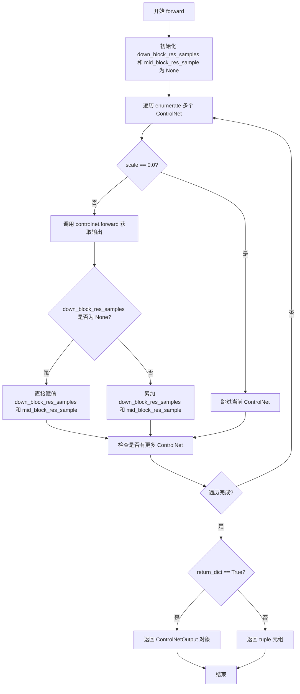

# `diffusers\src\diffusers\models\controlnets\multicontrolnet_union.py` 详细设计文档

该文件定义了 MultiControlNetUnionModel 类，用于封装并协调多个 ControlNetUnionModel，支持多条件控制的联合推理与特征融合。

## 整体流程

```mermaid
graph TD
    A[开始 Forward] --> B[遍历 self.nets (ControlNet 列表)]
    B --> C{当前 Net 的 conditioning_scale == 0.0?}
    C -- 是 --> D[跳过该 Net (continue)]
    C -- 否 --> E[调用 controlnet.forward 方法]
    E --> F[获取 down_block_res_samples 和 mid_block_res_sample]
    F --> G{是否为第一个有效 Net?}
    G -- 是 --> H[直接赋值初始化结果变量]
    G -- 否 --> I[将当前结果累加到结果变量中]
    I --> J[检查下一个 Net]
    D --> J
    H --> J
    J -- 是 --> B
    J -- 否 --> K[返回合并后的特征 (down_samples, mid_sample)]
```

## 类结构

```
ModelMixin (抽象基类)
└── MultiControlNetUnionModel (多控制网联合封装类)
    └── nets: nn.ModuleList (内部维护的 ControlNet 列表)
```

## 全局变量及字段


### `logger`
    
用于记录模块日志的全局日志对象

类型：`logging.Logger`
    


### `MultiControlNetUnionModel.nets`
    
存储多个ControlNetUnionModel实例的模块列表，用于多ControlNet联合推理

类型：`nn.ModuleList[ControlNetUnionModel]`
    
    

## 全局函数及方法


### `MultiControlNetUnionModel.__init__`

这是 `MultiControlNetUnionModel` 类的构造函数，用于初始化多个 `ControlNetUnionModel` 的包装器。它接收一个或多个 ControlNetUnionModel 实例作为输入，将它们存储为 `nn.ModuleList` 以便在 GPU 上进行参数同步，并确保所有子网络作为一个整体进行管理和保存。

参数：

- `controlnets`：`list[ControlNetUnionModel] | tuple[ControlNetUnionModel]`，需要集成的多个 ControlNetUnionModel 实例列表或元组，用于在多控制网联合推理时提供多种条件控制。

返回值：`None`，构造函数不返回任何值，仅初始化对象状态。

#### 流程图

```mermaid
flowchart TD
    A[接收 controlnets 参数] --> B{检查 controlnets 是否有效}
    B -->|有效| C[调用 super().__init__ 初始化基类]
    C --> D[创建 nn.ModuleList 并赋值给 self.nets]
    D --> E[初始化完成]
    
    B -->|无效| F[抛出异常或警告]
```

#### 带注释源码

```
def __init__(self, controlnets: list[ControlNetUnionModel] | tuple[ControlNetUnionModel]):
    """
    初始化 MultiControlNetUnionModel 实例。
    
    参数:
        controlnets: 一个包含多个 ControlNetUnionModel 实例的列表或元组。
                     这些实例将被封装为一个 ModuleList，以便 PyTorch 能够
                     正确管理所有子模块的参数（例如设备转移、梯度计算等）。
    
    注意:
        - 传入的 controlnets 会被转换为 nn.ModuleList，这意味着它们会作为一个整体被管理
        - 所有 controlnets 必须与主模型一起保存/加载
        - 该设计允许在推理时对多个控制网的结果进行加权融合
    """
    # 调用父类 ModelMixin 的初始化方法
    # 这会执行基础模型的初始化逻辑
    super().__init__()
    
    # 将传入的 controlnets 列表转换为 nn.ModuleList
    # nn.ModuleList 是 nn.Module 的容器, 会自动注册所有子模块
    # 这样 self.nets 会被 PyTorch 识别为一个完整的子模块集合
    # 优点:
    #   1. 所有子模块的参数会包含在 model.parameters() 中
    #   2. 可以使用 .to() 方法将所有子模块移动到指定设备
    #   3. 支持 train() / eval() 模式切换
    #   4. save_pretrained 和 from_pretrained 会自动处理所有子模块
    self.nets = nn.ModuleList(controlnets)
```


### MultiControlNetUnionModel.forward

该方法是多ControlNet联合模型的正向传播方法，通过遍历多个`ControlNetUnionModel`实例，对每个ControlNet进行条件控制并累积输出结果，实现多控制网络的协同推理。

参数：

- `sample`：`torch.Tensor`，输入的噪声样本
- `timestep`：`torch.Tensor | float | int`，扩散过程的时间步
- `encoder_hidden_states`：`torch.Tensor`，文本编码器输出的隐藏状态
- `controlnet_cond`：`list[torch.tensor]`，ControlNet的条件输入图像列表
- `control_type`：`list[torch.Tensor]`，控制类型列表
- `control_type_idx`：`list[list[int]]`，控制类型索引列表，用于指定每种控制类型的生效范围
- `conditioning_scale`：`list[float]`，每个ControlNet的条件缩放因子，用于调整ControlNet影响的权重
- `class_labels`：`torch.Tensor | None = None`，类别标签，可选的类别条件
- `timestep_cond`：`torch.Tensor | None = None`，时间步条件，可选的额外时间步信息
- `attention_mask`：`torch.Tensor | None = None`，注意力掩码，用于控制注意力计算
- `added_cond_kwargs`：`dict[str, torch.Tensor] | None = None`，额外的条件参数字典
- `cross_attention_kwargs`：`dict[str, Any] | None = None`，交叉注意力相关参数
- `guess_mode`：`bool = False`，猜测模式，决定如何处理未明确指定的ControlNet输出
- `return_dict`：`bool = True`，是否以字典形式返回结果

返回值：`ControlNetOutput | tuple`，返回下采样结果列表和中间块结果，若`return_dict=True`则返回`ControlNetOutput`对象，否则返回元组

#### 流程图



#### 带注释源码

```python
def forward(
    self,
    sample: torch.Tensor,                          # 输入的噪声图像样本
    timestep: torch.Tensor | float | int,          # 扩散过程的时间步
    encoder_hidden_states: torch.Tensor,           # 文本编码器的隐藏状态
    controlnet_cond: list[torch.tensor],            # ControlNet 条件图像列表
    control_type: list[torch.Tensor],              # 控制类型列表
    control_type_idx: list[list[int]],             # 控制类型索引列表
    conditioning_scale: list[float],               # 各 ControlNet 的条件缩放因子
    class_labels: torch.Tensor | None = None,      # 可选的类别标签
    timestep_cond: torch.Tensor | None = None,      # 可选的时间步条件
    attention_mask: torch.Tensor | None = None,    # 可选的注意力掩码
    added_cond_kwargs: dict[str, torch.Tensor] | None = None,  # 额外条件参数字典
    cross_attention_kwargs: dict[str, Any] | None = None,     # 交叉注意力参数
    guess_mode: bool = False,                      # 是否启用猜测模式
    return_dict: bool = True,                      # 是否返回字典格式
) -> ControlNetOutput | tuple:
    # 初始化下采样结果和中间结果为 None
    down_block_res_samples, mid_block_res_sample = None, None
    
    # 遍历所有 ControlNet 实例及其对应参数
    for i, (image, ctype, ctype_idx, scale, controlnet) in enumerate(
        zip(controlnet_cond, control_type, control_type_idx, conditioning_scale, self.nets)
    ):
        # 如果缩放因子为 0，则跳过该 ControlNet（相当于禁用）
        if scale == 0.0:
            continue
        
        # 调用单个 ControlNet 的 forward 方法进行推理
        down_samples, mid_sample = controlnet(
            sample=sample,                           # 传递样本
            timestep=timestep,                       # 传递时间步
            encoder_hidden_states=encoder_hidden_states,  # 传递编码器隐藏状态
            controlnet_cond=image,                   # 传递条件图像
            control_type=ctype,                      # 传递控制类型
            control_type_idx=ctype_idx,              # 传递控制类型索引
            conditioning_scale=scale,                # 传递缩放因子
            class_labels=class_labels,               # 传递类别标签
            timestep_cond=timestep_cond,             # 传递时间步条件
            attention_mask=attention_mask,           # 传递注意力掩码
            added_cond_kwargs=added_cond_kwargs,    # 传递额外条件
            cross_attention_kwargs=ccross_attention_kwargs,  # 传递交叉注意力参数
            from_multi=True,                         # 标记来自多 ControlNet 调用
            guess_mode=guess_mode,                   # 传递猜测模式标志
            return_dict=return_dict,                 # 传递返回格式标志
        )

        # 合并多个 ControlNet 的输出结果
        # 第一次迭代时直接赋值，后续迭代累加
        if down_block_res_samples is None and mid_block_res_sample is None:
            # 首次迭代：直接使用第一个 ControlNet 的输出
            down_block_res_samples, mid_block_res_sample = down_samples, mid_sample
        else:
            # 后续迭代：将当前 ControlNet 输出与之前的结果累加
            down_block_res_samples = [
                samples_prev + samples_curr
                for samples_prev, samples_curr in zip(down_block_res_samples, down_samples)
            ]
            mid_block_res_sample += mid_sample

    # 返回合并后的结果
    return down_block_res_samples, mid_block_res_sample
```


### `MultiControlNetUnionModel.save_pretrained`

将模型及其配置文件保存到指定目录，以便可以使用 `MultiControlNetUnionModel.from_pretrained` 类方法重新加载。该方法遍历内部所有的 `ControlNetUnionModel` 实例，为每个实例调用其自身的 `save_pretrained` 方法，支持分布式训练场景下的保存逻辑。

参数：

- `save_directory`：`str | os.PathLike`，目标保存目录，如果不存在则会自动创建
- `is_main_process`：`bool`，调用此函数的进程是否为主进程，默认为 `True`，在分布式训练（如 TPU）时用于避免竞态条件
- `save_function`：`Callable`，用于保存状态字典的函数，默认为 `None`（使用 `torch.save`），可通过环境变量 `DIFFUSERS_SAVE_MODE` 配置
- `safe_serialization`：`bool`，是否使用 `safetensors` 格式保存，默认为 `True`，否则使用传统的 PyTorch 方式（使用 `pickle`）
- `variant`：`str | None`，如果指定，权重将保存为 `pytorch_model.<variant>.bin` 格式，默认为 `None`

返回值：`None`，无返回值

#### 流程图

```mermaid
flowchart TD
    A[开始 save_pretrained] --> B[遍历 self.nets 中的每个 controlnet]
    B --> C{idx == 0?}
    C -->|是| D[suffix = ""]
    C -->|否| E[suffix = f"_{idx}"]
    D --> F[构造保存路径: save_directory + suffix]
    E --> F
    F --> G[调用 controlnet.save_pretrained 保存单个 ControlNet]
    G --> H{还有更多 controlnet?}
    H -->|是| I[idx += 1]
    I --> B
    H -->|否| J[结束]
    
    style A fill:#f9f,color:#000
    style J fill:#9f9,color:#000
    style G fill:#ff9,color:#000
```

#### 带注释源码

```python
# Copied from diffusers.models.controlnets.multicontrolnet.MultiControlNetModel.save_pretrained with ControlNet->ControlNetUnion
def save_pretrained(
    self,
    save_directory: str | os.PathLike,
    is_main_process: bool = True,
    save_function: Callable = None,
    safe_serialization: bool = True,
    variant: str | None = None,
):
    """
    Save a model and its configuration file to a directory, so that it can be re-loaded using the
    `[`~models.controlnets.multicontrolnet.MultiControlNetUnionModel.from_pretrained`]` class method.

    Arguments:
        save_directory (`str` or `os.PathLike`):
            Directory to which to save. Will be created if it doesn't exist.
        is_main_process (`bool`, *optional*, defaults to `True`):
            Whether the process calling this is the main process or not. Useful when in distributed training like
            TPUs and need to call this function on all processes. In this case, set `is_main_process=True` only on
            the main process to avoid race conditions.
        save_function (`Callable`):
            The function to use to save the state dictionary. Useful on distributed training like TPUs when one
            need to replace `torch.save` by another method. Can be configured with the environment variable
            `DIFFUSERS_SAVE_MODE`.
        safe_serialization (`bool`, *optional*, defaults to `True`):
            Whether to save the model using `safetensors` or the traditional PyTorch way (that uses `pickle`).
        variant (`str`, *optional*):
            If specified, weights are saved in the format pytorch_model.<variant>.bin.
    """
    # 遍历所有的 ControlNetUnionModel 实例（self.nets 是 nn.ModuleList）
    for idx, controlnet in enumerate(self.nets):
        # 第一个 controlnet 不加后缀，符合 DiffusionPipeline.from_pretrained 的约定
        # 后续的 controlnet 保存为 controlnet_1, controlnet_2, ...
        suffix = "" if idx == 0 else f"_{idx}"
        # 调用每个内部 controlnet 的 save_pretrained 方法进行保存
        controlnet.save_pretrained(
            save_directory + suffix,
            is_main_process=is_main_process,
            save_function=save_function,
            safe_serialization=safe_serialization,
            variant=variant,
        )
```


### MultiControlNetUnionModel.from_pretrained

从预训练模型加载多个 ControlNetUnion 模型并组合成一个 MultiControlNetUnionModel 实例。

参数：

- `cls`：类方法隐含的第一个参数，表示类本身
- `pretrained_model_path`：`str | os.PathLike | None`，指向包含模型权重的目录路径
- `**kwargs`：可变关键字参数，用于传递给底层 `ControlNetUnionModel.from_pretrained` 的参数，如 `torch_dtype`、`device_map`、`variant` 等

返回值：`MultiControlNetUnionModel`，返回加载并组合后的多控制网联合模型实例

#### 流程图

```mermaid
flowchart TD
    A[开始 from_pretrained] --> B[初始化 idx = 0, controlnets = []]
    B --> C[设置 model_path_to_load = pretrained_model_path]
    C --> D{os.path.isdir model_path_to_load?}
    D -->|是| E[调用 ControlNetUnionModel.from_pretrained 加载模型]
    E --> F[将加载的 controlnet 添加到 controlnets 列表]
    F --> G[idx += 1]
    G --> H[model_path_to_load = pretrained_model_path + _idx]
    H --> D
    D -->|否| I{len controlnets > 0?}
    I -->|否| J[抛出 ValueError 异常]
    I -->|是| K[记录日志: 加载成功]
    K --> L[返回 MultiControlNetUnionModel 实例]
    J --> M[结束]
    L --> M
```

#### 带注释源码

```python
@classmethod
# Copied from diffusers.models.controlnets.multicontrolnet.MultiControlNetModel.from_pretrained with ControlNet->ControlNetUnion
def from_pretrained(cls, pretrained_model_path: str | os.PathLike | None, **kwargs):
    r"""
    Instantiate a pretrained MultiControlNetUnion model from multiple pre-trained controlnet models.

    The model is set in evaluation mode by default using `model.eval()` (Dropout modules are deactivated). To train
    the model, you should first set it back in training mode with `model.train()`.

    The warning *Weights from XXX not initialized from pretrained model* means that the weights of XXX do not come
    pretrained with the rest of the model. It is up to you to train those weights with a downstream fine-tuning
    task.

    The warning *Weights from XXX not used in YYY* means that the layer XXX is not used by YYY, therefore those
    weights are discarded.

    Parameters:
        pretrained_model_path (`os.PathLike`):
            A path to a *directory* containing model weights saved using
            [`~models.controlnets.multicontrolnet.MultiControlNetUnionModel.save_pretrained`], e.g.,
            `./my_model_directory/controlnet`.
        torch_dtype (`torch.dtype`, *optional*):
            Override the default `torch.dtype` and load the model under this dtype.
        output_loading_info(`bool`, *optional*, defaults to `False`):
            Whether or not to also return a dictionary containing missing keys, unexpected keys and error messages.
        device_map (`str` or `dict[str, int | str | torch.device]`, *optional*):
            A map that specifies where each submodule should go. It doesn't need to be refined to each
            parameter/buffer name, once a given module name is inside, every submodule of it will be sent to the
            same device.

            To have Accelerate compute the most optimized `device_map` automatically, set `device_map="auto"`. For
            more information about each option see [designing a device
            map](https://hf.co/docs/accelerate/main/en/usage_guides/big_modeling#designing-a-device-map).
        max_memory (`Dict`, *optional*):
            A dictionary device identifier to maximum memory. Will default to the maximum memory available for each
            GPU and the available CPU RAM if unset.
        low_cpu_mem_usage (`bool`, *optional*, defaults to `True` if torch version >= 1.9.0 else `False`):
            Speed up model loading by not initializing the weights and only loading the pre-trained weights. This
            also tries to not use more than 1x model size in CPU memory (including peak memory) while loading the
            model. This is only supported when torch version >= 1.9.0. If you are using an older version of torch,
            setting this argument to `True` will raise an error.
        variant (`str`, *optional*):
            If specified load weights from `variant` filename, *e.g.* pytorch_model.<variant>.bin. `variant` is
            ignored when using `from_flax`.
        use_safetensors (`bool`, *optional*, defaults to `None`):
            If set to `None`, the `safetensors` weights will be downloaded if they're available **and** if the
            `safetensors` library is installed. If set to `True`, the model will be forcibly loaded from
            `safetensors` weights. If set to `False`, loading will *not* use `safetensors`.
    """
    idx = 0  # 初始化索引，用于追踪加载的 controlnet 数量
    controlnets = []  # 存储加载的 ControlNetUnionModel 实例列表

    # load controlnet and append to list until no controlnet directory exists anymore
    # first controlnet has to be saved under `./mydirectory/controlnet` to be compliant with `DiffusionPipeline.from_prertained`
    # second, third, ... controlnets have to be saved under `./mydirectory/controlnet_1`, `./mydirectory/controlnet_2`, ...
    model_path_to_load = pretrained_model_path  # 设置初始模型路径
    while os.path.isdir(model_path_to_load):  # 循环检查目录是否存在
        # 从指定路径加载单个 ControlNetUnion 模型
        controlnet = ControlNetUnionModel.from_pretrained(model_path_to_load, **kwargs)
        controlnets.append(controlnet)  # 将加载的模型添加到列表

        idx += 1  # 索引递增
        # 构建下一个可能的模型路径（添加后缀 _1, _2, ...）
        model_path_to_load = pretrained_model_path + f"_{idx}"

    # 记录成功加载的 controlnet 数量
    logger.info(f"{len(controlnets)} controlnets loaded from {pretrained_model_path}.")

    # 如果没有成功加载任何 controlnet，抛出异常
    if len(controlnets) == 0:
        raise ValueError(
            f"No ControlNetUnions found under {os.path.dirname(pretrained_model_path)}. Expected at least {pretrained_model_path + '_0'}."
        )

    # 使用加载的 controlnets 列表创建并返回 MultiControlNetUnionModel 实例
    return cls(controlnets)
```

## 关键组件


### MultiControlNetUnionModel

Multiple ControlNetUnionModel wrapper class for Multi-ControlNet-Union，用于同时处理多个ControlNet并聚合它们的结果。

### nn.ModuleList (self.nets)

存储多个ControlNetUnionModel实例的模块列表，用于并行推理和结果聚合。

### forward 方法

核心前向传播方法，遍历所有ControlNet并根据conditioning_scale合并中间结果，支持跳过scale为0的ControlNet。

### save_pretrained 方法

将多个ControlNet模型保存到不同目录，支持安全序列化和分布式训练场景。

### from_pretrained 类方法

从预训练路径动态加载多个ControlNet模型，支持自动发现和加载controlnet、controlnet_1、controlnet_2等目录下的模型。

### 控制网络结果聚合逻辑

将多个ControlNet的down_block_res_samples和mid_block_res_sample进行逐元素相加，实现多控制网络的输出融合。


## 问题及建议


### 已知问题

- **类型提示错误**: `forward` 方法中 `controlnet_cond: list[torch.tensor]` 应为 `list[torch.Tensor]`（Tensor 首字母大写），会导致类型检查工具无法正确识别
- **return_dict 参数未生效**: `forward` 方法接收 `return_dict` 参数但始终返回 tuple 格式，未根据该参数返回 `ControlNetOutput` 对象
- **空输入未处理**: 当所有 `conditioning_scale` 均为 0.0 时，`forward` 方法返回 `(None, None)`，下游使用时可能导致空指针异常
- **输入长度未校验**: `controlnet_cond`、`control_type`、`control_type_idx` 和 `conditioning_scale` 四个列表的长度应与 `self.nets` 一致，当前代码未做校验
- **路径拼接方式不当**: `save_pretrained` 和 `from_pretrained` 方法使用字符串拼接构建路径（如 `save_directory + suffix`），应使用 `os.path.join` 以保证跨平台兼容性
- **controlnets 空列表未校验**: 构造函数未检查 `controlnets` 是否为空列表，可能导致后续迭代出问题
- **from_pretrained 无限循环风险**: 若目录结构存在但非有效模型目录，可能导致意外行为；缺少对 `pretrained_model_path` 是否为有效路径的初始校验
- **日志信息不够精确**: `from_pretrained` 成功加载后记录的是 `pretrained_model_path` 而非实际加载的最终路径

### 优化建议

- 修正 `forward` 方法：当 `return_dict=True` 时返回 `ControlNetOutput` 对象实例
- 在 `forward` 方法开头添加输入列表长度校验，确保与 `self.nets` 数量一致
- 处理所有 `conditioning_scale` 为 0 的边界情况，可返回零张量或抛出明确异常
- 使用 `os.path.join()` 替代字符串拼接构建路径
- 在构造函数中添加 `if not controlnets: raise ValueError("...")` 校验
- 在 `from_pretrained` 循环前增加对初始路径有效性的检查，并设置最大迭代次数防止无限循环
- 完善类型注解和文档字符串，增加对异常情况的说明
- 考虑添加 `__len__` 和 `__getitem__` 方法以支持迭代协议
</think>

## 其它


### 设计目标与约束

该模块的设计目标是提供一个统一的接口来管理多个 ControlNetUnionModel，使得用户能够在 diffusion 模型的去噪过程中同时使用多个控制网络进行条件生成。主要约束包括：1) 所有输入的 controlnet 必须继承自 ControlNetUnionModel；2) 支持动态数量的 controlnet 组合；3) 保持与单个 ControlNetUnionModel 相同的前向传播接口；4) 通过 `conditioning_scale` 参数实现对每个 controlnet 的权重控制。

### 错误处理与异常设计

当 `pretrained_model_path` 目录下未找到任何 ControlNetUnion 模型时，抛出 `ValueError` 异常，提示需要至少存在 `pretrained_model_path_0` 目录。在 `forward` 方法中，如果所有 controlnet 的 `conditioning_scale` 都为 0.0，则返回 `None` 值作为 `down_block_res_samples` 和 `mid_block_res_sample`，调用方需处理此边界情况。`save_pretrained` 方法未显式处理文件写入失败的情况，建议在生产环境中添加异常捕获。

### 数据流与状态机

该模块的数据流遵循以下流程：接收 sample、timestep、encoder_hidden_states 等核心输入 → 遍历所有 controlnet → 对每个 controlnet 调用其 forward 方法 → 将每个 controlnet 的输出与之前的输出进行累加合并 → 返回合并后的 down_block_res_samples 和 mid_block_res_sample。状态机方面，该模块本身不维护内部状态，所有状态均由底层的 ControlNetUnionModel 实例管理。

### 外部依赖与接口契约

该模块依赖以下外部组件：1) `ControlNetUnionModel`：底层控制网络模型，必须实现与 ControlNet 相同的接口；2) `ModelMixin`：提供模型加载和保存的基础功能；3) `ControlNetOutput`：输出数据类型定义。接口契约要求所有 controlnet 必须实现 `forward()` 方法并返回与 `ControlNetOutput` 兼容的元组（down_samples, mid_sample），且支持 `from_multi=True` 参数以区分多控制网络调用模式。

### 性能考虑

在 `forward` 方法中，当 `conditioning_scale` 为 0.0 时直接跳过该 controlnet 的计算，实现条件执行优化。合并 samples 时使用列表推导式和 zip 进行向量化操作，减少 Python 循环开销。`nn.ModuleList` 用于管理多个 controlnet，确保参数能够被正确注册到 PyTorch 的计算图中，支持 GPU 加速和模型并行。

### 并发与线程安全

该模块本身不涉及线程间共享状态的修改，主要的计算都在 PyTorch 的计算图上完成。`save_pretrained` 和 `from_pretrained` 方法在分布式训练环境下通过 `is_main_process` 参数控制只有主进程执行文件写入，避免竞态条件。在多 GPU 环境下，建议使用 `device_map="auto"` 让 Accelerate 自动处理设备映射。

### 配置与参数说明

关键配置参数包括：`controlnets`：ControlNetUnionModel 实例列表或元组；`conditioning_scale`：float 列表，每个 controlnet 的权重系数，范围通常为 [0.0, 1.0]；`control_type`：控制类型张量列表；`control_type_idx`：控制类型索引列表，用于指定条件图中每个节点的控制类型；`guess_mode`：布尔值，当为 True 时启用猜测模式，可能生成更保守的输出。

### 使用示例

```python
from diffusers import ControlNetUnionModel, MultiControlNetUnionModel

# 加载多个 controlnet
controlnets = [
    ControlNetUnionModel.from_pretrained("./controlnet_canny"),
    ControlNetUnionModel.from_pretrained("./controlnet_pose"),
]
multi_controlnet = MultiControlNetUnionModel(controlnets)

# 前向传播
outputs = multi_controlnet(
    sample=noisy_latent,
    timestep=timestep,
    encoder_hidden_states=prompt_embeds,
    controlnet_cond=[canny_image, pose_image],
    control_type=[ctype_canny, ctype_pose],
    control_type_idx=[[0, 1], [2, 3]],
    conditioning_scale=[1.0, 0.8],
)
```

### 安全性考虑

该模块在加载预训练模型时支持 `safe_serialization=True` 选项以防止恶意权重文件。在处理用户输入的路径时，应注意路径遍历攻击的风险，建议在生产环境中对 `save_directory` 和 `pretrained_model_path` 进行路径验证。

### 版本兼容性

该代码继承自 `diffusers.models.controlnets.multicontrolnet.MultiControlNetModel`，并针对 ControlNetUnion 进行了适配。需要 PyTorch 1.9.0+ 才能使用 `low_cpu_mem_usage=True` 选项。代码中使用了 Python 3.10+ 的类型联合语法（`|` 运算符），需要 Python 3.10 及以上版本。


    