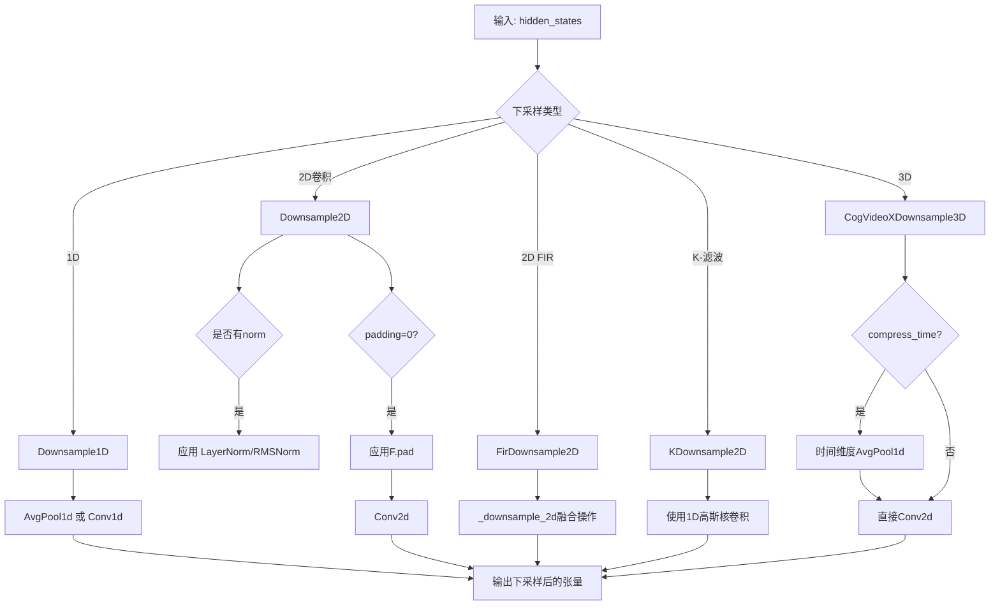
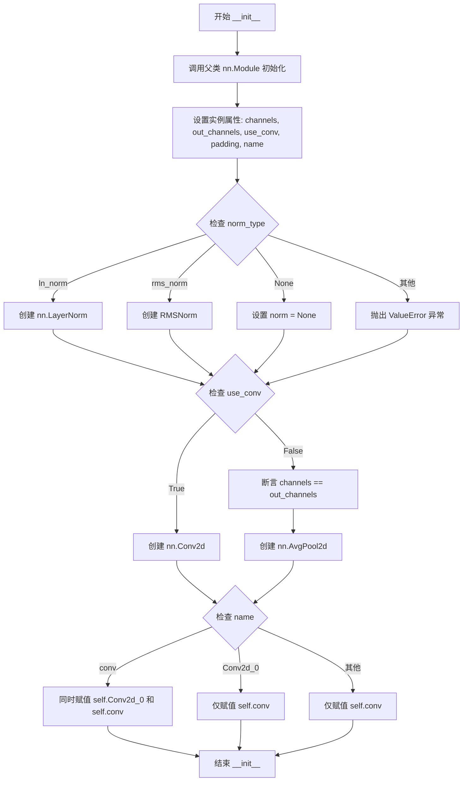
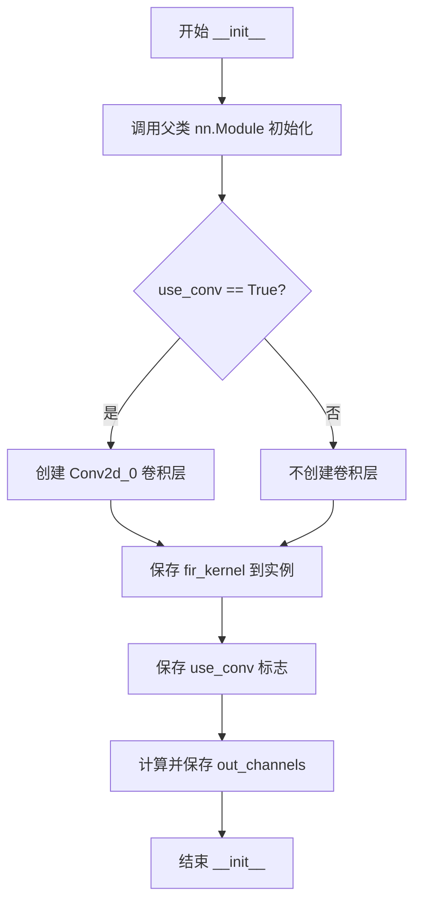
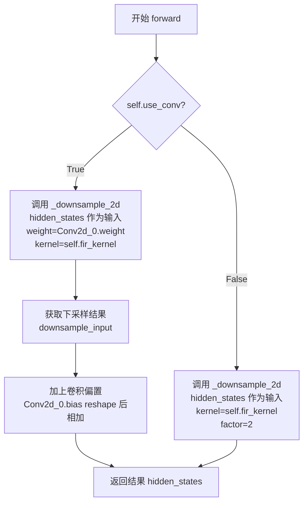
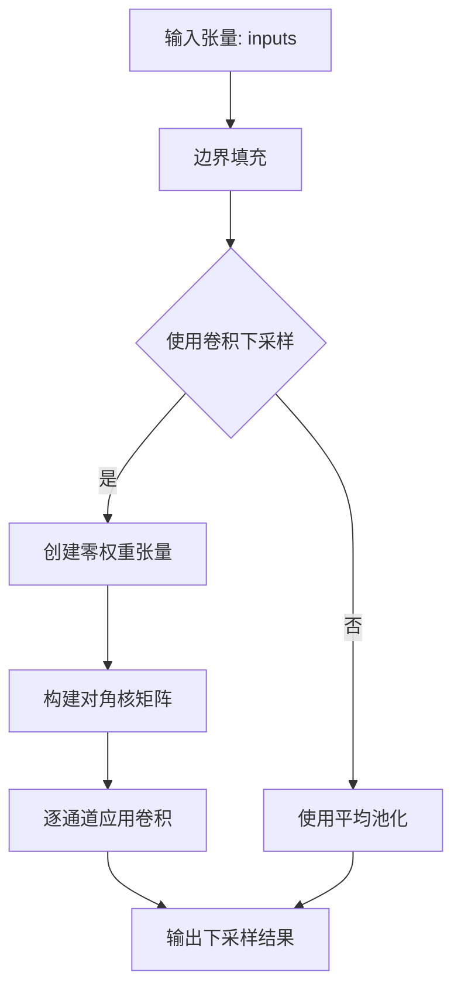

# `diffusers\src\diffusers\models\downsampling.py` 详细设计文档

该模块实现了多种下采样层（1D/2D/3D），主要用于扩散模型的图像/信号处理，支持卷积下采样、 FIR 滤波器下采样和自定义下采样策略，提供统一的下采样接口以降低特征图的空间分辨率。

## 整体流程



## 类结构

```
nn.Module (基类)
├── Downsample1D (1D下采样)
├── Downsample2D (2D卷积下采样)
├── FirDownsample2D (2D FIR滤波器下采样)
├── KDownsample2D (2D K-下采样)
└── CogVideoXDownsample3D (3D下采样)

全局函数: downsample_2d
```

## 全局变量及字段


### `downsample_2d`
    
对2D图像进行FIR下采样的全局函数

类型：`function`
    


### `Downsample1D.channels`
    
输入输出通道数

类型：`int`
    


### `Downsample1D.out_channels`
    
输出通道数

类型：`int`
    


### `Downsample1D.use_conv`
    
是否使用卷积

类型：`bool`
    


### `Downsample1D.padding`
    
填充大小

类型：`int`
    


### `Downsample1D.name`
    
层名称

类型：`str`
    


### `Downsample1D.conv`
    
下采样操作

类型：`nn.Conv1d 或 nn.AvgPool1d`
    


### `Downsample2D.channels`
    
输入通道数

类型：`int`
    


### `Downsample2D.out_channels`
    
输出通道数

类型：`int`
    


### `Downsample2D.use_conv`
    
是否使用卷积

类型：`bool`
    


### `Downsample2D.padding`
    
填充大小

类型：`int`
    


### `Downsample2D.name`
    
层名称

类型：`str`
    


### `Downsample2D.norm`
    
归一化层

类型：`nn.LayerNorm 或 RMSNorm 或 None`
    


### `Downsample2D.conv`
    
下采样操作

类型：`nn.Conv2d 或 nn.AvgPool2d`
    


### `FirDownsample2D.Conv2d_0`
    
卷积层(可选)

类型：`nn.Conv2d`
    


### `FirDownsample2D.fir_kernel`
    
FIR滤波器核

类型：`tuple`
    


### `FirDownsample2D.use_conv`
    
是否使用卷积

类型：`bool`
    


### `FirDownsample2D.out_channels`
    
输出通道数

类型：`int`
    


### `KDownsample2D.pad_mode`
    
填充模式

类型：`str`
    


### `KDownsample2D.pad`
    
填充大小

类型：`int`
    


### `KDownsample2D.kernel`
    
可学习的下采样核

类型：`torch.Tensor`
    


### `CogVideoXDownsample3D.conv`
    
2D卷积层

类型：`nn.Conv2d`
    


### `CogVideoXDownsample3D.compress_time`
    
是否压缩时间维度

类型：`bool`
    
    

## 全局函数及方法


### `downsample_2d`

该函数是一个2D图像下采样的全局函数，接受一批2D图像张量（支持 `[N, C, H, W]` 或 `[N, H, W, C]` 两种格式），使用给定的 FIR（有限冲击响应）滤波器对图像进行下采样操作。滤波器默认使用 `[1] * factor`（即平均池化），同时支持通过 `gain` 参数对输出信号进行幅度缩放。

参数：

- `hidden_states`：`torch.Tensor`，输入张量，形状为 `[N, C, H, W]` 或 `[N, H, W, C]`，表示一批2D图像
- `kernel`：`torch.Tensor | None`，FIR 滤波器，形状为 `[firH, firW]` 或 `[firN]`（可分离）。默认为 `[1] * factor`，对应平均池化
- `factor`：`int`，整数下采样因子，默认为 `2`
- `gain`：`float`，信号幅度缩放因子，默认为 `1.0`

返回值：`torch.Tensor`，形状为 `[N, C, H // factor, W // factor]` 的下采样后的张量

#### 流程图

```mermaid
flowchart TD
    A[开始 downsample_2d] --> B{验证 factor 是 int 类型且 >= 1}
    B -->|是| C{kernel 为 None?}
    B -->|否| Z[抛出断言错误]
    C -->|是| D[设置 kernel = [1] * factor]
    C -->|否| E[使用传入的 kernel]
    D --> F[将 kernel 转换为 float32 Tensor]
    E --> F
    F --> G{kernel.ndim == 1?}
    G -->|是| H[使用 torch.outer 生成 2D kernel]
    G -->|否| I[直接使用 2D kernel]
    H --> J[归一化 kernel: kernel /= sum(kernel)]
    I --> J
    J --> K[应用 gain: kernel = kernel * gain]
    K --> L[计算 pad_value = kernel.shape[0] - factor]
    L --> M[调用 upfirdn2d_native 函数进行下采样]
    M --> N[返回 output 张量]
```

#### 带注释源码

```python
def downsample_2d(
    hidden_states: torch.Tensor,
    kernel: torch.Tensor | None = None,
    factor: int = 2,
    gain: float = 1,
) -> torch.Tensor:
    r"""Downsample2D a batch of 2D images with the given filter.
    Accepts a batch of 2D images of the shape `[N, C, H, W]` or `[N, H, W, C]` and downsamples each image with the
    given filter. The filter is normalized so that if the input pixels are constant, they will be scaled by the
    specified `gain`. Pixels outside the image are assumed to be zero, and the filter is padded with zeros so that its
    shape is a multiple of the downsampling factor.

    Args:
        hidden_states (`torch.Tensor`)
            Input tensor of the shape `[N, C, H, W]` or `[N, H, W, C]`.
        kernel (`torch.Tensor`, *optional*):
            FIR filter of the shape `[firH, firW]` or `[firN]` (separable). The default is `[1] * factor`, which
            corresponds to average pooling.
        factor (`int`, *optional*, default to `2`):
            Integer downsampling factor.
        gain (`float`, *optional*, default to `1.0`):
            Scaling factor for signal magnitude.

    Returns:
        output (`torch.Tensor`):
            Tensor of the shape `[N, C, H // factor, W // factor]`
    """

    # 验证下采样因子是否为整数且大于等于1
    assert isinstance(factor, int) and factor >= 1
    
    # 如果没有提供 kernel，默认使用 [1] * factor，即平均池化滤波器
    if kernel is None:
        kernel = [1] * factor

    # 将 kernel 列表转换为 PyTorch float32 张量
    kernel = torch.tensor(kernel, dtype=torch.float32)
    
    # 如果是一维 kernel，通过外积生成二维可分离滤波器
    if kernel.ndim == 1:
        kernel = torch.outer(kernel, kernel)
    
    # 归一化滤波器，使得常数输入像素被缩放
    kernel /= torch.sum(kernel)

    # 应用增益因子来调整信号幅度
    kernel = kernel * gain
    
    # 计算填充值：滤波器大小减去下采样因子
    # 这确保滤波器形状是下采样因子的倍数
    pad_value = kernel.shape[0] - factor
    
    # 调用 upfirdn2d_native 函数执行 FIR 滤波和下采样
    # 参数:
    #   - hidden_states: 输入图像张量
    #   - kernel.to(device=hidden_states.device): 移动滤波器到输入设备
    #   - down=factor: 下采样因子
    #   - pad: 填充配置，((pad_value + 1) // 2, pad_value // 2) 用于对称填充
    output = upfirdn2d_native(
        hidden_states,
        kernel.to(device=hidden_states.device),
        down=factor,
        pad=((pad_value + 1) // 2, pad_value // 2),
    )
    
    # 返回下采样后的输出张量
    return output
```


### `Downsample1D.__init__`

初始化1D下采样层，根据`use_conv`参数选择卷积或平均池化方式实现2倍下采样，配置通道数、填充和命名等属性。

参数：

- `self`：隐式参数，类实例本身
- `channels`：`int`，输入和输出的通道数
- `use_conv`：`bool`，是否使用卷积进行下采样，默认为`False`
- `out_channels`：`int | None`，输出通道数，默认为`None`（等同于`channels`）
- `padding`：`int`，卷积填充大小，默认为`1`
- `name`：`str`，下采样层的名称，默认为`"conv"`

返回值：无（`None`），`__init__`方法不返回任何值

#### 流程图

```mermaid
flowchart TD
    A[开始 __init__] --> B[调用 super().__init__]
    B --> C[设置 self.channels = channels]
    C --> D[设置 self.out_channels = out_channels or channels]
    D --> E[设置 self.use_conv = use_conv]
    E --> F[设置 self.padding = padding]
    F --> G[设置 stride = 2]
    G --> H[设置 self.name = name]
    H --> I{use_conv == True?}
    I -->|是| J[创建 nn.Conv1d 卷积层]
    I -->|否| K[断言 channels == out_channels]
    K --> L[创建 nn.AvgPool1d 池化层]
    J --> M[赋值给 self.conv]
    L --> M
    M --> N[结束 __init__]
```

#### 带注释源码

```python
def __init__(
    self,
    channels: int,
    use_conv: bool = False,
    out_channels: int | None = None,
    padding: int = 1,
    name: str = "conv",
):
    """
    初始化1D下采样层。
    
    参数:
        channels: 输入和输出的通道数
        use_conv: 是否使用卷积进行下采样，默认为False（使用平均池化）
        out_channels: 输出通道数，默认为None（与输入通道数相同）
        padding: 卷积填充大小，默认为1
        name: 层的名称，默认为"conv"
    """
    # 调用父类nn.Module的初始化方法
    super().__init__()
    
    # 保存输入通道数
    self.channels = channels
    
    # 确定输出通道数：如果未指定则使用输入通道数
    self.out_channels = out_channels or channels
    
    # 保存是否使用卷积的标志
    self.use_conv = use_conv
    
    # 保存填充大小
    self.padding = padding
    
    # 下采样固定步长为2（实现2倍下采样）
    stride = 2
    
    # 保存层名称
    self.name = name

    # 根据use_conv标志选择不同的下采样方式
    if use_conv:
        # 使用卷积进行下采样：3x1卷积核，步长为2，填充为padding
        self.conv = nn.Conv1d(self.channels, self.out_channels, 3, stride=stride, padding=padding)
    else:
        # 断言：使用平均池化时输入输出通道数必须相等
        assert self.channels == self.out_channels
        # 使用平均池化进行下采样：核大小和步长均为2
        self.conv = nn.AvgPool1d(kernel_size=stride, stride=stride)
```


### `Downsample1D.forward`

执行1D下采样前向传播，对输入张量进行下采样处理，根据类初始化时选择的模式（卷积或平均池化）完成空间维度的压缩。

参数：

- `inputs`：`torch.Tensor`，输入的1D张量，形状为`[batch_size, channels, length]`，其中`channels`必须与构造时指定的通道数一致

返回值：`torch.Tensor`，下采样后的张量，形状为`[batch_size, out_channels, length // 2]`，空间维度（长度）被下采样因子2压缩

#### 流程图

```mermaid
graph LR
    A[输入张量 inputs] --> B[断言检查: inputs.shape[1] == self.channels]
    B --> C{self.use_conv}
    C -->|True| D[nn.Conv1d 下采样<br/>stride=2, kernel=3]
    C -->|False| E[nn.AvgPool1d 下采样<br/>kernel_size=2, stride=2]
    D --> F[返回下采样结果]
    E --> F
```

#### 带注释源码

```python
def forward(self, inputs: torch.Tensor) -> torch.Tensor:
    """执行1D下采样前向传播。

    Args:
        inputs: 输入张量，形状为 [batch_size, channels, length]

    Returns:
        下采样后的张量，形状为 [batch_size, out_channels, length // 2]
    """
    # 断言验证输入通道数与类初始化时指定的通道数一致
    # 确保模型接收到的输入维度符合预期
    assert inputs.shape[1] == self.channels

    # 根据 use_conv 配置选择执行卷积下采样或平均池化下采样
    # 卷积下采样: 使用 nn.Conv1d，stride=2 实现2倍下采样
    # 平均池化: 使用 nn.AvgPool1d，kernel_size=2, stride=2 实现2倍下采样
    return self.conv(inputs)
```


### `Downsample2D.__init__`

初始化 2D 下采样层，支持可选的卷积操作和归一化配置，用于在卷积神经网络中降低空间分辨率。

参数：

- `channels`：`int`，输入和输出的通道数
- `use_conv`：`bool`，是否使用卷积操作进行下采样，默认为 `False`
- `out_channels`：`int | None`，输出通道数，默认为 `None`（即与输入通道数相同）
- `padding`：`int`，卷积操作的填充大小，默认为 `1`
- `name`：`str`，下采样层的名称，默认为 `"conv"`
- `kernel_size`：`int`（类型为 `int`，但未标注类型注解），卷积核大小，默认为 `3`
- `norm_type`：`str | None`，归一化类型，支持 `"ln_norm"`（LayerNorm）、`"rms_norm"`（RMSNorm）或 `None`（无归一化），默认为 `None`
- `eps`：`float | None`，归一化的 epsilon 参数，用于数值稳定性，默认为 `None`
- `elementwise_affine`：`bool | None`，归一化层是否使用可学习的仿射参数，默认为 `None`
- `bias`：`bool`，卷积层是否使用偏置，默认为 `True`

返回值：`None`，该方法为构造函数，不返回任何值，仅初始化对象状态。

#### 流程图



#### 带注释源码

```python
def __init__(
    self,
    channels: int,
    use_conv: bool = False,
    out_channels: int | None = None,
    padding: int = 1,
    name: str = "conv",
    kernel_size=3,
    norm_type=None,
    eps=None,
    elementwise_affine=None,
    bias=True,
):
    """
    初始化 Downsample2D 层。

    参数:
        channels: 输入通道数
        use_conv: 是否使用卷积进行下采样
        out_channels: 输出通道数，默认为 None（与输入相同）
        padding: 卷积填充大小
        name: 层名称
        kernel_size: 卷积核大小
        norm_type: 归一化类型 ("ln_norm", "rms_norm", None)
        eps: 归一化 epsilon 值
        elementwise_affine: 是否使用仿射变换
        bias: 是否使用偏置
    """
    # 调用父类 nn.Module 的初始化方法
    super().__init__()
    
    # 存储通道数
    self.channels = channels
    # 如果未指定输出通道数，则使用输入通道数
    self.out_channels = out_channels or channels
    # 存储是否使用卷积的标志
    self.use_conv = use_conv
    # 存储填充大小
    self.padding = padding
    # 下采样步长固定为 2
    stride = 2
    # 存储层名称
    self.name = name

    # ========== 归一化层初始化 ==========
    if norm_type == "ln_norm":
        # LayerNorm: 对通道维度进行归一化
        self.norm = nn.LayerNorm(channels, eps, elementwise_affine)
    elif norm_type == "rms_norm":
        # RMSNorm: 均方根归一化
        self.norm = RMSNorm(channels, eps, elementwise_affine)
    elif norm_type is None:
        # 不使用归一化
        self.norm = None
    else:
        # 未知归一化类型，抛出异常
        raise ValueError(f"unknown norm_type: {norm_type}")

    # ========== 下采样卷积/池化层初始化 ==========
    if use_conv:
        # 使用卷积进行下采样
        conv = nn.Conv2d(
            self.channels, 
            self.out_channels, 
            kernel_size=kernel_size, 
            stride=stride, 
            padding=padding, 
            bias=bias
        )
    else:
        # 断言输入输出通道数相等（平均池化不改变通道数）
        assert self.channels == self.out_channels
        # 使用平均池化进行下采样
        conv = nn.AvgPool2d(kernel_size=stride, stride=stride)

    # ========== 处理权重命名兼容性 ==========
    # TODO(Suraj, Patrick) - clean up after weight dicts are correctly renamed
    # 历史原因：存在两种权重命名方式，需要兼容
    if name == "conv":
        # 新版本命名：同时保存为 Conv2d_0 和 conv
        self.Conv2d_0 = conv
        self.conv = conv
    elif name == "Conv2d_0":
        # 旧版本命名：仅保存为 conv
        self.conv = conv
    else:
        # 其他情况：仅保存为 conv
        self.conv = conv
```


### `Downsample2D.forward`

执行2D下采样前向传播，对输入的张量进行下采样处理（通过卷积或平均池化），支持可选的归一化层和边缘填充。

参数：

- `self`：`Downsample2D` 类实例
- `hidden_states`：`torch.Tensor`，输入张量，形状为 `[N, C, H, W]`，表示批量大小为 N、通道数为 C、高度为 H、宽度为 W 的图像数据
- `*args`：可变位置参数，用于保持接口兼容性
- `**kwargs`：可变关键字参数，目前仅处理 `scale` 参数（已废弃）

返回值：`torch.Tensor`，下采样后的张量，形状为 `[N, C_out, H//2, W//2]`（当使用步长为2的下采样时）

#### 流程图

```mermaid
flowchart TD
    A[开始 forward] --> B{检查 args 和 scale 参数}
    B -->|args > 0 或 scale 存在| C[发出废弃警告]
    B -->|否则| D[断言通道数匹配]
    C --> D
    D --> E{是否有归一化层?}
    E -->|是| F[对 hidden_states 进行归一化<br/>permute -> norm -> permute 恢复]
    E -->|否| G{使用卷积且 padding=0?}
    F --> G
    G -->|是| H[添加填充 pad=(0,1,0,1)]
    G -->|否| I[断言通道数再次匹配]
    H --> I
    I --> J[执行卷积或平均池化]
    J --> K[返回下采样结果]
```

#### 带注释源码

```python
def forward(self, hidden_states: torch.Tensor, *args, **kwargs) -> torch.Tensor:
    # 检查是否传递了已废弃的 scale 参数，如果是则发出警告
    if len(args) > 0 or kwargs.get("scale", None) is not None:
        deprecation_message = "The `scale` argument is deprecated and will be ignored. Please remove it, as passing it will raise an error in the future. `scale` should directly be passed while calling the underlying pipeline component i.e., via `cross_attention_kwargs`."
        deprecate("scale", "1.0.0", deprecation_message)
    
    # 验证输入通道数与配置通道数匹配
    assert hidden_states.shape[1] == self.channels

    # 如果配置了归一化层，则对输入进行归一化处理
    # 注意：LayerNorm 期望的输入形状是 [N, H, W, C]，所以需要进行维度置换
    if self.norm is not None:
        # 将输入从 [N, C, H, W] 转换为 [N, H, W, C] 进行归一化
        hidden_states = self.norm(hidden_states.permute(0, 2, 3, 1)).permute(0, 3, 1, 2)

    # 如果使用卷积且 padding 为 0，则在输入的右边和下边各添加 1 像素的零填充
    # 这样可以确保输出尺寸为 (H+1)//2 x (W+1)//2 而不是 (H-1)//2 x (W-1)//2
    if self.use_conv and self.padding == 0:
        pad = (0, 1, 0, 1)  # (left, right, top, bottom)
        hidden_states = F.pad(hidden_states, pad, mode="constant", value=0)

    # 再次验证通道数匹配（确保归一化操作没有改变通道数）
    assert hidden_states.shape[1] == self.channels

    # 执行卷积或平均池化操作进行下采样
    # 卷积：使用步长为 2 的卷积核
    # 池化：使用核大小和步长均为 2 的平均池化
    hidden_states = self.conv(hidden_states)

    return hidden_states
```


### `FirDownsample2D.__init__`

初始化FIR下采样层，用于在2D图像上执行有限脉冲响应（FIR）滤波器的下采样操作，支持可选的卷积操作。

参数：

- `channels`：`int | None`，输入和输出通道数，默认为 None
- `out_channels`：`int | None`，输出通道数，默认为 None，若未指定则使用 channels 的值
- `use_conv`：`bool`，是否使用卷积操作进行下采样，默认为 False
- `fir_kernel`：`tuple[int, int, int, int]`，FIR 滤波器的核系数，默认为 (1, 3, 3, 1)

返回值：无（`None`），该方法为构造函数，仅初始化对象状态

#### 流程图



#### 带注释源码

```python
def __init__(
    self,
    channels: int | None = None,
    out_channels: int | None = None,
    use_conv: bool = False,
    fir_kernel: tuple[int, int, int, int] = (1, 3, 3, 1),
):
    """初始化 FIR 下采样层

    参数:
        channels: 输入通道数
        out_channels: 输出通道数，若为 None 则使用 channels
        use_conv: 是否使用卷积进行下采样
        fir_kernel: FIR 滤波器核系数
    """
    # 调用父类 nn.Module 的初始化方法
    super().__init__()
    
    # 处理输出通道数：如果未指定，则使用输入通道数
    out_channels = out_channels if out_channels else channels
    
    # 如果使用卷积，则创建 Conv2d 层
    if use_conv:
        # 创建 3x3 卷积核，stride=1，padding=1 的卷积层
        self.Conv2d_0 = nn.Conv2d(channels, out_channels, kernel_size=3, stride=1, padding=1)
    
    # 保存 FIR 滤波器核系数
    self.fir_kernel = fir_kernel
    
    # 保存是否使用卷积的标志
    self.use_conv = use_conv
    
    # 保存输出通道数
    self.out_channels = out_channels
```


### `FirDownsample2D._downsample_2d`

该函数实现了一个融合的FIR（有限冲击响应）下采样操作，将卷积和下采样合并为一次高效计算，支持任意阶数的梯度计算。函数接受输入张量、可选卷积权重、FIR滤波器和下采样因子，通过upfirdn2d_native原语执行FIR滤波和可选的卷积操作，最后返回下采样后的张量。

参数：

- `hidden_states`：`torch.Tensor`，输入张量，形状为 `[N, C, H, W]` 或 `[N, H, W, C]`
- `weight`：`torch.Tensor | None`，可选的卷积权重张量，形状为 `[filterH, filterW, inChannels, outChannels]`，分组卷积可通过 `inChannels = x.shape[0] // numGroups` 实现
- `kernel`：`torch.Tensor | None`，可选的FIR滤波器，形状为 `[firH, firW]` 或 `[firN]`（可分离），默认为 `[1] * factor`，对应平均池化
- `factor`：`int = 2`，整数下采样因子，默认为2
- `gain`：`float = 1`，信号幅度缩放因子，默认为1.0

返回值：`torch.Tensor`，下采样后的张量，形状为 `[N, C, H // factor, W // factor]` 或 `[N, H // factor, W // factor, C]`，数据类型与输入张量相同

#### 流程图

```mermaid
flowchart TD
    A[开始 _downsample_2d] --> B{验证 factor 是 int 且 >= 1}
    B -->|否| C[抛出断言错误]
    B -->|是| D{kernel is None?}
    D -->|是| E[kernel = [1] * factor]
    D -->|否| F[使用传入的 kernel]
    E --> G[将 kernel 转为 torch.Tensor float32]
    F --> G
    G --> H{kernel.ndim == 1?}
    H -->|是| I[kernel = torch.outer kernel, kernel]
    H -->|否| J[保持 2D kernel]
    I --> K[kernel /= torch.sum kernel]
    J --> K
    K --> L[kernel = kernel * gain]
    L --> M{self.use_conv == True?}
    M -->|是| N[获取 weight 形状 _, _, convH, convW]
    M -->|否| O[设置 pad_value = kernel.shape[0] - factor]
    N --> P[pad_value = (kernel.shape[0] - factor) + (convW - 1)]
    P --> Q[调用 upfirdn2d_native 进行 FIR 滤波]
    Q --> R[调用 F.conv2d 进行卷积]
    R --> S[返回 output]
    O --> T[调用 upfirdn2d_native 进行 FIR 下采样]
    T --> S
```

#### 带注释源码

```python
def _downsample_2d(
    self,
    hidden_states: torch.Tensor,
    weight: torch.Tensor | None = None,
    kernel: torch.Tensor | None = None,
    factor: int = 2,
    gain: float = 1,
) -> torch.Tensor:
    """Fused `Conv2d()` followed by `downsample_2d()`.
    Padding is performed only once at the beginning, not between the operations. The fused op is considerably more
    efficient than performing the same calculation using standard TensorFlow ops. It supports gradients of
    arbitrary order.

    Args:
        hidden_states (`torch.Tensor`):
            Input tensor of the shape `[N, C, H, W]` or `[N, H, W, C]`.
        weight (`torch.Tensor`, *optional*):
            Weight tensor of the shape `[filterH, filterW, inChannels, outChannels]`. Grouped convolution can be
            performed by `inChannels = x.shape[0] // numGroups`.
        kernel (`torch.Tensor`, *optional*):
            FIR filter of the shape `[firH, firW]` or `[firN]` (separable). The default is `[1] * factor`, which
            corresponds to average pooling.
        factor (`int`, *optional*, default to `2`):
            Integer downsampling factor.
        gain (`float`, *optional*, default to `1.0`):
            Scaling factor for signal magnitude.

    Returns:
        output (`torch.Tensor`):
            Tensor of the shape `[N, C, H // factor, W // factor]` or `[N, H // factor, W // factor, C]`, and same
            datatype as `x`.
    """

    # 验证下采样因子必须是大于等于1的整数
    assert isinstance(factor, int) and factor >= 1
    
    # 如果没有提供kernel，默认使用 [1] * factor，实现平均池化效果
    if kernel is None:
        kernel = [1] * factor

    # 将 kernel 转换为 PyTorch float32 张量
    kernel = torch.tensor(kernel, dtype=torch.float32)
    
    # 如果是一维 kernel，通过外积扩展为二维
    if kernel.ndim == 1:
        kernel = torch.outer(kernel, kernel)
    
    # 归一化 kernel，使其和为1（保持平均值不变）
    kernel /= torch.sum(kernel)

    # 应用增益因子，缩放信号幅度
    kernel = kernel * gain

    # 根据是否使用卷积选择不同的处理路径
    if self.use_conv:
        # 提取卷积核的尺寸信息
        _, _, convH, convW = weight.shape
        
        # 计算填充值：考虑 FIR kernel 尺寸和卷积核尺寸
        pad_value = (kernel.shape[0] - factor) + (convW - 1)
        stride_value = [factor, factor]
        
        # 第一步：应用 FIR 滤波（仅做填充，不做下采样）
        # 使用 upfirdn2d_native 原语执行高效的 FIR 滤波
        upfirdn_input = upfirdn2d_native(
            hidden_states,
            torch.tensor(kernel, device=hidden_states.device),
            pad=((pad_value + 1) // 2, pad_value // 2),  # 上下左右对称填充
        )
        
        # 第二步：执行融合的卷积操作，同时完成滤波和下采样
        output = F.conv2d(upfirdn_input, weight, stride=stride_value, padding=0)
    else:
        # 非卷积模式：仅使用 FIR 滤波进行下采样
        # 计算填充值：考虑 FIR kernel 尺寸和下采样因子
        pad_value = kernel.shape[0] - factor
        
        # 调用 upfirdn2d_native 执行 FIR 下采样
        # down 参数指定下采样因子
        output = upfirdn2d_native(
            hidden_states,
            torch.tensor(kernel, device=hidden_states.device),
            down=factor,  # 下采样因子
            pad=((pad_value + 1) // 2, pad_value // 2),  # 填充处理边界
        )

    return output
```


### `FirDownsample2D.forward`

该方法是 `FirDownsample2D` 类的前向传播函数，实现了基于 FIR（有限冲击响应）滤波器的 2D 图像下采样。当 `use_conv` 为 `True` 时，先通过 `_downsample_2d` 执行卷积+下采样操作并加上卷积偏置；当 `use_conv` 为 `False` 时，直接使用 `_downsample_2d` 进行 2 倍下采样。

参数：

- `self`：`FirDownsample2D` 实例本身，包含卷积层权重、fir_kernel 等配置
- `hidden_states`：`torch.Tensor`，输入张量，形状为 `[N, C, H, W]` 或 `[N, H, W, C]`，代表批量图像数据

返回值：`torch.Tensor`，下采样后的输出张量，形状为 `[N, C_out, H//2, W//2]` 或 `[N, H//2, W//2, C_out]`

#### 流程图



#### 带注释源码

```python
def forward(self, hidden_states: torch.Tensor) -> torch.Tensor:
    """
    FirDownsample2D 的前向传播方法，执行 FIR 下采样。

    参数:
        hidden_states (torch.Tensor): 
            输入张量，形状为 [N, C, H, W] 或 [N, H, W, C]，代表批量图像数据

    返回:
        torch.Tensor: 
            下采样后的张量，形状为 [N, C_out, H//2, W//2] 或 [N, H//2, W//2, C_out]
    """
    # 判断是否使用卷积模式
    if self.use_conv:
        # 使用卷积的下采样路径：
        # 调用 _downsample_2d 内部方法，传入输入张量、卷积权重和 FIR 核
        downsample_input = self._downsample_2d(
            hidden_states,                      # 输入图像张量
            weight=self.Conv2d_0.weight,       # Conv2d 权重
            kernel=self.fir_kernel              # FIR 滤波器核
        )
        # 将卷积偏置 reshape 为 [1, -1, 1, 1] 并加到下采样结果上
        # 实现卷积后的偏置加法操作
        hidden_states = downsample_input + self.Conv2d_0.bias.reshape(1, -1, 1, 1)
    else:
        # 非卷积模式（平均池化）：
        # 直接使用 _downsample_2d 进行 2 倍下采样，使用默认的 FIR 核
        hidden_states = self._downsample_2d(
            hidden_states,                      # 输入图像张量
            kernel=self.fir_kernel,             # FIR 滤波器核
            factor=2                            # 下采样因子为 2
        )

    # 返回下采样后的结果
    return hidden_states
```


### KDownsample2D.__init__

初始化K下采样层，用于对2D图像进行下采样操作。该类使用可学习的核对输入进行填充和深度可分离卷积，实现高效的空间下采样。

参数：

- `pad_mode`：`str`，填充模式，默认为"reflect"，支持reflect、replicate、circular等padding模式

返回值：`None`，构造函数无返回值，直接在对象内部初始化层结构

#### 流程图

```mermaid
flowchart TD
    A[开始 __init__] --> B[调用父类 nn.Module 的初始化方法]
    B --> C[设置 self.pad_mode 为传入的 pad_mode 参数]
    D[创建 1D kernel 向量 [1/8, 3/8, 3/8, 1/8]]
    C --> D
    D --> E[计算 padding 大小: kernel_1d.shape[1] // 2 - 1 = 1]
    E --> F[将 1D kernel 转置后与自身做矩阵乘法生成 2D kernel]
    F --> G[使用 register_buffer 注册 kernel 为非持久化缓冲区]
    G --> H[结束 __init__]
```

#### 带注释源码

```
def __init__(self, pad_mode: str = "reflect"):
    """
    初始化K下采样层
    
    参数:
        pad_mode: 填充模式，用于F.pad操作，默认为"reflect"
    """
    # 调用父类nn.Module的初始化方法，建立PyTorch模块基础结构
    super().__init__()
    
    # 保存填充模式到实例属性，供前向传播时使用
    self.pad_mode = pad_mode
    
    # 定义1D卷积核，使用特定的权重分布 [1/8, 3/8, 3/8, 1/8]
    # 这种权重分布是一种平滑的下采样核
    kernel_1d = torch.tensor([[1 / 8, 3 / 8, 3 / 8, 1 / 8]])
    
    # 计算填充大小：核长度的一半减1
    # 对于4元素的核，pad = 4 // 2 - 1 = 1
    self.pad = kernel_1d.shape[1] // 2 - 1
    
    # 生成2D卷积核：通过1D核的转置与自身的矩阵乘法
    # (4,1) @ (1,4) = (4,4) 的2D核
    # 这实际上是一个可分离的2D卷积核
    self.register_buffer("kernel", kernel_1d.T @ kernel_1d, persistent=False)
    # register_buffer: 将tensor注册为模块的非参数缓冲区
    # persistent=False: 该buffer不会被保存到state_dict中
```


### `KDownsample2D.forward`

执行K下采样前向传播，使用可分离卷积核对输入图像进行2倍下采样，通过构建对角权重矩阵实现通道独立的滤波操作。

参数：

- `inputs`：`torch.Tensor`，输入的4D张量，形状为 `[N, C, H, W]`，其中 N 为批次大小，C 为通道数，H 和 W 分别为高度和宽度

返回值：`torch.Tensor`，下采样后的4D张量，形状为 `[N, C, H // 2, W // 2]`，空间尺寸缩小为原来的一半，通道数保持不变

#### 流程图



#### 带注释源码

```python
def forward(self, inputs: torch.Tensor) -> torch.Tensor:
    # 使用指定的填充模式（默认为reflect）对输入进行边界填充
    # 填充大小为 (pad, pad, pad, pad)，分别对应左、右、上、下
    inputs = F.pad(inputs, (self.pad,) * 4, self.pad_mode)
    
    # 创建一个与输入通道数相同大小的零权重张量
    # 形状: [C, C, kernel_h, kernel_w]，C为通道数
    weight = inputs.new_zeros(
        [
            inputs.shape[1],          # 输出通道数（与输入通道数相同）
            inputs.shape[1],          # 输入通道数
            self.kernel.shape[0],     # 卷积核高度
            self.kernel.shape[1],     # 卷积核宽度
        ]
    )
    
    # 获取通道索引，用于构建对角矩阵
    indices = torch.arange(inputs.shape[1], device=inputs.device)
    
    # 将1D卷积核扩展为2D卷积核：kernel_1d.T @ kernel_1d 实现可分离卷积
    # 然后扩展为每个通道独立的卷积核
    kernel = self.kernel.to(weight)[None, :].expand(inputs.shape[1], -1, -1)
    
    # 将卷积核放置在对角线上，实现每个通道独立滤波
    weight[indices, indices] = kernel
    
    # 执行2D卷积，stride=2实现2倍下采样
    # 输入: [N, C, H, W] -> 输出: [N, C, H//2, W//2]
    return F.conv2d(inputs, weight, stride=2)
```


### `CogVideoXDownsample3D.__init__`

该方法是 `CogVideoXDownsample3D` 类的构造函数，用于初始化 CogVideoX 模型中使用的 3D 下采样层。该层接受输入通道数、输出通道数、卷积核大小、步幅、填充和是否压缩时间维度等参数，创建一个 2D 卷积层用于空间下采样，并可选地支持时间维度压缩功能。

参数：

- `in_channels`：`int`，输入张量的通道数
- `out_channels`：`int`，输出张量的通道数
- `kernel_size`：`int`，卷积核大小，默认为 `3`
- `stride`：`int`，卷积步幅，默认为 `2`
- `padding`：`int`，卷积填充，默认为 `0`
- `compress_time`：`bool`，是否压缩时间维度，默认为 `False`

返回值：`None`，该方法仅初始化对象属性，不返回任何值

#### 流程图

```mermaid
flowchart TD
    A[开始 __init__] --> B[调用 super().__init__()]
    B --> C[创建 nn.Conv2d 卷积层]
    C --> D[保存卷积层到 self.conv]
    D --> E[保存 compress_time 到 self.compress_time]
    E --> F[结束 __init__]
```

#### 带注释源码

```python
def __init__(
    self,
    in_channels: int,
    out_channels: int,
    kernel_size: int = 3,
    stride: int = 2,
    padding: int = 0,
    compress_time: bool = False,
):
    """
    初始化 3D 下采样层
    
    参数:
        in_channels: 输入通道数
        out_channels: 输出通道数
        kernel_size: 卷积核大小
        stride: 步幅
        padding: 填充
        compress_time: 是否压缩时间维度
    """
    # 调用父类 nn.Module 的初始化方法
    super().__init__()

    # 创建 2D 卷积层用于空间下采样
    # 使用 Conv2d 而非 Conv3d 是因为 3D 数据的处理被分解为
    # 先在时间维度上进行处理，然后再进行 2D 卷积
    self.conv = nn.Conv2d(
        in_channels, 
        out_channels, 
        kernel_size=kernel_size, 
        stride=stride, 
        padding=padding
    )
    
    # 保存时间维度压缩标志
    # 当为 True 时，会在 forward 中对时间维度进行下采样
    self.compress_time = compress_time
```


### `CogVideoXDownsample3D.forward(x)`

执行3D下采样前向传播，对CogVideoX模型的5D张量（批次通道时空）进行时间和空间维度下采样，支持可选的时间维度压缩。

参数：

- `x`：`torch.Tensor`，输入张量，形状为 `(batch_size, channels, frames, height, width)` 的5D张量

返回值：`torch.Tensor`，下采样后的张量，形状为 `(batch_size, channels, frames, height // 2, width // 2)` 或 `(batch_size, channels, frames_compressed, height // 2, width // 2)`，取决于 `compress_time` 参数

#### 流程图

```mermaid
flowchart TD
    A[开始 forward] --> B{compress_time?}
    B -->|True| C[获取输入形状 batch_size, channels, frames, height, width]
    C --> D[permute变换: (0,3,4,1,2) -> reshape到 batch_size*height*width, channels, frames]
    D --> E{frames % 2 == 1?}
    E -->|True| F[分离第一帧 x_first 和其余帧 x_rest]
    F --> G{ x_rest.shape[-1] > 0?}
    G -->|True| H[对x_rest做avg_pool1d kernel=2 stride=2]
    G -->|False| I[x_rest保持不变]
    H --> J[torch.cat x_first和x_rest]
    J --> K[reshape回5D张量]
    E -->|False| L[直接avg_pool1d]
    L --> K
    K --> M[2D空间下采样]
    B -->|False| M
    M --> N[F.pad填充 pad=(0,1,0,1) 模式constant value=0]
    N --> O[permute: (0,2,1,3,4) -> reshape: batch_size*frames, channels, height, width]
    O --> P[self.conv 2D卷积下采样]
    P --> Q[reshape回: batch_size, frames, out_channels, h', w']
    Q --> R[permute回: (0,2,1,3,4)]
    R --> S[返回下采样后的5D张量]
```

#### 带注释源码

```python
def forward(self, x: torch.Tensor) -> torch.Tensor:
    """
    CogVideoX 3D下采样前向传播
    
    参数:
        x: 输入的5D张量，形状 (batch_size, channels, frames, height, width)
    
    返回:
        下采样后的5D张量
    """
    
    # =====================================================
    # 阶段1: 时间维度压缩 (可选)
    # =====================================================
    if self.compress_time:
        # 获取输入张量的维度信息
        batch_size, channels, frames, height, width = x.shape

        # 维度变换: (batch, channels, frames, h, w) -> (batch, h, w, channels, frames)
        # -> (batch*h*w, channels, frames)
        # 将时空维度展开，便于对时间维度进行1D池化
        x = x.permute(0, 3, 4, 1, 2).reshape(batch_size * height * width, channels, frames)

        # 检查帧数是否为奇数，需要特殊处理
        if x.shape[-1] % 2 == 1:
            # 奇数帧: 保留第一帧，其余帧做池化
            x_first, x_rest = x[..., 0], x[..., 1:]
            
            if x_rest.shape[-1] > 0:
                # 对剩余帧进行1D平均池化，核大小和步长均为2
                # (..., frames-1) -> (..., (frames-1)//2)
                x_rest = F.avg_pool1d(x_rest, kernel_size=2, stride=2)

            # 拼接: (1 + (frames-1)//2) = (frames//2) + 1
            x = torch.cat([x_first[..., None], x_rest], dim=-1)
            
            # 恢复形状: (batch*h*w, channels, new_frames) 
            # -> (batch, h, w, channels, new_frames)
            # -> (batch, channels, new_frames, h, w)
            x = x.reshape(batch_size, height, width, channels, x.shape[-1]).permute(0, 3, 4, 1, 2)
        else:
            # 偶数帧: 直接对所有帧进行1D平均池化
            x = F.avg_pool1d(x, kernel_size=2, stride=2)
            # 恢复形状
            x = x.reshape(batch_size, height, width, channels, x.shape[-1]).permute(0, 3, 4, 1, 2)

    # =====================================================
    # 阶段2: 空间维度下采样 (2D卷积)
    # =====================================================
    
    # 对输入张量进行填充，确保下采样后尺寸正确
    # pad = (left, right, top, bottom) = (0, 1, 0, 1)
    pad = (0, 1, 0, 1)
    x = F.pad(x, pad, mode="constant", value=0)
    
    # 获取填充后的形状
    batch_size, channels, frames, height, width = x.shape
    
    # 维度变换准备2D卷积
    # (batch, channels, frames, h, w) -> (batch, frames, channels, h, w)
    # -> (batch*frames, channels, h, w)
    x = x.permute(0, 2, 1, 3, 4).reshape(batch_size * frames, channels, height, width)
    
    # 执行2D卷积下采样，stride=2实现空间下采样
    x = self.conv(x)
    
    # 恢复5D张量形状
    # (batch*frames, out_channels, h', w') -> (batch, frames, out_channels, h', w')
    # -> (batch, out_channels, frames, h', w')
    x = x.reshape(batch_size, frames, x.shape[1], x.shape[2], x.shape[3]).permute(0, 2, 1, 3, 4)
    
    return x
```

## 关键组件


### Downsample1D

一个1D下采样模块，支持可选卷积，当不使用卷积时使用平均池化进行2倍下采样。

### Downsample2D

一个2D下采样模块，支持可选卷积和多种归一化类型（LayerNorm、RMSNorm），可通过卷积或平均池化实现2倍空间下采样。

### FirDownsample2D

使用FIR（有限冲激响应）滤波器的2D下采样模块，结合upfirdn2d_native算子实现高效的卷积与下采样融合操作，支持可配置的下采样因子和增益。

### KDownsample2D

基于固定FIR核（1/8, 3/8, 3/8, 1/8）的2D下采样模块，使用可学习的权重矩阵实现对角索引的高效卷积，适用于k-upscaler场景。

### CogVideoXDownsample3D

针对视频模型的3D下采样模块，支持时间维度压缩和空间维度2倍下采样，通过形状变换和1D池化实现时序和空间的下采样操作。

### downsample_2d 函数

独立的2D图像下采样函数，接收批量的2D图像张量，使用FIR滤波器进行可配置因子和增益的下采样，支持[N, C, H, W]或[N, H, W, C]格式输入。

### RMSNorm 依赖

Downsample2D中使用的归一化层，为模型提供RMS（Root Mean Square）归一化支持。

### upfirdn2d_native 依赖

外部FIR滤波函数，用于实现高效的上采样/下采样滤波操作，是FirDownsample2D和downsample_2d的核心依赖。


## 问题及建议


### 已知问题

-   **Downsample2D 中的断言使用不当**：使用 `assert` 进行运行时验证（如 `assert hidden_states.shape[1] == self.channels`），在生产环境中可能被 Python 优化标志（`-O`）禁用，导致静默失败
-   **FirDownsample2D._downsample_2d 与 downsample_2d 函数代码重复**：两个函数包含几乎相同的核创建和归一化逻辑，违反 DRY 原则，增加维护成本
-   **FirDownsample2D 中 kernel tensor 重复创建**：每次调用 `_downsample_2d` 都会执行 `torch.tensor(kernel, dtype=torch.float32)`，且在 `use_conv` 分支中额外创建一次，应该复用已存储的 `self.fir_kernel`
-   **Downsample2D 的 TODO 注释未清理**：代码中存在 `# TODO(Suraj, Patrick) - clean up after weight dicts are correctly renamed` 注释，表明历史遗留的权重重命名问题尚未解决
-   **KDownsample2D.forward 中权重张量重复分配**：每次前向传播都通过 `inputs.new_zeros` 创建新的全零权重张量，即使 `self.kernel` 已注册为 buffer，应预分配并复用
-   **CogVideoXDownsample3D 的张量重塑操作复杂**：多次使用 `permute` 和 `reshape` 进行维度变换，容易出错且难以调试，可考虑封装为独立方法或使用 `einops` 简化
-   **FirDownsample2D._downsample_2d 中 weight 参数缺少显式验证**：当 `self.use_conv=True` 时依赖外部传入的 `weight` 参数，但没有检查其有效性，可能导致隐蔽错误
-   **Downsample2D 的 norm 应用顺序存在潜在问题**：norm 应用时进行了 `permute(0, 2, 3, 1)` 和 `permute(0, 3, 1, 2)`，但 RMSNorm/LayerNorm 的原始实现可能期望不同的维度顺序

### 优化建议

-   将所有 `assert` 语句替换为显式的 `if` 检查并抛出 `ValueError` 或 `AssertionError`，确保在生产环境中也能正常验证
-   提取 FirDownsample2D._downsample_2d 和 downsample_2d 的公共逻辑为私有方法或工具函数，消除代码重复
-   将 kernel tensor 在 `__init__` 中预先转换为 torch.Tensor 并存储为 buffer，避免每次前向传播时重复创建
-   清理 TODO 注释或将其记录到 issue 跟踪系统中以便后续处理
-   为 KDownsample2D 预分配权重缓冲区，使用 `register_buffer` 存储非训练参数，避免每次 forward 重新分配内存
-   为 FirDownsample2D._downsample_2d 的 `weight` 参数添加显式类型检查和错误提示，提高 API 健壮性
-   考虑在 CogVideoXDownsample3D 中添加维度验证或使用更清晰的维度处理方式，提高代码可读性

## 其它


### 设计目标与约束

本模块旨在为Diffusion模型（尤其是Stable Diffusion和CogVideoX）提供统一的降采样接口，支持1D、2D和3D张量的空间下采样功能。设计目标包括：(1) 提供多种降采样策略（平均池化、卷积、FIR滤波器），(2) 支持可选的归一化操作（LayerNorm、RMSNorm），(3) 兼容不同输入维度的张量处理。约束条件为依赖PyTorch框架，需要与`..utils.deprecate`和`.normalization.RMSNorm`、`.upsampling.upfirdn2d_native`配合使用，且在CUDA设备上运行时需确保kernel tensor在正确设备上。

### 错误处理与异常设计

本模块的错误处理采用断言+异常抛出的混合策略：(1) 输入验证：forward方法中通过`assert inputs.shape[1] == self.channels`验证输入通道数与初始化时声明的channels是否匹配，防止维度不匹配导致的隐式错误，(2) 参数校验：FIR降采样中通过`assert isinstance(factor, int) and factor >= 1`确保下采样因子为正整数，(3) 归一化类型校验：Downsample2D中对不支持的norm_type抛出`ValueError(f"unknown norm_type: {norm_type}")`，(4) 弃用警告：通过`deprecate`函数提示`scale`参数已废弃。此外，use_conv=False时断言输入输出通道数相等，防止配置不一致。

### 数据流与状态机

本模块数据流遵循"输入验证→归一化处理→填充（可选）→降采样卷积/池化→输出"的固定流程。状态机主要体现在Downsample2D的条件分支：(1) 初始态：接收hidden_states张量，(2) 归一化态：根据self.norm类型决定是否执行permute→norm→permute操作，(3) 填充态：当use_conv=True且padding=0时执行边缘填充，(4) 输出态：执行卷积或池化并返回结果。FirDownsample2D增加滤波器应用状态，KDownsample2D通过构造对角kernel实现固定模式降采样，CogVideoXDownsample3D支持时间维度压缩的状态分支。

### 外部依赖与接口契约

本模块依赖以下外部组件：(1) `torch`和`torch.nn`：PyTorch核心库，提供张量运算和神经网络基础组件，(2) `torch.nn.functional`：提供F.pad、F.conv2d等函数式接口，(3) `..utils.deprecate`：提供参数弃用警告功能，(4) `.normalization.RMSNorm`：自定义RMSNorm归一化类，(5) `.upsampling.upfirdn2d_native`：FIR滤波器的upfirdn（up-sample FIR down-sample）实现，负责可分离滤波的二维卷积加速。接口契约要求：输入张量必须为(N,C,H,W)或(N,C,H,W,D)格式，通道数需与初始化时声明的channels匹配，归一化输入需为(N,H,W,C)格式经permute转换。

### 性能考虑

本模块的性能优化策略包括：(1) 算子融合：FirDownsample2D的`_downsample_2d`方法通过先应用FIR滤波器再执行卷积，实现两步融合以减少内存拷贝和中间张量分配，(2) 设备一致性：kernel tensor在运行时通过`.to(device=hidden_states.device)`确保与输入在同一设备，(3) 内存预分配：KDownsample2D使用register_buffer持久化kernel，避免每次forward重复分配，(4) 条件跳过：Downsample2D中当norm为None时直接跳过归一化分支，减少不必要的permute操作。建议后续优化：可考虑使用torch.compile加速静态图构建，KDownsample2D的动态kernel构造可移至__init__中预计算。

### 安全性与权限设计

本模块作为纯计算层不涉及用户认证或访问控制，安全性主要体现在：(1) 输入维度校验防止缓冲区溢出风险，(2) kernel参数通过张量构造而非外部文件加载，避免注入攻击，(3) 使用register_buffer而非parameter注册kernel，确保不被误训练更新。权限方面遵循Apache 2.0许可证，代码保留版权声明且允许商业使用和修改分发。

### 测试策略

建议的测试覆盖包括：(1) 单元测试：各Downsample类的forward输出尺寸验证、通道数一致性检查、norm_type参数异常捕获，(2) 梯度测试：使用torch.autograd.gradcheck验证可训练参数的梯度计算正确性，(3) 设备测试：验证在CUDA/CPU设备上运行的一致性，特别是kernel.to(device)的设备迁移逻辑，(4) 集成测试：在模拟的UNet骨干网络中验证降采样层与上游/下游模块的维度衔接正确性，(5) 性能基准测试：对比use_conv=True/False以及不同kernel配置的推理延迟。

### 版本兼容性

本模块使用Python 3.9+的类型注解语法（int | None），要求Python 3.9以上版本。PyTorch版本兼容性需确保支持以下API：torch.tensor带dtype参数、Tensor.ndim属性、torch.outer函数、nn.LayerNorm和nn.Conv2d的构造参数。FIR滤波器相关代码依赖upfirdn2d_native函数的可用性，需与upsampling模块版本同步。对于弃用警告功能，deprecate函数的调用方式需与utils模块版本匹配。

### 配置管理

模块配置通过构造函数参数暴露，主要配置项包括：(1) channels/out_channels：控制输入输出通道数，(2) use_conv：选择卷积降采样或平均池化，(3) padding：卷积 padding 尺寸，(4) norm_type：选择归一化类型（"ln_norm"/"rms_norm"/None），(5) kernel_size/fir_kernel：控制卷积核或FIR滤波器尺寸，(6) compress_time：3D降采样专用，控制时间维度压缩。建议使用dataclass或Config类统一管理这些参数以提高可维护性。

### 监控与日志

当前模块未实现显式日志记录功能，建议增加：(1) 降采样尺寸变化日志：在forward入口记录输入shape和预期输出shape，便于调试维度不匹配问题，(2) 性能指标记录：可使用torch.profiler记录各降采样方法的GPU耗时，(3) 弃用警告捕获：deprecate调用可配合日志框架记录警告信息便于追踪迁移进度。对于生产环境监控，建议在模型外部记录各降采样层的调用频次和平均推理时间。

    