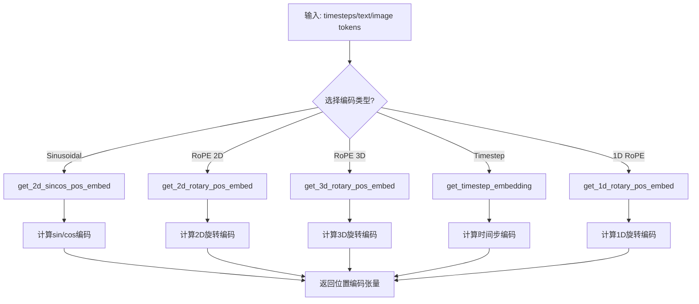
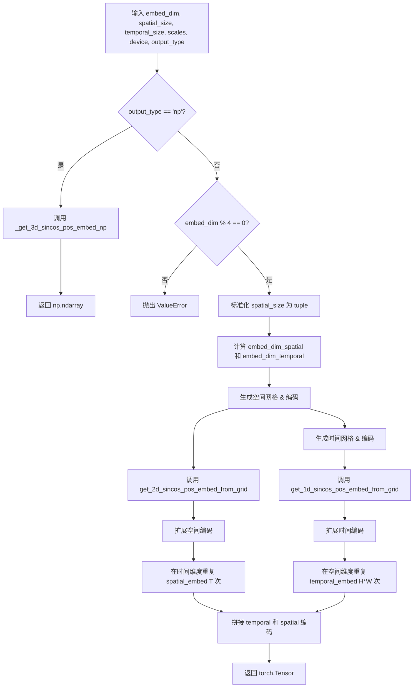
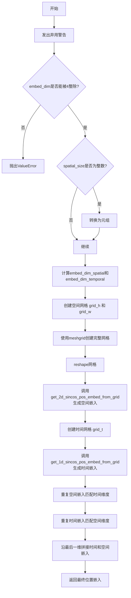
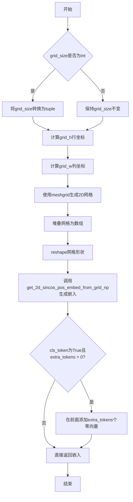
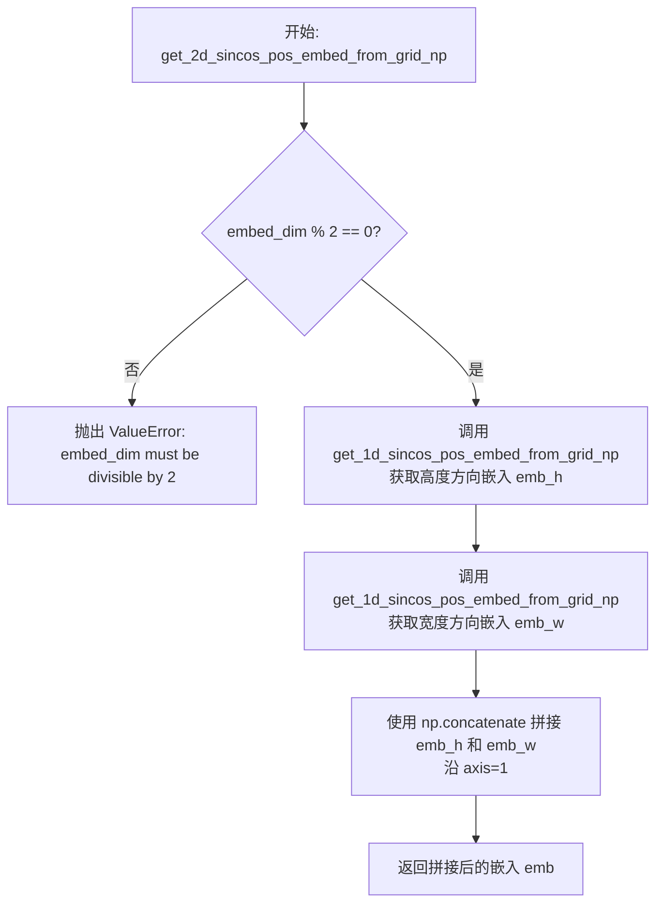
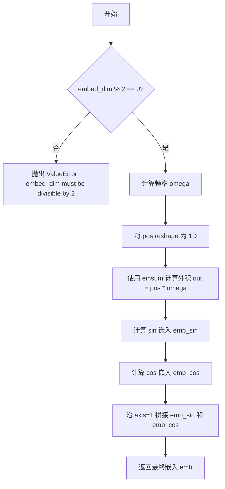
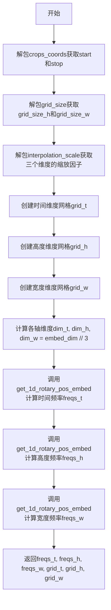
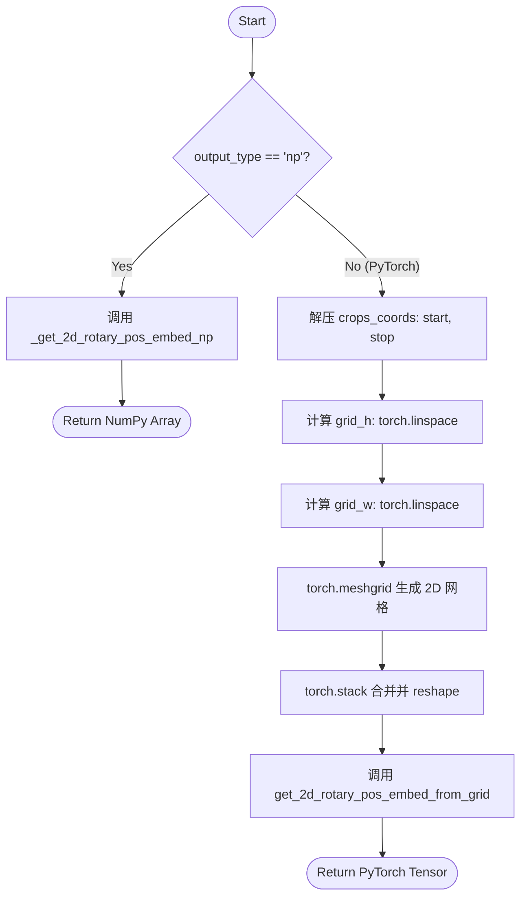
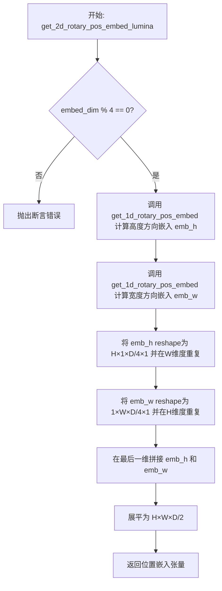
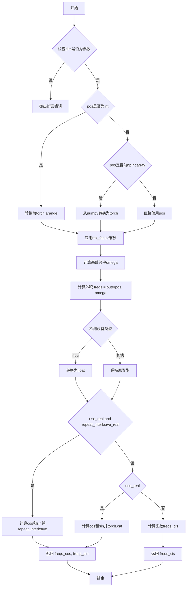

# `diffusers\src\diffusers\models\embeddings.py` 详细设计文档

该文件实现了Diffusion模型中的各种位置编码技术，包括正弦余弦位置编码(Sinusoidal)、旋转位置编码(RoPE)、时间步嵌入(Timestep Embedding)等，并提供了多种图像和文本嵌入投影模块，用于支持不同的Diffusion模型架构如SD3、CogVideoX、Lumina等。

## 整体流程



## 类结构

```
位置编码函数 (全局函数)
├── 正弦余弦编码 (Sinusoidal)
│   ├── get_timestep_embedding
│   ├── get_3d_sincos_pos_embed
│   ├── get_2d_sincos_pos_embed
│   ├── get_1d_sincos_pos_embed_from_grid
│   └── get_2d_sincos_pos_embed_from_grid
├── 旋转编码 (RoPE)
│   ├── get_1d_rotary_pos_embed
│   ├── get_2d_rotary_pos_embed
│   ├── get_3d_rotary_pos_embed
│   ├── apply_rotary_emb
│   └── apply_rotary_emb_allegro
└── 傅里叶编码 (Fourier)
    └── get_fourier_embeds_from_boundingbox
神经网络模块 (nn.Module)
├── Patch Embeddings
│   ├── PatchEmbed (SD3)
│   ├── LuminaPatchEmbed
│   ├── CogVideoXPatchEmbed
│   └── CogView3PlusPatchEmbed
├── 时间步/ Timestep 处理
│   ├── TimestepEmbedding
│   ├── Timesteps
│   ├── GaussianFourierProjection
│   └── SinusoidalPositionalEmbedding
├── 位置嵌入模块
│   ├── ImagePositionalEmbeddings
│   └── LabelEmbedding
├── 图像-文本投影
│   ├── TextImageProjection
│   ├── ImageProjection
│   └── TextTimeEmbedding / ImageTimeEmbedding
├── IP-Adapter 相关
│   ├── IPAdapterFullImageProjection
│   ├── IPAdapterFaceIDImageProjection
│   ├── IPAdapterPlusImageProjection
│   ├── IPAdapterFaceIDPlusImageProjection
│   ├── IPAdapterTimeImageProjection
│   └── MultiIPAdapterImageProjection
├── 组合嵌入 (Combined Embeddings)
│   ├── CombinedTimestepLabelEmbeddings
│   ├── CombinedTimestepTextProjEmbeddings
│   ├── CombinedTimestepGuidanceTextProjEmbeddings
│   ├── CogView3CombinedTimestepSizeEmbeddings
│   ├── HunyuanCombinedTimestepTextSizeStyleEmbedding
│   ├── LuminaCombinedTimestepCaptionEmbedding
│   ├── MochiCombinedTimestepCaptionEmbedding
│   ├── PixArtAlphaCombinedTimestepSizeEmbeddings
│   └── PixArtAlphaTextProjection
├── Attention Pooling
│   ├── AttentionPooling
│   ├── MochiAttentionPool
│   └── HunyuanDiTAttentionPool
└── 其他
    ├── GLIGENTextBoundingboxProjection
    └── FluxPosEmbed (deprecated)
```

## 全局变量及字段


### `PatchEmbed.flatten`
    
Whether to flatten the output patches into a sequence

类型：`bool`
    


### `PatchEmbed.layer_norm`
    
Whether to apply layer normalization to the output

类型：`bool`
    


### `PatchEmbed.pos_embed_max_size`
    
Maximum size for positional embeddings, used for SD3 cropping

类型：`int | None`
    


### `PatchEmbed.proj`
    
Convolutional layer to project input images into patch embeddings

类型：`nn.Conv2d`
    


### `PatchEmbed.norm`
    
Layer normalization module applied to embeddings

类型：`nn.LayerNorm | None`
    


### `PatchEmbed.patch_size`
    
Size of each patch for splitting the input image

类型：`int`
    


### `PatchEmbed.height`
    
Number of patches in the height dimension

类型：`int`
    


### `PatchEmbed.width`
    
Number of patches in the width dimension

类型：`int`
    


### `PatchEmbed.base_size`
    
Base size for positional embedding interpolation

类型：`int`
    


### `PatchEmbed.interpolation_scale`
    
Scale factor for positional embedding interpolation

类型：`float`
    


### `PatchEmbed.pos_embed`
    
Pre-computed 2D sinusoidal positional embeddings

类型：`torch.Tensor`
    


### `LuminaPatchEmbed.patch_size`
    
Size of each patch for splitting the input

类型：`int`
    


### `LuminaPatchEmbed.proj`
    
Linear projection layer for patch embeddings

类型：`nn.Linear`
    


### `CogVideoXPatchEmbed.patch_size`
    
Spatial patch size for video tokenization

类型：`int`
    


### `CogVideoXPatchEmbed.patch_size_t`
    
Temporal patch size for video tokenization

类型：`int | None`
    


### `CogVideoXPatchEmbed.embed_dim`
    
Output dimension of the embedding

类型：`int`
    


### `CogVideoXPatchEmbed.sample_height`
    
Default sample height for positional embeddings

类型：`int`
    


### `CogVideoXPatchEmbed.sample_width`
    
Default sample width for positional embeddings

类型：`int`
    


### `CogVideoXPatchEmbed.sample_frames`
    
Default number of sample frames for positional embeddings

类型：`int`
    


### `CogVideoXPatchEmbed.temporal_compression_ratio`
    
Compression ratio for temporal dimension

类型：`int`
    


### `CogVideoXPatchEmbed.max_text_seq_length`
    
Maximum sequence length for text embeddings

类型：`int`
    


### `CogVideoXPatchEmbed.spatial_interpolation_scale`
    
Scale factor for spatial positional embedding interpolation

类型：`float`
    


### `CogVideoXPatchEmbed.temporal_interpolation_scale`
    
Scale factor for temporal positional embedding interpolation

类型：`float`
    


### `CogVideoXPatchEmbed.use_positional_embeddings`
    
Whether to use positional embeddings

类型：`bool`
    


### `CogVideoXPatchEmbed.use_learned_positional_embeddings`
    
Whether to use learned positional embeddings

类型：`bool`
    


### `CogVideoXPatchEmbed.proj`
    
Projection layer for video/image patches

类型：`nn.Conv2d | nn.Linear`
    


### `CogVideoXPatchEmbed.text_proj`
    
Linear projection for text embeddings

类型：`nn.Linear`
    


### `CogVideoXPatchEmbed.pos_embedding`
    
Pre-computed 3D sinusoidal positional embeddings

类型：`torch.Tensor`
    


### `CogView3PlusPatchEmbed.in_channels`
    
Number of input channels

类型：`int`
    


### `CogView3PlusPatchEmbed.hidden_size`
    
Hidden dimension size for embeddings

类型：`int`
    


### `CogView3PlusPatchEmbed.patch_size`
    
Size of each patch

类型：`int`
    


### `CogView3PlusPatchEmbed.text_hidden_size`
    
Dimension of text embeddings

类型：`int`
    


### `CogView3PlusPatchEmbed.pos_embed_max_size`
    
Maximum size for positional embeddings

类型：`int`
    


### `CogView3PlusPatchEmbed.proj`
    
Linear projection for image patches

类型：`nn.Linear`
    


### `CogView3PlusPatchEmbed.text_proj`
    
Linear projection for text embeddings

类型：`nn.Linear`
    


### `CogView3PlusPatchEmbed.pos_embed`
    
2D sinusoidal positional embeddings buffer

类型：`torch.Tensor`
    


### `TimestepEmbedding.linear_1`
    
First linear layer for timestep embedding

类型：`nn.Linear`
    


### `TimestepEmbedding.cond_proj`
    
Optional linear layer for conditioning projection

类型：`nn.Linear | None`
    


### `TimestepEmbedding.act`
    
Activation function module

类型：`nn.Module`
    


### `TimestepEmbedding.linear_2`
    
Second linear layer for timestep embedding

类型：`nn.Linear`
    


### `TimestepEmbedding.post_act`
    
Optional post-activation function

类型：`nn.Module | None`
    


### `Timesteps.num_channels`
    
Number of channels for timestep embedding

类型：`int`
    


### `Timesteps.flip_sin_to_cos`
    
Whether to flip the embedding order to cos, sin

类型：`bool`
    


### `Timesteps.downscale_freq_shift`
    
Frequency shift value for downscaling

类型：`float`
    


### `Timesteps.scale`
    
Scaling factor for embeddings

类型：`int`
    


### `GaussianFourierProjection.weight`
    
Learnable Gaussian Fourier weights

类型：`nn.Parameter`
    


### `GaussianFourierProjection.log`
    
Whether to apply logarithmic transformation to input

类型：`bool`
    


### `GaussianFourierProjection.flip_sin_to_cos`
    
Whether to flip sin to cos in output

类型：`bool`
    


### `SinusoidalPositionalEmbedding.pe`
    
Pre-computed sinusoidal positional embeddings buffer

类型：`torch.Tensor`
    


### `ImagePositionalEmbeddings.height`
    
Height of the latent image grid

类型：`int`
    


### `ImagePositionalEmbeddings.width`
    
Width of the latent image grid

类型：`int`
    


### `ImagePositionalEmbeddings.num_embed`
    
Number of embeddings for latent pixels

类型：`int`
    


### `ImagePositionalEmbeddings.embed_dim`
    
Dimension of output vector embeddings

类型：`int`
    


### `ImagePositionalEmbeddings.emb`
    
Embedding layer for latent pixel indices

类型：`nn.Embedding`
    


### `ImagePositionalEmbeddings.height_emb`
    
Embedding layer for height positions

类型：`nn.Embedding`
    


### `ImagePositionalEmbeddings.width_emb`
    
Embedding layer for width positions

类型：`nn.Embedding`
    


### `LabelEmbedding.embedding_table`
    
Embedding table for class labels

类型：`nn.Embedding`
    


### `LabelEmbedding.num_classes`
    
Number of unique class labels

类型：`int`
    


### `LabelEmbedding.dropout_prob`
    
Probability for label dropout in classifier-free guidance

类型：`float`
    


### `TextImageProjection.num_image_text_embeds`
    
Number of image text embeddings to generate

类型：`int`
    


### `TextImageProjection.image_embeds`
    
Linear layer to project image embeddings

类型：`nn.Linear`
    


### `TextImageProjection.text_proj`
    
Linear layer to project text embeddings

类型：`nn.Linear`
    


### `ImageProjection.num_image_text_embeds`
    
Number of image text embeddings to generate

类型：`int`
    


### `ImageProjection.image_embeds`
    
Linear layer to project image embeddings

类型：`nn.Linear`
    


### `ImageProjection.norm`
    
Layer normalization for output

类型：`nn.LayerNorm`
    


### `IPAdapterFullImageProjection.ff`
    
Feed-forward network for image features

类型：`FeedForward`
    


### `IPAdapterFullImageProjection.norm`
    
Layer normalization

类型：`nn.LayerNorm`
    


### `IPAdapterFaceIDImageProjection.num_tokens`
    
Number of output tokens

类型：`int`
    


### `IPAdapterFaceIDImageProjection.cross_attention_dim`
    
Cross attention dimension

类型：`int`
    


### `IPAdapterFaceIDImageProjection.ff`
    
Feed-forward network for ID embeddings

类型：`FeedForward`
    


### `IPAdapterFaceIDImageProjection.norm`
    
Layer normalization

类型：`nn.LayerNorm`
    


### `CombinedTimestepLabelEmbeddings.time_proj`
    
Timestep projection module

类型：`Timesteps`
    


### `CombinedTimestepLabelEmbeddings.timestep_embedder`
    
Timestep embedding module

类型：`TimestepEmbedding`
    


### `CombinedTimestepLabelEmbeddings.class_embedder`
    
Class label embedding module

类型：`LabelEmbedding`
    


### `CombinedTimestepTextProjEmbeddings.time_proj`
    
Timestep projection module

类型：`Timesteps`
    


### `CombinedTimestepTextProjEmbeddings.timestep_embedder`
    
Timestep embedding module

类型：`TimestepEmbedding`
    


### `CombinedTimestepTextProjEmbeddings.text_embedder`
    
Text projection embedding module

类型：`PixArtAlphaTextProjection`
    


### `CombinedTimestepGuidanceTextProjEmbeddings.time_proj`
    
Timestep projection module

类型：`Timesteps`
    


### `CombinedTimestepGuidanceTextProjEmbeddings.timestep_embedder`
    
Timestep embedding module

类型：`TimestepEmbedding`
    


### `CombinedTimestepGuidanceTextProjEmbeddings.guidance_embedder`
    
Guidance embedding module

类型：`TimestepEmbedding`
    


### `CombinedTimestepGuidanceTextProjEmbeddings.text_embedder`
    
Text projection embedding module

类型：`PixArtAlphaTextProjection`
    


### `CogView3CombinedTimestepSizeEmbeddings.time_proj`
    
Timestep projection module

类型：`Timesteps`
    


### `CogView3CombinedTimestepSizeEmbeddings.condition_proj`
    
Condition projection module for size embeddings

类型：`Timesteps`
    


### `CogView3CombinedTimestepSizeEmbeddings.timestep_embedder`
    
Timestep embedding module

类型：`TimestepEmbedding`
    


### `CogView3CombinedTimestepSizeEmbeddings.condition_embedder`
    
Condition embedding module

类型：`PixArtAlphaTextProjection`
    


### `HunyuanDiTAttentionPool.positional_embedding`
    
Learnable positional embedding for pooling

类型：`nn.Parameter`
    


### `HunyuanDiTAttentionPool.k_proj`
    
Linear projection for keys

类型：`nn.Linear`
    


### `HunyuanDiTAttentionPool.q_proj`
    
Linear projection for queries

类型：`nn.Linear`
    


### `HunyuanDiTAttentionPool.v_proj`
    
Linear projection for values

类型：`nn.Linear`
    


### `HunyuanDiTAttentionPool.c_proj`
    
Linear projection for output

类型：`nn.Linear`
    


### `HunyuanDiTAttentionPool.num_heads`
    
Number of attention heads

类型：`int`
    


### `HunyuanCombinedTimestepTextSizeStyleEmbedding.time_proj`
    
Timestep projection module

类型：`Timesteps`
    


### `HunyuanCombinedTimestepTextSizeStyleEmbedding.timestep_embedder`
    
Timestep embedding module

类型：`TimestepEmbedding`
    


### `HunyuanCombinedTimestepTextSizeStyleEmbedding.size_proj`
    
Size projection module for image metadata

类型：`Timesteps`
    


### `HunyuanCombinedTimestepTextSizeStyleEmbedding.pooler`
    
Attention pooler for text features

类型：`HunyuanDiTAttentionPool`
    


### `HunyuanCombinedTimestepTextSizeStyleEmbedding.style_embedder`
    
Embedding layer for style conditions

类型：`nn.Embedding`
    


### `HunyuanCombinedTimestepTextSizeStyleEmbedding.extra_embedder`
    
Extra conditioning projection module

类型：`PixArtAlphaTextProjection`
    


### `HunyuanCombinedTimestepTextSizeStyleEmbedding.use_style_cond_and_image_meta_size`
    
Whether to use style and image metadata conditions

类型：`bool`
    


### `LuminaCombinedTimestepCaptionEmbedding.time_proj`
    
Timestep projection module

类型：`Timesteps`
    


### `LuminaCombinedTimestepCaptionEmbedding.timestep_embedder`
    
Timestep embedding module

类型：`TimestepEmbedding`
    


### `LuminaCombinedTimestepCaptionEmbedding.caption_embedder`
    
Caption feature embedding module

类型：`nn.Sequential`
    


### `MochiCombinedTimestepCaptionEmbedding.time_proj`
    
Timestep projection module

类型：`Timesteps`
    


### `MochiCombinedTimestepCaptionEmbedding.timestep_embedder`
    
Timestep embedding module

类型：`TimestepEmbedding`
    


### `MochiCombinedTimestepCaptionEmbedding.pooler`
    
Attention pooler for text features

类型：`MochiAttentionPool`
    


### `MochiCombinedTimestepCaptionEmbedding.caption_proj`
    
Caption projection layer

类型：`nn.Linear`
    


### `TextTimeEmbedding.norm1`
    
First layer normalization

类型：`nn.LayerNorm`
    


### `TextTimeEmbedding.pool`
    
Attention pooling layer

类型：`AttentionPooling`
    


### `TextTimeEmbedding.proj`
    
Projection layer

类型：`nn.Linear`
    


### `TextTimeEmbedding.norm2`
    
Second layer normalization

类型：`nn.LayerNorm`
    


### `TextImageTimeEmbedding.text_proj`
    
Text projection layer

类型：`nn.Linear`
    


### `TextImageTimeEmbedding.text_norm`
    
Text normalization layer

类型：`nn.LayerNorm`
    


### `TextImageTimeEmbedding.image_proj`
    
Image projection layer

类型：`nn.Linear`
    


### `ImageTimeEmbedding.image_proj`
    
Image projection layer

类型：`nn.Linear`
    


### `ImageTimeEmbedding.image_norm`
    
Image normalization layer

类型：`nn.LayerNorm`
    


### `ImageHintTimeEmbedding.image_proj`
    
Image projection layer

类型：`nn.Linear`
    


### `ImageHintTimeEmbedding.image_norm`
    
Image normalization layer

类型：`nn.LayerNorm`
    


### `ImageHintTimeEmbedding.input_hint_block`
    
Convolutional hint encoding block

类型：`nn.Sequential`
    


### `AttentionPooling.dtype`
    
Data type for the module

类型：`torch.dtype | None`
    


### `AttentionPooling.positional_embedding`
    
Learnable positional embedding for class token

类型：`nn.Parameter`
    


### `AttentionPooling.k_proj`
    
Linear projection for keys

类型：`nn.Linear`
    


### `AttentionPooling.q_proj`
    
Linear projection for queries

类型：`nn.Linear`
    


### `AttentionPooling.v_proj`
    
Linear projection for values

类型：`nn.Linear`
    


### `AttentionPooling.num_heads`
    
Number of attention heads

类型：`int`
    


### `AttentionPooling.dim_per_head`
    
Dimension per attention head

类型：`int`
    


### `MochiAttentionPool.output_dim`
    
Output dimension of pooled features

类型：`int`
    


### `MochiAttentionPool.num_attention_heads`
    
Number of attention heads

类型：`int`
    


### `MochiAttentionPool.to_kv`
    
Linear layer for computing keys and values

类型：`nn.Linear`
    


### `MochiAttentionPool.to_q`
    
Linear layer for computing queries

类型：`nn.Linear`
    


### `MochiAttentionPool.to_out`
    
Linear layer for output projection

类型：`nn.Linear`
    


### `GLIGENTextBoundingboxProjection.positive_len`
    
Length of positive embeddings

类型：`int`
    


### `GLIGENTextBoundingboxProjection.out_dim`
    
Output dimension

类型：`int`
    


### `GLIGENTextBoundingboxProjection.fourier_embedder_dim`
    
Dimension for Fourier features

类型：`int`
    


### `GLIGENTextBoundingboxProjection.position_dim`
    
Dimension for position embeddings

类型：`int`
    


### `GLIGENTextBoundingboxProjection.linears`
    
MLP for text-only feature projection

类型：`nn.Sequential`
    


### `GLIGENTextBoundingboxProjection.linears_text`
    
MLP for text feature projection

类型：`nn.Sequential`
    


### `GLIGENTextBoundingboxProjection.linears_image`
    
MLP for image feature projection

类型：`nn.Sequential`
    


### `GLIGENTextBoundingboxProjection.null_positive_feature`
    
Learnable null embedding for positive features

类型：`nn.Parameter`
    


### `GLIGENTextBoundingboxProjection.null_text_feature`
    
Learnable null embedding for text features

类型：`nn.Parameter`
    


### `GLIGENTextBoundingboxProjection.null_image_feature`
    
Learnable null embedding for image features

类型：`nn.Parameter`
    


### `GLIGENTextBoundingboxProjection.null_position_feature`
    
Learnable null embedding for position features

类型：`nn.Parameter`
    


### `PixArtAlphaCombinedTimestepSizeEmbeddings.outdim`
    
Output dimension for size embeddings

类型：`int`
    


### `PixArtAlphaCombinedTimestepSizeEmbeddings.time_proj`
    
Timestep projection module

类型：`Timesteps`
    


### `PixArtAlphaCombinedTimestepSizeEmbeddings.timestep_embedder`
    
Timestep embedding module

类型：`TimestepEmbedding`
    


### `PixArtAlphaCombinedTimestepSizeEmbeddings.use_additional_conditions`
    
Whether to use additional conditioning

类型：`bool`
    


### `PixArtAlphaCombinedTimestepSizeEmbeddings.additional_condition_proj`
    
Projection for additional conditions

类型：`Timesteps`
    


### `PixArtAlphaCombinedTimestepSizeEmbeddings.resolution_embedder`
    
Embedding layer for resolution

类型：`TimestepEmbedding`
    


### `PixArtAlphaCombinedTimestepSizeEmbeddings.aspect_ratio_embedder`
    
Embedding layer for aspect ratio

类型：`TimestepEmbedding`
    


### `PixArtAlphaTextProjection.linear_1`
    
First linear layer for caption projection

类型：`nn.Linear`
    


### `PixArtAlphaTextProjection.act_1`
    
Activation function

类型：`nn.Module`
    


### `PixArtAlphaTextProjection.linear_2`
    
Second linear layer for caption projection

类型：`nn.Linear`
    


### `IPAdapterPlusImageProjectionBlock.ln0`
    
First layer normalization

类型：`nn.LayerNorm`
    


### `IPAdapterPlusImageProjectionBlock.ln1`
    
Second layer normalization

类型：`nn.LayerNorm`
    


### `IPAdapterPlusImageProjectionBlock.attn`
    
Self-attention module

类型：`Attention`
    


### `IPAdapterPlusImageProjectionBlock.ff`
    
Feed-forward network

类型：`nn.Sequential`
    


### `IPAdapterPlusImageProjection.latents`
    
Learnable latent queries

类型：`nn.Parameter`
    


### `IPAdapterPlusImageProjection.proj_in`
    
Input projection layer

类型：`nn.Linear`
    


### `IPAdapterPlusImageProjection.proj_out`
    
Output projection layer

类型：`nn.Linear`
    


### `IPAdapterPlusImageProjection.norm_out`
    
Output layer normalization

类型：`nn.LayerNorm`
    


### `IPAdapterPlusImageProjection.layers`
    
List of projection blocks

类型：`nn.ModuleList`
    


### `IPAdapterFaceIDPlusImageProjection.num_tokens`
    
Number of tokens for ID embeddings

类型：`int`
    


### `IPAdapterFaceIDPlusImageProjection.embed_dim`
    
Embedding dimension

类型：`int`
    


### `IPAdapterFaceIDPlusImageProjection.clip_embeds`
    
CLIP image embeddings

类型：`torch.Tensor | None`
    


### `IPAdapterFaceIDPlusImageProjection.shortcut`
    
Whether to use residual connection

类型：`bool`
    


### `IPAdapterFaceIDPlusImageProjection.shortcut_scale`
    
Scale factor for shortcut

类型：`float`
    


### `IPAdapterFaceIDPlusImageProjection.proj`
    
Feed-forward projection for ID embeddings

类型：`FeedForward`
    


### `IPAdapterFaceIDPlusImageProjection.norm`
    
Layer normalization

类型：`nn.LayerNorm`
    


### `IPAdapterFaceIDPlusImageProjection.proj_in`
    
Input projection layer

类型：`nn.Linear`
    


### `IPAdapterFaceIDPlusImageProjection.proj_out`
    
Output projection layer

类型：`nn.Linear`
    


### `IPAdapterFaceIDPlusImageProjection.norm_out`
    
Output layer normalization

类型：`nn.LayerNorm`
    


### `IPAdapterFaceIDPlusImageProjection.layers`
    
List of projection blocks

类型：`nn.ModuleList`
    


### `IPAdapterTimeImageProjectionBlock.ln0`
    
First layer normalization

类型：`nn.LayerNorm`
    


### `IPAdapterTimeImageProjectionBlock.ln1`
    
Second layer normalization

类型：`nn.LayerNorm`
    


### `IPAdapterTimeImageProjectionBlock.attn`
    
Cross-attention module with fused KV

类型：`Attention`
    


### `IPAdapterTimeImageProjectionBlock.ff`
    
Feed-forward network

类型：`FeedForward`
    


### `IPAdapterTimeImageProjectionBlock.adaln_silu`
    
SiLU activation for AdaLN

类型：`nn.SiLU`
    


### `IPAdapterTimeImageProjectionBlock.adaln_proj`
    
AdaLN projection layer

类型：`nn.Linear`
    


### `IPAdapterTimeImageProjectionBlock.adaln_norm`
    
AdaLN normalization layer

类型：`nn.LayerNorm`
    


### `IPAdapterTimeImageProjection.latents`
    
Learnable latent queries

类型：`nn.Parameter`
    


### `IPAdapterTimeImageProjection.proj_in`
    
Input projection layer

类型：`nn.Linear`
    


### `IPAdapterTimeImageProjection.proj_out`
    
Output projection layer

类型：`nn.Linear`
    


### `IPAdapterTimeImageProjection.norm_out`
    
Output layer normalization

类型：`nn.LayerNorm`
    


### `IPAdapterTimeImageProjection.layers`
    
List of projection blocks

类型：`nn.ModuleList`
    


### `IPAdapterTimeImageProjection.time_proj`
    
Timestep projection module

类型：`Timesteps`
    


### `IPAdapterTimeImageProjection.time_embedding`
    
Timestep embedding module

类型：`TimestepEmbedding`
    


### `MultiIPAdapterImageProjection.image_projection_layers`
    
List of IP-Adapter image projection layers

类型：`nn.ModuleList`
    
    

## 全局函数及方法


### `get_timestep_embedding`

生成正弦时间步嵌入，匹配 Denoising Diffusion Probabilistic Models (DDPM) 中的实现。该函数将离散或连续的 时间步转换为高维向量表示，用于扩散模型的时序信息编码。

参数：

- `timesteps`：`torch.Tensor`，1-D Tensor of N indices, one per batch element. These may be fractional. 表示批次中每个元素的索引（可以是分数形式）。
- `embedding_dim`：`int`，the dimension of the output. 输出嵌入的维度。
- `flip_sin_to_cos`：`bool`，Whether the embedding order should be `cos, sin` (if True) or `sin, cos` (if False). 是否将嵌入顺序从 sin, cos 翻转为 cos, sin。
- `downscale_freq_shift`：`float`，Controls the delta between frequencies between dimensions. 控制维度之间频率的增量。
- `scale`：`float`，Scaling factor applied to the embeddings. 应用于嵌入的缩放因子。
- `max_period`：`int`，Controls the maximum frequency of the embeddings. 控制嵌入的最大频率。

返回值：`torch.Tensor`，an [N x dim] Tensor of positional embeddings. 返回形状为 [N x embedding_dim] 的位置嵌入张量。

#### 流程图

```mermaid
flowchart TD
    A[开始: get_timestep_embedding] --> B{检查 timesteps 维度}
    B -->|不是1维| C[抛出断言错误]
    B -->|是1维| D[计算 half_dim = embedding_dim // 2]
    D --> E[创建频率指数向量 exponent]
    E --> F[对 exponent 进行频率偏移: exponent / (half_dim - downscale_freq_shift)]
    F --> G[计算 emb = torch.exp(exponent)]
    G --> H[广播相乘: timesteps[:, None] * emb[None, :]]
    H --> I[缩放嵌入: emb = scale * emb]
    I --> J[计算正弦: torch.sin(emb)]
    J --> K[计算余弦: torch.cos(emb)]
    K --> L[拼接: torch.cat([sin, cos], dim=-1)]
    L --> M{flip_sin_to_cos?}
    M -->|True| N[翻转拼接: emb[:, half_dim:] 与 emb[:, :half_dim] 交换]
    M -->|False| O{embedding_dim 是奇数?}
    N --> O
    O -->|True| P[零填充: torch.nn.functional.pad emb, (0, 1, 0, 0)]
    O -->|False| Q[返回嵌入]
    P --> Q
```

#### 带注释源码

```python
def get_timestep_embedding(
    timesteps: torch.Tensor,
    embedding_dim: int,
    flip_sin_to_cos: bool = False,
    downscale_freq_shift: float = 1,
    scale: float = 1,
    max_period: int = 10000,
) -> torch.Tensor:
    """
    This matches the implementation in Denoising Diffusion Probabilistic Models: Create sinusoidal timestep embeddings.

    Args
        timesteps (torch.Tensor):
            a 1-D Tensor of N indices, one per batch element. These may be fractional.
        embedding_dim (int):
            the dimension of the output.
        flip_sin_to_cos (bool):
            Whether the embedding order should be `cos, sin` (if True) or `sin, cos` (if False)
        downscale_freq_shift (float):
            Controls the delta between frequencies between dimensions
        scale (float):
            Scaling factor applied to the embeddings.
        max_period (int):
            Controls the maximum frequency of the embeddings
    Returns
        torch.Tensor: an [N x dim] Tensor of positional embeddings.
    """
    # 断言检查：确保 timesteps 是一维数组
    assert len(timesteps.shape) == 1, "Timesteps should be a 1d-array"

    # 计算嵌入维度的一半（用于同时编码 sin 和 cos）
    half_dim = embedding_dim // 2
    
    # 创建频率指数向量：从 0 到 half_dim 的等差数列
    # 使用负对数周期进行指数衰减，设备与 timesteps 相同
    exponent = -math.log(max_period) * torch.arange(
        start=0, end=half_dim, dtype=torch.float32, device=timesteps.device
    )
    # 应用频率偏移，控制不同维度之间的频率增量
    exponent = exponent / (half_dim - downscale_freq_shift)

    # 计算每个频率的指数（形成指数衰减的频率谱）
    emb = torch.exp(exponent)
    # 广播相乘：将 timesteps 与频率谱相乘 [N, 1] * [1, half_dim] -> [N, half_dim]
    emb = timesteps[:, None].float() * emb[None, :]

    # 缩放嵌入向量
    emb = scale * emb

    # 计算正弦和余弦嵌入
    emb = torch.cat([torch.sin(emb), torch.cos(emb)], dim=-1)

    # 可选：翻转 sin 和 cos 的顺序（从 sin,cos 变为 cos,sin）
    if flip_sin_to_cos:
        emb = torch.cat([emb[:, half_dim:], emb[:, :half_dim]], dim=-1)

    # 处理奇数维度情况：需要零填充
    if embedding_dim % 2 == 1:
        emb = torch.nn.functional.pad(emb, (0, 1, 0, 0))
    
    return emb
```


### `get_3d_sincos_pos_embed`

该函数用于生成三维正弦余弦位置编码（3D Sinusoidal Positional Embeddings），主要应用于视频或时空数据的特征嵌入。它通过结合二维空间位置编码和一维时间位置编码来构建完整的三维位置表示，并支持位置编码的插值缩放。

参数：

- `embed_dim`：`int`，嵌入向量的维度，必须能被 4 整除。
- `spatial_size`：`int | tuple[int, int]`，空间维度（高度和宽度）。如果是整数，则表示高度和宽度相同。
- `temporal_size`：`int`，时间维度（帧数）。
- `spatial_interpolation_scale`：`float`，空间网格插值缩放因子，默认为 1.0。
- `temporal_interpolation_scale`：`float`，时间网格插值缩放因子，默认为 1.0。
- `device`：`torch.device | None`，生成张量所在的设备。
- `output_type`：`str`，输出类型，"np" 返回 numpy 数组（已废弃），"pt" 返回 PyTorch 张量。

返回值：`torch.Tensor`，形状为 `[temporal_size, spatial_size[0] * spatial_size[1], embed_dim]` 的三维位置编码张量。

#### 流程图



#### 带注释源码

```python
def get_3d_sincos_pos_embed(
    embed_dim: int,
    spatial_size: int | tuple[int, int],
    temporal_size: int,
    spatial_interpolation_scale: float = 1.0,
    temporal_interpolation_scale: float = 1.0,
    device: torch.device | None = None,
    output_type: str = "np",
) -> torch.Tensor:
    r"""
    Creates 3D sinusoidal positional embeddings.

    Args:
        embed_dim (`int`):
            The embedding dimension of inputs. It must be divisible by 16.
        spatial_size (`int` or `tuple[int, int]`):
            The spatial dimension of positional embeddings. If an integer is provided, the same size is applied to both
            spatial dimensions (height and width).
        temporal_size (`int`):
            The temporal dimension of positional embeddings (number of frames).
        spatial_interpolation_scale (`float`, defaults to 1.0):
            Scale factor for spatial grid interpolation.
        temporal_interpolation_scale (`float`, defaults to 1.0):
            Scale factor for temporal grid interpolation.

    Returns:
        `torch.Tensor`:
            The 3D sinusoidal positional embeddings of shape `[temporal_size, spatial_size[0] * spatial_size[1],
            embed_dim]`.
    """
    # 如果输出类型为 numpy，则调用废弃的 numpy 版本并返回
    if output_type == "np":
        return _get_3d_sincos_pos_embed_np(
            embed_dim=embed_dim,
            spatial_size=spatial_size,
            temporal_size=temporal_size,
            spatial_interpolation_scale=spatial_interpolation_scale,
            temporal_interpolation_scale=temporal_interpolation_scale,
        )
    
    # 验证 embed_dim 必须能被 4 整除
    if embed_dim % 4 != 0:
        raise ValueError("`embed_dim` must be divisible by 4")
    
    # 如果 spatial_size 是整数，则转换为 (h, w) 元组
    if isinstance(spatial_size, int):
        spatial_size = (spatial_size, spatial_size)

    # 计算空间维度和时间维度的嵌入维度
    # 空间占 3/4，时间占 1/4
    embed_dim_spatial = 3 * embed_dim // 4
    embed_dim_temporal = embed_dim // 4

    # ------------------- 1. 空间部分 (Spatial) -------------------
    # 创建归一化的空间网格 (除以缩放因子)
    grid_h = torch.arange(spatial_size[1], device=device, dtype=torch.float32) / spatial_interpolation_scale
    grid_w = torch.arange(spatial_size[0], device=device, dtype=torch.float32) / spatial_interpolation_scale
    # meshgrid 创建网格，indexing="xy" 符合图像坐标习惯
    grid = torch.meshgrid(grid_w, grid_h, indexing="xy")  # here w goes first
    grid = torch.stack(grid, dim=0)

    # 重塑为 [2, 1, H, W]
    grid = grid.reshape([2, 1, spatial_size[1], spatial_size[0]])
    # 调用 2D 位置编码生成函数
    pos_embed_spatial = get_2d_sincos_pos_embed_from_grid(embed_dim_spatial, grid, output_type="pt")

    # ------------------- 2. 时间部分 (Temporal) -------------------
    # 创建归一化的时间网格
    grid_t = torch.arange(temporal_size, device=device, dtype=torch.float32) / temporal_interpolation_scale
    # 调用 1D 位置编码生成函数
    pos_embed_temporal = get_1d_sincos_pos_embed_from_grid(embed_dim_temporal, grid_t, output_type="pt")

    # ------------------- 3. 拼接 (Concat) -------------------
    # 扩展空间编码以覆盖所有时间步
    # pos_embed_spatial 原本是 [H*W, D_spatial]，需要变成 [T, H*W, D_spatial]
    pos_embed_spatial = pos_embed_spatial[None, :, :]
    pos_embed_spatial = pos_embed_spatial.repeat_interleave(
        temporal_size, dim=0, output_size=pos_embed_spatial.shape[0] * temporal_size
    )  # [T, H*W, D // 4 * 3]

    # 扩展时间编码以覆盖所有空间位置
    # pos_embed_temporal 原本是 [T, D_temporal]，需要变成 [T, H*W, D_temporal]
    pos_embed_temporal = pos_embed_temporal[:, None, :]
    pos_embed_temporal = pos_embed_temporal.repeat_interleave(
        spatial_size[0] * spatial_size[1], dim=1
    )  # [T, H*W, D // 4]

    # 在最后一个维度拼接时间和空间编码
    # 维度顺序: [时间, 空间, 特征]
    pos_embed = torch.concat([pos_embed_temporal, pos_embed_spatial], dim=-1)  # [T, H*W, D]
    return pos_embed
```


### `_get_3d_sincos_pos_embed_np`

这是一个用于生成3D正弦余弦位置嵌入的函数，主要用于视频或3D数据的空间和时间位置编码。该函数已被弃用，建议使用`output_type='pt'`参数调用新版函数。

参数：

- `embed_dim`：`int`，嵌入维度，必须能被4整除
- `spatial_size`：`int | tuple[int, int]`，空间维度（高度和宽度），如果为整数，则宽高相同
- `temporal_size`：`int`，时间维度（帧数）
- `spatial_interpolation_scale`：`float`，空间网格插值缩放因子，默认为1.0
- `temporal_interpolation_scale`：`float`，时间网格插值缩放因子，默认为1.0

返回值：`np.ndarray`，形状为`[temporal_size, spatial_size[0] * spatial_size[1], embed_dim]`的3D正弦余弦位置嵌入

#### 流程图



#### 带注释源码

```python
def _get_3d_sincos_pos_embed_np(
    embed_dim: int,
    spatial_size: int | tuple[int, int],
    temporal_size: int,
    spatial_interpolation_scale: float = 1.0,
    temporal_interpolation_scale: float = 1.0,
) -> np.ndarray:
    r"""
    Creates 3D sinusoidal positional embeddings.

    Args:
        embed_dim (`int`):
            The embedding dimension of inputs. It must be divisible by 16.
        spatial_size (`int` or `tuple[int, int]`):
            The spatial dimension of positional embeddings. If an integer is provided, the same size is applied to both
            spatial dimensions (height and width).
        temporal_size (`int`):
            The temporal dimension of positional embeddings (number of frames).
        spatial_interpolation_scale (`float`, defaults to 1.0):
            Scale factor for spatial grid interpolation.
        temporal_interpolation_scale (`float`, defaults to 1.0):
            Scale factor for temporal grid interpolation.

    Returns:
        `np.ndarray`:
            The 3D sinusoidal positional embeddings of shape `[temporal_size, spatial_size[0] * spatial_size[1],
            embed_dim]`.
    """
    # 发出弃用警告，提示用户使用新的torch版本
    deprecation_message = (
        "`get_3d_sincos_pos_embed` uses `torch` and supports `device`."
        " `from_numpy` is no longer required."
        "  Pass `output_type='pt' to use the new version now."
    )
    deprecate("output_type=='np'", "0.33.0", deprecation_message, standard_warn=False)
    
    # 验证embed_dim必须能被4整除
    if embed_dim % 4 != 0:
        raise ValueError("`embed_dim` must be divisible by 4")
    
    # 如果spatial_size是单个整数，转换为元组（宽高相同）
    if isinstance(spatial_size, int):
        spatial_size = (spatial_size, spatial_size)

    # 计算空间维度和时间维度的嵌入维度
    # 空间维度占3/4，时间维度占1/4
    embed_dim_spatial = 3 * embed_dim // 4
    embed_dim_temporal = embed_dim // 4

    # 1. 空间位置嵌入生成
    # 创建高度和宽度网格，并除以插值缩放因子
    grid_h = np.arange(spatial_size[1], dtype=np.float32) / spatial_interpolation_scale
    grid_w = np.arange(spatial_size[0], dtype=np.float32) / spatial_interpolation_scale
    # 使用meshgrid创建完整的2D网格（注意w在前）
    grid = np.meshgrid(grid_w, grid_h)
    grid = np.stack(grid, axis=0)

    # reshape网格为 [2, 1, spatial_size[1], spatial_size[0]]
    grid = grid.reshape([2, 1, spatial_size[1], spatial_size[0]])
    # 调用2D位置嵌入生成函数
    pos_embed_spatial = get_2d_sincos_pos_embed_from_grid(embed_dim_spatial, grid)

    # 2. 时间位置嵌入生成
    # 创建时间网格并除以插值缩放因子
    grid_t = np.arange(temporal_size, dtype=np.float32) / temporal_interpolation_scale
    # 调用1D位置嵌入生成函数
    pos_embed_temporal = get_1d_sincos_pos_embed_from_grid(embed_dim_temporal, grid_t)

    # 3. 拼接空间和时间嵌入
    # 为空间嵌入添加batch维度
    pos_embed_spatial = pos_embed_spatial[np.newaxis, :, :]
    # 沿时间维度重复空间嵌入
    pos_embed_spatial = np.repeat(pos_embed_spatial, temporal_size, axis=0)  # [T, H*W, D // 4 * 3]

    # 为时间嵌入添加spatial维度
    pos_embed_temporal = pos_embed_temporal[:, np.newaxis, :]
    # 沿空间维度重复时间嵌入
    pos_embed_temporal = np.repeat(pos_embed_temporal, spatial_size[0] * spatial_size[1], axis=1)  # [T, H*W, D // 4]

    # 沿最后一维拼接时间和空间嵌入
    pos_embed = np.concatenate([pos_embed_temporal, pos_embed_spatial], axis=-1)  # [T, H*W, D]
    return pos_embed
```


### `get_2d_sincos_pos_embed`

该函数用于生成二维正弦余弦位置嵌入（2D Sinusoidal Positional Embeddings），常用于视觉Transformer模型（如ViT）中为图像patch序列添加位置信息，支持灵活的网格大小、插值缩放和分类令牌（cls_token）的添加。

参数：

- `embed_dim`：`int`，嵌入向量的维度，必须为偶数
- `grid_size`：`int` 或 `tuple[int, int]`，网格的高度和宽度，若为整数则表示正方形网格
- `cls_token`：`bool`，是否添加分类令牌，默认为 False
- `extra_tokens`：`int`，额外令牌的数量，默认为 0
- `interpolation_scale`：`float`，插值缩放因子，默认为 1.0
- `base_size`：`int`，基础网格大小，默认为 16
- `device`：`torch.device | None`，张量所在设备，默认为 None
- `output_type`：`str`，输出类型，"np" 返回 NumPy 数组，"pt" 返回 PyTorch 张量，默认为 "np"

返回值：`torch.Tensor` 或 `np.ndarray`，位置嵌入向量，形状为 `[grid_size[0] * grid_size[1], embed_dim]`（不含 cls_token）或 `[1 + grid_size[0] * grid_size[1], embed_dim]`（含 cls_token）

#### 流程图

```mermaid
flowchart TD
    A[开始: get_2d_sincos_pos_embed] --> B{output_type == 'np'?}
    B -->|是| C[触发弃用警告]
    C --> D[调用 get_2d_sincos_pos_embed_np]
    D --> Z[返回 NumPy 数组]
    B -->|否| E{grid_size 是 int?}
    E -->|是| F[转换为 tuple]
    E -->|否| G[保持 tuple]
    F --> H
    G --> H
    H[计算 grid_h 和 grid_w 归一化坐标] --> I[torch.meshgrid 生成网格]
    I --> J[torch.stack 堆叠网格]
    J --> K[reshape 重塑为 [2, 1, H, W]]
    K --> L[调用 get_2d_sincos_pos_embed_from_grid]
    L --> M{cls_token and extra_tokens > 0?}
    M -->|是| N[在前面添加 extra_tokens 个零向量]
    N --> O[返回位置嵌入]
    M -->|否| O
    Z --> A
    O --> P[结束]
```

#### 带注释源码

```python
def get_2d_sincos_pos_embed(
    embed_dim,                  # int: 嵌入维度，必须为偶数
    grid_size,                  # int | tuple[int, int]: 网格尺寸
    cls_token=False,            # bool: 是否添加 CLS token
    extra_tokens=0,             # int: 额外 token 数量
    interpolation_scale=1.0,    # float: 插值缩放因子
    base_size=16,               # int: 基础尺寸
    device: torch.device | None = None,  # torch.device: 计算设备
    output_type: str = "np",    # str: 输出类型 ('np' 或 'pt')
):
    """
    Creates 2D sinusoidal positional embeddings.

    Args:
        embed_dim (`int`): The embedding dimension.
        grid_size (`int`): The size of the grid height and width.
        cls_token (`bool`, defaults to `False`): Whether or not to add a classification token.
        extra_tokens (`int`, defaults to `0`): The number of extra tokens to add.
        interpolation_scale (`float`, defaults to `1.0`): The scale of the interpolation.

    Returns:
        pos_embed (`torch.Tensor`): Shape is either `[grid_size * grid_size, embed_dim]` 
            if not using cls_token, or `[1 + grid_size*grid_size, embed_dim]` if using cls_token
    """
    # 处理输出类型为 numpy 的情况（已弃用）
    if output_type == "np":
        deprecation_message = (
            "`get_2d_sincos_pos_embed` uses `torch` and supports `device`."
            " `from_numpy` is no longer required."
            "  Pass `output_type='pt' to use the new version now."
        )
        deprecate("output_type=='np'", "0.33.0", deprecation_message, standard_warn=False)
        return get_2d_sincos_pos_embed_np(
            embed_dim=embed_dim,
            grid_size=grid_size,
            cls_token=cls_token,
            extra_tokens=extra_tokens,
            interpolation_scale=interpolation_scale,
            base_size=base_size,
        )
    
    # 将整数 grid_size 转换为元组 (h, w)
    if isinstance(grid_size, int):
        grid_size = (grid_size, grid_size)

    # 计算归一化的网格坐标
    # grid_h: 高度方向的归一化坐标 [0, 1)
    grid_h = (
        torch.arange(grid_size[0], device=device, dtype=torch.float32)
        / (grid_size[0] / base_size)
        / interpolation_scale
    )
    # grid_w: 宽度方向的归一化坐标 [0, 1)
    grid_w = (
        torch.arange(grid_size[1], device=device, dtype=torch.float32)
        / (grid_size[1] / base_size)
        / interpolation_scale
    )
    
    # 使用 meshgrid 生成二维网格坐标，indexing="xy" 表示 (w, h) 顺序
    grid = torch.meshgrid(grid_w, grid_h, indexing="xy")  # here w goes first
    # 堆叠成 [2, H, W] 形状
    grid = torch.stack(grid, dim=0)

    # 重塑为 [2, 1, grid_size[1], grid_size[0]] 形状以适配后续函数
    grid = grid.reshape([2, 1, grid_size[1], grid_size[0]])
    
    # 调用底层函数从网格生成 2D sincos 位置嵌入
    pos_embed = get_2d_sincos_pos_embed_from_grid(embed_dim, grid, output_type=output_type)
    
    # 如果需要添加 CLS token 和额外 token，在前面补零
    if cls_token and extra_tokens > 0:
        pos_embed = torch.concat([torch.zeros([extra_tokens, embed_dim]), pos_embed], dim=0)
    
    return pos_embed
```


### `get_2d_sincos_pos_embed_from_grid`

该函数根据给定的2D网格生成正弦余弦位置编码，将空间位置信息转换为连续的向量表示，支持2D位置信息的模型编码。

参数：

- `embed_dim`：`int`，嵌入向量的维度，必须为偶数。
- `grid`：`torch.Tensor`，位置网格张量，形状为`(2, 1, H, W)`，包含高度和宽度方向的位置坐标。
- `output_type`：`str`，输出类型，默认为`"np"`（numpy数组），设为`"pt"`则返回PyTorch张量。

返回值：`torch.Tensor`或`np.ndarray`，2D正弦余弦位置编码，形状为`(H*W, embed_dim)`。

#### 流程图

```mermaid
flowchart TD
    A[开始: get_2d_sincos_pos_embed_from_grid] --> B{output_type == 'np'?}
    B -- 是 --> C[发出弃用警告]
    C --> D[调用 get_2d_sincos_pos_embed_from_grid_np]
    D --> M[返回 numpy 数组]
    B -- 否 --> E{embed_dim % 2 != 0?}
    E -- 是 --> F[抛出 ValueError: embed_dim must be divisible by 2]
    E -- 否 --> G[调用 get_1d_sincos_pos_embed_from_grid 处理 grid[0] 获得 emb_h]
    G --> H[调用 get_1d_sincos_pos_embed_from_grid 处理 grid[1] 获得 emb_w]
    H --> I[沿 dim=1 拼接 emb_h 和 emb_w]
    I --> J[返回 2D 位置编码张量]
    M --> K[结束]
    J --> K
    F --> K
```

#### 带注释源码

```python
def get_2d_sincos_pos_embed_from_grid(embed_dim, grid, output_type="np"):
    r"""
    This function generates 2D sinusoidal positional embeddings from a grid.

    Args:
        embed_dim (`int`): The embedding dimension.
        grid (`torch.Tensor`): Grid of positions with shape `(H * W,)`.

    Returns:
        `torch.Tensor`: The 2D sinusoidal positional embeddings with shape `(H * W, embed_dim)`
    """
    # 如果输出类型为numpy数组，发出弃用警告并调用numpy版本
    if output_type == "np":
        deprecation_message = (
            "`get_2d_sincos_pos_embed_from_grid` uses `torch` and supports `device`."
            " `from_numpy` is no longer required."
            "  Pass `output_type='pt' to use the new version now."
        )
        deprecate("output_type=='np'", "0.33.0", deprecation_message, standard_warn=False)
        return get_2d_sincos_pos_embed_from_grid_np(
            embed_dim=embed_dim,
            grid=grid,
        )
    
    # 验证embed_dim必须为偶数
    if embed_dim % 2 != 0:
        raise ValueError("embed_dim must be divisible by 2")

    # 使用一半的维度编码高度方向的位置信息
    # grid[0] 对应宽度方向 (W), grid[1] 对应高度方向 (H)
    emb_h = get_1d_sincos_pos_embed_from_grid(embed_dim // 2, grid[0], output_type=output_type)  # (H*W, D/2)
    emb_w = get_1d_sincos_pos_embed_from_grid(embed_dim // 2, grid[1], output_type=output_type)  # (H*W, D/2)

    # 沿特征维度拼接两个方向的编码，得到完整的2D位置编码
    emb = torch.concat([emb_h, emb_w], dim=1)  # (H*W, D)
    return emb
```


### `get_1d_sincos_pos_embed_from_grid`

该函数用于根据输入的一维位置网格（grid）生成正弦余弦（Sinusoidal）位置编码（Positional Embeddings）。它通过计算频率的指数衰减来确定不同维度的频率，然后利用位置的线性变换生成正弦和余弦特征，最终将其拼接得到完整的位置向量。

参数：

-  `embed_dim`：`int`，嵌入向量的维度 `D`。
-  `pos`：`torch.Tensor`，位置坐标的一维张量，形状为 `(M,)`。
-  `output_type`：`str`，可选，默认为 `"np"`。输出类型，如果为 `"np"` 则调用 numpy 版本（已弃用），如果为 `"pt"` 则返回 PyTorch 张量。
-  `flip_sin_to_cos`：`bool`，可选，默认为 `False`。是否将正弦和余弦嵌入的位置互换（翻转）。
-  `dtype`：`torch.dtype`，可选。用于频率计算的数值精度类型。如果为 `None`，则在 MPS 设备上默认为 `torch.float32`，在其他设备上默认为 `torch.float64`。

返回值：`torch.Tensor`，形状为 `(M, D)` 的正弦余弦位置编码张量。

#### 流程图

```mermaid
graph TD
    A[开始: get_1d_sincos_pos_embed_from_grid] --> B{output_type == 'np'?}
    B -- 是 --> C[调用 get_1d_sincos_pos_embed_from_grid_np]
    C --> Z[返回 Numpy 结果]
    B -- 否 --> D{embed_dim % 2 != 0?}
    D -- 是 --> E[抛出 ValueError]
    D -- 否 --> F{_dtype is None?}
    F -- 是 --> G[自动检测设备类型<br>MPS: float32, 其他: float64]
    F -- 否 --> H[使用指定的 dtype]
    G --> I
    H --> I
    I[计算频率向量 omega] --> J[将 pos 展平为 1D]
    J --> K[计算外积 out = pos outer omega]
    K --> L[计算 emb_sin = sin(out)]
    L --> M[计算 emb_cos = cos(out)]
    M --> N[拼接 emb_sin 和 emb_cos]
    N --> O{flip_sin_to_cos?}
    O -- 是 --> P[翻转前后部分]
    O -- 否 --> Q
    P --> Q
    Q[返回最终 Embedding]
```

#### 带注释源码

```python
def get_1d_sincos_pos_embed_from_grid(embed_dim, pos, output_type="np", flip_sin_to_cos=False, dtype=None):
    """
    This function generates 1D positional embeddings from a grid.

    Args:
        embed_dim (`int`): The embedding dimension `D`
        pos (`torch.Tensor`): 1D tensor of positions with shape `(M,)`
        output_type (`str`, *optional*, defaults to `"np"`): Output type. Use `"pt"` for PyTorch tensors.
        flip_sin_to_cos (`bool`, *optional*, defaults to `False`): Whether to flip sine and cosine embeddings.
        dtype (`torch.dtype`, *optional*): Data type for frequency calculations. If `None`, defaults to
            `torch.float32` on MPS devices (which don't support `torch.float64`) and `torch.float64` on other devices.

    Returns:
        `torch.Tensor`: Sinusoidal positional embeddings of shape `(M, D)`.
    """
    # 如果输出类型为 numpy，则调用并返回旧版 numpy 实现（已废弃）
    if output_type == "np":
        deprecation_message = (
            "`get_1d_sincos_pos_embed_from_grid` uses `torch` and supports `device`."
            " `from_numpy` is no longer required."
            "  Pass `output_type='pt' to use the new version now."
        )
        deprecate("output_type=='np'", "0.34.0", deprecation_message, standard_warn=False)
        return get_1d_sincos_pos_embed_from_grid_np(embed_dim=embed_dim, pos=pos)
    
    # 验证维度必须为偶数
    if embed_dim % 2 != 0:
        raise ValueError("embed_dim must be divisible by 2")

    # 自动检测适当的 dtype：如果未指定，MPS 设备用 float32，其他用 float64
    if dtype is None:
        dtype = torch.float32 if pos.device.type == "mps" else torch.float64

    # 生成频率向量 omega，形状为 (D/2,)
    omega = torch.arange(embed_dim // 2, device=pos.device, dtype=dtype)
    omega /= embed_dim / 2.0
    omega = 1.0 / 10000**omega  # (D/2,)

    # 将位置展平并计算外积，得到 (M, D/2) 的矩阵
    pos = pos.reshape(-1)  # (M,)
    out = torch.outer(pos, omega)  # (M, D/2), outer product

    # 分别计算正弦和余弦编码
    emb_sin = torch.sin(out)  # (M, D/2)
    emb_cos = torch.cos(out)  # (M, D/2)

    # 拼接 [sin, cos] -> (M, D)
    emb = torch.concat([emb_sin, emb_cos], dim=1)  # (M, D)

    # 可选：翻转正弦和余弦的顺序
    if flip_sin_to_cos:
        emb = torch.cat([emb[:, embed_dim // 2 :], emb[:, : embed_dim // 2]], dim=1)

    return emb
```


### `get_2d_sincos_pos_embed_np`

该函数用于创建二维正弦-余弦位置嵌入（2D Sinusoidal Positional Embeddings），基于空间网格坐标生成包含位置信息的嵌入向量，常用于视觉Transformer模型中为图像patch提供位置信息。

参数：

- `embed_dim`：`int`，嵌入向量的维度。
- `grid_size`：`int`，网格的高度和宽度尺寸。
- `cls_token`：`bool`，是否添加分类token，默认为False。
- `extra_tokens`：`int`，额外添加的token数量，默认为0。
- `interpolation_scale`：`float`，插值缩放因子，默认为1.0。
- `base_size`：`int`，基础尺寸用于归一化，默认为16。

返回值：`np.ndarray`，形状为`[grid_size * grid_size, embed_dim]`（若不使用cls_token），或`[1 + grid_size*grid_size, embed_dim]`（若使用cls_token）。

#### 流程图



#### 带注释源码

```python
def get_2d_sincos_pos_embed_np(
    embed_dim, grid_size, cls_token=False, extra_tokens=0, interpolation_scale=1.0, base_size=16
):
    """
    Creates 2D sinusoidal positional embeddings.

    Args:
        embed_dim (`int`):
            The embedding dimension.
        grid_size (`int`):
            The size of the grid height and width.
        cls_token (`bool`, defaults to `False`):
            Whether or not to add a classification token.
        extra_tokens (`int`, defaults to `0`):
            The number of extra tokens to add.
        interpolation_scale (`float`, defaults to `1.0`):
            The scale of the interpolation.

    Returns:
        pos_embed (`np.ndarray`):
            Shape is either `[grid_size * grid_size, embed_dim]` if not using cls_token, or `[1 + grid_size*grid_size,
            embed_dim]` if using cls_token
    """
    # 如果grid_size是整数，转换为元组（高度和宽度相同）
    if isinstance(grid_size, int):
        grid_size = (grid_size, grid_size)

    # 计算行（高度）方向的归一化坐标
    # 公式: (i / grid_size) * (base_size / interpolation_scale)
    grid_h = np.arange(grid_size[0], dtype=np.float32) / (grid_size[0] / base_size) / interpolation_scale
    
    # 计算列（宽度）方向的归一化坐标
    grid_w = np.arange(grid_size[1], dtype=np.float32) / (grid_size[1] / base_size) / interpolation_scale
    
    # 使用meshgrid生成2D网格坐标，w优先（列优先）
    grid = np.meshgrid(grid_w, grid_h)  # here w goes first
    
    # 沿新轴堆叠网格坐标
    grid = np.stack(grid, axis=0)

    # Reshape为[2, 1, height, width]的形状
    grid = grid.reshape([2, 1, grid_size[1], grid_size[0]])
    
    # 调用底层函数从网格生成2D正弦余弦位置嵌入
    pos_embed = get_2d_sincos_pos_embed_from_grid_np(embed_dim, grid)
    
    # 如果需要添加cls_token和额外token，在前面拼接零向量
    if cls_token and extra_tokens > 0:
        pos_embed = np.concatenate([np.zeros([extra_tokens, embed_dim]), pos_embed], axis=0)
    
    return pos_embed
```


### `get_2d_sincos_pos_embed_from_grid_np`

该函数根据输入的2D网格坐标生成正弦余弦位置嵌入。它首先检查嵌入维度是否为偶数，然后分别使用`get_1d_sincos_pos_embed_from_grid_np`函数对网格的高度和宽度坐标进行1D位置编码，最后将两个编码结果在特征维度上拼接得到完整的2D位置嵌入。

参数：

-  `embed_dim`：`int`，嵌入向量的维度，必须为偶数
-  `grid`：`np.ndarray`，形状为`(2, 1, H, W)`的网格坐标数组，包含高度和宽度两个维度的坐标信息

返回值：`np.ndarray`，形状为`(H*W, embed_dim)`的2D正弦余弦位置嵌入矩阵

#### 流程图



#### 带注释源码

```python
def get_2d_sincos_pos_embed_from_grid_np(embed_dim, grid):
    r"""
    This function generates 2D sinusoidal positional embeddings from a grid.

    Args:
        embed_dim (`int`): The embedding dimension.
        grid (`np.ndarray`): Grid of positions with shape `(H * W,)`.

    Returns:
        `np.ndarray`: The 2D sinusoidal positional embeddings with shape `(H * W, embed_dim)`
    """
    # 验证嵌入维度是否为偶数，因为需要将维度分成两半分别编码高度和宽度
    if embed_dim % 2 != 0:
        raise ValueError("embed_dim must be divisible by 2")

    # 使用一半的维度来编码高度方向的位置信息
    # grid[0] 代表高度坐标，形状为 (H*W,)
    # 返回形状为 (H*W, D/2) 的1D正弦余弦嵌入
    emb_h = get_1d_sincos_pos_embed_from_grid_np(embed_dim // 2, grid[0])  # (H*W, D/2)
    
    # 使用另一半维度来编码宽度方向的位置信息
    # grid[1] 代表宽度坐标，形状为 (H*W,)
    # 返回形状为 (H*W, D/2) 的1D正弦余弦嵌入
    emb_w = get_1d_sincos_pos_embed_from_grid_np(embed_dim // 2, grid[1])  # (H*W, D/2)

    # 在特征维度(axis=1)上拼接两个方向的嵌入
    # 结果形状为 (H*W, D)，即 (H*W, embed_dim)
    emb = np.concatenate([emb_h, emb_w], axis=1)  # (H*W, D)
    return emb
```


### `get_1d_sincos_pos_embed_from_grid_np`

该函数用于根据给定的位置数组生成一维正弦余弦位置嵌入（Sinusoidal Positional Embeddings），常用于 Transformer 模型中对序列位置进行编码。

参数：

- `embed_dim`：`int`，嵌入维度 D，必须为偶数
- `pos`：`numpy.ndarray`，位置数组，形状为 `(M,)`

返回值：`numpy.ndarray`，形状为 `(M, D)` 的正弦余弦位置嵌入

#### 流程图



#### 带注释源码

```python
def get_1d_sincos_pos_embed_from_grid_np(embed_dim, pos):
    """
    This function generates 1D positional embeddings from a grid.

    Args:
        embed_dim (`int`): The embedding dimension `D`
        pos (`numpy.ndarray`): 1D tensor of positions with shape `(M,)`

    Returns:
        `numpy.ndarray`: Sinusoidal positional embeddings of shape `(M, D)`.
    """
    # 检查 embed_dim 是否为偶数，若不是则抛出异常
    if embed_dim % 2 != 0:
        raise ValueError("embed_dim must be divisible by 2")

    # 生成频率向量 omega，形状为 (D/2,)
    # 使用 np.float64 以提高数值精度
    omega = np.arange(embed_dim // 2, dtype=np.float64)
    # 归一化频率范围
    omega /= embed_dim / 2.0
    # 应用周期性缩放因子 10000^(-omega)
    omega = 1.0 / 10000**omega  # (D/2,)

    # 确保 pos 是一维数组
    pos = pos.reshape(-1)  # (M,)
    # 计算外积：pos (M,) * omega (D/2,) -> out (M, D/2)
    out = np.einsum("m,d->md", pos, omega)  # (M, D/2), outer product

    # 对外积结果分别取正弦和余弦，得到位置嵌入的两个分量
    emb_sin = np.sin(out)  # (M, D/2)
    emb_cos = np.cos(out)  # (M, D/2)

    # 沿最后一个维度拼接正弦和余弦嵌入
    emb = np.concatenate([emb_sin, emb_cos], axis=1)  # (M, D)
    return emb
```


### `get_3d_rotary_pos_embed`

该函数用于生成具有3D结构的视频Token的旋转位置嵌入（RoPE），通过分别计算时间维度和空间维度（高度、宽度）的一维旋转位置嵌入，然后将其广播并拼接成完整的3D位置嵌入。

参数：

- `embed_dim`：`int`，嵌入维度大小，对应于 hidden_size_head
- `crops_coords`：`tuple[int]`，裁剪的左上角和右下角坐标
- `grid_size`：`tuple[int]`，空间位置嵌入的网格大小（高度、宽度）
- `temporal_size`：`int`，时间维度的大小
- `theta`：`int`，频率计算的缩放因子，默认值为 10000
- `use_real`：`bool`，是否分别返回实部和虚部，默认为 True
- `grid_type`：`str`，用于计算网格的方式，可选 "linspace" 或 "slice"
- `max_size`：`tuple[int, int] | None`，最大尺寸，仅在 grid_type="slice" 时使用
- `device`：`torch.device | None`，创建张量所使用的设备

返回值：`torch.Tensor | tuple[torch.Tensor, torch.Tensor]`，位置嵌入，形状为 `(temporal_size * grid_size[0] * grid_size[1], embed_dim/2)`

#### 流程图

```mermaid
flowchart TD
    A[开始: get_3d_rotary_pos_embed] --> B{use_real == True?}
    B -- No --> C[抛出 ValueError: use_real=False 暂不支持]
    B -- Yes --> D{grid_type == 'linspace'?}
    
    D -- Yes --> E[从 crops_coords 提取 start/stop]
    E --> F[使用 torch.linspace 生成 grid_h, grid_w, grid_t]
    
    D -- No --> G{grid_type == 'slice'?}
    G -- Yes --> H[从 max_size 提取 max_h, max_w]
    H --> I[使用 torch.arange 生成 grid_h, grid_w, grid_t]
    G -- No --> J[抛出 ValueError: 无效的 grid_type]
    
    F --> K[计算维度: dim_t, dim_h, dim_w]
    I --> K
    K --> L[调用 get_1d_rotary_pos_embed 生成 freqs_t, freqs_h, freqs_w]
    
    L --> M{grid_type == 'slice'?}
    M -- Yes --> N[切片 freqs_t, freqs_h, freqs_w 到指定大小]
    M -- No --> O[提取 t_cos, t_sin, h_cos, h_sin, w_cos, w_sin]
    
    N --> O
    O --> P[调用 combine_time_height_width 合并余弦嵌入]
    O --> Q[调用 combine_time_height_width 合并正弦嵌入]
    
    P --> R[返回 cos, sin 元组]
    Q --> R
    
    subgraph combine_time_height_width [combine_time_height_width 函数]
        S[接收 freqs_t, freqs_h, freqs_w] --> T[广播 freq_t: [:, None, None, :].expand]
        T --> U[广播 freq_h: [None, :, None, :].expand]
        U --> V[广播 freq_w: [None, None, :, :].expand]
        V --> W[torch.cat 合并时间与空间频率]
        W --> X[view 重塑为 2D: (T*H*W, dim_t+dim_h+dim_w)]
        X --> Y[返回合并后的频率张量]
    end
```

#### 带注释源码

```python
def get_3d_rotary_pos_embed(
    embed_dim,
    crops_coords,
    grid_size,
    temporal_size,
    theta: int = 10000,
    use_real: bool = True,
    grid_type: str = "linspace",
    max_size: tuple[int, int] | None = None,
    device: torch.device | None = None,
) -> torch.Tensor | tuple[torch.Tensor, torch.Tensor]:
    """
    RoPE for video tokens with 3D structure.

    Args:
    embed_dim: (`int`):
        The embedding dimension size, corresponding to hidden_size_head.
    crops_coords (`tuple[int]`):
        The top-left and bottom-right coordinates of the crop.
    grid_size (`tuple[int]`):
        The grid size of the spatial positional embedding (height, width).
    temporal_size (`int`):
        The size of the temporal dimension.
    theta (`float`):
        Scaling factor for frequency computation.
    grid_type (`str`):
        Whether to use "linspace" or "slice" to compute grids.

    Returns:
        `torch.Tensor`: positional embedding with shape `(temporal_size * grid_size[0] * grid_size[1], embed_dim/2)`.
    """
    # 检查 use_real 参数，当前仅支持 use_real=True
    if use_real is not True:
        raise ValueError(" `use_real = False` is not currently supported for get_3d_rotary_pos_embed")

    # 根据 grid_type 选择生成网格的方式
    if grid_type == "linspace":
        # 从裁剪坐标提取起始和结束位置
        start, stop = crops_coords
        grid_size_h, grid_size_w = grid_size
        
        # 使用 linspace 生成等间距的网格坐标
        # 生成高度方向的坐标，范围从 start[0] 到 stop[0] * (grid_size_h - 1) / grid_size_h
        grid_h = torch.linspace(
            start[0], stop[0] * (grid_size_h - 1) / grid_size_h, grid_size_h, device=device, dtype=torch.float32
        )
        # 生成宽度方向的坐标
        grid_w = torch.linspace(
            start[1], stop[1] * (grid_size_w - 1) / grid_size_w, grid_size_w, device=device, dtype=torch.float32
        )
        # 生成时间方向的坐标
        grid_t = torch.arange(temporal_size, device=device, dtype=torch.float32)
        grid_t = torch.linspace(
            0, temporal_size * (temporal_size - 1) / temporal_size, temporal_size, device=device, dtype=torch.float32
        )
    elif grid_type == "slice":
        # 使用 slice 模式，从 max_size 提取最大尺寸
        max_h, max_w = max_size
        grid_size_h, grid_size_w = grid_size
        # 使用 arange 生成网格坐标
        grid_h = torch.arange(max_h, device=device, dtype=torch.float32)
        grid_w = torch.arange(max_w, device=device, dtype=torch.float32)
        grid_t = torch.arange(temporal_size, device=device, dtype=torch.float32)
    else:
        raise ValueError("Invalid value passed for `grid_type`.")

    # 计算每个轴的维度分配
    # 时间维度占用 embed_dim // 4
    # 高度和宽度维度各占用 embed_dim // 8 * 3
    dim_t = embed_dim // 4
    dim_h = embed_dim // 8 * 3
    dim_w = embed_dim // 8 * 3

    # 生成时间频率嵌入
    freqs_t = get_1d_rotary_pos_embed(dim_t, grid_t, theta=theta, use_real=True)
    # 生成空间高度频率嵌入
    freqs_h = get_1d_rotary_pos_embed(dim_h, grid_h, theta=theta, use_real=True)
    # 生成空间宽度频率嵌入
    freqs_w = get_1d_rotary_pos_embed(dim_w, grid_w, theta=theta, use_real=True)

    # 定义内部函数：合并时间、高度和宽度频率
    def combine_time_height_width(freqs_t, freqs_h, freqs_w):
        # 对时间频率进行广播扩展: (temporal_size, dim_t) -> (temporal_size, grid_size_h, grid_size_w, dim_t)
        freqs_t = freqs_t[:, None, None, :].expand(
            -1, grid_size_h, grid_size_w, -1
        )
        # 对高度频率进行广播扩展: (grid_size_h, dim_h) -> (temporal_size, grid_size_h, grid_size_w, dim_h)
        freqs_h = freqs_h[None, :, None, :].expand(
            temporal_size, -1, grid_size_w, -1
        )
        # 对宽度频率进行广播扩展: (grid_size_w, dim_w) -> (temporal_size, grid_size_h, grid_size_w, dim_w)
        freqs_w = freqs_w[None, None, :, :].expand(
            temporal_size, grid_size_h, -1, -1
        )

        # 沿最后一维拼接时间、高度和宽度频率
        freqs = torch.cat(
            [freqs_t, freqs_h, freqs_w], dim=-1
        )
        # 重塑为二维: (temporal_size, grid_size_h, grid_size_w, total_dim) -> (temporal_size * grid_size_h * grid_size_w, total_dim)
        freqs = freqs.view(
            temporal_size * grid_size_h * grid_size_w, -1
        )
        return freqs

    # 从频率元组中提取余弦和正弦部分
    t_cos, t_sin = freqs_t  # shape: (temporal_size, dim_t)
    h_cos, h_sin = freqs_h  # shape: (grid_size_h, dim_h)
    w_cos, w_sin = freqs_w  # shape: (grid_size_w, dim_w)

    # 如果使用 slice 模式，需要裁剪到指定大小
    if grid_type == "slice":
        t_cos, t_sin = t_cos[:temporal_size], t_sin[:temporal_size]
        h_cos, h_sin = h_cos[:grid_size_h], h_sin[:grid_size_h]
        w_cos, w_sin = w_cos[:grid_size_w], w_sin[:grid_size_w]

    # 合并余弦和正弦嵌入
    cos = combine_time_height_width(t_cos, h_cos, w_cos)
    sin = combine_time_height_width(t_sin, h_sin, w_sin)
    return cos, sin
```


### `get_3d_rotary_pos_embed_allegro`

该函数用于为具有3D结构的视频tokens生成旋转位置嵌入（RoPE），特别适用于Allegro等视频生成模型。它分别计算时间维度和空间维度（高度和宽度）的一维旋转位置嵌入，并返回频率张量以及对应的网格坐标。

参数：

- `embed_dim`：`int`，嵌入维度大小，对应于hidden_size_head。
- `crops_coords`：`tuple[int]`，裁剪区域的左上角和右下角坐标。
- `grid_size`：`tuple[int]`，空间位置嵌入的网格大小（高度，宽度）。
- `temporal_size`：`int`，时间维度的尺寸（帧数）。
- `interpolation_scale`：`tuple[float, float, float]`，时间、高度和宽度的插值缩放因子，默认为(1.0, 1.0, 1.0)。
- `theta`：`int`，频率计算的缩放因子，默认为10000。
- `device`：`torch.device | None`，创建张量所使用的设备。

返回值：`torch.Tensor | tuple[torch.Tensor, torch.Tensor]`，返回多个张量组成的元组，包含时间、空间高度和空间宽度的正弦和余弦频率嵌入，以及对应的网格坐标。

#### 流程图



#### 带注释源码

```python
def get_3d_rotary_pos_embed_allegro(
    embed_dim,
    crops_coords,
    grid_size,
    temporal_size,
    interpolation_scale: tuple[float, float, float] = (1.0, 1.0, 1.0),
    theta: int = 10000,
    device: torch.device | None = None,
) -> torch.Tensor | tuple[torch.Tensor, torch.Tensor]:
    # TODO(aryan): docs
    # 解包裁剪坐标，获取起始和结束位置
    start, stop = crops_coords
    # 解包网格大小，获取高度和宽度方向的网格尺寸
    grid_size_h, grid_size_w = grid_size
    # 解包插值缩放因子，分别用于时间、高度和宽度维度
    interpolation_scale_t, interpolation_scale_h, interpolation_scale_w = interpolation_scale
    
    # 创建时间维度的一维网格，使用线性间距
    # 计算公式: 0 到 (temporal_size-1)/temporal_size * temporal_size，生成temporal_size个点
    grid_t = torch.linspace(
        0, temporal_size * (temporal_size - 1) / temporal_size, temporal_size, device=device, dtype=torch.float32
    )
    
    # 创建高度维度的一维网格，根据裁剪坐标和网格大小进行线性分布
    grid_h = torch.linspace(
        start[0], stop[0] * (grid_size_h - 1) / grid_size_h, grid_size_h, device=device, dtype=torch.float32
    )
    
    # 创建宽度维度的一维网格，根据裁剪坐标和网格大小进行线性分布
    grid_w = torch.linspace(
        start[1], stop[1] * (grid_size_w - 1) / grid_size_w, grid_size_w, device=device, dtype=torch.float32
    )

    # 计算每个轴的嵌入维度，将embed_dim平均分配给时间、高度和宽度三个维度
    dim_t = embed_dim // 3
    dim_h = embed_dim // 3
    dim_w = embed_dim // 3

    # 计算时间维度的旋转位置嵌入频率
    # 使用插值缩放因子对网格进行缩放
    freqs_t = get_1d_rotary_pos_embed(
        dim_t, grid_t / interpolation_scale_t, theta=theta, use_real=True, repeat_interleave_real=False
    )
    
    # 计算高度维度的旋转位置嵌入频率
    freqs_h = get_1d_rotary_pos_embed(
        dim_h, grid_h / interpolation_scale_h, theta=theta, use_real=True, repeat_interleave_real=False
    )
    
    # 计算宽度维度的旋转位置嵌入频率
    freqs_w = get_1d_rotary_pos_embed(
        dim_w, grid_w / interpolation_scale_w, theta=theta, use_real=True, repeat_interleave_real=False
    )

    # 返回时间、空间高度和空间宽度的频率嵌入，以及对应的网格坐标
    # 供后续apply_rotary_emb_allegro函数使用
    return freqs_t, freqs_h, freqs_w, grid_t, grid_h, grid_w
```


### `get_2d_rotary_pos_embed`

用于生成图像Token的二维旋转位置编码（RoPE）。该函数根据给定的裁剪坐标和网格大小，构建二维空间网格，并将其转换为旋转位置嵌入。它支持 PyTorch 和 NumPy 两种输出类型（NumPy 类型已弃用）。

#### 参数

- `embed_dim`：`int`，嵌入向量的维度，通常与模型隐藏层维度相关。
- `crops_coords`：`tuple[int]`，表示裁剪区域的起始和结束坐标（通常为归一化坐标），格式为 `(start_coords, stop_coords)`。
- `grid_size`：`tuple[int]`，输出网格的高度和宽度，格式为 `(height, width)`。
- `use_real`：`bool`（可选，默认值 `True`），如果为 `True`，则分别返回实部（cos）和虚部（sin）；否则返回复数形式。
- `device`：`torch.device | None`（可选），用于创建 PyTorch 张量的设备。
- `output_type`：`str`（可选，默认值 `"np"`），指定输出类型为 `"np"` (NumPy) 还是 `"pt"` (PyTorch)。目前推荐使用 `"pt"`。

#### 返回值

- `torch.Tensor` 或 `np.ndarray`，位置编码向量。形状通常为 `[grid\_size[0] * grid\_size[1], embed\_dim]` 或 `[grid\_size[0] * grid\_size[1], embed\_dim/2]`（取决于 `use_real` 参数）。

#### 流程图



#### 带注释源码

```python
def get_2d_rotary_pos_embed(
    embed_dim, crops_coords, grid_size, use_real=True, device: torch.device | None = None, output_type: str = "np"
):
    """
    RoPE for image tokens with 2d structure.

    Args:
    embed_dim: (`int`):
        The embedding dimension size
    crops_coords (`tuple[int]`)
        The top-left and bottom-right coordinates of the crop.
    grid_size (`tuple[int]`):
        The grid size of the positional embedding.
    use_real (`bool`):
        If True, return real part and imaginary part separately. Otherwise, return complex numbers.
    device: (`torch.device`, **optional**):
        The device used to create tensors.

    Returns:
        `torch.Tensor`: positional embedding with shape `( grid_size * grid_size, embed_dim/2)`.
    """
    # 如果输出类型为 NumPy，发出弃用警告并调用 NumPy 版实现
    if output_type == "np":
        deprecation_message = (
            "`get_2d_sincos_pos_embed` uses `torch` and supports `device`."
            " `from_numpy` is no longer required."
            "  Pass `output_type='pt' to use the new version now."
        )
        deprecate("output_type=='np'", "0.33.0", deprecation_message, standard_warn=False)
        return _get_2d_rotary_pos_embed_np(
            embed_dim=embed_dim,
            crops_coords=crops_coords,
            grid_size=grid_size,
            use_real=use_real,
        )
    
    # === PyTorch 实现逻辑 ===
    start, stop = crops_coords
    
    # 使用 torch.linspace 生成线性空间，模拟 np.linspace(..., endpoint=False) 的行为
    # 公式: start + (stop - start) * (i / N) for i in range(N)
    # 实际上代码是: start + stop * (i / (N-1))，这里做了简化适配
    grid_h = torch.linspace(
        start[0], stop[0] * (grid_size[0] - 1) / grid_size[0], grid_size[0], device=device, dtype=torch.float32
    )
    grid_w = torch.linspace(
        start[1], stop[1] * (grid_size[1] - 1) / grid_size[1], grid_size[1], device=device, dtype=torch.float32
    )
    
    # 生成二维网格，indexing="xy" 确保宽度在前，高度在后，符合图像坐标习惯
    grid = torch.meshgrid(grid_w, grid_h, indexing="xy")
    grid = torch.stack(grid, dim=0)  # [2, W, H]

    # 调整形状以适配后续函数: [2, 1, H, W]
    grid = grid.reshape([2, 1, *grid.shape[1:]])
    
    # 核心计算：调用基于网格的 2D RoPE 生成器
    pos_embed = get_2d_rotary_pos_embed_from_grid(embed_dim, grid, use_real=use_real)
    return pos_embed
```


### `_get_2d_rotary_pos_embed_np`

该函数用于生成2D图像Token的旋转位置嵌入（RoPE），基于裁剪坐标和网格大小，使用NumPy实现。它通过创建线性间隔的网格坐标，然后调用`get_2d_rotary_pos_embed_from_grid`生成最终的位置嵌入。

参数：

- `embed_dim`：`int`，嵌入向量的维度大小
- `crops_coords`：`tuple[int]`，裁剪区域的左上角和右下角坐标
- `grid_size`：`tuple[int]`，位置嵌入的网格大小（高度和宽度）
- `use_real`：`bool`，默认为True，如果为True则分别返回实部和虚部，否则返回复数

返回值：`torch.Tensor`或`tuple[torch.Tensor, torch.Tensor]`，位置嵌入，形状为`(grid_size[0] * grid_size[1], embed_dim/2)`或`(cos, sin)`元组

#### 流程图

```mermaid
flowchart TD
    A[开始] --> B[解压 crops_coords 获取 start 和 stop]
    B --> C[使用 np.linspace 创建高度方向网格 grid_h]
    C --> D[使用 np.linspace 创建宽度方向网格 grid_w]
    D --> E[使用 np.meshgrid 创建2D网格]
    E --> F[使用 np.stack 堆叠网格]
    F --> G[重塑网格形状为 [2, 1, H, W]]
    G --> H[调用 get_2d_rotary_pos_embed_from_grid]
    H --> I{use_real 为 True?}
    I -->|是| J[返回 (cos, sin) 元组]
    I -->|否| K[返回复数嵌入]
    J --> L[结束]
    K --> L
```

#### 带注释源码

```python
def _get_2d_rotary_pos_embed_np(embed_dim, crops_coords, grid_size, use_real=True):
    """
    RoPE for image tokens with 2d structure.

    Args:
    embed_dim: (`int`):
        The embedding dimension size
    crops_coords (`tuple[int]`)
        The top-left and bottom-right coordinates of the crop.
    grid_size (`tuple[int]`):
        The grid size of the positional embedding.
    use_real (`bool`):
        If True, return real part and imaginary part separately. Otherwise, return complex numbers.

    Returns:
        `torch.Tensor`: positional embedding with shape `( grid_size * grid_size, embed_dim/2)`.
    """
    # 解压裁剪坐标，获取起始和结束位置
    start, stop = crops_coords
    
    # 创建高度方向的线性间隔网格坐标
    # 使用 endpoint=False 与 np.linspace 行为一致
    grid_h = np.linspace(start[0], stop[0], grid_size[0], endpoint=False, dtype=np.float32)
    
    # 创建宽度方向的线性间隔网格坐标
    grid_w = np.linspace(start[1], stop[1], grid_size[1], endpoint=False, dtype=np.float32)
    
    # 使用 meshgrid 创建2D网格，w goes first 表示宽度维度在前
    grid = np.meshgrid(grid_w, grid_h)
    
    # 沿新轴堆叠网格，形成 [2, H, W] 形状
    grid = np.stack(grid, axis=0)  # [2, W, H]
    
    # 重塑网格为 [2, 1, H, W]，便于后续广播操作
    grid = grid.reshape([2, 1, *grid.shape[1:]])
    
    # 调用底层函数从网格生成2D旋转位置嵌入
    pos_embed = get_2d_rotary_pos_embed_from_grid(embed_dim, grid, use_real=use_real)
    
    return pos_embed
```


### `get_2d_rotary_pos_embed_from_grid`

该函数用于从给定的2D网格生成2D旋转位置嵌入（RoPE），常用于视觉Transformer模型中为图像token提供位置信息。函数将高度和宽度维度分别编码，然后合并为完整的2D位置嵌入。

参数：

- `embed_dim`：`int`，嵌入维度大小，对应于隐藏层头维度，必须能被4整除
- `grid`：`torch.Tensor` 或 `np.ndarray`，位置网格张量，形状为 `(2, H*W)` 或 `(2, 1, H, W)`
- `use_real`：`bool`，默认为 False，若为 True 则分别返回实部和虚部，否则返回复数形式

返回值：`torch.Tensor` 或 `tuple[torch.Tensor, torch.Tensor]`，位置嵌入，形状为 `(H*W, embed_dim)`；当 `use_real=True` 时返回 `(cos, sin)` 元组

#### 流程图

```mermaid
flowchart TD
    A[开始 get_2d_rotary_pos_embed_from_grid] --> B{embed_dim % 4 == 0?}
    B -- 否 --> C[抛出 ValueError]
    B -- 是 --> D[调用 get_1d_rotary_pos_embed_from_grid<br/>处理 grid[0] 编码高度]
    D --> E[调用 get_1d_rotary_pos_embed_from_grid<br/>处理 grid[1] 编码宽度]
    E --> F{use_real == True?}
    F -- 是 --> G[分别提取 emb_h 的 cos/sin<br/>分别提取 emb_w 的 cos/sin]
    G --> H[合并: cos = concat[emb_h[0], emb_w[0]]]
    H --> I[合并: sin = concat[emb_h[1], emb_w[1]]]
    I --> J[返回 tuple: (cos, sin)]
    F -- 否 --> K[直接合并 emb = concat[emb_h, emb_w]]
    K --> L[返回 emb]
```

#### 带注释源码

```python
def get_2d_rotary_pos_embed_from_grid(embed_dim, grid, use_real=False):
    """
    Get 2D RoPE from grid.

    Args:
    embed_dim: (`int`):
        The embedding dimension size, corresponding to hidden_size_head.
    grid (`np.ndarray`):
        The grid of the positional embedding.
    use_real (`bool`):
        If True, return real part and imaginary part separately. Otherwise, return complex numbers.

    Returns:
        `torch.Tensor`: positional embedding with shape `( grid_size * grid_size, embed_dim/2)`.
    """
    # 验证嵌入维度能被4整除，这是实现2D RoPE的要求
    assert embed_dim % 4 == 0

    # 使用一半的维度来编码高度信息
    # grid[0] 代表高度维度，形状为 (H*W,) 或 (H,)
    # 输出形状: (H*W, D/2) 如果 use_real=True，否则 (H*W, D/4)
    emb_h = get_1d_rotary_pos_embed(
        embed_dim // 2, grid[0].reshape(-1), use_real=use_real
    )  
    
    # 使用一半的维度来编码宽度信息
    # grid[1] 代表宽度维度
    emb_w = get_1d_rotary_pos_embed(
        embed_dim // 2, grid[1].reshape(-1), use_real=use_real
    )  

    # 根据 use_real 标志决定返回格式
    if use_real:
        # 当 use_real=True 时，emb_h 和 emb_w 都是 tuple (cos, sin)
        # 分别提取并沿特征维度拼接
        cos = torch.cat([emb_h[0], emb_w[0]], dim=1)  # (H*W, D)
        sin = torch.cat([emb_h[1], emb_w[1]], dim=1)  # (H*W, D)
        return cos, sin
    else:
        # 当 use_real=False 时，返回复数形式的嵌入
        # 直接沿特征维度拼接
        emb = torch.cat([emb_h, emb_w], dim=1)  # (H*W, D/2)
        return emb
```


### `get_2d_rotary_pos_embed_lumina`

该函数用于为 Lumina-T2X 模型生成 2D 旋转位置嵌入（RoPE），通过分别计算高度和宽度方向的一维旋转位置嵌入，并将它们组合成 2D 位置嵌入，适用于图像或视频 token 的位置编码。

参数：

- `embed_dim`：`int`，嵌入维度大小，对应 hidden_size_head，必须能被 4 整除
- `len_h`：`int` 或 `torch.Tensor`，高度方向的序列长度或位置索引
- `len_w`：`int` 或 `torch.Tensor`，宽度方向的序列长度或位置索引
- `linear_factor`：`float`，线性因子，用于缩放线性层中的位置嵌入，默认为 1.0
- `ntk_factor`：`float`，NTK 因子，用于缩放 NTK 层中的位置嵌入，默认为 1.0

返回值：`torch.Tensor`，形状为 `(len_h * len_w, embed_dim/2)` 的位置嵌入张量

#### 流程图



#### 带注释源码

```python
def get_2d_rotary_pos_embed_lumina(embed_dim, len_h, len_w, linear_factor=1.0, ntk_factor=1.0):
    """
    Get 2D RoPE from grid.

    Args:
        embed_dim: (`int`):
            The embedding dimension size, corresponding to hidden_size_head.
        len_h: (`int` or `torch.Tensor`):
            The length or positions along height dimension.
        len_w: (`int` or `torch.Tensor`):
            The length or positions along width dimension.
        linear_factor (`float`):
            The linear factor of the positional embedding, which is used to scale the positional embedding in the linear
            layer.
        ntk_factor (`float`):
            The ntk factor of the positional embedding, which is used to scale the positional embedding in the ntk layer.

    Returns:
        `torch.Tensor`: positional embedding with shape `(len_h * len_w, embed_dim/2)`.
    """
    # 确保 embed_dim 能被 4 整除，因为需要分成两部分
    assert embed_dim % 4 == 0

    # 计算高度方向的一维旋转位置嵌入，结果形状: (H, D/4) 或 (H, D/2) 取决于 use_real 参数
    emb_h = get_1d_rotary_pos_embed(
        embed_dim // 2, len_h, linear_factor=linear_factor, ntk_factor=ntk_factor
    )  # (H, D/4)

    # 计算宽度方向的一维旋转位置嵌入，结果形状: (W, D/4) 或 (W, D/2)
    emb_w = get_1d_rotary_pos_embed(
        embed_dim // 2, len_w, linear_factor=linear_factor, ntk_factor=ntk_factor
    )  # (W, D/4)

    # 将高度嵌入reshape为 (H, 1, D/4, 1) 并在宽度维度重复，扩展为 (H, W, D/4, 1)
    emb_h = emb_h.view(len_h, 1, embed_dim // 4, 1).repeat(1, len_w, 1, 1)  # (H, W, D/4, 1)

    # 将宽度嵌入reshape为 (1, W, D/4, 1) 并在高度维度重复，扩展为 (H, W, D/4, 1)
    emb_w = emb_w.view(1, len_w, embed_dim // 4, 1).repeat(len_h, 1, 1, 1)  # (H, W, D/4, 1)

    # 在最后一维拼接高度和宽度嵌入，形状变为 (H, W, D/2)
    emb = torch.cat([emb_h, emb_w], dim=-1)  # (H, W, D/2)

    # 展平为 (H*W, D/2)
    return emb
```


### `get_1d_rotary_pos_embed`

该函数用于预计算给定维度的复数指数（cis）频率张量，通过指定维度`dim`和位置索引`pos`计算旋转位置编码（RoPE）所需的频率信息，支持NTK-Aware和线性缩放等高级特性。

参数：

- `dim`：`int`，频率张量的维度
- `pos`：`np.ndarray | int`，位置索引，可以是单个整数或数组
- `theta`：`float`，默认为10000.0，频率计算的缩放因子
- `use_real`：`bool`，默认为False，如果为True则分别返回实部和虚部，否则返回复数
- `linear_factor`：`float`，默认为1.0，上下文外推的缩放因子
- `ntk_factor`：`float`，默认为1.0，NTK-Aware RoPE的缩放因子
- `repeat_interleave_real`：`bool`，默认为True，如果为True且use_real，实部和虚部各自交错重复以达到dim，否则使用拼接
- `freqs_dtype`：`torch.float32`或`torch.float64`，默认为torch.float32，频率张量的数据类型

返回值：`torch.Tensor`或`tuple[torch.Tensor, torch.Tensor]`，预计算的频率张量，形状为[S, D/2]，如果use_real为True则返回(freqs_cos, freqs_sin)元组

#### 流程图



#### 带注释源码

```python
def get_1d_rotary_pos_embed(
    dim: int,
    pos: np.ndarray | int,
    theta: float = 10000.0,
    use_real=False,
    linear_factor=1.0,
    ntk_factor=1.0,
    repeat_interleave_real=True,
    freqs_dtype=torch.float32,  # torch.float32, torch.float64 (flux)
):
    """
    预计算复杂指数（cis）频率张量。

    Args:
        dim (int): 频率张量的维度。
        pos (np.ndarray | int): 频率张量的位置索引，[S] 或标量。
        theta (float, 可选): 频率计算的缩放因子，默认为10000.0。
        use_real (bool, 可选): 如果为True，分别返回实部和虚部，否则返回复数。
        linear_factor (float, 可选): 上下文外推的缩放因子，默认为1.0。
        ntk_factor (float, 可选): NTK-Aware RoPE的缩放因子，默认为1.0。
        repeat_interleave_real (bool, 可选): 如果为True且use_real，实部和虚部各自交错重复以达到dim，否则拼接，默认为True。
        freqs_dtype (torch.float32 或 torch.float64, 可选): 频率张量的数据类型，默认为torch.float32。

    Returns:
        torch.Tensor: 预计算的复杂指数频率张量，形状为 [S, D/2]。
    """
    # 确保维度是偶数，因为需要一半的维度来编码位置
    assert dim % 2 == 0

    # 将位置转换为torch.Tensor
    if isinstance(pos, int):
        pos = torch.arange(pos)
    if isinstance(pos, np.ndarray):
        pos = torch.from_numpy(pos)  # [S]

    # 应用NTK因子缩放theta
    theta = theta * ntk_factor
    
    # 计算基础频率omega: [D/2]
    # 公式: omega = 1 / (theta ^ (2 * i / dim)) / linear_factor
    freqs = (
        1.0 / (theta ** (torch.arange(0, dim, 2, dtype=freqs_dtype, device=pos.device) / dim)) / linear_factor
    )
    
    # 计算位置和频率的外积: [S, D/2]
    freqs = torch.outer(pos, freqs)
    
    # 检测是否为NPU设备，如果是则转换为float
    is_npu = freqs.device.type == "npu"
    if is_npu:
        freqs = freqs.float()
    
    # 根据use_real和repeat_interleave_real返回不同的结果
    if use_real and repeat_interleave_real:
        # flux, hunyuan-dit, cogvideox 使用的模式
        # repeat_interleave实现交错重复，将[D/2]扩展到[D]
        freqs_cos = freqs.cos().repeat_interleave(2, dim=1, output_size=freqs.shape[1] * 2).float()  # [S, D]
        freqs_sin = freqs.sin().repeat_interleave(2, dim=1, output_size=freqs.shape[1] * 2).float()  # [S, D]
        return freqs_cos, freqs_sin
    elif use_real:
        # stable audio, allegro 使用的模式
        # torch.cat实现拼接，将两个[D/2]拼接为[D]
        freqs_cos = torch.cat([freqs.cos(), freqs.cos()], dim=-1).float()  # [S, D]
        freqs_sin = torch.cat([freqs.sin(), freqs.sin()], dim=-1).float()  # [S, D]
        return freqs_cos, freqs_sin
    else:
        # lumina 使用的模式
        # torch.polar生成复数张量
        freqs_cis = torch.polar(torch.ones_like(freqs), freqs)  # complex64, [S, D/2]
        return freqs_cis
```


### `apply_rotary_emb`

该函数实现旋转位置编码（RoPE）的应用逻辑，用于在Transformer架构中为查询和键张量注入位置信息。它接受输入张量和预计算的频率张量，通过复数运算或实部/虚部变换实现旋转嵌入，并将结果以实数张量形式返回。

参数：

- `x`：`torch.Tensor`，待应用旋转嵌入的查询或键张量，形状为 `[B, H, S, D]`（Batch, Heads, Sequence, Dim）
- `freqs_cis`：`torch.Tensor | tuple[torch.Tensor]`，预计算的复数频率张量，形状为 `([S, D], [S, D])`（cos和sin部分）或单个复数张量
- `use_real`：`bool`，是否使用实数形式的旋转嵌入计算（默认为True）
- `use_real_unbind_dim`：`int`，实数形式下解绑定维度的索引（默认为-1，支持-1和-2两种模式）
- `sequence_dim`：`int`，序列所在的维度索引（默认为2，支持1和2）

返回值：`tuple[torch.Tensor, torch.Tensor]`，包含旋转嵌入后的查询张量和键张量

#### 流程图

```mermaid
flowchart TD
    A[输入: x, freqs_cis] --> B{use_real?}
    B -->|True| C[解包 freqs_cis 为 cos, sin]
    B -->|False| J[使用复数视图方法]
    
    C --> D{sequence_dim == 2?}
    D -->|Yes| E[cos, sin 扩展为 [None, None, :, :]]
    D -->|No| F{sequence_dim == 1?}
    F -->|Yes| G[cos, sin 扩展为 [None, :, None, :]]
    F -->|No| H[抛出异常]
    
    E --> I[移动到 x 设备]
    G --> I
    I --> K{use_real_unbind_dim == -1?}
    
    K -->|Yes| L[reshape x 并 unbind 最后一维]
    K -->|No| M{use_real_unbind_dim == -2?}
    M -->|Yes| N[reshape x 并 unbind 倒数第二维]
    M -->|No| O[抛出异常]
    
    L --> P[stack [-x_imag, x_real] 并 flatten]
    N --> Q[cat [-x_imag, x_real]]
    P --> R[计算: x * cos + x_rotated * sin]
    Q --> R
    R --> S[返回 out]
    
    J --> T[view_as_complex 转换 x]
    T --> U[unsqueeze freqs_cis]
    U --> V[复数乘法运算]
    V --> W[view_as_real 转换并 flatten]
    W --> X[返回与 x 类型相同的结果]
```

#### 带注释源码

```python
def apply_rotary_emb(
    x: torch.Tensor,
    freqs_cis: torch.Tensor | tuple[torch.Tensor],
    use_real: bool = True,
    use_real_unbind_dim: int = -1,
    sequence_dim: int = 2,
) -> tuple[torch.Tensor, torch.Tensor]:
    """
    Apply rotary embeddings to input tensors using the given frequency tensor.

    Args:
        x: Query or key tensor to apply rotary embeddings. [B, H, S, D]
        freqs_cis: Precomputed frequency tensor for complex exponentials. ([S, D], [S, D],)
        use_real: If True, use real-valued computation; otherwise use complex view.
        use_real_unbind_dim: Dimension index for unbinding (-1 or -2).
        sequence_dim: Dimension index for sequence (1 or 2).

    Returns:
        tuple of modified query tensor and key tensor with rotary embeddings.
    """
    if use_real:
        # 从频率张量元组中解包出余弦和正弦分量
        cos, sin = freqs_cis  # [S, D]
        
        # 根据序列维度进行维度扩展以支持广播
        if sequence_dim == 2:
            # 扩展为 [1, 1, S, D] 适配 x 的 [B, H, S, D] 形状
            cos = cos[None, None, :, :]
            sin = sin[None, None, :, :]
        elif sequence_dim == 1:
            # 扩展为 [1, S, 1, D] 适配不同排列
            cos = cos[None, :, None, :]
            sin = sin[None, :, None, :]
        else:
            raise ValueError(f"`sequence_dim={sequence_dim}` but should be 1 or 2.")

        # 确保频率张量与输入张量在同一设备上
        cos, sin = cos.to(x.device), sin.to(x.device)

        # 根据 unbind 维度选择不同的张量整形方式
        if use_real_unbind_dim == -1:
            # 用于 flux, cogvideox, hunyuan-dit
            # 将最后维度成对解包为实部和虚部 [B, H, S, D//2]
            x_real, x_imag = x.reshape(*x.shape[:-1], -1, 2).unbind(-1)
            # 构建旋转后的张量: [-imag, real] 相当于复数乘法中的 i * z
            x_rotated = torch.stack([-x_imag, x_real], dim=-1).flatten(3)
        elif use_real_unbind_dim == -2:
            # 用于 Stable Audio, OmniGen, CogView4 和 Cosmos
            # 从倒数第二维度解包
            x_real, x_imag = x.reshape(*x.shape[:-1], 2, -1).unbind(-2)
            x_rotated = torch.cat([-x_imag, x_real], dim=-1)
        else:
            raise ValueError(f"`use_real_unbind_dim={use_real_unbind_dim}` but should be -1 or -2.")

        # 执行旋转嵌入: out = x * cos + x_rotated * sin
        out = (x.float() * cos + x_rotated.float() * sin).to(x.dtype)

        return out
    else:
        # 用于 lumina 模型
        # 将实数张量视为复数进行运算
        x_rotated = torch.view_as_complex(x.float().reshape(*x.shape[:-1], -1, 2))
        freqs_cis = freqs_cis.unsqueeze(2)  # 添加批次维度以适配
        # 复数乘法: z * cis(θ)
        x_out = torch.view_as_real(x_rotated * freqs_cis).flatten(3)

        return x_out.type_as(x)
```


### apply_rotary_emb_allegro

该函数实现了一种特殊的旋转位置编码（RoPE），专门用于处理3D数据（如视频）的嵌入。它将输入张量按最后一个维度分成三部分（时间、高度、宽度），分别应用1D旋转位置编码，然后重新拼接。这是Allegro模型中处理时空位置信息的关键组件。

参数：

- `x`：`torch.Tensor`，输入的张量，通常是query或key张量，形状为[B, H, S, D]，其中D需要能被3整除
- `freqs_cis`：包含三组（cos, sin）元组的元组，分别是时间、高度和宽度的频率编码，格式为((t_cos, t_sin), (h_cos, h_sin), (w_cos, w_sin))
- `positions`：包含三个位置张量的元组，分别对应时间、高度和宽度位置，用于从频率表中检索相应的旋转编码

返回值：`torch.Tensor`，应用旋转嵌入后的张量，形状与输入x相同

#### 流程图

```mermaid
flowchart TD
    A[输入 x, freqs_cis, positions] --> B[解包 freqs_cis 获取 t_cos/t_sin, h_cos/h_sin, w_cos/w_sin]
    B --> C[将 x 按最后维度分成三等份: t, h, w]
    C --> D[对 t 应用 apply_1d_rope<br/>使用 positions[0], t_cos, t_sin]
    C --> E[对 h 应用 apply_1d_rope<br/>使用 positions[1], h_cos, h_sin]
    C --> F[对 w 应用 apply_1d_rope<br/>使用 positions[2], w_cos, w_sin]
    D --> G[拼接 t, h, w]
    E --> G
    F --> G
    G --> H[返回旋转后的张量]

    subgraph apply_1d_rope
        I[输入 tokens, pos, cos, sin] --> J[用 pos 从 cos 表中检索 embedding]
        J --> K[用 pos 从 sin 表中检索 embedding]
        K --> L[将 tokens 分成两半: x1, x2]
        L --> M[构建旋转后的 token: -x2, x1]
        M --> N[计算: tokens * cos + tokens_rotated * sin]
        N --> O[返回旋转后的 token]
    end

    D -.-> I
    E -.-> I
    F -.-> I
```

#### 带注释源码

```python
def apply_rotary_emb_allegro(x: torch.Tensor, freqs_cis, positions):
    # TODO(aryan): rewrite
    
    # 定义内部函数：对1D序列应用旋转位置编码
    def apply_1d_rope(tokens, pos, cos, sin):
        # 使用位置索引从预计算的cos和sin表中检索对应的旋转编码
        # F.embedding 相当于 nn.Embedding，用于查表操作
        # pos: [batch_size, seq_len] -> [batch_size, 1, seq_len, dim]
        cos = F.embedding(pos, cos)[:, None, :, :]
        sin = F.embedding(pos, sin)[:, None, :, :]
        
        # 将token沿最后一个维度分成两半（前一半和后一半）
        # 用于构造复数表示：x = x1 + i*x2
        x1, x2 = tokens[..., : tokens.shape[-1] // 2], tokens[..., tokens.shape[-1] // 2 :]
        
        # 构造旋转后的token: 相当于乘以虚数 i
        # 即 (x1 + i*x2) * (cos + i*sin) = x1*cos - x2*sin + i*(x1*sin + x2*cos)
        # 旋转后的实部是 -x2，虚部是 x1
        tokens_rotated = torch.cat((-x2, x1), dim=-1)
        
        # 应用旋转公式: out = x * cos + x_rotated * sin
        return (tokens.float() * cos + tokens_rotated.float() * sin).to(tokens.dtype)

    # 解包频率编码：三个维度（时间、高度、宽度）的cos和sin
    (t_cos, t_sin), (h_cos, h_sin), (w_cos, w_sin) = freqs_cis
    
    # 将输入按最后一个维度均匀分成3份
    # 假设输入形状为 [B, H, S, D]，其中 D = dim_t + dim_h + dim_w
    t, h, w = x.chunk(3, dim=-1)
    
    # 分别对三个维度应用旋转编码
    t = apply_1d_rope(t, positions[0], t_cos, t_sin)  # 时间维度
    h = apply_1d_rope(h, positions[1], h_cos, h_sin)  # 高度维度
    w = apply_1d_rope(w, positions[2], w_cos, w_sin)  # 宽度维度
    
    # 重新拼接三个维度的结果
    x = torch.cat([t, h, w], dim=-1)
    return x
```


### `get_fourier_embeds_from_boundingbox`

该函数用于将边界框坐标转换为傅里叶位置嵌入（positional embeddings），常用于GLIGEN等流水线中的空间位置编码。

参数：

- `embed_dim`：`int`，嵌入向量的维度，控制频率分解的细粒度
- `box`：`torch.Tensor`，3-D张量，形状为 `[B x N x 4]`，表示批量大小B中有N个边界框，每个边界框包含4个坐标（通常为xyxy格式）

返回值：`torch.Tensor`，形状为 `[B x N x embed_dim * 2 * 4]` 的位置嵌入张量，其中2表示正弦和余弦两种频率编码，4表示每个边界框的4个坐标

#### 流程图

```mermaid
flowchart TD
    A[输入: embed_dim, box] --> B[获取batch_size和num_boxes]
    B --> C[创建频率向量: 100^(i/embed_dim) for i in range(embed_dim)]
    C --> D[将频率向量扩展并与box相乘]
    D --> E[计算正弦和余弦: torch.stack sin and cos]
    E --> F[维度重排: permute reshape]
    F --> G[输出位置嵌入]
```

#### 带注释源码

```python
def get_fourier_embeds_from_boundingbox(embed_dim, box):
    """
    Args:
        embed_dim: int
        box: a 3-D tensor [B x N x 4] representing the bounding boxes for GLIGEN pipeline
    Returns:
        [B x N x embed_dim] tensor of positional embeddings
    """

    # 获取批量大小和边界框数量
    batch_size, num_boxes = box.shape[:2]

    # 创建频率基础向量: 100^(0/embed_dim), 100^(1/embed_dim), ..., 100^((embed_dim-1)/embed_dim)
    # 使用100作为基数产生多尺度频率
    emb = 100 ** (torch.arange(embed_dim) / embed_dim)
    
    # 扩展维度以适配box的形状 [1, 1, 1, embed_dim]，并转换到box相同的设备和数据类型
    emb = emb[None, None, None].to(device=box.device, dtype=box.dtype)
    
    # 将频率与边界框坐标相乘 (broadcasting)
    # box: [B, N, 4] -> box.unsqueeze(-1): [B, N, 4, 1]
    # emb: [1, 1, 1, embed_dim] -> result: [B, N, 4, embed_dim]
    emb = emb * box.unsqueeze(-1)

    # 对每个坐标维度分别计算sin和cos编码
    # 结果形状: [B, N, 4, embed_dim, 2] (2 for sin/cos)
    emb = torch.stack((emb.sin(), emb.cos()), dim=-1)
    
    # 维度重排: [B, N, 4, embed_dim, 2] -> [B, N, embed_dim * 2 * 4]
    # permute将sin/cos维度移到倒数第二，再reshape展平
    emb = emb.permute(0, 1, 3, 4, 2).reshape(batch_size, num_boxes, embed_dim * 2 * 4)

    return emb
```


### `PatchEmbed.__init__`

该方法是 `PatchEmbed` 类的构造函数，负责初始化图像到补丁嵌入（Patch Embedding）的转换器。它配置了卷积投影层、位置编码（支持 2D 正弦余弦编码）以及可选的层归一化，并处理与 SD3 裁剪兼容的位置嵌入。

参数：

-  `height`：`int`，默认为 224，输入图像的高度（像素）。
-  `width`：`int`，默认为 224，输入图像的宽度（像素）。
-  `patch_size`：`int`，默认为 16，每个补丁的像素尺寸。
-  `in_channels`：`int`，默认为 3，输入图像的通道数（例如 RGB 为 3）。
-  `embed_dim`：`int`，默认为 768，输出嵌入向量的维度。
-  `layer_norm`：`bool`，默认为 False，是否在嵌入后应用 Layer Normalization。
-  `flatten`：`bool`，默认为 True，是否将输出的补丁特征图扁平化。
-  `bias`：`bool`，默认为 True，卷积层是否使用偏置项。
-  `interpolation_scale`：`float`，默认为 1，用于位置嵌入插值的缩放因子。
-  `pos_embed_type`：`str`，默认为 "sincos"，位置编码的类型（支持 "sincos" 或 None）。
-  `pos_embed_max_size`：`int | None`，默认为 None，位置编码的最大网格尺寸，用于动态裁剪（SD3）。

返回值：`None`，该方法仅初始化对象状态，不返回任何值。

#### 流程图

```mermaid
flowchart TD
    A[开始 __init__] --> B[计算 num_patches = (height // patch_size) * (width // patch_size)]
    B --> C[设置实例属性: flatten, layer_norm, pos_embed_max_size]
    C --> D[创建卷积层 self.proj: Conv2d(in_channels, embed_dim, kernel_size=patch_size, stride=patch_size)]
    D --> E{layer_norm is True?}
    E -- Yes --> F[创建 self.norm = nn.LayerNorm(embed_dim)]
    E -- No --> G[设置 self.norm = None]
    F --> H[设置实例属性: patch_size, height, width, base_size, interpolation_scale]
    G --> H
    H --> I{pos_embed_max_size is not None?}
    I -- Yes --> J[grid_size = pos_embed_max_size]
    I -- No --> K[grid_size = int(num_patches ** 0.5)]
    J --> L{pos_embed_type == 'sincos'}
    K --> L
    L -- Yes --> M[调用 get_2d_sincos_pos_embed 生成 pos_embed]
    M --> N[注册 buffer: self.pos_embed, persistent 取决于 pos_embed_max_size]
    L -- No --> O{pos_embed_type is None?}
    O -- Yes --> P[self.pos_embed = None]
    O -- No --> Q[抛出 ValueError]
    N --> R[结束]
    P --> R
    Q --> R
```

#### 带注释源码

```python
def __init__(
    self,
    height=224,
    width=224,
    patch_size=16,
    in_channels=3,
    embed_dim=768,
    layer_norm=False,
    flatten=True,
    bias=True,
    interpolation_scale=1,
    pos_embed_type="sincos",
    pos_embed_max_size=None,  # For SD3 cropping
):
    # 调用父类 nn.Module 的初始化方法
    super().__init__()

    # 计算图像总共被划分为多少个补丁 (num_patches)
    # 例如: 224x224 图像，patch_size=16 -> (14*14) = 196 个补丁
    num_patches = (height // patch_size) * (width // patch_size)
    
    # 保存配置属性，供 forward 方法使用
    self.flatten = flatten
    self.layer_norm = layer_norm
    self.pos_embed_max_size = pos_embed_max_size

    # 定义卷积层，用于将图像切分为补丁并嵌入到 embed_dim 维空间
    # kernel_size 和 stride 均为 patch_size，实现了非重叠的分块操作 (unfolding)
    self.proj = nn.Conv2d(
        in_channels, embed_dim, kernel_size=(patch_size, patch_size), stride=patch_size, bias=bias
    )
    
    # 可选地添加 Layer Normalization，用于稳定训练
    if layer_norm:
        self.norm = nn.LayerNorm(embed_dim, elementwise_affine=False, eps=1e-6)
    else:
        self.norm = None

    # 保存补丁尺寸和网格尺寸信息 (注意：这里存的是补丁的数量，而非像素值)
    self.patch_size = patch_size
    self.height, self.width = height // patch_size, width // patch_size
    self.base_size = height // patch_size
    self.interpolation_scale = interpolation_scale

    # 计算位置嵌入的网格大小
    # 如果预定义了最大尺寸，则使用该尺寸；否则根据补丁数量开平方根得到网格大小
    if pos_embed_max_size:
        grid_size = pos_embed_max_size
    else:
        grid_size = int(num_patches**0.5)

    # 根据类型初始化位置嵌入
    if pos_embed_type is None:
        self.pos_embed = None
    elif pos_embed_type == "sincos":
        # 使用 2D 正弦余弦函数生成位置嵌入，支持插值
        pos_embed = get_2d_sincos_pos_embed(
            embed_dim,
            grid_size,
            base_size=self.base_size,
            interpolation_scale=self.interpolation_scale,
            output_type="pt",
        )
        # 如果设置了 pos_embed_max_size，则持久化存储 buffer，否则根据需要可能不持久化
        persistent = True if pos_embed_max_size else False
        self.register_buffer("pos_embed", pos_embed.float().unsqueeze(0), persistent=persistent)
    else:
        raise ValueError(f"Unsupported pos_embed_type: {pos_embed_type}")
```


### `PatchEmbed.cropped_pos_embed`

裁剪位置嵌入以适配 SD3（Stable Diffusion 3）的兼容性需求。该方法根据目标高度和宽度从预注册的位置嵌入缓冲区中提取对应的空间区域，实现中心裁剪。

参数：

- `height`：`int`，目标高度（像素单位，会被 `patch_size` 整除）
- `width`：`int`，目标宽度（像素单位，会被 `patch_size` 整除）

返回值：`torch.Tensor`，裁剪后的空间位置嵌入，形状为 `[1, height * width, embed_dim]`

#### 流程图

```mermaid
flowchart TD
    A[开始 cropped_pos_embed] --> B{pos_embed_max_size 是否为 None?}
    B -->|是| C[抛出 ValueError: pos_embed_max_size 必须设置]
    B -->|否| D[将 height 和 width 除以 patch_size]
    E{height 是否超过 pos_embed_max_size?}
    E -->|是| F[抛出 ValueError: 高度超限]
    E -->|否| G{width 是否超过 pos_embed_max_size?}
    G -->|是| H[抛出 ValueError: 宽度超限]
    G -->|否| I[计算裁剪起始点 top 和 left]
    J[重塑 pos_embed 为 4D 张量]
    K[执行空间裁剪: spatial_pos_embed[:, top:top+height, left:left+width, :]]
    L[再次重塑为 3D 张量: [1, -1, embed_dim]]
    M[返回裁剪后的位置嵌入]
```

#### 带注释源码

```python
def cropped_pos_embed(self, height, width):
    """Crops positional embeddings for SD3 compatibility."""
    # 检查 pos_embed_max_size 是否已设置（SD3 裁剪功能依赖此参数）
    if self.pos_embed_max_size is None:
        raise ValueError("`pos_embed_max_size` must be set for cropping.")

    # 将像素尺寸转换为 token 数量（patch 数量）
    height = height // self.patch_size
    width = width // self.patch_size

    # 验证目标尺寸不超过预注册的最大尺寸
    if height > self.pos_embed_max_size:
        raise ValueError(
            f"Height ({height}) cannot be greater than `pos_embed_max_size`: {self.pos_embed_max_size}."
        )
    if width > self.pos_embed_max_size:
        raise ValueError(
            f"Width ({width}) cannot be greater than `pos_embed_max_size`: {self.pos_embed_max_size}."
        )

    # 计算中心裁剪的起始坐标
    top = (self.pos_embed_max_size - height) // 2
    left = (self.pos_embed_max_size - width) // 2

    # 从 [1, pos_embed_max_size, pos_embed_max_size, embed_dim] 形状重塑
    # 便于进行 2D 空间索引
    spatial_pos_embed = self.pos_embed.reshape(
        1, self.pos_embed_max_size, self.pos_embed_max_size, -1
    )

    # 执行 2D 空间裁剪，提取中心区域
    spatial_pos_embed = spatial_pos_embed[:, top : top + height, left : left + width, :]

    # 重塑为标准序列格式: [batch=1, seq_len=height*width, embed_dim]
    spatial_pos_embed = spatial_pos_embed.reshape(1, -1, spatial_pos_embed.shape[-1])

    return spatial_pos_embed
```


### `PatchEmbed.forward`

该方法是 `PatchEmbed` 类的核心前向传播方法，负责将输入的 2D 图像（潜在表示）转换为_patch_ 嵌入，并可选择性地添加位置编码。在前向传播过程中，首先通过卷积层将输入图像转换为补丁序列，然后根据配置进行维度变换和层归一制，最后将学习到的位置编码（通过裁剪或插值适配当前分辨率）添加到补丁嵌入中并返回。

**参数：**

- `latent`：`torch.Tensor`，输入的潜在表示张量，形状通常为 `[B, C, H, W]`，其中 B 为批量大小，C 为通道数，H 和 W 分别为高度和宽度。

**返回值：** `torch.Tensor`，返回带有位置编码的补丁嵌入张量，形状为 `[B, N, embed_dim]`，其中 N 是补丁数量（即 `H * W / patch_size^2`），`embed_dim` 是嵌入维度。

#### 流程图

```mermaid
flowchart TD
    A["输入 latent<br/>[B, C, H, W]"] --> B{pos_embed_max_size<br/>是否设置?}
    B -- 是 --> C["从 latent.shape 获取<br/>height, width"]
    B -- 否 --> D["计算 height = H // patch_size<br/>width = W // patch_size"]
    C --> E
    D --> E["latent = self.proj(latent)<br/>[B, embed_dim, H', W']"]
    E --> F{flatten<br/>是否为True?}
    F -- 是 --> G["latent.flatten(2).transpose(1, 2)<br/>[B, N, embed_dim]"]
    F -- 否 --> H["保持 [B, embed_dim, H', W']"]
    G --> I{layer_norm<br/>是否为True?}
    H --> I
    I -- 是 --> J["latent = self.norm(latent)"]
    I -- 否 --> K{pos_embed<br/>是否存在?}
    J --> K
    K -- 否 --> L["返回 latent.to(dtype)"]
    K -- 是 --> M{pos_embed_max_size<br/>是否设置?}
    M -- 是 --> N["pos_embed = cropped_pos_embed(height, width)<br/>裁剪适配"]
    M -- 否 --> O{height/width 是否等于<br/>self.height/self.width?}
    O -- 是 --> P["pos_embed = self.pos_embed<br/>直接使用预存编码"]
    O -- 否 --> Q["调用 get_2d_sincos_pos_embed<br/>动态插值生成"]
    N --> R["(latent + pos_embed).to(dtype)"]
    P --> R
    Q --> R
    R --> S["返回结果<br/>[B, N, embed_dim]"]
```

#### 带注释源码

```python
def forward(self, latent):
    # 1. 确定当前输入的空间分辨率（以补丁数量为单位）
    if self.pos_embed_max_size is not None:
        # 如果设置了最大位置编码大小，直接从输入张量形状获取高度和宽度
        height, width = latent.shape[-2:]
    else:
        # 否则，根据补丁大小计算高度和宽度（图像尺寸除以补丁尺寸）
        height, width = latent.shape[-2] // self.patch_size, latent.shape[-1] // self.patch_size
    
    # 2. 通过卷积层将输入图像转换为补丁嵌入
    # 输入: [B, C, H, W] -> 输出: [B, embed_dim, H/patch_size, W/patch_size]
    latent = self.proj(latent)
    
    # 3. 根据配置决定是否展平空间维度并调整维度顺序
    if self.flatten:
        # 将 [B, C, H, W] 转换为 [B, N, C]，即 (B, H*W, embed_dim)
        # flatten(2) 将最后两个维度展平为一维，transpose(1, 2) 将维度重新排列为 [B, N, embed_dim]
        latent = latent.flatten(2).transpose(1, 2)  # BCHW -> BNC
    
    # 4. 如果启用 LayerNorm，则对每个样本的特征维度进行归一化处理
    if self.layer_norm:
        latent = self.norm(latent)
    
    # 5. 处理位置编码：如果没有位置编码则直接返回
    if self.pos_embed is None:
        return latent.to(latent.dtype)
    
    # 6. 根据是否支持裁剪来获取适配当前分辨率的位置编码
    if self.pos_embed_max_size:
        # SD3 裁剪模式：根据当前分辨率从预存的最大位置编码中裁剪出对应部分
        pos_embed = self.cropped_pos_embed(height, width)
    else:
        # 标准模式：检查当前分辨率是否与初始化时一致
        if self.height != height or self.width != width:
            # 如果分辨率不匹配（例如输入图像大小发生变化），通过插值动态生成新的位置编码
            pos_embed = get_2d_sincos_pos_embed(
                embed_dim=self.pos_embed.shape[-1],
                grid_size=(height, width),
                base_size=self.base_size,
                interpolation_scale=self.interpolation_scale,
                device=latent.device,
                output_type="pt",
            )
            pos_embed = pos_embed.float().unsqueeze(0)
        else:
            # 分辨率匹配，直接使用预计算并存储的位置编码
            pos_embed = self.pos_embed

    # 7. 将位置编码添加到补丁嵌入中，并确保数据类型一致后返回
    return (latent + pos_embed).to(latent.dtype)
```


### `LuminaPatchEmbed.__init__`

该方法是 `LuminaPatchEmbed` 类的初始化方法，用于构建 2D 图像到Patch嵌入的模块，支持Lumina-T2X架构。它主要完成两件事：保存patch大小配置，以及创建一个线性投影层将flatten后的patches映射到嵌入空间。

参数：

- `self`：类的实例对象，无需显式传递
- `patch_size`：`int`，默认值 2，表示每个patch的像素尺寸（高×宽）
- `in_channels`：`int`，默认值 4，表示输入图像的通道数（如4通道代表RGBA）
- `embed_dim`：`int`，默认值 768，表示输出嵌入向量的维度
- `bias`：`bool`，默认值 True，表示线性投影层是否使用偏置项

返回值：`None`，该方法为初始化方法，不返回任何值

#### 流程图

```mermaid
flowchart TD
    A[开始 __init__] --> B[调用父类 nn.Module 的初始化]
    B --> C[保存 self.patch_size]
    C --> D[计算线性层输入特征数:<br/>patch_size × patch_size × in_channels]
    D --> E[创建 nn.Linear 投影层:<br/>输入维度=计算值<br/>输出维度=embed_dim<br/>偏置=bias]
    E --> F[将 proj 赋值给 self.proj]
    F --> G[结束 __init__]
```

#### 带注释源码

```python
def __init__(self, patch_size=2, in_channels=4, embed_dim=768, bias=True):
    """
    初始化 LuminaPatchEmbed 模块

    Args:
        patch_size (int, optional): patch的边长，默认为2
        in_channels (int, optional): 输入通道数，默认为4
        embed_dim (int, optional): 输出嵌入维度，默认为768
        bias (bool, optional): 是否使用偏置，默认为True
    """
    # 调用父类nn.Module的初始化方法
    super().__init__()
    
    # 保存patch大小到实例属性
    self.patch_size = patch_size
    
    # 创建线性投影层: 将flatten后的patch向量映射到embed_dim维空间
    # 输入特征数 = patch高度 × patch宽度 × 输入通道数
    # 例如: patch_size=2, in_channels=4 -> 输入特征数 = 2×2×4 = 16
    self.proj = nn.Linear(
        in_features=patch_size * patch_size * in_channels,
        out_features=embed_dim,
        bias=bias,
    )
```


### LuminaPatchEmbed.forward

该方法是 Lumina-T2X 模型的图像分片（Patchify）与嵌入核心实现。它接收批量的图像潜在向量（Latent）和预计算的旋转频率张量，通过特定的维度重排和线性投影将图像划分为非重叠的 Patch 并转换为高维嵌入向量，同时生成对应的掩码和尺寸信息，并返回处理后的频率张量以供后续注意力机制使用。

参数：

- `self`：类的实例对象，隐含参数。
- `x`：`torch.Tensor`，输入的图像潜在向量，形状为 `(batch_size, channels, height, width)`。虽然文档注释支持列表，但在本方法实现中通常传入 Tensor。
- `freqs_cis`：`torch.Tensor`，预计算的旋转位置编码频率张量，形状通常为 `(seq_len, embed_dim)` 或类似的 2D 结构。

返回值：`tuple[torch.Tensor, torch.Tensor, list[tuple[int, int]], torch.Tensor]`，返回一个包含四个元素的元组：
- 第一个元素：`torch.Tensor`，经过分片和线性投影后的嵌入向量，形状为 `(batch_size, num_patches, embed_dim)`。
- 第二个元素：`torch.Tensor`，标识有效 Patch 的掩码，形状为 `(batch_size, num_patches)`，本实现中通常全为 1。
- 第三个元素：`list[tuple[int, int]]`，原始输入图像的尺寸列表，长度为 batch_size，每项为 `(height, width)` 元组。
- 第四个元素：`torch.Tensor`，处理后的频率张量，形状为 `(1, num_patches, embed_dim)`，已切片并适配输出维度。

#### 流程图

```mermaid
graph TD
    A[输入: x, freqs_cis] --> B{将 freqs_cis 移动至 x 所在设备}
    B --> C[获取输入维度: B, C, H, W]
    C --> D[计算 Patch 网格: H_tokens, W_tokens]
    D --> E[重塑输入: view(B, C, H_t, p_H, W_t, p_W) -> permute(0, 2, 4, 1, 3, 5)]
    E --> F[展平 Patch 维度: flatten(3)]
    F --> G[线性投影: self.proj -> (B, H_t, W_t, embed_dim)]
    G --> H[展平空间维度: flatten(1, 2) -> (B, N, D)]
    H --> I[生成掩码: torch.ones(B, N)]
    I --> J[生成尺寸列表: [(H, W)] * B]
    J --> K[处理频率张量: 切片 freqs_cis[:H_t, :W_t]]
    K --> L[变形频率张量: flatten(0,1).unsqueeze(0)]
    L --> M[返回元组: (嵌入, 掩码, 尺寸, 频率)]
```

#### 带注释源码

```python
def forward(self, x, freqs_cis):
    """
    Patchifies and embeds the input tensor(s).

    Args:
        x (list[torch.Tensor] | torch.Tensor): The input tensor(s) to be patchified and embedded.

    Returns:
        tuple[torch.Tensor, torch.Tensor, list[tuple[int, int]], torch.Tensor]: A tuple containing the patchified
        and embedded tensor(s), the mask indicating the valid patches, the original image size(s), and the
        frequency tensor(s).
    """
    # 1. 确保频率张量位于正确的设备上（与输入 x 相同）
    freqs_cis = freqs_cis.to(x[0].device)
    
    # 2. 初始化 Patch 尺寸
    patch_height = patch_width = self.patch_size
    
    # 3. 获取输入图像的批次大小、通道数、高度和宽度
    batch_size, channel, height, width = x.size()
    
    # 4. 计算高和宽方向的 Token 数量（即 Patch 数量）
    height_tokens, width_tokens = height // patch_height, width // patch_width

    # 5. 对输入进行分片处理
    # 原始形状: (B, C, H, W)
    # view 形状: (B, C, H_tokens, patch_h, W_tokens, patch_w)
    # permute 形状: (B, H_tokens, W_tokens, C, patch_h, patch_w)
    x = x.view(batch_size, channel, height_tokens, patch_height, width_tokens, patch_width).permute(
        0, 2, 4, 1, 3, 5
    )
    
    # 6. 展平通道和 Patch 维度，变为 (B, H_tokens, W_tokens, C*patch_h*patch_w)
    x = x.flatten(3)
    
    # 7. 通过线性层投影到嵌入维度，得到 (B, H_tokens, W_tokens, embed_dim)
    x = self.proj(x)
    
    # 8. 进一步展平，合并 H 和 W 维度，得到 (B, N, embed_dim)，其中 N = H_tokens * W_tokens
    x = x.flatten(1, 2)

    # 9. 创建有效 Patch 的掩码（此处全为 1，表示所有 Patch 均有效）
    mask = torch.ones(x.shape[0], x.shape[1], dtype=torch.int32, device=x.device)

    # 10. 返回包含嵌入向量、掩码、原始尺寸和处理后频率张量的元组
    return (
        x,
        mask,
        [(height, width)] * batch_size,
        # 对频率张量进行切片以匹配当前的 Token 数量，然后展平并添加批次维度
        freqs_cis[:height_tokens, :width_tokens].flatten(0, 1).unsqueeze(0),
    )
```


### `CogVideoXPatchEmbed.__init__`

该方法是 CogVideoXPatchEmbed 类的初始化方法，负责构建用于 CogVideoX 视频生成模型的 patch 嵌入层。它根据配置初始化卷积/线性投影层、文本投影层以及 3D 正弦余弦位置嵌入，支持 CogVideoX 1.0 和 1.5 两种版本的模型架构。

参数：

- `patch_size`：`int`，空间 patch 的大小，默认为 2
- `patch_size_t`：`int | None`，时间维度的 patch 大小，默认为 None（CogVideoX 1.0 使用）
- `in_channels`：`int`，输入通道数，默认为 16
- `embed_dim`：`int`，输出嵌入维度，默认为 1920
- `text_embed_dim`：`int`，文本嵌入维度，默认为 4096
- `bias`：`bool`，是否使用偏置，默认为 True
- `sample_width`：`int`，样本宽度，默认为 90
- `sample_height`：`int`，样本高度，默认为 60
- `sample_frames`：`int`，样本帧数，默认为 49
- `temporal_compression_ratio`：`int`，时间压缩比，默认为 4
- `max_text_seq_length`：`int`，最大文本序列长度，默认为 226
- `spatial_interpolation_scale`：`float`，空间插值缩放因子，默认为 1.875
- `temporal_interpolation_scale`：`float`，时间插值缩放因子，默认为 1.0
- `use_positional_embeddings`：`bool`，是否使用位置嵌入，默认为 True
- `use_learned_positional_embeddings`：`bool`，是否使用可学习位置嵌入，默认为 True

返回值：`None`，该方法为初始化方法，不返回任何值

#### 流程图

```mermaid
flowchart TD
    A[开始 __init__] --> B[调用父类 nn.Module 的初始化]
    B --> C[保存配置参数到实例属性]
    C --> D{判断 patch_size_t 是否为 None}
    D -->|是 CogVideoX 1.0| E[创建 nn.Conv2d 投影层]
    D -->|否 CogVideoX 1.5| F[创建 nn.Linear 投影层]
    E --> G[创建文本投影层 nn.Linear]
    F --> G
    G --> H{判断是否需要位置嵌入}
    H -->|是| I[调用 _get_positional_embeddings 生成位置嵌入]
    H -->|否| J[结束]
    I --> K[注册 pos_embedding 为 buffer]
    K --> J
```

#### 带注释源码

```python
def __init__(
    self,
    patch_size: int = 2,
    patch_size_t: int | None = None,
    in_channels: int = 16,
    embed_dim: int = 1920,
    text_embed_dim: int = 4096,
    bias: bool = True,
    sample_width: int = 90,
    sample_height: int = 60,
    sample_frames: int = 49,
    temporal_compression_ratio: int = 4,
    max_text_seq_length: int = 226,
    spatial_interpolation_scale: float = 1.875,
    temporal_interpolation_scale: float = 1.0,
    use_positional_embeddings: bool = True,
    use_learned_positional_embeddings: bool = True,
) -> None:
    """
    初始化 CogVideoXPatchEmbed 模块。
    
    该类用于将视频帧和文本嵌入转换为统一的token表示，支持 CogVideoX 1.0 和 1.5 两种架构。
    
    Args:
        patch_size: 空间patch大小
        patch_size_t: 时间维度patch大小，为None时使用CogVideoX 1.0架构
        in_channels: 输入通道数
        embed_dim: 输出嵌入维度
        text_embed_dim: 文本嵌入输入维度
        bias: 投影层是否使用偏置
        sample_width: 样本宽度
        sample_height: 样本高度
        sample_frames: 样本帧数
        temporal_compression_ratio: 时间压缩比
        max_text_seq_length: 最大文本序列长度
        spatial_interpolation_scale: 空间位置嵌入插值缩放
        temporal_interpolation_scale: 时间位置嵌入插值缩放
        use_positional_embeddings: 是否使用位置嵌入
        use_learned_positional_embeddings: 是否使用可学习位置嵌入
    """
    super().__init__()  # 调用父类 nn.Module 的初始化

    # 保存各类配置参数到实例属性
    self.patch_size = patch_size
    self.patch_size_t = patch_size_t
    self.embed_dim = embed_dim
    self.sample_height = sample_height
    self.sample_width = sample_width
    self.sample_frames = sample_frames
    self.temporal_compression_ratio = temporal_compression_ratio
    self.max_text_seq_length = max_text_seq_length
    self.spatial_interpolation_scale = spatial_interpolation_scale
    self.temporal_interpolation_scale = temporal_interpolation_scale
    self.use_positional_embeddings = use_positional_embeddings
    self.use_learned_positional_embeddings = use_learned_positional_embeddings

    # 根据版本选择不同的图像投影层
    if patch_size_t is None:
        # CogVideoX 1.0 使用 Conv2d 进行2D patch嵌入
        self.proj = nn.Conv2d(
            in_channels, embed_dim, kernel_size=(patch_size, patch_size), stride=patch_size, bias=bias
        )
    else:
        # CogVideoX 1.5 使用 Linear 进行3D patch嵌入
        self.proj = nn.Linear(in_channels * patch_size * patch_size * patch_size_t, embed_dim)

    # 文本嵌入投影层，将文本特征投影到与图像相同的嵌入空间
    self.text_proj = nn.Linear(text_embed_dim, embed_dim)

    # 注册位置嵌入（如果是可学习的，则持久化存储）
    if use_positional_embeddings or use_learned_positional_embeddings:
        persistent = use_learned_positional_embeddings
        pos_embedding = self._get_positional_embeddings(sample_height, sample_width, sample_frames)
        self.register_buffer("pos_embedding", pos_embedding, persistent=persistent)
```


### `CogVideoXPatchEmbed._get_positional_embeddings`

该方法为 CogVideoX 模型生成 3D 正弦余弦位置嵌入，将空间（高度和宽度）和时间（帧数）维度信息编码为位置向量，并将其与文本位置嵌入进行拼接，形成联合位置嵌入，用于后续的 Transformer 输入。

参数：

- `sample_height`：`int`，输入样本的高度（像素单位）
- `sample_width`：`int`，输入样本的宽度（像素单位）
- `sample_frames`：`int`，输入样本的帧数（时间维度）
- `device`：`torch.device | None`，计算设备，默认为 None

返回值：`torch.Tensor`，联合位置嵌入，形状为 `[1, max_text_seq_length + num_patches, embed_dim]`

#### 流程图

```mermaid
flowchart TD
    A[开始] --> B[计算 patch 后的高度<br>post_patch_height = sample_height // patch_size]
    --> C[计算 patch 后的宽度<br>post_patch_width = sample_width // patch_size]
    --> D[计算时间压缩后的帧数<br>post_time_compression_frames = (sample_frames - 1) // temporal_compression_ratio + 1]
    --> E[计算 patch 总数<br>num_patches = post_patch_height × post_patch_width × post_time_compression_frames]
    --> F[调用 get_3d_sincos_pos_embed 生成 3D 位置嵌入]
    --> G[展平位置嵌入<br>pos_embedding.flatten]
    --> H[创建联合位置嵌入张量<br>形状: 1 × (max_text_seq_length + num_patches) × embed_dim]
    --> I[将 3D 位置嵌入复制到联合张量的文本序列之后]
    --> J[返回联合位置嵌入]
```

#### 带注释源码

```python
def _get_positional_embeddings(
    self, sample_height: int, sample_width: int, sample_frames: int, device: torch.device | None = None
) -> torch.Tensor:
    # 计算 patch 化后的高度（输入高度除以空间 patch 大小）
    post_patch_height = sample_height // self.patch_size
    # 计算 patch 化后的宽度（输入宽度除以空间 patch 大小）
    post_patch_width = sample_width // self.patch_size
    # 计算时间压缩后的帧数（基于时间压缩比率）
    post_time_compression_frames = (sample_frames - 1) // self.temporal_compression_ratio + 1
    # 计算总的 patch 数量（空间 patch 数 × 时间 patch 数）
    num_patches = post_patch_height * post_patch_width * post_time_compression_frames

    # 生成 3D 正弦余弦位置嵌入（空间 2D + 时间 1D）
    pos_embedding = get_3d_sincos_pos_embed(
        self.embed_dim,                          # 嵌入维度
        (post_patch_width, post_patch_height),   # 空间尺寸（宽×高）
        post_time_compression_frames,            # 时间尺寸（帧数）
        self.spatial_interpolation_scale,        # 空间插值缩放因子
        self.temporal_interpolation_scale,       # 时间插值缩放因子
        device=device,                           # 计算设备
        output_type="pt",                        # 输出 PyTorch 张量
    )
    # 将位置嵌入从 [T, H*W, D] 展平为 [T*H*W, D]
    pos_embedding = pos_embedding.flatten(0, 1)

    # 创建联合位置嵌入（文本序列 + 图像 patch）
    # 形状: [1, max_text_seq_length + num_patches, embed_dim]
    joint_pos_embedding = pos_embedding.new_zeros(
        1, self.max_text_seq_length + num_patches, self.embed_dim, requires_grad=False
    )
    # 将图像位置嵌入复制到文本序列之后的位置
    joint_pos_embedding.data[:, self.max_text_seq_length :].copy_(pos_embedding)

    return joint_pos_embedding
```


### CogVideoXPatchEmbed.forward

该方法是 CogVideoXPatchEmbed 类的前向传播函数，负责将文本嵌入和图像嵌入投影到统一的嵌入空间，并与位置嵌入进行融合，以供 CogVideoX视频生成模型使用。

参数：

- `text_embeds`：`torch.Tensor`，输入的文本嵌入，期望形状为 (batch_size, seq_length, embedding_dim)
- `image_embeds`：`torch.Tensor`，输入的图像/视频嵌入，期望形状为 (batch_size, num_frames, channels, height, width)

返回值：`torch.Tensor`，融合后的嵌入向量，形状为 (batch_size, text_seq_length + num_frames * height * width, embed_dim)

#### 流程图

```mermaid
flowchart TD
    A[开始 forward] --> B[文本嵌入投影]
    B --> C[获取图像嵌入形状]
    C --> D{检查 patch_size_t}
    
    D -->|patch_size_t 为 None<br/>CogVideoX 1.0| E[重塑图像嵌入为 B*C*H*W]
    E --> F[应用卷积投影]
    F --> G[重塑回 B*num_frames*embed_dim*h*w]
    G --> H[ flatten 维度 2 和 3]
    H --> I[flatten 维度 1 和 2]
    
    D -->|patch_size_t 不为 None<br/>CogVideoX 1.5| J[重排列维度]
    J --> K[重塑为批量大小维度]
    K --> L[应用线性投影]
    
    I --> M[连接文本和图像嵌入]
    L --> M
    
    M --> N{使用位置嵌入?}
    N -->|否| O[返回融合嵌入]
    
    N -->|是| P{检查是否使用学习的位置嵌入<br/>且分辨率不匹配}
    P -->|是| Q[抛出值错误异常]
    P -->|否| R{检查尺寸是否匹配}
    
    R -->|不匹配| S[重新计算位置嵌入]
    R -->|匹配| T[使用预注册位置嵌入]
    
    S --> U[添加位置嵌入到融合嵌入]
    T --> U
    U --> O
```

#### 带注释源码

```python
def forward(self, text_embeds: torch.Tensor, image_embeds: torch.Tensor):
    r"""
    Args:
        text_embeds (`torch.Tensor`):
            Input text embeddings. Expected shape: (batch_size, seq_length, embedding_dim).
        image_embeds (`torch.Tensor`):
            Input image embeddings. Expected shape: (batch_size, num_frames, channels, height, width).
    """
    # 步骤1: 投影文本嵌入到与图像嵌入相同的维度空间
    text_embeds = self.text_proj(text_embeds)

    # 步骤2: 获取批次大小、帧数、通道数、高度和宽度
    batch_size, num_frames, channels, height, width = image_embeds.shape

    # 步骤3: 根据是否使用时间维度补丁进行不同的处理
    if self.patch_size_t is None:
        # CogVideoX 1.0 检查点: 使用卷积方式
        # 将 5D 图像嵌入重塑为 4D (批量*帧, 通道, 高度, 宽度)
        image_embeds = image_embeds.reshape(-1, channels, height, width)
        # 应用卷积投影: 将图像块投影到嵌入维度
        image_embeds = self.proj(image_embeds)
        # 重新调整为 (批量, 帧数, 通道, 高度', 宽度')
        image_embeds = image_embeds.view(batch_size, num_frames, *image_embeds.shape[1:])
        # 转换维度: (B, num_frames, height*width, channels)
        image_embeds = image_embeds.flatten(3).transpose(2, 3)
        # 展平帧和高宽维度: (B, num_frames*height*width, channels)
        image_embeds = image_embeds.flatten(1, 2)
    else:
        # CogVideoX 1.5 检查点: 使用线性投影方式
        p = self.patch_size
        p_t = self.patch_size_t

        # 重新排列维度顺序以适应3D patching
        # 从 (B, T, C, H, W) -> (B, T, H, W, C) -> 重新组织以应用3D patch
        image_embeds = image_embeds.permute(0, 1, 3, 4, 2)
        # 重塑为 (B, T//p_t, p_t, H//p, p, W//p, p, C)
        image_embeds = image_embeds.reshape(
            batch_size, num_frames // p_t, p_t, height // p, p, width // p, p, channels
        )
        # 重新排列维度并展平为 (B, T//p_t * H//p * W//p, p_t * p * p * C)
        image_embeds = image_embeds.permute(0, 1, 3, 5, 7, 2, 4, 6).flatten(4, 7).flatten(1, 3)
        # 应用线性投影到目标嵌入维度
        image_embeds = self.proj(image_embeds)

    # 步骤4: 在序列维度上连接文本和图像嵌入
    embeds = torch.cat(
        [text_embeds, image_embeds], dim=1
    ).contiguous()  # [batch, seq_length + num_frames x height x width, channels]

    # 步骤5: 添加位置嵌入(如果启用)
    if self.use_positional_embeddings or self.use_learned_positional_embeddings:
        # 检查是否尝试使用学习的位置嵌入但分辨率不匹配
        if self.use_learned_positional_embeddings and (self.sample_width != width or self.sample_height != height):
            raise ValueError(
                "It is currently not possible to generate videos at a different resolution that the defaults. This should only be the case with 'THUDM/CogVideoX-5b-I2V'."
                "If you think this is incorrect, please open an issue at https://github.com/huggingface/diffusers/issues."
            )

        # 计算时间压缩前的帧数
        pre_time_compression_frames = (num_frames - 1) * self.temporal_compression_ratio + 1

        # 检查当前输入尺寸是否与预设尺寸匹配
        if (
            self.sample_height != height
            or self.sample_width != width
            or self.sample_frames != pre_time_compression_frames
        ):
            # 动态生成位置嵌入
            pos_embedding = self._get_positional_embeddings(
                height, width, pre_time_compression_frames, device=embeds.device
            )
        else:
            # 使用预注册的位置嵌入
            pos_embedding = self.pos_embedding

        # 转换位置嵌入的数据类型以匹配输入
        pos_embedding = pos_embedding.to(dtype=embeds.dtype)
        # 将位置嵌入添加到融合嵌入中
        embeds = embeds + pos_embedding

    return embeds
```


### CogView3PlusPatchEmbed.__init__

该方法是 `CogView3PlusPatchEmbed` 类的构造函数，用于初始化图像和文本的Patch嵌入模块。它包含图像块的线性投影层、文本嵌入的投影层，以及预计算的2D正弦余弦位置嵌入缓冲区，用于后续前向传播中将图像和文本特征与位置信息融合。

参数：

- `in_channels`：`int`，输入图像的通道数，默认为16
- `hidden_size`：`int`，隐藏层维度/输出嵌入维度，默认为2560
- `patch_size`：`int`，图像块的大小，默认为2
- `text_hidden_size`：`int`，文本嵌入的输入维度，默认为4096
- `pos_embed_max_size`：`int`，位置嵌入的最大尺寸（宽度和高度），默认为128

返回值：`None`，该方法为构造函数，不返回任何值

#### 流程图

```mermaid
flowchart TD
    A[开始 __init__] --> B[调用 super().__init__]
    B --> C[保存输入参数到实例属性]
    C --> D[创建图像块投影层 self.proj]
    D --> E[创建文本嵌入投影层 self.text_proj]
    E --> F[生成2D正弦余弦位置嵌入]
    F --> G[重塑位置嵌入形状为 [pos_embed_max_size, pos_embed_max_size, hidden_size]]
    G --> H[注册位置嵌入为缓冲区 persistent=False]
    H --> I[结束]
```

#### 带注释源码

```python
def __init__(
    self,
    in_channels: int = 16,
    hidden_size: int = 2560,
    patch_size: int = 2,
    text_hidden_size: int = 4096,
    pos_embed_max_size: int = 128,
):
    """
    初始化 CogView3PlusPatchEmbed 模块。

    Args:
        in_channels (int): 输入图像的通道数，默认值为 16
        hidden_size (int): 输出嵌入的维度，默认值为 2560
        patch_size (int): 图像块的大小，默认值为 2
        text_hidden_size (int): 文本嵌入的输入维度，默认值为 4096
        pos_embed_max_size (int): 位置嵌入的最大尺寸，默认值为 128
    """
    # 调用父类 nn.Module 的初始化方法
    super().__init__()
    
    # 保存输入通道数
    self.in_channels = in_channels
    # 保存隐藏层大小
    self.hidden_size = hidden_size
    # 保存图像块大小
    self.patch_size = patch_size
    # 保存文本隐藏层大小
    self.text_hidden_size = text_hidden_size
    # 保存位置嵌入最大尺寸
    self.pos_embed_max_size = pos_embed_max_size
    
    # 创建图像块的线性投影层
    # 将 (in_channels * patch_size * patch_size) 维度的输入映射到 hidden_size 维度
    # 输入形状: (batch, in_channels, patch_height, patch_width) 中的每个 patch
    self.proj = nn.Linear(in_channels * patch_size**2, hidden_size)

    # 创建文本嵌入的线性投影层
    # 将 text_hidden_size 维度的文本嵌入映射到 hidden_size 维度
    self.text_proj = nn.Linear(text_hidden_size, hidden_size)

    # 生成 2D 正弦余弦位置嵌入
    # 使用 get_2d_sincos_pos_embed 函数生成位置编码
    pos_embed = get_2d_sincos_pos_embed(
        hidden_size, pos_embed_max_size, base_size=pos_embed_max_size, output_type="pt"
    )
    
    # 重塑位置嵌入的形状
    # 从 [pos_embed_max_size * pos_embed_max_size, hidden_size] 
    # 变为 [pos_embed_max_size, pos_embed_max_size, hidden_size]
    pos_embed = pos_embed.reshape(pos_embed_max_size, pos_embed_max_size, hidden_size)
    
    # 将位置嵌入注册为 buffer，不作为模型参数进行训练
    # persistent=False 表示该 buffer 不会被保存到 state_dict 中
    self.register_buffer("pos_embed", pos_embed.float(), persistent=False)
```


### CogView3PlusPatchEmbed.forward

该方法实现了 CogView3+ 模型的图像块嵌入与文本嵌入的融合，通过卷积方式将输入的图像 latent 转换为 patch 序列，并与文本 embedding 进行拼接，最后加上 2D sincos 位置编码。

参数：

- `hidden_states`：`torch.Tensor`，输入的图像 latent，形状为 (batch_size, channel, height, width)
- `encoder_hidden_states`：`torch.Tensor`，输入的文本 embedding，形状为 (batch_size, seq_len, text_hidden_size)

返回值：`torch.Tensor`，拼接并加上位置编码后的输出，形状为 (batch_size, text_length + height * width, hidden_size)

#### 流程图

```mermaid
flowchart TD
    A[输入 hidden_states 和 encoder_hidden_states] --> B[获取 hidden_states 形状: batch_size, channel, height, width]
    B --> C{height 和 width 是否可被 patch_size 整除?}
    C -->|否| D[抛出 ValueError 异常]
    C -->|是| E[计算 patch 数量: height // patch_size, width // patch_size]
    E --> F[重塑 hidden_states: view -> permute -> view]
    F --> G[通过线性层 proj 投影 patch]
    H[通过线性层 text_proj 投影 encoder_hidden_states] --> I[在维度1拼接 hidden_states 和 encoder_hidden_states]
    G --> I
    I --> J[获取 text_length]
    J --> K[从 pos_embed 切片获取 image_pos_embed]
    K --> L[创建零填充的 text_pos_embed]
    L --> M[拼接 text_pos_embed 和 image_pos_embed]
    M --> N[将 pos_embed 加到 hidden_states 上]
    N --> O[返回最终结果]
```

#### 带注释源码

```python
def forward(self, hidden_states: torch.Tensor, encoder_hidden_states: torch.Tensor) -> torch.Tensor:
    # 获取输入图像 latent 的形状信息
    batch_size, channel, height, width = hidden_states.shape

    # 验证高度和宽度是否可以被 patch_size 整除
    if height % self.patch_size != 0 or width % self.patch_size != 0:
        raise ValueError("Height and width must be divisible by patch size")

    # 计算 patch 化后的高度和宽度
    height = height // self.patch_size
    width = width // self.patch_size

    # 将图像 latent 转换为 patch 序列
    # 原始形状: (B, C, H, W) -> (B, C, h, p, w, p) -> (B, h, w, C, p, p) -> (B, h*w, C*p*p)
    hidden_states = hidden_states.view(batch_size, channel, height, self.patch_size, width, self.patch_size)
    hidden_states = hidden_states.permute(0, 2, 4, 1, 3, 5).contiguous()
    hidden_states = hidden_states.view(batch_size, height * width, channel * self.patch_size * self.patch_size)

    # 使用线性投影层将 patch 映射到隐藏空间
    hidden_states = self.proj(hidden_states)
    
    # 使用文本投影层将文本 embedding 映射到相同的隐藏空间
    encoder_hidden_states = self.text_proj(encoder_hidden_states)
    
    # 在序列维度（dim=1）拼接文本和图像 embedding
    hidden_states = torch.cat([encoder_hidden_states, hidden_states], dim=1)

    # 计算文本序列的长度
    text_length = encoder_hidden_states.shape[1]

    # 从预存的 2D sincos 位置编码中切片获取图像部分的位置编码
    # 形状: (height, width, hidden_size) -> (height*width, hidden_size)
    image_pos_embed = self.pos_embed[:height, :width].reshape(height * width, -1)
    
    # 创建与文本序列长度相同的零向量作为文本的位置编码（文本使用绝对位置编码）
    text_pos_embed = torch.zeros(
        (text_length, self.hidden_size), dtype=image_pos_embed.dtype, device=image_pos_embed.device
    )
    
    # 拼接文本和图像的位置编码，并添加批次维度
    pos_embed = torch.cat([text_pos_embed, image_pos_embed], dim=0)[None, ...]

    # 将位置编码加到 embedding 上，并确保 dtype 一致
    return (hidden_states + pos_embed).to(hidden_states.dtype)
```


### TimestepEmbedding.__init__

该方法是 `TimestepEmbedding` 类的初始化方法，用于构建时间步嵌入层。它包含两个线性变换层，可选的条件投影层，以及可配置的激活函数，用于将输入特征映射到指定的时间嵌入维度。

参数：

- `in_channels`：`int`，输入特征的通道数
- `time_embed_dim`：`int`，时间嵌入的维度，也是第一个线性层的输出维度
- `act_fn`：`str`，激活函数名称，默认为 `"silu"`
- `out_dim`：`int | None`，输出维度，如果为 `None` 则使用 `time_embed_dim`
- `post_act_fn`：`str | None`，在第二个线性层之后应用的激活函数，默认为 `None`
- `cond_proj_dim`：可选的条件投影维度，用于将条件特征投影到与输入相同的空间
- `sample_proj_bias`：`bool`，线性层是否使用偏置，默认为 `True`

返回值：无（`None`），`__init__` 方法用于初始化对象状态

#### 流程图

```mermaid
flowchart TD
    A[开始 __init__] --> B[调用父类初始化 super().__init__]
    B --> C[创建 linear_1: nn.Linear(in_channels, time_embed_dim, sample_proj_bias)]
    C --> D{cond_proj_dim is not None?}
    D -->|是| E[创建 cond_proj: nn.Linear(cond_proj_dim, in_channels, bias=False)]
    D -->|否| F[设置 cond_proj = None]
    E --> G[获取激活函数: act = get_activation(act_fn)]
    F --> G
    G --> H{out_dim is not None?}
    H -->|是| I[设置 time_embed_dim_out = out_dim]
    H -->|否| J[设置 time_embed_dim_out = time_embed_dim]
    I --> K[创建 linear_2: nn.Linear(time_embed_dim, time_embed_dim_out, sample_proj_bias)]
    J --> K
    K --> L{post_act_fn is None?}
    L -->|是| M[设置 post_act = None]
    L -->|否| N[获取后激活函数: post_act = get_activation(post_act_fn)]
    M --> O[结束]
    N --> O
```

#### 带注释源码

```python
def __init__(
    self,
    in_channels: int,           # 输入特征的通道数
    time_embed_dim: int,        # 时间嵌入的目标维度
    act_fn: str = "silu",       # 激活函数类型，默认为 SiLU
    out_dim: int = None,        # 可选的输出维度覆盖
    post_act_fn: str | None = None,  # 可选的后激活函数
    cond_proj_dim=None,         # 条件投影维度（可选）
    sample_proj_bias=True,     # 是否在投影中使用偏置
):
    # 调用父类 nn.Module 的初始化方法
    super().__init__()

    # 第一个线性层：将输入特征映射到时间嵌入空间
    # 输入: (batch_size, in_channels) -> 输出: (batch_size, time_embed_dim)
    self.linear_1 = nn.Linear(in_channels, time_embed_dim, sample_proj_bias)

    # 条件投影层（可选）：用于将条件特征投影到输入空间
    # 如果提供了 cond_proj_dim，则创建投影层；否则设为 None
    if cond_proj_dim is not None:
        self.cond_proj = nn.Linear(cond_proj_dim, in_channels, bias=False)
    else:
        self.cond_proj = None

    # 获取主激活函数（应用于第一个线性层之后）
    self.act = get_activation(act_fn)

    # 确定输出维度：如果指定了 out_dim 则使用它，否则保持与 time_embed_dim 相同
    if out_dim is not None:
        time_embed_dim_out = out_dim
    else:
        time_embed_dim_out = time_embed_dim

    # 第二个线性层：将时间嵌入映射到最终输出维度
    # 输入: (batch_size, time_embed_dim) -> 输出: (batch_size, time_embed_dim_out)
    self.linear_2 = nn.Linear(time_embed_dim, time_embed_dim_out, sample_proj_bias)

    # 后激活函数（可选）：应用于第二个线性层之后
    if post_act_fn is None:
        self.post_act = None
    else:
        self.post_act = get_activation(post_act_fn)
```


### TimestepEmbedding.forward

该方法实现时间步嵌入的前向传播，通过两个线性层对输入进行特征变换，并支持可选的条件投影和激活函数。

参数：

- `sample`：`torch.Tensor`，主输入张量，通常为时间步嵌入向量
- `condition`：`torch.Tensor | None`，可选的条件输入，用于追加到主输入

返回值：`torch.Tensor`，经过嵌入层变换后的输出张量

#### 流程图

```mermaid
flowchart TD
    A["输入 sample, condition"] --> B{"condition is not None?"}
    B -->|Yes| C["sample = sample + cond_proj(condition)"]
    B -->|No| D["sample = linear_1(sample)"]
    C --> D
    D --> E{"act is not None?"}
    E -->|Yes| F["sample = act(sample)"]
    E -->|No| G["sample = linear_2(sample)"]
    F --> G
    G --> H{"post_act is not None?"}
    H -->|Yes| I["sample = post_act(sample)"]
    H -->|No| J["返回 sample"]
    I --> J
```

#### 带注释源码

```python
def forward(self, sample, condition=None):
    """
    前向传播方法，处理时间步嵌入

    Args:
        sample: 主输入张量，形状为 (batch_size, in_channels)
        condition: 可选的条件输入，形状为 (batch_size, cond_proj_dim)
                   用于添加额外的时间相关条件信息

    Returns:
        变换后的嵌入向量，形状为 (batch_size, time_embed_dim) 或 (batch_size, out_dim)
    """
    # 如果存在条件输入，先通过条件投影层并添加到主输入
    if condition is not None:
        # 条件投影：将条件映射到与sample相同的维度空间并相加
        sample = sample + self.cond_proj(condition)
    
    # 第一个线性变换：in_channels -> time_embed_dim
    sample = self.linear_1(sample)

    # 应用激活函数（如 SiLU）
    if self.act is not None:
        sample = self.act(sample)

    # 第二个线性变换：time_embed_dim -> time_embed_dim_out（可自定义输出维度）
    sample = self.linear_2(sample)

    # 可选的后激活函数处理
    if self.post_act is not None:
        sample = self.post_act(sample)
    
    return sample
```


### `Timesteps.__init__`

该函数是 `Timesteps` 类的构造函数，用于初始化时间步嵌入（Timestep Embedding）模块的配置参数。这些参数控制了后续如何将时间步（timesteps）转换为高维向量嵌入。

参数：

-  `num_channels`：`int`，输出嵌入向量的通道数（维度）。
-  `flip_sin_to_cos`：`bool`，是否将正弦-余弦（sin-cos）嵌入的顺序翻转。如果为 `True`，则使用 `cos-sin` 顺序；否则使用默认的 `sin-cos` 顺序。
-  `downscale_freq_shift`：`float`，频率降采样偏移量，用于调整不同维度间频率的间隔。
-  `scale`：`int`（默认为 1），对生成嵌入向量的整体缩放因子。

返回值：`None`，构造函数不返回任何值。

#### 流程图

```mermaid
graph TD
    A([开始初始化]) --> B[调用 nn.Module.__init__]
    B --> C[设置实例属性 self.num_channels]
    C --> D[设置实例属性 self.flip_sin_to_cos]
    D --> E[设置实例属性 self.downscale_freq_shift]
    E --> F[设置实例属性 self.scale]
    F --> G([结束初始化])
```

#### 带注释源码

```python
def __init__(
    self,
    num_channels: int,
    flip_sin_to_cos: bool,
    downscale_freq_shift: float,
    scale: int = 1,
):
    # 调用父类 nn.Module 的初始化方法
    super().__init__()
    
    # 定义时间步嵌入向量的维度
    self.num_channels = num_channels
    
    # 定义是否在嵌入时翻转正弦和余弦的顺序
    self.flip_sin_to_cos = flip_sin_to_cos
    
    # 定义频率降采样的偏移量，用于调整频率分布
    self.downscale_freq_shift = downscale_freq_shift
    
    # 定义嵌入向量的缩放因子，默认为 1.0
    self.scale = scale
```


### `Timesteps.forward`

该方法是 `Timesteps` 类的核心前向传播逻辑，用于将离散的噪声时间步（timesteps）转换为高维的向量嵌入（embeddings）。它内部封装了 `get_timestep_embedding` 全局函数，利用正弦-余弦位置编码机制生成时间步表示。

参数：

-  `self`：类实例本身，包含 `num_channels` (输出维度), `flip_sin_to_cos` (是否翻转 sin/cos 顺序), `downscale_freq_shift` (频率偏移), `scale` (缩放因子) 等配置。
-  `timesteps`：`torch.Tensor`，输入的时间步张量，通常为一维 Tensor，形状为 `[batch_size]`，包含具体的采样时间步数值（可以是浮点数）。

返回值：`torch.Tensor`，返回的时间步嵌入向量，形状为 `[batch_size, num_channels]`。

#### 流程图

```mermaid
graph LR
    A[输入: timesteps] --> B{读取类属性配置}
    B --> C[num_channels, flip_sin_to_cos, downscale_freq_shift, scale]
    C --> D[调用 get_timestep_embedding 函数]
    D --> E[生成正弦/余弦时间嵌入]
    E --> F[输出: t_emb 张量]
```

#### 带注释源码

```python
class Timesteps(nn.Module):
    def __init__(self, num_channels: int, flip_sin_to_cos: bool, downscale_freq_shift: float, scale: int = 1):
        """
        初始化 Timesteps 模块。

        Args:
            num_channels (int): 输出嵌入的通道数（维度）。
            flip_sin_to_cos (bool): 是否将嵌入顺序从 sin, cos 翻转为 cos, sin。
            downscale_freq_shift (float): 用于控制不同维度间频率差异的偏移量。
            scale (int, optional): 嵌入的缩放因子。默认为 1。
        """
        super().__init__()
        self.num_channels = num_channels
        self.flip_sin_to_cos = flip_sin_to_cos
        self.downscale_freq_shift = downscale_freq_shift
        self.scale = scale

    def forward(self, timesteps: torch.Tensor) -> torch.Tensor:
        """
        将时间步转换为嵌入向量。

        Args:
            timesteps (torch.Tensor): 输入的时间步，一维 Tensor。

        Returns:
            torch.Tensor: 形状为 [batch_size, num_channels] 的时间步嵌入。
        """
        # 调用模块级函数生成嵌入，传入从类属性中获取的配置参数
        t_emb = get_timestep_embedding(
            timesteps,
            self.num_channels,
            flip_sin_to_cos=self.flip_sin_to_cos,
            downscale_freq_shift=self.downscale_freq_shift,
            scale=self.scale,
        )
        return t_emb
```


### `GaussianFourierProjection.__init__`

初始化 Gaussian Fourier 投影器，用于将噪声等级映射到高斯傅里叶特征空间。该类通过可学习的随机权重将输入乘以正弦和余弦函数，生成用于扩散模型的噪声级别嵌入。

参数：

-  `embedding_size`：`int`，默认值 `256`，输出嵌入的维度大小
-  `scale`：`float`，默认值 `1.0`，用于缩放随机权重的因子
-  `set_W_to_weight`：`bool`，默认值 `True`，是否将 W 参数赋值给 weight（用于兼容性目的）
-  `log`：`bool`，默认值 `True`，是否在 forward 时对输入取对数
-  `flip_sin_to_cos`：`bool`，默认值 `False`，是否将输出的 sin/cos 顺序翻转为 cos/sin

返回值：`None`（`__init__` 方法无返回值）

#### 流程图

```mermaid
flowchart TD
    A[开始 __init__] --> B[调用父类 nn.Module 的 __init__]
    B --> C[创建随机权重: torch.randn embedding_size * scale]
    C --> D[设置为不参与梯度更新 requires_grad=False]
    D --> E{set_W_to_weight == True?}
    E -->|是| F[删除 self.weight]
    E -->|否| H[保存 log 和 flip_sin_to_cos 属性]
    F --> G[创建 self.W 参数并赋值给 self.weight]
    G --> H
    H --> I[结束]
```

#### 带注释源码

```python
def __init__(
    self, 
    embedding_size: int = 256,  # 嵌入向量的维度
    scale: float = 1.0,          # 权重缩放因子
    set_W_to_weight: bool = True, # 是否将 W 赋值给 weight（兼容性标志）
    log: bool = True,             # 是否在 forward 时对输入取对数
    flip_sin_to_cos: bool = False # 是否翻转 sin/cos 顺序
):
    """
    初始化 Gaussian Fourier 投影器。
    
    Args:
        embedding_size: 输出嵌入的维度，默认 256
        scale: 随机权重的缩放因子，默认 1.0
        set_W_to_weight: 是否将内部 W 参数赋值给 weight 属性
        log: 是否在 forward 时对输入取对数
        flip_sin_to_cos: 是否将输出的 sin/cos 顺序翻转
    """
    super().__init__()  # 调用 nn.Module 的初始化
    
    # 创建随机高斯权重，不参与梯度更新
    self.weight = nn.Parameter(torch.randn(embedding_size) * scale, requires_grad=False)
    
    # 保存配置参数
    self.log = log
    self.flip_sin_to_cos = flip_sin_to_cos

    # 如果 set_W_to_weight 为真，进行权重替换（兼容性处理）
    if set_W_to_weight:
        # 删除原有的 weight 属性
        del self.weight
        # 创建新的 W 参数（最终将被用作 weight）
        self.W = nn.Parameter(torch.randn(embedding_size) * scale, requires_grad=False)
        # 将 W 赋值给 weight
        self.weight = self.W
        # 删除 W 以保持命名空间清洁
        del self.W
```


### `GaussianFourierProjection.forward`

该方法实现了高斯傅里叶特征投影，将输入的噪声水平（时间步）映射到高维正弦/余弦特征空间，用于扩散模型中的时间步嵌入。

参数：

- `x`：`torch.Tensor`，输入张量，通常为噪声水平或时间步，形状为 `(batch_size,)`

返回值：`torch.Tensor`，形状为 `(batch_size, embedding_size * 2)` 的傅里叶嵌入特征

#### 流程图

```mermaid
flowchart TD
    A[输入 x] --> B{self.log 是否为 True?}
    B -- 是 --> C[x = torch.log(x)]
    B -- 否 --> D[x_proj = x[:, None] * self.weight[None, :] * 2 * np.pi]
    C --> D
    D --> E{self.flip_sin_to_cos 是否为 True?}
    E -- 是 --> F[out = torch.cat([torch.cos(x_proj), torch.sin(x_proj)], dim=-1)]
    E -- 否 --> G[out = torch.cat([torch.sin(x_proj), torch.cos(x_proj)], dim=-1)]
    F --> H[返回 out]
    G --> H
```

#### 带注释源码

```python
def forward(self, x):
    """
    高斯傅里叶投影的前向传播
    
    参数:
        x: 输入张量，通常为噪声水平或时间步
    """
    # 如果启用对数变换，则对输入取对数（用于将噪声水平从 [0, 1] 映射到 (-∞, 0]）
    if self.log:
        x = torch.log(x)
    
    # 计算投影：x[:, None] 将 x 扩展为 (batch_size, 1)，self.weight[None, :] 将权重扩展为 (1, embedding_size)
    # 乘以 2 * np.pi 用于将频率缩放到 [0, 2π] 范围
    x_proj = x[:, None] * self.weight[None, :] * 2 * np.pi
    
    # 根据 flip_sin_to_cos 标志决定输出顺序：
    # 如果为 True：先 cos 后 sin
    # 如果为 False：先 sin 后 cos（默认）
    if self.flip_sin_to_cos:
        out = torch.cat([torch.cos(x_proj), torch.sin(x_proj)], dim=-1)
    else:
        out = torch.cat([torch.sin(x_proj), torch.cos(x_proj)], dim=-1)
    
    return out
```


### `SinusoidalPositionalEmbedding.__init__`

该方法是 `SinusoidalPositionalEmbedding` 类的构造函数，用于初始化位置嵌入层。它创建基于正弦和余弦函数的位置编码，并将其注册为缓冲区以便在模型训练和推理过程中使用。

参数：

- `self`：隐式参数，类的实例本身
- `embed_dim`：`int`，位置嵌入的维度，即每个位置的向量表示长度
- `max_seq_length`：`int`，应用位置嵌入的最大序列长度，默认为 32

返回值：无（`None`），构造函数不返回任何值

#### 流程图

```mermaid
flowchart TD
    A[开始 __init__] --> B[调用父类 nn.Module 的初始化]
    C[创建位置索引张量] --> D[计算频率衰减因子 div_term]
    E[初始化全零位置编码矩阵 pe] --> F[填充偶数索引维度为 sin 值]
    G[填充奇数索引维度为 cos 值] --> H[注册 pe 为缓冲区]
    I[结束 __init__]
    
    B --> C
    D --> E
    F --> G
    H --> I
```

#### 带注释源码

```python
def __init__(self, embed_dim: int, max_seq_length: int = 32):
    """
    初始化正弦位置嵌入层。
    
    Args:
        embed_dim: 位置嵌入的维度
        max_seq_length: 最大序列长度
    """
    # 调用父类 nn.Module 的构造函数
    super().__init__()
    
    # 1. 创建位置索引 [0, 1, 2, ..., max_seq_length-1]，形状为 [max_seq_length, 1]
    position = torch.arange(max_seq_length).unsqueeze(1)
    
    # 2. 计算频率衰减因子
    # div_term = exp(-log(10000) * (0, 2, 4, ...) / embed_dim)
    # 用于控制不同频率的正弦/余弦波的衰减速度
    div_term = torch.exp(torch.arange(0, embed_dim, 2) * (-math.log(10000.0) / embed_dim))
    
    # 3. 初始化全零位置编码矩阵，形状为 [1, max_seq_length, embed_dim]
    pe = torch.zeros(1, max_seq_length, embed_dim)
    
    # 4. 填充偶数索引维度 (0, 2, 4, ...) 使用正弦函数
    # position * div_term: [max_seq_length, 1] * [embed_dim//2] -> [max_seq_length, embed_dim//2]
    pe[0, :, 0::2] = torch.sin(position * div_term)
    
    # 5. 填充奇数索引维度 (1, 3, 5, ...) 使用余弦函数
    pe[0, :, 1::2] = torch.cos(position * div_term)
    
    # 6. 将位置编码注册为缓冲区 (buffer)
    # 缓冲区不会被视为模型参数，但会随模型一起移动到对应设备
    # persistent=False 表示该缓冲区不会被保存到 state_dict 中
    self.register_buffer("pe", pe)
```


### `SinusoidalPositionalEmbedding.forward`

该方法将正弦余弦位置编码添加到输入的嵌入序列中，通过预计算的位置嵌入表与输入张量相加，实现序列位置信息的注入。

参数：

- `x`：`torch.Tensor`，输入的嵌入序列，形状为 (batch_size, seq_length, embed_dim)

返回值：`torch.Tensor`，添加位置编码后的嵌入序列，形状为 (batch_size, seq_length, embed_dim)

#### 流程图

```mermaid
flowchart TD
    A[输入 x: (batch_size, seq_length, embed_dim)] --> B[获取 seq_length]
    B --> C[从预计算的 pe 中切片对应长度的位置编码: pe[:, :seq_length]]
    D[预计算的 pe: (1, max_seq_length, embed_dim)] --> C
    C --> E[将位置编码加到输入嵌入: x + self.pe[:, :seq_length]]
    E --> F[返回结果]
```

#### 带注释源码

```python
def forward(self, x):
    # 获取输入张量的形状信息
    # _ 表示 batch_size（未使用）
    # seq_length 表示序列长度
    # _ 表示 embed_dim（未使用，因为已在校验和中使用）
    _, seq_length, _ = x.shape
    
    # 将位置编码加到输入嵌入上
    # self.pe 是预计算的正弦余弦位置编码，形状为 (1, max_seq_length, embed_dim)
    # 使用切片 [:seq_length] 获取与输入序列长度相匹配的位置编码
    x = x + self.pe[:, :seq_length]
    
    # 返回添加位置编码后的张量
    return x
```


### ImagePositionalEmbeddings.__init__

将潜在图像类别转换为向量嵌入，将向量嵌入与潜在空间的height和width的位置嵌入相加。

参数：

- `num_embed`：`int`，潜在像素嵌入的数量
- `height`：`int`，潜在图像的高度，即高度嵌入的数量
- `width`：`int`，潜在图像的宽度，即宽度嵌入的数量
- `embed_dim`：`int`，生成的向量嵌入的维度，用于潜在像素、高度和宽度嵌入

返回值：`None`，构造函数无返回值

#### 流程图

```mermaid
flowchart TD
    A[__init__ 开始] --> B[调用父类 nn.Module 初始化]
    B --> C[保存实例属性: height, width, num_embed, embed_dim]
    C --> D[创建潜在像素嵌入层: self.emb = nn.Embedding(num_embed, embed_dim)]
    D --> E[创建高度位置嵌入层: self.height_emb = nn.Embedding(height, embed_dim)]
    E --> F[创建宽度位置嵌入层: self.width_emb = nn.Embedding(width, embed_dim)]
    F --> G[__init__ 结束]
```

#### 带注释源码

```python
def __init__(
    self,
    num_embed: int,      # 潜在像素嵌入的数量（词汇表大小）
    height: int,         # 潜在图像的高度方向的位置数量
    width: int,          # 潜在图像的宽度方向的位置数量
    embed_dim: int,      # 输出向量嵌入的维度大小
):
    # 调用父类 nn.Module 的初始化方法
    super().__init__()

    # 保存配置参数作为实例属性
    self.height = height           # 高度方向的嵌入数量
    self.width = width              # 宽度方向的嵌入数量
    self.num_embed = num_embed     # 潜在像素的词汇表大小
    self.embed_dim = embed_dim     # 嵌入向量的维度

    # 创建潜在像素的嵌入层，将 num_embed 个类别映射到 embed_dim 维空间
    # 用于将离散 latent 类别索引转换为密集向量表示
    self.emb = nn.Embedding(self.num_embed, embed_dim)

    # 创建高度位置编码嵌入层，将 height 个位置映射到 embed_dim 维空间
    # 用于编码垂直方向的位置信息
    self.height_emb = nn.Embedding(self.height, embed_dim)

    # 创建宽度位置编码嵌入层，将 width 个位置映射到 embed_dim 维空间
    # 用于编码水平方向的位置信息
    self.width_emb = nn.Embedding(self.width, embed_dim)
```


### `ImagePositionalEmbeddings.forward`

将潜在图像类别转换为向量嵌入，并将向量嵌入与潜在空间高度和宽度的位置嵌入相加。

参数：

-  `index`：`torch.Tensor`，输入的潜在图像类别索引，形状为 `[batch_size, seq_len]`

返回值：`torch.Tensor`，包含位置信息的向量嵌入，形状为 `[batch_size, seq_len, embed_dim]`

#### 流程图

```mermaid
flowchart TD
    A[输入 index tensor] --> B[获取 index 的嵌入 emb]
    B --> C[生成 height 位置索引]
    C --> D[获取 height 位置嵌入 height_emb]
    D --> E[unsqueeze 扩展维度: 1xHxD -> 1xHx1xD]
    E --> F[生成 width 位置索引]
    F --> G[获取 width 位置嵌入 width_emb]
    G --> H[unsqueeze 扩展维度: 1xWxD -> 1x1xWxD]
    H --> I[height_emb + width_emb = pos_emb]
    I --> J[reshape: 1xHxWxD -> 1xH*WxD]
    J --> K[emb + pos_emb 合并]
    K --> L[返回最终嵌入]
```

#### 带注释源码

```python
def forward(self, index):
    """
    将潜在图像类别转换为向量嵌入，并加上位置嵌入

    Args:
        index: 输入的潜在图像类别索引，形状为 [batch_size, seq_len]

    Returns:
        包含位置信息的向量嵌入，形状为 [batch_size, seq_len, embed_dim]
    """
    # 1. 获取输入索引的嵌入向量
    # index: [batch_size, seq_len] -> emb: [batch_size, seq_len, embed_dim]
    emb = self.emb(index)

    # 2. 生成高度位置嵌入
    # 创建高度位置索引 [0, 1, ..., height-1]
    height_emb = self.height_emb(
        torch.arange(self.height, device=index.device).view(1, self.height)
    )
    # 扩展维度: [1, H, embed_dim] -> [1, H, 1, embed_dim]
    # 便于后续与宽度嵌入相加
    height_emb = height_emb.unsqueeze(2)

    # 3. 生成宽度位置嵌入
    # 创建宽度位置索引 [0, 1, ..., width-1]
    width_emb = self.width_emb(
        torch.arange(self.width, device=index.device).view(1, self.width)
    )
    # 扩展维度: [1, W, embed_dim] -> [1, 1, W, embed_dim]
    # 便于后续与高度嵌入相加
    width_emb = width_emb.unsqueeze(1)

    # 4. 计算位置嵌入
    # 通过广播机制相加，得到 [1, H, W, embed_dim] 的位置嵌入
    pos_emb = height_emb + width_emb

    # 5. 重塑为序列形式
    # [1, H, W, embed_dim] -> [1, H*W, embed_dim]
    pos_emb = pos_emb.view(1, self.height * self.width, -1)

    # 6. 将输入嵌入与位置嵌入相加
    # 使用切片确保只取前 seq_len 个位置嵌入
    emb = emb + pos_emb[:, : emb.shape[1], :]

    return emb
```


### `LabelEmbedding.__init__`

该方法是 `LabelEmbedding` 类的构造函数，用于初始化标签嵌入层。它创建嵌入表以将类别标签映射到向量表示，并支持用于无分类器引导的标签丢弃。

参数：

- `num_classes`：`int`，要嵌入的类别总数
- `hidden_size`：`int`，向量嵌入的维度大小
- `dropout_prob`：`float`，标签丢弃的概率，用于实现无分类器引导（classifier-free guidance）

返回值：`None`，构造函数不返回值，仅初始化对象状态

#### 流程图

```mermaid
graph TD
    A[开始 __init__] --> B{调用父类初始化}
    B --> C{检查 dropout_prob > 0}
    C -->|是| D[use_cfg_embedding = True]
    C -->|否| E[use_cfg_embedding = False]
    D --> F[计算嵌入数量: num_classes + use_cfg_embedding]
    E --> F
    F --> G[创建 embedding_table: nn.Embedding]
    G --> H[保存 self.num_classes]
    H --> I[保存 self.dropout_prob]
    I --> J[结束 __init__]
```

#### 带注释源码

```python
def __init__(self, num_classes, hidden_size, dropout_prob):
    """
    初始化 LabelEmbedding 层。

    Args:
        num_classes (int): 类别数量。
        hidden_size (int): 嵌入向量的维度。
        dropout_prob (float): 标签丢弃概率，用于 classifier-free guidance。
    """
    # 调用父类 nn.Module 的初始化方法
    super().__init__()
    
    # 如果 dropout_prob > 0，则需要额外的嵌入向量用于 CFG
    # 这里的 use_cfg_embedding 是一个布尔值，True 表示需要额外的一个嵌入位置
    # 用于当标签被丢弃时使用的空标签/类别
    use_cfg_embedding = dropout_prob > 0
    
    # 创建嵌入表
    # 嵌入表的大小为 (num_classes + use_cfg_embedding, hidden_size)
    # 如果 use_cfg_embedding 为 True，则大小为 (num_classes + 1, hidden_size)
    # 多出来的一个嵌入向量用于处理被丢弃的标签（通常是类别索引 num_classes）
    self.embedding_table = nn.Embedding(num_classes + use_cfg_embedding, hidden_size)
    
    # 保存类别数量供后续 token_drop 方法使用
    self.num_classes = num_classes
    
    # 保存丢弃概率，用于训练时的随机丢弃和推理时的强制丢弃
    self.dropout_prob = dropout_prob
```


### `LabelEmbedding.token_drop`

该方法实现了用于Classifier-Free Guidance（CFG）的Token Drop机制。它根据预设的dropout概率随机将输入的标签（labels）替换为“空”标签（索引为`self.num_classes`），从而在训练或推理时让模型学习在缺少明确类别信息的情况下生成内容。

参数：

-  `labels`：`torch.Tensor`，输入的类别标签张量，通常为一维张量。
-  `force_drop_ids`：`torch.Tensor | None`，可选参数。用于强制指定哪些位置的标签被丢弃。若为`None`，则随机丢弃。

返回值：`torch.Tensor`，处理后的标签张量，其中被选中的标签已被替换为`self.num_classes`。

#### 流程图

```mermaid
flowchart TD
    A[输入 labels, force_drop_ids] --> B{force_drop_ids 是否为 None?}
    B -- 是 --> C[drop_ids = torch.rand 随机生成 < dropout_prob]
    B -- 否 --> D[drop_ids = force_drop_ids == 1]
    C --> E[labels = torch.where(drop_ids, self.num_classes, labels)]
    D --> E
    E --> F[返回修改后的 labels]
```

#### 带注释源码

```python
def token_drop(self, labels, force_drop_ids=None):
    """
    Drops labels to enable classifier-free guidance.
    
    Args:
        labels: 输入的类别标签。
        force_drop_ids: 可选，强制标记需要丢弃的标签索引。
    """
    # 判断是否传入了强制丢弃的标记
    if force_drop_ids is None:
        # 如果没有传入，则随机生成丢弃标记
        # 生成一个与 labels 批次大小相同的随机 tensor，值在 [0, 1) 之间
        # 如果随机值小于 dropout_prob，则标记为丢弃 (True)
        drop_ids = torch.rand(labels.shape[0], device=labels.device) < self.dropout_prob
    else:
        # 如果传入了强制标记，则将其转换为布尔 tensor
        # force_drop_ids 通常是 0 或 1 的列表/张量，== 1 表示该位置需要被丢弃
        drop_ids = torch.tensor(force_drop_ids == 1)
    
    # 使用 torch.where 进行替换
    # 如果 drop_ids 为 True (即该位置需要被丢弃)，则替换为 self.num_classes (空标签索引)
    # 否则保持原始 labels 不变
    labels = torch.where(drop_ids, self.num_classes, labels)
    return labels
```


### `LabelEmbedding.forward`

该方法实现类标签嵌入的核心功能，将输入的类别标签转换为向量表示，并支持分类器无关引导（classifier-free guidance）的标签丢弃机制，以增强模型在推理时的多样性。

参数：

- `labels`：`torch.LongTensor`，待嵌入的类别标签张量，形状为 [batch_size]
- `force_drop_ids`：`torch.Tensor` 或 `None`，可选参数，用于强制指定哪些标签需要被丢弃（设置为 `num_classes`），若为 `None` 则根据 `dropout_prob` 随机丢弃

返回值：`torch.Tensor`，嵌入后的类别向量，形状为 [batch_size, hidden_size]

#### 流程图

```mermaid
flowchart TD
    A[输入 labels 和 force_drop_ids] --> B{self.training 且 use_dropout<br/>或 force_drop_ids 不为空}
    B -->|是| C[调用 token_drop 方法]
    B -->|否| D[跳过 token_drop]
    C --> E{force_drop_ids 为空?}
    E -->|是| F[随机生成 drop_ids<br/>drop_ids = torch.rand(labels.shape[0]) < self.dropout_prob]
    E -->|否| G[使用 force_drop_ids<br/>drop_ids = force_drop_ids == 1]
    F --> H[labels = torch.where<br/>drop_ids 为真时替换为 self.num_classes]
    G --> H
    D --> I[直接使用原始 labels]
    H --> J[embedding_table = self.embedding_table[labels]]
    I --> J
    J --> K[返回 embeddings]
```

#### 带注释源码

```python
def forward(self, labels: torch.LongTensor, force_drop_ids=None):
    """
    前向传播：将类别标签嵌入为向量表示，支持分类器无关引导的标签丢弃。
    
    Args:
        labels: 待嵌入的类别标签，形状为 [batch_size]
        force_drop_ids: 可选，强制丢弃的标签索引，用于确定性测试
    
    Returns:
        嵌入后的向量，形状为 [batch_size, hidden_size]
    """
    # 判断是否启用标签丢弃机制
    use_dropout = self.dropout_prob > 0
    
    # 条件1：训练模式且启用了dropout
    # 条件2：显式传入了 force_drop_ids（用于推理时的CFG）
    if (self.training and use_dropout) or (force_drop_ids is not None):
        # 调用 token_drop 方法进行标签丢弃
        labels = self.token_drop(labels, force_drop_ids)
    
    # 通过嵌入表将标签转换为向量嵌入
    embeddings = self.embedding_table(labels)
    
    return embeddings


def token_drop(self, labels, force_drop_ids=None):
    """
    标签丢弃：实现分类器无关引导的核心逻辑。
    当某个标签被"丢弃"时，用 num_classes（额外的空标签）替代。
    """
    if force_drop_ids is None:
        # 随机生成丢弃掩码
        drop_ids = torch.rand(labels.shape[0], device=labels.device) < self.dropout_prob
    else:
        # 使用指定的丢弃索引
        drop_ids = torch.tensor(force_drop_ids == 1)
    
    # 将被丢弃的标签替换为 num_classes（空标签索引）
    labels = torch.where(drop_ids, self.num_classes, labels)
    return labels
```


### `TextImageProjection.__init__`

该方法是 `TextImageProjection` 类的构造函数，用于初始化文本-图像投影层。该类继承自 `nn.Module`，主要功能是将文本嵌入和图像嵌入投影到统一的交叉注意力空间，以便于在多模态模型中进行处理。

参数：

-  `text_embed_dim`：`int`，默认值 1024，文本嵌入的维度
-  `image_embed_dim`：`int`，默认值 768，图像嵌入的维度
-  `cross_attention_dim`：`int`，默认值 768，交叉注意力机制的维度
-  `num_image_text_embeds`：`int`，默认值 10，图像文本嵌入的数量

返回值：`None`，构造函数不返回任何值

#### 流程图

```mermaid
flowchart TD
    A[开始 __init__] --> B[调用 super().__init__()]
    B --> C[保存 num_image_text_embeds 参数]
    C --> D[创建 image_embeds 线性层]
    D --> E[创建 text_proj 线性层]
    E --> F[结束 __init__]
    
    D --> D1[输入维度: image_embed_dim]
    D --> D2[输出维度: num_image_text_embeds * cross_attention_dim]
    
    E --> E1[输入维度: text_embed_dim]
    E --> E2[输出维度: cross_attention_dim]
```

#### 带注释源码

```python
def __init__(
    self,
    text_embed_dim: int = 1024,        # 文本嵌入的维度，默认1024
    image_embed_dim: int = 768,        # 图像嵌入的维度，默认768
    cross_attention_dim: int = 768,   # 交叉注意力维度，默认768
    num_image_text_embeds: int = 10,   # 图像文本嵌入数量，默认10
):
    """
    初始化 TextImageProjection 模块。
    
    Args:
        text_embed_dim: 文本嵌入的输入维度
        image_embed_dim: 图像嵌入的输入维度  
        cross_attention_dim: 输出给交叉注意力层的维度
        num_image_text_embeds: 图像侧生成的文本嵌入数量
    """
    # 调用父类 nn.Module 的初始化方法
    super().__init__()

    # 保存图像文本嵌入的数量，供 forward 方法使用
    self.num_image_text_embeds = num_image_text_embeds
    
    # 创建图像嵌入的线性投影层
    # 将 image_embed_dim 投影到 num_image_text_embeds * cross_attention_dim
    # 相当于生成多个文本化的图像嵌入
    self.image_embeds = nn.Linear(image_embed_dim, self.num_image_text_embeds * cross_attention_dim)
    
    # 创建文本嵌入的线性投影层
    # 将 text_embed_dim 投影到 cross_attention_dim
    self.text_proj = nn.Linear(text_embed_dim, cross_attention_dim)
```


### TextImageProjection.forward

该方法是 TextImageProjection 类的核心前向传播函数，负责将文本嵌入和图像嵌入投影到统一的交叉注意力空间，并将图像文本嵌入与文本嵌入进行拼接，形成联合表示。

参数：

- `self`：隐式参数，TextImageProjection 类的实例本身。
- `text_embeds`：`torch.Tensor`，文本嵌入向量，形状为 (batch_size, text_seq_length, text_embed_dim)，由文本编码器生成。
- `image_embeds`：`torch.Tensor`，图像嵌入向量，形状为 (batch_size, image_embed_dim)，由图像编码器生成。

返回值：`torch.Tensor`，拼接后的联合嵌入，形状为 (batch_size, num_image_text_embeds + text_seq_length, cross_attention_dim)。

#### 流程图

```mermaid
flowchart TD
    A[开始 forward] --> B[获取 batch_size]
    B --> C[图像嵌入投影]
    C --> D[重塑图像嵌入为 batch_size × num_image_text_embeds × -1]
    D --> E[文本嵌入投影]
    E --> F[拼接图像嵌入和文本嵌入]
    F --> G[返回联合嵌入]
```

#### 带注释源码

```python
def forward(self, text_embeds: torch.Tensor, image_embeds: torch.Tensor):
    # 获取批次大小，用于后续重塑
    batch_size = text_embeds.shape[0]

    # -------- 图像嵌入处理 --------
    # 使用线性层将图像嵌入投影到交叉注意力维度，并扩展为多个图像-文本嵌入
    # 输入: (batch_size, image_embed_dim)
    # 输出: (batch_size, num_image_text_embeds * cross_attention_dim)
    image_text_embeds = self.image_embeds(image_embeds)
    
    # 重塑为 (batch_size, num_image_text_embeds, cross_attention_dim)
    # 每一行代表一个图像-文本嵌入向量
    image_text_embeds = image_text_embeds.reshape(batch_size, self.num_image_text_embeds, -1)

    # -------- 文本嵌入处理 --------
    # 使用线性层将文本嵌入投影到交叉注意力维度
    # 输入: (batch_size, text_seq_length, text_embed_dim)
    # 输出: (batch_size, text_seq_length, cross_attention_dim)
    text_embeds = self.text_proj(text_embeds)

    # -------- 拼接操作 --------
    # 将图像-文本嵌入和文本嵌入在序列维度(dim=1)上拼接
    # 结果形状: (batch_size, num_image_text_embeds + text_seq_length, cross_attention_dim)
    # 这样图像信息可以作为前缀添加到文本序列中，用于交叉注意力机制
    return torch.cat([image_text_embeds, text_embeds], dim=1)
```


### `ImageProjection.__init__`

该方法是 `ImageProjection` 类的构造函数，负责初始化图像投影模块的核心组件，包括一个线性层用于将图像嵌入映射到跨注意力空间，以及一个 LayerNorm 层用于规范化输出。

参数：

- `self`：隐含的 Python 参数，代表类实例本身
- `image_embed_dim`：`int`，输入图像嵌入的维度，默认为 768
- `cross_attention_dim`：`int`，跨注意力机制的维度，默认为 768
- `num_image_text_embeds`：`int`，生成的图像文本嵌入数量，默认为 32

返回值：无返回值（`None`）

#### 流程图

```mermaid
flowchart TD
    A[开始 __init__] --> B[调用父类 nn.Module 的初始化]
    B --> C[保存 num_image_text_embeds 参数]
    C --> D[创建 image_embeds 线性层: Linear(image_embed_dim, num_image_text_embeds * cross_attention_dim)]
    D --> E[创建 norm LayerNorm 层: LayerNorm(cross_attention_dim)]
    E --> F[结束 __init__]
```

#### 带注释源码

```python
class ImageProjection(nn.Module):
    def __init__(
        self,
        image_embed_dim: int = 768,
        cross_attention_dim: int = 768,
        num_image_text_embeds: int = 32,
    ):
        # 调用父类 nn.Module 的构造函数，完成 PyTorch 模块的初始化
        super().__init__()

        # 保存图像文本嵌入的数量，后续在 forward 方法中会用到
        self.num_image_text_embeds = num_image_text_embeds

        # 创建一个线性层，将图像嵌入从 image_embed_dim 维度映射到
        # num_image_text_embeds * cross_attention_dim 维度
        # 输出形状: (batch_size, num_image_text_embeds, cross_attention_dim)
        self.image_embeds = nn.Linear(image_embed_dim, self.num_image_text_embeds * cross_attention_dim)

        # 创建 LayerNorm 层，用于规范化跨注意力维度的特征
        self.norm = nn.LayerNorm(cross_attention_dim)
```


### `ImageProjection.forward`

该方法将输入的图像嵌入向量通过线性变换投影到交叉注意力维度空间，并将其重塑为多个图像-文本嵌入向量，最后通过层归一化输出。

参数：
- `self`：`ImageProjection`，隐式参数，表示类的实例本身。
- `image_embeds`：`torch.Tensor`，输入的图像嵌入向量，形状为 `[batch_size, image_embed_dim]`。

返回值：`torch.Tensor`，投影并归一化后的图像嵌入向量，形状为 `[batch_size, num_image_text_embeds, cross_attention_dim]`。

#### 流程图

```mermaid
flowchart TD
    A["开始: forward"] --> B["获取 batch_size"]
    B --> C["将 image_embeds 转换为投影层权重的数据类型"]
    C --> D["通过线性层 self.image_embeds 进行投影"]
    D --> E["重塑为 [batch_size, num_image_text_embeds, -1]"]
    E --> F["通过 LayerNorm 层 self.norm 进行归一化"]
    F --> G["返回处理后的 image_embeds"]
```

#### 带注释源码

```python
def forward(self, image_embeds: torch.Tensor):
    # 获取输入张量的批次大小
    batch_size = image_embeds.shape[0]

    # image
    # 将输入投影到与投影层权重相同的数据类型，以确保数值稳定性
    image_embeds = self.image_embeds(image_embeds.to(self.image_embeds.weight.dtype))
    # 将投影后的向量重塑为 [批次大小, 图像文本嵌入数量, 交叉注意力维度]
    image_embeds = image_embeds.reshape(batch_size, self.num_image_text_embeds, -1)
    # 应用层归一化以稳定训练过程
    image_embeds = self.norm(image_embeds)
    # 返回处理后的图像嵌入向量
    return image_embeds
```


### `IPAdapterFullImageProjection.__init__`

该方法是 `IPAdapterFullImageProjection` 类的初始化方法，用于构建IP适配器的全图像投影模块。它创建了一个前馈神经网络（FeedForward）和一个LayerNorm层，用于处理图像嵌入并将其投影到交叉注意力空间。

参数：

- `self`：隐式参数，表示类的实例本身
- `image_embed_dim`：`int`，图像嵌入的维度，默认为1024
- `cross_attention_dim`：`int`，交叉注意力维度，默认为1024

返回值：无（`None`），该方法仅初始化对象状态

#### 流程图

```mermaid
flowchart TD
    A[开始 __init__] --> B[调用父类 nn.Module 的 __init__]
    B --> C[导入 FeedForward 类]
    C --> D[创建 FeedForward 实例: self.ff]
    D --> E[创建 LayerNorm 实例: self.norm]
    E --> F[结束]
```

#### 带注释源码

```python
def __init__(self, image_embed_dim=1024, cross_attention_dim=1024):
    """
    初始化 IPAdapterFullImageProjection 模块。
    
    参数:
        image_embed_dim (int, optional): 输入图像嵌入的维度. 默认为 1024.
        cross_attention_dim (int, optional): 交叉注意力输出的维度. 默认为 1024.
    """
    # 调用父类 nn.Module 的初始化方法
    super().__init__()
    
    # 从当前包的 attention 模块导入 FeedForward 前馈网络类
    from .attention import FeedForward

    # 创建前馈网络实例:
    # - 输入维度: image_embed_dim (图像嵌入维度)
    # - 输出维度: cross_attention_dim (交叉注意力维度)
    # - mult=1: 隐藏层扩展倍数
    # - activation_fn="gelu": 使用 GELU 激活函数
    self.ff = FeedForward(image_embed_dim, cross_attention_dim, mult=1, activation_fn="gelu")
    
    # 创建 LayerNorm 层，用于对输出进行归一化
    # 归一化维度为 cross_attention_dim
    self.norm = nn.LayerNorm(cross_attention_dim)
```


### `IPAdapterFullImageProjection.forward`

该方法是 IP-Adapter 全图投影模块的前向传播函数，接收图像嵌入向量，通过前馈网络（FeedForward）进行特征变换，然后应用层归一化（LayerNorm）输出适合交叉注意力机制使用的图像条件嵌入。

参数：

- `image_embeds`：`torch.Tensor`，输入的图像嵌入向量，形状为 `[batch_size, embed_dim]` 或 `[batch_size, seq_len, embed_dim]`

返回值：`torch.Tensor`，经过前馈网络处理和层归一化后的图像嵌入，形状与输入相同

#### 流程图

```mermaid
graph TD
    A[输入 image_embeds] --> B[FeedForward 网络]
    B --> C[LayerNorm 归一化]
    C --> D[输出处理后的图像嵌入]
    
    subgraph "IPAdapterFullImageProjection.forward"
    A -.->|image_embed_dim| B
    B -.->|cross_attention_dim| C
    end
```

#### 带注释源码

```python
class IPAdapterFullImageProjection(nn.Module):
    """
    IP-Adapter 全图投影模块，用于将图像嵌入转换为适合交叉注意力机制的表示。
    
    该模块由两部分组成：
    1. FeedForward 前馈网络：进行特征变换
    2. LayerNorm 层归一化：稳定输出分布
    """
    
    def __init__(self, image_embed_dim=1024, cross_attention_dim=1024):
        """
        初始化 IPAdapterFullImageProjection 模块。
        
        Args:
            image_embed_dim (int): 输入图像嵌入的维度，默认 1024
            cross_attention_dim (int): 输出/交叉注意力的维度，默认 1024
        """
        super().__init__()
        # 动态导入 FeedForward，避免循环依赖
        from .attention import FeedForward
        
        # 前馈网络：将 image_embed_dim 映射到 cross_attention_dim
        # 使用 GELU 激活函数，mult=1 表示不使用扩展因子
        self.ff = FeedForward(image_embed_dim, cross_attention_dim, mult=1, activation_fn="gelu")
        
        # 层归一化，用于归一化输出
        self.norm = nn.LayerNorm(cross_attention_dim)

    def forward(self, image_embeds: torch.Tensor):
        """
        前向传播：将图像嵌入转换为适合交叉注意力使用的格式。
        
        Args:
            image_embeds (torch.Tensor): 
                输入的图像嵌入，形状可以是 [batch_size, embed_dim] 或 [batch_size, seq_len, embed_dim]
        
        Returns:
            torch.Tensor: 
                处理后的图像嵌入，形状与输入相同，维度为 cross_attention_dim
        """
        # 步骤1：通过前馈网络进行特征变换
        # image_embeds -> ff -> hidden_states
        hidden_states = self.ff(image_embeds)
        
        # 步骤2：应用层归一化，稳定输出分布
        # hidden_states -> norm -> output
        output = self.norm(hidden_states)
        
        return output
```


### `IPAdapterFaceIDImageProjection.__init__`

该方法是 `IPAdapterFaceIDImageProjection` 类的构造函数，用于初始化 FaceID 图像投影模块。该模块是 IP-Adapter 的一种变体，专门设计用于处理 FaceID 嵌入，将其投影到适合交叉注意力机制的空间，并使用前馈网络进行特征转换。

参数：

- `self`：隐式参数，表示类的实例本身
- `image_embed_dim`：`int`，默认值 1024，输入图像嵌入的维度，即 FaceID 特征的维度
- `cross_attention_dim`：`int`，默认值 1024，交叉注意力机制的维度，用于控制输出特征的维度
- `mult`：`int`，默认值 1，前馈网络中间层维度的乘数，用于控制前馈网络的宽度
- `num_tokens`：`int`，默认值 1，输出令牌的数量，决定了输出序列的长度

返回值：无（`None`），构造函数不返回值，仅初始化对象状态

#### 流程图

```mermaid
flowchart TD
    A[开始 __init__] --> B[调用 super().__init__()]
    B --> C[从 attention 模块导入 FeedForward]
    C --> D[设置 self.num_tokens]
    D --> E[设置 self.cross_attention_dim]
    E --> F[创建 FeedForward 网络<br/>输入维度: image_embed_dim<br/>输出维度: cross_attention_dim * num_tokens<br/>激活函数: gelu]
    F --> G[创建 LayerNorm 层<br/>归一化维度: cross_attention_dim]
    G --> H[结束 __init__]
```

#### 带注释源码

```python
def __init__(self, image_embed_dim=1024, cross_attention_dim=1024, mult=1, num_tokens=1):
    """
    初始化 IPAdapterFaceIDImageProjection 模块。

    Args:
        image_embed_dim (int, optional): 输入图像嵌入的维度，默认为 1024
        cross_attention_dim (int, optional): 交叉注意力维度，默认为 1024
        mult (int, optional): 前馈网络中间层维度的乘数，默认为 1
        num_tokens (int, optional): 输出的令牌数量，默认为 1
    """
    # 调用父类 nn.Module 的初始化方法
    super().__init__()
    
    # 延迟导入 FeedForward，避免循环依赖
    from .attention import FeedForward

    # 存储输出令牌数量
    self.num_tokens = num_tokens
    
    # 存储交叉注意力维度，供 forward 方法使用
    self.cross_attention_dim = cross_attention_dim
    
    # 创建前馈网络层
    # 将 image_embed_dim 投影到 cross_attention_dim * num_tokens 维度
    # 使用 GELU 激活函数
    self.ff = FeedForward(
        image_embed_dim,              # 输入维度
        cross_attention_dim * num_tokens,  # 输出维度
        mult=mult,                     # 中间层扩展因子
        activation_fn="gelu"          # 激活函数
    )
    
    # 创建 LayerNorm 层，用于输出归一化
    self.norm = nn.LayerNorm(cross_attention_dim)
```


### `IPAdapterFaceIDImageProjection.forward`

该方法是IPAdapterFaceIDImageProjection类的前向传播方法，接收图像嵌入（face ID embeddings）作为输入，通过前馈网络将其投影到交叉注意力维度，并进行维度重塑和层归一化，最终输出适配器可以使用的图像条件嵌入。

参数：

- `image_embeds`：`torch.Tensor`，输入的图像嵌入张量，通常来自人脸识别模型的embedding输出，形状为 `[batch_size, image_embed_dim]`

返回值：`torch.Tensor`，经过投影和归一化后的图像嵌入张量，形状为 `[batch_size * num_tokens, num_tokens, cross_attention_dim]`

#### 流程图

```mermaid
graph TD
    A[开始 forward] --> B[接收 image_embeds 输入]
    B --> C[通过前馈网络 self.ff 投影]
    C --> D[重塑张量维度: -1, num_tokens, cross_attention_dim]
    D --> E[通过 LayerNorm 层归一化]
    E --> F[返回归一化后的嵌入]
```

#### 带注释源码

```python
def forward(self, image_embeds: torch.Tensor):
    """
    IPAdapterFaceIDImageProjection 的前向传播方法，将图像嵌入投影到交叉注意力空间
    
    Args:
        image_embeds: 输入的图像嵌入张量，形状为 [batch_size, image_embed_dim]
                     来自人脸识别模型的embedding输出
        
    Returns:
        投影并归一化后的嵌入张量，形状为 [batch_size * num_tokens, num_tokens, cross_attention_dim]
    """
    # Step 1: 通过前馈网络(FeedForward)将图像嵌入投影到更高维度的空间
    # 输入: [batch_size, image_embed_dim]
    # 输出: [batch_size, cross_attention_dim * num_tokens]
    x = self.ff(image_embeds)
    
    # Step 2: 重塑张量以适应后续的交叉注意力操作
    # 从 [batch_size, cross_attention_dim * num_tokens] 
    # 变为 [batch_size, num_tokens, cross_attention_dim]
    # 注意：代码中使用 -1 自动推断 batch_size
    x = x.reshape(-1, self.num_tokens, self.cross_attention_dim)
    
    # Step 3: 应用层归一化(LayerNorm)以稳定训练过程
    # 输出形状: [batch_size, num_tokens, cross_attention_dim]
    return self.norm(x)
```


### `CombinedTimestepLabelEmbeddings.__init__`

该方法是 `CombinedTimestepLabelEmbeddings` 类的构造函数，用于初始化一个结合时间步和类别标签的嵌入层模块。它创建了时间步投影器、时间步嵌入器和类别标签嵌入器三个子模块，用于在扩散模型中处理时间步和类别条件信息。

参数：

- `num_classes`：`int`，表示类别总数，用于类别嵌入表的维度
- `embedding_dim`：`int`，表示输出的嵌入维度，即时间步和类别标签嵌入的向量维度
- `class_dropout_prob`：`float`，表示类别嵌入的丢弃概率，默认为 0.1，用于实现无分类器引导（classifier-free guidance）

返回值：无（`None`），构造函数不返回任何值

#### 流程图

```mermaid
graph TD
    A[开始 __init__] --> B[调用父类 nn.Module 的 __init__]
    B --> C[创建 Timesteps 子模块]
    C --> D[创建 TimestepEmbedding 子模块]
    D --> E[创建 LabelEmbedding 子模块]
    E --> F[结束 __init__]
    
    C -.-> C1[num_channels=256]
    C -.-> C2[flip_sin_to_cos=True]
    C -.-> C3[downscale_freq_shift=1]
    
    D -.-> D1[in_channels=256]
    D -.-> D2[time_embed_dim=embedding_dim]
    
    E -.-> E1[num_classes=num_classes]
    E -.-> E2[hidden_size=embedding_dim]
    E -.-> E3[dropout_prob=class_dropout_prob]
```

#### 带注释源码

```python
def __init__(self, num_classes, embedding_dim, class_dropout_prob=0.1):
    """
    初始化 CombinedTimestepLabelEmbeddings 模块。

    Args:
        num_classes (int): 类别总数，用于创建类别嵌入表的大小
        embedding_dim (int): 输出嵌入的维度大小
        class_dropout_prob (float): 类别嵌入的丢弃概率，用于 classifier-free guidance
    """
    # 调用父类 nn.Module 的初始化方法
    super().__init__()

    # 1. 创建时间步投影器 (Timesteps)
    #    - num_channels=256: 投影后的通道数
    #    - flip_sin_to_cos=True: 将 sin/cos 顺序翻转
    #    - downscale_freq_shift=1: 频率偏移量
    self.time_proj = Timesteps(num_channels=256, flip_sin_to_cos=True, downscale_freq_shift=1)

    # 2. 创建时间步嵌入器 (TimestepEmbedding)
    #    - in_channels=256: 输入通道数，与 time_proj 输出匹配
    #    - time_embed_dim=embedding_dim: 输出嵌入维度
    self.timestep_embedder = TimestepEmbedding(in_channels=256, time_embed_dim=embedding_dim)

    # 3. 创建类别标签嵌入器 (LabelEmbedding)
    #    - num_classes: 类别总数
    #    - embedding_dim: 嵌入维度
    #    - class_dropout_prob: 丢弃概率
    self.class_embedder = LabelEmbedding(num_classes, embedding_dim, class_dropout_prob)
```


### `CombinedTimestepLabelEmbeddings.forward`

该方法实现了一个组合时间步和类别标签的嵌入层，将时间步嵌入和类别嵌入相加后返回，作为扩散模型的调节条件。

参数：

- `timestep`：`torch.Tensor`，输入的时间步张量，通常为 (N,) 形状的 1D 张量，包含批量中每个样本的噪声调度时间步
- `class_labels`：`torch.Tensor`，输入的类别标签张量，通常为 (N,) 形状的 LongTensor，用于分类器自由引导（classifier-free guidance）
- `hidden_dtype`：`torch.dtype | None`，可选参数，指定输出嵌入的数据类型，默认为 None

返回值：`torch.Tensor`，返回组合后的调节条件嵌入，形状为 (N, embedding_dim)，其中 N 是批量大小，embedding_dim 是嵌入维度

#### 流程图

```mermaid
flowchart TD
    A[输入: timestep, class_labels, hidden_dtype] --> B[time_proj: 将 timestep 投影到时间嵌入空间]
    B --> C[timestep_embedder: 将投影后的时间嵌入转换为最终时间嵌入]
    C --> D{hidden_dtype 是否为 None?}
    D -->|否| E[使用指定的 hidden_dtype]
    D -->|是| F[使用默认数据类型]
    E --> G[timesteps_emb: 时间步嵌入 (N, D)]
    F --> G
    G --> H[class_embedder: 将类别标签转换为嵌入]
    H --> I[class_labels_emb: 类别嵌入 (N, D)]
    I --> J[conditioning: 将时间步嵌入与类别嵌入相加]
    J --> K[返回组合后的调节条件嵌入]
```

#### 带注释源码

```python
def forward(self, timestep, class_labels, hidden_dtype=None):
    """
    前向传播：组合时间步嵌入和类别标签嵌入
    
    参数:
        timestep: 输入的时间步张量
        class_labels: 输入的类别标签
        hidden_dtype: 输出嵌入的数据类型
    
    返回:
        conditioning: 组合后的调节条件嵌入
    """
    # Step 1: 将时间步投影到时间嵌入空间
    # time_proj 将原始时间步值转换为正弦余弦嵌入表示
    timesteps_proj = self.time_proj(timestep)
    
    # Step 2: 将投影后的时间嵌入转换为最终的时间嵌入向量
    # timestep_embedder 是一个两层全连接网络，包含激活函数
    # 使用 hidden_dtype 确保数据类型一致，避免精度问题
    timesteps_emb = self.timestep_embedder(timesteps_proj.to(dtype=hidden_dtype))  # (N, D)
    
    # Step 3: 将类别标签转换为嵌入向量
    # class_embedder 处理类别嵌入，支持分类器自由引导的标签丢弃
    class_labels = self.class_embedder(class_labels)  # (N, D)
    
    # Step 4: 将时间步嵌入和类别嵌入相加，形成组合调节条件
    # 这是 Diffusion Model 中常用的条件注入方式
    conditioning = timesteps_emb + class_labels  # (N, D)
    
    return conditioning
```


### `CombinedTimestepTextProjEmbeddings.__init__`

该构造函数是 `CombinedTimestepTextProjEmbeddings` 类的初始化方法，用于初始化一个结合时间步和文本投影的嵌入模块。它包含三个核心组件：时间步投影层 (`time_proj`)、时间步嵌入层 (`timestep_embedder`) 和文本投影嵌入层 (`text_embedder`)，用于将时间步和池化后的文本投影联合嵌入到统一的向量空间中。

参数：

- `embedding_dim`：`int`，目标嵌入向量的维度，用于定义时间步嵌入层输出的特征维度。
- `pooled_projection_dim`：`int`，池化投影的输入维度，用于定义文本嵌入层输入的特征维度。

返回值：`None`，构造函数不返回任何值，仅初始化对象状态。

#### 流程图

```mermaid
flowchart TD
    A[开始 __init__] --> B[调用父类 nn.Module 的初始化]
    B --> C[创建 Timesteps 对象: time_proj]
    C --> D[创建 TimestepEmbedding 对象: timestep_embedder]
    D --> E[创建 PixArtAlphaTextProjection 对象: text_embedder]
    E --> F[结束 __init__]
    
    C --> C1[num_channels=256]
    C --> C2[flip_sin_to_cos=True]
    C --> C3[downscale_freq_shift=0]
    
    D --> D1[in_channels=256]
    D --> D2[time_embed_dim=embedding_dim]
    
    E --> E1[pooled_projection_dim -> in_features]
    E --> E2[embedding_dim -> hidden_size]
    E --> E3[act_fn=siLU]
```

#### 带注释源码

```python
class CombinedTimestepTextProjEmbeddings(nn.Module):
    """
    Combined timestep and text projection embeddings.
    
    This class combines timestep embeddings with text embeddings to create a unified
    conditioning vector for diffusion models. It projects both temporal information
    (from timesteps) and textual information (from pooled text projections) into
    the same embedding space and sums them together.
    """
    
    def __init__(self, embedding_dim: int, pooled_projection_dim: int) -> None:
        """
        Initialize the CombinedTimestepTextProjEmbeddings module.
        
        Args:
            embedding_dim (int): The dimension of the output embedding vectors.
                This determines the size of the timestep embedding space.
            pooled_projection_dim (int): The dimension of the pooled text projection
                input. This is the dimension of the text features before projection
                into the embedding space.
        """
        # 调用父类 nn.Module 的初始化方法，注册所有子模块
        super().__init__()

        # 1. 时间步投影层 (time_proj)
        # 将离散的时间步转换为连续的频率表示
        # num_channels=256: 输出通道数，对应嵌入维度
        # flip_sin_to_cos=True: 将正弦-余弦嵌入顺序翻转
        # downscale_freq_shift=0: 频率偏移量，控制不同维度间的频率差异
        self.time_proj = Timesteps(
            num_channels=256, 
            flip_sin_to_cos=True, 
            downscale_freq_shift=0
        )
        
        # 2. 时间步嵌入层 (timestep_embedder)
        # 将投影后的时间步嵌入到目标维度
        # in_channels=256: 输入通道数，与 time_proj 输出匹配
        # time_embed_dim=embedding_dim: 输出维度，由调用者指定
        self.timestep_embedder = TimestepEmbedding(
            in_channels=256, 
            time_embed_dim=embedding_dim
        )
        
        # 3. 文本投影嵌入层 (text_embedder)
        # 将池化后的文本投影嵌入到与时间步相同的维度
        # 使用 PixArtAlphaTextProjection 进行处理
        # act_fn="silu": 使用 SiLU 激活函数
        self.text_embedder = PixArtAlphaTextProjection(
            pooled_projection_dim, 
            embedding_dim, 
            act_fn="silu"
        )
```


### `CombinedTimestepTextProjEmbeddings.forward`

该方法将时间步（timestep）转换为时间步嵌入（timestep embedding），同时将文本的池化投影（pooled projection）通过文本投射层进行处理，最终将两者相加，生成用于扩散模型的条件嵌入（conditioning）。

参数：

-  `self`：`CombinedTimestepTextProjEmbeddings` 类实例。
-  `timestep`：`torch.Tensor`，表示扩散过程中的时间步，通常是一个包含批处理中各元素时间步索引的一维张量。
-  `pooled_projection`：`torch.Tensor`，来自文本编码器的池化投影向量，表示文本 conditioning 信息。

返回值：`torch.Tensor`，返回组合后的条件嵌入向量，其维度与 `embedding_dim` 一致。

#### 流程图

```mermaid
graph TD
    A[输入: timestep] --> B(time_proj)
    B --> C[TimestepEmbedding]
    D[输入: pooled_projection] --> E(PixArtAlphaTextProjection)
    C --> F[Add / Sum]
    E --> F
    F --> G[输出: conditioning]
    
    style B fill:#f9f,stroke:#333,stroke-width:2px
    style C fill:#bbf,stroke:#333,stroke-width:2px
    style E fill:#bbf,stroke:#333,stroke-width:2px
    style F fill:#bfb,stroke:#333,stroke-width:2px
```

#### 带注释源码

```python
class CombinedTimestepTextProjEmbeddings(nn.Module):
    def __init__(self, embedding_dim, pooled_projection_dim):
        super().__init__()

        # 初始化时间步投影层，将时间步映射到频率空间
        self.time_proj = Timesteps(num_channels=256, flip_sin_to_cos=True, downscale_freq_shift=0)
        # 初始化时间步嵌入层，将投影后的时间步转换为高维嵌入向量
        self.timestep_embedder = TimestepEmbedding(in_channels=256, time_embed_dim=embedding_dim)
        # 初始化文本投影层，将文本的池化投影映射到与时间步嵌入相同的维度
        self.text_embedder = PixArtAlphaTextProjection(pooled_projection_dim, embedding_dim, act_fn="silu")

    def forward(self, timestep, pooled_projection):
        # 1. 处理时间步 (Timestep Processing)
        # 将时间步索引投影到正弦嵌入空间
        timesteps_proj = self.time_proj(timestep)
        # 将投影转换为高维嵌入向量，并转换为与 pooled_projection 相同的数据类型以保证计算精度
        timesteps_emb = self.timestep_embedder(timesteps_proj.to(dtype=pooled_projection.dtype))  # (N, D)

        # 2. 处理文本投影 (Text Projection Processing)
        # 将文本的池化投影通过 MLP 进行变换
        pooled_projections = self.text_embedder(pooled_projection)

        # 3. 融合 (Fusion)
        # 将时间步嵌入和文本嵌入相加，得到最终的条件嵌入
        conditioning = timesteps_emb + pooled_projections

        return conditioning
```


### `CombinedTimestepGuidanceTextProjEmbeddings.__init__`

该方法是 `CombinedTimestepGuidanceTextProjEmbeddings` 类的构造函数，用于初始化一个组合时间步、引导和文本投影的嵌入模块。该模块在扩散模型（如 PixArt-Sigma）中用于生成条件嵌入，将时间步、引导值和池化的文本投影组合在一起。

参数：

- `self`：类实例本身，无需显式传递
- `embedding_dim`：`int`，输出嵌入的维度，用于时间步和引导的嵌入层
- `pooled_projection_dim`：`int`，池化投影的输入维度，用于文本嵌入层

返回值：`None`，该方法为构造函数，不返回任何值

#### 流程图

```mermaid
flowchart TD
    A[开始 __init__] --> B[调用 super().__init__]
    B --> C[创建 self.time_proj: Timesteps]
    C --> D[创建 self.timestep_embedder: TimestepEmbedding]
    D --> E[创建 self.guidance_embedder: TimestepEmbedding]
    E --> F[创建 self.text_embedder: PixArtAlphaTextProjection]
    F --> G[结束初始化]
    
    C -.->|num_channels=256| C
    C -.->|flip_sin_to_cos=True| C
    C -.->|downscale_freq_shift=0| C
    
    D -.->|in_channels=256| D
    D -.->|time_embed_dim=embedding_dim| D
    
    E -.->|in_channels=256| E
    E -.->|time_embed_dim=embedding_dim| E
    
    F -.->|in_features=pooled_projection_dim| F
    F -.->|out_features=embedding_dim| F
    F -.->|act_fn='silu'| F
```

#### 带注释源码

```python
def __init__(self, embedding_dim: int, pooled_projection_dim: int):
    """
    初始化 CombinedTimestepGuidanceTextProjEmbeddings 模块。

    Args:
        embedding_dim (int): 输出嵌入的维度，用于时间步和引导的嵌入层。
        pooled_projection_dim (int): 池化投影的输入维度，用于文本嵌入层。
    """
    # 调用父类 nn.Module 的初始化方法
    super().__init__()

    # 1. 时间步投影层：将时间步映射到256维向量
    # 使用正弦/余弦嵌入，flip_sin_to_cos=True 表示 cos, sin 顺序
    # downscale_freq_shift=0 控制频率维度之间的增量
    self.time_proj = Timesteps(num_channels=256, flip_sin_to_cos=True, downscale_freq_shift=0)
    
    # 2. 时间步嵌入层：将投影后的时间步嵌入到 embedding_dim 维空间
    self.timestep_embedder = TimestepEmbedding(in_channels=256, time_embed_dim=embedding_dim)
    
    # 3. 引导嵌入层：类似于时间步嵌入，用于处理引导/条件强度
    self.guidance_embedder = TimestepEmbedding(in_channels=256, time_embed_dim=embedding_dim)
    
    # 4. 文本投影层：将池化的文本投影映射到 embedding_dim 维空间
    # 使用 SiLU 激活函数
    self.text_embedder = PixArtAlphaTextProjection(pooled_projection_dim, embedding_dim, act_fn="silu")
```


### `CombinedTimestepGuidanceTextProjEmbeddings.forward`

该方法是 `CombinedTimestepGuidanceTextProjEmbeddings` 类的前向传播函数，用于在扩散模型（如 PixArt-Sigma）中生成包含时间步、引导（guidance）和文本投影的联合条件嵌入。它通过分别对时间步和引导进行时间嵌入，然后将两者相加，并与文本投影结果进行融合，生成最终的条件向量供模型使用。

参数：

- `timestep`：`torch.Tensor`，输入的时间步张量，通常为去噪过程中的当前步骤
- `guidance`：`torch.Tensor`，引导向量，用于控制生成过程中的引导强度（如 classifier-free guidance 的条件）
- `pooled_projection`：`torch.Tensor`，池化后的文本投影向量，来源于文本编码器的输出

返回值：`torch.Tensor`，融合了时间步、引导和文本信息的条件嵌入向量，形状为 `(N, embedding_dim)`，其中 N 为批次大小

#### 流程图

```mermaid
graph TD
    A[输入: timestep, guidance, pooled_projection] --> B[time_proj(timestep)]
    A --> C[time_proj(guidance)]
    B --> D[timestep_embedder 转换为时间嵌入]
    C --> E[guidance_embedder 转换为引导嵌入]
    D --> F[timesteps_emb + guidance_emb]
    E --> F
    F --> G[time_guidance_emb]
    A --> H[text_embedder(pooled_projection)]
    H --> I[pooled_projections]
    G --> J[time_guidance_emb + pooled_projections]
    I --> J
    J --> K[返回 conditioning]
```

#### 带注释源码

```python
def forward(self, timestep, guidance, pooled_projection):
    # 对时间步进行投影，获取频率域表示
    # timestep: (N,) 时间步张量
    timesteps_proj = self.time_proj(timestep)
    # 将时间步投影转换为嵌入向量，使用pooled_projection的数据类型
    # 结果形状: (N, embedding_dim)
    timesteps_emb = self.timestep_embedder(timesteps_proj.to(dtype=pooled_projection.dtype))

    # 对引导向量进行投影（与时间步使用相同的time_proj）
    guidance_proj = self.time_proj(guidance)
    # 将引导投影转换为嵌入向量
    # 结果形状: (N, embedding_dim)
    guidance_emb = self.guidance_embedder(guidance_proj.to(dtype=pooled_projection.dtype))

    # 将时间步嵌入和引导嵌入相加
    # 结果形状: (N, embedding_dim)
    time_guidance_emb = timesteps_emb + guidance_emb

    # 对池化后的文本投影进行嵌入处理
    # pooled_projection: (N, pooled_projection_dim)
    pooled_projections = self.text_embedder(pooled_projection)

    # 将时间-引导嵌入与文本嵌入相加，得到最终条件向量
    # 结果形状: (N, embedding_dim)
    conditioning = time_guidance_emb + pooled_projections

    # 返回最终的条件嵌入，用于扩散模型的条件生成
    return conditioning
```


### `CogView3CombinedTimestepSizeEmbeddings.__init__`

这是 CogView3 模型的组合时间步和尺寸嵌入层的初始化方法，用于将时间步、原始尺寸、裁剪坐标和目标尺寸映射到统一的嵌入空间。

参数：

- `self`：`nn.Module`，PyTorch 模块基类（隐式参数）
- `embedding_dim`：`int`，输出嵌入的维度
- `condition_dim`：`int`，条件投影的通道数
- `pooled_projection_dim`：`int`，池化投影的维度
- `timesteps_dim`：`int`，时间步维度，默认为 256

返回值：无（构造函数）

#### 流程图

```mermaid
flowchart TD
    A[开始 __init__] --> B[调用 super().__init__]
    B --> C[创建 self.time_proj: Timesteps]
    C --> D[创建 self.condition_proj: Timesteps]
    D --> E[创建 self.timestep_embedder: TimestepEmbedding]
    E --> F[创建 self.condition_embedder: PixArtAlphaTextProjection]
    F --> G[结束]
```

#### 带注释源码

```python
class CogView3CombinedTimestepSizeEmbeddings(nn.Module):
    def __init__(
        self, 
        embedding_dim: int,          # 输出嵌入的目标维度
        condition_dim: int,           # 条件投影的通道数
        pooled_projection_dim: int,   # 池化投影的维度
        timesteps_dim: int = 256      # 时间步嵌入的维度，默认为256
    ):
        """
        初始化 CogView3 组合时间步和尺寸嵌入层。
        
        该类用于将时间步信息和条件信息（原始尺寸、裁剪坐标、目标尺寸）
        映射到统一的嵌入空间，供 CogView3 模型使用。
        """
        super().__init__()  # 调用 nn.Module 的初始化方法

        # 时间步投影：将时间步转换为中间表示
        # flip_sin_to_cos=True 表示使用 cos, sin 顺序
        # downscale_freq_shift=0 表示不进行频率偏移
        self.time_proj = Timesteps(
            num_channels=timesteps_dim, 
            flip_sin_to_cos=True, 
            downscale_freq_shift=0
        )
        
        # 条件投影：用于处理尺寸和坐标信息
        self.condition_proj = Timesteps(
            num_channels=condition_dim, 
            flip_sin_to_cos=True, 
            downscale_freq_shift=0
        )
        
        # 时间步嵌入器：将投影后的时间步转换为最终嵌入
        self.timestep_embedder = TimestepEmbedding(
            in_channels=timesteps_dim, 
            time_embed_dim=embedding_dim
        )
        
        # 条件嵌入器：将池化的投影转换为嵌入维度
        # 使用 silu 激活函数
        self.condition_embedder = PixArtAlphaTextProjection(
            pooled_projection_dim, 
            embedding_dim, 
            act_fn="silu"
        )
```


### `CogView3CombinedTimestepSizeEmbeddings.forward`

该方法是 CogView3 模型中用于生成组合时间步和尺寸条件嵌入的前向传播函数。它接收时间步、原始尺寸、目标尺寸和裁剪坐标作为条件信息，通过时间投影和条件投影将这些信息转换为嵌入向量，并将时间嵌入与条件嵌入相加，生成最终的条件嵌入供扩散模型使用。

参数：

- `timestep`：`torch.Tensor`，时间步张量，表示扩散过程中的当前时间步
- `original_size`：`torch.Tensor`，原始图像尺寸张量，包含原始图像的高度和宽度信息
- `target_size`：`torch.Tensor`，目标图像尺寸张量，包含目标图像的高度和宽度信息
- `crop_coords`：`torch.Tensor`，裁剪坐标张量，指定图像的裁剪区域
- `hidden_dtype`：`torch.dtype`，隐藏状态的数据类型，用于指定嵌入向量的数据类型

返回值：`torch.Tensor`，返回组合后的条件嵌入向量，形状为 (B, embedding_dim)，其中 B 是批量大小，embedding_dim 是嵌入维度

#### 流程图

```mermaid
flowchart TD
    A[输入: timestep, original_size, target_size, crop_coords, hidden_dtype] --> B[time_proj: 时间步投影]
    B --> C[timestep_embedder: 时间步嵌入]
    C --> D[原始尺寸投影: condition_proj]
    E[裁剪坐标投影: condition_proj] --> F[条件拼接]
    G[目标尺寸投影: condition_proj] --> F
    F --> H[condition_embedder: 条件嵌入]
    C --> I[条件嵌入相加]
    H --> I
    I --> J[返回: conditioning]
    
    style A fill:#f9f,color:#333
    style J fill:#9f9,color:#333
```

#### 带注释源码

```python
def forward(
    self,
    timestep: torch.Tensor,
    original_size: torch.Tensor,
    target_size: torch.Tensor,
    crop_coords: torch.Tensor,
    hidden_dtype: torch.dtype,
) -> torch.Tensor:
    # 1. 对时间步进行投影，将其转换为时间频率表示
    # 使用 Timesteps 模块将时间步转换为正弦/余弦嵌入
    timesteps_proj = self.time_proj(timestep)
    
    # 2. 对原始尺寸进行投影
    # 将 original_size 展平后通过 condition_proj，再 reshape 回批量大小
    original_size_proj = self.condition_proj(original_size.flatten()).view(original_size.size(0), -1)
    
    # 3. 对裁剪坐标进行投影
    # 同样进行展平、投影和 reshape 操作
    crop_coords_proj = self.condition_proj(crop_coords.flatten()).view(crop_coords.size(0), -1)
    
    # 4. 对目标尺寸进行投影
    # 处理目标尺寸张量
    target_size_proj = self.condition_proj(target_size.flatten()).view(target_size.size(0), -1)
    
    # 5. 将三个条件投影在维度1上拼接
    # 拼接后的形状: (B, 3 * condition_dim)
    # 包含: [original_size_proj, crop_coords_proj, target_size_proj]
    condition_proj = torch.cat([original_size_proj, crop_coords_proj, target_size_proj], dim=1)
    
    # 6. 将时间步投影转换为嵌入向量
    # 使用 TimestepEmbedding 模块，转换为指定的数据类型
    # 输出形状: (B, embedding_dim)
    timesteps_emb = self.timestep_embedder(timesteps_proj.to(dtype=hidden_dtype))
    
    # 7. 将条件投影转换为嵌入向量
    # 使用 PixArtAlphaTextProjection 模块
    # 输出形状: (B, embedding_dim)
    condition_emb = self.condition_embedder(condition_proj.to(dtype=hidden_dtype))
    
    # 8. 将时间嵌入和条件嵌入相加
    # 生成最终的条件嵌入，用于扩散模型的噪声预测
    conditioning = timesteps_emb + condition_emb
    
    # 9. 返回最终的条件嵌入
    return conditioning
```


### HunyuanDiTAttentionPool

`HunyuanDiTAttentionPool` 是腾讯 HunyuanDiT 模型中的一个注意力池化模块，通过可学习的positional embedding和 multi-head attention机制，将序列特征聚合为一个全局表示，常用于将文本或图像编码器的高维特征压缩为用于生成条件控制的单一向量。

参数：

- `spacial_dim`：`int`，空间维度，即输入序列的长度（不含cls token）
- `embed_dim`：`int`，嵌入维度，输入和输出特征的通道数
- `num_heads`：`int`，多头注意力机制中的头数
- `output_dim`：`int | None`，输出维度，默认为 `None`（即等于 `embed_dim`）

返回值：无（`__init__` 方法不返回任何值，仅初始化对象属性）

#### 流程图

```mermaid
flowchart TD
    A[开始 __init__] --> B[调用父类 nn.Module 的初始化]
    --> C[创建 positional_embedding 参数: shape=(spacial_dim+1, embed_dim)]
    --> D[创建 k_proj 线性层: embed_dim → embed_dim]
    --> E[创建 q_proj 线性层: embed_dim → embed_dim]
    --> F[创建 v_proj 线性层: embed_dim → embed_dim]
    --> G[创建 c_proj 线性层: embed_dim → output_dim 或 embed_dim]
    --> H[保存 num_heads 属性]
    --> I[结束]
```

#### 带注释源码

```python
class HunyuanDiTAttentionPool(nn.Module):
    # Copied from https://github.com/Tencent/HunyuanDiT/blob/cb709308d92e6c7e8d59d0dff41b74d35088db6a/hydit/modules/poolers.py#L6

    def __init__(self, spacial_dim: int, embed_dim: int, num_heads: int, output_dim: int = None):
        """
        初始化 HunyuanDiT 注意力池化模块。

        Args:
            spacial_dim (int): 空间维度，对应输入序列的长度（不含用于池化的 cls token）
            embed_dim (int): 嵌入维度，即输入特征的通道数
            num_heads (int): 多头注意力中的头数
            output_dim (int | None, optional): 输出维度，若为 None 则等于 embed_dim
        """
        super().__init__()  # 调用父类 nn.Module 的初始化方法，注册所有子模块
        
        # 1. 可学习的 positional embedding，shape = (spacial_dim + 1, embed_dim)
        #    +1 是为了预留一个 cls token 位置，用于聚合全局信息
        #    初始化方式：使用标准正态分布，然后除以 sqrt(embed_dim) 进行缩放
        self.positional_embedding = nn.Parameter(torch.randn(spacial_dim + 1, embed_dim) / embed_dim**0.5)
        
        # 2. 线性投影层，用于将输入特征映射到 Q、K、V 空间
        self.k_proj = nn.Linear(embed_dim, embed_dim)  # Key 投影
        self.q_proj = nn.Linear(embed_dim, embed_dim)  # Query 投影
        self.v_proj = nn.Linear(embed_dim, embed_dim)  # Value 投影
        
        # 3. 输出投影层，将注意力输出映射到目标输出维度
        #    若 output_dim 为 None，则保持与 embed_dim 相同
        self.c_proj = nn.Linear(embed_dim, output_dim or embed_dim)
        
        # 4. 保存多头注意力的头数，供 forward 方法中使用
        self.num_heads = num_heads
```


### HunyuanDiTAttentionPool.forward

这是 HunyuanDiT 模型的注意力池化层的前向传播方法，通过添加一个可学习的 [CLS] token 并使用多头自注意力机制将输入序列聚合成一个单一的向量表示，常用于获取序列的全局表示。

参数：
- `self`：HunyuanDiTAttentionPool 实例本身
- `x`：`torch.Tensor`，输入张量，形状为 [B(batch_size), N(序列长度), C(嵌入维度)]

返回值：`torch.Tensor`，形状为 [B(batch_size), C(输出维度)] 的池化后的向量表示

#### 流程图

```mermaid
flowchart TD
    A[输入 x: B x N x C] --> B[维度重排: N x B x C]
    B --> C[计算序列均值并拼接CLS token: (N+1) x B x C]
    C --> D[加上位置嵌入: (N+1) x B x C]
    D --> E[多头自注意力计算]
    E --> F[提取CLS token输出]
    F --> G[移除多余维度: B x C]
    H[返回池化结果]
    G --> H
```

#### 带注释源码

```python
def forward(self, x):
    """
    HunyuanDiTAttentionPool 的前向传播方法。
    使用注意力机制将输入序列池化为单个向量表示。
    
    Args:
        x (torch.Tensor): 输入张量，形状为 [batch_size, seq_len, embed_dim]
    
    Returns:
        torch.Tensor: 池化后的表示，形状为 [batch_size, output_dim]
    """
    # 1. 维度重排: 从 (B, N, C) 转换为 (N, B, C)
    # NLC -> LNC，符合 multi_head_attention_forward 的输入格式要求
    x = x.permute(1, 0, 2)
    
    # 2. 在序列开头添加 [CLS] token
    # 计算序列均值作为初始的 CLS 表示，然后与原序列拼接
    # 结果形状: (N+1, B, C)
    x = torch.cat([x.mean(dim=0, keepdim=True), x], dim=0)
    
    # 3. 加上位置嵌入
    # positional_embedding 形状为 (spacial_dim + 1, embed_dim)
    # 扩展维度以支持广播: (N+1, 1, C)
    x = x + self.positional_embedding[:, None, :].to(x.dtype)
    
    # 4. 执行多头自注意力
    # 使用 F.multi_head_attention_forward 进行高效计算
    # 只对第一个位置（CLS token）作为 query，这样 CLS 就能 attending 到整个序列
    x, _ = F.multi_head_attention_forward(
        query=x[:1],              # 取 CLS token 作为 query
        key=x,                     # 完整的序列作为 key
        value=x,                   # 完整的序列作为 value
        embed_dim_to_check=x.shape[-1],
        num_heads=self.num_heads,
        q_proj_weight=self.q_proj.weight,
        k_proj_weight=self.k_proj.weight,
        v_proj_weight=self.v_proj.weight,
        in_proj_weight=None,       # 不使用 in_proj，我们手动投影
        # 拼接 q, k, v 的偏置
        in_proj_bias=torch.cat([self.q_proj.bias, self.k_proj.bias, self.v_proj.bias]),
        bias_k=None,
        bias_v=None,
        add_zero_attn=False,
        dropout_p=0,
        out_proj_weight=self.c_proj.weight,
        out_proj_bias=self.c_proj.bias,
        use_separate_proj_weight=True,  # 使用分离的投影权重
        training=self.training,
        need_weights=False,         # 不需要注意力权重
    )
    
    # 5. 移除多余的维度并返回
    # 输出形状: (1, B, C) -> (B, C)
    return x.squeeze(0)
```


### HunyuanCombinedTimestepTextSizeStyleEmbedding.__init__

该方法是 `HunyuanCombinedTimestepTextSizeStyleEmbedding` 类的构造函数，用于初始化一个结合时间步、文本池化投影、图像元尺寸和风格条件的联合嵌入模块。在 HunyuanDiT 模型中，该模块负责将时间步、文本编码器隐藏状态、图像元数据（如原始尺寸、目标尺寸、裁剪坐标）以及可选的风格条件整合为一个统一的条件嵌入向量，供后续的 DiT 主干网络使用。

参数：

- `self`：类实例本身，无需显式传递
- `embedding_dim`：`int`，输出嵌入向量的维度，也是 `timestep_embedder` 和 `extra_embedder` 的目标维度
- `pooled_projection_dim`：`int`，默认值 1024，文本池化投影后的输出维度，也是 `pooler` 的输出维度
- `seq_len`：`int`，默认值 256，序列长度，用于初始化 `pooler`（HunyuanDiTAttentionPool）
- `cross_attention_dim`：`int`，默认值 2048，交叉注意力维度，用于初始化 `pooler`
- `use_style_cond_and_image_meta_size`：`bool`，默认值 True，是否启用风格条件和图像元尺寸嵌入

返回值：无（`__init__` 方法返回 None）

#### 流程图

```mermaid
flowchart TD
    A[开始 __init__] --> B[调用 super().__init__()]
    B --> C[初始化 time_proj: Timesteps<br/>num_channels=256, flip_sin_to_cos=True<br/>downscale_freq_shift=0]
    C --> D[初始化 timestep_embedder: TimestepEmbedding<br/>in_channels=256, time_embed_dim=embedding_dim]
    D --> E[初始化 size_proj: Timesteps<br/>num_channels=256, flip_sin_to_cos=True<br/>downscale_freq_shift=0]
    E --> F[初始化 pooler: HunyuanDiTAttentionPool<br/>seq_len, cross_attention_dim, num_heads=8<br/>output_dim=pooled_projection_dim]
    F --> G{use_style_cond_and_image_meta_size?}
    G -->|True| H[初始化 style_embedder: nn.Embedding<br/>num_embeddings=1, embedding_dim=embedding_dim]
    H --> I[计算 extra_in_dim = 256*6 + embedding_dim + pooled_projection_dim]
    G -->|False| J[计算 extra_in_dim = pooled_projection_dim]
    I --> K[初始化 extra_embedder: PixArtAlphaTextProjection<br/>in_features=extra_in_dim<br/>hidden_size=embedding_dim*4<br/>out_features=embedding_dim<br/>act_fn='silu_fp32']
    J --> K
    K --> L[结束 __init__]
```

#### 带注释源码

```python
def __init__(
    self,
    embedding_dim,
    pooled_projection_dim=1024,
    seq_len=256,
    cross_attention_dim=2048,
    use_style_cond_and_image_meta_size=True,
):
    """
    初始化 HunyuanCombinedTimestepTextSizeStyleEmbedding 模块。

    该模块用于整合时间步嵌入、文本池化嵌入、图像元尺寸嵌入（可选）和风格嵌入（可选），
    生成一个统一的条件向量供 DiT 主干网络使用。

    参数:
        embedding_dim (int): 输出嵌入维度。
        pooled_projection_dim (int, 可选): 文本池化投影维度，默认 1024。
        seq_len (int, 可选): 序列长度，默认 256。
        cross_attention_dim (int, 可选): 交叉注意力维度，默认 2048。
        use_style_cond_and_image_meta_size (bool, 可选): 是否启用风格和图像元尺寸条件，默认 True。
    """
    super().__init__()

    # 1. 时间步嵌入模块：将离散的时间步转换为连续向量
    # 使用 256 维通道，flip_sin_to_cos=True 表示使用 cos, sin 顺序
    self.time_proj = Timesteps(num_channels=256, flip_sin_to_cos=True, downscale_freq_shift=0)
    # 将时间步投影映射到 embedding_dim 维空间
    self.timestep_embedder = TimestepEmbedding(in_channels=256, time_embed_dim=embedding_dim)

    # 2. 图像元尺寸投影模块：处理图像尺寸信息（原始尺寸、目标尺寸、裁剪坐标）
    self.size_proj = Timesteps(num_channels=256, flip_sin_to_cos=True, downscale_freq_shift=0)

    # 3. 文本池化器：使用注意力池化从 encoder_hidden_states 中提取全局文本表示
    self.pooler = HunyuanDiTAttentionPool(
        seq_len, cross_attention_dim, num_heads=8, output_dim=pooled_projection_dim
    )

    # 4. 根据配置决定是否启用风格条件和图像元尺寸嵌入
    self.use_style_cond_and_image_meta_size = use_style_cond_and_image_meta_size
    if use_style_cond_and_image_meta_size:
        # 风格嵌入层：可学习的风格向量（num_embeddings=1 表示单一样式）
        self.style_embedder = nn.Embedding(1, embedding_dim)
        # 计算额外条件的总输入维度：
        # 256*6 = 图像元尺寸 (原始尺寸3维 + 目标尺寸3维，每维256通道)
        # + embedding_dim = 风格嵌入维度
        # + pooled_projection_dim = 文本池化维度
        extra_in_dim = 256 * 6 + embedding_dim + pooled_projection_dim
    else:
        extra_in_dim = pooled_projection_dim

    # 5. 额外条件投影层：将拼接后的额外条件映射到 embedding_dim 维空间
    # 使用 silu_fp32 激活函数（FP32 SiLU）
    self.extra_embedder = PixArtAlphaTextProjection(
        in_features=extra_in_dim,
        hidden_size=embedding_dim * 4,
        out_features=embedding_dim,
        act_fn="silu_fp32",
    )
```


### `HunyuanCombinedTimestepTextSizeStyleEmbedding.forward`

该方法实现了 HunyuanDiT 模型的时间步、文本、图像尺寸和风格信息的联合嵌入生成。它接收时间步、编码器隐藏状态、图像元数据和风格信息，通过多个嵌入器生成条件嵌入向量，用于后续的扩散模型去噪过程。

参数：

- `timestep`：`torch.Tensor`，时间步张量，通常为扩散过程中的当前时间步
- `encoder_hidden_states`：`torch.Tensor`，文本编码器的输出隐藏状态，形状为 `[B, seq_len, cross_attention_dim]`
- `image_meta_size`：`torch.Tensor`，图像元数据（如原始尺寸、目标尺寸、裁剪坐标等），用于条件生成
- `style`：`torch.Tensor`，风格嵌入的索引，用于指定生成图像的风格
- `hidden_dtype`：`torch.dtype`，可选参数，指定计算使用的数据类型（通常为 float32）

返回值：`torch.Tensor`，形状为 `[B, embedding_dim]` 的条件嵌入向量，由时间步嵌入和额外条件嵌入相加得到

#### 流程图

```mermaid
flowchart TD
    A[forward 输入] --> B[time_proj: 时间步投影]
    B --> C[timestep_embedder: 时间步嵌入]
    C --> D[得到 timesteps_emb]

    A --> E[pooler: 文本池化]
    E --> F[得到 pooled_projections]

    G{use_style_cond_and_image_meta_size?}
    G -->|Yes| H[size_proj: 图像尺寸投影]
    H --> I[style_embedder: 风格嵌入]
    I --> J[torch.cat: 拼接所有条件]
    G -->|No| K[仅使用 pooled_projections]
    J --> L
    K --> L

    L[extra_embedder: 额外条件投影] --> M[得到 extra_cond 嵌入]
    D --> N[+: 相加]
    M --> N
    N --> O[返回 conditioning]
```

#### 带注释源码

```python
def forward(self, timestep, encoder_hidden_states, image_meta_size, style, hidden_dtype=None):
    """
    前向传播：生成联合条件嵌入
    
    参数:
        timestep: 时间步张量 [B]
        encoder_hidden_states: 文本编码器输出 [B, seq_len, cross_attention_dim]
        image_meta_size: 图像元数据 [B, 6] (原始尺寸/目标尺寸/裁剪坐标等)
        style: 风格索引 [B]
        hidden_dtype: 计算数据类型
    """
    
    # 1. 时间步嵌入处理
    timesteps_proj = self.time_proj(timestep)  # 投影到256维
    timesteps_emb = self.timestep_embedder(timesteps_proj.to(dtype=hidden_dtype))  # [B, embedding_dim]
    
    # 2. 文本条件处理：使用注意力池化提取文本特征
    pooled_projections = self.pooler(encoder_hidden_states)  # [B, pooled_projection_dim]
    
    # 3. 根据配置处理额外条件
    if self.use_style_cond_and_image_meta_size:
        # 3.1 图像元尺寸嵌入
        image_meta_size = self.size_proj(image_meta_size.view(-1))  # [B*6, 256]
        image_meta_size = image_meta_size.to(dtype=hidden_dtype)
        image_meta_size = image_meta_size.view(-1, 6 * 256)  # [B, 1536]
        
        # 3.2 风格嵌入
        style_embedding = self.style_embedder(style)  # [B, embedding_dim]
        
        # 3.3 拼接所有额外条件: [文本池化, 图像元数据, 风格]
        extra_cond = torch.cat([pooled_projections, image_meta_size, style_embedding], dim=1)
    else:
        # 仅使用文本池化结果
        extra_cond = torch.cat([pooled_projections], dim=1)
    
    # 4. 额外条件投影并与时间步嵌入相加
    conditioning = timesteps_emb + self.extra_embedder(extra_cond)  # [B, embedding_dim]
    
    return conditioning
```


### `LuminaCombinedTimestepCaptionEmbedding.__init__`

该方法是 `LuminaCombinedTimestepCaptionEmbedding` 类的构造函数，用于初始化时间步和标题（caption）嵌入的组合嵌入模块。它创建时间投影层、时间步嵌入层和标题嵌入层，用于将时间步和文本特征融合为统一的条件嵌入。

参数：

- `hidden_size`：`int`，默认值 4096，隐藏层维度，用于输出嵌入的维度
- `cross_attention_dim`：`int`，默认值 2048，跨注意力维度，输入标题特征的维度
- `frequency_embedding_size`：`int`，默认值 256，频率嵌入大小，用于时间步投影的通道数

返回值：`None`，该方法为构造函数，不返回任何值

#### 流程图

```mermaid
flowchart TD
    A[开始 __init__] --> B[调用 super().__init__初始化 nn.Module]
    C[创建 self.time_proj] -->|Timesteps 类| D[num_channels=frequency_embedding_size<br/>flip_sin_to_cos=True<br/>downscale_freq_shift=0.0]
    E[创建 self.timestep_embedder] -->|TimestepEmbedding 类| F[in_channels=frequency_embedding_size<br/>time_embed_dim=hidden_size]
    G[创建 self.caption_embedder] -->|nn.Sequential| H[nn.LayerNorm(cross_attention_dim)<br/>nn.Linear(cross_attention_dim, hidden_size)]
    D --> I[完成初始化]
    F --> I
    H --> I
```

#### 带注释源码

```python
def __init__(self, hidden_size=4096, cross_attention_dim=2048, frequency_embedding_size=256):
    """
    初始化 LuminaCombinedTimestepCaptionEmbedding 类。

    Args:
        hidden_size (int, optional): 隐藏层维度，用于时间步和标题嵌入的输出维度。默认为 4096。
        cross_attention_dim (int, optional): 跨注意力维度，输入标题特征的维度。默认为 2048。
        frequency_embedding_size (int, optional): 频率嵌入大小，用于时间步投影的通道数。默认为 256。
    """
    # 调用父类 nn.Module 的初始化方法
    super().__init__()
    
    # 1. 时间步投影层：将时间步映射到频率域
    # 使用正弦/余弦嵌入，flip_sin_to_cos=True 表示使用 cos, sin 顺序
    # downscale_freq_shift=0.0 表示不进行频率偏移
    self.time_proj = Timesteps(
        num_channels=frequency_embedding_size,  # 输入通道数 = 频率嵌入大小
        flip_sin_to_cos=True,                   # 翻转正弦余弦顺序
        downscale_freq_shift=0.0                # 频率偏移量为0
    )

    # 2. 时间步嵌入层：将投影后的时间步特征映射到隐藏维度
    # 输入维度为 frequency_embedding_size，输出维度为 hidden_size
    self.timestep_embedder = TimestepEmbedding(
        in_channels=frequency_embedding_size,  # 输入通道数
        time_embed_dim=hidden_size              # 输出时间嵌入维度
    )

    # 3. 标题嵌入层：将文本特征映射到隐藏维度
    # 使用 LayerNorm + Linear 的组合
    self.caption_embedder = nn.Sequential(
        # 层归一化，用于稳定训练
        nn.LayerNorm(cross_attention_dim),
        # 线性投影：将 cross_attention_dim 维特征映射到 hidden_size 维
        nn.Linear(
            cross_attention_dim,   # 输入维度：文本嵌入维度
            hidden_size,           # 输出维度：隐藏层维度
            bias=True,             # 使用偏置
        ),
    )
```


### `LuminaCombinedTimestepCaptionEmbedding.forward`

该方法实现 Lumina 模型的时间步和标题 Caption 特征的联合嵌入计算。首先将时间步通过时间投影和嵌入层转换为时间嵌入向量；同时，对标题特征利用注意力掩码进行加权平均池化，再通过线性层投影到隐藏空间；最终将时间嵌入与标题嵌入相加得到融合的条件嵌入向量，用于后续 Diffusion 模型的 conditioning 输入。

参数：

- `timestep`：`torch.Tensor`，时间步张量，通常为模型去噪过程中的当前时间步
- `caption_feat`：`torch.Tensor`，标题特征向量，维度为 `[batch_size, seq_len, cross_attention_dim]`
- `caption_mask`：`torch.Tensor`，标题特征的注意力掩码，维度为 `[batch_size, seq_len]`，用于标识有效token位置

返回值：`torch.Tensor`，融合后的条件嵌入向量，维度为 `[batch_size, hidden_size]

#### 流程图

```mermaid
flowchart TD
    A[输入: timestep, caption_feat, caption_mask] --> B[时间步嵌入分支]
    A --> C[标题特征嵌入分支]
    
    B --> B1[time_proj: Timesteps投影]
    B1 --> B2[timestep_embedder: 转换为hidden_size维度]
    B2 --> B3[time_embed]
    
    C --> C1[caption_mask_float: 转换为float并扩展维度]
    C1 --> C2[加权平均池化: caption_feat * mask / sum(mask)]
    C2 --> C3[caption_embedder: Linear + LayerNorm]
    C3 --> C4[caption_embed]
    
    B3 --> D[conditioning = time_embed + caption_embed]
    C4 --> D
    
    D --> E[返回 conditioning]
```

#### 带注释源码

```python
def forward(self, timestep, caption_feat, caption_mask):
    """
    前向传播：计算时间步和标题特征的条件嵌入
    
    Args:
        timestep: 时间步张量 [batch_size]
        caption_feat: 标题特征 [batch_size, seq_len, cross_attention_dim]
        caption_mask: 标题掩码 [batch_size, seq_len]
    
    Returns:
        conditioning: 融合后的条件嵌入 [batch_size, hidden_size]
    """
    
    # ==================== 时间步嵌入分支 ====================
    # 1. 将时间步投影到频率域 (Timesteps 模块将整数时间步转换为正弦余弦嵌入)
    time_freq = self.time_proj(timestep)
    
    # 2. 将频率嵌入转换为隐藏维度大小的时间嵌入
    #    注意：dtype 转换为 caption_feat 的类型，确保精度一致
    time_embed = self.timestep_embedder(time_freq.to(dtype=caption_feat.dtype))
    # 此时 time_embed 形状: [batch_size, hidden_size]
    
    # ==================== 标题特征嵌入分支 ====================
    # 1. 将掩码转换为浮点数并扩展维度用于广播
    #    [batch_size, seq_len] -> [batch_size, seq_len, 1]
    caption_mask_float = caption_mask.float().unsqueeze(-1)
    
    # 2. 对标题特征进行加权平均池化
    #    计算有效token的加权和，实现 masked average pooling
    #    分子: 特征与掩码的逐元素乘积在序列维度求和
    #    分母: 掩码之和（有效token数量）
    caption_feats_pool = (caption_feat * caption_mask_float).sum(dim=1) / caption_mask_float.sum(dim=1)
    # 此时 caption_feats_pool 形状: [batch_size, cross_attention_dim]
    
    # 3. 转换数据类型并通过嵌入层
    caption_feats_pool = caption_feats_pool.to(caption_feat)
    caption_embed = self.caption_embedder(caption_feats_pool)
    # 此时 caption_embed 形状: [batch_size, hidden_size]
    
    # ==================== 融合 ====================
    # 将时间嵌入与标题嵌入相加，得到最终的条件嵌入
    conditioning = time_embed + caption_embed
    
    return conditioning
```


### `MochiCombinedTimestepCaptionEmbedding.__init__`

初始化 Mochi 模型的时间步和文本描述联合嵌入模块，用于将时间步嵌入与文本 caption 嵌入进行融合。

参数：

-  `self`：隐式参数，类实例自身
-  `embedding_dim: int`，模型的核心嵌入维度
-  `pooled_projection_dim: int`，池化后的投影维度，用于 caption 投影输出
-  `text_embed_dim: int`，输入文本嵌入的维度
-  `time_embed_dim: int`，时间嵌入的通道数，默认为 256
-  `num_attention_heads: int`，注意力池化使用的头数，默认为 8

返回值：`None`，该方法为构造函数，无返回值

#### 流程图

```mermaid
flowchart TD
    A[开始 __init__] --> B[调用 super().__init__]
    B --> C[创建 Timesteps 对象: time_proj]
    C --> D[创建 TimestepEmbedding 对象: timestep_embedder]
    D --> E[创建 MochiAttentionPool 对象: pooler]
    E --> F[创建 nn.Linear 对象: caption_proj]
    F --> G[结束 __init__]
```

#### 带注释源码

```python
def __init__(
    self,
    embedding_dim: int,
    pooled_projection_dim: int,
    text_embed_dim: int,
    time_embed_dim: int = 256,
    num_attention_heads: int = 8,
) -> None:
    """
    初始化 MochiCombinedTimestepCaptionEmbedding 模块。

    Args:
        embedding_dim: 模型的核心嵌入维度
        pooled_projection_dim: 池化后的投影维度
        text_embed_dim: 输入文本嵌入的维度
        time_embed_dim: 时间嵌入的通道数，默认 256
        num_attention_heads: 注意力池化的头数，默认 8
    """
    # 调用父类 nn.Module 的初始化方法
    super().__init__()

    # 时间步投影层：将离散的时间步转换为连续的嵌入表示
    # flip_sin_to_cos=True 表示使用 cos, sin 顺序
    # downscale_freq_shift=0.0 表示不进行频率偏移
    self.time_proj = Timesteps(num_channels=time_embed_dim, flip_sin_to_cos=True, downscale_freq_shift=0.0)

    # 时间步嵌入层：将投影后的时间步嵌入到指定维度
    self.timestep_embedder = TimestepEmbedding(in_channels=time_embed_dim, time_embed_dim=embedding_dim)

    # 注意力池化层：使用多头注意力机制对文本嵌入进行池化
    self.pooler = MochiAttentionPool(
        num_attention_heads=num_attention_heads, embed_dim=text_embed_dim, output_dim=embedding_dim
    )

    # Caption 投影层：将文本嵌入投影到池化后的维度
    self.caption_proj = nn.Linear(text_embed_dim, pooled_projection_dim)
```


### `MochiCombinedTimestepCaptionEmbedding.forward`

该方法是 Mochi 模型的组合时间步和标题嵌入层的前向传播函数，用于将时间步和文本编码器状态转换为条件嵌入向量，同时返回投影后的文本特征。

参数：
- `self`：MochiCombinedTimestepCaptionEmbedding 实例本身
- `timestep`：`torch.LongTensor`，表示扩散过程的时间步
- `encoder_hidden_states`：`torch.Tensor`，文本编码器的输出隐藏状态，形状为 (batch_size, seq_len, text_embed_dim)
- `encoder_attention_mask`：`torch.Tensor`，用于指示有效文本标记的注意力掩码，形状为 (batch_size, seq_len)
- `hidden_dtype`：`torch.dtype | None`，可选参数，指定隐藏状态的计算数据类型

返回值：`tuple[torch.Tensor, torch.Tensor]`，返回一个元组，包含：
- `conditioning`：`torch.Tensor`，时间嵌入与池化文本嵌入的加和，形状为 (batch_size, embedding_dim)
- `caption_proj`：`torch.Tensor`，投影后的文本特征，形状为 (batch_size, seq_len, pooled_projection_dim)

#### 流程图

```mermaid
flowchart TD
    A[输入: timestep, encoder_hidden_states, encoder_attention_mask, hidden_dtype] --> B[time_proj: 将 timestep 转换为频率表示]
    B --> C[timestep_embedder: 将时间频率嵌入到 embedding_dim 维空间]
    C --> D[pooler: 对 encoder_hidden_states 进行注意力池化]
    D --> E[caption_proj: 线性投影 encoder_hidden_states]
    E --> F[conditioning: time_emb + pooled_projections]
    F --> G[返回: conditioning 和 caption_proj]
    
    B1[encoder_hidden_states] --> D
    B2[encoder_attention_mask] --> D
```

#### 带注释源码

```python
def forward(
    self,
    timestep: torch.LongTensor,
    encoder_hidden_states: torch.Tensor,
    encoder_attention_mask: torch.Tensor,
    hidden_dtype: torch.dtype | None = None,
):
    # 步骤1: 将时间步转换为频率表示
    # time_proj 将离散的时间步转换为正弦/余弦形式的频率嵌入
    time_proj = self.time_proj(timestep)
    
    # 步骤2: 将时间频率嵌入到目标维度
    # timestep_embedder 是一个线性层 + 激活函数 + 线性层
    # 将 256 维的时间频率映射到 embedding_dim 维的时序嵌入
    time_emb = self.timestep_embedder(time_proj.to(dtype=hidden_dtype))

    # 步骤3: 对文本编码器输出进行注意力池化
    # 使用 MochiAttentionPool 对 encoder_hidden_states 进行池化
    # 该池化方法使用注意力机制而非简单的平均，能够更好地提取文本特征
    pooled_projections = self.pooler(encoder_hidden_states, encoder_attention_mask)
    
    # 步骤4: 对文本隐藏状态进行线性投影
    # 将 text_embed_dim 维的文本表示投影到 pooled_projection_dim 维
    caption_proj = self.caption_proj(encoder_hidden_states)

    # 步骤5: 融合时间嵌入和池化后的文本嵌入
    # 两者维度相同 (embedding_dim)，通过相加进行特征融合
    conditioning = time_emb + pooled_projections
    
    # 返回条件嵌入和投影后的文本特征
    # conditioning 用于模型的调价机制
    # caption_proj 可用于文本相关的其他计算
    return conditioning, caption_proj
```


### `TextTimeEmbedding.__init__`

这是 `TextTimeEmbedding` 类的初始化方法，用于构建一个将文本编码器输出转换为时间步嵌入的模块。该模块包含层归一化、注意力池化、线性投影等组件，用于对文本特征进行时间维度上的嵌入处理。

参数：

-  `encoder_dim`：`int`，文本编码器输出的特征维度
-  `time_embed_dim`：`int`，输出时间嵌入的维度
-  `num_heads`：`int`，注意力池化（AttentionPooling）使用的多头数量，默认为 64

返回值：无（`None`），`__init__` 方法不返回任何值，仅初始化对象属性

#### 流程图

```mermaid
graph TD
    A[开始 __init__] --> B[调用 super().__init__ 初始化 nn.Module]
    B --> C[创建 self.norm1 = nn.LayerNorm encoder_dim]
    C --> D[创建 self.pool = AttentionPooling num_heads, encoder_dim]
    D --> E[创建 self.proj = nn.Linear encoder_dim → time_embed_dim]
    E --> F[创建 self.norm2 = nn.LayerNorm time_embed_dim]
    F --> G[结束初始化]
```

#### 带注释源码

```python
class TextTimeEmbedding(nn.Module):
    def __init__(self, encoder_dim: int, time_embed_dim: int, num_heads: int = 64):
        """
        初始化 TextTimeEmbedding 模块。

        Args:
            encoder_dim (int): 输入编码器特征的维度。
            time_embed_dim (int): 输出时间嵌入的维度。
            num_heads (int): 注意力池化使用的多头数量，默认为 64。
        """
        super().__init__()  # 调用 nn.Module 的初始化方法

        # 第一层归一化，对输入的编码器特征进行 LayerNorm
        self.norm1 = nn.LayerNorm(encoder_dim)

        # 注意力池化层，用于将变长的文本序列聚合成单个向量表示
        self.pool = AttentionPooling(num_heads, encoder_dim)

        # 线性投影层，将 encoder_dim 维特征映射到 time_embed_dim 维
        self.proj = nn.Linear(encoder_dim, time_embed_dim)

        # 第二层归一化，对投影后的时间嵌入进行 LayerNorm
        self.norm2 = nn.LayerNorm(time_embed_dim)
```


### `TextTimeEmbedding.forward`

该方法接收文本的隐藏状态张量，通过层归一化、注意力池化提取全局特征，再经过线性投影和进一步归一化，最终输出融合了时间维度信息的时间嵌入向量。

参数：

-  `self`：隐式的 `nn.Module` 实例本身，包含模型层（norm1、pool、proj、norm2）
-  `hidden_states`：`torch.Tensor`，形状为 `(batch_size, seq_len, encoder_dim)` 的输入隐藏状态张量

返回值：`torch.Tensor`，形状为 `(batch_size, time_embed_dim)` 的时间嵌入向量

#### 流程图

```mermaid
graph TD
    A[输入 hidden_states<br/>batch_size×seq_len×encoder_dim] --> B[self.norm1 归一化]
    B --> C[self.pool 注意力池化<br/>提取全局特征]
    C --> D[self.proj 线性投影<br/>encoder_dim → time_embed_dim]
    D --> E[self.norm2 归一化]
    E --> F[输出 hidden_states<br/>batch_size×time_embed_dim]
```

#### 带注释源码

```python
def forward(self, hidden_states):
    """
    将文本隐藏状态转换为时间嵌入向量。

    Args:
        hidden_states (torch.Tensor): 
            输入的隐藏状态，形状为 (batch_size, seq_len, encoder_dim)

    Returns:
        torch.Tensor: 
            转换后的时间嵌入向量，形状为 (batch_size, time_embed_dim)
    """
    # 第一步：对输入隐藏状态进行层归一化
    # 使用 encoder_dim 维度的 LayerNorm，帮助稳定训练
    hidden_states = self.norm1(hidden_states)

    # 第二步：使用注意力池化（AttentionPooling）提取全局语义特征
    # AttentionPooling 通过可学习的 query 对所有 token 进行注意力加权聚合
    # 输出形状从 (batch_size, seq_len, encoder_dim) 变为 (batch_size, encoder_dim)
    hidden_states = self.pool(hidden_states)

    # 第三步：线性投影，将 encoder_dim 维度映射到 time_embed_dim 维度
    # 这一步将文本特征转换为时间嵌入空间
    hidden_states = self.proj(hidden_states)

    # 第四步：对投影后的时间嵌入进行最终的层归一化
    # 使用 time_embed_dim 维度的 LayerNorm
    hidden_states = self.norm2(hidden_states)

    return hidden_states
```


### `TextImageTimeEmbedding.__init__`

该方法是 `TextImageTimeEmbedding` 类的构造函数，用于初始化文本-图像时间嵌入模块。它创建了文本和图像嵌入的投影层和归一化层，将不同模态的嵌入映射到统一的时间嵌入维度。

参数：

- `self`：隐式参数，当前实例对象。
- `text_embed_dim`：`int`，文本嵌入的维度，默认为 768。
- `image_embed_dim`：`int`，图像嵌入的维度，默认为 768。
- `time_embed_dim`：`int`，输出时间嵌入的维度，默认为 1536。

返回值：无（`None`），构造函数不返回值。

#### 流程图

```mermaid
graph TD
    A[开始 __init__] --> B[调用 super().__init__ 初始化nn.Module]
    B --> C[创建 text_proj 线性层: Linear(text_embed_dim, time_embed_dim)]
    C --> D[创建 text_norm 层归一化: LayerNorm(time_embed_dim)]
    D --> E[创建 image_proj 线性层: Linear(image_embed_dim, time_embed_dim)]
    E --> F[结束]
```

#### 带注释源码

```python
def __init__(self, text_embed_dim: int = 768, image_embed_dim: int = 768, time_embed_dim: int = 1536):
    """
    初始化 TextImageTimeEmbedding 模块。

    Args:
        text_embed_dim (int): 文本嵌入的输入维度，默认为 768。
        image_embed_dim (int): 图像嵌入的输入维度，默认为 768。
        time_embed_dim (int): 输出时间嵌入的维度，默认为 1536。
    """
    # 调用父类 nn.Module 的初始化方法
    super().__init__()
    
    # 文本嵌入投影层：将文本嵌入从 text_embed_dim 映射到 time_embed_dim
    self.text_proj = nn.Linear(text_embed_dim, time_embed_dim)
    
    # 文本嵌入的层归一化，用于稳定训练
    self.text_norm = nn.LayerNorm(time_embed_dim)
    
    # 图像嵌入投影层：将图像嵌入从 image_embed_dim 映射到 time_embed_dim
    self.image_proj = nn.Linear(image_embed_dim, time_embed_dim)
```


### TextImageTimeEmbedding.forward

该方法接收文本嵌入和图像嵌入，分别通过线性投影和层归一化处理后，将两者相加得到融合的时间步嵌入。

参数：

- `text_embeds`：`torch.Tensor`，输入的文本嵌入张量，形状为 `(batch_size, text_embed_dim)`
- `image_embeds`：`torch.Tensor`，输入的图像嵌入张量，形状为 `(batch_size, image_embed_dim)`

返回值：`torch.Tensor`，融合后的时间步嵌入，形状为 `(batch_size, time_embed_dim)`

#### 流程图

```mermaid
graph LR
    A[text_embeds] --> B[text_proj Linear]
    B --> C[text_norm LayerNorm]
    D[image_embeds] --> E[image_proj Linear]
    C --> F[time_text_embeds]
    E --> G[time_image_embeds]
    F --> H[Add]
    G --> H
    H --> I[return time embedding]
```

#### 带注释源码

```python
def forward(self, text_embeds: torch.Tensor, image_embeds: torch.Tensor):
    """
    前向传播方法，将文本和图像嵌入融合为时间步嵌入。

    Args:
        text_embeds: 文本嵌入输入
        image_embeds: 图像嵌入输入
    
    Returns:
        融合后的时间步嵌入
    """
    # text: 对文本嵌入进行线性投影并归一化
    time_text_embeds = self.text_proj(text_embeds)    # 线性投影: (B, text_dim) -> (B, time_dim)
    time_text_embeds = self.text_norm(time_text_embeds)  # 层归一化处理

    # image: 对图像嵌入进行线性投影
    time_image_embeds = self.image_proj(image_embeds)  # 线性投影: (B, image_dim) -> (B, time_dim)

    # 返回文本和图像时间嵌入的逐元素相加结果
    return time_image_embeds + time_text_embeds
```


### `ImageTimeEmbedding.__init__`

该方法是 `ImageTimeEmbedding` 类的构造函数，用于初始化图像时间嵌入模块。它接受图像嵌入维度和时间嵌入维度作为参数，创建线性投影层和层归一化层，将图像特征映射到时间嵌入空间并对其进行归一化处理。

参数：

-  `self`：隐含的实例参数，表示类的实例本身
-  `image_embed_dim`：`int`，默认值768，输入图像嵌入的维度
-  `time_embed_dim`：`int`，默认值1536，输出时间嵌入的维度

返回值：`None`，构造函数不返回任何值

#### 流程图

```mermaid
flowchart TD
    A[开始 __init__] --> B[调用父类 nn.Module 的初始化]
    --> C[创建 image_proj 线性层: nn.Linear<br/>输入: image_embed_dim, 输出: time_embed_dim]
    --> D[创建 image_norm 层归一化: nn.LayerNorm<br/>归一化维度: time_embed_dim]
    --> E[结束 __init__]
```

#### 带注释源码

```python
def __init__(self, image_embed_dim: int = 768, time_embed_dim: int = 1536):
    """
    初始化 ImageTimeEmbedding 模块。
    
    Args:
        image_embed_dim (int, optional): 输入图像嵌入的维度. 默认为 768.
        time_embed_dim (int, optional): 输出时间嵌入的维度. 默认为 1536.
    """
    # 调用父类 nn.Module 的构造函数进行初始化
    super().__init__()
    
    # 创建线性投影层: 将 image_embed_dim 维度的输入映射到 time_embed_dim 维度
    # 这允许模型将图像特征转换到与时间嵌入兼容的空间中
    self.image_proj = nn.Linear(image_embed_dim, time_embed_dim)
    
    # 创建层归一化 (Layer Normalization)
    # 对输出进行归一化处理，有助于稳定训练和加速收敛
    self.image_norm = nn.LayerNorm(time_embed_dim)
```


### `ImageTimeEmbedding.forward`

该方法接收图像嵌入向量，通过线性投影和层归一化将其转换为时间维度的嵌入表示，用于扩散模型的时间步条件注入。

参数：

- `image_embeds`：`torch.Tensor`，输入的图像嵌入向量，形状为 `[batch_size, image_embed_dim]` 或 `[batch_size, seq_len, image_embed_dim]`

返回值：`torch.Tensor`，转换后的时间图像嵌入向量，形状为 `[batch_size, time_embed_dim]` 或 `[batch_size, seq_len, time_embed_dim]`

#### 流程图

```mermaid
flowchart TD
    A["输入 image_embeds<br/>[B, D_image]"] --> B["self.image_proj<br/>Linear投影"]
    B --> C["self.image_norm<br/>LayerNorm归一化"]
    C --> D["输出 time_image_embeds<br/>[B, D_time]"]
```

#### 带注释源码

```python
def forward(self, image_embeds: torch.Tensor):
    """
    将图像嵌入向量转换为时间维度的嵌入表示
    
    Args:
        image_embeds: 输入的图像嵌入向量，形状为 [batch_size, image_embed_dim] 
                      或 [batch_size, seq_len, image_embed_dim]
    
    Returns:
        torch.Tensor: 转换后的时间图像嵌入向量，形状为 [batch_size, time_embed_dim]
                      或 [batch_size, seq_len, time_embed_dim]
    """
    # Step 1: 通过线性层将图像嵌入从 image_embed_dim 投影到 time_embed_dim 维度
    # 线性变换: y = xW^T + b
    time_image_embeds = self.image_proj(image_embeds)
    
    # Step 2: 应用 LayerNorm 进行层归一化，帮助训练稳定性和收敛速度
    time_image_embeds = self.image_norm(time_image_embeds)
    
    # Step 3: 返回转换后的时间图像嵌入向量
    return time_image_embeds
```


### `ImageHintTimeEmbedding.__init__`

这是 `ImageHintTimeEmbedding` 类的构造函数，用于初始化图像提示时间嵌入模块。该模块结合了图像嵌入投影和卷积神经网络来处理图像提示（hint），常用于条件扩散模型中以实现图像引导功能。

参数：

- `image_embed_dim`：`int`，输入图像嵌入的维度，默认为 768
- `time_embed_dim`：`int`，输出时间嵌入的维度，默认为 1536

返回值：无（`None`），构造函数仅初始化对象状态

#### 流程图

```mermaid
flowchart TD
    A[开始 __init__] --> B[调用 super().__init__ 初始化 nn.Module]
    B --> C[创建 image_proj 线性层: nn.Linearimage_embed_dim → time_embed_dim]
    C --> D[创建 image_norm 层归一化: nn.LayerNormtime_embed_dim]
    D --> E[创建 input_hint_block 卷积网络]
    E --> E1[Conv2d 3→16 + SiLU]
    E1 --> E2[Conv2d 16→16 + SiLU]
    E2 --> E3[Conv2d 16→32 stride=2 + SiLU]
    E3 --> E4[Conv2d 32→32 + SiLU]
    E4 --> E5[Conv2d 32→96 stride=2 + SiLU]
    E5 --> E6[Conv2d 96→96 + SiLU]
    E6 --> E7[Conv2d 96→256 stride=2 + SiLU]
    E7 --> E8[Conv2d 256→4]
    E8 --> F[结束]
```

#### 带注释源码

```python
def __init__(self, image_embed_dim: int = 768, time_embed_dim: int = 1536):
    """
    初始化 ImageHintTimeEmbedding 模块。
    
    该模块用于将图像嵌入投影到时间嵌入空间，并通过卷积网络处理图像提示。
    常用于图像引导的扩散模型（如Stable Diffusion）中。
    
    参数:
        image_embed_dim: 输入图像嵌入的维度，默认为768
        time_embed_dim: 输出时间嵌入的维度，默认为1536
    """
    # 调用父类 nn.Module 的初始化方法
    super().__init__()
    
    # 1. 图像嵌入投影层：将 image_embed_dim 维度的输入映射到 time_embed_dim 维度
    # 这允许模型将图像特征融入到时间步嵌入空间中
    self.image_proj = nn.Linear(image_embed_dim, time_embed_dim)
    
    # 2. 层归一化：对投影后的图像嵌入进行归一化处理，提高训练稳定性
    self.image_norm = nn.LayerNorm(time_embed_dim)
    
    # 3. 输入提示块：一个卷积神经网络，用于处理额外的图像提示/条件信息
    # 结构为 U-Net 风格的逐渐缩小网络：
    # - 输入: (B, 3, H, W) RGB 图像
    # - 输出: (B, 4, H/8, W/8) 降采样后的特征图
    self.input_hint_block = nn.Sequential(
        # 第一层：3通道 → 16通道，保持尺寸
        nn.Conv2d(3, 16, 3, padding=1),
        nn.SiLU(),  # Swish 激活函数
        
        # 第二层：16通道 → 16通道，保持尺寸
        nn.Conv2d(16, 16, 3, padding=1),
        nn.SiLU(),
        
        # 第三层：16通道 → 32通道，stride=2，尺寸减半
        nn.Conv2d(16, 32, 3, padding=1, stride=2),
        nn.SiLU(),
        
        # 第四层：32通道 → 32通道，保持尺寸
        nn.Conv2d(32, 32, 3, padding=1),
        nn.SiLU(),
        
        # 第五层：32通道 → 96通道，stride=2，尺寸减半
        nn.Conv2d(32, 96, 3, padding=1, stride=2),
        nn.SiLU(),
        
        # 第六层：96通道 → 96通道，保持尺寸
        nn.Conv2d(96, 96, 3, padding=1),
        nn.SiLU(),
        
        # 第七层：96通道 → 256通道，stride=2，尺寸减半
        nn.Conv2d(96, 256, 3, padding=1, stride=2),
        nn.SiLU(),
        
        # 第八层（输出层）：256通道 → 4通道，保持尺寸
        # 输出4通道特征，用于后续与噪声预测模型连接
        nn.Conv2d(256, 4, 3, padding=1),
    )
```


### `ImageHintTimeEmbedding.forward`

该方法接收图像嵌入和提示张量，通过线性投影和层归一化处理图像嵌入，同时通过卷积块处理提示张量，最终返回处理后的时间图像嵌入和提示。

参数：

- `image_embeds`：`torch.Tensor`，输入的图像嵌入张量，通常来自预训练的图像编码器
- `hint`：`torch.Tensor`，输入的提示张量，通常为图像或条件信息

返回值：`tuple[torch.Tensor, torch.Tensor]`，包含处理后的时间图像嵌入和提示张量的元组

#### 流程图

```mermaid
flowchart TD
    A[输入: image_embeds, hint] --> B[图像嵌入处理]
    A --> C[提示处理]
    
    B --> D[self.image_proj]
    D --> E[线性投影: image_embed_dim → time_embed_dim]
    E --> F[self.image_norm]
    F --> G[层归一化]
    
    C --> H[self.input_hint_block]
    H --> I[卷积块: 7层卷积]
    I --> J[输出hint特征]
    
    G --> K[返回元组]
    J --> K
    
    K --> L[(time_image_embeds, hint)]
```

#### 带注释源码

```python
def forward(self, image_embeds: torch.Tensor, hint: torch.Tensor):
    """
    前向传播方法，处理图像嵌入和提示张量
    
    Args:
        image_embeds: 输入的图像嵌入张量，形状为 [batch_size, image_embed_dim]
        hint: 输入的提示张量，形状为 [batch_size, channels, height, width]
    
    Returns:
        tuple: (处理后的时间图像嵌入, 处理后的提示)
    """
    # 图像嵌入处理分支
    # 1. 线性投影：将图像嵌入维度映射到时间嵌入维度
    time_image_embeds = self.image_proj(image_embeds)
    
    # 2. 层归一化：对投影后的嵌入进行归一化处理
    time_image_embeds = self.image_norm(time_image_embeds)
    
    # 提示处理分支
    # 通过卷积块处理提示图像，提取空间特征
    # 卷积块结构：Conv2d -> SiLU -> Conv2d -> SiLU -> Conv2d(stride=2) -> ...
    #           -> SiLU -> Conv2d -> SiLU -> Conv2d(stride=2) -> SiLU -> Conv2d(stride=2) -> Conv2d
    # 输出通道数变化：3 -> 16 -> 16 -> 32 -> 32 -> 96 -> 96 -> 256 -> 4
    hint = self.input_hint_block(hint)
    
    # 返回处理后的时间图像嵌入和提示
    return time_image_embeds, hint
```


### AttentionPooling.__init__

这是`AttentionPooling`类的初始化方法，用于构建一个基于注意力机制的特征池化层。该层通过添加一个类别令牌（class token）并使用多头注意力机制来聚合输入序列的特征。

参数：

- `num_heads`：`int`，多头注意力机制中的头数
- `embed_dim`：`int`，输入嵌入向量的维度
- `dtype`：`torch.dtype`，可选参数，指定张量的数据类型，默认为None

返回值：无（`None`），该方法为构造函数，不返回任何值，仅初始化对象属性

#### 流程图

```mermaid
graph TD
    A[开始 __init__] --> B[调用父类 nn.Module 的初始化方法]
    C[保存 dtype 属性] --> D[创建位置嵌入参数 positional_embedding]
    D --> E[创建线性投影层 k_proj, q_proj, v_proj]
    E --> F[保存 num_heads 属性]
    F --> G[计算每个头的维度 dim_per_head = embed_dim // num_heads]
    G --> H[结束 __init__]
```

#### 带注释源码

```python
def __init__(self, num_heads, embed_dim, dtype=None):
    """
    初始化 AttentionPooling 层。

    Args:
        num_heads (int): 多头注意力机制中的头数，用于并行处理不同的注意力子空间。
        embed_dim (int): 输入嵌入向量的维度，必须能被 num_heads 整除。
        dtype (torch.dtype, optional): 指定张量的数据类型，如 torch.float32。
            如果为 None，则使用默认数据类型。
    """
    # 调用父类 nn.Module 的构造函数，初始化模块基础结构
    super().__init__()
    
    # 保存数据类型配置，用于后续线性层的 dtype 参数
    self.dtype = dtype
    
    # 位置嵌入：可学习的参数，用于表示类别令牌（class token）的位置信息
    # 形状: (1, embed_dim)，除以 embed_dim**0.5 进行缩放以稳定训练
    self.positional_embedding = nn.Parameter(torch.randn(1, embed_dim) / embed_dim**0.5)
    
    # 线性投影层，用于将输入特征映射到查询（Q）、键（K）、值（V）空间
    # k_proj: 将输入映射到键空间
    self.k_proj = nn.Linear(embed_dim, embed_dim, dtype=self.dtype)
    # q_proj: 将输入映射到查询空间
    self.q_proj = nn.Linear(embed_dim, embed_dim, dtype=self.dtype)
    # v_proj: 将输入映射到值空间
    self.v_proj = nn.Linear(embed_dim, embed_dim, dtype=self.dtype)
    
    # 保存注意力头数
    self.num_heads = num_heads
    
    # 计算每个注意力头的维度
    # 确保 embed_dim 能被 num_heads 整除
    self.dim_per_head = embed_dim // self.num_heads
```


### AttentionPooling.forward

该方法实现了一种基于注意力机制的特征池化操作，通过添加一个可学习的类别标记（class token），利用多头注意力机制对输入序列进行加权聚合，最终输出一个综合性的类别表示向量。

参数：

-  `self`：隐式参数，AttentionPooling 类的实例本身
-  `x`：`torch.Tensor`，输入张量，形状为 (batch_size, sequence_length, embed_dim)，表示批量大小的序列嵌入

返回值：`torch.Tensor`，形状为 (batch_size, embed_dim)，经过注意力池化后的输出向量

#### 流程图

```mermaid
flowchart TD
    A[输入 x: (bs, length, width)] --> B[计算类别标记 class_token]
    B --> C[class_token = x.mean(dim=1, keepdim=True) + positional_embedding]
    C --> D[拼接 class_token 与输入序列]
    D --> E[x = torch.cat([class_token, x], dim=1)]
    E --> F[投影得到 Q K V]
    F --> G[Q = q_proj(class_token), K = k_proj(x), V = v_proj(x)]
    G --> H[多头注意力计算]
    H --> I[计算注意力权重: weight = softmax(Q·K^T / sqrt(d))]
    I --> J[加权聚合: a = weight · V]
    J --> K[提取 class_token 位置输出]
    K --> L[输出: (bs, width)]
```

#### 带注释源码

```python
def forward(self, x):
    """
    AttentionPooling 的前向传播方法
    
    Args:
        x (torch.Tensor): 输入张量，形状为 (batch_size, sequence_length, embed_dim)
    
    Returns:
        torch.Tensor: 池化后的输出，形状为 (batch_size, embed_dim)
    """
    bs, length, width = x.size()  # 获取输入的批次大小、序列长度和嵌入维度

    def shape(x):
        """
        内部函数：将输入张量重塑以适应多头注意力计算
        
        变换流程:
        (bs, length, width) 
        --> (bs, length, n_heads, dim_per_head) 
        --> (bs, n_heads, length, dim_per_head) 
        --> (bs*n_heads, length, dim_per_head) 
        --> (bs*n_heads, dim_per_head, length)
        """
        # (bs, length, width) --> (bs, length, n_heads, dim_per_head)
        x = x.view(bs, -1, self.num_heads, self.dim_per_head)
        # (bs, length, n_heads, dim_per_head) --> (bs, n_heads, length, dim_per_head)
        x = x.transpose(1, 2)
        # (bs, n_heads, length, dim_per_head) --> (bs*n_heads, length, dim_per_head)
        x = x.reshape(bs * self.num_heads, -1, self.dim_per_head)
        # (bs*n_heads, length, dim_per_head) --> (bs*n_heads, dim_per_head, length)
        x = x.transpose(1, 2)
        return x

    # 创建类别标记：使用输入序列的均值加上可学习的positional embedding
    # 这借鉴了 BERT 等 Transformer 模型中的 [CLS] 标记设计
    class_token = x.mean(dim=1, keepdim=True) + self.positional_embedding.to(x.dtype)
    # 将类别标记拼接到序列最前面，形成 (bs, length+1, width) 的张量
    x = torch.cat([class_token, x], dim=1)  # (bs, length+1, width)

    # 通过投影层获取 Query, Key, Value
    # Query 只使用类别标记，用于从整个序列中查询信息
    # (bs*n_heads, class_token_length, dim_per_head)
    q = shape(self.q_proj(class_token))
    # Key 和 Value 使用完整序列（包括类别标记）
    # (bs*n_heads, length+class_token_length, dim_per_head)
    k = shape(self.k_proj(x))
    v = shape(self.v_proj(x))

    # 计算注意力权重
    # (bs*n_heads, class_token_length, length+class_token_length)
    scale = 1 / math.sqrt(math.sqrt(self.dim_per_head))  # 缩放因子，增强数值稳定性
    # 使用 einsum 进行矩阵乘法: bct,bcs->bts 表示 query@key 的批次矩阵乘法
    weight = torch.einsum("bct,bcs->bts", q * scale, k * scale)
    # 在最后一个维度上应用 softmax 得到注意力分布
    weight = torch.softmax(weight.float(), dim=-1).type(weight.dtype)

    # 根据注意力权重聚合 Value
    # (bs*n_heads, dim_per_head, class_token_length)
    a = torch.einsum("bts,bcs->bct", weight, v)

    # 重新整形并转置以匹配原始批次格式
    # (bs, length+1, width)
    a = a.reshape(bs, -1, 1).transpose(1, 2)

    # 只返回类别标记位置的输出，即池化后的表示
    return a[:, 0, :]  # cls_token
```


### AttentionPooling.shape

这是一个在 `AttentionPooling` 类内部定义的辅助方法，用于将输入张量重塑为适用于多头注意力机制的不同维度布局。该方法将张量从 (bs, length, width) 格式逐步转换为 (bs*n_heads, dim_per_head, length) 格式，以便进行后续的注意力计算。

参数：

-  `x`：`torch.Tensor`，输入的需要重塑的张量，形状为 (bs, length, width)，其中 bs 是批量大小，length 是序列长度，width 是特征维度

返回值：`torch.Tensor`，重塑后的张量，形状为 (bs*n_heads, dim_per_head, length)，其中 n_heads 是注意力头数，dim_per_head 是每个头的维度

#### 流程图

```mermaid
flowchart TD
    A[输入张量 x: (bs, length, width)] --> B[view: (bs, length, n_heads, dim_per_head)]
    B --> C[transpose: (bs, n_heads, length, dim_per_head)]
    C --> D[reshape: (bs*n_heads, length, dim_per_head)]
    D --> E[transpose: (bs*n_heads, dim_per_head, length)]
    E --> F[输出张量]
```

#### 带注释源码

```python
def shape(x):
    # (bs, length, width) --> (bs, length, n_heads, dim_per_head)
    # 将输入张量重塑为包含批量大小、序列长度、注意力头数和每个头维度的四维张量
    x = x.view(bs, -1, self.num_heads, self.dim_per_head)
    
    # (bs, length, n_heads, dim_per_head) --> (bs, n_heads, length, dim_per_head)
    # 交换维度顺序，将注意力头维度移到第二维，便于后续注意力计算
    x = x.transpose(1, 2)
    
    # (bs, n_heads, length, dim_per_head) --> (bs*n_heads, length, dim_per_head)
    # 合并批量大小和注意力头维度，准备进行批量注意力操作
    x = x.reshape(bs * self.num_heads, -1, self.dim_per_head)
    
    # (bs*n_heads, length, dim_per_head) --> (bs*n_heads, dim_per_head, length)
    # 交换序列长度和特征维度，为注意力分数计算做准备
    x = x.transpose(1, 2)
    return x
```

**注意**：该 `shape` 方法在 `AttentionPooling` 类的 `forward` 方法中定义但未被调用，可能是未完成的实现部分或遗留代码。forward 方法中直接使用了类似的逻辑而没有调用这个内部方法。


### `MochiAttentionPool.__init__`

该方法是 `MochiAttentionPool` 类的初始化方法，用于构建一个基于注意力机制的特征池化模块，包含用于计算键值对（KV）和查询（Q）的线性投影层，以及输出投影层。

参数：

- `num_attention_heads`：`int`，注意力头的数量，用于将嵌入维度分割成多个并行注意力的头数。
- `embed_dim`：`int`，输入嵌入的维度大小。
- `output_dim`：`int | None`，输出投影后的维度，默认为 `None`，当为 `None` 时等于 `embed_dim`。

返回值：`None`，该方法为初始化方法，不返回任何值，仅初始化类的属性和子模块。

#### 流程图

```mermaid
flowchart TD
    A[开始 __init__] --> B[调用父类 nn.Module 的初始化]
    B --> C{output_dim 是否为 None?}
    C -->|是| D[设置 output_dim = embed_dim]
    C -->|否| E[保持 output_dim 不变]
    D --> F[设置 self.num_attention_heads = num_attention_heads]
    E --> F
    F --> G[创建 self.to_kv 线性层: embed_dim → 2*embed_dim]
    G --> H[创建 self.to_q 线性层: embed_dim → embed_dim]
    H --> I[创建 self.to_out 线性层: embed_dim → output_dim]
    I --> J[结束]
```

#### 带注释源码

```python
def __init__(
    self,
    num_attention_heads: int,
    embed_dim: int,
    output_dim: int | None = None,
) -> None:
    """
    初始化 MochiAttentionPool 模块。

    Args:
        num_attention_heads: 注意力头的数量。
        embed_dim: 输入嵌入的维度。
        output_dim: 输出维度，若为 None 则使用 embed_dim。
    """
    super().__init__()  # 调用 nn.Module 的 __init__ 方法，初始化模块基础功能

    # 确定输出维度：如果未指定，则使用输入的 embed_dim
    self.output_dim = output_dim or embed_dim
    # 保存注意力头数量，供后续 forward 方法中分割 head_dim 使用
    self.num_attention_heads = num_attention_heads

    # 键值对（KV）投影层：将输入嵌入线性变换为键和值，输出维度为 2*embed_dim
    # 后续会在 forward 中将其拆分为 k 和 v 两部分
    self.to_kv = nn.Linear(embed_dim, 2 * embed_dim)
    # 查询（Q）投影层：将输入嵌入线性变换为查询向量
    self.to_q = nn.Linear(embed_dim, embed_dim)
    # 输出投影层：将注意力输出从 embed_dim 维度变换到指定的 output_dim 维度
    self.to_out = nn.Linear(embed_dim, self.output_dim)
```


### `MochiAttentionPool.pool_tokens`

该方法是一个静态方法，用于根据给定的mask对输入的token张量进行加权池化，将变长的序列聚合成固定维度的表示。

参数：

-  `x`：`torch.Tensor`，形状为 (B, L, D) 的token张量，其中 B 是批量大小，L 是序列长度，D 是特征维度。注意：该方法假设 x 不需要梯度。
-  `mask`：`torch.Tensor`，形状为 (B, L) 的布尔张量，指示哪些token不是padding（True 表示有效token，False 表示padding）。
-  `keepdim`：`bool`（可选，关键字参数），默认为 `False`，是否在输出张量中保持最后一个维度。

返回值：`torch.Tensor`，形状为 (B, D) 的池化后的token张量；如果 `keepdim=True`，则形状为 (B, 1, D)。

#### 流程图

```mermaid
flowchart TD
    A[输入: x (B,L,D), mask (B,L)] --> B{检查维度一致性}
    B -->|不一致| C[抛出断言错误]
    B -->|一致| D[将mask扩展为 B,L,1 维度]
    D --> E[归一化mask: mask / mask.sum(dim=1, keepdim=True).clamp(min=1)]
    E --> F[加权求和: pooled = (x * mask).sum(dim=1, keepdim=keepdim)]
    F --> G[返回 pooled]
```

#### 带注释源码

```python
@staticmethod
def pool_tokens(x: torch.Tensor, mask: torch.Tensor, *, keepdim=False) -> torch.Tensor:
    """
    Pool tokens in x using mask.

    NOTE: We assume x does not require gradients.

    Args:
        x: (B, L, D) tensor of tokens.
        mask: (B, L) boolean tensor indicating which tokens are not padding.

    Returns:
        pooled: (B, D) tensor of pooled tokens.
    """
    # 验证输入维度一致性：确保token序列长度与mask长度相同
    assert x.size(1) == mask.size(1)  # Expected mask to have same length as tokens.
    # 验证batch size一致性
    assert x.size(0) == mask.size(0)  # Expected mask to have same batch size as tokens.
    
    # 将mask扩展为与x相同的维度 (B, L) -> (B, L, 1)
    mask = mask[:, :, None].to(dtype=x.dtype)
    # 归一化mask：每个batch元素的mask之和归一化为1，避免除零错误
    mask = mask / mask.sum(dim=1, keepdim=True).clamp(min=1)
    # 加权求和：根据mask对x进行加权，得到池化后的表示
    pooled = (x * mask).sum(dim=1, keepdim=keepdim)
    return pooled
```


### `MochiAttentionPool.forward`

实现基于注意力的池化操作，将变长序列 token 池化为固定维度的向量表示。通过对非 padding token 计算加权平均作为 query，使用自注意力机制聚合序列信息。

参数：

- `x`：`torch.Tensor`，形状为 `(B, S, D)` 的输入 token 张量，其中 B 是批次大小，S 是序列长度，D 是嵌入维度
- `mask`：`torch.BoolTensor`，形状为 `(B, S)` 的布尔张量，指示哪些 token 不是 padding

返回值：`torch.Tensor`，形状为 `(B, D)` 的池化后的 token 张量

#### 流程图

```mermaid
flowchart TD
    A[输入 x: (B, S, D)<br/>mask: (B, S)] --> B[构建注意力掩码]
    B --> C[attn_mask: (B, 1, 1, 1+S)]
    C --> D[池化非padding特征]
    D --> E[x_pool: (B, 1, D)]
    E --> F[拼接池化特征与输入]
    F --> G[x: (B, S+1, D)]
    G --> H[计算QKV]
    H --> I[kv: (B, S+1, 2D)<br/>q: (B, D)]
    I --> J[多头注意力处理]
    J --> K[应用注意力掩码]
    K --> L[输出: (B, D)]
```

#### 带注释源码

```python
def forward(self, x: torch.Tensor, mask: torch.BoolTensor) -> torch.Tensor:
    r"""
    Args:
        x (`torch.Tensor`):
            Tensor of shape `(B, S, D)` of input tokens.
        mask (`torch.Tensor`):
            Boolean ensor of shape `(B, S)` indicating which tokens are not padding.

    Returns:
        `torch.Tensor`:
            `(B, D)` tensor of pooled tokens.
    """
    D = x.size(2)  # 获取嵌入维度

    # 构建注意力掩码，形状: (B, 1, num_queries=1, num_keys=1+L)
    # 将掩码扩展为注意力掩码格式
    attn_mask = mask[:, None, None, :].bool()  # (B, 1, 1, L)
    # 在前面填充一个 True，表示池化 token 可以关注所有位置
    attn_mask = F.pad(attn_mask, (1, 0), value=True)  # (B, 1, 1, 1+L)

    # 对非padding token特征进行平均，这些将作为query
    x_pool = self.pool_tokens(x, mask, keepdim=True)  # (B, 1, D)

    # 将池化特征拼接到输入序列
    x = torch.cat([x_pool, x], dim=1)  # (B, L+1, D)

    # 计算queries, keys, values。只使用mean token来创建query
    kv = self.to_kv(x)  # (B, L+1, 2 * D)
    q = self.to_q(x[:, 0])  # (B, D) - 只取池化的token

    # 提取多头
    head_dim = D // self.num_attention_heads  # 每个头的维度
    # 重新整形kv以分离k和v，以及多个头
    kv = kv.unflatten(2, (2, self.num_attention_heads, head_dim))  # (B, 1+L, 2, H, head_dim)
    kv = kv.transpose(1, 3)  # (B, H, 2, 1+L, head_dim)
    k, v = kv.unbind(2)  # (B, H, 1+L, head_dim)
    q = q.unflatten(1, (self.num_attention_heads, head_dim))  # (B, H, head_dim)
    q = q.unsqueeze(2)  # (B, H, 1, head_dim) - 添加query维度

    # 计算注意力
    x = F.scaled_dot_product_attention(
        q, k, v, 
        attn_mask=attn_mask,  # 传入注意力掩码
        dropout_p=0.0
    )  # (B, H, 1, head_dim)

    # 拼接多头并运行输出层
    x = x.squeeze(2).flatten(1, 2)  # (B, D = H * head_dim)
    x = self.to_out(x)  # (B, output_dim)
    return x
```


### GLIGENTextBoundingboxProjection.__init__

该方法是 `GLIGENTextBoundingboxProjection` 类的构造函数，用于初始化一个用于 GLIGEN pipeline 的文本边界框投影模块。该模块将文本特征和边界框位置信息进行傅里叶编码，并通过多层感知机（MLP）融合成最终的向量表示，支持"text-only"和"text-image"两种特征类型。

参数：

- `positive_len`：`int`，输入的正向（positive）特征维度
- `out_dim`：`int` 或 `tuple[int, ...]`，输出特征的维度
- `feature_type`：`str`，特征类型，可选值为 `"text-only"` 或 `"text-image"`，默认为 `"text-only"`
- `fourier_freqs`：`int`，傅里叶编码的频率维度，默认为 8

返回值：`无`（构造函数不返回值，仅初始化对象属性）

#### 流程图

```mermaid
flowchart TD
    A[开始 __init__] --> B[调用 super().__init__]
    B --> C[保存 positive_len 和 out_dim]
    C --> D[计算 fourier_embedder_dim = fourier_freqs]
    D --> E[计算 position_dim = fourier_freqs * 2 * 4]
    E --> F{feature_type == 'text-only'?}
    F -->|Yes| G[创建 linears MLP 网络]
    G --> H[创建 null_positive_feature 可学习参数]
    H --> I[结束]
    F -->|No| J{feature_type == 'text-image'?}
    J -->|Yes| K[创建 linears_text 和 linears_image 两个 MLP]
    K --> L[创建 null_text_feature 和 null_image_feature]
    L --> M[结束]
    J -->|No| N[不支持的类型，隐式结束]
    M --> O[创建 null_position_feature 可学习参数]
    O --> I
```

#### 带注释源码

```python
def __init__(self, positive_len, out_dim, feature_type="text-only", fourier_freqs=8):
    """
    初始化 GLIGENTextBoundingboxProjection 模块
    
    参数:
        positive_len: 正向特征的长度/维度
        out_dim: 输出特征的维度
        feature_type: 特征类型，'text-only' 或 'text-image'
        fourier_freqs: 傅里叶编码的频率数量
    """
    # 调用父类 nn.Module 的初始化方法
    super().__init__()
    
    # 保存正向特征长度和输出维度
    self.positive_len = positive_len
    self.out_dim = out_dim

    # 傅里叶嵌入器的维度（频率数量）
    self.fourier_embedder_dim = fourier_freqs
    # 位置编码的总维度 = 频率数 * 2(sin/cos) * 4(xyxy四个坐标)
    self.position_dim = fourier_freqs * 2 * 4

    # 处理 out_dim 为元组的情况，取第一个元素
    if isinstance(out_dim, tuple):
        out_dim = out_dim[0]

    # 根据 feature_type 初始化不同的网络结构
    if feature_type == "text-only":
        # 仅文本特征：创建三层 MLP
        # 输入维度 = positive_len + position_dim（文本特征 + 位置编码）
        self.linears = nn.Sequential(
            nn.Linear(self.positive_len + self.position_dim, 512),
            nn.SiLU(),  # SiLU 激活函数
            nn.Linear(512, 512),
            nn.SiLU(),
            nn.Linear(512, out_dim),
        )
        # 可学习的空（null）正向特征，用于处理 padding
        self.null_positive_feature = torch.nn.Parameter(torch.zeros([self.positive_len]))

    elif feature_type == "text-image":
        # 文本+图像特征：分别创建文本和图像的 MLP
        self.linears_text = nn.Sequential(
            nn.Linear(self.positive_len + self.position_dim, 512),
            nn.SiLU(),
            nn.Linear(512, 512),
            nn.SiLU(),
            nn.Linear(512, out_dim),
        )
        self.linears_image = nn.Sequential(
            nn.Linear(self.positive_len + self.position_dim, 512),
            nn.SiLU(),
            nn.Linear(512, 512),
            nn.SiLU(),
            nn.Linear(512, out_dim),
        )
        # 可学习的空文本和空图像特征
        self.null_text_feature = torch.nn.Parameter(torch.zeros([self.positive_len]))
        self.null_image_feature = torch.nn.Parameter(torch.zeros([self.positive_len]))

    # 可学习的空位置编码特征，用于处理边界框 padding
    self.null_position_feature = torch.nn.Parameter(torch.zeros([self.position_dim]))
```


### GLIGENTextBoundingboxProjection.forward

该方法实现了GLIGEN管道中文本边界框投影的前向传播，通过傅里叶位置编码处理边界框，结合文本和图像嵌入，生成用于注意力机制的对象特征表示。

参数：

- `self`：`GLIGENTextBoundingboxProjection`类实例
- `boxes`：`torch.Tensor`，形状为[B x N x 4]的边界框坐标（x1, y1, x2, y2）
- `masks`：`torch.Tensor`，形状为[B x N]的掩码，用于指示有效边界框
- `positive_embeddings`：`torch.Tensor | None`，文本嵌入，仅在text-only模式下使用
- `phrases_masks`：`torch.Tensor | None`，短语掩码，在text-image模式下使用
- `image_masks`：`torch.Tensor | None`，图像掩码，在text-image模式下使用
- `phrases_embeddings`：`torch.Tensor | None`，短语嵌入，在text-image模式下使用
- `image_embeddings`：`torch.Tensor | None`，图像嵌入，在text-image模式下使用

返回值：`torch.Tensor`，形状为[B x N x out_dim]的对象特征张量

#### 流程图

```mermaid
flowchart TD
    A[forward方法入口] --> B{positive_embeddings is not None?}
    
    B -->|Yes| C[text-only模式]
    B -->|No| D[text-image模式]
    
    C --> E[获取positive_null嵌入]
    E --> F[用masks替换padding]
    F --> G[拼接positive_embeddings和xyxy_embedding]
    G --> H[通过linears网络]
    H --> I[返回objs]
    
    D --> J[获取phrases_masks和image_masks]
    J --> K[获取text_null和image_null嵌入]
    K --> L[用对应masks替换padding]
    L --> M[分别处理text和image分支]
    M --> N[通过linears_text处理phrases]
    M --> O[通过linears_image处理images]
    N --> P[拼接objs_text和objs_image]
    P --> I
    
    Q[开始] --> R[masks.unsqueeze(-1)]
    R --> S[调用get_fourier_embeds_from_boundingbox生成xyxy_embedding]
    S --> T[获取xyxy_null嵌入]
    T --> U[用masks替换padding]
    U --> B
    
    style I fill:#90EE90
    style Q fill:#FFB6C1
```

#### 带注释源码

```python
def forward(
    self,
    boxes,
    masks,
    positive_embeddings=None,
    phrases_masks=None,
    image_masks=None,
    phrases_embeddings=None,
    image_embeddings=None,
):
    """
    GLIGEN文本边界框投影的前向传播方法。
    
    参数:
        boxes: 边界框坐标 [B x N x 4]
        masks: 有效框掩码 [B x N]
        positive_embeddings: 文本嵌入 (text-only模式) [B x N x positive_len]
        phrases_masks: 短语掩码 (text-image模式) [B x N]
        image_masks: 图像掩码 (text-image模式) [B x N]
        phrases_embeddings: 短语嵌入 (text-image模式) [B x N x positive_len]
        image_embeddings: 图像嵌入 (text-image模式) [B x N x positive_len]
    
    返回:
        objs: 对象特征 [B x N x out_dim] 或 [B x 2N x out_dim]
    """
    # 扩展masks维度以便于广播计算
    masks = masks.unsqueeze(-1)  # [B x N] -> [B x N x 1]

    # 使用傅里叶嵌入将边界框坐标转换为位置编码
    # boxes: [B x N x 4] -> xyxy_embedding: [B x N x (fourier_freqs * 2 * 4)]
    xyxy_embedding = get_fourier_embeds_from_boundingbox(self.fourier_embedder_dim, boxes)

    # 获取可学习的null位置嵌入，用于填充padding区域
    xyxy_null = self.null_position_feature.view(1, 1, -1)  # [1 x 1 x position_dim]

    # 用null嵌入替换padding区域：保留有效位置，填充null
    xyxy_embedding = xyxy_embedding * masks + (1 - masks) * xyxy_null

    # 判断使用哪种模式：text-only 或 text-image
    if positive_embeddings is not None:
        # ===== text-only模式 =====
        # 获取可学习的null positive特征
        positive_null = self.null_positive_feature.view(1, 1, -1)

        # 用null特征替换padding
        positive_embeddings = positive_embeddings * masks + (1 - masks) * positive_null

        # 拼接positive嵌入和位置嵌入，通过线性层生成对象特征
        objs = self.linears(torch.cat([positive_embeddings, xyxy_embedding], dim=-1))
    else:
        # ===== text-image模式 =====
        # 扩展phrase和image的masks维度
        phrases_masks = phrases_masks.unsqueeze(-1)
        image_masks = image_masks.unsqueeze(-1)

        # 获取text和image的null嵌入
        text_null = self.null_text_feature.view(1, 1, -1)
        image_null = self.null_image_feature.view(1, 1, -1)

        # 分别替换text和image padding
        phrases_embeddings = phrases_embeddings * phrases_masks + (1 - phrases_masks) * text_null
        image_embeddings = image_embeddings * image_masks + (1 - image_masks) * image_null

        # 分别处理text和image分支
        objs_text = self.linears_text(torch.cat([phrases_embeddings, xyxy_embedding], dim=-1))
        objs_image = self.linears_image(torch.cat([image_embeddings, xyxy_embedding], dim=-1))

        # 在序列维度拼接text和image对象
        objs = torch.cat([objs_text, objs_image], dim=1)

    return objs
```


### `PixArtAlphaCombinedTimestepSizeEmbeddings.__init__`

该方法是 `PixArtAlphaCombinedTimestepSizeEmbeddings` 类的初始化方法，用于构建 PixArt-Alpha 模型中时间步和尺寸 embeddings 的联合嵌入模块。该模块支持可选的额外条件（分辨率和宽高比）嵌入，以适应不同的生成需求。

参数：

- `embedding_dim`：`int`，目标嵌入向量的维度，用于时间步嵌入的输出维度。
- `size_emb_dim`：`int`，尺寸嵌入向量的维度，用于分辨率和宽高比嵌入的输出维度。
- `use_additional_conditions`：`bool`，是否启用额外条件（分辨率和宽高比）嵌入，默认为 `False`。

返回值：无（`None`），该方法为构造函数，仅初始化类属性。

#### 流程图

```mermaid
flowchart TD
    A[开始 __init__] --> B[调用父类 nn.Module 初始化]
    B --> C[设置 self.outdim = size_emb_dim]
    C --> D[初始化 self.time_proj]
    D --> E[初始化 self.timestep_embedder]
    E --> F[设置 self.use_additional_conditions]
    F --> G{use_additional_conditions == True?}
    G -->|是| H[初始化 additional_condition_proj]
    H --> I[初始化 resolution_embedder]
    I --> J[初始化 aspect_ratio_embedder]
    J --> K[结束]
    G -->|否| K
```

#### 带注释源码

```python
def __init__(self, embedding_dim, size_emb_dim, use_additional_conditions: bool = False):
    """
    初始化 PixArt-Alpha 联合时间步和尺寸嵌入模块。

    Args:
        embedding_dim (int): 时间步嵌入的目标输出维度。
        size_emb_dim (int): 尺寸嵌入（分辨率和宽高比）的目标输出维度。
        use_additional_conditions (bool): 是否启用额外条件嵌入，默认为 False。
    """
    super().__init__()  # 调用父类 nn.Module 的初始化方法

    # 保存尺寸嵌入维度到实例属性
    self.outdim = size_emb_dim

    # 初始化时间步投影器，将时间步映射到 256 维向量
    # flip_sin_to_cos=True 表示使用 cos, sin 顺序
    # downscale_freq_shift=0 表示不进行频率偏移
    self.time_proj = Timesteps(num_channels=256, flip_sin_to_cos=True, downscale_freq_shift=0)

    # 初始化时间步嵌入器，将 256 维向量映射到 embedding_dim 维
    self.timestep_embedder = TimestepEmbedding(in_channels=256, time_embed_dim=embedding_dim)

    # 保存是否使用额外条件的标志
    self.use_additional_conditions = use_additional_conditions

    # 如果启用额外条件（分辨率和宽高比），则初始化相关的嵌入器
    if use_additional_conditions:
        # 额外条件的投影器
        self.additional_condition_proj = Timesteps(num_channels=256, flip_sin_to_cos=True, downscale_freq_shift=0)
        # 分辨率嵌入器，将 256 维向量映射到 size_emb_dim 维
        self.resolution_embedder = TimestepEmbedding(in_channels=256, time_embed_dim=size_emb_dim)
        # 宽高比嵌入器，将 256 维向量映射到 size_emb_dim 维
        self.aspect_ratio_embedder = TimestepEmbedding(in_channels=256, time_embed_dim=size_emb_dim)
```


### `PixArtAlphaCombinedTimestepSizeEmbeddings.forward`

该方法是 `PixArtAlphaCombinedTimestepSizeEmbeddings` 类的核心前向传播逻辑。它负责将扩散过程的时间步（timestep）以及可选的图像分辨率（resolution）和宽高比（aspect condition）映射到高维向量空间，并将这些向量拼接起来作为条件嵌入（conditioning）输入到 PixArt-Alpha 模型的 UNet 中，以实现对生成图像尺寸和内容的精确控制。

参数：

- `timestep`：`torch.Tensor`，扩散过程中的当前时间步 $t$，通常为一维张量。
- `resolution`：`torch.Tensor`，目标图像的分辨率（例如 $[H, W]$），用于编码目标尺寸信息。
- `aspect_ratio`：`torch.Tensor`，目标图像的宽高比，用于编码比例信息。
- `batch_size`：`int`，输入数据的批量大小，用于将展平后的条件嵌入重新reshape为 batch 维度。
- `hidden_dtype`：`torch.dtype`，计算时所使用的数据类型（如 `torch.float16` 或 `torch.bfloat16`）。

返回值：`torch.Tensor`，合并后的条件嵌入向量，其维度为 `[batch_size, embedding_dim]`（如果启用了额外条件，则维度通常为时间嵌入维度）。

#### 流程图

```mermaid
graph TD
    A[开始: forward] --> B[输入: timestep, resolution, aspect_ratio, batch_size, hidden_dtype]
    B --> C[time_proj(timestep)]
    C --> D[timestep_embedder: 将时间步投影嵌入为 t_emb]
    D --> E{检查: use_additional_conditions?}
    
    E -- 是 (True) --> F[additional_condition_proj: 投影 resolution]
    F --> G[resolution_embedder: 嵌入 resolution]
    G --> H[reshape: (batch_size, -1) 恢复形状]
    
    E -- 是 (True) --> I[additional_condition_proj: 投影 aspect_ratio]
    I --> J[aspect_ratio_embedder: 嵌入 aspect_ratio]
    J --> K[reshape: (batch_size, -1) 恢复形状]
    
    H --> L[torch.cat: 拼接 resolution_emb 与 aspect_ratio_emb]
    L --> M[相加: t_emb + 拼接后的条件嵌入]
    
    E -- 否 (False) --> N[直接使用 t_emb]
    
    M --> O[返回: conditioning]
    N --> O
```

#### 带注释源码

```python
def forward(self, timestep, resolution, aspect_ratio, batch_size, hidden_dtype):
    # 1. 对时间步 (timestep) 进行投影和嵌入
    #    将离散的时间步转换为高维的正弦/余弦嵌入向量
    timesteps_proj = self.time_proj(timestep)
    #    将投影后的时间步转换为指定的隐藏层数据类型，并进一步嵌入到 time_embed_dim 维度
    timesteps_emb = self.timestep_embedder(timesteps_proj.to(dtype=hidden_dtype))  # 输出形状: (N, D)

    # 2. 检查是否需要使用额外的条件 (分辨率和宽高比)
    if self.use_additional_conditions:
        # 处理分辨率 (Resolution) 嵌入
        # 将分辨率张量展平，投影到共享的特征空间，再通过专用嵌入层，最后恢复为 Batch 维度
        resolution_emb = self.additional_condition_proj(resolution.flatten()).to(hidden_dtype)
        resolution_emb = self.resolution_embedder(resolution_emb).reshape(batch_size, -1)

        # 处理宽高比 (Aspect Ratio) 嵌入
        aspect_ratio_emb = self.additional_condition_proj(aspect_ratio.flatten()).to(hidden_dtype)
        aspect_ratio_emb = self.aspect_ratio_embedder(aspect_ratio_emb).reshape(batch_size, -1)

        # 3. 将时间嵌入与分辨率、宽高比嵌入相加
        #    这里假设 embedding_dim 足够容纳两者的组合，或者在初始化时已保证维度匹配
        conditioning = timesteps_emb + torch.cat([resolution_emb, aspect_ratio_emb], dim=1)
    else:
        # 如果不使用额外条件，则仅返回时间步嵌入
        conditioning = timesteps_emb

    return conditioning
```


### `PixArtAlphaTextProjection.__init__`

该方法是 `PixArtAlphaTextProjection` 类的构造函数，用于初始化文本投影层，将输入的文本嵌入投影到隐藏空间，支持多种激活函数（如 GELU、SiLU），并处理分类器自由引导的 dropout。

参数：

- `self`：类的实例本身（隐式参数）
- `in_features`：`int`，输入特征的维度
- `hidden_size`：`int`，隐藏层的维度
- `out_features`：`int | None`，输出特征的维度，默认为 `None`（即等于 `hidden_size`）
- `act_fn`：`str`，激活函数类型，默认为 `"gelu_tanh"`，可选 `"silu"` 或 `"silu_fp32"`

返回值：无（构造函数不返回任何内容）

#### 流程图

```mermaid
flowchart TD
    A[开始 __init__] --> B{out_features is None?}
    B -->|是| C[设置 out_features = hidden_size]
    B -->|否| D[保持 out_features 不变]
    C --> E[创建 linear_1: Linear(in_features, hidden_size)]
    D --> E
    E --> F{act_fn == 'gelu_tanh'?}
    F -->|是| G[act_1 = nn.GELU(approximate='tanh')]
    F -->|否| H{act_fn == 'silu'?}
    H -->|是| I[act_1 = nn.SiLU()]
    H -->|否| J{act_fn == 'silu_fp32'?}
    J -->|是| K[act_1 = FP32SiLU()]
    J -->|否| L[抛出 ValueError 异常]
    G --> M[创建 linear_2: Linear(hidden_size, out_features)]
    I --> M
    K --> M
    L --> N[结束]
    M --> O[完成初始化]
```

#### 带注释源码

```python
class PixArtAlphaTextProjection(nn.Module):
    """
    Projects caption embeddings. Also handles dropout for classifier-free guidance.

    Adapted from https://github.com/PixArt-alpha/PixArt-alpha/blob/master/diffusion/model/nets/PixArt_blocks.py
    """

    def __init__(self, in_features, hidden_size, out_features=None, act_fn="gelu_tanh"):
        """
        初始化文本投影层。

        Args:
            in_features (int): 输入特征的维度，即文本嵌入的维度。
            hidden_size (int): 隐藏层的维度，用于第一个线性层和激活函数。
            out_features (int | None, optional): 输出特征的维度。
                如果为 None，则默认为 hidden_size。 Defaults to None。
            act_fn (str, optional): 激活函数类型，支持 "gelu_tanh", "silu", "silu_fp32"。
                Defaults to "gelu_tanh"。
        """
        super().__init__()  # 调用父类 nn.Module 的初始化方法

        # 如果未指定输出维度，则使用隐藏层维度
        if out_features is None:
            out_features = hidden_size

        # 第一个线性层：将输入特征投影到隐藏空间
        self.linear_1 = nn.Linear(in_features=in_features, out_features=hidden_size, bias=True)

        # 根据 act_fn 参数选择激活函数
        if act_fn == "gelu_tanh":
            self.act_1 = nn.GELU(approximate="tanh")
        elif act_fn == "silu":
            self.act_1 = nn.SiLU()
        elif act_fn == "silu_fp32":
            self.act_1 = FP32SiLU()
        else:
            raise ValueError(f"Unknown activation function: {act_fn}")

        # 第二个线性层：将隐藏空间投影到输出空间
        self.linear_2 = nn.Linear(in_features=hidden_size, out_features=out_features, bias=True)
```


### `PixArtAlphaTextProjection.forward`

该方法实现了将文本描述嵌入（caption embeddings）投影到隐藏空间的功能，是 PixArt-Alpha 模型中处理文本条件的核心模块。通过两个线性层和激活函数的组合，将输入的 caption 特征转换为模型所需的维度，并支持 classifier-free guidance 的 dropout 机制。

参数：

- `caption`：`torch.Tensor`，输入的文本描述嵌入，形状为 `(batch_size, in_features)` 或 `(batch_size, seq_len, in_features)`

返回值：`torch.Tensor`，投影后的隐藏状态，形状为 `(batch_size, out_features)` 或 `(batch_size, seq_len, out_features)`

#### 流程图

```mermaid
flowchart TD
    A[输入 caption] --> B[linear_1 线性变换]
    B --> C[act_1 激活函数]
    C --> D[linear_2 线性变换]
    D --> E[输出 hidden_states]
    
    B -->|维度变换| B
    C -->|非线性变换| C
    D -->|维度变换| D
```

#### 带注释源码

```python
def forward(self, caption):
    # 第一层线性变换：将输入的 caption 嵌入从 in_features 维度映射到 hidden_size 维度
    # 输入形状: (batch_size, in_features) 或 (batch_size, seq_len, in_features)
    # 输出形状: (batch_size, hidden_size) 或 (batch_size, seq_len, hidden_size)
    hidden_states = self.linear_1(caption)
    
    # 应用激活函数（根据初始化时的 act_fn 参数，可能是 GELU、SiLU 或 FP32SiLU）
    # 引入非线性变换，增强模型的表达能力
    hidden_states = self.act_1(hidden_states)
    
    # 第二层线性变换：将 hidden_size 维度映射到 out_features 维度
    # 如果 out_features 为 None，则输出维度等于 hidden_size
    # 输出形状: (batch_size, out_features) 或 (batch_size, seq_len, out_features)
    hidden_states = self.linear_2(hidden_states)
    
    # 返回投影后的文本嵌入，用于后续的交叉注意力机制或其他模块
    return hidden_states
```


### `IPAdapterPlusImageProjectionBlock.__init__`

该方法是 `IPAdapterPlusImageProjectionBlock` 类的构造函数，用于初始化一个用于 IP-Adapter Plus 的图像投影块。该块包含层归一化、自注意力机制和前馈网络，用于处理图像特征和潜在特征的交叉注意力操作。

参数：

- `self`：隐式参数，表示类的实例对象本身
- `embed_dims`：`int`，特征维度，默认值为 768，表示输入嵌入的通道数
- `dim_head`：`int`，每个注意力头的维度，默认值为 64，用于控制单个注意力头的计算维度
- `heads`：`int`，并行注意力头的数量，默认值为 16，用于多头注意力机制
- `ffn_ratio`：`float`，前馈网络隐藏层通道的扩展比率，默认值为 4，用于控制前馈网络中间层维度

返回值：`None`，构造函数不返回任何值

#### 流程图

```mermaid
graph TD
    A[开始 __init__] --> B[调用 super().__init__ 初始化父类 nn.Module]
    B --> C[从 attention 模块导入 FeedForward 类]
    C --> D[创建 LayerNorm 层 self.ln0 用于输入特征归一化]
    D --> E[创建 LayerNorm 层 self.ln1 用于潜在特征归一化]
    E --> F[创建自注意力层 self.attn<br/>query_dim=embed_dims<br/>dim_head=dim_head<br/>heads=heads]
    F --> G[创建前馈网络 self.ff<br/>包含 LayerNorm 和 FeedForward<br/>mult=ffn_ratio]
    G --> H[结束初始化]
```

#### 带注释源码

```python
def __init__(
    self,
    embed_dims: int = 768,    # 特征维度，默认768
    dim_head: int = 64,       # 每个注意力头的维度，默认64
    heads: int = 16,          # 注意力头数量，默认16
    ffn_ratio: float = 4,     # 前馈网络扩展比率，默认4
) -> None:
    """
    初始化 IP-Adapter Plus 图像投影块。
    
    该块包含：
    - 两个 LayerNorm 层用于特征归一化
    - 一个自注意力层用于处理潜在特征与输入特征的交叉注意力
    - 一个前馈网络用于进一步的特征变换
    
    Args:
        embed_dims: 输入嵌入的维度
        dim_head: 每个注意力头的维度
        heads: 注意力头的数量
        ffn_ratio: 前馈网络隐藏层扩展比率
    """
    super().__init__()  # 调用 nn.Module 的初始化方法
    
    # 延迟导入 FeedForward，避免循环依赖
    from .attention import FeedForward

    # 第一个层归一化，用于归一化输入特征 x
    self.ln0 = nn.LayerNorm(embed_dims)
    
    # 第二个层归一化，用于归一化潜在特征 latents
    self.ln1 = nn.LayerNorm(embed_dims)
    
    # 自注意力层，执行交叉注意力操作
    # 将潜在特征作为 query，输入特征作为 key 和 value
    self.attn = Attention(
        query_dim=embed_dims,  # 查询维度
        dim_head=dim_head,     # 每个头的维度
        heads=heads,            # 头数量
        out_bias=False,         # 输出不使用偏置
    )
    
    # 前馈网络模块，包含层归一化和前馈变换
    # 使用 GELU 激活函数，扩展倍率为 ffn_ratio
    self.ff = nn.Sequential(
        nn.LayerNorm(embed_dims),  # 前馈前的层归一化
        FeedForward(
            embed_dims,            # 输入维度
            embed_dims,            # 输出维度
            activation_fn="gelu",  # 激活函数
            mult=ffn_ratio,        # 扩展倍数
            bias=False             # 不使用偏置
        ),
    )
```


### `IPAdapterPlusImageProjectionBlock.forward`

该方法实现了 IP-Adapter Plus 图像投影块的前向传播，通过自注意力机制和前馈网络将输入特征与潜在变量进行融合，并返回处理后的潜在变量。

参数：

- `x`：`torch.Tensor`，编码器隐藏状态，输入特征
- `latents`：`torch.Tensor`，潜在变量，需要通过注意力机制更新的特征
- `residual`：`torch.Tensor`，残差连接，用于注意力输出

返回值：`torch.Tensor`，处理后的潜在变量

#### 流程图

```mermaid
flowchart TD
    A[输入: x, latents, residual] --> B[LayerNorm: ln0(x)]
    B --> C[LayerNorm: ln1(latents)]
    C --> D[Concat: encoder_hidden_states = concat[ln0(x), ln1(latents)]]
    D --> E[Attention: attn(latents, encoder_hidden_states)]
    E --> F[Add Residual: attn_output + residual]
    F --> G[FeedForward: ff(latents)]
    G --> H[Add: ff_output + latents]
    H --> I[返回处理后的latents]
```

#### 带注释源码

```python
def forward(self, x, latents, residual):
    """
    IP-Adapter Plus 图像投影块的前向传播。

    Args:
        x: 编码器隐藏状态（图像特征）
        latents: 潜在变量（查询向量）
        residual: 残差连接

    Returns:
        处理后的潜在变量
    """
    # 第一步：对输入 x 进行 LayerNorm
    encoder_hidden_states = self.ln0(x)
    
    # 第二步：对 latents 进行 LayerNorm
    latents = self.ln1(latents)
    
    # 第三步：将 encoder_hidden_states 和 latents 在序列维度上拼接
    # 这样 attention 可以同时看到图像特征和潜在变量
    encoder_hidden_states = torch.cat([encoder_hidden_states, latents], dim=-2)
    
    # 第四步：执行自注意力计算
    # latents 作为 Q，encoder_hidden_states 作为 K 和 V
    latents = self.attn(latents, encoder_hidden_states) + residual
    
    # 第五步：执行前馈网络并加上残差连接
    latents = self.ff(latents) + latents
    
    # 返回处理后的潜在变量
    return latents
```


### `IPAdapterPlusImageProjection.__init__`

这是 IP-Adapter Plus 图像投影（Resampler）的初始化方法，用于将图像嵌入（image embeddings）重新采样为适配交叉注意力机制的查询tokens。该类通过可学习的latent queries和Transformer blocks来聚合图像特征，输出适合UNet cross-attention模块的图像条件嵌入。

参数：

- `embed_dims`：`int`，输入图像嵌入的特征维度，默认为768
- `output_dims`：`int`，输出投影的特征维度，默认为1024（通常对应unet.config.cross_attention_dim）
- `hidden_dims`：`int`，隐藏层的特征维度，默认为1280
- `depth`：`int`，Transformer blocks的堆叠层数，默认为4
- `dim_head`：`int`，每个注意力头的特征维度，默认为64
- `heads`：`int`，并行注意力头的数量，默认为16
- `num_queries`：`int`，可学习的latent query tokens数量，默认为8
- `ffn_ratio`：`int`，前馈网络隐藏层通道的扩展比率，默认为4

返回值：无（`None`），构造函数仅初始化模块结构

#### 流程图

```mermaid
flowchart TD
    A[开始 __init__] --> B[调用父类 nn.Module 的 __init__]
    B --> C[初始化可学习参数 latents: nn.Parameter]
    C --> D[创建输入投影层 proj_in: nn.Linear]
    D --> E[创建输出投影层 proj_out: nn.Linear]
    E --> F[创建输出层归一化 norm_out: nn.LayerNorm]
    F --> G[构建 Transformer blocks 列表]
    G --> H[循环创建 depth 个 IPAdapterPlusImageProjectionBlock]
    H --> I[每个 Block 包含: LayerNorm, Attention, FeedForward]
    I --> J[结束 __init__]
```

#### 带注释源码

```python
def __init__(
    self,
    embed_dims: int = 768,
    output_dims: int = 1024,
    hidden_dims: int = 1280,
    depth: int = 4,
    dim_head: int = 64,
    heads: int = 16,
    num_queries: int = 8,
    ffn_ratio: float = 4,
) -> None:
    """
    Initialize IPAdapterPlusImageProjection.
    
    Args:
        embed_dims: Input embedding dimension from image encoder
        output_dims: Output dimension for cross-attention (typically unet cross_attention_dim)
        hidden_dims: Hidden dimension for the Resampler blocks
        depth: Number of transformer blocks in the Resampler
        dim_head: Dimension per attention head
        heads: Number of attention heads
        num_queries: Number of learnable latent query tokens
        ffn_ratio: Expansion ratio for feedforward network
    """
    super().__init__()  # 调用 nn.Module 的初始化方法
    
    # 1. 创建可学习的 latents 参数 (learnable query tokens)
    # 形状: [1, num_queries, hidden_dims]
    # 使用 Xavier/Kaiming 初始化的标准差进行初始化
    self.latents = nn.Parameter(torch.randn(1, num_queries, hidden_dims) / hidden_dims**0.5)

    # 2. 输入投影层: 将图像嵌入投影到隐藏维度
    # embed_dims -> hidden_dims
    self.proj_in = nn.Linear(embed_dims, hidden_dims)

    # 3. 输出投影层: 将隐藏维度投影到目标输出维度
    # hidden_dims -> output_dims
    self.proj_out = nn.Linear(hidden_dims, output_dims)
    
    # 4. 输出层归一化
    self.norm_out = nn.LayerNorm(output_dims)

    # 5. 构建多层 Transformer blocks (Resampler 核心结构)
    # 每个 block 包含: 自适应 LayerNorm (AdaLN)、Cross-Attention、FFN
    self.layers = nn.ModuleList(
        [IPAdapterPlusImageProjectionBlock(hidden_dims, dim_head, heads, ffn_ratio) for _ in range(depth)]
    )
```


### `IPAdapterPlusImageProjection.forward`

这是 IP-Adapter Plus 的图像特征重采样器（Resampler）的前向传播方法，通过可学习的查询 token（latents）与输入图像特征进行交叉注意力交互，将图像嵌入转换为目标维度，用于后续的跨注意力机制。

参数：

- `x`：`torch.Tensor`，输入的图像嵌入张量，形状为 `[batch_size, seq_len, embed_dims]`

返回值：`torch.Tensor`，输出重采样后的图像嵌入张量，形状为 `[batch_size, num_queries, output_dims]`

#### 流程图

```mermaid
flowchart TD
    A[输入 x: torch.Tensor] --> B[复制 latents<br/>latents = self.latents.repeat]
    B --> C[投影输入<br/>x = self.proj_in]
    C --> D{遍历 layers}
    D -->|每个 block| E[保存残差<br/>residual = latents]
    E --> F[执行注意力块<br/>latents = block]
    D --> G[投影输出<br/>latents = self.proj_out]
    G --> H[归一化输出<br/>return self.norm_out]
    H --> I[返回: torch.Tensor]
```

#### 带注释源码

```python
def forward(self, x: torch.Tensor) -> torch.Tensor:
    """Forward pass.

    Args:
        x (torch.Tensor): Input Tensor.
    Returns:
        torch.Tensor: Output Tensor.
    """
    # 获取批次大小，将可学习的查询 token (latents) 重复到当前批次
    # self.latents 形状: [1, num_queries, hidden_dims]
    # 输出形状: [batch_size, num_queries, hidden_dims]
    latents = self.latents.repeat(x.size(0), 1, 1)

    # 将输入图像嵌入投影到隐藏维度
    # 输入形状: [batch_size, seq_len, embed_dims]
    # 输出形状: [batch_size, seq_len, hidden_dims]
    x = self.proj_in(x)

    # 遍历每个 Transformer 块进行特征变换
    # 每个 block 执行: 交叉注意力 + 前馈网络
    for block in self.layers:
        # 保存残差连接
        residual = latents
        # 执行注意力块，输入为 (x, latents, residual)
        # block 类型为 IPAdapterPlusImageProjectionBlock
        latents = block(x, latents, residual)

    # 将隐藏维度投影到输出维度
    # 输入形状: [batch_size, num_queries, hidden_dims]
    # 输出形状: [batch_size, num_queries, output_dims]
    latents = self.proj_out(latents)
    
    # 输出层 LayerNorm
    # 返回形状: [batch_size, num_queries, output_dims]
    return self.norm_out(latents)
```


### `IPAdapterFaceIDPlusImageProjection.__init__`

该方法是 `IPAdapterFaceIDPlusImageProjection` 类的初始化方法，用于构建 FaceID 类型的 IP-Adapter 图像投影模块（也称为 FacePerceiverResampler）。该模块接收 FaceID embedding 和 CLIP image embedding，通过多层注意力块和前馈网络处理后，输出适用于 Cross-Attention 的查询向量，实现人脸图像特征的条件注入。

参数：

- `embed_dims`：`int`，特征维度，默认为 768，输入图像嵌入的维度
- `output_dims`：`int`，输出维度，默认为 768，输出到交叉注意力空间的维度
- `hidden_dims`：`int`，隐藏层维度，默认为 1280，内部隐藏表示的维度
- `id_embeddings_dim`：`int`，ID 嵌入维度，默认为 512，FaceID embedding 的输入维度
- `depth`：`int`，层数，默认为 4，注意力块堆叠的数量
- `dim_head`：`int`，每个头的维度，默认为 64
- `heads`：`int`，注意力头数，默认为 16
- `num_tokens`：`int`，Token 数量，默认为 4，ID 特征生成的 token 数
- `num_queries`：`int`，查询数量，默认为 8（但此类中实际使用 num_tokens）
- `ffn_ratio`：`float`，前馈网络扩展比率，默认为 4
- `ffproj_ratio`：`int`，ID 嵌入前馈网络扩展比率，默认为 2

返回值：`None`，构造函数无返回值

#### 流程图

```mermaid
flowchart TD
    A[开始 __init__] --> B[调用 super().__init__]
    B --> C[导入 FeedForward 模块]
    C --> D[设置基本属性<br/>num_tokens, embed_dim, clip_embeds, shortcut, shortcut_scale]
    D --> E[创建 proj: FeedForward<br/>id_embeddings_dim → embed_dims * num_tokens]
    E --> F[创建 norm: LayerNorm]
    F --> G[创建 proj_in: Linear<br/>hidden_dims → embed_dims]
    G --> H[创建 proj_out: Linear<br/>embed_dims → output_dims]
    H --> I[创建 norm_out: LayerNorm]
    I --> J[循环创建 depth 个 IPAdapterPlusImageProjectionBlock<br/>存入 nn.ModuleList]
    J --> K[结束]
```

#### 带注释源码

```python
def __init__(
    self,
    embed_dims: int = 768,
    output_dims: int = 768,
    hidden_dims: int = 1280,
    id_embeddings_dim: int = 512,
    depth: int = 4,
    dim_head: int = 64,
    heads: int = 16,
    num_tokens: int = 4,
    num_queries: int = 8,
    ffn_ratio: float = 4,
    ffproj_ratio: int = 2,
) -> None:
    """初始化 IPAdapterFaceIDPlusImageProjection 模块。
    
    参数:
        embed_dims: 输入特征维度
        output_dims: 输出特征维度  
        hidden_dims: 隐藏层维度
        id_embeddings_dim: FaceID embedding 维度
        depth: 注意力块数量
        dim_head: 注意力头维度
        heads: 注意力头数量
        num_tokens: 生成的 token 数量
        num_queries: 查询数量(保留参数)
        ffn_ratio: 前馈网络扩展比率
        ffproj_ratio: ID 投影前馈网络扩展比率
    """
    super().__init__()
    # 动态导入 FeedForward 模块(避免循环依赖)
    from .attention import FeedForward

    # 保存配置参数
    self.num_tokens = num_tokens
    self.embed_dim = embed_dims
    self.clip_embeds = None  # 将在外部设置 CLIP 图像嵌入
    self.shortcut = False  # 是否使用残差连接
    self.shortcut_scale = 1.0  # 残差连接缩放因子

    # ID 嵌入投影层: 将 FaceID embedding 投影到 embed_dims * num_tokens 空间
    self.proj = FeedForward(id_embeddings_dim, embed_dims * num_tokens, activation_fn="gelu", mult=ffproj_ratio)
    # 归一化层
    self.norm = nn.LayerNorm(embed_dims)

    # 输入投影层: 将隐藏维度投影到嵌入维度
    self.proj_in = nn.Linear(hidden_dims, embed_dims)

    # 输出投影层: 将嵌入维度投影到输出维度
    self.proj_out = nn.Linear(embed_dims, output_dims)
    # 输出归一化层
    self.norm_out = nn.LayerNorm(output_dims)

    # 构建多层注意力块(Perceiver Resampler 结构)
    self.layers = nn.ModuleList(
        [IPAdapterPlusImageProjectionBlock(embed_dims, dim_head, heads, ffn_ratio) for _ in range(depth)]
    )
```


### `IPAdapterFaceIDPlusImageProjection.forward`

该方法是 IPAdapterFaceIDPlusImageProjection 类的前向传播方法，用于将 FaceID 的 ID embeddings 通过交叉注意力机制进行处理和投影，生成适用于跨注意力机制的输出特征。

参数：
- `id_embeds`：`torch.Tensor`，输入的 ID embeddings 张量，通常来自 FaceID 模型的人脸特征。

返回值：`torch.Tensor`，处理后的输出张量，形状为 `[batch_size, num_tokens, output_dims]`。

#### 流程图

```mermaid
flowchart TD
    A["输入 id_embeds"] --> B["转换为 clip_embeds 数据类型"]
    B --> C["通过 FeedForward 投影到 embed_dims * num_tokens 维度"]
    C --> D["reshape 为 [-1, num_tokens, embed_dim]"]
    D --> E["LayerNorm 归一化"]
    E --> F["赋值给 latents 作为查询向量"]
    F --> G["clip_embeds 通过 proj_in 投影"]
    G --> H["reshape 为 [-1, seq_len, hidden_dim] 作为键值"]
    H --> I["遍历每个 IPAdapterPlusImageProjectionBlock"]
    I --> J{"block 循环结束?"}
    J -->|否| K["保存残差连接"]
    K --> L["执行注意力Block: 拼接x和latents, 计算交叉注意力 + 残差"]
    L --> M["执行前馈网络 + 残差"]
    M --> I
    J -->|是| N["通过 proj_out 线性投影"]
    N --> O["LayerNorm 归一化"]
    O --> P{"是否启用 shortcut?"}
    P -->|是| Q["输出 = id_embeds + shortcut_scale * out"]
    P -->|否| R["直接输出 out"]
    Q --> S["返回最终结果"]
    R --> S
```

#### 带注释源码

```python
def forward(self, id_embeds: torch.Tensor) -> torch.Tensor:
    """Forward pass.

    Args:
        id_embeds (torch.Tensor): Input Tensor (ID embeds).
    Returns:
        torch.Tensor: Output Tensor.
    """
    # 1. 将 id_embeds 转换为与 clip_embeds 相同的数据类型
    #    以确保计算精度一致
    id_embeds = id_embeds.to(self.clip_embeds.dtype)
    
    # 2. 通过前馈网络将 ID embeddings 投影到更高维空间
    #    输入维度: id_embeddings_dim (默认512)
    #    输出维度: embed_dims * num_tokens (默认768 * 4 = 3072)
    id_embeds = self.proj(id_embeds)
    
    # 3. 重塑形状以匹配后续处理
    #    从 [batch, id_embeddings_dim] -> [batch * num_tokens, embed_dim]
    id_embeds = id_embeds.reshape(-1, self.num_tokens, self.embed_dim)
    
    # 4. 对投影后的 ID embeddings 进行 LayerNorm 归一化
    id_embeds = self.norm(id_embeds)
    
    # 5. 将处理后的 ID embeddings 作为 latents (查询向量)
    latents = id_embeds

    # 6. 对 clip_embeds (图像特征) 进行投影和重塑
    #    clip_embeds 是预先存储的图像上下文特征
    clip_embeds = self.proj_in(self.clip_embeds)
    x = clip_embeds.reshape(-1, clip_embeds.shape[2], clip_embeds.shape[3])

    # 7. 遍历每个 Transformer Block 进行交叉注意力处理
    for block in self.layers:
        # 保存残差连接
        residual = latents
        # 执行 Block: 包含交叉注意力和前馈网络
        latents = block(x, latents, residual)

    # 8. 输出投影: 将特征维度从 embed_dim 映射到 output_dims
    latents = self.proj_out(latents)
    
    # 9. 最终 LayerNorm 归一化
    out = self.norm_out(latents)
    
    # 10. 可选的 Shortcut 机制: 将原始 ID embeddings 加到输出
    if self.shortcut:
        out = id_embeds + self.shortcut_scale * out
    
    return out
```


### `IPAdapterTimeImageProjectionBlock.__init__`

该方法是 `IPAdapterTimeImageProjectionBlock` 类的构造函数，用于初始化一个包含自适应层归一化（AdaLayerNorm）、多头注意力机制和前馈神经网络块的模块，支持时间步嵌入的融合。

参数：

- `hidden_dim`：`int`，默认为 1280，隐藏层的通道数。
- `dim_head`：`int`，默认为 64，每个注意力头的通道数。
- `heads`：`int`，默认为 20，并行注意力头的数量。
- `ffn_ratio`：`int`，默认为 4，前馈网络隐藏层通道的扩展比率。

返回值：`None`，构造函数无返回值。

#### 流程图

```mermaid
flowchart TD
    A["开始 __init__"] --> B["调用 super().__init__()"]
    B --> C["导入 FeedForward"]
    C --> D["创建 LayerNorm 层: ln0, ln1"]
    D --> E["创建 Attention 层"]
    E --> F["创建 FeedForward 层"]
    F --> G["创建 AdaLayerNorm: adaln_silu, adaln_proj, adaln_norm"]
    G --> H["设置注意力缩放因子"]
    H --> I["融合投影并移除 to_k/to_v"]
    I --> J["结束 __init__"]
```

#### 带注释源码

```python
def __init__(
    self,
    hidden_dim: int = 1280,
    dim_head: int = 64,
    heads: int = 20,
    ffn_ratio: int = 4,
) -> None:
    """
    初始化 IPAdapterTimeImageProjectionBlock 模块。

    Args:
        hidden_dim (int): 隐藏通道数，默认 1280。
        dim_head (int): 注意力头通道数，默认 64。
        heads (int): 注意力头数量，默认 20。
        ffn_ratio (int): 前馈网络扩展比率，默认 4。
    """
    super().__init__()  # 调用父类 nn.Module 的初始化方法
    
    # 从 attention 模块导入前馈网络实现
    from .attention import FeedForward

    # 第一层 LayerNorm，用于处理输入特征 x
    self.ln0 = nn.LayerNorm(hidden_dim)
    
    # 第二层 LayerNorm，用于处理潜在特征 latents
    self.ln1 = nn.LayerNorm(hidden_dim)
    
    # 多头注意力机制，配置自注意力参数
    self.attn = Attention(
        query_dim=hidden_dim,
        cross_attention_dim=hidden_dim,
        dim_head=dim_head,
        heads=heads,
        bias=False,
        out_bias=False,
    )
    
    # 前馈神经网络，使用 GELU 激活函数
    self.ff = FeedForward(hidden_dim, hidden_dim, activation_fn="gelu", mult=ffn_ratio, bias=False)

    # AdaLayerNorm 部分：用于根据时间步嵌入调整特征
    self.adaln_silu = nn.SiLU()  # SiLU 激活函数
    self.adaln_proj = nn.Linear(hidden_dim, 4 * hidden_dim)  # 投影层，输出 4 倍隐藏维度用于计算 shift 和 scale
    self.adaln_norm = nn.LayerNorm(hidden_dim)  # AdaLayerNorm 的归一化层

    # 设置注意力缩放因子，使用 dim_head 的平方根的平方根的倒数
    self.attn.scale = 1 / math.sqrt(math.sqrt(dim_head))
    
    # 融合 QKV 投影以优化计算
    self.attn.fuse_projections()
    
    # 移除独立的 key 和 value 投影，因为已经融合到 QKV 中
    self.attn.to_k = None
    self.attn.to_v = None
```


### `IPAdapterTimeImageProjectionBlock.forward`

执行 IP-Adapter 时间图像投影块的单次前向传递。该方法利用自适应层归一化（AdaLN）根据时间步嵌入调节潜在特征。流程包括一个交叉注意力机制（潜在特征作为查询，图像特征与潜在特征的拼接作为键值），随后是一个前馈网络（FFN）。

参数：

- `x`：`torch.Tensor`，图像特征（Image features）。
- `latents`：`torch.Tensor`，潜在特征（Latent features）。
- `timestep_emb`：`torch.Tensor`，时间步嵌入（Timestep embedding）。

返回值：`torch.Tensor`，输出潜在特征（Output latent features）。

#### 流程图

```mermaid
graph TD
    A[输入: x, latents, timestep_emb] --> B[AdaLN 投影]
    B --> C[分割为 Shift/Scale]
    C --> D[注意力模块路径]
    D --> D0[保存残差: residual = latents]
    D --> D1[归一化 x: self.ln0(x)]
    D --> D2[归一化并调节 latents: self.ln1(latents) * scale + shift]
    D --> D3[计算 Q: self.attn.to_q(latents)]
    D --> D4[计算 KV: self.attn.to_kv(concat(x, latents))]
    D --> D5[重塑 Q, K, V 维度]
    D --> D6[计算注意力权重]
    D --> D7[应用注意力并输出]
    D --> D8[加回残差]
    D8 --> E[前馈网络路径]
    E --> E0[保存残差: residual = latents]
    E --> E1[归一化并调节 latents: self.adaln_norm(latents) * scale + shift]
    E --> E2[执行 FFN]
    E --> E3[加回残差]
    E3 --> F[返回 latents]
```

#### 带注释源码

```python
def forward(self, x: torch.Tensor, latents: torch.Tensor, timestep_emb: torch.Tensor) -> torch.Tensor:
    """Forward pass.

    Args:
        x (`torch.Tensor`):
            Image features.
        latents (`torch.Tensor`):
            Latent features.
        timestep_emb (`torch.Tensor`):
            Timestep embedding.

    Returns:
        `torch.Tensor`: Output latent features.
    """

    # 1. AdaLayerNorm 投影：利用时间步嵌入计算注意力（MSA）和前馈网络（MLP）的 Shift 和 Scale
    # Shift 和 Scale 用于动态调节特征分布
    emb = self.adaln_proj(self.adaln_silu(timestep_emb))
    shift_msa, scale_msa, shift_mlp, scale_mlp = emb.chunk(4, dim=1)

    # 2. 融合注意力机制 (Fused Attention)
    # 保存残差用于后续的跳跃连接
    residual = latents
    
    # 对图像特征 x 和潜在特征 latents 分别进行预处理
    x = self.ln0(x)
    latents = self.ln1(latents) * (1 + scale_msa[:, None]) + shift_msa[:, None]

    batch_size = latents.shape[0]

    # 从 latents 计算 Query
    query = self.attn.to_q(latents)
    
    # 将 x 和 latents 拼接作为 Key 和 Value 的输入
    # 这里实现了交叉注意力的变体：latents 查询 x 和 latents 本身的级联
    kv_input = torch.cat((x, latents), dim=-2)
    key, value = self.attn.to_kv(kv_input).chunk(2, dim=-1)

    inner_dim = key.shape[-1]
    head_dim = inner_dim // self.attn.heads

    # 调整维度以进行多头注意力计算 (Batch, Head, Seq, Dim)
    query = query.view(batch_size, -1, self.attn.heads, head_dim).transpose(1, 2)
    key = key.view(batch_size, -1, self.attn.heads, head_dim).transpose(1, 2)
    value = value.view(batch_size, -1, self.attn.heads, head_dim).transpose(1, 2)

    # 计算注意力分数并进行 softmax 归一化
    weight = (query * self.attn.scale) @ (key * self.attn.scale).transpose(-2, -1)
    weight = torch.softmax(weight.float(), dim=-1).type(weight.dtype)
    
    # 应用注意力权重到 Value
    latents = weight @ value

    # 恢复形状并经过输出投影层
    latents = latents.transpose(1, 2).reshape(batch_size, -1, self.attn.heads * head_dim)
    latents = self.attn.to_out[0](latents)
    latents = self.attn.to_out[1](latents)
    
    # 加上残差连接
    latents = latents + residual

    ## 3. 前馈网络 (FeedForward)
    # 再次保存残差
    residual = latents
    
    # 对 latent 应用 AdaLN 调节
    latents = self.adaln_norm(latents) * (1 + scale_mlp[:, None]) + shift_mlp[:, None]
    
    # 通过前馈网络并加上残差
    return self.ff(latents) + residual
```


### IPAdapterTimeImageProjection.__init__

SD3 IP-Adapter 的时间图像投影（Resampler）初始化方法，用于将图像特征和去噪时间步嵌入进行融合处理，输出可用于跨注意力机制的特征表示。

参数：

- `embed_dim`：`int`，输入图像嵌入的特征维度，默认值为 1152。
- `output_dim`：`int`，输出特征通道数，默认值为 2432，即与 `unet.config.cross_attention_dim` 相同。
- `hidden_dim`：`int`，网络内部隐藏层通道数，默认值为 1280。
- `depth`：`int`，Transformer 块的堆叠层数，默认值为 4。
- `dim_head`：`int`，每个注意力头的通道数，默认值为 64。
- `heads`：`int`，并行注意力头的数量，默认值为 20。
- `num_queries`：`int`，查询令牌的数量，默认值为 64。
- `ffn_ratio`：`int`，前馈网络隐藏层通道的扩展比例，默认值为 4。
- `timestep_in_dim`：`int`，时间步嵌入的输入通道数，默认值为 320。
- `timestep_flip_sin_to_cos`：`bool`，是否将时间步嵌入顺序从 `sin, cos` 翻转为 `cos, sin`，默认值为 True。
- `timestep_freq_shift`：`int`，控制时间步嵌入中频率维度之间的增量，默认值为 0。

返回值：`None`，该方法为构造函数，不返回任何值。

#### 流程图

```mermaid
flowchart TD
    A[开始 __init__] --> B[调用 super().__init__ 初始化 nn.Module]
    B --> C[创建 latents 参数: nn.Parameter]
    C --> D[创建 proj_in: nn.Linear 线性层]
    D --> E[创建 proj_out: nn.Linear 线性层]
    E --> F[创建 norm_out: nn.LayerNorm 层归一化]
    F --> G[创建 layers: nn.ModuleList 包含 depth 个 IPAdapterTimeImageProjectionBlock]
    G --> H[创建 time_proj: Timesteps 时间步嵌入模块]
    H --> I[创建 time_embedding: TimestepEmbedding 时间步MLP模块]
    I --> J[结束 __init__]
```

#### 带注释源码

```python
def __init__(
    self,
    embed_dim: int = 1152,          # 输入图像嵌入的特征维度
    output_dim: int = 2432,         # 输出特征维度（与unet交叉注意力维度对齐）
    hidden_dim: int = 1280,         # 内部隐藏层维度
    depth: int = 4,                 # 堆叠的Transformer块数量
    dim_head: int = 64,             # 每个注意力头的维度
    heads: int = 20,                # 注意力头数量
    num_queries: int = 64,          # 可学习的查询令牌数量
    ffn_ratio: int = 4,             # 前馈网络膨胀系数
    timestep_in_dim: int = 320,     # 时间步嵌入输入维度
    timestep_flip_sin_to_cos: bool = True,  # 是否翻转sin/cos顺序
    timestep_freq_shift: int = 0,   # 频率偏移量
) -> None:
    # 调用父类nn.Module的初始化方法
    super().__init__()
    
    # 初始化可学习的查询令牌latents，形状为[1, num_queries, hidden_dim]
    # 使用随机正态分布初始化，并除以hidden_dim的平方根进行缩放
    self.latents = nn.Parameter(torch.randn(1, num_queries, hidden_dim) / hidden_dim**0.5)
    
    # 输入投影层：将图像嵌入从embed_dim投影到hidden_dim
    self.proj_in = nn.Linear(embed_dim, hidden_dim)
    
    # 输出投影层：将hidden_dim投影到output_dim
    self.proj_out = nn.Linear(hidden_dim, output_dim)
    
    # 输出层归一化
    self.norm_out = nn.LayerNorm(output_dim)
    
    # 堆叠多个IPAdapterTimeImageProjectionBlock形成深度网络
    self.layers = nn.ModuleList(
        [IPAdapterTimeImageProjectionBlock(hidden_dim, dim_head, heads, ffn_ratio) for _ in range(depth)]
    )
    
    # 时间步嵌入层：将离散时间步转换为连续嵌入
    self.time_proj = Timesteps(timestep_in_dim, timestep_flip_sin_to_cos, timestep_freq_shift)
    
    # 时间步MLP层：将时间步嵌入投影到hidden_dim空间
    self.time_embedding = TimestepEmbedding(timestep_in_dim, hidden_dim, act_fn="silu")
```


### `IPAdapterTimeImageProjection.forward`

该方法是 SD3 IP-Adapter 的时间图像投影模块的前向传播函数，接收图像特征和时间步信息，通过时间感知的多层注意力块处理后，输出投影后的潜在表示以及时间步嵌入，可用于增强扩散模型的时序感知能力。

参数：

- `x`：`torch.Tensor`，输入的图像特征张量，通常来自预训练的视觉编码器，形状为 [batch_size, seq_len, embed_dim]
- `timestep`：`torch.Tensor`，去噪过程中的时间步张量，形状为 [batch_size]，用于生成时间依赖的调制信号

返回值：`tuple[torch.Tensor, torch.Tensor]`，返回两个张量的元组：
- 第一个是经过投影和归一化后的潜在特征，形状为 [batch_size, num_queries, output_dim]
- 第二个是时间步嵌入向量，形状为 [batch_size, hidden_dim]

#### 流程图

```mermaid
flowchart TD
    A[输入: x, timestep] --> B[时间步嵌入计算]
    B --> C[time_proj: Timesteps]
    C --> D[time_embedding: TimestepEmbedding]
    D --> E[latents初始化: 重复可学习参数]
    E --> F[图像特征投影]
    F --> G{逐层处理 for block in layers}
    G -->|每层| H[AdaLayerNorm计算]
    H --> I[自注意力计算]
    I --> J[前馈网络FFN]
    J --> G
    G --> K[输出投影和归一化]
    K --> L[返回: latents, timestep_emb]
```

#### 带注释源码

```python
def forward(self, x: torch.Tensor, timestep: torch.Tensor) -> tuple[torch.Tensor, torch.Tensor]:
    """Forward pass.

    Args:
        x (`torch.Tensor`):
            Image features. 通常来自视觉编码器（如 CLIP）的输出特征
        timestep (`torch.Tensor`):
            Timestep in denoising process. 扩散模型去噪过程中的时间步
    Returns:
        `tuple`[`torch.Tensor`, `torch.Tensor`]: The pair (latents, timestep_emb).
            - latents: 投影后的潜在表示，用于 Cross-Attention
            - timestep_emb: 时间步嵌入，用于后续模块的调制
    """
    # 步骤 1: 将时间步转换为嵌入向量
    # 使用正弦/余弦位置编码将离散时间步映射到高维空间
    timestep_emb = self.time_proj(timestep).to(dtype=x.dtype)
    # 进一步通过时间步嵌入层进行非线性变换
    timestep_emb = self.time_embedding(timestep_emb)

    # 步骤 2: 初始化可学习的查询向量 (latents)
    # 这些queries将在后续的注意力块中与图像特征交互
    latents = self.latents.repeat(x.size(0), 1, 1)

    # 步骤 3: 对输入图像特征进行线性投影并加上时间步嵌入
    x = self.proj_in(x)  # [batch, seq_len, hidden_dim]
    x = x + timestep_emb[:, None]  # 时间信息注入到图像特征中

    # 步骤 4: 逐层通过 Transformer 块处理
    # 每块包含: 自注意力 (处理 latents 与 x 的交互) + AdaLayerNorm + FFN
    for block in self.layers:
        latents = block(x, latents, timestep_emb)

    # 步骤 5: 输出投影和 LayerNorm
    latents = self.proj_out(latents)
    latents = self.norm_out(latents)

    # 返回: 处理后的潜在表示和时间步嵌入
    return latents, timestep_emb
```


### `MultiIPAdapterImageProjection.__init__`

这是 `MultiIPAdapterImageProjection` 类的构造函数，用于初始化支持多个 IP-Adapter 的图像投影模块。该类继承自 `nn.Module`，主要功能是将多个 IP-Adapter 的图像投影层组合在一起，以支持多适配器场景下的图像嵌入处理。

参数：

- `IPAdapterImageProjectionLayers`：`list[nn.Module] | tuple[nn.Module]`，IP-Adapter 图像投影层的列表或元组，每个元素都是一个 `nn.Module` 子类实例，用于将图像嵌入投影到目标维度

返回值：`None`，构造函数不返回值，仅进行对象属性初始化

#### 流程图

```mermaid
flowchart TD
    A[开始 __init__] --> B{检查 IPAdapterImageProjectionLayers 类型}
    B -->|list 或 tuple| C[调用 super().__init__ 初始化 nn.Module]
    C --> D[使用 nn.ModuleList 包装投影层]
    D --> E[存储为 self.image_projection_layers 属性]
    E --> F[结束 __init__]
    
    B -->|其他类型| G[抛出 TypeError 或警告]
```

#### 带注释源码

```python
def __init__(self, IPAdapterImageProjectionLayers: list[nn.Module] | tuple[nn.Module]):
    """
    初始化 MultiIPAdapterImageProjection 实例。
    
    该构造函数接收一个 IP-Adapter 图像投影层的列表或元组，并将其存储在 nn.ModuleList 中，
    以确保所有子模块能够被正确地注册到 PyTorch 的计算图中，支持参数的自动管理和设备迁移。
    
    Args:
        IPAdapterImageProjectionLayers (list[nn.Module] | tuple[nn.Module]):
            IP-Adapter 图像投影层的列表或元组。每个层应该是一个 nn.Module 实例，
            实现了 forward 方法来将图像嵌入转换为目标维度的表示。
            常见的使用场景是将不同版本的 IP-Adapter 权重加载到同一个模型中，
            以实现多适配器联合推理或快速切换。
    """
    # 调用父类 nn.Module 的初始化方法，完成 PyTorch 模块的基本注册
    super().__init__()
    
    # 使用 nn.ModuleList 包装投影层列表
    # nn.ModuleList 会将列表中的每个 nn.Module 注册为子模块，
    # 使得它们的参数会出现在 parameters() 中，并支持 train()、eval()、to(device) 等操作
    self.image_projection_layers = nn.ModuleList(IPAdapterImageProjectionLayers)
```


### MultiIPAdapterImageProjection.forward

该方法实现了多IP-Adapter的图像嵌入投影功能，支持同时处理多个IP-Adapter的图像嵌入，通过对应的图像投影层将输入的图像嵌入转换为目标维度的嵌入表示。

参数：

- `image_embeds`：`list[torch.Tensor]`，图像嵌入列表，每个元素是一个张量，形状为 `[batch_size, num_images, embed_dim]` 或 `[batch_size, num_images, sequence_length, embed_dim]`。也支持传入单个张量（已废弃）

返回值：`list[torch.Tensor]`，投影后的图像嵌入列表，每个元素对应一个IP-Adapter的投影结果

#### 流程图

```mermaid
flowchart TD
    A[开始 forward] --> B{image_embeds 是否为列表?}
    B -->|否| C[发出废弃警告]
    C --> D[将 image_embeds 转换为列表]
    B -->|是| E[检查长度是否匹配]
    D --> E
    E --> F{长度匹配?}
    F -->|否| G[抛出 ValueError]
    F -->|是| H[初始化空列表 projected_image_embeds]
    H --> I[遍历 image_embeds 和 image_projection_layers]
    I --> J[获取 batch_size 和 num_images]
    J --> K[重塑 image_embed 为 batch_size*num_images 维]
    K --> L[调用 image_projection_layer 投影]
    L --> M[重塑回 batch_size, num_images 维度]
    M --> N[添加到 projected_image_embeds]
    N --> O{还有更多层?}
    O -->|是| I
    O -->|否| P[返回 projected_image_embeds]
    G --> Q[结束]
    P --> Q
```

#### 带注释源码

```python
def forward(self, image_embeds: list[torch.Tensor]):
    """
    多IP-Adapter图像嵌入投影的前向传播方法。
    
    Args:
        image_embeds: 图像嵌入列表，支持两种格式：
            1. 已废弃：单个张量 [batch_size, embed_dim] 或 [batch_size, sequence_length, embed_dim]
            2. 推荐：n个张量的列表，n为IP-Adapter数量，每个张量形状为 
               [batch_size, num_images, embed_dim] 或 [batch_size, num_images, sequence_length, embed_dim]
               
    Returns:
        list[torch.Tensor]: 投影后的图像嵌入列表，长度等于IP-Adapter数量
    """
    projected_image_embeds = []  # 存储所有投影后的嵌入

    # 处理废弃的单个张量输入情况
    if not isinstance(image_embeds, list):
        deprecation_message = (
            "You have passed a tensor as `image_embeds`.This is deprecated and will be removed in a future release."
            " Please make sure to update your script to pass `image_embeds` as a list of tensors to suppress this warning."
        )
        deprecate("image_embeds not a list", "1.0.0", deprecation_message, standard_warn=False)
        # 将单个张量包装为列表，并在维度1上添加单张图像的维度
        image_embeds = [image_embeds.unsqueeze(1)]

    # 验证输入的IP-Adapter数量是否与配置的投影层数量一致
    if len(image_embeds) != len(self.image_projection_layers):
        raise ValueError(
            f"image_embeds must have the same length as image_projection_layers, got {len(image_embeds)} and {len(self.image_projection_layers)}"
        )

    # 遍历每个IP-Adapter的嵌入和对应的投影层
    for image_embed, image_projection_layer in zip(image_embeds, self.image_projection_layers):
        # 获取批次大小和每批次的图像数量
        batch_size, num_images = image_embed.shape[0], image_embed.shape[1]
        
        # 将图像嵌入重塑为 (batch_size * num_images, ...) 以便批量处理
        image_embed = image_embed.reshape((batch_size * num_images,) + image_embed.shape[2:])
        
        # 通过图像投影层进行投影变换
        image_embed = image_projection_layer(image_embed)
        
        # 将投影后的嵌入重塑回 (batch_size, num_images, ...) 格式
        image_embed = image_embed.reshape((batch_size, num_images) + image_embed.shape[1:])

        # 将当前IP-Adapter的投影结果添加到结果列表
        projected_image_embeds.append(image_embed)

    return projected_image_embeds
```


### `MultiIPAdapterImageProjection.num_ip_adapters`

该方法是一个属性装饰器，用于返回当前 MultiIPAdapterImageProjection 实例中所加载的 IP-Adapter 数量。它通过返回 `image_projection_layers` 列表的长度来获取适配器数量。

参数：该方法无参数（作为属性访问）

返回值：`int`，返回当前加载的 IP-Adapter 数量

#### 流程图

```mermaid
flowchart TD
    A[访问 num_ip_adapters 属性] --> B[获取 self.image_projection_layers 列表长度]
    B --> C[返回长度值作为 IP-Adapter 数量]
```

#### 带注释源码

```python
@property
def num_ip_adapters(self) -> int:
    """Number of IP-Adapters loaded."""
    return len(self.image_projection_layers)
```

**代码说明：**

- `@property`：装饰器，将方法转换为属性，使其可以直接通过 `instance.num_ip_adapters` 访问，而无需调用括号
- `self.image_projection_layers`：在 `__init__` 方法中定义的 `nn.ModuleList`，存储了多个 IP-Adapter 图像投影层
- `return len(self.image_projection_layers)`：返回列表中元素的数量，即当前加载的 IP-Adapter 数量
- 返回类型 `int`：明确指定返回值为整数类型


### `FluxPosEmbed.__new__`

这是一个类方法，用于在创建 `FluxPosEmbed` 实例时重定向到新模块的实现，并发出弃用警告。它是一个工厂方法，将调用从已弃用的路径重定向到 `diffusers.models.transformers.transformer_flux` 模块中的 `FluxPosEmbed` 类。

参数：

- `cls`：类型 `type`，隐式参数，表示当前类本身
- `*args`：类型 `任意`，可变位置参数，用于传递给被重定向的 `FluxPosEmbed` 构造函数
- `**kwargs`：类型 `任意`，可变关键字参数，用于传递给被重定向的 `FluxPosEmbed` 构造函数

返回值：`FluxPosEmbed`，返回从新模块导入的 `FluxPosEmbed` 类的新实例

#### 流程图

```mermaid
flowchart TD
    A[__new__ 被调用] --> B[构建弃用警告消息]
    B --> C[调用 deprecate 函数发出警告]
    C --> D[从 .transformers.transformer_flux 导入 FluxPosEmbed]
    D --> E[使用传入的参数调用新模块的 FluxPosEmbed]
    E --> F[返回新实例]
```

#### 带注释源码

```python
def __new__(cls, *args, **kwargs):
    """
    重定向 FluxPosEmbed 到新模块的工厂方法。
    
    当用户尝试从旧路径（diffusers.models.embeddings）创建 FluxPosEmbed 实例时，
    此方法会自动从新路径（diffusers.models.transformers.transformer_flux）导入并创建实例，
    同时向用户发出弃用警告，提示他们更新导入路径。
    """
    # 定义弃用警告消息，告知用户应该从哪个新模块导入
    deprecation_message = (
        "Importing and using `FluxPosEmbed` from `diffusers.models.embeddings` is deprecated. "
        "Please import it from `diffusers.models.transformers.transformer_flux`."
    )
    
    # 调用 deprecate 函数发出警告，告知用户该 API 将在版本 1.0.0 后移除
    deprecate("FluxPosEmbed", "1.0.0", deprecation_message)

    # 从新的推荐模块动态导入 FluxPosEmbed 类
    from .transformers.transformer_flux import FluxPosEmbed

    # 使用原始调用时传入的所有参数（*args 和 **kwargs）创建并返回新模块中的 FluxPosEmbed 实例
    return FluxPosEmbed(*args, **kwargs)
```

## 关键组件


### 位置编码函数群

用于生成各种维度的正弦余弦位置编码和旋转位置编码(RoPE)，包括时间步嵌入、1D/2D/3D位置嵌入，以及支持裁剪和插值功能。

### PatchEmbed 类

2D图像到Patch的嵌入模块，支持SD3裁剪功能。可以通过`pos_embed_max_size`参数实现位置编码的动态裁剪，适用于不同分辨率的图像输入。

### LuminaPatchEmbed 类

针对Lumina-T2X模型的Patch嵌入实现，使用线性投影而非卷积，支持频率张量(freqs_cis)的额外输入用于位置编码。

### CogVideoXPatchEmbed 类

CogVideoX视频生成模型的Patch嵌入，支持1.0和1.5两个版本的检查点，处理文本和图像嵌入的联合投影，以及3D位置编码。

### TimestepEmbedding 和 Timesteps 类

时间步处理的核心模块，将离散的时间步转换为连续的嵌入向量，支持条件投影和多种激活函数。

### 旋转位置编码(RoPE)相关函数

包括`get_1d_rotary_pos_embed`、`get_2d_rotary_pos_embed`、`get_3d_rotary_pos_embed`以及`apply_rotary_emb`等函数，实现旋转位置编码的生成和应用，支持Real/Complex两种模式。

### IPAdapter系列投影类

包括`IPAdapterFullImageProjection`、`IPAdapterFaceIDImageProjection`、`IPAdapterPlusImageProjection`、`IPAdapterTimeImageProjection`等，用于实现IP-Adapter的图像特征投影和交叉注意力处理。

### 组合时间步嵌入类

包括`CombinedTimestepLabelEmbeddings`、`CombinedTimestepTextProjEmbeddings`、`CogView3CombinedTimestepSizeEmbeddings`等，将时间步、文本、尺寸、样式等多种条件进行组合嵌入。

### 注意力池化类

包括`AttentionPooling`和`MochiAttentionPool`，实现对序列特征的注意力池化操作，用于从文本或图像序列中提取全局表示。


## 问题及建议


### 已知问题

-   **废弃代码未清理**：多个函数（如`get_2d_sincos_pos_embed`、`get_1d_sincos_pos_embed_from_grid`等）仍保留对`output_type="np"`分支的支持，虽然已通过`deprecate`标记为废弃，但未完全移除，增加了代码维护负担
-   **重复代码大量存在**：`get_2d_sincos_pos_embed`与`get_2d_sincos_pos_embed_np`、`get_1d_sincos_pos_embed_from_grid`与`get_1d_sincos_pos_embed_from_grid_np`、`get_3d_sincos_pos_embed`与`_get_3d_sincos_pos_embed_np`之间存在大量重复的逻辑，未进行抽象复用
-   **`GaussianFourierProjection`中存在异常代码**：第953-958行的`set_W_to_weight`逻辑先删除`self.weight`又创建`self.W`再赋回给`self.weight`，这种绕圈子的写法令人困惑且可能造成内存泄漏
-   **TODO注释未完成**：`get_3d_rotary_pos_embed_allegro`和`apply_rotary_emb_allegro`函数中有`# TODO(aryan): docs`和`# TODO(aryan): rewrite`标记，说明实现不完整
-   **Magic Numbers缺乏解释**：多处使用硬编码数值如`10000`（theta默认值）、`256`（embedding_size）、`4`（维度分割）等，缺乏常量定义或注释说明
-   **类型提示不一致**：部分函数使用Python 3.10+的联合类型语法`int | None`，部分使用`Optional[int]`，同一模块内风格不统一
-   **设备特定dtype处理冗余**：第1093行对NPU设备有特殊处理`if is_npu: freqs = freqs.float()`，这种硬件特定的hack分散在代码各处，难以维护
-   **`FluxPosEmbed`使用动态导入反模式**：第1873行通过`__new__`动态导入已废弃类，这种写法会导致运行时开销增加且错误信息不清晰

### 优化建议

-   **全面移除废弃的np分支**：将`output_type="np"`的支持完全移除，迫使使用者迁移到PyTorch版本，降低代码复杂度
-   **提取公共逻辑到辅助函数**：将sinusoidal embedding的底层计算逻辑（如频率计算、omega生成）提取为独立的辅助函数，消除重复代码
-   **清理`GaussianFourierProjection`**：移除无意义的`set_W_to_weight`逻辑，直接初始化`self.weight`参数
-   **完成TODO项或移除标记**：完成`get_3d_rotary_pos_embed_allegro`和`apply_rotary_emb_allegro`的文档和重构，或移除TODO注释改为正式的issue跟踪
-   **定义常量替代Magic Numbers**：为`10000.0`（theta）、`256`（default embedding size）等常用值创建模块级常量
-   **统一类型提示风格**：采用Python 3.10+的联合类型语法`int | None`统一整个模块的类型提示
-   **重构设备处理逻辑**：将NPU、MPS等特殊设备的dtype处理封装到工具函数中
-   **重构`FluxPosEmbed`**：将动态导入改为在模块初始化时导入，或提供清晰的错误信息而非运行时动态导入

## 其它


### 设计目标与约束

本模块的设计目标是提供一套完整、灵活且高效的位置编码（Positional Embeddings）实现，用于扩散模型（Diffusion Models）中的图像、视频和文本嵌入。核心约束包括：

1. **功能约束**：支持1D、2D、3D位置编码，以及正弦余弦（Sinusoidal）和旋转（RoPE）两种主要编码方式
2. **兼容性约束**：必须兼容多种Diffusion架构（如SD、CogVideo、Flux等），支持不同分辨率的图像和视频输入
3. **性能约束**：支持GPU加速（CUDA），部分函数提供NumPy实现以保持兼容性
4. **维度约束**：embed_dim必须能被2整除，部分函数要求embed_dim能被4整除

### 错误处理与异常设计

代码中的错误处理主要通过以下方式实现：

1. **参数验证**：
   - `embed_dim`必须能被2或4整除（如`get_2d_sincos_pos_embed_from_grid`）
   - `spatial_size`和`temporal_size`必须为正整数
   - `grid_size`必须为整数或整数元组
2. **维度检查**：
   - `timesteps`必须是一维张量（`assert len(timesteps.shape) == 1`）
   - 输入高度和宽度必须能被`patch_size`整除
3. **默认值处理**：
   - 当`output_type="np"`时，会触发deprecation警告并调用NumPy版本实现
   - `pos_embed_type`为None时，不添加位置编码
4. **兼容性检查**：
   - 检测设备类型（MPS、CPU、NPU），自动选择合适的数据类型（float32/float64）

### 数据流与状态机

数据流主要分为以下几个路径：

1. **Timestep嵌入流程**：
   ```
   timesteps → Timesteps.forward() → get_timestep_embedding() → sinusoidal编码 → TimestepEmbedding → 输出
   ```

2. **Patch嵌入流程**：
   ```
   image latent → PatchEmbed.forward() → Conv2d投影 → 位置编码添加 → 展平并转置 → 输出
   ```

3. **RoPE应用流程**：
   ```
   查询/键张量 → apply_rotary_emb() → 复数形式重塑 → 频率张量运算 → 旋转 → 恢复实数形式
   ```

4. **2D位置编码流程**：
   ```
   grid_size → meshgrid生成坐标 → 1D编码 → 水平/垂直编码拼接 → 2D编码输出
   ```

5. **3D位置编码流程**：
   ```
   spatial_size + temporal_size → 空间网格 → 时间网格 → 分别编码 → 时空编码拼接 → 3D编码输出
   ```

### 外部依赖与接口契约

1. **核心依赖**：
   - `torch`：张量运算、神经网络模块
   - `numpy`：NumPy实现的位置编码（已标记为deprecated）
   - `math`：数学运算

2. **内部依赖**（来自diffusers库）：
   - `..utils.deprecate`：废弃警告
   - `.activations.FP32SiLU, get_activation`：激活函数
   - `.attention_processor.Attention`：注意力机制
   - `.attention.FeedForward`：前馈网络

3. **接口契约**：
   - 所有位置编码函数返回`torch.Tensor`或`tuple[torch.Tensor, torch.Tensor]`
   - PatchEmbed类遵循`nn.Module`标准接口
   - RoPE函数接受`x`（待旋转张量）和`freqs_cis`（预计算频率）作为主要参数
   - 位置编码支持插值（`interpolation_scale`参数）和裁剪（`cropped_pos_embed`方法）

### 版本迁移与兼容性设计

1. **output_type参数迁移**：
   - 从`output_type="np"`迁移到`output_type="pt"`
   - 旧版本使用NumPy实现，新版本使用PyTorch实现并支持设备参数
   - 迁移时间：0.33.0版本

2. **设备兼容性处理**：
   - MPS设备使用float32（因MPS不支持float64）
   - NPU设备在某些函数中需要转换为float
   - 自动检测设备类型并选择最优数据类型

### 性能优化策略

1. **预计算位置编码**：
   - `PatchEmbed`在初始化时预计算并存储位置编码为buffer
   - `CogVideoXPatchEmbed`支持注册持久化的位置编码

2. **内存优化**：
   - 使用`persistent=False`注册可选buffer以减少内存占用
   - 支持动态分辨率下的位置编码插值，避免重新计算

3. **计算优化**：
   - 使用`torch.outer`替代循环计算频率
   - 支持复数运算（`torch.polar`, `torch.view_as_complex`）提高效率

### 关键算法说明

1. **Sinusoidal位置编码**：
   - 使用正弦和余弦函数的不同频率编码位置信息
   - 公式：`pos_encoding(pos, i) = sin(pos / 10000^(2i/d_model))` 或 `cos(...)`

2. **旋转位置编码（RoPE）**：
   - 通过旋转矩阵实现位置编码
   - 支持2D和3D版本，可应用于query和key
   - 使用复数形式：`x_rotated = x * e^(i*theta)`

3. **时空3D编码**：
   - 将3D位置分解为时间维度和空间维度
   - 空间维度占用3/4的编码维度，时间维度占用1/4
   - 支持linspace和slice两种网格生成方式

    