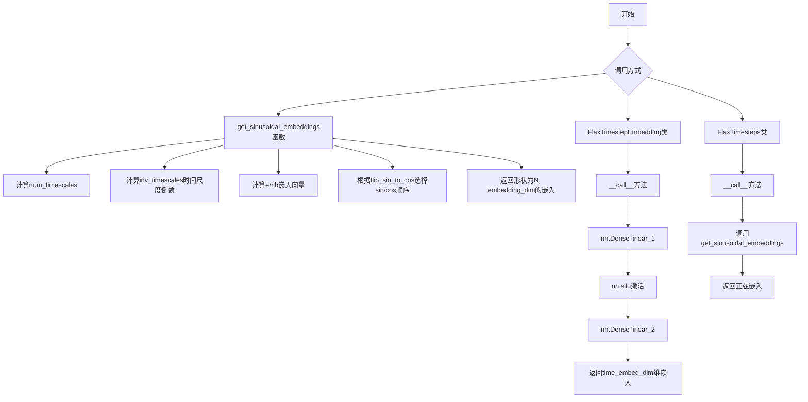
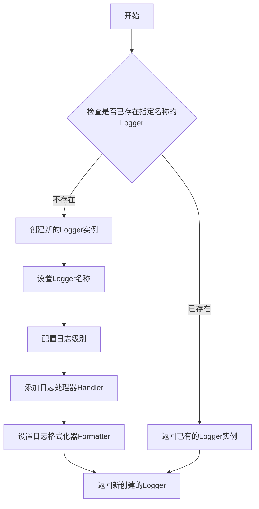
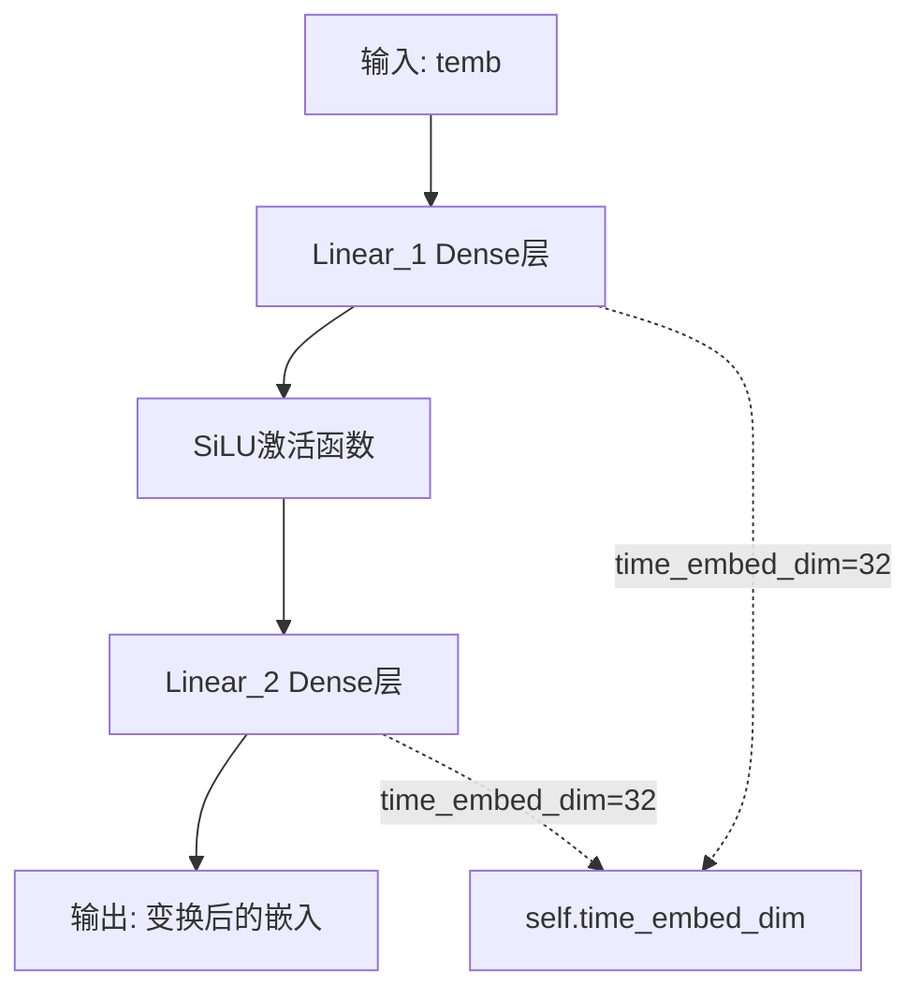

# `diffusers\src\diffusers\models\embeddings_flax.py` 详细设计文档

这是一个基于 Flax 框架的时间步嵌入（Timestep Embedding）模块，提供了正弦位置编码的生成逻辑以及可学习的嵌入层，用于将时间步转换为高维向量表示，主要应用于扩散模型的时间条件化处理。

## 整体流程



## 类结构

```
FlaxTimestepEmbedding (时间步嵌入层)
FlaxTimesteps (正弦时间步嵌入封装)
get_sinusoidal_embeddings (全局函数)
```

## 全局变量及字段


### `logger`
    
模块级日志记录器，用于输出弃用警告

类型：`logging.Logger`
    


### `math`
    
Python数学库，用于数学运算如对数计算

类型：`module`
    


### `flax.linen as nn`
    
Flax神经网络模块，提供神经网络层和模型定义

类型：`module`
    


### `jnp`
    
JAX NumPy，JAX库的NumPy兼容数组操作接口

类型：`module`
    


### `logging`
    
HuggingFace日志工具，提供日志记录功能

类型：`module`
    


### `FlaxTimestepEmbedding.time_embed_dim`
    
时间步嵌入维度

类型：`int`
    


### `FlaxTimestepEmbedding.dtype`
    
嵌入参数的数据类型

类型：`jnp.dtype`
    


### `FlaxTimesteps.dim`
    
时间步嵌入维度

类型：`int`
    


### `FlaxTimesteps.flip_sin_to_cos`
    
是否将正弦转换为余弦

类型：`bool`
    


### `FlaxTimesteps.freq_shift`
    
频率偏移量

类型：`float`
    


### `FlaxTimesteps.logger`
    
警告日志记录器

类型：`logging.Logger`
    
    

## 全局函数及方法


### `get_sinusoidal_embeddings`

该函数用于生成正弦位置编码（Sinusoidal Positional Embeddings），通过不同频率的正弦和余弦函数组合，为输入时间步生成唯一的位置表示，广泛应用于Transformer等序列模型中。

参数：

- `timesteps`：`jnp.ndarray`，形状为`(N,)`的一维数组，表示批次中每个元素的索引（可以是分数值）
- `embedding_dim`：`int`，输出通道数，决定生成嵌入向量的维度
- `freq_shift`：`float`，可选，默认值为`1`，频率缩放的偏移量
- `min_timescale`：`float`，可选，默认值为`1`，正弦计算中的最小时间单位
- `max_timescale`：`float`，可选，默认值为`1.0e4`，正弦计算中的最大时间单位
- `flip_sin_to_cos`：`bool`，可选，默认值为`False`，是否将正弦分量顺序翻转为余弦优先
- `scale`：`float`，可选，默认值为`1.0`，应用于位置嵌入的缩放因子

返回值：`jnp.ndarray`，形状为`[N, num_channels]`的时间信号张量，其中N为时间步数量，num_channels等于embedding_dim

#### 流程图

```mermaid
flowchart TD
    A[开始: 接收timesteps和embedding_dim] --> B{验证输入}
    B -->|timesteps不是1维| C[抛出断言错误]
    B -->|embedding_dim不是偶数| D[抛出断言错误]
    B --> E[计算num_timescales = embedding_dim // 2]
    E --> F[计算log_timescale_increment<br/>= log(max_timescale / min_timescale)<br/>/ (num_timescales - freq_shift)]
    F --> G[计算inv_timescales<br/>= min_timescale * exp(arange(num_timescales) * -log_timescale_increment)]
    G --> H[计算emb<br/>= expand_dims(timesteps, 1) * expand_dims(inv_timescales, 0)]
    H --> I[计算scaled_time = scale * emb]
    I --> J{flip_sin_to_cos?}
    J -->|True| K[signal = concat([cos(scaled_time), sin(scaled_time)])]
    J -->|False| L[signal = concat([sin(scaled_time), cos(scaled_time)])]
    K --> M[reshape signal to [timesteps.shape[0], embedding_dim]]
    L --> M
    M --> N[返回signal]
```

#### 带注释源码

```python
def get_sinusoidal_embeddings(
    timesteps: jnp.ndarray,
    embedding_dim: int,
    freq_shift: float = 1,
    min_timescale: float = 1,
    max_timescale: float = 1.0e4,
    flip_sin_to_cos: bool = False,
    scale: float = 1.0,
) -> jnp.ndarray:
    """Returns the positional encoding (same as Tensor2Tensor).

    Args:
        timesteps (`jnp.ndarray` of shape `(N,)`):
            A 1-D array of N indices, one per batch element. These may be fractional.
        embedding_dim (`int`):
            The number of output channels.
        freq_shift (`float`, *optional*, defaults to `1`):
            Shift applied to the frequency scaling of the embeddings.
        min_timescale (`float`, *optional*, defaults to `1`):
            The smallest time unit used in the sinusoidal calculation (should probably be 0.0).
        max_timescale (`float`, *optional*, defaults to `1.0e4`):
            The largest time unit used in the sinusoidal calculation.
        flip_sin_to_cos (`bool`, *optional*, defaults to `False`):
            Whether to flip the order of sinusoidal components to cosine first.
        scale (`float`, *optional*, defaults to `1.0`):
            A scaling factor applied to the positional embeddings.

    Returns:
        a Tensor of timing signals [N, num_channels]
    """
    # 验证timesteps是一维数组
    assert timesteps.ndim == 1, "Timesteps should be a 1d-array"
    # 验证embedding_dim是偶数（确保可以平分为sin和cos两部分）
    assert embedding_dim % 2 == 0, f"Embedding dimension {embedding_dim} should be even"
    
    # 计算时间尺度数量（等于embedding_dim的一半）
    num_timescale = float(embedding_dim // 2)
    # 计算时间尺度对数增量：控制不同频率的分布范围
    log_timescale_increment = math.log(max_timescale / min_timescale) / (num_timescale - freq_shift)
    # 计算逆时间尺度：使用指数函数生成不同频率的基底
    # 从小到大排列的频率序列，用于捕获不同周期的位置信息
    inv_timescales = min_timescale * jnp.exp(jnp.arange(num_timescale, dtype=jnp.float32) * -log_timescale_increment)
    
    # 将timesteps与inv_timescales相乘，得到每个时间步在各频率下的原始嵌入值
    # expand_dims用于广播：timesteps (N,) * inv_timescales (num_timescale,)
    # 结果形状为 (N, num_timescale)
    emb = jnp.expand_dims(timesteps, 1) * jnp.expand_dims(inv_timescales, 0)

    # 对嵌入值进行缩放
    scaled_time = scale * emb

    # 根据flip_sin_to_cos决定sin和cos的顺序
    # flip_sin_to_cos=False: [sin, cos] - 标准Transformer位置编码
    # flip_sin_to_cos=True: [cos, sin] - 某些变体使用
    if flip_sin_to_cos:
        signal = jnp.concatenate([jnp.cos(scaled_time), jnp.sin(scaled_time)], axis=1)
    else:
        signal = jnp.concatenate([jnp.sin(scaled_time), jnp.cos(scaled_time)], axis=1)
    
    # 重塑信号为(N, embedding_dim)的最终形状
    signal = jnp.reshape(signal, [jnp.shape(timesteps)[0], embedding_dim])
    return signal
```


### `logging.get_logger`

获取日志记录器的工厂函数，用于为当前模块创建或获取一个配置好的日志记录器实例。

参数：

- `name`：`str`，日志记录器的名称，通常传入 `__name__` 以表示当前模块

返回值：`logging.Logger`，返回一个日志记录器实例，可用于记录日志信息

#### 流程图



#### 带注释源码

```python
# 获取日志记录器的工厂函数
# 这是从 ..utils.logging 模块导入的 logging 对象的方法
# 用于为当前模块创建或获取一个日志记录器

# 导入 logging 模块（项目内部的工具模块）
from ..utils import logging

# 使用工厂函数获取当前模块的日志记录器
# __name__ 是 Python 的内置变量，表示当前模块的完全限定名
logger = logging.get_logger(__name__)

# 之后可以使用 logger 进行日志记录：
# logger.info("信息日志")
# logger.warning("警告日志")
# logger.error("错误日志")
# logger.debug("调试日志")
```

> **注意**：该函数定义在 `..utils.logging` 模块中（代码中未显示具体实现），它遵循标准的日志记录器工厂模式，允许模块级别的日志配置和管理。在 Diffusers 项目中，这种模式用于统一管理库的日志输出行为。


### `FlaxTimestepEmbedding.__call__`

该方法实现了时间步嵌入的前向传播，通过两层全连接网络（带 SiLU 激活函数）将输入的时间步原始嵌入转换为更高维度的表示向量。

参数：

- `temb`：`jnp.ndarray`，输入的时间步原始嵌入向量，通常来自 `FlaxTimesteps` 的输出

返回值：`jnp.ndarray`，变换后的时间步嵌入向量，形状为 `(batch_size, time_embed_dim)`

#### 流程图



#### 带注释源码

```python
@nn.compact
def __call__(self, temb):
    """
    执行时间步嵌入的前向传播。
    
    Args:
        temb: 输入的时间步嵌入向量，来自FlaxTimesteps或类似的原始嵌入
        
    Returns:
        变换后的时间步嵌入向量，维度为 (batch_size, time_embed_dim)
    """
    # 第一层全连接：将输入映射到 time_embed_dim 维度
    # 使用 self.time_embed_dim (默认32) 作为输出维度
    # 使用类定义的 dtype (默认 float32)
    temb = nn.Dense(self.time_embed_dim, dtype=self.dtype, name="linear_1")(temb)
    
    # SiLU (Sigmoid Linear Unit) 激活函数：silu(x) = x * sigmoid(x)
    # 比 ReLU 更平滑，有助于更好地学习时间步的连续表示
    temb = nn.silu(temb)
    
    # 第二层全连接：进一步变换嵌入表示
    # 同样输出 time_embed_dim 维度，保持维度一致性
    temb = nn.Dense(self.time_embed_dim, dtype=self.dtype, name="linear_2")(temb)
    
    # 返回最终的时间步嵌入向量
    return temb
```


### `FlaxTimesteps.__call__`

这是 FlaxTimesteps 类的调用方法，作为包装模块返回正弦时间步嵌入（Sinusoidal Time step Embeddings），内部调用 `get_sinusoidal_embeddings` 函数生成时间步的正弦/余弦位置编码。

参数：

- `timesteps`：`jnp.ndarray`，输入的时间步数组，通常为一维数组，包含需要编码的时间步值

返回值：`jnp.ndarray`，返回形状为 `[N, dim]` 的正弦位置编码嵌入矩阵，其中 N 为 batch 大小，dim 为嵌入维度

#### 流程图

```mermaid
flowchart TD
    A[开始: __call__] --> B[接收 timesteps 参数]
    B --> C[调用 get_sinusoidal_embeddings 函数]
    C --> D[传入参数: timesteps, embedding_dim=self.dim]
    D --> E[传入参数: flip_sin_to_cos=self.flip_sin_to_cos]
    E --> F[传入参数: freq_shift=self.freq_shift]
    F --> G{执行正弦嵌入计算}
    G --> H[验证输入维度为1维]
    G --> I[验证嵌入维度为偶数]
    H --> J[计算时间尺度倒数 inv_timescales]
    I --> J
    J --> K[计算 emb = timesteps × inv_timescales]
    K --> L{flip_sin_to_cos 为真?}
    L -->|Yes| M[按 cos, sin 顺序拼接]
    L -->|No| N[按 sin, cos 顺序拼接]
    M --> O[reshape 到 [N, embedding_dim]]
    N --> O
    O --> P[返回正弦位置编码]
    P --> Q[结束: 返回嵌入结果]
```

#### 带注释源码

```python
@nn.compact
def __call__(self, timesteps):
    """
    计算正弦位置编码嵌入
    
    参数:
        timesteps: 输入的时间步数组，形状为 (N,)
    
    返回:
        正弦位置编码，形状为 (N, dim)
    """
    # 调用 get_sinusoidal_embeddings 函数生成嵌入
    # self.dim: 嵌入维度，默认值为 32
    # self.flip_sin_to_cos: 是否将正弦换为余弦，默认值为 False
    # self.freq_shift: 频率偏移量，默认值为 1
    return get_sinusoidal_embeddings(
        timesteps,                      # 输入的时间步
        embedding_dim=self.dim,         # 嵌入维度
        flip_sin_to_cos=self.flip_sin_to_cos,  # 是否翻转正弦到余弦
        freq_shift=self.freq_shift      # 频率偏移
    )
```

## 关键组件


### get_sinusoidal_embeddings 函数

计算正弦和余弦位置编码，用于将时间步转换为高维嵌入向量，支持可配置的频率范围和缩放因子。

### FlaxTimestepEmbedding 类

Flax模块，将输入的时间嵌入向量通过两个全连接层变换为更高维度的表示，使用SiLU激活函数。

### FlaxTimesteps 类

Flax模块封装器，内部调用get_sinusoidal_embeddings函数生成正弦时间步嵌入，支持翻转正弦到余弦顺序和频率偏移配置。

### 正弦位置编码算法

基于对数尺度生成多个频率的时间信号，通过矩阵乘法将时间步与各频率进行组合，生成位置编码。

### Flax模块废弃警告

类中包含警告信息，提示Flax类将在Diffusers v1.0.0中移除，建议迁移到PyTorch类或固定Diffusers版本。


## 问题及建议


### 已知问题

- **Flax 框架弃用**：代码中包含明确的弃用警告（`logger.warning("Flax classes are deprecated and will be removed in Diffusers v1.0.0...")`），表明这些类将在未来版本中移除，属于已知技术债务。
- **使用 assert 进行参数验证**：`get_sinusoidal_embeddings` 函数中使用 `assert` 语句验证 `timesteps.ndim` 和 `embedding_dim`，在生产环境中 assert 会被 Python 优化移除，导致无效参数无法被正确处理。
- **重复的弃用警告**：两个类（`FlaxTimestepEmbedding` 和 `FlaxTimesteps`）包含完全相同的弃用警告字符串，造成代码冗余。
- **未使用的导入**：`import math` 被导入但未在代码中使用（`math.log` 被直接调用但 math 模块未使用）。
- **硬编码默认值**：`get_sinusoidal_embeddings` 中的 `max_timescale=1.0e4`、`min_timescale=1` 等参数以硬编码方式存在，缺乏灵活性。
- **变量类型指定不规范**：`dtype: jnp.dtype = jnp.float32` 使用了 `jnp.float32`（值为 `float32`），而非标准的 `jnp.dtype` 类型提示。

### 优化建议

- **移除或替换 assert**：使用明确的参数验证逻辑（如 `if not condition: raise ValueError(...)`）替代 assert，确保在生产环境中参数验证始终生效。
- **提取弃用警告**：将弃用警告提取为模块级常量或使用装饰器，避免在多个类中重复定义相同字符串。
- **清理未使用导入**：删除未使用的 `math` 导入或确认其使用必要性。
- **参数配置化**：将 `max_timescale`、`min_timescale`、`freq_shift` 等参数通过配置文件或构造函数参数传入，提高函数的可配置性。
- **统一类型提示**：修正 `dtype` 字段的类型提示为更标准的 `jnp.dtype` 类型（如 `jnp.dtype = jnp.float32` 的语义可保留，但类型注解可更精确）。

## 其它


### 设计目标与约束

本代码模块的设计目标是为扩散模型（Diffusion Models）提供时间步（timestep）嵌入功能，将连续的时间步转换为高维向量表示，以便后续神经网络模型能够理解和处理时间信息。设计约束包括：1）必须支持正弦和余弦两种编码方式；2）嵌入维度必须为偶数；3）时间步输入必须为一维数组；4）必须兼容Flax Linen架构；5）需要保持与HuggingFace Diffusers生态系统的兼容性。

### 错误处理与异常设计

代码中的错误处理主要通过断言（assert）实现。具体包括：1）`timesteps.ndim == 1`确保输入时间步为一维数组；2）`embedding_dim % 2 == 0`确保嵌入维度为偶数。潜在的改进空间包括：将断言替换为更友好的参数验证，抛出自定义异常（如`ValueError`）并提供清晰的错误信息；添加对NaN和Inf值的检查；为无效的时间步范围提供边界验证。

### 数据流与状态机

数据流如下：1）外部调用者传入时间步数组（1D tensor）；2）对于`FlaxTimestepEmbedding`类，时间步首先经过两层全连接层（`linear_1`和`linear_2`），中间层使用SiLU激活函数；3）对于`FlaxTimesteps`类，时间步直接传递给`get_sinusoidal_embeddings`函数进行正弦波编码。正弦波编码的内部流程：计算时间刻度（inv_timescales）→ 外积运算生成嵌入矩阵 → 缩放处理 → 根据flip_sin_to_cos标志选择正弦/余弦顺序 →  reshape为最终输出形状[batch_size, embedding_dim]。

### 外部依赖与接口契约

主要外部依赖包括：1）`flax.linen as nn` - Flax神经网络基础架构；2）`jax.numpy as jnp` - JAX数组操作；3）`math` - 数学运算；4）`..utils.logging` - 日志工具。接口契约：1）`get_sinusoidal_embeddings`函数接受1D jnp.ndarray类型的时间步、整数类型的embedding_dim和多个可选参数，返回形状为[N, embedding_dim]的jnp.ndarray；2）`FlaxTimestepEmbedding.__call__`接受temb输入，返回形状为[batch, time_embed_dim]的张量；3）`FlaxTimesteps.__call__`接受timesteps输入，返回形状为[batch, dim]的张量。

### 性能考虑与优化空间

性能特征：1）正弦嵌入计算主要涉及指数运算和对数运算，时间复杂度为O(N * embedding_dim)；2）FlaxTimestepEmbedding的计算图会被JIT编译优化。优化空间：1）可预先计算固定时间刻度的inv_timescales（当min_timescale、max_timescale、freq_shift固定时）；2）可考虑使用`jnp.sin`和`jnp.cos`的融合版本；3）对于批量处理，可以预先分配内存避免频繁reshape。

### 安全性考虑

当前代码无明显的安全漏洞，因为：1）仅进行数值计算，无用户输入处理；2）无文件操作或网络请求。潜在风险：1）当embedding_dim过大时可能导致内存问题；2）当timesteps包含极端值时可能导致数值溢出。

### 可维护性分析

可维护性优势：1）代码结构清晰，函数和类职责明确；2）文档字符串完整；3）使用类型注解。可维护性问题：1）日志警告信息硬编码在类定义中，不便于国际化；2）magic number（如1.0e4）应提取为常量；3）缺乏单元测试覆盖；4）flip_sin_to_cos参数命名不够直观。

### 测试策略建议

建议的测试用例：1）验证输出形状正确性；2）验证embedding_dim为奇数时抛出异常；3）验证timesteps维度不为1时抛出异常；4）验证flip_sin_to_cos=True和False的输出差异；5）验证数值精度（与PyTorch实现对比）；6）验证梯度反向传播正确性；7）边界测试：空数组、单元素数组、大批量数据。

### 配置管理与版本兼容性

配置参数：1）time_embed_dim默认值32；2）dim默认值32；3）flip_sin_to_cos默认False；4）freq_shift默认1；5）min_timescale默认1；6）max_timescale默认1.0e4。版本兼容性说明：代码标注为"Flax classes are deprecated"，建议迁移至PyTorch实现或锁定Diffusers版本。

### 资源管理

内存使用：主要内存消耗来自输出张量，形状为[batch_size, embedding_dim]。JAX/Flax使用函数式编程模型，无需显式资源释放。计算资源：主要GPU/CPU计算集中在矩阵乘法和三角函数运算。

### 使用示例与调用约定

典型使用场景：
```python
# 创建时间步
timesteps = jnp.array([0, 100, 500, 1000])

# 使用FlaxTimesteps获取嵌入
timesteps_module = FlaxTimesteps(dim=256, flip_sin_to_cos=True)
embeddings = timesteps_module(timesteps)  # shape: (4, 256)

# 使用FlaxTimestepEmbedding进一步处理
time_embed = FlaxTimestepEmbedding(time_embed_dim=512)
processed = time_embed(embeddings)  # shape: (4, 512)
```

### 架构师审阅意见

整体评估：代码实现正确，遵循了扩散模型中时间步嵌入的标准做法（参考Transformer位置编码）。主要改进建议：1）添加类型注解到所有函数参数和返回值；2）将常量提取为模块级变量；3）考虑添加工厂函数以简化实例化；4）添加JAX/PyTorch实现对齐的测试；5）标记为deprecated的类应添加deprecation warning到函数级别而非类定义级别。

    