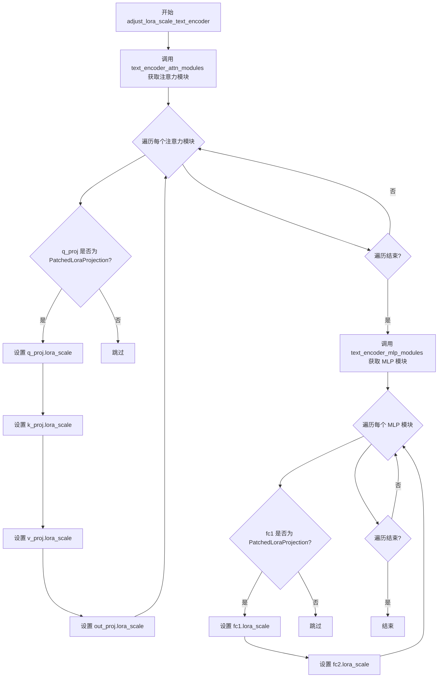
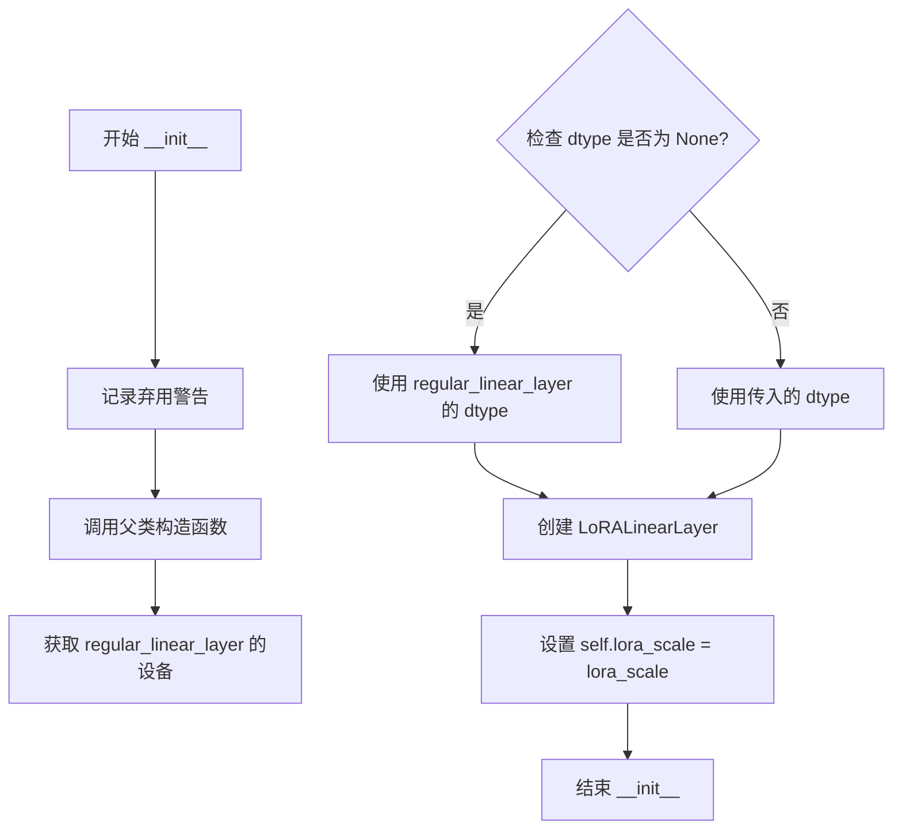
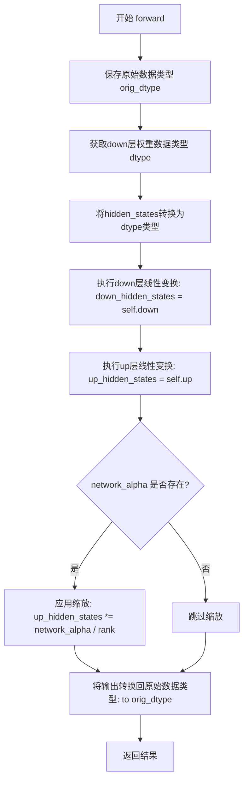
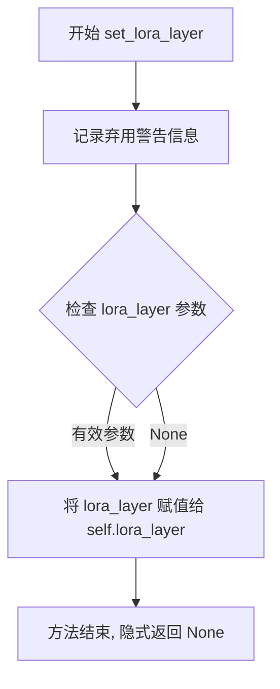
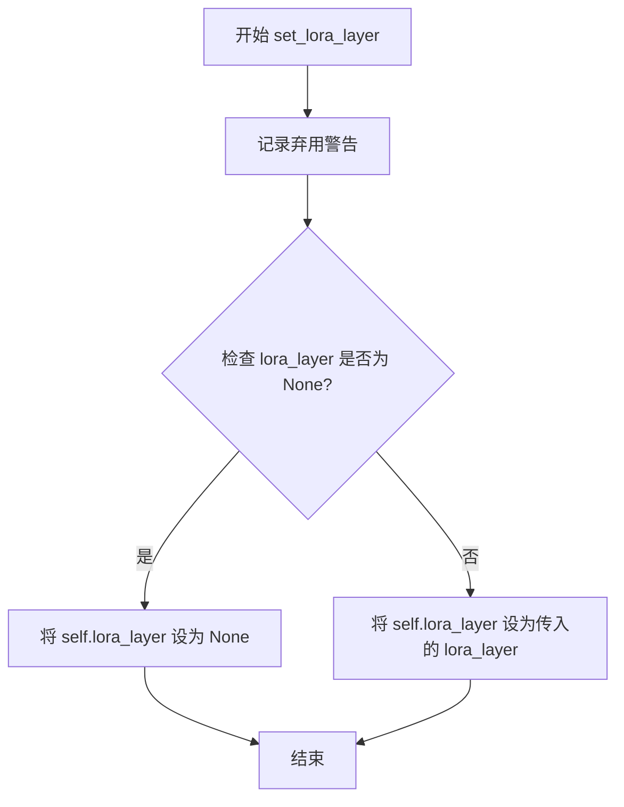

# `diffusers\src\diffusers\models\lora.py` 详细设计文档

This file provides deprecated implementations of Low-Rank Adaptation (LoRA) for text encoders in the HuggingFace Diffusers library. It defines specialized layer wrappers (LoRACompatibleLinear, LoRACompatibleConv) and LoRA modules (LoRALinearLayer, LoRAConv2dLayer) that allow injecting trainable rank-decomposition matrices into standard neural network layers, along with utility functions to adjust LoRA scales and fuse/unfuse weights for inference.

## 整体流程

```mermaid
graph TD
    A[Input Hidden States] --> B{Is LoRA Active?}
    B -- No --> C[Forward Pass: Original Layer]
    C --> D[Return Output]
    B -- Yes --> E[Forward Pass: Original Layer]
    E --> F[Forward Pass: LoRA Layer (Down + Up)]
    F --> G{Is Fused?}
    G -- Yes (Weights merged) --> D
    G -- No (Weights separate) --> H[Scale LoRA Output by alpha/rank]
    H --> I[Add Scaled LoRA to Original Output]
    I --> D
```

## 类结构

```
PatchedLoraProjection (nn.Module)
├── Fields: regular_linear_layer, lora_linear_layer, lora_scale, w_up, w_down
└── Methods: __init__, state_dict, _fuse_lora, _unfuse_lora, forward
LoRALinearLayer (nn.Module)
├── Fields: down, up, network_alpha, rank, out_features, in_features
└── Methods: __init__, forward
LoRAConv2dLayer (nn.Module)
├── Fields: down, up, network_alpha, rank
└── Methods: __init__, forward
LoRACompatibleConv (nn.Conv2d)
├── Fields: lora_layer, w_up, w_down, _lora_scale
└── Methods: __init__, set_lora_layer, _fuse_lora, _unfuse_lora, forward
LoRACompatibleLinear (nn.Linear)
├── Fields: lora_layer, w_up, w_down, _lora_scale
└── Methods: __init__, set_lora_layer, _fuse_lora, _unfuse_lora, forward
```

## 全局变量及字段


### `logger`
    
Logger instance for tracking runtime information and debugging

类型：`logging.Logger`
    


### `PatchedLoraProjection.regular_linear_layer`
    
The original linear layer to be adapted

类型：`nn.Linear`
    


### `PatchedLoraProjection.lora_linear_layer`
    
The LoRA adaptation layer

类型：`LoRALinearLayer`
    


### `PatchedLoraProjection.lora_scale`
    
The scaling factor for the LoRA contribution

类型：`float`
    


### `PatchedLoraProjection.w_up`
    
Cached up projection matrix after fusion

类型：`Tensor`
    


### `PatchedLoraProjection.w_down`
    
Cached down projection matrix after fusion

类型：`Tensor`
    


### `LoRALinearLayer.down`
    
The low-rank down projection layer

类型：`nn.Linear`
    


### `LoRALinearLayer.up`
    
The low-rank up projection layer

类型：`nn.Linear`
    


### `LoRALinearLayer.network_alpha`
    
A constant for stabilizing training

类型：`float | None`
    


### `LoRALinearLayer.rank`
    
The rank of the LoRA adaptation

类型：`int`
    


### `LoRALinearLayer.out_features`
    
Output feature dimension

类型：`int`
    


### `LoRALinearLayer.in_features`
    
Input feature dimension

类型：`int`
    


### `LoRAConv2dLayer.down`
    
The low-rank down projection conv layer

类型：`nn.Conv2d`
    


### `LoRAConv2dLayer.up`
    
The low-rank up projection conv layer

类型：`nn.Conv2d`
    


### `LoRAConv2dLayer.network_alpha`
    
A constant for stabilizing training

类型：`float | None`
    


### `LoRAConv2dLayer.rank`
    
The rank of the LoRA adaptation

类型：`int`
    


### `LoRACompatibleConv.lora_layer`
    
Optional LoRA layer attached to this convolution

类型：`LoRAConv2dLayer | None`
    


### `LoRACompatibleConv.w_up`
    
Cached up weights after fusion

类型：`Tensor`
    


### `LoRACompatibleConv.w_down`
    
Cached down weights after fusion

类型：`Tensor`
    


### `LoRACompatibleConv._lora_scale`
    
Current scaling factor

类型：`float`
    


### `LoRACompatibleLinear.lora_layer`
    
Optional LoRA layer attached to this linear layer

类型：`LoRALinearLayer | None`
    


### `LoRACompatibleLinear.w_up`
    
Cached up weights after fusion

类型：`Tensor`
    


### `LoRACompatibleLinear.w_down`
    
Cached down weights after fusion

类型：`Tensor`
    


### `LoRACompatibleLinear._lora_scale`
    
Current scaling factor

类型：`float`
    
    

## 全局函数及方法


### `text_encoder_attn_modules`

该函数用于从文本编码器（CLIPTextModel 或 CLIPTextModelWithProjection）中提取所有注意力模块（self_attn），返回一个包含模块名称和模块对象元组的列表，便于后续对 LoRA 权重的修改和适配。

参数：

- `text_encoder`：`nn.Module`，输入的文本编码器模型，需为 CLIPTextModel 或 CLIPTextModelWithProjection 类型

返回值：`List[Tuple[str, Any]]`，返回由元组组成的列表，每个元组包含模块的完整名称（如 `text_model.encoder.layers.{i}.self_attn`）和对应的注意力模块对象

#### 流程图

```mermaid
flowchart TD
    A[开始: text_encoder_attn_modules] --> B{text_encoder 是 CLIPTextModel 或 CLIPTextModelWithProjection?}
    B -->|是| C[初始化空列表 attn_modules]
    C --> D[遍历 text_encoder.text_model.encoder.layers]
    D --> E[获取当前层的 self_attn 模块]
    E --> F[构建模块名称: f"text_model.encoder.layers.{i}.self_attn"]
    F --> G[(name, mod) 元组加入 attn_modules]
    G --> D
    D -->|遍历完成| H[返回 attn_modules]
    B -->|否| I[抛出 ValueError: 不支持的文本编码器类型]
    H --> J[结束]
    I --> J
```

#### 带注释源码

```python
def text_encoder_attn_modules(text_encoder: nn.Module):
    """
    从文本编码器中提取所有注意力模块。
    
    该函数专门用于 CLIP 系列的文本编码器，遍历其编码层结构，
    提取每层的自注意力模块，以便进行 LoRA 适配等操作。
    
    参数:
        text_encoder: nn.Module
            输入的文本编码器模型，需为 CLIPTextModel 或 CLIPTextModelWithProjection 类型
            
    返回:
        List[Tuple[str, Any]]:
            包含 (模块名称, 模块对象) 元组的列表
            名称格式: "text_model.encoder.layers.{i}.self_attn"
    """
    # 初始化用于存储注意力模块的列表
    attn_modules = []

    # 检查文本编码器是否为支持的 CLIP 模型类型
    if isinstance(text_encoder, (CLIPTextModel, CLIPTextModelWithProjection)):
        # 遍历文本模型编码器的所有层
        for i, layer in enumerate(text_encoder.text_model.encoder.layers):
            # 构建模块的完整名称，包含层索引信息
            name = f"text_model.encoder.layers.{i}.self_attn"
            # 获取当前层的自注意力模块
            mod = layer.self_attn
            # 将名称和模块组成的元组添加到列表中
            attn_modules.append((name, mod))
    else:
        # 如果不是支持的模型类型，抛出明确的错误信息
        raise ValueError(f"do not know how to get attention modules for: {text_encoder.__class__.__name__}")

    # 返回完整的注意力模块列表
    return attn_modules
```


### `text_encoder_mlp_modules`

该函数用于从 CLIP 文本编码器模型中提取所有的 MLP（多层感知机）模块，返回包含模块名称和对应模块对象的元组列表，以便后续对 MLP 层进行 LoRA 适配或其他操作。

参数：

- `text_encoder`：`nn.Module`，输入的文本编码器模型，通常是 `CLIPTextModel` 或 `CLIPTextModelWithProjection` 类型的实例

返回值：`List[Tuple[str, nn.Module]]`，返回由元组组成的列表，每个元组包含 MLP 模块的字符串名称（如 `"text_model.encoder.layers.{i}.mlp"`）和对应的 `nn.Module` 对象

#### 流程图

```mermaid
flowchart TD
    A[开始: text_encoder_mlp_modules] --> B{text_encoder 是否为 CLIPTextModel 或 CLIPTextModelWithProjection}
    B -->|是| C[初始化空列表 mlp_modules]
    C --> D[遍历 text_model.encoder.layers]
    D --> E[获取当前层的 mlp 模块]
    E --> F[构建模块名称: text_model.encoder.layers.{i}.mlp]
    F --> G[将 name 和 mlp_mod 添加到 mlp_modules]
    G --> H{是否还有更多层?}
    H -->|是| D
    H -->|否| I[返回 mlp_modules]
    B -->|否| J[抛出 ValueError 异常]
    J --> K[结束]
    I --> K
```

#### 带注释源码

```python
def text_encoder_mlp_modules(text_encoder: nn.Module):
    """
    从文本编码器中提取所有 MLP 模块。
    
    该函数遍历 CLIP 文本编码器的所有编码层，提取每个层的 MLP（多层感知机）子模块，
    并返回包含模块名称和模块对象的元组列表。这主要用于 LoRA 适配等场景，需要
    对文本编码器的 MLP 层进行修改或替换。
    
    参数:
        text_encoder (nn.Module): 
            输入的文本编码器模型。需要是 CLIPTextModel 或 CLIPTextModelWithProjection 类型。
    
    返回:
        List[Tuple[str, nn.Module]]: 
            包含 (模块名称, MLP模块对象) 元组的列表。名称格式为 'text_model.encoder.layers.{i}.mlp'。
    
    异常:
        ValueError: 当 text_encoder 不是支持的类型时抛出。
    """
    # 初始化用于存储 MLP 模块的列表
    mlp_modules = []

    # 检查 text_encoder 是否为 CLIP 文本模型类型
    if isinstance(text_encoder, (CLIPTextModel, CLIPTextModelWithProjection)):
        # 遍历文本模型编码器的所有层
        for i, layer in enumerate(text_encoder.text_model.encoder.layers):
            # 获取当前层的 MLP 模块
            mlp_mod = layer.mlp
            # 构建模块的完整名称，用于标识和查找
            name = f"text_model.encoder.layers.{i}.mlp"
            # 将名称和模块对象作为元组添加到列表中
            mlp_modules.append((name, mlp_mod))
    else:
        # 如果遇到不支持的文本编码器类型，抛出错误
        raise ValueError(f"do not know how to get mlp modules for: {text_encoder.__class__.__name__}")

    # 返回所有提取的 MLP 模块列表
    return mlp_modules
```


### `adjust_lora_scale_text_encoder`

该函数用于调整文本编码器（Text Encoder）中所有 LoRA（Low-Rank Adaptation）层的缩放因子（lora_scale）。它通过遍历文本编码器的注意力模块和 MLP 模块，将指定的 `lora_scale` 值应用到所有支持 LoRA 的投影层（q_proj、k_proj、v_proj、out_proj、fc1、fc2），从而实现对 LoRA 适配器影响力的动态控制。

参数：

- `text_encoder`：`nn.Module`，目标文本编码器模型，通常是 CLIPTextModel 或 CLIPTextModelWithProjection 类型
- `lora_scale`：`float`，LoRA 层的缩放因子，默认为 1.0，用于调节 LoRA 权重对原始模型输出的影响程度

返回值：`None`，该函数直接修改传入的 `text_encoder` 对象的属性，无返回值

#### 流程图



#### 带注释源码

```python
def adjust_lora_scale_text_encoder(text_encoder, lora_scale: float = 1.0):
    """
    调整文本编码器中所有 LoRA 层的缩放因子
    
    参数:
        text_encoder: 目标文本编码器模型 (CLIPTextModel 或 CLIPTextModelWithProjection)
        lora_scale: LoRA 缩放因子，默认为 1.0
    
    返回:
        None (直接修改模型属性)
    """
    
    # 获取文本编码器中所有的注意力模块
    # text_encoder_attn_modules 返回 [(name, attn_module), ...] 形式的列表
    for _, attn_module in text_encoder_attn_modules(text_encoder):
        # 检查注意力模块的 q_proj 是否为 PatchedLoraProjection 类型
        # PatchedLoraProjection 是支持 LoRA 的自定义线性层封装
        if isinstance(attn_module.q_proj, PatchedLoraProjection):
            # 为 Query 投影层设置 LoRA 缩放因子
            attn_module.q_proj.lora_scale = lora_scale
            # 为 Key 投影层设置 LoRA 缩放因子
            attn_module.k_proj.lora_scale = lora_scale
            # 为 Value 投影层设置 LoRA 缩放因子
            attn_module.v_proj.lora_scale = lora_scale
            # 为输出投影层设置 LoRA 缩放因子
            attn_module.out_proj.lora_scale = lora_scale

    # 获取文本编码器中所有的 MLP 模块
    # text_encoder_mlp_modules 返回 [(name, mlp_module), ...] 形式的列表
    for _, mlp_module in text_encoder_mlp_modules(text_encoder):
        # 检查 MLP 模块的第一个全连接层是否为 PatchedLoraProjection 类型
        if isinstance(mlp_module.fc1, PatchedLoraProjection):
            # 为 MLP 的第一个全连接层设置 LoRA 缩放因子
            mlp_module.fc1.lora_scale = lora_scale
            # 为 MLP 的第二个全连接层设置 LoRA 缩放因子
            mlp_module.fc2.lora_scale = lora_scale
```


### `PatchedLoraProjection.__init__`

该方法是 `PatchedLoraProjection` 类的构造函数，用于初始化一个带有 LoRA（Low-Rank Adaptation）投影的线性层。它接收一个常规线性层作为基础，并配置 LoRA 缩放因子、网络 alpha、秩和数据类型，同时创建相应的 `LoRALinearLayer` 实例。

参数：

- `regular_linear_layer`：`nn.Module`，需要被LoRA适配的常规线性层（通常是 `nn.Linear`）
- `lora_scale`：`int` 或 `float`，默认为 1，LoRA 缩放因子，用于控制 LoRA 影响的强度
- `network_alpha`：`float | None`，默认为 `None`，用于稳定学习和防止下溢的网络 alpha 值
- `rank`：`int`，默认为 4，LoRA 层的秩（rank），决定了低秩矩阵的维度
- `dtype`：`torch.dtype | None`，默认为 `None`，权重的数据类型，如果为 `None` 则使用 `regular_linear_layer` 的数据类型

返回值：`None`，该方法是一个构造函数，不返回任何值，仅初始化对象状态

#### 流程图



#### 带注释源码

```python
def __init__(self, regular_linear_layer, lora_scale=1, network_alpha=None, rank=4, dtype=None):
    """
    初始化 PatchedLoraProjection 对象
    
    参数:
        regular_linear_layer: 需要被LoRA适配的常规线性层
        lora_scale: LoRA缩放因子，控制LoRA影响强度
        network_alpha: 用于稳定学习的网络alpha值
        rank: LoRA层的秩
        dtype: 权重数据类型
    """
    # 记录弃用警告，提示用户使用PEFT后端
    deprecation_message = "Use of `PatchedLoraProjection` is deprecated. Please switch to PEFT backend by installing PEFT: `pip install peft`."
    deprecate("PatchedLoraProjection", "1.0.0", deprecation_message)

    # 调用父类torch.nn.Module的初始化方法
    super().__init__()
    
    # 动态导入LoRALinearLayer类（该类实现LoRA的低秩矩阵）
    from ..models.lora import LoRALinearLayer

    # 保存原始的常规线性层作为基础层
    self.regular_linear_layer = regular_linear_layer

    # 获取原始线性层权重所在的设备（CPU/CUDA）
    device = self.regular_linear_layer.weight.device

    # 如果未指定dtype，则使用原始线性层的dtype
    if dtype is None:
        dtype = self.regular_linear_layer.weight.dtype

    # 创建LoRA线性层，包含上投影和下投影矩阵
    self.lora_linear_layer = LoRALinearLayer(
        self.regular_linear_layer.in_features,   # 输入特征维度
        self.regular_linear_layer.out_features,  # 输出特征维度
        network_alpha=network_alpha,              # 网络alpha参数
        device=device,                            # 与原始层相同设备
        dtype=dtype,                              # 与原始层相同数据类型
        rank=rank,                                # LoRA秩
    )

    # 保存LoRA缩放因子，用于前向传播时调整影响程度
    self.lora_scale = lora_scale
```


### `PatchedLoraProjection.state_dict`

该方法重写了 PyTorch 的 `state_dict`，用于在保存整个文本编码器模型时确保只保存 `regular_linear_layer` 的权重，而当 LoRA 未加载或已融合时，确保保存的是正确的状态字典。

参数：

- `*args`：可变位置参数，用于传递额外的位置参数
- `destination`：`dict` 或 `None`，可选的目标字典，用于存储状态字典，默认为 `None`
- `prefix`：`str`，状态字典中键的前缀，默认为空字符串 `""`
- `keep_vars`：`bool`，是否保留张量的梯度，默认为 `False`

返回值：`dict`，返回模型的状态字典

#### 流程图

```mermaid
flowchart TD
    A[开始 state_dict] --> B{self.lora_linear_layer is None?}
    B -->|是| C[返回 regular_linear_layer.state_dict]
    B -->|否| D[调用父类 super().state_dict]
    C --> E[结束]
    D --> E
```

#### 带注释源码

```python
# overwrite PyTorch's `state_dict` to be sure that only the 'regular_linear_layer' weights are saved
# when saving the whole text encoder model and when saving the whole text encoder model and when LoRA is unloaded or fused
def state_dict(self, *args, destination=None, prefix="", keep_vars=False):
    # 如果 lora_linear_layer 为 None，说明 LoRA 已经融合到 regular_linear_layer 中
    # 此时只保存 regular_linear_layer 的权重
    if self.lora_linear_layer is None:
        return self.regular_linear_layer.state_dict(
            *args, destination=destination, prefix=prefix, keep_vars=keep_vars
        )

    # 否则调用父类的 state_dict 方法
    # 注意：此处存在潜在 bug，prefix=keep_vars 应为 prefix=prefix
    return super().state_dict(*args, destination=destination, prefix=keep_vars)
```


### `PatchedLoraProjection._fuse_lora`

该方法用于将 LoRA（Low-Rank Adaptation）权重融合到常规线性层中，通过计算原始权重与 LoRA 的 up/down 权重矩阵的乘积来实现权重的合并，融合后可以减少推理时的计算开销并释放 LoRA 层的内存。

参数：

- `lora_scale`：`float`，默认值 1.0，LoRA 权重的缩放因子，用于控制 LoRA 适配对原始模型输出的影响程度
- `safe_fusing`：`bool`，默认值 False，是否启用安全融合模式，若为 True 则在融合前检查融合后的权重是否包含 NaN 值，若存在 NaN 则抛出异常

返回值：`None`，无返回值，该方法直接修改对象内部的权重数据

#### 流程图

```mermaid
flowchart TD
    A[开始 _fuse_lora] --> B{lora_linear_layer is None?}
    B -->|是| C[直接返回]
    B -->|否| D[获取原始权重和设备信息]
    D --> E[将权重转换为 float 类型]
    E --> F[提取 w_orig, w_up, w_down]
    G{network_alpha is not None?} -->|是| H[w_up = w_up * network_alpha / rank]
    G -->|否| I[跳过缩放]
    H --> J[计算融合权重: fused_weight = w_orig + lora_scale * torch.bmm(w_up, w_down)]
    I --> J
    J --> K{safe_fusing and NaN exists?}
    K -->|是| L[抛出 ValueError 异常]
    K -->|否| M[将融合权重写入 regular_linear_layer.weight.data]
    M --> N[置空 lora_linear_layer = None]
    N --> O[将 w_up 和 w_down 移至 CPU]
    O --> P[保存 lora_scale]
    P --> Q[结束]
    L --> Q
```

#### 带注释源码

```python
def _fuse_lora(self, lora_scale=1.0, safe_fusing=False):
    """
    将 LoRA 权重融合到常规线性层中
    
    参数:
        lora_scale: float, LoRA 权重缩放因子，默认为 1.0
        safe_fusing: bool, 是否进行安全融合检查，默认为 False
    """
    # 如果 LoRA 层已被移除（为 None），则直接返回，无需融合
    if self.lora_linear_layer is None:
        return

    # 获取原始线性层权重的 dtype 和 device，用于后续数据类型转换
    dtype, device = self.regular_linear_layer.weight.data.dtype, self.regular_linear_layer.weight.data.device

    # 将原始权重转换为 float 类型以进行精确计算
    w_orig = self.regular_linear_layer.weight.data.float()
    # 获取 LoRA 层的 up 投影权重
    w_up = self.lora_linear_layer.up.weight.data.float()
    # 获取 LoRA 层的 down 投影权重
    w_down = self.lora_linear_layer.down.weight.data.float()

    # 如果存在 network_alpha，则对 up 权重进行缩放以稳定训练
    # 缩放公式：w_up = w_up * network_alpha / rank
    if self.lora_linear_layer.network_alpha is not None:
        w_up = w_up * self.lora_linear_layer.network_alpha / self.lora_linear_layer.rank

    # 计算融合权重：原始权重 + 缩放后的 LoRA 权重矩阵乘积
    # 使用 bmm 进行批量矩阵乘法 [1, out_features] = [1, rank] @ [rank, out_features]
    fused_weight = w_orig + (lora_scale * torch.bmm(w_up[None, :], w_down[None, :])[0])

    # 如果启用安全融合模式，检查融合后的权重是否包含 NaN
    if safe_fusing and torch.isnan(fused_weight).any().item():
        raise ValueError(
            "This LoRA weight seems to be broken. "
            f"Encountered NaN values when trying to fuse LoRA weights for {self}."
            "LoRA weights will not be fused."
        )

    # 将融合后的权重写回原始线性层，保持原有的 dtype 和 device
    self.regular_linear_layer.weight.data = fused_weight.to(device=device, dtype=dtype)

    # 释放 LoRA 线性层引用，允许垃圾回收
    self.lora_linear_layer = None

    # 将 up 和 down 权重矩阵移至 CPU 以节省 GPU 显存
    self.w_up = w_up.cpu()
    self.w_down = w_down.cpu()
    # 保存缩放因子，供后续 _unfuse_lora 使用
    self.lora_scale = lora_scale
```


### `PatchedLoraProjection._unfuse_lora`

该方法用于将已融合的LoRA权重分离（解融合）回原始的线性层权重。它通过从融合后的权重中减去LoRA的贡献矩阵来恢复原始权重，并在操作完成后清理临时存储的LoRA权重矩阵。

参数：
- 该方法无显式参数（仅包含隐式参数 `self`）

返回值：`None`，该方法直接修改对象内部状态，无返回值

#### 流程图

```mermaid
flowchart TD
    A[开始 _unfuse_lora] --> B{检查 w_up 和 w_down 是否存在}
    B -->|不存在| C[直接返回]
    B -->|存在| D[获取融合后的权重 regular_linear_layer.weight.data]
    E[提取 dtype 和 device] --> F[将 w_up 移到设备并转为 float]
    G[将 w_down 移到设备并转为 float] --> H[计算 LoRA 贡献矩阵: lora_scale × bmm(w_up, w_down)]
    H --> I[计算解融合权重: fused_weight - lora_contribution]
    I --> J[将解融合权重存回 regular_linear_layer.weight.data]
    J --> K[清理: w_up = None, w_down = None]
    K --> L[结束]
```

#### 带注释源码

```python
def _unfuse_lora(self):
    """
    将已融合的LoRA权重解融合，恢复原始线性层的权重。
    
    该方法是 _fuse_lora 的逆操作，通过从融合后的权重中减去
    LoRA的贡献矩阵来恢复原始权重。
    """
    
    # 检查是否已经融合了LoRA权重（即w_up和w_down是否存在）
    # 如果没有融合，直接返回，无需解融合
    if not (getattr(self, "w_up", None) is not None and getattr(self, "w_down", None) is not None):
        return

    # 获取当前融合后的权重（来自regular_linear_layer）
    fused_weight = self.regular_linear_layer.weight.data
    
    # 保存原始权重的dtype和device，用于后续转换
    dtype, device = fused_weight.dtype, fused_weight.device

    # 将存储的LoRA权重矩阵（之前卸载到CPU）移回原始设备
    # 并转换为float类型进行矩阵运算
    w_up = self.w_up.to(device=device).float()
    w_down = self.w_down.to(device).float()

    # 计算解融合后的权重：
    # 原始权重 = 融合后的权重 - (lora_scale × LoRA贡献矩阵)
    # 其中LoRA贡献 = bmm(w_up, w_down)，即低秩分解矩阵的乘积
    unfused_weight = fused_weight.float() - (self.lora_scale * torch.bmm(w_up[None, :], w_down[None, :])[0])
    
    # 将解融合后的权重存回regular_linear_layer，保持原始dtype和device
    self.regular_linear_layer.weight.data = unfused_weight.to(device=device, dtype=dtype)

    # 清理临时存储的LoRA权重矩阵，释放内存
    self.w_up = None
    self.w_down = None
```


### `PatchedLoraProjection.forward`

该方法实现了 LoRA 投影层的前向传播逻辑，根据是否存在 LoRA 线性层来决定是仅使用原始线性层计算，还是将原始输出与经过缩放的 LoRA 调整值相加。

参数：

- `input`：`torch.Tensor`，输入的张量，通常是隐藏状态

返回值：`torch.Tensor`，经过 LoRA 调整后的输出张量

#### 流程图

```mermaid
flowchart TD
    A[开始 forward] --> B{lora_scale is None?}
    B -->|是| C[设置 lora_scale = 1.0]
    B -->|否| D{lora_linear_layer is None?}
    C --> D
    D -->|是| E[返回 regular_linear_layer(input)]
    D -->|否| F[计算 regular_output = regular_linear_layer(input)]
    F --> G[计算 lora_output = lora_linear_layer(input)]
    G --> H[返回 regular_output + lora_scale * lora_output]
    E --> I[结束]
    H --> I
```

#### 带注释源码

```python
def forward(self, input):
    """
    PatchedLoraProjection 的前向传播方法
    
    参数:
        input: 输入张量，通常是隐藏状态
        
    返回值:
        经过 LoRA 调整后的输出张量
    """
    # 如果 lora_scale 为 None，设置为默认值 1.0
    if self.lora_scale is None:
        self.lora_scale = 1.0
    
    # 如果 lora_linear_layer 为 None（已融合或未配置），只返回原始线性层的输出
    if self.lora_linear_layer is None:
        return self.regular_linear_layer(input)
    
    # 否则，返回原始输出 + LoRA 调整值（经过缩放）
    return self.regular_linear_layer(input) + (self.lora_scale * self.lora_linear_layer(input))
```


### `LoRALinearLayer.__init__`

该方法是 `LoRALinearLayer` 类的构造函数，用于初始化 LoRA（Low-Rank Adaptation）线性层。该层通过两个低秩矩阵（down 和 up）来实现参数高效的自适应微调，将原始线性层的权重分解为低秩近似，从而在不修改原始模型参数的情况下实现轻量级的模型定制。

参数：

- `in_features`：`int`，输入特征的维度
- `out_features`：`int`，输出特征的维度
- `rank`：`int`，LoRA 层的秩（rank），默认为 4，用于控制低秩矩阵的维度
- `network_alpha`：`float | None`，网络 alpha 值，用于稳定学习和防止下溢，默认为 None
- `device`：`torch.device | str | None`，层权重要使用的设备，默认为 None
- `dtype`：`torch.dtype | None`，层权重要使用的数据类型，默认为 None

返回值：无（`None`），构造函数不返回值

#### 流程图

```mermaid
flowchart TD
    A[开始 __init__] --> B[调用 super().__init__]
    B --> C[发出弃用警告]
    C --> D[创建 down 线性层: nn.Linear(in_features, rank)]
    D --> E[创建 up 线性层: nn.Linear(rank, out_features)]
    E --> F[设置 self.network_alpha]
    F --> G[设置 self.rank, self.out_features, self.in_features]
    G --> H[初始化 down 权重: normal_(std=1/rank)]
    H --> I[初始化 up 权重: zeros_]
    I --> J[结束 __init__]
```

#### 带注释源码

```python
def __init__(
    self,
    in_features: int,                          # 输入特征维度
    out_features: int,                          # 输出特征维度
    rank: int = 4,                              # LoRA 秩，默认为 4
    network_alpha: float | None = None,        # 网络 alpha 值，用于稳定学习
    device: torch.device | str | None = None,  # 设备
    dtype: torch.dtype | None = None,           # 数据类型
):
    # 调用父类 nn.Module 的初始化方法
    super().__init__()

    # 发出弃用警告，建议使用 PEFT 后端
    deprecation_message = "Use of `LoRALinearLayer` is deprecated. Please switch to PEFT backend by installing PEFT: `pip install peft`."
    deprecate("LoRALinearLayer", "1.0.0", deprecation_message)

    # 创建下投影层 (down projection): in_features -> rank
    # 使用无偏置的线性层，权重.device 和 dtype 由参数指定
    self.down = nn.Linear(in_features, rank, bias=False, device=device, dtype=dtype)
    
    # 创建上投影层 (up projection): rank -> out_features
    # 同样使用无偏置的线性层
    self.up = nn.Linear(rank, out_features, bias=False, device=device, dtype=dtype)
    
    # 设置网络 alpha 参数
    # 该值的作用与 kohya-ss 训练器中的 --network_alpha 选项相同
    # 用于稳定学习并防止下溢
    self.network_alpha = network_alpha
    
    # 保存 LoRA 层的秩、输出特征维度和输入特征维度
    self.rank = rank
    self.out_features = out_features
    self.in_features = in_features

    # 使用正态分布初始化下投影层权重
    # 标准差为 1/rank，这与 LoRA 论文中的初始化策略一致
    nn.init.normal_(self.down.weight, std=1 / rank)
    
    # 使用零初始化上投影层权重
    # 这样初始时 LoRA 层对原始输出没有影响
    nn.init.zeros_(self.up.weight)
```


### `LoRALinearLayer.forward`

该方法实现LoRA线性层的前向传播，通过降维矩阵down和升维矩阵up计算低秩适应输出，并根据network_alpha进行缩放调整。

参数：

- `hidden_states`：`torch.Tensor`，输入的隐藏状态张量

返回值：`torch.Tensor`，经过LoRA层计算后的输出张量

#### 流程图



#### 带注释源码

```python
def forward(self, hidden_states: torch.Tensor) -> torch.Tensor:
    """
    LoRALinearLayer的前向传播方法
    
    该方法实现了LoRA（Low-Rank Adaptation）线性层的前向计算：
    1. 保存输入张量的原始数据类型
    2. 获取down层权重的目标数据类型
    3. 将输入降维到低秩空间（down层）
    4. 将低秩表示升维到输出空间（up层）
    5. 可选地应用network_alpha进行缩放
    6. 将输出转换回原始数据类型
    
    Args:
        hidden_states (torch.Tensor): 输入的隐藏状态张量，形状为 (batch_size, ..., in_features)
    
    Returns:
        torch.Tensor: 经过LoRA层计算后的输出张量，形状为 (batch_size, ..., out_features)
    """
    # 保存原始数据类型，用于最后转换回原始精度
    orig_dtype = hidden_states.dtype
    # 获取down层权重的dtype，确保计算在适当的精度下进行
    dtype = self.down.weight.dtype

    # 步骤1: 降维 - 将高维输入映射到低秩空间
    # hidden_states先转换为down层权重的数据类型，然后通过down线性层
    down_hidden_states = self.down(hidden_states.to(dtype))
    
    # 步骤2: 升维 - 将低秩表示映射回输出空间
    up_hidden_states = self.up(down_hidden_states)

    # 步骤3: 可选的network_alpha缩放
    # network_alpha用于稳定学习和防止下溢，与kohya-ss训练器中的--network_alpha选项含义相同
    if self.network_alpha is not None:
        up_hidden_states *= self.network_alpha / self.rank

    # 步骤4: 转换回原始数据类型并返回
    return up_hidden_states.to(orig_dtype)
```


### `LoRAConv2dLayer.__init__`

该方法是 `LoRAConv2dLayer` 类的构造函数，用于初始化一个用于 LoRA（Low-Rank Adaptation）的卷积层。它创建了两个卷积层：一个降维卷积（down）和一个升维卷积（up），并配置了与 LoRA 训练相关的参数如 rank 和 network_alpha。该类目前已废弃，建议使用 PEFT 库。

参数：

- `in_features`：`int`，输入特征的数量
- `out_features`：`int`，输出特征的数量
- `rank`：`int`，LoRA 层的秩（维度），默认为 4
- `kernel_size`：`int | tuple[int, int]`，卷积核大小，默认为 (1, 1)
- `stride`：`int | tuple[int, int]`，卷积步长，默认为 (1, 1)
- `padding`：`int | tuple[int, int] | str`，卷积填充，默认为 0
- `network_alpha`：`float | None`，网络 alpha 值，用于稳定学习和防止下溢，默认为 None

返回值：无（`None`）

#### 流程图

```mermaid
flowchart TD
    A[开始 __init__] --> B[调用 super().__init__]
    B --> C[发出废弃警告]
    C --> D[创建 down 卷积层: nn.Conv2d]
    D --> E[创建 up 卷积层: nn.Conv2d]
    E --> F[设置 self.network_alpha]
    F --> G[设置 self.rank]
    G --> H[初始化 down 层权重: 正态分布]
    H --> I[初始化 up 层权重: 零初始化]
    I --> J[结束 __init__]
```

#### 带注释源码

```python
def __init__(
    self,
    in_features: int,                      # 输入特征数
    out_features: int,                     # 输出特征数
    rank: int = 4,                         # LoRA 秩，默认为 4
    kernel_size: int | tuple[int, int] = (1, 1),  # 卷积核大小
    stride: int | tuple[int, int] = (1, 1),      # 卷积步长
    padding: int | tuple[int, int] | str = 0,   # 卷积填充
    network_alpha: float | None = None,   # 网络 alpha 值
):
    # 调用父类 nn.Module 的初始化方法
    super().__init__()

    # 发出废弃警告，建议用户切换到 PEFT 后端
    deprecation_message = "Use of `LoRAConv2dLayer` is deprecated. Please switch to PEFT backend by installing PEFT: `pip install peft`."
    deprecate("LoRAConv2dLayer", "1.0.0", deprecation_message)

    # 创建降维卷积层: 将特征从 in_features 映射到 rank
    # 使用传入的 kernel_size, stride, padding，无偏置
    self.down = nn.Conv2d(in_features, rank, kernel_size=kernel_size, stride=stride, padding=padding, bias=False)
    
    # 创建升维卷积层: 将特征从 rank 映射到 out_features
    # 根据 kohya_ss 官方训练器，up 层的 kernel_size 始终固定为 (1, 1)
    # 参考: https://github.com/bmaltais/kohya_ss/blob/2accb1305979ba62f5077a23aabac23b4c37e935/networks/lora_diffusers.py#L129
    self.up = nn.Conv2d(rank, out_features, kernel_size=(1, 1), stride=(1, 1), bias=False)

    # 存储 network_alpha，其含义与 kohya-ss 训练器中的 --network_alpha 选项相同
    # 用于稳定学习和防止下溢
    # 参考: https://github.com/darkstorm2150/sd-scripts/blob/main/docs/train_network_README-en.md#execute-learning
    self.network_alpha = network_alpha
    
    # 存储 LoRA 秩
    self.rank = rank

    # 使用正态分布初始化 down 层权重，标准差为 1/rank
    nn.init.normal_(self.down.weight, std=1 / rank)
    
    # 使用零初始化 up 层权重
    nn.init.zeros_(self.up.weight)
```


### `LoRAConv2dLayer.forward`

该方法是LoRA卷积层的核心前向传播实现，通过下采样投影（down projection）将输入特征降维到低秩空间，再通过上采样投影（up projection）升维回原始维度，并可选地应用network_alpha进行缩放，从而实现对预训练卷积层的低秩适配（LoRA）功能。

参数：

- `hidden_states`：`torch.Tensor`，输入的隐藏状态张量，通常是经过前置卷积层处理的特征图

返回值：`torch.Tensor`，返回经过LoRA适配后的卷积层输出张量，其维度与输入相同

#### 流程图

```mermaid
flowchart TD
    A[开始 forward] --> B[保存原始数据类型 orig_dtype]
    B --> C[获取目标数据类型 dtype]
    C --> D[执行下采样投影: down_hidden_states = self.down<br/>将 hidden_states 转换为 dtype 后传入]
    D --> E[执行上采样投影: up_hidden_states = self.up<br/>对 down_hidden_states 进行处理]
    E --> F{network_alpha 是否存在?}
    F -->|是| G[应用缩放: up_hidden_states *= network_alpha / rank]
    F -->|否| H[跳过缩放]
    G --> I[转换回原始数据类型: up_hidden_states.to(orig_dtype)]
    H --> I
    I --> J[返回处理后的张量]
```

#### 带注释源码

```python
def forward(self, hidden_states: torch.Tensor) -> torch.Tensor:
    # 记录输入张量的原始数据类型，用于后续恢复
    orig_dtype = hidden_states.dtype
    
    # 获取卷积层权重的数据类型（下采样层的权重dtype）
    # 这样做是为了确保计算在适当的精度下进行
    dtype = self.down.weight.dtype
    
    # 第一步：下采样投影
    # 将输入从原始维度通过一个卷积核为 kernel_size 的卷积层
    # 投影到低秩（rank）维度，这是 LoRA 的核心思想：
    # 不直接修改原始权重，而是添加一个低秩的增量
    down_hidden_states = self.down(hidden_states.to(dtype))
    
    # 第二步：上采样投影
    # 将低秩表示通过另一个卷积层投影回原始输出维度
    # 上采样层使用 1x1 卷积核（kernel_size=(1,1)）
    up_hidden_states = self.up(down_hidden_states)
    
    # 第三步：可选的网络Alpha缩放
    # network_alpha 是一个稳定学习并防止下溢的值
    # 这个概念来自 kohya-ss 训练器，用于平衡 LoRA 权重的学习率
    if self.network_alpha is not None:
        up_hidden_states *= self.network_alpha / self.rank
    
    # 第四步：恢复原始数据类型并返回
    # 确保输出张量的数据类型与输入一致
    return up_hidden_states.to(orig_dtype)
```


### `LoRACompatibleConv.__init__`

该方法是 `LoRACompatibleConv` 类的构造函数，用于初始化一个支持 LoRA（Low-Rank Adaptation）的卷积层。它继承自 PyTorch 的 `nn.Conv2d`，并可选地附加一个 `LoRAConv2dLayer` 以实现 LoRA 适配功能。

参数：

- `*args`：可变位置参数，传递给父类 `nn.Conv2d` 的参数（如 in_channels、out_channels、kernel_size 等）
- `lora_layer`：`LoRAConv2dLayer | None`，可选的 LoRA 层实例，用于实现 LoRA 适配，默认为 `None`
- `**kwargs`：可变关键字参数，传递给父类 `nn.Conv2d` 的其他参数

返回值：无（`None`），构造函数不返回值

#### 流程图

```mermaid
flowchart TD
    A[开始 __init__] --> B[发出弃用警告]
    B --> C[调用 super().__init__(*args, **kwargs)]
    C --> D[初始化 self.lora_layer = lora_layer]
    D --> E[结束]
```

#### 带注释源码

```python
def __init__(self, *args, lora_layer: LoRAConv2dLayer | None = None, **kwargs):
    # 发出弃用警告，提示用户切换到 PEFT 后端
    deprecation_message = "Use of `LoRACompatibleConv` is deprecated. Please switch to PEFT backend by installing PEFT: `pip install peft`."
    deprecate("LoRACompatibleConv", "1.0.0", deprecation_message)

    # 调用父类 nn.Conv2d 的构造函数，传递位置参数和关键字参数
    # 这会初始化标准的卷积层权重和偏置等属性
    super().__init__(*args, **kwargs)
    
    # 将传入的 LoRA 层赋值给实例属性 lora_layer
    # 如果为 None，则表示该卷积层不启用 LoRA 适配
    self.lora_layer = lora_layer
```


### `LoRACompatibleConv.set_lora_layer`

该方法用于为 `LoRACompatibleConv` 卷积层设置或更新 LoRA 适配层，并包含弃用警告，提示用户迁移到 PEFT 后端。

参数：

- `lora_layer`：`LoRAConv2dLayer | None`，要设置的 LoRA 卷积层实例，传入 `None` 可清除已设置的 LoRA 层

返回值：`None`，无返回值（方法隐式返回 `None`）

#### 流程图



#### 带注释源码

```python
def set_lora_layer(self, lora_layer: LoRAConv2dLayer | None):
    """
    设置 LoRA 适配层到卷积层中。
    
    参数:
        lora_layer: LoRAConv2dLayer 实例或 None，用于指定要附加的 LoRA 层
    """
    # 生成弃用警告信息，提示用户该方法已被弃用，建议迁移到 PEFT 后端
    deprecation_message = "Use of `set_lora_layer()` is deprecated. Please switch to PEFT backend by installing PEFT: `pip install peft`."
    
    # 调用 deprecate 函数记录弃用警告，指定弃用版本为 1.0.0
    deprecate("set_lora_layer", "1.0.0", deprecation_message)

    # 将传入的 lora_layer 赋值给实例的 lora_layer 属性
    # 如果传入 None，则清除之前设置的 LoRA 层
    self.lora_layer = lora_layer
```


### `LoRACompatibleConv._fuse_lora`

该方法用于将 LoRA（Low-Rank Adaptation）层的权重与卷积层的主权重进行融合，从而在推理时消除 LoRA 额外计算开销，实现模型合并。

参数：

- `lora_scale`：`float`，默认为 `1.0`，融合时对 LoRA 权重应用的缩放因子
- `safe_fusing`：`bool`，默认为 `False`，是否在融合前检查 NaN 值以确保 LoRA 权重完整

返回值：`None`，该方法直接修改实例的权重数据，不返回任何值

#### 流程图

```mermaid
flowchart TD
    A[开始 _fuse_lora] --> B{self.lora_layer is None?}
    B -->|是| C[直接返回]
    B -->|否| D[获取权重dtype和device]
    D --> E[提取 w_orig: 原始卷积权重]
    E --> F[提取 w_up: LoRA up权重]
    F --> G[提取 w_down: LoRA down权重]
    G --> H{self.lora_layer.network_alpha is not None?}
    H -->|是| I[w_up = w_up * network_alpha / rank]
    H -->|否| J[跳过缩放]
    I --> K[计算 fusion = mm(w_up flatten, w_down flatten)]
    J --> K
    K --> L[fusion reshape to w_orig.shape]
    L --> M[fused_weight = w_orig + lora_scale * fusion]
    M --> N{safe_fusing and NaN check?}
    N -->|是| O{torch.isnan(fused_weight).any()?}
    N -->|否| P[融合成功]
    O -->|是| Q[抛出 ValueError 异常]
    O -->|否| P
    Q --> R[结束 - 不执行融合]
    P --> S[更新 self.weight.data = fused_weight]
    S --> T[self.lora_layer = None]
    T --> U[保存 w_up 和 w_down 到 CPU]
    U --> V[保存 lora_scale 到 self._lora_scale]
    V --> W[结束]
```

#### 带注释源码

```python
def _fuse_lora(self, lora_scale: float = 1.0, safe_fusing: bool = False):
    """
    将 LoRA 层的权重融合到卷积层的主权重中。
    
    参数:
        lora_scale: 融合时对 LoRA 权重应用的缩放因子，默认为 1.0
        safe_fusing: 是否在融合前检查 NaN 值，默认为 False
    """
    # 如果没有 LoRA 层，直接返回，无需融合
    if self.lora_layer is None:
        return

    # 获取当前权重的 dtype 和 device，用于后续转换
    dtype, device = self.weight.data.dtype, self.weight.data.device

    # 将原始卷积权重转换为 float 类型用于计算
    w_orig = self.weight.data.float()
    # 获取 LoRA 层的 up 投影权重（升维矩阵）
    w_up = self.lora_layer.up.weight.data.float()
    # 获取 LoRA 层的 down 投影权重（降维矩阵）
    w_down = self.lora_layer.down.weight.data.float()

    # 如果存在 network_alpha，应用缩放因子进行稳定训练
    if self.lora_layer.network_alpha is not None:
        w_up = w_up * self.lora_layer.network_alpha / self.lora_layer.rank

    # 计算 LoRA 权重融合：
    # 1. 将 up 权重展平后与 down 权重展平进行矩阵乘法
    # 2. 结果重塑为原始卷积权重的形状
    fusion = torch.mm(w_up.flatten(start_dim=1), w_down.flatten(start_dim=1))
    fusion = fusion.reshape((w_orig.shape))
    # 将 LoRA 贡献加到原始权重上，应用 lora_scale 缩放
    fused_weight = w_orig + (lora_scale * fusion)

    # 如果启用安全融合，检查融合后的权重是否包含 NaN
    if safe_fusing and torch.isnan(fused_weight).any().item():
        raise ValueError(
            "This LoRA weight seems to be broken. "
            f"Encountered NaN values when trying to fuse LoRA weights for {self}."
            "LoRA weights will not be fused."
        )

    # 将融合后的权重写回卷积层，使用原始的 dtype 和 device
    self.weight.data = fused_weight.to(device=device, dtype=dtype)

    # 融合完成后，可以移除 LoRA 层以释放计算图
    self.lora_layer = None

    # 将 up 和 down 矩阵卸载到 CPU 以节省 GPU 内存
    self.w_up = w_up.cpu()
    self.w_down = w_down.cpu()
    # 保存缩放因子，供后续 _unfuse_lora 使用
    self._lora_scale = lora_scale
```


### `LoRACompatibleConv._unfuse_lora`

该方法用于将已融合的 LoRA 权重“解融”回原始状态。它通过获取当前融合在卷积层权重（`self.weight`）中的数据，并减去由 `_fuse_lora` 阶段保存的 LoRA 适配器矩阵（`w_up` 和 `w_down`）所贡献的权重值，来恢复原始卷积层的权重。操作完成后，会清空并释放这些临时保存的 LoRA 矩阵以节省显存。

参数：
-  `self`：`LoRACompatibleConv` (隐式参数)，执行解融操作的网络层实例。

返回值：`None`，该方法直接修改对象内部状态，无返回值。

#### 流程图

```mermaid
flowchart TD
    A([Start _unfuse_lora]) --> B{检查属性 w_up 和 w_down 是否存在}
    B -- 不存在 --> C([直接返回])
    B -- 存在 --> D[获取当前融合后的权重 self.weight.data]
    D --> E[获取权重的 dtype 和 device]
    E --> F[将 w_up 和 w_down 移至对应 device 并转为 Float]
    F --> G[计算 LoRA 贡献矩阵: MatMul(w_up, w_down) 并 Reshape])
    G --> H[计算恢复权重: fused_weight - (scale * LoRA_contrib)]
    H --> I[更新 self.weight.data 为恢复后的权重]
    I --> J[清空 self.w_up 和 self.w_down])
    J --> K([End])
```

#### 带注释源码

```python
def _unfuse_lora(self):
    # 1. 安全检查：如果当前对象没有存储之前融合时的 LoRA 权重矩阵（w_up, w_down），
    #    说明该层尚未融合或已经解融，直接返回，不做任何操作。
    if not (getattr(self, "w_up", None) is not None and getattr(self, "w_down", None) is not None):
        return

    # 2. 获取当前融合在卷积核中的权重（即融合了 LoRA 后的权重）
    fused_weight = self.weight.data
    
    # 3. 记录当前权重的精度(dtype)和设备(device)，以便后续恢复
    dtype, device = fused_weight.data.dtype, fused_weight.data.device

    # 4. 将存储在 CPU 内存中的 LoRA 矩阵（w_up 和 w_down）移回计算设备
    #    并转换为 Float 类型以进行精确的矩阵运算
    self.w_up = self.w_up.to(device=device).float()
    self.w_down = self.w_down.to(device).float()

    # 5. 计算 LoRA 适配器的贡献矩阵
    #    这里的计算逻辑需与 _fuse_lora 保持一致：
    #    w_up (out_channels, rank) x w_down (rank, in_channels * kh * kw)
    #    先 flatten 掉卷积核的 spatial 维度，模拟线性层的矩阵乘法
    fusion = torch.mm(self.w_up.flatten(start_dim=1), self.w_down.flatten(start_dim=1))
    #  将计算结果 reshape 回原始卷积权重的形状 (out_channels, in_channels, kH, kW)
    fusion = fusion.reshape((fused_weight.shape))
    
    # 6. 执行解融：原始权重 = 融合后的权重 - (缩放因子 * LoRA贡献)
    #    这会消除 _fuse_lora 中所做的加法操作
    unfused_weight = fused_weight.float() - (self._lora_scale * fusion)
    
    # 7. 将恢复原始后的权重写回 self.weight，并保持原来的设备和精度
    self.weight.data = unfused_weight.to(device=device, dtype=dtype)

    # 8. 清理工作：删除临时保存的 LoRA 矩阵，释放显存
    self.w_up = None
    self.w_down = None
```


### `LoRACompatibleConv.forward`

该方法实现了 LoRA 兼容的卷积层前向传播，将标准卷积操作与可选的 LoRA（Low-Rank Adaptation）适配层结合，支持通过缩放因子动态调整 LoRA 贡献。

参数：

- `hidden_states`：`torch.Tensor`，输入的隐藏状态张量，通常是特征图
- `scale`：`float`，LoRA 层的缩放因子，用于调整 LoRA 输出的权重，默认为 1.0

返回值：`torch.Tensor`，经过卷积计算后的输出张量，如果配置了 LoRA 层则包含 LoRA 的适配贡献

#### 流程图

```mermaid
flowchart TD
    A[开始 forward] --> B{padding_mode 是否为 'zeros'?}
    B -- 是 --> C[使用 self.padding]
    B -- 否 --> D[使用 F.pad 进行填充]
    D --> E[执行 F.conv2d 原始卷积]
    C --> E
    E --> F{self.lora_layer 是否存在?}
    F -- 否 --> G[返回 original_outputs]
    F -- 是 --> H[计算 lora_output = self.lora_layer(hidden_states)]
    H --> I[返回 original_outputs + scale * lora_output]
    G --> J[结束]
    I --> J
```

#### 带注释源码

```python
def forward(self, hidden_states: torch.Tensor, scale: float = 1.0) -> torch.Tensor:
    # 如果填充模式不是 'zeros'（即 zero-padding），则需要手动处理填充
    if self.padding_mode != "zeros":
        # 使用 PyTorch 的 F.pad 函数进行填充，填充模式由 self.padding_mode 指定
        hidden_states = F.pad(hidden_states, self._reversed_padding_repeated_twice, mode=self.padding_mode)
        # 将 padding 设置为 (0, 0)，因为 F.pad 已经处理了填充
        padding = (0, 0)
    else:
        # 使用卷积层默认的 padding 设置
        padding = self.padding

    # 执行标准卷积操作，获取原始卷积输出
    # 参数包括：输入张量、权重、偏置、步长、填充、膨胀率、分组数
    original_outputs = F.conv2d(
        hidden_states, self.weight, self.bias, self.stride, padding, self.dilation, self.groups
    )

    # 检查是否配置了 LoRA 层
    if self.lora_layer is None:
        # 没有 LoRA 层，直接返回原始卷积结果
        return original_outputs
    else:
        # 存在 LoRA 层，返回原始输出 + 缩放后的 LoRA 输出
        # LoRA 输出通过 scale 参数进行缩放，以控制适配层的影响程度
        return original_outputs + (scale * self.lora_layer(hidden_states))
```


### `LoRACompatibleLinear.__init__`

该方法是 `LoRACompatibleLinear` 类的构造函数，用于初始化一个兼容 LoRA 的线性层。它接受可变参数传递给父类 `nn.Linear`，同时支持可选的 `lora_layer` 参数来集成 LoRA 适配功能，并发出弃用警告提示用户迁移到 PEFT 后端。

参数：

- `*args`：可变位置参数（`tuple`），传递给父类 `nn.Linear` 的位置参数，如 `in_features`、`out_features` 等
- `lora_layer`：`LoRALinearLayer | None`，可选的 LoRA 线性层，用于在推理时添加 LoRA 适配器的输出
- `**kwargs`：可变关键字参数（`dict`），传递给父类 `nn.Linear` 的关键字参数，如 `bias`、`device`、`dtype` 等

返回值：`None`，构造函数无返回值，仅初始化对象状态

#### 流程图

```mermaid
flowchart TD
    A[开始 __init__] --> B[发出弃用警告]
    B --> C{检查 lora_layer 参数}
    C -->|是| D[保存 lora_layer 到 self.lora_layer]
    C -->|否| E[self.lora_layer 设为 None]
    D --> F[调用父类 nn.Linear.__init__(*args, **kwargs)]
    E --> F
    F --> G[结束 __init__]
```

#### 带注释源码

```python
def __init__(self, *args, lora_layer: LoRALinearLayer | None = None, **kwargs):
    # 发出弃用警告，提示用户该类即将被移除，建议使用 PEFT 后端
    deprecation_message = "Use of `LoRACompatibleLinear` is deprecated. Please switch to PEFT backend by installing PEFT: `pip install peft`."
    deprecate("LoRACompatibleLinear", "1.0.0", deprecation_message)

    # 调用父类 nn.Linear 的初始化方法，传递所有位置参数和关键字参数
    # 这会初始化标准的线性层权重（in_features, out_features, bias 等）
    super().__init__(*args, **kwargs)
    
    # 将传入的 lora_layer 保存为实例属性，供 forward 方法在推理时使用
    # 如果为 None，则该层退化为普通线性层
    self.lora_layer = lora_layer
```


### `LoRACompatibleLinear.set_lora_layer`

该方法用于为 `LoRACompatibleLinear` 层设置或更新 LoRA 适配层，允许在模型初始化后动态添加、替换或移除 LoRA 权重。该方法已被标记为弃用，建议迁移到 PEFT 后端。

参数：

- `lora_layer`：`LoRALinearLayer | None`，要设置的 LoRA 线性层实例，传入 `None` 表示移除当前的 LoRA 层

返回值：`None`，无返回值

#### 流程图



#### 带注释源码

```python
def set_lora_layer(self, lora_layer: LoRALinearLayer | None):
    """
    设置 LoRA 层到当前兼容线性层
    
    参数:
        lora_layer: LoRALinearLayer 实例或 None，用于指定要应用的 LoRA 适配层
    """
    # 记录弃用警告，提示用户迁移到 PEFT 后端
    deprecation_message = "Use of `set_lora_layer()` is deprecated. Please switch to PEFT backend by installing PEFT: `pip install peft`."
    deprecate("set_lora_layer", "1.0.0", deprecation_message)
    
    # 将传入的 LoRA 层赋值给实例属性 lora_layer
    # 如果传入 None，则移除当前的 LoRA 层
    self.lora_layer = lora_layer
```


### `LoRACompatibleLinear._fuse_lora`

该方法实现了LoRA（Low-Rank Adaptation）权重的融合功能，通过将LoRA的低秩分解矩阵（up层和down层）合并到主线性层的原始权重中，实现推理时无需额外计算开销的模型微调效果。该方法支持可调节的缩放因子和安全融合检查机制。

参数：

- `lora_scale`：`float`，默认为`1.0`，LoRA权重融合时的缩放因子，用于控制LoRA适配器对原始模型行为的影响程度
- `safe_fusing`：`bool`，默认为`False`，是否启用安全融合检查，若为`True`则在融合前检测融合后的权重是否包含NaN值，若存在则抛出异常

返回值：`None`，该方法直接修改实例属性，不返回任何值

#### 流程图

```mermaid
flowchart TD
    A[开始 _fuse_lora] --> B{self.lora_layer is None?}
    B -->|是| C[直接返回]
    B -->|否| D[获取权重数据类型和设备]
    D --> E[提取原始权重 w_orig]
    E --> F[提取 LoRA up权重 w_up]
    F --> G[提取 LoRA down权重 w_down]
    G --> H{self.lora_layer.network_alpha is not None?}
    H -->|是| I[应用 network_alpha 缩放: w_up = w_up * network_alpha / rank]
    H -->|否| J[跳过缩放]
    I --> K[计算融合权重: fused_weight = w_orig + lora_scale * torch.bmm(w_up, w_down)]
    J --> K
    K --> L{safe_fusing and NaN检查?}
    L -->|是| M{torch.isnan(fused_weight).any()?}
    L -->|否| N[应用融合权重到 self.weight.data]
    M -->|是| O[抛出 ValueError 异常]
    M -->|否| N
    N --> P[将 lora_layer 设为 None]
    P --> Q[将 w_up 和 w_down 移至 CPU 并保存]
    Q --> R[保存 lora_scale 到 _lora_scale]
    R --> S[结束]
    O --> S
    C --> S
```

#### 带注释源码

```python
def _fuse_lora(self, lora_scale: float = 1.0, safe_fusing: bool = False):
    """
    将 LoRA 层的低秩矩阵融合到主线性层的权重中
    
    参数:
        lora_scale: float, 默认为 1.0
            LoRA 权重融合时的缩放因子，控制 LoRA 适配器对原始模型的影响程度
        safe_fusing: bool, 默认为 False
            是否启用安全融合检查，若为 True 则在融合后检测 NaN 值
    
    返回:
        None: 直接修改实例属性，不返回任何值
    """
    
    # 检查是否已加载 LoRA 层，若无 LoRA 层则直接返回，无需融合
    if self.lora_layer is None:
        return

    # 获取原始权重的数据类型和设备信息，用于后续数据转换
    dtype, device = self.weight.data.dtype, self.weight.data.device

    # 将原始权重转换为 float 类型以保证计算精度
    w_orig = self.weight.data.float()
    
    # 提取 LoRA 层的 up 投影权重（升维矩阵）
    w_up = self.lora_layer.up.weight.data.float()
    
    # 提取 LoRA 层的 down 投影权重（降维矩阵）
    w_down = self.lora_linear_layer.down.weight.data.float()

    # 如果使用了 network_alpha 参数，则对 up 权重进行缩放
    # 这有助于稳定训练并防止下溢，与 kohya-ss trainer 中的 --network_alpha 选项含义相同
    if self.lora_layer.network_alpha is not None:
        w_up = w_up * self.lora_layer.network_alpha / self.lora_layer.rank

    # 执行 LoRA 权重融合计算: fused = w_orig + lora_scale * (w_up @ w_down)
    # 使用 bmm 进行批量矩阵乘法，[None, :] 扩展维度以适配 batch matmul
    fused_weight = w_orig + (lora_scale * torch.bmm(w_up[None, :], w_down[None, :])[0])

    # 安全融合检查：检测融合后的权重是否包含 NaN 值
    # 这可以捕获损坏的 LoRA 权重，防止无效权重被应用到模型中
    if safe_fusing and torch.isnan(fused_weight).any().item():
        raise ValueError(
            "This LoRA weight seems to be broken. "
            f"Encountered NaN values when trying to fuse LoRA weights for {self}."
            "LoRA weights will not be fused."
        )

    # 将融合后的权重写回原始权重变量，同时保留原始的数据类型和设备
    self.weight.data = fused_weight.to(device=device, dtype=dtype)

    # 融合完成后，可以释放 LoRA 层以节省内存
    self.lora_layer = None

    # 将 up 和 down 矩阵卸载到 CPU 以避免显存爆炸
    # 保存这些矩阵以便后续可能的 unfuse 操作
    self.w_up = w_up.cpu()
    self.w_down = w_down.cpu()
    
    # 保存缩放因子，用于后续可能的 unfuse 操作
    self._lora_scale = lora_scale
```


### `LoRACompatibleLinear._unfuse_lora`

该方法用于撤销 LoRA 权重的融合操作，将融合后的权重恢复为原始权重（移除 LoRA 的贡献），并释放之前保存的 LoRA 权重矩阵的内存。

参数：

- `self`：`LoRACompatibleLinear` 实例，调用该方法的对象本身

返回值：`None`，无返回值（该方法直接修改对象内部状态）

#### 流程图

```mermaid
flowchart TD
    A[开始 _unfuse_lora] --> B{检查 w_up 和 w_down 是否存在}
    B -->|不存在| C[直接返回]
    B -->|存在| D[获取融合后的权重 fused_weight]
    D --> E[获取 dtype 和 device]
    E --> F[将 w_up 移到设备并转为 float]
    F --> G[将 w_down 移到设备并转为 float]
    G --> H[计算 LoRA 贡献: torch.bmm<br/>w_up[None, :] × w_down[None, :]]
    H --> I[计算未融合权重: fused_weight<br/>- _lora_scale × LoRA贡献]
    I --> J[将结果写回 weight.data]
    J --> K[置空 w_up = None]
    K --> L[置空 w_down = None]
    L --> M[结束]
```

#### 带注释源码

```python
def _unfuse_lora(self):
    # 检查是否存在之前保存的 LoRA 权重矩阵（上投影和下投影）
    # 如果 w_up 或 w_down 不存在，说明 LoRA 尚未融合，直接返回
    if not (getattr(self, "w_up", None) is not None and getattr(self, "w_down", None) is not None):
        return

    # 获取当前融合后的权重数据（包含原始权重 + LoRA 权重）
    fused_weight = self.weight.data
    
    # 保存原始权重的 dtype 和 device，用于后续恢复
    dtype, device = fused_weight.dtype, fused_weight.device

    # 将保存的 LoRA 权重矩阵移到当前设备并转换为 float32 进行计算
    w_up = self.w_up.to(device=device).float()
    w_down = self.w_down.to(device).float()

    # 计算融合权重与原始权重的差值（即 LoRA 的贡献）
    # 使用 bmm 进行矩阵乘法: w_up @ w_down
    # 公式: unfused = fused - (scale × (w_up @ w_down))
    unfused_weight = fused_weight.float() - (self._lora_scale * torch.bmm(w_up[None, :], w_down[None, :])[0])
    
    # 将恢复后的权重写回原始的 weight.data，并保持原有的 dtype 和 device
    self.weight.data = unfused_weight.to(device=device, dtype=dtype)

    # 释放 LoRA 权重矩阵的引用，节省内存
    self.w_up = None
    self.w_down = None
```


### `LoRACompatibleLinear.forward`

该方法是`LoRACompatibleLinear`类的前向传播函数，负责在LoRA（低秩适配）模式下执行线性变换。如果配置了LoRA层，则将原始线性层的输出与经过缩放的LoRA适配器的输出相加；否则执行标准的线性变换。

参数：

- `hidden_states`：`torch.Tensor`，输入的隐藏状态张量，通常来自上一层的结果
- `scale`：`float`，默认为1.0，LoRA适配器输出的缩放因子，用于控制LoRA权重的影响程度

返回值：`torch.Tensor`，经过线性变换（可能包含LoRA适配）后的输出张量

#### 流程图

```mermaid
flowchart TD
    A[开始 forward] --> B{lora_layer 是否为 None?}
    B -->|是| C[调用父类 nn.Linear 的 forward]
    C --> D[返回普通线性变换结果]
    B -->|否| E[调用父类 nn.Linear 的 forward]
    E --> F[计算 LoRA 层的输出]
    F --> G[将 LoRA 输出乘以 scale]
    G --> H[将父类输出与缩放后的 LoRA 输出相加]
    H --> I[返回融合结果]
```

#### 带注释源码

```python
def forward(self, hidden_states: torch.Tensor, scale: float = 1.0) -> torch.Tensor:
    """
    前向传播方法，执行线性变换并可选地加入LoRA适配器输出。
    
    参数:
        hidden_states: 输入的隐藏状态张量
        scale: LoRA层输出的缩放因子，默认为1.0
    
    返回:
        经过线性变换后的输出张量
    """
    # 检查是否配置了LoRA层
    if self.lora_layer is None:
        # 如果没有LoRA层，执行标准的线性变换（调用父类nn.Linear的前向传播）
        out = super().forward(hidden_states)
        return out
    else:
        # 如果有LoRA层，执行普通线性变换并加上缩放后的LoRA适配输出
        # 1. 调用父类nn.Linear的forward方法获取基础输出
        # 2. 计算LoRA层的输出
        # 3. 将LoRA输出乘以scale缩放因子后与基础输出相加
        out = super().forward(hidden_states) + (scale * self.lora_layer(hidden_states))
        return out
```

## 关键组件


### PatchedLoraProjection

用于修补文本编码器中LoRA投影的类，支持LoRA权重的融合（fuse）与解除融合（unfuse），通过覆盖state_dict方法确保保存/加载模型时只保存原始线性层权重。

### LoRALinearLayer

实现LoRA线性层的核心类，包含down projection（降维）和up projection（升维）两个线性层，支持network_alpha参数用于稳定学习和防止下溢，forward方法返回低秩适配后的增量输出。

### LoRAConv2dLayer

实现LoRA卷积层的类，用于卷积神经网络的低秩适配，包含down卷积和up卷积，支持kernel_size、stride、padding等卷积参数，结构与LoRALinearLayer类似。

### LoRACompatibleConv

继承自PyTorch Conv2d的兼容层，可在原有卷积层上动态添加LoRA适配，支持通过set_lora_layer方法设置LoRA层，实现_fuse_lora和_unfuse_lora方法进行权重融合与分离。

### LoRACompatibleLinear

继承自PyTorch Linear的兼容层，可在原有线性层上动态添加LoRA适配，支持lora_scale参数控制适配强度，实现forward方法同时计算原始输出和LoRA增量输出。

### text_encoder_attn_modules

全局函数，用于从CLIPTextModel或CLIPTextModelWithProjection中提取所有注意力模块（self_attn），返回模块名称和模块对象的列表。

### text_encoder_mlp_modules

全局函数，用于从CLIPTextModel或CLIPTextModelWithProjection中提取所有MLP模块，返回模块名称和模块对象的列表。

### adjust_lora_scale_text_encoder

全局函数，用于调整文本编码器中所有LoRA投影的lora_scale参数，遍历注意力模块和MLP模块，对每个PatchedLoraProjection设置统一的缩放值。

### 张量索引与惰性加载

在_fuse_lora和_unfuse_lora方法中实现张量操作，使用torch.bmm进行批量矩阵乘法实现低秩分解，融合后将w_up和w_down移至CPU以节省显存（惰性加载），仅在需要时从CPU加载回GPU。

### 反量化支持

在权重融合过程中使用.float()方法将权重转换为float32进行计算，处理完后根据原始dtype和device进行转换，确保量化权重的精确处理避免精度损失。

### 量化策略

通过network_alpha参数实现量化缩放策略，在forward计算中将up_hidden_states乘以network_alpha/rank，实现稳定学习率和防止数值下溢的量化效果。


## 问题及建议


### 已知问题

-   **废弃代码**: 代码已被标记为deprecated，将在PEFT成为LoRA必需依赖时被移除，这是明确的技术债务。
-   **重复代码**: `_fuse_lora`和`_unfuse_lora`方法在`PatchedLoraProjection`、`LoRACompatibleConv`和`LoRACompatibleLinear`三个类中几乎完全重复，违反了DRY原则。
-   **类型命名不一致**: `PatchedLoraProjection`使用`w_up`/`w_down`，而`LoRACompatibleConv`和`LoRACompatibleLinear`使用`_lora_scale`（带下划线前缀），命名风格不统一。
-   **硬编码的模型类型检查**: `text_encoder_attn_modules`和`text_encoder_mlp_modules`仅支持`CLIPTextModel`和`CLIPTextModelWithProjection`，缺乏扩展性。
-   **潜在的类型转换开销**: 多次进行`.float()`转换和设备移动（`to(device)`），可能导致不必要的性能开销。
-   **内存泄漏风险**: `_fuse_lora`将权重移至CPU但没有明确的清理机制，如果多次调用可能积累内存。
-   **缺乏输入验证**: 构造函数中未验证`rank`等参数的有效性（如rank为0或负数）。

### 优化建议

-   **统一融合/解融逻辑**: 提取公共的融合逻辑到基类或工具函数中，消除代码重复。
-   **统一命名规范**: 统一使用带下划线或不带下划线的属性命名。
-   **添加参数验证**: 在构造函数中添加输入参数验证，确保rank > 0等。
-   **优化类型转换**: 减少不必要的.float()调用，考虑使用torch.autocast或直接操作张量视图。
-   **使用context manager**: 对于设备迁移，考虑使用`torch.no_grad()`或`torch.inference_mode()`。
-   **添加类型注解**: 完善函数和方法的类型注解，提高代码可读性和IDE支持。
-   **提取硬编码值**: 将如`kernel_size=(1,1)`等硬编码值提取为类属性或配置参数。

## 其它


### 设计目标与约束

本模块旨在为文本编码器（CLIPTextModel和CLIPTextModelWithProjection）提供LoRA（Low-Rank Adaptation）适配支持，通过低秩矩阵分解实现参数高效微调。核心设计约束包括：1）仅支持CLIP系列文本编码器；2）LoRA rank固定为4（默认值）；3）依赖PyTorch框架；4）该模块已标记为弃用，将在PEFT成为必需依赖后移除。

### 错误处理与异常设计

代码中包含以下异常处理场景：1）ValueError - 当传入不支持的文本编码器类型时抛出"do not know how to get attention modules for"；2）ValueError - 在_fuse_lora的safe_fusing模式下，当融合后权重包含NaN值时抛出"LoRA weight seems to be broken"；3）通过deprecate函数发出弃用警告，提示用户迁移至PEFT后端；4）函数参数类型检查使用isinstance验证。

### 数据流与状态机

LoRA层的数据流遵循以下状态机：1）初始化状态：lora_linear_layer存在，w_up/w_down为None；2）融合状态（_fuse_lora）：将LoRA权重融入原始层，lora_linear_layer置为None，w_up/w_down保存至CPU；3）反融合状态（_unfuse_lora）：从融合权重中减去LoRA贡献，恢复原始权重。forward方法根据lora_linear_layer是否为None决定是否应用LoRA适配。

### 外部依赖与接口契约

本模块依赖：1）torch和torch.nn（PyTorch核心库）；2）transformers库（CLIPTextModel、CLIPTextModelWithProjection）；3）..models.lora.LoRALinearLayer（内部LoRA实现）；4）..utils.deprecate和..utils.logging（工具函数）。接口契约要求：text_encoder必须为CLIPTextModel或CLIPTextModelWithProjection实例；LoRA层必须实现down/up两个线性变换；融合/反融合操作要求权重可转换为float类型。

### 性能考虑与优化空间

性能关键点：1）_fuse_lora和_unfuse_lora中使用torch.bmm进行矩阵乘法，2D输入需扩展维度；2）融合后将w_up/w_down卸载至CPU以节省显存；3）forward中频繁进行dtype转换可能影响性能。优化建议：1）使用torch.no_grad()装饰器减少梯度计算开销；2）考虑使用in-place操作减少内存分配；3）批量处理时使用torch.compile加速。

### 安全性考虑

代码包含以下安全措施：1）safe_fusing模式检查融合后权重是否为NaN，防止传播损坏的数值；2）dtype转换确保计算精度；3）device迁移时保持数据类型一致。潜在风险：1）直接操作weight.data可能绕过PyTorch的自动微分机制；2）fusion操作中的float()转换可能导致精度损失。

### 版本兼容性

本模块设计兼容PyTorch 1.x和2.x版本，但依赖于transformers库中的CLIPTextModel结构。代码使用Python 3.9+的类型注解语法（如int | None）。LoRAConv2dLayer和LoRACompatibleConv支持Conv2d的所有标准参数（kernel_size、stride、padding等）。

### 配置管理与参数说明

关键配置参数：1）rank（默认4）- LoRA低秩维度；2）network_alpha（默认None）- 用于稳定学习的缩放因子；3）lora_scale（默认1.0）- LoRA适配的全局缩放系数；4）safe_fusing（默认False）- 是否在融合前检查NaN；5）dtype和device参数控制权重存储位置和精度。

### 测试策略建议

应覆盖的测试场景：1）文本编码器类型验证（支持/不支持类型）；2）LoRA融合与反融合的数值正确性；3）safe_fusing模式下的NaN检测；4）不同dtype和device组合的兼容性；5）多 rank 值和 network_alpha 配置下的前向传播；6）状态转换（初始化→融合→反融合）的完整性。

### 部署与迁移指南

由于本模块已弃用，部署时应：1）记录弃用警告并规划迁移至PEFT的时间线；2）使用deprecation_message中的安装命令（pip install peft）准备替代方案；3）现有模型的state_dict保存格式兼容未来PEFT加载；4）新项目应直接采用PEFT库实现LoRA。


    