# `diffusers\src\diffusers\models\model_loading_utils.py` 详细设计文档

该模块是Diffusers库的核心模型权重加载工具，支持多种权重格式（safetensors、PyTorch、GGUF）的加载与初始化，提供模型分片并行加载、设备映射、量化参数处理、内存优化等功能，是预训练模型加载的统一入口。

## 整体流程

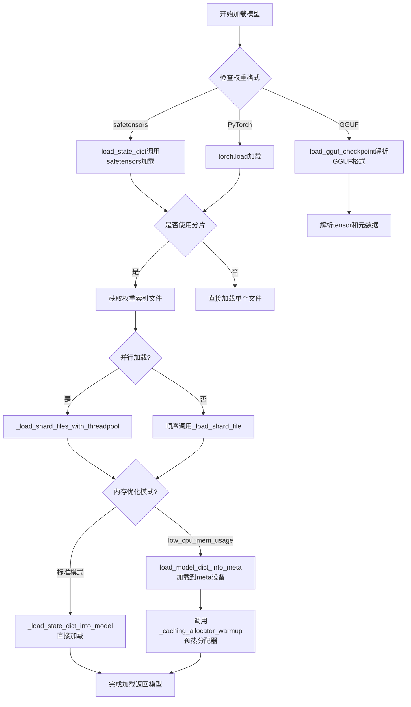

## 类结构

```
ModelLoadingUtils (模块)
├── _determine_device_map (设备映射确定)
├── _fetch_remapped_cls_from_config (类重映射)
├── _determine_param_device (参数设备确定)
├── load_state_dict (状态字典加载)
├── load_model_dict_into_meta (元设备模型加载)
├── check_support_param_buffer_assignment (参数缓冲分配检查)
├── _load_shard_file (单分片加载)
├── _load_shard_files_with_threadpool (并行分片加载)
├── _find_mismatched_keys (键不匹配查找)
├── _load_state_dict_into_model (模型状态字典加载)
├── _fetch_index_file / _fetch_index_file_legacy (索引文件获取)
├── _gguf_parse_value (GGUF值解析)
├── load_gguf_checkpoint (GGUF检查点加载)
├── _expand_device_map (设备映射扩展)
└── _caching_allocator_warmup (分配器预热)
```

## 全局变量及字段


### `_CLASS_REMAPPING_DICT`
    
类名映射字典，用于在不同版本的Diffusers模型之间进行类名转换（如将Transformer2DModel映射到DiTTransformer2DModel或PixArtTransformer2DModel）

类型：`dict`
    


### `logger`
    
模块级日志记录器，用于记录模型加载过程中的信息、警告和错误

类型：`logging.Logger`
    


### `SAFETENSORS_FILE_EXTENSION`
    
safetensors文件格式的扩展名（.safetensors），用于识别和安全加载模型权重

类型：`str`
    


### `GGUF_FILE_EXTENSION`
    
GGUF（GPT-Generated Unified Format）文件格式的扩展名，用于识别GGUF格式的模型文件

类型：`str`
    


### `SAFE_WEIGHTS_INDEX_NAME`
    
安全权重索引文件的名称（model.safetensors.index.json），用于索引分片的safetensors权重文件

类型：`str`
    


### `WEIGHTS_INDEX_NAME`
    
权重索引文件的名称（pytorch_model.bin.index.json），用于索引分片的PyTorch权重文件

类型：`str`
    


### `DEFAULT_HF_PARALLEL_LOADING_WORKERS`
    
默认的HuggingFace并行加载工作线程数，用于控制同时加载模型分片文件的并发数量

类型：`int`
    


    

## 全局函数及方法


### `_determine_device_map`

该函数用于根据模型结构、内存限制和数据类型约束，自动推断并生成模型各层到计算设备（如CPU、GPU）的映射关系，支持多种设备映射策略（如balanced、balanced_low_0、sequential）。

参数：

- `model`：`torch.nn.Module`，需要进行设备映射的模型实例
- `device_map`：str | dict，表示设备映射方式或完整的设备映射字典。字符串时可取"balanced"、"balanced_low_0"、"sequential"等值
- `max_memory`：dict，可选，各设备的最大内存限制
- `torch_dtype`：torch.dtype，目标计算精度数据类型
- `keep_in_fp32_modules`：list，可选，需要保持float32精度的模块名称列表
- `hf_quantizer`：DiffusersQuantizer，可选，HuggingFace量化器实例，用于获取特殊数据类型更新和调整目标dtype

返回值：`dict | str`，返回处理后的设备映射字典或原始字符串

#### 流程图

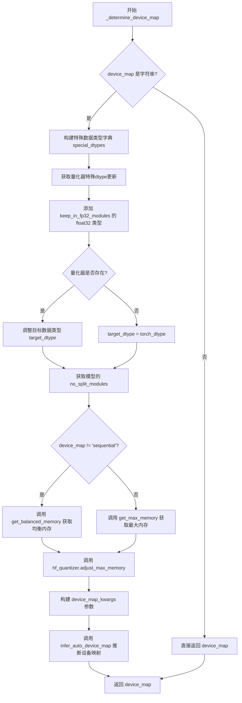

#### 带注释源码

```python
# Adapted from `transformers` (see modeling_utils.py)
def _determine_device_map(
    model: torch.nn.Module, device_map, max_memory, torch_dtype, keep_in_fp32_modules=[], hf_quantizer=None
):
    """
    自动推断模型各层的设备映射关系
    
    参数:
        model: 要进行设备映射的PyTorch模型
        device_map: 设备映射规范，可以是字符串('balanced', 'balanced_low_0', 'sequential')或字典
        max_memory: 各设备最大内存限制
        torch_dtype: 目标计算精度
        keep_in_fp32_modules: 需要保持float32精度的模块列表
        hf_quantizer: 量化器实例，用于处理量化模型的特殊需求
    """
    # 如果device_map是字符串类型，需要进一步处理生成完整的设备映射字典
    if isinstance(device_map, str):
        special_dtypes = {}
        
        # 从量化器获取特殊的dtype更新（如量化权重的精度）
        if hf_quantizer is not None:
            special_dtypes.update(hf_quantizer.get_special_dtypes_update(model, torch_dtype))
        
        # 将keep_in_fp32_modules中指定的模块参数设为float32
        special_dtypes.update(
            {
                name: torch.float32
                for name, _ in model.named_parameters()
                if any(m in name for m in keep_in_fp32_modules)
            }
        )

        # 确定目标精度，量化器可能需要调整目标dtype
        target_dtype = torch_dtype
        if hf_quantizer is not None:
            target_dtype = hf_quantizer.adjust_target_dtype(target_dtype)

        # 获取模型中不允许跨设备分割的模块类别
        no_split_modules = model._get_no_split_modules(device_map)
        device_map_kwargs = {"no_split_module_classes": no_split_modules}

        # 检查infer_auto_device_map是否支持special_dtypes参数
        if "special_dtypes" in inspect.signature(infer_auto_device_map).parameters:
            device_map_kwargs["special_dtypes"] = special_dtypes
        elif len(special_dtypes) > 0:
            # 如果不支持但有特殊dtype需求，发出警告
            logger.warning(
                "This model has some weights that should be kept in higher precision, you need to upgrade "
                "`accelerate` to properly deal with them (`pip install --upgrade accelerate`)."
            )

        # 根据device_map策略选择合适的内存分配方案
        if device_map != "sequential":
            # balanced模式：尝试均衡分配模型到各设备
            max_memory = get_balanced_memory(
                model,
                dtype=torch_dtype,
                low_zero=(device_map == "balanced_low_0"),
                max_memory=max_memory,
                **device_map_kwargs,
            )
        else:
            # sequential模式：按顺序优先使用设备
            max_memory = get_max_memory(max_memory)

        # 量化器可以调整最大内存限制（如为量化参数预留空间）
        if hf_quantizer is not None:
            max_memory = hf_quantizer.adjust_max_memory(max_memory)

        # 将内存信息传递给设备映射推理函数
        device_map_kwargs["max_memory"] = max_memory
        # 调用accelerate的自动设备映射推理
        device_map = infer_auto_device_map(model, dtype=target_dtype, **device_map_kwargs)

    # 如果device_map已经是字典，直接返回
    return device_map
```


### `_fetch_remapped_cls_from_config`

该函数用于在加载模型配置时，根据配置中的 `norm_type` 将旧的模型类动态映射为新的类，以实现向后兼容性和平滑的类替换迁移。

参数：

- `config`：`dict`，模型配置字典，用于获取 `norm_type` 字段以确定要映射到的目标类
- `old_class`：类型为 `type`（类对象），原始的模型类，通过 `__name__` 属性获取类名进行映射查找

返回值：`type`，返回映射后的新类对象（如果存在映射），否则返回原始的 `old_class`

#### 流程图

```mermaid
flowchart TD
    A[开始: _fetch_remapped_cls_from_config] --> B[获取 old_class.__name__ 作为 previous_class_name]
    B --> C[从 _CLASS_REMAPPING_DICT 查询映射: get previous_class_name]
    C --> D{查询结果是否存在?}
    D -->|否| E[返回 old_class]
    D -->|是| F[获取 config['norm_type'] 对应的 remapped_class_name]
    F --> G{remapped_class_name 是否有值?}
    G -->|否| E
    G -->|是| H[通过 importlib 导入顶层 diffusers 库]
    H --> I[使用 getattr 获取 remapped_class_name 对应的类对象]
    I --> J[记录日志信息说明类替换]
    J --> K[返回 remapped_class]
```

#### 带注释源码

```python
def _fetch_remapped_cls_from_config(config, old_class):
    """
    根据配置中的 norm_type 将旧类映射到新类（如果存在映射关系）。
    
    Args:
        config (dict): 模型配置字典，需包含 "norm_type" 键
        old_class (type): 原始模型类对象
    
    Returns:
        type: 映射后的新类对象，或原始 old_class
    """
    # 获取旧类的类名作为查询映射字典的键
    previous_class_name = old_class.__name__
    
    # 从类映射字典中获取基于 norm_type 的映射目标类名
    # _CLASS_REMAPPING_DICT 结构示例:
    # {"Transformer2DModel": {"ada_norm_zero": "DiTTransformer2DModel", "ada_norm_single": "PixArtTransformer2DModel"}}
    remapped_class_name = _CLASS_REMAPPING_DICT.get(previous_class_name).get(config["norm_type"], None)

    # 如果找到了映射的类名
    if remapped_class_name:
        # 动态导入 diffusers 库顶层模块以获取可用的类
        # __name__ 形如 "diffusers.models.modeling_utils"，split(".")[0] 得到 "diffusers"
        diffusers_library = importlib.import_module(__name__.split(".")[0])
        
        # 从库中获取映射后的类对象
        remapped_class = getattr(diffusers_library, remapped_class_name)
        
        # 记录日志说明类替换信息，提醒用户这是为了兼容即将废弃的旧类
        logger.info(
            f"Changing class object to be of `{remapped_class_name}` type from `{previous_class_name}` type."
            f"This is because `{previous_class_name}` is scheduled to be deprecated in a future version. Note that this"
            " DOESN'T affect the final results."
        )
        return remapped_class
    else:
        # 未找到映射关系，返回原始类
        return old_class
```


### `_determine_param_device`

根据给定的设备映射（device_map）查找参数所在的设备。

参数：

- `param_name`：`str`，参数的完整名称（例如 `bert.lm_head.weight`）
- `device_map`：`dict[str, int | str | torch.device] | None`，设备映射字典，键为模块名称，值为设备标识

返回值：`str | int | torch.device`，返回参数所在的设备标识。如果 `device_map` 为 `None`，则默认返回 `"cpu"`。

#### 流程图

```mermaid
flowchart TD
    A[开始] --> B{device_map is None?}
    B -->|Yes| C[返回 'cpu']
    B -->|No| D[module_name = param_name]
    D --> E{module_name in device_map?}
    E -->|Yes| F[返回 device_map[module_name]]
    E -->|No| G{module_name 长度 > 0?}
    G -->|Yes| H[module_name = 去掉最后一个 '.' 后的部分]
    H --> E
    G -->|No| I{"" in device_map?}
    I -->|Yes| F
    I -->|No| J[抛出 ValueError]
```

#### 带注释源码

```python
def _determine_param_device(param_name: str, device_map: dict[str, int | str | torch.device] | None):
    """
    Find the device of param_name from the device_map.
    
    该函数通过逐层向上查找模块名称，确定参数在设备映射中对应的设备。
    例如：给定 param_name = 'bert.lm_head.weight'，会依次检查：
    1. 'bert.lm_head.weight' 是否在 device_map 中
    2. 'bert.lm_head' 是否在 device_map 中
    3. 'bert' 是否在 device_map 中
    直到找到匹配的模块名称或遍历完毕。
    
    参数:
        param_name: 参数的完整名称，包含完整的模块路径
        device_map: 设备映射字典，键为模块名称（字符串），值为设备标识
                   设备标识可以是整数索引、字符串（如 'cpu', 'cuda:0'）或 torch.device 对象
    
    返回:
        参数所在的设备标识。如果 device_map 为 None，则默认返回 'cpu'
    
    异常:
        ValueError: 当遍历完所有模块名称且空字符串也不在 device_map 中时抛出
    """
    # 如果 device_map 为 None，默认使用 CPU 设备
    if device_map is None:
        return "cpu"
    else:
        module_name = param_name
        # 查找上一级模块是否在 device_map 中定义
        # 例如：bert.lm_head.weight -> bert.lm_head -> bert -> ''
        while len(module_name) > 0 and module_name not in device_map:
            # 移除最后一个 '.' 及其后面的部分，向上查找父模块
            module_name = ".".join(module_name.split(".")[:-1])
        
        # 如果 module_name 为空字符串且空字符串不在 device_map 中，说明没有找到任何设备映射
        if module_name == "" and "" not in device_map:
            raise ValueError(f"{param_name} doesn't have any device set.")
        
        # 返回找到的设备
        return device_map[module_name]
```


### `load_state_dict`

该函数负责从磁盘读取模型检查点文件，根据文件扩展名（`.safetensors`、`.gguf` 或其他）选择相应的加载方式（使用 `safetensors.torch`、`load_gguf_checkpoint` 或 `torch.load`），并返回包含模型权重和缓冲区的有序字典，同时提供友好的错误信息处理。

参数：

- `checkpoint_file`：`str | os.PathLike`，检查点文件的路径
- `dduf_entries`：`dict[str, DDUFEntry] | None`，可选的 DDUF 条目字典，用于内存映射加载
- `disable_mmap`：`bool`，是否禁用内存映射加载，默认为 False
- `map_location`：`str | torch.device`，张量加载的目标设备，默认为 "cpu"

返回值：`dict`，返回包含模型权重和缓冲区数据的字典

#### 流程图

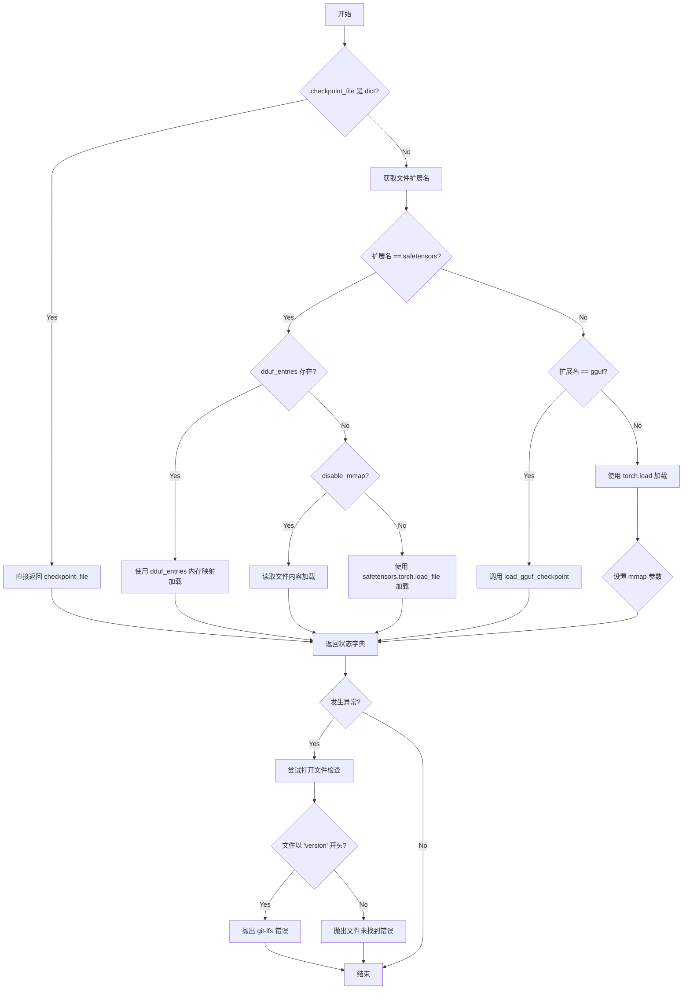

#### 带注释源码

```python
def load_state_dict(
    checkpoint_file: str | os.PathLike,
    dduf_entries: dict[str, DDUFEntry] | None = None,
    disable_mmap: bool = False,
    map_location: str | torch.device = "cpu",
):
    """
    Reads a checkpoint file, returning properly formatted errors if they arise.
    """
    # TODO: maybe refactor a bit this part where we pass a dict here
    # 如果传入的已经是字典，直接返回（用于已加载的状态字典）
    if isinstance(checkpoint_file, dict):
        return checkpoint_file
    
    try:
        # 获取文件扩展名以判断文件类型
        file_extension = os.path.basename(checkpoint_file).split(".")[-1]
        
        # 处理 safetensors 格式文件
        if file_extension == SAFETENSORS_FILE_EXTENSION:
            # 如果有 DDUF 条目，使用内存映射加载（张量加载到 CPU）
            if dduf_entries:
                with dduf_entries[checkpoint_file].as_mmap() as mm:
                    return safetensors.torch.load(mm)
            # 如果禁用内存映射，读取文件内容加载
            if disable_mmap:
                return safetensors.torch.load(open(checkpoint_file, "rb").read())
            # 默认使用 safetensors.torch.load_file 加载，可指定设备
            else:
                return safetensors.torch.load_file(checkpoint_file, device=map_location)
        
        # 处理 GGUF 格式文件
        elif file_extension == GGUF_FILE_EXTENSION:
            return load_gguf_checkpoint(checkpoint_file)
        
        # 处理其他格式（PyTorch pickle 格式）
        else:
            extra_args = {}
            # PyTorch >= 1.13 支持 weights_only 参数，更安全
            weights_only_kwarg = {"weights_only": True} if is_torch_version(">=", "1.13") else {}
            
            # 内存映射只能用于基于 zipfile 序列化的格式
            # 条件：文件是字符串、非 meta 设备、PyTorch >= 2.1.0、是 zipfile、未禁用 mmap
            if (
                isinstance(checkpoint_file, str)
                and map_location != "meta"
                and is_torch_version(">=", "2.1.0")
                and is_zipfile(checkpoint_file)
                and not disable_mmap
            ):
                extra_args = {"mmap": True}
            
            # 使用 torch.load 加载检查点
            return torch.load(checkpoint_file, map_location=map_location, **weights_only_kwarg, **extra_args)
    
    # 异常处理：提供友好的错误信息
    except Exception as e:
        try:
            with open(checkpoint_file) as f:
                # 检查是否是因为缺少 git-lfs 导致的仓库克隆问题
                if f.read().startswith("version"):
                    raise OSError(
                        "You seem to have cloned a repository without having git-lfs installed. Please install "
                        "git-lfs and run `git lfs install` followed by `git lfs pull` in the folder "
                        "you cloned."
                    )
                else:
                    raise ValueError(
                        f"Unable to locate the file {checkpoint_file} which is necessary to load this pretrained "
                        "model. Make sure you have saved the model properly."
                    ) from e
        except (UnicodeDecodeError, ValueError):
            # 处理文件编码错误或无法读取的错误
            raise OSError(
                f"Unable to load weights from checkpoint file for '{checkpoint_file}' at '{checkpoint_file}'. "
            )
```


### `load_model_dict_into_meta`

该函数用于将模型状态字典（state_dict）加载到位于 `meta` 设备上的模型中，处理参数的数据类型转换、设备映射、量化参数创建以及权重卸载等操作。

参数：

- `model`：`torch.nn.Module`，需要加载权重的模型对象
- `state_dict`：`OrderedDict`，包含模型权重的状态字典
- `dtype`：`str | torch.dtype | None`，目标数据类型，用于转换浮点参数
- `model_name_or_path`：`str | None`，模型名称或路径，用于错误信息
- `hf_quantizer`：`DiffusersQuantizer | None`，HuggingFace 量化器，用于处理量化参数
- `keep_in_fp32_modules`：`list | None`，需要保持 float32 精度 的模块列表
- `device_map`：`dict[str, int | str | torch.device] | None`，设备映射字典，指定每个参数应该加载到哪个设备
- `unexpected_keys`：`list[str] | None`，未预期的键列表，用于记录无法匹配的键
- `offload_folder`：`str | os.PathLike | None`，权重卸载到的文件夹路径
- `offload_index`：`dict | None`，权重卸载索引，用于跟踪已卸载的权重
- `state_dict_index`：`dict | None`，状态字典索引，用于跟踪已处理的状态字典
- `state_dict_folder`：`str | os.PathLike | None`，状态字典文件夹路径

返回值：`tuple[dict | None, dict | None]`，返回 (offload_index, state_dict_index) 元组，表示权重卸载索引和状态字典索引

#### 流程图

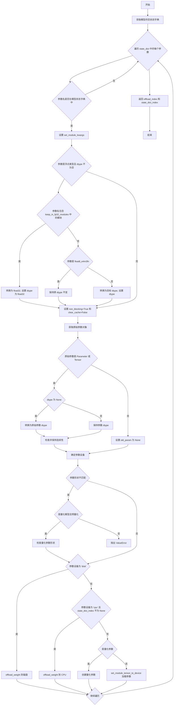

#### 带注释源码

```python
def load_model_dict_into_meta(
    model,
    state_dict: OrderedDict,
    dtype: str | torch.dtype | None = None,
    model_name_or_path: str | None = None,
    hf_quantizer: DiffusersQuantizer | None = None,
    keep_in_fp32_modules: list | None = None,
    device_map: dict[str, int | str | torch.device] | None = None,
    unexpected_keys: list[str] | None = None,
    offload_folder: str | os.PathLike | None = None,
    offload_index: dict | None = None,
    state_dict_index: dict | None = None,
    state_dict_folder: str | os.PathLike | None = None,
) -> list[str]:
    """
    This is somewhat similar to `_load_state_dict_into_model`, but deals with a model that has some or all of its
    params on a `meta` device. It replaces the model params with the data from the `state_dict`
    """

    # 检查是否启用了量化
    is_quantized = hf_quantizer is not None
    # 获取模型的空状态字典，用于验证参数名是否存在
    empty_state_dict = model.state_dict()

    # 遍历状态字典中的每个参数
    for param_name, param in state_dict.items():
        # 如果参数名不在模型的状态字典中，跳过
        if param_name not in empty_state_dict:
            continue

        set_module_kwargs = {}
        # 我们将浮点类型转换为传入的 `dtype`。同时希望保持
        # int/uint/bool 类型的缓冲区和参数，不对其进行转换。
        # TODO: 重新审视 param.dtype == torch.float8_e4m3fn 的情况
        if dtype is not None and torch.is_floating_point(param):
            # 如果参数需要保持在 float32
            if keep_in_fp32_modules is not None and any(
                module_to_keep_in_fp32 in param_name.split(".") for module_to_keep_in_fp32 in keep_in_fp32_modules
            ):
                param = param.to(torch.float32)
                set_module_kwargs["dtype"] = torch.float32
            # 对于量化器使用 torch.float8_e4m3fn 保存权重的情况
            elif hf_quantizer is not None and param.dtype == getattr(torch, "float8_e4m3fn", None):
                pass
            else:
                param = param.to(dtype)
                set_module_kwargs["dtype"] = dtype

        # 为了兼容 PyTorch load_state_dict，它会将状态字典的 dtype 转换为模型中现有的 dtype，
        # 并使用 `param.copy_(input_param)` 来保持模型中参数的连续性。
        # 参考: https://github.com/pytorch/pytorch/blob/db79ceb110f6646523019a59bbd7b838f43d4a86/torch/nn/modules/module.py#L2040C29-L2040C29
        if is_accelerate_version(">", "1.8.1"):
            set_module_kwargs["non_blocking"] = True
            set_module_kwargs["clear_cache"] = False

        # 获取模型中对应的原始参数对象
        old_param = model
        splits = param_name.split(".")
        for split in splits:
            old_param = getattr(old_param, split)

        # 检查是否为 Parameter 或 Tensor 类型
        if not isinstance(old_param, (torch.nn.Parameter, torch.Tensor)):
            old_param = None

        # 如果存在原始参数，进行类型和连续性处理
        if old_param is not None:
            if dtype is None:
                # 如果没有指定 dtype，转换为原始参数的 dtype
                param = param.to(old_param.dtype)

            # 保持参数的连续性
            if old_param.is_contiguous():
                param = param.contiguous()

        # 确定参数应该加载到的设备
        param_device = _determine_param_device(param_name, device_map)

        # bnb 参数是扁平化的。
        # gguf 量化根据应用的量化类型有不同的形状
        if empty_state_dict[param_name].shape != param.shape:
            # 检查是否为预量化参数
            if (
                is_quantized
                and hf_quantizer.pre_quantized
                and hf_quantizer.check_if_quantized_param(
                    model, param, param_name, state_dict, param_device=param_device
                )
            ):
                # 检查量化参数的形状是否正确
                hf_quantizer.check_quantized_param_shape(param_name, empty_state_dict[param_name], param)
            else:
                # 形状不匹配，抛出错误
                model_name_or_path_str = f"{model_name_or_path} " if model_name_or_path is not None else ""
                raise ValueError(
                    f"Cannot load {model_name_or_path_str} because {param_name} expected shape {empty_state_dict[param_name].shape}, but got {param.shape}. If you want to instead overwrite randomly initialized weights, please make sure to pass both `low_cpu_mem_usage=False` and `ignore_mismatched_sizes=True`. For more information, see also: https://github.com/huggingface/diffusers/issues/1619#issuecomment-1345604389 as an example."
                )
        
        # 根据设备类型进行不同的处理
        if param_device == "disk":
            # 卸载到磁盘
            offload_index = offload_weight(param, param_name, offload_folder, offload_index)
        elif param_device == "cpu" and state_dict_index is not None:
            # 卸载到 CPU
            state_dict_index = offload_weight(param, param_name, state_dict_folder, state_dict_index)
        elif is_quantized and (
            # 检查是否为量化参数
            hf_quantizer.check_if_quantized_param(model, param, param_name, state_dict, param_device=param_device)
        ):
            # 创建量化参数
            hf_quantizer.create_quantized_param(
                model, param, param_name, param_device, state_dict, unexpected_keys, dtype=dtype
            )
        else:
            # 使用 accelerate 的函数将参数设置到指定设备
            set_module_tensor_to_device(model, param_name, param_device, value=param, **set_module_kwargs)

    # 返回卸载索引和状态字典索引
    return offload_index, state_dict_index
```


### `check_support_param_buffer_assignment`

该函数用于检查目标模型是否支持参数缓冲区分配（param buffer assignment），这是一种高效加载权重的方式。函数首先检查模型是否在 meta 设备上，然后验证状态字典中是否有匹配的键，接着检查模型是否显式禁用了该功能，最后确保状态字典中的参数数据类型与模型参数的数据类型一致。

参数：

- `model_to_load`：`torch.nn.Module`，要加载权重的目标模型
- `state_dict`：`OrderedDict`，包含权重的状态字典
- `start_prefix`：`str`，用于过滤状态字典键的前缀，默认为空字符串

返回值：`bool`，如果模型支持参数缓冲区分配则返回 `True`，否则返回 `False`

#### 流程图

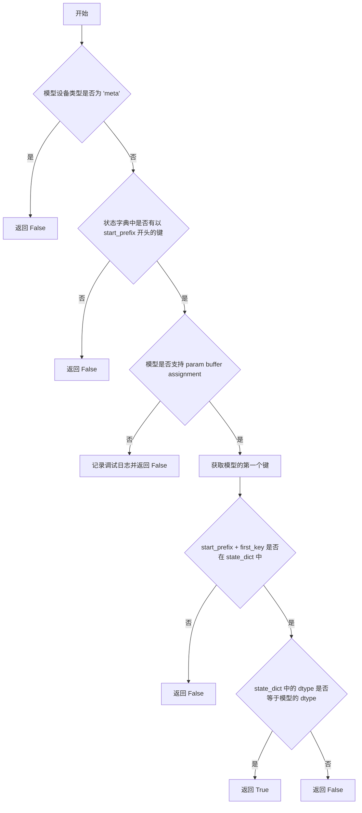

#### 带注释源码

```python
def check_support_param_buffer_assignment(model_to_load, state_dict, start_prefix=""):
    """
    Checks if `model_to_load` supports param buffer assignment (such as when loading in empty weights) by first
    checking if the model explicitly disables it, then by ensuring that the state dict keys are a subset of the model's
    parameters.

    """
    # 检查模型是否在 meta 设备上，如果是则不支持 param buffer assignment
    if model_to_load.device.type == "meta":
        return False

    # 检查状态字典中是否有以 start_prefix 开头的键，如果没有则返回 False
    if len([key for key in state_dict if key.startswith(start_prefix)]) == 0:
        return False

    # 有些模型显式声明不支持 param buffer assignment
    # 如果模型的 _supports_param_buffer_assignment 属性为 False，则不支持
    if not getattr(model_to_load, "_supports_param_buffer_assignment", True):
        logger.debug(
            f"{model_to_load.__class__.__name__} does not support param buffer assignment, loading will be slower"
        )
        return False

    # 如果模型支持，则状态字典和模型的 dtype 必须一致
    # 获取模型的第一个键
    first_key = next(iter(model_to_load.state_dict().keys()))
    # 检查前缀加上第一个键是否在状态字典中
    if start_prefix + first_key in state_dict:
        # 比较状态字典中的 dtype 和模型中的 dtype 是否相同
        return state_dict[start_prefix + first_key].dtype == model_to_load.state_dict()[first_key].dtype

    # 默认返回 False
    return False
```


### `_load_shard_file`

该函数负责加载单个模型权重分片文件，将状态字典加载到模型中，并根据 `low_cpu_mem_usage` 参数选择直接加载或通过 `meta` 设备进行低内存加载。

参数：

- `shard_file`：`str | os.PathLike`，要加载的分片文件路径
- `model`：`torch.nn.Module`，目标模型实例
- `model_state_dict`：`OrderedDict`，模型的参考状态字典，用于键匹配和形状验证
- `device_map`：`dict[str, int | str | torch.device] | None`，可选的设备映射字典，指定每个参数应加载到的设备
- `dtype`：`str | torch.dtype | None`，可选的目标数据类型，用于状态字典转换
- `hf_quantizer`：`DiffusersQuantizer | None`，可选的量化器，用于处理量化权重
- `keep_in_fp32_modules`：`list | None`，需要保持在 FP32 的模块列表
- `dduf_entries`：`dict[str, DDUFEntry] | None`，可选的 DDUF 条目，用于从 DDUF 格式加载
- `loaded_keys`：`list | None`，已加载的键列表，用于检查不匹配的键
- `unexpected_keys`：`list[str] | None`，可选列表，用于记录意外出现的键
- `offload_index`：`dict | None`，当前的分页卸载索引
- `offload_folder`：`str | os.PathLike | None`，用于分页卸载的文件夹路径
- `state_dict_index`：`dict | None`，状态字典索引，用于 CPU 卸载
- `state_dict_folder`：`str | os.PathLike | None`，状态字典文件夹路径
- `ignore_mismatched_sizes`：`bool`，是否忽略形状不匹配的键，默认为 False
- `low_cpu_mem_usage`：`bool`，是否使用低 CPU 内存模式（通过 meta 设备），默认为 False
- `disable_mmap`：`bool`，是否禁用内存映射，默认为 False

返回值：`tuple[dict, dict, list, list]`，返回一个包含四个元素的元组：
- 第一个元素是 `offload_index`：更新后的分页卸载索引
- 第二个元素是 `state_dict_index`：更新后的状态字典索引
- 第三个元素是 `mismatched_keys`：不匹配的键列表
- 第四个元素是 `error_msgs`：错误消息列表

#### 流程图

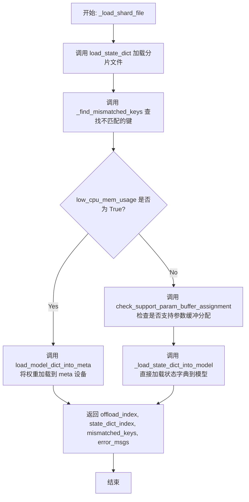

#### 带注释源码

```python
def _load_shard_file(
    shard_file,  # 分片文件路径
    model,  # 目标模型实例
    model_state_dict,  # 模型的参考状态字典
    device_map=None,  # 设备映射字典
    dtype=None,  # 目标数据类型
    hf_quantizer=None,  # 量化器实例
    keep_in_fp32_modules=None,  # 保持 FP32 的模块列表
    dduf_entries=None,  # DDUF 条目字典
    loaded_keys=None,  # 已加载的键列表
    unexpected_keys=None,  # 意外键列表
    offload_index=None,  # 分页卸载索引
    offload_folder=None,  # 卸载文件夹路径
    state_dict_index=None,  # 状态字典索引
    state_dict_folder=None,  # 状态字典文件夹路径
    ignore_mismatched_sizes=False,  # 是否忽略形状不匹配
    low_cpu_mem_usage=False,  # 是否使用低 CPU 内存模式
    disable_mmap=False,  # 是否禁用内存映射
):
    """
    加载单个分片文件并将状态字典加载到模型中。
    
    根据 low_cpu_mem_usage 参数选择两种加载策略：
    - True: 使用 meta 设备进行低内存加载
    - False: 直接加载到模型
    """
    # 第一步：使用 load_state_dict 函数加载分片文件得到状态字典
    state_dict = load_state_dict(shard_file, dduf_entries=dduf_entries, disable_mmap=disable_mmap)
    
    # 第二步：查找不匹配的键（形状不匹配的参数）
    mismatched_keys = _find_mismatched_keys(
        state_dict,
        model_state_dict,
        loaded_keys,
        ignore_mismatched_sizes,
    )
    
    # 初始化错误消息列表
    error_msgs = []
    
    # 第三步：根据 low_cpu_mem_usage 选择不同的加载策略
    if low_cpu_mem_usage:
        # 低内存模式：将权重加载到 meta 设备，然后按需分配到目标设备
        offload_index, state_dict_index = load_model_dict_into_meta(
            model,
            state_dict,
            device_map=device_map,
            dtype=dtype,
            hf_quantizer=hf_quantizer,
            keep_in_fp32_modules=keep_in_fp32_modules,
            unexpected_keys=unexpected_keys,
            offload_folder=offload_folder,
            offload_index=offload_index,
            state_dict_index=state_dict_index,
            state_dict_folder=state_dict_folder,
        )
    else:
        # 标准模式：直接加载到模型
        # 检查模型是否支持参数缓冲分配
        assign_to_params_buffers = check_support_param_buffer_assignment(model, state_dict)
        
        # 将状态字典加载到模型中
        error_msgs += _load_state_dict_into_model(model, state_dict, assign_to_params_buffers)
    
    # 返回更新后的索引、不匹配的键和错误消息
    return offload_index, state_dict_index, mismatched_keys, error_msgs
```


### `_load_shard_files_with_threadpool`

该函数使用 ThreadPoolExecutor 并行加载多个模型分片文件，通过线程池并发执行 `_load_shard_file` 来加速大型模型权重的加载过程，同时收集并汇总各分片加载过程中的错误信息和键不匹配情况。

参数：

- `shard_files`：`list`，需要并行加载的分片文件路径列表
- `model`：`torch.nn.Module`，目标模型实例，用于加载权重
- `model_state_dict`：`OrderedDict`，模型的参考状态字典，用于验证和键匹配
- `device_map`：`dict[str, int | str | torch.device] | None`，可选的参数到设备的映射关系
- `dtype`：`str | torch.dtype | None`，可选的目标数据类型，用于权重转换
- `hf_quantizer`：`DiffusersQuantizer | None`，可选的量化器对象，用于处理量化权重
- `keep_in_fp32_modules`：`list | None`，可选的模块列表，这些模块的权重应保持为 FP32
- `dduf_entries`：`dict[str, DDUFEntry] | None`，可选的 DDUF 文件条目，用于加载 DDUF 格式权重
- `loaded_keys`：`list | None`，可选的已加载键集合，用于追踪已处理的权重键
- `unexpected_keys`：`list | None`，可选的意外键列表，用于记录加载过程中发现的未预期键
- `offload_index`：`dict | None`，可选的卸载索引，用于管理权重卸载到磁盘
- `offload_folder`：`str | os.PathLike | None`，可选的卸载文件夹路径
- `state_dict_index`：`dict | None`，可选的状态字典索引，用于管理状态字典卸载
- `state_dict_folder`：`str | os.PathLike | None`，可选的状态字典文件夹路径
- `ignore_mismatched_sizes`：`bool`，是否忽略形状不匹配的权重，默认为 False
- `low_cpu_mem_usage`：`bool`，是否启用低 CPU 内存使用模式，默认为 False
- `disable_mmap`：`bool`，是否禁用内存映射加载，默认为 False

返回值：`tuple`，包含四个元素：

- `offload_index`：更新后的卸载索引（dict 或 None）
- `state_dict_index`：更新后的状态字典索引（dict 或 None）
- `mismatched_keys`：所有分片中发现的形状不匹配键列表（list）
- `error_msgs`：所有分片加载过程中的错误信息列表（list）

#### 流程图

```mermaid
flowchart TD
    A[开始] --> B[计算并行工作线程数<br/>num_workers = min(len(shard_files), DEFAULT_HF_PARALLEL_LOADING_WORKERS)]
    B --> C[记录日志: 使用 N 个工作线程并行加载]
    D[使用 functools.partial 创建加载函数 load_one] --> E[配置 tqdm 进度条参数]
    E --> F[创建 ThreadPoolExecutor<br/>max_workers=num_workers]
    F --> G[提交所有分片文件任务到线程池<br/>executor.submit(load_one, shard_file)]
    G --> H[使用 as_completed 遍历完成的任务]
    H --> I{所有任务完成?}
    I -->|否| J[获取任务结果]
    J --> K[更新 offload_index 和 state_dict_index]
    K --> L[收集错误信息和键不匹配]
    L --> M[更新进度条 pbar.update(1)]
    M --> H
    I -->|是| N[返回结果: offload_index, state_dict_index, mismatched_keys, error_msgs]
```

#### 带注释源码

```python
def _load_shard_files_with_threadpool(
    shard_files,
    model,
    model_state_dict,
    device_map=None,
    dtype=None,
    hf_quantizer=None,
    keep_in_fp32_modules=None,
    dduf_entries=None,
    loaded_keys=None,
    unexpected_keys=None,
    offload_index=None,
    offload_folder=None,
    state_dict_index=None,
    state_dict_folder=None,
    ignore_mismatched_sizes=False,
    low_cpu_mem_usage=False,
    disable_mmap=False,
):
    """
    使用线程池并行加载多个模型分片文件
    
    该函数通过 ThreadPoolExecutor 并发加载多个分片文件，以加速大型模型权重的加载过程。
    每个工作线程独立调用 _load_shard_file 处理单个分片，最后汇总所有结果。
    """
    # 计算并行工作线程数：取分片文件数量和默认并行加载工作数的较小值
    # 确保不会创建过多的工作线程
    num_workers = min(len(shard_files), DEFAULT_HF_PARALLEL_LOADING_WORKERS)

    # 记录并行加载信息到日志
    logger.info(f"Loading model weights in parallel with {num_workers} workers...")

    # 初始化错误信息列表和不匹配键列表，用于收集各分片加载结果
    error_msgs = []
    mismatched_keys = []

    # 使用 functools.partial 创建一个预绑定参数的加载函数
    # 这样每个线程调用时不需要重复传递相同的参数
    load_one = functools.partial(
        _load_shard_file,  # 实际执行单个分片加载的函数
        model=model,
        model_state_dict=model_state_dict,
        device_map=device_map,
        dtype=dtype,
        hf_quantizer=hf_quantizer,
        keep_in_fp32_modules=keep_in_fp32_modules,
        dduf_entries=dduf_entries,
        loaded_keys=loaded_keys,
        unexpected_keys=unexpected_keys,
        offload_index=offload_index,
        offload_folder=offload_folder,
        state_dict_index=state_dict_index,
        state_dict_folder=state_dict_folder,
        ignore_mismatched_sizes=ignore_mismatched_sizes,
        low_cpu_mem_usage=low_cpu_mem_usage,
        disable_mmap=disable_mmap,
    )

    # 配置 tqdm 进度条参数：总任务数等于分片文件数量
    tqdm_kwargs = {"total": len(shard_files), "desc": "Loading checkpoint shards"}
    # 如果不是分布式训练的 rank 0，则禁用进度条以避免重复输出
    if not is_torch_dist_rank_zero():
        tqdm_kwargs["disable"] = True

    # 使用 ThreadPoolExecutor 创建线程池并执行并行加载
    with ThreadPoolExecutor(max_workers=num_workers) as executor:
        # 创建进度条上下文
        with logging.tqdm(**tqdm_kwargs) as pbar:
            # 提交所有分片文件加载任务到线程池
            futures = [executor.submit(load_one, shard_file) for shard_file in shard_files]
            
            # 使用 as_completed 按完成顺序迭代处理结果
            for future in as_completed(futures):
                # 获取单个分片的加载结果
                result = future.result()
                # 解包结果：更新索引、收集错误信息和不匹配键
                offload_index, state_dict_index, _mismatched_keys, _error_msgs = result
                error_msgs += _error_msgs
                mismatched_keys += _mismatched_keys
                # 每完成一个任务更新进度条
                pbar.update(1)

    # 返回所有分片的汇总结果
    return offload_index, state_dict_index, mismatched_keys, error_msgs
```


### `_find_mismatched_keys`

该函数用于在加载模型检查点时，找出并处理状态字典（state_dict）中与模型状态字典（model_state_dict）形状不匹配的键。当检测到形状不匹配时，这些键会从状态字典中移除并记录到 mismatched_keys 列表中，以支持 `ignore_mismatched_sizes` 参数所控制的容错加载行为。

参数：

- `state_dict`：`dict`，检查点文件加载后的状态字典，包含预训练模型的参数
- `model_state_dict`：`dict`，模型当前的状态字典，定义了期望的参数形状
- `loaded_keys`：`list[str]`，已成功加载的键列表，用于遍历检查
- `ignore_mismatched_sizes`：`bool`，是否忽略形状不匹配的参数，如果为 True 则记录不匹配键并从 state_dict 中删除

返回值：`list[tuple]`，返回包含不匹配键信息的元组列表，每个元组包含（键名，检查点中的形状，模型中的形状）

#### 流程图

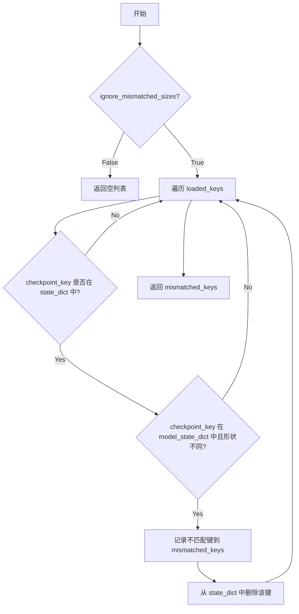

#### 带注释源码

```python
def _find_mismatched_keys(
    state_dict,               # dict: 检查点加载的状态字典
    model_state_dict,         # dict: 模型的期望状态字典
    loaded_keys,              # list[str]: 已加载的键列表
    ignore_mismatched_sizes,  # bool: 是否忽略不匹配的尺寸
):
    """
    找出加载的检查点中与模型状态字典形状不匹配的键。
    当 ignore_mismatched_sizes 为 True 时，不匹配的键会从 state_dict 中删除。
    
    Args:
        state_dict: 从检查点文件加载的状态字典
        model_state_dict: 模型的当前状态字典
        loaded_keys: 成功加载的键列表
        ignore_mismatched_sizes: 是否忽略尺寸不匹配
    
    Returns:
        包含不匹配键信息的元组列表，每个元组为 (键名, 检查点形状, 模型形状)
    """
    mismatched_keys = []  # 存储不匹配的键信息
    
    # 如果不忽略尺寸不匹配，直接返回空列表
    if not ignore_mismatched_sizes:
        return mismatched_keys
    
    # 遍历已加载的键
    for checkpoint_key in loaded_keys:
        model_key = checkpoint_key  # 假设检查点键名与模型键名相同
        
        # 如果检查点是分片的，可能不存在该键
        if checkpoint_key not in state_dict:
            continue
        
        # 检查键是否在模型中且形状是否匹配
        if model_key in model_state_dict and state_dict[checkpoint_key].shape != model_state_dict[model_key].shape:
            # 记录不匹配的键及其形状信息
            mismatched_keys.append(
                (checkpoint_key, state_dict[checkpoint_key].shape, model_state_dict[model_key].shape)
            )
            # 从状态字典中删除该键，避免后续加载时报错
            del state_dict[checkpoint_key]
    
    return mismatched_keys
```


### `_load_state_dict_into_model`

将预训练模型的状态字典（state_dict）加载到指定的模型对象中，处理旧格式到新格式的转换，并递归地加载所有子模块的参数和缓冲区。

参数：

- `model_to_load`：`torch.nn.Module`，要加载状态字典的目标模型对象
- `state_dict`：`OrderedDict`，包含模型参数和缓冲区的状态字典
- `assign_to_params_buffers`：`bool`，是否直接将状态字典中的值赋值给模型的参数和缓冲区，默认为 False

返回值：`list[str]`，加载过程中产生的错误消息列表

#### 流程图

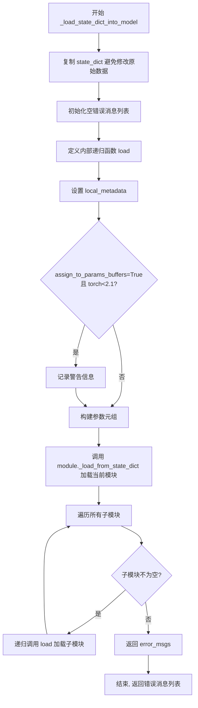

#### 带注释源码

```
def _load_state_dict_into_model(
    model_to_load, state_dict: OrderedDict, assign_to_params_buffers: bool = False
) -> list[str]:
    """
    将状态字典加载到模型中。
    
    参数:
        model_to_load: 要加载的目标模型
        state_dict: 包含模型权重和缓冲区的状态字典
        assign_to_params_buffers: 是否启用直接赋值到参数/缓冲区（需要torch>=2.1）
    
    返回:
        错误消息列表
    """
    # 将状态字典从旧格式转换为新格式（如有必要）
    # 复制 state_dict 以便 _load_from_state_dict 可以修改它
    state_dict = state_dict.copy()
    error_msgs = []

    # PyTorch 的 `_load_from_state_dict` 不会复制模块后代中的参数
    # 因此需要递归应用该函数
    def load(module: torch.nn.Module, prefix: str = "", assign_to_params_buffers: bool = False):
        # 本地元数据，用于传递分配选项
        local_metadata = {}
        local_metadata["assign_to_params_buffers"] = assign_to_params_buffers
        
        # 检查 torch 版本兼容性
        if assign_to_params_buffers and not is_torch_version(">=", "2.1"):
            logger.info("You need to have torch>=2.1 in order to load the model with assign_to_params_buffers=True")
        
        # 构建 _load_from_state_dict 所需参数
        # (state_dict, prefix, local_metadata, strict, [], [], error_msgs)
        args = (state_dict, prefix, local_metadata, True, [], [], error_msgs)
        module._load_from_state_dict(*args)

        # 递归遍历所有子模块
        for name, child in module._modules.items():
            if child is not None:
                # 递归加载子模块，保持参数前缀路径
                load(child, prefix + name + ".", assign_to_params_buffers)

    # 从根模块开始加载
    load(model_to_load, assign_to_params_buffers=assign_to_params_buffers)

    return error_msgs
```


### `_fetch_index_file`

该函数用于获取模型权重索引文件（`model_index.json`）的路径，支持从本地文件系统或远程 Hugging Face Hub 仓库获取索引文件，并根据 `use_safetensors` 参数选择对应的索引文件格式。

参数：

-  `is_local`：`bool`，表示模型路径是否为本地路径
-  `pretrained_model_name_or_path`：`str | os.PathLike`，预训练模型的名称或路径
-  `subfolder`：`str | None`，模型文件所在的子文件夹路径
-  `use_safetensors`：`bool`，是否使用 safetensors 格式的权重文件
-  `cache_dir`：`str | None`，缓存目录路径
-  `variant`：`str | None`，模型变体名称（如 fp16、bf16 等）
-  `force_download`：`bool`，是否强制重新下载文件
-  `proxies`：`dict | None`，用于 HTTP 请求的代理配置
-  `local_files_only`：`bool`，是否仅使用本地文件
-  `token`：`str | None`，用于认证的 Hugging Face token
-  `revision`：`str | None`，仓库的提交哈希或分支名
-  `user_agent`：`dict | None`，HTTP 请求的用户代理信息
-  `commit_hash`：`str | None`，特定的提交哈希值
-  `dduf_entries`：`dict[str, DDUFEntry] | None`，DDUF（Differential Distributed Upload Format）条目字典，用于加载分布式格式的模型

返回值：`Path | None`，返回索引文件的路径对象，如果找不到文件或发生错误则返回 `None`

#### 流程图

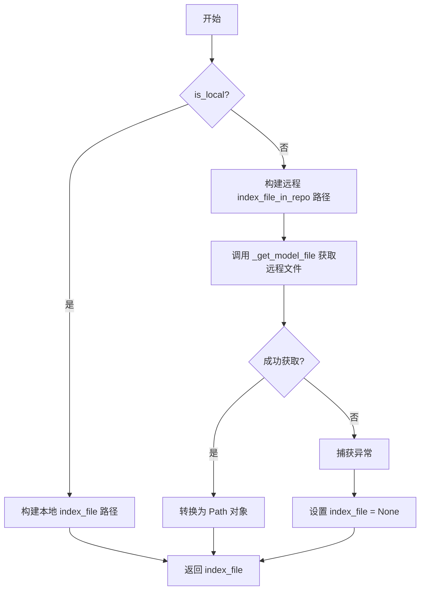

#### 带注释源码

```python
def _fetch_index_file(
    is_local,
    pretrained_model_name_or_path,
    subfolder,
    use_safetensors,
    cache_dir,
    variant,
    force_download,
    proxies,
    local_files_only,
    token,
    revision,
    user_agent,
    commit_hash,
    dduf_entries: dict[str, DDUFEntry] | None = None,
):
    """
    获取模型权重索引文件的路径。
    
    根据 is_local 参数决定是从本地文件系统还是从远程 Hugging Face Hub
    获取索引文件。索引文件名根据 use_safetensors 参数选择 SAFE_WEIGHTS_INDEX_NAME
    或 WEIGHTS_INDEX_NAME，并可能添加 variant 后缀。
    """
    # 判断是否为本地路径
    if is_local:
        # 本地路径：直接构建索引文件路径
        # 根据 use_safetensors 选择对应的索引文件名，并添加 variant 后缀
        index_file = Path(
            pretrained_model_name_or_path,
            subfolder or "",
            _add_variant(SAFE_WEIGHTS_INDEX_NAME if use_safetensors else WEIGHTS_INDEX_NAME, variant),
        )
    else:
        # 远程路径：构建仓库中的索引文件相对路径
        index_file_in_repo = Path(
            subfolder or "",
            _add_variant(SAFE_WEIGHTS_INDEX_NAME if use_safetensors else WEIGHTS_INDEX_NAME, variant),
        ).as_posix()
        
        try:
            # 调用 _get_model_file 从远程仓库下载或获取索引文件
            index_file = _get_model_file(
                pretrained_model_name_or_path,
                weights_name=index_file_in_repo,
                cache_dir=cache_dir,
                force_download=force_download,
                proxies=proxies,
                local_files_only=local_files_only,
                token=token,
                revision=revision,
                subfolder=None,
                user_agent=user_agent,
                commit_hash=commit_hash,
                dduf_entries=dduf_entries,
            )
            # 如果不是 DDUF 格式，转换为 Path 对象
            if not dduf_entries:
                index_file = Path(index_file)
        except (EntryNotFoundError, EnvironmentError):
            # 捕获文件未找到或环境错误异常，返回 None
            index_file = None

    return index_file
```


### `_fetch_index_file_legacy`

该函数用于获取分片模型检查点的索引文件（weights index file），专门处理旧版（legacy）分片检查点的加载。它在本地或远程模型路径下查找对应的索引文件，并通过在文件名中插入 `variant` 来支持模型变体。如果找到旧版格式的索引文件，会发出弃用警告，提示用户重新保存模型以使用标准化格式。

参数：

- `is_local`：`bool`，指示模型文件是否在本地
- `pretrained_model_name_or_path`：`str | os.PathLike`，预训练模型的名称或路径
- `subfolder`：`str`，模型文件所在的子文件夹路径
- `use_safetensors`：`bool`，是否优先使用 safetensors 格式
- `cache_dir`：`str | None`，缓存目录路径
- `variant`：`str | None`，模型变体名称（如 "fp16"）
- `force_download`：`bool`，是否强制重新下载
- `proxies`：`dict | None`，代理服务器配置
- `local_files_only`：`bool`，是否仅使用本地文件
- `token`：`str | None`，用于认证的 HuggingFace token
- `revision`：`str`，要获取的模型版本
- `user_agent`：`dict | None`，用户代理信息
- `commit_hash`：`str | None`，提交的 git hash
- `dduf_entries`：`dict[str, DDUFEntry] | None`，DDUF 条目字典

返回值：`Path | None`，返回索引文件路径，如果未找到则返回 `None`

#### 流程图

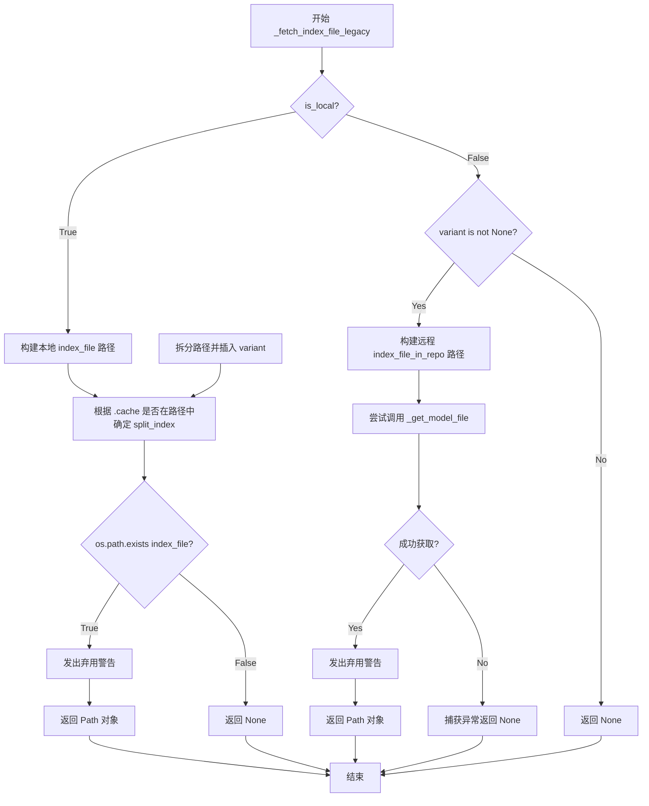

#### 带注释源码

```python
def _fetch_index_file_legacy(
    is_local,
    pretrained_model_name_or_path,
    subfolder,
    use_safetensors,
    cache_dir,
    variant,
    force_download,
    proxies,
    local_files_only,
    token,
    revision,
    user_agent,
    commit_hash,
    dduf_entries: dict[str, DDUFEntry] | None = None,
):
    """
    获取旧版分片检查点的索引文件。
    
    该函数处理两种情况：
    1. 本地模型：直接在文件系统中查找并处理 variant
    2. 远程模型：从 HuggingFace Hub 下载并处理 variant
    """
    if is_local:
        # 构建本地索引文件路径，使用 variant 名称构造文件名
        index_file = Path(
            pretrained_model_name_or_path,
            subfolder or "",
            SAFE_WEIGHTS_INDEX_NAME if use_safetensors else WEIGHTS_INDEX_NAME,
        ).as_posix()
        
        # 根据路径是否包含 .cache 来确定分割索引
        # 目的是在正确的位置插入 variant 名称
        splits = index_file.split(".")
        split_index = -3 if ".cache" in index_file else -2
        splits = splits[:-split_index] + [variant] + splits[-split_index:]
        index_file = ".".join(splits)
        
        # 检查文件是否存在
        if os.path.exists(index_file):
            # 发出弃用警告，建议用户重新保存模型
            deprecation_message = f"This serialization format is now deprecated to standardize the serialization format between `transformers` and `diffusers`. We recommend you to remove the existing files associated with the current variant ({variant}) and re-obtain them by running a `save_pretrained()`."
            deprecate("legacy_sharded_ckpts_with_variant", "1.0.0", deprecation_message, standard_warn=False)
            index_file = Path(index_file)
        else:
            index_file = None
    else:
        # 处理远程模型的情况
        if variant is not None:
            # 构建远程仓库中的索引文件名
            index_file_in_repo = Path(
                subfolder or "",
                SAFE_WEIGHTS_INDEX_NAME if use_safetensors else WEIGHTS_INDEX_NAME,
            ).as_posix()
            splits = index_file_in_repo.split(".")
            split_index = -2
            splits = splits[:-split_index] + [variant] + splits[-split_index:]
            index_file_in_repo = ".".join(splits)
            
            try:
                # 尝试从远程仓库下载索引文件
                index_file = _get_model_file(
                    pretrained_model_name_or_path,
                    weights_name=index_file_in_repo,
                    cache_dir=cache_dir,
                    force_download=force_download,
                    proxies=proxies,
                    local_files_only=local_files_only,
                    token=token,
                    revision=revision,
                    subfolder=None,
                    user_agent=user_agent,
                    commit_hash=commit_hash,
                    dduf_entries=dduf_entries,
                )
                index_file = Path(index_file)
                # 发出弃用警告
                deprecation_message = f"This serialization format is now deprecated to standardize the serialization format between `transformers` and `diffusers`. We recommend you to remove the existing files associated with the current variant ({variant}) and re-obtain them by running a `save_pretrained()`."
                deprecate("legacy_sharded_ckpts_with_variant", "1.0.0", deprecation_message, standard_warn=False)
            except (EntryNotFoundError, EnvironmentError):
                index_file = None

    return index_file
```


### `_gguf_parse_value`

该函数是 GGUF (GGML Unified Format) 解析的辅助函数，用于将 GGUF 文件中的原始字节值转换为适当的 Python 数据类型。

参数：

- `_value`：`list`，从 GGUF 文件读取的原始字节值列表
- `data_type`：`int | list`，表示 GGUF 数据类型的整数或类型列表（用于处理数组类型）

返回值：`int | float | bool | str | list`，转换后的 Python 数据类型

#### 流程图

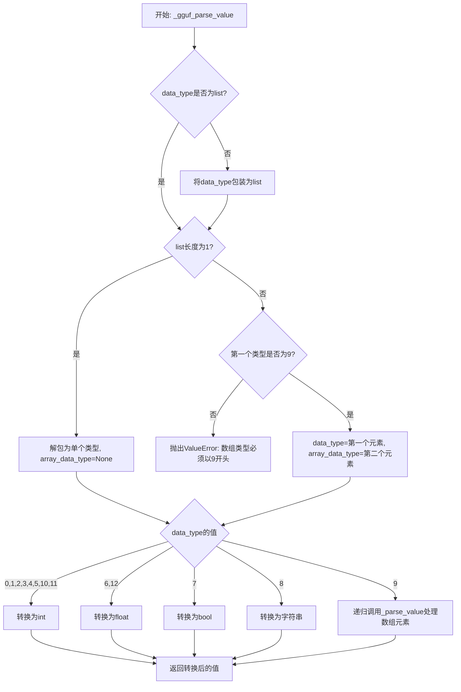

#### 带注释源码

```python
def _gguf_parse_value(_value, data_type):
    """
    将GGUF格式的原始值转换为Python数据类型。
    
    GGUF使用整数类型码来表示不同的数据类型：
    - 0-5, 10, 11: 整数类型
    - 6, 12: 浮点类型
    - 7: 布尔类型
    - 8: 字符串类型
    - 9: 数组类型（需要递归处理）
    """
    # 如果data_type不是list，则包装为list
    if not isinstance(data_type, list):
        data_type = [data_type]
    
    # 处理单个类型和数组类型
    if len(data_type) == 1:
        # 单个类型：解包为基本类型
        data_type = data_type[0]
        array_data_type = None
    else:
        # 数组类型：第一个元素必须是9（数组标记），第二个元素是数组元素类型
        if data_type[0] != 9:
            raise ValueError("Received multiple types, therefore expected the first type to indicate an array.")
        data_type, array_data_type = data_type

    # 根据类型码进行转换
    if data_type in [0, 1, 2, 3, 4, 5, 10, 11]:
        # 整数类型：int8, int16, int32, int64, uint8, uint16, uint32, uint64
        _value = int(_value[0])
    elif data_type in [6, 12]:
        # 浮点类型：float32, float64
        _value = float(_value[0])
    elif data_type in [7]:
        # 布尔类型
        _value = bool(_value[0])
    elif data_type in [8]:
        # 字符串类型：将字节数组解码为字符串
        _value = array("B", list(_value)).tobytes().decode()
    elif data_type in [9]:
        # 数组类型：递归处理每个数组元素
        _value = _gguf_parse_value(_value, array_data_type)
    
    return _value
```


### `load_gguf_checkpoint`

加载 GGUF（Georgian Gzip Unified Format）文件并返回包含张量、解析后的分词器和配置属性的字典。

参数：

-  `gguf_checkpoint_path`：`str`，要加载的 GGUF 文件的路径
-  `return_tensors`：`bool`，默认为 `False`，是否从文件中读取张量并返回。不读取张量会更快，仅加载元数据到内存中

返回值：`dict`，包含解析后的参数的字典，键为张量名称，值为张量数据或 `GGUFParameter` 对象

#### 流程图

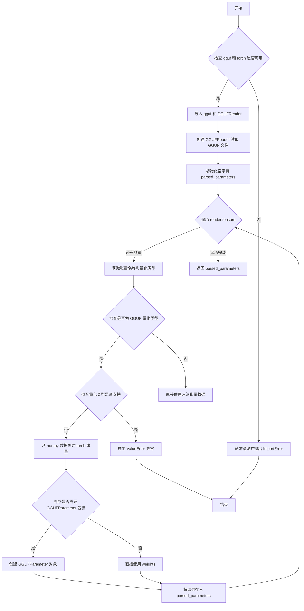

#### 带注释源码

```python
def load_gguf_checkpoint(gguf_checkpoint_path, return_tensors=False):
    """
    Load a GGUF file and return a dictionary of parsed parameters containing tensors, the parsed tokenizer and config
    attributes.

    Args:
        gguf_checkpoint_path (`str`):
            The path the to GGUF file to load
        return_tensors (`bool`, defaults to `True`):
            Whether to read the tensors from the file and return them. Not doing so is faster and only loads the
            metadata in memory.
    """

    # 检查必要的依赖是否已安装
    if is_gguf_available() and is_torch_available():
        # 动态导入 gguf 库及其 GGUFReader 类
        import gguf
        from gguf import GGUFReader

        # 导入 GGUF 量化工具类
        from ..quantizers.gguf.utils import SUPPORTED_GGUF_QUANT_TYPES, GGUFParameter
    else:
        # 记录详细的错误信息，包含安装指南链接
        logger.error(
            "Loading a GGUF checkpoint in PyTorch, requires both PyTorch and GGUF>=0.10.0 to be installed. Please see "
            "https://pytorch.org/ and https://github.com/ggerganov/llama.cpp/tree/master/gguf-py for installation instructions."
        )
        raise ImportError("Please install torch and gguf>=0.10.0 to load a GGUF checkpoint in PyTorch.")

    # 使用 GGUFReader 读取 GGUF 文件
    reader = GGUFReader(gguf_checkpoint_path)

    # 初始化存储解析后参数的字典
    parsed_parameters = {}
    
    # 遍历文件中的所有张量
    for tensor in reader.tensors:
        name = tensor.name  # 获取张量名称
        quant_type = tensor.tensor_type  # 获取量化类型

        # 判断是否为 GGUF 量化类型（非 F32/F16 表示使用了量化）
        is_gguf_quant = quant_type not in [gguf.GGMLQuantizationType.F32, gguf.GGMLQuantizationType.F16]
        
        # 如果使用了量化但不在支持列表中，抛出错误
        if is_gguf_quant and quant_type not in SUPPORTED_GGUF_QUANT_TYPES:
            _supported_quants_str = "\n".join([str(type) for type in SUPPORTED_GGUF_QUANT_TYPES])
            raise ValueError(
                (
                    f"{name} has a quantization type: {str(quant_type)} which is unsupported."
                    "\n\nCurrently the following quantization types are supported: \n\n"
                    f"{_supported_quants_str}"
                    "\n\nTo request support for this quantization type please open an issue here: https://github.com/huggingface/diffusers"
                )
            )

        # 将张量数据从 numpy 数组转换为 PyTorch 张量
        weights = torch.from_numpy(tensor.data.copy())
        
        # 如果是量化类型，使用 GGUFParameter 包装；否则直接使用原始张量
        parsed_parameters[name] = GGUFParameter(weights, quant_type=quant_type) if is_gguf_quant else weights

    # 返回包含所有参数的字典
    return parsed_parameters
```


### `_expand_device_map`

该函数用于将层级结构的设备映射（device_map）展开为每个参数名称到设备的直接映射。它遍历原始设备映射，对每个模块-设备对，找出所有匹配的参数名称（包括精确匹配和子模块匹配），构建一个扁平的参数名到设备的字典。

参数：

- `device_map`：`dict`，原始的模块到设备的映射字典，键为模块名称，值为设备标识（如整数或字符串）
- `param_names`：`list[str] | set[str]`，模型中所有参数的名称列表，用于与设备映射中的模块进行匹配

返回值：`dict`，展开后的参数名到设备的映射字典

#### 流程图

```mermaid
flowchart TD
    A[Start _expand_device_map] --> B[Initialize empty new_device_map]
    B --> C[Iterate over device_map items]
    C --> D[Get current module and device]
    D --> E{p == module}
    E -->|Yes| F[Add param to new_device_map with device]
    E -->|No| G{p.startswith(module + '.')}
    G -->|Yes| F
    G -->|No| H{module == ''}
    H -->|Yes| F
    H -->|No| I[Skip this param]
    F --> I
    I --> J{More params in param_names?}
    J -->|Yes| E
    J -->|No| K[new_device_map.update mapping]
    K --> L{More modules in device_map?}
    L -->|Yes| D
    L -->|No| M[Return new_device_map]
```

#### 带注释源码

```
def _expand_device_map(device_map, param_names):
    """
    Expand a device map to return the correspondence parameter name to device.
    
    这个函数的主要作用是将一个层级的设备映射（如 {"bert": 0, "bert.layer": 1}）
    转换为一个扁平的参数名到设备的映射，这样可以直接查询每个参数应该放在哪个设备上。
    
    Args:
        device_map (dict): 原始的模块到设备的映射，例如 {"model": 0, "model.layer1": 1}
        param_names (list[str] | set[str]): 模型的所有参数名称列表
    
    Returns:
        dict: 展开后的参数名到设备的映射
    """
    # 初始化结果字典
    new_device_map = {}
    
    # 遍历设备映射中的每个模块-设备对
    for module, device in device_map.items():
        # 对于每个模块，遍历所有参数名，找出匹配的参数
        # 匹配规则：
        # 1. 参数名完全等于模块名（精确匹配）
        # 2. 参数名以 "module." 开头（子模块匹配）
        # 3. 模块名为空字符串 ""（匹配所有参数，常用于全局设备指定）
        new_device_map.update(
            {p: device for p in param_names if p == module or p.startswith(f"{module}.") or module == ""}
        )
    
    return new_device_map
```


### `_caching_allocator_warmup`

该函数通过预先分配与模型张量大小相匹配的空张量来预热 CUDA 缓存分配器，从而避免在后续模型加载过程中频繁调用 Malloc，显著提升模型加载速度。

参数：

- `model`：未标注类型（根据使用推断为 `torch.nn.Module`），需要预热的模型实例
- `expanded_device_map`：`dict[str, torch.device]`，参数名称到设备（device）的映射字典
- `dtype`：`torch.dtype`，用于分配空张量的数据类型
- `hf_quantizer`：`DiffusersQuantizer | None`，可选的量化器，如果提供则使用其获取的预热因子

返回值：`None`，无返回值

#### 流程图

```mermaid
flowchart TD
    A[开始] --> B[计算预热因子 factor]
    B --> C{hf_quantizer 是否为 None}
    C -->|是| D[factor = 2]
    C -->|否| E[factor = hf_quantizer.get_cuda_warm_up_factor()]
    D --> F[过滤加速器设备]
    E --> F
    F --> G{accelerator_device_map 是否为空}
    G -->|是| H[直接返回]
    G -->|否| I[遍历 accelerator_device_map]
    I --> J[获取参数或缓冲区]
    J --> K[累加每个设备的元素数量]
    K --> L{还有更多参数?}
    L -->|是| I
    L -->|否| M[遍历每个设备]
    M --> N[计算 warmup_elems = max(1, elem_count // factor)]
    N --> O[调用 torch.empty 分配空张量]
    O --> P[结束]
```

#### 带注释源码

```python
# Adapted from: https://github.com/huggingface/transformers/blob/0687d481e2c71544501ef9cb3eef795a6e79b1de/src/transformers/modeling_utils.py#L5859
def _caching_allocator_warmup(
    model, expanded_device_map: dict[str, torch.device], dtype: torch.dtype, hf_quantizer: DiffusersQuantizer | None
) -> None:
    """
    This function warm-ups the caching allocator based on the size of the model tensors that will reside on each
    device. It allows to have one large call to Malloc, instead of recursively calling it later when loading the model,
    which is actually the loading speed bottleneck. Calling this function allows to cut the model loading time by a
    very large margin.
    """
    # 确定预热因子：如果有量化器则使用量化器提供的因子，否则默认为 2
    # 量化器可能需要更小的预热张量因为量化参数占用更少内存
    factor = 2 if hf_quantizer is None else hf_quantizer.get_cuda_warm_up_factor()

    # 仅保留加速器设备（GPU），过滤掉 CPU 和磁盘设备
    # 这些设备不需要预热因为它们使用不同的内存分配机制
    accelerator_device_map = {
        param: torch.device(device)
        for param, device in expanded_device_map.items()
        if str(device) not in ["cpu", "disk"]
    }
    # 如果没有加速器设备（如纯 CPU 加载），则直接返回无需预热
    if not accelerator_device_map:
        return

    # 统计每个设备上的参数元素总数
    elements_per_device = defaultdict(int)
    for param_name, device in accelerator_device_map.items():
        try:
            # 尝试获取参数（parameter）
            p = model.get_parameter(param_name)
        except AttributeError:
            try:
                # 如果不是参数则尝试获取缓冲区（buffer）
                p = model.get_buffer(param_name)
            except AttributeError:
                # 如果参数名既不是参数也不是缓冲区则抛出错误
                raise AttributeError(f"Parameter or buffer with name={param_name} not found in model")
        # TODO: account for TP when needed.  # 注意：未来需要考虑张量并行（Tensor Parallelism）场景
        # 累加该设备上的总元素数量
        elements_per_device[device] += p.numel()

    # 遍历每个设备，分配预热张量以触发缓存分配器
    # 这会让 CUDA 缓存分配器预先分配大块内存，后续加载模型时无需频繁调用 Malloc
    for device, elem_count in elements_per_device.items():
        # 计算需要预热的元素数量，至少为 1
        warmup_elems = max(1, elem_count // factor)
        # 分配空张量但不实际使用，这会触发 CUDA 内存分配
        _ = torch.empty(warmup_elems, dtype=dtype, device=device, requires_grad=False)
```

## 关键组件


### 一段话描述

该模块是 HuggingFace Diffusers 库中的模型权重加载核心模块，负责从多种格式（safetensors、PyTorch pickle、GGUF）的检查点文件中加载模型权重，支持分片并行加载、设备映射、量化权重处理、内存映射优化以及缓存分配器预热等高级功能。

### 文件的整体运行流程

1. **入口阶段**：调用者传入模型路径和配置，触发权重加载流程
2. **索引获取**：通过 `_fetch_index_file` 或 `_fetch_index_file_legacy` 获取权重索引文件
3. **格式检测**：根据文件扩展名判断格式（safetensors/pickle/GGUF）
4. **并行加载**：使用 `_load_shard_files_with_threadpool` 并行加载多个分片文件
5. **设备分配**：通过 `_determine_device_map` 计算设备映射策略
6. **权重加载**：
   - 若使用 `low_cpu_mem_usage`，调用 `load_model_dict_into_meta` 加载到 meta 设备
   - 否则调用 `_load_state_dict_into_model` 直接加载到目标设备
7. **量化处理**：对于量化模型，调用量化器的相关方法创建量化参数
8. **后处理**：执行缓存分配器预热 `_caching_allocator_warmup` 优化加载速度

### 类的详细信息

#### 全局变量

| 名称 | 类型 | 描述 |
|------|------|------|
| `_CLASS_REMAPPING_DICT` | `dict` | 类名映射字典，用于将旧类名映射到新类名（如 Transformer2DModel 的 ada_norm_zero 映射到 DiTTransformer2DModel） |
| `logger` | `logging.Logger` | 模块级日志记录器 |

#### 全局函数

##### `_determine_device_map`

```python
def _determine_device_map(
    model: torch.nn.Module, 
    device_map, 
    max_memory, 
    torch_dtype, 
    keep_in_fp32_modules=[], 
    hf_quantizer=None
)
```

- **参数**：
  - `model`: `torch.nn.Module` - 待加载的模型对象
  - `device_map`: `str | dict` - 设备映射策略（"auto"/"balanced"/"balanced_low_0"/"sequential" 或自定义字典）
  - `max_memory`: `dict` - 每个设备的最大内存限制
  - `torch_dtype`: `torch.dtype` - 目标数据类型
  - `keep_in_fp32_modules`: `list` - 保持 fp32 的模块名称列表
  - `hf_quantizer`: `DiffusersQuantizer | None` - 量化器对象
- **返回值**：`dict` - 完整的设备映射字典
- **功能**：根据模型结构自动推断或计算最优的设备分配方案

##### `_determine_param_device`

```python
def _determine_param_device(
    param_name: str, 
    device_map: dict[str, int | str | torch.device] | None
) -> str | torch.device
```

- **参数**：
  - `param_name`: `str` - 参数名称（支持嵌套路径如 "bert.lm_head.weight"）
  - `device_map`: `dict` - 设备映射字典
- **返回值**：`str | torch.device` - 参数应放置的设备
- **功能**：根据参数名在设备映射中查找对应的设备，支持向上回溯父模块

##### `load_state_dict`

```python
def load_state_dict(
    checkpoint_file: str | os.PathLike,
    dduf_entries: dict[str, DDUFEntry] | None = None,
    disable_mmap: bool = False,
    map_location: str | torch.device = "cpu",
) -> dict
```

- **参数**：
  - `checkpoint_file`: `str | os.PathLike` - 检查点文件路径
  - `dduf_entries`: `dict | None` - DDUF 条目字典（用于分布式加载）
  - `disable_mmap`: `bool` - 是否禁用内存映射
  - `map_location`: `str | torch.device` - 加载目标设备
- **返回值**：`dict` - 状态字典
- **功能**：读取检查点文件，支持 safetensors、GGUF、PyTorch pickle 三种格式，包含详细的错误处理

##### `load_model_dict_into_meta`

```python
def load_model_dict_into_meta(
    model,
    state_dict: OrderedDict,
    dtype: str | torch.dtype | None = None,
    model_name_or_path: str | None = None,
    hf_quantizer: DiffusersQuantizer | None = None,
    keep_in_fp32_modules: list | None = None,
    device_map: dict[str, int | str | torch.device] | None = None,
    unexpected_keys: list[str] | None = None,
    offload_folder: str | os.PathLike | None = None,
    offload_index: dict | None = None,
    state_dict_index: dict | None = None,
    state_dict_folder: str | os.PathLike | None = None,
) -> list[str]
```

- **参数**：
  - `model`: 模型对象
  - `state_dict`: `OrderedDict` - 权重状态字典
  - `dtype`: `str | torch.dtype | None` - 目标数据类型
  - `model_name_or_path`: `str | None` - 模型路径
  - `hf_quantizer`: `DiffusersQuantizer | None` - 量化器
  - `keep_in_fp32_modules`: `list | None` - 保持 FP32 的模块
  - `device_map`: `dict | None` - 设备映射
  - `unexpected_keys`: `list | None` - 未匹配的键
  - `offload_folder`: `str | Path | None` - 卸载文件夹
  - `offload_index`: `dict | None` - 卸载索引
  - `state_dict_index`: `dict | None` - 状态字典索引
  - `state_dict_folder`: `str | Path | None` - 状态字典文件夹
- **返回值**：`list[str]` - 错误消息列表
- **功能**：将状态字典加载到 meta 设备上的模型，支持量化参数处理和设备卸载

##### `_load_shard_file`

```python
def _load_shard_file(
    shard_file,
    model,
    model_state_dict,
    device_map=None,
    dtype=None,
    hf_quantizer=None,
    keep_in_fp32_modules=None,
    dduf_entries=None,
    loaded_keys=None,
    unexpected_keys=None,
    offload_index=None,
    offload_folder=None,
    state_dict_index=None,
    state_dict_folder=None,
    ignore_mismatched_sizes=False,
    low_cpu_mem_usage=False,
    disable_mmap=False,
)
```

- **参数**：
  - `shard_file`: 分片文件路径
  - `model`: 模型对象
  - `model_state_dict`: 模型期望的状态字典
  - `device_map`: 设备映射
  - `dtype`: 目标数据类型
  - `hf_quantizer`: 量化器
  - `keep_in_fp32_modules`: 保持 FP32 的模块
  - `dduf_entries`: DDUF 条目
  - `loaded_keys`: 已加载的键
  - `unexpected_keys`: 未预期的键
  - `offload_index`: 卸载索引
  - `offload_folder`: 卸载文件夹
  - `state_dict_index`: 状态字典索引
  - `state_dict_folder`: 状态字典文件夹
  - `ignore_mismatched_sizes`: 是否忽略大小不匹配
  - `low_cpu_mem_usage`: 是否低内存使用
  - `disable_mmap`: 是否禁用内存映射
- **返回值**：包含 offload_index, state_dict_index, mismatched_keys, error_msgs 的元组
- **功能**：加载单个分片文件的核心逻辑

##### `_load_shard_files_with_threadpool`

```python
def _load_shard_files_with_threadpool(
    shard_files,
    model,
    model_state_dict,
    device_map=None,
    dtype=None,
    hf_quantizer=None,
    keep_in_fp32_modules=None,
    dduf_entries=None,
    loaded_keys=None,
    unexpected_keys=None,
    offload_index=None,
    offload_folder=None,
    state_dict_index=None,
    state_dict_folder=None,
    ignore_mismatched_sizes=False,
    low_cpu_mem_usage=False,
    disable_mmap=False,
)
```

- **参数**：与 `_load_shard_file` 类似，但接受分片文件列表
- **返回值**：包含 offload_index, state_dict_index, mismatched_keys, error_msgs 的元组
- **功能**：使用线程池并行加载多个分片文件，通过 `ThreadPoolExecutor` 和 `as_completed` 实现并发

##### `_load_state_dict_into_model`

```python
def _load_state_dict_into_model(
    model_to_load, 
    state_dict: OrderedDict, 
    assign_to_params_buffers: bool = False
) -> list[str]
```

- **参数**：
  - `model_to_load`: 目标模型
  - `state_dict`: `OrderedDict` - 状态字典
  - `assign_to_params_buffers`: `bool` - 是否直接赋值到参数缓冲区
- **返回值**：`list[str]` - 错误消息列表
- **功能**：将状态字典加载到模型，通过递归调用 PyTorch 的 `_load_from_state_dict` 方法

##### `load_gguf_checkpoint`

```python
def load_gguf_checkpoint(
    gguf_checkpoint_path, 
    return_tensors=False
) -> dict
```

- **参数**：
  - `gguf_checkpoint_path`: `str` - GGUF 文件路径
  - `return_tensors`: `bool` - 是否返回张量（否则只加载元数据）
- **返回值**：`dict` - 解析后的参数字典
- **功能**：加载 GGUF 格式的检查点文件，解析量化和非量化权重

##### `_caching_allocator_warmup`

```python
def _caching_allocator_warmup(
    model, 
    expanded_device_map: dict[str, torch.device], 
    dtype: torch.dtype, 
    hf_quantizer: DiffusersQuantizer | None
) -> None
```

- **参数**：
  - `model`: 模型对象
  - `expanded_device_map`: `dict` - 展开后的设备映射
  - `dtype`: `torch.dtype` - 数据类型
  - `hf_quantizer`: `DiffusersQuantizer | None` - 量化器
- **返回值**：`None`
- **功能**：预热 CUDA 缓存分配器，预先分配内存以减少后续加载时的分配开销

##### `_gguf_parse_value`

```python
def _gguf_parse_value(_value, data_type)
```

- **参数**：
  - `_value`: GGUF 读取的原始值
  - `data_type`: 数据类型标识
- **返回值**：转换后的 Python 值
- **功能**：解析 GGUF 文件中的各种数据类型（整数、浮点数、布尔值、字符串、数组）

##### `_expand_device_map`

```python
def _expand_device_map(device_map, param_names) -> dict
```

- **参数**：
  - `device_map`: 原始设备映射
  - `param_names`: 参数名称列表
- **返回值**：展开后的设备映射
- **功能**：将设备映射展开到每个参数级别

### 关键组件信息

#### 张量索引与惰性加载

使用 `safetensors` 的内存映射（mmap）机制和 DDUF 分布式加载实现张量索引与惰性加载。当 `dduf_entries` 存在时，通过 `as_mmap()` 方法延迟加载张量数据，只在访问时加载到内存，减少初始内存占用。

#### 反量化支持

`GGUFParameter` 类封装了量化权重和量化类型信息，支持在加载时根据 `quant_type` 判断是否为量化参数。对于 GGUF 量化权重，使用 `torch.from_numpy(tensor.data.copy())` 将数据转换为 PyTorch 张量，并根据量化类型决定是否使用 `GGUFParameter` 包装。

#### 量化策略

通过 `hf_quantizer` 量化器对象实现多种量化策略支持：
- `check_if_quantized_param`: 检查参数是否为量化参数
- `check_quantized_param_shape`: 验证量化参数的形状
- `create_quantized_param`: 创建量化参数
- `adjust_target_dtype`: 调整目标数据类型
- `adjust_max_memory`: 调整最大内存限制
- `get_cuda_warm_up_factor`: 获取 CUDA 预热因子

#### 设备映射与分片加载

`_determine_device_map` 函数使用 `accelerate` 库的 `infer_auto_device_map`、`get_balanced_memory`、`get_max_memory` 实现自动设备分配。`_load_shard_files_with_threadpool` 使用 `ThreadPoolExecutor` 实现并行加载，提高大规模模型加载效率。

### 潜在的技术债务或优化空间

1. **重复代码**：`_find_mismatched_keys` 函数在文件中存在两个定义（一个在 `_load_shard_file` 之前，一个在 `load_gguf_checkpoint` 之后），应合并为一个
2. **版本兼容性检查**：多处使用 `is_accelerate_version(">", "1.8.1")` 和 `is_torch_version(">=", "2.1.0")` 进行版本检查，可以封装为统一的工具函数
3. **错误处理**：部分错误处理逻辑可以进一步细化，例如区分不同类型的加载错误
4. **类型注解**：部分函数缺少完整的类型注解（如 `model` 参数），应补充
5. **文档字符串**：部分函数的文档字符串可以更加详细，例如说明 `return_tensors=False` 的性能优势

### 其它项目

#### 设计目标与约束

- **目标**：提供统一的模型权重加载接口，支持多种格式和量化方案
- **约束**：依赖 `safetensors`、`torch`、`accelerate`、`gguf` 等库

#### 错误处理与异常设计

- 检查点文件不存在或格式错误时抛出 `OSError` 或 `ValueError`
- 量化参数形状不匹配时抛出 `ValueError` 并提示使用 `low_cpu_mem_usage=False` 和 `ignore_mismatched_sizes=True`
- GGUF 量化类型不支持时抛出 `ValueError` 并列出支持的类型

#### 数据流与状态机

- 加载流程：索引文件获取 → 分片文件列表 → 并行加载 → 设备分配 → 权重赋值
- 状态管理：通过 `offload_index` 和 `state_dict_index` 跟踪卸载状态

#### 外部依赖与接口契约

- `safetensors`: 高效的安全权重加载
- `accelerate`: 设备映射和内存管理
- `gguf`: GGUF 格式解析和量化支持
- `huggingface_hub`: 模型文件下载和缓存


## 问题及建议


### 已知问题

-   **重复代码**：`_find_mismatched_keys` 函数在代码中定义了两次（约第318行和第518行），违反DRY原则，容易导致维护困难和潜在的不一致。
-   **硬编码字符串**：设备标识字符串如 `"cpu"`、`"disk"` 在多处硬编码（第82行、第228行、第573行），应提取为常量以提高可维护性。
-   **函数参数过多**：`load_model_dict_into_meta`、`_load_shard_file`、`_load_shard_files_with_threadpool` 等函数接收超过10个参数，导致调用复杂且难以测试。
-   **类型注解不完整**：部分函数参数缺少类型注解，如第197行的 `model` 参数、第203行的 `state_dict` 参数等，降低了代码的可读性和类型安全。
-   **版本检查逻辑分散**：多个地方存在 `is_accelerate_version`、`is_torch_version` 等版本检查（第67行、第228行、第331行），缺乏统一的版本兼容性管理机制。
-   **TODO注释未处理**：代码中存在TODO注释（如第82行的 `# TODO: maybe refactor a bit` 和第84行的 `# TODO: revisit cases`），表明存在待完善的功能。
-   **嵌套函数设计**：`load` 函数在 `_load_state_dict_into_model` 内部定义，这种嵌套设计增加了代码的理解难度，且无法被外部复用。
-   **异常处理过于宽泛**：第159-167行的异常捕获逻辑复杂，尝试多次读取文件来判断错误类型，效率较低。

### 优化建议

-   **消除重复代码**：将重复的 `_find_mismatched_keys` 函数合并为一个，并确保逻辑一致。
-   **提取常量**：创建专门的常量模块或枚举类来管理设备字符串、文件扩展名等常用值。
-   **重构大函数**：使用参数对象模式或拆分函数的方式处理参数过多的问题，例如将 `load_model_dict_into_meta` 的参数封装为配置类。
-   **完善类型注解**：为所有公共函数参数和返回值添加完整的类型注解，增强代码的可读性和IDE支持。
-   **提取版本兼容层**：创建专门的版本兼容性检查模块，统一管理 `accelerate`、`torch` 等库的版本相关逻辑。
-   **重构嵌套函数**：将 `load` 函数提取为模块级函数或使用类来封装状态，提高代码的可测试性和可维护性。
-   **改进异常处理**：使用更具体的异常类型和更有意义的错误消息，考虑将文件检查逻辑提前以避免重复读取。
-   **优化并行加载**：当前的 `ThreadPoolExecutor` 使用方式可以进一步优化，考虑使用异步IO或更高效的任务调度机制。


## 其它


### 设计目标与约束

本模块的核心设计目标是为Diffusers库提供统一、高效且安全的模型权重加载机制，支持多种权重格式（safetensors、PyTorch pickle、GGUF）、分布式加载、量化模型、设备映射以及低内存占用模式。主要约束包括：必须兼容PyTorch 1.13+版本，需要accelerate库支持设备映射功能，GGUF格式需要gguf>=0.10.0库，权重文件必须是标准序列化格式以确保跨平台兼容性。

### 错误处理与异常设计

模块采用分层异常处理策略：load_state_dict函数作为入口点捕获文件读取异常并转换为通用错误消息；_load_shard_file处理分片加载过程中的不匹配键和形状错误；load_model_dict_into_meta处理设备映射和量化参数校验异常。关键异常包括ValueError（形状不匹配、参数不存在）、OSError（文件缺失、git-lfs问题）、ImportError（依赖库缺失）和AttributeError（模型结构不匹配）。所有异常都包含详细的上下文信息便于调试。

### 数据流与状态机

权重加载流程包含以下状态：1）初始化状态——确定加载路径和权重格式；2）索引文件解析状态——读取权重索引确定分片文件；3）分片加载状态——并行或串行加载各分片文件；4）状态字典转换状态——处理格式转换、量化参数和设备映射；5）模型赋值状态——将权重写入模型参数；6）完成状态——返回加载结果和错误信息。数据流从外部配置文件（config.json）读取模型结构信息，结合权重索引文件确定加载策略，最终将状态字典写入模型对象。

### 外部依赖与接口契约

本模块依赖以下外部包：torch>=1.13（核心张量操作）、safetensors（安全权重加载）、accelerate（设备映射和内存优化）、huggingface_hub（模型文件下载和缓存管理）、gguf（GGUF格式解析）。可选依赖包括：diffusers.quantizers（量化支持）、distributed_utils（分布式训练支持）。接口契约要求调用者提供有效的model对象和checkpoint路径，返回包含加载后state_dict的模型实例，异常情况下抛出明确的错误信息而非静默失败。

### 性能考量与优化建议

模块包含多项性能优化：1）ThreadPoolExecutor实现分片并行加载，默认使用DEFAULT_HF_PARALLEL_LOADING_WORKERS个线程；2）_caching_allocator_warmup预热CUDA缓存分配器减少加载时间；3）低内存模式下使用meta设备延迟加载权重；4）safetensors格式支持内存映射减少IO开销。潜在优化空间包括：支持更细粒度的并行加载控制、增加流式加载支持以处理超大模型、进一步优化GGUF量化参数的反序列化性能。

### 版本兼容性与迁移指南

本模块与transformers库的modeling_utils.py保持API兼容性，支持从旧版Diffusers格式迁移到统一格式。对于遗留的分片checkpoint（带variant），模块通过_fetch_index_file_legacy函数提供兼容加载并发出弃用警告。量化支持方面，需确保hf_quantizer实现DiffusersQuantizer接口的check_if_quantized_param和create_quantized_param方法。未来版本计划逐步淘汰legacy加载路径，建议用户通过save_pretrained重新保存模型。

### 安全考量

模块处理来自外部的模型权重文件，采取以下安全措施：优先使用safetensors格式避免pickle安全风险；weights_only参数在torch>=1.13时默认启用防止代码执行；内存映射模式限制文件访问权限；DDUFEntry支持安全的数据传输。对于GGUF格式，模块验证量化类型是否在SUPPORTED_GGUF_QUANT_TYPES列表中，不支持的量化类型会抛出明确错误。

### 配置与可扩展性

模块通过以下机制支持扩展：_CLASS_REMAPPING_DICT允许动态映射模型类以支持向后兼容；_determine_device_map支持自定义device_map策略；量化器通过DiffusersQuantizer抽象接口可接入新的量化方法；_expand_device_map支持细粒度的参数级设备分配。开发者可通过继承DiffusersQuantizer类实现自定义量化逻辑，或通过修改device_map实现特定的模型并行策略。


    