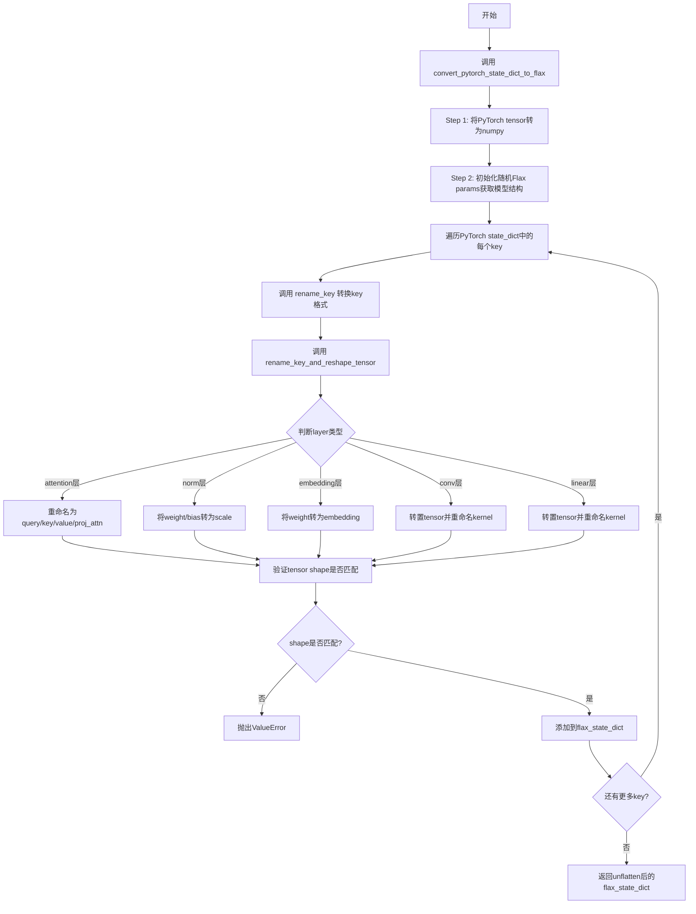
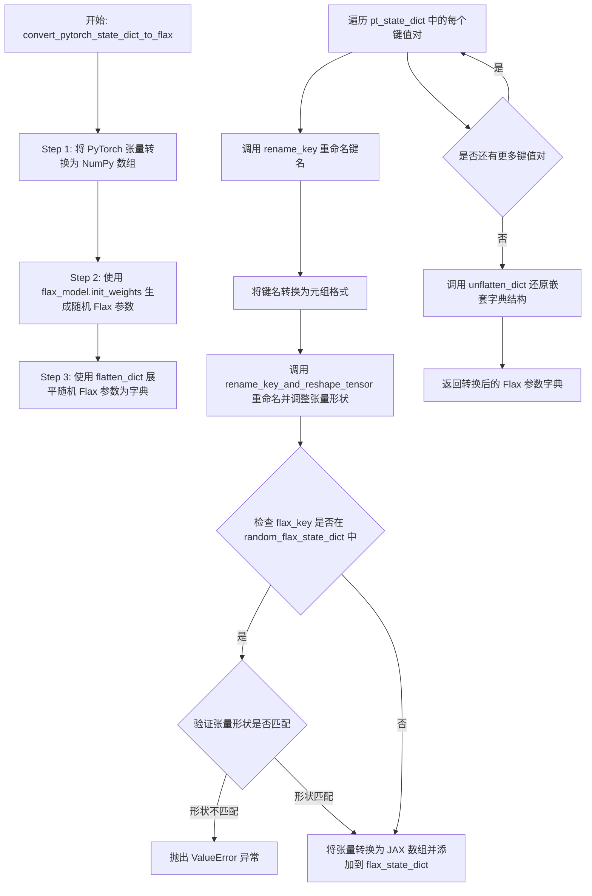

# `diffusers\src\diffusers\models\modeling_flax_pytorch_utils.py` 详细设计文档

This file provides utility functions for converting PyTorch model weights to Flax (JAX) format, handling weight name transformations, tensor reshaping, and parameter mapping between the two frameworks.

## 整体流程



## 类结构

```
无类层次结构 (纯函数模块)
└── 模块级函数
    ├── rename_key
    ├── rename_key_and_reshape_tensor
    └── convert_pytorch_state_dict_to_flax
```

## 全局变量及字段


### `logger`
    
模块级日志记录器，用于记录转换过程中的警告和错误信息

类型：`logging.Logger`
    


    

## 全局函数及方法


### `rename_key`

该函数是PyTorch到Flax模型权重转换工具中的辅助函数，用于将包含数字序号的键名中的点号（.）替换为下划线（_），以兼容Flax模型的参数命名规范。例如将`layer.0`转换为`layer_0`。

参数：

- `key`：`str`，需要重命名的键名字符串，通常为PyTorch模型的权重参数名称

返回值：`str`，重命名后的键名字符串

#### 流程图

```mermaid
flowchart TD
    A[开始] --> B[定义正则表达式 \n r&quot;\w+[.]\d+&quot;]
    B --> C{查找匹配}
    C -->|找到匹配| D[遍历每个匹配项]
    D --> E[将匹配项按.分割]
    E --> F[用_连接分割后的部分]
    F --> G[替换原键名中的匹配项]
    G --> H{还有更多匹配?}
    H -->|是| D
    H -->|否| I[返回重命名后的键名]
    C -->|未找到匹配| I
```

#### 带注释源码

```python
def rename_key(key):
    """
    将键名中的 'word.number' 模式转换为 'word_number' 格式。
    例如: 'layer.0' -> 'layer_0', 'transformer.1.weight' -> 'transformer_1.weight'
    
    参数:
        key: str, 需要重命名的PyTorch模型键名
        
    返回:
        str, 重命名后的键名，用于匹配Flax模型参数命名规范
    """
    # 定义正则表达式：匹配"字母或单词 + 点号 + 数字"的模式
    # \w+ 匹配一个或多个字母/数字/下划线（单词字符）
    # [. ] 匹配点号
    # \d+ 匹配一个或多个数字
    regex = r"\w+[.]\d+"
    
    # 使用正则表达式查找所有匹配的子串
    # 例如: key = "layer.0.weight" -> pats = ["layer.0"]
    # 例如: key = "encoder.layer.0.weight" -> pats = ["layer.0"]
    pats = re.findall(regex, key)
    
    # 遍历每个匹配的子串进行替换
    for pat in pats:
        # 将匹配项按点号分割: "layer.0" -> ["layer", "0"]
        # 再用下划线连接: "layer_0"
        key = key.replace(pat, "_".join(pat.split(".")))
    
    # 返回处理后的键名
    return key
```


### `rename_key_and_reshape_tensor`

该函数是PyTorch到Flax模型权重转换的核心工具函数，负责将PyTorch模型的权重名称映射到Flax模型对应的名称，并根据层类型（如注意力层、归一化层、卷积层、线性层等）对张量形状进行必要的变换（如转置、维度重排），以确保两种框架间权重的高效兼容。

参数：

- `pt_tuple_key`：`tuple`，PyTorch模型的参数名称（按"."分割后的元组形式），例如 `("encoder.layer.0.attn.to_q", "weight")`
- `pt_tensor`：`torch.Tensor` 或 `numpy.ndarray`，PyTorch模型的权重张量
- `random_flax_state_dict`：`dict`，Flax模型的随机初始化参数字典（扁平化后的结构），键为Flax格式的元组，用于参考目标形状和验证权重名称

返回值：`tuple`，返回包含两个元素的元组 - 第一个元素是重命名后的Flax格式键（tuple类型），第二个元素是变换后的张量

#### 流程图

```mermaid
flowchart TD
    A[开始: rename_key_and_reshape_tensor] --> B[归一化层预处理: 将键的最后一项替换为scale]
    B --> C{检查是否是注意力层<br/>len > 1}
    
    C -->|是| D[遍历注意力层重命名映射]
    D --> E{匹配到to_out_0/to_k/to_v/to_q?}
    E -->|是| F[构建新键并转置张量<br/>返回结果]
    E -->|否| G{检查norm相关的bias转scale}
    
    C -->|否| G
    
    G --> H{bias转scale条件满足?}
    H -->|是| I[返回scale键和原张量]
    H -->|否| J{weight/gamma转scale?}
    
    J -->|是| I
    J -->|否| K{embedding层?}
    
    K -->|是| L[将weight转为embedding<br/>返回结果]
    K -->|否| M{卷积层权重?<br/>ndim == 4}
    
    M -->|是| N[转为kernel并进行维度重排<br/>transpose(2,3,1,0)<br/>返回结果]
    M -->|否| O{线性层权重?}
    
    O -->|是| P[转为kernel并转置<br/>返回结果]
    O -->|否| Q{旧版layer norm gamma?]
    
    Q -->|是| R[将gamma转为weight<br/>返回结果]
    Q -->|否| S{旧版layer norm beta?]
    
    S -->|是| T[将beta转为bias<br/>返回结果]
    S -->|否| U[返回原始键和张量]
```

#### 带注释源码

```python
def rename_key_and_reshape_tensor(pt_tuple_key, pt_tensor, random_flax_state_dict):
    """Rename PT weight names to corresponding Flax weight names and reshape tensor if necessary"""
    # Step 1: 预处理 - 将归一化层的键统一重命名为 "scale"（Flax中使用scale而非weight/gamma）
    # conv norm or layer norm
    renamed_pt_tuple_key = pt_tuple_key[:-1] + ("scale",)

    # Step 2: 处理注意力层 - PyTorch的Attention相关权重需要重映射
    # rename attention layers
    if len(pt_tuple_key) > 1:
        # 定义PyTorch到Flax的名称映射
        for rename_from, rename_to in (
            ("to_out_0", "proj_attn"),   # 输出投影层
            ("to_k", "key"),              # Key权重
            ("to_v", "value"),            # Value权重
            ("to_q", "query"),            # Query权重
        ):
            # 检查倒数第二个元素是否匹配需要重命名的层
            if pt_tuple_key[-2] == rename_from:
                weight_name = pt_tuple_key[-1]
                # Flax使用"kernel"而非"weight"
                weight_name = "kernel" if weight_name == "weight" else weight_name
                # 构建新的Flax格式键
                renamed_pt_tuple_key = pt_tuple_key[:-2] + (rename_to, weight_name)
                # 验证目标键存在于Flax模型中，并检查形状兼容性
                if renamed_pt_tuple_key in random_flax_state_dict:
                    assert random_flax_state_dict[renamed_pt_tuple_key].shape == pt_tensor.T.shape
                    # Flax使用列主序，PyTorch使用行主序，需要转置
                    return renamed_pt_tuple_key, pt_tensor.T

    # Step 3: 处理归一化层的bias到scale转换（旧版PyTorch使用bias，Flax使用scale）
    if (
        any("norm" in str_ for str_ in pt_tuple_key)  # 包含norm的键
        and (pt_tuple_key[-1] == "bias")              # 最后一元素是bias
        and (pt_tuple_key[:-1] + ("bias",) not in random_flax_state_dict)  # Flax模型中无bias
        and (pt_tuple_key[:-1] + ("scale",) in random_flax_state_dict)     # Flax模型中有scale
    ):
        renamed_pt_tuple_key = pt_tuple_key[:-1] + ("scale",)
        return renamed_pt_tuple_key, pt_tensor
    # 处理weight/gamma到scale的转换
    elif pt_tuple_key[-1] in ["weight", "gamma"] and pt_tuple_key[:-1] + ("scale",) in random_flax_state_dict:
        renamed_pt_tuple_key = pt_tuple_key[:-1] + ("scale",)
        return renamed_pt_tuple_key, pt_tensor

    # Step 4: 处理嵌入层 - PyTorch的weight转为Flax的embedding
    # embedding
    if pt_tuple_key[-1] == "weight" and pt_tuple_key[:-1] + ("embedding",) in random_flax_state_dict:
        pt_tuple_key = pt_tuple_key[:-1] + ("embedding",)
        return renamed_pt_tuple_key, pt_tensor

    # Step 5: 处理卷积层 - 4维张量需要维度重排以适应Flax的NHWC格式
    # conv layer
    renamed_pt_tuple_key = pt_tuple_key[:-1] + ("kernel",)
    if pt_tuple_key[-1] == "weight" and pt_tensor.ndim == 4:
        # PyTorch: (out_channels, in_channels, height, width) -> Flax: (height, width, in_channels, out_channels)
        pt_tensor = pt_tensor.transpose(2, 3, 1, 0)
        return renamed_pt_tuple_key, pt_tensor

    # Step 6: 处理线性层 - 2维权重需要转置
    # linear layer
    renamed_pt_tuple_key = pt_tuple_key[:-1] + ("kernel",)
    if pt_tuple_key[-1] == "weight":
        # PyTorch: (out_features, in_features) -> Flax: (in_features, out_features)
        pt_tensor = pt_tensor.T
        return renamed_pt_tuple_key, pt_tensor

    # Step 7: 处理旧版PyTorch LayerNorm - gamma转为weight
    # old PyTorch layer norm weight
    renamed_pt_tuple_key = pt_tuple_key[:-1] + ("weight",)
    if pt_tuple_key[-1] == "gamma":
        return renamed_pt_tuple_key, pt_tensor

    # Step 8: 处理旧版PyTorch LayerNorm - beta转为bias
    # old PyTorch layer norm bias
    renamed_pt_tuple_key = pt_tuple_key[:-1] + ("bias",)
    if pt_tuple_key[-1] == "beta":
        return renamed_pt_tuple_key, pt_tensor

    # Step 9: 未匹配到任何规则，返回原始键和张量
    return pt_tuple_key, pt_tensor
```


### `convert_pytorch_state_dict_to_flax`

该函数用于将 PyTorch 模型的权重字典（state_dict）转换为 Flax 模型的权重格式，主要处理键名重命名、张量形状变换（如卷积层的转置、线性层的转置）以及参数类型映射（如 PyTorch 的 weight/gamma/beta 映射到 Flax 的 kernel/scale/bias），最终返回符合 Flax 模型结构的参数字典。

参数：

- `pt_state_dict`：`Dict[str, torch.Tensor]`，PyTorch 模型的状态字典，键为参数名称，值为 PyTorch 张量
- `flax_model`：`flax.linen.Module`，Flax 模型实例，用于初始化随机权重以获取目标结构信息
- `init_key`：`int`，随机数种子，默认为 42，用于生成 Flax 模型的初始随机权重

返回值：`Dict`，转换后的 Flax 模型参数字典（已通过 `unflatten_dict` 还原为嵌套字典结构）

#### 流程图



#### 带注释源码

```python
def convert_pytorch_state_dict_to_flax(pt_state_dict, flax_model, init_key=42):
    """
    将 PyTorch 模型的 state_dict 转换为 Flax 模型的参数字典
    
    参数:
        pt_state_dict: PyTorch 模型的参数字典
        flax_model: Flax 模型实例
        init_key: 随机种子，用于初始化 Flax 模型的随机权重
    返回:
        转换后的 Flax 参数字典
    """
    # Step 1: 将 PyTorch 张量转换为 NumPy 数组
    # PyTorch 张量需要先转换为 NumPy 数组，因为后续需要用 JAX 处理
    pt_state_dict = {k: v.numpy() for k, v in pt_state_dict.items()}

    # Step 2: 由于 Flax 模型是 stateless 的，需要获取随机初始化的 Flax 参数
    # 这里通过 init_weights 方法生成随机权重，用于确定目标参数的结构和形状
    random_flax_params = flax_model.init_weights(PRNGKey(init_key))

    # 将随机生成的 Flax 参数字典展平，用于后续的键名匹配和形状验证
    # flatten_dict 将嵌套字典转换为单层字典，键用"."连接
    random_flax_state_dict = flatten_dict(random_flax_params)
    
    # 初始化结果字典，用于存储转换后的 Flax 参数
    flax_state_dict = {}

    # 遍历 PyTorch 状态字典中的每个参数
    for pt_key, pt_tensor in pt_state_dict.items():
        # 使用 rename_key 函数处理特殊键名格式（如 "layer.0" -> "layer_0"）
        renamed_pt_key = rename_key(pt_key)
        
        # 将键名字符串转换为元组格式，便于逐层处理
        pt_tuple_key = tuple(renamed_pt_key.split("."))

        # 正确地重命名权重参数，并处理张量形状变换
        # 如：卷积层权重转置、线性层权重转置、归一化层参数映射等
        flax_key, flax_tensor = rename_key_and_reshape_tensor(
            pt_tuple_key, pt_tensor, random_flax_state_dict
        )

        # 如果该键存在于随机 Flax 参数中，验证形状是否匹配
        if flax_key in random_flax_state_dict:
            if flax_tensor.shape != random_flax_state_dict[flax_key].shape:
                # 形状不匹配时抛出异常，说明 PyTorch 检查点可能有问题
                raise ValueError(
                    f"PyTorch checkpoint seems to be incorrect. Weight {pt_key} was expected to be of shape "
                    f"{random_flax_state_dict[flax_key].shape}, but is {flax_tensor.shape}."
                )

        # 将转换后的张量转换为 JAX 数组并添加到结果字典
        # 即使键不在 random_flax_state_dict 中也添加，以便抛出警告
        flax_state_dict[flax_key] = jnp.asarray(flax_tensor)

    # 将展平的字典还原为嵌套结构后返回
    return unflatten_dict(flax_state_dict)
```

#### 关键组件信息

| 组件名称 | 描述 |
|---------|------|
| `rename_key` | 辅助函数，用于处理键名中的数字格式（如将 "layer.0" 转换为 "layer_0"） |
| `rename_key_and_reshape_tensor` | 核心转换函数，处理键名重命名（如 to_k→key, to_q→query）和张量形状变换（卷积权重转置、线性层转置） |
| `flatten_dict` | Flax 提供的工具函数，将嵌套字典展平为单层字典 |
| `unflatten_dict` | Flax 提供的工具函数，将展平的字典还原为嵌套结构 |
| `jnp.asarray` | JAX NumPy 函数，将 NumPy 数组转换为 JAX 数组 |

#### 技术债务与优化空间

1. **硬编码的随机种子**：默认使用 `init_key=42`，如果 Flax 模型的 `init_weights` 实现依赖于随机性，可能导致不一致的结果。建议在文档中明确说明此参数的影响。

2. **缺少对 PyTorch 缺失参数的警告**：当前代码只对"意外权重"添加警告，但未对 PyTorch 模型中缺失的权重发出警告，可能导致模型部分参数未初始化。

3. **错误信息不够详细**：形状不匹配时只显示键名和形状，缺少更详细的上下文信息（如期望的层类型、参数位置等）。

4. **依赖模型实现**：`flax_model.init_weights` 方法的存在性和签名依赖于具体的 Flax 模型实现，如果模型未实现此方法会导致调用失败。

#### 其它说明

**设计目标**：实现 PyTorch 到 Flax 模型权重的自动转换，支持常见层类型（卷积、线性、Embedding、LayerNorm 等）的参数映射和形状变换。

**约束条件**：
- 目标 Flax 模型必须实现 `init_weights` 方法
- PyTorch 模型的参数名称需要与 Flax 模型的结构相匹配
- 只支持键名和形状的验证，不支持参数类型转换（如 float32 到 float16）

**错误处理**：
- 形状不匹配时抛出 `ValueError` 异常
- 假设 `pt_state_dict` 中的键都是有效的字符串键
- 假设 `flax_model.init_weights` 返回的参数字典结构是稳定的

**数据流**：
```
PyTorch StateDict (OrderedDict)
    ↓ [.numpy() 转换]
NumPy 字典
    ↓ [遍历 + 键名重命名 + 张量变换]
展平的 Flax 字典 (flatten)
    ↓ [jnp.asarray 转换]
JAX 数组字典
    ↓ [unflatten_dict 还原]
嵌套的 Flax 参数字典
```

## 关键组件


### rename_key

该函数使用正则表达式将PyTorch状态字典中的键名从点号分隔的数字格式（如"layer.0"）转换为下划线格式（如"layer_0"），以便与Flax模型的键名约定保持一致。

### rename_key_and_reshape_tensor

核心转换函数，负责将PyTorch权重名称映射到对应的Flax权重名称，并根据需要进行张量形状变换（如转置、维度重排）。处理卷积层归一化、注意力层映射、嵌入层、卷积层、线性层以及旧版PyTorch层归一化权重等多种情况。

### convert_pytorch_state_dict_to_flax

主转换函数，接收PyTorch状态字典和Flax模型，将PyTorch张量转换为NumPy数组，初始化随机Flax参数作为参考，遍历PyTorch状态字典中的每个键并进行重命名和形状调整，最终返回Flax格式的状态字典。

### PyTorch到Flax权重映射规则

包括注意力层映射（to_out_0→proj_attn、to_k→key、to_v→value、to_q→query）、卷积层权重转置（(2,3,1,0)）、线性层权重转置、以及归一化层的gamma/beta到scale/bias的映射。

### 张量形状处理

针对不同层类型进行相应的张量形状变换：四维张量（卷积）进行(2,3,1,0)转置，二维张量（线性）进行矩阵转置，确保PyTorch权重与Flax模型的参数维度兼容。


## 问题及建议


### 已知问题

-   **硬编码的初始化密钥**：`convert_pytorch_state_dict_to_flax` 函数中的 `init_key=42` 是硬编码的，这限制了模型初始化的灵活性，应该作为可配置参数或从配置中读取。
-   **正则表达式缺乏可配置性**：`rename_key` 函数中的正则表达式 `r"\w+[.]\d+"` 是硬编码的，无法适应不同的命名约定或配置需求。
-   **未使用的导入**：`logging` 被导入但未在代码中使用，尽管在函数内部使用了 `logger`（未显示定义）。
-   **缺失的警告机制**：代码注释提到"also add unexpected weight so that warning is thrown"，但实际上并未实现抛出警告的逻辑，未知权重会被静默添加到结果中，可能导致难以调试的问题。
-   **不一致的返回值处理**：`rename_key_and_reshape_tensor` 函数在最后返回原始 `pt_tuple_key` 和 `pt_tensor` 时没有任何日志或警告，当遇到未知层类型时可能导致静默失败。
-   **缺少类型注解**：整个代码库缺少类型注解（type hints），降低了代码的可读性和可维护性，也无法利用静态类型检查工具进行早期错误检测。
-   **魔法数字和字符串**：代码中多处使用魔法数字（如 `42`）和字符串（如 `"weight"`, `"kernel"`），这些应该定义为常量以提高可读性和可维护性。

### 优化建议

-   将硬编码的配置值（如 `init_key`、正则表达式模式、层名称映射）提取到配置文件或模块级常量中。
-   完善错误处理机制：为未知权重添加明确的警告或日志记录，并为不匹配的形状提供更详细的错误信息。
-   添加完整的类型注解，使用 `typing` 模块明确参数和返回值的类型。
-   考虑使用 `warnings` 模块实现注释中提到的警告机制，或使用日志记录未知权重。
-   将层名称映射（如 `to_out_0` -> `proj_attn`）提取为常量或配置字典，便于维护和扩展。
-   增加单元测试覆盖率，特别是针对不同的层类型和边界情况的测试。

## 其它


### 设计目标与约束

本模块旨在实现PyTorch预训练模型权重到Flax模型权重的无缝转换，支持注意力层重命名、权重 reshape、卷积层权重转置、LayerNorm 参数名称映射等功能。设计约束包括：仅支持 PyTorch 和 Flax 之间的权重转换，不支持其他框架；要求 PyTorch 模型和 Flax 模型结构对应；权重形状必须匹配，否则抛出异常。

### 错误处理与异常设计

1. **形状不匹配错误**：当 PyTorch 权重形状与 Flax 预期形状不一致时，抛出 `ValueError`，明确指出不匹配的权重名称和预期/实际形状。
2. **键值缺失处理**：对于 Flax 模型中不存在的权重键，仍会添加到结果字典中，以便抛出警告。
3. **正则匹配异常**：若 PyTorch 权重键格式不符合预期转换规则，则保持原键名不变，程序继续执行而非中断。

### 数据流与状态机

数据流如下：
1. **输入**：PyTorch state_dict（包含模型权重）、Flax 模型对象、随机种子（默认42）
2. **转换阶段**：
   - 将 PyTorch tensor 转换为 numpy 数组
   - 初始化随机 Flax 参数作为参考模板
   - 遍历每个 PyTorch 权重键，进行重命名和 reshape
   - 验证权重形状一致性
   - 转换为 JAX numpy 数组
3. **输出**：Flax 格式的参数字典（嵌套字典结构）

无复杂状态机，仅为线性转换流程。

### 外部依赖与接口契约

**外部依赖**：
- `re`：Python 正则表达式模块
- `jax.numpy (jnp)`：JAX 数值计算库
- `flax.traverse_util`：Flax 字典遍历工具（flatten_dict, unflatten_dict）
- `jax.random.PRNGKey`：JAX 随机数生成器
- `transformers.utils.logging`：Hugging Face 日志工具

**接口契约**：
- `convert_pytorch_state_dict_to_flax(pt_state_dict, flax_model, init_key=42)`：
  - 输入：pt_state_dict（PyTorch 状态字典）、flax_model（Flax 模型对象）、init_key（整数，默认42）
  - 输出：Flax 参数字典（嵌套结构）
  - 要求：flax_model 必须实现 init_weights 方法

### 性能考虑

1. **内存占用**：转换过程中同时存在 PyTorch tensor、numpy 数组、JAX array 三份数据副本，内存占用较高
2. **计算效率**：权重转置和 reshape 操作会产生数据复制，对于大模型可能耗时较长
3. **优化建议**：可考虑使用 in-place 操作或流式处理减少内存拷贝

### 兼容性说明

支持以下 PyTorch → Flax 权重名称映射：
- `to_out_0` → `proj_attn`
- `to_k` → `key`
- `to_v` → `value`
- `to_q` → `query`
- `weight`/`gamma` → `scale`（LayerNorm）
- `beta` → `bias`（LayerNorm）
- `weight` → `kernel`（Linear/Conv）
- `weight` → `embedding`（Embedding）

### 使用示例

```python
# 假设已有 PyTorch 模型和 Flax 模型
pt_model = PyTorchModel.from_pretrained("path/to/pt_model")
flax_model = FlaxModel.from_pretrained("path/to/flax_model")

# 获取 PyTorch 权重
pt_state_dict = pt_model.state_dict()

# 转换为 Flax 权重
flax_params = convert_pytorch_state_dict_to_flax(pt_state_dict, flax_model, init_key=42)

# 加载到 Flax 模型
flax_model.params = flax_params
```

### 测试策略建议

1. **单元测试**：针对 rename_key 和 rename_key_and_reshape_tensor 分别测试各种权重名称映射场景
2. **集成测试**：使用真实预训练模型（如 BERT、ViT）验证转换后的 Flax 模型输出与原 PyTorch 模型一致
3. **边界测试**：测试空权重、形状不匹配、键名异常等边界情况

    