# `diffusers\src\diffusers\models\modeling_flax_utils.py` 详细设计文档

FlaxModelMixin是Diffusers库中所有Flax(JAX)模型的基类，提供模型配置的存储、预训练模型下载加载、模型参数保存、以及模型参数在不同精度(bf16/fp16/fp32)之间转换的功能。

## 整体流程

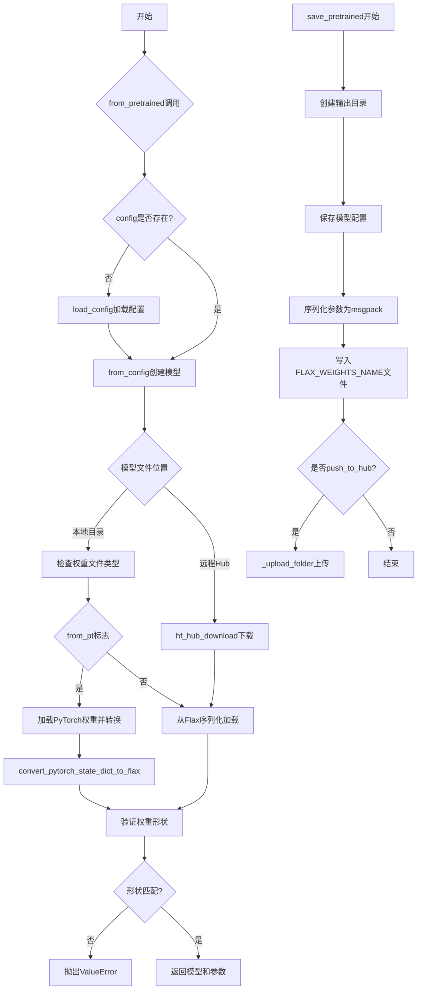

## 类结构

```
PushToHubMixin (混入类)
└── FlaxModelMixin (核心类)
    ├── _from_config (类方法)
    ├── _cast_floating_to (内部方法)
    ├── to_bf16 (公开方法)
    ├── to_fp32 (公开方法)
    ├── to_fp16 (公开方法)
    ├── init_weights (抽象方法)
    ├── from_pretrained (类方法)
    └── save_pretrained (实例方法)
```

## 全局变量及字段


### `logger`
    
模块级日志记录器，用于记录类加载、保存和转换过程中的信息

类型：`logging.Logger`
    


### `CONFIG_NAME`
    
配置文件名常量，用于指定模型配置文件的名称

类型：`str`
    


### `FLAX_WEIGHTS_NAME`
    
Flax权重文件名常量，指定Flax模型权重文件的保存名称

类型：`str`
    


### `WEIGHTS_NAME`
    
通用权重文件名常量，指定模型权重文件的通用名称

类型：`str`
    


### `HUGGINGFACE_CO_RESOLVE_ENDPOINT`
    
HuggingFace端点常量，用于解析模型仓库地址

类型：`str`
    


### `FlaxModelMixin.config_name`
    
模型配置文件名，默认值为CONFIG_NAME，用于保存和加载模型配置

类型：`str`
    


### `FlaxModelMixin._automatically_saved_args`
    
自动保存的参数列表，包含模型版本、类名和路径等元信息

类型：`list`
    


### `FlaxModelMixin._flax_internal_args`
    
Flax内部参数列表，用于标识Flax框架内部使用的特殊参数

类型：`list`
    
    

## 全局函数及方法


### `convert_pytorch_state_dict_to_flax`

将PyTorch模型的状态字典（state dictionary）转换为Flax模型兼容的参数格式，使得可以在Flax模型中加载原本使用PyTorch训练得到的权重。

参数：

- `pytorch_model_file`：`PyTorch state dict`，从PyTorch检查点文件加载的模型参数状态字典
- `model`：`Flax Linen Module`，目标Flax模型实例，用于提供参数结构信息

返回值：`dict`，转换后的Flax格式状态字典，可直接用于Flax模型的参数初始化

#### 流程图

```mermaid
flowchart TD
    A[开始转换] --> B[接收PyTorch state_dict和Flax模型]
    B --> C{遍历PyTorch state_dict中的键值对}
    C --> D[将PyTorch参数名称映射到Flax格式]
    D --> E[处理参数形状和类型转换]
    E --> F{是否所有参数都已转换?}
    F -->|否| C
    F -->|是| G[返回Flax格式state_dict]
    G --> H[结束]
    
    subgraph 名称映射规则
        I[例如: model.layers.0.weight -> params['layers']['0']['kernel']
        J[处理特殊层: LayerNorm, Embedding, Attention等]
    end
    
    D --> I
    I --> J
```

#### 带注释源码

```python
# 此函数定义在 modeling_flax_pytorch_utils 模块中
# 以下为调用处的使用示例和相关逻辑说明

# 1. 从PyTorch检查点文件加载state_dict
pytorch_model_file = load_state_dict(model_file)

# 2. 调用转换函数将PyTorch格式转换为Flax格式
# 参数1: pytorch_model_file - PyTorch的state_dict对象
# 参数2: model - 已实例化的Flax模型，用于获取目标参数结构
state = convert_pytorch_state_dict_to_flax(pytorch_model_file, model)

# 3. 转换后的state可以直接用于Flax模型
# 例如: model, params = model.from_pretrained(...)

# 转换函数内部主要完成:
# - 键名转换: PyTorch使用"."分隔符，Flax使用嵌套字典结构
# - 参数维度调整: PyTorch的[out_ch, in_ch, h, w] -> Flax的[in_ch, h, w, out_ch] (针对Conv层)
# - 形状变换: 例如 attention 的 qkv 权重需要从合并形式拆分为独立参数
# - dtype转换: PyTorch tensor -> JAX numpy array
```


### load_state_dict

从 PyTorch 模型权重文件中加载模型状态字典的函数。该函数将 PyTorch 权重文件加载为 Python 字典格式，供后续转换为 Flax 模型参数使用。

参数：

-  `pretrained_model_name_or_path`：`str` 或 `os.PathLike`，PyTorch 权重文件的路径，可以是本地文件路径或 HuggingFace Hub 上的模型 ID
-  `**kwargs`：可变关键字参数，支持额外的加载选项（如 `map_location`、`weights_only` 等）

返回值：`OrderedDict[str, torch.Tensor]`，返回包含模型权重的有序字典，键为参数名称，值为对应的 PyTorch 张量

#### 流程图

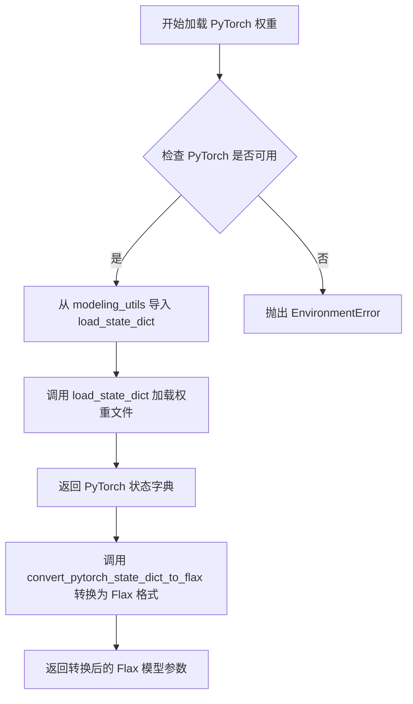

#### 带注释源码

```python
# 在 FlaxModelMixin.from_pretrained 方法中调用
if from_pt:
    # 检查 PyTorch 是否可用
    if is_torch_available():
        # 从同包下的 modeling_utils 模块导入 load_state_dict 函数
        from .modeling_utils import load_state_dict
    else:
        # 如果 PyTorch 不可用，抛出环境错误
        raise EnvironmentError(
            "Can't load the model in PyTorch format because PyTorch is not installed. "
            "Please, install PyTorch or use native Flax weights."
        )

    # 步骤 1: 获取 PyTorch 权重文件
    # 调用 load_state_dict 函数加载模型权重
    pytorch_model_file = load_state_dict(model_file)

    # 步骤 2: 将权重从 PyTorch 格式转换为 Flax 格式
    # 使用 convert_pytorch_state_dict_to_flax 函数进行转换
    state = convert_pytorch_state_dict_to_flax(pytorch_model_file, model)
```

---

**注意**：由于 `load_state_dict` 函数定义在 `modeling_utils` 模块中（该模块未在当前代码片段中提供），以上信息是基于其在当前代码中的使用方式进行提取和描述的。该函数是 diffusers 库中用于加载 PyTorch 预训练模型权重的核心函数。


### `from_bytes` (flax.serialization)

从字节序列反序列化对象，是 Flax 序列化模块的核心函数，用于将二进制数据转换回原始的 Python 对象（通常是字典或 FrozenDict 格式的模型参数）。

参数：

- `target`：目标类型或实例，用于指定反序列化后的对象类型。在代码中传入的是 `cls`（当前类），表示要反序列化成的模型类。
- `bytes`：字节数据，要反序列化的二进制数据。在代码中通过 `state_f.read()` 读取文件获得。

返回值：返回反序列化后的对象，通常是字典或 `FrozenDict` 类型的模型参数结构。

#### 流程图

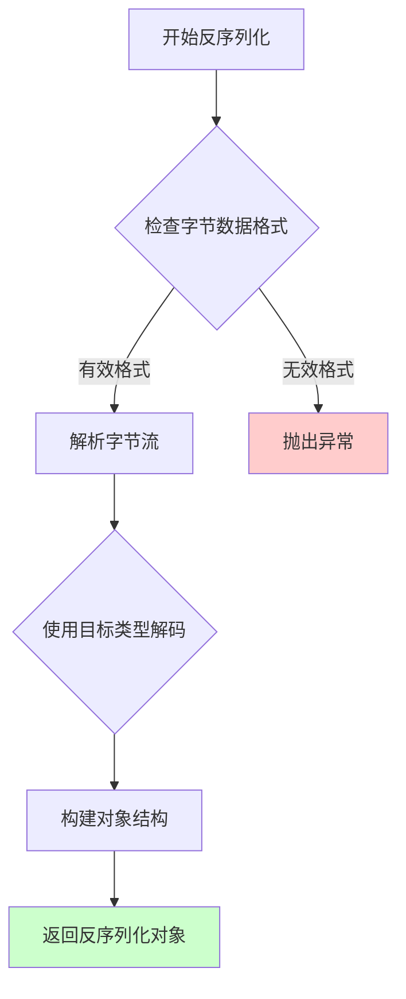

#### 带注释源码

```python
# from_bytes 函数的典型实现逻辑（基于 Flax 库）
# 以下为代码中使用 from_bytes 的上下文示例：

# 打开模型权重文件（二进制模式）
with open(model_file, "rb") as state_f:
    # 读取文件内容为字节数据
    byte_data = state_f.read()
    
    # 调用 from_bytes 进行反序列化
    # 第一个参数 cls 表示目标类（Flax 模型类）
    # 第二个参数是字节数据
    # 返回值 state 是反序列化后的参数字典
    state = from_bytes(cls, byte_data)

# 异常处理示例：
except (UnpicklingError, msgpack.exceptions.ExtraData) as e:
    # 如果反序列化失败（可能是格式错误或数据损坏）
    try:
        with open(model_file) as f:
            if f.read().startswith("version"):
                # 可能是 git-lfs 未安装导致的大文件未下载完整
                raise OSError("You seem to have cloned a repository without having git-lfs installed...")
            else:
                raise ValueError from e
    except (UnicodeDecodeError, ValueError):
        # 无法转换为 Flax 可反序列化的对象
        raise EnvironmentError(f"Unable to convert {model_file} to Flax deserializable object.")
```

> **注**：`from_bytes` 是 `flax.serialization` 模块提供的外部函数，具体实现位于 Flax 库中。上述源码展示了在 Diffusers 项目中如何调用该函数进行模型权重的反序列化操作。


### `to_bytes`

将模型参数（PyTree 结构）序列化为字节流，用于保存模型权重到文件。

参数：

- `params`：`dict | FrozenDict`，PyTree 结构的模型参数

返回值：`bytes`，序列化后的字节流

#### 流程图

```mermaid
flowchart TD
    A[开始] --> B[输入: params dict|FrozenDict]
    B --> C{调用 flax.serialization.to_bytes}
    C --> D[序列化过程: 将PyTree编码为字节]
    D --> E[输出: bytes 字节流]
    E --> F[结束]
    
    style C fill:#f9f,stroke:#333
    style D fill:#ff9,stroke:#333
```

#### 带注释源码

```python
# 在 FlaxModelMixin.save_pretrained 方法中使用
# 从 flax.serialization 导入的序列化函数
from flax.serialization import from_bytes, to_bytes

# ...

def save_pretrained(
    self,
    save_directory: str | os.PathLike,
    params: dict | FrozenDict,
    is_main_process: bool = True,
    push_to_hub: bool = False,
    **kwargs,
):
    # ...
    
    # 保存模型权重文件
    output_model_file = os.path.join(save_directory, FLAX_WEIGHTS_NAME)
    with open(output_model_file, "wb") as f:
        # 使用 to_bytes 将 PyTree 参数序列化为字节流
        # 参数: params - dict 或 FrozenDict 类型的模型参数
        # 返回值: bytes - 序列化后的字节数据
        model_bytes = to_bytes(params)
        f.write(model_bytes)
```

> **注意**: `to_bytes` 函数来源于外部库 `flax.serialization`，完整源码位于 Flax 库中。此处展示的是该函数在项目中的实际调用方式。该函数内部通常使用 msgpack 编码方式进行序列化，将复杂的嵌套字典（PyTree）结构转换为紧凑的字节表示，以便于模型权重的持久化存储。


### `flatten_dict`

将嵌套的字典（Nested Dict）扁平化为单层字典，键使用指定的分隔符连接。用于方便地对嵌套参数结构进行遍历和操作。

参数：

- `dict_in`：`PyTree`（通常是 `dict` 或 `FrozenDict`），需要扁平化的嵌套字典
- `key_separator`：`str`，可选参数，用于连接嵌套键的分隔符，默认为 `'.'`

返回值：`Dict[str, Any]`，扁平化后的单层字典，键为用分隔符连接后的字符串，值为原始字典中的叶子节点值

#### 流程图

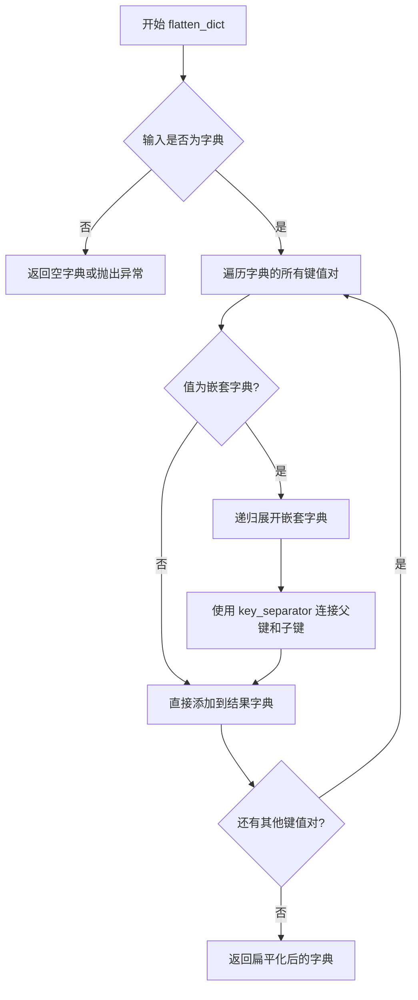

#### 带注释源码

```python
# 注意：这是 flax.traverse_util.flatten_dict 的使用示例
# 在 diffusers 代码中的实际调用方式如下：

# 场景1：在 _cast_floating_to 方法中，用于获取扁平化的参数以便按key处理mask
flat_params = flatten_dict(params)  # 将嵌套的params字典扁平化
flat_mask, _ = jax.tree_flatten(mask)  # 同时扁平化mask

# 场景2：在 from_pretrained 方法中，用于比较检查点参数和模型参数
state = flatten_dict(state)  # 扁平化从检查点加载的状态字典
required_params = set(flatten_dict(unfreeze(params_shape_tree)).keys())  # 获取模型需要的参数字段名

# 典型的 flatten_dict 结果示例：
# 输入: {'a': {'b': 1, 'c': 2}, 'd': 3}
# 输出: {'a.b': 1, 'a.c': 2, 'd': 3}  (使用默认的 '.' 分隔符)
```

---

### 补充信息

#### 在 `FlaxModelMixin` 类中的实际使用

| 方法 | 使用目的 |
|------|----------|
| `_cast_floating_to` | 将嵌套参数和mask都扁平化后，按key逐个应用条件转换 |
| `from_pretrained` | 扁平化检查点状态和模型参数结构，用于键集合的比较（required_params vs state.keys()） |

#### 与 `unflatten_dict` 配对使用

```python
# 先扁平化，处理后再还原
flat_params = flatten_dict(params)
# ... 对 flat_params 进行操作 ...
restored_params = unflatten_dict(flat_params)  # 还原为嵌套结构
```


### `flax.traverse_util.unflatten_dict`

将扁平化的字典（键为元组表示路径）还原为嵌套的字典结构。该函数与 `flatten_dict` 互为逆操作，常用于 JAX/Flax 中处理 PyTree 参数结构，将扁平的参数字典恢复为原始的模型参数层级结构。

参数：

- `flat_dict`：`Dict[Tuple[str, ...], Any]`，扁平化字典，其键为元组形式表示嵌套路径（例如 `("layer1", "weight")`）

返回值：`Dict[str, Any]`，还原后的嵌套字典结构

#### 流程图

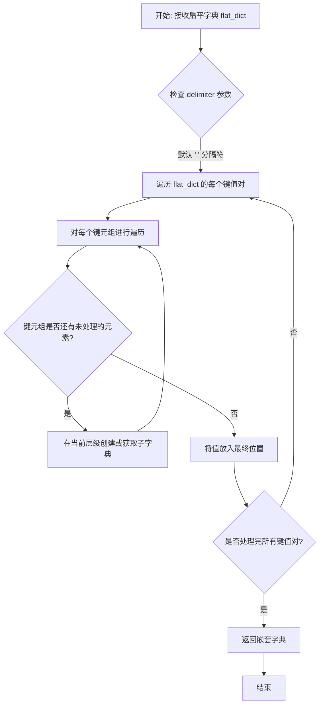

#### 带注释源码

```python
def unflatten_dict(
    flat_dict: Dict[Tuple[str, ...], Any],  # 扁平字典，键为元组路径
    delimiter: str = '.',                     # 分隔符，用于连接键
) -> Dict[str, Any]:
    """
    将扁平化的字典还原为嵌套字典结构。
    
    此函数是 flatten_dict 的逆操作。
    例如：
        输入: {('a', 'b'): 1, ('a', 'c'): 2}
        输出: {'a': {'b': 1, 'c': 2}}
    
    参数:
        flat_dict: 扁平化的字典，键为元组形式表示嵌套路径
        delimiter: 分隔符（保留参数，用于兼容性）
    
    返回:
        还原后的嵌套字典
    """
    # 初始化结果字典
    result: Dict[str, Any] = {}
    
    # 遍历扁平字典中的每个键值对
    for keys, value in flat_dict.items():
        # 从顶层开始构建嵌套结构
        current = result
        
        # 遍历键路径（除了最后一个键）
        for key in keys[:-1]:
            # 如果当前层级不存在该键，则创建新字典
            if key not in current:
                current[key] = {}
            # 移动到下一层
            current = current[key]
        
        # 将值放到最终的叶子位置
        current[keys[-1]] = value
    
    return result
```

#### 在 diffusers 项目中的实际使用

```python
# 在 FlaxModelMixin._cast_floating_to 方法中使用
def _cast_floating_to(self, params: dict | FrozenDict, dtype: jnp.dtype, mask: Any = None) -> Any:
    """将参数树中浮点数转换为指定 dtype"""
    
    # ... 省略部分代码 ...
    
    # 将扁平参数和掩码进行处理后
    # 关键步骤：使用 unflatten_dict 将扁平字典还原为嵌套结构
    return unflatten_dict(flat_params)
```

#### 使用示例

```python
from flax.traverse_util import flatten_dict, unflatten_dict

# 原始嵌套字典
original = {
    'model': {
        'encoder': {'weight': [1, 2, 3], 'bias': [0]},
        'decoder': {'weight': [4, 5, 6], 'bias': [1]}
    }
}

# 扁平化
flat = flatten_dict(original)
# flat = {('model', 'encoder', 'weight'): [1, 2, 3], ...}

# 还原为嵌套结构
restored = unflatten_dict(flat)
# restored == original
```


### FrozenDict

FrozenDict 是从 flax.core.frozen_dict 导入的不可变字典类，用于存储模型配置和参数，确保在训练或推理过程中不会被意外修改。它是 Flax PyTree 系统的一部分，支持树形结构操作。

#### 参数

由于 FrozenDict 是从外部库导入的类，以下为其构造方法的典型参数：

- `data`：`dict`，初始字典数据，用于初始化 FrozenDict 的内容
- `kwargs`：可选关键字参数，用于传递额外的初始化参数

#### 返回值

- `FrozenDict`：返回一个不可变的字典对象

#### 流程图

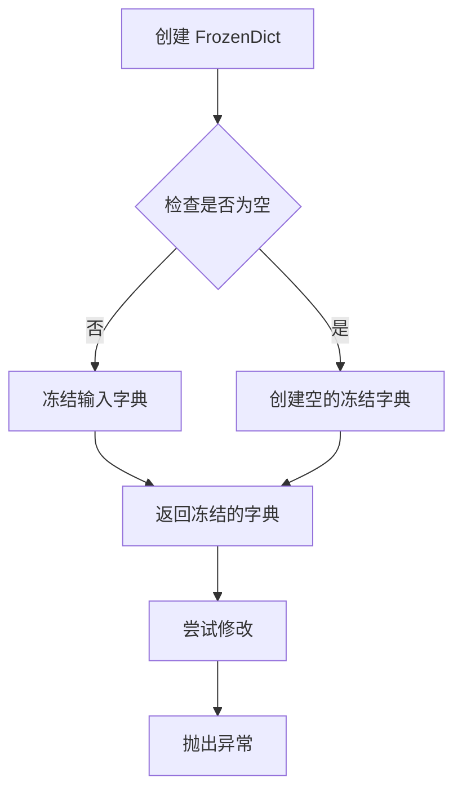

#### 带注释源码

```
# FrozenDict 是 Flax 提供的不可变字典实现
# 导入方式: from flax.core.frozen_dict import FrozenDict, unfreeze

# 在本代码中的典型用法示例:

# 1. 作为类型注解，用于描述参数字典
# params: dict | FrozenDict

# 2. 用于类型提示，表示方法接受普通字典或冻结字典
def _cast_floating_to(self, params: dict | FrozenDict, dtype: jnp.dtype, mask: Any = None) -> Any:
    """
    辅助方法，用于将参数树的浮点值转换为指定数据类型。
    FrozenDict 在这里作为类型注解使用，表示 params 可以是普通字典或不可变字典。
    """
    ...

# 3. 在 save_pretrained 方法中保存参数
# params: dict | FrozenDict - 模型参数的 PyTree

# 4. unfreeze 函数用于将 FrozenDict 转换回普通可变字典
# state = flatten_dict(unfreeze(params_shape_tree))

# FrozenDict 的特性:
# - 创建后不可修改，尝试修改会抛出异常
# - 支持哈希操作（因为不可变）
# - 与 Flax 的 PyTree 系统完全兼容
# - 可以通过 unfreeze() 函数解冻为普通字典
```


### `unfreeze`

解冻 FrozenDict，将不可变的 FrozenDict 对象转换为普通的可变 Python 字典，允许对其进行修改操作。

参数：

-  `frozen_dict`：`FrozenDict`，需要解冻的 FrozenDict 对象

返回值：`dict`，解冻后的普通 Python 字典

#### 流程图

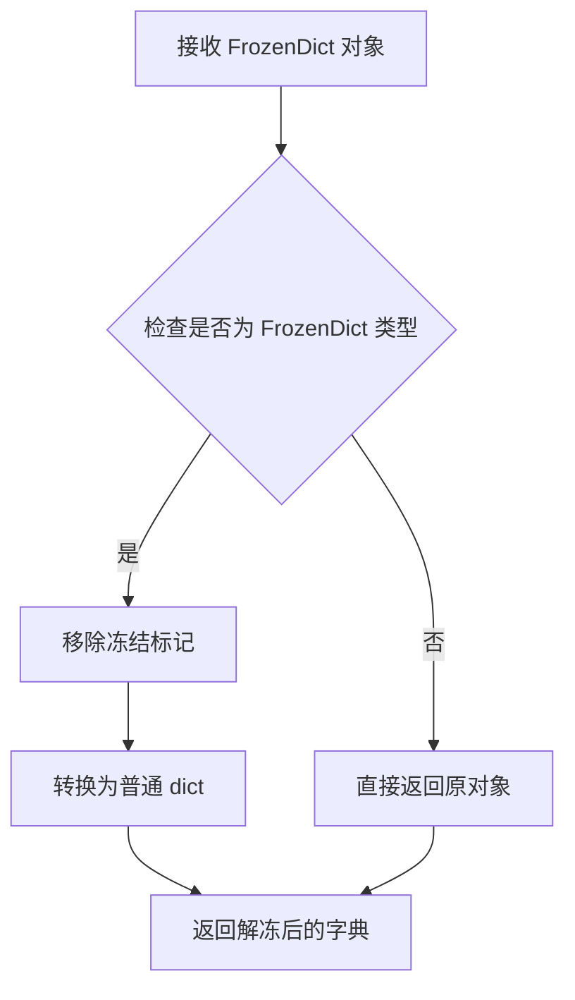

#### 带注释源码

```python
# unfreeze 函数定义位于 flax.core.frozen_dict 模块中
# 这是一个从外部库导入的函数，其源码如下（基于 Flax 库）:

def unfreeze(d):
    """
    Unfreeze a frozen dict.
    
    将 FrozenDict 转换为普通的可变字典。
    冻结的字典（FrozenDict）通常用于存储模型配置或参数，
    以防止意外修改。解冻后可以对其进行修改操作。
    
    参数:
        d: 需要解冻的 FrozenDict 对象
        
    返回:
        普通的 Python dict 对象
    """
    if isinstance(d, FrozenDict):
        # 创建一个新的普通字典，复制 FrozenDict 的所有内容
        return dict(d._dict)
    else:
        # 如果不是 FrozenDict，直接返回原对象
        return d
```

#### 使用示例

在 `FlaxModelMixin.from_pretrained` 方法中的实际使用：

```python
# 在 from_pretrained 方法中，用于获取模型参数的形状信息
# 这里 unfreeze 用于将 FrozenDict 转换为普通字典以便进行集合操作

# 获取模型初始化后的参数形状树
params_shape_tree = jax.eval_shape(model.init_weights, rng=jax.random.PRNGKey(0))

# 解冻形状树，获取所需的参数键集合
required_params = set(flatten_dict(unfreeze(params_shape_tree)).keys())

# 同样解冻用于后续的形状状态比较
shape_state = flatten_dict(unfreeze(params_shape_tree))
```

#### 关键特性说明

| 特性 | 说明 |
|------|------|
| 类型转换 | 将不可变的 `FrozenDict` 转换为可变的 `dict` |
| 安全性 | 原始 FrozenDict 保持不变，返回新的 dict 对象 |
| 条件判断 | 如果输入不是 FrozenDict，则直接返回原对象 |
| 用途 | 主要用于需要修改模型参数配置的场景 |


### `hf_hub_download`

从HuggingFace Hub下载指定的模型权重文件或配置文件，支持缓存管理、代理设置、认证和版本控制，是Flax模型从预训练checkpoint加载的关键网络请求函数。

参数：

- `repo_id`：`str`，HuggingFace Hub上的模型ID（例如`"stable-diffusion-v1-5/stable-diffusion-v1-5"`）或本地目录路径
- `filename`：`str`，要下载的文件名（如`"flax_model.msgpack"`或`"pytorch_model.bin"`）
- `cache_dir`：`str | os.PathLike | None`，下载文件的缓存目录，默认为None使用HuggingFace默认缓存
- `force_download`：`bool`，是否强制重新下载而不使用缓存，默认为`False`
- `proxies`：`dict[str, str] | None`，HTTP/HTTPS代理服务器字典，用于网络请求
- `local_files_only`：`bool`，是否仅使用本地缓存文件而不进行网络请求，默认为`False`
- `token`：`str | None`，用于认证的HuggingFace访问令牌
- `user_agent`：`dict | None`，标识客户端的用户代理字典，包含框架信息等
- `subfolder`：`str | None`，仓库中的子文件夹路径
- `revision`：`str`，Git版本标识（分支名、标签名或提交ID），默认为`"main"`

返回值：`str`，返回下载文件在本地的缓存路径

#### 流程图

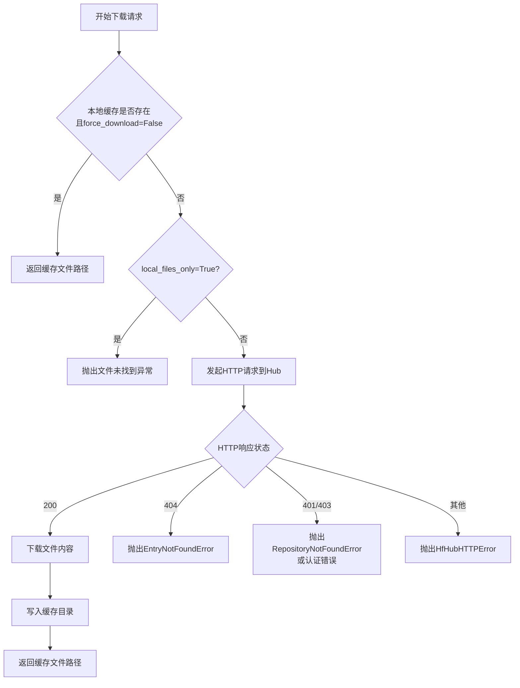

#### 带注释源码

```python
# 在 FlaxModelMixin.from_pretrained 方法中的调用位置
# 当预训练模型路径不是本地目录时，尝试从HuggingFace Hub下载

try:
    # 调用 hf_hub_download 从Hub下载模型权重文件
    model_file = hf_hub_download(
        pretrained_model_name_or_path,       # 模型ID或路径
        filename=FLAX_WEIGHTS_NAME if not from_pt else WEIGHTS_NAME,  # 根据来源选择文件名
        cache_dir=cache_dir,                  # 缓存目录
        force_download=force_download,        # 是否强制下载
        proxies=proxies,                      # 代理服务器
        local_files_only=local_files_only,    # 仅本地文件
        token=token,                           # 认证令牌
        user_agent=user_agent,                 # 用户代理信息
        subfolder=subfolder,                   # 子文件夹
        revision=revision,                    # 版本/分支
    )

# 异常处理：捕获各种可能的Hub相关错误并转换为EnvironmentError
except RepositoryNotFoundError:
    # 仓库不存在或无访问权限
    raise EnvironmentError(
        f"{pretrained_model_name_or_path} is not a local folder and is not a valid model identifier "
        "listed on 'https://huggingface.co/models'\nIf this is a private repository, make sure to pass a "
        "token having permission to this repo with `token` or log in with `hf auth login`."
    )
except RevisionNotFoundError:
    # 指定的版本/分支/标签不存在
    raise EnvironmentError(
        f"{revision} is not a valid git identifier (branch name, tag name or commit id) that exists for "
        "this model name. Check the model page at "
        f"'https://huggingface.co/{pretrained_model_name_or_path}' for available revisions."
    )
except EntryNotFoundError:
    # 指定的文件名在仓库中不存在
    raise EnvironmentError(
        f"{pretrained_model_name_or_path} does not appear to have a file named {FLAX_WEIGHTS_NAME}."
    )
except HfHubHTTPError as err:
    # 其他HTTP连接错误
    raise EnvironmentError(
        f"There was a specific connection error when trying to load {pretrained_model_name_or_path}:\n"
        f"{err}"
    )
except ValueError:
    # 无法连接到Hub且本地无缓存
    raise EnvironmentError(
        f"We couldn't connect to '{HUGGINGFACE_CO_RESOLVE_ENDPOINT}' to load this model, couldn't find it"
        f" in the cached files and it looks like {pretrained_model_name_or_path} is not the path to a"
        f" directory containing a file named {FLAX_WEIGHTS_NAME} or {WEIGHTS_NAME}.\nCheckout your"
        " internet connection or see how to run the library in offline mode at"
        " 'https://huggingface.co/docs/transformers/installation#offline-mode'."
    )
except EnvironmentError:
    # 其他环境/加载错误
    raise EnvironmentError(
        f"Can't load the model for '{pretrained_model_name_or_path}'. If you were trying to load it from "
        "'https://huggingface.co/models', make sure you don't have a local directory with the same name. "
        f"Otherwise, make sure '{pretrained_model_name_or_path}' is the correct path to a directory "
        f"containing a file named {FLAX_WEIGHTS_NAME} or {WEIGHTS_NAME}."
    )
```


### `create_repo`

该函数用于在 Hugging Face Hub 上创建新的模型仓库。它通过 `huggingface_hub` 库提供，是 `FlaxModelMixin.save_pretrained` 方法在 `push_to_hub=True` 时用于创建远程仓库的核心依赖。

参数：

- `repo_id`：`str`，必填。仓库的唯一标识符，通常格式为 `用户名/仓库名` 或仅仓库名（默认使用当前用户名）。
- `exist_ok`：`bool`，可选，默认 `False`。如果设为 `True`，当仓库已存在时不会抛出错误。
- `private`：`bool`，可选，默认 `False`。是否创建私有仓库。
- `token`：`str`，可选。用于身份验证的访问令牌。
- `repo_type`：`str`，可选，默认 `"model"`。仓库类型，可选值包括 `"model"`、`"dataset"`、`"space"`。
- `revision`：`str`，可选，默认 `"main"`。仓库的分支或提交 revision。
- `description`：`str`，可选。仓库的描述信息。
- `full_name`：`str`，可选。仓库的全名（包含命名空间）。

返回值：`HfApiResponse` 或类似对象，包含 `repo_id` 属性，表示创建的仓库ID。

#### 流程图

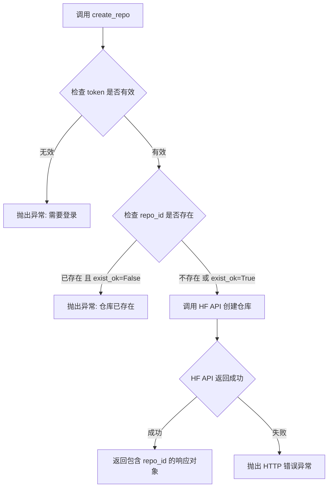

#### 带注释源码

```python
# 在 FlaxModelMixin.save_pretrained 方法中的调用示例：
if push_to_hub:
    commit_message = kwargs.pop("commit_message", None)
    private = kwargs.pop("private", None)
    create_pr = kwargs.pop("create_pr", False)
    token = kwargs.pop("token", None)
    # 从 save_directory 提取仓库名作为 repo_id
    repo_id = kwargs.pop("repo_id", save_directory.split(os.path.sep)[-1])
    # 调用 huggingface_hub 的 create_repo 函数创建远程仓库
    # exist_ok=True 允许覆盖已存在的仓库
    repo_id = create_repo(repo_id, exist_ok=True, private=private, token=token).repo_id

# create_repo 函数签名（基于 huggingface_hub 库）:
# def create_repo(
#     repo_id: str,
#     token: Optional[str] = None,
#     private: Optional[bool] = False,
#     repo_type: Optional[str] = "model",
#     exist_ok: Optional[bool] = False,
#     revision: Optional[str] = "main",
#     description: Optional[str] = None,
#     full_name: Optional[str] = None,
#     ) -> HfApiResponse:
#     """
#     Create a new model repository on the Hugging Face Hub.
#     """
```


### `FlaxModelMixin._from_config`

该方法是 Flax 模型的配置初始化入口，作为类方法接收模型配置对象和额外关键字参数，然后实例化并返回对应的模型对象。

参数：

- `cls`：类型 `cls`（隐式类对象），表示调用此方法的类本身
- `config`：类型 `Any`，模型的配置对象，包含模型的结构和参数信息
- `**kwargs`：类型 `**kwargs`（可变关键字参数），传递给模型 `__init__` 方法的其他参数

返回值：`Any`，返回根据配置实例化的模型对象

#### 流程图

```mermaid
flowchart TD
    A[开始 _from_config] --> B[接收 config 和 kwargs]
    B --> C[调用 cls 构造函数]
    C --> D[cls.__init__(config, **kwargs)]
    D --> E[返回模型实例]
    E --> F[结束]
```

#### 带注释源码

```python
@classmethod
def _from_config(cls, config, **kwargs):
    """
    All context managers that the model should be initialized under go here.
    """
    # 使用类构造器 cls() 实例化模型，传入配置和额外参数
    return cls(config, **kwargs)
```

#### 说明

该方法是一个简洁的类方法包装器，其核心功能是将配置对象传递给模型类的构造函数。这是 Diffusers 库中 Flax 模型 mixin 的标准模式，允许通过配置对象动态创建模型实例。方法设计遵循了配置驱动的模型初始化理念，支持灵活的参数传递机制。


### `FlaxModelMixin._cast_floating_to`

辅助方法，用于将模型参数 PyTree 中的浮点数值转换为指定的数据类型（dtype），支持通过掩码选择性地转换部分参数。

参数：

- `self`：`FlaxModelMixin` 实例，调用此方法的模型对象
- `params`：`dict | FrozenDict`，模型参数的 PyTree 结构
- `dtype`：`jnp.dtype`，目标数据类型（如 `jnp.bfloat16`、`jnp.float32`、`jnp.float16`）
- `mask`：`Any = None`，可选的布尔掩码 PyTree，与 params 结构相同，True 表示需要转换的参数，False 表示跳过

返回值：`Any`，转换后的参数 PyTree，返回新的参数树（不修改原始参数）

#### 流程图

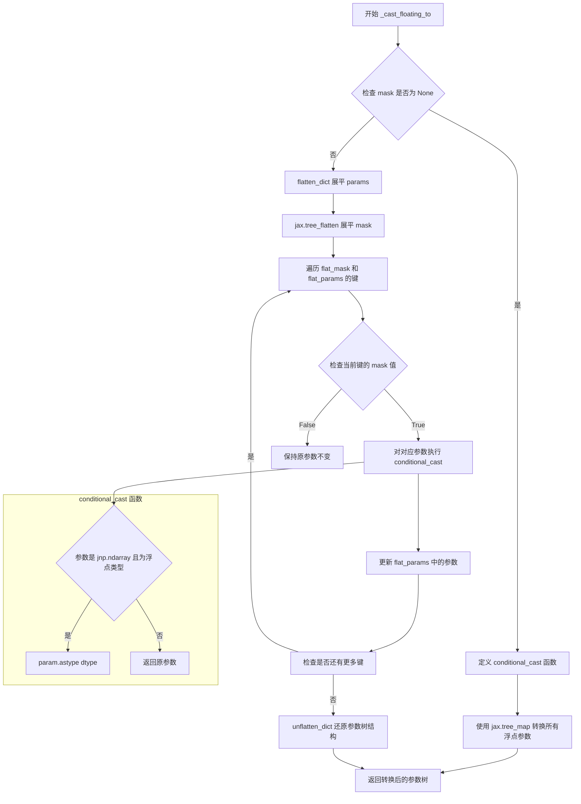

#### 带注释源码

```python
def _cast_floating_to(self, params: dict | FrozenDict, dtype: jnp.dtype, mask: Any = None) -> Any:
    """
    Helper method to cast floating-point values of given parameter `PyTree` to given `dtype`.
    """
    
    # 参考自 https://github.com/deepmind/jmp/blob/3a8318abc3292be38582794dbf7b094e6583b192/jmp/_src/policy.py#L27
    def conditional_cast(param):
        # 检查参数是否为 JAX 数组且为浮点数据类型
        if isinstance(param, jnp.ndarray) and jnp.issubdtype(param.dtype, jnp.floating):
            # 将参数转换为目标 dtype
            param = param.astype(dtype)
        return param

    # 如果没有提供 mask，则直接对所有参数进行转换
    if mask is None:
        return jax.tree_map(conditional_cast, params)

    # 如果提供了 mask，则只转换 mask 中为 True 的参数
    # 将 params 和 mask 展平为字典形式
    flat_params = flatten_dict(params)
    flat_mask, _ = jax.tree_flatten(mask)

    # 遍历 mask 和 params 的键，根据 mask 值决定是否转换
    for masked, key in zip(flat_mask, flat_params.keys()):
        if masked:
            param = flat_params[key]
            flat_params[key] = conditional_cast(param)

    # 将展平的参数树还原为原始结构并返回
    return unflatten_dict(flat_params)
```


### `FlaxModelMixin.to_bf16`

将模型参数（PyTree）转换为 bfloat16 数据类型，用于 TPU 上的半精度训练或推理，可通过 mask 选择性转换参数。

参数：

- `self`：`FlaxModelMixin` 实例，当前模型对象
- `params`：`dict | FrozenDict`，模型参数的 PyTree 结构
- `mask`：`dict | FrozenDict`，可选参数，与 params 结构相同的掩码，True 表示需要转换，False 表示跳过

返回值：`Any`，返回转换后的新参数树（不修改原始 params）

#### 流程图

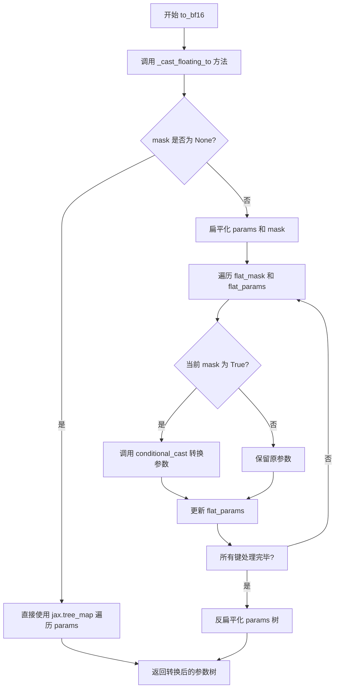

#### 带注释源码

```python
def to_bf16(self, params: dict | FrozenDict, mask: Any = None):
    r"""
    Cast the floating-point `params` to `jax.numpy.bfloat16`. This returns a new `params` tree and does not cast
    the `params` in place.

    This method can be used on a TPU to explicitly convert the model parameters to bfloat16 precision to do full
    half-precision training or to save weights in bfloat16 for inference in order to save memory and improve speed.

    Arguments:
        params (`dict | FrozenDict`):
            A `PyTree` of model parameters.
        mask (`dict | FrozenDict`):
            A `PyTree` with same structure as the `params` tree. The leaves should be booleans. It should be `True`
            for params you want to cast, and `False` for those you want to skip.

    Examples:

    ```python
    >>> from diffusers import FlaxUNet2DConditionModel

    >>> # load model
    >>> model, params = FlaxUNet2DConditionModel.from_pretrained("stable-diffusion-v1-5/stable-diffusion-v1-5")
    >>> # By default, the model parameters will be in fp32 precision, to cast these to bfloat16 precision
    >>> params = model.to_bf16(params)
    >>> # If you don't want to cast certain parameters (for example layer norm bias and scale)
    >>> # then pass the mask as follows
    >>> from flax import traverse_util

    >>> model, params = FlaxUNet2DConditionModel.from_pretrained("stable-diffusion-v1-5/stable-diffusion-v1-5")
    >>> flat_params = traverse_util.flatten_dict(params)
    >>> mask = {
    ...     path: (path[-2] != ("LayerNorm", "bias") and path[-2:] != ("LayerNorm", "scale"))
    ...     for path in flat_params
    ... }
    >>> mask = traverse_util.unflatten_dict(mask)
    >>> params = model.to_bf16(params, mask)
    ```"""
    # 调用内部方法 _cast_floating_to，指定目标 dtype 为 bfloat16
    return self._cast_floating_to(params, jnp.bfloat16, mask)
```


### `FlaxModelMixin.to_fp32`

该方法用于将模型参数（PyTree）显式转换为 `jax.numpy.float32` 精度，并返回一个新的参数树，不会原地修改原参数。可选地通过 mask 参数指定需要转换的参数。

参数：

- `self`：`FlaxModelMixin` 实例，调用该方法的模型对象
- `params`：`dict | FrozenDict`，模型参数的 PyTree 结构
- `mask`：`Any`，可选参数，与 params 结构相同的 PyTree，叶子节点为布尔值，True 表示需要转换的参数，False 表示跳过

返回值：`Any`，返回转换后的新 params 树

#### 流程图

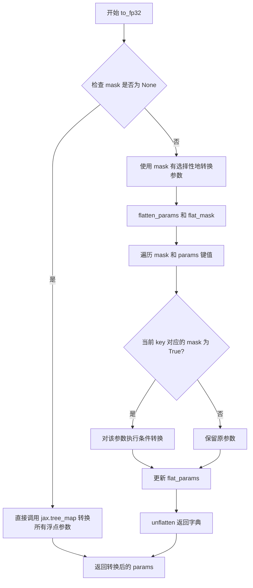

#### 带注释源码

```python
def to_fp32(self, params: dict | FrozenDict, mask: Any = None):
    r"""
    Cast the floating-point `params` to `jax.numpy.float32`. This method can be used to explicitly convert the
    model parameters to fp32 precision. This returns a new `params` tree and does not cast the `params` in place.

    Arguments:
        params (`dict | FrozenDict`):
            A `PyTree` of model parameters.
        mask (`dict | FrozenDict`):
            A `PyTree` with same structure as the `params` tree. The leaves should be booleans. It should be `True`
            for params you want to cast, and `False` for those you want to skip.

    Examples:

    ```python
    >>> from diffusers import FlaxUNet2DConditionModel

    >>> # Download model and configuration from huggingface.co
    >>> model, params = FlaxUNet2DConditionModel.from_pretrained("stable-diffusion-v1-5/stable-diffusion-v1-5")
    >>> # By default, the model params will be in fp32, to illustrate the use of this method,
    >>> # we'll first cast to fp16 and back to fp32
    >>> params = model.to_f16(params)
    >>> # now cast back to fp32
    >>> params = model.to_fp32(params)
    ```"""
    # 调用内部 helper 方法 _cast_floating_to，传入 float32 作为目标数据类型
    return self._cast_floating_to(params, jnp.float32, mask)
```


### `FlaxModelMixin.to_fp16`

该方法用于将模型参数（PyTree结构）转换为`jax.numpy.float16`数据类型，返回一个新的参数树而不修改原始参数。可选地通过mask指定需要转换的参数，适用于GPU上的半精度训练或推理，以节省内存并提升速度。

参数：

- `self`：`FlaxModelMixin`类实例，调用该方法的对象本身
- `params`：`dict | FrozenDict`，模型参数的PyTree结构
- `mask`：`dict | FrozenDict`，可选参数，与params结构相同的掩码树，叶子节点为布尔值。为`True`表示需要转换的参数，`False`表示跳过

返回值：`Any`（返回`dict | FrozenDict`），转换后的新参数树

#### 流程图

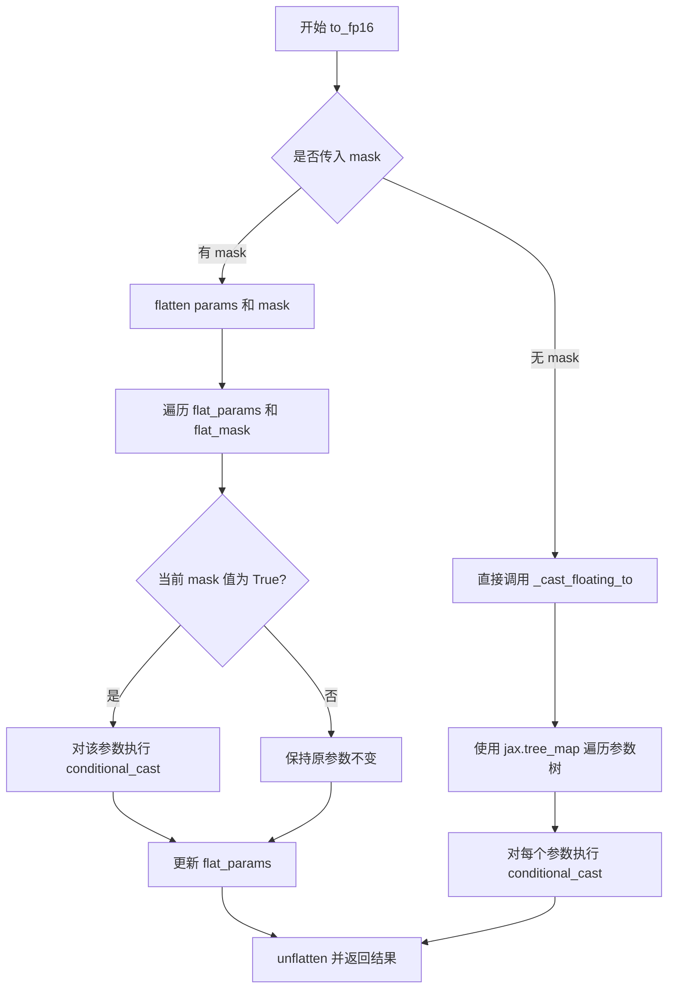

#### 带注释源码

```python
def to_fp16(self, params: dict | FrozenDict, mask: Any = None):
    r"""
    Cast the floating-point `params` to `jax.numpy.float16`. This returns a new `params` tree and does not cast the
    `params` in place.

    This method can be used on a GPU to explicitly convert the model parameters to float16 precision to do full
    half-precision training or to save weights in float16 for inference in order to save memory and improve speed.

    Arguments:
        params (`dict | FrozenDict`):
            A `PyTree` of model parameters.
        mask (`dict | FrozenDict`):
            A `PyTree` with same structure as the `params` tree. The leaves should be booleans. It should be `True`
            for params you want to cast, and `False` for those you want to skip.

    Examples:

    ```python
    >>> from diffusers import FlaxUNet2DConditionModel

    >>> # load model
    >>> model, params = FlaxUNet2DConditionModel.from_pretrained("stable-diffusion-v1-5/stable-diffusion-v1-5")
    >>> # By default, the model params will be in fp32, to cast these to float16
    >>> params = model.to_fp16(params)
    >>> # If you want don't want to cast certain parameters (for example layer norm bias and scale)
    >>> # then pass the mask as follows
    >>> from flax import traverse_util

    >>> model, params = FlaxUNet2DConditionModel.from_pretrained("stable-diffusion-v1-5/stable-diffusion-v1-5")
    >>> flat_params = traverse_util.flatten_dict(params)
    >>> mask = {
    ...     path: (path[-2] != ("LayerNorm", "bias") and path[-2:] != ("LayerNorm", "scale"))
    ...     for path in flat_params
    ... }
    >>> mask = traverse_util.unflatten_dict(mask)
    >>> params = model.to_fp16(params, mask)
    ```"""
    # 调用内部辅助方法 _cast_floating_to，指定目标dtype为 jnp.float16
    return self._cast_floating_to(params, jnp.float16, mask)
```


### `FlaxModelMixin.init_weights`

该方法是 Flax 模型 mixin 的抽象方法，用于初始化模型的权重参数。由于这是一个基类方法，目前的实现只是抛出 `NotImplementedError`，具体实现由子类完成。

参数：

- `self`：实例方法隐含的 `self` 参数，指向模型实例本身
- `rng`：`jax.Array`，JAX 随机数数组，用于生成权重初始化随机种子

返回值：`dict`，初始化后的模型参数字典（由子类实现具体逻辑）

#### 流程图

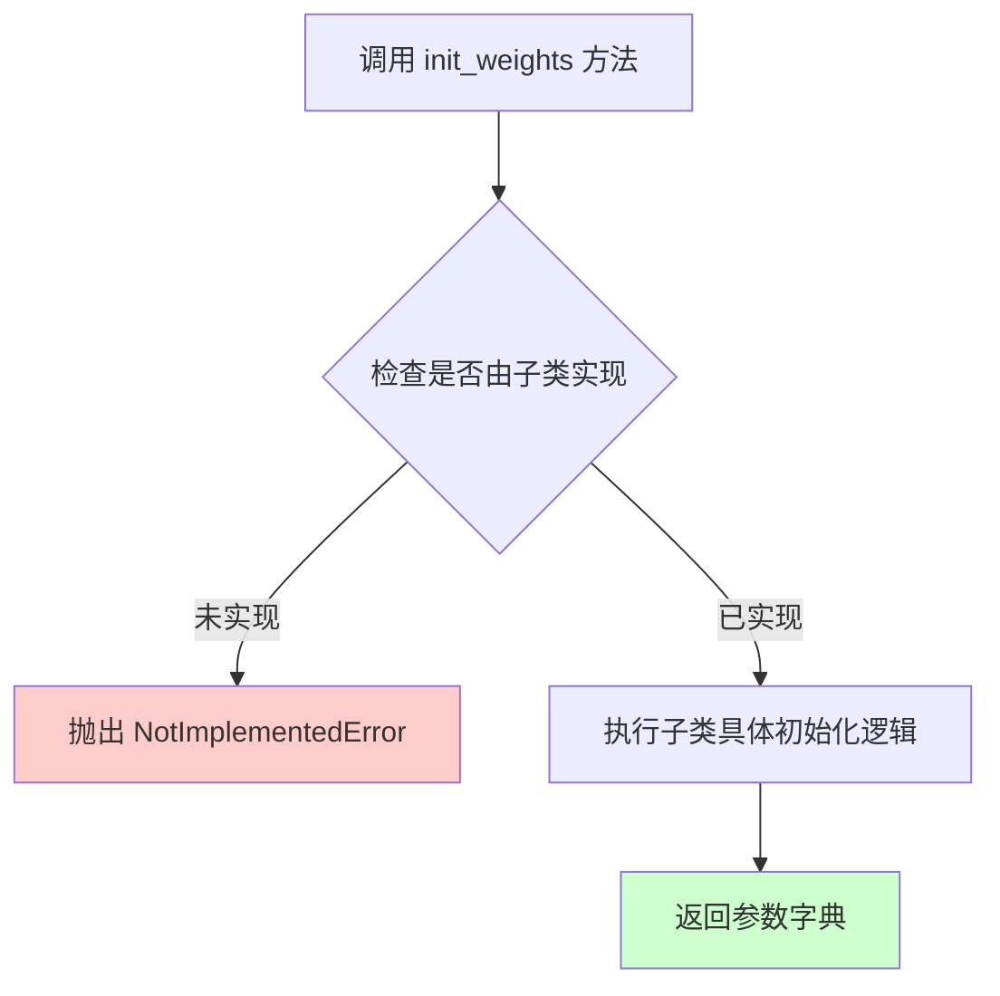

#### 带注释源码

```python
def init_weights(self, rng: jax.Array) -> dict:
    """
    初始化模型权重的方法。
    
    参数:
        rng: jax.Array - JAX 随机数生成器，用于权重初始化
    
    返回:
        dict - 包含初始化后模型参数的字典
    
    注意:
        此方法为抽象方法，需要在子类中实现具体逻辑。
        当前实现仅抛出 NotImplementedError 异常。
    """
    raise NotImplementedError(f"init_weights method has to be implemented for {self}")
```


### `FlaxModelMixin.from_pretrained`

该方法是一个类方法，用于从预训练模型配置实例化 Flax 模型，支持从本地目录或 Hugging Face Hub 加载模型权重，并可选地将 PyTorch 权重转换为 Flax 格式。

参数：

- `cls`：类型 `Class`，调用类本身
- `pretrained_model_name_or_path`：类型 `str | os.PathLike`，模型 ID（如 `stable-diffusion-v1-5/stable-diffusion-v1-5`）或本地目录路径
- `dtype`：类型 `jax.numpy.dtype`，默认为 `jnp.float32`，计算时使用的数据类型
- `model_args`：类型 `sequence of positional arguments`，传递给模型 `__init__` 的剩余位置参数
- `cache_dir`：类型 `str | os.PathLike`，可选，缓存目录路径
- `force_download`：类型 `bool`，可选，默认为 `False`，是否强制重新下载
- `from_pt`：类型 `bool`，可选，默认为 `False`，是否从 PyTorch 权重加载
- `proxies`：类型 `dict[str, str]`，可选，代理服务器配置
- `local_files_only`：类型 `bool`，可选，默认为 `False`，是否仅使用本地文件
- `token`：类型 `optional`，可选，Hugging Face 认证令牌
- `revision`：类型 `str`，可选，默认为 `"main"`，Git 版本标识
- `subfolder`：类型 `optional`，可选，模型文件子目录
- `kwargs`：类型 `dict`，可选，用于更新配置或传递给模型初始化函数的其他关键字参数

返回值：类型 `Tuple[model, params]`，返回模型实例和参数字典

#### 流程图

```mermaid
flowchart TD
    A[开始] --> B[解析并弹出 kwargs 中的参数: config, cache_dir, force_download, from_pt, proxies, local_files_only, token, revision, subfolder]
    B --> C[创建 user_agent 字典]
    C --> D{config 是否为 None?}
    D -->|是| E[调用 cls.load_config 加载配置]
    E --> F[返回 config 和 unused_kwargs]
    D -->|否| G[使用传入的 config]
    F --> H
    G --> H[调用 cls.from_config 创建模型]
    H --> I[确定模型文件路径]
    I --> J{pretrained_path 是否为目录?}
    J -->|是| K{from_pt 为 True?}
    J -->|否| L[调用 hf_hub_download 下载模型文件]
    K -->|是| M[检查 WEIGHTS_NAME 文件存在]
    K -->|否| N{检查 FLAX_WEIGHTS_NAME 存在?}
    M --> O[设置 model_file 路径]
    N -->|是| O
    N -->|否| P{检查 WEIGHTS_NAME 存在?}
    P -->|是| Q[抛出异常: 请使用 from_pt=True]
    P -->|否| R[抛出异常: 未找到权重文件]
    L --> S[处理各种异常: RepositoryNotFoundError, RevisionNotFoundError, EntryNotFoundError 等]
    S --> O
    O --> T{from_pt 为 True?}
    T -->|是| U[加载 PyTorch 权重文件]
    T -->|否| V[打开 Flax 模型文件并反序列化]
    U --> W[调用 convert_pytorch_state_dict_to_flax 转换权重]
    V --> X
    W --> X[将状态数组移到 CPU 设备]
    X --> Y[扁平化状态字典]
    Y --> Z[调用 model.init_weights 获取参数形状树]
    Z --> AA[计算必需的参数键集合]
    AA --> BB[计算缺失键和意外键]
    BB --> CC{有缺失键?}
    CC -->|是| DD[记录警告并设置 cls._missing_keys]
    CC -->|否| EE
    DD --> EE{有意外键?}
    EE -->|是| FF[从状态中删除意外键并记录警告]
    EE -->|否| GG[记录信息: 所有权重已使用]
    FF --> HH[返回 model 和 unflatten_dict(state)]
    GG --> HH
    
    style A fill:#f9f,color:#000
    style HH fill:#9f9,color:#000
```

#### 带注释源码

```python
@classmethod
@validate_hf_hub_args
def from_pretrained(
    cls,  # 类本身
    pretrained_model_name_or_path: str | os.PathLike,  # 模型 ID 或本地路径
    dtype: jnp.dtype = jnp.float32,  # 计算数据类型
    *model_args,  # 传递给模型 __init__ 的位置参数
    **kwargs,  # 其他关键字参数
):
    r"""
    Instantiate a pretrained Flax model from a pretrained model configuration.

    Parameters:
        pretrained_model_name_or_path (`str` or `os.PathLike`):
            Can be either:
                - A string, the *model id* (for example `stable-diffusion-v1-5/stable-diffusion-v1-5`) of a
                  pretrained model hosted on the Hub.
                - A path to a *directory* (for example `./my_model_directory`) containing the model weights saved
                  using [`~FlaxModelMixin.save_pretrained`].
        dtype (`jax.numpy.dtype`, *optional*, defaults to `jax.numpy.float32`):
            The data type of the computation. Can be one of `jax.numpy.float32`, `jax.numpy.float16` (on GPUs) and
            `jax.numpy.bfloat16` (on TPUs).
        model_args (sequence of positional arguments, *optional*):
            All remaining positional arguments are passed to the underlying model's `__init__` method.
        kwargs: Additional arguments including config, cache_dir, force_download, from_pt, proxies, 
                local_files_only, token, revision, subfolder, etc.
    """
    # 发出废弃警告
    logger.warning(
        "Flax classes are deprecated and will be removed in Diffusers v1.0.0. We "
        "recommend migrating to PyTorch classes or pinning your version of Diffusers."
    )
    
    # 从 kwargs 中弹出各种配置参数
    config = kwargs.pop("config", None)
    cache_dir = kwargs.pop("cache_dir", None)
    force_download = kwargs.pop("force_download", False)
    from_pt = kwargs.pop("from_pt", False)
    proxies = kwargs.pop("proxies", None)
    local_files_only = kwargs.pop("local_files_only", False)
    token = kwargs.pop("token", None)
    revision = kwargs.pop("revision", None)
    subfolder = kwargs.pop("subfolder", None)

    # 创建用户代理信息
    user_agent = {
        "diffusers": __version__,
        "file_type": "model",
        "framework": "flax",
    }

    # 如果没有提供 config，则从预训练模型加载配置
    if config is None:
        config, unused_kwargs = cls.load_config(
            pretrained_model_name_or_path,
            cache_dir=cache_dir,
            return_unused_kwargs=True,
            force_download=force_download,
            proxies=proxies,
            local_files_only=local_files_only,
            token=token,
            revision=revision,
            subfolder=subfolder,
            **kwargs,
        )

    # 从配置实例化模型
    model, model_kwargs = cls.from_config(config, dtype=dtype, return_unused_kwargs=True, **unused_kwargs)

    # 构建包含子文件夹的完整路径
    pretrained_path_with_subfolder = (
        pretrained_model_name_or_path
        if subfolder is None
        else os.path.join(pretrained_model_name_or_path, subfolder)
    )
    
    # 判断是从本地加载还是从 Hub 下载
    if os.path.isdir(pretrained_path_with_subfolder):
        # 本地目录情况
        if from_pt:
            # 从 PyTorch 权重加载
            if not os.path.isfile(os.path.join(pretrained_path_with_subfolder, WEIGHTS_NAME)):
                raise EnvironmentError(
                    f"Error no file named {WEIGHTS_NAME} found in directory {pretrained_path_with_subfolder} "
                )
            model_file = os.path.join(pretrained_path_with_subfolder, WEIGHTS_NAME)
        elif os.path.isfile(os.path.join(pretrained_path_with_subfolder, FLAX_WEIGHTS_NAME)):
            # 从 Flax 检查点加载
            model_file = os.path.join(pretrained_path_with_subfolder, FLAX_WEIGHTS_NAME)
        # 检查是否存在 PyTorch 权重
        elif os.path.isfile(os.path.join(pretrained_path_with_subfolder, WEIGHTS_NAME)):
            raise EnvironmentError(
                f"{WEIGHTS_NAME} file found in directory {pretrained_path_with_subfolder}. Please load the model"
                " using `from_pt=True`."
            )
        else:
            raise EnvironmentError(
                f"Error no file named {FLAX_WEIGHTS_NAME} or {WEIGHTS_NAME} found in directory "
                f"{pretrained_path_with_subfolder}."
            )
    else:
        # 从 Hugging Face Hub 下载
        try:
            model_file = hf_hub_download(
                pretrained_model_name_or_path,
                filename=FLAX_WEIGHTS_NAME if not from_pt else WEIGHTS_NAME,
                cache_dir=cache_dir,
                force_download=force_download,
                proxies=proxies,
                local_files_only=local_files_only,
                token=token,
                user_agent=user_agent,
                subfolder=subfolder,
                revision=revision,
            )

        except RepositoryNotFoundError:
            raise EnvironmentError(
                f"{pretrained_model_name_or_path} is not a local folder and is not a valid model identifier "
                "listed on 'https://huggingface.co/models'\nIf this is a private repository, make sure to pass a "
                "token having permission to this repo with `token` or log in with `hf auth login`."
            )
        except RevisionNotFoundError:
            raise EnvironmentError(
                f"{revision} is not a valid git identifier (branch name, tag name or commit id) that exists for "
                "this model name. Check the model page at "
                f"'https://huggingface.co/{pretrained_model_name_or_path}' for available revisions."
            )
        except EntryNotFoundError:
            raise EnvironmentError(
                f"{pretrained_model_name_or_path} does not appear to have a file named {FLAX_WEIGHTS_NAME}."
            )
        except HfHubHTTPError as err:
            raise EnvironmentError(
                f"There was a specific connection error when trying to load {pretrained_model_name_or_path}:\n"
                f"{err}"
            )
        except ValueError:
            raise EnvironmentError(
                f"We couldn't connect to '{HUGGINGFACE_CO_RESOLVE_ENDPOINT}' to load this model, couldn't find it"
                f" in the cached files and it looks like {pretrained_model_name_or_path} is not the path to a"
                f" directory containing a file named {FLAX_WEIGHTS_NAME} or {WEIGHTS_NAME}.\nCheckout your"
                " internet connection or see how to run the library in offline mode at"
                " 'https://huggingface.co/docs/transformers/installation#offline-mode'."
            )
        except EnvironmentError:
            raise EnvironmentError(
                f"Can't load the model for '{pretrained_model_name_or_path}'. If you were trying to load it from "
                "'https://huggingface.co/models', make sure you don't have a local directory with the same name. "
                f"Otherwise, make sure '{pretrained_model_name_or_path}' is the correct path to a directory "
                f"containing a file named {FLAX_WEIGHTS_NAME} or {WEIGHTS_NAME}."
            )

    # 根据来源加载权重
    if from_pt:
        # 需要 PyTorch 支持
        if is_torch_available():
            from .modeling_utils import load_state_dict
        else:
            raise EnvironmentError(
                "Can't load the model in PyTorch format because PyTorch is not installed. "
                "Please, install PyTorch or use native Flax weights."
            )

        # 步骤 1: 获取 PyTorch 文件
        pytorch_model_file = load_state_dict(model_file)

        # 步骤 2: 转换权重到 Flax 格式
        state = convert_pytorch_state_dict_to_flax(pytorch_model_file, model)
    else:
        # 直接从 Flax 格式加载
        try:
            with open(model_file, "rb") as state_f:
                state = from_bytes(cls, state_f.read())
        except (UnpicklingError, msgpack.exceptions.ExtraData) as e:
            try:
                with open(model_file) as f:
                    if f.read().startswith("version"):
                        raise OSError(
                            "You seem to have cloned a repository without having git-lfs installed. Please"
                            " install git-lfs and run `git lfs install` followed by `git lfs pull` in the"
                            " folder you cloned."
                        )
                    else:
                        raise ValueError from e
            except (UnicodeDecodeError, ValueError):
                raise EnvironmentError(f"Unable to convert {model_file} to Flax deserializable object. ")
    
    # 确保所有数组存储为 jnp.ndarray（防止 Flax v0.3.4 之前的 bug）
    state = jax.tree_util.tree_map(lambda x: jax.device_put(x, jax.local_devices(backend="cpu")[0]), state)

    # 扁平化字典
    state = flatten_dict(state)

    # 获取模型初始化后的参数形状树
    params_shape_tree = jax.eval_shape(model.init_weights, rng=jax.random.PRNGKey(0))
    required_params = set(flatten_dict(unfreeze(params_shape_tree)).keys())

    shape_state = flatten_dict(unfreeze(params_shape_tree))

    # 计算缺失和意外的键
    missing_keys = required_params - set(state.keys())
    unexpected_keys = set(state.keys()) - required_params

    # 处理缺失键
    if missing_keys:
        logger.warning(
            f"The checkpoint {pretrained_model_name_or_path} is missing required keys: {missing_keys}. "
            "Make sure to call model.init_weights to initialize the missing weights."
        )
        cls._missing_keys = missing_keys

    # 检查形状兼容性
    for key in state.keys():
        if key in shape_state and state[key].shape != shape_state[key].shape:
            raise ValueError(
                f"Trying to load the pretrained weight for {key} failed: checkpoint has shape "
                f"{state[key].shape} which is incompatible with the model shape {shape_state[key].shape}. "
            )

    # 移除意外键以免再次保存
    for unexpected_key in unexpected_keys:
        del state[unexpected_key]

    # 记录意外键警告
    if len(unexpected_keys) > 0:
        logger.warning(
            f"Some weights of the model checkpoint at {pretrained_model_name_or_path} were not used when"
            f" initializing {model.__class__.__name__}: {unexpected_keys}\n- This IS expected if you are"
            f" initializing {model.__class__.__name__} from the checkpoint of a model trained on another task or"
            " with another architecture."
        )
    else:
        logger.info(f"All model checkpoint weights were used when initializing {model.__class__.__name__}.\n")

    # 记录缺失键警告
    if len(missing_keys) > 0:
        logger.warning(
            f"Some weights of {model.__class__.__name__} were not initialized from the model checkpoint at"
            f" {pretrained_model_name_or_path} and are newly initialized: {missing_keys}\nYou should probably"
            " TRAIN this model on a down-stream task to be able to use it for predictions and inference."
        )
    else:
        logger.info(
            f"All the weights of {model.__class__.__name__} were initialized from the model checkpoint at"
            f" {pretrained_model_name_or_path}.\nIf your task is similar to the task the model of the checkpoint"
            f" was trained on, you can already use {model.__class__.__name__} for predictions without further"
            " training."
        )

    # 返回模型和参数
    return model, unflatten_dict(state)
```


### FlaxModelMixin.save_pretrained

该方法用于将 Flax 模型及其配置保存到指定目录，以便可以通过 `from_pretrained` 方法重新加载模型。支持保存到本地文件系统或直接推送到 Hugging Face Hub。

参数：

- `save_directory`：`str | os.PathLike`，保存模型及其配置文件的目录。如果不存在将自动创建。
- `params`：`dict | FrozenDict`，模型参数的 PyTree 结构。
- `is_main_process`：`bool`，可选，默认值为 `True`。调用此函数的进程是否为主进程。在分布式训练时有用，可避免竞态条件。
- `push_to_hub`：`bool`，可选，默认值为 `False`。是否在保存后将模型推送到 Hugging Face model hub。
- `**kwargs`：传递给 `PushToHubMixin.push_to_hub` 方法的额外关键字参数，如 `commit_message`、`private`、`create_pr`、`token`、`repo_id` 等。

返回值：`None`，该方法无返回值。

#### 流程图

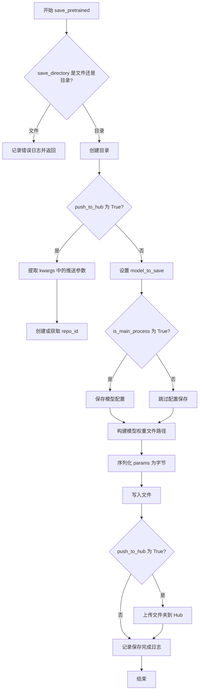

#### 带注释源码

```python
def save_pretrained(
    self,
    save_directory: str | os.PathLike,
    params: dict | FrozenDict,
    is_main_process: bool = True,
    push_to_hub: bool = False,
    **kwargs,
):
    """
    Save a model and its configuration file to a directory so that it can be reloaded using the
    [`~FlaxModelMixin.from_pretrained`] class method.

    Arguments:
        save_directory (`str` or `os.PathLike`):
            Directory to save a model and its configuration file to. Will be created if it doesn't exist.
        params (`dict | FrozenDict`):
            A `PyTree` of model parameters.
        is_main_process (`bool`, *optional*, defaults to `True`):
            Whether the process calling this is the main process or not. Useful during distributed training and you
            need to call this function on all processes. In this case, set `is_main_process=True` only on the main
            process to avoid race conditions.
        push_to_hub (`bool`, *optional*, defaults to `False`):
            Whether or not to push your model to the Hugging Face model hub after saving it. You can specify the
            repository you want to push to with `repo_id` (will default to the name of `save_directory` in your
            namespace).
        kwargs (`dict[str, Any]`, *optional*):
            Additional key word arguments passed along to the [`~utils.PushToHubMixin.push_to_hub`] method.
    """
    # 检查 save_directory 是否为文件而非目录
    if os.path.isfile(save_directory):
        logger.error(f"Provided path ({save_directory}) should be a directory, not a file")
        return

    # 创建保存目录（如果不存在）
    os.makedirs(save_directory, exist_ok=True)

    # 如果需要推送到 Hub，处理相关参数
    if push_to_hub:
        commit_message = kwargs.pop("commit_message", None)
        private = kwargs.pop("private", None)
        create_pr = kwargs.pop("create_pr", False)
        token = kwargs.pop("token", None)
        repo_id = kwargs.pop("repo_id", save_directory.split(os.path.sep)[-1])
        # 创建远程仓库（如果不存在）
        repo_id = create_repo(repo_id, exist_ok=True, private=private, token=token).repo_id

    # 要保存的模型实例
    model_to_save = self

    # 保存模型配置（仅在主进程时执行）
    if is_main_process:
        model_to_save.save_config(save_directory)

    # 构建模型权重文件路径
    output_model_file = os.path.join(save_directory, FLAX_WEIGHTS_NAME)
    # 序列化参数为字节并写入文件
    with open(output_model_file, "wb") as f:
        model_bytes = to_bytes(params)
        f.write(model_bytes)

    logger.info(f"Model weights saved in {output_model_file}")

    # 如果需要推送到 Hub
    if push_to_hub:
        self._upload_folder(
            save_directory,
            repo_id,
            token=token,
            commit_message=commit_message,
            create_pr=create_pr,
        )
```

## 关键组件


### 参数精度转换方法（to_bf16, to_fp16, to_fp32）

将模型参数从一种浮点精度转换为另一种精度（bfloat16/float16/float32），支持可选的mask参数来选择性转换特定参数，用于混合精度训练或推理优化。

### 参数类型转换核心实现（_cast_floating_to）

内部辅助方法，实现PyTree结构参数的递归类型转换，通过flatten/unflatten字典来支持mask掩码，实现条件性精度转换。

### 预训练模型加载（from_pretrained）

支持从本地目录或HuggingFace Hub加载Flax模型权重，处理Flax和PyTorch两种权重格式，自动进行形状校验和缺失/冗余键检测。

### 模型权重保存（save_pretrained）

将模型参数序列化为msgpack格式并保存到指定目录，支持推送到HuggingFace Hub。

### PyTorch权重转换（convert_pytorch_state_dict_to_flax）

集成PyTorch权重到Flax模型的转换逻辑，支持跨框架模型加载。

### 精度类型（dtype）管理

通过dtype参数控制JAX计算的数据类型，实现混合精度训练和推理的硬件适配（TPU/GPU）。


## 问题及建议


### 已知问题

-   **缺少 `to_f16` 方法引用错误**: 在 `to_fp32` 方法的文档示例中调用了 `model.to_f16(params)`，但代码中只定义了 `to_fp16` 方法而没有定义 `to_f16` 方法，这会导致示例代码无法运行。
-   **mask 参数的 tree_flatten 顺序问题**: 在 `_cast_floating_to` 方法中，当提供 mask 时，代码分别对 params 和 mask 调用 `jax.tree_flatten`，然后使用 `zip(flat_mask, flat_params.keys())` 进行配对。这种方式假设两者的键顺序一致，但 `jax.tree_flatten` 不保证字典迭代顺序，可能导致 mask 与实际参数错位。
-   **deprecated 警告未在所有入口点显示**: 仅在 `from_pretrained` 方法开头显示 Flax 废弃警告，但 `save_pretrained` 等其他公开方法没有相应的废弃提示，用户可能在未知情况下使用已废弃功能。
-   **参数形状检查的完整性**: 在 `from_pretrained` 中检查 `state[key].shape != shape_state[key].shape` 时，仅在键存在于 shape_state 中时才进行检查，但如果 shape_state 中不存在某个键（这不应该发生），该参数会被跳过检查。

### 优化建议

-   **修复示例代码**: 将 `to_fp32` 方法文档示例中的 `model.to_f16(params)` 修改为 `model.to_fp16(params)`。
-   **重构 mask 处理逻辑**: 使用 `jax.tree_map` 配合结构化 mask 进行条件转换，而不是依赖 flatten 后的键顺序配对，以提高代码健壮性。
-   **统一废弃警告**: 在类级别或所有公开方法（如 `save_pretrained`、`to_bf16` 等）中添加统一的废弃警告，确保用户在任何使用场景下都能收到提示。
-   **添加类型注解完善**: 为更多方法添加完整的类型注解，特别是 `from_config` 和 `init_weights` 方法的返回类型。
-   **优化异常处理**: 将 `from_pretrained` 中的多个 except 块提取为辅助方法或使用更清晰的异常处理模式，提高代码可读性。
-   **考虑分片加载**: 对于超大模型，当前将整个状态字典加载到内存的方式可能造成资源瓶颈，建议未来支持分片或流式加载。


## 其它


### 设计目标与约束

**设计目标**：
- 提供统一的Flax模型加载、保存和转换接口
- 支持从HuggingFace Hub或本地目录加载预训练模型
- 支持模型参数在不同精度（fp16/bf16/fp32）之间转换
- 支持从PyTorch模型转换到Flax模型

**约束条件**：
- 依赖Flax框架进行序列化/反序列化
- 依赖huggingface_hub进行模型下载
- 混合精度仅在支持的硬件上可用（bf16需要TPU，fp16需要GPU）

### 错误处理与异常设计

**异常类型**：
- `EnvironmentError`：模型文件不存在、目录路径错误
- `ValueError`：参数形状不匹配、配置无效
- `OSError`：git-lfs未安装导致的文件读取错误

**错误处理策略**：
- HuggingFace Hub相关异常使用try-except捕获并转换为EnvironmentError
- 权重形状不匹配时抛出ValueError并附带详细信息
- 缺失权重仅警告但不阻断加载流程

### 数据流与状态机

**加载流程**：
1. 解析pretrained_model_name_or_path
2. 加载或下载配置文件
3. 根据配置初始化模型
4. 加载或下载权重文件
5. 转换权重格式（如需要）
6. 验证权重完整性
7. 返回模型和参数

**保存流程**：
1. 创建保存目录
2. 保存模型配置
3. 序列化参数为msgpack格式
4. 写入权重文件
5. 可选推送到Hub

### 外部依赖与接口契约

**核心依赖**：
- `jax` / `jax.numpy`：数值计算
- `flax`：模型序列化和PyTree操作
- `huggingface_hub`：模型仓库访问
- `diffusers`：基础工具和配置

**关键接口契约**：
- `from_pretrained`：返回(model, params)元组
- `save_pretrained`：params必须为PyTree结构
- `_cast_floating_to`：返回新的params树，不修改原对象

### 版本兼容性说明

**兼容性警告**：
- Flax类已在Diffusers v1.0.0中弃用
- 建议迁移到PyTorch类或锁定Diffusers版本

**已知限制**：
- Flax >= v0.3.4修复了数组存储bug
- 混合精度训练需硬件支持

### 使用示例与最佳实践

**推荐用法**：
- 使用`to_bf16`进行TPU推理
- 使用`to_fp16`进行GPU推理
- 使用mask参数跳过LayerNorm等参数的精度转换

**注意事项**：
- 精度转换创建新树，不修改原参数
- 加载本地模型时需指定正确路径
- 从PyTorch加载需设置`from_pt=True`


    