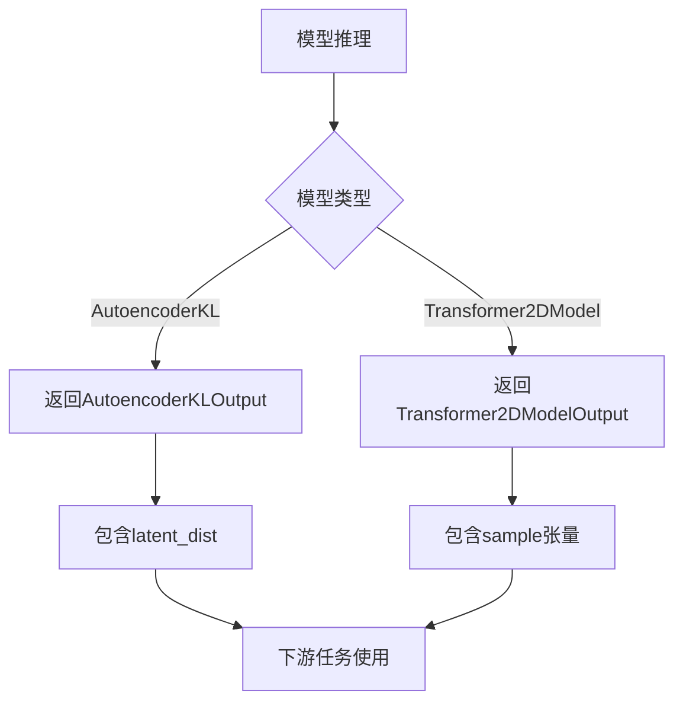

# `diffusers\src\diffusers\models\modeling_outputs.py` 详细设计文档

定义了自编码器和2DTransformer模型的输出数据结构，用于封装潜在空间分布和隐藏状态样本，为扩散模型提供标准化的输出格式。

## 整体流程



## 类结构

```
BaseOutput (基类 - 来自utils)
├── AutoencoderKLOutput (自编码器KL输出)
└── Transformer2DModelOutput (2D变换器模型输出)
```

## 全局变量及字段


### `AutoencoderKLOutput.latent_dist`
    
编码器输出的潜在分布，表示为对角高斯分布的均值和对数方差

类型：`DiagonalGaussianDistribution`
    


### `Transformer2DModelOutput.sample`
    
隐藏状态输出，基于encoder_hidden_states条件生成，离散模型返回未加噪潜在像素的概率分布

类型：`torch.Tensor`
    
    

## 全局函数及方法


## 关键组件


### AutoencoderKLOutput

变分自编码器KL散度输出的数据结构，用于存储编码器输出的潜在空间分布（均值和对数方差），继承自BaseOutput基类。

### DiagonalGaussianDistribution

对角高斯分布类型，用于表示潜在空间的概率分布，允许从分布中进行采样操作，是AutoencoderKL模型的核心组件。

### Transformer2DModelOutput

Transformer 2D模型的输出数据结构，存储隐藏状态样本张量，支持离散和连续两种模式，继承自BaseOutput基类。

### BaseOutput

基础输出类，定义在utils模块中，作为所有模型输出数据类的基类，提供统一的输出接口规范。


## 问题及建议


### 已知问题

-   **类型注解不规范**：代码中使用了字符串形式的类型注解（如 `"DiagonalGaussianDistribution"` 和 `"torch.Tensor"`），并配合 `# noqa: F821` 注释来抑制 linter 错误。这种做法通常是为了解决循环导入或类型定义顺序问题，但它破坏了类型提示的静态分析能力，降低了代码的可读性和 IDE 的自动补全支持。
-   **过度依赖抑制注释**：大量使用 `noqa` 注释表明代码可能存在静态分析工具（如 flake8）报告的错误。虽然暂时消除了警告，但这可能掩盖了真实的代码问题（如未定义的变量或模块），并且在后续维护中容易引入新的错误。
-   **潜在的循环依赖风险**：字符串类型注解的存在暗示了模块间可能存在循环依赖。这是一种代码异味（Code Smell），会导致模块加载顺序变得脆弱，增加构建和测试的复杂性。

### 优化建议

-   **启用延迟注解**：在文件顶部添加 `from __future__ import annotations`。这符合 PEP 563 规范，允许在类定义中使用尚未完全定义的类型（特别是像 `DiagonalGaussianDistribution` 这种在同模块或相关模块中定义的类型），从而可以移除字符串引号和 `noqa` 注释，使代码更加清晰和符合 Python 3.9+ 的最佳实践。
-   **消除循环依赖**：如果循环导入是由于架构设计导致的，建议使用 `if TYPE_CHECKING:` 块来隔离类型注解的导入，仅在类型检查时加载类型定义，而不影响运行时的导入速度。如果可以重构，应尽量解除类之间的循环依赖。
-   **强化类型检查**：在移除 `noqa` 注释后，使用更严格的类型检查工具（如 mypy 或 Pyright）对代码进行全面扫描，确保类型定义的完整性和正确性，避免运行时类型错误。
-   **审查 BaseOutput 必要性**：检查 `BaseOutput` 基类是否仅作为标记接口（Marker Interface）使用。如果它没有提供任何通用的方法（如序列化、反序列化）或属性，建议考虑移除继承关系，直接使用 `@dataclass`，或者利用 Python 的 `Protocol` 来定义结构化协议，以降低类层级复杂度。


## 其它


### 设计目标与约束

本模块作为diffusers库中变分自编码器（VAE）和2D变换器的输出基类封装，核心目标是标准化不同模型组件的输出格式。设计约束包括：必须继承BaseOutput基类以保持接口一致性；使用@dataclass装饰器简化对象创建流程；字段类型注解需符合Python类型提示规范；输出类需支持pickle序列化以满足分布式训练场景需求。

### 错误处理与异常设计

本模块作为纯数据结构不涉及复杂业务逻辑，错误处理主要依赖于调用方的类型检查。潜在错误场景包括：1）传入None值时dataclass不会自动校验，需依赖调用方在pipeline层面进行输入验证；2）类型注解仅起提示作用，运行时不强制校验，建议配合mypy进行静态类型检查；3）循环引用字符串（如"DiagonalGaussianDistribution"）需使用F821忽略规则以满足linter要求。

### 外部依赖与接口契约

主要依赖包括：1）dataclass模块（Python 3.7+内置）；2）BaseOutput基类（位于..utils模块）；3）torch.Tensor类型（运行时为typing转译，依赖torch库）。接口契约规定：所有输出类必须实现BaseOutput接口；字段命名需与模型前向传播输出严格对应；序列化时需保留类型信息以支持反序列化重建。

### 性能考虑与优化空间

当前实现已通过@dataclass（__slots__未启用）实现基本的内存优化，但存在以下优化点：1）可考虑为大规模生产环境添加__slots__以进一步降低内存开销（需评估兼容性）；2）字段类型使用了字符串前向引用，建议在Python 3.9+使用from __future__ import annotations实现完整类型注解；3）若频繁实例化，可考虑实现__getnewargs_ex__自定义序列化逻辑。

### 版本兼容性说明

本模块最低支持Python 3.7（dataclass特性），推荐Python 3.9+以获得完整的类型注解支持。torch依赖版本需根据BaseOutput基类要求确定，建议torch>=1.9.0以支持dataclass与tensor的混合类型注解。

### 测试策略建议

建议补充以下测试用例：1）实例化测试验证字段赋值正确性；2）类型注解校验测试；3）序列化/反序列化 roundtrip 测试；4）与BaseOutput基类的继承关系测试；5）与其他diffusers组件的集成测试。

### 安全考虑

当前代码为纯数据输出类，不涉及敏感数据处理或外部输入解析，安全性风险较低。但需注意：1）torch.Tensor类型的sample字段可能包含模型梯度信息，序列化时需评估是否包含敏感训练元数据；2）在跨进程传递时需确保torch序列化兼容性。

    