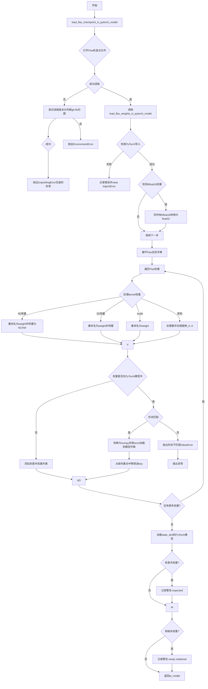
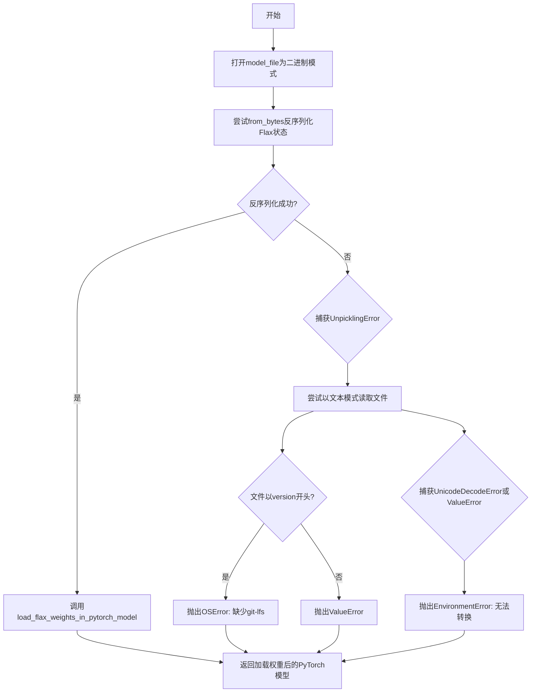
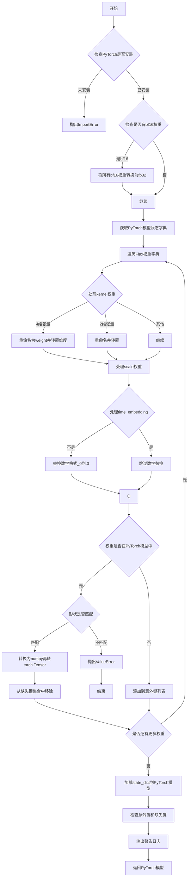

# `diffusers\src\diffusers\models\modeling_pytorch_flax_utils.py` 详细设计文档

该代码是HuggingFace Transformers库中的Flax到PyTorch模型权重转换工具，提供从Flax检查点加载权重到PyTorch模型的功能，处理两个框架间权重命名约定差异(kernel->weight)、张量维度转换(4D张量NCHW与NHWC)以及bfloat16到float32数据类型转换，并记录缺失和意外权重警告。

## 整体流程



## 类结构

```
文件为模块级工具函数集合
无类定义
主要包含两个全局转换函数
依赖Flax和PyTorch序列化工具
```

## 全局变量及字段


### `logger`
    
用于记录转换过程中的警告和错误信息

类型：`logging.Logger`
    


    

## 全局函数及方法


### `load_flax_checkpoint_in_pytorch_model`

该函数是Flax到PyTorch模型权重转换的入口函数，负责从磁盘加载Flax序列化格式的检查点文件，反序列化后调用权重转换函数完成模型权重的迁移。

参数：

- `pt_model`：`torch.nn.Module`，目标PyTorch模型，权重将被加载到此模型中
- `model_file`：`str`，Flax检查点文件的路径

返回值：`torch.nn.Module`，加载了Flax权重后的PyTorch模型对象

#### 流程图



#### 带注释源码

```python
def load_flax_checkpoint_in_pytorch_model(pt_model, model_file):
    """
    将Flax检查点加载到PyTorch模型中
    
    参数:
        pt_model: 目标PyTorch模型
        model_file: Flax检查点文件路径
    返回:
        加载权重后的PyTorch模型
    """
    # 1. 尝试以二进制模式打开并反序列化Flax检查点文件
    try:
        with open(model_file, "rb") as flax_state_f:
            flax_state = from_bytes(None, flax_state_f.read())
    except UnpicklingError as e:
        # 2. 如果反序列化失败，尝试判断是否是git-lfs未安装问题
        try:
            with open(model_file) as f:
                # 检查文件是否以"version"开头（git-lfs存根特征）
                if f.read().startswith("version"):
                    raise OSError(
                        "You seem to have cloned a repository without having git-lfs installed. Please"
                        " install git-lfs and run `git lfs install` followed by `git lfs pull` in the"
                        " folder you cloned."
                    )
                else:
                    # 其他ValueError情况，重新抛出原始异常
                    raise ValueError from e
        except (UnicodeDecodeError, ValueError):
            # 3. 如果不是git-lfs问题，抛出环境错误
            raise EnvironmentError(f"Unable to convert {model_file} to Flax deserializable object. ")

    # 4. 调用核心权重转换函数
    return load_flax_weights_in_pytorch_model(pt_model, flax_state)
```


### `load_flax_weights_in_pytorch_model`

将Flax模型的检查点权重转换为PyTorch模型权重，处理权重名称映射、维度转换和类型转换，并加载到PyTorch模型中。

参数：

-  `pt_model`：`torch.nn.Module`，PyTorch模型对象，目标模型实例
-  `flax_state`：`Union[Dict, FrozenDict]`，Flax模型的状态字典，已经过反序列化处理的模型权重

返回值：`torch.nn.Module`，加载权重后的PyTorch模型对象

#### 流程图



#### 带注释源码

```python
def load_flax_weights_in_pytorch_model(pt_model, flax_state):
    """Load flax checkpoints in a PyTorch model"""
    
    # 第1步：检查PyTorch是否安装
    # 这是必需的依赖，如果未安装则记录错误并抛出异常
    try:
        import torch  # noqa: F401
    except ImportError:
        logger.error(
            "Loading Flax weights in PyTorch requires both PyTorch and Flax to be installed. Please see"
            " https://pytorch.org/ and https://flax.readthedocs.io/en/latest/installation.html for installation"
            " instructions."
        )
        raise

    # 第2步：检查并处理bf16权重
    # Flax使用bf16 (brain floating point)，但PyTorch对bf16支持不完善
    # 需要将所有bf16权重转换为fp32以确保兼容性
    is_type_bf16 = flatten_dict(jax.tree_util.tree_map(lambda x: x.dtype == jnp.bfloat16, flax_state)).values()
    if any(is_type_bf16):
        # 转换所有bf16权重为fp32
        logger.warning(
            "Found ``bfloat16`` weights in Flax model. Casting all ``bfloat16`` weights to ``float32`` "
            "before loading those in PyTorch model."
        )
        flax_state = jax.tree_util.tree_map(
            lambda params: params.astype(np.float32) if params.dtype == jnp.bfloat16 else params, flax_state
        )

    # 第3步：设置模型前缀为空字符串
    # 避免加载时产生额外的前缀问题
    pt_model.base_model_prefix = ""

    # 第4步：展平Flax状态字典
    # 将嵌套的Flax字典转换为扁平化的点分隔键字典
    # 例如: {"a": {"b": tensor}} -> {"a.b": tensor}
    flax_state_dict = flatten_dict(flax_state, sep=".")
    
    # 获取PyTorch模型的状态字典
    # 包含模型所有参数的名字和形状信息
    pt_model_dict = pt_model.state_dict()

    # 初始化意外键和缺失键跟踪列表
    unexpected_keys = []
    missing_keys = set(pt_model_dict.keys())

    # 第5步：遍历所有Flax权重并进行转换
    for flax_key_tuple, flax_tensor in flax_state_dict.items():
        # 将键元组转换为列表以便修改
        flax_key_tuple_array = flax_key_tuple.split(".")

        # 第5.1步：处理卷积权重命名
        # Flax使用"kernel"，PyTorch使用"weight"
        # 同时处理维度转换：Flax使用 (H, W, Cin, Cout)，PyTorch使用 (Cin, Cout, H, W)
        if flax_key_tuple_array[-1] == "kernel" and flax_tensor.ndim == 4:
            flax_key_tuple_array = flax_key_tuple_array[:-1] + ["weight"]
            # 转置维度: (3, 2, 0, 1) 将 (H, W, Cin, Cout) 转为 (Cin, Cout, H, W)
            flax_tensor = jnp.transpose(flax_tensor, (3, 2, 0, 1))
        # 第5.2步：处理线性层权重
        # 同样将kernel重命名为weight，并转置矩阵
        elif flax_key_tuple_array[-1] == "kernel":
            flax_key_tuple_array = flax_key_tuple_array[:-1] + ["weight"]
            flax_tensor = flax_tensor.T
        # 第5.3步：处理缩放因子
        # Flax的scale重命名为weight（如LayerNorm的scale）
        elif flax_key_tuple_array[-1] == "scale":
            flax_key_tuple_array = flax_key_tuple_array[:-1] + ["weight"]

        # 第5.4步：处理时间嵌入的特殊情况
        # 时间嵌入的键不进行数字替换，避免破坏时间步索引
        if "time_embedding" not in flax_key_tuple_array:
            # 替换特殊数字格式：Flax使用 _0, _1 等，PyTorch使用 .0, .1 等
            # 例如：block_0 -> block.0，用于匹配Transformer的层级结构
            for i, flax_key_tuple_string in enumerate(flax_key_tuple_array):
                flax_key_tuple_array[i] = (
                    flax_key_tuple_string.replace("_0", ".0")
                    .replace("_1", ".1")
                    .replace("_2", ".2")
                    .replace("_3", ".3")
                    .replace("_4", ".4")
                    .replace("_5", ".5")
                    .replace("_6", ".6")
                    .replace("_7", ".7")
                    .replace("_8", ".8")
                    .replace("_9", ".9")
                )

        # 重新组合键名
        flax_key = ".".join(flax_key_tuple_array)

        # 第6步：匹配并加载权重
        if flax_key in pt_model_dict:
            # 验证形状匹配
            if flax_tensor.shape != pt_model_dict[flax_key].shape:
                raise ValueError(
                    f"Flax checkpoint seems to be incorrect. Weight {flax_key_tuple} was expected "
                    f"to be of shape {pt_model_dict[flax_key].shape}, but is {flax_tensor.shape}."
                )
            else:
                # 转换为PyTorch张量
                # 注意：jax.numpy使用惰性求值，需要先转为numpy
                flax_tensor = np.asarray(flax_tensor) if not isinstance(flax_tensor, np.ndarray) else flax_tensor
                pt_model_dict[flax_key] = torch.from_numpy(flax_tensor)
                # 从缺失键集合中移除已匹配的键
                missing_keys.remove(flax_key)
        else:
            # 权重在Flax模型中存在但PyTorch模型不需要
            unexpected_keys.append(flax_key)

    # 第7步：加载权重到PyTorch模型
    pt_model.load_state_dict(pt_model_dict)

    # 转换为列表以便日志输出
    missing_keys = list(missing_keys)

    # 第8步：警告处理
    # 记录意外键（Flax有但PyTorch不需要的权重）
    if len(unexpected_keys) > 0:
        logger.warning(
            "Some weights of the Flax model were not used when initializing the PyTorch model"
            f" {pt_model.__class__.__name__}: {unexpected_keys}\n- This IS expected if you are initializing"
            f" {pt_model.__class__.__name__} from a Flax model trained on another task or with another architecture"
            " (e.g. initializing a BertForSequenceClassification model from a FlaxBertForPreTraining model).\n- This"
            f" IS NOT expected if you are initializing {pt_model.__class__.__name__} from a Flax model that you expect"
            " to be exactly identical (e.g. initializing a BertForSequenceClassification model from a"
            " FlaxBertForSequenceClassification model)."
        )
    
    # 记录缺失键（PyTorch需要但Flax没有提供的权重）
    if len(missing_keys) > 0:
        logger.warning(
            f"Some weights of {pt_model.__class__.__name__} were not initialized from the Flax model and are newly"
            f" initialized: {missing_keys}\nYou should probably TRAIN this model on a down-stream task to be able to"
            " use it for predictions and inference."
        )

    # 返回加载完成的PyTorch模型
    return pt_model
```


## 关键组件


### Flax到PyTorch权重加载框架

该模块提供了将Flax/JAX模型权重迁移到PyTorch模型的功能，支持权重键名映射、形状转换（如卷积权重从(OUT_CH, IN_CH, H, W)到PyTorch的(OUT_CH, IN_CH, H, W)格式）、数据类型处理（如bf16转fp32）以及缺失/冗余权重警告。

### 关键组件

#### load_flax_checkpoint_in_pytorch_model

负责读取Flax序列化格式的检查点文件并触发权重加载流程，包含文件读取、异常处理（git-lfs相关错误检测）和模型格式转换入口。

#### load_flax_weights_in_pytorch_model

核心权重转换引擎，实现Flax到PyTorch的完整映射逻辑，包括键名转换规则（kernel→weight、scale→weight、_N→.N）、张量维度重排（4D卷积权重转置）、类型强制转换（bf16→float32）、状态字典合并与验证。

#### bf16类型检测与转换

自动识别Flax权重中的brain float 16精度，转换为float32以兼容PyTorch的当前支持状态，避免加载失败。

#### 权重键名映射规则

处理Flax与PyTorch模型结构差异，包括"kernel"→"weight"、"scale"→"weight"的后缀替换，以及时间嵌入层外的数字分隔符转换（_0→.0至_9→.9）。

#### 形状转换逻辑

针对4D卷积核执行JAX到PyTorch的维度顺序转换(3,2,0,1)，对2D线性层执行矩阵转置。

#### 异常处理机制

捕获UnpicklingError检测损坏检查点，识别git-lfs缺失错误，处理UnicodeDecodeError和ValueError，提供环境友好提示。

#### 状态字典合并与验证

遍历Flax权重并与PyTorch模型预期键匹配，检测形状不匹配、收集意外权重和缺失权重，最后通过load_state_dict完成加载。


## 问题及建议


### 已知问题

- **魔法数字硬编码**：第92-101行使用大量硬编码的`.replace()`调用处理`_0`到`_9`的数字替换，缺乏扩展性，当模型层数超过9层时无法正确处理
- **重复的键名转换逻辑**：第84-89行对`kernel`和`scale`的转换存在重复逻辑，可以提取为独立函数
- **缺少类型注解**：所有函数和变量都缺少类型注解（type hints），降低代码可读性和IDE支持
- **不必要的数组转换**：第107行使用`np.asarray()`将已是numpy数组的对象再次转换，效率低下
- **未使用的导入**：`UnpicklingError`被导入但仅在特定情况下使用，可以优化导入结构
- **日志信息可改进**：警告信息中使用了字符串连接而非f-string的现代写法，且缺少info级别的进度日志

### 优化建议

- **使用正则表达式或循环**：将硬编码的`.replace()`链替换为循环或正则表达式，例如`re.sub(r'_(\d)', r'.\1', key)`
- **提取转换函数**：将`kernel`、`scale`等键名转换逻辑抽取为独立函数，如`_convert_flax_key_name()`
- **添加类型注解**：为函数参数和返回值添加类型注解，例如`def load_flax_weights_in_pytorch_model(pt_model: torch.nn.Module, flax_state: Dict) -> torch.nn.Module`
- **优化数组转换**：使用`isinstance(flax_tensor, np.ndarray)`后直接赋值，避免不必要的`np.asarray()`调用
- **改进日志记录**：使用f-string统一日志信息，并添加`logger.info()`记录转换进度
- **添加文档字符串**：为公共函数添加完整的docstring，说明参数、返回值和可能抛出的异常

## 其它


### 设计目标与约束

将Flax框架训练的模型权重转换为PyTorch模型可用的格式，实现跨深度学习框架的模型权重迁移。主要约束包括：1) 仅支持从Flax到PyTorch的单向转换；2) 要求目标PyTorch模型结构与Flax模型结构兼容；3) 对于bf16类型权重会自动转换为fp32以保证兼容性；4) 权重键名需要进行特定的转换匹配。

### 错误处理与异常设计

代码包含多层次错误处理机制：1) UnpicklingError处理用于捕获Flax权重文件反序列化失败；2) UnicodeDecodeError和ValueError处理用于检测文件格式问题；3) OSError处理用于识别git-lfs未安装的情况；4) ImportError处理用于确保PyTorch和Flax都已安装；5) ValueError用于检测权重shape不匹配的情况。每个错误都有对应的用户友好提示信息。

### 数据流与状态机

数据流主要包括：1) 读取Flax序列化文件；2) 反序列化为Flax状态字典；3) 扁平化Flax状态字典；4) 遍历每个权重进行键名转换（kernel→weight等）；5) 处理权重转置（针对4D张量和2D矩阵）；6) 替换特殊字符（_0→.0等）；7) 转换为NumPy再转为PyTorch张量；8) 加载到PyTorch模型；9) 记录并报告missing_keys和unexpected_keys。无复杂状态机，仅有简单的条件分支处理不同权重类型。

### 外部依赖与接口契约

主要外部依赖包括：1) jax和jax.numpy用于Flax权重处理；2) flax.serialization和flax.traverse_util用于Flax反序列化和字典操作；3) numpy用于数组转换；4) torch用于PyTorch张量创建；5) pickle.UnpicklingError用于异常捕获。接口契约：load_flax_checkpoint_in_pytorch_model接受pt_model和model_file路径参数，返回加载后的PyTorch模型；load_flax_weights_in_pytorch_model接受pt_model和flax_state字典参数，返回加载后的PyTorch模型。

### 兼容性说明

支持的功能兼容范围：1) Flax检查点格式（通过from_bytes反序列化）；2) 权重类型包括float32、float64、bfloat16（会自动转换）；3) 权重维度包括1D、2D、4D张量；4) 权重命名模式包括kernel、scale、time_embedding等特殊键。已知的兼容性问题：bfloat16会强制转为float32；不支持Flax的FrozenDict；不支持动态图结构的权重映射。

### 性能考虑

主要性能瓶颈和优化点：1) 使用flatten_dict一次性扁平化整个状态字典，避免递归；2) 使用jax.tree_util.tree_map进行批量类型转换；3) np.asarray避免不必要的拷贝（仅当输入不是ndarray时转换）；4) 直接修改pt_model_dict而非创建新字典减少内存开销。可以改进的方向包括：并行处理权重转换、添加进度条显示加载进度、支持流式加载大模型。

### 版本历史和变更记录

该代码属于transformers库的一部分，继承自HuggingFace的模型转换工具。主要变更包括：对bf16权重的显式处理、添加更详细的警告信息、改进错误提示的友好度。

### 使用示例

基本用法示例：```python
import torch
from transformers.modeling_flax_pytorch_utils import load_flax_checkpoint_in_pytorch_model

# 假设有一个PyTorch模型实例
pt_model = MyModel()
# 加载Flax权重文件
pt_model = load_flax_checkpoint_in_pytorch_model(pt_model, "flax_model.bin")
```

### 安全性和权限考虑

1) 文件读取需要适当的文件系统权限；2) 不执行任何网络操作，安全性较高；3) 警告信息会暴露部分模型结构信息（如权重名称），但在可信环境下使用风险可控；4) 未包含任何用户输入验证机制，依赖调用方保证参数合法性。

### 关键实现细节

权重键名转换规则：1) kernel→weight（2D矩阵进行转置）；2) kernel→weight（4D张量进行维度重排为(3,2,0,1)）；3) scale→weight；4) _N替换为.N（N为0-9的数字）。权重维度处理：4D权重从Flax的(channels_out, channels_in, height, width)转换为PyTorch的(channels_out, channels_in, height, width)格式；2D权重进行转置。


    