# `diffusers\src\diffusers\models\modeling_utils.py` 详细设计文档

该文件是diffusers库的核心模型混合基类模块，提供了所有模型通用的加载、保存、量化、设备管理、梯度检查点、并行计算、注意力后端切换等功能，是实现预训练模型统一接口的基础架构。

## 整体流程

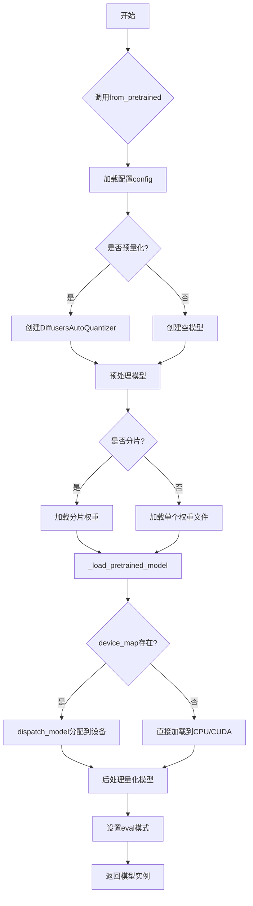

## 类结构

```
ContextManagers (上下文管理器封装类)
ModelMixin (模型混合基类)
├── _gradient_checkpointing_func (属性)
├── is_gradient_checkpointing (属性)
├── enable_gradient_checkpointing (方法)
├── disable_gradient_checkpointing (方法)
├── set_use_npu_flash_attention (方法)
├── enable_npu_flash_attention (方法)
├── disable_npu_flash_attention (方法)
├── set_use_xla_flash_attention (方法)
├── enable_xla_flash_attention (方法)
├── disable_xla_flash_attention (方法)
├── set_use_memory_efficient_attention_xformers (方法)
├── enable_xformers_memory_efficient_attention (方法)
├── disable_xformers_memory_efficient_attention (方法)
├── enable_layerwise_casting (方法)
├── enable_group_offload (方法)
├── set_attention_backend (方法)
├── reset_attention_backend (方法)
├── save_pretrained (方法)
├── dequantize (方法)
├── from_pretrained (类方法)
├── cuda (方法)
├── to (方法)
├── half (方法)
├── float (方法)
├── compile_repeated_blocks (方法)
├── enable_parallelism (方法)
├── _load_pretrained_model (类方法)
├── _get_signature_keys (类方法)
├── _get_no_split_modules (类方法)
├── _set_default_torch_dtype (类方法)
├── device (属性)
├── dtype (属性)
├── num_parameters (方法)
├── get_memory_footprint (方法)
├── _set_gradient_checkpointing (方法)
└── _fix_state_dict_keys_on_load (方法)
LegacyModelMixin (遗留模型混合类)
└── from_pretrained (类方法)
```

## 全局变量及字段


### `logger`
    
用于记录模块日志的日志对象

类型：`logging.Logger`
    


### `_REGEX_SHARD`
    
用于匹配分片检查点文件名的正则表达式

类型：`re.Pattern`
    


### `TORCH_INIT_FUNCTIONS`
    
存储torch.nn.init各种初始化函数的字典，用于no_init_weights上下文管理器

类型：`dict[str, Callable]`
    


### `_LOW_CPU_MEM_USAGE_DEFAULT`
    
指示默认是否启用低CPU内存使用的布尔值

类型：`bool`
    


### `ContextManagers.context_managers`
    
存储需要管理的上下文管理器列表

类型：`list[ContextManager]`
    


### `ContextManagers.stack`
    
用于Enter-Exit模式管理多个上下文管理器的栈

类型：`ExitStack`
    


### `ModelMixin.config_name`
    
保存模型配置时使用的文件名

类型：`str`
    


### `ModelMixin._automatically_saved_args`
    
自动保存到配置的属性名列表

类型：`list`
    


### `ModelMixin._supports_gradient_checkpointing`
    
指示模型是否支持梯度检查点化的类属性

类型：`bool`
    


### `ModelMixin._keys_to_ignore_on_load_unexpected`
    
加载模型时忽略的意外键的正则表达式模式列表

类型：`None`
    


### `ModelMixin._no_split_modules`
    
在使用device_map时不应分割的模块列表

类型：`None`
    


### `ModelMixin._keep_in_fp32_modules`
    
保持在FP32精度而不进行量化的模块列表

类型：`None`
    


### `ModelMixin._skip_layerwise_casting_patterns`
    
跳过逐层类型转换的模块名称模式

类型：`None`
    


### `ModelMixin._supports_group_offloading`
    
指示模型是否支持组卸载的类属性

类型：`bool`
    


### `ModelMixin._repeated_blocks`
    
模型中频繁重复的子模块类名列表，用于区域编译优化

类型：`list`
    


### `ModelMixin._parallel_config`
    
存储并行配置（数据并行/模型并行）的属性

类型：`None`
    


### `ModelMixin._cp_plan`
    
存储上下文并行计划的字典

类型：`None`
    


### `ModelMixin._skip_keys`
    
加载和保存时需要跳过的键列表

类型：`None`
    


### `ModelMixin._gradient_checkpointing_func`
    
用于梯度检查点化的函数

类型：`None`
    
    

## 全局函数及方法


### `get_parameter_device`

获取给定 PyTorch 模块所在的设备信息。该函数尝试通过多种方式获取模块的设备：首先检查是否有组卸载钩子，然后查找模块的第一个参数或缓冲区，最后作为兼容性备选方案直接检查模块内部字典中的张量属性。

参数：

- `parameter`：`torch.nn.Module`，需要获取设备的模块

返回值：`torch.device`，模块所在的设备

#### 流程图

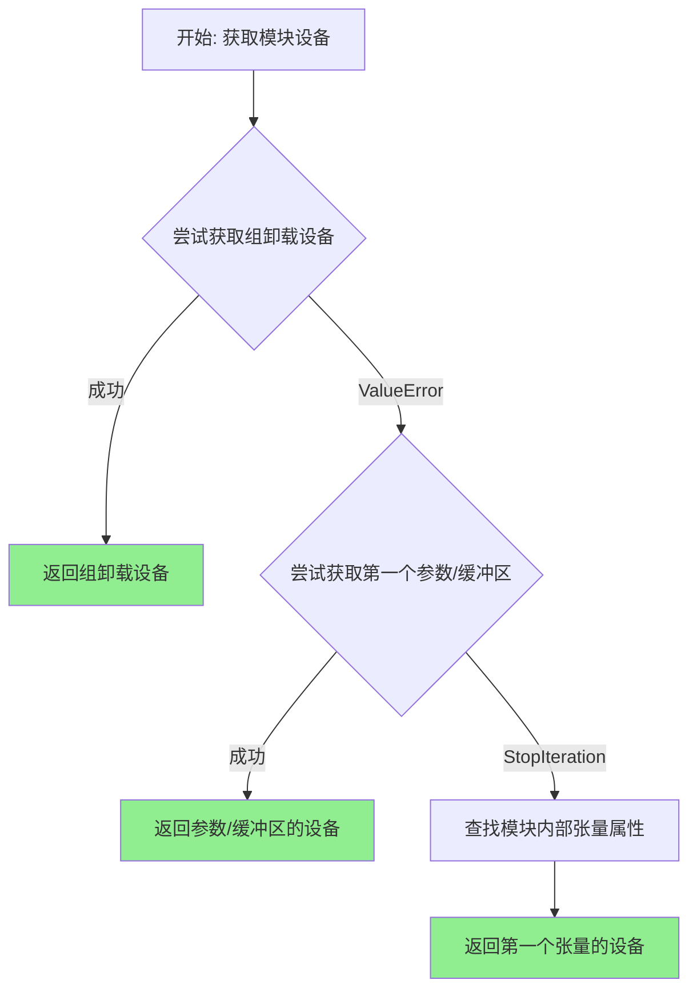

#### 带注释源码

```python
def get_parameter_device(parameter: torch.nn.Module) -> torch.device:
    """
    获取给定模块的设备。
    
    尝试以下优先级获取设备信息：
    1. 从 group offloading hook 获取设备
    2. 从模块的第一个参数或缓冲区的 device 属性获取
    3. 作为 PyTorch 1.5 DataParallel 的兼容性备选方案，从模块 __dict__ 中的张量获取
    
    Args:
        parameter: torch.nn.Module，需要获取设备的模块
        
    Returns:
        torch.device: 模块所在的设备
    """
    # 从 hooks 模块导入组卸载设备获取函数
    from ..hooks.group_offloading import _get_group_onload_device

    try:
        # 优先尝试：从 group offloading hook 获取设备
        # 如果模块使用了分组卸载功能，设备信息会存储在 hook 中
        return _get_group_onload_device(parameter)
    except ValueError:
        # 如果没有 group offloading hooks，跳转到下一步
        pass

    try:
        # 次选方案：获取模块的第一个参数或缓冲区的设备
        # 使用 itertools.chain 将参数和缓冲区合并为迭代器
        # next() 获取第一个元素，其 .device 属性即为模块设备
        parameters_and_buffers = itertools.chain(parameter.parameters(), parameter.buffers())
        return next(parameters_and_buffers).device
    except StopIteration:
        # 兼容性处理：PyTorch 1.5 DataParallel 场景
        # 如果模块没有参数或缓冲区（如某些特殊的 nn.Module 实现），
        # 则直接从模块的 __dict__ 中查找 tensor 属性
        
        def find_tensor_attributes(module: torch.nn.Module) -> list[tuple[str, Tensor]]:
            """
            查找模块字典中的所有张量属性
            
            Args:
                module: torch.nn.Module，待查找的模块
                
            Returns:
                list[tuple[str, Tensor]]: 属性名和属性值的元组列表
            """
            # 遍历模块的 __dict__，筛选出 torch.Tensor 类型的属性
            tuples = [(k, v) for k, v in module.__dict__.items() if torch.is_tensor(v)]
            return tuples

        # 使用 _named_members 方法遍历模块内部字典中的张量
        gen = parameter._named_members(get_members_fn=find_tensor_attributes)
        first_tuple = next(gen)
        # 返回第一个找到的张量的设备
        return first_tuple[1].device
```


### `get_parameter_dtype`

获取给定 PyTorch 模块的数据类型（dtype）。该函数会优先返回模块中第一个浮点数参数/缓冲区的数据类型，如果没有浮点数类型，则返回最后一个找到的数据类型。

参数：

- `parameter`：`torch.nn.Module`，要获取数据类型的 PyTorch 模块

返回值：`torch.dtype`，模块的数据类型

#### 流程图

```mermaid
flowchart TD
    A[开始: get_parameter_dtype] --> B{parameter是nn.Module?}
    B -->|Yes| C[遍历所有子模块]
    B -->|No| D[跳到步骤2]
    C --> E{子模块有_diffusers_hook?}
    E -->|Yes| F{获取layerwise_casting hook}
    E -->|No| C
    F -->|存在| G[返回hook.compute_dtype]
    F -->|不存在| C
    G --> Z[结束: 返回dtype]
    C --> H[初始化last_dtype=None]
    H --> I[遍历named_parameters]
    I --> J{参数在_keep_in_fp32_modules中?}
    J -->|Yes| I
    J -->|No| K{参数是浮点数?}
    K -->|Yes| L[返回param.dtype]
    K -->|No| I
    I --> M[更新last_dtype]
    M --> N[遍历buffers]
    N --> O{buffer是浮点数?}
    O -->|Yes| P[返回buffer.dtype]
    O -->|No| N
    N --> Q[更新last_dtype]
    Q --> R{last_dtype不为None?}
    R -->|Yes| S[返回last_dtype]
    R -->|No| T[查找tensor_attributes兼容]
    T --> U[遍历_named_members]
    U --> V{找到浮点数tensor?}
    V -->|Yes| W[返回tensor.dtype]
    V -->|No| U
    U --> X{last_tuple不为None?}
    X -->|Yes| Y[返回last_tuple[1].dtype]
    X -->|No| Z[结束: 返回None]
```

#### 带注释源码

```python
def get_parameter_dtype(parameter: torch.nn.Module) -> torch.dtype:
    """
    Returns the first found floating dtype in parameters if there is one, otherwise returns the last dtype it found.
    """
    # 步骤1: 检查是否附加了dtype修改钩子（例如layerwise casting）
    # 如果存在layerwise_casting hook，直接返回其compute_dtype
    if isinstance(parameter, nn.Module):
        for name, submodule in parameter.named_modules():
            if not hasattr(submodule, "_diffusers_hook"):
                continue
            registry = submodule._diffusers_hook
            hook = registry.get_hook("layerwise_casting")
            if hook is not None:
                return hook.compute_dtype

    # 步骤2: 如果没有dtype修改钩子，则返回第一个浮点参数/缓冲区的dtype
    last_dtype = None

    # 遍历所有命名参数，查找第一个浮点类型的参数
    for name, param in parameter.named_parameters():
        last_dtype = param.dtype  # 记录最后一个dtype作为后备
        # 如果模块有_keep_in_fp32_modules属性且当前参数在其中，跳过
        if (
            hasattr(parameter, "_keep_in_fp32_modules")
            and parameter._keep_in_fp32_modules
            and any(m in name for m in parameter._keep_in_fp32_modules)
        ):
            continue

        # 如果是浮点数类型，立即返回
        if param.is_floating_point():
            return param.dtype

    # 遍历所有缓冲区（buffers），查找第一个浮点类型的缓冲区
    for buffer in parameter.buffers():
        last_dtype = buffer.dtype
        if buffer.is_floating_point():
            return buffer.dtype

    # 如果没有找到浮点类型，返回最后一个找到的dtype
    if last_dtype is not None:
        # if no floating dtype was found return whatever the first dtype is
        return last_dtype

    # 兼容处理: 用于PyTorch > 1.5的nn.DataParallel兼容性
    # 通过自定义函数查找模块字典中的tensor属性
    def find_tensor_attributes(module: nn.Module) -> list[tuple[str, Tensor]]:
        tuples = [(k, v) for k, v in module.__dict__.items() if torch.is_tensor(v)]
        return tuples

    gen = parameter._named_members(get_members_fn=find_tensor_attributes)
    last_tuple = None
    for tuple in gen:
        last_tuple = tuple
        if tuple[1].is_floating_point():
            return tuple[1].dtype

    # 最终后备: 返回最后一个张量的dtype
    if last_tuple is not None:
        # fallback to the last dtype
        return last_tuple[1].dtype
```


### `no_init_weights`

这是一个上下文管理器，用于在全球范围内禁用权重初始化以加速加载大型模型。它通过将所有 `torch.nn.init` 函数替换为空操作函数（skip）来实现此功能。

参数：无需参数

返回值：无返回值（作为上下文管理器使用，通过 `yield` 控制执行流程）

#### 流程图

```mermaid
flowchart TD
    A[开始] --> B[定义 _skip_init 空操作函数]
    B --> C{遍历 TORCH_INIT_FUNCTIONS 字典}
    C -->|对每个初始化函数| D[将 torch.nn.init.{name} 替换为 _skip_init]
    D --> C
    C -->|完成后| E[执行 yield 进入上下文]
    E --> F{上下文内的代码执行完成}
    F --> G[执行 finally 块]
    G --> H{遍历 TORCH_INIT_FUNCTIONS}
    H -->|对每个初始化函数| I[恢复原始初始化函数]
    I --> H
    H -->|完成后| J[结束]
```

#### 带注释源码

```python
@contextmanager
def no_init_weights():
    """
    Context manager to globally disable weight initialization to speed up loading large models. To do that, all the
    torch.nn.init function are all replaced with skip.
    """
    # 定义一个空操作函数，用于替换原始的初始化函数
    # 该函数接受任意数量的位置参数和关键字参数，但什么都不做
    def _skip_init(*args, **kwargs):
        pass

    # 遍历预定义的初始化函数字典，将每个函数替换为 _skip_init
    for name, init_func in TORCH_INIT_FUNCTIONS.items():
        setattr(torch.nn.init, name, _skip_init)
    
    try:
        # yield 使得该函数成为上下文管理器
        # 在 yield 期间，torch.nn.init 的所有函数都被替换为 _skip_init
        # 这意味着模型加载时不会执行任何权重初始化，从而加快加载速度
        yield
    finally:
        # 无论是否发生异常，都会在离开上下文时执行 finally 块
        # 恢复原始的初始化函数，确保不影响后续代码
        for name, init_func in TORCH_INIT_FUNCTIONS.items():
            setattr(torch.nn.init, name, init_func)
```


### `ContextManagers.__enter__`

进入所有注册的上下文管理器，将它们全部激活以便使用。

参数：
- 无显式参数（隐式参数 `self` 为 `ContextManagers` 实例）

返回值：`None`，无返回值（Python 上下文管理器协议中 `__enter__` 通常返回上下文管理器本身，但该实现未返回任何值）

#### 流程图

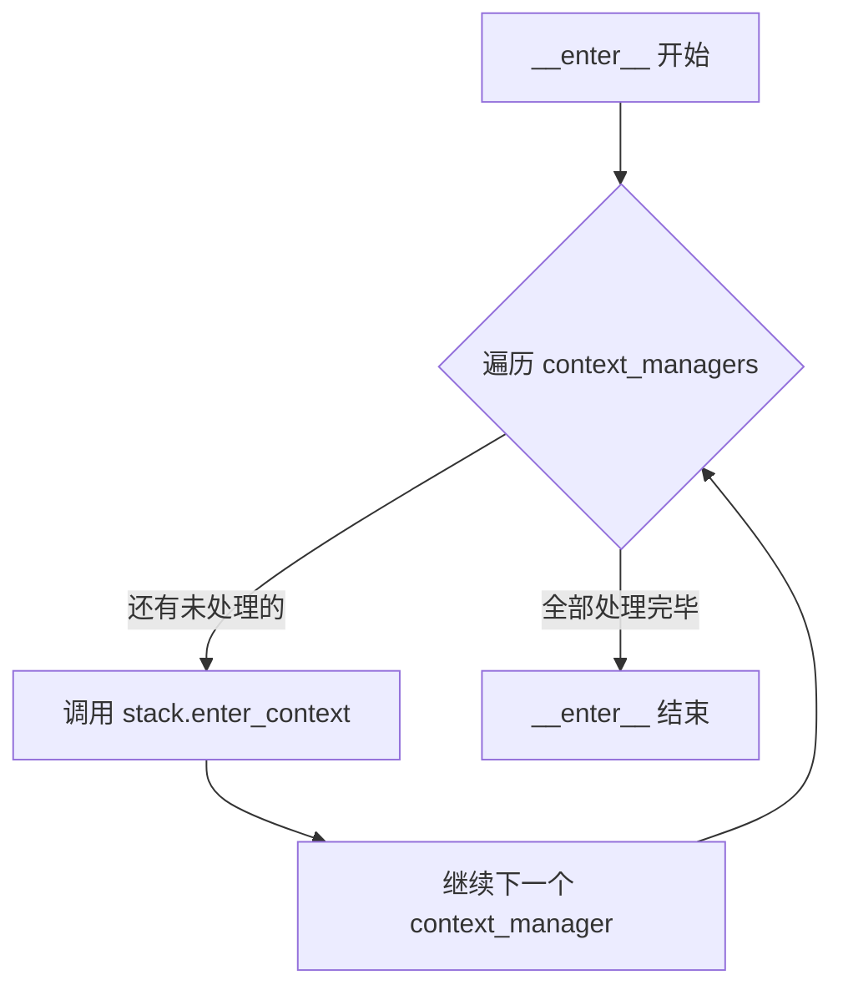

#### 带注释源码

```python
def __enter__(self):
    # 遍历所有需要进入的上下文管理器
    for context_manager in self.context_managers:
        # 使用 ExitStack.enter_context 进入每个上下文管理器
        # ExitStack 会自动管理每个上下文管理器的生命周期
        self.stack.enter_context(context_manager)
    # 注意：该方法没有显式返回值，返回 None
    # 这符合部分上下文管理器的实现方式，但可能不符合 PEP 333 的规范预期
```


### `ContextManagers.__exit__`

该方法是 `ContextManagers` 类的上下文管理器退出方法，用于在退出 `with` 块时释放所有已Enter的上下文管理器。它通过调用内部 `ExitStack` 的 `__exit__` 方法来实现所有上下文管理器的清理工作。

参数：

- `*args`：可变位置参数，用于接收上下文管理器协议传递的异常信息（exc_type, exc_value, traceback）
- `**kwargs`：可变关键字参数，用于接收额外的关键字参数

返回值：`任意类型`，返回内部 `ExitStack.__exit__` 的返回值，通常为 `None` 或 `False`（表示异常未被处理）

#### 流程图

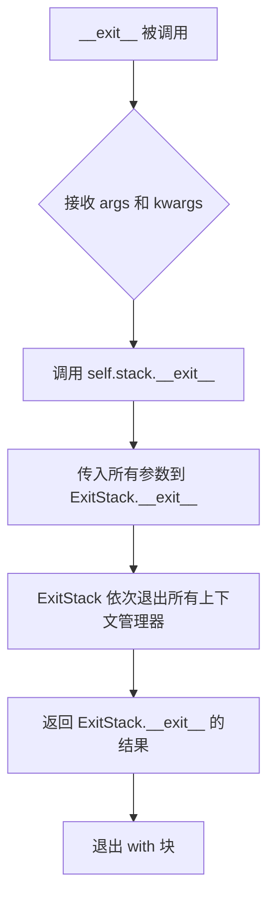

#### 带注释源码

```python
class ContextManagers:
    """
    Wrapper for `contextlib.ExitStack` which enters a collection of context managers. Adaptation of `ContextManagers`
    in the `fastcore` library.
    """

    def __init__(self, context_managers: list[ContextManager]):
        self.context_managers = context_managers
        self.stack = ExitStack()

    def __enter__(self):
        for context_manager in self.context_managers:
            self.stack.enter_context(context_manager)

    def __exit__(self, *args, **kwargs):
        """
        退出上下文管理器，清理所有已Enter的上下文管理器。
        
        参数:
            *args: 可变位置参数，接收上下文管理器协议的标准参数
                   (exc_type: 异常类型, exc_value: 异常值, traceback: 追溯信息)
            **kwargs: 可变关键字参数，接收额外的关键字参数
        
        返回:
            返回 self.stack.__exit__ 的返回值，通常为 None 或 False
        """
        self.stack.__exit__(*args, **kwargs)
```


### `ModelMixin.__init__`

`ModelMixin.__init__`是所有模型类的基类初始化方法，负责调用父类初始化并设置梯度检查点功能为None。

参数：
- 该方法无显式参数（隐式参数`self`为模型实例自身）

返回值：`None`，无返回值，仅完成对象初始化

#### 流程图

```mermaid
flowchart TD
    A[开始 __init__] --> B[调用 super().__init__]
    B --> C[初始化 self._gradient_checkpointing_func = None]
    C --> D[结束]
```

#### 带注释源码

```python
def __init__(self):
    """
    ModelMixin类的初始化方法。
    
    继承自torch.nn.Module和PushToHubMixin，
    负责模型的基础初始化工作。
    """
    # 调用父类torch.nn.Module的初始化方法
    # 这是PyTorch模型的标准初始化流程
    super().__init__()

    # 初始化梯度检查点功能为None
    # 后续通过enable_gradient_checkpointing方法可以设置具体的检查点函数
    # 默认值为None表示未启用梯度检查点
    self._gradient_checkpointing_func = None
```


### `ModelMixin.__getattr__`

该方法重写了Python的`__getattr__`魔术方法，主要用于优雅地处理对模型配置属性的直接访问。当用户尝试访问模型对象上不存在的属性时，会首先检查该属性是否存在于配置字典`_internal_dict`中，如果存在则发出弃用警告并返回配置值，否则回退到PyTorch默认的`__getattr__`实现。这样做的目的是引导用户通过`model.config.attribute`的方式访问配置，而不是直接通过`model.attribute`，以保持代码的清晰性和向后兼容性。

**参数：**

- `name`：`str`，要访问的属性名称

**返回值：** `Any`，根据属性查找结果返回配置值或抛出AttributeError

#### 流程图

```mermaid
flowchart TD
    A[开始 __getattr__] --> B{_internal_dict 在 __dict__ 中?}
    B -->|否| F[调用 PyTorch 默认 __getattr__]
    B -->|是| C{name 属性存在于 _internal_dict?}
    C -->|否| F
    C -->|是| D{name 属性在 __dict__ 中?}
    D -->|是| F
    D -->|否| E[发出弃用警告并返回 _internal_dict[name]]
    E --> G[结束]
    F --> G
```

#### 带注释源码

```python
def __getattr__(self, name: str) -> Any:
    """The only reason we overwrite `getattr` here is to gracefully deprecate accessing
    config attributes directly. See https://github.com/huggingface/diffusers/pull/3129 We need to overwrite
    __getattr__ here in addition so that we don't trigger `torch.nn.Module`'s __getattr__':
    https://pytorch.org/docs/stable/_modules/torch/nn/modules/module.html#Module
    """

    # 检查当前对象的 __dict__ 中是否存在 _internal_dict（配置字典）
    # 并且要访问的属性名是否存在于 _internal_dict 中
    is_in_config = "_internal_dict" in self.__dict__ and hasattr(self.__dict__["_internal_dict"], name)
    
    # 检查要访问的属性名是否直接存在于当前对象的 __dict__ 中（即是否是实例属性）
    is_attribute = name in self.__dict__

    # 如果属性在配置中存在但不是直接属性，说明用户试图直接访问配置属性
    if is_in_config and not is_attribute:
        # 构建弃用警告消息，指导用户通过 config 对象访问属性
        deprecation_message = f"Accessing config attribute `{name}` directly via '{type(self).__name__}' object attribute is deprecated. Please access '{name}' over '{type(self).__name__}'s config object instead, e.g. 'unet.config.{name}'."
        
        # 调用 deprecate 函数发出警告，指定版本为 1.0.0
        deprecate("direct config name access", "1.0.0", deprecation_message, standard_warn=False, stacklevel=3)
        
        # 返回配置中的属性值
        return self._internal_dict[name]

    # 如果不满足上述条件，调用 PyTorch nn.Module 的默认 __getattr__ 方法
    # 这会触发正常的属性查找流程
    return super().__getattr__(name)
```


### `ModelMixin.is_gradient_checkpointing`

该属性用于检查当前模型是否激活了梯度检查点（gradient checkpointing）功能。它通过遍历模型的所有子模块，检查是否存在任何模块的 `gradient_checkpointing` 属性为 True。

参数：

- （无，此为属性而非方法）

返回值：`bool`，返回 `True` 表示模型已激活梯度检查点，返回 `False` 表示未激活。

#### 流程图

```mermaid
flowchart TD
    A[开始检查 is_gradient_checkpointing] --> B{遍历 self.modules()}
    B --> C{获取当前模块 m}
    C --> D{hasattr m, 'gradient_checkpointing'?}
    D -->|是| E{m.gradient_checkpointing == True?}
    D -->|否| F{继续遍历下一个模块}
    E -->|是| G[返回 True]
    E -->|否| F
    F --> B
    B -->|遍历完毕| H{找到任一模块满足条件?}
    H -->|是| G
    H -->|否| I[返回 False]
```

#### 带注释源码

```python
@property
def is_gradient_checkpointing(self) -> bool:
    """
    Whether gradient checkpointing is activated for this model or not.
    """
    # 使用 any() 遍历模型的所有模块（self.modules()）
    # 检查每个模块是否具有 gradient_checkpointing 属性且该属性值为 True
    # 只要存在任意一个模块满足条件，就返回 True，表示梯度检查点已激活
    return any(hasattr(m, "gradient_checkpointing") and m.gradient_checkpointing for m in self.modules())
```


### `ModelMixin.enable_gradient_checkpointing`

该方法用于激活模型的梯度检查点功能（也称为激活检查点或检查点激活），通过减少梯度存储来降低显存占用。方法首先检查模型类是否支持梯度检查点，若不支持则抛出错误；若未提供自定义检查点函数，则使用默认的 PyTorch `torch.utils.checkpoint.checkpoint` 函数；最后调用内部方法 `_set_gradient_checkpointing` 实际启用该功能。

参数：

- `gradient_checkpointing_func`：`Callable | None`，可选参数，用于梯度检查点的自定义函数。如果为 `None`，则使用默认的 PyTorch 检查点函数（`torch.utils.checkpoint.checkpoint`）。

返回值：`None`，无返回值，该方法直接修改模型状态。

#### 流程图

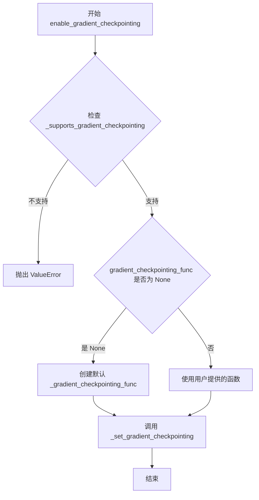

#### 带注释源码

```python
def enable_gradient_checkpointing(self, gradient_checkpointing_func: Callable | None = None) -> None:
    """
    Activates gradient checkpointing for the current model (may be referred to as *activation checkpointing* or
    *checkpoint activations* in other frameworks).

    Args:
        gradient_checkpointing_func (`Callable`, *optional*):
            The function to use for gradient checkpointing. If `None`, the default PyTorch checkpointing function
            is used (`torch.utils.checkpoint.checkpoint`).
    """
    # 检查模型类是否支持梯度检查点功能
    # 如果不支持，抛出 ValueError 错误并提示用户需要在类定义中设置 _supports_gradient_checkpointing 属性
    if not self._supports_gradient_checkpointing:
        raise ValueError(
            f"{self.__class__.__name__} does not support gradient checkpointing. Please make sure to set the boolean attribute "
            f"`_supports_gradient_checkpointing` to `True` in the class definition."
        )

    # 如果没有提供自定义的梯度检查点函数，则创建默认的检查点函数
    if gradient_checkpointing_func is None:

        def _gradient_checkpointing_func(module, *args):
            # 根据 PyTorch 版本设置不同的参数
            # 对于 PyTorch >= 1.11.0，使用 use_reentrant=False 以避免潜在的问题
            ckpt_kwargs = {"use_reentrant": False} if is_torch_version(">=", "1.11.0") else {}
            # 调用 PyTorch 的 checkpoint 函数，传入 module.__call__ 和参数
            return torch.utils.checkpoint.checkpoint(
                module.__call__,
                *args,
                **ckpt_kwargs,
            )

        # 将默认函数赋值给 gradient_checkpointing_func
        gradient_checkpointing_func = _gradient_checkpointing_func

    # 调用内部方法 _set_gradient_checkpointing 实际启用梯度检查点
    # 传入 enable=True 表示启用，并传入检查点函数
    self._set_gradient_checkpointing(enable=True, gradient_checkpointing_func=gradient_checkpointing_func)
```


### `ModelMixin.disable_gradient_checkpointing`

停用当前模型的梯度检查点功能（也称为激活检查点或检查点激活）。该方法通过调用内部方法 `_set_gradient_checkpointing` 并传入 `enable=False` 参数来禁用所有子模块的梯度检查点。

参数：

- 该方法无参数

返回值：`None`，无返回值

#### 流程图

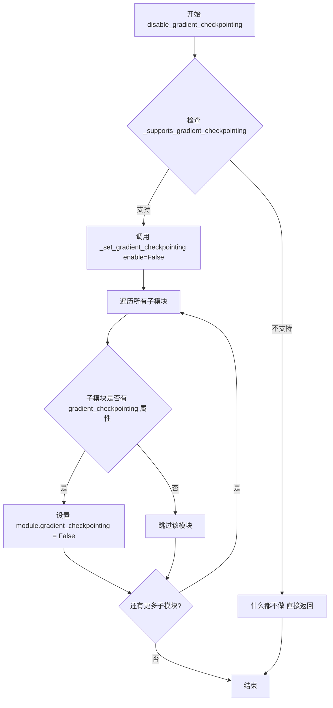

#### 带注释源码

```python
def disable_gradient_checkpointing(self) -> None:
    """
    Deactivates gradient checkpointing for the current model (may be referred to as *activation checkpointing* or
    *checkpoint activations* in other frameworks).
    """
    # 检查当前模型类是否支持梯度检查点功能
    # _supports_gradient_checkpointing 是类属性，需要在子类中设置为 True
    if self._supports_gradient_checkpointing:
        # 调用内部方法 _set_gradient_checkpointing，传入 enable=False 来禁用
        self._set_gradient_checkpointing(enable=False)
```


### `ModelMixin.set_use_npu_flash_attention`

该方法用于设置NPU Flash Attention的开关，通过递归遍历模型的所有子模块，将指定的值传递给每个支持该功能的子模块，从而统一启用或禁用NPU Flash Attention。

参数：

- `valid`：`bool`，表示是否启用NPU Flash Attention，传入`True`为启用，`False`为禁用

返回值：`None`，该方法无返回值

#### 流程图

```mermaid
flowchart TD
    A[开始 set_use_npu_flash_attention] --> B[定义内部函数 fn_recursive_set_npu_flash_attention]
    B --> C{遍历模块的子模块}
    C --> D{子模块有 set_use_npu_flash_attention 方法?}
    D -->|是| E[调用子模块.set_use_npu_flash_attention(valid)]
    D -->|否| F[继续遍历]
    E --> F
    F --> G{遍历子模块的children}
    G -->|递归调用| B
    G -->|遍历完成| H[对每个直接子模块调用 fn_recursive_set_npu_flash_attention]
    H --> I[结束]
```

#### 带注释源码

```python
def set_use_npu_flash_attention(self, valid: bool) -> None:
    r"""
    Set the switch for the npu flash attention.
    """
    # 定义一个内部递归函数，用于遍历模型的所有子模块
    def fn_recursive_set_npu_flash_attention(module: torch.nn.Module):
        # 如果当前子模块有 set_use_npu_flash_attention 方法，则调用它
        if hasattr(module, "set_use_npu_flash_attention"):
            module.set_use_npu_flash_attention(valid)

        # 递归遍历当前模块的所有子模块
        for child in module.children():
            fn_recursive_set_npu_flash_attention(child)

    # 遍历当前模块的所有直接子模块（即模型的第一层子模块）
    for module in self.children():
        # 确保处理的是 torch.nn.Module 实例
        if isinstance(module, torch.nn.Module):
            # 对每个子模块调用递归函数，以设置 NPU Flash Attention
            fn_recursive_set_npu_flash_attention(module)
```


### `ModelMixin.enable_npu_flash_attention`

启用模型中的 NPU Flash Attention 功能，通过递归遍历所有子模块并调用其 `set_use_npu_flash_attention` 方法来激活 NPU 加速的 Flash Attention 机制。

参数：

- 该方法无显式参数（隐式参数 `self` 表示模型实例本身）

返回值：`None`，无返回值

#### 流程图

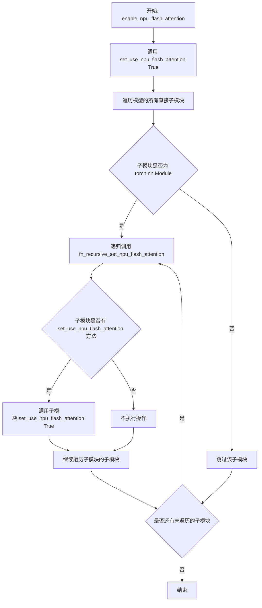

#### 带注释源码

```python
def enable_npu_flash_attention(self) -> None:
    r"""
    Enable npu flash attention from torch_npu

    """
    # 调用内部方法 set_use_npu_flash_attention，传入 True 表示启用
    self.set_use_npu_flash_attention(True)


def set_use_npu_flash_attention(self, valid: bool) -> None:
    r"""
    Set the switch for the npu flash attention.

    参数:
        valid: bool - True 表示启用 NPU Flash Attention，False 表示禁用
    """
    # 定义内部递归函数，用于遍历所有子模块
    def fn_recursive_set_npu_flash_attention(module: torch.nn.Module):
        # 检查当前模块是否具有 set_use_npu_flash_attention 方法
        if hasattr(module, "set_use_npu_flash_attention"):
            # 调用该模块的方法来设置 NPU Flash Attention 开关
            module.set_use_npu_flash_attention(valid)

        # 递归遍历当前模块的所有子模块
        for child in module.children():
            fn_recursive_set_npu_flash_attention(child)

    # 遍历模型的所有直接子模块
    for module in self.children():
        # 确保只处理 torch.nn.Module 类型的模块
        if isinstance(module, torch.nn.Module):
            fn_recursive_set_npu_flash_attention(module)
```


### ModelMixin.disable_npu_flash_attention

禁用来自 torch_npu 的 NPU flash attention。该方法通过调用内部的 `set_use_npu_flash_attention` 方法并传入 `False` 参数，以递归方式遍历模型的所有子模块，关闭支持 NPU flash attention 的模块的该功能。

参数：

- 该方法没有显式参数（仅使用 `self` 实例引用）

返回值：`None`，无返回值

#### 流程图

```mermaid
flowchart TD
    A[开始: disable_npu_flash_attention] --> B[调用 self.set_use_npu_flash_attention(False)]
    B --> C[遍历所有直接子模块]
    C --> D{是否有更多子模块需要处理}
    D -->|是| E[获取下一个子模块]
    D -->|否| F[结束]
    E --> G{子模块是否有 set_use_npu_flash_attention 方法}
    G -->|是| H[调用子模块.set_use_npu_flash_attention(False)]
    G -->|否| I[继续递归遍历子模块的子模块]
    H --> I
    I --> C
```

#### 带注释源码

```python
def disable_npu_flash_attention(self) -> None:
    r"""
    disable npu flash attention from torch_npu
    
    该方法用于禁用 NPU (Neural Processing Unit) flash attention 加速功能。
    NPU flash attention 是华为昇腾芯片提供的注意力机制优化实现。
    """
    # 调用内部的 set_use_npu_flash_attention 方法，传入 False 以禁用该功能
    # 该方法会递归地遍历模型的所有子模块，关闭支持 NPU flash attention 的模块
    self.set_use_npu_flash_attention(False)
```


### `ModelMixin.set_use_xla_flash_attention`

该方法用于递归地设置模型中所有子模块的XLA Flash Attention开关，允许在支持torch_xla的设备上启用或禁用Flash Attention优化内核。

参数：

- `use_xla_flash_attention`：`bool`，控制是否启用XLA Flash Attention（True为启用，False为禁用）
- `partition_spec`：`Callable | None`，可选参数，用于指定XLA编译时的分区规范
- `**kwargs`：其他可选关键字参数，会传递给子模块的相同方法

返回值：`None`，该方法无返回值

#### 流程图

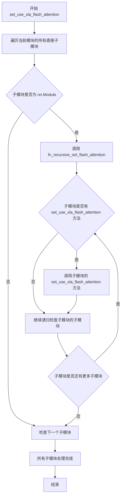

#### 带注释源码

```python
def set_use_xla_flash_attention(
    self, use_xla_flash_attention: bool, partition_spec: Callable | None = None, **kwargs
) -> None:
    """
    设置模型中所有子模块的XLA Flash Attention开关。
    
    该方法会递归遍历模型的所有子模块，对于支持 set_use_xla_flash_attention 方法的模块，
    会调用该方法将设置向下传递，从而实现批量启用/禁用XLA Flash Attention。
    
    Args:
        use_xla_flash_attention: 布尔值，True表示启用XLA Flash Attention，False表示禁用
        partition_spec: 可选的分区规范，用于XLA编译器进行模型并行化
        **kwargs: 其他可选关键字参数，会传递给子模块的设置方法
    """
    
    # 定义内部递归函数，用于深度优先遍历所有子模块
    def fn_recursive_set_flash_attention(module: torch.nn.Module):
        # 检查当前模块是否具有 set_use_xla_flash_attention 方法
        # 如果有，则调用该方法传递设置
        if hasattr(module, "set_use_xla_flash_attention"):
            module.set_use_xla_flash_attention(use_xla_flash_attention, partition_spec, **kwargs)

        # 递归遍历当前模块的所有子模块
        for child in module.children():
            fn_recursive_set_flash_attention(child)

    # 从当前模块的顶层子模块开始遍历
    for module in self.children():
        # 确保只处理 torch.nn.Module 类型的模块
        if isinstance(module, torch.nn.Module):
            fn_recursive_set_flash_attention(module)
```


### `ModelMixin.enable_xla_flash_attention`

启用 torch_xla 的 Flash Attention Pallas 内核。

参数：

- `self`：`ModelMixin`，隐式参数，模型实例本身
- `partition_spec`：`Callable | None`，可选，指定张量分片规范的回调函数，用于 XLA 编译时的设备间数据分片
- `**kwargs`：可变关键字参数，会传递给底层的 `set_use_xla_flash_attention` 方法

返回值：`None`，无返回值（该方法直接修改模型状态）

#### 流程图

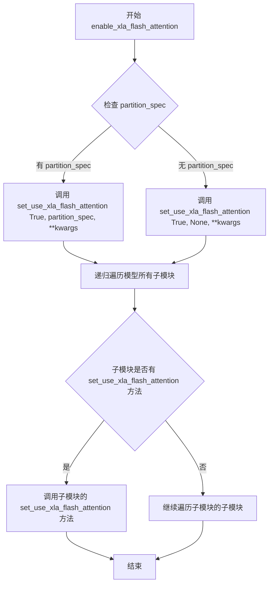

#### 带注释源码

```python
def enable_xla_flash_attention(self, partition_spec: Callable | None = None, **kwargs):
    r"""
    Enable the flash attention pallals kernel for torch_xla.
    
    该方法用于启用 XLA (PyTorch/XLA) 的 Flash Attention Pallas 内核。
    它通过调用 set_use_xla_flash_attention 方法来实现，传递 True 作为启用标志。
    
    Args:
        partition_spec (Callable | None, optional):
            一个可选的回调函数，用于指定张量在 XLA 编译时的分片规范。
            如果为 None，则不指定特定的分片策略。
        **kwargs:
            额外的关键字参数，会被传递到底层的 set_use_xla_flash_attention 方法。
    
    Example:
        >>> # 启用 XLA Flash Attention
        >>> model.enable_xla_flash_attention()
        >>> # 带分片规范启用
        >>> model.enable_xla_flash_attention(partition_spec=lambda *dims: (1, None, None))
    """
    # 调用 set_use_xla_flash_attention 方法，传递 True 以启用 Flash Attention
    # partition_spec 和 **kwargs 会被传递下去
    self.set_use_xla_flash_attention(True, partition_spec, **kwargs)
```


### `ModelMixin.disable_xla_flash_attention`

该方法用于禁用 torch_xla 的 flash attention 并行内核，通过递归遍历模型的所有子模块并调用其 `set_use_xla_flash_attention` 方法，传入 `False` 参数来关闭 XLA flash attention。

参数：无

返回值：无返回值

#### 流程图

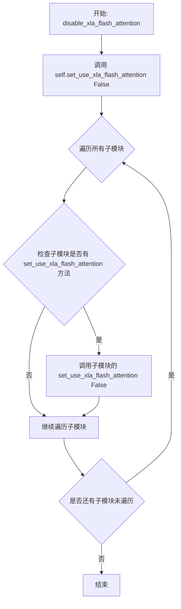

#### 带注释源码

```python
def disable_xla_flash_attention(self):
    r"""
    Disable the flash attention pallals kernel for torch_xla.
    """
    # 调用 set_use_xla_flash_attention 方法，传入 False 参数以禁用
    # 该方法会递归遍历模型的所有子模块
    self.set_use_xla_flash_attention(False)
```


### `ModelMixin.set_use_memory_efficient_attention_xformers`

该方法递归遍历模型的所有子模块，对支持 `set_use_memory_efficient_attention_xformers` 方法的模块进行调用，以启用或禁用 xFormers 的内存高效注意力机制。

参数：

- `valid`：`bool`，控制启用或禁用内存高效注意力。为 `True` 时启用，为 `False` 时禁用
- `attention_op`：`Callable | None`，可选参数，用于指定 xFormers `memory_efficient_attention()` 函数的自定义操作符，默认为 `None`

返回值：`None`，无返回值

#### 流程图

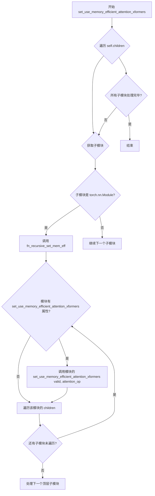

#### 带注释源码

```python
def set_use_memory_efficient_attention_xformers(self, valid: bool, attention_op: Callable | None = None) -> None:
    """
    设置是否使用 xFormers 的内存高效注意力机制。

    该方法递归地遍历模型的所有子模块，对支持该方法的模块进行调用，
    以统一启用或禁用内存高效注意力。

    参数:
        valid (bool): True 表示启用内存高效注意力，False 表示禁用
        attention_op (Callable | None): 可选的自定义注意力操作符，传递给子模块
    """
    # 递归辅助函数：遍历模块及其所有子模块
    def fn_recursive_set_mem_eff(module: torch.nn.Module):
        # 检查当前模块是否支持设置内存高效注意力
        if hasattr(module, "set_use_memory_efficient_attention_xformers"):
            # 调用子模块的方法，传递 valid 和 attention_op 参数
            module.set_use_memory_efficient_attention_xformers(valid, attention_op)

        # 递归遍历当前模块的所有子模块
        for child in module.children():
            fn_recursive_set_mem_eff(child)

    # 遍历模型的所有直接子模块
    for module in self.children():
        # 确保是 PyTorch 模块类型
        if isinstance(module, torch.nn.Module):
            # 对每个子模块调用递归设置函数
            fn_recursive_set_mem_eff(module)
```


### `ModelMixin.enable_xformers_memory_efficient_attention`

启用 xFormers 的内存高效注意力机制，以降低 GPU 内存使用并在推理时可能提升速度。

参数：

- `attention_op`：`Callable | None`，可选参数，用于覆盖 xFormers 的 `memory_efficient_attention()` 函数的默认操作符

返回值：`None`，无返回值

#### 流程图

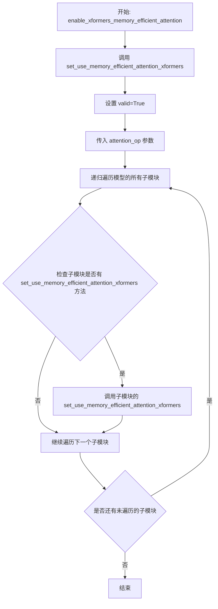

#### 带注释源码

```python
def enable_xformers_memory_efficient_attention(self, attention_op: Callable | None = None) -> None:
    r"""
    Enable memory efficient attention from [xFormers](https://facebookresearch.github.io/xformers/).

    当启用此选项时，您应该会观察到更低的 GPU 内存使用以及推理时的潜在加速。
    训练期间的加速无法保证。

    > [!WARNING] > ⚠️ 当内存高效注意力和切片注意力同时启用时，内存高效注意力优先。

    Parameters:
        attention_op (`Callable`, *optional*):
            覆盖默认的 `None` 操作符，用于 xFormers 的
            [`memory_efficient_attention()`](https://facebookresearch.github.io/xformers/components/ops.html#xformers.ops.memory_efficient_attention)
            函数的 `op` 参数。

    Examples:

    ```py
    >>> import torch
    >>> from diffusers import UNet2DConditionModel
    >>> from xformers.ops import MemoryEfficientAttentionFlashAttentionOp

    >>> model = UNet2DConditionModel.from_pretrained(
    ...     "stabilityai/stable-diffusion-2-1", subfolder="unet", torch_dtype=torch.float16
    ... )
    >>> model = model.to("cuda")
    >>> model.enable_xformers_memory_efficient_attention(attention_op=MemoryEfficientAttentionFlashAttentionOp)
    ```
    """
    # 调用内部方法 set_use_memory_efficient_attention_xformers，传递 True 以启用注意力机制
    # attention_op 参数直接传递给子模块，用于指定具体的注意力操作实现
    self.set_use_memory_efficient_attention_xformers(True, attention_op)
```


### `ModelMixin.disable_xformers_memory_efficient_attention`

禁用 xFormers 的内存高效注意力机制。该方法通过调用 `set_use_memory_efficient_attention_xformers` 并传入 `False` 参数，递归地遍历模型的所有子模块，关闭所有支持 xFormers 内存高效注意力的模块。

参数：

- 该方法无显式参数（`self` 为隐式参数）

返回值：`None`，无返回值

#### 流程图

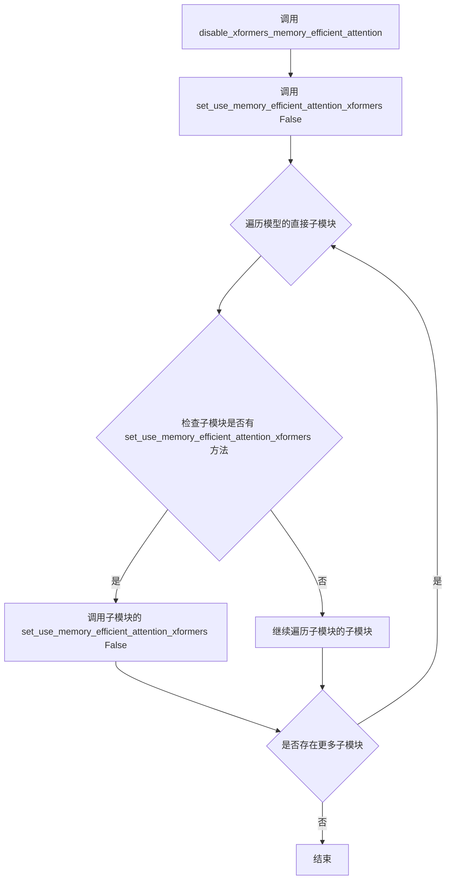

#### 带注释源码

```python
def disable_xformers_memory_efficient_attention(self) -> None:
    r"""
    Disable memory efficient attention from [xFormers](https://facebookresearch.github.io/xformers/).
    禁用 xFormers 的内存高效注意力机制。
    xFormers 是一种高效的注意力实现，可以减少 GPU 内存占用。
    """
    # 调用内部方法 set_use_memory_efficient_attention_xformers，传入 False 以禁用该功能
    # 该方法会递归地遍历所有子模块并关闭每个支持该功能的模块的内存高效注意力
    self.set_use_memory_efficient_attention_xformers(False)
```


### `ModelMixin.enable_layerwise_casting`

该方法用于激活当前模型的逐层类型转换（Layerwise Casting）功能。逐层转换是一种将模型权重转换为较低精度的存储数据类型，并在前向传播时动态提升到较高精度计算数据类型的技术，可显著降低模型权重的内存占用。

参数：

- `storage_dtype`：`torch.dtype`，默认为 `torch.float8_e4m3fn`，模型存储时转换到的目标数据类型
- `compute_dtype`：`torch.dtype | None`，默认为 `None`，前向传播时权重转换到的计算数据类型，若为 `None` 则使用模型当前的数据类型
- `skip_modules_pattern`：`tuple[str, ...] | None`，默认为 `None`，需要跳过逐层转换的模块名称匹配模式列表
- `skip_modules_classes`：`tuple[Type[torch.nn.Module], ...] | None`，默认为 `None`，需要跳过逐层转换的模块类列表
- `non_blocking`：`bool`，默认为 `False`，若为 `True`，则权重转换操作非阻塞执行

返回值：`None`，该方法直接修改模型状态，无返回值

#### 流程图

```mermaid
flowchart TD
    A[开始 enable_layerwise_casting] --> B{用户是否提供 skip_modules_pattern?}
    B -->|是| C[user_provided_patterns = True]
    B -->|否| D[使用 DEFAULT_SKIP_MODULES_PATTERN]
    D --> C
    C --> E{_keep_in_fp32_modules 是否存在?}
    E -->|是| F[将 _keep_in_fp32_modules 加入 skip_modules_pattern]
    E -->|否| G{_skip_layerwise_casting_patterns 是否存在?}
    F --> G
    G -->|是| H[将 _skip_layerwise_casting_patterns 加入 skip_modules_pattern]
    G -->|否| I[去重 skip_modules_pattern]
    I --> J{PEFT 可用且用户未提供 patterns?}
    J -->|是| K[添加 PEFT 层的 adapter_layer_names 到 skip_modules_pattern]
    J -->|否| L{compute_dtype 是否为 None?}
    K --> L
    L -->|是| M[compute_dtype = self.dtype]
    L -->|否| N[保持 compute_dtype 不变]
    M --> O[调用 apply_layerwise_casting]
    N --> O
    O --> P[结束]
```

#### 带注释源码

```python
def enable_layerwise_casting(
    self,
    storage_dtype: torch.dtype = torch.float8_e4m3fn,
    compute_dtype: torch.dtype | None = None,
    skip_modules_pattern: tuple[str, ...] | None = None,
    skip_modules_classes: tuple[Type[torch.nn.Module], ...] | None = None,
    non_blocking: bool = False,
) -> None:
    r"""
    Activates layerwise casting for the current model.

    Layerwise casting is a technique that casts the model weights to a lower precision dtype for storage but
    upcasts them on-the-fly to a higher precision dtype for computation. This process can significantly reduce the
    memory footprint from model weights, but may lead to some quality degradation in the outputs. Most degradations
    are negligible, mostly stemming from weight casting in normalization and modulation layers.

    By default, most models in diffusers set the `_skip_layerwise_casting_patterns` attribute to ignore patch
    embedding, positional embedding and normalization layers. This is because these layers are most likely
    precision-critical for quality. If you wish to change this behavior, you can set the
    `_skip_layerwise_casting_patterns` attribute to `None`, or call
    [`~hooks.layerwise_casting.apply_layerwise_casting`] with custom arguments.

    Example:
        Using [`~models.ModelMixin.enable_layerwise_casting`]:

        ```python
        >>> from diffusers import CogVideoXTransformer3DModel

        >>> transformer = CogVideoXTransformer3DModel.from_pretrained(
        ...     "THUDM/CogVideoX-5b", subfolder="transformer", torch_dtype=torch.bfloat16
        ... )

        >>> # Enable layerwise casting via the model, which ignores certain modules by default
        >>> transformer.enable_layerwise_casting(storage_dtype=torch.float8_e4m3fn, compute_dtype=torch.bfloat16)
        ```

    Args:
        storage_dtype (`torch.dtype`):
            The dtype to which the model should be cast for storage.
        compute_dtype (`torch.dtype`):
            The dtype to which the model weights should be cast during the forward pass.
        skip_modules_pattern (`tuple[str, ...]`, *optional*):
            A list of patterns to match the names of the modules to skip during the layerwise casting process. If
            set to `None`, default skip patterns are used to ignore certain internal layers of modules and PEFT
            layers.
        skip_modules_classes (`tuple[Type[torch.nn.Module], ...]`, *optional*):
            A list of module classes to skip during the layerwise casting process.
        non_blocking (`bool`, *optional*, defaults to `False`):
            If `True`, the weight casting operations are non-blocking.
    """
    # 导入逐层转换函数
    from ..hooks import apply_layerwise_casting

    # 标记用户是否提供了自定义的 skip_modules_pattern
    user_provided_patterns = True
    if skip_modules_pattern is None:
        # 如果未提供，则使用默认的跳过模式
        from ..hooks.layerwise_casting import DEFAULT_SKIP_MODULES_PATTERN

        skip_modules_pattern = DEFAULT_SKIP_MODULES_PATTERN
        user_provided_patterns = False
    
    # 将 _keep_in_fp32_modules 添加到跳过模式中（如果有）
    if self._keep_in_fp32_modules is not None:
        skip_modules_pattern += tuple(self._keep_in_fp32_modules)
    
    # 将 _skip_layerwise_casting_patterns 添加到跳过模式中（如果有）
    if self._skip_layerwise_casting_patterns is not None:
        skip_modules_pattern += tuple(self._skip_layerwise_casting_patterns)
    
    # 去重跳过模式
    skip_modules_pattern = tuple(set(skip_modules_pattern))

    # 如果 PEFT 可用且用户未提供自定义模式，默认跳过所有 PEFT 层
    if is_peft_available() and not user_provided_patterns:
        # By default, we want to skip all peft layers because they have a very low memory footprint.
        # If users want to apply layerwise casting on peft layers as well, they can utilize the
        # `~diffusers.hooks.layerwise_casting.apply_layerwise_casting` function which provides
        # them with more flexibility and control.

        from peft.tuners.loha.layer import LoHaLayer
        from peft.tuners.lokr.layer import LoKrLayer
        from peft.tuners.lora.layer import LoraLayer

        for layer in (LoHaLayer, LoKrLayer, LoraLayer):
            skip_modules_pattern += tuple(layer.adapter_layer_names)

    # 如果未指定 compute_dtype，则使用模型的当前数据类型
    if compute_dtype is None:
        logger.info("`compute_dtype` not provided when enabling layerwise casting. Using dtype of the model.")
        compute_dtype = self.dtype

    # 调用核心的逐层转换函数，应用转换到模型
    apply_layerwise_casting(
        self, storage_dtype, compute_dtype, skip_modules_pattern, skip_modules_classes, non_blocking
    )
```


### `ModelMixin.enable_group_offload`

激活当前模型的组卸载（group offloading）功能，允许在模型运行时将权重分组卸载到 CPU 或磁盘，以节省 GPU 显存。

参数：

- `self`：隐式参数，ModelMixin 实例本身
- `onload_device`：`torch.device`，模型权重需要加载到的目标设备（通常是 CUDA 设备）
- `offload_device`：`torch.device`，卸载权重的目标设备，默认为 CPU (`torch.device("cpu")`)
- `offload_type`：`str`，卸载类型，支持 "block_level" 或 "leaf_level" 等模式
- `num_blocks_per_group`：`int | None`，每组包含的块数量，用于控制卸载粒度
- `non_blocking`：`bool`，是否使用非阻塞传输，默认为 `False`
- `use_stream`：`bool`，是否使用 CUDA 流进行异步传输，默认为 `False`
- `record_stream`：`bool`，是否记录 CUDA 流，默认为 `False`
- `low_cpu_mem_usage`：`bool`，是否使用低 CPU 内存模式，默认为 `False`
- `offload_to_disk_path`：`str | None`，如果指定，则将权重卸载到磁盘的路径
- `block_modules`：`str | None`，指定需要被当作整体块进行卸载的模块名称模式
- `exclude_kwargs`：`str | None`，额外的排除参数

返回值：`None`，无返回值（该方法直接修改模型状态）

#### 流程图

```mermaid
flow TD
    A[开始 enable_group_offload] --> B{检查 tiling 和 use_stream 兼容性}
    B -->|不兼容| C[发出警告]
    B -->|兼容| D{检查 _supports_group_offloading}
    C --> D
    D -->|不支持| E[抛出 ValueError 异常]
    D -->|支持| F[调用 apply_group_offloading]
    E --> G[结束]
    F --> G
    
    style F fill:#90EE90
    style E fill:#FFB6C1
```

#### 带注释源码

```python
def enable_group_offload(
    self,
    onload_device: torch.device,
    offload_device: torch.device = torch.device("cpu"),
    offload_type: str = "block_level",
    num_blocks_per_group: int | None = None,
    non_blocking: bool = False,
    use_stream: bool = False,
    record_stream: bool = False,
    low_cpu_mem_usage=False,
    offload_to_disk_path: str | None = None,
    block_modules: str | None = None,
    exclude_kwargs: str | None = None,
) -> None:
    r"""
    Activates group offloading for the current model.

    See [`~hooks.group_offloading.apply_group_offloading`] for more information.

    Example:

        ```python
        >>> from diffusers import CogVideoXTransformer3DModel

        >>> transformer = CogVideoXTransformer3DModel.from_pretrained(
        ...     "THUDM/CogVideoX-5b", subfolder="transformer", torch_dtype=torch.bfloat16
        ... )

        >>> transformer.enable_group_offload(
        ...     onload_device=torch.device("cuda"),
        ...     offload_device=torch.device("cpu"),
        ...     offload_type="leaf_level",
        ...     use_stream=True,
        ... )
        ```
    """
    # 导入 apply_group_offloading 钩子函数
    from ..hooks import apply_group_offloading

    # 检查模型是否启用了 tiling 且 use_stream 为 True
    # 如果在 autoencoder 上使用 CUDA streams 进行组卸载，可能无法正常工作
    if getattr(self, "enable_tiling", None) is not None and getattr(self, "use_tiling", False) and use_stream:
        msg = (
            "Applying group offloading on autoencoders, with CUDA streams, may not work as expected if the first "
            "forward pass is executed with tiling enabled. Please make sure to either:\n"
            "1. Run a forward pass with small input shapes.\n"
            "2. Or, run a forward pass with tiling disabled (can still use small dummy inputs)."
        )
        logger.warning(msg)
    
    # 检查模型类是否支持组卸载功能
    if not self._supports_group_offloading:
        raise ValueError(
            f"{self.__class__.__name__} does not support group offloading. Please make sure to set the boolean attribute "
            f"`_supports_group_offloading` to `True` in the class definition. If you believe this is a mistake, please "
            f"open an issue at https://github.com/huggingface/diffusers/issues."
        )

    # 调用底层的 apply_group_offloading 函数来应用组卸载
    apply_group_offloading(
        module=self,
        onload_device=onload_device,
        offload_device=offload_device,
        offload_type=offload_type,
        num_blocks_per_group=num_blocks_per_group,
        non_blocking=non_blocking,
        use_stream=use_stream,
        record_stream=record_stream,
        low_cpu_mem_usage=low_cpu_mem_usage,
        offload_to_disk_path=offload_to_disk_path,
        block_modules=block_modules,
        exclude_kwargs=exclude_kwargs,
    )
```


### `ModelMixin.set_attention_backend`

设置模型的注意力后端，允许在不同的注意力实现之间切换（如torch原生、xFormers等）。

参数：

- `backend`：`str`，要设置的注意力后端名称，必须是 `AttentionBackendName` 中定义的可用后端之一。

返回值：`None`，无返回值。

#### 流程图

```mermaid
flowchart TD
    A[开始 set_attention_backend] --> B[导入依赖模块]
    B --> C[定义 attention_classes 元组]
    C --> D{检查是否存在 parallel_config}
    D -->|是| E[遍历模型模块查找 parallel_config]
    D -->|否| F[将 backend 转为小写]
    E --> F
    F --> G{验证 backend 是否在可用后端中}
    G -->|否| H[抛出 ValueError 异常]
    G -->|是| I[将 backend 转换为 AttentionBackendName 枚举]
    I --> J{检查 parallel_config_set 且后端不支持 context parallelism}
    J -->|是| K[抛出 ValueError 异常]
    J -->|否| L[_check_attention_backend_requirements]
    L --> M[_maybe_download_kernel_for_backend]
    M --> N[遍历模型模块]
    N --> O{模块属于 attention_classes}
    O -->|否| P[继续下一个模块]
    O -->|是| Q{processor 存在且有 _attention_backend 属性}
    Q -->|否| P
    Q -->|是| R[设置 processor._attention_backend = backend]
    R --> P
    P --> N
    N --> S[_AttentionBackendRegistry.set_active_backend]
    S --> T[结束]
    H --> T
    K --> T
```

#### 带注释源码

```python
def set_attention_backend(self, backend: str) -> None:
    """
    设置模型的注意力后端。

    Args:
        backend (`str`): 要设置的注意力后端名称。必须是 `AttentionBackendName` 中定义的
            可用后端之一。默认为 torch 原生的缩放点积注意力。
    """
    # 导入注意力相关模块
    from .attention import AttentionModuleMixin
    from .attention_dispatch import (
        AttentionBackendName,
        _AttentionBackendRegistry,
        _check_attention_backend_requirements,
        _maybe_download_kernel_for_backend,
    )

    # TODO: 以下导入在未来重构为 AttentionModuleMixin 后将不再需要
    from .attention_processor import Attention, MochiAttention

    # 警告：注意力后端是实验性功能，API 可能会更改
    logger.warning("Attention backends are an experimental feature and the API may be subject to change.")
    
    # 定义需要设置后端的注意力类元组
    attention_classes = (Attention, MochiAttention, AttentionModuleMixin)

    # 检查是否设置了 parallel_config（上下文并行配置）
    parallel_config_set = False
    for module in self.modules():
        if not isinstance(module, attention_classes):
            continue
        processor = module.processor
        if getattr(processor, "_parallel_config", None) is not None:
            parallel_config_set = True
            break

    # 将后端名称转为小写以进行不区分大小写的比较
    backend = backend.lower()
    
    # 获取所有可用的后端名称集合
    available_backends = {x.value for x in AttentionBackendName.__members__.values()}
    
    # 验证提供的后端是否有效
    if backend not in available_backends:
        raise ValueError(f"`{backend=}` must be one of the following: " + ", ".join(available_backends))

    # 将字符串转换为枚举类型
    backend = AttentionBackendName(backend)
    
    # 如果启用了上下文并行但选择的后端不支持，则抛出错误
    if parallel_config_set and not _AttentionBackendRegistry._is_context_parallel_available(backend):
        compatible_backends = sorted(_AttentionBackendRegistry._supports_context_parallel)
        raise ValueError(
            f"Context parallelism is enabled but current attention backend '{backend.value}' "
            f"does not support context parallelism. "
            f"Please set a compatible attention backend: {compatible_backends} using `model.set_attention_backend()`."
        )

    # 检查注意力后端需求
    _check_attention_backend_requirements(backend)
    
    # 可能为后端下载内核
    _maybe_download_kernel_for_backend(backend)

    # 遍历所有模块，为每个注意力处理器设置后端
    for module in self.modules():
        if not isinstance(module, attention_classes):
            continue
        processor = module.processor
        if processor is None or not hasattr(processor, "_attention_backend"):
            continue
        # 设置处理器的新注意力后端
        processor._attention_backend = backend

    # 重要：设置活动后端以便在整个模型中优雅地传播
    _AttentionBackendRegistry.set_active_backend(backend)
```


### `ModelMixin.reset_attention_backend`

重置模型的注意力后端。调用此方法后，后续的 `forward` 调用将使用环境默认设置（如果已设置）或 PyTorch 原生的缩放点积注意力机制。

参数：无（仅 `self` 实例参数）

返回值：`None`，无返回值

#### 流程图

```mermaid
flowchart TD
    A[开始 reset_attention_backend] --> B[记录实验性功能警告日志]
    B --> C[定义注意力类元组: Attention, MochiAttention, AttentionModuleMixin]
    C --> D{遍历模型所有模块}
    D -->|否| H[结束]
    D -->|是| E{当前模块是注意力类?}
    E -->|否| D
    E -->|是| F{模块有 processor 且包含 _attention_backend 属性?}
    F -->|否| D
    F -->|是| G[将 processor._attention_backend 设置为 None]
    G --> D
```

#### 带注释源码

```python
def reset_attention_backend(self) -> None:
    """
    重置模型的注意力后端。后续的 forward 调用将使用环境默认设置（如果已设置）
    或 PyTorch 原生的缩放点积注意力机制。
    """
    # 从相关模块导入注意力类
    from .attention import AttentionModuleMixin
    from .attention_processor import Attention, MochiAttention

    # 记录警告：注意力后端是实验性功能，API 可能会更改
    logger.warning("Attention backends are an experimental feature and the API may be subject to change.")

    # 定义需要处理的注意力类元组
    attention_classes = (Attention, MochiAttention, AttentionModuleMixin)
    
    # 遍历模型中的所有模块
    for module in self.modules():
        # 只处理注意力相关的模块
        if not isinstance(module, attention_classes):
            continue
        
        # 获取模块的处理器
        processor = module.processor
        
        # 检查处理器是否存在且具有 _attention_backend 属性
        if processor is None or not hasattr(processor, "_attention_backend"):
            continue
        
        # 将处理器的注意力后端重置为 None
        # None 表示使用环境默认或 PyTorch 原生实现
        processor._attention_backend = None
```


### ModelMixin.save_pretrained

保存模型及其配置文件到指定目录，以便可以通过 `from_pretrained` 方法重新加载。

参数：

- `save_directory`：`str | os.PathLike`，目标目录，用于保存模型及配置文件，若不存在将自动创建
- `is_main_process`：`bool`，可选，默认为 `True`，调用此函数的进程是否为主进程，用于分布式训练场景
- `save_function`：`Callable | None`，可选，用于保存状态字典的函数，可用于替换默认的 `torch.save`
- `safe_serialization`：`bool`，可选，默认为 `True`，是否使用 `safetensors` 格式保存模型（更安全）
- `variant`：`str | None`，可选，若指定则权重保存为 `pytorch_model.<variant>.bin` 格式
- `max_shard_size`：`int | str`，可选，默认为 `"10GB"`，分片前的最大检查点大小，超过则分片保存
- `push_to_hub`：`bool`，可选，默认为 `False`，是否在保存后推送到 Hugging Face Hub
- `**kwargs`：传递给 `push_to_hub` 方法的额外关键字参数

返回值：无（`None`），该方法直接操作文件系统或推送到 Hub，无返回值

#### 流程图

```mermaid
flowchart TD
    A[开始 save_pretrained] --> B{save_directory 是文件?}
    B -->|是| C[记录错误并返回 None]
    B -->|否| D{模型是否量化且不可序列化?}
    D -->|是| E[抛出 ValueError 异常]
    D -->|否| F[确定权重文件名和模式]
    F --> G[创建保存目录]
    G --> H{push_to_hub?}
    H -->|是| I[创建 Hugging Face Hub 仓库]
    H -->|否| J[获取模型 state_dict]
    J --> K[按 max_shard_size 分割 state_dict]
    K --> L[清理旧的分片文件]
    L --> M[遍历分片文件]
    M --> N{safe_serialization?}
    N -->|是| O[使用 safetensors.torch.save_file 保存]
    N -->|否| P[使用 torch.save 保存]
    O --> Q[保存索引文件]
    P --> Q
    Q --> R{push_to_hub?}
    R -->|是| S[创建并保存模型卡片]
    S --> T[上传文件夹到 Hub]
    R -->|否| U[结束]
    T --> U
```

#### 带注释源码

```python
def save_pretrained(
    self,
    save_directory: str | os.PathLike,
    is_main_process: bool = True,
    save_function: Callable | None = None,
    safe_serialization: bool = True,
    variant: str | None = None,
    max_shard_size: int | str = "10GB",
    push_to_hub: bool = False,
    **kwargs,
):
    """
    Save a model and its configuration file to a directory so that it can be reloaded using the
    [`~models.ModelMixin.from_pretrained`] class method.

    Arguments:
        save_directory (`str` or `os.PathLike`):
            Directory to save a model and its configuration file to. Will be created if it doesn't exist.
        is_main_process (`bool`, *optional*, defaults to `True`):
            Whether the process calling this is the main process or not. Useful during distributed training and you
            need to call this function on all processes. In this case, set `is_main_process=True` only on the main
            process to avoid race conditions.
        save_function (`Callable`):
            The function to use to save the state dictionary. Useful during distributed training when you need to
            replace `torch.save` with another method. Can be configured with the environment variable
            `DIFFUSERS_SAVE_MODE`.
        safe_serialization (`bool`, *optional*, defaults to `True`):
            Whether to save the model using `safetensors` or the traditional PyTorch way with `pickle`.
        variant (`str`, *optional*):
            If specified, weights are saved in the format `pytorch_model.<variant>.bin`.
        max_shard_size (`int` or `str`, defaults to `"10GB"`):
            The maximum size for a checkpoint before being sharded. Checkpoints shard will then be each of size
            lower than this size. If expressed as a string, needs to be digits followed by a unit (like `"5GB"`).
            If expressed as an integer, the unit is bytes. Note that this limit will be decreased after a certain
            period of time (starting from Oct 2024) to allow users to upgrade to the latest version of `diffusers`.
            This is to establish a common default size for this argument across different libraries in the Hugging
            Face ecosystem (`transformers`, and `accelerate`, for example).
        push_to_hub (`bool`, *optional*, defaults to `False`):
            Whether or not to push your model to the Hugging Face Hub after saving it. You can specify the
            repository you want to push to with `repo_id` (will default to the name of `save_directory` in your
            namespace).
        kwargs (`dict[str, Any]`, *optional*):
            Additional keyword arguments passed along to the [`~utils.PushToHubMixin.push_to_hub`] method.
    """
    # 检查保存路径是否为文件，若是则报错并返回
    if os.path.isfile(save_directory):
        logger.error(f"Provided path ({save_directory}) should be a directory, not a file")
        return

    # 检查模型是否被量化，若是则检查是否可序列化
    hf_quantizer = getattr(self, "hf_quantizer", None)
    if hf_quantizer is not None:
        quantization_serializable = (
            hf_quantizer is not None
            and isinstance(hf_quantizer, DiffusersQuantizer)
            and hf_quantizer.is_serializable
        )
        if not quantization_serializable:
            raise ValueError(
                f"The model is quantized with {hf_quantizer.quantization_config.quant_method} and is not serializable - check out the warnings from"
                " the logger on the traceback to understand the reason why the quantized model is not serializable."
            )

    # 根据 safe_serialization 和 variant 确定权重文件名
    weights_name = SAFETENSORS_WEIGHTS_NAME if safe_serialization else WEIGHTS_NAME
    weights_name = _add_variant(weights_name, variant)
    weights_name_pattern = weights_name.replace(".bin", "{suffix}.bin").replace(
        ".safetensors", "{suffix}.safetensors"
    )

    # 创建保存目录
    os.makedirs(save_directory, exist_ok=True)

    # 处理 push_to_hub 相关参数
    if push_to_hub:
        commit_message = kwargs.pop("commit_message", None)
        private = kwargs.pop("private", None)
        create_pr = kwargs.pop("create_pr", False)
        token = kwargs.pop("token", None)
        repo_id = kwargs.pop("repo_id", save_directory.split(os.path.sep)[-1])
        repo_id = create_repo(repo_id, exist_ok=True, private=private, token=token).repo_id

    # 仅保存模型本身（分布式训练场景）
    model_to_save = self

    # 在主进程保存配置
    if is_main_process:
        model_to_save.save_config(save_directory)

    # 获取模型状态字典
    state_dict = model_to_save.state_dict()

    # 按 max_shard_size 分割状态字典为多个分片
    state_dict_split = split_torch_state_dict_into_shards(
        state_dict, max_shard_size=max_shard_size, filename_pattern=weights_name_pattern
    )

    # 清理旧的分片文件
    if is_main_process:
        for filename in os.listdir(save_directory):
            if filename in state_dict_split.filename_to_tensors.keys():
                continue
            full_filename = os.path.join(save_directory, filename)
            if not os.path.isfile(full_filename):
                continue
            weights_without_ext = weights_name_pattern.replace(".bin", "").replace(".safetensors", "")
            weights_without_ext = weights_without_ext.replace("{suffix}", "")
            filename_without_ext = filename.replace(".bin", "").replace(".safetensors", "")
            # 确保删除的文件格式匹配分片文件格式
            if (
                filename.startswith(weights_without_ext)
                and _REGEX_SHARD.fullmatch(filename_without_ext) is not None
            ):
                os.remove(full_filename)

    # 遍历保存每个分片
    for filename, tensors in state_dict_split.filename_to_tensors.items():
        shard = {tensor: state_dict[tensor].contiguous() for tensor in tensors}
        filepath = os.path.join(save_directory, filename)
        if safe_serialization:
            # 使用 safetensors 安全保存
            safetensors.torch.save_file(shard, filepath, metadata={"format": "pt"})
        else:
            torch.save(shard, filepath)

    # 如果模型分片了，保存索引文件
    if state_dict_split.is_sharded:
        index = {
            "metadata": state_dict_split.metadata,
            "weight_map": state_dict_split.tensor_to_filename,
        }
        save_index_file = SAFE_WEIGHTS_INDEX_NAME if safe_serialization else WEIGHTS_INDEX_NAME
        save_index_file = os.path.join(save_directory, _add_variant(save_index_file, variant))
        # 保存索引文件
        with open(save_index_file, "w", encoding="utf-8") as f:
            content = json.dumps(index, indent=2, sort_keys=True) + "\n"
            f.write(content)
        logger.info(
            f"The model is bigger than the maximum size per checkpoint ({max_shard_size}) and is going to be "
            f"split in {len(state_dict_split.filename_to_tensors)} checkpoint shards. You can find where each parameters has been saved in the "
            f"index located at {save_index_file}."
        )
    else:
        path_to_weights = os.path.join(save_directory, weights_name)
        logger.info(f"Model weights saved in {path_to_weights}")

    # 如果需要推送到 Hub
    if push_to_hub:
        # 创建空的模型卡片并填充信息
        model_card = load_or_create_model_card(repo_id, token=token)
        model_card = populate_model_card(model_card)
        model_card.save(Path(save_directory, "README.md").as_posix())

        # 上传文件夹到 Hub
        self._upload_folder(
            save_directory,
            repo_id,
            token=token,
            commit_message=commit_message,
            create_pr=create_pr,
        )
```


### `ModelMixin.dequantize`

该方法用于将已经过量化（quantization）的模型进行解量化（dequantize），前提是量化方法支持解量化操作。如果模型未经过量化，则抛出异常。

参数：

- `self`：`ModelMixin` 实例，模型本身（隐式参数，无需显式传递）

返回值：`Any`，返回解量化后的模型对象（具体类型取决于 `hf_quantizer.dequantize` 的实现）

#### 流程图

```mermaid
flowchart TD
    A[开始 dequantize] --> B[获取 hf_quantizer 属性]
    B --> C{hf_quantizer 是否为 None?}
    C -->|是| D[抛出 ValueError: 需要先量化模型]
    C -->|否| E[调用 hf_quantizer.dequantize 方法]
    E --> F[返回解量化后的模型]
    D --> G[结束]
    F --> G
```

#### 带注释源码

```python
def dequantize(self):
    """
    Potentially dequantize the model in case it has been quantized by a quantization method that support
    dequantization.
    """
    # 获取模型的 hf_quantizer 属性，该属性在模型量化时被设置
    hf_quantizer = getattr(self, "hf_quantizer", None)

    # 检查模型是否已被量化，如果没有量化则无法解量化
    if hf_quantizer is None:
        raise ValueError("You need to first quantize your model in order to dequantize it")

    # 调用量化器的 dequantize 方法对模型进行解量化
    return hf_quantizer.dequantize(self)
```


### `ModelMixin.from_pretrained`

该方法是一个类方法，用于从预训练模型配置实例化预训练的 PyTorch 模型。模型默认设置为评估模式（`model.eval()`）， Dropout 模块被禁用。如果需要训练模型，需要通过 `model.train()` 重新设置训练模式。该方法支持从 Hugging Face Hub 加载模型权重、处理分片检查点、量化模型、分布式加载等多种复杂场景。

参数：

- `pretrained_model_name_or_path`：`str | os.PathLike | None`，可以是 Hugging Face Hub 上的模型 ID（如 `google/ddpm-celebahq-256`）或本地包含模型权重的目录路径
- `cache_dir`：`str | os.PathLike | *optional*`，下载的预训练模型配置的缓存目录
- `torch_dtype`：`torch.dtype | *optional*`，覆盖默认的 `torch.dtype` 并以另一种数据类型加载模型
- `force_download`：`bool | *optional*, defaults to False`，是否强制（重新）下载模型权重和配置文件
- `proxies`：`dict[str, str] | *optional*`，代理服务器字典
- `output_loading_info`：`bool | *optional*, defaults to False`，是否还返回包含缺失键、意外键和错误消息的字典
- `local_files_only`：`bool | *optional*, defaults to False`，是否仅加载本地模型权重和配置文件
- `token`：`str | bool | *optional*`，用于远程文件的 HTTP bearer 授权令牌
- `revision`：`str | *optional*, defaults to "main"`，要使用的特定模型版本
- `from_flax`：`bool | *optional*, defaults to False`，从 Flax 检查点加载模型权重
- `subfolder`：`str | *optional*, defaults to ""`，模型仓库中模型文件的子文件夹位置
- `mirror`：`str | *optional*`，镜像源
- `device_map`：`int | str | torch.device | dict[str, int | str | torch.device] | *optional*`，指定每个子模块应放置位置的映射
- `max_memory`：`Dict | *optional*`，最大内存的设备标识符字典
- `offload_folder`：`str | os.PathLike | *optional*`，如果 `device_map` 包含 "disk" 值，则卸载权重的路径
- `offload_state_dict`：`bool | *optional*`，是否暂时将 CPU state dict 卸载到硬盘以避免耗尽 CPU RAM
- `low_cpu_mem_usage`：`bool | *optional*`，加快模型加载速度，仅加载预训练权重而不初始化权重
- `variant`：`str | *optional*`，从指定的变体文件名加载权重
- `use_safetensors`：`bool | *optional*`，是否使用 safetensors 格式加载模型
- `disable_mmap`：`bool | *optional*, defaults to False`，加载 Safetensors 模型时是否禁用 mmap
- `quantization_config`：`QuantizationConfig | *optional*`，量化配置
- `dduf_entries`：`dict[str, DDUFEntry] | None | *optional*`，DDUF 条目
- `parallel_config`：`ParallelConfig | ContextParallelConfig | None | *optional*`，并行配置

返回值：`Self`，加载的模型实例

#### 流程图

```mermaid
flowchart TD
    A[开始 from_pretrained] --> B{解析 kwargs 参数}
    B --> C[验证 accelerate 可用性]
    C --> D[处理 device_map 参数]
    E[加载配置: cls.load_config] --> F[处理量化配置]
    F --> G{检查是否为分片检查点}
    G -->|是| H[获取分片元数据]
    G -->|否| I{使用 safetensors?}
    H --> J[加载权重文件]
    I -->|是| K[尝试获取 safetensors 文件]
    I -->|否| L[获取 pytorch 文件]
    K --> J
    L --> J
    J --> M{设置 dtype 和初始化上下文}
    M --> N[创建模型实例: cls.from_config]
    N --> O{是否为分片?}
    O -->|否| P[加载 state dict]
    O -->|是| Q[获取所有检查点键]
    P --> R[_load_pretrained_model 加载权重]
    Q --> R
    R --> S[处理 device_map 分发]
    S --> T{是否有量化器?}
    T -->|是| U[后处理量化模型]
    T -->|否| V[设置模型 dtype]
    U --> W[设置模型为评估模式]
    V --> W
    W --> X{output_loading_info?}
    X -->|是| Y[返回 model 和 loading_info]
    X -->|否| Z[返回 model]
```

#### 带注释源码

```python
@classmethod
@validate_hf_hub_args
def from_pretrained(cls, pretrained_model_name_or_path: str | os.PathLike | None, **kwargs) -> Self:
    r"""
    Instantiate a pretrained PyTorch model from a pretrained model configuration.

    The model is set in evaluation mode - `model.eval()` - by default, and dropout modules are deactivated. To
    train the model, set it back in training mode with `model.train()`.
    """
    # 1. 从 kwargs 中提取各种配置参数
    cache_dir = kwargs.pop("cache_dir", None)
    ignore_mismatched_sizes = kwargs.pop("ignore_mismatched_sizes", False)
    force_download = kwargs.pop("force_download", False)
    from_flax = kwargs.pop("from_flax", False)
    proxies = kwargs.pop("proxies", None)
    output_loading_info = kwargs.pop("output_loading_info", False)
    local_files_only = kwargs.pop("local_files_only", None)
    token = kwargs.pop("token", None)
    revision = kwargs.pop("revision", None)
    torch_dtype = kwargs.pop("torch_dtype", None)
    subfolder = kwargs.pop("subfolder", None)
    device_map = kwargs.pop("device_map", None)
    max_memory = kwargs.pop("max_memory", None)
    offload_folder = kwargs.pop("offload_folder", None)
    offload_state_dict = kwargs.pop("offload_state_dict", None)
    low_cpu_mem_usage = kwargs.pop("low_cpu_mem_usage", _LOW_CPU_MEM_USAGE_DEFAULT)
    variant = kwargs.pop("variant", None)
    use_safetensors = kwargs.pop("use_safetensors", None)
    quantization_config = kwargs.pop("quantization_config", None)
    dduf_entries: dict[str, DDUFEntry] | None = kwargs.pop("dduf_entries", None)
    disable_mmap = kwargs.pop("disable_mmap", False)
    parallel_config: ParallelConfig | ContextParallelConfig | None = kwargs.pop("parallel_config", None)

    # 2. 验证并行加载配置
    is_parallel_loading_enabled = HF_ENABLE_PARALLEL_LOADING
    if is_parallel_loading_enabled and not low_cpu_mem_usage:
        raise NotImplementedError("Parallel loading is not supported when not using `low_cpu_mem_usage`.")

    # 3. 验证 torch_dtype 参数
    if torch_dtype is not None and not isinstance(torch_dtype, torch.dtype):
        torch_dtype = torch.float32
        logger.warning(f"Passed `torch_dtype` {torch_dtype} is not a `torch.dtype`. Defaulting to `torch.float32`.")

    # 4. 设置 safetensors 和 pickle 选项
    allow_pickle = False
    if use_safetensors is None:
        use_safetensors = True
        allow_pickle = True

    # 5. 检查 accelerate 库可用性
    if low_cpu_mem_usage and not is_accelerate_available():
        low_cpu_mem_usage = False
        logger.warning("Cannot initialize model with low cpu memory usage because `accelerate` was not found...")

    # 6. 验证 device_map 需要 accelerate
    if device_map is not None and not is_accelerate_available():
        raise NotImplementedError("Loading and dispatching requires `accelerate`...")

    # 7. 检查 PyTorch 版本要求
    if device_map is not None and not is_torch_version(">=", "1.9.0"):
        raise NotImplementedError("Loading and dispatching requires torch >= 1.9.0...")

    # 8. 处理 device_map 参数格式转换
    if isinstance(device_map, torch.device):
        device_map = {"": device_map}
    elif isinstance(device_map, str) and device_map not in ["auto", "balanced", "balanced_low_0", "sequential"]:
        try:
            device_map = {"": torch.device(device_map)}
        except RuntimeError:
            raise ValueError(f"When passing device_map as a string...")
    elif isinstance(device_map, int):
        if device_map < 0:
            raise ValueError("You can't pass device_map as a negative int...")
        else:
            device_map = {"": device_map}

    # 9. 设置 low_cpu_mem_usage 为 True 当使用 device_map 时
    if device_map is not None:
        if low_cpu_mem_usage is None:
            low_cpu_mem_usage = True
        elif not low_cpu_mem_usage:
            raise ValueError("Passing along a `device_map` requires `low_cpu_mem_usage=True`")

    # 10. 构建 user_agent
    user_agent = {
        "diffusers": __version__,
        "file_type": "model",
        "framework": "pytorch",
    }

    # 11. 加载模型配置
    config_path = pretrained_model_name_or_path
    config, unused_kwargs, commit_hash = cls.load_config(
        config_path,
        cache_dir=cache_dir,
        return_unused_kwargs=True,
        return_commit_hash=True,
        force_download=force_download,
        proxies=proxies,
        local_files_only=local_files_only,
        token=token,
        revision=revision,
        subfolder=subfolder,
        user_agent=user_agent,
        dduf_entries=dduf_entries,
        **kwargs,
    )
    config = copy.deepcopy(config)  # 避免修改原始配置

    # 12. 处理量化配置
    pre_quantized = "quantization_config" in config and config["quantization_config"] is not None
    if pre_quantized or quantization_config is not None:
        if pre_quantized:
            config["quantization_config"] = DiffusersAutoQuantizer.merge_quantization_configs(
                config["quantization_config"], quantization_config
            )
        else:
            config["quantization_config"] = quantization_config
        hf_quantizer = DiffusersAutoQuantizer.from_config(
            config["quantization_config"], pre_quantized=pre_quantized
        )
    else:
        hf_quantizer = None

    # 13. 量化器预处理
    if hf_quantizer is not None:
        hf_quantizer.validate_environment(torch_dtype=torch_dtype, from_flax=from_flax, device_map=device_map)
        torch_dtype = hf_quantizer.update_torch_dtype(torch_dtype)
        device_map = hf_quantizer.update_device_map(device_map)
        user_agent["quant"] = hf_quantizer.quantization_config.quant_method.value

        if low_cpu_mem_usage is None:
            low_cpu_mem_usage = True

    # 14. 处理 _keep_in_fp32_modules
    use_keep_in_fp32_modules = cls._keep_in_fp32_modules is not None and (
        hf_quantizer is None or getattr(hf_quantizer, "use_keep_in_fp32_modules", False)
    )

    if use_keep_in_fp32_modules:
        keep_in_fp32_modules = cls._keep_in_fp32_modules
        if not isinstance(keep_in_fp32_modules, list):
            keep_in_fp32_modules = [keep_in_fp32_modules]
        if low_cpu_mem_usage is None:
            low_cpu_mem_usage = True
    else:
        keep_in_fp32_modules = []

    # 15. 检查是否为分片检查点
    is_sharded = False
    resolved_model_file = None
    sharded_metadata = None
    index_file = None
    is_local = os.path.isdir(pretrained_model_name_or_path)
    index_file_kwargs = {
        "is_local": is_local,
        "pretrained_model_name_or_path": pretrained_model_name_or_path,
        "subfolder": subfolder or "",
        "use_safetensors": use_safetensors,
        "cache_dir": cache_dir,
        "variant": variant,
        "force_download": force_download,
        "proxies": proxies,
        "local_files_only": local_files_only,
        "token": token,
        "revision": revision,
        "user_agent": user_agent,
        "commit_hash": commit_hash,
        "dduf_entries": dduf_entries,
    }
    index_file = _fetch_index_file(**index_file_kwargs)
    # 处理遗留格式
    if variant is not None and (index_file is None or not os.path.exists(index_file)):
        index_file = _fetch_index_file_legacy(**index_file_kwargs)
    if index_file is not None and (dduf_entries or index_file.is_file()):
        is_sharded = True

    if is_sharded and from_flax:
        raise ValueError("Loading of sharded checkpoints is not supported when `from_flax=True`.")

    # 16. 加载模型权重
    if from_flax:
        resolved_model_file = _get_model_file(
            pretrained_model_name_or_path,
            weights_name=FLAX_WEIGHTS_NAME,
            # ... 其他参数
        )
        model = cls.from_config(config, **unused_kwargs)
        from .modeling_pytorch_flax_utils import load_flax_checkpoint_in_pytorch_model
        model = load_flax_checkpoint_in_pytorch_model(model, resolved_model_file)
    else:
        if is_sharded:
            resolved_model_file, sharded_metadata = _get_checkpoint_shard_files(
                pretrained_model_name_or_path,
                index_file,
                # ... 其他参数
            )
        elif use_safetensors:
            try:
                resolved_model_file = _get_model_file(
                    pretrained_model_name_or_path,
                    weights_name=_add_variant(SAFETENSORS_WEIGHTS_NAME, variant),
                    # ... 其他参数
                )
            except IOError as e:
                logger.error(f"An error occurred while trying to fetch {pretrained_model_name_or_path}: {e}")
                if not allow_pickle:
                    raise

        if resolved_model_file is None and not is_sharded:
            resolved_model_file = _get_model_file(
                pretrained_model_name_or_path,
                weights_name=_add_variant(WEIGHTS_NAME, variant),
                # ... 其他参数
            )

    if not isinstance(resolved_model_file, list):
        resolved_model_file = [resolved_model_file]

    # 17. 设置 dtype 和初始化上下文
    dtype_orig = None
    if torch_dtype is not None and not torch_dtype == getattr(torch, "float8_e4m3fn", None):
        if not isinstance(torch_dtype, torch.dtype):
            raise ValueError(f"{torch_dtype} needs to be of type `torch.dtype`...")
        dtype_orig = cls._set_default_torch_dtype(torch_dtype)

    init_contexts = [no_init_weights()]
    if low_cpu_mem_usage:
        init_contexts.append(accelerate.init_empty_weights())

    with ContextManagers(init_contexts):
        model = cls.from_config(config, **unused_kwargs)

    if dtype_orig is not None:
        torch.set_default_dtype(dtype_orig)

    # 18. 加载 state dict
    state_dict = None
    if not is_sharded:
        state_dict = load_state_dict(resolved_model_file[0], disable_mmap=disable_mmap, dduf_entries=dduf_entries)
        model._fix_state_dict_keys_on_load(state_dict)

    if is_sharded:
        loaded_keys = sharded_metadata["all_checkpoint_keys"]
    else:
        loaded_keys = list(state_dict.keys())

    # 19. 量化器预处理模型
    if hf_quantizer is not None:
        hf_quantizer.preprocess_model(
            model=model, device_map=device_map, keep_in_fp32_modules=keep_in_fp32_modules
        )

    # 20. 确定 device_map
    device_map = _determine_device_map(
        model, device_map, max_memory, torch_dtype, keep_in_fp32_modules, hf_quantizer
    )
    if hf_quantizer is not None:
        hf_quantizer.validate_environment(device_map=device_map)

    # 21. 加载预训练模型权重
    (
        model,
        missing_keys,
        unexpected_keys,
        mismatched_keys,
        offload_index,
        error_msgs,
    ) = cls._load_pretrained_model(
        model,
        state_dict,
        resolved_model_file,
        pretrained_model_name_or_path,
        loaded_keys,
        ignore_mismatched_sizes=ignore_mismatched_sizes,
        low_cpu_mem_usage=low_cpu_mem_usage,
        device_map=device_map,
        offload_folder=offload_folder,
        offload_state_dict=offload_state_dict,
        dtype=torch_dtype,
        hf_quantizer=hf_quantizer,
        keep_in_fp32_modules=keep_in_fp32_modules,
        dduf_entries=dduf_entries,
        is_parallel_loading_enabled=is_parallel_loading_enabled,
        disable_mmap=disable_mmap,
    )

    loading_info = {
        "missing_keys": missing_keys,
        "unexpected_keys": unexpected_keys,
        "mismatched_keys": mismatched_keys,
        "error_msgs": error_msgs,
    }

    # 22. 使用 accelerate 分发模型
    if device_map is not None:
        dispatch_model(model, device_map=device_map, offload_dir=offload_folder, offload_index=offload_index)

    # 23. 量化器后处理
    if hf_quantizer is not None:
        hf_quantizer.postprocess_model(model)
        model.hf_quantizer = hf_quantizer

    # 24. 处理 float8 量化
    if (
        torch_dtype is not None
        and torch_dtype == getattr(torch, "float8_e4m3fn", None)
        and hf_quantizer is None
        and not use_keep_in_fp32_modules
    ):
        model = model.to(torch_dtype)

    # 25. 注册配置到模型
    if hf_quantizer is not None:
        model.register_to_config(_name_or_path=pretrained_model_name_or_path, _pre_quantization_dtype=torch_dtype)
    else:
        model.register_to_config(_name_or_path=pretrained_model_name_or_path)

    # 26. 设置评估模式
    model.eval()

    # 27. 启用并行
    if parallel_config is not None:
        model.enable_parallelism(config=parallel_config)

    # 28. 返回结果
    if output_loading_info:
        return model, loading_info

    return model
```


### `ModelMixin.cuda`

该方法重写了 PyTorch 的 `torch.nn.Module.cuda`，用于将模型移动到 CUDA 设备。在移动模型之前，它会检查模型是否使用了 bitsandbytes 量化（4-bit 或 8-bit），如果是，则验证 bitsandbytes 版本是否兼容；同时检查是否启用了组卸载（group offloading），如果启用则不支持移动操作。

参数：

- `*args`：可变位置参数，传递给父类 `torch.nn.Module.cuda` 的位置参数。
- `**kwargs`：可变关键字参数，传递给父类 `torch.nn.Module.cuda` 的关键字参数。

返回值：`Self`，返回模型本身（如果启用了组卸载）或父类 `cuda` 方法的返回值。

#### 流程图

```mermaid
flowchart TD
    A[开始: cuda方法调用] --> B{检查量化方法是否为BITS_AND_BYTES?}
    B -->|是| C{检查是否为8-bit量化?}
    C -->|是| D{检查bitsandbytes版本 < 0.48.0?}
    D -->|是| E[抛出ValueError: 不支持8-bit量化]
    D -->|否| F{检查是否为4-bit量化?}
    C -->|否| F
    F -->|是| G{检查bitsandbytes版本 < 0.43.2?}
    G -->|是| H[抛出ValueError: 不支持4-bit量化]
    G -->|否| I{检查是否启用组卸载?}
    B -->|否| I
    I -->|是| J[记录警告日志, 返回self]
    I -->|否| K[调用super().cuda传递所有参数]
    J --> L[结束]
    K --> L
    E --> L
    H --> L
```

#### 带注释源码

```python
# Adapted from `transformers`.
@wraps(torch.nn.Module.cuda)  # 装饰器：复制父类 cuda 的文档字符串和签名
def cuda(self, *args, **kwargs):
    # 导入组卸载检查函数，从 hooks 模块获取
    from ..hooks.group_offloading import _is_group_offload_enabled

    # 检查模型是否使用 bitsandbytes 量化 (4-bit 或 8-bit)
    if getattr(self, "quantization_method", None) == QuantizationMethod.BITS_AND_BYTES:
        # 如果是 8-bit 量化
        if getattr(self, "is_loaded_in_8bit", False) and is_bitsandbytes_version("<", "0.48.0"):
            raise ValueError(
                "Calling `cuda()` is not supported for `8-bit` quantized models with the installed version of bitsandbytes. "
                f"The current device is `{self.device}`. If you intended to move the model, please install bitsandbytes >= 0.48.0."
            )
        # 如果是 4-bit 量化
        elif getattr(self, "is_loaded_in_4bit", False) and is_bitsandbytes_version("<", "0.43.2"):
            raise ValueError(
                "Calling `cuda()` is not supported for `4-bit` quantized models with the installed version of bitsandbytes. "
                f"The current device is `{self.device}`. If you intended to move the model, please install bitsandbytes >= 0.43.2."
            )

    # 检查是否启用了组卸载 (group offloading)
    if _is_group_offload_enabled(self):
        # 记录警告，因为组卸载的模型不支持使用 .cuda() 移动
        logger.warning(
            f"The module '{self.__class__.__name__}' is group offloaded and moving it using `.cuda()` is not supported."
        )
        return self  # 直接返回模型本身，不执行移动操作

    # 调用父类的 cuda 方法，将模型移动到 CUDA 设备
    return super().cuda(*args, **kwargs)
```


### `ModelMixin.to`

将模型参数和缓冲区移动到指定的设备和数据类型。此方法是对 PyTorch `nn.Module.to` 的封装，增加了对量化模型和组卸载的特殊处理。

参数：

- `*args`：`Any`，可变位置参数，接受 `torch.device`、`torch.dtype` 或表示设备的字符串（如 `"cuda"`、`"cpu"`）
- `**kwargs`：`Any`，关键字参数，支持 `device`（目标设备）、`dtype`（目标数据类型）等

返回值：`Self`，返回移动后的模型自身（类型为 `ModelMixin` 或其子类）

#### 流程图

```mermaid
flowchart TD
    A[开始: ModelMixin.to] --> B{检查组卸载状态}
    B -->|是| C{提供device参数?}
    C -->|是| D[记录警告并返回自身]
    C -->|否| E[调用super().to继续处理]
    B -->|否| F{检查量化状态}
    
    F --> G{is_quantized = True?}
    G -->|是| H{dtype在参数中?}
    H -->|是| I[抛出ValueError: 不支持量化模型转换dtype]
    H -->|否| J{quantization_method = BITS_AND_BYTES?}
    
    G -->|否| J
    
    J --> K{8bit或4bit quantization?}
    K -->|是| L[检查bitsandbytes版本]
    K -->|否| M[调用super().to执行标准转换]
    
    L --> M
    
    M --> N[返回转换后的模型]
    I --> O[结束: 抛出异常]
    D --> O
    N --> O
```

#### 带注释源码

```python
# Adapted from `transformers`.
@wraps(torch.nn.Module.to)
def to(self, *args, **kwargs):
    """
    将模型移动到指定的设备和数据类型。
    对量化模型和组卸载场景做了特殊处理。
    """
    # 导入组卸载检查函数
    from ..hooks.group_offloading import _is_group_offload_enabled

    # 检查是否在args或kwargs中提供了device参数
    # args中的torch.device对象
    device_arg_or_kwarg_present = any(isinstance(arg, torch.device) for arg in args) or "device" in kwargs
    # 检查是否在kwargs中明确指定了dtype
    dtype_present_in_args = "dtype" in kwargs

    # 尝试将字符串参数转换为torch.device，处理如"cuda:0"这样的字符串设备表示
    for arg in args:
        if not isinstance(arg, str):
            continue
        try:
            torch.device(arg)
            device_arg_or_kwarg_present = True
        except RuntimeError:
            pass

    # 如果dtype不在kwargs中，检查args中是否有torch.dtype
    if not dtype_present_in_args:
        for arg in args:
            if isinstance(arg, torch.dtype):
                dtype_present_in_args = True
                break

    # 如果模型已被量化，检查是否尝试转换dtype
    if getattr(self, "is_quantized", False):
        if dtype_present_in_args:
            raise ValueError(
                "Casting a quantized model to a new `dtype` is unsupported. To set the dtype of unquantized layers, please "
                "use the `torch_dtype` argument when loading the model using `from_pretrained` or `from_single_file`"
            )

    # 检查是否使用bitsandbytes量化方法
    if getattr(self, "quantization_method", None) == QuantizationMethod.BITS_AND_BYTES:
        # 8位量化模型需要bitsandbytes >= 0.48.0
        if getattr(self, "is_loaded_in_8bit", False) and is_bitsandbytes_version("<", "0.48.0"):
            raise ValueError(
                f"Calling `to()` is not supported for `8-bit` quantized models with the installed version of bitsandbytes. "
                f"The current device is `{self.device}`. If you intended to move the model, please install bitsandbytes >= 0.48.0."
            )
        # 4位量化模型需要bitsandbytes >= 0.43.2
        elif getattr(self, "is_loaded_in_4bit", False) and is_bitsandbytes_version("<", "0.43.2"):
            raise ValueError(
                f"Calling `to()` is not supported for `4-bit` quantized models with the installed version of bitsandbytes. "
                f"The current device is `{self.device}`. If you intended to move the model, please install bitsandbytes >= 0.43.2."
            )
    
    # 如果模型启用了组卸载且提供了device参数，发出警告并返回自身
    if _is_group_offload_enabled(self) and device_arg_or_kwarg_present:
        logger.warning(
            f"The module '{self.__class__.__name__}' is group offloaded and moving it using `.to()` is not supported."
        )
        return self

    # 调用父类的to方法执行实际的设备/dtype转换
    return super().to(*args, **kwargs)
```


### `ModelMixin.half`

将模型的参数转换为半精度（float16）格式。如果模型已被量化，则抛出异常，因为量化模型已经处于正确的 dtype。

参数：

- `*args`：可变数量的位置参数，传递给父类的 `half` 方法

返回值：`Self`，返回转换后的模型实例（继承自 `torch.nn.Module.half` 的行为）

#### 流程图

```mermaid
flowchart TD
    A[开始 half 方法] --> B{检查模型是否量化}
    B -->|是| C[抛出 ValueError]
    B -->|否| D[调用 super().half(*args)]
    C --> E[结束]
    D --> F[返回转换后的模型]
    F --> E
```

#### 带注释源码

```python
# Taken from `transformers`.
def half(self, *args):
    """
    将模型的参数转换为半精度（float16）格式。
    
    注意：此方法不支持量化模型。如果模型已被量化，则抛出 ValueError，
    因为量化模型已经处于正确的 dtype。
    
    参数:
        *args: 可变数量的位置参数，传递给 torch.nn.Module.half 方法
        
    返回:
        Self: 返回转换后的模型实例（torch.nn.Module.half 的行为）
        
    异常:
        ValueError: 如果模型已被量化，则抛出此异常
    """
    # 检查模型是否处于量化状态
    if getattr(self, "is_quantized", False):
        # 如果模型已量化，抛出异常并给出明确的错误信息
        raise ValueError(
            "`.half()` is not supported for quantized model. Please use the model as it is, since the"
            " model has already been cast to the correct `dtype`."
        )
    else:
        # 如果模型未量化，调用父类的 half 方法执行转换
        return super().half(*args)
```


### `ModelMixin.float`

将模型的参数和缓冲区转换为 float32 (torch.float) 数据类型。如果模型已被量化，则抛出异常，因为量化模型已经具有正确的数据类型。

参数：

- `self`：`ModelMixin`，模型实例本身
- `*args`：`tuple`，可变位置参数，传递给父类的 float 方法

返回值：`nn.Module`，返回转换后的模型实例（调用父类 `torch.nn.Module.float()` 的返回值）

#### 流程图

```mermaid
flowchart TD
    A[开始: float 方法] --> B{检查模型是否量化}
    B -->|是| C[抛出 ValueError: 不支持量化模型]
    B -->|否| D[调用 super().float(*args)]
    D --> E[返回转换后的模型]
    
    C --> F[结束]
    E --> F
```

#### 带注释源码

```python
# Taken from `transformers`.
def float(self, *args):
    """
    将模型的参数和缓冲区转换为 float32 (torch.float) 数据类型。
    
    该方法继承自 torch.nn.Module，用于将模型的所有参数和缓冲区
    转换为 float32 类型。但如果模型已被量化，则不支持此操作。
    """
    
    # 检查模型是否已被量化
    # 通过检查 is_quantized 属性判断，如果模型使用了量化方法（如 bitsandbytes），
    # 则 is_quantized 属性会被设置为 True
    if getattr(self, "is_quantized", False):
        # 量化模型已经处于正确的 dtype，不支持再次转换
        raise ValueError(
            "`.float()` is not supported for quantized model. Please use the model as it is, since the"
            " model has already been cast to the correct `dtype`."
        )
    else:
        # 非量化模型，调用父类的 float 方法进行类型转换
        return super().float(*args)
```


### `ModelMixin.compile_repeated_blocks`

该方法实现了一种称为"区域编译"(Regional Compilation)的优化技术，它仅编译模型中频繁重复的子模块（如Transformer层），而不是整个模型。通过在模型子类中定义 `_repeated_blocks` 属性来指定需要编译的模块类名，可以显著减少编译时间，同时保留大部分运行时性能提升。

参数：

- `self`：当前模型实例（`ModelMixin`），隐含参数
- `*args`：可变位置参数，这些参数会被原样传递给每个子模块的 `torch.compile` 调用
- `**kwargs`：可变关键字参数，这些参数会被原样传递给每个子模块的 `torch.compile` 调用

返回值：`None`，该方法无返回值

#### 流程图

```mermaid
flowchart TD
    A[开始] --> B[获取 _repeated_blocks 属性]
    B --> C{repeated_blocks 是否存在且非空?}
    C -->|否| D[抛出 ValueError: _repeated_blocks 属性为空]
    C -->|是| E[初始化 has_compiled_region = False]
    E --> F[遍历模型所有子模块]
    F --> G{子模块类名在 repeated_blocks 中?}
    G -->|否| H[继续下一个子模块]
    G -->|是| I[调用 submod.compile(*args, **kwargs)]
    I --> J[设置 has_compiled_region = True]
    J --> H
    H --> K{所有子模块遍历完成?}
    K -->|否| F
    K --> L{has_compiled_region 为 True?}
    L -->|否| M[抛出 ValueError: 区域编译失败]
    L -->|是| N[结束]
    M --> N
```

#### 带注释源码

```python
def compile_repeated_blocks(self, *args, **kwargs):
    """
    Compiles *only* the frequently repeated sub-modules of a model (e.g. the Transformer layers) instead of
    compiling the entire model. This technique—often called **regional compilation** (see the PyTorch recipe
    https://docs.pytorch.org/tutorials/recipes/regional_compilation.html) can reduce end-to-end compile time
    substantially, while preserving the runtime speed-ups you would expect from a full `torch.compile`.

    The set of sub-modules to compile is discovered by the presence of **`_repeated_blocks`** attribute in the
    model definition. Define this attribute on your model subclass as a list/tuple of class names (strings). Every
    module whose class name matches will be compiled.

    Once discovered, each matching sub-module is compiled by calling `submodule.compile(*args, **kwargs)`. Any
    positional or keyword arguments you supply to `compile_repeated_blocks` are forwarded verbatim to
    `torch.compile`.
    """
    # 从模型实例获取 _repeated_blocks 属性，该属性定义了需要编译的重复模块类名列表
    repeated_blocks = getattr(self, "_repeated_blocks", None)

    # 检查 _repeated_blocks 是否有效，如果为空则抛出错误提示用户设置该属性
    if not repeated_blocks:
        raise ValueError(
            "`_repeated_blocks` attribute is empty. "
            f"Set `_repeated_blocks` for the class `{self.__class__.__name__}` to benefit from faster compilation. "
        )
    
    # 标记是否成功编译了至少一个区域
    has_compiled_region = False
    
    # 遍历模型中的所有子模块
    for submod in self.modules():
        # 检查子模块的类名是否在需要编译的重复块列表中
        if submod.__class__.__name__ in repeated_blocks:
            # 对匹配的子模块调用 compile 方法，传递所有参数
            submod.compile(*args, **kwargs)
            # 标记已成功编译至少一个区域
            has_compiled_region = True

    # 如果没有找到任何需要编译的模块，抛出错误
    if not has_compiled_region:
        raise ValueError(
            f"Regional compilation failed because {repeated_blocks} classes are not found in the model. "
        )
```


### `ModelMixin.enable_parallelism`

该方法用于启用模型的并行计算功能，支持数据并行、张量并行和上下文并行等多种并行策略。该方法会检查分布式环境是否可用，初始化设备网格，配置注意力处理器的并行设置，并应用上下文并行（如果启用）。

参数：

- `config`：`ParallelConfig | ContextParallelConfig`，并行配置对象，包含并行策略的具体参数
- `cp_plan`：`dict[str, ContextParallelModelPlan] | None`，上下文并行的执行计划，如果未提供则使用模型自带的 `_cp_plan` 属性

返回值：`None`，该方法直接修改模型状态，不返回任何值

#### 流程图

```mermaid
flowchart TD
    A[开始 enable_parallelism] --> B{检查分布式环境}
    B -->|不可用| C[抛出 RuntimeError]
    B -->|可用| D[记录实验性功能警告]
    D --> E{config 是否为 ContextParallelConfig}
    E -->|是| F[转换为 ParallelConfig]
    E -->|否| G[保持原 config]
    F --> G
    G --> H[获取 rank 和 world_size]
    H --> I[获取设备类型和设备模块]
    I --> J[创建 device 对象]
    J --> K{context_parallel_config 是否存在}
    K -->|存在| L[遍历模块检查注意力后端兼容性]
    K -->|不存在| M[初始化 device_mesh]
    L -->|不兼容| N[抛出 ValueError]
    L -->|兼容| M
    M --> O[调用 config.setup 初始化并行配置]
    O --> P[遍历所有注意力处理器模块]
    P --> Q[为每个处理器设置 _parallel_config]
    Q --> R{cp_plan 是否存在且 context_parallel_config 存在}
    R -->|否| S[抛出 ValueError]
    R -->|是| T[调用 apply_context_parallel 应用上下文并行]
    T --> U[结束]
    S --> U
    C --> U
    N --> U
```

#### 带注释源码

```python
def enable_parallelism(
    self,
    *,
    config: ParallelConfig | ContextParallelConfig,
    cp_plan: dict[str, ContextParallelModelPlan] | None = None,
):
    """
    启用模型的并行计算功能
    
    参数:
        config: 并行配置对象，支持 ParallelConfig 或 ContextParallelConfig
        cp_plan: 可选的上下文并行执行计划
    """
    # 记录实验性功能警告
    logger.warning(
        "`enable_parallelism` is an experimental feature. The API may change in the future and "
        "breaking changes may be introduced at any time without warning."
    )

    # 检查分布式环境是否可用且已初始化
    if not torch.distributed.is_available() and not torch.distributed.is_initialized():
        raise RuntimeError(
            "torch.distributed must be available and initialized before calling `enable_parallelism`."
        )

    # 延迟导入相关模块
    from ..hooks.context_parallel import apply_context_parallel
    from .attention import AttentionModuleMixin
    from .attention_dispatch import AttentionBackendName, _AttentionBackendRegistry
    from .attention_processor import Attention, MochiAttention

    # 如果传入的是 ContextParallelConfig，转换为 ParallelConfig
    if isinstance(config, ContextParallelConfig):
        config = ParallelConfig(context_parallel_config=config)

    # 获取当前进程的 rank 和 world_size
    rank = torch.distributed.get_rank()
    world_size = torch.distributed.get_world_size()
    
    # 获取设备类型（如 'cuda'）
    device_type = torch._C._get_accelerator().type
    # 获取设备模块（如 torch.cuda）
    device_module = torch.get_device_module(device_type)
    # 计算当前进程对应的设备
    device = torch.device(device_type, rank % device_module.device_count())

    # 定义需要检查的注意力类
    attention_classes = (Attention, MochiAttention, AttentionModuleMixin)

    # 如果配置了上下文并行，检查注意力后端兼容性
    if config.context_parallel_config is not None:
        for module in self.modules():
            if not isinstance(module, attention_classes):
                continue

            processor = module.processor
            if processor is None or not hasattr(processor, "_attention_backend"):
                continue

            # 获取注意力后端
            attention_backend = processor._attention_backend
            if attention_backend is None:
                attention_backend, _ = _AttentionBackendRegistry.get_active_backend()
            else:
                attention_backend = AttentionBackendName(attention_backend)

            # 检查后端是否支持上下文并行
            if not _AttentionBackendRegistry._is_context_parallel_available(attention_backend):
                compatible_backends = sorted(_AttentionBackendRegistry._supports_context_parallel)
                raise ValueError(
                    f"Context parallelism is enabled but the attention processor '{processor.__class__.__name__}' "
                    f"is using backend '{attention_backend.value}' which does not support context parallelism. "
                    f"Please set a compatible attention backend: {compatible_backends} using `model.set_attention_backend()` before "
                    f"calling `model.enable_parallelism()`."
                )

            # 所有模块使用相同的注意力处理器和后端，检查第一个后即可退出
            break

    # 初始化设备网格（如果使用上下文并行）
    mesh = None
    if config.context_parallel_config is not None:
        cp_config = config.context_parallel_config
        mesh = torch.distributed.device_mesh.init_device_mesh(
            device_type=device_type,
            mesh_shape=cp_config.mesh_shape,
            mesh_dim_names=cp_config.mesh_dim_names,
        )

    # 设置并行配置
    config.setup(rank, world_size, device, mesh=mesh)
    self._parallel_config = config

    # 为所有注意力处理器设置并行配置
    for module in self.modules():
        if not isinstance(module, attention_classes):
            continue
        processor = module.processor
        if processor is None or not hasattr(processor, "_parallel_config"):
            continue
        processor._parallel_config = config

    # 应用上下文并行
    if config.context_parallel_config is not None:
        if cp_plan is None and self._cp_plan is None:
            raise ValueError(
                "`cp_plan` must be provided either as an argument or set in the model's `_cp_plan` attribute."
            )
        cp_plan = cp_plan if cp_plan is not None else self._cp_plan
        apply_context_parallel(self, config.context_parallel_config, cp_plan)
```


### `ModelMixin._load_pretrained_model`

该方法是 `ModelMixin` 类的核心方法，负责将预训练模型的权重加载到模型实例中。它处理状态字典的加载、键的匹配与验证、设备映射、模型分片、权重卸载等复杂逻辑，是模型加载流程中最关键的一步。

参数：

- `cls`：类型：`type`，当前类本身（classmethod 的隐含参数）
- `model`：类型：`torch.nn.Module`，要加载权重的模型实例
- `state_dict`：类型：`OrderedDict`，包含模型权重的状态字典
- `resolved_model_file`：类型：`list[str]`，已解析的模型文件路径列表（支持分片加载）
- `pretrained_model_name_or_path`：类型：`str | os.PathLike`，预训练模型的名称或路径
- `loaded_keys`：类型：`list[str]`，已加载的权重键列表
- `ignore_mismatched_sizes`：类型：`bool`，是否忽略不匹配的尺寸（默认为 `False`）
- `assign_to_params_buffers`：类型：`bool`，是否分配给参数缓冲区（默认为 `False`）
- `hf_quantizer`：类型：`DiffusersQuantizer | None`，量化器实例（用于量化模型加载）
- `low_cpu_mem_usage`：类型：`bool`，是否使用低 CPU 内存模式加载（默认为 `True`）
- `dtype`：类型：`str | torch.dtype | None`，模型加载后要转换的数据类型
- `keep_in_fp32_modules`：类型：`list[str] | None`，保持 FP32 的模块列表
- `device_map`：类型：`str | int | torch.device | dict[str, str | int | torch.device]`，设备映射配置
- `offload_state_dict`：类型：`bool | None`，是否临时卸载状态字典到磁盘
- `offload_folder`：类型：`str | os.PathLike | None`，卸载文件夹路径
- `dduf_entries`：类型：`dict[str, DDUFEntry] | None`，DDUF 条目字典（分布式检查点）
- `is_parallel_loading_enabled`：类型：`bool | None`，是否启用并行加载（默认为 `False`）
- `disable_mmap`：类型：`bool`，是否禁用内存映射加载（默认为 `False`）

返回值：`tuple[torch.nn.Module, list[str], list[str], list[tuple[str, torch.Size, torch.Size]], dict | None, list[str]]`，返回加载后的模型、缺失键列表、未预期键列表、不匹配键列表、卸载索引和错误消息列表。

#### 流程图

```mermaid
flowchart TD
    A[开始加载预训练模型] --> B[获取模型状态字典的期望键]
    B --> C[计算缺失键和未预期键]
    C --> D{device_map 包含 'disk'?}
    D -->|是| E[创建 offload_folder 目录]
    D -->|否| F
    E --> F[设置 offload_state_dict]
    F --> G{device_map 不为空?}
    G -->|是| H[展开设备映射并进行缓存分配器预热]
    G -->|否| I
    H --> I[初始化 offload_index 和临时文件夹]
    I --> J{state_dict 不为空?]
    J -->|是| K[将 resolved_model_file 设置为 state_dict]
    J -->|否| L
    K --> L
    L --> M[准备加载函数 load_fn]
    M --> N{is_parallel_loading_enabled?]
    N -->|是| O[使用 _load_shard_files_with_threadpool 并行加载]
    N -->|否| P[逐个顺序加载 shard 文件]
    O --> Q
    P --> Q[执行权重加载]
    Q --> R[清空设备缓存]
    R --> S{offload_index 不为空且长度大于 0?]
    S -->|是| T[保存 offload_index 并加载已卸载权重]
    S -->|否| U
    T --> V[清理临时目录]
    U --> W{error_msgs 不为空?]
    W -->|是| X[抛出 RuntimeError]
    W -->|否| Y
    Y --> Z{unexpected_keys 不为空?]
    Y --> AA{missing_keys 不为空?]
    Z -->|是| AB[记录未使用权重警告]
    Z -->|否| AC
    AB --> AC
    AC --> AA
    AA -->|是| AD[记录缺失权重警告]
    AA -->|否| AE{mismatched_keys 不为空?]
    AD --> AE
    AE -->|是| AF[记录形状不匹配警告]
    AE -->|否| AG[返回结果]
    AF --> AG
    X --> AG
```

#### 带注释源码

```python
@classmethod
def _load_pretrained_model(
    cls,
    model,
    state_dict: OrderedDict,
    resolved_model_file: list[str],
    pretrained_model_name_or_path: str | os.PathLike,
    loaded_keys: list[str],
    ignore_mismatched_sizes: bool = False,
    assign_to_params_buffers: bool = False,
    hf_quantizer: DiffusersQuantizer | None = None,
    low_cpu_mem_usage: bool = True,
    dtype: str | torch.dtype | None = None,
    keep_in_fp32_modules: list[str] | None = None,
    device_map: str | int | torch.device | dict[str, str | int | torch.device] = None,
    offload_state_dict: bool | None = None,
    offload_folder: str | os.PathLike | None = None,
    dduf_entries: dict[str, DDUFEntry] | None = None,
    is_parallel_loading_enabled: bool | None = False,
    disable_mmap: bool = False,
):
    # 获取模型当前的状态字典，提取所有期望的键
    model_state_dict = model.state_dict()
    expected_keys = list(model_state_dict.keys())
    
    # 计算缺失的键（在模型中但不在加载的权重中）
    missing_keys = list(set(expected_keys) - set(loaded_keys))
    # 如果有量化器，更新缺失键列表
    if hf_quantizer is not None:
        missing_keys = hf_quantizer.update_missing_keys(model, missing_keys, prefix="")
    
    # 计算未预期的键（在加载的权重中但不在模型中）
    unexpected_keys = list(set(loaded_keys) - set(expected_keys))
    
    # 过滤掉设计时就预期可能不存在的键
    if cls._keys_to_ignore_on_load_unexpected is not None:
        for pat in cls._keys_to_ignore_on_load_unexpected:
            unexpected_keys = [k for k in unexpected_keys if re.search(pat, k) is None]

    # 初始化不匹配键和错误消息列表
    mismatched_keys = []
    error_msgs = []

    # 处理磁盘卸载情况
    if device_map is not None and "disk" in device_map.values():
        if offload_folder is None:
            raise ValueError(
                "The current `device_map` had weights offloaded to the disk. Please provide an `offload_folder`"
                " for them. Alternatively, make sure you have `safetensors` installed if the model you are using"
                " offers the weights in this format."
            )
        else:
            os.makedirs(offload_folder, exist_ok=True)
        if offload_state_dict is None:
            offload_state_dict = True

    # 如果使用了设备映射，预热缓存分配器以加速加载
    if device_map is not None:
        expanded_device_map = _expand_device_map(device_map, expected_keys)
        _caching_allocator_warmup(model, expanded_device_map, dtype, hf_quantizer)

    # 初始化卸载索引和临时文件夹
    offload_index = {} if device_map is not None and "disk" in device_map.values() else None
    state_dict_folder, state_dict_index = None, None
    if offload_state_dict:
        state_dict_folder = tempfile.mkdtemp()
        state_dict_index = {}

    # 如果 state_dict 不为 None，使用它而不是从文件加载
    if state_dict is not None:
        resolved_model_file = [state_dict]

    # 准备加载函数，根据是否启用并行加载选择不同实现
    load_fn = functools.partial(
        _load_shard_files_with_threadpool if is_parallel_loading_enabled else _load_shard_file,
        model=model,
        model_state_dict=model_state_dict,
        device_map=device_map,
        dtype=dtype,
        hf_quantizer=hf_quantizer,
        keep_in_fp32_modules=keep_in_fp32_modules,
        dduf_entries=dduf_entries,
        loaded_keys=loaded_keys,
        unexpected_keys=unexpected_keys,
        offload_index=offload_index,
        offload_folder=offload_folder,
        state_dict_index=state_dict_index,
        state_dict_folder=state_dict_folder,
        ignore_mismatched_sizes=ignore_mismatched_sizes,
        low_cpu_mem_usage=low_cpu_mem_usage,
        disable_mmap=disable_mmap,
    )

    # 执行加载：并行或顺序
    if is_parallel_loading_enabled:
        offload_index, state_dict_index, _mismatched_keys, _error_msgs = load_fn(resolved_model_file)
        error_msgs += _error_msgs
        mismatched_keys += _mismatched_keys
    else:
        shard_files = resolved_model_file
        # 如果有多个分片，显示进度条
        if len(resolved_model_file) > 1:
            shard_tqdm_kwargs = {"desc": "Loading checkpoint shards"}
            if not is_torch_dist_rank_zero():
                shard_tqdm_kwargs["disable"] = True
            shard_files = logging.tqdm(resolved_model_file, **shard_tqdm_kwargs)

        # 逐个加载分片文件
        for shard_file in shard_files:
            offload_index, state_dict_index, _mismatched_keys, _error_msgs = load_fn(shard_file)
            error_msgs += _error_msgs
            mismatched_keys += _mismatched_keys

    # 加载完成后清空设备缓存
    empty_device_cache()

    # 处理权重卸载
    if offload_index is not None and len(offload_index) > 0:
        save_offload_index(offload_index, offload_folder)
        offload_index = None

        if offload_state_dict:
            load_offloaded_weights(model, state_dict_index, state_dict_folder)
            shutil.rmtree(state_dict_folder)

    # 如果有错误消息，抛出异常
    if len(error_msgs) > 0:
        error_msg = "\n\t".join(error_msgs)
        if "size mismatch" in error_msg:
            error_msg += (
                "\n\tYou may consider adding `ignore_mismatched_sizes=True` in the model `from_pretrained` method."
            )
        raise RuntimeError(f"Error(s) in loading state_dict for {model.__class__.__name__}:\n\t{error_msg}")

    # 记录未使用的权重警告
    if len(unexpected_keys) > 0:
        logger.warning(
            f"Some weights of the model checkpoint at {pretrained_model_name_or_path} were not used when initializing {cls.__name__}: \n {[', '.join(unexpected_keys)]}"
        )
    else:
        logger.info(f"All model checkpoint weights were used when initializing {model.__class__.__name__}.\n")

    # 记录缺失的权重警告
    if len(missing_keys) > 0:
        logger.warning(
            f"Some weights of {model.__class__.__name__} were not initialized from the model checkpoint at"
            f" {pretrained_model_name_or_path} and are newly initialized: {missing_keys}\nYou should probably"
            " TRAIN this model on a down-stream task to be able to use it for predictions and inference."
        )
    elif len(mismatched_keys) == 0:
        logger.info(
            f"All the weights of {model.__class__.__name__} were initialized from the model checkpoint at"
            f" {pretrained_model_name_or_path}.\nIf your task is similar to the task the model of the"
            f" checkpoint was trained on, you can already use {model.__class__.__name__} for predictions"
            " without further training."
        )
    
    # 记录形状不匹配警告
    if len(mismatched_keys) > 0:
        mismatched_warning = "\n".join(
            [
                f"- {key}: found shape {shape1} in the checkpoint and {shape2} in the model instantiated"
                for key, shape1, shape2 in mismatched_keys
            ]
        )
        logger.warning(
            f"Some weights of {model.__class__.__name__} were not initialized from the model checkpoint at"
            f" {pretrained_model_name_or_path} and are newly initialized because the shapes did not"
            f" match:\n{mismatched_warning}\nYou should probably TRAIN this model on a down-stream task to be"
            " able to use it for predictions and inference."
        )

    # 返回模型及加载信息
    return model, missing_keys, unexpected_keys, mismatched_keys, offload_index, error_msgs
```


### `ModelMixin._get_signature_keys`

该方法是一个类方法，用于从对象的 `__init__` 方法签名中提取必需参数和可选参数。它通过检查每个参数的默认值来区分必需参数和可选参数，并返回一个包含预期模块集合和可选参数集合的元组。

参数：

- `obj`：`object`，需要进行签名分析的对象（通常是类），用于获取其 `__init__` 方法的参数信息
- `cls`：隐含的类参数，表示方法所属的类

返回值：`tuple[set, set]`，返回两个集合组成的元组。第一个集合（`expected_modules`）包含没有默认值的必需参数名称（已排除 `self`），第二个集合（`optional_parameters`）包含具有默认值的可选参数名称

#### 流程图

```mermaid
flowchart TD
    A[开始: _get_signature_keys] --> B[获取obj.__init__方法签名]
    B --> C[遍历所有参数]
    C --> D{参数默认值是否为inspect._empty?}
    D -->|是| E[加入required_parameters字典]
    D -->|否| F[加入optional_parameters集合]
    E --> G[从required_parameters中排除'self']
    F --> G
    G --> H[返回expected_modules和optional_parameters]
    H --> I[结束]
```

#### 带注释源码

```python
@classmethod
def _get_signature_keys(cls, obj):
    """
    从对象的__init__方法中提取必需参数和可选参数。
    
    该方法用于分析类的构造函数签名，区分哪些参数是必需的（没有默认值），
    哪些是可选的（有默认值）。这在模型加载和配置时非常有用，可以帮助
    确定模型需要哪些必要的配置参数。
    
    Args:
        obj: 需要分析的对象，通常是一个类
        
    Returns:
        tuple: (expected_modules, optional_parameters)
            - expected_modules: 必需参数集合（不含self）
            - optional_parameters: 可选参数集合
    """
    # 使用inspect模块获取对象__init__方法的所有参数信息
    parameters = inspect.signature(obj.__init__).parameters
    
    # 筛选出没有默认值的必需参数
    # inspect._empty 表示该参数没有默认值，是必需的
    required_parameters = {k: v for k, v in parameters.items() if v.default == inspect._empty}
    
    # 筛选出有默认值的可选参数
    optional_parameters = set({k for k, v in parameters.items() if v.default != inspect._empty})
    
    # 从必需参数中移除'self'，因为self不是模块参数
    expected_modules = set(required_parameters.keys()) - {"self"}
    
    # 返回期望的模块集合和可选参数集合
    return expected_modules, optional_parameters
```


### `ModelMixin._get_no_split_modules`

获取模型中在使用 device_map 时不应被分割的模块。该方法通过遍历模型的所有子模块，收集每个 `ModelMixin` 子类中定义的 `_no_split_modules` 属性，最终返回一个包含所有不应分割模块名称的列表。

参数：

- `device_map`：`str`，设备映射值。选项包括 ["auto", "balanced", "balanced_low_0", "sequential"]

返回值：`list[str]`，不应被分割的模块名称列表

#### 流程图

```mermaid
flowchart TD
    A[开始] --> B[初始化空集合 _no_split_modules 和待检查模块列表 modules_to_check = [self]]
    B --> C{modules_to_check 是否为空?}
    C -->|是| D[返回 list(_no_split_modules)]
    C -->|否| E[从列表末尾弹出一个 module]
    E --> F{module.__class__.__name__ 是否在 _no_split_modules 中?}
    F -->|是| C
    F -->|否| G{module 是否为 ModelMixin 实例?}
    G -->|否| H[将 module 的所有子模块添加到待检查列表]
    G -->|是| I{module._no_split_modules 是否为 None?}
    I -->|是| J[抛出 ValueError 异常]
    I -->|否| K[将 module._no_split_modules 合并到 _no_split_modules 集合]
    K --> H
    J --> L[结束]
    H --> C
```

#### 带注释源码

```python
def _get_no_split_modules(self, device_map: str):
    """
    Get the modules of the model that should not be split when using device_map. We iterate through the modules to
    get the underlying `_no_split_modules`.

    Args:
        device_map (`str`):
            The device map value. Options are ["auto", "balanced", "balanced_low_0", "sequential"]

    Returns:
        `list[str]`: list of modules that should not be split
    """
    # 初始化一个集合来存储不应分割的模块名称
    _no_split_modules = set()
    # 使用列表作为栈来存储待检查的模块，初始时包含模型自身
    modules_to_check = [self]
    # 持续遍历直到所有模块都被检查完毕
    while len(modules_to_check) > 0:
        # 从栈顶弹出一个模块进行检查（使用pop(-1)实现深度优先搜索）
        module = modules_to_check.pop(-1)
        # 如果模块的类名不在_no_split_modules集合中，则需要检查其子模块
        # （避免重复检查已经处理过的模块类型）
        if module.__class__.__name__ not in _no_split_modules:
            # 检查该模块是否继承自ModelMixin
            if isinstance(module, ModelMixin):
                # 如果模块没有定义_no_split_modules属性，抛出异常
                if module._no_split_modules is None:
                    raise ValueError(
                        f"{module.__class__.__name__} does not support `device_map='{device_map}'`. To implement support, the model "
                        "class needs to implement the `_no_split_modules` attribute."
                    )
                else:
                    # 将该模块的_no_split_modules合并到集合中
                    # 使用集合运算避免重复
                    _no_split_modules = _no_split_modules | set(module._no_split_modules)
            # 将当前模块的所有子模块添加到待检查列表中
            # 继续深度优先遍历
            modules_to_check += list(module.children())
    # 将集合转换为列表并返回
    return list(_no_split_modules)
```


### `ModelMixin._set_default_torch_dtype`

该类方法用于更改 PyTorch 的默认数据类型（dtype），并在更改前返回原来的 dtype。当需要在特定 dtype 下实例化模型时调用此方法。

参数：

- `dtype`：`torch.dtype`，要设置的浮点数据类型。

返回值：`torch.dtype`，修改前的原始 dtype，可用于通过 `torch.set_default_dtype(dtype)` 恢复。如果未修改，则返回 `None`。

#### 流程图

```mermaid
flowchart TD
    A[开始] --> B{检查 dtype 是否为浮点类型}
    B -->|是| C[记录日志信息]
    B -->|否| D[抛出 ValueError 异常]
    C --> E[获取当前默认 dtype]
    E --> F[设置新的默认 dtype]
    F --> G[返回原来的 dtype]
    D --> H[结束]
    G --> H
```

#### 带注释源码

```python
@classmethod
def _set_default_torch_dtype(cls, dtype: torch.dtype) -> torch.dtype:
    """
    Change the default dtype and return the previous one. This is needed when wanting to instantiate the model
    under specific dtype.

    Args:
        dtype (`torch.dtype`):
            a floating dtype to set to.

    Returns:
        `torch.dtype`: the original `dtype` that can be used to restore `torch.set_default_dtype(dtype)` if it was
        modified. If it wasn't, returns `None`.

    Note `set_default_dtype` currently only works with floating-point types and asserts if for example,
    `torch.int64` is passed. So if a non-float `dtype` is passed this functions will throw an exception.
    """
    # 检查传入的 dtype 是否为浮点类型，非浮点类型不支持
    if not dtype.is_floating_point:
        raise ValueError(
            f"Can't instantiate {cls.__name__} model under dtype={dtype} since it is not a floating point dtype"
        )

    # 记录日志，告知用户正在使用指定的 dtype 实例化模型
    logger.info(f"Instantiating {cls.__name__} model under default dtype {dtype}.")
    
    # 获取当前的默认 dtype，以便后续恢复
    dtype_orig = torch.get_default_dtype()
    
    # 设置新的默认 dtype
    torch.set_default_dtype(dtype)
    
    # 返回原来的 dtype，供调用者保存并在需要时恢复
    return dtype_orig
```


### `ModelMixin.device`

该属性返回模型所在的设备，基于模型参数所在的设备。

参数：
- 无（该方法为属性，不接受任何参数）

返回值：`torch.device`，模型所在的设备（假设所有模块参数都在同一设备上）

#### 流程图

```mermaid
flowchart TD
    A[开始] --> B{尝试获取group offloading设备}
    B -->|成功| C[返回设备]
    B -->|失败| D{获取第一个参数或buffer的设备}
    D -->|成功| C
    D -->|失败| E[使用named_members查找tensor属性]
    E --> F[返回第一个tensor的设备]
```

#### 带注释源码

```python
@property
def device(self) -> torch.device:
    """
    `torch.device`: The device on which the module is (assuming that all the module parameters are on the same
    device).
    """
    # 调用辅助函数获取模型参数所在的设备
    # 该函数会尝试多种方式获取设备：
    # 1. 首先尝试从group offloading hook获取设备
    # 2. 如果没有hook，则获取第一个参数或buffer的设备
    # 3. 如果以上都失败（旧版PyTorch兼容），则通过_named_members查找
    return get_parameter_device(self)
```


### `ModelMixin.dtype`

该属性返回模型的 dtype（数据类型），通过调用 `get_parameter_dtype` 函数获取模型参数的数据类型，假设所有模块参数具有相同的数据类型。

参数：无（这是一个属性而非方法）

返回值：`torch.dtype`，模型参数的数据类型

#### 流程图

```mermaid
flowchart TD
    A[访问 dtype 属性] --> B{检查 dtype 修改钩子}
    B -->|是| C[返回钩子的 compute_dtype]
    B -->|否| D{查找第一个浮点参数}
    D -->|找到| E[返回参数的 dtype]
    D -->|未找到| F{查找第一个浮点缓冲区}
    F -->|找到| G[返回缓冲区的 dtype]
    F -->|未找到| H[返回最后一个 dtype]
    H --> I[兼容 nn.DataParallel]
    I --> J[返回找到的 tensor dtype]
```

#### 带注释源码

```python
@property
def dtype(self) -> torch.dtype:
    """
    `torch.dtype`: The dtype of the module (assuming that all the module parameters have the same dtype).
    """
    return get_parameter_dtype(self)


def get_parameter_dtype(parameter: torch.nn.Module) -> torch.dtype:
    """
    Returns the first found floating dtype in parameters if there is one, otherwise returns the last dtype it found.
    """
    # 1. 检查是否附加了 dtype 修改钩子（例如层-wise 转换）
    if isinstance(parameter, nn.Module):
        for name, submodule in parameter.named_modules():
            if not hasattr(submodule, "_diffusers_hook"):
                continue
            registry = submodule._diffusers_hook
            hook = registry.get_hook("layerwise_casting")
            if hook is not None:
                return hook.compute_dtype

    # 2. 如果没有附加 dtype 修改钩子，则返回第一个浮点参数/缓冲区的 dtype
    last_dtype = None

    for name, param in parameter.named_parameters():
        last_dtype = param.dtype
        # 检查是否应该保持在 FP32
        if (
            hasattr(parameter, "_keep_in_fp32_modules")
            and parameter._keep_in_fp32_modules
            and any(m in name for m in parameter._keep_in_fp32_modules)
        ):
            continue

        if param.is_floating_point():
            return param.dtype

    # 检查缓冲区
    for buffer in parameter.buffers():
        last_dtype = buffer.dtype
        if buffer.is_floating_point():
            return buffer.dtype

    if last_dtype is not None:
        # 如果没有找到浮点 dtype，则返回第一个 dtype
        return last_dtype

    # 为了与 torch.nn.DataParallel 兼容（在 PyTorch > 1.5）
    def find_tensor_attributes(module: nn.Module) -> list[tuple[str, Tensor]]:
        tuples = [(k, v) for k, v in module.__dict__.items() if torch.is_tensor(v)]
        return tuples

    gen = parameter._named_members(get_members_fn=find_tensor_attributes)
    last_tuple = None
    for tuple in gen:
        last_tuple = tuple
        if tuple[1].is_floating_point():
            return tuple[1].dtype

    if last_tuple is not None:
        # 回退到最后一个 dtype
        return last_tuple[1].dtype
```


### `ModelMixin.num_parameters`

获取模型中（可训练或非嵌入）参数的数量，支持排除嵌入层或仅计算可训练参数。

参数：

- `self`：`ModelMixin`，模型实例本身
- `only_trainable`：`bool`，可选，默认值为 `False`，是否仅返回可训练参数的数量
- `exclude_embeddings`：`bool`，可选，默认值为 `False`，是否排除嵌入层参数仅返回非嵌入参数的数量

返回值：`int`，模型中参数的总数量

#### 流程图

```mermaid
flowchart TD
    A[开始 num_parameters] --> B{是否4bit加载}
    B -->|是| C{检查bitsandbytes可用}
    B -->|否| D[获取所有参数或排除嵌入]
    C -->|可用| E[导入bitsandbytes]
    C -->|不可用| F[抛出ValueError异常]
    E --> D
    D --> G{遍历每个参数}
    G --> H{参数是否可训练或仅计算非可训练}
    H -->|是| I{是否为4bit参数}
    I -->|是| J[计算: numel × 2 × 字节数]
    I -->|否| K[使用numel]
    J --> L[添加到总数列表]
    K --> L
    H -->|否| M[跳过该参数]
    M --> G
    L --> N{是否还有参数}
    N -->|是| G
    N -->|否| O[返回sum总参数数量]
    O --> P[结束]
```

#### 带注释源码

```python
def num_parameters(self, only_trainable: bool = False, exclude_embeddings: bool = False) -> int:
    """
    Get number of (trainable or non-embedding) parameters in the module.

    Args:
        only_trainable (`bool`, *optional*, defaults to `False`):
            Whether or not to return only the number of trainable parameters.
        exclude_embeddings (`bool`, *optional*, defaults to `False`):
            Whether or not to return only the number of non-embedding parameters.

    Returns:
        `int`: The number of parameters.

    Example:

    ```py
    from diffusers import UNet2DConditionModel

    model_id = "stable-diffusion-v1-5/stable-diffusion-v1-5"
    unet = UNet2DConditionModel.from_pretrained(model_id, subfolder="unet")
    unet.num_parameters(only_trainable=True)
    859520964
    ```
    """
    # 检查模型是否以4bit精度加载
    is_loaded_in_4bit = getattr(self, "is_loaded_in_4bit", False)

    # 如果是4bit加载，需要检查bitsandbytes是否可用
    if is_loaded_in_4bit:
        if is_bitsandbytes_available():
            import bitsandbytes as bnb
        else:
            raise ValueError(
                "bitsandbytes is not installed but it seems that the model has been loaded in 4bit precision, something went wrong"
                " make sure to install bitsandbytes with `pip install bitsandbytes`. You also need a GPU. "
            )

    # 根据exclude_embeddings决定是否排除嵌入层参数
    if exclude_embeddings:
        # 找出所有Embedding模块的权重参数名
        embedding_param_names = [
            f"{name}.weight" for name, module_type in self.named_modules() if isinstance(module_type, nn.Embedding)
        ]
        # 获取除嵌入层外的所有参数
        total_parameters = [
            parameter for name, parameter in self.named_parameters() if name not in embedding_param_names
        ]
    else:
        # 获取所有参数
        total_parameters = list(self.parameters())

    # 存储每个参数的element数量
    total_numel = []

    # 遍历参数，根据条件计算
    for param in total_parameters:
        # 检查参数是否可训练，或是否需要计算非可训练参数
        if param.requires_grad or not only_trainable:
            # 对于4bit模型，需要乘以2因为一半参数用于4bit量化（存储为uint8张量）
            if is_loaded_in_4bit and isinstance(param, bnb.nn.Params4bit):
                if hasattr(param, "element_size"):
                    num_bytes = param.element_size()
                elif hasattr(param, "quant_storage"):
                    num_bytes = param.quant_storage.itemsize
                else:
                    num_bytes = 1
                # 4bit量化参数数量计算: numel × 2 × 字节数
                total_numel.append(param.numel() * 2 * num_bytes)
            else:
                # 普通参数直接使用numel
                total_numel.append(param.numel())

    # 返回参数总数
    return sum(total_numel)
```


### `ModelMixin.get_memory_footprint`

获取模型的内存占用大小。该方法计算当前模型的内存占用并以字节为单位返回，可用于基准测试模型的内存占用，以便设计相关测试。方案灵感来自 PyTorch 讨论区。

参数：

- `return_buffers`：`bool`，可选，默认为 `True`，是否在计算内存占用时返回缓冲区张量的大小。缓冲区是不需要梯度的张量，且不被注册为参数。例如 batch norm 层中的 mean 和 std。请参考：https://discuss.pytorch.org/t/what-pytorch-means-by-buffers/120266/2

返回值：`int`，返回模型的内存占用字节数。

#### 流程图

```mermaid
flowchart TD
    A[开始] --> B[初始化 mem = 0]
    B --> C[遍历模型所有参数 self.parameters]
    C --> D[计算 param.nelement × param.element_size]
    D --> E[累加到 mem]
    E --> F{return_buffers 为 True?}
    F -->|是| G[遍历模型所有缓冲区 self.buffers]
    F -->|否| H[返回 mem]
    G --> I[计算 buf.nelement × buf.element_size]
    I --> J[累加到 mem]
    J --> H
```

#### 带注释源码

```python
def get_memory_footprint(self, return_buffers=True):
    r"""
    Get the memory footprint of a model. This will return the memory footprint of the current model in bytes.
    Useful to benchmark the memory footprint of the current model and design some tests. Solution inspired from the
    PyTorch discussions: https://discuss.pytorch.org/t/gpu-memory-that-model-uses/56822/2

    Arguments:
        return_buffers (`bool`, *optional*, defaults to `True`):
            Whether to return the size of the buffer tensors in the computation of the memory footprint. Buffers
            are tensors that do not require gradients and not registered as parameters. E.g. mean and std in batch
            norm layers. Please see: https://discuss.pytorch.org/t/what-pytorch-means-by-buffers/120266/2
    """
    # 计算所有参数的内存占用：元素数量 × 每个元素的字节大小
    # param.nelement() 返回参数张量的总元素个数
    # param.element_size() 返回每个元素的字节大小
    mem = sum([param.nelement() * param.element_size() for param in self.parameters()])
    
    # 如果需要包含缓冲区，计算缓冲区的内存占用
    if return_buffers:
        # 缓冲区是 PyTorch 中不需要梯度的张量，如 BatchNorm 的 running_mean/running_var
        mem_bufs = sum([buf.nelement() * buf.element_size() for buf in self.buffers()])
        mem = mem + mem_bufs
    
    # 返回总内存占用（字节）
    return mem
```


### `ModelMixin._set_gradient_checkpointing`

该方法用于为模型启用或禁用梯度检查点（Gradient Checkpointing）功能。它遍历模型的所有子模块，对支持梯度检查点的模块进行配置，以减少训练时的显存占用。

参数：

- `self`：`ModelMixin`，隐式的模型实例本身
- `enable`：`bool`，默认为 `True`，控制是否启用梯度检查点。`True` 表示启用，`False` 表示禁用
- `gradient_checkpointing_func`：`Callable`，默认为 `torch.utils.checkpoint.checkpoint`，用于执行梯度检查点的具体函数

返回值：`None`，该方法无返回值，直接修改模型内部状态

#### 流程图

```mermaid
flowchart TD
    A[开始 _set_gradient_checkpointing] --> B[初始化 is_gradient_checkpointing_set = False]
    B --> C[遍历模型的所有子模块 named_modules]
    C --> D{当前模块是否有 gradient_checkpointing 属性?}
    D -->|是| E[设置 module._gradient_checkpointing_func]
    E --> F[设置 module.gradient_checkpointing = enable]
    F --> G[标记 is_gradient_checkpointing_set = True]
    G --> C
    D -->|否| C
    C --> H{遍历完成?}
    H -->|否| C
    H -->|是| I{至少有一个模块支持梯度检查点?}
    I -->|是| J[结束]
    I -->|否| K[抛出 ValueError 异常]
    K --> L[提示模型不支持梯度检查点]
```

#### 带注释源码

```python
def _set_gradient_checkpointing(
    self, enable: bool = True, gradient_checkpointing_func: Callable = torch.utils.checkpoint.checkpoint
) -> None:
    """
    设置模型的梯度检查点功能。
    
    该方法会遍历模型的所有子模块，对支持梯度检查点(gradient_checkpointing属性)的模块进行配置。
    梯度检查点是一种用计算换显存的技术，通过在前向传播时不保存中间激活值，
    而在反向传播时重新计算，从而节省显存占用。
    
    Args:
        enable (bool): 是否启用梯度检查点。默认为 True。
        gradient_checkpointing_func (Callable): 用于执行梯度检查点的函数。
            默认为 torch.utils.checkpoint.checkpoint。
    """
    # 标记是否成功设置了至少一个模块的梯度检查点
    is_gradient_checkpointing_set = False

    # 遍历模型的所有子模块
    for name, module in self.named_modules():
        # 检查当前模块是否支持梯度检查点功能
        if hasattr(module, "gradient_checkpointing"):
            # 记录调试日志
            logger.debug(f"Setting `gradient_checkpointing={enable}` for '{name}'")
            
            # 为模块设置梯度检查点函数
            module._gradient_checkpointing_func = gradient_checkpointing_func
            
            # 启用或禁用该模块的梯度检查点
            module.gradient_checkpointing = enable
            
            # 标记已成功设置
            is_gradient_checkpointing_set = True

    # 如果没有模块支持梯度检查点，抛出异常
    if not is_gradient_checkpointing_set:
        raise ValueError(
            f"The module {self.__class__.__name__} does not support gradient checkpointing. Please make sure to "
            f"use a module that supports gradient checkpointing by creating a boolean attribute `gradient_checkpointing`."
        )
```


### `ModelMixin._fix_state_dict_keys_on_load`

该方法用于修复模型状态字典的键，以适应模型架构中的一些变化。主要处理已弃用的注意力块（deprecated attention blocks）的参数名称映射，将旧的 `query`、`key`、`value`、`proj_attn` 键名转换为新的 `to_q`、`to_k`、`to_v`、`to_out.0` 键名。这是由于在引入分片检查点之前发生的架构变化，因此该方法仅在加载非分片检查点时应用。

参数：

-  `self`：`ModelMixin`，ModelMixin 类的实例方法
-  `state_dict`：`OrderedDict`，模型的状态字典，包含从检查点加载的键值对

返回值：`OrderedDict`，修复后的模型状态字典（注意：方法签名声明返回 `None`，但实际返回了修改后的 state_dict）

#### 流程图

```mermaid
flowchart TD
    A[开始 _fix_state_dict_keys_on_load] --> B[初始化空列表 deprecated_attention_block_paths]
    B --> C[定义递归函数 recursive_find_attn_block]
    C --> D[调用 recursive_find_attn_block 遍历整个模型]
    D --> E{发现已弃用的注意力块?}
    E -->|是| F[将模块路径添加到 deprecated_attention_block_paths]
    E -->|否| G[继续遍历子模块]
    F --> G
    G --> H{还有更多子模块?}
    H -->|是| I[递归处理子模块]
    H -->|否| J[遍历 deprecated_attention_block_paths]
    I --> C
    J --> K{当前路径的键存在于 state_dict?}
    K -->|query.weight| L[将 query.weight 重命名为 to_q.weight]
    K -->|query.bias| M[将 query.bias 重命名为 to_q.bias]
    K -->|key.weight| N[将 key.weight 重命名为 to_k.weight]
    K -->|key.bias| O[将 key.bias 重命名为 to_k.bias]
    K -->|value.weight| P[将 value.weight 重命名为 to_v.weight]
    K -->|value.bias| Q[将 value.bias 重命名为 to_v.bias]
    K -->|proj_attn.weight| R[将 proj_attn.weight 重命名为 to_out.0.weight]
    K -->|proj_attn.bias| S[将 proj_attn.bias 重命名为 to_out.0.bias]
    L --> T
    M --> T
    N --> T
    O --> T
    P --> T
    Q --> T
    R --> T
    S --> T
    T{继续处理下一个路径?}
    T -->|是| J
    T -->|否| U[返回修复后的 state_dict]
    U --> V[结束]
```

#### 带注释源码

```python
def _fix_state_dict_keys_on_load(self, state_dict: OrderedDict) -> None:
    """
    This function fix the state dict of the model to take into account some changes that were made in the model
    architecture:
    - deprecated attention blocks (happened before we introduced sharded checkpoint,
    so this is why we apply this method only when loading non sharded checkpoints for now)
    """
    # 用于存储已弃用的注意力块的路径
    deprecated_attention_block_paths = []

    def recursive_find_attn_block(name, module):
        """递归查找具有已弃用注意力块的模块"""
        # 检查模块是否来自已弃用的注意力块
        if hasattr(module, "_from_deprecated_attn_block") and module._from_deprecated_attn_block:
            deprecated_attention_block_paths.append(name)

        # 遍历所有子模块
        for sub_name, sub_module in module.named_children():
            # 构建完整的子模块路径
            sub_name = sub_name if name == "" else f"{name}.{sub_name}"
            # 递归调用处理子模块
            recursive_find_attn_block(sub_name, sub_module)

    # 从模型根节点开始递归查找
    recursive_find_attn_block("", self)

    # NOTE: we have to check if the deprecated parameters are in the state dict
    # because it is possible we are loading from a state dict that was already
    # converted
    # 注意：需要检查已弃用的参数是否存在于 state_dict 中
    # 因为可能从已经转换过的 state_dict 加载

    # 遍历所有已弃用的注意力块路径
    for path in deprecated_attention_block_paths:
        # group_norm path stays the same
        # group_norm 路径保持不变

        # query -> to_q
        # 将 query.weight 重命名为 to_q.weight
        if f"{path}.query.weight" in state_dict:
            state_dict[f"{path}.to_q.weight"] = state_dict.pop(f"{path}.query.weight")
        # 将 query.bias 重命名为 to_q.bias
        if f"{path}.query.bias" in state_dict:
            state_dict[f"{path}.to_q.bias"] = state_dict.pop(f"{path}.query.bias")

        # key -> to_k
        # 将 key.weight 重命名为 to_k.weight
        if f"{path}.key.weight" in state_dict:
            state_dict[f"{path}.to_k.weight"] = state_dict.pop(f"{path}.key.weight")
        # 将 key.bias 重命名为 to_k.bias
        if f"{path}.key.bias" in state_dict:
            state_dict[f"{path}.to_k.bias"] = state_dict.pop(f"{path}.key.bias")

        # value -> to_v
        # 将 value.weight 重命名为 to_v.weight
        if f"{path}.value.weight" in state_dict:
            state_dict[f"{path}.to_v.weight"] = state_dict.pop(f"{path}.value.weight")
        # 将 value.bias 重命名为 to_v.bias
        if f"{path}.value.bias" in state_dict:
            state_dict[f"{path}.to_v.bias"] = state_dict.pop(f"{path}.value.bias")

        # proj_attn -> to_out.0
        # 将 proj_attn.weight 重命名为 to_out.0.weight
        if f"{path}.proj_attn.weight" in state_dict:
            state_dict[f"{path}.to_out.0.weight"] = state_dict.pop(f"{path}.proj_attn.weight")
        # 将 proj_attn.bias 重命名为 to_out.0.bias
        if f"{path}.proj_attn.bias" in state_dict:
            state_dict[f"{path}.to_out.0.bias"] = state_dict.pop(f"{path}.proj_attn.bias")
    
    # 返回修复后的 state_dict（尽管方法签名声明返回 None）
    return state_dict
```


### `LegacyModelMixin.from_pretrained`

该方法是一个类方法，用于从预训练模型加载模型实例。它的核心功能是解决从旧版类（如 `Transformer2DModel`）到更具体的流水线类（如 `DiTTransformer2DModel`）的类映射问题。首先加载模型配置，然后根据配置信息获取需要映射到的目标类，最后调用目标类的 `from_pretrained` 方法完成模型加载。

参数：

-  `cls`：类型 `type`，隐式类方法参数，表示调用该方法的类本身
-  `pretrained_model_name_or_path`：`str | os.PathLike | None`，模型 ID 或包含模型权重的目录路径
-  `**kwargs`：可变关键字参数，包含以下常用参数：
  - `cache_dir`：`str | os.PathLike | None`，缓存目录路径
  - `force_download`：`bool`，是否强制重新下载
  -  `proxies`：`dict[str, str] | None`，代理服务器配置
  -  `local_files_only`：`bool | None`，是否仅使用本地文件
  -  `token`：`str | bool | None`，HuggingFace Hub 认证令牌
  -  `revision`：`str`，Git 版本标识
  -  `subfolder`：`str`，模型子文件夹路径

返回值：`Self`，返回加载后的模型实例

#### 流程图

```mermaid
flowchart TD
    A[开始 from_pretrained] --> B[复制 kwargs 为 kwargs_copy]
    B --> C[从 kwargs 中提取配置参数: cache_dir, force_download, proxies 等]
    C --> D[构建 user_agent 字典]
    D --> E[调用 cls.load_config 加载模型配置]
    E --> F[调用 _fetch_remapped_cls_from_config 获取映射后的类]
    F --> G{判断 remapped_class 是否等于 cls}
    G -->|是| H[调用父类 ModelMixin.from_pretrained]
    G -->|否| I[调用 remapped_class.from_pretrained]
    H --> J[返回模型实例]
    I --> J
```

#### 带注释源码

```python
@classmethod
@validate_hf_hub_args
def from_pretrained(cls, pretrained_model_name_or_path: str | os.PathLike | None, **kwargs):
    # 导入该函数以避免循环依赖问题
    # Import to prevent dependency import problem
    from .model_loading_utils import _fetch_remapped_cls_from_config

    # 创建 kwargs 的副本，以免影响下游调用的关键字参数
    # Create a copy of kwargs so that we don't mess with the keyword arguments in downstream calls
    kwargs_copy = kwargs.copy()

    # 从 kwargs 中提取常用参数
    # Extract common parameters from kwargs
    cache_dir = kwargs.pop("cache_dir", None)
    force_download = kwargs.pop("force_download", False)
    proxies = kwargs.pop("proxies", None)
    local_files_only = kwargs.pop("local_files_only", None)
    token = kwargs.pop("token", None)
    revision = kwargs.pop("revision", None)
    subfolder = kwargs.pop("subfolder", None)

    # 设置配置路径为预训练模型名称或路径
    # Set config path to pretrained model name or path
    config_path = pretrained_model_name_or_path

    # 构建用户代理信息，用于追踪请求来源
    # Build user agent information for request tracking
    user_agent = {
        "diffusers": __version__,
        "file_type": "model",
        "framework": "pytorch",
    }

    # 加载模型配置
    # Load model config
    config, _, _ = cls.load_config(
        config_path,
        cache_dir=cache_dir,
        return_unused_kwargs=True,
        return_commit_hash=True,
        force_download=force_download,
        proxies=proxies,
        local_files_only=local_files_only,
        token=token,
        revision=revision,
        subfolder=subfolder,
        user_agent=user_agent,
        **kwargs,
    )
    
    # 从配置中解析需要映射到的类
    # Resolve remapping class from config
    remapped_class = _fetch_remapped_cls_from_config(config, cls)

    # 判断映射后的类是否与当前类相同
    # Check if remapped class is the same as current class
    if remapped_class is cls:
        # 如果相同，调用父类的 from_pretrained 方法
        # If same, call parent class's from_pretrained method
        return super(LegacyModelMixin, remapped_class).from_pretrained(
            pretrained_model_name_or_path, **kwargs_copy
        )
    else:
        # 如果不同，调用映射后类的 from_pretrained 方法
        # If different, call remapped class's from_pretrained method
        return remapped_class.from_pretrained(pretrained_model_name_or_path, **kwargs_copy)
```

## 关键组件


### ModelMixin

核心模型混合类，提供模型的加载、保存、配置管理、量化支持、梯度检查点、注意力后端切换、分片加载等完整功能。

### 量化支持 (Quantization Support)

通过 `hf_quantizer` 属性和 `DiffusersAutoQuantizer` 实现模型量化，支持 BitsAndBytes 量化方法，包含量化环境验证、模型预处理与后处理。

### 反量化支持 (Dequantization Support)

通过 `dequantize()` 方法实现量化模型的解量化，将量化后的模型权重恢复为原始精度。

### 惰性加载 (Lazy Loading)

通过 `low_cpu_mem_usage` 参数和 `accelerate.init_empty_weights()` 实现延迟权重初始化，减少模型加载时的内存占用。

### 分片加载 (Sharded Checkpoint Loading)

支持通过 `split_torch_state_dict_into_shards` 将大模型分片存储和加载，配合 `_load_shard_files_with_threadpool` 实现并行加载。

### 设备映射 (Device Mapping)

通过 `device_map` 参数实现张量在多设备间的智能分配，支持 "auto"、"balanced"、"sequential" 等策略及磁盘卸载。

### 梯度检查点 (Gradient Checkpointing)

通过 `enable_gradient_checkpointing` 和 `_set_gradient_checkpointing` 实现激活值检查点，以计算换内存。

### 注意力后端 (Attention Backend)

通过 `set_attention_backend` 和 `reset_attention_backend` 动态切换注意力计算后端，支持 xFormers、Flash Attention 等。

### 层-wise 转换 (Layerwise Casting)

通过 `enable_layerwise_casting` 实现权重存储精度与计算精度分离，使用 float8 存储以节省显存。

### 组卸载 (Group Offloading)

通过 `enable_group_offload` 实现模型权重在设备间的分组动态卸载，支持流式加载和磁盘卸载。

### 内存高效注意力 (Memory Efficient Attention)

通过 `enable_xformers_memory_efficient_attention` 启用 xFormers 的内存高效注意力机制。

### 重复块编译 (Repeated Blocks Compilation)

通过 `compile_repeated_blocks` 实现模型中重复子模块（如 Transformer 层）的局部编译，加速首次推理。


## 问题及建议


### 已知问题

-   **ContextManagers的`__enter__`方法缺少返回值**：类的`__enter__`方法没有返回`self`，违反了上下文管理器的协议，可能导致使用时出现意外行为。
-   **get_parameter_dtype函数存在逻辑缺陷**：函数使用`last_dtype`变量来跟踪最后找到的dtype，但在找到浮点dtype后立即返回，最后的fallback逻辑会返回最后一个buffer的dtype，即使它不是浮点类型，这可能导致类型推断不准确。
-   **no_init_weights上下文管理器修改全局状态**：直接修改`torch.nn.init`模块的函数作为全局状态，如果异常发生在yield之后，可能导致初始化函数未被正确恢复。
-   **梯度检查点实现存在闭包捕获问题**：`_gradient_checkpointing_func`闭包捕获了`is_torch_version`的结果，这在某些版本兼容性检查场景下可能产生问题。
-   **get_memory_footprint未正确处理量化模型**：方法仅计算参数量，对于4-bit量化模型需要额外乘以2和字节数，但8-bit量化模型未被处理。
-   **parallel_loading与low_cpu_mem_usage的约束检查不够严格**：只在开始时检查了`is_parallel_loading_enabled and not low_cpu_mem_usage`，但在后续代码中未强制验证。
-   **device_map参数处理逻辑分散且复杂**：int、str、torch.device等类型的device_map转换逻辑分散在多个地方，容易引入bug。
-   **from_pretrained方法过于冗长**：单个方法超过500行代码，违反单一职责原则，难以维护和测试。
-   **部分类型检查使用硬编码字符串**：如`QuantizationMethod.BITS_AND_BYTES`的比较使用字符串而非枚举严格检查。

### 优化建议

-   **重构ContextManagers类**：在`__enter__`方法中添加`return self`。
-   **简化get_parameter_dtype函数**：移除复杂的fallback逻辑，使用更清晰的类型推断方式。
-   **改进no_init_weights实现**：使用`try/finally`确保即使发生异常也能正确恢复全局状态，考虑使用`contextlib.ContextDecorator`基类。
-   **将from_pretrained方法分解**：将大型方法拆分为多个私有方法，如`_load_config`、`_determine_quantization`、`_load_state_dict`、`_dispatch_model`等。
-   **统一device_map处理逻辑**：提取到一个专门的`_normalize_device_map`方法中。
-   **增强类型提示**：对复杂参数添加更精确的Union类型定义。
-   **添加量化模型的内存计算**：在`get_memory_footprint`中增加对8-bit和更高精度量化方法的支持。
-   **统一错误处理模式**：将重复的错误检查逻辑提取为辅助函数。
-   **添加更多单元测试**：针对边界情况和错误路径进行测试覆盖。
-   **文档改进**：为复杂方法添加更详细的文档字符串和示例。


## 其它


### 设计目标与约束

**设计目标**：
- 提供统一的模型加载、保存和量化接口，支持从HuggingFace Hub或本地加载预训练模型
- 支持分片检查点（sharded checkpoints）的高效加载
- 支持多种量化方法（如bitsandbytes）和内存优化技术（如梯度检查点、层-wise casting、group offloading）
- 支持分布式训练和并行推理（DataParallel、Device Map、Context Parallel）

**约束**：
- 最低支持PyTorch 1.9.0（部分功能需要1.10.0+）
- 需要accelerate库支持某些内存优化功能
- 不支持从Flax加载分片检查点
- 量化模型需要特定版本的bitsandbytes

### 错误处理与异常设计

**异常类型**：
- `ValueError`：参数验证失败（如device_map与low_cpu_mem_usage不兼容）
- `RuntimeError`：分布式环境未初始化、状态字典加载错误
- `NotImplementedError`：不支持的功能组合（如并行加载但未启用low_cpu_mem_usage）
- `IOError`：模型文件读取失败

**错误处理策略**：
- 量化不可序列化时抛出ValueError并提示查看日志
- 检查点键不匹配提供ignore_mismatched_sizes选项
- 缺失/意外键通过loading_info字典返回给调用者
- 警告级别的错误（如未使用的权重）通过logger.warning记录

### 数据流与状态机

**主要数据流**：
1. **加载流程**：from_pretrained() → load_config() → _fetch_index_file() → load_state_dict()/_get_checkpoint_shard_files() → _load_pretrained_model() → dispatch_model() → eval()
2. **保存流程**：save_pretrained() → save_config() → split_torch_state_dict_into_shards() → 遍历写入分片文件

**状态管理**：
- 模型初始状态：evaluation模式（eval()）
- 量化状态：通过hf_quantizer属性跟踪
- 并行配置：通过_parallel_config属性管理

### 外部依赖与接口契约

**核心依赖**：
- `torch`：张量计算和模型定义
- `safetensors`：安全序列化
- `huggingface_hub`：Hub交互和分片工具
- `accelerate`：分布式加载和设备映射
- `bitsandbytes`：量化支持
- `peft`：PEFT层处理

**关键接口**：
- `from_pretrained(cls, pretrained_model_name_or_path, **kwargs) -> Self`：类方法，加载预训练模型
- `save_pretrained(self, save_directory, **kwargs)`：保存模型到目录
- `enable_gradient_checkpointing(self)`：激活梯度检查点
- `enable_layerwise_casting(self, storage_dtype, compute_dtype)`：激活层-wise casting

### 安全性考虑

- 使用safetensors替代pickle防止恶意代码执行
- 量化模型需验证可序列化性
- Hub token认证通过HTTP bearer授权
- disable_mmap选项防止内存映射文件的安全风险

### 性能优化策略

- **低内存加载**：low_cpu_mem_usage=True使用accelerate.init_empty_weights()
- **分片并行加载**：HF_ENABLE_PARALLEL_LOADING启用线程池并行
- **缓存分配器预热**：_caching_allocator_warmup预分配设备内存
- **内存映射**：safetensors使用mmap加速大文件加载
- **梯度检查点**：减少激活内存占用

### 版本兼容性

- PyTorch版本检测：is_torch_version()
- bitsandbytes版本检查：is_bitsandbytes_version()
- accelerate可选依赖处理
- 低于1.9.0的PyTorch禁用某些特性

### 配置管理

- config_name = "config.json"：配置文件名
- _automatically_saved_args：自动保存的元数据
- _keep_in_fp32_modules：保持fp32的模块列表
- register_to_config()：注册配置属性
- quantization_config：量化配置合并机制

### 资源管理

- **设备管理**：device属性返回模型所在设备
- **内存管理**：get_memory_footprint()计算内存占用
- **缓存清理**：empty_device_cache()释放缓存
- **临时文件**：tempfile.mkdtemp()用于offload_state_dict

### 并发与线程安全

- 分片文件加载支持线程池（_load_shard_files_with_threadpool）
- 分布式环境检查（torch.distributed.is_initialized()）
- 多进程安全：is_main_process判断主进程

### 日志与监控

- 使用logging.get_logger(__name__)获取模块级logger
- info级别：正常操作信息（如"Model weights saved"）
- warning级别：潜在问题（如量化不可序列化、版本兼容警告）
- debug级别：梯度检查点设置等细节

    