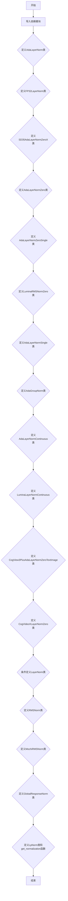
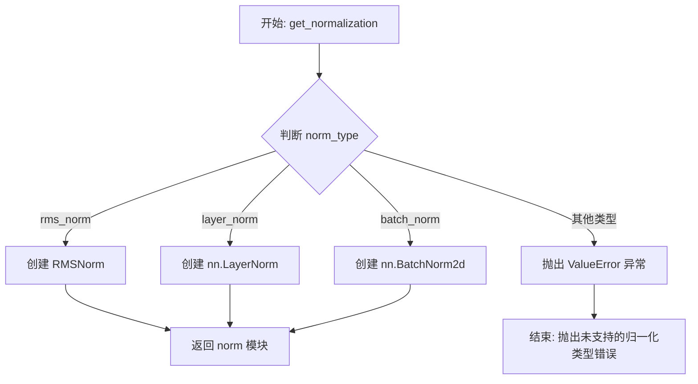
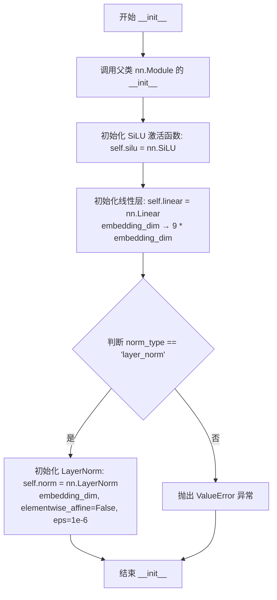
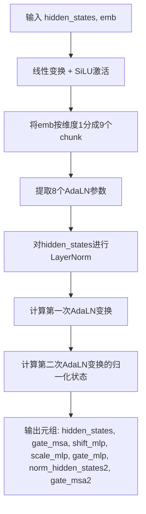
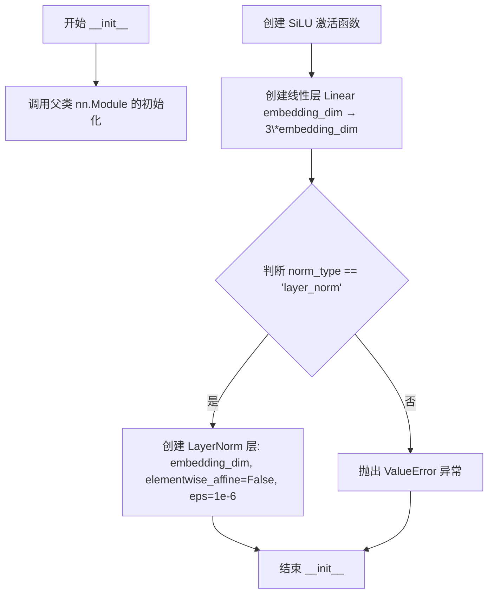
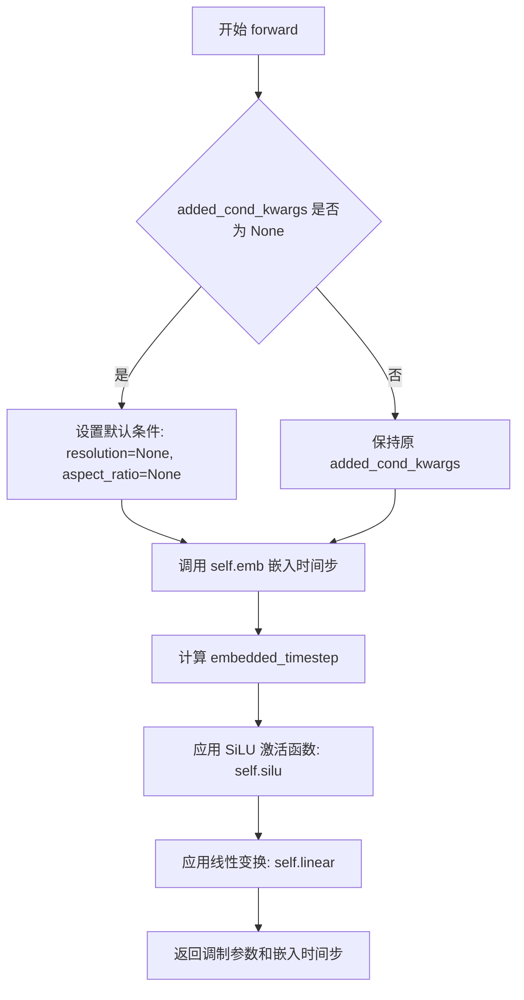

# `diffusers\src\diffusers\models\normalization.py` 详细设计文档

这是一组用于扩散模型的自适应归一化层实现，包含AdaLayerNorm、AdaLN-Zero、RMSNorm、LayerNorm等多种归一化类，支持时间步嵌入、条件嵌入、FP32精度等特性，主要用于PixArt-Alpha、CogVideoX、OmniGen等Diffusion架构的神经网络中。

## 整体流程



## 类结构

```
nn.Module (基类)
├── AdaLayerNorm
├── FP32LayerNorm
├── SD35AdaLayerNormZeroX
├── AdaLayerNormZero
├── AdaLayerNormZeroSingle
├── LuminaRMSNormZero
├── AdaLayerNormSingle
├── AdaGroupNorm
├── AdaLayerNormContinuous
├── LuminaLayerNormContinuous
├── CogView3PlusAdaLayerNormZeroTextImage
├── CogVideoXLayerNormZero
├── LayerNorm (条件定义)
├── RMSNorm
├── MochiRMSNorm
├── GlobalResponseNorm
└── LpNorm
```

## 全局变量及字段


### `AdaLayerNorm.chunk_dim`
    
用于指定在哪个维度上进行chunk操作的维度索引

类型：`int`
    


### `AdaLayerNorm.emb`
    
时间步嵌入层，用于将时间步映射到嵌入向量

类型：`nn.Embedding | None`
    


### `AdaLayerNorm.silu`
    
SiLU激活函数，用于对时间步嵌入进行非线性变换

类型：`nn.SiLU`
    


### `AdaLayerNorm.linear`
    
线性层，用于将时间步嵌入投影到输出维度

类型：`nn.Linear`
    


### `AdaLayerNorm.norm`
    
LayerNorm层，用于对输入进行归一化处理

类型：`nn.LayerNorm`
    


### `FP32LayerNorm.继承自nn.LayerNorm`
    
继承自nn.LayerNorm的父类字段

类型：`nn.Module`
    


### `SD35AdaLayerNormZeroX.silu`
    
SiLU激活函数，用于对嵌入进行非线性变换

类型：`nn.SiLU`
    


### `SD35AdaLayerNormZeroX.linear`
    
线性层，用于生成9个自适应参数（shift和scale）

类型：`nn.Linear`
    


### `SD35AdaLayerNormZeroX.norm`
    
LayerNorm层，用于对隐藏状态进行归一化

类型：`nn.LayerNorm`
    


### `AdaLayerNormZero.emb`
    
组合时间步和标签嵌入层，用于生成条件嵌入

类型：`CombinedTimestepLabelEmbeddings | None`
    


### `AdaLayerNormZero.silu`
    
SiLU激活函数，用于对条件嵌入进行非线性变换

类型：`nn.SiLU`
    


### `AdaLayerNormZero.linear`
    
线性层，用于生成6个自适应参数（shift、scale和gate）

类型：`nn.Linear`
    


### `AdaLayerNormZero.norm`
    
LayerNorm或FP32LayerNorm层，用于对输入进行归一化

类型：`nn.LayerNorm | FP32LayerNorm`
    


### `AdaLayerNormZeroSingle.silu`
    
SiLU激活函数，用于对嵌入进行非线性变换

类型：`nn.SiLU`
    


### `AdaLayerNormZeroSingle.linear`
    
线性层，用于生成3个自适应参数（shift、scale和gate）

类型：`nn.Linear`
    


### `AdaLayerNormZeroSingle.norm`
    
LayerNorm层，用于对输入进行归一化

类型：`nn.LayerNorm`
    


### `LuminaRMSNormZero.silu`
    
SiLU激活函数，用于对嵌入进行非线性变换

类型：`nn.SiLU`
    


### `LuminaRMSNormZero.linear`
    
线性层，用于生成4个自适应参数（scale和gate）

类型：`nn.Linear`
    


### `LuminaRMSNormZero.norm`
    
RMSNorm层，用于对输入进行RMS归一化

类型：`RMSNorm`
    


### `AdaLayerNormSingle.emb`
    
PixArt-Alpha组合时间步和大小嵌入层，用于生成条件嵌入

类型：`PixArtAlphaCombinedTimestepSizeEmbeddings`
    


### `AdaLayerNormSingle.silu`
    
SiLU激活函数，用于对嵌入进行非线性变换

类型：`nn.SiLU`
    


### `AdaLayerNormSingle.linear`
    
线性层，用于生成6个自适应参数

类型：`nn.Linear`
    


### `AdaGroupNorm.num_groups`
    
分组数量，指定将通道分成多少个组

类型：`int`
    


### `AdaGroupNorm.eps`
    
用于数值稳定性的epsilon值

类型：`float`
    


### `AdaGroupNorm.act`
    
激活函数模块，用于对嵌入进行非线性变换

类型：`nn.Module | None`
    


### `AdaGroupNorm.linear`
    
线性层，用于生成scale和shift参数

类型：`nn.Linear`
    


### `AdaLayerNormContinuous.silu`
    
SiLU激活函数，用于对条件嵌入进行非线性变换

类型：`nn.SiLU`
    


### `AdaLayerNormContinuous.linear`
    
线性层，用于将条件嵌入投影到2倍的embedding维度

类型：`nn.Linear`
    


### `AdaLayerNormContinuous.norm`
    
LayerNorm或RMSNorm层，用于对输入进行归一化

类型：`nn.LayerNorm | RMSNorm`
    


### `LuminaLayerNormContinuous.silu`
    
SiLU激活函数，用于对条件嵌入进行非线性变换

类型：`nn.SiLU`
    


### `LuminaLayerNormContinuous.linear_1`
    
第一个线性层，用于将条件嵌入投影到embedding维度

类型：`nn.Linear`
    


### `LuminaLayerNormContinuous.norm`
    
LayerNorm或RMSNorm层，用于对输入进行归一化

类型：`nn.LayerNorm | RMSNorm`
    


### `LuminaLayerNormContinuous.linear_2`
    
可选的第二个线性层，用于输出维度变换

类型：`nn.Linear | None`
    


### `CogView3PlusAdaLayerNormZeroTextImage.silu`
    
SiLU激活函数，用于对嵌入进行非线性变换

类型：`nn.SiLU`
    


### `CogView3PlusAdaLayerNormZeroTextImage.linear`
    
线性层，用于生成12个自适应参数（6个用于x，6个用于context）

类型：`nn.Linear`
    


### `CogView3PlusAdaLayerNormZeroTextImage.norm_x`
    
LayerNorm层，用于对输入x进行归一化

类型：`nn.LayerNorm`
    


### `CogView3PlusAdaLayerNormZeroTextImage.norm_c`
    
LayerNorm层，用于对上下文进行归一化

类型：`nn.LayerNorm`
    


### `CogVideoXLayerNormZero.silu`
    
SiLU激活函数，用于对时间步嵌入进行非线性变换

类型：`nn.SiLU`
    


### `CogVideoXLayerNormZero.linear`
    
线性层，用于生成6个自适应参数（shift、scale、gate及其编码器版本）

类型：`nn.Linear`
    


### `CogVideoXLayerNormZero.norm`
    
LayerNorm层，用于对隐藏状态进行归一化

类型：`nn.LayerNorm`
    


### `LayerNorm.eps`
    
用于数值稳定性的epsilon值

类型：`float`
    


### `LayerNorm.dim`
    
归一化的维度

类型：`torch.Size`
    


### `LayerNorm.weight`
    
可学习的权重参数，用于仿射变换

类型：`nn.Parameter | None`
    


### `LayerNorm.bias`
    
可学习的偏置参数，用于仿射变换

类型：`nn.Parameter | None`
    


### `RMSNorm.eps`
    
用于数值稳定性的epsilon值

类型：`float`
    


### `RMSNorm.elementwise_affine`
    
布尔标志，指定是否应用逐元素仿射变换

类型：`bool`
    


### `RMSNorm.dim`
    
归一化的维度

类型：`torch.Size`
    


### `RMSNorm.weight`
    
可学习的权重参数，用于缩放

类型：`nn.Parameter | None`
    


### `RMSNorm.bias`
    
可学习的偏置参数，用于偏移

类型：`nn.Parameter | None`
    


### `MochiRMSNorm.eps`
    
用于数值稳定性的epsilon值

类型：`float`
    


### `MochiRMSNorm.dim`
    
归一化的维度

类型：`torch.Size`
    


### `MochiRMSNorm.weight`
    
可学习的权重参数，用于缩放

类型：`nn.Parameter | None`
    


### `GlobalResponseNorm.gamma`
    
可学习的gamma参数，用于全局响应归一化

类型：`nn.Parameter`
    


### `GlobalResponseNorm.beta`
    
可学习的beta参数，用于全局响应归一化

类型：`nn.Parameter`
    


### `LpNorm.p`
    
Lp范数的p值，指定范数的阶数

类型：`int`
    


### `LpNorm.dim`
    
进行范数计算的维度

类型：`int`
    


### `LpNorm.eps`
    
用于数值稳定性的epsilon值

类型：`float`
    
    

## 全局函数及方法


### `get_normalization`

该函数是一个工厂函数，用于根据传入的归一化类型（`norm_type`）动态创建并返回相应的归一化层模块（如 RMSNorm、LayerNorm 或 BatchNorm2d），支持灵活的归一化配置。

参数：

- `norm_type`：`str`，归一化类型，默认为 `"batch_norm"`，可选值包括 `"rms_norm"`、`"layer_norm"`、`"batch_norm"`
- `num_features`：`int | None`，特征通道数，用于 BatchNorm2d 和 LayerNorm 的输入维度，默认为 `None`
- `eps`：`float`，用于数值稳定的 epsilon 值，默认为 `1e-5`
- `elementwise_affine`：`bool`，是否使用可学习的仿射参数（权重），默认为 `True`
- `bias`：`bool`，是否使用可学习的偏置参数，默认为 `True`

返回值：`nn.Module`，返回创建的归一化层模块实例

#### 流程图



#### 带注释源码

```python
def get_normalization(
    norm_type: str = "batch_norm",
    num_features: int | None = None,
    eps: float = 1e-5,
    elementwise_affine: bool = True,
    bias: bool = True,
) -> nn.Module:
    """
    根据归一化类型创建相应的归一化层模块
    
    参数:
        norm_type: 归一化类型，可选 "rms_norm", "layer_norm", "batch_norm"
        num_features: 特征数量，用于确定归一化的维度
        eps: 数值稳定性 epsilon 值
        elementwise_affine: 是否使用仿射变换（权重）
        bias: 是否使用偏置
    
    返回:
        归一化层模块实例
    """
    # 如果是 RMSNorm（均方根归一化），创建 RMSNorm 实例
    if norm_type == "rms_norm":
        norm = RMSNorm(num_features, eps=eps, elementwise_affine=elementwise_affine, bias=bias)
    # 如果是 LayerNorm（层归一化），创建 nn.LayerNorm 实例
    elif norm_type == "layer_norm":
        norm = nn.LayerNorm(num_features, eps=eps, elementwise_affine=elementwise_affine, bias=bias)
    # 如果是 BatchNorm2d（批量归一化），创建 nn.BatchNorm2d 实例
    # 注意：BatchNorm2d 的 affine 参数对应 elementwise_affine
    elif norm_type == "batch_norm":
        norm = nn.BatchNorm2d(num_features, eps=eps, affine=elementwise_affine)
    # 如果传入不支持的归一化类型，抛出 ValueError 异常
    else:
        raise ValueError(f"{norm_type=} is not supported.")
    # 返回创建的归一化层模块
    return norm
```


### AdaLayerNorm.__init__

这是 AdaLayerNorm 类的构造函数，用于初始化一个结合时间步嵌入的自适应层归一化模块。

参数：

- `embedding_dim`：`int`，每个嵌入向量的维度大小
- `num_embeddings`：`int | None`，嵌入字典的大小，如果为 None 则不创建嵌入层
- `output_dim`：`int | None`，输出维度，默认为 embedding_dim * 2
- `norm_elementwise_affine`：`bool`，是否使用逐元素仿射变换，默认为 False
- `norm_eps`：`float`，LayerNorm 的 epsilon 值，默认为 1e-5
- `chunk_dim`：`int`，分块维度，用于区分不同模型（如 CogVideoX、OmniGen）的处理方式，默认为 0

返回值：`None`，构造函数无返回值

#### 流程图

```mermaid
flowchart TD
    A[开始 __init__] --> B[调用父类构造函数]
    B --> C[设置 self.chunk_dim]
    C --> D{output_dim 是否为 None?}
    D -->|是| E[output_dim = embedding_dim * 2]
    D -->|否| F[使用传入的 output_dim]
    E --> G{num_embeddings 是否为 None?}
    F --> G
    G -->|否| H[创建 nn.Embedding(num_embeddings, embedding_dim)]
    G -->|是| I[self.emb = None]
    H --> J[创建 nn.SiLU 激活层]
    I --> J
    J --> K[创建 nn.Linear(embedding_dim, output_dim)]
    K --> L[创建 nn.LayerNorm(output_dim // 2, norm_eps, norm_elementwise_affine)]
    L --> M[结束 __init__]
```

#### 带注释源码

```python
def __init__(
    self,
    embedding_dim: int,                          # 嵌入向量的维度大小
    num_embeddings: int | None = None,           # 嵌入字典的大小，可选
    output_dim: int | None = None,               # 输出维度，可选，默认为 embedding_dim * 2
    norm_elementwise_affine: bool = False,       # 是否使用逐元素仿射变换
    norm_eps: float = 1e-5,                      # LayerNorm 的 epsilon 值
    chunk_dim: int = 0,                          # 分块维度，用于区分不同模型
):
    """
    初始化 AdaLayerNorm 模块。
    
    该模块结合了时间步嵌入的自适应层归一化，通过以下组件实现：
    1. 可选的嵌入层：用于将离散的时间步或标签映射到嵌入向量
    2. 线性投影层：将嵌入向量投影到 2*output_dim 的维度
    3. LayerNorm 层：对输入进行归一化处理
    
    参数:
        embedding_dim: 嵌入向量的维度
        num_embeddings: 嵌入字典大小，如果为 None 则不创建嵌入层
        output_dim: 输出维度，默认为 embedding_dim * 2（用于生成 shift 和 scale）
        norm_elementwise_affine: 是否使用逐元素仿射变换
        norm_eps: LayerNorm 的 epsilon 值，用于数值稳定性
        chunk_dim: 分块维度，0 表示在 dim=0 分块，其他值在 dim=1 分块
    """
    # 调用父类 nn.Module 的初始化方法
    super().__init__()

    # 保存分块维度，用于 forward 方法中区分不同的处理逻辑
    self.chunk_dim = chunk_dim
    
    # 如果未指定 output_dim，则默认为 embedding_dim * 2
    # 这样可以生成 shift 和 scale 两个向量
    output_dim = output_dim or embedding_dim * 2

    # 根据是否提供 num_embeddings 来决定是否创建嵌入层
    # 嵌入层用于将离散的时间步/标签转换为连续的嵌入向量
    if num_embeddings is not None:
        self.emb = nn.Embedding(num_embeddings, embedding_dim)
    else:
        self.emb = None  # 如果没有提供 num_embeddings，则不创建嵌入层

    # SiLU 激活函数（Sigmoid Linear Unit）
    # SiLU(x) = x * sigmoid(x)
    self.silu = nn.SiLU()
    
    # 线性投影层：将 embedding_dim 维的嵌入向量投影到 output_dim 维
    # 投影后的向量会被分割成两部分：shift（平移）和 scale（缩移）
    self.linear = nn.Linear(embedding_dim, output_dim)
    
    # LayerNorm 层：对输入进行归一化
    # 注意：这里归一化的维度是 output_dim // 2，因为 shift 和 scale 各占一半
    # norm_elementwise_affine 默认为 False，即不使用可学习的仿射参数
    self.norm = nn.LayerNorm(output_dim // 2, norm_eps, norm_elementwise_affine)
```


### AdaLayerNorm.forward

该方法实现了一个结合时间步嵌入的自适应 Layer Normalization 层。它接收输入特征张量、时间步或嵌入向量，通过嵌入层（如有）生成条件嵌入，然后投影为缩放(scale)和偏移(shift)参数，最后对归一化后的特征进行仿射变换，实现对特征的无条件调制。

参数：

- `self`：`AdaLayerNorm` 实例本身
- `x`：`torch.Tensor`，输入特征张量，形状为 (batch, seq_len, hidden_dim)
- `timestep`：`torch.Tensor | None`，可选的时间步张量，用于通过嵌入层生成条件嵌入
- `temb`：`torch.Tensor | None`，可选的预计算时间步嵌入向量，与 timestep 二选一使用

返回值：`torch.Tensor`，经过自适应归一化处理后的特征张量，形状与输入 x 相同

#### 流程图

```mermaid
graph TD
    A[开始 forward] --> B{self.emb is not None?}
    B -->|是| C[temb = self.emb(timestep)]
    B -->|否| D[直接使用 temb]
    C --> E[temb = self.linear(self.silu(temb))]
    D --> E
    E --> F{self.chunk_dim == 1?}
    F -->|是| G[shift, scale = temb.chunk(2, dim=1)]
    F -->|否| H[scale, shift = temb.chunk(2, dim=0)]
    G --> I[shift = shift[:, None, :]<br/>scale = scale[:, None, :]]
    H --> J
    I --> K[x = self.norm(x) * (1 + scale) + shift]
    J --> K
    K --> L[返回归一化后的 x]
```

#### 带注释源码

```python
def forward(
    self, x: torch.Tensor, timestep: torch.Tensor | None = None, temb: torch.Tensor | None = None
) -> torch.Tensor:
    # 如果配置了嵌入层 (self.emb 不为 None)，则通过时间步生成嵌入向量
    # 这通常用于将离散的时间步 ID 转换为连续的向量表示
    if self.emb is not None:
        temb = self.emb(timestep)

    # 对嵌入向量进行非线性变换：
    # 1. SiLU (Sigmoid Linear Unit) 激活函数：silu(x) = x * sigmoid(x)
    # 2. 线性投影：将嵌入维度映射到 output_dim (默认为 embedding_dim * 2)
    # 投影后的向量将包含用于缩放(scale)和偏移(shift)的参数
    temb = self.linear(self.silu(temb))

    # 根据 chunk_dim 参数决定如何分割 temb 向量得到 scale 和 shift
    # chunk_dim=1: 按特征维度分割 (dim=1)，用于 CogVideoX 和 OmniGen 模型
    # 其他情况: 按批次维度分割 (dim=0)，标准方式
    if self.chunk_dim == 1:
        # This is a bit weird why we have the order of "shift, scale" here and "scale, shift" in the
        # other if-branch. This branch is specific to CogVideoX and OmniGen for now.
        shift, scale = temb.chunk(2, dim=1)
        # 扩展维度以匹配输入 x 的形状 (batch, seq_len, hidden_dim)
        # 将 scale 和 shift 从 (batch, hidden_dim) 扩展为 (batch, seq_len, hidden_dim)
        shift = shift[:, None, :]
        scale = scale[:, None, :]
    else:
        # 标准分割方式：scale, shift = temb.chunk(2, dim=0)
        scale, shift = temb.chunk(2, dim=0)

    # 应用自适应归一化：
    # 1. self.norm(x): 对输入 x 进行 LayerNorm 归一化
    # 2. * (1 + scale): 通过可学习的缩放因子调制归一化后的特征
    #    加 1 是为了保持原始 LayerNorm 的行为作为默认值
    # 3. + shift: 通过可学习的偏移量平移特征
    # 这种设计允许模型根据时间步动态调整特征的分布
    x = self.norm(x) * (1 + scale) + shift
    return x
```


### `FP32LayerNorm.forward`

该方法实现了 FP32 精度的 Layer Normalization，通过将输入、权重和偏置临时转换为 float32 来保证数值计算的精度，最后将结果转换回原始数据类型。这在混合精度训练场景中非常重要，可以避免低精度计算带来的数值不稳定问题。

参数：

- `inputs`：`torch.Tensor`，输入的需要进行归一化的张量

返回值：`torch.Tensor`，经过 FP32 精度归一化后的张量，数据类型与输入原始数据类型一致

#### 流程图

```mermaid
flowchart TD
    A[开始 forward] --> B[保存原始输入数据类型 origin_dtype]
    B --> C[将输入转换为 float32: inputs.float()]
    C --> D[获取归一化参数: weight.float(), bias.float()]
    D --> E[调用 F.layer_norm 进行归一化计算]
    E --> F[将结果转换回原始数据类型: .to(origin_dtype)]
    F --> G[返回归一化后的张量]
```

#### 带注释源码

```python
class FP32LayerNorm(nn.LayerNorm):
    def forward(self, inputs: torch.Tensor) -> torch.Tensor:
        # 步骤1: 保存原始输入的数据类型，以便后续恢复
        origin_dtype = inputs.dtype
        
        # 步骤2: 将输入张量转换为 float32 精度
        # 步骤3: 获取归一化的权重和偏置，如果存在则转换为 float32
        # 步骤4: 使用 PyTorch 的 layer_norm 函数进行归一化
        # 步骤5: 将结果转换回原始输入的数据类型
        return F.layer_norm(
            inputs.float(),  # 输入转换为 FP32
            self.normalized_shape,  # 归一化的形状
            self.weight.float() if self.weight is not None else None,  # 权重转换为 FP32
            self.bias.float() if self.bias is not None else None,  # 偏置转换为 FP32
            self.eps,  # 防止除零的 epsilon 值
        ).to(origin_dtype)  # 恢复原始数据类型
```


### `SD35AdaLayerNormZeroX.__init__`

这是 SD35 (Stable Diffusion 3.5) 版本的 AdaLayerNorm-Zero 归一化层初始化方法，用于初始化一个自适应层归一化零（AdaLN-Zero）模块，该模块通过学习到的 embedding 向量动态生成归一化的缩放（scale）和移位（shift）参数，以实现更灵活的特征变换。

参数：

- `self`：隐式参数，类实例本身
- `embedding_dim`：`int`，嵌入向量的维度大小
- `norm_type`：`str`，归一化类型，默认为 "layer_norm"，目前仅支持 "layer_norm"
- `bias`：`bool`，是否使用偏置，默认为 True

返回值：`None`，该方法不返回任何值，仅初始化对象状态

#### 流程图



#### 带注释源码

```python
def __init__(self, embedding_dim: int, norm_type: str = "layer_norm", bias: bool = True) -> None:
    """
    初始化 SD35AdaLayerNormZeroX 归一化层
    
    参数:
        embedding_dim: 嵌入向量的维度
        norm_type: 归一化类型，目前仅支持 'layer_norm'
        bias: 是否使用偏置
    
    返回:
        None
    """
    # 调用父类 nn.Module 的初始化方法
    super().__init__()

    # 初始化 SiLU (Swish) 激活函数，用于后续对 embedding 的非线性变换
    self.silu = nn.SiLU()
    
    # 初始化线性层，将 embedding_dim 映射到 9 * embedding_dim
    # 9 个输出分别用于: shift_msa, scale_msa, gate_msa, shift_mlp, scale_mlp, 
    #                   gate_mlp, shift_msa2, scale_msa2, gate_msa2
    self.linear = nn.Linear(embedding_dim, 9 * embedding_dim, bias=bias)
    
    # 根据 norm_type 选择归一化层类型
    if norm_type == "layer_norm":
        # 初始化 LayerNorm，elementwise_affine=False 表示不学习每个元素的仿射参数
        # eps=1e-6 用于数值稳定性
        self.norm = nn.LayerNorm(embedding_dim, elementwise_affine=False, eps=1e-6)
    else:
        # 如果不支持的 norm_type，抛出 ValueError 异常
        raise ValueError(f"Unsupported `norm_type` ({norm_type}) provided. Supported ones are: 'layer_norm'.")
```


### `SD35AdaLayerNormZeroX.forward`

该函数是 SD35 模型中自适应层归一化零（AdaLN-Zero）模块的前向传播方法，通过接收隐藏状态和条件嵌入向量，生成用于 Transformer 架构中自注意力（MSA）和前馈网络（MLP）的自适应偏置、缩放和门控参数，实现输入数据的动态归一化调节。

参数：

- `hidden_states`：`torch.Tensor`，输入的隐藏状态张量，形状为 `(batch_size, seq_len, embedding_dim)`
- `emb`：`torch.Tensor | None`，条件嵌入向量，形状为 `(batch_size, embedding_dim)`，用于生成自适应归一化参数，若为 `None` 则使用零初始化

返回值：`tuple[torch.Tensor, ...]`，返回一个元组，包含：
- `hidden_states`：经过第一次 AdaLN 变换后的隐藏状态
- `gate_msa`：自注意力的门控参数
- `shift_mlp`：MLP 的偏置位移参数
- `scale_mlp`：MLP 的缩放参数
- `gate_mlp`：MLP 的门控参数
- `norm_hidden_states2`：经过第二次 AdaLN 变换前的归一化隐藏状态（用于 MSA2）
- `gate_msa2`：第二次自注意力（MSA2）的门控参数

#### 流程图



#### 带注释源码

```python
def forward(
    self,
    hidden_states: torch.Tensor,
    emb: torch.Tensor | None = None,
) -> tuple[torch.Tensor, ...]:
    # Step 1: 对条件嵌入emb进行线性投影并通过SiLU激活函数
    # linear层将embedding_dim映射到9*embedding_dim维度
    # 输出形状: (batch_size, 9 * embedding_dim)
    emb = self.linear(self.silu(emb))
    
    # Step 2: 将投影后的嵌入向量按通道维度均分为9个部分
    # 每个部分对应一个自适应参数:
    # - shift_msa: MSA的偏置位移
    # - scale_msa: MSA的缩放因子  
    # - gate_msa: MSA的门控信号
    # - shift_mlp: MLP的偏置位移
    # - scale_mlp: MLP的缩放因子
    # - gate_mlp: MLP的门控信号
    # - shift_msa2: MSA2的偏置位移
    # - scale_msa2: MSA2的缩放因子
    # - gate_msa2: MSA2的门控信号
    shift_msa, scale_msa, gate_msa, shift_mlp, scale_mlp, gate_mlp, shift_msa2, scale_msa2, gate_msa2 = emb.chunk(
        9, dim=1
    )
    
    # Step 3: 对输入hidden_states进行LayerNorm归一化
    # 不包含可学习的仿射参数(elementwise_affine=False)
    # 输出形状: (batch_size, seq_len, embedding_dim)
    norm_hidden_states = self.norm(hidden_states)
    
    # Step 4: 应用第一次AdaLN变换 (用于MSA)
    # 公式: norm_hidden_states * (1 + scale_msa) + shift_msa
    # 使用[:, None]将scale_msa和shift_msa从(batch_size, embedding_dim)
    # 广播到(batch_size, seq_len, embedding_dim)
    hidden_states = norm_hidden_states * (1 + scale_msa[:, None]) + shift_msa[:, None]
    
    # Step 5: 计算第二次AdaLN变换的归一化隐藏状态 (用于MSA2)
    # 这里复用第一次归一化后的结果，避免重复计算
    norm_hidden_states2 = norm_hidden_states * (1 + scale_msa2[:, None]) + shift_msa2[:, None]
    
    # Step 6: 返回包含变换后隐藏状态和所有AdaLN参数的元组
    # 这些参数将用于后续的Transformer块中:
    # - hidden_states -> MSA的输入
    # - gate_msa -> MSA输出的门控乘法
    # - shift_mlp, scale_mlp -> MLP前的AdaLN参数
    # - gate_mlp -> MLP输出的门控乘法
    # - norm_hidden_states2 -> MSA2的输入
    # - gate_msa2 -> MSA2输出的门控乘法
    return hidden_states, gate_msa, shift_mlp, scale_mlp, gate_mlp, norm_hidden_states2, gate_msa2
```


### AdaLayerNormZero.__init__

该方法是AdaLayerNormZero类的构造函数，用于初始化自适应层归一化零（AdaLN-Zero）模块。该模块结合了时间步嵌入和类别标签嵌入，通过线性层和SiLU激活函数生成归一化所需的偏移（shift）、缩放（scale）和门控（gate）参数，支持layer_norm和fp32_layer_norm两种归一化类型。

参数：

- `self`：隐式参数，表示类的实例本身
- `embedding_dim`：`int`，嵌入向量的维度大小
- `num_embeddings`：`int | None`，嵌入字典的大小，如果为None则不创建嵌入层
- `norm_type`：`str`，归一化类型，可选值为"layer_norm"或"fp32_layer_norm"，默认为"layer_norm"
- `bias`：`bool`，是否使用偏置，默认为True

返回值：`None`，该方法为构造函数，不返回任何值

#### 流程图

```mermaid
flowchart TD
    A[开始 __init__] --> B[调用父类构造函数 super().__init__]
    B --> C{num_embeddings is not None?}
    C -->|是| D[创建 CombinedTimestepLabelEmbeddings 嵌入层]
    C -->|否| E[设置 self.emb = None]
    D --> F[初始化 SiLU 激活函数]
    E --> F
    F --> G[初始化线性层: embedding_dim -> 6*embedding_dim]
    G --> H{norm_type == 'layer_norm'?}
    H -->|是| I[创建 LayerNorm 归一化层]
    H -->|否| J{norm_type == 'fp32_layer_norm'?}
    J -->|是| K[创建 FP32LayerNorm 归一化层]
    J -->|否| L[抛出 ValueError 异常]
    I --> M[结束]
    K --> M
    L --> M
```

#### 带注释源码

```python
def __init__(self, embedding_dim: int, num_embeddings: int | None = None, norm_type="layer_norm", bias=True):
    """
    初始化 AdaLayerNormZero 模块
    
    参数:
        embedding_dim: 嵌入向量的维度大小
        num_embeddings: 嵌入字典的大小，如果为None则不创建嵌入层
        norm_type: 归一化类型，支持'layer_norm'和'fp32_layer_norm'
        bias: 是否使用偏置
    """
    # 调用父类nn.Module的构造函数，初始化PyTorch模块
    super().__init__()
    
    # 如果提供了num_embeddings，则创建CombinedTimestepLabelEmbeddings嵌入层
    # 用于将时间步和类别标签编码为嵌入向量
    if num_embeddings is not None:
        self.emb = CombinedTimestepLabelEmbeddings(num_embeddings, embedding_dim)
    else:
        # 如果没有提供num_embeddings，则不创建嵌入层
        # 嵌入向量将通过外部传入的emb参数提供
        self.emb = None

    # 初始化SiLU激活函数（Swish激活函数）
    self.silu = nn.SiLU()
    
    # 初始化线性层，将embedding_dim维度映射到6*embedding_dim维度
    # 6个输出分别用于: shift_msa, scale_msa, gate_msa, shift_mlp, scale_mlp, gate_mlp
    self.linear = nn.Linear(embedding_dim, 6 * embedding_dim, bias=bias)
    
    # 根据norm_type选择不同的归一化层
    if norm_type == "layer_norm":
        # 使用标准的LayerNorm，不使用元素级仿射变换（elementwise_affine=False）
        # eps设置为1e-6以提高数值稳定性
        self.norm = nn.LayerNorm(embedding_dim, elementwise_affine=False, eps=1e-6)
    elif norm_type == "fp32_layer_norm":
        # 使用FP32LayerNorm，用于更高精度的归一化计算
        self.norm = FP32LayerNorm(embedding_dim, elementwise_affine=False, bias=False)
    else:
        # 如果提供了不支持的norm_type，抛出ValueError异常
        raise ValueError(
            f"Unsupported `norm_type` ({norm_type}) provided. Supported ones are: 'layer_norm', 'fp32_layer_norm'."
        )
```


### `AdaLayerNormZero.forward`

该方法是自适应层归一化零（adaLN-Zero）的前向传播函数，通过结合时间步嵌入和类别标签嵌入，生成用于Transformer模块的归一化位移（shift）、缩放（scale）和门控（gate）参数，实现对特征的自适应调制。

参数：

- `self`：`AdaLayerNormZero` 实例本身，包含模型的嵌入层、线性层和归一化层
- `x`：`torch.Tensor`，输入的隐藏状态，形状为 `[batch_size, seq_len, embedding_dim]`
- `timestep`：`torch.Tensor | None`，可选的时间步张量，用于生成时间步嵌入
- `class_labels`：`torch.LongTensor | None`，可选的类别标签，用于生成类别嵌入
- `hidden_dtype`：`torch.dtype | None`，可选的隐藏状态数据类型，用于嵌入计算的精度控制
- `emb`：`torch.Tensor | None`，可选的预计算嵌入向量，如果提供则跳过内部嵌入计算

返回值：`tuple[torch.Tensor, torch.Tensor, torch.Tensor, torch.Tensor, torch.Tensor]`，返回一个包含五个元素的元组：

- 第一个元素：调制后的隐藏状态 `torch.Tensor`，形状为 `[batch_size, seq_len, embedding_dim]`
- 第二个元素：MSA 门控参数 `gate_msa`：`torch.Tensor`
- 第三个元素：MLP 移位参数 `shift_mlp`：`torch.Tensor`
- 第四个元素：MLP 缩放参数 `scale_mlp`：`torch.Tensor`
- 第五个元素：MLP 门控参数 `gate_mlp`：`torch.Tensor`

#### 流程图

```mermaid
flowchart TD
    A[输入 x, timestep, class_labels, hidden_dtype, emb] --> B{self.emb is not None?}
    B -->|是| C[使用 self.emb 生成嵌入 emb]
    B -->|否| D[使用传入的 emb]
    C --> E[emb = self.linear self.silu emb]
    D --> E
    E --> F[emb.chunk6 分割为6个部分]
    F --> G[shift_msa, scale_msa, gate_msa, shift_mlp, scale_mlp, gate_mlp]
    G --> H[x = self.normx * 1 + scale_msa[:, None] + shift_msa[:, None]]
    H --> I[返回 x, gate_msa, shift_mlp, scale_mlp, gate_mlp]
```

#### 带注释源码

```python
def forward(
    self,
    x: torch.Tensor,                          # 输入隐藏状态 [B, L, D]
    timestep: torch.Tensor | None = None,     # 时间步嵌入输入
    class_labels: torch.LongTensor | None = None,  # 类别标签
    hidden_dtype: torch.dtype | None = None,  # 计算精度控制
    emb: torch.Tensor | None = None,          # 预计算的嵌入向量
) -> tuple[torch.Tensor, torch.Tensor, torch.Tensor, torch.Tensor, torch.Tensor]:
    # 如果模型包含嵌入层（CombinedTimestepLabelEmbeddings），则使用 timestep 和 class_labels 生成嵌入
    # 否则使用外部传入的 emb 向量
    if self.emb is not None:
        # 调用嵌入层生成时间步和类别条件的联合嵌入
        # 参数 hidden_dtype 确保嵌入计算使用指定的精度（如 FP16）
        emb = self.emb(timestep, class_labels, hidden_dtype=hidden_dtype)
    
    # 对嵌入向量应用 SiLU 激活函数，然后通过线性层投影到 6*D 维度
    # 6 个输出分别对应：shift_msa, scale_msa, gate_msa, shift_mlp, scale_mlp, gate_mlp
    emb = self.linear(self.silu(emb))
    
    # 将投影后的嵌入沿维度 1 分割成 6 个等份
    # 每个部分的形状为 [B, D]
    shift_msa, scale_msa, gate_msa, shift_mlp, scale_mlp, gate_mlp = emb.chunk(6, dim=1)
    
    # 对输入 x 进行 LayerNorm，然后应用自适应调制
    # 公式：normalized * (1 + scale) + shift
    # scale_msa[:, None] 将形状从 [B, D] 扩展为 [B, 1, D]，实现广播
    x = self.norm(x) * (1 + scale_msa[:, None]) + shift_msa[:, None]
    
    # 返回调制后的隐藏状态以及用于 MSA 和 MLP 的门控、移位、缩放参数
    return x, gate_msa, shift_mlp, scale_mlp, gate_mlp
```


### AdaLayerNormZeroSingle.__init__

这是 `AdaLayerNormZeroSingle` 类的构造函数，用于初始化一个自适应层归一化零（AdaLN-Zero）模块。该模块在扩散模型中用于根据时间步嵌入动态调整归一化层的缩放和偏移参数，是现代Transformer架构中常见的自适应归一化技术。

参数：

- `embedding_dim`：`int`，嵌入向量的维度，决定了输入和输出的特征大小
- `norm_type`：`str`（默认为 `"layer_norm"`），归一化类型，目前仅支持 `"layer_norm"`
- `bias`：`bool`（默认为 `True`），线性层是否使用偏置项

返回值：`None`，构造函数不返回任何值

#### 流程图



#### 带注释源码

```python
def __init__(self, embedding_dim: int, norm_type="layer_norm", bias=True):
    """
    初始化 AdaLayerNormZeroSingle 层
    
    Args:
        embedding_dim: 嵌入维度，即输入特征的维度
        norm_type: 归一化类型，当前仅支持 'layer_norm'
        bias: 线性层是否使用偏置
    """
    # 调用父类 nn.Module 的初始化方法，注册所有子模块
    super().__init__()
    
    # 创建 SiLU (Swish) 激活函数，用于处理时间步嵌入
    # SiLU(x) = x * sigmoid(x)，在自适应归一化中常用
    self.silu = nn.SiLU()
    
    # 创建线性层，将 embedding_dim 映射到 3 * embedding_dim
    # 输出的3个部分分别用于: shift_msa, scale_msa, gate_msa
    # shift: 偏移/平移参数, scale: 缩放参数, gate: 门控参数
    self.linear = nn.Linear(embedding_dim, 3 * embedding_dim, bias=bias)
    
    # 根据 norm_type 创建归一化层
    if norm_type == "layer_norm":
        # LayerNorm: 沿着最后一个维度进行归一化
        # elementwise_affine=False 表示不学习仿射参数（γ和β）
        # eps=1e-6 防止除零
        self.norm = nn.LayerNorm(embedding_dim, elementwise_affine=False, eps=1e-6)
    else:
        # 如果传入不支持的 norm_type，抛出明确的错误信息
        raise ValueError(
            f"Unsupported `norm_type` ({norm_type}) provided. "
            f"Supported ones are: 'layer_norm', 'fp32_layer_norm'."
        )
```


### `AdaLayerNormZeroSingle.forward`

该方法是自适应层归一化零（adaLN-Zero）层的核心前向传播实现，通过将时间步嵌入投影为移位（shift）、缩放（scale）和门控（gate）参数，对输入张量进行动态归一化调节，同时返回门控值用于后续残差连接或特征调控。

参数：

- `self`：类的实例本身，包含模型参数
- `x`：`torch.Tensor`，输入的隐藏状态张量，形状为 `(batch_size, seq_len, embedding_dim)`
- `emb`：`torch.Tensor | None`，条件嵌入向量（通常为时间步嵌入），形状为 `(batch_size, embedding_dim)`

返回值：`tuple[torch.Tensor, torch.Tensor]`，返回一个元组，包含：
- 归一化后的隐藏状态张量，形状与输入 `x` 相同
- 门控值 `gate_msa`，形状为 `(batch_size, embedding_dim)`

#### 流程图

```mermaid
flowchart TD
    A[输入: x, emb] --> B{emb is not None?}
    B -->|是| C[emb = linear(silu(emb))]
    B -->|否| D[保持原有emb]
    C --> E[emb.chunk 3 -> shift_msa, scale_msa, gate_msa]
    D --> E
    E --> F[norm_hidden_states = norm(x)]
    F --> G[x = norm_hidden_states * (1 + scale_msa) + shift_msa]
    G --> H[Return x, gate_msa]
```

#### 带注释源码

```python
def forward(
    self,
    x: torch.Tensor,
    emb: torch.Tensor | None = None,
) -> tuple[torch.Tensor, torch.Tensor, torch.Tensor, torch.Tensor, torch.Tensor]:
    # 第一步：将条件嵌入通过线性层变换
    # 输入: emb (batch_size, embedding_dim)
    # 输出: (batch_size, 3 * embedding_dim)
    emb = self.linear(self.silu(emb))
    
    # 第二步：将投影后的嵌入分割为三个等份
    # shift_msa: 移位参数，用于调整归一化后的特征
    # scale_msa: 缩放参数，用于调整归一化后的特征幅度
    # gate_msa: 门控参数，用于控制特征的通过量
    shift_msa, scale_msa, gate_msa = emb.chunk(3, dim=1)
    
    # 第三步：对输入进行归一化
    # 使用LayerNorm进行特征归一化，不包含可学习的仿射参数
    x = self.norm(x) * (1 + scale_msa[:, None]) + shift_msa[:, None]
    
    # 注意：[:, None] 用于扩展维度，使 (batch_size, embedding_dim) 
    # 变为 (batch_size, 1, embedding_dim)，从而适配输入的多维形状
    
    # 返回归一化后的隐藏状态和门控值
    # gate_msa 可用于后续的残差连接或特征调控
    return x, gate_msa
```


### `LuminaRMSNormZero.__init__`

该方法是 `LuminaRMSNormZero` 类的构造函数，用于初始化一个自适应 RMS 归一化层（AdaLN-Zero）的变体，结合了 SiLU 激活函数、线性投影层和 RMSNorm 归一化层，用于在神经网络中实现基于条件的缩放和门控机制。

参数：

- `embedding_dim`：`int`，嵌入向量的维度大小
- `norm_eps`：`float`，RMSNorm 归一化层使用的 epsilon 值，用于数值稳定性
- `norm_elementwise_affine`：`bool`，RMSNorm 是否使用逐元素仿射变换

返回值：`None`，构造函数不返回值

#### 流程图

```mermaid
flowchart TD
    A[开始 __init__] --> B[调用 super().__init__ 初始化基类]
    B --> C[创建 SiLU 激活函数: self.silu = nn.SiLU]
    C --> D[创建线性层: self.linear]
    D --> E[计算线性层输入维度: min&#40;embedding_dim, 1024&#41;]
    E --> F[创建线性层输出维度: 4 \* embedding_dim]
    F --> G[创建 RMSNorm 归一化层: self.norm = RMSNorm&#40;embedding_dim, eps=norm_eps&#41;]
    G --> H[结束 __init__]
```

#### 带注释源码

```python
def __init__(self, embedding_dim: int, norm_eps: float, norm_elementwise_affine: bool):
    """
    初始化 LuminaRMSNormZero 模块。

    Parameters:
        embedding_dim (int): 嵌入向量的维度大小。
        norm_eps (float): RMSNorm 使用的 epsilon 值，用于数值稳定性。
        norm_elementwise_affine (bool): RMSNorm 是否使用逐元素仿射变换。
    """
    # 调用父类 nn.Module 的初始化方法
    super().__init__()
    
    # 创建 SiLU 激活函数（Swish 激活函数的变体）
    # 用于后续对嵌入向量进行非线性变换
    self.silu = nn.SiLU()
    
    # 创建线性投影层，将嵌入向量映射到 4 倍维度的空间
    # 使用 min(embedding_dim, 1024) 作为输入维度，限制计算量
    # 输出维度为 4 * embedding_dim，用于生成 scale_msa, gate_msa, scale_mlp, gate_mlp
    # 设置 bias=True 以包含偏置项
    self.linear = nn.Linear(
        min(embedding_dim, 1024),  # 输入维度：取 embedding_dim 和 1024 的较小值
        4 * embedding_dim,          # 输出维度：是输入维度的 4 倍
        bias=True,                  # 启用偏置
    )
    
    # 创建 RMSNorm 归一化层
    # RMSNorm 不使用均值，仅使用均方根进行归一化
    # 参数包括：维度、epsilon 值
    self.norm = RMSNorm(embedding_dim, eps=norm_eps)
```


### `LuminaRMSNormZero.forward`

该方法是自适应 RMS 归一化层的前向传播，接收隐藏状态和条件嵌入，通过线性层和 SiLU 激活生成 MSA 和 MLP 的缩放因子与门控值，对输入进行 RMSNorm 归一化后应用自适应缩放，并返回归一化后的隐藏状态及相关调制参数。

参数：

- `x`：`torch.Tensor`，输入的隐藏状态张量
- `emb`：`torch.Tensor | None`，条件嵌入向量，用于生成缩放和门控参数

返回值：`tuple[torch.Tensor, torch.Tensor, torch.Tensor, torch.Tensor]`，返回一个元组，包含：
- 归一化后的隐藏状态 `x`
- MSA 门控值 `gate_msa`
- MLP 缩放因子 `scale_mlp`
- MLP 门控值 `gate_mlp`

#### 流程图

```mermaid
flowchart TD
    A[输入 x, emb] --> B{emb 是否为 None}
    B -->|是| C[返回原始 x 和 None 值]
    B -->|否| D[SiLU 激活]
    D --> E[线性投影: emb → 4*embedding_dim]
    E --> F[按维度1 均分: scale_msa, gate_msa, scale_mlp, gate_mlp]
    F --> G[RMSNorm 归一化: x_norm = RMSNorm(x)]
    G --> H[自适应缩放: x = x_norm * (1 + scale_msa[:, None])]
    H --> I[返回 x, gate_msa, scale_mlp, gate_mlp]
```

#### 带注释源码

```python
def forward(
    self,
    x: torch.Tensor,
    emb: torch.Tensor | None = None,
) -> tuple[torch.Tensor, torch.Tensor, torch.Tensor, torch.Tensor]:
    """
    自适应 RMS 归一化层的前向传播

    参数:
        x: 输入的隐藏状态张量，形状为 [batch, seq_len, embedding_dim]
        emb: 条件嵌入向量，用于生成调制参数

    返回:
        归一化后的隐藏状态、MSA门控值、MLP缩放因子、MLP门控值
    """
    # Step 1: 对条件嵌入进行 SiLU 激活后线性投影
    # 将 embedding_dim 投影到 4 * embedding_dim 维度
    emb = self.linear(self.silu(emb))
    
    # Step 2: 将投影后的嵌入按维度1均分为4个部分
    # scale_msa: MSA 的缩放因子
    # gate_msa: MSA 的门控值
    # scale_mlp: MLP 的缩放因子
    # gate_mlp: MLP 的门控值
    scale_msa, gate_msa, scale_mlp, gate_mlp = emb.chunk(4, dim=1)
    
    # Step 3: 对输入应用 RMSNorm 归一化
    x = self.norm(x) * (1 + scale_msa[:, None])
    
    # 返回: 归一化后的隐藏状态、MSA门控值、MLP缩放因子、MLP门控值
    return x, gate_msa, scale_mlp, gate_mlp
```


### `AdaLayerNormSingle.__init__`

初始化 `AdaLayerNormSingle` 类。该类是 PixArt-Alpha 模型中使用的自适应层归一化（adaLN-single）实现，主要负责初始化时间步嵌入层（包含尺寸和可选的额外条件）、SiLU 激活函数以及用于生成归一化参数的线性投影层。

参数：

- `embedding_dim`：`int`，嵌入向量的维度（Hidden size）。
- `use_additional_conditions`：`bool`，是否使用额外的条件（如分辨率、宽高比）进行嵌入，默认为 `False`。

返回值：`None`（构造函数不返回值）。

#### 流程图

```mermaid
flowchart TD
    A([开始 __init__]) --> B[调用 super().__init__()]
    B --> C[初始化 self.emb: PixArtAlphaCombinedTimestepSizeEmbeddings]
    C --> D[初始化 self.silu: nn.SiLU]
    D --> E[初始化 self.linear: nn.Linear]
    E --> F([结束])
```

#### 带注释源码

```python
def __init__(self, embedding_dim: int, use_additional_conditions: bool = False):
    """
    初始化 AdaLayerNormSingle 模块。

    参数:
        embedding_dim (int): 嵌入向量的维度。
        use_additional_conditions (bool): 是否在归一化中使用额外的条件（分辨率、宽高比）。
    """
    # 1. 调用父类 nn.Module 的初始化方法
    super().__init__()

    # 2. 初始化组合的时间步和尺寸嵌入层
    #    该嵌入层根据时间步 (timestep) 和图像尺寸 (resolution, aspect_ratio) 生成嵌入向量
    #    如果 use_additional_conditions 为 True，则会接收额外的条件输入
    self.emb = PixArtAlphaCombinedTimestepSizeEmbeddings(
        embedding_dim, 
        size_emb_dim=embedding_dim // 3, 
        use_additional_conditions=use_additional_conditions
    )

    # 3. 初始化 SiLU 激活函数，用于处理嵌入向量
    self.silu = nn.SiLU()
    
    # 4. 初始化线性层，用于将条件嵌入映射到 6 倍维度
    #    这 6 个维度通常对应于不同的归一化参数（shift, scale, gate 等）
    self.linear = nn.Linear(embedding_dim, 6 * embedding_dim, bias=True)
```


### `AdaLayerNormSingle.forward`

该方法是 AdaLayerNormSingle 类的前向传播函数，用于实现 PixArt-Alpha 论文中提出的自适应层归一化单（adaLN-single）。它接收时间步张量和附加条件信息，通过嵌入层和线性变换生成用于后续网络层调制的缩放（scale）、偏移（shift）和门控（gate）参数，实现对神经网络层的自适应条件控制。

参数：

- `timestep`：`torch.Tensor`，时间步张量，通常为扩散模型的噪声调度时间步
- `added_cond_kwargs`：`dict[str, torch.Tensor] | None`，附加条件字典，包含分辨率（resolution）和宽高比（aspect_ratio）等条件信息，默认为 None
- `batch_size`：`int | None`，批处理大小，用于嵌入层计算，默认为 None
- `hidden_dtype`：`torch.dtype | None`，隐藏层数据类型，用于控制嵌入计算的数据类型，默认为 None

返回值：`tuple[torch.Tensor, torch.Tensor, torch.Tensor, torch.Tensor, torch.Tensor]`，返回包含5个元素的元组，其中第一个元素是经过线性变换和 SiLU 激活的调制参数（维度为 6 倍 embedding_dim），第二个元素是嵌入后的时间步张量（`embedded_timestep`）

#### 流程图



#### 带注释源码

```python
def forward(
    self,
    timestep: torch.Tensor,
    added_cond_kwargs: dict[str, torch.Tensor] | None = None,
    batch_size: int | None = None,
    hidden_dtype: torch.dtype | None = None,
) -> tuple[torch.Tensor, torch.Tensor, torch.Tensor, torch.Tensor, torch.Tensor]:
    # 处理附加条件参数，如果为 None 则设置默认值
    # 这些条件包括分辨率和宽高比，用于更精细的生成控制
    added_cond_kwargs = added_cond_kwargs or {"resolution": None, "aspect_ratio": None}
    
    # 使用 PixArtAlphaCombinedTimestepSizeEmbeddings 层对时间步进行嵌入
    # 该嵌入层会根据条件信息生成时间步的向量表示
    embedded_timestep = self.emb(timestep, **added_cond_kwargs, batch_size=batch_size, hidden_dtype=hidden_dtype)
    
    # 返回经过线性变换后的调制参数元组
    # 第一个元素: 6 * embedding_dim 维的调制向量，包含 shift、scale、gate 等参数
    # 第二个元素: embedding_dim 维的原始时间步嵌入
    # 注意: 实际返回的是 (调制参数, embedded_timestep)，其中调制参数会被后续 chunk 操作分解为多个部分
    return self.linear(self.silu(embedded_timestep)), embedded_timestep
```


### `AdaGroupNorm.__init__`

这是 `AdaGroupNorm` 类的构造函数，用于初始化一个结合了时间步嵌入的自适应分组归一化层（Adaptive Group Normalization）。该层通过接收条件嵌入向量来动态调整分组归一化的 scale（缩放）和 shift（偏移）参数，从而实现对模型的条件控制。

参数：

- `embedding_dim`：`int`，嵌入向量的维度，即输入条件嵌入的特征维度
- `out_dim`：`int`，输出维度，用于确定线性层输出大小（实际输出为 `out_dim * 2`，用于生成 scale 和 shift）
- `num_groups`：`int`，分组数量，指定 GroupNorm 将通道分成的组数
- `act_fn`：`str | None`，激活函数名称，传入字符串以指定要使用的激活函数（如 "silu"、"relu" 等），传入 `None` 则不使用激活函数
- `eps`：`float`，数值稳定性 epsilon 值，默认 `1e-5`，用于防止除零错误

返回值：`None`，构造函数无返回值

#### 流程图

```mermaid
flowchart TD
    A[开始 __init__] --> B[调用 super().__init__ 初始化 nn.Module]
    --> C[保存 self.num_groups 和 self.eps]
    --> D{act_fn is not None?}
    -->|是| E[使用 get_activation 获取激活函数]
    --> F[设置 self.act]
    --> G[创建线性层 self.linear]
    --> H[结束]
    -->|否| I[设置 self.act = None]
    --> G
```

#### 带注释源码

```python
def __init__(
    self, embedding_dim: int, out_dim: int, num_groups: int, act_fn: str | None = None, eps: float = 1e-5
):
    """
    初始化 AdaGroupNorm 层。

    参数:
        embedding_dim: 嵌入向量的维度
        out_dim: 输出维度
        num_groups: 分组数量
        act_fn: 激活函数名称
        eps: 数值稳定性 epsilon
    """
    # 调用父类 nn.Module 的初始化方法
    super().__init__()
    
    # 保存分组数量和 epsilon 值
    self.num_groups = num_groups
    self.eps = eps

    # 根据是否提供激活函数来设置激活层
    if act_fn is None:
        # 不使用激活函数
        self.act = None
    else:
        # 使用提供的激活函数名称获取激活层
        self.act = get_activation(act_fn)

    # 创建线性层: 将 embedding_dim 映射到 out_dim * 2
    # 输出的两倍维度用于生成 scale 和 shift 两个参数
    self.linear = nn.Linear(embedding_dim, out_dim * 2)
```


### AdaGroupNorm.forward

AdaGroupNorm 是一种结合了时间步嵌入（timestep embeddings）的 GroupNorm 变体，通过对输入特征进行分组归一化，并根据嵌入向量动态调整缩放（scale）和平移（shift）参数，实现条件化特征调制。

参数：

- `self`：类的实例对象，包含类属性 `num_groups`、`eps`、`act` 和 `linear`
- `x`：`torch.Tensor`，输入的特征张量，通常为 [batch, channels, height, width] 形状
- `emb`：`torch.Tensor`，条件嵌入向量，通常来自时间步或条件编码器，用于生成缩放和平移参数

返回值：`torch.Tensor`，经过 AdaGroupNorm 条件化调制后的特征张量，形状与输入 x 相同

#### 流程图

```mermaid
flowchart TD
    A[输入: x, emb] --> B{self.act is not None?}
    B -->|Yes| C[emb = self.act emb]
    B -->|No| D[跳过激活函数]
    C --> E[emb = self.linear emb]
    D --> E
    E --> F[emb = emb[:, :, None, None]<br/>扩展维度以便广播]
    F --> G[scale, shift = emb.chunk 2, dim=1<br/>沿通道维度分割]
    G --> H[x = F.group_norm x, num_groups, eps<br/>分组归一化]
    H --> I[x = x \* (1 + scale) + shift<br/>应用仿射变换]
    I --> J[输出: 调制后的特征]
```

#### 带注释源码

```python
def forward(self, x: torch.Tensor, emb: torch.Tensor) -> torch.Tensor:
    # 如果存在激活函数，则对嵌入向量进行激活处理
    # 可选的激活函数如 'silu', 'relu' 等，用于引入非线性
    if self.act:
        emb = self.act(emb)
    
    # 通过线性层将嵌入向量映射到 2 倍的输出维度
    # 输出维度为 out_dim * 2，用于生成 scale 和 shift 两个参数
    emb = self.linear(emb)
    
    # 扩展嵌入向量的维度以匹配输入特征的空间维度 [batch, channels, height, width]
    # 原始 emb 形状: [batch, 2*out_dim]
    # 扩展后 emb 形状: [batch, 2*out_dim, 1, 1]
    # 这样可以实现沿 (height, width) 维度的广播
    emb = emb[:, :, None, None]
    
    # 将嵌入向量沿通道维度均分为两部分：scale 和 shift
    # scale 用于缩放归一化后的特征，shift 用于平移特征
    # chunk(2, dim=1) 将 [batch, 2*out_dim, 1, 1] 分为两个 [batch, out_dim, 1, 1]
    scale, shift = emb.chunk(2, dim=1)
    
    # 执行分组归一化 (Group Normalization)
    # 将 channels 分成 num_groups 个组进行归一化
    # 有助于处理通道数较多但 batch 较小的场景
    x = F.group_norm(x, self.num_groups, eps=self.eps)
    
    # 应用条件化调制：
    # 1 + scale: 初始缩放因子为 1，允许网络学习细粒度调整
    # + shift: 添加学习到的平移偏移
    # 这种设计源自 AdaIN (Adaptive Instance Normalization) 思想
    x = x * (1 + scale) + shift
    
    return x
```


### `AdaLayerNormContinuous.__init__`

该方法是 `AdaLayerNormContinuous` 类的初始化方法，用于构建一个自适应归一化层（AdaLayerNorm Continuous），该层结合了条件嵌入投影与标准归一化（LayerNorm 或 RMSNorm），实现对输入特征的自适应缩放与偏移。

参数：

- `embedding_dim`：`int`，目标嵌入维度，用于归一化层的输入维度
- `conditioning_embedding_dim`：`int`，条件嵌入的维度，用于投影层的输入
- `elementwise_affine`：`bool`（默认为 `True`），是否在归一化层中使用仿射变换（可学习的缩放和偏移）
- `eps`：`float`（默认为 `1e-5`），归一化层中的 epsilon 防止除零
- `bias`：`bool`（默认为 `True`），是否在线性投影层中使用偏置
- `norm_type`：`str`（默认为 `"layer_norm"`），归一化类型，支持 `"layer_norm"` 或 `"rms_norm"`

返回值：无（`None`）

#### 流程图

```mermaid
flowchart TD
    A[开始 __init__] --> B[调用 super().__init__]
    B --> C[创建 SiLU 激活函数: self.silu = nn.SiLU]
    C --> D[创建线性投影层: self.linear = nn.Linear(conditioning_embedding_dim, embedding_dim * 2, bias)]
    D --> E{判断 norm_type == 'layer_norm'?}
    E -->|是| F[创建 LayerNorm: self.norm = LayerNorm(embedding_dim, eps, elementwise_affine, bias)]
    E -->|否| G{判断 norm_type == 'rms_norm'?}
    G -->|是| H[创建 RMSNorm: self.norm = RMSNorm(embedding_dim, eps, elementwise_affine)]
    G -->|否| I[抛出 ValueError: unknown norm_type]
    F --> J[初始化完成]
    H --> J
    I --> J
```

#### 带注释源码

```python
def __init__(
    self,
    embedding_dim: int,                    # 目标嵌入维度，用于归一化层
    conditioning_embedding_dim: int,       # 条件嵌入维度，投影层输入
    # 注意：归一化层配置scale和shift参数有点奇怪，因为输出会立即被投影的条件嵌入缩放和偏移
    # AdaLayerNorm不允许归一化层有scale和shift参数
    # 然而，这是原始代码的实现方式，很可能应该将 elementwise_affine 设为 False
    elementwise_affine=True,                # 是否使用逐元素仿射变换
    eps=1e-5,                               # 归一化 epsilon，防止除零
    bias=True,                             # 投影层是否使用偏置
    norm_type="layer_norm",                # 归一化类型: "layer_norm" 或 "rms_norm"
):
    # 调用父类 nn.Module 的初始化
    super().__init__()
    
    # 创建 SiLU 激活函数，用于处理条件嵌入
    self.silu = nn.SiLU()
    
    # 创建线性投影层: 将条件嵌入投影到 embedding_dim * 2 的空间
    # 输出分为两部分：scale（缩放）和 shift（偏移）
    self.linear = nn.Linear(conditioning_embedding_dim, embedding_dim * 2, bias=bias)
    
    # 根据 norm_type 创建对应的归一化层
    if norm_type == "layer_norm":
        # 使用 LayerNorm 归一化
        self.norm = LayerNorm(embedding_dim, eps, elementwise_affine, bias)
    elif norm_type == "rms_norm":
        # 使用 RMSNorm 归一化（均方根归一化）
        self.norm = RMSNorm(embedding_dim, eps, elementwise_affine)
    else:
        # 不支持的归一化类型，抛出异常
        raise ValueError(f"unknown norm_type {norm_type}")
```


### `AdaLayerNormContinuous.forward`

该方法是自适应归一化层的前向传播函数，接收输入张量和条件嵌入，通过线性层和SiLU激活函数将条件嵌入投影为缩放(scale)和偏移(shift)系数，然后对输入应用归一化并加上由条件嵌入计算出的自适应缩放和偏移。

参数：

- `x`：`torch.Tensor`，输入张量，通常是隐藏状态
- `conditioning_embedding`：`torch.Tensor`，条件嵌入向量，用于生成自适应缩放和偏移

返回值：`torch.Tensor`，经过自适应归一化处理后的输出张量

#### 流程图

```mermaid
flowchart TD
    A[输入 x 和 conditioning_embedding] --> B[将 conditioning_embedding 转换为 x 的数据类型]
    B --> C[SiLU 激活函数]
    C --> D[Linear 投影: conditioning_embedding_dim → embedding_dim * 2]
    D --> E[沿 dim=1 切分为 scale 和 shift 两部分]
    E --> F[对 x 应用 norm 层归一化]
    F --> G[计算: norm_x * (1 + scale)[:, None, :] + shift[:, None, :]]
    G --> H[返回自适应归一化后的张量]
```

#### 带注释源码

```python
def forward(self, x: torch.Tensor, conditioning_embedding: torch.Tensor) -> torch.Tensor:
    # 将 conditioning_embedding 转换回原始数据类型，以防它被向上转换为 float32（hunyuanDiT 需要）
    # 目的：确保与输入 x 的数据类型一致，避免不必要的类型转换开销
    emb = self.linear(self.silu(conditioning_embedding).to(x.dtype))
    
    # 将投影后的嵌入沿 dim=1 均匀切分为两部分：前半部分为 scale，后半部分为 shift
    # scale 用于缩放归一化后的特征，shift 用于偏移归一化后的特征
    scale, shift = torch.chunk(emb, 2, dim=1)
    
    # 应用自适应归一化：
    # 1. self.norm(x) 对输入进行基础归一化（LayerNorm 或 RMSNorm）
    # 2. (1 + scale)[:, None, :] 实现可学习的缩放系数（加1是为了保持原始缩放效果）
    # 3. shift[:, None, :] 实现可学习的偏移量
    # 注意：[:, None, :] 用于将 scale/shift 从 [batch_size, embedding_dim] 扩展为 [batch_size, 1, embedding_dim]
    # 以便正确广播到输入 x 的形状 [batch_size, seq_len, embedding_dim]
    x = self.norm(x) * (1 + scale)[:, None, :] + shift[:, None, :]
    
    return x
```


### `LuminaLayerNormContinuous.__init__`

该方法是 `LuminaLayerNormContinuous` 类的构造函数，用于初始化一个自适应归一化层（Adaptive Layer Normalization），支持 LayerNorm 和 RMSNorm 两种归一化类型，并通过条件嵌入（conditioning embedding）实现动态缩放（scale）功能。

参数：

- `embedding_dim`：`int`，目标嵌入维度，用于归一化层的输出维度。
- `conditioning_embedding_dim`：`int`，条件嵌入的输入维度，用于接收外部条件信息。
- `elementwise_affine`：`bool`（默认为 `True`），是否在归一化层中使用仿射变换（可学习的缩放和偏移）。
- `eps`：`float`（默认为 `1e-5`），用于数值稳定的 epsilon 常数。
- `bias`：`bool`（默认为 `True`），是否使用偏置项。
- `norm_type`：`str`（默认为 `"layer_norm"`），归一化类型，支持 `"layer_norm"` 或 `"rms_norm"`。
- `out_dim`：`int | None`（默认为 `None`），可选的输出维度，如果提供则添加第二个线性层进行维度变换。

返回值：`None`，该方法为构造函数，不返回任何值。

#### 流程图

```mermaid
flowchart TD
    A[开始 __init__] --> B[调用 super().__init__]
    B --> C[初始化 silu 激活函数]
    C --> D[创建 linear_1: Linear(conditioning_embedding_dim, embedding_dim)]
    D --> E{检查 norm_type}
    E -->|layer_norm| F[创建 LayerNorm]
    E -->|rms_norm| G[创建 RMSNorm]
    E -->|其他| H[抛出 ValueError]
    F --> I[设置 linear_2 = None]
    G --> I
    I --> J{检查 out_dim 是否为 None}
    J -->|否| K[创建 linear_2: Linear(embedding_dim, out_dim)]
    J -->|是| L[结束 __init__]
    K --> L
```

#### 带注释源码

```python
def __init__(
    self,
    embedding_dim: int,
    conditioning_embedding_dim: int,
    # NOTE: It is a bit weird that the norm layer can be configured to have scale and shift parameters
    # because the output is immediately scaled and shifted by the projected conditioning embeddings.
    # Note that AdaLayerNorm does not let the norm layer have scale and shift parameters.
    # However, this is how it was implemented in the original code, and it's rather likely you should
    # set `elementwise_affine` to False.
    elementwise_affine=True,
    eps=1e-5,
    bias=True,
    norm_type="layer_norm",
    out_dim: int | None = None,
):
    """
    初始化 LuminaLayerNormContinuous 自适应归一化层。

    参数:
        embedding_dim: 目标嵌入维度，用于归一化层。
        conditioning_embedding_dim: 条件嵌入的输入维度。
        elementwise_affine: 是否使用仿射变换。
        eps: 数值稳定的 epsilon。
        bias: 是否使用偏置。
        norm_type: 归一化类型，支持 "layer_norm" 或 "rms_norm"。
        out_dim: 可选的输出维度，用于第二个线性层。
    """
    super().__init__()  # 调用父类 nn.Module 的初始化

    # AdaLN (Adaptive Layer Normalization) 部分
    self.silu = nn.SiLU()  # SiLU 激活函数 (Swish)
    # 第一个线性层：将条件嵌入投影到 embedding_dim 维度
    self.linear_1 = nn.Linear(conditioning_embedding_dim, embedding_dim, bias=bias)

    # 根据 norm_type 创建对应的归一化层
    if norm_type == "layer_norm":
        # 使用 LayerNorm，支持可选的仿射变换和偏置
        self.norm = LayerNorm(embedding_dim, eps, elementwise_affine, bias)
    elif norm_type == "rms_norm":
        # 使用 RMSNorm，仅支持仿射变换（权重），不支持偏置
        self.norm = RMSNorm(embedding_dim, eps=eps, elementwise_affine=elementwise_affine)
    else:
        raise ValueError(f"unknown norm_type {norm_type}")

    # 第二个线性层，用于可选的输出维度变换
    self.linear_2 = None
    if out_dim is not None:
        # 如果指定了输出维度，则创建第二个线性层
        self.linear_2 = nn.Linear(embedding_dim, out_dim, bias=bias)
```


### `LuminaLayerNormContinuous.forward`

该方法是LuminaLayerNormContinuous类的前向传播函数，实现了一种自适应层归一化（AdaLN）的变体。它接收输入张量和条件嵌入，通过线性层和SiLU激活函数处理条件嵌入生成缩放因子，然后对输入进行归一化并根据条件嵌入进行自适应缩放，最后可选地通过第二个线性层输出结果。

参数：

- `self`：隐式参数，指向类实例本身
- `x`：`torch.Tensor`，输入张量，通常是隐藏状态，形状为 `(batch_size, seq_len, embedding_dim)`
- `conditioning_embedding`：`torch.Tensor`，条件嵌入张量，形状为 `(batch_size, conditioning_embedding_dim)`，通常来自时间步或文本条件

返回值：`torch.Tensor`，返回经过自适应归一化处理的输出张量，形状取决于是否配置了 `out_dim`：如果 `out_dim` 为 `None`，则形状为 `(batch_size, seq_len, embedding_dim)`；否则为 `(batch_size, seq_len, out_dim)`

#### 流程图

```mermaid
flowchart TD
    A["输入: x (Tensor)<br/>输入: conditioning_embedding (Tensor)"] --> B{"检查 linear_2<br/>是否存在?"}
    B -->|否| C["emb = linear_1(SiLU(conditioning_embedding).to(x.dtype))"]
    B -->|是| C
    C --> D["scale = emb"]
    D --> E["x = norm(x) * (1 + scale)[:, None, :]"]
    E --> F{"检查 linear_2<br/>是否存在?"}
    F -->|是| G["x = linear_2(x)"]
    F -->|否| H["返回 x"]
    G --> H
```

#### 带注释源码

```python
def forward(
    self,
    x: torch.Tensor,
    conditioning_embedding: torch.Tensor,
) -> torch.Tensor:
    # 将条件嵌入转换为与输入x相同的dtype，以防止条件嵌入被上转换为float32（hunyuanDiT需要）
    # 这一步确保数值精度一致，避免因类型不匹配导致的精度损失
    emb = self.linear_1(self.silu(conditioning_embedding).to(x.dtype))
    
    # 获取缩放因子（shift分支在LuminaLayerNormContinuous中被省略，与AdaLayerNormContinuous不同）
    scale = emb
    
    # 对输入x进行归一化，然后根据条件嵌入生成的scale进行自适应缩放
    # (1 + scale)[:, None, :] 扩展scale维度以匹配x的形状 [batch, 1, dim]
    x = self.norm(x) * (1 + scale)[:, None, :]

    # 如果指定了输出维度，通过第二个线性层进行投影
    if self.linear_2 is not None:
        x = self.linear_2(x)

    # 返回处理后的张量
    return x
```


### `CogView3PlusAdaLayerNormZeroTextImage.__init__`

该函数是 `CogView3PlusAdaLayerNormZeroTextImage` 类的构造函数，用于初始化一个结合文本和图像条件的自适应层归一化零（AdaLN-Zero）模块，支持对输入张量和上下文张量分别进行可学习的仿射变换。

参数：

- `embedding_dim`：`int`，输入嵌入向量的维度
- `dim`：`int`，用于 LayerNorm 的隐藏层维度

返回值：`None`，构造函数无返回值

#### 流程图

```mermaid
flowchart TD
    A[开始 __init__] --> B[调用父类 nn.Module 的构造函数]
    --> C[创建 SiLU 激活函数 self.silu = nn.SiLU]
    --> D[创建线性层 self.linear: embedding_dim → 12 * dim]
    --> E[创建 LayerNorm 层 self.norm_x: 对输入 x 进行归一化]
    --> F[创建 LayerNorm 层 self.norm_c: 对上下文 context 进行归一化]
    --> G[结束]
```

#### 带注释源码

```python
def __init__(self, embedding_dim: int, dim: int):
    """
    初始化 CogView3PlusAdaLayerNormZeroTextImage 模块。

    参数:
        embedding_dim (int): 输入嵌入向量的维度，用于线性层的输入。
        dim (int): 隐藏层的维度，用于 LayerNorm 和线性层的输出计算。
    """
    # 调用父类 nn.Module 的初始化方法
    super().__init__()

    # SiLU 激活函数，用于激活嵌入向量
    self.silu = nn.SiLU()
    
    # 线性投影层：将 embedding_dim 维的嵌入向量映射到 12 * dim 维
    # 12 个输出维度分别对应：
    # - shift_msa, scale_msa, gate_msa (3个) - 用于主自注意力机制的仿射变换
    # - shift_mlp, scale_mlp, gate_mlp (3个) - 用于 MLP 的仿射变换
    # - c_shift_msa, c_scale_msa, c_gate_msa (3个) - 用于上下文自注意力机制的仿射变换
    # - c_shift_mlp, c_scale_mlp, c_gate_mlp (3个) - 用于上下文 MLP 的仿射变换
    self.linear = nn.Linear(embedding_dim, 12 * dim, bias=True)
    
    # LayerNorm 层，用于对输入 x 进行归一化，不使用元素级仿射变换
    self.norm_x = nn.LayerNorm(dim, elementwise_affine=False, eps=1e-5)
    
    # LayerNorm 层，用于对上下文 context 进行归一化，不使用元素级仿射变换
    self.norm_c = nn.LayerNorm(dim, elementwise_affine=False, eps=1e-5)
```


### `CogView3PlusAdaLayerNormZeroTextImage.forward`

该函数是 CogView3PlusAdaLayerNormZeroTextImage 模块的前向传播方法，实现了对输入张量 x（图像/文本特征）和上下文张量 context 的自适应层归一化零（adaLN-Zero）操作，通过将嵌入向量分割为12个部分，分别生成图像和上下文分支的 shift、scale、gate 参数，实现对特征的细粒度调制。

参数：

- `self`：CogView3PlusAdaLayerNormZeroTextImage 类实例本身
- `x`：`torch.Tensor`，输入的主特征张量（如图像或文本特征），形状为 (batch_size, seq_len, dim)
- `context`：`torch.Tensor`，输入的上下文特征张量，形状为 (batch_size, context_seq_len, dim)
- `emb`：`torch.Tensor | None`，条件嵌入向量，用于生成归一化参数，如果为 None 则行为未定义

返回值：`tuple[torch.Tensor, torch.Tensor, torch.Tensor, torch.Tensor, torch.Tensor]`，返回一个元组，包含：
- 第一个元素：调制后的主特征张量 x
- 第二个元素：gate_msa（主特征 MSA 门的门控值）
- 第三个元素：shift_mlp（MLP 层的平移参数）
- 第四个元素：scale_mlp（MLP 层的缩放参数）
- 第五个元素：gate_mlp（MLP 层的门控值）
- 第六个元素：调制后的上下文特征张量 context
- 第七个元素：c_gate_msa（上下文 MSA 门的门控值）
- 第八个元素：c_shift_mlp（上下文的 MLP 平移参数）
- 第九个元素：c_scale_mlp（上下文的 MLP 缩放参数）
- 第十个元素：c_gate_mlp（上下文的 MLP 门控值）

#### 流程图

```mermaid
flowchart TD
    A[输入 x, context, emb] --> B[线性投影: self.linear<br>self.silu emb]
    B --> C[分割为12个部分<br>emb.chunk 12]
    C --> D[提取参数]
    D --> D1[shift_msa<br>scale_msa<br>gate_msa]
    D --> D2[shift_mlp<br>scale_mlp<br>gate_mlp]
    D --> D3[c_shift_msa<br>c_scale_msa<br>c_gate_msa]
    D --> D4[c_shift_mlp<br>c_scale_mlp<br>c_gate_mlp]
    
    D1 --> E[归一化 x: self.norm_x x]
    D3 --> F[归一化 context: self.norm_c context]
    
    E --> G[应用 adaLN-Zero 到 x<br>normed_x × (1 + scale_msa<br>+ shift_msa]
    F --> H[应用 adaLN-Zero 到 context<br>normed_context × (1 + c_scale_msa<br>+ c_shift_msa]
    
    G --> I[返回 x, gate_msa, shift_mlp<br>scale_mlp, gate_mlp<br>context, c_gate_msa<br>c_shift_mlp, c_scale_mlp<br>c_gate_mlp]
```

#### 带注释源码

```python
def forward(
    self,
    x: torch.Tensor,
    context: torch.Tensor,
    emb: torch.Tensor | None = None,
) -> tuple[torch.Tensor, torch.Tensor, torch.Tensor, torch.Tensor, torch.Tensor]:
    """
    自适应层归一化零（adaLN-Zero）前向传播，支持双分支（图像/文本）调制。
    
    参数:
        x: 主输入特征张量，形状为 (batch_size, seq_len, dim)
        context: 上下文特征张量，形状为 (batch_size, context_seq_len, dim)
        emb: 条件嵌入向量，用于生成调制参数
    
    返回:
        包含调制后的特征和门控/平移/缩放参数的元组
    """
    # 步骤1: 对嵌入向量进行 SiLU 激活并线性投影到 12*dim 维度
    # 这12个维度将分别用于生成两组的 shift/scale/gate 参数
    emb = self.linear(self.silu(emb))
    
    # 步骤2: 将投影后的嵌入向量沿 dim=1 维度均匀分割为12个部分
    # 前6个用于主特征(x)，后6个用于上下文特征(context)
    (
        shift_msa,      # 主特征 MSA 注意力平移参数
        scale_msa,      # 主特征 MSA 注意力缩放参数
        gate_msa,       # 主特征 MSA 注意力门控参数
        shift_mlp,      # 主特征 MLP 平移参数
        scale_mlp,      # 主特征 MLP 缩放参数
        gate_mlp,       # 主特征 MLP 门控参数
        c_shift_msa,    # 上下文 MSA 注意力平移参数
        c_scale_msa,    # 上下文 MSA 注意力缩放参数
        c_gate_msa,     # 上下文 MSA 注意力门控参数
        c_shift_mlp,    # 上下文 MLP 平移参数
        c_scale_mlp,    # 上下文 MLP 缩放参数
        c_gate_mlp,     # 上下文 MLP 门控参数
    ) = emb.chunk(12, dim=1)
    
    # 步骤3: 分别对主特征 x 和上下文特征 context 进行 LayerNorm
    normed_x = self.norm_x(x)        # 对主特征进行归一化
    normed_context = self.norm_c(context)  # 对上下文进行归一化
    
    # 步骤4: 应用 adaLN-Zero 调制公式: output = norm(x) * (1 + scale) + shift
    # 使用 [:, None] 将 (batch_size, dim) 扩展为 (batch_size, 1, dim) 以匹配特征维度
    x = normed_x * (1 + scale_msa[:, None]) + shift_msa[:, None]
    context = normed_context * (1 + c_scale_msa[:, None]) + c_shift_msa[:, None]
    
    # 步骤5: 返回调制后的特征和所有参数，供后续 Transformer/MLP 模块使用
    return (
        x,             # 调制后的主特征
        gate_msa,      # 主特征 MSA 门控，用于注意力机制
        shift_mlp,     # 主特征 MLP 平移参数
        scale_mlp,     # 主特征 MLP 缩放参数
        gate_mlp,      # 主特征 MLP 门控
        context,       # 调制后的上下文特征
        c_gate_msa,    # 上下文 MSA 门控
        c_shift_mlp,   # 上下文 MLP 平移参数
        c_scale_mlp,   # 上下文 MLP 缩放参数
        c_gate_mlp,    # 上下文 MLP 门控
    )
```


### `CogVideoXLayerNormZero.__init__`

该方法是 `CogVideoXLayerNormZero` 类的构造函数，用于初始化一个结合自适应层归一化（AdaLN）和零初始化技术的归一化层，主要用于 CogVideoX 模型中处理 hidden states 和 encoder hidden states 的条件归一化。

参数：

- `conditioning_dim`：`int`，条件嵌入的维度，用于接收来自时间步或条件的嵌入向量
- `embedding_dim`：`int`，目标嵌入向量的维度，也是 LayerNorm 处理的维度
- `elementwise_affine`：`bool = True`，是否对 LayerNorm 应用逐元素的仿射变换（缩放和偏移）
- `eps`：`float = 1e-5`，LayerNorm 中的 epsilon 值，用于数值稳定性，防止除零
- `bias`：`bool = True`，线性层是否包含偏置项

返回值：`None`，构造函数不返回任何值

#### 流程图

```mermaid
flowchart TD
    A[开始 __init__] --> B[调用 super().__init__ 初始化 nn.Module]
    C[创建 self.silu = nn.SiLU 激活函数] --> D[创建 self.linear 线性层]
    D --> E[创建 self.norm LayerNorm 层]
    E --> F[结束 __init__]
    
    B --> C
```

#### 带注释源码

```
class CogVideoXLayerNormZero(nn.Module):
    def __init__(
        self,
        conditioning_dim: int,          # 条件嵌入的输入维度
        embedding_dim: int,             # 输出嵌入维度，也是 LayerNorm 的归一化维度
        elementwise_affine: bool = True, # 是否启用 LayerNorm 的仿射变换
        eps: float = 1e-5,               # LayerNorm 的数值稳定性 epsilon
        bias: bool = True,               # 线性层是否包含偏置
    ) -> None:
        # 调用父类 nn.Module 的初始化方法
        super().__init__()

        # 创建 SiLU 激活函数，用于处理条件嵌入
        self.silu = nn.SiLU()
        
        # 创建线性层：将条件嵌入映射到 6 倍的 embedding_dim
        # 这 6 个输出分别用于：
        # - shift, scale, gate: 用于主 hidden_states 的自适应归一化
        # - enc_shift, enc_scale, enc_gate: 用于 encoder_hidden_states 的自适应归一化
        self.linear = nn.Linear(conditioning_dim, 6 * embedding_dim, bias=bias)
        
        # 创建 LayerNorm 层，用于对 hidden_states 和 encoder_hidden_states 进行基础归一化
        # 该 norm 层会根据 elementwise_affine 决定是否包含可学习的缩放和偏移参数
        self.norm = nn.LayerNorm(embedding_dim, eps=eps, elementwise_affine=elementwise_affine)
```


### `CogVideoXLayerNormZero.forward`

该方法是 CogVideoX 模型中的自适应层归一化零（AdaLN-Zero）实现，通过将时间嵌入（temb）投影为 6 个参数（shift、scale、gate 及其编码器对应参数），分别对主隐藏状态和编码器隐藏状态进行归一化、缩放和平移，并返回归一化后的隐藏状态及门控参数。

参数：

- `self`：CogVideoXLayerNormZero 实例本身
- `hidden_states`：`torch.Tensor`，主输入隐藏状态，形状为 (batch, seq_len, embedding_dim)
- `encoder_hidden_states`：`torch.Tensor`，编码器输入隐藏状态，形状为 (batch, encoder_seq_len, embedding_dim)
- `temb`：`torch.Tensor`，时间嵌入或条件嵌入，形状为 (batch, conditioning_dim)

返回值：`tuple[torch.Tensor, torch.Tensor, torch.Tensor, torch.Tensor]`，包含归一化后的主隐藏状态、编码器隐藏状态、门控参数（主）、门控参数（编码器），形状分别为 (batch, seq_len, embedding_dim)、(batch, encoder_seq_len, embedding_dim)、(batch, seq_len, embedding_dim)、(batch, encoder_seq_len, embedding_dim)

#### 流程图

```mermaid
flowchart TD
    A[开始 forward] --> B[将 temb 通过 SiLU 激活函数]
    B --> C[linear 层投影到 6*embedding_dim]
    C --> D[按 dim=1 分成 6 份: shift, scale, gate, enc_shift, enc_scale, enc_gate]
    D --> E[对 hidden_states 进行 LayerNorm]
    E --> F[应用 scale 和 shift: norm_hidden * (1 + scale) + shift]
    F --> G[对 encoder_hidden_states 进行 LayerNorm]
    G --> H[应用 enc_scale 和 enc_shift: norm_enc * (1 + enc_scale) + enc_shift]
    H --> I[提取 gate 和 enc_gate 的维度扩展]
    I --> J[返回 hidden_states, encoder_hidden_states, gate, enc_gate]
```

#### 带注释源码

```python
def forward(
    self, hidden_states: torch.Tensor, encoder_hidden_states: torch.Tensor, temb: torch.Tensor
) -> tuple[torch.Tensor, torch.Tensor]:
    # 第一步：通过 SiLU 激活函数处理时间嵌入 temb
    # self.silu 是 nn.SiLU() 实例，self.linear 是 Linear(conditioning_dim, 6*embedding_dim)
    # 投影结果形状: (batch, 6*embedding_dim)
    emb = self.linear(self.silu(temb))
    
    # 第二步：将投影结果按维度 1（特征维度）分成 6 份
    # 分别得到: shift(主残差平移), scale(主残差缩放), gate(主门控), 
    #          enc_shift(编码器平移), enc_scale(编码器缩放), enc_gate(编码器门控)
    # 每个形状: (batch, embedding_dim)
    shift, scale, gate, enc_shift, enc_scale, enc_gate = emb.chunk(6, dim=1)
    
    # 第三步：对主 hidden_states 进行 LayerNorm，然后应用自适应缩放和平移
    # self.norm 是 nn.LayerNorm(embedding_dim, eps=eps, elementwise_affine=elementwise_affine)
    # norm(hidden_states) 形状: (batch, seq_len, embedding_dim)
    # scale[:, None, :] 扩展为 (batch, 1, embedding_dim) 用于广播
    # 最终形状: (batch, seq_len, embedding_dim)
    hidden_states = self.norm(hidden_states) * (1 + scale)[:, None, :] + shift[:, None, :]
    
    # 第四步：对编码器 hidden_states 进行同样的处理
    # 应用 enc_scale 和 enc_shift
    encoder_hidden_states = self.norm(encoder_hidden_states) * (1 + enc_scale)[:, None, :] + enc_shift[:, None, :]
    
    # 第五步：对门控参数进行维度扩展以便与后续模块的输出进行逐元素相乘
    # gate[:, None, :] 形状从 (batch, embedding_dim) 扩展为 (batch, 1, embedding_dim)
    # enc_gate[:, None, :] 同理
    # 返回 4 个张量: hidden_states, encoder_hidden_states, gate, enc_gate
    return hidden_states, encoder_hidden_states, gate[:, None, :], enc_gate[:, None, :]
```


### `LayerNorm.__init__`

自定义的 LayerNorm 初始化方法，用于在 PyTorch 版本低于 2.1.0 时实现 LayerNorm 层，支持偏置参数和可学习的权重与偏置参数。

参数：

- `dim`：`int`，维度值，用于指定归一化的形状，可以是整数或整数元组
- `eps`：`float`，默认为 1e-5，用于数值稳定性计算的 epsilon 因子
- `elementwise_affine`：`bool`，默认为 True，指定是否应用仿射变换（即学习权重和偏置）
- `bias`：`bool`，默认为 True，指定是否使用偏置参数

返回值：无（`None`），该方法仅初始化对象状态

#### 流程图

```mermaid
flowchart TD
    A[开始 __init__] --> B[调用 super().__init__]
    B --> C[设置 self.eps = eps]
    C --> D{判断 dim 是否为整数}
    D -->|是| E[将 dim 转换为元组 dim = (dim,)]
    D -->|否| F[保持 dim 不变]
    E --> G[设置 self.dim = torch.Size(dim)]
    F --> G
    G --> H{判断 elementwise_affine 是否为 True}
    H -->|是| I[创建 self.weight = nn.Parameter(torch.ones(dim))]
    I --> J{判断 bias 是否为 True}
    J -->|是| K[创建 self.bias = nn.Parameter(torch.zeros(dim))]
    J -->|否| L[设置 self.bias = None]
    H -->|否| M[设置 self.weight = None 和 self.bias = None]
    K --> N[结束 __init__]
    L --> N
    M --> N
```

#### 带注释源码

```python
def __init__(self, dim, eps: float = 1e-5, elementwise_affine: bool = True, bias: bool = True):
    """
    LayerNorm 初始化方法
    
    参数:
        dim: 维度值，可以是整数或整数元组
        eps: 默认为 1e-5，用于防止除零的 epsilon 值
        elementwise_affine: 默认为 True，是否应用仿射变换（学习权重和偏置）
        bias: 默认为 True，是否使用偏置参数
    """
    # 调用父类 nn.Module 的初始化方法
    super().__init__()

    # 保存 epsilon 值，用于前向传播中的数值稳定性计算
    self.eps = eps

    # 如果 dim 是单个整数，转换为元组形式
    if isinstance(dim, numbers.Integral):
        dim = (dim,)

    # 保存归一化的维度形状
    self.dim = torch.Size(dim)

    # 根据 elementwise_affine 决定是否创建可学习参数
    if elementwise_affine:
        # 创建权重参数，初始化为全1
        self.weight = nn.Parameter(torch.ones(dim))
        # 根据 bias 决定是否创建偏置参数
        self.bias = nn.Parameter(torch.zeros(dim)) if bias else None
    else:
        # 不使用仿射变换时，权重和偏置都为 None
        self.weight = None
        self.bias = None
```


### `LayerNorm.forward`

该方法实现了自定义的 LayerNorm 层归一化功能，在 PyTorch 版本低于 2.1.0 时作为 `nn.LayerNorm` 的替代方案，支持可学习的权重（scale）和偏置（shift）参数，并对输入进行正态化处理。

参数：

- `input`：`torch.Tensor`，输入的张量数据

返回值：`torch.Tensor`，返回经过层归一化处理后的张量

#### 流程图

```mermaid
flowchart TD
    A[接收输入张量 input] --> B{权重是否为None}
    B -->|是| C[仅进行归一化计算]
    B -->|否| D[保留权重和偏置应用]
    
    C --> E[转换为float32计算方差]
    E --> F[计算方差: variance = mean(input²)]
    F --> G[归一化: input * rsqrt(variance + eps)]
    G --> H[转回原始数据类型]
    H --> I[返回归一化后的张量]
    
    D --> J[转换为float32计算方差]
    J --> K[归一化: input * rsqrt(variance + eps)]
    K --> L{权重为fp16或bf16?}
    L -->|是| M[转换输入到权重数据类型]
    L -->|否| N[直接应用权重]
    M --> O[乘以权重 self.weight]
    N --> O
    O --> P{偏置不为None?}
    P -->|是| Q[加上偏置 self.bias]
    P -->|否| R[转回原始数据类型]
    Q --> R
    R --> S[返回归一化后的张量]
```

#### 带注释源码

```python
def forward(self, input):
    # 获取输入张量的原始数据类型，用于后续转换回原类型
    input_dtype = hidden_states.dtype
    
    # 将输入转换为 float32 类型进行计算，以确保数值精度
    # 计算最后一个维度的均方值（方差）
    variance = hidden_states.to(torch.float32).pow(2).mean(-1, keepdim=True)
    
    # 使用 rsqrt（倒数平方根）进行归一化：x / sqrt(variance + eps)
    hidden_states = hidden_states * torch.rsqrt(variance + self.eps)

    if self.weight is not None:
        # 检查权重是否为半精度（fp16/bf16），如果是则转换输入
        if self.weight.dtype in [torch.float16, torch.bfloat16]:
            hidden_states = hidden_states.to(self.weight.dtype)
        
        # 应用可学习的缩放权重（gamma）
        hidden_states = hidden_states * self.weight
        
        # 如果存在偏置（beta），则加上偏置
        if self.bias is not None:
            hidden_states = hidden_states + self.bias
    else:
        # 如果没有权重，则直接将结果转回原始数据类型
        hidden_states = hidden_states.to(input_dtype)

    # 返回经过层归一化处理后的张量
    return hidden_states
```


### `RMSNorm.__init__`

RMSNorm 类的初始化方法，用于创建 RMS Norm（均方根归一化）层，该归一化方法由 Zhang 等人在论文中提出，通过计算输入张量的均方根来进行归一化，不包含均值中心化，因此比 LayerNorm 更高效。

参数：

- `dim`：`int`，特征维度，用于确定权重参数的形状，仅当 `elementwise_affine` 为 True 时有效
- `eps`：`float`，用于防止除零的小 epsilon 值，在计算平方根倒数时添加到方差中
- `elementwise_affine`：`bool`（默认值为 `True`），布尔标志，指示是否应用仿射变换（即学习缩放和平移参数）
- `bias`：`bool`（默认值为 `False`），布尔标志，指示是否训练偏置参数

返回值：`None`，构造函数无返回值

#### 流程图

```mermaid
flowchart TD
    A[开始 __init__] --> B[调用 super().__init__]
    B --> C[设置 self.eps = eps]
    C --> D[设置 self.elementwise_affine = elementwise_affine]
    D --> E{检查 dim 是否为整数}
    E -->|是| F[将 dim 转换为元组 (dim,)]
    E -->|否| G[保持 dim 不变]
    F --> H[设置 self.dim = torch.Size(dim)]
    G --> H
    H --> I[初始化 self.weight = None, self.bias = None]
    I --> J{elementwise_affine 为 True?}
    J -->|是| K[创建 self.weight = nn.Parameter(torch.ones(dim))]
    J -->|否| L{bias 为 True?}
    L -->|是| M[创建 self.bias = nn.Parameter(torch.zeros(dim))]
    L -->|否| N[结束 __init__]
    K --> M
    M --> N
```

#### 带注释源码

```python
def __init__(self, dim, eps: float, elementwise_affine: bool = True, bias: bool = False):
    """
    初始化 RMSNorm 层
    
    参数:
        dim: 维度，用于权重参数的形状
        eps: 防止除零的 epsilon 值
        elementwise_affine: 是否使用可学习的缩放参数
        bias: 是否使用可学习的偏置参数
    """
    # 调用父类 nn.Module 的初始化方法
    super().__init__()
    
    # 存储 epsilon 值，用于后续归一化计算中的数值稳定性
    self.eps = eps
    
    # 存储是否使用逐元素仿射变换的标志
    self.elementwise_affine = elementwise_affine
    
    # 处理维度参数，确保 dim 是元组类型
    if isinstance(dim, numbers.Integral):
        dim = (dim,)
    
    # 存储规范化后的维度信息
    self.dim = torch.Size(dim)
    
    # 初始化权重和偏置为 None，后续根据条件创建
    self.weight = None
    self.bias = None
    
    # 如果启用逐元素仿射变换，创建可学习的缩放参数（权重）
    if elementwise_affine:
        self.weight = nn.Parameter(torch.ones(dim))
        # 如果还启用了偏置，创建可学习的偏置参数
        if bias:
            self.bias = nn.Parameter(torch.zeros(dim))
```


### `RMSNorm.forward`

RMSNorm（Root Mean Square Normalization）层的前向传播方法，用于对输入张量进行均方根归一化，支持 NPU 硬件加速和可学习的缩放（weight）与偏置（bias）参数。

参数：

- `hidden_states`：`torch.Tensor`，输入的隐藏状态张量，通常为三维张量 (batch, seq_len, dim) 或更高维

返回值：`torch.Tensor`，返回归一化后的隐藏状态张量，形状与输入相同

#### 流程图

```mermaid
flowchart TD
    A[开始 forward] --> B{is_torch_npu_available?}
    B -->|True| C[使用 NPU 优化路径]
    B -->|False| D[使用标准 PyTorch 计算路径]
    
    C --> C1{self.weight is not None?}
    C1 -->|Yes| C2[转换 hidden_states 为 weight dtype]
    C1 -->|No| C3[跳过转换]
    C2 --> C3
    C3 --> C4[调用 torch_npu.npu_rms_norm]
    C4 --> C5[获取归一化结果]
    C5 --> C6{self.bias is not None?}
    C6 -->|Yes| C7[加上 bias]
    C6 -->|No| E[返回结果]
    C7 --> E
    
    D --> D1[保存原始输入 dtype]
    D1 --> D2[计算方差: variance = hidden_states.float32.pow(2).mean(-1, keepdim=True)]
    D2 --> D3[计算归一化: hidden_states * rsqrt(variance + eps)]
    D3 --> D4{self.weight is not None?}
    D4 -->|Yes| D5{weight.dtype in [float16, bfloat16]?}
    D5 -->|Yes| D6[转换 hidden_states 为 weight dtype]
    D5 -->|No| D7[应用 weight 缩放]
    D6 --> D7
    D7 --> D8{self.bias is not None?}
    D8 -->|Yes| D9[加上 bias]
    D8 -->|No| D10{hidden_states 需要转换?}
    D9 --> D10
    D10 -->|Yes| D11[转换回 input_dtype]
    D10 -->|No| E
    D4 -->|No| D12[转换回 input_dtype]
    D12 --> E
    
    E[返回归一化后的 hidden_states]
```

#### 带注释源码

```python
def forward(self, hidden_states: torch.Tensor) -> torch.Tensor:
    """
    RMSNorm 前向传播
    
    Args:
        hidden_states: 输入张量，形状为 (batch, seq_len, dim) 或更高维度
    
    Returns:
        归一化后的张量，形状与输入相同
    """
    # 检查是否使用 NPU (华为昇腾) 加速
    if is_torch_npu_available():
        import torch_npu  # 导入 NPU 专用模块
        
        # 如果有权重且为半精度（float16/bfloat16），则转换输入以匹配权重精度
        if self.weight is not None:
            if self.weight.dtype in [torch.float16, torch.bfloat16]:
                hidden_states = hidden_states.to(self.weight.dtype)
        
        # 使用 NPU 优化的 RMS Norm 算子
        # 返回的第一个元素为归一化结果
        hidden_states = torch_npu.npu_rms_norm(hidden_states, self.weight, epsilon=self.eps)[0]
        
        # 如果有偏置项，加上偏置
        if self.bias is not None:
            hidden_states = hidden_states + self.bias
    else:
        # 标准 PyTorch 实现路径
        
        # 保存原始输入数据类型，以便最后恢复
        input_dtype = hidden_states.dtype
        
        # 步骤 1: 计算方差
        # 将输入转换为 float32 以提高数值精度
        # 计算沿最后一维的均方值: variance = E[x^2]
        variance = hidden_states.to(torch.float32).pow(2).mean(-1, keepdim=True)
        
        # 步骤 2: 应用 RMS 归一化
        # hidden_states = x / sqrt(E[x^2] + eps)
        hidden_states = hidden_states * torch.rsqrt(variance + self.eps)
        
        # 步骤 3: 应用可学习的缩放参数 (weight)
        if self.weight is not None:
            # 如果权重为半精度，转换 hidden_states 以匹配
            if self.weight.dtype in [torch.float16, torch.bfloat16]:
                hidden_states = hidden_states.to(self.weight.dtype)
            
            # 应用权重缩放: output = normalized_x * weight
            hidden_states = hidden_states * self.weight
            
            # 步骤 4: 应用可学习的偏置参数 (bias)
            if self.bias is not None:
                hidden_states = hidden_states + self.bias
        else:
            # 如果没有权重，将结果转换回原始输入类型
            hidden_states = hidden_states.to(input_dtype)
    
    return hidden_states
```


### `MochiRMSNorm.__init__`

该方法是 `MochiRMSNorm` 类的初始化方法，用于构建 RMS 归一化层，继承自 `nn.Module`，专门为 Mochi 模型设计，支持可选的逐元素仿射变换参数。

参数：

- `dim`：`int` 或 `tuple`，表示需要归一化的维度，可以是整数或元组形式
- `eps`：`float`，用于数值稳定的 epsilon 值，防止除零错误
- `elementwise_affine`：`bool`，是否使用逐元素仿射变换（可选，默认为 `True`）

返回值：`None`，该方法为构造函数，不返回任何值

#### 流程图

```mermaid
flowchart TD
    A[开始 __init__] --> B[调用 super().__init__]
    B --> C[设置 self.eps = eps]
    C --> D{检查 dim 是否为整数}
    D -->|是| E[将 dim 转换为元组]
    D -->|否| F[保持 dim 原样]
    E --> G[设置 self.dim = torch.Size(dim)]
    F --> G
    G --> H{elementwise_affine 为 True?}
    H -->|是| I[创建并赋值 self.weight = nn.Parameter(torch.ones(dim))]
    H -->|否| J[设置 self.weight = None]
    I --> K[结束]
    J --> K
```

#### 带注释源码

```python
def __init__(self, dim, eps: float, elementwise_affine: bool = True):
    """
    初始化 MochiRMSNorm 层。
    
    参数:
        dim: 维度参数，可以是整数或元组
        eps: 用于数值稳定的 epsilon 值
        elementwise_affine: 是否使用逐元素仿射变换
    """
    # 调用父类 nn.Module 的初始化方法
    super().__init__()
    
    # 存储 epsilon 值，用于后续归一化计算
    self.eps = eps
    
    # 如果 dim 是整数，转换为元组形式
    if isinstance(dim, numbers.Integral):
        dim = (dim,)
    
    # 存储维度信息为 torch.Size 类型
    self.dim = torch.Size(dim)
    
    # 根据 elementwise_affine 参数决定是否创建可学习权重
    if elementwise_affine:
        # 创建与 dim 形状相同的全 1 参数作为缩放权重
        self.weight = nn.Parameter(torch.ones(dim))
    else:
        # 不使用仿射变换时，权重设为 None
        self.weight = None
```


### `MochiRMSNorm.forward`

该方法是 MochiRMSNorm 类的前向传播函数，实现了 RMSNorm（均方根归一化）算法，用于对输入的张量 hidden_states 进行归一化处理，通过计算均方根并进行缩放来标准化数据。

参数：

- `self`：MochiRMSNorm 类实例本身
- `hidden_states`：`torch.Tensor`，输入的需要进行归一化的张量

返回值：`torch.Tensor`，返回归一化后的张量，与输入张量具有相同的形状和数据类型

#### 流程图

```mermaid
flowchart TD
    A[开始 forward] --> B[保存输入数据类型 input_dtype]
    --> C[将 hidden_states 转换为 float32 类型]
    --> D[计算方差: variance = hidden_states.pow(2).mean(-1, keepdim=True)]
    --> E[计算归一化: hidden_states = hidden_states * rsqrt(variance + eps)]
    --> F{self.weight is not None?}
    -->|Yes| G[hidden_states = hidden_states * self.weight]
    --> H[将 hidden_states 转换回 input_dtype]
    --> I[返回归一化后的 hidden_states]
    F -->|No| H
```

#### 带注释源码

```python
def forward(self, hidden_states):
    # 步骤1：保存原始输入的数据类型，以便后续恢复
    input_dtype = hidden_states.dtype
    
    # 步骤2：将输入转换为 float32 类型以提高计算精度
    # 这可以避免在混合精度训练中因精度不足导致的数值不稳定
    # 计算均方根方差：先平方，再在最后一个维度求均值
    variance = hidden_states.to(torch.float32).pow(2).mean(-1, keepdim=True)
    
    # 步骤3：应用 RMSNorm 公式：
    # hidden_states = hidden_states * rsqrt(variance + eps)
    # rsqrt 是平方根的倒数，即 1 / sqrt(x)
    # eps 用于防止除零错误
    hidden_states = hidden_states * torch.rsqrt(variance + self.eps)
    
    # 步骤4：如果存在可学习的权重参数，则进行缩放
    # 这对应于 RMSNorm 中的可学习仿射变换
    if self.weight is not None:
        hidden_states = hidden_states * self.weight
    
    # 步骤5：将输出转换回原始输入数据类型
    # 以保持与后续计算的数据类型一致性
    hidden_states = hidden_states.to(input_dtype)
    
    # 步骤6：返回归一化后的张量
    return hidden_states
```


### `GlobalResponseNorm.__init__`

初始化全局响应归一化层（Global Response Normalization），该层引入了可学习的缩放（gamma）和偏移（beta）参数，用于对输入特征进行全局响应归一化处理。

参数：

- `dim`：`int`，用于 `gamma` 和 `beta` 参数的维度数，决定了归一化层的通道数

返回值：`None`，该方法为构造函数，不返回任何值

#### 流程图

```mermaid
flowchart TD
    A[开始 __init__] --> B[调用 super().__init__ 初始化父类]
    B --> C[创建 gamma 参数]
    C --> D[创建 beta 参数]
    D --> E[结束]
    
    C -.-> C1[nn.Parameter<br/>torch.zeros<br/>(1, 1, 1, dim)]
    D -.-> D1[nn.Parameter<br/>torch.zeros<br/>(1, 1, 1, dim)]
```

#### 带注释源码

```python
def __init__(self, dim: int) -> None:
    """
    初始化全局响应归一化层。
    
    Args:
        dim (int): 用于 gamma 和 beta 的维度数，决定了归一化层处理通道数。
    """
    # 调用父类 nn.Module 的初始化方法，建立 PyTorch 模块的基础结构
    super().__init__()
    
    # 创建可学习的缩放参数 gamma，形状为 (1, 1, 1, dim)
    # 初始化为零向量，用于对归一化后的输入进行缩放
    # 使用 nn.Parameter 表示该参数会在训练过程中被更新
    self.gamma = nn.Parameter(torch.zeros(1, 1, 1, dim))
    
    # 创建可学习的偏移参数 beta，形状为 (1, 1, 1, dim)
    # 初始化为零向量，用于对归一化后的输入进行偏移
    # 使用 nn.Parameter 表示该参数会在训练过程中被更新
    self.beta = nn.Parameter(torch.zeros(1, 1, 1, dim))
```


### `GlobalResponseNorm.forward`

全局响应归一化层（Global Response Normalization），源自 ConvNeXt-v2 架构。该层通过计算跨空间维度的 L2 范数进行通道间归一化，增强特征表达的竞争性。

参数：

- `x`：`torch.Tensor`，输入张量，形状为 (batch, height, width, channels)，通常为卷积层的输出特征图。

返回值：`torch.Tensor`，经过全局响应归一化后的张量，形状与输入相同。

#### 流程图

```mermaid
flowchart TD
    A[输入 x] --> B[计算 L2 范数 gx<br/>torch.norm x, p=2, dim=1,2]
    B --> C[计算均值归一化 nx<br/>gx / gx.mean + 1e-6]
    C --> D[计算归一化特征<br/>x * nx]
    D --> E[应用可学习参数<br/>gamma * 归一化特征 + beta + x]
    E --> F[输出]
```

#### 带注释源码

```python
def forward(self, x: torch.Tensor) -> torch.Tensor:
    """
    Global Response Normalization 前向传播

    Args:
        x: 输入张量，形状为 (batch, height, width, channels)

    Returns:
        经过全局响应归一化后的张量
    """
    # 计算跨空间维度的 L2 范数（对每个通道的空间位置求范数）
    # 形状: (batch, 1, 1, channels)
    gx = torch.norm(x, p=2, dim=(1, 2), keepdim=True)

    # 计算归一化系数：对通道维度求均值并加小量 epsilon 防止除零
    # 形状: (batch, 1, 1, channels)
    nx = gx / (gx.mean(dim=-1, keepdim=True) + 1e-6)

    # 应用全局响应归一化：gamma * (x * nx) + beta + x
    # gamma 和 beta 是可学习的缩放和偏移参数，形状为 (1, 1, 1, channels)
    # x * nx 实现通道间的竞争性归一化
    # 最后加上原始输入 x（残差连接）
    return self.gamma * (x * nx) + self.beta + x
```


### `LpNorm.__init__`

该方法是 `LpNorm` 类的初始化方法，用于创建 Lp 归一化层。它接受 Lp 范数的幂次 `p`、归一化的维度 `dim` 以及用于数值稳定性的 epsilon 值 `eps` 作为参数，并将这些参数存储为实例属性。

参数：

- `p`：`int`，Lp 范数的幂次，默认为 2（对应欧几里得范数）
- `dim`：`int`，要进行归一化的维度，默认为 -1（最后一个维度）
- `eps`：`float`，用于防止除零的小常数，默认为 1e-12

返回值：`None`，该方法为构造函数，不返回任何值

#### 流程图

```mermaid
flowchart TD
    A[开始 __init__] --> B[调用父类 nn.Module 的 __init__]
    B --> C[将参数 p 存储为实例属性 self.p]
    C --> D[将参数 dim 存储为实例属性 self.dim]
    D --> E[将参数 eps 存储为实例属性 self.eps]
    E --> F[结束 __init__]
```

#### 带注释源码

```python
def __init__(self, p: int = 2, dim: int = -1, eps: float = 1e-12):
    """
    初始化 LpNorm 归一化层。

    Args:
        p: Lp 范数的幂次，默认为 2（欧几里得范数）
        dim: 要归一化的维度，默认为 -1（最后一个维度）
        eps: 用于数值稳定性的小常数，防止除零错误
    """
    # 调用父类 nn.Module 的初始化方法
    super().__init__()

    # 将 Lp 范数的幂次存储为实例属性
    self.p = p
    # 将归一化的维度存储为实例属性
    self.dim = dim
    # 将数值稳定性常数存储为实例属性
    self.eps = eps
```


### `LpNorm.forward`

该方法执行 Lp 归一化操作，利用 `torch.nn.functional.normalize` 对输入张量按指定的 p 范数和维度进行归一化，常用于需要 Lp 范数归一化的神经网络层中。

参数：

- `self`：类实例本身，包含 p（范数阶数）、dim（归一化维度）和 eps（防止除零的小常量）属性
- `hidden_states`：`torch.Tensor`，需要进行 Lp 归一化的输入张量

返回值：`torch.Tensor`，返回归一化后的张量，其 Lp 范数在指定维度上为 1（或在 eps 影响下接近 1）

#### 流程图

```mermaid
graph TD
    A[开始: 输入 hidden_states] --> B[调用 F.normalize]
    B --> C{执行 Lp 归一化}
    C -->|p 参数| D[指定范数阶数]
    C -->|dim 参数| E[指定归一化维度]
    C -->|eps 参数| F[防止除零]
    D --> G[输出归一化后的张量]
    E --> G
    F --> G
    G --> H[结束: 返回归一化张量]
```

#### 带注释源码

```python
class LpNorm(nn.Module):
    """
    Lp 归一化层，对输入张量执行 Lp 范数归一化。
    
    Attributes:
        p: int, 范数阶数，默认为 2（即 L2 范数/Euclidean 范数）
        dim: int, 归一化的维度，默认为 -1（最后一个维度）
        eps: float, 防止除零的小常量，默认为 1e-12
    """
    
    def __init__(self, p: int = 2, dim: int = -1, eps: float = 1e-12):
        """
        初始化 LpNorm 层。
        
        Args:
            p: 范数阶数，默认为 2（L2 范数）
            dim: 归一化的维度，默认为 -1（最后一个维度）
            eps: 防止除零的小常量，默认为 1e-12
        """
        super().__init__()

        self.p = p          # 存储范数阶数
        self.dim = dim      # 存储归一化维度
        self.eps = eps      # 存储防止除零的 epsilon 值

    def forward(self, hidden_states: torch.Tensor) -> torch.Tensor:
        """
        对输入张量执行 Lp 归一化。
        
        利用 torch.nn.functional.normalize 对 hidden_states 进行 Lp 范数归一化，
        使得输出张量在指定维度上的 Lp 范数为 1。
        
        Args:
            hidden_states: torch.Tensor, 输入的需要归一化的张量
            
        Returns:
            torch.Tensor, 归一化后的张量
        """
        # 调用 PyTorch 的 F.normalize 函数进行 Lp 归一化
        # 参数包括：输入张量 self.p（范数阶数）、self.dim（归一化维度）、self.eps（epsilon）
        return F.normalize(hidden_states, p=self.p, dim=self.dim, eps=self.eps)
```

## 关键组件


### AdaLayerNorm

整合时间步嵌入的自适应层归一化层，支持 CogVideoX 和 OmniGen 特有的 shift/scale 顺序。

### FP32LayerNorm

强制以 FP32 精度执行层归一化计算的封装类，用于避免低精度下的数值不稳定问题。

### SD35AdaLayerNormZeroX

SD3.5 模型的自适应层归一化 Zero（AdaLN-Zero）实现，将嵌入投影为 9 个分量，分别用于 MSA、MLP 和二次 MSA 的门控与移位。

### AdaLayerNormZero

经典的自适应层归一化 Zero（adaLN-Zero）实现，支持 CombinedTimestepLabelEmbeddings 条件嵌入，可选 FP32 精度。

### AdaLayerNormZeroSingle

单参数版本的 adaLN-Zero，仅输出 MSA 相关的门控向量，用于更轻量的条件归一化。

### LuminaRMSNormZero

Lumina 模型的 RMSNorm 自适应版本，使用最小维度约束和 SiLU 激活生成 4 个分量（scale_msa、gate_msa、scale_mlp、gate_mlp）。

### AdaLayerNormSingle

PixArt-Alpha 提出的单自适应层归一化（adaLN-single），使用 PixArtAlphaCombinedTimestepSizeEmbeddings 处理分辨率和宽高比条件。

### AdaGroupNorm

组归一化与条件嵌入的融合实现，将嵌入投影为 scale 和 shift 用于 GroupNorm 的后处理。

### AdaLayerNormContinuous

支持 LayerNorm 或 RMSNorm 的连续条件嵌入自适应归一化，包含 dtype 转换以兼容 HunyuanDiT 的 float32 上投射需求。

### LuminaLayerNormContinuous

Lumina 模型的连续层归一化，使用两阶段线性投影并可选输出维度变换。

### CogView3PlusAdaLayerNormZeroTextImage

CogView3Plus 的文本图像双支 AdaLN-Zero 实现，分别对输入和上下文应用独立的 shift/scale/gate 参数。

### CogVideoXLayerNormZero

CogVideoX 视频生成模型的条件归一化，同时处理主隐藏状态和编码器隐藏状态的条件投射。

### LayerNorm

兼容 PyTorch < 2.1 的 LayerNorm 封装，带可选偏置参数。

### RMSNorm

均方根归一化实现，原生支持 NPU 硬件加速（torch_npu.npu_rms_norm），自动处理半精度权重转换。

### MochiRMSNorm

针对 Mochi 模型优化的 RMSNorm，简化实现以支持分片检查点（待支持 `_keep_in_fp32_modules` 后可替换为常规 RMSNorm）。

### GlobalResponseNorm

ConvNeXt-v2 的全局响应归一化，通过计算通道维度的 L2 范数并进行均值归一化后，再应用可学习的 gamma/beta 变换。

### get_normalization

工厂函数，根据 norm_type 参数返回 RMSNorm、LayerNorm 或 BatchNorm2d 实例。

## 问题及建议


### 已知问题

-   **代码重复度高**：多个AdaLayerNorm变体（AdaLayerNormZero、AdaLayerNormZeroSingle、AdaLayerNormContinuous、LuminaRMSNormZero等）存在大量重复的逻辑，如silu激活、线性投影、chunk分割shift/scale/gate，导致维护成本高。
-   **命名不一致**：类名混合使用snake_case（如`AdaLayerNormZeroSingle`）和camelCase（如`FP32LayerNorm`），变量名也混用缩写（如`emb`、`temb`、`x`）和完整名称（如`hidden_states`、`conditioning_embedding`）。
-   **兼容性代码遗留**：`LayerNorm`类中存在PyTorch 2.1.0以下的兼容代码（TODO注释表明应升级最低版本要求），增加代码复杂度。
-   **特殊硬件分支**：`RMSNorm`中对NPU设备有特殊处理分支，增加代码分支维护负担，且与主路径逻辑不完全等价（缺少weight dtype转换后的处理）。
-   **AdaLayerNorm逻辑不一致**：`chunk_dim=0`时scale/shift顺序为(scale, shift)，`chunk_dim=1`时为(shift, scale)，代码注释承认"bit weird"但未统一处理。
-   **文档不完整**：部分类如`LuminaLayerNormContinuous`、`CogVideoXLayerNormZero`缺少完整的docstring；`AdaLayerNormContinuous`的注释中暴露了实现困惑（"NOTE: It is a bit weird..."）。
-   **硬编码魔法数字**：多处使用`6 * embedding_dim`、`9 * embedding_dim`、`12 * dim`等硬编码倍数，缺乏常量定义或配置化。
-   **潜在未使用计算**：`AdaLayerNormSingle`的`forward`方法返回5个值但实际可能只需部分；`CogView3PlusAdaLayerNormZeroTextImage`返回10个值，调用方可能存在解包不匹配。

### 优化建议

-   **提取公共基类**：将AdaLN的公共逻辑（embeding投影、silu激活、chunk分割）抽取为抽象基类，减少重复代码。
-   **统一命名规范**：遵循PEP8或项目统一规范，类名使用PascalCase，变量名使用snake_case，避免过度缩写。
-   **移除遗留兼容代码**：确定最低PyTorch版本要求，移除`LayerNorm`兼容类和版本检查分支。
-   **消除硬件特殊处理**：重构NPU分支逻辑与主路径保持一致，或通过插件机制隔离平台特定代码。
-   **修复逻辑不一致**：统一AdaLayerNorm的scale/shift顺序处理，或通过显式参数控制并添加验证。
-   **完善文档**：为所有公共类添加完整docstring，移除实现中的困惑性注释。
-   **配置化设计**：将embedding维度倍数、norm_type支持列表等提取为配置常量或枚举。
-   **返回值精简**：审查所有返回多值的forward方法，确保调用方精确使用，避免不必要的计算。

## 其它


### 设计目标与约束

本模块的设计目标是为扩散模型（Diffusion Models）提供一套灵活的自适应归一化（Adaptive Normalization）实现，使得模型能够根据时间步（timestep）、条件嵌入（conditioning embeddings）等动态调整归一化层的缩放（scale）和平移（shift）参数。核心约束包括：1）必须兼容PyTorch 2.1.0及以上版本（LayerNorm在2.1.0+直接使用torch.nn.LayerNorm）；2）需要支持多种归一化类型（layer_norm、rms_norm、batch_norm）；3）部分实现（如FP32LayerNorm）需要在高精度下进行计算以保证数值稳定性；4）NPU（华为昇腾）设备需要特殊处理。

### 错误处理与异常设计

代码中的错误处理主要通过以下方式实现：1）参数验证：对于不支持的`norm_type`参数，抛出`ValueError`并列出支持的选项；2）类型检查：使用`isinstance`检查维度参数是否为整数；3）默认值保护：如`added_cond_kwargs`使用空字典作为默认值避免None访问错误；4）数值稳定性保护：RMSNorm等计算中使用`eps`防止除零；5）设备兼容性：NPU可用性检查使用`is_torch_npu_available()`，仅在NPU上调用`torch_npu.npu_rms_norm`。

### 数据流与状态机

数据流主要遵循以下模式：1）输入阶段：接收隐藏状态（hidden_states/x）、时间步（timestep）、条件嵌入（emb/conditioning_embedding）等输入；2）嵌入处理阶段：通过Embedding层或直接使用输入的emb，经过SiLU激活和线性投影生成shift、scale、gate参数；3）归一化阶段：对输入x进行LayerNorm/RMSNorm/GroupNorm处理；4）调制阶段：使用`(1 + scale) * normed_x + shift`公式结合门控（gate）实现自适应调制；5）输出阶段：返回归一化后的tensor及可能的多组shift/scale/gate参数。状态机主要体现在不同AdaLayerNorm变体对参数数量的需求（如AdaLayerNormZero返回5个值，AdaLayerNormZeroSingle返回2个值）。

### 外部依赖与接口契约

主要外部依赖包括：1）PyTorch核心库：`torch`、`torch.nn`、`torch.nn.functional`；2）项目内部模块：`.activations.get_activation`、`.embeddings.CombinedTimestepLabelEmbeddings`、`.embeddings.PixArtAlphaCombinedTimestepSizeEmbeddings`；3）工具函数：`..utils.is_torch_npu_available`（NPU可用性检查）、`..utils.is_torch_version`（PyTorch版本检查）。接口契约方面：所有归一化类的`forward`方法均接收`torch.Tensor`类型的张量，返回值可能为单个张量或元组；`get_normalization`工厂函数接收标准化的参数列表（norm_type、num_features、eps等）返回对应的`nn.Module`实例。

### 性能考虑与优化建议

1）FP32LayerNorm强制将计算提升到float32以保证数值精度，适用于对精度敏感的场景；2）RMSNorm使用NPU原生实现`torch_npu.npu_rms_norm`以获得更好的硬件加速；3）AdaLayerNormZero系列通过预计算shift/scale/gate避免运行时重复计算；4）建议：对于torch>=2.1.0，自定义的LayerNorm类可被移除以减少维护成本；5）建议：可考虑使用torch.compile进一步优化推理性能。

### 版本兼容性说明

代码通过`is_torch_version(">=", "2.1.0")`条件判断处理版本兼容性：当torch>=2.1.0时使用`nn.LayerNorm`；否则使用自定义的LayerNorm实现（支持可选bias参数）。对于NPU设备，通过`is_torch_npu_available()`检查并使用对应的RMSNorm实现。

### 模块职责边界

本模块专注于归一化层的实现，属于扩散模型Transformer block中的核心组件。各类的职责明确：Ada*系列负责时间步/条件嵌入的调制；RMSNorm/LayerNorm提供基础归一化能力；GlobalResponseNorm用于ConvNeXt架构的全局响应归一化；get_normalization作为工厂函数提供统一的对象创建入口。


    