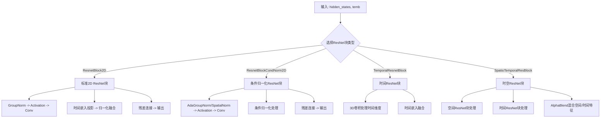
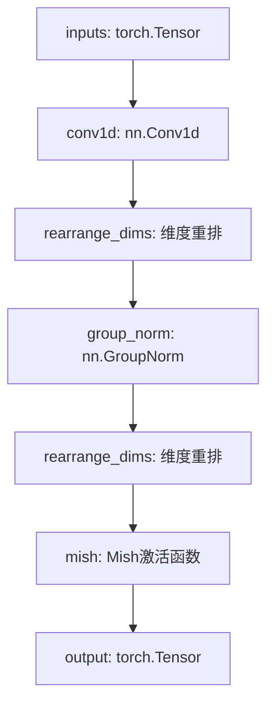
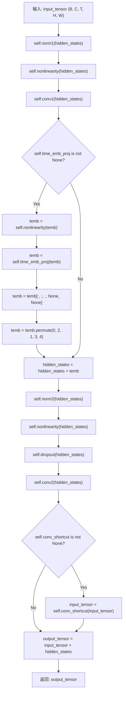
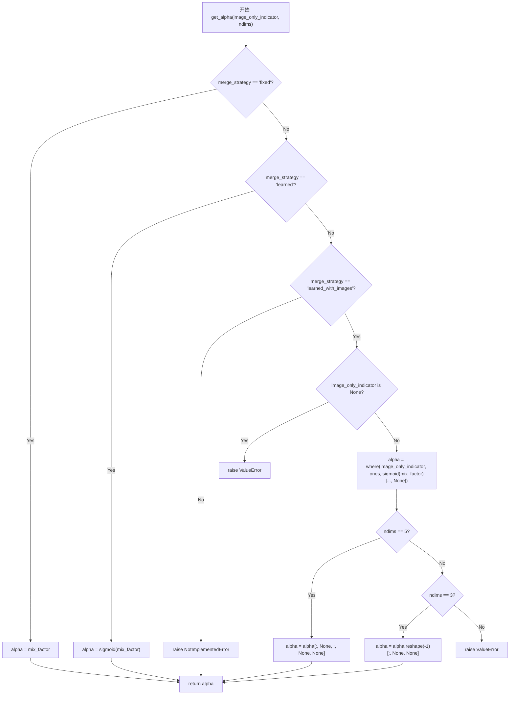

# `diffusers\src\diffusers\models\resnet.py` 详细设计文档

该文件实现了多种ResNet块模块，主要用于扩散模型（Diffusion Models）的U-Net架构中，包含标准的2D ResNet块、条件归一化ResNet块、时间/时空ResNet块以及用于混合空间和时间特征的AlphaBlender模块，支持上采样、下采样、残差连接和时间嵌入 conditioning。

## 整体流程



## 类结构

```
ResNet模块层次结构
├── ResnetBlockCondNorm2D (条件归一化ResNet块)
│   ├── norm1: AdaGroupNorm/SpatialNorm
│   ├── conv1: nn.Conv2d
│   ├── norm2: AdaGroupNorm/SpatialNorm
│   ├── conv2: nn.Conv2d
│   └── conv_shortcut: nn.Conv2d (可选)
├── ResnetBlock2D (标准2D ResNet块)
│   ├── norm1: nn.GroupNorm
│   ├── conv1: nn.Conv2d
│   ├── time_emb_proj: nn.Linear
│   ├── norm2: nn.GroupNorm
│   ├── conv2: nn.Conv2d
│   └── conv_shortcut: nn.Conv2d (可选)
├── Conv1dBlock (1D卷积块)
│   ├── conv1d: nn.Conv1d
│   ├── group_norm: nn.GroupNorm
│   └── mish: 激活函数
├── ResidualTemporalBlock1D (残差时间块)
│   ├── conv_in: Conv1dBlock
│   ├── conv_out: Conv1dBlock
│   ├── time_emb: nn.Linear
│   └── residual_conv: nn.Conv1d
├── TemporalConvLayer (时间卷积层)
│   ├── conv1: nn.Sequential (GroupNorm->SiLU->Conv3d)
│   ├── conv2: nn.Sequential
│   ├── conv3: nn.Sequential
│   └── conv4: nn.Sequential (初始化为零)
├── TemporalResnetBlock (时间ResNet块)
│   ├── norm1: nn.GroupNorm
│   ├── conv1: nn.Conv3d
│   ├── time_emb_proj: nn.Linear
│   ├── norm2: nn.GroupNorm
│   ├── conv2: nn.Conv3d
│   └── conv_shortcut: nn.Conv3d (可选)
├── SpatioTemporalResBlock (时空ResNet块)
│   ├── spatial_res_block: ResnetBlock2D
│   ├── temporal_res_block: TemporalResnetBlock
│   └── time_mixer: AlphaBlender
└── AlphaBlender (特征混合模块)
    ├── mix_factor: Parameter/Buffer
    └── get_alpha: 计算混合因子
```

## 全局变量及字段


### `rearrange_dims`
    
根据输入张量的维度数量进行维度重排列，将2D、3D或4D张量转换为适合卷积处理的形状

类型：`function`
    


### `nn.Module.ResnetBlockCondNorm2D`
    
使用条件归一化的2D ResNet块，支持时间嵌入的空间特征提取和上/下采样

类型：`class`
    


### `ResnetBlockCondNorm2D.in_channels`
    
输入通道数

类型：`int`
    


### `ResnetBlockCondNorm2D.out_channels`
    
输出通道数

类型：`int`
    


### `ResnetBlockCondNorm2D.use_conv_shortcut`
    
是否使用卷积快捷连接

类型：`bool`
    


### `ResnetBlockCondNorm2D.up`
    
是否上采样

类型：`bool`
    


### `ResnetBlockCondNorm2D.down`
    
是否下采样

类型：`bool`
    


### `ResnetBlockCondNorm2D.output_scale_factor`
    
输出缩放因子

类型：`float`
    


### `ResnetBlockCondNorm2D.time_embedding_norm`
    
时间嵌入归一化类型

类型：`str`
    


### `ResnetBlockCondNorm2D.norm1`
    
第一个归一化层

类型：`AdaGroupNorm|SpatialNorm`
    


### `ResnetBlockCondNorm2D.conv1`
    
第一个卷积层

类型：`nn.Conv2d`
    


### `ResnetBlockCondNorm2D.norm2`
    
第二个归一化层

类型：`AdaGroupNorm|SpatialNorm`
    


### `ResnetBlockCondNorm2D.conv2`
    
第二个卷积层

类型：`nn.Conv2d`
    


### `ResnetBlockCondNorm2D.nonlinearity`
    
激活函数

类型：`nn.Module`
    


### `ResnetBlockCondNorm2D.upsample`
    
上采样层(可选)

类型：`nn.Module`
    


### `ResnetBlockCondNorm2D.downsample`
    
下采样层(可选)

类型：`nn.Module`
    


### `ResnetBlockCondNorm2D.conv_shortcut`
    
快捷连接卷积(可选)

类型：`nn.Conv2d`
    


### `nn.Module.ResnetBlock2D`
    
标准2D ResNet块，支持时间嵌入和多种归一化策略

类型：`class`
    


### `ResnetBlock2D.pre_norm`
    
是否预归一化

类型：`bool`
    


### `ResnetBlock2D.in_channels`
    
输入通道数

类型：`int`
    


### `ResnetBlock2D.out_channels`
    
输出通道数

类型：`int`
    


### `ResnetBlock2D.use_conv_shortcut`
    
是否使用卷积快捷连接

类型：`bool`
    


### `ResnetBlock2D.up`
    
是否上采样

类型：`bool`
    


### `ResnetBlock2D.down`
    
是否下采样

类型：`bool`
    


### `ResnetBlock2D.output_scale_factor`
    
输出缩放因子

类型：`float`
    


### `ResnetBlock2D.time_embedding_norm`
    
时间嵌入归一化类型

类型：`str`
    


### `ResnetBlock2D.skip_time_act`
    
是否跳过时间激活

类型：`bool`
    


### `ResnetBlock2D.norm1`
    
第一个归一化层

类型：`nn.GroupNorm`
    


### `ResnetBlock2D.conv1`
    
第一个卷积层

类型：`nn.Conv2d`
    


### `ResnetBlock2D.time_emb_proj`
    
时间嵌入投影层

类型：`nn.Linear`
    


### `ResnetBlock2D.norm2`
    
第二个归一化层

类型：`nn.GroupNorm`
    


### `ResnetBlock2D.conv2`
    
第二个卷积层

类型：`nn.Conv2d`
    


### `ResnetBlock2D.nonlinearity`
    
激活函数

类型：`nn.Module`
    


### `ResnetBlock2D.upsample`
    
上采样层(可选)

类型：`nn.Module`
    


### `ResnetBlock2D.downsample`
    
下采样层(可选)

类型：`nn.Module`
    


### `ResnetBlock2D.conv_shortcut`
    
快捷连接卷积(可选)

类型：`nn.Conv2d`
    


### `nn.Module.Conv1dBlock`
    
1D卷积块，包含卷积、组归一化和Mish激活

类型：`class`
    


### `Conv1dBlock.conv1d`
    
1D卷积层

类型：`nn.Conv1d`
    


### `Conv1dBlock.group_norm`
    
组归一化层

类型：`nn.GroupNorm`
    


### `Conv1dBlock.mish`
    
Mish激活函数

类型：`nn.Module`
    


### `nn.Module.ResidualTemporalBlock1D`
    
1D残差时间块，用于处理时间序列特征

类型：`class`
    


### `ResidualTemporalBlock1D.conv_in`
    
输入卷积块

类型：`Conv1dBlock`
    


### `ResidualTemporalBlock1D.conv_out`
    
输出卷积块

类型：`Conv1dBlock`
    


### `ResidualTemporalBlock1D.time_emb_act`
    
时间嵌入激活函数

类型：`nn.Module`
    


### `ResidualTemporalBlock1D.time_emb`
    
时间嵌入投影

类型：`nn.Linear`
    


### `ResidualTemporalBlock1D.residual_conv`
    
残差卷积

类型：`nn.Module`
    


### `nn.Module.TemporalConvLayer`
    
时间卷积层，用于处理视频等序列图像数据

类型：`class`
    


### `TemporalConvLayer.in_dim`
    
输入维度

类型：`int`
    


### `TemporalConvLayer.out_dim`
    
输出维度

类型：`int`
    


### `TemporalConvLayer.conv1`
    
第一个卷积序列

类型：`nn.Sequential`
    


### `TemporalConvLayer.conv2`
    
第二个卷积序列

类型：`nn.Sequential`
    


### `TemporalConvLayer.conv3`
    
第三个卷积序列

类型：`nn.Sequential`
    


### `TemporalConvLayer.conv4`
    
第四个卷积序列(初始化为零)

类型：`nn.Sequential`
    


### `nn.Module.TemporalResnetBlock`
    
3D时间ResNet块，用于视频时间维度的特征提取

类型：`class`
    


### `TemporalResnetBlock.in_channels`
    
输入通道数

类型：`int`
    


### `TemporalResnetBlock.out_channels`
    
输出通道数

类型：`int`
    


### `TemporalResnetBlock.norm1`
    
第一个归一化层

类型：`nn.GroupNorm`
    


### `TemporalResnetBlock.conv1`
    
第一个3D卷积层

类型：`nn.Conv3d`
    


### `TemporalResnetBlock.time_emb_proj`
    
时间嵌入投影(可选)

类型：`nn.Linear`
    


### `TemporalResnetBlock.norm2`
    
第二个归一化层

类型：`nn.GroupNorm`
    


### `TemporalResnetBlock.dropout`
    
Dropout层

类型：`nn.Dropout`
    


### `TemporalResnetBlock.conv2`
    
第二个3D卷积层

类型：`nn.Conv3d`
    


### `TemporalResnetBlock.nonlinearity`
    
激活函数

类型：`nn.Module`
    


### `TemporalResnetBlock.use_in_shortcut`
    
是否使用快捷连接

类型：`bool`
    


### `TemporalResnetBlock.conv_shortcut`
    
快捷连接卷积(可选)

类型：`nn.Conv3d`
    


### `nn.Module.SpatioTemporalResBlock`
    
时空ResNet块，结合空间和时间特征进行视频处理

类型：`class`
    


### `SpatioTemporalResBlock.spatial_res_block`
    
空间ResNet块

类型：`ResnetBlock2D`
    


### `SpatioTemporalResBlock.temporal_res_block`
    
时间ResNet块

类型：`TemporalResnetBlock`
    


### `SpatioTemporalResBlock.time_mixer`
    
时间混合器

类型：`AlphaBlender`
    


### `nn.Module.AlphaBlender`
    
混合因子模块，用于融合空间和时间特征

类型：`class`
    


### `AlphaBlender.merge_strategy`
    
混合策略

类型：`str`
    


### `AlphaBlender.switch_spatial_to_temporal_mix`
    
是否切换空间/时间混合

类型：`bool`
    


### `AlphaBlender.mix_factor`
    
混合因子(参数或缓冲区)

类型：`torch.Tensor`
    
    

## 全局函数及方法


### `rearrange_dims`

该函数用于重新排列张量维度以适配不同维度的输入，根据输入张量的维度数量（2D、3D或4D），在特定位置添加或移除维度，以便与后续的GroupNorm等层兼容操作。

参数：

- `tensor`：`torch.Tensor`，输入的需要重新排列维度的张量

返回值：`torch.Tensor`，重新排列维度后的张量

#### 流程图

```mermaid
flowchart TD
    A[输入 tensor] --> B{len(tensor.shape) == 2?}
    B -- 是 --> C[返回 tensor[:, :, None]<br/>2D -> 3D 在末尾添加维度]
    B -- 否 --> D{len(tensor.shape) == 3?}
    D -- 是 --> E[返回 tensor[:, :, None, :]<br/>3D -> 4D 在中间添加维度]
    D -- 否 --> F{len(tensor.shape) == 4?}
    F -- 是 --> G[返回 tensor[:, :, 0, :]<br/>4D -> 3D 移除第3维]
    F -- 否 --> H[抛出 ValueError<br/>只支持 2/3/4 维张量]
    C --> I[输出 tensor]
    E --> I
    G --> I
```

#### 带注释源码

```python
def rearrange_dims(tensor: torch.Tensor) -> torch.Tensor:
    """
    重新排列张量维度以适配不同维度的输入。
    
    该函数用于在 Conv1dBlock 中将 1D/2D/3D 张量转换为适合 GroupNorm
    处理的维度格式，或将 4D 张量还原为 3D 格式。
    
    维度变换规则：
        - 2D (batch, channels) -> 3D (batch, channels, 1)
        - 3D (batch, channels, time) -> 4D (batch, channels, 1, time)
        - 4D (batch, channels, 1, time) -> 3D (batch, channels, time)
    
    参数:
        tensor: 输入的 PyTorch 张量
        
    返回:
        重新排列后的 PyTorch 张量
        
    异常:
        ValueError: 当张量维度不是 2、3 或 4 时抛出
    """
    # 处理 2D 张量: (batch, channels) -> (batch, channels, 1)
    # 在末尾添加一个维度，用于后续 GroupNorm 处理
    if len(tensor.shape) == 2:
        return tensor[:, :, None]
    
    # 处理 3D 张量: (batch, channels, time) -> (batch, channels, 1, time)
    # 在维度索引 2 处添加一个维度，将 1D 卷积输出转换为 4D 以适配 GroupNorm
    if len(tensor.shape) == 3:
        return tensor[:, :, None, :]
    
    # 处理 4D 张量: (batch, channels, 1, time) -> (batch, channels, time)
    # 移除中间添加的冗余维度，恢复为 3D 格式
    elif len(tensor.shape) == 4:
        return tensor[:, :, 0, :]
    
    # 维度不支持时抛出异常
    else:
        raise ValueError(f"`len(tensor)`: {len(tensor)} has to be 2, 3 or 4.")
```


### `ResnetBlockCondNorm2D.forward`

该方法是 `ResnetBlockCondNorm2D` 类的核心前向传播逻辑。它实现了带有条件归一化（Conditioning Normalization）的残差块（ResNet Block），能够根据时间嵌入（temb）对特征进行调制。方法内部处理了上采样、下采样、主路径卷积、跳跃连接（skip connection）以及输出缩放等关键步骤。

参数：

- `self`：`ResnetBlockCondNorm2D`，当前模块实例。
- `input_tensor`：`torch.Tensor`，输入的特征张量（隐藏状态），通常为 `[B, C, H, W]`。
- `temb`：`torch.Tensor`，时间步嵌入（Time Embedding），用于条件归一化，通常为 `[B, temb_channels]`。
- `*args`：可变位置参数，用于保持向后兼容性，当前版本忽略这些参数。
- `**kwargs`：可变关键字参数，用于保持向后兼容性。代码中会检查是否传入了已废弃的 `scale` 参数，若传入则发出警告。

返回值：`torch.Tensor`，经过残差块处理并融合跳跃连接后的输出张量，形状通常与 `input_tensor` 相同（除非存在通道数的改变）。

#### 流程图

```mermaid
graph TD
    A[输入: input_tensor, temb] --> B{检查废弃参数 scale}
    B -->|是| C[发出警告]
    B -->|否| D[hidden_states = input_tensor]
    
    D --> E[Norm1: self.norm1(hidden_states, temb)]
    E --> F[Activation: self.nonlinearity(hidden_states)]
    
    F --> G{判断上/下采样}
    G -->|Up| H[input_tensor 和 hidden_states 上采样]
    G -->|Down| I[input_tensor 和 hidden_states 下采样]
    G -->|None| J[继续]
    
    H --> K[Conv1: self.conv1(hidden_states)]
    I --> K
    
    K --> L[Norm2: self.norm2(hidden_states, temb)]
    L --> M[Activation: self.nonlinearity(hidden_states)]
    M --> N[Dropout: self.dropout(hidden_states)]
    N --> O[Conv2: self.conv2(hidden_states)]
    
    O --> P{检查 conv_shortcut}
    P -->|是| Q[input_tensor 通过 conv_shortcut]
    P -->|否| R[input_tensor 保持不变]
    
    Q --> S[输出 = (input_tensor + hidden_states) / output_scale_factor]
    R --> S
    
    S --> T[返回 output_tensor]
```

#### 带注释源码

```python
def forward(self, input_tensor: torch.Tensor, temb: torch.Tensor, *args, **kwargs) -> torch.Tensor:
    # 检查是否有额外的参数传入，或 kwargs 中是否包含已废弃的 'scale' 参数
    if len(args) > 0 or kwargs.get("scale", None) is not None:
        deprecation_message = "The `scale` argument is deprecated and will be ignored. Please remove it, as passing it will raise an error in the future. `scale` should directly be passed while calling the underlying pipeline component i.e., via `cross_attention_kwargs`."
        deprecate("scale", "1.0.0", deprecation_message)

    # 初始化隐藏状态
    hidden_states = input_tensor

    # 第一次条件归一化：使用 AdaGroupNorm 或 SpatialNorm 将时间嵌入信息融入特征
    hidden_states = self.norm1(hidden_states, temb)

    # 第一次非线性激活
    hidden_states = self.nonlinearity(hidden_states)

    # 处理空间变换（上采样或下采样）
    if self.upsample is not None:
        # 当批量较大时，调用 contiguous() 以避免某些上采样实现（如 upsample_nearest_nhwc）的崩溃
        # 参考: https://github.com/huggingface/diffusers/issues/984
        if hidden_states.shape[0] >= 64:
            input_tensor = input_tensor.contiguous()
            hidden_states = hidden_states.contiguous()
        
        # 对输入残差和主路径特征同时进行上采样
        input_tensor = self.upsample(input_tensor)
        hidden_states = self.upsample(hidden_states)

    elif self.downsample is not None:
        # 对输入残差和主路径特征同时进行下采样
        input_tensor = self.downsample(input_tensor)
        hidden_states = self.downsample(hidden_states)

    # 第一次卷积变换
    hidden_states = self.conv1(hidden_states)

    # 第二次条件归一化
    hidden_states = self.norm2(hidden_states, temb)

    # 第二次非线性激活
    hidden_states = self.nonlinearity(hidden_states)

    # 应用 Dropout
    hidden_states = self.dropout(hidden_states)
    
    # 第二次卷积变换
    hidden_states = self.conv2(hidden_states)

    # 处理跳跃连接（Short Cut）
    if self.conv_shortcut is not None:
        # 如果输入输出通道数不匹配，或者使用了 conv_shortcut，则对输入应用 1x1 卷积
        input_tensor = self.conv_shortcut(input_tensor)

    # 残差相加并根据输出缩放因子进行归一化
    output_tensor = (input_tensor + hidden_states) / self.output_scale_factor

    return output_tensor
```


### `ResnetBlock2D.forward`

该方法实现了 2D ResNet 块的前向传播逻辑。核心流程包括：首先对输入特征进行预归一一化（Pre-norm）和激活；若模型配置了上采样（upsample）或下采样（downsample），则在卷积前调整空间维度；接着通过第一层卷积变换特征；然后注入时间嵌入（temb）进行条件归一化（根据 `time_embedding_norm` 配置执行加法或仿射变换）；随后经过激活、Dropout 和第二层卷积；最后通过卷积快捷连接（Shortcut）处理通道差异，并将主分支与残差分支相加并缩放后输出。

参数：

- `input_tensor`：`torch.Tensor`，输入的特征图张量。
- `temb`：`torch.Tensor`，时间嵌入向量，用于调节网络的时间步信息。
- `*args`：可变位置参数，用于处理遗留接口，当前主要检查是否传入弃用的 `scale` 参数。
- `**kwargs`：可变关键字参数，用于处理遗留接口，当前主要检查是否传入弃用的 `scale` 参数。

返回值：`torch.Tensor`，经过 ResNet 块处理后的输出特征图张量。

#### 流程图

```mermaid
graph TD
    A([Start forward]) --> B{检查弃用参数<br>scale}
    B --> C[hidden_states = input_tensor]
    C --> D[Norm1]
    D --> E[Activation]
    E --> F{判断上/下采样}
    F -->|Up| G[Upsample Input & States]
    F -->|Down| H[Downsample Input & States]
    F -->|None| I[Conv1]
    G --> I
    H --> I
    I --> J{time_emb_proj 存在?}
    J -->|Yes| K[处理 temb: 激活 -> 投影 -> 维度扩展]
    J --> No
    K --> L{time_embedding_norm 类型}
    L -->|default| M[hidden_states + temb <br> Norm2]
    L -->|scale_shift| N[Norm2 -> 拆分 Scale/Shift -> 变换]
    L -->|other| O[Norm2]
    M --> P[Activation]
    N --> P
    O --> P
    P --> Q[Dropout]
    Q --> R[Conv2]
    R --> S{conv_shortcut 存在?}
    S -->|Yes| T[对 input_tensor <br>应用 conv_shortcut]
    S -->|No| U[计算输出]
    T --> U
    U --> V[ (Input + Hidden) / <br>output_scale_factor ]
    V --> Z([Return Output])
```

#### 带注释源码

```python
def forward(self, input_tensor: torch.Tensor, temb: torch.Tensor, *args, **kwargs) -> torch.Tensor:
    # 检查是否传入了已弃用的 scale 参数，并发出警告
    if len(args) > 0 or kwargs.get("scale", None) is not None:
        deprecation_message = "The `scale` argument is deprecated and will be ignored. Please remove it, as passing it will raise an error in the future. `scale` should directly be passed while calling the underlying pipeline component i.e., via `cross_attention_kwargs`."
        deprecate("scale", "1.0.0", deprecation_message)

    # 将隐藏状态初始化为输入张量，主分支开始
    hidden_states = input_tensor

    # 1. 预归一化层 (Pre-norm) 与激活
    hidden_states = self.norm1(hidden_states)
    hidden_states = self.nonlinearity(hidden_states)

    # 2. 空间维度变换 (上采样或下采样)
    # 注意：如果需要变换，快捷连接分支(input_tensor)也必须同步变换，以保证维度匹配
    if self.upsample is not None:
        # 针对大 batch  size 的特殊处理，避免 upsample_nearest_nhwc 报错
        if hidden_states.shape[0] >= 64:
            input_tensor = input_tensor.contiguous()
            hidden_states = hidden_states.contiguous()
        input_tensor = self.upsample(input_tensor)
        hidden_states = self.upsample(hidden_states)
    elif self.downsample is not None:
        input_tensor = self.downsample(input_tensor)
        hidden_states = self.downsample(hidden_states)

    # 3. 主分支第一层卷积
    hidden_states = self.conv1(hidden_states)

    # 4. 时间嵌入 (Time Embedding) 注入处理
    if self.time_emb_proj is not None:
        # 可选：是否跳过时间嵌入的激活函数
        if not self.skip_time_act:
            temb = self.nonlinearity(temb)
        # 投影并reshape以匹配空间维度 (B, C, 1, 1)
        temb = self.time_emb_proj(temb)[:, :, None, None]

    # 5. 条件归一化 (Conditioning Normalization)
    # 根据配置的时间嵌入归一化方式进行不同的操作
    if self.time_embedding_norm == "default":
        if temb is not None:
            hidden_states = hidden_states + temb # 简单的加法注入
        hidden_states = self.norm2(hidden_states)
    elif self.time_embedding_norm == "scale_shift":
        if temb is None:
            raise ValueError(
                f" `temb` should not be None when `time_embedding_norm` is {self.time_embedding_norm}"
            )
        # 缩放偏移 (Scale & Shift) 注入，类似于 Adaptive Instance Norm
        time_scale, time_shift = torch.chunk(temb, 2, dim=1)
        hidden_states = self.norm2(hidden_states)
        hidden_states = hidden_states * (1 + time_scale) + time_shift
    else:
        hidden_states = self.norm2(hidden_states)

    # 6. 激活、Dropout 与 第二层卷积
    hidden_states = self.nonlinearity(hidden_states)
    hidden_states = self.dropout(hidden_states)
    hidden_states = self.conv2(hidden_states)

    # 7. 快捷连接 (Shortcut Connection) 处理
    # 如果输入输出通道数不同，使用卷积调整维度
    if self.conv_shortcut is not None:
        # 训练时调用 contiguous() 以避免 DDP 梯度错位警告，推理时可跳过以提升性能
        if self.training:
            input_tensor = input_tensor.contiguous()
        input_tensor = self.conv_shortcut(input_tensor)

    # 8. 残差相加并除以输出缩放因子
    output_tensor = (input_tensor + hidden_states) / self.output_scale_factor

    return output_tensor
```


### `Conv1dBlock.forward`

该方法实现了Conv1dBlock类的前向传播，执行一维卷积→GroupNorm→Mish激活的经典组合，用于处理时序数据的特征提取。

参数：

- `inputs`：`torch.Tensor`，输入张量，形状为 `[batch_size, inp_channels, horizon]`

返回值：`torch.Tensor`，经过卷积、归一化和激活后的输出张量，形状为 `[batch_size, out_channels, horizon]`

#### 流程图



#### 带注释源码

```python
def forward(self, inputs: torch.Tensor) -> torch.Tensor:
    """
    执行Conv1dBlock的前向传播
    
    处理流程: Conv1d -> rearrange_dims -> GroupNorm -> rearrange_dims -> Mish
    
    参数:
        inputs: 输入张量, 形状为 [batch_size, inp_channels, horizon]
        
    返回:
        output: 输出张量, 形状为 [batch_size, out_channels, horizon]
    """
    # 第一步: 一维卷积变换
    # 将输入从 [batch, channels, length] 进行卷积变换到 [batch, out_channels, length]
    # padding=kernel_size//2 确保输出长度与输入相同
    intermediate_repr = self.conv1d(inputs)
    
    # 第二步: 维度重排
    # 将 [batch, channels, length] -> [batch, channels, length, 1] 或其他扩展维度
    # 以适配 GroupNorm 期望的维度格式
    intermediate_repr = rearrange_dims(intermediate_repr)
    
    # 第三步: GroupNorm 归一化
    # 对 out_channels 通道进行分组归一化,有助于稳定训练
    intermediate_repr = self.group_norm(intermediate_repr)
    
    # 第四步: 维度重排恢复
    # 将维度恢复到适合后续处理的形状
    intermediate_repr = rearrange_dims(intermediate_repr)
    
    # 第五步: Mish 激活函数
    # Mish = x * tanh(softplus(x))，一种自正则化的激活函数
    output = self.mish(intermediate_repr)
    
    return output
```

#### 关联的辅助函数信息

**rearrange_dims** (全局函数)

- 描述：根据输入张量的维度数量进行维度重排，用于适配GroupNorm的输入要求
- 参数：
  - `tensor`：`torch.Tensor`，输入张量
- 返回值：`torch.Tensor`，重排后的张量
- 实现逻辑：
  - 2D张量：添加最后一维 `[batch, channels] -> [batch, channels, 1]`
  - 3D张量：添加一维 `[batch, channels, length] -> [batch, channels, length, 1]`
  - 4D张量：移除第一维 `[batch, frames, channels, height, width] -> [batch, channels, height, width]`


### `ResidualTemporalBlock1D.forward`

该方法实现了一维残差时间块的前向传播，通过时间嵌入层对时间步进行编码，与卷积特征进行融合，并通过残差连接保持信息流动。

参数：

- `inputs`：`torch.Tensor`，输入张量，形状为 [batch_size × inp_channels × horizon]，表示批量大小、输入通道数和时间范围
- `t`：`torch.Tensor`，时间嵌入张量，形状为 [batch_size × embed_dim]，表示批量大小和嵌入维度

返回值：`torch.Tensor`，输出张量，形状为 [batch_size × out_channels × horizon]，经过时间卷积块处理后的特征

#### 流程图

```mermaid
flowchart TD
    A[inputs: (batch, inp_channels, horizon)] --> B[residual_conv: 条件卷积]
    A --> C[conv_in: 1D卷积块]
    
    D[t: (batch, embed_dim)] --> E[time_emb_act: 激活函数]
    E --> F[time_emb: 线性层]
    F --> G[rearrange_dims: 维度重排]
    G --> H[广播加法: conv_in输出 + rearrange_dims(t)]
    H --> I[conv_out: 1D卷积块]
    
    B --> J[加法: I输出 + residual_conv结果]
    J --> K[out: (batch, out_channels, horizon)]
    
    C --> H
    I --> J
```

#### 带注释源码

```python
def forward(self, inputs: torch.Tensor, t: torch.Tensor) -> torch.Tensor:
    """
    Residual 1D块的前向传播

    Args:
        inputs : [ batch_size x inp_channels x horizon ]
        t : [ batch_size x embed_dim ]

    returns:
        out : [ batch_size x out_channels x horizon ]
    """
    # 步骤1: 对时间嵌入进行激活函数处理
    # 将时间嵌入从 (batch, embed_dim) 变换为 (batch, out_channels)
    t = self.time_emb_act(t)       # 应用 Mish/Swish 等激活函数
    t = self.time_emb(t)           # 线性投影: (batch, embed_dim) -> (batch, out_channels)

    # 步骤2: 第一次卷积处理输入
    # inputs: (batch, inp_channels, horizon) -> conv_in: (batch, out_channels, horizon)
    # 然后将时间嵌入 t 从 (batch, out_channels) 扩展为 (batch, out_channels, 1) 并广播加法
    out = self.conv_in(inputs) + rearrange_dims(t)

    # 步骤3: 第二次卷积处理
    # 进一步提取时间特征: (batch, out_channels, horizon) -> (batch, out_channels, horizon)
    out = self.conv_out(out)

    # 步骤4: 残差连接
    # 如果输入输出通道不同，使用 1x1 卷积进行调整；否则使用 Identity
    # 最终输出 = 残差分支 + 主分支
    return out + self.residual_conv(inputs)
```


### `TemporalConvLayer.forward`

该方法实现了一种用于视频（图像序列）输入的时间卷积层，通过重塑输入张量使其适合3D卷积处理时间维度，然后依次通过四个卷积块进行特征提取，最后通过残差连接将输出恢复到原始形状。

参数：

- `hidden_states`：`torch.Tensor`，输入的隐藏状态张量，形状为 (batch_size * num_frames, channels, height, width)
- `num_frames`：`int`，默认为 1，输入序列的帧数，用于将隐藏状态重塑为批量维度

返回值：`torch.Tensor`，经过时间卷积处理后的隐藏状态，形状为 (batch_size * num_frames, channels, height, width)

#### 流程图

```mermaid
flowchart TD
    A[开始: hidden_states] --> B[reshape为5D张量<br/>shape: (batch, channels, num_frames, H, W)]
    B --> C[保存残差连接: identity = hidden_states]
    C --> D[conv1: GroupNorm → SiLU → Conv3d]
    D --> E[conv2: GroupNorm → SiLU → Dropout → Conv3d]
    E --> F[conv3: GroupNorm → SiLU → Dropout → Conv3d]
    F --> G[conv4: GroupNorm → SiLU → Dropout → Conv3d]
    G --> H[残差连接: identity + hidden_states]
    H --> I[permute调整维度顺序<br/>转为 (batch, channels, num_frames, H, W)]
    I --> J[reshape恢复4D张量<br/>shape: (batch * num_frames, channels, H, W)]
    J --> K[结束: 返回hidden_states]
```

#### 带注释源码

```python
def forward(self, hidden_states: torch.Tensor, num_frames: int = 1) -> torch.Tensor:
    """
    TemporalConvLayer的前向传播方法，对输入进行时间维度上的卷积处理。

    Args:
        hidden_states: 输入张量，形状为 (batch_size * num_frames, channels, height, width)
                       其中batch_size是空间维度的批量大小
        num_frames: 输入序列的帧数，默认为1

    Returns:
        输出张量，形状为 (batch_size * num_frames, channels, height, width)
    """
    # 第一步：将4D张量重塑为5D张量，以便进行3D卷积
    # hidden_states[None, :] 添加批次维度
    # .reshape((-1, num_frames) + hidden_states.shape[1:]) 将批量维度分为时间维度和空间批量
    # .permute(0, 2, 1, 3, 4) 调整维度顺序为 (batch, channels, time, height, width)
    hidden_states = (
        hidden_states[None, :].reshape((-1, num_frames) + hidden_states.shape[1:]).permute(0, 2, 1, 3, 4)
    )

    # 保存残差连接（输入）用于后续相加
    # 这一步是残差连接的关键，保留原始输入
    identity = hidden_states

    # 第一个卷积块：归一化 -> 激活 -> 升维卷积
    # 将输入通道数in_dim转换为out_dim
    hidden_states = self.conv1(hidden_states)

    # 第二个卷积块：归一化 -> 激活 -> 降维卷积
    # 将通道从out_dim转换回in_dim
    hidden_states = self.conv2(hidden_states)

    # 第三个卷积块：归一化 -> 激活 -> 降维卷积
    # 继续进行特征提取
    hidden_states = self.conv3(hidden_states)

    # 第四个卷积块：归单化 -> 激活 -> 降维卷积
    # 注意：conv4的权重初始化为零，因此该卷积块相当于恒等映射
    # 这是设计上的技巧，使得初始时该层表现为恒等连接
    hidden_states = self.conv4(hidden_states)

    # 残差连接：将输入与输出相加
    # 这是深度学习中常用的技术，有助于梯度流动和训练稳定性
    hidden_states = identity + hidden_states

    # 调整维度顺序：从 (batch, channels, time, height, width) 转回 (batch, time, channels, height, width)
    hidden_states = hidden_states.permute(0, 2, 1, 3, 4)

    # 最后reshape回4D张量：
    # (hidden_states.shape[0] * hidden_states.shape[2], -1, hidden_states.shape[3], hidden_states.shape[4])
    # 合并批量维度和时间维度，还原为原始输入格式
    hidden_states = hidden_states.permute(0, 2, 1, 3, 4).reshape(
        (hidden_states.shape[0] * hidden_states.shape[2], -1) + hidden_states.shape[3:]
    )
    return hidden_states
```


### `TemporalResnetBlock.forward`

该函数实现TemporalResnetBlock的前向传播，对输入的3D张量（视频帧）进行残差块处理，通过GroupNorm归一化、SiLU激活、3D卷积以及可选的时间嵌入（temb）注入，实现时空特征的提取与融合，最终通过残差连接输出特征张量。

参数：

- `input_tensor`：`torch.Tensor`，输入张量，形状为 `(batch, channels, frames, height, width)` 的5D张量，表示批量视频帧序列
- `temb`：`torch.Tensor`，时间嵌入张量，形状为 `(batch, temb_channels)`，用于注入时间步信息以实现条件生成

返回值：`torch.Tensor`，输出张量，形状与输入相同 `(batch, out_channels, frames, height, width)`，经过残差块处理后的特征

#### 流程图



#### 带注释源码

```python
def forward(self, input_tensor: torch.Tensor, temb: torch.Tensor) -> torch.Tensor:
    """
    TemporalResnetBlock 的前向传播方法
    
    该方法实现时空残差块的前向计算，对输入的5D张量（视频帧序列）进行：
    1. 第一次归一化 -> 激活 -> 卷积
    2. 注入时间嵌入（如果存在）
    3. 第二次归一化 -> 激活 -> Dropout -> 卷积
    4. 残差连接
    
    参数:
        input_tensor: 输入张量，形状为 (batch, channels, frames, height, width)
        temb: 时间嵌入张量，形状为 (batch, temb_channels)
    
    返回:
        输出张量，形状为 (batch, out_channels, frames, height, width)
    """
    # 将输入张量赋值给隐藏状态变量
    hidden_states = input_tensor

    # 第一次归一化：使用GroupNorm对通道进行分组归一化
    hidden_states = self.norm1(hidden_states)
    
    # 应用SiLU激活函数（非线性变换）
    hidden_states = self.nonlinearity(hidden_states)
    
    # 第一次3D卷积：提取时空特征
    hidden_states = self.conv1(hidden_states)

    # 如果存在时间嵌入投影层，则注入时间信息
    if self.time_emb_proj is not None:
        # 对时间嵌入进行非线性变换
        temb = self.nonlinearity(temb)
        
        # 通过线性层投影到输出通道维度
        temb = self.time_emb_proj(temb)[:, :, :, None, None]
        
        # 调整维度顺序以匹配隐藏状态的形状: (B, C) -> (B, C, 1, 1, 1)
        temb = temb.permute(0, 2, 1, 3, 4)
        
        # 将时间嵌入加到隐藏状态（残差连接前的特征）
        hidden_states = hidden_states + temb

    # 第二次归一化
    hidden_states = self.norm2(hidden_states)
    
    # 应用激活函数
    hidden_states = self.nonlinearity(hidden_states)
    
    # Dropout正则化（默认为0.0，即不启用）
    hidden_states = self.dropout(hidden_states)
    
    # 第二次3D卷积：输出通道数保持不变
    hidden_states = self.conv2(hidden_states)

    # 如果输入输出通道数不同，使用1x1x1卷积进行shortcut调整
    if self.conv_shortcut is not None:
        input_tensor = self.conv_shortcut(input_tensor)

    # 残差连接：将处理后的特征与原始输入相加
    output_tensor = input_tensor + hidden_states

    # 返回输出张量
    return output_tensor
```


### `SpatioTemporalResBlock.forward`

该方法实现了时空残差块的前向传播，结合空间ResNet块和时间ResNet块，通过时间混合器（AlphaBlender）融合空间和时间特征，支持视频序列（多帧）处理。

参数：

- `hidden_states`：`torch.Tensor`，输入张量，形状为 (batch_frames, channels, height, width)，其中 batch_frames = batch_size * num_frames
- `temb`：`torch.Tensor | None`，时间嵌入向量，形状为 (batch_size, temb_channels) 或 (batch_frames, temb_channels)
- `image_only_indicator`：`torch.Tensor | None`，图像帧指示器，用于标识哪些帧是纯图像（非视频），形状为 (batch_size, num_frames)

返回值：`torch.Tensor`，输出张量，形状为 (batch_frames, channels, height, width)，与输入形状相同

#### 流程图

```mermaid
flowchart TD
    A[开始 forward] --> B[获取 num_frames from image_only_indicator.shape[-1]]
    B --> C[spatial_res_block: hidden_states = spatial_res_block(hidden_states, temb)]
    C --> D[解析 hidden_states 形状: batch_frames, channels, height, width]
    D --> E[计算 batch_size = batch_frames // num_frames]
    E --> F[reshape + permute: 将 hidden_states 转换为 (batch_size, channels, num_frames, height, width)]
    F --> G[保存两份副本: hidden_states_mix 和 hidden_states]
    G --> H{temb is not None?}
    H -->|Yes| I[temb = temb.reshape(batch_size, num_frames, -1)]
    H -->|No| J[跳过 reshape]
    I --> K[temporal_res_block: hidden_states = temporal_res_block(hidden_states, temb)]
    J --> K
    K --> L[time_mixer 混合: hidden_states = time_mixer(hidden_states_mix, hidden_states, image_only_indicator)]
    L --> M[permute + reshape: 转换回 (batch_frames, channels, height, width)]
    M --> N[返回 hidden_states]
```

#### 带注释源码

```python
def forward(
    self,
    hidden_states: torch.Tensor,
    temb: torch.Tensor | None = None,
    image_only_indicator: torch.Tensor | None = None,
):
    """
    时空残差块的前向传播
    
    参数:
        hidden_states: 输入特征，形状 (batch_frames, channels, height, width)
        temb: 时间嵌入向量，用于条件注入
        image_only_indicator: 图像帧指示器，用于时间混合
    返回:
        输出特征，形状 (batch_frames, channels, height, width)
    """
    # 1. 从 image_only_indicator 获取帧数
    num_frames = image_only_indicator.shape[-1]  # 获取视频帧数
    
    # 2. 空间残差块处理：提取空间特征
    # hidden_states: (batch_frames, channels, height, width)
    hidden_states = self.spatial_res_block(hidden_states, temb)
    
    # 3. 解析特征维度信息
    # batch_frames = batch_size * num_frames
    batch_frames, channels, height, width = hidden_states.shape
    batch_size = batch_frames // num_frames
    
    # 4. 维度变换：将 (batch_frames, C, H, W) 转换为 (batch_size, C, num_frames, H, W)
    # hidden_states_mix 保存空间特征用于后续混合
    hidden_states_mix = (
        hidden_states[None, :].reshape(batch_size, num_frames, channels, height, width).permute(0, 2, 1, 3, 4)
    )
    # hidden_states 用于时间残差块处理
    hidden_states = (
        hidden_states[None, :].reshape(batch_size, num_frames, channels, height, width).permute(0, 2, 1, 3, 4)
    )
    
    # 5. 重塑时间嵌入：如果有 temb，则将其reshape为 (batch_size, num_frames, temb_channels)
    if temb is not None:
        temb = temb.reshape(batch_size, num_frames, -1)
    
    # 6. 时间残差块处理：提取时间维度的特征依赖
    # 输入/输出形状: (batch_size, channels, num_frames, height, width)
    hidden_states = self.temporal_res_block(hidden_states, temb)
    
    # 7. 时间混合器：融合空间特征和时间特征
    # 使用 AlphaBlender 根据 image_only_indicator 进行特征融合
    hidden_states = self.time_mixer(
        x_spatial=hidden_states_mix,  # 空间特征
        x_temporal=hidden_states,     # 时间特征
        image_only_indicator=image_only_indicator,  # 帧指示器
    )
    
    # 8. 恢复原始维度布局
    # 从 (batch_size, channels, num_frames, height, width) 回到 (batch_frames, channels, height, width)
    hidden_states = hidden_states.permute(0, 2, 1, 3, 4).reshape(batch_frames, channels, height, width)
    
    return hidden_states
```


### AlphaBlender.get_alpha

该方法是 `AlphaBlender` 类的核心方法，用于根据不同的合并策略（merge_strategy）计算空间和时间特征融合的混合因子（blending factor）alpha。该方法支持三种策略：固定策略（fixed）、学习策略（learned）和带图像学习策略（learned_with_images），并根据输入的维度数（ndims）对混合因子进行形状调整以适配不同维度的特征张量。

参数：

- `self`：`AlphaBlender` 类实例，包含混合策略配置和可学习参数
- `image_only_indicator`：`torch.Tensor`，用于指示当前处理的是纯图像还是视频帧的布尔张量，当使用 `learned_with_images` 策略时必须提供
- `ndims`：`int`，输入张量的维度数，用于对混合因子进行形状扩展，支持 3 维（batch*frames, height*width, channels）或 5 维（batch, channel, frames, height, width）

返回值：`torch.Tensor`，计算得到的混合因子 alpha，其形状会根据 ndims 参数进行相应调整以匹配输入张量的广播需求

#### 流程图



#### 带注释源码

```python
def get_alpha(self, image_only_indicator: torch.Tensor, ndims: int) -> torch.Tensor:
    """
    计算混合因子 alpha，用于空间和时间特征的融合。
    
    参数:
        image_only_indicator: 布尔张量，指示是否仅处理图像（用于learned_with_images策略）
        ndims: 输入张量的维度数（3或5）
    
    返回:
        混合因子 alpha 张量
    """
    # 策略1: 固定混合因子，直接使用注册缓冲区中的预定义值
    if self.merge_strategy == "fixed":
        alpha = self.mix_factor

    # 策略2: 可学习的混合因子，通过sigmoid函数将参数映射到(0,1)区间
    elif self.merge_strategy == "learned":
        alpha = torch.sigmoid(self.mix_factor)

    # 策略3: 基于图像指示器的可学习混合因子
    elif self.merge_strategy == "learned_with_images":
        # 检查图像指示器是否提供
        if image_only_indicator is None:
            raise ValueError("Please provide image_only_indicator to use learned_with_images merge strategy")

        # 根据image_only_indicator决定混合因子：
        # - 如果是纯图像（image_only_indicator为True），使用全1（完全使用空间特征）
        # - 否则使用sigmoid后的可学习参数（允许学习时空特征融合）
        alpha = torch.where(
            image_only_indicator.bool(),
            torch.ones(1, 1, device=image_only_indicator.device),
            torch.sigmoid(self.mix_factor)[..., None],
        )

        # 根据不同的张量维度调整alpha的形状以支持广播
        # 5维张量: (batch, channel, frames, height, width) -> (batch, 1, frames, 1, 1)
        if ndims == 5:
            alpha = alpha[:, None, :, None, None]
        # 3维张量: (batch*frames, height*width, channels) -> (batch*frames*height*width, 1, 1)
        elif ndims == 3:
            alpha = alpha.reshape(-1)[:, None, None]
        else:
            raise ValueError(f"Unexpected ndims {ndims}. Dimensions should be 3 or 5")

    else:
        raise NotImplementedError

    return alpha
```


### AlphaBlender.forward

该方法执行空间域特征与时间域特征的线性混合，通过可学习的混合因子 alpha 控制两者的权重比例，支持固定、习得以及基于图像指示器的混合策略。

参数：

- `self`：AlphaBlender 实例本身，包含混合策略和可学习参数。
- `x_spatial`：`torch.Tensor`，空间域特征张量，形状为 (batch, channels, frames, height, width) 或 (batch*frames, channels, height, width)。
- `x_temporal`：`torch.Tensor`，时间域特征张量，形状与 x_spatial 相同。
- `image_only_indicator`：`torch.Tensor | None = None`，图像-only 指示器张量，用于指示哪些帧是纯图像（无时间信息），形状为 (batch, frames)。

返回值：`torch.Tensor`，混合后的输出张量，形状与输入相同。

#### 流程图

```mermaid
flowchart TD
    A[forward 方法开始] --> B[调用 get_alpha 方法计算混合因子]
    B --> C{merge_strategy 类型}
    C -->|fixed| D[使用注册的 buffer mix_factor]
    C -->|learned| E[对 mix_factor 进行 sigmoid 变换]
    C -->|learned_with_images| F{image_only_indicator 是否为 None}
    F -->|是| G[抛出 ValueError 异常]
    F -->|否| H[根据 image_only_indicator 计算 alpha]
    D --> I[将 alpha 转换为与 x_spatial 相同的数据类型]
    E --> I
    H --> I
    I --> J{switch_spatial_to_temporal_mix 为 True?}
    J -->|是| K[alpha = 1.0 - alpha]
    J -->|否| L[执行混合计算]
    K --> L
    L --> M[x = alpha * x_spatial + (1 - alpha) * x_temporal]
    M --> N[返回混合结果 x]
```

#### 带注释源码

```python
def forward(
    self,
    x_spatial: torch.Tensor,
    x_temporal: torch.Tensor,
    image_only_indicator: torch.Tensor | None = None,
) -> torch.Tensor:
    """
    前向传播：混合空间域和时间域特征。

    参数:
        x_spatial: 空间域特征张量，形状为 (batch, channels, frames, height, width) 或 (batch*frames, channels, height, width)。
        x_temporal: 时间域特征张量，形状与 x_spatial 相同。
        image_only_indicator: 图像-only 指示器，用于指示哪些帧是纯图像（无时间信息），形状为 (batch, frames)。如果为 None，则在 learned_with_images 策略下会抛出异常。

    返回:
        混合后的输出张量，形状与输入相同。
    """
    # 获取混合因子 alpha，根据 merge_strategy 计算
    # fixed: 使用预注册的固定值
    # learned: 对可学习参数 sigmoid 变换
    # learned_with_images: 根据 image_only_indicator 动态计算
    alpha = self.get_alpha(image_only_indicator, x_spatial.ndim)
    
    # 将 alpha 转换为与输入 x_spatial 相同的数据类型，以确保计算兼容性
    alpha = alpha.to(x_spatial.dtype)

    # 如果启用空间-时间混合切换，则反转 alpha 值
    # 这在 TemporalVAE 等特定模型中使用
    if self.switch_spatial_to_temporal_mix:
        alpha = 1.0 - alpha

    # 执行线性混合：x = alpha * x_spatial + (1 - alpha) * x_temporal
    # 当 alpha 接近 1 时，输出偏向空间域特征
    # 当 alpha 接近 0 时，输出偏向时间域特征
    x = alpha * x_spatial + (1.0 - alpha) * x_temporal
    return x
```

## 关键组件


### ResnetBlockCondNorm2D

带条件归一化的ResNet块，支持AdaGroupNorm和SpatialNorm两种时间嵌入归一化方式，用于实现基于时间步的条件图像生成。

### ResnetBlock2D

标准2D ResNet块，支持默认和scale_shift两种时间嵌入归一化策略，通过GroupNorm实现空间归一化，适用于图像生成模型的残差连接。

### TemporalConvLayer

时间卷积层，用于处理视频序列（图像序列），通过3D卷积在时间维度上进行信息交互，包含四个连续的卷积块实现时空特征提取。

### TemporalResnetBlock

时间维度上的ResNet块，使用3D卷积处理视频数据，结合时间嵌入（temb）实现时间条件的特征变换。

### SpatioTemporalResBlock

时空ResNet块，结合空间ResNet块和时间ResNet块，通过AlphaBlender混合空间与时间特征，支持视频生成中的时空信息融合。

### AlphaBlender

空间与时间特征混合模块，通过可学习的混合因子或固定策略融合时空特征，支持learned、fixed和learned_with_images三种混合策略。

### Conv1dBlock

1D卷积块，包含Conv1d、GroupNorm和Mish激活函数，用于一维时间序列的特征提取。

### ResidualTemporalBlock1D

一维残差时间块，结合时间嵌入和一维卷积，实现时间序列的残差连接和特征增强。

### rearrange_dims

张量维度重排工具函数，将2D、3D、4D张量重排为特定维度格式，支持不同维度张量的统一处理。


## 问题及建议


### 已知问题

-   **代码重复**: `ResnetBlockCondNorm2D` 和 `ResnetBlock2D` 类存在大量重复代码（norm1、conv1、norm2、conv2、upsample/downsample、conv_shortcut 等结构几乎相同），可提取为基类以提高可维护性。
-   **硬编码值**: `TemporalResnetBlock` 中 `num_groups=32` 被硬编码；`ResnetBlockCondNorm2D` 中部分位置也硬编码了 `groups=32`，与其他地方使用参数的方式不一致。
-   **冗余计算**: `SpatioTemporalResBlock.forward` 方法中对 `hidden_states` 进行了两次相同的 reshape 和 permute 操作（`hidden_states_mix` 和 `hidden_states` 使用了相同的 reshape/permute 结果），其中 `hidden_states_mix` 仅用于空间特征混合，但实际未被用于混合计算。
-   **参数不一致**: `ResnetBlock2D` 构造函数中 `self.pre_norm = True` 被硬编码，而 `pre_norm` 参数实际上未被使用（传入但被忽略）。
-   **类型注解不完整**: 多个方法的 `kwargs` 参数缺少类型注解，如 `forward(self, input_tensor: torch.Tensor, temb: torch.Tensor, *args, **kwargs)`。
-   **错误处理不足**: 时间嵌入维度不匹配时缺乏显式检查（如 `TemporalResnetBlock` 中 `temb` 与 `hidden_states` 的维度兼容性验证）。

### 优化建议

-   **提取基类**: 将 `ResnetBlockCondNorm2D` 和 `ResnetBlock2D` 的公共逻辑提取到基类中，通过抽象方法或策略模式处理不同的归一化方式。
-   **参数化硬编码值**: 将 `TemporalResnetBlock` 中的 `num_groups=32` 改为构造函数参数，与其他类保持一致。
-   **消除冗余计算**: 在 `SpatioTemporalResBlock.forward` 中移除重复的 reshape/permute 操作，或重新设计 `hidden_states_mix` 的用途。
-   **使用丢弃的参数或移除**: 若 `pre_norm` 参数无需使用，应从构造函数中移除；若需要，应正确使用该参数。
-   **完善类型注解**: 为 `kwargs` 添加 `Any` 类型注解，提升代码可读性和 IDE 支持。
-   **增强错误处理**: 在时间嵌入处理前添加维度验证，提升 Debug 体验。
-   **考虑内存优化**: 在适当位置使用原地操作（如 `inplace=True` 版本的激活函数）以减少内存占用。

## 其它


### 设计目标与约束

1. **模块化设计**: 提供可复用的ResNet块组件，支持条件和非条件版本，支持2D和时序维度
2. **灵活性**: 支持上采样、下采样、跳连、conditioning等多种配置选项
3. **性能优化**: 针对大批量推理场景优化，避免不必要的数据拷贝
4. **兼容性**: 支持不同的时间嵌入归一化方式(ada_group、spatial、default、scale_shift)
5. **约束条件**: 
   - 输入张量必须为4D (batch, channels, height, width) 或5D (batch, frames, channels, height, width)
   - temb (时间嵌入) 必须与输入批处理维度匹配
   - 时序模块需要提供num_frames参数

### 错误处理与异常设计

1. **参数验证**: 
   - `time_embedding_norm` 仅支持特定字符串值，否则抛出 `ValueError`
   - `merge_strategy` 必须在允许的策略列表中，否则抛出 `ValueError`
   - `temb` 在 `time_embedding_norm="scale_shift"` 时不能为None
2. **维度检查**: 
   - `rearrange_dims` 函数对输入维度有严格要求，仅接受2-4维张量
   - `AlphaBlender.get_alpha` 检查ndims必须为3或5
3. **废弃警告**: `scale` 参数已废弃，通过 `deprecate` 函数发出警告
4. **异常传播**: Convolution层操作可能抛出PyTorch运行时错误

### 数据流与状态机

1. **ResnetBlock2D/ResnetBlockCondNorm2D数据流**:
   - 输入 → Norm1 → NonLinearity → Upsample/Downsample → Conv1 → Norm2(temb) → NonLinearity → Dropout → Conv2 → Shortcut → 输出
   - 支持两种时间嵌入归一化模式: default (加法) 和 scale_shift (缩放+平移)

2. **SpatioTemporalResBlock数据流**:
   - 输入 → Spatial ResBlock → 重塑为5D → Temporal ResBlock → AlphaBlend → 重塑回4D
   - 时序混合通过AlphaBlender控制空间特征与时序特征的融合比例

3. **TemporalConvLayer数据流**:
   - 输入4D → 重塑为5D (batch, channels, frames, h, w) → 4个卷积块残差连接 → 重塑回4D

### 外部依赖与接口契约

1. **核心依赖**:
   - `torch`, `torch.nn`, `torch.nn.functional` - PyTorch核心
   - `functools.partial` - 函数柯里化

2. **内部依赖**:
   - `..utils.deprecate` - 废弃警告工具
   - `.activations.get_activation` - 激活函数获取
   - `.attention_processor.SpatialNorm` - 空间归一化
   - `.normalization.AdaGroupNorm` - 自适应组归一化
   - `.downsampling.Downsample1D/2D`, `downsample_2d` - 下采样
   - `.upsampling.Upsample1D/2D`, `upsample_2d` - 上采样

3. **接口契约**:
   - 所有Block类继承`nn.Module`
   - `forward`方法签名: `forward(input_tensor, temb, *args, **kwargs)` → `torch.Tensor`
   - 时序类额外接受`num_frames`或`image_only_indicator`参数

### 配置与参数说明

1. **ResnetBlockCondNorm2D关键参数**:
   - `time_embedding_norm`: "ada_group" 或 "spatial"，决定条件归一化方式
   - `use_in_shortcut`: 控制是否使用1x1卷积进行跳连

2. **ResnetBlock2D关键参数**:
   - `time_embedding_norm`: "default" (加偏置) 或 "scale_shift" (缩放+平移)
   - `skip_time_act`: 是否跳过时间嵌入的激活函数

3. **AlphaBlender关键参数**:
   - `merge_strategy`: "learned"/"fixed"/"learned_with_images" - 时空特征混合策略
   - `switch_spatial_to_temporal_mix`: 交换混合顺序的标志

### 使用示例与调用模式

```python
# 基础2D ResBlock
block = ResnetBlock2D(in_channels=256, out_channels=256)
output = block(input_tensor, temb)

# 带条件的ResBlock
cond_block = ResnetBlockCondNorm2D(in_channels=256, time_embedding_norm="ada_group")
output = cond_block(input_tensor, temb)

# 时空 ResBlock
st_block = SpatioTemporalResBlock(in_channels=256)
output = st_block(hidden_states, temb, image_only_indicator)
```

### 性能考量与优化建议

1. **训练vs推理**: `ResnetBlock2D.forward`中根据`self.training`状态决定是否调用`contiguous()`
2. **大批量处理**: 上采样时当batch>=64进行连续内存拷贝避免CUDA问题
3. **内存优化**: AlphaBlender的fixed策略使用register_buffer而非parameter
4. **零初始化**: TemporalConvLayer的最后一层权重和偏置初始化为零，作为恒等映射

### 版本兼容性与迁移指南

1. `scale`参数已废弃，将在1.0.0版本移除，应通过`cross_attention_kwargs`传递
2. `time_embedding_norm="ada_group"`和`spatial`必须使用`ResnetBlockCondNorm2D`
3. 从旧版本迁移时需注意`temb`参数在scale_shift模式下必填
    