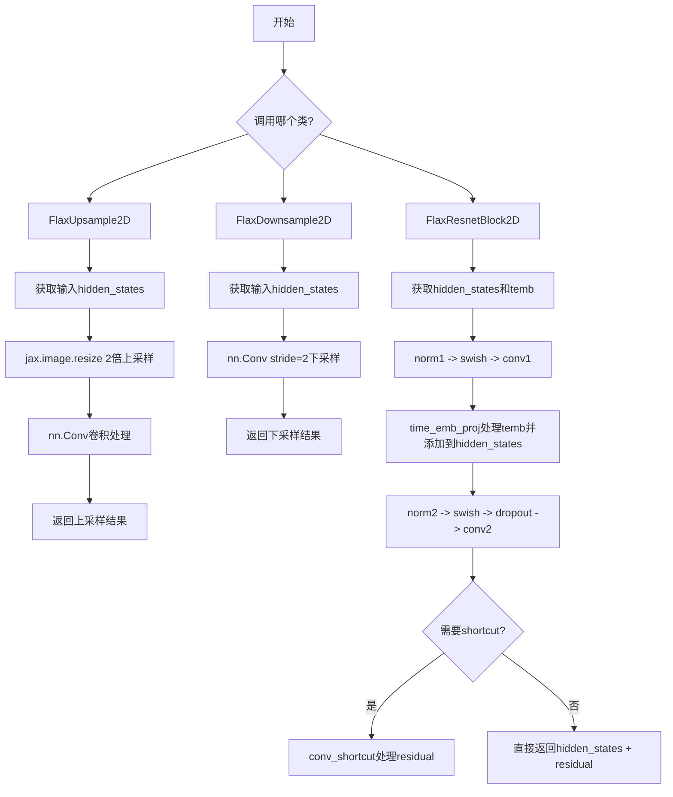
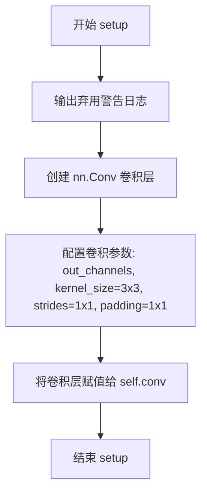
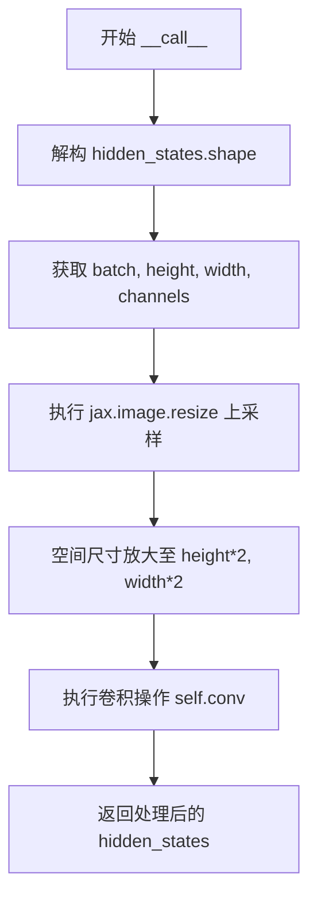
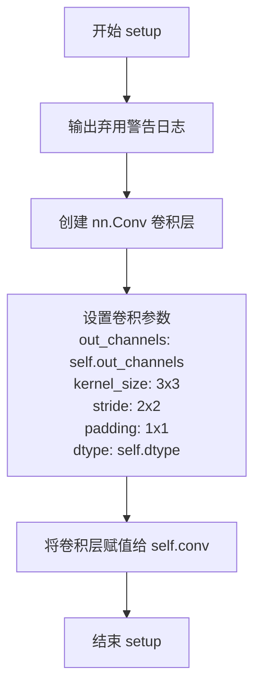
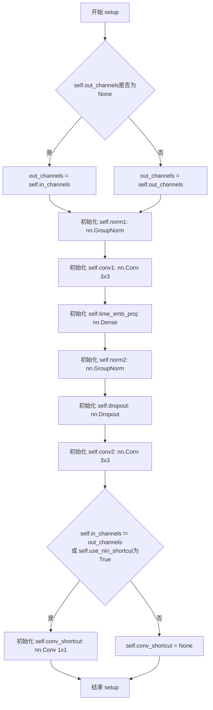
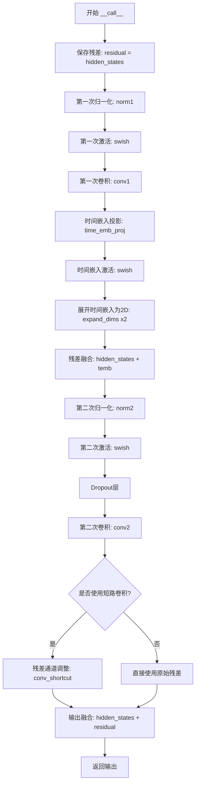

# `diffusers\src\diffusers\models\resnet_flax.py` 详细设计文档

该文件实现了基于Flax/JAX的图像处理模块，包括上采样(FlaxUpsample2D)、下采样(FlaxDownsample2D)和ResNet块(FlaxResnetBlock2D)，主要用于扩散模型中的图像特征处理，通过卷积操作实现2倍图像尺寸变换和残差连接。

## 整体流程



## 类结构

```
nn.Module (Flax基类)
├── FlaxUpsample2D (上采样2D)
├── FlaxDownsample2D (下采样2D)
└── FlaxResnetBlock2D (ResNet块2D)
```

## 全局变量及字段


### `logger`
    
用于记录警告信息的日志记录器对象

类型：`logging.Logger`
    


### `FlaxUpsample2D.FlaxUpsample2D.out_channels`
    
输出通道数

类型：`int`
    


### `FlaxUpsample2D.FlaxUpsample2D.dtype`
    
数据类型，默认float32

类型：`jnp.dtype`
    


### `FlaxDownsample2D.FlaxDownsample2D.out_channels`
    
输出通道数

类型：`int`
    


### `FlaxDownsample2D.FlaxDownsample2D.dtype`
    
数据类型，默认float32

类型：`jnp.dtype`
    


### `FlaxResnetBlock2D.FlaxResnetBlock2D.in_channels`
    
输入通道数

类型：`int`
    


### `FlaxResnetBlock2D.FlaxResnetBlock2D.out_channels`
    
输出通道数，可为None

类型：`int`
    


### `FlaxResnetBlock2D.FlaxResnetBlock2D.dropout_prob`
    
Dropout概率

类型：`float`
    


### `FlaxResnetBlock2D.FlaxResnetBlock2D.use_nin_shortcut`
    
是否使用NIN快捷连接

类型：`bool`
    


### `FlaxResnetBlock2D.FlaxResnetBlock2D.dtype`
    
数据类型，默认float32

类型：`jnp.dtype`
    
    

## 全局函数及方法


### `FlaxUpsample2D.setup()`

该方法是 Flax 神经网络模块的初始化方法，负责在模块构造阶段初始化一个 3x3 卷积层用于上采样操作，同时输出弃用警告信息。

参数：

- `self`：`FlaxUpsample2D` 实例本身，Flax 模块的隐式参数，无需显式传递

返回值：`None`，该方法为副作用型方法（无返回值），直接在实例上创建 `self.conv` 属性

#### 流程图



#### 带注释源码

```python
def setup(self):
    """
    Flax 模块的 setup 方法，在模块构造时调用。
    初始化卷积层用于上采样操作。
    """
    # 输出弃用警告，建议迁移到 PyTorch 或固定 Diffusers 版本
    logger.warning(
        "Flax classes are deprecated and will be removed in Diffusers v1.0.0. We "
        "recommend migrating to PyTorch classes or pinning your version of Diffusers."
    )

    # 初始化卷积层，用于对放大后的图像进行卷积处理
    # 参数说明：
    # - self.out_channels: 输出通道数，由类属性指定
    # - kernel_size=(3, 3): 3x3 卷积核
    # - strides=(1, 1): 步长为1，保持空间维度
    # - padding=((1, 1), (1, 1)): 四周各填充1像素，保持输出尺寸
    # - dtype=self.dtype: 数据类型，默认 float32
    self.conv = nn.Conv(
        self.out_channels,
        kernel_size=(3, 3),
        strides=(1, 1),
        padding=((1, 1), (1, 1)),
        dtype=self.dtype,
    )
```


### `FlaxUpsample2D.__call__`

该方法执行2D上采样操作，首先通过最近邻插值将输入特征图的空间尺寸（高度和宽度）放大2倍，然后通过卷积层进行特征处理，最终返回上采样后的特征张量。

参数：

- `hidden_states`：`jax.numpy.ndarray`，输入的隐藏状态张量，形状为 (batch, height, width, channels)，其中 batch 为批量大小，height 和 width 为空间维度，channels 为通道数

返回值：`jax.numpy.ndarray`，上采样并经过卷积处理后的隐藏状态张量，形状为 (batch, height*2, width*2, out_channels)，其中 out_channels 为输出通道数（在 FlaxUpsample2D 实例化时指定）

#### 流程图



#### 带注释源码

```
def __call__(self, hidden_states):
    """
    执行2D上采样的前向传播
    
    参数:
        hidden_states: 输入特征图，形状为 (batch, height, width, channels)
                      类型为 jax.numpy.ndarray
    
    返回值:
        上采样后的特征图，形状为 (batch, height*2, width*2, out_channels)
        类型为 jax.numpy.ndarray
    """
    # 解构输入张量的形状信息，获取批量大小、高度、宽度和通道数
    batch, height, width, channels = hidden_states.shape
    
    # 使用 JAX 的图像 resize 函数进行上采样
    # 方法选择 "nearest" 表示最近邻插值，这是一种计算效率高但可能产生块效应的插值方式
    # 目标形状: 批量大小保持不变，高度宽度各放大2倍，通道数保持不变
    hidden_states = jax.image.resize(
        hidden_states,
        shape=(batch, height * 2, width * 2, channels),
        method="nearest",
    )
    
    # 应用卷积层进行特征处理
    # 卷积核大小为 3x3，步长为 1，填充为 1（保持空间尺寸）
    # 该卷积层在 setup() 方法中初始化，输出通道数由 out_channels 指定
    hidden_states = self.conv(hidden_states)
    
    # 返回上采样并经过卷积处理后的特征图
    return hidden_states
```


### `FlaxDownsample2D.setup()`

初始化 FlaxDownsample2D 类的卷积层，配置下采样卷积参数（3x3 卷积核、步长为2进行下采样），同时输出弃用警告日志。

参数：

- 无显式参数（self 为隐式参数）

返回值：`None`，无返回值（Flax Linen 的 setup 方法通常用于初始化模块，不返回值）

#### 流程图



#### 带注释源码

```
def setup(self):
    """
    初始化卷积层用于下采样操作
    
    此方法在 Flax Linen 模块构建时被调用，用于初始化下采样所需的卷积层。
    包含一个弃用警告，因为这些 Flax 类将被移除。
    """
    # 输出弃用警告，提醒用户迁移到 PyTorch 类或固定 Diffusers 版本
    logger.warning(
        "Flax classes are deprecated and will be removed in Diffusers v1.0.0. We "
        "recommend migrating to PyTorch classes or pinning your version of Diffusers."
    )

    # 初始化下采样卷积层
    # 参数说明：
    # - self.out_channels: 输出通道数，由类属性指定
    # - kernel_size=(3, 3): 3x3 卷积核
    # - strides=(2, 2): 步长为2，实现2倍下采样
    # - padding=((1, 1), (1, 1)): 保持空间尺寸的padding策略
    # - dtype=self.dtype: 数据类型，默认 float32
    self.conv = nn.Conv(
        self.out_channels,
        kernel_size=(3, 3),
        strides=(2, 2),
        padding=((1, 1), (1, 1)),  # padding="VALID",
        dtype=self.dtype,
    )
```


### `FlaxDownsample2D.__call__`

执行 Flax 下的 2D 下采样操作，通过卷积层对输入的隐藏状态张量进行空间维度的下采样（步长为 2），减少特征图的空间分辨率。

参数：

- `self`：`FlaxDownsample2D` 实例本身，包含类属性 `out_channels`（输出通道数）和 `dtype`（数据类型）
- `hidden_states`：`jax.numpy.ndarray`，输入的隐藏状态张量，形状为 `(batch, height, width, channels)`，其中 `channels` 为输入通道数

返回值：`jax.numpy.ndarray`，下采样后的隐藏状态张量，形状为 `(batch, height//2, width//2, out_channels)`，空间维度被下采样 2 倍，通道数变为 `out_channels`

#### 流程图

```mermaid
flowchart TD
    A[输入 hidden_states<br/>shape: (batch, H, W, C)] --> B[执行卷积 self.conv<br/>kernel=3x3, strides=2x2<br/>padding=1x1]
    B --> C[输出 hidden_states<br/>shape: (batch, H//2, W//2, out_channels)]
    
    style A fill:#e1f5fe
    style B fill:#fff3e0
    style C fill:#e8f5e9
```

#### 带注释源码

```
def __call__(self, hidden_states):
    """
    对隐藏状态执行下采样前向传播。
    
    参数:
        hidden_states: 输入张量，形状为 (batch, height, width, channels)
                      4D 张量，通常表示图像或特征图
    
    返回值:
        下采样后的张量，形状为 (batch, height//2, width//2, out_channels)
    """
    # 注意：原始代码中有一段被注释掉的填充逻辑，用于在高度和宽度维度添加填充
    # pad = ((0, 0), (0, 1), (0, 1), (0, 0))  # pad height and width dim
    # hidden_states = jnp.pad(hidden_states, pad_width=pad)
    
    # 执行卷积下采样：
    # - 使用 3x3 卷积核
    # - 步长为 (2, 2)，实现 2 倍下采样
    # - 填充为 ((1, 1), (1, 1))，保持边界处理
    # 卷积会改变通道数从输入 channels 变为 out_channels
    hidden_states = self.conv(hidden_states)
    
    return hidden_states
```


### `FlaxResnetBlock2D.setup()`

该方法是FlaxResnetBlock2D类的初始化钩子，负责在模型构建阶段初始化所有子层，包括两组归一化层（norm1、norm2）、卷积层（conv1、conv2）、时间嵌入投影层（time_emb_proj）、Dropout层以及可选的快捷连接卷积层（conv_shortcut），为后续的前向传播构建完整的网络结构。

参数：
- 该方法无显式参数（Flax的setup()钩子方法，通过self隐式访问类属性）

返回值：`None`，该方法仅执行子层初始化，不返回任何值

#### 流程图



#### 带注释源码

```python
def setup(self):
    """
    初始化FlaxResnetBlock2D的所有子层组件。
    该方法在模型构建阶段被Flax框架自动调用，用于创建
    可学习的层和模块。
    """
    # 打印弃用警告，提示用户迁移到PyTorch实现
    logger.warning(
        "Flax classes are deprecated and will be removed in Diffusers v1.0.0. We "
        "recommend migrating to PyTorch classes or pinning your version of Diffusers."
    )

    # 确定输出通道数：如果out_channels未指定，则使用输入通道数
    out_channels = self.in_channels if self.out_channels is None else self.out_channels

    # ============ 第一组残差块组件 ============
    # 第一次归一化：GroupNorm，32个组，epsilon=1e-5
    self.norm1 = nn.GroupNorm(num_groups=32, epsilon=1e-5)
    
    # 第一次卷积：3x3卷积，输出通道为out_channels
    self.conv1 = nn.Conv(
        out_channels,
        kernel_size=(3, 3),
        strides=(1, 1),
        padding=((1, 1), (1, 1)),
        dtype=self.dtype,
    )

    # 时间嵌入投影层：将时间嵌入维度映射到out_channels
    self.time_emb_proj = nn.Dense(out_channels, dtype=self.dtype)

    # ============ 第二组残差块组件 ============
    # 第二次归一化：GroupNorm，32个组，epsilon=1e-5
    self.norm2 = nn.GroupNorm(num_groups=32, epsilon=1e-5)
    
    # Dropout层：用于正则化
    self.dropout = nn.Dropout(self.dropout_prob)
    
    # 第二次卷积：3x3卷积，输出通道为out_channels
    self.conv2 = nn.Conv(
        out_channels,
        kernel_size=(3, 3),
        strides=(1, 1),
        padding=((1, 1), (1, 1)),
        dtype=self.dtype,
    )

    # ============ 快捷连接（Shortcut）判断 ============
    # 判断是否需要使用NIN（1x1卷积）快捷连接：
    # 当输入通道与输出通道不匹配，或显式指定use_nin_shortcut时
    use_nin_shortcut = self.in_channels != out_channels if self.use_nin_shortcut is None else self.use_nin_shortcut

    # 初始化快捷连接卷积为None（默认不使用）
    self.conv_shortcut = None
    
    # 如果需要NIN快捷连接，则创建1x1卷积层
    if use_nin_shortcut:
        self.conv_shortcut = nn.Conv(
            out_channels,
            kernel_size=(1, 1),
            strides=(1, 1),
            padding="VALID",
            dtype=self.dtype,
        )
```


### `FlaxResnetBlock2D.__call__`

执行 ResNet 块的前向传播，包含两次卷积块、注意力机制注入和残差连接，返回处理后的特征张量。

参数：

- `hidden_states`：`jax.numpy.ndarray`，输入的隐藏状态张量，形状为 (batch, height, width, channels)
- `temb`：`jax.numpy.ndarray`，时间嵌入向量，用于给特征添加时序信息
- `deterministic`：`bool`，控制 dropout 是否生效，True 时 dropout 失效，默认为 True

返回值：`jax.numpy.ndarray`，经过 ResNet 块处理后的输出张量，形状与输入 hidden_states 相同

#### 流程图



#### 带注释源码

```python
def __call__(self, hidden_states, temb, deterministic=True):
    """
    ResNet块的前向传播方法
    
    参数:
        hidden_states: 输入特征张量, 形状 (batch, height, width, in_channels)
        temb: 时间嵌入向量, 形状 (batch, time_emb_dim)
        deterministic: 控制dropout是否生效, True时dropout失效
    
    返回:
        输出特征张量, 形状 (batch, height, width, out_channels)
    """
    # Step 1: 保存输入作为残差连接的基础
    # 残差连接有助于梯度流动, 防止深层网络梯度消失
    residual = hidden_states
    
    # Step 2: 第一个卷积块 - 特征提取
    # 归一化 -> 激活 -> 卷积
    hidden_states = self.norm1(hidden_states)      # GroupNorm 归一化, 32个组
    hidden_states = nn.swish(hidden_states)        # SiLU/Swish激活函数
    hidden_states = self.conv1(hidden_states)      # 3x3卷积, 保持空间分辨率
    
    # Step 3: 时间嵌入处理与融合
    # 将时间信息通过残差连接注入到空间特征中
    temb = self.time_emb_proj(nn.swish(temb))      # 投影到与通道数匹配维度
    # 扩展维度: (batch, channels) -> (batch, 1, 1, channels)
    # 使其可以广播到空间维度
    temb = jnp.expand_dims(jnp.expand_dims(temb, 1), 1)
    hidden_states = hidden_states + temb           # 残差方式添加时间信息
    
    # Step 4: 第二个卷积块 - 特征变换
    # 归一化 -> 激活 -> Dropout -> 卷积
    hidden_states = self.norm2(hidden_states)      # GroupNorm 归一化
    hidden_states = nn.swish(hidden_states)        # Swish激活
    # Dropout层, deterministic=True时跳过dropout(推理模式)
    hidden_states = self.dropout(hidden_states, deterministic)
    hidden_states = self.conv2(hidden_states)      # 3x3卷积输出
    
    # Step 5: 残差连接前的通道调整(如果需要)
    # 当输入通道 != 输出通道时, 使用1x1卷积调整残差维度
    if self.conv_shortcut is not None:
        residual = self.conv_shortcut(residual)    # 1x1卷积调整通道数
    
    # Step 6: 残差连接输出
    # 将处理后的特征与原始特征相加, 形成残差连接
    return hidden_states + residual
```

## 关键组件


### FlaxUpsample2D

上采样模块，使用最近邻插值将特征图尺寸扩大2倍，然后通过卷积层处理。在Diffusers中用于UNet等模型的特征图上采样。

### FlaxDownsample2D

下采样模块，使用步长为2的卷积实现2倍下采样。在Diffusers中用于UNet等模型的特征图下采样。

### FlaxResnetBlock2D

残差块模块，包含两个卷积层、时间嵌入投影、GroupNorm归一化和Dropout。使用残差连接实现特征复用，是UNet架构中的核心构建块。

### 张量索引与形状变换

代码中使用 `hidden_states.shape` 获取批次(B)、高度(H)、宽度(W)、通道数(C)四个维度，然后通过 `jax.image.resize` 进行上采样变换形状，并通过 `jnp.expand_dims` 扩展时间嵌入的维度以实现广播相加。

### 反量化与数据类型支持

通过 `dtype: jnp.dtype = jnp.float32` 参数支持不同的数据类型，允许处理float32、float16等不同精度的张量。

### GroupNorm归一化

使用 `nn.GroupNorm(num_groups=32, epsilon=1e-5)` 进行分组归一化，将通道分为32组进行归一化处理，有助于训练稳定性。

### 时间嵌入投影

通过 `nn.Dense(out_channels, dtype=self.dtype)` 将时间嵌入向量投影到与特征图相同的维度，然后通过expand和broadcast添加到特征图中，实现时间条件控制。

### 残差连接与通道适配

当输入通道与输出通道不匹配时，使用1x1卷积 `conv_shortcut` 进行通道调整，然后通过加法实现残差连接。


## 问题及建议


### 已知问题

- **弃用警告未参数化**：所有类中的logger.warning警告信息硬编码了版本号"Diffusers v1.0.0"，如果版本更新需要手动修改多处
- **GroupNorm的num_groups硬编码**：FlaxResnetBlock2D中num_groups=32对低通道数模型不适用，当通道数少于32时会导致错误
- **缺少输入验证**：所有__call__方法均未对hidden_states的shape和dtype进行校验，可能导致运行时难以追踪的错误
- **FlaxResnetBlock2D的out_channels默认值处理不当**：out_channels=None作为类型提示但实际为None值，这种设计容易引起混淆
- **注释掉的代码遗留**：FlaxDownsample2D中的pad相关注释代码和FlaxResnetBlock2D中的注释表明功能未完成或被禁用，属于技术债务
- **时间嵌入维度处理缺乏容错**：FlaxResnetBlock2D的time_emb_proj要求temb参数存在，若传入None或错误维度会失败
- **dropout_prob默认值可能不合理**：0.0的默认值可能导致训练时dropout行为与预期不符

### 优化建议

- 将弃用警告信息抽取为常量或配置，避免多处硬编码
- 将GroupNorm的num_groups参数化，支持根据通道数动态调整（如使用auto或最小分组数）
- 在各__call__方法入口添加输入shape和dtype的assert检查，提供清晰的错误信息
- 重新设计out_channels参数，使用Optional[int]并明确处理逻辑
- 移除注释掉的死代码，或添加TODO注释说明是否需要实现
- 为temb参数添加Optional类型标注，并在方法内部处理None的情况
- 考虑将dropout_prob的默认值调整为更合理的值或在文档中明确说明
- 考虑添加混合精度支持，当前dtype参数仅传递但未考虑自动混合精度策略


## 其它


### 设计目标与约束

本模块旨在提供基于Flax/JAX的图像上采样、下采样和ResNet残差块实现，用于Diffusers扩散模型的神经网络架构。设计约束包括：仅支持JAX/Flax框架；所有卷积操作使用float32数据类型；卷积核大小固定为3x3；上采样采用最近邻插值方法；GroupNorm归一化组数固定为32；下采样使用2x2步长的卷积实现。

### 错误处理与异常设计

代码中通过logger.warning显式提示Flax类已弃用，建议迁移至PyTorch。数据类型默认使用jnp.float32，未进行运行时类型检查。上采样时假设输入形状为(batch, height, width, channels)的4D张量，若维度不匹配可能导致运行时错误。下采样卷积操作可能产生形状变化，但未显式处理边界情况。

### 数据流与状态机

FlaxUpsample2D流程：接收hidden_states → jax.image.resize进行2倍最近邻插值上采样 → Conv卷积处理 → 输出。FlaxDownsample2D流程：接收hidden_states → Conv(步长2)下采样 → 输出。FlaxResnetBlock2D流程：hidden_states → GroupNorm → Swish激活 → Conv → 时间嵌入相加 → GroupNorm → Swish → Dropout → Conv → 残差连接 → 输出。

### 外部依赖与接口契约

主要依赖包括：flax.linen模块的nn.Module、nn.Conv、nn.GroupNorm、nn.Dropout、nn.Dense；jax和jax.numpy；..utils.logging模块。接口契约：所有类继承nn.Module；__call__方法接受hidden_states参数（FlaxResnetBlock2D额外接受temb和deterministic参数）；返回处理后的hidden_states张量。

### 性能考虑

上采样使用"nearest"方法实现，计算开销较低但可能产生锯齿效应。下采样使用步长卷积而非先填充再卷积的方案，效率较高。ResNet块中的expand_dims操作会复制张量，对内存有一定开销。GroupNorm固定组数为32，对于不同通道数可能不是最优配置。

### 安全考虑

代码未包含用户输入验证，不当输入可能导致JAX框架抛出难以调试的错误。Dropout层正确传递deterministic参数，确保推理时行为确定性。卷积操作未设置kernel_initializer，默认使用glorot_uniform，可能影响训练稳定性。

### 版本兼容性

代码标记为deprecated，将在Diffusers v1.0.0移除。当前版本仍可正常使用，但新项目不应采用。依赖的flax.linen API相对稳定，但未来版本可能存在接口变化风险。

### 配置参数

FlaxUpsample2D必需参数：out_channels(整数)；可选参数：dtype(默认jnp.float32)。FlaxDownsample2D必需参数：out_channels；可选参数：dtype。FlaxResnetBlock2D必需参数：in_channels；可选参数：out_channels(默认None)、dropout_prob(默认0.0)、use_nin_shortcut(默认None)、dtype(默认jnp.float32)。

### 使用示例

```python
import jax.numpy as jnp
from diffusers.models.flax_unet_2d import FlaxUpsample2D, FlaxDownsample2D, FlaxResnetBlock2D

# 上采样示例
upsample = FlaxUpsample2D(out_channels=256)
hidden_states = jnp.ones((1, 32, 32, 128))
output = upsample(hidden_states)  # 输出形状 (1, 64, 64, 256)

# 下采样示例
downsample = FlaxDownsample2D(out_channels=128)
output = downsample(hidden_states)  # 输出形状 (1, 16, 16, 128)

# ResNet块示例
resnet = FlaxResnetBlock2D(in_channels=256, out_channels=256)
temb = jnp.ones((1, 128))
output = resnet(hidden_states, temb)  # 输出形状 (1, 32, 32, 256)
```

    