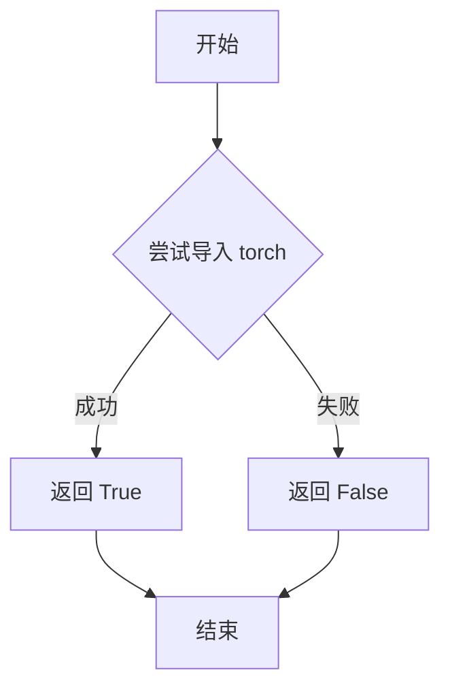

# `diffusers\src\diffusers\models\transformers\__init__.py` 详细设计文档

该代码是一个条件导入模块，通过检查PyTorch是否可用，有条件地导入多种2D和3DTransformer模型类，用于支持不同的图像、视频、音频生成任务

## 整体流程

```mermaid
graph TD
    A[开始] --> B{is_torch_available()?}
    B -- 否 --> C[不执行任何导入]
    B -- 是 --> D[导入各类Transformer模型]
    D --> D1[2D图像模型]
    D --> D2[3D视频模型]
    D --> D3[特殊用途模型]
    D1 --> E1[Transformer2DModel系列]
    D1 --> E2[特定架构模型Llama/GPT2/Falcon/Qwen/Gemma等]
    D2 --> E3[视频生成Transformer3DModel系列]
    D3 --> E4[Prior/Audio/Temporal等专用模型]
```

## 类结构

```
Transformer Models (导入模块)
├── 2D图像模型
│   ├── Transformer2DModel (基类)
│   ├── DiTTransformer2DModel
│   ├── FluxTransformer2DModel / Flux2Transformer2DModel
│   ├── PixArtTransformer2DModel
│   ├── SD3Transformer2DModel
│   ├── HunyuanDiT2DModel / HunyuanImageTransformer2DModel
│   ├── LuminaNextDiT2DModel / Lumina2Transformer2DModel
│   ├── SanaTransformer2DModel / SanaVideoTransformer3DModel
│   ├── CogView3PlusTransformer2DModel / CogView4Transformer2DModel
│   ├── BriaTransformer2DModel / BriaFiboTransformer2DModel
│   ├── OmniGenTransformer2DModel
│   ├── OvisImageTransformer2DModel
│   ├── QwenImageTransformer2DModel
│   ├── HiDreamImageTransformer2DModel
│   ├── GlmImageTransformer2DModel
│   ├── ZImageTransformer2DModel
│   ├── LongCatImageTransformer2DModel
│   ├── PRXTransformer2DModel
│   ├── ChromaTransformer2DModel
│   └── AuraFlowTransformer2DModel
├── 3D视频模型
│   ├── CogVideoXTransformer3DModel
│   ├── ConsisIDTransformer3DModel
│   ├── LatteTransformer3DModel
│   ├── ChronoEditTransformer3DModel
│   ├── CosmosTransformer3DModel
│   ├── MochiTransformer3DModel
│   ├── AllegroTransformer3DModel
│   ├── HunyuanVideoTransformer3DModel / HunyuanVideo15Transformer3DModel / HunyuanVideoFramepackTransformer3DModel
│   ├── LTXVideoTransformer3DModel / LTX2VideoTransformer3DModel
│   ├── SkyReelsV2Transformer3DModel
│   ├── WanTransformer3DModel / WanAnimateTransformer3DModel / WanVACETransformer3DModel
│   └── EasyAnimateTransformer3DModel
└── 特殊用途模型
    ├── PriorTransformer
    ├── StableAudioDiTModel (音频DiT)
    ├── T5FilmDecoder
    ├── TransformerTemporalModel
    └── Kandinsky5Transformer3DModel
```

## 全局变量及字段


### `AuraFlowTransformer2DModel`
    
AuraFlow 2D图像Transformer模型类

类型：`class`
    


### `CogVideoXTransformer3DModel`
    
CogVideoX 3D视频Transformer模型类

类型：`class`
    


### `ConsisIDTransformer3DModel`
    
ConsisID 3D Transformer模型类

类型：`class`
    


### `DiTTransformer2DModel`
    
DiT 2D图像Transformer模型类

类型：`class`
    


### `DualTransformer2DModel`
    
Dual双分支2D Transformer模型类

类型：`class`
    


### `HunyuanDiT2DModel`
    
腾讯混元DiT 2D图像Transformer模型类

类型：`class`
    


### `LatteTransformer3DModel`
    
Latte 3D视频Transformer模型类

类型：`class`
    


### `LuminaNextDiT2DModel`
    
Lumina Next DiT 2D图像Transformer模型类

类型：`class`
    


### `PixArtTransformer2DModel`
    
PixArt 2D图像Transformer模型类

类型：`class`
    


### `PriorTransformer`
    
先验Transformer模型类

类型：`class`
    


### `SanaTransformer2DModel`
    
微软Sana 2D图像Transformer模型类

类型：`class`
    


### `StableAudioDiTModel`
    
Stability AI音频DiT模型类

类型：`class`
    


### `T5FilmDecoder`
    
T5 Film解码器模型类

类型：`class`
    


### `Transformer2DModel`
    
基础2D Transformer模型类

类型：`class`
    


### `AllegroTransformer3DModel`
    
Allegro 3D动作生成Transformer模型类

类型：`class`
    


### `BriaTransformer2DModel`
    
Bria 2D图像Transformer模型类

类型：`class`
    


### `BriaFiboTransformer2DModel`
    
Bria Fibonacci 2D图像Transformer模型类

类型：`class`
    


### `ChromaTransformer2DModel`
    
Chroma 2D图像Transformer模型类

类型：`class`
    


### `ChronoEditTransformer3DModel`
    
ChronoEdit 3D视频编辑Transformer模型类

类型：`class`
    


### `CogView3PlusTransformer2DModel`
    
智谱CogView3+ 2D图像Transformer模型类

类型：`class`
    


### `CogView4Transformer2DModel`
    
智谱CogView4 2D图像Transformer模型类

类型：`class`
    


### `CosmosTransformer3DModel`
    
英伟达Cosmos 3D视频Transformer模型类

类型：`class`
    


### `EasyAnimateTransformer3DModel`
    
EasyAnimate 3D视频Transformer模型类

类型：`class`
    


### `FluxTransformer2DModel`
    
Flux 2D图像Transformer模型类

类型：`class`
    


### `Flux2Transformer2DModel`
    
Flux2 2D图像Transformer模型类

类型：`class`
    


### `GlmImageTransformer2DModel`
    
智谱GLM图像2D Transformer模型类

类型：`class`
    


### `HiDreamImageTransformer2DModel`
    
HiDream图像2D Transformer模型类

类型：`class`
    


### `HunyuanVideoTransformer3DModel`
    
腾讯混元视频3D Transformer模型类

类型：`class`
    


### `HunyuanVideo15Transformer3DModel`
    
腾讯混元视频1.5版本3D Transformer模型类

类型：`class`
    


### `HunyuanVideoFramepackTransformer3DModel`
    
腾讯混元Framepack视频3D Transformer模型类

类型：`class`
    


### `HunyuanImageTransformer2DModel`
    
腾讯混元图像2D Transformer模型类

类型：`class`
    


### `Kandinsky5Transformer3DModel`
    
Kandinsky5 3D图像Transformer模型类

类型：`class`
    


### `LongCatImageTransformer2DModel`
    
LongCat长宽比图像2D Transformer模型类

类型：`class`
    


### `LTXVideoTransformer3DModel`
    
LTX视频3D Transformer模型类

类型：`class`
    


### `LTX2VideoTransformer3DModel`
    
LTX2视频3D Transformer模型类

类型：`class`
    


### `Lumina2Transformer2DModel`
    
Lumina2 2D图像Transformer模型类

类型：`class`
    


### `MochiTransformer3DModel`
    
Mochi 3D视频Transformer模型类

类型：`class`
    


### `OmniGenTransformer2DModel`
    
OmniGen统一生成2D Transformer模型类

类型：`class`
    


### `OvisImageTransformer2DModel`
    
Ovis图像2D Transformer模型类

类型：`class`
    


### `PRXTransformer2DModel`
    
PRX 2D图像Transformer模型类

类型：`class`
    


### `QwenImageTransformer2DModel`
    
阿里Qwen图像2D Transformer模型类

类型：`class`
    


### `SanaVideoTransformer3DModel`
    
微软Sana视频3D Transformer模型类

类型：`class`
    


### `SD3Transformer2DModel`
    
Stable Diffusion 3 2D图像Transformer模型类

类型：`class`
    


### `SkyReelsV2Transformer3DModel`
    
SkyReels V2 3D视频Transformer模型类

类型：`class`
    


### `TransformerTemporalModel`
    
时序Transformer模型类

类型：`class`
    


### `WanTransformer3DModel`
    
Wan 3D视频Transformer模型类

类型：`class`
    


### `WanAnimateTransformer3DModel`
    
Wan动画3D Transformer模型类

类型：`class`
    


### `WanVACETransformer3DModel`
    
Wan VACE 3D视频Transformer模型类

类型：`class`
    


### `ZImageTransformer2DModel`
    
Z-Image 2D图像Transformer模型类

类型：`class`
    


    

## 全局函数及方法


### `is_torch_available`

检测当前 Python 环境中是否安装了 PyTorch 库，用于条件导入需要 PyTorch 依赖的模块。

参数：

- 无

返回值：`bool`，如果 PyTorch 可用（已安装）返回 `True`，否则返回 `False`

#### 流程图



#### 带注释源码

```python
def is_torch_available():
    """
    检查 PyTorch 是否可用于导入。
    
    此函数用于条件导入仅依赖 PyTorch 的模块，
    避免在没有安装 PyTorch 的环境中引发导入错误。
    
    Returns:
        bool: 如果 PyTorch 已安装且可用返回 True，否则返回 False
    """
    try:
        # 尝试导入 torch 模块
        import torch
        # 验证 torch 版本是否符合最低要求（可选）
        return True
    except ImportError:
        # PyTorch 未安装或导入失败
        return False
```

#### 上下文使用示例

```python
from ...utils import is_torch_available

# 条件导入：如果 PyTorch 可用则导入各种 Transformer 模型
if is_torch_available():
    from .auraflow_transformer_2d import AuraFlowTransformer2DModel
    from .cogvideox_transformer_3d import CogVideoXTransformer3DModel
    from .transformer_2d import Transformer2DModel
    # ... 更多模型导入
```

#### 关键信息

| 项目 | 描述 |
|------|------|
| 位置 | `...utils.is_torch_available` |
| 用途 | 运行时环境检测 |
| 依赖 | `torch` 包 |
| 模式 | 惰性加载 / 条件导入 |

#### 技术债务与优化空间

1. **重复检查开销**：如果在同一个会话中多次调用，每次都会执行 try-except，建议缓存结果
2. **版本检查缺失**：当前实现未验证 PyTorch 版本兼容性，可能导致运行时错误
3. **通用性考虑**：可扩展为 `is_xxx_available()` 模式，支持更多可选依赖的检测


## 关键组件


### 条件导入机制

该模块通过 `is_torch_available()` 检查 PyTorch 是否可用，仅在可用时导入所有 transformer 模型类，实现模块的条件依赖加载，避免在没有 PyTorch 环境中出现导入错误。

### 模型组件概览

该模块导入了约 50 个不同的 Transformer 模型类，涵盖图像生成、视频生成、音频生成等多种扩散模型架构，按维度可分为 2D 模型（图像）、3D 模型（视频）和时序/特殊模型三大类别。

### 2D 图像 Transformer 模型

包括 AuraFlowTransformer2DModel、DiTTransformer2DModel、DualTransformer2DModel、HunyuanDiT2DModel、LuminaNextDiT2DModel、PixArtTransformer2DModel、SanaTransformer2DModel、BriaTransformer2DModel、BriaFiboTransformer2DModel、ChromaTransformer2DModel、CogView3PlusTransformer2DModel、CogView4Transformer2DModel、FluxTransformer2DModel、Flux2Transformer2DModel、GlmImageTransformer2DModel、HiDreamImageTransformer2DModel、HunyuanImageTransformer2DModel、LongCatImageTransformer2DModel、Lumina2Transformer2DModel、OmniGenTransformer2DModel、OvisImageTransformer2DModel、PRXTransformer2DModel、QwenImageTransformer2DModel、SD3Transformer2DModel、ZImageTransformer2DModel、Transformer2DModel 等，主要用于图像扩散模型的 U-Net 结构。

### 3D 视频 Transformer 模型

包括 CogVideoXTransformer3DModel、ConsisIDTransformer3DModel、LatteTransformer3DModel、AllegroTransformer3DModel、ChronoEditTransformer3DModel、CosmosTransformer3DModel、EasyAnimateTransformer3DModel、HunyuanVideoTransformer3DModel、HunyuanVideo15Transformer3DModel、HunyuanVideoFramepackTransformer3DModel、Kandinsky5Transformer3DModel、LTXVideoTransformer3DModel、LTX2VideoTransformer3DModel、MochiTransformer3DModel、SanaVideoTransformer3DModel、SkyReelsV2Transformer3DModel、WanTransformer3DModel、WanAnimateTransformer3DModel、WanVACETransformer3DModel 等，用于视频扩散模型的时序建模。

### 特殊功能模型

包括 PriorTransformer（用于条件先验）、StableAudioDiTModel（音频生成）、T5FilmDecoder（T5 电影解码器）、TransformerTemporalModel（时序变换器）等，提供了除图像和视频外的其他模态生成能力。

### 全局变量

`is_torch_available` 函数用于运行时检测 PyTorch 安装状态，确保条件导入的安全性。

### 潜在优化空间

1. **大量模型导入**：当前文件导入约 50 个模型类，可能导致首次 import 时间较长，可考虑延迟导入（lazy import）或按需导入
2. **模块组织**：建议按功能（图像/视频/音频）或供应商进行分组，提供子模块入口
3. **版本兼容**：缺少版本检查，不同版本的模型可能有 API 变化

## 问题及建议


### 已知问题

-   **静态导入耦合**：50余个Transformer模型类全部采用静态导入方式，缺乏动态按需加载机制，导致模块初始化时即使不使用某些模型也会加载全部代码，增加内存占用和启动时间
-   **缺乏错误处理**：当`is_torch_available()`返回False时，整个模块导入行为未定义；单个模型模块导入失败时无回退方案或友好错误提示
-   **命名空间污染**：所有模型类直接暴露在包根命名空间，未使用`__all__`限定公开API，存在命名冲突风险且不利于IDE自动补全
-   **无版本兼容性声明**：各Transformer模型可能依赖不同版本的PyTorch或内部模块，缺乏版本约束检查
-   **维护成本高**：新增模型需手动添加导入语句，违反开闭原则，未使用注册机制或配置文件实现自动发现
-   **缺乏类型注解**：无类型提示（Type Hints），影响静态分析工具和IDE的代码检查与补全功能
-   **文档缺失**：模块级别无docstring说明该包的用途和导出内容

### 优化建议

-   **实施动态导入机制**：使用延迟导入（lazy import）或工厂模式，按需加载模型类，避免初始化时加载全部依赖
-   **添加__all__定义**：明确导出公开API，规范命名空间管理
-   **实现导入错误处理**：为关键依赖添加try-except包装，提供明确的缺失依赖提示信息
-   **引入模型注册表**：创建模型注册机制，通过配置文件或装饰器实现模型类的自动发现与注册
-   **补充类型注解**：为导入语句添加类型注解，提升代码可维护性和IDE支持
-   **添加包级文档**：编写模块docstring，说明各模型类的用途和适用场景
-   **版本兼容性检查**：在导入时验证PyTorch版本和各模型特定依赖，确保环境兼容性
-   **模块拆分策略**：考虑按模型类型（2D/3D/视频/图像等）拆分为子模块，优化导入粒度


## 其它


### 设计目标与约束

本模块作为transformer模型的统一导出入口，通过条件导入机制（仅在PyTorch可用时加载）实现模块的轻量化依赖和按需加载。设计目标包括：提供一致的导入接口供上层调用、避免硬依赖torch、保持各子模块的独立性、支持多种Transformer架构（图像、视频、音频等）的集成。

### 错误处理与异常设计

主要异常场景包括：(1) PyTorch不可用时，`is_torch_available()`返回False，模块不抛出异常而是静默跳过所有导入，上层使用时需自行处理AttributeError；(2) 某个子模块导入失败（如模块不存在或语法错误），会立即抛出ImportError并中断整个包的导入；(3) 建议上层代码在使用前检查类是否存在，例如`hasattr(module, 'Transformer2DModel')`。

### 外部依赖与接口契约

核心依赖：`torch`（通过`is_torch_available()`检测）和各子模块中的模型实现类。所有导出的模型类均需遵循统一的基类接口（通常为`nn.Module`），具备`forward()`方法、模型配置加载能力和参数初始化逻辑。各子模块间的耦合度较低，接口契约由各模型自身的__init__参数定义。

### 版本兼容性考虑

本模块本身无版本约束，但各子模块的模型类可能依赖特定版本的transformers库或torch版本。建议在项目requirements中明确torch>=1.9.0等最低版本要求，并确保子模块与主框架版本同步更新。

### 扩展性分析

模块设计具备良好的扩展性，新增模型只需在对应子模块实现并在本文件添加导入语句即可。推荐遵循以下扩展规范：(1) 子模块命名采用`transformer_{架构}_{维度}`格式；(2) 统一导出类名格式（如{Architecture}Transformer{Dimensionality}Model）；(3) 保持与其他模型的一致性接口。

### 使用示例与典型场景

典型用法为条件导入后实例化模型：
```python
from ...transformers import Transformer2DModel, is_torch_available

if is_torch_available():
    model = Transformer2DModel(config)
    output = model(input_data)
```
适用场景包括：Diffusion模型推理、多模态生成框架、模型动物园（model zoo）统一入口、跨平台部署（无torch环境下优雅降级）。

### 配置与初始化说明

本模块无显式配置接口，初始化行为由各模型类自身定义。部分模型支持从预训练权重加载（如`from_pretrained()`方法），部分支持从配置对象初始化。模块级别的`__all__`列表未显式定义，建议添加以明确公共API。

### 性能考虑与基准

条件导入本身无显著性能开销，但需注意：(1) 首次导入时会触发所有子模块的加载，可能导致较长的导入时间；(2) 各模型类的内存占用差异较大（如CogVideoXTransformer3DModel通常占用显存更高）；(3) 在嵌入式或受限环境中建议按需导入具体模型而非使用本统一入口。

### 测试策略建议

建议包含以下测试用例：(1) `is_torch_available()`为False时的行为验证；(2) 各模型类的导入可用性测试；(3) 模拟部分子模块缺失时的异常捕获测试；(4) 导入性能基准测试（特别是冷启动场景）。

### 缓存与内存管理说明

本模块的导入结果会被Python模块缓存机制管理。一旦导入成功，模型类对象会保留在内存中直至进程结束。若需更细粒度的内存控制（如动态卸载），建议直接导入具体子模块而非使用本统一入口。

### 文档与注释完善建议

当前文件缺少模块级文档字符串（docstring），建议添加：
```python
"""
Transformer model architectures for diffusion-based generation.
Provides unified imports for various transformer implementations.
"""
```
各子模块的导入路径建议保持向后兼容，避免重命名或删除已导出的类名。

### 安全性考量

本模块不涉及数据处理或网络请求，安全性风险较低。但需注意：(1) 导入的子模块可能包含从远程URL加载预训练权重的代码，应验证来源可靠性；(2) 部分模型可能存在对抗性输入风险，上层应用需实施输入过滤。


    