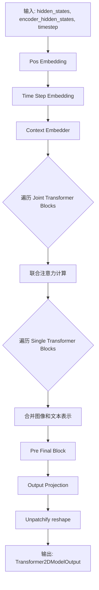
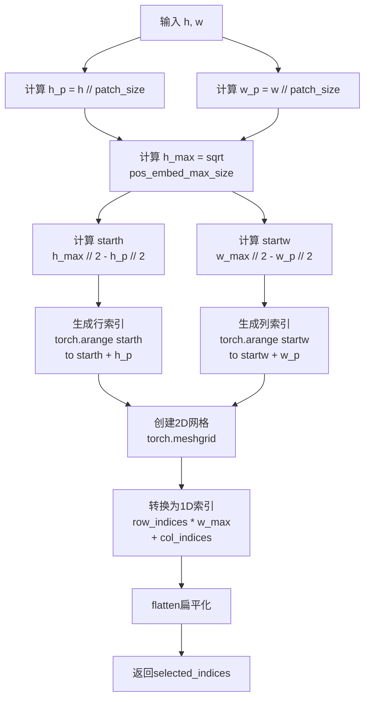
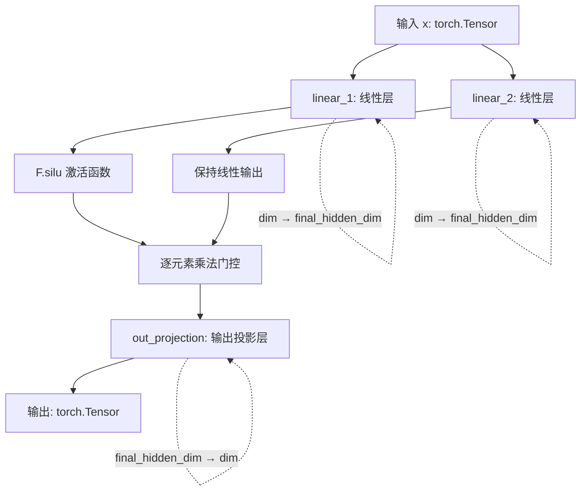
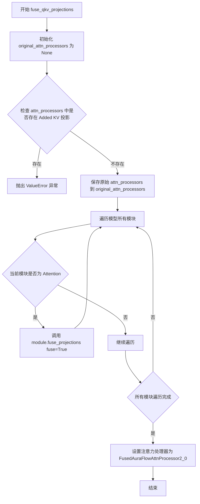
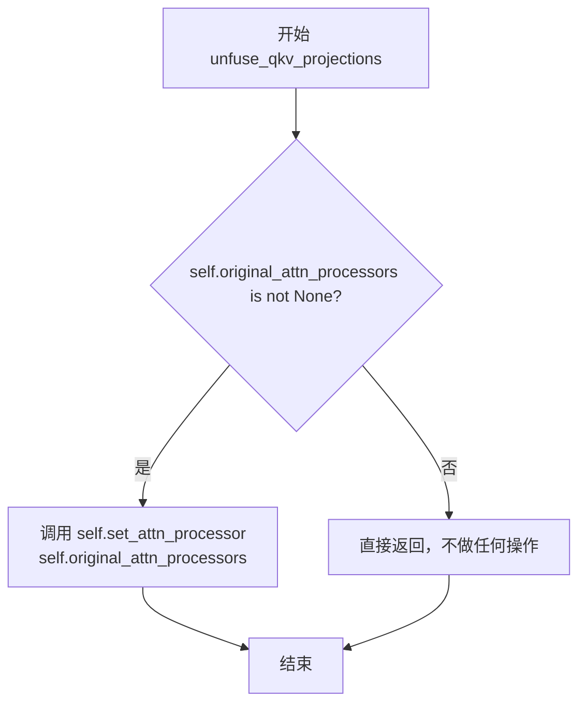
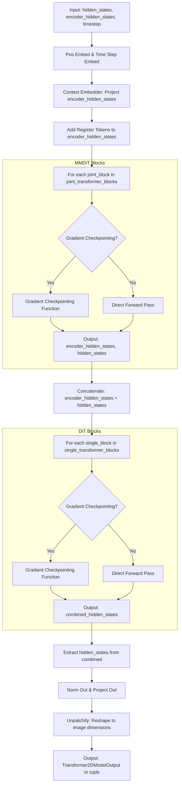

# `diffusers\src\diffusers\models\transformers\auraflow_transformer_2d.py` 详细设计文档

AuraFlow是一个基于2D Transformer的扩散模型架构，实现了图像到图像的生成功能。该模型包含补丁嵌入、时间步嵌入、联合Transformer块和单Transformer块等核心组件，支持条件生成和位置编码优化。

## 整体流程



## 类结构

```
nn.Module (基类)
├── AuraFlowPatchEmbed (补丁嵌入)
├── AuraFlowFeedForward (前馈网络)
├── AuraFlowPreFinalBlock (预最终块)
├── AuraFlowSingleTransformerBlock (单Transformer块)
├── AuraFlowJointTransformerBlock (联合Transformer块)
└── AuraFlowTransformer2DModel (主模型)
    ├── ModelMixin
    ├── AttentionMixin
    ├── ConfigMixin
    ├── PeftAdapterMixin
    └── FromOriginalModelMixin
```

## 全局变量及字段


### `logger`
    
用于日志记录的全局变量

类型：`logging.Logger`
    


### `AuraFlowPatchEmbed.num_patches`
    
补丁数量

类型：`int`
    


### `AuraFlowPatchEmbed.pos_embed_max_size`
    
位置嵌入最大尺寸

类型：`int`
    


### `AuraFlowPatchEmbed.proj`
    
线性投影层

类型：`nn.Linear`
    


### `AuraFlowPatchEmbed.pos_embed`
    
位置嵌入参数

类型：`nn.Parameter`
    


### `AuraFlowPatchEmbed.patch_size`
    
补丁大小

类型：`int`
    


### `AuraFlowPatchEmbed.height`
    
高度

类型：`int`
    


### `AuraFlowPatchEmbed.width`
    
宽度

类型：`int`
    


### `AuraFlowPatchEmbed.base_size`
    
基础尺寸

类型：`int`
    


### `AuraFlowFeedForward.linear_1`
    
第一线性层

类型：`nn.Linear`
    


### `AuraFlowFeedForward.linear_2`
    
第二线性层

类型：`nn.Linear`
    


### `AuraFlowFeedForward.out_projection`
    
输出投影层

类型：`nn.Linear`
    


### `AuraFlowPreFinalBlock.silu`
    
SiLU激活函数

类型：`nn.SiLU`
    


### `AuraFlowPreFinalBlock.linear`
    
线性层

类型：`nn.Linear`
    


### `AuraFlowSingleTransformerBlock.norm1`
    
第一归一化层

类型：`AdaLayerNormZero`
    


### `AuraFlowSingleTransformerBlock.attn`
    
注意力层

类型：`Attention`
    


### `AuraFlowSingleTransformerBlock.norm2`
    
第二归一化层

类型：`FP32LayerNorm`
    


### `AuraFlowSingleTransformerBlock.ff`
    
前馈网络

类型：`AuraFlowFeedForward`
    


### `AuraFlowJointTransformerBlock.norm1`
    
第一归一化层

类型：`AdaLayerNormZero`
    


### `AuraFlowJointTransformerBlock.norm1_context`
    
上下文第一归一化层

类型：`AdaLayerNormZero`
    


### `AuraFlowJointTransformerBlock.attn`
    
注意力层

类型：`Attention`
    


### `AuraFlowJointTransformerBlock.norm2`
    
第二归一化层

类型：`FP32LayerNorm`
    


### `AuraFlowJointTransformerBlock.ff`
    
前馈网络

类型：`AuraFlowFeedForward`
    


### `AuraFlowJointTransformerBlock.norm2_context`
    
上下文第二归一化层

类型：`FP32LayerNorm`
    


### `AuraFlowJointTransformerBlock.ff_context`
    
上下文前馈网络

类型：`AuraFlowFeedForward`
    


### `AuraFlowTransformer2DModel.out_channels`
    
输出通道数

类型：`int`
    


### `AuraFlowTransformer2DModel.inner_dim`
    
内部维度

类型：`int`
    


### `AuraFlowTransformer2DModel.pos_embed`
    
位置嵌入

类型：`AuraFlowPatchEmbed`
    


### `AuraFlowTransformer2DModel.context_embedder`
    
上下文嵌入器

类型：`nn.Linear`
    


### `AuraFlowTransformer2DModel.time_step_embed`
    
时间步嵌入

类型：`Timesteps`
    


### `AuraFlowTransformer2DModel.time_step_proj`
    
时间步投影

类型：`TimestepEmbedding`
    


### `AuraFlowTransformer2DModel.joint_transformer_blocks`
    
联合Transformer块列表

类型：`nn.ModuleList`
    


### `AuraFlowTransformer2DModel.single_transformer_blocks`
    
单Transformer块列表

类型：`nn.ModuleList`
    


### `AuraFlowTransformer2DModel.norm_out`
    
输出归一化

类型：`AuraFlowPreFinalBlock`
    


### `AuraFlowTransformer2DModel.proj_out`
    
输出投影

类型：`nn.Linear`
    


### `AuraFlowTransformer2DModel.register_tokens`
    
注册令牌

类型：`nn.Parameter`
    


### `AuraFlowTransformer2DModel.gradient_checkpointing`
    
梯度检查点标志

类型：`bool`
    
    

## 全局函数及方法


### `find_multiple`

该函数用于计算给定整数 n 的下一个 k 的倍数。如果 n 已经是 k 的倍数，则返回 n 本身；否则返回大于 n 且最接近 n 的 k 的倍数（即向上取整到 k 的倍数）。

参数：

- `n`：`int`，起始值，需要查找其下一个 k 的倍数的整数
- `k`：`int`，倍数因子，用于确定倍数的基数

返回值：`int`，n 的下一个 k 的倍数（即 n 向上对齐到 k 的倍数）

#### 流程图

```mermaid
flowchart TD
    A[开始] --> B{检查 n % k == 0?}
    B -- 是 --> C[返回 n]
    B -- 否 --> D[计算 n + k - (n % k)]
    D --> E[返回计算结果]
    C --> F[结束]
    E --> F
```

#### 带注释源码

```python
def find_multiple(n: int, k: int) -> int:
    """
    找到 n 的下一个 k 的倍数。
    
    该函数用于将一个整数 n 向上对齐到 k 的倍数。在深度学习模型中，
    特别是在确定 FeedForward 层的隐藏维度时，经常需要将计算出的维度
    向上对齐到某个特定值（如 256）以获得更好的硬件对齐和性能。
    
    参数:
        n (int): 起始值，需要查找其下一个 k 的倍数的整数。
        k (int): 倍数因子，用于确定倍数的基数。
    
    返回:
        int: n 的下一个 k 的倍数。如果 n 已经是 k 的倍数，则返回 n 本身；
             否则返回大于 n 且最接近 n 的 k 的倍数。
    
    示例:
        >>> find_multiple(100, 256)
        256
        >>> find_multiple(256, 256)
        256
        >>> find_multiple(300, 256)
        512
    """
    # 如果 n 已经是 k 的倍数，直接返回 n
    if n % k == 0:
        return n
    
    # 否则，计算 n 向上对齐到 k 的倍数的值
    # 公式: n + k - (n % k) 实际上就是 ((n // k) + 1) * k
    # 但使用取模运算可以避免除法，略微提高效率
    return n + k - (n % k)
```


### `AuraFlowPatchEmbed.pe_selection_index_based_on_dim`

根据输入的latent尺寸h和w，从预定义的最大位置嵌入中选取对应子区域的索引，实现位置嵌入的动态选择。

参数：

- `h`：`int`，输入latent的高度（像素维度）
- `w`：`int`，输入latent的宽度（像素维度）

返回值：`torch.Tensor`，形状为`(h_p * w_p,)`的一维张量，其中`h_p = h // patch_size`，`w_p = w // patch_size`，表示选中的位置嵌入在最大嵌入中的扁平化索引

#### 流程图



#### 带注释源码

```python
def pe_selection_index_based_on_dim(self, h, w):
    """
    根据latent的空间尺寸选择对应的位置嵌入索引
    
    该方法的核心思想：
    - 将位置嵌入视为二维网格
    - 根据当前输入尺寸计算需要选取的patch数量
    - 选取居中的patch区域
    - 将二维索引转换为一维索引以便后续使用
    
    参数:
        h: 输入latent的高度（像素维度）
        w: 输入latent的宽度（像素维度）
    
    返回:
        selected_indices: 选中的位置嵌入索引（扁平化的一维张量）
    """
    
    # 计算patch维度下的空间分辨率
    # 将像素坐标转换为patch坐标
    h_p, w_p = h // self.patch_size, w // self.patch_size
    
    # 计算位置嵌入的最大边长（假设为正方形网格）
    # pos_embed_max_size = 1024, 则 h_max = w_max = 32
    h_max, w_max = int(self.pos_embed_max_size**0.5), int(self.pos_embed_max_size**0.5)
    
    # 计算居中patch网格的左上角坐标
    # 通过从最大边界中心偏移来确保patch居中
    starth = h_max // 2 - h_p // 2
    startw = w_max // 2 - w_p // 2
    
    # 生成目标patch区域的行索引和列索引
    # 使用torch.arange创建连续索引序列
    rows = torch.arange(starth, starth + h_p, device=self.pos_embed.device)
    cols = torch.arange(startw, startw + w_p, device=self.pos_embed.device)
    
    # 创建二维网格索引
    # indexing='ij'确保生成的是矩阵索引而非笛卡尔索引
    row_indices, col_indices = torch.meshgrid(rows, cols, indexing="ij")
    
    # 将二维索引转换为一维扁平索引
    # 转换公式: index = row * w_max + col
    # 这样可以将2D空间位置映射到1D位置嵌入向量
    selected_indices = (row_indices * w_max + col_indices).flatten()
    
    return selected_indices
```


### `AuraFlowPatchEmbed.forward`

该方法将输入的latent图像转换为patch嵌入表示，并动态选择与图像尺寸相匹配的位置编码进行相加，实现基于图像分辨率的自适应位置嵌入。

参数：

- `latent`：`torch.Tensor`，输入的潜在表示，形状为 (batch_size, num_channels, height, width)，通常为降采样后的图像特征

返回值：`torch.Tensor`，经过patch嵌入投影和位置编码后的张量，形状为 (batch_size, num_patches, embed_dim)

#### 流程图

```mermaid
flowchart TD
    A[输入 latent] --> B[获取 batch_size, num_channels, height, width]
    B --> C[view 操作重塑为 (batch, channels, h_p, patch_size, w_p, patch_size)]
    C --> D[permute 调整维度顺序]
    D --> E[flatten 合并维度]
    E --> F[线性投影 self.proj]
    F --> G[计算位置编码索引 pe_index]
    G --> H[选择对应位置编码并相加]
    H --> I[输出结果]
```

#### 带注释源码

```python
def forward(self, latent) -> torch.Tensor:
    # 获取输入张量的形状信息
    # latent: (batch_size, num_channels, height, width)
    batch_size, num_channels, height, width = latent.size()
    
    # 将 latent 视图重塑为 (batch_size, num_channels, h_p, patch_size, w_p, patch_size)
    # 其中 h_p = height // patch_size, w_p = width // patch_size
    # 这一步将图像分割成非重叠的 patch
    latent = latent.view(
        batch_size,
        num_channels,
        height // self.patch_size,
        self.patch_size,
        width // self.patch_size,
        self.patch_size,
    )
    
    # 调整维度顺序: (batch, h_p, w_p, channels, patch_size, patch_size)
    # 然后 flatten 后三维: (batch, h_p * w_p, patch_size * patch_size * channels)
    # 最终得到 (batch_size, num_patches, patch_flat_dim) 的序列
    latent = latent.permute(0, 2, 4, 1, 3, 5).flatten(-3).flatten(1, 2)
    
    # 使用线性层将 patch 向量投影到 embed_dim 维空间
    latent = self.proj(latent)
    
    # 根据当前图像的高度和宽度，动态选择合适的位置编码索引
    # 这样可以支持不同分辨率的输入图像
    pe_index = self.pe_selection_index_based_on_dim(height, width)
    
    # 将学习到的位置编码添加到 patch 嵌入中，并返回结果
    return latent + self.pos_embed[:, pe_index]
```


### `AuraFlowFeedForward.forward`

该方法实现了 AuraFlow 前馈神经网络的前向传播过程，采用 SiLU (Swish) 激活函数对输入进行非线性变换，通过两个并行的线性层分别进行门控计算，最终通过输出投影层产生与输入维度相同的输出张量。

参数：

- `self`：隐式参数，表示前馈网络实例本身
- `x`：`torch.Tensor`，输入张量，形状为 `(batch_size, seq_len, dim)`，其中 `dim` 为模型隐藏层维度

返回值：`torch.Tensor`，输出张量，形状与输入 `x` 相同 `(batch_size, seq_len, dim)`，经过 SiLU 门控激活和输出投影后的结果

#### 流程图



#### 带注释源码

```python
def forward(self, x: torch.Tensor) -> torch.Tensor:
    """
    前馈网络的前向传播方法
    
    该方法实现了 AuraFlow 模型特有的前馈网络结构：
    1. 使用两个并行的线性层 (linear_1, linear_2) 将输入映射到更高维空间
    2. 对 linear_1 的输出应用 SiLU (Swish) 激活函数
    3. 将激活后的结果与 linear_2 的输出逐元素相乘（门控机制）
    4. 通过输出投影层将结果映射回原始维度
    
    注意：与标准 Diffusion 模型使用 GELU 不同，AuraFlow 采用 SiLU 激活函数，
    这是从原始 AuraFlow 推理代码中保留下来的设计。
    
    参数:
        x: torch.Tensor - 输入张量，形状为 (batch_size, seq_len, dim)
           dim 由构造时的 dim 参数决定
    
    返回:
        torch.Tensor - 输出张量，形状与输入相同 (batch_size, seq_len, dim)
    """
    # 第一步：计算门控分支
    # F.silu 即 Swish 激活函数，定义为 x * sigmoid(x)
    # linear_1 将输入从 dim 扩展到 final_hidden_dim (约为 4*dim)
    x = F.silu(self.linear_1(x)) * self.linear_2(x)
    
    # 第二步：输出投影
    # 将高维表示 final_hidden_dim 映射回原始维度 dim
    x = self.out_projection(x)
    
    return x
```

### 类字段信息

| 字段名称 | 类型 | 描述 |
|---------|------|------|
| `linear_1` | `nn.Linear` | 第一个线性变换层，将输入维度 dim 映射到 final_hidden_dim，不使用偏置 |
| `linear_2` | `nn.Linear` | 第二个线性变换层，与 linear_1 并行，用于门控机制，不使用偏置 |
| `out_projection` | `nn.Linear` | 输出投影层，将 final_hidden_dim 映射回原始维度 dim，不使用偏置 |

### 构造函数参数 (`__init__`)

| 参数名称 | 类型 | 描述 |
|---------|------|------|
| `dim` | `int` | 输入和输出的隐藏层维度 |
| `hidden_dim` | `int \| None` | 隐藏层维度，若为 None 则默认为 4 * dim |

### 设计说明

1. **SiLU vs GELU**：注释明确指出标准 Diffusion 模型使用 GELU，而 AuraFlow 保留使用 SiLU（来自原始推理代码）
2. **门控机制**：使用 `F.silu(linear_1(x)) * linear_2(x)` 形式实现类似 SwiGLU 的门控前馈网络
3. **final_hidden_dim 计算**：通过 `find_multiple` 函数确保隐藏层维度是 256 的倍数，这是从原始代码中保留的优化


### `AuraFlowPreFinalBlock.forward`

该方法实现了 AuraFlow 预最终块的前向传播，通过条件嵌入对输入张量进行仿射变换（scale 和 shift），实现条件信息对特征的控制。

参数：

- `x`：`torch.Tensor`，输入的隐藏状态张量，通常是 Transformer 块的输出
- `conditioning_embedding`：`torch.Tensor`，条件嵌入张量，通常来自时间步嵌入（timestep embedding）

返回值：`torch.Tensor`，经过条件嵌入调整后的隐藏状态张量

#### 流程图

```mermaid
flowchart TD
    A[开始 forward] --> B[对 conditioning_embedding 应用 SiLU 激活函数]
    B --> C[将激活后的结果转换为 x 的数据类型]
    C --> D[通过线性层投影到 embedding_dim * 2 维度]
    D --> E[按维度 1 均匀切分为 scale 和 shift 两部分]
    E --> F[计算: x = x * (1 + scale)[:, None, :] + shift[:, None, :]]
    F --> G[返回调整后的 x]
```

#### 带注释源码

```python
def forward(self, x: torch.Tensor, conditioning_embedding: torch.Tensor) -> torch.Tensor:
    # 第一步：对条件嵌入应用 SiLU 激活函数
    # SiLU (Sigmoid Linear Unit) 也称为 Swish，公式为 x * sigmoid(x)
    emb = self.linear(self.silu(conditioning_embedding).to(x.dtype))
    
    # 第二步：将投影后的嵌入沿维度 1 均匀切分为两部分
    # 前半部分作为 scale（缩放因子），后半部分作为 shift（平移因子）
    # 形状: [batch_size, embedding_dim] each
    scale, shift = torch.chunk(emb, 2, dim=1)
    
    # 第三步：应用仿射变换
    # scale 和 shift 需要扩展维度以匹配 x 的形状 [batch, seq_len, dim]
    # (1 + scale)[:, None, :] 将 scale 从 [batch, dim] 扩展为 [batch, 1, dim]
    # shift[:, None, :] 将 shift 从 [batch, dim] 扩展为 [batch, 1, dim]
    # 变换公式: x = x * (1 + scale) + shift，实现条件控制的缩放和平移
    x = x * (1 + scale)[:, None, :] + shift[:, None, :]
    
    # 返回经过条件嵌入调整后的张量
    return x
```


### `AuraFlowSingleTransformerBlock.forward`

该方法实现了AuraFlow单Transformer块的前向传播，结合了自适应层归一化（AdaLayerNormZero）、多头自注意力机制（Attention）和前馈网络（FeedForward），通过门控机制和可学习的仿射变换对hidden_states进行处理，是AuraFlow模型中处理图像潜在表示的核心组件。

参数：

- `hidden_states`：`torch.FloatTensor`，输入的隐藏状态张量，形状为`(batch_size, seq_len, dim)`，代表图像patch的嵌入表示
- `temb`：`torch.FloatTensor`，时间步嵌入向量，形状为`(batch_size, dim)`，用于AdaLayerNormZero的调制
- `attention_kwargs`：`dict[str, Any] | None`，可选的注意力机制额外参数字典，如需要传递LoRA scale等信息时使用

返回值：`torch.Tensor`，经过Transformer块处理后的隐藏状态张量，形状与输入`hidden_states`相同

#### 流程图

```mermaid
flowchart TD
    A[hidden_states 输入] --> B[保存残差: residual = hidden_states]
    B --> C[attention_kwargs 初始化]
    C --> D[norm1 归一化与投影<br/>AdaLayerNormZero]
    D --> E[获取 norm_hidden_states<br/>gate_msa, shift_mlp<br/>scale_mlp, gate_mlp]
    E --> F[Attention 自注意力计算]
    F --> G[attn_output 输出]
    G --> H[norm2 归一化处理]
    H --> I[残差连接与门控: residual + gate_msa * attn_output]
    I --> J[仿射变换: * (1 + scale_mlp) + shift_mlp]
    J --> K[FeedForward 前馈网络]
    K --> L[ff_output 输出]
    L --> M[门控 FF 输出: gate_mlp * ff_output]
    M --> N[最终残差连接: residual + hidden_states]
    N --> O[返回 hidden_states]
```

#### 带注释源码

```python
@maybe_allow_in_graph
class AuraFlowSingleTransformerBlock(nn.Module):
    """Similar to `AuraFlowJointTransformerBlock` with a single DiT instead of an MMDiT."""

    def __init__(self, dim, num_attention_heads, attention_head_dim):
        super().__init__()

        # 第一个归一化层：AdaLayerNormZero，支持时间步嵌入调制
        # 使用FP32 LayerNorm进行归一化，不使用偏置
        self.norm1 = AdaLayerNormZero(dim, bias=False, norm_type="fp32_layer_norm")

        # 初始化注意力处理器
        processor = AuraFlowAttnProcessor2_0()
        
        # 自注意力模块配置：
        # - query_dim=dim: 查询维度等于模型维度
        # - cross_attention_dim=None: 仅使用自注意力（单DiT）
        # - qk_norm="fp32_layer_norm": 对QK进行FP32归一化
        # - 不使用偏置
        self.attn = Attention(
            query_dim=dim,
            cross_attention_dim=None,
            dim_head=attention_head_dim,
            heads=num_attention_heads,
            qk_norm="fp32_layer_norm",
            out_dim=dim,
            bias=False,
            out_bias=False,
            processor=processor,
        )

        # 第二个归一化层：FP32LayerNorm，用于注意力输出后处理
        self.norm2 = FP32LayerNorm(dim, elementwise_affine=False, bias=False)
        
        # 前馈网络：使用GELU激活函数（不同于原版Aura的SiLU）
        self.ff = AuraFlowFeedForward(dim, dim * 4)

    def forward(
        self,
        hidden_states: torch.FloatTensor,
        temb: torch.FloatTensor,
        attention_kwargs: dict[str, Any] | None = None,
    ) -> torch.Tensor:
        # 保存输入残差，用于最终的残差连接
        residual = hidden_states
        
        # 确保attention_kwargs不为None
        attention_kwargs = attention_kwargs or {}

        # 步骤1: Norm + Projection
        # 使用AdaLayerNormZero进行归一化，同时利用temb（时间步嵌入）进行调制
        # 返回归一化后的隐藏状态以及五个门控/缩放/偏移参数
        norm_hidden_states, gate_msa, shift_mlp, scale_mlp, gate_mlp = self.norm1(hidden_states, emb=temb)

        # 步骤2: Attention
        # 使用自注意力机制处理归一化后的隐藏状态
        # **attention_kwargs允许传递额外的注意力参数（如LoRA scale）
        attn_output = self.attn(hidden_states=norm_hidden_states, **attention_kwargs)

        # 步骤3: 处理注意力输出
        # 3a: 残差连接 + 门控MSA (Multi-Head Self-Attention)
        #     gate_msa.unsqueeze(1) 将其从 (batch_size, dim) 扩展为 (batch_size, 1, dim)
        hidden_states = self.norm2(residual + gate_msa.unsqueeze(1) * attn_output)
        
        # 3b: 应用可学习的缩放(scale)和偏移(shift)进行仿射变换
        #     scale_mlp[:, None] 和 shift_mlp[:, None] 扩展维度以匹配 hidden_states
        hidden_states = hidden_states * (1 + scale_mlp[:, None]) + shift_mlp[:, None]
        
        # 步骤4: FeedForward 前馈网络处理
        ff_output = self.ff(hidden_states)
        
        # 步骤5: 门控前馈输出
        # gate_mlp.unsqueeze(1) 扩展维度后与 FF 输出相乘
        hidden_states = gate_mlp.unsqueeze(1) * ff_output
        
        # 步骤6: 最终残差连接
        hidden_states = residual + hidden_states

        return hidden_states
```


### `AuraFlowJointTransformerBlock.forward`

该方法是 AuraFlow 模型中双流（Joint）Transformer 块的前向传播函数，接收图像 latent 和文本 encoder_hidden_states，分别进行自适应归一化、注意力计算和前馈网络处理，最后返回处理后的 encoder_hidden_states 和 hidden_states。

参数：

- `hidden_states`：`torch.FloatTensor`，图像 latent 的隐藏状态，形状为 `(batch_size, seq_len, dim)`
- `encoder_hidden_states`：`torch.FloatTensor`，文本 encoder 的隐藏状态，形状为 `(batch_size, encoder_seq_len, dim)`
- `temb`：`torch.FloatTensor`，时间步嵌入，用于自适应归一化的条件输入
- `attention_kwargs`：`dict[str, Any] | None`，可选的注意力计算额外参数（如 attention mask）

返回值：`tuple[torch.Tensor, torch.Tensor]`，返回处理后的 encoder_hidden_states 和 hidden_states

#### 流程图

```mermaid
flowchart TD
    A[forward 输入] --> B[保存残差]
    B --> C[残差副本给 encoder_hidden_states]
    C --> D[norm1 对 hidden_states 归一化]
    D --> E[norm1_context 对 encoder_hidden_states 归一化]
    E --> F[AdaLayerNormZero 投影得到门控和移位参数]
    F --> G[self.attn 联合注意力计算]
    G --> H[输出 attn_output 和 context_attn_output]
    H --> I[处理 hidden_states 分支]
    I --> J[norm2 归一化 + 残差连接 + 门控]
    J --> K[FF 前馈网络]
    K --> L[残差连接]
    L --> M[处理 encoder_hidden_states 分支]
    M --> N[norm2_context 归一化 + 残差连接 + 门控]
    N --> O[ff_context 前馈网络]
    O --> P[残差连接]
    P --> Q[返回 tuple[encoder_hidden_states, hidden_states]]
```

#### 带注释源码

```python
def forward(
    self,
    hidden_states: torch.FloatTensor,
    encoder_hidden_states: torch.FloatTensor,
    temb: torch.FloatTensor,
    attention_kwargs: dict[str, Any] | None = None,
) -> tuple[torch.Tensor, torch.Tensor]:
    # 步骤1：保存残差连接，用于后续的残差相加
    residual = hidden_states
    residual_context = encoder_hidden_states
    # 确保 attention_kwargs 不为 None
    attention_kwargs = attention_kwargs or {}

    # 步骤2：Norm + Projection（AdaLayerNormZero 自适应归一化）
    # 对图像 latent hidden_states 进行归一化，并投影出 AdaIN 的门控和移位参数
    norm_hidden_states, gate_msa, shift_mlp, scale_mlp, gate_mlp = self.norm1(hidden_states, emb=temb)
    # 对文本 encoder_hidden_states 进行同样的归一化和投影
    norm_encoder_hidden_states, c_gate_msa, c_shift_mlp, c_scale_mlp, c_gate_mlp = self.norm1_context(
        encoder_hidden_states, emb=temb
    )

    # 步骤3：Attention（联合注意力，同时处理图像和文本两个分支）
    attn_output, context_attn_output = self.attn(
        hidden_states=norm_hidden_states,
        encoder_hidden_states=norm_encoder_hidden_states,
        **attention_kwargs,
    )

    # 步骤4：处理 hidden_states 分支（图像 latent 路径）
    # 残差连接 + 门控注意力输出
    hidden_states = self.norm2(residual + gate_msa.unsqueeze(1) * attn_output)
    # 应用 AdaIN 的 scale 和 shift
    hidden_states = hidden_states * (1 + scale_mlp[:, None]) + shift_mlp[:, None]
    # 前馈网络处理
    hidden_states = gate_mlp.unsqueeze(1) * self.ff(hidden_states)
    # 残差连接
    hidden_states = residual + hidden_states

    # 步骤5：处理 encoder_hidden_states 分支（文本路径）
    # 残差连接 + 门控注意力输出
    encoder_hidden_states = self.norm2_context(residual_context + c_gate_msa.unsqueeze(1) * context_attn_output)
    # 应用 AdaIN 的 scale 和 shift
    encoder_hidden_states = encoder_hidden_states * (1 + c_scale_mlp[:, None]) + c_shift_mlp[:, None]
    # 前馈网络处理
    encoder_hidden_states = c_gate_mlp.unsqueeze(1) * self.ff_context(encoder_hidden_states)
    # 残差连接
    encoder_hidden_states = residual_context + encoder_hidden_states

    # 步骤6：返回处理后的两个隐藏状态
    return encoder_hidden_states, hidden_states
```


### `AuraFlowTransformer2DModel.fuse_qkv_projections`

该方法用于启用 fused QKV 投影，对于自注意力模块将所有投影矩阵（query、key、value）融合在一起，对于交叉注意力模块则融合 key 和 value 投影矩阵。

参数：

- 该方法无参数

返回值：`None`，无返回值，仅修改模型内部状态

#### 流程图



#### 带注释源码

```python
# Copied from diffusers.models.unets.unet_2d_condition.UNet2DConditionModel.fuse_qkv_projections with FusedAttnProcessor2_0->FusedAuraFlowAttnProcessor2_0
def fuse_qkv_projections(self):
    """
    Enables fused QKV projections. For self-attention modules, all projection matrices (i.e., query, key, value)
    are fused. For cross-attention modules, key and value projection matrices are fused.

    > [!WARNING] > This API is 🧪 experimental.
    """
    # 初始化 original_attn_processors 为 None，用于后续保存原始处理器
    self.original_attn_processors = None

    # 遍历所有注意力处理器，检查是否存在 Added KV 投影
    for _, attn_processor in self.attn_processors.items():
        # 如果存在 Added KV 投影，抛出异常，不支持融合
        if "Added" in str(attn_processor.__class__.__name__):
            raise ValueError("`fuse_qkv_projections()` is not supported for models having added KV projections.")

    # 保存原始注意力处理器，以便后续可以恢复
    self.original_attn_processors = self.attn_processors

    # 遍历模型中的所有模块
    for module in self.modules():
        # 如果模块是 Attention 类型
        if isinstance(module, Attention):
            # 调用 fuse_projections 方法进行 QKV 投影融合
            module.fuse_projections(fuse=True)

    # 将注意力处理器设置为 FusedAuraFlowAttnProcessor2_0
    self.set_attn_processor(FusedAuraFlowAttnProcessor2_0())
```


### `AuraFlowTransformer2DModel.unfuse_qkv_projections`

该方法用于禁用融合的QKV投影，将注意力处理器恢复为原始状态。这是`fuse_qkv_projections`的逆操作，允许模型在运行时动态切换注意力机制的实现方式。

参数： 无（仅包含隐式参数`self`）

返回值：`None`，无返回值

#### 流程图



#### 带注释源码

```python
def unfuse_qkv_projections(self):
    """Disables the fused QKV projection if enabled.

    > [!WARNING] > This API is 🧪 experimental.

    """
    # 检查是否存在原始的注意力处理器（即之前是否调用过 fuse_qkv_projections）
    if self.original_attn_processors is not None:
        # 如果存在原始处理器，则恢复原始的注意力处理器
        # 这会撤销 fuse_qkv_projections 所做的更改
        self.set_attn_processor(self.original_attn_processors)
```


### `AuraFlowTransformer2DModel.forward`

这是 AuraFlow 2D Transformer 模型的前向传播方法，负责将输入的图像latent、文本embedding和时间步通过一系列Transformer块进行处理，最终输出重构的图像。

参数：

-   `self`：类的实例本身
-   `hidden_states`：`torch.FloatTensor`，输入的隐藏状态，通常是图像的latent表示，形状为 `(batch, channels, height, width)`
-   `encoder_hidden_states`：`torch.FloatTensor`，可选，编码器的隐藏状态，通常是文本的embedding表示
-   `timestep`：`torch.LongTensor`，可选，用于条件生成的时间步
-   `attention_kwargs`：`dict[str, Any] | None`，可选，传递给注意力模块的额外参数字典
-   `return_dict`：`bool`，可选，默认为 `True`，决定返回值是元组还是 `Transformer2DModelOutput` 对象

返回值：`tuple[torch.Tensor] | Transformer2DModelOutput`，如果 `return_dict` 为 `True`，返回包含输出样本的 `Transformer2DModelOutput` 对象；否则返回元组

#### 流程图



#### 带注释源码

```python
@apply_lora_scale("attention_kwargs")
def forward(
    self,
    hidden_states: torch.FloatTensor,
    encoder_hidden_states: torch.FloatTensor = None,
    timestep: torch.LongTensor = None,
    attention_kwargs: dict[str, Any] | None = None,
    return_dict: bool = True,
) -> tuple[torch.Tensor] | Transformer2DModelOutput:
    # 获取输入hidden_states的高度和宽度
    height, width = hidden_states.shape[-2:]

    # 1. 应用patch嵌入、时间步嵌入，并投影caption embeddings
    # 对hidden_states进行位置嵌入处理（也负责添加位置嵌入）
    hidden_states = self.pos_embed(hidden_states)
    # 对timestep进行时间步嵌入并投影到内部维度
    temb = self.time_step_embed(timestep).to(dtype=next(self.parameters()).dtype)
    temb = self.time_step_proj(temb)
    # 对encoder_hidden_states进行上下文嵌入投影
    encoder_hidden_states = self.context_embedder(encoder_hidden_states)
    # 将可学习的register tokens拼接到encoder_hidden_states开头，以防止注意力map产生伪影
    encoder_hidden_states = torch.cat(
        [self.register_tokens.repeat(encoder_hidden_states.size(0), 1, 1), encoder_hidden_states], dim=1
    )

    # 2. MMDiT Blocks（联合Transformer块）
    # 遍历所有联合Transformer块，处理图像和文本的交互
    for index_block, block in enumerate(self.joint_transformer_blocks):
        # 如果启用梯度且开启梯度检查点，则使用梯度检查点函数来节省显存
        if torch.is_grad_enabled() and self.gradient_checkpointing:
            encoder_hidden_states, hidden_states = self._gradient_checkpointing_func(
                block,
                hidden_states,
                encoder_hidden_states,
                temb,
            )
        # 否则直接前向传播
        else:
            encoder_hidden_states, hidden_states = block(
                hidden_states=hidden_states,
                encoder_hidden_states=encoder_hidden_states,
                temb=temb,
                attention_kwargs=attention_kwargs,
            )

    # 3. Single DiT Blocks（单个Transformer块）
    # 这些块组合了图像和文本的表示
    if len(self.single_transformer_blocks) > 0:
        # 记录encoder序列长度，用于后续分离hidden_states
        encoder_seq_len = encoder_hidden_states.size(1)
        # 将encoder_hidden_states和hidden_states在序列维度上拼接
        combined_hidden_states = torch.cat([encoder_hidden_states, hidden_states], dim=1)

        # 遍历所有单个Transformer块
        for index_block, block in enumerate(self.single_transformer_blocks):
            if torch.is_grad_enabled() and self.gradient_checkpointing:
                combined_hidden_states = self._gradient_checkpointing_func(
                    block,
                    combined_hidden_states,
                    temb,
                )
            else:
                combined_hidden_states = block(
                    hidden_states=combined_hidden_states, temb=temb, attention_kwargs=attention_kwargs
                )

        # 从合并的hidden_states中分离出原始的hidden_states（去除encoder部分）
        hidden_states = combined_hidden_states[:, encoder_seq_len:]

    # 4. 最终输出处理
    # 应用AdaLN预最终块进行归一化
    hidden_states = self.norm_out(hidden_states, temb)
    # 投影回patch空间
    hidden_states = self.proj_out(hidden_states)

    # 5. Unpatchify
    # 将处理后的hidden_states从patch形式reshape回图像形式
    patch_size = self.config.patch_size
    out_channels = self.config.out_channels
    height = height // patch_size
    width = width // patch_size

    # 重新组织形状：(batch, height, width, patch, patch, channels)
    hidden_states = hidden_states.reshape(
        shape=(hidden_states.shape[0], height, width, patch_size, patch_size, out_channels)
    )
    # 调整维度顺序：(batch, height, width, patch, patch, channels) -> (batch, channels, height, width)
    hidden_states = torch.einsum("nhwpqc->nchpwq", hidden_states)
    # 最终reshape为：(batch, channels, height * patch_size, width * patch_size)
    output = hidden_states.reshape(
        shape=(hidden_states.shape[0], out_channels, height * patch_size, width * patch_size)
    )

    # 根据return_dict决定返回格式
    if not return_dict:
        return (output,)

    return Transformer2DModelOutput(sample=output)
```

## 关键组件


### AuraFlowPatchEmbed

AuraFlow的补丁嵌入模块，使用线性投影而非卷积进行维度变换，并支持基于张量维度动态选择位置嵌入子集。

### AuraFlowFeedForward

前馈网络模块，采用SiLU激活函数（区别于标准GELU），实现Swish门控机制的双线性变换。

### AuraFlowPreFinalBlock

条件预处理块，接收时间步嵌入并生成缩放和偏移参数，用于自适应地调节最终输出特征。

### AuraFlowSingleTransformerBlock

单流Transformer块，类似于DiT架构，包含自注意力机制和前馈网络，采用AdaLayerNormZero进行自适应归一化。

### AuraFlowJointTransformerBlock

双流联合Transformer块，类似于SD3的MMDiT架构，支持图像 latent 和文本 encoder hidden states 的联合处理，分别有独立的归一化、注意力与前馈路径。

### AuraFlowTransformer2DModel

主模型类，2D Transformer模型，整合补丁嵌入、时间步嵌入、上下文嵌入器、多个联合Transformer块和单Transformer块，实现从latent到输出图像的变换。

### AdaLayerNormZero

自适应层归一化零模块，在归一化后直接输出门控参数、MLP缩放/偏移参数，实现条件特征调制。

### FP32LayerNorm

FP32精度层归一化，确保数值稳定性，所有计算在FP32下进行以避免精度损失。

### pe_selection_index_based_on_dim

基于高度和宽度的张量索引选择方法，从预定义的最大位置嵌入网格中提取中心子区域，实现动态分辨率支持。

## 问题及建议


### 已知问题

- **硬编码的魔法数字**：多处使用硬编码数值，如 `find_multiple` 函数中固定除数256、`register_tokens` 数量硬编码为8、前馈网络隐藏层维度固定为 `dim * 4`，缺乏配置灵活性。
- **类型注解缺失或不完整**：`find_multiple` 函数缺少返回类型注解，`pe_selection_index_based_on_dim` 方法完全缺少参数和返回值的类型注解，影响代码可维护性和类型安全。
- **代码重复**：`AuraFlowSingleTransformerBlock` 和 `AuraFlowJointTransformerBlock` 中存在大量重复的归一化、前馈和注意力输出处理逻辑，可以提取公共基类或辅助方法。
- **注释与实现不符**：代码注释提到"Aura Flow patch embed doesn't use convs for projections"，但实际使用了 `nn.Linear` 投影；注释描述"Most LayerNorms are in FP32"但部分归一化层（如 `AdaLayerNormZero`）的 `norm_type` 可配置，不一定是 FP32。
- **未使用的变量**：`forward` 方法中 `index_block` 变量被定义但未使用。
- **复制粘贴的代码**：`fuse_qkv_projections` 和 `unfuse_qkv_projections` 方法是从 `UNet2DConditionModel` 复制过来的，注释说明 "Copied from..."，但这些方法可能未被充分适配或测试。

### 优化建议

- **消除硬编码**：将魔法数字提取为可配置参数，如 `AuraFlowFeedForward` 的隐藏层维度比例、`register_tokens` 数量等可通过 `__init__` 参数传入。
- **完善类型注解**：为所有函数和方法添加完整的类型注解，使用 `typing` 模块的 `-> int` 等返回类型标注。
- **提取公共逻辑**：创建基类或混入类（Mixin）来封装 `AuraFlowSingleTransformerBlock` 和 `AuraFlowJointTransformerBlock` 的公共逻辑，减少代码冗余。
- **更新注释**：修正与实现不符的注释，确保注释准确反映代码行为。
- **移除未使用变量**：删除 `forward` 方法中未使用的 `index_block` 变量，或将其用于有意义的逻辑（如条件日志记录）。
- **审查复制代码**：对从其他模型复制的方法进行兼容性审查，确保适配当前模型架构，必要时添加单元测试验证功能正确性。

## 其它


### 设计目标与约束

**设计目标**：
- 实现AuraFlow 2D Transformer架构，用于Diffusion模型的潜在空间建模
- 支持图像和文本（encoder_hidden_states）的联合注意力处理
- 提供高效的注意力机制实现，支持QKV融合优化
- 兼容HuggingFace Diffusers框架的模型加载和微调机制

**约束条件**：
- 输入必须是4通道的latent表示（in_channels=4）
- 位置嵌入最大尺寸限制为1024（pos_embed_max_size）
- 使用FP32 LayerNorm以保证数值稳定性
- 注意力模块不支持bias（bias=False）

### 错误处理与异常设计

**参数校验**：
- sample_size必须能被patch_size整除，否则位置嵌入选择会出错
- joint_attention_dim必须与caption_projection_dim匹配，否则context_embedder线性层维度不兼容
- num_mmdit_layers和num_single_dit_layers必须为正整数

**运行时检查**：
- encoder_hidden_states不能为None（除非模型配置允许）
- hidden_states的height和width必须与patch_size兼容
- 梯度检查点启用时需要确保所有模块支持checkpointing

**边界情况**：
- 当encoder_hidden_states为空时，单Transformer块仍能处理纯图像输入
- 支持返回字典或元组的灵活输出格式

### 数据流与状态机

**前向传播流程**：
```
输入(hidden_states, encoder_hidden_states, timestep)
    ↓
Patch Embedding + Positional Embedding → hidden_states
    ↓
Timestep Embedding → temb
    ↓
Context Embedding → encoder_hidden_states
    ↓
添加register_tokens到encoder_hidden_states
    ↓
Joint Transformer Blocks (MMDiT)
    ↓
Single Transformer Blocks (拼接后的联合处理)
    ↓
PreFinal Block归一化 → 投影到输出通道
    ↓
Unpatchify → 输出图像
```

**状态管理**：
- gradient_checkpointing：控制是否启用梯度检查点以节省显存
- original_attn_processors：保存原始注意力处理器以支持QKV融合的开关

### 外部依赖与接口契约

**核心依赖**：
- torch, torch.nn, torch.nn.functional：基础深度学习框架
- ...configuration_utils.ConfigMixin：配置混入，支持register_to_config装饰器
- ...loaders.FromOriginalModelMixin, PeftAdapterMixin：模型加载和LoRA适配器支持
- ...utils.apply_lora_scale：LoRA缩放应用
- ...utils.logging：日志记录
- ...utils.torch_utils.maybe_allow_in_graph：允许在计算图中使用
- ..attention.AttentionMixin：注意力混入
- ..attention_processor：自定义注意力处理器
- ..embeddings.TimestepEmbedding, Timesteps：时间步嵌入
- ..modeling_outputs.Transformer2DModelOutput：模型输出
- ..modeling_utils.ModelMixin：基础模型混入
- ..normalization.AdaLayerNormZero, FP32LayerNorm：自定义归一化层

**接口契约**：
- forward()方法接受hidden_states (B, C, H, W)、encoder_hidden_states、timestep、attention_kwargs、return_dict参数
- 返回Transformer2DModelOutput或tuple[torch.Tensor]
- fuse_qkv_projections()和unfuse_qkv_projections()用于注意力计算的融合优化

### 性能优化策略

**已实现的优化**：
- 梯度检查点（gradient_checkpointing）：减少显存占用
- QKV融合（fused_qkv_projections）：加速注意力计算
- FP32 LayerNorm：保证数值稳定性
- register_tokens：减少注意力图中的伪影

**潜在优化空间**：
- 可添加Flash Attention支持以进一步加速
- 可实现xFormers集成
- 可添加量化推理支持（INT8/INT4）

### 版本兼容性与迁移指南

**框架依赖**：
- 需要Diffusers库的最新版本
- Python版本建议3.8+
- PyTorch版本建议2.0+

**已知兼容性**：
- 与Stable Diffusion 3的MMDiT架构有相似之处
- 注意力处理器与AuraFlowAttnProcessor2_0紧密耦合
- 不兼容标准的UNet2DConditionModel接口

### 配置参数详细说明

| 参数名 | 类型 | 默认值 | 描述 |
|--------|------|--------|------|
| sample_size | int | 64 | 潜在图像宽度，训练时固定用于学习位置嵌入 |
| patch_size | int | 2 | 将输入转换为小补丁的尺寸 |
| in_channels | int | 4 | 输入通道数（latent维度） |
| num_mmdit_layers | int | 4 | MMDiT Transformer块数量 |
| num_single_dit_layers | int | 32 | Single DiT块数量（处理图像和文本的组合表示） |
| attention_head_dim | int | 256 | 每个头的通道数 |
| num_attention_heads | int | 12 | 多头注意力头数 |
| joint_attention_dim | int | 2048 | encoder_hidden_states的维度 |
| caption_projection_dim | int | 3072 | caption投影维度 |
| out_channels | int | 4 | 输出通道数 |
| pos_embed_max_size | int | 1024 | 位置嵌入的最大尺寸 |

### 测试与验证建议

**单元测试**：
- 验证patch embedding输出的形状正确性
- 验证位置嵌入选择逻辑在各种尺寸下的正确性
- 验证AdaLayerNormZero的scale和shift应用

**集成测试**：
- 完整前向传播验证输出形状和数值范围
- 梯度检查点启用/禁用的对比测试
- QKV融合前后的输出一致性验证

    