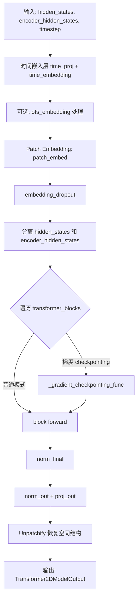
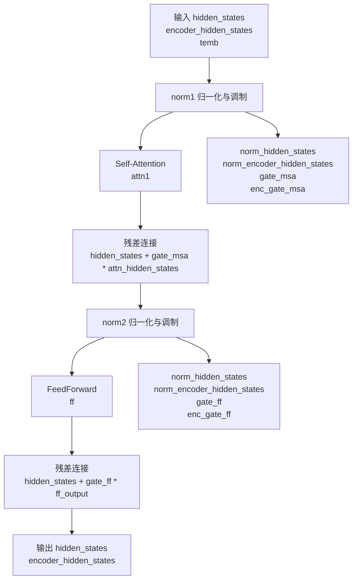
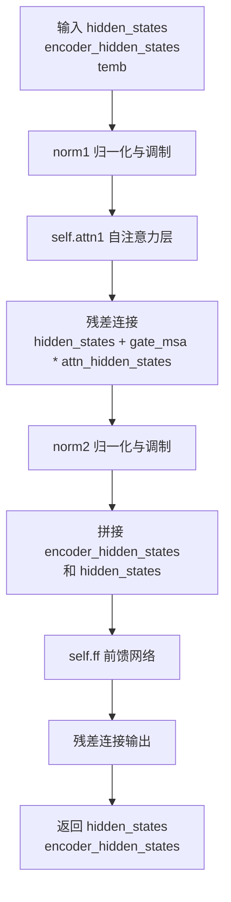
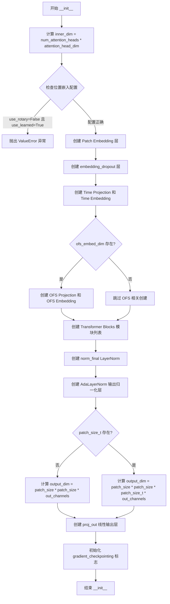
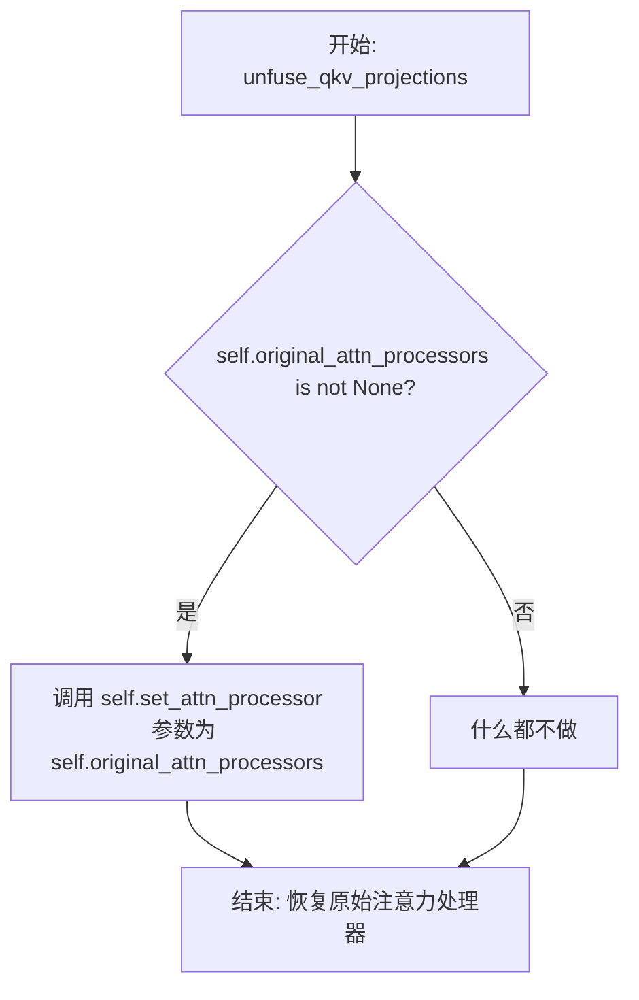

# `diffusers\src\diffusers\models\transformers\cogvideox_transformer_3d.py` 详细设计文档

CogVideoXTransformer3DModel 是一个用于视频生成任务的3D Transformer模型，基于CogVideoX架构实现。该模型接收视频潜在表示和文本嵌入，通过时空 transformer 块处理，输出重构后的视频潜在表示。

## 整体流程



## 类结构

```
ModelMixin (基类)
├── CogVideoXTransformer3DModel (主模型类)
    └── CogVideoXBlock (Transformer块)
```

## 全局变量及字段


### `logger`
    
模块级日志记录器，用于记录模型运行过程中的日志信息

类型：`logging.Logger`
    


### `CogVideoXBlock.norm1`
    
第一个归一化层，包含时间嵌入调制

类型：`CogVideoXLayerNormZero`
    


### `CogVideoXBlock.attn1`
    
自注意力层，用于处理隐藏状态的注意力计算

类型：`Attention`
    


### `CogVideoXBlock.norm2`
    
第二个归一化层，包含时间嵌入调制

类型：`CogVideoXLayerNormZero`
    


### `CogVideoXBlock.ff`
    
前馈网络层，用于特征变换和非线性映射

类型：`FeedForward`
    


### `CogVideoXTransformer3DModel.patch_embed`
    
3D patch 嵌入层，将输入视频转换为 patch 序列

类型：`CogVideoXPatchEmbed`
    


### `CogVideoXTransformer3DModel.embedding_dropout`
    
嵌入层 dropout，防止过拟合

类型：`nn.Dropout`
    


### `CogVideoXTransformer3DModel.time_proj`
    
时间步 projection，将时间步映射到嵌入空间

类型：`Timesteps`
    


### `CogVideoXTransformer3DModel.time_embedding`
    
时间步嵌入，将投影后的时间步转换为高维表示

类型：`TimestepEmbedding`
    


### `CogVideoXTransformer3DModel.ofs_proj`
    
可选的 ofs embedding projection，用于 CogVideoX1.5-5B I2V 模型

类型：`Timesteps`
    


### `CogVideoXTransformer3DModel.ofs_embedding`
    
可选的 ofs embedding，用于额外的条件嵌入

类型：`TimestepEmbedding`
    


### `CogVideoXTransformer3DModel.transformer_blocks`
    
Transformer 块列表，包含多个 CogVideoXBlock 组成的深层网络

类型：`nn.ModuleList`
    


### `CogVideoXTransformer3DModel.norm_final`
    
最终归一化层，用于输出前的特征标准化

类型：`nn.LayerNorm`
    


### `CogVideoXTransformer3DModel.norm_out`
    
自适应层归一化输出，根据时间嵌入动态调整归一化参数

类型：`AdaLayerNorm`
    


### `CogVideoXTransformer3DModel.proj_out`
    
输出投影层，将隐藏状态映射回像素空间

类型：`nn.Linear`
    


### `CogVideoXTransformer3DModel.gradient_checkpointing`
    
梯度 checkpointing 标志，用于节省显存

类型：`bool`
    
    

## 全局函数及方法


### `CogVideoXBlock`

CogVideoXBlock 是一个用于 CogVideoX 变换器模型中的 Transformer 块，包含自注意力（Self-Attention）和前馈网络（Feed Forward）两个子层，并使用 AdaLayerNormZero 进行层归一化和调制。

参数：

- `dim`：`int`，输入和输出的通道数
- `num_attention_heads`：`int`，多头注意力机制的头数
- `attention_head_dim`：`int`，每个注意力头的通道数
- `time_embed_dim`：`int`，时间嵌入的通道数
- `dropout`：`float`，默认为 0.0，Dropout 概率
- `activation_fn`：`str`，默认为 "gelu-approximate"，前馈网络中使用的激活函数
- `attention_bias`：`bool`，默认为 False，是否在注意力投影层中使用偏置
- `qk_norm`：`bool`，默认为 True，是否在 Query 和 Key 投影后进行归一化
- `norm_elementwise_affine`：`bool`，默认为 True，是否在归一化层中使用可学习的元素级仿射参数
- `norm_eps`：`float`，默认为 1e-5，归一化层的 epsilon 值
- `final_dropout`：`bool`，默认为 False，是否在最后一个前馈层后应用 Dropout
- `ff_inner_dim`：`int | None`，默认为 None，前馈层的自定义隐藏维度，如果未提供则使用 `4 * dim`
- `ff_bias`：`bool`，默认为 True，是否在前馈层中使用偏置
- `attention_out_bias`：`bool`，默认为 True，是否在注意力输出投影层中使用偏置

#### 流程图



#### 带注释源码

```python
@maybe_allow_in_graph
class CogVideoXBlock(nn.Module):
    r"""
    Transformer block used in [CogVideoX](https://github.com/THUDM/CogVideo) model.

    参数:
        dim (`int`): 输入和输出的通道数
        num_attention_heads (`int`): 多头注意力的头数
        attention_head_dim (`int`): 每个头的通道数
        time_embed_dim (`int`): 时间嵌入的通道数
        dropout (`float`, 默认为 0.0): Dropout 概率
        activation_fn (`str`, 默认为 "gelu-approximate"): 激活函数
        attention_bias (`bool`, 默认为 False): 注意力投影层是否使用偏置
        qk_norm (`bool`, 默认为 True): 是否在 QK 投影后进行归一化
        norm_elementwise_affine (`bool`, 默认为 True): 是否使用可学习的元素级仿射参数
        norm_eps (`float`, 默认为 1e-5): 归一化层的 epsilon 值
        final_dropout (`bool` 默认为 False): 是否在最后前馈层后应用 Dropout
        ff_inner_dim (`int`, *可选*, 默认为 None): 前馈层自定义隐藏维度
        ff_bias (`bool`, 默认为 True): 前馈层是否使用偏置
        attention_out_bias (`bool`, 默认为 True): 注意力输出投影层是否使用偏置
    """

    def __init__(
        self,
        dim: int,
        num_attention_heads: int,
        attention_head_dim: int,
        time_embed_dim: int,
        dropout: float = 0.0,
        activation_fn: str = "gelu-approximate",
        attention_bias: bool = False,
        qk_norm: bool = True,
        norm_elementwise_affine: bool = True,
        norm_eps: float = 1e-5,
        final_dropout: bool = True,
        ff_inner_dim: int | None = None,
        ff_bias: bool = True,
        attention_out_bias: bool = True,
    ):
        super().__init__()

        # 1. 自注意力层 (Self-Attention)
        # CogVideoXLayerNormZero 结合了归一化和门控机制
        self.norm1 = CogVideoXLayerNormZero(time_embed_dim, dim, norm_elementwise_affine, norm_eps, bias=True)

        self.attn1 = Attention(
            query_dim=dim,
            dim_head=attention_head_dim,
            heads=num_attention_heads,
            qk_norm="layer_norm" if qk_norm else None,
            eps=1e-6,
            bias=attention_bias,
            out_bias=attention_out_bias,
            processor=CogVideoXAttnProcessor2_0(),
        )

        # 2. 前馈网络 (Feed Forward)
        self.norm2 = CogVideoXLayerNormZero(time_embed_dim, dim, norm_elementwise_affine, norm_eps, bias=True)

        self.ff = FeedForward(
            dim,
            dropout=dropout,
            activation_fn=activation_fn,
            final_dropout=final_dropout,
            inner_dim=ff_inner_dim,
            bias=ff_bias,
        )

    def forward(
        self,
        hidden_states: torch.Tensor,
        encoder_hidden_states: torch.Tensor,
        temb: torch.Tensor,
        image_rotary_emb: tuple[torch.Tensor, torch.Tensor] | None = None,
        attention_kwargs: dict[str, Any] | None = None,
    ) -> tuple[torch.Tensor, torch.Tensor]:
        """
        前向传播方法

        参数:
            hidden_states: 隐藏状态张量 [batch, seq_len, dim]
            encoder_hidden_states: 编码器隐藏状态（文本嵌入）[batch, text_seq_len, dim]
            temb: 时间嵌入张量
            image_rotary_emb: 图像旋转嵌入（可选），用于位置编码
            attention_kwargs: 额外的注意力参数（可选）

        返回:
            tuple[torch.Tensor, torch.Tensor]: 处理后的 hidden_states 和 encoder_hidden_states
        """
        text_seq_length = encoder_hidden_states.size(1)
        attention_kwargs = attention_kwargs or {}

        # norm & modulate: 归一化并计算门控参数
        norm_hidden_states, norm_encoder_hidden_states, gate_msa, enc_gate_msa = self.norm1(
            hidden_states, encoder_hidden_states, temb
        )

        # attention: 自注意力计算
        attn_hidden_states, attn_encoder_hidden_states = self.attn1(
            hidden_states=norm_hidden_states,
            encoder_hidden_states=norm_encoder_hidden_states,
            image_rotary_emb=image_rotary_emb,
            **attention_kwargs,
        )

        # 残差连接与门控应用
        hidden_states = hidden_states + gate_msa * attn_hidden_states
        encoder_hidden_states = encoder_hidden_states + enc_gate_msa * attn_encoder_hidden_states

        # norm & modulate: 第二次归一化
        norm_hidden_states, norm_encoder_hidden_states, gate_ff, enc_gate_ff = self.norm2(
            hidden_states, encoder_hidden_states, temb
        )

        # 前馈网络: 将 encoder_hidden_states 和 hidden_states 拼接
        norm_hidden_states = torch.cat([norm_encoder_hidden_states, norm_hidden_states], dim=1)
        ff_output = self.ff(norm_hidden_states)

        # 残差连接与门控应用（分离拼接后的张量）
        hidden_states = hidden_states + gate_ff * ff_output[:, text_seq_length:]
        encoder_hidden_states = encoder_hidden_states + enc_gate_ff * ff_output[:, :text_seq_length]

        return hidden_states, encoder_hidden_states
```


### `CogVideoXTransformer3DModel.__init__`

该方法使用 `@register_to_config` 装饰器注册配置参数，初始化 CogVideoXTransformer3DModel 模型的所有超参数，包括注意力头数、嵌入维度、层数、归一化设置等，并将其保存到模型配置中以支持序列化与反序列化。

参数：

- `num_attention_heads`：`int`，默认为 30，多头注意力机制中的注意力头数量
- `attention_head_dim`：`int`，默认为 64，每个注意力头对应的通道维度
- `in_channels`：`int`，默认为 16，输入数据的通道数
- `out_channels`：`int | None`，默认为 16，输出数据的通道数
- `flip_sin_to_cos`：`bool`，默认为 True，是否将时间嵌入中的 sin 转换为 cos
- `freq_shift`：`int`，默认为 0，时间嵌入的频率偏移量
- `time_embed_dim`：`int`，默认为 512，时间嵌入的输出维度
- `ofs_embed_dim`：`int | None`，默认为 None，CogVideoX-5b-I2B 版本中的 ofs 嵌入维度
- `text_embed_dim`：`int`，默认为 4096，文本编码器输入的文本嵌入维度
- `num_layers`：`int`，默认为 30，Transformer 块的数量
- `dropout`：`float`，默认为 0.0 Dropout 概率
- `attention_bias`：`bool`，默认为 True，注意力投影层是否使用偏置
- `sample_width`：`int`，默认为 90，输入潜在变量的宽度
- `sample_height`：`int`，默认为 60，输入潜在变量的高度
- `sample_frames`：`int`，默认为 49，输入潜在变量的帧数
- `patch_size`：`int`，默认为 2，补丁嵌入层使用的空间补丁大小
- `patch_size_t`：`int | None`，默认为 None，时间维度上的补丁大小
- `temporal_compression_ratio`：`int`，默认为 4，时间维度的压缩比
- `max_text_seq_length`：`int`，默认为 226，输入文本嵌入的最大序列长度
- `activation_fn`：`str`，默认为 "gelu-approximate"，前馈网络使用的激活函数
- `timestep_activation_fn`：`str`，默认为 "silu"，生成时间嵌入时使用的激活函数
- `norm_elementwise_affine`：`bool`，默认为 True，是否在归一化层使用可学习的元素仿射参数
- `norm_eps`：`float`，默认为 1e-5，归一化层的 epsilon 值
- `spatial_interpolation_scale`：`float`，默认为 1.875，3D 位置嵌入在空间维度上的缩放因子
- `temporal_interpolation_scale`：`float`，默认为 1.0，3D 位置嵌入在时间维度上的缩放因子
- `use_rotary_positional_embeddings`：`bool`，默认为 False，是否使用旋转位置嵌入
- `use_learned_positional_embeddings`：`bool`，默认为 False，是否使用可学习位置嵌入
- `patch_bias`：`bool`，默认为 True，补丁嵌入层是否使用偏置

返回值：`None`，无直接返回值，通过 `@register_to_config` 装饰器将参数注册到模型配置中

#### 流程图

```mermaid
flowchart TD
    A[开始 __init__] --> B[调用 super().__init__]
    B --> C[计算 inner_dim = num_attention_heads * attention_head_dim]
    C --> D{验证 use_rotary_positional_embeddings 和 use_learned_positional_embeddings}
    D -->|不合法| E[抛出 ValueError]
    D -->|合法| F[创建 CogVideoXPatchEmbed 补丁嵌入层]
    F --> G[创建 embedding_dropout Dropout 层]
    G --> H[创建 Timesteps 时间投影层]
    H --> I[创建 TimestepEmbedding 时间嵌入层]
    I --> J{ofs_embed_dim 是否存在?}
    J -->|是| K[创建 ofs 投影和嵌入层]
    J -->|否| L[跳过 ofs 层]
    K --> L
    L --> M[创建 nn.ModuleList transformer_blocks]
    M --> N[创建 LayerNorm norm_final 输出归一化层]
    N --> O[创建 AdaLayerNorm norm_out 自适应归一化层]
    O --> P[创建线性投影层 proj_out]
    P --> Q[初始化 gradient_checkpointing 标志]
    Q --> R[@register_to_config 装饰器注册所有参数到 config]
    R --> S[结束]
```

#### 带注释源码

```python
@register_to_config  # 装饰器：将所有 __init__ 参数注册到模型配置中，支持序列化
def __init__(
    self,
    num_attention_heads: int = 30,                    # 多头注意力的头数
    attention_head_dim: int = 64,                     # 每个头的维度
    in_channels: int = 16,                            # 输入通道数
    out_channels: int | None = 16,                    # 输出通道数
    flip_sin_to_cos: bool = True,                     # 是否翻转 sin 到 cos
    freq_shift: int = 0,                              # 频率偏移
    time_embed_dim: int = 512,                        # 时间嵌入维度
    ofs_embed_dim: int | None = None,                 # OFS 嵌入维度（仅 1.5 版本）
    text_embed_dim: int = 4096,                       # 文本嵌入维度
    num_layers: int = 30,                             # Transformer 层数
    dropout: float = 0.0,                            # Dropout 概率
    attention_bias: bool = True,                      # 注意力偏置
    sample_width: int = 90,                           # 样本宽度
    sample_height: int = 60,                          # 样本高度
    sample_frames: int = 49,                          # 样本帧数
    patch_size: int = 2,                              # 空间补丁大小
    patch_size_t: int | None = None,                 # 时间补丁大小
    temporal_compression_ratio: int = 4,              # 时间压缩比
    max_text_seq_length: int = 226,                   # 最大文本序列长度
    activation_fn: str = "gelu-approximate",          # 激活函数
    timestep_activation_fn: str = "silu",             # 时间步激活函数
    norm_elementwise_affine: bool = True,             # 归一化仿射参数
    norm_eps: float = 1e-5,                           # 归一化 epsilon
    spatial_interpolation_scale: float = 1.875,      # 空间插值缩放
    temporal_interpolation_scale: float = 1.0,        # 时间插值缩放
    use_rotary_positional_embeddings: bool = False,   # 使用旋转位置编码
    use_learned_positional_embeddings: bool = False,  # 使用学习位置编码
    patch_bias: bool = True,                          # 补丁偏置
):
    super().__init__()  # 调用父类 ModelMixin, AttentionMixin, ConfigMixin, PeftAdapterMixin, CacheMixin 的初始化
    
    # 计算内部维度：头数 × 每头维度
    inner_dim = num_attention_heads * attention_head_dim

    # 验证位置编码配置：如果禁用了旋转编码但启用了学习编码，则报错
    if not use_rotary_positional_embeddings and use_learned_positional_embeddings:
        raise ValueError(
            "There are no CogVideoX checkpoints available with disable rotary embeddings and learned positional "
            "embeddings. If you're using a custom model and/or believe this should be supported, please open an "
            "issue at https://github.com/huggingface/diffusers/issues."
        )

    # 1. 补丁嵌入层：将输入转换为补丁序列
    self.patch_embed = CogVideoXPatchEmbed(
        patch_size=patch_size,
        patch_size_t=patch_size_t,
        in_channels=in_channels,
        embed_dim=inner_dim,
        text_embed_dim=text_embed_dim,
        bias=patch_bias,
        sample_width=sample_width,
        sample_height=sample_height,
        sample_frames=sample_frames,
        temporal_compression_ratio=temporal_compression_ratio,
        max_text_seq_length=max_text_seq_length,
        spatial_interpolation_scale=spatial_interpolation_scale,
        temporal_interpolation_scale=temporal_interpolation_scale,
        use_positional_embeddings=not use_rotary_positional_embeddings,
        use_learned_positional_embeddings=use_learned_positional_embeddings,
    )
    self.embedding_dropout = nn.Dropout(dropout)  # 嵌入层 Dropout

    # 2. 时间嵌入层（以及可选的 OFS 嵌入层，仅 CogVideoX 1.5-5B I2V 使用）
    self.time_proj = Timesteps(inner_dim, flip_sin_to_cos, freq_shift)
    self.time_embedding = TimestepEmbedding(inner_dim, time_embed_dim, timestep_activation_fn)

    # 初始化 OFS 相关层（可选）
    self.ofs_proj = None
    self.ofs_embedding = None
    if ofs_embed_dim:
        self.ofs_proj = Timesteps(ofs_embed_dim, flip_sin_to_cos, freq_shift)
        self.ofs_embedding = TimestepEmbedding(ofs_embed_dim, ofs_embed_dim, timestep_activation_fn)

    # 3. 时空 Transformer 块列表
    self.transformer_blocks = nn.ModuleList([
        CogVideoXBlock(
            dim=inner_dim,
            num_attention_heads=num_attention_heads,
            attention_head_dim=attention_head_dim,
            time_embed_dim=time_embed_dim,
            dropout=dropout,
            activation_fn=activation_fn,
            attention_bias=attention_bias,
            norm_elementwise_affine=norm_elementwise_affine,
            norm_eps=norm_eps,
        )
        for _ in range(num_layers)  # 创建 num_layers 个 Transformer 块
    ])
    self.norm_final = nn.LayerNorm(inner_dim, norm_eps, norm_elementwise_affine)  # 最终归一化层

    # 4. 输出块
    self.norm_out = AdaLayerNorm(
        embedding_dim=time_embed_dim,
        output_dim=2 * inner_dim,
        norm_elementwise_affine=norm_elementwise_affine,
        norm_eps=norm_eps,
        chunk_dim=1,
    )

    # 根据是否有时间补丁大小确定输出维度
    if patch_size_t is None:
        # CogVideoX 1.0 版本
        output_dim = patch_size * patch_size * out_channels
    else:
        # CogVideoX 1.5 版本
        output_dim = patch_size * patch_size * patch_size_t * out_channels

    self.proj_out = nn.Linear(inner_dim, output_dim)  # 输出投影层

    self.gradient_checkpointing = False  # 梯度 checkpointing 标志
    # 注意：@register_to_config 装饰器会在调用结束后自动将所有参数保存到 self.config 中
```


### `CogVideoXBlock.__init__`

该方法是 CogVideoXBlock 类的构造函数，用于初始化 CogVideoX transformer 块的核心组件，包括自注意力层（self-attention）和前馈网络层（Feed Forward），分别配备 AdaLayerNormZero 归一化进行自适应调制。

参数：

- `self`：类实例本身，无类型，表示类的当前实例
- `dim`：`int`，输入和输出的通道数（channel dimensions）
- `num_attention_heads`：`int`，多头注意力机制中使用的注意力头数量
- `attention_head_dim`：`int`，每个注意力头内部的通道维度
- `time_embed_dim`：`int`，时间步嵌入（timestep embedding）的通道维度
- `dropout`：`float`，默认为 `0.0`，dropout 概率，用于前馈网络
- `activation_fn`：`str`，默认为 `"gelu-approximate"`，前馈网络使用的激活函数
- `attention_bias`：`bool`，默认为 `False`，是否在注意力投影层使用偏置
- `qk_norm`：`bool`，默认为 `True`，是否在 query 和 key 投影后进行归一化
- `norm_elementwise_affine`：`bool`，默认为 `True`，归一化层是否使用可学习的元素级仿射参数
- `norm_eps`：`float`，默认为 `1e-5`，归一化层的 epsilon 数值，防止除零
- `final_dropout`：`bool`，默认为 `True`，是否在前馈网络最后一层后应用 dropout
- `ff_inner_dim`：`int | None`，默认为 `None`，前馈网络层的自定义隐藏维度，若不提供则使用 `4 * dim`
- `ff_bias`：`bool`，默认为 `True`，前馈网络层是否使用偏置
- `attention_out_bias`：`bool`，默认为 `True`，注意力输出投影层是否使用偏置

返回值：`None`，构造函数无返回值，仅初始化对象状态

#### 流程图

```mermaid
flowchart TD
    A[开始 __init__] --> B[调用 super().__init__]
    B --> C[创建 self.norm1: CogVideoXLayerNormZero]
    C --> D[创建 self.attn1: Attention]
    D --> E[创建 self.norm2: CogVideoXLayerNormZero]
    E --> F[创建 self.ff: FeedForward]
    F --> G[结束 __init__]
```

#### 带注释源码

```python
def __init__(
    self,
    dim: int,
    num_attention_heads: int,
    attention_head_dim: int,
    time_embed_dim: int,
    dropout: float = 0.0,
    activation_fn: str = "gelu-approximate",
    attention_bias: bool = False,
    qk_norm: bool = True,
    norm_elementwise_affine: bool = True,
    norm_eps: float = 1e-5,
    final_dropout: bool = True,
    ff_inner_dim: int | None = None,
    ff_bias: bool = True,
    attention_out_bias: bool = True,
):
    """
    Transformer block 构造函数，初始化以下组件：
    1. 自注意力层 (Self-Attention) 及相关归一化
    2. 前馈网络层 (Feed Forward) 及相关归一化
    """
    super().__init__()

    # 1. 自注意力层 (Self Attention)
    # 创建第一个归一化层 CogVideoXLayerNormZero，用于对 hidden_states 和 encoder_hidden_states
    # 进行自适应归一化，同时生成门控参数 gate_msa 和 enc_gate_msa
    self.norm1 = CogVideoXLayerNormZero(
        time_embed_dim, 
        dim, 
        norm_elementwise_affine, 
        norm_eps, 
        bias=True
    )

    # 创建自注意力模块，支持 qk_norm、attention_bias 等配置
    self.attn1 = Attention(
        query_dim=dim,
        dim_head=attention_head_dim,
        heads=num_attention_heads,
        qk_norm="layer_norm" if qk_norm else None,
        eps=1e-6,
        bias=attention_bias,
        out_bias=attention_out_bias,
        processor=CogVideoXAttnProcessor2_0(),
    )

    # 2. 前馈网络 (Feed Forward)
    # 创建第二个归一化层，用于前馈网络前的自适应归一化
    self.norm2 = CogVideoXLayerNormZero(
        time_embed_dim, 
        dim, 
        norm_elementwise_affine, 
        norm_eps, 
        bias=True
    )

    # 创建前馈网络模块，支持自定义 inner_dim、dropout、activation_fn 等
    self.ff = FeedForward(
        dim,
        dropout=dropout,
        activation_fn=activation_fn,
        final_dropout=final_dropout,
        inner_dim=ff_inner_dim,
        bias=ff_bias,
    )
```


### CogVideoXBlock.forward

该方法是CogVideoX Transformer块的前向传播函数，负责执行归一化与调制、自注意力机制和前馈网络（FeedForward）处理，处理视频和文本的隐藏状态并返回更新后的状态。

参数：

- `hidden_states`：`torch.Tensor`，输入的视频/图像隐藏状态张量
- `encoder_hidden_states`：`torch.Tensor`，输入的文本编码隐藏状态张量
- `temb`：`torch.Tensor`，时间嵌入张量，用于调节（modulation）
- `image_rotary_emb`：`tuple[torch.Tensor, torch.Tensor] | None`，图像旋转位置嵌入，用于旋转位置编码，可选
- `attention_kwargs`：`dict[str, Any] | None`，传递给注意力层的额外关键字参数，可选

返回值：`tuple[torch.Tensor, torch.Tensor]`，返回更新后的隐藏状态和编码器隐藏状态

#### 流程图



#### 带注释源码

```python
def forward(
    self,
    hidden_states: torch.Tensor,
    encoder_hidden_states: torch.Tensor,
    temb: torch.Tensor,
    image_rotary_emb: tuple[torch.Tensor, torch.Tensor] | None = None,
    attention_kwargs: dict[str, Any] | None = None,
) -> tuple[torch.Tensor, torch.Tensor]:
    # 获取文本序列长度，用于后续分离文本和视频特征
    text_seq_length = encoder_hidden_states.size(1)
    # 如果没有传入注意力参数，使用空字典
    attention_kwargs = attention_kwargs or {}

    # ===== 第一阶段：归一化、调制与自注意力 =====

    # 1. 对 hidden_states 和 encoder_hidden_states 进行归一化，并生成门控参数
    #    norm_hidden_states: 归一化后的视频隐藏状态
    #    norm_encoder_hidden_states: 归一化后的文本隐藏状态
    #    gate_msa: 视频注意力的门控系数（可学习）
    #    enc_gate_msa: 文本注意力的门控系数（可学习）
    norm_hidden_states, norm_encoder_hidden_states, gate_msa, enc_gate_msa = self.norm1(
        hidden_states, encoder_hidden_states, temb
    )

    # 2. 执行自注意力计算，处理视频特征和文本特征的交叉注意力
    #    attn_hidden_states: 注意力处理后的视频特征
    #    attn_encoder_hidden_states: 注意力处理后的文本特征
    attn_hidden_states, attn_encoder_hidden_states = self.attn1(
        hidden_states=norm_hidden_states,
        encoder_hidden_states=norm_encoder_hidden_states,
        image_rotary_emb=image_rotary_emb,
        **attention_kwargs,
    )

    # 3. 残差连接：通过门控系数控制注意力输出的贡献
    hidden_states = hidden_states + gate_msa * attn_hidden_states
    encoder_hidden_states = encoder_hidden_states + enc_gate_msa * attn_encoder_hidden_states

    # ===== 第二阶段：归一化、调制与前馈网络 =====

    # 4. 再次进行归一化，并生成前馈网络门控参数
    norm_hidden_states, norm_encoder_hidden_states, gate_ff, enc_gate_ff = self.norm2(
        hidden_states, encoder_hidden_states, temb
    )

    # 5. 拼接文本特征和视频特征，形成统一的序列输入前馈网络
    #    格式: [encoder_hidden_states, hidden_states]
    norm_hidden_states = torch.cat([norm_encoder_hidden_states, norm_hidden_states], dim=1)

    # 6. 执行前馈网络处理
    ff_output = self.ff(norm_hidden_states)

    # 7. 残差连接：分离并通过门控系数添加前馈输出
    #    ff_output[:, text_seq_length:] 对应视频特征部分
    #    ff_output[:, :text_seq_length] 对应文本特征部分
    hidden_states = hidden_states + gate_ff * ff_output[:, text_seq_length:]
    encoder_hidden_states = encoder_hidden_states + enc_gate_ff * ff_output[:, :text_seq_length]

    # 返回处理后的视频和文本隐藏状态
    return hidden_states, encoder_hidden_states
```


### CogVideoXTransformer3DModel.__init__

该方法是 CogVideoXTransformer3DModel 类的初始化方法，负责构建 CogVideoX 视频生成 Transformer 模型的整体架构，包括Patch嵌入层、时间步嵌入、Transformer块堆叠、输出投影层等核心组件的实例化与参数配置。

参数：

- `num_attention_heads`：`int`，默认为30，多头注意力机制中注意力头的数量
- `attention_head_dim`：`int`，默认为64，每个注意力头对应的通道维度
- `in_channels`：`int`，默认为16，输入数据的通道数
- `out_channels`：`int | None`，默认为16，输出数据的通道数
- `flip_sin_to_cos`：`bool`，默认为True，是否将正弦位置编码翻转为余弦形式
- `freq_shift`：`int`，默认为0，时间嵌入的频率偏移量
- `time_embed_dim`：`int`，默认为512，时间步嵌入的输出维度
- `ofs_embed_dim`：`int | None`，默认为None，CogVideoX-5b-I2B 模型中 ofs 嵌入的维度
- `text_embed_dim`：`int`，默认为4096，文本编码器输出嵌入的维度
- `num_layers`：`int`，默认为30，Transformer 块的数量
- `dropout`：`float`，默认为0.0，dropout 概率
- `attention_bias`：`bool`，默认为True，是否在注意力投影层使用偏置
- `sample_width`：`int`，默认为90，输入潜在表示的宽度
- `sample_height`：`int`，默认为60，输入潜在表示的高度
- `sample_frames`：`int`，默认为49，输入潜在表示的帧数（注：实际应为13以保持向后兼容）
- `patch_size`：`int`，默认为2，空间维度的 patch 大小
- `patch_size_t`：`int | None`，默认为None，时间维度的 patch 大小
- `temporal_compression_ratio`：`int`，默认为4，时间维度的压缩比
- `max_text_seq_length`：`int`，默认为226，文本嵌入的最大序列长度
- `activation_fn`：`str`，默认为"gelu-approximate"，前馈网络激活函数
- `timestep_activation_fn`：`str`，默认为"silu"，时间步嵌入生成时的激活函数
- `norm_elementwise_affine`：`bool`，默认为True，归一化层是否使用可学习的仿射参数
- `norm_eps`：`float`，默认为1e-5，归一化层的 epsilon 值
- `spatial_interpolation_scale`：`float`，默认为1.875，3D 位置嵌入空间维度的缩放因子
- `temporal_interpolation_scale`：`float`，默认为1.0，3D 位置嵌入时间维度的缩放因子
- `use_rotary_positional_embeddings`：`bool`，默认为False，是否使用旋转位置嵌入
- `use_learned_positional_embeddings`：`bool`，默认为False，是否使用可学习位置嵌入
- `patch_bias`：`bool`，默认为True，patch 嵌入层是否使用偏置

返回值：`None`，该方法为构造函数，不返回任何值，仅初始化对象状态

#### 流程图



#### 带注释源码

```python
@register_to_config
def __init__(
    self,
    num_attention_heads: int = 30,
    attention_head_dim: int = 64,
    in_channels: int = 16,
    out_channels: int | None = 16,
    flip_sin_to_cos: bool = True,
    freq_shift: int = 0,
    time_embed_dim: int = 512,
    ofs_embed_dim: int | None = None,
    text_embed_dim: int = 4096,
    num_layers: int = 30,
    dropout: float = 0.0,
    attention_bias: bool = True,
    sample_width: int = 90,
    sample_height: int = 60,
    sample_frames: int = 49,
    patch_size: int = 2,
    patch_size_t: int | None = None,
    temporal_compression_ratio: int = 4,
    max_text_seq_length: int = 226,
    activation_fn: str = "gelu-approximate",
    timestep_activation_fn: str = "silu",
    norm_elementwise_affine: bool = True,
    norm_eps: float = 1e-5,
    spatial_interpolation_scale: float = 1.875,
    temporal_interpolation_scale: float = 1.0,
    use_rotary_positional_embeddings: bool = False,
    use_learned_positional_embeddings: bool = False,
    patch_bias: bool = True,
):
    """
    初始化 CogVideoXTransformer3DModel 模型结构
    
    参数:
        num_attention_heads: 多头注意力中的头数
        attention_head_dim: 每个头的维度
        in_channels: 输入通道数
        out_channels: 输出通道数
        flip_sin_to_cos: 是否翻转正弦为余弦
        freq_shift: 频率偏移
        time_embed_dim: 时间嵌入维度
        ofs_embed_dim: OFS 嵌入维度(仅 CogVideoX1.5-5B I2V 使用)
        text_embed_dim: 文本嵌入维度
        num_layers: Transformer 层数
        dropout: Dropout 概率
        attention_bias: 注意力偏置
        sample_width: 样本宽度
        sample_height: 样本高度
        sample_frames: 样本帧数
        patch_size: 空间 patch 大小
        patch_size_t: 时间 patch 大小
        temporal_compression_ratio: 时间压缩比
        max_text_seq_length: 最大文本序列长度
        activation_fn: 激活函数
        timestep_activation_fn: 时间步激活函数
        norm_elementwise_affine: 归一化仿射参数
        norm_eps: 归一化 epsilon
        spatial_interpolation_scale: 空间插值缩放
        temporal_interpolation_scale: 时间插值缩放
        use_rotary_positional_embeddings: 使用旋转位置嵌入
        use_learned_positional_embeddings: 使用学习位置嵌入
        patch_bias: Patch 嵌入偏置
    """
    super().__init__()
    
    # 计算内部维度: 注意力头数 × 每头维度 = 模型总维度
    inner_dim = num_attention_heads * attention_head_dim

    # 验证位置嵌入配置: 不能同时禁用旋转嵌入且使用学习嵌入
    if not use_rotary_positional_embeddings and use_learned_positional_embeddings:
        raise ValueError(
            "There are no CogVideoX checkpoints available with disable rotary embeddings and learned positional "
            "embeddings. If you're using a custom model and/or believe this should be supported, please open an "
            "issue at https://github.com/huggingface/diffusers/issues."
        )

    # =========================================================
    # 1. Patch Embedding 层
    # 将视频/图像潜在表示转换为 patch 序列
    # =========================================================
    self.patch_embed = CogVideoXPatchEmbed(
        patch_size=patch_size,
        patch_size_t=patch_size_t,
        in_channels=in_channels,
        embed_dim=inner_dim,
        text_embed_dim=text_embed_dim,
        bias=patch_bias,
        sample_width=sample_width,
        sample_height=sample_height,
        sample_frames=sample_frames,
        temporal_compression_ratio=temporal_compression_ratio,
        max_text_seq_length=max_text_seq_length,
        spatial_interpolation_scale=spatial_interpolation_scale,
        temporal_interpolation_scale=temporal_interpolation_scale,
        use_positional_embeddings=not use_rotary_positional_embeddings,
        use_learned_positional_embeddings=use_learned_positional_embeddings,
    )
    # Embedding 层的 dropout
    self.embedding_dropout = nn.Dropout(dropout)

    # =========================================================
    # 2. Time Embeddings 和 OFS Embedding
    # 时间步嵌入用于将噪声时间步转换为有意义的向量表示
    # OFS 嵌入仅在 CogVideoX-5B-I2V 1.5 版本中使用
    # =========================================================
    
    # 时间步投影: 将时间步投影到嵌入空间
    self.time_proj = Timesteps(inner_dim, flip_sin_to_cos, freq_shift)
    # 时间步嵌入层: 将投影后的时间步转换为更高维度的表示
    self.time_embedding = TimestepEmbedding(inner_dim, time_embed_dim, timestep_activation_fn)

    # OFS (Output Frame Shift) 嵌入相关组件
    self.ofs_proj = None
    self.ofs_embedding = None
    if ofs_embed_dim:
        # 如果指定了 ofs_embed_dim，创建对应的投影和嵌入层
        self.ofs_proj = Timesteps(ofs_embed_dim, flip_sin_to_cos, freq_shift)
        self.ofs_embedding = TimestepEmbedding(
            ofs_embed_dim, ofs_embed_dim, timestep_activation_fn
        )  # 与时间嵌入相同结构，用于 ofs

    # =========================================================
    # 3. Spatio-Temporal Transformer Blocks
    # 构建多层 Transformer 块堆叠
    # =========================================================
    self.transformer_blocks = nn.ModuleList(
        [
            CogVideoXBlock(
                dim=inner_dim,
                num_attention_heads=num_attention_heads,
                attention_head_dim=attention_head_dim,
                time_embed_dim=time_embed_dim,
                dropout=dropout,
                activation_fn=activation_fn,
                attention_bias=attention_bias,
                norm_elementwise_affine=norm_elementwise_affine,
                norm_eps=norm_eps,
            )
            for _ in range(num_layers)
        ]
    )
    # 最终归一化层
    self.norm_final = nn.LayerNorm(inner_dim, norm_eps, norm_elementwise_affine)

    # =========================================================
    # 4. Output Blocks
    # 将 Transformer 输出投影回原始空间维度
    # =========================================================
    
    # AdaLayerNorm: 自适应层归一化，包含门控机制
    self.norm_out = AdaLayerNorm(
        embedding_dim=time_embed_dim,
        output_dim=2 * inner_dim,
        norm_elementwise_affine=norm_elementwise_affine,
        norm_eps=norm_eps,
        chunk_dim=1,
    )

    # 计算输出维度: 根据是否有时间 patch 尺寸选择不同计算方式
    if patch_size_t is None:
        # CogVideoX 1.0 版本: 2D patch
        output_dim = patch_size * patch_size * out_channels
    else:
        # CogVideoX 1.5 版本: 3D patch
        output_dim = patch_size * patch_size * patch_size_t * out_channels

    # 输出投影层: 将隐藏维度映射回 patch 空间
    self.proj_out = nn.Linear(inner_dim, output_dim)

    # 梯度检查点标志初始化为 False
    self.gradient_checkpointing = False
```


### `CogVideoXTransformer3DModel.forward`

这是CogVideoXTransformer3DModel模型的主前向传播方法，负责将输入的潜在视频帧、文本嵌入和时间步进行一系列变换处理，最终输出生成的视频潜在表示。该方法首先对时间步进行嵌入计算，然后对输入进行patch嵌入，接着通过一系列Transformer块进行处理，最后进行归一化、投影和unpatchify操作得到输出。

参数：

- `hidden_states`：`torch.Tensor`，输入的隐藏状态，形状为 (batch_size, num_frames, channels, height, width)，代表视频潜在表示
- `encoder_hidden_states`：`torch.Tensor`，编码器的隐藏状态，即文本嵌入，形状为 (batch_size, text_seq_length, text_embed_dim)
- `timestep`：`int | float | torch.LongTensor`，扩散过程的时间步，用于条件生成
- `timestep_cond`：`torch.Tensor | None`，时间步的条件嵌入，可选的额外时间步条件
- `ofs`：`int | float | torch.LongTensor | None`，OFS（Output Feature Scale）嵌入，仅用于CogVideoX-5b-I2B模型
- `image_rotary_emb`：`tuple[torch.Tensor, torch.Tensor] | None`，图像旋转嵌入，用于旋转位置编码
- `attention_kwargs`：`dict[str, Any] | None`，传递给注意力层的额外关键字参数
- `return_dict`：`bool`，是否返回字典格式的输出，默认为 True

返回值：`tuple[torch.Tensor] | Transformer2DModelOutput`，输出张量元组或包含样本的模型输出对象

#### 流程图

```mermaid
flowchart TD
    A[开始 forward] --> B[提取输入张量形状: batch_size, num_frames, channels, height, width]
    B --> C[1. 时间嵌入计算]
    C --> C1[time_proj: 将timestep投影到嵌入空间]
    C1 --> C2[time_embedding: 生成时间步嵌入emb]
    C2 --> C3{ofs_embedding是否存在?}
    C3 -->|是| C4[计算ofs_emb并加到emb]
    C3 -->|否| D[2. Patch嵌入]
    C4 --> D
    D --> D1[patch_embed: 将encoder_hidden_states和hidden_states进行patch嵌入]
    D1 --> D2[embedding_dropout: 应用dropout]
    D2 --> D3[分离文本和视频特征]
    D3 --> E[3. Transformer块处理]
    E --> E1[遍历每个transformer_blocks]
    E1 --> E2{梯度检查点启用?}
    E2 -->|是| E3[_gradient_checkpointing_func: 梯度检查点优化]
    E2 -->|否| E4[直接调用block forward]
    E3 --> E5[更新hidden_states和encoder_hidden_states]
    E4 --> E5
    E5 --> E6{还有更多块?}
    E6 -->|是| E1
    E6 -->|否| F[4. 最终处理]
    F --> F1[norm_final: 最终层归一化]
    F1 --> F2[norm_out: AdaLayerNorm归一化]
    F2 --> F3[proj_out: 线性投影到输出维度]
    F3 --> G[5. Unpatchify]
    G --> G1{patch_size_t是否存在?}
    G1 -->|否| G2[CogVideoX 1.0: reshape并permute输出]
    G1 -->|是| G3[CogVideoX 1.5: 3D patch reshape并permute]
    G2 --> H{return_dict?}
    G3 --> H
    H -->|是| I[返回Transformer2DModelOutput]
    H -->|否| J[返回tuple: (output,)]
    I --> K[结束]
    J --> K
```

#### 带注释源码

```python
@apply_lora_scale("attention_kwargs")
def forward(
    self,
    hidden_states: torch.Tensor,
    encoder_hidden_states: torch.Tensor,
    timestep: int | float | torch.LongTensor,
    timestep_cond: torch.Tensor | None = None,
    ofs: int | float | torch.LongTensor | None = None,
    image_rotary_emb: tuple[torch.Tensor, torch.Tensor] | None = None,
    attention_kwargs: dict[str, Any] | None = None,
    return_dict: bool = True,
) -> tuple[torch.Tensor] | Transformer2DModelOutput:
    # 提取输入张量的形状信息
    # hidden_states 形状: (batch_size, num_frames, channels, height, width)
    batch_size, num_frames, channels, height, width = hidden_states.shape

    # ==================== 1. 时间嵌入计算 ====================
    # 将时间步投影到嵌入空间
    timesteps = timestep
    t_emb = self.time_proj(timesteps)

    # timesteps 不包含权重，始终返回 f32 张量
    # 但 time_embedding 可能在 fp16 下运行，所以需要在这里进行类型转换
    t_emb = t_emb.to(dtype=hidden_states.dtype)
    # 生成最终的嵌入向量，包含条件信息
    emb = self.time_embedding(t_emb, timestep_cond)

    # 如果存在 OFS 嵌入（仅 CogVideoX-5b-I2B 需要），则将其添加到时间嵌入中
    if self.ofs_embedding is not None:
        ofs_emb = self.ofs_proj(ofs)
        ofs_emb = ofs_emb.to(dtype=hidden_states.dtype)
        ofs_emb = self.ofs_embedding(ofs_emb)
        emb = emb + ofs_emb

    # ==================== 2. Patch 嵌入 ====================
    # 将输入的潜在表示和文本嵌入转换为 patch 序列表示
    hidden_states = self.patch_embed(encoder_hidden_states, hidden_states)
    # 应用 dropout
    hidden_states = self.embedding_dropout(hidden_states)

    # 分离文本特征和视频潜在特征
    text_seq_length = encoder_hidden_states.shape[1]
    encoder_hidden_states = hidden_states[:, :text_seq_length]
    hidden_states = hidden_states[:, text_seq_length:]

    # ==================== 3. Transformer 块处理 ====================
    # 遍历每个 transformer 块进行处理
    for i, block in enumerate(self.transformer_blocks):
        # 如果启用了梯度计算和梯度检查点优化
        if torch.is_grad_enabled() and self.gradient_checkpointing:
            hidden_states, encoder_hidden_states = self._gradient_checkpointing_func(
                block,
                hidden_states,
                encoder_hidden_states,
                emb,
                image_rotary_emb,
                attention_kwargs,
            )
        else:
            # 直接调用 block 的 forward 方法
            hidden_states, encoder_hidden_states = block(
                hidden_states=hidden_states,
                encoder_hidden_states=encoder_hidden_states,
                temb=emb,
                image_rotary_emb=image_rotary_emb,
                attention_kwargs=attention_kwargs,
            )

    # 对输出进行最终归一化
    hidden_states = self.norm_final(hidden_states)

    # ==================== 4. 最终块处理 ====================
    # 使用 AdaLayerNorm 进行条件归一化
    hidden_states = self.norm_out(hidden_states, temb=emb)
    # 投影到输出维度
    hidden_states = self.proj_out(hidden_states)

    # ==================== 5. Unpatchify ====================
    # 获取 patch 大小配置
    p = self.config.patch_size
    p_t = self.config.patch_size_t

    # 根据是否使用时间维度 patch 进行不同的 reshape 操作
    if p_t is None:
        # CogVideoX 1.0 版本: 2D patch
        # 将 patch 序列 reshape 回空间维度
        output = hidden_states.reshape(batch_size, num_frames, height // p, width // p, -1, p, p)
        # 调整维度顺序: (B, T, H, W, C, p, p) -> (B, T, C, H, p, W, p) -> flatten
        output = output.permute(0, 1, 4, 2, 5, 3, 6).flatten(5, 6).flatten(3, 4)
    else:
        # CogVideoX 1.5 版本: 3D patch (包含时间维度)
        output = hidden_states.reshape(
            batch_size, (num_frames + p_t - 1) // p_t, height // p, width // p, -1, p_t, p, p
        )
        # 调整维度顺序并进行 flatten
        output = output.permute(0, 1, 5, 4, 2, 6, 3, 7).flatten(6, 7).flatten(4, 5).flatten(1, 2)

    # ==================== 返回结果 ====================
    if not return_dict:
        return (output,)
    return Transformer2DModelOutput(sample=output)
```


### `CogVideoXTransformer3DModel.fuse_qkv_projections`

融合 QKV 投影函数，用于将注意力机制中的 Query、Key、Value 投影矩阵融合为单一的 fused projection，以提升推理效率。对于自注意力模块，融合所有三个投影矩阵；对于交叉注意力模块，仅融合 Key 和 Value 投影矩阵。

参数：

- 无（仅包含 self 参数）

返回值：`None`，无返回值，该方法直接修改模型内部状态

#### 流程图

```mermaid
flowchart TD
    A[开始 fuse_qkv_projections] --> B[初始化 original_attn_processors = None]
    B --> C{遍历 attn_processors 检查是否存在 Added KV}
    C -->|存在 Added KV| D[抛出 ValueError 异常]
    C -->|不存在 Added KV| E[保存 original_attn_processors = self.attn_processors]
    E --> F[遍历所有模块]
    F --> G{模块是否为 Attention?}
    G -->|是| H[调用 module.fuse_projections(fuse=True)]
    G -->|否| F
    H --> I[设置注意力处理器为 FusedCogVideoXAttnProcessor2_0]
    I --> J[结束]
    D --> J
```

#### 带注释源码

```python
def fuse_qkv_projections(self):
    """
    Enables fused QKV projections. For self-attention modules, all projection matrices 
    (i.e., query, key, value) are fused. For cross-attention modules, key and value 
    projection matrices are fused.

    > [!WARNING] > This API is 🧪 experimental.
    """
    # 1. 初始化original_attn_processors为None，用于后续恢复
    self.original_attn_processors = None

    # 2. 遍历所有注意力处理器，检查是否存在Added KV投影
    # 如果存在 Added KV 投影，则不支持融合操作
    for _, attn_processor in self.attn_processors.items():
        if "Added" in str(attn_processor.__class__.__name__):
            raise ValueError(
                "`fuse_qkv_projections()` is not supported for models having added KV projections."
            )

    # 3. 保存原始的注意力处理器，以便后续可以通过 unfuse_qkv_projections 恢复
    self.original_attn_processors = self.attn_processors

    # 4. 遍历模型中的所有模块
    for module in self.modules():
        # 5. 如果模块是 Attention 类型，调用 fuse_projections 方法进行融合
        if isinstance(module, Attention):
            module.fuse_projections(fuse=True)

    # 6. 将注意力处理器替换为 FusedCogVideoXAttnProcessor2_0
    # 该处理器支持 fused QKV 投影
    self.set_attn_processor(FusedCogVideoXAttnProcessor2_0())
```


### `CogVideoXTransformer3DModel.unfuse_qkv_projections`

该方法用于解融（禁用）融合的QKV投影，将模型的注意力处理器从融合版本恢复为原始版本。当之前调用过 `fuse_qkv_projections()` 方法后，原始的注意力处理器被保存在 `self.original_attn_processors` 中，此方法负责将其恢复到注意力处理机制中。

参数：

- `self`：`CogVideoXTransformer3DModel`，CogVideoX 3D 变换器模型类的实例，隐式参数

返回值：`None`，无返回值。该方法直接修改模型的内部状态，将注意力处理器恢复到原始状态。

#### 流程图



#### 带注释源码

```python
# Copied from diffusers.models.unets.unet_2d_condition.UNet2DConditionModel.unfuse_qkv_projections
def unfuse_qkv_projections(self):
    """Disables the fused QKV projection if enabled.

    > [!WARNING] > This API is 🧪 experimental.

    """
    # 检查是否存在已保存的原始注意力处理器
    # 当 fused 之后，original_attn_processors 会被赋值为融合前的处理器
    if self.original_attn_processors is not None:
        # 调用 set_attn_processor 方法将注意力处理器恢复为原始状态
        # 这会撤销 fuse_qkv_projections() 所做的更改
        self.set_attn_processor(self.original_attn_processors)
```

## 关键组件


### CogVideoXBlock

CogVideoX的Transformer块，包含自注意力层(Attention)和前馈网络(FeedForward)，使用CogVideoXLayerNormZero进行归一化和调制，支持旋转位置编码。

### CogVideoXTransformer3DModel

主Transformer模型类，用于处理3D视频数据，支持文本条件生成，包含patch嵌入、时间嵌入、Transformer块堆叠、输出投影等完整流程。

### 注意力处理器

使用CogVideoXAttnProcessor2_0作为默认注意力处理器，支持FusedCogVideoXAttnProcessor2_0进行QKV融合加速。

### Patch嵌入层

CogVideoXPatchEmbed将输入的latent张量转换为patch序列，支持空间和时间维度的patch化，以及位置嵌入。

### 时间嵌入模块

Timesteps和TimestepEmbedding将时间步转换为嵌入向量，支持sin/cos位置编码切换。

### OFS嵌入

用于CogVideoX-5b-I2V模型的ofs（optional frame shift）嵌入，提供额外的条件信息。

### 归一化层

CogVideoXLayerNormZero在时间嵌入维度上进行零初始化的自适应归一化，AdaLayerNorm用于输出层的自适应归一化。

### 梯度检查点

支持gradient_checkpointing以内存换计算，可减少Transformer块堆叠时的显存占用。

### QKV投影融合

fuse_qkv_projections方法将注意力层的QKV投影矩阵融合以提升推理效率。


## 问题及建议


### 已知问题

-   **sample_frames 参数初始化错误**：代码文档中明确说明该参数错误初始化为49而非13（正确的应该是13），但为了向后兼容无法修改，这会导致使用默认配置时产生潜在的混淆和错误预期。
- **梯度检查点函数未显式定义**：代码中使用了 `self._gradient_checkpointing_func`，但该方法在当前类中未定义，依赖于父类继承，如果父类实现变更可能导致问题。
- **注意力处理器硬编码**：`CogVideoXBlock` 中的 `Attention` 模块硬编码使用了 `CogVideoXAttnProcessor2_0()`，灵活性受限，无法在运行时动态切换注意力处理器。
- **多次 dtype 转换**：在 forward 方法中存在多次显式的 dtype 转换（t_emb.to(dtype=hidden_states.dtype)、ofs_emb.to(dtype=hidden_states.dtype)），可能导致性能开销和潜在的精度问题。
- **缺乏输入验证**：forward 方法未对关键输入（如 hidden_states、encoder_hidden_states、timestep）进行形状和类型验证，可能导致运行时产生难以追踪的错误。
- **ofs_embedding 空值处理**：forward 方法中通过 `if self.ofs_embedding is not None:` 进行条件判断，但这种模式在多个地方重复使用，缺乏一致性。
- **fuse_qkv_projections 重复调用风险**：如果多次调用 `fuse_qkv_projections()`，第二次调用时 `self.original_attn_processors` 已经是 `None`（因为第一次已保存），可能导致状态混乱。

### 优化建议

-   **统一输入验证**：在 forward 方法入口添加输入形状和类型的验证逻辑，提供清晰的错误信息。
-   **移除硬编码的注意力处理器**：将注意力处理器的选择通过构造函数参数传入，或实现工厂模式以提高灵活性。
-   **优化 dtype 管理**：考虑在模型初始化时确定统一的计算精度（fp16/bf16/fp32），减少运行时的类型转换。
-   **显式定义梯度检查点方法**：在当前类中显式实现或封装 `_gradient_checkpointing_func`，减少对父类实现的隐式依赖。
-   **统一条件初始化模式**：对可选组件（如 ofs_embedding）使用统一的初始化和检查模式，提高代码可读性。
-   **添加配置验证**：在 `__init__` 方法中添加对关键参数组合的验证（如 num_layers 与 hidden_states 尺寸的兼容性）。
-   **文档增强**：增加关于 gradient_checkpointing 使用的说明和示例，以及关于 patch_size_t 参数对输出形状影响的详细说明。

## 其它


### 设计目标与约束

本模块是 CogVideoX 视频生成模型的核心 Transformer 组件，负责将文本 embedding 和视频 latent 特征进行联合建模，生成符合文本描述的视频内容。设计目标包括：支持长视频生成（通过 temporal compression ratio 处理多帧 latent）、支持文本-视频跨模态注意力机制、支持 LoRA 微调适配、支持 KV Cache 加速推理。约束条件包括：输入必须为 5D 张量 (B, C, T, H, W)、text embedding 长度受 max_text_seq_length 限制、gradient checkpointing 仅在训练时启用。

### 错误处理与异常设计

代码中的错误处理主要包括：1) use_rotary_positional_embeddings 和 use_learned_positional_embeddings 互斥检查，若同时禁用 rotary 且启用 learned 则抛出 ValueError；2) fuse_qkv_projections 时若检测到 Added KV projections 则抛出 ValueError；3) 未实现显式的张量 shape 校验，由底层模块自动处理维度不匹配问题。潜在改进：可增加输入通道数兼容性检查、patch_size 与输入尺寸对齐校验、gradient checkpointing 状态一致性验证。

### 数据流与状态机

模型的前向传播数据流如下：1) 输入阶段：接收 hidden_states (视频latent) 和 encoder_hidden_states (文本embedding)；2) 时间步嵌入阶段：将 timestep 通过 time_proj 和 time_embedding 映射为时间步向量， optionally 叠加 ofs_embedding；3) 分块嵌入阶段：通过 patch_embed 将视频和文本特征进行 patch 化并拼接；4)  Transformer 块堆栈：逐层处理 hidden_states 和 encoder_hidden_states，每层内部执行 norm -> attention -> residual -> norm -> FF -> residual 的标准 Transformer 流程；5) 输出阶段：norm_final -> norm_out -> proj_out -> unpatchify。状态机涉及 gradient_checkpointing 开关控制梯度计算策略、fuse/unfuse 控制 QKV 融合状态。

### 外部依赖与接口契约

核心依赖包括：torch, nn (PyTorch 基础)；ConfigMixin, register_to_config (配置注册)；PeftAdapterMixin (LoRA 支持)；apply_lora_scale (LoRA 权重缩放)；logging (日志)；maybe_allow_in_graph (图优化)；Attention, AttentionMixin, FeedForward (注意力模块)；CogVideoXAttnProcessor2_0, FusedCogVideoXAttnProcessor2_0 (注意力处理器)；CacheMixin (KV Cache)；CogVideoXPatchEmbed, TimestepEmbedding, Timesteps (嵌入层)；Transformer2DModelOutput (输出格式)；ModelMixin (模型基类)；AdaLayerNorm, CogVideoXLayerNormZero (归一化)。接口契约：forward 方法接受 hidden_states (B, C, T, H, W)、encoder_hidden_states (B, seq, text_dim)、timestep (标量或张量)、可选 timestep_cond、ofs、image_rotary_emb、attention_kwargs、return_dict，返回 Tensor 元组或 Transformer2DModelOutput。

### 配置参数详解

关键配置参数包括：num_attention_heads=30 和 attention_head_dim=64 决定 inner_dim=1920；in_channels=16 和 out_channels=16 对应 VAE latent 通道数；time_embed_dim=512 控制时间嵌入维度；num_layers=30 决定 Transformer 层数；patch_size=2 和 patch_size_t 控制空间和时间分块大小；temporal_compression_ratio=4 表示时间维度压缩比；max_text_seq_length=226 限制文本序列长度；sample_frames=49 为保持向后兼容的历史遗留参数（实际应为13）。

### 关键技术特性

本模块实现的关键技术特性包括：1) 双通道处理：同时处理视频 latent 和文本 embedding，通过 CogVideoXLayerNormZero 实现条件归一化；2) 旋转位置编码支持：可选 rotary_positional_embeddings 或 learned_positional_embeddings；3) 混合注意力：self-attention 处理视频 token，cross-attention 融合文本信息；4) QKV 融合：支持通过 fuse_qkv_projections 合并投影矩阵加速推理；5) Gradient Checkpointing：训练时通过 _gradient_checkpointing_func 节省显存；6) OFS Embedding：仅 CogVideoX-5b-I2B v1.5 版本支持的可选特征。

### 潜在优化空间

1) sample_frames 默认值错误（49 而非 13）已作为技术债务存在，应在文档中明确标注；2) gradient_checkpointing 为手动布尔标志，可考虑改为 property 方法统一管理；3) patch_embed 输入处理存在文本和视频 token 的交叉，建议解耦以提高可读性；4) 缺少对不同 patch_size_t 情况的完整测试覆盖（None vs int）；5) forward 方法中 image_rotary_emb 为可选参数但未做默认值处理，可能导致运行时错误；6) 可考虑将 ofs_embedding 的条件创建逻辑抽象为工厂方法；7) 缺少模型量化（QAT）支持的预留接口。

### 版本兼容性说明

本模块兼容 diffusers 库的基础设施，包括 ConfigMixin 注册机制、PeftAdapterMixin 的 LoRA 支持、CacheMixin 的推理加速。向后兼容设计：sample_frames 参数保持 49 以确保加载旧版本 checkpoint 不报错；patch_size_t 为 None 时使用 1.0 版本逻辑，非 None 时使用 1.5 版本逻辑。建议用户在使用自定义模型时显式指定 patch_size_t 参数以避免隐式行为差异。


    