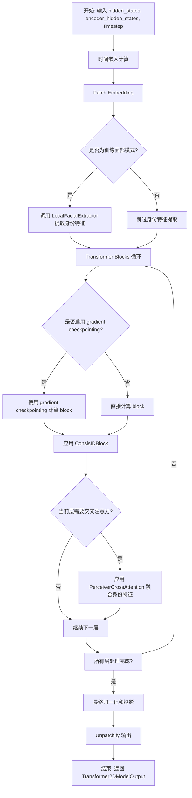
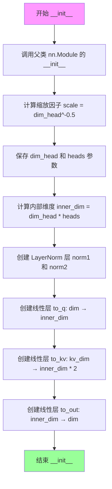
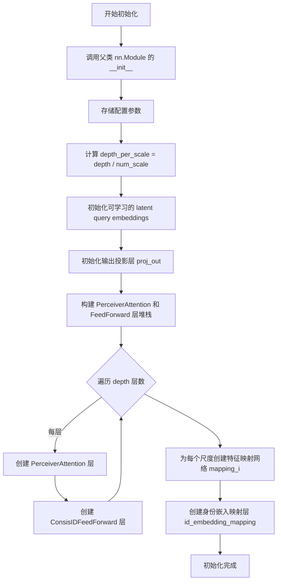
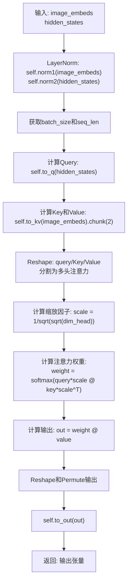
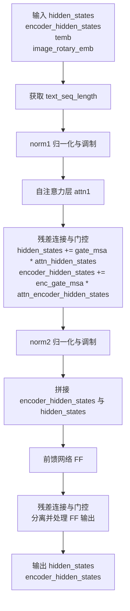
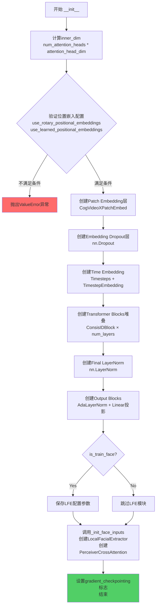
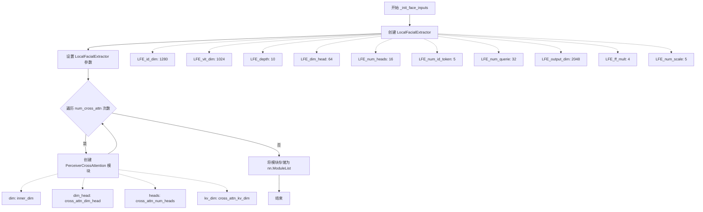
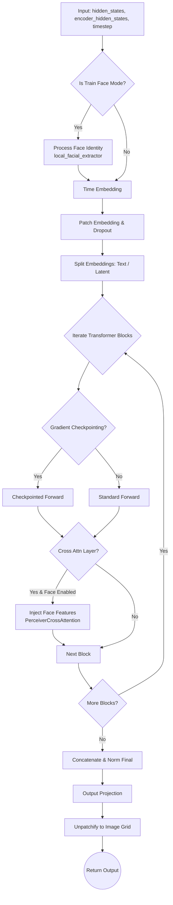
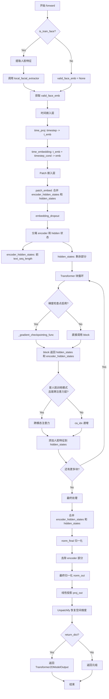

# `diffusers\src\diffusers\models\transformers\consisid_transformer_3d.py` 详细设计文档

ConsisID 是一个用于身份保持视频生成的 3D Transformer 模型，通过 Local Facial Extractor (LFE) 提取面部特征，并结合感知器交叉注意力机制将身份信息注入到视频生成过程中，实现高质量的身份一致性视频生成。

## 整体流程



## 类结构

```
nn.Module (PyTorch 基类)
├── PerceiverAttention (感知器注意力)
├── LocalFacialExtractor (本地面部特征提取器)
│   └── 包含多个 PerceiverAttention 和 FeedForward 层
├── PerceiverCrossAttention (感知器交叉注意力)
├── ConsisIDBlock (ConsisID Transformer 块)
│   ├── CogVideoXLayerNormZero (自定义归一化)
│   ├── Attention (自注意力)
│   └── FeedForward (前馈网络)
└── ConsisIDTransformer3DModel (主模型)
    ├── CogVideoXPatchEmbed (Patch 嵌入)
    ├── Timesteps / TimestepEmbedding (时间嵌入)
    ├── nn.ModuleList[ConsisIDBlock] (Transformer 块列表)
    ├── LocalFacialExtractor (可选)
    └── nn.ModuleList[PerceiverCrossAttention] (可选)
```

## 全局变量及字段


### `logger`
    
模块级日志记录器，用于记录运行时信息

类型：`logging.Logger`
    


### `PerceiverAttention.PerceiverAttention.scale`
    
缩放因子，用于注意力计算中的数值稳定

类型：`float`
    


### `PerceiverAttention.PerceiverAttention.dim_head`
    
注意力头维度，决定每个头的特征维度

类型：`int`
    


### `PerceiverAttention.PerceiverAttention.heads`
    
注意力头数量，决定并行注意力机制的数量

类型：`int`
    


### `PerceiverAttention.PerceiverAttention.norm1`
    
第一归一化层，用于输入特征标准化

类型：`nn.LayerNorm`
    


### `PerceiverAttention.PerceiverAttention.norm2`
    
第二归一化层，用于潜在特征标准化

类型：`nn.LayerNorm`
    


### `PerceiverAttention.PerceiverAttention.to_q`
    
查询投影，将输入映射到查询空间

类型：`nn.Linear`
    


### `PerceiverAttention.PerceiverAttention.to_kv`
    
键值投影，将输入映射到键和值空间

类型：`nn.Linear`
    


### `PerceiverAttention.PerceiverAttention.to_out`
    
输出投影，将注意力输出映射回原始维度

类型：`nn.Linear`
    


### `LocalFacialExtractor.LocalFacialExtractor.num_id_token`
    
身份令牌数量，定义身份相关令牌的数量

类型：`int`
    


### `LocalFacialExtractor.LocalFacialExtractor.vit_dim`
    
ViT 特征维度，视觉Transformer输出的特征维度

类型：`int`
    


### `LocalFacialExtractor.LocalFacialExtractor.num_queries`
    
查询令牌数量，用于捕获面部特征的查询数量

类型：`int`
    


### `LocalFacialExtractor.LocalFacialExtractor.depth`
    
深度，网络层数决定模型容量

类型：`int`
    


### `LocalFacialExtractor.LocalFacialExtractor.num_scale`
    
尺度数量，不同尺度视觉特征的数量

类型：`int`
    


### `LocalFacialExtractor.LocalFacialExtractor.latents`
    
可学习潜在查询嵌入，初始化为零均值的随机潜在向量

类型：`nn.Parameter`
    


### `LocalFacialExtractor.LocalFacialExtractor.proj_out`
    
输出投影参数，将潜在特征投影到输出维度

类型：`nn.Parameter`
    


### `LocalFacialExtractor.LocalFacialExtractor.layers`
    
Attention 和 FFN 层列表，包含感知器注意力与前馈网络

类型：`nn.ModuleList`
    


### `LocalFacialExtractor.LocalFacialExtractor.id_embedding_mapping`
    
身份嵌入映射网络，将身份特征映射到令牌空间

类型：`nn.Sequential`
    


### `PerceiverCrossAttention.PerceiverCrossAttention.scale`
    
缩放因子，用于注意力分数的归一化

类型：`float`
    


### `PerceiverCrossAttention.PerceiverCrossAttention.dim_head`
    
注意力头维度，每个注意力头的特征维度

类型：`int`
    


### `PerceiverCrossAttention.PerceiverCrossAttention.heads`
    
注意力头数量，控制并行注意力机制的数量

类型：`int`
    


### `PerceiverCrossAttention.PerceiverCrossAttention.norm1`
    
第一归一化层，用于图像嵌入的标准化

类型：`nn.LayerNorm`
    


### `PerceiverCrossAttention.PerceiverCrossAttention.norm2`
    
第二归一化层，用于隐藏状态的标准化

类型：`nn.LayerNorm`
    


### `PerceiverCrossAttention.PerceiverCrossAttention.to_q`
    
查询投影，从隐藏状态生成查询向量

类型：`nn.Linear`
    


### `PerceiverCrossAttention.PerceiverCrossAttention.to_kv`
    
键值投影，从图像嵌入生成键和值向量

类型：`nn.Linear`
    


### `PerceiverCrossAttention.PerceiverCrossAttention.to_out`
    
输出投影，将注意力结果映射回目标维度

类型：`nn.Linear`
    


### `ConsisIDBlock.ConsisIDBlock.norm1`
    
第一个归一化层(含门控)，结合时间嵌入进行特征调制

类型：`CogVideoXLayerNormZero`
    


### `ConsisIDBlock.ConsisIDBlock.attn1`
    
自注意力层，处理序列内部的关系建模

类型：`Attention`
    


### `ConsisIDBlock.ConsisIDBlock.norm2`
    
第二个归一化层(含门控)，用于前馈前的特征调制

类型：`CogVideoXLayerNormZero`
    


### `ConsisIDBlock.ConsisIDBlock.ff`
    
前馈网络层，提供非线性变换和特征提取

类型：`FeedForward`
    


### `ConsisIDTransformer3DModel.ConsisIDTransformer3DModel.patch_embed`
    
Patch 嵌入层，将输入视频转换为补丁序列

类型：`CogVideoXPatchEmbed`
    


### `ConsisIDTransformer3DModel.ConsisIDTransformer3DModel.embedding_dropout`
    
嵌入 dropout，防止过拟合的正则化层

类型：`nn.Dropout`
    


### `ConsisIDTransformer3DModel.ConsisIDTransformer3DModel.time_proj`
    
时间投影，将时间步映射到正弦余弦特征

类型：`Timesteps`
    


### `ConsisIDTransformer3DModel.ConsisIDTransformer3DModel.time_embedding`
    
时间嵌入，将时间特征映射到高维空间

类型：`TimestepEmbedding`
    


### `ConsisIDTransformer3DModel.ConsisIDTransformer3DModel.transformer_blocks`
    
Transformer 块列表，包含多个ConsisIDBlock组成的深度网络

类型：`nn.ModuleList`
    


### `ConsisIDTransformer3DModel.ConsisIDTransformer3DModel.norm_final`
    
最终归一化，用于输出前的特征标准化

类型：`nn.LayerNorm`
    


### `ConsisIDTransformer3DModel.ConsisIDTransformer3DModel.norm_out`
    
输出归一化，结合时间嵌入的自适应归一化

类型：`AdaLayerNorm`
    


### `ConsisIDTransformer3DModel.ConsisIDTransformer3DModel.proj_out`
    
输出投影，将特征映射到最终输出维度

类型：`nn.Linear`
    


### `ConsisIDTransformer3DModel.ConsisIDTransformer3DModel.is_train_face`
    
是否训练面部模式，控制身份保持模块的启用

类型：`bool`
    


### `ConsisIDTransformer3DModel.ConsisIDTransformer3DModel.is_kps`
    
是否使用关键点，控制关键点特征的引入

类型：`bool`
    


### `ConsisIDTransformer3DModel.ConsisIDTransformer3DModel.local_facial_extractor`
    
本地面部提取器(可选)，提取身份保持特征

类型：`LocalFacialExtractor`
    


### `ConsisIDTransformer3DModel.ConsisIDTransformer3DModel.perceiver_cross_attention`
    
感知器交叉注意力列表(可选)，用于身份特征的交叉注意力

类型：`nn.ModuleList`
    


### `ConsisIDTransformer3DModel.ConsisIDTransformer3DModel.gradient_checkpointing`
    
梯度检查点标志，控制梯度检查点以节省显存

类型：`bool`
    
    

## 全局函数及方法


### `PerceiverAttention.__init__`

该方法是 `PerceiverAttention` 类的初始化方法，用于构建一个感知器注意力（Perceiver Attention）模块，继承自 `nn.Module`。该模块通过自定义的多头注意力机制，实现对图像嵌入（image_embeds）和潜在变量（latents）之间的交叉注意力计算，支持可配置的维度、头数和键值维度，以适应不同的模型架构需求。

参数：

- `dim`：`int`，输入特征的维度（dimension），即隐藏状态的通道数
- `dim_head`：`int`，每个注意力头（attention head）的维度，默认为 64
- `heads`：`int`，注意力头的数量，默认为 8
- `kv_dim`：`int | None`，键（Key）和值（Value）的维度，默认为 None，此时与 `dim` 相同

返回值：`None`，无返回值（`__init__` 方法）

#### 流程图



#### 带注释源码

```
def __init__(self, dim: int, dim_head: int = 64, heads: int = 8, kv_dim: int | None = None):
    """
    初始化 PerceiverAttention 模块。
    
    参数:
        dim (int): 输入特征的维度（隐藏状态通道数）
        dim_head (int): 每个注意力头的维度，默认为 64
        heads (int): 注意力头数量，默认为 8
        kv_dim (int | None): 键值对的维度，若为 None 则使用 dim，默认为 None
    """
    # 调用父类 nn.Module 的初始化方法
    super().__init__()

    # 计算注意力缩放因子，用于后续注意力计算中的归一化
    self.scale = dim_head**-0.5
    
    # 保存注意力头维度和头数配置
    self.dim_head = dim_head
    self.heads = heads
    
    # 计算内部维度：头数 × 每头维度 = 总维度
    inner_dim = dim_head * heads

    # LayerNorm 层：
    # norm1 用于对 image_embeds 进行归一化，如果 kv_dim 为 None 则使用 dim，否则使用 kv_dim
    # norm2 用于对 latents 进行归一化，始终使用 dim
    self.norm1 = nn.LayerNorm(dim if kv_dim is None else kv_dim)
    self.norm2 = nn.LayerNorm(dim)

    # 线性变换层：
    # to_q: 将 latents 投影到查询空间 (dim → inner_dim)，不使用偏置
    self.to_q = nn.Linear(dim, inner_dim, bias=False)
    
    # to_kv: 将 image_embeds 投影到键值空间 (kv_dim → inner_dim * 2)，不使用偏置
    # chunk(2, dim=-1) 会将输出分割为 key 和 value 两部分
    self.to_kv = nn.Linear(dim if kv_dim is None else kv_dim, inner_dim * 2, bias=False)
    
    # to_out: 将注意力输出投影回原始维度 (inner_dim → dim)，不使用偏置
    self.to_out = nn.Linear(inner_dim, dim, bias=False)
```


### `PerceiverAttention.forward`

该方法实现了Perceiver Attention机制，通过对图像嵌入（image_embeds）和潜在变量（latents）进行交叉注意力计算，将图像信息融合到潜在表示中，支持多头注意力机制以捕获不同子空间的特征关系。

参数：

- `image_embeds`：`torch.Tensor`，图像嵌入张量，来自视觉编码器的特征表示，作为注意力机制中的key和value来源
- `latents`：`torch.Tensor`，潜在变量张量，作为查询（query）的来源，也是需要被更新的目标表示

返回值：`torch.Tensor`，经过注意力机制融合后的输出张量，维度与输入的latents相同

#### 流程图

```mermaid
flowchart TD
    A[开始 forward] --> B[对 image_embeds 进行 LayerNorm]
    B --> C[对 latents 进行 LayerNorm]
    C --> D[获取 batch_size 和 seq_len]
    D --> E[计算 Query: to_q(latents)]
    E --> F[拼接 image_embeds 和 latents]
    F --> G[计算 Key 和 Value: to_kv]
    G --> H[重塑 Query 为多头格式]
    H --> I[重塑 Key 为多头格式]
    I --> J[重塑 Value 为多头格式]
    J --> K[计算缩放因子 scale]
    K --> L[计算注意力权重 weight]
    L --> M[应用 Softmax]
    M --> N[计算加权输出]
    N --> O[重塑输出维度]
    O --> P[应用输出线性变换 to_out]
    P --> Q[返回最终结果]
```

#### 带注释源码

```python
def forward(self, image_embeds: torch.Tensor, latents: torch.Tensor) -> torch.Tensor:
    # Step 1: Apply normalization
    # 对图像嵌入进行LayerNorm归一化，稳定训练过程
    image_embeds = self.norm1(image_embeds)
    # 对潜在变量进行LayerNorm归一化
    latents = self.norm2(latents)

    # Step 2: Get batch size and sequence length
    # 从latents张量中获取批次大小和序列长度
    batch_size, seq_len, _ = latents.shape

    # Step 3: Compute query, key, and value matrices
    # 使用线性层to_q对latents进行线性变换生成query
    query = self.to_q(latents)
    # 将image_embeds和latents在序列维度(-2)上拼接，作为key和value的输入
    kv_input = torch.cat((image_embeds, latents), dim=-2)
    # 使用线性层to_kv生成key和value，chunk(2, dim=-1)将结果分成两部分
    key, value = self.to_kv(kv_input).chunk(2, dim=-1)

    # Step 4: Reshape the tensors for multi-head attention
    # 将query重塑为 [batch, seq, heads, head_dim] 然后转置为 [batch, heads, seq, head_dim]
    query = query.reshape(query.size(0), -1, self.heads, self.dim_head).transpose(1, 2)
    # 同样方式重塑key
    key = key.reshape(key.size(0), -1, self.heads, self.dim_head).transpose(1, 2)
    # 同样方式重塑value
    value = value.reshape(value.size(0), -1, self.heads, self.dim_head).transpose(1, 2)

    # Step 5: Compute attention
    # 计算缩放因子，使用dim_head的平方根倒数的平方，比直接除法更数值稳定
    scale = 1 / math.sqrt(math.sqrt(self.dim_head))
    # 计算注意力分数：query * scale 与 key * scale 的矩阵乘法
    weight = (query * scale) @ (key * scale).transpose(-2, -1)
    # 对注意力权重进行softmax归一化，保持原始数据类型
    weight = torch.softmax(weight.float(), dim=-1).type(weight.dtype)
    # 计算注意力输出：权重与value的矩阵乘法
    output = weight @ value

    # Step 6: Reshape and return the final output
    # 重新排列维度顺序并重塑为 [batch, seq, hidden_dim]
    output = output.permute(0, 2, 1, 3).reshape(batch_size, seq_len, -1)

    # 通过输出线性层变换并返回最终结果
    return self.to_out(output)
```


### `LocalFacialExtractor.__init__`

该方法是 `LocalFacialExtractor` 类的构造函数，用于初始化局部面部特征提取器模块。该模块主要用于将身份嵌入（id_embeds）和视觉Transformer的隐藏状态（vit_hidden_states）进行处理，生成用于身份保持的高质量面部特征表示。

参数：

- `id_dim`：`int`，默认值 1280，身份嵌入向量的维度
- `vit_dim`：`int`，默认值 1024，视觉Transformer（ViT）输出的特征维度
- `depth`：`int`，默认值 10，PerceiverAttention 和 FeedForward 层的总深度
- `dim_head`：`int`，默认值 64，每个注意力头 的维度
- `heads`：`int`，默认值 16，注意力头的数量
- `num_id_token`：`int`，默认值 5，身份令牌的数量
- `num_queries`：`int`，默认值 32，查询令牌的数量，用于捕获高频面部信息
- `output_dim`：`int`，默认值 2048，输出特征的维度
- `ff_mult`：`int`，默认值 4，FeedForward 网络隐藏层大小的乘数因子
- `num_scale`：`int`，默认值 5，不同尺度视觉特征的数量

返回值：`None`，构造函数不返回任何值

#### 流程图



#### 带注释源码

```python
def __init__(
    self,
    id_dim: int = 1280,
    vit_dim: int = 1024,
    depth: int = 10,
    dim_head: int = 64,
    heads: int = 16,
    num_id_token: int = 5,
    num_queries: int = 32,
    output_dim: int = 2048,
    ff_mult: int = 4,
    num_scale: int = 5,
):
    """
    初始化 LocalFacialExtractor 局部面部特征提取器

    参数:
        id_dim: 身份嵌入向量的维度,默认1280
        vit_dim: 视觉Transformer输出的特征维度,默认1024
        depth: 注意力层和前馈网络的总数,默认10
        dim_head: 每个注意力头的维度,默认64
        heads: 注意力头的数量,默认16
        num_id_token: 身份令牌的数量,默认5
        num_queries: 查询令牌的数量,默认32
        output_dim: 输出特征的维度,默认2048
        ff_mult: 前馈网络隐藏层维度的乘数,默认4
        num_scale: 视觉特征的不同尺度数量,默认5
    """
    # 调用父类 nn.Module 的初始化方法
    super().__init__()

    # ========== 存储身份令牌和查询的配置信息 ==========
    self.num_id_token = num_id_token          # 身份令牌数量
    self.vit_dim = vit_dim                    # ViT特征维度
    self.num_queries = num_queries            # 查询令牌数量
    
    # 断言: depth 必须能被 num_scale 整除,确保均匀分层
    assert depth % num_scale == 0
    # 计算每个尺度的层数
    self.depth = depth // num_scale
    self.num_scale = num_scale                # 尺度数量
    
    # 计算缩放因子用于初始化
    scale = vit_dim**-0.5

    # ========== 可学习的潜在查询嵌入 ==========
    # 初始化形状为 [1, num_queries, vit_dim] 的随机 latent queries
    # 使用缩放因子进行初始化以保持方差稳定
    self.latents = nn.Parameter(torch.randn(1, num_queries, vit_dim) * scale)
    
    # ========== 输出投影层 ==========
    # 将 latent 输出映射到目标输出维度
    # 形状: [vit_dim, output_dim]
    self.proj_out = nn.Parameter(scale * torch.randn(vit_dim, output_dim))

    # ========== Attention 和 FeedForward 层堆栈 ==========
    self.layers = nn.ModuleList([])
    for _ in range(depth):
        self.layers.append(
            nn.ModuleList(
                [
                    # Perceiver Attention 层: 用于处理身份特征和查询之间的注意力
                    PerceiverAttention(
                        dim=vit_dim, 
                        dim_head=dim_head, 
                        heads=heads
                    ),
                    # ConsisIDFeedForward 层: 前馈神经网络
                    nn.Sequential(
                        nn.LayerNorm(vit_dim),
                        nn.Linear(vit_dim, vit_dim * ff_mult, bias=False),
                        nn.GELU(),
                        nn.Linear(vit_dim * ff_mult, vit_dim, bias=False),
                    ),
                ]
            )
        )

    # ========== 为每个尺度创建 ViT 特征映射网络 ==========
    # 创建 5 个不同的映射层用于处理不同尺度的视觉特征
    for i in range(num_scale):
        setattr(
            self,
            f"mapping_{i}",
            nn.Sequential(
                nn.Linear(vit_dim, vit_dim),
                nn.LayerNorm(vit_dim),
                nn.LeakyReLU(),
                nn.Linear(vit_dim, vit_dim),
                nn.LayerNorm(vit_dim),
                nn.LeakyReLU(),
                nn.Linear(vit_dim, vit_dim),
            ),
        )

    # ========== 身份嵌入向量映射层 ==========
    # 将身份嵌入映射到可以与 latent queries 拼接的令牌空间
    self.id_embedding_mapping = nn.Sequential(
        nn.Linear(id_dim, vit_dim),
        nn.LayerNorm(vit_dim),
        nn.LeakyReLU(),
        nn.Linear(vit_dim, vit_dim),
        nn.LayerNorm(vit_dim),
        nn.LeakyReLU(),
        nn.Linear(vit_dim, vit_dim * num_id_token),  # 输出 num_id_token 个身份令牌
    )
```


### `LocalFacialExtractor.forward`

该方法是LocalFacialExtractor类的核心前向传播函数，负责从身份嵌入向量和ViT隐藏状态中提取并融合局部面部特征，通过多层感知器注意力和前馈网络处理后，输出用于身份保真的特征表示。

参数：

- `id_embeds`：`torch.Tensor`，身份嵌入向量，通常来自人脸识别模型（如ArcFace）的输出，形状为[batch_size, id_dim]
- `vit_hidden_states`：`list[torch.Tensor]`，ViT（Vision Transformer）多尺度隐藏状态列表，长度为num_scale（默认为5），每个元素的形状为[batch_size, seq_len, vit_dim]

返回值：`torch.Tensor`，经过处理后的latent特征，形状为[batch_size, num_queries, output_dim]（默认[batch_size, 32, 2048]）

#### 流程图

```mermaid
flowchart TD
    A[开始 forward] --> B[重复latent queries: latents = latents.repeat batch_size]
    C[映射身份嵌入: id_embeds = id_embedding_mapping id_embeds]
    C --> D[reshape id_embeds为token形式]
    D --> E[拼接latent和id_embeds: torch.cat]
    
    B --> E
    
    E --> F{遍历每个scale i}
    F -->|i=0| G[获取vit_feature: mapping_i vit_hidden_states[i]]
    G --> H[拼接id_embeds和vit_feature]
    H --> I[遍历该scale对应的depth层]
    I --> J[PerceiverAttention: latents = attn + latents]
    J --> K[FeedForward: latents = ff + latents]
    K --> I
    I --> L[进入下一个scale]
    L --> F
    
    F --> M[截取query latents: latents[:, :num_queries]]
    M --> N[投影到输出维度: latents @ proj_out]
    N --> O[返回结果]
```

#### 带注释源码

```python
def forward(self, id_embeds: torch.Tensor, vit_hidden_states: list[torch.Tensor]) -> torch.Tensor:
    """
    LocalFacialExtractor的前向传播方法
    
    参数:
        id_embeds: 身份嵌入向量 [batch_size, id_dim]
        vit_hidden_states: ViT多尺度隐藏状态列表 [num_scale][batch_size, seq_len, vit_dim]
    
    返回:
        处理后的latent特征 [batch_size, num_queries, output_dim]
    """
    # 步骤1: 复制可学习的latent查询向量以匹配批量大小
    # latent初始形状: [1, num_queries, vit_dim] -> [batch_size, num_queries, vit_dim]
    latents = self.latents.repeat(id_embeds.size(0), 1, 1)

    # 步骤2: 将身份嵌入映射到token空间
    # 先通过id_embedding_mapping映射到vit_dim维度，再reshape为多个id token
    # 输入: [batch_size, id_dim] -> [batch_size, vit_dim * num_id_token]
    # reshape: [batch_size, vit_dim * num_id_token] -> [batch_size, num_id_token, vit_dim]
    id_embeds = self.id_embedding_mapping(id_embeds)
    id_embeds = id_embeds.reshape(-1, self.num_id_token, self.vit_dim)

    # 步骤3: 将身份token拼接到latent查询之前
    # 拼接后的形状: [batch_size, num_queries + num_id_token, vit_dim]
    latents = torch.cat((latents, id_embeds), dim=1)

    # 步骤4: 遍历每个尺度的ViT特征进行融合处理
    for i in range(self.num_scale):
        # 获取当前scale的ViT特征并通过对应的mapping层
        vit_feature = getattr(self, f"mapping_{i}")(vit_hidden_states[i])
        
        # 将身份特征与ViT特征拼接作为cross attention的context
        # ctx_feature形状: [batch_size, num_id_token + seq_len_i, vit_dim]
        ctx_feature = torch.cat((id_embeds, vit_feature), dim=1)

        # 遍历该scale对应的depth层（每层包含PerceiverAttention和FeedForward）
        for attn, ff in self.layers[i * self.depth : (i + 1) * self.depth]:
            # PerceiverAttention: 使用ViT特征作为context更新latent
            # 输入: ctx_feature [batch, num_id_token+seq, dim], latents [batch, num_queries+num_id_token, dim]
            # 输出: [batch, num_queries+num_id_token, dim]
            latents = attn(ctx_feature, latents) + latents
            
            # FeedForward: 前馈网络进一步处理
            latents = ff(latents) + latents

    # 步骤5: 只保留query部分的latents（去除id token部分）
    # 形状: [batch_size, num_queries + num_id_token, vit_dim] -> [batch_size, num_queries, vit_dim]
    latents = latents[:, : self.num_queries]
    
    # 步骤6: 通过投影矩阵将特征投影到目标输出维度
    # 形状: [batch_size, num_queries, vit_dim] -> [batch_size, num_queries, output_dim]
    latents = latents @ self.proj_out
    
    return latents
```


### `PerceiverCrossAttention.__init__`

该方法是 `PerceiverCrossAttention` 类的构造函数，用于初始化一个感知器交叉注意力模块。该模块通过线性层生成查询、键、值，并使用层归一化来稳定训练过程。

参数：

- `dim`：`int`，默认值 3072，表示输入和输出的主维度
- `dim_head`：`int`，默认值 128，表示每个注意力头的维度
- `heads`：`int`，默认值 16，表示注意力头的数量
- `kv_dim`：`int`，默认值 2048，表示键值对的维度

返回值：`None`，构造函数不返回任何值，仅初始化对象属性

#### 流程图

```mermaid
flowchart TD
    A[开始 __init__] --> B[调用父类构造函数 super().__init__]
    B --> C[计算缩放因子 scale = dim_head ** -0.5]
    C --> D[保存 dim_head 和 heads 属性]
    D --> E[计算 inner_dim = dim_head * heads]
    E --> F[创建 LayerNorm 层 norm1]
    F --> G[创建 LayerNorm 层 norm2]
    G --> H[创建线性层 to_q: dim -> inner_dim]
    H --> I[创建线性层 to_kv: kv_dim -> inner_dim * 2]
    I --> J[创建线性层 to_out: inner_dim -> dim]
    J --> K[结束 __init__]
```

#### 带注释源码

```python
def __init__(self, dim: int = 3072, dim_head: int = 128, heads: int = 16, kv_dim: int = 2048):
    """
    初始化 PerceiverCrossAttention 模块

    参数:
        dim: 输入和输出的主维度，默认值为 3072
        dim_head: 每个注意力头的维度，默认值为 128
        heads: 注意力头的数量，默认值为 16
        kv_dim: 键值对的维度，默认值为 2048
    """
    # 调用父类 nn.Module 的初始化方法
    super().__init__()

    # 计算缩放因子，用于注意力分数的缩放
    self.scale = dim_head**-0.5
    # 保存注意力头的维度
    self.dim_head = dim_head
    # 保存注意力头的数量
    self.heads = heads
    # 计算内部维度：头的数量 × 每个头的维度
    inner_dim = dim_head * heads

    # Layer normalization 层，用于稳定训练过程
    # norm1 对 kv_dim 维度进行归一化（如果 kv_dim 为 None，则使用 dim）
    self.norm1 = nn.LayerNorm(dim if kv_dim is None else kv_dim)
    # norm2 对 dim 维度进行归一化
    self.norm2 = nn.LayerNorm(dim)

    # 线性变换层，用于生成查询（Query）
    # 将 dim 维度的输入映射到 inner_dim 维度
    self.to_q = nn.Linear(dim, inner_dim, bias=False)
    
    # 线性变换层，用于生成键（Key）和值（Value）
    # 将 kv_dim 维度的输入映射到 inner_dim * 2 维度，然后 chunk 成 key 和 value
    self.to_kv = nn.Linear(dim if kv_dim is None else kv_dim, inner_dim * 2, bias=False)
    
    # 输出线性层，将 inner_dim 维度映射回 dim 维度
    self.to_out = nn.Linear(inner_dim, dim, bias=False)
```


### `PerceiverCrossAttention.forward`

该方法是 PerceiverCrossAttention 类的前向传播函数，实现了一种交叉注意力机制，其中查询（Query）来自隐藏状态（latent 序列），而键（Key）和值（Value）来自图像嵌入（image embeddings）。这种方法类似于 Perceiver 架构中的交叉注意力模块，允许模型使用图像特征来增强 latent 表示。

参数：

- `image_embeds`：`torch.Tensor`，图像嵌入张量，通常来自视觉编码器或面部特征提取器的输出，作为交叉注意力中的键和值来源
- `hidden_states`：`torch.Tensor`，隐藏状态张量，作为交叉注意力中的查询来源，通常是 transformer 的中间层输出

返回值：`torch.Tensor`，经过交叉注意力机制处理后的输出张量，与 hidden_states 具有相同的序列长度和维度

#### 流程图



#### 带注释源码

```python
def forward(self, image_embeds: torch.Tensor, hidden_states: torch.Tensor) -> torch.Tensor:
    # 第一步：对输入的图像嵌入和隐藏状态分别应用层归一化
    # 这有助于稳定训练过程
    image_embeds = self.norm1(image_embeds)
    hidden_states = self.norm2(hidden_states)

    # 获取批次大小和序列长度，用于后续的tensor重塑
    batch_size, seq_len, _ = hidden_states.shape

    # 第二步：计算查询（Query）、键（Key）和值（Value）
    # Query来自hidden_states（latent序列）
    # Key和Value来自image_embeds（图像特征）
    query = self.to_q(hidden_states)
    key, value = self.to_kv(image_embeds).chunk(2, dim=-1)

    # 第三步：将tensor重塑为多头注意力的格式
    # 从 [batch, seq_len, inner_dim] 转换为 [batch, heads, seq_len, dim_head]
    query = query.reshape(query.size(0), -1, self.heads, self.dim_head).transpose(1, 2)
    key = key.reshape(key.size(0), -1, self.heads, self.dim_head).transpose(1, 2)
    value = value.reshape(value.size(0), -1, self.heads, self.dim_head).transpose(1, 2)

    # 第四步：计算注意力权重
    # 使用缩放因子 1/sqrt(sqrt(dim_head))，这在f16精度下比事后除以缩放因子更稳定
    scale = 1 / math.sqrt(math.sqrt(self.dim_head))
    weight = (query * scale) @ (key * scale).transpose(-2, -1)
    # 应用softmax得到注意力权重，并保持原始数据类型
    weight = torch.softmax(weight.float(), dim=-1).type(weight.dtype)

    # 第五步：通过注意力权重对值进行加权求和，得到注意力输出
    out = weight @ value

    # 第六步：重塑和置换输出tensor以匹配最终的线性变换输入格式
    # 从 [batch, heads, seq_len, dim_head] 转换回 [batch, seq_len, inner_dim]
    out = out.permute(0, 2, 1, 3).reshape(batch_size, seq_len, -1)

    # 第七步：通过输出投影层得到最终输出
    return self.to_out(out)
```


### `ConsisIDBlock.__init__`

初始化 ConsisID 模型中的 Transformer 模块。该模块包含一个自注意力层（Attention）和一个前馈网络（FeedForward），并使用自定义的 `CogVideoXLayerNormZero` 对输入进行时间步长（timestep）调制的层归一化，以实现基于时间的动态特征调整。

参数：

- `dim`：`int`，输入和输出的通道数（feature dimension）。
- `num_attention_heads`：`int`，多头注意力机制中使用的注意力头数量。
- `attention_head_dim`：`int`，每个注意力头内部的通道维度。
- `time_embed_dim`：`int`，时间嵌入（timestep embedding）的通道维度，用于 AdaLN 调制。
- `dropout`：`float`，前馈网络中使用的 Dropout 概率，默认为 `0.0`。
- `activation_fn`：`str`，前馈网络中使用的激活函数类型，默认为 `"gelu-approximate"`。
- `attention_bias`：`bool`，注意力机制中的投影层是否使用偏置（bias），默认为 `False`。
- `qk_norm`：`bool`，是否在 Query 和 Key 投影后进行归一化，默认为 `True`。
- `norm_elementwise_affine`：`bool`，归一化层是否使用可学习的逐元素仿射参数（scale 和 bias），默认为 `True`。
- `norm_eps`：`float`，归一化层使用的 epsilon 数值，防止除零，默认为 `1e-5`。
- `final_dropout`：`bool`，是否在最后一个前馈层之后应用 Dropout，默认为 `True`。
- `ff_inner_dim`：`int | None`，前馈网络内部隐藏层的维度。如果为 `None`，则默认为 `4 * dim`。默认为 `None`。
- `ff_bias`：`bool`，前馈网络的线性层是否使用偏置，默认为 `True`。
- `attention_out_bias`：`bool`，注意力输出投影层是否使用偏置，默认为 `True`。

返回值：`None`（构造函数无返回值）

#### 流程图

```mermaid
graph TD
    Start([开始 __init__]) --> Super[调用 super().__init__]
    Super --> Norm1[初始化 self.norm1<br>CogVideoXLayerNormZero]
    Norm1 --> Attn1[初始化 self.attn1<br>Attention]
    Attn1 --> Norm2[初始化 self.norm2<br>CogVideoXLayerNormZero]
    Norm2 --> FF[初始化 self.ff<br>FeedForward]
    FF --> End([结束 __init__])
```

#### 带注释源码

```python
def __init__(
    self,
    dim: int,
    num_attention_heads: int,
    attention_head_dim: int,
    time_embed_dim: int,
    dropout: float = 0.0,
    activation_fn: str = "gelu-approximate",
    attention_bias: bool = False,
    qk_norm: bool = True,
    norm_elementwise_affine: bool = True,
    norm_eps: float = 1e-5,
    final_dropout: bool = True,
    ff_inner_dim: int | None = None,
    ff_bias: bool = True,
    attention_out_bias: bool = True,
):
    super().__init__()

    # 1. Self Attention Block
    # 初始化第一个归一化层，用于自注意力之前，并结合 time_embed_dim 进行 AdaLN 调制
    self.norm1 = CogVideoXLayerNormZero(time_embed_dim, dim, norm_elementwise_affine, norm_eps, bias=True)

    # 初始化自注意力层
    self.attn1 = Attention(
        query_dim=dim,
        dim_head=attention_head_dim,
        heads=num_attention_heads,
        qk_norm="layer_norm" if qk_norm else None,  # 根据 qk_norm 参数决定是否启用 QK 归一化
        eps=1e-6,
        bias=attention_bias,
        out_bias=attention_out_bias,
        processor=CogVideoXAttnProcessor2_0(),  # 使用特定的注意力处理器
    )

    # 2. Feed Forward Block
    # 初始化第二个归一化层，用于前馈网络之前，同样结合 time_embed_dim 进行 AdaLN 调制
    self.norm2 = CogVideoXLayerNormZero(time_embed_dim, dim, norm_elementwise_affine, norm_eps, bias=True)

    # 初始化前馈网络层
    self.ff = FeedForward(
        dim,
        dropout=dropout,
        activation_fn=activation_fn,
        final_dropout=final_dropout,
        inner_dim=ff_inner_dim,
        bias=ff_bias,
    )
```


### `ConsisIDBlock.forward`

该方法是 ConsisIDBlock 的前向传播函数，实现了 Transformer 块的核心逻辑：包括自注意力（Self-Attention）和前馈网络（Feed-Forward Network）两个子块，每个子块都包含层归一化、门控机制和残差连接，用于处理视频/图像生成任务中的时空特征和文本条件特征的融合。

参数：

- `hidden_states`：`torch.Tensor`，输入的隐藏状态，通常是经过 patch embedding 后的视频 latent 特征，形状为 `(batch_size, seq_len, dim)`
- `encoder_hidden_states`：`torch.Tensor`，编码器隐藏状态，通常是文本嵌入经过处理后的特征，用于提供条件信息，形状为 `(batch_size, text_seq_length, dim)`
- `temb`：`torch.Tensor`，时间步嵌入（timestep embedding），用于注入扩散模型的时间步信息，形状为 `(batch_size, time_embed_dim)`
- `image_rotary_emb`：`tuple[torch.Tensor, torch.Tensor] | None`，可选的图像旋转位置嵌入，用于提供旋转位置编码信息，包含两个张量的元组

返回值：`tuple[torch.Tensor, torch.Tensor]`，返回两个隐藏状态张量，分别是处理后的 `hidden_states` 和 `encoder_hidden_states`，用于下一个 Transformer 块的级联

#### 流程图



#### 带注释源码

```python
def forward(
    self,
    hidden_states: torch.Tensor,
    encoder_hidden_states: torch.Tensor,
    temb: torch.Tensor,
    image_rotary_emb: tuple[torch.Tensor, torch.Tensor] | None = None,
) -> tuple[torch.Tensor, torch.Tensor]:
    # 获取文本序列长度，用于后续分割 encoder_hidden_states 和 hidden_states
    text_seq_length = encoder_hidden_states.size(1)

    # ========== 第一个子块：自注意力 (Self-Attention) ==========
    
    # 1. 归一化与调制：对 hidden_states 和 encoder_hidden_states 进行层归一化，
    #    并通过 time embedding (temb) 进行调制，返回归一化后的张量和门控系数
    norm_hidden_states, norm_encoder_hidden_states, gate_msa, enc_gate_msa = self.norm1(
        hidden_states, encoder_hidden_states, temb
    )

    # 2. 自注意力计算：使用 CogVideoX 专用的注意力处理器计算自注意力，
    #    支持旋转位置嵌入 (image_rotary_emb) 和跨序列注意力
    attn_hidden_states, attn_encoder_hidden_states = self.attn1(
        hidden_states=norm_hidden_states,
        encoder_hidden_states=norm_encoder_hidden_states,
        image_rotary_emb=image_rotary_emb,
    )

    # 3. 残差连接：将注意力输出通过门控系数加权后加回原始输入，
    #    实现信息流的无梯度衰减传递
    hidden_states = hidden_states + gate_msa * attn_hidden_states
    encoder_hidden_states = encoder_hidden_states + enc_gate_msa * attn_encoder_hidden_states

    # ========== 第二个子块：前馈网络 (Feed-Forward Network) ==========
    
    # 4. 归一化与调制：类似第一步，对当前隐藏状态进行归一化和调制
    norm_hidden_states, norm_encoder_hidden_states, gate_ff, enc_gate_ff = self.norm2(
        hidden_states, encoder_hidden_states, temb
    )

    # 5. 拼接输入：将 encoder_hidden_states 放在序列前面，hidden_states 放在后面，
    #    这样 FFN 可以同时处理文本条件和视觉特征
    norm_hidden_states = torch.cat([norm_encoder_hidden_states, norm_hidden_states], dim=1)
    
    # 6. 前馈网络计算：使用 GELU 激活函数的前馈网络进行特征变换
    ff_output = self.ff(norm_hidden_states)

    # 7. 残差连接与分割：根据之前记录的 text_seq_length 分割 FF 输出，
    #    并分别通过门控系数加权后加回对应的输入
    hidden_states = hidden_states + gate_ff * ff_output[:, text_seq_length:]
    encoder_hidden_states = encoder_hidden_states + enc_gate_ff * ff_output[:, :text_seq_length]

    # 返回处理后的两个隐藏状态，供下一个 Transformer 块使用
    return hidden_states, encoder_hidden_states
```


### `ConsisIDTransformer3DModel.__init__`

该方法是 `ConsisIDTransformer3DModel` 类的初始化方法，负责构建ConsisID视频生成Transformer模型的所有组件，包括patch嵌入、时间嵌入、Transformer块堆叠、输出块以及可选的人脸识别模块（Local Facial Extractor）。

参数：

- `num_attention_heads`：`int`，默认值 `30`，多头注意力机制中使用的头数
- `attention_head_dim`：`int`，默认值 `64`，每个注意力头的通道数
- `in_channels`：`int`，默认值 `16`，输入通道数
- `out_channels`：`int | None`，默认值 `16`，输出通道数
- `flip_sin_to_cos`：`bool`，默认值 `True`，是否在时间嵌入中将正弦函数翻转为余弦函数
- `freq_shift`：`int`，默认值 `0`，频率偏移量
- `time_embed_dim`：`int`，默认值 `512`，时间嵌入的输出维度
- `text_embed_dim`：`int`，默认值 `4096`，文本编码器输入文本嵌入的维度
- `num_layers`：`int`，默认值 `30`，使用的Transformer块数量
- `dropout`：`float`，默认值 `0.0`，Dropout概率
- `attention_bias`：`bool`，默认值 `True`，注意力投影层是否使用偏置
- `sample_width`：`int`，默认值 `90`，输入潜在表示的宽度
- `sample_height`：`int`，默认值 `60`，输入潜在表示的高度
- `sample_frames`：`int`，默认值 `49`，输入潜在表示的帧数（注意：默认初始化为49而非13以保持向后兼容）
- `patch_size`：`int`，默认值 `2`，补丁嵌入层使用的补丁大小
- `temporal_compression_ratio`：`int`，默认值 `4`，时间维度上的压缩比
- `max_text_seq_length`：`int`，默认值 `226`，输入文本嵌入的最大序列长度
- `activation_fn`：`str`，默认值 `"gelu-approximate"`，前馈网络使用的激活函数
- `timestep_activation_fn`：`str`，默认值 `"silu"`，生成时间步嵌入时使用的激活函数
- `norm_elementwise_affine`：`bool`，默认值 `True`，归一化层是否使用逐元素仿射参数
- `norm_eps`：`float`，默认值 `1e-5`，归一化层的epsilon值
- `spatial_interpolation_scale`：`float`，默认值 `1.875`，3D位置嵌入在空间维度上的缩放因子
- `temporal_interpolation_scale`：`float`，默认值 `1.0`，3D位置嵌入在时间维度上的缩放因子
- `use_rotary_positional_embeddings`：`bool`，默认值 `False`，是否使用旋转位置嵌入
- `use_learned_positional_embeddings`：`bool`，默认值 `False`，是否使用可学习位置嵌入
- `is_train_face`：`bool`，默认值 `False`，是否启用身份保持模块进行训练
- `is_kps`：`bool`，默认值 `False`，是否为全局人脸提取器启用关键点
- `cross_attn_interval`：`int`，默认值 `2`，交叉注意力层之间的间隔
- `cross_attn_dim_head`：`int`，默认值 `128`，交叉注意力层中每个注意力头的维度
- `cross_attn_num_heads`：`int`，默认值 `16`，交叉注意力层的注意力头数
- `LFE_id_dim`：`int`，默认值 `1280`，局部人脸提取器（LFE）中使用的身份向量维度
- `LFE_vit_dim`：`int`，默认值 `1024`，局部人脸提取器（LFE）中Vision Transformer输出的维度
- `LFE_depth`：`int`，默认值 `10`，局部人脸提取器（LFE）的层数
- `LFE_dim_head`：`int`，默认值 `64`，局部人脸提取器（LFE）中每个注意力头的维度
- `LFE_num_heads`：`int`，默认值 `16`，局部人脸提取器（LFE）的注意力头数
- `LFE_num_id_token`：`int`，默认值 `5`，局部人脸提取器（LFE）中使用的身份令牌数量
- `LFE_num_querie`：`int`，默认值 `32`，局部人脸提取器（LFE）中使用的查询令牌数量
- `LFE_output_dim`：`int`，默认值 `2048`，局部人脸提取器（LFE）的输出维度
- `LFE_ff_mult`：`int`，默认值 `4`，局部人脸提取器（LFE）前馈网络隐藏层大小的乘法因子
- `LFE_num_scale`：`int`，默认值 `5`，不同尺度视觉特征的数量
- `local_face_scale`：`float`，默认值 `1.0`，用于调整模型中人脸特征重要性的缩放因子

返回值：`None`，该方法为初始化方法，不返回任何值

#### 流程图



#### 带注释源码

```python
@register_to_config
def __init__(
    self,
    num_attention_heads: int = 30,                    # 多头注意力的头数
    attention_head_dim: int = 64,                      # 每个注意力头的维度
    in_channels: int = 16,                             # 输入通道数
    out_channels: int | None = 16,                     # 输出通道数
    flip_sin_to_cos: bool = True,                      # 是否翻转正弦到余弦
    freq_shift: int = 0,                               # 频率偏移
    time_embed_dim: int = 512,                        # 时间嵌入维度
    text_embed_dim: int = 4096,                       # 文本嵌入维度
    num_layers: int = 30,                              # Transformer层数
    dropout: float = 0.0,                              # Dropout概率
    attention_bias: bool = True,                       # 注意力偏置
    sample_width: int = 90,                            # 样本宽度
    sample_height: int = 60,                           # 样本高度
    sample_frames: int = 49,                           # 样本帧数
    patch_size: int = 2,                               # 补丁大小
    temporal_compression_ratio: int = 4,               # 时间压缩比
    max_text_seq_length: int = 226,                   # 最大文本序列长度
    activation_fn: str = "gelu-approximate",           # 激活函数
    timestep_activation_fn: str = "silu",              # 时间步激活函数
    norm_elementwise_affine: bool = True,              # 归一化仿射参数
    norm_eps: float = 1e-5,                           # 归一化epsilon
    spatial_interpolation_scale: float = 1.875,        # 空间插值缩放
    temporal_interpolation_scale: float = 1.0,         # 时间插值缩放
    use_rotary_positional_embeddings: bool = False,    # 使用旋转位置嵌入
    use_learned_positional_embeddings: bool = False,   # 使用可学习位置嵌入
    is_train_face: bool = False,                       # 训练人脸模式
    is_kps: bool = False,                              # 使用关键点
    cross_attn_interval: int = 2,                      # 交叉注意力间隔
    cross_attn_dim_head: int = 128,                    # 交叉注意力头维度
    cross_attn_num_heads: int = 16,                    # 交叉注意力头数
    LFE_id_dim: int = 1280,                            # LFE身份维度
    LFE_vit_dim: int = 1024,                           # LFE ViT维度
    LFE_depth: int = 10,                               # LFE深度
    LFE_dim_head: int = 64,                            # LFE头维度
    LFE_num_heads: int = 16,                           # LFE头数
    LFE_num_id_token: int = 5,                         # LFE身份令牌数
    LFE_num_querie: int = 32,                          # LFE查询数
    LFE_output_dim: int = 2048,                        # LFE输出维度
    LFE_ff_mult: int = 4,                              # LFE前馈倍数
    LFE_num_scale: int = 5,                            # LFE尺度数
    local_face_scale: float = 1.0,                     # 人脸局部缩放
):
    super().__init__()
    
    # 计算内部维度：多头数量 × 头维度 = Transformer的通道维度
    inner_dim = num_attention_heads * attention_head_dim

    # 验证位置嵌入配置：不能同时禁用旋转嵌入并使用可学习嵌入
    if not use_rotary_positional_embeddings and use_learned_positional_embeddings:
        raise ValueError(
            "There are no ConsisID checkpoints available with disable rotary embeddings and learned positional "
            "embeddings. If you're using a custom model and/or believe this should be supported, please open an "
            "issue at https://github.com/huggingface/diffusers/issues."
        )

    # 1. 创建Patch Embedding层：将输入视频转换为补丁序列
    self.patch_embed = CogVideoXPatchEmbed(
        patch_size=patch_size,
        in_channels=in_channels,
        embed_dim=inner_dim,
        text_embed_dim=text_embed_dim,
        bias=True,
        sample_width=sample_width,
        sample_height=sample_height,
        sample_frames=sample_frames,
        temporal_compression_ratio=temporal_compression_ratio,
        max_text_seq_length=max_text_seq_length,
        spatial_interpolation_scale=spatial_interpolation_scale,
        temporal_interpolation_scale=temporal_interpolation_scale,
        use_positional_embeddings=not use_rotary_positional_embeddings,
        use_learned_positional_embeddings=use_learned_positional_embeddings,
    )
    # Dropout层：用于嵌入
    self.embedding_dropout = nn.Dropout(dropout)

    # 2. 创建时间嵌入：用于编码扩散过程的时间步
    self.time_proj = Timesteps(inner_dim, flip_sin_to_cos, freq_shift)
    self.time_embedding = TimestepEmbedding(inner_dim, time_embed_dim, timestep_activation_fn)

    # 3. 创建时空Transformer块堆叠
    self.transformer_blocks = nn.ModuleList(
        [
            ConsisIDBlock(
                dim=inner_dim,
                num_attention_heads=num_attention_heads,
                attention_head_dim=attention_head_dim,
                time_embed_dim=time_embed_dim,
                dropout=dropout,
                activation_fn=activation_fn,
                attention_bias=attention_bias,
                norm_elementwise_affine=norm_elementwise_affine,
                norm_eps=norm_eps,
            )
            for _ in range(num_layers)
        ]
    )
    # 最终归一化层
    self.norm_final = nn.LayerNorm(inner_dim, norm_eps, norm_elementwise_affine)

    # 4. 输出块：将Transformer输出转换回像素空间
    self.norm_out = AdaLayerNorm(
        embedding_dim=time_embed_dim,
        output_dim=2 * inner_dim,
        norm_elementwise_affine=norm_elementwise_affine,
        norm_eps=norm_eps,
        chunk_dim=1,
    )
    self.proj_out = nn.Linear(inner_dim, patch_size * patch_size * out_channels)

    # 保存训练配置
    self.is_train_face = is_train_face
    self.is_kps = is_kps

    # 5. 如果启用身份保持模块，配置LFE和交叉注意力
    if is_train_face:
        # 保存LFE配置参数
        self.LFE_id_dim = LFE_id_dim
        self.LFE_vit_dim = LFE_vit_dim
        self.LFE_depth = LFE_depth
        self.LFE_dim_head = LFE_dim_head
        self.LFE_num_heads = LFE_num_heads
        self.LFE_num_id_token = LFE_num_id_token
        self.LFE_num_querie = LFE_num_querie
        self.LFE_output_dim = LFE_output_dim
        self.LFE_ff_mult = LFE_ff_mult
        self.LFE_num_scale = LFE_num_scale
        
        # 交叉注意力配置
        self.inner_dim = inner_dim
        self.cross_attn_interval = cross_attn_interval
        self.num_cross_attn = num_layers // cross_attn_interval
        self.cross_attn_dim_head = cross_attn_dim_head
        self.cross_attn_num_heads = cross_attn_num_heads
        self.cross_attn_kv_dim = int(self.inner_dim / 3 * 2)
        self.local_face_scale = local_face_scale
        
        # 初始化人脸模块
        self._init_face_inputs()

    # 梯度检查点标志初始化
    self.gradient_checkpointing = False
```


### `ConsisIDTransformer3DModel._init_face_inputs`

该方法是 ConsisIDTransformer3DModel 类的私有方法，用于初始化面部识别相关的子模块，包括局部面部特征提取器（LocalFacialExtractor）和感知交叉注意力模块（PerceiverCrossAttention）。这些模块用于在视频生成过程中保留人物身份特征。

参数：
- 该方法无显式参数（仅包含隐式 `self` 参数）

返回值：`None`，该方法直接修改实例属性，不返回任何值

#### 流程图



#### 带注释源码

```python
def _init_face_inputs(self):
    """
    初始化面部输入模块，包括局部面部提取器和感知交叉注意力模块。
    这些模块用于在视频生成过程中提取和融合面部身份特征。
    """
    # 1. 创建局部面部特征提取器 (LocalFacialExtractor)
    # 该模块负责从输入的身份嵌入和ViT隐藏状态中提取面部特征
    self.local_facial_extractor = LocalFacialExtractor(
        id_dim=self.LFE_id_dim,            # 身份向量维度，默认1280
        vit_dim=self.LFE_vit_dim,           # ViT输出维度，默认1024
        depth=self.LFE_depth,               # 提取器层数，默认10
        dim_head=self.LFE_dim_head,         # 注意力头维度，默认64
        heads=self.LFE_num_heads,           # 注意力头数，默认16
        num_id_token=self.LFE_num_id_token, # 身份token数量，默认5
        num_queries=self.LFE_num_querie,    # 查询token数量，默认32
        output_dim=self.LFE_output_dim,     # 输出维度，默认2048
        ff_mult=self.LFE_ff_mult,            # 前馈网络扩展倍数，默认4
        num_scale=self.LFE_num_scale,       # 视觉特征尺度数，默认5
    )
    
    # 2. 创建感知交叉注意力模块列表 (PerceiverCrossAttention)
    # 该模块负责将面部特征与视频潜在特征进行交叉注意力融合
    # 模块数量由 num_layers // cross_attn_interval 决定
    self.perceiver_cross_attention = nn.ModuleList(
        [
            PerceiverCrossAttention(
                dim=self.inner_dim,                    # 主维度 (num_attention_heads * attention_head_dim)
                dim_head=self.cross_attn_dim_head,    # 交叉注意力头维度，默认128
                heads=self.cross_attn_num_heads,       # 交叉注意力头数，默认16
                kv_dim=self.cross_attn_kv_dim,         # Key/Value维度 (inner_dim / 3 * 2)
            )
            for _ in range(self.num_cross_attn)        # 循环创建 num_cross_attn 个模块
        ]
    )
```


### `ConsisIDTransformer3DModel.forward`

这是 ConsisID 模型的核心前向传播方法。它接收视频/图像的潜在表示 (latents)、文本嵌入、时间步以及可选的人脸身份特征，经过 Transformer 块处理，并通过可选的局部人脸提取器 (Local Facial Extractor) 和交叉注意力机制将身份信息注入模型，最终输出处理后的视频潜在表示。

参数：

-  `self`：`ConsisIDTransformer3DModel`，模型实例本身。
-  `hidden_states`：`torch.Tensor`，输入的隐藏状态，形状为 `(batch_size, num_frames, channels, height, width)`，代表视频或图像的潜在表示。
-  `encoder_hidden_states`：`torch.Tensor`，编码器隐藏状态，通常为文本嵌入，形状为 `(batch_size, text_seq_length, embed_dim)`。
-  `timestep`：`int | float | torch.LongTensor`，扩散过程的时间步，用于调度噪声添加。
-  `timestep_cond`：`torch.Tensor | None`，时间步的额外条件嵌入，用于更精细的时间控制，默认为 None。
-  `image_rotary_emb`：`tuple[torch.Tensor, torch.Tensor] | None`，图像的旋转位置嵌入 (RoPE)，用于增强空间位置感知，默认为 None。
-  `attention_kwargs`：`dict[str, Any] | None`，传递给注意力处理器的额外关键字参数（如 LoRA 缩放配置），默认为 None。
-  `id_cond`：`torch.Tensor | None`，身份条件向量，通常来自人脸识别模型（如 InsightFace）的嵌入，形状为 `(batch, id_dim)`，默认为 None。
-  `id_vit_hidden`：`torch.Tensor | None`，身份相关的 ViT 隐藏状态列表，包含多尺度视觉特征，形状为 `list[Tensor]`，默认为 None。
-  `return_dict`：`bool`，是否返回字典形式的输出对象 (Transformer2DModelOutput)，默认为 True。

返回值：`tuple[torch.Tensor] | Transformer2DModelOutput`，如果 `return_dict` 为 True，返回包含样本的 `Transformer2DModelOutput` 对象；否则返回元组 `(sample,)`。

#### 流程图



#### 带注释源码

```python
@apply_lora_scale("attention_kwargs")
def forward(
    self,
    hidden_states: torch.Tensor,
    encoder_hidden_states: torch.Tensor,
    timestep: int | float | torch.LongTensor,
    timestep_cond: torch.Tensor | None = None,
    image_rotary_emb: tuple[torch.Tensor, torch.Tensor] | None = None,
    attention_kwargs: dict[str, Any] | None = None,
    id_cond: torch.Tensor | None = None,
    id_vit_hidden: torch.Tensor | None = None,
    return_dict: bool = True,
) -> tuple[torch.Tensor] | Transformer2DModelOutput:
    # 1. 处理人脸身份特征 (Face Identity Processing)
    # 如果处于训练人脸模式，则提取人脸特征以注入到Transformer中
    valid_face_emb = None
    if self.is_train_face:
        # 确保数据设备和类型一致
        id_cond = id_cond.to(device=hidden_states.device, dtype=hidden_states.dtype)
        id_vit_hidden = [
            tensor.to(device=hidden_states.device, dtype=hidden_states.dtype) for tensor in id_vit_hidden
        ]
        # 使用局部人脸提取器生成高级人脸特征
        # 输入: id_cond (torch.Size([1, 1280])), id_vit_hidden (list of 5 tensors)
        # 输出: valid_face_emb (torch.Size([1, 32, 2048]))
        valid_face_emb = self.local_facial_extractor(
            id_cond, id_vit_hidden
        )

    # 2. 获取输入维度信息
    batch_size, num_frames, channels, height, width = hidden_states.shape

    # 3. 时间嵌入 (Time Embedding)
    timesteps = timestep
    t_emb = self.time_proj(timesteps)

    # 转换时间嵌入类型以匹配hidden_states，避免精度问题
    t_emb = t_emb.to(dtype=hidden_states.dtype)
    emb = self.time_embedding(t_emb, timestep_cond)  # 最终的时间条件嵌入

    # 4. Patch 嵌入 (Patch Embedding)
    # 将文本和图像块转换为序列向量
    # encoder_hidden_states: torch.Size([1, 226, 4096])
    # hidden_states: torch.Size([1, 13, 32, 60, 90])
    hidden_states = self.patch_embed(encoder_hidden_states, hidden_states)  # -> torch.Size([1, 17776, 3072])
    hidden_states = self.embedding_dropout(hidden_states)

    # 分离文本部分和图像潜在部分
    text_seq_length = encoder_hidden_states.shape[1]
    encoder_hidden_states = hidden_states[:, :text_seq_length]  # 保留文本序列
    hidden_states = hidden_states[:, text_seq_length:]  # 视觉潜在序列

    # 5. Transformer 块处理
    ca_idx = 0  # 交叉注意力层索引
    for i, block in enumerate(self.transformer_blocks):
        # 梯度检查点优化
        if torch.is_grad_enabled() and self.gradient_checkpointing:
            hidden_states, encoder_hidden_states = self._gradient_checkpointing_func(
                block,
                hidden_states,
                encoder_hidden_states,
                emb,
                image_rotary_emb,
            )
        else:
            hidden_states, encoder_hidden_states = block(
                hidden_states=hidden_states,
                encoder_hidden_states=encoder_hidden_states,
                temb=emb,
                image_rotary_emb=image_rotary_emb,
            )

        # 注入人脸身份信息 (Face ID Injection)
        if self.is_train_face:
            # 按照间隔插入交叉注意力层
            if i % self.cross_attn_interval == 0 and valid_face_emb is not None:
                # 使用 PerceiverCrossAttention 将人脸特征融合到视觉潜在中
                # valid_face_emb: torch.Size([2, 32, 2048])
                # hidden_states: torch.Size([2, 17550, 3072])
                hidden_states = hidden_states + self.local_face_scale * self.perceiver_cross_attention[ca_idx](
                    valid_face_emb, hidden_states
                )
                ca_idx += 1

    # 6. 最终处理与输出
    # 合并文本和视觉状态进行最终归一化
    hidden_states = torch.cat([encoder_hidden_states, hidden_states], dim=1)
    hidden_states = self.norm_final(hidden_states)
    # 丢弃文本部分，只保留视觉输出
    hidden_states = hidden_states[:, text_seq_length:]

    # 输出投影
    hidden_states = self.norm_out(hidden_states, temb=emb)
    hidden_states = self.proj_out(hidden_states)

    # 7. Unpatchify: 将序列还原为图像/视频张量
    p = self.config.patch_size
    # 调整形状维度顺序: (batch, frames, h, w, channels, p, p)
    output = hidden_states.reshape(batch_size, num_frames, height // p, width // p, -1, p, p)
    # 重新排列并展平维度得到最终输出
    output = output.permute(0, 1, 4, 2, 5, 3, 6).flatten(5, 6).flatten(3, 4)

    if not return_dict:
        return (output,)
    return Transformer2DModelOutput(sample=output)
```


### ConsisIDTransformer3DModel.forward

该方法是 ConsisIDTransformer3DModel 模型的核心推理方法，负责处理视频数据的完整前向传播。它首先对身份条件进行特征提取（当启用人脸训练模式时），然后依次执行时间嵌入、patch 嵌入、Transformer 块堆叠（包括自注意力和可选的跨模态人脸注意力）、最终投影和 unpatchify 操作，最终输出重构的视频潜在表示。

参数：

- `self`：类的实例方法隐含参数
- `hidden_states`：`torch.Tensor`，输入的隐藏状态，形状为 [batch_size, num_frames, channels, height, width]，代表视频帧数据
- `encoder_hidden_states`：`torch.Tensor`，编码器的隐藏状态，形状为 [batch_size, text_seq_length, text_embed_dim]，代表文本嵌入向量
- `timestep`：`int | float | torch.LongTensor`，扩散过程的时间步长，用于时间嵌入计算
- `timestep_cond`：`torch.Tensor | None`，可选的时间步条件，用于额外的条件嵌入
- `image_rotary_emb`：`tuple[torch.Tensor, torch.Tensor] | None`，可选的图像旋转嵌入，用于旋转位置编码
- `attention_kwargs`：`dict[str, Any] | None`，可选的注意力参数，用于 LORA 缩放
- `id_cond`：`torch.Tensor | None`，可选的身份条件嵌入，形状为 [batch_size, id_dim]，来自人脸识别模型
- `id_vit_hidden`：`torch.Tensor | None`，可选的 ViT 隐藏状态列表，来自视觉Transformer的多层特征
- `return_dict`：`bool`，默认为 True，是否返回字典格式的输出

返回值：`tuple[torch.Tensor] | Transformer2DModelOutput`，当 return_dict 为 True 时返回 Transformer2DModelOutput 对象（包含 sample 字段），否则返回元组

#### 流程图



#### 带注释源码

```python
@apply_lora_scale("attention_kwargs")
def forward(
    self,
    hidden_states: torch.Tensor,
    encoder_hidden_states: torch.Tensor,
    timestep: int | float | torch.LongTensor,
    timestep_cond: torch.Tensor | None = None,
    image_rotary_emb: tuple[torch.Tensor, torch.Tensor] | None = None,
    attention_kwargs: dict[str, Any] | None = None,
    id_cond: torch.Tensor | None = None,
    id_vit_hidden: torch.Tensor | None = None,
    return_dict: bool = True,
) -> tuple[torch.Tensor] | Transformer2DModelOutput:
    # 初始化有效人脸嵌入为 None
    valid_face_emb = None
    
    # 如果处于人脸训练模式，则提取人脸特征
    if self.is_train_face:
        # 将 id_cond 和 id_vit_hidden 移动到 hidden_states 相同的设备和数据类型
        id_cond = id_cond.to(device=hidden_states.device, dtype=hidden_states.dtype)
        id_vit_hidden = [
            tensor.to(device=hidden_states.device, dtype=hidden_states.dtype) 
            for tensor in id_vit_hidden
        ]
        
        # 调用本地人脸提取器处理身份条件
        # 输入: id_cond [batch, 1280], id_vit_hidden: 5个元素的列表，每个 [batch, 577, 1024]
        # 输出: valid_face_emb [batch, 32, 2048]
        valid_face_emb = self.local_facial_extractor(id_cond, id_vit_hidden)

    # 获取输入张量的维度信息
    # hidden_states 形状: [batch_size, num_frames, channels, height, width]
    batch_size, num_frames, channels, height, width = hidden_states.shape

    # ========== 1. 时间嵌入 ==========
    # 将 timestep 投影到时间嵌入空间
    timesteps = timestep
    t_emb = self.time_proj(timesteps)

    # 确保时间嵌入与 hidden_states 的数据类型一致（可能是 fp16）
    t_emb = t_emb.to(dtype=hidden_states.dtype)
    
    # 通过时间嵌入层生成最终的嵌入向量
    emb = self.time_embedding(t_emb, timestep_cond)

    # ========== 2. Patch 嵌入 ==========
    # encoder_hidden_states 形状: [batch, 226, 4096]
    # hidden_states 形状: [batch, 13, 32, 60, 90]
    # patch_embed 后的 hidden_states 形状: [batch, 17776, 3072]
    hidden_states = self.patch_embed(encoder_hidden_states, hidden_states)
    
    # 应用 dropout
    hidden_states = self.embedding_dropout(hidden_states)

    # 记录文本序列长度
    text_seq_length = encoder_hidden_states.shape[1]
    
    # 分离编码器隐藏状态和主要的隐藏状态
    encoder_hidden_states = hidden_states[:, :text_seq_length]  # [batch, 226, 3072]
    hidden_states = hidden_states[:, text_seq_length:]          # [batch, 17550, 3072]

    # ========== 3. Transformer 块处理 ==========
    ca_idx = 0  # 跨注意力索引计数器
    
    # 遍历所有 Transformer 块
    for i, block in enumerate(self.transformer_blocks):
        # 检查是否启用梯度检查点以节省显存
        if torch.is_grad_enabled() and self.gradient_checkpointing:
            hidden_states, encoder_hidden_states = self._gradient_checkpointing_func(
                block,
                hidden_states,
                encoder_hidden_states,
                emb,
                image_rotary_emb,
            )
        else:
            # 执行 Transformer 块的前向传播
            # 包含自注意力和前馈网络
            hidden_states, encoder_hidden_states = block(
                hidden_states=hidden_states,
                encoder_hidden_states=encoder_hidden_states,
                temb=emb,
                image_rotary_emb=image_rotary_emb,
            )

        # 如果处于人脸训练模式，在指定的间隔层添加跨模态人脸注意力
        if self.is_train_face:
            # 每隔 cross_attn_interval 层应用一次人脸跨注意力
            if i % self.cross_attn_interval == 0 and valid_face_emb is not None:
                # valid_face_emb: [batch, 32, 2048]
                # hidden_states: [batch, 17550, 3072]
                hidden_states = hidden_states + self.local_face_scale * self.perceiver_cross_attention[ca_idx](
                    valid_face_emb, hidden_states
                )
                ca_idx += 1

    # ========== 4. 最终处理 ==========
    # 合并编码器隐藏状态和主要的隐藏状态
    hidden_states = torch.cat([encoder_hidden_states, hidden_states], dim=1)
    
    # 最终归一化
    hidden_states = self.norm_final(hidden_states)
    
    # 去除编码器部分，只保留视频部分
    hidden_states = hidden_states[:, text_seq_length:]

    # 通过 AdaLayerNorm 和投影层
    hidden_states = self.norm_out(hidden_states, temb=emb)
    hidden_states = self.proj_out(hidden_states)

    # ========== 5. Unpatchify 恢复空间维度 ==========
    # 使用 patch_size 将一维序列还原为 4D/5D 张量
    p = self.config.patch_size
    # output 形状变换: [batch, frames, h//p, w//p, channels, p, p]
    output = hidden_states.reshape(batch_size, num_frames, height // p, width // p, -1, p, p)
    # 调整维度顺序: [batch, frames, channels, h, w]
    output = output.permute(0, 1, 4, 2, 5, 3, 6).flatten(5, 6).flatten(3, 4)

    # ========== 6. 返回结果 ==========
    if not return_dict:
        return (output,)
    
    return Transformer2DModelOutput(sample=output)
```

## 关键组件


### PerceiverAttention

PerceiverAttention是感知器注意力模块，实现了一种特殊的自注意力机制，用于处理图像嵌入(latents)和查询向量之间的注意力计算。该模块通过将图像特征和潜在变量拼接后计算注意力，支持多头注意力机制，并在注意力计算前进行层归一化处理。

### LocalFacialExtractor

LocalFacialExtractor是本地面部特征提取器模块，负责从ViT（Vision Transformer）的多尺度隐藏状态中提取身份相关的面部特征。该模块包含多层PerceiverAttention和前馈网络，支持5个不同尺度的ViT特征输入，通过可学习的潜在查询向量和身份嵌入映射来捕获面部身份信息。

### PerceiverCrossAttention

PerceiverCrossAttention是感知器交叉注意力模块，实现了跨模态的注意力计算。该模块接收图像嵌入和隐藏状态作为输入，通过分别计算查询、键、值向量来执行交叉注意力操作，支持多头注意力机制并在注意力计算前进行层归一化。

### ConsisIDBlock

ConsisIDBlock是ConsisID模型的核心Transformer块，包含了自注意力机制和前馈网络。该模块采用AdaLayerNormZero进行自适应层归一制，支持时间嵌入调节(temb)，集成了旋转位置嵌入(rope)，实现了门控机制来控制注意力输出和前馈输出的贡献。

### ConsisIDTransformer3DModel

ConsisIDTransformer3DModel是ConsisID的主模型类，继承自ModelMixin、AttentionMixin、ConfigMixin和PeftAdapterMixin。该模型是一个用于视频数据（如3D张量）的Transformer架构，集成了时间嵌入、空间-时间Transformer块、身份保持模块（LocalFacialExtractor）和交叉注意力机制，支持训练和推理两种模式，可处理文本嵌入和面部身份条件。


## 问题及建议


### 已知问题

- **变量命名错误**：`LFE_num_querie` 应该是 `LFE_num_queries`（复数形式），这是一个拼写错误，会导致API歧义。
- **硬编码的魔法数字**：`cross_attn_kv_dim = int(self.inner_dim / 3 * 2)` 缺乏注释说明为什么使用2/3这个比例。
- **重复的注意力计算逻辑**：`PerceiverAttention` 和 `PerceiverCrossAttention` 类中存在大量重复的tensor reshape、transpose和attention计算代码，可以提取为共享的注意力函数。
- **重复的归一化因子计算**：`scale = vit_dim**-0.5` 和 `scale = 1 / math.sqrt(math.sqrt(self.dim_head))` 在多处重复定义。
- **注释与实现不一致**：文档说明 `sample_frames` 参数错误初始化为49而非13，但代码中仍使用错误值以保持向后兼容性，这种做法会误导新用户。
- **动态属性访问性能**：`getattr(self, f"mapping_{i}")` 使用字符串动态查找属性，效率低于预定义的属性列表。
- **配置验证缺失**：`is_train_face` 和 `is_kps` 在 `__init__` 中作为普通属性赋值后使用，但如果传入无效组合（如 `is_train_face=False` 但提供了 `id_cond`），代码会静默忽略而不报错。
- **Device/Dtype转换冗余**：在forward方法中每次都进行 `to(device=..., dtype=...)` 转换，应该在模型初始化时处理。

### 优化建议

- 修正 `LFE_num_querie` 为 `LFE_num_queries` 并更新所有引用。
- 将重复的注意力计算逻辑提取为独立的辅助函数或基类方法。
- 在 `cross_attn_kv_dim` 计算处添加注释说明2/3比例的来源和设计意图。
- 将 `mapping_{i}` 属性改为列表或元组存储，避免运行时动态 `getattr` 调用。
- 添加配置验证逻辑，当 `is_train_face=False` 时明确检查并警告多余的 `id_cond` 和 `id_vit_hidden` 输入。
- 考虑在 `__init__` 或单独的预处理方法中处理device/dtype转换，而不是每次forward时重复转换。

## 其它


### 设计目标与约束

**设计目标**：实现一个用于视频生成的3D Transformer模型，支持身份保留（Identity Preservation）功能，通过Local Facial Extractor (LFE) 和 Perceiver Cross Attention机制将面部特征信息融入主模型推理过程，确保生成的视频中人物面部身份的一致性。

**核心约束**：
- 仅支持`is_train_face=True`时启用身份保留模块，训练阶段使用
- 依赖预训练的ViT模型提取面部特征（id_vit_hidden）
- 身份向量维度必须与LFE_id_dim匹配（默认1280）
- 时间步嵌入必须与time_embed_dim匹配以确保兼容性

### 错误处理与异常设计

**参数校验**：
- `use_rotary_positional_embeddings`和`use_learned_positional_embeddings`不能同时为True，否则抛出`ValueError`
- `depth % num_scale == 0`必须整除，否则`LocalFacialExtractor`初始化时触发`AssertionError`
- `id_cond`和`id_vit_hidden`在`is_train_face=True`时不能为None，否则后续计算会失败

**设备与类型兼容性**：
- `id_cond`和`id_vit_hidden`会在forward中自动转移至`hidden_states`相同设备和dtype
- 时间嵌入层输出会转换为与hidden_states一致的dtype以避免fp16/fp32混合问题

**梯度检查点兼容性**：
- 仅在`torch.is_grad_enabled()`和`self.gradient_checkpointing`同时为True时启用梯度检查点
- 梯度检查点仅应用于transformer_blocks，不应用于patch embedding和output blocks

### 数据流与状态机

**主数据流**：
1. 输入hidden_states (B, T, C, H, W) 和 encoder_hidden_states (B, seq_len, text_embed_dim)
2. 通过time_proj和time_embedding生成timestep embedding
3. 通过patch_embed将视频和文本嵌入转换为patch序列
4. 分离文本序列和视频latent序列
5. 依次通过transformer_blocks，每隔cross_attn_interval层注入一次身份特征
6. 最终通过unpatchify恢复为(B, T, C, H, W)格式

**身份保留数据流（is_train_face=True）**：
1. id_cond (B, id_dim) 和 id_vit_hidden (list of 5层ViT特征)
2. LocalFacialExtractor处理后生成valid_face_emb (B, num_queries, output_dim)
3. 通过PerceiverCrossAttention模块注入到transformer的hidden_states中
4. 注入位置由cross_attn_interval控制，每隔指定层数注入一次

### 外部依赖与接口契约

**必需的外部模块**：
- `configuration_utils.ConfigMixin, register_to_config`：配置参数管理
- `loaders.PeftAdapterMixin`：支持PEFT适配器
- `attention.Attention, AttentionMixin`：自注意力实现
- `attention_processor.CogVideoXAttnProcessor2_0`：注意力处理器
- `embeddings.CogVideoXPatchEmbed, TimestepEmbedding, Timesteps`：嵌入层
- `normalization.AdaLayerNorm, CogVideoXLayerNormZero`：归一化层
- `modeling_outputs.Transformer2DModelOutput`：输出结构
- `modeling_utils.ModelMixin`：模型基类

**前向接口契约**：
- `hidden_states`: torch.Tensor, shape (B, T, C, H, W)，视频latent输入
- `encoder_hidden_states`: torch.Tensor, shape (B, seq_len, text_embed_dim)，文本嵌入
- `timestep`: int/float/torch.LongTensor，时间步
- `timestep_cond`: torch.Tensor，可选的时间步条件
- `image_rotary_emb`: tuple，可选的旋转位置编码
- `id_cond`: torch.Tensor，可选的身份向量（is_train_face时必需）
- `id_vit_hidden`: list[torch.Tensor]，可选的ViT隐藏状态（is_train_face时必需）

### 配置参数详解

**模型架构参数**：
- `num_attention_heads=30`：主Transformer注意力头数
- `attention_head_dim=64`：每个注意力头的维度
- `num_layers=30`：Transformer块数量
- `in_channels=16`：输入通道数

**身份保留模块参数（LFE）**：
- `LFE_id_dim=1280`：身份向量输入维度
- `LFE_vit_dim=1024`：ViT特征维度
- `LFE_depth=10`：LFE内部层数
- `LFE_num_scale=5`：视觉特征尺度数量
- `LFE_num_id_token=5`：身份token数量
- `LFE_num_querie=32`：查询token数量

**位置编码参数**：
- `spatial_interpolation_scale=1.875`：空间维度旋转位置编码缩放
- `temporal_interpolation_scale=1.0`：时间维度旋转位置编码缩放
- `use_rotary_positional_embeddings=False`：是否使用旋转位置编码

### 性能特征

**计算复杂度**：
- 自注意力：O(B * L^2 * d)，L为序列长度
- 跨注意力注入：O(B * L * Q * d)，Q为查询数（32）
- LFE计算：与depth和num_scale成正比

**内存占用**：
- 模型参数量约数百MB（取决于配置）
- 梯度检查点可将显存占用降低约30-50%
- identity模块额外占用约LFE_depth * 层参数

**优化建议**：
- 使用`gradient_checkpointing=True`减少显存
- 跨注意力间隔可调（cross_attn_interval），增大可减少计算量但影响身份保留效果

### 版本兼容性说明

**已知问题**：
- `sample_frames`默认值为49但实际处理13帧（由于历史原因保持向后兼容）
- 正确的帧数应为((K-1) * temporal_compression_ratio + 1)

**依赖版本要求**：
- PyTorch 2.0+
- diffusers库最新版本（用于基础模块）
- transformers库（用于文本编码器）


    