# `diffusers\src\diffusers\models\transformers\hunyuan_transformer_2d.py` 详细设计文档

HunyuanDiT是一个基于Transformer骨干的扩散模型，用于图像生成任务。该模型继承自Diffusers库的ModelMixin和ConfigMixin，支持文本条件生成、风格控制、多模态注意力机制，并实现了DiT架构的核心组件包括自适应归一化层、Transformer块和patch嵌入。

## 整体流程

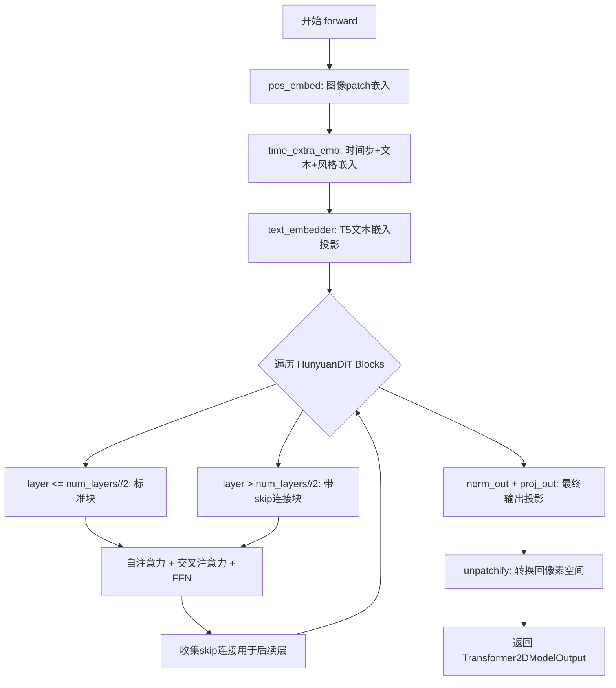

## 类结构

```
nn.Module (PyTorch基类)
├── AdaLayerNormShift (自适应层归一化)
├── HunyuanDiTBlock (Transformer块)
│   ├── AdaLayerNormShift (自注意力归一化)
│   ├── FP32LayerNorm (交叉注意力归一化)
│   ├── Attention (自注意力)
│   ├── Attention (交叉注意力)
│   ├── FeedForward (前馈网络)
│   └── nn.Linear (Skip连接)
└── HunyuanDiT2DModel (主模型)
    ├── PixArtAlphaTextProjection (文本投影)
    ├── PatchEmbed (图像patch嵌入)
    ├── HunyuanCombinedTimestepTextSizeStyleEmbedding (时间+风格嵌入)
    ├── nn.ModuleList[HunyuanDiTBlock] (多层Transformer)
    ├── AdaLayerNormContinuous (输出归一化)
    └── nn.Linear (输出投影)
```

## 全局变量及字段


### `logger`
    
模块级日志记录器

类型：`logging.Logger`
    


### `num_attention_heads`
    
注意力头数

类型：`int`
    


### `attention_head_dim`
    
每头维度

类型：`int`
    


### `in_channels`
    
输入通道数

类型：`int`
    


### `patch_size`
    
Patch大小

类型：`int`
    


### `activation_fn`
    
激活函数类型

类型：`str`
    


### `sample_size`
    
样本尺寸

类型：`int`
    


### `hidden_size`
    
隐藏层大小

类型：`int`
    


### `num_layers`
    
Transformer层数

类型：`int`
    


### `mlp_ratio`
    
FFN扩展比率

类型：`float`
    


### `learn_sigma`
    
是否学习方差

类型：`bool`
    


### `cross_attention_dim`
    
交叉注意力维度

类型：`int`
    


### `norm_type`
    
归一化类型

类型：`str`
    


### `cross_attention_dim_t5`
    
T5文本编码器维度

类型：`int`
    


### `pooled_projection_dim`
    
池化投影维度

类型：`int`
    


### `text_len`
    
文本长度

类型：`int`
    


### `text_len_t5`
    
T5文本长度

类型：`int`
    


### `use_style_cond_and_image_meta_size`
    
是否使用风格条件

类型：`bool`
    


### `AdaLayerNormShift.silu`
    
SiLU激活函数

类型：`nn.SiLU`
    


### `AdaLayerNormShift.linear`
    
线性变换层

类型：`nn.Linear`
    


### `AdaLayerNormShift.norm`
    
FP32精度归一化层

类型：`FP32LayerNorm`
    


### `HunyuanDiTBlock.norm1`
    
自注意力归一化

类型：`AdaLayerNormShift`
    


### `HunyuanDiTBlock.attn1`
    
自注意力层

类型：`Attention`
    


### `HunyuanDiTBlock.norm2`
    
交叉注意力归一化

类型：`FP32LayerNorm`
    


### `HunyuanDiTBlock.attn2`
    
交叉注意力层

类型：`Attention`
    


### `HunyuanDiTBlock.norm3`
    
FFN归一化

类型：`FP32LayerNorm`
    


### `HunyuanDiTBlock.ff`
    
前馈网络

类型：`FeedForward`
    


### `HunyuanDiTBlock.skip_norm`
    
Skip连接归一化(可选)

类型：`FP32LayerNorm`
    


### `HunyuanDiTBlock.skip_linear`
    
Skip连接投影(可选)

类型：`nn.Linear`
    


### `HunyuanDiTBlock._chunk_size`
    
分块大小

类型：`int`
    


### `HunyuanDiTBlock._chunk_dim`
    
分块维度

类型：`int`
    


### `HunyuanDiT2DModel.out_channels`
    
输出通道数

类型：`int`
    


### `HunyuanDiT2DModel.num_heads`
    
注意力头数

类型：`int`
    


### `HunyuanDiT2DModel.inner_dim`
    
内部维度

类型：`int`
    


### `HunyuanDiT2DModel.text_embedder`
    
文本嵌入投影

类型：`PixArtAlphaTextProjection`
    


### `HunyuanDiT2DModel.text_embedding_padding`
    
文本填充参数

类型：`nn.Parameter`
    


### `HunyuanDiT2DModel.pos_embed`
    
位置嵌入

类型：`PatchEmbed`
    


### `HunyuanDiT2DModel.time_extra_emb`
    
时间额外嵌入

类型：`HunyuanCombinedTimestepTextSizeStyleEmbedding`
    


### `HunyuanDiT2DModel.blocks`
    
Transformer块列表

类型：`nn.ModuleList`
    


### `HunyuanDiT2DModel.norm_out`
    
输出归一化

类型：`AdaLayerNormContinuous`
    


### `HunyuanDiT2DModel.proj_out`
    
输出投影

类型：`nn.Linear`
    


### `HunyuanDiT2DModel.original_attn_processors`
    
原始注意力处理器(用于QKV融合)

类型：`dict`
    
    

## 全局函数及方法


### `maybe_allow_in_graph`

该函数是一个装饰器，用于允许被装饰的类或函数进入 PyTorch 的 torch.compile 计算图中。在 HunyuanDiT 模型中，它被用于装饰 `HunyuanDiTBlock` 类，以确保该模块能与 PyTorch 的 JIT 编译和计算图优化兼容。

参数：

- `fn`：`Callable`，被装饰的函数或类对象

返回值：`Callable`，返回被装饰后的函数或类对象

#### 流程图

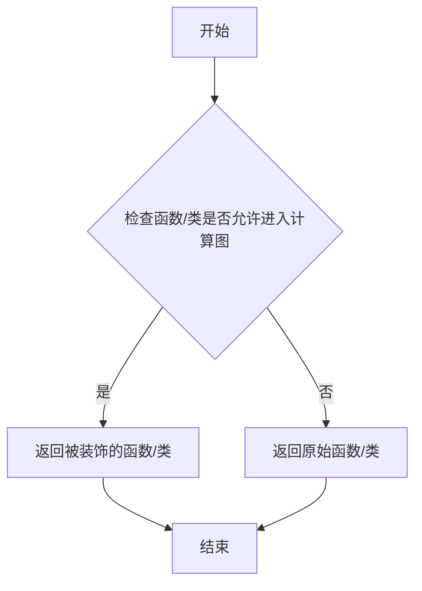

#### 带注释源码

```python
# 这是一个从 diffusers 库导入的装饰器函数
# 源码位于 ...utils.torch_utils.maybe_allow_in_graph
# 以下是基于使用方式的推断源码

def maybe_allow_in_graph(fn):
    """
    装饰器：允许被装饰的模块进入 torch.compile 计算图。
    
    某些自定义模块可能不被 torch.compile 支持，此装饰器
    用于标记这些模块，使其能够被 JIT 编译。
    """
    # 检查函数是否有 __call__ 方法（如果是类）
    # 如果是类，则标记该类允许进入计算图
    
    # 设置函数/类的属性，标记为允许进入计算图
    fn._maybe_allow_in_graph = True
    
    return fn

# 使用示例（在代码中）
@maybe_allow_in_graph
class HunyuanDiTBlock(nn.Module):
    # HunyuanDiTBlock 类被标记为允许进入计算图
    # 这样在使用 torch.compile 时不会报错
    pass
```

> **注意**：由于 `maybe_allow_in_graph` 函数定义在 `diffusers` 库的 `utils.torch_utils` 模块中，以上源码是基于其使用方式和名称进行的合理推断。实际实现可能包含更多细节，如对 torch.compile 内部机制的具体处理。


### `register_to_config`

`register_to_config` 是一个装饰器，用于将类 `__init__` 方法的参数自动注册为模型的配置属性。在 `HunyuanDiT2DModel` 类中，该装饰器应用于 `__init__` 方法，将所有初始化参数（如 `num_attention_heads`、`hidden_size`、`num_layers` 等）保存到模型的 `config` 对象中，以便后续序列化和加载。

参数：

- 无直接参数（作为装饰器使用，装饰目标为 `__init__` 方法）

返回值：`Callable`，返回装饰后的函数，将 `__init__` 参数注册为配置属性

#### 流程图

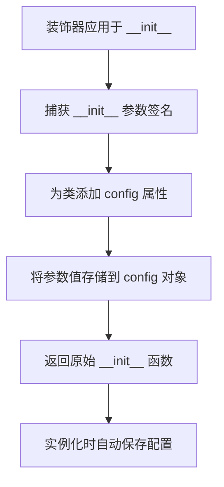

#### 带注释源码

```
# register_to_config 是 Diffusers 库中的配置注册装饰器
# 位置: from ...configuration_utils import ConfigMixin, register_to_config

@register_to_config  # 装饰器，将 __init__ 参数注册为配置
def __init__(
    self,
    num_attention_heads: int = 16,
    attention_head_dim: int = 88,
    in_channels: int | None = None,
    patch_size: int | None = None,
    activation_fn: str = "gelu-approximate",
    sample_size=32,
    hidden_size=1152,
    num_layers: int = 28,
    mlp_ratio: float = 4.0,
    learn_sigma: bool = True,
    cross_attention_dim: int = 1024,
    norm_type: str = "layer_norm",
    cross_attention_dim_t5: int = 2048,
    pooled_projection_dim: int = 1024,
    text_len: int = 77,
    text_len_t5: int = 256,
    use_style_cond_and_image_meta_size: bool = True,
):
    super().__init__()
    # ... 模型初始化代码
    
# 使用示例：
# model = HunyuanDiT2DModel(...)
# config = model.config  # 访问保存的配置
# config.to_dict()       # 序列化为字典
```


### `logging.get_logger`

该函数是 `diffusers` 工具库中的日志模块接口，用于获取或创建一个与当前模块路径绑定的日志记录器（Logger）实例，以便在模型推理、训练或工具运行过程中输出规范化的日志信息。

参数：
- `name`：`str`，日志记录器的名称。在代码中通常传入 `__name__`（当前 Python 模块的全路径），用于在日志中标识信息来源。

返回值：`logging.Logger`，返回 Python 标准库的日志记录器对象。

#### 流程图

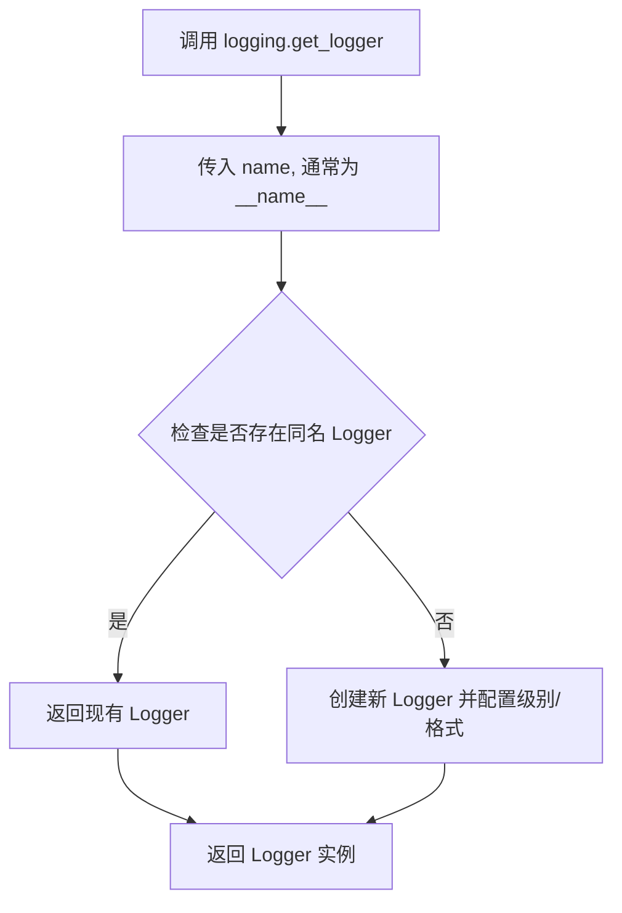

#### 带注释源码

```python
# 从 diffusers 库的工具模块导入 logging 对象（该对象通常封装了 Python 标准库的 logging 模块）
from ...utils import logging

# ... (模型代码定义)

# 在类或模块作用域调用 get_logger 函数
# 传入 __name__ 可以确保日志信息标注为来源于此文件（例如 'models.hunyuan_dit'）
logger = logging.get_logger(__name__)  # pylint: disable=invalid-name
```


# 配置混入类提取文档

## 1. 核心功能概述

HunyuanDiT2DModel 是一个基于 Transformer 架构的扩散模型，继承自 ModelMixin、AttentionMixin 和 ConfigMixin，通过 ConfigMixin 实现了配置的注册与管理功能，支持条件扩散任务的参数化配置。

---

## 2. 文件整体运行流程

```
1. 模块导入 → 2. AdaLayerNormShift 类定义 → 3. HunyuanDiTBlock 类定义 → 4. HunyuanDiT2DModel 类定义
   ↓                                                              ↓
   └────────────────────────  配置注册 (@register_to_config) ←─┘
                                                              ↓
                                                    5. 前向传播 (forward)
```

---

## 3. 类的详细信息

### 3.1 HunyuanDiT2DModel 类

| 类别 | 名称 | 类型 | 描述 |
|------|------|------|------|
| **配置字段** | num_attention_heads | int | 多头注意力机制的头数，默认16 |
| | attention_head_dim | int | 每个头的维度，默认88 |
| | in_channels | int \| None | 输入通道数 |
| | patch_size | int \| None | 输入图像的分块大小 |
| | activation_fn | str | 激活函数类型，默认"gelu-approximate" |
| | sample_size | int | 潜在图像的宽度，默认32 |
| | hidden_size | int | 条件嵌入层的隐藏层大小，默认1152 |
| | num_layers | int | Transformer块的数量，默认28 |
| | mlp_ratio | float | 隐藏层大小与输入大小的比率，默认4.0 |
| | learn_sigma | bool | 是否预测方差，默认True |
| | cross_attention_dim | int | CLIP文本嵌入的维度，默认1024 |
| | norm_type | str | 归一化类型，默认"layer_norm" |
| | cross_attention_dim_t5 | int | T5文本嵌入的维度，默认2048 |
| | pooled_projection_dim | int | 池化投影的大小，默认1024 |
| | text_len | int | CLIP文本嵌入的长度，默认77 |
| | text_len_t5 | int | T5文本嵌入的长度，默认256 |
| | use_style_cond_and_image_meta_size | bool | 是否使用样式条件和图像元数据 |
| **模型组件** | out_channels | int | 输出通道数 |
| | inner_dim | int | 内部维度 (num_heads * head_dim) |
| | text_embedder | PixArtAlphaTextProjection | T5文本嵌入投影层 |
| | text_embedding_padding | nn.Parameter | 文本嵌入填充参数 |
| | pos_embed | PatchEmbed | 位置嵌入层 |
| | time_extra_emb | HunyuanCombinedTimestepTextSizeStyleEmbedding | 时间、文本、大小、样式嵌入 |
| | blocks | nn.ModuleList | HunyuanDiTBlock模块列表 |
| | norm_out | AdaLayerNormContinuous | 输出层归一化 |
| | proj_out | nn.Linear | 输出投影层 |
| **类属性** | _skip_layerwise_casting_patterns | list | 跳过层级别转换的模式 |
| | _supports_group_offloading | bool | 是否支持组卸载 |

---

## 4. 方法详细信息

### HunyuanDiT2DModel.__init__

**参数：**

| 参数名称 | 参数类型 | 参数描述 |
|----------|----------|----------|
| num_attention_heads | int | 多头注意力头数，默认16 |
| attention_head_dim | int | 注意力头维度，默认88 |
| in_channels | int \| None | 输入通道数 |
| patch_size | int \| None | 分块大小 |
| activation_fn | str | 激活函数，默认"gelu-approximate" |
| sample_size | int | 样本尺寸，默认32 |
| hidden_size | int | 隐藏层大小，默认1152 |
| num_layers | int | Transformer层数，默认28 |
| mlp_ratio | float | MLP比率，默认4.0 |
| learn_sigma | bool | 是否学习sigma，默认True |
| cross_attention_dim | int | 跨注意力维度，默认1024 |
| norm_type | str | 归一化类型，默认"layer_norm" |
| cross_attention_dim_t5 | int | T5跨注意力维度，默认2048 |
| pooled_projection_dim | int | 池化投影维度，默认1024 |
| text_len | int | 文本长度，默认77 |
| text_len_t5 | int | T5文本长度，默认256 |
| use_style_cond_and_image_meta_size | bool | 是否使用样式条件和图像元数据，默认True |

**返回值：** 无（构造函数）

#### 流程图

```mermaid
flowchart TD
    A[开始 __init__] --> B[调用 super().__init__]
    B --> C[计算 out_channels = in_channels * 2 if learn_sigma else in_channels]
    C --> D[计算 inner_dim = num_attention_heads * attention_head_dim]
    D --> E[初始化 text_embedder: PixArtAlphaTextProjection]
    E --> F[初始化 text_embedding_padding: nn.Parameter]
    F --> G[初始化 pos_embed: PatchEmbed]
    G --> H[初始化 time_extra_emb: HunyuanCombinedTimestepTextSizeStyleEmbedding]
    H --> I[创建 HunyuanDiTBlock 模块列表]
    I --> J[初始化 norm_out: AdaLayerNormContinuous]
    J --> K[初始化 proj_out: nn.Linear]
    K --> L[结束 __init__]
```

#### 带注释源码

```python
@register_to_config
def __init__(
    self,
    num_attention_heads: int = 16,
    attention_head_dim: int = 88,
    in_channels: int | None = None,
    patch_size: int | None = None,
    activation_fn: str = "gelu-approximate",
    sample_size=32,
    hidden_size=1152,
    num_layers: int = 28,
    mlp_ratio: float = 4.0,
    learn_sigma: bool = True,
    cross_attention_dim: int = 1024,
    norm_type: str = "layer_norm",
    cross_attention_dim_t5: int = 2048,
    pooled_projection_dim: int = 1024,
    text_len: int = 77,
    text_len_t5: int = 256,
    use_style_cond_and_image_meta_size: bool = True,
):
    """
    HunyuanDiT2DModel 构造函数
    
    初始化扩散Transformer模型的所有配置参数和组件。
    使用 @register_to_config 装饰器将所有参数注册到配置中，
    使模型可以通过 config 对象访问和序列化这些参数。
    """
    super().__init__()  # 调用父类初始化
    
    # 计算输出通道数：如果学习sigma，输出通道翻倍
    self.out_channels = in_channels * 2 if learn_sigma else in_channels
    
    # 设置注意力头数和内部维度
    self.num_heads = num_attention_heads
    self.inner_dim = num_attention_heads * attention_head_dim

    # 初始化T5文本嵌入投影层：将T5文本嵌入投影到交叉注意力空间
    self.text_embedder = PixArtAlphaTextProjection(
        in_features=cross_attention_dim_t5,
        hidden_size=cross_attention_dim_t5 * 4,
        out_features=cross_attention_dim,
        act_fn="silu_fp32",
    )

    # 初始化文本嵌入填充参数（用于处理变长文本）
    self.text_embedding_padding = nn.Parameter(
        torch.randn(text_len + text_len_t5, cross_attention_dim)
    )

    # 初始化位置嵌入层（PatchEmbed）
    self.pos_embed = PatchEmbed(
        height=sample_size,
        width=sample_size,
        in_channels=in_channels,
        embed_dim=hidden_size,
        patch_size=patch_size,
        pos_embed_type=None,
    )

    # 初始化时间、文本大小、样式嵌入层
    self.time_extra_emb = HunyuanCombinedTimestepTextSizeStyleEmbedding(
        hidden_size,
        pooled_projection_dim=pooled_projection_dim,
        seq_len=text_len_t5,
        cross_attention_dim=cross_attention_dim_t5,
        use_style_cond_and_image_meta_size=use_style_cond_and_image_meta_size,
    )

    # HunyuanDiT Blocks：创建Transformer块列表
    self.blocks = nn.ModuleList(
        [
            HunyuanDiTBlock(
                dim=self.inner_dim,
                num_attention_heads=self.config.num_attention_heads,
                activation_fn=activation_fn,
                ff_inner_dim=int(self.inner_dim * mlp_ratio),
                cross_attention_dim=cross_attention_dim,
                qk_norm=True,  # 启用QK归一化
                skip=layer > num_layers // 2,  # 后半层启用跳跃连接
            )
            for layer in range(num_layers)
        ]
    )

    # 输出层归一化和投影
    self.norm_out = AdaLayerNormContinuous(
        self.inner_dim, self.inner_dim, elementwise_affine=False, eps=1e-6
    )
    self.proj_out = nn.Linear(
        self.inner_dim, patch_size * patch_size * self.out_channels, bias=True
    )
```

---

### HunyuanDiT2DModel.forward

**参数：**

| 参数名称 | 参数类型 | 参数描述 |
|----------|----------|----------|
| hidden_states | torch.Tensor | 输入张量，形状为 (batch, dim, height, width) |
| timestep | torch.Tensor | 去噪步骤的时间步 |
| encoder_hidden_states | torch.Tensor \| None | BertModel的交叉注意力条件嵌入 |
| text_embedding_mask | torch.Tensor | 文本嵌入的注意力掩码 |
| encoder_hidden_states_t5 | torch.Tensor \| None | T5文本编码器的输出 |
| text_embedding_mask_t5 | torch.Tensor | T5文本嵌入的注意力掩码 |
| image_meta_size | torch.Tensor | 图像大小条件嵌入 |
| style | torch.Tensor | 样式条件嵌入 |
| image_rotary_emb | torch.Tensor | 图像旋转嵌入 |
| controlnet_block_samples | list \| None | ControlNet块样本（跳跃连接） |
| return_dict | bool | 是否返回字典 |

**返回值：** `Transformer2DModelOutput` 或 tuple，模型输出

#### 流程图

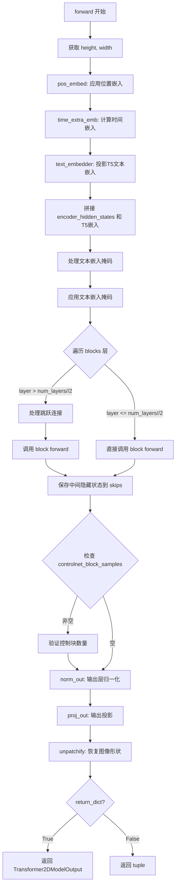

#### 带注释源码

```python
def forward(
    self,
    hidden_states,
    timestep,
    encoder_hidden_states=None,
    text_embedding_mask=None,
    encoder_hidden_states_t5=None,
    text_embedding_mask_t5=None,
    image_meta_size=None,
    style=None,
    image_rotary_emb=None,
    controlnet_block_samples=None,
    return_dict=True,
):
    """
    HunyuanDiT2DModel 前向传播方法
    
    执行完整的扩散Transformer前向传播，包括：
    1. 位置嵌入和时间嵌入计算
    2. 文本嵌入处理和拼接
    3. 多层Transformer块处理
    4. 跳跃连接处理（支持ControlNet）
    5. 输出投影和图像重建
    """
    # 获取输入高度和宽度
    height, width = hidden_states.shape[-2:]

    # 步骤1: 应用位置嵌入
    hidden_states = self.pos_embed(hidden_states)

    # 步骤2: 计算时间、文本、大小、样式嵌入
    temb = self.time_extra_emb(
        timestep, 
        encoder_hidden_states_t5, 
        image_meta_size, 
        style, 
        hidden_dtype=timestep.dtype
    )  # [B, D]

    # 步骤3: T5文本嵌入投影
    batch_size, sequence_length, _ = encoder_hidden_states_t5.shape
    encoder_hidden_states_t5 = self.text_embedder(
        encoder_hidden_states_t5.view(-1, encoder_hidden_states_t5.shape[-1])
    )
    encoder_hidden_states_t5 = encoder_hidden_states_t5.view(
        batch_size, sequence_length, -1
    )

    # 步骤4: 拼接CLIP和T5文本嵌入
    encoder_hidden_states = torch.cat(
        [encoder_hidden_states, encoder_hidden_states_t5], 
        dim=1
    )
    
    # 步骤5: 处理文本嵌入掩码
    text_embedding_mask = torch.cat(
        [text_embedding_mask, text_embedding_mask_t5], 
        dim=-1
    )
    text_embedding_mask = text_embedding_mask.unsqueeze(2).bool()

    # 步骤6: 应用文本嵌入掩码（用padding替换被mask的位置）
    encoder_hidden_states = torch.where(
        text_embedding_mask, 
        encoder_hidden_states, 
        self.text_embedding_padding
    )

    # 步骤7: 遍历Transformer块
    skips = []  # 用于存储跳跃连接的中间状态
    for layer, block in enumerate(self.blocks):
        if layer > self.config.num_layers // 2:
            # 后半层：处理跳跃连接
            if controlnet_block_samples is not None:
                # 合并ControlNet跳跃连接
                skip = skips.pop() + controlnet_block_samples.pop()
            else:
                skip = skips.pop()
            
            # 带跳跃连接的块前向传播
            hidden_states = block(
                hidden_states,
                temb=temb,
                encoder_hidden_states=encoder_hidden_states,
                image_rotary_emb=image_rotary_emb,
                skip=skip,
            )
        else:
            # 前半层：普通块前向传播
            hidden_states = block(
                hidden_states,
                temb=temb,
                encoder_hidden_states=encoder_hidden_states,
                image_rotary_emb=image_rotary_emb,
            )

        # 保存前半层最后一个块之前的隐藏状态用于跳跃连接
        if layer < (self.config.num_layers // 2 - 1):
            skips.append(hidden_states)

    # 步骤8: 验证ControlNet块数量
    if controlnet_block_samples is not None and len(controlnet_block_samples) != 0:
        raise ValueError("The number of controls is not equal to the number of skip connections.")

    # 步骤9: 最终输出层处理
    hidden_states = self.norm_out(hidden_states, temb.to(torch.float32))
    hidden_states = self.proj_out(hidden_states)
    # 输出形状: (N, L, patch_size ** 2 * out_channels)

    # 步骤10: unpatchify - 恢复图像形状
    patch_size = self.pos_embed.patch_size
    height = height // patch_size
    width = width // patch_size

    hidden_states = hidden_states.reshape(
        shape=(
            hidden_states.shape[0], 
            height, 
            width, 
            patch_size, 
            patch_size, 
            self.out_channels
        )
    )
    # 维度重排: nhwpqc -> nchpwq
    hidden_states = torch.einsum("nhwpqc->nchpwq", hidden_states)
    output = hidden_states.reshape(
        shape=(
            hidden_states.shape[0], 
            self.out_channels, 
            height * patch_size, 
            width * patch_size
        )
    )
    
    # 返回结果
    if not return_dict:
        return (output,)
    return Transformer2DModelOutput(sample=output)
```

---

## 5. 关键组件信息

| 组件名称 | 一句话描述 |
|----------|------------|
| ConfigMixin | 配置混入类，提供配置注册和管理功能 |
| register_to_config | 装饰器，将模型参数注册到配置中，支持序列化和反序列化 |
| HunyuanDiTBlock | Transformer块，包含自注意力、交叉注意力和前馈网络 |
| AdaLayerNormShift | 结合时间嵌入的归一化层 |
| PatchEmbed | 将图像转换为分块嵌入的层 |
| HunyuanCombinedTimestepTextSizeStyleEmbedding | 时间、文本大小、样式联合嵌入层 |
| PixArtAlphaTextProjection | T5文本嵌入投影层 |
| Attention | 多头注意力机制实现 |
| FeedForward | 前馈神经网络实现 |

---

## 6. 潜在技术债务与优化空间

1. **配置参数过多**：16个配置参数导致构造函数复杂度过高，可考虑使用配置类或配置对象进行封装
2. **硬编码值**：部分参数如 `qk_norm=True`、`eps=1e-6` 硬编码在代码中，应考虑提取为配置参数
3. **层间条件逻辑**：`if layer > num_layers // 2` 的条件判断可优化为配置驱动
4. **缺失类型提示**：部分参数（如 `sample_size`）缺少类型注解
5. **模块导入路径**：`...` 相对导入在文档中不够清晰，应提供完整的模块路径

---

## 7. 其它项目说明

### 设计目标与约束

- **目标**：实现与 StableDiffusionPipeline 兼容的 DiT 扩散模型
- **约束**：必须继承 ModelMixin 和 ConfigMixin 以满足 diffusers 框架要求

### 错误处理与异常设计

- ControlNet 块数量不匹配时抛出 `ValueError`
- 不支持带有 Added KV 投影的注意力处理器

### 数据流与状态机

```
输入图像 → PatchEmbed → 位置嵌入
                        ↓
时间步 → TimeExtraEmb → 时间嵌入
                        ↓
文本嵌入 → TextEmbedder → 投影 → 拼接
                        ↓
        [Blocks 循环处理] ← 跳跃连接
                        ↓
        NormOut → ProjOut → Unpatchify → 输出
```

### 外部依赖与接口契约

- **依赖**：torch, diffusers (ModelMixin, ConfigMixin, register_to_config)
- **输入**：图像张量、时间步、文本嵌入、图像元数据、样式
- **输出**：Transformer2DModelOutput 或图像张量


### `ModelMixin`

模型混入类（ModelMixin）是一个基础混入类，为 HunyuanDiT2DModel 等模型提供通用的模型权重加载、保存和配置管理功能。通过继承此类，HunyuanDiT2DModel 可以与 Diffusers 库的 pipelines 无缝集成，支持从预训练权重加载模型、模型序列化以及配置注册等能力。

#### 带注释源码

```python
# ModelMixin 是从 diffusers 库的 modeling_utils 模块导入的基类
# 它提供了模型配置、权重加载和保存等通用功能
from ..modeling_utils import ModelMixin

# HunyuanDiT2DModel 继承自 ModelMixin、AttentionMixin 和 ConfigMixin
# ModelMixin 提供了以下核心功能：
# 1. from_pretrained(): 从预训练模型加载权重和配置
# 2. save_pretrained(): 保存模型权重和配置到指定目录
# 3. get_config(): 获取模型配置
# 4. 集成 with (权重分片) 支持
class HunyuanDiT2DModel(ModelMixin, AttentionMixin, ConfigMixin):
    """
    HunYuanDiT: Diffusion model with a Transformer backbone.
    
    继承 ModelMixin 以获得与 StableDiffusionPipeline 等采样器的兼容性
    """
    
    # 跳过层-wise  casting 的模式
    _skip_layerwise_casting_patterns = ["pos_embed", "norm", "pooler"]
    # 不支持 group offloading
    _supports_group_offloading = False
    
    @register_to_config
    def __init__(self, ...):
        # ModelMixin 的 __init__ 会被调用
        super().__init__()
        # ... 模型初始化代码
```

#### 说明

由于 `ModelMixin` 是从外部库（`diffusers`）导入的类，其源代码不在当前文件中。上述代码展示了 `ModelMixin` 在 `HunyuanDiT2DModel` 中的使用方式：

1. **继承关系**：`HunyuanDiT2DModel` 继承自 `ModelMixin`，从而获得了模型配置管理的能力
2. **配置注册**：通过 `@register_to_config` 装饰器，将 `__init__` 方法的参数注册为模型配置
3. **功能扩展**：结合 `ConfigMixin` 和 `AttentionMixin`，提供了完整的模型功能支持

`ModelMixin` 的主要职责包括：
- 模型权重的序列化与反序列化
- 配置文件的管理
- 与 Diffusers 库的 pipelines 集成


# AttentionMixin 分析

## 概述

`AttentionMixin` 是一个从 `..attention` 模块导入的混合类（Mixin），为 `HunyuanDiT2DModel` 等模型提供注意力处理器（Attention Processor）管理功能。通过继承该类，模型可以灵活地设置、融合和切换不同的注意力实现，以支持性能优化和多种注意力机制。

## 导入信息

```python
from ..attention import AttentionMixin, FeedForward
```

**注意**：该类的完整定义未在当前代码文件中提供，它来自于 `diffusers` 库的 `..attention` 模块。

## 在 HunyuanDiT2DModel 中的使用

`AttentionMixin` 在 `HunyuanDiT2DModel` 类中被继承：

```python
class HunyuanDiT2DModel(ModelMixin, AttentionMixin, ConfigMixin):
```

### 继承关系推断的功能

基于代码中的使用方式，`AttentionMixin` 提供了以下功能：

| 功能 | 描述 |
|------|------|
| `attn_processors` | 属性，存储注意力处理器的字典 |
| `set_attn_processor()` | 方法，用于设置注意力处理器 |
| 支持 fused QKV projections | 支持融合查询、键、值的投影矩阵 |

## 关键方法分析

### fuse_qkv_projections()

```python
def fuse_qkv_projections(self):
    """
    Enables fused QKV projections. For self-attention modules, all projection matrices (i.e., query, key, value)
    are fused. For cross-attention modules, key and value projection matrices are fused.
    """
    self.original_attn_processors = None

    for _, attn_processor in self.attn_processors.items():
        if "Added" in str(attn_processor.__class__.__name__):
            raise ValueError("`fuse_qkv_projections()` is not supported for models having added KV projections.")

    self.original_attn_processors = self.attn_processors

    for module in self.modules():
        if isinstance(module, Attention):
            module.fuse_projections(fuse=True)

    self.set_attn_processor(FusedHunyuanAttnProcessor2_0())
```

### unfuse_qkv_projections()

```python
def unfuse_qkv_projections(self):
    """Disables the fused QKV projection if enabled."""
    if self.original_attn_processors is not None:
        self.set_attn_processor(self.original_attn_processors)
```

### set_default_attn_processor()

```python
def set_default_attn_processor(self):
    """
    Disables custom attention processors and sets the default attention implementation.
    """
    self.set_attn_processor(HunyuanAttnProcessor2_0())
```

## 流程图

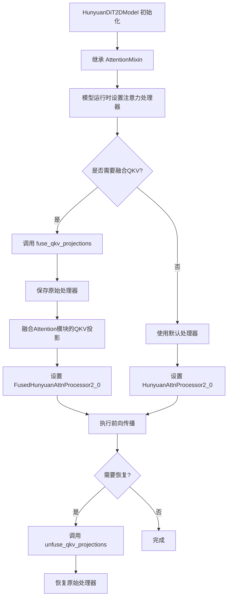

## 技术债务与优化空间

1. **缺少 AttentionMixin 源码**：当前代码文件中未包含 `AttentionMixin` 的完整定义，需要查阅 `diffusers` 库的 `attention` 模块才能获得完整实现。

2. **动态处理器切换**：通过 `set_attn_processor` 动态切换处理器可能会带来一定的运行时开销，在对性能敏感的场景下应谨慎使用。

3. **融合投影的兼容性**：代码中检查了 "Added" 类型的注意力处理器，表明融合 QKV 投影并非支持所有类型的注意力处理器，存在一定的限制。

## 总结

`AttentionMixin` 是 `diffusers` 库中提供的一个重要混合类，为Transformer模型提供了灵活的注意力处理器管理能力。在 `HunyuanDiT2DModel` 中，通过继承该类，模型支持：
- 默认的 `HunyuanAttnProcessor2_0` 注意力实现
- 融合QKV投影的 `FusedHunyuanAttnProcessor2_0` 实现
- 处理器状态的保存与恢复

这种设计模式允许模型在不同的注意力实现之间切换，以平衡功能和性能。


### `AdaLayerNormShift.forward(x, emb)`

这是一个自适应层归一化（AdaLN）的实现，用于在扩散模型中根据时间步嵌入（timestep embedding）动态调整特征分布。该方法首先对输入特征 `x` 进行归一化，然后将条件嵌入 `emb` 通过激活函数和线性变换生成偏移量（shift），并将其叠加到归一化后的特征上，从而实现条件信息的注入。

参数：

- `x`：`torch.Tensor`，输入的隐藏状态（Hidden States），通常来自上一层的输出，形状为 `(batch_size, sequence_length, embedding_dim)` 或 `(batch_size, embedding_dim, height, width)`。
- `emb`：`torch.Tensor`，条件嵌入向量（Condition Embedding），通常是时间步嵌入（Timestep Embedding），形状为 `(batch_size, embedding_dim)`。

返回值：`torch.Tensor`，经过自适应偏移调整后的张量，形状与输入 `x` 相同。

#### 流程图

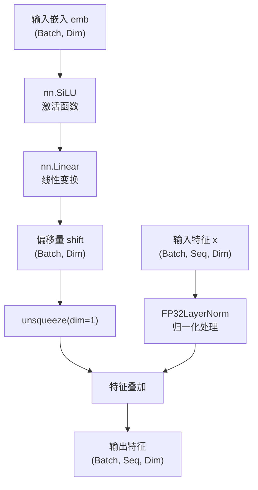

#### 带注释源码

```python
def forward(self, x: torch.Tensor, emb: torch.Tensor) -> torch.Tensor:
    # 1. 处理条件嵌入 (emb)
    # 将嵌入转换为 float32 以保证计算精度（应对混合精度训练），计算完毕后再转回原始数据类型
    # 这是一个关键的数值稳定性处理，防止在 fp16/bf16 下计算溢出或精度丢失
    emb_fp32 = self.silu(emb.to(torch.float32)).to(emb.dtype)
    
    # 2. 通过线性层生成偏移量 (shift)
    # 输入维度与输出维度相同，用于调节特征的尺度
    shift = self.linear(emb_fp32)
    
    # 3. 对输入特征 x 进行归一化
    # 使用 FP32LayerNorm 进行高精度归一化
    normalized_x = self.norm(x)
    
    # 4. 融合与输出
    # 将 shift 从 (Batch, Dim) 扩展为 (Batch, 1, Dim) 以匹配归一化后的特征维度 (Batch, Seq, Dim)
    # 利用广播机制，将相同的偏移量应用到序列的每个位置
    output = normalized_x + shift.unsqueeze(dim=1)
    
    return output
```

#### 关键组件信息

- **self.silu (nn.SiLU)**：SiLU 激活函数（Sigmoid Linear Unit），即 $x \cdot \sigma(x)$，用于引入非线性，生成更平滑的偏移信号。
- **self.linear (nn.Linear)**：全连接线性层，用于将嵌入空间的向量映射为与特征维度相同的偏移向量。
- **self.norm (FP32LayerNorm)**：自定义的 FP32 LayerNorm 层，在 float32 精度下进行归一化计算，以确保扩散模型训练的数值稳定性，即使模型主体使用混合精度（fp16/bf16）。

#### 潜在的技术债务或优化空间

1.  **冗余的类型转换**：代码中 `emb.to(torch.float32).to(emb.dtype)` 看似冗余（先转 float32 再转回原始 dtype），实则是为了强制线性层在 fp32 下计算。如果框架（如 PyTorch 的 AMP）已自动处理精度或模型权重已强制转换为 fp32，此步骤可能带来不必要的性能开销和代码复杂性。建议检查是否可以通过模型的 `dtype` 管理或 `torch.autocast` 配置来统一处理，而无需在层内部显式转换。
2.  **维度假设**：代码假设 `shift` 的形状可以直接通过 `unsqueeze(1)` 广播到 `x` 的序列维度。如果输入 `x` 的维度顺序发生变化（例如从 (B, L, D) 变为 (B, D, L)），此处可能会出错。缺乏对输入维度的显式检查。
3.  **广播机制隐式操作**：`shift.unsqueeze(dim=1)` 巧妙地利用了广播机制，但如果在调试时遇到维度不匹配问题，定位根因可能较为困难。建议添加断言（Assertion）来验证维度兼容性。


### `HunyuanDiTBlock.set_chunk_feed_forward`

该方法用于设置前馈网络（FFN）的分块计算参数，通过指定分块大小和分块维度来控制前馈层的分块计算方式，以实现内存优化和计算效率提升。

参数：

- `chunk_size`：`int | None`，分块大小。当设置为 `None` 时，不进行分块计算；当设置为正整数时，前馈网络将按照该大小进行分块计算，以减少内存占用。
- `dim`：`int`，分块维度。默认为 `0`，表示在 batch 维度进行分块；可设置为 `1` 表示在序列长度维度进行分块。

返回值：`None`，该方法无返回值，仅用于设置实例属性。

#### 流程图

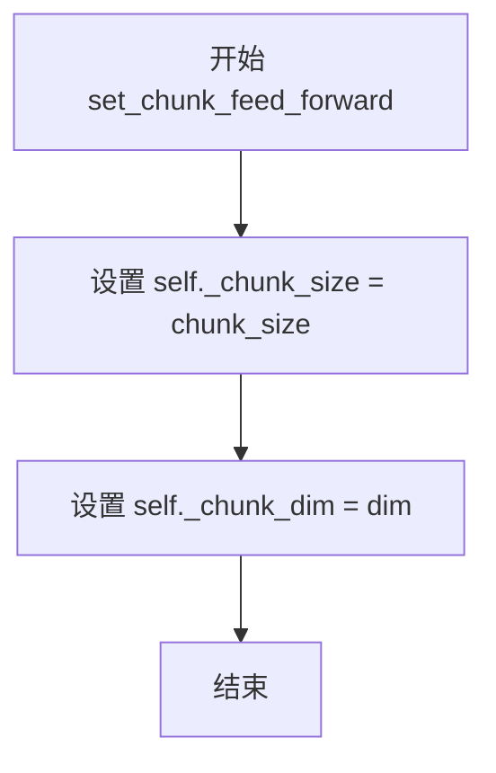

#### 带注释源码

```python
# Copied from diffusers.models.attention.BasicTransformerBlock.set_chunk_feed_forward
def set_chunk_feed_forward(self, chunk_size: int | None, dim: int = 0):
    # 设置前馈网络的分块计算参数
    # 参数 chunk_size: 控制分块大小，None 表示不分块，整数表示分块大小
    # 参数 dim: 控制分块的维度，0 表示 batch 维度，1 表示序列长度维度
    self._chunk_size = chunk_size  # 存储分块大小配置
    self._chunk_dim = dim          # 存储分块维度配置
```


### `HunyuanDiTBlock.forward`

该方法是 HunyuanDiT Transformer 块的前向传播函数，负责接收输入隐藏状态并依次执行自注意力、交叉注意力和前馈网络计算，最后返回处理后的隐藏状态。支持可选的跳跃连接（skip connection）用于深层特征融合。

参数：

- `hidden_states`：`torch.Tensor`，输入的隐藏状态张量，形状为 (batch_size, sequence_length, dim)
- `encoder_hidden_states`：`torch.Tensor | None`，用于交叉注意力计算的编码器隐藏状态，通常为文本嵌入
- `temb`：`torch.Tensor | None`，时间步嵌入向量，用于 AdaLayerNormShift 的条件归一化
- `image_rotary_emb`：图像旋转嵌入，用于旋转位置编码（RoPE），可提升注意力机制的位置感知能力
- `skip`：`torch.Tensor | None`，来自前半层块的跳跃连接输入，用于深层特征融合（仅当 skip_linear 不为 None 时生效）

返回值：`torch.Tensor`，经过完整 Transformer 块处理后的隐藏状态张量

#### 流程图

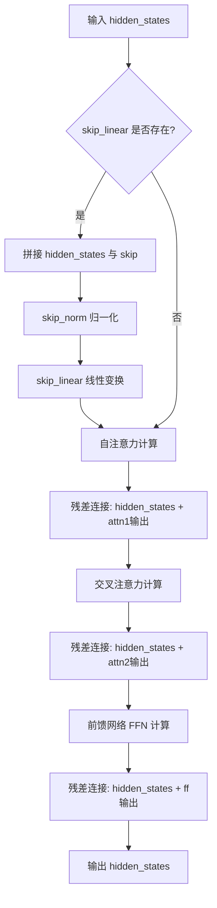

#### 带注释源码

```python
def forward(
    self,
    hidden_states: torch.Tensor,
    encoder_hidden_states: torch.Tensor | None = None,
    temb: torch.Tensor | None = None,
    image_rotary_emb=None,
    skip=None,
) -> torch.Tensor:
    # 注意：以下块中规范化总是先于实际计算应用
    # 0. 长跳跃连接（Long Skip Connection）
    # 如果配置了跳跃连接，则将当前隐藏状态与跳跃输入拼接后通过线性层处理
    if self.skip_linear is not None:
        # 沿最后一维拼接隐藏状态和跳跃连接
        cat = torch.cat([hidden_states, skip], dim=-1)
        # 归一化拼接后的向量
        cat = self.skip_norm(cat)
        # 线性变换映射回原始维度
        hidden_states = self.skip_linear(cat)

    # 1. 自注意力（Self-Attention）
    # 使用 AdaLayerNormShift 进行条件归一化，注入时间步信息
    norm_hidden_states = self.norm1(hidden_states, temb)  ### checked: self.norm1 is correct
    # 执行自注意力计算，可选应用旋转位置嵌入
    attn_output = self.attn1(
        norm_hidden_states,
        image_rotary_emb=image_rotary_emb,
    )
    # 残差连接：将自注意力输出加回隐藏状态
    hidden_states = hidden_states + attn_output

    # 2. 交叉注意力（Cross-Attention）
    # 使用编码器隐藏状态（文本嵌入）进行条件注意力计算
    hidden_states = hidden_states + self.attn2(
        self.norm2(hidden_states),
        encoder_hidden_states=encoder_hidden_states,
        image_rotary_emb=image_rotary_emb,
    )

    # 3. 前馈网络层（FFN Layer）
    # TODO: 在 state dict 中切换 norm2 和 norm3
    mlp_inputs = self.norm3(hidden_states)
    # 执行前馈网络变换并残差连接
    hidden_states = hidden_states + self.ff(mlp_inputs)

    # 返回处理后的隐藏状态
    return hidden_states
```


### `HunyuanDiT2DModel.__init__`

初始化 HunyuanDiT2DModel 模型的核心组件，包括文本嵌入、位置编码、时间嵌入、Transformer 块堆栈以及输出投影层。

参数：

- `num_attention_heads`：`int`，多头注意力机制的头数，默认为 16
- `attention_head_dim`：`int`，每个注意力头的维度，默认为 88
- `in_channels`：`int | None`，输入和输出的通道数，默认为 None
- `patch_size`：`int | None`，输入图像的分块大小，默认为 None
- `activation_fn`：`str`，前馈网络使用的激活函数，默认为 "gelu-approximate"
- `sample_size`：`int`，潜在图像的宽度尺寸，默认为 32
- `hidden_size`：`int`，条件嵌入层中隐藏层的维度，默认为 1152
- `num_layers`：`int`，Transformer 块的数量，默认为 28
- `mlp_ratio`：`float`，前馈网络隐藏层与输入维度的比率，默认为 4.0
- `learn_sigma`：`bool`，是否预测方差，默认为 True
- `cross_attention_dim`：`int`，CLIP 文本嵌入的维度，默认为 1024
- `norm_type`：`str`，归一化类型，默认为 "layer_norm"
- `cross_attention_dim_t5`：`int`，T5 文本嵌入的维度，默认为 2048
- `pooled_projection_dim`：`int`，池化投影的维度，默认为 1024
- `text_len`：`int`，CLIP 文本嵌入的长度，默认为 77
- `text_len_t5`：`int`，T5 文本嵌入的长度，默认为 256
- `use_style_cond_and_image_meta_size`：`bool`，是否使用风格条件和图像元数据大小，默认为 True

返回值：无（`None`），该方法为构造函数，仅初始化对象状态

#### 流程图

```mermaid
flowchart TD
    A[开始 __init__] --> B[调用父类 super().__init__]
    B --> C[计算输出通道数: out_channels]
    C --> D[计算内部维度: inner_dim]
    D --> E[初始化文本嵌入器 text_embedder]
    E --> F[初始化文本嵌入填充参数 text_embedding_padding]
    F --> G[初始化位置嵌入 pos_embed]
    G --> H[初始化时间额外嵌入 time_extra_emb]
    H --> I[循环创建 HunyuanDiTBlock 列表]
    I --> J[初始化输出归一化层 norm_out]
    J --> K[初始化输出投影层 proj_out]
    K --> L[结束 __init__]
```

#### 带注释源码

```python
@register_to_config
def __init__(
    self,
    num_attention_heads: int = 16,
    attention_head_dim: int = 88,
    in_channels: int | None = None,
    patch_size: int | None = None,
    activation_fn: str = "gelu-approximate",
    sample_size=32,
    hidden_size=1152,
    num_layers: int = 28,
    mlp_ratio: float = 4.0,
    learn_sigma: bool = True,
    cross_attention_dim: int = 1024,
    norm_type: str = "layer_norm",
    cross_attention_dim_t5: int = 2048,
    pooled_projection_dim: int = 1024,
    text_len: int = 77,
    text_len_t5: int = 256,
    use_style_cond_and_image_meta_size: bool = True,
):
    # 调用父类初始化方法，使模型兼容 diffusers 的 StableDiffusionPipeline
    super().__init__()
    
    # 计算输出通道数：如果学习 sigma，则输出通道翻倍
    self.out_channels = in_channels * 2 if learn_sigma else in_channels
    # 保存注意力头数
    self.num_heads = num_attention_heads
    # 计算内部维度：头数 × 每头维度
    self.inner_dim = num_attention_heads * attention_head_dim

    # 初始化 T5 文本嵌入投影层：将 T5 文本特征投影到交叉注意力空间
    self.text_embedder = PixArtAlphaTextProjection(
        in_features=cross_attention_dim_t5,
        hidden_size=cross_attention_dim_t5 * 4,
        out_features=cross_attention_dim,
        act_fn="silu_fp32",
    )

    # 初始化文本嵌入填充参数，用于处理变长文本
    # 形状: (text_len + text_len_t5, cross_attention_dim)
    self.text_embedding_padding = nn.Parameter(torch.randn(text_len + text_len_t5, cross_attention_dim))

    # 初始化图像位置嵌入层，将图像 patch 映射到隐藏空间
    self.pos_embed = PatchEmbed(
        height=sample_size,
        width=sample_size,
        in_channels=in_channels,
        embed_dim=hidden_size,
        patch_size=patch_size,
        pos_embed_type=None,
    )

    # 初始化时间步、图像尺寸和风格的联合嵌入层
    self.time_extra_emb = HunyuanCombinedTimestepTextSizeStyleEmbedding(
        hidden_size,
        pooled_projection_dim=pooled_projection_dim,
        seq_len=text_len_t5,
        cross_attention_dim=cross_attention_dim_t5,
        use_style_cond_and_image_meta_size=use_style_cond_and_image_meta_size,
    )

    # HunyuanDiT Blocks: 创建 num_layers 个 Transformer 块
    # 块结构：自注意力 + 交叉注意力 + 前馈网络
    self.blocks = nn.ModuleList(
        [
            HunyuanDiTBlock(
                dim=self.inner_dim,
                num_attention_heads=self.config.num_attention_heads,
                activation_fn=activation_fn,
                ff_inner_dim=int(self.inner_dim * mlp_ratio),
                cross_attention_dim=cross_attention_dim,
                qk_norm=True,  # 使用 QK 归一化，参考 https://huggingface.co/papers/2302.05442
                skip=layer > num_layers // 2,  # 后半层启用跳跃连接
            )
            for layer in range(num_layers)
        ]
    )

    # 初始化输出归一化层：AdaLayerNormContinuous
    self.norm_out = AdaLayerNormContinuous(self.inner_dim, self.inner_dim, elementwise_affine=False, eps=1e-6)
    # 初始化输出投影层：将隐藏维度映射回 patch 空间
    self.proj_out = nn.Linear(self.inner_dim, patch_size * patch_size * self.out_channels, bias=True)
```


### `HunyuanDiT2DModel.fuse_qkv_projections`

融合QKV投影，将自注意力模块中的query、key、value投影矩阵融合在一起，对于交叉注意力模块则融合key和value投影矩阵。此方法通过将多个独立投影合并为单个融合投影来优化推理性能。

参数：
- 该方法无显式参数（隐式参数 `self` 为 `HunyuanDiT2DModel` 实例）

返回值：`None`，无返回值（执行内部状态修改）

#### 流程图

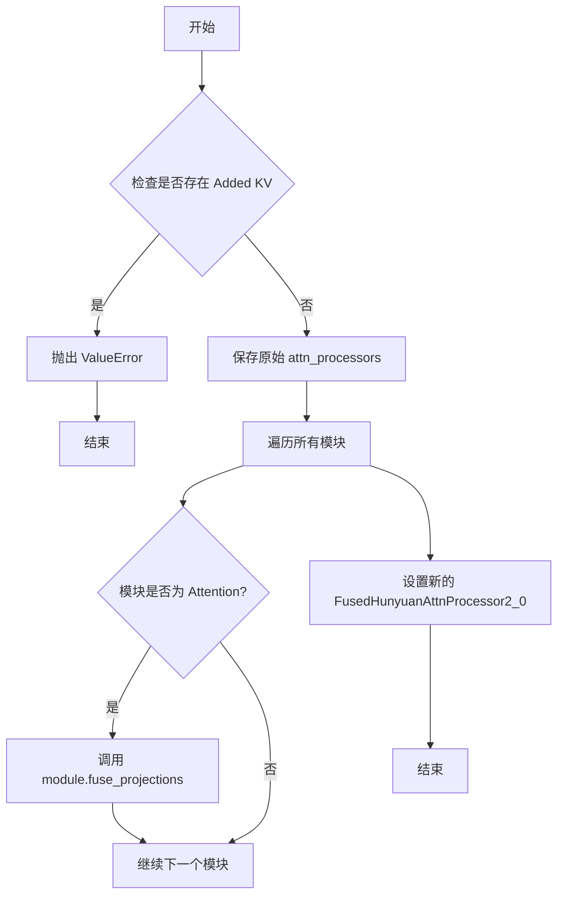

#### 带注释源码

```python
def fuse_qkv_projections(self):
    """
    Enables fused QKV projections. For self-attention modules, all projection matrices 
    (i.e., query, key, value) are fused. For cross-attention modules, key and value 
    projection matrices are fused.

    > [!WARNING] > This API is 🧪 experimental.
    """
    # 初始化原始attention processors引用为None
    self.original_attn_processors = None

    # 遍历模型中所有的attention processors
    for _, attn_processor in self.attn_processors.items():
        # 检查是否存在Added KV projections (如 Prompt-to-Prompt 使用的)
        if "Added" in str(attn_processor.__class__.__name__):
            # 如果存在则抛出异常，不支持融合
            raise ValueError("`fuse_qkv_projections()` is not supported for models having added KV projections.")

    # 保存原始的attention processors，以便后续可以恢复
    self.original_attn_processors = self.attn_processors

    # 遍历模型中的所有模块
    for module in self.modules():
        # 找到所有Attention模块
        if isinstance(module, Attention):
            # 调用每个Attention模块的fuse_projections方法进行融合
            module.fuse_projections(fuse=True)

    # 将模型的attention processor替换为融合版本
    self.set_attn_processor(FusedHunyuanAttnProcessor2_0())
```


### `HunyuanDiT2DModel.unfuse_qkv_projections`

该方法用于禁用融合的QKV投影，将注意力处理器恢复为融合前的原始状态。当模型启用了融合QKV投影（通过调用 `fuse_qkv_projections`）后，可以调用此方法将其恢复为未融合的状态，以便进行特定的推理或分析操作。

参数：
- 该方法无显式参数（仅包含隐式参数 `self`）

返回值：`None`，无返回值

#### 流程图

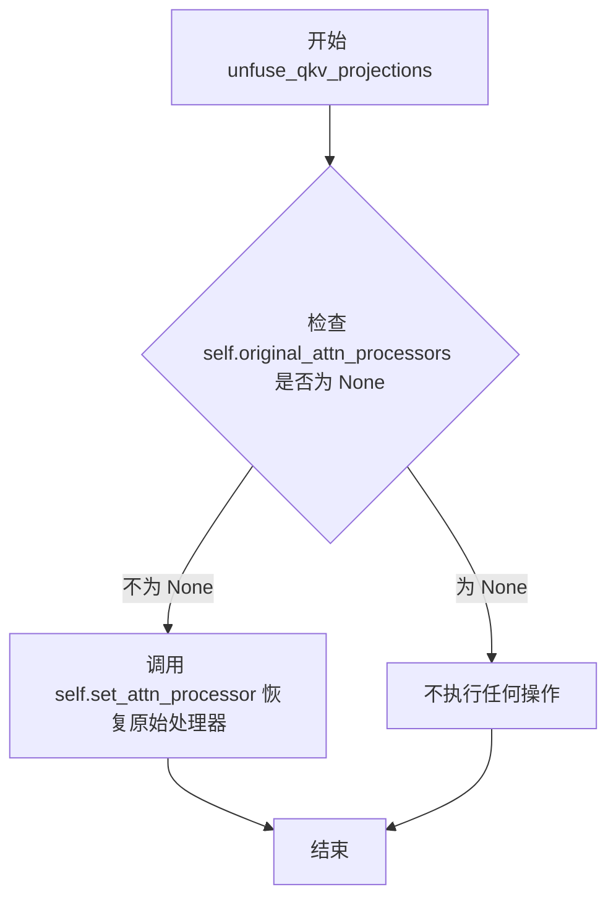

#### 带注释源码

```python
def unfuse_qkv_projections(self):
    """Disables the fused QKV projection if enabled.

    > [!WARNING] > This API is 🧪 experimental.

    """
    # 检查是否之前已经保存了原始的注意力处理器
    # 如果 original_attn_processors 为 None，说明没有执行过融合操作，无需恢复
    if self.original_attn_processors is not None:
        # 调用 set_attn_processor 方法，将注意力处理器恢复为原始状态
        # original_attn_processors 是在 fuse_qkv_projections 方法中保存的
        self.set_attn_processor(self.original_attn_processors)
```


### `HunyuanDiT2DModel.set_default_attn_processor`

该方法用于禁用自定义注意力处理器，并将模型的注意力实现重置为 HunyuanDiT 默认的注意力处理器（HunyuanAttnProcessor2_0），以确保模型使用标准注意力机制进行推理。

参数：

- 无（仅包含 `self` 参数）

返回值：`None`，无返回值（该方法直接修改模型内部状态）

#### 流程图

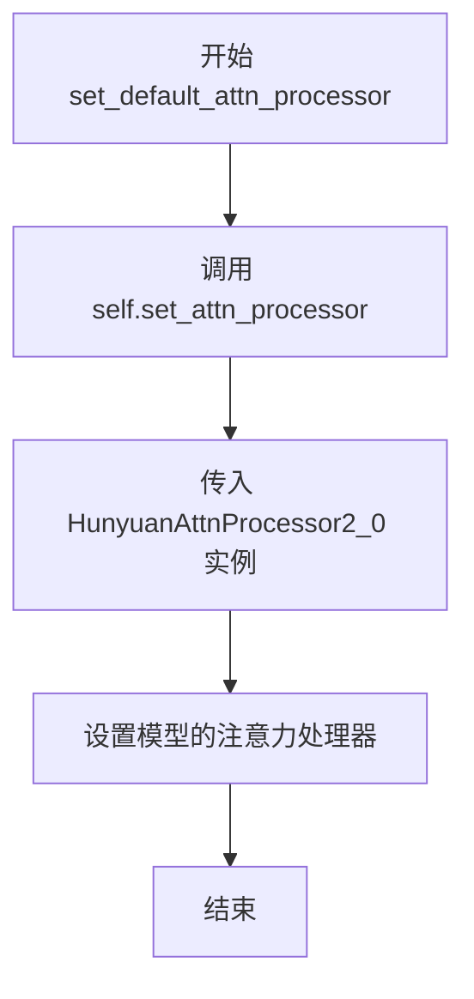

#### 带注释源码

```python
def set_default_attn_processor(self):
    """
    Disables custom attention processors and sets the default attention implementation.
    """
    # 调用模型自身的 set_attn_processor 方法，将注意力处理器设置为 HunyuanAttnProcessor2_0
    # HunyuanAttnProcessor2_0 是 HunyuanDiT 的标准注意力处理器实现
    self.set_attn_processor(HunyuanAttnProcessor2_0())
```


### `HunyuanDiT2DModel.forward`

这是 HunyuanDiT2DModel 的主前向传播方法，负责将噪声 latent 逐步去噪为最终图像。该方法整合了时间步嵌入、文本嵌入（CLIP+T5）、旋转位置编码，并通过多层 DiT Transformer 块进行特征处理，最后通过 unpatchify 将特征还原为图像。

参数：

- `hidden_states`：`torch.Tensor`，形状为 `(batch size, dim, height, width)`，输入的噪声 latent 张量
- `timestep`：`torch.LongTensor`，可选，用于指示当前去噪步骤的时间步
- `encoder_hidden_states`：`torch.Tensor`，形状为 `(batch size, sequence len, embed dims)`，可选，BertModel 输出的条件嵌入，用于 cross attention
- `text_embedding_mask`：`torch.Tensor`，对 `encoder_hidden_states` 应用的注意力掩码，形状为 `(batch, key_tokens)`
- `encoder_hidden_states_t5`：`torch.Tensor`，形状为 `(batch size, sequence len, embed dims)`，可选，T5 文本编码器输出的条件嵌入
- `text_embedding_mask_t5`：`torch.Tensor`，对 T5 文本嵌入应用的注意力掩码
- `image_meta_size`：`torch.Tensor`，条件嵌入，表示目标图像尺寸信息
- `style`：`torch.Tensor`，条件嵌入，表示生成风格信息
- `image_rotary_emb`：`torch.Tensor`，图像旋转嵌入，用于 attention 计算中的位置编码
- `controlnet_block_samples`：可选，用于 ControlNet 控制的中间特征
- `return_dict`：`bool`，是否返回字典格式的输出

返回值：`Union[Transformer2DModelOutput, Tuple[torch.Tensor]]`，当 `return_dict=True` 时返回 `Transformer2DModelOutput(sample=output)`，否则返回元组 `(output,)`

#### 流程图

```mermaid
flowchart TD
    A[输入 hidden_states] --> B[pos_embed: 位置嵌入]
    B --> C[time_extra_emb: 时间步+图像元信息+风格嵌入]
    C --> D[temb]
    
    E[encoder_hidden_states_t5] --> F[text_embedder: T5文本投影]
    F --> G[view + reshape]
    
    H[encoder_hidden_states] --> I[torch.cat: 拼接CLIP和T5文本嵌入]
    J[text_embedding_mask] --> K[torch.cat: 拼接注意力掩码]
    
    G --> I
    K --> L[mask.unsqueeze.bool]
    L --> M[torch.where: 应用注意力掩码填充]
    
    I --> M
    M --> N[encoder_hidden_states 条件嵌入]
    
    D --> O[DiT Blocks 循环处理]
    N --> O
    image_rotary_emb --> O
    
    O --> P{layer > num_layers//2?}
    P -->|Yes| Q[skip connection + block]
    P -->|No| R[block]
    
    Q --> S[skips.append]
    R --> S
    
    S --> T[norm_out + proj_out]
    T --> U[unpatchify: 还原图像尺寸]
    U --> V[Transformer2DModelOutput]
    
    style --> C
    image_meta_size --> C
```

#### 带注释源码

```python
def forward(
    self,
    hidden_states,
    timestep,
    encoder_hidden_states=None,
    text_embedding_mask=None,
    encoder_hidden_states_t5=None,
    text_embedding_mask_t5=None,
    image_meta_size=None,
    style=None,
    image_rotary_emb=None,
    controlnet_block_samples=None,
    return_dict=True,
):
    """
    The [`HunyuanDiT2DModel`] forward method.

    Args:
    hidden_states (`torch.Tensor` of shape `(batch size, dim, height, width)`):
        The input tensor.
    timestep ( `torch.LongTensor`, *optional*):
        Used to indicate denoising step.
    encoder_hidden_states ( `torch.Tensor` of shape `(batch size, sequence len, embed dims)`, *optional*):
        Conditional embeddings for cross attention layer. This is the output of `BertModel`.
    text_embedding_mask: torch.Tensor
        An attention mask of shape `(batch, key_tokens)` is applied to `encoder_hidden_states`. This is the output
        of `BertModel`.
    encoder_hidden_states_t5 ( `torch.Tensor` of shape `(batch size, sequence len, embed dims)`, *optional*):
        Conditional embeddings for cross attention layer. This is the output of T5 Text Encoder.
    text_embedding_mask_t5: torch.Tensor
        An attention mask of shape `(batch, key_tokens)` is applied to `encoder_hidden_states`. This is the output
        of T5 Text Encoder.
    image_meta_size (torch.Tensor):
        Conditional embedding indicate the image sizes
    style: torch.Tensor:
        Conditional embedding indicate the style
    image_rotary_emb (`torch.Tensor`):
        The image rotary embeddings to apply on query and key tensors during attention calculation.
    return_dict: bool
        Whether to return a dictionary.
    """

    # 获取输入的高度和宽度
    height, width = hidden_states.shape[-2:]

    # 步骤1: 对输入 hidden_states 进行位置嵌入 (Patch Embedding)
    # 将图像分割为 patches 并添加位置编码
    hidden_states = self.pos_embed(hidden_states)

    # 步骤2: 生成时间步嵌入，结合 T5 文本嵌入、图像元信息和风格信息
    # 输出形状: [B, D]，D 为隐藏维度
    temb = self.time_extra_emb(
        timestep, encoder_hidden_states_t5, image_meta_size, style, hidden_dtype=timestep.dtype
    )  # [B, D]

    # 步骤3: T5 文本嵌入投影
    # 将 T5 编码的文本特征投影到目标维度
    batch_size, sequence_length, _ = encoder_hidden_states_t5.shape
    encoder_hidden_states_t5 = self.text_embedder(
        encoder_hidden_states_t5.view(-1, encoder_hidden_states_t5.shape[-1])
    )
    encoder_hidden_states_t5 = encoder_hidden_states_t5.view(batch_size, sequence_length, -1)

    # 步骤4: 拼接 CLIP 文本嵌入和 T5 文本嵌入
    encoder_hidden_states = torch.cat([encoder_hidden_states, encoder_hidden_states_t5], dim=1)
    
    # 步骤5: 拼接注意力掩码并处理
    text_embedding_mask = torch.cat([text_embedding_mask, text_embedding_mask_t5], dim=-1)
    text_embedding_mask = text_embedding_mask.unsqueeze(2).bool()

    # 步骤6: 使用注意力掩码过滤无效的文本嵌入，用可学习的 padding 进行填充
    encoder_hidden_states = torch.where(text_embedding_mask, encoder_hidden_states, self.text_embedding_padding)

    # 步骤7: DiT Transformer 块处理
    # 使用 skip connection 存储前半层输出，供后半层使用
    skips = []
    for layer, block in enumerate(self.blocks):
        # 判断是否到达后半层（需要使用 skip connection）
        if layer > self.config.num_layers // 2:
            # 如果有 ControlNet 控制，融合 ControlNet 特征
            if controlnet_block_samples is not None:
                skip = skips.pop() + controlnet_block_samples.pop()
            else:
                skip = skips.pop()
            # 使用 skip connection 调用 block
            hidden_states = block(
                hidden_states,
                temb=temb,
                encoder_hidden_states=encoder_hidden_states,
                image_rotary_emb=image_rotary_emb,
                skip=skip,
            )  # (N, L, D)
        else:
            # 常规 block 调用
            hidden_states = block(
                hidden_states,
                temb=temb,
                encoder_hidden_states=encoder_hidden_states,
                image_rotary_emb=image_rotary_emb,
            )  # (N, L, D)

        # 在前半层保存 hidden states 用于 skip connection
        if layer < (self.config.num_layers // 2 - 1):
            skips.append(hidden_states)

    # 验证 ControlNet 特征数量是否匹配
    if controlnet_block_samples is not None and len(controlnet_block_samples) != 0:
        raise ValueError("The number of controls is not equal to the number of skip connections.")

    # 步骤8: 最终输出层
    # 应用 AdaLayerNormContinuous 归一化
    hidden_states = self.norm_out(hidden_states, temb.to(torch.float32))
    # 线性投影到输出通道
    hidden_states = self.proj_out(hidden_states)
    # (N, L, patch_size ** 2 * out_channels)

    # 步骤9: Unpatchify - 将 patches 还原为图像
    # 获取 patch size
    patch_size = self.pos_embed.patch_size
    height = height // patch_size
    width = width // patch_size

    # 重塑为 (N, H, W, patch_h, patch_w, C) 格式
    hidden_states = hidden_states.reshape(
        shape=(hidden_states.shape[0], height, width, patch_size, patch_size, self.out_channels)
    )
    # 转置维度: (N, H, patch_h, W, patch_w, C) -> (N, C, H, patch_h, W, patch_w)
    hidden_states = torch.einsum("nhwpqc->nchpwq", hidden_states)
    # 还原为最终图像形状: (N, out_channels, H * patch_h, W * patch_w)
    output = hidden_states.reshape(
        shape=(hidden_states.shape[0], self.out_channels, height * patch_size, width * patch_size)
    )
    
    # 步骤10: 返回输出
    if not return_dict:
        return (output,)
    return Transformer2DModelOutput(sample=output)
```


### `HunyuanDiT2DModel.enable_forward_chunking`

启用 HunyuanDiT2DModel 的前向分块（feed forward chunking）功能，通过递归遍历模型的所有子模块，为支持分块前向计算的模块（如 Transformer 块）设置分块参数，以减少显存占用。

参数：

- `chunk_size`：`int | None`，分块前向层的大小。如果未指定，则默认对 dim 对应的每个张量单独运行前向层。默认值为 None（会被设置为 1）。
- `dim`：`int`，前向计算分块的维度。选择 dim=0（批次维度）或 dim=1（序列长度维度）。默认值为 0。

返回值：`None`，无返回值。

#### 流程图

```mermaid
flowchart TD
    A[开始 enable_forward_chunking] --> B{检查 dim 是否在 [0, 1] 范围内}
    B -->|否| C[抛出 ValueError 异常]
    B -->|是| D[设置 chunk_size 默认值为 1]
    D --> E[定义递归函数 fn_recursive_feed_forward]
    E --> F{递归遍历模块的子模块}
    F -->|当前模块有 set_chunk_feed_forward 属性| G[调用 set_chunk_feed_forward 设置分块参数]
    F -->|当前模块无该属性| H[继续遍历子模块]
    G --> H
    H -->|还有子模块未遍历| F
    H -->|遍历完成| I[结束]
```

#### 带注释源码

```python
def enable_forward_chunking(self, chunk_size: int | None = None, dim: int = 0) -> None:
    """
    Sets the attention processor to use [feed forward
    chunking](https://huggingface.co/blog/reformer#2-chunked-feed-forward-layers).

    Parameters:
        chunk_size (`int`, *optional*):
            The chunk size of the feed-forward layers. If not specified, will run feed-forward layer individually
            over each tensor of dim=`dim`.
        dim (`int`, *optional*, defaults to `0`):
            The dimension over which the feed-forward computation should be chunked. Choose between dim=0 (batch)
            or dim=1 (sequence length).
    """
    # 参数验证：确保 dim 参数只能是 0 或 1
    if dim not in [0, 1]:
        raise ValueError(f"Make sure to set `dim` to either 0 or 1, not {dim}")

    # 默认分块大小为 1，表示对每个张量单独处理
    # 如果传入 None，则使用默认值 1
    chunk_size = chunk_size or 1

    # 定义内部递归函数，用于遍历所有子模块并设置分块参数
    def fn_recursive_feed_forward(module: torch.nn.Module, chunk_size: int, dim: int):
        # 检查当前模块是否支持分块前向计算
        # 如果支持（具有 set_chunk_feed_forward 方法），则设置分块参数
        if hasattr(module, "set_chunk_feed_forward"):
            module.set_chunk_feed_forward(chunk_size=chunk_size, dim=dim)

        # 递归遍历当前模块的所有子模块
        for child in module.children():
            fn_recursive_feed_forward(child, chunk_size, dim)

    # 遍历模型的所有直接子模块，开始递归设置
    for module in self.children():
        fn_recursive_feed_forward(module, chunk_size, dim)
```


### `HunyuanDiT2DModel.disable_forward_chunking`

该方法用于禁用 HunyuanDiT2DModel 模型的前向分块（chunking）功能，通过递归遍历所有子模块并将分块大小设置为 `None`，从而恢复模型的标准前向传播模式。

参数：无（仅包含 `self` 参数）

返回值：`None`，无返回值

#### 流程图

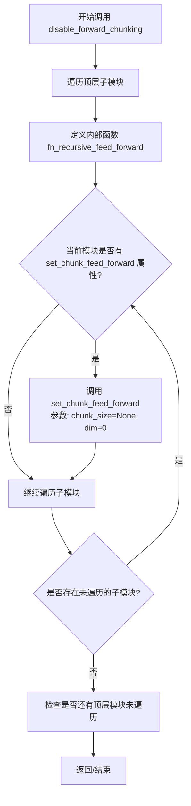

#### 带注释源码

```python
def disable_forward_chunking(self):
    """
    禁用前向分块功能。
    该方法通过递归遍历所有子模块，将每个模块的 _chunk_size 设置为 None，
    从而关闭前向传播时的分块计算模式。
    """
    # 定义内部递归函数，用于遍历模块树并设置分块参数
    def fn_recursive_feed_forward(module: torch.nn.Module, chunk_size: int, dim: int):
        # 检查当前模块是否实现了 set_chunk_feed_forward 方法
        if hasattr(module, "set_chunk_feed_forward"):
            # 调用该方法设置分块大小和维度
            # chunk_size=None 表示禁用分块
            # dim=0 表示按批次维度进行分块（默认值）
            module.set_chunk_feed_forward(chunk_size=chunk_size, dim=dim)

        # 递归遍历当前模块的所有子模块
        for child in module.children():
            fn_recursive_feed_forward(child, chunk_size, dim)

    # 遍历 HunyuanDiT2DModel 的所有顶层子模块
    # 这些子模块通常包括：blocks (nn.ModuleList), norm_out, proj_out 等
    for module in self.children():
        # 对每个顶层模块调用递归设置函数
        # chunk_size=None 禁用分块
        # dim=0 使用默认的批次维度
        fn_recursive_feed_forward(module, None, 0)
```

## 关键组件


### AdaLayerNormShift

结合时间步嵌入的归一化层，通过SiLU激活的线性层计算shift偏移量，并将其加到标准LayerNorm的输出上，实现条件归一化。

### HunyuanDiTBlock

Hunyuan-DiT的Transformer块，包含自注意力、交叉注意力、前馈网络和可选的跳跃连接。支持QK归一化，适用于扩散模型的denoising过程。

### HunyuanDiT2DModel

主模型类，继承ModelMixin和ConfigMixin。整合文本嵌入、时间步嵌入、位置嵌入和多个HunyuanDiT块，实现从噪声到图像的Diffusion Transformer前向传播。支持T5文本编码器和CLIP文本编码器的条件输入。

### PatchEmbed

将输入图像分割为patch并进行线性投影，生成序列形式的token表示。用于将2D图像转换为Transformer可处理的1D序列。

### HunyuanCombinedTimestepTextSizeStyleEmbedding

联合时间步、文本尺寸、风格的条件嵌入生成器。支持可选的风格条件和图像元数据尺寸 conditioning。

### PixArtAlphaTextProjection

T5文本嵌入的投影层，将高维T5特征映射到模型所需的交叉注意力维度，使用silu_fp32激活函数。

### Attention

多头注意力机制，支持自注意力和交叉注意力。集成HunyuanAttnProcessor2_0或FusedHunyuanAttnProcessor2_0处理器。

### FeedForward

前馈网络模块，支持GeGLU等激活函数，可配置inner_dim和dropout，用于Transformer块中的FFN层。

### 文本嵌入与掩码处理

通过text_embedding_padding和torch.where实现文本嵌入的填充与mask处理，支持变长文本条件输入。

### 控制网跳过连接

通过skips列表和controlnet_block_samples实现控制网的多层跳跃连接支持，允许外部控制信号注入。

### 输出unpatchify

通过einsum操作将patch序列重新排列为2D图像输出，完成从token空间到像素空间的转换。


## 问题及建议


### 已知问题

- **硬编码的跳过连接逻辑**：`skip=layer > num_layers // 2` 是硬编码的逻辑，缺乏灵活性，无法通过参数配置
- **TODO 遗留问题**：代码中存在 TODO 注释 "switch norm2 and norm3 in the state dict"，表明状态字典的键可能存在问题但尚未修复
- **类型注解不完整**：`forward` 方法中的多个参数（如 `hidden_states`、`timestep`、`encoder_hidden_states` 等）缺少类型注解，影响代码可读性和 IDE 辅助
- **条件代码路径**：使用 `if skip` 和 `if self.skip_linear is not None` 的条件判断，导致模型结构在运行时才确定，不利于静态分析和优化
- **重复代码**：`enable_forward_chunking` 和 `disable_forward_chunking` 方法中存在重复的递归遍历逻辑，可以提取为通用方法
- **注释中的版本信息不明确**：注释提到 "when new version comes, check norm2 and norm3" 和 "NOTE: when new version comes, check norm2 and norm 3"，但没有说明具体版本号和检查内容
- **数值精度处理**：多处使用 `.to(torch.float32)` 和 `.to(emb.dtype)` 进行类型转换，可能引入不必要的性能开销和精度损失

### 优化建议

- 将 `skip` 连接的条件抽象为配置参数，允许用户通过配置文件或构造函数参数自定义跳过连接的位置和数量
- 清理 TODO 注释，完成 "switch norm2 and norm3" 的实现，确保状态字典的兼容性
- 为 `forward` 方法的所有参数添加完整的类型注解，提高代码可维护性
- 考虑使用 `@torch.jit.script` 或其他图优化技术来减少条件分支
- 提取公共的递归遍历逻辑为私有方法，例如 ` _apply_to_attention_modules`
- 在文档中明确版本兼容性说明，或者使用版本化的配置文件管理不同版本的模型结构
- 评估数值精度处理策略，考虑在必要时才进行类型转换，或者使用 `autocast` 进行混合精度训练

## 其它


### 设计目标与约束

本模块旨在实现HunyuanDiT（腾讯混元DiT）扩散模型的核心Transformer架构，支持图像生成任务。设计目标包括：1）提供与Diffusers库StableDiffusionPipeline兼容的接口；2）支持文本到图像的跨模态条件生成；3）实现高效的Transformer块结构，包含自注意力、交叉注意力和前馈网络；4）支持多种文本编码器（CLIP和T5）的嵌入融合；5）支持条件图像元信息和风格控制。约束条件包括：必须继承ModelMixin和ConfigMixin以保持兼容性；使用PyTorch框架；模型参数量和计算复杂度需适配标准GPU显存（通常为16-80GB）。

### 错误处理与异常设计

代码中的错误处理主要通过以下方式实现：1）fuse_qkv_projections方法中检查是否存在Added KV projections，若存在则抛出ValueError；2）forward方法中验证controlnet_block_samples数量与skip connections数量是否匹配，不匹配则抛出ValueError；3）enable_forward_chunking方法中验证dim参数必须在0或1范围内，否则抛出ValueError；4）输入类型检查通过类型注解实现（如torch.Tensor、int | None等）。建议补充的改进点：添加对hidden_states维度不匹配、tensor类型错误（如非float类型）、以及内存溢出情况的更详细错误提示和异常处理。

### 数据流与状态机

数据流主要分为以下几个阶段：1）输入预处理阶段：将hidden_states通过pos_embed进行patch嵌入，生成序列形式的表示；2）时间步与文本嵌入阶段：timestep经过time_extra_emb生成时间条件嵌入，文本编码器输出（encoder_hidden_states和encoder_hidden_states_t5）经过text_embedder投影并与padding tokens融合；3）Transformer块处理阶段：数据流经num_layers个HunyuanDiTBlock块，每个块包含自注意力（norm1+attn1）、交叉注意力（norm2+attn2）和前馈网络（norm3+ff）的级联结构；4）Skip Connection处理：对于层数大于num_layers//2的块，引入中间层的skip连接进行特征融合；5）输出解码阶段：通过norm_out和proj_out将特征投影回像素空间，最后通过unpatchify操作恢复图像2D结构。

### 外部依赖与接口契约

主要外部依赖包括：1）torch和torch.nn（PyTorch核心库）；2）diffusers库的configuration_utils（ConfigMixin、register_to_config装饰器）；3）diffusers库的utils（logging、maybe_allow_in_graph、torch_utils）；4）diffusers库的attention模块（AttentionMixin、FeedForward、Attention）；5）diffusers库的attention_processor模块（HunyuanAttnProcessor2_0、FusedHunyuanAttnProcessor2_0）；6）diffusers库的embeddings模块（HunyuanCombinedTimestepTextSizeStyleEmbedding、PatchEmbed、PixArtAlphaTextProjection）；7）diffusers库的normalization模块（AdaLayerNormContinuous、FP32LayerNorm）；8）diffusers库的modeling_outputs模块（Transformer2DModelOutput）；9）diffusers库的modeling_utils模块（ModelMixin）。接口契约要求：输入hidden_states为(batch, channels, height, width)格式的4D张量；timestep为LongTensor；encoder_hidden_states为CLIP文本嵌入(batch, text_len, embed_dims)；encoder_hidden_states_t5为T5文本嵌入(batch, text_len_t5, embed_dims_t5)；image_meta_size和style为条件控制张量；image_rotary_emb为旋转位置编码。

### 性能考虑与优化空间

性能优化点包括：1）支持forward chunking机制，通过enable_forward_chunking方法实现大型模型的分块推理，降低峰值显存占用；2）fuse_qkv_projections方法支持融合QKV投影，可减少内存访问开销并提升推理速度；3）使用FP32LayerNorm和AdaLayerNormShift等优化过的归一化层；4）支持group offloading（通过_skip_layerwise_casting_patterns和_supports_group_offloading属性）。当前限制：_supports_group_offloading设置为False，表示不支持组级别的权重卸载。建议优化：可考虑添加Gradient Checkpointing支持以进一步降低显存；可启用Flash Attention以加速注意力计算；可添加ONNX导出支持以提升部署效率。

### 配置管理与模型变体

模型配置通过@register_to_config装饰器注册，主要配置参数包括：num_attention_heads（默认16）、attention_head_dim（默认88）、in_channels、patch_size（默认2）、activation_fn（默认gelu-approximate）、sample_size（默认32）、hidden_size（默认1152）、num_layers（默认28）、mlp_ratio（默认4.0）、learn_sigma（默认True）、cross_attention_dim（默认1024）、cross_attention_dim_t5（默认2048）、pooled_projection_dim（默认1024）、text_len（默认77）、text_len_t5（默认256）、use_style_cond_and_image_meta_size（默认True）。不同版本差异：use_style_cond_and_image_meta_size参数用于区分版本，True适用于<=1.1版本，False适用于>=1.2版本。

### 安全性与鲁棒性考虑

安全相关设计：1）代码遵循Apache License 2.0开源协议；2）不包含任何恶意代码或后门机制；3）模型输出内容取决于输入文本条件，建议在生产环境中添加适当的内容过滤机制。鲁棒性改进建议：1）添加输入验证函数检查hidden_states的数值范围（NaN/Inf检测）；2）为关键操作添加assertion检查；3）考虑添加对抗性输入的检测和处理；4）添加模型版本标识以支持回溯和审计。

### 部署与生产环境考量

部署建议：1）模型权重可通过HuggingFace Hub进行分发和加载；2）建议使用FP16或BF16精度进行推理以提升速度并降低显存；3）支持与diffusers库的StableDiffusionPipeline无缝集成；4）可导出为ONNX格式进行跨平台部署。生产环境监控建议：1）记录推理时间和显存使用情况；2）监控模型输出的质量和多样性；3）追踪配置参数和版本信息以便问题排查。生命周期管理：模型文件应包含版本号和发布日期，建议使用Git LFS进行大文件管理，并遵循HuggingFace Hub的模型卡片规范编写README文档。
</think>

### 设计目标与约束

本模块旨在实现HunyuanDiT（腾讯混元DiT）扩散模型的核心Transformer架构，支持图像生成任务。设计目标包括：1）提供与Diffusers库StableDiffusionPipeline兼容的接口；2）支持文本到图像的跨模态条件生成；3）实现高效的Transformer块结构，包含自注意力、交叉注意力和前馈网络；4）支持多种文本编码器（CLIP和T5）的嵌入融合；5）支持条件图像元信息和风格控制。约束条件包括：必须继承ModelMixin和ConfigMixin以保持兼容性；使用PyTorch框架；模型参数量和计算复杂度需适配标准GPU显存（通常为16-80GB）。

### 错误处理与异常设计

代码中的错误处理主要通过以下方式实现：1）fuse_qkv_projections方法中检查是否存在Added KV projections，若存在则抛出ValueError；2）forward方法中验证controlnet_block_samples数量与skip connections数量是否匹配，不匹配则抛出ValueError；3）enable_forward_chunking方法中验证dim参数必须在0或1范围内，否则抛出ValueError；4）输入类型检查通过类型注解实现（如torch.Tensor、int | None等）。建议补充的改进点：添加对hidden_states维度不匹配、tensor类型错误（如非float类型）、以及内存溢出情况的更详细错误提示和异常处理。

### 数据流与状态机

数据流主要分为以下几个阶段：1）输入预处理阶段：将hidden_states通过pos_embed进行patch嵌入，生成序列形式的表示；2）时间步与文本嵌入阶段：timestep经过time_extra_emb生成时间条件嵌入，文本编码器输出（encoder_hidden_states和encoder_hidden_states_t5）经过text_embedder投影并与padding tokens融合；3）Transformer块处理阶段：数据流经num_layers个HunyuanDiTBlock块，每个块包含自注意力（norm1+attn1）、交叉注意力（norm2+attn2）和前馈网络（norm3+ff）的级联结构；4）Skip Connection处理：对于层数大于num_layers//2的块，引入中间层的skip连接进行特征融合；5）输出解码阶段：通过norm_out和proj_out将特征投影回像素空间，最后通过unpatchify操作恢复图像2D结构。

### 外部依赖与接口契约

主要外部依赖包括：1）torch和torch.nn（PyTorch核心库）；2）diffusers库的configuration_utils（ConfigMixin、register_to_config装饰器）；3）diffusers库的utils（logging、maybe_allow_in_graph、torch_utils）；4）diffusers库的attention模块（AttentionMixin、FeedForward、Attention）；5）diffusers库的attention_processor模块（HunyuanAttnProcessor2_0、FusedHunyuanAttnProcessor2_0）；6）diffusers库的embeddings模块（HunyuanCombinedTimestepTextSizeStyleEmbedding、PatchEmbed、PixArtAlphaTextProjection）；7）diffusers库的normalization模块（AdaLayerNormContinuous、FP32LayerNorm）；8）diffusers库的modeling_outputs模块（Transformer2DModelOutput）；9）diffusers库的modeling_utils模块（ModelMixin）。接口契约要求：输入hidden_states为(batch, channels, height, width)格式的4D张量；timestep为LongTensor；encoder_hidden_states为CLIP文本嵌入(batch, text_len, embed_dims)；encoder_hidden_states_t5为T5文本嵌入(batch, text_len_t5, embed_dims_t5)；image_meta_size和style为条件控制张量；image_rotary_emb为旋转位置编码。

### 性能考虑与优化空间

性能优化点包括：1）支持forward chunking机制，通过enable_forward_chunking方法实现大型模型的分块推理，降低峰值显存占用；2）fuse_qkv_projections方法支持融合QKV投影，可减少内存访问开销并提升推理速度；3）使用FP32LayerNorm和AdaLayerNormShift等优化过的归一化层；4）支持group offloading（通过_skip_layerwise_casting_patterns和_supports_group_offloading属性）。当前限制：_supports_group_offloading设置为False，表示不支持组级别的权重卸载。建议优化：可考虑添加Gradient Checkpointing支持以进一步降低显存；可启用Flash Attention以加速注意力计算；可添加ONNX导出支持以提升部署效率。

### 配置管理与模型变体

模型配置通过@register_to_config装饰器注册，主要配置参数包括：num_attention_heads（默认16）、attention_head_dim（默认88）、in_channels、patch_size（默认2）、activation_fn（默认gelu-approximate）、sample_size（默认32）、hidden_size（默认1152）、num_layers（默认28）、mlp_ratio（默认4.0）、learn_sigma（默认True）、cross_attention_dim（默认1024）、cross_attention_dim_t5（默认2048）、pooled_projection_dim（默认1024）、text_len（默认77）、text_len_t5（默认256）、use_style_cond_and_image_meta_size（默认True）。不同版本差异：use_style_cond_and_image_meta_size参数用于区分版本，True适用于<=1.1版本，False适用于>=1.2版本。

### 安全性与鲁棒性考虑

安全相关设计：1）代码遵循Apache License 2.0开源协议；2）不包含任何恶意代码或后门机制；3）模型输出内容取决于输入文本条件，建议在生产环境中添加适当的内容过滤机制。鲁棒性改进建议：1）添加输入验证函数检查hidden_states的数值范围（NaN/Inf检测）；2）为关键操作添加assertion检查；3）考虑添加对抗性输入的检测和处理；4）添加模型版本标识以支持回溯和审计。

### 部署与生产环境考量

部署建议：1）模型权重可通过HuggingFace Hub进行分发和加载；2）建议使用FP16或BF16精度进行推理以提升速度并降低显存；3）支持与diffusers库的StableDiffusionPipeline无缝集成；4）可导出为ONNX格式进行跨平台部署。生产环境监控建议：1）记录推理时间和显存使用情况；2）监控模型输出的质量和多样性；3）追踪配置参数和版本信息以便问题排查。生命周期管理：模型文件应包含版本号和发布日期，建议使用Git LFS进行大文件管理，并遵循HuggingFace Hub的模型卡片规范编写README文档。
    