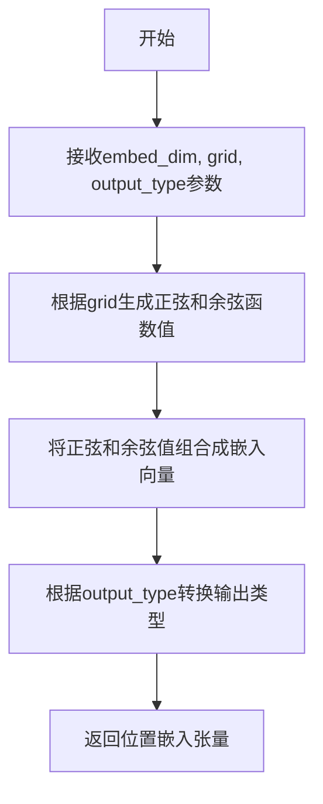

# `diffusers\src\diffusers\models\transformers\latte_transformer_3d.py` 详细设计文档

LatteTransformer3DModel是一个用于视频数据的3D Transformer模型，基于论文https://huggingface.co/papers/2401.03048实现，通过空间变换块和时间变换块分别处理视频的空间和时间维度特征，实现视频生成任务。

## 整体流程

```mermaid
graph TD
A[输入hidden_states] --> B[维度重排和reshape]
B --> C[计算patch数量和位置嵌入]
C --> D[pos_embed嵌入]
D --> E[adaln_single处理timestep]
E --> F[caption_projection处理encoder_hidden_states]
F --> G[准备空间和时间timestep]
G --> H{for each transformer block}
H --> I[空间变换块处理]
I --> J{enable_temporal_attentions?}
J -- 是 --> K[reshape为(batch, num_frame, ...) ]
K --> L[添加时间位置编码]
L --> M[时间变换块处理]
M --> N[reshape回(batch*num_frame
J -- 否 --> N
N --> O[shift和scale调制]
O --> P[proj_out投影]
P --> Q[unpatchify逆变换]
Q --> R[输出Transformer2DModelOutput]
```

## 类结构

```
ModelMixin (抽象基类)
├── LatteTransformer3DModel (主类)
    ├── 依赖: BasicTransformerBlock (空间/时间Transformer块)
    ├── 依赖: PatchEmbed (图像patch嵌入)
    ├── 依赖: AdaLayerNormSingle (自适应层归一化)
    ├── 依赖: PixArtAlphaTextProjection (文本投影)
    └── 依赖: CacheMixin (缓存支持)
```

## 全局变量及字段


### `inner_dim`
    
内部维度，等于注意力头数乘以每个头的维度数，用于确定模型的内部表示宽度

类型：`int`
    


### `interpolation_scale`
    
位置嵌入的插值缩放因子，根据样本大小和默认的64进行计算，用于调整不同分辨率下的位置编码

类型：`int`
    


### `LatteTransformer3DModel._supports_gradient_checkpointing`
    
类属性，标识该模型是否支持梯度检查点优化

类型：`bool`
    


### `LatteTransformer3DModel._skip_layerwise_casting_patterns`
    
类属性，指定在层-wise类型转换时应跳过的参数模式列表

类型：`list[str]`
    


### `LatteTransformer3DModel.height`
    
实例属性，存储输入样本的高度尺寸

类型：`int`
    


### `LatteTransformer3DModel.width`
    
实例属性，存储输入样本的宽度尺寸

类型：`int`
    


### `LatteTransformer3DModel.pos_embed`
    
实例属性，PatchEmbed模块，用于将输入图像转换为补丁并进行位置嵌入

类型：`PatchEmbed`
    


### `LatteTransformer3DModel.transformer_blocks`
    
实例属性，空间变换器块列表，用于处理空间维度的特征

类型：`nn.ModuleList[BasicTransformerBlock]`
    


### `LatteTransformer3DModel.temporal_transformer_blocks`
    
实例属性，时间变换器块列表，用于处理时间维度的特征

类型：`nn.ModuleList[BasicTransformerBlock]`
    


### `LatteTransformer3DModel.out_channels`
    
实例属性，输出通道数，决定最终输出特征的维度

类型：`int`
    


### `LatteTransformer3DModel.norm_out`
    
实例属性，输出层归一化，对最终特征进行LayerNorm处理

类型：`nn.LayerNorm`
    


### `LatteTransformer3DModel.scale_shift_table`
    
实例属性，用于AdaLN的缩放和偏移参数表，通过时间步长动态调整特征

类型：`nn.Parameter`
    


### `LatteTransformer3DModel.proj_out`
    
实例属性，输出投影层，将内部维度映射回补丁尺寸和输出通道

类型：`nn.Linear`
    


### `LatteTransformer3DModel.adaln_single`
    
实例属性，自适应层归一化单例，根据时间步长和条件信息动态调整归一化参数

类型：`AdaLayerNormSingle`
    


### `LatteTransformer3DModel.caption_projection`
    
实例属性，文本嵌入投影层，将文本特征投影到模型内部维度空间

类型：`PixArtAlphaTextProjection`
    


### `LatteTransformer3DModel.temp_pos_embed`
    
实例属性，时间位置嵌入缓冲区，存储用于时间维度的正弦余弦位置编码

类型：`torch.Tensor`
    


### `LatteTransformer3DModel.gradient_checkpointing`
    
实例属性，梯度检查点标志，控制是否在训练时启用梯度检查点以节省显存

类型：`bool`
    
    

## 全局函数及方法


### `get_1d_sincos_pos_embed_from_grid`

该函数用于根据给定的1D网格位置生成正弦余弦位置嵌入（Sinusoidal-Cosine Positional Embedding），常用于Transformer模型中为序列位置提供位置信息。

参数：

- `embed_dim`：`int`，位置嵌入的维度（即每个位置的嵌入向量长度）
- `grid`：`torch.Tensor`，形状为 `(length, 1)` 的2D张量，表示1D网格上的位置索引
- `output_type`：`str`，可选参数，指定输出张量的类型（如 `"pt"` 表示 PyTorch 张量）

返回值：`torch.Tensor`，返回形状为 `(length, embed_dim)` 的位置嵌入张量

#### 流程图



#### 带注释源码

```
# 注意：该函数在当前代码文件中仅被导入使用，未在此文件中定义
# 定义位于 .../embeddings.py 模块中

# 当前文件中的调用示例：
temp_pos_embed = get_1d_sincos_pos_embed_from_grid(
    inner_dim,              # embed_dim: 嵌入维度（例如 1152）
    torch.arange(0, video_length).unsqueeze(1),  # grid: 0到video_length-1的列向量
    output_type="pt"        # output_type: 输出为PyTorch张量
)
# 用途：为视频帧生成时间维度的位置嵌入
```


### `LatteTransformer3DModel.__init__`

该方法是3D Transformer模型（Latte）的初始化方法，用于构建处理视频数据的变换器架构。它通过注册配置参数、初始化位置嵌入、创建空间和时间变换器块、定义输出层以及设置时间位置嵌入来完整地构建模型结构。

参数：

- `num_attention_heads`：`int`，默认值 16，多头注意力机制的头数
- `attention_head_dim`：`int`，默认值 88，每个注意力头的通道维度
- `in_channels`：`int | None`，输入数据的通道数
- `out_channels`：`int | None`，输出数据的通道数，默认为 None
- `num_layers`：`int`，默认值 1，Transformer 块的数量
- `dropout`：`float`，默认值 0.0，Dropout 概率
- `cross_attention_dim`：`int | None`，交叉注意力维度，用于条件嵌入
- `attention_bias`：`bool`，默认值 False，注意力层是否包含偏置参数
- `sample_size`：`int`，默认值 64，潜在图像的宽度/高度，用于计算位置嵌入
- `patch_size`：`int | None`，补丁嵌入层的补丁大小
- `activation_fn`：`str`，默认值 "geglu"，前馈网络使用的激活函数
- `num_embeds_ada_norm`：`int | None`，AdaLayerNorm 使用的扩散步数
- `norm_type`：`str`，默认值 "layer_norm"，归一化类型（"layer_norm" 或 "ada_layer_norm"）
- `norm_elementwise_affine`：`bool`，默认值 True，是否在归一化层使用元素级仿射
- `norm_eps`：`float`，默认值 1e-5，归一化层的 epsilon 值
- `caption_channels`：`int`，caption 嵌入的通道数
- `video_length`：`int`，默认值 16，视频数据的帧数

返回值：无（`__init__` 方法返回 `None`）

#### 流程图

```mermaid
flowchart TD
    A[开始 __init__] --> B[调用 super().__init__]
    B --> C[计算 inner_dim = num_attention_heads * attention_head_dim]
    C --> D[设置 self.height 和 self.width = sample_size]
    D --> E[计算 interpolation_scale]
    E --> F[创建 PatchEmbed 位置嵌入 self.pos_embed]
    F --> G[创建空间 Transformer 块列表 self.transformer_blocks]
    G --> H[创建时间 Transformer 块列表 self.temporal_transformer_blocks]
    H --> I[设置输出通道 self.out_channels]
    I --> J[创建 LayerNorm 输出层 self.norm_out]
    J --> K[创建 scale_shift_table 参数]
    K --> L[创建线性输出投影 self.proj_out]
    L --> M[创建 AdaLayerNormSingle 层 self.adaln_single]
    M --> N[创建文本投影层 self.caption_projection]
    N --> O[创建时间位置嵌入 temp_pos_embed 并注册为 buffer]
    O --> P[设置 self.gradient_checkpointing = False]
    P --> Q[结束 __init__]
```

#### 带注释源码

```python
@register_to_config
def __init__(
    self,
    num_attention_heads: int = 16,
    attention_head_dim: int = 88,
    in_channels: int | None = None,
    out_channels: int | None = None,
    num_layers: int = 1,
    dropout: float = 0.0,
    cross_attention_dim: int | None = None,
    attention_bias: bool = False,
    sample_size: int = 64,
    patch_size: int | None = None,
    activation_fn: str = "geglu",
    num_embeds_ada_norm: int | None = None,
    norm_type: str = "layer_norm",
    norm_elementwise_affine: bool = True,
    norm_eps: float = 1e-5,
    caption_channels: int = None,
    video_length: int = 16,
):
    # 调用父类初始化方法
    super().__init__()
    
    # 计算内部维度：多头数 × 每头维度
    inner_dim = num_attention_heads * attention_head_dim

    # 1. 定义输入层：设置图像高度和宽度
    self.height = sample_size
    self.width = sample_size

    # 计算插值缩放因子，用于位置嵌入
    interpolation_scale = self.config.sample_size // 64
    interpolation_scale = max(interpolation_scale, 1)
    
    # 创建补丁嵌入层，用于将输入图像转换为补丁序列并添加位置嵌入
    self.pos_embed = PatchEmbed(
        height=sample_size,
        width=sample_size,
        patch_size=patch_size,
        in_channels=in_channels,
        embed_dim=inner_dim,
        interpolation_scale=interpolation_scale,
    )

    # 2. 定义空间变换器块：处理每个帧的空间信息
    self.transformer_blocks = nn.ModuleList(
        [
            BasicTransformerBlock(
                inner_dim,
                num_attention_heads,
                attention_head_dim,
                dropout=dropout,
                cross_attention_dim=cross_attention_dim,
                activation_fn=activation_fn,
                num_embeds_ada_norm=num_embeds_ada_norm,
                attention_bias=attention_bias,
                norm_type=norm_type,
                norm_elementwise_affine=norm_elementwise_affine,
                norm_eps=norm_eps,
            )
            for d in range(num_layers)
        ]
    )

    # 3. 定义时间变换器块：处理帧间的时间信息
    self.temporal_transformer_blocks = nn.ModuleList(
        [
            BasicTransformerBlock(
                inner_dim,
                num_attention_heads,
                attention_head_dim,
                dropout=dropout,
                cross_attention_dim=None,  # 时间块不使用交叉注意力
                activation_fn=activation_fn,
                num_embeds_ada_norm=num_embeds_ada_norm,
                attention_bias=attention_bias,
                norm_type=norm_type,
                norm_elementwise_affine=norm_elementwise_affine,
                norm_eps=norm_eps,
            )
            for d in range(num_layers)
        ]
    )

    # 4. 定义输出层
    self.out_channels = in_channels if out_channels is None else out_channels
    self.norm_out = nn.LayerNorm(inner_dim, elementwise_affine=False, eps=1e-6)
    self.scale_shift_table = nn.Parameter(torch.randn(2, inner_dim) / inner_dim**0.5)
    self.proj_out = nn.Linear(inner_dim, patch_size * patch_size * self.out_channels)

    # 5. Latte 其他模块
    # AdaLayerNorm 单层，用于时间步嵌入
    self.adaln_single = AdaLayerNormSingle(inner_dim, use_additional_conditions=False)
    # 文本投影层，将 caption 嵌入投影到模型维度
    self.caption_projection = PixArtAlphaTextProjection(in_features=caption_channels, hidden_size=inner_dim)

    # 定义时间位置嵌入：使用 1D 正弦余弦位置编码
    temp_pos_embed = get_1d_sincos_pos_embed_from_grid(
        inner_dim, torch.arange(0, video_length).unsqueeze(1), output_type="pt"
    )  # inner_dim 隐藏大小
    # 注册为非持久化 buffer（不会保存到模型权重）
    self.register_buffer("temp_pos_embed", temp_pos_embed.float().unsqueeze(0), persistent=False)

    # 初始化梯度检查点标志为 False
    self.gradient_checkpointing = False
```


### `LatteTransformer3DModel.forward`

这是LatteTransformer3DModel类的前向传播方法，负责将输入的视频潜在表示经过空间和时间transformer块的处理，输出重构后的视频潜在表示。该方法通过位置嵌入、自适应层归一化、空间注意力、时间注意力和输出投影等步骤，实现从噪声视频潜在表示到清晰视频潜在表示的去噪过程。

参数：

- `hidden_states`：`torch.Tensor`，输入的隐藏状态，形状为`(batch size, channel, num_frame, height, width)`，代表批量大小、通道数、帧数、高度和宽度
- `timestep`：`torch.LongTensor | None`，可选参数，用于去噪步骤的时间步，作为AdaLayerNorm的嵌入输入
- `encoder_hidden_states`：`torch.Tensor | None`，可选参数，条件嵌入用于交叉注意力层，形状为`(batch size, sequence len, embed dims)`，如果未给定，交叉注意力默认为自注意力
- `encoder_attention_mask`：`torch.Tensor | None`，可选参数，应用于`encoder_hidden_states`的交叉注意力掩码，支持两种格式：掩码格式`(batch, sequence_length)`或偏置格式`(batch, 1, sequence_length)`
- `enable_temporal_attentions`：`bool`，可选参数，默认为`True`，控制是否启用时间维度上的注意力机制
- `return_dict`：`bool`，可选参数，默认为`True`，决定是否返回`Transformer2DModelOutput`字典格式输出，否则返回元组

返回值：`Transformer2DModelOutput`，当`return_dict=True`时返回包含`sample`属性的输出对象；否则返回元组`(output,)`，其中output为最终的重构视频潜在表示，形状为`(batch size, channel, num_frame, height, width)`

#### 流程图

```mermaid
flowchart TD
    A[开始 forward] --> B[输入验证: hidden_states shape (B, C, T, H, W)]
    B --> C[Permute和Reshape: (B, C, T, H, W) -> (B*T, C, H, W)]
    C --> D[计算patch数量: height, width, num_patches]
    D --> E[位置嵌入: self.pos_embed hidden_states]
    E --> F[AdaLayerNormSingle: timestep -> timestep, embedded_timestep]
    F --> G[文本嵌入投影: self.caption_projection encoder_hidden_states]
    G --> H[Repeat和View: 扩展encoder_hidden_states到空间块维度]
    H --> I[Repeat和View: 扩展timestep到空间和时间维度]
    I --> J[循环遍历 transformer_blocks 和 temporal_transformer_blocks]
    J --> K{梯度检查点启用?}
    K -->|是| L[gradient_checkpointing_func 空间块]
    K -->|否| M[直接调用 spatial_block]
    L --> N{enable_temporal_attentions?}
    M --> N
    N -->|否| O[跳过时间块,继续下一层]
    N -->|是| P[Reshape: (B*T, N, D) -> (B, N, T, D) -> (B*N, T, D)]
    P --> Q{num_frame > 1 且 i==0?}
    Q -->|是| R[添加时间位置嵌入: + temp_pos_embed]
    Q -->|否| S{梯度检查点启用?}
    R --> S
    S -->|是| T[gradient_checkpointing_func 时间块]
    S -->|否| U[直接调用 temp_block]
    T --> V[Reshape回: (B*N, T, D) -> (B, N, T, D) -> (B*T, N, D)]
    U --> V
    V --> W{还有更多层?}
    W -->|是| J
    W -->|否| X[扩展embedded_timestep到帧维度]
    X --> Y[计算shift和scale: scale_shift_table + embedded_timestep]
    Y --> Z[输出归一化: self.norm_out hidden_states]
    Z --> AA[调制: hidden_states * (1 + scale) + shift]
    AA --> AB[输出投影: self.proj_out]
    AB --> AC[Unpatchify: reshape到视频尺寸]
    AC --> AD[最终Reshape和Permute: (B, C, T, H, W)]
    AD --> AE{return_dict?}
    AE -->|是| AF[返回 Transformer2DModelOutput sample=output]
    AE -->|否| AG[返回元组 output]
```

#### 带注释源码

```python
def forward(
    self,
    hidden_states: torch.Tensor,
    timestep: torch.LongTensor | None = None,
    encoder_hidden_states: torch.Tensor | None = None,
    encoder_attention_mask: torch.Tensor | None = None,
    enable_temporal_attentions: bool = True,
    return_dict: bool = True,
):
    """
    The [`LatteTransformer3DModel`] forward method.

    Args:
        hidden_states shape `(batch size, channel, num_frame, height, width)`:
            Input `hidden_states`.
        timestep ( `torch.LongTensor`, *optional*):
            Used to indicate denoising step. Optional timestep to be applied as an embedding in `AdaLayerNorm`.
        encoder_hidden_states ( `torch.FloatTensor` of shape `(batch size, sequence len, embed dims)`, *optional*):
            Conditional embeddings for cross attention layer. If not given, cross-attention defaults to
            self-attention.
        encoder_attention_mask ( `torch.Tensor`, *optional*):
            Cross-attention mask applied to `encoder_hidden_states`. Two formats supported:

                * Mask `(batcheight, sequence_length)` True = keep, False = discard.
                * Bias `(batcheight, 1, sequence_length)` 0 = keep, -10000 = discard.

            If `ndim == 2`: will be interpreted as a mask, then converted into a bias consistent with the format
            above. This bias will be added to the cross-attention scores.
        enable_temporal_attentions:
            (`bool`, *optional*, defaults to `True`): Whether to enable temporal attentions.
        return_dict (`bool`, *optional*, defaults to `True`):
            Whether or not to return a [`~models.unet_2d_condition.UNet2DConditionOutput`] instead of a plain
            tuple.

    Returns:
        If `return_dict` is True, an [`~models.transformer_2d.Transformer2DModelOutput`] is returned, otherwise a
        `tuple` where the first element is the sample tensor.
    """

    # 步骤1: Reshape隐藏状态 - 将5D张量转换为4D张量用于空间处理
    # 从 (batch_size, channels, num_frame, height, width) 
    # 转换为 (batch_size * num_frame, channels, height, width)
    batch_size, channels, num_frame, height, width = hidden_states.shape
    hidden_states = hidden_states.permute(0, 2, 1, 3, 4).reshape(-1, channels, height, width)

    # 步骤2: 计算patch尺寸和数量
    # height 和 width 代表处理后的patch网格维度
    height, width = (
        hidden_states.shape[-2] // self.config.patch_size,
        hidden_states.shape[-1] // self.config.patch_size,
    )
    num_patches = height * width

    # 步骤3: 应用位置嵌入 - 已包含位置编码信息
    hidden_states = self.pos_embed(hidden_states)

    # 步骤4: 准备条件嵌入参数
    added_cond_kwargs = {"resolution": None, "aspect_ratio": None}
    
    # 步骤5: AdaLayerNorm处理时间步 - 获取时间步嵌入和归一化参数
    timestep, embedded_timestep = self.adaln_single(
        timestep, added_cond_kwargs=added_cond_kwargs, batch_size=batch_size, hidden_dtype=hidden_states.dtype
    )

    # 步骤6: 文本嵌入投影和空间维度扩展
    # 将文本嵌入投影到模型维度，并扩展到所有帧
    encoder_hidden_states = self.caption_projection(encoder_hidden_states)  # 形状: (3, 120, 1152)
    encoder_hidden_states_spatial = encoder_hidden_states.repeat_interleave(
        num_frame, dim=0, output_size=encoder_hidden_states.shape[0] * num_frame
    ).view(-1, encoder_hidden_states.shape[-2], encoder_hidden_states.shape[-1])

    # 步骤7: 准备空间和时间块的时间步
    # 为每个帧复制时间步信息用于空间transformer
    timestep_spatial = timestep.repeat_interleave(
        num_frame, dim=0, output_size=timestep.shape[0] * num_frame
    ).view(-1, timestep.shape[-1])
    
    # 为每个patch复制时间步信息用于时间transformer
    timestep_temp = timestep.repeat_interleave(
        num_patches, dim=0, output_size=timestep.shape[0] * num_patches
    ).view(-1, timestep.shape[-1])

    # 步骤8: 遍历空间和时间transformer块进行特征提取
    for i, (spatial_block, temp_block) in enumerate(
        zip(self.transformer_blocks, self.temporal_transformer_blocks)
    ):
        # 空间transformer块处理
        if torch.is_grad_enabled() and self.gradient_checkpointing:
            # 使用梯度检查点节省显存
            hidden_states = self._gradient_checkpointing_func(
                spatial_block,
                hidden_states,
                None,  # attention_mask
                encoder_hidden_states_spatial,
                encoder_attention_mask,
                timestep_spatial,
                None,  # cross_attention_kwargs
                None,  # class_labels
            )
        else:
            hidden_states = spatial_block(
                hidden_states,
                None,  # attention_mask
                encoder_hidden_states_spatial,
                encoder_attention_mask,
                timestep_spatial,
                None,  # cross_attention_kwargs
                None,  # class_labels
            )

        # 时间transformer块处理（如果启用）
        if enable_temporal_attentions:
            # Reshape: (batch*num_frame, num_tokens, hidden) -> (batch, num_tokens, num_frame, hidden)
            # -> (batch*num_tokens, num_frame, hidden)
            hidden_states = hidden_states.reshape(
                batch_size, -1, hidden_states.shape[-2], hidden_states.shape[-1]
            ).permute(0, 2, 1, 3)
            hidden_states = hidden_states.reshape(-1, hidden_states.shape[-2], hidden_states.shape[-1])

            # 在第一层且有多帧时添加时间位置嵌入
            if i == 0 and num_frame > 1:
                hidden_states = hidden_states + self.temp_pos_embed.to(hidden_states.dtype)

            # 时间transformer块处理
            if torch.is_grad_enabled() and self.gradient_checkpointing:
                hidden_states = self._gradient_checkpointing_func(
                    temp_block,
                    hidden_states,
                    None,  # attention_mask
                    None,  # encoder_hidden_states
                    None,  # encoder_attention_mask
                    timestep_temp,
                    None,  # cross_attention_kwargs
                    None,  # class_labels
                )
            else:
                hidden_states = temp_block(
                    hidden_states,
                    None,  # attention_mask
                    None,  # encoder_hidden_states
                    None,  # encoder_attention_mask
                    timestep_temp,
                    None,  # cross_attention_kwargs
                    None,  # class_labels
                )

            # 还原形状: (batch*num_tokens, num_frame, hidden) -> (batch, num_tokens, num_frame, hidden)
            # -> (batch*num_frame, num_tokens, hidden)
            hidden_states = hidden_states.reshape(
                batch_size, -1, hidden_states.shape[-2], hidden_states.shape[-1]
            ).permute(0, 2, 1, 3)
            hidden_states = hidden_states.reshape(-1, hidden_states.shape[-2], hidden_states.shape[-1])

    # 步骤9: 输出调制和投影
    # 扩展embedded_timestep到帧维度
    embedded_timestep = embedded_timestep.repeat_interleave(
        num_frame, dim=0, output_size=embedded_timestep.shape[0] * num_frame
    ).view(-1, embedded_timestep.shape[-1])
    
    # 从scale_shift_table计算shift和scale参数
    shift, scale = (self.scale_shift_table[None] + embedded_timestep[:, None]).chunk(2, dim=1)
    
    # 层归一化
    hidden_states = self.norm_out(hidden_states)
    
    # 自适应调制: hidden_states = hidden_states * (1 + scale) + shift
    hidden_states = hidden_states * (1 + scale) + shift
    
    # 输出投影: 从inner_dim投影到patch_size*patch_size*out_channels
    hidden_states = self.proj_out(hidden_states)

    # 步骤10: Unpatchify - 将patchified表示还原为视频张量
    if self.adaln_single is None:
        height = width = int(hidden_states.shape[1] ** 0.5)
    
    # Reshape到 (batch*num_frame, height, width, patch_h, patch_w, channels)
    hidden_states = hidden_states.reshape(
        shape=(-1, height, width, self.config.patch_size, self.config.patch_size, self.out_channels)
    )
    
    # 使用einsum重排列维度: nhwpqc -> nchpwq
    hidden_states = torch.einsum("nhwpqc->nchpwq", hidden_states)
    
    # 还原到 (batch*num_frame, channels, height*patch_h, width*patch_w)
    output = hidden_states.reshape(
        shape=(-1, self.out_channels, height * self.config.patch_size, width * self.config.patch_size)
    )
    
    # 最终reshape: (batch, channels, num_frame, height, width)
    output = output.reshape(batch_size, -1, output.shape[-3], output.shape[-2], output.shape[-1]).permute(
        0, 2, 1, 3, 4
    )

    # 步骤11: 返回结果
    if not return_dict:
        return (output,)

    return Transformer2DModelOutput(sample=output)
```

## 关键组件


### LatteTransformer3DModel

主类，一个用于视频数据的3D Transformer模型，支持空间和时间维度的自注意力机制，实现视频生成的核心架构。

### Spatial Transformer Blocks (self.transformer_blocks)

空间变换器模块列表，由多个BasicTransformerBlock组成，用于处理每一帧的空间特征。

### Temporal Transformer Blocks (self.temporal_transformer_blocks)

时间变换器模块列表，由多个BasicTransformerBlock组成，用于跨帧的时间维度特征建模。

### PatchEmbed (self.pos_embed)

Patch嵌入层，将输入的图像/视频块转换为向量表示，并添加位置编码。

### AdaLayerNormSingle (self.adaln_single)

自适应层归一化单层，根据时间步长(timestep)动态调整归一化参数，用于去噪过程的条件注入。

### Caption Projection (self.caption_projection)

文本嵌入投影层(PixArtAlphaTextProjection)，将文本特征投影到模型隐藏维度空间，用于跨注意力机制。

### Temporal Positional Embedding (self.temp_pos_embed)

时间位置编码缓冲区，存储视频帧的一维正弦余弦位置嵌入，用于捕捉帧间时序信息。

### Output Projection & Modulation (self.proj_out, self.scale_shift_table)

输出投影层和仿射变换模块，包含LayerNorm、scale/shift参数调节和线性投影，将隐藏状态转换回像素空间。

### Gradient Checkpointing Support

梯度检查点技术，通过self.gradient_checkpointing标志控制，在前向传播时节省显存，适用于大规模模型训练。


## 问题及建议


### 已知问题

- **条件检查逻辑错误**：第228行 `if self.adaln_single is None:` 检查永远为False，因为 `self.adaln_single` 在 `__init__` 的第116行总是被初始化，导致 `height` 和 `width` 的计算逻辑无法正确执行
- **变量重复赋值**：类属性 `self.height` 和 `self.width` 在 `__init__` 中被设置为 `sample_size`，但在 `forward` 方法中又被重新计算为patch数量，造成语义混淆
- **类型注解错误**：`caption_channels: int = None` 应改为 `caption_channels: int | None = None`，当前类型注解与实际默认值不符
- **临时位置嵌入持久化问题**：`self.register_buffer("temp_pos_embed", ..., persistent=False)` 使用非持久化buffer，可能导致模型序列化时缺失关键位置信息
- **冗余的维度操作**：forward方法中对hidden_states进行了多次reshape和permute操作（第166-169行、第199-202行、第216-221行），存在中间张量复制开销
- **重复代码模式**：spatial_block和temp_block的调用逻辑几乎完全相同，仅参数有差异，可抽象为通用函数减少代码冗余

### 优化建议

- 修复第228行的条件检查逻辑，移除或更正为有效的条件判断
- 移除或明确类属性 `self.height` 和 `self.width` 的用途，避免与forward中的局部变量混淆
- 修正 `caption_channels` 的类型注解为 `int | None = None`
- 考虑将 `temp_pos_embed` 的 `persistent` 设置为 `True` 或在文档中明确说明非持久化的原因
- 将spatial_block和temp_block的调用模式抽象为辅助方法，减少代码重复并提高可维护性
- 考虑使用 `torch.compile` 或手动优化维度操作顺序，减少中间张量开销
- 在关键张量操作（如einsum）添加注释说明其数学含义，提高代码可读性

## 其它


### 设计目标与约束

本模型的设计目标是实现一个高效的3D Transformer架构，用于视频生成任务。核心约束包括：(1) 支持视频帧的空间和时间维度的联合建模；(2) 通过AdaLayerNormSingle实现条件生成；(3) 支持梯度检查点以节省显存；(4) 兼容PixArt-Alpha文本嵌入。模型采用spatial-temporal交替处理的架构，需要保证batch_size * num_frame的内存约束。

### 错误处理与异常设计

本代码主要依赖PyTorch的自动求导机制，错误处理包括：(1) `hidden_states.shape`维度检查，确保输入为5D张量(batch, channel, frame, height, width)；(2) `timestep`和`encoder_hidden_states`的可选传入，调用方需确保类型正确；(3) `gradient_checkpointing`仅在`torch.is_grad_enabled()`为True时生效；(4) 当`enable_temporal_attentions=False`时跳过时间注意力计算。异常通常由上游传入非法张量维度引发，建议在调用前进行shape验证。

### 数据流与状态机

输入数据流：hidden_states(5D) → permute和reshape为4D → pos_embed编码 → spatial_block处理 → (可选)temporal_block处理 → adaLN调制 → proj_out投影 → unpatchify逆变换 → reshape回5D输出。状态转移主要在spatial_block和temporal_block之间交替，每个block内部遵循Transformer的标准forward流程（attention + feedforward）。

### 外部依赖与接口契约

核心依赖包括：`torch`、`torch.nn`、配置相关模块（configuration_utils）、注意力模块（attention）、缓存工具（cache_utils）、嵌入模块（embeddings）、归一化模块（normalization）。外部调用方需提供：hidden_states（5D张量）、timestep（LongTensor）、encoder_hidden_states（文本嵌入）、encoder_attention_mask（可选）。输出遵循Transformer2DModelOutput格式或元组形式。

### 配置参数详解

关键配置参数包括：num_attention_heads(注意力头数，默认16)、attention_head_dim(每头维度，默认88)、num_layers(Transformer块数量)、patch_size(分块大小)、video_length(视频帧数)、norm_type(归一化类型，支持layer_norm和ada_layer_norm)、activation_fn(激活函数，默认geglu)。这些参数共同决定模型的容量和计算开销。

### 性能考虑与优化空间

性能优化点：(1) gradient_checkpointing可显著减少显存占用，建议在长序列训练时启用；(2) temporal_pos_embed使用register_buffer避免参数更新；(3) repeat_interleave和view操作会产生内存拷贝，可考虑in-place操作优化。当前实现中spatial和temporal block顺序执行，未支持并行计算。视频长度增加会导致num_patches增大，内存占用呈平方级增长。

### 安全性与局限性

本代码不直接涉及用户输入处理，安全性风险较低。主要局限包括：(1) 仅支持固定patch_size；(2) temporal attention在num_frame=1时会被跳过；(3) 文本嵌入维度必须匹配caption_channels；(4) 位置编码基于sincos方法，不支持动态分辨率。模型推理时需保证sample_size与训练时一致，否则需要重新学习位置嵌入。

### 测试建议

建议测试场景：(1) 不同batch_size和video_length的forward pass；(2) gradient_checkpointing开启/关闭的梯度计算一致性；(3) enable_temporal_attentions=True/False的输出差异；(4) 混合精度训练下的数值稳定性；(5) 模型save/load的序列化完整性。基准测试应关注hidden_states维度变化各阶段的shape正确性。

### 参考文献

论文：Latte: Efficient Video Generation with Latent Diffusion Models，arXiv:2401.03048。官方代码仓库：https://github.com/Vchitect/Latte。该模型借鉴了DiT(Diffusion Transformers)和PixArt-Alpha的设计理念。

    