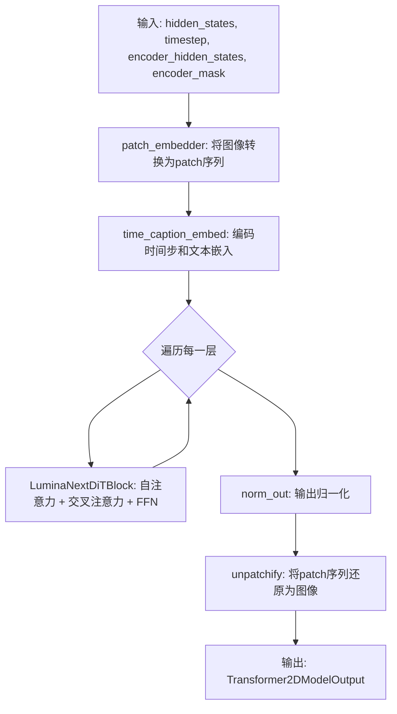
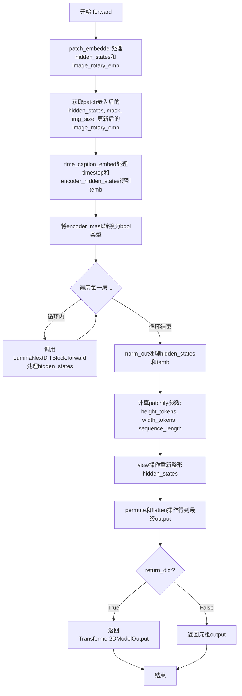

# `diffusers\src\diffusers\models\transformers\lumina_nextdit2d.py` 详细设计文档

LuminaNextDiT2DModel 是一个基于 Transformer 架构的 Diffusion 模型，用于图像生成。该模型包含自注意力、交叉注意力和前馈网络，支持文本提示（caption）引导的图像生成任务。

## 整体流程



## 类结构

```
LuminaNextDiT2DModel (主模型类)
└── LuminaNextDiTBlock (Transformer块)
    ├── Attention (自注意力 attn1)
    ├── Attention (交叉注意力 attn2)
    ├── LuminaFeedForward (前馈网络)
    ├── LuminaRMSNormZero (归一化)
    ├── RMSNorm (归一化)
    └── LuminaLayerNormContinuous (输出归一化)
```

## 全局变量及字段


### `logger`
    
模块级日志记录器，用于记录日志信息

类型：`logging.Logger`
    


### `LuminaNextDiTBlock.head_dim`
    
注意力头维度

类型：`int`
    


### `LuminaNextDiTBlock.gate`
    
交叉注意力门控参数

类型：`nn.Parameter`
    


### `LuminaNextDiTBlock.attn1`
    
自注意力层

类型：`Attention`
    


### `LuminaNextDiTBlock.attn2`
    
交叉注意力层

类型：`Attention`
    


### `LuminaNextDiTBlock.feed_forward`
    
前馈网络

类型：`LuminaFeedForward`
    


### `LuminaNextDiTBlock.norm1`
    
自注意力归一化

类型：`LuminaRMSNormZero`
    


### `LuminaNextDiTBlock.ffn_norm1`
    
FFN归一化

类型：`RMSNorm`
    


### `LuminaNextDiTBlock.norm2`
    
自注意力输出归一化

类型：`RMSNorm`
    


### `LuminaNextDiTBlock.ffn_norm2`
    
FFN输出归一化

类型：`RMSNorm`
    


### `LuminaNextDiTBlock.norm1_context`
    
文本上下文归一化

类型：`RMSNorm`
    


### `LuminaNextDiT2DModel.sample_size`
    
样本尺寸

类型：`int`
    


### `LuminaNextDiT2DModel.patch_size`
    
patch大小

类型：`int`
    


### `LuminaNextDiT2DModel.in_channels`
    
输入通道数

类型：`int`
    


### `LuminaNextDiT2DModel.out_channels`
    
输出通道数

类型：`int`
    


### `LuminaNextDiT2DModel.hidden_size`
    
隐藏层维度

类型：`int`
    


### `LuminaNextDiT2DModel.num_attention_heads`
    
注意力头数量

类型：`int`
    


### `LuminaNextDiT2DModel.head_dim`
    
头维度

类型：`int`
    


### `LuminaNextDiT2DModel.scaling_factor`
    
缩放因子

类型：`float`
    


### `LuminaNextDiT2DModel.patch_embedder`
    
patch嵌入层

类型：`LuminaPatchEmbed`
    


### `LuminaNextDiT2DModel.pad_token`
    
填充token

类型：`nn.Parameter`
    


### `LuminaNextDiT2DModel.time_caption_embed`
    
时间步和文本嵌入

类型：`LuminaCombinedTimestepCaptionEmbedding`
    


### `LuminaNextDiT2DModel.layers`
    
Transformer块列表

类型：`nn.ModuleList`
    


### `LuminaNextDiT2DModel.norm_out`
    
输出归一化层

类型：`LuminaLayerNormContinuous`
    
    

## 全局函数及方法


### `LuminaNextDiTBlock.forward`

该方法是 LuminaNextDiTBlock 的前向传播函数，负责执行 DiT 块的核心计算流程。流程包括：先对输入进行自注意力计算（Self-Attention），同时使用门控机制控制信息流动；接着执行交叉注意力（Cross-Attention）将文本条件信息融入特征表示；然后通过前馈网络（FFN）进行特征变换；最后通过残差连接将各层输出融合并返回。该方法实现了 Diffusion Transformer 的典型架构，包含双阶段注意力机制和门控 MLP。

参数：

- `self`：类的实例方法隐含参数
- `hidden_states`：`torch.Tensor`，输入的隐藏状态张量，表示图像特征的序列表示
- `attention_mask`：`torch.Tensor`，隐藏状态对应的注意力掩码，用于控制自注意力计算中哪些位置应该被忽略
- `image_rotary_emb`：`torch.Tensor`，预计算的旋转位置嵌入（RoPE），包含余弦和正弦频率用于位置编码
- `encoder_hidden_states`：`torch.Tensor`，文本编码器的隐藏状态，由 Gemma 文本编码器处理后的文本特征
- `encoder_mask`：`torch.Tensor`，文本编码器输出的注意力掩码，用于控制交叉注意力中文本信息的读取
- `temb`：`torch.Tensor`，时间步嵌入与文本嵌入的组合向量，通过时间步和文本条件共同生成
- `cross_attention_kwargs`：`dict[str, Any] | None`，可选的交叉注意力额外参数，包含注意力处理器所需的配置

返回值：`torch.Tensor`，经过完整 DiT 块处理后的输出隐藏状态张量

#### 流程图

```mermaid
flowchart TD
    A[输入 hidden_states] --> B[保存残差 connection: residual = hidden_states]
    
    B --> C[norm1 归一化 + 门控提取<br/>norm_hidden_states, gate_msa, scale_mlp, gate_mlp]
    C --> D[自注意力计算 attn1<br/>使用 image_rotary_emb 作为旋转嵌入]
    
    E[输入 encoder_hidden_states] --> F[norm1_context 归一化<br/>norm_encoder_hidden_states]
    F --> G[交叉注意力计算 attn2<br/>使用 encoder_mask 和 rotary_emb]
    
    G --> H[交叉注意力输出乘以门控<br/>cross_attn_output * tanh(gate)]
    D --> I[合并自注意力和交叉注意力<br/>mixed_attn_output = attn_output + cross_attn_output]
    H --> I
    
    I --> J[展平输出 flatten(-2)]
    J --> K[线性投影 to_out[0]]
    
    K --> L[残差连接 + 门控归一化<br/>hidden_states = residual + gate_msa.tanh() * norm2]
    
    L --> M[FFN 前馈网络<br/>ffn_norm1 归一化 + 门控缩放]
    M --> N[残差连接 + 门控 MLP<br/>hidden_states += gate_mlp.tanh() * ffn_norm2]
    
    N --> O[返回 hidden_states]
```

#### 带注释源码

```python
def forward(
    self,
    hidden_states: torch.Tensor,
    attention_mask: torch.Tensor,
    image_rotary_emb: torch.Tensor,
    encoder_hidden_states: torch.Tensor,
    encoder_mask: torch.Tensor,
    temb: torch.Tensor,
    cross_attention_kwargs: dict[str, Any] | None = None,
) -> torch.Tensor:
    """
    Perform a forward pass through the LuminaNextDiTBlock.

    Parameters:
        hidden_states (`torch.Tensor`): The input of hidden_states for LuminaNextDiTBlock.
        attention_mask (`torch.Tensor): The input of hidden_states corresponse attention mask.
        image_rotary_emb (`torch.Tensor`): Precomputed cosine and sine frequencies.
        encoder_hidden_states: (`torch.Tensor`): The hidden_states of text prompt are processed by Gemma encoder.
        encoder_mask (`torch.Tensor`): The hidden_states of text prompt attention mask.
        temb (`torch.Tensor`): Timestep embedding with text prompt embedding.
        cross_attention_kwargs (`dict[str, Any]`): kwargs for cross attention.
    """
    # Step 1: 保存残差连接，用于后续的残差跳跃连接
    residual = hidden_states

    # Step 2: 自注意力分支 - 归一化并提取门控参数
    # norm1 返回: 归一化后的隐藏状态、MSA门控、MLP缩放因子、MLP门控
    norm_hidden_states, gate_msa, scale_mlp, gate_mlp = self.norm1(hidden_states, temb)
    
    # Step 3: 执行自注意力计算，使用图像旋转嵌入作为位置编码
    # encoder_hidden_states 传入自身实现自注意力
    self_attn_output = self.attn1(
        hidden_states=norm_hidden_states,
        encoder_hidden_states=norm_hidden_states,  # 自注意力使用相同特征作为 K, V
        attention_mask=attention_mask,
        query_rotary_emb=image_rotary_emb,
        key_rotary_emb=image_rotary_emb,
        **cross_attention_kwargs,
    )

    # Step 4: 交叉注意力分支 - 对文本编码器输出进行归一化
    norm_encoder_hidden_states = self.norm1_context(encoder_hidden_states)
    
    # Step 5: 执行交叉注意力计算，将文本条件信息融入图像特征
    cross_attn_output = self.attn2(
        hidden_states=norm_hidden_states,  # Q 来自图像特征
        encoder_hidden_states=norm_encoder_hidden_states,  # K, V 来自文本特征
        attention_mask=encoder_mask,
        query_rotary_emb=image_rotary_emb,  # 图像位置编码
        key_rotary_emb=None,  # 文本不使用旋转嵌入
        **cross_attention_kwargs,
    )
    
    # Step 6: 交叉注意力输出通过 tanh 门控进行缩放控制
    cross_attn_output = cross_attn_output * self.gate.tanh().view(1, 1, -1, 1)
    
    # Step 7: 合并自注意力和交叉注意力的输出
    mixed_attn_output = self_attn_output + cross_attn_output
    mixed_attn_output = mixed_attn_output.flatten(-2)
    
    # Step 8: 通过线性投影层将混合注意力输出变换到目标维度
    # hidden_states = self.attn2.to_out[0](mixed_attn_output)
    hidden_states = self.attn2.to_out[0](mixed_attn_output)

    # Step 9: 残差连接 + 门控归一化输出
    # 使用 gate_msa.tanh() 作为门控系数控制信息流动
    hidden_states = residual + gate_msa.unsqueeze(1).tanh() * self.norm2(hidden_states)

    # Step 10: 前馈网络 (FFN) 处理
    # 使用 ffn_norm1 归一化，并通过 scale_mlp 门控控制 FFN 缩放
    mlp_output = self.feed_forward(self.ffn_norm1(hidden_states) * (1 + scale_mlp.unsqueeze(1)))

    # Step 11: 残差连接 + 门控 FFN 输出
    # 使用 gate_mlp.tanh() 作为门控系数
    hidden_states = hidden_states + gate_mlp.unsqueeze(1).tanh() * self.ffn_norm2(mlp_output)

    return hidden_states
```


### `LuminaNextDiT2DModel.forward`

该方法是LuminaNextDiT2DModel的核心前向传播方法，负责将输入的潜在图像张量通过Transformer块处理，并输出最终的图像去噪预测结果。方法首先对输入进行patch嵌入，然后结合时间步和文本嵌入，通过多层LuminaNextDiTBlock进行迭代处理，最后将处理后的特征解patchify回原始图像空间。

参数：

- `hidden_states`：`torch.Tensor`，输入的潜在图像张量，形状为(N, C, H, W)，其中N为批次大小，C为通道数，H和W为高度和宽度
- `timestep`：`torch.Tensor`，扩散时间步张量，形状为(N,)，用于条件生成
- `encoder_hidden_states`：`torch.Tensor`，文本编码器的隐藏状态，形状为(N, D)，D为文本嵌入维度
- `encoder_mask`：`torch.Tensor`，文本编码器的注意力掩码，形状为(N, L)，L为文本序列长度
- `image_rotary_emb`：`torch.Tensor`，预计算的旋转位置嵌入，用于2D旋转位置编码
- `cross_attention_kwargs`：`dict[str, Any] | None`=None，跨注意力层的可选关键字参数
- `return_dict`：`bool`=True，是否返回字典形式的输出，设置为False时返回元组

返回值：`tuple[torch.Tensor] | Transformer2DModelOutput`，当return_dict为True时返回Transformer2DModelOutput对象，其中sample属性包含输出张量；否则返回包含输出张量的元组

#### 流程图



#### 带注释源码

```python
def forward(
    self,
    hidden_states: torch.Tensor,
    timestep: torch.Tensor,
    encoder_hidden_states: torch.Tensor,
    encoder_mask: torch.Tensor,
    image_rotary_emb: torch.Tensor,
    cross_attention_kwargs: dict[str, Any] = None,
    return_dict=True,
) -> tuple[torch.Tensor] | Transformer2DModelOutput:
    """
    Forward pass of LuminaNextDiT.

    Parameters:
        hidden_states (torch.Tensor): Input tensor of shape (N, C, H, W).
        timestep (torch.Tensor): Tensor of diffusion timesteps of shape (N,).
        encoder_hidden_states (torch.Tensor): Tensor of caption features of shape (N, D).
        encoder_mask (torch.Tensor): Tensor of caption masks of shape (N, L).
    """
    # 步骤1: patch_embedder对输入hidden_states进行patch嵌入，同时处理旋转位置嵌入
    # 输入: (N, C, H, W) -> 输出: (N, seq_len, hidden_size), mask, img_size, 更新后的旋转嵌入
    hidden_states, mask, img_size, image_rotary_emb = self.patch_embedder(hidden_states, image_rotary_emb)
    
    # 步骤2: 将旋转嵌入移到与hidden_states相同的设备上
    image_rotary_emb = image_rotary_emb.to(hidden_states.device)

    # 步骤3: 时间步嵌入与文本Caption嵌入的组合处理
    # 输入: timestep (N,), encoder_hidden_states (N, D), encoder_mask (N, L)
    # 输出: temb (N, hidden_size) 包含时间步和文本的组合嵌入
    temb = self.time_caption_embed(timestep, encoder_hidden_states, encoder_mask)

    # 步骤4: 将encoder_mask转换为布尔类型，用于后续注意力计算
    encoder_mask = encoder_mask.bool()
    
    # 步骤5: 遍历所有Transformer层进行迭代处理
    for layer in self.layers:
        # 每一层处理: 输入 (N, seq_len, hidden_size), 输出同尺寸的张量
        # 层内部执行: 自注意力、跨注意力、FFN前馈网络
        hidden_states = layer(
            hidden_states,
            mask,
            image_rotary_emb,
            encoder_hidden_states,
            encoder_mask,
            temb=temb,
            cross_attention_kwargs=cross_attention_kwargs,
        )

    # 步骤6: 输出层归一化处理，结合时间步嵌入temb
    hidden_states = self.norm_out(hidden_states, temb)

    # 步骤7: unpatchify - 将序列形式的patch重新组合回图像形式
    # 计算每个方向上的token数量
    height_tokens = width_tokens = self.patch_size
    height, width = img_size[0]  # 原始图像尺寸
    batch_size = hidden_states.size(0)
    # 计算总序列长度
    sequence_length = (height // height_tokens) * (width // width_tokens)
    
    # 步骤8: 重新整形 - 从(N, seq_len, hidden_size) -> (N, h, w, patch_h, patch_w, out_channels)
    hidden_states = hidden_states[:, :sequence_length].view(
        batch_size, height // height_tokens, width // width_tokens, height_tokens, width_tokens, self.out_channels
    )
    
    # 步骤9: 维度置换和展平 - 最终输出 (N, C, H, W)
    output = hidden_states.permute(0, 5, 1, 3, 2, 4).flatten(4, 5).flatten(2, 3)

    # 步骤10: 根据return_dict参数决定返回格式
    if not return_dict:
        return (output,)

    return Transformer2DModelOutput(sample=output)
```

## 关键组件


### LuminaNextDiTBlock

DiT块组件，集成自注意力、交叉注意力与前馈网络，支持GQA和2D旋转位置编码，包含门控机制控制信息流动。

### LuminaNextDiT2DModel

主模型类，继承ModelMixin和ConfigMixin实现Diffusion Transformer架构，支持图像patch嵌入、时间步编码、文本条件引导和输出重构。

### Attention (LuminaAttnProcessor2_0)

注意力处理器，支持分组查询注意力(GQA)，实现qk_norm跨头归一化，处理自注意力和交叉注意力两种模式。

### LuminaFeedForward

前馈网络模块，采用SwiGLU激活函数，根据multiple_of和ffn_dim_multiplier参数动态计算inner_dim。

### LuminaPatchEmbed

图像分块嵌入层，将输入图像转换为patch序列并生成对应的2D旋转位置编码(RoPE)。

### LuminaCombinedTimestepCaptionEmbedding

联合时间步与文本Caption嵌入层，将扩散时间步与文本编码器输出融合为条件嵌入。

### RMSNorm / LuminaRMSNormZero / LuminaLayerNormContinuous

归一化层组件：RMSNorm实现均方根归一化；LuminaRMSNormZero支持零初始化门控；LuminaLayerNormContinuous用于输出层连续条件归一化。

### 门控机制 (self.gate)

可学习的交叉注意力门控参数，通过tanh激活后加权交叉注意力输出，实现自适应文本-图像特征融合。

### patch_embedder 与 unpatchify

patch嵌入将图像(N,C,H,W)转换为序列形式用于Transformer处理；unpatchify将处理后的序列还原为图像格式输出。

### 2D旋转位置编码 (image_rotary_emb)

预计算的2D旋转位置嵌入，用于在注意力计算中注入空间位置信息，支持图像token的旋转位置编码。


## 问题及建议


### 已知问题

- **类型标注错误**: `LuminaNextDiTBlock.forward` 方法的 docstring 中 `attention_mask` 参数缺少右引号 (`torch.Tensor):` 应为 `torch.Tensor):`)，且缺少 `temb` 参数的描述
- **不可达的代码**: 类中定义了 `_skip_layerwise_casting_patterns = ["patch_embedder", "norm", "ffn_norm"]` 类属性，但在整个代码中未被使用
- **注释掉的死代码**: 存在 `# self.final_layer = LuminaFinalLayer(hidden_size, patch_size, self.out_channels)` 注释代码，既不执行也不删除，影响代码可读性
- **参数类型不一致**: `cross_attention_kwargs` 在 `LuminaNextDiTBlock.forward` 中定义为 `dict[str, Any] | None`，在 `LuminaNextDiT2DModel.forward` 中定义为 `dict[str, Any] = None`（少了 `| None`）
- **变量命名不一致**: `LuminaNextDiT2DModel.forward` 中将 `attention_mask` 命名为 `mask` 传递给层，但在 `LuminaNextDiTBlock.forward` 中仍使用 `attention_mask`，增加了理解难度
- **assert 语句位置不当**: 头维度可被4整除的检查使用 assert 语句，位于 `__init__` 方法末尾，在生产环境中应使用参数验证或移除
- **硬编码维度值**: `hidden_size=min(hidden_size, 1024)` 硬编码了1024阈值，缺乏配置灵活性
- **ML工作流中潜在的bug**: `self.attn1` 初始化时 `encoder_hidden_states` 传入，但在 `forward` 中调用时传入了 `encoder_hidden_states=norm_hidden_states`，这种自注意力中使用 `encoder_hidden_states` 参数的设计令人困惑

### 优化建议

- **移除未使用的属性**: 删除 `_skip_layerwise_casting_patterns` 或在模型其他位置实现层-wise casting 逻辑
- **清理死代码**: 删除注释掉的 `final_layer` 相关代码，或完成其实现
- **统一类型标注**: 统一所有方法中 `cross_attention_kwargs` 的类型标注，建议使用 `dict[str, Any] | None = None`
- **改进变量命名**: 在 `LuminaNextDiT2DModel.forward` 中保持命名一致性，如统一使用 `attention_mask` 而非 `mask`
- **参数验证优化**: 将 assert 检查替换为更友好的参数验证或使用 `__init__` 中的早期验证
- **配置化硬编码值**: 将 `min(hidden_size, 1024)` 等硬编码值提取为可配置参数
- **考虑添加梯度检查点**: 对于深层模型，添加 gradient checkpointing 支持以节省显存
- **初始化策略**: 考虑为 `self.gate` 参数使用更优的初始化策略（如小随机值），避免从头训练时收敛过慢
- **性能优化**: 考虑在 `forward` 方法末尾的 `flatten` 和 `view` 操作使用 `reshape` 替代以提高效率
- **添加类型提示**: 为更多变量添加明确的类型标注，提升代码可维护性


## 其它


### 设计目标与约束

本代码实现了一个基于Transformer架构的扩散模型（LuminaNextDiT2DModel），用于图像生成任务。设计目标包括：支持高分辨率图像生成、采用GQA（Grouped Query Attention）优化注意力计算效率、集成2D旋转位置编码（RoPE）、实现自注意力与交叉注意力机制以融合文本条件信息。约束条件包括：hidden_size必须是num_attention_heads的4的倍数（用于2D RoPE）、patch_size固定为2、cross_attention_dim需与文本编码器输出维度匹配。

### 错误处理与异常设计

代码中主要通过assert语句进行关键参数校验，如验证head_dim能被4整除。异常处理机制包括：1) 配置参数校验失败时抛出AssertionError；2) 设备兼容性检查在image_rotary_emb转移设备时隐式处理；3) encoder_mask转换为bool类型确保掩码有效性；4) return_dict参数控制输出格式。建议增加更详细的异常信息提示，包括参数名称和合法值范围。

### 数据流与状态机

数据流主要经历以下阶段：1) 输入阶段：接收(N,C,H,W)格式的latent states、timestep、文本encoder_hidden_states和对应mask；2) 嵌入阶段：通过patch_embedder将图像切分为patches并添加位置编码，同时通过time_caption_embed处理时间步和文本嵌入；3) Transformer层处理：数据依次通过num_layers个LuminaNextDiTBlock，每层内部执行自注意力→交叉注意力→FFN的变换；4) 输出阶段：通过norm_out层归一化并投影，最后unpatchify还原为(N,O,H,W)格式。无显式状态机设计，状态完全由输入tensor传递。

### 外部依赖与接口契约

主要依赖包括：1) torch和torch.nn提供基础张量计算和神经网络模块；2) ...configuration_utils中的ConfigMixin和register_to_config用于配置管理；3) ...utils中的logging模块；4) ..attention中的Attention和LuminaFeedForward；5) ..attention_processor中的LuminaAttnProcessor2_0；6) ..embeddings中的LuminaCombinedTimestepCaptionEmbedding和LuminaPatchEmbed；7) ..normalization中的各类归一化层；8) ..modeling_outputs中的Transformer2DModelOutput。接口契约：forward方法接受hidden_states、timestep、encoder_hidden_states、encoder_mask、image_rotary_emb、cross_attention_kwargs和return_dict参数，返回Tensor元组或Transformer2DModelOutput对象。

### 配置管理机制

采用装饰器@register_to_config实现配置自动注册，支持通过config字典初始化模型。配置项包括sample_size、patch_size、in_channels、hidden_size、num_layers、num_attention_heads、num_kv_heads、multiple_of、ffn_dim_multiplier、norm_eps、learn_sigma、qk_norm、cross_attention_dim、scaling_factor共14个参数。配置继承自ModelMixin和ConfigMixin，提供了from_pretrained和save_pretrained的兼容性接口。

### 内存与计算优化策略

优化措施包括：1) GQA机制通过num_kv_heads减少KV缓存开销；2) _skip_layerwise_casting_patterns列表指定了跳过层级别类型转换的模块，减少类型转换开销；3) 使用nn.ModuleList管理多个Transformer层；4) attention_mask和encoder_mask预先转换为bool类型避免运行时重复转换；5) 2D RoPE通过预计算的cosine和sine频率实现高效位置编码。潜在优化空间：可考虑启用gradient checkpointing减少大模型显存占用、可添加混合精度训练支持、FFN维度可进一步通过配置文件外部化。

### 版本兼容性考虑

代码设计兼容diffusers库的StableDiffusionPipeline，需要继承ModelMixin和ConfigMixin以实现from_pretrained加载。依赖的Attention、LuminaFeedForward等模块需与当前diffusers版本API保持一致。跨版本兼容性问题可能出现在：1) Attention类的参数变化；2) RMSNorm等归一化层的实现变更；3) Transformer2DModelOutput的结构变化。建议在requirements中锁定diffusers版本或提供版本检测逻辑。

### 测试与验证建议

建议增加的测试覆盖：1) 单元测试验证LuminaNextDiTBlock的前向传播输出维度正确性；2) 集成测试验证完整模型在已知数据集上的输出范围；3) 配置序列化测试验证模型可正确保存和加载；4) 设备兼容性测试验证CPU和CUDA设备上的行为一致性；5) 梯度流测试验证各层梯度正确反向传播；6) 边界条件测试验证不同batch_size和分辨率下的稳定性。


    