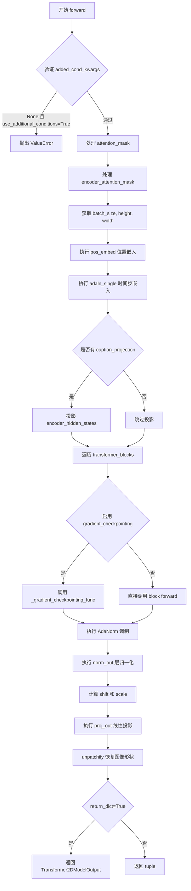
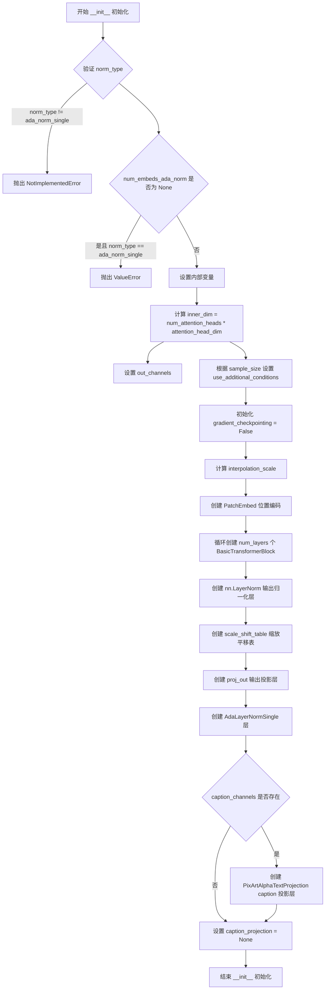
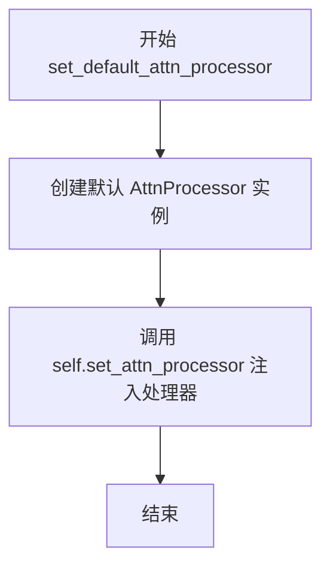
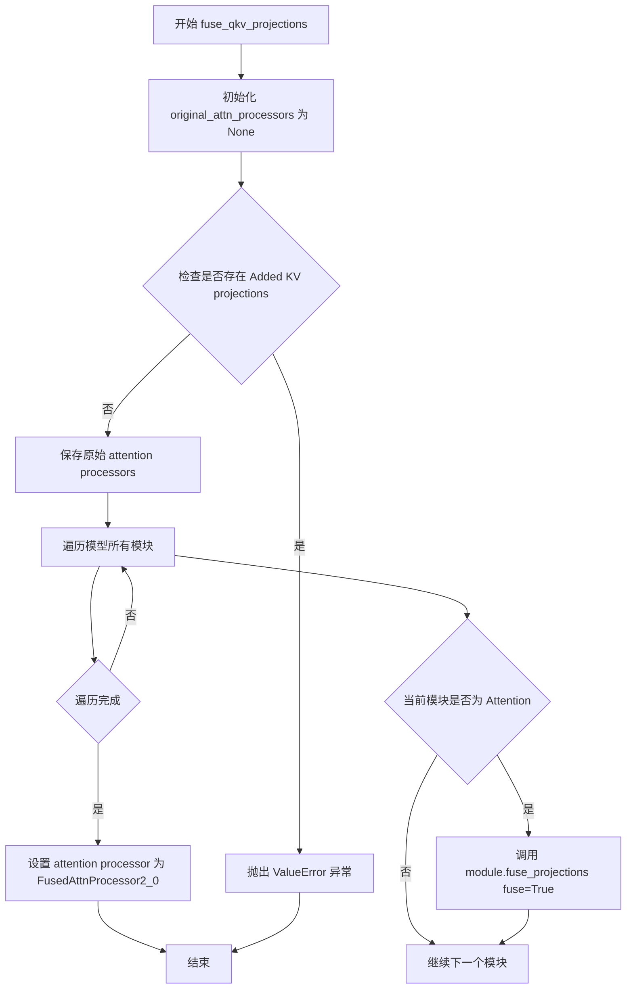
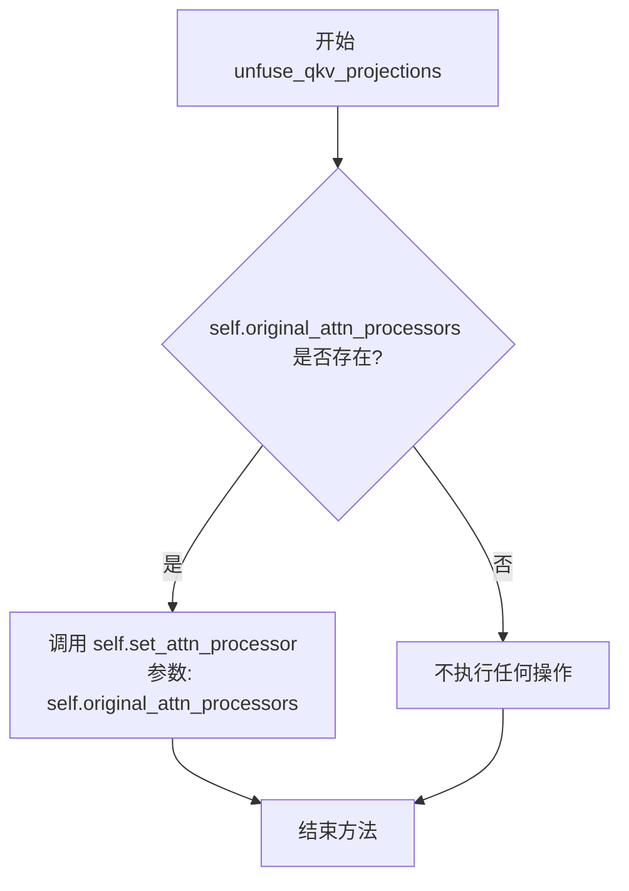
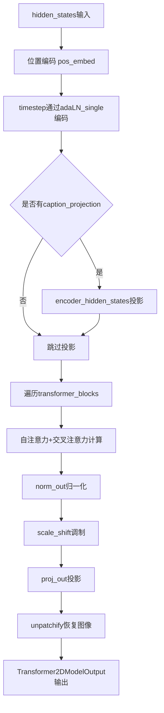

# `diffusers\src\diffusers\models\transformers\pixart_transformer_2d.py` 详细设计文档

PixArtTransformer2DModel是一个基于Transformer架构的2D图像生成模型，属于PixArt系列模型（用于文生图任务），支持位置嵌入、Transformer块堆叠、AdaLayerNorm条件注入、跨注意力机制等功能，可处理图像去噪任务并输出Transformer2DModelOutput。

## 整体流程



## 类结构

```
ModelMixin (抽象基类)
├── PixArtTransformer2DModel
    ├── AttentionMixin (混合父类)
    ├── ConfigMixin (混合父类)
    ├── pos_embed: PatchEmbed (位置嵌入)
    ├── transformer_blocks: nn.ModuleList[BasicTransformerBlock]
    ├── norm_out: nn.LayerNorm
    ├── scale_shift_table: nn.Parameter
    ├── proj_out: nn.Linear
    ├── adaln_single: AdaLayerNormSingle
    └── caption_projection: PixArtAlphaTextProjection
```

## 全局变量及字段


### `logger`
    
模块级日志记录器，用于记录模型运行过程中的日志信息

类型：`logging.Logger`
    


### `PixArtTransformer2DModel.attention_head_dim`
    
每个注意力头的通道数，决定每个注意力头的特征维度

类型：`int`
    


### `PixArtTransformer2DModel.inner_dim`
    
内部维度，等于num_attention_heads乘以attention_head_dim，计算方式为num_heads * head_dim

类型：`int`
    


### `PixArtTransformer2DModel.out_channels`
    
输出通道数，指定模型输出的特征通道数量

类型：`int`
    


### `PixArtTransformer2DModel.use_additional_conditions`
    
是否使用额外条件，控制是否在AdaNorm中使用额外的条件输入

类型：`bool`
    


### `PixArtTransformer2DModel.gradient_checkpointing`
    
梯度检查点标志，用于控制是否启用梯度检查点以节省显存

类型：`bool`
    


### `PixArtTransformer2DModel.height`
    
样本高度，存储输入样本的高度尺寸

类型：`int`
    


### `PixArtTransformer2DModel.width`
    
样本宽度，存储输入样本的宽度尺寸

类型：`int`
    


### `PixArtTransformer2DModel.pos_embed`
    
位置嵌入层，将输入图像转换为patch序列并添加位置编码

类型：`PatchEmbed`
    


### `PixArtTransformer2DModel.transformer_blocks`
    
Transformer块列表，包含多个BasicTransformerBlock组成的Transformer编码器

类型：`nn.ModuleList`
    


### `PixArtTransformer2DModel.norm_out`
    
输出层归一化，用于对最终输出进行层归一化处理

类型：`nn.LayerNorm`
    


### `PixArtTransformer2DModel.scale_shift_table`
    
AdaNorm缩放偏移表，用于AdaLayerNorm的scale和shift参数学习

类型：`nn.Parameter`
    


### `PixArtTransformer2DModel.proj_out`
    
输出投影层，将隐藏维度投影回patch空间维度

类型：`nn.Linear`
    


### `PixArtTransformer2DModel.adaln_single`
    
AdaLayerNorm单例，实现自适应层归一化并处理时间步嵌入

类型：`AdaLayerNormSingle`
    


### `PixArtTransformer2DModel.caption_projection`
    
标题投影层，将文本Caption嵌入投影到模型隐藏空间维度

类型：`PixArtAlphaTextProjection`
    
    

## 全局函数及方法


### `PixArtTransformer2DModel.__init__`

该方法是 PixArtTransformer2DModel 类的构造函数，负责初始化 PixArt 系列 2D Transformer 模型的整体结构和参数，包括位置编码、Transformer 块堆叠、输出层、AdaLayerNormSingle 归一化层以及可选的 caption 投影层。

参数：

- `self`：类的实例本身，无需显式传递
- `num_attention_heads`：`int`，默认为 16，多头注意力机制中使用的注意力头数量
- `attention_head_dim`：`int`，默认为 72，每个注意力头中的通道数
- `in_channels`：`int`，默认为 4，输入数据的通道数
- `out_channels`：`int | None`，默认为 8，输出数据的通道数，若为 None 则默认为输入通道数
- `num_layers`：`int`，默认为 28，Transformer 块堆叠的层数
- `dropout`：`float`，默认为 0.0，Transformer 块内使用的 dropout 概率
- `norm_num_groups`：`int`，默认为 32，组归一化的分组数量
- `cross_attention_dim`：`int | None`，默认为 1152，交叉注意力层的维度，通常与编码器的隐藏层维度匹配
- `attention_bias`：`bool`，默认为 True，Transformer 块的注意力层是否包含偏置参数
- `sample_size`：`int`，默认为 128，潜在图像的宽度，训练时固定
- `patch_size`：`int`，默认为 2，模型处理的 patch 大小
- `activation_fn`：`str`，默认为 "gelu-approximate"，Transformer 块内前馈网络使用的激活函数
- `num_embeds_ada_norm`：`int | None`，默认为 1000，AdaLayerNorm 的嵌入数量，训练时固定，影响推理时的最大去噪步数
- `upcast_attention`：`bool`，默认为 False，是否对注意力机制维度进行上转换以提升性能
- `norm_type`：`str`，默认为 "ada_norm_single"，使用的归一化类型，目前仅支持 'ada_norm_zero' 和 'ada_norm_single'
- `norm_elementwise_affine`：`bool`，默认为 False，是否在归一化层启用逐元素仿射参数
- `norm_eps`：`float`，默认为 1e-6，归一化层中添加到分母的小常数，防止除零
- `interpolation_scale`：`int | None`，默认为 None，插值位置编码时使用的缩放因子
- `use_additional_conditions`：`bool | None`，默认为 None，是否使用额外条件作为输入
- `caption_channels`：`int | None`，默认为 None，用于投影 caption 嵌入的通道数
- `attention_type`：`str | None`，默认为 "default"，使用的注意力机制类型

返回值：`None`，该方法为构造函数，不返回任何值

#### 流程图



#### 带注释源码

```python
@register_to_config
def __init__(
    self,
    num_attention_heads: int = 16,
    attention_head_dim: int = 72,
    in_channels: int = 4,
    out_channels: int | None = 8,
    num_layers: int = 28,
    dropout: float = 0.0,
    norm_num_groups: int = 32,
    cross_attention_dim: int | None = 1152,
    attention_bias: bool = True,
    sample_size: int = 128,
    patch_size: int = 2,
    activation_fn: str = "gelu-approximate",
    num_embeds_ada_norm: int | None = 1000,
    upcast_attention: bool = False,
    norm_type: str = "ada_norm_single",
    norm_elementwise_affine: bool = False,
    norm_eps: float = 1e-6,
    interpolation_scale: int | None = None,
    use_additional_conditions: bool | None = None,
    caption_channels: int | None = None,
    attention_type: str | None = "default",
):
    # 调用父类的初始化方法
    super().__init__()

    # ============ 1. 验证输入参数 ============
    # 检查 norm_type 是否为支持的类型
    if norm_type != "ada_norm_single":
        raise NotImplementedError(
            f"Forward pass is not implemented when `patch_size` is not None and `norm_type` is '{norm_type}'."
        )
    # 当使用 patch_size 时，num_embeds_ada_norm 不能为 None
    elif norm_type == "ada_norm_single" and num_embeds_ada_norm is None:
        raise ValueError(
            f"When using a `patch_size` and this `norm_type` ({norm_type}), `num_embeds_ada_norm` cannot be None."
        )

    # ============ 2. 设置通用变量 ============
    # 保存注意力头维度
    self.attention_head_dim = attention_head_dim
    # 计算内部维度：注意力头数 × 每头通道数
    self.inner_dim = self.config.num_attention_heads * self.config.attention_head_dim
    # 设置输出通道数，若未指定则使用输入通道数
    self.out_channels = in_channels if out_channels is None else out_channels
    
    # 根据 sample_size 自动判断是否使用额外条件
    if use_additional_conditions is None:
        if sample_size == 128:
            use_additional_conditions = True
        else:
            use_additional_conditions = False
    self.use_additional_conditions = use_additional_conditions

    # 初始化梯度检查点标志为 False
    self.gradient_checkpointing = False

    # ============ 3. 初始化位置编码和 Transformer 块 ============
    # 设置高度和宽度
    self.height = self.config.sample_size
    self.width = self.config.sample_size

    # 计算插值缩放因子：若未指定，则根据 sample_size 计算
    interpolation_scale = (
        self.config.interpolation_scale
        if self.config.interpolation_scale is not None
        else max(self.config.sample_size // 64, 1)
    )
    
    # 创建 PatchEmbed 位置编码层，将输入图像转换为 patch 序列
    self.pos_embed = PatchEmbed(
        height=self.config.sample_size,
        width=self.config.sample_size,
        patch_size=self.config.patch_size,
        in_channels=self.config.in_channels,
        embed_dim=self.inner_dim,
        interpolation_scale=interpolation_scale,
    )

    # 创建多个 BasicTransformerBlock 组成 Transformer 块堆栈
    self.transformer_blocks = nn.ModuleList(
        [
            BasicTransformerBlock(
                self.inner_dim,  # 内部维度
                self.config.num_attention_heads,  # 注意力头数
                self.config.attention_head_dim,  # 每头通道数
                dropout=self.config.dropout,  # Dropout 概率
                cross_attention_dim=self.config.cross_attention_dim,  # 交叉注意力维度
                activation_fn=self.config.activation_fn,  # 激活函数
                num_embeds_ada_norm=self.config.num_embeds_ada_norm,  # AdaNorm 嵌入数
                attention_bias=self.config.attention_bias,  # 注意力偏置
                upcast_attention=self.config.upcast_attention,  # 上转换注意力
                norm_type=norm_type,  # 归一化类型
                norm_elementwise_affine=self.config.norm_elementwise_affine,  # 逐元素仿射
                norm_eps=self.config.norm_eps,  # 归一化 epsilon
                attention_type=self.config.attention_type,  # 注意力类型
            )
            for _ in range(self.config.num_layers)  # 循环创建 num_layers 个块
        ]
    )

    # ============ 4. 输出块 ============
    # 输出层归一化
    self.norm_out = nn.LayerNorm(self.inner_dim, elementwise_affine=False, eps=1e-6)
    # AdaLN 的缩放和平移参数表
    self.scale_shift_table = nn.Parameter(torch.randn(2, self.inner_dim) / self.inner_dim**0.5)
    # 输出投影层：将内部维度映射回 patch 空间
    self.proj_out = nn.Linear(self.inner_dim, self.config.patch_size * self.config.patch_size * self.out_channels)

    # AdaLayerNormSingle 归一化层，支持额外条件
    self.adaln_single = AdaLayerNormSingle(
        self.inner_dim, use_additional_conditions=self.use_additional_conditions
    )
    
    # Caption 投影层初始化为 None
    self.caption_projection = None
    # 若指定了 caption_channels，则创建投影层
    if self.config.caption_channels is not None:
        self.caption_projection = PixArtAlphaTextProjection(
            in_features=self.config.caption_channels, hidden_size=self.inner_dim
        )
```


### `PixArtTransformer2DModel.set_default_attn_processor`

设置默认的注意力处理器，禁用自定义注意力处理器并使用标准的 `AttnProcessor()` 实现。

参数：
- 该方法没有显式参数（仅包含隐式参数 `self`）

返回值：`None`，无返回值（该方法直接调用 `set_attn_processor` 而不返回任何值）

#### 流程图



#### 带注释源码

```python
def set_default_attn_processor(self):
    """
    Disables custom attention processors and sets the default attention implementation.

    Safe to just use `AttnProcessor()` as PixArt doesn't have any exotic attention processors in default model.
    """
    # 调用模型的 set_attn_processor 方法，将注意力处理器设置为默认的 AttnProcessor()
    # AttnProcessor 是标准注意力处理器实现，适用于 PixArt 系列模型
    # 因为 PixArt 模型没有使用特殊的注意力处理器（如 LORA 或其他自定义处理器）
    # 所以可以直接安全地使用默认的 AttnProcessor()
    self.set_attn_processor(AttnProcessor())
```


### `PixArtTransformer2DModel.fuse_qkv_projections`

融合 PixArt Transformer 2D 模型中的 QKV 投影矩阵。该方法将自注意力模块的 query、key、value 投影矩阵融合在一起，以提升推理性能；对于交叉注意力模块，则仅融合 key 和 value 投影矩阵。此操作会将注意力处理器替换为 fused 版本。

参数： 无（仅包含 `self` 参数）

返回值：`None`，无返回值。该方法直接修改模型内部的注意力处理器状态。

#### 流程图



#### 带注释源码

```python
def fuse_qkv_projections(self):
    """
    Enables fused QKV projections. For self-attention modules, all projection matrices (i.e., query, key, value)
    are fused. For cross-attention modules, key and value projection matrices are fused.

    > [!WARNING] > This API is 🧪 experimental.
    """
    # 步骤1: 初始化 original_attn_processors 为 None，用于后续保存原始处理器
    self.original_attn_processors = None

    # 步骤2: 检查所有 attention processors 是否包含 Added KV projections
    # 如果存在 Added KV projections，则不支持融合操作，抛出异常
    for _, attn_processor in self.attn_processors.items():
        if "Added" in str(attn_processor.__class__.__name__):
            raise ValueError("`fuse_qkv_projections()` is not supported for models having added KV projections.")

    # 步骤3: 在修改之前保存原始的 attention processors，以便后续可以还原
    self.original_attn_processors = self.attn_processors

    # 步骤4: 遍历模型中的所有模块，查找 Attention 模块并融合其投影矩阵
    for module in self.modules():
        if isinstance(module, Attention):
            # 调用 Attention 模块的 fuse_projections 方法进行 QKV 融合
            module.fuse_projections(fuse=True)

    # 步骤5: 将模型的 attention processor 设置为 FusedAttnProcessor2_0
    # FusedAttnProcessor2_0 是针对 PyTorch 2.0 优化的 fused attention 实现
    self.set_attn_processor(FusedAttnProcessor2_0())
```


### `PixArtTransformer2DModel.unfuse_qkv_projections`

该方法用于禁用融合的 QKV 投影，将模型的注意力处理器恢复到融合前的原始状态。当之前调用过 `fuse_qkv_projections()` 方法后，使用此方法可以还原分离的 QKV 投影矩阵。

参数： 无（仅包含隐式参数 `self`）

返回值：`None`，无返回值（隐式返回 None）

#### 流程图



#### 带注释源码

```python
def unfuse_qkv_projections(self):
    """Disables the fused QKV projection if enabled.

    > [!WARNING] > This API is 🧪 experimental.

    """
    # 检查是否存在之前保存的原始注意力处理器
    # original_attn_processors 在调用 fuse_qkv_projections() 时被赋值
    if self.original_attn_processors is not None:
        # 恢复原始的注意力处理器配置
        # 这将取消 QKV 投影的融合，使查询、键、值矩阵重新分离
        self.set_attn_processor(self.original_attn_processors)
```


### `PixArtTransformer2DModel.forward`

这是 PixArt 2D Transformer 模型的前向传播方法，接收带噪声的潜在表示、条件嵌入、时间步和额外条件，应用位置编码、自适应层归一化，并通过一系列 Transformer 块处理，最后通过调制和线性投影输出重构的图像潜在表示。

参数：

- `hidden_states`：`torch.Tensor`，形状为 `(batch size, channel, height, width)`，输入的隐藏状态（带噪声的潜在表示）
- `encoder_hidden_states`：`torch.Tensor | None`，形状为 `(batch size, sequence len, embed dims)`，条件嵌入用于交叉注意力层，如果不提供则默认为自注意力
- `timestep`：`torch.LongTensor | None`，用于表示去噪步骤的时间步，可选作为 AdaLayerNorm 的嵌入
- `added_cond_kwargs`：`dict[str, torch.Tensor] | None`，额外的条件作为输入使用
- `cross_attention_kwargs`：`dict[str, Any] | None`，关键字参数字典，如果指定则传递给 `AttentionProcessor`
- `attention_mask`：`torch.Tensor | None`，形状为 `(batch, key_tokens)` 的注意力掩码应用于 `encoder_hidden_states`，1 表示保留，0 表示丢弃
- `encoder_attention_mask`：`torch.Tensor | None`，应用于 `encoder_hidden_states` 的交叉注意力掩码，支持两种格式：掩码或偏置
- `return_dict`：`bool`，默认为 `True`，是否返回 `Transformer2DModelOutput` 而不是元组

返回值：`Transformer2DModelOutput` 或 `tuple`，如果 `return_dict` 为 True，返回包含样本张量的 `Transformer2DModelOutput`，否则返回元组（第一个元素为输出张量）

#### 流程图

```mermaid
flowchart TD
    A[开始 forward] --> B{use_additional_conditions<br/>且 added_cond_kwargs is None?}
    B -->|是| C[抛出 ValueError]
    B -->|否| D{attention_mask.ndim == 2?}
    D -->|是| E[转换 attention_mask 为偏置]
    D -->|否| F{encoder_attention_mask.ndim == 2?}
    E --> G[添加单例 query_tokens 维度]
    F -->|是| H[转换 encoder_attention_mask 为偏置]
    F -->|否| I[获取 batch_size]
    H --> G
    G --> J[计算 height, width]
    J --> K[应用 pos_embed 位置编码]
    K --> L[adaln_single 处理 timestep 和 added_cond_kwargs]
    L --> M{caption_projection is not None?}
    M -->|是| N[投影 caption 并reshape]
    M -->|否| O[遍历 transformer_blocks]
    N --> O
    O --> P{梯度检查点启用?}
    P -->|是| Q[_gradient_checkpointing_func 执行块]
    P -->|否| R[直接执行 block]
    Q --> S[更新 hidden_states]
    R --> S
    S --> T{还有更多块?}
    T -->|是| O
    T -->|否| U[计算 shift, scale]
    U --> V[norm_out 归一化]
    V --> W[应用调制: hidden_states * (1 + scale) + shift]
    W --> X[proj_out 线性投影]
    X --> Y[reshape 移除补丁化]
    Y --> Z{return_dict?}
    Z -->|是| AA[返回 Transformer2DModelOutput]
    Z -->|否| AB[返回 tuple]
```

#### 带注释源码

```python
def forward(
    self,
    hidden_states: torch.Tensor,
    encoder_hidden_states: torch.Tensor | None = None,
    timestep: torch.LongTensor | None = None,
    added_cond_kwargs: dict[str, torch.Tensor] = None,
    cross_attention_kwargs: dict[str, Any] = None,
    attention_mask: torch.Tensor | None = None,
    encoder_attention_mask: torch.Tensor | None = None,
    return_dict: bool = True,
):
    """
    The [`PixArtTransformer2DModel`] forward method.

    Args:
        hidden_states (`torch.FloatTensor` of shape `(batch size, channel, height, width)`):
            Input `hidden_states`.
        encoder_hidden_states (`torch.FloatTensor` of shape `(batch size, sequence len, embed dims)`, *optional*):
            Conditional embeddings for cross attention layer. If not given, cross-attention defaults to
            self-attention.
        timestep (`torch.LongTensor`, *optional*):
            Used to indicate denoising step. Optional timestep to be applied as an embedding in `AdaLayerNorm`.
        added_cond_kwargs: (`dict[str, Any]`, *optional*): Additional conditions to be used as inputs.
        cross_attention_kwargs ( `dict[str, Any]`, *optional*):
            A kwargs dictionary that if specified is passed along to the `AttentionProcessor` as defined under
            `self.processor` in
            [diffusers.models.attention_processor](https://github.com/huggingface/diffusers/blob/main/src/diffusers/models/attention_processor.py).
        attention_mask ( `torch.Tensor`, *optional*):
            An attention mask of shape `(batch, key_tokens)` is applied to `encoder_hidden_states`. If `1` the mask
            is kept, otherwise if `0` it is discarded. Mask will be converted into a bias, which adds large
            negative values to the attention scores corresponding to "discard" tokens.
        encoder_attention_mask ( `torch.Tensor`, *optional*):
            Cross-attention mask applied to `encoder_hidden_states`. Two formats supported:

                * Mask `(batch, sequence_length)` True = keep, False = discard.
                * Bias `(batch, 1, sequence_length)` 0 = keep, -10000 = discard.

            If `ndim == 2`: will be interpreted as a mask, then converted into a bias consistent with the format
            above. This bias will be added to the cross-attention scores.
        return_dict (`bool`, *optional*, defaults to `True`):
            Whether or not to return a [`~models.unets.unet_2d_condition.UNet2DConditionOutput`] instead of a plain
            tuple.

    Returns:
        If `return_dict` is True, an [`~models.transformer_2d.Transformer2DModelOutput`] is returned, otherwise a
        `tuple` where the first element is the sample tensor.
    """
    # 检查额外条件参数的有效性：当使用额外条件时必须提供 added_cond_kwargs
    if self.use_additional_conditions and added_cond_kwargs is None:
        raise ValueError("`added_cond_kwargs` cannot be None when using additional conditions for `adaln_single`.")

    # 确保 attention_mask 是一个偏置，并添加一个单例 query_tokens 维度
    # 可能已经通过 UNet2DConditionModel#forward 转换过了
    # 通过计算维度数来判断；如果是 ndim == 2：则是掩码而非偏置
    # 期望掩码形状：[batch, key_tokens]
    # 添加单例 query_tokens 维度：[batch, 1, key_tokens]
    # 这有助于将其广播为注意力分数的偏置，形状可能为：
    #   [batch, heads, query_tokens, key_tokens] (例如 torch sdp attn)
    #   [batch * heads, query_tokens, key_tokens] (例如 xformers 或经典 attn)
    if attention_mask is not None and attention_mask.ndim == 2:
        # 假设掩码表示为：(1 = keep, 0 = discard)
        # 将掩码转换为可添加到注意力分数的偏置：(keep = +0, discard = -10000.0)
        attention_mask = (1 - attention_mask.to(hidden_states.dtype)) * -10000.0
        attention_mask = attention_mask.unsqueeze(1)

    # 以与 attention_mask 相同的方式转换 encoder_attention_mask 为偏置
    if encoder_attention_mask is not None and encoder_attention_mask.ndim == 2:
        encoder_attention_mask = (1 - encoder_attention_mask.to(hidden_states.dtype)) * -10000.0
        encoder_attention_mask = encoder_attention_mask.unsqueeze(1)

    # 1. 输入处理
    # 获取批量大小
    batch_size = hidden_states.shape[0]
    # 计算高度和宽度（按 patch_size 划分）
    height, width = (
        hidden_states.shape[-2] // self.config.patch_size,
        hidden_states.shape[-1] // self.config.patch_size,
    )
    # 应用位置编码
    hidden_states = self.pos_embed(hidden_states)

    # 使用 AdaLayerNormSingle 处理时间步和额外条件，获取调制向量
    timestep, embedded_timestep = self.adaln_single(
        timestep, added_cond_kwargs, batch_size=batch_size, hidden_dtype=hidden_states.dtype
    )

    # 如果存在 caption 投影层，则投影 encoder_hidden_states
    if self.caption_projection is not None:
        encoder_hidden_states = self.caption_projection(encoder_hidden_states)
        encoder_hidden_states = encoder_hidden_states.view(batch_size, -1, hidden_states.shape[-1])

    # 2. Transformer 块处理
    for block in self.transformer_blocks:
        # 如果启用梯度且开启梯度检查点，则使用检查点优化
        if torch.is_grad_enabled() and self.gradient_checkpointing:
            hidden_states = self._gradient_checkpointing_func(
                block,
                hidden_states,
                attention_mask,
                encoder_hidden_states,
                encoder_attention_mask,
                timestep,
                cross_attention_kwargs,
                None,
            )
        else:
            hidden_states = block(
                hidden_states,
                attention_mask=attention_mask,
                encoder_hidden_states=encoder_hidden_states,
                encoder_attention_mask=encoder_attention_mask,
                timestep=timestep,
                cross_attention_kwargs=cross_attention_kwargs,
                class_labels=None,
            )

    # 3. 输出处理
    # 从 scale_shift_table 和 embedded_timestep 计算 shift 和 scale
    shift, scale = (
        self.scale_shift_table[None] + embedded_timestep[:, None].to(self.scale_shift_table.device)
    ).chunk(2, dim=1)
    # 输出层归一化
    hidden_states = self.norm_out(hidden_states)
    # 调制：hidden_states = hidden_states * (1 + scale) + shift
    hidden_states = hidden_states * (1 + scale.to(hidden_states.device)) + shift.to(hidden_states.device)
    # 最终线性投影
    hidden_states = self.proj_out(hidden_states)
    hidden_states = hidden_states.squeeze(1)

    # 解除补丁化（unpatchify）
    # 重塑为 (height, width, patch_size, patch_size, out_channels) 的补丁
    hidden_states = hidden_states.reshape(
        shape=(-1, height, width, self.config.patch_size, self.config.patch_size, self.out_channels)
    )
    # 使用爱因斯坦求和重新排列维度：nhwpqc -> nchpwq
    hidden_states = torch.einsum("nhwpqc->nchpwq", hidden_states)
    # 重塑为最终输出形状：(batch, channels, height * patch_size, width * patch_size)
    output = hidden_states.reshape(
        shape=(-1, self.out_channels, height * self.config.patch_size, width * self.config.patch_size)
    )

    # 根据 return_dict 返回结果
    if not return_dict:
        return (output,)

    return Transformer2DModelOutput(sample=output)
```

## 关键组件


### PixArtTransformer2DModel

PixArt Transformer 2D模型是一个基于2D Transformer架构的扩散模型，用于图像生成任务。该模型采用Patch Embedding进行位置编码，通过AdaLayerNormSingle进行条件注入，支持交叉注意力机制处理文本嵌入，并使用fused QKV投影优化注意力计算。

### 文件整体运行流程

1. **初始化阶段**：配置验证、位置编码器PatchEmbed初始化、transformer_blocks堆栈构建、输出块（包括norm_out、scale_shift_table、proj_out）初始化、AdaLayerNormSingle和CaptionProjection条件编码器初始化
2. **前向传播阶段**：输入hidden_states经过位置编码→timestep经过adaLN_single编码为条件向量→遍历transformer_blocks进行自注意力和交叉注意力计算→输出经过norm、scale/shift调制、线性投影→unpatchify恢复为图像张量

### 类详细信息

#### 类名：PixArtTransformer2DModel

**继承关系**：ModelMixin, AttentionMixin, ConfigMixin

**类字段**：

| 字段名 | 类型 | 描述 |
|--------|------|------|
| attention_head_dim | int | 每个注意力头的通道数 |
| inner_dim | int | 内部维度，等于num_attention_heads * attention_head_dim |
| out_channels | int | 输出通道数 |
| use_additional_conditions | bool | 是否使用额外条件输入 |
| gradient_checkpointing | bool | 梯度检查点标志位 |
| height | int | 样本高度 |
| width | int | 样本宽度 |
| pos_embed | PatchEmbed | 位置嵌入层 |
| transformer_blocks | nn.ModuleList | Transformer块列表 |
| norm_out | nn.LayerNorm | 输出层归一化 |
| scale_shift_table | nn.Parameter | 尺度偏移参数表 |
| proj_out | nn.Linear | 输出投影层 |
| adaln_single | AdaLayerNormSingle | 自适应层归一化 |
| caption_projection | PixArtAlphaTextProjection | 文本嵌入投影层 |

**类方法**：

| 方法名 | 参数 | 返回类型 | 描述 |
|--------|------|----------|------|
| __init__ | num_attention_heads, attention_head_dim, in_channels, out_channels, num_layers, dropout, norm_num_groups, cross_attention_dim, attention_bias, sample_size, patch_size, activation_fn, num_embeds_ada_norm, upcast_attention, norm_type, norm_elementwise_affine, norm_eps, interpolation_scale, use_additional_conditions, caption_channels, attention_type | None | 初始化模型结构，创建位置编码、Transformer块、输出块等组件 |
| set_default_attn_processor | None | None | 设置默认注意力处理器，禁用自定义注意力实现 |
| fuse_qkv_projections | None | None | 启用融合的QKV投影，将查询、键、值矩阵合并以提升性能 |
| unfuse_qkv_projections | None | None | 禁用融合的QKV投影，恢复原始注意力处理器 |
| forward | hidden_states, encoder_hidden_states, timestep, added_cond_kwargs, cross_attention_kwargs, attention_mask, encoder_attention_mask, return_dict | Transformer2DModelOutput或tuple | 模型前向传播，执行完整的Transformer编码和解码流程 |

### Mermaid流程图



### 带注释源码

```python
def forward(
    self,
    hidden_states: torch.Tensor,
    encoder_hidden_states: torch.Tensor | None = None,
    timestep: torch.LongTensor | None = None,
    added_cond_kwargs: dict[str, torch.Tensor] = None,
    cross_attention_kwargs: dict[str, Any] = None,
    attention_mask: torch.Tensor | None = None,
    encoder_attention_mask: torch.Tensor | None = None,
    return_dict: bool = True,
):
    # 验证额外条件输入的有效性
    if self.use_additional_conditions and added_cond_kwargs is None:
        raise ValueError("`added_cond_kwargs` cannot be None when using additional conditions for `adaln_single`.")

    # 将attention_mask转换为bias格式以适配注意力计算
    if attention_mask is not None and attention_mask.ndim == 2:
        # (1 = keep, 0 = discard) -> (keep = +0, discard = -10000.0)
        attention_mask = (1 - attention_mask.to(hidden_states.dtype)) * -10000.0
        attention_mask = attention_mask.unsqueeze(1)  # 添加查询token维度用于广播

    # 同样的方式转换encoder_attention_mask
    if encoder_attention_mask is not None and encoder_attention_mask.ndim == 2:
        encoder_attention_mask = (1 - encoder_attention_mask.to(hidden_states.dtype)) * -10000.0
        encoder_attention_mask = encoder_attention_mask.unsqueeze(1)

    # 1. 输入处理
    batch_size = hidden_states.shape[0]
    height, width = (
        hidden_states.shape[-2] // self.config.patch_size,
        hidden_states.shape[-1] // self.config.patch_size,
    )
    hidden_states = self.pos_embed(hidden_states)  # 添加位置编码

    # timestep编码为条件向量
    timestep, embedded_timestep = self.adaln_single(
        timestep, added_cond_kwargs, batch_size=batch_size, hidden_dtype=hidden_states.dtype
    )

    # 文本条件投影
    if self.caption_projection is not None:
        encoder_hidden_states = self.caption_projection(encoder_hidden_states)
        encoder_hidden_states = encoder_hidden_states.view(batch_size, -1, hidden_states.shape[-1])

    # 2. Transformer块处理
    for block in self.transformer_blocks:
        if torch.is_grad_enabled() and self.gradient_checkpointing:
            # 梯度检查点：惰性加载，节省显存
            hidden_states = self._gradient_checkpointing_func(
                block,
                hidden_states,
                attention_mask,
                encoder_hidden_states,
                encoder_attention_mask,
                timestep,
                cross_attention_kwargs,
                None,
            )
        else:
            hidden_states = block(
                hidden_states,
                attention_mask=attention_mask,
                encoder_hidden_states=encoder_hidden_states,
                encoder_attention_mask=encoder_attention_mask,
                timestep=timestep,
                cross_attention_kwargs=cross_attention_kwargs,
                class_labels=None,
            )

    # 3. 输出处理
    # 计算scale和shift调制参数
    shift, scale = (
        self.scale_shift_table[None] + embedded_timestep[:, None].to(self.scale_shift_table.device)
    ).chunk(2, dim=1)
    
    hidden_states = self.norm_out(hidden_states)
    # AdaIN调制：hidden_states = hidden_states * (1 + scale) + shift
    hidden_states = hidden_states * (1 + scale.to(hidden_states.device)) + shift.to(hidden_states.device)
    hidden_states = self.proj_out(hidden_states)
    hidden_states = hidden_states.squeeze(1)

    # unpatchify：从patch序列恢复为2D图像
    hidden_states = hidden_states.reshape(
        shape=(-1, height, width, self.config.patch_size, self.config.patch_size, self.out_channels)
    )
    hidden_states = torch.einsum("nhwpqc->nchpwq", hidden_states)
    output = hidden_states.reshape(
        shape=(-1, self.out_channels, height * self.config.patch_size, width * self.config.patch_size)
    )

    if not return_dict:
        return (output,)

    return Transformer2DModelOutput(sample=output)
```

### 关键组件信息

| 组件名称 | 描述 |
|----------|------|
| PatchEmbed | 将输入图像转换为patch序列并进行位置嵌入，支持插值缩放 |
| BasicTransformerBlock | 包含自注意力、交叉注意力和前馈网络的Transformer块 |
| AdaLayerNormSingle | 自适应层归一化，根据timestep和额外条件动态调整归一化参数 |
| Attention | 注意力机制模块，支持fused QKV投影优化 |
| PixArtAlphaTextProjection | 将文本嵌入投影到模型内部维度 |
| FusedAttnProcessor2_0 | 融合的注意力处理器，使用PyTorch的SDPA优化 |

### 潜在技术债务或优化空间

1. **use_additional_conditions逻辑复杂**：条件判断逻辑嵌套较深，可提取为独立配置方法
2. **legacy参数未清理**：use_linear_projection和num_vector_embeds参数已标记deprecated但仍保留在文档中
3. **fuse_qkv_projections状态管理**：使用实例变量存储original_attn_processors，未实现完整的上下文管理器
4. **硬编码数值**：-10000.0作为mask的bias值、norm_eps=1e-6等magic numbers可提取为常量
5. **attention_mask处理重复逻辑**：attention_mask和encoder_attention_mask的转换逻辑重复，可提取为辅助方法
6. **einsum操作**：unpatchify中的einsum操作可使用更清晰的reshape+permute组合替代

### 其它项目

**设计目标与约束**：
- 支持梯度检查点以节省显存
- 支持fused QKV投影优化推理速度
- 位置编码支持动态插值
- 兼容AdaNormZero和AdaNormSingle两种归一化策略

**错误处理与异常设计**：
- norm_type不匹配时抛出NotImplementedError
- 缺少added_cond_kwargs时抛出ValueError
- fuse_qkv_projections不支持带有Added KV projections的模型

**数据流与状态机**：
- 输入：hidden_states (B, C, H, W) → patchify → (B, N, inner_dim)
- 条件流：timestep → AdaLayerNorm → (shift, scale) 用于输出调制
- 文本流：encoder_hidden_states → caption_projection → (B, L, inner_dim)
- 输出：unpatchify → (B, out_channels, H*patch_size, W*patch_size)

**外部依赖与接口契约**：
- 依赖ModelMixin、ConfigMixin、AttentionMixin基类
- 依赖PatchEmbed、BasicTransformerBlock、AdaLayerNormSingle等组件
- 依赖Transformer2DModelOutput输出结构
- AttentionProcessor接口用于可插拔注意力实现


## 问题及建议


### 已知问题

-   **未使用的返回值**: `adaln_single` 方法返回 `(timestep, embedded_timestep)`，但在 `forward` 方法中 `timestep` 返回值被忽略，仅使用了 `embedded_timestep`，导致计算资源和内存浪费。
-   **缺失参数校验**: `forward` 方法中未对 `encoder_hidden_states` 进行 `None` 检查，当 `self.caption_projection` 不为 `None` 但 `encoder_hidden_states` 为 `None` 时，会产生不清晰的错误信息。
-   **设备转换冗余**: 在 `forward` 方法中存在多次 `.to(self.scale_shift_table.device)` 和 `.to(hidden_states.device)` 的显式设备转换，增加了不必要的性能开销。
-   **类型注解不一致**: `cross_attention_kwargs` 声明为 `dict[str, Any]` 类型，但在传递给 `block` 方法时可能需要解包为 `**cross_attention_kwargs`，类型处理方式不一致可能导致类型检查工具警告。
-   **梯度检查点参数不匹配**: `_gradient_checkpointing_func` 调用时传递了 `None` 作为 `class_labels` 参数，但未确认 `BasicTransformerBlock` 是否正确处理该参数，可能导致功能异常或静默错误。
-   **docstring 与实现不一致**: 文档中提到 `use_linear_projection` 和 `num_vector_embeds` 为已弃用参数需在未来版本中移除，但在 `__init__` 方法中并未实现相关逻辑处理，存在接口不完整的问题。

### 优化建议

-   **优化返回值使用**: 修改 `adaln_single` 的调用方式，仅获取需要的 `embedded_timestep`，或重构方法签名以避免返回未使用的值。
-   **添加输入校验**: 在 `forward` 方法开头增加 `encoder_hidden_states` 的 `None` 检查，提供明确的错误提示。
-   **设备转换优化**: 预先计算设备并复用，或使用 `to(device=..., dtype=...)` 进行一次性转换，减少多次设备迁移操作。
-   **统一类型处理**: 考虑使用 `TypedDict` 或 `dataclass` 定义 `CrossAttentionKwargs` 类型，确保类型安全性和一致性。
-   **完善弃用参数处理**: 在 `__init__` 方法中添加对 `use_linear_projection` 和 `num_vector_embeds` 参数的显式弃用警告处理，与文档描述保持一致。

## 其它


### 设计目标与约束

**设计目标**：实现PixArt家族的2D Transformer模型，用于图像生成/去噪任务，支持可变分辨率的潜在图像处理，通过AdaLayerNorm实现条件生成

**约束条件**：
- norm_type必须为"ada_norm_single"，否则不实现前向传播
- num_embeds_ada_norm在使用patch_size和ada_norm_single时不能为None
- 仅支持torch.float32和torch.float16数据类型
- 使用gradient_checkpointing时需要torch.is_grad_enabled()为True

### 错误处理与异常设计

| 异常类型 | 触发条件 | 处理方式 |
|---------|---------|---------|
| NotImplementedError | norm_type != "ada_norm_single" | 抛出异常提示不支持该norm_type |
| ValueError | 使用ada_norm_single但num_embeds_ada_norm为None | 明确指出参数组合无效 |
| ValueError | 尝试fuse已添加KV projection的模型 | 抛出异常阻止操作 |
| ValueError | use_additional_conditions为True但added_cond_kwargs为None | 前向传播时验证失败 |

### 数据流与状态机

**输入状态**：
- hidden_states: (batch, channel, height, width) 潜在图像
- encoder_hidden_states: (batch, seq_len, embed_dims) 条件嵌入
- timestep: (batch,) 去噪步骤
- added_cond_kwargs: 额外条件字典
- attention_mask/encoder_attention_mask: 注意力掩码

**处理流程**：
1. 位置编码：hidden_states → pos_embed → 添加位置信息
2. 时间嵌入：timestep → adaln_single → 生成shift/scale
3. 条件处理：encoder_hidden_states → caption_projection
4. Transformer块循环：28个BasicTransformerBlock依次处理
5. 输出调制：norm_out + scale_shift_table调制
6. 解patch化：unpatchify恢复图像空间结构

**输出状态**：
- Transformer2DModelOutput(sample): (batch, channel, H, W)

### 外部依赖与接口契约

| 依赖模块 | 用途 | 契约说明 |
|---------|-----|---------|
| ModelMixin | 模型基类 | 提供from_pretrained/save_pretrained方法 |
| ConfigMixin | 配置混入 | 提供register_to_config装饰器 |
| AttentionMixin | 注意力混入 | 提供注意力处理器相关方法 |
| PatchEmbed | 位置编码 | 将图像转换为patch序列 |
| BasicTransformerBlock | Transformer块 | 核心自注意力/交叉注意力计算 |
| AdaLayerNormSingle | 自适应归一化 | 时间步条件化 |
| PixArtAlphaTextProjection | 文本投影 | 将caption投影到隐藏维度 |
| Transformer2DModelOutput | 输出封装 | 标准化输出格式 |

### 配置管理

配置参数通过@register_to_config装饰器管理，主要配置项：
- 架构参数：num_attention_heads, attention_head_dim, num_layers
- 输入输出：in_channels, out_channels, patch_size
- 训练参数：dropout, num_embeds_ada_norm, activation_fn
- 归一化参数：norm_type, norm_elementwise_affine, norm_eps
- 条件参数：cross_attention_dim, caption_channels, use_additional_conditions

### 性能优化策略

**已实现的优化**：
- gradient_checkpointing：梯度检查点减少显存占用
- fused_qkv_projections：融合QKV投影提升推理速度
- 模块列表化：nn.ModuleList提高遍历效率

**优化建议**：
- 可考虑启用torch.compile()进一步加速
- 可添加xformers内存优化注意力的支持
- 可实现FlashAttention-2的更深度融合

### 版本兼容性说明

- _supports_gradient_checkpointing = True：支持梯度检查点
- _no_split_modules：指定不可分割的模块用于分布式训练
- _skip_layerwise_casting_patterns：跳过的层类型用于自动混合精度


    