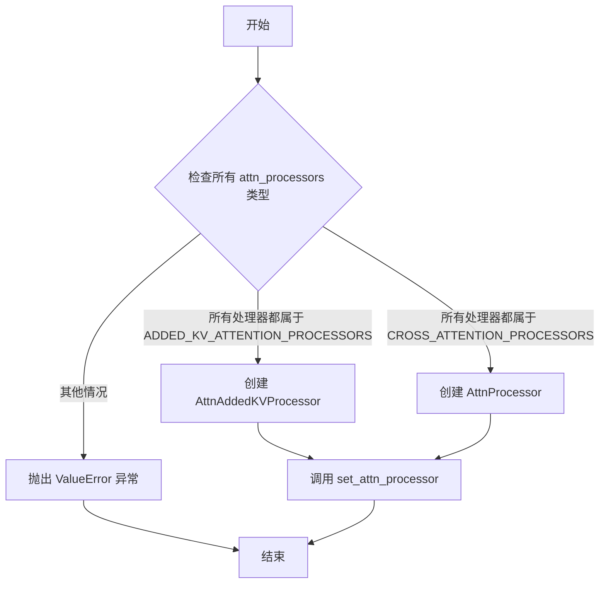
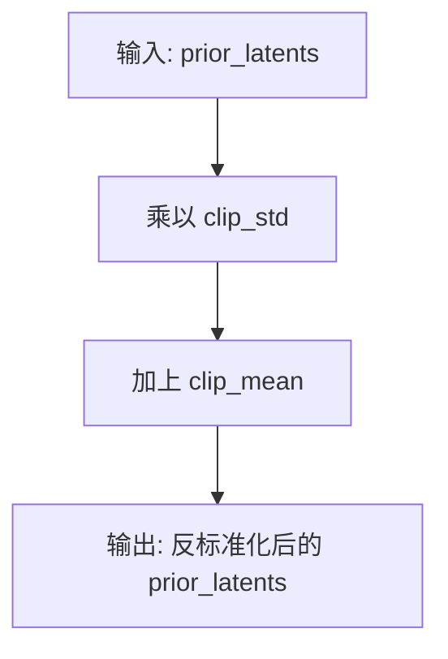

```mermaid
flowchart TD
    A[开始 forward] --> B[获取 batch_size]
    B --> C{检查 timestep 类型}
    C -->|不是Tensor| D[转换为 LongTensor]
    C -->|是标量Tensor| E[扩展为 1 维]
    C -->|已是 Tensor| F[保持不变]
    D --> G
    E --> G
    F --> G
    G[broadcast timesteps 到 batch 维度] --> H[time_proj 处理 timesteps]
    H --> I[time_embedding 生成时间嵌入]
    I --> J{embedding_proj_norm 存在?}
    J -->|是| K[对 proj_embedding 进行归一化]
    J -->|否| L
    K --> L
    L[embedding_proj 处理 proj_embedding] --> M{encoder_hidden_states_proj 存在且 encoder_hidden_states 不为空?}
    M -->|是| N[投影 encoder_hidden_states]
    M -->|否| O
    N --> O
    O[proj_in 处理 hidden_states] --> P[获取 positional_embedding]
    P --> Q[初始化 additional_embeds 列表]
    Q --> R{encoder_hidden_states 不为空?}
    R -->|是| S[添加 encoder_hidden_states 到 additional_embeds]
    R -->|否| T
    S --> T
    T{proj_embeddings 维度为 2?} -->|是| U[扩展为 3 维]
    T -->|否| V
    U --> V
    V{hidden_states 维度为 2?} -->|是| W[扩展为 3 维]
    V -->|否| X
    W --> X
    X[合并 additional_embeds] --> Y[添加 proj_embeddings, time_embeddings, hidden_states]
    Y --> Z{prd_embedding 存在?}
    Z -->|是| AA[扩展并添加 prd_embedding]
    Z -->|否| AB
    AA --> AB
    AB[torch.cat 合并所有嵌入] --> AC{positional_embedding 长度不足?}
    AC -->|是| AD[Pad positional_embedding]
    AC -->|否| AE
    AD --> AE
    AE[hidden_states + positional_embeddings] --> AF{attention_mask 存在?}
    AF -->|是| AG[处理 attention_mask]
    AF -->|否| AH
    AG --> AH
    AH{norm_in 存在?} -->|是| AI[应用 norm_in]
    AH -->|否| AJ
    AI --> AJ
    AJ[遍历 transformer_blocks] --> AK[每个 block 处理 hidden_states]
    AK --> AL[norm_out 处理]
    AL --> AM{prd_embedding 存在?}
    AM -->|是| AN[取最后一个 token]
    AM -->|否| AO[根据 additional_embeddings_len 切片]
    AN --> AP
    AO --> AP
    AP[proj_to_clip_embeddings 投影到 CLIP 嵌入空间] --> AQ{return_dict?}
    AQ -->|是| AR[返回 PriorTransformerOutput]
    AQ -->|否| AS[返回元组]
    AR --> AT[结束]
    AS --> AT
```

# `diffusers\src\diffusers\models\transformers\prior_transformer.py` 详细设计文档

PriorTransformer是一个用于unCLIP图像生成管道的Transformer模型，它根据CLIP文本嵌入预测CLIP图像嵌入。该模型包含多层Transformer块、时间步嵌入、位置嵌入和投影层，用于条件图像生成任务。

## 整体流程

```mermaid
graph TD
    A[开始 forward] --> B[处理 timestep]
    B --> C[计算 time_embedding]
    C --> D{embedding_proj_norm 存在?}
    D -- 是 --> E[应用 embedding_proj_norm]
    D -- 否 --> F[跳过 normalization]
E --> G[proj_embedding 投影]
F --> G
G --> H{encoder_hidden_states_proj 存在?]
H -- 是 --> I[投影 encoder_hidden_states]
H -- 否 --> J[保持原始 encoder_hidden_states]
I --> K[proj_in 投影 hidden_states]
J --> K
K --> L[构建 additional_embeds]
L --> M[拼接所有 embeddings]
M --> N[加上 positional_embedding]
N --> O{attention_mask 存在?}
O -- 是 --> P[处理 attention_mask]
O -- 否 --> Q[跳过 mask 处理]
P --> R[应用 norm_in]
Q --> R
R --> S[遍历 transformer_blocks]
S --> T[应用每个 BasicTransformerBlock]
T --> U[应用 norm_out]
U --> V{prd_embedding 存在?}
V -- 是 --> W[取最后一个 token]
V -- 否 --> X[取对应位置的 embedding]
W --> Y[proj_to_clip_embeddings 投影到输出维度],
        "X --> Y",
        
Y --> Z[返回 PriorTransformerOutput
```

## 类结构

```
ModelMixin (基类)
├── AttentionMixin (混入)
├── ConfigMixin (混入)
UNet2DConditionLoadersMixin (混入)
PeftAdapterMixin (混入)
└── PriorTransformer
```

## 全局变量及字段


### `PriorTransformerOutput.predicted_image_embedding`
    
The predicted CLIP image embedding output of the prior transformer.

类型：`torch.Tensor`
    


### `PriorTransformer.num_attention_heads`
    
The number of attention heads used in multi-head attention.

类型：`int`
    


### `PriorTransformer.attention_head_dim`
    
The number of channels in each attention head.

类型：`int`
    


### `PriorTransformer.inner_dim`
    
The inner dimension calculated as num_attention_heads multiplied by attention_head_dim.

类型：`int`
    


### `PriorTransformer.additional_embeddings`
    
The number of additional tokens appended to the projected hidden states.

类型：`int`
    


### `PriorTransformer.time_proj`
    
The timestep projection layer for processing denoising steps.

类型：`Timesteps`
    


### `PriorTransformer.time_embedding`
    
The timestep embedding layer that converts projected timesteps to embeddings.

类型：`TimestepEmbedding`
    


### `PriorTransformer.proj_in`
    
The linear projection layer that maps embedding dimension to inner dimension.

类型：`nn.Linear`
    


### `PriorTransformer.embedding_proj_norm`
    
The normalization layer applied to the projected embedding before further processing.

类型：`nn.LayerNorm | None`
    


### `PriorTransformer.embedding_proj`
    
The linear projection layer for the embedding vector from denoising process.

类型：`nn.Linear`
    


### `PriorTransformer.encoder_hidden_states_proj`
    
The linear projection layer for encoder hidden states from text embeddings.

类型：`nn.Linear | None`
    


### `PriorTransformer.positional_embedding`
    
The learnable positional embedding parameter for transformer input sequence.

类型：`nn.Parameter`
    


### `PriorTransformer.prd_embedding`
    
The learnable product embedding parameter for dot product conditioning token.

类型：`nn.Parameter | None`
    


### `PriorTransformer.transformer_blocks`
    
The list of BasicTransformerBlock modules for the transformer architecture.

类型：`nn.ModuleList`
    


### `PriorTransformer.norm_in`
    
The input normalization layer applied before transformer blocks.

类型：`nn.LayerNorm | None`
    


### `PriorTransformer.norm_out`
    
The output normalization layer applied after transformer blocks.

类型：`nn.LayerNorm`
    


### `PriorTransformer.proj_to_clip_embeddings`
    
The linear projection layer that maps hidden states to CLIP embedding dimension.

类型：`nn.Linear`
    


### `PriorTransformer.causal_attention_mask`
    
The causal attention mask buffer that prevents attending to future positions.

类型：`torch.Tensor (buffer)`
    


### `PriorTransformer.clip_mean`
    
The learnable mean parameter for denormalizing CLIP image embeddings.

类型：`nn.Parameter`
    


### `PriorTransformer.clip_std`
    
The learnable standard deviation parameter for denormalizing CLIP image embeddings.

类型：`nn.Parameter`
    
    

## 全局函数及方法


### PriorTransformer.__init__

这是 `PriorTransformer` 类的构造函数，用于初始化一个用于图像-文本条件生成的先验Transformer模型。该方法设置了模型的所有关键组件，包括时间嵌入、投影层、Transformer块、位置编码和可学习的CLIP统计参数。

参数：

- `num_attention_heads`：`int`，多头注意力机制中使用的注意力头数量，默认为32
- `attention_head_dim`：`int`，每个注意力头中的通道数，默认为64
- `num_layers`：`int`，要使用的Transformer块的数量，默认为20
- `embedding_dim`：`int`，模型输入`hidden_states`的维度，默认为768
- `num_embeddings`：`int`，模型输入`hidden_states`的嵌入数量，默认为77
- `additional_embeddings`：`int`，附加到投影`hidden_states`的额外token数量，默认为4
- `dropout`：`float`，使用的dropout概率，默认为0.0
- `time_embed_act_fn`：`str`，用于创建时间嵌入的激活函数，默认为"silu"
- `norm_in_type`：`str | None`，在传递给Transformer块之前对hidden states应用的归一化层，设为`None`则不需要归一化
- `embedding_proj_norm_type`：`str | None`，对输入`proj_embedding`应用的归一化层，设为`None`则不需要归一化
- `encoder_hid_proj_type`：`str | None`，对输入`encoder_hidden_states`应用的投影层，设为`None`则不需要投影
- `added_emb_type`：`str | None`，条件模型的额外嵌入类型，可选"prd"或None
- `time_embed_dim`：`int | None`，时间嵌入的维度，默认为`num_attention_heads * attention_head_dim`
- `embedding_proj_dim`：`int | None`，`proj_embedding`的维度，默认为`embedding_dim`
- `clip_embed_dim`：`int | None`，输出的维度，默认为`embedding_dim`

返回值：`None`，构造函数不返回值

#### 流程图

```mermaid
flowchart TD
    A[开始 __init__] --> B[调用 super().__init__]
    B --> C[设置模型基本属性 num_attention_heads, attention_head_dim, additional_embeddings]
    C --> D[计算内部维度 inner_dim = num_attention_heads * attention_head_dim]
    D --> E[设置默认维度 time_embed_dim, embedding_proj_dim, clip_embed_dim]
    E --> F[创建时间嵌入组件: Timesteps 和 TimestepEmbedding]
    F --> G[创建输入投影层 proj_in: Linear embedding_dim -> inner_dim]
    G --> H{embedding_proj_norm_type}
    H -->|None| I[self.embedding_proj_norm = None]
    H -->|"layer"| J[创建 LayerNorm]
    J --> K[创建 embedding_proj: Linear embedding_proj_dim -> inner_dim]
    K --> L{encoder_hid_proj_type}
    L -->|None| M[self.encoder_hidden_states_proj = None]
    L -->|"linear"| N[创建 Linear embedding_dim -> inner_dim]
    M --> O[创建可学习位置编码 positional_embedding]
    O --> P{added_emb_type}
    P -->|"prd"| Q[创建可学习prd_embedding]
    P -->|None| R[self.prd_embedding = None]
    Q --> S[创建nn.ModuleList of BasicTransformerBlocks]
    R --> S
    S --> T{norm_in_type}
    T -->|"layer"| U[创建 LayerNorm]
    T -->|None| V[self.norm_in = None]
    U --> W[创建输出归一化层 norm_out: LayerNorm]
    V --> W
    W --> X[创建投影层 proj_to_clip_embeddings: Linear inner_dim -> clip_embed_dim]
    X --> Y[创建因果注意力掩码 causal_attention_mask]
    Y --> Z[注册为buffer]
    Z --> AA[创建可学习参数 clip_mean, clip_std]
    AA --> AB[结束 __init__]
```

#### 带注释源码

```python
@register_to_config
def __init__(
    self,
    num_attention_heads: int = 32,
    attention_head_dim: int = 64,
    num_layers: int = 20,
    embedding_dim: int = 768,
    num_embeddings=77,
    additional_embeddings=4,
    dropout: float = 0.0,
    time_embed_act_fn: str = "silu",
    norm_in_type: str | None = None,  # layer
    embedding_proj_norm_type: str | None = None,  # layer
    encoder_hid_proj_type: str | None = "linear",  # linear
    added_emb_type: str | None = "prd",  # prd
    time_embed_dim: int | None = None,
    embedding_proj_dim: int | None = None,
    clip_embed_dim: int | None = None,
):
    # 调用父类初始化方法
    super().__init__()
    
    # 保存注意力头数量和每个头的维度
    self.num_attention_heads = num_attention_heads
    self.attention_head_dim = attention_head_dim
    
    # 计算内部维度 = 头数 * 每头维度
    inner_dim = num_attention_heads * attention_head_dim
    
    # 保存额外嵌入数量
    self.additional_embeddings = additional_embeddings

    # 如果未指定时间嵌入维度，则使用内部维度
    time_embed_dim = time_embed_dim or inner_dim
    # 如果未指定嵌入投影维度，则使用嵌入维度
    embedding_proj_dim = embedding_proj_dim or embedding_dim
    # 如果未指定CLIP嵌入维度，则使用嵌入维度
    clip_embed_dim = clip_embed_dim or embedding_dim

    # 创建时间投影层：将时间步投影到内部维度
    self.time_proj = Timesteps(inner_dim, True, 0)
    # 创建时间嵌入层：将投影后的时间步映射到时间嵌入维度
    self.time_embedding = TimestepEmbedding(inner_dim, time_embed_dim, out_dim=inner_dim, act_fn=time_embed_act_fn)

    # 创建输入投影层：将embedding_dim投影到inner_dim
    self.proj_in = nn.Linear(embedding_dim, inner_dim)

    # 根据embedding_proj_norm_type决定是否创建嵌入投影归一化层
    if embedding_proj_norm_type is None:
        self.embedding_proj_norm = None
    elif embedding_proj_norm_type == "layer":
        self.embedding_proj_norm = nn.LayerNorm(embedding_proj_dim)
    else:
        raise ValueError(f"unsupported embedding_proj_norm_type: {embedding_proj_norm_type}")

    # 创建嵌入投影层
    self.embedding_proj = nn.Linear(embedding_proj_dim, inner_dim)

    # 根据encoder_hid_proj_type决定编码器隐藏状态投影层
    if encoder_hid_proj_type is None:
        self.encoder_hidden_states_proj = None
    elif encoder_hid_proj_type == "linear":
        self.encoder_hidden_states_proj = nn.Linear(embedding_dim, inner_dim)
    else:
        raise ValueError(f"unsupported encoder_hid_proj_type: {encoder_hid_proj_type}")

    # 创建可学习的 positional embedding，维度为 (1, num_embeddings + additional_embeddings, inner_dim)
    self.positional_embedding = nn.Parameter(torch.zeros(1, num_embeddings + additional_embeddings, inner_dim))

    # 根据added_emb_type决定是否添加PRD(点积结果)嵌入
    if added_emb_type == "prd":
        # PRD嵌入用于编码文本和图像嵌入之间的量化点积
        self.prd_embedding = nn.Parameter(torch.zeros(1, 1, inner_dim))
    elif added_emb_type is None:
        self.prd_embedding = None
    else:
        raise ValueError(
            f"`added_emb_type`: {added_emb_type} is not supported. Make sure to choose one of `'prd'` or `None`."
        )

    # 创建Transformer块模块列表
    self.transformer_blocks = nn.ModuleList(
        [
            BasicTransformerBlock(
                inner_dim,
                num_attention_heads,
                attention_head_dim,
                dropout=dropout,
                activation_fn="gelu",
                attention_bias=True,
            )
            for d in range(num_layers)
        ]
    )

    # 根据norm_in_type决定是否创建输入归一化层
    if norm_in_type == "layer":
        self.norm_in = nn.LayerNorm(inner_dim)
    elif norm_in_type is None:
        self.norm_in = None
    else:
        raise ValueError(f"Unsupported norm_in_type: {norm_in_type}.")

    # 创建输出归一化层
    self.norm_out = nn.LayerNorm(inner_dim)

    # 创建投影到CLIP嵌入的输出层
    self.proj_to_clip_embeddings = nn.Linear(inner_dim, clip_embed_dim)

    # 创建因果注意力掩码：下三角矩阵，上三角为-10000
    causal_attention_mask = torch.full(
        [num_embeddings + additional_embeddings, num_embeddings + additional_embeddings], -10000.0
    )
    causal_attention_mask.triu_(1)  # 保留主对角线及以下，其余设为-10000
    causal_attention_mask = causal_attention_mask[None, ...]  # 添加batch维度
    # 注册为buffer，不作为可训练参数
    self.register_buffer("causal_attention_mask", causal_attention_mask, persistent=False)

    # 创建可学习的CLIP均值和标准差参数，用于后处理
    self.clip_mean = nn.Parameter(torch.zeros(1, clip_embed_dim))
    self.clip_std = nn.Parameter(torch.zeros(1, clip_embed_dim))
```


### `PriorTransformer.set_default_attn_processor`

该方法用于禁用自定义的注意力处理器（attention processors），并设置默认的注意力实现。它会检查当前所有 attention processors 的类型，根据类型选择合适的默认处理器（`AttnAddedKVProcessor` 或 `AttnProcessor`），然后调用 `set_attn_processor` 进行设置。

参数： 无

返回值： 无（`None`），该方法通过修改实例状态来生效

#### 流程图



#### 带注释源码

```python
def set_default_attn_processor(self):
    """
    Disables custom attention processors and sets the default attention implementation.
    """
    # 检查所有 attention processors 是否都属于 ADDED_KV_ATTENTION_PROCESSORS 类型
    if all(proc.__class__ in ADDED_KV_ATTENTION_PROCESSORS for proc in self.attn_processors.values()):
        # 如果是，则使用 AttnAddedKVProcessor 作为默认处理器
        processor = AttnAddedKVProcessor()
    # 检查所有 attention processors 是否都属于 CROSS_ATTENTION_PROCESSORS 类型
    elif all(proc.__class__ in CROSS_ATTENTION_PROCESSORS for proc in self.attn_processors.values()):
        # 如果是，则使用 AttnProcessor 作为默认处理器
        processor = AttnProcessor()
    else:
        # 处理器类型不匹配，抛出 ValueError 异常
        raise ValueError(
            f"Cannot call `set_default_attn_processor` when attention processors are of type {next(iter(self.attn_processors.values()))}"
        )

    # 调用 set_attn_processor 方法设置默认处理器
    self.set_attn_processor(processor)
```


### PriorTransformer.forward

该方法是`PriorTransformer`模型的前向传播函数，负责根据当前预测的图像嵌入、时间步、投影嵌入和文本嵌入等条件，通过Transformer块处理生成预测的CLIP图像嵌入。

参数：

- `self`：`PriorTransformer`类实例本身
- `hidden_states`：`torch.Tensor`，形状为`(batch_size, embedding_dim)`，表示当前预测的图像嵌入
- `timestep`：`torch.Tensor | float | int`，当前的去噪步骤（时间步）
- `proj_embedding`：`torch.Tensor`，形状为`(batch_size, embedding_dim)`，表示去噪过程所依赖的投影嵌入向量
- `encoder_hidden_states`：`torch.Tensor | None`，形状为`(batch_size, num_embeddings, embedding_dim)`，表示去噪过程所依赖的文本嵌入的隐藏状态
- `attention_mask`：`torch.BoolTensor | None`，形状为`(batch_size, num_embeddings)`，文本嵌入的掩码
- `return_dict`：`bool`，默认为`True`，是否返回`PriorTransformerOutput`而不是元组

返回值：`PriorTransformerOutput`或`tuple`，当`return_dict`为`True`时返回`PriorTransformerOutput`对象，其中包含预测的CLIP图像嵌入；否则返回元组

#### 流程图



#### 带注释源码

```python
def forward(
    self,
    hidden_states,
    timestep: torch.Tensor | float | int,
    proj_embedding: torch.Tensor,
    encoder_hidden_states: torch.Tensor | None = None,
    attention_mask: torch.BoolTensor | None = None,
    return_dict: bool = True,
):
    """
    The [`PriorTransformer`] forward method.

    Args:
        hidden_states (`torch.Tensor` of shape `(batch_size, embedding_dim)`):
            The currently predicted image embeddings.
        timestep (`torch.LongTensor`):
            Current denoising step.
        proj_embedding (`torch.Tensor` of shape `(batch_size, embedding_dim)`):
            Projected embedding vector the denoising process is conditioned on.
        encoder_hidden_states (`torch.Tensor` of shape `(batch_size, num_embeddings, embedding_dim)`):
            Hidden states of the text embeddings the denoising process is conditioned on.
        attention_mask (`torch.BoolTensor` of shape `(batch_size, num_embeddings)`):
            Text mask for the text embeddings.
        return_dict (`bool`, *optional*, defaults to `True`):
            Whether or not to return a [`~models.transformers.prior_transformer.PriorTransformerOutput`] instead of
            a plain tuple.

    Returns:
        [`~models.transformers.prior_transformer.PriorTransformerOutput`] or `tuple`:
            If return_dict is True, a [`~models.transformers.prior_transformer.PriorTransformerOutput`] is
            returned, otherwise a tuple is returned where the first element is the sample tensor.
    """
    # 获取批量大小
    batch_size = hidden_states.shape[0]

    # 处理时间步，确保其为Tensor并具有正确的形状和设备
    timesteps = timestep
    if not torch.is_tensor(timesteps):
        # 如果不是Tensor，转换为LongTensor
        timesteps = torch.tensor([timesteps], dtype=torch.long, device=hidden_states.device)
    elif torch.is_tensor(timesteps) and len(timesteps.shape) == 0:
        # 如果是标量Tensor，扩展为1维
        timesteps = timesteps[None].to(hidden_states.device)

    # 将时间步广播到批量维度，兼容ONNX/Core ML
    timesteps = timesteps * torch.ones(batch_size, dtype=timesteps.dtype, device=timesteps.device)

    # 使用时间投影层处理时间步
    timesteps_projected = self.time_proj(timesteps)

    # 时间投影始终返回float32张量，但time_embedding可能是fp16，需要进行类型转换
    timesteps_projected = timesteps_projected.to(dtype=self.dtype)
    # 生成时间嵌入
    time_embeddings = self.time_embedding(timesteps_projected)

    # 如果存在嵌入投影归一化层，则对proj_embedding进行归一化
    if self.embedding_proj_norm is not None:
        proj_embedding = self.embedding_proj_norm(proj_embedding)

    # 使用嵌入投影层处理proj_embedding
    proj_embeddings = self.embedding_proj(proj_embedding)
    
    # 如果存在编码器隐藏状态投影层且encoder_hidden_states不为空，则进行投影
    if self.encoder_hidden_states_proj is not None and encoder_hidden_states is not None:
        encoder_hidden_states = self.encoder_hidden_states_proj(encoder_hidden_states)
    elif self.encoder_hidden_states_proj is not None and encoder_hidden_states is None:
        raise ValueError("`encoder_hidden_states_proj` requires `encoder_hidden_states` to be set")

    # 使用输入投影层处理hidden_states
    hidden_states = self.proj_in(hidden_states)

    # 获取位置嵌入，转换为hidden_states的数据类型
    positional_embeddings = self.positional_embedding.to(hidden_states.dtype)

    # 初始化额外的嵌入列表
    additional_embeds = []
    additional_embeddings_len = 0

    # 如果存在encoder_hidden_states，添加到额外嵌入列表
    if encoder_hidden_states is not None:
        additional_embeds.append(encoder_hidden_states)
        additional_embeddings_len += encoder_hidden_states.shape[1]

    # 如果proj_embeddings是2维，扩展为3维
    if len(proj_embeddings.shape) == 2:
        proj_embeddings = proj_embeddings[:, None, :]

    # 如果hidden_states是2维，扩展为3维
    if len(hidden_states.shape) == 2:
        hidden_states = hidden_states[:, None, :]

    # 将proj_embeddings, time_embeddings, hidden_states添加到额外嵌入列表
    additional_embeds = additional_embeds + [
        proj_embeddings,
        time_embeddings[:, None, :],
        hidden_states,
    ]

    # 如果存在PRD嵌入，添加到额外嵌入列表
    if self.prd_embedding is not None:
        # 扩展PRD嵌入以匹配批量大小
        prd_embedding = self.prd_embedding.to(hidden_states.dtype).expand(batch_size, -1, -1)
        additional_embeds.append(prd_embedding)

    # 沿维度1拼接所有嵌入
    hidden_states = torch.cat(
        additional_embeds,
        dim=1,
    )

    # 计算额外嵌入的长度，用于处理positional_embedding
    # 允许positional_embedding不包含additional_embeddings，用零填充
    additional_embeddings_len = additional_embeddings_len + proj_embeddings.shape[1] + 1
    
    # 如果positional_embedding长度不足，用零填充
    if positional_embeddings.shape[1] < hidden_states.shape[1]:
        positional_embeddings = F.pad(
            positional_embeddings,
            (
                0,  # 最后一个维度不填充
                0,  # 最后一个维度不填充
                additional_embeddings_len,  # 在序列开头填充
                self.prd_embedding.shape[1] if self.prd_embedding is not None else 0,  # 在序列结尾填充
            ),
            value=0.0,
        )

    # 将位置嵌入加到隐藏状态上
    hidden_states = hidden_states + positional_embeddings

    # 处理注意力掩码
    if attention_mask is not None:
        # 将掩码转换为hidden_states的数据类型，1表示有效，0表示无效
        # 转换为-10000表示无效位置
        attention_mask = (1 - attention_mask.to(hidden_states.dtype)) * -10000.0
        # 填充额外的嵌入位置
        attention_mask = F.pad(attention_mask, (0, self.additional_embeddings), value=0.0)
        # 结合因果掩码
        attention_mask = (attention_mask[:, None, :] + self.causal_attention_mask).to(hidden_states.dtype)
        # 重复掩码以匹配多头注意力的数量
        attention_mask = attention_mask.repeat_interleave(
            self.config.num_attention_heads,
            dim=0,
            output_size=attention_mask.shape[0] * self.config.num_attention_heads,
        )

    # 如果存在输入归一化层，则应用
    if self.norm_in is not None:
        hidden_states = self.norm_in(hidden_states)

    # 遍历所有Transformer块进行前向传播
    for block in self.transformer_blocks:
        hidden_states = block(hidden_states, attention_mask=attention_mask)

    # 应用输出归一化
    hidden_states = self.norm_out(hidden_states)

    # 根据是否存在PRD嵌入选择输出
    if self.prd_embedding is not None:
        # 取最后一个token（PRD token）
        hidden_states = hidden_states[:, -1]
    else:
        # 根据额外嵌入长度切片
        hidden_states = hidden_states[:, additional_embeddings_len:]

    # 投影到CLIP嵌入空间
    predicted_image_embedding = self.proj_to_clip_embeddings(hidden_states)

    # 根据return_dict决定返回格式
    if not return_dict:
        return (predicted_image_embedding,)

    return PriorTransformerOutput(predicted_image_embedding=predicted_image_embedding)
```


### `PriorTransformer.post_process_latents`

该方法用于对 PriorTransformer 模型输出的潜在表示进行反标准化处理，通过已学习的均值（clip_mean）和标准差（clip_std）参数将输出从标准正态分布转换回原始的 CLIP 嵌入空间。

参数：

- `prior_latents`：`torch.Tensor`，模型输出的潜在表示，通常是经过标准化处理的 tensor

返回值：`torch.Tensor`，经过反标准化处理后的 CLIP 图像嵌入

#### 流程图



#### 带注释源码

```
def post_process_latents(self, prior_latents):
    """
    对潜在表示进行后处理，反标准化到原始 CLIP 嵌入空间
    
    参数:
        prior_latents: 经过模型处理后的潜在表示
        
    返回:
        经过反标准化处理的潜在表示
    """
    # 使用类内学习的 clip_mean 和 clip_std 参数进行反标准化
    # 公式: output = (input * std) + mean
    prior_latents = (prior_latents * self.clip_std) + self.clip_mean
    
    return prior_latents
```

## 关键组件


### PriorTransformer

主 transformer 模型类，用于根据 CLIP 文本嵌入预测 CLIP 图像嵌入，实现 unclip/prior 过程。

### PriorTransformerOutput

输出数据类，包含 predicted_image_embedding 属性，存储预测的 CLIP 图像嵌入。

### Timesteps 和 TimestepEmbedding

时间步投影层和时间嵌入层，将离散时间步转换为连续嵌入向量，供 transformer 使用。

### 投影层 (proj_in, embedding_proj, encoder_hidden_states_proj)

将输入的图像嵌入、投影嵌入和编码器隐藏状态投影到内部维度。

### 位置编码 (positional_embedding)

可学习的 positional_embedding 参数，用于为序列中的每个位置提供位置信息，支持填充零以适应额外嵌入。

### PRD 嵌入 (prd_embedding)

可选的预测点积嵌入，根据 added_emb_type 配置决定是否添加，用于编码文本-图像相似性先验。

### Transformer 块 (transformer_blocks)

由多个 BasicTransformerBlock 组成的模块列表，实现多头注意力机制和前馈网络。

### 归一化层 (norm_in, norm_out)

输入和输出的 LayerNorm 归一化层，用于稳定训练过程。

### 输出投影层 (proj_to_clip_embeddings)

将内部维度投影到 CLIP 嵌入维度，生成最终的图像嵌入预测。

### 因果注意力掩码 (causal_attention_mask)

预计算的因果掩码，确保自回归生成过程中的注意力只能访问当前位置及之前的 token。

### 后处理 (post_process_latents)

使用 clip_mean 和 clip_std 参数对潜在向量进行反标准化，恢复原始尺度。

### 注意力处理器管理

set_default_attn_processor 方法用于配置默认注意力处理器，支持自定义注意力实现。


## 问题及建议


### 已知问题

- **类型注解不完整**：`__init__`中的`num_embeddings`和`additional_embeddings`参数缺少类型注解，而其他参数都有。
- **魔法数字和硬编码值**：多处使用硬编码值如`-10000.0`作为attention mask的填充值、`77`作为默认num_embeddings值、`4`作为additional_embeddings默认值，这些应提取为常量或配置参数。
- **变量命名不清晰**：`prd_embedding`命名不够描述性，根据上下文（如unclip论文中的quantized dot product），应改为`product_embedding`或`dot_product_embedding`以提高可读性。
- **attention_mask处理复杂**：forward方法中的attention_mask处理逻辑复杂且难以理解，包括pad、repeat_interleave等操作，可读性和可维护性较差。
- **重复的维度扩展逻辑**：`proj_embeddings`和`hidden_states`的2D到3D扩展逻辑（`[:, None, :]`)在代码中重复出现，可提取为辅助方法。
- **参数验证不足**：部分参数组合的有效性验证缺失，例如`added_emb_type`与`additional_embeddings`的关系未做校验。
- **设备转换开销**：在forward中多次进行device和dtype转换（`timesteps.to(...)`、`hidden_states.dtype`等），可能带来性能开销。

### 优化建议

- 补全`num_embeddings: int = 77`和`additional_embeddings: int = 4`的类型注解。
- 提取常量：`ATTENTION_MASK_FILL_VALUE = -10000.0`、`DEFAULT_NUM_EMBEDDINGS = 77`等。
- 重命名`prd_embedding`为`product_embedding`，增强代码自解释性。
- 将attention_mask的处理逻辑封装为独立方法，或考虑使用更清晰的attention处理类。
- 添加参数验证逻辑在`__init__`中，例如检查`num_layers > 0`、`attention_head_dim > 0`等。
- 考虑在初始化时预先创建并注册需要重复使用的张量缓冲区，减少前向传播中的动态创建开销。
- 添加类型提示到更多位置，如`forward`方法的参数使用更精确的`torch.Tensor`类型注解。

## 其它


### 设计目标与约束

本模块的设计目标是将 CLIP 文本 embedding 作为条件输入，预测对应的 CLIP 图像 embedding，实现从文本到图像 latent 空间的映射。核心约束包括：模型输入的 hidden_states 必须为 (batch_size, embedding_dim) 形状的张量；encoder_hidden_states 为可选输入，当提供时用于条件生成；timestep 用于去噪过程的时间步嵌入；模型仅支持 PyTorch 框架运行；所有注意力机制采用因果掩码防止未来信息泄露。

### 错误处理与异常设计

代码中的错误处理主要通过 ValueError 异常实现。在初始化阶段，embedding_proj_norm_type 仅支持 None 或 "layer"；encoder_hid_proj_type 仅支持 None 或 "linear"；added_emb_type 仅支持 "prd" 或 None。在 forward 方法中，当 encoder_hidden_states_proj 存在但 encoder_hidden_states 为 None 时抛出 ValueError。attention_mask 的形状必须与 encoder_hidden_states 兼容，否则可能导致维度不匹配错误。set_default_attn_processor 方法在注意力处理器类型不满足条件时抛出 ValueError。

### 数据流与状态机

数据流主要分为以下几个阶段：1) 时间步处理：将 timestep 通过 time_proj 投影并生成 time_embedding；2) 嵌入处理：对 proj_embedding 进行归一化（可选）和线性投影，对 encoder_hidden_states 进行投影（可选）；3) 隐藏状态投影：将 hidden_states 从 embedding_dim 投影到 inner_dim；4) 嵌入拼接：将 encoder_hidden_states、proj_embeddings、time_embeddings、hidden_states 和 prd_embedding（可选）按顺序拼接；5) 位置编码：添加可学习的位置编码，必要时进行零填充；6) Transformer 块处理：通过 num_layers 个 BasicTransformerBlock 进行自回归处理；7) 输出投影：将隐藏状态投影到 clip_embed_dim 维度并输出。

### 外部依赖与接口契约

主要依赖包括：torch 和 torch.nn.functional 提供张量操作和神经网络构建；dataclasses 用于定义输出数据结构 PriorTransformerOutput；ConfigMixin 和 register_to_config 来自 ...configuration_utils 用于配置管理；PeftAdapterMixin 和 UNet2DConditionLoadersMixin 来自 ...loaders 提供 PEFT 适配和 UNet 加载功能；BaseOutput 来自 ...utils 提供基础输出类；AttentionMixin、BasicTransformerBlock 来自 ..attention 提供注意力机制；TimestepEmbedding、Timesteps 来自 ..embeddings 提供时间嵌入；ModelMixin 来自 ..modeling_utils 提供模型基础功能。

### 配置参数说明

核心配置参数包括：num_attention_heads（默认 32）控制多头注意力的头数；attention_head_dim（默认 64）控制每个头的维度；num_layers（默认 20）控制 Transformer 块的数量；embedding_dim（默认 768）控制输入嵌入维度；num_embeddings（默认 77）控制输入 token 数量；additional_embeddings（默认 4）控制附加 token 数量；dropout（默认 0.0）控制 Dropout 概率；time_embed_act_fn（默认 "silu"）控制时间嵌入激活函数；norm_in_type、embedding_proj_norm_type、encoder_hid_proj_type 分别控制不同阶段的归一化类型；added_emb_type（默认 "prd"）控制是否添加产品 embedding；time_embed_dim、embedding_proj_dim、clip_embed_dim 分别控制各嵌入层的维度。

### 性能考虑与优化空间

性能方面可优化的点包括：causal_attention_mask 使用 register_buffer 注册但 persistent=False，每次模型加载时需要重新计算；positional_embedding 采用 Paramter 定义，会被纳入优化器更新列表，但实际使用中可能不需要训练；transformer_blocks 使用 nn.ModuleList 管理，可以考虑启用 torch.compile 加速；forward 方法中存在多次张量形状检查和转换，可合并部分操作减少中间张量创建。建议对固定尺寸的 mask 进行预计算并持久化存储，考虑使用 torch.jit.script 优化推理性能。

### 安全性考虑

代码不直接涉及用户输入处理，但需要注意：模型加载时应验证输入张量的 device 和 dtype 与模型参数一致；attention_mask 的处理中使用了硬编码的 -10000.0 作为屏蔽值，需确保与模型精度匹配；梯度计算默认启用，在推理时应使用 torch.no_grad() 或 eval() 模式以避免不必要的内存开销；peft_adapter 的集成需要确保适配器权重与主模型兼容。

### 版本兼容性与依赖管理

代码使用 Python 3.9+ 的类型提示语法（str | None）；依赖 PyTorch 2.0+ 以支持 torch.compile 等高级功能；dataclass 使用 kw_only 字段（Python 3.10+）需注意版本兼容性；模块继承多个 Mixin 类，需要确保 diffusers 库版本 >= 0.21.0 以支持所有功能。

### 使用示例与调用模式

典型调用流程为：1) 通过配置参数实例化 PriorTransformer；2) 准备 hidden_states（预测的图像嵌入）、timestep（时间步）、proj_embedding（项目嵌入）和 encoder_hidden_states（文本嵌入）；3) 调用 forward 方法获取 PriorTransformerOutput；4) 可选调用 post_process_latents 进行后处理（反标准化）。模型支持 return_dict=False 的元组返回模式以保持向后兼容。


    