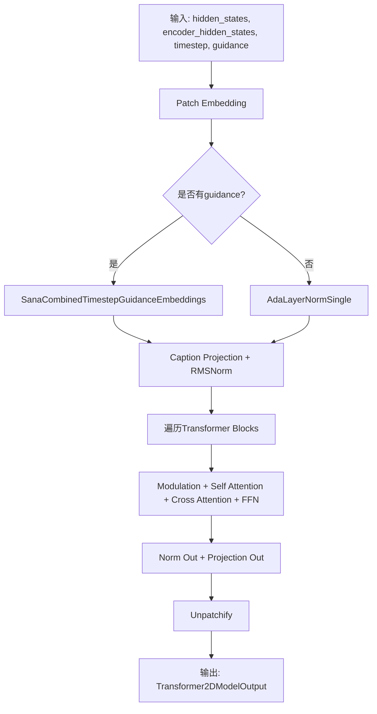
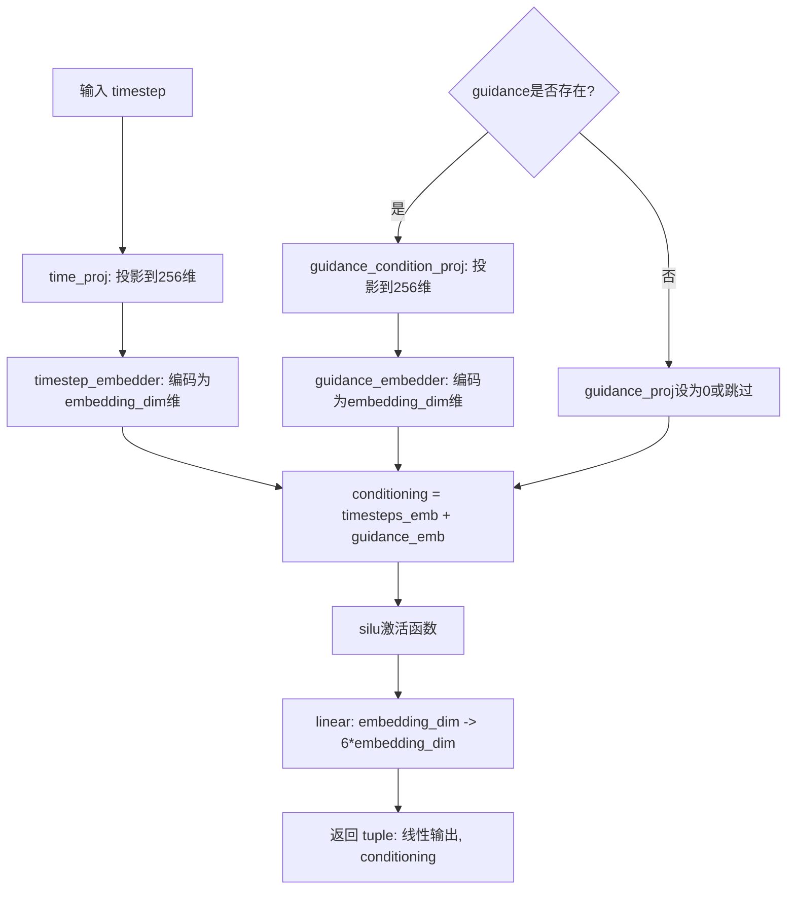
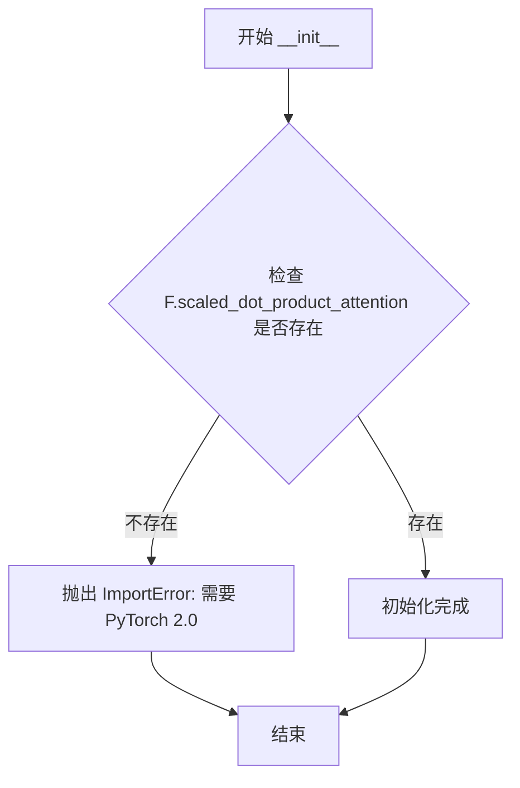
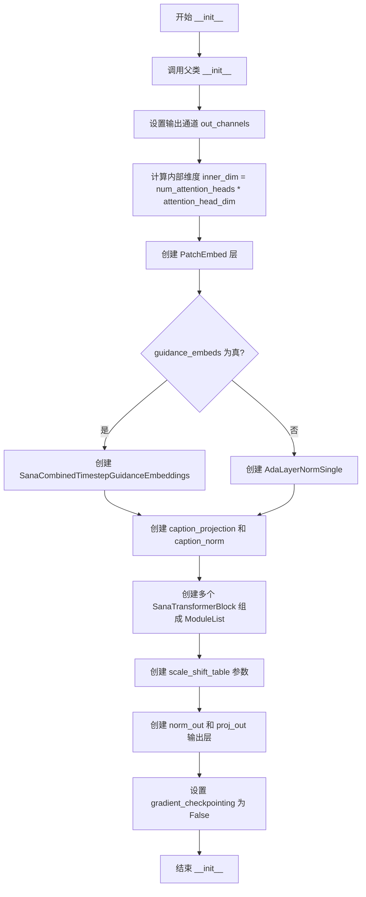
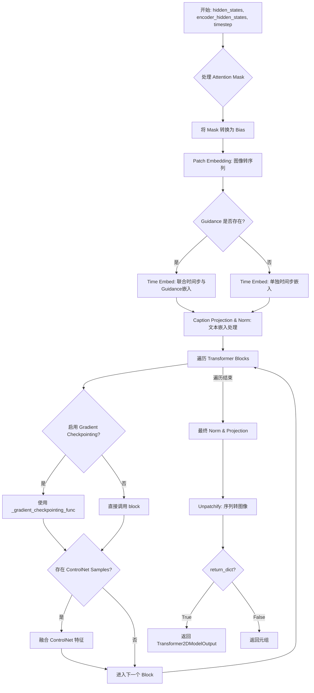

# `diffusers\src\diffusers\models\transformers\sana_transformer.py` 详细设计文档

这是一个Sana 2D Transformer模型实现，用于条件图像生成任务。模型包含自注意力机制、交叉注意力机制和GLUMBConv前馈网络，支持时间步嵌入、引导嵌入和_caption投影，可处理文本条件来生成图像。

## 整体流程



## 类结构

```
GLUMBConv (卷积模块)
SanaModulatedNorm (调制的LayerNorm)
SanaCombinedTimestepGuidanceEmbeddings (时间步和引导嵌入)
SanaAttnProcessor2_0 (注意力处理器)
SanaTransformerBlock (Transformer块)
SanaTransformer2DModel (主模型类)
    ├── patch_embed (PatchEmbed)
    ├── time_embed (SanaCombinedTimestepGuidanceEmbeddings / AdaLayerNormSingle)
    ├── caption_projection (PixArtAlphaTextProjection)
    ├── caption_norm (RMSNorm)
    ├── transformer_blocks (nn.ModuleList[SanaTransformerBlock])
    └── norm_out + proj_out
```

## 全局变量及字段


### `logger`
    
Logger for the module, used for outputting diagnostic information.

类型：`logging.Logger`
    


### `GLUMBConv.norm_type`
    
Type of normalization to apply (e.g., 'rms_norm'), or None for no normalization.

类型：`str | None`
    


### `GLUMBConv.residual_connection`
    
Whether to add the input as a residual connection to the output.

类型：`bool`
    


### `GLUMBConv.nonlinearity`
    
Activation function (SiLU) used after the first convolution.

类型：`nn.SiLU`
    


### `GLUMBConv.conv_inverted`
    
Inverted depthwise convolution that expands channels.

类型：`nn.Conv2d`
    


### `GLUMBConv.conv_depth`
    
Depthwise convolution for spatial mixing.

类型：`nn.Conv2d`
    


### `GLUMBConv.conv_point`
    
Pointwise convolution that projects back to output channels.

类型：`nn.Conv2d`
    


### `GLUMBConv.norm`
    
RMS normalization layer applied at the output if norm_type is 'rms_norm'.

类型：`RMSNorm | None`
    


### `SanaModulatedNorm.norm`
    
Layer normalization applied to hidden states before scaling and shifting.

类型：`nn.LayerNorm`
    


### `SanaCombinedTimestepGuidanceEmbeddings.time_proj`
    
Projects timesteps to a fixed-size embedding.

类型：`Timesteps`
    


### `SanaCombinedTimestepGuidanceEmbeddings.timestep_embedder`
    
Embeds projected timesteps into a time embedding dimension.

类型：`TimestepEmbedding`
    


### `SanaCombinedTimestepGuidanceEmbeddings.guidance_condition_proj`
    
Projects guidance (e.g., text embedding) to same dimension as timesteps.

类型：`Timesteps`
    


### `SanaCombinedTimestepGuidanceEmbeddings.guidance_embedder`
    
Embeds projected guidance into same dimension as timestep.

类型：`TimestepEmbedding`
    


### `SanaCombinedTimestepGuidanceEmbeddings.silu`
    
SiLU activation applied to combined embeddings.

类型：`nn.SiLU`
    


### `SanaCombinedTimestepGuidanceEmbeddings.linear`
    
Linear layer mapping combined embedding to 6 * embedding_dim for scale and shift parameters.

类型：`nn.Linear`
    


### `SanaTransformerBlock.norm1`
    
Layer normalization for self-attention input.

类型：`nn.LayerNorm`
    


### `SanaTransformerBlock.attn1`
    
Self-attention block for processing hidden states.

类型：`Attention (Self Attention)`
    


### `SanaTransformerBlock.norm2`
    
Layer normalization for cross-attention input, None if cross-attention is disabled.

类型：`nn.LayerNorm | None`
    


### `SanaTransformerBlock.attn2`
    
Cross-attention block for conditioning on encoder hidden states, None if cross_attention_dim is None.

类型：`Attention | None (Cross Attention)`
    


### `SanaTransformerBlock.ff`
    
Feed-forward network (GLUMBConv) for feature transformation.

类型：`GLUMBConv`
    


### `SanaTransformerBlock.scale_shift_table`
    
Learnable parameters for computing modulation shifts and scales.

类型：`nn.Parameter`
    


### `SanaTransformer2DModel.patch_embed`
    
Converts input image into patch embeddings.

类型：`PatchEmbed`
    


### `SanaTransformer2DModel.time_embed`
    
Time (and optional guidance) embedding layer.

类型：`SanaCombinedTimestepGuidanceEmbeddings | AdaLayerNormSingle`
    


### `SanaTransformer2DModel.caption_projection`
    
Projects caption embeddings to the transformer's hidden dimension.

类型：`PixArtAlphaTextProjection`
    


### `SanaTransformer2DModel.caption_norm`
    
RMS normalization applied to caption embeddings.

类型：`RMSNorm`
    


### `SanaTransformer2DModel.transformer_blocks`
    
List of transformer blocks processing the sequence.

类型：`nn.ModuleList`
    


### `SanaTransformer2DModel.scale_shift_table`
    
Learnable parameters for final output modulation.

类型：`nn.Parameter`
    


### `SanaTransformer2DModel.norm_out`
    
Modulated normalization applied before final projection.

类型：`SanaModulatedNorm`
    


### `SanaTransformer2DModel.proj_out`
    
Linear layer projecting to output channel dimension with patch size.

类型：`nn.Linear`
    


### `SanaTransformer2DModel.gradient_checkpointing`
    
Flag indicating whether gradient checkpointing is enabled to save memory.

类型：`bool`
    
    

## 全局函数及方法


### `GLUMBConv.forward`

该方法是 GLUMB（Global-Local Unified Mixed Block）卷积层的前向传播实现，采用 inverted convolutions（倒置卷积）架构，包含扩展卷积、深度可分离卷积和投影卷积，支持残差连接和 RMSNorm 归一化。

**参数：**

- `hidden_states`：`torch.Tensor`，输入的隐藏状态张量，形状为 `(B, C, H, W)`，其中 B 是批量大小，C 是通道数，H 和 W 是空间维度

**返回值：** `torch.Tensor`，经过 GLUMBConv 处理后的输出张量，形状与输入相同 `(B, C, H, W)`

#### 流程图

```mermaid
flowchart TD
    A[输入 hidden_states] --> B{residual_connection?}
    B -->|True| C[保存残差副本]
    B -->|False| D[跳过残差保存]
    
    C --> E[conv_inverted: 1x1卷积扩展通道]
    D --> E
    
    E --> F[SiLU激活函数]
    F --> G[conv_depth: 3x3深度可分离卷积]
    G --> H[torch.chunk 沿通道维度分成两部分]
    H --> I[取 gate 分支再经SiLU]
    H --> J[hidden_states * SiLU(gate)]
    
    J --> K[conv_point: 1x1点卷积投影]
    
    K --> L{self.norm_type == 'rms_norm'?}
    L -->|True| M[移动通道维度到最后一维]
    M --> N[RMSNorm归一化]
    N --> O[恢复通道维度顺序]
    L -->|False| P[跳过归一化]
    O --> Q
    P --> Q
    
    Q --> R{residual_connection?}
    R -->|True| S[输出 + 残差]
    R -->|False| T[直接输出]
    
    S --> U[返回 hidden_states]
    T --> U
```

#### 带注释源码

```python
def forward(self, hidden_states: torch.Tensor) -> torch.Tensor:
    """
    GLUMBConv 前向传播方法
    
    Args:
        hidden_states: 输入张量，形状为 (B, C, H, W)
        
    Returns:
        处理后的张量，形状为 (B, C_out, H, W)
    """
    
    # 1. 残差连接：保存输入副本用于后续相加
    if self.residual_connection:
        residual = hidden_states

    # 2. 扩展阶段：1x1 卷积将通道从 in_channels 扩展到 hidden_channels * 2
    #    hidden_channels = expand_ratio * in_channels (默认 expand_ratio=4)
    hidden_states = self.conv_inverted(hidden_states)
    
    # 3. 激活函数：SiLU (Swish) 非线性变换
    hidden_states = self.nonlinearity(hidden_states)

    # 4. 深度可分离卷积：3x3 卷积，groups 等于通道数，实现空间特征提取
    hidden_states = self.conv_depth(hidden_states)
    
    # 5. 门控机制：将卷积输出沿通道维度均分为两部分
    #    一部分用于特征，另一部分作为门控信号
    hidden_states, gate = torch.chunk(hidden_states, 2, dim=1)
    
    # 6. 门控激活：门控信号经 SiLU 激活后与特征相乘（门控机制）
    hidden_states = hidden_states * self.nonlinearity(gate)

    # 7. 投影阶段：1x1 卷积将通道从 hidden_channels 投影到 out_channels
    hidden_states = self.conv_point(hidden_states)

    # 8. RMSNorm 归一化（可选）
    if self.norm_type == "rms_norm":
        # 将通道维度移到最后以便沿通道维度应用 RMSNorm
        # 形状变换: (B, C, H, W) -> (B, H, W, C) -> norm -> (B, C, H, W)
        hidden_states = self.norm(hidden_states.movedim(1, -1)).movedim(-1, 1)

    # 9. 残差连接：将输出与输入相加
    if self.residual_connection:
        hidden_states = hidden_states + residual

    return hidden_states
```


### SanaModulatedNorm.forward

该函数实现了一种自适应层归一化（AdaLayerNorm）的变体，通过结合时间步嵌入（temb）和可学习的缩放偏移表（scale_shift_table），动态计算仿射变换的缩放系数（scale）和平移系数（shift），并将其应用于归一化后的隐藏状态，从而实现条件信号对特征空间的调制。

参数：

- `self`：`SanaModulatedNorm`，调用此方法的模块实例本身
- `hidden_states`：`torch.Tensor`，输入的隐藏状态张量，形状为 (batch_size, seq_len, dim)，表示经过前一层处理后的特征表示
- `temb`：`torch.Tensor`，时间步嵌入张量，形状为 (batch_size, dim)，由时间步通过嵌入层生成的条件嵌入向量，用于生成调制参数
- `scale_shift_table`：`torch.Tensor`，可学习的缩放偏移表，形状为 (2, dim)，存储用于生成仿射变换参数的基础向量，通过与temb相加得到最终的scale和shift

返回值：`torch.Tensor`，经过归一化、缩放和平移调制后的隐藏状态张量，形状与输入hidden_states相同

#### 流程图

```mermaid
flowchart TD
    A[输入 hidden_states, temb, scale_shift_table] --> B[LayerNorm归一化]
    B --> C[计算 shift 和 scale]
    C --> C1[scale_shift_table[None]]
    C --> C2[temb[:, None].to device]
    C1 --> C3[相加得到条件参数]
    C2 --> C3
    C3 --> C4[chunk操作沿dim=1分割为2份]
    C4 --> D[应用调制: hidden_states * (1 + scale) + shift]
    D --> E[输出调制后的 hidden_states]
```

#### 带注释源码

```python
class SanaModulatedNorm(nn.Module):
    """
    SanaModulatedNorm: 自适应调制归一化层
    
    该层实现了自适应层归一化（Adaptive Layer Normalization）的变体，
    通过时间步嵌入动态生成仿射变换参数，实现条件信号对特征空间的调制。
    常用于扩散模型中，根据时间步信息调节特征表示。
    """
    
    def __init__(self, dim: int, elementwise_affine: bool = False, eps: float = 1e-6):
        """
        初始化 SanaModulatedNorm 层
        
        参数:
            dim: int - 输入特征的维度
            elementwise_affine: bool - 是否使用可学习的仿射参数，默认为False（使用预定义的scale_shift_table）
            eps: float - 归一化层的epsilon值，用于数值稳定性，默认为1e-6
        """
        super().__init__()
        # 使用PyTorch的LayerNorm作为基础归一化层
        # elementwise_affine=False表示不启用LayerNorm自身的可学习仿射参数
        self.norm = nn.LayerNorm(dim, elementwise_affine=elementwise_affine, eps=eps)

    def forward(
        self, hidden_states: torch.Tensor, temb: torch.Tensor, scale_shift_table: torch.Tensor
    ) -> torch.Tensor:
        """
        前向传播：执行自适应调制归一化
        
        参数:
            hidden_states: torch.Tensor - 输入张量，形状为 (batch_size, seq_len, dim)
            temb: torch.Tensor - 时间步嵌入，形状为 (batch_size, dim)
            scale_shift_table: torch.Tensor - 缩放偏移表，形状为 (2, dim)
            
        返回:
            torch.Tensor - 调制后的隐藏状态，形状与输入相同
        """
        # Step 1: 对输入进行LayerNorm归一化
        # 这是标准的层归一化操作，计算均值和方差进行标准化
        hidden_states = self.norm(hidden_states)
        
        # Step 2: 计算条件调制参数（shift和scale）
        # scale_shift_table[None]: 从 (2, dim) 扩展为 (1, 2, dim)
        # temb[:, None]: 从 (batch_size, dim) 扩展为 (batch_size, 1, dim)
        # 相加后: (batch_size, 2, dim)，每行的第一个元素用于生成shift，第二个用于生成scale
        shift, scale = (scale_shift_table[None] + temb[:, None].to(scale_shift_table.device)).chunk(2, dim=1)
        
        # Step 3: 应用自适应调制
        # 公式: hidden_states * (1 + scale) + shift
        # - (1 + scale): 缩放因子，初始为1，允许网络学习特征的缩放
        # - shift: 平移因子，允许网络学习特征的平移
        # 这种设计使得网络能够学习到对角仿射变换，实现条件信号对特征空间的调节
        hidden_states = hidden_states * (1 + scale) + shift
        
        return hidden_states
```


### `SanaCombinedTimestepGuidanceEmbeddings.forward`

该方法实现时间步和引导向量的联合嵌入计算，将时间步和可选的引导条件分别投影并编码为高维特征，然后通过非线性变换生成用于后续网络层的条件嵌入向量。

参数：

- `timestep`：`torch.Tensor`，时间步张量，通常为离散的时间步索引或连续的时间值
- `guidance`：`torch.Tensor`，可选的引导向量，用于条件生成控制
- `hidden_dtype`：`torch.dtype`，可选，指定隐藏层的计算数据类型（如 float16、float32 等）

返回值：`tuple[torch.Tensor, torch.Tensor]`，第一个元素为经过线性变换后的条件嵌入（维度为 6*D），第二个元素为时间步与引导的和嵌入

#### 流程图



#### 带注释源码

```python
def forward(self, timestep: torch.Tensor, guidance: torch.Tensor = None, hidden_dtype: torch.dtype = None):
    """
    前向传播：计算时间步和引导向量的联合嵌入
    
    参数:
        timestep: 时间步张量，形状为 (batch_size,) 或包含多个时间步
        guidance: 可选的引导向量，用于条件控制
        hidden_dtype: 隐藏层的数据类型，用于类型转换
    
    返回:
        tuple: (线性层输出, 条件嵌入)
            - 线性层输出形状: (batch_size, 6 * embedding_dim)
            - 条件嵌入形状: (batch_size, embedding_dim)
    """
    
    # Step 1: 对时间步进行投影和嵌入
    # time_proj 将时间步投影到 256 维空间
    timesteps_proj = self.time_proj(timestep)
    
    # 将投影结果转换为指定的数据类型，然后通过 TimestepEmbedding 编码
    # 输出形状: (N, D)，其中 D = embedding_dim
    timesteps_emb = self.timestep_embedder(timesteps_proj.to(dtype=hidden_dtype))
    
    # Step 2: 对引导向量进行投影和嵌入（如果提供）
    guidance_proj = self.guidance_condition_proj(guidance)
    guidance_emb = self.guidance_embedder(guidance_proj.to(dtype=hidden_dtype))
    
    # Step 3: 将时间步嵌入和引导嵌入相加得到条件嵌入
    conditioning = timesteps_emb + guidance_emb
    
    # Step 4: 通过 SiLU 激活函数和线性层进行变换
    # 返回元组：(变换后的条件嵌入, 原始条件嵌入)
    # 变换后的嵌入维度扩展为 6 倍，用于后续的 shift/scale/gate 参数
    return self.linear(self.silu(conditioning)), conditioning
```


### `SanaAttnProcessor2_0.__init__`

初始化 SanaAttnProcessor2.0 注意力处理器，检查 PyTorch 版本是否支持 scaled_dot_product_attention 功能。

参数：

- 无（该方法不接受任何额外参数，仅包含隐式 self 参数）

返回值：`None`，该方法不返回任何值，仅进行版本检查和初始化

#### 流程图



#### 带注释源码

```python
def __init__(self):
    """
    初始化 SanaAttnProcessor2.0 注意力处理器。
    
    检查当前 PyTorch 版本是否支持 scaled_dot_product_attention 函数。
    该函数是 PyTorch 2.0 引入的高效注意力计算实现。
    """
    # 检查 PyTorch 是否具备 scaled_dot_product_attention 功能
    # 这是 PyTorch 2.0 引入的原生注意力机制支持
    if not hasattr(F, "scaled_dot_product_attention"):
        # 如果不支持，抛出导入错误，提示用户升级 PyTorch
        raise ImportError("SanaAttnProcessor2_0 requires PyTorch 2.0, to use it, please upgrade PyTorch to 2.0.")
```


### `SanaAttnProcessor2_0.__call__`

实现基于 PyTorch 2.0 的缩放点积注意力机制（Scaled Dot-Product Attention），用于 Sana Transformer 模型的自注意力计算，支持可选的交叉注意力处理。

参数：

- `self`：`SanaAttnProcessor2_0`，注意力处理器实例
- `attn`：`Attention`，注意力模块实例，包含投影层（to_q、to_k、to_v）和输出层（to_out）
- `hidden_states`：`torch.Tensor`，输入的隐藏状态张量，形状为 (batch, seq_len, dim)
- `encoder_hidden_states`：`torch.Tensor | None`，编码器的隐藏状态，用于交叉注意力计算，默认为 None
- `attention_mask`：`torch.Tensor | None`，注意力掩码，用于屏蔽不相关的位置，默认为 None

返回值：`torch.Tensor`，经过注意力机制处理后的隐藏状态张量，形状为 (batch, seq_len, dim)

#### 流程图

```mermaid
flowchart TD
    A[开始: 输入 hidden_states] --> B{encoder_hidden_states 是否为 None?}
    B -->|是| C[使用 hidden_states 作为 encoder_hidden_states]
    B -->|否| D[保持 encoder_hidden_states 不变]
    C --> E[计算 query = attn.to_q hidden_states]
    D --> E
    E --> F[计算 key = attn.to_k encoder_hidden_states]
    F --> G[计算 value = attn.to_v encoder_hidden_states]
    G --> H{attention_mask 不为 None?}
    H -->|是| I[准备注意力掩码]
    H -->|否| J{attn.norm_q 存在?}
    I --> J
    J -->|是| K[归一化 query]
    J -->|否| L{attn.norm_k 存在?}
    K --> L
    L -->|是| M[归一化 key]
    L -->|否| N[计算 head_dim]
    M --> N
    N --> O[reshape 和 transpose Q K V]
    O --> P[调用 F.scaled_dot_product_attention]
    P --> Q[transpose 和 reshape 输出]
    Q --> R[转换为 query dtype]
    R --> S[通过 attn.to_out[0] 线性投影]
    S --> T[通过 attn.to_out[1] dropout]
    T --> U[除以 attn.rescale_output_factor]
    U --> V[返回 hidden_states]
```

#### 带注释源码

```python
def __call__(
    self,
    attn: Attention,
    hidden_states: torch.Tensor,
    encoder_hidden_states: torch.Tensor | None = None,
    attention_mask: torch.Tensor | None = None,
) -> torch.Tensor:
    # 获取批次大小和序列长度
    # 如果没有 encoder_hidden_states，使用 hidden_states 的形状
    # 否则使用 encoder_hidden_states 的形状
    batch_size, sequence_length, _ = (
        hidden_states.shape if encoder_hidden_states is None else encoder_hidden_states.shape
    )

    # 如果提供了注意力掩码，准备注意力掩码
    # PyTorch 的 scaled_dot_product_attention 期望掩码形状为
    # (batch, heads, source_length, target_length)
    if attention_mask is not None:
        attention_mask = attn.prepare_attention_mask(attention_mask, sequence_length, batch_size)
        # 调整掩码形状以适配多头注意力
        attention_mask = attention_mask.view(batch_size, attn.heads, -1, attention_mask.shape[-1])

    # 对 hidden_states 进行 Query 投影
    query = attn.to_q(hidden_states)

    # 如果没有 encoder_hidden_states，则使用 hidden_states 作为编码器隐藏状态
    # 这对应于自注意力机制
    if encoder_hidden_states is None:
        encoder_hidden_states = hidden_states

    # 对 encoder_hidden_states 进行 Key 和 Value 投影
    key = attn.to_k(encoder_hidden_states)
    value = attn.to_v(encoder_hidden_states)

    # 如果存在 Query 归一化层，则对 query 进行归一化
    if attn.norm_q is not None:
        query = attn.norm_q(query)
    
    # 如果存在 Key 归一化层，则对 key 进行归一化
    if attn.norm_k is not None:
        key = attn.norm_k(key)

    # 计算内部维度（每个头的维度）
    inner_dim = key.shape[-1]
    head_dim = inner_dim // attn.heads

    # 将 query 重塑为 (batch, seq_len, heads, head_dim) 然后转置为 (batch, heads, seq_len, head_dim)
    query = query.view(batch_size, -1, attn.heads, head_dim).transpose(1, 2)

    # 同样处理 key 和 value
    key = key.view(batch_size, -1, attn.heads, head_dim).transpose(1, 2)
    value = value.view(batch_size, -1, attn.heads, head_dim).transpose(1, 2)

    # 执行缩放点积注意力计算
    # 注意：当前实现未支持 attn.scale（PyTorch 2.1+ 特性）
    hidden_states = F.scaled_dot_product_attention(
        query, key, value, attn_mask=attention_mask, dropout_p=0.0, is_causal=False
    )

    # 将输出从 (batch, heads, seq_len, head_dim) 转置回 (batch, seq_len, heads, head_dim)
    # 然后重新整形为 (batch, seq_len, heads * head_dim)
    hidden_states = hidden_states.transpose(1, 2).reshape(batch_size, -1, attn.heads * head_dim)
    # 转换回 query 的数据类型
    hidden_states = hidden_states.to(query.dtype)

    # 通过输出投影层（线性投影）
    hidden_states = attn.to_out[0](hidden_states)
    # 应用 dropout
    hidden_states = attn.to_out[1](hidden_states)

    # 应用输出缩放因子进行重缩放
    hidden_states = hidden_states / attn.rescale_output_factor

    return hidden_states
```


### `SanaTransformerBlock.forward`

该方法是 SanaTransformerBlock 的核心前向传播逻辑，实现了一个完整的 Transformer 块，包括时间步调制、自注意力、交叉注意力和前馈网络四个主要阶段，通过 AdaLN-Single 调制机制将条件信息注入到注意力与 FFN 中。

参数：

- `hidden_states`：`torch.Tensor`，输入的隐藏状态张量，形状为 [batch_size, seq_len, dim]
- `attention_mask`：`torch.Tensor | None`，自注意力掩码，用于控制哪些位置可以 attending 到其他位置
- `encoder_hidden_states`：`torch.Tensor | None`，编码器的隐藏状态，用于 cross-attention 阶段
- `encoder_attention_mask`：`torch.Tensor | None`，编码器的注意力掩码
- `timestep`：`torch.LongTensor | None`，时间步张量，用于生成调制参数
- `height`：`int | None`，输入的高度（像素空间），用于 reshape 操作
- `width`：`int | None`，输入的宽度（像素空间），用于 reshape 操作

返回值：`torch.Tensor`，经过完整 Transformer 块处理后的隐藏状态

#### 流程图

```mermaid
flowchart TD
    A[hidden_states 输入] --> B[获取 batch_size]
    B --> C[1. Modulation: 使用 timestep 和 scale_shift_table 生成调制参数]
    C --> D[shift_msa, scale_msa, gate_msa, shift_mlp, scale_mlp, gate_mlp]
    
    D --> E[2. Self Attention]
    E --> E1[norm1 归一化 hidden_states]
    E1 --> E2[应用 AdaLN: norm_hidden_states * (1 + scale_msa) + shift_msa]
    E2 --> E3[self.attn1 自注意力计算]
    E3 --> E4[hidden_states = hidden_states + gate_msa * attn_output]
    
    E4 --> F{是否存在 cross attention?}
    F -->|是| G[3. Cross Attention]
    F -->|否| H[跳到 4. Feed-forward]
    
    G --> G1[attn2 处理 hidden_states 和 encoder_hidden_states]
    G1 --> G2[hidden_states = attn_output + hidden_states]
    G2 --> H
    
    H --> I[4. Feed-forward]
    I --> I1[norm2 归一化]
    I2[应用 AdaLN] --> I2
    I1 --> I2
    I2 --> I3[unflatten 恢复到 2D 形状并 permute]
    I3 --> I4[GLUMBConv 前馈网络]
    I4 --> I5[flatten 和 permute 恢复形状]
    I5 --> I6[hidden_states = hidden_states + gate_mlp * ff_output]
    
    I6 --> J[返回 hidden_states]
```

#### 带注释源码

```python
def forward(
    self,
    hidden_states: torch.Tensor,
    attention_mask: torch.Tensor | None = None,
    encoder_hidden_states: torch.Tensor | None = None,
    encoder_attention_mask: torch.Tensor | None = None,
    timestep: torch.LongTensor | None = None,
    height: int = None,
    width: int = None,
) -> torch.Tensor:
    """
    SanaTransformerBlock 的前向传播方法
    
    实现了完整的 Transformer 块：
    1. 使用 timestep 进行 AdaLN 调制参数生成
    2. 自注意力 (Self-Attention) 处理
    3. 交叉注意力 (Cross-Attention) 处理条件信息
    4. 前馈网络 (Feed-Forward) 处理
    
    参数:
        hidden_states: 输入隐藏状态 [batch, seq_len, dim]
        attention_mask: 注意力掩码
        encoder_hidden_states: 编码器隐藏状态 (用于 cross-attention)
        encoder_attention_mask: 编码器注意力掩码
        timestep: 时间步张量 [batch, 6, dim]
        height: 高度维度
        width: 宽度维度
    
    返回:
        处理后的隐藏状态
    """
    # 获取 batch size
    batch_size = hidden_states.shape[0]

    # ==================== 1. Modulation 阶段 ====================
    # 使用 scale_shift_table 和 timestep 生成 AdaLN 调制参数
    # scale_shift_table 形状为 [6, dim]，通过 None 扩展为 [1, 6, dim]
    # timestep 形状为 [batch, 6, -1] (从 [batch, 6*dim] reshape 得到)
    shift_msa, scale_msa, gate_msa, shift_mlp, scale_mlp, gate_mlp = (
        self.scale_shift_table[None] + timestep.reshape(batch_size, 6, -1)
    ).chunk(6, dim=1)
    # 分离出 6 个调制参数:
    # - shift_msa/scale_msa/gate_msa: 用于自注意力
    # - shift_mlp/scale_mlp/gate_mlp: 用于前馈网络

    # ==================== 2. Self Attention 阶段 ====================
    # LayerNorm + AdaLN 调制
    norm_hidden_states = self.norm1(hidden_states)
    norm_hidden_states = norm_hidden_states * (1 + scale_msa) + shift_msa
    # 转换为与输入相同的 dtype
    norm_hidden_states = norm_hidden_states.to(hidden_states.dtype)

    # 执行自注意力计算
    attn_output = self.attn1(
        norm_hidden_states,
        attention_mask=attention_mask,  # 传入注意力掩码
    )
    # 残差连接: hidden_states + gate_msa * attn_output
    # gate_msa 是可学习的门控参数
    hidden_states = hidden_states + gate_msa * attn_output

    # ==================== 3. Cross Attention 阶段 ====================
    # 如果存在 cross-attention 层 (attn2), 则执行 cross-attention
    if self.attn2 is not None:
        attn_output = self.attn2(
            hidden_states,
            encoder_hidden_states=encoder_hidden_states,  # 条件信息
            attention_mask=encoder_attention_mask,        # cross-attention 掩码
        )
        # 残差连接
        hidden_states = attn_output + hidden_states

    # ==================== 4. Feed-forward 阶段 ====================
    # LayerNorm + AdaLN 调制
    norm_hidden_states = self.norm2(hidden_states)
    norm_hidden_states = norm_hidden_states * (1 + scale_mlp) + shift_mlp

    # 将序列 reshape 为 2D 图像形式: [B, H*W, C] -> [B, H, W, C] -> [B, C, H, W]
    # 这对于 GLUMBConv (基于卷积的前馈网络) 是必需的
    norm_hidden_states = norm_hidden_states.unflatten(1, (height, width)).permute(0, 3, 1, 2)
    
    # 执行前馈网络
    ff_output = self.ff(norm_hidden_states)
    
    # 恢复形状: [B, C, H, W] -> [B, H*W, C]
    ff_output = ff_output.flatten(2, 3).permute(0, 2, 1)
    
    # 残差连接: hidden_states + gate_mlp * ff_output
    hidden_states = hidden_states + gate_mlp * ff_output

    return hidden_states
```


### `SanaTransformer2DModel.__init__`

该方法是 `SanaTransformer2DModel` 类的构造函数，负责初始化一个 2D Transformer 模型（ Sana 架构），包括配置参数验证、Patch Embedding 层、条件嵌入层、Transformer 块列表和输出归一化与投影层的构建。

参数：

- `in_channels`：`int`，默认值 `32`，输入图像的通道数
- `out_channels`：`int | None`，默认值 `32`，输出图像的通道数，若为 `None` 则等同于 `in_channels`
- `num_attention_heads`：`int`，默认值 `70`，多头注意力机制中的注意力头数量
- `attention_head_dim`：`int`，默认值 `32`，每个注意力头的维度
- `num_layers`：`int`，默认值 `20`，Transformer 块的数量
- `num_cross_attention_heads`：`int | None`，默认值 `20`，交叉注意力机制中的注意力头数量
- `cross_attention_head_dim`：`int | None`，默认值 `112`，交叉注意力中每个头的维度
- `cross_attention_dim`：`int | None`，默认值 `2240`，交叉注意力的通道维度
- `caption_channels`：`int`，默认值 `2304`，文本描述嵌入的通道数
- `mlp_ratio`：`float`，默认值 `2.5`，MLP 层的扩展比率
- `dropout`：`float`，默认值 `0.0`，Dropout 概率
- `attention_bias`：`bool`，默认值 `False`，注意力层是否使用偏置
- `sample_size`：`int`，默认值 `32`，输入潜在变量的基础尺寸
- `patch_size`：`int`，默认值 `1`，Patch 嵌入层的 patch 大小
- `norm_elementwise_affine`：`bool`，默认值 `False`，归一化层是否使用逐元素仿射
- `norm_eps`：`float`，默认值 `1e-6`，归一化层的 epsilon 值
- `interpolation_scale`：`int | None`，默认值 `None`，位置嵌入的插值缩放因子
- `guidance_embeds`：`bool`，默认值 `False`，是否启用引导嵌入
- `guidance_embeds_scale`：`float`，默认值 `0.1`，引导嵌入的缩放因子
- `qk_norm`：`str | None`，默认值 `None`，查询和键的归一化类型
- `timestep_scale`：`float`，默认值 `1.0`，时间步的缩放因子

返回值：`None`，该方法为构造函数，不返回任何值

#### 流程图



#### 带注释源码

```python
@register_to_config
def __init__(
    self,
    in_channels: int = 32,
    out_channels: int | None = 32,
    num_attention_heads: int = 70,
    attention_head_dim: int = 32,
    num_layers: int = 20,
    num_cross_attention_heads: int | None = 20,
    cross_attention_head_dim: int | None = 112,
    cross_attention_dim: int | None = 2240,
    caption_channels: int = 2304,
    mlp_ratio: float = 2.5,
    dropout: float = 0.0,
    attention_bias: bool = False,
    sample_size: int = 32,
    patch_size: int = 1,
    norm_elementwise_affine: bool = False,
    norm_eps: float = 1e-6,
    interpolation_scale: int | None = None,
    guidance_embeds: bool = False,
    guidance_embeds_scale: float = 0.1,
    qk_norm: str | None = None,
    timestep_scale: float = 1.0,
) -> None:
    """初始化 SanaTransformer2DModel 模型"""
    # 调用父类的初始化方法
    super().__init__()

    # 处理输出通道：如果未指定，则使用输入通道
    out_channels = out_channels or in_channels
    # 计算内部维度：注意力头数 * 每个头的维度
    inner_dim = num_attention_heads * attention_head_dim

    # 1. Patch Embedding 层
    # 将输入图像转换为 patch 序列并嵌入到高维空间
    self.patch_embed = PatchEmbed(
        height=sample_size,
        width=sample_size,
        patch_size=patch_size,
        in_channels=in_channels,
        embed_dim=inner_dim,
        interpolation_scale=interpolation_scale,
        pos_embed_type="sincos" if interpolation_scale is not None else None,
    )

    # 2. 条件嵌入层
    # 根据是否启用引导嵌入选择不同的时间步嵌入方式
    if guidance_embeds:
        # 使用结合引导的时间步嵌入
        self.time_embed = SanaCombinedTimestepGuidanceEmbeddings(inner_dim)
    else:
        # 使用 AdaLayerNormSingle 进行时间步嵌入
        self.time_embed = AdaLayerNormSingle(inner_dim)

    # 文本描述投影层和归一化层
    self.caption_projection = PixArtAlphaTextProjection(in_features=caption_channels, hidden_size=inner_dim)
    self.caption_norm = RMSNorm(inner_dim, eps=1e-5, elementwise_affine=True)

    # 3. Transformer 块列表
    # 创建多层 Transformer 块组成编码器
    self.transformer_blocks = nn.ModuleList(
        [
            SanaTransformerBlock(
                inner_dim,
                num_attention_heads,
                attention_head_dim,
                dropout=dropout,
                num_cross_attention_heads=num_cross_attention_heads,
                cross_attention_head_dim=cross_attention_head_dim,
                cross_attention_dim=cross_attention_dim,
                attention_bias=attention_bias,
                norm_elementwise_affine=norm_elementwise_affine,
                norm_eps=norm_eps,
                mlp_ratio=mlp_ratio,
                qk_norm=qk_norm,
            )
            for _ in range(num_layers)
        ]
    )

    # 4. 输出块
    # 用于最终输出的缩放表、归一化和投影
    self.scale_shift_table = nn.Parameter(torch.randn(2, inner_dim) / inner_dim**0.5)
    self.norm_out = SanaModulatedNorm(inner_dim, elementwise_affine=False, eps=1e-6)
    self.proj_out = nn.Linear(inner_dim, patch_size * patch_size * out_channels)

    # 初始化梯度检查点标志
    self.gradient_checkpointing = False
```


### `SanaTransformer2DModel.forward`

这是 Sana 架构中 2D Transformer 模型的核心前向传播方法。它负责接收带噪声的图像 latent、文本条件嵌入、时间步以及可选的 ControlNet 特征，通过一系列 Transformer 块进行去噪处理，最后将处理后的序列重新解构为 2D 图像 latent 输出。

参数：

- `hidden_states`：`torch.Tensor`，输入的图像潜在表示，形状通常为 `(batch_size, channels, height, width)`。
- `encoder_hidden_states`：`torch.Tensor`，来自文本编码器的条件嵌入，形状为 `(batch_size, sequence_length, hidden_dim)`。
- `timestep`：`torch.Tensor`，扩散过程的时间步，用于生成时间条件嵌入。
- `guidance`：`torch.Tensor | None`，用于 Classifier-free guidance 的引导向量，如果存在则会被注入到时间步嵌入中。
- `encoder_attention_mask`：`torch.Tensor | None`，用于控制文本与图像之间交叉注意力的掩码。
- `attention_mask`：`torch.Tensor | None`，用于控制图像内部自注意力的掩码。
- `attention_kwargs`：`dict[str, Any] | None`，传递给注意力处理器的额外关键字参数（例如 LoRA 缩放）。
- `controlnet_block_samples`：`tuple[torch.Tensor] | None`，来自 ControlNet 的中间块特征，用于特征融合。
- `return_dict`：`bool`，如果为 `True`，返回 `Transformer2DModelOutput` 对象；否则返回元组。

返回值：`tuple[torch.Tensor, ...] | Transformer2DModelOutput`，如果 `return_dict` 为 True，返回包含去噪后图像 latent 的 `Transformer2DModelOutput`；否则返回元组。

#### 流程图



#### 带注释源码

```python
    @apply_lora_scale("attention_kwargs")
    def forward(
        self,
        hidden_states: torch.Tensor,
        encoder_hidden_states: torch.Tensor,
        timestep: torch.Tensor,
        guidance: torch.Tensor | None = None,
        encoder_attention_mask: torch.Tensor | None = None,
        attention_mask: torch.Tensor | None = None,
        attention_kwargs: dict[str, Any] | None = None,
        controlnet_block_samples: tuple[torch.Tensor] | None = None,
        return_dict: bool = True,
    ) -> tuple[torch.Tensor, ...] | Transformer2DModelOutput:
        
        # 1. 预处理 Attention Mask
        # 检查 attention_mask 是否为 mask (2维) 而不是 bias (3维)。
        # 如果是 mask，转换为加性 bias (Additive Mask)，以便加到注意力分数上。
        # 转换逻辑：(1 - mask) * -10000.0，即 keep=0 (+0), discard=-10000.0。
        if attention_mask is not None and attention_mask.ndim == 2:
            attention_mask = (1 - attention_mask.to(hidden_states.dtype)) * -10000.0
            # 扩展维度以匹配注意力分数形状 [batch, 1, 1, key_tokens]
            attention_mask = attention_mask.unsqueeze(1)

        # 同样处理 Encoder 的交叉注意力掩码
        if encoder_attention_mask is not None and encoder_attention_mask.ndim == 2:
            encoder_attention_mask = (1 - encoder_attention_mask.to(hidden_states.dtype)) * -10000.0
            encoder_attention_mask = encoder_attention_mask.unsqueeze(1)

        # 2. 输入解析与 Embedding
        # 获取输入图像 latent 的尺寸信息
        batch_size, num_channels, height, width = hidden_states.shape
        p = self.config.patch_size # 获取 Patch 大小
        # 计算 Patch 化后的空间维度
        post_patch_height, post_patch_width = height // p, width // p

        # 将图像 latent 转换为 Patch 序列 (B, C, H, W) -> (B, Seq, Hidden)
        hidden_states = self.patch_embed(hidden_states)

        # 处理时间步和引导向量 (Guidance)
        if guidance is not None:
            # 如果存在 Guidance (如 Classifier-free guidance)，使用联合嵌入层
            timestep, embedded_timestep = self.time_embed(
                timestep, guidance=guidance, hidden_dtype=hidden_states.dtype
            )
        else:
            # 否则仅处理时间步
            timestep, embedded_timestep = self.time_embed(
                timestep, batch_size=batch_size, hidden_dtype=hidden_states.dtype
            )

        # 处理文本条件嵌入：投影并归一化
        encoder_hidden_states = self.caption_projection(encoder_hidden_states)
        # 调整形状以匹配 Transformer 块的维度要求
        encoder_hidden_states = encoder_hidden_states.view(batch_size, -1, hidden_states.shape[-1])
        
        # 对文本特征进行 RMSNorm 归一化
        encoder_hidden_states = self.caption_norm(encoder_hidden_states)

        # 3. 核心 Transformer 块处理
        # 根据是否启用梯度检查点来选择前向传播方式，以节省显存
        if torch.is_grad_enabled() and self.gradient_checkpointing:
            for index_block, block in enumerate(self.transformer_blocks):
                hidden_states = self._gradient_checkpointing_func(
                    block,
                    hidden_states,
                    attention_mask,
                    encoder_hidden_states,
                    encoder_attention_mask,
                    timestep,
                    post_patch_height,
                    post_patch_width,
                )
                # 如果存在 ControlNet 提供的中间特征，进行特征融合 (FiM - Feature Injection)
                if controlnet_block_samples is not None and 0 < index_block <= len(controlnet_block_samples):
                    hidden_states = hidden_states + controlnet_block_samples[index_block - 1]

        else:
            for index_block, block in enumerate(self.transformer_blocks):
                hidden_states = block(
                    hidden_states,
                    attention_mask,
                    encoder_hidden_states,
                    encoder_attention_mask,
                    timestep,
                    post_patch_height,
                    post_patch_width,
                )
                # 融合 ControlNet 特征
                if controlnet_block_samples is not None and 0 < index_block <= len(controlnet_block_samples):
                    hidden_states = hidden_states + controlnet_block_samples[index_block - 1]

        # 4. 输出后处理
        # 最终 AdaIN 归一化，使用时间嵌入的调制
        hidden_states = self.norm_out(hidden_states, embedded_timestep, self.scale_shift_table)

        # 线性投影输出，将隐藏维度映射回 patch_size * patch_size * out_channels
        hidden_states = self.proj_out(hidden_states)

        # 5. Unpatchify (逆 Patch 化)
        # 将序列形式的 latent 重新排列回 2D 图像形式
        # 形状从 (B, Seq, Hidden) -> (B, H, W, p, p, C) -> (B, C, H*p, W*p)
        hidden_states = hidden_states.reshape(
            batch_size, post_patch_height, post_patch_width, self.config.patch_size, self.config.patch_size, -1
        )
        hidden_states = hidden_states.permute(0, 5, 1, 3, 2, 4)
        output = hidden_states.reshape(batch_size, -1, post_patch_height * p, post_patch_width * p)

        # 6. 返回结果
        if not return_dict:
            return (output,)

        return Transformer2DModelOutput(sample=output)
```

## 关键组件


### GLUMBConv

一种自定义的倒置残差卷积模块，融合了通道扩展的倒置卷积、深度可分离卷积和点卷积，并支持可选的RMSNorm归一化，用于实现高效的前馈网络结构。

### SanaModulatedNorm

带有调制功能的归一化层，通过LayerNorm结合时间嵌入的scale和shift参数，实现自适应特征变换，增强模型的表达能力。

### SanaCombinedTimestepGuidanceEmbeddings

组合的时间步和引导条件嵌入模块，分别对时间步和引导进行投影和嵌入，并通过SiLU激活和线性层生成6个调制参数用于Transformer块的调制。

### SanaAttnProcessor2_0

基于PyTorch 2.0的缩放点积注意力处理器，实现标准的多头注意力机制，支持encoder_hidden_states的交叉注意力计算，并包含输出重缩放和dropout。

### SanaTransformerBlock

Sana Transformer的核心构建块，包含自注意力、交叉注意力和GLUMBConv前馈网络，通过AdaNorm机制进行特征调制，支持ControlNet辅助输入。

### SanaTransformer2DModel

主模型类，完整的2D Transformer实现，支持图像到图像的变换，包含PatchEmbed嵌入、Transformer块堆叠、输出解调制和Unpatchify操作，集成LoRA支持和梯度检查点。


## 问题及建议


### 已知问题

-   **GLUMBConv.norm 初始化不一致**：当 `norm_type` 不是 "rms_norm" 时，`self.norm` 被设置为 `None`，但在 `forward` 中仅在 `norm_type == "rms_norm"` 时才调用 norm，其他 norm 类型未得到支持，可能导致预期之外的行为。
-   **SanaCombinedTimestepGuidanceEmbeddings.forward 参数处理缺陷**：`guidance` 参数默认为 `None`，但在方法内部直接调用 `self.guidance_condition_proj(guidance)` 而未进行 None 检查，当 `guidance=None` 时会引发错误。
-   **SanaTransformerBlock.forward 冗余参数**：`height` 和 `width` 参数从 `post_patch_height` 和 `post_patch_width` 推断而来，但在 forward 签名中作为单独参数传递，增加了调用复杂度且容易产生不一致。
-   **SanaTransformer2DModel.forward 条件分支调用不匹配**：当 `guidance` 不为 None 时，调用 `self.time_embed(timestep, guidance=guidance, hidden_dtype=hidden_states.dtype)`；当 `guidance` 为 None 时，调用 `self.time_embed(timestep, batch_size=batch_size, hidden_dtype=hidden_states.dtype)`，但 `SanaCombinedTimestepGuidanceEmbeddings.forward` 方法签名中并不存在 `batch_size` 参数，导致类型检查失败或运行时错误。
-   **SanaAttnProcessor2_0 硬编码参数**：`is_causal` 参数在 `F.scaled_dot_product_attention` 调用中硬编码为 `False`，缺乏灵活性，无法支持因果掩码场景。
-   **SanaTransformerBlock 控制网采样索引逻辑错误**：在 forward 方法中 `if controlnet_block_samples is not None and 0 < index_block <= len(controlnet_block_samples)` 的条件判断存在问题，由于 `index_block` 从 0 开始遍历，首次迭代（index_block=0）不满足 `0 < index_block` 条件，导致第一个 block 的控制网样本被跳过，应修改为 `index_block >= 0` 或更精确的 `index_block < len(controlnet_block_samples)`。
-   **gradient_checkpointing 属性赋值不规范**：`self.gradient_checkpointing = False` 在 `__init__` 中作为实例变量直接赋值，而非通过 property 或统一配置管理，可能导致与父类行为不一致。
- **类型注解不完整**：部分方法参数缺少类型注解（如 `SanaTransformerBlock.forward` 中的 `height` 和 `width`），且部分返回类型注解缺失（如 `GLUMBConv.forward`）。

### 优化建议

-   **统一 norm 支持**：扩展 `GLUMBConv` 以支持更多 norm 类型（如 LayerNorm、GroupNorm），或在不支持时抛出明确的异常而非静默设置为 None。
-   **修复参数校验**：在 `SanaCombinedTimestepGuidanceEmbeddings.forward` 中添加 `guidance` 的 None 检查，并统一 `time_embed` 的调用接口。
-   **移除冗余参数**：从 `SanaTransformerBlock.forward` 签名中移除 `height` 和 `width` 参数，直接从 hidden_states 形状推导。
-   **修复索引逻辑**：更正控制网采样条件判断，确保所有 block 都能正确应用 `controlnet_block_samples`。
-   **增加配置灵活性**：`SanaAttnProcessor2_0` 中将 `is_causal` 和 `dropout_p` 参数化，允许外部配置。
-   **完善类型注解**：补充所有方法和属性的类型注解，提升代码可读性和静态检查能力。
-   **规范化属性管理**：使用 `@property` 装饰器管理 `gradient_checkpointing`，或统一通过配置类管理。
-   **添加单元测试**：针对各模块的边界条件（如 norm_type 不同取值、guidance 为 None 等场景）添加测试用例，确保鲁棒性。


## 其它


### 设计目标与约束

本代码实现了SanaTransformer2DModel类及其相关组件，旨在提供一个高效的2D Transformer架构用于图像生成任务。核心设计目标包括：(1) 支持高分辨率图像生成；(2) 实现高效的注意力机制；(3) 支持条件生成（通过timestep和guidance）；(4) 支持Cross-Attention机制以融合文本条件信息；(5) 支持LoRA微调能力。主要约束包括：依赖PyTorch 2.0+的scaled_dot_product_attention；需要与HuggingFace Diffusers库的ConfigMixin、ModelMixin等基类配合使用；patch_size默认为1，对某些场景可能不够灵活。

### 错误处理与异常设计

代码中的错误处理主要包括：(1) SanaAttnProcessor2_0的__init__方法检查PyTorch版本，若无F.scaled_dot_product_attention则抛出ImportError；(2) forward方法中attention_mask和encoder_attention_mask从mask转换为bias时，默认将discard位置设为-10000.0而非直接抛出异常，这种软失败策略可能导致注意力完全忽略某些token但不会中断执行；(3) gradient_checkpointing相关调用使用torch.is_grad_enabled()检查，可能在某些混合精度训练场景下出现不一致。潜在改进：可增加对输入shape的显式验证，增加对timestep值范围的检查，以及对controlnet_block_samples的兼容性验证。

### 数据流与状态机

数据流主要经历以下阶段：(1) 输入阶段：hidden_states (B, C, H, W) 经patch_embed转换为序列表示 (B, N, D)，其中N = (H*W)/(p*p)；(2) 条件嵌入阶段：timestep和guidance经SanaCombinedTimestepGuidanceEmbeddings或AdaLayerNormSingle处理得到timestep embedding，encoder_hidden_states经caption_projection和caption_norm处理；(3) 变换阶段：数据通过num_layers个SanaTransformerBlock，每个block内部依次经过self-attention、cross-attention和FFN，block内部使用AdaLN-Style的调制机制；(4) 输出阶段：hidden_states经SanaModulatedNorm调 制、proj_out线性投影、unpatchify操作恢复为 (B, C_out, H, W) 形状。整个过程无显式状态机，但gradient_checkpointing标志会影响执行路径。

### 外部依赖与接口契约

主要外部依赖包括：(1) torch和torch.nn.functional：核心张量操作；(2) ..configuration_utils.ConfigMixin：配置注册与序列化；(3) ..loaders.FromOriginalModelMixin和PeftAdapterMixin：模型加载和LoRA支持；(4) ..attention.AttentionMixin：注意力模块 mixin；(5) ..attention_processor.Attention和SanaLinearAttnProcessor2_0：注意力处理；(6) ..embeddings中的PatchEmbed、PixArtAlphaTextProjection、TimestepEmbedding、Timesteps：嵌入层；(7) ..normalization中的AdaLayerNormSingle和RMSNorm：归一化层；(8) ..modeling_utils.ModelMixin：模型基类；(9) ..modeling_outputs.Transformer2DModelOutput：输出结构。接口契约方面，forward方法接受hidden_states (B, C, H, W)、encoder_hidden_states、timestep等参数，返回Transformer2DModelOutput或tuple。

### 性能考虑与优化空间

性能关键点包括：(1) GLUMBConv中的depthwise convolution实现虽然高效，但channel chunking操作可能引入额外开销；(2) scaled_dot_product_attention的dropout_p=0.0硬编码，无法在推理时动态调整；(3) gradient_checkpointing在每一层都需要重新计算中间激活值，需权衡显存与计算；(4) attention_mask每次forward都重新计算，可考虑缓存；(5) patch_embed的pos_embed_type="sincos"在interpolation_scale不为空时启用，涉及三角函数计算。优化方向：可考虑使用torch.compile加速、支持Flash Attention的更灵活配置、添加混合精度训练的更细粒度控制、以及对常用分辨率的缓存机制。

### 安全性与隐私考虑

本代码为纯前端推理/训练模块，不涉及敏感数据处理。安全考量主要包括：(1) attention_mask转换逻辑中将0设为-10000.0，若mask包含极负值可能产生数值下溢；(2) 未对encoder_hidden_states进行长度验证，可能导致内存溢出；(3) torch.chunk假设hidden_states通道数可被2整除，若通道数配置错误会抛出RuntimeError。隐私方面无直接风险，但使用预训练模型时需注意原始模型的许可和数据来源。

### 配置参数详解

关键配置参数包括：in_channels/out_channels控制输入输出通道数；num_attention_heads和attention_head_dim共同决定注意力维度；num_layers指定Transformer块数量；cross_attention相关参数控制文本条件融合；mlp_ratio决定FFN扩展比例；qk_norm启用时可提升训练稳定性但增加开销；guidance_embeds控制是否启用Classifier-Free Guidance；timestep_scale用于调整timestep嵌入的数值范围；sample_size和patch_size决定输入分辨率的基准。所有参数均通过@register_to_config装饰器注册，支持to_dict和from_dict序列化和反序列化。

### 使用示例与典型用例

典型用例包括：(1) 基础图像生成：构建SanaTransformer2DModel实例，传入随机初始化的hidden_states和timestep，配合文本encoder生成文本条件图像；(2) ControlNet结合：传入controlnet_block_samples参数实现ControlNet辅助生成；(3) LoRA微调：通过PeftAdapterMixin加载LoRA权重进行微调；(4) 梯度检查点：设置gradient_checkpointing=True减少显存占用。输入shape要求：hidden_states为(B, in_channels, H, W)，其中H和W需能被patch_size整除；encoder_hidden_states为(B, seq_len, caption_channels)；timestep为(B,)的LongTensor；guidance在启用guidance_embeds时为(B,)的Tensor。


    