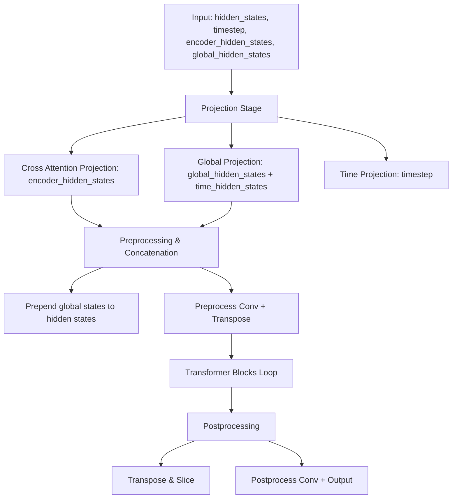
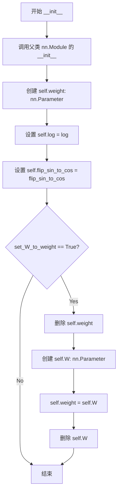
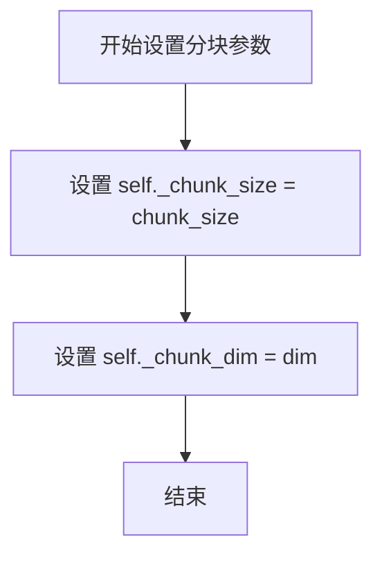
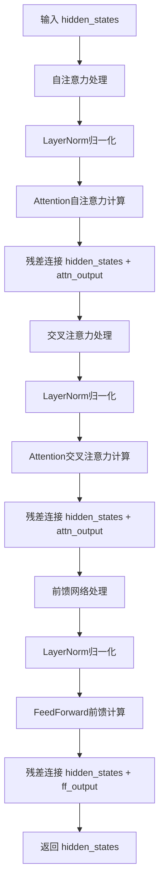
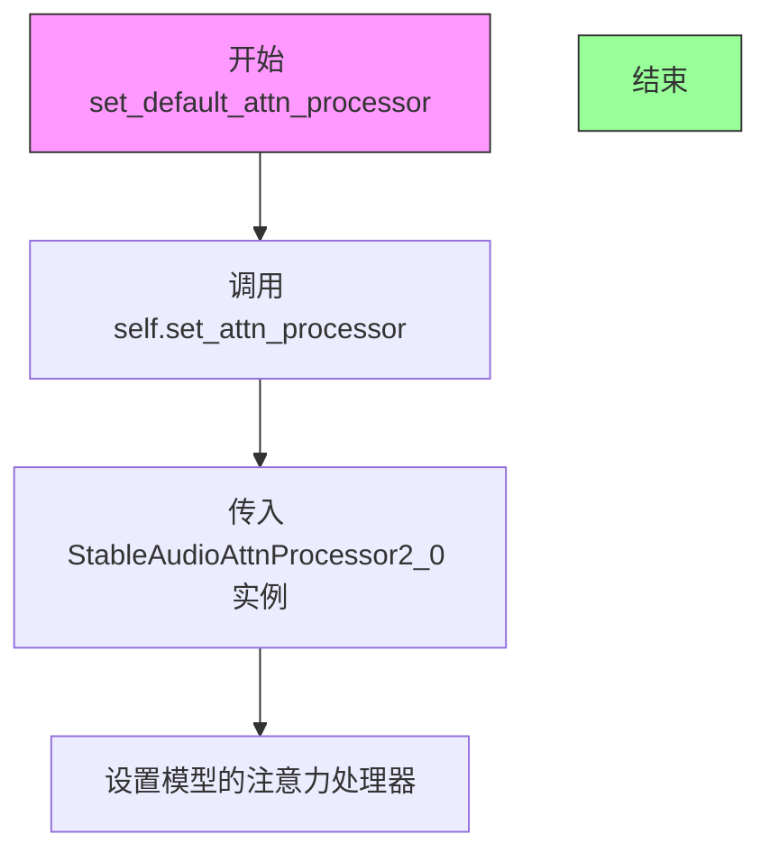
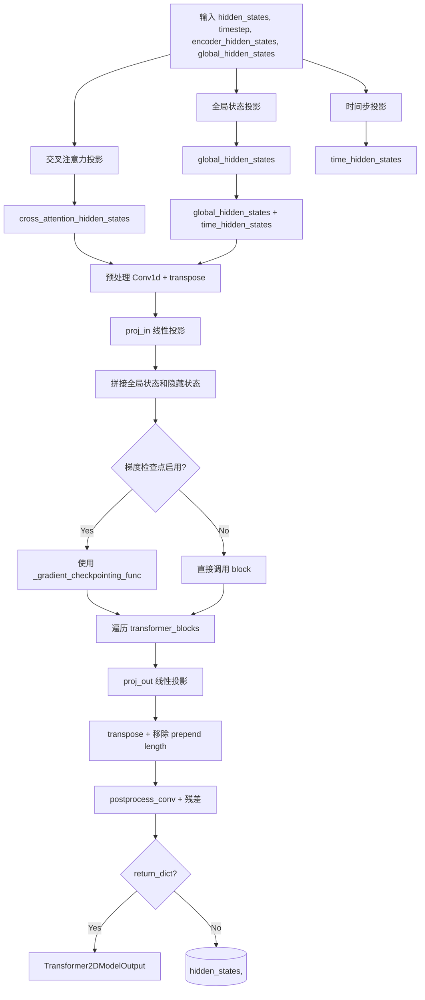

# `diffusers\src\diffusers\models\transformers\stable_audio_transformer.py` 详细设计文档

This file implements the Stable Audio Diffusion Transformer (DiT) model, which processes noisy audio latents, timesteps, text embeddings, and global states through a series of transformer blocks to generate denoised audio features.

## 整体流程



## 类结构

```
StableAudioDiTModel (Main Model Class)
├── StableAudioGaussianFourierProjection (Time Embedding)
├── StableAudioDiTBlock (Transformer Block)
│   ├── Norm1 -> Self-Attention
│   ├── Norm2 -> Cross-Attention
│   └── Norm3 -> FeedForward
└── ModuleList (List of StableAudioDiTBlock)
```

## 全局变量及字段


### `logger`
    
Logging utility for the module

类型：`logging.Logger`
    


### `StableAudioGaussianFourierProjection.StableAudioGaussianFourierProjection.weight`
    
Learnable weight matrix for Fourier features

类型：`nn.Parameter`
    


### `StableAudioGaussianFourierProjection.StableAudioGaussianFourierProjection.log`
    
Flag to apply log transformation to input

类型：`bool`
    


### `StableAudioGaussianFourierProjection.StableAudioGaussianFourierProjection.flip_sin_to_cos`
    
Flag to swap sin/cos order in output

类型：`bool`
    


### `StableAudioDiTBlock.StableAudioDiTBlock.norm1`
    
Layer normalization for self-attention

类型：`nn.LayerNorm`
    


### `StableAudioDiTBlock.StableAudioDiTBlock.attn1`
    
Self-attention module

类型：`Attention`
    


### `StableAudioDiTBlock.StableAudioDiTBlock.norm2`
    
Layer normalization for cross-attention

类型：`nn.LayerNorm`
    


### `StableAudioDiTBlock.StableAudioDiTBlock.attn2`
    
Cross-attention module

类型：`Attention`
    


### `StableAudioDiTBlock.StableAudioDiTBlock.norm3`
    
Layer normalization for feed-forward

类型：`nn.LayerNorm`
    


### `StableAudioDiTBlock.StableAudioDiTBlock.ff`
    
Feed-forward network

类型：`FeedForward`
    


### `StableAudioDiTBlock.StableAudioDiTBlock._chunk_size`
    
Chunk size for feed-forward

类型：`int | None`
    


### `StableAudioDiTBlock.StableAudioDiTBlock._chunk_dim`
    
Dimension to chunk

类型：`int`
    


### `StableAudioDiTModel.StableAudioDiTModel.sample_size`
    
Input sample size

类型：`int`
    


### `StableAudioDiTModel.StableAudioDiTModel.out_channels`
    
Number of output channels

类型：`int`
    


### `StableAudioDiTModel.StableAudioDiTModel.inner_dim`
    
Inner dimension (num_heads * head_dim)

类型：`int`
    


### `StableAudioDiTModel.StableAudioDiTModel.time_proj`
    
Time embedding layer

类型：`StableAudioGaussianFourierProjection`
    


### `StableAudioDiTModel.StableAudioDiTModel.timestep_proj`
    
MLP for timestep processing

类型：`nn.Sequential`
    


### `StableAudioDiTModel.StableAudioDiTModel.global_proj`
    
MLP for global state processing

类型：`nn.Sequential`
    


### `StableAudioDiTModel.StableAudioDiTModel.cross_attention_proj`
    
MLP for cross-attention input projection

类型：`nn.Sequential`
    


### `StableAudioDiTModel.StableAudioDiTModel.preprocess_conv`
    
Input convolution

类型：`nn.Conv1d`
    


### `StableAudioDiTModel.StableAudioDiTModel.proj_in`
    
Input linear projection

类型：`nn.Linear`
    


### `StableAudioDiTModel.StableAudioDiTModel.transformer_blocks`
    
List of DiT blocks

类型：`nn.ModuleList`
    


### `StableAudioDiTModel.StableAudioDiTModel.proj_out`
    
Output linear projection

类型：`nn.Linear`
    


### `StableAudioDiTModel.StableAudioDiTModel.postprocess_conv`
    
Output convolution

类型：`nn.Conv1d`
    


### `StableAudioDiTModel.StableAudioDiTModel.gradient_checkpointing`
    
Flag for gradient checkpointing

类型：`bool`
    
    

## 全局函数及方法


### `StableAudioGaussianFourierProjection.__init__`

该方法是 `StableAudioGaussianFourierProjection` 类的构造函数，用于初始化高斯傅里叶嵌入投影层。它通过创建随机初始化的权重参数来构建噪声水平的嵌入表示，并根据参数配置决定是否使用特殊的权重处理方式。

参数：

- `embedding_size`：`int`，嵌入向量的维度大小，默认为 256
- `scale`：`float`，用于缩放随机权重的系数，默认为 1.0
- `set_W_to_weight`：`bool`，是否将 W 参数赋值给 weight，默认为 True
- `log`：`bool`，是否在 forward 中对输入取对数，默认为 True
- `flip_sin_to_cos`：`bool`，是否在 forward 中交换 sin 和 cos 的顺序，默认为 False

返回值：无（`None`），构造函数不返回任何值

#### 流程图



#### 带注释源码

```python
def __init__(
    self, embedding_size: int = 256, scale: float = 1.0, set_W_to_weight=True, log=True, flip_sin_to_cos=False
):
    """
    初始化高斯傅里叶投影层
    
    参数:
        embedding_size: 嵌入向量的维度大小
        scale: 缩放随机权重的系数
        set_W_to_weight: 是否将 W 参数赋值给 weight（用于兼容旧版本）
        log: 是否在 forward 中对输入取对数
        flip_sin_to_cos: 是否在 forward 中交换 sin 和 cos 的顺序
    """
    # 调用父类 nn.Module 的初始化方法
    super().__init__()
    
    # 创建随机初始化的权重参数，形状为 (embedding_size,)，乘以 scale 进行缩放
    # requires_grad=False 表示该参数不可训练
    self.weight = nn.Parameter(torch.randn(embedding_size) * scale, requires_grad=False)
    
    # 存储是否在 forward 中使用对数变换的标志
    self.log = log
    
    # 存储是否在 forward 中交换 sin 和 cos 顺序的标志
    self.flip_sin_to_cos = flip_sin_to_cos

    # 如果 set_W_to_weight 为 True，则执行特殊的权重处理逻辑
    if set_W_to_weight:
        # 先删除之前创建的 weight 参数
        del self.weight
        
        # 创建新的 W 参数，形状和缩放与之前相同
        self.W = nn.Parameter(torch.randn(embedding_size) * scale, requires_grad=False)
        
        # 将 W 参数赋值给 weight 属性（实现权重共享）
        self.weight = self.W
        
        # 删除 W 属性，完成过渡
        del self.W
```


### `StableAudioGaussianFourierProjection.forward`

该方法实现了高斯傅里叶投影，将输入张量映射到高维傅里叶特征空间，用于对噪声水平或时间步进行嵌入表示，支持对数变换和正弦/余弦特征空间的灵活配置。

参数：

- `x`：`torch.Tensor`，输入张量，通常为噪声水平或时间步，形状为 (batch_size,)

返回值：`torch.Tensor`，傅里叶投影后的嵌入向量，形状为 (batch_size, embedding_size)

#### 流程图

```mermaid
flowchart TD
    A[输入 x] --> B{self.log 为 True?}
    B -- 是 --> C[执行 x = torch.log(x)]
    B -- 否 --> D[跳过对数变换]
    C --> E[计算 x_proj = 2π × x[:, None] @ self.weight[None, :]]
    D --> E
    E --> F{self.flip_sin_to_cos 为 True?}
    F -- 是 --> G[拼接 torch.cos 和 torch.sin]
    F -- 否 --> H[拼接 torch.sin 和 torch.cos]
    G --> I[返回 out]
    H --> I
```

#### 带注释源码

```python
def forward(self, x):
    # 如果启用对数模式，则对输入取对数
    # 用于将输入从线性空间映射到对数空间
    if self.log:
        x = torch.log(x)

    # 计算傅里叶投影：
    # 1. x[:, None] 将 x 从 (batch_size,) 扩展为 (batch_size, 1)
    # 2. self.weight[None, :] 将 weight 从 (embedding_size,) 扩展为 (1, embedding_size)
    # 3. 矩阵乘法得到 (batch_size, embedding_size) 的投影结果
    # 4. 乘以 2π 进行频率缩放
    x_proj = 2 * np.pi * x[:, None] @ self.weight[None, :]

    # 根据 flip_sin_to_cos 标志决定正弦和余弦的拼接顺序
    # flip_sin_to_cos=True: [cos, sin]
    # flip_sin_to_cos=False: [sin, cos]
    if self.flip_sin_to_cos:
        out = torch.cat([torch.cos(x_proj), torch.sin(x_proj)], dim=-1)
    else:
        out = torch.cat([torch.sin(x_proj), torch.cos(x_proj)], dim=-1)
    
    # 返回形状为 (batch_size, embedding_size * 2) 的傅里叶嵌入
    return out
```


### `StableAudioDiTBlock.__init__`

初始化 Stable Audio DiT（Diffusion Transformer）块，包含自注意力、交叉注意力和前馈网络三个子模块，每个子模块前都配有 LayerNorm 归一化层，用于构建完整的 Transformer 块结构。

参数：

- `dim`：`int`，输入和输出的通道维度
- `num_attention_heads`：`int`，查询状态使用的注意力头数
- `num_key_value_attention_heads`：`int`，键和值状态使用的注意力头数（用于 GQA 优化）
- `attention_head_dim`：`int`，每个注意力头内部的通道维度
- `dropout`：`float`，可选，默认为 0.0，注意力层的 dropout 概率
- `cross_attention_dim`：`int | None`，可选，交叉注意力中 encoder_hidden_states 向量的维度，若为 None 则退化为自注意力
- `upcast_attention`：`bool`，可选，默认为 False，是否将注意力计算向上转换为 float32（用于混合精度训练）
- `norm_eps`：`float`，可选，默认为 1e-5，LayerNorm 的 epsilon 值
- `ff_inner_dim`：`int | None`，可选，前馈网络内部隐藏层维度，若为 None 则使用默认计算

返回值：`None`，无返回值（`__init__` 方法）

#### 流程图

```mermaid
flowchart TD
    A[开始 __init__] --> B[调用 super().__init__]
    
    B --> C[创建 norm1: LayerNorm<br/>用于自注意力前的归一化]
    C --> D[创建 attn1: Attention<br/>自注意力层]
    
    D --> E[创建 norm2: LayerNorm<br/>用于交叉注意力前的归一化]
    E --> F[创建 attn2: Attention<br/>交叉注意力层]
    
    F --> G[创建 norm3: LayerNorm<br/>用于前馈网络前的归一化]
    G --> H[创建 ff: FeedForward<br/>前馈网络层]
    
    H --> I[初始化 _chunk_size = None<br/>分块前馈网络参数]
    I --> J[初始化 _chunk_dim = 0<br/>分块维度参数]
    
    J --> K[结束 __init__]
    
    style C fill:#e1f5fe
    style D fill:#e1f5fe
    style E fill:#e1f5fe
    style F fill:#e1f5fe
    style G fill:#e1f5fe
    style H fill:#e1f5fe
```

#### 带注释源码

```python
def __init__(
    self,
    dim: int,
    num_attention_heads: int,
    num_key_value_attention_heads: int,
    attention_head_dim: int,
    dropout=0.0,
    cross_attention_dim: int | None = None,
    upcast_attention: bool = False,
    norm_eps: float = 1e-5,
    ff_inner_dim: int | None = None,
):
    """
    初始化 StableAudioDiTBlock Transformer 块
    
    参数:
        dim: 输入输出的通道维度
        num_attention_heads: 注意力头数量
        num_key_value_attention_heads: KV 头数量（用于 GQA）
        attention_head_dim: 注意力头内部维度
        dropout: Dropout 概率
        cross_attention_dim: 跨注意力维度
        upcast_attention: 是否将注意力向上转换为 float32
        norm_eps: LayerNorm 的 epsilon
        ff_inner_dim: 前馈网络内部维度
    """
    # 调用父类 nn.Module 的初始化方法
    super().__init__()
    
    # ========== 1. 自注意力块 (Self-Attention) ==========
    # 第一个 LayerNorm 层，用于自注意力前的归一化
    # elementwise_affine=True 表示学习仿射参数，eps 为归一化 epsilon
    self.norm1 = nn.LayerNorm(dim, elementwise_affine=True, eps=norm_eps)
    
    # 自注意力层配置:
    # - query_dim=dim: 查询维度等于输入维度
    # - heads=num_attention_heads: 注意力头数
    # - dim_head=attention_head_dim: 每头维度
    # - dropout=dropout: Dropout 概率
    # - bias=False: 不使用偏置
    # - upcast_attention=upcast_attention: 混合精度训练选项
    # - processor=StableAudioAttnProcessor2_0(): 使用自定义注意力处理器
    self.attn1 = Attention(
        query_dim=dim,
        heads=num_attention_heads,
        dim_head=attention_head_dim,
        dropout=dropout,
        bias=False,
        upcast_attention=upcast_attention,
        out_bias=False,
        processor=StableAudioAttnProcessor2_0(),
    )

    # ========== 2. 交叉注意力块 (Cross-Attention) ==========
    # 第二个 LayerNorm 层，用于交叉注意力前的归一化
    # 注意：这里传入的 eps 位置在第三个参数（affine），与 norm1 不同
    self.norm2 = nn.LayerNorm(dim, norm_eps, True)

    # 交叉注意力层配置:
    # - cross_attention_dim=cross_attention_dim: 交叉注意力维度
    # - kv_heads=num_key_value_attention_heads: KV 头数（支持 GQA/MQA）
    # - 当 encoder_hidden_states 为 None 时，自动退化为自注意力
    self.attn2 = Attention(
        query_dim=dim,
        cross_attention_dim=cross_attention_dim,
        heads=num_attention_heads,
        dim_head=attention_head_dim,
        kv_heads=num_key_value_attention_heads,
        dropout=dropout,
        bias=False,
        upcast_attention=upcast_attention,
        out_bias=False,
        processor=StableAudioAttnProcessor2_0(),
    )

    # ========== 3. 前馈网络块 (Feed-Forward) ==========
    # 第三个 LayerNorm 层，用于前馈网络前的归一化
    self.norm3 = nn.LayerNorm(dim, norm_eps, True)

    # 前馈网络层配置:
    # - activation_fn="swiglu": 使用 SwiGLU 激活函数（Swish + GLU）
    # - final_dropout=False: 最后不进行 dropout
    # - inner_dim=ff_inner_dim: 内部隐藏层维度（可自定义）
    # - bias=True: 使用偏置
    self.ff = FeedForward(
        dim,
        dropout=dropout,
        activation_fn="swiglu",
        final_dropout=False,
        inner_dim=ff_inner_dim,
        bias=True,
    )

    # ========== 分块前馈网络配置 ==========
    # 允许将前馈网络分块处理以节省显存
    # 默认不启用分块 (_chunk_size=None)
    self._chunk_size = None
    self._chunk_dim = 0
```


### `StableAudioDiTBlock.set_chunk_feed_forward`

配置分块 feed-forward 处理的参数，设置用于分块 feed-forward 的块大小和维度。

参数：

- `chunk_size`：`int | None`，要设置的块大小，None 表示不使用分块
- `dim`：`int = 0`，分块的维度，默认为 0

返回值：`None`，无返回值

#### 流程图



#### 带注释源码

```python
def set_chunk_feed_forward(self, chunk_size: int | None, dim: int = 0):
    # 设置分块 feed-forward
    # 参数:
    #   chunk_size: 块大小，None 表示不使用分块
    #   dim: 分块的维度，默认值为 0
    
    # 将传入的 chunk_size 参数赋值给实例变量 self._chunk_size
    self._chunk_size = chunk_size
    
    # 将传入的 dim 参数赋值给实例变量 self._chunk_dim
    self._chunk_dim = dim
```


### `StableAudioDiTBlock.forward`

该方法是Stable Audio Diffusion Transformer块的前向传播函数，按顺序执行自注意力机制、交叉注意力机制和前馈神经网络，并通过残差连接和层归一化处理输入的隐藏状态。

参数：

- `self`：StableAudioDiTBlock实例本身
- `hidden_states`：`torch.Tensor`，输入的隐藏状态张量，经过Transformer块处理的核心数据
- `attention_mask`：`torch.Tensor | None`，用于自注意力的注意力掩码，用于控制哪些位置需要注意或被忽略
- `encoder_hidden_states`：`torch.Tensor | None`，编码器的隐藏状态，用于交叉注意力机制的条件输入
- `encoder_attention_mask`：`torch.Tensor | None`，用于交叉注意力的注意力掩码，控制条件信息的注意范围
- `rotary_embedding`：`torch.FloatTensor | None`，旋转位置嵌入，用于在注意力计算中引入位置信息

返回值：`torch.Tensor`，经过自注意力、交叉注意力和前馈网络处理后的隐藏状态张量

#### 流程图



#### 带注释源码

```python
def forward(
    self,
    hidden_states: torch.Tensor,
    attention_mask: torch.Tensor | None = None,
    encoder_hidden_states: torch.Tensor | None = None,
    encoder_attention_mask: torch.Tensor | None = None,
    rotary_embedding: torch.FloatTensor | None = None,
) -> torch.Tensor:
    """
    StableAudioDiTBlock的前向传播方法
    
    按顺序执行三个主要操作：
    1. 自注意力(Self-Attention) - 使用自身的隐藏状态进行注意力计算
    2. 交叉注意力(Cross-Attention) - 使用编码器隐藏状态进行条件注意力计算
    3. 前馈网络(Feed-Forward) - 对隐藏状态进行非线性变换
    
    每个操作都遵循 Pre-Norm 架构：先进行层归一化，再进行实际计算，最后通过残差连接将输出与输入相加。
    """
    
    # ==================== 0. 自注意力处理 (Self-Attention) ====================
    # 步骤1: 对输入hidden_states进行LayerNorm归一化
    # Pre-Norm架构：在注意力计算前进行归一化，有助于训练稳定性
    norm_hidden_states = self.norm1(hidden_states)
    
    # 步骤2: 执行自注意力计算
    # - query来自norm_hidden_states
    # - key和value也来自norm_hidden_states（自注意力特性）
    # - attention_mask控制注意力的哪些位置
    # - rotary_emb引入旋转位置编码
    attn_output = self.attn1(
        norm_hidden_states,
        attention_mask=attention_mask,
        rotary_emb=rotary_embedding,
    )
    
    # 步骤3: 残差连接（Skip Connection）
    # 将注意力输出与原始输入相加，帮助梯度流动并稳定训练
    hidden_states = attn_output + hidden_states
    
    # ==================== 2. 交叉注意力处理 (Cross-Attention) ====================
    # 步骤1: 对hidden_states进行LayerNorm归一化
    norm_hidden_states = self.norm2(hidden_states)
    
    # 步骤2: 执行交叉注意力计算
    # - query来自当前的norm_hidden_states
    # - key和value来自encoder_hidden_states（跨不同序列的注意力）
    # - encoder_attention_mask控制对条件信息的注意力
    attn_output = self.attn2(
        norm_hidden_states,
        encoder_hidden_states=encoder_hidden_states,
        attention_mask=encoder_attention_mask,
    )
    
    # 步骤3: 残差连接
    hidden_states = attn_output + hidden_states
    
    # ==================== 3. 前馈网络处理 (Feed-Forward Network) ====================
    # 步骤1: 对hidden_states进行LayerNorm归一化
    norm_hidden_states = self.norm3(hidden_states)
    
    # 步骤2: 执行前馈网络计算
    # 使用SwiGLU激活函数（通过FeedForward配置）
    # 提供更强的非线性变换能力
    ff_output = self.ff(norm_hidden_states)
    
    # 步骤3: 残差连接
    hidden_states = ff_output + hidden_states
    
    # ==================== 返回处理后的隐藏状态 ====================
    return hidden_states
```


### `StableAudioDiTModel.__init__`

初始化 Stable Audio DiT（扩散Transformer）模型，配置并创建所有必要的子模块，包括时间步嵌入、全局状态投影、交叉注意力投影、预处理和后处理卷积层，以及指定数量的Transformer块。

参数：

- `sample_size`：`int`，默认为1024，输入样本的大小
- `in_channels`：`int`，默认为64，输入通道数
- `num_layers`：`int`，默认为24，Transformer块的数量
- `attention_head_dim`：`int`，默认为64，每个注意力头的维度
- `num_attention_heads`：`int`，默认为24，查询注意力头的数量
- `num_key_value_attention_heads`：`int`，默认为12，键值注意力头的数量
- `out_channels`：`int`，默认为64，输出通道数
- `cross_attention_dim`：`int`，默认为768，交叉注意力投影的维度
- `time_proj_dim`：`int`，默认为256，时间步投影的维度
- `global_states_input_dim`：`int`，默认为1536，全局隐藏状态投影的输入维度
- `cross_attention_input_dim`：`int`，默认为768，交叉注意力投影的输入维度

返回值：`None`，无返回值（__init__ 方法）

#### 流程图

```mermaid
flowchart TD
    A[开始 __init__] --> B[调用父类初始化 super().__init__]
    B --> C[保存配置参数 sample_size, out_channels]
    C --> D[计算 inner_dim = num_attention_heads * attention_head_dim]
    D --> E[创建时间投影模块 self.time_proj]
    E --> F[创建时间步投影网络 self.timestep_proj]
    F --> G[创建全局状态投影网络 self.global_proj]
    G --> H[创建交叉注意力投影网络 self.cross_attention_proj]
    H --> I[创建预处理卷积 self.preprocess_conv]
    I --> J[创建输入投影 self.proj_in]
    J --> K[创建Transformer块模块列表 self.transformer_blocks]
    K --> L[创建输出投影 self.proj_out]
    L --> M[创建后处理卷积 self.postprocess_conv]
    M --> N[初始化梯度检查点标志 self.gradient_checkpointing = False]
    N --> O[结束 __init__]
```

#### 带注释源码

```python
@register_to_config
def __init__(
    self,
    sample_size: int = 1024,
    in_channels: int = 64,
    num_layers: int = 24,
    attention_head_dim: int = 64,
    num_attention_heads: int = 24,
    num_key_value_attention_heads: int = 12,
    out_channels: int = 64,
    cross_attention_dim: int = 768,
    time_proj_dim: int = 256,
    global_states_input_dim: int = 1536,
    cross_attention_input_dim: int = 768,
):
    """
    初始化 StableAudioDiTModel 模型
    
    参数:
        sample_size: 输入样本大小，默认为1024
        in_channels: 输入通道数，默认为64
        num_layers: Transformer块数量，默认为24
        attention_head_dim: 注意力头维度，默认为64
        num_attention_heads: 注意力头数量，默认为24
        num_key_value_attention_heads: 键值注意力头数量，默认为12
        out_channels: 输出通道数，默认为64
        cross_attention_dim: 交叉注意力维度，默认为768
        time_proj_dim: 时间投影维度，默认为256
        global_states_input_dim: 全局状态输入维度，默认为1536
        cross_attention_input_dim: 交叉注意力输入维度，默认为768
    """
    # 调用父类初始化
    super().__init__()
    
    # 保存配置参数
    self.sample_size = sample_size
    self.out_channels = out_channels
    
    # 计算内部维度 = 注意力头数 * 注意力头维度
    self.inner_dim = num_attention_heads * attention_head_dim

    # 创建时间步高斯傅里叶投影
    self.time_proj = StableAudioGaussianFourierProjection(
        embedding_size=time_proj_dim // 2,
        flip_sin_to_cos=True,
        log=False,
        set_W_to_weight=False,
    )

    # 创建时间步投影网络 (MLP: Linear -> SiLU -> Linear)
    self.timestep_proj = nn.Sequential(
        nn.Linear(time_proj_dim, self.inner_dim, bias=True),
        nn.SiLU(),
        nn.Linear(self.inner_dim, self.inner_dim, bias=True),
    )

    # 创建全局状态投影网络 (MLP: Linear -> SiLU -> Linear)
    self.global_proj = nn.Sequential(
        nn.Linear(global_states_input_dim, self.inner_dim, bias=False),
        nn.SiLU(),
        nn.Linear(self.inner_dim, self.inner_dim, bias=False),
    )

    # 创建交叉注意力投影网络 (MLP: Linear -> SiLU -> Linear)
    self.cross_attention_proj = nn.Sequential(
        nn.Linear(cross_attention_input_dim, cross_attention_dim, bias=False),
        nn.SiLU(),
        nn.Linear(cross_attention_dim, cross_attention_dim, bias=False),
    )

    # 预处理卷积层 (1x1卷积)
    self.preprocess_conv = nn.Conv1d(in_channels, in_channels, 1, bias=False)
    
    # 输入投影层 (Linear)
    self.proj_in = nn.Linear(in_channels, self.inner_dim, bias=False)

    # 创建多个Transformer块
    self.transformer_blocks = nn.ModuleList(
        [
            StableAudioDiTBlock(
                dim=self.inner_dim,
                num_attention_heads=num_attention_heads,
                num_key_value_attention_heads=num_key_value_attention_heads,
                attention_head_dim=attention_head_dim,
                cross_attention_dim=cross_attention_dim,
            )
            for i in range(num_layers)
        ]
    )

    # 输出投影层 (Linear)
    self.proj_out = nn.Linear(self.inner_dim, self.out_channels, bias=False)
    
    # 后处理卷积层 (1x1卷积)
    self.postprocess_conv = nn.Conv1d(self.out_channels, self.out_channels, 1, bias=False)

    # 初始化梯度检查点标志
    self.gradient_checkpointing = False
```


### `StableAudioDiTModel.set_default_attn_processor`

该方法用于将模型的注意力处理器设置为默认的 `StableAudioAttnProcessor2_0` 实现，禁用所有自定义注意力处理器。

参数：

- （无参数）

返回值：`None`，无返回值描述（该方法直接修改模型内部状态）

#### 流程图



#### 带注释源码

```python
# Copied from diffusers.models.transformers.hunyuan_transformer_2d.HunyuanDiT2DModel.set_default_attn_processor with Hunyuan->StableAudio
def set_default_attn_processor(self):
    """
    Disables custom attention processors and sets the default attention implementation.
    """
    # 调用模型自身的 set_attn_processor 方法，将注意力处理器设置为 StableAudioAttnProcessor2_0
    # StableAudioAttnProcessor2_0 是针对 Stable Audio 模型优化的注意力处理器实现
    self.set_attn_processor(StableAudioAttnProcessor2_0())
```


### `StableAudioDiTModel.forward`

这是 Stable Audio DiT 模型的主前向传播方法，负责将输入的隐藏状态通过时间步嵌入、全局状态处理、Transformer 块序列处理，最终输出转换后的音频特征。

**参数：**

- `hidden_states`：`torch.FloatTensor`，形状为 `(batch size, in_channels, sequence_len)`，输入的隐藏状态
- `timestep`：`torch.LongTensor`，用于指示去噪步骤的时间步
- `encoder_hidden_states`：`torch.FloatTensor`，形状为 `(batch size, encoder_sequence_len, cross_attention_input_dim)`，条件嵌入（从输入条件如提示词计算得出的嵌入）
- `global_hidden_states`：`torch.FloatTensor`，形状为 `(batch size, global_sequence_len, global_states_input_dim)`，将预置到隐藏状态之前的全局嵌入
- `rotary_embedding`：`torch.Tensor`，在注意力计算中应用于查询和键张量的旋转嵌入
- `return_dict`：`bool`，默认为 `True`，是否返回 `Transformer2DModelOutput` 而不是普通元组
- `attention_mask`：`torch.LongTensor | None`，形状为 `(batch_size, sequence_len)`，用于避免对填充 token 索引执行注意力操作的掩码
- `encoder_attention_mask`：`torch.Tensor | None`，形状为 `(batch_size, sequence_len)`，用于避免对填充 token 交叉注意力索引执行注意力操作的掩码

**返回值：** `torch.FloatTensor | Transformer2DModelOutput`，如果 `return_dict` 为 True，返回 `Transformer2DModelOutput`，否则返回第一个元素为样本张量的元组

#### 流程图



#### 带注释源码

```python
def forward(
    self,
    hidden_states: torch.FloatTensor,
    timestep: torch.LongTensor = None,
    encoder_hidden_states: torch.FloatTensor = None,
    global_hidden_states: torch.FloatTensor = None,
    rotary_embedding: torch.FloatTensor = None,
    return_dict: bool = True,
    attention_mask: torch.LongTensor | None = None,
    encoder_attention_mask: torch.LongTensor | None = None,
) -> torch.FloatTensor | Transformer2DModelOutput:
    """
    The [`StableAudioDiTModel`] forward method.

    Args:
        hidden_states (`torch.FloatTensor` of shape `(batch size, in_channels, sequence_len)`):
            Input `hidden_states`.
        timestep ( `torch.LongTensor`):
            Used to indicate denoising step.
        encoder_hidden_states (`torch.FloatTensor` of shape `(batch size, encoder_sequence_len, cross_attention_input_dim)`):
            Conditional embeddings (embeddings computed from the input conditions such as prompts) to use.
        global_hidden_states (`torch.FloatTensor` of shape `(batch size, global_sequence_len, global_states_input_dim)`):
           Global embeddings that will be prepended to the hidden states.
        rotary_embedding (`torch.Tensor`):
            The rotary embeddings to apply on query and key tensors during attention calculation.
        return_dict (`bool`, *optional*, defaults to `True`):
            Whether or not to return a [`~models.transformer_2d.Transformer2DModelOutput`] instead of a plain
            tuple.
        attention_mask (`torch.Tensor` of shape `(batch_size, sequence_len)`, *optional*):
            Mask to avoid performing attention on padding token indices, formed by concatenating the attention
            masks
                for the two text encoders together. Mask values selected in `[0, 1]`:

            - 1 for tokens that are **not masked**,
            - 0 for tokens that are **masked**.
        encoder_attention_mask (`torch.Tensor` of shape `(batch_size, sequence_len)`, *optional*):
            Mask to avoid performing attention on padding token cross-attention indices, formed by concatenating
            the attention masks
                for the two text encoders together. Mask values selected in `[0, 1]`:

            - 1 for tokens that are **not masked**,
            - 0 for tokens that are **masked**.
    Returns:
        If `return_dict` is True, an [`~models.transformer_2d.Transformer2DModelOutput`] is returned, otherwise a
        `tuple` where the first element is the sample tensor.
    """
    # 1. 对 encoder_hidden_states 进行交叉注意力投影，将输入维度转换为交叉注意力维度
    cross_attention_hidden_states = self.cross_attention_proj(encoder_hidden_states)
    
    # 2. 对 global_hidden_states 进行全局投影，将其投影到内部维度
    global_hidden_states = self.global_proj(global_hidden_states)
    
    # 3. 对 timestep 进行高斯傅里叶投影，然后通过时间步投影层
    #    self.time_proj: 高斯傅里叶投影 (将 timestep 映射到频率域)
    #    self.timestep_proj: MLP (Linear -> SiLU -> Linear)
    time_hidden_states = self.timestep_proj(self.time_proj(timestep.to(self.dtype)))

    # 4. 将全局隐藏状态与时间步隐藏状态相加 (broadcasting)
    #    time_hidden_states 形状: (batch, inner_dim) -> (batch, 1, inner_dim)
    global_hidden_states = global_hidden_states + time_hidden_states.unsqueeze(1)

    # 5. 预处理卷积：对 hidden_states 进行 1D 卷积，然后与原始输入相加（残差连接）
    #    hidden_states 形状: (batch, in_channels, seq_len)
    hidden_states = self.preprocess_conv(hidden_states) + hidden_states
    
    # 6. 维度转换：从 (batch, channels, seq_len) -> (batch, seq_len, channels)
    hidden_states = hidden_states.transpose(1, 2)

    # 7. 输入线性投影：将输入维度投影到内部维度
    hidden_states = self.proj_in(hidden_states)

    # 8. 预置全局状态：将全局隐藏状态拼接到隐藏状态前面
    #    hidden_states 形状: (batch, global_seq_len + seq_len, inner_dim)
    hidden_states = torch.cat([global_hidden_states, hidden_states], dim=-2)
    
    # 9. 处理注意力掩码：如果是全局状态，需要在前面添加一个 mask 位
    if attention_mask is not None:
        # 创建与全局状态对应的掩码（全1，表示不掩码）
        prepend_mask = torch.ones((hidden_states.shape[0], 1), device=hidden_states.device, dtype=torch.bool)
        # 将全局掩码拼接到原始注意力掩码前面
        attention_mask = torch.cat([prepend_mask, attention_mask], dim=-1)

    # 10. 遍历所有 Transformer 块进行处理
    for block in self.transformer_blocks:
        # 检查是否启用梯度检查点（用于节省显存）
        if torch.is_grad_enabled() and self.gradient_checkpointing:
            # 使用梯度检查点函数进行前向传播（反向传播时重新计算中间激活值）
            hidden_states = self._gradient_checkpointing_func(
                block,
                hidden_states,
                attention_mask,
                cross_attention_hidden_states,
                encoder_attention_mask,
                rotary_embedding,
            )
        else:
            # 普通前向传播
            hidden_states = block(
                hidden_states=hidden_states,
                attention_mask=attention_mask,
                encoder_hidden_states=cross_attention_hidden_states,
                encoder_attention_mask=encoder_attention_mask,
                rotary_embedding=rotary_embedding,
            )

    # 11. 输出线性投影：将内部维度投影到输出通道数
    hidden_states = self.proj_out(hidden_states)

    # 12. 后处理：
    #     a. 维度转换: (batch, seq_len, dim) -> (batch, dim, seq_len)
    hidden_states = hidden_states.transpose(1, 2)
    
    #     b. 移除预置的全局状态长度（去掉第一个位置，即全局状态对应的位置）
    hidden_states = hidden_states[:, :, 1:]
    
    #     c. 后处理卷积 + 残差连接
    hidden_states = self.postprocess_conv(hidden_states) + hidden_states

    # 13. 根据 return_dict 返回结果
    if not return_dict:
        return (hidden_states,)

    return Transformer2DModelOutput(sample=hidden_states)
```

## 关键组件


### StableAudioGaussianFourierProjection

高斯傅里叶嵌入模块，用于将噪声级别（timestep）映射到高维特征空间，支持对数变换和sin/cos翻转。

### StableAudioDiTBlock

Stable Audio模型中使用的Transformer块，包含自注意力、交叉注意力和SwiGLU前馈网络，支持跳过连接和QKNorm。

### StableAudioDiTModel

Stable Audio Diffusion Transformer主模型类，继承自ModelMixin、AttentionMixin和ConfigMixin，负责处理音频生成任务，包含时间步投影、全局状态投影、交叉注意力投影、预处理卷积、多个DiT块和后处理卷积。


## 问题及建议


### 已知问题

-   **StableAudioGaussianFourierProjection 初始化逻辑冗余**: 当 `set_W_to_weight=True` 时，代码先创建 `self.weight`，然后删除它，再创建 `self.W`，最后通过 `self.weight = self.W` 赋值后再删除 `self.W`。这种模式过于复杂且令人困惑，`set_W_to_weight` 参数的存在意义不明确。
-   **LayerNorm 参数不一致**: `StableAudioDiTBlock` 中三个 LayerNorm 的初始化参数不一致。`norm1` 使用了 `elementwise_affine=True`，而 `norm2` 和 `norm3` 只传递了 `norm_eps` 和 `True`（即 `elementwise_affine`），缺少显式的 `eps` 命名参数，虽然功能等价但代码风格不统一。
-   **注释编号错误**: `StableAudioDiTBlock.forward` 中注释从 "# 0. Self-Attention" 开始，但应该从 "# 1. Self-Attention" 开始，后续 "# 2. Cross-Attn" 应该是 "# 3. Cross-Attn"。
-   **未使用的配置参数**: `StableAudioDiTModel.__init__` 中保存了 `sample_size` 参数，但在整个类中从未被使用，同样 `_chunk_size` 和 `_chunk_dim` 在 `StableAudioDiTBlock` 中被设置但从未在 forward 方法中实际使用。
-   **前处理与后处理逻辑重复**: `preprocess_conv` 和 `postprocess_conv` 都采用了 `conv(x) + x` 的残差连接模式，但这种模式在代码中没有提供任何配置开关来禁用它，可能限制了模型的灵活性。
-   **cross_attention_dim 参数传递问题**: 在 `StableAudioDiTBlock` 中 `cross_attention_dim` 作为参数传入，但在 `Attention` 类的初始化中该参数的实际处理方式不明确（取决于 `Attention` 类的实现）。

### 优化建议

-   **简化 GaussianFourierProjection 逻辑**: 移除 `set_W_to_weight` 参数及其相关冗余代码，直接初始化 `self.weight` 即可。如果需要保留参数功能，应重构为更清晰的条件分支。
-   **统一 LayerNorm 初始化风格**: 将所有 LayerNorm 初始化统一为 `nn.LayerNorm(dim, eps=norm_eps, elementwise_affine=True)` 的显式形式，提高代码可读性。
-   **修正注释编号**: 将 forward 方法中的注释编号修正为从 1 开始，确保与实际执行顺序一致。
-   **移除未使用的参数或实现功能**: 如果 `sample_size`、`_chunk_size`、`_chunk_dim` 是预留功能，应在 forward 方法中实现相应逻辑；否则应从代码中移除以减少混淆。
-   **提取预处理/后处理为可配置选项**: 将 `preprocess_conv` 和 `postprocess_conv` 的残差连接模式改为可选，或提取为独立的配置参数，提高模型灵活性。
-   **添加类型注解完善**: 部分函数参数缺少类型注解（如 `dropout`），建议补充完整的类型信息以提高代码可维护性。


## 其它


### 设计目标与约束

本模型是Stable Audio的Diffusion Transformer (DiT) 实现，旨在实现高质量音频生成任务。设计目标包括：(1) 支持自回归和跨模态注意力机制，以处理文本提示和全局状态；(2) 采用高效的Transformer架构处理时序音频数据；(3) 支持梯度检查点(gradient checkpointing)以降低显存占用；(4) 兼容diffusers库的ConfigMixin和ModelMixin基类。约束条件包括：输入必须是(batch_size, in_channels, sequence_len)形状的张量；时间步长timestep必须为LongTensor类型；encoder_hidden_states和global_hidden_states的维度必须与配置的cross_attention_dim和global_states_input_dim匹配。

### 错误处理与异常设计

代码中的错误处理主要包括：(1) ConfigMixin装饰器会在配置参数不符合预期时抛出验证错误；(2) forward方法中未显式检查输入张量维度兼容性，依赖PyTorch的运行时维度匹配；(3) gradient_checkpointing启用时会进行梯度计算状态的判断。潜在改进点：应在forward方法入口添加输入形状验证逻辑，特别是hidden_states、encoder_hidden_states和global_hidden_states的维度检查；对于None值的encoder_hidden_states，系统默认退化为自注意力模式，但未给出明确警告； rotary_embedding为None时不会报错但可能导致注意力计算结果不符合预期。

### 数据流与状态机

数据流主要分为以下几个阶段：(1) 预处理阶段：hidden_states通过preprocess_conv进行卷积处理，随后转置并通过proj_in投影到inner_dim维度；(2) 时间步嵌入阶段：timestep经过GaussianFourierProjection和timestep_proj生成时间嵌入；(3) 全局状态处理阶段：global_hidden_states通过global_proj处理后与时间嵌入相加；(4) 状态拼接阶段：将global_hidden_states拼接到hidden_states前面，并相应调整attention_mask；(5)  Transformer块堆栈阶段：数据依次通过num_layers个StableAudioDiTBlock，每个块内部依次经过self-attention、cross-attention和feed-forward；(6) 后处理阶段：通过proj_out投影，移除预置的global states长度，再通过postprocess_conv处理后转置回原始格式。状态机转换：输入张量形状从(batch, channels, seq_len) → (batch, seq_len, dim) → (batch, 1+seq_len, dim) → (batch, dim, 1+seq_len) → (batch, channels, seq_len)。

### 外部依赖与接口契约

主要依赖包括：(1) numpy和torch：数值计算和张量操作；(2) diffusers库的configuration_utils.ConfigMixin和register_to_config：配置管理；(3) diffusers库的utils.logging：日志记录；(4) diffusers库的utils.torch_utils.maybe_allow_in_graph：图优化装饰器；(5) diffusers库的attention.AttentionMixin和FeedForward：注意力机制和前馈网络；(6) diffusers库的attention_processor.Attention和StableAudioAttnProcessor2_0：注意力处理器；(7) diffusers库的modeling_utils.ModelMixin：模型基类；(8) diffusers库的transformers.transformer_2d.Transformer2DModelOutput：输出封装。接口契约：模型输入hidden_states形状为(batch, in_channels, sequence_len)；timestep为torch.LongTensor；encoder_hidden_states形状为(batch, encoder_seq_len, cross_attention_input_dim)；global_hidden_states形状为(batch, global_seq_len, global_states_input_dim)；rotary_embedding为可选的FloatTensor。输出默认为Transformer2DModelOutput，包含sample属性，形状为(batch, out_channels, sequence_len)。

### 内存与性能优化策略

当前代码包含以下优化机制：(1) gradient_checkpointing支持：通过_gradient_checkpointing_func减少显存占用；(2) 梯度检查点跳过模式：_skip_layerwise_casting_patterns指定了preprocess_conv、postprocess_conv、proj_in、proj_out和norm层不参与layerwise casting；(3) set_chunk_feed_forward方法支持分块前馈计算。优化建议：(1) 可考虑添加混合精度训练的进一步支持；(2) 可为长时间序列添加chunked attention计算；(3) FeedForward的SwiGLU激活函数可进一步优化以减少计算量；(4) 可添加KV cache支持以加速推理。

### 版本兼容性与扩展性

模型继承自ModelMixin、AttentionMixin和ConfigMixin，支持diffusers库的序列化(save_pretrained/from_pretrained)机制。扩展性方面：(1) 可通过set_default_attn_processor更换注意力处理器；(2) 可通过set_chunk_feed_forward调整前馈网络分块大小；(3) StableAudioDiTBlock可独立使用作为基础Transformer块；(4) 配置文件支持动态注册新参数。建议文档中注明与diffusers库版本的兼容性要求，以及未来可能添加的模块化扩展接口（如额外的条件嵌入方式、不同的注意力机制变体等）。

### 配置参数详细说明

模型配置参数包括：sample_size(默认1024)控制输入样本大小；in_channels(默认64)为输入通道数；num_layers(默认24)为Transformer块数量；attention_head_dim(默认64)为每个注意力头的维度；num_attention_heads(默认24)为查询使用的头数；num_key_value_attention_heads(默认12)为Key和Value使用的头数；out_channels(默认64)为输出通道数；cross_attention_dim(默认768)为跨注意力投影维度；time_proj_dim(默认256)为时间步投影维度；global_states_input_dim(默认1536)为全局状态输入维度；cross_attention_input_dim(默认768)为跨注意力输入维度。所有参数均可通过register_to_config装饰器自动序列化和验证。

### 测试与验证要点

关键测试场景包括：(1) 前向传播输出形状验证；(2) 梯度计算和backward pass正确性验证；(3) gradient_checkpointing开启/关闭的显存差异对比；(4) 不同输入批大小的内存占用测试；(5) None encoder_hidden_states时的自注意力模式验证；(6) 与预训练权重加载的兼容性测试；(7) 混合精度训练稳定性测试；(8)  rotary_embedding为None时的行为验证。


    