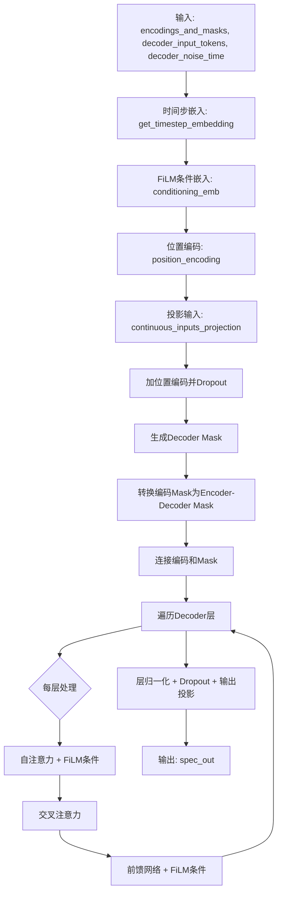
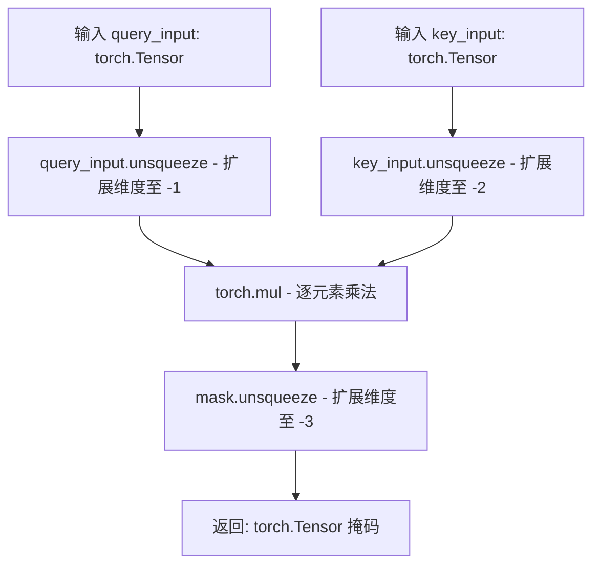
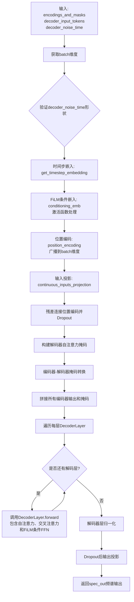
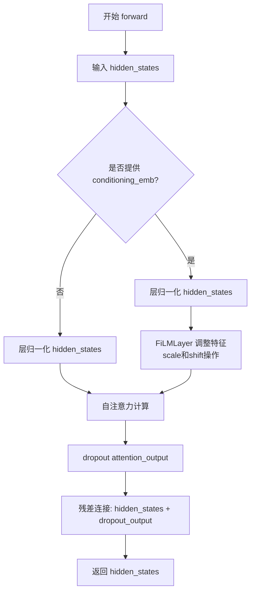
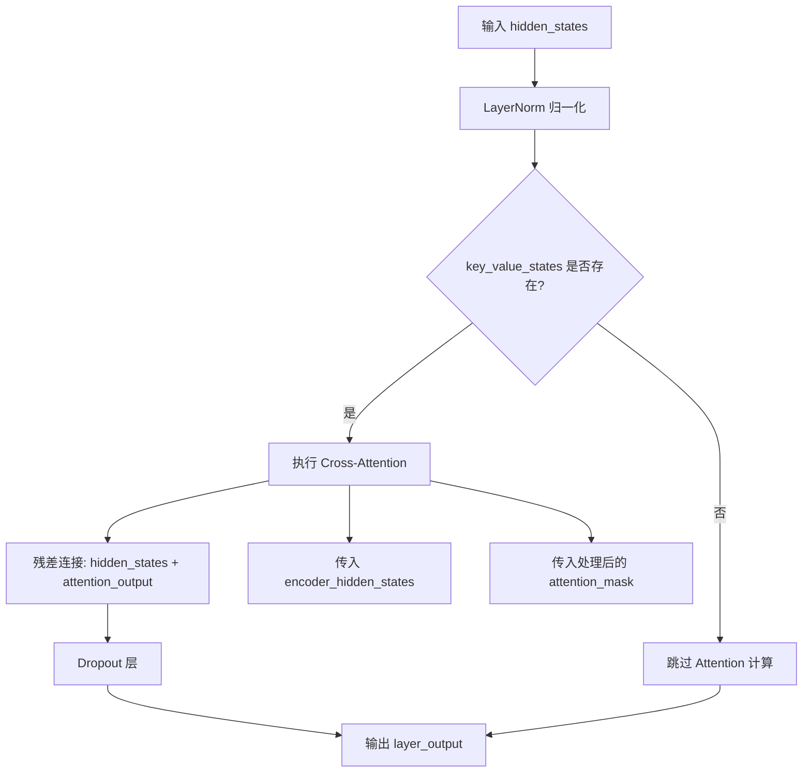
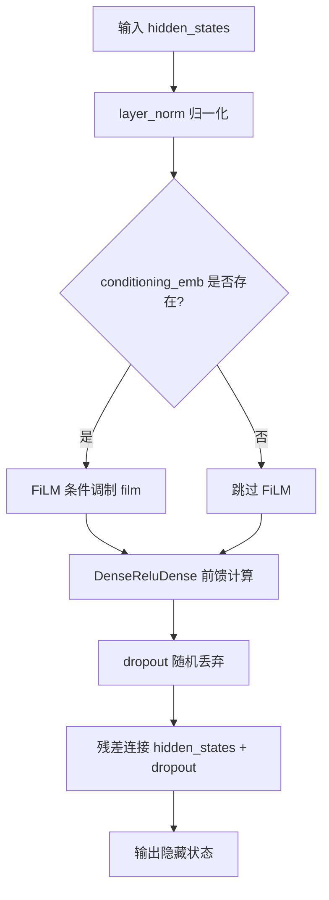
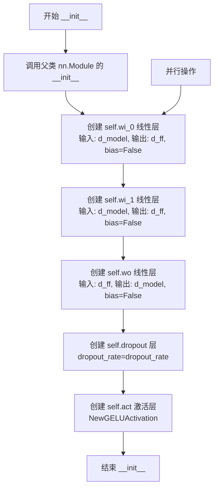
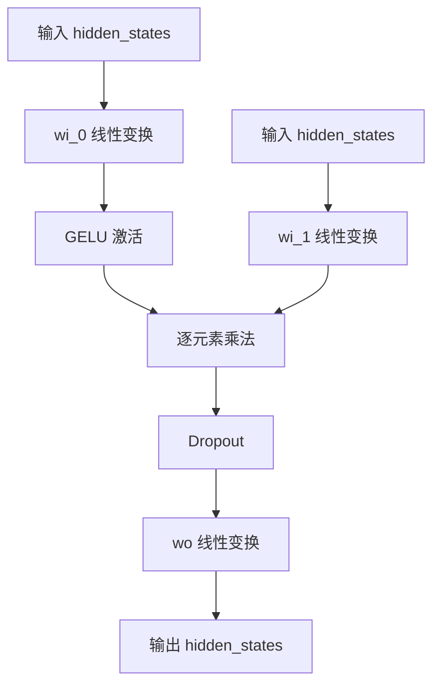
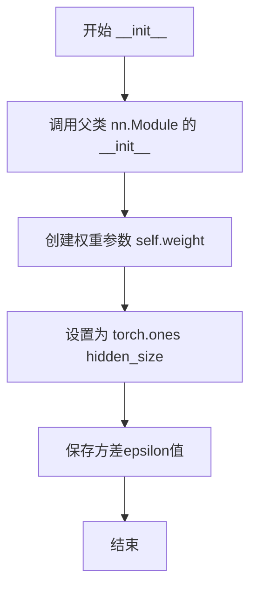

# `diffusers\src\diffusers\models\transformers\t5_film_transformer.py` 详细设计文档

这段代码实现了一个基于T5架构的解码器，结合FiLM条件机制，用于根据噪声时间步和编码器隐藏状态生成连续的输出表示。

## 整体流程



## 类结构

```
nn.Module (基类)
├── DecoderLayer
├── T5LayerSelfAttentionCond
├── T5LayerCrossAttention
├── T5LayerFFCond
├── T5DenseGatedActDense
├── T5LayerNorm
├── NewGELUActivation
└── T5FiLMLayer
ModelMixin, ConfigMixin
└── T5FilmDecoder
```

## 全局变量及字段


### `T5FilmDecoder.conditioning_emb`
    
用于将时间步嵌入转换为条件嵌入的神经网络序列，包含线性层和SiLU激活函数

类型：`nn.Sequential`
    


### `T5FilmDecoder.position_encoding`
    
位置编码嵌入层，用于为序列中的每个位置提供位置信息

类型：`nn.Embedding`
    


### `T5FilmDecoder.continuous_inputs_projection`
    
将连续输入投影到模型隐藏维度的线性层

类型：`nn.Linear`
    


### `T5FilmDecoder.dropout`
    
用于在训练期间随机丢弃输入单元以防止过拟合的Dropout层

类型：`nn.Dropout`
    


### `T5FilmDecoder.decoders`
    
包含多个DecoderLayer的模块列表，构成解码器的主体结构

类型：`nn.ModuleList`
    


### `T5FilmDecoder.decoder_norm`
    
解码器输出前的层归一化操作

类型：`T5LayerNorm`
    


### `T5FilmDecoder.post_dropout`
    
解码器最终输出前的Dropout层，用于正则化

类型：`nn.Dropout`
    


### `T5FilmDecoder.spec_out`
    
将解码器输出投影回输入维度的线性层

类型：`nn.Linear`
    


### `DecoderLayer.layer`
    
包含自注意力、交叉注意力和前馈网络子层的模块列表

类型：`nn.ModuleList`
    


### `T5LayerSelfAttentionCond.layer_norm`
    
自注意力层前的层归一化

类型：`T5LayerNorm`
    


### `T5LayerSelfAttentionCond.FiLMLayer`
    
FiLM条件化层，用于根据条件嵌入调整特征

类型：`T5FiLMLayer`
    


### `T5LayerSelfAttentionCond.attention`
    
自注意力机制模块

类型：`Attention`
    


### `T5LayerSelfAttentionCond.dropout`
    
自注意力输出后的Dropout层

类型：`nn.Dropout`
    


### `T5LayerCrossAttention.attention`
    
交叉注意力机制模块，用于关注编码器输出

类型：`Attention`
    


### `T5LayerCrossAttention.layer_norm`
    
交叉注意力层前的层归一化

类型：`T5LayerNorm`
    


### `T5LayerCrossAttention.dropout`
    
交叉注意力输出后的Dropout层

类型：`nn.Dropout`
    


### `T5LayerFFCond.DenseReluDense`
    
带门控激活的前馈网络层

类型：`T5DenseGatedActDense`
    


### `T5LayerFFCond.film`
    
FiLM条件化层，用于调整前馈网络的特征

类型：`T5FiLMLayer`
    


### `T5LayerFFCond.layer_norm`
    
前馈网络层前的层归一化

类型：`T5LayerNorm`
    


### `T5LayerFFCond.dropout`
    
前馈网络输出后的Dropout层

类型：`nn.Dropout`
    


### `T5DenseGatedActDense.wi_0`
    
第一个输入到中间维度的线性投影

类型：`nn.Linear`
    


### `T5DenseGatedActDense.wi_1`
    
第二个输入到中间维度的线性投影

类型：`nn.Linear`
    


### `T5DenseGatedActDense.wo`
    
中间维度输出回模型维度的线性投影

类型：`nn.Linear`
    


### `T5DenseGatedActDense.dropout`
    
前馈网络中的Dropout层

类型：`nn.Dropout`
    


### `T5DenseGatedActDense.act`
    
高斯误差线性单元激活函数

类型：`NewGELUActivation`
    


### `T5LayerNorm.weight`
    
可学习的缩放参数，用于调整归一化后的特征

类型：`nn.Parameter`
    


### `T5LayerNorm.variance_epsilon`
    
用于数值稳定性的很小常数，避免除零错误

类型：`float`
    


### `T5FiLMLayer.scale_bias`
    
用于从条件嵌入计算缩放和偏移参数的线性层

类型：`nn.Linear`
    
    

## 全局函数及方法


### T5FilmDecoder.__init__

该方法是 T5FilmDecoder 类的构造函数，用于初始化一个带有 FiLM（Feature-wise Linear Modulation）条件机制的 T5 风格解码器。它配置了解码器的各种超参数，并构建了包含条件嵌入层、位置编码、输入投影、多个解码器层、层归一化和输出投影的完整网络架构。

参数：

- `self`：隐式参数，类的实例本身
- `input_dims`：`int`，可选，默认值 `128`，输入特征的维度数
- `targets_length`：`int`，可选，默认值 `256`，目标序列的长度
- `max_decoder_noise_time`：`float`，可选，默认值 `2000.0`，解码器噪声时间的最大范围，用于时间步长嵌入
- `d_model`：`int`，可选，默认值 `768`，输入隐藏状态的尺寸
- `num_layers`：`int`，可选，默认值 `12`，使用的 `DecoderLayer` 的数量
- `num_heads`：`int`，可选，默认值 `12`，注意力头的数量
- `d_kv`：`int`，可选，默认值 `64`，键值投影向量的尺寸
- `d_ff`：`int`，可选，默认值 `2048`，`DecoderLayer` 中间前馈层的维度
- `dropout_rate`：`float`，可选，默认值 `0.1`， dropout 概率

返回值：无（`None`），该方法为初始化方法，不返回任何值

#### 流程图

```mermaid
flowchart TD
    A[开始 __init__] --> B[调用 super().__init__]
    B --> C[创建 conditioning_emb 序列]
    C --> D[创建 position_encoding 嵌入层]
    D --> E[创建 continuous_inputs_projection 线性层]
    E --> F[创建 dropout 层]
    F --> G[循环创建 num_layers 个 DecoderLayer]
    G --> H[创建 decoder_norm 层归一化]
    H --> I[创建 post_dropout 层]
    I --> J[创建 spec_out 输出线性层]
    J --> K[结束 __init__]
```

#### 带注释源码

```python
@register_to_config
def __init__(
    self,
    input_dims: int = 128,
    targets_length: int = 256,
    max_decoder_noise_time: float = 2000.0,
    d_model: int = 768,
    num_layers: int = 12,
    num_heads: int = 12,
    d_kv: int = 64,
    d_ff: int = 2048,
    dropout_rate: float = 0.1,
):
    """
    初始化 T5FilmDecoder 解码器
    
    参数:
        input_dims: 输入特征维度，默认 128
        targets_length: 目标序列长度，默认 256
        max_decoder_noise_time: 噪声时间最大值，用于时间步嵌入，默认 2000.0
        d_model: 模型隐藏层维度，默认 768
        num_layers: 解码器层数，默认 12
        num_heads: 注意力头数，默认 12
        d_kv: 键值对维度，默认 64
        d_ff: 前馈网络中间层维度，默认 2048
        dropout_rate: Dropout 概率，默认 0.1
    """
    super().__init__()

    # 条件嵌入层：将时间步嵌入转换为 FiLM 条件向量
    # 包含两个线性变换和 SiLU 激活函数，输出维度为 d_model * 4
    self.conditioning_emb = nn.Sequential(
        nn.Linear(d_model, d_model * 4, bias=False),
        nn.SiLU(),
        nn.Linear(d_model * 4, d_model * 4, bias=False),
        nn.SiLU(),
    )

    # 位置编码：用于为解码器输入添加位置信息
    # 设置 requires_grad = False 以保持位置编码固定（不参与训练）
    self.position_encoding = nn.Embedding(targets_length, d_model)
    self.position_encoding.weight.requires_grad = False

    # 连续输入投影层：将输入特征从 input_dims 投影到 d_model 维度
    self.continuous_inputs_projection = nn.Linear(input_dims, d_model, bias=False)

    # 主 Dropout 层：用于正则化
    self.dropout = nn.Dropout(p=dropout_rate)

    # 解码器层列表：包含多个 FiLM 条件化的 T5 解码器层
    self.decoders = nn.ModuleList()
    for lyr_num in range(num_layers):
        # 创建 FiLM 条件 T5 解码器层
        lyr = DecoderLayer(
            d_model=d_model, 
            d_kv=d_kv, 
            num_heads=num_heads, 
            d_ff=d_ff, 
            dropout_rate=dropout_rate
        )
        self.decoders.append(lyr)

    # 解码器最后的层归一化
    self.decoder_norm = T5LayerNorm(d_model)

    # 输出 Dropout 层
    self.post_dropout = nn.Dropout(p=dropout_rate)
    
    # 频谱输出层：将隐藏状态投影回输入维度
    self.spec_out = nn.Linear(d_model, input_dims, bias=False)
```


### `T5FilmDecoder.encoder_decoder_mask`

该函数用于生成编码器-解码器注意力掩码（encoder-decoder attention mask），通过将查询输入张量与键输入张量进行逐元素相乘，生成适合交叉注意力机制的掩码张量。

参数：

- `self`：类的实例方法隐含参数，无需显式传递
- `query_input`：`torch.Tensor`，查询侧（decoder）的输入张量，通常为注意力掩码，形状为 `(batch, seq_len_query)`
- `key_input`：`torch.Tensor`，键侧（encoder）的输入张量，通常为连续投影后的输入表示，形状为 `(batch, seq_len_key, d_model)`

返回值：`torch.Tensor`，生成的编码器-解码器注意力掩码，形状为 `(batch, 1, seq_len_query, seq_len_key)`

#### 流程图



#### 带注释源码

```python
def encoder_decoder_mask(self, query_input: torch.Tensor, key_input: torch.Tensor) -> torch.Tensor:
    """
    生成编码器-解码器注意力掩码。
    
    该方法通过外积操作计算掩码，用于控制解码器对编码器输出的注意力。
    
    参数:
        query_input: 解码器侧的输入张量，形状为 (batch, seq_len_query)
        key_input: 编码器侧的输入张量，形状为 (batch, seq_len_key, d_model)
    
    返回:
        编码器-解码器掩码，形状为 (batch, 1, seq_len_query, seq_len_key)
    """
    # Step 1: 为 query_input 添加最后一个维度的广播
    # 将 (batch, seq_len_query) -> (batch, seq_len_query, 1)
    # 这样后续可以与 key_input 的最后一个维度进行逐元素乘法
    mask = torch.mul(query_input.unsqueeze(-1), key_input.unsqueeze(-2))
    
    # Step 2: 添加批次维度的广播
    # 将 (batch, seq_len_query, seq_len_key) -> (batch, 1, seq_len_query, seq_len_key)
    # 其中新增的维度 1 对应于注意力头维度，便于后续与多头注意力机制兼容
    return mask.unsqueeze(-3)
```


### `T5FilmDecoder.forward`

该方法是 T5FilmDecoder 类的核心前向传播函数，负责接收编码后的表示、目标 token 和噪声时间步，通过 FiLM（Feature-wise Linear Modulation）条件机制、位置编码、多层解码器处理，最终输出预测的频谱特征。

参数：

- `encodings_and_masks`：`List[Tuple[torch.Tensor, torch.Tensor]]`，编码器输出及其掩码的列表，每个元素为 (encoding_tensor, mask_tensor)
- `decoder_input_tokens`：`torch.Tensor`，形状为 (batch, seq_len, input_dims)，解码器输入的连续 token
- `decoder_noise_time`：`torch.Tensor`，形状为 (batch,)，归一化到 [0, 1) 范围的时间步噪声值

返回值：`torch.Tensor`，形状为 (batch, seq_len, input_dims)，解码后的频谱输出

#### 流程图



#### 带注释源码

```
def forward(self, encodings_and_masks, decoder_input_tokens, decoder_noise_time):
    # 获取批量大小
    batch, _, _ = decoder_input_tokens.shape
    # 验证噪声时间步的形状是否与batch维度匹配
    assert decoder_noise_time.shape == (batch,)

    # -------------------- 时间步嵌入处理 --------------------
    # 将[0,1)区间的噪声时间步重新缩放到期望的时间范围
    # 使用正弦位置嵌入获取时间步特征
    time_steps = get_timestep_embedding(
        decoder_noise_time * self.config.max_decoder_noise_time,  # 缩放到[0, max_decoder_noise_time)
        embedding_dim=self.config.d_model,  # 嵌入维度
        max_period=self.config.max_decoder_noise_time,  # 最大周期用于正弦嵌入
    ).to(dtype=self.dtype)  # 转换到模型dtype

    # -------------------- FiLM 条件嵌入生成 --------------------
    # 通过MLP生成FiLM条件嵌入，用于调节解码器每一层
    # 输出形状: (batch, 1, d_model * 4)
    conditioning_emb = self.conditioning_emb(time_steps).unsqueeze(1)
    assert conditioning_emb.shape == (batch, 1, self.config.d_model * 4)

    # -------------------- 位置编码处理 --------------------
    # 获取序列长度
    seq_length = decoder_input_tokens.shape[1]

    # 创建位置索引并广播到batch维度
    # 用于后续获取位置编码
    decoder_positions = torch.broadcast_to(
        torch.arange(seq_length, device=decoder_input_tokens.device),  # 在正确设备上创建位置索引
        (batch, seq_length),  # 广播到batch维度
    )

    # 获取位置编码
    position_encodings = self.position_encoding(decoder_positions)

    # -------------------- 输入投影与残差连接 --------------------
    # 将输入token投影到d_model维度并加上位置编码
    inputs = self.continuous_inputs_projection(decoder_input_tokens)
    inputs += position_encodings  # 残差连接位置编码
    y = self.dropout(inputs)  # 应用Dropout

    # -------------------- 掩码处理 --------------------
    # 解码器自注意力掩码：假设没有padding，全部为1
    decoder_mask = torch.ones(
        decoder_input_tokens.shape[:2],  # (batch, seq_len)
        device=decoder_input_tokens.device,
        dtype=inputs.dtype
    )

    # 将编码器掩码转换为编码器-解码器掩码
    # 为每个编码器输出生成对应的decoder_mask x encoder_mask
    encodings_and_encdec_masks = [
        (x, self.encoder_decoder_mask(decoder_mask, y)) 
        for x, y in encodings_and_masks
    ]

    # 沿序列维度拼接所有编码器的输出
    # 用于后续交叉注意力
    encoded = torch.cat([x[0] for x in encodings_and_encdec_masks], dim=1)
    # 沿特征维度拼接编码器-解码器掩码
    encoder_decoder_mask = torch.cat([x[1] for x in encodings_and_encdec_masks], dim=-1)

    # -------------------- 逐层解码 --------------------
    # 遍历每一层解码器
    for lyr in self.decoders:
        # 调用DecoderLayer，包含三个子层:
        # 1. FiLM条件的自注意力
        # 2. 编码器-解码器交叉注意力
        # 3. FiLM条件的FeedForward网络
        y = lyr(
            y,  # 当前隐藏状态
            conditioning_emb=conditioning_emb,  # FiLM条件嵌入
            encoder_hidden_states=encoded,  # 编码器输出
            encoder_attention_mask=encoder_decoder_mask,  # 编码器-解码器掩码
        )[0]  # 取返回元组的第一个元素（隐藏状态）

    # -------------------- 输出层 --------------------
    # 最终层归一化
    y = self.decoder_norm(y)
    # 应用Dropout
    y = self.post_dropout(y)

    # 将隐藏状态投影回输入维度空间，生成频谱输出
    spec_out = self.spec_out(y)
    return spec_out
```


### `DecoderLayer.__init__`

描述：该方法是 T5 解码器层的构造函数，用于初始化一个包含条件自注意力、交叉注意力和条件前馈网络三个子层的解码器模块。

参数：

- `d_model`：`int`，输入隐藏状态的维度大小
- `d_kv`：`int`，键值投影向量的维度大小
- `num_heads`：`int`，注意力头的数量
- `d_ff`：`int`，中间前馈层的维度大小
- `dropout_rate`：`float`，Dropout 概率
- `layer_norm_epsilon`：`float`，用于数值稳定性的 epsilon 值，默认为 1e-6

返回值：`None`，无返回值（构造函数）

#### 流程图

```mermaid
flowchart TD
    A[开始 __init__] --> B[调用 super().__init__ 初始化 nn.Module]
    B --> C[创建 nn.ModuleList 存储子层]
    C --> D[创建 T5LayerSelfAttentionCond 条件自注意力层]
    D --> E[创建 T5LayerCrossAttention 交叉注意力层]
    E --> F[创建 T5LayerFFCond 条件前馈层]
    F --> G[将三个子层添加到 ModuleList]
    G --> H[结束 __init__]
```

#### 带注释源码

```
def __init__(
    self, d_model: int, d_kv: int, num_heads: int, d_ff: int, dropout_rate: float, layer_norm_epsilon: float = 1e-6
):
    """
    初始化 DecoderLayer，解码器层的构造函数
    
    Args:
        d_model: 输入隐藏状态的维度
        d_kv: 键值投影向量维度
        num_heads: 注意力头数量
        d_ff: 前馈网络中间层维度
        dropout_rate: Dropout 概率
        layer_norm_epsilon: LayerNorm 数值稳定性参数
    """
    # 调用父类 nn.Module 的初始化方法，建立 PyTorch 参数追踪
    super().__init__()
    
    # 创建 ModuleList 用于存储三个子层
    # ModuleList 允许将多个模块作为列表管理，便于参数注册
    self.layer = nn.ModuleList()

    # 子层 0: 条件自注意力层（cond self attention）
    # 使用 T5LayerSelfAttentionCond 实现带 FiLM 条件的自注意力机制
    self.layer.append(
        T5LayerSelfAttentionCond(d_model=d_model, d_kv=d_kv, num_heads=num_heads, dropout_rate=dropout_rate)
    )

    # 子层 1: 交叉注意力层（cross attention）
    # 使用 T5LayerCrossAttention 实现编码器-解码器间的注意力机制
    self.layer.append(
        T5LayerCrossAttention(
            d_model=d_model,
            d_kv=d_kv,
            num_heads=num_heads,
            dropout_rate=dropout_rate,
            layer_norm_epsilon=layer_norm_epsilon,
        )
    )

    # 子层 2: 条件前馈层（Film Cond MLP + dropout）
    # 使用 T5LayerFFCond 实现带 FiLM 条件的 feed-forward 网络
    self.layer.append(
        T5LayerFFCond(d_model=d_model, d_ff=d_ff, dropout_rate=dropout_rate, layer_norm_epsilon=layer_norm_epsilon)
    )
```


### `DecoderLayer.forward`

该方法是T5 Film Decoder中的解码器层实现，负责对隐藏状态依次进行自注意力处理、交叉注意力处理（可选）和FiLM条件的前馈网络处理，最终输出变换后的隐藏状态元组。

参数：

- `self`：`DecoderLayer` 实例，自身引用
- `hidden_states`：`torch.Tensor`，输入的隐藏状态张量，形状为 (batch, seq_len, d_model)
- `conditioning_emb`：`torch.Tensor | None`，用于FiLM条件机制的嵌入向量，通过FiLM层对特征进行仿射变换
- `attention_mask`：`torch.Tensor | None`，自注意力机制的掩码，用于遮蔽特定位置的注意力
- `encoder_hidden_states`：`torch.Tensor | None`，编码器的输出隐藏状态，用于跨注意力机制
- `encoder_attention_mask`：`torch.Tensor | None`，编码器-解码器注意力掩码，用于跨注意力时遮蔽编码器中的特定位置
- `encoder_decoder_position_bias`：可选参数，编码器-解码器位置偏置（当前代码中未使用）

返回值：`tuple[torch.Tensor]`，返回包含单个隐藏状态张量的元组，形状为 (batch, seq_len, d_model)

#### 流程图

```mermaid
flowchart TD
    A[输入 hidden_states] --> B{conditioning_emb<br>是否为空?}
    B -->|是| C[直接进行自注意力]
    B -->|否| D[先进行LayerNorm<br>再应用FiLM层]
    D --> C
    C --> E[自注意力输出]
    E --> F{encoder_hidden_states<br>是否为空?}
    F -->|否| G[创建扩展注意力掩码<br>torch.where > 0, 0, -1e10]
    G --> H[跨注意力层 T5LayerCrossAttention]
    H --> I
    F -->|是| I[跳过跨注意力]
    I --> J[FiLM条件前馈层 T5LayerFFCond]
    J --> K[(返回元组<br>(hidden_states,))]
```

#### 带注释源码

```python
def forward(
    self,
    hidden_states: torch.Tensor,
    conditioning_emb: torch.Tensor | None = None,
    attention_mask: torch.Tensor | None = None,
    encoder_hidden_states: torch.Tensor | None = None,
    encoder_attention_mask: torch.Tensor | None = None,
    encoder_decoder_position_bias=None,
) -> tuple[torch.Tensor]:
    """
    DecoderLayer前向传播方法
    
    参数:
        hidden_states: 输入的隐藏状态张量
        conditioning_emb: FiLM条件嵌入，用于调节网络行为
        attention_mask: 注意力掩码
        encoder_hidden_states: 编码器输出的隐藏状态
        encoder_attention_mask: 编码器注意力掩码
        encoder_decoder_position_bias: 位置偏置(未使用)
    
    返回:
        包含隐藏状态张量的元组
    """
    
    # Step 1: 自注意力层 (T5LayerSelfAttentionCond)
    # 该层包含: LayerNorm -> FiLM(可选) -> Self-Attention -> Dropout -> 残差连接
    hidden_states = self.layer[0](
        hidden_states,
        conditioning_emb=conditioning_emb,
        attention_mask=attention_mask,
    )

    # Step 2: 跨注意力层 (仅当提供encoder_hidden_states时执行)
    if encoder_hidden_states is not None:
        # 将注意力掩码转换为: 有效位置=0, 无效位置=-1e10
        # 这是因为注意力分数中, 越大的负值表示越被忽略
        encoder_extended_attention_mask = torch.where(encoder_attention_mask > 0, 0, -1e10).to(
            encoder_hidden_states.dtype
        )

        # 跨注意力层: 允许解码器关注编码器的信息
        hidden_states = self.layer[1](
            hidden_states,
            key_value_states=encoder_hidden_states,
            attention_mask=encoder_extended_attention_mask,
        )

    # Step 3: FiLM条件前馈层 (T5LayerFFCond)
    # 这是最后一个层, 包含: LayerNorm -> FiLM(可选) -> DenseReLUdense -> Dropout -> 残差连接
    # Apply Film Conditional Feed Forward layer
    hidden_states = self.layer[-1](hidden_states, conditioning_emb)

    # 返回元组形式的隐藏状态
    return (hidden_states,)
```


### `T5LayerSelfAttentionCond.__init__`

该函数是 `T5LayerSelfAttentionCond` 类的构造函数，用于初始化一个 T5 风格的条件化自注意力层。该层包含层归一化、FiLM（Feature-wise Linear Modulation）层、注意力机制和 Dropout 机制，支持通过条件嵌入对隐藏状态进行调制。

参数：

- `d_model`：`int`，输入隐藏状态的尺寸
- `d_kv`：`int`，键值投影向量的尺寸
- `num_heads`：`int`，注意力头的数量
- `dropout_rate`：`float`，Dropout 概率

返回值：`None`，构造函数无返回值（隐式返回 None）

#### 流程图

```mermaid
flowchart TD
    A[开始 __init__] --> B[调用 super().__init__ 初始化 nn.Module]
    B --> C[创建 layer_norm: T5LayerNorm<br/>输入维度: d_model]
    D[创建 FiLMLayer: T5FiLMLayer<br/>输入维度: d_model × 4<br/>输出维度: d_model]
    D --> E[创建 attention: Attention<br/>query_dim: d_model<br/>heads: num_heads<br/>dim_head: d_kv]
    E --> F[创建 dropout: nn.Dropout<br/>p: dropout_rate]
    F --> G[结束 __init__]
```

#### 带注释源码

```
def __init__(self, d_model: int, d_kv: int, num_heads: int, dropout_rate: float):
    """
    初始化 T5LayerSelfAttentionCond 条件化自注意力层。
    
    参数:
        d_model (int): 输入隐藏状态的维度大小
        d_kv (int): 键值投影向量的维度大小
        num_heads (int): 注意力头的数量
        dropout_rate (float): Dropout 概率
    """
    # 调用父类 nn.Module 的初始化方法
    super().__init__()
    
    # 1. 层归一化：用于对输入隐藏状态进行预处理，提高训练稳定性
    # T5LayerNorm 是 T5 风格的 RMS Layer Normalization（仅缩放无偏移）
    self.layer_norm = T5LayerNorm(d_model)
    
    # 2. FiLM 层：条件化调制层
    # 接收 d_model * 4 维的条件嵌入，输出 d_model 维的缩放(Scale)和偏移(Shift)参数
    # 用于根据条件嵌入对隐藏状态进行仿射变换
    self.FiLMLayer = T5FiLMLayer(in_features=d_model * 4, out_features=d_model)
    
    # 3. 自注意力机制：执行多头自注意力计算
    # query_dim: 查询向量维度 = d_model
    # heads: 注意力头数量 = num_heads
    # dim_head: 每个头的维度 = d_kv
    # out_bias: 输出不使用偏置
    # scale_qk: 不对 QK 点积进行缩放（使用 False）
    self.attention = Attention(query_dim=d_model, heads=num_heads, dim_head=d_kv, out_bias=False, scale_qk=False)
    
    # 4. Dropout 层：在注意力输出后进行随机丢弃，防止过拟合
    self.dropout = nn.Dropout(dropout_rate)
```


### `T5LayerSelfAttentionCond.forward`

该方法实现了T5风格的自注意力层，包含条件化（FiLM）机制。通过层归一化对输入进行处理，根据可选的conditioning_emb条件嵌入使用FiLM层调整特征，随后执行自注意力计算，最后通过dropout和残差连接输出结果。

参数：

- `self`：隐式参数，类的实例本身
- `hidden_states`：`torch.Tensor`，输入的隐藏状态张量，形状为 `[batch_size, seq_len, d_model]`
- `conditioning_emb`：`torch.Tensor | None`，条件嵌入张量，用于FiLM条件化，形状为 `[batch_size, 1, d_model * 4]` 或 `None`
- `attention_mask`：`torch.Tensor | None`，注意力掩码张量，用于屏蔽特定位置

返回值：`torch.Tensor`，经过自注意力处理后的隐藏状态张量，形状为 `[batch_size, seq_len, d_model]`

#### 流程图



#### 带注释源码

```python
def forward(
    self,
    hidden_states: torch.Tensor,
    conditioning_emb: torch.Tensor | None = None,
    attention_mask: torch.Tensor | None = None,
) -> torch.Tensor:
    # 第一步：执行自注意力前的层归一化（pre_self_attention_layer_norm）
    # 这是一个RMSNorm风格的归一化，只进行缩放不进行偏移
    normed_hidden_states = self.layer_norm(hidden_states)

    # 第二步：如果提供了条件嵌入，则应用FiLM条件化机制
    # FiLM (Feature-wise Linear Modulation) 通过scale和shift来调整特征表示
    if conditioning_emb is not None:
        # 使用FiLM层对归一化后的隐藏状态进行特征调制
        # 公式: output = x * (1 + scale) + shift
        normed_hidden_states = self.FiLMLayer(normed_hidden_states, conditioning_emb)

    # 第三步：执行自注意力块
    # 使用标准的Multi-Head Attention计算上下文相关的表示
    attention_output = self.attention(normed_hidden_states)

    # 第四步：应用dropout并通过残差连接将结果与原始输入相加
    # 残差连接有助于梯度流动并稳定训练
    hidden_states = hidden_states + self.dropout(attention_output)

    # 返回经过注意力处理后的隐藏状态
    return hidden_states
```


### `T5LayerCrossAttention.__init__`

该方法是 `T5LayerCrossAttention` 类的构造函数，用于初始化 T5 风格交叉注意力层的内部组件，包括注意力机制、层归一化和 dropout 层。

参数：

- `self`：隐式参数，类的实例本身
- `d_model`：`int`，输入隐藏状态的维度大小
- `d_kv`：`int`，键值投影向量的维度大小
- `num_heads`：`int`，注意力头的数量
- `dropout_rate`：`float`，Dropout 概率
- `layer_norm_epsilon`：`float`，用于数值稳定性的小值，避免除零

返回值：`None`，构造函数不返回值

#### 流程图

```mermaid
flowchart TD
    A[开始 __init__] --> B[调用 super().__init__ 初始化 nn.Module]
    C[初始化 self.attention] --> C1[创建 Attention 层<br/>query_dim=d_model<br/>heads=num_heads<br/>dim_head=d_kv]
    D[初始化 self.layer_norm] --> D1[创建 T5LayerNorm 层<br/>hidden_size=d_model<br/>eps=layer_norm_epsilon]
    E[初始化 self.dropout] --> E1[创建 Dropout 层<br/>p=dropout_rate]
    B --> C
    C --> D
    D --> E
    E --> F[结束]
```

#### 带注释源码

```python
def __init__(self, d_model: int, d_kv: int, num_heads: int, dropout_rate: float, layer_norm_epsilon: float):
    """
    初始化 T5LayerCrossAttention 层。

    Args:
        d_model (int): 输入隐藏状态的维度大小。
        d_kv (int): 键值投影向量的维度大小。
        num_heads (int): 注意力头的数量。
        dropout_rate (float): Dropout 概率。
        layer_norm_epsilon (float): 用于数值稳定性的小值，避免除零。
    """
    # 调用父类 nn.Module 的初始化方法
    super().__init__()
    
    # 初始化自注意力机制层
    # 使用通用的 Attention 类，配置为交叉注意力模式（通过 encoder_hidden_states 参数）
    # query_dim: 查询向量维度
    # heads: 注意力头数量
    # dim_head: 每个头的维度（即 d_kv）
    # out_bias: 输出不使用偏置
    # scale_qk: 不进行 QK 缩放（T5 风格）
    self.attention = Attention(query_dim=d_model, heads=num_heads, dim_head=d_kv, out_bias=False, scale_qk=False)
    
    # 初始化 T5 风格的层归一化
    # 使用均方根层归一化（RMS Norm），仅缩放不偏移
    self.layer_norm = T5LayerNorm(d_model, eps=layer_norm_epsilon)
    
    # 初始化 Dropout 层
    # 用于在训练时随机丢弃部分神经元，防止过拟合
    self.dropout = nn.Dropout(dropout_rate)
```


### `T5LayerCrossAttention.forward`

该方法实现了T5风格的分层交叉注意力机制（Cross-Attention），接收查询端的隐藏状态和可选的键值状态（编码器隐藏状态），通过缩放点积注意力计算交叉注意力输出，并与输入残差连接后经Dropout输出。

参数：

- `hidden_states`：`torch.Tensor`，查询端的输入隐藏状态，通常来自解码器当前层
- `key_value_states`：`torch.Tensor | None`，键值状态的隐藏向量，来自编码器输出，作为交叉注意力的上下文
- `attention_mask`：`torch.Tensor | None`，注意力掩码，用于屏蔽无效位置

返回值：`torch.Tensor`，经残差连接和Dropout后的输出隐藏状态

#### 流程图



#### 带注释源码

```python
def forward(
    self,
    hidden_states: torch.Tensor,
    key_value_states: torch.Tensor | None = None,
    attention_mask: torch.Tensor | None = None,
) -> torch.Tensor:
    # Step 1: Pre-attention Layer Normalization
    # 对输入隐藏状态进行层归一化，提供数值稳定性
    normed_hidden_states = self.layer_norm(hidden_states)
    
    # Step 2: Cross-Attention Computation
    # 调用注意力模块，计算查询与键值状态之间的注意力输出
    # - query: normed_hidden_states（归一化后的查询）
    # - encoder_hidden_states: key_value_states（编码器提供的键值对）
    # - attention_mask: 经过 squeeze(1) 处理后的注意力掩码，用于屏蔽无效位置
    attention_output = self.attention(
        normed_hidden_states,
        encoder_hidden_states=key_value_states,
        attention_mask=attention_mask.squeeze(1),
    )
    
    # Step 3: Residual Connection & Dropout
    # 将原始输入与注意力输出进行残差连接，随后应用 Dropout 正则化
    layer_output = hidden_states + self.dropout(attention_output)
    
    # 返回最终的层输出
    return layer_output
```


### `T5LayerFFCond.__init__`

这是T5LayerFFCond类的初始化方法，用于构建一个带有FiLM（Feature-wise Linear Modulation）条件机制的T5风格前馈网络层。

参数：

- `d_model`：`int`，输入隐藏状态的维度大小
- `d_ff`：`int`，中间前馈层的维度大小
- `dropout_rate`：`float`，Dropout概率，用于防止过拟合
- `layer_norm_epsilon`：`float`，用于数值稳定性的小值，避免除零

返回值：无（`None`），该方法仅初始化对象状态，不返回任何值

#### 流程图

```mermaid
flowchart TD
    A[开始 __init__] --> B[调用 super().__init__]
    B --> C[创建 T5DenseGatedActDense]
    C --> D[创建 T5FiLMLayer]
    D --> E[创建 T5LayerNorm]
    E --> F[创建 nn.Dropout]
    F --> G[结束 __init__]
```

#### 带注释源码

```python
def __init__(self, d_model: int, d_ff: int, dropout_rate: float, layer_norm_epsilon: float):
    """
    初始化T5LayerFFCond层
    
    参数:
        d_model: 输入隐藏状态的维度
        d_ff: 前馈网络中间层维度
        dropout_rate: Dropout概率
        layer_norm_epsilon: LayerNorm中的小常数，用于数值稳定
    """
    # 调用父类nn.Module的初始化方法
    super().__init__()
    
    # 创建门控激活的前馈网络层（T5DenseGatedActDense）
    # 包含两个输入权重矩阵(wi_0, wi_1)用于门控机制
    # 一个输出权重矩阵(wo)和Dropout层
    self.DenseReluDense = T5DenseGatedActDense(
        d_model=d_model, 
        d_ff=d_ff, 
        dropout_rate=dropout_rate
    )
    
    # 创建FiLM层，用于根据条件嵌入对特征进行仿射变换
    # 输入维度为d_model*4（接收4倍的模型维度作为条件）
    # 输出维度为d_model
    self.film = T5FiLMLayer(in_features=d_model * 4, out_features=d_model)
    
    # 创建T5风格的LayerNorm层，仅进行缩放而不偏移（RMS Layer Normalization）
    # 使用layer_norm_epsilon确保数值稳定性
    self.layer_norm = T5LayerNorm(d_model, eps=layer_norm_epsilon)
    
    # 创建Dropout层，用于在训练时随机丢弃部分神经元
    self.dropout = nn.Dropout(dropout_rate)
```


### T5LayerFFCond.forward

T5LayerFFCond.forward 是 T5 风格条件前馈网络层的前向传播方法，对输入隐藏状态进行层归一化、FiLM 条件调制、门控激活前馈计算，并通过残差连接和 dropout 输出转换后的隐藏状态。

参数：

- `hidden_states`：`torch.Tensor`，输入的隐藏状态张量，形状为 `(batch, seq_len, d_model)`
- `conditioning_emb`：`torch.Tensor | None`，条件嵌入张量，用于 FiLM 调制，形状为 `(batch, 1, d_model * 4)` 或 `None`

返回值：`torch.Tensor`，经过前馈网络处理后的隐藏状态张量，形状与输入 `hidden_states` 相同

#### 流程图



#### 带注释源码

```python
def forward(self, hidden_states: torch.Tensor, conditioning_emb: torch.Tensor | None = None) -> torch.Tensor:
    # 步骤1: 对输入隐藏状态进行 Layer Normalization
    # 使用 T5 风格的 RMS Layer Normalization，仅进行缩放不偏移
    forwarded_states = self.layer_norm(hidden_states)

    # 步骤2: 如果提供了条件嵌入，则应用 FiLM 条件调制
    # FiLM (Feature-wise Linear Modulation) 通过 scale 和 shift 调制特征
    # conditioning_emb 形状: (batch, 1, d_model*4) -> 分割为 scale 和 shift
    if conditioning_emb is not None:
        forwarded_states = self.film(forwarded_states, conditioning_emb)

    # 步骤3: 通过门控激活前馈层 (T5DenseGatedActDense)
    # 包含两个线性变换: wi_0 (GELU激活) 和 wi_1 (线性)
    # 输出为 GELU(wi_0(x)) * wi_1(x)，实现门控机制
    forwarded_states = self.DenseReluDense(forwarded_states)

    # 步骤4: 应用 dropout 并通过残差连接将结果加回原始输入
    # hidden_states + dropout(forwarded_states) 实现残差连接
    hidden_states = hidden_states + self.dropout(forwarded_states)

    # 返回处理后的隐藏状态，保持原始形状 (batch, seq_len, d_model)
    return hidden_states
```


### `T5DenseGatedActDense.__init__`

该方法是 T5DenseGatedActDense 类的构造函数，用于初始化一个 T5 风格的前馈网络层，包含两个输入线性变换（wi_0 和 wi_1）、一个输出线性变换（wo）、一个 NewGELUActivation 激活函数和一个 Dropout 层，实现门控激活机制。

参数：

- `self`：隐式参数，表示类的实例本身
- `d_model`：`int`，输入隐藏状态的维度
- `d_ff`：`int`，前馈网络中间层的维度（扩展维度）
- `dropout_rate`：`float`，Dropout 概率

返回值：`None`，构造函数不返回任何值，仅初始化对象属性

#### 流程图



#### 带注释源码

```python
def __init__(self, d_model: int, d_ff: int, dropout_rate: float):
    """
    初始化 T5DenseGatedActDense 层
    
    参数:
        d_model: 输入隐藏状态的维度
        d_ff: 前馈网络中间层的维度
        dropout_rate: Dropout 概率
    """
    # 调用父类 nn.Module 的构造函数，初始化 PyTorch 模块
    super().__init__()
    
    # 第一个输入线性变换层，将输入从 d_model 维度映射到 d_ff 维度
    # 不使用偏置（bias=False），符合 T5 论文中的设计
    self.wi_0 = nn.Linear(d_model, d_ff, bias=False)
    
    # 第二个输入线性变换层，同样将输入从 d_model 维度映射到 d_ff 维度
    # 用于门控机制中的线性变换分支
    self.wi_1 = nn.Linear(d_model, d_ff, bias=False)
    
    # 输出线性变换层，将中间维度 d_ff 映射回原始模型维度 d_model
    self.wo = nn.Linear(d_ff, d_model, bias=False)
    
    # Dropout 层，用于正则化，在训练时随机丢弃部分神经元输出
    self.dropout = nn.Dropout(dropout_rate)
    
    # NewGELUActivation 激活函数，实现 GELU 激活
    # 这是 Google BERT 仓库中使用的 GELU 实现
    self.act = NewGELUActivation()
```


### `T5DenseGatedActDense.forward`

该方法实现了 T5 风格的前馈网络，使用门控激活机制（Gated GELU），通过两个独立的输入权重（wi_0 和 wi_1）分别进行线性变换，其中一个经过 GELU 激活后与另一个逐元素相乘，实现门控效果，最后经过 dropout 和输出权重（wo）得到最终输出。

参数：

- `hidden_states`：`torch.Tensor`，输入的隐藏状态张量，形状为 `(batch_size, seq_len, d_model)`

返回值：`torch.Tensor`，经过门控前馈网络处理后的输出张量，形状为 `(batch_size, seq_len, d_model)`

#### 流程图



#### 带注释源码

```python
def forward(self, hidden_states: torch.Tensor) -> torch.Tensor:
    # 第一条路径：wi_0 线性变换 + GELU 激活
    # hidden_states: (batch_size, seq_len, d_model)
    # hidden_gelu: (batch_size, seq_len, d_ff)
    hidden_gelu = self.act(self.wi_0(hidden_states))
    
    # 第二条路径：wi_1 线性变换（不激活）
    # hidden_linear: (batch_size, seq_len, d_ff)
    hidden_linear = self.wi_1(hidden_states)
    
    # 门控机制：逐元素乘法
    # hidden_states: (batch_size, seq_len, d_ff)
    hidden_states = hidden_gelu * hidden_linear
    
    # 应用 Dropout
    hidden_states = self.dropout(hidden_states)
    
    # 输出线性变换：d_ff -> d_model
    # hidden_states: (batch_size, seq_len, d_model)
    hidden_states = self.wo(hidden_states)
    
    return hidden_states
```


### `T5LayerNorm.__init__`

这是 T5LayerNorm 类的初始化方法，用于构造一个 T5 风格的层归一化模块。该模块仅进行缩放而不进行偏移（即均方根层归一化，RMS Layer Normalization），没有偏置参数且不减去均值。

参数：

- `hidden_size`：`int`，输入隐藏状态的维度大小
- `eps`：`float`，用于数值稳定性的小值，默认值为 `1e-6`，以避免除以零

返回值：无（`None`），因为 `__init__` 方法不返回值

#### 流程图



#### 带注释源码

```python
def __init__(self, hidden_size: int, eps: float = 1e-6):
    """
    构建一个 T5 风格的层归一化模块。
    没有偏置且不减去均值（这是 RMS Layer Normalization）。
    
    参数:
        hidden_size (int): 输入隐藏状态的维度大小
        eps (float, 可选): 用于数值稳定性的小值，默认 1e-6
    """
    # 调用父类 nn.Module 的初始化方法
    super().__init__()
    
    # 创建可学习的权重参数，初始化为全1向量
    # 这个权重用于对输入进行缩放（类似于标准LayerNorm中的gamma参数）
    self.weight = nn.Parameter(torch.ones(hidden_size))
    
    # 保存epsilon值，用于前向传播中避免方差为0时除以零
    self.variance_epsilon = eps
```


### `T5LayerNorm.forward`

该方法实现了T5风格的层归一化（Root Mean Square Layer Normalization），仅对输入进行缩放而不进行均值减法，通过计算RMS（均方根）并进行归一化来提升数值稳定性。

参数：

- `self`：类实例本身，包含权重和方差epsilon参数
- `hidden_states`：`torch.Tensor`，输入的隐藏状态张量，形状为任意维度

返回值：`torch.Tensor`，返回经过归一化并乘以可学习权重后的张量，形状与输入相同

#### 流程图

```mermaid
flowchart TD
    A[开始 forward] --> B[输入 hidden_states]
    B --> C{权重类型为<br/>float16 或 bfloat16?}
    C -->|是| D[转换为float32<br/>计算方差]
    C -->|否| D
    D --> E[计算方差: variance = hidden_states.to.float32.pow2.mean]
    E --> F[归一化: hidden_states = hidden_states * rsqrt<br/>(variance + variance_epsilon)]
    F --> G{权重类型为<br/>float16 或 bfloat16?}
    G -->|是| H[转换为权重数据类型]
    G -->|否| I[直接乘以权重]
    H --> I
    I --> J[返回: weight * hidden_states]
```

#### 带注释源码

```python
def forward(self, hidden_states: torch.Tensor) -> torch.Tensor:
    # T5 uses a layer_norm which only scales and doesn't shift, which is also known as Root Mean
    # Square Layer Normalization https://huggingface.co/papers/1910.07467 thus variance is calculated
    # w/o mean and there is no bias. Additionally we want to make sure that the accumulation for
    # half-precision inputs is done in fp32

    # 步骤1: 将输入转换为float32以确保计算精度
    variance = hidden_states.to(torch.float32).pow(2).mean(-1, keepdim=True)
    
    # 步骤2: 使用rsqrt对方差进行归一化，加上eps防止除零
    # 这实现了RMSNorm: x / sqrt(RMS(x)^2 + eps)，其中RMS = sqrt(mean(x^2))
    hidden_states = hidden_states * torch.rsqrt(variance + self.variance_epsilon)

    # 步骤3: 如果权重是半精度类型，将隐藏状态转换为相应类型
    # 避免在最后返回时引入精度不匹配问题
    if self.weight.dtype in [torch.float16, torch.bfloat16]:
        hidden_states = hidden_states.to(self.weight.dtype)

    # 步骤4: 乘以可学习的缩放权重并返回
    # T5的LayerNorm没有偏置(bias)，只有权重进行缩放
    return self.weight * hidden_states
```


### `NewGELUActivation.forward`

实现GELU激活函数的前向传播，采用Google BERT仓库中的实现（与OpenAI GPT相同），基于高斯误差线性单元论文。

参数：

- `input`：`torch.Tensor`，输入张量

返回值：`torch.Tensor`，经过GELU激活函数处理后的输出张量

#### 流程图

```mermaid
flowchart TD
    A[输入张量 input] --> B[计算 input³]
    B --> C[计算 0.044715 × input³]
    C --> D[计算 input + 0.044715 × input³]
    D --> E[计算 √(2/π)]
    E --> F[计算 √(2/π) × D]
    F --> G[tanh激活]
    G --> H[计算 1 + tanh结果]
    H --> I[计算 0.5 × input × H]
    I --> J[输出张量]
```

#### 带注释源码

```python
class NewGELUActivation(nn.Module):
    """
    Implementation of the GELU activation function currently in Google BERT repo (identical to OpenAI GPT). Also see
    the Gaussian Error Linear Units paper: https://huggingface.co/papers/1606.08415
    """

    def forward(self, input: torch.Tensor) -> torch.Tensor:
        """
        GELU激活函数前向传播
        
        使用近似公式实现GELU (Gaussian Error Linear Unit)：
        GELU(x) = 0.5 * x * (1 + tanh(√(2/π) * (x + 0.044715 * x³)))
        
        该实现与BERT和GPT中使用的GELU版本相同，
        相比精确的erf形式计算效率更高。
        
        参数:
            input: 输入张量，任意形状
            
        返回:
            经过GELU激活函数处理后的张量，形状与输入相同
        """
        # 计算常数项 √(2/π)
        sqrt_2_over_pi = math.sqrt(2.0 / math.pi)
        
        # 计算 x³
        input_cubed = torch.pow(input, 3.0)
        
        # 计算 x + 0.044715 * x³（近似于erf(x/√2)的泰勒展开）
        x_with_coefficient = input + 0.044715 * input_cubed
        
        # 计算 √(2/π) * (x + 0.044715 * x³)
        inner_term = sqrt_2_over_pi * x_with_coefficient
        
        # 应用tanh激活
        tanh_result = torch.tanh(inner_term)
        
        # 计算最终的GELU输出: 0.5 * x * (1 + tanh(...))
        output = 0.5 * input * (1.0 + tanh_result)
        
        return output
```


### `T5FiLMLayer.__init__`

该方法是 T5FiLMLayer 类的构造函数，用于初始化 T5 风格的 FiLM（Feature-wise Linear Modulation）层。该层通过一个线性变换将条件嵌入向量映射为缩放（scale）和平移（shift）两个部分，从而实现对输入特征的条件化调制。

参数：

- `in_features`：`int`，输入特征的数量，即条件嵌入向量的维度
- `out_features`：`int`，输出特征的数量，即经过 FiLM 调制后的特征维度

返回值：无（`__init__` 方法返回 `None`）

#### 流程图

```mermaid
flowchart TD
    A[开始 __init__] --> B[调用 super().__init__ 初始化基类]
    B --> C[创建 nn.Linear 层: scale_bias]
    C --> D[设置 scale_bias: 输入维度=in_features, 输出维度=out_features*2, 无偏置]
    E[结束 __init__]
    C --> E
```

#### 带注释源码

```python
def __init__(self, in_features: int, out_features: int):
    """
    初始化 T5FiLM 层。

    Args:
        in_features: 输入特征维度，即条件嵌入 conditioning_emb 的维度。
        out_features: 输出特征维度，即输入 x 经过调制后的维度。

    Returns:
        None
    """
    # 调用 nn.Module 的初始化方法，建立模块的基本结构
    super().__init__()
    
    # 创建一个线性层，用于将条件嵌入向量映射到 scale 和 shift 两个向量
    # 输出维度是 out_features * 2，因为需要同时输出缩放系数和平移系数
    # bias=False：T5 风格的 FiLM 通常不使用偏置，因为条件嵌入已经包含了足够的信息
    self.scale_bias = nn.Linear(in_features, out_features * 2, bias=False)
```


### T5FiLMLayer.forward

该方法实现了T5风格的FiLM（Feature-wise Linear Modulation）层，通过对输入张量进行仿射变换来融入条件嵌入信息。具体而言，它将条件嵌入投影到scale和shift两个向量，然后对输入进行逐特征 scaling 和 shifting 操作，实现条件驱动的特征调制。

参数：

- `x`：`torch.Tensor`，输入的隐藏状态张量，通常是经过注意力机制处理后的特征表示
- `conditioning_emb`：`torch.Tensor`，条件嵌入向量，包含用于调制输入的scale和shift信息

返回值：`torch.Tensor`，经过FiLM调制后的输出张量，形状与输入x相同

#### 流程图

```mermaid
flowchart TD
    A[输入 x 和 conditioning_emb] --> B[scale_bias层投影]
    B --> C[得到emb张量]
    C --> D[torch.chunk按最后一维均分]
    D --> E[scale = emb[:<br>:, :, :out_features]]
    D --> F[shift = emb[:<br>:, :, out_features:]]
    E --> G[计算 x * (1 + scale) + shift]
    F --> G
    G --> H[返回调制后的张量]
```

#### 带注释源码

```python
class T5FiLMLayer(nn.Module):
    """
    T5 style FiLM Layer.
    FiLM (Feature-wise Linear Modulation) 通过仿射变换调制特征向量

    Args:
        in_features (`int`): 输入特征维度
        out_features (`int`): 输出特征维度
    """

    def __init__(self, in_features: int, out_features: int):
        """
        初始化FiLM层

        Args:
            in_features: 输入特征维度
            out_features: 输出特征维度
        """
        super().__init__()
        # 线性层将条件嵌入投影到scale和shift的组合空间
        # 输出维度是out_features的2倍，用于同时生成scale和shift
        self.scale_bias = nn.Linear(in_features, out_features * 2, bias=False)

    def forward(self, x: torch.Tensor, conditioning_emb: torch.Tensor) -> torch.Tensor:
        """
        前向传播：应用FiLM调制

        Args:
            x: 输入张量，形状为 [batch, seq_len, d_model]
            conditioning_emb: 条件嵌入，形状为 [batch, 1, in_features] 或 [batch, seq_len, in_features]

        Returns:
            调制后的张量，形状与输入x相同 [batch, seq_len, d_model]
        """
        # 1. 通过线性层将条件嵌入投影到scale和shift的组合表示
        # emb形状: [batch, seq_len, out_features * 2]
        emb = self.scale_bias(conditioning_emb)

        # 2. 将投影结果沿最后一维均分为scale和shift两部分
        # scale形状: [batch, seq_len, out_features]
        # shift形状: [batch, seq_len, out_features]
        scale, shift = torch.chunk(emb, 2, -1)

        # 3. 应用FiLM变换: x = x * (1 + scale) + shift
        # (1 + scale) 允许在scale为0时保持原始输入，与T5论文中的实现一致
        x = x * (1 + scale) + shift

        return x
```

## 关键组件


### T5FilmDecoder

T5FilmDecoder是T5风格的条件解码器，使用FiLM（Feature-wise Linear Modulation）机制对时间步进行条件调节，实现基于噪声时间的序列生成。

### DecoderLayer

T5解码器层，包含三个子层：条件自注意力层、跨注意力层和条件前馈层，按顺序处理隐藏状态并支持可选的FiLM条件嵌入。

### T5LayerSelfAttentionCond

T5风格的条件自注意力层，使用FiLMLayer对标准化后的隐藏状态进行条件调制，然后执行自注意力计算，支持可选的注意力掩码。

### T5LayerCrossAttention

T5风格的跨注意力层，实现编码器-解码器注意力机制，接收来自编码器的隐藏状态作为键值对，支持可选的注意力掩码。

### T5LayerFFCond

T5风格的条件前馈网络层，包含门控激活机制和FiLM条件调制，首先对隐藏状态进行层归一化，然后根据条件嵌入进行缩放和偏移，最后通过门控前馈层。

### T5DenseGatedActDense

T5风格的门控激活前馈层，包含两个输入投影（wi_0和wi_1），分别经过GELU激活和线性变换后相乘，实现门控机制。

### T5LayerNorm

T5风格的RMS Layer Normalization层，仅进行缩放而不进行偏移，实现均方根归一化，避免均值计算以提高效率，支持半精度输入的fp32累积。

### NewGELUActivation

Google BERT仓库中使用的GELU激活函数实现，与OpenAI GPT相同，包含精确系数的tanh近似计算。

### T5FiLMLayer

FiLM条件调制层，通过线性变换将条件嵌入转换为缩放因子和偏移量，然后对输入进行仿射变换：x = x * (1 + scale) + shift，实现特征级别的条件调节。

## 问题及建议


### 已知问题

- **断言用于运行时验证**：代码中多处使用 `assert` 进行运行时检查（如 `assert decoder_noise_time.shape == (batch,)`），在生产环境中应替换为明确的异常处理，以提供更友好的错误信息。
- **硬编码的数值**：如 `max_decoder_noise_time = 2000.0`、`layer_norm_epsilon = 1e-6` 等超参数硬编码在类定义或方法中，缺乏灵活性，应提取为可配置参数。
- **未使用的参数**：`DecoderLayer.forward` 中的 `encoder_decoder_position_bias` 参数被定义但从未使用，可能是未完成的功能或遗留代码。
- **潜在的张量维度问题**：`T5LayerCrossAttention.forward` 中使用 `attention_mask.squeeze(1)` 假设 mask 形状固定，若维度不符合预期会导致运行时错误或静默的逻辑错误。
- **数值精度转换开销**：`T5LayerNorm.forward` 中强制将隐藏状态转换为 `torch.float32` 计算方差，再转回原始 dtype，在使用混合精度训练时可能影响性能。
- **dropout 层冗余**：同时存在 `self.dropout` 和 `post_dropout` 两层 dropout，且都在 forward 路径中，可能导致 dropout 概率的实际效果与预期不符。
- **mask 构建假设**：假设 encoder-decoder mask 是二元值（0 或 1），对于更复杂的 mask（如软注意力权重）可能不适用。
- **类型注解不完整**：部分函数返回值类型注解不精确，如 `DecoderLayer.forward` 返回 `tuple[torch.Tensor]` 但实际只返回一个元素。

### 优化建议

- 将超参数（如 `max_decoder_noise_time`、`layer_norm_epsilon`）移至 `__init__` 参数或配置类中，提高代码可配置性。
- 移除或实现 `encoder_decoder_position_bias` 参数，或添加明确的注释说明其为预留接口。
- 使用条件判断替代 `attention_mask.squeeze(1)`，或添加维度验证逻辑，确保 mask 形状正确。
- 考虑在 `T5LayerNorm` 中支持原地操作或使用 PyTorch 的 `torch.nn.functional.normalize` 优化 RMS Norm 计算。
- 合并冗余的 dropout 层，或保留一个 dropout 层并调整 dropout 概率以达到相同的正则化效果。
- 增强 mask 处理逻辑，支持更通用的 mask 格式（如支持 `None`、支持软权重 mask）。
- 完善类型注解，特别是使用 Python 3.10+ 的联合类型语法增强可读性。
- 添加输入形状验证和设备迁移的显式处理，提高代码健壮性。

## 其它


### 设计目标与约束

**设计目标：**
- 实现一个基于T5架构的解码器，支持FiLM（Feature-wise Linear Modulation）条件机制，用于音频生成任务
- 通过条件嵌入（conditioning_emb）对解码过程进行动态调制，实现对生成音频的精细控制
- 采用RMS Layer Normalization替代传统LayerNorm，提升训练稳定性

**设计约束：**
- 输入维度（input_dims）需与编码器输出维度匹配
- decoder_noise_time需在[0, 1)范围内，会自动缩放到max_decoder_noise_time
- 所有注意力机制禁用偏置（out_bias=False, scale_qk=False）
- 位置编码采用可学习Embedding，但requires_grad=False保持固定

### 错误处理与异常设计

**断言检查：**
- `assert decoder_noise_time.shape == (batch,)` - 确保噪声时间步形状正确
- `assert conditioning_emb.shape == (batch, 1, self.config.d_model * 4)` - 验证条件嵌入形状

**隐式假设：**
- 假设输入张量dtype一致，mask生成时进行dtype转换
- 假设batch_size > 0，输入非空
- 编码器输出（encodings_and_masks）非空且格式一致

**潜在错误：**
- targets_length过小导致position_encoding索引越界
- d_model与d_kv * num_heads不匹配导致注意力计算错误
- encoder_hidden_states为None时仍调用cross attention

### 数据流与状态机

**主数据流：**
```
decoder_input_tokens 
    → continuous_inputs_projection 
    → + position_encodings 
    → dropout 
    → DecoderLayer堆栈(12层)
    → decoder_norm 
    → post_dropout 
    → spec_out 
    → 输出

conditioning_emb 
    → 通过FiLM调制每一层
    → 影响自注意力、前馈层
```

**状态变化：**
1. 初始状态：decoder_input_tokens (batch, seq_len, input_dims)
2. 投影后：(batch, seq_len, d_model)
3. 解码器处理后：(batch, seq_len, d_model)
4. 最终输出：(batch, seq_len, input_dims)

### 外部依赖与接口契约

**依赖模块：**
- `torch.nn` - 神经网络基础组件
- `configuration_utils.ConfigMixin, register_to_config` - 配置管理
- `attention_processor.Attention` - 注意力机制实现
- `embeddings.get_timestep_embedding` - 时间步嵌入
- `modeling_utils.ModelMixin` - 模型基类

**接口契约：**
- `forward(encodings_and_masks, decoder_input_tokens, decoder_noise_time)` -> `torch.Tensor`
- `encodings_and_masks`: List[Tuple[encoder_output, encoder_mask]]
- `decoder_input_tokens`: torch.Tensor (batch, targets_length, input_dims)
- `decoder_noise_time`: torch.Tensor (batch,) in [0, 1)
- 返回：torch.Tensor (batch, targets_length, input_dims)

### 配置参数详解

| 参数名 | 默认值 | 说明 |
|--------|--------|------|
| input_dims | 128 | 输入特征维度（音频频谱维度） |
| targets_length | 256 | 目标序列长度 |
| d_model | 768 | 隐藏层维度 |
| num_layers | 12 | DecoderLayer层数 |
| num_heads | 12 | 注意力头数 |
| d_kv | 64 | 键值投影维度 |
| d_ff | 2048 | 前馈层中间维度 |
| dropout_rate | 0.1 | Dropout概率 |
| max_decoder_noise_time | 2000.0 | 时间步最大周期 |

### 性能考虑

**计算复杂度：**
- 自注意力：O(batch * seq_len² * d_model)
- 交叉注意力：O(batch * seq_len * enc_len * d_model)
- 前馈网络：O(batch * seq_len * d_model * d_ff)

**内存优化：**
- 位置编码采用不可训练权重，减少梯度存储
- mask使用torch.ones预分配，避免动态分配
- 编码器输出在cross attention前进行拼接，减少重复计算

### 安全性考虑

**数值安全：**
- LayerNorm使用eps=1e-6防止除零
- 注意力mask使用-1e10替代0实现真正的mask
- GELU激活使用数值稳定实现

**潜在风险：**
- 极端batch_size可能导致GPU内存溢出
- 梯度累积需注意fp16与fp32混合精度

### 测试考虑

**单元测试要点：**
- FiLM层的scale和shift是否正确应用
- 位置编码是否正确广播到batch维度
- mask维度是否与输入匹配
- 配置参数注册是否正确

**集成测试：**
- 与编码器联调测试
- 端到端生成测试
- 梯度流测试

### 版本兼容性

**PyTorch版本：**
- 使用torch.Tensor | None类型标注，需要Python 3.10+
- 使用torch.matmul（代码中为torch.mul），兼容PyTorch 1.x

**依赖版本：**
- attention_processor需支持heads、dim_head参数
- configuration_utils需支持register_to_config装饰器

### 示例用例

**基础调用：**
```python
decoder = T5FilmDecoder(
    input_dims=128,
    targets_length=256,
    d_model=768,
    num_layers=12
)
encodings_and_masks = [(encodings, mask)]
decoder_input_tokens = torch.randn(2, 256, 128)
decoder_noise_time = torch.rand(2)
output = decoder(encodings_and_masks, decoder_input_tokens, decoder_noise_time)
# output shape: (2, 256, 128)
```


    