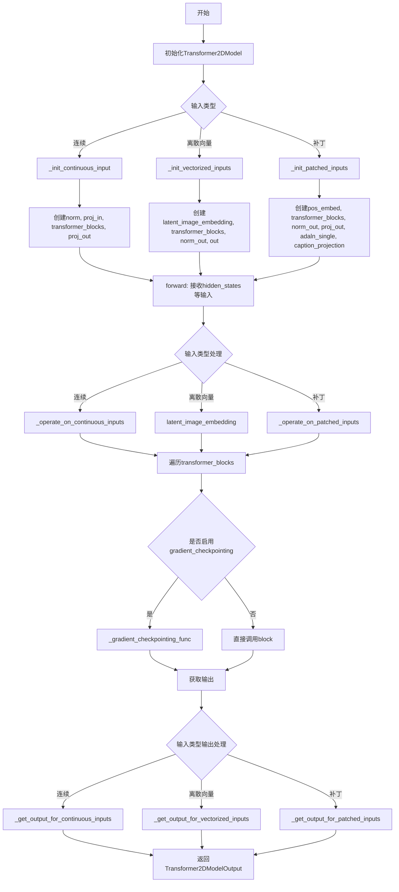
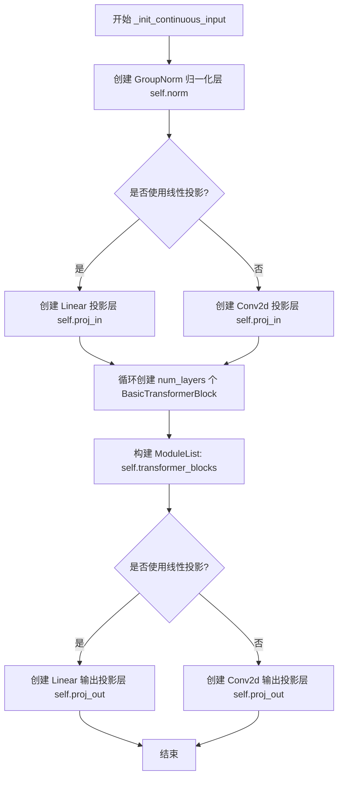
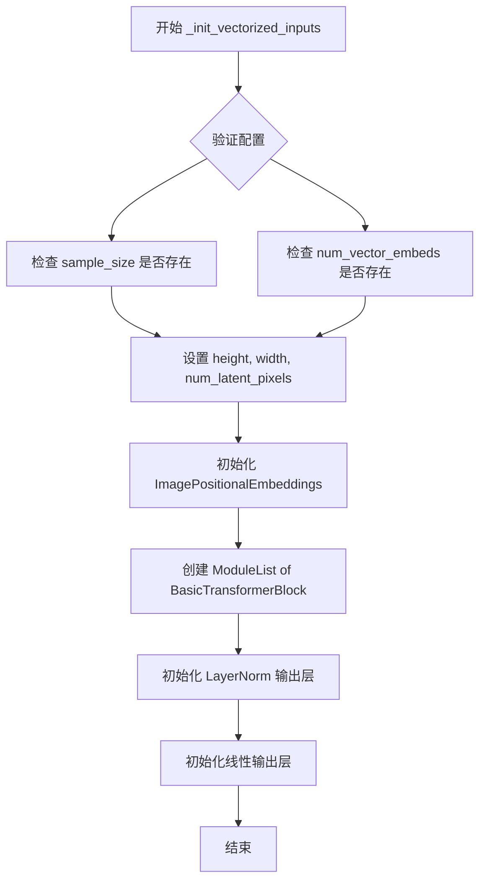
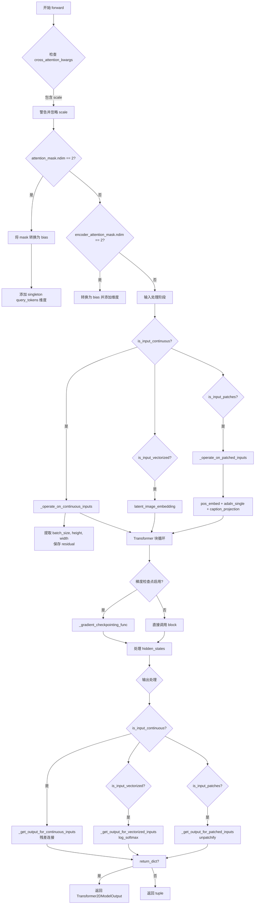
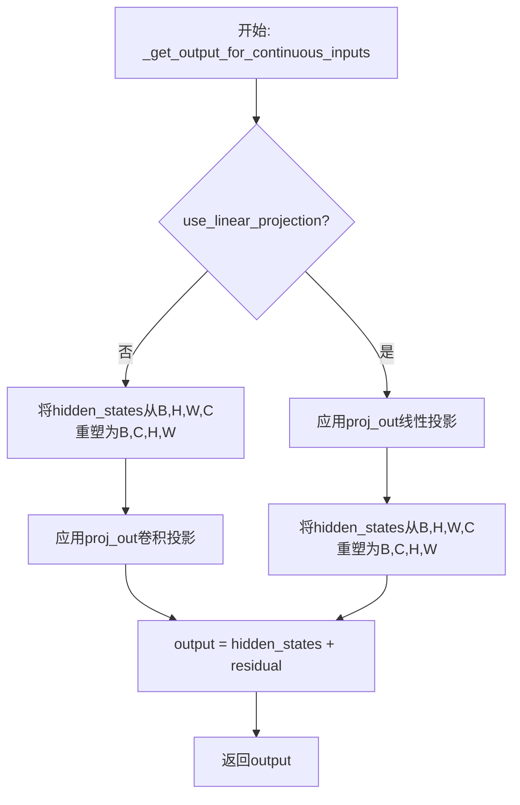
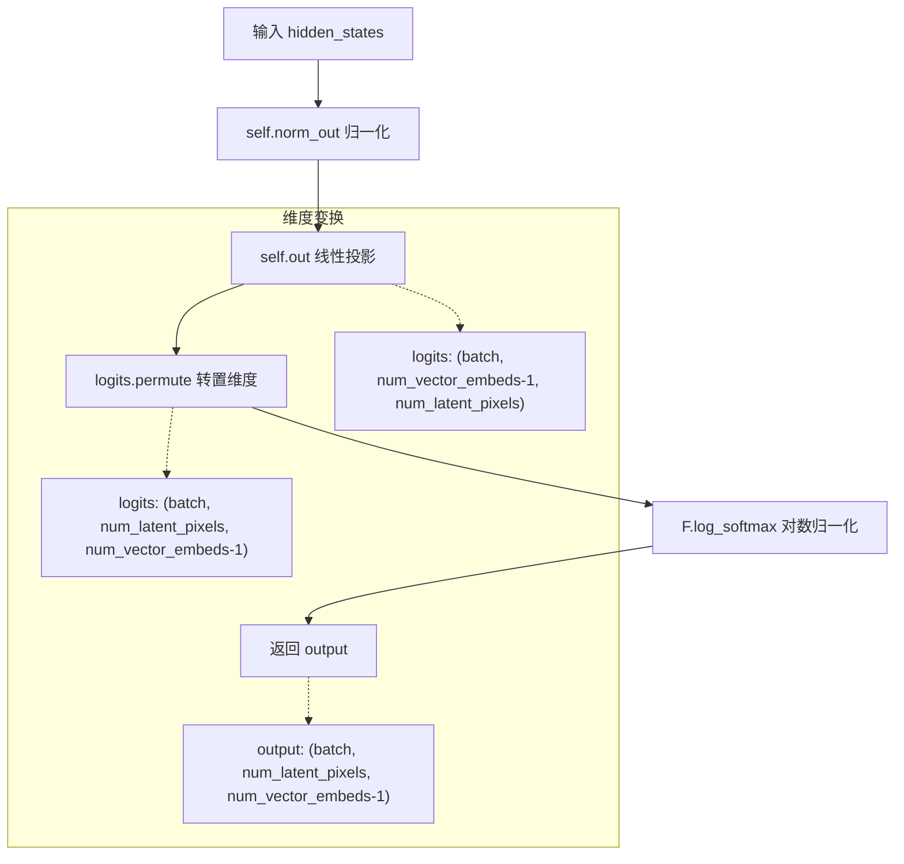
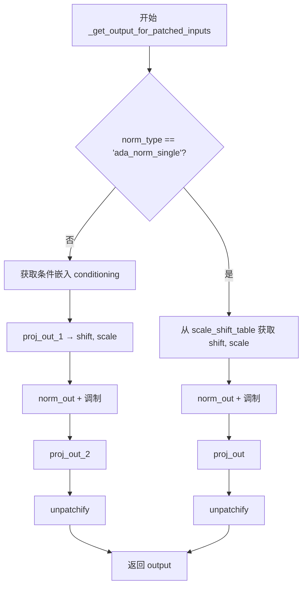

# `diffusers\src\diffusers\models\transformers\transformer_2d.py` 详细设计文档

这是一个2D Transformer模型，用于处理图像数据（连续图像、离散向量嵌入或补丁形式的输入），支持条件生成（如文本条件、时间步长条件），是Diffusers库中用于图像生成的核心Transformer组件。

## 整体流程



## 类结构

```
Transformer2DModelOutput (输出包装类)
└── Transformer2DModel (主模型类)
    ├── LegacyModelMixin (混入类)
    └── LegacyConfigMixin (配置混入类)
```

## 全局变量及字段


### `logger`
    
模块级别的日志记录器，用于输出警告和信息

类型：`logging.Logger`
    


### `deprecation_message`
    
废弃警告消息，当导入Transformer2DModelOutput时会发出警告

类型：`str`
    


### `Transformer2DModel.num_attention_heads`
    
多头注意力机制中的注意力头数量，默认为16

类型：`int`
    


### `Transformer2DModel.attention_head_dim`
    
每个注意力头中的通道数，默认为88

类型：`int`
    


### `Transformer2DModel.in_channels`
    
输入和输出通道数，当输入是连续的时候使用

类型：`int | None`
    


### `Transformer2DModel.out_channels`
    
输出通道数，默认为in_channels

类型：`int | None`
    


### `Transformer2DModel.num_layers`
    
Transformer块的数量，默认为1

类型：`int`
    


### `Transformer2DModel.dropout`
    
Dropout概率，默认为0.0

类型：`float`
    


### `Transformer2DModel.norm_num_groups`
    
GroupNorm中的组数，默认为32

类型：`int`
    


### `Transformer2DModel.cross_attention_dim`
    
交叉注意力中encoder_hidden_states的维度

类型：`int | None`
    


### `Transformer2DModel.attention_bias`
    
是否在注意力层中添加偏置参数

类型：`bool`
    


### `Transformer2DModel.sample_size`
    
潜在图像的宽度，用于离散输入时学习位置嵌入

类型：`int | None`
    


### `Transformer2DModel.num_vector_embeds`
    
潜在像素向量嵌入的类别数，包含masked latent pixel的类别

类型：`int | None`
    


### `Transformer2DModel.patch_size`
    
图像补丁的大小，用于分块输入

类型：`int | None`
    


### `Transformer2DModel.activation_fn`
    
前馈网络中使用的激活函数，默认为'geglu'

类型：`str`
    


### `Transformer2DModel.num_embeds_ada_norm`
    
训练时使用的扩散步数，用于AdaLayerNorm

类型：`int | None`
    


### `Transformer2DModel.use_linear_projection`
    
是否使用线性投影代替卷积

类型：`bool`
    


### `Transformer2DModel.only_cross_attention`
    
是否只使用交叉注意力而禁用自注意力

类型：`bool`
    


### `Transformer2DModel.double_self_attention`
    
是否在每个block中使用双倍自注意力

类型：`bool`
    


### `Transformer2DModel.upcast_attention`
    
是否向上转换注意力计算到更高精度

类型：`bool`
    


### `Transformer2DModel.norm_type`
    
归一化层的类型，可选'layer_norm', 'ada_norm', 'ada_norm_zero', 'ada_norm_single'等

类型：`str`
    


### `Transformer2DModel.norm_elementwise_affine`
    
是否使用元素级仿射变换的归一化

类型：`bool`
    


### `Transformer2DModel.norm_eps`
    
归一化层的epsilon值，默认为1e-5

类型：`float`
    


### `Transformer2DModel.attention_type`
    
注意力机制的类型，默认为'default'

类型：`str`
    


### `Transformer2DModel.caption_channels`
    
字幕/文本条件的通道数

类型：`int | None`
    


### `Transformer2DModel.interpolation_scale`
    
位置嵌入的插值缩放因子

类型：`float | None`
    


### `Transformer2DModel.use_additional_conditions`
    
是否使用额外的条件输入

类型：`bool | None`
    


### `Transformer2DModel.inner_dim`
    
内部维度，等于num_attention_heads * attention_head_dim

类型：`int`
    


### `Transformer2DModel.is_input_continuous`
    
标记输入是否为连续图像数据

类型：`bool`
    


### `Transformer2DModel.is_input_vectorized`
    
标记输入是否为量化嵌入

类型：`bool`
    


### `Transformer2DModel.is_input_patches`
    
标记输入是否为分块数据

类型：`bool`
    


### `Transformer2DModel.gradient_checkpointing`
    
是否启用梯度检查点以节省显存

类型：`bool`
    


### `Transformer2DModel.norm`
    
用于连续输入的GroupNorm归一化层

类型：`torch.nn.GroupNorm`
    


### `Transformer2DModel.proj_in`
    
输入投影层，将输入投影到内部维度

类型：`torch.nn.Linear | torch.nn.Conv2d`
    


### `Transformer2DModel.transformer_blocks`
    
包含所有BasicTransformerBlock的模块列表

类型：`nn.ModuleList`
    


### `Transformer2DModel.proj_out`
    
输出投影层，将内部维度投影回输出

类型：`torch.nn.Linear | torch.nn.Conv2d`
    


### `Transformer2DModel.latent_image_embedding`
    
用于离散输入的潜在图像位置嵌入

类型：`ImagePositionalEmbeddings`
    


### `Transformer2DModel.height`
    
样本的高度（像素数）

类型：`int`
    


### `Transformer2DModel.width`
    
样本的宽度（像素数）

类型：`int`
    


### `Transformer2DModel.num_latent_pixels`
    
潜在像素的总数，等于height * width

类型：`int`
    


### `Transformer2DModel.norm_out`
    
输出层归一化

类型：`nn.LayerNorm`
    


### `Transformer2DModel.out`
    
用于离散输入的输出线性层

类型：`nn.Linear`
    


### `Transformer2DModel.pos_embed`
    
用于分块输入的位置嵌入

类型：`PatchEmbed`
    


### `Transformer2DModel.patch_size`
    
配置中的补丁大小

类型：`int`
    


### `Transformer2DModel.proj_out_1`
    
用于AdaNorm的输出投影层1

类型：`nn.Linear`
    


### `Transformer2DModel.proj_out_2`
    
用于AdaNorm的输出投影层2

类型：`nn.Linear`
    


### `Transformer2DModel.scale_shift_table`
    
AdaNormSingle的缩放和偏移表

类型：`nn.Parameter`
    


### `Transformer2DModel.adaln_single`
    
单层AdaLayerNorm模块

类型：`AdaLayerNormSingle | None`
    


### `Transformer2DModel.caption_projection`
    
字幕/文本条件投影层

类型：`PixArtAlphaTextProjection | None`
    
    

## 全局函数及方法


### `Transformer2DModelOutput.__init__`

该方法是 `Transformer2DModelOutput` 类的构造函数，主要用于初始化一个已弃用的输出类。它接受任意参数并将其传递给父类，同时发出弃用警告，提示用户从新的模块路径导入该类。

参数：

- `*args`：可变位置参数，传递给父类 `Transformer2DModelOutput` 的位置参数。
- `**kwargs`：可变关键字参数，传递给父类 `Transformer2DModelOutput` 的关键字参数。

返回值：`None`，构造函数不返回值，仅初始化对象。

#### 流程图

```mermaid
graph TD
    A[开始 __init__] --> B[构建弃用消息]
    B --> C[调用 deprecate 函数发出警告]
    C --> D[调用 super().__init__ 传递参数]
    D --> E[结束]
```

#### 带注释源码

```python
class Transformer2DModelOutput(Transformer2DModelOutput):
    """
    一个已弃用的输出类，用于向后兼容。
    此类继承自 modeling_outputs.Transformer2DModelOutput，
    用于保持与旧版本代码的兼容性。
    """
    
    def __init__(self, *args, **kwargs):
        """
        初始化 Transformer2DModelOutput 实例。
        
        参数:
            *args: 可变位置参数，传递给父类。
            **kwargs: 可变关键字参数，传递给父类。
        """
        # 构建弃用警告消息
        deprecation_message = (
            "Importing `Transformer2DModelOutput` from `diffusers.models.transformer_2d` is deprecated "
            "and this will be removed in a future version. Please use "
            "`from diffusers.models.modeling_outputs import Transformer2DModelOutput`, instead."
        )
        # 调用 deprecate 函数发出弃用警告
        deprecate("Transformer2DModelOutput", "1.0.0", deprecation_message)
        # 调用父类构造函数，传递所有参数
        super().__init__(*args, **kwargs)
```


### `Transformer2DModel.__init__`

该方法是`Transformer2DModel`类的构造函数，负责初始化一个用于处理图像数据的2D Transformer模型，包括配置参数验证、输入类型判断（连续/离散/分块）、以及根据不同输入类型调用相应的内部初始化方法。

参数：

- `num_attention_heads`：`int`，默认为16，多头注意力机制的头数
- `attention_head_dim`：`int`，默认为88，每个注意力头的通道数
- `in_channels`：`int | None`，输入和输出的通道数（连续输入时使用）
- `out_channels`：`int | None`，输出通道数，默认为None时与in_channels相同
- `num_layers`：`int`，默认为1，Transformer块的数量
- `dropout`：`float`，默认为0.0，dropout概率
- `norm_num_groups`：`int`，默认为32，GroupNorm的组数
- `cross_attention_dim`：`int | None`，交叉注意力的维度
- `attention_bias`：`bool`，默认为False，注意力层是否包含偏置参数
- `sample_size`：`int | None`，离散输入时 latent 图像的宽度
- `num_vector_embeds`：`int | None`，离散输入时向量嵌入的类别数
- `patch_size`：`int | None`，分块输入时的块大小
- `activation_fn`：`str`，默认为"geglu"，激活函数类型
- `num_embeds_ada_norm`：`int | None`，AdaLayerNorm使用的扩散步数
- `use_linear_projection`：`bool`，默认为False，是否使用线性投影
- `only_cross_attention`：`bool`，默认为False，是否只使用交叉注意力
- `double_self_attention`：`bool`，默认为False，是否使用双重自注意力
- `upcast_attention`：`bool`，默认为False，是否上播注意力
- `norm_type`：`str`，默认为"layer_norm"，归一化类型
- `norm_elementwise_affine`：`bool`，默认为True，是否使用元素级仿射
- `norm_eps`：`float`，默认为1e-5，归一化层的epsilon值
- `attention_type`：`str`，默认为"default"，注意力类型
- `caption_channels`：`int | None`， caption 通道数
- `interpolation_scale`：`float | None`，插值缩放因子
- `use_additional_conditions`：`bool | None`，是否使用额外条件

返回值：`None`，该方法为构造函数，不返回任何值

#### 流程图

```mermaid
flowchart TD
    A[开始 __init__] --> B[调用 super().__init__]
    B --> C{检查 patch_size 是否为 None}
    C -->|否| D{norm_type 是否为 ada_norm/ada_norm_zero}
    C -->|是| E{检查 norm_type 和 num_embeds_ada_norm 的一致性}
    D -->|是| F{检查 num_embeds_ada_norm 是否为 None}
    D -->|否| G[抛出 NotImplementedError]
    F -->|是| H[抛出 ValueError]
    F -->|否| E
    E --> I[设置输入类型标志位]
    I --> J{is_input_continuous?}
    J -->|是| K[调用 _init_continuous_input]
    J -->|否| L{is_input_vectorized?}
    L -->|是| M[调用 _init_vectorized_inputs]
    L -->|否| N{is_input_patches?}
    N -->|是| O[调用 _init_patched_inputs]
    N -->|否| P[抛出 ValueError]
    K --> Q[结束 __init__]
    M --> Q
    O --> Q
```

#### 带注释源码

```python
@register_to_config
def __init__(
    self,
    num_attention_heads: int = 16,          # 多头注意力的头数
    attention_head_dim: int = 88,            # 每个头的维度
    in_channels: int | None = None,          # 输入通道数（连续输入）
    out_channels: int | None = None,         # 输出通道数
    num_layers: int = 1,                     # Transformer层数
    dropout: float = 0.0,                    # Dropout概率
    norm_num_groups: int = 32,               # GroupNorm组数
    cross_attention_dim: int | None = None,  # 交叉注意力维度
    attention_bias: bool = False,            # 注意力偏置
    sample_size: int | None = None,          # 离散输入样本大小
    num_vector_embeds: int | None = None,    # 离散输入向量嵌入数
    patch_size: int | None = None,           # 分块大小
    activation_fn: str = "geglu",            # 激活函数
    num_embeds_ada_norm: int | None = None,  # AdaNorm步数
    use_linear_projection: bool = False,     # 线性投影
    only_cross_attention: bool = False,      # 仅交叉注意力
    double_self_attention: bool = False,     # 双重自注意力
    upcast_attention: bool = False,          # 上播注意力
    norm_type: str = "layer_norm",          # 归一化类型
    norm_elementwise_affine: bool = True,    # 元素级仿射
    norm_eps: float = 1e-5,                  # 归一化epsilon
    attention_type: str = "default",         # 注意力类型
    caption_channels: int = None,            # Caption通道
    interpolation_scale: float = None,       # 插值缩放
    use_additional_conditions: bool | None = None,  # 额外条件
):
    super().__init__()  # 调用父类初始化

    # ==================== 1. 输入验证 ====================
    # 验证patch_size与norm_type的兼容性
    if patch_size is not None:
        if norm_type not in ["ada_norm", "ada_norm_zero", "ada_norm_single"]:
            raise NotImplementedError(
                f"Forward pass is not implemented when `patch_size` is not None and `norm_type` is '{norm_type}'."
            )
        elif norm_type in ["ada_norm", "ada_norm_zero"] and num_embeds_ada_norm is None:
            raise ValueError(
                f"When using a `patch_size` and this `norm_type` ({norm_type}), `num_embeds_ada_norm` cannot be None."
            )

    # ==================== 2. 判断输入类型 ====================
    # Transformer2DModel支持三种输入模式：
    # - 连续图像: (batch_size, num_channels, width, height)
    # - 离散向量嵌入: (batch_size, num_image_vectors)
    # - 分块输入: 带patch_size的输入
    self.is_input_continuous = (in_channels is not None) and (patch_size is None)  # 连续输入
    self.is_input_vectorized = num_vector_embeds is not None                         # 离散向量输入
    self.is_input_patches = in_channels is not None and patch_size is not None       # 分块输入

    # 输入类型互斥检查
    if self.is_input_continuous and self.is_input_vectorized:
        raise ValueError(
            f"Cannot define both `in_channels`: {in_channels} and `num_vector_embeds`: {num_vector_embeds}. Make"
            " sure that either `in_channels` or `num_vector_embeds` is None."
        )
    elif self.is_input_vectorized and self.is_input_patches:
        raise ValueError(
            f"Cannot define both `num_vector_embeds`: {num_vector_embeds} and `patch_size`: {patch_size}. Make"
            " sure that either `num_vector_embeds` or `num_patches` is None."
        )
    elif not self.is_input_continuous and not self.is_input_vectorized and not self.is_input_patches:
        raise ValueError(
            f"Has to define `in_channels`: {in_channels}, `num_vector_embeds`: {num_vector_embeds}, or patch_size:"
            f" {patch_size}. Make sure that `in_channels`, `num_vector_embeds` or `num_patches` is not None."
        )

    # ==================== 3. 处理废弃的norm_type配置 ====================
    if norm_type == "layer_norm" and num_embeds_ada_norm is not None:
        deprecation_message = (
            f"The configuration file of this model: {self.__class__} is outdated. `norm_type` is either not set or"
            " incorrectly set to `'layer_norm'`. Make sure to set `norm_type` to `'ada_norm'` in the config."
        )
        deprecate("norm_type!=num_embeds_ada_norm", "1.0.0", deprecation_message, standard_warn=False)
        norm_type = "ada_norm"  # 自动修复为推荐的norm_type

    # ==================== 4. 初始化公共变量 ====================
    self.use_linear_projection = use_linear_projection
    self.interpolation_scale = interpolation_scale
    self.caption_channels = caption_channels
    self.num_attention_heads = num_attention_heads
    self.attention_head_dim = attention_head_dim
    self.inner_dim = self.config.num_attention_heads * self.config.attention_head_dim  # 内部维度
    self.in_channels = in_channels
    self.out_channels = in_channels if out_channels is None else out_channels
    self.gradient_checkpointing = False  # 梯度checkpoint开关

    # 根据norm_type和sample_size决定是否使用额外条件
    if use_additional_conditions is None:
        if norm_type == "ada_norm_single" and sample_size == 128:
            use_additional_conditions = True
        else:
            use_additional_conditions = False
    self.use_additional_conditions = use_additional_conditions

    # ==================== 5. 根据输入类型调用对应初始化 ====================
    if self.is_input_continuous:
        self._init_continuous_input(norm_type=norm_type)      # 连续输入初始化
    elif self.is_input_vectorized:
        self._init_vectorized_inputs(norm_type=norm_type)     # 离散向量输入初始化
    elif self.is_input_patches:
        self._init_patched_inputs(norm_type=norm_type)         # 分块输入初始化
```


### `Transformer2DModel._init_continuous_input`

该方法用于初始化处理连续（continuous）输入的 Transformer2DModel 组件，包括 GroupNorm 归一化层、输入投影层、Transformer 块模块列表以及输出投影层。

参数：

- `norm_type`：`str`，归一化类型，用于指定在 BasicTransformerBlock 中使用的归一化方式（如 "layer_norm"、"ada_norm" 等）

返回值：`None`，该方法为初始化方法，不返回任何值，仅设置实例属性

#### 流程图



#### 带注释源码

```
def _init_continuous_input(self, norm_type):
    # 1. 初始化 GroupNorm 归一化层，用于对输入的连续图像进行通道级别的归一化
    # 参数: num_groups=归一化组数, num_channels=输入通道数, eps=数值稳定性参数, affine=是否使用可学习仿射参数
    self.norm = torch.nn.GroupNorm(
        num_groups=self.config.norm_num_groups, num_channels=self.in_channels, eps=1e-6, affine=True
    )
    
    # 2. 初始化输入投影层，将输入特征映射到内部维度空间
    # 根据 use_linear_projection 配置选择线性投影或卷积投影
    if self.use_linear_projection:
        # 线性投影: in_channels -> inner_dim
        self.proj_in = torch.nn.Linear(self.in_channels, self.inner_dim)
    else:
        # 卷积投影: 使用 1x1 卷积核进行通道映射
        self.proj_in = torch.nn.Conv2d(self.in_channels, self.inner_dim, kernel_size=1, stride=1, padding=0)

    # 3. 初始化 Transformer 块模块列表，包含多个 BasicTransformerBlock
    # 每个块具有相同的内部维度、注意力头数、注意力维度等配置
    self.transformer_blocks = nn.ModuleList(
        [
            BasicTransformerBlock(
                self.inner_dim,                           # 模块内部维度
                self.config.num_attention_heads,          # 多头注意力头数
                self.config.attention_head_dim,           # 每个头的维度
                dropout=self.config.dropout,              # Dropout 概率
                cross_attention_dim=self.config.cross_attention_dim,  # 跨注意力维度
                activation_fn=self.config.activation_fn, # 激活函数
                num_embeds_ada_norm=self.config.num_embeds_ada_norm,   # AdaNorm 嵌入数
                attention_bias=self.config.attention_bias,             # 注意力偏置
                only_cross_attention=self.config.only_cross_attention, # 仅跨注意力
                double_self_attention=self.config.double_self_attention, # 双自注意力
                upcast_attention=self.config.upcast_attention,         # 上转注意力
                norm_type=norm_type,                    # 传入的归一化类型
                norm_elementwise_affine=self.config.norm_elementwise_affine, # 归一化仿射
                norm_eps=self.config.norm_eps,          # 归一化 epsilon
                attention_type=self.config.attention_type,             # 注意力类型
            )
            for _ in range(self.config.num_layers)  # 循环创建 num_layers 个块
        ]
    )

    # 4. 初始化输出投影层，将内部维度映射回输出通道数
    # 同样根据 use_linear_projection 配置选择投影方式
    if self.use_linear_projection:
        # 线性投影: inner_dim -> out_channels
        self.proj_out = torch.nn.Linear(self.inner_dim, self.out_channels)
    else:
        # 卷积投影: 使用 1x1 卷积核进行通道映射
        self.proj_out = torch.nn.Conv2d(self.inner_dim, self.out_channels, kernel_size=1, stride=1, padding=0)
```


### `Transformer2DModel._init_vectorized_inputs`

该方法负责初始化Transformer2DModel以处理离散/矢量化的输入（如VQ-VAE的离散潜在表示）。它设置了图像位置嵌入、Transformer块堆栈以及输出投影层，为后续的离散潜在像素处理奠定基础。

参数：

- `norm_type`：`str`，规范化类型参数，用于指定在Transformer块中使用的规范化方法（如"ada_norm"、"ada_norm_zero"、"ada_norm_single"等）

返回值：无（`None`），该方法为成员方法，直接在实例上初始化组件

#### 流程图



#### 带注释源码

```python
def _init_vectorized_inputs(self, norm_type):
    """
    初始化处理离散/矢量化输入的Transformer2DModel组件。
    
    此方法在模型配置为处理离散潜在表示（如来自VQ-VAE的量化嵌入）时调用。
    它设置位置嵌入、Transformer块堆栈和输出投影层。
    
    参数:
        norm_type (str): 规范化类型，用于配置BasicTransformerBlock中的规范化层
    """
    
    # 断言验证：确保配置中提供了sample_size
    assert self.config.sample_size is not None, "Transformer2DModel over discrete input must provide sample_size"
    
    # 断言验证：确保配置中提供了num_vector_embeds（向量嵌入数量）
    assert self.config.num_vector_embeds is not None, (
        "Transformer2DModel over discrete input must provide num_embed"
    )

    # 从配置中获取样本尺寸，设置模型的高度和宽度
    self.height = self.config.sample_size
    self.width = self.config.sample_size
    
    # 计算潜在像素的总数（用于后续输出形状处理）
    self.num_latent_pixels = self.height * self.width

    # 初始化图像位置嵌入层
    # 用于将离散token索引映射为可学习的嵌入向量
    self.latent_image_embedding = ImagePositionalEmbeddings(
        num_embed=self.config.num_vector_embeds,  # 离散类别的数量
        embed_dim=self.inner_dim,                  # 嵌入维度（inner_dim = num_heads * head_dim）
        height=self.height,                        # 高度位置数
        width=self.width                           # 宽度位置数
    )

    # 创建Transformer块模块列表
    # 根据num_layers配置创建多个BasicTransformerBlock
    self.transformer_blocks = nn.ModuleList(
        [
            BasicTransformerBlock(
                self.inner_dim,                        # 输入/输出维度
                self.config.num_attention_heads,       # 注意力头数
                self.config.attention_head_dim,        # 每个头的维度
                dropout=self.config.dropout,           # Dropout概率
                cross_attention_dim=self.config.cross_attention_dim,  # 交叉注意力维度
                activation_fn=self.config.activation_fn,  # 激活函数
                num_embeds_ada_norm=self.config.num_embeds_ada_norm,  # AdaNorm相关
                attention_bias=self.config.attention_bias,  # 注意力偏置
                only_cross_attention=self.config.only_cross_attention,  # 仅交叉注意力
                double_self_attention=self.config.double_self_attention,  # 双重自注意力
                upcast_attention=self.config.upcast_attention,  # 上转注意力
                norm_type=norm_type,                   # 传入的规范化类型
                norm_elementwise_affine=self.config.norm_elementwise_affine,  # 元素级仿射
                norm_eps=self.config.norm_eps,        # 规范化epsilon
                attention_type=self.config.attention_type,  # 注意力类型
            )
            for _ in range(self.config.num_layers)  # 循环创建num_layers个块
        ]
    )

    # 初始化输出规范化层（LayerNorm）
    self.norm_out = nn.LayerNorm(self.inner_dim)
    
    # 初始化输出投影层
    # 将inner_dim投影到num_vector_embeds-1（减去一个类别用于masked位置）
    self.out = nn.Linear(self.inner_dim, self.config.num_vector_embeds - 1)
```


### `Transformer2DModel._init_patched_inputs`

该方法用于初始化处理分块（patched）输入的Transformer2DModel组件，包括位置编码嵌入、Transformer块列表、输出投影层以及可选的AdaLayerNorm和文本投影层，根据不同的归一化类型配置相应的网络结构。

参数：

- `norm_type`：`str`，指定归一化类型（如"layer_norm"、"ada_norm"、"ada_norm_zero"、"ada_norm_single"等），用于决定输出层的初始化方式和是否使用AdaLayerNorm

返回值：`None`，该方法为初始化方法，直接在实例上设置属性，不返回任何值

#### 流程图

```mermaid
flowchart TD
    A[开始 _init_patched_inputs] --> B[断言 sample_size 已配置]
    B --> C[设置 self.height 和 self.width]
    C --> D[设置 self.patch_size]
    D --> E{计算 interpolation_scale}
    E -->|config.interpolation_scale 存在| F[使用配置值]
    E -->|不存在| G[使用 max(sample_size // 64, 1)]
    F --> H
    G --> H
    H[初始化 PatchEmbed 位置嵌入] --> I[创建 ModuleList BasicTransformerBlock]
    I --> J{检查 norm_type}
    J -->|!= ada_norm_single| K[初始化 LayerNorm + proj_out_1 + proj_out_2]
    J -->|== ada_norm_single| L[初始化 LayerNorm + scale_shift_table + proj_out]
    K --> M{检查 norm_type == ada_norm_single}
    L --> M
    M -->|是| N[初始化 AdaLayerNormSingle (adaln_single)]
    M -->|否| O{检查 caption_channels]
    N --> O
    O -->|caption_channels 存在| P[初始化 PixArtAlphaTextProjection]
    O -->|不存在| Q[结束]
    P --> Q
```

#### 带注释源码

```python
def _init_patched_inputs(self, norm_type):
    """
    初始化处理分块(patched)输入所需的组件。
    
    当输入为分块形式(patches)时，调用此方法进行模型组件的初始化。
    这包括位置编码、Transformer块堆栈、输出投影层以及可选的AdaLayerNorm和文本投影层。
    
    参数:
        norm_type: str, 归一化类型，决定使用哪种归一化方式和输出层结构
    """
    # 断言：确保sample_size已配置，这是处理分块输入的必要参数
    assert self.config.sample_size is not None, "Transformer2DModel over patched input must provide sample_size"

    # 从配置中获取样本的宽高信息
    self.height = self.config.sample_size
    self.width = self.config.sample_size

    # 获取patch大小
    self.patch_size = self.config.patch_size
    
    # 计算插值缩放因子：如果配置中有指定则使用，否则基于sample_size计算
    # 公式: max(sample_size // 64, 1)，确保至少为1
    interpolation_scale = (
        self.config.interpolation_scale
        if self.config.interpolation_scale is not None
        else max(self.config.sample_size // 64, 1)
    )
    
    # 初始化位置嵌入层：将图像分割成patches并添加可学习的位置编码
    # PatchEmbed负责将 (batch, channels, height, width) 的输入转换为
    # (batch, num_patches, embed_dim) 的序列表示
    self.pos_embed = PatchEmbed(
        height=self.config.sample_size,
        width=self.config.sample_size,
        patch_size=self.config.patch_size,
        in_channels=self.in_channels,
        embed_dim=self.inner_dim,
        interpolation_scale=interpolation_scale,
    )

    # 初始化Transformer块列表：创建num_layers个BasicTransformerBlock
    # 每个block包含自注意力、交叉注意力和前馈网络
    self.transformer_blocks = nn.ModuleList(
        [
            BasicTransformerBlock(
                self.inner_dim,  # 输入输出维度
                self.config.num_attention_heads,  # 注意力头数
                self.config.attention_head_dim,  # 每个头的维度
                dropout=self.config.dropout,  # dropout概率
                cross_attention_dim=self.config.cross_attention_dim,  # 交叉注意力维度
                activation_fn=self.config.activation_fn,  # 激活函数
                num_embeds_ada_norm=self.config.num_embeds_ada_norm,  # AdaNorm的embed数量
                attention_bias=self.config.attention_bias,  # 是否使用注意力偏置
                only_cross_attention=self.config.only_cross_attention,  # 是否仅使用交叉注意力
                double_self_attention=self.config.double_self_attention,  # 是否使用双重自注意力
                upcast_attention=self.config.upcast_attention,  # 是否上播注意力
                norm_type=norm_type,  # 归一化类型
                norm_elementwise_affine=self.config.norm_elementwise_affine,  # 是否使用元素级仿射
                norm_eps=self.config.norm_eps,  # 归一化epsilon
                attention_type=self.config.attention_type,  # 注意力类型
            )
            for _ in range(self.config.num_layers)
        ]
    )

    # 根据norm_type初始化不同的输出层结构
    if self.config.norm_type != "ada_norm_single":
        # 标准LayerNorm + 双层投影 (用于FFN式调制)
        self.norm_out = nn.LayerNorm(self.inner_dim, elementwise_affine=False, eps=1e-6)
        self.proj_out_1 = nn.Linear(self.inner_dim, 2 * self.inner_dim)  # 扩展维度用于计算shift和scale
        self.proj_out_2 = nn.Linear(
            self.inner_dim, self.config.patch_size * self.config.patch_size * self.out_channels
        )  # 恢复到patch空间
    elif self.config.norm_type == "ada_norm_single":
        # AdaNormSingle: 使用可学习的scale_shift_table进行调制
        self.norm_out = nn.LayerNorm(self.inner_dim, elementwise_affine=False, eps=1e-6)
        self.scale_shift_table = nn.Parameter(torch.randn(2, self.inner_dim) / self.inner_dim**0.5)
        self.proj_out = nn.Linear(
            self.inner_dim, self.config.patch_size * self.config.patch_size * self.out_channels
        )

    # 初始化AdaLayerNormSingle（用于PixArt-Alpha等模型）
    self.adaln_single = None
    if self.config.norm_type == "ada_norm_single":
        # TODO(Sayak, PVP): 清理这部分代码
        # 暂时使用sample_size来判断是否使用额外条件
        self.adaln_single = AdaLayerNormSingle(
            self.inner_dim, use_additional_conditions=self.use_additional_conditions
        )

    # 初始化文本/_caption投影层（可选）
    self.caption_projection = None
    if self.caption_channels is not None:
        # 用于将文本特征投影到与Transformer相同维度
        self.caption_projection = PixArtAlphaTextProjection(
            in_features=self.caption_channels, hidden_size=self.inner_dim
        )
```


### `Transformer2DModel.forward`

这是 `Transformer2DModel` 类的前向传播方法，负责处理2D图像数据的变换过程。该方法接收隐藏状态、条件嵌入、时间步等参数，通过连续的Transformer块处理输入，并根据输入类型（连续、离散或patched）生成相应的输出。

参数：

- `hidden_states`：`torch.Tensor`，输入的隐藏状态。如果离散则为形状 `(batch size, num latent pixels)` 的 `torch.LongTensor`，如果连续则为形状 `(batch size, channel, height, width)` 的 `torch.Tensor`
- `encoder_hidden_states`：`torch.Tensor | None`，交叉注意力层的条件嵌入，形状为 `(batch size, sequence len, embed dims)`。如果未提供，默认使用自注意力
- `timestep`：`torch.LongTensor | None`，用于去噪步骤的时间步，可选地作为 `AdaLayerNorm` 中的嵌入使用
- `added_cond_kwargs`：`dict[str, torch.Tensor] | None`，额外条件参数字典，用于传递给 AdaLayerNorm
- `class_labels`：`torch.LongTensor | None`，类别标签，形状为 `(batch size, num classes)`，可选地作为 `AdaLayerZeroNorm` 中的嵌入使用
- `cross_attention_kwargs`：`dict[str, Any] | None`，关键字参数字典，如果指定则传递给 `AttentionProcessor`
- `attention_mask`：`torch.Tensor | None`，形状为 `(batch, key_tokens)` 的注意力掩码，用于 `encoder_hidden_states`
- `encoder_attention_mask`：`torch.Tensor | None`，应用于 `encoder_hidden_states` 的交叉注意力掩码，支持掩码格式或偏置格式
- `return_dict`：`bool`，默认为 `True`，是否返回 `Transformer2DModelOutput` 而不是元组

返回值：`Transformer2DModelOutput | tuple`，如果 `return_dict` 为 `True`，返回 `Transformer2DModelOutput`（包含 `sample` 属性），否则返回元组

#### 流程图



#### 带注释源码

```python
def forward(
    self,
    hidden_states: torch.Tensor,
    encoder_hidden_states: torch.Tensor | None = None,
    timestep: torch.LongTensor | None = None,
    added_cond_kwargs: dict[str, torch.Tensor] = None,
    class_labels: torch.LongTensor | None = None,
    cross_attention_kwargs: dict[str, Any] = None,
    attention_mask: torch.Tensor | None = None,
    encoder_attention_mask: torch.Tensor | None = None,
    return_dict: bool = True,
):
    """
    The [`Transformer2DModel`] forward method.

    Args:
        hidden_states (`torch.LongTensor` of shape `(batch size, num latent pixels)` if discrete, `torch.Tensor` of shape `(batch size, channel, height, width)` if continuous):
            Input `hidden_states`.
        encoder_hidden_states ( `torch.Tensor` of shape `(batch size, sequence len, embed dims)`, *optional*):
            Conditional embeddings for cross attention layer. If not given, cross-attention defaults to
            self-attention.
        timestep ( `torch.LongTensor`, *optional*):
            Used to indicate denoising step. Optional timestep to be applied as an embedding in `AdaLayerNorm`.
        class_labels ( `torch.LongTensor` of shape `(batch size, num classes)`, *optional*):
            Used to indicate class labels conditioning. Optional class labels to be applied as an embedding in
            `AdaLayerZeroNorm`.
        cross_attention_kwargs ( `dict[str, Any]`, *optional*):
            A kwargs dictionary that if specified is passed along to the `AttentionProcessor` as defined under
            `self.processor` in
            [diffusers.models.attention_processor](https://github.com/huggingface/diffusers/blob/main/src/diffusers/models/attention_processor.py).
        attention_mask ( `torch.Tensor`, *optional*):
            An attention mask of shape `(batch, key_tokens)` is applied to `encoder_hidden_states`. If `1` the mask
            is kept, otherwise if `0` it is discarded. Mask will be converted into a bias, which adds large
            negative values to the attention scores corresponding to "discard" tokens.
        encoder_attention_mask ( `torch.Tensor`, *optional*):
            Cross-attention mask applied to `encoder_hidden_states`. Two formats supported:

                * Mask `(batch, sequence_length)` True = keep, False = discard.
                * Bias `(batch, 1, sequence_length)` 0 = keep, -10000 = discard.

            If `ndim == 2`: will be interpreted as a mask, then converted into a bias consistent with the format
            above. This bias will be added to the cross-attention scores.
        return_dict (`bool`, *optional*, defaults to `True`):
            Whether or not to return a [`~models.unets.unet_2d_condition.UNet2DConditionOutput`] instead of a plain
            tuple.

    Returns:
        If `return_dict` is True, an [`~models.transformers.transformer_2d.Transformer2DModelOutput`] is returned,
        otherwise a `tuple` where the first element is the sample tensor.
    """
    # 检查并警告过时的 scale 参数用法
    if cross_attention_kwargs is not None:
        if cross_attention_kwargs.get("scale", None) is not None:
            logger.warning("Passing `scale` to `cross_attention_kwargs` is deprecated. `scale` will be ignored.")
    
    # 确保 attention_mask 是 bias 格式，并添加 singleton query_tokens 维度
    # 这有助于将掩码广播为注意力分数的偏置，支持多种注意力机制格式
    if attention_mask is not None and attention_mask.ndim == 2:
        # 假设掩码表达为: (1 = keep, 0 = discard)
        # 转换为可以加到注意力分数的偏置: (keep = +0, discard = -10000.0)
        attention_mask = (1 - attention_mask.to(hidden_states.dtype)) * -10000.0
        # 添加 singleton query_tokens 维度: [batch, 1, key_tokens]
        attention_mask = attention_mask.unsqueeze(1)

    # 同样方式转换 encoder_attention_mask 为偏置
    if encoder_attention_mask is not None and encoder_attention_mask.ndim == 2:
        encoder_attention_mask = (1 - encoder_attention_mask.to(hidden_states.dtype)) * -10000.0
        encoder_attention_mask = encoder_attention_mask.unsqueeze(1)

    # ========================================
    # 1. 输入处理阶段
    # ========================================
    if self.is_input_continuous:
        # 连续输入处理 (例如标准图像)
        batch_size, _, height, width = hidden_states.shape
        residual = hidden_states  # 保存用于残差连接
        hidden_states, inner_dim = self._operate_on_continuous_inputs(hidden_states)
    elif self.is_input_vectorized:
        # 离散/量化嵌入处理
        hidden_states = self.latent_image_embedding(hidden_states)
    elif self.is_input_patches:
        # 分块输入处理 (如 ViT 风格)
        height = hidden_states.shape[-2] // self.patch_size
        width = hidden_states.shape[-1] // self.patch_size
        hidden_states, encoder_hidden_states, timestep, embedded_timestep = self._operate_on_patched_inputs(
            hidden_states, encoder_hidden_states, timestep, added_cond_kwargs
        )

    # ========================================
    # 2. Transformer 块处理阶段
    # ========================================
    for block in self.transformer_blocks:
        # 梯度检查点：在前向传播时不保存中间激活，以节省显存
        if torch.is_grad_enabled() and self.gradient_checkpointing:
            hidden_states = self._gradient_checkpointing_func(
                block,
                hidden_states,
                attention_mask,
                encoder_hidden_states,
                encoder_attention_mask,
                timestep,
                cross_attention_kwargs,
                class_labels,
            )
        else:
            hidden_states = block(
                hidden_states,
                attention_mask=attention_mask,
                encoder_hidden_states=encoder_hidden_states,
                encoder_attention_mask=encoder_attention_mask,
                timestep=timestep,
                cross_attention_kwargs=cross_attention_kwargs,
                class_labels=class_labels,
            )

    # ========================================
    # 3. 输出生成阶段
    # ========================================
    if self.is_input_continuous:
        # 连续输出：应用残差连接
        output = self._get_output_for_continuous_inputs(
            hidden_states=hidden_states,
            residual=residual,
            batch_size=batch_size,
            height=height,
            width=width,
            inner_dim=inner_dim,
        )
    elif self.is_input_vectorized:
        # 离散输出：计算 log_softmax 概率
        output = self._get_output_for_vectorized_inputs(hidden_states)
    elif self.is_input_patches:
        # 分块输出：unpatchify 还原图像
        output = self._get_output_for_patched_inputs(
            hidden_states=hidden_states,
            timestep=timestep,
            class_labels=class_labels,
            embedded_timestep=embedded_timestep,
            height=height,
            width=width,
        )

    # 返回结果
    if not return_dict:
        return (output,)

    return Transformer2DModelOutput(sample=output)
```


### `Transformer2DModel._operate_on_continuous_inputs`

该方法负责处理连续输入的图像数据，包括GroupNorm归一化、投影操作（线性或卷积）以及形状变换，将形状为`(batch, channel, height, width)`的输入转换为`(batch, height*width, inner_dim)`的序列格式，以适配Transformer块的处理。

参数：

- `hidden_states`：`torch.Tensor`，形状为`(batch_size, channel, height, width)`的连续输入隐藏状态

返回值：`tuple[torch.Tensor, int]`，返回处理后的隐藏状态（形状为`(batch, height*width, inner_dim)`）和内部维度值`inner_dim`

#### 流程图

```mermaid
flowchart TD
    A[开始: hidden_states 输入<br/>(batch, channel, height, width)] --> B[获取 batch, height, width]
    B --> C[self.norm 归一化<br/>GroupNorm]
    C --> D{self.use_linear_projection?}
    D -->|False| E[使用 Conv2d 投影]
    D -->|True| F[先 reshape 再 Linear 投影]
    E --> G[获取 inner_dim]
    F --> H[permute + reshape<br/>(batch, height*width, inner_dim)]
    G --> I[返回 hidden_states, inner_dim]
    H --> I
```

#### 带注释源码

```python
def _operate_on_continuous_inputs(self, hidden_states):
    """
    处理连续输入的图像数据，将其转换为适合Transformer处理的序列格式。
    
    参数:
        hidden_states: 形状为 (batch, channel, height, width) 的连续输入张量
    
    返回:
        tuple: (处理后的hidden_states, inner_dim)
            - hidden_states: 形状为 (batch, height*width, inner_dim) 
            - inner_dim: 隐藏层的内部维度
    """
    # 1. 从输入张量中提取批次大小和空间维度
    batch, _, height, width = hidden_states.shape
    
    # 2. 应用GroupNorm归一化
    # 将通道分组进行归一化，有助于训练稳定性
    hidden_states = self.norm(hidden_states)

    # 3. 根据配置选择投影方式
    if not self.use_linear_projection:
        # 使用卷积投影: Conv2d(channel -> inner_dim, kernel=1)
        # 输出形状: (batch, inner_dim, height, width)
        hidden_states = self.proj_in(hidden_states)
        inner_dim = hidden_states.shape[1]
        
        # 变换维度顺序并reshape: (batch, inner_dim, height, width) -> (batch, height*width, inner_dim)
        # permute 将通道维度移到最后，reshape 将空间维度合并为序列维度
        hidden_states = hidden_states.permute(0, 2, 3, 1).reshape(batch, height * width, inner_dim)
    else:
        # 使用线性投影: Linear(channel -> inner_dim)
        inner_dim = hidden_states.shape[1]
        
        # 先变换维度并reshape: (batch, channel, height, width) -> (batch, height*width, channel)
        hidden_states = hidden_states.permute(0, 2, 3, 1).reshape(batch, height * width, inner_dim)
        
        # 再应用线性投影: (batch, height*width, channel) -> (batch, height*width, inner_dim)
        hidden_states = self.proj_in(hidden_states)

    # 4. 返回处理后的序列和内部维度
    return hidden_states, inner_dim
```


### `Transformer2DModel._operate_on_patched_inputs`

该方法负责对分块输入（patched inputs）进行预处理，包括位置编码嵌入、时间步嵌入以及条件编码器隐藏状态的投影，是2D Transformer模型处理离散分块输入数据的前置关键步骤。

参数：

- `self`：类实例本身，包含模型的配置和组件。
- `hidden_states`：`torch.Tensor`，形状为 `(batch_size, channel, height, width)` 的输入隐藏状态张量，待嵌入的分块图像数据。
- `encoder_hidden_states`：`torch.Tensor | None`，形状为 `(batch_size, sequence_len, embed_dims)` 的条件嵌入向量，用于交叉注意力层，若为 `None` 则默认为自注意力。
- `timestep`：`torch.LongTensor | None`，用于去噪步骤的时间步张量，作为 AdaLayerNorm 的嵌入输入。
- `added_cond_kwargs`：`dict[str, torch.Tensor] | None`，包含额外条件参数的字典，如用于 `adaln_single` 的额外条件信息。

返回值：`tuple[torch.Tensor, torch.Tensor, torch.Tensor, torch.Tensor | None]`，返回四元素元组——处理后的隐藏状态、投影后的编码器隐藏状态、时间步嵌入、以及嵌入后的时间步（如有）。

#### 流程图

```mermaid
flowchart TD
    A[开始 _operate_on_patched_inputs] --> B[获取 batch_size]
    B --> C[应用位置编码: hidden_states = self.pos_embed(hidden_states)]
    C --> D{self.adaln_single is not None?}
    D -->|是| E{self.use_additional_conditions 且 added_cond_kwargs is None?}
    E -->|是| F[抛出 ValueError 异常]
    E -->|否| G[调用 self.adaln_single 处理 timestep 和 added_cond_kwargs]
    G --> H[获取 timestep 和 embedded_timestep]
    D -->|否| I{self.caption_projection is not None?}
    H --> I
    I -->|是| J[投影 encoder_hidden_states]
    J --> K[重塑 encoder_hidden_states 形状]
    I -->|否| L[返回结果元组]
    K --> L
    F --> M[结束]
    L --> M
```

#### 带注释源码

```python
def _operate_on_patched_inputs(self, hidden_states, encoder_hidden_states, timestep, added_cond_kwargs):
    """
    处理分块输入（patched inputs）的前置操作。
    
    参数:
        hidden_states: 输入的隐藏状态张量，形状为 (batch_size, channel, height, width)
        encoder_hidden_states: 编码器隐藏状态，用于条件生成
        timestep: 时间步，用于去噪过程
        added_cond_kwargs: 额外的条件参数
    
    返回:
        包含处理后的 hidden_states, encoder_hidden_states, timestep, embedded_timestep 的元组
    """
    # 从输入张量中获取批量大小
    batch_size = hidden_states.shape[0]
    
    # Step 1: 对输入隐藏状态应用位置编码嵌入
    # 将分块图像数据映射到高维潜在空间
    hidden_states = self.pos_embed(hidden_states)
    
    # 初始化嵌入后的时间步为 None
    embedded_timestep = None

    # Step 2: 检查是否使用 AdaLayerNormSingle 进行时间步和条件嵌入
    if self.adaln_single is not None:
        # 如果使用额外条件但未提供 added_cond_kwargs，则抛出错误
        if self.use_additional_conditions and added_cond_kwargs is None:
            raise ValueError(
                "`added_cond_kwargs` cannot be None when using additional conditions for `adaln_single`."
            )
        
        # 调用 AdaLayerNormSingle 进行时间步嵌入和条件调制
        # 返回处理后的 timestep 和嵌入后的 embedded_timestep
        timestep, embedded_timestep = self.adaln_single(
            timestep, added_cond_kwargs, batch_size=batch_size, hidden_dtype=hidden_states.dtype
        )

    # Step 3: 如果存在 caption_projection，则对编码器隐藏状态进行投影
    if self.caption_projection is not None:
        # 通过投影层处理编码器隐藏状态
        encoder_hidden_states = self.caption_projection(encoder_hidden_states)
        
        # 重塑编码器隐藏状态以匹配注意力计算需要的形状
        # 从 (batch_size, seq_len, embed_dim) 转换为 (batch_size, -1, hidden_states.shape[-1])
        encoder_hidden_states = encoder_hidden_states.view(batch_size, -1, hidden_states.shape[-1])

    # 返回处理后的所有张量
    return hidden_states, encoder_hidden_states, timestep, embedded_timestep
```


### `Transformer2DModel._get_output_for_continuous_inputs`

该方法负责将经过Transformer块处理的隐藏状态重新整形为空间维度，应用输出投影（线性或卷积），并通过残差连接将处理后的输出与原始输入相加，生成最终的连续输入输出。

参数：

- `hidden_states`：`torch.Tensor`，经过Transformer块处理后的隐藏状态
- `residual`：`torch.Tensor`，原始输入张量，用于残差连接
- `batch_size`：`int`，批次大小
- `height`：`int`，输入张量的高度维度
- `width`：`int`，输入张量的宽度维度
- `inner_dim`：`int`，内部维度（投影后的特征维度）

返回值：`torch.Tensor`，经过残差连接后的输出张量

#### 流程图



#### 带注释源码

```python
def _get_output_for_continuous_inputs(self, hidden_states, residual, batch_size, height, width, inner_dim):
    """
    处理连续输入的输出转换。
    
    该方法执行以下操作：
    1. 将隐藏状态从序列格式重塑为空间格式 (batch, height, width, inner_dim)
    2. 根据配置选择线性或卷积投影进行输出变换
    3. 通过残差连接将原始输入添加到输出中
    
    参数:
        hidden_states: 经过Transformer块处理的隐藏状态，形状为 (batch_size, height*width, inner_dim)
        residual: 原始输入张量，形状为 (batch_size, channels, height, width)
        batch_size: 批次大小
        height: 空间高度维度
        width: 空间宽度维度
        inner_dim: 内部特征维度
    
    返回:
        添加残差连接后的输出张量，形状与residual相同 (batch_size, channels, height, width)
    """
    # 判断是否使用线性投影
    if not self.use_linear_projection:
        # 非线性投影路径：使用卷积输出投影
        # 1. 将 (batch, height*width, inner_dim) 重塑为 (batch, height, width, inner_dim)
        # 2. 调整维度顺序从 (B, H, W, C) 变为 (B, C, H, W)
        # 3. 使用contiguous()确保内存连续
        hidden_states = (
            hidden_states.reshape(batch_size, height, width, inner_dim).permute(0, 3, 1, 2).contiguous()
        )
        # 应用卷积输出投影 (inner_dim -> out_channels)
        hidden_states = self.proj_out(hidden_states)
    else:
        # 线性投影路径：使用线性输出投影
        # 1. 应用线性投影变换 (batch, height*width, inner_dim) -> (batch, height*width, out_channels)
        hidden_states = self.proj_out(hidden_states)
        # 2. 重塑为空间格式并调整维度顺序
        hidden_states = (
            hidden_states.reshape(batch_size, height, width, inner_dim).permute(0, 3, 1, 2).contiguous()
        )

    # 残差连接：将原始输入添加到处理后的输出
    # output = f(hidden_states) + residual
    output = hidden_states + residual
    return output
```


### `Transformer2DModel._get_output_for_vectorized_inputs`

该方法用于处理离散向量化输入（vectorized inputs），将经 Transformer 模块处理后的隐藏状态转换为离散像素的 log 概率分布输出。它通过 LayerNorm 归一化、线性投影获取 logits，然后使用 log_softmax 将其转换为对数概率。

参数：

- `hidden_states`：`torch.Tensor`，经过 Transformer 模块处理后的隐藏状态，形状为 `(batch_size, num_latent_pixels, inner_dim)`

返回值：`torch.Tensor`，返回离散像素的对数概率分布，形状为 `(batch_size, num_latent_pixels, num_vector_embeds - 1)`

#### 流程图



#### 带注释源码

```python
def _get_output_for_vectorized_inputs(self, hidden_states: torch.Tensor) -> torch.Tensor:
    """
    处理离散向量化输入的输出转换
    
    将经 Transformer 处理后的隐藏状态转换为离散像素的对数概率分布
    
    Args:
        hidden_states: 经过 Transformer blocks 处理后的隐藏状态，
                      形状为 (batch_size, num_latent_pixels, inner_dim)
    
    Returns:
        离散像素的对数概率分布，形状为 (batch_size, num_latent_pixels, num_vector_embeds - 1)
    """
    # Step 1: 对隐藏状态进行 LayerNorm 归一化
    # 这是预训练配置中定义的输出归一化层
    hidden_states = self.norm_out(hidden_states)
    
    # Step 2: 通过线性层将 inner_dim 投影到 num_vector_embeds - 1 维度
    # 减去1是为了预留一个类别用于表示被掩码的 latent pixel
    logits = self.out(hidden_states)
    # 此时 logits 形状: (batch, num_latent_pixels, num_vector_embeds - 1)
    # 或者按代码注释: (batch, self.num_vector_embeds - 1, self.num_latent_pixels)
    
    # Step 3: 调整维度顺序，将通道维度移到正确位置
    # 从 (batch, num_vector_embeds-1, num_latent_pixels) 
    # 转换为 (batch, num_latent_pixels, num_vector_embeds-1)
    logits = logits.permute(0, 2, 1)
    
    # Step 4: 应用 log_softmax 获取对数概率分布
    # 使用 double() 提高精度后再转回 float()
    # log(p(x_0)) 表示每个像素属于各类别的对数概率
    output = F.log_softmax(logits.double(), dim=1).float()
    
    return output
```


### `Transformer2DModel._get_output_for_patched_inputs`

该方法负责将经过Transformer块处理的补丁隐藏状态（hidden_states）转换回图像空间。它首先根据配置的类型（ada_norm_single或其他）对隐藏状态进行条件调制和解码，然后通过unpatchify操作将序列形式的补丁重新组织为完整的2D图像输出。

参数：

- `hidden_states`：`torch.Tensor`，经过Transformer块处理的隐藏状态，形状为 `(batch, num_patches, inner_dim)`
- `timestep`：`torch.Tensor` 或 `None`，用于条件嵌入的时间步
- `class_labels`：`torch.LongTensor` 或 `None`，类别标签，用于条件嵌入
- `embedded_timestep`：`torch.Tensor` 或 `None`，已经嵌入的时间步信息
- `height`：`int` 或 `None`，输出图像的高度（补丁数量）
- `width`：`int` 或 `None`，输出图像的宽度（补丁数量）

返回值：`torch.Tensor`，解码后的输出图像张量，形状为 `(batch, channels, height * patch_size, width * patch_size)`

#### 流程图



#### 带注释源码

```python
def _get_output_for_patched_inputs(
    self, hidden_states, timestep, class_labels, embedded_timestep, height=None, width=None
):
    """
    处理补丁输入的输出，将隐藏状态解码回图像空间
    
    参数:
        hidden_states: Transformer块输出的隐藏状态
        timestep: 时间步（用于非ada_norm_single类型）
        class_labels: 类别标签（用于条件嵌入）
        embedded_timestep: 嵌入的时间步（用于ada_norm_single类型）
        height: 补丁高度
        width: 补丁宽度
    
    返回:
        output: 解码后的图像张量
    """
    # 判断是否使用 ada_norm_single 归一化类型
    if self.config.norm_type != "ada_norm_single":
        # ===== 非 ada_norm_single 路径 =====
        # 从第一个transformer块的norm1获取时间步和类别标签的条件嵌入
        conditioning = self.transformer_blocks[0].norm1.emb(
            timestep, class_labels, hidden_dtype=hidden_states.dtype
        )
        # 使用Swish激活函数，然后分割为shift和scale两个部分
        shift, scale = self.proj_out_1(F.silu(conditioning)).chunk(2, dim=1)
        # 归一化后应用仿射变换：(1 + scale) * norm_out + shift
        hidden_states = self.norm_out(hidden_states) * (1 + scale[:, None]) + shift[:, None]
        # 第二次投影解码
        hidden_states = self.proj_out_2(hidden_states)
    elif self.config.norm_type == "ada_norm_single":
        # ===== ada_norm_single 路径 =====
        # 从可学习的scale_shift_table结合embedded_timestep计算shift和scale
        shift, scale = (self.scale_shift_table[None] + embedded_timestep[:, None]).chunk(2, dim=1)
        # 归一化后直接应用调制
        hidden_states = self.norm_out(hidden_states)
        # Modulation: 隐藏状态乘以(1+scale)再加上shift
        hidden_states = hidden_states * (1 + scale) + shift
        # 投影输出
        hidden_states = self.proj_out(hidden_states)
        # 移除额外的维度
        hidden_states = hidden_states.squeeze(1)

    # ===== Unpatchify 操作 =====
    # 如果没有adaln_single，需要计算height和width
    if self.adaln_single is None:
        height = width = int(hidden_states.shape[1] ** 0.5)
    
    # 重塑为 (batch, height, width, patch_size, patch_size, channels)
    hidden_states = hidden_states.reshape(
        shape=(-1, height, width, self.patch_size, self.patch_size, self.out_channels)
    )
    # 使用爱因斯坦求和重新排列维度: (batch, channels, height, width, patch_size, patch_size)
    hidden_states = torch.einsum("nhwpqc->nchpwq", hidden_states)
    # 最终重塑为图像格式: (batch, channels, height*patch_size, width*patch_size)
    output = hidden_states.reshape(
        shape=(-1, self.out_channels, height * self.patch_size, width * self.patch_size)
    )
    return output
```

## 关键组件


### Transformer2DModel

核心2D Transformer模型类，支持连续图像、离散向量化和分块三种输入模式，用于图像生成任务

### BasicTransformerBlock

Transformer核心处理块，包含自注意力、交叉注意力和前馈网络，支持梯度检查点节省显存

### 输入模式识别与路由

通过is_input_continuous、is_input_vectorized、is_input_patches三个布尔标志动态判断输入类型，并路由到对应处理流程

### 连续输入处理模块

使用GroupNorm归一化 + Linear或Conv2d投影，将(batch, channel, height, width)转换为(batch, seq, dim)序列格式

### 分块输入处理模块

通过PatchEmbed将图像划分为固定大小的patch，添加位置编码，支持PixArt-Alpha文本投影和AdaLayerNormSingle条件注入

### 离散向量输入处理模块

使用ImagePositionalEmbeddings为离散latent像素添加可学习的位置编码，输出经过LayerNorm和Linear层进行分类

### AdaLayerNorm条件归一化

支持AdaLayerNorm、AdaLayerNormZero、AdaLayerNormSingle等变体，通过timestep和class_labels进行动态特征调制

### 梯度检查点优化

通过_gradient_checkpointing_func在训练时选择性保存中间激活值，以计算时间换显存，支持单层块级检查点

### 注意力掩码处理

将2D注意力掩码转换为bias格式，支持encoder/decoder双通道掩码，将(keep=1, discard=0)转换为(keep=+0, discard=-10000)

### 交叉注意力条件注入

支持encoder_hidden_states条件输入，可选caption_projection进行文本特征投影，实现文本到图像的条件生成

### 输出重建模块

针对三种输入模式分别实现_get_output_for_continuous_inputs等方法，处理残差连接、unpatchify和logits计算

## 问题及建议


### 已知问题

- **废弃类重复定义**：`Transformer2DModelOutput`类被重新定义，仅用于发出废弃警告，这会导致混淆和潜在的循环导入问题
- **类型注解错误**：`caption_channels: int = None`中`None`不是有效的`int`类型注解，应为`int | None`
- **断言用于参数验证**：使用`assert`语句验证参数（如`sample_size`、`num_vector_embeds`），在Python中以`-O`优化模式运行时会失效，应使用显式的`ValueError`异常
- **硬编码魔法数字**：多处使用硬编码值如`-10000.0`（attention mask）、`64`（interpolation_scale计算）、`1e-6`和`1e-5`（eps值），缺乏统一配置
- **代码重复**：三个`_init_*`方法中transformer_blocks的初始化逻辑几乎完全重复；forward方法中处理不同输入类型的条件分支也有相似模式
- **文档字符串错误**：forward方法文档中引用了`UNet2DConditionOutput`而非正确的`Transformer2DModelOutput`
- **类型转换性能**：`_get_output_for_vectorized_inputs`中使用`logits.double()`再转`.float()`，连续的类型转换会带来额外开销
- **条件逻辑复杂**：嵌套的条件判断（如`is_input_continuous/is_input_vectorized/is_input_patches`）和多种`norm_type`分支使代码难以维护

### 优化建议

- 移除重复的`Transformer2DModelOutput`类定义，直接导入并使用废弃警告函数
- 修正所有类型注解，确保`Optional`或`|`联合类型正确使用
- 将所有`assert`语句替换为`if...raise ValueError`结构
- 将硬编码的数值提取为类属性或配置常量
- 提取公共的transformer blocks初始化逻辑为单独的方法或使用模板模式
- 修正文档字符串中的类名引用
- 考虑使用`logits.to(torch.float64).to(torch.float32)`的替代方案或直接使用`log_softmax`的dtype参数
- 考虑将条件分支逻辑抽象为策略模式或使用配置驱动的初始化

## 其它


### 设计目标与约束

本Transformer2DModel旨在为Diffusion模型提供通用的2D图像Transformer架构支持，需支持多种输入模式（连续、离散、patched）、条件生成、多平台部署等核心需求。设计约束包括：必须兼容HuggingFace Diffusers生态、遵循LegacyConfigMixin和LegacyModelMixin规范、支持梯度检查点以节省显存、实现模块化可扩展性。

### 错误处理与异常设计

输入验证逻辑位于__init__方法中，会检查patch_size与norm_type组合有效性、num_embeds_ada_norm必需性、输入模式互斥性（continuous/vectorized/patches三选一）、norm_type与num_embeds_ada_norm不一致的弃用警告。运行时异常包括：added_cond_kwargs为None但use_additional_conditions为True时抛出ValueError、gradient_checkpointing相关调用保护、attention_mask维度检查与自动转换。

### 数据流与状态机

模型支持三种输入模式的数据流：continuous模式经norm→proj_in→transformer_blocks→proj_out→残差连接输出；vectorized模式经latent_image_embedding→transformer_blocks→norm_out→logits输出；patched模式经pos_embed→adaln_single→transformer_blocks→unpatchify输出。状态转换由is_input_continuous、is_input_vectorized、is_input_patches三个布尔标志控制。

### 外部依赖与接口契约

依赖torch、torch.nn、torch.nn.functional；内部依赖diffusers库的configuration_utils（LegacyConfigMixin、register_to_config）、utils（deprecate、logging）、modeling_outputs（Transformer2DModelOutput）、modeling_utils（LegacyModelMixin）、normalization（AdaLayerNormSingle）、embeddings（ImagePositionalEmbeddings、PatchEmbed、PixArtAlphaTextProjection）、attention（BasicTransformerBlock）。对外接口为forward方法，接收hidden_states、encoder_hidden_states、timestep、added_cond_kwargs、class_labels、cross_attention_kwargs、attention_mask、encoder_attention_mask、return_dict参数，返回Transformer2DModelOutput或tuple。

### 配置参数详解

核心配置包括：num_attention_heads（多头注意力头数）、attention_head_dim（每头通道数）、in_channels/out_channels（输入输出通道）、num_layers（Transformer块数量）、dropout、cross_attention_dim（交叉注意力维度）、patch_size（图像分块大小）、activation_fn（激活函数类型）、norm_type（归一化类型：layer_norm/ada_norm/ada_norm_zero/ada_norm_single等）、num_embeds_ada_norm（AdaNorm的embedding数量）等。

### 性能优化策略

支持_gradient_checkpointing_func实现训练时显存节省；use_linear_projection可选线性投影替代卷积；attention_mask和encoder_attention_mask自动转换为bias格式以优化注意力计算；梯度检查点仅在torch.is_grad_enabled()时启用；GroupNorm和LayerNorm使用混合精度优化。

### 版本兼容性与迁移说明

Transformer2DModelOutput已标记为deprecated（1.0.0版本移除），建议从diffusers.models.modeling_outputs导入；norm_type为layer_norm但num_embeds_ada_norm非None时会发出弃用警告并自动转换；_supports_gradient_checkpointing和_no_split_modules支持导出时的模块分割处理。

### 模块职责划分

LegacyConfigMixin负责配置注册与初始化；_init_continuous_input/_init_vectorized_inputs/_init_patched_inputs分别处理三种输入模式的子模块初始化；forward方法执行前向传播主流程；_operate_on_continuous_inputs/_operate_on_patched_inputs处理输入预处理；_get_output_for_continuous_inputs/_get_output_for_vectorized_inputs/_get_output_for_patched_inputs处理输出后处理。

### 关键组件信息

BasicTransformerBlock是核心Transformer块；ImagePositionalEmbeddings处理离散输入的位置编码；PatchEmbed处理patch输入的嵌入；AdaLayerNormSingle支持AdaLN条件归一化；PixArtAlphaTextProjection处理文本条件投影；GroupNorm用于连续输入的归一化；proj_in/proj_out处理输入输出投影。

    