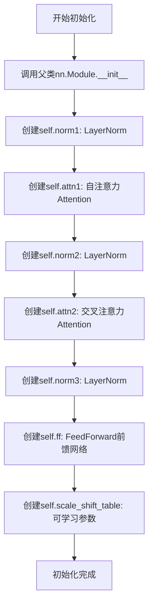
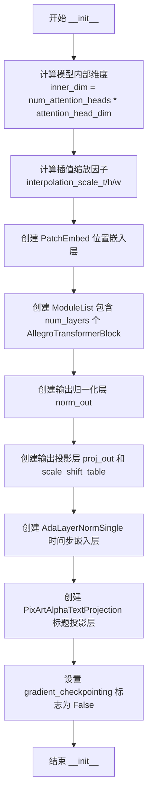

# `diffusers\src\diffusers\models\transformers\transformer_allegro.py` 详细设计文档

这是一个用于视频生成的3D Transformer模型（Allegro），采用时空patch化处理输入数据，通过自注意力、交叉注意力和前馈网络进行特征提取，并使用AdaLayerNormSingle进行时间步调节和PixArtAlphaTextProjection处理文本嵌入，最终输出重构的视频latent。

## 整体流程

```mermaid
graph TD
    A[输入: hidden_states (B, C, T, H, W)] --> B[Patch Embedding]
    B --> C[Timestep Embedding via AdaLayerNormSingle]
    C --> D[Caption Projection]
    D --> E{遍历 Transformer Blocks}
    E -->|每个Block| F[Self-Attention (attn1)]
    F --> G[Cross-Attention (attn2)]
    G --> H[Feed-Forward Network]
    H --> E
    E --> I[Output Norm & Projection]
    I --> J[Unpatchify]
    J --> K[输出: Transformer2DModelOutput]
```

## 类结构

```
nn.Module
└── AllegroTransformerBlock (Transformer块)
ModelMixin, ConfigMixin, CacheMixin
└── AllegroTransformer3DModel (主模型)
```

## 全局变量及字段


### `logger`
    
模块级日志记录器，用于记录调试和运行信息

类型：`logging.Logger`
    


### `maybe_allow_in_graph`
    
装饰器，允许指定函数在梯度计算图中使用

类型：`decorator`
    


### `AllegroTransformerBlock.norm1`
    
自注意力前的归一化层

类型：`nn.LayerNorm`
    


### `AllegroTransformerBlock.attn1`
    
自注意力机制

类型：`Attention`
    


### `AllegroTransformerBlock.norm2`
    
交叉注意力前的归一化层

类型：`nn.LayerNorm`
    


### `AllegroTransformerBlock.attn2`
    
交叉注意力机制

类型：`Attention`
    


### `AllegroTransformerBlock.norm3`
    
前馈网络前的归一化层

类型：`nn.LayerNorm`
    


### `AllegroTransformerBlock.ff`
    
前馈神经网络

类型：`FeedForward`
    


### `AllegroTransformerBlock.scale_shift_table`
    
AdaLN的缩放和平移参数

类型：`nn.Parameter`
    


### `AllegroTransformer3DModel.inner_dim`
    
内部维度 (num_attention_heads * attention_head_dim)

类型：`int`
    


### `AllegroTransformer3DModel.pos_embed`
    
位置嵌入层

类型：`PatchEmbed`
    


### `AllegroTransformer3DModel.transformer_blocks`
    
Transformer块列表

类型：`nn.ModuleList`
    


### `AllegroTransformer3DModel.norm_out`
    
输出归一化层

类型：`nn.LayerNorm`
    


### `AllegroTransformer3DModel.scale_shift_table`
    
输出层的缩放平移参数

类型：`nn.Parameter`
    


### `AllegroTransformer3DModel.proj_out`
    
输出投影层

类型：`nn.Linear`
    


### `AllegroTransformer3DModel.adaln_single`
    
时间步调节层

类型：`AdaLayerNormSingle`
    


### `AllegroTransformer3DModel.caption_projection`
    
文本嵌入投影层

类型：`PixArtAlphaTextProjection`
    


### `AllegroTransformer3DModel.gradient_checkpointing`
    
梯度检查点标志

类型：`bool`
    
    

## 全局函数及方法


### `AllegroTransformerBlock.__init__`

初始化Allegro模型的Transformer块，构建自注意力、交叉注意力和前馈网络的核心结构。

参数：

- `dim`：`int`，输入和输出的通道数
- `num_attention_heads`：`int`，多头注意力机制中使用的注意力头数
- `attention_head_dim`：`int`，每个注意力头内部的通道维度
- `dropout`：`float`，默认为`0.0`，注意力层和前馈层的dropout概率
- `cross_attention_dim`：`int | None`，默认为`None`，交叉注意力特征的空间维度，用于接收外部条件信息
- `activation_fn`：`str`，默认为`"geglu"`，前馈网络中使用的激活函数类型
- `attention_bias`：`bool`，默认为`False`，是否在注意力投影层中使用偏置项
- `norm_elementwise_affine`：`bool`，默认为`True`，是否在LayerNorm中使用可学习的逐元素仿射参数
- `norm_eps`：`float`，默认为`1e-5`，LayerNorm中的epsilon数值稳定项

返回值：`None`（`__init__`方法无返回值）

#### 流程图



#### 带注释源码

```python
def __init__(
    self,
    dim: int,                          # 输入输出的特征维度
    num_attention_heads: int,          # 注意力头数量
    attention_head_dim: int,           # 每个头的维度
    dropout=0.0,                       # Dropout概率
    cross_attention_dim: int | None = None,  # 跨注意力维度
    activation_fn: str = "geglu",      # 激活函数类型
    attention_bias: bool = False,      # 注意力偏置开关
    norm_elementwise_affine: bool = True,  # LayerNorm仿射开关
    norm_eps: float = 1e-5,            # LayerNorm epsilon
):
    super().__init__()  # 初始化nn.Module基类

    # 1. 自注意力(Self-Attention)模块
    # 使用LayerNorm进行输入归一化
    self.norm1 = nn.LayerNorm(dim, elementwise_affine=norm_elementwise_affine, eps=norm_eps)

    # 实例化自注意力层，cross_attention_dim=None表示仅做自注意力
    self.attn1 = Attention(
        query_dim=dim,
        heads=num_attention_heads,
        dim_head=attention_head_dim,
        dropout=dropout,
        bias=attention_bias,
        cross_attention_dim=None,  # 自注意力不接收外部上下文
        processor=AllegroAttnProcessor2_0(),
    )

    # 2. 交叉注意力(Cross-Attention)模块
    # 同样使用LayerNorm进行归一化
    self.norm2 = nn.LayerNorm(dim, elementwise_affine=norm_elementwise_affine, eps=norm_eps)
    
    # 实例化交叉注意力层，用于融合encoder_hidden_states
    self.attn2 = Attention(
        query_dim=dim,
        cross_attention_dim=cross_attention_dim,  # 接收外部条件
        heads=num_attention_heads,
        dim_head=attention_head_dim,
        dropout=dropout,
        bias=attention_bias,
        processor=AllegroAttnProcessor2_0(),
    )

    # 3. 前馈网络(Feed-Forward Network)模块
    self.norm3 = nn.LayerNorm(dim, elementwise_affine=norm_elementwise_affine, eps=norm_eps)

    # 实例化FFN，采用指定的激活函数
    self.ff = FeedForward(
        dim,
        dropout=dropout,
        activation_fn=activation_fn,
    )

    # 4. 缩放-平移表(Scale-Shift Table)
    # 用于AdaLN调制的6个参数向量：[shift_msa, scale_msa, gate_msa, shift_mlp, scale_mlp, gate_mlp]
    self.scale_shift_table = nn.Parameter(torch.randn(6, dim) / dim**0.5)
```


### AllegroTransformerBlock.forward

该方法是 AllegroTransformerBlock 的前向传播函数，负责执行自注意力、交叉注意力和前馈网络的变换，并通过 AdaLN-Single 机制进行自适应特征调制，最终返回处理后的隐藏状态张量。

参数：

- `hidden_states`：`torch.Tensor`，输入的隐藏状态张量，形状为 [batch, seq_len, dim]
- `encoder_hidden_states`：`torch.Tensor | None`，编码器的隐藏状态，用于跨注意力机制，默认为 None
- `temb`：`torch.LongTensor | None`，时间步嵌入向量，用于计算 AdaLN 缩放和移位参数，默认为 None
- `attention_mask`：`torch.Tensor | None`，自注意力的注意力掩码，用于控制哪些位置可以被注意力机制访问，默认为 None
- `encoder_attention_mask`：`torch.Tensor | None`，跨注意力的注意力掩码，用于控制编码器信息的访问，默认为 None
- `image_rotary_emb`：旋转嵌入（RoPE）相关参数，用于图像位置编码，默认为 None

返回值：`torch.Tensor`，经过自注意力、跨注意力和前馈网络处理后的隐藏状态张量

#### 流程图

```mermaid
flowchart TD
    A[输入 hidden_states] --> B[计算 AdaLN 参数]
    B --> C[从 scale_shift_table 和 temb 提取 shift_msa, scale_msa, gate_msa, shift_mlp, scale_mlp, gate_mlp]
    C --> D[norm1 归一化 hidden_states]
    D --> E[AdaLN 调制: norm_hidden_states * (1 + scale_msa) + shift_msa]
    E --> F[自注意力 attn1]
    F --> G[门控: gate_msa * attn_output]
    G --> H[残差连接: hidden_states + attn_output]
    H --> I{hidden_states.ndim == 4?}
    I -- 是 --> J[squeeze 维度]
    I -- 否 --> K[跳过 squeeze]
    J --> L{attn2 是否存在?}
    K --> L
    L -- 是 --> M[norm2 归一化]
    L -- 否 --> O[前馈网络]
    M --> N[跨注意力 attn2]
    N --> P[残差连接: hidden_states + attn_output]
    P --> O
    O --> Q[norm3 归一化 hidden_states]
    Q --> R[AdaLN 调制: norm_hidden_states * (1 + scale_mlp) + shift_mlp]
    R --> S[前馈网络 ff]
    S --> T[门控: gate_mlp * ff_output]
    T --> U[残差连接: hidden_states + ff_output]
    U --> V{hidden_states.ndim == 4?}
    V -- 是 --> W[squeeze 维度]
    V -- 否 --> X[返回 hidden_states]
    W --> X
```

#### 带注释源码

```python
def forward(
    self,
    hidden_states: torch.Tensor,
    encoder_hidden_states: torch.Tensor | None = None,
    temb: torch.LongTensor | None = None,
    attention_mask: torch.Tensor | None = None,
    encoder_attention_mask: torch.Tensor | None = None,
    image_rotary_emb=None,
) -> torch.Tensor:
    # 0. Self-Attention (自注意力阶段)
    # 获取批次大小，用于后续参数reshape
    batch_size = hidden_states.shape[0]

    # 从可学习的scale_shift_table中提取AdaLN参数
    # 该表包含6个向量，分别对应shift_msa, scale_msa, gate_msa, shift_mlp, scale_mlp, gate_mlp
    # 通过与temb相加实现条件生成
    shift_msa, scale_msa, gate_msa, shift_mlp, scale_mlp, gate_mlp = (
        self.scale_shift_table[None] + temb.reshape(batch_size, 6, -1)
    ).chunk(6, dim=1)
    
    # 第一层归一化，用于自注意力
    norm_hidden_states = self.norm1(hidden_states)
    # AdaLN-Single调制：先缩放后移位，与PixArtAlpha论文一致
    norm_hidden_states = norm_hidden_states * (1 + scale_msa) + shift_msa
    # 压缩维度以适配注意力层
    norm_hidden_states = norm_hidden_states.squeeze(1)

    # 执行自注意力计算，传入旋转位置编码
    attn_output = self.attn1(
        norm_hidden_states,
        encoder_hidden_states=None,  # 自注意力不需要编码器状态
        attention_mask=attention_mask,
        image_rotary_emb=image_rotary_emb,
    )
    # 应用门控机制进行输出调制
    attn_output = gate_msa * attn_output

    # 残差连接：输入与注意力输出相加
    hidden_states = attn_output + hidden_states
    # 如果是4维张量（包含空间维度），压缩序列维度
    if hidden_states.ndim == 4:
        hidden_states = hidden_states.squeeze(1)

    # 1. Cross-Attention (跨注意力阶段)
    # 当存在编码器隐藏状态时执行跨注意力
    if self.attn2 is not None:
        norm_hidden_states = hidden_states

        # 使用编码器隐藏状态作为KV来源
        attn_output = self.attn2(
            norm_hidden_states,
            encoder_hidden_states=encoder_hidden_states,
            attention_mask=encoder_attention_mask,
            image_rotary_emb=None,  # 跨注意力不使用旋转编码
        )
        hidden_states = attn_output + hidden_states

    # 2. Feed-forward (前馈网络阶段)
    # 第二层归一化（注意：代码中使用的是self.norm2，但从逻辑看应该是self.norm3）
    norm_hidden_states = self.norm2(hidden_states)
    # 前馈网络的AdaLN调制
    norm_hidden_states = norm_hidden_states * (1 + scale_mlp) + shift_mlp

    # 执行前馈网络变换
    ff_output = self.ff(norm_hidden_states)
    # 门控调制
    ff_output = gate_mlp * ff_output

    # 残差连接
    hidden_states = ff_output + hidden_states

    # TODO(aryan): maybe following line is not required
    # 注释掉的代码，可能是冗余操作
    if hidden_states.ndim == 4:
        hidden_states = hidden_states.squeeze(1)

    return hidden_states
```


### `AllegroTransformer3DModel.__init__`

该方法负责初始化 AllegroTransformer3DModel 类，这是一个用于视频类数据的 3D Transformer 模型。它配置了注意力头、嵌入层、Transformer 块、输出投影、时间步嵌入和标题投影等核心组件，以支持视频生成任务。

#### 参数

- `patch_size`：`int`，默认值为 `2`，空间补丁的大小，用于补丁嵌入层
- `patch_size_t`：`int`，默认值为 `1`，时间维度补丁的大小
- `num_attention_heads`：`int`，默认值为 `24`，多头注意力机制中的注意力头数量
- `attention_head_dim`：`int`，默认值为 `96`，每个注意力头中的通道数
- `in_channels`：`int`，默认值为 `4`，输入通道数
- `out_channels`：`int`，默认值为 `4`，输出通道数
- `num_layers`：`int`，默认值为 `32`，Transformer 块的数量
- `dropout`：`float`，默认值为 `0.0`，Dropout 概率
- `cross_attention_dim`：`int`，默认值为 `2304`，交叉注意力特征的维度
- `attention_bias`：`bool`，默认值为 `True`，是否在注意力投影层中使用偏置
- `sample_height`：`int`，默认值为 `90`，输入潜在变量的高度
- `sample_width`：`int`，默认值为 `160`，输入潜在变量的宽度
- `sample_frames`：`int`，默认值为 `22`，输入潜在变量的帧数
- `activation_fn`：`str`，默认值为 `"gelu-approximate"`，前馈网络中使用的激活函数
- `norm_elementwise_affine`：`bool`，默认值为 `False`，是否在归一化层中使用可学习的逐元素仿射参数
- `norm_eps`：`float`，默认值为 `1e-6`，归一化层中使用的 epsilon 值
- `caption_channels`：`int`，默认值为 `4096`，用于投影标题嵌入的通道数
- `interpolation_scale_h`：`float`，默认值为 `2.0`，3D 位置嵌入在高度维度上的缩放因子
- `interpolation_scale_w`：`float`，默认值为 `2.0`，3D 位置嵌入在宽度维度上的缩放因子
- `interpolation_scale_t`：`float`，默认值为 `2.2`，3D 位置嵌入在时间维度上的缩放因子

#### 返回值

`None`，该方法为初始化方法，不返回任何值，仅初始化对象的属性

#### 流程图



#### 带注释源码

```python
@register_to_config
def __init__(
    self,
    patch_size: int = 2,
    patch_size_t: int = 1,
    num_attention_heads: int = 24,
    attention_head_dim: int = 96,
    in_channels: int = 4,
    out_channels: int = 4,
    num_layers: int = 32,
    dropout: float = 0.0,
    cross_attention_dim: int = 2304,
    attention_bias: bool = True,
    sample_height: int = 90,
    sample_width: int = 160,
    sample_frames: int = 22,
    activation_fn: str = "gelu-approximate",
    norm_elementwise_affine: bool = False,
    norm_eps: float = 1e-6,
    caption_channels: int = 4096,
    interpolation_scale_h: float = 2.0,
    interpolation_scale_w: float = 2.0,
    interpolation_scale_t: float = 2.2,
):
    # 调用父类的初始化方法
    super().__init__()

    # 1. 计算模型内部维度，等于注意力头数乘以每个头的维度
    self.inner_dim = num_attention_heads * attention_head_dim

    # 2. 根据样本参数计算时间维度的插值缩放因子
    # 如果未提供则根据帧数自动计算
    interpolation_scale_t = (
        interpolation_scale_t
        if interpolation_scale_t is not None
        else ((sample_frames - 1) // 16 + 1)
        if sample_frames % 2 == 1
        else sample_frames // 16
    )
    # 根据样本高度计算高度维度的插值缩放因子
    interpolation_scale_h = interpolation_scale_h if interpolation_scale_h is not None else sample_height / 30
    # 根据样本宽度计算宽度维度的插值缩放因子
    interpolation_scale_w = interpolation_scale_w if interpolation_scale_w is not None else sample_width / 40

    # 3. 创建补丁嵌入层，用于将输入图像转换为补丁序列
    self.pos_embed = PatchEmbed(
        height=sample_height,
        width=sample_width,
        patch_size=patch_size,
        in_channels=in_channels,
        embed_dim=self.inner_dim,
        pos_embed_type=None,
    )

    # 4. 创建 Transformer 块列表，包含多个 AllegroTransformerBlock
    self.transformer_blocks = nn.ModuleList(
        [
            AllegroTransformerBlock(
                self.inner_dim,
                num_attention_heads,
                attention_head_dim,
                dropout=dropout,
                cross_attention_dim=cross_attention_dim,
                activation_fn=activation_fn,
                attention_bias=attention_bias,
                norm_elementwise_affine=norm_elementwise_affine,
                norm_eps=norm_eps,
            )
            for _ in range(num_layers)
        ]
    )

    # 5. 创建输出归一化层和投影层
    self.norm_out = nn.LayerNorm(self.inner_dim, elementwise_affine=False, eps=1e-6)
    self.scale_shift_table = nn.Parameter(torch.randn(2, self.inner_dim) / self.inner_dim**0.5)
    self.proj_out = nn.Linear(self.inner_dim, patch_size * patch_size * out_channels)

    # 6. 创建时间步嵌入层 (AdaLN)
    self.adaln_single = AdaLayerNormSingle(self.inner_dim, use_additional_conditions=False)

    # 7. 创建标题投影层，用于将标题嵌入投影到模型维度
    self.caption_projection = PixArtAlphaTextProjection(in_features=caption_channels, hidden_size=self.inner_dim)

    # 8. 初始化梯度检查点标志为 False
    self.gradient_checkpointing = False
```


### `AllegroTransformer3DModel.forward`

该方法是 Allegro 3D 转换器模型的前向传播核心实现，负责将输入的隐藏状态（视频/图像潜在表示）通过时间步嵌入、补丁嵌入、多个变换器块和输出投影处理，最终输出重构的潜在表示，支持交叉注意力机制以融合文本编码器信息，并可选返回字典或元组形式的结果。

参数：

- `hidden_states`：`torch.Tensor`，输入的隐藏状态张量，形状为 (batch_size, num_channels, num_frames, height, width)，代表视频或图像的潜在表示
- `encoder_hidden_states`：`torch.Tensor`，编码器的隐藏状态，通常为文本嵌入向量，用于交叉注意力机制
- `timestep`：`torch.LongTensor`，扩散模型的时间步，用于 AdaLN 单层归一化以实现条件生成
- `attention_mask`：`torch.Tensor | None`，可选的注意力掩码，用于控制哪些位置参与自注意力计算
- `encoder_attention_mask`：`torch.Tensor | None`，可选的编码器注意力掩码，用于控制交叉注意力中编码器信息的参与程度
- `image_rotary_emb`：`tuple[torch.Tensor, torch.Tensor] | None`，可选的图像旋转位置嵌入，用于增强位置编码
- `return_dict`：`bool`，默认为 True，是否返回字典形式的 Transformer2DModelOutput，若为 False 则返回元组

返回值：`Transformer2DModelOutput` 或 tuple，当 return_dict=True 时返回包含 sample 属性的命名元组，否则返回 (output,) 元组

#### 流程图

```mermaid
flowchart TD
    A[输入 hidden_states] --> B[解析输入维度信息]
    B --> C{attention_mask 存在?}
    C -->|Yes| D[将 mask 转换为注意力偏置]
    C -->|No| E[attention_mask_vid/img = None]
    D --> F{encoder_attention_mask 存在?}
    E --> F
    F -->|Yes| G[将 encoder_mask 转换为偏置]
    F -->|No| H[encoder_attention_mask = None]
    G --> I[AdaLN Single 时间步嵌入]
    H --> I
    I --> J[Patch Embedding 补丁嵌入]
    J --> K[Caption Projection 标题投影]
    K --> L[遍历 Transformer Blocks]
    L --> M{启用梯度检查点?}
    M -->|Yes| N[使用 _gradient_checkpointing_func]
    M -->|No| O[直接调用 block.forward]
    N --> P[输出归一化与调制]
    O --> P
    P --> Q[线性投影输出]
    Q --> R[Unpatchify 反补丁化]
    R --> S{return_dict=True?}
    S -->|Yes| T[返回 Transformer2DModelOutput]
    S -->|No| U[返回元组 (output,)]
```

#### 带注释源码

```python
def forward(
    self,
    hidden_states: torch.Tensor,  # 输入: [batch_size, channels, frames, height, width]
    encoder_hidden_states: torch.Tensor,  # 文本编码器输出
    timestep: torch.LongTensor,  # 扩散时间步
    attention_mask: torch.Tensor | None = None,  # 空间注意力掩码
    encoder_attention_mask: torch.Tensor | None = None,  # 交叉注意力掩码
    image_rotary_emb: tuple[torch.Tensor, torch.Tensor] | None = None,  # 旋转位置编码
    return_dict: bool = True,  # 返回格式控制
):
    # ========== 步骤1: 解析输入维度信息 ==========
    batch_size, num_channels, num_frames, height, width = hidden_states.shape
    p_t = self.config.patch_size_t  # 时间维度补丁大小
    p = self.config.patch_size      # 空间维度补丁大小

    # 计算补丁化后的空间/时间维度
    post_patch_num_frames = num_frames // p_t
    post_patch_height = height // p
    post_patch_width = width // p

    # ========== 步骤2: 处理注意力掩码 ==========
    # 将掩码转换为注意力偏置（可选操作）
    # 支持 4D 掩码 [batch, frames, height, width] -> 2D 偏置
    if attention_mask is not None and attention_mask.ndim == 4:
        attention_mask = attention_mask.to(hidden_states.dtype)
        attention_mask = attention_mask[:, :num_frames]  # 裁剪到实际帧数

        if attention_mask.numel() > 0:
            # 3D 池化下采样掩码，与补丁化后的分辨率对齐
            attention_mask = attention_mask.unsqueeze(1)  # [B,1,F,H,W]
            attention_mask = F.max_pool3d(
                attention_mask, 
                kernel_size=(p_t, p, p), 
                stride=(p_t, p, p)
            )
            attention_mask = attention_mask.flatten(1).view(batch_size, 1, -1)

        # 转换为偏置: keep=+0, discard=-10000.0
        attention_mask = (
            (1 - attention_mask.bool().to(hidden_states.dtype)) * -10000.0 
            if attention_mask.numel() > 0 else None
        )

    # 编码器注意力掩码相同处理
    if encoder_attention_mask is not None and encoder_attention_mask.ndim == 2:
        encoder_attention_mask = (1 - encoder_attention_mask.to(self.dtype)) * -10000.0
        encoder_attention_mask = encoder_attention_mask.unsqueeze(1)

    # ========== 步骤3: 时间步嵌入 (AdaLN Single) ==========
    # 使用自适应层归一化注入时间步条件信息
    timestep, embedded_timestep = self.adaln_single(
        timestep, 
        batch_size=batch_size, 
        hidden_dtype=hidden_states.dtype
    )

    # ========== 步骤4: 补丁嵌入 (Patch Embedding) ==========
    # 将输入潜在表示转换为补丁序列
    # 维度变换: [B, C, F, H, W] -> [B*F, C, H, W] -> [B*F, H', W', dim] -> [B, F', H'*W', dim]
    hidden_states = hidden_states.permute(0, 2, 1, 3, 4).flatten(0, 1)  # 合并batch和帧
    hidden_states = self.pos_embed(hidden_states)  # 位置嵌入
    hidden_states = hidden_states.unflatten(0, (batch_size, -1)).flatten(1, 2)  # 恢复维度

    # ========== 步骤5: 标题/文本投影 ==========
    # 将文本嵌入投影到与模型内部维度匹配的空间
    encoder_hidden_states = self.caption_projection(encoder_hidden_states)
    encoder_hidden_states = encoder_hidden_states.view(batch_size, -1, encoder_hidden_states.shape[-1])

    # ========== 步骤6: 遍历 Transformer 块 ==========
    for i, block in enumerate(self.transformer_blocks):
        # 支持梯度检查点以节省显存
        if torch.is_grad_enabled() and self.gradient_checkpointing:
            hidden_states = self._gradient_checkpointing_func(
                block,
                hidden_states,
                encoder_hidden_states,
                timestep,
                attention_mask,
                encoder_attention_mask,
                image_rotary_emb,
            )
        else:
            hidden_states = block(
                hidden_states=hidden_states,
                encoder_hidden_states=encoder_hidden_states,
                temb=timestep,
                attention_mask=attention_mask,
                encoder_attention_mask=encoder_attention_mask,
                image_rotary_emb=image_rotary_emb,
            )

    # ========== 步骤7: 输出归一化与调制 ==========
    # 仿射调制: hidden_states = hidden_states * (1 + scale) + shift
    shift, scale = (self.scale_shift_table[None] + embedded_timestep[:, None]).chunk(2, dim=1)
    hidden_states = self.norm_out(hidden_states)
    hidden_states = hidden_states * (1 + scale) + shift
    hidden_states = self.proj_out(hidden_states)  # 线性投影回像素空间
    hidden_states = hidden_states.squeeze(1)

    # ========== 步骤8: 反补丁化 (Unpatchify) ==========
    # 将补丁序列还原为 5D 张量 [B, C, F, H, W]
    hidden_states = hidden_states.reshape(
        batch_size, post_patch_num_frames, post_patch_height, post_patch_width,
        p_t, p, p, -1
    )
    hidden_states = hidden_states.permute(0, 7, 1, 4, 2, 5, 3, 6)  # 维度重排
    output = hidden_states.reshape(batch_size, -1, num_frames, height, width)

    # ========== 步骤9: 返回结果 ==========
    if not return_dict:
        return (output,)

    return Transformer2DModelOutput(sample=output)
```

## 关键组件


### AllegroTransformerBlock

3D Transformer块，包含自注意力、交叉注意力、FeedForward和AdaLN-Style的scale-shift调制，用于视频生成模型的核心计算单元。

### AllegroTransformer3DModel

主3D Transformer模型类，负责视频数据的patch嵌入、Transformer块堆叠、输出投影和解patchify，支持条件生成和时空维度处理。

### PatchEmbed

时空patch嵌入层，将输入的(b, c, t, h, w)视频张量转换为(b, t*p_h*p_w, d)的patch序列，用于后续Transformer处理。

### AdaLayerNormSingle

自适应层归一化单例，根据timestep生成归一化参数，实现条件信息注入到模型中。

### PixArtAlphaTextProjection

文本/_caption嵌入投影层，将高维文本特征映射到Transformer内部维度，连接文本编码器与生成模型。

### AllegroAttnProcessor2_0

自定义注意力处理器，实现融合RoPE（旋转位置嵌入）的注意力计算，支持视频和图像的旋转位置编码。

### FeedForward

前馈网络模块，采用GeGLU激活函数，对特征进行非线性变换和维度扩展。

### CacheMixin

缓存混入类，提供KV cache支持，用于推理加速和内存优化。

### 位置编码与插值策略

支持3D位置编码的动态插值（interpolation_scale_t/h/w），根据输入分辨率自适应调整位置嵌入尺度。

### 注意力掩码处理

将2D/4D注意力掩码转换为注意力偏置，处理视频和图像混合场景，支持时空维度的池化和广播。

### 梯度检查点支持

通过gradient_checkpointing标志和_gradient_checkpointing_func实现显存优化的梯度计算策略。


## 问题及建议


### 已知问题

-   **TODO 注释未实现**：代码中存在多个 TODO 注释（如 "TODO(aryan): Implement gradient checkpointing"、"TODO(aryan): maybe following line is not required"），表明功能尚未完成或存在不确定性。
-   **`squeeze(1)` 维度处理风险**：`AllegroTransformerBlock.forward` 方法中多次使用 `squeeze(1)`，可能在某些情况下意外移除有效维度，导致运行时错误或难以追踪的 bug。
-   **`temb` 参数类型标注错误**：参数类型标注为 `torch.LongTensor`，但实际使用中传入的是 `timestep`（由 `adaln_single` 返回），类型可能不匹配。
-   **梯度检查点未启用**：`gradient_checkpointing` 变量存在但始终为 `False`，且实际调用 `_gradient_checkpointing_func` 的代码路径未完整实现，显存优化功能不可用。
-   **硬编码数值**：`attention_mask` 处理中使用硬编码的 `-10000.0` 作为遮罩值，缺乏常量定义，影响可维护性。
-   **attention_mask 处理逻辑复杂**：4D/2D mask 转换、unsqueeze、max_pool3d 等操作堆叠，逻辑晦涩难懂，容易出错且难以调试。

### 优化建议

-   **移除或完成 TODO 事项**：要么实现梯度检查点功能，要么移除 TODO 注释和未使用的代码（如 `gradient_checkpointing` 变量）。
-   **重构维度处理逻辑**：使用显式的 `reshape` 或 `view` 操作替代 `squeeze`，或在必要时添加维度验证和断言，确保维度符合预期。
-   **修复类型标注**：将 `temb` 参数类型修正为 `torch.Tensor`，或根据实际传入类型调整。
-   **提取魔法数值**：将 `-10000.0`、`1` 等硬编码值提取为具名常量（如 `ATTENTION_MASK_DISCARD_VALUE`），提高代码可读性。
-   **简化 attention_mask 处理**：将复杂的 mask 转换逻辑封装为独立方法，并添加详细的文档字符串和类型标注。
-   **添加单元测试**：针对 `forward` 方法的不同输入场景（不同维度、mask 组合）添加测试用例，确保维度处理逻辑的正确性。

## 其它


### 设计目标与约束

本模块旨在实现Allegro模型的3D Transformer架构，用于视频生成任务。设计目标包括：(1) 支持视频帧的时空建模，通过patch embedding将输入转换为序列形式；(2) 实现自注意力、交叉注意力和前馈网络的组合结构；(3) 支持AdaLN条件注入机制，实现对生成过程的动态控制；(4) 支持梯度检查点以减少显存占用。约束条件包括：输入必须是5D张量(batch, channels, frames, height, width)；patch_size_t和patch_size分别控制时间和空间的patch划分；cross_attention_dim必须与caption projection输出维度匹配。

### 错误处理与异常设计

主要异常场景包括：(1) 输入维度不匹配：hidden_states必须为5D张量，若维度不符应抛出ValueError并提示期望的shape格式；(2) attention_mask维度错误：mask应为4D张量(b, frame+use_image_num, h, w)或2D张量，若维度不符则忽略该mask；(3) encoder_hidden_states为空：当cross_attention启用但encoder_hidden_states为None时，cross attention模块将跳过；(4) 数值溢出：shift和scale通过timestep嵌入计算，需确保嵌入维度与inner_dim匹配，否则在chunk操作时可能出错；(5) 类型转换错误：attention_mask转换为bool和dtype时需确保输入张量有效。

### 数据流与状态机

数据流分为以下几个阶段：(1) 输入预处理阶段：将5D latent张量进行patch embedding，通过pos_embed和caption_projection分别处理视觉和文本特征；(2) 时间步嵌入阶段：通过adaln_single将timestep转换为条件嵌入；(3) Transformer块处理阶段：数据依次经过num_layers个AllegroTransformerBlock，每个块内部包含自注意力、交叉注意力和前馈网络的级联；(4) 输出生成阶段：通过norm_out、scale-shift调制和proj_out将隐藏状态投影回像素空间，最后进行unpatchify恢复原始空间维度。状态转移由timestep和attention_mask控制，梯度检查点标志决定是否启用显存优化。

### 外部依赖与接口契约

核心依赖包括：(1) torch和torch.nn：基础张量操作和神经网络模块；(2) FeedForward：前馈网络实现，来自...attention；(3) Attention和AllegroAttnProcessor2_0：注意力机制实现，来自...attention_processor；(4) PatchEmbed和PixArtAlphaTextProjection：嵌入层实现，来自...embeddings；(5) AdaLayerNormSingle：自适应层归一化，来自...normalization；(6) CacheMixin和ConfigMixin：配置和缓存管理，来自...cache_utils和...configuration_utils。输入契约：hidden_states为(batch, channels, frames, height, width)的5D张量，encoder_hidden_states为文本嵌入张量，timestep为LongTensor。输出契约：返回Transformer2DModelOutput或元组形式，包含sample张量。

### 配置与初始化设计

配置参数通过@register_to_config装饰器注册，包括patch_size(2)、patch_size_t(1)、num_attention_heads(24)、attention_head_dim(96)、num_layers(32)等核心超参数。初始化流程首先计算inner_dim，然后根据sample_height/width/frames计算插值缩放因子，接着依次初始化pos_embed、transformer_blocks、norm_out、scale_shift_table、proj_out、adaln_single和caption_projection。内部维度统一为inner_dim = num_attention_heads * attention_head_dim，确保各组件维度一致。

### 性能考虑与优化建议

性能优化点包括：(1) 梯度检查点：当前gradient_checkpointing标记存在但实现不完整，建议在transformer_blocks循环中正确实现_gradient_checkpointing_func；(2) 注意力掩码优化：F.max_pool3d用于下采样mask，可考虑使用inplace操作减少内存；(3) 张量重塑优化：多次permute和reshape操作可考虑合并；(4) 条件计算：cross_attention可设为可选以跳过不必要的计算。显存占用主要来自transformer_blocks中的attention和ff层，建议根据硬件条件调整num_layers和attention_head_dim。

### 安全性考虑

输入验证：建议在forward入口添加hidden_states.shape验证，确保维度为5D且channels、frames、height、width均为正整数。数值安全：scale_msa和shift_msa等参数通过timestep嵌入计算，需防止极端值输入导致数值不稳定。模型参数保护：所有可学习参数应设置requires_grad=True，但需防止梯度泄露到预训练组件。

### 测试策略建议

单元测试应覆盖：(1) 正向传播测试：使用随机输入验证输出shape正确性；(2) 梯度计算测试：确认所有参数可正确计算梯度；(3) 梯度检查点测试：验证启用gradient_checkpointing时输出与不使用时一致；(4) 注意力掩码测试：验证不同mask形状的处理逻辑；(5) 配置序列化测试：验证ConfigMixin的save/load功能；(6) 边界条件测试：处理单帧、极端分辨率等特殊情况。


    