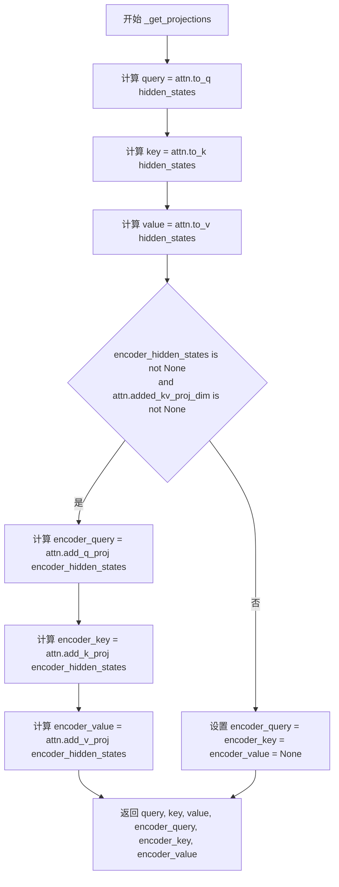
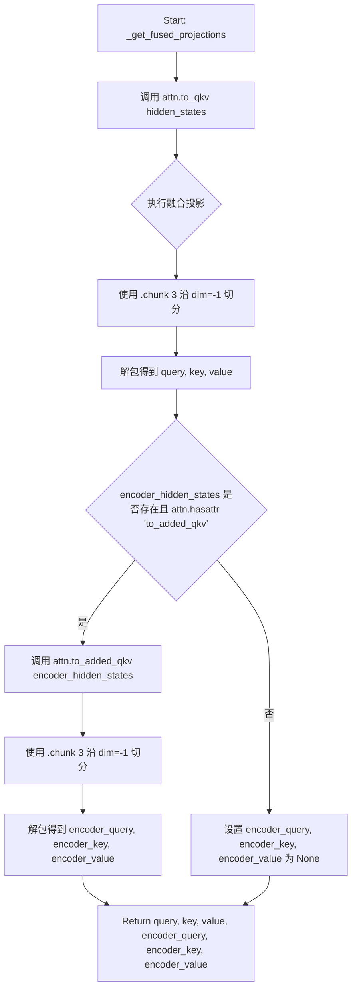
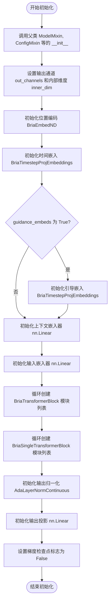
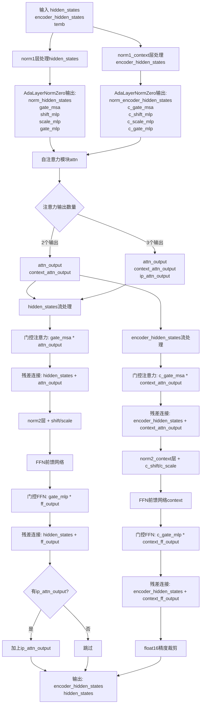
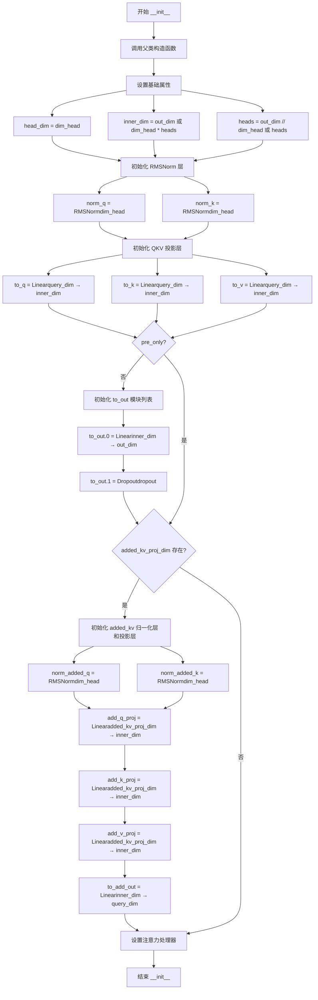
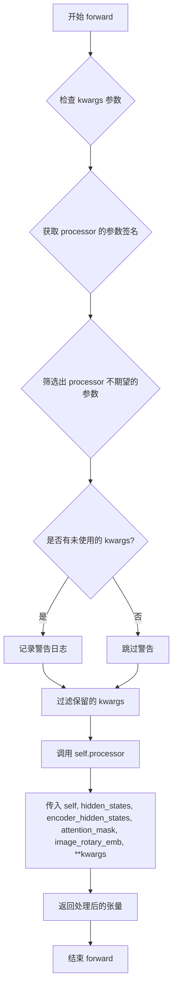
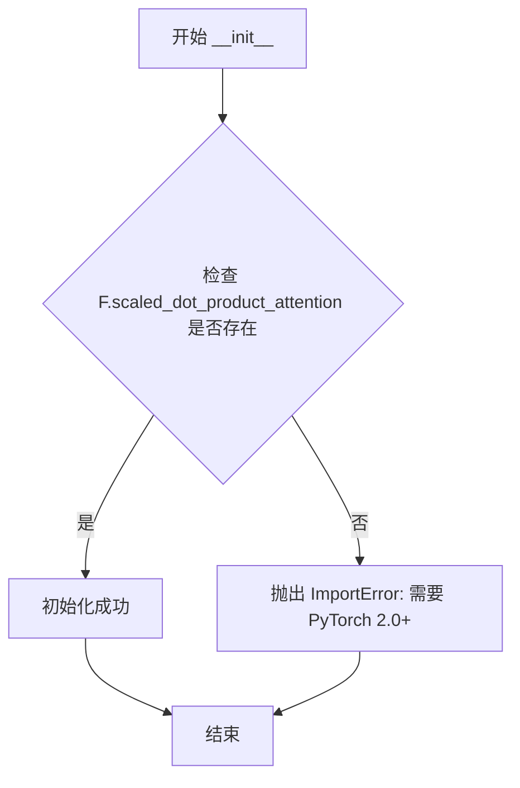
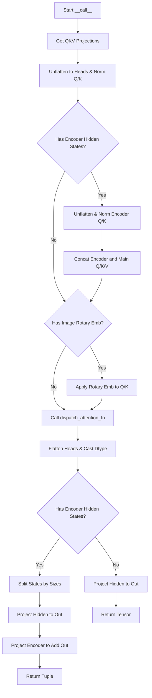
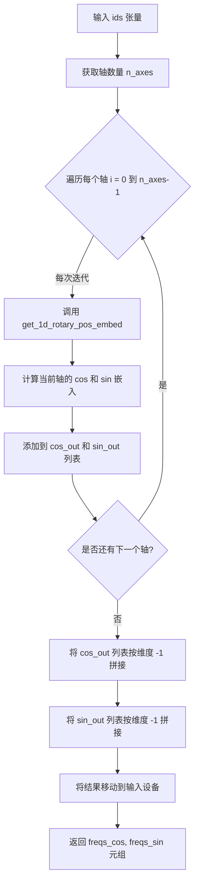
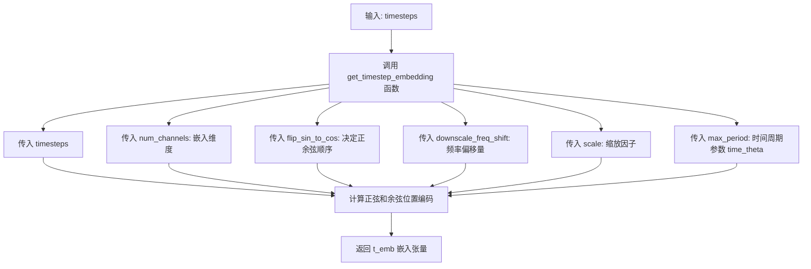

# `diffusers\src\diffusers\models\transformers\transformer_bria.py` 详细设计文档

这是一个基于Flux架构的BriaTransformer2DModel实现，用于处理图像潜在向量（latents）和文本嵌入（encoder_hidden_states），采用双流transformer块（Dual Stream）和单流块（Single Stream）结合RoPE旋转位置嵌入和自适应层归一化，支持ControlNet残差连接。

## 整体流程

```mermaid
graph TD
    Start[输入: hidden_states, encoder_hidden_states, timestep, img_ids, txt_ids]
    Embed[Embedding层]
    Start --> Embed
    Embed --> X_Embed[x_embedder: 线性投影]
    Embed --> Context_Embed[context_embedder: 线性投影]
    Embed --> Time_Embed[time_embed: 时间步嵌入 + guidance_embed]
    Embed --> Pos_Embed[pos_embed: RoPE位置嵌入]
    X_Embed --> Blocks[循环处理]
    Context_Embed --> Blocks
    Time_Embed --> Blocks
    Pos_Embed --> Blocks
    Blocks --> Dual_Stream[BriaTransformerBlock (双流)]
    Dual_Stream --> Attn_Dual[自注意力 + 交叉注意力]
    Attn_Dual --> FFN_Dual[FFN (前馈网络)]
    FFN_Dual --> Single_Stream[BriaSingleTransformerBlock (单流)]
    Single_Stream --> Attn_Single[合并后注意力]
    Attn_Single --> FFN_Single[FFN + 投影]
    FFN_Single --> Output_Head[norm_out + proj_out]
    Output_Head --> End[输出: sample tensor]
```

## 类结构

```
torch.nn.Module (基类)
├── BriaAttnProcessor (注意力处理器)
├── BriaAttention (注意力模块, AttentionModuleMixin)
├── BriaEmbedND (N维位置嵌入)
├── BriaTimesteps (时间步处理)
├── BriaTimestepProjEmbeddings (时间步嵌入)
├── BriaPosEmbed (位置嵌入，与BriaEmbedND类似)
├── BriaTransformerBlock (双流Transformer块)
├── BriaSingleTransformerBlock (单流Transformer块)
└── BriaTransformer2DModel (主模型, ModelMixin, ConfigMixin, ...)
```

## 全局变量及字段


### `logger`
    
模块日志记录器

类型：`logging.Logger`
    


### `BriaTransformer2DModel.out_channels`
    
输出通道数

类型：`int`
    


### `BriaTransformer2DModel.inner_dim`
    
内部维度 (heads * head_dim)

类型：`int`
    


### `BriaTransformer2DModel.pos_embed`
    
位置编码

类型：`BriaEmbedND`
    


### `BriaTransformer2DModel.time_embed`
    
时间步嵌入

类型：`BriaTimestepProjEmbeddings`
    


### `BriaTransformer2DModel.guidance_embed`
    
引导嵌入

类型：`BriaTimestepProjEmbeddings`
    


### `BriaTransformer2DModel.context_embedder`
    
文本上下文投影

类型：`nn.Linear`
    


### `BriaTransformer2DModel.x_embedder`
    
图像latent投影

类型：`nn.Linear`
    


### `BriaTransformer2DModel.transformer_blocks`
    
双流Transformer块列表

类型：`nn.ModuleList`
    


### `BriaTransformer2DModel.single_transformer_blocks`
    
单流Transformer块列表

类型：`nn.ModuleList`
    


### `BriaTransformer2DModel.norm_out`
    
输出归一化

类型：`AdaLayerNormContinuous`
    


### `BriaTransformer2DModel.proj_out`
    
输出投影

类型：`nn.Linear`
    


### `BriaTransformer2DModel.gradient_checkpointing`
    
梯度检查点标志

类型：`bool`
    


### `BriaTransformerBlock.norm1`
    
hidden_states的归一化

类型：`AdaLayerNormZero`
    


### `BriaTransformerBlock.norm1_context`
    
encoder_hidden_states的归一化

类型：`AdaLayerNormZero`
    


### `BriaTransformerBlock.attn`
    
注意力机制

类型：`BriaAttention`
    


### `BriaTransformerBlock.norm2`
    
FFN前归一化

类型：`nn.LayerNorm`
    


### `BriaTransformerBlock.ff`
    
前馈网络

类型：`FeedForward`
    


### `BriaTransformerBlock.norm2_context`
    
上下文的FFN前归一化

类型：`nn.LayerNorm`
    


### `BriaTransformerBlock.ff_context`
    
上下文的前馈网络

类型：`FeedForward`
    


### `BriaSingleTransformerBlock.mlp_hidden_dim`
    
MLP隐藏层维度

类型：`int`
    


### `BriaSingleTransformerBlock.norm`
    
归一化层

类型：`AdaLayerNormZeroSingle`
    


### `BriaSingleTransformerBlock.proj_mlp`
    
MLP投影

类型：`nn.Linear`
    


### `BriaSingleTransformerBlock.act_mlp`
    
激活函数

类型：`nn.GELU`
    


### `BriaSingleTransformerBlock.proj_out`
    
输出投影

类型：`nn.Linear`
    


### `BriaSingleTransformerBlock.attn`
    
注意力机制

类型：`BriaAttention`
    


### `BriaAttention.head_dim`
    
头维度

类型：`int`
    


### `BriaAttention.inner_dim`
    
内部维度

类型：`int`
    


### `BriaAttention.query_dim`
    
查询维度

类型：`int`
    


### `BriaAttention.heads`
    
注意力头数

类型：`int`
    


### `BriaAttention.added_kv_proj_dim`
    
额外的KV投影维度

类型：`int`
    


### `BriaAttention.norm_q`
    
Q归一化

类型：`nn.RMSNorm`
    


### `BriaAttention.norm_k`
    
K归一化

类型：`nn.RMSNorm`
    


### `BriaAttention.to_q`
    
Q投影

类型：`nn.Linear`
    


### `BriaAttention.to_k`
    
K投影

类型：`nn.Linear`
    


### `BriaAttention.to_v`
    
V投影

类型：`nn.Linear`
    


### `BriaAttention.to_out`
    
输出层(含Dropout)

类型：`nn.ModuleList`
    


### `BriaAttention.add_q_proj`
    
额外的Q投影(用于交叉注意力)

类型：`nn.Linear`
    


### `BriaAttention.add_k_proj`
    
额外的K投影(用于交叉注意力)

类型：`nn.Linear`
    


### `BriaAttention.add_v_proj`
    
额外的V投影(用于交叉注意力)

类型：`nn.Linear`
    


### `BriaAttention.processor`
    
注意力处理器实例

类型：`BriaAttnProcessor`
    


### `BriaAttnProcessor._attention_backend`
    
注意力后端配置

类型：`Any`
    


### `BriaAttnProcessor._parallel_config`
    
并行配置

类型：`Any`
    


### `BriaEmbedND.theta`
    
RoPE theta参数

类型：`int`
    


### `BriaEmbedND.axes_dim`
    
各轴维度

类型：`list[int]`
    


### `BriaPosEmbed.theta`
    
RoPE theta参数

类型：`int`
    


### `BriaPosEmbed.axes_dim`
    
各轴维度

类型：`list[int]`
    


### `BriaTimesteps.num_channels`
    
通道数

类型：`int`
    


### `BriaTimesteps.flip_sin_to_cos`
    
是否翻转正弦为余弦

类型：`bool`
    


### `BriaTimesteps.downscale_freq_shift`
    
频率下移量

类型：`float`
    


### `BriaTimesteps.scale`
    
缩放因子

类型：`int`
    


### `BriaTimesteps.time_theta`
    
时间theta参数

类型：`float`
    


### `BriaTimestepProjEmbeddings.time_proj`
    
时间步投影模块

类型：`BriaTimesteps`
    


### `BriaTimestepProjEmbeddings.timestep_embedder`
    
时间步嵌入器

类型：`TimestepEmbedding`
    
    

## 全局函数及方法


### `_get_projections`

标准的QKV投影计算函数，用于计算注意力机制中的query、key、value投影。对于交叉注意力，还额外计算encoder部分的投影。

参数：

- `attn`：`BriaAttention`，注意力模块实例，包含to_q、to_k、to_v等线性投影层
- `hidden_states`：`torch.Tensor`，输入的隐藏状态，形状为(batch, seq_len, hidden_dim)
- `encoder_hidden_states`：`torch.Tensor | None`，编码器隐藏状态，用于交叉注意力计算

返回值：`tuple[torch.Tensor, torch.Tensor, torch.Tensor, torch.Tensor | None, torch.Tensor | None, torch.Tensor | None]`，返回(query, key, value, encoder_query, encoder_key, encoder_value)元组，其中encoder_query、encoder_key、encoder_value在未提供encoder_hidden_states或added_kv_proj_dim为None时为None

#### 流程图



#### 带注释源码

```python
def _get_projections(attn: "BriaAttention", hidden_states, encoder_hidden_states=None):
    """
    标准QKV投影计算函数
    
    该函数执行标准的Query、Key、Value投影计算，用于自注意力机制。
    当提供encoder_hidden_states时，还会计算交叉注意力所需的encoder部分投影。
    
    参数:
        attn: BriaAttention实例，包含to_q、to_k、to_v等线性层
        hidden_states: 输入隐藏状态，形状为(batch, seq_len, hidden_dim)
        encoder_hidden_states: 可选的编码器隐藏状态，用于交叉注意力
    
    返回:
        (query, key, value, encoder_query, encoder_key, encoder_value)元组
    """
    # 使用to_q线性层对hidden_states进行query投影
    # to_q将hidden_dim投影到inner_dim (head_dim * heads)
    query = attn.to_q(hidden_states)
    
    # 使用to_k线性层对hidden_states进行key投影
    key = attn.to_k(hidden_states)
    
    # 使用to_v线性层对hidden_states进行value投影
    value = attn.to_v(hidden_states)

    # 初始化encoder部分投影为None
    encoder_query = encoder_key = encoder_value = None
    
    # 仅当同时满足以下条件时才计算encoder投影：
    # 1. 提供了encoder_hidden_states（交叉注意力需要）
    # 2. attn.added_kv_proj_dim不为None（表示启用了交叉注意力）
    if encoder_hidden_states is not None and attn.added_kv_proj_dim is not None:
        # 使用add_q_proj对encoder_hidden_states进行query投影
        encoder_query = attn.add_q_proj(encoder_hidden_states)
        # 使用add_k_proj对encoder_hidden_states进行key投影
        encoder_key = attn.add_k_proj(encoder_hidden_states)
        # 使用add_v_proj对encoder_hidden_states进行value投影
        encoder_value = attn.add_v_proj(encoder_hidden_states)

    # 返回完整的投影结果元组
    return query, key, value, encoder_query, encoder_key, encoder_value
```


### `_get_fused_projections`

该函数实现了一种融合的 QKV（Query, Key, Value）投影计算方式。通过调用注意力模块中融合后的线性层（通常是经过优化的 `to_qkv`），将原本需要三次独立矩阵运算的操作合并为一次大型矩阵运算，最后通过 `chunk` 切片得到 Q、K、V 三个张量。这种方式常见于 TVM 或 Memory Efficient Attention 等优化推理框架中，以减少内存访问开销和计算 overhead。

参数：

-  `attn`：`"BriaAttention"`，BriaAttention 模块实例，提供了 `to_qkv` 和 `to_added_qkv` 融合投影层。
-  `hidden_states`：`torch.Tensor`，输入的隐藏状态，形状为 `(batch, seq_len, hidden_dim)`。
-  `encoder_hidden_states`：`torch.Tensor | None` (可选)，编码器端的隐藏状态，如果为 `None` 则跳过额外的投影计算。

返回值：`tuple[torch.Tensor, torch.Tensor, torch.Tensor, torch.Tensor | None, torch.Tensor | None, torch.Tensor | None]`，返回查询 (query)、键 (key)、值 (value) 以及对应的编码器端的查询、键、值。如果未提供编码器隐藏状态，则后三者通常为 `None`（尽管代码中初始化为了元组 `(None,)`）。

#### 流程图



#### 带注释源码

```python
def _get_fused_projections(attn: "BriaAttention", hidden_states, encoder_hidden_states=None):
    # 1. 使用融合投影层 (to_qkv) 计算主序列的 Q, K, V。
    #    to_qkv 通常是一个大的 Linear 层，输出维度是 inner_dim * 3。
    #    .chunk(3, dim=-1) 将融合后的结果沿最后一维切成三等份，得到 query, key, value。
    query, key, value = attn.to_qkv(hidden_states).chunk(3, dim=-1)

    # 2. 初始化编码器部分的投影变量。
    #    注意：这里初始化为元组 (None,) 而不是 None，这可能会影响后续的 split 操作，
    #    但在 _get_projections 中是直接赋值为 None。
    encoder_query = encoder_key = encoder_value = (None,)

    # 3. 如果存在编码器隐藏状态，并且注意力模块支持融合的 added 投影 (to_added_qkv)，
    #    则计算编码器端的 QKV。这通常用于 Cross-Attention 场景。
    if encoder_hidden_states is not None and hasattr(attn, "to_added_qkv"):
        # 类似地，使用 to_added_qkv 计算并切分
        encoder_query, encoder_key, encoder_value = attn.to_added_qkv(encoder_hidden_states).chunk(3, dim=-1)

    # 4. 返回主序列的 QKV 和编码器序列的 QKV
    return query, key, value, encoder_query, encoder_key, encoder_value
```


### `_get_qkv_projections`

根据配置选择标准或融合投影方式，输出 Query、Key、Value 以及可选的编码器 Query、Key、Value 投影。

参数：

- `attn`：`BriaAttention`，注意力模块实例，用于获取投影权重
- `hidden_states`：`torch.Tensor`，输入的隐藏状态张量
- `encoder_hidden_states`：`torch.Tensor | None`，编码器的隐藏状态，用于跨注意力机制

返回值：`tuple[torch.Tensor, torch.Tensor, torch.Tensor, torch.Tensor | None, torch.Tensor | None, torch.Tensor | None]`，包含 (query, key, value, encoder_query, encoder_key, encoder_value) 的元组

#### 流程图

```mermaid
flowchart TD
    A[开始: _get_qkv_projections] --> B{fused_projections 是否为 True?}
    B -- Yes --> C[调用 _get_fused_projections]
    B -- No --> D[调用 _get_projections]
    C --> E[返回融合投影结果]
    D --> F[返回标准投影结果]
    E --> G[结束]
    F --> G
    
    subgraph "_get_projections 内部"
    D1[使用 to_q/to_k/to_v 投影 hidden_states] --> D2{encoder_hidden_states 且 added_kv_proj_dim 存在?}
    D2 -- Yes --> D3[使用 add_q_proj/add_k_proj/add_v_proj 投影 encoder_hidden_states]
    D2 -- No --> D4[encoder_* 设为 None]
    D3 --> D5[返回 query, key, value, encoder_query, encoder_key, encoder_value]
    D4 --> D5
    end
    
    subgraph "_get_fused_projections 内部"
    C1[使用 to_qkv 融合投影 hidden_states] --> C2{encoder_hidden_states 且存在 to_added_qkv?}
    C2 -- Yes --> C3[使用 to_added_qkv 融合投影 encoder_hidden_states]
    C2 -- No --> C4[encoder_* 设为 (None,)]
    C3 --> C5[chunk 分离 Q/K/V]
    C4 --> C5
    C5 --> C6[返回 query, key, value, encoder_query, encoder_key, encoder_value]
    end
```

#### 带注释源码

```python
def _get_qkv_projections(attn: "BriaAttention", hidden_states, encoder_hidden_states=None):
    """
    根据注意力模块的 fused_projections 配置，选择使用融合投影或标准投影。
    
    Args:
        attn: BriaAttention 注意力模块实例
        hidden_states: 输入的隐藏状态张量 [batch, seq_len, hidden_dim]
        encoder_hidden_states: 可选的编码器隐藏状态用于跨注意力
        
    Returns:
        tuple: (query, key, value, encoder_query, encoder_key, encoder_value)
    """
    
    # 判断是否使用融合投影模式
    if attn.fused_projections:
        # 融合投影模式：使用单一的线性层同时计算 Q、K、V
        # 通过 chunk 操作将融合结果分割为三份
        return _get_fused_projections(attn, hidden_states, encoder_hidden_states)
    
    # 标准投影模式：使用独立的 to_q, to_k, to_v 线性层
    return _get_projections(attn, hidden_states, encoder_hidden_states)
```


### `get_1d_rotary_pos_embed`

计算一维旋转位置嵌入（RoPE）的核心函数。该函数通过复数指数或分离的余弦/正弦波计算频率张量，支持 NTK 感知缩放、线性插值因子以及不同的输出格式（复数 vs 实数），用于在 Transformer 模型中引入位置信息。

参数：

- `dim`：`int`，旋转嵌入的维度（必须是偶数）。
- `pos`：`np.ndarray | int`，位置索引，可以是单个整数或位置索引数组。
- `theta`：`float`，频率计算的缩放因子（默认 10000.0）。
- `use_real`：`bool`，如果为 True，分别返回实部和虚部；否则返回复数。
- `linear_factor`：`float`，用于上下文外推的缩放因子（默认 1.0）。
- `ntk_factor`：`float`，用于 NTK 感知 RoPE 的缩放因子（默认 1.0）。
- `repeat_interleave_real`：`bool`，如果为 True 且 `use_real` 为 True，实部和虚部各自进行交错以达到 `dim`；否则进行拼接。
- `freqs_dtype`：`torch.float32 | torch.float64`，频率张量的数据类型（默认 torch.float32）。

返回值：`torch.Tensor` 或 `tuple[torch.Tensor, torch.Tensor]`，预计算的频率张量。返回形状为 `[S, D/2]` 的复数张量，或形状为 `[S, D]` 的余弦/正弦张量元组。

#### 流程图

```mermaid
flowchart TD
    A([开始]) --> B{检查 dim 是否为偶数}
    B -- 否 --> C[抛出 AssertionError]
    B -- 是 --> D[将 pos 转换为 torch.Tensor]
    D --> E[计算缩放后的 theta: theta * ntk_factor]
    E --> F[计算基础频率 freqs: 1 / (theta ^ (2i / dim)) / linear_factor]
    F --> G[计算外积: torch.outer(pos, freqs)]
    G --> H{use_real == True?}
    
    H -- 是 --> I{repeat_interleave_real == True?}
    I -- 是 --> J[使用 repeat_interleave 扩展 cos 和 sin]
    J --> K[返回 tuple(freqs_cos, freqs_sin)]
    
    I -- 否 --> L[使用 torch.cat 拼接 cos 和 sin]
    L --> K
    
    H -- 否 --> M[使用 torch.polar 生成复数张量]
    M --> N[返回 freqs_cis]
    
    K --> O([结束])
    N --> O
```

#### 带注释源码

```python
def get_1d_rotary_pos_embed(
    dim: int,
    pos: np.ndarray | int,
    theta: float = 10000.0,
    use_real=False,
    linear_factor=1.0,
    ntk_factor=1.0,
    repeat_interleave_real=True,
    freqs_dtype=torch.float32,  # torch.float32, torch.float64 (flux)
):
    """
    Precompute the frequency tensor for complex exponentials (cis) with given dimensions.

    This function calculates a frequency tensor with complex exponentials using the given dimension 'dim' and the end
    index 'end'. The 'theta' parameter scales the frequencies. The returned tensor contains complex values in complex64
    data type.

    Args:
        dim (`int`): Dimension of the frequency tensor.
        pos (`np.ndarray` or `int`): Position indices for the frequency tensor. [S] or scalar
        theta (`float`, *optional*, defaults to 10000.0):
            Scaling factor for frequency computation. Defaults to 10000.0.
        use_real (`bool`, *optional*):
            If True, return real part and imaginary part separately. Otherwise, return complex numbers.
        linear_factor (`float`, *optional*, defaults to 1.0):
            Scaling factor for the context extrapolation. Defaults to 1.0.
        ntk_factor (`float`, *optional*, defaults to 1.0):
            Scaling factor for the NTK-Aware RoPE. Defaults to 1.0.
        repeat_interleave_real (`bool`, *optional*, defaults to `True`):
            If `True` and `use_real`, real part and imaginary part are each interleaved with themselves to reach `dim`.
            Otherwise, they are concateanted with themselves.
        freqs_dtype (`torch.float32` or `torch.float64`, *optional*, defaults to `torch.float32`):
            the dtype of the frequency tensor.
    Returns:
        `torch.Tensor`: Precomputed frequency tensor with complex exponentials. [S, D/2]
    """
    # 1. 断言检查：确保维度是偶数，因为旋转编码通常需要成对的角度
    assert dim % 2 == 0

    # 2. 数据类型转换：将输入位置转换为 torch Tensor
    # 如果是整数，创建一个从 0 到 pos 的等差数列张量
    if isinstance(pos, int):
        pos = torch.arange(pos)
    # 如果是 numpy 数组，转换为 torch 张量
    if isinstance(pos, np.ndarray):
        pos = torch.from_numpy(pos)  # type: ignore  # [S]

    # 3. 频率缩放：应用 NTK 因子调整基础频率 theta
    theta = theta * ntk_factor
    
    # 4. 计算基础频率向量 (Base Frequencies)
    # 公式: freq = 1 / (theta ^ (2i / dim)) / linear_factor
    # 生成形状为 [D/2] 的向量，只取前 dim//2 个元素（因为是偶数）
    freqs = (
        1.0
        / (theta ** (torch.arange(0, dim, 2, dtype=freqs_dtype, device=pos.device)[: (dim // 2)] / dim))
        / linear_factor
    )  # [D/2]
    
    # 5. 计算位置-频率外积 (Outer Product)
    # 将位置向量 [S] 与频率向量 [D/2] 进行外积，得到每个位置对应的频率矩阵 [S, D/2]
    freqs = torch.outer(pos, freqs)  # type: ignore   # [S, D/2]
    
    # 6. 格式化输出
    if use_real and repeat_interleave_real:
        # Bria / Flux 模式：
        # 计算 cos 和 sin，并将结果重复交错以匹配原始维度 dim
        # 例如：[c1, c2] -> [c1, c1, c2, c2]
        freqs_cos = freqs.cos().repeat_interleave(2, dim=1).float()  # [S, D]
        freqs_sin = freqs.sin().repeat_interleave(2, dim=1).float()  # [S, D]
        return freqs_cos, freqs_sin
    elif use_real:
        # Stable Audio / Allegro 模式：
        # 计算 cos 和 sin，并将结果拼接 (cat) 以匹配原始维度 dim
        # 例如：[c1, c2] -> [c1, c2, c1, c2]
        freqs_cos = torch.cat([freqs.cos(), freqs.cos()], dim=-1).float()  # [S, D]
        freqs_sin = torch.cat([freqs.sin(), freqs.sin()], dim=-1).float()  # [S, D]
        return freqs_cos, freqs_sin
    else:
        # Lumina / 标准复数模式：
        # 使用 torch.polar 将幅值(1)和角度(freqs)转换为复数
        freqs_cis = torch.polar(torch.ones_like(freqs), freqs)  # complex64     # [S, D/2]
        return freqs_cis
```


### `BriaTransformer2DModel.__init__`

初始化 BriaTransformer2DModel 模型结构，配置模型参数、位置编码、时间嵌入、多个变换器块（Transformer Blocks）和输出投影层。

参数：

-  `self`：实例本身。
-  `patch_size`：`int = 1`，将输入数据转换为小补丁的补丁大小。
-  `in_channels`：`int = 64`，输入通道数。
-  `num_layers`：`int = 19`，要使用的 MMDiT 块（双块）层数。
-  `num_single_layers`：`int = 38`，要使用的单 DiT 块层数。
-  `attention_head_dim`：`int = 128`，每个头部的通道数。
-  `num_attention_heads`：`int = 24`，多头注意力机制中使用的头数。
-  `joint_attention_dim`：`int = 4096`，要使用的 `encoder_hidden_states` 维度数。
-  `pooled_projection_dim`：`int = None`，用于投影 `pooled_projections` 的维度数。
-  `guidance_embeds`：`bool = False`，是否使用引导嵌入。
-  `axes_dims_rope`：`list[int] = [16, 56, 56]`，RoPE 轴的维度列表。
-  `rope_theta`：`float = 10000`，RoPE 旋转位置嵌入的 theta 参数。
-  `time_theta`：`float = 10000`，时间嵌入的 theta 参数。

返回值：`None`，构造函数不返回值，用于初始化对象状态。

#### 流程图



#### 带注释源码

```python
@register_to_config
def __init__(
    self,
    patch_size: int = 1,
    in_channels: int = 64,
    num_layers: int = 19,
    num_single_layers: int = 38,
    attention_head_dim: int = 128,
    num_attention_heads: int = 24,
    joint_attention_dim: int = 4096,
    pooled_projection_dim: int = None,
    guidance_embeds: bool = False,
    axes_dims_rope: list[int] = [16, 56, 56],
    rope_theta=10000,
    time_theta=10000,
):
    super().__init__()  # 调用 ModelMixin, ConfigMixin 等父类的初始化方法
    self.out_channels = in_channels  # 设置输出通道数
    # 计算内部维度：注意力头数 * 每个头的维度
    self.inner_dim = self.config.num_attention_heads * self.config.attention_head_dim

    # 初始化位置编码模块，使用旋转位置嵌入 (RoPE)
    self.pos_embed = BriaEmbedND(theta=rope_theta, axes_dim=axes_dims_rope)

    # 初始化时间嵌入模块
    self.time_embed = BriaTimestepProjEmbeddings(embedding_dim=self.inner_dim, time_theta=time_theta)
    
    # 如果需要引导嵌入，则额外初始化一个时间嵌入模块用于处理 guidance
    if guidance_embeds:
        self.guidance_embed = BriaTimestepProjEmbeddings(embedding_dim=self.inner_dim)

    # 初始化上下文（文本）嵌入器：将从文本编码器来的维度映射到模型的内部维度
    self.context_embedder = nn.Linear(self.config.joint_attention_dim, self.inner_dim)
    
    # 初始化输入（图像）嵌入器：将图像数据映射到模型的内部维度
    self.x_embedder = torch.nn.Linear(self.config.in_channels, self.inner_dim)

    # 创建多个双路变换器块 (BriaTransformerBlock) 的列表
    self.transformer_blocks = nn.ModuleList(
        [
            BriaTransformerBlock(
                dim=self.inner_dim,
                num_attention_heads=self.config.num_attention_heads,
                attention_head_dim=self.config.attention_head_dim,
            )
            for i in range(self.config.num_layers)
        ]
    )

    # 创建多个单路变换器块 (BriaSingleTransformerBlock) 的列表
    self.single_transformer_blocks = nn.ModuleList(
        [
            BriaSingleTransformerBlock(
                dim=self.inner_dim,
                num_attention_heads=self.config.num_attention_heads,
                attention_head_dim=self.config.attention_head_dim,
            )
            for i in range(self.config.num_single_layers)
        ]
    )

    # 初始化输出归一化层
    self.norm_out = AdaLayerNormContinuous(self.inner_dim, self.inner_dim, elementwise_affine=False, eps=1e-6)
    
    # 初始化输出投影层，将内部维度映射回补丁空间
    self.proj_out = nn.Linear(self.inner_dim, patch_size * patch_size * self.out_channels, bias=True)

    # 初始化梯度检查点标志，默认为 False
    self.gradient_checkpointing = False
```


### `BriaTransformer2DModel.forward`

BriaTransformer2DModel 的前向传播方法，实现了 Flux 风格的 Transformer 2D 模型的核心推理逻辑。该方法接收图像和文本的隐藏状态，通过时间步嵌入、位置编码、多层 Transformer 块和单层 Transformer 块进行处理，最后通过输出投影层生成最终的样本输出。支持 ControlNet 残差连接、梯度检查点和 LoRA 缩放。

参数：

- `hidden_states`：`torch.Tensor`，输入的隐藏状态，形状为 `(batch size, channel, height, width)`
- `encoder_hidden_states`：`torch.Tensor | None`，条件嵌入（从输入条件（如 prompt）计算得出的嵌入），形状为 `(batch size, sequence_len, embed_dims)`
- `pooled_projections`：`torch.Tensor | None`，从输入条件的嵌入投影得出的嵌入，形状为 `(batch_size, projection_dim)`
- `timestep`：`torch.LongTensor | None`，用于指示去噪步骤的时间步
- `img_ids`：`torch.Tensor | None`，图像位置 ID 张量，用于位置编码
- `txt_ids`：`torch.Tensor | None`，文本位置 ID 张量，用于位置编码
- `guidance`：`torch.Tensor | None`，引导张量，用于分类器自由引导
- `attention_kwargs`：`dict[str, Any] | None`，传递给注意力处理器的可选关键字参数字典
- `return_dict`：`bool`，是否返回 `Transformer2DModelOutput` 而不是元组
- `controlnet_block_samples`：可选的 ControlNet 块隐藏状态列表，用于残差连接
- `controlnet_single_block_samples`：可选的 ControlNet 单块隐藏状态列表，用于残差连接

返回值：`tuple[torch.Tensor] | Transformer2DModelOutput`，如果 `return_dict` 为 True，返回 `Transformer2DModelOutput`，否则返回包含样本张量的元组

#### 流程图

```mermaid
flowchart TD
    A[开始 forward] --> B[hidden_states 通过 x_embedder 线性投影]
    B --> C[timestep 转换为 hidden_states dtype]
    C --> D{guidance 是否存在?}
    D -->|是| E[guidance 转换为 hidden_states dtype]
    D -->|否| F[guidance = None]
    E --> G[time_embed 处理 timestep 得到 temb]
    F --> G
    G --> H{guidance 存在?}
    H -->|是| I[temb 加上 guidance_embed 的输出]
    H -->|否| J[仅使用 temb]
    I --> K
    J --> K
    K[encoder_hidden_states 通过 context_embedder 投影]
    K --> L{len txt_ids == 3?}
    L -->|是| M[txt_ids 取第一维]
    L -->|否| N[txt_ids 保持不变]
    M --> O
    N --> O
    O{len img_ids == 3?}
    O -->|是| P[img_ids 取第一维]
    O -->|否| Q[img_ids 保持不变]
    P --> R
    Q --> R
    R[txt_ids 和 img_ids 拼接为 ids]
    R --> S[pos_embed 计算旋转位置嵌入 image_rotary_emb]
    S --> T[遍历 transformer_blocks 列表]
    T --> U{梯度检查点启用?}
    U -->|是| V[_gradient_checkpointing_func 执行块]
    U -->|否| W[直接执行 block]
    V --> X{controlnet_block_samples 存在?}
    W --> X
    X -->|是| Y[添加残差连接]
    X -->|否| Z[不添加残差]
    Y --> AA[更新 hidden_states]
    Z --> AB[继续]
    AA --> AB
    AB --> AC[遍历 single_transformer_blocks 列表]
    AC --> AD{梯度检查点启用?}
    AD -->|是| AE[_gradient_checkpointing_func 执行块]
    AD -->|否| AF[直接执行 block]
    AE --> AG{controlnet_single_block_samples 存在?}
    AF --> AG
    AG -->|是| AH[添加残差连接]
    AG -->|否| AI[不添加残差]
    AH --> AJ[更新 hidden_states]
    AI --> AK[继续]
    AJ --> AK
    AK --> AL[norm_out 归一化 hidden_states]
    AL --> AM[proj_out 线性投影得到 output]
    AM --> AN{return_dict == True?}
    AN -->|是| AO[返回 Transformer2DModelOutput]
    AN -->|否| AP[返回元组 (output,)]
    AO --> AQ[结束]
    AP --> AQ
```

#### 带注释源码

```python
@apply_lora_scale("attention_kwargs")
def forward(
    self,
    hidden_states: torch.Tensor,
    encoder_hidden_states: torch.Tensor = None,
    pooled_projections: torch.Tensor = None,
    timestep: torch.LongTensor = None,
    img_ids: torch.Tensor = None,
    txt_ids: torch.Tensor = None,
    guidance: torch.Tensor = None,
    attention_kwargs: dict[str, Any] | None = None,
    return_dict: bool = True,
    controlnet_block_samples=None,
    controlnet_single_block_samples=None,
) -> tuple[torch.Tensor] | Transformer2DModelOutput:
    """
    The [`BriaTransformer2DModel`] forward method.

    Args:
        hidden_states (`torch.FloatTensor` of shape `(batch size, channel, height, width)`):
            Input `hidden_states`.
        encoder_hidden_states (`torch.FloatTensor` of shape `(batch size, sequence_len, embed_dims)`):
            Conditional embeddings (embeddings computed from the input conditions such as prompts) to use.
        pooled_projections (`torch.FloatTensor` of shape `(batch_size, projection_dim)`): Embeddings projected
            from the embeddings of input conditions.
        timestep ( `torch.LongTensor`):
            Used to indicate denoising step.
        block_controlnet_hidden_states: (`list` of `torch.Tensor`):
            A list of tensors that if specified are added to the residuals of transformer blocks.
        attention_kwargs (`dict`, *optional*):
            A kwargs dictionary that if specified is passed along to the `AttentionProcessor` as defined under
            `self.processor` in
            [diffusers.models.attention_processor](https://github.com/huggingface/diffusers/blob/main/src/diffusers/models/attention_processor.py).
        return_dict (`bool`, *optional*, defaults to `True`):
            Whether or not to return a [`~models.transformer_2d.Transformer2DModelOutput`] instead of a plain
            tuple.

    Returns:
        If `return_dict` is True, an [`~models.transformer_2d.Transformer2DModelOutput`] is returned, otherwise a
        `tuple` where the first element is the sample tensor.
    """
    # 第一步：将输入的 hidden_states 从 (B, C, H, W) 通过 x_embedder 线性投影到内部维度 (B*H*W, inner_dim)
    hidden_states = self.x_embedder(hidden_states)

    # 第二步：将 timestep 转换为 hidden_states 的数据类型，以确保数值兼容性
    timestep = timestep.to(hidden_states.dtype)
    
    # 处理 guidance（分类器自由引导）
    if guidance is not None:
        guidance = guidance.to(hidden_states.dtype)
    else:
        guidance = None

    # 第三步：通过时间步嵌入层处理 timestep，得到时间嵌入 temb
    temb = self.time_embed(timestep, dtype=hidden_states.dtype)

    # 第四步：如果存在 guidance，将其嵌入添加到 temb 中
    if guidance:
        temb += self.guidance_embed(guidance, dtype=hidden_states.dtype)

    # 第五步：将条件文本嵌入 encoder_hidden_states 投影到内部维度
    encoder_hidden_states = self.context_embedder(encoder_hidden_states)

    # 第六步：处理位置 ID
    # 如果 txt_ids 是 3D 的（包含批次维度），则移除批次维度
    if len(txt_ids.shape) == 3:
        txt_ids = txt_ids[0]

    # 同样处理 img_ids
    if len(img_ids.shape) == 3:
        img_ids = img_ids[0]

    # 第七步：拼接文本和图像的位置 ID，并计算旋转位置嵌入
    ids = torch.cat((txt_ids, img_ids), dim=0)
    image_rotary_emb = self.pos_embed(ids)

    # 第八步：遍历双 Transformer 块（joint attention + ff）
    for index_block, block in enumerate(self.transformer_blocks):
        # 检查是否启用梯度检查点以节省显存
        if torch.is_grad_enabled() and self.gradient_checkpointing:
            encoder_hidden_states, hidden_states = self._gradient_checkpointing_func(
                block,
                hidden_states,
                encoder_hidden_states,
                temb,
                image_rotary_emb,
                attention_kwargs,
            )
        else:
            # 正常前向传播
            encoder_hidden_states, hidden_states = block(
                hidden_states=hidden_states,
                encoder_hidden_states=encoder_hidden_states,
                temb=temb,
                image_rotary_emb=image_rotary_emb,
            )

        # 如果提供了 ControlNet 块样本，则添加残差连接
        if controlnet_block_samples is not None:
            # 计算需要添加残差的间隔
            interval_control = len(self.transformer_blocks) / len(controlnet_block_samples)
            interval_control = int(np.ceil(interval_control))
            # 将 ControlNet 特征添加到当前 hidden_states
            hidden_states = hidden_states + controlnet_block_samples[index_block // interval_control]

    # 第九步：遍历单 Transformer 块（仅图像 attention + ff）
    for index_block, block in enumerate(self.single_transformer_blocks):
        if torch.is_grad_enabled() and self.gradient_checkpointing:
            encoder_hidden_states, hidden_states = self._gradient_checkpointing_func(
                block,
                hidden_states,
                encoder_hidden_states,
                temb,
                image_rotary_emb,
                attention_kwargs,
            )
        else:
            encoder_hidden_states, hidden_states = block(
                hidden_states=hidden_states,
                encoder_hidden_states=encoder_hidden_states,
                temb=temb,
                image_rotary_emb=image_rotary_emb,
            )

        # 处理单块 ControlNet 残差
        if controlnet_single_block_samples is not None:
            interval_control = len(self.single_transformer_blocks) / len(controlnet_single_block_samples)
            interval_control = int(np.ceil(interval_control))
            # 注意：这里只对图像部分添加残差（从 encoder_hidden_states.shape[1] 开始）
            hidden_states[:, encoder_hidden_states.shape[1] :, ...] = (
                hidden_states[:, encoder_hidden_states.shape[1] :, ...]
                + controlnet_single_block_samples[index_block // interval_control]
            )

    # 第十步：输出归一化层
    hidden_states = self.norm_out(hidden_states, temb)
    
    # 第十一步：输出投影，将内部维度投影回补丁大小×通道数
    output = self.proj_out(hidden_states)

    # 第十二步：根据 return_dict 决定返回格式
    if not return_dict:
        return (output,)

    return Transformer2DModelOutput(sample=output)
```


### `BriaTransformerBlock.forward`

执行一次完整的 Dual Stream Block 前向传播，同时处理主hidden_states流和encoder_hidden_states条件流，包括双流各自的注意力机制、残差连接和FFN前馈网络，最终返回更新后的encoder_hidden_states和hidden_states。

参数：

- `self`：BriaTransformerBlock实例本身
- `hidden_states`：`torch.Tensor`，主输入张量，通常是图像/噪声潜表示
- `encoder_hidden_states`：`torch.Tensor`，条件输入张量，通常是文本嵌入
- `temb`：`torch.Tensor`，时间步嵌入，由time_embedder生成，用于AdaLN零初始化归一化
- `image_rotary_emb`：`tuple[torch.Tensor, torch.Tensor] | None`，可选的图像旋转位置嵌入，用于RoPE
- `attention_kwargs`：`dict[str, Any] | None`，可选的注意力额外参数

返回值：`tuple[torch.Tensor, torch.Tensor]`，返回更新后的(encoder_hidden_states, hidden_states)元组

#### 流程图



#### 带注释源码

```python
def forward(
    self,
    hidden_states: torch.Tensor,
    encoder_hidden_states: torch.Tensor,
    temb: torch.Tensor,
    image_rotary_emb: tuple[torch.Tensor, torch.Tensor] | None = None,
    attention_kwargs: dict[str, Any] | None = None,
) -> tuple[torch.Tensor, torch.Tensor]:
    """
    执行一次完整的Dual Stream Block前向传播
    
    参数:
        hidden_states: 主输入张量 [B, S, D]
        encoder_hidden_states: 条件输入张量 [B, S_text, D]
        temb: 时间步嵌入，用于AdaLN零初始化 [B, D]
        image_rotary_emb: 图像旋转位置嵌入，用于RoPE
        attention_kwargs: 传递给注意力模块的额外参数
    
    返回:
        tuple[torch.Tensor, torch.Tensor]: (更新后的encoder_hidden_states, 更新后的hidden_states)
    """
    
    # ====== 第一步：AdaLN零初始化归一化 ======
    # norm1处理主hidden_states流，输出归一化后的hidden_states以及门控和MLP变换参数
    # 返回: norm_hidden_states, gate_msa, shift_mlp, scale_mlp, gate_mlp
    norm_hidden_states, gate_msa, shift_mlp, scale_mlp, gate_mlp = self.norm1(hidden_states, emb=temb)
    
    # norm1_context处理条件encoder_hidden_states流，同样输出归一化结果和门控/MLP参数
    # 返回: norm_encoder_hidden_states, c_gate_msa, c_shift_mlp, c_scale_mlp, c_gate_mlp
    norm_encoder_hidden_states, c_gate_msa, c_shift_mlp, c_scale_mlp, c_gate_mlp = self.norm1_context(
        encoder_hidden_states, emb=temb
    )
    
    # 初始化attention_kwargs为空字典，避免后续访问None
    attention_kwargs = attention_kwargs or {}

    # ====== 第二步：双流注意力计算 ======
    # 调用BriaAttention模块，同时处理hidden_states和encoder_hidden_states的自注意力
    # 注意力模块内部会根据encoder_hidden_states是否为空决定是否使用cross-attention
    attention_outputs = self.attn(
        hidden_states=norm_hidden_states,
        encoder_hidden_states=norm_encoder_hidden_states,
        image_rotary_emb=image_rotary_emb,
        **attention_kwargs,
    )

    # 解析注意力输出，支持2个输出(标准)或3个输出(IP-Adapter情况)
    if len(attention_outputs) == 2:
        attn_output, context_attn_output = attention_outputs
    elif len(attention_outputs) == 3:
        attn_output, context_attn_output, ip_attn_output = attention_outputs

    # ====== 第三步：处理hidden_states流的注意力输出 ======
    # 应用门控多头注意力: gate_msa * attn_output
    # unsqueeze(1)将[B,D]扩展为[B,1,D]以便广播
    attn_output = gate_msa.unsqueeze(1) * attn_output
    
    # 残差连接: hidden_states = hidden_states + attn_output
    hidden_states = hidden_states + attn_output

    # ====== 第四步：hidden_states流的FFN前馈网络 ======
    # LayerNorm归一化
    norm_hidden_states = self.norm2(hidden_states)
    # 应用shift和scale: norm_hidden_states * (1 + scale_mlp) + shift_mlp
    norm_hidden_states = norm_hidden_states * (1 + scale_mlp[:, None]) + shift_mlp[:, None]

    # FFN前馈网络处理
    ff_output = self.ff(norm_hidden_states)
    # 门控FFN输出
    ff_output = gate_mlp.unsqueeze(1) * ff_output

    # 残差连接: hidden_states = hidden_states + ff_output
    hidden_states = hidden_states + ff_output
    
    # 如果存在IP-Adapter注意力输出，添加到hidden_states
    if len(attention_outputs) == 3:
        hidden_states = hidden_states + ip_attn_output

    # ====== 第五步：处理encoder_hidden_states流的注意力输出 ======
    # 类似hidden_states流的应用门控和残差
    context_attn_output = c_gate_msa.unsqueeze(1) * context_attn_output
    encoder_hidden_states = encoder_hidden_states + context_attn_output

    # encoder_hidden_states流的LayerNorm和shift/scale变换
    norm_encoder_hidden_states = self.norm2_context(encoder_hidden_states)
    norm_encoder_hidden_states = norm_encoder_hidden_states * (1 + c_scale_mlp[:, None]) + c_shift_mlp[:, None]

    # FFN前馈网络处理
    context_ff_output = self.ff_context(norm_encoder_hidden_states)
    # 门控FFN + 残差连接
    encoder_hidden_states = encoder_hidden_states + c_gate_mlp.unsqueeze(1) * context_ff_output
    
    # float16精度裁剪，防止NaN/Inf（常见于Transformer模型）
    if encoder_hidden_states.dtype == torch.float16:
        encoder_hidden_states = encoder_hidden_states.clip(-65504, 65504)

    # 返回: (更新后的encoder_hidden_states, 更新后的hidden_states)
    return encoder_hidden_states, hidden_states
```


### `BriaSingleTransformerBlock.forward`

该方法是 BriaSingleTransformerBlock 的核心前向传播逻辑。它接收处理好的文本编码隐藏状态（encoder_hidden_states）和图像/噪声隐藏状态（hidden_states），先将两者在序列维度上进行拼接，然后并行地通过自注意力机制（处理合并后的上下文）和 MLP 幻functio（即 SwiGLU FFN）进行处理，最后通过 AdaLayerNormZeroSingle 的门控机制控制输出，并将结果重新分离为文本和图像两部分。这种设计允许文本信息直接参与图像块的注意力计算（类似 DiT 中的 context block，但这里是单流 block）。

参数：

- `self`：类实例本身，包含网络层定义。
- `hidden_states`：`torch.Tensor`，形状为 `(batch, seq_len, dim)`。通常指经过 patch 嵌入后的图像潜在变量（latents）。
- `encoder_hidden_states`：`torch.Tensor`，形状为 `(batch, text_seq_len, dim)`。来自文本编码器的条件嵌入向量。
- `temb`：`torch.Tensor`，形状为 `(batch, dim)`。由时间步（timestep）经过嵌入层（TimeEmbedding）产生的中间表示，用于 AdaLayerNorm 的调制。
- `image_rotary_emb`：`tuple[torch.Tensor, torch.Tensor] | None`，可选。图像位置编码的旋转嵌入（RoPE），通常由 `BriaEmbedND` 生成，包含 cos 和 sin 两个张量，用于增强 token 间的位置感知。
- `attention_kwargs`：`dict[str, Any] | None`，可选。传递给注意力处理器（Attention Processor）的额外关键字参数，例如 IP-Adapter 相关的掩码或隐藏状态。

返回值：`tuple[torch.Tensor, torch.Tensor]`
返回处理后的编码器隐藏状态（对应文本部分）和主隐藏状态（对应图像部分），两者均已被分离。第一个是 `encoder_hidden_states`，第二个是 `hidden_states`。

#### 流程图

```mermaid
graph TD
    Start(Input: hidden_states, encoder_hidden_states, temb) --> Len[记录文本序列长度]
    Len --> Concat[序列拼接: torch.cat([encoder_hidden_states, hidden_states], dim=1)]
    Concat --> Residual[保存残差: residual = hidden_states]
    Residual --> Norm[AdaLayerNormZeroSingle: norm_hidden_states, gate]
    
    Norm --> MLP[MLP分支: mlp_hidden_states = act_mlp(proj_mlp)]
    Norm --> Attn[Self-Attention: attn_output = self.attn]
    
    MLP --> Fuse[特征拼接: torch.cat([attn_output, mlp_hidden_states], dim=2)]
    Attn --> Fuse
    
    Fuse --> Gate[门控投影: hidden_states = gate * proj_out]
    Gate --> Add[残差相加: hidden_states = residual + hidden_states]
    Add --> Clip{数据类型检查: float16?}
    Clip -- Yes --> ClipOp[数值裁剪: clip(-65504, 65504)]
    Clip -- No --> Split
    ClipOp --> Split
    
    Split[序列分离: (encoder_hidden_states, hidden_states)] --> End(Output Tuple)
```

#### 带注释源码

```python
def forward(
    self,
    hidden_states: torch.Tensor,
    encoder_hidden_states: torch.Tensor,
    temb: torch.Tensor,
    image_rotary_emb: tuple[torch.Tensor, torch.Tensor] | None = None,
    attention_kwargs: dict[str, Any] | None = None,
) -> tuple[torch.Tensor, torch.Tensor]:
    # 1. 记录文本编码器的序列长度，用于后续分离
    text_seq_len = encoder_hidden_states.shape[1]
    
    # 2. 在序列维度(dim=1)上将文本嵌入拼接到图像嵌入前面
    # 拼接后的结构: [TEXT_TOKENS | IMAGE_TOKENS]
    hidden_states = torch.cat([encoder_hidden_states, hidden_states], dim=1)

    # 3. 残差连接准备 (Pre-norm 架构通常需要保持残差路径)
    residual = hidden_states
    
    # 4. 自适应归一化 (AdaLayerNormZeroSingle)
    # 同时计算门控因子 gate，用于控制 MLP 和 Attention 输出的 scale
    norm_hidden_states, gate = self.norm(hidden_states, emb=temb)
    
    # 5. MLP 路径 (SwiGLU 变体)
    # 先通过线性层扩展维度，再经过 GELU 激活
    mlp_hidden_states = self.act_mlp(self.proj_mlp(norm_hidden_states))
    
    # 6. 确保 attention_kwargs 存在（若为 None 则初始化为空字典）
    attention_kwargs = attention_kwargs or {}
    
    # 7. 注意力路径
    # 注意：这里传入的是合并后的 norm_hidden_states
    # attn 内部会处理 QKV 投影和旋转位置编码的应用
    attn_output = self.attn(
        hidden_states=norm_hidden_states,
        image_rotary_emb=image_rotary_emb,
        **attention_kwargs,
    )

    # 8. 合并注意力输出和 MLP 输出的专家混合 (MoE-ish 风格，但在特征维度拼接)
    # 形状: (batch, total_seq_len, dim + mlp_hidden_dim)
    hidden_states = torch.cat([attn_output, mlp_hidden_states], dim=2)
    
    # 9. 应用门控并进行最终的线性投影
    # unsqueeze(1) 将 (batch, 1, ...) 扩展以匹配序列维度的广播
    gate = gate.unsqueeze(1)
    hidden_states = gate * self.proj_out(hidden_states)
    
    # 10. 残差连接
    hidden_states = residual + hidden_states
    
    # 11. 数值稳定性处理
    # float16 容易出现极值溢出，强制裁剪到安全范围
    if hidden_states.dtype == torch.float16:
        hidden_states = hidden_states.clip(-65504, 65504)

    # 12. 分离输出
    # 将处理后的结果按照原始文本和图像的长度切分回去
    encoder_hidden_states, hidden_states = hidden_states[:, :text_seq_len], hidden_states[:, text_seq_len:]
    return encoder_hidden_states, hidden_states
```


### `BriaAttention.__init__`

初始化 BriaAttention 注意力层，设置注意力机制的各个组件，包括 QKV 投影、归一化层、输出变换以及可选的上下文处理模块。

参数：

- `query_dim`：`int`，查询向量的输入维度
- `heads`：`int = 8`，注意力头的数量，默认为 8
- `dim_head`：`int = 64`，每个注意力头的维度，默认为 64
- `dropout`：`float = 0.0`，Dropout 比率，默认为 0.0
- `bias`：`bool = False`，是否在 QKV 投影中使用偏置，默认为 False
- `added_kv_proj_dim`：`int | None = None`，额外的键值投影维度，用于跨注意力机制
- `added_proj_bias`：`bool | None = True`，额外的投影是否使用偏置，默认为 True
- `out_bias`：`bool = True`，输出投影是否使用偏置，默认为 True
- `eps`：`float = 1e-5`，RMSNorm 归一化的 epsilon 值，默认为 1e-5
- `out_dim`：`int = None`，输出的维度，默认为 None（等于 query_dim）
- `context_pre_only`：`bool | None = None`，是否仅预处理上下文，默认为 None
- `pre_only`：`bool = False`，是否仅预处理（不包含输出层），默认为 False
- `elementwise_affine`：`bool = True`，RMSNorm 是否使用逐元素仿射参数，默认为 True
- `processor`：注意力处理器实例，默认为 None（使用默认处理器）

返回值：无返回值（`None`），构造函数

#### 流程图



#### 带注释源码

```python
def __init__(
    self,
    query_dim: int,
    heads: int = 8,
    dim_head: int = 64,
    dropout: float = 0.0,
    bias: bool = False,
    added_kv_proj_dim: int | None = None,
    added_proj_bias: bool | None = True,
    out_bias: bool = True,
    eps: float = 1e-5,
    out_dim: int = None,
    context_pre_only: bool | None = None,
    pre_only: bool = False,
    elementwise_affine: bool = True,
    processor=None,
):
    """
    初始化 BriaAttention 注意力层。

    参数:
        query_dim: 输入查询向量的维度
        heads: 注意力头的数量
        dim_head: 每个注意力头的维度
        dropout: Dropout 比率
        bias: 是否在 QKV 投影中使用偏置
        added_kv_proj_dim: 额外的键值投影维度（用于跨注意力）
        added_proj_bias: 额外投影是否使用偏置
        out_bias: 输出投影是否使用偏置
        eps: RMSNorm 的 epsilon 值
        out_dim: 输出维度（默认为 query_dim）
        context_pre_only: 是否仅预处理上下文
        pre_only: 是否仅预处理（无输出层）
        elementwise_affine: RMSNorm 是否使用逐元素仿射
        processor: 注意力处理器实例
    """
    super().__init__()  # 调用父类 torch.nn.Module 的初始化方法

    # ==================== 基础属性设置 ====================
    self.head_dim = dim_head  # 每个注意力头的维度
    # 计算内部维度：如果指定了 out_dim 则使用 out_dim，否则使用 dim_head * heads
    self.inner_dim = out_dim if out_dim is not None else dim_head * heads
    self.query_dim = query_dim  # 查询输入维度
    self.use_bias = bias  # 是否使用偏置
    self.dropout = dropout  # Dropout 比率
    # 输出维度：如果指定了 out_dim 则使用 out_dim，否则使用 query_dim
    self.out_dim = out_dim if out_dim is not None else query_dim
    self.context_pre_only = context_pre_only  # 上下文预处理标志
    self.pre_only = pre_only  # 仅预处理标志
    # 计算头的数量：如果指定了 out_dim 则使用 out_dim // dim_head，否则使用 heads
    self.heads = out_dim // dim_head if out_dim is not None else heads
    self.added_kv_proj_dim = added_kv_proj_dim  # 额外的键值投影维度
    self.added_proj_bias = added_proj_bias  # 额外投影的偏置

    # ==================== 归一化层初始化 ====================
    # Query 和 Key 的 RMSNorm 归一化层，用于注意力分数的归一化
    self.norm_q = torch.nn.RMSNorm(dim_head, eps=eps, elementwise_affine=elementwise_affine)
    self.norm_k = torch.nn.RMSNorm(dim_head, eps=eps, elementwise_affine=elementwise_affine)

    # ==================== QKV 投影层初始化 ====================
    # 将输入的 query_dim 维度映射到 inner_dim 维度
    self.to_q = torch.nn.Linear(query_dim, self.inner_dim, bias=bias)
    self.to_k = torch.nn.Linear(query_dim, self.inner_dim, bias=bias)
    self.to_v = torch.nn.Linear(query_dim, self.inner_dim, bias=bias)

    # ==================== 输出层初始化 ====================
    # 如果不是仅预处理模式，初始化输出变换模块列表
    if not self.pre_only:
        self.to_out = torch.nn.ModuleList([])
        # 第一个模块：线性投影从 inner_dim 到 out_dim
        self.to_out.append(torch.nn.Linear(self.inner_dim, self.out_dim, bias=out_bias))
        # 第二个模块：Dropout 层
        self.to_out.append(torch.nn.Dropout(dropout))

    # ==================== 额外的 KV 投影初始化（用于跨注意力）================
    # 如果指定了 added_kv_proj_dim，初始化额外的键值投影层
    if added_kv_proj_dim is not None:
        # 额外的 Query 和 Key 的归一化层
        self.norm_added_q = torch.nn.RMSNorm(dim_head, eps=eps)
        self.norm_added_k = torch.nn.RMSNorm(dim_head, eps=eps)
        # 额外的 QKV 投影层：将 added_kv_proj_dim 维度映射到 inner_dim 维度
        self.add_q_proj = torch.nn.Linear(added_kv_proj_dim, self.inner_dim, bias=added_proj_bias)
        self.add_k_proj = torch.nn.Linear(added_kv_proj_dim, self.inner_dim, bias=added_proj_bias)
        self.add_v_proj = torch.nn.Linear(added_kv_proj_dim, self.inner_dim, bias=added_proj_bias)
        # 输出变换层：将 inner_dim 映射回 query_dim 维度
        self.to_add_out = torch.nn.Linear(self.inner_dim, query_dim, bias=out_bias)

    # ==================== 设置注意力处理器 ====================
    # 如果未指定处理器，使用默认的处理器类
    if processor is None:
        processor = self._default_processor_cls()
    self.set_processor(processor)  # 调用 AttentionModuleMixin 的方法设置处理器
```


### `BriaAttention.forward`

该方法负责执行注意力机制的前向传播，通过调用关联的处理器（processor）来计算注意力输出，支持自注意力和交叉注意力模式，并处理旋转位置嵌入。

参数：

- `hidden_states`：`torch.Tensor`，输入的隐藏状态张量，形状为 `(batch, seq_len, dim)`
- `encoder_hidden_states`：`torch.Tensor | None`，编码器的隐藏状态，用于交叉注意力，默认为 None
- `attention_mask`：`torch.Tensor | None`，注意力掩码，用于屏蔽特定位置，默认为 None
- `image_rotary_emb`：`torch.Tensor | None`，图像旋转位置嵌入，用于旋转位置编码，默认为 None
- `**kwargs`：可变关键字参数，其他传递给处理器的参数

返回值：`torch.Tensor`，经过注意力机制处理后的隐藏状态张量

#### 流程图



#### 带注释源码

```python
def forward(
    self,
    hidden_states: torch.Tensor,
    encoder_hidden_states: torch.Tensor | None = None,
    attention_mask: torch.Tensor | None = None,
    image_rotary_emb: torch.Tensor | None = None,
    **kwargs,
) -> torch.Tensor:
    # 获取处理器调用方法的参数签名
    attn_parameters = set(inspect.signature(self.processor.__call__).parameters.keys())
    
    # 定义静默参数集合，这些参数不会产生警告
    quiet_attn_parameters = {"ip_adapter_masks", "ip_hidden_states"}
    
    # 筛选出不在处理器参数中且不在静默参数集合中的 kwargs
    unused_kwargs = [k for k, _ in kwargs.items() if k not in attn_parameters and k not in quiet_attn_parameters]
    
    # 如果存在未使用的参数，发出警告
    if len(unused_kwargs) > 0:
        logger.warning(
            f"attention_kwargs {unused_kwargs} are not expected by {self.processor.__class__.__name__} and will be ignored."
        )
    
    # 过滤只保留处理器期望的参数
    kwargs = {k: w for k, w in kwargs.items() if k in attn_parameters}
    
    # 调用处理器的 __call__ 方法执行实际的注意力计算
    # 处理器是 BriaAttnProcessor 的实例
    return self.processor(self, hidden_states, encoder_hidden_states, attention_mask, image_rotary_emb, **kwargs)
```


### `BriaAttnProcessor.__init__`

该方法用于初始化 `BriaAttnProcessor` 注意力处理器实例，并在初始化时检查 PyTorch 版本是否满足要求（需要支持 `scaled_dot_product_attention` 函数，即 PyTorch 2.0+）。

参数：

- `self`：`BriaAttnProcessor`，当前实例对象，无需显式传递

返回值：`None`，无返回值（构造函数）

#### 流程图



#### 带注释源码

```python
def __init__(self):
    """
    初始化 BriaAttnProcessor 实例。
    
    该构造函数检查 PyTorch 是否支持 scaled_dot_product_attention 函数。
    该函数是 PyTorch 2.0 引入的高效注意力计算实现，是本处理器运行的必要条件。
    """
    # 检查 PyTorch 的 functional 模块是否具有 scaled_dot_product_attention 属性
    # scaled_dot_product_attention 于 PyTorch 2.0 版本引入
    if not hasattr(F, "scaled_dot_product_attention"):
        # 如果不支持，抛出 ImportError 提示用户升级 PyTorch 版本
        raise ImportError(f"{self.__class__.__name__} requires PyTorch 2.0. Please upgrade your pytorch version.")
```


### `BriaAttnProcessor.__call__`

这是 BriaAttnProcessor 类的核心调用方法，负责执行标准的 QKV 投影、归一化、RoPE（旋转位置编码）应用以及通过 dispatch_attention_fn 进行注意力计算的核心逻辑。它处理单模态（self-attention）和双模态（cross-attention）的注意力计算，并输出相应的隐藏状态。

参数：

- `self`：隐式参数，表示 BriaAttnProcessor 实例本身。
- `attn`：`BriaAttention`，注意力模块实例，用于获取投影层和归一化层。
- `hidden_states`：`torch.Tensor`，输入的隐藏状态张量，形状通常为 `(batch, sequence, hidden_dim)`。
- `encoder_hidden_states`：`torch.Tensor | None`，条件嵌入（Conditional Embeddings），用于 Cross Attention。如果为 None，则执行 Self Attention。
- `attention_mask`：`torch.Tensor | None`，可选的注意力掩码，用于屏蔽特定位置的信息。
- `image_rotary_emb`：`torch.Tensor | None`，图像的旋转位置编码（RoPE），用于增强位置感知。

返回值：`torch.Tensor | tuple[torch.Tensor, torch.Tensor]`，返回处理后的隐藏状态。如果提供了 `encoder_hidden_states`（Cross Attention 模式），返回一个元组 `(hidden_states, encoder_hidden_states)`；否则返回单一的 `hidden_states` 张量。

#### 流程图



#### 带注释源码

```python
def __call__(
    self,
    attn: "BriaAttention",
    hidden_states: torch.Tensor,
    encoder_hidden_states: torch.Tensor = None,
    attention_mask: torch.Tensor | None = None,
    image_rotary_emb: torch.Tensor | None = None,
) -> torch.Tensor:
    # 1. 执行 QKV 投影，根据是否融合投影获取 query, key, value 以及 encoder 的 qkv
    query, key, value, encoder_query, encoder_key, encoder_value = _get_qkv_projections(
        attn, hidden_states, encoder_hidden_states
    )

    # 2. 将 Q, K, V 从 (batch, seq, dim) 展开为 (batch, seq, heads, head_dim)
    query = query.unflatten(-1, (attn.heads, -1))
    key = key.unflatten(-1, (attn.heads, -1))
    value = value.unflatten(-1, (attn.heads, -1))

    # 3. 对 Query 和 Key 应用 RMSNorm 归一化
    query = attn.norm_q(query)
    key = attn.norm_k(key)

    # 4. 处理 Cross Attention (如果存在 encoder_hidden_states)
    if attn.added_kv_proj_dim is not None:
        # 展开 encoder 的 kv
        encoder_query = encoder_query.unflatten(-1, (attn.heads, -1))
        encoder_key = encoder_key.unflatten(-1, (attn.heads, -1))
        encoder_value = encoder_value.unflatten(-1, (attn.heads, -1))

        # 归一化 encoder 的 qk
        encoder_query = attn.norm_added_q(encoder_query)
        encoder_key = attn.norm_added_k(encoder_key)

        # 将 encoder 的 qkv 拼接到主序列的 qkv 前面
        query = torch.cat([encoder_query, query], dim=1)
        key = torch.cat([encoder_key, key], dim=1)
        value = torch.cat([encoder_value, value], dim=1)

    # 5. 应用旋转位置编码 (RoPE)
    if image_rotary_emb is not None:
        query = apply_rotary_emb(query, image_rotary_emb, sequence_dim=1)
        key = apply_rotary_emb(key, image_rotary_emb, sequence_dim=1)

    # 6. 调用后端注意力函数进行计算
    hidden_states = dispatch_attention_fn(
        query,
        key,
        value,
        attn_mask=attention_mask,
        backend=self._attention_backend,
        parallel_config=self._parallel_config,
    )
    
    # 7. 调整输出形状：从 (batch, heads, seq, head_dim) 回填为 (batch, seq, hidden_dim)
    hidden_states = hidden_states.flatten(2, 3)
    hidden_states = hidden_states.to(query.dtype)

    # 8. 输出投影与分离
    if encoder_hidden_states is not None:
        # 再次分离出 encoder 部分和 main 部分
        encoder_hidden_states, hidden_states = hidden_states.split_with_sizes(
            [encoder_hidden_states.shape[1], hidden_states.shape[1] - encoder_hidden_states.shape[1]], dim=1
        )
        # 分别通过输出投影层
        hidden_states = attn.to_out[0](hidden_states)
        hidden_states = attn.to_out[1](hidden_states)
        encoder_hidden_states = attn.to_add_out(encoder_hidden_states)

        return hidden_states, encoder_hidden_states
    else:
        # 仅通过输出投影层
        return hidden_states
```


### `BriaEmbedND.forward`

计算多轴旋转位置嵌入（Rotary Position Embedding），根据输入的位置 ID 张量为每个轴生成对应的余弦和正弦频率向量，支持多轴并行处理。

参数：

- `self`：类实例本身，包含 `theta`（旋转角度基数）和 `axes_dim`（各轴的维度配置）
- `ids`：`torch.Tensor`，输入的位置 ID 张量，形状为 `(batch_size, n_axes)`，其中 `n_axes` 表示轴的数量

返回值：`tuple[torch.Tensor, torch.Tensor]`，返回两个张量——第一个是余弦频率 `freqs_cos`，第二个是正弦频率 `freqs_sin`，形状均为 `(batch_size, sum(axes_dim))`

#### 流程图

```mermaid
flowchart TD
    A[输入 ids 张量] --> B[获取轴数量 n_axes]
    B --> C[初始化空列表 cos_out, sin_out]
    C --> D{遍历 i in range n_axes}
    D -->|第 i 次迭代| E[提取 pos[:, i] 作为当前位置编码]
    E --> F[调用 get_1d_rotary_pos_embed 计算当前轴的 cos 和 sin]
    F --> G[将 cos, sin 分别添加到 cos_out, sin_out]
    G --> D
    D -->|遍历结束| H[沿最后一维拼接 cos_out 和 sin_out]
    H --> I[将结果转移到输入设备]
    I --> J[返回 freqs_cos, freqs_sin 元组]
```

#### 带注释源码

```python
def forward(self, ids: torch.Tensor) -> torch.Tensor:
    """
    计算多轴旋转位置嵌入
    
    Args:
        ids: 位置ID张量，形状为 (batch_size, n_axes)
        
    Returns:
        tuple[torch.Tensor, torch.Tensor]: (freqs_cos, freqs_sin)
            - freqs_cos: 余弦频率，形状 (batch_size, sum(axes_dim))
            - freqs_sin: 正弦频率，形状 (batch_size, sum(axes_dim))
    """
    # 获取输入张量的最后一个维度的大小，即轴的数量
    n_axes = ids.shape[-1]
    
    # 初始化存储各轴余弦和正弦输出的列表
    cos_out = []
    sin_out = []
    
    # 将位置ID转换为浮点数类型以便后续计算
    pos = ids.float()
    
    # 检测设备类型，如果是 MPS (Apple Silicon) 则使用 float32，否则使用 float64
    # 这是因为 MPS 设备对 float64 支持有限
    is_mps = ids.device.type == "mps"
    freqs_dtype = torch.float32 if is_mps else torch.float64
    
    # 遍历每个轴，分别计算其旋转位置嵌入
    for i in range(n_axes):
        # 调用辅助函数 get_1d_rotary_pos_embed 计算第 i 轴的 1D 旋转嵌入
        # 参数:
        #   - axes_dim[i]: 当前轴的嵌入维度
        #   - pos[:, i]: 当前轴的位置索引
        #   - theta: 旋转基数参数
        #   - repeat_interleave_real: 是否重复 interleaved 实部
        #   - use_real: 返回实部/虚部分离的形式
        #   - freqs_dtype: 频率张量的数据类型
        cos, sin = get_1d_rotary_pos_embed(
            self.axes_dim[i],
            pos[:, i],
            theta=self.theta,
            repeat_interleave_real=True,
            use_real=True,
            freqs_dtype=freqs_dtype,
        )
        # 将计算得到的 cos 和 sin 添加到对应的列表中
        cos_out.append(cos)
        sin_out.append(sin)
    
    # 将所有轴的余弦/正弦输出沿最后一维拼接成完整的嵌入向量
    # 拼接后形状: (batch_size, sum(axes_dim))
    freqs_cos = torch.cat(cos_out, dim=-1).to(ids.device)
    freqs_sin = torch.cat(sin_out, dim=-1).to(ids.device)
    
    # 返回 (余弦频率, 正弦频率) 元组
    return freqs_cos, freqs_sin
```


### `BriaPosEmbed.forward`

计算多轴旋转位置嵌入（RoPE），该方法接收包含多个轴位置信息的张量，为每个轴独立计算旋转位置嵌入，并返回拼接后的余弦和正弦嵌入。

参数：

-  `ids`：`torch.Tensor`，形状为 `(batch_size, n_axes)` 的位置索引张量，其中每列代表一个轴的位置信息

返回值：`tuple[torch.Tensor, torch.Tensor]`，返回两个张量 —— 第一个是余弦嵌入 `freqs_cos`，第二个是正弦嵌入 `freqs_sin`，形状均为 `(batch_size, sum(axes_dim))`

#### 流程图



#### 带注释源码

```python
def forward(self, ids: torch.Tensor) -> torch.Tensor:
    """
    计算多轴旋转位置嵌入（Multi-axis Rotary Position Embedding）
    
    该方法为每个轴独立计算旋转位置嵌入，然后拼接成完整的嵌入向量。
    逻辑与 BriaEmbedND 相同。
    
    参数:
        ids: 位置索引张量，形状为 (batch_size, n_axes)，每列代表一个轴的位置
        
    返回:
        元组 (freqs_cos, freqs_sin)，分别为余弦和正弦嵌入
    """
    # 获取轴的数量（最后一个维度的大小）
    n_axes = ids.shape[-1]
    
    # 初始化输出列表
    cos_out = []
    sin_out = []
    
    # 将位置索引转换为浮点数
    pos = ids.float()
    
    # 检测设备类型：Apple Silicon (MPS) 需要使用 float32 以避免精度问题
    is_mps = ids.device.type == "mps"
    freqs_dtype = torch.float32 if is_mps else torch.float64
    
    # 遍历每个轴，为每个轴独立计算旋转位置嵌入
    for i in range(n_axes):
        # 调用 1D 旋转位置嵌入函数
        # self.axes_dim[i] - 当前轴的嵌入维度
        # pos[:, i] - 当前轴的位置索引
        # theta - 旋转基础角度参数
        # repeat_interleave_real=True - 使用重复交错方式
        # use_real=True - 返回实部（cos 和 sin）而非复数形式
        cos, sin = get_1d_rotary_pos_embed(
            self.axes_dim[i],
            pos[:, i],
            theta=self.theta,
            repeat_interleave_real=True,
            use_real=True,
            freqs_dtype=freqs_dtype,
        )
        # 将当前轴的嵌入添加到列表
        cos_out.append(cos)
        sin_out.append(sin)
    
    # 拼接所有轴的余弦嵌入：沿最后一维拼接
    freqs_cos = torch.cat(cos_out, dim=-1).to(ids.device)
    
    # 拼接所有轴的正弦嵌入：沿最后一维拼接
    freqs_sin = torch.cat(sin_out, dim=-1).to(ids.device)
    
    # 返回 (余弦嵌入, 正弦嵌入) 元组
    return freqs_cos, freqs_sin
```


### `BriaTimesteps.forward`

该方法接收时间步（timesteps）作为输入，利用保存的嵌入维度、频率偏移、缩放因子和时间 theta 参数，通过 `get_timestep_embedding` 函数生成时间步的正弦/余弦位置嵌入，用于 Transformer 模型的时间条件编码。

参数：

- `timesteps`：`torch.Tensor`，需要编码的时间步张量，通常为 1D 张量，包含多个时间步索引值

返回值：`torch.Tensor`，形状为 `(batch_size, num_channels)` 的时间步嵌入向量，通过正弦和余弦函数编码时间信息

#### 流程图



#### 带注释源码

```python
class BriaTimesteps(nn.Module):
    """
    时间步嵌入模块，用于将离散的时间步索引转换为连续的向量表示。
    该模块基于正弦和余弦函数的位置编码方法，通过可配置的参数实现灵活的时间特征提取。
    """

    def __init__(
        self, num_channels: int, flip_sin_to_cos: bool, downscale_freq_shift: float, scale: int = 1, time_theta=10000
    ):
        """
        初始化 BriaTimesteps 模块。

        参数:
            num_channels (int): 嵌入向量的通道数（维度），决定了输出嵌入的特征维度
            flip_sin_to_cos (bool): 是否将正弦和余弦的顺序颠倒，True 表示先余弦后正弦
            downscale_freq_shift (float): 频率的向下缩移参数，用于调整频率分布
            scale (int, 可选): 缩放因子，默认为 1，用于对嵌入进行额外的线性变换
            time_theta (float, 可选): 时间角度参数，默认为 10000，用于控制正弦函数的周期特性
        """
        super().__init__()
        self.num_channels = num_channels  # 嵌入维度
        self.flip_sin_to_cos = flip_sin_to_cos  # 正弦余弦顺序标志
        self.downscale_freq_shift = downscale_freq_shift  # 频率偏移
        self.scale = scale  # 缩放因子
        self.time_theta = time_theta  # 时间周期参数

    def forward(self, timesteps):
        """
        前向传播：将时间步索引转换为嵌入向量。

        参数:
            timesteps (torch.Tensor): 输入的时间步张量，通常为 (batch_size,) 或包含多个时间步索引的 1D 张量

        返回:
            torch.Tensor: 形状为 (batch_size, num_channels) 的时间步嵌入向量，
                         包含正弦和余弦编码的特征表示
        """
        # 调用通用时间嵌入函数，传入所有配置参数
        t_emb = get_timestep_embedding(
            timesteps,  # 输入的时间步索引
            self.num_channels,  # 输出嵌入的维度
            flip_sin_to_cos=self.flip_sin_to_cos,  # 控制正余弦顺序
            downscale_freq_shift=self.downscale_freq_shift,  # 频率偏移控制
            scale=self.scale,  # 嵌入缩放
            max_period=self.time_theta,  # 正弦函数的最大周期参数
        )
        return t_emb  # 返回计算得到的时间步嵌入
```


### `BriaTimestepProjEmbeddings.forward`

将时间步投影到256维空间，然后通过TimestepEmbedding嵌入到高维空间，输出与Transformer内部维度匹配的时间步嵌入向量。

参数：

- `timestep`：`torch.Tensor`，原始时间步张量，通常为一维张量，包含去噪过程的当前时间步
- `dtype`：`torch.dtype`，目标数据类型，用于指定输出嵌入向量的数据类型（如torch.float32）

返回值：`torch.Tensor`，形状为(N, D)的高维时间步嵌入向量，其中N为批次大小，D为embedding_dim，用于与Transformer的内部维度匹配

#### 流程图

```mermaid
flowchart TD
    A[输入 timestep, dtype] --> B[time_proj(timestep)]
    B --> C{获取投影结果}
    C --> D[timesteps_proj.to&#40;dtype&#61;dtype&#41;]
    D --> E[timestep_embedder&#40;timesteps_proj&#41;]
    E --> F[输出 timesteps_emb]
    
    subgraph "BriaTimesteps内部"
        B --> B1[get_timestep_embedding]
        B1 --> B2[返回256维投影]
    end
    
    subgraph "TimestepEmbedding内部"
        E --> E1[linear层投影]
        E1 --> E2[silu激活]
        E2 --> E3[linear层输出]
    end
```

#### 带注释源码

```python
def forward(self, timestep, dtype):
    """
    将时间步投影并嵌入到高维空间
    
    Args:
        timestep: 原始时间步张量
        dtype: 目标数据类型
    
    Returns:
        嵌入后的时间步张量，形状为(N, embedding_dim)
    """
    # 第一步：通过BriaTimesteps将原始时间步投影到256维空间
    # BriaTimesteps内部使用正弦余弦编码将标量时间步转换为256维向量
    timesteps_proj = self.time_proj(timestep)
    
    # 第二步：将投影结果转换为目标数据类型，确保与模型其他部分数据类型一致
    # 第三步：通过TimestepEmbedding将256维向量嵌入到更高维空间(embedding_dim)
    # TimestepEmbedding通常包含两层全连接网络，使用SiLU激活函数
    timesteps_emb = self.timestep_embedder(timesteps_proj.to(dtype=dtype))  # (N, D)
    
    # 返回最终的时间步嵌入，用于后续Transformer块的AdaLayerNormZero调节
    return timesteps_emb
```

## 关键组件


### BriaAttnProcessor

注意力处理器，负责计算 QKV 投影并调用后端注意力函数，支持图像旋转嵌入应用。

### BriaAttention

核心注意力模块，包含 QKV 投影、注意力归一化（RMSNorm）和输出投影，支持添加 KV 投影维度以处理encoder_hidden_states。

### BriaEmbedND

多轴旋转位置嵌入模块，基于 1D RoPE 实现，支持多维度位置编码和 MPS 设备优化。

### BriaTimesteps

时间步嵌入层，将离散时间步转换为连续嵌入向量，使用正弦余弦函数进行频率编码。

### BriaTimestepProjEmbeddings

时间步投影嵌入模块，结合时间步嵌入层和 TimestepEmbedding 生成最终的时间嵌入。

### BriaTransformerBlock

双路Transformer块，包含AdaLayerNormZero归一化、并行处理的attention和FeedForward模块，同时处理hidden_states和encoder_hidden_states。

### BriaSingleTransformerBlock

单路Transformer块变体，使用AdaLayerNormZeroSingle进行归一化，attention和MLP串行连接，适用于特定场景。

### BriaTransformer2DModel

主Transformer模型类，集成位置嵌入、时间嵌入、上下文嵌入器、多个Transformer块和输出投影层，支持ControlNet残差连接和梯度检查点。

## 问题及建议


### 已知问题

-   **`_get_fused_projections` 函数中的类型错误**：第52行 `encoder_query = encoder_key = encoder_value = (None,)` 将变量赋值为包含 `None` 的元组，而不是 `None` 本身，可能导致后续逻辑判断出错。
-   **类 `BriaPosEmbed` 完全未使用**：该类在代码中定义但未被任何地方调用，属于冗余代码。
-   **`BriaEmbedND` 和 `BriaPosEmbed` 代码重复**：两个类实现完全相同，仅类名不同，违反 DRY 原则。
-   **IP Adapter 变量作用域问题**：在 `BriaTransformerBlock.forward()` 中，`ip_attn_output` 变量在 `len(attention_outputs) == 3` 的分支中定义并使用，但未在所有路径初始化，可能导致潜在的 NameError。
-   **硬编码的魔数**：多处使用硬编码值如 `num_channels=256`、`clip(-65504, 65504)`、各种 `eps` 值，降低了代码的可配置性。
-   **`BriaAttnProcessor` 类变量未初始化**：`_attention_backend` 和 `_parallel_config` 作为类变量声明但未赋值，使用时可能导致 AttributeError。
-   **ControlNet 残差连接的维度处理不一致**：在 `single_transformer_blocks` 中处理 ControlNet 残差时使用了切片 `hidden_states[:, encoder_hidden_states.shape[1]:, ...]`，但在前面的 `transformer_blocks` 中未做同样处理，可能导致维度不匹配。

### 优化建议

-   **修复类型错误**：将 `(None,)` 改为 `None`，确保类型一致性。
-   **删除未使用的类**：移除 `BriaPosEmbed` 类或将其合并到 `BriaEmbedND` 中。
-   **提取重复代码**：将 `BriaEmbedND` 和 `BriaPosEmbed` 合并为一个通用类，或提取公共逻辑到辅助函数中。
-   **初始化 IP Adapter 变量**：在 `BriaTransformerBlock.forward()` 开头初始化 `ip_attn_output = None`，避免潜在的作用域问题。
-   **配置化硬编码值**：将魔数提取为类的默认参数或配置文件，提高代码可维护性。
-   **完善 `BriaAttnProcessor` 初始化**：在 `__init__` 中为 `_attention_backend` 和 `_parallel_config` 设置默认值或提供初始化方法。
-   **统一 ControlNet 维度处理**：确保 `transformer_blocks` 和 `single_transformer_blocks` 中的 ControlNet 残差连接处理方式一致。
-   **添加输入验证**：在 `forward` 方法中添加对输入张量形状、维度等的验证，提高代码健壮性。

## 其它


### 设计目标与约束

本代码实现了一个基于 Flux 架构的多模态 Transformer 模型（BriaTransformer2DModel），主要用于图像生成任务。设计目标包括：支持文本和图像条件的联合注意力机制，实现高效的位置编码（RoPE），支持 AdaLayerNorm 归一化，以及提供可扩展的注意力处理器接口。核心约束包括：要求 PyTorch 2.0 及以上版本（因使用 F.scaled_dot_product_attention），仅支持 CUDA 和 MPS 设备（通过 dtype 检测），并且模型参数量和计算复杂度随 num_layers 和 num_attention_heads 线性增长。

### 错误处理与异常设计

代码中的错误处理主要体现在以下几个方面：1）BriaAttnProcessor.__init__ 中检查 PyTorch 版本，若无 scaled_dot_product_attention 则抛出 ImportError；2）BriaAttention.forward 中使用 inspect 检查处理器参数，过滤掉不匹配的 kwargs 并发出 logger.warning 警告；3）数据类型转换时对 float16 进行 clip 操作以防止数值溢出（-65504 到 65504）；4）设备类型检测（MPS）用于决定频率张量的数据类型（float32 vs float64）。建议增加更详细的错误信息、参数校验和边界情况处理。

### 数据流与状态机

数据在模型中的流转流程如下：输入 hidden_states（图像token）首先通过 x_embedder 映射到内部维度，timestep 通过 time_embedder 转换为时间嵌入，encoder_hidden_states（文本token）通过 context_embedder 处理；所有条件信息（temb、encoder_hidden_states）加上位置编码（image_rotary_emb）一起送入 transformer_blocks 和 single_transformer_blocks；每个 block 内部执行：AdaLayerNorm -> Attention -> Residual -> LayerNorm -> FeedForward -> Residual 的残差连接结构；最后通过 norm_out 和 proj_out 输出结果。状态机方面主要涉及：hidden_states 和 encoder_hidden_states 的分离与合并、gradient checkpointing 的启用/禁用状态、attention_outputs 的多输出处理（2或3个输出对应 IP-Adapter）。

### 外部依赖与接口契约

核心依赖包括：torch>=2.0（必需）、numpy、diffusers 库的内部模块（configuration_utils、loaders、utils、attention、embeddings、modeling_outputs、modeling_utils、normalization）。关键接口契约：BriaAttention 作为核心注意力模块，接收 query_dim、heads、dim_head 等参数；BriaAttnProcessor 作为可插拔的注意力处理器接口，定义 __call__(attn, hidden_states, encoder_hidden_states, attention_mask, image_rotary_emb) 签名；BriaTransformerBlock 同时处理 hidden_states 和 encoder_hidden_states，返回 tuple[torch.Tensor, torch.Tensor]；BriaTransformer2DModel 继承自 ModelMixin、ConfigMixin、PeftAdapterMixin、FromOriginalModelMixin、CacheMixin，提供标准的 diffusers 模型接口。

### 性能考虑与优化空间

代码已包含多项性能优化：1）使用 fused_projections 模式（to_qkv）减少矩阵运算；2）支持 gradient_checkpointing 减少显存占用；3）使用 RMSNorm 而非 LayerNorm 减少计算量；4）attention_mask 为 None 时使用高效的 scaled_dot_product_attention。潜在优化空间：可进一步优化 MPS 设备上的核函数实现、增加混合精度训练的自动支持、减少不必要的数据拷贝（如 split_with_sizes）、实现更高效的 KV Cache 机制。

### 版本兼容性

最低依赖：PyTorch 2.0（因为使用了 F.scaled_dot_product_attention）。代码中明确检查 hasattr(F, "scaled_dot_product_attention") 并在不满足时抛出 ImportError。CUDA 设备支持 float64 精度，MPS 设备退化为 float32 以确保兼容性。Python 版本未明确限制，但建议使用 Python 3.8+。Diffusers 库版本需与代码中使用的 ConfigMixin、register_to_config、PeftAdapterMixin 等接口兼容。

### 配置参数详解

模型主要配置参数包括：patch_size（默认为1）、in_channels（64）、num_layers（19）、num_single_layers（38）、attention_head_dim（128）、num_attention_heads（24）、joint_attention_dim（4096）、axes_dims_rope（[16, 56, 56]）、rope_theta（10000）、time_theta（10000）。这些参数定义了模型的容量、计算复杂度和位置编码的维度分布，其中 axes_dims_rope 指定了多轴 RoPE 的维度配置。

### 扩展性设计

代码具有较好的扩展性：1）注意力处理器通过 BriaAttnProcessor 接口可插拔，支持自定义 backend；2）支持 IP-Adapter（通过 len(attention_outputs)==3 判断）；3）通过 @maybe_allow_in_graph 装饰器支持自定义操作；4）通过 apply_lora_scale 装饰器支持 Lora 注入；5）支持 ControlNet 残差连接（controlnet_block_samples、controlnet_single_block_samples）。可进一步扩展的方向包括：添加更多注意力机制变体、支持更高效的推理模式（如 KV Cache）、增加量化支持。

### 测试策略建议

建议增加以下测试用例：1）PyTorch 版本兼容性测试（2.0 以下应抛出异常）；2）设备兼容性测试（CPU、CUDA、MPS）；3）数据类型测试（float32、float64、float16）；4）输入维度兼容性测试（不同 batch_size、seq_len、channels）；5）gradient_checkpointing 功能测试；6）IP-Adapter 集成测试；7）ControlNet 残差连接测试；8）混合输入（encoder_hidden_states 为 None）测试；9）位置编码正确性验证；10）数值精度和溢出检测测试。


    