# `diffusers\src\diffusers\models\transformers\transformer_bria_fibo.py` 详细设计文档

这是一个用于图像生成的DiT（Diffusion Transformer）模型，包含完整的Transformer架构，支持文本到图像的条件生成、RoPE位置编码、AdaLayerNorm归一化、注意力机制和前馈网络，用于高分辨率图像合成任务。

## 整体流程

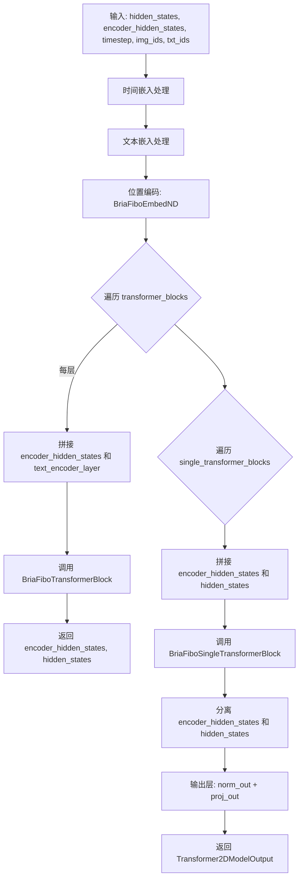

## 类结构

```
torch.nn.Module (基类)
├── BriaFiboAttnProcessor (注意力处理器)
├── BriaFiboAttention (注意力模块, AttentionModuleMixin)
├── BriaFiboEmbedND (N维嵌入)
├── BriaFiboSingleTransformerBlock (单Transformer块)
│   └── Attention (使用BriaAttnProcessor)
├── BriaFiboTextProjection (文本投影)
├── BriaFiboTransformerBlock (Transformer块)
│   ├── BriaFiboAttention
│   └── FeedForward
├── BriaFiboTimesteps (时间步处理)
├── BriaFiboTimestepProjEmbeddings (时间嵌入)
└── BriaFiboTransformer2DModel (主模型, ModelMixin, ConfigMixin, PeftAdapterMixin, FromOriginalModelMixin)
    ├── BriaFiboEmbedND
    ├── BriaFiboTimestepProjEmbeddings
    ├── nn.ModuleList[BriaFiboTransformerBlock]
    ├── nn.ModuleList[BriaFiboSingleTransformerBlock]
    └── nn.ModuleList[BriaFiboTextProjection]
```

## 全局变量及字段


### `BriaFiboAttnProcessor._attention_backend`
    
注意力后端实现，用于调度不同的注意力计算方式

类型：`Any`
    


### `BriaFiboAttnProcessor._parallel_config`
    
并行计算配置，控制分布式训练时的并行参数

类型：`Any`
    


### `BriaFiboAttention.head_dim`
    
每个注意力头的维度大小

类型：`int`
    


### `BriaFiboAttention.inner_dim`
    
内部维度，等于头数乘以头维度

类型：`int`
    


### `BriaFiboAttention.query_dim`
    
查询向量的输入维度

类型：`int`
    


### `BriaFiboAttention.use_bias`
    
是否在线性投影中使用偏置

类型：`bool`
    


### `BriaFiboAttention.dropout`
    
注意力 dropout 概率

类型：`float`
    


### `BriaFiboAttention.out_dim`
    
注意力输出的维度

类型：`int`
    


### `BriaFiboAttention.context_pre_only`
    
是否仅预处理上下文嵌入

类型：`bool | None`
    


### `BriaFiboAttention.pre_only`
    
是否仅进行预处理（无输出投影）

类型：`bool`
    


### `BriaFiboAttention.heads`
    
注意力头的数量

类型：`int`
    


### `BriaFiboAttention.added_kv_proj_dim`
    
额外的键值投影维度，用于交叉注意力

类型：`int | None`
    


### `BriaFiboAttention.added_proj_bias`
    
额外投影层是否使用偏置

类型：`bool | None`
    


### `BriaFiboAttention.norm_q`
    
查询向量的 RMS 归一化层

类型：`torch.nn.RMSNorm`
    


### `BriaFiboAttention.norm_k`
    
键向量的 RMS 归一化层

类型：`torch.nn.RMSNorm`
    


### `BriaFiboAttention.to_q`
    
查询向量的线性投影层

类型：`torch.nn.Linear`
    


### `BriaFiboAttention.to_k`
    
键向量的线性投影层

类型：`torch.nn.Linear`
    


### `BriaFiboAttention.to_v`
    
值向量的线性投影层

类型：`torch.nn.Linear`
    


### `BriaFiboAttention.to_out`
    
注意力输出的投影层列表，包含线性层和 dropout

类型：`torch.nn.ModuleList`
    


### `BriaFiboAttention.norm_added_q`
    
额外查询向量的 RMS 归一化层

类型：`torch.nn.RMSNorm`
    


### `BriaFiboAttention.norm_added_k`
    
额外键向量的 RMS 归一化层

类型：`torch.nn.RMSNorm`
    


### `BriaFiboAttention.add_q_proj`
    
额外查询向量的投影层

类型：`torch.nn.Linear`
    


### `BriaFiboAttention.add_k_proj`
    
额外键向量的投影层

类型：`torch.nn.Linear`
    


### `BriaFiboAttention.add_v_proj`
    
额外值向量的投影层

类型：`torch.nn.Linear`
    


### `BriaFiboAttention.to_add_out`
    
额外输出投影层

类型：`torch.nn.Linear`
    


### `BriaFiboAttention.processor`
    
注意力处理器实例

类型：`BriaFiboAttnProcessor`
    


### `BriaFiboEmbedND.theta`
    
旋转位置编码的基础角度参数

类型：`int`
    


### `BriaFiboEmbedND.axes_dim`
    
各轴的位置编码维度列表

类型：`list[int]`
    


### `BriaFiboSingleTransformerBlock.mlp_hidden_dim`
    
MLP 隐藏层的维度

类型：`int`
    


### `BriaFiboSingleTransformerBlock.norm`
    
单 transformer 块的自适应层归一化

类型：`AdaLayerNormZeroSingle`
    


### `BriaFiboSingleTransformerBlock.proj_mlp`
    
MLP 输入投影层

类型：`nn.Linear`
    


### `BriaFiboSingleTransformerBlock.act_mlp`
    
MLP 激活函数

类型：`nn.GELU`
    


### `BriaFiboSingleTransformerBlock.proj_out`
    
输出投影层

类型：`nn.Linear`
    


### `BriaFiboSingleTransformerBlock.attn`
    
注意力模块

类型：`Attention`
    


### `BriaFiboTextProjection.linear`
    
文本嵌入的线性投影层

类型：`nn.Linear`
    


### `BriaFiboTransformerBlock.norm1`
    
主 hidden_states 的自适应零初始化层归一化

类型：`AdaLayerNormZero`
    


### `BriaFiboTransformerBlock.norm1_context`
    
上下文 encoder_hidden_states 的自适应零初始化层归一化

类型：`AdaLayerNormZero`
    


### `BriaFiboTransformerBlock.attn`
    
双 transformer 块的注意力模块

类型：`BriaFiboAttention`
    


### `BriaFiboTransformerBlock.norm2`
    
主分支的 LayerNorm

类型：`nn.LayerNorm`
    


### `BriaFiboTransformerBlock.ff`
    
主分支的前馈网络

类型：`FeedForward`
    


### `BriaFiboTransformerBlock.norm2_context`
    
上下文分支的 LayerNorm

类型：`nn.LayerNorm`
    


### `BriaFiboTransformerBlock.ff_context`
    
上下文分支的前馈网络

类型：`FeedForward`
    


### `BriaFiboTimesteps.num_channels`
    
时间嵌入的通道数

类型：`int`
    


### `BriaFiboTimesteps.flip_sin_to_cos`
    
是否将正弦函数翻转余弦函数

类型：`bool`
    


### `BriaFiboTimesteps.downscale_freq_shift`
    
频率下移量

类型：`float`
    


### `BriaFiboTimesteps.scale`
    
时间嵌入的缩放因子

类型：`int`
    


### `BriaFiboTimesteps.time_theta`
    
时间编码的基础周期参数

类型：`int`
    


### `BriaFiboTimestepProjEmbeddings.time_proj`
    
时间步投影模块

类型：`BriaFiboTimesteps`
    


### `BriaFiboTimestepProjEmbeddings.timestep_embedder`
    
时间步嵌入器模块

类型：`TimestepEmbedding`
    


### `BriaFiboTransformer2DModel.out_channels`
    
模型输出的通道数

类型：`int`
    


### `BriaFiboTransformer2DModel.inner_dim`
    
模型的内部维度

类型：`int`
    


### `BriaFiboTransformer2DModel.pos_embed`
    
多轴旋转位置嵌入模块

类型：`BriaFiboEmbedND`
    


### `BriaFiboTransformer2DModel.time_embed`
    
时间步嵌入模块

类型：`BriaFiboTimestepProjEmbeddings`
    


### `BriaFiboTransformer2DModel.guidance_embed`
    
引导嵌入模块，用于 Classifier-Free Guidance

类型：`BriaFiboTimestepProjEmbeddings`
    


### `BriaFiboTransformer2DModel.context_embedder`
    
上下文嵌入的线性投影层

类型：`nn.Linear`
    


### `BriaFiboTransformer2DModel.x_embedder`
    
输入图像嵌入的线性投影层

类型：`torch.nn.Linear`
    


### `BriaFiboTransformer2DModel.transformer_blocks`
    
双 transformer 块模块列表

类型：`nn.ModuleList`
    


### `BriaFiboTransformer2DModel.single_transformer_blocks`
    
单 transformer 块模块列表

类型：`nn.ModuleList`
    


### `BriaFiboTransformer2DModel.norm_out`
    
输出的自适应连续层归一化

类型：`AdaLayerNormContinuous`
    


### `BriaFiboTransformer2DModel.proj_out`
    
最终输出投影层

类型：`nn.Linear`
    


### `BriaFiboTransformer2DModel.gradient_checkpointing`
    
梯度检查点标志，用于节省显存

类型：`bool`
    


### `BriaFiboTransformer2DModel.caption_projection`
    
文本Caption投影层模块列表

类型：`nn.ModuleList`
    
    

## 全局函数及方法


### `_get_projections`

该函数用于从隐藏状态中计算Query、Key、Value投影，支持可选的encoder_hidden_states投影。它是BriaFiboAttention注意力机制的核心组件，负责将输入的隐藏状态通过线性变换转换为注意力计算所需的Q、K、V向量。

参数：

- `attn`：`BriaFiboAttention`，执行投影的注意力模块实例
- `hidden_states`：`torch.Tensor`，输入的隐藏状态张量，通常是Transformer的中间表示
- `encoder_hidden_states`：`torch.Tensor | None`，可选的编码器隐藏状态，用于跨注意力机制

返回值：`tuple[torch.Tensor, torch.Tensor, torch.Tensor, torch.Tensor | None, torch.Tensor | None, torch.Tensor | None]`，返回(query, key, value, encoder_query, encoder_key, encoder_value)六元组，其中encoder_query、encoder_key、encoder_value在无encoder_hidden_states时为None

#### 流程图

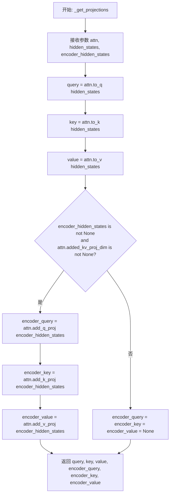

#### 带注释源码

```python
def _get_projections(attn: "BriaFiboAttention", hidden_states, encoder_hidden_states=None):
    """
    从隐藏状态计算Query、Key、Value投影。
    
    该函数将输入的hidden_states通过注意力模块的线性层(to_q, to_k, to_v)投影为
    注意力计算所需的query、key、value向量。如果提供了encoder_hidden_states，
    还会额外计算encoder部分的query、key、value(通过add_q_proj, add_k_proj, add_v_proj)。
    
    参数:
        attn: BriaFiboAttention实例，包含投影所需的线性层
        hidden_states: 输入的隐藏状态张量，形状为(batch, seq_len, hidden_dim)
        encoder_hidden_states: 可选的编码器隐藏状态，用于跨注意力
    
    返回:
        元组(query, key, value, encoder_query, encoder_key, encoder_value)
    """
    # 使用to_q线性层将hidden_states投影为query向量
    query = attn.to_q(hidden_states)
    
    # 使用to_k线性层将hidden_states投影为key向量
    key = attn.to_k(hidden_states)
    
    # 使用to_v线性层将hidden_states投影为value向量
    value = attn.to_v(hidden_states)

    # 初始化encoder相关的投影为None
    encoder_query = encoder_key = encoder_value = None
    
    # 只有当encoder_hidden_states存在且attention模块配置了added_kv_proj_dim时
    # 才会计算encoder部分的投影
    if encoder_hidden_states is not None and attn.added_kv_proj_dim is not None:
        # 使用add_q_proj将encoder_hidden_states投影为encoder_query
        encoder_query = attn.add_q_proj(encoder_hidden_states)
        
        # 使用add_k_proj将encoder_hidden_states投影为encoder_key
        encoder_key = attn.add_k_proj(encoder_hidden_states)
        
        # 使用add_v_proj将encoder_hidden_states投影为encoder_value
        encoder_value = attn.add_v_proj(encoder_hidden_states)

    # 返回所有投影结果，包括主序列和encoder序列的Q、K、V
    return query, key, value, encoder_query, encoder_key, encoder_value
```


### `_get_fused_projections`

该函数是一个模块级函数，用于通过融合投影方式计算注意力机制中的 query、key、value 投影。当存在编码器隐藏状态时，还会额外计算编码器侧的投影。该函数利用 `to_qkv` 方法一次性获取 qkv 三个投影，相比分离投影更加高效。

参数：

- `attn`：`"BriaFiboAttention"`，BriaFiboAttention 注意力模块实例，提供投影矩阵
- `hidden_states`：`torch.Tensor`，输入的隐藏状态张量，形状为 `(batch, seq_len, dim)`
- `encoder_hidden_states`：`torch.Tensor | None`，可选的编码器隐藏状态，用于跨注意力机制

返回值：`Tuple[torch.Tensor, torch.Tensor, torch.Tensor, torch.Tensor, torch.Tensor, torch.Tensor]`，返回包含 query、key、value 以及 encoder_query、encoder_key、encoder_value 的六元组，其中编码器部分在无 encoder_hidden_states 时为 None

#### 流程图

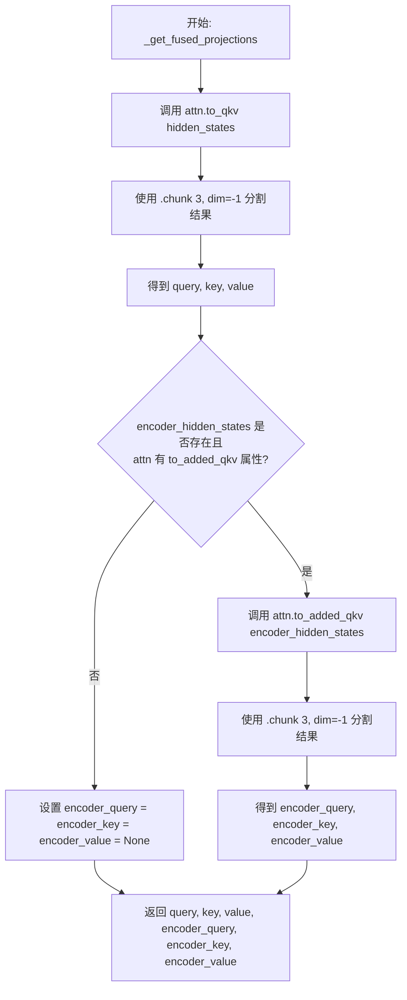

#### 带注释源码

```python
def _get_fused_projections(attn: "BriaFiboAttention", hidden_states, encoder_hidden_states=None):
    """
    使用融合投影方式计算 QKV 投影。
    
    融合投影通过一次矩阵乘法同时计算 query、key、value，
    相比分离的 to_q、to_k、to_v 更高效。
    
    Args:
        attn: BriaFiboAttention 注意力模块实例
        hidden_states: 输入隐藏状态，形状为 (batch, seq_len, dim)
        encoder_hidden_states: 可选的编码器隐藏状态，用于跨注意力
    
    Returns:
        包含 query, key, value, encoder_query, encoder_key, encoder_value 的元组
    """
    # 使用融合投影矩阵 to_qkv 一次性计算 q、k、v 三个投影
    # to_qkv 返回形状为 (batch, seq_len, 3 * inner_dim) 的张量
    # chunk(3, dim=-1) 将其沿最后维度分割为三个等份
    query, key, value = attn.to_qkv(hidden_states).chunk(3, dim=-1)

    # 初始化编码器投影为 None
    # 注意：这里使用 (None,) 而不是 None，是为了保持元组格式一致性
    encoder_query = encoder_key = encoder_value = (None,)
    
    # 如果提供了编码器隐藏状态且模块具有 to_added_qkv 方法
    # 则计算编码器侧的投影（用于跨注意力机制）
    if encoder_hidden_states is not None and hasattr(attn, "to_added_qkv"):
        encoder_query, encoder_key, encoder_value = attn.to_added_qkv(encoder_hidden_states).chunk(3, dim=-1)

    # 返回六个投影张量的元组
    return query, key, value, encoder_query, encoder_key, encoder_value
```


### `_get_qkv_projections`

该函数是 BriaFiboAttention 注意力模块的 QKV（Query、Key、Value）投影分发器，根据注意力模块的 `fused_projections` 配置选择使用融合投影或独立投影方式来生成查询、键、值向量，支持可选的编码器隐藏状态投影。

参数：

- `attn`：`BriaFiboAttention`，注意力模块实例，用于访问投影矩阵和配置参数
- `hidden_states`：`torch.Tensor`，输入的隐藏状态张量，通常来自transformer的前一层
- `encoder_hidden_states`：`torch.Tensor | None`，可选参数，编码器的隐藏状态，用于跨注意力机制

返回值：`tuple[torch.Tensor, torch.Tensor, torch.Tensor, torch.Tensor | None, torch.Tensor | None, torch.Tensor | None]`，返回包含 query、key、value、encoder_query、encoder_key、encoder_value 的元组，其中编码器相关投影在未提供 encoder_hidden_states 时为 None

#### 流程图

```mermaid
flowchart TD
    A[开始 _get_qkv_projections] --> B{检查 attn.fused_projections}
    B -->|True| C[调用 _get_fused_projections]
    B -->|False| D[调用 _get_projections]
    C --> E[返回融合投影结果]
    D --> F[返回独立投影结果]
    E --> G[结束]
    F --> G
    
    subgraph _get_projections
        H[query = attn.to_q]
        I[key = attn.to_k]
        J[value = attn.to_v]
        K{encoder_hidden_states<br>且 added_kv_proj_dim}
        K -->|是| L[encoder_query = attn.add_q_proj]
        K -->|否| M[encoder_* = None]
        L --> N[encoder_key = attn.add_k_proj]
        L --> O[encoder_value = attn.add_v_proj]
        N --> P[返回所有投影]
        M --> P
        O --> P
    end
    
    subgraph _get_fused_projections
        Q[attn.to_qkv → chunk(3)]
        R{encoder_hidden_states<br>且 hasattr to_added_qkv}
        R -->|是| S[attn.to_added_qkv → chunk(3)]
        R -->|否| T[encoder_* = (None,)]
        S --> U[返回所有投影]
        T --> U
    end
```

#### 带注释源码

```python
def _get_qkv_projections(attn: "BriaFiboAttention", hidden_states, encoder_hidden_states=None):
    """
    获取注意力机制的 QKV 投影。
    
    根据注意力模块的 fused_projections 配置选择不同的投影策略：
    - 融合投影：使用单一矩阵乘法同时计算 q、k、v（通过 to_qkv 方法）
    - 独立投影：分别使用 to_q、to_k、to_v 三个线性层进行投影
    
    参数:
        attn: BriaFiboAttention 注意力模块实例
        hidden_states: 输入的隐藏状态张量
        encoder_hidden_states: 可选的编码器隐藏状态，用于跨注意力
    
    返回:
        包含 (query, key, value, encoder_query, encoder_key, encoder_value) 的元组
    """
    # 检查是否使用融合投影模式
    if attn.fused_projections:
        # 融合投影：使用高效的单一矩阵运算获取 qkv
        return _get_fused_projections(attn, hidden_states, encoder_hidden_states)
    
    # 独立投影：使用分离的线性层进行投影
    return _get_projections(attn, hidden_states, encoder_hidden_states)


def _get_projections(attn: "BriaFiboAttention", hidden_states, encoder_hidden_states=None):
    """
    独立投影方式：分别使用 to_q、to_k、to_v 线性层计算 query、key、value
    
    参数:
        attn: BriaFiboAttention 注意力模块实例
        hidden_states: 输入的隐藏状态张量
        encoder_hidden_states: 可选的编码器隐藏状态
    
    返回:
        (query, key, value, encoder_query, encoder_key, encoder_value) 元组
    """
    # 使用独立的线性层计算主要的 q、k、v 投影
    query = attn.to_q(hidden_states)  # 将 hidden_states 投影到 query 空间
    key = attn.to_k(hidden_states)    # 将 hidden_states 投影到 key 空间
    value = attn.to_v(hidden_states)  # 将 hidden_states 投影到 value 空间

    # 初始化编码器相关的投影为 None
    encoder_query = encoder_key = encoder_value = None
    
    # 如果提供了编码器隐藏状态且注意力模块支持 added_kv_proj_dim
    if encoder_hidden_states is not None and attn.added_kv_proj_dim is not None:
        # 使用额外的投影层处理编码器隐藏状态
        encoder_query = attn.add_q_proj(encoder_hidden_states)
        encoder_key = attn.add_k_proj(encoder_hidden_states)
        encoder_value = attn.add_v_proj(encoder_hidden_states)

    return query, key, value, encoder_query, encoder_key, encoder_value


def _get_fused_projections(attn: "BriaFiboAttention", hidden_states, encoder_hidden_states=None):
    """
    融合投影方式：使用单一的 fused 矩阵同时计算 q、k、v
    
    这种方式通过一次矩阵乘法同时获取 q、k、v，能够减少计算开销，
    特别是在大规模模型中能显著提升效率。
    
    参数:
        attn: BriaFiboAttention 注意力模块实例
        hidden_states: 输入的隐藏状态张量
        encoder_hidden_states: 可选的编码器隐藏状态
    
    返回:
        (query, key, value, encoder_query, encoder_key, encoder_value) 元组
    """
    # 使用融合的 qkv 投影层，一次矩阵乘法得到 q、k、v
    # .chunk(3, dim=-1) 将结果沿最后一个维度分割成三份
    query, key, value = attn.to_qkv(hidden_states).chunk(3, dim=-1)

    # 初始化编码器相关投影
    encoder_query = encoder_key = encoder_value = (None,)
    
    # 如果提供了编码器隐藏状态且存在 to_added_qkv 方法
    if encoder_hidden_states is not None and hasattr(attn, "to_added_qkv"):
        # 使用融合的编码器投影层
        encoder_query, encoder_key, encoder_value = attn.to_added_qkv(encoder_hidden_states).chunk(3, dim=-1)

    return query, key, value, encoder_query, encoder_key, encoder_value
```


### `BriaFiboAttnProcessor.__init__`

初始化 BriaFiboAttnProcessor 处理器，检查 PyTorch 版本是否满足要求（需要支持 scaled_dot_product_attention）。

参数：
- 无显式参数（仅包含隐式参数 `self`）

返回值：`None`，无返回值

#### 流程图

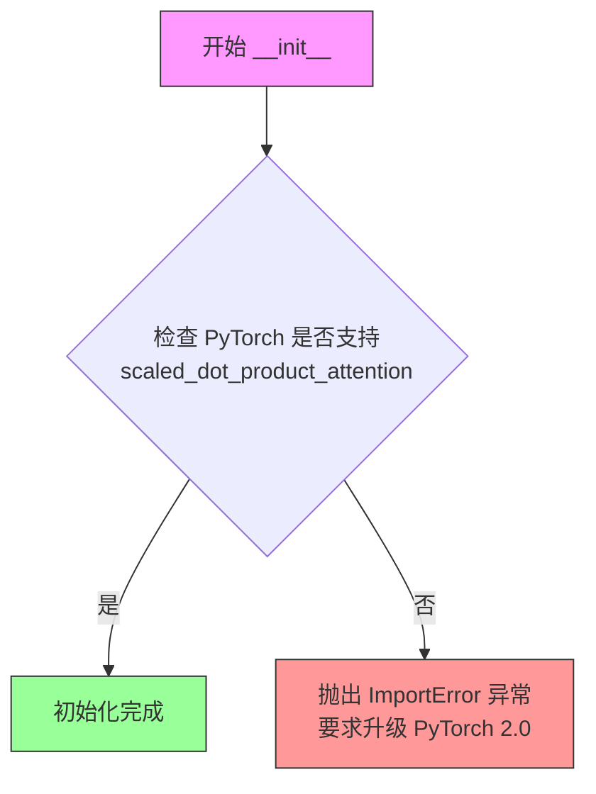

#### 带注释源码

```python
def __init__(self):
    # 检查 PyTorch 是否具备 scaled_dot_product_attention 功能
    # 这是 PyTorch 2.0 引入的高效注意力机制实现
    if not hasattr(F, "scaled_dot_product_attention"):
        # 如果不支持，抛出 ImportError 提示用户升级 PyTorch 版本
        raise ImportError(f"{self.__class__.__name__} requires PyTorch 2.0. Please upgrade your pytorch version.")
```


### `BriaFiboAttnProcessor.__call__`

该方法是 BriaFiboAttnProcessor 类的核心调用方法，负责执行注意力处理流程。它首先通过 QKV 投影获取查询、键、值向量，然后进行维度和归一化处理，接着应用旋转位置嵌入（可选），通过调度函数执行注意力计算，最后对输出进行后处理并返回隐藏状态或包含编码器隐藏状态的元组。

参数：

- `self`：隐式参数，表示 BriaFiboAttnProcessor 实例本身。
- `attn`：`BriaFiboAttention` 类型，注意力机制实例，提供 QKV 投影层和归一化层。
- `hidden_states`：`torch.Tensor` 类型，输入的隐藏状态张量，形状为 `(batch, seq_len, dim)`。
- `encoder_hidden_states`：`torch.Tensor | None` 类型，编码器的隐藏状态，用于跨注意力机制，默认为 None。
- `attention_mask`：`torch.Tensor | None` 类型，注意力掩码，用于屏蔽不需要关注的位置，默认为 None。
- `image_rotary_emb`：`torch.Tensor | None` 类型，图像旋转位置嵌入，用于旋转位置编码，默认为 None。

返回值：`torch.Tensor` 或 `tuple[torch.Tensor, torch.Tensor]`，当存在 encoder_hidden_states 时返回两个张量的元组（处理后的隐藏状态和编码器隐藏状态），否则返回单一的隐藏状态张量。

#### 流程图

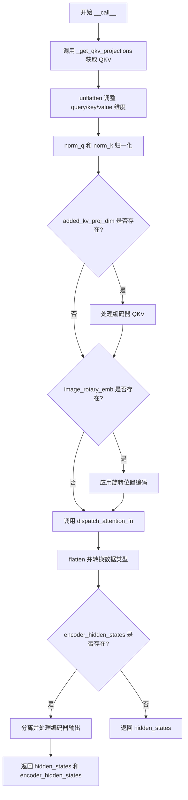

#### 带注释源码

```
def __call__(
    self,
    attn: "BriaFiboAttention",
    hidden_states: torch.Tensor,
    encoder_hidden_states: torch.Tensor = None,
    attention_mask: torch.Tensor | None = None,
    image_rotary_emb: torch.Tensor | None = None,
) -> torch.Tensor:
    # 1. 获取 QKV 投影：根据是否为融合投影调用不同函数
    #    返回 query, key, value 以及编码器相关的 query, key, value
    query, key, value, encoder_query, encoder_key, encoder_value = _get_qkv_projections(
        attn, hidden_states, encoder_hidden_states
    )

    # 2. 调整维度：将最后一个维度展开为 (heads, head_dim)
    #    从 (batch, seq, dim) -> (batch, seq, heads, head_dim)
    query = query.unflatten(-1, (attn.heads, -1))
    key = key.unflatten(-1, (attn.heads, -1))
    value = value.unflatten(-1, (attn.heads, -1))

    # 3. 对 query 和 key 应用 RMSNorm 归一化
    query = attn.norm_q(query)
    key = attn.norm_k(key)

    # 4. 如果存在 added_kv_proj_dim，处理编码器隐藏状态的 QKV
    if attn.added_kv_proj_dim is not None:
        # 调整编码器 QKV 维度
        encoder_query = encoder_query.unflatten(-1, (attn.heads, -1))
        encoder_key = encoder_key.unflatten(-1, (attn.heads, -1))
        encoder_value = encoder_value.unflatten(-1, (attn.heads, -1))

        # 归一化编码器的 query 和 key
        encoder_query = attn.norm_added_q(encoder_query)
        encoder_key = attn.norm_added_k(encoder_key)

        # 将编码器的 QKV 拼接到主 QKV 前面
        # 维度 (batch, encoder_seq + seq, heads, head_dim)
        query = torch.cat([encoder_query, query], dim=1)
        key = torch.cat([encoder_key, key], dim=1)
        value = torch.cat([encoder_value, value], dim=1)

    # 5. 如果存在图像旋转嵌入，应用旋转位置编码
    if image_rotary_emb is not None:
        query = apply_rotary_emb(query, image_rotary_emb, sequence_dim=1)
        key = apply_rotary_emb(key, image_rotary_emb, sequence_dim=1)

    # 6. 调用调度函数执行注意力计算
    hidden_states = dispatch_attention_fn(
        query,
        key,
        value,
        attn_mask=attention_mask,
        backend=self._attention_backend,
        parallel_config=self._parallel_config,
    )
    
    # 7. 调整输出维度并转换数据类型
    hidden_states = hidden_states.flatten(2, 3)
    hidden_states = hidden_states.to(query.dtype)

    # 8. 根据是否有编码器隐藏状态进行不同处理
    if encoder_hidden_states is not None:
        # 分离编码器输出和主输出
        encoder_hidden_states, hidden_states = hidden_states.split_with_sizes(
            [encoder_hidden_states.shape[1], hidden_states.shape[1] - encoder_hidden_states.shape[1]], dim=1
        )
        # 通过输出层处理
        hidden_states = attn.to_out[0](hidden_states.contiguous())
        hidden_states = attn.to_out[1](hidden_states)
        # 处理编码器输出
        encoder_hidden_states = attn.to_add_out(encoder_hidden_states.contiguous())

        return hidden_states, encoder_hidden_states
    else:
        return hidden_states
```


### `BriaFiboAttention.__init__`

该方法用于初始化 `BriaFiboAttention` 类，这是 Bria  Fibonacci Transformer 模型中的核心注意力机制模块。它负责设置注意力头的维度、内部维度、投影层（包括 Q、K、V 投影）以及可选的输出投影和用于交叉注意力的额外投影。

参数：

- `self`：隐式参数，表示类的实例本身。
- `query_dim`：`int`，查询向量的输入维度。
- `heads`：`int` (默认值: 8)，注意力头的数量。
- `dim_head`：`int` (默认值: 64)，每个注意力头的维度。
- `dropout`：`float` (默认值: 0.0)，注意力权重的 Dropout 概率。
- `bias`：`bool` (默认值: False)，在线性投影层中是否使用偏置。
- `added_kv_proj_dim`：`int | None` (默认值: None)，用于交叉注意力的额外 Key/Value 投影维度。如果为 None，则不创建相关投影。
- `added_proj_bias`：`bool | None` (默认值: True)，额外投影层是否使用偏置。
- `out_bias`：`bool` (默认值: True)，输出投影层是否使用偏置。
- `eps`：`float` (默认值: 1e-5)，RMSNorm 归一化层的 epsilon 值。
- `out_dim`：`int | None` (默认值: None)，输出维度。如果为 None，则默认为 query_dim。
- `context_pre_only`：`bool | None` (默认值: None)，是否仅预处理上下文（encoder hidden states）。
- `pre_only`：`bool` (默认值: False)，是否仅进行注意力计算而无需输出投影层。
- `elementwise_affine`：`bool` (默认值: True)，RMSNorm 是否使用仿射变换。
- `processor`：`Any` (默认值: None)，注意力处理器实例。如果为 None，则使用默认的 `BriaFiboAttnProcessor`。

返回值：`None`，`__init__` 方法不返回任何值。

#### 流程图

```mermaid
flowchart TD
    A[Start __init__] --> B[Call super().__init__()]
    B --> C[Calculate Dimensions: inner_dim, heads, out_dim]
    C --> D[Set Instance Attributes: query_dim, bias, dropout, etc.]
    D --> E[Create Norm Layers: self.norm_q, self.norm_k (RMSNorm)]
    E --> F[Create QKV Projection Layers: self.to_q, self.to_k, self.to_v]
    F --> G{Check pre_only?}
    G -- No --> H[Create Output Projection: self.to_out (Linear + Dropout)]
    G -- Yes --> I{Check added_kv_proj_dim?}
    H --> I
    I -- Not None --> J[Create Added Norm Layers: norm_added_q, norm_added_k]
    J --> K[Create Added Projection Layers: add_q_proj, add_k_proj, add_v_proj, to_add_out]
    K --> L{Check processor?}
    I -- None --> L
    L -- None --> M[Instantiate default processor: BriaFiboAttnProcessor]
    L -- Not None --> N[Use provided processor]
    M --> O[Call self.set_processor(processor)]
    N --> O
    O --> P[End]
```

#### 带注释源码

```python
def __init__(
    self,
    query_dim: int,
    heads: int = 8,
    dim_head: int = 64,
    dropout: float = 0.0,
    bias: bool = False,
    added_kv_proj_dim: int | None = None,
    added_proj_bias: bool | None = True,
    out_bias: bool = True,
    eps: float = 1e-5,
    out_dim: int = None,
    context_pre_only: bool | None = None,
    pre_only: bool = False,
    elementwise_affine: bool = True,
    processor=None,
):
    # 调用父类 torch.nn.Module 的初始化方法
    super().__init__()

    # 1. 设置维度相关的属性
    self.head_dim = dim_head
    # 如果提供了 out_dim，则使用它；否则使用 dim_head * heads 计算内部维度
    self.inner_dim = out_dim if out_dim is not None else dim_head * heads
    self.query_dim = query_dim
    self.use_bias = bias
    self.dropout = dropout
    # 输出维度默认为 query_dim，除非指定了 out_dim
    self.out_dim = out_dim if out_dim is not None else query_dim
    self.context_pre_only = context_pre_only
    self.pre_only = pre_only
    # 头的数量：如果指定了 out_dim，则通过 out_dim // dim_head 计算；否则使用传入的 heads 参数
    self.heads = out_dim // dim_head if out_dim is not None else heads
    self.added_kv_proj_dim = added_kv_proj_dim
    self.added_proj_bias = added_proj_bias

    # 2. 创建用于 Query 和 Key 的 RMSNorm 层
    # 用于注意力计算前的归一化
    self.norm_q = torch.nn.RMSNorm(dim_head, eps=eps, elementwise_affine=elementwise_affine)
    self.norm_k = torch.nn.RMSNorm(dim_head, eps=eps, elementwise_affine=elementwise_affine)

    # 3. 创建 Q, K, V 的线性投影层
    # 将输入的 query_dim 映射到 inner_dim
    self.to_q = torch.nn.Linear(query_dim, self.inner_dim, bias=bias)
    self.to_k = torch.nn.Linear(query_dim, self.inner_dim, bias=bias)
    self.to_v = torch.nn.Linear(query_dim, self.inner_dim, bias=bias)

    # 4. 如果不是 pre_only 模式（即包含输出投影），则创建输出层
    if not self.pre_only:
        self.to_out = torch.nn.ModuleList([])
        # 线性投影：从 inner_dim 映射回 out_dim
        self.to_out.append(torch.nn.Linear(self.inner_dim, self.out_dim, bias=out_bias))
        # Dropout 层
        self.to_out.append(torch.nn.Dropout(dropout))

    # 5. 如果存在 added_kv_proj_dim（用于处理交叉注意力），则创建额外的投影层
    if added_kv_proj_dim is not None:
        # 针对额外的 Query 和 Key 的 Norm 层
        self.norm_added_q = torch.nn.RMSNorm(dim_head, eps=eps)
        self.norm_added_k = torch.nn.RMSNorm(dim_head, eps=eps)
        
        # 额外的投影层：将 added_kv_proj_dim 映射到 inner_dim
        self.add_q_proj = torch.nn.Linear(added_kv_proj_dim, self.inner_dim, bias=added_proj_bias)
        self.add_k_proj = torch.nn.Linear(added_kv_proj_dim, self.inner_dim, bias=added_proj_bias)
        self.add_v_proj = torch.nn.Linear(added_kv_proj_dim, self.inner_dim, bias=added_proj_bias)
        
        # 输出投影：将 inner_dim 映射回 query_dim
        self.to_add_out = torch.nn.Linear(self.inner_dim, query_dim, bias=out_bias)

    # 6. 设置注意力处理器
    if processor is None:
        processor = self._default_processor_cls()
    self.set_processor(processor)
```


### BriaFiboAttention.forward

该方法是 BriaFiboAttention 类的核心前向传播方法，负责处理自注意力机制。它首先检查并过滤传入的关键字参数，移除不被处理器期望的参数，然后调用预配置的注意力处理器来执行实际的注意力计算。

参数：

- `self`：隐式参数，BriaFiboAttention 实例本身
- `hidden_states`：`torch.Tensor`，输入的隐藏状态张量
- `encoder_hidden_states`：`torch.Tensor | None`，编码器的隐藏状态，用于跨注意力机制，默认为 None
- `attention_mask`：`torch.Tensor | None`，注意力掩码，用于控制注意力计算，默认为 None
- `image_rotary_emb`：`torch.Tensor | None`，图像旋转位置嵌入，用于旋转位置编码，默认为 None
- `**kwargs`：可变关键字参数，包含额外的注意力参数（如 IP 适配器相关参数）

返回值：`torch.Tensor`，经过注意力处理后的隐藏状态张量

#### 流程图

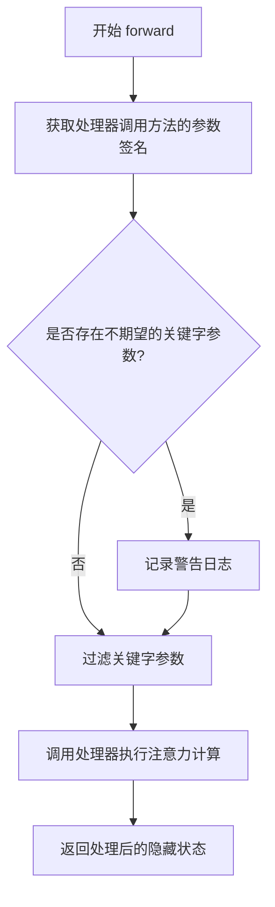

#### 带注释源码

```python
def forward(
    self,
    hidden_states: torch.Tensor,
    encoder_hidden_states: torch.Tensor | None = None,
    attention_mask: torch.Tensor | None = None,
    image_rotary_emb: torch.Tensor | None = None,
    **kwargs,
) -> torch.Tensor:
    """
    执行 BriaFiboAttention 的前向传播。
    
    参数:
        hidden_states: 输入的隐藏状态张量
        encoder_hidden_states: 编码器的隐藏状态，用于跨注意力
        attention_mask: 注意力掩码
        image_rotary_emb: 图像旋转位置嵌入
        **kwargs: 额外的关键字参数
    
    返回:
        经过注意力处理后的隐藏状态张量
    """
    # 获取注意力处理器调用方法的参数签名
    attn_parameters = set(inspect.signature(self.processor.__call__).parameters.keys())
    
    # 定义需要忽略的安静参数集合
    quiet_attn_parameters = {"ip_adapter_masks", "ip_hidden_states"}
    
    # 过滤出不期望的关键字参数
    unused_kwargs = [k for k, _ in kwargs.items() if k not in attn_parameters and k not in quiet_attn_parameters]
    
    # 如果存在不期望的参数，记录警告
    if len(unused_kwargs) > 0:
        logger.warning(
            f"joint_attention_kwargs {unused_kwargs} are not expected by {self.processor.__class__.__name__} and will be ignored."
        )
    
    # 只保留处理器期望的参数
    kwargs = {k: w for k, w in kwargs.items() if k in attn_parameters}
    
    # 调用处理器的 __call__ 方法执行实际的注意力计算
    return self.processor(self, hidden_states, encoder_hidden_states, attention_mask, image_rotary_emb, **kwargs)
```


### `BriaFiboEmbedND.forward`

该方法实现多轴旋转位置编码（Rotary Position Embedding），通过为每个轴独立计算旋转频率向量，并将结果拼接后返回余弦和正弦频率分量，用于在Transformer中引入位置信息。

参数：

- `ids`：`torch.Tensor`，形状为 (batch_size, n_axes)，表示多维位置索引，其中 n_axes 是轴的数量

返回值：`tuple[torch.Tensor, torch.Tensor]`，返回两个张量——freqs_cos（余弦频率分量）和 freqs_sin（正弦频率分量），形状均为 (batch_size, sum(axes_dim))

#### 流程图

```mermaid
flowchart TD
    A[开始: 输入 ids 张量] --> B[获取轴数量 n_axes = ids.shape[-1]]
    B --> C[初始化空列表 cos_out, sin_out]
    C --> D{遍历 i in range(n_axes)}
    D -->|第i个轴| E[提取 pos[:, i] 作为当前位置编码]
    E --> F[检查设备类型: is_mps]
    F -->|是mps| G[设置 freqs_dtype = torch.float32]
    F -->|否mps| H[设置 freqs_dtype = torch.float64]
    G --> I[调用 get_1d_rotary_pos_embed]
    H --> I
    I --> J[计算第i轴的 cos 和 sin 频率向量]
    J --> K[将 cos 添加到 cos_out, sin 添加到 sin_out]
    K --> D
    D -->|遍历完成| L[沿最后一维拼接: freqs_cos = torch.cat(cos_out, dim=-1)]
    L --> M[沿最后一维拼接: freqs_sin = torch.cat(sin_out, dim=-1)]
    M --> N[将结果移动到输入设备: .to(ids.device)]
    N --> O[返回 (freqs_cos, freqs_sin)]
```

#### 带注释源码

```python
def forward(self, ids: torch.Tensor) -> torch.Tensor:
    """
    计算多轴旋转位置嵌入

    参数:
        ids: 位置索引张量，形状为 (batch_size, n_axes)
             例如: [[0, 1, 2], [3, 4, 5]] 表示batch中两个样本，每个样本有3个轴的位置索引

    返回:
        tuple[torch.Tensor, torch.Tensor]: 
            - freqs_cos: 余弦频率分量
            - freqs_sin: 正弦频率分量
            两者形状均为 (batch_size, sum(axes_dim))
    """
    # 获取最后一个维度的大小，即轴的数量
    n_axes = ids.shape[-1]
    
    # 初始化输出列表，用于收集每个轴的计算结果
    cos_out = []
    sin_out = []
    
    # 将位置索引转换为浮点数类型
    pos = ids.float()
    
    # 检查设备类型，针对MPS设备做特殊处理（MPS对float64支持有限）
    is_mps = ids.device.type == "mps"
    
    # 根据设备选择频率计算的数据类型
    # MPS设备使用float32以避免兼容性问题
    freqs_dtype = torch.float32 if is_mps else torch.float64
    
    # 遍历每个轴，分别计算旋转位置编码
    for i in range(n_axes):
        # 调用底层函数计算一维旋转位置嵌入
        # 参数:
        #   - self.axes_dim[i]: 第i个轴的维度
        #   - pos[:, i]: 第i轴的位置索引（批处理中所有样本）
        #   - theta: 旋转角度基础参数
        #   - repeat_interleave_real: 是否重复交错实部
        #   - use_real: 是否使用实数形式
        #   - freqs_dtype: 计算精度
        cos, sin = get_1d_rotary_pos_embed(
            self.axes_dim[i],        # 第i轴的维度
            pos[:, i],               # 第i轴的位置索引
            theta=self.theta,        # 旋转基础角度
            repeat_interleave_real=True,  # 重复交错实部以匹配位置
            use_real=True,           # 使用实数形式的旋转编码
            freqs_dtype=freqs_dtype, # 计算精度
        )
        
        # 将当前轴的计算结果添加到输出列表
        cos_out.append(cos)
        sin_out.append(sin)
    
    # 沿最后一个维度拼接所有轴的余弦频率
    freqs_cos = torch.cat(cos_out, dim=-1).to(ids.device)
    
    # 沿最后一个维度拼接所有轴的正弦频率
    freqs_sin = torch.cat(sin_out, dim=-1).to(ids.device)
    
    # 返回余弦和正弦频率分量
    return freqs_cos, freqs_sin
```


### `BriaFiboSingleTransformerBlock.forward`

该方法实现了一个单独的单Transformer块，包含自适应层归一化、注意力机制和MLP前馈网络，用于处理扩散模型的潜变量表示。

参数：

- `self`：隐含参数，类的实例本身
- `hidden_states`：`torch.Tensor`，输入的隐藏状态张量，形状为 `(batch_size, seq_len, dim)`
- `temb`：`torch.Tensor`，时间嵌入张量，用于自适应层归一化
- `image_rotary_emb`：`tuple[torch.Tensor, torch.Tensor] | None`，可选的图像旋转位置嵌入，用于旋转注意力计算
- `joint_attention_kwargs`：`dict[str, Any] | None`，可选的联合注意力参数字典，传递给注意力处理器

返回值：`torch.Tensor`，经过Transformer块处理后的隐藏状态张量，形状与输入 `hidden_states` 相同

#### 流程图

```mermaid
flowchart TD
    A[开始 forward] --> B[保存 residual = hidden_states]
    B --> C[AdaLayerNormZeroSingle 归一化: norm_hidden_states, gate = self.norm<br>hidden_states, emb=temb]
    C --> D[MLP 投影: mlp_hidden_states = self.proj_mlp<br>norm_hidden_states]
    D --> E[GELU 激活: mlp_hidden_states = self.act_mlp<br>mlp_hidden_states]
    E --> F[初始化 joint_attention_kwargs<br>if None: joint_attention_kwargs = {}]
    F --> G[注意力计算: attn_output = self.attn<br>hidden_states=norm_hidden_states<br>image_rotary_emb=image_rotary_emb<br>**joint_attention_kwargs]
    G --> H[拼接输出: hidden_states = torch.cat<br>[attn_output, mlp_hidden_states], dim=2]
    H --> I[应用门控: gate = gate.unsqueeze<br>hidden_states = gate * self.proj_out<br>hidden_states]
    I --> J[残差连接: hidden_states = residual + hidden_states]
    J --> K{hidden_states dtype<br>== torch.float16?}
    K -->|Yes| L[数值裁剪: hidden_states.clip<br>-65504, 65504]
    K -->|No| M[跳过裁剪]
    L --> N[返回 hidden_states]
    M --> N
```

#### 带注释源码

```python
def forward(
    self,
    hidden_states: torch.Tensor,
    temb: torch.Tensor,
    image_rotary_emb: tuple[torch.Tensor, torch.Tensor] | None = None,
    joint_attention_kwargs: dict[str, Any] | None = None,
) -> torch.Tensor:
    """
    单Transformer块的前向传播方法。
    
    Args:
        hidden_states: 输入的隐藏状态张量
        temb: 时间嵌入，用于自适应层归一化
        image_rotary_emb: 可选的旋转位置嵌入
        joint_attention_kwargs: 传递给注意力处理器的额外参数
    
    Returns:
        处理后的隐藏状态张量
    """
    # 保存输入作为残差连接
    residual = hidden_states
    
    # 自适应层归一化，同时返回门控因子
    # norm_hidden_states 用于后续计算，gate 用于控制输出幅度
    norm_hidden_states, gate = self.norm(hidden_states, emb=temb)
    
    # MLP 投影：将隐藏状态映射到更高维空间
    mlp_hidden_states = self.act_mlp(self.proj_mlp(norm_hidden_states))
    
    # 确保 joint_attention_kwargs 不为 None
    joint_attention_kwargs = joint_attention_kwargs or {}
    
    # 注意力计算：使用预定义的 Attention 模块
    # 仅传递 hidden_states 和 image_rotary_emb（pre_only=True 模式）
    attn_output = self.attn(
        hidden_states=norm_hidden_states,
        image_rotary_emb=image_rotary_emb,
        **joint_attention_kwargs,
    )

    # 沿序列维度拼接注意力输出和 MLP 输出
    # 形状: (batch, seq_len, attention_dim + mlp_hidden_dim)
    hidden_states = torch.cat([attn_output, mlp_hidden_states], dim=2)
    
    # 调整门控因子维度并应用门控机制
    gate = gate.unsqueeze(1)  # (batch, 1, dim) 用于广播
    hidden_states = gate * self.proj_out(hidden_states)
    
    # 残差连接
    hidden_states = residual + hidden_states
    
    # float16 数值裁剪，防止数值溢出
    if hidden_states.dtype == torch.float16:
        hidden_states = hidden_states.clip(-65504, 65504)

    return hidden_states
```


### `BriaFiboTextProjection.forward`

该方法实现了一个简单的线性投影层，用于将文本编码器的输出特征映射到Transformer的隐藏空间维度，是文本嵌入与视觉Transformer之间的桥梁。

参数：

- `caption`：`torch.Tensor`，输入的文本嵌入向量，通常来自文本编码器的输出

返回值：`torch.Tensor`，投影后的隐藏状态向量，维度从 `in_features` 变换为 `hidden_size`

#### 流程图

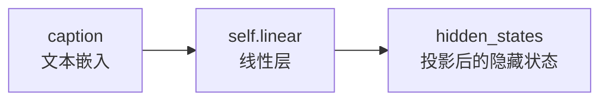

#### 带注释源码

```python
class BriaFiboTextProjection(nn.Module):
    """
    文本投影模块，用于将文本编码器的输出映射到Transformer的隐藏空间维度。
    这是一个简单的线性层，实现特征维度的转换。
    """
    
    def __init__(self, in_features, hidden_size):
        """
        初始化文本投影层
        
        参数:
            in_features: 输入特征的维度（文本编码器的输出维度）
            hidden_size: 输出特征的维度（Transformer的隐藏层维度的一半）
        """
        super().__init__()
        # 定义线性变换层，不使用偏置
        self.linear = nn.Linear(in_features=in_features, out_features=hidden_size, bias=False)

    def forward(self, caption):
        """
        前向传播：执行线性投影
        
        参数:
            caption: torch.Tensor，输入的文本嵌入向量，形状为 (batch_size, in_features)
            
        返回:
            hidden_states: torch.Tensor，投影后的隐藏状态，形状为 (batch_size, hidden_size)
        """
        # 通过线性层将文本嵌入从 in_features 维度映射到 hidden_size 维度
        hidden_states = self.linear(caption)
        return hidden_states
```


### BriaFiboTransformerBlock.forward

该方法是 BriaFiboTransformerBlock 的前向传播函数，实现了双流 Transformer 块的核心逻辑，包括对 hidden_states 和 encoder_hidden_states 的自注意力计算、MLP 前馈网络处理、AdaLayerNormZero 条件归一化以及门控机制，用于支持扩散模型的图像生成任务。

参数：

- `hidden_states`：`torch.Tensor`，输入的潜在表示张量
- `encoder_hidden_states`：`torch.Tensor`，条件编码的隐藏状态（文本嵌入）
- `temb`：`torch.Tensor`，时间步嵌入向量，用于 AdaLayerNormZero 条件归一化
- `image_rotary_emb`：`tuple[torch.Tensor, torch.Tensor] | None`，图像旋转位置编码，用于旋转嵌入
- `joint_attention_kwargs`：`dict[str, Any] | None`，可选的联合注意力关键字参数，用于传递 IP-Adapter 等额外信息

返回值：`tuple[torch.Tensor, torch.Tensor]`，处理后的 encoder_hidden_states 和 hidden_states 元组

#### 流程图

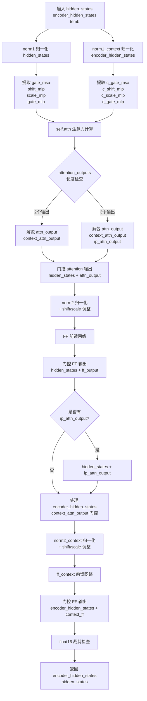

#### 带注释源码

```python
def forward(
    self,
    hidden_states: torch.Tensor,                    # 输入的潜在表示张量
    encoder_hidden_states: torch.Tensor,             # 条件编码的隐藏状态（文本嵌入）
    temb: torch.Tensor,                               # 时间步嵌入，用于条件归一化
    image_rotary_emb: tuple[torch.Tensor, torch.Tensor] | None = None,  # 旋转位置编码
    joint_attention_kwargs: dict[str, Any] | None = None,  # 联合注意力额外参数
) -> tuple[torch.Tensor, torch.Tensor]:
    # 第一次归一化：对 hidden_states 进行 AdaLayerNormZero 归一化
    # 返回归一化后的张量以及门控和 MLG shift/scale 参数
    norm_hidden_states, gate_msa, shift_mlp, scale_mlp, gate_mlp = self.norm1(hidden_states, emb=temb)

    # 对 encoder_hidden_states 进行同样的 AdaLayerNormZero 归一化
    # 提取文本分支的门控和 MLP 参数
    norm_encoder_hidden_states, c_gate_msa, c_shift_mlp, c_scale_mlp, c_gate_mlp = self.norm1_context(
        encoder_hidden_states, emb=temb
    )
    
    # 确保 joint_attention_kwargs 存在，默认为空字典
    joint_attention_kwargs = joint_attention_kwargs or {}

    # ====== 注意力计算阶段 ======
    # 调用自注意力模块，传入归一化后的隐藏状态和编码器隐藏状态
    # 支持旋转嵌入和 IP-Adapter 等额外参数
    attention_outputs = self.attn(
        hidden_states=norm_hidden_states,
        encoder_hidden_states=norm_encoder_hidden_states,
        image_rotary_emb=image_rotary_emb,
        **joint_attention_kwargs,
    )

    # 处理注意力输出：根据输出数量进行解包
    # 标准模式返回 2 个输出 (attn_output, context_attn_output)
    # IP-Adapter 模式返回 3 个输出 (attn_output, context_attn_output, ip_attn_output)
    if len(attention_outputs) == 2:
        attn_output, context_attn_output = attention_outputs
    elif len(attention_outputs) == 3:
        attn_output, context_attn_output, ip_attn_output = attention_outputs

    # ====== 处理 hidden_states 分支 ======
    # 应用门控机制：gate_msa.unsqueeze(1) 将门控向量扩展维度后与注意力输出相乘
    # 然后通过残差连接加到原始 hidden_states 上
    attn_output = gate_msa.unsqueeze(1) * attn_output
    hidden_states = hidden_states + attn_output

    # 第二次归一化：使用 LayerNorm 进行标准归一化
    norm_hidden_states = self.norm2(hidden_states)
    # 应用 AdaLN 风格的 shift 和 scale 调整
    # (1 + scale_mlp[:, None]) 实现自适应缩放，shift_mlp[:, None] 实现自适应平移
    norm_hidden_states = norm_hidden_states * (1 + scale_mlp[:, None]) + shift_mlp[:, None]

    # 前馈网络处理
    ff_output = self.ff(norm_hidden_states)
    # 应用 MLP 门控机制
    ff_output = gate_mlp.unsqueeze(1) * ff_output

    # 残差连接
    hidden_states = hidden_states + ff_output
    
    # 如果存在 IP-Adapter 的注意力输出，则叠加到 hidden_states
    if len(attention_outputs) == 3:
        hidden_states = hidden_states + ip_attn_output

    # ====== 处理 encoder_hidden_states 分支 ======
    # 同样应用门控机制到文本编码器输出
    context_attn_output = c_gate_msa.unsqueeze(1) * context_attn_output
    encoder_hidden_states = encoder_hidden_states + context_attn_output

    # 第二次归一化处理 encoder_hidden_states
    norm_encoder_hidden_states = self.norm2_context(encoder_hidden_states)
    norm_encoder_hidden_states = norm_encoder_hidden_states * (1 + c_scale_mlp[:, None]) + c_shift_mlp[:, None]

    # 文本分支的前馈网络
    context_ff_output = self.ff_context(norm_encoder_hidden_states)
    # 残差连接并应用门控
    encoder_hidden_states = encoder_hidden_states + c_gate_mlp.unsqueeze(1) * context_ff_output
    
    # float16 数值安全裁剪：防止 NaN/Inf 问题
    if encoder_hidden_states.dtype == torch.float16:
        encoder_hidden_states = encoder_hidden_states.clip(-65504, 65504)

    # 返回处理后的 encoder_hidden_states 和 hidden_states
    return encoder_hidden_states, hidden_states
```


### `BriaFiboTimesteps.forward`

该方法接收输入的时间步（timesteps），利用正弦位置编码将时间步转换为高维嵌入向量，通过配置参数控制频率变换和缩放，最终返回计算得到的时间嵌入张量。

参数：

- `self`：`BriaFiboTimesteps` 实例，隐式参数，表示类的当前实例
- `timesteps`：`torch.Tensor`，输入的时间步张量，通常为一维张量，包含批量大小的时间步值

返回值：`torch.Tensor`，返回计算得到的时间嵌入向量，形状为 `(batch_size, num_channels)`

#### 流程图

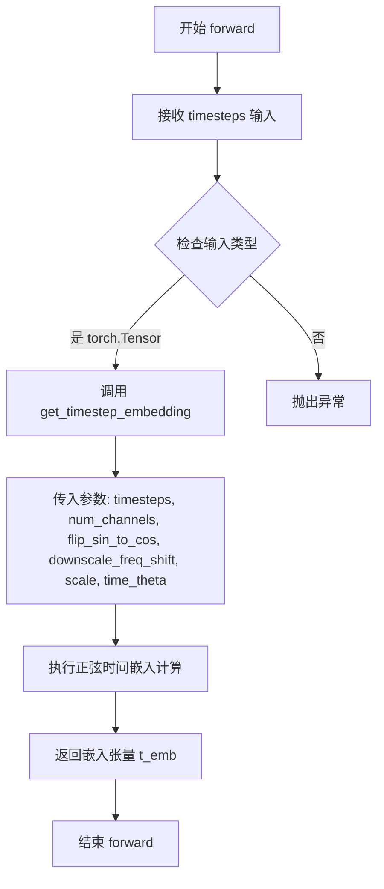

#### 带注释源码

```python
def forward(self, timesteps):
    """
    将输入的时间步转换为时间嵌入向量
    
    参数:
        timesteps: 输入的时间步张量，通常为 (batch_size,) 形状的一维张量
        
    返回:
        t_emb: 计算得到的时间嵌入张量，形状为 (batch_size, num_channels)
    """
    # 调用 get_timestep_embedding 函数进行时间嵌入计算
    # 参数说明:
    # - timesteps: 输入的时间步值
    # - self.num_channels: 输出嵌入的维度
    # - flip_sin_to_cos: 是否将 sin 和 cos 交换位置
    # - downscale_freq_shift: 频率缩放偏移量
    # - scale: 时间嵌入的缩放因子
    # - max_period: 最大周期，用于控制频率
    t_emb = get_timestep_embedding(
        timesteps,
        self.num_channels,
        flip_sin_to_cos=self.flip_sin_to_cos,
        downscale_freq_shift=self.downscale_freq_shift,
        scale=self.scale,
        max_period=self.time_theta,
    )
    # 返回计算得到的时间嵌入向量
    return t_emb
```


### `BriaFiboTimestepProjEmbeddings.forward`

该方法接收时间步张量和目标数据类型，将时间步通过时间投影层映射为中间嵌入表示，再通过时间嵌入层转换为高维特征向量，最终返回形状为 (N, D) 的时间步嵌入张量，其中 N 为批量大小，D 为嵌入维度。

参数：

- `timestep`：`torch.Tensor`，输入的时间步张量，通常为一维张量，包含多个时间步值
- `dtype`：`torch.dtype`，目标数据类型，用于指定输出的时间步嵌入的张量数据类型（如 torch.float32）

返回值：`torch.Tensor`，返回形状为 (N, D) 的时间步嵌入张量，N 为批量大小，D 为 embedding_dim（由初始化时指定）

#### 流程图

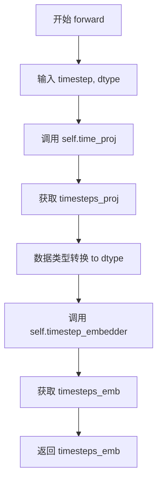

#### 带注释源码

```python
def forward(self, timestep, dtype):
    # 调用 self.time_proj (BriaFiboTimesteps 实例) 对时间步进行初步投影
    # 输入: timestep (torch.Tensor) - 例如形状为 (batch_size,) 的时间步张量
    # 输出: timesteps_proj (torch.Tensor) - 形状为 (batch_size, 256) 的投影张量
    timesteps_proj = self.time_proj(timestep)
    
    # 将投影后的张量转换为目标数据类型 (dtype)，然后传入 TimestepEmbedding 层
    # .to(dtype=dtype) 确保张量数据类型与模型其他部分一致
    # 输入: timesteps_proj (torch.Tensor) - 形状为 (batch_size, 256)
    # 输出: timesteps_emb (torch.Tensor) - 形状为 (batch_size, embedding_dim)，即 (N, D)
    timesteps_emb = self.timestep_embedder(timesteps_proj.to(dtype=dtype))  # (N, D)
    
    # 返回最终的时间步嵌入张量，用于后续的 Transformer 模型处理
    return timesteps_emb
```


### `BriaFiboTransformer2DModel.__init__`

该方法是 `BriaFiboTransformer2DModel` 类的构造函数，负责初始化整个2D变换器模型的所有组件，包括位置编码、时间嵌入、上下文嵌入器、多个变换器块、归一化层和输出投影层等，构成了完整的DiT（Diffusion Transformer）架构。

参数：

- `self`：隐式参数，表示实例本身
- `patch_size`：`int`，默认为1，补丁大小，用于将输入数据分割成小补丁
- `in_channels`：`int`，默认为64，输入通道数
- `num_layers`：`int`，默认为19，MMDiT块的数量
- `num_single_layers`：`int`，默认为38，单DiT块的数量
- `attention_head_dim`：`int`，默认为128，每个头的通道数
- `num_attention_heads`：`int`，默认为24，多头注意力使用的头数
- `joint_attention_dim`：`int`，默认为4096，用于`encoder_hidden_states`的维度
- `pooled_projection_dim`：`int`，默认为None，用于投影`pooled_projections`的维度
- `guidance_embeds`：`bool`，默认为False，是否使用引导嵌入
- `axes_dims_rope`：`list[int]`，默认为[16, 56, 56]，RoPE轴维度
- `rope_theta`：`int`，默认为10000，RoPE旋转角度的基础频率
- `time_theta`：`int`，默认为10000，时间嵌入的频率参数
- `text_encoder_dim`：`int`，默认为2048，文本编码器的输出维度

返回值：`None`，构造函数不返回任何值

#### 流程图

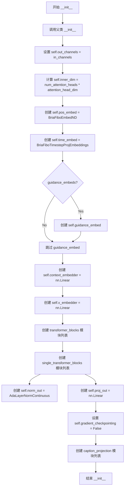

#### 带注释源码

```python
@register_to_config
def __init__(
    self,
    patch_size: int = 1,
    in_channels: int = 64,
    num_layers: int = 19,
    num_single_layers: int = 38,
    attention_head_dim: int = 128,
    num_attention_heads: int = 24,
    joint_attention_dim: int = 4096,
    pooled_projection_dim: int = None,
    guidance_embeds: bool = False,
    axes_dims_rope: list[int] = [16, 56, 56],
    rope_theta=10000,
    time_theta=10000,
    text_encoder_dim: int = 2048,
):
    """
    初始化 BriaFiboTransformer2DModel 模型
    
    参数:
        patch_size: 补丁大小
        in_channels: 输入通道数
        num_layers: MMDiT块数量
        num_single_layers: 单DiT块数量
        attention_head_dim: 注意力头维度
        num_attention_heads: 注意力头数量
        joint_attention_dim: 联合注意力维度
        pooled_projection_dim: 池化投影维度
        guidance_embeds: 是否使用引导嵌入
        axes_dims_rope: RoPE轴维度
        rope_theta: RoPE基础频率
        time_theta: 时间嵌入频率
        text_encoder_dim: 文本编码器维度
    """
    # 调用父类初始化方法
    super().__init__()
    
    # 设置输出通道数
    self.out_channels = in_channels
    # 计算内部维度 = 注意力头数 × 每头维度
    self.inner_dim = self.config.num_attention_heads * self.config.attention_head_dim

    # 创建位置嵌入模块 (使用RoPE旋转位置嵌入)
    self.pos_embed = BriaFiboEmbedND(theta=rope_theta, axes_dim=axes_dims_rope)

    # 创建时间嵌入模块
    self.time_embed = BriaFiboTimestepProjEmbeddings(embedding_dim=self.inner_dim, time_theta=time_theta)

    # 如果启用guidance_embeds，创建额外的引导时间嵌入
    if guidance_embeds:
        self.guidance_embed = BriaFiboTimestepProjEmbeddings(embedding_dim=self.inner_dim)

    # 上下文嵌入器：将joint_attention_dim投影到inner_dim
    self.context_embedder = nn.Linear(self.config.joint_attention_dim, self.inner_dim)
    # 输入嵌入器：将in_channels投影到inner_dim
    self.x_embedder = torch.nn.Linear(self.config.in_channels, self.inner_dim)

    # 创建多个Transformer块组成的模块列表
    self.transformer_blocks = nn.ModuleList(
        [
            BriaFiboTransformerBlock(
                dim=self.inner_dim,
                num_attention_heads=self.config.num_attention_heads,
                attention_head_dim=self.config.attention_head_dim,
            )
            for i in range(self.config.num_layers)
        ]
    )

    # 创建多个单Transformer块组成的模块列表
    self.single_transformer_blocks = nn.ModuleList(
        [
            BriaFiboSingleTransformerBlock(
                dim=self.inner_dim,
                num_attention_heads=self.config.num_attention_heads,
                attention_head_dim=self.config.attention_head_dim,
            )
            for i in range(self.config.num_single_layers)
        ]
    )

    # 输出归一化层和投影层
    self.norm_out = AdaLayerNormContinuous(self.inner_dim, self.inner_dim, elementwise_affine=False, eps=1e-6)
    self.proj_out = nn.Linear(self.inner_dim, patch_size * patch_size * self.out_channels, bias=True)

    # 梯度检查点标志
    self.gradient_checkpointing = False

    # 为每一层创建caption投影模块
    caption_projection = [
        BriaFiboTextProjection(in_features=text_encoder_dim, hidden_size=self.inner_dim // 2)
        for i in range(self.config.num_layers + self.config.num_single_layers)
    ]
    self.caption_projection = nn.ModuleList(caption_projection)
```


### `BriaFiboTransformer2DModel.forward`

该方法是 BriaFiboTransformer2DModel 模型的核心前向传播函数，负责将输入的隐藏状态经过多层变换器块和单变换器块处理，结合时间步嵌入、上下文嵌入、位置编码（RoPE）和文本编码层投影，最终输出经过投影的图像特征。

参数：

- `hidden_states`：`torch.Tensor`，输入的隐藏状态，形状为 `(batch size, channel, height, width)`
- `encoder_hidden_states`：`torch.Tensor`，条件嵌入（从输入条件如提示词计算的嵌入），形状为 `(batch size, sequence_len, embed_dims)`
- `text_encoder_layers`：`list`，文本编码器层的输出列表
- `pooled_projections`：`torch.Tensor`，从输入条件嵌入投影得到的嵌入，形状为 `(batch_size, projection_dim)`
- `timestep`：`torch.LongTensor`，用于表示去噪步骤的时间步
- `img_ids`：`torch.Tensor`，图像的位置 ID 张量
- `txt_ids`：`torch.Tensor`，文本的位置 ID 张量
- `guidance`：`torch.Tensor`，引导嵌入，用于分类器自由引导
- `joint_attention_kwargs`：`dict[str, Any] | None`，可选的关键字参数字典传递给注意力处理器
- `return_dict`：`bool`，是否返回 `Transformer2DModelOutput`，默认为 True

返回值：`torch.FloatTensor | Transformer2DModelOutput`，如果 `return_dict` 为 True，返回 `Transformer2DModelOutput`，否则返回元组，第一个元素为样本张量

#### 流程图

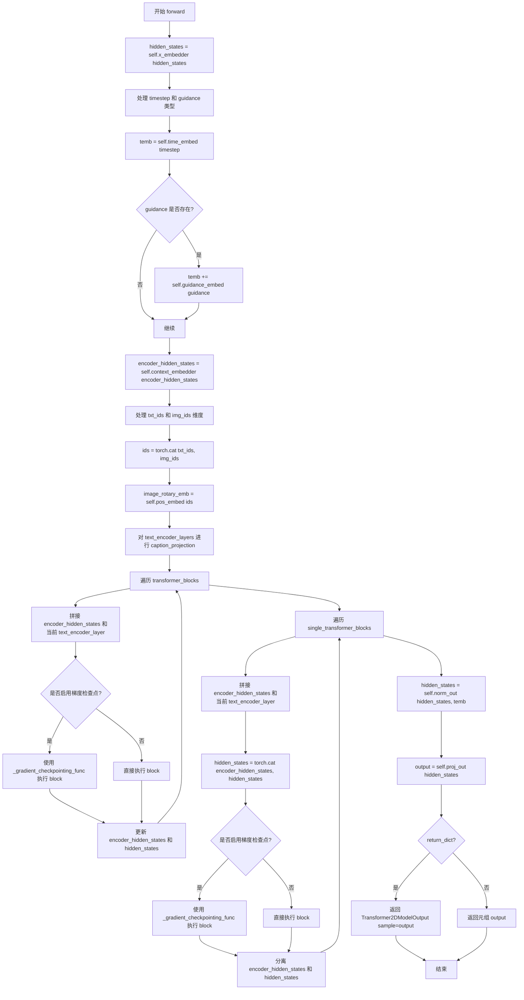

#### 带注释源码

```python
@apply_lora_scale("joint_attention_kwargs")
def forward(
    self,
    hidden_states: torch.Tensor,
    encoder_hidden_states: torch.Tensor = None,
    text_encoder_layers: list = None,
    pooled_projections: torch.Tensor = None,
    timestep: torch.LongTensor = None,
    img_ids: torch.Tensor = None,
    txt_ids: torch.Tensor = None,
    guidance: torch.Tensor = None,
    joint_attention_kwargs: dict[str, Any] | None = None,
    return_dict: bool = True,
) -> torch.FloatTensor | Transformer2DModelOutput:
    """
    BriaFiboTransformer2DModel 的前向传播方法

    Args:
        hidden_states: 输入隐藏状态，形状为 (batch size, channel, height, width)
        encoder_hidden_states: 条件嵌入，用于条件生成
        text_encoder_layers: 文本编码器层的输出列表
        pooled_projections: 池化后的投影嵌入
        timestep: 去噪步骤的时间步
        img_ids: 图像位置ID
        txt_ids: 文本位置ID
        guidance: 引导嵌入，用于分类器自由引导
        joint_attention_kwargs: 传递给注意力处理器的额外参数
        return_dict: 是否返回 Transformer2DModelOutput

    Returns:
        如果 return_dict 为 True，返回 Transformer2DModelOutput，否则返回元组
    """

    # 第一步：将输入 hidden_states 通过 x_embedder 线性投影到内部维度
    # hidden_states: (batch, c, h, w) -> (batch, h*w, inner_dim)
    hidden_states = self.x_embedder(hidden_states)

    # 第二步：将 timestep 转换为 hidden_states 的数据类型
    timestep = timestep.to(hidden_states.dtype)
    
    # 第三步：处理 guidance（分类器自由引导）
    if guidance is not None:
        guidance = guidance.to(hidden_states.dtype)
    else:
        guidance = None

    # 第四步：通过时间嵌入层生成时间嵌入向量
    # temb: (batch, inner_dim)
    temb = self.time_embed(timestep, dtype=hidden_states.dtype)

    # 第五步：如果存在 guidance，将其加到时间嵌入中
    if guidance:
        temb += self.guidance_embed(guidance, dtype=hidden_states.dtype)

    # 第六步：将条件嵌入通过上下文嵌入层投影到内部维度
    encoder_hidden_states = self.context_embedder(encoder_hidden_states)

    # 第七步：处理位置ID的维度
    # 如果 txt_ids 是三维的，取第一个样本
    if len(txt_ids.shape) == 3:
        txt_ids = txt_ids[0]

    # 如果 img_ids 是三维的，取第一个样本
    if len(img_ids.shape) == 3:
        img_ids = img_ids[0]

    # 第八步：拼接文本和图像位置ID，并生成旋转位置嵌入
    ids = torch.cat((txt_ids, img_ids), dim=0)
    image_rotary_emb = self.pos_embed(ids)

    # 第九步：对每个文本编码器层进行投影
    new_text_encoder_layers = []
    for i, text_encoder_layer in enumerate(text_encoder_layers):
        # 通过 caption_projection 将文本特征投影到内部维度的一半
        text_encoder_layer = self.caption_projection[i](text_encoder_layer)
        new_text_encoder_layers.append(text_encoder_layer)
    text_encoder_layers = new_text_encoder_layers

    # 第十步：遍历双向变换器块（joint attention）
    block_id = 0
    for index_block, block in enumerate(self.transformer_blocks):
        # 获取当前层的文本编码器投影
        current_text_encoder_layer = text_encoder_layers[block_id]
        
        # 拼接 encoder_hidden_states 和当前文本投影
        # encoder_hidden_states: (batch, seq_len, inner_dim)
        # current_text_encoder_layer: (batch, seq_len, inner_dim // 2)
        encoder_hidden_states = torch.cat(
            [encoder_hidden_states[:, :, : self.inner_dim // 2], current_text_encoder_layer], dim=-1
        )
        block_id += 1
        
        # 根据是否启用梯度检查点选择执行方式
        if torch.is_grad_enabled() and self.gradient_checkpointing:
            encoder_hidden_states, hidden_states = self._gradient_checkpointing_func(
                block,
                hidden_states,
                encoder_hidden_states,
                temb,
                image_rotary_emb,
                joint_attention_kwargs,
            )
        else:
            encoder_hidden_states, hidden_states = block(
                hidden_states=hidden_states,
                encoder_hidden_states=encoder_hidden_states,
                temb=temb,
                image_rotary_emb=image_rotary_emb,
                joint_attention_kwargs=joint_attention_kwargs,
            )

    # 第十一步：遍历单向变换器块（self-attention）
    for index_block, block in enumerate(self.single_transformer_blocks):
        # 获取当前层的文本编码器投影
        current_text_encoder_layer = text_encoder_layers[block_id]
        
        # 拼接 encoder_hidden_states 和当前文本投影
        encoder_hidden_states = torch.cat(
            [encoder_hidden_states[:, :, : self.inner_dim // 2], current_text_encoder_layer], dim=-1
        )
        block_id += 1
        
        # 将 encoder_hidden_states 拼接到 hidden_states 前面
        hidden_states = torch.cat([encoder_hidden_states, hidden_states], dim=1)
        
        # 根据是否启用梯度检查点选择执行方式
        if torch.is_grad_enabled() and self.gradient_checkpointing:
            hidden_states = self._gradient_checkpointing_func(
                block,
                hidden_states,
                temb,
                image_rotary_emb,
                joint_attention_kwargs,
            )
        else:
            hidden_states = block(
                hidden_states=hidden_states,
                temb=temb,
                image_rotary_emb=image_rotary_emb,
                joint_attention_kwargs=joint_attention_kwargs,
            )

        # 分离回 encoder_hidden_states 和 hidden_states
        encoder_hidden_states = hidden_states[:, : encoder_hidden_states.shape[1], ...]
        hidden_states = hidden_states[:, encoder_hidden_states.shape[1] :, ...]

    # 第十二步：最终输出层归一化和投影
    hidden_states = self.norm_out(hidden_states, temb)
    output = self.proj_out(hidden_states)

    # 第十三步：根据 return_dict 返回结果
    if not return_dict:
        return (output,)

    return Transformer2DModelOutput(sample=output)
```

## 关键组件


### BriaFiboAttention

BriaFiboAttention是核心注意力机制模块，继承自torch.nn.Module和AttentionModuleMixin，支持融合投影和分离投影两种模式，用于计算查询、键、值的注意力操作。

### BriaFiboAttnProcessor

BriaFiboAttnProcessor是注意力处理器类，负责调度注意力计算，支持图像旋转嵌入(rope)应用，并通过dispatch_attention_fn分发到底层注意力后端实现。

### BriaFiboTransformerBlock

BriaFiboTransformerBlock是双路注意力Transformer块，包含自注意力、交叉注意力、MLP和上下文MLP四个分支，支持AdaLayerNormZero条件归一化，用于同时处理图像和文本特征。

### BriaFiboSingleTransformerBlock

BriaFiboSingleTransformerBlock是单路注意力Transformer块，仅包含自注意力机制和MLP，采用AdaLayerNormZeroSingle条件归一化，用于深层特征处理。

### BriaFiboEmbedND

BriaFiboEmbedND实现N维旋转位置编码，支持多轴RoPE参数化，可处理任意维度的位置信息并生成cos和sin频率向量。

### BriaFiboTimesteps 和 BriaFiboTimestepProjEmbeddings

BriaFiboTimesteps将时间步转换为嵌入向量，BriaFiboTimestepProjEmbeddings是完整的时间嵌入模块，包含时间投影层和TimestepEmbedding，用于将离散时间步转换为连续特征表示。

### BriaFiboTextProjection

BriaFiboTextProjection是简单的线性投影层，用于将文本编码器输出维度映射到模型内部维度。

### BriaFiboTransformer2DModel

BriaFiboTransformer2DModel是主模型类，继承自ModelMixin、ConfigMixin等，负责整个Transformer前向传播，包含位置编码、时间嵌入、文本嵌入、多个Transformer块和输出投影层。

### _get_projections / _get_fused_projections / _get_qkv_projections

这三个函数负责计算QKV投影，其中_get_projections处理分离投影模式，_get_fused_projections处理融合投影模式，_get_qkv_projections根据配置自动选择合适的投影方式。

### dispatch_attention_fn

dispatch_attention_fn是注意力分发表，用于根据配置将注意力计算路由到不同的后端实现，支持并行计算配置。


## 问题及建议


### 已知问题

-   **类型注解不完整**：`forward` 方法中 `text_encoder_layers: list` 缺少具体类型注解，应为 `list[torch.Tensor]`；`joint_attention_dim`、`pooled_projection_dim` 等参数在 `__init__` 中类型标注缺失。
-   **硬编码值**：`BriaFiboTimestepProjEmbeddings` 中 `num_channels=256` 硬编码，应从配置或参数传入；`clip(-65504, 65504)` 在多处重复出现，应提取为常量。
-   **代码重复**：`BriaFiboTransformerBlock.forward` 中处理 `attention_outputs` 的逻辑（区分2个或3个返回值）重复且脆弱，应使用结构化方式处理；`_get_projections` 和 `_get_fused_projections` 结构相似，可合并。
-   **API不一致**：`BriaFiboAttention` 继承 `AttentionModuleMixin` 但未体现其作用；`added_proj_bias` 在代码中定义但实际使用方式不明确；`processor` 参数处理逻辑复杂，增加维护成本。
-   **梯度检查点调用不一致**：`BriaFiboTransformer2DModel.forward` 中 `self._gradient_checkpointing_func` 调用时参数数量和顺序不一致，可能导致运行时错误。
-   **冗余计算**：在 `BriaFiboEmbedND.forward` 中，`freqs_cos` 和 `freqs_sin` 转换到 `ids.device` 是必要的，但在循环中逐个处理 `n_axes` 可以向量化以提升性能；`BriaFiboTextProjection` 可直接使用 `nn.Linear` 替代。
-   **空值处理隐患**：在 `_get_fused_projections` 中，`encoder_query = encoder_key = encoder_value = (None,)` 使用元组而非 `None`，可能导致后续 `chunk` 操作失败或产生意外行为。

### 优化建议

-   **提取常量**：将 `num_channels=256`、`clip(-65504, 65504)` 等magic number提取为类或模块级常量。
-   **重构类型注解**：为所有公共方法参数添加完整的类型注解，使用 `typing.Optional` 替代 `| None` 以提高兼容性。
-   **简化attention_outputs处理**：使用 `dataclass` 或 `namedtuple` 封装返回值，明确区分不同输出场景，避免基于 `len` 的条件分支。
-   **统一梯度检查点调用**：确保 `_gradient_checkpointing_func` 在 `BriaFiboTransformerBlock` 和 `BriaFiboSingleTransformerBlock` 中的调用签名一致，或使用工厂方法统一创建。
-   **向量化BriaFiboEmbedND**：将 `for i in range(n_axes)` 循环重构为批量矩阵运算，减少Python循环开销。
-   **修正空值赋值**：将 `(None,)` 改为 `None`，或在文档中明确说明为何使用元组。

## 其它


### 设计目标与约束

本代码实现了一个名为 BriaFibo 的 Transformer 2D 模型，主要用于图像生成任务。设计目标包括：(1) 支持高效的注意力机制计算，通过 BriaFiboAttnProcessor 和 dispatch_attention_fn 实现可插拔的后端；(2) 支持文本-图像联合注意力，通过 joint_attention_dim 参数实现条件生成；(3) 支持时间步嵌入和时间条件注入，通过 AdaLayerNormZero 系列归一化层实现；(4) 支持 RoPE (Rotary Position Embedding) 位置编码，通过 BriaFiboEmbedND 实现多轴旋转位置嵌入；(5) 支持梯度检查点 (gradient checkpointing) 以节省显存。约束条件包括：(1) 需要 PyTorch 2.0+ 版本支持；(2) 需要支持 MPS 设备 (Apple Silicon)；(3) 依赖于 diffusers 库的 ConfigurationMixin、ModelMixin 等基类。

### 错误处理与异常设计

代码中的错误处理主要包括：(1) 在 BriaFiboAttnProcessor.__init__ 中检查 PyTorch 版本，如果版本低于 2.0 则抛出 ImportError；(2) 在 BriaFiboAttention.forward 中检查未使用的 kwargs 参数，通过 logger.warning 发出警告而非抛出异常；(3) 在 BriaFiboTransformerBlock.forward 中处理注意力输出的不同情况（2个或3个输出），分别对应标准注意力输出和包含 IP-Adapter 输出的情况；(4) 在 BriaFiboSingleTransformerBlock.forward 中对 float16 类型进行数值裁剪，防止数值溢出。异常设计遵循"优雅降级"原则，对于不期望的参数仅发出警告而不中断执行。

### 数据流与状态机

数据流主要分为两条路径：(1) 图像路径 (hidden_states)：输入图像经过 x_embedder 线性投影 -> 经过 num_layers 个 BriaFiboTransformerBlock 处理 -> 经过 num_single_layers 个 BriaFiboSingleTransformerBlock 处理 -> 经过 norm_out 和 proj_out 输出；(2) 文本路径 (encoder_hidden_states)：输入文本嵌入经过 context_embedder 投影 -> 在每个 TransformerBlock 中与图像特征交互 (cross-attention) -> 最终作为条件信息参与生成过程。时间步 (timestep) 经过 time_embed 处理后生成 temb 向量，通过 AdaLayerNormZero 系列层注入到每个 Transformer Block 中。位置编码通过 pos_embed (BriaFiboEmbedND) 生成旋转位置嵌入。

### 外部依赖与接口契约

主要外部依赖包括：(1) torch 和 torch.nn：PyTorch 核心库；(2) diffusers.configuration_utils：ConfigMixin 和 register_to_config 装饰器用于配置管理；(3) diffusers.loaders：FromOriginalModelMixin 和 PeftAdapterMixin 用于模型加载；(4) diffusers.models.attention_processor：Attention 类和 BriaAttnProcessor；(5) diffusers.models.embeddings：TimestepEmbedding、apply_rotary_emb、get_1d_rotary_pos_embed、get_timestep_embedding；(6) diffusers.models.modeling_outputs：Transformer2DModelOutput；(7) diffusers.models.modeling_utils：ModelMixin；(8) diffusers.models.transformers.transformer_bria：BriaAttnProcessor；(9) 本地模块：..attention (AttentionModuleMixin, FeedForward)、..attention_dispatch (dispatch_attention_fn)、..normalization (AdaLayerNormContinuous, AdaLayerNormZero, AdaLayerNormZeroSingle)。接口契约方面，BriaFiboTransformer2DModel.forward 接受 hidden_states、encoder_hidden_states、text_encoder_layers、pooled_projections、timestep、img_ids、txt_ids、guidance、joint_attention_kwargs、return_dict 等参数，返回 Transformer2DModelOutput 或元组。

### 配置参数详解

主要配置参数包括：(1) patch_size：输入数据分块大小，默认为 1；(2) in_channels：输入通道数，默认为 64；(3) num_layers：双块 (dual block) 层数，默认为 19；(4) num_single_layers：单块层数，默认为 38；(5) attention_head_dim：注意力头维度，默认为 128；(6) num_attention_heads：注意力头数，默认为 24；(7) joint_attention_dim：联合注意力维度，默认为 4096；(8) pooled_projection_dim：池化投影维度；(9) guidance_embeds：是否使用引导嵌入；(10) axes_dims_rope：RoPE 多轴维度列表，默认为 [16, 56, 56]；(11) rope_theta：RoPE 旋转角度基准，默认为 10000；(12) time_theta：时间步嵌入角度基准，默认为 10000；(13) text_encoder_dim：文本编码器输出维度，默认为 2048。

### 性能优化策略

代码中包含多种性能优化策略：(1) 梯度检查点 (gradient_checkpointing)：通过 _gradient_checkpointing_func 在前向传播时不保存中间激活值，仅在反向传播时重新计算，以牺牲计算时间换取显存节省；(2) 混合精度处理：在 BriaFiboSingleTransformerBlock.forward 和 BriaFiboTransformerBlock.forward 中对 float16 类型进行数值裁剪，防止 NaN/Inf；(3) 内存布局优化：使用 .contiguous() 确保张量内存连续，提升计算效率；(4) fused projections：支持 fused_projections 模式，将 QKV 投影合并为一个矩阵运算，减少内存访问；(5) 动态设备检测：检测 MPS 设备并调整 freqs_dtype 为 float32 以兼容。

### 版本兼容性说明

本代码需要以下版本兼容：(1) Python：建议 3.8+；(2) PyTorch：必须 2.0+ 以支持 scaled_dot_product_attention；(3) diffusers：需要支持 ConfigMixin、ModelMixin、PeftAdapterMixin、FromOriginalModelMixin 的版本；(4) MPS 支持：代码中包含对 Apple Silicon (MPS) 设备的特殊处理，但部分操作可能存在兼容性问题。代码中部分类和方法标记为 Copied from 或 Based on，表明其参考了其他项目（如 Flux、Black Forest Labs）的实现。

    