# `diffusers\src\diffusers\models\transformers\transformer_chroma.py` 详细设计文档

ChromaTransformer2DModel 是一个基于 Flux 的双流 Transformer 模型，用于图像生成任务。该模型通过单流和双流 Transformer 块处理时间步和文本嵌入，结合自适应层归一化技术和旋转位置嵌入，实现高效的条件图像生成。

## 整体流程

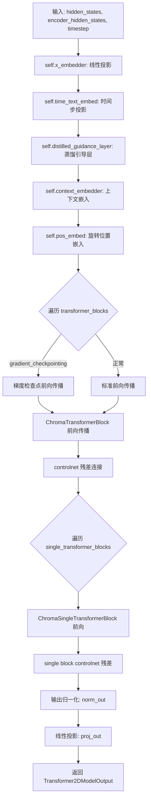

## 类结构

```
ChromaTransformer2DModel (主模型类)
├── ChromaAdaLayerNormZeroPruned (自适应层归一化)
├── ChromaAdaLayerNormZeroSinglePruned (单自适应层归一化)
├── ChromaAdaLayerNormContinuousPruned (连续自适应归一化)
├── ChromaCombinedTimestepTextProjEmbeddings (时间步文本嵌入)
├── ChromaApproximator (近似器)
├── ChromaSingleTransformerBlock (单流Transformer块)
├── ChromaTransformerBlock (双流Transformer块)
├── FluxPosEmbed (旋转位置嵌入)
└── FluxAttention (注意力机制)
```

## 全局变量及字段


### `logger`
    
模块级日志记录器，用于输出调试和信息日志

类型：`logging.Logger`
    


### `is_torch_npu_available`
    
检查当前环境是否支持NPU（华为昇腾）设备

类型：`bool`
    


### `ChromaAdaLayerNormZeroPruned.emb`
    
时间步和类别标签的联合嵌入层，用于生成自适应归一化参数

类型：`CombinedTimestepLabelEmbeddings | None`
    


### `ChromaAdaLayerNormZeroPruned.norm`
    
自适应零初始化归一化层，支持LayerNorm和FP32LayerNorm两种类型

类型：`nn.LayerNorm | FP32LayerNorm`
    


### `ChromaAdaLayerNormZeroSinglePruned.norm`
    
单流自适应零初始化归一化层，用于简化版transformer块

类型：`nn.LayerNorm`
    


### `ChromaAdaLayerNormContinuousPruned.norm`
    
连续自适应归一化层，支持LayerNorm和RMSNorm两种归一化方式

类型：`nn.LayerNorm | RMSNorm`
    


### `ChromaCombinedTimestepTextProjEmbeddings.time_proj`
    
时间步投影层，将时间步映射到正弦余弦特征空间

类型：`Timesteps`
    


### `ChromaCombinedTimestepTextProjEmbeddings.guidance_proj`
    
引导投影层，用于处理无分类器引导的时间步嵌入

类型：`Timesteps`
    


### `ChromaCombinedTimestepTextProjEmbeddings.mod_proj`
    
预计算的调制投影缓冲区，用于加速时间步嵌入计算

类型：`torch.Tensor`
    


### `ChromaApproximator.in_proj`
    
输入投影层，将输入维度映射到隐藏维度

类型：`nn.Linear`
    


### `ChromaApproximator.layers`
    
多层PixArtAlphaTextProjection模块列表，用于逐步处理隐藏状态

类型：`nn.ModuleList`
    


### `ChromaApproximator.norms`
    
RMSNorm归一化层列表，对应每个投影层进行归一化

类型：`nn.ModuleList`
    


### `ChromaApproximator.out_proj`
    
输出投影层，将隐藏维度映射回输出维度

类型：`nn.Linear`
    


### `ChromaSingleTransformerBlock.norm`
    
单流transformer块的自适应归一化层

类型：`ChromaAdaLayerNormZeroSinglePruned`
    


### `ChromaSingleTransformerBlock.proj_mlp`
    
MLP投影层，将维度扩展到隐藏维度

类型：`nn.Linear`
    


### `ChromaSingleTransformerBlock.act_mlp`
    
GELU激活函数，用于MLP的非线性变换

类型：`nn.GELU`
    


### `ChromaSingleTransformerBlock.proj_out`
    
输出投影层，将注意力输出和MLP输出合并并投影回原始维度

类型：`nn.Linear`
    


### `ChromaSingleTransformerBlock.attn`
    
Flux多头注意力机制，处理单流特征的注意力计算

类型：`FluxAttention`
    


### `ChromaTransformerBlock.norm1`
    
主分支的第一个自适应归一化零层

类型：`ChromaAdaLayerNormZeroPruned`
    


### `ChromaTransformerBlock.norm1_context`
    
上下文分支的第一个自适应归一化零层

类型：`ChromaAdaLayerNormZeroPruned`
    


### `ChromaTransformerBlock.attn`
    
双流注意力机制，支持交叉注意力处理上下文和主特征

类型：`FluxAttention`
    


### `ChromaTransformerBlock.norm2`
    
主分支的第二个归一化层

类型：`nn.LayerNorm`
    


### `ChromaTransformerBlock.ff`
    
主分支的前馈网络

类型：`FeedForward`
    


### `ChromaTransformerBlock.norm2_context`
    
上下文分支的第二个归一化层

类型：`nn.LayerNorm`
    


### `ChromaTransformerBlock.ff_context`
    
上下文分支的前馈网络

类型：`FeedForward`
    


### `ChromaTransformer2DModel.out_channels`
    
输出通道数，决定模型生成的特征维度

类型：`int`
    


### `ChromaTransformer2DModel.inner_dim`
    
内部隐藏维度，等于注意力头数乘以每头维度

类型：`int`
    


### `ChromaTransformer2DModel.pos_embed`
    
旋转位置嵌入层，用于为序列添加位置信息

类型：`FluxPosEmbed`
    


### `ChromaTransformer2DModel.time_text_embed`
    
时间和文本嵌入层，将时间步转换为调制向量

类型：`ChromaCombinedTimestepTextProjEmbeddings`
    


### `ChromaTransformer2DModel.distilled_guidance_layer`
    
蒸馏引导层，近似条件嵌入以实现更快的推理

类型：`ChromaApproximator`
    


### `ChromaTransformer2DModel.context_embedder`
    
上下文嵌入器，将联合注意力维度映射到内部维度

类型：`nn.Linear`
    


### `ChromaTransformer2DModel.x_embedder`
    
输入嵌入器，将输入通道映射到内部维度

类型：`nn.Linear`
    


### `ChromaTransformer2DModel.transformer_blocks`
    
双流transformer块列表，处理图像和文本特征的联合建模

类型：`nn.ModuleList`
    


### `ChromaTransformer2DModel.single_transformer_blocks`
    
单流transformer块列表，仅处理图像特征的后续处理

类型：`nn.ModuleList`
    


### `ChromaTransformer2DModel.norm_out`
    
输出前的连续自适应归一化层

类型：`ChromaAdaLayerNormContinuousPruned`
    


### `ChromaTransformer2DModel.proj_out`
    
最终输出投影层，将内部维度映射回补丁空间

类型：`nn.Linear`
    


### `ChromaTransformer2DModel.gradient_checkpointing`
    
梯度检查点标志，用于在训练时节省显存

类型：`bool`
    
    

## 全局函数及方法


我需要分析给定的代码来提取 `apply_lora_scale` 函数的信息。

让我仔细查看代码，我发现 `apply_lora_scale` 是从 `...utils` 导入的，并在 `ChromaTransformer2DModel.forward` 方法上作为装饰器使用。

从代码中我可以看到：
1. `apply_lora_scale` 是从 `diffusers` 库的 `utils` 模块导入的
2. 它被用作装饰器：`@apply_lora_scale("joint_attention_kwargs")`
3. 它接受一个字符串参数 `"joint_attention_kwargs"`

让我查看更多相关上下文来理解这个函数。由于这个函数是从外部导入的，我需要基于其使用方式来推断其功能。


### `apply_lora_scale`

这是一个装饰器函数，用于在调用被装饰的函数时应用 LoRA（Low-Rank Adaptation）缩放因子。它通常用于 transformer 模型的 forward 方法，以确保在应用 LoRA 权重时正确处理缩放。

参数：
-  `scale_arg`：字符串，指定 `joint_attention_kwargs` 字典中的键，用于获取 LoRA 缩放因子

返回值：装饰器函数，返回一个包装后的函数

#### 流程图

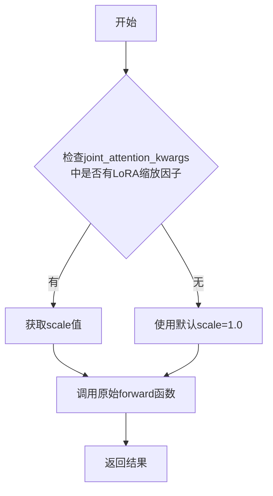

#### 带注释源码

```python
# apply_lora_scale 是从 diffusers.utils 导入的装饰器
# 使用方式：@apply_lora_scale("joint_attention_kwargs")
# 作用：在调用 forward 方法时，从 joint_attention_kwargs 中提取 LoRA 缩放因子
# 并将其应用到注意力机制的输出中

from ...utils import apply_lora_scale, deprecate, logging

# 使用示例（在 ChromaTransformer2DModel 类中）
@apply_lora_scale("joint_attention_kwargs")
def forward(
    self,
    hidden_states: torch.Tensor,
    encoder_hidden_states: torch.Tensor = None,
    timestep: torch.LongTensor = None,
    img_ids: torch.Tensor = None,
    txt_ids: torch.Tensor = None,
    attention_mask: torch.Tensor = None,
    joint_attention_kwargs: dict[str, Any] | None = None,
    controlnet_block_samples=None,
    controlnet_single_block_samples=None,
    return_dict: bool = True,
    controlnet_blocks_repeat: bool = False,
) -> torch.Tensor | Transformer2DModelOutput:
    """
    The [`FluxTransformer2DModel`] forward method.

    Args:
        hidden_states (`torch.Tensor` of shape `(batch_size, image_sequence_length, in_channels)`):
            Input `hidden_states`.
        encoder_hidden_states (`torch.Tensor` of shape `(batch_size, text_sequence_length, joint_attention_dim)`):
            Conditional embeddings (embeddings computed from the input conditions such as prompts) to use.
        timestep ( `torch.LongTensor`):
            Used to indicate denoising step.
        joint_attention_kwargs (`dict`, *optional*):
            A kwargs dictionary that if specified is passed along to the `AttentionProcessor` as defined under
            `self.processor` in
            [diffusers.models.attention_processor](https://github.com/huggingface/diffusers/blob/main/src/diffusers/models/attention_processor.py).
        return_dict (`bool`, *optional*, defaults to `True`):
            Whether or not to return a [`~models.transformer_2d.Transformer2DModelOutput`] instead of a plain
            tuple.

    Returns:
        If `return_dict` is True, an [`~models.transformer_2d.Transformer2DModelOutput`] is returned, otherwise a
        `tuple` where the first element is the sample tensor.
    """
    # ... 方法实现
```

注意：`apply_lora_scale` 的具体实现细节需要查看 `diffusers` 库的源代码。在这个文件中，它只是被导入并用作装饰器，其实现位于 `diffusers/src/diffusers/utils` 模块中。


### `deprecate`

该函数是diffusers库中的工具函数，用于标记代码中的废弃功能。在此代码中用于警告NPU处理器的弃用信息。

参数：

-  `name`：`str`，被弃用的功能或参数的名称
-  `version`：`str`，预期移除该功能的版本号
-  `message`：`str`，关于弃用的详细说明信息

返回值：`None`，该函数不返回任何值，仅通过logger发出警告

#### 流程图

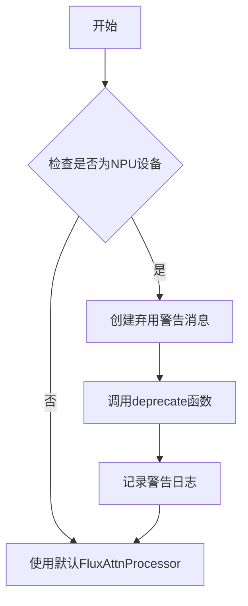

#### 带注释源码

```python
# 在 ChromaSingleTransformerBlock.__init__ 方法中

if is_torch_npu_available():
    # 导入NPU专用的注意力处理器
    from ..attention_processor import FluxAttnProcessor2_0_NPU

    # 构建弃用警告消息
    deprecation_message = (
        "Defaulting to FluxAttnProcessor2_0_NPU for NPU devices will be removed. Attention processors "
        "should be set explicitly using the `set_attn_processor` method."
    )
    # 调用deprecate函数发出警告
    # 参数1: 被弃用的功能名称
    # 参数2: 预期移除版本
    # 参数3: 弃用说明信息
    deprecate("npu_processor", "0.34.0", deprecation_message)
    # 创建处理器实例
    processor = FluxAttnProcessor2_0_NPU()
else:
    # 非NPU设备使用标准处理器
    processor = FluxAttnProcessor()
```


### `logging.get_logger`

该函数是 Hugging Face Diffusers 库中的日志工具函数，用于获取或创建一个与指定模块名称关联的 Python 标准日志记录器对象。

参数：

- `name`：`str`，日志记录器的名称，通常传入 `__name__` 以表示当前模块。

返回值：`logging.Logger`，返回一个 Python 标准库的日志记录器实例，可用于输出不同级别的日志信息。

#### 流程图

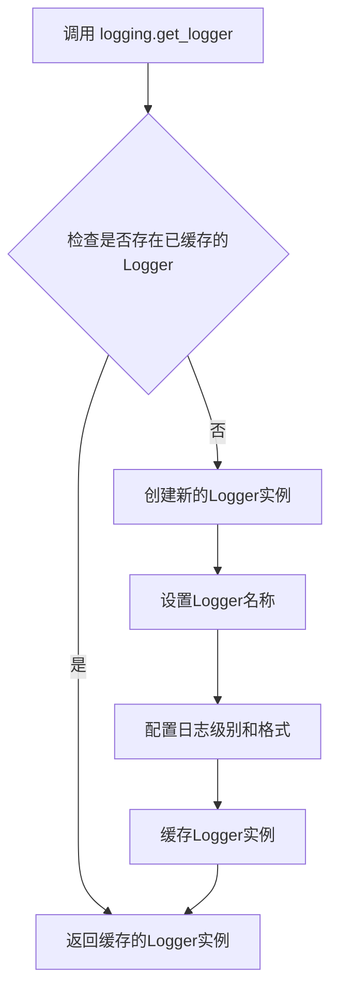

#### 带注释源码

```python
# 该函数定义在 ...utils.logging 模块中
# 以下为调用方的使用示例代码

# 从 utils 模块导入 logging 对象
from ...utils import apply_lora_scale, deprecate, logging

# 使用 logging.get_logger 获取当前模块的 logger 实例
# __name__ 是 Python 内置变量，表示当前模块的完整路径
# 例如: 'diffusers.models.transformers.transformer_chroma'
logger = logging.get_logger(__name__)  # pylint: disable=invalid-name
```

#### 补充说明

由于 `logging.get_logger` 函数定义在外部依赖模块（`...utils.logging`）中，上下文未直接提供该函数的完整实现源码。该函数通常遵循标准的 Python logging 模块模式，实现以下功能：

1. **单例模式**：相同名称的 logger 只会被创建一次，后续调用直接返回缓存实例
2. **名称关联**：将 logger 名称设置为传入的 `__name__` 参数，便于追踪日志来源
3. **默认配置**：通常会设置合理的默认日志级别和格式

**使用示例：**
```python
# 在类或函数中使用 logger
class ChromaTransformer2DModel(...):
    def forward(self, ...):
        # 使用 logger 输出警告信息
        if txt_ids.ndim == 3:
            logger.warning(
                "Passing `txt_ids` 3d torch.Tensor is deprecated."
                "Please remove the batch dimension and pass it as a 2d torch.Tensor"
            )
```


### `maybe_allow_in_graph`

该函数是一个装饰器，用于允许指定的函数或方法进入 PyTorch 的计算图中，通常用于确保自定义模块或函数在梯度计算时能被正确追踪。

参数：

-  `fn`：`Callable`，被装饰的函数或类（通常为 `nn.Module` 子类）

返回值：`Callable`，返回被装饰后的函数或类，其被标记为允许进入计算图

#### 流程图

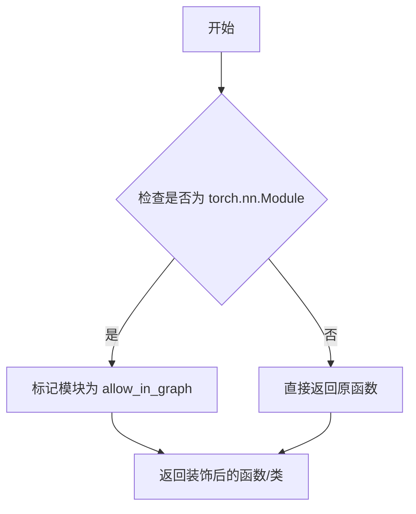

#### 带注释源码

```python
# 该函数定义在 diffusers 包的 utils/torch_utils 模块中
# 代码中通过 from ...utils.torch_utils import maybe_allow_in_graph 导入
# 在本文件中作为装饰器使用，用于标记以下类可以进入 torch 计算图：

@maybe_allow_in_graph
class ChromaSingleTransformerBlock(nn.Module):
    """单个Transformer块，允许在计算图中使用"""
    ...

@maybe_allow_in_graph
class ChromaTransformerBlock(nn.Module):
    """双流Transformer块，允许在计算图中使用"""
    ...
```

#### 说明

该函数的具体定义不在当前代码文件中，而是从 `diffusers` 库的 `utils.torch_utils` 模块导入。根据使用方式推断：

1. **作用**：确保自定义的 `nn.Module` 子类在 `torch.compile()` 或 `torch.jit.script()` 等优化时能被正确追踪
2. **使用场景**：当模块需要参与梯度计算但可能被 PyTorch 优化过程忽略时使用
3. **位置**：在当前文件的第 15 行被导入，用于装饰 `ChromaSingleTransformerBlock` 和 `ChromaTransformerBlock` 类


由于 `get_timestep_embedding` 函数是从外部模块 `..embeddings` 导入的，而非在当前代码文件中定义，我将基于其在代码中的典型使用模式和扩散模型中的标准实现来提供详细信息。

### `get_timestep_embedding`

将时间步（timestep）转换为正弦余弦位置嵌入向量，用于在扩散模型中编码时间信息。

参数：

- `timesteps`：`torch.Tensor`，需要嵌入的时间步张量，通常是一维张量
- `embedding_dim`：`int`，输出嵌入向量的维度
- `flip_sin_to_cos`：`bool`（可选），是否将正弦替换为余弦，默认为 False
- `downscale_freq_shift`：`float`（可选），频率下移参数，用于控制高频成分的衰减，默认为 0
- `max_period`：`float`（可选），最大周期参数，默认为 10000

返回值：`torch.Tensor`，形状为 `(len(timesteps), embedding_dim)` 的时间步嵌入张量

#### 流程图

```mermaid
flowchart TD
    A[输入: timesteps, embedding_dim] --> B{检查embedding_dim维度}
    B -->|偶数维度| C[计算频率因子: exp(-log(max_period) * indices / embedding_dim)]
    B -->|奇数维度| D[额外处理中间维度]
    C --> E[计算角度: timesteps[:, None] * frequency]
    D --> E
    E --> F[生成正弦和余弦嵌入]
    F --> G{flip_sin_to_cos?}
    G -->|True| H[交换正弦和余弦位置]
    G -->|False| I[保持原顺序]
    H --> J[展平并返回嵌入向量]
    I --> J
    J --> K[输出: 时间步嵌入张量]
```

#### 带注释源码

```python
def get_timestep_embedding(
    timesteps: torch.Tensor,
    embedding_dim: int,
    flip_sin_to_cos: bool = False,
    downscale_freq_shift: float = 0,
    max_period: float = 10000,
) -> torch.Tensor:
    """
    将时间步转换为嵌入向量。

    使用正弦和余弦函数创建时间步的周期性表示，这种编码方式能够让模型
    学习到时间步之间的相对关系。

    参数:
        timesteps: 需要嵌入的时间步，形状为 (batch_size,) 或 (len(timesteps),)
        embedding_dim: 嵌入向量的维度，必须为偶数
        flip_sin_to_cos: 是否交换正弦和余弦的位置
        downscale_freq_shift: 频率下移因子，控制高频成分的衰减速度
        max_period: 最大的周期值，用于归一化频率

    返回:
        形状为 (batch_size, embedding_dim) 的嵌入张量
    """
    # 检查维度必须为偶数
    half_dim = embedding_dim // 2
    
    # 计算频率衰减因子: exp(-log(max_period) * indices / embedding_dim)
    # 这创建了从低频到高频的频率谱
    emb = torch.log(torch.tensor(max_period)) / (half_num_embeddings - downscale_freq_shift)
    emb = torch.exp(torch.arange(half_num_embeddings, device=timesteps.device) * -emb)

    # 计算每个时间步与频率因子的乘积
    # 形状: (batch_size, half_dim)
    emb = timesteps.float()[:, None] * emb[None, :]

    # 生成正弦和余弦编码
    # 形状: (batch_size, embedding_dim)
    emb = torch.cat([torch.sin(emb), torch.cos(emb)], dim=-1)

    # 可选：交换正弦和余弦的位置
    if flip_sin_to_cos:
        emb = torch.cat([emb[:, embedding_dim // 2:], emb[:, :embedding_dim // 2]], dim=-1)

    return emb
```

---

### 在 `ChromaCombinedTimestepTextProjEmbeddings` 中的使用

```python
# 在 __init__ 中:
self.register_buffer(
    "mod_proj",
    get_timestep_embedding(
        torch.arange(out_dim) * 1000,  # 时间步: 0, 1000, 2000, ...
        2 * num_channels,              # 嵌入维度: 是 num_channels 的两倍
        flip_sin_to_cos=True,          # 交换正弦和余弦位置
        downscale_freq_shift=0         # 不下移频率
    ),
    persistent=False,
)
```

**使用说明**：此函数通过 `register_buffer` 注册为模型的非参数缓冲区，用于生成预计算的时间步嵌入矩阵 `mod_proj`，该矩阵在后续前向传播中会被重复使用以构建完整的条件嵌入。


### `torch.chunk`

将张量在指定维度上分割成多个块

参数：

- `input`：`torch.Tensor`，要分割的输入张量
- `chunks`：`int`，要分割的块数量
- `dim`：`int`，要分割的维度

返回值：`tuple[torch.Tensor]`，包含所有分割后张量的元组

#### 流程图

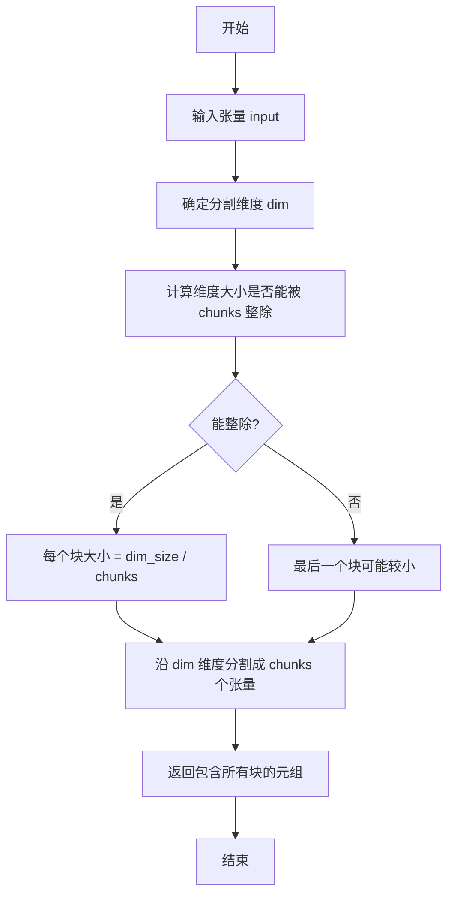

#### 带注释源码

```python
# torch.chunk 函数使用示例和原理

# 在 ChromaAdaLayerNormZeroPruned.forward 中：
# 将 embedding 张量沿 dim=1 维度分割成 6 个块
shift_msa, scale_msa, gate_msa, shift_mlp, scale_mlp, gate_mlp = emb.flatten(1, 2).chunk(6, dim=1)

# 在 ChromaAdaLayerNormZeroSinglePruned.forward 中：
# 将 embedding 张量沿 dim=1 维度分割成 3 个块
shift_msa, scale_msa, gate_msa = emb.flatten(1, 2).chunk(3, dim=1)

# 在 ChromaAdaLayerNormContinuousPruned.forward 中：
# 使用 torch.chunk 函数将张量分割成 2 个块
shift, scale = torch.chunk(emb.flatten(1, 2).to(x.dtype), 2, dim=1)

# 函数签名：
# torch.chunk(input: Tensor, chunks: int, dim: int) -> Tuple[Tensor, ...]

# 参数说明：
# - input: 要分割的输入张量
# - chunks: 要分割的块数量，必须为正数
# - dim: 要分割的维度索引

# 返回值：
# - 返回一个元组，包含所有分割后的张量
# - 如果张量在指定维度的 size 不能被 chunks 整除，最后一个块会更小

# 注意事项：
# - chunks 必须为正整数
# - 分割维度 dim 必须在输入张量的有效范围内
```


### `torch.cat`

torch.cat 是 PyTorch 库中的一个核心函数，用于沿着现有维度连接一系列张量。在本代码中，`torch.cat` 在 `ChromaTransformer2DModel.forward` 方法中用于将编码器隐藏状态（encoder_hidden_states）和主隐藏状态（hidden_states）沿序列维度拼接，形成联合表示以供后续的单Transformer块处理。

参数：

- `tensors`：要拼接的张量序列（list 或 tuple），这里传入 `[encoder_hidden_states, hidden_states]`
- `dim`：int 类型，指定要沿哪个维度进行拼接，这里为 `dim=1`

返回值：`torch.Tensor`，返回拼接后的新张量，维度为两个输入张量在指定维度上的和。

#### 流程图

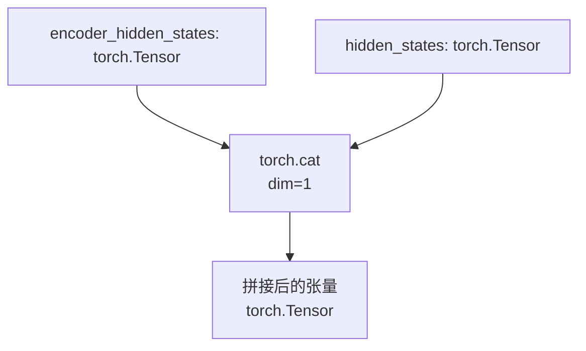

#### 带注释源码

```python
# 在 ChromaTransformer2DModel.forward 方法中
# 所有 transformer_blocks 处理完成后，将 encoder_hidden_states 和 hidden_states 沿序列维度拼接
# encoder_hidden_states: 包含文本/上下文信息的隐藏状态，形状为 (batch, seq_len_text, hidden_dim)
# hidden_states: 包含图像信息的隐藏状态，形状为 (batch, seq_len_img, hidden_dim)
hidden_states = torch.cat([encoder_hidden_states, hidden_states], dim=1)
# 拼接后 hidden_states 形状变为 (batch, seq_len_text + seq_len_img, hidden_dim)
# 这样的拼接是为了让后续的 single_transformer_blocks 能够同时处理文本和图像的联合表示
```


### `torch.is_grad_enabled`

检查当前是否启用了梯度计算（autograd）功能。该函数是 PyTorch 的内置函数，用于在运行时判断自动微分引擎是否处于活动状态，常用于条件性地执行梯度计算相关的逻辑，例如在训练和推理之间切换或实现梯度检查点技术。

参数：无需参数

返回值：`bool`，返回 `True` 表示当前启用了梯度计算（通常在训练模式下），返回 `False` 表示禁用了梯度计算（通常在推理模式下）

#### 流程图

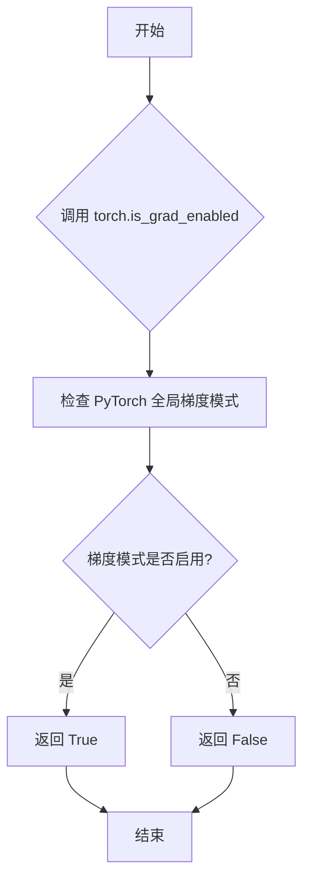

#### 带注释源码

```python
# torch.is_grad_enabled() 是 PyTorch 的内置函数
# 用于检查当前是否启用了梯度计算

# 在提供的代码中，使用示例如下：

# 第一次使用：在处理双流Transformer块时
if torch.is_grad_enabled() and self.gradient_checkpointing:
    # 如果启用了梯度计算且开启了梯度检查点
    # 则使用梯度检查点函数来节省显存
    encoder_hidden_states, hidden_states = self._gradient_checkpointing_func(
        block, hidden_states, encoder_hidden_states, temb, image_rotary_emb, attention_mask
    )
else:
    # 否则正常执行前向传播
    encoder_hidden_states, hidden_states = block(
        hidden_states=hidden_states,
        encoder_hidden_states=encoder_hidden_states,
        temb=temb,
        image_rotary_emb=image_rotary_emb,
        attention_mask=attention_mask,
        joint_attention_kwargs=joint_attention_kwargs,
    )

# 第二次使用：在处理单流Transformer块时
if torch.is_grad_enabled() and self.gradient_checkpointing:
    # 同样检查是否启用梯度计算和梯度检查点
    hidden_states = self._gradient_checkpointing_func(
        block,
        hidden_states,
        temb,
        image_rotary_emb,
    )
else:
    # 正常执行前向传播
    hidden_states = block(
        hidden_states=hidden_states,
        temb=temb,
        image_rotary_emb=image_rotary_emb,
        attention_mask=attention_mask,
        joint_attention_kwargs=joint_attention_kwargs,
    )
```


### torch.arange

`torch.arange` 是 PyTorch 库中的内置函数，用于返回一个从起始值（默认为0）到结束值（不包含）的连续一维整数张量。该函数在代码中用于生成时间步嵌入的索引序列，配合 `get_timestep_embedding` 函数使用。

参数：

- `start`：`int` 或 `float`，起始值，默认为 0
- `end`：`int` 或 `float`，结束值（不包含）
- `step`：`int` 或 `float`，步长，默认为 1
- `*`：`任意类型`，可选参数，用于兼容 Python 语法
- `dtype`：`torch.dtype`，可选，输出张量的数据类型
- `layout`：`torch.layout`，可选，输出张量的布局
- `device`：`torch.device`，可选，输出张量的设备
- `requires_grad`：`bool`，可选，是否需要计算梯度

> 注意：在当前代码中仅使用了前两个位置参数：`torch.arange(out_dim)`

返回值：`torch.Tensor`，返回从 0 到 `out_dim - 1` 的一维整数张量

#### 流程图

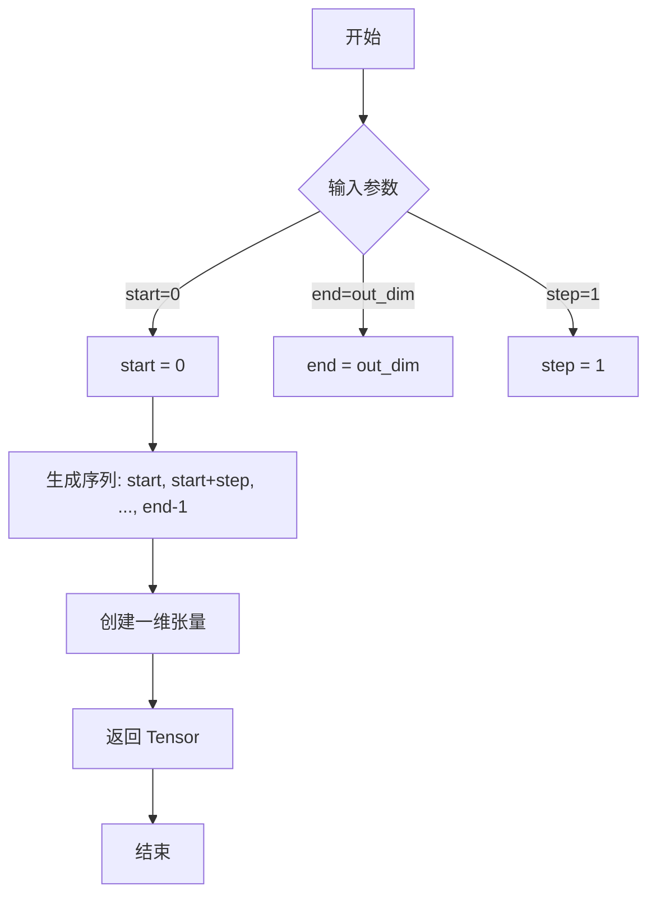

#### 带注释源码

```python
# torch.arange 函数源码（PyTorch 内部实现简化版）

# 在本项目中的实际调用方式：
torch.arange(out_dim) * 1000

# 示例输出（假设 out_dim = 10）：
# torch.arange(10) => tensor([0, 1, 2, 3, 4, 5, 6, 7, 8, 9])
# torch.arange(10) * 1000 => tensor([0, 1000, 2000, 3000, 4000, 5000, 6000, 7000, 8000, 9000])

# 在 ChromaCombinedTimestepTextProjEmbeddings 类中的具体使用：
self.register_buffer(
    "mod_proj",
    get_timestep_embedding(
        torch.arange(out_dim) * 1000,  # 生成 [0, 1000, 2000, ..., (out_dim-1)*1000] 的序列
        2 * num_channels, 
        flip_sin_to_cos=True, 
        downscale_freq_shift=0
    ),
    persistent=False,
)
```


### `torch.tensor`

创建 PyTorch 张量的函数，用于将 Python 数据转换为张量。

参数：

- `data`：列表、元组、数值或另一个张量，要转换为张量的数据
- `dtype`：`torch.dtype`，可选，指定张量的数据类型
- `device`：`torch.device`，可选，指定张量所在的设备（CPU/CUDA）
- `requires_grad`：`bool`，可选，指定是否需要计算梯度
- `pin_memory`：`bool`，可选，是否使用锁页内存

返回值：`torch.Tensor`，返回创建的 PyTorch 张量

#### 流程图

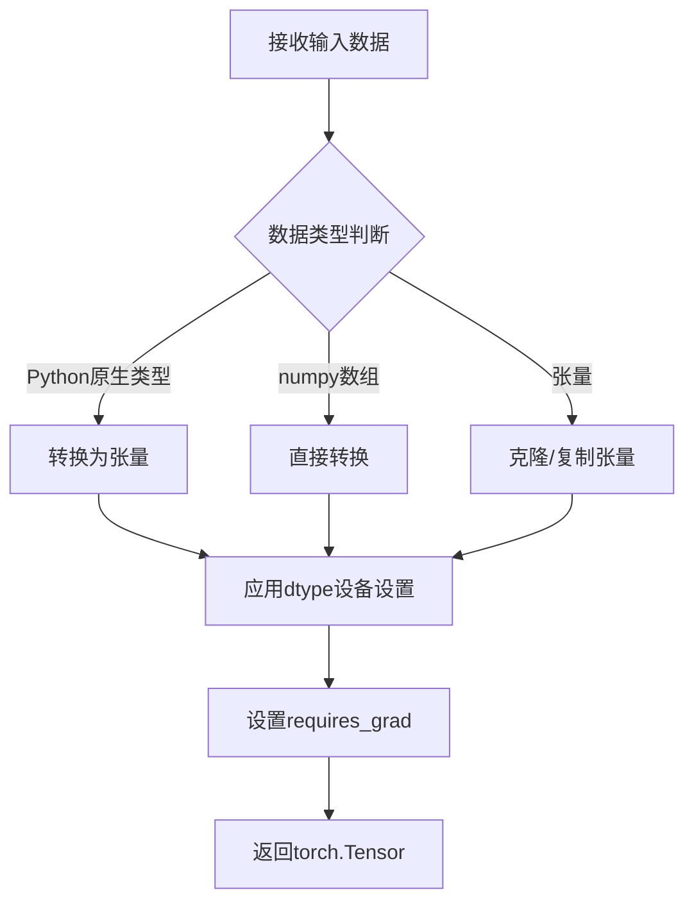

#### 带注释源码

```python
# 在 ChromaCombinedTimestepTextProjEmbeddings.forward 方法中使用:
guidance_proj = self.guidance_proj(
    torch.tensor([0] * batch_size)  # 创建长度为batch_size的全0张量
).to(
    dtype=timestep.dtype,           # 转换为与timestep相同的dtype
    device=timestep.device          # 移动到与timestep相同的设备
)
```

注意：当前代码中 `torch.tensor` 仅用于创建零张量作为引导（guidance）输入，这是扩散模型中常用的技巧，用于将条件信息与时间步信息分离处理。


### `ChromaAdaLayerNormZeroPruned.__init__`

该方法是 `ChromaAdaLayerNormZeroPruned` 类的构造函数，用于初始化自适应层归一化零（adaLN-Zero）模块。它根据传入的参数创建嵌入层（可选）和指定类型的归一化层，支持 LayerNorm 和 FP32LayerNorm 两种归一化方式。

参数：

- `embedding_dim`：`int`，每个嵌入向量的维度大小
- `num_embeddings`：`int | None`，嵌入字典的大小，如果为 None 则不创建嵌入层
- `norm_type`：`str`，归一化类型，支持 "layer_norm" 和 "fp32_layer_norm"，默认为 "layer_norm"
- `bias`：`bool`，是否使用偏置，默认为 True

返回值：`None`，无返回值

#### 流程图

```mermaid
flowchart TD
    A[开始 __init__] --> B[调用 super().__init__]
    B --> C{num_embeddings is not None}
    C -->|是| D[创建 CombinedTimestepLabelEmbeddings 嵌入层]
    C -->|否| E[self.emb = None]
    D --> F
    E --> F{norm_type == 'layer_norm'}
    F -->|是| G[创建 nn.LayerNorm]
    F -->|否| H{norm_type == 'fp32_layer_norm'}
    H -->|是| I[创建 FP32LayerNorm]
    H -->|否| J[抛出 ValueError 异常]
    G --> K[结束 __init__]
    I --> K
    J --> K
```

#### 带注释源码

```python
def __init__(self, embedding_dim: int, num_embeddings: int | None = None, norm_type="layer_norm", bias=True):
    """
    初始化 ChromaAdaLayerNormZeroPruned 层。
    
    参数:
        embedding_dim: 嵌入向量的维度
        num_embeddings: 嵌入字典大小，可选
        norm_type: 归一化类型，支持 'layer_norm' 或 'fp32_layer_norm'
        bias: 是否使用偏置
    """
    # 调用父类 nn.Module 的初始化方法
    super().__init__()
    
    # 如果提供了 num_embeddings，则创建 CombinedTimestepLabelEmbeddings 嵌入层
    # 该嵌入层用于将时间步和类别标签编码为条件嵌入向量
    if num_embeddings is not None:
        self.emb = CombinedTimestepLabelEmbeddings(num_embeddings, embedding_dim)
    else:
        # 不需要嵌入层时设为 None
        self.emb = None

    # 根据 norm_type 选择相应的归一化层
    if norm_type == "layer_norm":
        # 使用 PyTorch 的 LayerNorm，不使用元素级仿射变换（elementwise_affine=False）
        # 使用较小的 eps=1e-6 防止除零
        self.norm = nn.LayerNorm(embedding_dim, elementwise_affine=False, eps=1e-6)
    elif norm_type == "fp32_layer_norm":
        # 使用 FP32 精度的 LayerNorm，不使用偏置
        self.norm = FP32LayerNorm(embedding_dim, elementwise_affine=False, bias=False)
    else:
        # 如果传入不支持的 norm_type，抛出 ValueError 异常
        raise ValueError(
            f"Unsupported `norm_type` ({norm_type}) provided. Supported ones are: 'layer_norm', 'fp32_layer_norm'."
        )
```


### `ChromaAdaLayerNormZeroPruned.forward`

自适应层归一化零（adaLN-Zero）层的前向传播方法，通过结合时间步长和类别标签的嵌入信息，对输入张量进行归一化，并返回用于后续注意力机制和MLP的调制参数（门控、偏移和缩放）。

参数：

- `x`：`torch.Tensor`，输入张量，通常是 Transformer 块的隐藏状态
- `timestep`：`torch.Tensor | None`，时间步长张量，用于生成条件嵌入
- `class_labels`：`torch.LongTensor | None`，类别标签张量，用于生成条件嵌入
- `hidden_dtype`：`torch.dtype | None`，隐藏状态的数据类型，用于嵌入计算时的类型转换
- `emb`：`torch.Tensor | None`，预计算的条件嵌入向量，如果为 None，则从 timestep 和 class_labels 计算

返回值：`tuple[torch.Tensor, torch.Tensor, torch.Tensor, torch.Tensor, torch.Tensor]`，返回一个元组，包含：
- 归一化后的输入张量 `x`
- MSA 门控参数 `gate_msa`
- MLP 偏移参数 `shift_mlp`
- MLP 缩放参数 `scale_mlp`
- MLP 门控参数 `gate_mlp`

#### 流程图

```mermaid
flowchart TD
    A[输入 x, timestep, class_labels, emb] --> B{self.emb 是否存在?}
    B -->|是| C[通过 self.emb 计算嵌入]
    B -->|否| D{emb 是否为 None?}
    D -->|否| E[使用传入的 emb]
    D -->|是| F[使用全零嵌入]
    C --> G[emb.flatten(1, 2).chunk(6, dim=1)]
    E --> G
    F --> G
    G --> H[分割为 6 个部分]
    H --> I[shift_msa, scale_msa, gate_msa, shift_mlp, scale_mlp, gate_mlp]
    I --> J[x = self.norm(x) × (1 + scale_msa[:, None]) + shift_msa[:, None]]
    J --> K[返回 x, gate_msa, shift_mlp, scale_mlp, gate_mlp]
```

#### 带注释源码

```python
def forward(
    self,
    x: torch.Tensor,
    timestep: torch.Tensor | None = None,
    class_labels: torch.LongTensor | None = None,
    hidden_dtype: torch.dtype | None = None,
    emb: torch.Tensor | None = None,
) -> tuple[torch.Tensor, torch.Tensor, torch.Tensor, torch.Tensor, torch.Tensor]:
    # 如果存在时间步/类别嵌入模块，则根据输入条件计算嵌入向量
    # 这允许模型根据当前的生成条件动态调整归一化参数
    if self.emb is not None:
        emb = self.emb(timestep, class_labels, hidden_dtype=hidden_dtype)
    
    # 将嵌入向量展平并分割为 6 个等份，分别对应：
    # - shift_msa: MSA 的偏置项
    # - scale_msa: MSA 的缩放因子
    # - gate_msa: MSA 的门控权重（用于残差连接的动态权重）
    # - shift_mlp: MLP 的偏置项
    # - scale_mlp: MLP 的缩放因子
    # - gate_mlp: MLP 的门控权重
    shift_msa, scale_msa, gate_msa, shift_mlp, scale_mlp, gate_mlp = emb.flatten(1, 2).chunk(6, dim=1)
    
    # 执行自适应层归一化：
    # 1. 先通过基础归一化层 (LayerNorm) 对输入进行归一化
    # 2. 乘以 (1 + scale_msa) 实现缩放，添加 shift_msa 实现偏移
    # 3. 这里的 1 + scale_msa 设计允许模型学习是否需要缩放（0 意味着不缩放）
    x = self.norm(x) * (1 + scale_msa[:, None]) + shift_msa[:, None]
    
    # 返回归一化后的张量以及所有用于后续模块的调制参数
    return x, gate_msa, shift_mlp, scale_mlp, gate_mlp
```


### `ChromaAdaLayerNormZeroSinglePruned.__init__`

该方法是 `ChromaAdaLayerNormZeroSinglePruned` 类的构造函数，用于初始化一个自适应层归一化零（adaLN-Zero）模块，支持配置嵌入维度和归一化类型。

参数：

-  `self`：实例方法的标准参数，表示类实例本身
-  `embedding_dim`：`int`，每个嵌入向量的维度大小
-  `norm_type`：str，可选的归一化类型，默认为 `"layer_norm"`，目前仅支持 `"layer_norm"`
-  `bias`：bool，是否使用偏置，默认为 `True`

返回值：无（返回 `None`）

#### 流程图

```mermaid
flowchart TD
    A[开始 __init__] --> B[调用 super().__init__]
    B --> C{检查 norm_type == 'layer_norm'}
    C -->|是| D[创建 nn.LayerNorm<br/>elementwise_affine=False<br/>eps=1e-6]
    C -->|否| E[抛出 ValueError<br/>不支持的 norm_type]
    D --> F[结束 __init__]
    E --> F
```

#### 带注释源码

```python
def __init__(self, embedding_dim: int, norm_type="layer_norm", bias=True):
    """
    初始化 ChromaAdaLayerNormZeroSinglePruned 层。
    
    参数:
        embedding_dim (int): 嵌入向量的维度大小
        norm_type (str, optional): 归一化类型，默认为 "layer_norm"
        bias (bool, optional): 是否使用偏置，默认为 True
    
    异常:
        ValueError: 当提供的 norm_type 不受支持时抛出
    """
    # 调用父类 nn.Module 的初始化方法
    super().__init__()
    
    # 根据 norm_type 选择不同的归一化层
    if norm_type == "layer_norm":
        # 创建 LayerNorm 层
        # elementwise_affine=False 表示不学习仿射参数（权重为1，偏差为0）
        # eps=1e-6 用于数值稳定性
        self.norm = nn.LayerNorm(embedding_dim, elementwise_affine=False, eps=1e-6)
    else:
        # 如果传入不支持的 norm_type，抛出 ValueError 异常
        # 注意：虽然文档注释提到了 'fp32_layer_norm'，但代码中只实现了 'layer_norm'
        raise ValueError(
            f"Unsupported `norm_type` ({norm_type}) provided. Supported ones are: 'layer_norm', 'fp32_layer_norm'."
        )
```


### `ChromaAdaLayerNormZeroSinglePruned.forward`

该方法是ChromaAdaLayerNormZeroSinglePruned类的前向传播函数，实现了自适应层归一化零（adaLN-Zero）功能。它接收输入张量和条件嵌入，通过将嵌入展平并分割为shift、scale和gate三个参数，对输入应用自适应归一化变换（基于LayerNorm），实现基于条件的动态特征缩放与平移，并返回归一化后的结果和门控值。

参数：

- `self`：类实例本身，PyTorch nn.Module的标准参数
- `x`：`torch.Tensor`，输入张量，通常是经过线性投影后的隐藏状态，形状为(batch_size, seq_len, embedding_dim)
- `emb`：`torch.Tensor | None`，条件嵌入向量，包含自适应归一化所需的参数，形状需支持flatten(1,2).chunk(3, dim=1)操作

返回值：`tuple[torch.Tensor, torch.Tensor]`，包含两个元素的元组：

- 第一个元素：`torch.Tensor`，经过自适应归一化变换后的输入张量
- 第二个元素：`torch.Tensor`，门控值gate_msa，用于后续模块（如注意力机制）的残差连接门控

#### 流程图

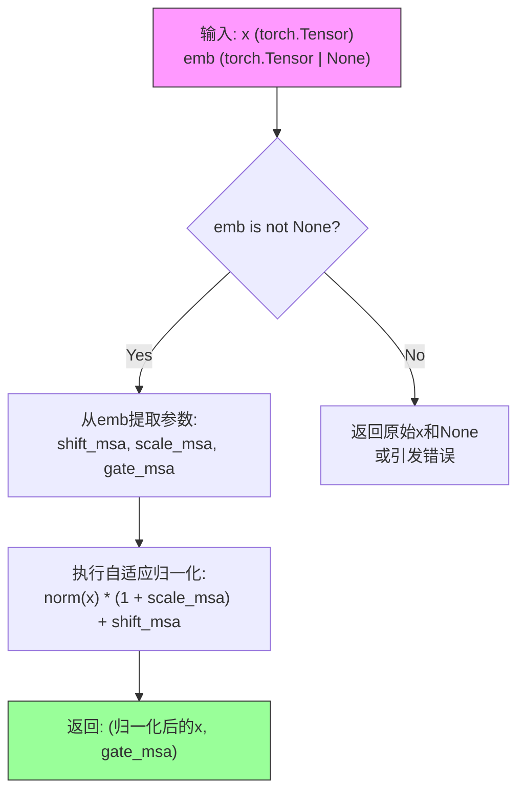

#### 带注释源码

```
def forward(
    self,
    x: torch.Tensor,
    emb: torch.Tensor | None = None,
) -> tuple[torch.Tensor, torch.Tensor, torch.Tensor, torch.Tensor, torch.Tensor]:
    """
    ChromaAdaLayerNormZeroSinglePruned的前向传播方法。
    
    实现自适应层归一化零(adaLN-Zero)机制：
    - 从条件嵌入emb中解算出shift_msa、scale_msa、gate_msa三个参数
    - 对输入x应用LayerNorm，然后进行自适应缩放和平移
    - 返回归一化后的结果和门控值，用于后续模块的残差门控
    
    参数:
        x: 输入张量，形状为(batch_size, seq_len, embedding_dim)
        emb: 条件嵌入，包含用于自适应归一化的可学习参数
        
    返回:
        元组(归一化后的张量, gate_msa)
    """
    # 将嵌入张量从形状(batch, 1, 6)展平为(batch, 6)
    # 然后沿dim=1维度分割成3个部分，每个部分对应一个参数
    # shift_msa: 平移参数，用于调整归一化后的特征分布
    # scale_msa: 缩放参数，用于调整归一化后特征的尺度
    # gate_msa: 门控参数，用于控制信息流动的残差门控
    shift_msa, scale_msa, gate_msa = emb.flatten(1, 2).chunk(3, dim=1)
    
    # 应用自适应归一化:
    # 1. self.norm(x) 对输入进行LayerNorm归一化
    # 2. * (1 + scale_msa[:, None]) 乘以(1 + 缩放因子)，使用[:, None]扩展维度以支持广播
    # 3. + shift_msa[:, None] 加上平移因子
    # 这种设计允许模型根据条件动态调整归一化后的特征
    x = self.norm(x) * (1 + scale_msa[:, None]) + shift_msa[:, None]
    
    # 返回归一化后的张量和门控值
    # gate_msa将在ChromaSingleTransformerBlock中用于残差连接的门控
    return x, gate_msa
```


### `ChromaAdaLayerNormContinuousPruned.__init__`

该方法是 `ChromaAdaLayerNormContinuousPruned` 类的构造函数，负责初始化自适应归一化层。根据传入的 `norm_type` 参数创建相应的归一化层（`nn.LayerNorm` 或 `RMSNorm`），并配置其参数如嵌入维度、epsilon 值、是否使用仿射变换等。

参数：

- `embedding_dim`：`int`，嵌入向量的维度，用于归一化层的输入输出维度
- `conditioning_embedding_dim`：`int`，输入条件的嵌入维度（本类中未直接使用，但在接口设计中保留）
- `elementwise_affine`：`bool`，默认为 `True`，是否在归一化层中应用仿射变换（缩放和偏移）
- `eps`：`float`，默认为 `1e-5`，用于数值稳定性的 epsilon 因子
- `bias`：`bool`，默认为 `True`，是否使用偏置项（仅对 LayerNorm 有效）
- `norm_type`：`str`，默认为 `"layer_norm"`，归一化层类型，支持 `"layer_norm"` 或 `"rms_norm"`

返回值：无（`None`），构造函数不返回任何值，仅初始化对象状态

#### 流程图

```mermaid
flowchart TD
    A[开始 __init__] --> B[调用 super().__init__]
    B --> C{判断 norm_type == 'layer_norm'}
    C -->|是| D[创建 nn.LayerNorm<br/>embedding_dim, eps, elementwise_affine, bias]
    C -->|否| E{判断 norm_type == 'rms_norm'}
    E -->|是| F[创建 RMSNorm<br/>embedding_dim, eps, elementwise_affine]
    E -->|否| G[抛出 ValueError<br/>unknown norm_type]
    D --> H[赋值给 self.norm]
    F --> H
    G --> I[结束]
    H --> I
```

#### 带注释源码

```python
def __init__(
    self,
    embedding_dim: int,
    conditioning_embedding_dim: int,
    # 注意：归一化层可以配置为具有缩放和偏移参数有点奇怪，
    # 因为输出会立即被投影的条件嵌入进行缩放和偏移。
    # 注意：AdaLayerNorm 不允许归一化层具有缩放和偏移参数。
    # 然而，这是原始代码中的实现方式，而且很可能你应该
    # 将 `elementwise_affine` 设置为 False。
    elementwise_affine=True,
    eps=1e-5,
    bias=True,
    norm_type="layer_norm",
):
    # 调用父类 nn.Module 的初始化方法
    super().__init__()
    
    # 根据 norm_type 创建相应的归一化层
    if norm_type == "layer_norm":
        # 创建 PyTorch 的 LayerNorm 层
        # 参数：embedding_dim, eps, elementwise_affine, bias
        self.norm = nn.LayerNorm(embedding_dim, eps, elementwise_affine, bias)
    elif norm_type == "rms_norm":
        # 创建 RMSNorm（均方根归一化）层
        # 参数：embedding_dim, eps, elementwise_affine
        self.norm = RMSNorm(embedding_dim, eps, elementwise_affine)
    else:
        # 如果传入不支持的 norm_type，抛出异常
        raise ValueError(f"unknown norm_type {norm_type}")
```


### `ChromaAdaLayerNormContinuousPruned.forward`

该方法是自适应归一层（AdaLayerNorm）的连续版本实现，接收隐藏状态和条件嵌入，通过对嵌入进行分chunk得到shift（位移）和scale（缩放）参数，然后对输入进行归一化并应用仿射变换。支持layer_norm和rms_norm两种归一化方式。

参数：

- `self`：隐式参数，类的实例本身
- `x`：`torch.Tensor`，输入的隐藏状态张量，形状为 `(batch_size, seq_len, embedding_dim)`
- `emb`：`torch.Tensor`，条件嵌入向量，包含shift和scale信息，形状为 `(batch_size, 2 * embedding_dim)` 或类似维度

返回值：`torch.Tensor`，经过归一化和仿射变换后的输出张量，形状与输入 `x` 相同

#### 流程图

```mermaid
flowchart TD
    A[接收输入 x 和 emb] --> B[将 emb 展平并转换为 x 的数据类型]
    B --> C[沿着维度1对 emb 进行分块, 得到 shift 和 scale]
    C --> D[对 x 应用归一化层 norm]
    D --> E[计算: norm_output * (1 + scale) + shift]
    E --> F[返回变换后的张量]
```

#### 带注释源码

```python
def forward(self, x: torch.Tensor, emb: torch.Tensor) -> torch.Tensor:
    # 将条件嵌入 emb 展平为2D张量 (batch_size, -1)
    # 并转换回输入 x 的数据类型，以防 conditioning_embedding 被上转为 float32 (hunyuanDiT 需要)
    # 然后沿着特征维度分成两部分: 前半部分为 shift, 后半部分为 scale
    shift, scale = torch.chunk(emb.flatten(1, 2).to(x.dtype), 2, dim=1)
    
    # 对输入 x 进行归一化, 然后应用仿射变换:
    # 1. 归一化: self.norm(x)
    # 2. 缩放: * (1 + scale)[:, None, :]
    # 3. 位移: + shift[:, None, :]
    # 注意: scale 和 shift 在第1维添加维度以支持广播
    x = self.norm(x) * (1 + scale)[:, None, :] + shift[:, None, :]
    
    return x
```


### `ChromaCombinedTimestepTextProjEmbeddings.__init__`

该方法是 `ChromaCombinedTimestepTextProjEmbeddings` 类的构造函数，负责初始化模型的时间步嵌入层。它创建了用于处理扩散时间步（timestep）和引导向量（guidance）的 `Timesteps` 投影器，并预计算并注册了一个不可训练的调制投影向量（`mod_proj`），该向量通过 `get_timestep_embedding` 生成，用于后续对 Transformer 模块的自适应归一化（AdaLN）调制。

参数：

- `num_channels`：`int`，时间步投影的通道数，决定了嵌入向量的维度。
- `out_dim`：`int`，输出的维度，决定了调制投影向量（mod_proj）的长度。

返回值：`None`，无返回值，用于初始化实例对象。

#### 流程图

```mermaid
graph TD
    A[开始 __init__] --> B[调用 super().__init__()]
    B --> C[初始化 self.time_proj: Timesteps]
    C --> D[初始化 self.guidance_proj: Timesteps]
    D --> E[计算 get_timestep_embedding]
    E --> F[注册 self.mod_proj 缓冲区]
    F --> G[结束 __init__]
```

#### 带注释源码

```python
def __init__(self, num_channels: int, out_dim: int):
    # 调用父类 nn.Module 的初始化方法
    super().__init__()

    # 1. 初始化时间步 (Timestep) 投影层
    # 用于将离散的扩散时间步转换为高维向量表示
    self.time_proj = Timesteps(num_channels=num_channels, flip_sin_to_cos=True, downscale_freq_shift=0)
    
    # 2. 初始化引导 (Guidance) 投影层
    # 此处用于处理引导向量（在 forward 中通常传入全 0 向量），结构与 time_proj 相同
    self.guidance_proj = Timesteps(num_channels=num_channels, flip_sin_to_cos=True, downscale_freq_shift=0)

    # 3. 预计算调制 (Modulation) 投影向量
    # 创建一个线性间隔的索引 tensor: [0, 1000, 2000, ..., (out_dim-1)*1000]
    # 传入 get_timestep_embedding 生成形状为 (out_dim, 2 * num_channels) 的嵌入向量
    # 这是一个静态的、不可训练的嵌入，预先计算好以提高效率
    self.register_buffer(
        "mod_proj",
        get_timestep_embedding(
            torch.arange(out_dim) * 1000, 2 * num_channels, flip_sin_to_cos=True, downscale_freq_shift=0
        ),
        persistent=False, # 设置为 False，表示该缓冲区不会被保存到模型权重中
    )
```


### `ChromaCombinedTimestepTextProjEmbeddings.forward`

该方法实现时间步和引导（guidance）嵌入的联合投影，将时间步通过 `Timesteps` 模块投影，并与预先注册的模态投影（mod_proj）进行拼接和重复，生成适合Transformer输入的联合嵌入向量。

参数：

- `timestep`：`torch.Tensor`，时间步张量，形状为 `(batch_size,)`，表示扩散模型的去噪时间步

返回值：`torch.Tensor`，联合嵌入向量，形状为 `(batch_size, mod_index_length, 2 * num_channels + out_dim)`，其中 `mod_index_length` 等于 `out_dim`

#### 流程图

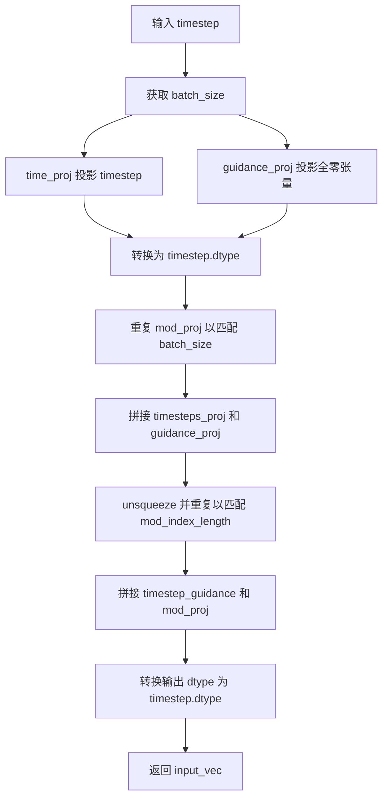

#### 带注释源码

```python
def forward(self, timestep: torch.Tensor) -> torch.Tensor:
    # 获取模态投影的长度（等于 out_dim）
    mod_index_length = self.mod_proj.shape[0]
    # 获取批次大小
    batch_size = timestep.shape[0]

    # 对时间步进行投影，将其转换为正弦余弦形式
    # time_proj 将时间步映射到 num_channels 维的向量
    timesteps_proj = self.time_proj(timestep).to(dtype=timestep.dtype)
    
    # 对全零张量（代表无引导）进行投影，生成引导嵌入
    # 使用全零张量作为默认引导输入
    guidance_proj = self.guidance_proj(torch.tensor([0] * batch_size)).to(
        dtype=timestep.dtype, device=timestep.device
    )

    # 将预注册的模态投影重复 batch_size 次，以匹配批次维度
    # 同时确保 dtype 和设备与 timesteps_proj 一致
    mod_proj = self.mod_proj.to(dtype=timesteps_proj.dtype, device=timesteps_proj.device).repeat(batch_size, 1, 1)
    
    # 拼接时间步投影和引导投影，然后在序列维度上重复以匹配模态投影的长度
    timestep_guidance = (
        torch.cat([timesteps_proj, guidance_proj], dim=1).unsqueeze(1).repeat(1, mod_index_length, 1)
    )
    
    # 最终拼接时间步引导向量和模态投影向量
    input_vec = torch.cat([timestep_guidance, mod_proj], dim=-1)
    
    # 确保输出类型与输入时间步类型一致
    return input_vec.to(timestep.dtype)
```


### `ChromaApproximator.__init__`

该方法是 `ChromaApproximator` 类的构造函数，用于初始化一个用于近似计算的多层感知器（MLP）网络。该网络包含输入投影层、多个交替的文本投影层和 RMSNorm 归一化层，以及输出投影层，用于处理 Chroma 模型的时序和指导信息。

参数：

- `self`：`ChromaApproximator` 类实例本身
- `in_dim`：`int`，输入特征的维度
- `out_dim`：`int`，输出特征的维度
- `hidden_dim`：`int`，隐藏层的维度
- `n_layers`：`int`，隐藏层的数量，默认为 5

返回值：无（`None`），该方法为构造函数，不返回任何值

#### 流程图

```mermaid
flowchart TD
    A[开始 __init__] --> B[调用 super().__init__]
    B --> C[创建输入投影层: nn.Linear(in_dim, hidden_dim, bias=True)]
    D[创建 n_layers 个 PixArtAlphaTextProjection 层]
    D --> E[创建 n_layers 个 RMSNorm 层]
    E --> F[创建输出投影层: nn.Linear(hidden_dim, out_dim)]
    F --> G[结束 __init__]
    
    C --> D
```

#### 带注释源码

```python
def __init__(self, in_dim: int, out_dim: int, hidden_dim: int, n_layers: int = 5):
    """
    初始化 ChromaApproximator 的神经网络结构。
    
    参数:
        in_dim (int): 输入特征的维度
        out_dim (int): 输出特征的维度
        hidden_dim (int): 隐藏层的维度
        n_layers (int, optional): 隐藏层的数量，默认为 5
    """
    # 调用父类 nn.Module 的初始化方法
    super().__init__()
    
    # 创建输入投影层：将输入特征从 in_dim 维度投影到 hidden_dim 维度
    # 使用偏置项 (bias=True)
    self.in_proj = nn.Linear(in_dim, hidden_dim, bias=True)
    
    # 创建多个文本投影层 (PixArtAlphaTextProjection)，使用 SILU 激活函数
    # 每一层的输入和输出维度都是 hidden_dim
    # 这些层将用于处理和转换隐藏状态
    self.layers = nn.ModuleList(
        [PixArtAlphaTextProjection(hidden_dim, hidden_dim, act_fn="silu") for _ in range(n_layers)]
    )
    
    # 创建对应的 RMSNorm 归一化层，用于稳定训练过程
    # 对每一层的输出进行归一化处理
    self.norms = nn.ModuleList([nn.RMSNorm(hidden_dim) for _ in range(n_layers)])
    
    # 创建输出投影层：将隐藏特征从 hidden_dim 维度投影到 out_dim 维度
    # 使用偏置项 (bias=True)
    self.out_proj = nn.Linear(hidden_dim, out_dim)
```


### `ChromaApproximator.forward`

该方法是 Chroma 近似器的前向传播函数，负责将输入张量通过输入投影、多层归一化与注意力投影的残差连接，以及输出投影，转换为最终的输出表示。

参数：

- `x`：`torch.Tensor`，输入张量

返回值：`torch.Tensor`，经过多层变换后的输出张量

#### 流程图

```mermaid
flowchart TD
    A[输入 x] --> B[in_proj: 线性投影]
    B --> C{遍历 layers 和 norms}
    C -->|第 i 层| D[norms[i]: RMSNorm 归一化]
    D --> E[layers[i]: PixArtAlphaTextProjection 投影]
    E --> F[x = x + layer(norms(x)): 残差连接]
    F --> C
    C -->|完成所有层| G[out_proj: 线性投影输出]
    G --> H[返回输出张量]
```

#### 带注释源码

```python
def forward(self, x):
    # 第一步：输入投影
    # 将输入 x 从原始维度投影到隐藏维度
    x = self.in_proj(x)

    # 第二步：多层变换（残差连接）
    # 遍历每一层的归一化和投影模块
    for layer, norms in zip(self.layers, self.norms):
        # 对输入进行 RMSNorm 归一化
        normalized = norms(x)
        # 通过 PixArtAlphaTextProjection 层进行投影
        projected = layer(normalized)
        # 残差连接：x = x + projected
        x = x + projected

    # 第三步：输出投影
    # 将隐藏维度投影回输出维度并返回
    return self.out_proj(x)
```


### `ChromaSingleTransformerBlock.__init__`

这是 `ChromaSingleTransformerBlock` 类的初始化方法，负责构建一个单流Transformer块，包含自适应层归一化、MLP投影层和注意力机制的配置。

参数：

- `dim`：`int`，输入特征的维度
- `num_attention_heads`：`int`，注意力机制中使用的头数
- `attention_head_dim`：`int`，每个注意力头的维度
- `mlp_ratio`：`float`，MLP隐藏层维度的扩展比率，默认为 4.0

返回值：`None`，该方法为构造函数，不返回任何值

#### 流程图

```mermaid
flowchart TD
    A[开始 __init__] --> B[调用 super().__init__]
    B --> C[计算 mlp_hidden_dim = dim * mlp_ratio]
    C --> D[创建 ChromaAdaLayerNormZeroSinglePruned 层]
    D --> E[创建 MLP 投影层 proj_mlp]
    E --> F[创建 GELU 激活层 act_mlp]
    F --> G[创建输出投影层 proj_out]
    G --> H{检查 NPU 可用性}
    H -->|是| I[使用 FluxAttnProcessor2_0_NPU]
    H -->|否| J[使用 FluxAttnProcessor]
    I --> K[创建 FluxAttention 层]
    J --> K
    K --> L[结束 __init__]
```

#### 带注释源码

```python
def __init__(
    self,
    dim: int,
    num_attention_heads: int,
    attention_head_dim: int,
    mlp_ratio: float = 4.0,
):
    """
    初始化 ChromaSingleTransformerBlock 单流Transformer块
    
    参数:
        dim: 输入特征的维度
        num_attention_heads: 注意力头的数量
        attention_head_dim: 每个注意力头的维度
        mlp_ratio: MLP隐藏层维度相对于输入维度的扩展比率
    """
    # 调用父类 nn.Module 的初始化方法
    super().__init__()
    
    # 计算 MLP 隐藏层维度，基于 mlp_ratio 扩展输入维度
    self.mlp_hidden_dim = int(dim * mlp_ratio)
    
    # 创建自适应层归一化零（adaLN-Zero）模块，用于自适应地调整特征分布
    self.norm = ChromaAdaLayerNormZeroSinglePruned(dim)
    
    # 创建从输入维度到 MLP 隐藏层维度的线性投影层
    self.proj_mlp = nn.Linear(dim, self.mlp_hidden_dim)
    
    # 创建 GELU 激活函数，使用 tanh 近似以提高计算效率
    self.act_mlp = nn.GELU(approximate="tanh")
    
    # 创建输出投影层，将拼接后的注意力输出和 MLP 输出投影回原始维度
    # 注意：输入维度是 dim + mlp_hidden_dim，因为需要拼接 attention 和 MLP 的输出
    self.proj_out = nn.Linear(dim + self.mlp_hidden_dim, dim)

    # 检查是否使用 NPU（华为昇腾）设备
    if is_torch_npu_available():
        # 动态导入 NPU 专用的注意力处理器
        from ..attention_processor import FluxAttnProcessor2_0_NPU

        # 记录弃用警告信息
        deprecation_message = (
            "Defaulting to FluxAttnProcessor2_0_NPU for NPU devices will be removed. Attention processors "
            "should be set explicitly using the `set_attn_processor` method."
        )
        # 记录弃用警告，版本号 0.34.0
        deprecate("npu_processor", "0.34.0", deprecation_message)
        # 使用 NPU 专用的注意力处理器
        processor = FluxAttnProcessor2_0_NPU()
    else:
        # 在非 NPU 设备上使用默认的 Flux 注意力处理器
        processor = FluxAttnProcessor()

    # 创建 FluxAttention 注意力层模块
    self.attn = FluxAttention(
        query_dim=dim,              # 查询向量维度
        dim_head=attention_head_dim, # 每个头的维度
        heads=num_attention_heads,   # 注意力头数量
        out_dim=dim,                 # 输出维度
        bias=True,                   # 是否使用偏置
        processor=processor,         # 注意力处理器
        eps=1e-6,                    # 数值稳定性 epsilon
        pre_only=True,               # 仅使用预注意力（单流架构）
    )
```


### `ChromaSingleTransformerBlock.forward`

该方法实现了 Chroma 架构中的单个Transformer块的前向传播，融合了自适应层归一化、注意力机制和MLP网络，用于处理图像特征的单一序列流。

参数：

- `hidden_states`：`torch.Tensor`，输入的隐藏状态张量，形状为 `(batch_size, sequence_length, dim)`
- `temb`：`torch.Tensor`，时间步嵌入向量，用于自适应层归一化的条件输入
- `image_rotary_emb`：`tuple[torch.Tensor, torch.Tensor] | None`，图像旋转位置嵌入，用于旋转注意力机制
- `attention_mask`：`torch.Tensor | None`，可选的注意力掩码，用于控制注意力权重
- `joint_attention_kwargs`：`dict[str, Any] | None`，传递给注意力处理器的额外关键字参数

返回值：`torch.Tensor`，经过Transformer块处理后的隐藏状态张量

#### 流程图

```mermaid
flowchart TD
    A[输入 hidden_states, temb] --> B[保存残差连接 residual = hidden_states]
    B --> C[ChromaAdaLayerNormZeroSinglePruned 归一化]
    C --> D[输出 norm_hidden_states, gate]
    D --> E[MLP投影 proj_mlp + GELU激活]
    E --> F[mlp_hidden_states]
    F --> G{attention_mask 是否存在?}
    G -->|是| H[扩展注意力掩码]
    G -->|否| I[不使用掩码]
    H --> J[FluxAttention 注意力计算]
    I --> J
    J --> K[attn_output]
    K --> L[拼接: torch.cat[attn_output, mlp_hidden_states]]
    L --> M[门控投影: gate × proj_out]
    M --> N[残差连接: residual + hidden_states]
    N --> O{数据类型是 float16?}
    O -->|是| P[数值裁剪 -65504, 65504]
    O -->|否| Q[返回 hidden_states]
    P --> Q
```

#### 带注释源码

```python
def forward(
    self,
    hidden_states: torch.Tensor,
    temb: torch.Tensor,
    image_rotary_emb: tuple[torch.Tensor, torch.Tensor] | None = None,
    attention_mask: torch.Tensor | None = None,
    joint_attention_kwargs: dict[str, Any] | None = None,
) -> torch.Tensor:
    # 步骤1: 保存输入作为残差连接，用于后续的跳跃连接
    residual = hidden_states
    
    # 步骤2: 通过自适应层归一化零（adaLN-Zero）处理隐藏状态
    # 该归一化层会将时间步嵌入（temb）作为条件输入
    # 返回归一化后的隐藏状态和门控参数 gate
    norm_hidden_states, gate = self.norm(hidden_states, emb=temb)
    
    # 步骤3: MLP 路径 - 投影隐藏状态到更高维度并应用激活函数
    mlp_hidden_states = self.act_mlp(self.proj_mlp(norm_hidden_states))
    
    # 步骤4: 处理联合注意力关键字参数（如果未提供则为空字典）
    joint_attention_kwargs = joint_attention_kwargs or {}
    
    # 步骤5: 如果存在注意力掩码，则将其扩展为适合注意力计算的形状
    # 将掩码从 (batch_size, seq_len) 扩展为 (batch_size, 1, seq_len, seq_len)
    if attention_mask is not None:
        attention_mask = attention_mask[:, None, None, :] * attention_mask[:, None, :, None]
    
    # 步骤6: 执行注意力计算
    # 使用 FluxAttention 模块处理归一化后的隐藏状态
    attn_output = self.attn(
        hidden_states=norm_hidden_states,
        image_rotary_emb=image_rotary_emb,
        attention_mask=attention_mask,
        **joint_attention_kwargs,
    )
    
    # 步骤7: 沿序列维度（dim=2）拼接注意力输出和MLP输出
    hidden_states = torch.cat([attn_output, mlp_hidden_states], dim=2)
    
    # 步骤8: 扩展门控参数维度并应用门控投影
    gate = gate.unsqueeze(1)
    hidden_states = gate * self.proj_out(hidden_states)
    
    # 步骤9: 残差连接 - 将输入与输出相加
    hidden_states = residual + hidden_states
    
    # 步骤10: 对于 float16 类型数据进行数值裁剪，防止数值溢出
    if hidden_states.dtype == torch.float16:
        hidden_states = hidden_states.clip(-65504, 65504)
    
    # 返回最终的隐藏状态
    return hidden_states
```


### `ChromaTransformerBlock.__init__`

该方法是 `ChromaTransformerBlock` 类的构造函数，负责初始化一个支持双流（图像和文本）处理的 Transformer 块，包含两个独立的归一化、注意力机制和前馈网络路径，分别用于处理 `hidden_states` 和 `encoder_hidden_states`。

参数：

- `dim`：`int`，输入张量的维度（特征通道数）
- `num_attention_heads`：`int`，注意力机制中使用的注意力头数量
- `attention_head_dim`：`int`，每个注意力头的维度
- `qk_norm`：`str`，规范化类型，默认为 `"rms_norm"`（当前未使用）
- `eps`：`float`，归一化层的 epsilon 值，默认为 `1e-6`

返回值：无（`__init__` 方法返回 `None`）

#### 流程图

```mermaid
flowchart TD
    A[开始 __init__] --> B[调用 super().__init__]
    B --> C[创建 self.norm1<br/>ChromaAdaLayerNormZeroPruned]
    C --> D[创建 self.norm1_context<br/>ChromaAdaLayerNormZeroPruned]
    D --> E[创建 self.attn<br/>FluxAttention]
    E --> F[创建 self.norm2<br/>nn.LayerNorm]
    F --> G[创建 self.ff<br/>FeedForward]
    G --> H[创建 self.norm2_context<br/>nn.LayerNorm]
    H --> I[创建 self.ff_context<br/>FeedForward]
    I --> J[结束 __init__]
    
    style A fill:#f9f,color:#000
    style J fill:#9f9,color:#000
```

#### 带注释源码

```python
@maybe_allow_in_graph
class ChromaTransformerBlock(nn.Module):
    def __init__(
        self,
        dim: int,
        num_attention_heads: int,
        attention_head_dim: int,
        qk_norm: str = "rms_norm",
        eps: float = 1e-6,
    ):
        """
        初始化 ChromaTransformerBlock 双流 Transformer 块。

        Args:
            dim (int): 输入特征的维度。
            num_attention_heads (int): 注意力头的数量。
            attention_head_dim (int): 每个注意力头的维度。
            qk_norm (str): Query/Key 规范化类型，当前版本未使用。
            eps (float): 归一化层的 epsilon 值，用于数值稳定性。
        """
        super().__init__()  # 调用父类 nn.Module 的初始化方法

        # 第一个自适应归一化层，用于处理 hidden_states（图像流）
        # ChromaAdaLayerNormZeroPruned 支持 AdaLN-Zero 机制
        self.norm1 = ChromaAdaLayerNormZeroPruned(dim)
        
        # 第一个自适应归一化层，用于处理 encoder_hidden_states（文本流）
        self.norm1_context = ChromaAdaLayerNormZeroPruned(dim)

        # 双流注意力机制，支持同时处理图像和文本特征
        # added_kv_proj_dim=dim 表示添加了额外的 KV 投影用于跨模态注意力
        self.attn = FluxAttention(
            query_dim=dim,
            added_kv_proj_dim=dim,
            dim_head=attention_head_dim,
            heads=num_attention_heads,
            out_dim=dim,
            context_pre_only=False,  # 允许上下文流也进行注意力计算
            bias=True,
            processor=FluxAttnProcessor(),
            eps=eps,
        )

        # 第二个归一化层，用于图像流的残差连接后处理
        self.norm2 = nn.LayerNorm(dim, elementwise_affine=False, eps=1e-6)
        
        # 前馈网络，用于图像流的特征变换
        # 使用 GELU 近似激活函数
        self.ff = FeedForward(dim=dim, dim_out=dim, activation_fn="gelu-approximate")

        # 第二个归一化层，用于文本流的残差连接后处理
        self.norm2_context = nn.LayerNorm(dim, elementwise_affine=False, eps=1e-6)
        
        # 前馈网络，用于文本流的特征变换
        self.ff_context = FeedForward(dim=dim, dim_out=dim, activation_fn="gelu-approximate")
```


### `ChromaTransformerBlock.forward`

该方法是 ChromaTransformerBlock 的前向传播函数，实现了双流 transformer 块，同时处理图像 hidden_states 和文本 encoder_hidden_states，包含自适应层归一化、注意力机制和前馈网络。

参数：

- `hidden_states`：`torch.Tensor`，输入的图像隐藏状态张量
- `encoder_hidden_states`：`torch.Tensor`，输入的文本/条件隐藏状态张量
- `temb`：`torch.Tensor`，时间步和条件的嵌入向量，包含图像和文本两部分
- `image_rotary_emb`：`tuple[torch.Tensor, torch.Tensor] | None`，旋转位置嵌入，用于注意力计算
- `attention_mask`：`torch.Tensor | None`，注意力掩码，用于控制注意力权重
- `joint_attention_kwargs`：`dict[str, Any] | None`，联合注意力参数，包含处理器相关配置

返回值：`tuple[torch.Tensor, torch.Tensor]`，返回处理后的 (encoder_hidden_states, hidden_states)

#### 流程图

```mermaid
flowchart TD
    A[输入 hidden_states<br/>encoder_hidden_states<br/>temb] --> B[切分 temb: temb_img<br/>temb_txt]
    B --> C[norm1 处理 hidden_states<br/>norm1_context 处理 encoder_hidden_states]
    C --> D{attention_mask<br/>是否存在?}
    D -->|是| E[调整 attention_mask 形状]
    D -->|否| F
    E --> F[调用 self.attn 注意力计算]
    F --> G{attention_outputs<br/>长度检查}
    G -->|2| H[attn_output<br/>context_attn_output]
    G -->|3| I[attn_output<br/>context_attn_output<br/>ip_attn_output]
    H --> J[门控注意力输出<br/>gate_msa * attn_output]
    I --> J
    J --> K[残差连接: hidden_states + attn_output]
    K --> L[norm2 归一化 + shift/scale 调整]
    L --> M[前馈网络 FF]
    M --> N[门控 FF 输出: gate_mlp * ff_output]
    N --> O[残差连接: hidden_states + ff_output]
    O --> P{是否存在<br/>ip_attn_output?}
    P -->|是| Q[hidden_states + ip_attn_output]
    P -->|否| R
    Q --> R[处理 encoder_hidden_states<br/>类似流程]
    R --> S[clip float16 精度]
    S --> T[返回 encoder_hidden_states<br/>hidden_states]
```

#### 带注释源码

```python
def forward(
    self,
    hidden_states: torch.Tensor,
    encoder_hidden_states: torch.Tensor,
    temb: torch.Tensor,
    image_rotary_emb: tuple[torch.Tensor, torch.Tensor] | None = None,
    attention_mask: torch.Tensor | None = None,
    joint_attention_kwargs: dict[str, Any] | None = None,
) -> tuple[torch.Tensor, torch.Tensor]:
    """
    ChromaTransformerBlock 前向传播
    
    处理双流输入：图像 hidden_states 和文本 encoder_hidden_states
    包含自适应归一化、交叉注意力、前馈网络等组件
    """
    # 将 temb 拆分为图像和文本两部分
    # temb 形状: (batch_size, 12) -> 前6维图像, 后6维文本
    temb_img, temb_txt = temb[:, :6], temb[:, 6:]
    
    # 第一次自适应归一化处理 hidden_states (图像分支)
    # 返回: 归一化后的张量、门控参数 MSA、MLP 的 shift/scale/gate
    norm_hidden_states, gate_msa, shift_mlp, scale_mlp, gate_mlp = self.norm1(hidden_states, emb=temb_img)

    # 第一次自适应归一化处理 encoder_hidden_states (文本/上下文分支)
    norm_encoder_hidden_states, c_gate_msa, c_shift_mlp, c_scale_mlp, c_gate_mlp = self.norm1_context(
        encoder_hidden_states, emb=temb_txt
    )
    
    # 获取联合注意力参数，默认为空字典
    joint_attention_kwargs = joint_attention_kwargs or {}
    
    # 处理注意力掩码: (batch, seq) -> (batch, 1, 1, seq) * (batch, 1, seq, 1)
    # 实现因果掩码效果
    if attention_mask is not None:
        attention_mask = attention_mask[:, None, None, :] * attention_mask[:, None, :, None]

    # ===== 注意力计算 =====
    # 调用 FluxAttention 进行自注意力和交叉注意力
    attention_outputs = self.attn(
        hidden_states=norm_hidden_states,
        encoder_hidden_states=norm_encoder_hidden_states,
        image_rotary_emb=image_rotary_emb,
        attention_mask=attention_mask,
        **joint_attention_kwargs,
    )

    # 解包注意力输出，支持 2 或 3 个输出（3个时包含 IP-Adapter 输出）
    if len(attention_outputs) == 2:
        attn_output, context_attn_output = attention_outputs
    elif len(attention_outputs) == 3:
        attn_output, context_attn_output, ip_attn_output = attention_outputs

    # ===== 处理 hidden_states (图像分支) =====
    # 应用门控 MSA 输出并残差连接
    attn_output = gate_msa.unsqueeze(1) * attn_output
    hidden_states = hidden_states + attn_output

    # 第二次归一化 + AdaIN 风格的 shift/scale
    norm_hidden_states = self.norm2(hidden_states)
    norm_hidden_states = norm_hidden_states * (1 + scale_mlp[:, None]) + shift_mlp[:, None]

    # 前馈网络处理
    ff_output = self.ff(norm_hidden_states)
    ff_output = gate_mlp.unsqueeze(1) * ff_output

    # 残差连接
    hidden_states = hidden_states + ff_output
    
    # 如果有 IP-Adapter 注意力输出，添加到 hidden_states
    if len(attention_outputs) == 3:
        hidden_states = hidden_states + ip_attn_output

    # ===== 处理 encoder_hidden_states (文本分支) =====
    # 类似图像分支的处理流程
    context_attn_output = c_gate_msa.unsqueeze(1) * context_attn_output
    encoder_hidden_states = encoder_hidden_states + context_attn_output

    norm_encoder_hidden_states = self.norm2_context(encoder_hidden_states)
    norm_encoder_hidden_states = norm_encoder_hidden_states * (1 + c_scale_mlp[:, None]) + c_shift_mlp[:, None]

    context_ff_output = self.ff_context(norm_encoder_hidden_states)
    encoder_hidden_states = encoder_hidden_states + c_gate_mlp.unsqueeze(1) * context_ff_output
    
    # float16 精度裁剪，防止溢出
    if encoder_hidden_states.dtype == torch.float16:
        encoder_hidden_states = encoder_hidden_states.clip(-65504, 65504)

    return encoder_hidden_states, hidden_states
```


### `ChromaTransformer2DModel.__init__`

这是 ChromaTransformer2DModel 类的初始化方法，负责构建用于图像生成的双流 Transformer 模型。该方法初始化模型的各个组件，包括位置编码、时间文本嵌入、上下文嵌入器、变换器块等，构建完整的模型架构。

参数：

- `patch_size`：`int`，默认值 `1`，将输入数据分割成小补丁的补丁大小
- `in_channels`：`int`，默认值 `64`，输入通道数
- `out_channels`：`int | None`，默认值 `None`，输出通道数，未指定时默认为输入通道数
- `num_layers`：`int`，默认值 `19`，双流 DiT 块的数量
- `num_single_layers`：`int`，默认值 `38`，单流 DiT 块的数量
- `attention_head_dim`：`int`，默认值 `128`，每个注意力头的维度
- `num_attention_heads`：`int`，默认值 `24`，注意力头的数量
- `joint_attention_dim`：`int`，默认值 `4096`，联合注意力的维度
- `axes_dims_rope`：`tuple[int, ...]`，默认值 `(16, 56, 56)`，旋转位置嵌入的维度
- `approximator_num_channels`：`int`，默认值 `64`，近似器的通道数
- `approximator_hidden_dim`：`int`，默认值 `5120`，近似器的隐藏层维度
- `approximator_layers`：`int`，默认值 `5`，近似器的层数

返回值：`None`，无返回值，仅初始化对象属性

#### 流程图

```mermaid
flowchart TD
    A[开始 __init__] --> B[调用 super().__init__]
    B --> C[设置输出通道和内部维度]
    C --> D[初始化 FluxPosEmbed 位置编码]
    D --> E[创建 ChromaCombinedTimestepTextProjEmbeddings]
    E --> F[创建 ChromaApproximator 蒸馏引导层]
    F --> G[创建 context_embedder 线性层]
    G --> H[创建 x_embedder 线性层]
    H --> I[创建 ChromaTransformerBlock 模块列表]
    I --> J[创建 ChromaSingleTransformerBlock 模块列表]
    J --> K[创建 ChromaAdaLayerNormContinuousPruned 归一化层]
    K --> L[创建 proj_out 投影输出层]
    L --> M[设置 gradient_checkpointing 为 False]
    M --> N[结束]
```

#### 带注释源码

```python
@register_to_config
def __init__(
    self,
    patch_size: int = 1,
    in_channels: int = 64,
    out_channels: int | None = None,
    num_layers: int = 19,
    num_single_layers: int = 38,
    attention_head_dim: int = 128,
    num_attention_heads: int = 24,
    joint_attention_dim: int = 4096,
    axes_dims_rope: tuple[int, ...] = (16, 56, 56),
    approximator_num_channels: int = 64,
    approximator_hidden_dim: int = 5120,
    approximator_layers: int = 5,
):
    # 调用父类 ModelMixin 的初始化方法，完成基础模型Mixin的初始化
    super().__init__()
    
    # 设置输出通道数，如果未指定则默认为输入通道数
    self.out_channels = out_channels or in_channels
    # 计算内部维度：注意力头数 × 每个头的维度
    self.inner_dim = num_attention_heads * attention_head_dim

    # 初始化旋转位置嵌入（RoPE），用于编码序列位置信息
    self.pos_embed = FluxPosEmbed(theta=10000, axes_dim=axes_dims_rope)

    # 创建时间-文本联合嵌入层，将时间步和文本条件编码为向量
    # 输入通道数为 approximator_num_channels // 4，输出维度由层数决定
    self.time_text_embed = ChromaCombinedTimestepTextProjEmbeddings(
        num_channels=approximator_num_channels // 4,
        out_dim=3 * num_single_layers + 2 * 6 * num_layers + 2,
    )
    
    # 创建蒸馏引导层（Approximator），用于从时间-文本嵌入中提取引导信息
    self.distilled_guidance_layer = ChromaApproximator(
        in_dim=approximator_num_channels,
        out_dim=self.inner_dim,
        hidden_dim=approximator_hidden_dim,
        n_layers=approximator_layers,
    )

    # 上下文嵌入器：将联合注意力维度的文本嵌入投影到内部维度
    self.context_embedder = nn.Linear(joint_attention_dim, self.inner_dim)
    # 输入嵌入器：将输入通道投影到内部维度
    self.x_embedder = nn.Linear(in_channels, self.inner_dim)

    # 创建双流 Transformer 块列表，每个块处理图像和文本的交叉注意力
    self.transformer_blocks = nn.ModuleList(
        [
            ChromaTransformerBlock(
                dim=self.inner_dim,
                num_attention_heads=num_attention_heads,
                attention_head_dim=attention_head_dim,
            )
            for _ in range(num_layers)
        ]
    )

    # 创建单流 Transformer 块列表，每个块只处理图像特征
    self.single_transformer_blocks = nn.ModuleList(
        [
            ChromaSingleTransformerBlock(
                dim=self.inner_dim,
                num_attention_heads=num_attention_heads,
                attention_head_dim=attention_head_dim,
            )
            for _ in range(num_single_layers)
        ]
    )

    # 输出归一化层，使用自适应层归一化
    self.norm_out = ChromaAdaLayerNormContinuousPruned(
        self.inner_dim, self.inner_dim, elementwise_affine=False, eps=1e-6
    )
    
    # 输出投影层，将内部维度投影回补丁大小的输出通道
    self.proj_out = nn.Linear(self.inner_dim, patch_size * patch_size * self.out_channels, bias=True)

    # 初始化梯度检查点标志，用于训练时节省显存
    self.gradient_checkpointing = False
```


### `ChromaTransformer2DModel.forward`

该方法是 Chroma 变换器模型的前向传播核心实现，接收图像潜在表示、文本条件嵌入、时间步等信息，通过双流变换器块（处理图像和文本）进行去噪处理，最后通过输出投影层生成最终的图像潜在表示。

参数：

- `hidden_states`：`torch.Tensor`，形状为 `(batch_size, image_sequence_length, in_channels)`，输入的图像潜在表示
- `encoder_hidden_states`：`torch.Tensor`，形状为 `(batch_size, text_sequence_length, joint_attention_dim)`，文本条件嵌入
- `timestep`：`torch.LongTensor`，去噪步骤的时间步
- `img_ids`：`torch.Tensor`，图像位置 IDs，用于旋转位置嵌入
- `txt_ids`：`torch.Tensor`，文本位置 IDs，用于旋转位置嵌入
- `attention_mask`：`torch.Tensor`，注意力掩码，用于控制注意力计算
- `joint_attention_kwargs`：`dict[str, Any] | None`，传递给注意力处理器的额外参数
- `controlnet_block_samples`：`list[torch.Tensor] | None`，ControlNet 双流块残差连接
- `controlnet_single_block_samples`：`list[torch.Tensor] | None`，ControlNet 单流块残差连接
- `return_dict`：`bool`，是否返回 `Transformer2DModelOutput` 而不是元组
- `controlnet_blocks_repeat`：`bool`，是否重复使用 ControlNet 块

返回值：`torch.Tensor | Transformer2DModelOutput`，如果 `return_dict` 为 `True`，返回包含输出样本的 `Transformer2DModelOutput` 对象；否则返回元组，第一个元素是输出张量

#### 流程图

```mermaid
flowchart TD
    A[输入 hidden_states] --> B[self.x_embedder 线性投影]
    C[输入 timestep] --> D[timestep * 1000]
    D --> E[self.time_text_embed 时间文本嵌入]
    E --> F[self.distilled_guidance_layer 蒸馏指导层]
    F --> G[pooled_temb]
    
    B --> H[self.context_embedder 文本嵌入投影]
    H --> I[encoder_hidden_states]
    
    J[img_ids 和 txt_ids] --> K[torch.cat 连接]
    K --> L[self.pos_embed 旋转位置嵌入]
    L --> M[image_rotary_emb]
    
    N{是否使用梯度检查点} -->|是| O[使用 _gradient_checkpointing_func]
    N -->|否| P[直接调用 block]
    
    subgraph 双流变换器块处理
    Q[遍历 transformer_blocks] --> R[计算 img_offset, txt_offset]
    R --> S[提取 temb 调制向量]
    S --> T[调用 ChromaTransformerBlock]
    T --> U{有 ControlNet 样本} --> V[添加残差连接]
    end
    
    U -->|无| W[torch.cat 合并 encoder_hidden_states 和 hidden_states]
    
    subgraph 单流变换器块处理
    X[遍历 single_transformer_blocks] --> Y[提取 start_idx 和 temb]
    Y --> Z[调用 ChromaSingleTransformerBlock]
    Z --> AA{有 ControlNet 样本} --> AB[添加残差连接]
    end
    
    AA -->|无| AC[hidden_states 切片去除文本部分]
    
    AC --> AD[提取最后2个调制向量]
    AD --> AE[self.norm_out 归一化]
    AE --> AF[self.proj_out 输出投影]
    
    AF --> AG{return_dict} -->|True| AH[返回 Transformer2DModelOutput]
    AG -->|False| AI[返回元组]
```

#### 带注释源码

```python
@apply_lora_scale("joint_attention_kwargs")
def forward(
    self,
    hidden_states: torch.Tensor,
    encoder_hidden_states: torch.Tensor = None,
    timestep: torch.LongTensor = None,
    img_ids: torch.Tensor = None,
    txt_ids: torch.Tensor = None,
    attention_mask: torch.Tensor = None,
    joint_attention_kwargs: dict[str, Any] | None = None,
    controlnet_block_samples=None,
    controlnet_single_block_samples=None,
    return_dict: bool = True,
    controlnet_blocks_repeat: bool = False,
) -> torch.Tensor | Transformer2DModelOutput:
    """
    The [`FluxTransformer2DModel`] forward method.

    Args:
        hidden_states (`torch.Tensor` of shape `(batch_size, image_sequence_length, in_channels)`):
            Input `hidden_states`.
        encoder_hidden_states (`torch.Tensor` of shape `(batch_size, text_sequence_length, joint_attention_dim)`):
            Conditional embeddings (embeddings computed from the input conditions such as prompts) to use.
        timestep ( `torch.LongTensor`):
            Used to indicate denoising step.
        block_controlnet_hidden_states: (`list` of `torch.Tensor`):
            A list of tensors that if specified are added to the residuals of transformer blocks.
        joint_attention_kwargs (`dict`, *optional*):
            A kwargs dictionary that if specified is passed along to the `AttentionProcessor` as defined under
            `self.processor` in
            [diffusers.models.attention_processor](https://github.com/huggingface/diffusers/blob/main/src/diffusers/models/attention_processor.py).
        return_dict (`bool`, *optional*, defaults to `True`):
            Whether or not to return a [`~models.transformer_2d.Transformer2DModelOutput`] instead of a plain
            tuple.

    Returns:
        If `return_dict` is True, an [`~models.transformer_2d.Transformer2DModelOutput`] is returned, otherwise a
        `tuple` where the first element is the sample tensor.
    """

    # 步骤1: 将输入图像潜在表示投影到内部维度
    hidden_states = self.x_embedder(hidden_states)

    # 步骤2: 将时间步乘以1000进行缩放（时间嵌入预处理）
    timestep = timestep.to(hidden_states.dtype) * 1000

    # 步骤3: 生成时间-文本联合嵌入向量
    input_vec = self.time_text_embed(timestep)
    # 通过蒸馏指导层生成池化的时间嵌入（包含图像和文本调制参数）
    pooled_temb = self.distilled_guidance_layer(input_vec)

    # 步骤4: 将文本条件嵌入投影到与图像相同的内部维度
    encoder_hidden_states = self.context_embedder(encoder_hidden_states)

    # 步骤5: 处理 txt_ids 和 img_ids（兼容旧版本3D张量输入）
    if txt_ids.ndim == 3:
        logger.warning(
            "Passing `txt_ids` 3d torch.Tensor is deprecated."
            "Please remove the batch dimension and pass it as a 2d torch.Tensor"
        )
        txt_ids = txt_ids[0]
    if img_ids.ndim == 3:
        logger.warning(
            "Passing `img_ids` 3d torch.Tensor is deprecated."
            "Please remove the batch dimension and pass it as a 2d torch.Tensor"
        )
        img_ids = img_ids[0]

    # 步骤6: 拼接文本和图像位置ID，生成旋转位置嵌入
    ids = torch.cat((txt_ids, img_ids), dim=0)
    image_rotary_emb = self.pos_embed(ids)

    # 步骤7: 处理IP-Adapter图像嵌入（如果存在）
    if joint_attention_kwargs is not None and "ip_adapter_image_embeds" in joint_attention_kwargs:
        ip_adapter_image_embeds = joint_attention_kwargs.pop("ip_adapter_image_embeds")
        ip_hidden_states = self.encoder_hid_proj(ip_adapter_image_embeds)
        joint_attention_kwargs.update({"ip_hidden_states": ip_hidden_states})

    # 步骤8: 遍历双流变换器块（同时处理图像和文本）
    for index_block, block in enumerate(self.transformer_blocks):
        # 计算图像和文本调制向量的偏移量
        img_offset = 3 * len(self.single_transformer_blocks)
        txt_offset = img_offset + 6 * len(self.transformer_blocks)
        img_modulation = img_offset + 6 * index_block
        text_modulation = txt_offset + 6 * index_block
        
        # 为当前块提取时间嵌入（图像6维 + 文本6维）
        temb = torch.cat(
            (
                pooled_temb[:, img_modulation : img_modulation + 6],
                pooled_temb[:, text_modulation : text_modulation + 6],
            ),
            dim=1,
        )
        
        # 根据是否启用梯度检查点选择执行方式
        if torch.is_grad_enabled() and self.gradient_checkpointing:
            encoder_hidden_states, hidden_states = self._gradient_checkpointing_func(
                block, hidden_states, encoder_hidden_states, temb, image_rotary_emb, attention_mask
            )
        else:
            encoder_hidden_states, hidden_states = block(
                hidden_states=hidden_states,
                encoder_hidden_states=encoder_hidden_states,
                temb=temb,
                image_rotary_emb=image_rotary_emb,
                attention_mask=attention_mask,
                joint_attention_kwargs=joint_attention_kwargs,
            )

        # ControlNet 残差连接处理
        if controlnet_block_samples is not None:
            interval_control = len(self.transformer_blocks) / len(controlnet_block_samples)
            interval_control = int(np.ceil(interval_control))
            if controlnet_blocks_repeat:
                hidden_states = (
                    hidden_states + controlnet_block_samples[index_block % len(controlnet_block_samples)]
                )
            else:
                hidden_states = hidden_states + controlnet_block_samples[index_block // interval_control]

    # 步骤9: 拼接文本和图像隐藏状态
    hidden_states = torch.cat([encoder_hidden_states, hidden_states], dim=1)

    # 步骤10: 遍历单流变换器块（仅处理图像）
    for index_block, block in enumerate(self.single_transformer_blocks):
        start_idx = 3 * index_block
        temb = pooled_temb[:, start_idx : start_idx + 3]
        
        if torch.is_grad_enabled() and self.gradient_checkpointing:
            hidden_states = self._gradient_checkpointing_func(
                block,
                hidden_states,
                temb,
                image_rotary_emb,
            )
        else:
            hidden_states = block(
                hidden_states=hidden_states,
                temb=temb,
                image_rotary_emb=image_rotary_emb,
                attention_mask=attention_mask,
                joint_attention_kwargs=joint_attention_kwargs,
            )

        # ControlNet 单块残差连接处理
        if controlnet_single_block_samples is not None:
            interval_control = len(self.single_transformer_blocks) / len(controlnet_single_block_samples)
            interval_control = int(np.ceil(interval_control))
            hidden_states[:, encoder_hidden_states.shape[1] :, ...] = (
                hidden_states[:, encoder_hidden_states.shape[1] :, ...]
                + controlnet_single_block_samples[index_block // interval_control]
            )

    # 步骤11: 去除文本部分，只保留图像隐藏状态
    hidden_states = hidden_states[:, encoder_hidden_states.shape[1] :, ...]

    # 步骤12: 使用最后2个调制向量进行输出归一化
    temb = pooled_temb[:, -2:]
    hidden_states = self.norm_out(hidden_states, temb)
    
    # 步骤13: 投影回原始输出通道数
    output = self.proj_out(hidden_states)

    # 步骤14: 根据 return_dict 返回结果
    if not return_dict:
        return (output,)

    return Transformer2DModelOutput(sample=output)
```

## 关键组件


### ChromaAdaLayerNormZeroPruned

自适应层归一化零（adaLN-Zero）模块，支持 timestep 和 class_labels 条件输入，根据 norm_type 参数选择 LayerNorm 或 FP32LayerNorm，实现基于6个参数（shift_msa, scale_msa, gate_msa, shift_mlp, scale_mlp, gate_mlp）的动态特征调制。

### ChromaAdaLayerNormZeroSinglePruned

单流自适应层归一化零模块，是 ChromaAdaLayerNormZeroPruned 的简化版本，仅返回3个参数（shift_msa, scale_msa, gate_msa），适用于单流Transformer块的条件调制。

### ChromaAdaLayerNormContinuousPruned

连续自适应归一化层，支持 LayerNorm 和 RMSNorm 两种归一化方式，接收连续的 conditioning_embedding 嵌入，通过投影得到 shift 和 scale 参数对输入进行仿射变换。

### ChromaCombinedTimestepTextProjEmbeddings

时间步和文本投影嵌入模块，包含 time_proj 和 guidance_proj 两个 Timesteps 投影器，用于将离散的时间步转换为连续嵌入，并与预计算的 mod_proj 结合生成最终的调制向量。

### ChromaApproximator

蒸馏指导层近似器，由输入投影、多层 PixArtAlphaTextProjection 和 RMSNorm 组成，使用 SILU 激活函数，实现将时间-文本条件映射到高维潜在空间的非线性变换。

### ChromaSingleTransformerBlock

单流Transformer块，包含自适应归一化、MLP前馈网络和单头注意力机制，支持 NPU 设备特定的处理器，通过 gate 机制实现输出调制和残差连接。

### ChromaTransformerBlock

双流Transformer块，分别处理图像和文本条件嵌入，包含两套独立的归一化、注意力（支持joint attention）和前馈网络，实现图像与文本表示的交互学习。

### ChromaTransformer2DModel

主Transformer模型类，继承自 ModelMixin、ConfigMixin、PeftAdapterMixin 等，支持 LoRA、ControlNet、IP-Adapter 等扩展功能，采用双流（transformer_blocks）和单流（single_transformer_blocks）交替架构，实现图像生成的条件扩散过程。

### 张量索引与惰性加载

模型通过梯度检查点（gradient_checkpointing）实现训练时的内存优化，仅在需要时计算中间激活值；在 forward 过程中通过索引切片（pooled_temb[:, img_modulation:img_modulation+6]）动态提取条件向量。

### 反量化支持

在 ChromaTransformerBlock 中处理 float16 数据时，使用 .clip(-65504, 65504) 防止数值下溢/上溢；ChromaAdaLayerNormContinuousPruned 通过 .to(x.dtype) 确保数据类型一致性。

### 量化策略

类名中的 "Pruned" 标识表明该模块经过剪枝优化，配合 ChromaApproximator 实现知识蒸馏和参数效率提升，支持通过 joint_attention_kwargs 传递注意力控制参数。


## 问题及建议


### 已知问题

- **硬编码的魔数（Magic Numbers）**：代码中多处使用硬编码的数值，如`timestep * 1000`、`img_offset = 3 * len(self.single_transformer_blocks)`、`txt_offset = img_offset + 6 * len(self.transformer_blocks)`、`pooled_temb[:, -2:]`以及`hidden_states.clip(-65504, 65504)`，这些数值缺乏明确含义且难以维护。
- **归一化层支持不一致**：`ChromaAdaLayerNormZeroPruned`支持"layer_norm"和"fp32_layer_norm"，`ChromaAdaLayerNormZeroSinglePruned`仅支持"layer_norm"，而`ChromaAdaLayerNormContinuousPruned`支持"layer_norm"和"rms_norm"，这种不一致可能导致混淆。
- **注意力输出处理不规范**：`ChromaTransformerBlock`中使用`if len(attention_outputs) == 2/3`来判断返回值数量，这种隐式契约脆弱且易出错，应使用显式的命名属性或枚举。
- **缺乏输入验证**：未对`hidden_states`、`encoder_hidden_states`、`timestep`等关键输入进行形状或类型验证，可能导致运行时错误且难以调试。
- **ControlNet残差计算存在风险**：当`controlnet_block_samples`或`controlnet_single_block_samples`不为None时，间隔计算`int(np.ceil(interval_control))`可能导致除零或索引越界，且缺乏对输入列表长度与模型层数匹配性的验证。
- **张量拼接操作冗余**：多次使用`torch.cat`且部分可以预先分配内存或使用原地操作优化，如`hidden_states = torch.cat([encoder_hidden_states, hidden_states], dim=1)`后可考虑优化内存布局。
- **3D张量警告表明API设计问题**：对`txt_ids`和`img_ids`的3D张量警告表明API可能经历过变更，但仍需兼容旧接口，增加了代码复杂度。
- **梯度检查点实现重复**：在循环中重复检查`torch.is_grad_enabled() and self.gradient_checkpointing`，可以将检查提至循环外部以减少分支判断开销。

### 优化建议

- **消除魔数**：将硬编码的数值提取为配置参数或常量，如`TIME_EMBED_SCALE`、`IMG_MODULATION_OFFSET`、`TEXT_MODULATION_OFFSET`等，并添加文档说明其含义。
- **统一归一化层接口**：创建一个基类或工厂方法统一不同归一化层的norm_type支持，提高代码一致性和可维护性。
- **显式化注意力输出**：定义明确的输出类或使用命名元组替代隐式的返回值数量判断，提高代码可读性。
- **添加输入验证**：在`forward`方法开头添加输入验证逻辑，检查关键张量的维度、类型和设备，确保符合模型预期。
- **增强ControlNet安全性**：添加对`controlnet_block_samples`长度与模型层数匹配性的验证，并在除法前检查除数是否为0。
- **优化张量操作**：评估使用`torch.jit.script`或预先分配内存的可能性，减少运行时内存分配开销。
- **简化API**：考虑移除对3D张量的兼容支持，强制使用2D张量以简化代码逻辑。
- **优化控制流**：将梯度检查点判断移至循环外部，使用两个独立的循环分别处理启用和未启用梯度检查点的情况。
- **添加类型注解完善**：部分函数参数和返回值缺少类型注解，如内部方法的具体类型标注。

## 其它


### 设计目标与约束

本代码实现了一个基于Flux架构的Chroma Transformer 2D模型，用于图像生成任务。设计目标包括：支持双流（图像+文本）注意力机制、采用AdaLayerNorm-Zero自适应归一化、集成ControlNet控制能力、支持LoRA微调。核心约束包括：输入通道数64、默认19层双流块和38层单流块、注意力头维度128、使用NPU加速支持。

### 错误处理与异常设计

代码中的错误处理主要体现在：1) 归一化类型验证（ChromaAdaLayerNormZeroPruned和ChromaAdaLayerNormContinuousPruned中对norm_type的检查）；2) 数值裁剪防止float16溢出（hidden_states.clip(-65504, 65504)）；3) 废弃API警告（deprecate用于NPU处理器）；4) 参数类型注解使用Union类型（如torch.Tensor | None）。潜在改进：缺少对输入张量shape的运行时校验、encoder_hidden_states为None时的处理、梯度checkpointing失败时的回退机制。

### 数据流与状态机

主数据流为：输入hidden_states → x_embedder线性投影 → time_text_embed生成时间步嵌入 → distilled_guidance_layer生成调制参数 → 双流transformer_blocks处理（同时接收encoder_hidden_states）→ 单流single_transformer_blocks处理 → norm_out归一化 → proj_out输出。关键状态转换包括：timestep乘以1000进行缩放、txt_ids和img_ids拼接用于旋转位置编码、encoder_hidden_states与hidden_states在双流块后拼接。

### 外部依赖与接口契约

核心依赖包括：torch、numpy、diffusers库（ConfigMixin、register_to_config、ModelMixin、FluxTransformer2DLoadersMixin、FromOriginalModelMixin、PeftAdapterMixin、CacheMixin、AttentionMixin）。上游接口：forward方法接收hidden_states、encoder_hidden_states、timestep、img_ids、txt_ids、attention_mask、joint_attention_kwargs、controlnet_block_samples等参数。下游接口：返回Transformer2DModelOutput(sample=output)或元组。

### 配置参数详解

模型通过@register_to_config装饰器配置以下参数：patch_size=1、in_channels=64、out_channels=None、num_layers=19、num_single_layers=38、attention_head_dim=128、num_attention_heads=24、joint_attention_dim=4096、axes_dims_rope=(16,56,56)、approximator_num_channels=64、approximator_hidden_dim=5120、approximator_layers=5。这些参数决定了模型的规模和计算复杂度。

### 梯度检查点与优化

代码支持梯度检查点（gradient_checkpointing）以节省显存，通过_gradient_checkpointing_func在transformer_blocks和single_transformer_blocks中应用。_supports_gradient_checkpointing=True，_no_split_modules指定了ChromaTransformerBlock和ChromaSingleTransformerBlock为不可分割模块。_skip_layerwise_casting_patterns=["pos_embed","norm"]用于跳过某些层的类型转换。

### 模块组合与复用

ChromaTransformer2DModel继承自5个mixin类：ModelMixin提供基础模型功能、ConfigMixin支持配置注册、PeftAdapterMixin支持PEFT适配器、FluxTransformer2DLoaderMixin支持从原始模型加载、CacheMixin支持缓存、AttentionMixin支持注意力机制。这种多重继承设计实现了功能的模块化组合。

### 旋转位置编码

FluxPosEmbed使用旋转位置编码（RoPE），theta=10000，axes_dim由axes_dims_rope参数指定。ids = torch.cat((txt_ids, img_ids), dim=0)将文本和图像位置ID拼接后统一编码，实现文本和图像位置的空间感知。

### ControlNet集成

代码支持ControlNet控制：通过controlnet_block_samples和controlnet_single_block_samples参数接收外部残差连接，使用interval_control计算采样间隔，controlnet_blocks_repeat参数控制是否重复使用控制块样本。这允许在生成过程中注入额外的控制信号。

### LoRA与适配器支持

通过apply_lora_scale装饰器对joint_attention_kwargs应用LoRA缩放，PeftAdapterMixin提供了对Adapter和LoRA的支持。这使得模型可以高效地进行微调和模块替换。

### 数值精度与类型管理

代码对数值精度进行了多处处理：float16输出裁剪防止溢出、条件嵌入转换为原始dtype（to(x.dtype)）、timestep转换为hidden_states的dtype。RMSNorm和FP32LayerNorm用于特定场景的高精度计算。

### 注意力机制实现

FluxAttention支持两种模式：双流模式（ChromaTransformerBlock中，added_kv_proj_dim=dim, context_pre_only=False）和单流模式（ChromaSingleTransformerBlock中，pre_only=True）。支持joint_attention_kwargs传递额外参数如ip_adapter_image_embeds。

### 性能特征

模型参数规模由inner_dim = num_attention_heads * attention_head_dim = 24 * 128 = 3072决定。双流块数量19个，单流块38个，总计57个transformer块。mlp_ratio默认为4.0，FFN隐藏维度约为12288。梯度检查点可显著减少显存占用。

    