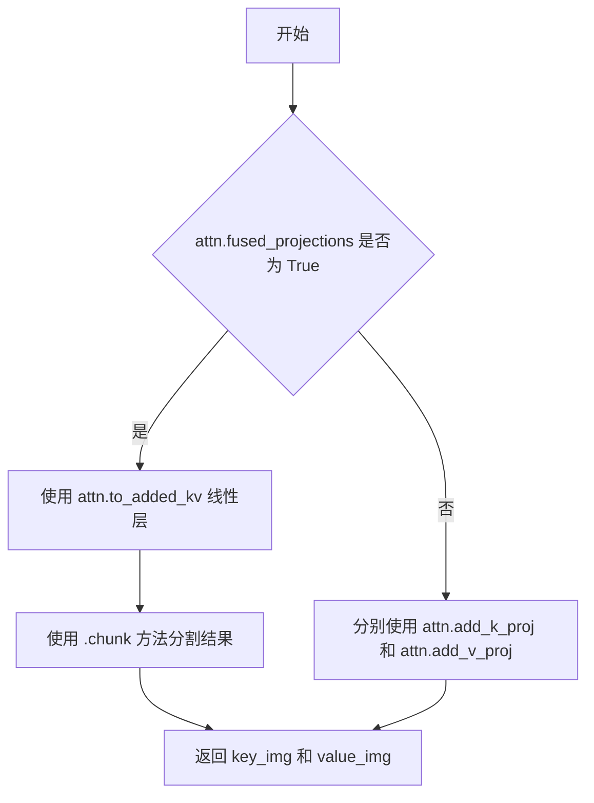
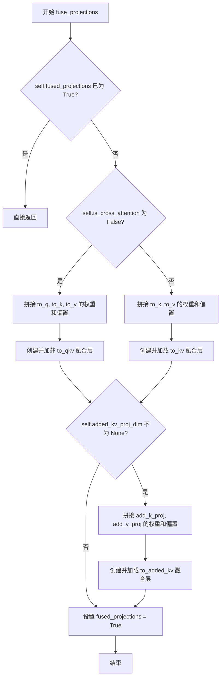
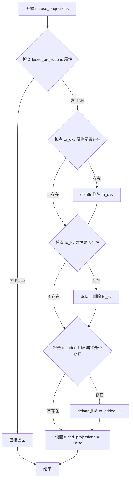
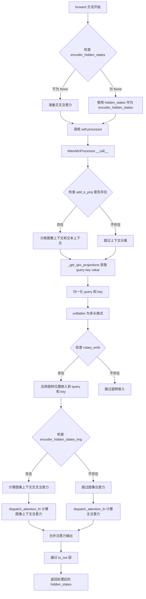
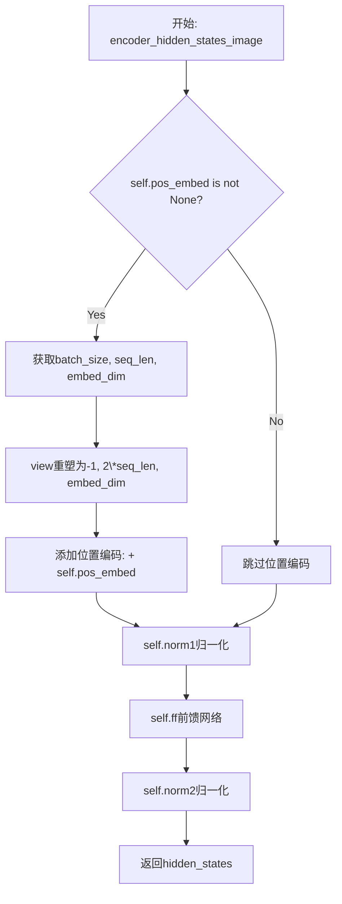
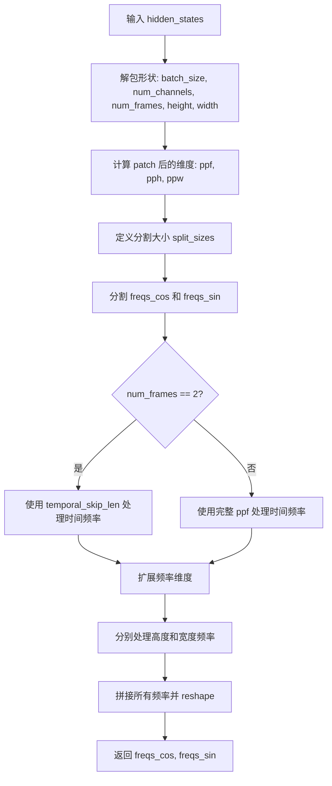
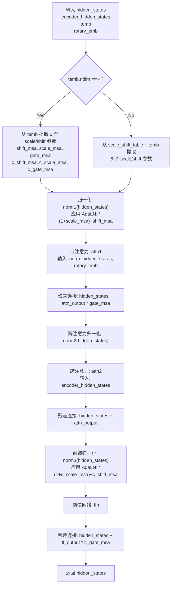
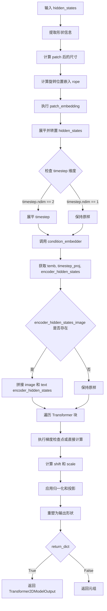

```mermaid
flowchart TD
    A[开始 _get_qkv_projections] --> B{encoder_hidden_states is None?}
    B -- 是 --> C[encoder_hidden_states = hidden_states]
    B -- 否 --> D{attn.fused_projections?}
    C --> D
    
    D -- 是 --> E{attn.is_cross_attention?}
    D -- 否 --> F[query = attn.to_q<br/>key = attn.to_k<br/>value = attn.to_v]
    
    E -- 是 --> G[query = attn.to_q<br/>key, value = attn.to_kv.chunk<br/>key, value = attn.to_kv.chunk&#40;2, dim=-1&#41;]
    E -- 否 --> H[query, key, value = attn.to_qkv.chunk&#40;3, dim=-1&#41;]
    
    F --> I[返回 query, key, value]
    G --> I
    H --> I
```

# `diffusers\src\diffusers\models\transformers\transformer_chronoedit.py` 详细设计文档

This code implements the core 3D Transformer architecture (ChronoEditTransformer3DModel) for the ChronoEdit video generation model. It integrates custom rotary position embeddings (ChronoEditRotaryPosEmbed) to handle temporal-spatial sequences, along with specialized embedding modules (WanTimeTextImageEmbedding) for conditioning on time steps, text, and optional image inputs, utilizing efficient attention processors (WanAttnProcessor) and fused projection techniques to serve as the denoising backbone in a diffusion-based video synthesis pipeline.

## 整体流程

```mermaid
graph TD
    A[Inputs: hidden_states, timestep, encoder_hidden_states] --> B[Patch Embedding & RoPE Calculation]
    B --> C[Condition Embedding: WanTimeTextImageEmbedding]
    C --> D{Gradient Checkpointing Enabled?}
    D -- Yes --> E[Loop: WanTransformerBlock (Checkpointed)]
    D -- No --> F[Loop: WanTransformerBlock (Standard)]
    E --> G[Block: Self-Attention (WanAttention)]
    F --> G
    G --> H[Block: Cross-Attention (WanAttention)]
    H --> I[Block: Feed-Forward Network]
    I --> J[Output Norm & Linear Projection]
    J --> K[Unpatchify: Reshape to Video Tensor]
    K --> L[Output: Transformer2DModelOutput]
```

## 类结构

```
Global Functions
├── _get_qkv_projections
├── _get_added_kv_projections
Attention Processors
├── WanAttnProcessor
├── WanAttnProcessor2_0 (Deprecated)
Model Components
├── WanAttention (Attention Module)
├── WanImageEmbedding
├── WanTimeTextImageEmbedding
├── ChronoEditRotaryPosEmbed
├── WanTransformerBlock
Main Model
└── ChronoEditTransformer3DModel
```

## 全局变量及字段


### `logger`
    
用于记录模块日志的日志记录器对象

类型：`logging.Logger`
    


### `WanAttnProcessor._attention_backend`
    
类级别属性，存储注意力后端实现

类型：`Any | None`
    


### `WanAttnProcessor._parallel_config`
    
类级别属性，存储并行配置信息

类型：`Any | None`
    


### `WanAttention.inner_dim`
    
内部维度，等于dim_head乘以heads

类型：`int`
    


### `WanAttention.heads`
    
注意力头的数量

类型：`int`
    


### `WanAttention.to_q`
    
用于将输入投影为Query的线性层

类型：`torch.nn.Linear`
    


### `WanAttention.to_k`
    
用于将输入投影为Key的线性层

类型：`torch.nn.Linear`
    


### `WanAttention.to_v`
    
用于将输入投影为Value的线性层

类型：`torch.nn.Linear`
    


### `WanAttention.to_out`
    
包含输出投影线性层和dropout的模块列表

类型：`torch.nn.ModuleList`
    


### `WanAttention.norm_q`
    
用于Query的RMS归一化层

类型：`torch.nn.RMSNorm`
    


### `WanAttention.norm_k`
    
用于Key的RMS归一化层

类型：`torch.nn.RMSNorm`
    


### `WanAttention.add_k_proj`
    
额外的Key投影层，用于I2V任务

类型：`torch.nn.Linear | None`
    


### `WanAttention.add_v_proj`
    
额外的Value投影层，用于I2V任务

类型：`torch.nn.Linear | None`
    


### `WanAttention.fused_projections`
    
标记是否启用了融合投影优化

类型：`bool`
    


### `WanImageEmbedding.norm1`
    
输入特征的FP32层归一化

类型：`FP32LayerNorm`
    


### `WanImageEmbedding.ff`
    
用于特征变换的前馈网络

类型：`FeedForward`
    


### `WanImageEmbedding.norm2`
    
输出特征的FP32层归一化

类型：`FP32LayerNorm`
    


### `WanImageEmbedding.pos_embed`
    
可学习的位置嵌入参数

类型：`nn.Parameter | None`
    


### `WanTimeTextImageEmbedding.timesteps_proj`
    
时间步投影层，用于生成时间嵌入

类型：`Timesteps`
    


### `WanTimeTextImageEmbedding.time_embedder`
    
将时间步投影转换为时间嵌入的模块

类型：`TimestepEmbedding`
    


### `WanTimeTextImageEmbedding.act_fn`
    
用于时间嵌入的SiLU激活函数

类型：`nn.SiLU`
    


### `WanTimeTextImageEmbedding.time_proj`
    
时间嵌入的线性投影层

类型：`nn.Linear`
    


### `WanTimeTextImageEmbedding.text_embedder`
    
文本嵌入投影层

类型：`PixArtAlphaTextProjection`
    


### `WanTimeTextImageEmbedding.image_embedder`
    
图像嵌入模块，用于I2V任务

类型：`WanImageEmbedding | None`
    


### `ChronoEditRotaryPosEmbed.attention_head_dim`
    
每个注意力头的维度

类型：`int`
    


### `ChronoEditRotaryPosEmbed.patch_size`
    
3D patch的尺寸（时间、高度、宽度）

类型：`tuple[int, int, int]`
    


### `ChronoEditRotaryPosEmbed.max_seq_len`
    
旋转位置嵌入的最大序列长度

类型：`int`
    


### `ChronoEditRotaryPosEmbed.temporal_skip_len`
    
时间维度跳过的长度，用于特殊处理

类型：`int`
    


### `ChronoEditRotaryPosEmbed.freqs_cos`
    
预计算的余弦旋转频率

类型：`torch.Tensor`
    


### `ChronoEditRotaryPosEmbed.freqs_sin`
    
预计算的正弦旋转频率

类型：`torch.Tensor`
    


### `WanTransformerBlock.norm1`
    
自注意力前的层归一化

类型：`FP32LayerNorm`
    


### `WanTransformerBlock.attn1`
    
自注意力层

类型：`WanAttention`
    


### `WanTransformerBlock.attn2`
    
交叉注意力层

类型：`WanAttention`
    


### `WanTransformerBlock.norm2`
    
交叉注意力前的层归一化或恒等映射

类型：`FP32LayerNorm | nn.Identity`
    


### `WanTransformerBlock.ffn`
    
前馈神经网络层

类型：`FeedForward`
    


### `WanTransformerBlock.norm3`
    
前馈网络前的层归一化

类型：`FP32LayerNorm`
    


### `WanTransformerBlock.scale_shift_table`
    
用于AdaLN零初始化的缩放和平移参数

类型：`nn.Parameter`
    


### `ChronoEditTransformer3DModel.rope`
    
3D旋转位置嵌入模块

类型：`ChronoEditRotaryPosEmbed`
    


### `ChronoEditTransformer3DModel.patch_embedding`
    
将输入视频转换为3D patch的卷积层

类型：`nn.Conv3d`
    


### `ChronoEditTransformer3DModel.condition_embedder`
    
时间、文本和图像条件的嵌入模块

类型：`WanTimeTextImageEmbedding`
    


### `ChronoEditTransformer3DModel.blocks`
    
包含所有Transformer块的模块列表

类型：`nn.ModuleList`
    


### `ChronoEditTransformer3DModel.norm_out`
    
输出层归一化

类型：`FP32LayerNorm`
    


### `ChronoEditTransformer3DModel.proj_out`
    
将特征投影回输出通道的线性层

类型：`nn.Linear`
    


### `ChronoEditTransformer3DModel.scale_shift_table`
    
最终输出的缩放和平移参数

类型：`nn.Parameter`
    
    

## 全局函数及方法


### `_get_qkv_projections`

该函数是WanAttention模块的内部辅助函数，用于计算注意力机制中的Query（查询）、Key（键）和Value（值）投影。根据是否启用融合投影（fused_projections）以及是否为交叉注意力模式，函数采用不同的计算策略以优化性能。

参数：

- `attn`：`WanAttention`，WanAttention模块实例，包含投影矩阵（to_q、to_k、to_v等）或融合后的投影矩阵（to_qkv、to_kv等）
- `hidden_states`：`torch.Tensor`，输入的隐藏状态张量，形状为`(batch_size, seq_len, dim)`
- `encoder_hidden_states`：`torch.Tensor`，编码器侧的隐藏状态张量，用于交叉注意力；若为`None`，则使用`hidden_states`代替

返回值：`(query, key, value)`，均为`torch.Tensor`类型的元组，分别表示：
- `query`：查询向量，形状为`(batch_size, seq_len, dim)`
- `key`：键向量，形状为`(batch_size, encoder_seq_len, dim)`
- `value`：值向量，形状为`(batch_size, encoder_seq_len, dim)`

#### 流程图



#### 带注释源码

```
# Copied from diffusers.models.transformers.transformer_wan._get_qkv_projections
def _get_qkv_projections(attn: "WanAttention", hidden_states: torch.Tensor, encoder_hidden_states: torch.Tensor):
    # encoder_hidden_states is only passed for cross-attention
    # 如果没有传入encoder_hidden_states，则默认为hidden_states（即自注意力模式）
    if encoder_hidden_states is None:
        encoder_hidden_states = hidden_states

    # 检查是否启用了融合投影优化
    if attn.fused_projections:
        if not attn.is_cross_attention:
            # In self-attention layers, we can fuse the entire QKV projection into a single linear
            # 在自注意力层中，可以将QKV三个投影融合为一个单独的线性层计算
            # attn.to_qkv是一个融合后的线性层，一次矩阵乘法得到Q、K、V
            # chunk(3, dim=-1)表示在最后一个维度将结果均分为3份
            query, key, value = attn.to_qkv(hidden_states).chunk(3, dim=-1)
        else:
            # In cross-attention layers, we can only fuse the KV projections into a single linear
            # 在交叉注意力层中，只能融合KV两个投影，Q需要单独计算
            # 因为Query来自当前层输入，而Key和Value来自编码器侧
            query = attn.to_q(hidden_states)
            key, value = attn.to_kv(encoder_hidden_states).chunk(2, dim=-1)
    else:
        # 未启用融合投影时，分别使用独立的线性层计算Q、K、V
        query = attn.to_q(hidden_states)
        key = attn.to_k(encoder_hidden_states)
        value = attn.to_v(encoder_hidden_states)
    return query, key, value
```


### `_get_added_kv_projections`

该函数用于获取图像上下文的键（key）和值（value）投影，根据是否启用融合投影来选择不同的计算路径。如果启用了融合投影，则使用单一的 `to_added_kv` 线性层进行计算；否则，分别使用 `add_k_proj` 和 `add_v_proj` 线性层进行计算。

参数：

- `attn`：`WanAttention`，WanAttention 注意力模块实例，包含投影层和融合投影标志
- `encoder_hidden_states_img`：`torch.Tensor`，图像编码器的隐藏状态，用于生成额外的键值对

返回值：`tuple[torch.Tensor, torch.Tensor]`，返回图像上下文对应的 key 和 value 张量

#### 流程图



#### 带注释源码

```
# Copied from diffusers.models.transformers.transformer_wan._get_added_kv_projections
def _get_added_kv_projections(attn: "WanAttention", encoder_hidden_states_img: torch.Tensor):
    # 如果启用了融合投影（fused_projections），则使用单一的线性层 to_added_kv
    # 否则分别使用 add_k_proj 和 add_v_proj 两个独立的线性层
    if attn.fused_projections:
        # 使用融合的 to_added_kv 线性层，然后按最后一个维度分成两半
        key_img, value_img = attn.to_added_kv(encoder_hidden_states_img).chunk(2, dim=-1)
    else:
        # 分别使用 add_k_proj 和 add_v_proj 线性层计算 key 和 value
        key_img = attn.add_k_proj(encoder_hidden_states_img)
        value_img = attn.add_v_proj(encoder_hidden_states_img)
    return key_img, value_img
```


### `WanAttnProcessor.__call__`

该方法是 WanAttnProcessor 类的核心调用接口，负责实现 Wan 注意力机制的处理逻辑，包括 QKV 投影、旋转位置嵌入（RoPE）应用、多头注意力计算、以及可选的图像上下文（I2V任务）处理，最终返回经过注意力机制处理的隐藏状态张量。

参数：

- `self`：WanAttnProcessor，注意力处理器实例本身
- `attn`：`WanAttention`，WanAttention 模块实例，提供投影矩阵和归一化层
- `hidden_states`：`torch.Tensor`，输入的隐藏状态张量，形状为 (batch, seq_len, dim)
- `encoder_hidden_states`：`torch.Tensor | None`，编码器的隐藏状态，用于跨注意力机制，若为 None 则执行自注意力
- `attention_mask`：`torch.Tensor | None`，注意力掩码，用于屏蔽特定位置的注意力权重
- `rotary_emb`：`tuple[torch.Tensor, torch.Tensor] | None`，旋转位置嵌入的 (cos, sin) 元组，用于位置编码

返回值：`torch.Tensor`，经过注意力机制处理后的隐藏状态张量，形状与输入 hidden_states 相同

#### 流程图

```mermaid
flowchart TD
    A[开始 __call__] --> B{encoder_hidden_states_img 是否存在}
    B -->|是| C[提取 image_context_length]
    C --> D[分离 encoder_hidden_states_img 和 encoder_hidden_states]
    B -->|否| E[继续]
    D --> E
    E --> F[调用 _get_qkv_projections 获取 query, key, value]
    F --> G[对 query 进行 norm_q 归一化]
    G --> H[对 key 进行 norm_k 归一化]
    H --> I[将 query/key/value 展开为多头格式]
    I --> J{rotary_emb 是否存在}
    J -->|是| K[应用旋转位置嵌入到 query 和 key]
    J -->|否| L
    K --> L
    L --> M{encoder_hidden_states_img 是否存在}
    M -->|是| N[调用 _get_added_kv_projections 获取 key_img, value_img]
    N --> O[对 key_img 归一化]
    O --> P[展开 key_img 和 value_img 为多头格式]
    P --> Q[dispatch_attention_fn 计算图像上下文注意力]
    Q --> R[展平并转换 hidden_states_img 类型]
    R --> S
    M -->|否| T
    T --> U[dispatch_attention_fn 计算主注意力]
    U --> V[展平并转换 hidden_states 类型]
    V --> W{hidden_states_img 是否存在}
    W -->|是| X[将 hidden_states_img 加到 hidden_states]
    W -->|否| Y
    X --> Y
    Y --> Z[应用 to_out[0] 线性投影]
    Z --> AA[应用 to_out[1] Dropout]
    AA --> AB[返回处理后的 hidden_states]
```

#### 带注释源码

```python
def __call__(
    self,
    attn: "WanAttention",
    hidden_states: torch.Tensor,
    encoder_hidden_states: torch.Tensor | None = None,
    attention_mask: torch.Tensor | None = None,
    rotary_emb: tuple[torch.Tensor, torch.Tensor] | None = None,
) -> torch.Tensor:
    """
    Wan 注意力处理器的核心调用方法，执行完整的注意力计算流程。
    
    参数:
        attn: WanAttention 模块，提供 QKV 投影和归一化层
        hidden_states: 输入隐藏状态
        encoder_hidden_states: 编码器隐藏状态（跨注意力用）
        attention_mask: 注意力掩码
        rotary_emb: 旋转嵌入 (cos, sin)
    
    返回:
        处理后的隐藏状态张量
    """
    # 初始化图像上下文隐藏状态为 None
    encoder_hidden_states_img = None
    
    # 检查是否存在额外的 KV 投影（即 I2V 任务）
    if attn.add_k_proj is not None:
        # 512 是文本编码器的上下文长度，硬编码
        # 计算图像上下文长度：总长度减去 512
        image_context_length = encoder_hidden_states.shape[1] - 512
        # 提取图像上下文（前面的部分）
        encoder_hidden_states_img = encoder_hidden_states[:, :image_context_length]
        # 剩余部分作为文本上下文
        encoder_hidden_states = encoder_hidden_states[:, image_context_length:]

    # 获取 QKV 投影
    # 如果是自注意力，使用 hidden_states；如果是跨注意力，使用 encoder_hidden_states
    query, key, value = _get_qkv_projections(attn, hidden_states, encoder_hidden_states)

    # 对 query 和 key 进行 RMSNorm 归一化
    query = attn.norm_q(query)
    key = attn.norm_k(key)

    # 将 QKV 展开为多头注意力格式
    # 从 (batch, seq, dim) -> (batch, seq, heads, head_dim)
    query = query.unflatten(2, (attn.heads, -1))
    key = key.unflatten(2, (attn.heads, -1))
    value = value.unflatten(2, (attn.heads, -1))

    # 应用旋转位置嵌入（RoPE）
    if rotary_emb is not None:
        # 定义内部函数应用旋转嵌入
        def apply_rotary_emb(
            hidden_states: torch.Tensor,
            freqs_cos: torch.Tensor,
            freqs_sin: torch.Tensor,
        ):
            # 分离实部和虚部
            x1, x2 = hidden_states.unflatten(-1, (-1, 2)).unbind(-1)
            # 提取奇偶位置
            cos = freqs_cos[..., 0::2]
            sin = freqs_sin[..., 1::2]
            # 计算旋转后的结果
            out = torch.empty_like(hidden_states)
            out[..., 0::2] = x1 * cos - x2 * sin
            out[..., 1::2] = x1 * sin + x2 * cos
            return out.type_as(hidden_states)

        # 应用旋转嵌入到 query 和 key
        query = apply_rotary_emb(query, *rotary_emb)
        key = apply_rotary_emb(key, *rotary_emb)

    # I2V 任务：处理图像上下文注意力
    hidden_states_img = None
    if encoder_hidden_states_img is not None:
        # 获取图像的 KV 投影
        key_img, value_img = _get_added_kv_projections(attn, encoder_hidden_states_img)
        # 对 key_img 进行归一化
        key_img = attn.norm_added_k(key_img)

        # 展开为多头格式
        key_img = key_img.unflatten(2, (attn.heads, -1))
        value_img = value_img.unflatten(2, (attn.heads, -1))

        # 计算图像上下文注意力（跨注意力）
        hidden_states_img = dispatch_attention_fn(
            query,
            key_img,
            value_img,
            attn_mask=None,
            dropout_p=0.0,
            is_causal=False,
            backend=self._attention_backend,
            parallel_config=None,  # 图像上下文不进行并行处理
        )
        # 展平并转换类型
        hidden_states_img = hidden_states_img.flatten(2, 3)
        hidden_states_img = hidden_states_img.type_as(query)

    # 主注意力计算（自注意力或文本跨注意力）
    hidden_states = dispatch_attention_fn(
        query,
        key,
        value,
        attn_mask=attention_mask,
        dropout_p=0.0,
        is_causal=False,
        backend=self._attention_backend,
        # 仅在无编码器隐藏状态时使用并行配置（即自注意力时）
        parallel_config=(self._parallel_config if encoder_hidden_states is None else None),
    )
    # 展平并转换类型
    hidden_states = hidden_states.flatten(2, 3)
    hidden_states = hidden_states.type_as(query)

    # 如果存在图像上下文注意力结果，将其添加到主结果
    if hidden_states_img is not None:
        hidden_states = hidden_states + hidden_states_img

    # 应用输出投影和 Dropout
    hidden_states = attn.to_out[0](hidden_states)
    hidden_states = attn.to_out[1](hidden_states)
    return hidden_states
```


### `WanAttention.fuse_projections`

该方法用于将 WanAttention 模块中的多个投影层（Q、K、V）融合为单个线性层，以减少计算开销并提升推理效率。如果已启用融合，则直接返回；否则根据是否为交叉注意力执行不同的融合策略，并处理额外的 KV 投影。

参数：此方法无显式参数（仅使用 `self`）

返回值：`None`，该方法直接在对象上执行融合操作，不返回任何值。

#### 流程图



#### 带注释源码

```python
def fuse_projections(self):
    # 如果已经融合过，则直接返回，避免重复操作
    if getattr(self, "fused_projections", False):
        return

    # 自注意力情况：将 Q、K、V 三个投影合并为一个 to_qkv 层
    if not self.is_cross_attention:
        # 沿最后一维拼接 Q、K、V 的权重和偏置
        concatenated_weights = torch.cat([self.to_q.weight.data, self.to_k.weight.data, self.to_v.weight.data])
        concatenated_bias = torch.cat([self.to_q.bias.data, self.to_k.bias.data, self.to_v.bias.data])
        # 获取输出的总特征维度和输入维度
        out_features, in_features = concatenated_weights.shape
        # 在 meta 设备上创建空的融合线性层（不占用实际显存）
        with torch.device("meta"):
            self.to_qkv = nn.Linear(in_features, out_features, bias=True)
        # 将拼接后的权重和偏置加载到融合层中
        self.to_qkv.load_state_dict(
            {"weight": concatenated_weights, "bias": concatenated_bias}, strict=True, assign=True
        )
    # 交叉注意力情况：只融合 K、V 为 to_kv 层（Q 单独保留）
    else:
        concatenated_weights = torch.cat([self.to_k.weight.data, self.to_v.weight.data])
        concatenated_bias = torch.cat([self.to_k.bias.data, self.to_v.bias.data])
        out_features, in_features = concatenated_weights.shape
        with torch.device("meta"):
            self.to_kv = nn.Linear(in_features, out_features, bias=True)
        self.to_kv.load_state_dict(
            {"weight": concatenated_weights, "bias": concatenated_bias}, strict=True, assign=True
        )

    # 如果存在额外的 KV 投影维度，则融合 add_k_proj 和 add_v_proj
    if self.added_kv_proj_dim is not None:
        concatenated_weights = torch.cat([self.add_k_proj.weight.data, self.add_v_proj.weight.data])
        concatenated_bias = torch.cat([self.add_k_proj.bias.data, self.add_v_proj.bias.data])
        out_features, in_features = concatenated_weights.shape
        with torch.device("meta"):
            self.to_added_kv = nn.Linear(in_features, out_features, bias=True)
        self.to_added_kv.load_state_dict(
            {"weight": concatenated_weights, "bias": concatenated_bias}, strict=True, assign=True
        )

    # 标记已执行融合操作
    self.fused_projections = True
```


### WanAttention.unfuse_projections

该方法用于将已融合的QKV投影分离回独立的投影层。当模型启用了融合投影（通过`fuse_projections`方法）后，调用此方法可以恢复为分离的`to_q`、`to_k`、`to_v`等独立线性层，便于模型分析、调试或进行其他需要独立权重的操作。

参数：

- `self`：`WanAttention`实例，当前注意力模块对象

返回值：`None`，该方法无返回值，修改操作直接在实例上完成

#### 流程图



#### 带注释源码

```python
@torch.no_grad()
def unfuse_projections(self):
    """
    将融合的QKV投影分离回独立的投影层。
    
    此方法是 fuse_projections 的逆操作，用于在需要时恢复独立的投影权重。
    使用 @torch.no_grad() 装饰器确保不创建计算图，节省显存。
    """
    # 检查融合投影是否已启用，如果未启用则直接返回
    if not getattr(self, "fused_projections", False):
        return

    # 删除自注意力融合后的 to_qkv 线性层（如果存在）
    # to_qkv 在 fuse_projections 中创建，合并了 to_q, to_k, to_v 的权重
    if hasattr(self, "to_qkv"):
        delattr(self, "to_qkv")
    
    # 删除交叉注意力融合后的 to_kv 线性层（如果存在）
    # to_kv 在 fuse_projections 中创建，合并了 to_k, to_v 的权重
    if hasattr(self, "to_kv"):
        delattr(self, "to_kv")
    
    # 删除添加的KV投影融合层（如果存在）
    # to_added_kv 在 fuse_projections 中创建，合并了 add_k_proj, add_v_proj 的权重
    if hasattr(self, "to_added_kv"):
        delattr(self, "to_added_kv")

    # 重置融合标志，使模型后续使用独立的投影层进行前向传播
    self.fused_projections = False
```


### WanAttention.forward

该方法是 WanAttention 类的核心前向传播方法，负责将输入的 hidden_states 通过注意力机制处理后输出。它内部委托给注册的处理器（WanAttnProcessor）来执行具体的注意力计算逻辑，支持自注意力、交叉注意力以及图像上下文相关的注意力处理。

参数：

- `self`：WanAttention 实例本身
- `hidden_states`：`torch.Tensor`，输入的隐藏状态张量，形状为 (batch, seq_len, dim)
- `encoder_hidden_states`：`torch.Tensor | None`，编码器隐藏状态，用于交叉注意力，如果为 None 则执行自注意力
- `attention_mask`：`torch.Tensor | None`，注意力掩码，用于屏蔽某些位置的值
- `rotary_emb`：`tuple[torch.Tensor, torch.Tensor] | None`，旋转位置嵌入的 (cos, sin) 元组
- `**kwargs`：可变关键字参数，会传递给处理器

返回值：`torch.Tensor`，经过注意力机制处理后的隐藏状态张量

#### 流程图



#### 带注释源码

```python
def forward(
    self,
    hidden_states: torch.Tensor,
    encoder_hidden_states: torch.Tensor | None = None,
    attention_mask: torch.Tensor | None = None,
    rotary_emb: tuple[torch.Tensor, torch.Tensor] | None = None,
    **kwargs,
) -> torch.Tensor:
    """
    WanAttention 的前向传播方法。
    
    该方法将输入委托给注册的处理器（默认为 WanAttnProcessor）来执行
    实际的注意力计算，支持自注意力、交叉注意力和图像上下文注意力。
    
    参数:
        hidden_states: 输入的隐藏状态张量，形状为 (batch, seq_len, dim)
        encoder_hidden_states: 编码器隐藏状态，用于交叉注意力，为 None 时执行自注意力
        attention_mask: 注意力掩码，用于屏蔽某些位置
        rotary_emb: 旋转位置嵌入的 (cos, sin) 元组，用于位置编码
        **kwargs: 其他关键字参数，会传递给处理器
    
    返回:
        经过注意力机制处理后的隐藏状态张量
    """
    # 委托给处理器执行具体的注意力计算逻辑
    # 处理器会根据配置执行自注意力、交叉注意力或图像上下文注意力
    return self.processor(
        self, 
        hidden_states, 
        encoder_hidden_states, 
        attention_mask, 
        rotary_emb, 
        **kwargs
    )
```


### `WanImageEmbedding.forward`

该方法是 WanImageEmbedding 类的前向传播函数，负责对图像嵌入进行位置编码添加、前馈处理和归一化，最终输出处理后的图像特征表示。

参数：

- `encoder_hidden_states_image`：`torch.Tensor`，输入的图像编码器隐藏状态，形状为 (batch_size, seq_len, embed_dim)

返回值：`torch.Tensor`，处理后的图像隐藏状态，形状为 (batch_size, seq_len, embed_dim)

#### 流程图



#### 带注释源码

```python
def forward(self, encoder_hidden_states_image: torch.Tensor) -> torch.Tensor:
    # 如果存在位置嵌入，则添加到输入中
    if self.pos_embed is not None:
        # 获取输入张量的形状信息
        batch_size, seq_len, embed_dim = encoder_hidden_states_image.shape
        # 将输入重塑为(-1, 2 * seq_len, embed_dim)的形状
        # 注意：这里假设输入是成对的图像token（可能来自双分支结构）
        encoder_hidden_states_image = encoder_hidden_states_image.view(-1, 2 * seq_len, embed_dim)
        # 将位置嵌入加到图像hidden states上
        encoder_hidden_states_image = encoder_hidden_states_image + self.pos_embed

    # 第一次归一化处理
    hidden_states = self.norm1(encoder_hidden_states_image)
    # 前馈网络处理（包含GELU激活函数）
    hidden_states = self.ff(hidden_states)
    # 第二次归一化处理
    hidden_states = self.norm2(hidden_states)
    # 返回最终处理后的图像嵌入
    return hidden_states
```


### WanTimeTextImageEmbedding.forward

该方法实现了时间步、文本嵌入和图像嵌入的联合处理，将时间步投影到时间嵌入空间，对文本和图像隐藏状态进行编码，并返回时间嵌入、时间步投影、文本嵌入和图像嵌入（如果提供）。

参数：

- `self`：`WanTimeTextImageEmbedding`，类的实例本身
- `timestep`：`torch.Tensor`，时间步张量，用于表示扩散过程的时间步
- `encoder_hidden_states`：`torch.Tensor`，文本编码器的隐藏状态，包含文本嵌入信息
- `encoder_hidden_states_image`：`torch.Tensor | None`，图像编码器的隐藏状态，用于图像到视频任务（I2V），可选
- `timestep_seq_len`：`int | None`，时间步序列长度，用于WAN 2.2 ti2v模型

返回值：`tuple[torch.Tensor, torch.Tensor, torch.Tensor, torch.Tensor | None]`，返回四个元素的元组：
- `temb`：时间嵌入向量，用于transformer块的scale-shift操作
- `timestep_proj`：时间步投影，用于transformer块的条件嵌入
- `encoder_hidden_states`：处理后的文本嵌入
- `encoder_hidden_states_image`：处理后的图像嵌入（如果提供，否则为None）

#### 流程图

```mermaid
flowchart TD
    A[开始: forward] --> B{timestep_seq_len is not None?}
    B -->|Yes| C[timestep = timestep.unflatten<br/>实现序列维度展开]
    B -->|No| D[跳过展开]
    C --> E{检查dtype转换}
    D --> E
    E --> F{timestep.dtype !=<br/>time_embedder_dtype?}
    F -->|Yes| G[timestep = timestep.to<br/>(time_embedder_dtype)]
    F -->|No| H[跳过dtype转换]
    G --> I[temb = self.time_embedder<br/>(timestep)]
    H --> I
    I --> J[temb = temb.type_as<br/>(encoder_hidden_states)]
    J --> K[timestep_proj = self.time_proj<br/>(act_fn(temb))]
    K --> L[encoder_hidden_states =<br/>self.text_embedder<br/>(encoder_hidden_states)]
    L --> M{encoder_hidden_states_image<br/>is not None?}
    M -->|Yes| N[encoder_hidden_states_image =<br/>self.image_embedder<br/>(encoder_hidden_states_image)]
    M -->|No| O[encoder_hidden_states_image<br/>= None]
    N --> P[返回: temb<br/>timestep_proj<br/>encoder_hidden_states<br/>encoder_hidden_states_image]
    O --> P
```

#### 带注释源码

```python
def forward(
    self,
    timestep: torch.Tensor,
    encoder_hidden_states: torch.Tensor,
    encoder_hidden_states_image: torch.Tensor | None = None,
    timestep_seq_len: int | None = None,
):
    # 1. 时间步投影：将时间步映射到正弦/余弦频率空间
    timestep = self.timesteps_proj(timestep)
    
    # 2. 如果指定了序列长度，对时间步进行展开重构
    # 用于WAN 2.2 ti2v模型，支持批量处理多个时间步
    if timestep_seq_len is not None:
        timestep = timestep.unflatten(0, (-1, timestep_seq_len))

    # 3. 获取time_embedder的参数dtype，确保时间步数据类型一致
    # 避免混合精度训练时的类型不匹配问题
    time_embedder_dtype = next(iter(self.time_embedder.parameters())).dtype
    
    # 4. 如果数据类型不匹配且不是int8，则进行类型转换
    if timestep.dtype != time_embedder_dtype and time_embedder_dtype != torch.int8:
        timestep = timestep.to(time_embedder_dtype)
    
    # 5. 时间嵌入：将投影后的时间步通过MLP转换为嵌入向量
    # 返回的temb用于transformer块的scale-shift条件注入
    temb = self.time_embedder(timestep).type_as(encoder_hidden_states)
    
    # 6. 时间步投影：将时间嵌入进一步投影到6倍维度
    # 用于WAN 2.2 ti2v模型的shift/scale/gate等6个参数
    timestep_proj = self.time_proj(self.act_fn(temb))

    # 7. 文本嵌入处理：将文本编码器的输出投影到模型维度
    encoder_hidden_states = self.text_embedder(encoder_hidden_states)
    
    # 8. 图像嵌入处理（可选）：用于图像到视频任务
    # 将图像编码器输出与文本编码器输出在序列维度上拼接
    if encoder_hidden_states_image is not None:
        encoder_hidden_states_image = self.image_embedder(encoder_hidden_states_image)

    # 9. 返回：时间嵌入、时间步投影、文本嵌入、图像嵌入
    return temb, timestep_proj, encoder_hidden_states, encoder_hidden_states_image
```


### ChronoEditRotaryPosEmbed.forward

该方法实现 ChronoEdit 旋转位置嵌入（Rotary Position Embedding），用于将时间维度的旋转位置编码应用于视频数据的注意力机制中，支持特殊的 2 帧视频处理逻辑（temporal_skip_len）。

参数：

- `hidden_states`：`torch.Tensor`，输入的隐藏状态，形状为 (batch_size, num_channels, num_frames, height, width)，表示批次数、通道数、帧数、高度和宽度

返回值：`tuple[torch.Tensor, torch.Tensor]`，返回两个张量，分别是余弦频率 (freqs_cos) 和正弦频率 (freqs_sin)，用于旋转位置嵌入的计算

#### 流程图



#### 带注释源码

```
def forward(self, hidden_states: torch.Tensor) -> torch.Tensor:
    # 获取输入张量的形状信息：批次大小、通道数、帧数、高度和宽度
    batch_size, num_channels, num_frames, height, width = hidden_states.shape
    
    # 解码 patch 大小：时间 patch、高度 patch、宽度 patch
    p_t, p_h, p_w = self.patch_size
    
    # 计算 patch 后的数量：时间 patch 数、高度 patch 数、宽度 patch 数
    ppf, pph, ppw = num_frames // p_t, height // p_h, width // p_w

    # 定义分割大小，用于将 attention_head_dim 分割为时间、高度、宽度三个维度
    # 公式: [t_dim, h_dim, w_dim] = [attention_head_dim - 2*(attention_head_dim//3), attention_head_dim//3, attention_head_dim//3]
    split_sizes = [
        self.attention_head_dim - 2 * (self.attention_head_dim // 3),
        self.attention_head_dim // 3,
        self.attention_head_dim // 3,
    ]

    # 沿维度 1 分割预计算的余弦和正弦频率
    freqs_cos = self.freqs_cos.split(split_sizes, dim=1)
    freqs_sin = self.freqs_sin.split(split_sizes, dim=1)

    # 处理时间维度的余弦频率
    if num_frames == 2:
        # 特殊情况：当只有 2 帧时，使用 temporal_skip_len 并取首尾元素
        freqs_cos_f = freqs_cos[0][: self.temporal_skip_len][[0, -1]].view(ppf, 1, 1, -1).expand(ppf, pph, ppw, -1)
    else:
        # 正常情况：使用前 ppf 个频率，并扩展到所有空间位置
        freqs_cos_f = freqs_cos[0][:ppf].view(ppf, 1, 1, -1).expand(ppf, pph, ppw, -1)
    
    # 处理高度维度的余弦频率
    freqs_cos_h = freqs_cos[1][:pph].view(1, pph, 1, -1).expand(ppf, pph, ppw, -1)
    
    # 处理宽度维度的余弦频率
    freqs_cos_w = freqs_cos[2][:ppw].view(1, 1, ppw, -1).expand(ppf, pph, ppw, -1)

    # 处理时间维度的正弦频率（与余弦相同的逻辑）
    if num_frames == 2:
        freqs_sin_f = freqs_sin[0][: self.temporal_skip_len][[0, -1]].view(ppf, 1, 1, -1).expand(ppf, pph, ppw, -1)
    else:
        freqs_sin_f = freqs_sin[0][:ppf].view(ppf, 1, 1, -1).expand(ppf, pph, ppw, -1)
    
    # 处理高度维度的正弦频率
    freqs_sin_h = freqs_sin[1][:pph].view(1, pph, 1, -1).expand(ppf, pph, ppw, -1)
    
    # 处理宽度维度的正弦频率
    freqs_sin_w = freqs_sin[2][:ppw].view(1, 1, ppw, -1).expand(ppf, pph, ppw, -1)

    # 拼接所有维度的频率：先时间、再高度、最后宽度
    freqs_cos = torch.cat([freqs_cos_f, freqs_cos_h, freqs_cos_w], dim=-1).reshape(1, ppf * pph * ppw, 1, -1)
    freqs_sin = torch.cat([freqs_sin_f, freqs_sin_h, freqs_sin_w], dim=-1).reshape(1, ppf * pph * ppw, 1, -1)

    # 返回频率元组，用于后续旋转位置嵌入计算
    return freqs_cos, freqs_sin
```


### `WanTransformerBlock.forward`

该方法是 WanTransformerBlock 的前向传播函数，实现了视频/图像 Transformer 的核心计算逻辑，包含自注意力（Self-Attention）、交叉注意力（Cross-Attention）和前馈网络（Feed-Forward Network）三个主要阶段，并集成了基于时序信息的 AdaLN-Zero 归一化机制。

参数：

- `hidden_states`：`torch.Tensor`，输入的隐藏状态，形状为 (batch_size, seq_len, dim)，是 Transformer 的主要输入
- `encoder_hidden_states`：`torch.Tensor`，编码器的隐藏状态，用于跨注意力机制，通常来自文本或图像编码器
- `temb`：`torch.Tensor`，时间嵌入向量，形状为 (batch_size, 6, inner_dim) 或 (batch_size, seq_len, 6, inner_dim)，包含用于 AdaLN 归一化的 scale 和 shift 参数
- `rotary_emb`：`torch.Tensor`，旋转位置编码，用于为注意力机制提供位置信息

返回值：`torch.Tensor`，经过自注意力、跨注意力和前馈网络处理后的隐藏状态，形状与输入 hidden_states 相同

#### 流程图



#### 带注释源码

```python
def forward(
    self,
    hidden_states: torch.Tensor,
    encoder_hidden_states: torch.Tensor,
    temb: torch.Tensor,
    rotary_emb: torch.Tensor,
) -> torch.Tensor:
    # 解析 temb 的维度，判断是 wan2.2 ti2v 模式还是 wan2.1/wan2.2 14B 模式
    if temb.ndim == 4:
        # temb: batch_size, seq_len, 6, inner_dim (wan2.2 ti2v 模式)
        # 将 scale_shift_table 与 temb 相加后按维度 2 分割为 6 个部分
        # 包含：shift_msa, scale_msa, gate_msa（自注意力用）
        # c_shift_msa, c_scale_msa, c_gate_msa（前馈网络用）
        shift_msa, scale_msa, gate_msa, c_shift_msa, c_scale_msa, c_gate_msa = (
            self.scale_shift_table.unsqueeze(0) + temb.float()
        ).chunk(6, dim=2)
        # 压缩维度 2（因为 inner_dim=1）
        shift_msa = shift_msa.squeeze(2)
        scale_msa = scale_msa.squeeze(2)
        gate_msa = gate_msa.squeeze(2)
        c_shift_msa = c_shift_msa.squeeze(2)
        c_scale_msa = c_scale_msa.squeeze(2)
        c_gate_msa = c_gate_msa.squeeze(2)
    else:
        # temb: batch_size, 6, inner_dim (wan2.1/wan2.2 14B 模式)
        # 直接从 scale_shift_table + temb 提取 6 个参数
        shift_msa, scale_msa, gate_msa, c_shift_msa, c_scale_msa, c_gate_msa = (
            self.scale_shift_table + temb.float()
        ).chunk(6, dim=1)

    # ===== 1. 自注意力阶段 (Self-Attention) =====
    # 应用 FP32LayerNorm + AdaLN-Zero 归一化
    # 公式: norm(x) * (1 + scale) + shift
    norm_hidden_states = (self.norm1(hidden_states.float()) * (1 + scale_msa) + shift_msa).type_as(hidden_states)
    # 执行自注意力计算，使用旋转位置编码
    attn_output = self.attn1(norm_hidden_states, None, None, rotary_emb)
    # 残差连接：hidden_states + attn_output * gate_msa（门控机制）
    # gate_msa 实现类似 Gated-Delta 的效果
    hidden_states = (hidden_states.float() + attn_output * gate_msa).type_as(hidden_states)

    # ===== 2. 跨注意力阶段 (Cross-Attention) =====
    # 对隐藏状态进行归一化（可选的 cross_attn_norm）
    norm_hidden_states = self.norm2(hidden_states.float()).type_as(hidden_states)
    # 执行跨注意力，将 encoder_hidden_states 作为上下文
    attn_output = self.attn2(norm_hidden_states, encoder_hidden_states, None, None)
    # 残差连接：简单相加
    hidden_states = hidden_states + attn_output

    # ===== 3. 前馈网络阶段 (Feed-Forward Network) =====
    # 应用 FP32LayerNorm + AdaLN-Zero 归一化
    norm_hidden_states = (self.norm3(hidden_states.float()) * (1 + c_scale_msa) + c_shift_msa).type_as(
        hidden_states
    )
    # 执行前馈网络计算
    ff_output = self.ffn(norm_hidden_states)
    # 残差连接：hidden_states + ff_output * c_gate_msa（门控机制）
    hidden_states = (hidden_states.float() + ff_output.float() * c_gate_msa).type_as(hidden_states)

    return hidden_states
```


### `ChronoEditTransformer3DModel.forward`

该方法是 ChronoEditTransformer3DModel 类的核心前向传播方法，负责处理视频数据的 3D Transformer 推理流程，包括视频块嵌入、条件嵌入（时间、文本和图像）、多层 Transformer 块处理、输出归一化与投影，以及最终的解块操作。

参数：

- `hidden_states`：`torch.Tensor`，输入的隐藏状态，形状为 (batch_size, num_channels, num_frames, height, width)，表示批量的视频数据
- `timestep`：`torch.LongTensor`，时间步长，可以是 (batch_size,) 或 (batch_size, seq_len) 形状，用于时间条件嵌入
- `encoder_hidden_states`：`torch.Tensor`，编码器的隐藏状态，通常是文本嵌入，形状为 (batch_size, seq_len, text_dim)
- `encoder_hidden_states_image`：`torch.Tensor | None`，可选的图像编码隐藏状态，用于 I2V（图转视频）任务
- `return_dict`：`bool`，默认为 True，是否返回字典格式的输出
- `attention_kwargs`：`dict[str, Any] | None`，可选的注意力机制额外参数，用于 LoRA 等注意力调整

返回值：`torch.Tensor | dict[str, torch.Tensor]`，当 return_dict 为 True 时返回 Transformer2DModelOutput 对象，包含 sample 字段；否则返回元组

#### 流程图



#### 带注释源码

```python
@apply_lora_scale("attention_kwargs")
def forward(
    self,
    hidden_states: torch.Tensor,
    timestep: torch.LongTensor,
    encoder_hidden_states: torch.Tensor,
    encoder_hidden_states_image: torch.Tensor | None = None,
    return_dict: bool = True,
    attention_kwargs: dict[str, Any] | None = None,
) -> torch.Tensor | dict[str, torch.Tensor]:
    # 1. 从 hidden_states 提取批量维度信息
    # hidden_states 形状: (batch_size, num_channels, num_frames, height, width)
    batch_size, num_channels, num_frames, height, width = hidden_states.shape
    
    # 2. 从配置中获取 patch 尺寸
    p_t, p_h, p_w = self.config.patch_size
    
    # 3. 计算 patch 后的视频帧数、高度和宽度
    post_patch_num_frames = num_frames // p_t
    post_patch_height = height // p_h
    post_patch_width = width // p_w

    # 4. 计算旋转位置嵌入 (RoPE)
    # 用于为 Transformer 提供空间和时间位置信息
    rotary_emb = self.rope(hidden_states)

    # 5. 执行 3D 卷积进行视频块嵌入
    # 将视频数据从 (batch, channels, frames, h, w) 转换为序列形式
    hidden_states = self.patch_embedding(hidden_states)
    hidden_states = hidden_states.flatten(2).transpose(1, 2)

    # 6. 处理时间步长
    # 支持两种模式：wan2.2 ti2v (2D) 和 wan2.1/wan2.2 14B (1D)
    # timestep shape: batch_size, or batch_size, seq_len (wan 2.2 ti2v)
    if timestep.ndim == 2:
        ts_seq_len = timestep.shape[1]
        timestep = timestep.flatten()  # batch_size * seq_len
    else:
        ts_seq_len = None

    # 7. 条件嵌入器处理
    # 生成时间嵌入、文本嵌入和可选的图像嵌入
    temb, timestep_proj, encoder_hidden_states, encoder_hidden_states_image = self.condition_embedder(
        timestep, encoder_hidden_states, encoder_hidden_states_image, timestep_seq_len=ts_seq_len
    )
    
    # 8. 重新整形 timestep_proj 以匹配不同的模型变体
    if ts_seq_len is not None:
        # batch_size, seq_len, 6, inner_dim (wan 2.2 ti2v)
        timestep_proj = timestep_proj.unflatten(2, (6, -1))
    else:
        # batch_size, 6, inner_dim (wan 2.1/wan2.2 14B)
        timestep_proj = timestep_proj.unflatten(1, (6, -1))

    # 9. 拼接图像和文本编码器隐藏状态（如果图像编码器存在）
    # 用于 I2V 任务，image_encoder 生成固定的 257 个 token
    if encoder_hidden_states_image is not None:
        encoder_hidden_states = torch.concat([encoder_hidden_states_image, encoder_hidden_states], dim=1)

    # 10. 遍历 Transformer 块进行前向传播
    if torch.is_grad_enabled() and self.gradient_checkpointing:
        # 启用梯度检查点以节省显存
        for block in self.blocks:
            hidden_states = self._gradient_checkpointing_func(
                block, hidden_states, encoder_hidden_states, timestep_proj, rotary_emb
            )
    else:
        # 直接前向计算
        for block in self.blocks:
            hidden_states = block(hidden_states, encoder_hidden_states, timestep_proj, rotary_emb)

    # 11. 计算输出归一化的 shift 和 scale 参数
    if temb.ndim == 3:
        # batch_size, seq_len, inner_dim (wan 2.2 ti2v)
        shift, scale = (self.scale_shift_table.unsqueeze(0).to(temb.device) + temb.unsqueeze(2)).chunk(2, dim=2)
        shift = shift.squeeze(2)
        scale = scale.squeeze(2)
    else:
        # batch_size, inner_dim
        shift, scale = (self.scale_shift_table.to(temb.device) + temb.unsqueeze(1)).chunk(2, dim=1)

    # 12. 将 shift 和 scale 移动到 hidden_states 所在的设备
    # 支持多 GPU 推理场景
    shift = shift.to(hidden_states.device)
    scale = scale.to(hidden_states.device)

    # 13. 应用输出归一化、缩放、偏移和投影
    hidden_states = (self.norm_out(hidden_states.float()) * (1 + scale) + shift).type_as(hidden_states)
    hidden_states = self.proj_out(hidden_states)

    # 14. 解块操作 - 将序列恢复为 5D 视频张量
    hidden_states = hidden_states.reshape(
        batch_size, post_patch_num_frames, post_patch_height, post_patch_width, p_t, p_h, p_w, -1
    )
    # 调整维度顺序以匹配输出格式
    hidden_states = hidden_states.permute(0, 7, 1, 4, 2, 5, 3, 6)
    # 展平最后几个维度
    output = hidden_states.flatten(6, 7).flatten(4, 5).flatten(2, 3)

    # 15. 根据 return_dict 返回结果
    if not return_dict:
        return (output,)

    return Transformer2DModelOutput(sample=output)
```

## 关键组件


### WanAttnProcessor

注意力处理器，负责计算自注意力和交叉注意力，支持图像上下文（I2V任务）和旋转位置嵌入。

### WanAttention

注意力模块类，封装QKV投影、归一化和输出投影，支持融合投影以提高效率，支持交叉注意力模式。

### WanImageEmbedding

图像嵌入模块，包含层归一化、前馈网络和可选的位置编码，用于处理图像条件信息。

### WanTimeTextImageEmbedding

时间、文本和图像的联合嵌入模块，将时间步、文本嵌入和图像嵌入投影到统一的特征空间。

### ChronoEditRotaryPosEmbed

3D旋转位置嵌入实现，支持时间、高度和宽度维度的分离编码，特别处理视频帧数为2的边界情况。

### WanTransformerBlock

Transformer块，包含自注意力、交叉注意力和前馈网络，支持基于时间步的缩放平移（scale-shift）调制。

### ChronoEditTransformer3DModel

主Transformer模型，负责视频数据的patch嵌入、位置编码、条件嵌入、Transformer块堆叠和输出投影，支持梯度检查点和时间步序列处理。


## 问题及建议


### 已知问题

- **硬编码的魔法数值**：代码中存在多处硬编码值，如 `512`（文本编码器上下文长度）、`257`（图像encoder生成的token数）、`6`（shift/scale数量）等，这些值缺乏配置化和注释，可维护性差。
- **类型注解不一致**：`WanTransformerBlock.forward` 中 `rotary_emb` 注解为 `torch.Tensor`，但实际传入的是 `tuple[torch.Tensor, torch.Tensor]`，可能导致类型检查工具失效和IDE提示错误。
- **设备不一致风险**：在 `ChronoEditTransformer3DModel.forward` 中，`shift` 和 `scale` 被显式移动到 `hidden_states.device`，这表明存在隐式的设备不一致问题，代码中可能还有其他潜在设备不匹配的地方。
- **废弃类仍保留**：`WanAttnProcessor2_0` 类只是一个废弃包装器，但仍在代码中保留，增加理解成本。
- **潜在除零/越界风险**：`ChronoEditRotaryPosEmbed` 中当 `num_frames == 2` 时使用 `temporal_skip_len` 的逻辑未验证是否在所有 `ppf` 值下都有效。
- **Attention mask处理**：虽然传入了 `attention_mask` 参数，但在 `WanAttnProcessor` 中最终 `dispatch_attention_fn` 调用时对 `attn_mask` 的处理可能不完整。

### 优化建议

- **消除硬编码**：将 `512`、`257` 等数值提取为类属性或配置参数，并添加详细注释说明其来源和用途。
- **修复类型注解**：更正 `rotary_emb` 的类型注解为 `tuple[torch.Tensor, torch.Tensor]`，并检查其他所有方法的类型注解一致性。
- **统一设备管理**：建立统一的设备处理模式，在模型初始化或 `forward` 开始时确保所有张量在同一设备，避免中间多次调用 `.to(device)`。
- **清理废弃代码**：移除 `WanAttnProcessor2_0` 或将其完全重定向为不产生警告的简单别名。
- **增强输入验证**：在 `forward` 方法中添加输入形状检查，特别是在 `num_frames`、`height`、`width` 等维度上，防止运行时难以调试的错误。
- **优化内存使用**：考虑在适当时机使用 `torch.cuda.empty_cache()`，或在长时间推理后显式释放不再需要的大张量。
- **改进日志记录**：增加关键路径的日志输出，特别是在条件分支处（如 `fused_projections` 的开关），便于生产环境调试。

## 其它


### 设计目标与约束

本代码实现了ChronoEditTransformer3DModel，一个用于视频生成的3D Transformer模型。设计目标包括：支持Image-to-Video（I2V）任务、文本到视频生成、时序编辑等能力；支持Wan2.1和Wan2.2模型架构；通过Rotary Position Embedding处理长序列；支持Context Parallelism分布式推理。主要约束包括：依赖PyTorch 2.0+；需要CUDA或MPS加速；文本编码器固定生成769 tokens（512 text + 257 image）；不支持真正的因果注意力（is_causal=False）。

### 错误处理与异常设计

代码中的错误处理主要包括：WanAttnProcessor在初始化时检查PyTorch版本，若版本低于2.0则抛出ImportError；fuse_projections方法使用getattr安全检查属性是否存在；unfuse_projections使用hasattr检查后再删除属性；模型加载时使用strict=False和assign=True允许灵活权重映射。异常处理采用deprecation警告机制，WanAttnProcessor2_0类已标记为废弃。

### 数据流与状态机

数据流如下：输入hidden_states（5D张量：batch, channels, frames, height, width）→ patch_embedding转换为序列表示 → 结合timestep和encoder_hidden_states通过condition_embedder生成temb和timestep_proj → 循环通过num_layers个WanTransformerBlock → 输出层norm和projection → unpatchify还原为视频输出。状态管理通过gradient_checkpointing标志控制训练时的梯度计算策略。

### 外部依赖与接口契约

核心依赖包括：torch>=2.0（必需）；torch.nn, torch.nn.functional（基础模块）；diffusers.configuration_utils（ConfigMixin, register_to_config）；diffusers.loaders（FromOriginalModelMixin, PeftAdapterMixin）；diffusers.utils（apply_lora_scale, deprecate, logging）；diffusers.models（多个嵌入、注意力、归一化组件）。外部接口契约：forward方法接受hidden_states, timestep, encoder_hidden_states等参数，返回Transformer2DModelOutput或元组。

### 配置与参数说明

主要配置参数：patch_size=(1,2,2)定义3D补丁尺寸；num_attention_heads=40注意力头数；attention_head_dim=128每头维度；in_channels=16输入通道；out_channels=16输出通道；text_dim=4096文本嵌入维度；freq_dim=256时间嵌入频率维度；ffn_dim=13824前馈网络中间维度；num_layers=40Transformer层数；qk_norm="rms_norm_across_heads"查询键归一化方式；added_kv_proj_dim用于I2V的额外键值投影维度。

### 性能考虑与优化空间

性能优化特性：支持gradient_checkpointing减少显存占用；支持fuse_projections合并QKV投影减少计算；支持Context Parallelism分布式推理；使用FP32LayerNorm保证数值稳定。潜在优化空间：attention_mask虽传入但实际未使用；image_context_length=512硬编码；可考虑使用torch.compile加速；可添加更细粒度的gradient_checkpointing控制。

### 使用示例与调用流程

典型调用流程：1）实例化ChronoEditTransformer3DModel并传入配置；2）准备输入：hidden_states为(batch,16,num_frames,h,w)的视频张量，timestep为LongTensor，encoder_hidden_states为文本编码结果；3）调用forward方法；4）获取输出sample。LoRA支持通过attention_kwargs参数传递lora缩放因子。

### 版本兼容性

PyTorch版本要求：>=2.0（sdpa需要）；MPS后端使用float32以保证兼容性；CUDA后端使用float64预计算旋转嵌入频率。Diffusers版本：代码引用了PR #12660的相关接口，需要兼容该版本的API。模型版本：支持Wan2.1和Wan2.2 Ti2V两种架构，通过timestep的ndim判断。

### 安全考虑

代码本身不直接涉及用户数据处理，为纯模型推理实现。安全考量包括：模型权重加载时的设备放置；多GPU推理时shift/scale张量的设备同步；防止meta设备意外使用（fuse_projections中使用torch.device("meta")仅用于形状推断后立即加载权重）。无敏感信息处理或外部网络请求。

### 缓存与持久化

支持CacheMixin提供的缓存功能；模型权重通过from_pretrained/save_pretrained方法持久化；支持PeftAdapterMixin的LoRA权重加载；_keys_to_ignore_on_load_unexpected忽略不兼容的权重键；fused_projections状态不影响权重保存（动态计算）。


    