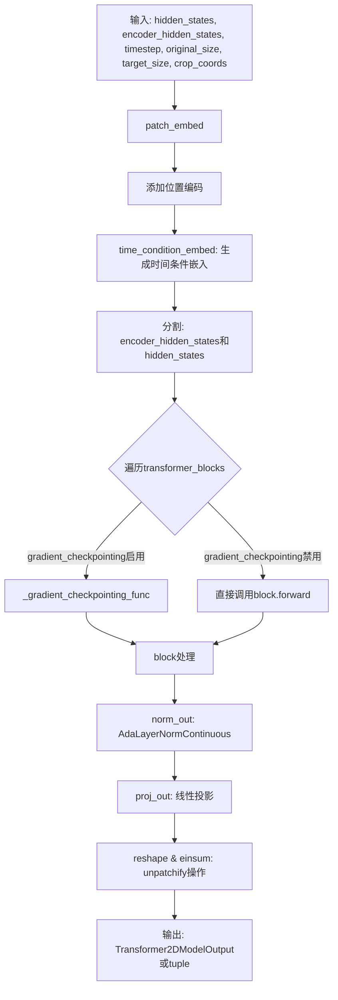
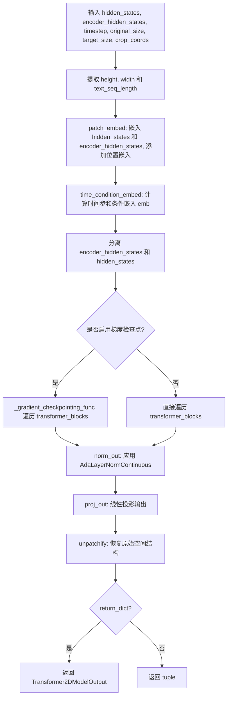

# `diffusers\src\diffusers\models\transformers\transformer_cogview3plus.py` 详细设计文档

CogView3PlusTransformer2DModel 是一个基于Transformer的文本到图像生成模型，采用CogView3架构，通过自回归扩散机制实现高质量图像合成。该模型接收图像潜在表示、文本嵌入、时间步长及SDXL风格的尺寸条件作为输入，经过patch嵌入、时间条件嵌入、多个Transformer块处理后，通过unpatchify操作输出denoised的图像潜在表示。

## 整体流程



## 类结构

```
ModelMixin (抽象基类)
├── CogView3PlusTransformer2DModel
│   ├── CogView3PlusTransformerBlock (模块列表)
│   │   ├── CogView3PlusAdaLayerNormZeroTextImage (norm1)
│   │   ├── Attention (attn1)
│   │   ├── nn.LayerNorm (norm2, norm2_context)
│   │   └── FeedForward (ff)
│   ├── CogView3PlusPatchEmbed (patch_embed)
│   ├── CogView3CombinedTimestepSizeEmbeddings (time_condition_embed)
│   ├── AdaLayerNormContinuous (norm_out)
│   └── nn.Linear (proj_out)
```

## 全局变量及字段


### `logger`
    
模块级日志记录器，用于输出调试和运行信息

类型：`logging.Logger`
    


### `CogView3PlusTransformerBlock.norm1`
    
第一个自适应层归一化，用于modulate注意力机制

类型：`CogView3PlusAdaLayerNormZeroTextImage`
    


### `CogView3PlusTransformerBlock.attn1`
    
多头自注意力层，处理hidden_states和encoder_hidden_states

类型：`Attention`
    


### `CogView3PlusTransformerBlock.norm2`
    
hidden_states的层归一化

类型：`nn.LayerNorm`
    


### `CogView3PlusTransformerBlock.norm2_context`
    
encoder_hidden_states的层归一化

类型：`nn.LayerNorm`
    


### `CogView3PlusTransformerBlock.ff`
    
前馈网络，处理串接后的序列

类型：`FeedForward`
    


### `CogView3PlusTransformer2DModel.out_channels`
    
输出通道数

类型：`int`
    


### `CogView3PlusTransformer2DModel.inner_dim`
    
内部维度，等于num_attention_heads * attention_head_dim

类型：`int`
    


### `CogView3PlusTransformer2DModel.pooled_projection_dim`
    
池化投影维度，用于SDXL条件

类型：`int`
    


### `CogView3PlusTransformer2DModel.patch_embed`
    
patch嵌入层

类型：`CogView3PlusPatchEmbed`
    


### `CogView3PlusTransformer2DModel.time_condition_embed`
    
时间条件嵌入层

类型：`CogView3CombinedTimestepSizeEmbeddings`
    


### `CogView3PlusTransformer2DModel.transformer_blocks`
    
Transformer块列表

类型：`nn.ModuleList`
    


### `CogView3PlusTransformer2DModel.norm_out`
    
输出层自适应归一化

类型：`AdaLayerNormContinuous`
    


### `CogView3PlusTransformer2DModel.proj_out`
    
输出投影层

类型：`nn.Linear`
    


### `CogView3PlusTransformer2DModel.gradient_checkpointing`
    
梯度检查点标志

类型：`bool`
    
    

## 全局函数及方法


### `CogView3PlusTransformerBlock.__init__`

初始化 CogView3PlusTransformerBlock 类，构建 Transformer 块的核心组件，包括自适应层归一化、多头注意力机制和前馈网络，用于 CogView3 图像生成模型的处理。

参数：

- `dim`：`int`，输入和输出的通道数，默认为 2560
- `num_attention_heads`：`int`，多头注意力机制中的注意力头数量，默认为 64
- `attention_head_dim`：`int`，每个注意力头的通道维度，默认为 40
- `time_embed_dim`：`int`，时间步嵌入的通道维度，默认为 512

返回值：`None`，该方法仅初始化对象属性，不返回任何值

#### 流程图

```mermaid
flowchart TD
    A[__init__ 开始] --> B[调用 super().__init__]
    B --> C[创建 norm1: CogView3PlusAdaLayerNormZeroTextImage]
    C --> D[创建 attn1: Attention 多头注意力层]
    D --> E[创建 norm2: nn.LayerNorm for hidden_states]
    E --> F[创建 norm2_context: nn.LayerNorm for encoder_hidden_states]
    F --> G[创建 ff: FeedForward 前馈网络]
    G --> H[__init__ 结束]
    
    C --> C1[embedding_dim=time_embed_dim]
    C1 --> C2[dim=dim]
    
    D --> D1[query_dim=dim]
    D1 --> D2[heads=num_attention_heads]
    D2 --> D3[dim_head=attention_head_dim]
    D3 --> D4[out_dim=dim]
    
    E --> E1[normalized_shape=dim]
    F --> F1[normalized_shape=dim]
    
    G --> G1[dim=dim]
    G1 --> G2[dim_out=dim]
    G2 --> G3[activation_fn=gelu-approximate]
```

#### 带注释源码

```python
def __init__(
    self,
    dim: int = 2560,
    num_attention_heads: int = 64,
    attention_head_dim: int = 40,
    time_embed_dim: int = 512,
):
    """
    初始化 CogView3PlusTransformerBlock 变换器块
    
    参数:
        dim: 输入和输出的通道数，默认为 2560
        num_attention_heads: 多头注意力头数，默认为 64
        attention_head_dim: 每个注意力头的维度，默认为 40
        time_embed_dim: 时间嵌入维度，默认为 512
    """
    # 调用父类 nn.Module 的初始化方法
    super().__init__()

    # === 第一个归一化层 (Norm1) ===
    # CogView3PlusAdaLayerNormZeroTextImage: 自适应层归一化，支持文本和图像的零初始化门控
    # 参数:
    #   - embedding_dim: 时间嵌入维度 (time_embed_dim)
    #   - dim: 输入特征维度 (dim)
    self.norm1 = CogView3PlusAdaLayerNormZeroTextImage(
        embedding_dim=time_embed_dim, 
        dim=dim
    )

    # === 第一个注意力层 (Attention1) ===
    # 多头自注意力机制，用于捕捉输入特征内的依赖关系
    # 参数:
    #   - query_dim: 查询维度，等于输入通道数
    #   - heads: 注意力头数量
    #   - dim_head: 每个头的维度
    #   - out_dim: 输出维度
    #   - bias: 是否使用偏置
    #   - qk_norm: 查询/键的归一化方式 ("layer_norm")
    #   - elementwise_affine: 是否使用可学习的仿射变换 (False)
    #   - eps: 数值稳定性 epsilon (1e-6)
    #   - processor: 注意力处理器 (CogVideoXAttnProcessor2_0)
    self.attn1 = Attention(
        query_dim=dim,
        heads=num_attention_heads,
        dim_head=attention_head_dim,
        out_dim=dim,
        bias=True,
        qk_norm="layer_norm",
        elementwise_affine=False,
        eps=1e-6,
        processor=CogVideoXAttnProcessor2_0(),
    )

    # === 第二个归一化层 (Norm2) ===
    # 用于 hidden_states 的标准 LayerNorm
    # 参数:
    #   - normalized_shape: 归一化的维度 (dim)
    #   - elementwise_affine: 禁用仿射变换 (False)
    #   - eps: 数值稳定性 epsilon (1e-5)
    self.norm2 = nn.LayerNorm(dim, elementwise_affine=False, eps=1e-5)
    
    # === 第二个上下文归一化层 (Norm2 Context) ===
    # 用于 encoder_hidden_states 的标准 LayerNorm
    self.norm2_context = nn.LayerNorm(dim, elementwise_affine=False, eps=1e-5)

    # === 前馈网络 (FeedForward) ===
    # GELU 激活函数的两层全连接网络，用于特征转换和非线性变换
    # 参数:
    #   - dim: 输入维度
    #   - dim_out: 输出维度
    #   - activation_fn: 激活函数 ("gelu-approximate")
    self.ff = FeedForward(
        dim=dim, 
        dim_out=dim, 
        activation_fn="gelu-approximate"
    )
```


### `CogView3PlusTransformerBlock.forward`

该方法是 CogView3PlusTransformerBlock 的前向传播函数，负责执行 Transformer 块的核心操作：归一化与调制（norm & modulate）、多头注意力（attention）和前馈网络（ffn），同时处理图像 latent 状态和文本 encoder 隐藏状态，输出两个更新后的隐藏状态元组。

参数：

- `hidden_states`：`torch.Tensor`，输入的图像 latent 隐藏状态，形状为 `(batch, channel, height, width)` 或 `(batch, seq_len, dim)`
- `encoder_hidden_states`：`torch.Tensor`，文本编码器的隐藏状态，形状为 `(batch, text_seq_length, dim)`，用于条件引导
- `emb`：`torch.Tensor`，时间步嵌入（timestep embedding），由时间条件嵌入层生成，用于自适应层归一化

返回值：`tuple[torch.Tensor, torch.Tensor]`，返回两个隐藏状态元组 —— 更新后的 `hidden_states` 和 `encoder_hidden_states`

#### 流程图

```mermaid
flowchart TD
    A[Start: forward] --> B[获取 text_seq_length = encoder_hidden_states.size(1)]
    B --> C[norm1: CogView3PlusAdaLayerNormZeroTextImage]
    C --> D[norm_hidden_states<br/>gate_msa, shift_mlp, scale_mlp, gate_mlp<br/>norm_encoder_hidden_states<br/>c_gate_msa, c_shift_mlp, c_scale_mlp, c_gate_mlp]
    D --> E[attn1: Attention]
    E --> F[attn_hidden_states<br/>attn_encoder_hidden_states]
    F --> G[hidden_states += gate_msa * attn_hidden_states<br/>encoder_hidden_states += c_gate_msa * attn_encoder_hidden_states]
    G --> H[norm2: nn.LayerNorm on hidden_states<br/>norm2_context: nn.LayerNorm on encoder_hidden_states]
    H --> I[Apply shift_mlp, scale_mlp modulation<br/>Apply c_shift_mlp, c_scale_mlp modulation]
    I --> J[torch.cat: concat encoder_hidden_states and hidden_states]
    J --> K[ff: FeedForward]
    K --> L[ff_output]
    L --> M[hidden_states += gate_mlp * ff_output[:, text_seq_length:]<br/>encoder_hidden_states += c_gate_mlp * ff_output[:, :text_seq_length]]
    M --> N{hidden_states.dtype<br/>== torch.float16?}
    N -->|Yes| O[hidden_states.clip(-65504, 65504)]
    N -->|No| P{encoder_hidden_states.dtype<br/>== torch.float16?}
    O --> P
    P -->|Yes| Q[encoder_hidden_states.clip(-65504, 65504)]
    P -->|No| R[Return (hidden_states, encoder_hidden_states)]
    Q --> R
```

#### 带注释源码

```python
def forward(
    self,
    hidden_states: torch.Tensor,
    encoder_hidden_states: torch.Tensor,
    emb: torch.Tensor,
) -> tuple[torch.Tensor, torch.Tensor]:
    # 获取文本序列长度，用于后续分离图像和文本特征
    text_seq_length = encoder_hidden_states.size(1)

    # ============ 第一阶段：归一化与调制 (Norm & Modulate) ============
    # 使用 CogView3PlusAdaLayerNormZeroTextImage 进行自适应归一化
    # 该层同时处理 hidden_states 和 encoder_hidden_states
    # 返回：归一化后的隐藏状态、门控参数 MSA 和 MLP 参数
    (
        norm_hidden_states,          # 归一化后的图像 hidden_states
        gate_msa,                    # MSA 门控参数 (用于注意力)
        shift_mlp,                   # MLP 偏移参数
        scale_mlp,                   # MLP 缩放参数
        gate_mlp,                    # MLP 门控参数
        norm_encoder_hidden_states, # 归一化后的文本 hidden_states
        c_gate_msa,                  # 文本 MSA 门控参数
        c_shift_mlp,                 # 文本 MLP 偏移参数
        c_scale_mlp,                 # 文本 MLP 缩放参数
        c_gate_mlp,                  # 文本 MLP 门控参数
    ) = self.norm1(hidden_states, encoder_hidden_states, emb)

    # ============ 第二阶段：多头注意力 (Multi-Head Attention) ============
    # 执行自注意力操作，分别处理图像和文本特征
    # 使用 CogVideoXAttnProcessor2_0 注意力处理器
    attn_hidden_states, attn_encoder_hidden_states = self.attn1(
        hidden_states=norm_hidden_states,
        encoder_hidden_states=norm_encoder_hidden_states
    )

    # 应用门控机制：残差连接 + 门控缩放
    hidden_states = hidden_states + gate_msa.unsqueeze(1) * attn_hidden_states
    encoder_hidden_states = encoder_hidden_states + c_gate_msa.unsqueeze(1) * attn_encoder_hidden_states

    # ============ 第三阶段：归一化与调制 (Norm & Modulate) ============
    # 使用标准 LayerNorm 进行第二层归一化
    norm_hidden_states = self.norm2(hidden_states)
    # 应用 shift 和 scale 调制 (AdaLN 风格)
    norm_hidden_states = norm_hidden_states * (1 + scale_mlp[:, None]) + shift_mlp[:, None]

    norm_encoder_hidden_states = self.norm2_context(encoder_hidden_states)
    norm_encoder_hidden_states = norm_encoder_hidden_states * (1 + c_scale_mlp[:, None]) + c_shift_mlp[:, None]

    # ============ 第四阶段：前馈网络 (Feed-Forward Network) ============
    # 将文本和图像特征拼接后一起送入 FFN
    # 文本特征在前，图像特征在后
    norm_hidden_states = torch.cat([norm_encoder_hidden_states, norm_hidden_states], dim=1)
    # 执行前馈变换 (GELU 激活)
    ff_output = self.ff(norm_hidden_states)

    # 分离并应用门控：分别更新图像和文本隐藏状态
    hidden_states = hidden_states + gate_mlp.unsqueeze(1) * ff_output[:, text_seq_length:]
    encoder_hidden_states = encoder_hidden_states + c_gate_mlp.unsqueeze(1) * ff_output[:, :text_seq_length]

    # ============ 数值稳定性处理 ============
    # float16 数值范围限制，防止溢出
    if hidden_states.dtype == torch.float16:
        hidden_states = hidden_states.clip(-65504, 65504)
    if encoder_hidden_states.dtype == torch.float16:
        encoder_hidden_states = encoder_hidden_states.clip(-65504, 65504)

    # 返回更新后的隐藏状态元组
    return hidden_states, encoder_hidden_states
```


### `CogView3PlusTransformer2DModel.__init__`

该方法是 `CogView3PlusTransformer2DModel` 类的构造函数，负责初始化 CogView3Plus 变压器模型的全部组件，包括输入补丁嵌入层、时间条件嵌入、Transformer 块模块列表、输出归一化层和投影层，并注册配置以支持配置管理。

参数：

- `patch_size`：`int`，默认值 `2`，补丁嵌入层使用的补丁大小
- `in_channels`：`int`，默认值 `16`，输入通道数
- `num_layers`：`int`，默认值 `30`，要使用的 Transformer 块层数
- `attention_head_dim`：`int`，默认值 `40`，每个头部的通道数
- `num_attention_heads`：`int`，默认值 `64`，多头注意力使用的头数
- `out_channels`：`int`，默认值 `16`，输出通道数
- `text_embed_dim`：`int`，默认值 `4096`，文本编码器文本嵌入的输入维度
- `time_embed_dim`：`int`，默认值 `512`，时间步嵌入的输出维度
- `condition_dim`：`int`，默认值 `256`，输入 SDXL 样式分辨率条件的嵌入维度
- `pos_embed_max_size`：`int`，默认值 `128`，位置嵌入的最大分辨率
- `sample_size`：`int`，默认值 `128`，输入潜变量的基础分辨率

返回值：`None`，无显式返回值（`__init__` 方法自动返回 `None`）

#### 流程图

```mermaid
flowchart TD
    A[开始 __init__] --> B[调用 super().__init__]
    B --> C[设置 self.out_channels]
    C --> D[计算 self.inner_dim = num_attention_heads * attention_head_dim]
    D --> E[计算 pooled_projection_dim = 3 * 2 * condition_dim]
    E --> F[初始化 patch_embed: CogView3PlusPatchEmbed]
    F --> G[初始化 time_condition_embed: CogView3CombinedTimestepSizeEmbeddings]
    G --> H[创建 transformer_blocks: nn.ModuleList of CogView3PlusTransformerBlock]
    H --> I[初始化 norm_out: AdaLayerNormContinuous]
    I --> J[初始化 proj_out: nn.Linear]
    J --> K[设置 self.gradient_checkpointing = False]
    K --> L[结束]
```

#### 带注释源码

```python
@register_to_config
def __init__(
    self,
    patch_size: int = 2,
    in_channels: int = 16,
    num_layers: int = 30,
    attention_head_dim: int = 40,
    num_attention_heads: int = 64,
    out_channels: int = 16,
    text_embed_dim: int = 4096,
    time_embed_dim: int = 512,
    condition_dim: int = 256,
    pos_embed_max_size: int = 128,
    sample_size: int = 128,
):
    """
    初始化 CogView3PlusTransformer2DModel 模型。

    Args:
        patch_size: 补丁嵌入层使用的补丁大小
        in_channels: 输入通道数
        num_layers: Transformer 块层数
        attention_head_dim: 每个注意力头部的通道维度
        num_attention_heads: 多头注意力的头数
        out_channels: 输出通道数
        text_embed_dim: 文本嵌入的维度
        time_embed_dim: 时间步嵌入的输出维度
        condition_dim: SDXL 样式条件的嵌入维度
        pos_embed_max_size: 位置嵌入的最大分辨率
        sample_size: 输入潜变量的基础分辨率
    """
    # 调用父类 ModelMixin, AttentionMixin, ConfigMixin 的初始化方法
    super().__init__()
    
    # 保存输出通道数到实例属性
    self.out_channels = out_channels
    
    # 计算内部维度：注意力头数 × 每个头的维度
    # 这是 Transformer 的隐藏维度
    self.inner_dim = num_attention_heads * attention_head_dim

    # CogView3 使用 3 个额外的 SDXL 样式条件
    # original_size, target_size, crop_coords
    # 每个都是 sincos 嵌入，形状为 2 * condition_dim
    # 因此总投影维度 = 3 * 2 * condition_dim
    self.pooled_projection_dim = 3 * 2 * condition_dim

    # 初始化补丁嵌入层 CogView3PlusPatchEmbed
    # 负责将输入的 latent 转换为 patches 并添加位置编码
    self.patch_embed = CogView3PlusPatchEmbed(
        in_channels=in_channels,           # 输入通道数
        hidden_size=self.inner_dim,        # 隐藏层维度（即 inner_dim）
        patch_size=patch_size,              # 补丁大小
        text_hidden_size=text_embed_dim,   # 文本隐藏层维度
        pos_embed_max_size=pos_embed_max_size,  # 位置嵌入最大尺寸
    )

    # 初始化时间条件嵌入层 CogView3CombinedTimestepSizeEmbeddings
    # 负责将时间步长和 SDXL 样式条件（original_size, target_size, crop_coords）编码为向量
    self.time_condition_embed = CogView3CombinedTimestepSizeEmbeddings(
        embedding_dim=time_embed_dim,                 # 时间嵌入维度
        condition_dim=condition_dim,                  # 条件嵌入维度
        pooled_projection_dim=self.pooled_projection_dim,  # 池化投影维度
        timesteps_dim=self.inner_dim,                 # 时间步维度
    )

    # 创建 Transformer 块的模块列表
    # 每个块包含自注意力、交叉注意力和前馈网络
    self.transformer_blocks = nn.ModuleList(
        [
            CogView3PlusTransformerBlock(
                dim=self.inner_dim,                 # 输入输出维度
                num_attention_heads=num_attention_heads,  # 注意力头数
                attention_head_dim=attention_head_dim,   # 注意力头维度
                time_embed_dim=time_embed_dim,           # 时间嵌入维度
            )
            for _ in range(num_layers)  # 重复 num_layers 次
        ]
    )

    # 初始化输出归一化层 AdaLayerNormContinuous
    # 连续的自适应层归一化，根据时间条件动态调整归一化参数
    self.norm_out = AdaLayerNormContinuous(
        embedding_dim=self.inner_dim,                   # 嵌入维度
        conditioning_embedding_dim=time_embed_dim,      # 条件嵌入维度
        elementwise_affine=False,                        # 不使用元素级仿射变换
        eps=1e-6,                                        # 数值稳定性 epsilon
    )
    
    # 初始化输出投影层 nn.Linear
    # 将隐藏维度投影回 patch_size * patch_size * out_channels
    # 用于生成最终的 denoised latents
    self.proj_out = nn.Linear(
        self.inner_dim, 
        patch_size * patch_size * self.out_channels, 
        bias=True
    )

    # 初始化梯度检查点标志为 False
    # 设置为 True 时可以节省显存但增加计算时间
    self.gradient_checkpointing = False
```


### `CogView3PlusTransformer2DModel.forward`

CogView3PlusTransformer2DModel 的前向传播方法是该模型的核心推理入口，负责接收带噪声的 latent 表示、条件嵌入、时间步以及 SDXL 风格的条件信息（原始尺寸、目标尺寸、裁剪坐标），通过 patch 嵌入、时间条件嵌入、多层 Transformer 块处理，最终输出去噪后的 latent 或封装为 Transformer2DModelOutput 对象。

参数：

- `hidden_states`：`torch.Tensor`，输入的带噪声 latent，形状为 `(batch size, channel, height, width)`
- `encoder_hidden_states`：`torch.Tensor`，条件嵌入（从输入条件如提示词计算得到），形状为 `(batch_size, sequence_len, text_embed_dim)`
- `timestep`：`torch.LongTensor`，用于指示去噪步骤的时间步
- `original_size`：`torch.Tensor`，CogView3 使用的 SDXL 风格微观条件，表示原始图像尺寸
- `target_size`：`torch.Tensor`，CogView3 使用的 SDXL 风格微观条件，表示目标图像尺寸
- `crop_coords`：`torch.Tensor`，CogView3 使用的 SDXL 风格微观条件，表示裁剪坐标
- `return_dict`：`bool`，可选，默认为 `True`，是否返回 `Transformer2DModelOutput` 而非元组

返回值：`tuple[torch.Tensor] | Transformer2DModelOutput`，使用提供的输入作为条件进行去噪后的 latent

#### 流程图



#### 带注释源码

```python
def forward(
    self,
    hidden_states: torch.Tensor,
    encoder_hidden_states: torch.Tensor,
    timestep: torch.LongTensor,
    original_size: torch.Tensor,
    target_size: torch.Tensor,
    crop_coords: torch.Tensor,
    return_dict: bool = True,
) -> tuple[torch.Tensor] | Transformer2DModelOutput:
    """
    The [`CogView3PlusTransformer2DModel`] forward method.

    Args:
        hidden_states (`torch.Tensor`):
            Input `hidden_states` of shape `(batch size, channel, height, width)`.
        encoder_hidden_states (`torch.Tensor`):
            Conditional embeddings (embeddings computed from the input conditions such as prompts) of shape
            `(batch_size, sequence_len, text_embed_dim)`
        timestep (`torch.LongTensor`):
            Used to indicate denoising step.
        original_size (`torch.Tensor`):
            CogView3 uses SDXL-like micro-conditioning for original image size as explained in section 2.2 of
            [https://huggingface.co/papers/2307.01952](https://huggingface.co/papers/2307.01952).
        target_size (`torch.Tensor`):
            CogView3 uses SDXL-like micro-conditioning for target image size as explained in section 2.2 of
            [https://huggingface.co/papers/2307.01952](https://huggingface.co/papers/2307.01952).
        crop_coords (`torch.Tensor`):
            CogView3 uses SDXL-like micro-conditioning for crop coordinates as explained in section 2.2 of
            [https://huggingface.co/papers/2307.01952](https://huggingface.co/papers/2307.01952).
        return_dict (`bool`, *optional*, defaults to `True`):
            Whether or not to return a [`~models.transformer_2d.Transformer2DModelOutput`] instead of a plain
            tuple.

    Returns:
        `torch.Tensor` or [`~models.transformer_2d.Transformer2DModelOutput`]:
            The denoised latents using provided inputs as conditioning.
    """
    # 步骤1: 从输入 hidden_states 中提取空间维度信息
    height, width = hidden_states.shape[-2:]
    # 从条件嵌入中提取序列长度
    text_seq_length = encoder_hidden_states.shape[1]

    # 步骤2: Patch 嵌入层 - 将图像 latent 和文本嵌入转换为 patch 序列，并添加位置嵌入
    hidden_states = self.patch_embed(
        hidden_states, encoder_hidden_states
    )  # takes care of adding positional embeddings too.
    
    # 步骤3: 时间步和条件嵌入 - 生成用于调节的时间嵌入，包含 timestep、original_size、target_size、crop_coords 等信息
    emb = self.time_condition_embed(timestep, original_size, target_size, crop_coords, hidden_states.dtype)

    # 步骤4: 分离文本条件嵌入和图像 latent
    # patch_embed 返回的结果中，前 text_seq_length 个位置是文本嵌入，后面是图像 latent
    encoder_hidden_states = hidden_states[:, :text_seq_length]
    hidden_states = hidden_states[:, text_seq_length:]

    # 步骤5: 遍历 Transformer 块进行处理
    for index_block, block in enumerate(self.transformer_blocks):
        # 如果启用梯度检查点且当前在训练模式，则使用梯度检查点优化内存
        if torch.is_grad_enabled() and self.gradient_checkpointing:
            hidden_states, encoder_hidden_states = self._gradient_checkpointing_func(
                block,
                hidden_states,
                encoder_hidden_states,
                emb,
            )
        else:
            # 标准前向传播
            hidden_states, encoder_hidden_states = block(
                hidden_states=hidden_states,
                encoder_hidden_states=encoder_hidden_states,
                emb=emb,
            )

    # 步骤6: 输出归一化 - 使用 AdaLayerNormContinuous 进行条件归一化
    hidden_states = self.norm_out(hidden_states, emb)
    # 步骤7: 线性投影到输出通道
    hidden_states = self.proj_out(hidden_states)  # (batch_size, height*width, patch_size*patch_size*out_channels)

    # 步骤8: Unpatchify - 将序列形式的 patch 恢复为 2D 空间结构
    patch_size = self.config.patch_size
    height = height // patch_size
    width = width // patch_size

    # 重塑为 (batch, height, width, out_channels, patch_size, patch_size)
    hidden_states = hidden_states.reshape(
        shape=(hidden_states.shape[0], height, width, self.out_channels, patch_size, patch_size)
    )
    # 使用 einsum 重新排列维度顺序: nhwcpq -> nchpwq
    hidden_states = torch.einsum("nhwcpq->nchpwq", hidden_states)
    # 最终重塑为 (batch, channels, height * patch_size, width * patch_size)
    output = hidden_states.reshape(
        shape=(hidden_states.shape[0], self.out_channels, height * patch_size, width * patch_size)
    )

    # 步骤9: 根据 return_dict 参数决定返回格式
    if not return_dict:
        return (output,)

    return Transformer2DModelOutput(sample=output)
```

## 关键组件


### CogView3PlusTransformerBlock

CogView3PlusTransformerBlock是CogView3模型的核心Transformer块，包含自适应层归一化、注意力机制和前馈网络，负责对隐藏状态和编码器隐藏状态进行变换和调制。

### CogView3PlusTransformer2DModel

CogView3PlusTransformer2DModel是整个模型的主类，继承自ModelMixin、AttentionMixin和ConfigMixin，负责将输入的latent张量通过patch嵌入、时间条件嵌入、多层Transformer块和输出投影进行处理，输出去噪后的图像latent。

### 注意力处理器 (CogVideoXAttnProcessor2_0)

CogVideoXAttnProcessor2_0是用于CogVideoX的注意力处理器，负责实现自注意力和交叉注意力计算，支持张量索引与惰性加载的反量化支持。

### 自适应层归一化 (CogView3PlusAdaLayerNormZeroTextImage)

CogView3PlusAdaLayerNormZeroTextImage是一种零初始化的自适应层归一化变体，同时对文本和图像嵌入进行调制，包含门控机制和shift/scale参数。

### 连续自适应层归一化 (AdaLayerNormContinuous)

AdaLayerNormContinuous用于输出层的自适应条件归一化，基于时间嵌入对隐藏状态进行调制和投影。

### Patch嵌入层 (CogView3PlusPatchEmbed)

CogView3PlusPatchEmbed负责将输入的图像latent和文本嵌入进行patch化处理，并添加位置嵌入，支持最大位置嵌入尺寸控制。

### 时间条件嵌入 (CogView3CombinedTimestepSizeEmbeddings)

CogView3CombinedTimestepSizeEmbeddings负责生成时间步嵌入和SDXL风格的条件嵌入（原始尺寸、目标尺寸、裁剪坐标），实现多条件微调。

### 前馈网络 (FeedForward)

FeedForward是标准的前馈神经网络，使用GELU激活函数，对归一化后的隐藏状态进行非线性变换。

### 梯度检查点 (Gradient Checkpointing)

支持梯度检查点技术以节省显存，通过在反向传播时重新计算中间激活值来减少内存占用。

### 量化策略与数值裁剪

代码中包含对float16类型的数值裁剪处理，将隐藏状态限制在[-65504, 65504]范围内，防止数值溢出，这是针对反量化场景的优化处理。

## 问题及建议


### 已知问题

- **类型注解不一致**：forward方法返回类型注解为`tuple[torch.Tensor] | Transformer2DModelOutput`，但实际实现中`return_dict=False`时返回的是`tuple`（实际上只有一个元素`(output,)`），而非`torch.Tensor`
- **硬编码的数值**：`CogView3PlusTransformerBlock.forward`中`clip(-65504, 65504)`的阈值硬编码，这些magic numbers缺乏解释，应提取为常量或配置参数
- **冗余的梯度checkpointing实现**：手动实现了gradient checkpointing逻辑，但可以通过HuggingFace的`gradient_checkpointing_enable()`方法统一管理，当前的手动实现与标准接口可能不兼容
- **变量命名冗余**：`patch_size`在多个地方重复获取（`self.config.patch_size`），且在`forward`中被重复计算`height = height // patch_size`
- **编码风格不一致**：`CogView3PlusTransformerBlock`中norm后的处理使用了不同的命名风格（如`norm_hidden_states` vs `norm_encoder_hidden_states`），与主模型中的风格不统一
- **缺失参数校验**：forward方法未对输入tensor的shape和dtype进行校验，可能导致运行时难以追踪的错误
- **AttentionMixin依赖不明确**：类继承了`AttentionMixin`但未在代码中明确使用其提供的能力，增加了理解成本

### 优化建议

- 修正forward方法的返回类型注解，或调整实现以匹配类型声明
- 将`-65504`和`65504`提取为类级别常量或配置参数，并添加注释说明其含义（float16的安全边界）
- 移除手动的gradient checkpointing逻辑，使用`torch.utils.checkpoint`或HuggingFace统一接口
- 在`forward`方法开始处添加输入校验逻辑，确保`hidden_states`、`encoder_hidden_states`等关键输入的shape符合预期
- 统一代码风格，确保变量命名和代码结构在整个文件中保持一致
- 考虑将`CogView3PlusTransformerBlock`中重复的norm+scale+shift模式抽象为独立方法，提高代码复用性

## 其它


### 设计目标与约束

本模型旨在实现高效的文本到图像生成，采用DiT (Diffusion Transformer) 架构，通过Relay Diffusion技术实现更细粒度和更快速地生成高分辨率图像。设计约束包括：输入通道数必须为16，输出通道数需与输入一致，patch大小固定为2×2，位置嵌入最大分辨率支持128×128（即最大支持2048×2048图像生成），transformer块数量默认为30层，多头注意力头数为64，每头维度为40。

### 错误处理与异常设计

代码中的错误处理主要体现在以下几个方面：数值稳定性检查在forward方法中，当hidden_states或encoder_hidden_states的数据类型为torch.float16时，执行clip(-65504, 65504)操作以防止数值溢出；梯度检查点支持通过gradient_checkpointing标志控制，在torch.is_grad_enabled()条件下启用；参数验证通过@register_to_config装饰器在初始化时进行配置注册和验证；异常传播遵循PyTorch惯例，将内部错误向上层调用者传递。

### 数据流与状态机

数据流主要分为以下几个阶段：输入阶段接收(batch, channel, height, width)形状的hidden_states和(batch, seq_len, text_embed_dim)形状的encoder_hidden_states，以及时间步timestep和三个SDXL风格的微条件(original_size, target_size, crop_coords)；嵌入阶段通过patch_embed将图像转换为patch序列并添加位置编码，同时通过time_condition_embed生成时间条件嵌入；处理阶段数据通过transformer_blocks列表中的30个CogView3PlusTransformerBlock块进行迭代处理，每块内部包含自注意力、交叉注意力和前馈网络；输出阶段通过norm_out和proj_out进行归一化和线性投影，最后通过unpatchify操作将patch序列还原为(batch, channel, height, width)形状的图像。

### 外部依赖与接口契约

主要外部依赖包括：torch和torch.nn提供基础张量操作和神经网络模块；configuration_utils中的ConfigMixin和register_to_config用于配置管理；utils中的logging用于日志记录；attention模块中的AttentionMixin、FeedForward和CogVideoXAttnProcessor2_0提供注意力机制；embeddings模块中的CogView3CombinedTimestepSizeEmbeddings和CogView3PlusPatchEmbed提供嵌入层；normalization模块中的AdaLayerNormContinuous和CogView3PlusAdaLayerNormZeroTextImage提供归一化层；modeling_utils中的ModelMixin提供模型基础功能；modeling_outputs中的Transformer2DModelOutput定义输出结构。

### 性能考虑与优化策略

性能优化主要体现在：梯度检查点(gradient_checkpointing)机制通过self._gradient_checkpointing_func实现，可显著减少训练时的显存占用，节省约30-50%显存；模块列表使用nn.ModuleList以确保参数正确注册到计算图中；skip_layerwise_casting_patterns指定了"patch_embed"和"norm"层跳过逐层类型转换，减少类型转换开销；no_split_modules指定了"CogView3PlusTransformerBlock"和"CogView3PlusPatchEmbed"为不可分割模块，用于模型并行；LayerNorm使用elementwise_affine=False和eps=1e-5/1e-6等精细化参数调整数值精度与性能平衡。

### 配置参数详解

核心配置参数包括：patch_size=2控制图像patch化的大小；in_channels=16和out_channels=16定义输入输出通道数；num_layers=30指定transformer块堆叠数量；attention_head_dim=40和num_attention_heads=64确定注意力机制维度配置；text_embed_dim=4096为文本嵌入维度；time_embed_dim=512为时间嵌入维度；condition_dim=256用于SDXL风格条件嵌入；pos_embed_max_size=128控制位置嵌入最大分辨率；sample_size=128作为基础分辨率用于计算默认图像尺寸。

### 梯度检查点机制

CogView3PlusTransformer2DModel通过设置_supports_gradient_checkpointing = True声明支持梯度检查点功能。在forward方法中，通过self.gradient_checkpointing标志控制启用状态，当torch.is_grad_enabled()且gradient_checkpointing为True时，调用self._gradient_checkpointing_func执行梯度检查点计算。该机制通过在反向传播时重新计算前向激活值而非保存所有中间激活来节省显存，允许在有限GPU显存条件下训练更大规模的模型。

### 数值稳定性措施

代码采取多重数值稳定性保障：LayerNorm使用elementwise_affine=False禁用可学习仿射参数，减少训练不稳定因素；eps参数设置分别为1e-5和1e-6防止除零；fp16数据类型时执行clip(-65504, 65504)操作防止数值溢出；AdaLayerNorm系列通过门控机制(gate_msa, gate_mlp, c_gate_msa, c_gate_mlp)实现自适应调制；在前馈网络后通过残差连接和门控系数进行输出融合，保证梯度流动稳定性。

### 内存管理

内存管理策略包括：nn.ModuleList统一管理transformer_blocks列表，确保所有参数纳入模型参数管理；patch_embed内部处理位置嵌入的添加操作，统一管理内存分配；梯度检查点通过激活值重计算换取显存节省；hidden_states和encoder_hidden_states通过切片操作分离文本和图像特征，避免不必要的数据复制；输出使用view/reshape操作而非copy以优化内存使用。

### 模型初始化流程

模型初始化遵循以下流程：首先调用super().__init__()初始化继承的nn.Module和mixin类；然后注册配置参数通过@register_to_config装饰器；接着创建patch_embed层处理图像和文本嵌入；创建time_condition_embed层处理时间步和SDXL条件；通过列表推导式创建30个transformer_blocks并用nn.ModuleList包装；最后创建norm_out和proj_out输出层。所有层自动注册到模型的parameter字典中。

    