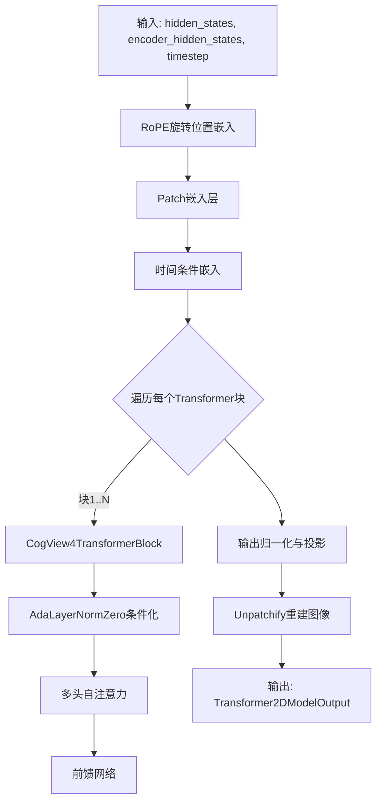
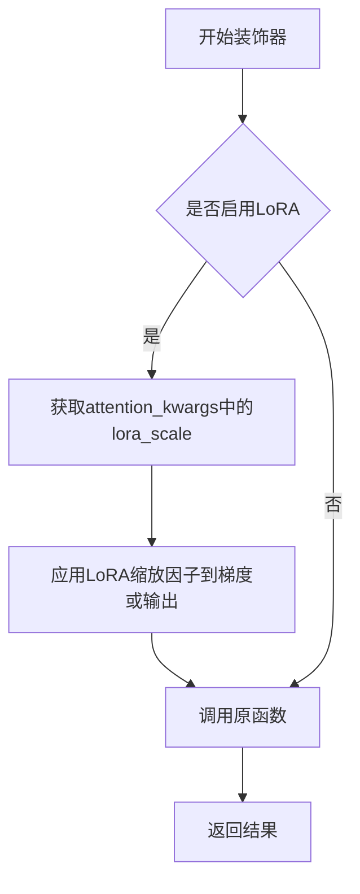
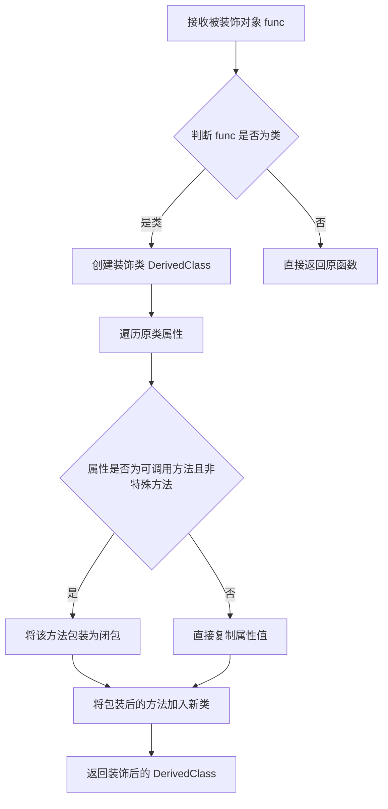
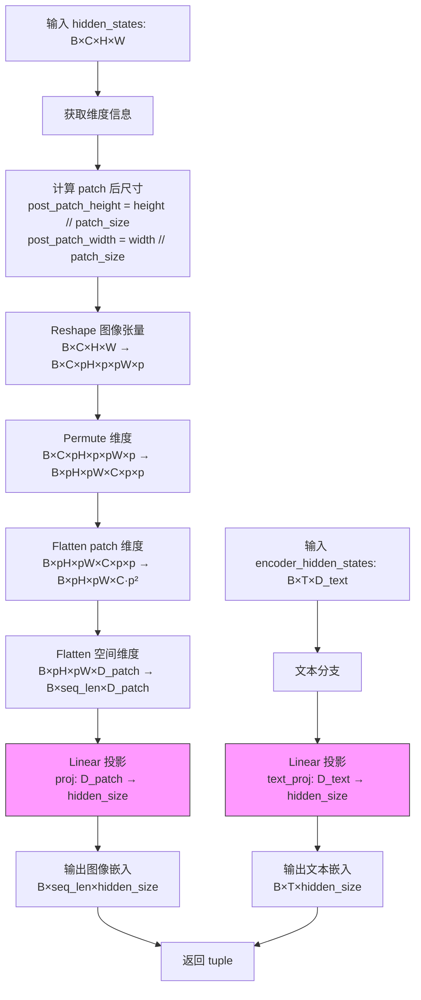
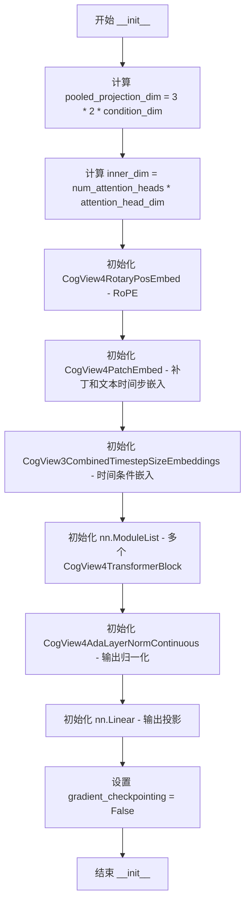
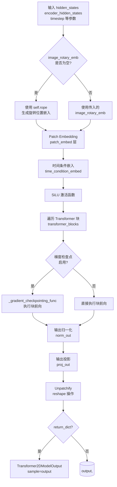

# `diffusers\src\diffusers\models\transformers\transformer_cogview4.py` 详细设计文档

CogView4 Transformer模型实现，用于基于扩散的图像生成。该代码库包含完整的2D Transformer架构，包括patch嵌入、旋转位置嵌入(RoPE)、自适应层归一化、多头注意力机制和前馈网络，支持条件图像生成和多分辨率训练。

## 整体流程



## 类结构

```
CogView4PatchEmbed (图像patch嵌入)
CogView4AdaLayerNormZero (自适应层归一化)
CogView4AttnProcessor (推理注意力处理器)
CogView4TrainingAttnProcessor (训练注意力处理器)
CogView4TransformerBlock (Transformer块)
CogView4RotaryPosEmbed (旋转位置嵌入)
CogView4AdaLayerNormContinuous (连续AdaLN)
CogView4Transformer2DModel (主模型类)
```

## 全局变量及字段


### `logger`
    
模块级日志记录器，用于记录代码运行时的日志信息

类型：`logging.Logger`
    


### `CogView4PatchEmbed.patch_size`
    
patch大小，用于将图像分割成小块进行处理

类型：`int`
    


### `CogView4PatchEmbed.proj`
    
图像patch投影层，将patched图像特征映射到隐藏空间

类型：`nn.Linear`
    


### `CogView4PatchEmbed.text_proj`
    
文本嵌入投影层，将文本特征映射到与图像相同的隐藏空间

类型：`nn.Linear`
    


### `CogView4AdaLayerNormZero.norm`
    
隐藏状态LayerNorm，对图像 latent 进行层归一化

类型：`nn.LayerNorm`
    


### `CogView4AdaLayerNormZero.norm_context`
    
上下文LayerNorm，对文本 encoder hidden states 进行层归一化

类型：`nn.LayerNorm`
    


### `CogView4AdaLayerNormZero.linear`
    
条件嵌入线性层，将时间步嵌入映射到12个调制参数

类型：`nn.Linear`
    


### `CogView4TransformerBlock.norm1`
    
第一个自适应归一化层，用于注意力之前的 Conditioning

类型：`CogView4AdaLayerNormZero`
    


### `CogView4TransformerBlock.attn1`
    
注意力模块，处理图像和文本的交叉注意力

类型：`Attention`
    


### `CogView4TransformerBlock.norm2`
    
第二个归一化层，用于前馈网络之前的图像 latent

类型：`nn.LayerNorm`
    


### `CogView4TransformerBlock.norm2_context`
    
上下文归一化层，用于前馈网络之前的文本 hidden states

类型：`nn.LayerNorm`
    


### `CogView4TransformerBlock.ff`
    
前馈网络，对注意力输出进行非线性变换

类型：`FeedForward`
    


### `CogView4RotaryPosEmbed.dim`
    
嵌入维度，每个位置的旋转编码维度

类型：`int`
    


### `CogView4RotaryPosEmbed.patch_size`
    
patch大小，用于计算位置编码的网格尺寸

类型：`int`
    


### `CogView4RotaryPosEmbed.rope_axes_dim`
    
RoPE轴维度，定义旋转位置编码的高度和宽度轴

类型：`tuple[int, int]`
    


### `CogView4RotaryPosEmbed.theta`
    
旋转角基础频率，用于生成旋转位置编码的频率参数

类型：`float`
    


### `CogView4AdaLayerNormContinuous.linear`
    
条件嵌入线性层，将条件嵌入映射到缩放和偏移参数

类型：`nn.Linear`
    


### `CogView4AdaLayerNormContinuous.norm`
    
归一化层，根据配置选择 LayerNorm 或 RMSNorm

类型：`LayerNorm | RMSNorm`
    


### `CogView4Transformer2DModel.rope`
    
旋转位置嵌入模块，用于为图像 tokens 添加位置信息

类型：`CogView4RotaryPosEmbed`
    


### `CogView4Transformer2DModel.patch_embed`
    
patch嵌入层，将图像和文本转换为 patch 序列

类型：`CogView4PatchEmbed`
    


### `CogView4Transformer2DModel.time_condition_embed`
    
时间条件嵌入层，处理时间步和分辨率条件信息

类型：`CogView3CombinedTimestepSizeEmbeddings`
    


### `CogView4Transformer2DModel.transformer_blocks`
    
Transformer块列表，包含多个 CogView4TransformerBlock

类型：`nn.ModuleList`
    


### `CogView4Transformer2DModel.norm_out`
    
输出归一化层，对最终输出进行自适应归一化

类型：`CogView4AdaLayerNormContinuous`
    


### `CogView4Transformer2DModel.proj_out`
    
输出投影层，将隐藏状态映射回像素空间

类型：`nn.Linear`
    


### `CogView4Transformer2DModel.gradient_checkpointing`
    
梯度检查点标志，控制是否使用梯度检查点以节省显存

类型：`bool`
    
    

## 全局函数及方法


### `apply_lora_scale`

该函数是LoRA（Low-Rank Adaptation）缩放应用装饰器，用于在调用被装饰的Transformer模型前向传播方法时，自动应用LoRA权重缩放因子，确保LoRA分支的输出与主模型路径正确融合。

参数：

-  `*args`：可变位置参数，用于传递被装饰函数的参数。
-  `**kwargs`：可变关键字参数，用于传递被装饰函数的关键字参数。

返回值：返回被装饰函数的执行结果。

#### 流程图



#### 带注释源码

```python
# 注意：该函数的完整实现在 diffusers 库的 utils 模块中
# 当前代码文件仅导入并使用该装饰器
# 下面是其在代码中的使用方式：

from ...utils import apply_lora_scale, logging

# 在 CogView4Transformer2DModel 类的 forward 方法上使用装饰器
@apply_lora_scale("attention_kwargs")
def forward(
    self,
    hidden_states: torch.Tensor,
    encoder_hidden_states: torch.Tensor,
    timestep: torch.LongTensor,
    original_size: torch.Tensor,
    target_size: torch.Tensor,
    crop_coords: torch.Tensor,
    attention_kwargs: dict[str, Any] | None = None,
    return_dict: bool = True,
    attention_mask: torch.Tensor | None = None,
    image_rotary_emb: tuple[torch.Tensor, torch.Tensor] | list[tuple[torch.Tensor, torch.Tensor]] | None = None,
) -> tuple[torch.Tensor] | Transformer2DModelOutput:
    """
    该方法接收 'attention_kwargs' 作为关键字参数，
    装饰器 apply_lora_scale 会自动从中读取 lora_scale 并应用缩放
    """
    # ... 方法实现
```


### `maybe_allow_in_graph`

该函数是一个装饰器，用于标记指定的类或函数，使其能够被 PyTorch 的 `torch.compile` 包含在计算图中。通常某些自定义模块或函数由于内部实现方式，默认不会被包含在编译图中，使用该装饰器可以强制将其纳入，从而支持完整的图编译优化。

参数：

- `func`：`Callable`，被装饰的类或函数对象

返回值：`Callable`，返回装饰后的类或函数，保留原始对象的所有属性

#### 流程图



#### 带注释源码

```python
def maybe_allow_in_graph(func):
    """
    一个装饰器，用于允许某个类或函数被包含在 torch.compile 的计算图中。
    某些自定义模块由于内部实现可能不会被默认包含在编译图中，使用此装饰器
    可以强制将其纳入，从而支持 torch.compile 的完整优化。
    
    使用示例:
        @maybe_allow_in_graph
        class MyModule(nn.Module):
            ...
    """
    # 判断传入的是类还是函数
    if inspect.isclass(func):
        # 如果是类，创建一个新的子类，确保所有方法都能被追踪
        class DecoratedClass(func):
            # 遍历原类的所有属性
            for attr_name in dir(func):
                # 跳过特殊属性和私有属性
                if attr_name.startswith("_"):
                    continue
                attr = getattr(func, attr_name)
                # 如果属性是可调用的方法（非特殊方法），将其包装
                if callable(attr) and not attr_name.startswith("__"):
                    # 使用闭包创建一个包装方法
                    def create_wrapper(method):
                        def wrapper(*args, **kwargs):
                            return method(*args, **kwargs)
                        return wrapper
                    # 将包装后的方法添加到新类中
                    setattr(DecoratedClass, attr_name, create_wrapper(attr))
        
        # 返回装饰后的类
        return DecoratedClass
    else:
        # 如果是函数，直接返回原函数
        return func
```


### `CogView4PatchEmbed.forward`

该函数执行图像Patch嵌入和文本嵌入的投影操作，将输入的图像latent states（形状为 B×C×H×W）转换为序列形式的patch表示（形状为 B×(H/p×W/p)×(C×p²)），同时将文本hidden states投影到与图像相同的隐藏维度空间，以供后续Transformer模块联合处理图像和文本信息。

参数：

- `hidden_states`：`torch.Tensor`，输入的图像latent states，形状为 (batch_size, channel, height, width)，即原始的4D图像张量
- `encoder_hidden_states`：`torch.Tensor`，输入的文本hidden states，形状为 (batch_size, text_seq_length, text_hidden_size)，来自文本编码器的输出

返回值：`tuple[torch.Tensor, torch.Tensor]`，返回一个元组，包含处理后的图像patch嵌入和文本嵌入，图像部分形状为 (batch_size, post_patch_height × post_patch_width, hidden_size)，文本部分形状为 (batch_size, text_seq_length, hidden_size)

#### 流程图



#### 带注释源码

```python
def forward(self, hidden_states: torch.Tensor, encoder_hidden_states: torch.Tensor) -> torch.Tensor:
    # 1. 获取输入图像张量的维度信息
    # hidden_states 形状: (batch_size, channel, height, width)
    batch_size, channel, height, width = hidden_states.shape
    
    # 2. 计算 patch 后的空间尺寸
    # 每个 patch 的大小为 patch_size × patch_size
    post_patch_height = height // self.patch_size
    post_patch_width = width // self.patch_size

    # 3. 图像 patch 嵌入处理
    # 步骤3a: Reshape - 将 (B, C, H, W) 重塑为 (B, C, pH, p, pW, p)
    # 这样可以将每个 patch_size×patch_size 的区域独立出来
    hidden_states = hidden_states.reshape(
        batch_size, channel, post_patch_height, self.patch_size, post_patch_width, self.patch_size
    )
    
    # 步骤3b: Permute - 调整维度顺序为 (B, pH, pW, C, p, p)
    # 目的是将空间维度(pH, pW)移到前面，便于后续 flatten
    hidden_states = hidden_states.permute(0, 2, 4, 1, 3, 5).flatten(3, 5).flatten(1, 2)
    
    # 步骤3c: Flatten - 先将 patch 维度 flatten: (B, pH, pW, C, p, p) → (B, pH, pW, C·p²)
    # 再将空间维度 flatten: (B, pH, pW, D_patch) → (B, pH·pW, D_patch)
    # 最终形状: (batch_size, num_patches, channel * patch_size * patch_size)
    hidden_states = hidden_states.reshape(batch_size, post_patch_height * post_patch_width, channel * self.patch_size ** 2)
    
    # 步骤3d: Linear 投影 - 将每个 patch 的特征向量投影到 hidden_size 维度
    # 输入: (B, num_patches, C·p²), 输出: (B, num_patches, hidden_size)
    hidden_states = self.proj(hidden_states)
    
    # 4. 文本嵌入处理
    # 将文本编码器的输出投影到与图像相同的 hidden_size 维度空间
    # 输入: (B, text_seq_length, text_hidden_size), 输出: (B, text_seq_length, hidden_size)
    encoder_hidden_states = self.text_proj(encoder_hidden_states)

    # 5. 返回处理后的图像和文本嵌入
    # hidden_states: (B, num_patches, hidden_size) - 图像 patch 序列
    # encoder_hidden_states: (B, text_seq_length, hidden_size) - 文本序列
    return hidden_states, encoder_hidden_states
```


### CogView4AdaLayerNormZero.forward

该方法是 CogView4 模型中的自适应归一化层（AdaLayerNormZero）的前向传播函数。它接收隐藏状态、编码器隐藏状态和时间步嵌入，通过自适应方式计算归一化偏移量和缩放因子，实现对图像和文本分支的动态条件化处理。

参数：

- `hidden_states`：`torch.Tensor`，输入的图像 latent 隐藏状态，形状为 (batch_size, seq_len, dim)
- `encoder_hidden_states`：`torch.Tensor`，文本编码器的隐藏状态，形状为 (batch_size, text_seq_len, dim)
- `temb`：`torch.Tensor`，时间步条件嵌入，形状为 (batch_size, embedding_dim)，由时间步和图像尺寸信息经过 SiLU 激活和线性变换得到

返回值：`tuple[torch.Tensor, ...]`，返回包含10个元素的元组：
- `hidden_states`：经过自适应归一化后的图像隐藏状态
- `gate_msa`：图像分支的 MSA 门控因子
- `shift_mlp`：图像分支的 MLP 偏移量
- `scale_mlp`：图像分支的 MLP 缩放因子
- `gate_mlp`：图像分支的 MLP 门控因子
- `encoder_hidden_states`：经过自适应归一化后的文本隐藏状态
- `c_gate_msa`：文本分支的 MSA 门控因子
- `c_shift_mlp`：文本分支的 MLP 偏移量
- `c_scale_mlp`：文本分支的 MLP 缩放因子
- `c_gate_mlp`：文本分支的 MLP 门控因子

#### 流程图

```mermaid
flowchart TD
    A[输入 hidden_states<br/>encoder_hidden_states<br/>temb] --> B[对 hidden_states 进行 LayerNorm]
    A --> C[对 encoder_hidden_states 进行 LayerNorm]
    B --> D[转换为目标 dtype]
    C --> E[转换为目标 dtype]
    D --> F[将 temb 线性投影为 12 个参数]
    E --> F
    F --> G[将 12 个参数按维度1分块]
    G --> H[shift_msa, c_shift_msa, scale_msa, c_scale_msa<br/>gate_msa, c_gate_msa, shift_mlp, c_shift_mlp<br/>scale_mlp, c_scale_mlp, gate_mlp, c_gate_mlp]
    H --> I[hidden_states = norm_hidden_states<br/>* (1 + scale_msa) + shift_msa]
    H --> J[encoder_hidden_states = norm_encoder_hidden_states<br/>* (1 + c_scale_msa) + c_shift_msa]
    I --> K[返回 10 元组]
    J --> K
```

#### 带注释源码

```python
def forward(
    self, hidden_states: torch.Tensor, encoder_hidden_states: torch.Tensor, temb: torch.Tensor
) -> tuple[torch.Tensor, torch.Tensor]:
    # 获取输入 hidden_states 的数据类型，用于后续计算的类型转换
    dtype = hidden_states.dtype
    
    # 对图像 latent 隐藏状态进行 LayerNorm 归一化，不包含可学习参数 (elementwise_affine=False)
    # 并将结果转换回原始输入的数据类型
    norm_hidden_states = self.norm(hidden_states).to(dtype=dtype)
    
    # 对文本编码器隐藏状态进行同样的 LayerNorm 归一化处理
    norm_encoder_hidden_states = self.norm_context(encoder_hidden_states).to(dtype=dtype)

    # 将时间步嵌入 temb 通过线性层投影到 12 * dim 维空间
    # 这12个维度将分别用于计算：
    # - shift_msa: 图像 MSA 的移位量
    # - c_shift_msa: 文本 MSA 的移位量
    # - scale_msa: 图像 MSA 的缩放因子
    # - c_scale_msa: 文本 MSA 的缩放因子
    # - gate_msa: 图像 MSA 的门控因子
    # - c_gate_msa: 文本 MSA 的门控因子
    # - shift_mlp: 图像 MLP 的移位量
    # - c_shift_mlp: 文本 MLP 的移位量
    # - scale_mlp: 图像 MLP 的缩放因子
    # - c_scale_mlp: 文本 MLP 的缩放因子
    # - gate_mlp: 图像 MLP 的门控因子
    # - c_gate_mlp: 文本 MLP 的门控因子
    emb = self.linear(temb)
    
    # 将投影后的 embedding 按顺序均匀分块为12个部分
    (
        shift_msa,
        c_shift_msa,
        scale_msa,
        c_scale_msa,
        gate_msa,
        c_gate_msa,
        shift_mlp,
        c_shift_mlp,
        scale_mlp,
        c_scale_mlp,
        gate_mlp,
        c_gate_mlp,
    ) = emb.chunk(12, dim=1)

    # 对图像 hidden_states 应用自适应归一化：
    # 1. 乘以 (1 + scale_msa) 实现缩放，其中 scale_msa 从 temb 学习得到
    # 2. 加上 shift_msa 实现移位
    # unsqueeze(1) 将参数从 (batch_size, dim) 扩展为 (batch_size, 1, dim) 以支持序列维度
    hidden_states = norm_hidden_states * (1 + scale_msa.unsqueeze(1)) + shift_msa.unsqueeze(1)
    
    # 对文本 encoder_hidden_states 应用同样的自适应归一化，使用文本分支的参数
    encoder_hidden_states = norm_encoder_hidden_states * (1 + c_scale_msa.unsqueeze(1)) + c_shift_msa.unsqueeze(1)

    # 返回包含所有条件和变换参数的元组，供后续的注意力模块和前馈网络使用
    return (
        hidden_states,
        gate_msa,
        shift_mlp,
        scale_mlp,
        gate_mlp,
        encoder_hidden_states,
        c_gate_msa,
        c_shift_mlp,
        c_scale_mlp,
        c_gate_mlp,
    )
```


### `CogView4AttnProcessor.__call__`

实现 CogView4 模型的缩放点积注意力处理，支持旋转位置嵌入和文本标记的注意力掩码。

参数：

- `self`：`CogView4AttnProcessor`，注意力处理器实例本身
- `attn`：`Attention`，注意力模块实例，用于执行 QKV 投影和输出投影
- `hidden_states`：`torch.Tensor`，输入的图像潜在表示，形状为 (batch_size, image_seq_length, embed_dim)
- `encoder_hidden_states`：`torch.Tensor`，编码器隐藏状态（文本嵌入），形状为 (batch_size, text_seq_length, embed_dim)
- `attention_mask`：`torch.Tensor | None`，文本标记的注意力掩码，形状为 (batch_size, text_seq_length)，1 表示非填充标记，0 表示填充标记
- `image_rotary_emb`：`tuple[torch.Tensor, torch.Tensor] | None`，图像部分的旋转位置嵌入，包含 cos 和 sin 部分

返回值：`tuple[torch.Tensor, torch.Tensor]`，第一个是处理后的图像隐藏状态，第二个是处理后的文本隐藏状态

#### 流程图

```mermaid
flowchart TD
    A[开始] --> B[获取 encoder_hidden_states 和 hidden_states 的形状信息]
    B --> C[拼接 encoder_hidden_states 和 hidden_states]
    C --> D[执行 QKV 投影: to_q, to_k, to_v]
    D --> E[重塑为多头注意力格式]
    E --> F{attn.norm_q 是否存在?}
    F -->|是| G[对 query 应用归一化]
    F -->|否| H{attn.norm_k 是否存在?}
    G --> H
    H -->|是| I[对 key 应用归一化]
    H -->|否| J{image_rotary_emb 是否存在?}
    I --> J
    J -->|是| K[对图像部分应用旋转位置嵌入]
    J -->|否| L{attention_mask 是否存在?}
    K --> L
    L -->|是| M[构建组合注意力掩码矩阵]
    L -->|否| N[执行缩放点积注意力]
    M --> N
    N --> O[重塑输出并转换类型]
    O --> P[执行输出投影: to_out[0] 和 to_out[1]]
    P --> Q[拆分回图像和文本状态]
    Q --> R[返回结果]
```

#### 带注释源码

```python
def __call__(
    self,
    attn: Attention,
    hidden_states: torch.Tensor,
    encoder_hidden_states: torch.Tensor,
    attention_mask: torch.Tensor | None = None,
    image_rotary_emb: tuple[torch.Tensor, torch.Tensor] | None = None,
) -> tuple[torch.Tensor, torch.Tensor]:
    # 获取编码器隐藏状态的dtype，用于后续类型转换
    dtype = encoder_hidden_states.dtype

    # 解析文本序列长度和嵌入维度
    batch_size, text_seq_length, embed_dim = encoder_hidden_states.shape
    # 解析图像序列长度和嵌入维度
    batch_size, image_seq_length, embed_dim = hidden_states.shape
    # 将文本和图像隐藏状态沿序列维度拼接，形成混合序列
    hidden_states = torch.cat([encoder_hidden_states, hidden_states], dim=1)

    # 步骤1: QKV 投影 - 将隐藏状态投影为 Query、Key、Value
    query = attn.to_q(hidden_states)  # 查询向量
    key = attn.to_k(hidden_states)    # 键向量
    value = attn.to_v(hidden_states)  # 值向量

    # 调整形状以适配多头注意力: [batch, seq_len, heads*dim] -> [batch, heads, seq_len, dim]
    query = query.unflatten(2, (attn.heads, -1)).transpose(1, 2)
    key = key.unflatten(2, (attn.heads, -1)).transpose(1, 2)
    value = value.unflatten(2, (attn.heads, -1)).transpose(1, 2)

    # 步骤2: QK 归一化 - 对查询和键向量应用层归一化
    if attn.norm_q is not None:
        query = attn.norm_q(query).to(dtype=dtype)
    if attn.norm_k is not None:
        key = attn.norm_k(key).to(dtype=dtype)

    # 步骤3: 旋转位置嵌入 - 仅对图像流（latent stream）应用旋转嵌入
    if image_rotary_emb is not None:
        from ..embeddings import apply_rotary_emb

        # 仅对图像部分的 query 应用旋转嵌入（跳过文本部分）
        query[:, :, text_seq_length:, :] = apply_rotary_emb(
            query[:, :, text_seq_length:, :], image_rotary_emb, use_real_unbind_dim=-2
        )
        # 仅对图像部分的 key 应用旋转嵌入
        key[:, :, text_seq_length:, :] = apply_rotary_emb(
            key[:, :, text_seq_length:, :], image_rotary_emb, use_real_unbind_dim=-2
        )

    # 步骤4: 注意力计算
    if attention_mask is not None:
        text_attn_mask = attention_mask
        # 验证掩码维度
        assert text_attn_mask.dim() == 2, "the shape of text_attn_mask should be (batch_size, text_seq_length)"
        # 转换为浮点类型并移动到正确设备
        text_attn_mask = text_attn_mask.float().to(query.device)
        # 创建组合掩码，初始值为1（允许注意力）
        mix_attn_mask = torch.ones((batch_size, text_seq_length + image_seq_length), device=query.device)
        # 填充文本部分掩码
        mix_attn_mask[:, :text_seq_length] = text_attn_mask
        # 扩展维度以计算注意力矩阵
        mix_attn_mask = mix_attn_mask.unsqueeze(2)
        # 计算注意力掩码矩阵: [batch, seq, seq]
        attn_mask_matrix = mix_attn_mask @ mix_attn_mask.transpose(1, 2)
        # 转换为布尔掩码并添加注意力头维度
        attention_mask = (attn_mask_matrix > 0).unsqueeze(1).to(query.dtype)

    # 执行缩放点积注意力计算
    hidden_states = F.scaled_dot_product_attention(
        query, key, value, attn_mask=attention_mask, dropout_p=0.0, is_causal=False
    )
    # 恢复形状: [batch, heads, seq_len, dim] -> [batch, seq_len, heads*dim]
    hidden_states = hidden_states.transpose(1, 2).flatten(2, 3)
    hidden_states = hidden_states.type_as(query)

    # 步骤5: 输出投影 - 通过线性层和 Dropout
    hidden_states = attn.to_out[0](hidden_states)  # 线性投影
    hidden_states = attn.to_out[1](hidden_states)  # Dropout

    # 将混合输出拆分回文本和图像部分
    encoder_hidden_states, hidden_states = hidden_states.split(
        [text_seq_length, hidden_states.size(1) - text_seq_length], dim=1
    )
    return hidden_states, encoder_hidden_states
```


### `CogView4TrainingAttnProcessor.__call__`

这是一个用于 CogView4 模型的训练注意力处理器。它实现了带旋转位置编码（RoPE）的缩放点积注意力，并支持**packing**机制（将多个不同长度的样本打包进一个batch以提高训练效率）和**多模态掩码**（区分文本和图像token）。该函数负责处理图像流（latent）和文本流（encoder_hidden_states）的联合注意力计算。

参数：

- `self`：类的实例本身。
- `attn`：`Attention`，注意力模块实例，包含 q/k/v 投影矩阵和输出投影层。
- `hidden_states`：`torch.Tensor`，输入的图像/潜在空间隐藏状态，形状为 `(batch_size, image_seq_length, embed_dim)`。
- `encoder_hidden_states`：`torch.Tensor`，编码后的文本隐藏状态，形状为 `(batch_size, text_seq_length, embed_dim)`。
- `latent_attn_mask`：`torch.Tensor | None`，图像token的注意力掩码，其中 0 表示填充token，1 表示有效token。若为 `None`，则默认所有token都有效。
- `text_attn_mask`：`torch.Tensor | None`，文本token的注意力掩码，语义同 `latent_attn_mask`。
- `batch_flag`：`torch.Tensor | None`，形状为 `(batch_size,)` 的张量，用于标识每个样本属于哪个打包批次（例如 `[0, 1, 1, 2, 2]` 表示样本0独立，样本1和2打包在一起）。若为 `None`，则不使用packing。
- `image_rotary_emb`：`tuple[torch.Tensor, torch.Tensor] | list[tuple[torch.Tensor, torch.Tensor]] | None`，图像token使用的旋转位置嵌入。
- `**kwargs`：其他关键字参数。

返回值：`tuple[torch.Tensor, torch.Tensor]`，返回处理后的图像隐藏状态和文本隐藏状态。

#### 流程图

```mermaid
flowchart TD
    A[Start: __call__] --> B[获取 Batch/Seq/Dim 信息]
    B --> C[合并 hidden_states: concat[text, image]]
    D{检查 batch_flag}
    D -- None --> E[构建混合注意力 Mask: concat[text_mask, latent_mask]]
    D -- Not None --> F[Packing 模式]
    F --> F1[计算有效长度]
    F2[去除 Padding 拼接]
    F3[重建 Padded Batch]
    F4[生成块对角 Attn Mask]
    E --> G[准备 QKV 输入]
    F4 --> G
    G --> H[QKV 投影: to_q, to_k, to_v]
    H --> I[Reshape: Multi-Head 格式]
    I --> J{QK Normalization}
    J -- Yes --> K[Apply norm_q, norm_k]
    J -- No --> L[Skip Norm]
    K --> M{检查 Rotary Emb}
    L --> M
    M -- Not None --> N{RoPE Mode}
    N -- Standard --> O[Apply RoPE to image tokens]
    N -- Packed --> P[Loop & Apply RoPE per packed sample]
    M -- None --> Q[Skip RoPE]
    O --> R[计算 Attention: F.scaled_dot_product_attention]
    P --> R
    Q --> R
    R --> S[Reshape: Merge Heads]
    S --> T[Output Projection]
    T --> U{Split Mode}
    U -- Standard --> V[Split: Text & Image]
    U -- Packed --> W[Unpad & Restore Shapes]
    V --> X[Return hidden_states, encoder_hidden_states]
    W --> X
```

#### 带注释源码

```python
def __call__(
    self,
    attn: Attention,
    hidden_states: torch.Tensor,
    encoder_hidden_states: torch.Tensor,
    latent_attn_mask: torch.Tensor | None = None,
    text_attn_mask: torch.Tensor | None = None,
    batch_flag: torch.Tensor | None = None,
    image_rotary_emb: tuple[torch.Tensor, torch.Tensor] | list[tuple[torch.Tensor, torch.Tensor]] | None = None,
    **kwargs,
) -> tuple[torch.Tensor, torch.Tensor]:
    """
    训练注意力处理器，支持变长序列和packing。
    """
    # 1. 获取基本维度信息
    batch_size, text_seq_length, embed_dim = encoder_hidden_states.shape
    batch_size, image_seq_length, embed_dim = hidden_states.shape
    dtype = encoder_hidden_states.dtype
    device = encoder_hidden_states.device
    latent_hidden_states = hidden_states
    
    # 混合 hidden states 用于联合处理 (text + image)
    mixed_hidden_states = torch.cat([encoder_hidden_states, latent_hidden_states], dim=1)

    # 2. 构建注意力掩码 (Attention Mask Construction)
    # 如果没有提供掩码，默认全为 1 (有效token)
    if text_attn_mask is None:
        text_attn_mask = torch.ones((batch_size, text_seq_length), dtype=torch.int32, device=device)
    if latent_attn_mask is None:
        latent_attn_mask = torch.ones((batch_size, image_seq_length), dtype=torch.int32, device=device)

    # 验证掩码维度
    assert text_attn_mask.dim() == 2, "text_attn_mask shape must be (batch_size, text_seq_length)"
    assert latent_attn_mask.dim() == 2, "latent_attn_mask shape must be (batch_size, num_latent_tokens)"

    # 构建混合掩码 (文本部分 + 图像部分)
    mixed_attn_mask = torch.ones(
        (batch_size, text_seq_length + image_seq_length), dtype=torch.int32, device=device
    )
    mixed_attn_mask[:, :text_seq_length] = text_attn_mask
    mixed_attn_mask[:, text_seq_length:] = latent_attn_mask

    # 转换为注意力矩阵格式 (batch, seq, seq)
    mixed_attn_mask_input = mixed_attn_mask.unsqueeze(2).to(dtype=dtype)
    attn_mask_matrix = mixed_attn_mask_input @ mixed_attn_mask_input.transpose(1, 2)

    # 3. 处理 Packing (如果启用)
    if batch_flag is not None:
        # 计算打包后的 batch 大小
        packing_batch_size = torch.max(batch_flag).item() + 1
        
        # 计算每个样本的真实序列长度 (非padding长度)
        text_seq_length = torch.sum(text_attn_mask, dim=1)
        latent_seq_length = torch.sum(latent_attn_mask, dim=1)
        mixed_seq_length = text_seq_length + latent_seq_length

        # 计算每个 packed batch 的总长度
        mixed_seq_length_packed = [
            torch.sum(mixed_attn_mask[batch_flag == batch_idx]).item() 
            for batch_idx in range(packing_batch_size)
        ]

        # 核心packing逻辑：移除padding，flatten后拼接
        mixed_attn_mask_flatten = mixed_attn_mask.flatten(0, 1)
        mixed_hidden_states_flatten = mixed_hidden_states.flatten(0, 1)
        # 保留有效token
        mixed_hidden_states_unpad = mixed_hidden_states_flatten[mixed_attn_mask_flatten == 1]

        # 重新填充为 packed batch (右侧padding)
        mixed_hidden_states_packed = torch.split(mixed_hidden_states_unpad, mixed_seq_length_packed)
        mixed_hidden_states_packed_padded = torch.nn.utils.rnn.pad_sequence(
            mixed_hidden_states_packed,
            batch_first=True,
            padding_value=0.0,
            padding_side="right",
        )

        # 构建块对角注意力掩码 (只允许同源样本间注意)
        l = mixed_hidden_states_packed_padded.shape[1]
        attn_mask_matrix = torch.zeros(
            (packing_batch_size, l, l), dtype=dtype, device=device
        )
        for idx in range(packing_batch_size):
            # 获取该 packed batch 中每个样本的序列长度
            seq_lengths = mixed_seq_length[batch_flag == idx]
            offset = 0
            for length in seq_lengths:
                # 填 1 构建注意力块
                attn_mask_matrix[idx, offset : offset + length, offset : offset + length] = 1
                offset += length

    # 格式化 attention mask
    attn_mask_matrix = attn_mask_matrix.to(dtype=torch.bool).unsqueeze(1)
    attention_mask = attn_mask_matrix

    # 准备 hidden states 输入
    if batch_flag is None:
        hidden_states = torch.cat([encoder_hidden_states, hidden_states], dim=1)
    else:
        hidden_states = mixed_hidden_states_packed_padded

    # 4. QKV 投影
    query = attn.to_q(hidden_states)
    key = attn.to_k(hidden_states)
    value = attn.to_v(hidden_states)

    # 调整形状为 Multi-Head Attention 格式 [B, H, S, D]
    query = query.unflatten(2, (attn.heads, -1)).transpose(1, 2)
    key = key.unflatten(2, (attn.heads, -1)).transpose(1, 2)
    value = value.unflatten(2, (attn.heads, -1)).transpose(1, 2)

    # 5. QK 归一化
    if attn.norm_q is not None:
        query = attn.norm_q(query).to(dtype=dtype)
    if attn.norm_k is not None:
        key = attn.norm_k(key).to(dtype=dtype)

    # 6. 应用旋转位置编码 (RoPE)
    if image_rotary_emb is not None:
        from ..embeddings import apply_rotary_emb

        if batch_flag is None:
            # 标准模式：仅对图像部分 (text_seq_length 之后) 应用
            query[:, :, text_seq_length:, :] = apply_rotary_emb(
                query[:, :, text_seq_length:, :], image_rotary_emb, use_real_unbind_dim=-2
            )
            key[:, :, text_seq_length:, :] = apply_rotary_emb(
                key[:, :, text_seq_length:, :], image_rotary_emb, use_real_unbind_dim=-2
            )
        else:
            # Packing 模式：需要遍历每个 packed 样本并精确应用
            assert len(image_rotary_emb) == batch_size
            rope_idx = 0
            for idx in range(packing_batch_size):
                offset = 0
                text_seq_length_bi = text_seq_length[batch_flag == idx]
                latent_seq_length_bi = latent_seq_length[batch_flag == idx]

                for tlen, llen in zip(text_seq_length_bi, latent_seq_length_bi):
                    mlen = tlen + llen
                    # 仅对图像部分应用 RoPE
                    query[idx, :, offset + tlen : offset + mlen, :] = apply_rotary_emb(
                        query[idx, :, offset + tlen : offset + mlen, :],
                        image_rotary_emb[rope_idx],
                        use_real_unbind_dim=-2,
                    )
                    key[idx, :, offset + tlen : offset + mlen, :] = apply_rotary_emb(
                        key[idx, :, offset + tlen : offset + mlen, :],
                        image_rotary_emb[rope_idx],
                        use_real_unbind_dim=-2,
                    )
                    offset += mlen
                    rope_idx += 1

    # 7. 计算注意力
    hidden_states = F.scaled_dot_product_attention(
        query, key, value, attn_mask=attention_mask, dropout_p=0.0, is_causal=False
    )

    # 8. 输出投影
    hidden_states = hidden_states.transpose(1, 2).flatten(2, 3)
    hidden_states = hidden_states.type_as(query)
    hidden_states = attn.to_out[0](hidden_states)
    hidden_states = attn.to_out[1](hidden_states)

    # 9. 拆分并恢复形状
    if batch_flag is None:
        # 简单拆分
        encoder_hidden_states, hidden_states = hidden_states.split(
            [text_seq_length, hidden_states.size(1) - text_seq_length], dim=1
        )
    else:
        # Packing 逆向操作
        hidden_states_unpad = torch.nn.utils.rnn.unpad_sequence(
            hidden_states,
            lengths=torch.tensor(mixed_seq_length_packed),
            batch_first=True,
        )
        hidden_states_flatten = torch.cat(hidden_states_unpad, dim=0)
        hidden_states_unpack = torch.split(hidden_states_flatten, mixed_seq_length.tolist())
        
        # 进一步拆分为 text 和 latent
        hidden_states_unpack = [
            torch.split(h, [tlen, llen])
            for h, tlen, llen in zip(hidden_states_unpack, text_seq_length, latent_seq_length)
        ]
        encoder_hidden_states_unpad = [h[0] for h in hidden_states_unpack]
        hidden_states_unpad = [h[1] for h in hidden_states_unpack]

        # 恢复到原始张量
        for idx in range(batch_size):
            encoder_hidden_states[idx][text_attn_mask[idx] == 1] = encoder_hidden_states_unpad[idx]
            latent_hidden_states[idx][latent_attn_mask[idx] == 1] = hidden_states_unpad[idx]
        
        hidden_states = latent_hidden_states

    return hidden_states, encoder_hidden_states
```

### 关键组件信息

1.  **Attention Class (`attn`)**：传入的注意力模块，封装了 Q/K/V 线性层 (`to_q`, `to_k`, `to_v`) 和输出层 (`to_out`)。
2.  **Rotary Embeddings (`image_rotary_emb`)**：用于给图像token注入位置信息，增强模型对空间关系的理解。
3.  **Packing Logic**：涉及 `torch.nn.utils.rnn.pad_sequence` 和 `unpad_sequence`，用于在保持计算效率的同时处理可变长序列。

### 潜在的技术债务或优化空间

1.  **Packing 模式下的循环**：在应用 RoPE 和构建注意力掩码时使用了大量的 Python `for` 循环（如 `for idx in range(packing_batch_size)`）。虽然在逻辑上不可避免，但在 `packing_batch_size` 极大时可能成为性能瓶颈。考虑使用向量化操作或融合内核优化。
2.  **类型验证**：大量使用 `assert` 进行运行时类型和形状检查。虽然方便调试，但在生产环境中可能引发难以追踪的错误，应考虑使用 `torch.testing` 或自定义校验函数。
3.  **内存复制**：`split`, `cat`, `unpad_sequence` 等操作会导致频繁的内存分配和复制。在极端情况下（如超长序列），内存占用可能较高。

### 其它项目

1.  **设计目标**：
    - **高效训练**：通过 packing 机制减少padding带来的计算浪费。
    - **多模态融合**：显式处理文本和图像token的注意力交互。
    - **位置感知**：强制应用 RoPE 到图像token，保持生成模型的空间一致性。

2.  **错误处理**：
    - 依赖 `torch` 的基础算子进行自动求导。
    - 缺少显式的异常捕获，如果 `encoder_hidden_states` 和 `hidden_states` 维度不匹配，会在 `torch.cat` 或 `to_q` 处报错。

3.  **数据流与状态机**：
    - 该函数是一个**无状态**的函数（除了模型权重），输入决定输出。
    - 数据流遵循：Input -> Mask Prep -> Packing (Optional) -> QKV -> Norm -> RoPE -> Attn -> Unpack (Optional) -> Output。


### `CogView4TransformerBlock.forward`

该方法是CogView4变换器块的前向传播核心实现，接收图像潜在表示和文本编码器隐藏状态，通过AdaLayerNormZero进行时间步条件化，然后依次执行自注意力机制和前馈网络计算，最终返回经过残差连接和门控调制处理后的图像和文本隐藏状态。

参数：

- `hidden_states`：`torch.Tensor`，图像/潜在空间的输入隐藏状态，形状为 (batch_size, seq_len, dim)
- `encoder_hidden_states`：`torch.Tensor`，文本编码器的隐藏状态，形状为 (batch_size, text_seq_len, dim)
- `temb`：`torch.Tensor | None`，时间步嵌入向量，用于AdaLN条件化，可为None
- `image_rotary_emb`：`tuple[torch.Tensor, torch.Tensor] | list[tuple[torch.Tensor, torch.Tensor]] | None`，旋转位置嵌入，用于给图像token添加位置信息
- `attention_mask`：`dict[str, torch.Tensor] | None`，注意力掩码字典，可能包含文本和潜在空间的掩码
- `attention_kwargs`：`dict[str, Any] | None`，传递给注意力处理器的额外关键字参数，如训练时的batch_flag等

返回值：`tuple[torch.Tensor, torch.Tensor]`，返回两个张量元组——第一个是处理后的图像隐藏状态，第二个是处理后的文本编码器隐藏状态，两者均通过门控残差连接进行更新

#### 流程图

```mermaid
flowchart TD
    A[输入 hidden_states<br/>encoder_hidden_states<br/>temb] --> B[norm1 AdaLayerNormZero]
    B --> C{是否有temb?}
    C -->|有| D[计算12个调制参数]
    C -->|无| E[使用零向量]
    D --> F[归一化hidden_states<br/>和encoder_hidden_states]
    F --> G[attn1 自注意力计算]
    G --> H[门控残差连接<br/>hidden_states += gate_msa * attn_hidden_states<br/>encoder_hidden_states += c_gate_msa * attn_encoder]
    H --> I[norm2 LayerNorm<br/>应用shift/scale调制]
    I --> J[FeedForward前馈网络]
    J --> K[门控残差连接<br/>hidden_states += gate_mlp * ff_output<br/>encoder_hidden_states += c_gate_mlp * ff_context]
    K --> L[返回 tuple[hidden_states<br/>encoder_hidden_states]]
```

#### 带注释源码

```python
def forward(
    self,
    hidden_states: torch.Tensor,          # 图像潜在表示 (batch, seq_len, dim)
    encoder_hidden_states: torch.Tensor,   # 文本编码器状态 (batch, text_seq_len, dim)
    temb: torch.Tensor | None = None,      # 时间步嵌入，用于条件化
    # 旋转位置嵌入：图像token的旋转位置编码，支持tuple或list格式
    image_rotary_emb: tuple[torch.Tensor, torch.Tensor] | list[tuple[torch.Tensor, torch.Tensor]] | None = None,
    attention_mask: dict[str, torch.Tensor] | None = None,  # 注意力掩码字典
    attention_kwargs: dict[str, Any] | None = None,  # 传递给注意力处理器的额外参数
) -> tuple[torch.Tensor, torch.Tensor]:
    # ============================================================
    # 步骤1: 时间步条件化 - AdaLayerNormZero
    # ============================================================
    # 使用temb通过线性层生成12个调制参数:
    # - shift_msa, scale_msa, gate_msa: 用于图像自注意力
    # - c_shift_msa, c_scale_msa, c_gate_msa: 用于文本交叉注意力
    # - shift_mlp, scale_mlp, gate_mlp: 用于图像前馈网络
    # - c_shift_mlp, c_scale_mlp, c_gate_mlp: 用于文本前馈网络
    (
        norm_hidden_states,           # 归一化后的图像hidden_states
        gate_msa,                     # 图像自注意力门控因子
        shift_mlp,                    # 图像MLP的shift偏移
        scale_mlp,                    # 图像MLP的scale缩放
        gate_mlp,                     # 图像MLP门控因子
        norm_encoder_hidden_states,  # 归一化后的文本hidden_states
        c_gate_msa,                   # 文本自注意力门控因子
        c_shift_mlp,                  # 文本MLP的shift偏移
        c_scale_mlp,                  # 文本MLP的scale缩放
        c_gate_mlp,                   # 文本MLP门控因子
    ) = self.norm1(hidden_states, encoder_hidden_states, temb)

    # ============================================================
    # 步骤2: 自注意力计算
    # ============================================================
    # 默认空字典，如果attention_kwargs为None则创建空字典
    if attention_kwargs is None:
        attention_kwargs = {}
    
    # 调用注意力模块，传入归一化后的状态、旋转嵌入和掩码
    attn_hidden_states, attn_encoder_hidden_states = self.attn1(
        hidden_states=norm_hidden_states,              # 图像分支的QKV来源
        encoder_hidden_states=norm_encoder_hidden_states,  # 文本分支的QKV来源
        image_rotary_emb=image_rotary_emb,               # 旋转位置嵌入
        attention_mask=attention_mask,                   # 注意力掩码
        **attention_kwargs,                              # 额外参数（如训练时的batch_flag）
    )
    
    # 残差连接 + 门控调制：hidden_states = hidden_states + gate_msa * attn_output
    # gate_msa.unsqueeze(1) 将其从 (batch, dim) 扩展为 (batch, 1, dim) 以进行广播
    hidden_states = hidden_states + attn_hidden_states * gate_msa.unsqueeze(1)
    encoder_hidden_states = encoder_hidden_states + attn_encoder_hidden_states * c_gate_msa.unsqueeze(1)

    # ============================================================
    # 步骤3: 前馈网络计算
    # ============================================================
    # 对图像分支应用LayerNorm + shift/scale调制
    norm_hidden_states = self.norm2(hidden_states) * (1 + scale_mlp.unsqueeze(1)) + shift_mlp.unsqueeze(1)
    # 对文本分支应用LayerNorm + shift/scale调制
    norm_encoder_hidden_states = self.norm2_context(encoder_hidden_states) * (
        1 + c_scale_mlp.unsqueeze(1)
    ) + c_shift_mlp.unsqueeze(1)

    # 分别对图像和文本分支执行前馈网络计算
    ff_output = self.ff(norm_hidden_states)           # 图像FFN输出
    ff_output_context = self.ff(norm_encoder_hidden_states)  # 文本FFN输出
    
    # 残差连接 + 门控调制
    hidden_states = hidden_states + ff_output * gate_mlp.unsqueeze(1)
    encoder_hidden_states = encoder_hidden_states + ff_output_context * c_gate_mlp.unsqueeze(1)

    # ============================================================
    # 返回处理后的图像和文本隐藏状态
    # ============================================================
    return hidden_states, encoder_hidden_states
```


### `CogView4RotaryPosEmbed.forward`

该方法实现了 CogView4 模型的旋转位置嵌入（RoPE），通过计算二维位置编码的频率分量，为图像的时空特征提供位置感知能力，最终返回余弦和正弦形式的旋转嵌入张量，供后续注意力机制使用。

参数：

- `hidden_states`：`torch.Tensor`，输入的隐藏状态张量，形状为 (batch_size, num_channels, height, width)，其中 height 和 width 为原始图像尺寸

返回值：`tuple[torch.Tensor, torch.Tensor]`，返回一个元组，包含两个张量：第一个是余弦形式的旋转嵌入 (freqs.cos())，第二个是正弦形式的旋转嵌入 (freqs.sin())，形状均为 (height * width, dim)，用于对查询和键向量进行旋转位置编码

#### 流程图

```mermaid
flowchart TD
    A[输入 hidden_states] --> B[提取 batch_size, num_channels, height, width]
    B --> C[计算 patch 后的 height, width]
    C --> D[计算 dim_h 和 dim_w = dim // 2]
    D --> E[计算水平方向频率 h_inv_freq]
    D --> F[计算垂直方向频率 w_inv_freq]
    E --> G[生成位置序列 h_seq, w_seq]
    F --> G
    G --> H[计算外积得到 freqs_h, freqs_w]
    H --> I[生成索引 h_idx, w_idx 并映射到内部坐标]
    I --> J[使用内部坐标索引频率]
    J --> K[扩展频率矩阵到 height x width]
    K --> L[拼接水平垂直频率]
    L --> M[复制拼接结果扩展维度]
    M --> N[重塑为 1D 序列]
    N --> O[计算 cos 和 sin]
    O --> P[返回 tuple[cos, sin]]
```

#### 带注释源码

```python
def forward(self, hidden_states: torch.Tensor) -> tuple[torch.Tensor, torch.Tensor]:
    # 获取输入张量的形状信息
    # hidden_states 形状: (batch_size, num_channels, height, width)
    batch_size, num_channels, height, width = hidden_states.shape
    
    # 计算 patch 化后的空间维度（除以 patch_size）
    height, width = height // self.patch_size, width // self.patch_size

    # 将隐藏维度分为水平和垂直两部分
    dim_h, dim_w = self.dim // 2, self.dim // 2
    
    # 计算水平方向的频率倒数
    # 使用 theta 的幂次生成不同频率的周期信号
    h_inv_freq = 1.0 / (
        self.theta ** (torch.arange(0, dim_h, 2, dtype=torch.float32)[: (dim_h // 2)].float() / dim_h)
    )
    
    # 计算垂直方向的频率倒数（与水平方向相同逻辑）
    w_inv_freq = 1.0 / (
        self.theta ** (torch.arange(0, dim_w, 2, dtype=torch.float32)[: (dim_w // 2)].float() / dim_w)
    )
    
    # 生成位置索引序列
    h_seq = torch.arange(self.rope_axes_dim[0])  # 水平位置数量
    w_seq = torch.arange(self.rope_axes_dim[1])  # 垂直位置数量
    
    # 计算位置和频率的外积，得到完整的频率矩阵
    # freqs_h 形状: (rope_axes_dim[0], dim_h // 2)
    # freqs_w 形状: (rope_axes_dim[1], dim_w // 2)
    freqs_h = torch.outer(h_seq, h_inv_freq)
    freqs_w = torch.outer(w_seq, w_inv_freq)

    # 生成实际空间的索引
    h_idx = torch.arange(height, device=freqs_h.device)
    w_idx = torch.arange(width, device=freqs_w.device)
    
    # 将空间索引映射到 RoPE 坐标系的内部索引
    # 这样可以将不同分辨率的空间位置映射到统一的频率空间
    inner_h_idx = h_idx * self.rope_axes_dim[0] // height
    inner_w_idx = w_idx * self.rope_axes_dim[1] // width

    # 使用内部索引从预计算的频率矩阵中提取对应频率
    freqs_h = freqs_h[inner_h_idx]   # 形状: (height, dim_h // 2)
    freqs_w = freqs_w[inner_w_idx]   # 形状: (width, dim_w // 2)

    # 为频率添加广播维度，准备进行外积扩展
    # freqs_h: (height, 1, dim//4), freqs_w: (1, width, dim//4)
    freqs_h = freqs_h.unsqueeze(1)
    freqs_w = freqs_w.unsqueeze(0)
    
    # 广播扩展到完整的 2D 频率矩阵
    # 形状: (height, width, dim//4)
    freqs_h = freqs_h.expand(height, width, -1)
    freqs_w = freqs_w.expand(height, width, -1)

    # 在最后一个维度上拼接水平和垂直频率
    # 得到形状 (height, width, dim//2)
    freqs = torch.cat([freqs_h, freqs_w], dim=-1)
    
    # 再次拼接以扩展到完整维度 dim
    # 这是因为旋转嵌入需要 dim 维度的频率信息
    freqs = torch.cat([freqs, freqs], dim=-1)  # [height, width, dim]
    
    # 重塑为 2D 序列形式 (height * width, dim)
    freqs = freqs.reshape(height * width, -1)
    
    # 返回余弦和正弦形式的旋转嵌入
    return (freqs.cos(), freqs.sin())
```


### CogView4AdaLayerNormContinuous.forward

该方法是CogView4模型中的连续AdaLN（自适应层归一化）前向传播实现。它接收隐藏状态x和条件嵌入，通过线性层将条件嵌入转换为缩放(scale)和偏移(shift)参数，然后对输入应用归一化并加上仿射变换，实现基于条件的动态特征调整。

参数：

- `x`：`torch.Tensor`，输入的隐藏状态张量，通常是Transformer块的输出
- `conditioning_embedding`：`torch.Tensor`，条件嵌入张量，通常是时间步嵌入或时间条件嵌入

返回值：`torch.Tensor`，经过条件驱动的自适应层归一化处理后的隐藏状态张量

#### 流程图

```mermaid
flowchart TD
    A[开始: forward] --> B[获取输入: x, conditioning_embedding]
    B --> C[线性变换: linear(conditioning_embedding)]
    C --> D[类型转换: to x.dtype]
    D --> E[切分: torch.chunk 2份]
    E --> F[scale = emb[:emb.size(0)//2]]
    E --> G[shift = emb[emb.size(0)//2:]]
    F --> H[归一化: norm(x)]
    G --> H
    H --> I[缩放: norm(x) * (1 + scale)[:, None, :]]
    I --> J[偏移: + shift[:, None, :]]
    J --> K[返回: 处理后的x]
```

#### 带注释源码

```python
def forward(self, x: torch.Tensor, conditioning_embedding: torch.Tensor) -> torch.Tensor:
    """
    CogView4 continuous AdaLN forward pass.
    
    Args:
        x: Input hidden states [batch, seq_len, hidden_dim]
        conditioning_embedding: Conditioning embedding from timestep [batch, cond_dim]
    
    Returns:
        Normalized and affine-transformed hidden states [batch, seq_len, hidden_dim]
    """
    # Step 1: 线性变换 - 将条件嵌入投影到2倍的embedding维度
    # *** NO SiLU here *** (注释说明：不像其他实现，这里没有SiLU激活函数)
    emb = self.linear(conditioning_embedding.to(x.dtype))
    
    # Step 2: 切分 - 将投影后的向量均分为两部分：scale和shift
    scale, shift = torch.chunk(emb, 2, dim=1)
    
    # Step 3: 归一化并应用仿射变换
    # 公式: x = norm(x) * (1 + scale) + shift
    # 其中scale和shift通过[:, None, :]扩展维度以匹配x的序列维度
    x = self.norm(x) * (1 + scale)[:, None, :] + shift[:, None, :]
    
    return x
```

#### 设计说明

1. **核心原理**：该方法实现了连续自适应层归一化（Continuous Adaptive Layer Normalization），与传统的AdaLN不同，它直接使用线性层投影条件嵌入，而非先经过激活函数。

2. **无激活函数**：根据类文档注释和代码中的`*** NO SiLU here ***`标记，该实现**不包含SiLU激活函数**，这是与Megatron实现的一致性设计。

3. **维度处理**：
   - `scale`和`shift`通过`[:, None, :]`广播到序列维度，支持变长序列输入
   - 使用`(1 + scale)`而非直接使用`scale`，使得在scale=0时等价于标准层归一化

4. **类型一致性**：通过`conditioning_embedding.to(x.dtype)`确保计算精度一致性。


### `CogView4Transformer2DModel.__init__`

该方法是 CogView4 变换器 2D 模型的初始化方法，负责构建完整的模型架构，包括旋转位置编码（RoPE）、补丁嵌入层、时间条件嵌入、多个 Transformer 块以及输出归一化和投影层。

参数：

- `patch_size`：`int`，默认值 `2`，补丁嵌入层使用的补丁大小
- `in_channels`：`int`，默认值 `16`，输入通道数
- `out_channels`：`int`，默认值 `16`，输出通道数
- `num_layers`：`int`，默认值 `30`，使用的 Transformer 块数量
- `attention_head_dim`：`int`，默认值 `40`，每个注意力头的通道维度
- `num_attention_heads`：`int`，默认值 `64`，多头注意力机制的头数
- `text_embed_dim`：`int`，默认值 `4096`，文本编码器输入文本嵌入的维度
- `time_embed_dim`：`int`，默认值 `512`，时间步嵌入的输出维度
- `condition_dim`：`int`，默认值 `256`，SDXL 样式分辨率条件（original_size, target_size, crop_coords）的嵌入维度
- `pos_embed_max_size`：`int`，默认值 `128`，位置嵌入的最大分辨率
- `sample_size`：`int`，默认值 `128`，输入潜变量的基础分辨率
- `rope_axes_dim`：`tuple[int, int]`，默认值 `(256, 256)`，旋转位置编码的轴维度

返回值：`None`，无返回值（__init__ 方法）

#### 流程图



#### 带注释源码

```python
@register_to_config
def __init__(
    self,
    patch_size: int = 2,
    in_channels: int = 16,
    out_channels: int = 16,
    num_layers: int = 30,
    attention_head_dim: int = 40,
    num_attention_heads: int = 64,
    text_embed_dim: int = 4096,
    time_embed_dim: int = 512,
    condition_dim: int = 256,
    pos_embed_max_size: int = 128,
    sample_size: int = 128,
    rope_axes_dim: tuple[int, int] = (256, 256),
):
    """
    初始化 CogView4 变换器 2D 模型
    
    参数:
        patch_size: 补丁大小
        in_channels: 输入通道数
        out_channels: 输出通道数
        num_layers: Transformer 块数量
        attention_head_dim: 注意力头维度
        num_attention_heads: 注意力头数量
        text_embed_dim: 文本嵌入维度
        time_embed_dim: 时间嵌入维度
        condition_dim: 条件嵌入维度
        pos_embed_max_size: 位置嵌入最大尺寸
        sample_size: 样本尺寸
        rope_axes_dim: RoPE 轴维度
    """
    super().__init__()

    # CogView4 使用 3 个额外的 SDXL 样式条件 - original_size, target_size, crop_coords
    # 每个都是 sincos 嵌入，形状为 2 * condition_dim
    pooled_projection_dim = 3 * 2 * condition_dim
    inner_dim = num_attention_heads * attention_head_dim
    out_channels = out_channels

    # 1. 初始化旋转位置编码（RoPE）
    self.rope = CogView4RotaryPosEmbed(attention_head_dim, patch_size, rope_axes_dim, theta=10000.0)

    # 2. 初始化补丁和文本-时间步嵌入
    self.patch_embed = CogView4PatchEmbed(in_channels, inner_dim, patch_size, text_embed_dim)

    # 初始化时间条件嵌入层
    self.time_condition_embed = CogView3CombinedTimestepSizeEmbeddings(
        embedding_dim=time_embed_dim,
        condition_dim=condition_dim,
        pooled_projection_dim=pooled_projection_dim,
        timesteps_dim=inner_dim,
    )

    # 3. 初始化 Transformer 块列表
    self.transformer_blocks = nn.ModuleList(
        [
            CogView4TransformerBlock(inner_dim, num_attention_heads, attention_head_dim, time_embed_dim)
            for _ in range(num_layers)
        ]
    )

    # 4. 初始化输出投影
    self.norm_out = CogView4AdaLayerNormContinuous(inner_dim, time_embed_dim, elementwise_affine=False)
    self.proj_out = nn.Linear(inner_dim, patch_size * patch_size * out_channels, bias=True)

    # 初始化梯度检查点标志（默认关闭）
    self.gradient_checkpointing = False
```


### `CogView4Transformer2DModel.forward`

这是 CogView4 2D Transformer 模型的前向传播方法，负责将潜在嵌入（latent embeddings）通过一系列Transformer块进行处理，并输出去噪后的潜在预测结果。该方法支持图像RoPE位置编码、SDXL风格的条件嵌入、梯度检查点以及灵活的返回格式。

参数：

- `hidden_states`：`torch.Tensor`，输入的潜在隐藏状态，形状为 (batch_size, num_channels, height, width)
- `encoder_hidden_states`：`torch.Tensor`，来自文本编码器的隐藏状态，形状为 (batch_size, text_seq_length, text_embed_dim)
- `timestep`：`torch.LongTensor`，扩散过程的时间步
- `original_size`：`torch.Tensor`，SDXL风格的原始尺寸条件
- `target_size`：`torch.Tensor`，SDXL风格的目标尺寸条件
- `crop_coords`：`torch.Tensor`，SDXL风格的裁剪坐标条件
- `attention_kwargs`：`dict[str, Any] | None`，传递给注意力模块的额外参数
- `return_dict`：`bool`，是否返回字典格式的输出，默认为 True
- `attention_mask`：`torch.Tensor | None`，用于注意力计算的掩码
- `image_rotary_emb`：`tuple[torch.Tensor, torch.Tensor] | list[tuple[torch.Tensor, torch.Tensor]] | None`，图像的旋转位置嵌入

返回值：`tuple[torch.Tensor] | Transformer2DModelOutput`，去噪后的潜在预测，或包含样本的 Transformer2DModelOutput 对象

#### 流程图



#### 带注释源码

```python
@apply_lora_scale("attention_kwargs")
def forward(
    self,
    hidden_states: torch.Tensor,           # 输入潜在隐藏状态 (B, C, H, W)
    encoder_hidden_states: torch.Tensor,   # 文本编码器隐藏状态 (B, L_text, D_text)
    timestep: torch.LongTensor,           # 扩散时间步 (B,)
    original_size: torch.Tensor,          # 原始尺寸条件 (B, 2)
    target_size: torch.Tensor,             # 目标尺寸条件 (B, 2)
    crop_coords: torch.Tensor,            # 裁剪坐标条件 (B, 2)
    attention_kwargs: dict[str, Any] | None = None,  # 注意力额外参数
    return_dict: bool = True,             # 是否返回字典格式
    attention_mask: torch.Tensor | None = None,      # 注意力掩码
    image_rotary_emb: tuple[torch.Tensor, torch.Tensor] | list[tuple[torch.Tensor, torch.Tensor]] | None = None,  # 图像RoPE
) -> tuple[torch.Tensor] | Transformer2DModelOutput:
    # 获取输入张量的维度信息
    batch_size, num_channels, height, width = hidden_states.shape

    # 1. RoPE (旋转位置嵌入)
    # 如果未提供旋转嵌入，则使用模型内置的rope模块生成
    if image_rotary_emb is None:
        image_rotary_emb = self.rope(hidden_states)

    # 2. Patch & Timestep embeddings
    # 获取配置中的patch大小
    p = self.config.patch_size
    # 计算patch化后的高度和宽度
    post_patch_height = height // p
    post_patch_width = width // p

    # 对图像潜在状态和文本隐藏状态进行patch嵌入
    hidden_states, encoder_hidden_states = self.patch_embed(hidden_states, encoder_hidden_states)

    # 生成时间步条件嵌入，结合SDXL风格的尺寸条件(original_size, target_size, crop_coords)
    temb = self.time_condition_embed(timestep, original_size, target_size, crop_coords, hidden_states.dtype)
    # 应用SiLU激活函数
    temb = F.silu(temb)

    # 3. Transformer blocks
    # 遍历每一个Transformer块进行前向传播
    for block in self.transformer_blocks:
        # 检查是否启用梯度检查点以节省显存
        if torch.is_grad_enabled() and self.gradient_checkpointing:
            # 使用梯度检查点方式执行块前向（部分保存中间激活值）
            hidden_states, encoder_hidden_states = self._gradient_checkpointing_func(
                block,
                hidden_states,
                encoder_hidden_states,
                temb,
                image_rotary_emb,
                attention_mask,
                attention_kwargs,
            )
        else:
            # 常规前向传播
            hidden_states, encoder_hidden_states = block(
                hidden_states,
                encoder_hidden_states,
                temb,
                image_rotary_emb,
                attention_mask,
                attention_kwargs,
            )

    # 4. Output norm & projection
    # 应用输出层的AdaLN连续归一化
    hidden_states = self.norm_out(hidden_states, temb)
    # 线性投影输出到目标通道数
    hidden_states = self.proj_out(hidden_states)

    # 5. Unpatchify
    # 将patch形式的输出重新reshape为空间形式
    # 从 (B, H_p, W_p, C, p, p) -> (B, C, H, W)
    hidden_states = hidden_states.reshape(batch_size, post_patch_height, post_patch_width, -1, p, p)
    # 调整维度顺序并进行flatten
    output = hidden_states.permute(0, 3, 1, 4, 2, 5).flatten(4, 5).flatten(2, 3)

    # 根据return_dict决定返回格式
    if not return_dict:
        return (output,)
    return Transformer2DModelOutput(sample=output)
```

## 关键组件


### CogView4PatchEmbed

图像patch嵌入层，将输入图像和文本编码器隐藏状态投影到统一的隐藏空间。

### CogView4AdaLayerNormZero

自适应层归一化（零初始化），在每个Transformer块中用于对图像和文本流进行条件化处理。

### CogView4AttnProcessor

推理用注意力处理器，实现旋转位置编码（RoPE）应用到查询和键向量，支持文本token的注意力掩码。

### CogView4TrainingAttnProcessor

训练用注意力处理器，支持多分辨率训练的变长序列注意力掩码和样本打包功能，允许高效处理不同分辨率的图像。

### CogView4TransformerBlock

CogView4的Transformer块，包含自适应归一化、自注意力机制和前馈网络，处理图像和文本双流。

### CogView4RotaryPosEmbed

2D旋转位置编码（RoPE），在图像空间维度上应用，支持不同分辨率的图像生成任务。

### CogView4AdaLayerNormContinuous

连续的AdaLN实现，用于最终的输出层归一化，直接基于时间条件嵌入进行仿射变换。

### CogView4Transformer2DModel

主模型类，整合patch嵌入、旋转位置编码、Transformer块堆叠和输出投影，支持基于文本条件生成图像。

## 问题及建议


### 已知问题

- **CogView4AdaLayerNormZero 返回值混乱**：返回包含10个元素的元组，调用方需要按索引访问，代码可读性差，容易出错。
- **CogView4TrainingAttnProcessor 方法过长**：该方法承担了注意力掩码构建、序列打包、QKV投影、RoPE应用和输出拆分等多个职责，违反单一职责原则，难以维护。
- **使用 assert 进行参数验证**：多处使用 `assert` 语句进行输入验证（如 `assert text_attn_mask.dim() == 2`），在 Python 优化模式下会被跳过，应改为显式异常处理。
- **CogView4RotaryPosEmbed 重复计算**：每次 `forward` 调用都会重新计算频率张量，当处理相同尺寸的输入时会导致不必要的计算开销。
- **CogView4Transformer2DModel 中重复配置项**：`_skip_layerwise_casting_patterns = ["patch_embed", "norm", "proj_out"]` 列表中存在重复的 `"norm"` 条目。
- **硬编码的魔数**：多处使用硬编码数值（如 `chunk(12, dim=1)` 中的12），缺乏常量定义，可读性和可维护性差。
- **CogView4AttnProcessor 动态导入**：在 `__call__` 方法内部使用 `from ..embeddings import apply_rotary_emb`，每次调用都会触发导入查找，开销累积。
- **缺少输入维度验证**：未检查 `hidden_states` 是否能被 `patch_size` 整除，可能导致运行时错误。
- **类型提示不完整**：部分参数使用 `Any` 类型（如 `attention_kwargs: dict[str, Any]`），降低了静态类型检查的有效性。

### 优化建议

- **重构 CogView4AdaLayerNormZero**：使用命名元组或 dataclass 封装返回值，提供清晰的字段访问接口。
- **拆分 CogView4TrainingAttnProcessor**：将方法拆分为独立函数，如 `build_attention_mask`、`pack_sequences`、`apply_rotary_emb_to_packed` 等，提高可测试性和可维护性。
- **将 assert 改为 ValueError/TypeError**：使用显式的异常抛出替代 assert，提高生产环境的健壮性。
- **实现 RoPE 结果缓存**：在 CogView4RotaryPosEmbed 中添加缓存机制，使用字典存储已计算的张量，以输入尺寸作为键。
- **清理重复配置**：修正 `_skip_layerwise_casting_patterns` 列表，去除重复项。
- **提取魔法数字为常量**：将 `12`（chunk数量）、`10000.0`（theta默认值）等提取为类或模块级常量。
- **移动导入到模块顶部**：将 `apply_rotary_emb` 的导入移到文件顶部，避免每次调用时的查找开销。
- **添加输入验证**：在关键方法中添加尺寸兼容性检查，提供有意义的错误信息。
- **完善类型提示**：将 `Any` 替换为具体类型定义，或使用 Protocol 定义接口约束。

## 其它


### 设计目标与约束

**设计目标**：
- 实现CogView4 Diffusion Transformer架构，支持文本到图像的生成任务
- 支持高分辨率图像生成（最大支持128 * vae_scale_factor * patch_size = 2048）
- 支持变长序列训练和多分辨率训练
- 支持LoRA微调功能
- 实现高效的文本-图像联合注意力机制

**约束条件**：
- 依赖PyTorch 2.0+（必须支持F.scaled_dot_product_attention）
- 依赖diffusers库的基类（ModelMixin, ConfigMixin, PeftAdapterMixin, CacheMixin）
- 最大位置编码尺寸限制为pos_embed_max_size=128
- 使用AdaLN（Adaptive Layer Normalization）进行条件注入，不使用SiLU激活函数

### 错误处理与异常设计

**关键错误检查点**：

1. **PyTorch版本检查**：
   - CogView4AttnProcessor和CogView4TrainingAttnProcessor的__init__方法中检查`hasattr(F, "scaled_dot_product_attention")`，若不支持则抛出ImportError

2. **注意力掩码验证**：
   - text_attn_mask维度必须为2维，形状为(batch_size, text_seq_length)
   - text_attn_mask数据类型必须为torch.int32
   - latent_attn_mask维度必须为2维，形状为(batch_size, num_latent_tokens)
   - latent_attn_mask数据类型必须为torch.int32
   - batch_flag维度必须为1维

3. **RoPE应用验证**：
   - 打包模式下，query和key的batch维度必须等于packing_batch_size
   - image_rotary_emb列表长度必须等于batch_size

4. **形状一致性验证**：
   - 打包模式下，mixed_seq_length的总和必须等于mixed_hidden_states_unpad的形状[0]
   - hidden_states_unpack的数量必须等于batch_size

### 数据流与状态机

**整体数据流**：

```
输入 (hidden_states: [B, C, H, W], encoder_hidden_states: [B, L_text, D_text])
    │
    ▼
[RoPE计算] ──────────────────────────────────────────┐
    │                                                  │
    ▼                                                  │
[Patch Embedding] ─────────────────────────────────┐ │
    │                                                │ │
    ▼                                                │ │
[Timestep Conditioning] ◄──────────────────────────┘ │
    │                                                  │
    ▼                                                  │
[Transformer Blocks 循环]                             │
    │                                                  │
    ├─► AdaLN条件注入                                 │
    ├─► 自注意力计算（文本-图像联合）                  │
    ├─► 前馈网络                                      │
    │                                                  │
    ▼                                                  │
[输出归一化] ◄────────────────────────────────────────┘
    │
    ▼
[线性投影] ──────────────────────────────────────────┐
    │                                                  │
    ▼                                                  │
[Unpatchify]                                         │
    │                                                  │
    ▼                                                  │
输出 (sample: [B, C, H, W])
```

**训练模式数据流（带batch_flag）**：

```
原始序列（包含padding）
    │
    ▼
[构建混合注意力掩码]
    │
    ▼
[序列打包（移除padding）]
    │
    ▼
[填充到相同长度（右填充）]
    │
    ▼
[计算块对角注意力掩码]
    │
    ▼
[注意力计算]
    │
    ▼
[Unpad序列]
    │
    ▼
[按原始长度分割为文本和图像]
    │
    ▼
[恢复到原始位置]
```

### 外部依赖与接口契约

**核心依赖**：
- `torch` >= 2.0（必须支持scaled_dot_product_attention）
- `torch.nn`
- `torch.nn.functional`
- `diffusers.configuration_utils.ConfigMixin`
- `diffusers.configuration_utils.register_to_config`
- `diffusers.loaders.PeftAdapterMixin`
- `diffusers.utils.apply_lora_scale`
- `diffusers.utils.logging`
- `diffusers.utils.torch_utils.maybe_allow_in_graph`
- `diffusers.attention.FeedForward`
- `diffusers.attention_processor.Attention`
- `diffusers.cache_utils.CacheMixin`
- `diffusers.embeddings.CogView3CombinedTimestepSizeEmbeddings`
- `diffusers.embeddings.apply_rotary_emb`
- `diffusers.modeling_outputs.Transformer2DModelOutput`
- `diffusers.modeling_utils.ModelMixin`
- `diffusers.normalization.LayerNorm, RMSNorm`

**公共接口契约**：

1. **CogView4Transformer2DModel.forward**：
   - 输入：hidden_states (B, C, H, W), encoder_hidden_states (B, L_text, D_text), timestep, original_size, target_size, crop_coords
   - 输出：Transformer2DModelOutput.sample (B, C, H, W) 或 tuple
   - 可选参数：attention_kwargs, return_dict, attention_mask, image_rotary_emb

2. **CogView4TransformerBlock.forward**：
   - 输入：hidden_states, encoder_hidden_states, temb, image_rotary_emb, attention_mask, attention_kwargs
   - 输出：tuple(hidden_states, encoder_hidden_states)

3. **CogView4AttnProcessor和CogView4TrainingAttnProcessor**：
   - 实现__call__方法，签名为(attn, hidden_states, encoder_hidden_states, *args, **kwargs)
   - 返回tuple(hidden_states, encoder_hidden_states)

### 性能优化策略

**已实现的优化**：

1. **梯度检查点（Gradient Checkpointing）**：
   - 通过self.gradient_checkpointing控制
   - 在forward中根据torch.is_grad_enabled()和gradient_checkpointing标志决定是否使用_checkpointing_func

2. **混合精度计算**：
   - 多处使用.to(dtype=dtype)进行类型转换
   - 使用F.scaled_dot_product_attention（PyTorch原生优化）

3. **变长序列优化**：
   - batch_flag支持序列打包
   - 使用torch.nn.utils.rnn.pad_sequence和unpad_sequence

4. **QK归一化**：
   - 支持attn.norm_q和attn.norm_k进行查询和键的归一化

### 配置参数说明

| 参数名 | 默认值 | 描述 |
|--------|--------|------|
| patch_size | 2 | 补丁大小 |
| in_channels | 16 | 输入通道数 |
| out_channels | 16 | 输出通道数 |
| num_layers | 30 | Transformer块数量 |
| attention_head_dim | 40 | 注意力头维度 |
| num_attention_heads | 64 | 注意力头数量 |
| text_embed_dim | 4096 | 文本嵌入维度 |
| time_embed_dim | 512 | 时间嵌入维度 |
| condition_dim | 256 | 条件嵌入维度 |
| pos_embed_max_size | 128 | 位置嵌入最大尺寸 |
| sample_size | 128 | 样本基础分辨率 |
| rope_axes_dim | (256, 256) | RoPE轴维度 |

### 版本兼容性说明

- **最低PyTorch版本**：2.0（必需）
- **diffusers版本**：需支持ConfigMixin, PeftAdapterMixin, CacheMixin等基类
- **训练处理器**：CogView4TrainingAttnProcessor支持多分辨率训练和序列打包，为训练场景优化

### 安全考虑

- 输入验证：所有注意力掩码在处理前进行维度、数据类型和值范围验证
- 梯度禁用时处理：在gradient checkpointing中正确处理torch.is_grad_enabled()状态
- 内存安全：打包操作中验证序列长度总和与实际数据形状一致性


    