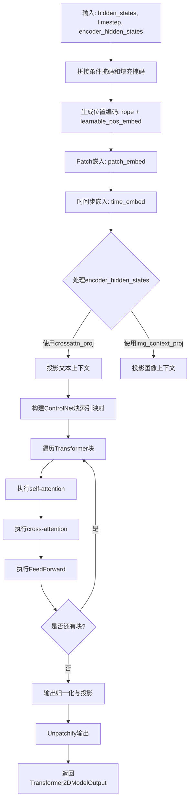
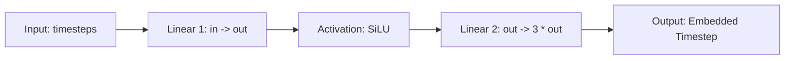
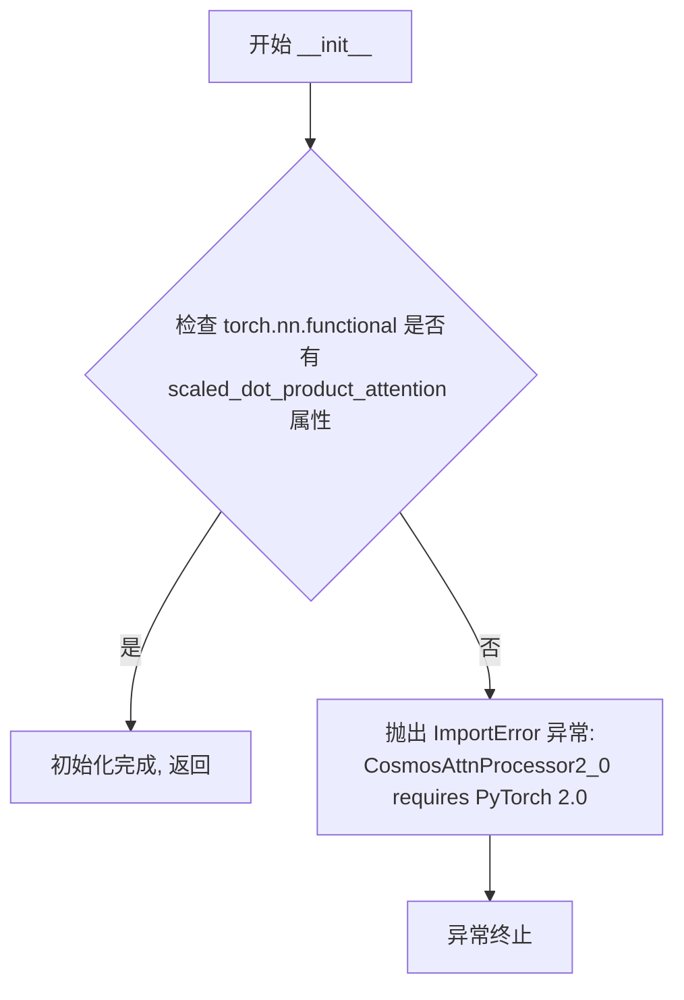
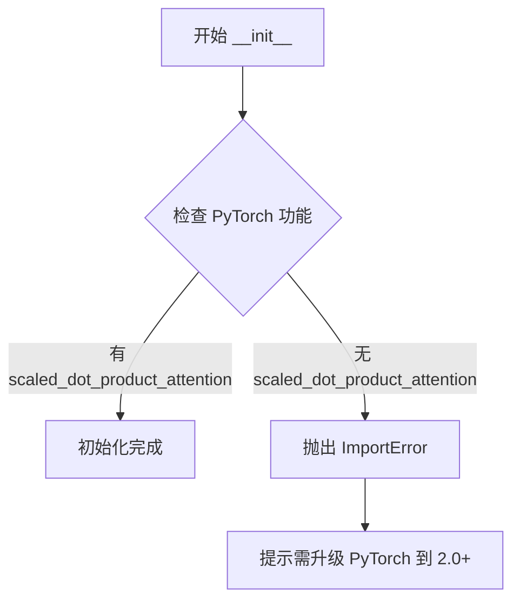
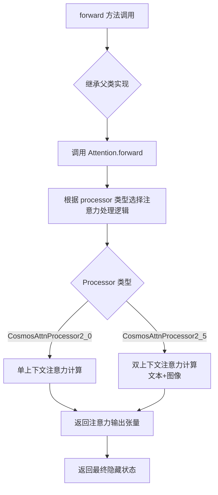
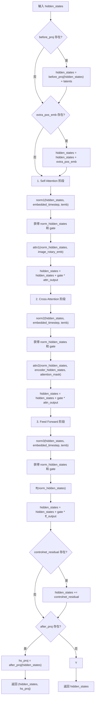

# `diffusers\src\diffusers\models\transformers\transformer_cosmos.py` 详细设计文档

该代码实现了一个用于视频生成的3D Transformer模型（Cosmos），支持视频帧的Patch嵌入、可学习位置编码和旋转位置编码（RoPE）、自适应层归一化（AdaLN）、跨模态注意力机制（文本和图像上下文），以及ControlNet控制功能，适用于文本到视频和图像到视频的生成任务。

## 整体流程



## 类结构

```
nn.Module (PyTorch基类)
├── CosmosPatchEmbed (Patch嵌入层)
├── CosmosTimestepEmbedding (时间步嵌入)
├── CosmosEmbedding (时间嵌入封装)
├── CosmosAdaLayerNorm (自适应层归一化)
├── CosmosAdaLayerNormZero (零初始化的AdaLN)
├── CosmosTransformerBlock (Transformer块)
├── CosmosRotaryPosEmbed (旋转位置编码)
├── CosmosLearnablePositionalEmbed (可学习位置编码)
├── CosmosTransformer3DModel (主模型)
│   ├── CosmosAttnProcessor2_0 (注意力处理器v2.0)
│   └── CosmosAttnProcessor2_5 (注意力处理器v2.5)
└── CosmosAttention (自定义注意力)
```

## 全局变量及字段


### `CosmosPatchEmbed.patch_size`
    
The patch size for temporal, height, and width dimensions

类型：`tuple[int, int, int]`
    


### `CosmosPatchEmbed.proj`
    
Linear projection layer to map patchified input to hidden dimension

类型：`nn.Linear`
    


### `CosmosTimestepEmbedding.linear_1`
    
First linear layer for timestep embedding

类型：`nn.Linear`
    


### `CosmosTimestepEmbedding.activation`
    
SiLU activation function for timestep embedding

类型：`nn.SiLU`
    


### `CosmosTimestepEmbedding.linear_2`
    
Second linear layer for timestep embedding expansion

类型：`nn.Linear`
    


### `CosmosEmbedding.time_proj`
    
Projects timesteps to embedding dimension

类型：`Timesteps`
    


### `CosmosEmbedding.t_embedder`
    
Embeds projected timesteps with MLP

类型：`CosmosTimestepEmbedding`
    


### `CosmosEmbedding.norm`
    
RMS normalization layer for embedded timesteps

类型：`RMSNorm`
    


### `CosmosAdaLayerNorm.embedding_dim`
    
The input feature dimension

类型：`int`
    


### `CosmosAdaLayerNorm.activation`
    
SiLU activation function for AdaLN

类型：`nn.SiLU`
    


### `CosmosAdaLayerNorm.norm`
    
Layer normalization without affine parameters

类型：`nn.LayerNorm`
    


### `CosmosAdaLayerNorm.linear_1`
    
First linear layer for AdaLN shift and scale computation

类型：`nn.Linear`
    


### `CosmosAdaLayerNorm.linear_2`
    
Second linear layer for AdaLN shift and scale computation

类型：`nn.Linear`
    


### `CosmosAdaLayerNormZero.norm`
    
Layer normalization without affine parameters

类型：`nn.LayerNorm`
    


### `CosmosAdaLayerNormZero.activation`
    
SiLU activation function for AdaLNZero

类型：`nn.SiLU`
    


### `CosmosAdaLayerNormZero.linear_1`
    
First linear layer for AdaLNZero (or identity if hidden_features is None)

类型：`nn.Linear | nn.Identity`
    


### `CosmosAdaLayerNormZero.linear_2`
    
Second linear layer for AdaLNZero shift, scale, and gate computation

类型：`nn.Linear`
    


### `CosmosAttention.q_img`
    
Linear layer for image query projections in cross-attention

类型：`nn.Linear`
    


### `CosmosAttention.k_img`
    
Linear layer for image key projections in cross-attention

类型：`nn.Linear`
    


### `CosmosAttention.v_img`
    
Linear layer for image value projections in cross-attention

类型：`nn.Linear`
    


### `CosmosAttention.q_img_norm`
    
RMS normalization for image queries

类型：`RMSNorm`
    


### `CosmosAttention.k_img_norm`
    
RMS normalization for image keys

类型：`RMSNorm`
    


### `CosmosTransformerBlock.norm1`
    
First normalization layer for self-attention with AdaLNZero

类型：`CosmosAdaLayerNormZero`
    


### `CosmosTransformerBlock.img_context`
    
Flag indicating whether image context cross-attention is enabled

类型：`bool`
    


### `CosmosTransformerBlock.attn1`
    
Self-attention layer with CosmosAttnProcessor2_0

类型：`Attention`
    


### `CosmosTransformerBlock.norm2`
    
Second normalization layer for cross-attention with AdaLNZero

类型：`CosmosAdaLayerNormZero`
    


### `CosmosTransformerBlock.attn2`
    
Cross-attention layer (CosmosAttention if img_context is True)

类型：`Attention | CosmosAttention`
    


### `CosmosTransformerBlock.norm3`
    
Third normalization layer for feed-forward with AdaLNZero

类型：`CosmosAdaLayerNormZero`
    


### `CosmosTransformerBlock.ff`
    
Feed-forward network with GELU activation

类型：`FeedForward`
    


### `CosmosTransformerBlock.before_proj`
    
Optional linear layer before projection for controlnet

类型：`nn.Linear | None`
    


### `CosmosTransformerBlock.after_proj`
    
Optional linear layer after projection for controlnet

类型：`nn.Linear | None`
    


### `CosmosRotaryPosEmbed.max_size`
    
Maximum size for temporal, height, and width dimensions after patching

类型：`list[int]`
    


### `CosmosRotaryPosEmbed.patch_size`
    
Patch size for temporal, height, and width dimensions

类型：`tuple[int, int, int]`
    


### `CosmosRotaryPosEmbed.base_fps`
    
Base frames per second for temporal frequency calculation

类型：`int`
    


### `CosmosRotaryPosEmbed.dim_h`
    
Hidden dimension for height in RoPE

类型：`int`
    


### `CosmosRotaryPosEmbed.dim_w`
    
Hidden dimension for width in RoPE

类型：`int`
    


### `CosmosRotaryPosEmbed.dim_t`
    
Hidden dimension for temporal in RoPE

类型：`int`
    


### `CosmosRotaryPosEmbed.h_ntk_factor`
    
NTK scaling factor for height dimension

类型：`float`
    


### `CosmosRotaryPosEmbed.w_ntk_factor`
    
NTK scaling factor for width dimension

类型：`float`
    


### `CosmosRotaryPosEmbed.t_ntk_factor`
    
NTK scaling factor for temporal dimension

类型：`float`
    


### `CosmosLearnablePositionalEmbed.max_size`
    
Maximum size for temporal, height, and width dimensions after patching

类型：`list[int]`
    


### `CosmosLearnablePositionalEmbed.patch_size`
    
Patch size for temporal, height, and width dimensions

类型：`tuple[int, int, int]`
    


### `CosmosLearnablePositionalEmbed.eps`
    
Small constant for numerical stability in normalization

类型：`float`
    


### `CosmosLearnablePositionalEmbed.pos_emb_t`
    
Learnable temporal positional embeddings

类型：`nn.Parameter`
    


### `CosmosLearnablePositionalEmbed.pos_emb_h`
    
Learnable height positional embeddings

类型：`nn.Parameter`
    


### `CosmosLearnablePositionalEmbed.pos_emb_w`
    
Learnable width positional embeddings

类型：`nn.Parameter`
    


### `CosmosTransformer3DModel.patch_embed`
    
Patch embedding layer to convert input to patch sequences

类型：`CosmosPatchEmbed`
    


### `CosmosTransformer3DModel.rope`
    
Rotary positional embedding layer for temporal-spatial positions

类型：`CosmosRotaryPosEmbed`
    


### `CosmosTransformer3DModel.learnable_pos_embed`
    
Optional learnable positional embeddings

类型：`CosmosLearnablePositionalEmbed | None`
    


### `CosmosTransformer3DModel.time_embed`
    
Time embedding layer for timestep encoding

类型：`CosmosEmbedding`
    


### `CosmosTransformer3DModel.transformer_blocks`
    
List of transformer blocks for processing

类型：`nn.ModuleList`
    


### `CosmosTransformer3DModel.norm_out`
    
Output normalization layer before final projection

类型：`CosmosAdaLayerNorm`
    


### `CosmosTransformer3DModel.proj_out`
    
Output projection layer to reconstruct patchified output

类型：`nn.Linear`
    


### `CosmosTransformer3DModel.crossattn_proj`
    
Optional cross-attention projection for text encoder hidden states

类型：`nn.Sequential | None`
    


### `CosmosTransformer3DModel.gradient_checkpointing`
    
Flag to enable gradient checkpointing for memory efficiency

类型：`bool`
    


### `CosmosTransformer3DModel.img_context_proj`
    
Optional projection layer for image context features

类型：`nn.Sequential | None`
    
    

## 全局函数及方法


### `CosmosPatchEmbed.__init__`

这是 `CosmosPatchEmbed` 类的构造函数，用于初始化视频/3D数据的补丁嵌入层。它接收输入输出通道数、补丁大小和偏置参数，创建线性投影层将高维补丁数据映射到低维潜在空间。

参数：

- `self`：`CosmosPatchEmbed`，类实例自身
- `in_channels`：`int`，输入数据的通道数（例如 RGB 视频为 3，加上时间维度等）
- `out_channels`：`int`，输出嵌入的通道数，决定投影后的潜在表示维度
- `patch_size`：`tuple[int, int, int]`，三维补丁大小元组，格式为 (时间, 高度, 宽度)，用于指定如何将输入数据划分为补丁
- `bias`：`bool`，是否在线性投影层中使用偏置项，默认为 `True`

返回值：`None`，该方法为构造函数，不返回任何值

#### 流程图

```mermaid
flowchart TD
    A[开始 __init__] --> B[调用 super().__init__ 初始化 nn.Module]
    B --> C[将 patch_size 参数保存到 self.patch_size]
    C --> D[计算输入维度: in_channels × patch_size[0] × patch_size[1] × patch_size[2]]
    D --> E[创建 nn.Linear 投影层: self.proj]
    E --> F[结束 __init__]
```

#### 带注释源码

```python
def __init__(
    self, in_channels: int, out_channels: int, patch_size: tuple[int, int, int], bias: bool = True
) -> None:
    """
    初始化 CosmosPatchEmbed 补丁嵌入层
    
    参数:
        in_channels: 输入数据的通道数
        out_channels: 输出嵌入向量的通道数
        patch_size: 三维补丁大小 (时间, 高度, 宽度)
        bias: 是否使用线性层的偏置项
    """
    # 调用父类 nn.Module 的初始化方法，注册所有子模块
    super().__init__()
    
    # 保存补丁大小到实例属性，供 forward 方法中使用
    self.patch_size = patch_size
    
    # 计算每个补丁的总维度：
    # 例如: in_channels=16, patch_size=(1,2,2) 
    # 则 flat_dim = 16 * 1 * 2 * 2 = 64
    flat_dim = in_channels * patch_size[0] * patch_size[1] * patch_size[2]
    
    # 创建线性投影层，将展平的补丁投影到目标维度
    # 输入: [batch, num_patches, flat_dim]
    # 输出: [batch, num_patches, out_channels]
    self.proj = nn.Linear(flat_dim, out_channels, bias=bias)
```


### `CosmosPatchEmbed.forward`

该方法实现3D视频Patch嵌入层，将输入的5D张量（批量大小、通道数、时间帧、高度、宽度）通过reshape、permute和线性投影操作转换为序列形式的patch token表示，用于后续Transformer处理。

参数：

- `hidden_states`：`torch.Tensor`，输入的5D张量，形状为 `[batch_size, num_channels, num_frames, height, width]`，表示批量视频数据

返回值：`torch.Tensor`，输出的3D张量，形状为 `[batch_size, seq_len, out_channels]`，其中 `seq_len = (num_frames // p_t) * (height // p_h) * (width // p_w)`，每个时间-空间位置被映射为一个token

#### 流程图

```mermaid
flowchart TD
    A[输入 hidden_states<br/>shape: [B, C, T, H, W]] --> B[解包形状信息<br/>batch_size, num_channels,<br/>num_frames, height, width]
    B --> C[解包 patch_size<br/>p_t, p_h, p_w]
    C --> D[Reshape 重塑张量<br/>[B, C, T//p_t, p_t, H//p_h, p_h, W//p_w, p_w]]
    D --> E[Permute 维度重排<br/>[B, T//p_t, H//p_w, W//p_w, C, p_t, p_h, p_w]]
    E --> F[Flatten 展平最后3维<br/>[B, T//p_t*H//p_h*W//p_w, C*p_t*p_h*p_w]]
    F --> G[Linear 线性投影<br/>self.proj]
    G --> H[输出 hidden_states<br/>shape: [B, seq_len, out_channels]]
```

#### 带注释源码

```python
def forward(self, hidden_states: torch.Tensor) -> torch.Tensor:
    """
    将5D视频张量转换为3D patch token序列
    
    参数:
        hidden_states: 输入张量，形状为 [batch_size, num_channels, num_frames, height, width]
        
    返回:
        投影后的patch序列，形状为 [batch_size, seq_len, out_channels]
        其中 seq_len = (num_frames // p_t) * (height // p_h) * (width // p_w)
    """
    
    # 1. 获取输入张量的维度信息
    # batch_size: 批量大小
    # num_channels: 通道数
    # num_frames: 时间帧数
    # height: 高度
    # width: 宽度
    batch_size, num_channels, num_frames, height, width = hidden_states.shape
    
    # 2. 解包patch尺寸
    # p_t: 时间维度的patch大小
    # p_h: 高度维度的patch大小
    # p_w: 宽度维度的patch大小
    p_t, p_h, p_w = self.patch_size
    
    # 3. Reshape重塑张量
    # 将 [B, C, T, H, W] 转换为 [B, C, T//p_t, p_t, H//p_h, p_h, W//p_w, p_w]
    # 这样可以将连续的p_t帧、p_h高度、p_w宽度区域划分为一个patch
    hidden_states = hidden_states.reshape(
        batch_size, num_channels, num_frames // p_t, p_t, height // p_h, p_h, width // p_w, p_w
    )
    
    # 4. Permute维度重排
    # 从 [B, C, T//p_t, p_t, H//p_h, p_h, W//p_w, p_w] 
    # 转换为 [B, T//p_t, H//p_h, W//p_w, C, p_t, p_h, p_w]
    # 将时间、空间维度前置，通道和patch内部维度后置
    hidden_states = hidden_states.permute(0, 2, 4, 6, 1, 3, 5, 7).flatten(4, 7)
    
    # 5. Flatten展平
    # 将最后的 C*p_t*p_h*p_w 维度展平为 C*p_t*p_h*p_w
    # 结果形状: [B, T//p_t*H//p_h*W//p_w, C*p_t*p_h*p_w]
    # 即 [batch_size, 序列长度(所有patch), 每个patch的通道数]
    hidden_states = hidden_states.permute(0, 2, 4, 6, 1, 3, 5, 7).flatten(4, 7)
    
    # 6. Linear线性投影
    # 使用nn.Linear将高维patch向量投影到指定的输出维度out_channels
    # 输入: [B, seq_len, C*p_t*p_h*p_w]
    # 输出: [B, seq_len, out_channels]
    hidden_states = self.proj(hidden_states)
    
    # 7. 返回结果
    return hidden_states
```


### `CosmosTimestepEmbedding.__init__`

该方法是 `CosmosTimestepEmbedding` 类的构造函数，用于初始化时间步嵌入层。它创建了两个线性变换层（`linear_1` 和 `linear_2`）以及一个 SiLU 激活函数，用于将输入的时间步特征映射到更高维度的嵌入空间。

参数：

- `in_features`：`int`，输入特征的维度，即时间步嵌入的输入维度
- `out_features`：`int`，输出特征的维度，即第一个线性层输出的维度（第二个线性层输出维度为 `3 * out_features`）

返回值：`None`，构造函数不返回任何值，仅初始化对象属性

#### 流程图

```mermaid
flowchart TD
    A[开始 __init__] --> B[调用 super().__init__ 初始化 nn.Module]
    C[创建 self.linear_1] --> D[nn.Linear in_features → out_features, bias=False]
    E[创建 self.activation] --> F[nn.SiLU 激活函数]
    G[创建 self.linear_2] --> H[nn.Linear out_features → 3*out_features, bias=False]
    B --> C
    D --> E
    F --> G
    H --> I[结束 __init__]
```

#### 带注释源码

```python
def __init__(self, in_features: int, out_features: int) -> None:
    """
    初始化 CosmosTimestepEmbedding 模块
    
    参数:
        in_features: 输入特征的维度
        out_features: 输出特征的维度
    """
    # 调用父类 nn.Module 的初始化方法
    super().__init__()
    
    # 第一个线性层：将输入特征映射到 out_features 维度
    # 不使用偏置，因为后续会使用 Layer Normalization
    self.linear_1 = nn.Linear(in_features, out_features, bias=False)
    
    # SiLU 激活函数（Sigmoid Linear Unit），即 x * sigmoid(x)
    # 也称为 Swish 激活函数
    self.activation = nn.SiLU()
    
    # 第二个线性层：将 out_features 维度映射到 3*out_features 维度
    # 输出维度是输入的3倍，用于后续的 AdaLN 条件归一化
    # 不使用偏置
    self.linear_2 = nn.Linear(out_features, 3 * out_features, bias=False)
```


### `CosmosTimestepEmbedding.forward`

该方法是时间步嵌入（Timestep Embedding）的核心前向传播逻辑。它接收原始的标量时间步，通过一个两层的全连接神经网络（包含 SiLU 激活函数）将其映射到一个高维特征空间。该输出维度通常设为原始维度的 3 倍，以便为后续的自适应归一化层（AdaLN）提供用于计算 shift（偏移）、scale（缩放）和 gate（门控）的参数。

#### 参数

- `timesteps`：`torch.Tensor`，输入的时间步张量，通常包含用于表示扩散过程进度的标量值。

#### 返回值

`torch.Tensor`，经过处理后的时间步嵌入向量，其形状的最后一维大小为 `out_features * 3`。

#### 流程图



#### 带注释源码

```python
def forward(self, timesteps: torch.Tensor) -> torch.Tensor:
    # 步骤 1: 第一个线性层。
    # 将输入特征从 in_features 维度映射到 out_features 维度。
    # 这里不使用偏置 (bias=False)。
    emb = self.linear_1(timesteps)

    # 步骤 2: 应用激活函数。
    # 使用 SiLU (Swish) 激活函数，增加非线性变换。
    emb = self.activation(emb)

    # 步骤 3: 第二个线性层。
    # 将特征维度从 out_features 扩展到 3 * out_features。
    # 这个扩展后的维度通常用于分解为 Shift, Scale 和 Gate 三个参数，
    # 供给后续的 Adaptive Layer Norm 使用。
    emb = self.linear_2(emb)

    return emb
```


### `CosmosEmbedding.__init__`

这是 `CosmosEmbedding` 类的初始化方法，负责构建时间嵌入模块的各个组件，包括时间投影层、时间嵌入器和归一化层，用于处理扩散模型中的时间步嵌入信息。

参数：

- `embedding_dim`：`int`，嵌入维度，用于时间投影层和归一化层的输入输出维度
- `condition_dim`：`int`，条件维度，用于时间嵌入器中间层的输出维度

返回值：`None`，该方法仅初始化对象状态，不返回任何值

#### 流程图

```mermaid
flowchart TD
    A[开始 __init__] --> B[调用 super().__init__ 初始化 nn.Module]
    B --> C[创建 self.time_proj: Timesteps]
    C --> D[创建 self.t_embedder: CosmosTimestepEmbedding]
    D --> E[创建 self.norm: RMSNorm]
    E --> F[结束 __init__]
```

#### 带注释源码

```python
def __init__(self, embedding_dim: int, condition_dim: int) -> None:
    """
    初始化 CosmosEmbedding 模块
    
    参数:
        embedding_dim: 嵌入维度，用于时间投影和归一化
        condition_dim: 条件维度，用于时间嵌入器的输出维度
    """
    # 调用父类 nn.Module 的初始化方法
    super().__init__()
    
    # 时间投影层：将离散的时间步映射到连续嵌入空间
    # flip_sin_to_cos=True 表示使用 sin-cos 位置编码的变体
    # downscale_freq_shift=0.0 表示不进行频率位移
    self.time_proj = Timesteps(embedding_dim, flip_sin_to_cos=True, downscale_freq_shift=0.0)
    
    # 时间嵌入器：将投影后的时间嵌入转换为更高维度的条件向量
    # 采用两层的 MLP 结构，先扩展到 3 倍维度
    self.t_embedder = CosmosTimestepEmbedding(embedding_dim, condition_dim)
    
    # RMSNorm 归一化层：对时间嵌入进行归一化处理
    # eps=1e-6 防止除零错误
    # elementwise_affine=True 启用可学习的仿射参数
    self.norm = RMSNorm(embedding_dim, eps=1e-6, elementwise_affine=True)
```


### `CosmosEmbedding.forward`

该方法将时间步（timestep）转换为条件嵌入向量，通过时间投影器、TimestepEmbedding 和 RMSNorm 生成用于条件引导的时间嵌入向量和归一化的时间编码。

参数：

- `hidden_states`：`torch.Tensor`，输入的隐藏状态张量，用于确定输出张量的设备和数据类型
- `timestep`：`torch.LongTensor`，时间步张量，表示扩散过程中的时间步信息

返回值：`tuple[torch.Tensor, torch.Tensor]`，返回一个元组，包含：
- `temb`：`torch.Tensor`，通过时间嵌入器处理后的条件嵌入向量，维度为 `[batch_size, 3 * condition_dim]`
- `embedded_timestep`：`torch.Tensor`，经过 RMSNorm 归一化的时间投影向量，用于后续的 Adaptive LayerNorm

#### 流程图

```mermaid
flowchart TD
    A[输入: hidden_states, timestep] --> B[time_proj(timestep)]
    B --> C[.type_as(hidden_states)]
    C --> D[t_embedder(timesteps_proj)]
    D --> E[norm(timesteps_proj)]
    D --> F[temb: 条件嵌入]
    E --> G[embedded_timestep: 归一化时间嵌入]
    F --> H[返回: temb, embedded_timestep]
    G --> H
```

#### 带注释源码

```python
def forward(self, hidden_states: torch.Tensor, timestep: torch.LongTensor) -> torch.Tensor:
    """
    前向传播：将时间步转换为条件嵌入向量
    
    参数:
        hidden_states: 输入的隐藏状态张量，用于确定输出设备类型
        timestep: 时间步张量，形状为 [batch_size]
    
    返回:
        tuple: (temb, embedded_timestep)
            - temb: 条件嵌入向量，用于 AdaLN 条件注入
            - embedded_timestep: 归一化后的时间嵌入
    """
    # 1. 时间投影：将离散的时间步转换为连续嵌入
    # 使用余弦位置编码将时间步映射到高维空间
    timesteps_proj = self.time_proj(timestep).type_as(hidden_states)
    
    # 2. 条件嵌入：通过两层全连接网络将时间嵌入转换为条件向量
    # 输出维度为 3 * condition_dim，用于生成 shift, scale, gate 三个向量
    temb = self.t_embedder(timesteps_proj)
    
    # 3. 归一化：对时间投影结果进行 RMSNorm 归一化
    embedded_timestep = self.norm(timesteps_proj)
    
    # 返回：
    # - temb: 用于 AdaLN 条件的注入，提供 shift/scale/gate 参数
    # - embedded_timestep: 用于残差连接或特征增强
    return temb, embedded_timestep
```


### `CosmosAdaLayerNorm.__init__`

该方法是 `CosmosAdaLayerNorm` 类的初始化方法，用于构建一个自适应层归一化（Adaptive Layer Normalization）模块，包含激活函数、层归一化和两个线性变换层，用于根据时间步嵌入调整归一化参数。

参数：

- `in_features`：`int`，输入特征的维度
- `hidden_features`：`int`，隐藏层特征的维度（用于第一个线性层的输出维度）

返回值：`None`，构造函数无返回值

#### 流程图

```mermaid
flowchart TD
    A[开始 __init__] --> B[调用 super().__init__ 初始化父类]
    B --> C[设置 self.embedding_dim = in_features]
    C --> D[创建 self.activation = nn.SiLU 激活层]
    D --> E[创建 self.norm = nn.LayerNorm 层归一化]
    E --> F[创建 self.linear_1 = nn.Linear 线性层]
    F --> G[创建 self.linear_2 = nn.Linear 线性层]
    G --> H[结束 __init__]
```

#### 带注释源码

```python
def __init__(self, in_features: int, hidden_features: int) -> None:
    """
    初始化 CosmosAdaLayerNorm 模块
    
    参数:
        in_features: 输入特征的维度
        hidden_features: 隐藏层特征的维度，用于第一个线性变换
    """
    # 调用父类 nn.Module 的初始化方法
    super().__init__()
    
    # 保存输入特征的维度作为嵌入维度
    self.embedding_dim = in_features
    
    # 创建 SiLU 激活函数（Swish 激活函数的变体）
    self.activation = nn.SiLU()
    
    # 创建 LayerNorm 层，不使用仿射变换，epsilon 设为 1e-6
    self.norm = nn.LayerNorm(in_features, elementwise_affine=False, eps=1e-6)
    
    # 第一个线性层：从 in_features 映射到 hidden_features，不使用偏置
    self.linear_1 = nn.Linear(in_features, hidden_features, bias=False)
    
    # 第二个线性层：从 hidden_features 映射到 2 * in_features，输出分为 shift 和 scale 两部分
    self.linear_2 = nn.Linear(hidden_features, 2 * in_features, bias=False)
```


### `CosmosAdaLayerNorm.forward`

该方法实现了自适应层归一化（Adaptive Layer Normalization），通过时间嵌入（embedded_timestep）和可选的额外时间嵌入（temb）来动态计算仿射变换参数（shift 和 scale），并将其应用于输入的隐藏状态，实现条件化的特征调整。

**参数：**

- `hidden_states`：`torch.Tensor`，输入的隐藏状态张量，形状为 `[batch_size, *seq_len, embedding_dim]`
- `embedded_timestep`：`torch.Tensor`，经过时间投影和归一化后的时间嵌入，形状为 `[batch_size, dim]` 或 `[batch_size, seq_len, dim]`
- `temb`：`torch.Tensor | None`，可选的额外时间嵌入向量，形状为 `[..., 2 * embedding_dim]`，用于提供额外的条件信息

**返回值：** `torch.Tensor`，经过自适应层归一化处理后的隐藏状态，形状与输入 `hidden_states` 相同

#### 流程图

```mermaid
flowchart TD
    A[输入 hidden_states, embedded_timestep, temb] --> B{embedded_timestep是否为空}
    B -->|否| C[activation = SiLU&#40;embedded_timestep&#41;]
    B -->|是| H[返回原始hidden_states]
    C --> D[linear_1映射到hidden_features维度]
    D --> E[linear_2映射到2*embedding_dim维度]
    E --> F{temb是否不为None}
    F -->|是| G[embedded_timestep += temb[..., : 2*embedding_dim]]
    F -->|否| I[chunk分为shift和scale]
    G --> I
    I --> J[normLayerNorm&#40;hidden_states&#41;]
    J --> K{embedded_timestep.ndim == 2?}
    K -->|是| L[shift, scale unsqueeze&#40;1&#41;]
    K -->|否| M[hidden_states = hidden_states * &#40;1 + scale&#41; + shift]
    L --> M
    M --> N[输出处理后的hidden_states]
```

#### 带注释源码

```python
def forward(
    self, hidden_states: torch.Tensor, embedded_timestep: torch.Tensor, temb: torch.Tensor | None = None
) -> torch.Tensor:
    # 步骤1: 对embedded_timestep应用SiLU激活函数
    # SiLU (Sigmoid Linear Unit): x * sigmoid(x)，平滑且非单调
    embedded_timestep = self.activation(embedded_timestep)
    
    # 步骤2: 通过第一个线性层将维度从embedding_dim扩展到hidden_features
    # 这一步允许模型学习更丰富的中间表示
    embedded_timestep = self.linear_1(embedded_timestep)
    
    # 步骤3: 通过第二个线性层将维度从hidden_features扩展到2*embedding_dim
    # 输出的前一半用于shift（平移），后一半用于scale（缩放）
    embedded_timestep = self.linear_2(embedded_timestep)

    # 步骤4: 如果提供了额外的temb（时间嵌入），则将其加到embedded_timestep上
    # temb可能来自其他时间处理分支，这里取前2*embedding_dim维进行融合
    if temb is not None:
        embedded_timestep = embedded_timestep + temb[..., : 2 * self.embedding_dim]

    # 步骤5: 将embedded_timestep沿最后一维分成两半
    # 前半部分为shift（用于平移），后半部分为scale（用于缩放）
    shift, scale = embedded_timestep.chunk(2, dim=-1)
    
    # 步骤6: 对hidden_states应用标准的LayerNorm（不包含可学习参数）
    # 使用元素级归一化，将特征分布标准化
    hidden_states = self.norm(hidden_states)

    # 步骤7: 处理维度匹配问题
    # 如果embedded_timestep是2D的（batch_size, dim），则需要扩展维度以匹配hidden_states
    if embedded_timestep.ndim == 2:
        # 对shift和scale在序列维度上添加维度，便于广播
        shift, scale = (x.unsqueeze(1) for x in (shift, scale))

    # 步骤8: 应用自适应仿射变换
    # scale + 1 使得初始值为1（类似残差连接的效果）
    # hidden_states = (hidden_states * (1 + scale)) + shift
    hidden_states = hidden_states * (1 + scale) + shift
    
    return hidden_states
```


### `CosmosAdaLayerNormZero.__init__`

该方法是 `CosmosAdaLayerNormZero` 类的构造函数，用于初始化一个结合了自适应层归一化（AdaLN）与零中心门控机制（Zero Gate）的神经网络模块。构造函数首先调用父类初始化器，然后根据 `hidden_features` 参数配置特征投影层：如果提供了隐藏维度，则创建一个两层的线性变换（带 SiLU 激活）用于提取调制参数；否则使用恒等映射。最后，它初始化一个输出维度为输入特征 3 倍的线性层，用于分别生成 Shift、Scale 和 Gate 参数。

参数：

-  `in_features`：`int`，输入特征的维度。
-  `hidden_features`：`int | None`，隐藏层的特征维度，用于第一层线性投影。如果为 `None`，则第一层使用恒等映射。

返回值：`None`，构造函数不返回值。

#### 流程图

```mermaid
graph TD
    A([Start __init__]) --> B[super().__init__]
    B --> C[Create self.norm: nn.LayerNorm]
    C --> D[Create self.activation: nn.SiLU]
    D --> E{hidden_features is None?}
    E -- Yes --> F[Set self.linear_1 = nn.Identity]
    E -- No --> G[Set self.linear_1 = nn.Linear]
    F --> H[Create self.linear_2: nn.Linear]
    G --> H
    H --> I([End])
```

#### 带注释源码

```python
def __init__(self, in_features: int, hidden_features: int | None = None) -> None:
    # 调用父类 nn.Module 的初始化方法
    super().__init__()

    # 1. 初始化 LayerNorm 层
    # 使用 elementwise_affine=False 表示不使用可学习的仿射参数（仅归一化）
    self.norm = nn.LayerNorm(in_features, elementwise_affine=False, eps=1e-6)
    
    # 2. 初始化激活函数 SiLU (Swish)
    self.activation = nn.SiLU()

    # 3. 条件分支：根据 hidden_features 决定第一层线性变换
    # 如果未提供隐藏特征维度，则使用恒等映射 (Identity)
    if hidden_features is None:
        self.linear_1 = nn.Identity()
    else:
        # 否则，使用线性层将特征从 in_features 映射到 hidden_features
        self.linear_1 = nn.Linear(in_features, hidden_features, bias=False)

    # 4. 初始化第二层线性变换
    # 将 hidden_features (或传递过来的维度) 映射到 3 倍的 in_features
    # 这三个分组将分别用于 shift (平移), scale (缩放) 和 gate (门控)
    self.linear_2 = nn.Linear(hidden_features, 3 * in_features, bias=False)
```


### `CosmosAdaLayerNormZero.forward`

该方法是自适应层归一化（AdaLN）的零初始化变体，通过可学习的仿射变换和门控机制实现时间步条件化的特征调制。

参数：

- `hidden_states`：`torch.Tensor`，输入的隐藏状态张量，形状为 `[batch, ..., dim]`
- `embedded_timestep`：`torch.Tensor`，经过时间嵌入层处理后的时间步嵌入，形状为 `[batch, dim]` 或 `[..., dim]`
- `temb`：`torch.Tensor | None`，可选的额外时间嵌入向量，用于增强时间条件的表达

返回值：`tuple[torch.Tensor, torch.Tensor]`，包含经过 AdaLN 调制的隐藏状态和门控向量 gate

#### 流程图

```mermaid
flowchart TD
    A[输入 hidden_states, embedded_timestep, temb] --> B[SiLU激活 embedded_timestep]
    B --> C[linear_1 线性变换]
    C --> D[linear_2 线性变换输出 3*dim]
    D --> E{检查 temb 是否存在}
    E -->|是| F[temb 拼接到 embedded_timestep]
    E -->|否| G[跳过拼接]
    F --> H[chunk 分成 shift, scale, gate 三份]
    G --> H
    H --> I[LayerNorm 归一化 hidden_states]
    I --> J{embedded_timestep.ndim == 2?}
    J -->|是| K[unsqueeze 扩展维度]
    J -->|否| L[保持原维度]
    K --> M[应用 shift 和 scale: hidden_states * (1 + scale) + shift]
    L --> M
    M --> N[返回 hidden_states 和 gate]
```

#### 带注释源码

```python
def forward(
    self,
    hidden_states: torch.Tensor,
    embedded_timestep: torch.Tensor,
    temb: torch.Tensor | None = None,
) -> torch.Tensor:
    # 1. 对时间嵌入进行 SiLU 激活，引入非线性变换
    embedded_timestep = self.activation(embedded_timestep)
    
    # 2. 第一次线性变换：如果 hidden_features 为 None，则使用恒等映射；否则投影到隐藏维度
    embedded_timestep = self.linear_1(embedded_timestep)
    
    # 3. 第二次线性变换，将特征维度扩展为输入的 3 倍（用于生成 shift, scale, gate）
    embedded_timestep = self.linear_2(embedded_timestep)

    # 4. 如果提供了额外的 temb，则将其加到 embedded_timestep 上进行条件增强
    if temb is not None:
        embedded_timestep = embedded_timestep + temb

    # 5. 将变换后的嵌入沿着最后一维均匀分割为三份：shift, scale, gate
    shift, scale, gate = embedded_timestep.chunk(3, dim=-1)
    
    # 6. 对 hidden_states 进行 LayerNorm（不含可学习仿射参数）
    hidden_states = self.norm(hidden_states)

    # 7. 如果 embedded_timestep 是二维的（batch, dim），则对 shift, scale, gate 进行维度扩展
    #    以适配 hidden_states 的多维结构（如 sequence length 维度）
    if embedded_timestep.ndim == 2:
        shift, scale, gate = (x.unsqueeze(1) for x in (shift, scale, gate))

    # 8. 应用 AdaLN 变换：hidden_states * (1 + scale) + shift
    #    乘以 (1 + scale) 保留原始信息同时进行缩放，加上 shift 进行平移
    hidden_states = hidden_states * (1 + scale) + shift
    
    # 9. 返回调制后的 hidden_states 和用于残差门控的 gate
    return hidden_states, gate
```


### `CosmosAttnProcessor2_0.__init__`

该方法是 `CosmosAttnProcessor2_0` 类的构造函数，用于初始化注意力处理器实例，并在初始化时检查 PyTorch 版本是否支持 `scaled_dot_product_attention` 函数（PyTorch 2.0+ 特性）。

参数：

- 无参数（`self` 为实例自身，非显式参数）

返回值：无（`__init__` 方法不返回值）

#### 流程图



#### 带注释源码

```python
class CosmosAttnProcessor2_0:
    def __init__(self):
        """
        初始化 CosmosAttnProcessor2_0 实例。
        
        在初始化时检查当前 PyTorch 版本是否支持 scaled_dot_product_attention 函数。
        该函数是 PyTorch 2.0 引入的高效注意力计算实现。
        如果不支持，将抛出 ImportError 异常提示用户升级 PyTorch。
        """
        # 检查 PyTorch 是否支持 scaled_dot_product_attention
        # 这是 PyTorch 2.0 引入的函数，用于高效计算注意力
        if not hasattr(torch.nn.functional, "scaled_dot_product_attention"):
            # 如果不支持，抛出导入错误并提示用户升级 PyTorch
            raise ImportError("CosmosAttnProcessor2_0 requires PyTorch 2.0. To use it, please upgrade PyTorch to 2.0.")
```


### `CosmosAttnProcessor2_0.__call__`

这是 Cosmos 模型的注意力处理器实现，封装了完整的注意力计算流程，包括 QKV 投影、QK 归一化、旋转位置编码（RoPE）应用、分组查询注意力（GQA）处理以及最终的输出投影。该处理器专为 CosmosTransformer3DModel 设计，支持自注意力和交叉注意力模式。

参数：

- `self`：隐式参数，当前处理器实例
- `attn`：`Attention`，注意力模块，包含 Q/K/V 投影层和归一化层
- `hidden_states`：`torch.Tensor`，输入的隐藏状态张量，形状为 `[batch_size, seq_len, hidden_dim]`
- `encoder_hidden_states`：`torch.Tensor | None`，编码器隐藏状态，用于交叉注意力；如果为 `None`，则使用 `hidden_states` 进行自注意力
- `attention_mask`：`torch.Tensor | None`，注意力掩码，用于屏蔽特定位置的注意力权重
- `image_rotary_emb`：`torch.Tensor | None`，图像旋转位置嵌入，用于对 Query 和 Key 应用旋转位置编码

返回值：`torch.Tensor`，经过注意力计算和输出投影后的隐藏状态

#### 流程图

```mermaid
flowchart TD
    A[开始 __call__] --> B{encoder_hidden_states<br/>是否为 None?}
    B -->|是| C[encoder_hidden_states = hidden_states]
    B -->|否| D[保持 encoder_hidden_states 不变]
    C --> E[QKV 投影: query = attn.to_q(hidden_states)<br/>key = attn.to_k(encoder_hidden_states)<br/>value = attn.to_v(encoder_hidden_states)]
    D --> E
    E --> F[reshape 和 transpose<br/>query/key/value 维度重组<br/>从 [B, N, C] -> [B, heads, N, head_dim]]
    F --> G[QK 归一化: query = attn.norm_q(query)<br/>key = attn.norm_k(key)]
    G --> H{image_rotary_emb<br/>是否为 None?}
    H -->|否| I[应用 RoPE: query = apply_rotary_emb(query, image_rotary_emb)<br/>key = apply_rotary_emb(key, image_rotary_emb)]
    H -->|是| J[跳过 RoPE]
    I --> K[准备 GQA: 计算 query_idx, key_idx, value_idx<br/>key = key.repeat_interleave(...)<br/>value = value.repeat_interleave(...)]
    J --> K
    K --> L[注意力计算: hidden_states = dispatch_attention_fn(query, key, value, attn_mask)]
    L --> M[flatten 和类型转换: hidden_states.flatten(2, 3).type_as(query)]
    M --> N[输出投影: hidden_states = attn.to_out[0](hidden_states)<br/>hidden_states = attn.to_out[1](hidden_states)]
    N --> O[返回 hidden_states]
```

#### 带注释源码

```python
def __call__(
    self,
    attn: Attention,
    hidden_states: torch.Tensor,
    encoder_hidden_states: torch.Tensor | None = None,
    attention_mask: torch.Tensor | None = None,
    image_rotary_emb: torch.Tensor | None = None,
) -> torch.Tensor:
    # 1. QKV 投影
    # 如果没有提供 encoder_hidden_states，则进行自注意力计算
    if encoder_hidden_states is None:
        encoder_hidden_states = hidden_states

    # 使用注意力模块的 to_q/to_k/to_v 层进行线性投影
    # 将 hidden_states 投影为 Query, Key, Value
    query = attn.to_q(hidden_states)
    key = attn.to_k(encoder_hidden_states)
    value = attn.to_v(encoder_hidden_states)

    # 2. 维度重塑以适配多头注意力
    # 从 [batch_size, seq_len, hidden_dim] 
    # 转换为 [batch_size, num_heads, seq_len, head_dim]
    query = query.unflatten(2, (attn.heads, -1)).transpose(1, 2)
    key = key.unflatten(2, (attn.heads, -1)).transpose(1, 2)
    value = value.unflatten(2, (attn.heads, -1)).transpose(1, 2)

    # 3. QK 归一化
    # 对 Query 和 Key 分别应用归一化操作（可能是 RMSNorm 或 LayerNorm）
    # 这是为了稳定训练并提高注意力计算的数值稳定性
    query = attn.norm_q(query)
    key = attn.norm_k(key)

    # 4. 应用旋转位置编码 (RoPE)
    # 如果提供了 image_rotary_emb，则对 query 和 key 应用旋转位置嵌入
    # 这样可以让模型感知序列中元素的位置信息
    if image_rotary_emb is not None:
        from ..embeddings import apply_rotary_emb

        # use_real=True 表示使用旋转嵌入的实数形式
        # use_real_unbind_dim=-2 表示在倒数第二个维度上解绑
        query = apply_rotary_emb(query, image_rotary_emb, use_real=True, use_real_unbind_dim=-2)
        key = apply_rotary_emb(key, image_rotary_emb, use_real=True, use_real_unbind_dim=-2)

    # 5. 准备分组查询注意力 (GQA)
    # GQA 允许 key 和 value 使用较少的头数来减少计算量
    # 通过 repeat_interleave 将 key/value 扩展到与 query 相同数量的头
    
    # 处理 ONNX 导出场景：需要将尺寸转换为 tensor
    if torch.onnx.is_in_onnx_export():
        query_idx = torch.tensor(query.size(3), device=query.device)
        key_idx = torch.tensor(key.size(3), device=key.device)
        value_idx = torch.tensor(value.size(3), device=query.device)
    else:
        query_idx = query.size(3)  # query 的序列长度
        key_idx = key.size(3)       # key 的序列长度
        value_idx = value.size(3)   # value 的序列长度
    
    # 重复 key 和 value 以匹配 query 的头数
    # query_idx // key_idx 表示需要重复的次数
    key = key.repeat_interleave(query_idx // key_idx, dim=3)
    value = value.repeat_interleave(query_idx // value_idx, dim=3)

    # 6. 注意力计算
    # 使用 dispatch_attention_fn 进行实际的注意力计算
    # 这是 PyTorch 的 scaled_dot_product_attention 的封装
    # 注意：输入需要 transpose 回 [batch_size, seq_len, num_heads, head_dim] 格式
    hidden_states = dispatch_attention_fn(
        query.transpose(1, 2),  # [B, N, H, D] -> [B, H, N, D]
        key.transpose(1, 2),
        value.transpose(1, 2),
        attn_mask=attention_mask,
        dropout_p=0.0,  # 推理时不 dropout
        is_causal=False,  # 非因果注意力（可双向）
    )
    
    # 7. 输出处理
    # 将注意力输出从 [B, H, N, D] 转换回 [B, N, H*D]
    hidden_states = hidden_states.flatten(2, 3).type_as(query)
    
    # 8. 输出投影
    # 应用最终的线性层和 Dropout（如果有）
    hidden_states = attn.to_out[0](hidden_states)  # 线性投影
    hidden_states = attn.to_out[1](hidden_states)   # Dropout 或其他输出层

    return hidden_states
```


### `CosmosAttnProcessor2_5.__init__`

初始化 CosmosAttnProcessor2_5 注意力处理器，用于支持双流（文本+图像）交叉注意力机制。该构造函数检查 PyTorch 版本是否支持 `scaled_dot_product_attention` 函数，若不支持则抛出 ImportError。

参数：

- 无显式参数（仅包含隐式 `self` 参数）

返回值：`None`，无返回值（构造函数）

#### 流程图



#### 带注释源码

```python
def __init__(self):
    # 检查 PyTorch 的 nn.functional 模块是否包含 scaled_dot_product_attention 函数
    # 这是 PyTorch 2.0 引入的高效注意力机制实现
    # 如果不存在则表示 PyTorch 版本过低，无法使用该处理器
    if not hasattr(torch.nn.functional, "scaled_dot_product_attention"):
        raise ImportError(
            "CosmosAttnProcessor2_5 requires PyTorch 2.0. Please upgrade PyTorch to 2.0 or newer."
        )
```


### `CosmosAttnProcessor2_5.__call__`

这是 Cosmos 模型中的一种高级注意力处理器，支持双流注意力机制，同时处理文本上下文和图像上下文两种模态的注意力计算。

参数：

- `attn`：`Attention`，Cosmos 注意力模块实例，用于执行 QKV 投影和输出投影
- `hidden_states`：`torch.Tensor`，输入的隐藏状态张量，形状为 `[batch, seq_len, dim]`
- `encoder_hidden_states`：`tuple[torch.Tensor, torch.Tensor]`，编码器隐藏状态元组，包含 (text_context, img_context)
- `attention_mask`：`tuple[torch.Tensor, torch.Tensor]`，注意力掩码元组，包含 (text_mask, img_mask)
- `image_rotary_emb`：`torch.Tensor | None`，图像的旋转位置嵌入（RoPE），用于位置编码

返回值：`torch.Tensor`，经过双流注意力处理后的输出隐藏状态

#### 流程图

```mermaid
flowchart TD
    A[开始 __call__] --> B{验证 encoder_hidden_states 是 tuple?}
    B -->|否| C[抛出 ValueError]
    B -->|是| D[解包: text_context, img_context]
    D --> E[解包 attention_mask: text_mask, img_mask]
    E --> F{text_context is None?}
    F -->|是| G[text_context = hidden_states]
    F -->|否| H[继续]
    G --> H
    H --> I[QKV 投影: to_q, to_k, to_v]
    I --> J[Reshape: unflatten + transpose for heads]
    J --> K[QK 归一化: norm_q, norm_k]
    K --> L{image_rotary_emb is not None?}
    L -->|是| M[应用 RoPE 到 query 和 key]
    L -->|否| N[继续]
    M --> N
    N --> O[准备 GQA: repeat_interleave]
    O --> P[计算文本注意力: dispatch_attention_fn]
    P --> Q[Flatten + 类型转换]
    Q --> R{img_context is not None?}
    R -->|是| S[计算图像 QKV: q_img, k_img, v_img]
    R -->|否| V[跳过图像注意力]
    S --> T[Reshape 图像 QKV]
    T --> U[图像 QK 归一化]
    U --> W[准备图像 GQA]
    W --> X[计算图像注意力]
    X --> Y[合并: attn_out + img_out]
    Y --> Z
    V --> Z
    Z --> AA[输出投影: to_out[0], to_out[1]]
    AA --> BB[返回 hidden_states]
```

#### 带注释源码

```python
def __call__(
    self,
    attn: Attention,
    hidden_states: torch.Tensor,
    encoder_hidden_states: tuple[torch.Tensor, torch.Tensor],
    attention_mask: tuple[torch.Tensor, torch.Tensor],
    image_rotary_emb=None,
) -> torch.Tensor:
    # 1. 验证输入格式：encoder_hidden_states 必须为元组 (text_context, img_context)
    if not isinstance(encoder_hidden_states, tuple):
        raise ValueError("Expected encoder_hidden_states as (text_context, img_context) tuple.")

    # 2. 解包上下文和掩码
    text_context, img_context = encoder_hidden_states if encoder_hidden_states else (None, None)
    text_mask, img_mask = attention_mask if attention_mask else (None, None)

    # 3. 如果文本上下文为空，则使用 hidden_states 作为自注意力
    if text_context is None:
        text_context = hidden_states

    # 4. 从文本上下文计算 QKV
    query = attn.to_q(hidden_states)
    key = attn.to_k(text_context)
    value = attn.to_v(text_context)

    # 5. 重塑为多头注意力格式: [B, N, (H*D)] -> [B, N, H, D] -> [B, H, N, D]
    query = query.unflatten(2, (attn.heads, -1)).transpose(1, 2)
    key = key.unflatten(2, (attn.heads, -1)).transpose(1, 2)
    value = value.unflatten(2, (attn.heads, -1)).transpose(1, 2)

    # 6. QK 归一化
    query = attn.norm_q(query)
    key = attn.norm_k(key)

    # 7. 应用旋转位置嵌入 (RoPE)
    if image_rotary_emb is not None:
        from ..embeddings import apply_rotary_emb

        query = apply_rotary_emb(query, image_rotary_emb, use_real=True, use_real_unbind_dim=-2)
        key = apply_rotary_emb(key, image_rotary_emb, use_real=True, use_real_unbind_dim=-2)

    # 8. 准备 GQA (分组查询注意力)：扩展 key/value 以匹配 query 数量
    if torch.onnx.is_in_onnx_export():
        query_idx = torch.tensor(query.size(3), device=query.device)
        key_idx = torch.tensor(key.size(3), device=query.device)
        value_idx = torch.tensor(value.size(3), device=query.device)
    else:
        query_idx = query.size(3)
        key_idx = key.size(3)
        value_idx = value.size(3)
    key = key.repeat_interleave(query_idx // key_idx, dim=3)
    value = value.repeat_interleave(query_idx // value_idx, dim=3)

    # 9. 计算文本上下文注意力
    attn_out = dispatch_attention_fn(
        query.transpose(1, 2),
        key.transpose(1, 2),
        value.transpose(1, 2),
        attn_mask=text_mask,
        dropout_p=0.0,
        is_causal=False,
    )
    attn_out = attn_out.flatten(2, 3).type_as(query)

    # 10. 如果存在图像上下文，则计算图像注意力
    if img_context is not None:
        # 10.1 图像专用的 QKV 投影
        q_img = attn.q_img(hidden_states)
        k_img = attn.k_img(img_context)
        v_img = attn.v_img(img_context)

        batch_size = hidden_states.shape[0]
        dim_head = attn.out_dim // attn.heads

        # 10.2 重塑为多头格式
        q_img = q_img.view(batch_size, -1, attn.heads, dim_head).transpose(1, 2)
        k_img = k_img.view(batch_size, -1, attn.heads, dim_head).transpose(1, 2)
        v_img = v_img.view(batch_size, -1, attn.heads, dim_head).transpose(1, 2)

        # 10.3 图像 QK 归一化
        q_img = attn.q_img_norm(q_img)
        k_img = attn.k_img_norm(k_img)

        # 10.4 准备图像 GQA
        q_img_idx = q_img.size(3)
        k_img_idx = k_img.size(3)
        v_img_idx = v_img.size(3)
        k_img = k_img.repeat_interleave(q_img_idx // k_img_idx, dim=3)
        v_img = v_img.repeat_interleave(q_img_idx // v_img_idx, dim=3)

        # 10.5 计算图像注意力
        img_out = dispatch_attention_fn(
            q_img.transpose(1, 2),
            k_img.transpose(1, 2),
            v_img.transpose(1, 2),
            attn_mask=img_mask,
            dropout_p=0.0,
            is_causal=False,
        )
        img_out = img_out.flatten(2, 3).type_as(q_img)

        # 10.6 融合文本和图像注意力输出
        hidden_states = attn_out + img_out
    else:
        hidden_states = attn_out

    # 11. 输出投影
    hidden_states = attn.to_out[0](hidden_states)
    hidden_states = attn.to_out[1](hidden_states)

    return hidden_states
```


### `CosmosAttention.__init__`

该方法是`CosmosAttention`类的初始化方法，继承自`Attention`基类，并在其基础上添加了用于处理图像上下文（image context）的额外线性层（q_img, k_img, v_img）和归一化层（q_img_norm, k_img_norm），以支持同时处理文本和图像的多模态注意力机制。

参数：

- `*args`：可变位置参数，传递给父类`Attention`的参数。
- `**kwargs`：可变关键字参数，传递给父类`Attention`的参数（如`query_dim`, `cross_attention_dim`, `heads`, `dim_head`, `qk_norm`, `elementwise_affine`, `out_bias`, `processor`等）。

返回值：`None`，初始化方法无返回值。

#### 流程图

```mermaid
flowchart TD
    A[开始 __init__] --> B[调用 super().__init__(*args, **kwargs)]
    B --> C[计算 inner_dim = self.heads * self.to_q.out_features // self.heads]
    C --> D[创建 q_img 线性层: nn.Linear(self.query_dim, inner_dim, bias=False)]
    D --> E[创建 k_img 线性层: nn.Linear(self.query_dim, inner_dim, bias=False)]
    E --> F[创建 v_img 线性层: nn.Linear(self.query_dim, inner_dim, bias=False)]
    F --> G[创建 q_img_norm 归一化层: RMSNorm(self.to_q.out_features // self.heads, eps=1e-6, elementwise_affine=True)]
    G --> H[创建 k_img_norm 归一化层: RMSNorm(self.to_k.out_features // self.heads, eps=1e-6, elementwise_affine=True)]
    H --> I[结束 __init__]
```

#### 带注释源码

```python
def __init__(self, *args, **kwargs):
    # 调用父类 Attention 的 __init__ 方法，初始化基类属性
    # 基类 Attention 会设置如 query_dim, cross_attention_dim, heads, to_q, to_k, to_v 等属性
    super().__init__(*args, **kwargs)

    # 计算内部维度：head数量 * 每个head的维度（虽然除以heads再乘回去看起来冗余，但确保了兼容性）
    inner_dim = self.heads * self.to_q.out_features // self.heads
    
    # 添加图像Query投影层 (q_img)，用于处理图像上下文
    # 将输入投影到与文本Query相同的特征空间
    self.q_img = nn.Linear(self.query_dim, inner_dim, bias=False)
    
    # 添加图像Key投影层 (k_img)
    self.k_img = nn.Linear(self.query_dim, inner_dim, bias=False)
    
    # 添加图像Value投影层 (v_img)
    self.v_img = nn.Linear(self.query_dim, inner_dim, bias=False)
    
    # 添加图像Query归一化层 (q_img_norm)，使用RMSNorm
    # 对每个head的特征进行归一化，有助于训练稳定性
    self.q_img_norm = RMSNorm(self.to_q.out_features // self.heads, eps=1e-6, elementwise_affine=True)
    
    # 添加图像Key归一化层 (k_img_norm)，使用RMSNorm
    self.k_img_norm = RMSNorm(self.to_k.out_features // self.heads, eps=1e-6, elementwise_affine=True)
```


### `CosmosAttention.forward`

该方法是 `CosmosAttention` 类的成员方法，继承自 `Attention` 基类，用于处理视频/图像生成模型中的交叉注意力计算，支持文本和图像双上下文输入。

参数：

- `self`：类的实例本身
- `hidden_states`：`torch.Tensor`，输入的隐藏状态张量，形状为 [batch_size, seq_len, hidden_dim]
- `encoder_hidden_states`：`tuple[torch.Tensor, torch.Tensor]`，编码器的隐藏状态元组，包含 (text_context, img_context) 两个张量
- `attention_mask`：`torch.Tensor | None`，注意力掩码，用于控制注意力计算中哪些位置应该被遮挡
- `**cross_attention_kwargs`：可变关键字参数，传递给父类注意力层的其他交叉注意力参数

返回值：`torch.Tensor`，经过注意力计算后的输出隐藏状态

#### 流程图



#### 带注释源码

```python
def forward(
    self,
    hidden_states: torch.Tensor,
    encoder_hidden_states: tuple[torch.Tensor, torch.Tensor],
    attention_mask: torch.Tensor | None = None,
    **cross_attention_kwargs,
) -> torch.Tensor:
    """
    CosmosAttention 的前向传播方法
    
    该方法继承自 Attention 类，调用父类的 forward 方法来执行实际的注意力计算。
    父类方法会根据注册的 processor (CosmosAttnProcessor2_0 或 CosmosAttnProcessor2_5)
    来选择具体的注意力计算策略：
    - CosmosAttnProcessor2_0: 处理单上下文（仅文本或仅图像）
    - CosmosAttnProcessor2_5: 处理双上下文（文本+图像同时存在）
    
    参数:
        hidden_states: 输入的隐藏状态张量
        encoder_hidden_states: 包含文本和图像上下文的元组
        attention_mask: 可选的注意力掩码
        **cross_attention_kwargs: 其他交叉注意力参数
    
    返回:
        torch.Tensor: 经过注意力机制处理后的输出张量
    """
    # 调用父类 Attention 的 forward 方法
    # 将参数传递给父类，由父类根据配置的 processor 执行实际的注意力计算
    return super().forward(
        hidden_states=hidden_states,
        # NOTE: type-hint in base class can be ignored
        # 父类中的类型提示可能是单一 Tensor，但这里支持 tuple 格式
        encoder_hidden_states=encoder_hidden_states,
        attention_mask=attention_mask,
        **cross_attention_kwargs,
    )
```


### `CosmosTransformerBlock.__init__`

该方法是 `CosmosTransformerBlock` 类的构造函数，用于初始化一个Transformer块，包含自注意力、交叉注意力和前馈网络三大核心组件，并支持图像上下文、ControlNet残差连接等高级特性。

参数：

- `num_attention_heads`：`int`，多头注意力机制中的注意力头数量
- `attention_head_dim`：`int`，每个注意力头的维度
- `cross_attention_dim`：`int`，交叉注意力中encoder_hidden_states的维度
- `mlp_ratio`：`float`，前馈网络隐藏层维度相对于输入维度的倍数，默认为4.0
- `adaln_lora_dim`：`int`，自适应LayerNorm LoRA层的隐藏维度，默认为256
- `qk_norm`：`str`，QK归一化方法，默认为"rms_norm"
- `out_bias`：`bool`，输出层是否使用偏置，默认为False
- `img_context`：`bool`，是否启用图像上下文功能，默认为False
- `before_proj`：`bool`，是否包含投影前的线性层（用于ControlNet），默认为False
- `after_proj`：`bool`，是否包含投影后的线性层，默认为False

返回值：`None`，构造函数无返回值

#### 流程图

```mermaid
flowchart TD
    A[开始 __init__] --> B[调用 super().__init__]
    B --> C[计算 hidden_size = num_attention_heads * attention_head_dim]
    C --> D[创建 self.norm1: CosmosAdaLayerNormZero]
    D --> E[保存 self.img_context]
    E --> F[创建 self.attn1: 自注意力层 Attention]
    F --> G[创建 self.norm2: CosmosAdaLayerNormZero]
    G --> H{img_context == True?}
    H -->|Yes| I[创建 self.attn2: CosmosAttention + CosmosAttnProcessor2_5]
    H -->|No| J[创建 self.attn2: Attention + CosmosAttnProcessor2_0]
    I --> K[创建 self.norm3: CosmosAdaLayerNormZero]
    J --> K
    K --> L[创建 self.ff: 前馈网络 FeedForward]
    L --> M{before_proj == True?}
    M -->|Yes| N[创建 self.before_proj 线性层]
    M -->|No| O[设置 self.before_proj = None]
    N --> P{after_proj == True?}
    O --> P
    P -->|Yes| Q[创建 self.after_proj 线性层]
    P -->|No| R[设置 self.after_proj = None]
    Q --> S[结束 __init__]
    R --> S
```

#### 带注释源码

```python
def __init__(
    self,
    num_attention_heads: int,
    attention_head_dim: int,
    cross_attention_dim: int,
    mlp_ratio: float = 4.0,
    adaln_lora_dim: int = 256,
    qk_norm: str = "rms_norm",
    out_bias: bool = False,
    img_context: bool = False,
    before_proj: bool = False,
    after_proj: bool = False,
) -> None:
    """
    初始化 CosmosTransformerBlock
    
    参数:
        num_attention_heads: 多头注意力头数
        attention_head_dim: 注意力头维度
        cross_attention_dim: 交叉注意力维度
        mlp_ratio: 前馈网络隐藏层扩展比例
        adaln_lora_dim: 自适应LN LoRA隐藏维度
        qk_norm: QK归一化类型
        out_bias: 输出层偏置标志
        img_context: 是否启用图像上下文
        before_proj: 是否包含前置投影层
        after_proj: 是否包含后置投影层
    """
    # 调用父类 nn.Module 的初始化
    super().__init__()

    # 计算隐藏层大小 = 头数 × 头维度
    hidden_size = num_attention_heads * attention_head_dim

    # 第一个归一化层，用于自注意力前的AdaLN-Zero处理
    self.norm1 = CosmosAdaLayerNormZero(in_features=hidden_size, hidden_features=adaln_lora_dim)
    
    # 保存图像上下文标志
    self.img_context = img_context
    
    # 自注意力层 (self-attention)，cross_attention_dim=None 表示仅自注意力
    self.attn1 = Attention(
        query_dim=hidden_size,
        cross_attention_dim=None,
        heads=num_attention_heads,
        dim_head=attention_head_dim,
        qk_norm=qk_norm,
        elementwise_affine=True,
        out_bias=out_bias,
        processor=CosmosAttnProcessor2_0(),
    )

    # 第二个归一化层，用于交叉注意力前的AdaLN-Zero处理
    self.norm2 = CosmosAdaLayerNormZero(in_features=hidden_size, hidden_features=adaln_lora_dim)
    
    # 根据 img_context 标志选择不同的交叉注意力实现
    if img_context:
        # 使用支持图像上下文的自定义注意力类和处理器
        self.attn2 = CosmosAttention(
            query_dim=hidden_size,
            cross_attention_dim=cross_attention_dim,
            heads=num_attention_heads,
            dim_head=attention_head_dim,
            qk_norm=qk_norm,
            elementwise_affine=True,
            out_bias=out_bias,
            processor=CosmosAttnProcessor2_5(),
        )
    else:
        # 使用标准注意力类和处理器
        self.attn2 = Attention(
            query_dim=hidden_size,
            cross_attention_dim=cross_attention_dim,
            heads=num_attention_heads,
            dim_head=attention_head_dim,
            qk_norm=qk_norm,
            elementwise_affine=True,
            out_bias=out_bias,
            processor=CosmosAttnProcessor2_0(),
        )

    # 第三个归一化层，用于前馈网络前的AdaLN-Zero处理
    self.norm3 = CosmosAdaLayerNormZero(in_features=hidden_size, hidden_features=adaln_lora_dim)
    
    # 前馈网络 (Feed Forward Network)
    self.ff = FeedForward(hidden_size, mult=mlp_ratio, activation_fn="gelu", bias=out_bias)

    # 可选的前后投影层，用于 CosmosControlNet
    self.before_proj = None
    self.after_proj = None
    if before_proj:
        # 前置投影层，hidden_size -> hidden_size
        self.before_proj = nn.Linear(hidden_size, hidden_size)
    if after_proj:
        # 后置投影层，hidden_size -> hidden_size
        self.after_proj = nn.Linear(hidden_size, hidden_size)
```


### `CosmosTransformerBlock.forward`

该方法实现了 Cosmos Transformer 块的前向传播过程，包含三个核心阶段：自注意力（Self Attention）处理、交叉注意力（Cross Attention）处理和前馈网络（Feed Forward）处理。每个阶段都使用 AdaLN-Zero 技术进行自适应层归一化，并支持 ControlNet 残差连接、图像旋转位置编码（RoPE）以及可选的前后投影层。

#### 参数

- `hidden_states`：`torch.Tensor`，输入的隐藏状态张量，形状为 [B, THW, C]，其中 B 是批次大小，THW 是时空 patch 的总数，C 是隐藏维度
- `encoder_hidden_states`：`torch.Tensor | None | tuple[torch.Tensor | None, torch.Tensor | None]`，编码器隐藏状态，用于交叉注意力；当为元组时表示同时包含文本和图像上下文
- `embedded_timestep`：`torch.Tensor`，已经嵌入的时间步张量，用于 AdaLN-Zero 条件归一化
- `temb`：`torch.Tensor | None`，时间嵌入向量，可选用于增强 AdaLN 的条件输入
- `image_rotary_emb`：`torch.Tensor | None`，图像旋转位置编码（RoPE），用于自注意力和交叉注意力中的位置信息
- `extra_pos_emb`：`torch.Tensor | None`，额外的可学习位置编码，可选地加到 hidden_states 上
- `attention_mask`：`torch.Tensor | None`，注意力掩码，用于控制注意力计算中的可见区域
- `controlnet_residual`：`torch.Tensor | None`，来自 ControlNet 的残差连接，将被加到输出上
- `latents`：`torch.Tensor | None`，潜在的输入张量，当 `before_proj` 存在时与投影后的 hidden_states 相加
- `block_idx`：`int | None`，当前块的索引，当前实现中未直接使用

#### 返回值

- `torch.Tensor | tuple[torch.Tensor, torch.Tensor]`，当 `after_proj` 存在时返回两个张量的元组（hidden_states, hs_proj），否则返回单一的 hidden_states 张量

#### 流程图



#### 带注释源码

```python
def forward(
    self,
    hidden_states: torch.Tensor,
    encoder_hidden_states: torch.Tensor | None | tuple[torch.Tensor | None, torch.Tensor | None],
    embedded_timestep: torch.Tensor,
    temb: torch.Tensor | None = None,
    image_rotary_emb: torch.Tensor | None = None,
    extra_pos_emb: torch.Tensor | None = None,
    attention_mask: torch.Tensor | None = None,
    controlnet_residual: torch.Tensor | None = None,
    latents: torch.Tensor | None = None,
    block_idx: int | None = None,
) -> torch.Tensor | tuple[torch.Tensor, torch.Tensor]:
    # 可选的前投影层处理，用于 CosmosTransfer 等场景
    # 将 latent 信息融合到 hidden_states 中
    if self.before_proj is not None:
        hidden_states = self.before_proj(hidden_states) + latents

    # 可学习的额外位置编码，用于增强位置信息
    if extra_pos_emb is not None:
        hidden_states = hidden_states + extra_pos_emb

    # ===== 1. 自注意力 (Self Attention) =====
    # 使用 AdaLN-Zero 进行条件归一化，返回归一化后的隐藏状态和门控因子
    norm_hidden_states, gate = self.norm1(hidden_states, embedded_timestep, temb)
    # 执行自注意力计算，使用图像旋转位置编码 (RoPE)
    attn_output = self.attn1(norm_hidden_states, image_rotary_emb=image_rotary_emb)
    # 应用门控机制：hidden_states = hidden_states + gate * attention_output
    # 这种残差连接方式有助于训练更深层的 Transformer
    hidden_states = hidden_states + gate * attn_output

    # ===== 2. 交叉注意力 (Cross Attention) =====
    # 同样使用 AdaLN-Zero 进行条件归一化
    norm_hidden_states, gate = self.norm2(hidden_states, embedded_timestep, temb)
    # 执行交叉注意力，接收编码器隐藏状态（如文本 embeddings）作为上下文
    attn_output = self.attn2(
        norm_hidden_states, encoder_hidden_states=encoder_hidden_states, attention_mask=attention_mask
    )
    # 应用门控机制
    hidden_states = hidden_states + gate * attn_output

    # ===== 3. 前馈网络 (Feed Forward) =====
    # 最后一个 AdaLN-Zero 层
    norm_hidden_states, gate = self.norm3(hidden_states, embedded_timestep, temb)
    # 执行前馈网络变换，使用 GELU 激活函数
    ff_output = self.ff(norm_hidden_states)
    # 应用门控机制
    hidden_states = hidden_states + gate * ff_output

    # ===== 4. ControlNet 残差处理 =====
    # 如果存在 ControlNet 残差，直接加到输出上（用于 ControlNet 训练）
    # 注意：此时 after_proj 必须为 None
    if controlnet_residual is not None:
        assert self.after_proj is None
        # 注意：这里假设残差已经由 ControlNet 进行了缩放处理
        hidden_states += controlnet_residual

    # ===== 5. 后投影层处理 =====
    # 如果存在后投影层，返回两个值：hidden_states 和投影后的结果
    # 这用于 CosmosTransfer 等需要输出中间特征的场景
    if self.after_proj is not None:
        assert controlnet_residual is None
        hs_proj = self.after_proj(hidden_states)
        return hidden_states, hs_proj

    return hidden_states
```


### `CosmosRotaryPosEmbed.__init__`

该方法用于初始化 **CosmosRotaryPosEmbed** 类，该类是 3D 旋转位置编码（Rotary Position Embedding, RoPE）的实现。它主要负责计算 3D 时空（时间、高度、宽度）维度的频率参数，并根据 `rope_scale` 配置计算 NTK 缩放因子，以支持不同分辨率和帧率的视频输入。

参数：

-   `hidden_size`：`int`，输入 Transformer 的隐藏层维度（通常为 `attention_head_dim`）。
-   `max_size`：`tuple[int, int, int]`，输入隐式张量的最大时空尺寸，默认为 `(128, 240, 240)`。
-   `patch_size`：`tuple[int, int, int]`，时空 patch 的分割大小，默认为 `(1, 2, 2)`。
-   `base_fps`：`int`，视频的基础帧率，用于时间维度的频率计算，默认为 `24`。
-   `rope_scale`：`tuple[float, float, float]`，RoPE 在时空三个维度上的缩放因子，默认为 `(2.0, 1.0, 1.0)`。

返回值：`None`，无直接返回值（构造函数）。

#### 流程图

```mermaid
graph TD
    A[Start __init__] --> B[Call super().__init__]
    B --> C[Calculate self.max_size]
    C --> D[Store self.patch_size and self.base_fps]
    D --> E[Calculate spatial dimensions: dim_h, dim_w]
    E --> F[Calculate temporal dimension: dim_t]
    F --> G[Calculate NTK factors for H, W, T]
    G --> H[End]
    
    C -.-> C1[self.max_size = max_size // patch_size]
    E -.-> E1[dim_h = hidden_size // 6 * 2]
    E -.-> E2[dim_w = hidden_size // 6 * 2]
    G -.-> G1[h_ntk_factor = rope_scale[1] ** ...]
    G -.-> G2[w_ntk_factor = rope_scale[2] ** ...]
    G -.-> G3[t_ntk_factor = rope_scale[0] ** ...]
```

#### 带注释源码

```python
def __init__(
    self,
    hidden_size: int,
    max_size: tuple[int, int, int] = (128, 240, 240),
    patch_size: tuple[int, int, int] = (1, 2, 2),
    base_fps: int = 24,
    rope_scale: tuple[float, float, float] = (2.0, 1.0, 1.0),
) -> None:
    """
    初始化 3D 旋转位置编码层。

    参数:
        hidden_size (int): 注意力头的维度。
        max_size (tuple[int, int, int]): 最大时空尺寸 (T, H, W)。
        patch_size (tuple[int, int, int]): 时空 patch 大小 (T, H, W)。
        base_fps (int): 基础帧率。
        rope_scale (tuple[float, float, float]): RoPE 缩放因子 (T, H, W)。
    """
    super().__init__()

    # 1. 计算 patch 化后的最大尺寸
    self.max_size = [size // patch for size, patch in zip(max_size, patch_size)]
    
    # 2. 保存 patch 大小和基础帧率
    self.patch_size = patch_size
    self.base_fps = base_fps

    # 3. 计算时空三个维度的隐藏维度分配
    # 公式 hidden_size // 6 * 2 意味着将 hidden_size 分成 6 份，取 2 份给高，2 份给宽，剩下的给时间
    self.dim_h = hidden_size // 6 * 2
    self.dim_w = hidden_size // 6 * 2
    self.dim_t = hidden_size - self.dim_h - self.dim_w

    # 4. 计算 NTK (Neural Tangent Kernel) 缩放因子
    # 这是一种非线性的 RoPE 缩放方法，用于在扩展上下文长度时保持性能
    self.h_ntk_factor = rope_scale[1] ** (self.dim_h / (self.dim_h - 2))
    self.w_ntk_factor = rope_scale[2] ** (self.dim_w / (self.dim_w - 2))
    self.t_ntk_factor = rope_scale[0] ** (self.dim_t / (self.dim_t - 2))
```


### `CosmosRotaryPosEmbed.forward`

该方法实现了3D Rotary Position Embedding（旋转位置编码），用于为视频/图像数据生成空间（高度、宽度）和时间维度的旋转位置编码。通过NTK-aware scaling技术，在不同分辨率和帧率下保持良好的外推性能。

参数：

- `hidden_states`：`torch.Tensor`，输入的隐藏状态张量，形状为 (batch_size, num_channels, num_frames, height, width)
- `fps`：`int | None`，视频的帧率，如果是图像则传入 None

返回值：`tuple[torch.Tensor, torch.Tensor]`：返回旋转位置编码的余弦和正弦部分，用于后续的 RoPE 应用

#### 流程图

```mermaid
flowchart TD
    A[输入 hidden_states 和 fps] --> B[从 hidden_states 提取形状信息]
    B --> C[计算位置嵌入尺寸 pe_size]
    C --> D[获取设备 device]
    D --> E[计算基础频率 theta: h_theta, w_theta, t_theta]
    E --> F[生成序列索引 seq]
    F --> G[计算各维度频率范围: dim_h_range, dim_w_range, dim_t_range]
    G --> H[计算频率倒数: h_spatial_freqs, w_spatial_freqs, temporal_freqs]
    H --> I[计算空间位置编码 emb_h, emb_w]
    I --> J{判断 fps 是否为 None?}
    J -->|是图像| K[计算时间编码 emb_t = outer seq/temporal_freqs]
    J -->|是视频| L[计算时间编码 emb_t = outer seq/fps*base_fps/temporal_freqs]
    K --> M[拼接并展平频率: torch.cat [emb_t, emb_h, emb_w]*2]
    L --> M
    M --> N[计算 cos 和 sin]
    N --> O[返回 (cos, sin)]
```

#### 带注释源码

```python
def forward(self, hidden_states: torch.Tensor, fps: int | None = None) -> tuple[torch.Tensor, torch.Tensor]:
    """
    生成3D旋转位置嵌入（RoPE）

    参数:
        hidden_states: 输入张量，形状为 (batch_size, num_channels, num_frames, height, width)
        fps: 视频帧率，如果是图像则传入 None

    返回:
        (cos, sin): 旋转位置编码的余弦和正弦部分
    """
    # 1. 从输入张量提取形状信息
    batch_size, num_channels, num_frames, height, width = hidden_states.shape
    # 计算 patch 化后的位置嵌入尺寸
    pe_size = [num_frames // self.patch_size[0], height // self.patch_size[1], width // self.patch_size[2]]
    # 获取计算设备
    device = hidden_states.device

    # 2. 计算各维度的基础频率 theta（应用 NTK-aware scaling）
    h_theta = 10000.0 * self.h_ntk_factor  # 高度维度
    w_theta = 10000.0 * self.w_ntk_factor  # 宽度维度
    t_theta = 10000.0 * self.t_ntk_factor  # 时间维度

    # 3. 生成序列索引 [0, 1, 2, ..., max_size-1]
    seq = torch.arange(max(self.max_size), device=device, dtype=torch.float32)

    # 4. 计算各维度的频率范围（用于生成不同频率的正弦波）
    # 高度维度：取偶数索引，范围 [0, dim_h/2)
    dim_h_range = (
        torch.arange(0, self.dim_h, 2, device=device, dtype=torch.float32)[: (self.dim_h // 2)] / self.dim_h
    )
    # 宽度维度：取偶数索引，范围 [0, dim_w/2)
    dim_w_range = (
        torch.arange(0, self.dim_w, 2, device=device, dtype=torch.float32)[: (self.dim_w // 2)] / self.dim_w
    )
    # 时间维度：取偶数索引，范围 [0, dim_t/2)
    dim_t_range = (
        torch.arange(0, self.dim_t, 2, device=device, dtype=torch.float32)[: (self.dim_t // 2)] / self.dim_t
    )

    # 5. 计算频率倒数（频率 = 1 / theta^dim_range）
    h_spatial_freqs = 1.0 / (h_theta**dim_h_range)
    w_spatial_freqs = 1.0 / (w_theta**dim_w_range)
    temporal_freqs = 1.0 / (t_theta**dim_t_range)

    # 6. 计算空间位置编码（高度和宽度）
    # 形状: [pe_size[0], pe_size[1], pe_size[2], dim_h//2]
    emb_h = torch.outer(seq[: pe_size[1]], h_spatial_freqs)[None, :, None, :].repeat(pe_size[0], 1, pe_size[2], 1)
    # 形状: [pe_size[0], pe_size[1], pe_size[2], dim_w//2]
    emb_w = torch.outer(seq[: pe_size[2]], w_spatial_freqs)[None, None, :, :].repeat(pe_size[0], pe_size[1], 1, 1)

    # 7. 根据输入类型计算时间位置编码
    if fps is None:
        # 图像：使用原始序列索引
        emb_t = torch.outer(seq[: pe_size[0]], temporal_freqs)
    else:
        # 视频：根据实际帧率进行缩放，保持与 base_fps 相同的时间尺度
        # 这实现了 NTK-aware rope scaling，允许模型在不同帧率下工作
        emb_t = torch.outer(seq[: pe_size[0]] / fps * self.base_fps, temporal_freqs)

    # 8. 扩展时间编码到所有空间位置
    # 形状: [pe_size[0], pe_size[1], pe_size[2], dim_t//2]
    emb_t = emb_t[:, None, None, :].repeat(1, pe_size[1], pe_size[2], 1)

    # 9. 拼接所有维度的编码并展平
    # 顺序: [temporal, height, width] * 2（复现形式）
    freqs = torch.cat([emb_t, emb_h, emb_w] * 2, dim=-1).flatten(0, 2).float()

    # 10. 计算余弦和正弦编码
    cos = torch.cos(freqs)
    sin = torch.sin(freqs)

    return cos, sin
```


### `CosmosLearnablePositionalEmbed.__init__`

该方法是 `CosmosLearnablePositionalEmbed` 类的初始化方法，用于构建可学习的三维位置嵌入（Learnable Positional Embedding），支持视频/图像在时间（T）、高度（H）和宽度（W）三个维度的可学习位置编码。

参数：

- `hidden_size`：`int`，隐藏层维度，即位置嵌入的向量维度
- `max_size`：`tuple[int, int, int]`，输入的最大尺寸，依次为时间帧数、最大高度、最大宽度
- `patch_size`：`tuple[int, int, int]`，patch 化（分块）大小，依次为时间 patch 高度 patch、宽度 patch
- `eps`：`float`，归一化使用的最小值，默认为 `1e-6`

返回值：`None`，该方法直接修改实例属性，不返回任何内容

#### 流程图

```mermaid
flowchart TD
    A[__init__ 被调用] --> B[调用父类 nn.Module 的 __init__]
    B --> C[计算 max_size 并赋值给 self.max_size]
    C --> D[保存 patch_size 到实例]
    D --> E[保存 eps 到实例]
    E --> F[创建可学习参数 pos_emb_t 形状: [max_size[0], hidden_size]]
    F --> G[创建可学习参数 pos_emb_h 形状: [max_size[1], hidden_size]]
    G --> H[创建可学习参数 pos_emb_w 形状: [max_size[2], hidden_size]]
    H --> I[结束初始化]
```

#### 带注释源码

```python
def __init__(
    self,
    hidden_size: int,
    max_size: tuple[int, int, int],
    patch_size: tuple[int, int, int],
    eps: float = 1e-6,
) -> None:
    """
    初始化可学习位置嵌入模块

    参数:
        hidden_size: 位置嵌入的向量维度
        max_size: 输入的最大尺寸 (时间帧数, 高度, 宽度)
        patch_size: patch 化大小 (时间patch, 高度patch, 宽度patch)
        eps: 归一化使用的最小值，防止除零
    """
    # 调用 PyTorch nn.Module 的基类初始化方法
    super().__init__()

    # 计算 patch 化后的最大尺寸列表
    # 例如: max_size=(128, 240, 240), patch_size=(1, 2, 2)
    # 则 max_size = [128//1, 240//2, 240//2] = [128, 120, 120]
    self.max_size = [size // patch for size, patch in zip(max_size, patch_size)]

    # 保存 patch_size 供前向传播时使用
    self.patch_size = patch_size

    # 保存 eps 值供前向传播的归一化操作使用
    self.eps = eps

    # 创建可学习的 1D 位置嵌入参数 (nn.Parameter 自动注册为模型参数)
    # pos_emb_t: 时间维度的位置嵌入，形状为 [时间patch数, hidden_size]
    self.pos_emb_t = nn.Parameter(torch.zeros(self.max_size[0], hidden_size))

    # pos_emb_h: 高度维度的位置嵌入，形状为 [高度patch数, hidden_size]
    self.pos_emb_h = nn.Parameter(torch.zeros(self.max_size[1], hidden_size))

    # pos_emb_w: 宽度维度的位置嵌入，形状为 [宽度patch数, hidden_size]
    self.pos_emb_w = nn.Parameter(torch.zeros(self.max_size[2], hidden_size))
```


### `CosmosLearnablePositionalEmbed.forward`

该方法实现了可学习的位置嵌入（Learnable Positional Embedding），用于将可学习的位置编码添加到隐藏状态中。它通过三个独立的方向（时间、高度、宽度）位置嵌入进行求和，然后对结果进行归一化处理，最后返回与输入 hidden_states 数据类型相同的张量。

参数：

- `hidden_states`：`torch.Tensor`，输入的隐藏状态张量，形状为 `[batch_size, num_channels, num_frames, height, width]`

返回值：`torch.Tensor`，归一化后的位置嵌入张量，形状为 `[batch_size, num_frames * height * width, hidden_size]`

#### 流程图

```mermaid
flowchart TD
    A[输入 hidden_states] --> B[获取形状信息]
    B --> C[计算位置嵌入大小 pe_size]
    C --> D[提取时间位置嵌入 emb_t]
    C --> E[提取高度位置嵌入 emb_h]
    C --> F[提取宽度位置嵌入 emb_w]
    D --> G[广播并求和: emb = emb_t + emb_h + emb_w]
    E --> G
    F --> G
    G --> H[展平嵌入: emb.flatten 1, 3]
    H --> I[计算 L2 范数]
    I --> J[添加归一化因子]
    J --> K[归一化并转换为输入类型]
    K --> L[返回位置嵌入]
```

#### 带注释源码

```python
def forward(self, hidden_states: torch.Tensor) -> torch.Tensor:
    # 1. 获取输入张量的形状信息
    # hidden_states 形状: [batch_size, num_channels, num_frames, height, width]
    batch_size, num_channels, num_frames, height, width = hidden_states.shape
    
    # 2. 计算位置嵌入的目标大小
    # 根据 patch_size 划分后的序列长度
    pe_size = [
        num_frames // self.patch_size[0],   # 时间维度 patch 数量
        height // self.patch_size[1],        # 高度维度 patch 数量
        width // self.patch_size[2]          # 宽度维度 patch 数量
    ]

    # 3. 提取并广播时间位置嵌入 (Temporal)
    # 从可学习参数中截取需要的长度，然后广播到 batch 维度
    # 结果形状: [batch_size, pe_size[0], pe_size[1], pe_size[2], hidden_size]
    emb_t = self.pos_emb_t[: pe_size[0]][None, :, None, None, :].repeat(
        batch_size, 1, pe_size[1], pe_size[2], 1
    )
    
    # 4. 提取并广播高度位置嵌入 (Height)
    # 结果形状: [batch_size, pe_size[0], pe_size[1], pe_size[2], hidden_size]
    emb_h = self.pos_emb_h[: pe_size[1]][None, None, :, None, :].repeat(
        batch_size, pe_size[0], 1, pe_size[2], 1
    )
    
    # 5. 提取并广播宽度位置嵌入 (Width)
    # 结果形状: [batch_size, pe_size[0], pe_size[1], pe_size[2], hidden_size]
    emb_w = self.pos_emb_w[: pe_size[2]][None, None, None, :, :].repeat(
        batch_size, pe_size[0], pe_size[1], 1, 1
    )
    
    # 6. 三个方向的位置嵌入求和
    # 形状: [batch_size, pe_size[0], pe_size[1], pe_size[2], hidden_size]
    emb = emb_t + emb_h + emb_w
    
    # 7. 展平空间维度
    # 转换为形状: [batch_size, pe_size[0] * pe_size[1] * pe_size[2], hidden_size]
    # 即 [batch_size, num_patches, hidden_size]
    emb = emb.flatten(1, 3)

    # 8. 计算 L2 范数用于归一化
    # 计算每个样本每个位置的向量范数
    norm = torch.linalg.vector_norm(emb, dim=-1, keepdim=True, dtype=torch.float32)
    
    # 9. 计算归一化因子
    # 添加 epsilon 防止除零，同时根据嵌入元素数量进行缩放
    # np.sqrt(norm.numel() / emb.numel()) 是为了归一化整体范数而非逐元素
    norm = torch.add(self.eps, norm, alpha=np.sqrt(norm.numel() / emb.numel()))
    
    # 10. 归一化并转换为与输入相同的数据类型
    return (emb / norm).type_as(hidden_states)
```


### `CosmosTransformer3DModel.__init__`

该方法是 `CosmosTransformer3DModel` 类的构造函数，负责初始化整个3D视频Transformer模型的所有组件，包括补丁嵌入、位置编码（ROPE和可学习位置嵌入）、时间嵌入、Transformer块堆叠、输出归一化与投影层、以及可选的交叉注意力投影和图像上下文投影。

参数：

- `in_channels`：`int`，输入 latent 的通道数，默认为 16
- `out_channels`：`int`，输出 latent 的通道数，默认为 16
- `num_attention_heads`：`int`，多头注意力机制的头数，默认为 32
- `attention_head_dim`：`int`，每个注意力头的维度，默认为 128
- `num_layers`：`int`，Transformer 块的数量，默认为 28
- `mlp_ratio`：`float`，前馈网络中隐藏层维度与输入维度的比值，默认为 4.0
- `text_embed_dim`：`int`，文本嵌入的维度，来自文本编码器，默认为 1024
- `adaln_lora_dim`：`int`，自适应 LayerNorm LoRA 层的隐藏维度，默认为 256
- `max_size`：`tuple[int, int, int]`，输入 latent 张量在时间、高度和宽度维度上的最大尺寸，默认为 (128, 240, 240)
- `patch_size`：`tuple[int, int, int]`，用于对输入 latent 进行分块的 patch 尺寸（时间、高度、宽度），默认为 (1, 2, 2)
- `rope_scale`：`tuple[float, float, float]`，ROPE 在时间、高度和宽度维度上的缩放因子，默认为 (2.0, 1.0, 1.0)
- `concat_padding_mask`：`bool`，是否将 padding mask 连接到输入 latent，默认为 True
- `extra_pos_embed_type`：`str | None`，额外位置嵌入的类型，可为 None 或 "learnable"，默认为 "learnable"
- `use_crossattn_projection`：`bool`，是否使用交叉注意力投影，默认为 False
- `crossattn_proj_in_channels`：`int`，交叉注意力投影的输入通道数，默认为 1024
- `encoder_hidden_states_channels`：`int`，编码器隐藏状态的通道数，默认为 1024
- `controlnet_block_every_n`：`int | None`，每个多少个 Transformer 块接收 control residuals，用于 Cosmos Transfer2.5
- `img_context_dim_in`：`int | None`，图像上下文特征向量的输入维度，即 D in [B, N, D]
- `img_context_num_tokens`：`int`，图像上下文特征向量中的 token 数量，即 N in [B, N, D]，默认为 256
- `img_context_dim_out`：`int`，图像上下文投影层的输出维度，默认为 2048

返回值：`None`，该方法没有返回值，仅初始化对象状态

#### 流程图

```mermaid
flowchart TD
    A[开始 __init__] --> B[调用 super().__init__]
    B --> C[计算 hidden_size = num_attention_heads * attention_head_dim]
    C --> D[创建 CosmosPatchEmbed: patch_embed]
    D --> E[创建 CosmosRotaryPosEmbed: rope]
    E --> F{extra_pos_embed_type == learnable?}
    F -->|Yes| G[创建 CosmosLearnablePositionalEmbed: learnable_pos_embed]
    F -->|No| H[learnable_pos_embed = None]
    G --> I[创建 CosmosEmbedding: time_embed]
    H --> I
    I --> J[创建 nn.ModuleList: transformer_blocks]
    J --> K[创建 CosmosAdaLayerNorm: norm_out]
    K --> L[创建 nn.Linear: proj_out]
    L --> M{use_crossattn_projection?}
    M -->|Yes| N[创建 nn.Sequential: crossattn_proj]
    M -->|No| O[跳过 crossattn_proj]
    N --> P[设置 gradient_checkpointing = False]
    O --> P
    P --> Q{img_context_dim_in is not None?}
    Q -->|Yes| R[创建 nn.Sequential: img_context_proj]
    Q -->|No| S[跳过 img_context_proj]
    R --> T[结束 __init__]
    S --> T
```

#### 带注释源码

```python
@register_to_config
def __init__(
    self,
    in_channels: int = 16,
    out_channels: int = 16,
    num_attention_heads: int = 32,
    attention_head_dim: int = 128,
    num_layers: int = 28,
    mlp_ratio: float = 4.0,
    text_embed_dim: int = 1024,
    adaln_lora_dim: int = 256,
    max_size: tuple[int, int, int] = (128, 240, 240),
    patch_size: tuple[int, int, int] = (1, 2, 2),
    rope_scale: tuple[float, float, float] = (2.0, 1.0, 1.0),
    concat_padding_mask: bool = True,
    extra_pos_embed_type: str | None = "learnable",
    use_crossattn_projection: bool = False,
    crossattn_proj_in_channels: int = 1024,
    encoder_hidden_states_channels: int = 1024,
    controlnet_block_every_n: int | None = None,
    img_context_dim_in: int | None = None,
    img_context_num_tokens: int = 256,
    img_context_dim_out: int = 2048,
) -> None:
    # 调用父类 ModelMixin, ConfigMixin, FromOriginalModelMixin 的初始化方法
    # @register_to_config 装饰器会将所有参数保存到 self.config 中
    super().__init__()
    
    # 计算 Transformer 的隐藏层维度：头的数量 * 每个头的维度
    hidden_size = num_attention_heads * attention_head_dim

    # ========== 1. Patch Embedding (分块嵌入层) ==========
    # 如果需要连接 padding mask，则输入通道数 +1，否则使用原始通道数
    patch_embed_in_channels = in_channels + 1 if concat_padding_mask else in_channels
    # 创建 3D 视频分块嵌入层，将输入 latent 转换为序列形式的 patch 表示
    self.patch_embed = CosmosPatchEmbed(patch_embed_in_channels, hidden_size, patch_size, bias=False)

    # ========== 2. Positional Embedding (位置编码) ==========
    # 创建旋转位置嵌入 (RoPE)，用于编码空间和时间位置信息
    self.rope = CosmosRotaryPosEmbed(
        hidden_size=attention_head_dim, max_size=max_size, patch_size=patch_size, rope_scale=rope_scale
    )

    # 初始化可学习位置嵌入为 None，后续根据配置决定是否创建
    self.learnable_pos_embed = None
    # 如果配置指定使用可学习位置嵌入，则创建相应的嵌入层
    if extra_pos_embed_type == "learnable":
        self.learnable_pos_embed = CosmosLearnablePositionalEmbed(
            hidden_size=hidden_size,
            max_size=max_size,
            patch_size=patch_size,
        )

    # ========== 3. Time Embedding (时间嵌入) ==========
    # 创建时间嵌入层，用于编码扩散过程的时间步信息
    self.time_embed = CosmosEmbedding(hidden_size, hidden_size)

    # ========== 4. Transformer Blocks (Transformer 块堆叠) ==========
    # 创建多个 Transformer 块组成的模块列表
    self.transformer_blocks = nn.ModuleList(
        [
            # 每个块包含自注意力、交叉注意力和前馈网络
            CosmosTransformerBlock(
                num_attention_heads=num_attention_heads,
                attention_head_dim=attention_head_dim,
                cross_attention_dim=text_embed_dim,
                mlp_ratio=mlp_ratio,
                adaln_lora_dim=adaln_lora_dim,
                qk_norm="rms_norm",
                out_bias=False,
                # 根据是否有图像上下文输入来决定是否启用图像上下文注意力
                img_context=self.config.img_context_dim_in is not None and self.config.img_context_dim_in > 0,
            )
            for _ in range(num_layers)  # 循环创建 num_layers 个 Transformer 块
        ]
    )

    # ========== 5. Output Norm & Projection (输出归一化与投影) ==========
    # 创建输出前的自适应 LayerNorm 层
    self.norm_out = CosmosAdaLayerNorm(hidden_size, adaln_lora_dim)
    # 创建输出投影层，将隐藏维度映射回 patch 重组后的空间维度
    self.proj_out = nn.Linear(
        hidden_size, patch_size[0] * patch_size[1] * patch_size[2] * out_channels, bias=False
    )

    # ========== Optional: Cross Attention Projection (可选：交叉注意力投影) ==========
    # 如果配置启用交叉注意力投影，则创建投影层
    if self.config.use_crossattn_projection:
        self.crossattn_proj = nn.Sequential(
            nn.Linear(crossattn_proj_in_channels, encoder_hidden_states_channels, bias=True),
            nn.GELU(),
        )

    # 初始化梯度检查点标志为 False，用于节省显存
    self.gradient_checkpointing = False

    # ========== Optional: Image Context Projection (可选：图像上下文投影) ==========
    # 如果配置提供了图像上下文输入维度，则创建图像上下文投影层
    if self.config.img_context_dim_in:
        self.img_context_proj = nn.Sequential(
            nn.Linear(self.config.img_context_dim_in, self.config.img_context_dim_out, bias=True),
            nn.GELU(),
        )
```


### `CosmosTransformer3DModel.forward`

这是 Cosmos 3D 变换器模型的前向传播方法，负责将输入的时空数据（视频或图像序列）通过 patch 嵌入、位置编码、多层变换器块和输出投影处理，最终生成目标维度的时空特征表示。该方法支持条件 masking、注意力控制、ControlNet 残差连接以及图像上下文嵌入等高级功能。

参数：

- `hidden_states`：`torch.Tensor`，输入的隐状态张量，形状为 [B, C, T, H, W]，其中 B 是批量大小，C 是通道数，T 是帧数，H 是高度，W 是宽度
- `timestep`：`torch.Tensor`，时间步张量，可以是 [T]（一维）或 [B, 1, T, 1, 1]（五维）形式，用于表示扩散过程中的时间条件
- `encoder_hidden_states`：`torch.Tensor`，编码器隐藏状态，可以是张量或元组（text_context, img_context），用于条件生成
- `block_controlnet_hidden_states`：`list[torch.Tensor] | None`，可选的 ControlNet 残差连接列表，用于控制网络特征注入
- `attention_mask`：`torch.Tensor | None`，可选的注意力掩码，用于控制注意力计算
- `fps`：`int | None`，视频的每秒帧率，用于计算旋转位置嵌入的时间缩放
- `condition_mask`：`torch.Tensor | None`，条件掩码，将与输入 hidden_states 沿通道维度拼接
- `padding_mask`：`torch.Tensor | None`，填充掩码，用于指示有效像素位置
- `return_dict`：`bool`，是否返回字典格式的输出，默认为 True

返回值：`tuple[torch.Tensor] | Transformer2DModelOutput`，当 return_dict 为 True 时返回 Transformer2DModelOutput 对象，包含 sample 属性；否则返回元组

#### 流程图

```mermaid
flowchart TD
    A[开始 forward] --> B[获取输入形状 B, C, T, H, W]
    
    B --> C{condition_mask is not None?}
    C -->|Yes| D[拼接 condition_mask 到 hidden_states]
    C -->|No| E{concat_padding_mask?}
    
    D --> E
    E -->|Yes| F[Resize padding_mask 并拼接到 hidden_states]
    E -->|No| G[调整 attention_mask 形状]
    
    F --> G
    G --> H[生成旋转位置嵌入 RoPE]
    
    H --> I{extra_pos_embed_type == learnable?}
    I -->|Yes| J[生成可学习位置嵌入]
    I -->|No| K[Patchify 输入]
    
    J --> K
    K --> L[Flatten 为 B, THW, C]
    
    L --> M{timestep.ndim == 1?}
    M -->|Yes| N[计算 time embedding]
    M -->|No| O{timestep.ndim == 5?}
    O -->|Yes| P[展开 timestep 并计算 embedding, 扩展到 THW 维度]
    O -->|No| Q[抛出异常]
    
    N --> R[处理 encoder_hidden_states]
    P --> R
    Q --> Z[结束]
    
    R --> S{use_crossattn_projection?}
    S -->|Yes| T[投影 text_context]
    S -->|No| U{img_context_dim_in?}
    
    T --> U
    U -->|Yes| V[投影 img_context]
    U -->|No| W[构建 controlnet_block_index_map]
    
    V --> W
    W --> X[遍历 Transformer Blocks]
    
    X --> X1{使用 gradient checkpointing?}
    X1 -->|Yes| Y1[调用 _gradient_checkpointing_func]
    X1 -->|No| Y2[直接调用 block]
    
    Y1 --> Z1[获取 hidden_states]
    Y2 --> Z1
    
    Z1 --> AA[Output norm & projection]
    AA --> BB[Unflatten 到 [B, T, H, W, p_h, p_w, p_t, C']]
    BB --> CC[Permute 维度顺序]
    CC --> DD[Flatten 最后的维度]
    DD --> EE{return_dict?}
    EE -->|Yes| FF[返回 Transformer2DModelOutput]
    EE -->|No| GG[返回元组]
    
    FF --> HH[结束]
    GG --> HH
```

#### 带注释源码

```python
def forward(
    self,
    hidden_states: torch.Tensor,
    timestep: torch.Tensor,
    encoder_hidden_states: torch.Tensor,
    block_controlnet_hidden_states: list[torch.Tensor] | None = None,
    attention_mask: torch.Tensor | None = None,
    fps: int | None = None,
    condition_mask: torch.Tensor | None = None,
    padding_mask: torch.Tensor | None = None,
    return_dict: bool = True,
) -> tuple[torch.Tensor] | Transformer2DModelOutput:
    # 获取输入的形状维度信息
    # hidden_states 形状: [batch_size, num_channels, num_frames, height, width]
    batch_size, num_channels, num_frames, height, width = hidden_states.shape

    # 1. 如果存在条件掩码，则沿通道维度拼接 condition_mask
    # 这允许模型根据外部条件信息调整处理过程
    if condition_mask is not None:
        hidden_states = torch.cat([hidden_states, condition_mask], dim=1)

    # 2. 如果配置了 concat_padding_mask，则调整并拼接填充掩码
    # padding_mask 指示哪些像素是有效的（用于处理不规则大小的输入）
    if self.config.concat_padding_mask:
        # 使用 torchvision 的 resize 函数将 padding_mask 调整到与 hidden_states 相同的空间尺寸
        padding_mask_resized = transforms.functional.resize(
            padding_mask, list(hidden_states.shape[-2:]), interpolation=transforms.InterpolationMode.NEAREST
        )
        # 扩展维度以匹配 hidden_states 的五维结构 [B, 1, T, H, W]，然后拼接
        hidden_states = torch.cat(
            [hidden_states, padding_mask_resized.unsqueeze(2).repeat(batch_size, 1, num_frames, 1, 1)], dim=1
        )

    # 3. 调整注意力掩码的形状以适配注意力计算
    # 从 [B, S] 扩展为 [B, 1, 1, S] 以支持广播
    if attention_mask is not None:
        attention_mask = attention_mask.unsqueeze(1).unsqueeze(1)  # [B, 1, 1, S]

    # 4. 生成旋转位置嵌入（RoPE）
    # RoPE 用于编码序列中的相对位置信息，对时空数据特别有效
    image_rotary_emb = self.rope(hidden_states, fps=fps)
    
    # 5. 生成可学习位置嵌入（如果配置了）
    # 这是额外的位置编码，可与 RoPE 结合使用
    extra_pos_emb = self.learnable_pos_embed(hidden_states) if self.config.extra_pos_embed_type else None

    # 6. Patchify 输入：将空间和时序数据划分为 patches
    # 例如：将 [B, C, T, H, W] 转换为 [B, T//p_t, H//p_h, W//p_w, C*p_t*p_h*p_w]
    p_t, p_h, p_w = self.config.patch_size
    post_patch_num_frames = num_frames // p_t
    post_patch_height = height // p_h
    post_patch_width = width // p_w

    hidden_states = self.patch_embed(hidden_states)
    # Flatten 空间和时序维度：从 [B, T, H, W, C] 展平为 [B, T*H*W, C]
    hidden_states = hidden_states.flatten(1, 3)  # [B, T, H, W, C] -> [B, THW, C]

    # 7. 时间步嵌入处理
    # 将时间步转换为嵌入向量，用于条件化扩散过程
    if timestep.ndim == 1:
        # 简单情况：timestep 为一维张量 [T]
        temb, embedded_timestep = self.time_embed(hidden_states, timestep)
    elif timestep.ndim == 5:
        # 复杂情况：timestep 为五维张量 [B, 1, T, 1, 1]
        assert timestep.shape == (batch_size, 1, num_frames, 1, 1), (
            f"Expected timestep to have shape [B, 1, T, 1, 1], but got {timestep.shape}"
        )
        # 展平 timestep 以匹配 time_embed 的输入要求
        timestep = timestep.flatten()
        temb, embedded_timestep = self.time_embed(hidden_states, timestep)
        # 将嵌入扩展到所有空间位置：[BT, C] -> [B, T, 1, 1, C] -> [B, T, H, W, C] -> [B, THW, C]
        # 注意：这里假设 p_t 为 1，因为 num_frames == post_patch_num_frames
        temb, embedded_timestep = (
            x.view(batch_size, post_patch_num_frames, 1, 1, -1)
            .expand(-1, -1, post_patch_height, post_patch_width, -1)
            .flatten(1, 3)
            for x in (temb, embedded_timestep)
        )
    else:
        raise ValueError(f"Expected timestep to have shape [B, 1, T, 1, 1] or [T], but got {timestep.shape}")

    # 8. 处理编码器隐藏状态（条件输入）
    # 支持文本和图像两种上下文条件
    text_context, img_context = (
        encoder_hidden_states if isinstance(encoder_hidden_states, tuple) else (encoder_hidden_states, None)
    )
    # 如果使用跨注意力投影，将文本上下文投影到目标维度
    if self.config.use_crossattn_projection:
        text_context = self.crossattn_proj(text_context)

    # 如果存在图像上下文且配置了图像上下文维度，则投影图像上下文
    if img_context is not None and self.config.img_context_dim_in:
        img_context = self.img_context_proj(img_context)

    # 根据输入类型构建处理后的编码器隐藏状态
    processed_encoder_hidden_states = (
        (text_context, img_context) if isinstance(encoder_hidden_states, tuple) else text_context
    )

    # 9. 构建 ControlNet 块索引映射
    # 用于将 ControlNet 的残差连接到对应的 transformer 块
    controlnet_block_index_map = {}
    if block_controlnet_hidden_states is not None:
        n_blocks = len(self.transformer_blocks)
        controlnet_block_index_map = {
            block_idx: block_controlnet_hidden_states[idx]
            for idx, block_idx in list(enumerate(range(0, n_blocks, self.config.controlnet_block_every_n)))
        }

    # 10. 遍历所有 Transformer 块进行特征变换
    for block_idx, block in enumerate(self.transformer_blocks):
        # 获取当前块对应的 ControlNet 残差（如果有）
        controlnet_residual = controlnet_block_index_map.get(block_idx)
        
        # 根据是否启用梯度检查点来选择执行方式
        # 梯度检查点可以节省显存但增加计算时间
        if torch.is_grad_enabled() and self.gradient_checkpointing:
            hidden_states = self._gradient_checkpointing_func(
                block,
                hidden_states,
                processed_encoder_hidden_states,
                embedded_timestep,
                temb,
                image_rotary_emb,
                extra_pos_emb,
                attention_mask,
                controlnet_residual,
            )
        else:
            hidden_states = block(
                hidden_states,
                processed_encoder_hidden_states,
                embedded_timestep,
                temb,
                image_rotary_emb,
                extra_pos_emb,
                attention_mask,
                controlnet_residual,
            )

    # 11. 输出归一化、投影和反 Patchify
    # 最后一层自适应归一化
    hidden_states = self.norm_out(hidden_states, embedded_timestep, temb)
    # 输出投影：将隐藏维度投影回 patch 大小乘以输出通道数
    hidden_states = self.proj_out(hidden_states)
    # 重建空间时序结构：[B, THW, C'] -> [B, T, H, W, p_h, p_w, p_t, C']
    hidden_states = hidden_states.unflatten(2, (p_h, p_w, p_t, -1))
    hidden_states = hidden_states.unflatten(1, (post_patch_num_frames, post_patch_height, post_patch_width))
    # 注意：这里的置换顺序不是通常意义上的逆操作，但这对当前实现是正确的
    hidden_states = hidden_states.permute(0, 7, 1, 6, 2, 4, 3, 5)
    # 展平最后的 patch 维度和通道维度
    hidden_states = hidden_states.flatten(6, 7).flatten(4, 5).flatten(2, 3)

    # 12. 根据 return_dict 返回结果
    if not return_dict:
        return (hidden_states,)

    return Transformer2DModelOutput(sample=hidden_states)
```

## 关键组件


### CosmosPatchEmbed

将5D视频张量（batch, channels, time, height, width）进行时空patchify操作，通过reshape和permute将输入转换为序列形式的嵌入向量。

### CosmosTimestepEmbedding

时间步嵌入模块，使用双层线性变换和SiLU激活函数将时间步映射到高维特征空间。

### CosmosEmbedding

完整的时间嵌入模块，包含Timesteps投影、CosmosTimestepEmbedding和RMSNorm归一化，用于将时间步转换为条件嵌入。

### CosmosAdaLayerNorm

自适应层归一化（AdaLN），接收时间步嵌入作为条件，通过学习的线性变换生成shift和scale参数，对输入进行自适应归一化。

### CosmosAdaLayerNormZero

带门控的自适应层归一化零初始化版本，除shift和scale外还输出gate参数用于残差连接的门控，采用零初始化以提高训练稳定性。

### CosmosAttnProcessor2_0

标准注意力处理器，实现QKV投影、QK归一化、旋转位置编码（RoPE）、GQA（分组查询注意力）和注意力计算，支持PyTorch 2.0的scaled_dot_product_attention。

### CosmosAttnProcessor2_5

支持图像上下文的注意力处理器，除文本上下文注意力外，还包含图像上下文的独立QKV投影、归一化和注意力计算，实现双分支交叉注意力。

### CosmosAttention

扩展的Attention类，新增图像上下文的q_img、k_img、v_img投影层和对应的RMSNorm归一化，支持处理文本-图像双条件输入。

### CosmosTransformerBlock

完整的Transformer块，包含自注意力（Norm1+Attn1）、交叉注意力（Norm2+Attn2）和前馈网络（Norm3+FF），所有Norm层采用CosmosAdaLayerNormZero实现自适应条件注入。

### CosmosRotaryPosEmbed

3D旋转位置编码（RoPE），分别处理时间、高度和宽度维度，支持图像/视频模式切换和FPS缩放，使用NTK-aware频率计算。

### CosmosLearnablePositionalEmbed

可学习位置编码，将时间、高度、宽度三个方向的可学习参数相加，通过L2归一化后作为位置嵌入添加到输入。

### CosmosTransformer3DModel

主模型类，整合patch嵌入、位置编码（RoPE+可学习）、时间嵌入、Transformer块序列和输出投影，支持ControlNet残差连接、图像上下文、梯度检查点等高级功能。


## 问题及建议


### 已知问题

-   **类型提示不完整**: `CosmosAttnProcessor2_5.__call__` 方法中 `image_rotary_emb` 参数缺少类型提示，且默认值与 `CosmosAttnProcessor2_0` 不一致（后者要求非空）
-   **条件判断逻辑错误**: `CosmosAttnProcessor2_5.__call__` 中 `encoder_hidden_states if encoder_hidden_states else (None, None)` 的判断逻辑有误，当传入空元组时会错误地解析为 `(None, None)`
-   **重复代码**: `CosmosAttnProcessor2_0` 和 `CosmosAttnProcessor2_5` 中存在大量重复的 QKV 投影、QK 归一化、RoPE 应用和 GQA 处理逻辑
-   **GQA 维度处理隐患**: `repeat_interleave` 操作在 `query_idx // key_idx` 不能整除时可能产生意外行为，缺乏边界检查
-   **注意力掩码处理不一致**: `CosmosAttnProcessor2_5` 中 `attention_mask` 作为元组处理，但传入了两个不同的掩码（text_mask 和 img_mask），而 `CosmosAttnProcessor2_0` 只处理单个掩码
-   **混淆的可学习位置编码**: `extra_pos_emb` 在 `CosmosTransformerBlock.forward` 中通过加法融合，但当张量全零时行为不明确
-   **条件分支复杂**: `CosmosTransformerBlock` 中的 `before_proj`、`after_proj` 和 `controlnet_residual` 三个条件相互排斥但未使用 `elif`，增加了代码理解难度
-   **隐藏的魔法数字**: 多处使用硬编码值如 `dropout_p=0.0`、`eps=1e-6`、`elementwise_affine=True`，缺乏配置化
-   **维度计算可能错误**: `CosmosAttention.__init__` 中 `inner_dim = self.heads * self.to_q.out_features // self.heads` 的计算逻辑可疑
-   **输出置换顺序缺乏文档**: 最终输出的 permute 操作注释承认可能给读者带来混淆，但未详细解释其数学原理

### 优化建议

-   **提取公共注意力处理基类**: 将 QKV 投影、RoPE 应用、GQA 处理等重复逻辑抽象到基类或工具函数中
-   **增强类型安全和验证**: 完善所有方法的类型提示，并在 `CosmosAttnProcessor2_5` 入口处增加对 `encoder_hidden_states` 元组结构的严格验证
-   **统一注意力处理器接口**: 设计统一的接口处理单掩码和双掩码场景，消除 `2_0` 和 `2_5` 处理器之间的差异
-   **配置化硬编码值**: 将 `eps`、`dropout_p`、归一化参数等提取为可配置参数或类常量
-   **优化张量操作**: 考虑合并 `repeat_interleave` 操作，或使用 `torch.nn.functional.interpolate` 配合 `gather` 提升 GQA 效率
-   **简化条件分支**: 使用 `elif` 明确 `before_proj`/`after_proj`/`controlnet_residual` 的互斥关系，或重构为更清晰的控制流
-   **增加边界检查**: 在维度除法操作前添加断言或检查，确保 GQA 场景下维度可整除
-   **完善文档注释**: 为复杂的 permute 操作和位置编码融合逻辑添加详细的数学说明
-   **考虑使用 `torch.compile`**: 对计算密集的模块（如 `CosmosTransformerBlock`）启用 JIT 编译优化

## 其它


### 设计目标与约束

本模型旨在实现高质量的视频/图像生成能力，支持文本到视频（Text-to-Video）和图像到视频（Image-to-Video）的生成任务。设计约束包括：1）必须支持3D数据（时间、高度、宽度维度）；2）需要兼容PyTorch 2.0及以上版本的SDPA（_scaled_dot_product_attention）机制；3）模型需支持梯度检查点（gradient checkpointing）以节省显存；4）需要支持ControlNet控制功能；5）需要支持图像上下文（image context）机制以实现图像到视频的生成。

### 错误处理与异常设计

模型在多个位置进行了异常处理：1）CosmosAttnProcessor2_0和CosmosAttnProcessor2_5的__init__方法检查PyTorch版本，若不支持SDPA则抛出ImportError；2）CosmosTransformer3DModel.forward方法对timestep维度进行验证，支持[B,1,T,1,1]或[T]两种形式，不符合则抛出ValueError；3）CosmosAttnProcessor2_5.__call__方法验证encoder_hidden_states是否为tuple类型；4）ONNX导出时需要特殊处理tensor索引（使用torch.tensor包装）。建议补充：1）patch_size必须能整除输入尺寸的验证；2）max_size超出范围的检查；3）img_context相关参数的一致性验证。

### 数据流与状态机

整体数据流如下：1）输入hidden_states经过padding mask拼接和resize处理；2）生成RoPE旋转位置编码和可学习位置编码；3）通过patch_embed将3D数据展平为序列；4）生成timestep嵌入（支持1D和5D两种timestep格式）；5）处理encoder_hidden_states（文本和图像上下文）；6）遍历transformer_blocks进行自注意力、交叉注意力和前馈网络处理；7）最后通过norm_out和proj_out进行输出归一化和投影，再通过unpatchify恢复3D结构。状态机主要体现在：gradient_checkpointing开关控制是否使用梯度检查点；img_context_dim_in控制是否启用图像上下文分支。

### 外部依赖与接口契约

核心依赖包括：1）torch >= 2.0（必需，SDPA需要）；2）numpy（用于eps计算）；3）torchvision（可选，用于transforms.Resize）；4）内部模块：configuration_utils.ConfigMixin、register_to_config装饰器；loaders.FromOriginalModelMixin；utils.is_torchvision_available；attention.FeedForward；attention_processor.Attention；embeddings.Timesteps、apply_rotary_emb；modeling_outputs.Transformer2DModelOutput；modeling_utils.ModelMixin；normalization.RMSNorm；attention_dispatch.dispatch_attention_fn。接口契约：CosmosTransformer3DModel.forward接受hidden_states(B,C,T,H,W)、timestep、encoder_hidden_states、可选的block_controlnet_hidden_states、attention_mask、fps、condition_mask、padding_mask和return_dict参数，返回Transformer2DModelOutput或tuple。

### 配置参数详解

模型使用@register_to_config装饰器管理以下配置参数：in_channels(默认16)/out_channels(默认16)控制输入输出通道数；num_attention_heads(默认32)注意力头数；attention_head_dim(默认128)每个头的维度；num_layers(默认28)Transformer块数量；mlp_ratio(默认4.0)前馈网络扩展倍数；text_embed_dim(默认4096)文本嵌入维度；adaln_lora_dim(默认256)自适应层归一化LoRA维度；max_size(默认(128,240,240))最大时空尺寸；patch_size(默认(1,2,2))补丁划分尺寸；rope_scale(默认(2.0,1.0,1.0))旋转位置编码缩放因子；concat_padding_mask(默认True)是否拼接padding掩码；extra_pos_embed_type额外位置编码类型；use_crossattn_projection是否使用交叉注意力投影；crossattn_proj_in_channels/encoder_hidden_states_channels投影层通道数；controlnet_block_every_n控制网络块间隔；img_context_dim_in/img_context_num_tokens/img_context_dim_out图像上下文相关参数。

### 模型初始化与权重加载

模型继承自ModelMixin、ConfigMixin和FromOriginalModelMixin，支持：1）从配置字典初始化；2）从预训练模型加载权重；3）支持gradient_checkpointing设置；4）_skip_layerwise_casting_patterns指定了patch_embed、final_layer、norm层不参与类型转换；5）_no_split_modules指定CosmosTransformerBlock为不可分割模块；6）_keep_in_fp32_modules指定learnable_pos_embed保持在FP32。权重加载时需要注意：q_img、k_img、v_img等新增参数需要正确初始化；RMSNorm的elementwise_affine=True需要确保加载正确的尺度参数。

### 训练与推理流程

训练流程：1）输入video latent (B,C,T,H,W) 和 timestep；2）可选输入condition_mask用于条件控制；3）padding_mask通过transforms.Resize调整到latent尺寸后拼接；4）生成位置编码后进行patchify；5） timestep投影得到temb和embedded_timestep；6）遍历transformer_blocks，每 block包含：AdaLayerNormZero -> Self-Attention -> AdaLayerNormZero -> Cross-Attention -> AdaLayerNormZero -> FeedForward；7）支持ControlNet残差注入；8）最后unpatchify恢复3D结构。推理流程与训练类似，但通常不需要梯度计算，可开启gradient_checkpointing节省显存。

### 性能优化策略

代码中包含多处性能优化：1）gradient_checkpointing通过减少中间激活值存储节省显存；2）使用torch.compile进行图优化（虽然在代码中未直接调用，但架构支持）；3）CosmosAttnProcessor2_0/2_5使用SDPA替代传统注意力计算；4）GQA（Grouped Query Attention）通过key/value重复实现，使用repeat_interleave而非expand；5）RMSNorm比LayerNorm更轻量；6）AdaLN比标准AdaLN参数更少。需要注意的是：unpatchify的permute操作顺序与通常认知相反，这是特定的内存布局优化。

### 版本兼容性考虑

代码对版本有以下要求：1）PyTorch >= 2.0（必需），通过hasattr(torch.nn.functional, "scaled_dot_product_attention")检查；2）torchvision为可选依赖，使用is_torchvision_available()条件导入；3）ONNX导出时需要特殊处理tensor索引（第74-78行）；4）Python类型注解使用|x| Union语法，需要Python 3.10+。兼容性建议：1）提供PyTorch 2.0以下版本的回退方案（使用传统注意力）；2）transforms可能来自PIL或torchvision，需要明确来源。

### 安全与隐私保护

代码本身不直接涉及数据处理，但需要注意：1）模型输入可能包含敏感信息（如用户提供的图像或文本），需要在调用层处理；2）预训练权重加载需要验证来源；3）ONNX导出时需确保模型不包含恶意操作；4）ControlNet功能可以注入外部控制信号，需要验证输入合法性。建议在调用CosmosTransformer3DModel的接口层添加输入验证和清洗逻辑。

    