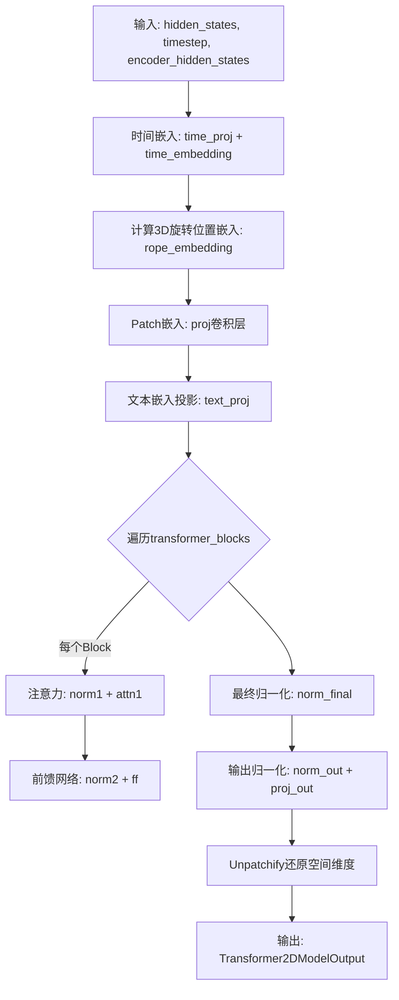
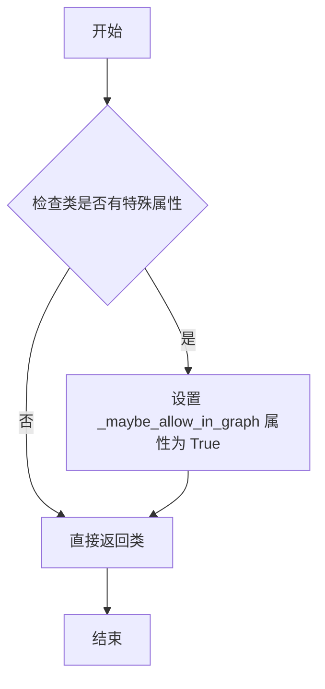
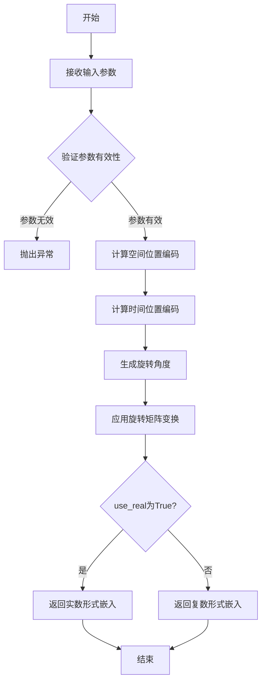
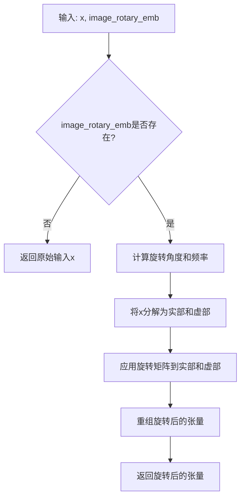
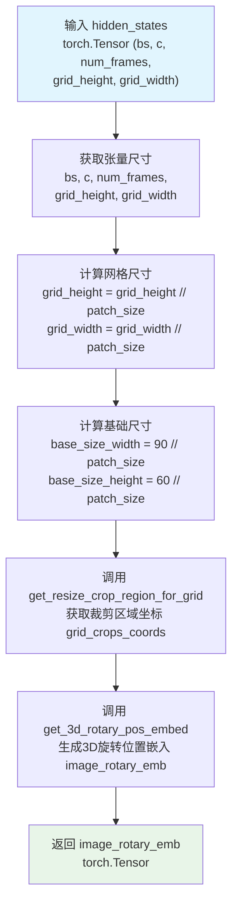
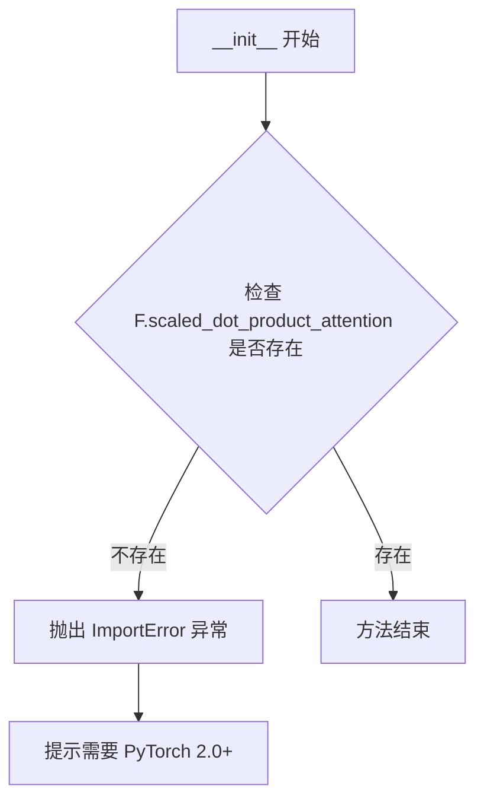
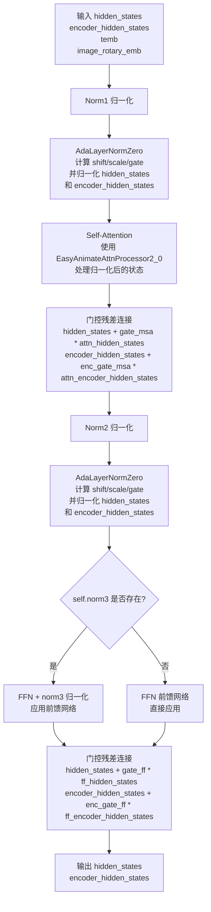
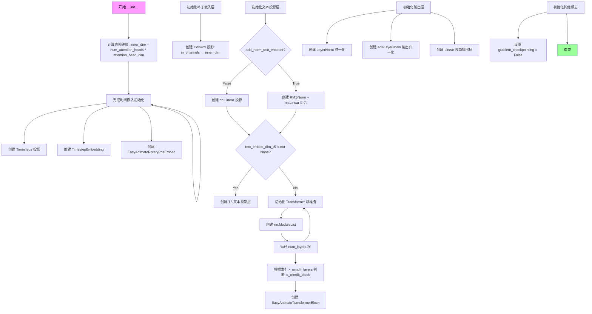
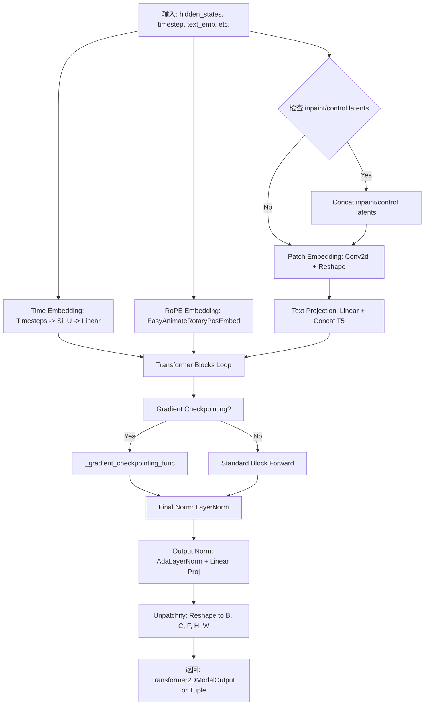

```mermaid
flowchart TD
    A[开始] --> B[获取目标尺寸 tw, th]
    B --> C[解包源尺寸 h, w]
    C --> D[计算源宽高比 r = h / w]
    D --> E{判断 r > th / tw?}
    E -->|是| F[resize_height = th<br/>resize_width = round&#40;th / h * w&#41;]
    E -->|否| G[resize_width = tw<br/>resize_height = round&#40;tw / w * h&#41;]
    F --> H[计算裁剪左上角坐标]
    G --> H
    H --> I[crop_top = round&#40;&#40;th - resize_height&#41; / 2&#41;<br/>crop_left = round&#40;&#40;tw - resize_width&#41; / 2&#41;]
    I --> J[返回裁剪区域坐标]
    J --> K[结束]
```

# `diffusers\src\diffusers\models\transformers\transformer_easyanimate.py` 详细设计文档

EasyAnimate是一个用于视频生成的3D Transformer模型架构，支持文本到视频和图像到视频的生成任务，通过多模态DiT块处理时空信息，并采用3D旋转位置编码(3D RoPE)进行位置嵌入。

## 整体流程



## 类结构

```
EasyAnimateLayerNormZero (自定义归一化层)
EasyAnimateRotaryPosEmbed (3D旋转位置编码)
EasyAnimateAttnProcessor2_0 (注意力处理器)
EasyAnimateTransformerBlock (Transformer块)
EasyAnimateTransformer3DModel (主模型类)
    └── 继承自 ModelMixin, ConfigMixin
```

## 全局变量及字段


### `logger`
    
模块日志记录器

类型：`logging.Logger`
    


### `EasyAnimateLayerNormZero.silu`
    
SiLU激活函数

类型：`nn.SiLU`
    


### `EasyAnimateLayerNormZero.linear`
    
条件投影线性层

类型：`nn.Linear`
    


### `EasyAnimateLayerNormZero.norm`
    
归一化层(LayerNorm/FP32LayerNorm)

类型：`nn.Module`
    


### `EasyAnimateRotaryPosEmbed.patch_size`
    
Patch块大小

类型：`int`
    


### `EasyAnimateRotaryPosEmbed.rope_dim`
    
RoPE维度列表

类型：`list[int]`
    


### `EasyAnimateTransformerBlock.norm1`
    
第一个归一化层

类型：`EasyAnimateLayerNormZero`
    


### `EasyAnimateTransformerBlock.attn1`
    
注意力模块

类型：`Attention`
    


### `EasyAnimateTransformerBlock.norm2`
    
第二个归一化层

类型：`EasyAnimateLayerNormZero`
    


### `EasyAnimateTransformerBlock.ff`
    
前馈网络

类型：`FeedForward`
    


### `EasyAnimateTransformerBlock.txt_ff`
    
文本前馈网络

类型：`FeedForward | None`
    


### `EasyAnimateTransformerBlock.norm3`
    
额外归一化层

类型：`FP32LayerNorm | None`
    


### `EasyAnimateTransformer3DModel.time_proj`
    
时间步投影

类型：`Timesteps`
    


### `EasyAnimateTransformer3DModel.time_embedding`
    
时间嵌入

类型：`TimestepEmbedding`
    


### `EasyAnimateTransformer3DModel.rope_embedding`
    
RoPE嵌入

类型：`EasyAnimateRotaryPosEmbed`
    


### `EasyAnimateTransformer3DModel.proj`
    
Patch嵌入卷积

类型：`nn.Conv2d`
    


### `EasyAnimateTransformer3DModel.text_proj`
    
文本投影

类型：`nn.Linear | nn.Sequential`
    


### `EasyAnimateTransformer3DModel.text_proj_t5`
    
T5文本投影

类型：`nn.Linear | nn.Sequential | None`
    


### `EasyAnimateTransformer3DModel.transformer_blocks`
    
Transformer块列表

类型：`nn.ModuleList`
    


### `EasyAnimateTransformer3DModel.norm_final`
    
最终归一化

类型：`nn.LayerNorm`
    


### `EasyAnimateTransformer3DModel.norm_out`
    
输出归一化

类型：`AdaLayerNorm`
    


### `EasyAnimateTransformer3DModel.proj_out`
    
输出投影

类型：`nn.Linear`
    


### `EasyAnimateTransformer3DModel.gradient_checkpointing`
    
梯度检查点标志

类型：`bool`
    
    

## 全局函数及方法


### `maybe_allow_in_graph`

这是一个装饰器函数，用于标记被装饰的类，允许 PyTorch 的 JIT 编译（如 `torch.jit.script` 或 `torch.compile`）将该类的实例纳入计算图中进行优化。在扩散模型（如 EasyAnimate）中，某些自定义模块可能因为包含动态控制流或非标准操作而被 JIT 忽略，使用该装饰器可以确保这些模块在图优化过程中被正确追踪。

参数：

-  `cls`：`type`，要装饰的类对象。

返回值：`type`，装饰后的类对象。

#### 流程图



#### 带注释源码

由于该函数定义在 `diffusers` 库的核心 utils 中（未在当前文件中展开），以下是参考源码：

```python
def maybe_allow_in_graph(cls):
    """
    一个装饰器，用于标记一个类，使其能够被 PyTorch 的 JIT 编译器追踪到计算图中。
    
    这对于那些可能因为动态操作或控制流而被 JIT 追踪忽略的自定义 nn.Module 子类特别有用。
    
    参数:
        cls (type): 要被装饰的类。
        
    返回值:
        type: 装饰后的类，其 _maybe_allow_in_graph 属性被设置为 True。
    """
    # 检查类是否具有允许图追踪的内部属性
    if hasattr(cls, "_maybe_allow_in_graph"):
        cls._maybe_allow_in_graph = True
    return cls
```


### `get_3d_rotary_pos_embed`

3D旋转位置嵌入（RoPE）计算函数，用于在视频/3D Transformer模型中生成空间-时间位置编码。该函数通过旋转矩阵编码位置信息，使模型能够捕捉token之间的相对位置关系。

参数：

- `rope_dim`：`list[int]`，旋转嵌入的维度列表，对应每个注意力头的维度
- `grid_crops_coords`：`tuple`，裁剪区域的坐标，格式为((top, left), (bottom, right))
- `grid_size`：`tuple[int, int]`，网格的空间大小(height, width)
- `temporal_size`：`int`，时间维度的大小（帧数）
- `use_real`：`bool`，是否使用实数形式的旋转嵌入（若为False则使用复数形式）

返回值：`torch.Tensor`，3D旋转位置嵌入张量，形状为[batch_size, temporal_size, height, width, rope_dim]

#### 流程图



#### 带注释源码

```python
# 该函数为外部导入函数，以下为调用处的使用示例源码
# 位置：EasyAnimateRotaryPosEmbed.forward 方法内部

def forward(self, hidden_states: torch.Tensor) -> torch.Tensor:
    # 获取输入张量的维度信息
    # hidden_states 形状: [batch_size, channels, num_frames, height, width]
    bs, c, num_frames, grid_height, grid_width = hidden_states.size()
    
    # 计算 patch 化后的网格尺寸
    grid_height = grid_height // self.patch_size
    grid_width = grid_width // self.patch_size
    
    # 计算基础尺寸（用于裁剪计算）
    base_size_width = 90 // self.patch_size
    base_size_height = 60 // self.patch_size

    # 获取网格裁剪坐标，用于处理不同长宽比的输入
    grid_crops_coords = self.get_resize_crop_region_for_grid(
        (grid_height, grid_width), base_size_width, base_size_height
    )
    
    # 调用外部 3D 旋转位置嵌入函数
    # 参数说明：
    #   - self.rope_dim: 旋转嵌入维度列表
    #   - grid_crops_coords: 裁剪区域坐标
    #   - grid_size: 空间网格大小
    #   - temporal_size: 时间维度大小
    #   - use_real: 使用实数形式嵌入
    image_rotary_emb = get_3d_rotary_pos_embed(
        self.rope_dim,
        grid_crops_coords,
        grid_size=(grid_height, grid_width),
        temporal_size=hidden_states.size(2),
        use_real=True,
    )
    return image_rotary_emb
```


### `apply_rotary_emb`

应用旋转嵌入（Rotary Position Embedding）到查询和键张量，用于在注意力机制中引入位置信息。该函数通过旋转操作编码序列中token的相对位置，增强模型对位置关系的理解。

参数：

-  `x`：`torch.Tensor`，需要应用旋转嵌入的查询或键张量，形状通常为 `[batch, heads, seq_len, head_dim]`
-  `image_rotary_emb`：`torch.Tensor | None`，预计算的3D旋转位置嵌入，包含了空间和时间维度的位置编码信息

返回值：`torch.Tensor`，应用旋转嵌入后的张量，形状与输入 `x` 相同

#### 流程图



#### 带注释源码

由于 `apply_rotary_emb` 是从外部模块 `..embeddings` 导入的函数，在当前代码文件中并未定义其具体实现。以下为代码中调用该函数的上下文：

```python
# 在 EasyAnimateAttnProcessor2_0.__call__ 方法中
if image_rotary_emb is not None:
    # 从 embeddings 模块导入旋转嵌入函数
    from ..embeddings import apply_rotary_emb

    # 对查询向量应用旋转嵌入
    # 仅对非encoder部分应用（跳过encoder_hidden_states对应的位置）
    query[:, :, encoder_hidden_states.shape[1] :] = apply_rotary_emb(
        query[:, :, encoder_hidden_states.shape[1] :], image_rotary_emb
    )
    
    # 如果不是交叉注意力，则对键向量也应用旋转嵌入
    if not attn.is_cross_attention:
        key[:, :, encoder_hidden_states.shape[1] :] = apply_rotary_emb(
            key[:, :, encoder_hidden_states.shape[1] :], image_rotary_emb
        )
```

#### 备注

该函数是 `transformers` 库或相关嵌入模块提供的标准旋转位置嵌入实现（RoPE），在 EasyAnimate 中用于 3D 视频/图像数据的空间和时间位置编码。实际实现通常基于以下数学原理：

- 通过复数旋转矩阵对查询和键向量进行旋转
- 旋转角度与位置索引和频率相关
- 允许模型捕获相对位置信息而非绝对位置信息


### `EasyAnimateLayerNormZero.forward`

该函数是 EasyAnimateLayerNormZero 类的前向传播方法，通过自适应归一化技术对隐藏状态和编码器隐藏状态进行条件偏移和缩放，同时生成用于注意力门控的 gate 参数，实现基于时间步的条件特征变换。

参数：

- `hidden_states`：`torch.Tensor`，主输入的隐藏状态张量，形状为 `(batch, seq_len, hidden_dim)`
- `encoder_hidden_states`：`torch.Tensor`，编码器侧的隐藏状态张量，通常来自文本编码器，形状为 `(batch, encoder_seq_len, hidden_dim)`
- `temb`：`torch.Tensor`，时间步嵌入张量，用于生成自适应归一化参数，形状为 `(batch, conditioning_dim)`

返回值：`tuple[torch.Tensor, torch.Tensor, torch.Tensor, torch.Tensor]`，返回四个张量：
- 第一个：`torch.Tensor`，变换后的主隐藏状态
- 第二个：`torch.Tensor`，变换后的编码器隐藏状态
- 第三个：`torch.Tensor`，用于主路径注意力门控的 gate 参数
- 第四个：`torch.Tensor`，用于编码器路径注意力门控的 enc_gate 参数

#### 流程图

```mermaid
flowchart TD
    A[输入 hidden_states, encoder_hidden_states, temb] --> B[self.silu(temb)]
    B --> C[self.linear]
    C --> D[.chunk6]
    D --> E[解包为 shift, scale, gate, enc_shift, enc_scale, enc_gate]
    E --> F[归一化 hidden_states]
    E --> G[归一化 encoder_hidden_states]
    F --> H[应用 scale 和 shift: norm_h * (1 + scale) + shift]
    G --> I[应用 enc_scale 和 enc_shift: norm_enc * (1 + enc_scale) + enc_shift]
    H --> J[返回 hidden_states, encoder_hidden_states, gate, enc_gate]
    I --> J
```

#### 带注释源码

```python
def forward(
    self, hidden_states: torch.Tensor, encoder_hidden_states: torch.Tensor, temb: torch.Tensor
) -> tuple[torch.Tensor, torch.Tensor, torch.Tensor, torch.Tensor]:
    # 第一步：通过线性层从时间嵌入生成6个自适应参数
    # 使用 SiLU 激活函数对时间嵌入进行非线性变换，然后通过线性层投影到6个参数空间
    # 这6个参数分别是：shift, scale, gate 用于主路径；enc_shift, enc_scale, enc_gate 用于编码器路径
    shift, scale, gate, enc_shift, enc_scale, enc_gate = self.linear(self.silu(temb)).chunk(6, dim=1)
    
    # 第二步：对主隐藏状态进行自适应归一化
    # 先对 hidden_states 进行归一化，然后逐元素应用 scale 和 shift
    # scale.unsqueeze(1) 将形状从 (batch, hidden_dim) 扩展为 (batch, 1, hidden_dim) 以匹配 hidden_states 的序列维度
    hidden_states = self.norm(hidden_states) * (1 + scale.unsqueeze(1)) + shift.unsqueeze(1)
    
    # 第三步：对编码器隐藏状态进行自适应归一化
    # 采用与主路径相同的归一化策略，但对编码器路径使用独立的参数
    encoder_hidden_states = self.norm(encoder_hidden_states) * (1 + enc_scale.unsqueeze(1)) + enc_shift.unsqueeze(
        1
    )
    
    # 第四步：返回变换后的隐藏状态和门控参数
    # gate 和 enc_gate 将用于后续的注意力机制中进行特征门控控制
    return hidden_states, encoder_hidden_states, gate, enc_gate
```


### `EasyAnimateRotaryPosEmbed.get_resize_crop_region_for_grid`

该方法用于计算在调整图像网格大小到目标尺寸时的裁剪区域。它根据源图像和目标图像的宽高比，计算保持纵横比的缩放尺寸，并返回居中裁剪的左上角和右下角坐标，常用于3D旋转位置嵌入（RoPE）中网格坐标的适配。

参数：

- `src`：`tuple`，源图像的尺寸元组 `(高度, 宽度)`
- `tgt_width`：`int`，目标宽度的网格大小
- `tgt_height`：`int`，目标高度的网格大小

返回值：`tuple`，返回两个坐标元组 `((crop_top, crop_left), (crop_top + resize_height, crop_left + resize_width))`，分别表示裁剪区域的左上角和右下角坐标

#### 流程图



#### 带注释源码

```python
def get_resize_crop_region_for_grid(self, src, tgt_width, tgt_height):
    """
    计算调整网格大小时的裁剪区域
    
    参数:
        src: 源网格尺寸元组 (高度, 宽度)
        tgt_width: 目标宽度
        tgt_height: 目标高度
    
    返回:
        裁剪区域坐标 ((左上角y, 左上角x), (右下角y, 右下角x))
    """
    # 目标尺寸
    tw = tgt_width
    th = tgt_height
    
    # 解包源尺寸：h为高度，w为宽度
    h, w = src
    
    # 计算源图像宽高比
    r = h / w
    
    # 根据宽高比决定缩放策略，保持纵横比不变
    if r > (th / tw):
        # 源图比目标图更"高"，以高度为基准缩放
        resize_height = th  # 高度填满目标
        resize_width = int(round(th / h * w))  # 按比例计算宽度
    else:
        # 源图比目标图更"宽"，以宽度为基准缩放
        resize_width = tw  # 宽度填满目标
        resize_height = int(round(tw / w * h))  # 按比例计算高度
    
    # 计算居中裁剪的左上角坐标
    # 使得裁剪区域在目标尺寸中居中
    crop_top = int(round((th - resize_height) / 2.0))
    crop_left = int(round((tw - resize_width) / 2.0))
    
    # 返回裁剪区域：左上角坐标和右下角坐标
    return (crop_top, crop_left), (crop_top + resize_height, crop_left + resize_width)
```


### `EasyAnimateRotaryPosEmbed.forward`

该方法接收视频/3D数据的隐藏状态张量，计算网格尺寸并通过`get_resize_crop_region_for_grid`获取裁剪区域坐标，最后调用`get_3d_rotary_pos_embed`生成3D旋转位置嵌入（RoPE）并返回，用于增强Transformer模型对时空位置信息的感知能力。

参数：

- `hidden_states`：`torch.Tensor`，输入的隐藏状态张量，形状为 `(bs, c, num_frames, grid_height, grid_width)`，其中 `bs` 为批量大小，`c` 为通道数，`num_frames` 为帧数，`grid_height` 和 `grid_width` 为空间网格尺寸

返回值：`torch.Tensor`，3D旋转位置嵌入，用于后续注意力机制中的位置编码

#### 流程图



#### 带注释源码

```python
def forward(self, hidden_states: torch.Tensor) -> torch.Tensor:
    """
    前向传播：生成3D旋转位置嵌入
    
    参数:
        hidden_states: 输入的隐藏状态张量，形状为 (bs, c, num_frames, grid_height, grid_width)
        
    返回:
        image_rotary_emb: 3D旋转位置嵌入张量
    """
    # 1. 解包隐藏状态的维度信息
    # bs: 批量大小, c: 通道数, num_frames: 帧数, grid_height/width: 空间网格尺寸
    bs, c, num_frames, grid_height, grid_width = hidden_states.size()
    
    # 2. 计算patch化后的网格尺寸（除以patch_size）
    grid_height = grid_height // self.patch_size
    grid_width = grid_width // self.patch_size
    
    # 3. 计算基础参考尺寸（基于90x60的默认尺寸）
    base_size_width = 90 // self.patch_size
    base_size_height = 60 // self.patch_size
    
    # 4. 获取网格裁剪区域坐标
    # 用于将任意大小的网格映射到基准尺寸并进行中心裁剪
    grid_crops_coords = self.get_resize_crop_region_for_grid(
        (grid_height, grid_width), base_size_width, base_size_height
    )
    
    # 5. 调用外部函数生成3D旋转位置嵌入
    # rope_dim: 旋转位置编码的维度
    # grid_crops_coords: 裁剪区域坐标
    # grid_size: 当前网格尺寸
    # temporal_size: 时间维度大小（帧数）
    # use_real: 是否使用实数形式的旋转编码
    image_rotary_emb = get_3d_rotary_pos_embed(
        self.rope_dim,
        grid_crops_coords,
        grid_size=(grid_height, grid_width),
        temporal_size=hidden_states.size(2),
        use_real=True,
    )
    
    # 6. 返回生成的旋转位置嵌入
    return image_rotary_emb
```


### `EasyAnimateAttnProcessor2_0.__init__`

初始化方法，用于检查 PyTorch 版本是否支持 scaled_dot_product_attention 功能。该处理器实现了基于 PyTorch 2.0 的缩放点积注意力机制，是 EasyAnimateTransformer3DModel 模型的核心注意力处理器。

参数：无

返回值：`None`，无返回值

#### 流程图



#### 带注释源码

```python
def __init__(self):
    # 检查当前 PyTorch 版本是否支持 scaled_dot_product_attention 函数
    # scaled_dot_product_attention 是 PyTorch 2.0 引入的高效注意力实现
    if not hasattr(F, "scaled_dot_product_attention"):
        # 如果不支持，抛出 ImportError 异常并给出友好的错误提示
        raise ImportError(
            "EasyAnimateAttnProcessor2_0 requires PyTorch 2.0 or above. To use it, please install PyTorch 2.0."
        )
```


### `EasyAnimateAttnProcessor2_0.__call__`

实现缩放点积注意力机制（SDPA），支持自注意力和交叉注意力，并可选地应用3D旋转位置嵌入（RoPE）。该处理器用于EasyAnimateTransformer3DModel模型，处理视频/图像的时空注意力计算。

参数：

- `attn`：`Attention`，注意力模块实例，包含Q/K/V投影层和输出投影层
- `hidden_states`：`torch.Tensor`，输入的隐藏状态，形状为 `[batch_size, seq_len, hidden_dim]`
- `encoder_hidden_states`：`torch.Tensor`，编码器的隐藏状态，用于cross-attention，若为None则仅执行自注意力
- `attention_mask`：`torch.Tensor | None`，可选的注意力掩码，用于屏蔽特定位置
- `image_rotary_emb`：`torch.Tensor | None`，可选的3D旋转位置嵌入，用于编码位置信息

返回值：`tuple[torch.Tensor, torch.Tensor]`，返回处理后的(hidden_states, encoder_hidden_states)

#### 流程图

```mermaid
flowchart TD
    A[开始 __call__] --> B{attn.add_q_proj is None<br/>and encoder_hidden_states is not None?}
    B -->|Yes| C[拼接 encoder_hidden_states<br/>和 hidden_states]
    B -->|No| D[跳过拼接]
    C --> E
    D --> E
    
    E[1. QKV投影] --> E1[query = attn.to_q(hidden_states)]
    E1 --> E2[key = attn.to_k(hidden_states)]
    E2 --> E3[value = attn.to_v(hidden_states)]
    
    E3 --> F[2. QK归一化] --> F1{norm_q exists?}
    F1 -->|Yes| F2[query = attn.norm_q(query)]
    F1 -->|No| F3
    F2 --> F3{norm_k exists?}
    F3 -->|Yes| F4[key = attn.norm_k(key)]
    F3 -->|No| G
    
    G{3. Encoder条件<br/>QKV投影} --> G1{add_q_proj exists<br/>and encoder_hidden_states exists?}
    G1 -->|Yes| G2[encoder_query = attn.add_q_proj...]
    G2 --> G3[encoder_key = attn.add_k_proj...]
    G3 --> G4[encoder_value = attn.add_v_proj...]
    G4 --> G5[归一化encoder的Q和K]
    G5 --> G6[拼接: query, key, value]
    G1 -->|No| I
    
    G6 --> I{image_rotary_emb<br/>is not None?}
    I -->|Yes| J[应用RoPE到query和key]
    I -->|No| K
    
    J --> K[5. 注意力计算]
    K --> K1[F.scaled_dot_product_attention]
    K1 --> K2[transpose + flatten]
    
    K2 --> L{encoder_hidden_states<br/>is not None?}
    L -->|Yes| M[分割hidden_states为<br/>encoder和主分支]
    M --> N{to_out exists?}
    N -->|Yes| O[应用to_out投影]
    N -->|No| P{to_add_out exists?}
    O --> P
    P -->|Yes| Q[应用to_add_out投影]
    P -->|No| R
    L -->|No| S{to_out exists?}
    S -->|Yes| T[应用to_out投影]
    S -->|No| R
    
    Q --> R[返回 tuple[hidden_states, encoder_hidden_states]]
    T --> R
    O --> R
```

#### 带注释源码

```python
def __call__(
    self,
    attn: Attention,
    hidden_states: torch.Tensor,
    encoder_hidden_states: torch.Tensor,
    attention_mask: torch.Tensor | None = None,
    image_rotary_emb: torch.Tensor | None = None,
) -> torch.Tensor:
    """
    实现缩放点积注意力(SDPA)，支持自注意力和交叉注意力。
    
    参数:
        attn: Attention模块，包含Q/K/V投影层和输出层
        hidden_states: 输入隐藏状态 [B, N, C]
        encoder_hidden_states: 编码器隐藏状态，用于cross-attention
        attention_mask: 可选的注意力掩码
        image_rotary_emb: 3D旋转位置嵌入
    
    返回:
        处理后的 (hidden_states, encoder_hidden_states)
    """
    
    # 如果没有额外的q投影且存在encoder_hidden_states，则将两者拼接
    # 这对应于纯自注意力场景，encoder_hidden_states作为额外的token添加
    if attn.add_q_proj is None and encoder_hidden_states is not None:
        hidden_states = torch.cat([encoder_hidden_states, hidden_states], dim=1)

    # ========== 1. QKV投影 ==========
    # 将hidden_states投影到Q、K、V空间
    query = attn.to_q(hidden_states)
    key = attn.to_k(hidden_states)
    value = attn.to_v(hidden_states)

    # 调整形状以适应多头注意力: [B, N, C] -> [B, H, N, D]
    query = query.unflatten(2, (attn.heads, -1)).transpose(1, 2)
    key = key.unflatten(2, (attn.heads, -1)).transpose(1, 2)
    value = value.unflatten(2, (attn.heads, -1)).transpose(1, 2)

    # ========== 2. QK归一化 ==========
    # 对query和key进行归一化（可选，用于稳定训练）
    if attn.norm_q is not None:
        query = attn.norm_q(query)
    if attn.norm_k is not None:
        key = attn.norm_k(key)

    # ========== 3. Encoder条件QKV投影和归一化 ==========
    # 如果存在cross-attention分支，处理encoder_hidden_states
    if attn.add_q_proj is not None and encoder_hidden_states is not None:
        # 分别对encoder_hidden_states进行Q/K/V投影
        encoder_query = attn.add_q_proj(encoder_hidden_states)
        encoder_key = attn.add_k_proj(encoder_hidden_states)
        encoder_value = attn.add_v_proj(encoder_hidden_states)

        # 调整形状以适应多头注意力
        encoder_query = encoder_query.unflatten(2, (attn.heads, -1)).transpose(1, 2)
        encoder_key = encoder_key.unflatten(2, (attn.heads, -1)).transpose(1, 2)
        encoder_value = encoder_value.unflatten(2, (attn.heads, -1)).transpose(1, 2)

        # 对encoder的Q和K进行归一化
        if attn.norm_added_q is not None:
            encoder_query = attn.norm_added_q(encoder_query)
        if attn.norm_added_k is not None:
            encoder_key = attn.norm_added_k(encoder_key)

        # 将encoder的QKV与主分支QKV拼接
        query = torch.cat([encoder_query, query], dim=2)
        key = torch.cat([encoder_key, key], dim=2)
        value = torch.cat([encoder_value, value], dim=2)

    # ========== 4. 应用旋转位置嵌入(RoPE) ==========
    # RoPE用于编码序列中的相对位置信息
    if image_rotary_emb is not None:
        from ..embeddings import apply_rotary_emb

        # 仅对非encoder部分应用RoPE（encoder部分通常是条件信息，位置固定）
        query[:, :, encoder_hidden_states.shape[1]:] = apply_rotary_emb(
            query[:, :, encoder_hidden_states.shape[1]:], image_rotary_emb
        )
        # 对于自注意力，对key也应用RoPE
        if not attn.is_cross_attention:
            key[:, :, encoder_hidden_states.shape[1]:] = apply_rotary_emb(
                key[:, :, encoder_hidden_states.shape[1]:], image_rotary_emb
            )

    # ========== 5. 注意力计算 ==========
    # 使用PyTorch 2.0的SDPA高效实现
    hidden_states = F.scaled_dot_product_attention(
        query, key, value, attn_mask=attention_mask, dropout_p=0.0, is_causal=False
    )
    # 恢复形状: [B, H, N, D] -> [B, N, H*D]
    hidden_states = hidden_states.transpose(1, 2).flatten(2, 3)
    hidden_states = hidden_states.to(query.dtype)  # 确保dtype一致

    # ========== 6. 输出投影 ==========
    # 将拼接的输出分离，并分别进行投影
    if encoder_hidden_states is not None:
        # 分离encoder和主分支的输出
        encoder_hidden_states, hidden_states = (
            hidden_states[:, :encoder_hidden_states.shape[1]],
            hidden_states[:, encoder_hidden_states.shape[1]:],
        )

        # 主分支输出投影
        if getattr(attn, "to_out", None) is not None:
            hidden_states = attn.to_out[0](hidden_states)
            hidden_states = attn.to_out[1](hidden_states)

        # Cross-attention输出投影
        if getattr(attn, "to_add_out", None) is not None:
            encoder_hidden_states = attn.to_add_out(encoder_hidden_states)
    else:
        # 仅有自注意力的情况
        if getattr(attn, "to_out", None) is not None:
            hidden_states = attn.to_out[0](hidden_states)
            hidden_states = attn.to_out[1](hidden_states)

    return hidden_states, encoder_hidden_states
```


### EasyAnimateTransformerBlock.forward

该方法是 EasyAnimateTransformerBlock 类的前向传播函数，实现了一个完整的 Transformer 块，包含自注意力机制（使用 AdaLayerNormZero 进行自适应归一化和门控）和前馈网络（Feed-forward）两个核心部分，支持对图像 hidden_states 和文本 encoder_hidden_states 进行联合处理，并通过旋转位置嵌入（RoPE）增强空间位置感知能力。

参数：

- `hidden_states`：`torch.Tensor`，输入的图像隐藏状态，形状为 [batch_size, seq_len, dim]
- `encoder_hidden_states`：`torch.Tensor`，输入的文本编码隐藏状态，形状为 [batch_size, text_seq_len, dim]
- `temb`：`torch.Tensor`，时间嵌入向量，用于 AdaLayerNormZero 生成自适应归一化参数和门控信号
- `image_rotary_emb`：`tuple[torch.Tensor, torch.Tensor] | None`，可选的 3D 旋转位置嵌入，用于增强空间位置感知

返回值：`tuple[torch.Tensor, torch.Tensor]`，返回处理后的图像隐藏状态和文本隐藏状态元组

#### 流程图



#### 带注释源码

```python
def forward(
    self,
    hidden_states: torch.Tensor,
    encoder_hidden_states: torch.Tensor,
    temb: torch.Tensor,
    image_rotary_emb: tuple[torch.Tensor, torch.Tensor] | None = None,
) -> tuple[torch.Tensor, torch.Tensor]:
    """
    EasyAnimateTransformerBlock 前向传播
    
    参数:
        hidden_states: 输入图像隐藏状态 [B, FHW, C]
        encoder_hidden_states: 输入文本隐藏状态 [B, T, C]
        temb: 时间嵌入 [B, time_embed_dim]
        image_rotary_emb: 3D旋转位置嵌入
    
    返回:
        tuple[hidden_states, encoder_hidden_states]: 处理后的隐藏状态
    """
    
    # ==================== 1. Attention 阶段 ====================
    # 使用 AdaLayerNormZero 进行自适应归一化
    # 该归一化层接收 temb 并生成 shift, scale, gate 参数
    # 分别用于调节 hidden_states 和 encoder_hidden_states
    norm_hidden_states, norm_encoder_hidden_states, gate_msa, enc_gate_msa = self.norm1(
        hidden_states, encoder_hidden_states, temb
    )
    
    # 执行自注意力计算
    # attn1 是 Attention 模块，使用 EasyAnimateAttnProcessor2_0 处理器
    # 支持交叉注意力机制，处理图像和文本特征的融合
    attn_hidden_states, attn_encoder_hidden_states = self.attn1(
        hidden_states=norm_hidden_states,
        encoder_hidden_states=norm_encoder_hidden_states,
        image_rotary_emb=image_rotary_emb,
    )
    
    # 门控残差连接：将原始输入与注意力输出加权求和
    # gate_msa 控制注意力分支的贡献程度，实现自适应信息流
    hidden_states = hidden_states + gate_msa.unsqueeze(1) * attn_hidden_states
    encoder_hidden_states = encoder_hidden_states + enc_gate_msa.unsqueeze(1) * attn_encoder_hidden_states

    # ==================== 2. Feed-forward 阶段 ====================
    # 再次使用 AdaLayerNormZero 进行第二层归一化
    norm_hidden_states, norm_encoder_hidden_states, gate_ff, enc_gate_ff = self.norm2(
        hidden_states, encoder_hidden_states, temb
    )
    
    # 根据配置决定是否在 FFN 后添加额外归一化 (after_norm)
    if self.norm3 is not None:
        # 模式A: FFN 后接归一化层
        # 主分支 FFN
        norm_hidden_states = self.norm3(self.ff(norm_hidden_states))
        
        # 文本分支 FFN（如果存在独立的文本 FFN）
        if self.txt_ff is not None:
            norm_encoder_hidden_states = self.norm3(self.txt_ff(norm_encoder_hidden_states))
        else:
            # 复用主 FFN
            norm_encoder_hidden_states = self.norm3(self.ff(norm_encoder_hidden_states))
    else:
        # 模式B: 直接使用 FFN，不额外归一化
        norm_hidden_states = self.ff(norm_hidden_states)
        
        if self.txt_ff is not None:
            norm_encoder_hidden_states = self.txt_ff(norm_encoder_hidden_states)
        else:
            norm_encoder_hidden_states = self.ff(norm_encoder_hidden_states)
    
    # 门控残差连接：将原始输入与 FFN 输出加权求和
    # gate_ff 控制前馈分支的贡献程度
    hidden_states = hidden_states + gate_ff.unsqueeze(1) * norm_hidden_states
    encoder_hidden_states = encoder_hidden_states + enc_gate_ff.unsqueeze(1) * norm_encoder_hidden_states
    
    return hidden_states, encoder_hidden_states
```


### `EasyAnimateTransformer3DModel.__init__`

这是 EasyAnimateTransformer3DModel 类的构造函数，负责初始化整个 3D 视频变换器模型的核心组件，包括时间嵌入、补丁嵌入、文本投影、Transformer 块堆叠以及输出归一化和投影层。

参数：

- `num_attention_heads`：`int`，默认值 `48`，多头注意力机制中的注意力头数量
- `attention_head_dim`：`int`，默认值 `64`，每个注意力头的通道数
- `in_channels`：`int | None`，默认值 `None`，输入数据的通道数
- `out_channels`：`int | None`，默认值 `None`，输出数据的通道数
- `patch_size`：`int | None`，默认值 `None`，补丁嵌入层使用的补丁大小
- `sample_width`：`int`，默认值 `90`，输入潜在表示的宽度
- `sample_height`：`int`，默认值 `60`，输入潜在表示的高度
- `activation_fn`：`str`，默认值 `"gelu-approximate"`，前馈网络中使用的激活函数
- `timestep_activation_fn`：`str`，默认值 `"silu"`生成时间嵌入时使用的激活函数
- `freq_shift`：`int`，默认值 `0`，时间嵌入中的频率偏移量
- `num_layers`：`int`，默认值 `48`，Transformer 块的数量
- `mmdit_layers`：`int`，默认值 `48`，多模态 Transformer 块的数量
- `dropout`：`float`，默认值 `0.0`，dropout 概率
- `time_embed_dim`：`int`，默认值 `512`，时间嵌入的输出维度
- `add_norm_text_encoder`：`bool`，默认值 `False`，是否在文本编码器投影中添加归一化
- `text_embed_dim`：`int`，默认值 `3584`，文本编码器嵌入的输入维度
- `text_embed_dim_t5`：`int | None`，默认值 `None`，T5 文本编码器嵌入的输入维度
- `norm_eps`：`float`，默认值 `1e-5`，归一化层使用的 epsilon 值
- `norm_elementwise_affine`：`bool`，默认值 `True`，是否在归一化层使用逐元素仿射
- `flip_sin_to_cos`：`bool`，默认值 `True`，是否在时间嵌入中将 sin 转换为 cos
- `time_position_encoding_type`：`str`，默认值 `"3d_rope"`，时间位置编码的类型
- `after_norm`：`bool`，默认值 `False`，是否在残差连接后应用归一化
- `resize_inpaint_mask_directly`：`bool`，默认值 `True`，是否直接调整修复掩码的大小
- `enable_text_attention_mask`：`bool`，默认值 `True`，是否启用文本注意力掩码
- `add_noise_in_inpaint_model`：`bool`，默认值 `True`，是否在修复模型中添加噪声

返回值：`None`，构造函数不返回值，模型初始化通过副作用完成

#### 流程图



#### 带注释源码

```python
@register_to_config
def __init__(
    self,
    num_attention_heads: int = 48,
    attention_head_dim: int = 64,
    in_channels: int | None = None,
    out_channels: int | None = None,
    patch_size: int | None = None,
    sample_width: int = 90,
    sample_height: int = 60,
    activation_fn: str = "gelu-approximate",
    timestep_activation_fn: str = "silu",
    freq_shift: int = 0,
    num_layers: int = 48,
    mmdit_layers: int = 48,
    dropout: float = 0.0,
    time_embed_dim: int = 512,
    add_norm_text_encoder: bool = False,
    text_embed_dim: int = 3584,
    text_embed_dim_t5: int = None,
    norm_eps: float = 1e-5,
    norm_elementwise_affine: bool = True,
    flip_sin_to_cos: bool = True,
    time_position_encoding_type: str = "3d_rope",
    after_norm=False,
    resize_inpaint_mask_directly: bool = True,
    enable_text_attention_mask: bool = True,
    add_noise_in_inpaint_model: bool = True,
):
    """
    EasyAnimateTransformer3DModel 构造函数
    
    参数:
        num_attention_heads: 多头注意力中的头数
        attention_head_dim: 每个头的维度
        in_channels: 输入通道数
        out_channels: 输出通道数
        patch_size: 补丁大小
        sample_width/height: 样本宽高
        activation_fn: 激活函数类型
        timestep_activation_fn: 时间步激活函数
        freq_shift: 频率偏移
        num_layers: Transformer总层数
        mmdit_layers: MMDiT块层数
        dropout: Dropout概率
        time_embed_dim: 时间嵌入维度
        add_norm_text_encoder: 是否添加文本编码器归一化
        text_embed_dim: 文本嵌入维度
        text_embed_dim_t5: T5文本嵌入维度
        norm_eps: 归一化epsilon
        norm_elementwise_affine: 逐元素仿射归一化
        flip_sin_to_cos: 翻转sin到cos
        time_position_encoding_type: 时间位置编码类型
        after_norm: 之后归一化
        resize_inpaint_mask_directly: 直接调整修复掩码
        enable_text_attention_mask: 启用文本注意力掩码
        add_noise_in_inpaint_model: 在修复模型中添加噪声
    
    注意:
        @register_to_config 装饰器会将所有参数注册为配置属性
    """
    super().__init__()  # 调用父类 ModelMixin 和 ConfigMixin 的初始化
    
    # 计算内部维度：总通道数 = 头数 × 每头维度
    inner_dim = num_attention_heads * attention_head_dim

    # ========== 1. 时间嵌入组件 ==========
    # 时间步投影：将时间步映射到嵌入空间
    self.time_proj = Timesteps(inner_dim, flip_sin_to_cos, freq_shift)
    # 时间步嵌入层：将投影后的时间步进一步编码
    self.time_embedding = TimestepEmbedding(inner_dim, time_embed_dim, timestep_activation_fn)
    # 旋转位置嵌入，用于3D视频数据
    self.rope_embedding = EasyAnimateRotaryPosEmbed(patch_size, attention_head_dim)

    # ========== 2. 补丁嵌入层 ==========
    # 将输入的latent图像转换为补丁序列
    # Conv2d: (in_channels, H, W) -> (inner_dim, H/p, W/p)
    self.proj = nn.Conv2d(
        in_channels, inner_dim, kernel_size=(patch_size, patch_size), stride=patch_size, bias=True
    )

    # ========== 3. 文本细粒度嵌入投影 ==========
    # 初始化为 None，后续根据条件创建
    self.text_proj = None
    self.text_proj_t5 = None
    
    if not add_norm_text_encoder:
        # 不添加归一化：直接使用线性投影
        self.text_proj = nn.Linear(text_embed_dim, inner_dim)
        if text_embed_dim_t5 is not None:
            self.text_proj_t5 = nn.Linear(text_embed_dim_t5, inner_dim)
    else:
        # 添加归一化：使用 RMSNorm + 线性投影
        self.text_proj = nn.Sequential(
            RMSNorm(text_embed_dim, 1e-6, elementwise_affine=True), 
            nn.Linear(text_embed_dim, inner_dim)
        )
        if text_embed_dim_t5 is not None:
            self.text_proj_t5 = nn.Sequential(
                RMSNorm(text_embed_dim, 1e-6, elementwise_affine=True), 
                nn.Linear(text_embed_dim_t5, inner_dim)
            )

    # ========== 4. Transformer 块堆叠 ==========
    # 创建 num_layers 个 Transformer 块
    # 前 mmdit_layers 层为 MMDiT (多模态 DiT) 块，其余为标准 DiT 块
    self.transformer_blocks = nn.ModuleList(
        [
            EasyAnimateTransformerBlock(
                dim=inner_dim,
                num_attention_heads=num_attention_heads,
                attention_head_dim=attention_head_dim,
                time_embed_dim=time_embed_dim,
                dropout=dropout,
                activation_fn=activation_fn,
                norm_elementwise_affine=norm_elementwise_affine,
                norm_eps=norm_eps,
                after_norm=after_norm,
                is_mmdit_block=True if _ < mmdit_layers else False,  # 判断是否为MMDiT块
            )
            for _ in range(num_layers)
        ]
    )
    # 最终归一化层
    self.norm_final = nn.LayerNorm(inner_dim, norm_eps, norm_elementwise_affine)

    # ========== 5. 输出归一化与投影 ==========
    # AdaLayerNorm: 自适应层归一化，使用时间嵌入作为条件
    self.norm_out = AdaLayerNorm(
        embedding_dim=time_embed_dim,
        output_dim=2 * inner_dim,
        norm_elementwise_affine=norm_elementwise_affine,
        norm_eps=norm_eps,
        chunk_dim=1,
    )
    # 输出投影：将隐藏状态映射回像素空间
    self.proj_out = nn.Linear(inner_dim, patch_size * patch_size * out_channels)

    # ========== 6. 其他标志 ==========
    # 梯度检查点标志，默认为 False
    self.gradient_checkpointing = False
```


### `EasyAnimateTransformer3DModel.forward`

该方法是 `EasyAnimateTransformer3DModel` 类的核心前向传播函数，充当视频生成扩散 Transformer 的主引擎。它负责将噪声 latent 向量、时间步长、文本条件（CLIP 和 T5）以及可选的修复（Inpainting）和控制（Control）信号进行综合处理，通过 3D 旋转位置编码（RoPE）增强的 Transformer 块序列进行去噪，最后通过解 patch 化（Unpatchify）操作重建输出视频 latent。

参数：

-  `hidden_states`：`torch.Tensor`，输入的噪声 latent，形状为 `[batch_size, channels, num_frames, height, width]` (B, C, F, H, W)。
-  `timestep`：`torch.Tensor`，扩散过程的时间步长张量。
-  `timestep_cond`：`torch.Tensor | None`，时间步长的条件嵌入，用于额外的调制。
-  `encoder_hidden_states`：`torch.Tensor | None`，来自 CLIP 文本编码器的条件嵌入。
-  `encoder_hidden_states_t5`：`torch.Tensor | None`，来自 T5 文本编码器的条件嵌入。
-  `inpaint_latents`：`torch.Tensor | None`，用于图像/视频修复任务的输入 latent，如果存在则与主 latent 拼接。
-  `control_latents`：`torch.Tensor | None`，来自 ControlNet 等控制模型的条件 latent，如果存在则与主 latent 拼接。
-  `return_dict`：`bool`，如果为 `True`，返回 `Transformer2DModelOutput` 对象；否则返回原始张量元组。

返回值：`tuple[torch.Tensor] | Transformer2DModelOutput`，去噪后的视频 latent 或包含 sample 的输出对象。

#### 流程图



#### 带注释源码

```python
def forward(
    self,
    hidden_states: torch.Tensor,
    timestep: torch.Tensor,
    timestep_cond: torch.Tensor | None = None,
    encoder_hidden_states: torch.Tensor | None = None,
    encoder_hidden_states_t5: torch.Tensor | None = None,
    inpaint_latents: torch.Tensor | None = None,
    control_latents: torch.Tensor | None = None,
    return_dict: bool = True,
) -> tuple[torch.Tensor] | Transformer2DModelOutput:
    # 获取输入的批量大小、通道数、视频帧数、高度和宽度
    batch_size, channels, video_length, height, width = hidden_states.size()
    p = self.config.patch_size # 获取patch大小，用于后续还原尺寸
    post_patch_height = height // p
    post_patch_width = width // p

    # 1. 时间步嵌入 (Time Embedding)
    # 将离散的时间步投影到嵌入空间，并经过SiLU激活和线性层生成条件嵌入 temb
    temb = self.time_proj(timestep).to(dtype=hidden_states.dtype)
    temb = self.time_embedding(temb, timestep_cond)
    
    # 2. 旋转位置嵌入 (RoPE)
    # 生成3D旋转位置嵌入，用于捕捉视频帧之间的时空关系
    image_rotary_emb = self.rope_embedding(hidden_states)

    # 3. 潜在变量预处理 (Latent Pre-processing)
    # 如果存在修复(latents)或控制(control)信号，则将其通道维度拼接在主latent之后
    if inpaint_latents is not None:
        hidden_states = torch.concat([hidden_states, inpaint_latents], 1)
    if control_latents is not None:
        hidden_states = torch.concat([hidden_states, control_latents], 1)

    # 4. Patch 嵌入 (Patch Embedding)
    # 将 [B, C, F, H, W] 转换为序列形式 [B, F, (H*W*P*P), C_inner]
    # 维度变换逻辑：将时间和空间维度展开，以便Transformer处理序列数据
    hidden_states = hidden_states.permute(0, 2, 1, 3, 4).flatten(0, 1)  # [B, C, F, H, W] -> [BF, C, H, W]
    hidden_states = self.proj(hidden_states) # Conv2d 投影
    hidden_states = hidden_states.unflatten(0, (batch_size, -1)).permute(
        0, 2, 1, 3, 4
    )  # [BF, C, H, W] -> [B, F, C, H, W]
    hidden_states = hidden_states.flatten(2, 4).transpose(1, 2)  # [B, F, C, H, W] -> [B, FHW, C]

    # 5. 文本嵌入 (Text Embedding)
    # 投影并合并来自不同文本编码器(CLIP和T5)的嵌入
    encoder_hidden_states = self.text_proj(encoder_hidden_states)
    if encoder_hidden_states_t5 is not None:
        encoder_hidden_states_t5 = self.text_proj_t5(encoder_hidden_states_t5)
        # 拼接两个文本嵌入序列，并确保内存连续
        encoder_hidden_states = torch.cat([encoder_hidden_states, encoder_hidden_states_t5], dim=1).contiguous()

    # 6. Transformer 块处理 (Transformer Blocks)
    # 遍历每一个Transformer块，进行自注意力(如果存在)和交叉注意力操作
    for block in self.transformer_blocks:
        # 如果启用了梯度检查点，则使用检查点函数来节省显存
        if torch.is_grad_enabled() and self.gradient_checkpointing:
            hidden_states, encoder_hidden_states = self._gradient_checkpointing_func(
                block, hidden_states, encoder_hidden_states, temb, image_rotary_emb
            )
        else:
            hidden_states, encoder_hidden_states = block(
                hidden_states, encoder_hidden_states, temb, image_rotary_emb
            )

    # 7. 最终归一化 (Final Norm)
    hidden_states = self.norm_final(hidden_states)

    # 8. 输出投影 (Output Projection)
    # 使用AdaLayerNorm根据时间步条件进行归一化，然后通过线性层投影回像素空间
    hidden_states = self.norm_out(hidden_states, temb=temb)
    hidden_states = self.proj_out(hidden_states)

    # 9. 解Patch化 (Unpatchify)
    # 将序列形式的输出重新reshape回视频张量形式 [B, C, F, H, W]
    p = self.config.patch_size
    # 这一步将 (B, F, H, W, C, p, p) 转换为 (B, C, F, H, W)
    output = hidden_states.reshape(batch_size, video_length, post_patch_height, post_patch_width, channels, p, p)
    output = output.permute(0, 4, 1, 2, 5, 3, 6).flatten(5, 6).flatten(3, 4)

    if not return_dict:
        return (output,)
    return Transformer2DModelOutput(sample=output)
```

---

### 关键组件信息

1.  **Patch Embedding (`self.proj`)**: 一个 `nn.Conv2d` 层，将连续的像素/潜在空间转换为离散的 token 序列，是 Vision Transformer (ViT) 的标准做法。
2.  **3D RoPE (`self.rope_embedding`)**: 实现了 3 维旋转位置编码，能够有效捕捉视频帧内的时间与空间位置关系，这对于视频生成模型至关重要。
3.  **Multi-Modal Transformer Blocks (`self.transformer_blocks`)**: 堆叠的 `EasyAnimateTransformerBlock`，支持同时处理图像 latent 和文本条件（交叉注意力）。
4.  **AdaLayerNorm (`self.norm_out`)**: 自适应层归一化，根据扩散的时间步嵌入动态调整归一化参数，增强模型对去噪过程的控制能力。

### 潜在的技术债务或优化空间

1.  **复杂的维度变换**: 代码中包含大量的 `permute`, `flatten`, `unflatten` 操作，虽然逻辑正确，但在极端分辨率下可能引入微小的性能开销或增加调试难度。考虑封装为独立的 `Patchify` / `Unpatchify` 辅助类。
2.  **梯度检查点实现**: 虽然使用了 `_gradient_checkpointing_func`，但手动循环内的 `if` 判断在每一层都会执行一次。可以考虑将循环展开或使用 PyTorch 的高级 API 封装，但在Transformer层数极多（如48层+）时，当前的写法兼容性最好。
3.  **Text Embedding 的 Concat**: 在合并 T5 和 CLIP 嵌入时使用了 `contiguous()`，这在某些情况下会导致额外的内存拷贝。需注意输入张量本身的内存布局。

### 其它项目

**设计目标与约束:**
*   **高分辨率/长视频支持**: 通过 `patch_size` 和 3D RoPE 的配置，该架构旨在支持可变分辨率和长度的视频生成。
*   **多模态条件**: 原生支持文本到图像/视频（T5/CLIP）、图像修复（Inpainting）和控制信号（ControlNet）的融合。

**错误处理与异常设计:**
*   当前 `forward` 方法主要依赖 PyTorch 的自动类型检查。若 `encoder_hidden_states` 为 None 但 `encoder_hidden_states_t5` 存在，可能会导致 `text_proj` 部分的维度错误（代码中未显式处理这种不对称输入的校验）。
*   输入的 `hidden_states` 维度必须严格匹配 5D (B, C, F, H, W)，否则后续的 reshape 操作会报错。

**外部依赖与接口契约:**
*   **输入**: 接收标准的 Diffusers 风格的 latent 张量。
*   **输出**: 兼容 `DiffusionPipeline` 的 `Transformer2DModelOutput` 格式。
*   **依赖**: 强依赖 `diffusers` 库的基础组件（如 `ModelMixin`, `ConfigMixin`）和 `torch`。

## 关键组件


### EasyAnimateLayerNormZero

带有门控机制的层归一化零模块，支持多种归一化类型（layer_norm、fp32_layer_norm），用于实现自适应归一化并注入时间步条件信息。

### EasyAnimateRotaryPosEmbed

3D旋转位置编码模块，支持动态裁剪区域计算，用于为视频时空数据生成旋转位置嵌入，实现视频帧间的位置感知。

### EasyAnimateAttnProcessor2_0

增强型注意力处理器，实现基于PyTorch 2.0的缩放点积注意力，支持encoder/decoder交叉注意力、QK归一化、旋转位置编码应用和多模态条件注入。

### EasyAnimateTransformerBlock

Transformer块，包含双层EasyAnimateLayerNormZero、自注意力模块和前馈网络，支持文本条件注入、梯度检查点和可选的after_norm后归一化策略。

### EasyAnimateTransformer3DModel

主变换器模型类，用于视频/图像到视频的生成，支持时间步嵌入、patch嵌入、文本嵌入（Dual text encoder）、多层Transformer块堆叠、梯度检查点、3D ROPE位置编码和unpatchify输出。

### 张量索引与Patch处理

通过Conv2d进行空间patch划分，将[B,C,F,H,W]视频张量转换为[B,FHW,C]序列，支持inpaint_latents和control_latents的条件拼接与联合处理。

### 量化策略支持

通过FP32LayerNorm和RMSNorm实现混合精度训练支持，可在配置中选择norm_type以启用不同精度层归一化策略。

### 反量化与输出投影

AdaLayerNorm结合timestep生成自适应输出归一化参数，proj_out将隐藏维度映射回patch_size²×out_channels实现反量化重建。


## 问题及建议


### 已知问题

- **硬编码的维度参数**：在`EasyAnimateRotaryPosEmbed`中，`base_size_width = 90`和`base_size_height = 60`被硬编码，缺乏灵活性，无法适应不同的输入分辨率。
- **注释编号不连续**：`EasyAnimateAttnProcessor2_0`的`forward`方法中注释从"# 1. QKV projections"直接跳到"# 5. Attention"，缺少"# 2."、"# 3."、"# 4."的注释，代码可读性差。
- **条件创建导致不一致**：`EasyAnimateTransformerBlock`中`self.norm3`是根据`after_norm`参数条件创建的，但在`forward`方法中对`self.txt_ff`的处理逻辑与`self.norm3`的存在状态耦合，可能导致潜在的边界情况。
- **类型注解不完整**：`EasyAnimateTransformer3DModel.__init__`中`text_embed_dim_t5`参数没有类型注解，且默认为`None`，但在后续代码中直接使用而未做充分的空值检查。
- **变量遮蔽**：在`EasyAnimateTransformer3DModel.forward`方法的最后，局部变量`p = self.config.patch_size`与开头的`p`变量重复定义，造成变量遮蔽。

### 优化建议

- **配置化维度参数**：将`base_size_width`和`base_size_height`改为构造函数参数或从配置中读取，提高模型的通用性。
- **完善注释编号**：补充缺失的注释编号，使代码逻辑步骤更加清晰，便于维护和理解。
- **统一规范化逻辑**：考虑始终创建`self.norm3`，或通过配置文件统一控制，避免条件创建带来的不一致性。
- **完善参数类型与空值检查**：为`text_embed_dim_t5`添加类型注解，并在使用时增加明确的空值检查或使用默认值逻辑。
- **消除变量遮蔽**：在`forward`方法末尾复用已定义的`p`变量，或使用不同的变量名，避免重复定义带来的混淆。

## 其它


### 设计目标与约束

本代码实现了一个用于视频生成的3D Transformer模型（EasyAnimate），核心目标是处理视频数据的时间维度和空间维度，支持文本到视频的生成任务。模型采用DiT（Diffusion Transformer）架构，通过多模态Transformer块处理视觉和文本信息的融合，使用3D旋转位置编码（3D RoPE）编码时空位置信息。设计约束包括：支持PyTorch 2.0及以上版本、默认启用梯度检查点以节省显存、输入视频帧数可变、输出通道数与输入通道数可独立配置。

### 错误处理与异常设计

代码中的错误处理主要通过以下方式实现：

1. **导入检查**：在`EasyAnimateAttnProcessor2_0`的`__init__`方法中检查PyTorch版本，若无`scaled_dot_product_attention`函数则抛出`ImportError`
2. **参数校验**：在`EasyAnimateLayerNormZero`初始化时校验`norm_type`参数，仅支持'layer_norm'和'fp32_layer_norm'两种类型，否则抛出`ValueError`
3. **可选参数处理**：多处使用`None`默认值和`getattr`动态属性检查，如`encoder_hidden_states`、`inpaint_latents`、`control_latents`等可选输入
4. **异常传播**：模型forward方法不捕获异常，异常由上层调用者处理

### 数据流与状态机

数据流主要经历以下阶段：

1. **时间嵌入阶段**：将timestep通过Timesteps投影和TimestepEmbedding生成时间嵌入向量temb
2. **Patch Embedding阶段**：通过2D卷积将输入视频latents切分为patches并投影到隐藏维度
3. **文本嵌入阶段**：将encoder_hidden_states通过text_proj投影到与视觉特征相同维度，若有T5文本编码则拼接
4. **Transformer块处理**：数据通过多层Transformer块，每层包含自注意力和前馈网络，支持交叉注意力处理文本条件
5. **输出反归一化**：通过AdaLayerNorm和线性投影生成最终预测
6. **Unpatchify阶段**：将patched特征还原为完整视频张量形状

### 外部依赖与接口契约

主要依赖包括：

1. **PyTorch核心**：torch, torch.nn, torch.nn.functional
2. **Diffusers库**：ConfigMixin, register_to_config, ModelMixin, Attention, FeedForward, TimestepEmbedding, Timesteps, AdaLayerNorm, FP32LayerNorm, RMSNorm, Transformer2DModelOutput
3. **工具类**：logging, maybe_allow_in_graph, get_3d_rotary_pos_embed, apply_rotary_emb
4. **接口契约**：模型继承ModelMixin和ConfigMixin，支持from_pretrained/save_pretrained加载，forward方法接受hidden_states, timestep, encoder_hidden_states等参数，返回Transformer2DModelOutput或元组

### 配置参数详解

模型包含大量可配置参数，主要分类如下：

1. **注意力配置**：num_attention_heads（默认48）, attention_head_dim（默认64）
2. **输入输出配置**：in_channels（默认16）, out_channels, patch_size（默认2）, sample_width（默认90）, sample_height（默认60）
3. **Transformer层配置**：num_layers（默认48）, mmdit_layers（默认48）控制MMDiT块数量
4. **归一化配置**：norm_eps（默认1e-5）, norm_elementwise_affine（默认True）, norm_type（默认fp32_layer_norm）
5. **文本编码配置**：text_embed_dim（默认3584）, text_embed_dim_t5, add_norm_text_encoder
6. **功能开关**：after_norm, resize_inpaint_mask_directly, enable_text_attention_mask, add_noise_in_inpaint_model

### 性能优化策略

代码已实现以下优化：

1. **梯度检查点**：通过`_supports_gradient_checkpointing`和`_gradient_checkpointing_func`实现训练时显存节省
2. **混合精度支持**：FP32LayerNorm用于关键归一化层以保持数值稳定
3. **算子融合**：使用F.scaled_dot_product_attention替代手动实现的注意力机制
4. **内存连续性**：使用`.contiguous()`确保张量内存布局连续
5. **动态形状处理**：通过unflatten和permute灵活处理不同尺寸输入

### 版本兼容性说明

1. **PyTorch版本要求**：代码明确要求PyTorch 2.0及以上，以支持`scaled_dot_product_attention`函数
2. **Python版本**：遵循Apache 2.0许可，无特定Python版本限制
3. **Diffusers版本**：依赖diffusers库的特定组件，需与对应版本配合使用
    