# `diffusers\src\diffusers\models\transformers\transformer_flux.py` 详细设计文档

Flux Transformer模型实现，用于图像生成任务。该模型包含双流变换器块（FluxTransformerBlock）和单流变换器块（FluxSingleTransformerBlock），支持多种注意力处理器（包括IP-Adapter）、位置嵌入、AdaLayerNorm归一化、梯度检查点、ControlNet残差连接等高级功能，是Black Forest Labs推出的Flux图像生成模型的核心组件。

## 整体流程

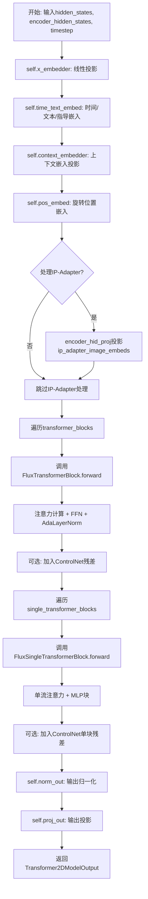

## 类结构

```
ModelMixin (抽象基类)
├── ConfigMixin (配置混入)
├── PeftAdapterMixin (PEFT适配器混入)
├── FromOriginalModelMixin (从原始模型加载混入)
├── FluxTransformer2DLoadersMixin (加载器混入)
├── CacheMixin (缓存混入)
├── AttentionMixin (注意力混入)
└── FluxTransformer2DModel (主模型类)
    ├── FluxPosEmbed (位置嵌入)
    ├── CombinedTimestepTextProjEmbeddings / CombinedTimestepGuidanceTextProjEmbeddings
    ├── nn.ModuleList[FluxTransformerBlock] (双流块列表)
    ├── nn.ModuleList[FluxSingleTransformerBlock] (单流块列表)
    ├── AdaLayerNormContinuous (输出归一化)
    └── nn.Linear (输出投影)

FluxTransformerBlock (双流变换器块)
├── AdaLayerNormZero (主分支归一化)
├── AdaLayerNormZero (上下文分支归一化)
├── FluxAttention (注意力模块)
├── nn.LayerNorm (MLP归一化)
├── FeedForward (主分支前馈)
├── nn.LayerNorm (上下文MLP归一化)
└── FeedForward (上下文前馈)

FluxSingleTransformerBlock (单流变换器块)
├── AdaLayerNormZeroSingle (归一化)
├── nn.Linear (MLP投影)
├── nn.GELU (激活)
├── nn.Linear (输出投影)
└── FluxAttention (注意力模块)

FluxAttention (注意力模块)
├── AttentionModuleMixin (混入)
├── to_q, to_k, to_v (QKV投影)
├── norm_q, norm_k (QK归一化)
├── to_out (输出投影)
├── add_q_proj, add_k_proj, add_v_proj (可选KV投影)
└── FluxAttnProcessor / FluxIPAdapterAttnProcessor (处理器)

FluxAttnProcessor (注意力处理器)
└── _get_qkv_projections (QKV投影函数)

FluxIPAdapterAttnProcessor (IP-Adapter注意力处理器)
├── to_k_ip, to_v_ip (IP投影层)
└── 支持IP隐藏状态处理
```

## 全局变量及字段


### `logger`
    
模块级日志记录器，用于输出警告和信息

类型：`logging.Logger`
    


### `FluxAttnProcessor._attention_backend`
    
类变量，存储注意力后端实现，用于dispatch_attention_fn调用

类型：`Any`
    


### `FluxAttnProcessor._parallel_config`
    
类变量，存储并行配置信息，用于分布式并行计算

类型：`Any`
    


### `FluxAttention._default_processor_cls`
    
类变量，默认的注意力处理器类，用于初始化时设置处理器

类型：`type`
    


### `FluxAttention._available_processors`
    
类变量，可用的注意力处理器列表，包含FluxAttnProcessor和FluxIPAdapterAttnProcessor

类型：`list[type]`
    


### `FluxTransformer2DModel._supports_gradient_checkpointing`
    
类变量，指示模型支持梯度检查点以节省显存

类型：`bool`
    


### `FluxTransformer2DModel._no_split_modules`
    
类变量，指定在模型并行分割时不应被分割的模块名称

类型：`list[str]`
    


### `FluxTransformer2DModel._skip_layerwise_casting_patterns`
    
类变量，指定在层-wise类型转换时应跳过的参数模式

类型：`list[str]`
    


### `FluxTransformer2DModel._repeated_blocks`
    
类变量，标记为重复块的模块名称列表，用于模型解析

类型：`list[str]`
    


### `FluxTransformer2DModel._cp_plan`
    
类变量，定义上下文并行方案的配置，指定输入输出分割维度

类型：`dict`
    


### `FluxIPAdapterAttnProcessor.hidden_size`
    
隐藏层维度大小，用于IP适配器投影

类型：`int`
    


### `FluxIPAdapterAttnProcessor.cross_attention_dim`
    
交叉注意力维度，IP适配器输入的上下文维度

类型：`int`
    


### `FluxIPAdapterAttnProcessor.scale`
    
IP适配器注意力输出的缩放因子列表

类型：`list[float]`
    


### `FluxIPAdapterAttnProcessor.to_k_ip`
    
IP适配器key投影的线性层列表

类型：`nn.ModuleList`
    


### `FluxIPAdapterAttnProcessor.to_v_ip`
    
IP适配器value投影的线性层列表

类型：`nn.ModuleList`
    


### `FluxAttention.head_dim`
    
每个注意力头的维度，等于dim_head参数

类型：`int`
    


### `FluxAttention.inner_dim`
    
注意力内部维度，等于heads * head_dim

类型：`int`
    


### `FluxAttention.query_dim`
    
查询向量的输入维度

类型：`int`
    


### `FluxAttention.use_bias`
    
是否在投影层中使用偏置

类型：`bool`
    


### `FluxAttention.dropout`
    
注意力dropout比率

类型：`float`
    


### `FluxAttention.out_dim`
    
注意力输出的维度，默认等于query_dim

类型：`int`
    


### `FluxAttention.context_pre_only`
    
是否仅对上下文进行预处理

类型：`bool | None`
    


### `FluxAttention.pre_only`
    
是否仅执行预处理阶段，绕过输出投影

类型：`bool`
    


### `FluxAttention.heads`
    
注意力头的数量

类型：`int`
    


### `FluxAttention.added_kv_proj_dim`
    
额外的key-value投影维度，用于交叉注意力

类型：`int | None`
    


### `FluxAttention.added_proj_bias`
    
额外投影层是否使用偏置

类型：`bool | None`
    


### `FluxAttention.norm_q`
    
查询向量的RMS归一化层

类型：`nn.RMSNorm`
    


### `FluxAttention.norm_k`
    
键向量的RMS归一化层

类型：`nn.RMSNorm`
    


### `FluxAttention.to_q`
    
查询向量投影线性层

类型：`nn.Linear`
    


### `FluxAttention.to_k`
    
键向量投影线性层

类型：`nn.Linear`
    


### `FluxAttention.to_v`
    
值向量投影线性层

类型：`nn.Linear`
    


### `FluxAttention.to_out`
    
注意力输出投影层列表，包含线性变换和dropout

类型：`nn.ModuleList`
    


### `FluxAttention.norm_added_q`
    
额外查询向量的RMS归一化层

类型：`nn.RMSNorm`
    


### `FluxAttention.norm_added_k`
    
额外键向量的RMS归一化层

类型：`nn.RMSNorm`
    


### `FluxAttention.add_q_proj`
    
额外查询向量投影层

类型：`nn.Linear`
    


### `FluxAttention.add_k_proj`
    
额外键向量投影层

类型：`nn.Linear`
    


### `FluxAttention.add_v_proj`
    
额外值向量投影层

类型：`nn.Linear`
    


### `FluxAttention.to_add_out`
    
额外输出投影层，用于上下文输出

类型：`nn.Linear`
    


### `FluxSingleTransformerBlock.mlp_hidden_dim`
    
MLP隐藏层维度，基于mlp_ratio计算

类型：`int`
    


### `FluxSingleTransformerBlock.norm`
    
单流Transformer块的AdaLN零初始化归一化层

类型：`AdaLayerNormZeroSingle`
    


### `FluxSingleTransformerBlock.proj_mlp`
    
MLP投影线性层

类型：`nn.Linear`
    


### `FluxSingleTransformerBlock.act_mlp`
    
MLP激活函数，使用tanh近似

类型：`nn.GELU`
    


### `FluxSingleTransformerBlock.proj_out`
    
输出投影线性层，融合注意力输出和MLP输出

类型：`nn.Linear`
    


### `FluxSingleTransformerBlock.attn`
    
单流注意力模块实例

类型：`FluxAttention`
    


### `FluxTransformerBlock.norm1`
    
主路径第一层AdaLN零初始化归一化

类型：`AdaLayerNormZero`
    


### `FluxTransformerBlock.norm1_context`
    
上下文路径第一层AdaLN零初始化归一化

类型：`AdaLayerNormZero`
    


### `FluxTransformerBlock.attn`
    
双流注意力模块，支持联合注意力

类型：`FluxAttention`
    


### `FluxTransformerBlock.norm2`
    
主路径第二层LayerNorm归一化

类型：`nn.LayerNorm`
    


### `FluxTransformerBlock.ff`
    
主路径前馈网络

类型：`FeedForward`
    


### `FluxTransformerBlock.norm2_context`
    
上下文路径第二层LayerNorm归一化

类型：`nn.LayerNorm`
    


### `FluxTransformerBlock.ff_context`
    
上下文路径前馈网络

类型：`FeedForward`
    


### `FluxPosEmbed.theta`
    
旋转位置嵌入的基础频率参数

类型：`int`
    


### `FluxPosEmbed.axes_dim`
    
各轴的维度列表，用于多轴旋转嵌入

类型：`list[int]`
    


### `FluxTransformer2DModel.out_channels`
    
输出通道数，默认等于输入通道数

类型：`int`
    


### `FluxTransformer2DModel.inner_dim`
    
模型内部维度，等于num_attention_heads * attention_head_dim

类型：`int`
    


### `FluxTransformer2DModel.pos_embed`
    
旋转位置嵌入生成器

类型：`FluxPosEmbed`
    


### `FluxTransformer2DModel.time_text_embed`
    
时间步和文本条件的联合嵌入层

类型：`CombinedTimestepTextProjEmbeddings | CombinedTimestepGuidanceTextProjEmbeddings`
    


### `FluxTransformer2DModel.context_embedder`
    
上下文嵌入投影层，将joint_attention_dim映射到inner_dim

类型：`nn.Linear`
    


### `FluxTransformer2DModel.x_embedder`
    
图像token嵌入投影层，将in_channels映射到inner_dim

类型：`nn.Linear`
    


### `FluxTransformer2DModel.transformer_blocks`
    
双流Transformer块模块列表

类型：`nn.ModuleList`
    


### `FluxTransformer2DModel.single_transformer_blocks`
    
单流Transformer块模块列表

类型：`nn.ModuleList`
    


### `FluxTransformer2DModel.norm_out`
    
输出层AdaLN连续归一化

类型：`AdaLayerNormContinuous`
    


### `FluxTransformer2DModel.proj_out`
    
最终输出投影层，将inner_dim映射回像素空间

类型：`nn.Linear`
    


### `FluxTransformer2DModel.gradient_checkpointing`
    
梯度检查点标志，控制是否启用梯度检查点优化

类型：`bool`
    
    

## 全局函数及方法


### `_get_projections`

该函数是 Flux 注意力机制的核心投影函数，负责将输入的隐藏状态通过线性变换转换为 Query、Key、Value 向量，并为可选的编码器隐藏状态生成额外的投影。当存在编码器隐藏状态且注意力模块配置了 `added_kv_proj_dim` 时，会额外计算 encoder_query、encoder_key 和 encoder_value。

参数：

- `attn`：`"FluxAttention"`，FluxAttention 模块实例，提供线性投影层（to_q、to_k、to_v 等）
- `hidden_states`：`torch.Tensor`，输入的隐藏状态张量，形状为 (batch, seq_len, hidden_dim)
- `encoder_hidden_states`：可选的 `torch.Tensor`，编码器的隐藏状态，用于跨注意力机制，默认为 None

返回值：`tuple[torch.Tensor, torch.Tensor, torch.Tensor, torch.Tensor | None, torch.Tensor | None, torch.Tensor | None]`，返回 query、key、value 三个主要投影张量，以及 encoder_query、encoder_key、encoder_value 三个可选的编码器投影张量（当 encoder_hidden_states 为 None 或 added_kv_proj_dim 为 None 时为 None）

#### 流程图

```mermaid
flowchart TD
    A[开始: _get_projections] --> B[计算 query = attn.to_q(hidden_states)]
    B --> C[计算 key = attn.to_k(hidden_states)]
    C --> D[计算 value = attn.to_v(hidden_states)]
    D --> E[初始化 encoder_query = encoder_key = encoder_value = None]
    E --> F{encoder_hidden_states is not None<br/>and attn.added_kv_proj_dim is not None?}
    F -->|否| G[直接返回]
    F -->|是| H[计算 encoder_query = attn.add_q_proj(encoder_hidden_states)]
    H --> I[计算 encoder_key = attn.add_k_proj(encoder_hidden_states)]
    I --> J[计算 encoder_value = attn.add_v_proj(encoder_hidden_states)]
    J --> G
    G --> K[返回 query, key, value, encoder_query, encoder_key, encoder_value]
```

#### 带注释源码

```python
def _get_projections(attn: "FluxAttention", hidden_states, encoder_hidden_states=None):
    """
    计算注意力机制的 Query、Key、Value 投影。
    
    该函数将输入的 hidden_states 通过 FluxAttention 模块的线性层转换为
    查询（query）、键（key）和值（value）向量。如果提供了 encoder_hidden_states
    且模块配置了 added_kv_proj_dim，还会额外计算编码器对应的投影向量。
    
    参数:
        attn: FluxAttention 模块实例，包含 to_q, to_k, to_v 等线性投影层
        hidden_states: 输入的隐藏状态张量，形状为 (batch_size, sequence_length, hidden_dim)
        encoder_hidden_states: 可选的编码器隐藏状态，用于跨注意力计算
    
    返回:
        包含 query, key, value, encoder_query, encoder_key, encoder_value 的元组
    """
    # 将 hidden_states 投影为 Query 向量
    # to_q 是一个线性层: Linear(query_dim, inner_dim)
    query = attn.to_q(hidden_states)
    
    # 将 hidden_states 投影为 Key 向量
    # to_k 是一个线性层: Linear(query_dim, inner_dim)
    key = attn.to_k(hidden_states)
    
    # 将 hidden_states 投影为 Value 向量
    # to_v 是一个线性层: Linear(query_dim, inner_dim)
    value = attn.to_v(hidden_states)

    # 初始化编码器相关的投影为 None
    # 只有在满足条件时才进行计算
    encoder_query = encoder_key = encoder_value = None
    
    # 检查是否需要计算编码器投影
    # 条件1: encoder_hidden_states 不为 None（提供了编码器输入）
    # 条件2: attn.added_kv_proj_dim 不为 None（模块配置支持额外的 KV 投影）
    if encoder_hidden_states is not None and attn.added_kv_proj_dim is not None:
        # 使用额外的投影层将 encoder_hidden_states 投影到相同的向量空间
        # 这些投影层允许在注意力计算中引入额外的条件信息
        encoder_query = attn.add_q_proj(encoder_hidden_states)
        encoder_key = attn.add_k_proj(encoder_hidden_states)
        encoder_value = attn.add_v_proj(encoder_hidden_states)

    # 返回所有投影结果
    # 如果 encoder_hidden_states 为 None 或 added_kv_proj_dim 为 None
    # 则后三个值为 None
    return query, key, value, encoder_query, encoder_key, encoder_value
```


### `_get_fused_projections`

该函数是 FluxAttention 模块的内部辅助函数，用于通过融合投影的方式计算 Query、Key、Value 向量。它使用单一的高效矩阵乘法操作（`to_qkv`）同时生成 q、k、v 三个投影，并可选地处理编码器隐藏状态的额外投影。

参数：

-  `attn`：`"FluxAttention"`，FluxAttention 类的实例，调用该函数进行投影计算
-  `hidden_states`：`torch.Tensor`，输入的隐藏状态张量，通常是经过嵌入的图像或文本特征
-  `encoder_hidden_states`：`torch.Tensor | None`，可选的编码器隐藏状态，当不为 None 时会计算额外的投影

返回值：`tuple[torch.Tensor, torch.Tensor, torch.Tensor, torch.Tensor, torch.Tensor, torch.Tensor]`，返回六个张量的元组——query、key、value（用于主 hidden_states）以及 encoder_query、encoder_key、encoder_value（用于编码器 hidden_states）。当没有编码器隐藏状态时，后三个值为 `(None,)`

#### 流程图

```mermaid
flowchart TD
    A[开始: _get_fused_projections] --> B[调用 attn.to_qkv(hidden_states)]
    B --> C[使用 .chunk(3, dim=-1) 分割结果]
    C --> D[得到 query, key, value]
    D --> E{encoder_hidden_states<br>是否不为 None?}
    E -->|否| F[设置 encoder_query<br>encoder_key<br>encoder_value = None]
    F --> G[返回所有投影]
    E -->|是| H{attn 是否有<br>to_added_qkv 属性?}
    H -->|否| F
    H -->|是| I[调用 attn.to_added_qkv<br>(encoder_hidden_states)]
    I --> J[使用 .chunk(3, dim=-1) 分割结果]
    J --> K[得到 encoder_query<br>encoder_key<br>encoder_value]
    K --> G
```

#### 带注释源码

```python
def _get_fused_projections(attn: "FluxAttention", hidden_states, encoder_hidden_states=None):
    """
    使用融合投影计算 Query、Key、Value 向量。
    
    该函数通过单次矩阵乘法同时获取 q、k、v 三个投影，比分别调用 to_q/to_k/to_v 更高效。
    
    Args:
        attn: FluxAttention 模块实例
        hidden_states: 输入的隐藏状态张量
        encoder_hidden_states: 可选的编码器隐藏状态（如文本条件）
    
    Returns:
        query, key, value, encoder_query, encoder_key, encoder_value 的元组
    """
    # 使用融合的 to_qkv 方法一次性计算 query, key, value
    # .chunk(3, dim=-1) 将结果在最后一个维度上分割成三等份
    query, key, value = attn.to_qkv(hidden_states).chunk(3, dim=-1)

    # 初始化编码器相关的投影为 None
    encoder_query = encoder_key = encoder_value = (None,)
    
    # 如果提供了编码器隐藏状态且 attn 支持 to_added_qkv 方法
    if encoder_hidden_states is not None and hasattr(attn, "to_added_qkv"):
        # 使用额外的融合投影方法处理编码器隐藏状态
        encoder_query, encoder_key, encoder_value = attn.to_added_qkv(encoder_hidden_states).chunk(3, dim=-1)

    return query, key, value, encoder_query, encoder_key, encoder_value
```


### `_get_qkv_projections`

该函数是 Flux 注意力机制中的 QKV 投影获取入口函数，根据注意力模块是否启用了融合投影特性，动态选择调用融合投影函数或独立投影函数，以获取查询（query）、键（key）、值（value）以及对应的编码器投影。

参数：

- `attn`：`"FluxAttention"`，Flux 注意力模块实例，用于访问投影矩阵（to_q、to_k、to_v 等）和配置属性（fused_projections、added_kv_proj_dim）
- `hidden_states`：`torch.Tensor`，输入的隐藏状态张量，通常形状为 `(batch_size, seq_len, dim)`
- `encoder_hidden_states`：`torch.Tensor | None`，可选的编码器隐藏状态，用于跨注意力机制，形状为 `(batch_size, encoder_seq_len, encoder_dim)`

返回值：`tuple[torch.Tensor, torch.Tensor, torch.Tensor, torch.Tensor | None, torch.Tensor | None, torch.Tensor | None]`，返回包含 query、key、value、encoder_query、encoder_key、encoder_value 的元组，其中编码器相关投影在未提供 encoder_hidden_states 或 added_kv_proj_dim 为 None 时为 None

#### 流程图

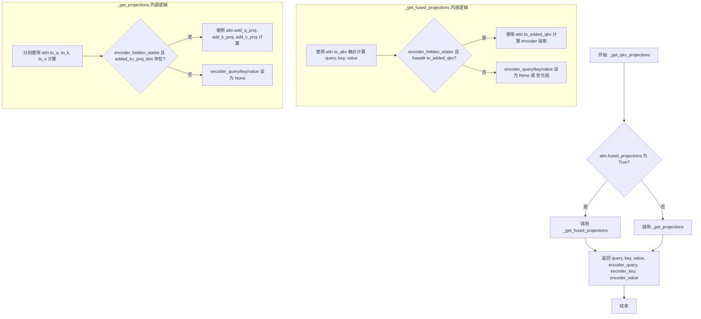

#### 带注释源码

```python
def _get_qkv_projections(attn: "FluxAttention", hidden_states, encoder_hidden_states=None):
    """
    获取注意力机制的 QKV 投影。
    
    根据 attn.fused_projections 配置选择使用融合投影或独立投影方式计算 query、key、value
    以及对应的编码器投影。此函数是 FluxAttention 处理器调用链中的关键入口点。
    
    Args:
        attn: FluxAttention 实例，包含投影矩阵和配置属性
        hidden_states: 输入隐藏状态，形状为 (batch_size, seq_len, hidden_dim)
        encoder_hidden_states: 可选的编码器隐藏状态，用于跨注意力计算
    
    Returns:
        包含 (query, key, value, encoder_query, encoder_key, encoder_value) 的元组
    """
    # 检查注意力模块是否启用了融合投影优化
    if attn.fused_projections:
        # 融合投影模式：使用单一的 fused 投影矩阵一次计算 qkv
        # 优点：减少矩阵运算次数，提升计算效率
        return _get_fused_projections(attn, hidden_states, encoder_hidden_states)
    
    # 标准投影模式：分别使用独立的 to_q, to_k, to_v 投影矩阵
    # 兼容性更好，支持更多自定义配置
    return _get_projections(attn, hidden_states, encoder_hidden_states)


def _get_projections(attn: "FluxAttention", hidden_states, encoder_hidden_states=None):
    """
    标准（非融合）QKV 投影计算方式。
    
    使用三个独立的线性层（to_q, to_k, to_v）分别将 hidden_states 投影到 query、key、value 空间。
    如果提供了 encoder_hidden_states 且 added_kv_proj_dim 存在，则额外计算编码器专用的 qkv 投影。
    """
    # 主路径投影：使用独立矩阵计算主注意力的 q、k、v
    query = attn.to_q(hidden_states)  # 形状: (batch, seq_len, inner_dim)
    key = attn.to_k(hidden_states)    # 形状: (batch, seq_len, inner_dim)
    value = attn.to_v(hidden_states)  # 形状: (batch, seq_len, inner_dim)

    # 初始化编码器投影为 None（无 encoder_hidden_states 时返回）
    encoder_query = encoder_key = encoder_value = None
    
    # 编码器投影：仅当同时满足以下条件时计算：
    # 1. 提供了 encoder_hidden_states（跨注意力上下文）
    # 2. added_kv_proj_dim 不为 None（启用了额外的 kv 投影维度）
    if encoder_hidden_states is not None and attn.added_kv_proj_dim is not None:
        encoder_query = attn.add_q_proj(encoder_hidden_states)  # 编码器 query 投影
        encoder_key = attn.add_k_proj(encoder_hidden_states)    # 编码器 key 投影
        encoder_value = attn.add_v_proj(encoder_hidden_states) # 编码器 value 投影

    return query, key, value, encoder_query, encoder_key, encoder_value


def _get_fused_projections(attn: "FluxAttention", hidden_states, encoder_hidden_states=None):
    """
    融合 QKV 投影计算方式。
    
    使用单一的 fused 矩阵（to_qkv）一次性计算 qkv，然后通过 chunk 操作分离。
    这种方式相比独立投影可以减少内存访问开销，提升推理性能。
    """
    # 融合投影：使用 to_qkv 一次矩阵乘法得到合并结果，再 chunk 分离
    # chunk(3, dim=-1) 表示在最后一维分成 3 份
    query, key, value = attn.to_qkv(hidden_states).chunk(3, dim=-1)

    # 编码器融合投影初始化
    encoder_query = encoder_key = encoder_value = (None,)
    
    # 检查是否可以使用融合方式计算编码器投影
    if encoder_hidden_states is not None and hasattr(attn, "to_added_qkv"):
        # 使用 to_added_qkv 融合计算编码器的 qkv
        encoder_query, encoder_key, encoder_value = attn.to_added_qkv(encoder_hidden_states).chunk(3, dim=-1)

    return query, key, value, encoder_query, encoder_key, encoder_value
```


### `FluxAttnProcessor.__init__`

该方法为 Flux 注意力处理器的初始化方法，主要用于检查 PyTorch 版本兼容性，确保 PyTorch 支持 `scaled_dot_product_attention` 函数，否则抛出 ImportError 异常。

参数：

- 该方法无参数

返回值：`None`，无返回值

#### 流程图

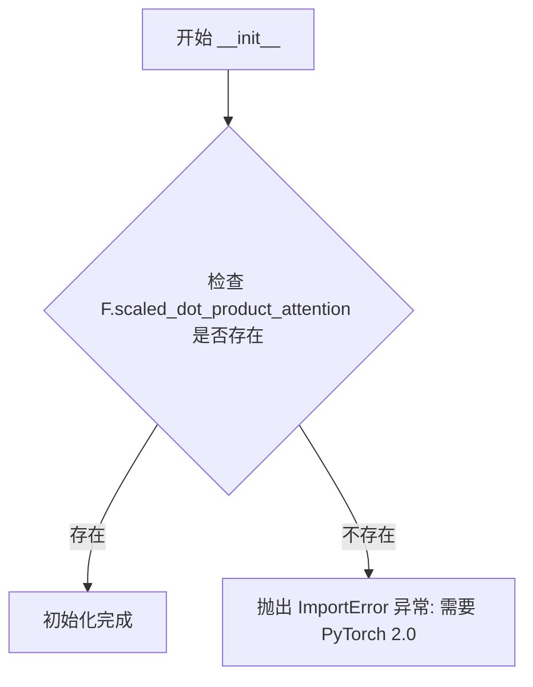

#### 带注释源码

```python
class FluxAttnProcessor:
    """Flux 注意力处理器类，用于处理 Flux 模型中的注意力计算"""
    
    # 类属性：注意力后端配置，默认为 None
    _attention_backend = None
    # 类属性：并行配置，默认为 None
    _parallel_config = None

    def __init__(self):
        """
        初始化 FluxAttnProcessor 实例。
        
        检查当前 PyTorch 版本是否支持 scaled_dot_product_attention 函数。
        该函数是 PyTorch 2.0 引入的高效注意力计算实现，是 Flux 模型运行的必要依赖。
        """
        # 检查 PyTorch 是否具有 scaled_dot_product_attention 函数
        if not hasattr(F, "scaled_dot_product_attention"):
            # 如果不支持，抛出 ImportError 异常，提示用户升级 PyTorch
            raise ImportError(f"{self.__class__.__name__} requires PyTorch 2.0. Please upgrade your pytorch version.")
```


### `FluxAttnProcessor.__call__`

这是FluxAttnProcessor类的核心调用方法，负责执行Flux模型中的注意力计算。该方法接收隐藏状态和编码器隐藏状态，通过QKV投影、归一化、旋转嵌入应用等步骤，最后调用注意力后端函数完成注意力计算，并根据是否有编码器隐藏状态返回不同的结果。

参数：

- `attn`：`FluxAttention`，Flux注意力模块实例，用于获取投影层和归一化层
- `hidden_states`：`torch.Tensor`，输入的隐藏状态张量，形状为`(batch, seq, dim)`
- `encoder_hidden_states`：`torch.Tensor | None`，编码器的隐藏状态，用于cross-attention计算，默认为None
- `attention_mask`：`torch.Tensor | None`，注意力掩码，用于屏蔽特定位置的注意力，默认为None
- `image_rotary_emb`：`torch.Tensor | None`，图像的旋转位置嵌入，用于位置编码，默认为None

返回值：`torch.Tensor | tuple[torch.Tensor, torch.Tensor]`，当有encoder_hidden_states时返回两个张量的元组(隐藏状态, 编码器隐藏状态)，否则返回单一的隐藏状态张量

#### 流程图

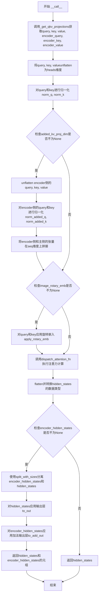

#### 带注释源码

```python
def __call__(
    self,
    attn: "FluxAttention",
    hidden_states: torch.Tensor,
    encoder_hidden_states: torch.Tensor = None,
    attention_mask: torch.Tensor | None = None,
    image_rotary_emb: torch.Tensor | None = None,
) -> torch.Tensor:
    # 1. 获取QKV投影：根据是否使用融合投影，调用_get_qkv_projections获取query, key, value以及encoder侧的query, key, value
    query, key, value, encoder_query, encoder_key, encoder_value = _get_qkv_projections(
        attn, hidden_states, encoder_hidden_states
    )

    # 2. 将query, key, value从(dim,)展开为(heads, head_dim)维度，以便进行多头注意力计算
    query = query.unflatten(-1, (attn.heads, -1))
    key = key.unflatten(-1, (attn.heads, -1))
    value = value.unflatten(-1, (attn.heads, -1))

    # 3. 对query和key进行RMSNorm归一化
    query = attn.norm_q(query)
    key = attn.norm_k(key)

    # 4. 如果存在额外的KV投影维度（用于cross-attention），则处理encoder侧的hidden states
    if attn.added_kv_proj_dim is not None:
        # 同样unflatten encoder侧的维度
        encoder_query = encoder_query.unflatten(-1, (attn.heads, -1))
        encoder_key = encoder_key.unflatten(-1, (attn.heads, -1))
        encoder_value = encoder_value.unflatten(-1, (attn.heads, -1))

        # 对encoder侧的query和key进行归一化
        encoder_query = attn.norm_added_q(encoder_query)
        encoder_key = attn.norm_added_k(encoder_key)

        # 在序列维度(dim=1)上拼接encoder和main的query, key, value
        # 这样可以实现joint attention，同时关注encoder和main的hidden states
        query = torch.cat([encoder_query, query], dim=1)
        key = torch.cat([encoder_key, key], dim=1)
        value = torch.cat([encoder_value, value], dim=1)

    # 5. 如果提供了图像旋转位置嵌入，则应用到query和key上
    # 旋转嵌入是一种位置编码方式，用于增强模型对位置信息的理解
    if image_rotary_emb is not None:
        query = apply_rotary_emb(query, image_rotary_emb, sequence_dim=1)
        key = apply_rotary_emb(key, image_rotary_emb, sequence_dim=1)

    # 6. 调用分发的注意力函数执行核心的注意力计算
    # 这是实际执行attention的地方，支持多种后端实现
    hidden_states = dispatch_attention_fn(
        query,
        key,
        value,
        attn_mask=attention_mask,
        backend=self._attention_backend,
        parallel_config=self._parallel_config,
    )
    
    # 7. 将输出从(batch, heads, seq, head_dim)展平为(batch, seq, heads*head_dim)
    # 并将数据类型转换为与query相同
    hidden_states = hidden_states.flatten(2, 3)
    hidden_states = hidden_states.to(query.dtype)

    # 8. 如果存在encoder_hidden_states，需要分离并分别处理输出
    if encoder_hidden_states is not None:
        # 根据encoder_hidden_states的长度在序列维度上分割输出
        encoder_hidden_states, hidden_states = hidden_states.split_with_sizes(
            [encoder_hidden_states.shape[1], hidden_states.shape[1] - encoder_hidden_states.shape[1]], dim=1
        )
        
        # 对主hidden states应用输出投影层(Linear + Dropout)
        hidden_states = attn.to_out[0](hidden_states.contiguous())
        hidden_states = attn.to_out[1](hidden_states)
        
        # 对encoder hidden states应用加法输出投影层
        encoder_hidden_states = attn.to_add_out(encoder_hidden_states.contiguous())

        # 返回两个hidden states用于后续的transformer block处理
        return hidden_states, encoder_hidden_states
    else:
        # 如果没有encoder hidden states，只返回主hidden states
        return hidden_states
```


### `FluxIPAdapterAttnProcessor.__init__`

该方法是 FluxIPAdapterAttnProcessor 类的构造函数，用于初始化 IP-Adapter 的注意力处理器。它设置了隐藏层大小、交叉注意力维度、token 数量和缩放因子，并创建了用于处理 IP-Adapter 特征的可学习线性投影层。

参数：

- `self`：类的实例本身
- `hidden_size`：`int`，隐藏层大小，用于指定线性投影层的输出维度
- `cross_attention_dim`：`int`，交叉注意力维度，用于指定输入特征的维度
- `num_tokens`：`tuple[int] | int`，IP-Adapter 使用的 token 数量，默认为 (4,)
- `scale`：`float | list[float]`，IP-Adapter 的缩放因子，默认为 1.0，可以为每个 token 指定不同的缩放因子
- `device`：`torch.device | None`，指定模型参数存放的设备，默认为 None
- `dtype`：`torch.dtype | None`，指定模型参数的数据类型，默认为 None

返回值：`None`，构造函数无返回值

#### 流程图

```mermaid
flowchart TD
    A[开始 __init__] --> B[调用 super().__init__]
    B --> C{PyTorch 2.0 可用?}
    C -->|否| D[抛出 ImportError]
    C -->|是| E[保存 hidden_size]
    E --> F[保存 cross_attention_dim]
    F --> G{num_tokens 是 tuple/list?}
    G -->|否| H[转换为列表]
    G -->|是| I{scale 是 list?}
    H --> I
    I -->|否| J[创建与 num_tokens 等长的 scale 列表]
    I -->|是| K{scale 长度 == num_tokens 长度?}
    J --> K
    K -->|否| L[抛出 ValueError]
    K -->|是| M[保存 self.scale]
    M --> N[创建 to_k_ip ModuleList]
    N --> O[创建 to_v_ip ModuleList]
    O --> P[结束 __init__]
    D --> P
    L --> P
```

#### 带注释源码

```python
def __init__(
    self, hidden_size: int, cross_attention_dim: int, num_tokens=(4,), scale=1.0, device=None, dtype=None
):
    """
    初始化 FluxIPAdapterAttnProcessor 注意力处理器。
    
    参数:
        hidden_size: 隐藏层大小，用于线性投影的输出维度
        cross_attention_dim: 交叉注意力维度，输入特征的维度
        num_tokens: IP-Adapter 使用的 token 数量，支持单个值或元组/列表
        scale: 缩放因子，支持单个值或列表（每个 token 可有不同缩放因子）
        device: 模型参数存放的设备
        dtype: 模型参数的数据类型
    """
    # 调用父类 torch.nn.Module 的初始化方法
    super().__init__()

    # 检查 PyTorch 版本是否支持 scaled_dot_product_attention
    # IP-Adapter 需要 PyTorch 2.0+ 的 SDPA 注意力机制
    if not hasattr(F, "scaled_dot_product_attention"):
        raise ImportError(
            f"{self.__class__.__name__} requires PyTorch 2.0, to use it, please upgrade PyTorch to 2.0."
        )

    # 保存隐藏层大小和交叉注意力维度
    self.hidden_size = hidden_size
    self.cross_attention_dim = cross_attention_dim

    # 如果 num_tokens 不是元组或列表，转换为列表
    # 支持传入单个整数或元组/列表形式的 token 数量
    if not isinstance(num_tokens, (tuple, list)):
        num_tokens = [num_tokens]

    # 如果 scale 不是列表，将其扩展为与 num_tokens 长度相同的列表
    # 允许为每个 IP-Adapter token 设置不同的缩放因子
    if not isinstance(scale, list):
        scale = [scale] * len(num_tokens)
    
    # 验证 scale 列表长度与 num_tokens 长度一致
    if len(scale) != len(num_tokens):
        raise ValueError("`scale` should be a list of integers with the same length as `num_tokens`.")
    
    # 保存缩放因子列表
    self.scale = scale

    # 创建 to_k_ip ModuleList：为每个 IP-Adapter token 创建键的投影层
    # 将 cross_attention_dim 维度的特征投影到 hidden_size 维度
    self.to_k_ip = nn.ModuleList(
        [
            nn.Linear(cross_attention_dim, hidden_size, bias=True, device=device, dtype=dtype)
            for _ in range(len(num_tokens))
        ]
    )
    
    # 创建 to_v_ip ModuleList：为每个 IP-Adapter token 创建值的投影层
    # 将 cross_attention_dim 维度的特征投影到 hidden_size 维度
    self.to_v_ip = nn.ModuleList(
        [
            nn.Linear(cross_attention_dim, hidden_size, bias=True, device=device, dtype=dtype)
            for _ in range(len(num_tokens))
        ]
    )
```


### `FluxIPAdapterAttnProcessor.__call__`

实现 IP-Adapter 注意力处理的调用方法，负责计算带有多模态 IP 特征注入的注意力输出，支持图像和文本的双流交互。

参数：

- `attn`：`"FluxAttention"`，FluxAttention 模块实例，用于访问注意力机制的参数和配置
- `hidden_states`：`torch.Tensor`，输入的隐藏状态张量，形状为 `(batch_size, seq_len, hidden_dim)`
- `encoder_hidden_states`：`torch.Tensor | None`，编码器隐藏状态，文本条件嵌入，可选
- `attention_mask`：`torch.Tensor | None`，注意力掩码，用于控制注意力计算，可选
- `image_rotary_emb`：`torch.Tensor | None`，图像旋转位置嵌入，用于位置编码，可选
- `ip_hidden_states`：`list[torch.Tensor] | None`，IP-Adapter 的图像嵌入列表，每个元素对应一个 IP 适配器，可选
- `ip_adapter_masks`：`torch.Tensor | None`，IP-Adapter 的注意力掩码，可选

返回值：`torch.Tensor | tuple[torch.Tensor, torch.Tensor, torch.Tensor]`，当存在 `encoder_hidden_states` 时返回三个张量的元组 `(hidden_states, encoder_hidden_states, ip_attn_output)`，否则返回单一的 `hidden_states`

#### 流程图

```mermaid
flowchart TD
    A[开始 __call__] --> B[获取 batch_size]
    B --> C[调用 _get_qkv_projections 获取 Q K V 和 encoder_Q K V]
    C --> D[将 Q K V unflatten 到 attn.heads 维度]
    D --> E[对 Q K 进行归一化 norm_q norm_k]
    E --> F{encoder_hidden_states<br>是否为空?}
    F -->|是| G[跳过 encoder 处理]
    F -->|否| H[unflatten encoder_Q K V 并归一化]
    H --> I[拼接 encoder_Q 与 Q, encoder_K 与 K, encoder_V 与 V]
    G --> J{image_rotary_emb<br>是否为空?}
    J -->|是| K[跳过旋转嵌入]
    J -->|是| L[对 Q K 应用 apply_rotary_emb]
    L --> M[调用 dispatch_attention_fn 计算注意力]
    M --> N[flatten 结果并转换 dtype]
    N --> O{encoder_hidden_states<br>是否为空?}
    O -->|是| P[直接返回 hidden_states]
    O -->|否| Q[split 分离 encoder_hidden_states 和 hidden_states]
    Q --> R[应用 to_out[0] 和 to_out[1] 处理 hidden_states]
    R --> S[应用 to_add_out 处理 encoder_hidden_states]
    S --> T[初始化 ip_attn_output 为零张量]
    T --> U{遍历 ip_hidden_states]}
    U -->|每个 ip| V[计算 ip_key 和 ip_value]
    V --> W[reshape 到 batch heads seq dim]
    W --> X[调用 dispatch_attention_fn 计算 IP 注意力]
    X --> Y[reshape 并转换 dtype]
    Y --> Z[累加 scale * current_ip_hidden_states 到 ip_attn_output]
    Z --> U
    U -->|完成| AA[返回 hidden_states, encoder_hidden_states, ip_attn_output]
```

#### 带注释源码

```python
def __call__(
    self,
    attn: "FluxAttention",
    hidden_states: torch.Tensor,
    encoder_hidden_states: torch.Tensor = None,
    attention_mask: torch.Tensor | None = None,
    image_rotary_emb: torch.Tensor | None = None,
    ip_hidden_states: list[torch.Tensor] | None = None,
    ip_adapter_masks: torch.Tensor | None = None,
) -> torch.Tensor:
    """
    IP-Adapter 注意力处理器的核心调用方法。
    
    参数:
        attn: FluxAttention 模块实例
        hidden_states: 输入隐藏状态
        encoder_hidden_states: 编码器隐藏状态（文本条件）
        attention_mask: 注意力掩码
        image_rotary_emb: 图像旋转嵌入
        ip_hidden_states: IP-Adapter 图像嵌入列表
        ip_adapter_masks: IP-Adapter 掩码
    
    返回:
        处理后的隐藏状态或元组
    """
    # 获取批量大小，用于后续 reshape 操作
    batch_size = hidden_states.shape[0]

    # ============ 步骤 1: 获取 QKV 投影 ============
    # 调用 _get_qkv_projections 获取查询、键、值以及编码器部分的 QKV
    # 如果 attn.fused_projections 为 True，则使用融合投影
    query, key, value, encoder_query, encoder_key, encoder_value = _get_qkv_projections(
        attn, hidden_states, encoder_hidden_states
    )

    # ============ 步骤 2: 展开到多头维度 ============
    # 将最后一个维度展开为 (heads, head_dim) 形式
    query = query.unflatten(-1, (attn.heads, -1))
    key = key.unflatten(-1, (attn.heads, -1))
    value = value.unflatten(-1, (attn.heads, -1))

    # ============ 步骤 3: 归一化 Q K ============
    # 使用 RMSNorm 对查询和键进行归一化
    query = attn.norm_q(query)
    key = attn.norm_k(key)
    # 保存原始 query 用于后续 IP-Adapter 交叉注意力
    ip_query = query

    # ============ 步骤 4: 处理编码器隐藏状态 ============
    if encoder_hidden_states is not None:
        # 展开编码器的 QKV 到多头维度
        encoder_query = encoder_query.unflatten(-1, (attn.heads, -1))
        encoder_key = encoder_key.unflatten(-1, (attn.heads, -1))
        encoder_value = encoder_value.unflatten(-1, (attn.heads, -1))

        # 归一化编码器的 Q 和 K
        encoder_query = attn.norm_added_q(encoder_query)
        encoder_key = attn.norm_added_k(encoder_key)

        # 将编码器部分拼接在序列前面
        # 拼接后: [encoder_seq_len + seq_len, batch, heads, head_dim]
        query = torch.cat([encoder_query, query], dim=1)
        key = torch.cat([encoder_key, key], dim=1)
        value = torch.cat([encoder_value, value], dim=1)

    # ============ 步骤 5: 应用旋转位置嵌入 ============
    if image_rotary_emb is not None:
        # 对查询和键应用旋转嵌入（用于图像位置编码）
        query = apply_rotary_emb(query, image_rotary_emb, sequence_dim=1)
        key = apply_rotary_emb(key, image_rotary_emb, sequence_dim=1)

    # ============ 步骤 6: 计算主注意力 ============
    # 调用分发的注意力函数计算注意力输出
    hidden_states = dispatch_attention_fn(
        query,
        key,
        value,
        attn_mask=attention_mask,
        dropout_p=0.0,
        is_causal=False,
        backend=self._attention_backend,
        parallel_config=self._parallel_config,
    )
    # 展平并转换数据类型
    hidden_states = hidden_states.flatten(2, 3)
    hidden_states = hidden_states.to(query.dtype)

    # ============ 步骤 7: 分离并后处理 ============
    if encoder_hidden_states is not None:
        # 分离编码器隐藏状态和主隐藏状态
        encoder_hidden_states, hidden_states = hidden_states.split_with_sizes(
            [encoder_hidden_states.shape[1], hidden_states.shape[1] - encoder_hidden_states.shape[1]], dim=1
        )
        # 通过输出层处理
        hidden_states = attn.to_out[0](hidden_states)
        hidden_states = attn.to_out[1](hidden_states)
        encoder_hidden_states = attn.to_add_out(encoder_hidden_states)

        # ============ 步骤 8: IP-Adapter 交叉注意力 ============
        # 初始化 IP 注意力输出为零张量
        ip_attn_output = torch.zeros_like(hidden_states)

        # 遍历每个 IP 适配器的隐藏状态
        for current_ip_hidden_states, scale, to_k_ip, to_v_ip in zip(
            ip_hidden_states, self.scale, self.to_k_ip, self.to_v_ip
        ):
            # 通过线性层投影 IP 隐藏状态到 key 和 value 空间
            ip_key = to_k_ip(current_ip_hidden_states)
            ip_value = to_v_ip(current_ip_hidden_states)

            # 调整形状为 [batch, seq, heads, head_dim]
            ip_key = ip_key.view(batch_size, -1, attn.heads, attn.head_dim)
            ip_value = ip_value.view(batch_size, -1, attn.heads, attn.head_dim)

            # 计算 IP 交叉注意力
            # 使用原始 query (ip_query) 与 IP 的 key value 计算注意力
            current_ip_hidden_states = dispatch_attention_fn(
                ip_query,  # 使用原始查询，不含 encoder 部分
                ip_key,
                ip_value,
                attn_mask=None,
                dropout_p=0.0,
                is_causal=False,
                backend=self._attention_backend,
                parallel_config=self._parallel_config,
            )
            # 展平并转换数据类型
            current_ip_hidden_states = current_ip_hidden_states.reshape(batch_size, -1, attn.heads * attn.head_dim)
            current_ip_hidden_states = current_ip_hidden_states.to(ip_query.dtype)
            
            # 累加带缩放的 IP 注意力输出
            ip_attn_output += scale * current_ip_hidden_states

        # 返回三个输出：主隐藏状态、编码器隐藏状态、IP 注意力输出
        return hidden_states, encoder_hidden_states, ip_attn_output
    else:
        # 无编码器隐藏状态时只返回主 hidden_states
        return hidden_states
```


### `FluxAttention.__init__`

该方法是 FluxAttention 类的构造函数，负责初始化注意力机制的核心组件，包括 Query/Key/Value 投影层、RMSNorm 归一化层、以及输出投影层，并根据参数配置处理额外的 KV 投影维度。

参数：

- `query_dim`：`int`，输入查询向量的维度
- `heads`：`int = 8`，注意力头的数量，默认为 8
- `dim_head`：`int = 64`，每个注意力头的维度，默认为 64
- `dropout`：`float = 0.0`，Dropout 概率，默认为 0.0
- `bias`：`bool = False`，是否在 QKV 线性层中使用偏置，默认为 False
- `added_kv_proj_dim`：`int | None = None`，额外的 KV 投影维度，用于跨注意力机制
- `added_proj_bias`：`bool | None = True`，额外的 KV 投影层是否使用偏置，默认为 True
- `out_bias`：`bool = True`，输出线性层是否使用偏置，默认为 True
- `eps`：`float = 1e-5`，RMSNorm 的 epsilon 值，用于数值稳定性，默认为 1e-5
- `out_dim`：`int = None`，输出的维度，默认为 None（等于 query_dim）
- `context_pre_only`：`bool | None = None`，是否仅预处理上下文，默认为 None
- `pre_only`：`bool = False`，是否仅进行预处理（无输出投影层），默认为 False
- `elementwise_affine`：`bool = True`，RMSNorm 是否使用可学习的仿射参数，默认为 True
- `processor`：注意力处理器实例，默认为 None

返回值：无（`None`），构造函数仅初始化对象状态

#### 流程图

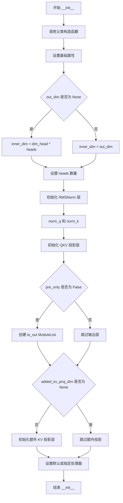

#### 带注释源码

```python
def __init__(
    self,
    query_dim: int,                  # 输入查询向量的维度
    heads: int = 8,                  # 注意力头的数量
    dim_head: int = 64,              # 每个注意力头的维度
    dropout: float = 0.0,            # Dropout 概率
    bias: bool = False,              # QKV 投影是否使用偏置
    added_kv_proj_dim: int | None = None,  # 额外 KV 投影维度
    added_proj_bias: bool | None = True,   # 额外投影是否使用偏置
    out_bias: bool = True,           # 输出层是否使用偏置
    eps: float = 1e-5,               # RMSNorm 的 epsilon
    out_dim: int = None,             # 输出维度
    context_pre_only: bool | None = None,  # 是否仅预处理上下文
    pre_only: bool = False,          # 是否仅预处理（无输出层）
    elementwise_affine: bool = True, # RMSNorm 是否使用仿射变换
    processor=None,                  # 注意力处理器实例
):
    super().__init__()  # 调用 nn.Module 父类初始化

    # 设置注意力机制的基础维度参数
    self.head_dim = dim_head  # 每个头的维度
    # 计算内部维度：如果指定了 out_dim 则使用它，否则使用 heads * dim_head
    self.inner_dim = out_dim if out_dim is not None else dim_head * heads
    self.query_dim = query_dim  # 查询向量维度
    self.use_bias = bias  # 是否使用偏置
    self.dropout = dropout  # Dropout 概率
    # 设置输出维度：默认等于 query_dim
    self.out_dim = out_dim if out_dim is not None else query_dim
    self.context_pre_only = context_pre_only  # 上下文预处理标志
    self.pre_only = pre_only  # 仅预处理标志
    # 计算头的数量：如果指定了 out_dim 则用它除以 dim_head
    self.heads = out_dim // dim_head if out_dim is not None else heads
    self.added_kv_proj_dim = added_kv_proj_dim  # 额外 KV 投影维度
    self.added_proj_bias = added_proj_bias  # 额外投影偏置

    # 初始化 Query 和 Key 的 RMSNorm 归一化层
    self.norm_q = torch.nn.RMSNorm(dim_head, eps=eps, elementwise_affine=elementwise_affine)
    self.norm_k = torch.nn.RMSNorm(dim_head, eps=eps, elementwise_affine=elementwise_affine)

    # 初始化 QKV 投影线性层
    self.to_q = torch.nn.Linear(query_dim, self.inner_dim, bias=bias)  # Query 投影
    self.to_k = torch.nn.Linear(query_dim, self.inner_dim, bias=bias)  # Key 投影
    self.to_v = torch.nn.Linear(query_dim, self.inner_dim, bias=bias)  # Value 投影

    # 如果不是仅预处理模式，初始化输出投影层
    if not self.pre_only:
        self.to_out = torch.nn.ModuleList([])  # 创建 ModuleList 用于存放输出层
        # 添加线性投影层
        self.to_out.append(torch.nn.Linear(self.inner_dim, self.out_dim, bias=out_bias))
        # 添加 Dropout 层
        self.to_out.append(torch.nn.Dropout(dropout))

    # 如果存在额外的 KV 投影维度，初始化相关投影层
    if added_kv_proj_dim is not None:
        # 初始化额外的 QKV 归一化层
        self.norm_added_q = torch.nn.RMSNorm(dim_head, eps=eps)
        self.norm_added_k = torch.nn.RMSNorm(dim_head, eps=eps)
        # 初始化额外的投影层用于处理 encoder_hidden_states
        self.add_q_proj = torch.nn.Linear(added_kv_proj_dim, self.inner_dim, bias=added_proj_bias)
        self.add_k_proj = torch.nn.Linear(added_kv_proj_dim, self.inner_dim, bias=added_proj_bias)
        self.add_v_proj = torch.nn.Linear(added_kv_proj_dim, self.inner_dim, bias=added_proj_bias)
        # 输出投影层，用于将注意力输出转换回原始维度
        self.to_add_out = torch.nn.Linear(self.inner_dim, query_dim, bias=out_bias)

    # 如果没有提供处理器，使用默认的处理器
    if processor is None:
        processor = self._default_processor_cls()
    # 设置注意力处理器
    self.set_processor(processor)
```


### `FluxAttention.forward`

`FluxAttention.forward` 是 Flux 模型中注意力机制的前向传播方法，负责处理隐藏状态的注意力计算。该方法通过委托给注册的注意力处理器（processor）来执行实际的注意力计算，支持标准注意力、IP-Adapter 注意力等多种变体，同时处理旋转位置嵌入（RoPE）和编码器隐藏状态的联合注意力。

参数：

- `self`：类的实例本身
- `hidden_states`：`torch.Tensor`，输入的隐藏状态张量，形状为 `(batch_size, sequence_length, query_dim)`
- `encoder_hidden_states`：`torch.Tensor | None`，编码器的隐藏状态，用于联合注意力机制，如果为 `None` 则不执行跨注意力
- `attention_mask`：`torch.Tensor | None`，注意力掩码，用于控制注意力权重的计算
- `image_rotary_emb`：`torch.Tensor | None`，图像的旋转位置嵌入，用于旋转位置编码（RoPE）
- `**kwargs`：可变关键字参数，用于传递额外的参数（如 IP-Adapter 相关的 `ip_hidden_states`、`ip_adapter_masks` 等），这些参数会被传递给处理器

返回值：`torch.Tensor` 或 `tuple[torch.Tensor, torch.Tensor]` 或 `tuple[torch.Tensor, torch.Tensor, torch.Tensor]`，返回注意力计算后的隐藏状态。如果 `encoder_hidden_states` 不为 `None`，则返回元组（主隐藏状态，编码器隐藏状态）；如果还包含 IP-Adapter 输出，则返回三元组。

#### 流程图

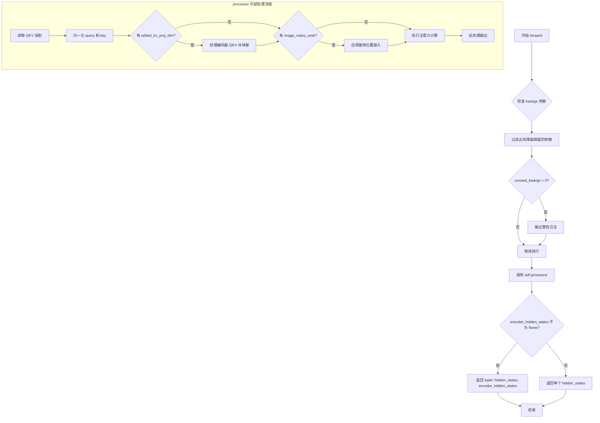

#### 带注释源码

```python
def forward(
    self,
    hidden_states: torch.Tensor,
    encoder_hidden_states: torch.Tensor | None = None,
    attention_mask: torch.Tensor | None = None,
    image_rotary_emb: torch.Tensor | None = None,
    **kwargs,
) -> torch.Tensor:
    """
    FluxAttention 的前向传播方法。
    
    该方法不直接执行注意力计算，而是将计算委托给注册的处理器（processor）。
    这种设计允许灵活切换不同的注意力实现（如标准注意力、IP-Adapter 注意力等）。
    
    参数:
        hidden_states: 输入的隐藏状态张量
        encoder_hidden_states: 编码器的隐藏状态（用于跨注意力）
        attention_mask: 注意力掩码
        image_rotary_emb: 旋转位置嵌入
        **kwargs: 额外的关键字参数，会被传递给处理器
    
    返回:
        注意力计算后的隐藏状态，可能是单个张量或元组
    """
    # 获取处理器 __call__ 方法的参数签名
    attn_parameters = set(inspect.signature(self.processor.__call__).parameters.keys())
    
    # 定义静默忽略的参数（不会产生警告）
    quiet_attn_parameters = {"ip_adapter_masks", "ip_hidden_states"}
    
    # 筛选出未被使用的 kwargs 参数
    unused_kwargs = [k for k, _ in kwargs.items() if k not in attn_parameters and k not in quiet_attn_parameters]
    
    # 如果存在未预期的参数，发出警告
    if len(unused_kwargs) > 0:
        logger.warning(
            f"joint_attention_kwargs {unused_kwargs} are not expected by {self.processor.__class__.__name__} and will be ignored."
        )
    
    # 只保留处理器期望的参数
    kwargs = {k: w for k, w in kwargs.items() if k in attn_parameters}
    
    # 调用处理器执行实际的注意力计算
    # 处理器可能是 FluxAttnProcessor 或 FluxIPAdapterAttnProcessor
    return self.processor(self, hidden_states, encoder_hidden_states, attention_mask, image_rotary_emb, **kwargs)
```


### `FluxAttention.set_processor`

设置注意力处理器，用于配置注意力模块的具体实现。

参数：

-  `processor`：对象，需要设置的注意力处理器实例，必须是 `FluxAttnProcessor` 或 `FluxIPAdapterAttnProcessor` 之一

返回值：`None`，无返回值

#### 流程图

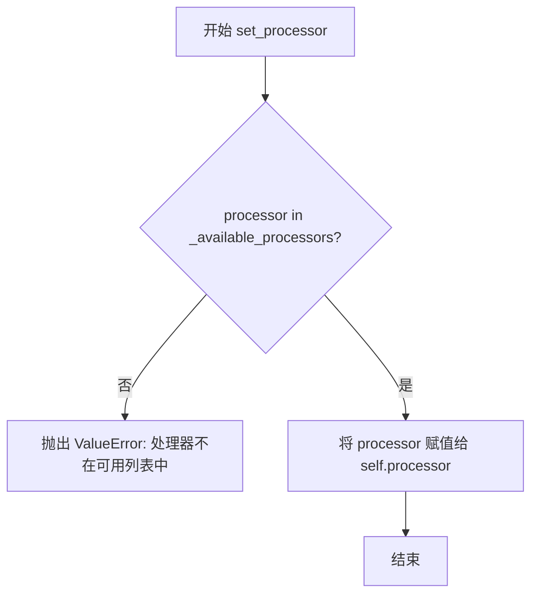

#### 带注释源码

```python
def set_processor(self, processor: "FluxAttnProcessor") -> None:
    """
    设置注意力处理器。
    
    Args:
        processor: 注意力处理器实例，必须是 _available_processors 列表中的类
    """
    # 检查传入的处理器是否在可用处理器列表中
    if processor.__class__ not in self._available_processors:
        # 如果处理器不在列表中，抛出 ValueError 异常
        raise ValueError(
            f"Processor {processor.__class__} is not supported. "
            f"Available processors: {self._available_processors}"
        )
    
    # 将处理器赋值给实例属性 self.processor
    # 这个处理器将在 forward 方法中被使用来执行注意力计算
    self.processor = processor
```

**注意**：该方法定义在 `AttentionModuleMixin` 父类中（在当前代码文件的导入模块 `..attention` 中），在 `FluxAttention.__init__` 方法中被调用来初始化注意力处理器。


### `FluxSingleTransformerBlock.__init__`

该方法是 Flux 变换器中单流变换器块（Single Transformer Block）的初始化方法，负责构建该块的神经网络组件，包括自适应层归一化、MLP 投影层、注意力模块等核心组件。

参数：

- `dim`：`int`，输入特征的维度大小
- `num_attention_heads`：`int`，注意力机制中的注意力头数量
- `attention_head_dim`：`int`，每个注意力头的维度
- `mlp_ratio`：`float`，MLP 隐藏层维度的扩展比率，默认为 4.0

返回值：`None`，该方法为初始化方法，不返回任何值，仅完成对象的属性初始化

#### 流程图

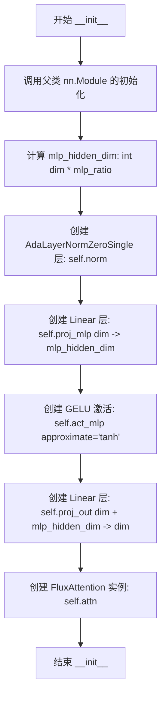

#### 带注释源码

```python
@maybe_allow_in_graph
class FluxSingleTransformerBlock(nn.Module):
    def __init__(self, dim: int, num_attention_heads: int, attention_head_dim: int, mlp_ratio: float = 4.0):
        """
        初始化 Flux 单流变换器块。

        Args:
            dim (int): 输入特征的维度大小
            num_attention_heads (int): 注意力头的数量
            attention_head_dim (int): 每个注意力头的维度
            mlp_ratio (float): MLP 隐藏层维度的扩展比率，默认为 4.0
        """
        # 调用父类 nn.Module 的初始化方法
        super().__init__()
        
        # 计算 MLP 隐藏层维度：根据 mlp_ratio 扩展输入维度
        self.mlp_hidden_dim = int(dim * mlp_ratio)

        # 创建自适应层归一化（AdaLayerNormZeroSingle）
        # 用于在变换器块中进行动态归一化
        self.norm = AdaLayerNormZeroSingle(dim)
        
        # 创建 MLP 投影层：将输入维度映射到扩展后的隐藏维度
        self.proj_mlp = nn.Linear(dim, self.mlp_hidden_dim)
        
        # 创建 GELU 激活函数（带 tanh 近似）
        # 用于 MLP 中的非线性变换
        self.act_mlp = nn.GELU(approximate="tanh")
        
        # 创建输出投影层：将 MLP 输出和注意力输出合并后映射回原始维度
        # 输入维度为 dim + mlp_hidden_dim（注意力输出 + MLP 输出）
        self.proj_out = nn.Linear(dim + self.mlp_hidden_dim, dim)

        # 创建 FluxAttention 注意力模块
        # 用于处理输入的注意力计算
        self.attn = FluxAttention(
            query_dim=dim,                # 查询维度
            dim_head=attention_head_dim,  # 注意力头维度
            heads=num_attention_heads,     # 注意力头数量
            out_dim=dim,                  # 输出维度
            bias=True,                    # 是否使用偏置
            processor=FluxAttnProcessor(), # 使用默认的注意力处理器
            eps=1e-6,                     # 归一化 epsilon 值
            pre_only=True,                # 仅使用预处理模式（不包含后处理）
        )
```


### `FluxSingleTransformerBlock.forward`

该方法实现了 Flux 架构中单流变换器块的前向传播，采用了 AdaLayerNormZeroSingle 自适应归一化、Gated-GELU MLP 以及 FluxAttention 注意力机制，并通过旋转位置嵌入（RoPE）增强图像特征的表示能力。

参数：

- `hidden_states`：`torch.Tensor`，输入的图像/潜在空间隐藏状态，形状为 (batch_size, seq_len, dim)
- `encoder_hidden_states`：`torch.Tensor`，编码器隐藏状态（文本条件），形状为 (batch_size, text_seq_len, dim)
- `temb`：`torch.Tensor`，时间步嵌入或文本嵌入，用于 AdaLayerNormZeroSingle 的自适应调节
- `image_rotary_emb`：`tuple[torch.Tensor, torch.Tensor] | None`，旋转位置嵌入的余弦和正弦部分，用于增强序列位置感知
- `joint_attention_kwargs`：`dict[str, Any] | None`，传递给注意力处理器的额外关键字参数

返回值：`tuple[torch.Tensor, torch.Tensor]`，返回两个张量——处理后的编码器隐藏状态和图像隐藏状态

#### 流程图

```mermaid
flowchart TD
    A[输入 hidden_states, encoder_hidden_states, temb] --> B[记录 text_seq_len]
    B --> C[拼接 encoder_hidden_states + hidden_states]
    C --> D[保存残差 residual]
    D --> E[AdaLayerNormZeroSingle 归一化<br/>获取 norm_hidden_states 和 gate]
    E --> F[MLP 投影: proj_mlp + GELU]
    F --> G[FluxAttention 注意力计算<br/>传入 image_rotary_emb 和 joint_attention_kwargs]
    G --> H[拼接 attn_output + mlp_hidden_states]
    H --> I[门控投影: gate × proj_out]
    I --> J[残差连接: residual + hidden_states]
    J --> K{数据类型是 float16?}
    K -->|是| L[数值裁剪到 -65504, 65504]
    K -->|否| M[跳过裁剪]
    L --> N[分割: encoder_hidden_states, hidden_states]
    M --> N
    N --> O[返回 tuple[encoder_hidden_states, hidden_states]]
```

#### 带注释源码

```python
def forward(
    self,
    hidden_states: torch.Tensor,
    encoder_hidden_states: torch.Tensor,
    temb: torch.Tensor,
    image_rotary_emb: tuple[torch.Tensor, torch.Tensor] | None = None,
    joint_attention_kwargs: dict[str, Any] | None = None,
) -> tuple[torch.Tensor, torch.Tensor]:
    # 1. 记录文本序列长度，用于后续分割
    text_seq_len = encoder_hidden_states.shape[1]
    
    # 2. 沿序列维度拼接编码器隐藏状态和图像隐藏状态
    # 拼接后形状: (batch_size, text_seq_len + image_seq_len, dim)
    hidden_states = torch.cat([encoder_hidden_states, hidden_states], dim=1)

    # 3. 保存残差连接（残差路径）
    residual = hidden_states
    
    # 4. AdaLayerNormZeroSingle 自适应归一化
    # 返回归一化后的隐藏状态和门控权重 gate
    norm_hidden_states, gate = self.norm(hidden_states, emb=temb)
    
    # 5. MLP 路径：投影 -> GELU 激活 -> 门控
    # proj_mlp: (dim -> mlp_hidden_dim)
    # act_mlp: GELU(approximate="tanh")
    mlp_hidden_states = self.act_mlp(self.proj_mlp(norm_hidden_states))
    
    # 6. 确保 joint_attention_kwargs 不为空字典
    joint_attention_kwargs = joint_attention_kwargs or {}
    
    # 7. 调用 FluxAttention 进行自注意力计算
    # 仅使用 pre_only 模式（仅输出注意力结果，不进行额外处理）
    attn_output = self.attn(
        hidden_states=norm_hidden_states,
        image_rotary_emb=image_rotary_emb,
        **joint_attention_kwargs,
    )

    # 8. 沿特征维度拼接注意力输出和 MLP 输出
    # 形状: (batch_size, total_seq_len, dim + mlp_hidden_dim)
    hidden_states = torch.cat([attn_output, mlp_hidden_states], dim=2)
    
    # 9. 门控机制：将 gate 扩展维度后与投影输出相乘
    gate = gate.unsqueeze(1)  # (batch_size, 1, dim)
    # proj_out: (dim + mlp_hidden_dim -> dim)
    hidden_states = gate * self.proj_out(hidden_states)
    
    # 10. 残差连接
    hidden_states = residual + hidden_states
    
    # 11. float16 数值安全裁剪，防止 NaN/Inf
    if hidden_states.dtype == torch.float16:
        hidden_states = hidden_states.clip(-65504, 65504)

    # 12. 沿序列维度分割回编码器部分和图像部分
    encoder_hidden_states, hidden_states = hidden_states[:, :text_seq_len], hidden_states[:, text_seq_len:]
    
    # 13. 返回处理后的编码器隐藏状态和图像隐藏状态
    return encoder_hidden_states, hidden_states
```


### `FluxTransformerBlock.__init__`

该方法是 FluxTransformerBlock 类的构造函数，负责初始化双流 DiT（Diffusion Transformer）块的核心组件，包括自注意力层、交叉注意力层、前馈网络以及对应的归一化层，构建完整的双流变换器结构。

参数：

- `dim`：`int`，隐藏层的维度大小
- `num_attention_heads`：`int`，注意力机制中使用的头数量
- `attention_head_dim`：`int`，每个注意力头的维度
- `qk_norm`：`str`，Query 和 Key 的归一化方式，默认为 "rms_norm"
- `eps`：`float`，归一化层的 epsilon 值，默认为 1e-6

返回值：`None`，该方法为构造函数，不返回任何值

#### 流程图

```mermaid
flowchart TD
    A[开始 __init__] --> B[调用 super().__init__]
    B --> C[创建 self.norm1: AdaLayerNormZero]
    C --> D[创建 self.norm1_context: AdaLayerNormZero]
    D --> E[创建 self.attn: FluxAttention]
    E --> F[创建 self.norm2: nn.LayerNorm]
    F --> G[创建 self.ff: FeedForward]
    G --> H[创建 self.norm2_context: nn.LayerNorm]
    H --> I[创建 self.ff_context: FeedForward]
    I --> J[结束]
```

#### 带注释源码

```python
@maybe_allow_in_graph
class FluxTransformerBlock(nn.Module):
    def __init__(
        self, dim: int, num_attention_heads: int, attention_head_dim: int, qk_norm: str = "rms_norm", eps: float = 1e-6
    ):
        """
        初始化 FluxTransformerBlock 双流变换器块

        参数:
            dim: 隐藏层维度
            num_attention_heads: 注意力头数量
            attention_head_dim: 注意力头维度
            qk_norm: Query/Key 归一化方式，默认为 rms_norm
            eps: 归一化层的 epsilon 值，用于数值稳定性
        """
        super().__init__()  # 调用父类 nn.Module 的初始化方法

        # ====== 第一个注意力块的归一化层 ======
        self.norm1 = AdaLayerNormZero(dim)  # 自注意力输入的归一化层（AdaLayerNormZero）
        self.norm1_context = AdaLayerNormZero(dim)  # 交叉注意力输入的归一一化层（AdaLayerNormZero）

        # ====== 注意力模块 ======
        # 创建 FluxAttention 实例，支持自注意力和交叉注意力
        self.attn = FluxAttention(
            query_dim=dim,
            added_kv_proj_dim=dim,  # 添加的 KV 投影维度，用于交叉注意力
            dim_head=attention_head_dim,
            heads=num_attention_heads,
            out_dim=dim,
            context_pre_only=False,  # 上下文不是仅用于预计算
            bias=True,
            processor=FluxAttnProcessor(),  # 默认使用 FluxAttnProcessor
            eps=eps,
        )

        # ====== 第二个归一化层和前馈网络（处理 hidden_states） ======
        self.norm2 = nn.LayerNorm(dim, elementwise_affine=False, eps=1e-6)  # LayerNorm，elementwise_affine=False 表示没有可学习参数
        self.ff = FeedForward(dim=dim, dim_out=dim, activation_fn="gelu-approximate")  # 前馈网络，使用 GELU 激活函数

        # ====== 第二个归一化层和前馈网络（处理 encoder_hidden_states） ======
        self.norm2_context = nn.LayerNorm(dim, elementwise_affine=False, eps=1e-6)  # 上下文分支的 LayerNorm
        self.ff_context = FeedForward(dim=dim, dim_out=dim, activation_fn="gelu-approximate")  # 上下文分支的前馈网络
```


### `FluxTransformerBlock.forward`

该方法是 Flux Transformer 块的前向传播函数，负责处理双流注意力机制。它同时对 `hidden_states`（图像 latent）和 `encoder_hidden_states`（文本 embedding）进行归一化、注意力计算、前馈网络处理和自适应门控，实现图像与文本信息的深度融合交互。

参数：

- `hidden_states`：`torch.Tensor`，图像 latent 序列的隐藏状态，形状为 `(batch_size, seq_len, dim)`
- `encoder_hidden_states`：`torch.Tensor`，文本条件 embedding，形状为 `(batch_size, text_seq_len, dim)`
- `temb`：`torch.Tensor`，时间步 embedding，由时间、池化投影和可选的 guidanc e 嵌入合并生成
- `image_rotary_emb`：`tuple[torch.Tensor, torch.Tensor] | None`，可选的旋转位置嵌入，用于给 query 和 key 添加旋转位置信息
- `joint_attention_kwargs`：`dict[str, Any] | None`，可选的联合注意力关键字参数，用于传递给注意力处理器（如 IP-Adapter 相关参数）

返回值：`tuple[torch.Tensor, torch.Tensor]`，返回处理后的 `(encoder_hidden_states, hidden_states)` 元组

#### 流程图

```mermaid
flowchart TD
    A[输入 hidden_states<br/>encoder_hidden_states<br/>temb] --> B[norm1 归一化 hidden_states]
    A --> C[norm1_context 归一化 encoder_hidden_states]
    B --> D[获取 AdaLN 门控参数<br/>gate_msa, shift_mlp<br/>scale_mlp, gate_mlp]
    C --> E[获取 AdaLN 门控参数<br/>c_gate_msa, c_shift_mlp<br/>c_scale_mlp, c_gate_mlp]
    D --> F[调用 self.attn 注意力计算]
    E --> F
    F --> G{attention_outputs 长度?}
    G -->|2| H[attn_output<br/>context_attn_output]
    G -->|3| I[attn_output<br/>context_attn_output<br/>ip_attn_output]
    H --> J[门控注意力输出<br/>gate_msa * attn_output]
    I --> J
    J --> K[残差连接<br/>hidden_states + attn_output]
    K --> L[norm2 归一化]
    L --> M[添加 shift 和 scale<br/>norm_hidden_states * (1 + scale_mlp) + shift_mlp]
    M --> N[前馈网络 FF]
    N --> O[门控 FF 输出<br/>gate_mlp * ff_output]
    O --> P[残差连接<br/>hidden_states + ff_output]
    P --> Q{是否有 IP-Adapter?}
    Q -->|是| R[添加 ip_attn_output]
    Q -->|否| S
    R --> S
    S[返回 encoder_hidden_states<br/>hidden_states]
    
    style F fill:#f9f,color:#333
    style N fill:#bbf,color:#333
    style J fill:#bfb,color:#333
    style O fill:#bfb,color:#333
```

#### 带注释源码

```python
def forward(
    self,
    hidden_states: torch.Tensor,
    encoder_hidden_states: torch.Tensor,
    temb: torch.Tensor,
    image_rotary_emb: tuple[torch.Tensor, torch.Tensor] | None = None,
    joint_attention_kwargs: dict[str, Any] | None = None,
) -> tuple[torch.Tensor, torch.Tensor]:
    """
    FluxTransformerBlock 前向传播
    
    处理双流注意力：同时处理图像 latent (hidden_states) 和文本条件 (encoder_hidden_states)
    采用 AdaLayerNormZero 进行自适应归一化，包含门控机制控制信息流动
    """
    # Step 1: 对 hidden_states 进行 AdaLayerNormZero 归一化
    # AdaLayerNormZero 结合了自适应层归一化和门控机制
    # 返回归一化后的隐藏状态以及多个门控参数 (gate_msa, shift_mlp, scale_mlp, gate_mlp)
    norm_hidden_states, gate_msa, shift_mlp, scale_mlp, gate_mlp = self.norm1(hidden_states, emb=temb)

    # Step 2: 对 encoder_hidden_states 进行同样的 AdaLayerNormZero 归一化
    # 用于文本分支的 Adaptive Norm，返回文本分支的门控参数
    norm_encoder_hidden_states, c_gate_msa, c_shift_mlp, c_scale_mlp, c_gate_mlp = self.norm1_context(
        encoder_hidden_states, emb=temb
    )
    
    # Step 3: 确保 joint_attention_kwargs 存在（默认为空字典）
    # 用于传递额外的注意力参数，如 IP-Adapter 相关参数
    joint_attention_kwargs = joint_attention_kwargs or {}

    # Step 4: 执行自注意力计算
    # 同时对图像 latent 和文本 embedding 进行交叉注意力计算
    # hidden_states 和 encoder_hidden_states 互相作为对方的 KV 来源
    attention_outputs = self.attn(
        hidden_states=norm_hidden_states,
        encoder_hidden_states=norm_encoder_hidden_states,
        image_rotary_emb=image_rotary_emb,
        **joint_attention_kwargs,
    )

    # Step 5: 解析注意力输出
    # 标准输出为 2 元组 (attn_output, context_attn_output)
    # 若使用 IP-Adapter 则为 3 元组，包含额外的 ip_attn_output
    if len(attention_outputs) == 2:
        attn_output, context_attn_output = attention_outputs
    elif len(attention_outputs) == 3:
        attn_output, context_attn_output, ip_attn_output = attention_outputs

    # ===== 处理图像分支 (hidden_states) =====

    # Step 6: 对注意力输出进行门控加权
    # gate_msa.unsqueeze(1) 将形状从 (batch,) 扩展为 (batch, 1, 1) 以支持广播
    attn_output = gate_msa.unsqueeze(1) * attn_output
    
    # Step 7: 残差连接，将注意力输出加到原始 hidden_states
    hidden_states = hidden_states + attn_output

    # Step 8: LayerNorm 归一化（不带可学习参数）
    norm_hidden_states = self.norm2(hidden_states)
    
    # Step 9: 应用 Adaptive 变换：缩放和平移
    # 公式: norm_hidden_states * (1 + scale_mlp[:, None]) + shift_mlp[:, None]
    # scale_mlp[:, None] 扩展维度以支持广播，默认为 0（无缩放）
    norm_hidden_states = norm_hidden_states * (1 + scale_mlp[:, None]) + shift_mlp[:, None]

    # Step 10: 前馈网络处理
    ff_output = self.ff(norm_hidden_states)
    
    # Step 11: 对 FF 输出进行门控
    ff_output = gate_mlp.unsqueeze(1) * ff_output

    # Step 12: 残差连接
    hidden_states = hidden_states + ff_output
    
    # Step 13: 如果使用了 IP-Adapter，添加 IP 注意力输出
    if len(attention_outputs) == 3:
        hidden_states = hidden_states + ip_attn_output

    # ===== 处理文本分支 (encoder_hidden_states) =====

    # Step 14: 对上下文注意力输出进行门控
    context_attn_output = c_gate_msa.unsqueeze(1) * context_attn_output
    
    # Step 15: 残差连接
    encoder_hidden_states = encoder_hidden_states + context_attn_output

    # Step 16: LayerNorm 归一化
    norm_encoder_hidden_states = self.norm2_context(encoder_hidden_states)
    
    # Step 17: 应用 Adaptive 变换
    norm_encoder_hidden_states = norm_encoder_hidden_states * (1 + c_scale_mlp[:, None]) + c_shift_mlp[:, None]

    # Step 18: 上下文前馈网络处理
    context_ff_output = self.ff_context(norm_encoder_hidden_states)
    
    # Step 19: 残差连接并应用门控
    encoder_hidden_states = encoder_hidden_states + c_gate_mlp.unsqueeze(1) * context_ff_output
    
    # Step 20: float16 数值裁剪，防止 NaN/Inf
    if encoder_hidden_states.dtype == torch.float16:
        encoder_hidden_states = encoder_hidden_states.clip(-65504, 65504)

    # 返回处理后的文本 hidden_states 和图像 hidden_states
    return encoder_hidden_states, hidden_states
```


### `FluxPosEmbed.__init__`

该方法是 `FluxPosEmbed` 类的构造函数，用于初始化旋转位置嵌入（Rotary Position Embedding）模块，接收旋转角度参数和轴维度列表，用于后续前向传播中计算多轴旋转位置嵌入。

参数：

- `self`：类的实例对象（隐式参数）
- `theta`：`int`，旋转角度参数，用于计算旋转位置嵌入的频率
- `axes_dim`：`list[int]`，各轴的维度列表，指定每个轴的嵌入维度

返回值：无（`None`）

#### 流程图

```mermaid
flowchart TD
    A[开始 __init__] --> B[调用 super().__init__]
    B --> C[设置 self.theta = theta]
    C --> D[设置 self.axes_dim = axes_dim]
    D --> E[结束]
```

#### 带注释源码

```python
def __init__(self, theta: int, axes_dim: list[int]):
    """
    初始化 FluxPosEmbed 模块的构造函数。
    
    参数:
        theta: int - 旋转角度参数，用于计算旋转位置嵌入的频率
        axes_dim: list[int] - 各轴的维度列表，指定每个轴的嵌入维度
    """
    # 调用父类 nn.Module 的初始化方法
    super().__init__()
    
    # 存储旋转角度参数，用于后续 forward 方法中的 get_1d_rotary_pos_embed 调用
    self.theta = theta
    
    # 存储轴维度列表，用于指定每个轴的嵌入维度
    self.axes_dim = axes_dim
```


### `FluxPosEmbed.forward`

该方法实现了旋转位置嵌入（Rotary Position Embedding）的计算，通过对输入的ID张量在多个轴向上生成余弦和正弦频率向量，用于为Transformer提供位置信息。

参数：

- `ids`：`torch.Tensor`，形状为 `(batch_size, n_axes)` 的位置ID张量，其中 `n_axes` 表示轴的数量

返回值：`tuple[torch.Tensor, torch.Tensor]`，返回两个张量——频率余弦值 `freqs_cos` 和频率正弦值 `freqs_sin`，形状均为 `(batch_size, total_axes_dim)`

#### 流程图

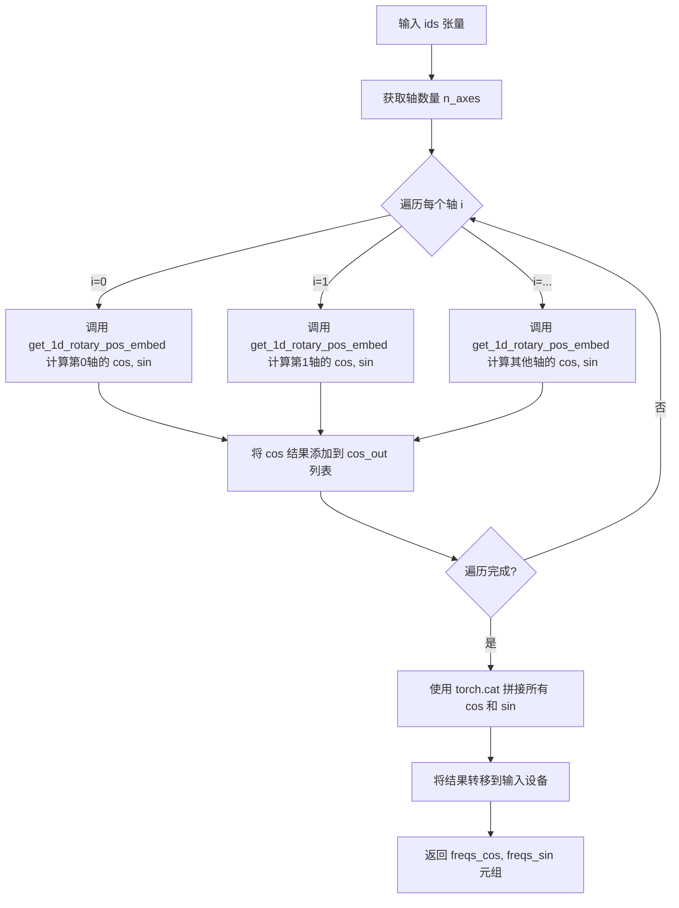

#### 带注释源码

```python
def forward(self, ids: torch.Tensor) -> torch.Tensor:
    # 获取最后一个维度的大小（即轴的数量）
    n_axes = ids.shape[-1]
    
    # 初始化用于存储各轴余弦和正弦输出的列表
    cos_out = []
    sin_out = []
    
    # 将 ids 转换为浮点数类型
    pos = ids.float()
    
    # 检测设备类型：mps (Apple Silicon) 或 npu (华为昇腾)
    is_mps = ids.device.type == "mps"
    is_npu = ids.device.type == "npu"
    
    # 根据设备类型选择频率计算的数据类型
    # mps 和 npu 设备使用 float32，其他设备使用 float64 以获得更高精度
    freqs_dtype = torch.float32 if (is_mps or is_npu) else torch.float64
    
    # 遍历每个轴，逐一计算旋转位置嵌入
    for i in range(n_axes):
        cos, sin = get_1d_rotary_pos_embed(
            self.axes_dim[i],      # 当前轴的维度大小
            pos[:, i],             # 当前轴的位置ID
            theta=self.theta,      # 旋转基础角度参数
            repeat_interleave_real=True,  # 是否重复交错实数部分
            use_real=True,         # 使用实数形式的旋转嵌入
            freqs_dtype=freqs_dtype,       # 计算精度
        )
        cos_out.append(cos)  # 收集余弦输出
        sin_out.append(sin)  # 收集正弦输出
    
    # 沿最后一维拼接所有轴的余弦和正弦结果
    freqs_cos = torch.cat(cos_out, dim=-1).to(ids.device)
    freqs_sin = torch.cat(sin_out, dim=-1).to(ids.device)
    
    # 返回余弦和正弦频率张量
    return freqs_cos, freqs_sin
```


### `FluxTransformer2DModel.__init__`

该方法是 FluxTransformer2DModel 类的初始化方法，负责构建完整的 Flux 变换器模型架构，包括位置编码、时间文本嵌入、上下文嵌入器、双流和单流变换器块、输出归一化和投影层等核心组件。

参数：

- `patch_size`：`int`，默认为 `1`，将输入数据转换为小补丁的补丁大小
- `in_channels`：`int`，默认为 `64`，输入通道数
- `out_channels`：`int | None`，默认为 `None`，输出通道数，如果未指定则默认为 `in_channels`
- `num_layers`：`int`，默认为 `19`，双流 DiT 块使用的层数
- `num_single_layers`：`int`，默认为 `38`，单流 DiT 块使用的层数
- `attention_head_dim`：`int`，默认为 `128`，每个注意力头使用的维度数
- `num_attention_heads`：`int`，默认为 `24`，使用的注意力头数量
- `joint_attention_dim`：`int`，默认为 `4096`，用于联合注意力的维度数（`encoder_hidden_states` 的嵌入/通道维度）
- `pooled_projection_dim`：`int`，默认为 `768`，用于池化投影的维度数
- `guidance_embeds`：`bool`，默认为 `False`，是否使用指导嵌入
- `axes_dims_rope`：`tuple[int, int, int]`，默认为 `(16, 56, 56)`，用于旋转位置嵌入的维度

返回值：`None`，该方法为初始化方法，不返回任何值

#### 流程图

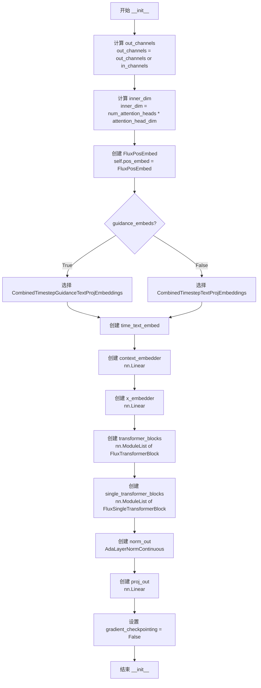

#### 带注释源码

```python
@register_to_config
def __init__(
    self,
    patch_size: int = 1,
    in_channels: int = 64,
    out_channels: int | None = None,
    num_layers: int = 19,
    num_single_layers: int = 38,
    attention_head_dim: int = 128,
    num_attention_heads: int = 24,
    joint_attention_dim: int = 4096,
    pooled_projection_dim: int = 768,
    guidance_embeds: bool = False,
    axes_dims_rope: tuple[int, int, int] = (16, 56, 56),
):
    """
    初始化 FluxTransformer2DModel 模型

    参数:
        patch_size: 补丁大小，用于将输入数据分成小补丁
        in_channels: 输入数据的通道数
        out_channels: 输出数据的通道数，默认为输入通道数
        num_layers: 双流变换器块的数量
        num_single_layers: 单流变换器块的数量
        attention_head_dim: 注意力头的维度
        num_attention_heads: 注意力头的数量
        joint_attention_dim: 联合注意力的维度
        pooled_projection_dim: 池化投影的维度
        guidance_embeds: 是否使用指导嵌入
        axes_dims_rope: 旋转位置嵌入的轴维度
    """
    super().__init__()

    # 计算输出通道数：如果未指定则使用输入通道数
    self.out_channels = out_channels or in_channels

    # 计算内部维度：注意力头数 × 注意力头维度
    self.inner_dim = num_attention_heads * attention_head_dim

    # 创建旋转位置嵌入模块
    self.pos_embed = FluxPosEmbed(theta=10000, axes_dim=axes_dims_rope)

    # 根据是否使用指导嵌入选择时间文本嵌入类
    text_time_guidance_cls = (
        CombinedTimestepGuidanceTextProjEmbeddings if guidance_embeds else CombinedTimestepTextProjEmbeddings
    )

    # 创建时间文本嵌入层
    self.time_text_embed = text_time_guidance_cls(
        embedding_dim=self.inner_dim, pooled_projection_dim=pooled_projection_dim
    )

    # 创建上下文嵌入器：将联合注意力维度的上下文嵌入映射到内部维度
    self.context_embedder = nn.Linear(joint_attention_dim, self.inner_dim)

    # 创建输入嵌入器：将输入通道映射到内部维度
    self.x_embedder = nn.Linear(in_channels, self.inner_dim)

    # 创建双流变换器块列表
    self.transformer_blocks = nn.ModuleList(
        [
            FluxTransformerBlock(
                dim=self.inner_dim,
                num_attention_heads=num_attention_heads,
                attention_head_dim=attention_head_dim,
            )
            for _ in range(num_layers)
        ]
    )

    # 创建单流变换器块列表
    self.single_transformer_blocks = nn.ModuleList(
        [
            FluxSingleTransformerBlock(
                dim=self.inner_dim,
                num_attention_heads=num_attention_heads,
                attention_head_dim=attention_head_dim,
            )
            for _ in range(num_single_layers)
        ]
    )

    # 创建输出归一化层
    self.norm_out = AdaLayerNormContinuous(self.inner_dim, self.inner_dim, elementwise_affine=False, eps=1e-6)

    # 创建输出投影层：将内部维度映射回补丁空间的输出通道
    self.proj_out = nn.Linear(self.inner_dim, patch_size * patch_size * self.out_channels, bias=True)

    # 初始化梯度检查点标志为 False
    self.gradient_checkpointing = False
```


### `FluxTransformer2DModel.forward`

这是 FluxTransformer2DModel 的前向传播方法，负责将输入的潜在表示通过双流 DiT 块和单流 DiT 块进行处理，输出经过处理的噪声预测。

参数：

- `hidden_states`：`torch.Tensor`，形状为 `(batch_size, image_sequence_length, in_channels)`，输入的隐藏状态
- `encoder_hidden_states`：`torch.Tensor`，形状为 `(batch_size, text_sequence_length, joint_attention_dim)`，条件嵌入（从输入条件如提示词计算的嵌入）
- `pooled_projections`：`torch.Tensor`，形状为 `(batch_size, projection_dim)`，从输入条件嵌入投影的嵌入
- `timestep`：`torch.LongTensor`，用于指示去噪步骤的时间步
- `img_ids`：`torch.Tensor`，图像的位置 ID，用于位置编码
- `txt_ids`：`torch.Tensor`，文本的位置 ID，用于位置编码
- `guidance`：`torch.Tensor`，用于指导的嵌入（guidance-distilled 变体使用）
- `joint_attention_kwargs`：`dict[str, Any] | None`，可选的注意力处理器参数字典
- `controlnet_block_samples`：`list[torch.Tensor] | None`，如果指定则添加到 transformer 块的残差中
- `controlnet_single_block_samples`：`list[torch.Tensor] | None`，如果指定则添加到单流 transformer 块的残差中
- `return_dict`：`bool`，默认为 `True`，是否返回 `Transformer2DModelOutput`
- `controlnet_blocks_repeat`：`bool`，默认为 `False`，是否重复使用 controlnet 块

返回值：`torch.Tensor | Transformer2DModelOutput`，如果 `return_dict` 为 True，返回 `Transformer2DModelOutput`，否则返回元组，第一个元素是样本张量

#### 流程图

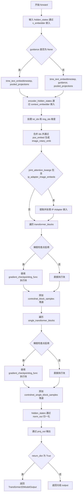

#### 带注释源码

```python
@apply_lora_scale("joint_attention_kwargs")
def forward(
    self,
    hidden_states: torch.Tensor,
    encoder_hidden_states: torch.Tensor = None,
    pooled_projections: torch.Tensor = None,
    timestep: torch.LongTensor = None,
    img_ids: torch.Tensor = None,
    txt_ids: torch.Tensor = None,
    guidance: torch.Tensor = None,
    joint_attention_kwargs: dict[str, Any] | None = None,
    controlnet_block_samples=None,
    controlnet_single_block_samples=None,
    return_dict: bool = True,
    controlnet_blocks_repeat: bool = False,
) -> torch.Tensor | Transformer2DModelOutput:
    """
    The [`FluxTransformer2DModel`] forward method.

    Args:
        hidden_states (`torch.Tensor` of shape `(batch_size, image_sequence_length, in_channels)`):
            Input `hidden_states`.
        encoder_hidden_states (`torch.Tensor` of shape `(batch_size, text_sequence_length, joint_attention_dim)`):
            Conditional embeddings (embeddings computed from the input conditions such as prompts) to use.
        pooled_projections (`torch.Tensor` of shape `(batch_size, projection_dim)`): Embeddings projected
            from the embeddings of input conditions.
        timestep (`torch.LongTensor`):
            Used to indicate denoising step.
        block_controlnet_hidden_states: (`list` of `torch.Tensor`):
            A list of tensors that if specified are added to the residuals of transformer blocks.
        joint_attention_kwargs (`dict`, *optional*):
            A kwargs dictionary that if specified is passed along to the `AttentionProcessor` as defined under
            `self.processor` in
            [diffusers.models.attention_processor](https://github.com/huggingface/diffusers/blob/main/src/diffusers/models/attention_processor.py).
        return_dict (`bool`, *optional*, defaults to `True`):
            Whether or not to return a [`~models.transformer_2d.Transformer2DModelOutput`] instead of a plain
            tuple.

    Returns:
        If `return_dict` is True, an [`~models.transformer_2d.Transformer2DModelOutput`] is returned, otherwise a
        `tuple` where the first element is the sample tensor.
    """

    # 步骤1: 将输入 hidden_states 通过 x_embedder 线性层嵌入到内部维度空间
    hidden_states = self.x_embedder(hidden_states)

    # 步骤2: 将 timestep 转换为与 hidden_states 相同的数据类型并乘以 1000 进行缩放
    timestep = timestep.to(hidden_states.dtype) * 1000
    # 如果存在 guidance，也进行相同的处理
    if guidance is not None:
        guidance = guidance.to(hidden_states.dtype) * 1000

    # 步骤3: 根据是否有 guidance 来决定如何处理时间步和文本嵌入
    # 如果没有 guidance，只传入 timestep 和 pooled_projections
    # 如果有 guidance，传入 timestep, guidance 和 pooled_projections
    temb = (
        self.time_text_embed(timestep, pooled_projections)
        if guidance is None
        else self.time_text_embed(timestep, guidance, pooled_projections)
    )
    
    # 步骤4: 将 encoder_hidden_states 通过 context_embedder 嵌入到内部维度空间
    encoder_hidden_states = self.context_embedder(encoder_hidden_states)

    # 步骤5: 处理 txt_ids 和 img_ids 的维度问题
    # 如果是 3D 张量（包含批次维度），发出警告并移除批次维度
    if txt_ids.ndim == 3:
        logger.warning(
            "Passing `txt_ids` 3d torch.Tensor is deprecated."
            "Please remove the batch dimension and pass it as a 2d torch.Tensor"
        )
        txt_ids = txt_ids[0]
    if img_ids.ndim == 3:
        logger.warning(
            "Passing `img_ids` 3d torch.Tensor is deprecated."
            "Please remove the batch dimension and pass it as a 2d torch.Tensor"
        )
        img_ids = img_ids[0]

    # 步骤6: 合并 txt_ids 和 img_ids 形成完整的位置 ID，并生成旋转位置嵌入
    ids = torch.cat((txt_ids, img_ids), dim=0)
    image_rotary_emb = self.pos_embed(ids)

    # 步骤7: 处理 IP-Adapter 图像嵌入（如果存在）
    if joint_attention_kwargs is not None and "ip_adapter_image_embeds" in joint_attention_kwargs:
        # 提取 IP-Adapter 图像嵌入
        ip_adapter_image_embeds = joint_attention_kwargs.pop("ip_adapter_image_embeds")
        # 通过 encoder_hid_proj 处理后得到隐藏状态
        ip_hidden_states = self.encoder_hid_proj(ip_adapter_image_embeds)
        # 更新 joint_attention_kwargs
        joint_attention_kwargs.update({"ip_hidden_states": ip_hidden_states})

    # 步骤8: 遍历双流 DiT 块 (transformer_blocks)
    for index_block, block in enumerate(self.transformer_blocks):
        # 检查是否启用梯度检查点以节省显存
        if torch.is_grad_enabled() and self.gradient_checkpointing:
            # 使用梯度检查点函数执行块
            encoder_hidden_states, hidden_states = self._gradient_checkpointing_func(
                block,
                hidden_states,
                encoder_hidden_states,
                temb,
                image_rotary_emb,
                joint_attention_kwargs,
            )
        else:
            # 直接执行块
            encoder_hidden_states, hidden_states = block(
                hidden_states=hidden_states,
                encoder_hidden_states=encoder_hidden_states,
                temb=temb,
                image_rotary_emb=image_rotary_emb,
                joint_attention_kwargs=joint_attention_kwargs,
            )

        # 步骤9: 添加 ControlNet 残差（如果提供）
        if controlnet_block_samples is not None:
            # 计算控制块采样间隔
            interval_control = len(self.transformer_blocks) / len(controlnet_block_samples)
            interval_control = int(np.ceil(interval_control))
            # 根据 controlnet_blocks_repeat 决定如何添加残差
            if controlnet_blocks_repeat:
                hidden_states = (
                    hidden_states + controlnet_block_samples[index_block % len(controlnet_block_samples)]
                )
            else:
                hidden_states = hidden_states + controlnet_block_samples[index_block // interval_control]

    # 步骤10: 遍历单流 DiT 块 (single_transformer_blocks)
    for index_block, block in enumerate(self.single_transformer_blocks):
        # 检查是否启用梯度检查点
        if torch.is_grad_enabled() and self.gradient_checkpointing:
            encoder_hidden_states, hidden_states = self._gradient_checkpointing_func(
                block,
                hidden_states,
                encoder_hidden_states,
                temb,
                image_rotary_emb,
                joint_attention_kwargs,
            )
        else:
            encoder_hidden_states, hidden_states = block(
                hidden_states=hidden_states,
                encoder_hidden_states=encoder_hidden_states,
                temb=temb,
                image_rotary_emb=image_rotary_emb,
                joint_attention_kwargs=joint_attention_kwargs,
            )

        # 步骤11: 添加单流 ControlNet 残差
        if controlnet_single_block_samples is not None:
            interval_control = len(self.single_transformer_blocks) / len(controlnet_single_block_samples)
            interval_control = int(np.ceil(interval_control))
            hidden_states = hidden_states + controlnet_single_block_samples[index_block // interval_control]

    # 步骤12: 输出层：先通过 AdaLayerNormContinuous 归一化，然后用线性层投影输出
    hidden_states = self.norm_out(hidden_states, temb)
    output = self.proj_out(hidden_states)

    # 步骤13: 根据 return_dict 决定返回格式
    if not return_dict:
        return (output,)

    return Transformer2DModelOutput(sample=output)
```

## 关键组件


### FluxAttnProcessor

标准注意力处理器，负责计算 Flux 模型的注意力输出，支持融合和非融合投影模式，并通过调度函数分发到不同的注意力后端。

### FluxIPAdapterAttnProcessor

IP-Adapter 注意力处理器，扩展了 FluxAttnProcessor，额外集成了图像提示适配器功能，支持多尺度 IP 特征的交叉注意力计算。

### FluxAttention

核心注意力模块类，封装了 QKV 投影、规范化层和输出投影，支持添加 KV 投影维度、灵活配置注意力头数和维度、内置多种注意力处理器。

### FluxSingleTransformerBlock

单流 DiT 块，仅处理图像hidden states，包含 AdaLayerNormZeroSingle 归一化、MLP 变换和 FluxAttention，适用于单流处理路径。

### FluxTransformerBlock

双流 DiT 块，同时处理图像和文本编码器的 hidden states，包含 AdaLayerNormZero 归一化、双路注意力和双路前馈网络，支持 IP-Adapter 特征注入。

### FluxPosEmbed

旋转位置嵌入模块，支持多轴 Rotary Positional Embedding，根据设备类型（MPS、NPU）选择合适的数值精度。

### FluxTransformer2DModel

主 Transformer 模型类，整合所有组件，支持 ControlNet 残差连接、梯度检查点、上下文并行、LoRA 适配器加载和 IP-Adapter 特征处理。

### _get_projections

辅助函数，计算非融合模式下的 QKV 投影，区分主 hidden states 和编码器 hidden states 的投影变换。

### _get_fused_projections

辅助函数，计算融合模式下的 QKV 投影，通过一次性矩阵乘法获取 query、key、value。

### _get_qkv_projections

辅助函数，根据注意力模块的 fused_projections 属性自动选择融合或非融合投影策略。

## 问题及建议


### 已知问题

-   **类型注解错误**：`FluxIPAdapterAttnProcessor` 中 `ip_hidden_states: list[torch.Tensor] | None = None` 使用了 PEP 585 类型的 `list[torch.Tensor]`，这在 Python 3.8 及以下版本中不被支持，应使用 `typing.List`。
-   **变量赋值错误**：在 `_get_fused_projections` 函数中，`encoder_query = encoder_key = encoder_value = (None,)` 将变量赋值为元组 `(None,)` 而不是 `None`，这可能导致后续使用时的类型错误。
-   **重复代码**：`_get_projections` 和 `_get_fused_projections` 函数结构高度相似，存在代码重复；`FluxAttnProcessor.__call__` 和 `FluxIPAdapterAttnProcessor.__call__` 之间也存在大量重复的注意力计算逻辑。
-   **硬编码数值**：多处出现硬编码的数值如 `eps=1e-6`、`eps=1e-5`、`theta=10000`、`-65504, 65504`，应提取为配置常量以提高可维护性。
-   **设备转换冗余**：在 `FluxPosEmbed.forward` 中，连续调用 `.to(ids.device)` 两次将 `freqs_cos` 和 `freqs_sin` 移动到设备，可以优化为只进行一次设备转换。
-   **参数校验缺失**：`FluxIPAdapterAttnProcessor.__init__` 中未校验 `num_tokens` 和 `scale` 长度不匹配的情况会导致后续 `zip` 操作时行为不确定；同时 `ip_hidden_states` 为 `None` 时没有显式检查和处理。
-   **变量覆盖风险**：在 `FluxTransformerBlock.forward` 中，使用 `len(attention_outputs)` 来判断返回值数量来决定后续处理逻辑，这种隐式约定容易出错且难以维护。
-   **循环内重复计算**：`FluxTransformer2DModel.forward` 中的 `interval_control` 计算在循环内部，应提取到循环外以减少重复计算。
-   **潜在的批次维度警告**：代码中包含对 3D 张量的警告处理（`txt_ids` 和 `img_ids`），但警告后直接访问 `[0]` 可能导致批处理维度处理不一致。

### 优化建议

-   统一使用 `typing` 模块的类型注解，确保 Python 版本兼容性。
-   修复 `_get_fused_projections` 中的赋值错误，将 `(None,)` 改为 `None`。
-   将重复的注意力计算逻辑抽取为基类或辅助函数，减少代码冗余。
-   创建配置类或常量文件，集中管理 `eps`、`theta`、`clip` 阈值等魔法数值。
-   优化 `FluxPosEmbed.forward` 中的设备转换逻辑，避免冗余操作。
-   增加参数校验逻辑，在 `FluxIPAdapterAttnProcessor` 初始化时验证 `num_tokens` 和 `scale` 的长度一致性。
-   考虑使用显式的返回值类型标签（如枚举或 dataclass）替代基于返回值长度的隐式约定。
-   将 `interval_control` 计算移到循环外部以提高性能。
-   统一批次维度处理逻辑，考虑在模型入口处统一处理而非在多处进行警告式处理。

## 其它


### 设计目标与约束

本模块旨在实现Flux Transformer模型，用于高质量图像生成任务。设计目标包括：支持双流（dual-stream）和单流（single-stream）Transformer架构，实现文本与图像的联合注意力机制，支持IP-Adapter多图像条件注入，支持ControlNet控制网络集成，支持LoRA微调适配器，以及支持上下文并行（Context Parallelism）分布式推理。约束条件包括：PyTorch 2.0+依赖（因使用scaled_dot_product_attention），需要支持RMSNorm层归一化，需要与Diffusers库的其他组件（如ConfigMixin、ModelMixin等）兼容。

### 错误处理与异常设计

代码中的错误处理主要体现在以下几个方面：1) 版本检查：FluxAttnProcessor和FluxIPAdapterAttnProcessor在__init__中检查PyTorch版本，若不支持scaled_dot_product_attention则抛出ImportError；2) 参数验证：FluxIPAdapterAttnProcessor中检查scale和num_tokens长度一致性，若不匹配则抛出ValueError；3) 未使用参数警告：在FluxAttention.forward中检测到kwargs中有不被processor接受的参数时会发出warning并过滤掉；4) 废弃API警告：当检测到txt_ids或img_ids是3D tensor时会发出deprecation warning。异常处理采用逐层传递的方式，由上层调用者决定如何处理。

### 数据流与状态机

数据流主要分为两条路径：1) 图像hidden_states流：输入hidden_states → x_embedder线性投影 → FluxTransformerBlock/FluxSingleTransformerBlock处理（包含自注意力和前馈网络）→ norm_out层归一化 → proj_out输出投影 → 最终输出；2) 文本encoder_hidden_states流：输入encoder_hidden_states → context_embedder线性投影 → FluxTransformerBlock中与图像hidden_states进行联合注意力计算 → 处理后返回更新的encoder_hidden_states。状态机方面，模型在forward过程中保持三个主要状态：hidden_states（图像特征）、encoder_hidden_states（文本特征）、temb（时间步嵌入）。IP-Adapter模式下还会额外处理ip_hidden_states和ip_attn_output。

### 外部依赖与接口契约

主要外部依赖包括：1) PyTorch (torch, torch.nn, torch.nn.functional) - 核心深度学习框架；2) NumPy - 数值计算；3) Diffusers库内部模块：configuration_utils.ConfigMixin、register_to_config装饰器、loaders中的多种Mixin类、utils模块（apply_lora_scale, logging, torch_utils）、modeling_utils.ModelMixin、normalization中的AdaLayerNorm类、attention模块中的AttentionMixin等。接口契约方面：FluxAttention接受query_dim、heads、dim_head、dropout等参数；FluxTransformerBlock和FluxSingleTransformerBlock的forward方法接受hidden_states、encoder_hidden_states、temb、image_rotary_emb、joint_attention_kwargs参数；FluxTransformer2DModel的forward方法接受hidden_states、encoder_hidden_states、pooled_projections、timestep、img_ids、txt_ids、guidance、joint_attention_kwargs等参数。

### 并发与线程安全

本模块中的并发主要体现在：1) 梯度检查点（gradient checkpointing）支持：在forward中通过self.gradient_checkpointing标志控制，可在前向传播时节省显存；2) 上下文并行（Context Parallelism）支持：通过_cp_plan定义输入输出在不同进程间的切分方式，使用ContextParallelInput和ContextParallelOutput类进行管理；3) 模块级别的并行注意力后端：_attention_backend和_parallel_config类变量用于配置不同的注意力计算后端。线程安全方面，由于PyTorch模型本身不是线程安全的，但在推理时模型参数是只读的，因此推理阶段是线程安全的。训练阶段需要使用torch.no_grad()或model.eval()来确保安全。

### 配置与参数说明

关键配置参数包括：1) FluxTransformer2DModel: patch_size（默认1）、in_channels（默认64）、out_channels（默认等于in_channels）、num_layers（默认19）、num_single_layers（默认38）、attention_head_dim（默认128）、num_attention_heads（默认24）、joint_attention_dim（默认4096）、pooled_projection_dim（默认768）、guidance_embeds（默认False）、axes_dims_rope（默认(16,56,56)）；2) FluxAttention: query_dim、heads、dim_head、dropout（默认0.0）、bias（默认False）、added_kv_proj_dim、out_dim、pre_only、elementwise_affine、eps（默认1e-5）；3) FluxPosEmbed: theta（默认10000）、axes_dim。这些参数通过@register_to_config装饰器注册，支持从配置字典加载和保存。

### 版本兼容性

本模块明确要求PyTorch 2.0+（因依赖F.scaled_dot_product_attention）。对于不同的设备类型（CPU、CUDA、MPS、NPU），代码中有特殊处理：在FluxPosEmbed.forward中检测is_mps和is_npu设备，将freqs_dtype设置为float32以避免MPS和NPU上的精度问题。模块与Diffusers库的版本兼容通过继承ConfigMixin、ModelMixin、PeftAdapterMixin等基类来实现，这些基类提供了版本迁移和向后兼容的支持。

### 测试策略建议

建议的测试策略包括：1) 单元测试：测试各模块（FluxAttention、FluxTransformerBlock、FluxSingleTransformerBlock、FluxTransformer2DModel）的正向传播，验证输出形状是否符合预期；2) 梯度测试：验证gradient_checkpointing功能是否正常工作，梯度是否能正确反向传播；3) 集成测试：测试完整模型的训练和推理流程；4) IP-Adapter测试：验证多图像条件注入功能；5) ControlNet测试：验证控制网络残差连接功能；6) 分布式测试：验证上下文并行在多GPU环境下的正确性；7) 设备测试：验证在不同设备（CPU、CUDA、MPS、NPU）上的兼容性。

### 性能考虑与优化空间

性能优化措施：1) 梯度检查点：通过gradient_checkpointing标志控制，可在内存和计算之间权衡；2) 融合投影：支持fused_projections模式（to_qkv融合），可减少内存访问；3) 混合精度：使用torch.float16时对hidden_states进行clip操作防止溢出；4) 内存优化：使用torch.no_grad()进行推理，避免存储中间激活值。优化空间：1) 目前IP-Adapter的循环处理（for current_ip_hidden_states...）可以进一步优化为批量处理；2) 可以添加对Flash Attention等更高效注意力后端的支持；3) 可以添加对xFormers等第三方注意力库的支持；4) 可以进一步优化MPS和NPU设备上的性能。

### 安全考虑

代码中未直接涉及用户输入验证，但建议：1) 对传入的tensor shape进行验证，防止shape mismatch导致的运行时错误；2) 对joint_attention_kwargs中的参数进行白名单验证，防止注入恶意参数；3) 在部署时注意模型文件的访问控制，防止未授权访问；4) 由于涉及图像生成，应注意生成内容的合规性问题。

### 监控与日志

日志记录使用Diffusers库的logging模块（logger = logging.get_logger(__name__)）。监控点包括：1) 废弃API警告：当检测到3D tensor的txt_ids或img_ids时发出warning；2) 未使用参数警告：当joint_attention_kwargs中有不被processor接受的参数时发出warning。建议添加的监控：1) 推理时间监控；2) 显存使用监控；3) 模型参数统计（如梯度范数）；4) 分布式训练时的通信开销监控。


    