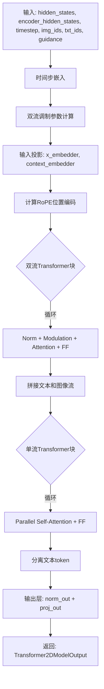
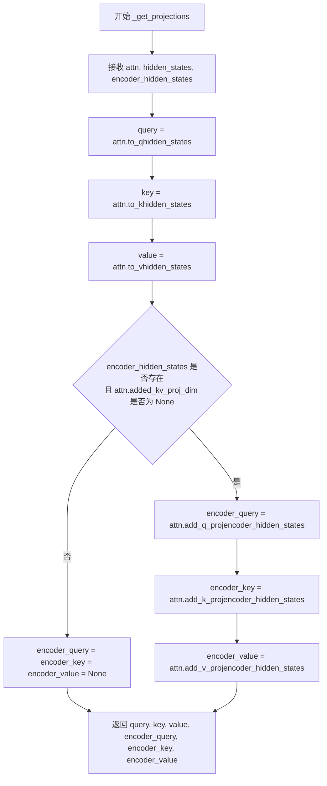
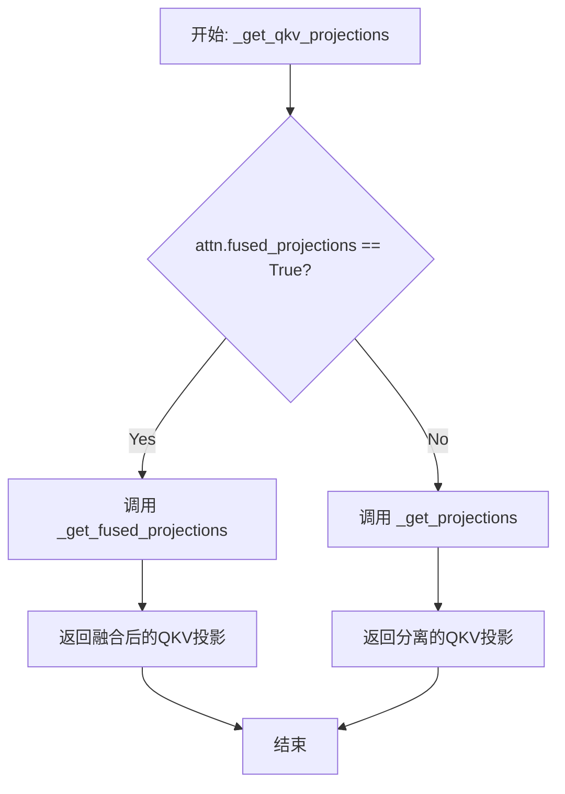
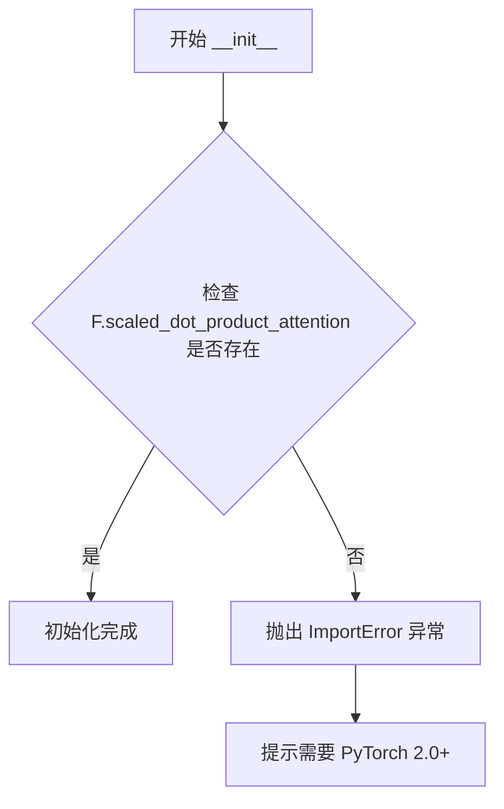
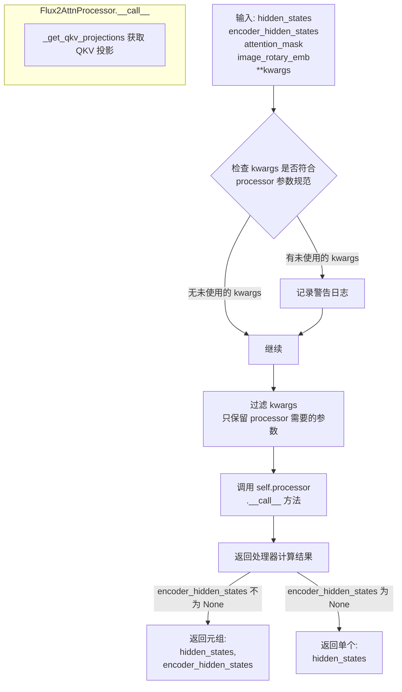
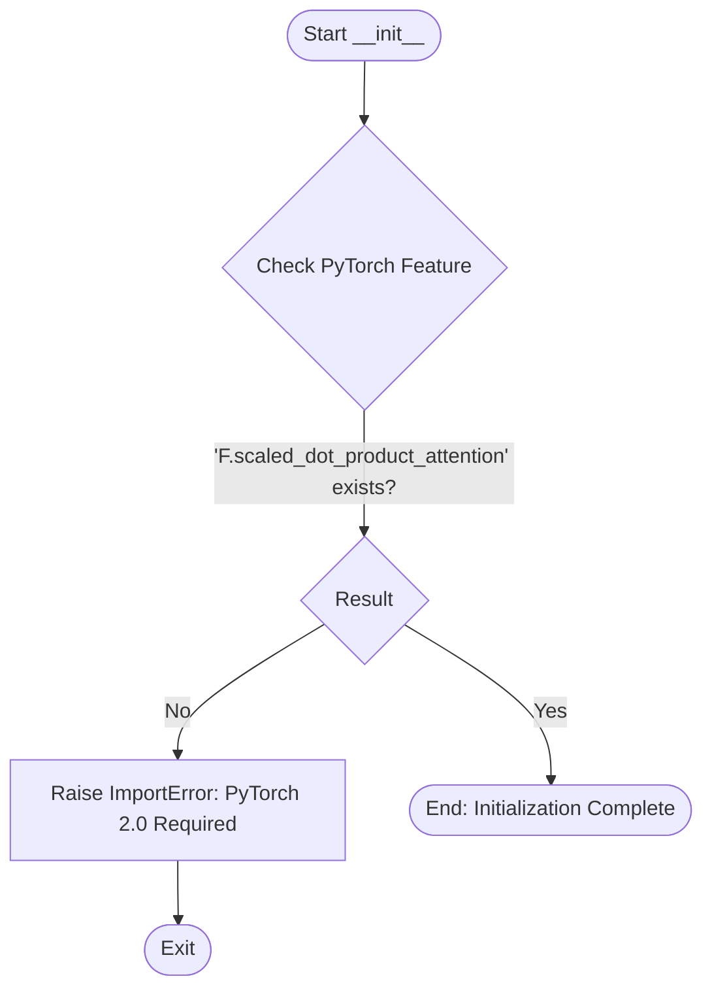
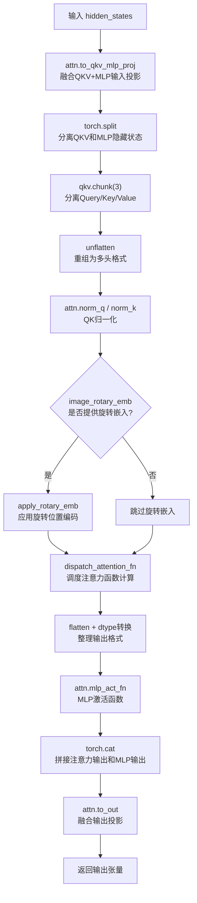
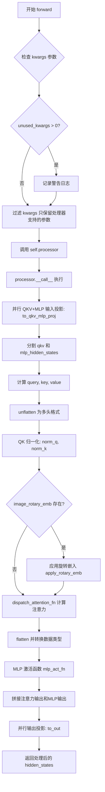
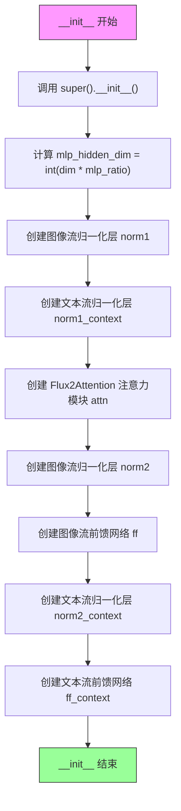

# `diffusers\src\diffusers\models\transformers\transformer_flux2.py` 详细设计文档

Flux2Transformer2DModel是一个用于图像生成的扩散Transformer模型，支持双流（图像+文本）和单流Transformer架构，采用SwiGLU激活、RoPE位置编码、AdaLayerNorm调制等先进技术，实现高效的图像生成任务。

## 整体流程



## 类结构

```
Flux2Transformer2DModel (主模型类)
├── Flux2Modulation (调制模块)
│   └── Flux2SwiGLU (激活函数)
├── Flux2FeedForward (前馈网络)
│   └── Flux2SwiGLU
├── Flux2PosEmbed (位置编码)
├── Flux2TimestepGuidanceEmbeddings (时间步嵌入)
├── Flux2TransformerBlock (双流块)
│   ├── Flux2Attention
│   │   └── Flux2AttnProcessor
│   └── Flux2FeedForward
└── Flux2SingleTransformerBlock (单流块)
    └── Flux2ParallelSelfAttention
        └── Flux2ParallelSelfAttnProcessor
```

## 全局变量及字段


### `logger`
    
模块级日志记录器，用于输出日志信息

类型：`logging.Logger`
    


### `Flux2AttnProcessor._attention_backend`
    
注意力后端配置，用于指定注意力计算的后端实现

类型：`类变量`
    


### `Flux2AttnProcessor._parallel_config`
    
并行配置，用于控制并行注意力计算

类型：`类变量`
    


### `Flux2Attention._default_processor_cls`
    
默认处理器类，指定默认使用的注意力处理器

类型：`类变量`
    


### `Flux2Attention._available_processors`
    
可用的处理器列表，包含所有可用的注意力处理器

类型：`类变量`
    


### `Flux2Transformer2DModel._supports_gradient_checkpointing`
    
是否支持梯度检查点，用于控制梯度检查点功能

类型：`类变量`
    


### `Flux2Transformer2DModel._no_split_modules`
    
不分割的模块列表，指定在模型并行化时不进行分割的模块

类型：`类变量`
    


### `Flux2Transformer2DModel._skip_layerwise_casting_patterns`
    
跳过层级别转换的模式，用于避免某些层的类型转换

类型：`类变量`
    


### `Flux2Transformer2DModel._repeated_blocks`
    
重复的块类型，标识可重复使用的Transformer块类型

类型：`类变量`
    


### `Flux2Transformer2DModel._cp_plan`
    
上下文并行计划，定义模型各部分的并行策略

类型：`类变量`
    


### `Flux2SwiGLU.gate_fn`
    
SiLU激活函数，用于SwiGLU门控机制

类型：`nn.SiLU`
    


### `Flux2FeedForward.linear_in`
    
输入线性层，将dim投影到inner_dim*2

类型：`nn.Linear`
    


### `Flux2FeedForward.act_fn`
    
SwiGLU激活函数，用于前馈网络

类型：`Flux2SwiGLU`
    


### `Flux2FeedForward.linear_out`
    
输出线性层，将inner_dim投影到dim_out

类型：`nn.Linear`
    


### `Flux2Attention.head_dim`
    
注意力头维度

类型：`int`
    


### `Flux2Attention.inner_dim`
    
内部维度

类型：`int`
    


### `Flux2Attention.query_dim`
    
查询维度

类型：`int`
    


### `Flux2Attention.out_dim`
    
输出维度

类型：`int`
    


### `Flux2Attention.heads`
    
注意力头数量

类型：`int`
    


### `Flux2Attention.use_bias`
    
是否使用偏置

类型：`bool`
    


### `Flux2Attention.dropout`
    
dropout概率

类型：`float`
    


### `Flux2Attention.added_kv_proj_dim`
    
添加的KV投影维度

类型：`int`
    


### `Flux2Attention.added_proj_bias`
    
添加投影的偏置

类型：`bool`
    


### `Flux2Attention.to_q`
    
查询投影层

类型：`nn.Linear`
    


### `Flux2Attention.to_k`
    
键投影层

类型：`nn.Linear`
    


### `Flux2Attention.to_v`
    
值投影层

类型：`nn.Linear`
    


### `Flux2Attention.norm_q`
    
查询归一化层

类型：`nn.RMSNorm`
    


### `Flux2Attention.norm_k`
    
键归一化层

类型：`nn.RMSNorm`
    


### `Flux2Attention.to_out`
    
输出层列表，包含线性层和dropout

类型：`nn.ModuleList`
    


### `Flux2Attention.norm_added_q`
    
添加的查询归一化层

类型：`nn.RMSNorm`
    


### `Flux2Attention.norm_added_k`
    
添加的键归一化层

类型：`nn.RMSNorm`
    


### `Flux2Attention.add_q_proj`
    
添加的查询投影层

类型：`nn.Linear`
    


### `Flux2Attention.add_k_proj`
    
添加的键投影层

类型：`nn.Linear`
    


### `Flux2Attention.add_v_proj`
    
添加的值投影层

类型：`nn.Linear`
    


### `Flux2Attention.to_add_out`
    
添加的输出投影层

类型：`nn.Linear`
    


### `Flux2ParallelSelfAttnProcessor._attention_backend`
    
注意力后端配置

类型：`类变量`
    


### `Flux2ParallelSelfAttnProcessor._parallel_config`
    
并行配置

类型：`类变量`
    


### `Flux2ParallelSelfAttention._default_processor_cls`
    
默认处理器类

类型：`类变量`
    


### `Flux2ParallelSelfAttention._available_processors`
    
可用的处理器列表

类型：`类变量`
    


### `Flux2ParallelSelfAttention._supports_qkv_fusion`
    
是否支持QKV融合

类型：`类变量`
    


### `Flux2ParallelSelfAttention.head_dim`
    
注意力头维度

类型：`int`
    


### `Flux2ParallelSelfAttention.inner_dim`
    
内部维度

类型：`int`
    


### `Flux2ParallelSelfAttention.query_dim`
    
查询维度

类型：`int`
    


### `Flux2ParallelSelfAttention.out_dim`
    
输出维度

类型：`int`
    


### `Flux2ParallelSelfAttention.heads`
    
注意力头数量

类型：`int`
    


### `Flux2ParallelSelfAttention.use_bias`
    
是否使用偏置

类型：`bool`
    


### `Flux2ParallelSelfAttention.dropout`
    
dropout概率

类型：`float`
    


### `Flux2ParallelSelfAttention.mlp_ratio`
    
MLP扩展比率

类型：`float`
    


### `Flux2ParallelSelfAttention.mlp_hidden_dim`
    
MLP隐藏层维度

类型：`int`
    


### `Flux2ParallelSelfAttention.mlp_mult_factor`
    
MLP乘法因子

类型：`int`
    


### `Flux2ParallelSelfAttention.to_qkv_mlp_proj`
    
融合的QKV+MLP输入投影层

类型：`nn.Linear`
    


### `Flux2ParallelSelfAttention.mlp_act_fn`
    
MLP激活函数

类型：`Flux2SwiGLU`
    


### `Flux2ParallelSelfAttention.norm_q`
    
查询归一化层

类型：`nn.RMSNorm`
    


### `Flux2ParallelSelfAttention.norm_k`
    
键归一化层

类型：`nn.RMSNorm`
    


### `Flux2ParallelSelfAttention.to_out`
    
融合的输出投影层

类型：`nn.Linear`
    


### `Flux2SingleTransformerBlock.norm`
    
归一化层

类型：`nn.LayerNorm`
    


### `Flux2SingleTransformerBlock.attn`
    
并行自注意力模块

类型：`Flux2ParallelSelfAttention`
    


### `Flux2TransformerBlock.mlp_hidden_dim`
    
MLP隐藏层维度

类型：`int`
    


### `Flux2TransformerBlock.norm1`
    
图像流第一归一化层

类型：`nn.LayerNorm`
    


### `Flux2TransformerBlock.norm1_context`
    
文本流第一归一化层

类型：`nn.LayerNorm`
    


### `Flux2TransformerBlock.attn`
    
注意力模块

类型：`Flux2Attention`
    


### `Flux2TransformerBlock.norm2`
    
图像流第二归一化层

类型：`nn.LayerNorm`
    


### `Flux2TransformerBlock.ff`
    
图像流前馈网络

类型：`Flux2FeedForward`
    


### `Flux2TransformerBlock.norm2_context`
    
文本流第二归一化层

类型：`nn.LayerNorm`
    


### `Flux2TransformerBlock.ff_context`
    
文本流前馈网络

类型：`Flux2FeedForward`
    


### `Flux2PosEmbed.theta`
    
RoPE旋转角度基础

类型：`int`
    


### `Flux2PosEmbed.axes_dim`
    
各轴维度列表

类型：`list[int]`
    


### `Flux2TimestepGuidanceEmbeddings.time_proj`
    
时间步投影层

类型：`Timesteps`
    


### `Flux2TimestepGuidanceEmbeddings.timestep_embedder`
    
时间步嵌入器

类型：`TimestepEmbedding`
    


### `Flux2TimestepGuidanceEmbeddings.guidance_embedder`
    
引导嵌入器，可为空

类型：`TimestepEmbedding或None`
    


### `Flux2Modulation.mod_param_sets`
    
调制参数集数量

类型：`int`
    


### `Flux2Modulation.linear`
    
线性投影层

类型：`nn.Linear`
    


### `Flux2Modulation.act_fn`
    
SiLU激活函数

类型：`nn.SiLU`
    


### `Flux2Transformer2DModel.out_channels`
    
输出通道数

类型：`int`
    


### `Flux2Transformer2DModel.inner_dim`
    
内部维度

类型：`int`
    


### `Flux2Transformer2DModel.pos_embed`
    
位置嵌入模块

类型：`Flux2PosEmbed`
    


### `Flux2Transformer2DModel.time_guidance_embed`
    
时间步和引导嵌入模块

类型：`Flux2TimestepGuidanceEmbeddings`
    


### `Flux2Transformer2DModel.double_stream_modulation_img`
    
图像双流调制模块

类型：`Flux2Modulation`
    


### `Flux2Transformer2DModel.double_stream_modulation_txt`
    
文本双流调制模块

类型：`Flux2Modulation`
    


### `Flux2Transformer2DModel.single_stream_modulation`
    
单流调制模块

类型：`Flux2Modulation`
    


### `Flux2Transformer2DModel.x_embedder`
    
图像输入投影层

类型：`nn.Linear`
    


### `Flux2Transformer2DModel.context_embedder`
    
文本上下文投影层

类型：`nn.Linear`
    


### `Flux2Transformer2DModel.transformer_blocks`
    
双流Transformer块列表

类型：`nn.ModuleList[Flux2TransformerBlock]`
    


### `Flux2Transformer2DModel.single_transformer_blocks`
    
单流Transformer块列表

类型：`nn.ModuleList[Flux2SingleTransformerBlock]`
    


### `Flux2Transformer2DModel.norm_out`
    
输出归一化层

类型：`AdaLayerNormContinuous`
    


### `Flux2Transformer2DModel.proj_out`
    
输出投影层

类型：`nn.Linear`
    


### `Flux2Transformer2DModel.gradient_checkpointing`
    
梯度检查点标志

类型：`bool`
    
    

## 全局函数及方法


### `_get_projections`

该函数用于计算分离的QKV（Query、Key、Value）投影，是Flux2Attention注意力机制的核心组件。它通过独立的线性变换将输入的hidden_states转换为query、key和value向量，并可选地处理encoder_hidden_states以支持交叉注意力机制。

参数：

- `attn`：`Flux2Attention`，注意力模块实例，包含to_q、to_k、to_v等线性变换层
- `hidden_states`：`torch.Tensor`，输入的隐藏状态张量
- `encoder_hidden_states`：`torch.Tensor | None`，可选的编码器隐藏状态，用于交叉注意力

返回值：`tuple[torch.Tensor, torch.Tensor, torch.Tensor, torch.Tensor | None, torch.Tensor | None, torch.Tensor | None]`，返回(query, key, value, encoder_query, encoder_key, encoder_value)六个张量组成的元组

#### 流程图



#### 带注释源码

```python
def _get_projections(attn: "Flux2Attention", hidden_states, encoder_hidden_states=None):
    """
    计算分离的QKV投影（不融合的版本）
    
    该函数是Flux2Attention中用于计算query、key、value的核心方法。
    与_get_fused_projections不同，这里使用独立的线性层进行投影，而不是
    通过单个 fused 投影层。
    
    参数:
        attn: Flux2Attention模块，包含to_q, to_k, to_v等线性变换层
        hidden_states: 输入的隐藏状态，用于生成主注意力机制的QKV
        encoder_hidden_states: 可选的编码器隐藏状态，用于交叉注意力
    
    返回:
        query, key, value: 主注意力的查询、键、值张量
        encoder_query, encoder_key, encoder_value: 交叉注意力的查询、键、值张量（可能为None）
    """
    # 使用独立的线性层将hidden_states投影为query、key、value
    query = attn.to_q(hidden_states)
    key = attn.to_k(hidden_states)
    value = attn.to_v(hidden_states)

    # 初始化encoder相关的投影为None
    encoder_query = encoder_key = encoder_value = None
    
    # 如果存在encoder_hidden_states且added_kv_proj_dim不为None，则计算encoder的QKV投影
    # 这用于支持交叉注意力机制，其中encoder_hidden_states提供额外的上下文信息
    if encoder_hidden_states is not None and attn.added_kv_proj_dim is not None:
        encoder_query = attn.add_q_proj(encoder_hidden_states)
        encoder_key = attn.add_k_proj(encoder_hidden_states)
        encoder_value = attn.add_v_proj(encoder_hidden_states)

    # 返回完整的QKV投影元组
    return query, key, value, encoder_query, encoder_key, encoder_value
```


### `_get_fused_projections`

计算融合的 QKV 投影，用于 Flux2 注意力机制中同时计算 query、key、value 投影，并通过可选的 `to_added_qkv` 方法处理编码器隐藏状态的投影。

参数：

- `attn`：`Flux2Attention`，注意力模块实例，包含 `to_qkv` 和 `to_added_qkv` 方法用于计算融合投影
- `hidden_states`：`torch.Tensor`，输入的隐藏状态张量，形状为 `(batch, seq_len, hidden_dim)`
- `encoder_hidden_states`：可选的 `torch.Tensor`，编码器隐藏状态，用于跨注意力机制，默认为 `None`

返回值：`(query, key, value, encoder_query, encoder_key, encoder_value)`，元组包含六个张量，其中 `query`、`key`、`value` 为主要输入的 QKV 投影，`encoder_query`、`encoder_key`、`encoder_value` 为编码器输入的 QKV 投影（如果存在）；若编码器输入不存在，则 `encoder_query`、`encoder_key`、`encoder_value` 均为 `None`

#### 流程图

```mermaid
flowchart TD
    A[开始: _get_fused_projections] --> B[调用 attn.to_qkv<br/>计算融合 QKV 投影]
    B --> C[使用 .chunk(3, dim=-1)<br/>分割为 query, key, value]
    C --> D{encoder_hidden_states<br/>是否非空且 attn 有<br/>to_added_qkv 属性?}
    D -->|是| E[调用 attn.to_added_qkv<br/>计算编码器融合 QKV]
    E --> F[使用 .chunk(3, dim=-1)<br/>分割为 encoder_query<br/>encoder_key, encoder_value]
    D -->|否| G[设置 encoder_query<br/>encoder_key, encoder_value = None]
    F --> H[返回 query, key, value<br/>encoder_query, encoder_key, encoder_value]
    G --> H
```

#### 带注释源码

```python
def _get_fused_projections(attn: "Flux2Attention", hidden_states, encoder_hidden_states=None):
    """
    计算融合的 QKV 投影，用于 Flux2 注意力机制。
    
    该函数使用融合的线性层同时计算 query、key、value 三个投影，
    相比分别调用 to_q、to_k、to_v 更加高效，因为可以在一次矩阵乘法中完成计算。
    
    参数:
        attn: Flux2Attention 实例，需要包含 to_qkv 方法
        hidden_states: 输入的隐藏状态张量
        encoder_hidden_states: 可选的编码器隐藏状态，用于跨注意力
    
    返回:
        包含 query, key, value, encoder_query, encoder_key, encoder_value 的元组
    """
    # 1. 使用融合的 to_qkv 方法一次性计算 query, key, value
    #    to_qkv 返回形状为 (batch, seq_len, 3 * hidden_dim) 的张量
    #    .chunk(3, dim=-1) 将其沿最后一维分割为三个等份
    query, key, value = attn.to_qkv(hidden_states).chunk(3, dim=-1)

    # 2. 初始化编码器相关投影为 None
    encoder_query = encoder_key = encoder_value = (None,)

    # 3. 如果存在编码器隐藏状态且注意力模块支持 added_qkv 投影
    #    则计算编码器输入的 QKV 投影（用于跨注意力机制）
    if encoder_hidden_states is not None and hasattr(attn, "to_added_qkv"):
        # 使用 to_added_qkv 计算编码器的融合 QKV 投影
        # 同样使用 chunk 方法分割为三份
        encoder_query, encoder_key, encoder_value = attn.to_added_qkv(encoder_hidden_states).chunk(3, dim=-1)

    # 4. 返回所有 QKV 投影结果
    return query, key, value, encoder_query, encoder_key, encoder_value
```


### `_get_qkv_projections`

该函数是Flux2Attention模块的QKV投影分发器，根据注意力模块的`fused_projections`配置属性，选择调用融合投影函数或分离投影函数，以获取查询（Query）、键（Key）、值（Value）以及可选的编码器QKV投影。

参数：

- `attn`：`Flux2Attention`，注意力模块实例，用于判断是否使用融合投影（通过`fused_projections`属性）
- `hidden_states`：`torch.Tensor`，输入的隐藏状态张量，作为QKV投影的输入
- `encoder_hidden_states`：`torch.Tensor | None`，可选的编码器隐藏状态，用于条件注意力机制

返回值：`tuple[torch.Tensor, torch.Tensor, torch.Tensor, torch.Tensor | None, torch.Tensor | None, torch.Tensor | None]`，返回(query, key, value, encoder_query, encoder_key, encoder_value)组成的元组，其中encoder_query/key/value在未提供encoder_hidden_states或added_kv_proj_dim为None时为None

#### 流程图



#### 带注释源码

```python
def _get_qkv_projections(attn: "Flux2Attention", hidden_states, encoder_hidden_states=None):
    """
    根据配置选择合适的QKV投影方式，输出QKV投影结果。
    
    该函数是Flux2Attention模块的QKV投影分发器，根据注意力模块的
    fused_projections属性决定使用融合投影还是分离投影。
    
    参数:
        attn: Flux2Attention模块实例，通过fused_projections属性判断投影类型
        hidden_states: 输入的隐藏状态张量
        encoder_hidden_states: 可选的编码器隐藏状态，用于交叉注意力
    
    返回:
        包含query, key, value, encoder_query, encoder_key, encoder_value的元组
    """
    # 检查是否启用融合投影模式
    if attn.fused_projections:
        # 融合投影模式：使用单一的线性层同时计算QKV
        return _get_fused_projections(attn, hidden_states, encoder_hidden_states)
    # 分离投影模式：使用独立的线性层分别计算QKV
    return _get_projections(attn, hidden_states, encoder_hidden_states)
```


### `Flux2SwiGLU.__init__`

初始化 Flux2SwiGLU 类实例，该类是 Flux 2 模型中用于实现 SwiGLU 风格激活函数的核心组件。它继承自 `nn.Module`，在初始化过程中创建并维护一个 SiLU（Swish）激活函数实例，用于后续的前向传播计算。

参数：

-  `self`：`Flux2SwiGLU`，指向类实例本身的引用，用于访问类的属性和方法

返回值：`None`，无返回值（构造函数）

#### 流程图

```mermaid
graph TD
    A[开始 __init__] --> B[调用 super().__init__]
    B --> C[初始化 self.gate_fn = nn.SiLU]
    C --> D[结束 __init__]
```

#### 带注释源码

```python
def __init__(self):
    """
    初始化 Flux2SwiGLU 实例。

    该方法继承自 nn.Module，调用父类构造函数，并初始化内部维护的 SiLU 激活函数。
    这是实现 Flux 2 模型 SwiGLU 激活的关键步骤。
    """
    super().__init__()  # 调用 nn.Module 的初始化方法，建立模块基础结构
    self.gate_fn = nn.SiLU()  # 创建 SiLU 激活函数实例，用于后续的前向传播计算
```

#### 补充信息

该类在 Flux 2 模型的前馈网络（Flux2FeedForward）中承担着核心的激活函数角色，通过 `forward` 方法实现标准的 SwiGLU 逻辑（将输入张量按维度分割，一半经过 SiLU 激活，另一半保持不变，最后相乘）。由于该模块没有可训练的权重参数，因此具有较高的计算效率。


### Flux2SwiGLU.forward

执行SwiGLU前向传播，将输入张量按最后一维均匀分成两部分，一部分经过SiLU（Sigmoid Linear Unit）激活函数处理后与另一部分逐元素相乘，实现门控线性单元机制，用于Flux 2transformer的前馈子块中。

参数：

- `x`：`torch.Tensor`，输入张量，需为最后一维长度为偶数的张量

返回值：`torch.Tensor`，经过SwiGLU门控激活后的输出张量，形状与输入相同

#### 流程图

```mermaid
flowchart TD
    A[输入张量 x] --> B[chunk 分割]
    B --> C[取前一半 x1]
    B --> D[取后一半 x2]
    C --> E[SiLU 激活函数]
    E --> F[逐元素相乘: gate_fn(x1) * x2]
    D --> F
    F --> G[输出张量]
```

#### 带注释源码

```python
def forward(self, x: torch.Tensor) -> torch.Tensor:
    """
    SwiGLU 前向传播：
    1. 将输入沿最后一维均匀分割为两部分
    2. 第一部分经过 SiLU 门控激活函数
    3. 激活后的结果与第二部分逐元素相乘
    """
    # 将输入张量在最后一维均分为两个子张量
    # 假设输入形状为 (batch, seq, hidden_dim)，分割后各自为 (batch, seq, hidden_dim/2)
    x1, x2 = x.chunk(2, dim=-1)
    
    # x1 经过 SiLU (Sigmoid Linear Unit) 门控激活
    # SiLU(x) = x * sigmoid(x) = x / (1 + exp(-x))
    x = self.gate_fn(x1) * x2
    
    # 返回形状与输入相同的输出张量
    return x
```


### `Flux2FeedForward.__init__`

初始化 Flux 2 模型的前馈神经网络（Feed Forward）模块，配置输入输出维度、激活函数和线性层参数。

参数：

- `dim`：`int`，输入特征维度（hidden states 的通道数）
- `dim_out`：`int | None`，输出特征维度，默认为 `None`（若为 `None` 则等于 `dim`）
- `mult`：`float`，内层维度的扩展倍数，默认为 `3.0`（即 `inner_dim = dim * mult`）
- `inner_dim`：`int | None`，内层隐藏维度，默认为 `None`（若为 `None` 则自动计算为 `dim * mult`）
- `bias`：`bool`，线性层是否使用偏置，默认为 `False`

返回值：`None`（`__init__` 方法无返回值）

#### 流程图

```mermaid
flowchart TD
    A[开始 __init__] --> B{inner_dim is None?}
    B -->|是| C[inner_dim = int(dim * mult)]
    B -->|否| D[使用传入的 inner_dim]
    C --> E{dim_out is None?}
    D --> E
    E -->|是| F[dim_out = dim]
    E -->|否| G[使用传入的 dim_out]
    F --> H[创建 self.linear_in: Linear(dim, inner_dim * 2)]
    G --> H
    H --> I[创建 self.act_fn: Flux2SwiGLU]
    I --> J[创建 self.linear_out: Linear(inner_dim, dim_out)]
    J --> K[结束 __init__]
```

#### 带注释源码

```python
class Flux2FeedForward(nn.Module):
    def __init__(
        self,
        dim: int,                 # 输入维度，即 hidden states 的通道数
        dim_out: int | None = None,  # 输出维度，默认等于输入维度 dim
        mult: float = 3.0,        # 内层维度的扩展倍数，用于计算 inner_dim
        inner_dim: int | None = None,  # 内层隐藏维度，默认自动计算为 dim * mult
        bias: bool = False,       # 线性层是否使用偏置项
    ):
        # 调用父类 nn.Module 的初始化方法
        super().__init__()
        
        # 如果未指定 inner_dim，则根据 dim 和 mult 计算得到
        # inner_dim 表示前馈网络中间层的维度
        if inner_dim is None:
            inner_dim = int(dim * mult)
        
        # 如果未指定 dim_out，则默认输出维度等于输入维度 dim
        dim_out = dim_out or dim

        # 输入线性层：将输入维度 dim 映射到 inner_dim * 2
        # 乘以 2 是因为 SwiGLU 激活函数会将维度减半
        # SwiGLU 公式: gate_fn(x1) * x2，其中 x1, x2 各占一半维度
        self.linear_in = nn.Linear(dim, inner_dim * 2, bias=bias)
        
        # SwiGLU 激活函数（Flux2SwiGLU 本身无参数，参数来自 linear_in）
        self.act_fn = Flux2SwiGLU()
        
        # 输出线性层：将内层维度 inner_dim 映射回输出维度 dim_out
        self.linear_out = nn.Linear(inner_dim, dim_out, bias=bias)
```


### `Flux2FeedForward.forward`

执行 Flux2 模型的前馈网络前向传播，通过 SwiGLU 激活函数对输入进行非线性变换，是 Flux2 Transformer 块中的核心MLP组件。

参数：

- `x`：`torch.Tensor`，输入的隐藏状态张量，通常来自注意力模块的输出，形状为 `(batch_size, seq_len, dim)`

返回值：`torch.Tensor`，经过前馈网络处理后的隐藏状态张量，形状与输入相同 `(batch_size, seq_len, dim_out)`

#### 流程图

```mermaid
flowchart TD
    A[输入 x: torch.Tensor] --> B[linear_in: 线性变换]
    B --> C[inner_dim * 2 维度]
    C --> D[chunk 分割为 x1, x2]
    D --> E[Flux2SwiGLU 激活函数]
    E --> F[x = gate_fn(x1) * x2]
    F --> G[linear_out: 线性变换]
    G --> H[输出: torch.Tensor]
    
    B1[dim --> inner_dim * 2] --> B
    G1[inner_dim --> dim_out] --> G
```

#### 带注释源码

```python
def forward(self, x: torch.Tensor) -> torch.Tensor:
    """
    Flux2FeedForward 的前向传播方法。
    
    Args:
        x: 输入的隐藏状态张量，形状为 (batch_size, seq_len, dim)
    
    Returns:
        经过前馈网络处理后的张量，形状为 (batch_size, seq_len, dim_out)
    """
    # 第一步：输入线性变换
    # 将输入从 dim 维度映射到 inner_dim * 2 维度
    # 乘以 2 是因为 SwiGLU 激活函数需要两个分支（gate 和 value）
    x = self.linear_in(x)
    
    # 第二步：应用 SwiGLU 激活函数
    # SwiGLU 将张量按最后一维分成两半，一半经过 SiLU 激活，另一半作为乘数
    # 这是一种高效的门控激活机制，类似于 GLU (Gated Linear Unit)
    x = self.act_fn(x)
    
    # 第三步：输出线性变换
    # 将处理后的特征从 inner_dim 维度映射回 dim_out 维度
    x = self.linear_out(x)
    
    return x
```


### `Flux2AttnProcessor.__init__`

这是 `Flux2AttnProcessor` 类的构造函数，用于初始化 Flux 2 注意力处理器，并检查 PyTorch 版本是否满足要求（需要支持 `scaled_dot_product_attention`，即 PyTorch 2.0+）。

参数：

- 无显式参数（隐式参数 `self` 为类的实例自身）

返回值：`None`，无返回值（构造函数）

#### 流程图



#### 带注释源码

```python
def __init__(self):
    # 检查 PyTorch 的函数式 API (F) 是否包含 scaled_dot_product_attention 函数
    # scaled_dot_product_attention 是 PyTorch 2.0 引入的高效注意力计算函数
    if not hasattr(F, "scaled_dot_product_attention"):
        # 如果 PyTorch 版本低于 2.0，抛出 ImportError 异常
        # 提示用户升级 PyTorch 版本以使用 Flux2AttnProcessor
        raise ImportError(f"{self.__class__.__name__} requires PyTorch 2.0. Please upgrade your pytorch version.")
```


### `Flux2AttnProcessor.__call__`

执行注意力计算，包括QKV投影、归一化、RoPE应用、注意力分发和输出投影。

参数：

- `self`：隐式参数，Flux2AttnProcessor实例本身
- `attn`：`Flux2Attention`，注意力机制实例，用于获取投影层和归一化层
- `hidden_states`：`torch.Tensor`，输入的隐藏状态张量，形状为 `(batch_size, seq_len, hidden_dim)`
- `encoder_hidden_states`：`torch.Tensor | None`，编码器的隐藏状态，用于条件注意力机制，默认为 None
- `attention_mask`：`torch.Tensor | None`，注意力掩码，用于控制注意力计算，默认为 None
- `image_rotary_emb`：`torch.Tensor | None`，图像的旋转位置嵌入（RoPE），用于位置编码，默认为 None

返回值：`torch.Tensor | tuple[torch.Tensor, torch.Tensor]`，如果存在 `encoder_hidden_states`，返回包含输出隐藏状态和编码器输出的元组；否则仅返回输出隐藏状态张量

#### 流程图

```mermaid
flowchart TD
    A[开始] --> B[获取QKV投影]
    B --> C{使用融合投影?}
    C -->|是| D[_get_fused_projections]
    C -->|否| E[_get_projections]
    D --> F[返回 query, key, value, encoder_query, encoder_key, encoder_value]
    E --> F
    F --> G[Unflatten query/key/value 为 (batch, heads, seq, dim)]
    G --> H[归一化 query 和 key]
    H --> I{是否存在 added_kv_proj_dim?}
    I -->|是| J[Unflatten encoder QKV 并归一化]
    I -->|否| K[跳过 encoder 处理]
    J --> L[拼接 encoder 和 main QKV]
    K --> M{是否存在 image_rotary_emb?}
    L --> M
    M -->|是| N[应用 RoPE 到 query 和 key]
    M -->|否| O[跳过 RoPE]
    N --> P[dispatch_attention_fn 计算注意力]
    O --> P
    P --> Q[Flatten heads 维度并转换 dtype]
    Q --> R{是否存在 encoder_hidden_states?}
    R -->|是| S[分割输出为 encoder 和 main 部分]
    R -->|否| T[直接使用输出]
    S --> U[应用 to_add_out 到 encoder 输出]
    T --> V[应用 to_out[0] 线性层]
    V --> W[应用 to_out[1] Dropout]
    W --> X{返回类型?}
    X -->|有 encoder| Y[返回 tuple(hidden_states, encoder_hidden_states)]
    X -->|无 encoder| Z[返回 hidden_states]
    Y --> END[结束]
    Z --> END
```

#### 带注释源码

```python
def __call__(
    self,
    attn: "Flux2Attention",
    hidden_states: torch.Tensor,
    encoder_hidden_states: torch.Tensor = None,
    attention_mask: torch.Tensor | None = None,
    image_rotary_emb: torch.Tensor | None = None,
) -> torch.Tensor:
    # 1. 获取QKV投影：根据是否使用融合投影选择不同的投影方式
    # 返回 main stream 的 query/key/value 以及可选的 encoder stream 的 QKV
    query, key, value, encoder_query, encoder_key, encoder_value = _get_qkv_projections(
        attn, hidden_states, encoder_hidden_states
    )

    # 2. 将 QKV 从 (batch, seq, heads*dim) unflatten 为 (batch, heads, seq, dim) 格式
    # 以便进行多头注意力计算
    query = query.unflatten(-1, (attn.heads, -1))
    key = key.unflatten(-1, (attn.heads, -1))
    value = value.unflatten(-1, (attn.heads, -1))

    # 3. 对 query 和 key 进行 QK RMSNorm 归一化
    # 有助于稳定训练和提高注意力机制的性能
    query = attn.norm_q(query)
    key = attn.norm_k(key)

    # 4. 如果存在 encoder 的 kv 投影维度，处理 encoder 隐藏状态
    if attn.added_kv_proj_dim is not None:
        # 同样 unflatten encoder 的 QKV
        encoder_query = encoder_query.unflatten(-1, (attn.heads, -1))
        encoder_key = encoder_key.unflatten(-1, (attn.heads, -1))
        encoder_value = encoder_value.unflatten(-1, (attn.heads, -1))

        # 归一化 encoder 的 query 和 key
        encoder_query = attn.norm_added_q(encoder_query)
        encoder_key = attn.norm_added_k(encoder_key)

        # 将 encoder 的 QKV 拼接到 main stream 前面
        # 格式: [encoder_seq, main_seq]
        query = torch.cat([encoder_query, query], dim=1)
        key = torch.cat([encoder_key, key], dim=1)
        value = torch.cat([encoder_value, value], dim=1)

    # 5. 应用旋转位置嵌入 (RoPE) 到 query 和 key
    # 用于在不使用绝对位置编码的情况下引入相对位置信息
    if image_rotary_emb is not None:
        query = apply_rotary_emb(query, image_rotary_emb, sequence_dim=1)
        key = apply_rotary_emb(key, image_rotary_emb, sequence_dim=1)

    # 6. 调用分发的注意力函数计算注意力输出
    # 支持不同的注意力后端和并行配置
    hidden_states = dispatch_attention_fn(
        query,
        key,
        value,
        attn_mask=attention_mask,
        backend=self._attention_backend,
        parallel_config=self._parallel_config,
    )
    
    # 7. 将输出从 (batch, heads, seq, dim) flatten 为 (batch, seq, heads*dim)
    # 并转换为与 query 相同的 dtype
    hidden_states = hidden_states.flatten(2, 3)
    hidden_states = hidden_states.to(query.dtype)

    # 8. 如果存在 encoder_hidden_states，分割输出并分别处理
    if encoder_hidden_states is not None:
        # 根据 encoder 和 main 的序列长度分割输出
        encoder_hidden_states, hidden_states = hidden_states.split_with_sizes(
            [encoder_hidden_states.shape[1], hidden_states.shape[1] - encoder_hidden_states.shape[1]], dim=1
        )
        # 对 encoder 输出应用输出投影
        encoder_hidden_states = attn.to_add_out(encoder_hidden_states)

    # 9. 应用输出投影层 (线性层 + Dropout)
    hidden_states = attn.to_out[0](hidden_states)
    hidden_states = attn.to_out[1](hidden_states)

    # 10. 根据是否有 encoder 返回结果
    if encoder_hidden_states is not None:
        return hidden_states, encoder_hidden_states
    else:
        return hidden_states
```


### Flux2Attention.__init__

初始化 Flux2Attention 注意力模块，设置查询/键/值投影层、输出层、QK 归一化层以及可选的附加 KV 投影层，同时配置注意力处理器。

参数：

- `query_dim`：`int`，查询向量的维度，即输入隐藏状态的特征维度
- `heads`：`int = 8`，注意力头的数量，默认为 8
- `dim_head`：`int = 64`，每个注意力头的维度，默认为 64
- `dropout`：`float = 0.0`，注意力输出的 dropout 概率，默认为 0.0
- `bias`：`bool = False`，是否在 QKV 投影层中使用偏置，默认为 False
- `added_kv_proj_dim`：`int | None = None`，附加键值投影维度，用于联合注意力，默认为 None
- `added_proj_bias`：`bool | None = True`，附加投影是否使用偏置，默认为 True
- `out_bias`：`bool = True`，输出投影层是否使用偏置，默认为 True
- `eps`：`float = 1e-5`，RMSNorm 的 epsilon 值，用于数值稳定性，默认为 1e-5
- `out_dim`：`int = None`，输出维度，默认为 None（等于 query_dim）
- `elementwise_affine`：`bool = True`，RMSNorm 是否使用可学习的仿射参数，默认为 True
- `processor`：注意力处理器实例，默认为 None

返回值：无（`None`），该方法为初始化方法，不返回任何值

#### 流程图

```mermaid
flowchart TD
    A[开始 __init__] --> B[调用 super().__init__]
    B --> C[设置基本属性: head_dim, inner_dim, query_dim, out_dim, heads]
    C --> D[设置使用标志: use_bias, dropout, added_kv_proj_dim, added_proj_bias]
    D --> E[创建 QKV 投影层: to_q, to_k, to_v]
    E --> F[创建 QK 归一化层: norm_q, norm_k]
    F --> G[创建输出层: to_out ModuleList]
    G --> H{added_kv_proj_dim 是否存在?}
    H -->|是| I[创建附加投影层和归一化层]
    H -->|否| J[跳过附加层创建]
    I --> K[设置注意力处理器]
    J --> K
    K --> L[结束 __init__]
```

#### 带注释源码

```python
def __init__(
    self,
    query_dim: int,                    # 输入查询维度
    heads: int = 8,                    # 注意力头数量
    dim_head: int = 64,                # 每个头的维度
    dropout: float = 0.0,              # Dropout 概率
    bias: bool = False,                 # 是否使用偏置
    added_kv_proj_dim: int | None = None,  # 附加 KV 投影维度（用于联合注意力）
    added_proj_bias: bool | None = True,   # 附加投影偏置
    out_bias: bool = True,              # 输出层偏置
    eps: float = 1e-5,                  # RMSNorm epsilon
    out_dim: int = None,                # 输出维度
    elementwise_affine: bool = True,    # RMSNorm 仿射参数
    processor=None,                    # 注意力处理器
):
    super().__init__()  # 调用父类初始化

    # 设置维度属性
    self.head_dim = dim_head
    self.inner_dim = out_dim if out_dim is not None else dim_head * heads  # 内部维度 = 头数 × 头维度
    self.query_dim = query_dim
    self.out_dim = out_dim if out_dim is not None else query_dim  # 输出维度默认等于查询维度
    self.heads = out_dim // dim_head if out_dim is not None else heads

    # 保存配置标志
    self.use_bias = bias
    self.dropout = dropout
    self.added_kv_proj_dim = added_kv_proj_dim
    self.added_proj_bias = added_proj_bias

    # 创建 QKV 投影层（线性层）
    self.to_q = torch.nn.Linear(query_dim, self.inner_dim, bias=bias)  # 查询投影
    self.to_k = torch.nn.Linear(query_dim, self.inner_dim, bias=bias)  # 键投影
    self.to_v = torch.nn.Linear(query_dim, self.inner_dim, bias=bias)  # 值投影

    # 创建 QK 归一化层（使用 RMSNorm）
    self.norm_q = torch.nn.RMSNorm(dim_head, eps=eps, elementwise_affine=elementwise_affine)
    self.norm_k = torch.nn.RMSNorm(dim_head, eps=eps, elementwise_affine=elementwise_affine)

    # 创建输出层（ModuleList 包含线性层和 Dropout）
    self.to_out = torch.nn.ModuleList([])
    self.to_out.append(torch.nn.Linear(self.inner_dim, self.out_dim, bias=out_bias))  # 输出投影
    self.to_out.append(torch.nn.Dropout(dropout))  # Dropout 层

    # 如果存在附加 KV 投影维度，创建相关层
    if added_kv_proj_dim is not None:
        # 附加查询/键/值的归一化层
        self.norm_added_q = torch.nn.RMSNorm(dim_head, eps=eps)
        self.norm_added_k = torch.nn.RMSNorm(dim_head, eps=eps)
        # 附加投影层（用于联合注意力）
        self.add_q_proj = torch.nn.Linear(added_kv_proj_dim, self.inner_dim, bias=added_proj_bias)
        self.add_k_proj = torch.nn.Linear(added_kv_proj_dim, self.inner_dim, bias=added_proj_bias)
        self.add_v_proj = torch.nn.Linear(added_kv_proj_dim, self.inner_dim, bias=added_proj_bias)
        # 附加输出投影层
        self.to_add_out = torch.nn.Linear(self.inner_dim, query_dim, bias=out_bias)

    # 设置注意力处理器
    if processor is None:
        processor = self._default_processor_cls()  # 使用默认处理器
    self.set_processor(processor)  # 应用处理器
```


### `Flux2Attention.forward`

转发给处理器执行注意力计算。该方法是 Flux2Attention 模块的前向传播入口，接收隐藏状态、编码器隐藏状态等输入，通过处理器委托模式调用 `Flux2AttnProcessor` 执行实际的注意力计算逻辑，并返回处理后的张量或元组。

参数：

- `hidden_states`：`torch.Tensor`，输入的隐藏状态张量，通常是经过投影的图像或文本特征
- `encoder_hidden_states`：`torch.Tensor | None`，编码器（文本）隐藏状态，用于交叉注意力计算，默认为 None
- `attention_mask`：`torch.Tensor | None`，注意力掩码，用于控制注意力计算中的可见性，默认为 None
- `image_rotary_emb`：`torch.Tensor | None`，图像旋转位置编码，用于旋转位置嵌入（RoPE），默认为 None
- `**kwargs`：可变关键字参数，用于传递额外的注意力参数，会被过滤后传递给处理器

返回值：`torch.Tensor`，处理后的隐藏状态。如果 `encoder_hidden_states` 不为 None，则返回元组 `(hidden_states, encoder_hidden_states)`，分别对应图像和文本的注意力输出；否则仅返回 `hidden_states`。

#### 流程图



#### 带注释源码

```python
def forward(
    self,
    hidden_states: torch.Tensor,
    encoder_hidden_states: torch.Tensor | None = None,
    attention_mask: torch.Tensor | None = None,
    image_rotary_emb: torch.Tensor | None = None,
    **kwargs,
) -> torch.Tensor:
    # 获取处理器调用方法的参数签名
    attn_parameters = set(inspect.signature(self.processor.__call__).parameters.keys())
    
    # 找出未使用的 kwargs（不在处理器参数列表中的参数）
    unused_kwargs = [k for k, _ in kwargs.items() if k not in attn_parameters]
    
    # 如果存在未使用的 kwargs，记录警告信息
    if len(unused_kwargs) > 0:
        logger.warning(
            f"joint_attention_kwargs {unused_kwargs} are not expected by {self.processor.__class__.__name__} and will be ignored."
        )
    
    # 过滤 kwargs，只保留处理器需要的参数
    kwargs = {k: w for k, w in kwargs.items() if k in attn_parameters}
    
    # 委托给处理器执行实际的注意力计算
    # 这是典型的策略模式实现，将具体的注意力计算逻辑委托给可插拔的处理器
    return self.processor(self, hidden_states, encoder_hidden_states, attention_mask, image_rotary_emb, **kwargs)
```


### `Flux2ParallelSelfAttnProcessor.__init__`

这是 `Flux2ParallelSelfAttnProcessor` 类的构造函数。该方法用于初始化并行自注意力处理器，并在初始化时执行关键的前提条件检查：它验证当前 PyTorch 环境是否支持 `torch.nn.functional.scaled_dot_product_attention` 函数（即 PyTorch 2.0 及以上版本）。如果不满足条件，将抛出 `ImportError` 以阻止后续执行。

参数：

-  `self`：`Flux2ParallelSelfAttnProcessor` 类型，表示类的实例对象本身。

返回值：`None`，构造函数不返回值，仅初始化实例状态。

#### 流程图



#### 带注释源码

```python
def __init__(self):
    # 检查 PyTorch 的 functional 模块 (F) 是否包含 scaled_dot_product_attention 函数。
    # 此函数通常在 PyTorch 2.0 中引入，是高性能注意力机制的核心。
    if not hasattr(F, "scaled_dot_product_attention"):
        # 如果缺失，抛出导入错误并提示用户升级 PyTorch 版本。
        raise ImportError(f"{self.__class__.__name__} requires PyTorch 2.0. Please upgrade your pytorch version.")
```


### `Flux2ParallelSelfAttnProcessor.__call__`

执行融合的并行自注意力计算，通过将QKV投影与MLP输入投影融合，以及将注意力输出投影与MLP输出投影融合，实现高效的并行Transformer块计算。该方法遵循ViT-22B论文中描述的并行Transformer架构设计。

参数：

- `self`：`Flux2ParallelSelfAttnProcessor`，注意力处理器实例本身
- `attn`：`Flux2ParallelSelfAttention`，包含注意力层参数和方法的实例
- `hidden_states`：`torch.Tensor`，输入的隐藏状态张量，形状为 `(batch_size, seq_len, hidden_dim)`
- `attention_mask`：`torch.Tensor | None`，可选的注意力掩码，用于屏蔽特定位置的注意力计算
- `image_rotary_emb`：`torch.Tensor | None`，可选的图像旋转位置嵌入，用于旋转位置编码

返回值：`torch.Tensor`，经过融合的并行自注意力计算后的输出张量，形状与输入 `hidden_states` 相同

#### 流程图



#### 带注释源码

```python
def __call__(
    self,
    attn: "Flux2ParallelSelfAttention",
    hidden_states: torch.Tensor,
    attention_mask: torch.Tensor | None = None,
    image_rotary_emb: torch.Tensor | None = None,
) -> torch.Tensor:
    # Parallel in (QKV + MLP in) projection
    # 步骤1: 执行融合的QKV和MLP输入投影
    # 将输入hidden_states通过一个线性层同时投影到QKV空间和MLP空间
    # 投影维度: inner_dim * 3 + mlp_hidden_dim * mlp_mult_factor
    hidden_states = attn.to_qkv_mlp_proj(hidden_states)
    
    # 步骤2: 分离QKV和MLP隐藏状态
    # 将投影结果按维度分割为两部分:
    # - QKV部分: 3 * attn.inner_dim 维
    # - MLP部分: attn.mlp_hidden_dim * attn.mlp_mult_factor 维
    qkv, mlp_hidden_states = torch.split(
        hidden_states, [3 * attn.inner_dim, attn.mlp_hidden_dim * attn.mlp_mult_factor], dim=-1
    )

    # Handle the attention logic
    # 步骤3: 从QKV中分离出Query、Key、Value
    query, key, value = qkv.chunk(3, dim=-1)

    # 步骤4: 重组为多头注意力格式
    # 将最后一个维度展开为 (heads, dim_head) 格式
    query = query.unflatten(-1, (attn.heads, -1))
    key = key.unflatten(-1, (attn.heads, -1))
    value = value.unflatten(-1, (attn.heads, -1))

    # 步骤5: QK归一化 (使用RMSNorm)
    query = attn.norm_q(query)
    key = attn.norm_k(key)

    # 步骤6: 可选的旋转位置编码
    if image_rotary_emb is not None:
        # 应用旋转嵌入到query和key
        query = apply_rotary_emb(query, image_rotary_emb, sequence_dim=1)
        key = apply_rotary_emb(key, image_rotary_emb, sequence_dim=1)

    # 步骤7: 调度注意力函数计算
    # 根据配置的并行策略和后端执行注意力计算
    hidden_states = dispatch_attention_fn(
        query,
        key,
        value,
        attn_mask=attention_mask,
        backend=self._attention_backend,
        parallel_config=self._parallel_config,
    )
    
    # 步骤8: 整理输出格式并转换数据类型
    hidden_states = hidden_states.flatten(2, 3)
    hidden_states = hidden_states.to(query.dtype)

    # Handle the feedforward (FF) logic
    # 步骤9: MLP激活函数 (SwiGLU)
    mlp_hidden_states = attn.mlp_act_fn(mlp_hidden_states)

    # Concatenate and parallel output projection
    # 步骤10: 拼接注意力输出和MLP输出
    hidden_states = torch.cat([hidden_states, mlp_hidden_states], dim=-1)
    
    # 步骤11: 融合输出投影
    # 将拼接后的结果通过一个线性层投影到最终输出维度
    hidden_states = attn.to_out(hidden_states)

    return hidden_states
```

### 关键组件信息

| 组件名称 | 一句话描述 |
|---------|-----------|
| `Flux2ParallelSelfAttnProcessor` | 融合QKV和MLP输入投影、融合注意力输出和MLP输出的并行自注意力处理器 |
| `Flux2ParallelSelfAttention` | 实现ViT-22B风格并行Transformer块的注意力模块 |
| `to_qkv_mlp_proj` | 融合的线性层，同时计算QKV投影和MLP输入投影 |
| `to_out` | 融合的线性层，同时计算注意力输出投影和MLP输出投影 |
| `Flux2SwiGLU` | SwiGLU激活函数，用于MLP部分的非线性变换 |
| `dispatch_attention_fn` | 调度函数，根据配置选择合适的注意力计算后端 |

### 潜在的技术债务或优化空间

1. **硬编码的维度分割逻辑**：MLP维度计算 `mlp_hidden_dim * mlp_mult_factor` 是硬编码在处理器中的，如果MLP配置变化需要同步修改处理器代码。

2. **缺少对encoder_hidden_states的支持**：与标准 `Flux2AttnProcessor` 不同，该处理器不支持编码器隐藏状态的交叉注意力，可能限制了在某些多模态场景中的使用。

3. **类型提示使用字符串前向引用**：`attn: "Flux2ParallelSelfAttention"` 使用字符串前向引用，虽然功能正常但在静态类型检查时可能产生警告。

4. **并行配置灵活性**：`_attention_backend` 和 `_parallel_config` 作为类变量静态设置，缺乏在运行时动态调整的接口。

### 其它项目

**设计目标与约束**：
- 遵循ViT-22B论文中的并行Transformer架构设计
- 减少内存访问次数以提升计算效率
- 必须PyTorch 2.0+ (`F.scaled_dot_product_attention`)

**错误处理与异常设计**：
- 初始化时检查PyTorch版本，如不支持则抛出 `ImportError`
- 注意力计算中的数值异常（如NaN、Inf）由底层 `dispatch_attention_fn` 处理

**数据流与状态机**：
- 数据流为单向流动：输入 → 融合投影 → 分离 → 注意力计算 → 融合输出投影 → 输出
- 无内部状态存储，所有中间结果在每次调用时动态计算

**外部依赖与接口契约**：
- 依赖 `dispatch_attention_fn` 实现具体的注意力计算（支持多种后端）
- 依赖 `apply_rotary_emb` 实现旋转位置编码
- 与 `Flux2ParallelSelfAttention` 紧密耦合，假设该类具有特定的属性和方法


### `Flux2ParallelSelfAttention.__init__`

初始化 Flux 2 并行自注意力模块，用于 Flux 2 单流Transformer块。该模块实现了并行Transformer块结构，将注意力机制的QKV投影与前馈网络(FF)的输入投影融合，同时将注意力输出投影与FF输出投影融合，以减少计算开销并提高效率。

参数：

- `query_dim`：`int`，查询向量的维度
- `heads`：`int = 8`，注意力头的数量，默认为8
- `dim_head`：`int = 64`，每个注意力头的维度，默认为64
- `dropout`：`float = 0.0`，dropout概率，默认为0.0
- `bias`：`bool = False`，是否在QKV投影中使用偏置，默认为False
- `out_bias`：`bool = True`，是否在输出投影中使用偏置，默认为True
- `eps`：`float = 1e-5`，RMSNorm的epsilon值，用于数值稳定性，默认为1e-5
- `out_dim`：`int = None`，输出维度，如果为None则默认为query_dim
- `elementwise_affine`：`bool = True`，是否使用可学习的仿射参数，默认为True
- `mlp_ratio`：`float = 4.0`，MLP隐藏层维度与query_dim的比值，默认为4.0
- `mlp_mult_factor`：`int = 2`，MLP隐藏层维度的乘数因子，默认为2
- `processor`：注意力处理器实例，默认为None

返回值：无（`None`），该方法为构造函数，仅初始化对象状态

#### 流程图

```mermaid
flowchart TD
    A[开始 __init__] --> B[调用 super().__init__]
    B --> C[设置基本属性]
    C --> D[计算 inner_dim = out_dim or dim_head * heads]
    C --> E[计算 heads = out_dim // dim_head]
    C --> F[计算 mlp_hidden_dim = query_dim * mlp_ratio]
    D --> G[创建融合QKV+MLP输入投影层 to_qkv_mlp_proj]
    E --> G
    F --> G
    G --> H[创建 SwiGLU 激活函数 mlp_act_fn]
    H --> I[创建 QK 归一化层 norm_q, norm_k]
    I --> J[创建融合输出投影层 to_out]
    J --> K[创建并设置注意力处理器]
    K --> L[结束 __init__]
```

#### 带注释源码

```python
def __init__(
    self,
    query_dim: int,                    # 查询向量的维度
    heads: int = 8,                    # 注意力头的数量
    dim_head: int = 64,               # 每个注意力头的维度
    dropout: float = 0.0,              # Dropout概率
    bias: bool = False,                # 是否使用偏置
    out_bias: bool = True,             # 输出投影是否使用偏置
    eps: float = 1e-5,                 # RMSNorm的epsilon值
    out_dim: int = None,               # 输出维度
    elementwise_affine: bool = True,   # RMSNorm是否使用仿射变换
    mlp_ratio: float = 4.0,            # MLP隐藏层维度比率
    mlp_mult_factor: int = 2,          # MLP隐藏层维度的乘数因子
    processor=None,                    # 注意力处理器
):
    super().__init__()  # 调用父类构造函数

    # 设置注意力头维度
    self.head_dim = dim_head
    
    # 计算内部维度：如果指定了out_dim则使用out_dim，否则使用dim_head * heads
    self.inner_dim = out_dim if out_dim is not None else dim_head * heads
    
    # 保存查询维度
    self.query_dim = query_dim
    
    # 设置输出维度：如果指定了out_dim则使用out_dim，否则使用query_dim
    self.out_dim = out_dim if out_dim is not None else query_dim
    
    # 计算注意力头数量：如果指定了out_dim则使用out_dim // dim_head，否则使用heads
    self.heads = out_dim // dim_head if out_dim is not None else heads

    # 保存偏置和dropout配置
    self.use_bias = bias
    self.dropout = dropout

    # 保存MLP相关配置
    self.mlp_ratio = mlp_ratio
    # 计算MLP隐藏层维度：query_dim * mlp_ratio
    self.mlp_hidden_dim = int(query_dim * self.mlp_ratio)
    self.mlp_mult_factor = mlp_mult_factor

    # 创建融合的QKV投影+MLP输入投影层
    # 输入维度为query_dim，输出维度为 inner_dim * 3 + mlp_hidden_dim * mlp_mult_factor
    # 其中 inner_dim * 3 用于QKV，mlp_hidden_dim * mlp_mult_factor 用于MLP
    self.to_qkv_mlp_proj = torch.nn.Linear(
        self.query_dim, 
        self.inner_dim * 3 + self.mlp_hidden_dim * self.mlp_mult_factor, 
        bias=bias
    )
    
    # 创建SwiGLU激活函数（用于FFN）
    self.mlp_act_fn = Flux2SwiGLU()

    # 创建QK归一化层（使用RMSNorm）
    self.norm_q = torch.nn.RMSNorm(dim_head, eps=eps, elementwise_affine=elementwise_affine)
    self.norm_k = torch.nn.RMSNorm(dim_head, eps=eps, elementwise_affine=elementwise_affine)

    # 创建融合的注意力输出投影+MLP输出投影层
    # 输入维度为 inner_dim + mlp_hidden_dim（注意力输出 + MLP输出）
    # 输出维度为 out_dim
    self.to_out = torch.nn.Linear(
        self.inner_dim + self.mlp_hidden_dim, 
        self.out_dim, 
        bias=out_bias
    )

    # 如果未提供processor，则使用默认的处理器
    if processor is None:
        processor = self._default_processor_cls()
    
    # 设置注意力处理器
    self.set_processor(processor)
```


### Flux2ParallelSelfAttention.forward

Flux2ParallelSelfAttention类的forward方法是Flux 2单流Transformer块的核心前向传播实现，它将注意力机制的QKV投影与前馈网络(FF)输入投影融合，并将注意力输出投影与FF输出投影融合，实现高效的并行计算。

参数：

- `self`：类的实例本身
- `hidden_states`：`torch.Tensor`，输入的隐藏状态张量，形状为(batch_size, sequence_length, query_dim)
- `attention_mask`：`torch.Tensor | None`，可选的注意力掩码，用于控制注意力计算
- `image_rotary_emb`：`torch.Tensor | None`，可选的图像旋转位置嵌入，用于位置编码
- `**kwargs`：其他关键字参数，会被过滤后传递给处理器

返回值：`torch.Tensor`，经过并行自注意力机制处理后的输出张量

#### 流程图



#### 带注释源码

```python
def forward(
    self,
    hidden_states: torch.Tensor,
    attention_mask: torch.Tensor | None = None,
    image_rotary_emb: torch.Tensor | None = None,
    **kwargs,
) -> torch.Tensor:
    """
    Flux2ParallelSelfAttention 的前向传播方法。
    
    该方法实现了并行Transformer块的前向传播，将注意力QKV投影与前馈网络(FF)输入投影融合，
    将注意力输出投影与FF输出投影融合。参考 ViT-22B 论文:
    https://arxiv.org/abs/2302.05442
    
    参数:
        hidden_states: 输入的隐藏状态张量
        attention_mask: 可选的注意力掩码
        image_rotary_emb: 可选的图像旋转位置嵌入
        **kwargs: 其他关键字参数
    
    返回:
        处理后的隐藏状态张量
    """
    # 1. 获取处理器支持的参数签名
    attn_parameters = set(inspect.signature(self.processor.__call__).parameters.keys())
    
    # 2. 检查并过滤不支持的关键字参数
    unused_kwargs = [k for k, _ in kwargs.items() if k not in attn_parameters]
    if len(unused_kwargs) > 0:
        logger.warning(
            f"joint_attention_kwargs {unused_kwargs} are not expected by {self.processor.__class__.__name__} and will be ignored."
        )
    
    # 3. 只保留处理器支持的参数
    kwargs = {k: w for k, w in kwargs.items() if k in attn_parameters}
    
    # 4. 委托给处理器执行实际的注意力计算
    return self.processor(self, hidden_states, attention_mask, image_rotary_emb, **kwargs)
```

---

### Flux2ParallelSelfAttnProcessor.__call__

处理器类的__call__方法实际执行并行自注意力的核心计算逻辑，包括融合的QKV投影、多头注意力计算和FFN处理。

参数：

- `self`：处理器实例
- `attn`：`Flux2ParallelSelfAttention`，注意力模块实例
- `hidden_states`：`torch.Tensor`，输入隐藏状态
- `attention_mask`：`torch.Tensor | None`，可选注意力掩码
- `image_rotary_emb`：`torch.Tensor | None`，可选旋转位置嵌入

返回值：`torch.Tensor`，处理后的输出张量

#### 流程图

```mermaid
flowchart TD
    A[开始 processor] --> B[并行 QKV+MLP 投影: to_qkv_mlp_proj]
    B --> C[分割 qkv 和 mlp_hidden_states]
    C --> D[chunk 获取 query, key, value]
    D --> E[unflatten 为多头格式: (batch, heads, seq, dim)]
    E --> F[QK 归一化: norm_q, norm_k]
    F --> G{image_rotary_emb 存在?}
    G -->|是| H[apply_rotary_emb 到 query 和 key]
    G -->|否| I[dispatch_attention_fn 计算注意力]
    H --> I
    I --> J[flatten 并转换 dtype]
    J --> K[MLP 激活: mlp_act_fn]
    K --> L[拼接: torch.cat [attn_out, mlp_out]]
    L --> M[并行输出投影: to_out]
    M --> N[返回结果]
```

#### 带注释源码

```python
def __call__(
    self,
    attn: "Flux2ParallelSelfAttention",
    hidden_states: torch.Tensor,
    attention_mask: torch.Tensor | None = None,
    image_rotary_emb: torch.Tensor | None = None,
) -> torch.Tensor:
    """
    Flux2ParallelSelfAttnProcessor 的前向调用方法。
    
    实现并行Transformer块的核心计算:
    1. 融合的QKV+MLP输入投影
    2. 多头自注意力计算
    3. 融合的注意力输出+MLP输出投影
    
    参数:
        attn: Flux2ParallelSelfAttention 模块实例
        hidden_states: 输入隐藏状态
        attention_mask: 注意力掩码
        image_rotary_emb: 旋转位置嵌入
    
    返回:
        处理后的隐藏状态
    """
    # ========== 步骤1: 并行 QKV + MLP 输入投影 ==========
    # 将输入同时投影到 QKV 空间和 MLP 空间
    hidden_states = attn.to_qkv_mlp_proj(hidden_states)
    
    # 分割为 QKV 部分和 MLP 隐藏状态部分
    # QKV: 3 * inner_dim, MLP: mlp_hidden_dim * mlp_mult_factor
    qkv, mlp_hidden_states = torch.split(
        hidden_states, 
        [3 * attn.inner_dim, attn.mlp_hidden_dim * attn.mlp_mult_factor], 
        dim=-1
    )

    # ========== 步骤2: 注意力计算 ==========
    # 从 QKV 张量中分离出 query, key, value
    query, key, value = qkv.chunk(3, dim=-1)

    # unflatten: 将最后一个维度展开为 (heads, dim_head)
    query = query.unflatten(-1, (attn.heads, -1))
    key = key.unflatten(-1, (attn.heads, -1))
    value = value.unflatten(-1, (attn.heads, -1))

    # QK 归一化 (RMSNorm)
    query = attn.norm_q(query)
    key = attn.norm_k(key)

    # 应用旋转位置嵌入 (RoPE)
    if image_rotary_emb is not None:
        query = apply_rotary_emb(query, image_rotary_emb, sequence_dim=1)
        key = apply_rotary_emb(key, image_rotary_emb, sequence_dim=1)

    # 分发注意力函数计算 (支持多种后端和并行配置)
    hidden_states = dispatch_attention_fn(
        query,
        key,
        value,
        attn_mask=attention_mask,
        backend=self._attention_backend,
        parallel_config=self._parallel_config,
    )
    
    # flatten 并转换到 query 的数据类型
    hidden_states = hidden_states.flatten(2, 3)
    hidden_states = hidden_states.to(query.dtype)

    # ========== 步骤3: MLP 处理 ==========
    # 使用 SwiGLU 激活函数处理 MLP 隐藏状态
    mlp_hidden_states = attn.mlp_act_fn(mlp_hidden_states)

    # ========== 步骤4: 并行输出投影 ==========
    # 拼接注意力输出和 MLP 输出
    hidden_states = torch.cat([hidden_states, mlp_hidden_states], dim=-1)
    
    # 融合的输出投影: 同时处理注意力输出和 MLP 输出
    hidden_states = attn.to_out(hidden_states)

    return hidden_states
```


### Flux2SingleTransformerBlock.__init__

初始化 Flux 2 单流（Single-Stream）Transformer 块，该块采用并行注意力机制，将 MLP 的输入输出投影与注意力机制的 QKV 投影融合，是 Flux 2 架构中单流处理的核心组件。

参数：

- `dim`：`int`，输入和输出的特征维度（hidden dimension）
- `num_attention_heads`：`int`，注意力头的数量
- `attention_head_dim`：`int`，每个注意力头的维度
- `mlp_ratio`：`float`，MLP 隐藏层扩展比例，默认为 3.0
- `eps`：`float`，LayerNorm 的 epsilon 值，用于数值稳定性，默认为 1e-6
- `bias`：`bool`，是否使用偏置项，默认为 False

返回值：无（`None`），该方法为构造函数，用于初始化对象状态

#### 流程图

```mermaid
flowchart TD
    A[开始 __init__] --> B[调用 super().__init__]
    B --> C[创建 LayerNorm: self.norm]
    C --> D[创建 Flux2ParallelSelfAttention: self.attn]
    D --> E[结束 __init__]
    
    C --> C1[nn.LayerNorm<br/>dim: dim<br/>elementwise_affine: False<br/>eps: eps]
    D --> D1[Flux2ParallelSelfAttention<br/>query_dim: dim<br/>dim_head: attention_head_dim<br/>heads: num_attention_heads<br/>out_dim: dim<br/>mlp_ratio: mlp_ratio<br/>mlp_mult_factor: 2<br/>processor: Flux2ParallelSelfAttnProcessor]
```

#### 带注释源码

```python
def __init__(
    self,
    dim: int,                          # 输入输出特征维度
    num_attention_heads: int,          # 注意力头数量
    attention_head_dim: int,           # 每个头的维度
    mlp_ratio: float = 3.0,            # MLP隐藏层扩展比率
    eps: float = 1e-6,                 # LayerNorm数值稳定参数
    bias: bool = False,                # 是否使用偏置
):
    """
    初始化单流Transformer块
    
    参数:
        dim: 输入输出的特征维度
        num_attention_heads: 注意力头数量
        attention_head_dim: 每个注意力头的维度
        mlp_ratio: MLP隐藏层维度扩展比率
        eps: LayerNorm的epsilon值，防止除零
        bias: 线性层是否使用偏置
    """
    # 调用父类nn.Module的初始化方法
    super().__init__()

    # 创建LayerNorm层，用于注意力输入的归一化
    # elementwise_affine=False 表示不学习仿射参数（仅归一化）
    # 这与Flux2的并行Transformer块设计一致
    self.norm = nn.LayerNorm(dim, elementwise_affine=False, eps=eps)

    # 创建并行自注意力模块
    # 注意：MLP的输入/输出线性层与注意力的QKV/输出投影是融合的
    # 这种设计称为"并行"Transformer块，参考ViT-22B论文
    # https://arxiv.org/abs/2302.05442
    self.attn = Flux2ParallelSelfAttention(
        query_dim=dim,                  # 查询维度等于输入维度
        dim_head=attention_head_dim,    # 注意力头维度
        heads=num_attention_heads,       # 注意力头数量
        out_dim=dim,                    # 输出维度等于输入维度
        bias=bias,                      # QKV投影的偏置
        out_bias=bias,                  # 输出投影的偏置
        eps=eps,                        # RMSNorm的epsilon
        mlp_ratio=mlp_ratio,            # MLP扩展比率
        mlp_mult_factor=2,              # MLP倍数因子（SwiGLU会将维度减半）
        processor=Flux2ParallelSelfAttnProcessor(),  # 使用并行注意力处理器
    )
```


### `Flux2SingleTransformerBlock.forward`

执行 Flux 2 单流块的前向传播，包括输入预处理、归一化、AdaIN 调制、并行自注意力计算、残差连接和输出裁剪，最终返回处理后的隐藏状态或元组（包含编码器隐藏状态和隐藏状态）。

参数：

- `hidden_states`：`torch.Tensor`，输入的隐藏状态张量，形状为 (batch_size, seq_len, dim)
- `encoder_hidden_states`：`torch.Tensor | None`，条件编码器隐藏状态，若为 None 则假设 hidden_states 已包含编码器隐藏状态
- `temb_mod`：`torch.Tensor`，来自 Flux2Modulation 的调制参数，包含 shift、scale、gate
- `image_rotary_emb`：`tuple[torch.Tensor, torch.Tensor] | None`，图像的旋转位置嵌入 (cos, sin)
- `joint_attention_kwargs`：`dict[str, Any] | None`，传递给注意力处理器的额外关键字参数
- `split_hidden_states`：`bool`，是否将输出拆分为编码器隐藏状态和隐藏状态
- `text_seq_len`：`int | None`，文本序列长度，用于拆分隐藏状态

返回值：`tuple[torch.Tensor, torch.Tensor]`，如果 split_hidden_states 为 True 返回 (encoder_hidden_states, hidden_states)，否则仅返回 hidden_states

#### 流程图

```mermaid
flowchart TD
    A[开始 forward] --> B{encoder_hidden_states is not None?}
    B -->|Yes| C[获取 text_seq_len]
    C --> D[拼接 encoder_hidden_states 和 hidden_states]
    B -->|No| E[使用原始 hidden_states]
    D --> F[从 temb_mod 提取调制参数]
    E --> F
    F --> G[mod_shift, mod_scale, mod_gate = split]
    G --> H[LayerNorm 归一化]
    H --> I[AdaIN 调制: (1 + mod_scale) * norm + mod_shift]
    I --> J[并行自注意力计算]
    J --> K[残差连接: hidden_states + mod_gate * attn_output]
    K --> L{hidden_states dtype == float16?}
    L -->|Yes| M[数值裁剪: clip(-65504, 65504)]
    L -->|No| N[跳过裁剪]
    M --> O{split_hidden_states?}
    N --> O
    O -->|Yes| P[拆分: encoder_hidden_states, hidden_states]
    O -->|No| Q[仅返回 hidden_states]
    P --> R[返回元组]
    Q --> R
```

#### 带注释源码

```python
def forward(
    self,
    hidden_states: torch.Tensor,
    encoder_hidden_states: torch.Tensor | None,
    temb_mod: torch.Tensor,
    image_rotary_emb: tuple[torch.Tensor, torch.Tensor] | None = None,
    joint_attention_kwargs: dict[str, Any] | None = None,
    split_hidden_states: bool = False,
    text_seq_len: int | None = None,
) -> tuple[torch.Tensor, torch.Tensor]:
    """
    单流变换器块的前向传播。

    该方法实现 Flux 2 架构中的单流块（Single Stream Block），采用并行设计：
    - 注意力机制的 QKV 投影与前馈网络的输入投影融合
    - 注意力输出投影与前馈网络输出投影融合
    这种设计来源于 ViT-22B 论文，详情见 https://arxiv.org/abs/2302.05442

    参数:
        hidden_states: 输入的图像隐藏状态，形状 (batch, seq, dim)
        encoder_hidden_states: 文本条件嵌入，若为 None 则假设 hidden_states 已拼接
        temb_mod: 调制参数，来自 Flux2Modulation，形状 (batch, 1, dim*3) 或 (batch, dim*3)
        image_rotary_emb: 旋转位置嵌入的 (cos, sin) 元组
        joint_attention_kwargs: 传递给注意力处理器的额外参数
        split_hidden_states: 是否将输出拆分为文本和图像部分
        text_seq_len: 文本序列长度，用于拆分

    返回:
        如果 split_hidden_states 为 True，返回 (encoder_hidden_states, hidden_states) 元组
        否则返回合并的 hidden_states
    """
    # 如果提供了 encoder_hidden_states，则将其与 hidden_states 在序列维度上拼接
    # text_seq_len 记录文本序列长度，用于后续拆分
    if encoder_hidden_states is not None:
        text_seq_len = encoder_hidden_states.shape[1]
        hidden_states = torch.cat([encoder_hidden_states, hidden_states], dim=1)

    # 从调制张量中分离出 shift（平移）、scale（缩放）、gate（门控）三个参数
    # Flux2Modulation.split 返回 ((shift, scale, gate), ...)，这里取第一个集合
    mod_shift, mod_scale, mod_gate = Flux2Modulation.split(temb_mod, 1)[0]

    # LayerNorm 归一化（不使用仿射变换，elementwise_affine=False）
    norm_hidden_states = self.norm(hidden_states)

    # AdaIN 连续调制：shift-scale 形式的自适应归一化
    # 公式: (1 + scale) * x + shift
    # 这种设计允许模型自适应地调整特征的分布
    norm_hidden_states = (1 + mod_scale) * norm_hidden_states + mod_shift

    # 准备注意力计算的额外参数
    joint_attention_kwargs = joint_attention_kwargs or {}

    # 调用并行自注意力模块（Fusion2ParallelSelfAttention）
    # 该模块内部融合了注意力计算和前馈网络
    attn_output = self.attn(
        hidden_states=norm_hidden_states,
        image_rotary_emb=image_rotary_emb,
        **joint_attention_kwargs,
    )

    # 残差连接：使用门控机制控制注意力输出的贡献
    # gate * attention_output 的形式允许模型学习最佳的残差权重
    hidden_states = hidden_states + mod_gate * attn_output

    # 针对 float16 类型的数值裁剪，防止数值溢出
    # ±65504 是 float16 的非正规化数值边界
    if hidden_states.dtype == torch.float16:
        hidden_states = hidden_states.clip(-65504, 65504)

    # 根据需求决定返回格式
    if split_hidden_states:
        # 将拼接的隐藏状态拆分回文本和图像部分
        encoder_hidden_states, hidden_states = hidden_states[:, :text_seq_len], hidden_states[:, text_seq_len:]
        return encoder_hidden_states, hidden_states
    else:
        return hidden_states
```


### Flux2TransformerBlock.__init__

初始化双流Transformer块，用于处理图像和文本双通道的特征交互，包含两套独立的归一化、注意力机制和前馈网络结构，分别对应图像流（img stream）和文本流（txt stream）。

参数：

- `dim`：`int`，Transformer块的隐藏层维度，也是输入和输出的特征维度
- `num_attention_heads`：`int`，注意力机制中使用的多头数量
- `attention_head_dim`：`int`，每个注意力头的维度
- `mlp_ratio`：`float`，前馈网络隐藏层维度相对于输入维度的扩展倍数，默认为3.0
- `eps`：`float`，LayerNorm中用于数值稳定的epsilon参数，默认为1e-6
- `bias`：`bool`，是否在线性层中使用偏置，默认为False

返回值：`None`，该方法为构造函数，不返回任何值，仅初始化对象属性

#### 流程图



#### 带注释源码

```python
def __init__(
    self,
    dim: int,                      # Transformer块的隐藏层维度
    num_attention_heads: int,      # 注意力头的数量
    attention_head_dim: int,       # 每个注意力头的维度
    mlp_ratio: float = 3.0,        # 前馈网络扩展比率
    eps: float = 1e-6,              # 数值稳定epsilon
    bias: bool = False,             # 是否使用偏置
):
    """
    初始化双流Transformer块
    
    该块包含两套并行的处理路径：
    1. 图像流（img stream）：处理主要输入hidden_states
    2. 文本流（txt stream）：处理条件输入encoder_hidden_states
    
    每条流都包含：归一化 -> 注意力 -> 归一化 -> 前馈网络
    """
    super().__init__()  # 调用nn.Module的初始化
    
    # 计算前馈网络的隐藏层维度
    # 例如：dim=1024, mlp_ratio=3.0 => mlp_hidden_dim=3072
    self.mlp_hidden_dim = int(dim * mlp_ratio)
    
    # ========== 图像流第一阶段（Attention前） ==========
    # LayerNorm without elementwise affine for stability
    self.norm1 = nn.LayerNorm(dim, elementwise_affine=False, eps=eps)
    # 文本流的第一阶段归一化
    self.norm1_context = nn.LayerNorm(dim, elementwise_affine=False, eps=eps)
    
    # ========== 注意力层 ==========
    # 创建Flux2Attention实例，支持双流注意力
    # added_kv_proj_dim=dim 表示添加了KV投影用于处理文本条件
    self.attn = Flux2Attention(
        query_dim=dim,              # 查询维度
        added_kv_proj_dim=dim,      # 额外的KV投影维度（用于文本条件）
        dim_head=attention_head_dim,# 注意力头维度
        heads=num_attention_heads,   # 头数量
        out_dim=dim,                 # 输出维度
        bias=bias,                   # 是否使用偏置
        added_proj_bias=bias,        # 额外投影的偏置
        out_bias=bias,               # 输出投影的偏置
        eps=eps,                     # 数值稳定性
        processor=Flux2AttnProcessor(),  # 使用Flux2注意力处理器
    )
    
    # ========== 图像流第二阶段（FFN前） ==========
    self.norm2 = nn.LayerNorm(dim, elementwise_affine=False, eps=eps)
    # 图像流的前馈网络，使用SwiGLU激活
    self.ff = Flux2FeedForward(dim=dim, dim_out=dim, mult=mlp_ratio, bias=bias)
    
    # ========== 文本流第二阶段（FFN前） ==========
    self.norm2_context = nn.LayerNorm(dim, elementwise_affine=False, eps=eps)
    # 文本流的前馈网络
    self.ff_context = Flux2FeedForward(dim=dim, dim_out=dim, mult=mlp_ratio, bias=bias)
    
    # 总结：此模块共包含4个LayerNorm、1个Flux2Attention、2个Flux2FeedForward
    # 形成了完整的双流Transformer结构
```


### `Flux2TransformerBlock.forward`

执行双流块的前向传播，分别处理图像流（hidden_states）和文本流（encoder_hidden_states），通过注意力机制和前馈网络进行信息交互，最后返回处理后的文本隐藏状态和图像隐藏状态。

参数：

- `hidden_states`：`torch.Tensor`，图像流的输入隐藏状态
- `encoder_hidden_states`：`torch.Tensor`，文本流的编码隐藏状态
- `temb_mod_img`：`torch.Tensor`，图像流的调制参数（包含注意力与前馈的shift、scale、gate）
- `temb_mod_txt`：`torch.Tensor`，文本流的调制参数（包含注意力与前馈的shift、scale、gate）
- `image_rotary_emb`：`tuple[torch.Tensor, torch.Tensor] | None`，图像的旋转位置嵌入
- `joint_attention_kwargs`：`dict[str, Any] | None`，传递给注意力处理器的额外关键字参数

返回值：`tuple[torch.Tensor, torch.Tensor]`，第一个是处理后的文本隐藏状态，第二个是处理后的图像隐藏状态

#### 流程图

```mermaid
flowchart TD
    A[开始 forward] --> B[解包 temb_mod_img: 获取 shift_msa, scale_msa, gate_msa, shift_mlp, scale_mlp, gate_mlp]
    B --> C[解包 temb_mod_txt: 获取 c_shift_msa, c_scale_msa, c_gate_msa, c_shift_mlp, c_scale_mlp, c_gate_mlp]
    
    D[图像流: norm1] --> E[归一化 hidden_states]
    E --> F[应用调制: (1 + scale_msa) * norm + shift_msa]
    
    G[文本流: norm1_context] --> H[归一化 encoder_hidden_states]
    H --> I[应用调制: (1 + c_scale_msa) * norm + c_shift_msa]
    
    F --> J[attn: 注意力计算]
    I --> J
    
    J --> K[分离输出: attn_output, context_attn_output]
    
    L[图像流注意力后处理] --> M[attn_output = gate_msa * attn_output]
    M --> N[hidden_states = hidden_states + attn_output]
    
    O[图像流FFN] --> P[norm2 归一化]
    P --> Q[应用调制 scale_mlp, shift_mlp]
    Q --> R[ff 前馈计算]
    R --> S[hidden_states = hidden_states + gate_mlp * ff_output]
    
    T[文本流注意力后处理] --> U[context_attn_output = c_gate_msa * context_attn_output]
    U --> V[encoder_hidden_states = encoder_hidden_states + context_attn_output]
    
    W[文本流FFN] --> X[norm2_context 归一化]
    X --> Y[应用调制 c_scale_mlp, c_shift_mlp]
    Y --> Z[ff_context 前馈计算]
    Z --> AA[encoder_hidden_states = encoder_hidden_states + c_gate_mlp * context_ff_output]
    
    S --> AB[float16 溢出保护?]
    AA --> AB
    AB --> AC{是 float16?}
    AC -->|Yes| AD[clip to [-65504, 65504]]
    AC -->|No| AE[跳过]
    AD --> AF[返回 encoder_hidden_states, hidden_states]
    AE --> AF
    
    N --> T
    V --> W
```

#### 带注释源码

```python
def forward(
    self,
    hidden_states: torch.Tensor,
    encoder_hidden_states: torch.Tensor,
    temb_mod_img: torch.Tensor,
    temb_mod_txt: torch.Tensor,
    image_rotary_emb: tuple[torch.Tensor, torch.Tensor] | None = None,
    joint_attention_kwargs: dict[str, Any] | None = None,
) -> tuple[torch.Tensor, torch.Tensor]:
    # 初始化空字典，避免 None 检查
    joint_attention_kwargs = joint_attention_kwargs or {}

    # 从图像流调制参数中解包出注意力层的 shift/scale/gate
    # 以及前馈网络的 shift/scale/gate，共6个参数
    (shift_msa, scale_msa, gate_msa), (shift_mlp, scale_mlp, gate_mlp) = Flux2Modulation.split(temb_mod_img, 2)
    
    # 从文本流调制参数中解包出注意力层的 shift/scale/gate
    # 以及前馈网络的 shift/scale/gate，共6个参数 (c_ 前缀表示 context/text)
    (c_shift_msa, c_scale_msa, c_gate_msa), (c_shift_mlp, c_scale_mlp, c_gate_mlp) = Flux2Modulation.split(
        temb_mod_txt, 2
    )

    # ====== 图像流处理 ======
    # 步骤1: 归一化 + AdaLN 调制（注意力层）
    norm_hidden_states = self.norm1(hidden_states)
    norm_hidden_states = (1 + scale_msa) * norm_hidden_states + shift_msa

    # ====== 文本流处理 ======
    # 步骤2: 归一化 + AdaLN 调制（注意力层）
    norm_encoder_hidden_states = self.norm1_context(encoder_hidden_states)
    norm_encoder_hidden_states = (1 + c_scale_msa) * norm_encoder_hidden_states + c_shift_msa

    # 步骤3: 双流联合注意力计算
    # 输入: 调制后的图像hidden_states和文本encoder_hidden_states
    attention_outputs = self.attn(
        hidden_states=norm_hidden_states,
        encoder_hidden_states=norm_encoder_hidden_states,
        image_rotary_emb=image_rotary_emb,
        **joint_attention_kwargs,
    )

    # 步骤4: 分离注意力输出
    # attn_output: 图像流的注意力输出
    # context_attn_output: 文本流的注意力输出
    attn_output, context_attn_output = attention_outputs

    # ====== 图像流后续处理 ======
    # 步骤5: 残差连接 + 门控
    attn_output = gate_msa * attn_output
    hidden_states = hidden_states + attn_output

    # 步骤6: 归一化 + AdaLN 调制（前馈层）
    norm_hidden_states = self.norm2(hidden_states)
    norm_hidden_states = norm_hidden_states * (1 + scale_mlp) + shift_mlp

    # 步骤7: 前馈网络计算
    ff_output = self.ff(norm_hidden_states)
    hidden_states = hidden_states + gate_mlp * ff_output

    # ====== 文本流后续处理 ======
    # 步骤8: 残差连接 + 门控
    context_attn_output = c_gate_msa * context_attn_output
    encoder_hidden_states = encoder_hidden_states + context_attn_output

    # 步骤9: 归一化 + AdaLN 调制（前馈层）
    norm_encoder_hidden_states = self.norm2_context(encoder_hidden_states)
    norm_encoder_hidden_states = norm_encoder_hidden_states * (1 + c_scale_mlp) + c_shift_mlp

    # 步骤10: 前馈网络计算
    context_ff_output = self.ff_context(norm_encoder_hidden_states)
    encoder_hidden_states = encoder_hidden_states + c_gate_mlp * context_ff_output
    
    # 步骤11: float16 数值溢出保护
    if encoder_hidden_states.dtype == torch.float16:
        encoder_hidden_states = encoder_hidden_states.clip(-65504, 65504)

    # 返回处理后的双流 hidden states
    return encoder_hidden_states, hidden_states
```


### Flux2PosEmbed.__init__

初始化Flux2PosEmbed的位置编码参数，用于Flux 2模型中的旋转位置编码（RoPE）。

参数：

- `theta`：`int`，旋转位置编码的基础频率参数
- `axes_dim`：`list[int]`，各轴的维度列表，用于不同维度（时间、空间等）的位置编码

返回值：`None`，无返回值（__init__ 方法）

#### 流程图

```mermaid
flowchart TD
    A[开始 __init__] --> B[调用 super().__init__ 初始化 nn.Module]
    B --> C[设置 self.theta = theta]
    C --> D[设置 self.axes_dim = axes_dim]
    D --> E[结束 __init__]
```

#### 带注释源码

```python
class Flux2PosEmbed(nn.Module):
    # 旋转位置编码类，用于Flux 2 Transformer模型
    # 基于 https://github.com/black-forest-labs/flux 修改
    
    def __init__(self, theta: int, axes_dim: list[int]):
        """
        初始化位置编码参数
        
        Args:
            theta: int - 旋转位置编码的基础频率参数（theta值）
            axes_dim: list[int] - 各轴的维度列表，用于不同维度的位置编码
        """
        super().__init__()  # 调用父类nn.Module的初始化方法
        self.theta = theta  # 存储旋转位置编码的theta参数
        self.axes_dim = axes_dim  # 存储轴维度列表
```

**技术说明**：
- `Flux2PosEmbed` 类实现了多维旋转位置编码（RoPE），支持不同轴使用不同的维度
- `theta` 参数控制旋转角度的频率基数
- `axes_dim` 列表允许模型为不同维度（如时间、空间、高度等）使用不同大小的位置编码维度


### Flux2PosEmbed.forward

计算旋转位置嵌入（Rotary Position Embedding），根据输入的位置索引 IDs 为每个轴生成余弦和正弦频率，用于后续注意力机制中的位置编码。

参数：

- `ids`：`torch.Tensor`，形状为 [S, len(self.axes_dim)]，位置索引张量，S 表示序列长度

返回值：`tuple[torch.Tensor, torch.Tensor]`，返回两个张量：(freqs_cos, freqs_sin)，分别为拼接后的余弦和正弦频率，形状为 [S, sum(axes_dim)]

#### 流程图

```mermaid
flowchart TD
    A[输入 ids: torch.Tensor] --> B[将 ids 转换为 float 类型 pos]
    B --> C{检查设备类型}
    C -->|mps| D[设置 freqs_dtype = float32]
    C -->|npu| D
    C -->|其他| E[设置 freqs_dtype = float64]
    D --> F
    E --> F
    F[循环 i in range len axes_dim] --> G[调用 get_1d_rotary_pos_embed]
    G --> H[获取 cos, sin 嵌入]
    H --> I[添加到 cos_out, sin_out 列表]
    I --> F
    F --> J{循环结束?}
    J -->|否| F
    J -->|是| K[torch.cat 拼接 cos_out]
    K --> L[torch.cat 拼接 sin_out]
    L --> M[to(ids.device) 转移设备]
    M --> N[返回 freqs_cos, freqs_sin]
```

#### 带注释源码

```python
def forward(self, ids: torch.Tensor) -> torch.Tensor:
    # Expected ids shape: [S, len(self.axes_dim)]
    # 初始化输出列表
    cos_out = []
    sin_out = []
    # 将 ids 转换为浮点数类型
    pos = ids.float()
    # 检测设备类型，处理 MPS 和 NPU 设备的特殊需求
    is_mps = ids.device.type == "mps"
    is_npu = ids.device.type == "npu"
    # MPS 和 NPU 使用 float32，其他设备使用 float64 以获得更高精度
    freqs_dtype = torch.float32 if (is_mps or is_npu) else torch.float64
    # Unlike Flux 1, loop over len(self.axes_dim) rather than ids.shape[-1]
    # 遍历每个轴维度分别计算旋转嵌入
    for i in range(len(self.axes_dim)):
        cos, sin = get_1d_rotary_pos_embed(
            self.axes_dim[i],       # 当前轴的维度
            pos[..., i],             # 对应轴的位置索引
            theta=self.theta,        # 旋转角度基础参数
            repeat_interleave_real=True,  # 是否重复交错实部
            use_real=True,           # 使用实数形式的旋转嵌入
            freqs_dtype=freqs_dtype, # 频率数据类型
        )
        cos_out.append(cos)
        sin_out.append(sin)
    # 沿最后一维拼接所有轴的频率
    freqs_cos = torch.cat(cos_out, dim=-1).to(ids.device)
    freqs_sin = torch.cat(sin_out, dim=-1).to(ids.device)
    # 返回余弦和正弦频率张量
    return freqs_cos, freqs_sin
```


### `Flux2TimestepGuidanceEmbeddings.__init__`

初始化时间步和引导嵌入器，用于将时间步（timestep）和可选的引导（guidance）张量投影并嵌入到高维特征空间，为 Flux 2 Transformer 模型提供时间条件信息。

参数：

- `self`：隐式参数，类实例本身
- `in_channels`：`int`，默认值 256，时间步投影的输入通道数
- `embedding_dim`：`int`，默认值 6144，时间嵌入的输出维度
- `bias`：`bool`，默认值 False，是否在投影层中使用偏置
- `guidance_embeds`：`bool`，默认值 True，是否启用引导嵌入器

返回值：`None`，该方法为初始化方法，不返回任何值，仅初始化类的属性

#### 流程图

```mermaid
flowchart TD
    A[开始 __init__] --> B[调用父类 nn.Module 初始化]
    B --> C[创建 Timesteps 投影: time_proj]
    C --> D[创建 TimestepEmbedding: timestep_embedder]
    D --> E{guidance_embeds 为 True?}
    E -->|是| F[创建引导 TimestepEmbedding: guidance_embedder]
    E -->|否| G[设置 guidance_embedder 为 None]
    F --> H[结束 __init__]
    G --> H
```

#### 带注释源码

```
def __init__(
    self,
    in_channels: int = 256,
    embedding_dim: int = 6144,
    bias: bool = False,
    guidance_embeds: bool = True,
):
    """
    初始化时间步和引导嵌入器。
    
    参数:
        in_channels: 时间步投影的输入通道数，默认 256
        embedding_dim: 时间嵌入的输出维度，默认 6144
        bias: 是否在投影层中使用偏置，默认 False
        guidance_embeds: 是否启用引导嵌入器，默认 True
    """
    # 调用父类 nn.Module 的初始化方法
    super().__init__()

    # 创建时间步投影层，将时间步整数转换为连续嵌入
    # flip_sin_to_cos=True 表示使用 cos-sin 编码方式
    # downscale_freq_shift=0 表示不进行频率偏移
    self.time_proj = Timesteps(num_channels=in_channels, flip_sin_to_cos=True, downscale_freq_shift=0)
    
    # 创建时间步嵌入器，将投影后的时间步转换为高维向量
    self.timestep_embedder = TimestepEmbedding(
        in_channels=in_channels, time_embed_dim=embedding_dim, sample_proj_bias=bias
    )

    # 根据 guidance_embeds 参数决定是否创建引导嵌入器
    if guidance_embeds:
        # 创建独立的引导嵌入器，用于处理引导张量
        self.guidance_embedder = TimestepEmbedding(
            in_channels=in_channels, time_embed_dim=embedding_dim, sample_proj_bias=bias
        )
    else:
        # 不使用引导嵌入时，设置为 None
        self.guidance_embedder = None
```


### `Flux2TimestepGuidanceEmbeddings.forward`

该方法用于计算时间步（timestep）和引导（guidance）的嵌入向量，并将它们相加得到最终的时间-引导嵌入。在 Flux 2 模型中用于将去噪步骤和分类器-free guidance 条件转换为模型可处理的嵌入表示。

参数：

- `timestep`：`torch.Tensor`，时间步张量，通常为去噪过程的当前步骤
- `guidance`：`torch.Tensor`，引导张量，用于分类器-free guidance 的条件嵌入，如果为 `None` 则只返回时间步嵌入

返回值：`torch.Tensor`，组合后的时间步和引导嵌入向量，维度为 (N, D)，其中 N 为批量大小，D 为嵌入维度

#### 流程图

```mermaid
flowchart TD
    A[输入 timestep 和 guidance] --> B{guidance is not None and self.guidance_embedder is not None}
    
    B -->|True| C[对 timestep 进行投影]
    B -->|False| D[对 timestep 进行投影]
    
    C --> E[通过 timestep_embedder 生成嵌入]
    D --> E
    
    B -->|True| F[对 guidance 进行投影]
    B -->|False| G[跳过 guidance 处理]
    
    F --> H[通过 guidance_embedder 生成嵌入]
    H --> I[将 timesteps_emb 和 guidance_emb 相加]
    I --> J[返回 time_guidance_emb]
    
    E --> K{检查条件}
    K -->|True| I
    K -->|False| L[返回 timesteps_emb]
    
    G --> L
```

#### 带注释源码

```python
def forward(self, timestep: torch.Tensor, guidance: torch.Tensor) -> torch.Tensor:
    # 使用时间投影层将时间步转换为投影后的表示
    timesteps_proj = self.time_proj(timestep)
    
    # 将投影后的时间步转换为指定的数据类型，并通过时间步嵌入层生成嵌入向量
    # 输出形状: (N, D)，其中 N 是批量大小，D 是嵌入维度
    timesteps_emb = self.timestep_embedder(timesteps_proj.to(timestep.dtype))  # (N, D)

    # 检查是否提供了引导向量且引导嵌入器已初始化
    if guidance is not None and self.guidance_embedder is not None:
        # 对引导向量进行与时间步相同的投影处理
        guidance_proj = self.time_proj(guidance)
        
        # 通过引导嵌入层生成引导嵌入向量
        # 输出形状: (N, D)
        guidance_emb = self.guidance_embedder(guidance_proj.to(guidance.dtype))  # (N, D)
        
        # 将时间步嵌入和引导嵌入相加，得到组合的时间-引导嵌入
        time_guidance_emb = timesteps_emb + guidance_emb
        
        # 返回组合嵌入，用于条件生成
        return time_guidance_emb
    else:
        # 如果没有提供引导，则只返回时间步嵌入
        return timesteps_emb
```


### `Flux2Modulation.__init__`

初始化 Flux 2 模型的调制模块，用于生成 AdaLN（自适应层归一化）调制的 shift、scale、gate 参数。

参数：

- `dim`：`int`，输入特征维度
- `mod_param_sets`：`int`，调制参数集数量，默认为 2（对应双流transformer块的attention和FF子块各一组）
- `bias`：`bool`，是否使用偏置，默认为 `False`

返回值：`None`，构造函数无返回值

#### 流程图

```mermaid
flowchart TD
    A[开始 __init__] --> B[调用 super().__init__]
    B --> C[设置 self.mod_param_sets = mod_param_sets]
    D[创建 self.linear: nn.Linear] --> E[输入维度: dim]
    D --> F[输出维度: dim * 3 * mod_param_sets]
    D --> G[偏置: bias]
    E --> H[创建 self.act_fn: nn.SiLU]
    H --> I[结束 __init__]
```

#### 带注释源码

```python
def __init__(self, dim: int, mod_param_sets: int = 2, bias: bool = False):
    """
    初始化 Flux2Modulation 调制模块
    
    Args:
        dim: int - 输入特征维度
        mod_param_sets: int - 调制参数集数量，默认为2
                         对于双流块：1套用于attention，1套用于FF
                         对于单流块：只需要1套
        bias: bool - 是否使用线性层的偏置，默认为False
    """
    # 调用 nn.Module 的初始化方法
    super().__init__()
    
    # 保存调制参数集数量
    # 双流块使用2组（attention + FF）
    # 单流块使用1组（attention和FF并行运行）
    self.mod_param_sets = mod_param_sets
    
    # 创建线性层：从输入维度 dim 映射到 dim * 3 * mod_param_sets
    # 输出维度解释：
    # - 3 代表 shift, scale, gate 三个调制参数
    # - mod_param_sets 代表参数集数量（双流块为2，单流块为1）
    # 这个线性层会将 timestep embedding 转换为调制参数
    self.linear = nn.Linear(dim, dim * 3 * self.mod_param_sets, bias=bias)
    
    # SiLU 激活函数 (Swish: x * sigmoid(x))
    # 在 AdaLN 中通常使用 SiLU 进行非线性变换
    self.act_fn = nn.SiLU()
```


### `Flux2Modulation.forward`

计算调制参数。该方法接收时间步嵌入（temb），通过 SiLU 激活函数和线性变换生成用于调节 Transformer 块激活的调制参数（shift、scale、gate）。

参数：

-  `temb`：`torch.Tensor`，时间步嵌入向量，通常来自时间步嵌入层

返回值：`torch.Tensor`，调制参数张量，包含 shift、scale、gate 参数，用于后续的 Transformer 块调制

#### 流程图

```mermaid
flowchart TD
    A[输入: temb] --> B[act_fn = nn.SiLU]
    B --> C[mod = act_fn(temb)]
    C --> D[linear = nn.Linear]
    D --> E[mod = linear(mod)]
    E --> F[输出: mod 张量]
    
    style A fill:#f9f,color:#000
    style F fill:#9f9,color:#000
```

#### 带注释源码

```python
def forward(self, temb: torch.Tensor) -> torch.Tensor:
    """
    Flux2Modulation 的前向传播方法，计算调制参数
    
    参数:
        temb: 时间步嵌入向量，来自时间步嵌入层
        
    返回:
        调制参数张量，用于调节 Transformer 块的激活值
    """
    # 1. 应用 SiLU 激活函数（非线性变换）
    mod = self.act_fn(temb)
    
    # 2. 通过线性层将维度扩展为 dim * 3 * mod_param_sets
    #    - 每个参数集包含 3 个调制参数：shift, scale, gate
    #    - mod_param_sets 通常为 1（单流）或 2（双流）
    mod = self.linear(mod)
    
    # 3. 返回调制参数张量，形状为 [batch, seq, dim * 3 * mod_param_sets]
    return mod
```


### `Flux2Modulation.split`

将调制张量（modulation tensor）按维度分割为多个 shift/scale/gate 三元组，用于 Transformer 模块中的调制参数解耦。该方法是静态方法，避免了在 checkpoint 中传递元组。

参数：

-  `mod`：`torch.Tensor`，输入的调制张量，通常来自 `Flux2Modulation.forward()` 的输出，形状为 `[batch, seq, dim * 3 * mod_param_sets]` 或 `[batch, dim * 3 * mod_param_sets]`
-  `mod_param_sets`：`int`，调制参数集的数量，决定了返回多少组 shift/scale/gate 三元组（例如 2 表示双流 Transformer 块，1 表示单流块）

返回值：`tuple[tuple[torch.Tensor, torch.Tensor, torch.Tensor], ...]`，返回由 `mod_param_sets` 个三元组组成的元组，每个三元组包含 `(shift, scale, gate)` 三个调制参数张量

#### 流程图

```mermaid
flowchart TD
    A[开始: split] --> B{mod.ndim == 2?}
    B -- 是 --> C[mod.unsqueeze(1)<br/>扩展为 3D 张量]
    B -- 否 --> D[保持原样]
    C --> E
    D --> E
    E[torch.chunk<br/>按最后一维分割为<br/>3 * mod_param_sets 块] --> F{遍历 i in range<br/>mod_param_sets}
    F -->|第 i 次| G[取 mod_params[3*i:3*(i+1)]<br/>得到 [shift, scale, gate]]
    G --> H[封装为 tuple]
    H --> F
    F --> I[返回 tuple of tuples]
    I --> J[结束]
```

#### 带注释源码

```
@staticmethod
# split inside the transformer blocks, to avoid passing tuples into checkpoints
# 参见 https://github.com/huggingface/diffusers/issues/12776
def split(mod: torch.Tensor, mod_param_sets: int) -> tuple[tuple[torch.Tensor, torch.Tensor, torch.Tensor], ...]:
    # 如果输入是 2D 张量 [batch, dim*3*mod_param_sets]，则在序列维度扩展为 3D
    # 以便后续 chunk 操作能正确处理
    if mod.ndim == 2:
        mod = mod.unsqueeze(1)
    
    # 使用 torch.chunk 将调制张量沿最后一维（通道维度）分割为 3*mod_param_sets 个子张量
    # 每个子张量对应一个调制参数（shift/scale/gate）
    # 例如 mod_param_sets=2 时，分割为 6 个块：[shift1, scale1, gate1, shift2, scale2, gate2]
    mod_params = torch.chunk(mod, 3 * mod_param_sets, dim=-1)
    
    # 返回一个元组，其中每个元素是一个 (shift, scale, gate) 三元组
    # 使用生成器表达式构建元组，遍历每个参数集
    # 例如 mod_param_sets=2 时返回：((shift1, scale1, gate1), (shift2, scale2, gate2))
    return tuple(mod_params[3 * i : 3 * (i + 1)] for i in range(mod_param_sets))
```


### `Flux2Transformer2DModel.__init__`

初始化Flux 2 Transformer模型，设置模型架构的各个组件，包括位置编码、时间 Guidance 嵌入、调制模块、输入投影、双流和单流Transformer块以及输出层。

参数：

- `patch_size`：`int`，默认为 `1`，将输入数据转换为小补丁的补丁大小
- `in_channels`：`int`，默认为 `128`，输入通道数
- `out_channels`：`int | None`，默认为 `None`，输出通道数，未指定时默认等于 `in_channels`
- `num_layers`：`int`，默认为 `8`，双流 DiT 块的层数
- `num_single_layers`：`int`，默认为 `48`，单流 DiT 块的层数
- `attention_head_dim`：`int`，默认为 `128`，每个注意力头的维度数
- `num_attention_heads`：`int`，默认为 `48`，使用的注意力头数量
- `joint_attention_dim`：`int`，默认为 `15360`，联合注意力（`encoder_hidden_states` 的嵌入/通道维度）使用的维度数
- `timestep_guidance_channels`：`int`，默认为 `256`，时间步长 Guidance 通道数
- `mlp_ratio`：`float`，默认为 `3.0`，MLP 扩展比率
- `axes_dims_rope`：`tuple[int, ...]`，默认为 `(32, 32, 32, 32)`，旋转位置嵌入使用的维度
- `rope_theta`：`int`，默认为 `2000`，旋转位置嵌入的基础角度
- `eps`：`float`，默认为 `1e-6`，LayerNorm 使用的 epsilon 值
- `guidance_embeds`：`bool`，默认为 `True`，是否使用 Guidance 嵌入

返回值：`None`，此为 `__init__` 方法，无返回值

#### 流程图

```mermaid
flowchart TD
    A[开始 __init__] --> B[调用父类 __init__]
    B --> C[设置输出通道和内部维度]
    C --> D[创建 Flux2PosEmbed 位置编码]
    D --> E[创建 Flux2TimestepGuidanceEmbeddings 时间 Guidance 嵌入]
    E --> F[创建调制模块]
    F --> G[创建输入投影层 x_embedder 和 context_embedder]
    G --> H[创建双流 Transformer 块 ModuleList]
    H --> I[创建单流 Transformer 块 ModuleList]
    I --> J[创建输出层 norm_out 和 proj_out]
    J --> K[设置 gradient_checkpointing 标志]
    K --> L[结束]
```

#### 带注释源码

```python
@register_to_config
def __init__(
    self,
    patch_size: int = 1,
    in_channels: int = 128,
    out_channels: int | None = None,
    num_layers: int = 8,
    num_single_layers: int = 48,
    attention_head_dim: int = 128,
    num_attention_heads: int = 48,
    joint_attention_dim: int = 15360,
    timestep_guidance_channels: int = 256,
    mlp_ratio: float = 3.0,
    axes_dims_rope: tuple[int, ...] = (32, 32, 32, 32),
    rope_theta: int = 2000,
    eps: float = 1e-6,
    guidance_embeds: bool = True,
):
    """
    初始化 Flux 2 Transformer 模型

    参数:
        patch_size: 将输入数据转换为小补丁的补丁大小
        in_channels: 输入通道数
        out_channels: 输出通道数，未指定时默认为 in_channels
        num_layers: 双流 DiT 块的层数
        num_single_layers: 单流 DiT 块的层数
        attention_head_dim: 每个注意力头的维度数
        num_attention_heads: 注意力头数量
        joint_attention_dim: 联合注意力使用的维度数
        timestep_guidance_channels: 时间步长 Guidance 通道数
        mlp_ratio: MLP 扩展比率
        axes_dims_rope: 旋转位置嵌入的维度
        rope_theta: 旋转位置嵌入的基础角度
        eps: LayerNorm 的 epsilon 值
        guidance_embeds: 是否使用 Guidance 嵌入
    """
    super().__init__()  # 调用父类 ModelMixin, ConfigMixin 等的初始化
    
    # 设置输出通道：如果未指定，则使用输入通道数
    self.out_channels = out_channels or in_channels
    # 计算内部维度：注意力头数 × 每个头的维度
    self.inner_dim = num_attention_heads * attention_head_dim

    # 1. 创建用于图像和文本 token 的 RoPE 正弦位置编码
    self.pos_embed = Flux2PosEmbed(theta=rope_theta, axes_dim=axes_dims_rope)

    # 2. 创建组合的时间步 + Guidance 嵌入
    self.time_guidance_embed = Flux2TimestepGuidanceEmbeddings(
        in_channels=timestep_guidance_channels,
        embedding_dim=self.inner_dim,
        bias=False,
        guidance_embeds=guidance_embeds,
    )

    # 3. 创建调制模块（双流和单流块共享调制参数）
    # 双流注意力attention和FF子块使用两组 shift/scale/gate 调制参数
    self.double_stream_modulation_img = Flux2Modulation(self.inner_dim, mod_param_sets=2, bias=False)
    self.double_stream_modulation_txt = Flux2Modulation(self.inner_dim, mod_param_sets=2, bias=False)
    # 单流块的注意力attention和FF子块并行运行，只有一组调制参数
    self.single_stream_modulation = Flux2Modulation(self.inner_dim, mod_param_sets=1, bias=False)

    # 4. 创建输入投影层
    self.x_embedder = nn.Linear(in_channels, self.inner_dim, bias=False)
    self.context_embedder = nn.Linear(joint_attention_dim, self.inner_dim, bias=False)

    # 5. 创建双流 Transformer 块列表
    self.transformer_blocks = nn.ModuleList(
        [
            Flux2TransformerBlock(
                dim=self.inner_dim,
                num_attention_heads=num_attention_heads,
                attention_head_dim=attention_head_dim,
                mlp_ratio=mlp_ratio,
                eps=eps,
                bias=False,
            )
            for _ in range(num_layers)
        ]
    )

    # 6. 创建单流 Transformer 块列表
    self.single_transformer_blocks = nn.ModuleList(
        [
            Flux2SingleTransformerBlock(
                dim=self.inner_dim,
                num_attention_heads=num_attention_heads,
                attention_head_dim=attention_head_dim,
                mlp_ratio=mlp_ratio,
                eps=eps,
                bias=False,
            )
            for _ in range(num_single_layers)
        ]
    )

    # 7. 创建输出层
    self.norm_out = AdaLayerNormContinuous(
        self.inner_dim, self.inner_dim, elementwise_affine=False, eps=eps, bias=False
    )
    self.proj_out = nn.Linear(self.inner_dim, patch_size * patch_size * self.out_channels, bias=False)

    # 初始化梯度检查点标志
    self.gradient_checkpointing = False
```


### `Flux2Transformer2DModel.forward`

执行 Flux 2 Transformer 的完整前向传播，包括双流（图像+文本）Transformer 块和单流 Transformer 块的处理，最终输出去噪后的样本。

参数：

- `hidden_states`：`torch.Tensor`，形状为 `(batch_size, image_sequence_length, in_channels)`，输入的图像潜向量
- `encoder_hidden_states`：`torch.Tensor`，形状为 `(batch_size, text_sequence_length, joint_attention_dim)`，条件文本嵌入
- `timestep`：`torch.LongTensor`，用于表示去噪步骤的时间步
- `img_ids`：`torch.Tensor`，图像的位置 ID，用于计算旋转位置嵌入（RoPE）
- `txt_ids`：`torch.Tensor`，文本的位置 ID，用于计算旋转位置嵌入（RoPE）
- `guidance`：`torch.Tensor`，引导向量，用于引导-distilled 变体模型
- `joint_attention_kwargs`：`dict[str, Any] | None`，传递给注意力处理器的额外关键字参数
- `return_dict`：`bool`，默认为 `True`，是否返回 `Transformer2DModelOutput`

返回值：`torch.Tensor` 或 `Transformer2DModelOutput`，如果 `return_dict` 为 `True`，返回 `Transformer2DModelOutput`，否则返回元组

#### 流程图

```mermaid
flowchart TD
    A[开始 forward] --> B[获取 encoder_hidden_states 长度]
    --> C[时间步与引导嵌入计算]
    --> D[双流调制参数计算]
    --> E[图像与文本输入投影]
    --> F[计算图像与文本 RoPE 嵌入]
    --> G[双流 Transformer 块循环处理]
    --> H[拼接文本与图像流]
    --> I[单流 Transformer 块循环处理]
    --> J[移除文本 token]
    --> K[输出层归一化与投影]
    --> L{return_dict?}
    -->|Yes| M[返回 Transformer2DModelOutput]
    --> N[结束]
    -->|No| O[返回元组]
    --> N

    G --> G1{梯度检查点?}
    G1 -->|Yes| G2[使用 _gradient_checkpointing_func]
    G1 -->|No| G3[直接调用 block]

    I --> I1{梯度检查点?}
    I1 -->|Yes| I2[使用 _gradient_checkpointing_func]
    I1 -->|No| I3[直接调用 block]
```

#### 带注释源码

```python
@apply_lora_scale("joint_attention_kwargs")
def forward(
    self,
    hidden_states: torch.Tensor,
    encoder_hidden_states: torch.Tensor = None,
    timestep: torch.LongTensor = None,
    img_ids: torch.Tensor = None,
    txt_ids: torch.Tensor = None,
    guidance: torch.Tensor = None,
    joint_attention_kwargs: dict[str, Any] | None = None,
    return_dict: bool = True,
) -> torch.Tensor | Transformer2DModelOutput:
    """
    The [`FluxTransformer2DModel`] forward method.

    Args:
        hidden_states (`torch.Tensor` of shape `(batch_size, image_sequence_length, in_channels)`):
            Input `hidden_states`.
        encoder_hidden_states (`torch.Tensor` of shape `(batch_size, text_sequence_length, joint_attention_dim)`):
            Conditional embeddings (embeddings computed from the input conditions such as prompts) to use.
        timestep ( `torch.LongTensor`):
            Used to indicate denoising step.
        block_controlnet_hidden_states: (`list` of `torch.Tensor`):
            A list of tensors that if specified are added to the residuals of transformer blocks.
        joint_attention_kwargs (`dict`, *optional*):
            A kwargs dictionary that if specified is passed along to the `AttentionProcessor` as defined under
            `self.processor` in
            [diffusers.models.attention_processor](https://github.com/huggingface/diffusers/blob/main/src/diffusers/models/attention_processor.py).
        return_dict (`bool`, *optional*, defaults to `True`):
            Whether or not to return a [`~models.transformer_2d.Transformer2DModelOutput`] instead of a plain
            tuple.

    Returns:
        If `return_dict` is True, an [`~models.transformer_2d.Transformer2DModelOutput`] is returned, otherwise a
        `tuple` where the first element is the sample tensor.
    """
    # 0. Handle input arguments
    # 获取文本 token 数量，用于后续分离文本和图像流
    num_txt_tokens = encoder_hidden_states.shape[1]

    # 1. Calculate timestep embedding and modulation parameters
    # 将时间步转换为模型 dtype 并缩放 1000 倍（可能用于更好的数值稳定性）
    timestep = timestep.to(hidden_states.dtype) * 1000

    # 如果存在引导向量，同样进行转换和缩放
    if guidance is not None:
        guidance = guidance.to(hidden_states.dtype) * 1000

    # 计算时间步和引导的嵌入向量
    temb = self.time_guidance_embed(timestep, guidance)

    # 计算双流调制参数（用于图像和文本流）
    double_stream_mod_img = self.double_stream_modulation_img(temb)
    double_stream_mod_txt = self.double_stream_modulation_txt(temb)
    # 计算单流调制参数（用于单流块）
    single_stream_mod = self.single_stream_modulation(temb)

    # 2. Input projection for image (hidden_states) and conditioning text (encoder_hidden_states)
    # 对图像潜向量进行线性投影，映射到内部维度
    hidden_states = self.x_embedder(hidden_states)
    # 对文本条件嵌入进行线性投影，映射到内部维度
    encoder_hidden_states = self.context_embedder(encoder_hidden_states)

    # 3. Calculate RoPE embeddings from image and text tokens
    # NOTE: the below logic means that we can't support batched inference with images of different resolutions or
    # text prompts of differents lengths. Is this a use case we want to support?
    # 处理位置 ID，确保是一维的（取第一个样本）
    if img_ids.ndim == 3:
        img_ids = img_ids[0]
    if txt_ids.ndim == 3:
        txt_ids = txt_ids[0]

    # 计算图像和文本的旋转位置嵌入（RoPE）
    image_rotary_emb = self.pos_embed(img_ids)
    text_rotary_emb = self.pos_embed(txt_ids)
    # 拼接文本和图像的 RoPE 嵌入
    concat_rotary_emb = (
        torch.cat([text_rotary_emb[0], image_rotary_emb[0]], dim=0),
        torch.cat([text_rotary_emb[1], image_rotary_emb[1]], dim=0),
    )

    # 4. Double Stream Transformer Blocks
    # 遍历所有双流 Transformer 块
    for index_block, block in enumerate(self.transformer_blocks):
        # 检查是否启用梯度检查点以节省显存
        if torch.is_grad_enabled() and self.gradient_checkpointing:
            encoder_hidden_states, hidden_states = self._gradient_checkpointing_func(
                block,
                hidden_states,
                encoder_hidden_states,
                double_stream_mod_img,
                double_stream_mod_txt,
                concat_rotary_emb,
                joint_attention_kwargs,
            )
        else:
            encoder_hidden_states, hidden_states = block(
                hidden_states=hidden_states,
                encoder_hidden_states=encoder_hidden_states,
                temb_mod_img=double_stream_mod_img,
                temb_mod_txt=double_stream_mod_txt,
                image_rotary_emb=concat_rotary_emb,
                joint_attention_kwargs=joint_attention_kwargs,
            )
    # Concatenate text and image streams for single-block inference
    # 拼接文本和图像流，为单流块做准备
    hidden_states = torch.cat([encoder_hidden_states, hidden_states], dim=1)

    # 5. Single Stream Transformer Blocks
    # 遍历所有单流 Transformer 块
    for index_block, block in enumerate(self.single_transformer_blocks):
        if torch.is_grad_enabled() and self.gradient_checkpointing:
            hidden_states = self._gradient_checkpointing_func(
                block,
                hidden_states,
                None,
                single_stream_mod,
                concat_rotary_emb,
                joint_attention_kwargs,
            )
        else:
            hidden_states = block(
                hidden_states=hidden_states,
                encoder_hidden_states=None,
                temb_mod=single_stream_mod,
                image_rotary_emb=concat_rotary_emb,
                joint_attention_kwargs=joint_attention_kwargs,
            )
    # Remove text tokens from concatenated stream
    # 从拼接流中移除文本 token，只保留图像 token
    hidden_states = hidden_states[:, num_txt_tokens:, ...]

    # 6. Output layers
    # 使用 AdaLayerNormContinuous 进行输出归一化，然后投影回原始通道数
    hidden_states = self.norm_out(hidden_states, temb)
    output = self.proj_out(hidden_states)

    if not return_dict:
        return (output,)

    return Transformer2DModelOutput(sample=output)
```

## 关键组件


### Flux2Attention
Flux 2 标准的注意力机制实现，支持 QK 归一化、分离的 KV 投影和可插拔的注意力处理器。

### Flux2ParallelSelfAttention  
Flux 2 的并行自注意力实现，将 QKV 投影与 MLP 投影融合、注意力输出与 FFN 输出融合，属于 ViT-22B 风格的并行 transformer 块。

### Flux2TransformerBlock
Flux 2 双流变换器块，包含图像流和文本流的独立归一化、注意力、前馈网络，支持 AdaLN 连续调制。

### Flux2SingleTransformerBlock
Flux 2 单流变换器块，使用并行自注意力机制，图像和文本 token 拼接后统一处理。

### Flux2Transformer2DModel
Flux 2 主变换器模型类，继承 ModelMixin、ConfigMixin 等，支持双流和单流变换器块的级联、RoPE 位置编码、时间步与引导嵌入、上下文嵌入。

### Flux2PosEmbed
Flux 2 旋转位置嵌入实现，支持多轴维度配置和设备适配（mps/npu）。

### Flux2TimestepGuidanceEmbeddings
Flux 2 时间步和引导条件嵌入模块，将时间步和可选的引导信息映射到高维空间。

### Flux2Modulation
AdaLN 连续调制的实现，生成 shift、scale、gate 三组参数用于动态调整特征。

### Flux2FeedForward
Flux 2 前馈网络，使用 SwiGLU 激活函数，包含门控线性变换。

### Flux2SwiGLU
Flux 2 的 SwiGLU 激活函数实现，将输入切分为两半进行门控激活。

### Flux2AttnProcessor
Flux 2 标准注意力处理器，负责 QKV 投影获取、归一化、RoPE 应用和注意力计算。

### Flux2ParallelSelfAttnProcessor
Flux 2 并行注意力处理器，负责融合的 QKV+MLP 投影切分、注意力计算和并行输出投影。

### _get_qkv_projections
根据是否启用融合投影选择合适的 QKV 投影获取函数。

### _get_fused_projections
处理融合的 QKV 投影，将单个大张量分割为 query、key、value 和编码器用的 QKV。

## 问题及建议


### 已知问题

-   **类型注解缺失**：辅助函数`_get_projections`、`_get_fused_projections`、`_get_qkv_projections`缺乏完整的类型注解，影响代码可维护性和IDE支持。
-   **硬编码的数值裁剪**：`Flux2SingleTransformerBlock.forward`和`Flux2TransformerBlock.forward`中硬编码了`65504`（float16最大值的近似值），缺乏灵活性且难以配置。
-   **设备特定逻辑**：`Flux2PosEmbed.forward`中对`mps`和`npu`设备进行了特殊处理，增加了代码复杂度和平台耦合度。
-   **重复的处理器调用逻辑**：`Flux2Attention.forward`和`Flux2ParallelSelfAttention.forward`中包含几乎相同的参数验证和处理器调用代码，违反了DRY原则。
-   **魔法数字**：`forward`方法中`*1000`的timestep缩放操作缺乏解释，且该值在多处重复出现。
-   **注释与实现不一致**：`Flux2TransformerBlock.__init__`中注释提到"dual stream DiT blocks"，但实际实现是双流（double stream）架构。
-   **缺少输入验证**：多处forward方法未验证输入张量的维度或形状合法性，可能导致运行时难以追踪的错误。
-   **潜在的性能问题**：`Flux2PosEmbed.forward`中对每个轴逐个调用`get_1d_rotary_pos_embed`并使用Python循环而非向量化操作。
-   **继承层次复杂**：`Flux2Transformer2DModel`继承了6个mixin类，可能导致MRO（方法解析顺序）复杂和调试困难。
-   **配置类属性暴露**：`Flux2AttnProcessor`和`Flux2ParallelSelfAttnProcessor`使用类变量`_attention_backend`和`_parallel_config`，这种方式可能导致意外的全局状态共享。

### 优化建议

-   为所有辅助函数补充完整的类型注解，并使用`typing.TypeGuard`等工具明确条件返回类型。
-   将`65504`和`1000`等魔法数字提取为模块级常量，添加说明文档。
-   将设备检测逻辑抽象为工具函数或配置类，减少`Flux2PosEmbed`中的条件分支。
-   将`Flux2Attention`和`Flux2ParallelSelfAttention`中的公共逻辑抽取到基类或工具函数中。
-   在关键forward方法入口添加输入shape验证和详细的错误信息。
-   考虑使用`@dataclass`或`NamedTuple`重构配置对象，减少类变量状态共享。
-   优化`Flux2PosEmbed.forward`中的循环，使用向量化操作或预计算的查找表提升性能。

## 其它


### 设计目标与约束

**设计目标**：
Flux2Transformer2DModel 是 Black Forest Labs 推出的 Flux 2 变换器模型的核心实现，旨在通过双流（double-stream）和单流（single-stream）变换器块实现高质量的图像生成。该模型采用并行注意力机制、SwiGLU 激活函数和旋转位置嵌入（RoPE）等先进技术，以实现高效的训练推理和卓越的生成效果。

**设计约束**：
- 模型仅支持 PyTorch 2.0 及以上版本（因依赖 `F.scaled_dot_product_attention`）
- 不支持批处理推理中不同分辨率图像或不同长度文本提示的混合
- 模型采用单精度（float16）推理时需进行数值裁剪（-65504, 65504）
- 梯度检查点（gradient checkpointing）仅在训练阶段启用

### 错误处理与异常设计

**异常处理**：
- **ImportError**: 当 PyTorch 版本低于 2.0 时，`Flux2AttnProcessor` 和 `Flux2ParallelSelfAttnProcessor` 初始化时抛出 ImportError，提示用户升级 PyTorch 版本
- **Unused kwargs 警告**: 当传入 `forward` 方法的 `joint_attention_kwargs` 参数未被处理器识别时，记录警告日志并忽略这些参数
- **设备类型检测**: 针对 MPS（Apple Silicon）和 NPU（华为昇腾）设备，使用 float32 频率精度以避免精度问题

**边界条件检查**：
- 输入张量维度检查（`img_ids` 和 `txt_ids` 从 3D 压缩至 2D）
- `encoder_hidden_states` 为 None 时的默认处理逻辑
- 数值裁剪以防止 float16 溢出

### 数据流与状态机

**整体数据流**：
```
输入 (hidden_states, encoder_hidden_states, timestep, img_ids, txt_ids, guidance)
    ↓
1. 时间步嵌入计算 (time_guidance_embed)
    ↓
2. 调制参数生成 (double_stream_modulation_img/txt, single_stream_modulation)
    ↓
3. 输入投影 (x_embedder, context_embedder)
    ↓
4. RoPE 嵌入计算 (pos_embed)
    ↓
5. 双流变换器块处理 (transformer_blocks × num_layers)
    ↓
6. 文本与图像流拼接
    ↓
7. 单流变换器块处理 (single_transformer_blocks × num_single_layers)
    ↓
8. 输出层处理 (norm_out, proj_out)
    ↓
输出 (Transformer2DModelOutput)
```

**状态机转换**：
- **双流阶段**: hidden_states 和 encoder_hidden_states 独立处理，通过注意力机制进行交叉交互
- **拼接阶段**: 将文本流和图像流在序列维度拼接
- **单流阶段**: 仅处理图像流，文本 tokens 在输出前被移除

### 外部依赖与接口契约

**核心依赖**：
- `torch` (>=2.0): 张量计算和神经网络模块
- `torch.nn`: 神经网络层和功能
- `torch.nn.functional`: 注意力计算功能
- `diffusers.configuration_utils.ConfigMixin`: 配置混合基类
- `diffusers.loaders.FluxTransformer2DLoadersMixin`: 模型加载混合类
- `diffusers.loaders.FromOriginalModelMixin`: 原始模型转换混合类
- `diffusers.loaders.PeftAdapterMixin`: PEFT 适配器混合类
- `diffusers.cache_utils.CacheMixin`: 缓存混合类
- `diffusers.models.attention.AttentionMixin`: 注意力混合基类
- `diffusers.models.attention_dispatch.dispatch_attention_fn`: 注意力分发函数
- `diffusers.models.embeddings`: 时间步嵌入和旋转位置嵌入相关模块

**接口契约**：
- **forward 方法输入**: hidden_states (B, S, C), encoder_hidden_states (B, T, D), timestep (B,), img_ids (B/S, N, 3), txt_ids (B/S, M, 3), guidance (B,)
- **forward 方法输出**: Transformer2DModelOutput 或 tuple
- **处理器接口**: 所有注意力处理器必须实现 `__call__` 方法，接收 attn 模块、hidden_states、encoder_hidden_states、attention_mask 和 image_rotary_emb 参数

### 性能考量

**计算优化**：
- **并行注意力与 FFN**: `Flux2ParallelSelfAttention` 将 QKV 投影和 MLP 投影融合，将注意力输出投影和 MLP 输出投影融合，显著减少内存访问和计算量
- **梯度检查点**: 通过 `_gradient_checkpointing_func` 在训练时以计算换内存，支持更深的模型和更大的 batch size
- **QK 归一化**: 使用 RMSNorm 对 Query 和 Key 进行归一化，提升训练稳定性并可能加速收敛

**内存优化**：
- **fused_projections**: 支持 fused QKV 投影以减少中间张量
- **混合精度训练**: 支持 float16 推理但进行数值裁剪防止溢出

### 安全性与权限设计

**模型权限**：
- 代码采用 Apache License 2.0 开源许可
- 版权声明包含 Black Forest Labs、HuggingFace Team 和 InstantX Team

**安全考量**：
- 无用户输入直接执行代码的风险
- 模型权重加载需信任来源
- 数值裁剪防止恶意构造的输入导致数值溢出

### 版本兼容性说明

**PyTorch 版本要求**：
- 最低版本: PyTorch 2.0
- 推荐版本: 最新稳定版

**功能兼容性**：
- `fused_projections` 属性控制是否使用融合投影
- `_supports_qkv_fusion` 类属性指示是否支持 QKV 融合
- `AttentionModuleMixin` 提供了处理器动态切换机制

### 配置参数详解

| 参数名 | 类型 | 默认值 | 说明 |
|--------|------|--------|------|
| patch_size | int | 1 | 输入数据的分块大小 |
| in_channels | int | 128 | 输入通道数 |
| out_channels | int | None | 输出通道数，默认等于 in_channels |
| num_layers | int | 8 | 双流变换器块数量 |
| num_single_layers | int | 48 | 单流变换器块数量 |
| attention_head_dim | int | 128 | 每个注意力头的维度 |
| num_attention_heads | int | 48 | 注意力头数量 |
| joint_attention_dim | int | 15360 | 联合注意力的维度 |
| timestep_guidance_channels | int | 256 | 时间步引导的通道数 |
| mlp_ratio | float | 3.0 | MLP 扩展比率 |
| axes_dims_rope | tuple | (32,32,32,32) | RoPE 旋转位置嵌入的轴维度 |
| rope_theta | int | 2000 | RoPE 的 theta 参数 |
| eps | float | 1e-6 | 归一化层的 epsilon 值 |
| guidance_embeds | bool | True | 是否使用引导嵌入 |

### 使用示例

```python
import torch
from diffusers import Flux2Transformer2DModel

# 初始化模型
model = Flux2Transformer2DModel(
    patch_size=1,
    in_channels=128,
    num_layers=8,
    num_single_layers=48,
    attention_head_dim=128,
    num_attention_heads=48,
)

# 准备输入
batch_size = 1
image_seq_len = 4096  # 64x64 latent space
text_seq_len = 256
in_channels = 128
joint_attention_dim = 15360

hidden_states = torch.randn(batch_size, image_seq_len, in_channels)
encoder_hidden_states = torch.randn(batch_size, text_seq_len, joint_attention_dim)
timestep = torch.tensor([500])
img_ids = torch.randn(1, image_seq_len, 3)
txt_ids = torch.randn(1, text_seq_len, 3)

# 前向传播
output = model(
    hidden_states=hidden_states,
    encoder_hidden_states=encoder_hidden_states,
    timestep=timestep,
    img_ids=img_ids,
    txt_ids=txt_ids,
)

# 获取输出
sample = output.sample  # (batch_size, image_seq_len, patch_size * patch_size * out_channels)
```

### 参考文献与参考链接

1. **Flux 2 模型发布公告**: https://blackforestlabs.ai/announcing-black-forest-labs/
2. **ViT-22B 并行变换器论文**: https://arxiv.org/abs/2302.05442
3. **原始 Flux 仓库**: https://github.com/black-forest-labs/flux
4. **HuggingFace Diffusers**: https://github.com/huggingface/diffusers
5. **旋转位置嵌入 (RoPE)**: https://arxiv.org/abs/2104.09864
6. **SwiGLU 激活函数**: https://arxiv.org/abs/2002.05202


    