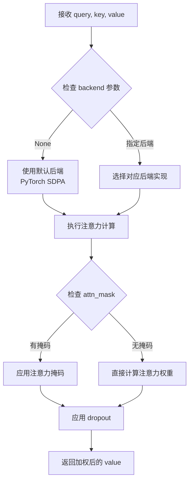
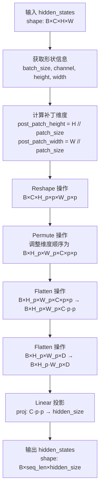
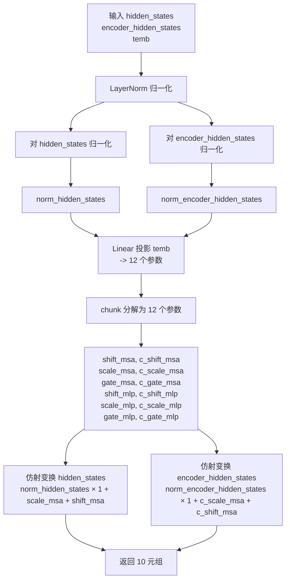
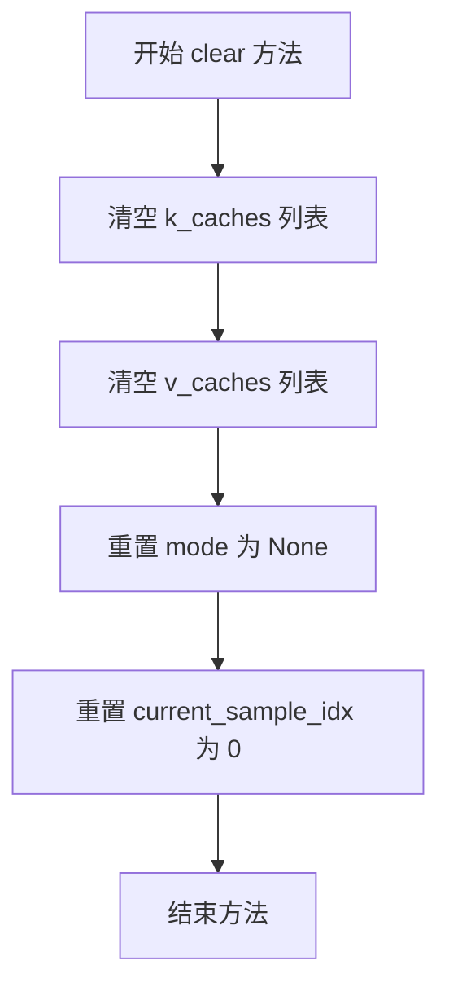
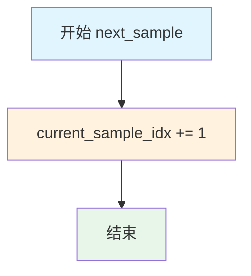
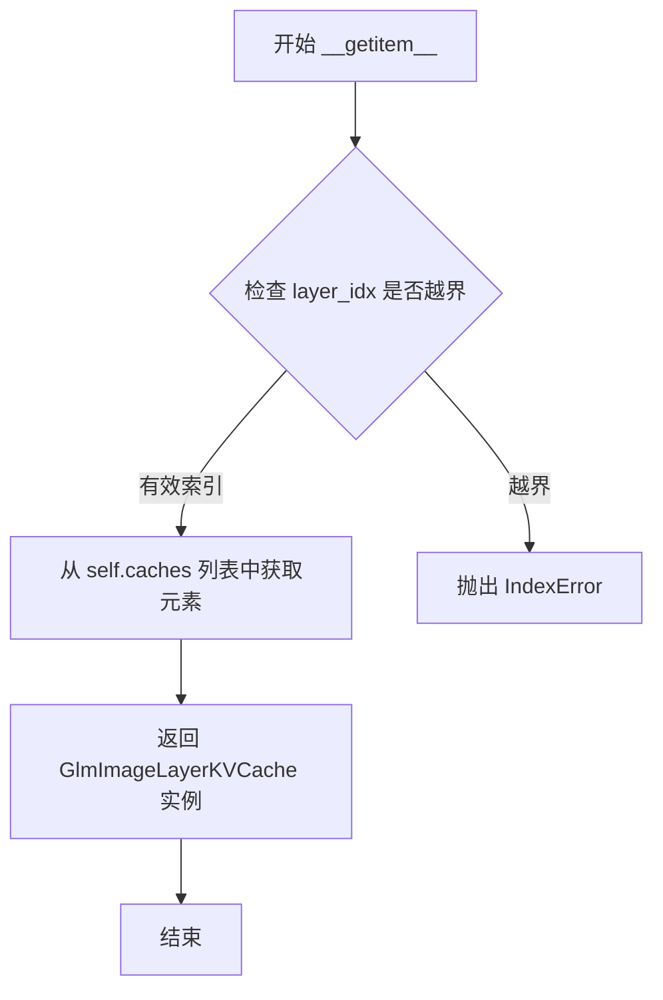
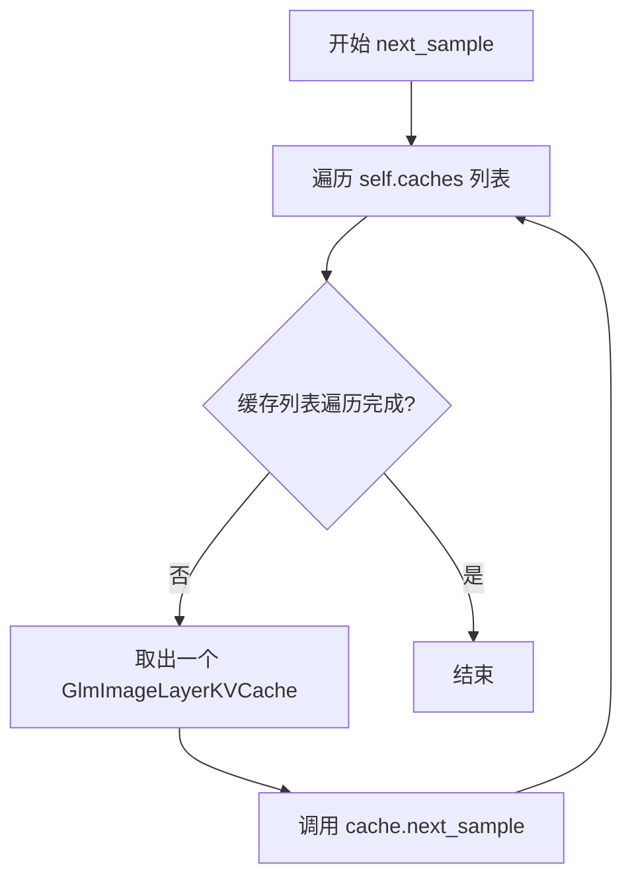
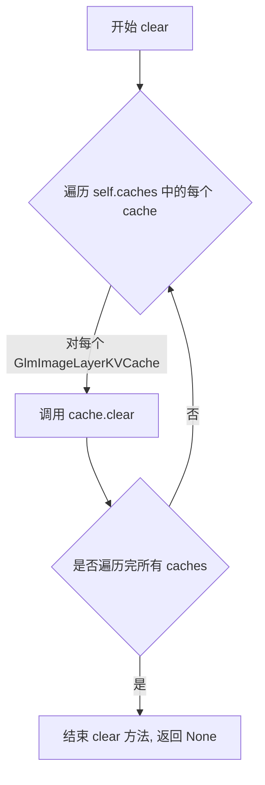
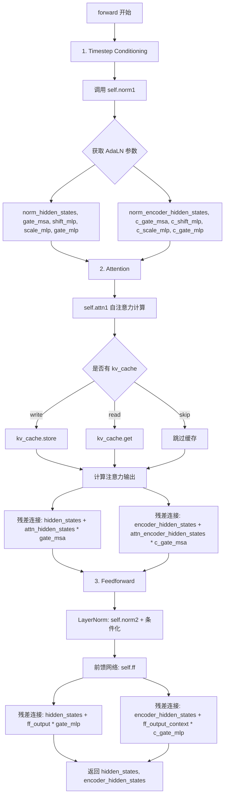
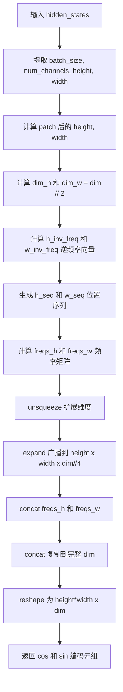

# `diffusers\src\diffusers\models\transformers\transformer_glm_image.py` 详细设计文档

GlmImageTransformer2DModel是一个基于Transformer的图像生成模型（DiT架构），支持VQ码本的prior token条件、文本/字形条件、KV缓存推理优化，以及RoPE位置编码和AdaLayerNorm条件归一化，用于高质量图像合成任务。

## 整体流程

```mermaid
graph TD
    A[开始] --> B[输入: hidden_states, encoder_hidden_states, prior_token_id, timestep, target_size, crop_coords]
    B --> C[RoPE位置编码生成]
    C --> D[图像Patch嵌入 + 字形投影 + Prior Token嵌入]
    D --> E[时间步和条件嵌入]
    E --> F{遍历每个Transformer Block}
    F -->|是| G[AdaLayerNorm Zero条件归一化]
    G --> H[自注意力计算 (含KV缓存)]
    H --> I[FeedForward前馈网络]
    I --> J[残差连接]
    J --> F
    F -->|否| K[AdaLayerNorm Continuous输出归一化]
    K --> L[输出投影]
    L --> M[Unpatchify恢复图像形状]
    M --> N[输出 Transformer2DModelOutput]
```

## 类结构

```
GlmImageTransformer2DModel (主模型类)
├── GlmImageCombinedTimestepSizeEmbeddings (时间步和尺寸嵌入)
├── GlmImageImageProjector (图像Patch嵌入投影器)
├── GlmImageRotaryPosEmbed (RoPE位置编码)
├── GlmImageTransformerBlock (Transformer块列表)
│   ├── GlmImageAdaLayerNormZero (条件归一化层)
│   ├── Attention (自注意力)
│   └── FeedForward (前馈网络)
├── GlmImageAdaLayerNormContinuous (输出归一化)
└── GlmImageKVCache (KV缓存系统)
    └── GlmImageLayerKVCache (单层KV缓存)
```

## 全局变量及字段


### `logger`
    
模块日志记录器，用于输出运行时日志信息

类型：`logging.Logger`
    


### `GlmImageCombinedTimestepSizeEmbeddings.GlmImageCombinedTimestepSizeEmbeddings.time_proj`
    
时间步投影，将时间步映射到嵌入空间

类型：`Timesteps`
    


### `GlmImageCombinedTimestepSizeEmbeddings.GlmImageCombinedTimestepSizeEmbeddings.condition_proj`
    
条件投影，用于处理目标尺寸和裁剪坐标

类型：`Timesteps`
    


### `GlmImageCombinedTimestepSizeEmbeddings.GlmImageCombinedTimestepSizeEmbeddings.timestep_embedder`
    
时间步嵌入器，将投影后的时间步转换为高维嵌入

类型：`TimestepEmbedding`
    


### `GlmImageCombinedTimestepSizeEmbeddings.GlmImageCombinedTimestepSizeEmbeddings.condition_embedder`
    
条件嵌入器，将条件信息投影到嵌入空间

类型：`PixArtAlphaTextProjection`
    


### `GlmImageImageProjector.GlmImageImageProjector.patch_size`
    
patch大小，用于将图像划分为小块

类型：`int`
    


### `GlmImageImageProjector.GlmImageImageProjector.proj`
    
投影层，将patch展平后的特征映射到隐藏维度

类型：`nn.Linear`
    


### `GlmImageAdaLayerNormZero.GlmImageAdaLayerNormZero.norm`
    
隐藏状态归一化层，用于Transformer块的主路径

类型：`nn.LayerNorm`
    


### `GlmImageAdaLayerNormZero.GlmImageAdaLayerNormZero.norm_context`
    
编码器隐藏状态归一化层，用于处理文本/条件信息

类型：`nn.LayerNorm`
    


### `GlmImageAdaLayerNormZero.GlmImageAdaLayerNormZero.linear`
    
条件投影线性层，将时间嵌入转换为AdaLN零初始化参数

类型：`nn.Linear`
    


### `GlmImageLayerKVCache.GlmImageLayerKVCache.k_caches`
    
键缓存列表，存储每层的Key缓存

类型：`list[torch.Tensor | None]`
    


### `GlmImageLayerKVCache.GlmImageLayerKVCache.v_caches`
    
值缓存列表，存储每层的Value缓存

类型：`list[torch.Tensor | None]`
    


### `GlmImageLayerKVCache.GlmImageLayerKVCache.mode`
    
缓存模式，控制KV缓存的读写操作

类型：`str | None`
    


### `GlmImageLayerKVCache.GlmImageLayerKVCache.current_sample_idx`
    
当前样本索引，用于批处理中区分不同样本

类型：`int`
    


### `GlmImageKVCache.GlmImageKVCache.num_layers`
    
Transformer层数量，决定缓存的层数

类型：`int`
    


### `GlmImageKVCache.GlmImageKVCache.caches`
    
缓存列表，每层对应一个KV缓存对象

类型：`list[GlmImageLayerKVCache]`
    


### `GlmImageAttnProcessor.GlmImageAttnProcessor._attention_backend`
    
注意力后端配置类变量，用于指定注意力计算后端

类型：`Any | None`
    


### `GlmImageAttnProcessor.GlmImageAttnProcessor._parallel_config`
    
并行配置类变量，用于配置分布式训练参数

类型：`Any | None`
    


### `GlmImageTransformerBlock.GlmImageTransformerBlock.norm1`
    
第一归一化层，使用AdaLN零初始化进行条件化

类型：`GlmImageAdaLayerNormZero`
    


### `GlmImageTransformerBlock.GlmImageTransformerBlock.attn1`
    
自注意力层，处理图像和文本特征的注意力计算

类型：`Attention`
    


### `GlmImageTransformerBlock.GlmImageTransformerBlock.norm2`
    
第二归一化层，用于前馈网络前的主路径归一化

类型：`nn.LayerNorm`
    


### `GlmImageTransformerBlock.GlmImageTransformerBlock.norm2_context`
    
编码器第二归一化层，用于前馈网络前的条件路径归一化

类型：`nn.LayerNorm`
    


### `GlmImageTransformerBlock.GlmImageTransformerBlock.ff`
    
前馈网络，对特征进行非线性变换

类型：`FeedForward`
    


### `GlmImageRotaryPosEmbed.GlmImageRotaryPosEmbed.dim`
    
旋转位置编码的维度

类型：`int`
    


### `GlmImageRotaryPosEmbed.GlmImageRotaryPosEmbed.patch_size`
    
图像patch大小，用于计算位置编码

类型：`int`
    


### `GlmImageRotaryPosEmbed.GlmImageRotaryPosEmbed.theta`
    
旋转角度基础参数，控制频率衰减

类型：`float`
    


### `GlmImageAdaLayerNormContinuous.GlmImageAdaLayerNormContinuous.linear`
    
线性投影层，将条件嵌入投影到2倍维度用于计算缩放和偏移

类型：`nn.Linear`
    


### `GlmImageAdaLayerNormContinuous.GlmImageAdaLayerNormContinuous.norm`
    
归一化层，支持LayerNorm或RMSNorm两种归一化方式

类型：`LayerNorm | RMSNorm`
    


### `GlmImageTransformer2DModel.GlmImageTransformer2DModel.rope`
    
旋转位置编码模块，提供2D图像位置信息

类型：`GlmImageRotaryPosEmbed`
    


### `GlmImageTransformer2DModel.GlmImageTransformer2DModel.image_projector`
    
图像投影器，将图像patch映射到隐藏空间

类型：`GlmImageImageProjector`
    


### `GlmImageTransformer2DModel.GlmImageTransformer2DModel.glyph_projector`
    
字形投影器，处理文本/字形特征的投影

类型：`FeedForward`
    


### `GlmImageTransformer2DModel.GlmImageTransformer2DModel.prior_token_embedding`
    
Prior token嵌入层，将离散token映射到向量空间

类型：`nn.Embedding`
    


### `GlmImageTransformer2DModel.GlmImageTransformer2DModel.prior_projector`
    
Prior投影器，对prior token特征进行变换

类型：`FeedForward`
    


### `GlmImageTransformer2DModel.GlmImageTransformer2DModel.time_condition_embed`
    
时间条件嵌入模块，整合时间步和尺寸信息

类型：`GlmImageCombinedTimestepSizeEmbeddings`
    


### `GlmImageTransformer2DModel.GlmImageTransformer2DModel.transformer_blocks`
    
Transformer块列表，包含多个Transformer层

类型：`nn.ModuleList[GlmImageTransformerBlock]`
    


### `GlmImageTransformer2DModel.GlmImageTransformer2DModel.norm_out`
    
输出归一化层，使用AdaLNContinuous进行条件化

类型：`GlmImageAdaLayerNormContinuous`
    


### `GlmImageTransformer2DModel.GlmImageTransformer2DModel.proj_out`
    
输出投影层，将隐藏维度映射回像素空间

类型：`nn.Linear`
    
    

## 全局函数及方法


### `apply_rotary_emb`

RoPE（Rotary Position Embedding）旋转嵌入应用函数，用于在Transformer架构中为Query和Key张量注入相对位置信息，通过旋转矩阵实现位置编码的线性注入。

参数：

-  `x`：`torch.Tensor`，输入的Query或Key张量，形状为(batch_size, seq_len, num_heads, head_dim)，数据类型为浮点数
-  `cos_cached`：`torch.Tensor`，预计算的余弦位置编码，形状为(seq_len, head_dim//2)或类似形状
-  `sin_cached`：`torch.Tensor`，预计算的正弦位置编码，形状为(seq_len, head_dim//2)或类似形状
-  `sequence_dim`：`int`，可选，指定序列所在的维度索引，默认为-2（通常对应seq_len维度）
-  `use_real_unbind_dim`：`int | None`，可选，指定是否使用解绑的真实维度，默认为-2

返回值：`torch.Tensor`，返回应用旋转嵌入后的张量，形状与输入x相同

#### 流程图

```mermaid
flowchart TD
    A[输入张量 x] --> B[提取 cos_cached 和 sin_cached]
    B --> C{sequence_dim 参数}
    C -->|默认-2| D[在 seq_len 维度应用]
    C -->|指定其他维度| E[在指定维度应用]
    D --> F[计算旋转矩阵]
    E --> F
    F --> G[应用旋转嵌入: x_rot = x * cos - rotate_half(x) * sin]
    G --> H[输出张量 shape = input shape]
```

#### 带注释源码

```
# 注意: 该函数的实际实现在 ..embeddings 模块中，此处为基于调用方式的推断源码

def apply_rotary_emb(
    x: torch.Tensor,                           # 输入张量: (B, Seq, H, D)
    emb: tuple[torch.Tensor, torch.Tensor],    # (cos_cached, sin_cached)
    sequence_dim: int = -2,                    # 序列维度索引
    use_real_unbind_dim: int | None = -2,      # 是否使用解绑维度
) -> torch.Tensor:
    """
    应用旋转位置嵌入 (RoPE) 到输入张量
    
    RoPE 核心思想: 通过旋转矩阵将位置信息编码到向量中
    公式: x_rot = x * cos(θ) + rotate_half(x) * sin(θ)
    
    参数:
        x: 输入张量，通常是 Query 或 Key
        emb: (cos, sin) 元组
        sequence_dim: 序列所在的维度
        use_real_unbind_dim: 指定解绑的真实维度
    
    返回:
        应用 RoPE 后的张量，形状不变
    """
    cos_cached, sin_cached = emb
    
    # 获取序列长度维度
    seq_dim = sequence_dim if sequence_dim >= 0 else sequence_dim + x.dim()
    
    # 调整 cos/sin 形状以匹配输入
    # 可能需要扩展维度以支持广播
    cos = cos_cached
    sin = sin_cached
    
    # 构建旋转半张量 (将最后一半维度取负并交叉)
    # rotate_half: 将 [a, b] -> [-b, a]
    def rotate_half(x):
        x1, x2 = x[..., : x.shape[-1] // 2], x[..., x.shape[-1] // 2 :]
        return torch.cat([-x2, x1], dim=-1)
    
    # 应用旋转公式
    # x * cos(θ) + rotate_half(x) * sin(θ)
    x_rot = x * cos.unsqueeze(1) + rotate_half(x) * sin.unsqueeze(1)
    
    return x_rot
```

> **注**：该函数是从 `..embeddings` 模块导入的，实际实现位于 `diffusers` 库的 embeddings 模块中。上面的源码是根据调用方式和 RoPE 原理进行的推断实现。在 `GlmImageAttnProcessor` 中，该函数被用于对图像序列的 Query 和 Key 向量应用旋转位置嵌入，以实现相对位置编码。


### `dispatch_attention_fn`

注意力分发函数，用于根据配置将注意力计算分发到不同的后端实现（如 PyTorch SDPA、Flash Attention 等），支持多种注意力计算后端的统一调度。

参数：

- `query`：`torch.Tensor`，查询向量，形状为 (batch, num_heads, seq_len, head_dim)
- `key`：`torch.Tensor`，键向量，形状为 (batch, num_heads, seq_len, head_dim)
- `value`：`torch.Tensor`，值向量，形状为 (batch, num_heads, seq_len, head_dim)
- `attn_mask`：`torch.Tensor | None`，注意力掩码，用于屏蔽特定位置的注意力
- `dropout_p`：`float`，dropout 概率，默认为 0.0
- `is_causal`：`bool`，是否使用因果掩码，默认为 False
- `backend`：`Any | None`，指定注意力计算的后端实现（如 "flash_attention"、"sdpa" 等）
- `parallel_config`：`Any | None`，并行配置，用于分布式训练或张量并行

返回值：`torch.Tensor`，注意力计算后的输出，形状为 (batch, num_heads, seq_len, head_dim)

#### 流程图



#### 带注释源码

由于 `dispatch_attention_fn` 是从 `..attention_dispatch` 模块导入的外部函数，当前代码文件中仅包含其调用逻辑。以下为调用处的上下文源码：

```python
# 4. Attention
if attention_mask is not None:
    text_attn_mask = attention_mask
    assert text_attn_mask.dim() == 2, "the shape of text_attn_mask should be (batch_size, text_seq_length)"
    text_attn_mask = text_attn_mask.float().to(query.device)
    mix_attn_mask = torch.ones((batch_size, text_seq_length + image_seq_length), device=query.device)
    mix_attn_mask[:, :text_seq_length] = text_attn_mask
    mix_attn_mask = mix_attn_mask.unsqueeze(2)
    attn_mask_matrix = mix_attn_mask @ mix_attn_mask.transpose(1, 2)
    attention_mask = (attn_mask_matrix > 0).unsqueeze(1).to(query.dtype)

# 调用 dispatch_attention_fn 进行注意力计算
hidden_states = dispatch_attention_fn(
    query,                 # 查询向量
    key,                   # 键向量
    value,                 # 值向量
    attn_mask=attention_mask,  # 注意力掩码
    dropout_p=0.0,          # dropout 概率
    is_causal=False,       # 非因果注意力
    backend=self._attention_backend,   # 指定后端
    parallel_config=self._parallel_config,  # 并行配置
)
hidden_states = hidden_states.flatten(2, 3)
hidden_states = hidden_states.to(query.dtype)
```

---

**注意**：完整的 `dispatch_attention_fn` 函数定义位于 `..attention_dispatch` 模块中，当前文件通过 `from ..attention_dispatch import dispatch_attention_fn` 导入使用。该函数通常根据传入的 `backend` 参数动态选择不同的注意力计算后端（如 PyTorch 内置的 SDPA、Flash Attention、xFormers 等），以实现最优的推理性能。


### `GlmImageCombinedTimestepSizeEmbeddings.forward`

该方法实现了时间步长和图像尺寸条件（目标尺寸、裁剪坐标）的联合嵌入计算，将时间步通过时间投影器和嵌入器转换为时间嵌入向量，同时将目标尺寸和裁剪坐标通过条件投影器处理后拼接，再与时间嵌入相加并通过 SiLU 激活函数生成最终的条件嵌入向量，用于 Transformer 模块的条件注入。

参数：

- `self`：类实例自身，无需显式传递
- `timestep`：`torch.Tensor`，形状为 (batch_size,)，表示扩散模型的时间步
- `target_size`：`torch.Tensor`，形状为 (batch_size, 2)，表示目标图像的尺寸 (height, width)
- `crop_coords`：`torch.Tensor`，形状为 (batch_size, 2)，表示裁剪坐标 (crop_top, crop_left)
- `hidden_dtype`：`torch.dtype`，指定计算使用的数据类型（如 torch.float16）

返回值：`torch.Tensor`，形状为 (batch_size, embedding_dim)，经过 SiLU 激活的联合条件嵌入向量

#### 流程图

```mermaid
flowchart TD
    A[输入: timestep, target_size, crop_coords, hidden_dtype] --> B[time_proj: timestep → timesteps_proj]
    B --> C[condition_proj: crop_coords → crop_coords_proj]
    C --> D[condition_proj: target_size → target_size_proj]
    D --> E[torch.cat: 拼接 crop_coords_proj 和 target_size_proj]
    E --> F[condition_proj → (B, 2*condition_dim)]
    F --> G[timestep_embedder: timesteps_proj → timesteps_emb (B, embedding_dim)]
    G --> H[condition_embedder: condition_proj → condition_emb (B, embedding_dim)]
    H --> I[加法融合: timesteps_emb + condition_emb]
    I --> J[F.silu 激活函数]
    J --> K[输出: conditioning (B, embedding_dim)]
```

#### 带注释源码

```python
def forward(
    self,
    timestep: torch.Tensor,
    target_size: torch.Tensor,
    crop_coords: torch.Tensor,
    hidden_dtype: torch.dtype,
) -> torch.Tensor:
    """
    前向传播：计算时间步和图像尺寸条件的联合嵌入
    
    参数:
        timestep: 扩散模型的时间步，形状 (batch_size,)
        target_size: 目标图像尺寸，形状 (batch_size, 2) - [height, width]
        crop_coords: 裁剪坐标，形状 (batch_size, 2) - [top, left]
        hidden_dtype: 计算使用的数据类型
    
    返回:
        conditioning: 联合条件嵌入，形状 (batch_size, embedding_dim)
    """
    
    # 1. 时间步投影：将时间步转换为正弦余弦特征表示
    # 输入: (batch_size,) → 输出: (batch_size, timesteps_dim)
    timesteps_proj = self.time_proj(timestep)

    # 2. 条件投影：处理裁剪坐标和目标尺寸
    # 先展平再投影，最后 reshape 回批次维度
    # 输入: (batch_size, 2) → 展平为 (batch_size*2,) → 投影 → reshape 为 (batch_size, condition_dim)
    crop_coords_proj = self.condition_proj(crop_coords.flatten()).view(crop_coords.size(0), -1)
    target_size_proj = self.condition_proj(target_size.flatten()).view(target_size.size(0), -1)

    # 3. 拼接条件：将裁剪坐标和目标尺寸的特征在特征维度上拼接
    # 拼接后形状: (batch_size, 2 * condition_dim)
    condition_proj = torch.cat([crop_coords_proj, target_size_proj], dim=1)

    # 4. 嵌入层：转换为高维嵌入向量，并转换数据类型
    # 时间步嵌入: (batch_size, timesteps_dim) → (batch_size, embedding_dim)
    timesteps_emb = self.timestep_embedder(timesteps_proj.to(dtype=hidden_dtype))
    
    # 条件嵌入: (batch_size, 2*condition_dim) → (batch_size, embedding_dim)
    condition_emb = self.condition_embedder(condition_proj.to(dtype=hidden_dtype))

    # 5. 融合：嵌入向量相加
    conditioning = timesteps_emb + condition_emb

    # 6. 激活：应用 SiLU (Swish) 激活函数，增加非线性
    conditioning = F.silu(conditioning)

    # 返回联合条件嵌入，用于 Transformer 模块的条件注入
    return conditioning
```


### `GlmImageImageProjector.forward`

该方法是 GLM 图像模型中的图像投影器核心前向传播函数，负责将输入的图像 latent 特征从补丁（patch）形式重新排列并投影到隐藏空间。首先获取输入张量的形状信息并计算补丁化后的空间维度，然后对输入进行 reshaping 以将每个补丁的空间维度展开，接着通过 permute 操作调整维度顺序将通道维度移至最后，再通过两次 flatten 操作将每个补丁的特征压缩为一维，最后通过线性投影层将特征维度映射到隐藏尺寸。

#### 参数

- `hidden_states`：`torch.Tensor`，输入的图像 latent 张量，形状为 (batch_size, channel, height, width)，其中 channel 是通道数，height 和 width 是空间维度

#### 返回值

- `torch.Tensor`：投影后的隐藏状态，形状为 (batch_size, seq_len, hidden_size)，其中 seq_len = (height // patch_size) * (width // patch_size)，hidden_size 是投影后的特征维度

#### 流程图



#### 带注释源码

```python
def forward(self, hidden_states: torch.Tensor) -> torch.Tensor:
    # 从输入张量中提取维度信息
    # hidden_states 形状: (batch_size, channel, height, width)
    batch_size, channel, height, width = hidden_states.shape
    
    # 计算经过补丁化处理后的空间维度
    # 每个补丁大小为 patch_size x patch_size
    post_patch_height = height // self.patch_size
    post_patch_width = width // self.patch_size

    # 重塑张量以将空间维度转换为补丁维度
    # 变换过程: (B, C, H, W) -> (B, C, H_p, p, W_p, p)
    # 这样可以将每个补丁的空间位置和通道信息分离
    hidden_states = hidden_states.reshape(
        batch_size, channel, post_patch_height, self.patch_size, post_patch_width, self.patch_size
    )
    
    # 置换维度顺序: (B, C, H_p, p, W_p, p) -> (B, H_p, W_p, C, p, p)
    # 将批次维度保持不变，将空间补丁维度提前，通道和补丁内部维度移后
    hidden_states = hidden_states.permute(0, 2, 4, 1, 3, 5).flatten(3, 5).flatten(1, 2)
    # 第一次 flatten (3, 5): 将 C, p, p 合并为 C*p*p
    # 第二次 flatten (1, 2): 将 H_p, W_p 合并为 H_p*W_p (即 seq_len)
    # 最终形状: (batch_size, post_patch_height*post_patch_width, channel*patch_size*patch_size)

    # 通过线性投影层将特征维度映射到隐藏尺寸
    # 输入维度: channel * patch_size * patch_size
    # 输出维度: hidden_size
    hidden_states = self.proj(hidden_states)

    # 返回投影后的隐藏状态
    # 形状: (batch_size, seq_len, hidden_size)
    return hidden_states
```


### `GlmImageAdaLayerNormZero.forward`

该函数是 GLM Image 模型中的自适应层归一化零（AdaLayerNormZero）实现，通过将时间步嵌入（temb）线性投影为 12 个偏移（shift）、缩放（scale）和门控（gate）参数，分别对图像 hidden_states 和文本 encoder_hidden_states 进行仿射变换，并返回归一化后的隐藏状态及所有自适应参数，供后续的注意力机制和前馈网络使用。

参数：

- `hidden_states`：`torch.Tensor`，图像 latent 的隐藏状态，形状为 (batch_size, seq_len, dim)
- `encoder_hidden_states`：`torch.Tensor`，文本编码器的隐藏状态，形状为 (batch_size, text_seq_len, dim)
- `temb`：`torch.Tensor`，时间步嵌入，形状为 (batch_size, embedding_dim)，由时间条件嵌入模块产生

返回值：`tuple[torch.Tensor, ...]`，返回 10 个元素的元组，包含：

- `hidden_states`：归一化并经仿射变换后的图像隐藏状态
- `gate_msa`：图像 MSA 门控参数
- `shift_mlp`：图像 MLP 偏移参数
- `scale_mlp`：图像 MLP 缩放参数
- `gate_mlp`：图像 MLP 门控参数
- `encoder_hidden_states`：归一化并经仿射变换后的文本隐藏状态
- `c_gate_msa`：文本 MSA 门控参数
- `c_shift_mlp`：文本 MLP 偏移参数
- `c_scale_mlp`：文本 MLP 缩放参数
- `c_gate_mlp`：文本 MLP 门控参数

#### 流程图



#### 带注释源码

```python
class GlmImageAdaLayerNormZero(nn.Module):
    """
    GLM Image 模型的 AdaLayerNormZero 实现。
    将时间步条件嵌入投影为 12 个自适应参数，分别用于图像和文本分支的 MSA 和 MLP 调制。
    """

    def __init__(self, embedding_dim: int, dim: int) -> None:
        """
        初始化函数。

        Args:
            embedding_dim: 时间步嵌入的维度 (temb 的维度)
            dim: 隐藏状态的维度 (hidden_states 和 encoder_hidden_states 的特征维度)
        """
        super().__init__()

        # LayerNorm 用于图像 latent 序列，不使用可学习仿射参数
        self.norm = nn.LayerNorm(dim, elementwise_affine=False, eps=1e-5)
        # LayerNorm 用于文本 encoder 序列
        self.norm_context = nn.LayerNorm(dim, elementwise_affine=False, eps=1e-5)
        # 线性层：将 temb 投影到 12 * dim 维度，后续 chunk 为 12 个参数
        self.linear = nn.Linear(embedding_dim, 12 * dim, bias=True)

    def forward(
        self, hidden_states: torch.Tensor, encoder_hidden_states: torch.Tensor, temb: torch.Tensor
    ) -> tuple[torch.Tensor, torch.Tensor]:
        """
        前向传播：执行自适应层归一化并生成 MSA/MLP 的调制参数。

        Args:
            hidden_states: 图像 latent 的隐藏状态，形状 (batch_size, seq_len, dim)
            encoder_hidden_states: 文本编码器的隐藏状态，形状 (batch_size, text_seq_len, dim)
            temb: 时间步嵌入，来自 time_condition_embed，形状 (batch_size, embedding_dim)

        Returns:
            tuple 包含 10 个元素：
            - hidden_states: 归一化并经仿射变换后的图像隐藏状态
            - gate_msa: 图像 MSA 门控参数
            - shift_mlp: 图像 MLP 偏移参数
            - scale_mlp: 图像 MLP 缩放参数
            - gate_mlp: 图像 MLP 门控参数
            - encoder_hidden_states: 归一化并经仿射变换后的文本隐藏状态
            - c_gate_msa: 文本 MSA 门控参数
            - c_shift_mlp: 文本 MLP 偏移参数
            - c_scale_mlp: 文本 MLP 缩放参数
            - c_gate_mlp: 文本 MLP 门控参数
        """
        # 获取输入数据类型，确保计算过程保持该数据类型
        dtype = hidden_states.dtype
        
        # 对图像 hidden_states 进行 LayerNorm 归一化，并转换数据类型
        norm_hidden_states = self.norm(hidden_states).to(dtype=dtype)
        # 对文本 encoder_hidden_states 进行 LayerNorm 归一化
        norm_encoder_hidden_states = self.norm_context(encoder_hidden_states).to(dtype=dtype)

        # 将 temb 线性投影到 12 * dim 维度
        emb = self.linear(temb)
        # 将投影结果沿 dim=1 维度切分为 12 个参数向量
        # 每个参数形状为 (batch_size, dim)
        (
            shift_msa,      # MSA 偏移 (图像)
            c_shift_msa,    # MSA 偏移 (文本/上下文)
            scale_msa,      # MSA 缩放 (图像)
            c_scale_msa,    # MSA 缩放 (文本)
            gate_msa,       # MSA 门控 (图像)
            c_gate_msa,     # MSA 门控 (文本)
            shift_mlp,      # MLP 偏移 (图像)
            c_shift_mlp,    # MLP 偏移 (文本)
            scale_mlp,      # MLP 缩放 (图像)
            c_scale_mlp,    # MLP 缩放 (文本)
            gate_mlp,       # MLP 门控 (图像)
            c_gate_mlp,     # MLP 门控 (文本)
        ) = emb.chunk(12, dim=1)

        # 对图像 hidden_states 应用仿射变换：norm × (1 + scale) + shift
        # unsqueeze(1) 将参数从 (batch_size, dim) 扩展为 (batch_size, 1, dim) 以支持序列维度
        hidden_states = norm_hidden_states * (1 + scale_msa.unsqueeze(1)) + shift_msa.unsqueeze(1)
        # 对文本 encoder_hidden_states 应用仿射变换
        encoder_hidden_states = norm_encoder_hidden_states * (1 + c_scale_msa.unsqueeze(1)) + c_shift_msa.unsqueeze(1)

        # 返回归一化后的隐藏状态以及所有 9 个调制参数（加上 gate_msa 共 10 个返回值）
        return (
            hidden_states,
            gate_msa,
            shift_mlp,
            scale_mlp,
            gate_mlp,
            encoder_hidden_states,
            c_gate_msa,
            c_shift_mlp,
            c_scale_mlp,
            c_gate_mlp,
        )
```


### `GlmImageLayerKVCache.store`

该方法用于将 KV 缓存（Key-Value Cache）存储到当前样本的缓存列表中，支持为批处理中的每个样本独立存储缓存，特别适用于每个样本拥有不同条件图像的场景。

参数：

- `k`：`torch.Tensor`，要存储的 Key 缓存张量，形状为 (1, seq_len, num_heads, head_dim)
- `v`：`torch.Tensor`，要存储的 Value 缓存张量，形状为 (1, seq_len, num_heads, head_dim)

返回值：`None`，该方法无返回值，直接修改内部缓存状态

#### 流程图

```mermaid
flowchart TD
    A[开始 store 方法] --> B{len(k_caches) <= current_sample_idx?}
    B -->|是| C[首次为该样本存储]
    B -->|否| D[已有缓存, 追加新数据]
    C --> E[k_caches.append(k)]
    C --> F[v_caches.append(v)]
    D --> G[k_caches[current_sample_idx] = torch.cat([k_caches[current_sample_idx], k], dim=1)]
    D --> H[v_caches[current_sample_idx] = torch.cat([v_caches[current_sample_idx], v], dim=1)]
    E --> I[结束]
    F --> I
    G --> I
    H --> I
```

#### 带注释源码

```python
def store(self, k: torch.Tensor, v: torch.Tensor):
    """Store KV cache for the current sample."""
    # k, v shape: (1, seq_len, num_heads, head_dim)
    
    # 检查当前样本索引是否超出已有缓存列表长度
    if len(self.k_caches) <= self.current_sample_idx:
        # 首次为该样本存储缓存，直接追加新张量到列表
        self.k_caches.append(k)
        self.v_caches.append(v)
    else:
        # 该样本已有缓存（可能包含多个条件图像），沿序列维度(dim=1)拼接新数据
        self.k_caches[self.current_sample_idx] = torch.cat(
            [self.k_caches[self.current_sample_idx], k], dim=1
        )
        self.v_caches[self.current_sample_idx] = torch.cat(
            [self.v_caches[self.current_sample_idx], v], dim=1
        )
```


### `GlmImageLayerKVCache.get`

该方法负责从 KV 缓存中取出历史计算的 Key 和 Value 张量，并根据当前输入的批次大小（Batch Size）与已缓存样本数量的关系（无缓存、单缓存、批次匹配、整数倍扩展），对缓存进行拼接或扩展，最终将历史缓存的 KV 向量与当前输入的 KV 向量在序列维度（Sequence Dimension）上进行合并，返回增强后的 KV 对。

参数：

- `k`：`torch.Tensor`，当前输入的 Key 张量，形状为 `(batch_size, seq_len, num_heads, head_dim)`。
- `v`：`torch.Tensor`，当前输入的 Value 张量，形状为 `(batch_size, seq_len, num_heads, head_dim)`。

返回值：`tuple[torch.Tensor, torch.Tensor]`，合并后的 Key 和 Value 张量元组，形状为 `(batch_size, cached_seq_len + current_seq_len, num_heads, head_dim)`。

#### 流程图

```mermaid
flowchart TD
    A([Start: get(k, v)]) --> B[batch_size = k.shape[0]]
    B --> C{num_cached_samples == 0?}
    C -- Yes --> D[Return input (k, v)]
    C -- No --> E{num_cached_samples == 1?}
    E -- Yes --> F[Expand single cache to batch_size]
    E -- No --> G{num_cached_samples == batch_size?}
    G -- Yes --> H[Concat all caches along dim=0]
    G -- No --> I{Is batch_size divisible\n by num_cached_samples?}
    I -- No --> J[Throw ValueError]
    I -- Yes --> K[repeat_factor = batch_size // num_cached_samples]
    K --> L[Expand each cache by repeat_factor]
    L --> H
    F --> M[k_cache_expanded, v_cache_expanded]
    H --> M
    M --> N[Concat cache with input: [cache, k], [cache, v]]
    N --> O([Return combined (k, v)])
```

#### 带注释源码

```python
def get(self, k: torch.Tensor, v: torch.Tensor):
    """Get combined KV cache for all samples in the batch.

    Args:
        k: Current key tensor, shape (batch_size, seq_len, num_heads, head_dim)
        v: Current value tensor, shape (batch_size, seq_len, num_heads, head_dim)
    Returns:
        Combined key and value tensors with cached values prepended.
    """
    # 获取当前批次大小
    batch_size = k.shape[0]
    # 获取已缓存的样本数量
    num_cached_samples = len(self.k_caches)
    
    # 情况1：无缓存，直接返回当前输入
    if num_cached_samples == 0:
        return k, v
    
    # 情况2：仅有一个缓存（例如所有样本共享相同的条件图像）
    # 将单个缓存展开以匹配整个批次
    if num_cached_samples == 1:
        # 使用 expand 实现零内存复制的广播，但注意 expand 返回的是视图
        k_cache_expanded = self.k_caches[0].expand(batch_size, -1, -1, -1)
        v_cache_expanded = self.v_caches[0].expand(batch_size, -1, -1, -1)
    # 情况3：缓存数量等于批次大小（例如每个样本有不同的条件图像，且一一对应）
    # 直接在批次维度（dim=0）上拼接
    elif num_cached_samples == batch_size:
        k_cache_expanded = torch.cat(self.k_caches, dim=0)
        v_cache_expanded = torch.cat(self.v_caches, dim=0)
    # 情况4：缓存数量与批次大小不匹配但成整数倍关系（例如 num_images_per_prompt > 1）
    # 需要对缓存进行重复扩展
    else:
        # 检查批次大小是否能被缓存数量整除
        repeat_factor = batch_size // num_cached_samples
        if batch_size % num_cached_samples == 0:
            k_cache_list = []
            v_cache_list = []
            # 对每个缓存进行扩展
            for i in range(num_cached_samples):
                k_cache_list.append(self.k_caches[i].expand(repeat_factor, -1, -1, -1))
                v_cache_list.append(self.v_caches[i].expand(repeat_factor, -1, -1, -1))
            # 拼接扩展后的缓存
            k_cache_expanded = torch.cat(k_cache_list, dim=0)
            v_cache_expanded = torch.cat(v_cache_list, dim=0)
        else:
            # 不支持的缓存模式，抛出异常
            raise ValueError(
                f"Cannot match {num_cached_samples} cached samples to batch size {batch_size}. "
                f"Batch size must be a multiple of the number of cached samples."
            )

    # 最终合并：将缓存的 Key/Value 拼接在当前输入的之前 (prepend)
    k_combined = torch.cat([k_cache_expanded, k], dim=1)
    v_combined = torch.cat([v_cache_expanded, v], dim=1)
    return k_combined, v_combined
```


### `GlmImageLayerKVCache.clear`

重置 KV 缓存的所有内部状态，将 k_caches 和 v_caches 置为空列表，同时重置 mode 为 None 和 current_sample_idx 为 0，以便为下一轮批次处理做准备。

参数：暂无参数

返回值：`None`，无返回值描述（该方法仅执行内部状态的清理操作）

#### 流程图



#### 带注释源码

```python
def clear(self):
    """重置 KV 缓存的内部状态，为下一轮批次处理做准备。
    
    该方法清空所有缓存的 key 和 value 张量，重置运行模式
    和样本索引，确保缓存处于干净的初始状态。
    """
    self.k_caches = []  # 清空 key 缓存列表
    self.v_caches = []  # 清空 value 缓存列表
    self.mode = None    # 重置运行模式为 None（写/读/跳过）
    self.current_sample_idx = 0  # 重置当前样本索引为 0
```


### `GlmImageLayerKVCache.next_sample`

该方法用于将KV缓存的写操作切换到下一个样本。在批处理场景中，当一个样本的所有条件图像处理完毕后，调用此方法可以移动到下一个样本的缓存位置继续存储。

参数：此方法无参数。

返回值：`None`，无返回值。

#### 流程图



#### 带注释源码

```python
def next_sample(self):
    """Move to the next sample for writing."""
    # 将当前样本索引加1，切换到下一个样本的缓存位置
    # 这样后续调用 store() 方法时会将KV值写入新的样本缓存中
    self.current_sample_idx += 1
```


### `GlmImageKVCache.__getitem__`

该方法为 GlmImageKVCache 的下标访问接口，允许通过层索引直接获取对应的 GlmImageLayerKVCache 实例，用于访问特定 Transformer 层的 KV 缓存数据。

参数：

- `layer_idx`：`int`，要访问的 Transformer 层索引，范围为 [0, num_layers-1]

返回值：`GlmImageLayerKVCache`，指定层索引对应的 KV 缓存容器，用于该层的键值缓存读写操作

#### 流程图



#### 带注释源码

```python
def __getitem__(self, layer_idx: int) -> GlmImageLayerKVCache:
    """通过层索引获取对应的 KV 缓存层实例。

    Args:
        layer_idx: Transformer 层的索引值，用于定位要访问的缓存层

    Returns:
        对应索引位置的 GlmImageLayerKVCache 实例，
        该实例包含了该层的 k_caches 和 v_caches 列表
    """
    return self.caches[layer_idx]  # 直接返回 caches 列表中指定索引的元素
```


### GlmImageKVCache.set_mode

设置 KV 缓存的工作模式，用于控制缓存的读写行为。

参数：

- `mode`：`str`，缓存模式，支持 "write"（写入缓存）、"read"（读取缓存）或 "skip"（跳过缓存操作）

返回值：`None`，无返回值，仅修改内部状态

#### 流程图

```mermaid
flowchart TD
    A[开始 set_mode] --> B{mode 是否为 None?}
    B -->|是| C[不抛出异常]
    B -->|否| D{mode 是否在 ['write', 'read', 'skip'] 中?}
    D -->|是| E[遍历所有层的缓存]
    D -->|否| F[抛出 ValueError 异常]
    E --> G[将每层 cache.mode 设置为 mode]
    G --> H[结束]
    C --> H
    F --> I[结束并返回错误]
```

#### 带注释源码

```python
def set_mode(self, mode: str):
    """设置所有层 KV 缓存的工作模式。
    
    Args:
        mode: 缓存模式，支持以下值:
            - "write": 写入模式，将当前层的 key 和 value 存入缓存
            - "read": 读取模式，从缓存中读取已存储的 key 和 value 并与当前输入合并
            - "skip": 跳过模式，不进行任何缓存操作
            - None: 不进行验证，直接设置
    
    Returns:
        None
    
    Raises:
        ValueError: 当 mode 不为 None 且不在有效值列表中时抛出
    """
    # 验证模式是否为有效值，若无效则抛出异常
    if mode is not None and mode not in ["write", "read", "skip"]:
        raise ValueError(f"Invalid mode: {mode}, must be one of 'write', 'read', 'skip'")
    
    # 遍历所有层的缓存，统一设置模式
    for cache in self.caches:
        cache.mode = mode
```


### `GlmImageKVCache.next_sample`

该方法用于在处理完一个批样本的所有条件图像后，将写指针移动到下一个样本。它遍历所有层的 KV 缓存，并对每个缓存调用 `next_sample()` 方法，以支持批处理中每个样本可能有不同的条件图像的场景。

参数：
- （无显式参数，隐式参数 `self`：当前 `GlmImageKVCache` 实例）

返回值：`None`，无返回值（该方法仅执行副作用操作）

#### 流程图



#### 带注释源码

```python
def next_sample(self):
    """Move to the next sample for writing. Call this after processing
    all condition images for one batch sample."""
    # 遍历所有层的 KV 缓存
    for cache in self.caches:
        # 对每个层的缓存调用 next_sample()
        # 这会将当前样本索引 current_sample_idx 增加 1
        # 以便后续写入操作针对下一个样本的缓存
        cache.next_sample()
```


### `GlmImageKVCache.clear()`

该方法是 `GlmImageKVCache` 类的清空操作，用于重置所有层的 KV 缓存状态，将缓存列表、模式和当前样本索引恢复为初始状态。

参数：无

返回值：`None`，无返回值

#### 流程图



#### 带注释源码

```python
def clear(self):
    """Clear all layer KV caches.
    
    This method resets the state of all layer caches by:
    1. Clearing k_caches and v_caches lists
    2. Resetting mode to None
    3. Resetting current_sample_idx to 0
    
    Called to free memory or reset state between inference runs.
    """
    for cache in self.caches:
        cache.clear()
```


### `GlmImageAttnProcessor.__call__`

实现 GlmImage 模型的缩放点积注意力机制，支持旋转位置嵌入（RoPE）、KV 缓存管理以及文本与图像 token 的混合注意力计算。

参数：

- `self`：类的实例方法本身
- `attn`：`Attention`，注意力模块，负责 QKV 投影和输出投影
- `hidden_states`：`torch.Tensor`，图像 latent 的隐藏状态，形状为 (batch_size, image_seq_length, embed_dim)
- `encoder_hidden_states`：`torch.Tensor`，文本编码器的隐藏状态，形状为 (batch_size, text_seq_length, embed_dim)
- `attention_mask`：`torch.Tensor | None`，可选的注意力掩码，用于指示文本 token 的 padding 情况，形状为 (batch_size, text_seq_length)
- `image_rotary_emb`：`tuple[torch.Tensor, torch.Tensor] | None`，可选的图像旋转位置嵌入，包含 cos 和 sin 两个张量
- `kv_cache`：`GlmImageLayerKVCache | None`，可选的 KV 缓存对象，用于存储和读取 key/value 以支持增量推理

返回值：`tuple[torch.Tensor, torch.Tensor]`，返回一个元组，包含：

- 第一个元素：处理后的图像 hidden_states，形状为 (batch_size, image_seq_length, embed_dim)
- 第二个元素：处理后的 encoder_hidden_states，形状为 (batch_size, text_seq_length, embed_dim)

#### 流程图

```mermaid
flowchart TD
    A[开始 __call__] --> B[获取 encoder_hidden_states 数据类型]
    B --> C[提取 batch_size, text_seq_length, embed_dim]
    C --> D[提取 batch_size, image_seq_length, embed_dim]
    D --> E[拼接 encoder_hidden_states + hidden_states]
    E --> F[QKV 投影: to_q, to_k, to_v]
    F --> G[Unflatten QKV: (batch, seq, heads, head_dim)]
    G --> H{attn.norm_q 存在?}
    H -->|是| I[对 query 归一化]
    H -->|否| J{attn.norm_k 存在?}
    I --> J
    J -->|是| K[对 key 归一化]
    J -->|否| L{image_rotary_emb 存在?}
    K --> L
    L -->|是| M[对 Q/K 图像部分应用 RoPE]
    L -->|否| N{kv_cache 存在?}
    M --> N
    N --> O{kv_cache.mode == 'write'?}
    O -->|是| P[存储 key/value 到缓存]
    O -->|否| Q{kv_cache.mode == 'read'?}
    P --> R
    Q -->|是| R[从缓存读取并合并 key/value]
    Q -->|否| S{kv_cache.mode == 'skip'?}
    S --> T[构建混合注意力掩码]
    R --> T
    S --> T
    T --> U[dispatch_attention_fn 执行注意力计算]
    U --> V[Flatten 并转换数据类型]
    V --> W[输出投影: to_out[0] + to_out[1]]
    W --> X[分割回图像和文本部分]
    X --> Y[返回 (hidden_states, encoder_hidden_states)]
```

#### 带注释源码

```python
def __call__(
    self,
    attn: Attention,
    hidden_states: torch.Tensor,
    encoder_hidden_states: torch.Tensor,
    attention_mask: torch.Tensor | None = None,
    image_rotary_emb: tuple[torch.Tensor, torch.Tensor] | None = None,
    kv_cache: GlmImageLayerKVCache | None = None,
) -> tuple[torch.Tensor, torch.Tensor]:
    """
    实现 GlmImage 模型的缩放点积注意力机制。
    
    Args:
        attn: Attention 模块
        hidden_states: 图像 latent 的隐藏状态
        encoder_hidden_states: 文本编码器的隐藏状态
        attention_mask: 文本 token 的注意力掩码
        image_rotary_emb: 图像旋转位置嵌入
        kv_cache: KV 缓存用于增量推理
    
    Returns:
        处理后的 (hidden_states, encoder_hidden_states)
    """
    dtype = encoder_hidden_states.dtype  # 获取编码器隐藏状态的数据类型

    # 提取维度信息
    batch_size, text_seq_length, embed_dim = encoder_hidden_states.shape
    batch_size, image_seq_length, embed_dim = hidden_states.shape
    
    # 拼接文本和图像隐藏状态: [B, text_seq + image_seq, embed_dim]
    hidden_states = torch.cat([encoder_hidden_states, hidden_states], dim=1)

    # ========== 1. QKV 投影 ==========
    query = attn.to_q(hidden_states)  # (B, seq, embed_dim)
    key = attn.to_k(hidden_states)
    value = attn.to_v(hidden_states)

    # 展开为多头注意力格式: (B, seq, heads, head_dim)
    query = query.unflatten(2, (attn.heads, -1))
    key = key.unflatten(2, (attn.heads, -1))
    value = value.unflatten(2, (attn.heads, -1))

    # ========== 2. QK 归一化 ==========
    if attn.norm_q is not None:
        query = attn.norm_q(query).to(dtype=dtype)
    if attn.norm_k is not None:
        key = attn.norm_k(key).to(dtype=dtype)

    # ========== 3. 旋转位置嵌入 (RoPE) ==========
    if image_rotary_emb is not None:
        from ..embeddings import apply_rotary_emb

        # 仅对图像部分的 query 和 key 应用 RoPE
        query[:, text_seq_length:, :, :] = apply_rotary_emb(
            query[:, text_seq_length:, :, :], image_rotary_emb, sequence_dim=1, use_real_unbind_dim=-2
        )
        key[:, text_seq_length:, :, :] = apply_rotary_emb(
            key[:, text_seq_length:, :, :], image_rotary_emb, sequence_dim=1, use_real_unbind_dim=-2
        )

    # ========== KV 缓存管理 ==========
    if kv_cache is not None:
        if kv_cache.mode == "write":
            # 写入模式: 存储当前的 key 和 value
            kv_cache.store(key, value)
        elif kv_cache.mode == "read":
            # 读取模式: 从缓存读取并与当前 key/value 合并
            key, value = kv_cache.get(key, value)
        elif kv_cache.mode == "skip":
            # 跳过模式: 不使用缓存
            pass

    # ========== 4. 注意力掩码构建 ==========
    if attention_mask is not None:
        text_attn_mask = attention_mask
        assert text_attn_mask.dim() == 2, "the shape of text_attn_mask should be (batch_size, text_seq_length)"
        text_attn_mask = text_attn_mask.float().to(query.device)
        
        # 创建混合掩码: [B, text_seq + image_seq]
        mix_attn_mask = torch.ones((batch_size, text_seq_length + image_seq_length), device=query.device)
        mix_attn_mask[:, :text_seq_length] = text_attn_mask  # 文本部分使用原始掩码
        mix_attn_mask = mix_attn_mask.unsqueeze(2)  # (B, seq, 1)
        
        # 计算注意力矩阵掩码
        attn_mask_matrix = mix_attn_mask @ mix_attn_mask.transpose(1, 2)  # (B, seq, seq)
        attention_mask = (attn_mask_matrix > 0).unsqueeze(1).to(query.dtype)  # (B, 1, seq, seq)

    # ========== 5. 执行注意力计算 ==========
    hidden_states = dispatch_attention_fn(
        query,
        key,
        value,
        attn_mask=attention_mask,
        dropout_p=0.0,
        is_causal=False,
        backend=self._attention_backend,
        parallel_config=self._parallel_config,
    )
    # 恢复形状: (B, seq, heads, head_dim) -> (B, seq, embed_dim)
    hidden_states = hidden_states.flatten(2, 3)
    hidden_states = hidden_states.to(query.dtype)

    # ========== 6. 输出投影 ==========
    hidden_states = attn.to_out[0](hidden_states)  # 线性层
    hidden_states = attn.to_out[1](hidden_states)  # Dropout/激活

    # 分割回图像和文本部分
    encoder_hidden_states, hidden_states = hidden_states.split(
        [text_seq_length, hidden_states.size(1) - text_seq_length], dim=1
    )
    return hidden_states, encoder_hidden_states
```


### `GlmImageTransformerBlock.forward`

这是 GlmImageTransformerBlock 类的前向传播方法，实现了一个完整的 Transformer 块，包含自注意力机制和前馈网络。该方法接收图像 hidden_states 和文本 encoder_hidden_states，通过 AdaLayerNormZero 进行时间步条件化，然后依次执行自注意力计算和前馈网络处理，最后返回更新后的图像特征和文本特征。

参数：

- `self`：`GlmImageTransformerBlock` 实例本身
- `hidden_states`：`torch.Tensor`，输入的图像潜在表示，形状为 (batch_size, seq_len, embed_dim)
- `encoder_hidden_states`：`torch.Tensor`，输入的文本/条件潜在表示，形状为 (batch_size, text_seq_length, embed_dim)
- `temb`：`torch.Tensor | None`，时间步嵌入向量，用于 AdaLayerNormZero 条件化
- `image_rotary_emb`：`tuple[torch.Tensor, torch.Tensor] | list[tuple[torch.Tensor, torch.Tensor]] | None`，图像的旋转位置嵌入 (cos, sin)
- `attention_mask`：`dict[str, torch.Tensor] | None`，注意力掩码字典，可能包含 text_attn_mask 等
- `attention_kwargs`：`dict[str, Any] | None`，传递给注意力处理器的额外关键字参数
- `kv_cache`：`GlmImageLayerKVCache | None`，用于存储和检索 Key-Value 缓存，支持增量推理

返回值：`tuple[torch.Tensor, torch.Tensor]`，返回两个张量——更新后的 hidden_states 和 encoder_hidden_states

#### 流程图



#### 带注释源码

```python
@maybe_allow_in_graph
class GlmImageTransformerBlock(nn.Module):
    def __init__(
        self,
        dim: int = 2560,
        num_attention_heads: int = 64,
        attention_head_dim: int = 40,
        time_embed_dim: int = 512,
    ) -> None:
        super().__init__()

        # 1. Attention
        # 自适应 LayerNorm，用于零初始化
        self.norm1 = GlmImageAdaLayerNormZero(time_embed_dim, dim)
        # 多头自注意力层
        self.attn1 = Attention(
            query_dim=dim,
            heads=num_attention_heads,
            dim_head=attention_head_dim,
            out_dim=dim,
            bias=True,
            qk_norm="layer_norm",
            elementwise_affine=False,
            eps=1e-5,
            processor=GlmImageAttnProcessor(),
        )

        # 2. Feedforward
        # 两个 LayerNorm：分别用于图像和文本路径
        self.norm2 = nn.LayerNorm(dim, elementwise_affine=False, eps=1e-5)
        self.norm2_context = nn.LayerNorm(dim, elementwise_affine=False, eps=1e-5)
        # 前馈网络
        self.ff = FeedForward(dim=dim, dim_out=dim, activation_fn="gelu-approximate")

    def forward(
        self,
        hidden_states: torch.Tensor,
        encoder_hidden_states: torch.Tensor,
        temb: torch.Tensor | None = None,
        image_rotary_emb: tuple[torch.Tensor, torch.Tensor] | list[tuple[torch.Tensor, torch.Tensor]] | None = None,
        attention_mask: dict[str, torch.Tensor] | None = None,
        attention_kwargs: dict[str, Any] | None = None,
        kv_cache: GlmImageLayerKVCache | None = None,
    ) -> tuple[torch.Tensor, torch.Tensor]:
        # 1. Timestep conditioning
        # 调用 AdaLayerNormZero 获取归一化后的隐藏状态和自适应参数
        # 返回 10 个值：图像路径的 gate/scale/shift 参数和文本路径的对应参数
        (
            norm_hidden_states,
            gate_msa,
            shift_mlp,
            scale_mlp,
            gate_mlp,
            norm_encoder_hidden_states,
            c_gate_msa,
            c_shift_mlp,
            c_scale_mlp,
            c_gate_mlp,
        ) = self.norm1(hidden_states, encoder_hidden_states, temb)

        # 2. Attention
        # 确保 attention_kwargs 不为 None
        attention_kwargs = attention_kwargs or {}

        # 执行自注意力计算，同时处理图像和文本的注意力
        # 返回更新后的图像和文本隐藏状态
        attn_hidden_states, attn_encoder_hidden_states = self.attn1(
            hidden_states=norm_hidden_states,
            encoder_hidden_states=norm_encoder_hidden_states,
            image_rotary_emb=image_rotary_emb,
            attention_mask=attention_mask,
            kv_cache=kv_cache,
            **attention_kwargs,
        )
        # 残差连接：hidden_states + attention_output * gate (门控机制)
        hidden_states = hidden_states + attn_hidden_states * gate_msa.unsqueeze(1)
        encoder_hidden_states = encoder_hidden_states + attn_encoder_hidden_states * c_gate_msa.unsqueeze(1)

        # 3. Feedforward
        # 对图像路径应用 LayerNorm + 条件化 (shift + scale * input)
        norm_hidden_states = self.norm2(hidden_states) * (1 + scale_mlp.unsqueeze(1)) + shift_mlp.unsqueeze(1)
        # 对文本路径应用 LayerNorm + 条件化
        norm_encoder_hidden_states = self.norm2_context(encoder_hidden_states) * (
            1 + c_scale_mlp.unsqueeze(1)
        ) + c_shift_mlp.unsqueeze(1)

        # 分别对图像和文本路径应用前馈网络
        ff_output = self.ff(norm_hidden_states)
        ff_output_context = self.ff(norm_encoder_hidden_states)
        # 残差连接：hidden_states + ff_output * gate_mlp (门控机制)
        hidden_states = hidden_states + ff_output * gate_mlp.unsqueeze(1)
        encoder_hidden_states = encoder_hidden_states + ff_output_context * c_gate_mlp.unsqueeze(1)

        return hidden_states, encoder_hidden_states
```


### `GlmImageRotaryPosEmbed.forward`

该函数实现了 2D 旋转位置编码（Rotary Position Embedding），用于对图像的空间位置信息进行编码。它根据隐藏状态的形状计算高度和宽度方向上的频率向量，然后生成余弦和正弦形式的旋转嵌入，供后续注意力机制使用。

参数：

- `hidden_states`：`torch.Tensor`，输入的隐藏状态张量，形状为 (batch_size, num_channels, height, width)

返回值：`tuple[torch.Tensor, torch.Tensor]`，返回两个张量组成的元组，分别是旋转位置编码的余弦部分和正弦部分，形状为 (height * width, dim)

#### 流程图



#### 带注释源码

```python
def forward(self, hidden_states: torch.Tensor) -> tuple[torch.Tensor, torch.Tensor]:
    # 从隐藏状态中获取批次大小、通道数、高度和宽度
    batch_size, num_channels, height, width = hidden_states.shape
    # 根据 patch_size 计算 patch 化后的高度和宽度
    height, width = height // self.patch_size, width // self.patch_size

    # 计算高度和宽度维度的一半
    dim_h, dim_w = self.dim // 2, self.dim // 2
    
    # 计算高度方向的逆频率向量，使用 theta 的幂函数生成
    h_inv_freq = 1.0 / (
        self.theta ** (torch.arange(0, dim_h, 2, dtype=torch.float32)[: (dim_h // 2)].float() / dim_h)
    )
    # 计算宽度方向的逆频率向量
    w_inv_freq = 1.0 / (
        self.theta ** (torch.arange(0, dim_w, 2, dtype=torch.float32)[: (dim_w // 2)].float() / dim_w)
    )
    
    # 生成高度和宽度的位置序列
    h_seq = torch.arange(height)
    w_seq = torch.arange(width)
    # 计算外积得到频率矩阵
    freqs_h = torch.outer(h_seq, h_inv_freq)
    freqs_w = torch.outer(w_seq, w_inv_freq)

    # 创建位置矩阵：
    # freqs_h: [height, 1, dim//4] 
    # freqs_w: [1, width, dim//4]
    freqs_h = freqs_h.unsqueeze(1)  # 扩展维度用于广播
    freqs_w = freqs_w.unsqueeze(0)
    
    # 广播 freqs_h 和 freqs_w 到 [height, width, dim//4]
    freqs_h = freqs_h.expand(height, width, -1)
    freqs_w = freqs_w.expand(height, width, -1)

    # 沿最后维度拼接得到 [height, width, dim//2]
    freqs = torch.cat([freqs_h, freqs_w], dim=-1)
    # 复制拼接后的结果得到完整维度 [height, width, dim]
    freqs = torch.cat([freqs, freqs], dim=-1)
    # reshape 为 [height*width, dim] 的二维张量
    freqs = freqs.reshape(height * width, -1)
    
    # 返回余弦和正弦形式的旋转位置编码
    return (freqs.cos(), freqs.sin())
```


### `GlmImageAdaLayerNormContinuous.forward`

这是一个执行自适应层归一化（Adaptive Layer Normalization）的核心方法。它接收隐藏状态和条件嵌入，通过线性层将条件嵌入映射为仿射参数（缩放 scale 和偏移 shift），并应用于基础归一化后的隐藏状态，实现条件驱动的特征调整。

参数：

- `x`：`torch.Tensor`，输入的隐藏状态张量，通常是 Transformer 的输出特征。
- `conditioning_embedding`：`torch.Tensor`，条件嵌入向量（例如来自时间步或文本的 embedding），用于生成仿射变换参数。

返回值：`torch.Tensor`，经过归一化并应用条件仿射变换后的隐藏状态张量。

#### 流程图

```mermaid
graph TD
    A[Input: x, conditioning_embedding] --> B[Linear Projection]
    B --> C[Type Conversion: conditioning_embedding.to(x.dtype)]
    C --> D[Chunk: 分割为 scale 和 shift]
    E[Input: x] --> F[Normalization: self.norm(x)]
    F --> G[Affine Transform]
    D --> G
    G --> H[Output: Transformed Tensor]
```

#### 带注释源码

```python
def forward(self, x: torch.Tensor, conditioning_embedding: torch.Tensor) -> torch.Tensor:
    # 注意：此处没有 SiLU 激活函数，与常见的 AdaLN 实现有所不同，直接进行线性映射
    # 1. 将条件嵌入映射到 2 倍的 embedding 维度，产生用于缩放和平移的向量
    emb = self.linear(conditioning_embedding.to(x.dtype))
    
    # 2. 将映射后的向量在特征维度（dim=1）上均匀分成两部分：前半部分为 scale，后半部分为 shift
    scale, shift = torch.chunk(emb, 2, dim=1)
    
    # 3. 对输入 x 进行基础归一化（LayerNorm 或 RMSNorm）
    # 4. 执行自适应仿射变换：normalized_x * (1 + scale) + shift
    #    其中 scale 和 shift 被扩展以匹配 x 的空间维度 (batch, seq, dim)
    x = self.norm(x) * (1 + scale)[:, None, :] + shift[:, None, :]
    
    return x
```


### GlmImageTransformer2DModel.forward

该方法是 GlmImageTransformer2DModel 类的核心前向传播方法，负责将输入的图像潜在表示、文本嵌入、先验token和时间步条件通过RoPE、Transformer块和输出投影，生成最终的图像潜在表示。支持KV缓存加速推理和梯度检查点优化显存。

参数：

- `self`：GlmImageTransformer2DModel，类的实例本身
- `hidden_states`：`torch.Tensor`，输入的图像潜在表示，形状为 (batch_size, num_channels, height, width)
- `encoder_hidden_states`：`torch.Tensor`，文本编码器的隐藏状态，形状为 (batch_size, text_seq_length, text_embed_dim)
- `prior_token_id`：`torch.Tensor`，先验 VQ token 的 ID，用于从码本中获取先验嵌入
- `prior_token_drop`：`torch.Tensor`，布尔张量，标记哪些先验 token 需要被丢弃（置零）
- `timestep`：`torch.LongTensor`，扩散过程的时间步，用于时间条件嵌入
- `target_size`：`torch.Tensor`，目标图像尺寸，形状为 (batch_size, 2)，包含 [height, width]
- `crop_coords`：`torch.Tensor`，裁剪坐标，形状为 (batch_size, 2)，用于条件嵌入
- `attention_kwargs`：`dict[str, Any] | None`，传递给注意力层的额外关键字参数
- `return_dict`：`bool`，是否返回字典格式的输出（Transformer2DModelOutput），默认为 True
- `attention_mask`：`torch.Tensor | None`，文本注意力掩码，形状为 (batch_size, text_seq_length)，1 表示有效 token，0 表示填充
- `kv_caches`：`GlmImageKVCache | None`，KV 缓存容器，用于存储多层 Key-Value 缓存以加速推理
- `image_rotary_emb`：`tuple[torch.Tensor, torch.Tensor] | list[tuple[torch.Tensor, torch.Tensor]] | None`，图像的旋转位置嵌入（RoPE），如果为 None 则在方法内部计算

返回值：`tuple[torch.Tensor] | Transformer2DModelOutput`，当 return_dict 为 False 时返回元组 (output,)，否则返回 Transformer2DModelOutput 对象，其 sample 属性包含输出的图像潜在表示，形状为 (batch_size, out_channels, height, width)

#### 流程图

```mermaid
flowchart TD
    A[开始 forward] --> B[获取输入 hidden_states]
    B --> C{image_rotary_emb 是否为 None?}
    C -->|是| D[使用 rope 计算旋转位置嵌入]
    C -->|否| E[使用传入的 image_rotary_emb]
    D --> F[计算 patch 后的高度和宽度]
    E --> F
    F --> G[使用 image_projector 投影 hidden_states]
    H[使用 glyph_projector 投影 encoder_hidden_states]
    I[使用 prior_token_embedding 获取先验嵌入]
    J[根据 prior_token_drop 掩码将部分先验嵌入置零]
    K[使用 prior_projector 投影先验嵌入]
    G --> L[hidden_states = hidden_states + prior_hidden_states]
    M[使用 time_condition_embed 计算时间条件嵌入 temb]
    L --> N[遍历 transformer_blocks]
    N --> O{是否启用梯度检查点?}
    O -->|是| P[使用 _gradient_checkpointing_func 执行 block]
    O -->|否| Q[直接执行 block]
    P --> R[传入参数: hidden_states, encoder_hidden_states, temb, image_rotary_emb, attention_mask, attention_kwargs, kv_cache]
    Q --> R
    R --> S[更新 hidden_states 和 encoder_hidden_states]
    S --> N
    N --> T[使用 norm_out 和 temb 进行输出归一化]
    T --> U[使用 proj_out 进行输出投影]
    U --> V[reshape 为 (B, H_p, W_p, C, p, p)]
    W[permute 和 flatten 操作]
    V --> W
    W --> X{return_dict?}
    X -->|是| Y[返回 Transformer2DModelOutput]
    X -->|否| Z[返回元组 (output,)]
    Y --> AA[结束]
    Z --> AA
```

#### 带注释源码

```python
def forward(
    self,
    hidden_states: torch.Tensor,
    encoder_hidden_states: torch.Tensor,
    prior_token_id: torch.Tensor,
    prior_token_drop: torch.Tensor,
    timestep: torch.LongTensor,
    target_size: torch.Tensor,
    crop_coords: torch.Tensor,
    attention_kwargs: dict[str, Any] | None = None,
    return_dict: bool = True,
    attention_mask: torch.Tensor | None = None,
    kv_caches: GlmImageKVCache | None = None,
    image_rotary_emb: tuple[torch.Tensor, torch.Tensor] | list[tuple[torch.Tensor, torch.Tensor]] | None = None,
) -> tuple[torch.Tensor] | Transformer2DModelOutput:
    # 获取批次大小、通道数、高度和宽度
    batch_size, num_channels, height, width = hidden_states.shape

    # 1. 计算或使用传入的旋转位置嵌入 (RoPE)
    # 如果未提供 image_rotary_emb，则使用模型内部的 rope 模块从 hidden_states 计算
    if image_rotary_emb is None:
        image_rotary_emb = self.rope(hidden_states)

    # 2. Patch 尺寸和 patch 后的高宽计算
    p = self.config.patch_size  # 默认 patch_size=2
    post_patch_height = height // p
    post_patch_width = width // p

    # 2.1 对图像 hidden_states 进行投影（patchify + 线性投影）
    hidden_states = self.image_projector(hidden_states)
    
    # 2.2 对文本 encoder_hidden_states 进行投影（glyph projector）
    encoder_hidden_states = self.glyph_projector(encoder_hidden_states)
    
    # 2.3 获取先验 VQ token 的嵌入
    prior_embedding = self.prior_token_embedding(prior_token_id)
    # 根据 prior_token_drop 掩码将需要丢弃的 token 嵌入置零
    prior_embedding[prior_token_drop] *= 0.0
    # 投影先验嵌入
    prior_hidden_states = self.prior_projector(prior_embedding)

    # 2.4 将先验隐藏状态加到图像 hidden_states（残差连接）
    hidden_states = hidden_states + prior_hidden_states

    # 2.5 计算时间步和尺寸条件嵌入 (temb)
    # 输入: timestep, target_size, crop_coords, hidden_states 的数据类型
    # 输出: 形状为 (batch_size, time_embed_dim) 的条件嵌入
    temb = self.time_condition_embed(timestep, target_size, crop_coords, hidden_states.dtype)

    # 3. 遍历所有 Transformer 块进行特征提取
    for idx, block in enumerate(self.transformer_blocks):
        # 检查是否启用梯度检查点以节省显存
        if torch.is_grad_enabled() and self.gradient_checkpointing:
            # 使用梯度检查点函数执行块（前向传播不保存中间激活）
            hidden_states, encoder_hidden_states = self._gradient_checkpointing_func(
                block,
                hidden_states,
                encoder_hidden_states,
                temb,
                image_rotary_emb,
                attention_mask,
                attention_kwargs,
                kv_caches[idx] if kv_caches is not None else None,
            )
        else:
            # 直接执行 Transformer 块
            # 参数: hidden_states, encoder_hidden_states, temb, image_rotary_emb, attention_mask, attention_kwargs, kv_cache
            hidden_states, encoder_hidden_states = block(
                hidden_states,
                encoder_hidden_states,
                temb,
                image_rotary_emb,
                attention_mask,
                attention_kwargs,
                kv_cache=kv_caches[idx] if kv_caches is not None else None,
            )

    # 4. 输出归一化和投影
    # 使用 AdaLayerNormContinuous 和时间条件嵌入 temb 进行归一化
    hidden_states = self.norm_out(hidden_states, temb)
    # 线性投影到输出通道维度 (patch_size * patch_size * out_channels)
    hidden_states = self.proj_out(hidden_states)

    # 5. Unpatchify: 将 patch 形式的表示恢复为图像形式
    # hidden_states 从 (B, H_p*W_p, C) reshape 为 (B, H_p, W_p, C, p, p)
    hidden_states = hidden_states.reshape(batch_size, post_patch_height, post_patch_width, -1, p, p)

    # Rearrange tensor from (B, H_p, W_p, C, p, p) to (B, C, H_p * p, W_p * p)
    # 维度重排: (0, 3, 1, 4, 2, 5) 然后 flatten
    output = hidden_states.permute(0, 3, 1, 4, 2, 5).flatten(4, 5).flatten(2, 3)

    # 6. 根据 return_dict 返回结果
    if not return_dict:
        return (output,)
    return Transformer2DModelOutput(sample=output)
```

## 关键组件


### GlmImageLayerKVCache
单层KV缓存实现，支持按样本进行批量处理中的缓存管理，包含写入、读取和跳过三种模式，通过索引追踪实现不同条件图像的独立缓存。

### GlmImageKVCache
多层KV缓存容器，管理Transformer所有层的KV缓存，提供统一的接口用于设置模式、切换样本和清除缓存，支持按样本维度的缓存扩展与匹配。

### GlmImageAttnProcessor
注意力处理器，实现带旋转位置编码的缩放点积注意力，支持KV缓存读写、QK归一化、文本与图像序列的混合注意力掩码生成。

### GlmImageTransformerBlock
Transformer块，包含自注意力层和前馈网络，使用AdaLayerNormZero进行时间步条件调制，支持KV缓存和旋转位置嵌入。

### GlmImageTransformer2DModel
主Transformer模型，负责图像到图像的生成任务，包含RoPE位置编码、图像patch嵌入、prior token嵌入、Transformer块堆叠和输出投影，支持梯度检查点和KV缓存推理。

### GlmImageCombinedTimestepSizeEmbeddings
联合时间步与尺寸嵌入模块，将timestep、目标尺寸和裁剪坐标分别投影后相加，经SiLU激活后作为条件嵌入。

### GlmImageImageProjector
图像投影器，将输入的patch展平并线性映射到隐藏维度，实现从像素空间到潜在空间的转换。

### GlmImageAdaLayerNormZero
自适应层归一化零初始化，接收时间步嵌入作为条件，生成12个偏移和缩放参数分别用于MSA和MLP的调制。

### GlmImageRotaryPosEmbed
2D旋转位置嵌入，在高度和宽度维度分别计算频率矩阵并拼接，生成用于旋转式位置编码的cos和sin张量。

### GlmImageAdaLayerNormContinuous
连续AdaLN最终层，将条件嵌入经线性变换分为scale和shift两部分，直接应用于归一化后的隐藏状态，无需激活函数。

## 问题及建议


### 已知问题

1.  **`_no_split_modules` 列表重复**: 在 `GlmImageTransformer2DModel` 类中，`_no_split_modules` 列表包含了 `"GlmImageImageProjector"` 两次。这是一个笔误，会导致在模型并行切分时产生不必要的重复处理或错误。
2.  **RoPE 位置编码重复计算**: `GlmImageRotaryPosEmbed.forward` 方法在每次前向传播时都会根据输入的 `height` 和 `width` 重新计算正弦余弦频率 (`h_inv_freq`, `w_inv_freq`, `freqs` 等)。这在推理时尤其昂贵且浪费计算资源，因为对于相同的分辨率，这些值可以被缓存或预计算。
3.  **注意力掩码内存开销**: `GlmImageAttnProcessor` 中的 `attention_mask` 处理逻辑通过 `mix_attn_mask @ mix_attn_mask.transpose(1, 2)` 构建了一个密集的全局注意力矩阵。当文本序列长度 (`text_seq_length`) 和图像序列长度 (`image_seq_length`) 很大时，这会导致 $O((T+I)^2)$ 的内存占用，容易引发 OOM（内存溢出）问题。
4.  **KV 缓存批处理兼容性问题**: `GlmImageLayerKVCache.get` 方法在处理缓存样本数与批量大小不匹配的情况时逻辑复杂。当 `batch_size % num_cached_samples != 0` 时，代码直接抛出 `ValueError`，这对于 `num_images_per_prompt` 不恰好整除批大小的情况会导致程序崩溃，缺乏容错处理。
5.  **冗余变量赋值**: 在 `GlmImageTransformer2DModel.__init__` 中，存在 `out_channels = out_channels` 的冗余赋值，虽然不影响功能，但显得多余且容易混淆。

### 优化建议

1.  **修复列表定义**: 清理 `_no_split_modules` 列表，移除重复项。
2.  **实现 RoPE 缓存机制**: 建议在 `GlmImageRotaryPosEmbed` 中引入缓存机制（例如使用字典缓存 `{height_width_tuple: (cos, sin)}`），避免在每次 forward 时重复计算三角函数。对于固定分辨率的推理场景，提升明显。
3.  **优化注意力掩码构建**: 建议使用更高效的掩码广播方式，或者针对长序列使用稀疏掩码（如果后端支持），避免显式构建完整的 $N \times N$ 矩阵。可以考虑直接利用 PyTorch 的 `SDPA` 的掩码参数特性。
4.  **增强 KV 缓存鲁棒性**: 改进 `GlmImageLayerKVCache.get` 的错误处理逻辑，或者在文档中明确约束批量大小的使用方式（例如强制要求 batch size 必须是缓存样本数的倍数）。
5.  **清理冗余代码**: 移除 `__init__` 中的 `out_channels = out_channels` 这类无意义赋值。
6.  **投影层重塑优化**: `GlmImageImageProjector` 中的 `reshape` 和 `permute` 操作可以通过 `einops` 或更直接的视图操作进行简化，提高可读性和潜在的编译优化。


## 其它


### 设计目标与约束

本模型（GlmImageTransformer2DModel）旨在实现高效的图像生成Transformer架构，参考PixArt-alpha和DiT的设计理念。核心设计目标包括：(1) 支持可变分辨率图像生成，通过target_size和crop_coords条件嵌入实现灵活的尺寸控制；(2) 集成KV Cache机制以支持增量推理和批量处理中的条件图像缓存；(3) 采用旋转位置编码（RoPE）处理图像token的空间位置关系；(4) 实现Prior Token机制，支持基于VQ码本的先验嵌入。设计约束包括：PyTorch版本需≥2.0以支持scaled_dot_product_attention；patch_size固定为2；最大位置嵌入分辨率为128×128，对应最大生成分辨率2048×2048（128×8×2）。

### 错误处理与异常设计

代码中的错误处理主要体现在以下几个方面：
1. **GlmImageKVCache.set_mode()**: 验证mode参数必须为"write"、"read"或"skip"之一，否则抛出ValueError
2. **GlmImageLayerKVCache.get()**: 当batch_size无法匹配缓存数量时，抛出ValueError并给出明确的错误信息
3. **GlmImageAttnProcessor.__init__()**: 检查PyTorch是否支持scaled_dot_product_attention，不支持则抛出ImportError
4. **GlmImageAdaLayerNormContinuous.__init__()**: 对不支持的norm_type抛出ValueError
5. **数组索引和形状检查**: 在GlmImageAttnProcessor中验证attention_mask维度为2D

### 数据流与状态机

模型的数据流遵循以下主要状态转换：
1. **输入状态**: hidden_states (B, C, H, W) + encoder_hidden_states + prior_token_id + timestep + target_size + crop_coords
2. **投影状态**: 通过image_projector将图像patch化，通过glyph_projector处理文本嵌入，通过prior_projector处理先验token
3. **条件嵌入状态**: 通过time_condition_embed生成时间步和尺寸条件嵌入temb
4. **Transformer处理状态**: 多次迭代GlmImageTransformerBlock，每层可选择性地读写KV cache
5. **输出状态**: 通过norm_out和proj_out进行归一化和投影，最后unpatchify恢复图像空间格式
6. **KV Cache状态机**: 支持write（存储KV）、read（读取并合并KV）、skip（跳过缓存）三种模式

### 外部依赖与接口契约

本模块依赖以下外部组件：
1. **torch & torch.nn & torch.nn.functional**: 基础张量运算和神经网络模块
2. **configuration_utils.ConfigMixin, register_to_config**: 配置管理混入机制
3. **loaders.PeftAdapterMixin**: PEFT适配器支持
4. **utils.logging**: 日志记录
5. **utils.torch_utils.maybe_allow_in_graph**: 图优化装饰器
6. **attention.FeedForward**: 前馈网络实现
7. **attention_dispatch.dispatch_attention_fn**: 注意力分发函数，支持可插拔后端
8. **attention_processor.Attention**: 基础注意力模块
9. **cache_utils.CacheMixin**: 缓存混入
10. **embeddings.PixArtAlphaTextProjection, TimestepEmbedding, Timesteps**: 嵌入层
11. **embeddings.apply_rotary_emb**: RoPE应用函数
12. **modeling_outputs.Transformer2DModelOutput**: 模型输出结构
13. **modeling_utils.ModelMixin**: 模型混入基类
14. **normalization.LayerNorm, RMSNorm**: 归一化层

### 配置参数详解

模型的主要配置参数（通过@register_to_config装饰器）：
- patch_size: 图像分块大小，默认2
- in_channels: 输入通道数，默认16
- out_channels: 输出通道数，默认16
- num_layers: Transformer块数量，默认30
- attention_head_dim: 注意力头维度，默认40
- num_attention_heads: 注意力头数量，默认64
- text_embed_dim: 文本嵌入维度，默认1472
- time_embed_dim: 时间嵌入维度，默认512
- condition_dim: 条件嵌入维度，默认256
- prior_vq_quantizer_codebook_size: VQ码本大小，默认16384

### 性能优化建议

1. **Gradient Checkpointing**: 通过gradient_checkpointing属性控制，在前向传播时不保存中间激活值，反向传播时重新计算
2. **KV Cache机制**: 支持增量推理，通过write/read模式避免重复计算条件图像的KV值
3. **Flash Attention**: 通过dispatch_attention_fn支持可插拔的注意力后端
4. **Split Computing**: encoder_hidden_states和hidden_states分开处理，减少不必要的计算
5. **内存优化**: 使用torch.no_grad()进行推理；及时清理KV cache

### 版本兼容性说明

本代码要求：
- PyTorch ≥ 2.0（必需scaled_dot_product_attention）
- Python版本支持typing中的联合类型语法（Python 3.10+）
- 依赖的diffusers库版本需支持ConfigMixin、ModelMixin、PeftAdapterMixin、CacheMixin等混入类
- Flash Attention或其他注意力后端需要通过attention_dispatch模块注册

### 使用示例与调用流程

典型的推理调用流程：
1. 初始化GlmImageTransformer2DModel并加载权重
2. 准备输入：hidden_states（latent）、encoder_hidden_states（文本特征）、prior_token_id、timestep、target_size、crop_coords
3. 可选：初始化GlmImageKVCache并设置模式
4. 调用forward()获取输出
5. 如有多条件图像，调用kv_cache.next_sample()切换到下一个样本

### 安全性与边界检查

1. **数值稳定性**: LayerNorm和RMSNorm使用eps=1e-5防止除零
2. ** dtype一致性**: 多处使用.to(dtype=...)确保张量类型一致
3. **形状验证**: 各类forward方法隐式依赖正确的输入形状，调用方需保证batch_size等维度匹配
4. **缓存大小验证**: KV cache机制对batch_size与缓存数量的匹配有严格检查


    