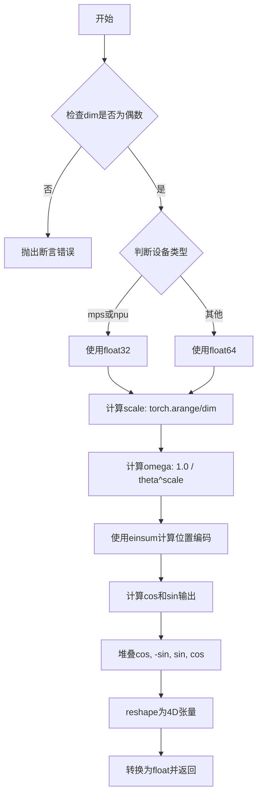
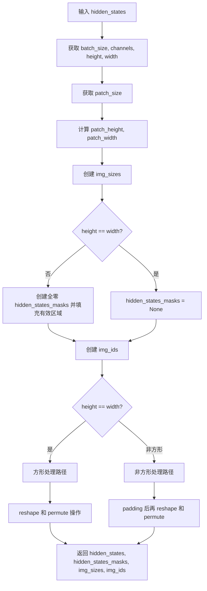
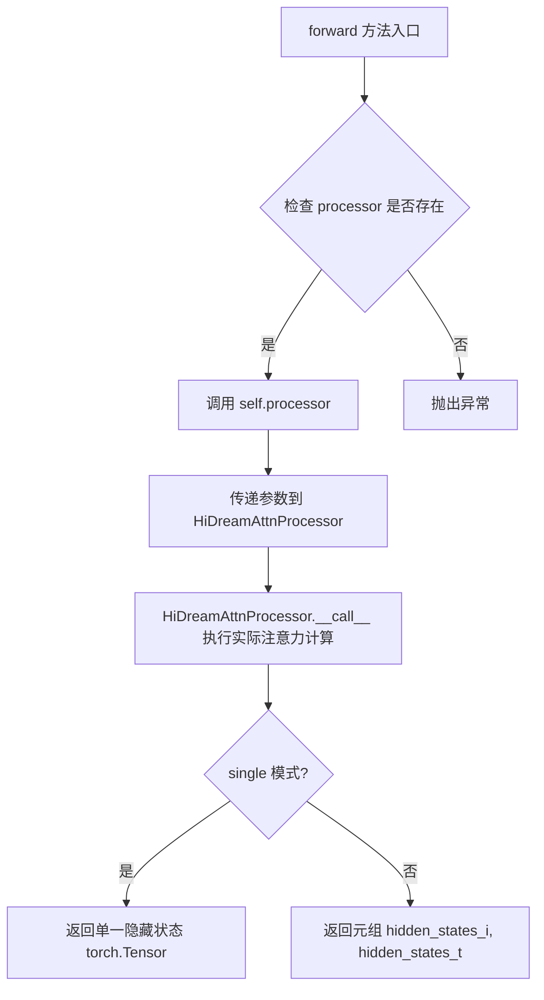
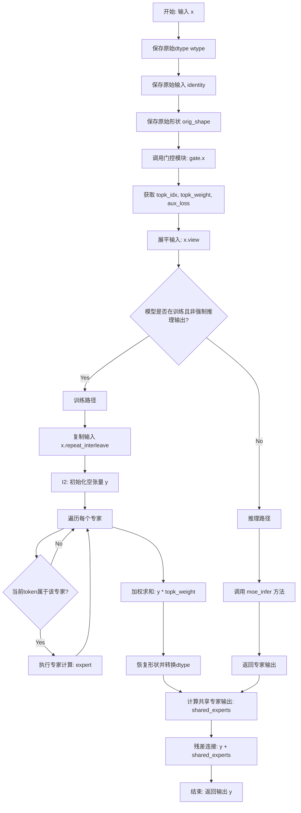
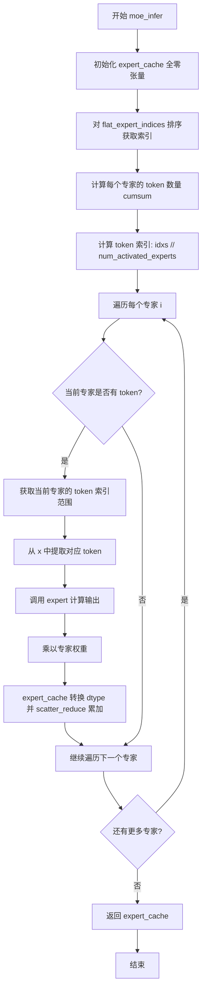
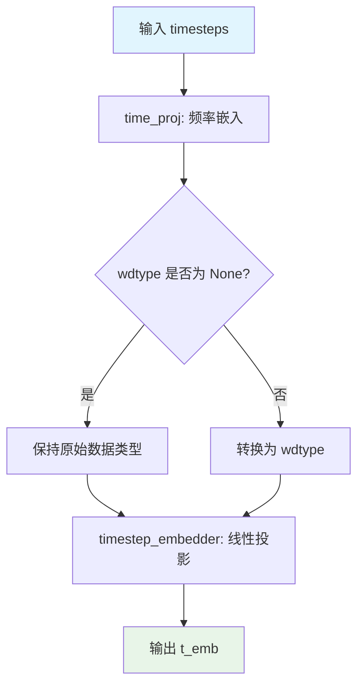
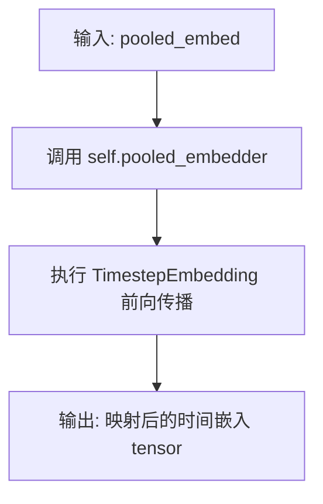
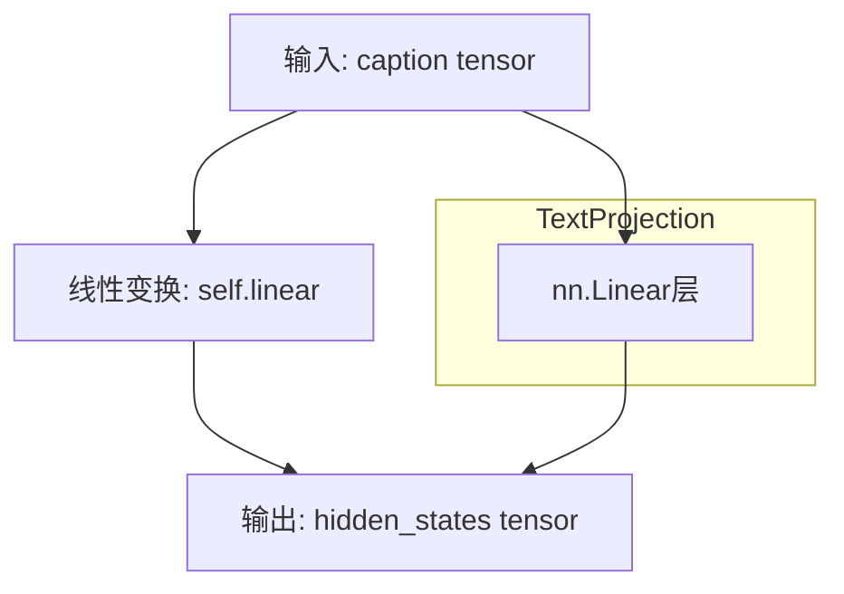

```mermaid
flowchart TD
    A[开始 forward] --> B{检查 encoder_hidden_states 是否存在}
    B -->|是| C[deprecated warning 并提取 t5 和 llama3 状态]
    B -->|否| D{hidden_states_masks 是否为 None}
    
    D -->|是| E[调用 patchify 处理 hidden_states]
    E --> F[获取 hidden_states, masks, img_sizes, img_ids]
    D -->|否| G[使用传入的 patchified hidden_states]
    
    F --> H[调用 x_embedder 嵌入 hidden_states]
    G --> H
    
    H --> I[调用 t_embedder 嵌入 timesteps]
    I --> J[调用 p_embedder 嵌入 pooled_embeds]
    J --> K[temb = timesteps_emb + pooled_emb]
    
    K --> L[处理 encoder_hidden_states: 提取 llama_layers 对应的状态]
    L --> M[通过 caption_projection 投影所有编码器状态]
    
    M --> N[构建 txt_ids 和 ids]
    N --> O[调用 pe_embedder 生成 image_rotary_emb]
    
    O --> P[初始化 block_id 和初始 encoder_hidden_states]
    P --> Q[遍历 double_stream_blocks]
    
    Q --> R[拼接当前层的 encoder_hidden_states]
    R --> S{是否启用梯度检查点}
    S -->|是| T[使用 _gradient_checkpointing_func 执行块]
    S -->|否| U[直接调用 block 执行]
    
    T --> V[更新 hidden_states 和 encoder_hidden_states]
    U --> V
    
    V --> W[block_id 递增]
    W --> X{是否还有更多双流块}
    X -->|是| Q
    X -->|否| Y[拼接 image tokens 和 encoder states]
    
    Y --> Z[遍历 single_stream_blocks]
    Z --> AA[拼接 hidden_states 和当前 encoder_hidden_states]
    AA --> AB{是否启用梯度检查点}
    AB -->|是| AC[使用梯度检查点执行 block]
    AB -->|否| AD[直接执行 block]
    
    AC --> AE[截取 hidden_states 到原始长度]
    AD --> AE
    AE --> AF[block_id 递增]
    AF --> AG{是否还有更多单流块}
    AG -->|是| Z
    AG -->|否| AH[截取 image_tokens_seq_len 部分]
    
    AH --> AI[调用 final_layer 处理]
    AI --> AJ[调用 unpatchify 还原图像块]
    AJ --> AK[返回结果]
```

# `diffusers\src\diffusers\models\transformers\transformer_hidream_image.py` 详细设计文档

这是一个基于PyTorch的HiDream图像变换器（Diffusion Transformer）实现，用于文本到图像的生成任务。该模型采用双流（图像+文本） transformer 块处理多模态输入，随后通过单流 transformer 块进行细化和精炼，并集成了混合专家（MoE）层以提升表达能力。

## 整体流程

```mermaid
graph TD
A[输入: Latent, Timestep, Text Embeds] --> B[图像分块处理 (Patchify)]
B --> C[嵌入层: 时间、图像块、文本、RoPE]
C --> D{双流 Blocks (Double Stream)}
D --> E[融合图像与文本 Tokens]
E --> F{单流 Blocks (Single Stream)}
F --> G[输出层: 反分块 (Unpatchify) & 投影]
G --> H[输出: 生成的图像张量]
```

## 类结构

```
HiDreamImageTransformer2DModel (根模型)
├── HiDreamImageTimestepEmbed (时间嵌入)
├── HiDreamImagePooledEmbed (池化文本嵌入)
├── HiDreamImagePatchEmbed (图像分块嵌入)
├── HiDreamImageEmbedND (RoPE 旋转位置编码)
├── HiDreamBlock (双流块容器) x N
│   └── HiDreamImageTransformerBlock (双流 Transformer)
│       ├── HiDreamAttention (双流注意力)
│       └── MOEFeedForwardSwiGLU (MoE 前馈网络)
├── HiDreamBlock (单流块容器) x M
│   └── HiDreamImageSingleTransformerBlock (单流 Transformer)
│       ├── HiDreamAttention (单流注意力)
│       └── MOEFeedForwardSwiGLU
├── HiDreamImageOutEmbed (输出层)
└── TextProjection (文本投影层列表)
```

## 全局变量及字段


### `logger`
    
Logger instance for the module to track runtime information and debugging.

类型：`logging.Logger`
    


### `HiDreamImageTransformer2DModel.out_channels`
    
Number of output channels for the generated images.

类型：`int | None`
    


### `HiDreamImageTransformer2DModel.inner_dim`
    
Internal dimension calculated as product of attention heads and head dimension.

类型：`int`
    


### `HiDreamImageTransformer2DModel.t_embedder`
    
Timestep embedding layer for encoding diffusion timesteps.

类型：`HiDreamImageTimestepEmbed`
    


### `HiDreamImageTransformer2DModel.p_embedder`
    
Pooled embedding layer for encoding text embeddings.

类型：`HiDreamImagePooledEmbed`
    


### `HiDreamImageTransformer2DModel.x_embedder`
    
Patch embedding layer for converting input images to token sequences.

类型：`HiDreamImagePatchEmbed`
    


### `HiDreamImageTransformer2DModel.pe_embedder`
    
Positional embedding layer for rotary position encoding.

类型：`HiDreamImageEmbedND`
    


### `HiDreamImageTransformer2DModel.double_stream_blocks`
    
List of double-stream transformer blocks processing both image and text.

类型：`nn.ModuleList`
    


### `HiDreamImageTransformer2DModel.single_stream_blocks`
    
List of single-stream transformer blocks processing image-only features.

类型：`nn.ModuleList`
    


### `HiDreamImageTransformer2DModel.final_layer`
    
Final output layer for reconstructing images from hidden states.

类型：`HiDreamImageOutEmbed`
    


### `HiDreamImageTransformer2DModel.caption_projection`
    
Module list for projecting caption embeddings to match hidden dimension.

类型：`nn.ModuleList`
    


### `HiDreamImageTransformerBlock.num_attention_heads`
    
Number of attention heads in the transformer block.

类型：`int`
    


### `HiDreamImageTransformerBlock.adaLN_modulation`
    
Adaptive layer normalization modulation for conditioning.

类型：`nn.Sequential`
    


### `HiDreamImageTransformerBlock.norm1_i`
    
Layer normalization for image hidden states before attention.

类型：`nn.LayerNorm`
    


### `HiDreamImageTransformerBlock.norm1_t`
    
Layer normalization for text hidden states before attention.

类型：`nn.LayerNorm`
    


### `HiDreamImageTransformerBlock.attn1`
    
Multi-modal attention layer processing image and text together.

类型：`HiDreamAttention`
    


### `HiDreamImageTransformerBlock.norm3_i`
    
Layer normalization for image hidden states before feedforward.

类型：`nn.LayerNorm`
    


### `HiDreamImageTransformerBlock.ff_i`
    
Mixture-of-experts feedforward network for image processing.

类型：`MOEFeedForwardSwiGLU`
    


### `HiDreamImageTransformerBlock.norm3_t`
    
Layer normalization for text hidden states before feedforward.

类型：`nn.LayerNorm`
    


### `HiDreamImageTransformerBlock.ff_t`
    
SwiGLU feedforward network for text processing.

类型：`HiDreamImageFeedForwardSwiGLU`
    


### `HiDreamImageSingleTransformerBlock.num_attention_heads`
    
Number of attention heads in the single-stream transformer block.

类型：`int`
    


### `HiDreamImageSingleTransformerBlock.adaLN_modulation`
    
Adaptive layer normalization modulation for conditioning.

类型：`nn.Sequential`
    


### `HiDreamImageSingleTransformerBlock.norm1_i`
    
Layer normalization for hidden states before attention.

类型：`nn.LayerNorm`
    


### `HiDreamImageSingleTransformerBlock.attn1`
    
Self-attention layer for processing image features.

类型：`HiDreamAttention`
    


### `HiDreamImageSingleTransformerBlock.norm3_i`
    
Layer normalization for hidden states before feedforward.

类型：`nn.LayerNorm`
    


### `HiDreamImageSingleTransformerBlock.ff_i`
    
Mixture-of-experts feedforward network for image processing.

类型：`MOEFeedForwardSwiGLU`
    


### `HiDreamAttention.inner_dim`
    
Inner dimension of the attention mechanism (heads * head_dim).

类型：`int`
    


### `HiDreamAttention.query_dim`
    
Dimension of query vectors for attention computation.

类型：`int`
    


### `HiDreamAttention.to_q`
    
Linear layer for projecting queries.

类型：`nn.Linear`
    


### `HiDreamAttention.to_k`
    
Linear layer for projecting keys.

类型：`nn.Linear`
    


### `HiDreamAttention.to_v`
    
Linear layer for projecting values.

类型：`nn.Linear`
    


### `HiDreamAttention.to_out`
    
Linear layer for projecting attention output back to original dimension.

类型：`nn.Linear`
    


### `HiDreamAttention.q_rms_norm`
    
RMS normalization for query vectors before attention.

类型：`nn.RMSNorm`
    


### `HiDreamAttention.k_rms_norm`
    
RMS normalization for key vectors before attention.

类型：`nn.RMSNorm`
    


### `MOEFeedForwardSwiGLU.shared_experts`
    
Shared expert network used by all tokens in the mixture.

类型：`HiDreamImageFeedForwardSwiGLU`
    


### `MOEFeedForwardSwiGLU.experts`
    
List of routed expert networks for mixture-of-experts processing.

类型：`nn.ModuleList`
    


### `MOEFeedForwardSwiGLU.gate`
    
Gating mechanism for routing tokens to experts.

类型：`MoEGate`
    


### `MOEFeedForwardSwiGLU.num_activated_experts`
    
Number of experts activated per token during forward pass.

类型：`int`
    


### `MoEGate.top_k`
    
Number of top experts selected by the gating mechanism.

类型：`int`
    


### `MoEGate.n_routed_experts`
    
Total number of routed experts available in the model.

类型：`int`
    


### `MoEGate.weight`
    
Learnable gating weights for expert selection.

类型：`nn.Parameter`
    


### `MoEGate.alpha`
    
Auxiliary loss coefficient for load balancing experts.

类型：`float`
    


### `HiDreamImageFeedForwardSwiGLU.w1`
    
First linear transformation for SwiGLU feedforward (gate projection).

类型：`nn.Linear`
    


### `HiDreamImageFeedForwardSwiGLU.w2`
    
Second linear transformation for SwiGLU feedforward (output projection).

类型：`nn.Linear`
    


### `HiDreamImageFeedForwardSwiGLU.w3`
    
Third linear transformation for SwiGLU feedforward (up projection).

类型：`nn.Linear`
    


### `HiDreamImageOutEmbed.norm_final`
    
Final layer normalization before output projection.

类型：`nn.LayerNorm`
    


### `HiDreamImageOutEmbed.linear`
    
Linear layer for projecting hidden states to pixel space.

类型：`nn.Linear`
    


### `HiDreamImageOutEmbed.adaLN_modulation`
    
Adaptive layer norm modulation for output conditioning.

类型：`nn.Sequential`
    


### `HiDreamImagePatchEmbed.patch_size`
    
Size of image patches for tokenization.

类型：`int`
    


### `HiDreamImagePatchEmbed.out_channels`
    
Number of output channels after patch embedding.

类型：`int`
    


### `HiDreamImagePatchEmbed.proj`
    
Linear projection layer for converting patches to embeddings.

类型：`nn.Linear`
    


### `HiDreamImageTimestepEmbed.time_proj`
    
Timestep projection for encoding diffusion time steps.

类型：`Timesteps`
    


### `HiDreamImageTimestepEmbed.timestep_embedder`
    
Embedding layer for converting projected timesteps to hidden dimension.

类型：`TimestepEmbedding`
    


### `HiDreamImagePooledEmbed.pooled_embedder`
    
Embedding layer for pooling text embeddings.

类型：`TimestepEmbedding`
    


### `HiDreamImageEmbedND.theta`
    
Base frequency parameter for rotary position embedding.

类型：`int`
    


### `HiDreamImageEmbedND.axes_dim`
    
List of dimensions for each axis in multi-dimensional rotary embedding.

类型：`list[int]`
    


### `TextProjection.linear`
    
Linear projection layer for transforming text features.

类型：`nn.Linear`
    


### `HiDreamBlock.block`
    
The underlying transformer block (single or double stream) being wrapped.

类型：`Module`
    
    

## 全局函数及方法


### `rope`

旋转位置编码（RoPE）函数，用于生成用于自注意力机制的位置编码向量，通过复数旋转方式编码序列中token的相对位置信息。

参数：

- `pos`：`torch.Tensor`，位置索引张量，形状为 (batch_size, seq_length)
- `dim`：`int`，嵌入维度，必须为偶数
- `theta`：`int`，旋转角度的基础频率参数

返回值：`torch.Tensor`，旋转位置编码张量，形状为 (batch_size, seq_length, dim // 2, 2, 2)

#### 流程图



#### 带注释源码

```
def rope(pos: torch.Tensor, dim: int, theta: int) -> torch.Tensor:
    """
    旋转位置编码（Rotary Position Embedding）函数
    
    参数:
        pos: 位置索引张量，形状为 (batch_size, seq_length)
        dim: 嵌入维度，必须为偶数
        theta: 旋转角度的基础频率参数
    
    返回:
        旋转位置编码张量，形状为 (batch_size, seq_length, dim // 2, 2, 2)
    """
    # 断言检查：确保维度为偶数，因为需要成对的旋转分量
    assert dim % 2 == 0, "The dimension must be even."

    # 判断设备类型，mps(Apple Silicon)和npu(华为昇腾)使用float32以兼容
    is_mps = pos.device.type == "mps"
    is_npu = pos.device.type == "npu"

    # 根据设备选择精度：mps/npu使用float32，其他使用float64以获得更高精度
    dtype = torch.float32 if (is_mps or is_npu) else torch.float64

    # 计算频率缩放因子：生成[0, dim)范围内的偶数索引，除以dim进行归一化
    # 结果形状为 (dim // 2,)
    scale = torch.arange(0, dim, 2, dtype=dtype, device=pos.device) / dim
    
    # 计算旋转频率omega：1.0 / (theta ^ scale)
    # theta通常设置为10000，用于控制波长
    omega = 1.0 / (theta**scale)

    # 获取批次大小和序列长度
    batch_size, seq_length = pos.shape
    
    # 使用爱因斯坦求和约定计算位置与频率的外积
    # 将pos(...n)与omega(d)组合得到(...nd)的张量
    out = torch.einsum("...n,d->...nd", pos, omega)
    
    # 计算余弦和正弦输出
    cos_out = torch.cos(out)
    sin_out = torch.sin(out)

    # 堆叠[cos, -sin, sin, cos]形成复数形式的旋转矩阵
    # 对应旋转矩阵 [[cos, -sin], [sin, cos]]
    stacked_out = torch.stack([cos_out, -sin_out, sin_out, cos_out], dim=-1)
    
    # 重塑为(batch_size, seq_length, dim//2, 2, 2)的4D张量
    # 最后一维的2x2代表旋转矩阵的四个元素
    out = stacked_out.view(batch_size, -1, dim // 2, 2, 2)
    
    # 返回float类型的结果（注意：输入可能是其他精度）
    return out.float()
```


### `apply_rope`

该函数实现了旋转位置编码（RoPE，Rotary Position Embedding），通过复数运算将位置信息编码到查询（Query）和键（Key）向量中，是Transformer模型中增强位置感知的关键算子。

参数：

- `xq`：`torch.Tensor`，输入的查询向量张量，通常形状为 (batch, seq_len, num_heads, head_dim)
- `xk`：`torch.Tensor`，输入的键向量张量，形状与 xq 一致
- `freqs_cis`：`torch.Tensor`，预计算的旋转位置编码复数张量，形状为 (seq_len, head_dim//2, 1, 1, 2) 或类似维度，最后一维存储 cos 和 sin 值

返回值：`tuple[torch.Tensor, torch.Tensor]`，返回经过旋转位置编码后的查询向量和键向量，形状与输入相同，数据类型与输入 xq/xk 一致

#### 流程图

```mermaid
flowchart TD
    A[输入: xq, xk, freqs_cis] --> B[将xq转换为float32/64并重塑]
    A --> C[将xk转换为float32/64并重塑]
    B --> D[提取freqs_cis的cos和sin分量]
    C --> D
    D --> E[执行复数旋转计算: xq_out = cos * xq[...,0] + sin * xq[...,1]]
    E --> F[执行复数旋转计算: xk_out = cos * xk[...,0] + sin * xk[...,1]]
    F --> G[恢复原始形状]
    G --> H[转换回原始数据类型]
    H --> I[输出: xq_out, xk_out]
```

#### 带注释源码

```python
def apply_rope(xq: torch.Tensor, xk: torch.Tensor, freqs_cis: torch.Tensor) -> tuple[torch.Tensor, torch.Tensor]:
    """
    应用旋转位置编码（RoPE）到查询和键向量。
    
    RoPE通过复数乘法实现位置编码，使模型能够感知相对位置信息。
    公式: x_out = x * e^(i * theta * pos) = x_rotated
    在实数实现中等价于: [cos(θ), -sin(θ); sin(θ), cos(θ)] @ [x0; x1]
    
    参数:
        xq: 查询向量，形状 (batch, seq_len, num_heads, head_dim)
        xk: 键向量，形状 (batch, seq_len, num_heads, head_dim)
        freqs_cis: 预计算的旋转编码，形状 (seq_len, head_dim//2, 1, 1, 2)
                   最后一维: [cos(θ), sin(θ)]
    
    返回:
        应用RoPE后的查询和键向量
    """
    # 将xq转换为浮点数以确保计算精度，然后重塑为4D张量
    # 目标形状: (batch, seq_len, num_heads, head_dim//2, 2)
    # 最后两维分别表示复数的实部和虚部
    xq_ = xq.float().reshape(*xq.shape[:-1], -1, 1, 2)
    
    # 同样的处理应用于xk
    xk_ = xk.float().reshape(*xk.shape[:-1], -1, 1, 2)
    
    # 执行复数旋转运算
    # freqs_cis[..., 0] 是 cos(θ)，freqs_cis[..., 1] 是 sin(θ)
    # 旋转矩阵: [[cos, -sin], [sin, cos]]
    # 因此: x_out[...,0] = cos * x[...,0] + sin * x[...,1]
    #      x_out[...,1] = -sin * x[...,0] + cos * x[...,1]
    # 这里使用简化形式: xq_out = cos * xq_[...,0] + sin * xq_[...,1]
    xq_out = freqs_cis[..., 0] * xq_[..., 0] + freqs_cis[..., 1] * xq_[..., 1]
    xk_out = freqs_cis[..., 0] * xk_[..., 0] + freqs_cis[..., 1] * xk_[..., 1]
    
    # 恢复原始形状并转换回原始数据类型
    # 使用type_as保持与原始输入一致的数据类型（如fp16、bf16等）
    return xq_out.reshape(*xq.shape).type_as(xq), xk_out.reshape(*xk.shape).type_as(xk)
```


### HiDreamImageTransformer2DModel.unpatchify

该方法将Transformer输出的patch序列重新排列成图像张量形式，支持训练和推理两种模式。训练模式下使用简单的 reshape 和 permute 操作；推理模式下则根据每个图像的尺寸信息逐步重构，支持不同尺寸的图像批次。

参数：

- `x`：`torch.Tensor`，形状为 (B, S, F)，其中 B 是批量大小，S 是序列长度，F 是特征维度，表示已patchify的隐藏状态
- `img_sizes`：`list[tuple[int, int]]`，包含每个图像的高度和宽度（以patch为单位），用于推理时按图像尺寸恢复
- `is_training`：`bool`，指示当前是否处于训练模式，训练模式使用固定形状的快速路径

返回值：`torch.Tensor`，恢复后的图像张量，训练模式下形状为 (B, C, S, patch_size²)，推理模式下形状为 (B, C, H, W)

#### 流程图

```mermaid
flowchart TD
    A[开始 unpatchify] --> B{is_training 且非 force_inference_output?}
    B -->|Yes| C[训练模式路径]
    B -->|No| D[推理模式路径]
    
    C --> C1[获取形状 B, S, F]
    C --> C2[计算通道数 C = F / (patch_size²)]
    C --> C3[reshape: (B, S, p, p, C)]
    C --> C4[permute: (B, C, S, p, p)]
    C --> C5[reshape: (B, C, S, p²)]
    C --> C6[返回结果]
    
    D --> D1[初始化空列表 x_arr]
    D --> D2[遍历 img_sizes]
    D --> D3[提取当前图像尺寸 pH, pW]
    D --> D4[reshape 为 (1, pH, pW, -1)]
    D --> D5[计算通道数 C]
    D --> D6[reshape: (1, pH, pW, p, p, C)]
    D --> D7[permute: (0, 5, 1, 3, 2, 4)]
    D --> D8[reshape: (1, C, pH*p, pW*p)]
    D --> D9[添加到 x_arr]
    D --> D10[所有图像处理完毕?]
    D10 -->|No| D2
    D10 -->|Yes| D11[torch.cat 合并]
    D11 --> D6
    
    C6 --> E[结束]
    D6 --> E
```

#### 带注释源码

```python
def unpatchify(self, x: torch.Tensor, img_sizes: list[tuple[int, int]], is_training: bool) -> list[torch.Tensor]:
    """
    将patch序列重新排列回图像张量格式
    
    参数:
        x: 形状为 (B, S, F) 的输入张量，B=批量大小, S=序列长度, F=特征维度
        img_sizes: 每个图像的尺寸列表，元素为 (高度patch数, 宽度patch数) 元组
        is_training: 是否处于训练模式
    """
    # 训练模式：使用固定的patch_size进行快速重塑
    if is_training and not self.config.force_inference_output:
        # 获取输入形状: B=批量, S=序列长度, F=特征维度
        B, S, F = x.shape
        # 计算通道数 C = F / (patch_size * patch_size)
        C = F // (self.config.patch_size * self.config.patch_size)
        # 重新塑形: (B, S, p, p, C) - 将序列长度维度拆分为patch的高和宽
        x = (
            x.reshape(B, S, self.config.patch_size, self.config.patch_size, C)
            # 置换维度: (B, C, S, p, p) - 将通道维度移至前面
            .permute(0, 4, 1, 2, 3)
            # 最终重塑: (B, C, S, p*p) - 合并最后两个维度
            .reshape(B, C, S, self.config.patch_size * self.config.patch_size)
        )
    else:
        # 推理模式：需要根据每个图像的尺寸分别处理
        x_arr = []  # 用于存储每个恢复后的图像
        p1 = self.config.patch_size
        p2 = self.config.patch_size
        # 遍历每个图像的尺寸信息
        for i, img_size in enumerate(img_sizes):
            pH, pW = img_size  # 当前图像的高度和宽度（patch数）
            # 提取当前图像的token并重塑为2D patch网格
            t = x[i, : pH * pW].reshape(1, pH, pW, -1)
            F_token = t.shape[-1]  # 每个token的特征维度
            C = F_token // (p1 * p2)  # 计算通道数
            # 重建3D体积: (1, pH, pW, p, p, C)
            t = t.reshape(1, pH, pW, p1, p2, C)
            # 置换维度顺序: (0, 5, 1, 3, 2, 4) 
            # 将 (batch, h, w, p_h, p_w, c) 转换为 (batch, c, h*p_h, w*p_w)
            t = t.permute(0, 5, 1, 3, 2, 4)
            # 最终重塑为完整图像: (1, C, 图像高度, 图像宽度)
            t = t.reshape(1, C, pH * p1, pW * p2)
            x_arr.append(t)  # 添加到结果列表
        # 在批量维度上拼接所有图像
        x = torch.cat(x_arr, dim=0)
    return x
```


### `HiDreamImageTransformer2DModel.patchify`

该方法将输入的4D隐藏状态张量（batch_size, channels, height, width）转换为patch序列形式，并生成相应的位置编码信息和注意力掩码，支持非方形图像的处理。

参数：

- `hidden_states`：`torch.Tensor`，输入的隐藏状态张量，形状为 (batch_size, channels, height, width)

返回值：`tuple[torch.Tensor, torch.Tensor | None, torch.Tensor, torch.Tensor]`，返回包含以下四个元素的元组：
- `hidden_states`：patchify后的隐藏状态，形状为 (batch_size, num_patches, patch_size * patch_size * channels)
- `hidden_states_masks`：隐藏状态掩码，用于非方形图像，形状为 (batch_size, max_seq)，可能为None
- `img_sizes`：图像尺寸张量，形状为 (batch_size, 2)，记录每个batch的patch高度和宽度
- `img_ids`：图像位置ID张量，形状为 (batch_size, max_seq, 3)，用于位置编码

#### 流程图



#### 带注释源码

```python
def patchify(self, hidden_states):
    """
    将4D隐藏状态转换为patch序列形式，并生成位置编码信息
    
    参数:
        hidden_states: 输入张量，形状为 (batch_size, channels, height, width)
    
    返回:
        tuple: (hidden_states, hidden_states_masks, img_sizes, img_ids)
    """
    # 1. 获取输入张量的维度信息
    batch_size, channels, height, width = hidden_states.shape
    patch_size = self.config.patch_size
    
    # 2. 计算patch的数量
    patch_height, patch_width = height // patch_size, width // patch_size
    
    # 3. 获取设备和数据类型
    device = hidden_states.device
    dtype = hidden_states.dtype

    # 4. 创建图像尺寸张量，用于记录每个batch的patch维度
    # 形状: (batch_size, 2)
    img_sizes = torch.tensor([patch_height, patch_width], dtype=torch.int64, device=device).reshape(-1)
    img_sizes = img_sizes.unsqueeze(0).repeat(batch_size, 1)

    # 5. 创建注意力掩码，处理非方形图像
    if hidden_states.shape[-2] != hidden_states.shape[-1]:
        # 非方形：创建掩码标记有效patch区域
        hidden_states_masks = torch.zeros((batch_size, self.max_seq), dtype=dtype, device=device)
        hidden_states_masks[:, : patch_height * patch_width] = 1.0
    else:
        # 方形：无需掩码
        hidden_states_masks = None

    # 6. 创建图像位置ID，用于旋转位置编码
    # 形状: (patch_height, patch_width, 3)
    img_ids = torch.zeros(patch_height, patch_width, 3, device=device)
    
    # 填充行索引到第二维
    row_indices = torch.arange(patch_height, device=device)[:, None]
    col_indices = torch.arange(patch_width, device=device)[None, :]
    img_ids[..., 1] = img_ids[..., 1] + row_indices
    img_ids[..., 2] = img_ids[..., 2] + col_indices
    
    # 展平为 (patch_height * patch_width, 3)
    img_ids = img_ids.reshape(patch_height * patch_width, -1)

    # 7. 处理非方形图像的padding
    if hidden_states.shape[-2] != hidden_states.shape[-1]:
        # 非方形：padding到最大序列长度
        img_ids_pad = torch.zeros(self.max_seq, 3, device=device)
        img_ids_pad[: patch_height * patch_width, :] = img_ids
        img_ids = img_ids_pad.unsqueeze(0).repeat(batch_size, 1, 1)
    else:
        # 方形：直接扩展到batch维度
        img_ids = img_ids.unsqueeze(0).repeat(batch_size, 1, 1)

    # 8. Patchify隐藏状态
    if hidden_states.shape[-2] != hidden_states.shape[-1]:
        # === 非方形处理路径 ===
        # 创建输出张量，padding到max_seq
        out = torch.zeros(
            (batch_size, channels, self.max_seq, patch_size * patch_size),
            dtype=dtype,
            device=device,
        )
        
        # 重塑输入: (B, C, H, pH, W, pW)
        hidden_states = hidden_states.reshape(
            batch_size, channels, patch_height, patch_size, patch_width, patch_size
        )
        # 置换维度: (B, C, pH, pW, pH, pW) -> 重新排列以便展平
        hidden_states = hidden_states.permute(0, 1, 2, 4, 3, 5)
        # 重塑为: (B, C, H*W, pH*pW)
        hidden_states = hidden_states.reshape(
            batch_size, channels, patch_height * patch_width, patch_size * patch_size
        )
        
        # 填充有效区域
        out[:, :, 0 : patch_height * patch_width] = hidden_states
        hidden_states = out
        
        # 最终变换: (B, C, S, p*p) -> (B, S, p*p*C)
        hidden_states = hidden_states.permute(0, 2, 3, 1).reshape(
            batch_size, self.max_seq, patch_size * patch_size * channels
        )

    else:
        # === 方形处理路径 ===
        # 重塑: (B, C, H, pH, W, pW)
        hidden_states = hidden_states.reshape(
            batch_size, channels, patch_height, patch_size, patch_width, patch_size
        )
        # 置换并重塑: (B, H, W, pH, pW, C) -> (B, H*W, pH*pW*C)
        hidden_states = hidden_states.permute(0, 2, 4, 3, 5, 1)
        hidden_states = hidden_states.reshape(
            batch_size, patch_height * patch_width, patch_size * patch_size * channels
        )

    # 9. 返回patchify后的张量、掩码、尺寸和位置ID
    return hidden_states, hidden_states_masks, img_sizes, img_ids
```


### `HiDreamImageTransformer2DModel.forward`

该方法是 HiDreamImageTransformer2DModel 类的核心前向传播方法，负责将输入的潜在表示（latent）经过patchify、嵌入、多层Transformer块处理（包括双流块和单流块）以及最终的unpatchify操作，输出变换后的图像token序列，最终解patchify为图像块。

参数：

- `hidden_states`：`torch.Tensor`，输入的隐藏状态，通常为图像的latent表示，形状为 (batch_size, channels, height, width)
- `timesteps`：`torch.LongTensor`，时间步张量，用于条件生成
- `encoder_hidden_states_t5`：`torch.Tensor`，T5编码器的隐藏状态，提供文本条件信息
- `encoder_hidden_states_llama3`：`torch.Tensor`，Llama3编码器的隐藏状态，提供文本条件信息
- `pooled_embeds`：`torch.Tensor`，池化后的嵌入向量
- `img_ids`：`torch.Tensor | None`，图像ID张量，用于位置编码
- `img_sizes`：`list[tuple[int, int]] | None`，图像尺寸列表
- `hidden_states_masks`：`torch.Tensor | None`，隐藏状态掩码，用于处理非方形图像
- `attention_kwargs`：`dict[str, Any] | None`，注意力机制的额外参数
- `return_dict`：`bool`，是否返回字典格式的输出
- `**kwargs`：其他关键字参数

返回值：`tuple[torch.Tensor] | Transformer2DModelOutput`，如果 return_dict 为 True，返回 Transformer2DModelOutput 对象，其中 sample 属性包含输出；否则返回元组

#### 流程图



#### 带注释源码

```python
@apply_lora_scale("attention_kwargs")
def forward(
    self,
    hidden_states: torch.Tensor,  # 输入的图像latent表示
    timesteps: torch.LongTensor = None,  # 时间步
    encoder_hidden_states_t5: torch.Tensor = None,  # T5文本编码
    encoder_hidden_states_llama3: torch.Tensor = None,  # Llama3文本编码
    pooled_embeds: torch.Tensor = None,  # 池化嵌入
    img_ids: torch.Tensor | None = None,  # 图像位置ID
    img_sizes: list[tuple[int, int]] | None = None,  # 图像尺寸
    hidden_states_masks: torch.Tensor | None = None,  # 注意力掩码
    attention_kwargs: dict[str, Any] | None = None,  # 注意力参数
    return_dict: bool = True,  # 是否返回字典格式
    **kwargs,
) -> tuple[torch.Tensor] | Transformer2DModelOutput:
    # 处理废弃的 encoder_hidden_states 参数
    encoder_hidden_states = kwargs.get("encoder_hidden_states", None)
    if encoder_hidden_states is not None:
        deprecation_message = "The `encoder_hidden_states` argument is deprecated. Please use `encoder_hidden_states_t5` and `encoder_hidden_states_llama3` instead."
        deprecate("encoder_hidden_states", "0.35.0", deprecation_message)
        encoder_hidden_states_t5 = encoder_hidden_states[0]
        encoder_hidden_states_llama3 = encoder_hidden_states[1]

    # 检查 img_ids/img_sizes 与 hidden_states_masks 的一致性
    if img_ids is not None and img_sizes is not None and hidden_states_masks is None:
        deprecation_message = "Passing `img_ids` and `img_sizes` with unpachified `hidden_states` is deprecated and will be ignored."
        deprecate("img_ids", "0.35.0", deprecation_message)

    if hidden_states_masks is not None and (img_ids is None or img_sizes is None):
        raise ValueError("if `hidden_states_masks` is passed, `img_ids` and `img_sizes` must also be passed.")
    elif hidden_states_masks is not None and hidden_states.ndim != 3:
        raise ValueError("if `hidden_states_masks` is passed, `hidden_states` must be a 3D tensors with shape (batch_size, patch_height * patch_width, patch_size * patch_size * channels)")

    # 获取批次大小和输入类型
    batch_size = hidden_states.shape[0]
    hidden_states_type = hidden_states.dtype

    # 如果没有提供掩码，则对输入进行 patchify 处理
    # 将图像从 (B, C, H, W) 转换为 (B, num_patches, patch_dim)
    if hidden_states_masks is None:
        hidden_states, hidden_states_masks, img_sizes, img_ids = self.patchify(hidden_states)

    # 使用 x_embedder 对 hidden_states 进行线性投影嵌入
    hidden_states = self.x_embedder(hidden_states)

    # 0. 时间嵌入：处理时间步
    timesteps = self.t_embedder(timesteps, hidden_states_type)
    # 处理池化嵌入
    p_embedder = self.p_embedder(pooled_embeds)
    # 组合时间嵌入和池化嵌入作为条件
    temb = timesteps + p_embedder

    # 处理编码器隐藏状态：根据 llama_layers 配置选择对应的层
    encoder_hidden_states = [encoder_hidden_states_llama3[k] for k in self.config.llama_layers]

    # 对编码器状态进行投影处理
    if self.caption_projection is not None:
        new_encoder_hidden_states = []
        for i, enc_hidden_state in enumerate(encoder_hidden_states):
            # 投影并重塑为 (batch, seq_len, hidden_dim)
            enc_hidden_state = self.caption_projection[i](enc_hidden_state)
            enc_hidden_state = enc_hidden_state.view(batch_size, -1, hidden_states.shape[-1])
            new_encoder_hidden_states.append(enc_hidden_state)
        encoder_hidden_states = new_encoder_hidden_states
        # 处理 T5 编码器状态
        encoder_hidden_states_t5 = self.caption_projection[-1](encoder_hidden_states_t5)
        encoder_hidden_states_t5 = encoder_hidden_states_t5.view(batch_size, -1, hidden_states.shape[-1])
        encoder_hidden_states.append(encoder_hidden_states_t5)

    # 构建文本位置 ID
    txt_ids = torch.zeros(
        batch_size,
        encoder_hidden_states[-1].shape[1]  # T5 长度
        + encoder_hidden_states[-2].shape[1]  # llama3 last layer 长度
        + encoder_hidden_states[0].shape[1],  # llama3 first layer 长度
        3,
        device=img_ids.device,
        dtype=img_ids.dtype,
    )
    # 拼接图像和文本的位置 ID
    ids = torch.cat((img_ids, txt_ids), dim=1)
    # 生成旋转位置嵌入
    image_rotary_emb = self.pe_embedder(ids)

    # 2. Blocks：双流块处理
    block_id = 0
    # 初始编码器状态：最后一层 llama3 + 倒数第二层 llama3
    initial_encoder_hidden_states = torch.cat([encoder_hidden_states[-1], encoder_hidden_states[-2]], dim=1)
    initial_encoder_hidden_states_seq_len = initial_encoder_hidden_states.shape[1]
    
    # 遍历所有双流块（处理图像和文本的交互）
    for bid, block in enumerate(self.double_stream_blocks):
        # 获取当前层的 llama3 编码器状态
        cur_llama31_encoder_hidden_states = encoder_hidden_states[block_id]
        # 拼接初始编码器状态和当前层 llama3 状态
        cur_encoder_hidden_states = torch.cat(
            [initial_encoder_hidden_states, cur_llama31_encoder_hidden_states], dim=1
        )
        # 根据是否启用梯度检查点选择执行方式
        if torch.is_grad_enabled() and self.gradient_checkpointing:
            hidden_states, initial_encoder_hidden_states = self._gradient_checkpointing_func(
                block,
                hidden_states,
                hidden_states_masks,
                cur_encoder_hidden_states,
                temb,
                image_rotary_emb,
            )
        else:
            hidden_states, initial_encoder_hidden_states = block(
                hidden_states=hidden_states,
                hidden_states_masks=hidden_states_masks,
                encoder_hidden_states=cur_encoder_hidden_states,
                temb=temb,
                image_rotary_emb=image_rotary_emb,
            )
        # 保留初始编码器状态部分
        initial_encoder_hidden_states = initial_encoder_hidden_states[:, :initial_encoder_hidden_states_seq_len]
        block_id += 1

    # 单流块处理前的准备
    image_tokens_seq_len = hidden_states.shape[1]
    # 拼接图像token和编码器状态
    hidden_states = torch.cat([hidden_states, initial_encoder_hidden_states], dim=1)
    hidden_states_seq_len = hidden_states.shape[1]
    # 如果有掩码，扩展编码器的注意力掩码
    if hidden_states_masks is not None:
        encoder_attention_mask_ones = torch.ones(
            (batch_size, initial_encoder_hidden_states.shape[1] + cur_llama31_encoder_hidden_states.shape[1]),
            device=hidden_states_masks.device,
            dtype=hidden_states_masks.dtype,
        )
        hidden_states_masks = torch.cat([hidden_states_masks, encoder_attention_mask_ones], dim=1)

    # 遍历单流块（仅处理图像）
    for bid, block in enumerate(self.single_stream_blocks):
        cur_llama31_encoder_hidden_states = encoder_hidden_states[block_id]
        hidden_states = torch.cat([hidden_states, cur_llama31_encoder_hidden_states], dim=1)
        if torch.is_grad_enabled() and self.gradient_checkpointing:
            hidden_states = self._gradient_checkpointing_func(
                block,
                hidden_states,
                hidden_states_masks,
                None,
                temb,
                image_rotary_emb,
            )
        else:
            hidden_states = block(
                hidden_states=hidden_states,
                hidden_states_masks=hidden_states_masks,
                encoder_hidden_states=None,
                temb=temb,
                image_rotary_emb=image_rotary_emb,
            )
        # 截取回原始长度
        hidden_states = hidden_states[:, :hidden_states_seq_len]
        block_id += 1

    # 最终处理：只保留图像token部分
    hidden_states = hidden_states[:, :image_tokens_seq_len, ...]
    # 通过最终输出层
    output = self.final_layer(hidden_states, temb)
    # unpatchify：将token还原为图像块
    output = self.unpatchify(output, img_sizes, self.training)
    # 还原掩码
    if hidden_states_masks is not None:
        hidden_states_masks = hidden_states_masks[:, :image_tokens_seq_len]

    # 返回结果
    if not return_dict:
        return (output,)
    return Transformer2DModelOutput(sample=output)
```


### `HiDreamImageTransformerBlock.forward`

该方法是 HiDream 图像 Transformer 块的前向传播函数，实现了双流（图像流+文本流）交叉注意力机制和 MoE（混合专家）前馈网络，通过 AdaLN 调制实现自适应层归一化，处理图像潜变量和文本嵌入的联合建模。

参数：

- `self`：`HiDreamImageTransformerBlock` 实例本身
- `hidden_states`：`torch.Tensor`，输入的图像潜变量张量，形状为 (batch_size, seq_len, dim)
- `hidden_states_masks`：`torch.Tensor | None`，图像序列的注意力掩码，用于处理非方形图像
- `encoder_hidden_states`：`torch.Tensor | None`，编码后的文本隐藏状态，来自文本编码器
- `temb`：`torch.Tensor | None`，时间步嵌入或条件嵌入，用于 AdaLN 调制
- `image_rotary_emb`：`torch.Tensor = None`，图像旋转位置编码，用于旋转位置嵌入（RoPE）

返回值：`tuple[torch.Tensor, torch.Tensor]`，返回两个张量——处理后的图像隐藏状态和处理后的文本隐藏状态

#### 流程图

```mermaid
flowchart TD
    A[开始 forward] --> B[获取 hidden_states 数据类型 wtype]
    B --> C[使用 adaLN_modulation 对 temb 进行调制<br/>分解出12个调制参数]
    C --> D[图像流 Attention 预处理<br/>norm1_i 归一化 + AdaLN 调制]
    D --> E[文本流 Attention 预处理<br/>norm1_t 归一化 + AdaLN 调制]
    E --> F[执行双流交叉注意力<br/>self.attn1]
    F --> G[AdaLN 门控残差连接<br/>gate_msa_i 和 gate_msa_t]
    G --> H[图像流 FFN 预处理<br/>norm3_i 归一化 + AdaLN 调制]
    H --> I[文本流 FFN 预处理<br/>norm3_t 归一化 + AdaLN 调制]
    I --> J[执行 FFN<br/>图像流: MOEFeedForwardSwiGLU<br/>文本流: HiDreamImageFeedForwardSwiGLU]
    J --> K[FFN 门控残差连接<br/>gate_mlp_i 和 gate_mlp_t]
    K --> L[返回 tuple[hidden_states, encoder_hidden_states]]
```

#### 带注释源码

```python
def forward(
    self,
    hidden_states: torch.Tensor,
    hidden_states_masks: torch.Tensor | None = None,
    encoder_hidden_states: torch.Tensor | None = None,
    temb: torch.Tensor | None = None,
    image_rotary_emb: torch.Tensor = None,
) -> tuple[torch.Tensor, torch.Tensor]:
    """
    HiDreamImageTransformerBlock 的前向传播方法
    
    参数:
        hidden_states: 图像潜变量张量 (batch_size, seq_len, dim)
        hidden_states_masks: 图像注意力掩码，用于非方形图像处理
        encoder_hidden_states: 文本编码器的隐藏状态
        temb: 时间步/条件嵌入，用于 AdaLN 调制
        image_rotary_emb: 旋转位置编码 (RoPE)
    
    返回:
        tuple[hidden_states, encoder_hidden_states]: 处理后的双流输出
    """
    # 1. 获取输入数据类型，用于后续计算
    wtype = hidden_states.dtype
    
    # 2. AdaLN 调制：从 temb 预测 12 个调制参数
    #    - 图像流 MSA: shift_msa_i, scale_msa_i, gate_msa_i
    #    - 图像流 MLP: shift_mlp_i, scale_mlp_i, gate_mlp_i
    #    - 文本流 MSA: shift_msa_t, scale_msa_t, gate_msa_t
    #    - 文本流 MLP: shift_mlp_t, scale_mlp_t, gate_mlp_t
    (
        shift_msa_i, scale_msa_i, gate_msa_i,
        shift_mlp_i, scale_mlp_i, gate_mlp_i,
        shift_msa_t, scale_msa_t, gate_msa_t,
        shift_mlp_t, scale_mlp_t, gate_mlp_t,
    ) = self.adaLN_modulation(temb)[:, None].chunk(12, dim=-1)

    # 3. 双流交叉注意力 (MM-Attention)
    # 3.1 图像流预处理：LayerNorm + AdaLN 调制
    norm_hidden_states = self.norm1_i(hidden_states).to(dtype=wtype)
    norm_hidden_states = norm_hidden_states * (1 + scale_msa_i) + shift_msa_i
    
    # 3.2 文本流预处理：LayerNorm + AdaLN 调制
    norm_encoder_hidden_states = self.norm1_t(encoder_hidden_states).to(dtype=wtype)
    norm_encoder_hidden_states = norm_encoder_hidden_states * (1 + scale_msa_t) + shift_msa_t

    # 3.3 执行双流注意力计算
    #     返回 (图像注意力输出, 文本注意力输出)
    attn_output_i, attn_output_t = self.attn1(
        norm_hidden_states,
        hidden_states_masks,
        norm_encoder_hidden_states,
        image_rotary_emb=image_rotary_emb,
    )

    # 3.4 门控残差连接
    #     hidden_states = gate_msa_i * attn_output_i + hidden_states
    #     encoder_hidden_states = gate_msa_t * attn_output_t + encoder_hidden_states
    hidden_states = gate_msa_i * attn_output_i + hidden_states
    encoder_hidden_states = gate_msa_t * attn_output_t + encoder_hidden_states

    # 4. 前馈网络 (Feed-Forward)
    # 4.1 图像流 FFN 预处理
    norm_hidden_states = self.norm3_i(hidden_states).to(dtype=wtype)
    norm_hidden_states = norm_hidden_states * (1 + scale_mlp_i) + shift_mlp_i
    
    # 4.2 文本流 FFN 预处理
    norm_encoder_hidden_states = self.norm3_t(encoder_hidden_states).to(dtype=wtype)
    norm_encoder_hidden_states = norm_encoder_hidden_states * (1 + scale_mlp_t) + shift_mlp_t

    # 4.3 执行 FFN
    #     图像流使用 MOE (Mixture of Experts) FFN
    #     文本流使用标准 SwiGLU FFN
    ff_output_i = gate_mlp_i * self.ff_i(norm_hidden_states)
    ff_output_t = gate_mlp_t * self.ff_t(norm_encoder_hidden_states)
    
    # 4.4 门控残差连接
    hidden_states = ff_output_i + hidden_states
    encoder_hidden_states = ff_output_t + encoder_hidden_states
    
    # 5. 返回双流处理结果
    return hidden_states, encoder_hidden_states
```


### `HiDreamImageSingleTransformerBlock.forward`

该方法实现了 HiDreamImageSingleTransformerBlock（单流Transformer块）的前向传播，通过自适应层归一化（adaLN）调制、自注意力机制（使用RMSNorm和旋转位置嵌入）和混合专家前馈网络（MoE）来处理图像隐藏状态。

参数：

- `hidden_states`：`torch.Tensor`，输入的隐藏状态张量，形状为 (batch_size, seq_len, dim)
- `hidden_states_masks`：`torch.Tensor | None`，可选的隐藏状态掩码，用于标识有效token
- `encoder_hidden_states`：`torch.Tensor | None`，编码器隐藏状态（单流块中未使用，保留接口兼容性）
- `temb`：`torch.Tensor | None`，时间嵌入向量，用于生成AdaLN调制参数
- `image_rotary_emb`：`torch.Tensor = None`，图像旋转位置嵌入，用于旋转位置编码

返回值：`torch.Tensor`，经过自注意力和前馈网络处理后的隐藏状态张量

#### 流程图

```mermaid
flowchart TD
    A[开始 forward] --> B[获取AdaLN调制参数]
    B --> C[从temb生成6个调制参数]
    C --> D[shift_msa_i, scale_msa_i, gate_msa_i, shift_mlp_i, scale_mlp_i, gate_mlp_i]
    
    E[自注意力路径] --> F[LayerNorm归一化]
    F --> G[应用AdaLN: norm_hidden_states = norm_hidden_states * (1 + scale_msa_i) + shift_msa_i]
    G --> H[HiDreamAttention前向传播]
    H --> I[门控输出: hidden_states = gate_msa_i * attn_output_i + hidden_states]
    
    J[前馈网络路径] --> K[LayerNorm归一化]
    K --> L[应用AdaLN: norm_hidden_states = norm_hidden_states * (1 + scale_mlp_i) + shift_mlp_i]
    L --> M[MoE前馈网络前向传播]
    M --> N[门控输出: hidden_states = gate_mlp_i * ff_output_i + hidden_states]
    
    I --> O{是否使用MoE?}
    N --> P[返回 hidden_states]
    
    style A fill:#f9f,stroke:#333
    style P fill:#9f9,stroke:#333
```

#### 带注释源码

```python
def forward(
    self,
    hidden_states: torch.Tensor,
    hidden_states_masks: torch.Tensor | None = None,
    encoder_hidden_states: torch.Tensor | None = None,
    temb: torch.Tensor | None = None,
    image_rotary_emb: torch.Tensor = None,
) -> torch.Tensor:
    """
    单流Transformer块的前向传播
    
    Args:
        hidden_states: 输入隐藏状态 (batch_size, seq_len, dim)
        hidden_states_masks: 可选的注意力掩码
        encoder_hidden_states: 编码器状态（单流块中未使用）
        temb: 时间嵌入，用于AdaLN调制
        image_rotary_emb: 旋转位置嵌入
    
    Returns:
        处理后的隐藏状态
    """
    # 保存原始数据类型
    wtype = hidden_states.dtype
    
    # ===== 1. AdaLN 调制参数计算 =====
    # 使用自适应层归一化（Adaptive Layer Normalization）
    # 将temb投影到6个调制参数：shift_msa, scale_msa, gate_msa, shift_mlp, scale_mlp, gate_mlp
    # .chunk(6, dim=-1) 将结果沿最后一个维度分成6份
    shift_msa_i, scale_msa_i, gate_msa_i, shift_mlp_i, scale_mlp_i, gate_mlp_i = self.adaLN_modulation(temb)[
        :, None
    ].chunk(6, dim=-1)

    # ===== 2. 自注意力路径 (MM-Attention) =====
    # 2.1 对hidden_states进行LayerNorm归一化
    norm_hidden_states = self.norm1_i(hidden_states).to(dtype=wtype)
    
    # 2.2 应用AdaLN调制：归一化后的值乘以(1+scale)再加上shift
    # 这是一种自适应特征变换技术
    norm_hidden_states = norm_hidden_states * (1 + scale_msa_i) + shift_msa_i
    
    # 2.3 通过自注意力层
    # 传入归一化后的状态、掩码和旋转嵌入
    attn_output_i = self.attn1(
        norm_hidden_states,
        hidden_states_masks,
        image_rotary_emb=image_rotary_emb,
    )
    
    # 2.4 门控残差连接：用gate_msa_i控制注意力输出的贡献程度
    # hidden_states = gate_msa_i * attn_output_i + hidden_states
    hidden_states = gate_msa_i * attn_output_i + hidden_states

    # ===== 3. 前馈网络路径 (Feed-Forward) =====
    # 3.1 对hidden_states进行LayerNorm归一化
    norm_hidden_states = self.norm3_i(hidden_states).to(dtype=wtype)
    
    # 3.2 应用AdaLN调制到前馈网络输入
    norm_hidden_states = norm_hidden_states * (1 + scale_mlp_i) + shift_mlp_i
    
    # 3.3 通过MoE前馈网络
    # ff_i 是 MOEFeedForwardSwiGLU 或 HiDreamImageFeedForwardSwiGLU
    ff_output_i = gate_mlp_i * self.ff_i(norm_hidden_states.to(dtype=wtype))
    
    # 3.4 门控残差连接
    hidden_states = ff_output_i + hidden_states
    
    # 返回处理后的隐藏状态
    return hidden_states
```


### `HiDreamAttention.forward`

该方法是 HiDreamAttention 类的核心前向传播方法，采用代理模式将计算任务委托给注册的 `processor`（默认为 `HiDreamAttnProcessor`），支持图像自注意力与文本交叉注意力的混合处理，并可通过旋转位置编码（RoPE）增强空间感知能力。

参数：

- `norm_hidden_states`：`torch.Tensor`，已经过归一化的隐藏状态，通常是图像 latent 的特征表示
- `hidden_states_masks`：`torch.Tensor | None`，可选的注意力掩码，用于处理非方形图像或部分可见区域
- `norm_encoder_hidden_states`：`torch.Tensor | None`，可选的编码器隐藏状态（文本特征），用于跨模态注意力
- `image_rotary_emb`：`torch.Tensor | None`，可选的图像旋转位置嵌入，用于增强位置编码

返回值：`torch.Tensor` 或 `tuple[torch.Tensor, torch.Tensor]`，当 `single` 模式时返回单一的隐藏状态；当双流模式时返回图像和文本的隐藏状态元组

#### 流程图



#### 带注释源码

```python
def forward(
    self,
    norm_hidden_states: torch.Tensor,
    hidden_states_masks: torch.Tensor = None,
    norm_encoder_hidden_states: torch.Tensor = None,
    image_rotary_emb: torch.Tensor = None,
) -> torch.Tensor:
    """
    HiDreamAttention 的前向传播方法。
    
    该方法采用代理模式，将实际的注意力计算委托给 self.processor。
    这种设计允许灵活替换注意力实现（如不同的注意力机制或优化版本）。
    
    参数:
        norm_hidden_states: 已经归一化的隐藏状态（图像特征）
        hidden_states_masks: 可选的注意力掩码，用于非方形图像
        norm_encoder_hidden_states: 可选的编码器隐藏状态（文本特征）
        image_rotary_emb: 可选的旋转位置嵌入
    
    返回:
        torch.Tensor 或 tuple: 根据 single 标志返回单一张量或元组
    """
    # 代理模式：将计算委托给注册的 processor
    # processor 通常是 HiDreamAttnProcessor 实例
    return self.processor(
        self,  # 传递 attention 模块本身
        hidden_states=norm_hidden_states,  # 图像隐藏状态
        hidden_states_masks=hidden_states_masks,  # 注意力掩码
        encoder_hidden_states=norm_encoder_hidden_states,  # 文本编码器状态
        image_rotary_emb=image_rotary_emb,  # 旋转位置嵌入
    )
```


### HiDreamAttnProcessor.__call__

该方法是 HiDreamImage 架构中的注意力处理器，负责实现图像与文本的多模态交叉注意力计算，支持双流（图像+文本）和单流（仅图像）两种注意力模式，并集成了旋转位置编码（RoPE）来增强位置感知能力。

参数：

- `self`：HiDreamAttnProcessor 实例本身
- `attn`：HiDreamAttention，注意力模块实例，提供 Q/K/V 投影层和 RMSNorm 层
- `hidden_states`：torch.Tensor，输入的隐藏状态张量，形状为 (batch_size, seq_len, hidden_dim)
- `hidden_states_masks`：torch.Tensor | None，可选的注意力掩码，用于屏蔽某些位置
- `encoder_hidden_states`：torch.Tensor | None，编码器隐藏状态（文本特征），用于双流注意力
- `image_rotary_emb`：torch.Tensor | None，图像的旋转位置嵌入

返回值：`torch.Tensor` 或 `tuple[torch.Tensor, torch.Tensor]`，单流模式返回注意力后的隐藏状态，双流模式返回（图像分支输出，文本分支输出）的元组

#### 流程图

```mermaid
flowchart TD
    A[开始 __call__] --> B[获取 hidden_states 的 dtype 和 batch_size]
    B --> C[对 hidden_states 进行 Q_i/K_i/V_i 投影并 RMSNorm]
    C --> D[reshape 为 batch, seq, heads, head_dim 格式]
    D --> E{hidden_states_masks 是否存在?}
    E -->|是| F[将 mask 应用到 key_i]
    E -->|否| G[继续]
    F --> G
    G --> H{attn.single 是否为 False?}
    H -->|是| I[双流模式: 对 encoder_hidden_states 进行 Q_t/K_t/V_t 投影]
    H -->|否| J[单流模式: 直接使用 query_i/key_i/value_i]
    I --> K[计算图像和文本 token 数量]
    K --> L[沿序列维度拼接 Q/K/V]
    J --> M[直接使用 query_i/key_i/value_i]
    L --> N{query 维度是否匹配 image_rotary_emb?}
    M --> N
    N -->|是| O[直接应用 apply_rope]
    N -->|否| P[先 chunk 再分别应用 RoPE]
    O --> Q[调用 F.scaled_dot_product_attention 计算注意力]
    P --> Q
    Q --> R[reshape 输出并转换 dtype]
    R --> S{attn.single 是否为 False?}
    S -->|是| T[按图像/文本 token 数量 split]
    T --> U[分别通过 to_out 和 to_out_t 投影]
    U --> V[返回 tuple: (hidden_states_i, hidden_states_t)]
    S -->|否| W[通过 to_out 投影]
    W --> X[返回 hidden_states]
```

#### 带注释源码

```python
def __call__(
    self,
    attn: HiDreamAttention,
    hidden_states: torch.Tensor,
    hidden_states_masks: torch.Tensor | None = None,
    encoder_hidden_states: torch.Tensor | None = None,
    image_rotary_emb: torch.Tensor = None,
    *args,
    **kwargs,
) -> torch.Tensor:
    # 获取输入 hidden_states 的数据类型，用于后续计算保持 dtype 一致
    dtype = hidden_states.dtype
    # 获取批次大小
    batch_size = hidden_states.shape[0]

    # === 图像分支的 Q/K/V 投影 ===
    # 使用 RMSNorm 对 query 和 key 进行归一化（类似 RMSNorm 归一化）
    query_i = attn.q_rms_norm(attn.to_q(hidden_states)).to(dtype=dtype)
    key_i = attn.k_rms_norm(attn.to_k(hidden_states)).to(dtype=dtype)
    # value 不需要 RMSNorm，直接投影
    value_i = attn.to_v(hidden_states)

    # 计算内部维度和每 head 的维度
    inner_dim = key_i.shape[-1]
    head_dim = inner_dim // attn.heads

    # Reshape 为 (batch, seq_len, num_heads, head_dim) 格式以支持多头注意力
    query_i = query_i.view(batch_size, -1, attn.heads, head_dim)
    key_i = key_i.view(batch_size, -1, attn.heads, head_dim)
    value_i = value_i.view(batch_size, -1, attn.heads, head_dim)

    # === 可选：应用注意力掩码 ===
    if hidden_states_masks is not None:
        # 将 mask reshape 为 (batch, seq, 1, 1) 并应用到 key 上
        key_i = key_i * hidden_states_masks.view(batch_size, -1, 1, 1)

    # === 判断是否双流模式 ===
    if not attn.single:
        # === 双流模式：处理文本/编码器隐藏状态 ===
        # 对 encoder_hidden_states 进行文本分支的 Q/K/V 投影
        query_t = attn.q_rms_norm_t(attn.to_q_t(encoder_hidden_states)).to(dtype=dtype)
        key_t = attn.k_rms_norm_t(attn.to_k_t(encoder_hidden_states)).to(dtype=dtype)
        value_t = attn.to_v_t(encoder_hidden_states)

        # 同样 reshape 为多头格式
        query_t = query_t.view(batch_size, -1, attn.heads, head_dim)
        key_t = key_t.view(batch_size, -1, attn.heads, head_dim)
        value_t = value_t.view(batch_size, -1, attn.heads, head_dim)

        # 记录图像和文本的 token 数量，用于后续 split
        num_image_tokens = query_i.shape[1]
        num_text_tokens = query_t.shape[1]

        # 沿序列维度（dim=1）拼接图像和文本的 Q/K/V
        query = torch.cat([query_i, query_t], dim=1)
        key = torch.cat([key_i, key_t], dim=1)
        value = torch.cat([value_i, value_t], dim=1)
    else:
        # === 单流模式：仅使用图像 hidden_states ===
        query = query_i
        key = key_i
        value = value_i

    # === 应用旋转位置编码 (RoPE) ===
    # 判断 query 维度是否与 rotary_emb 匹配
    if query.shape[-1] == image_rotary_emb.shape[-3] * 2:
        # 维度匹配，直接应用 RoPE
        query, key = apply_rope(query, key, image_rotary_emb)
    else:
        # 维度不匹配（如 query 维度是 RoPE 维度的 2 倍），先分割再应用
        query_1, query_2 = query.chunk(2, dim=-1)
        key_1, key_2 = key.chunk(2, dim=-1)
        # 对前半部分应用 RoPE
        query_1, key_1 = apply_rope(query_1, key_1, image_rotary_emb)
        # 拼接回去
        query = torch.cat([query_1, query_2], dim=-1)
        key = torch.cat([key_1, key_2], dim=-1)

    # === 计算注意力输出 ===
    # 使用 PyTorch 的 scaled_dot_product_attention（Flash Attention 实现）
    # transpose 为 (batch, heads, seq, head_dim) 格式
    hidden_states = F.scaled_dot_product_attention(
        query.transpose(1, 2), key.transpose(1, 2), value.transpose(1, 2),
        dropout_p=0.0,  # 训练时可能会被上层设置
        is_causal=False
    )

    # === 恢复形状并转换 dtype ===
    # 恢复为 (batch, seq, heads * head_dim) 格式
    hidden_states = hidden_states.transpose(1, 2).reshape(batch_size, -1, attn.heads * head_dim)
    hidden_states = hidden_states.to(query.dtype)

    # === 输出投影 ===
    if not attn.single:
        # 双流模式：按图像/文本 token 数量分割输出
        hidden_states_i, hidden_states_t = torch.split(
            hidden_states, [num_image_tokens, num_text_tokens], dim=1
        )
        # 分别通过各自的输出投影层
        hidden_states_i = attn.to_out(hidden_states_i)
        hidden_states_t = attn.to_out_t(hidden_states_t)
        return hidden_states_i, hidden_states_t
    else:
        # 单流模式：直接通过输出投影层
        hidden_states = attn.to_out(hidden_states)
        return hidden_states
```


### `MOEFeedForwardSwiGLU.forward`

该方法是混合专家（Mixture of Experts）FeedForward网络的前向传播实现，结合了SwiGLU激活函数和MoE门控机制，通过门控选择Top-K个专家进行计算，同时包含共享专家的输出。

参数：

- `x`：`torch.Tensor`，输入的隐藏状态张量，形状为`(batch_size, seq_len, dim)`

返回值：`torch.Tensor`，经过MoE FeedForward计算后的输出张量，形状与输入相同`(batch_size, seq_len, dim)`

#### 流程图



#### 带注释源码

```python
def forward(self, x: torch.Tensor) -> torch.Tensor:
    # 保存输入的dtype，用于后续计算保持 dtype 一致
    wtype = x.dtype
    # 保存原始输入，用于后续残差连接
    identity = x
    # 保存原始形状，用于最终恢复形状
    orig_shape = x.shape
    
    # 1. 通过 MoE 门控模块获取被选中的专家索引、权重和辅助损失
    topk_idx, topk_weight, aux_loss = self.gate(x)
    
    # 2. 展平输入以便进行专家计算
    x = x.view(-1, x.shape[-1])
    flat_topk_idx = topk_idx.view(-1)
    
    # 3. 根据训练/推理状态选择不同的计算路径
    if self.training and not self._force_inference_output:
        # === 训练路径 ===
        # 将输入重复 num_activated_experts 次，每个 token 都需要被每个激活的专家处理
        x = x.repeat_interleave(self.num_activated_experts, dim=0)
        
        # 创建与输入相同形状的空张量用于存储专家输出
        y = torch.empty_like(x, dtype=wtype)
        
        # 遍历所有路由专家
        for i, expert in enumerate(self.experts):
            # 只对被分配给当前专家的 token 进行计算
            y[flat_topk_idx == i] = expert(x[flat_topk_idx == i]).to(dtype=wtype)
        
        # 对所有专家输出按权重进行加权求和
        # shape: (batch*seq, num_experts, dim) -> (batch*seq, dim)
        y = (y.view(*topk_weight.shape, -1) * topk_weight.unsqueeze(-1)).sum(dim=1)
        
        # 恢复原始形状并转换 dtype
        y = y.view(*orig_shape).to(dtype=wtype)
    else:
        # === 推理路径 ===
        # 使用优化的推理方法，避免复制输入
        y = self.moe_infer(x, flat_topk_idx, topk_weight.view(-1, 1)).view(*orig_shape)
    
    # 4. 加上共享专家的输出（残差连接）
    y = y + self.shared_experts(identity)
    
    return y
```


### `MOEFeedForwardSwiGLU.moe_infer`

该方法是 MoE（Mixture of Experts）模型的前馈推理实现，通过排序专家索引并逐个处理每个专家的 token，实现高效的稀疏专家路由推理。

参数：

- `self`：隐式参数，MOEFeedForwardSwiGLU 实例本身
- `x`：`torch.Tensor`，输入的张量，形状为 [batch_size * seq_len, hidden_dim]，包含需要经过 MoE 层处理的 token 嵌入
- `flat_expert_indices`：`torch.Tensor`，展平后的专家索引，形状为 [batch_size * seq_len * num_activated_experts]，表示每个 token 对应的被激活的专家编号
- `flat_expert_weights`：`torch.Tensor`，展平后的专家权重，形状为 [batch_size * seq_len * num_activated_experts, 1]，表示每个被激活专家的路由权重

返回值：`torch.Tensor`，返回累积后的专家输出，形状与输入 x 相同 [batch_size * seq_len, hidden_dim]

#### 流程图



#### 带注释源码

```python
@torch.no_grad()
def moe_infer(self, x, flat_expert_indices, flat_expert_weights):
    # 初始化专家缓存，与输入 x 形状相同的全零张量，用于累积各专家的输出
    expert_cache = torch.zeros_like(x)
    
    # 对专家索引进行排序，返回排序后的索引
    # 这样可以将相同样本分配给同一个专家的 token 连续排列
    idxs = flat_expert_indices.argsort()
    
    # 计算每个专家处理的 token 数量，使用 bincount 统计后转为 cumsum
    # cpu().numpy() 是为了使用 numpy 的 cumsum，效率更高
    tokens_per_expert = flat_expert_indices.bincount().cpu().numpy().cumsum(0)
    
    # 计算每个 token 在其所属专家内部的索引
    # 例如: 如果 num_activated_experts=2，则前两个 token 属于专家0，索引为0,1
    token_idxs = idxs // self.num_activated_experts
    
    # 遍历每个专家
    for i, end_idx in enumerate(tokens_per_expert):
        # 计算当前专家处理的 token 范围起始索引
        start_idx = 0 if i == 0 else tokens_per_expert[i - 1]
        
        # 如果当前专家没有分配到 token，跳过
        if start_idx == end_idx:
            continue
        
        # 获取当前专家
        expert = self.experts[i]
        
        # 获取该专家处理的 token 在原始 x 中的索引
        exp_token_idx = token_idxs[start_idx:end_idx]
        
        # 提取对应的输入 token
        expert_tokens = x[exp_token_idx]
        
        # 使用专家网络计算输出
        expert_out = expert(expert_tokens)
        
        # 乘以对应的专家权重
        expert_out.mul_(flat_expert_weights[idxs[start_idx:end_idx]])
        
        # 确保 expert_cache 与 expert_out 的数据类型一致
        # 这对于 FP16 等低精度计算尤为重要
        expert_cache = expert_cache.to(expert_out.dtype)
        
        # 使用 scatter_reduce 将专家输出累加到 expert_cache 对应位置
        # reduce="sum" 表示累加操作，处理同一个位置可能被多个 token 引用的情況
        expert_cache.scatter_reduce_(
            0, 
            exp_token_idx.view(-1, 1).repeat(1, x.shape[-1]), 
            expert_out, 
            reduce="sum"
        )
    
    # 返回累积后的专家输出
    return expert_cache
```


### `MoEGate.forward`

该方法是 MoE（Mixture of Experts）门控网络的前向传播函数，负责根据输入的隐藏状态计算每个专家的路由权重，选择激活的 top-k 专家，并可选地计算用于负载均衡的辅助损失。

参数：

- `hidden_states`：`torch.Tensor`，形状为 `(batch_size, seq_len, hidden_dim)` 的输入隐藏状态张量，用于计算专家门控分数

返回值：`tuple[torch.Tensor, torch.Tensor, torch.Tensor | None]`，返回三个元素的元组：
  - `topk_idx`：`torch.Tensor`，选中的 top-k 专家索引，形状为 `(batch_size * seq_len, top_k)`
  - `topk_weight`：`torch.Tensor`，对应的 top-k 专家权重，形状为 `(batch_size * seq_len, top_k)`
  - `aux_loss`：`torch.Tensor | None`，辅助损失用于负载均衡训练，若不满足计算条件则为 None

#### 流程图

```mermaid
flowchart TD
    A[输入 hidden_states] --> B[reshape 为 2D: (-1, hidden_dim)]
    B --> C[线性变换计算 logits: F.linear]
    C --> D{scoring_func == 'softmax'}
    D -->|是| E[softmax 计算 scores]
    D -->|否| F[抛出 NotImplementedError]
    E --> G[topk 选择 top-k 专家]
    G --> H{top_k > 1 且 norm_topk_prob}
    H -->|是| I[归一化 topk_weight]
    H -->|否| J{训练模式 且 alpha > 0 且非强制推理}
    I --> J
    J -->|是| K[计算辅助损失 aux_loss]
    J -->|否| L[aux_loss = None]
    K --> M[返回 topk_idx, topk_weight, aux_loss]
    L --> M
    
    K --> K1{seq_aux 标志}
    K1 -->|是| K2[序列级辅助损失计算]
    K1 -->|否| K3[批次级辅助损失计算]
    K2 --> M
    K3 --> M
```

#### 带注释源码

```python
def forward(self, hidden_states):
    """
    MoE 门控前向传播
    Args:
        hidden_states: 输入张量，形状为 (batch_size, seq_len, hidden_dim)
    Returns:
        topk_idx: 选中的 top-k 专家索引
        topk_weight: 对应的专家权重
        aux_loss: 辅助损失（用于负载均衡）
    """
    # 获取输入维度信息
    bsz, seq_len, h = hidden_states.shape
    
    # 1. 计算门控分数
    # 将输入 reshape 为 2D: (batch_size * seq_len, hidden_dim)
    hidden_states = hidden_states.view(-1, h)
    
    # 线性变换: 使用可学习的权重矩阵计算 logits
    logits = F.linear(hidden_states, self.weight, None)
    
    # 根据 scoring_func 计算分数分布
    if self.scoring_func == "softmax":
        scores = logits.softmax(dim=-1)  # 计算 softmax 概率分布
    else:
        raise NotImplementedError(f"insupportable scoring function for MoE gating: {self.scoring_func}")

    # 2. 选择 top-k 专家
    # 使用 topk 获取分数最高的 top_k 个专家
    # sorted=False 表示不要求返回有序结果，提高效率
    topk_weight, topk_idx = torch.topk(scores, k=self.top_k, dim=-1, sorted=False)

    # 3. 归一化门控权重（可选）
    # 如果激活多个专家且启用归一化，则将权重归一化使其和为 1
    if self.top_k > 1 and self.norm_topk_prob:
        denominator = topk_weight.sum(dim=-1, keepdim=True) + 1e-20  # 添加小常数防止除零
        topk_weight = topk_weight / denominator

    # 4. 计算辅助损失（用于训练时的负载均衡）
    # 仅在训练模式、启用辅助损失且非强制推理时计算
    if self.training and self.alpha > 0.0 and not self._force_inference_output:
        scores_for_aux = scores  # 使用原始分数计算辅助损失
        aux_topk = self.top_k
        
        # 将 topk_idx reshape 为 (batch_size, seq_len * top_k)
        topk_idx_for_aux_loss = topk_idx.view(bsz, -1)
        
        if self.seq_aux:
            # 序列级辅助损失：考虑序列维度
            scores_for_seq_aux = scores_for_aux.view(bsz, seq_len, -1)
            ce = torch.zeros(bsz, self.n_routed_experts, device=hidden_states.device)
            # 统计每个专家被选择的次数
            ce.scatter_add_(
                1, topk_idx_for_aux_loss, torch.ones(bsz, seq_len * aux_topk, device=hidden_states.device)
            ).div_(seq_len * aux_topk / self.n_routed_experts)
            # 计算序列级辅助损失
            aux_loss = (ce * scores_for_seq_aux.mean(dim=1)).sum(dim=1).mean() * self.alpha
        else:
            # 批次级辅助损失：使用 one-hot 编码统计专家选择频率
            mask_ce = F.one_hot(topk_idx_for_aux_loss.view(-1), num_classes=self.n_routed_experts)
            ce = mask_ce.float().mean(0)  # 专家选择频率
            
            Pi = scores_for_aux.mean(0)  # 专家概率均值
            fi = ce * self.n_routed_experts  # 归一化频率
            aux_loss = (Pi * fi).sum() * self.alpha  # 辅助损失 = 概率 * 频率
    else:
        aux_loss = None  # 推理模式或禁用辅助损失时返回 None
    
    # 返回: 专家索引、专家权重、辅助损失
    return topk_idx, topk_weight, aux_loss
```


### `HiDreamImageFeedForwardSwiGLU.forward`

该方法实现了 SwiGLU (Swish-Gated Linear Unit) 前馈网络模块，是 HiDream 图像变换器模型中的核心非线性变换组件。通过三个线性变换 (w1, w2, w3) 配合 SiLU 激活函数和逐元素乘法操作，实现高效的特征映射与门控机制。

参数：

- `x`：`torch.Tensor`，输入张量，形状为 `(batch_size, seq_len, dim)`，代表经过注意力机制处理的隐藏状态

返回值：`torch.Tensor`，输出张量，形状与输入相同 `(batch_size, seq_len, dim)`，经过 SwiGLU 激活后的特征表示

#### 流程图

```mermaid
flowchart TD
    A[输入 x: (batch_size, seq_len, dim)] --> B[w1(x) 线性变换]
    A --> C[w3(x) 线性变换]
    B --> D[Silu 激活函数]
    D --> E[逐元素乘法: silu(w1(x)) * w3(x)]
    C --> E
    E --> F[w2 线性变换输出]
    F --> G[输出: (batch_size, seq_len, dim)]
    
    style B fill:#e1f5fe
    style C fill:#e1f5fe
    style D fill:#fff3e0
    style E fill:#fce4ec
    style F fill:#e1f5fe
```

#### 带注释源码

```python
class HiDreamImageFeedForwardSwiGLU(nn.Module):
    """
    SwiGLU (Swish-Gated Linear Unit) 前馈网络实现
    
    该模块使用三个线性层实现 FFN:
    - w1: 降维到 hidden_dim
    - w3: 降维到 hidden_dim (门控分支)
    - w2: 升维回原始 dim
    
    SwiGLU 公式: f(x) = w2(silu(w1(x)) * w3(x))
    其中 silu(x) = x * sigmoid(x)
    """
    
    def __init__(
        self,
        dim: int,                          # 输入/输出维度
        hidden_dim: int,                   # 隐藏层维度（原始值）
        multiple_of: int = 256,            # 隐藏层维度对齐参数
        ffn_dim_multiplier: float | None = None,  # 自定义维度乘数
    ):
        super().__init__()
        
        # 计算实际隐藏维度: 2/3 倍的 hidden_dim
        hidden_dim = int(2 * hidden_dim / 3)
        
        # 应用自定义维度乘数（如果提供）
        if ffn_dim_multiplier is not None:
            hidden_dim = int(ffn_dim_multiplier * hidden_dim)
        
        # 对齐到 multiple_of 的倍数（优化计算效率）
        hidden_dim = multiple_of * ((hidden_dim + multiple_of - 1) // multiple_of)

        # w1: 输入 -> 隐藏层 (无偏置)
        self.w1 = nn.Linear(dim, hidden_dim, bias=False)
        
        # w2: 隐藏层 -> 输出 (无偏置)
        self.w2 = nn.Linear(hidden_dim, dim, bias=False)
        
        # w3: 输入 -> 隐藏层 (无偏置)，作为门控分支
        self.w3 = nn.Linear(dim, hidden_dim, bias=False)

    def forward(self, x: torch.Tensor) -> torch.Tensor:
        """
        SwiGLU 前向传播
        
        实现公式: output = w2(silu(w1(x)) * w3(x))
        
        Args:
            x: 输入张量，形状 (batch_size, seq_len, dim)
            
        Returns:
            输出张量，形状 (batch_size, seq_len, dim)
        """
        # 计算门控信号: silu(w1(x)) * w3(x)
        # silu (Swish) 是一种自门控激活函数: silu(x) = x * sigmoid(x)
        # 逐元素乘法实现门控机制，允许模型动态控制信息流动
        return self.w2(torch.nn.functional.silu(self.w1(x)) * self.w3(x))
```


### `HiDreamImageOutEmbed.forward`

该方法是 HiDreamImageOutEmbed 类的正向传播函数，负责将隐藏状态解码为最终的图像输出。它首先通过自适应 LayerNorm（adaLN）调制机制对隐藏状态进行归一化和位移/缩放，然后通过线性层将特征维度映射到图像patch空间。

参数：

- `hidden_states`：`torch.Tensor`，输入的隐藏状态张量，形状为 (batch_size, seq_len, hidden_size)
- `temb`：`torch.Tensor`，时间步嵌入或调制向量，用于生成自适应归一化的缩放和偏移参数

返回值：`torch.Tensor`，经过调制和线性投影后的输出张量，形状为 (batch_size, seq_len, patch_size * patch_size * out_channels)

#### 流程图

```mermaid
flowchart TD
    A[输入 hidden_states, temb] --> B[通过 adaLN_modulation 计算 shift 和 scale]
    B --> C[将 temb 的调制参数分块为 shift 和 scale]
    C --> D[对 hidden_states 进行 LayerNorm 并应用 adaLN 调制]
    D --> E[hidden_states = norm_final(hidden_states) * (1 + scale) + shift]
    E --> F[通过 linear 层进行线性投影]
    F --> G[输出最终的图像嵌入]
```

#### 带注释源码

```python
def forward(self, hidden_states: torch.Tensor, temb: torch.Tensor) -> torch.Tensor:
    """
    HiDreamImageOutEmbed 的前向传播方法
    
    参数:
        hidden_states: 输入的隐藏状态张量
        temb: 时间步嵌入，用于生成自适应调制参数
    
    返回:
        投影后的输出张量
    """
    # 使用自适应 LayerNorm 调制模块从 temb 生成 shift 和 scale
    # adaLN_modulation 包含 SiLU 激活函数和线性层，输出 2*hidden_size 维
    shift, scale = self.adaLN_modulation(temb).chunk(2, dim=1)
    
    # 对 hidden_states 进行 LayerNorm 归一化
    # 然后应用自适应调制：先乘以 (1+scale) 进行缩放，再加 shift 进行位移
    # unsqueeze(1) 将 scale/shift 从 (batch, hidden_dim) 扩展为 (batch, 1, hidden_dim)
    # 以便广播到所有序列位置
    hidden_states = self.norm_final(hidden_states) * (1 + scale.unsqueeze(1)) + shift.unsqueeze(1)
    
    # 通过线性层将 hidden_size 维度映射到 patch_size * patch_size * out_channels
    # 这是将隐藏状态解码为图像 patch 的关键步骤
    hidden_states = self.linear(hidden_states)
    
    return hidden_states
```


### `HiDreamImagePatchEmbed.forward`

该方法实现了一个简单的线性投影层，将输入的图像块（latent）通过线性变换映射到指定的隐藏维度空间，是HiDream图像Transformer模型的输入嵌入层，负责将离散的图像块转换为连续的向量表示。

参数：

- `latent`：`torch.Tensor`，输入的潜在表示张量，通常是经过`patchify`处理后的图像块，形状为 `(batch_size, num_patches, patch_size * patch_size * in_channels)`

返回值：`torch.Tensor`，经过线性投影后的潜在表示，形状为 `(batch_size, num_patches, out_channels)`

#### 流程图

```mermaid
flowchart TD
    A[输入 latent 张量] --> B[调用线性投影层 self.proj]
    B --> C[输出投影后的张量]
    
    subgraph 详细流程
    A -.-> D[latent shape: (B, N, C)]
    C -.-> E[output shape: (B, N, out_channels)]
    end
    
    style A fill:#e1f5fe
    style B fill:#fff3e0
    style C fill:#e8f5e9
```

#### 带注释源码

```python
class HiDreamImagePatchEmbed(nn.Module):
    """图像块嵌入模块，用于将图像块投影到隐藏空间"""
    
    def __init__(
        self,
        patch_size=2,      # 图像块大小，默认为2x2
        in_channels=4,     # 输入通道数，默认为4（对应VAE的latent通道）
        out_channels=1024, # 输出隐藏维度
    ):
        super().__init__()
        # 保存配置参数
        self.patch_size = patch_size
        self.out_channels = out_channels
        # 创建线性投影层：将展平的图像块投影到out_channels维度
        # 输入维度 = in_channels * patch_size * patch_size（展平后的块大小）
        # 输出维度 = out_channels（隐藏维度）
        self.proj = nn.Linear(in_channels * patch_size * patch_size, out_channels, bias=True)

    def forward(self, latent: torch.Tensor) -> torch.Tensor:
        """
        前向传播：执行线性投影
        
        参数:
            latent: 输入的潜在表示张量
                    形状: (batch_size, num_patches, in_channels * patch_size * patch_size)
                    或者是 (batch_size, channels, height, width) 经过patchify后的形式
        
        返回:
            投影后的潜在表示张量
            形状: (batch_size, num_patches, out_channels)
        """
        # 通过线性层投影latent
        # latent: (batch_size, num_patches, in_channels * patch_size * patch_size)
        # -> proj_output: (batch_size, num_patches, out_channels)
        latent = self.proj(latent)
        return latent
```


### `HiDreamImageTimestepEmbed.forward`

该方法接收时间步张量，通过时间投影层将时间步转换为频率嵌入，然后通过时间嵌入层将频率嵌入映射到隐藏空间，生成用于条件控制的时间嵌入向量。

参数：

- `timesteps`：`torch.Tensor`，输入的时间步张量，通常为整数值的时间步索引
- `wdtype`：`torch.dtype | None`，可选参数，指定输出张量的目标数据类型，默认为None

返回值：`torch.Tensor`，经过两层嵌入处理后的时间嵌入向量，形状为(batch_size, hidden_size)

#### 流程图



#### 带注释源码

```python
def forward(self, timesteps: torch.Tensor, wdtype: torch.dtype | None = None) -> torch.Tensor:
    """
    将时间步嵌入到隐藏空间
    
    参数:
        timesteps: 时间步张量
        wdtype: 可选的目标数据类型
    
    返回:
        嵌入后的时间步张量
    """
    # 第一步：通过时间投影层将时间步转换为频率嵌入
    # 这会将离散的时间步值转换为正弦/余弦形式的频率表示
    t_emb = self.time_proj(timesteps).to(dtype=wdtype)
    
    # 第二步：通过时间嵌入层将频率嵌入投影到隐藏空间
    # TimestepEmbedding 内部包含线性层和可能的激活函数
    t_emb = self.timestep_embedder(t_emb)
    
    # 返回最终的时间嵌入向量
    return t_emb
```


### `HiDreamImagePooledEmbed.forward`

该方法接收一个池化后的文本嵌入（pooled_embed），通过内部的 `TimestepEmbedding` 层将其映射到与隐藏层维度相同的嵌入空间，生成用于后续 transformer 模块的时间嵌入（temb）。

参数：

- `pooled_embed`：`torch.Tensor`，池化后的文本嵌入向量，通常来自文本编码器的输出

返回值：`torch.Tensor`，经过 `TimestepEmbedding` 处理后的时间嵌入向量，维度为 `(batch_size, hidden_size)`

#### 流程图



#### 带注释源码

```python
def forward(self, pooled_embed: torch.Tensor) -> torch.Tensor:
    """
    前向传播：将池化后的文本嵌入转换为时间嵌入向量
    
    参数:
        pooled_embed: torch.Tensor - 池化后的文本嵌入，形状为 (batch_size, text_emb_dim)
    
    返回:
        torch.Tensor - 转换后的时间嵌入，形状为 (batch_size, hidden_size)
    """
    # 调用内部封装的 TimestepEmbedding 模块进行嵌入转换
    return self.pooled_embedder(pooled_embed)
```


### `HiDreamImageEmbedND.forward`

该方法实现了多轴旋转位置编码（RoPE）嵌入层，通过对输入的索引张量计算不同轴向的旋转位置编码，并将它们拼接后返回增强后的嵌入张量。

参数：

- `ids`：`torch.Tensor`，输入的位置索引张量，通常形状为 (batch_size, seq_length, n_axes)，其中 n_axes 表示轴的数量。

返回值：`torch.Tensor`，返回计算后的旋转位置嵌入，形状为 (batch_size, seq_length, 1, total_dim)，其中 total_dim 是所有轴维度的总和。

#### 流程图

```mermaid
flowchart TD
    A[开始: forward方法] --> B[获取轴数量<br/>n_axes = ids.shape[-1]]
    B --> C{遍历每个轴 i = 0 to n_axes-1}
    C -->|每次迭代| D[调用rope函数<br/>rope(ids[..., i], axes_dim[i], theta)]
    D --> E[沿dim=-3拼接<br/>torch.cat(..., dim=-3)]
    C -->|完成遍历| F[扩展维度<br/>emb.unsqueeze(2)]
    F --> G[返回嵌入张量]
    
    subgraph rope函数 [rope函数详情]
    R1[开始: rope] --> R2[验证维度<br/>assert dim % 2 == 0]
    R2 --> R3{检测设备类型<br/>is_mps or is_npu?}
    R3 -->|是| R4[设置dtype=float32]
    R3 -->|否| R5[设置dtype=float64]
    R4 --> R6
    R5 --> R6[计算缩放因子<br/>scale = arange(0, dim, 2) / dim]
    R6 --> R7[计算omega频率<br/>omega = 1.0 / theta**scale]
    R7 --> R8[计算位置编码<br/>einsum: pos * omega]
    R8 --> R9[计算cos和sin]
    R9 --> R10[堆叠三角函数值<br/>stack([cos, -sin, sin, cos])]
    R10 --> R11[reshape到目标形状<br/>view(batch, -1, dim//2, 2, 2)]
    R11 --> R12[转换为float返回]
    end
```

#### 带注释源码

```python
class HiDreamImageEmbedND(nn.Module):
    """
    多轴旋转位置编码（RoPE）嵌入模块。
    用于生成支持多维位置信息的旋转位置嵌入。
    """
    
    def __init__(self, theta: int, axes_dim: list[int]):
        """
        初始化多轴RoPE嵌入器。
        
        参数:
            theta: 旋转位置编码的基础频率参数
            axes_dim: 每个轴的维度列表
        """
        super().__init__()
        self.theta = theta  # RoPE基础频率
        self.axes_dim = axes_dim  # 各轴维度

    def forward(self, ids: torch.Tensor) -> torch.Tensor:
        """
        前向传播：计算多轴旋转位置编码。
        
        参数:
            ids: 位置索引张量，形状为 (batch_size, seq_len, n_axes)
        
        返回:
            旋转位置嵌入，形状为 (batch_size, seq_len, 1, total_axes_dim)
        """
        # 获取轴的数量（最后一个维度）
        n_axes = ids.shape[-1]
        
        # 对每个轴分别计算RoPE，然后沿-3维度拼接
        # rope函数计算单个轴的旋转位置编码
        emb = torch.cat(
            [rope(ids[..., i], self.axes_dim[i], self.theta) for i in range(n_axes)],
            dim=-3,
        )
        
        # 在第3维（索引2）添加维度，用于后续注意力机制
        return emb.unsqueeze(2)


def rope(pos: torch.Tensor, dim: int, theta: int) -> torch.Tensor:
    """
    旋转位置编码（Rotary Position Embedding）函数。
    
    参数:
        pos: 位置索引张量，形状为 (batch_size, seq_len)
        dim: 编码维度（必须是偶数）
        theta: 基础频率参数
    
    返回:
        旋转位置编码张量，形状为 (batch_size, seq_len, dim//2, 2, 2)
    """
    # 验证维度必须为偶数
    assert dim % 2 == 0, "The dimension must be even."

    # 检测设备类型，MPS和NPU设备使用float32以避免精度问题
    is_mps = pos.device.type == "mps"
    is_npu = pos.device.type == "npu"

    # 根据设备选择计算精度
    dtype = torch.float32 if (is_mps or is_npu) else torch.float64

    # 计算缩放因子：用于生成不同频率的三角函数
    scale = torch.arange(0, dim, 2, dtype=dtype, device=pos.device) / dim
    # 计算基础频率omega
    omega = 1.0 / (theta**scale)

    batch_size, seq_length = pos.shape
    
    # 计算位置编码：使用爱因斯坦求和约定
    # "...n,d->...nd" 表示将位置和频率维度相乘
    out = torch.einsum("...n,d->...nd", pos, omega)
    
    # 分别计算cos和sin
    cos_out = torch.cos(out)
    sin_out = torch.sin(out)

    # 堆叠三角函数值，形成复数形式的旋转矩阵
    # 形状: (batch, seq, dim//2, 4) -> (batch, seq, dim//2, 2, 2)
    stacked_out = torch.stack([cos_out, -sin_out, sin_out, cos_out], dim=-1)
    out = stacked_out.view(batch_size, -1, dim // 2, 2, 2)
    
    # 转换回原始float类型
    return out.float()
```


### `TextProjection.forward`

该方法实现了一个简单的线性投影层，将文本嵌入（caption embeddings）从原始特征空间投影到隐藏层维度，是HiDream图像Transformer模型中处理文本条件输入的关键模块。

参数：

- `caption`：`torch.Tensor`，输入的文本嵌入向量，形状为 `(batch_size, seq_len, in_features)`，其中 `in_features` 是文本嵌入的原始维度

返回值：`torch.Tensor`，投影后的隐藏状态，形状为 `(batch_size, seq_len, hidden_size)`，其中 `hidden_size` 是模型隐藏层的维度

#### 流程图



#### 带注释源码

```python
class TextProjection(nn.Module):
    """
    TextProjection类用于将文本嵌入投影到隐藏层维度。
    这是一个简单的线性变换层，不包含偏置项。
    """
    
    def __init__(self, in_features, hidden_size):
        """
        初始化TextProjection层
        
        参数:
            in_features: 输入特征的维度（文本嵌入的原始维度）
            hidden_size: 输出特征的维度（隐藏层大小）
        """
        super().__init__()
        # 创建一个线性变换层: in_features -> hidden_size, 无偏置
        self.linear = nn.Linear(in_features=in_features, out_features=hidden_size, bias=False)

    def forward(self, caption):
        """
        前向传播：将文本嵌入投影到隐藏层维度
        
        参数:
            caption: torch.Tensor, 输入的文本嵌入，形状为 (batch_size, seq_len, in_features)
            
        返回:
            hidden_states: torch.Tensor, 投影后的隐藏状态，形状为 (batch_size, seq_len, hidden_size)
        """
        # 对输入的caption进行线性变换
        hidden_states = self.linear(caption)
        return hidden_states
```


### `HiDreamBlock.forward`

该方法是 HiDreamBlock 的前向传播函数，作为包装器将输入参数传递给内部的具体变换器块（HiDreamImageTransformerBlock 或 HiDreamImageSingleTransformerBlock），并返回块的处理结果。根据内部块类型不同，返回值可能为单个张量（元组形式）或两个张量的元组。

参数：

-  `hidden_states`：`torch.Tensor`，输入的隐藏状态张量，通常是经过 patchify 处理的图像特征
-  `hidden_states_masks`：`torch.Tensor | None`，可选的隐藏状态掩码，用于标识有效 token 位置，支持非方形图像处理
-  `encoder_hidden_states`：`torch.Tensor | None`，可选的编码器隐藏状态，用于跨注意力机制（双流块需要）
-  `temb`：`torch.Tensor | None`，时间嵌入向量，由时间步和池化嵌入相加得到，用于 AdaLN 调制
-  `image_rotary_emb`：`torch.Tensor`，图像旋转位置嵌入，用于 Rotary Position Embedding (RoPE)

返回值：`torch.Tensor | tuple[torch.Tensor, torch.Tensor]`，返回内部块的输出。单流块（HiDreamImageSingleTransformerBlock）返回单个张量，双流块（HiDreamImageTransformerBlock）返回两个张量的元组（图像隐藏状态和编码器隐藏状态）

#### 流程图

```mermaid
flowchart TD
    A[HiDreamBlock.forward] --> B{接收参数}
    B --> C[hidden_states]
    B --> D[hidden_states_masks]
    B --> E[encoder_hidden_states]
    B --> F[temb]
    B --> G[image_rotary_emb]
    C --> H[调用self.block.forward]
    D --> H
    E --> H
    F --> H
    G --> H
    H --> I{判断内部块类型}
    I -->|HiDreamImageSingleTransformerBlock| J[返回单个torch.Tensor]
    I -->|HiDreamImageTransformerBlock| K[返回tuple[torch.Tensor, torch.Tensor]]
    J --> L[返回结果]
    K --> L
```

#### 带注释源码

```python
class HiDreamBlock(nn.Module):
    def __init__(self, block: HiDreamImageTransformerBlock | HiDreamImageSingleTransformerBlock):
        """
        初始化 HiDreamBlock
        
        参数:
            block: 内部变换器块，可以是 HiDreamImageTransformerBlock（双流）或 
                  HiDreamImageSingleTransformerBlock（单流）
        """
        super().__init__()
        self.block = block

    def forward(
        self,
        hidden_states: torch.Tensor,
        hidden_states_masks: torch.Tensor | None = None,
        encoder_hidden_states: torch.Tensor | None = None,
        temb: torch.Tensor | None = None,
        image_rotary_emb: torch.Tensor = None,
    ) -> torch.Tensor | tuple[torch.Tensor, torch.Tensor]:
        """
        HiDreamBlock 的前向传播方法
        
        参数:
            hidden_states: torch.Tensor - 输入的隐藏状态张量，形状为 (batch_size, seq_len, dim)
            hidden_states_masks: torch.Tensor | None - 可选的注意力掩码，用于标识有效 token
            encoder_hidden_states: torch.Tensor | None - 编码器输出的隐藏状态，用于跨注意力
            temb: torch.Tensor | None - 时间嵌入向量，用于 AdaLN 调制参数
            image_rotary_emb: torch.Tensor - 旋转位置嵌入，用于位置编码
            
        返回:
            torch.Tensor | tuple[torch.Tensor, torch.Tensor] - 根据内部块类型返回不同结果
                - 单流块：返回单个隐藏状态张量
                - 双流块：返回 (图像隐藏状态, 编码器隐藏状态) 元组
        """
        # 将所有参数传递给内部块处理
        return self.block(
            hidden_states=hidden_states,
            hidden_states_masks=hidden_states_masks,
            encoder_hidden_states=encoder_hidden_states,
            temb=temb,
            image_rotary_emb=image_rotary_emb,
        )
```

## 关键组件


### HiDreamImageFeedForwardSwiGLU
SwiGLU激活函数的前馈网络实现，包含三个线性层(w1, w2, w3)，用于HiDream模型的特征变换

### HiDreamImagePooledEmbed
文本嵌入的池化编码器，将池化后的文本嵌入投影到隐藏空间

### HiDreamImageTimestepEmbed
时间步嵌入模块，将离散的时间步转换为连续的特征表示，包含Timesteps投影和TimestepEmbedding

### HiDreamImageOutEmbed
输出解码模块，包含LayerNorm、线性投影和AdaLN调制，用于将隐藏状态解码为图像patch

### HiDreamImagePatchEmbed
图像块嵌入模块，将输入的latent编码为patch序列，包含patch_size和投影操作

### rope
旋转位置编码(RoPE)计算函数，支持MPS和NPU设备，根据位置和维度计算旋转角度

### HiDreamImageEmbedND
N维旋转位置嵌入生成器，支持多个轴的RoPE编码

### apply_rope
将RoPE应用到Query和Key张量的函数，实现旋转位置编码的融合

### HiDreamAttention
HiDream专用的注意力模块，继承自Attention基类，包含Q/K/V的RMSNorm和双流注意力支持

### HiDreamAttnProcessor
注意力处理器实现，处理SD3风格的自注意力投影，包含Q、K、V的归一化和合并

### MoEGate
MoE路由门控模块，实现专家选择和辅助损失计算，支持top-k专家激活

### MOEFeedForwardSwiGLU
混合专家前馈网络，结合共享专家和路由专家，支持训练和推理模式

### TextProjection
文本嵌入投影层，将文本特征投影到模型隐藏维度

### HiDreamImageSingleTransformerBlock
单流Transformer块，包含自注意力和MoE前馈网络，使用AdaLN调制

### HiDreamImageTransformerBlock
双流Transformer块，同时处理图像和文本注意力，使用AdaLN_modulation生成12个调制参数

### HiDreamBlock
Transformer块的包装器，提供统一的forward接口

### HiDreamImageTransformer2DModel
主模型类，继承自ModelMixin、ConfigMixin等，实现完整的双流图像Transformer架构，支持patchify/unpatchify、梯度检查点等功能


## 问题及建议


### 已知问题

-   **重复代码**: `HiDreamImageTransformerBlock` 和 `HiDreamImageSingleTransformerBlock` 中存在大量重复的 LayerNorm 和 adaLN 调制逻辑，可通过继承或组合模式重构
- **硬编码值**: 多处使用硬编码值如 `axes_dims_rope=(32, 32)`、`theta=10000`、`max_resolution=(128, 128)`，缺乏灵活配置
- **MoE推理效率**: `moe_infer` 方法使用 Python for 循环逐个处理 experts，可考虑使用批量矩阵运算或 Triton kernel 优化
- **类型提示不完整**: `patchify` 方法参数缺少类型标注；`rope` 函数缺少返回类型注解
- **Magic Numbers**: 代码中存在多个魔数如 `eps=1e-06`、`1e-20`、`dropout_p=0.0`，应提取为常量或配置参数
- **命名不一致**: 使用 `single` 参数控制单/双流模式，但命名不够直观；图像和文本分别用 `i` 和 `t` 后缀，易产生混淆
- **条件分支复杂**: `forward` 方法中 `if hidden_states_masks is not None` 和 `if hidden_states.ndim != 3` 等多个嵌套条件分支难以维护
- **废弃API处理**: 使用 `deprecate` 警告但仍保留对 `encoder_hidden_states` 参数的兼容，增加了代码复杂度
- **内存优化不足**: `patchify` 方法为非方形输入创建大量零填充张量 (`torch.zeros((batch_size, channels, self.max_seq, patch_size * patch_size))`)，增加内存开销
- **assert使用不当**: `rope` 函数中使用 `assert` 进行参数验证，生产环境中应抛出明确异常
- **设备兼容性**: 仅针对 `mps` 和 `npu` 设备做 float32/float64 切换，其他设备类型未考虑
- **冗余类型转换**: 多处 `.to(dtype=...)` 调用可合并以减少中间张量创建
- **注释缺失**: 关键逻辑如 MoE 门控机制、RoPE 应用条件判断等缺少文档注释

### 优化建议

-   **提取公共基类**: 将 `HiDreamImageTransformerBlock` 和 `HiDreamImageSingleTransformerBlock` 的公共逻辑提取到基类中
-   **配置化**: 将硬编码值迁移到 `__init__` 参数或配置类中，提供合理的默认值
-   **优化MoE实现**: 使用 `torch.compile` 或自定义 CUDA kernel 优化 `moe_infer` 方法的 expert 调度
-   **完善类型提示**: 为所有公开方法添加完整的类型注解，提高代码可维护性
-   **重构条件逻辑**: 使用策略模式或提前返回减少嵌套层级
-   **常量提取**: 创建专门的常量类或配置文件管理 magic numbers
-   **改进文档**: 为复杂模块添加 docstring，说明参数含义和算法原理
-   **内存优化**: 对非方形输入使用动态 padding 或稀疏表示替代全零填充

## 其它


### 设计目标与约束

本模块实现了一个名为HiDream的图像生成Transformer模型，核心目标是支持高质量的文本到图像扩散生成任务。模型采用双流架构（double stream）和单流架构（single stream）结合的设计，支持图像和文本（多模态）联合处理。设计约束包括：(1) 支持非方形图像输入，通过patchify机制处理不同宽高比；(2) 使用MoE（Mixture of Experts）专家路由机制提升模型容量；(3) 集成RoPE（Rotary Position Embedding）旋转位置编码支持长序列；(4) 兼容LoRA微调机制；(5) 支持梯度检查点（gradient checkpointing）以节省显存。

### 错误处理与异常设计

模块中的错误处理主要体现在以下几个方面：
1. **参数验证**：在`MoEGate.forward`中，scoring_func仅支持"softmax"，否则抛出`NotImplementedError`。
2. **形状校验**：`rope`函数要求dim为偶数，否则触发`assert`错误。
3. **兼容性检查**：`forward`方法中检查`hidden_states_masks`与`hidden_states`、`img_ids`、`img_sizes`的对应关系，不匹配时抛出`ValueError`。
4. **废弃警告**：使用`deprecate`函数提示已废弃参数（如`encoder_hidden_states`）的使用。
5. **设备兼容性**：RoPE计算针对MPS和NPU设备使用float32/float64不同精度。

### 数据流与状态机

模块的数据流如下：
1. **输入阶段**：接收`hidden_states`（图像latent）、`timesteps`、`encoder_hidden_states_t5/llama3`（文本嵌入）、`pooled_embeds`。
2. **Patchify阶段**：调用`patchify`方法将图像latent转换为patch序列，生成`hidden_states_masks`（用于非方形图像）、`img_sizes`和`img_ids`（位置编码ID）。
3. **Embedding阶段**：通过`x_embedder`投影patch，通过`t_embedder`处理时间步，通过`p_embedder`处理pooled文本嵌入，通过`pe_embedder`生成旋转位置编码。
4. **Caption Projection阶段**：通过`caption_projection`将文本嵌入投影到模型隐藏维度。
5. **双流Blocks阶段**：依次通过`double_stream_blocks`，每层接收图像hidden states和当前层的文本hidden states，进行交叉注意力计算。
6. **单流Blocks阶段**：通过`single_stream_blocks`，仅处理图像hidden states。
7. **输出阶段**：通过`final_layer`生成最终patch，通过`unpatchify`还原为图像空间。

状态机主要体现在：
- 训练模式 vs 推理模式：通过`self.training`和`force_inference_output`控制MoE路由和unpatchify行为。
- 梯度检查点状态：通过`torch.is_grad_enabled() && self.gradient_checkpointing`控制是否使用梯度检查点。

### 外部依赖与接口契约

模块依赖以下外部组件：
1. **PyTorch**: 核心深度学习框架。
2. **transformers库**: 提供T5和LLaMA文本编码器接口（通过`encoder_hidden_states_t5/llama3`传入）。
3. **diffusers库**: 继承自`ModelMixin`、`ConfigMixin`、`PeftAdapterMixin`、`FromOriginalModelMixin`，提供模型加载、保存和LoRA适配能力。
4. **configuration_utils**: 提供配置注册机制（`@register_to_config`）。
5. **Attention处理器**: `HiDreamAttnProcessor`实现了自定义的注意力计算逻辑。

接口契约：
- 输入：`hidden_states`应为4D张量(B,C,H,W)或3D张量(B,S,F)，`timesteps`为LongTensor，`encoder_hidden_states_*`为文本嵌入张量。
- 输出：返回`Transformer2DModelOutput`（含sample字段）或tuple。
- 配置：通过`__init__`参数配置模型结构，支持从配置文件加载。

### 性能考量与基准

1. **MoE优化**：`MOEFeedForwardSwiGLU`在推理时使用`moe_infer`方法，通过排序和分组减少内存拷贝，提升推理吞吐量。
2. **注意力优化**：使用`F.scaled_dot_product_attention`融合注意力计算，比手动实现更高效。
3. **梯度检查点**：支持在训练时启用以显存换计算。
4. **非方形图像支持**：通过mask机制和动态padding支持任意分辨率。

基准测试场景：512x512图像生成时，模型层数为16+32，hidden_dim为2560，序列长度约为65536。

### 配置管理

模型配置通过`@register_to_config`装饰器注册，支持以下关键参数：
- `patch_size`: patch大小
- `in_channels/out_channels`: 输入输出通道数
- `num_layers/num_single_layers`: 双流和单流层数
- `attention_head_dim/num_attention_heads`: 注意力配置
- `num_routed_experts/num_activated_experts`: MoE专家配置
- `axes_dims_rope/max_resolution`: RoPE和最大分辨率配置

配置可序列化为JSON，用于模型保存和加载。

### 版本兼容性

模块设计兼容以下版本：
- PyTorch 2.0+（支持`torch.no_grad()`装饰器、`F.scaled_dot_product_attention`等）
- diffusers库（提供ModelMixin等基类）
- Python 3.8+（支持类型注解）

废弃参数（如`encoder_hidden_states`）在0.35.0版本后将移除，当前版本通过`deprecate`函数发出警告。


    