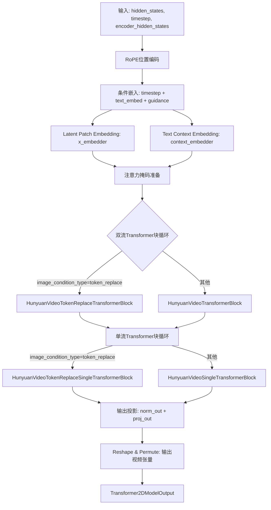
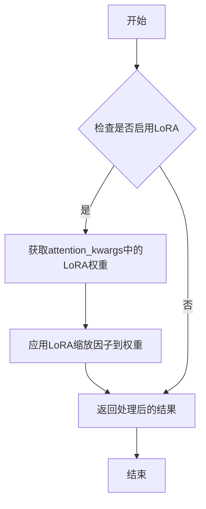
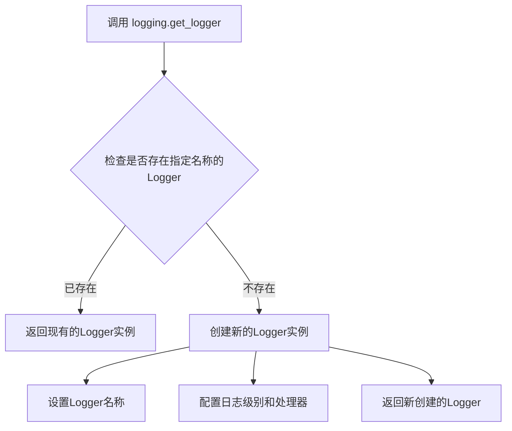
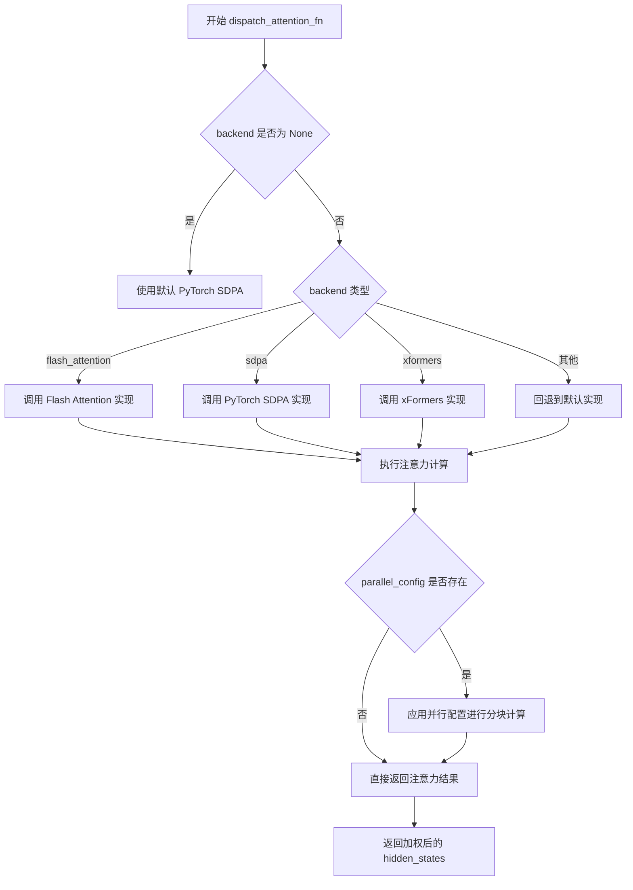
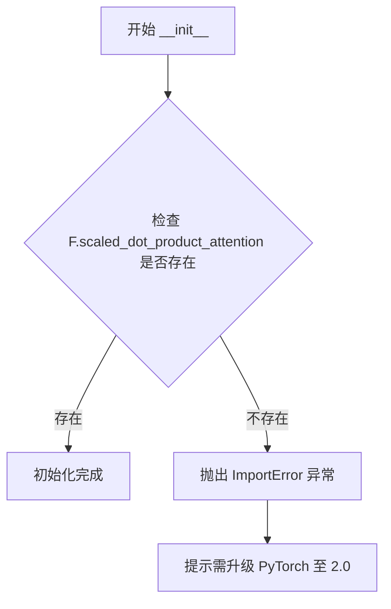
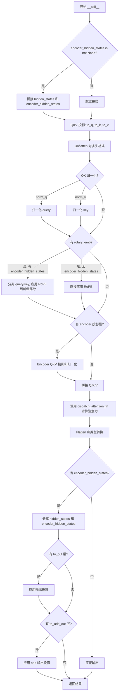
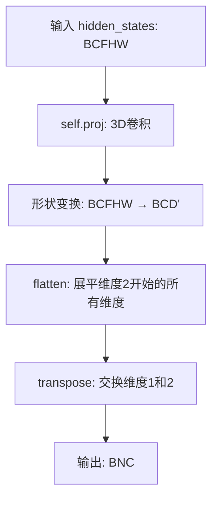
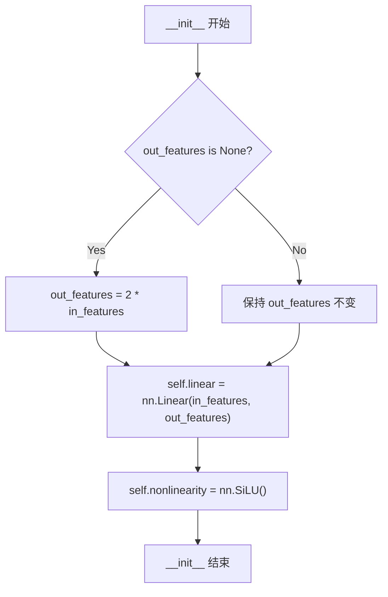
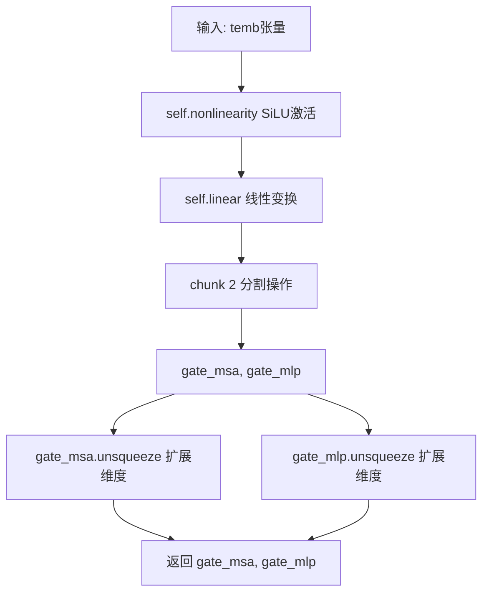
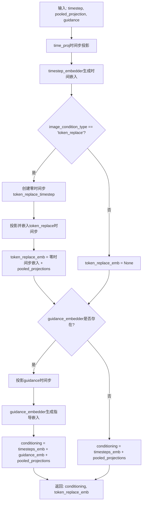

# `diffusers\src\diffusers\models\transformers\transformer_hunyuan_video.py` 详细设计文档

HunyuanVideoTransformer3DModel 是腾讯混元视频生成模型的核心Transformer实现，支持视频数据的时空建模。该模型采用双流（dual-stream）和单流（single-stream）Transformer块结构，通过RoPE位置编码、文本条件嵌入和自适应归一化技术，实现高质量的视频生成能力。

## 整体流程



## 类结构

```
HunyuanVideoTransformer3DModel (主模型类)
├── HunyuanVideoPatchEmbed (Latent嵌入)
├── HunyuanVideoTokenRefiner (文本条件处理)
│   └── HunyuanVideoIndividualTokenRefiner
│       └── HunyuanVideoIndividualTokenRefinerBlock
├── HunyuanVideoConditionEmbedding (时间+文本+guidance嵌入)
├── HunyuanVideoRotaryPosEmbed (RoPE位置编码)
├── HunyuanVideoTransformerBlock (双流变换块) x num_layers
│   ├── AdaLayerNormZero (主分支归一化)
│   ├── AdaLayerNormZero (上下文分支归一化)
│   ├── Attention (联合注意力)
│   ├── FeedForward (主分支FFN)
│   └── FeedForward (上下文分支FFN)
├── HunyuanVideoSingleTransformerBlock (单流变换块) x num_single_layers
│   ├── AdaLayerNormZeroSingle
│   ├── Attention
│   └── FeedForward
├── HunyuanVideoTokenReplaceTransformerBlock (Token替换双流块) x num_layers
HunyuanVideoTokenReplaceAdaLayerNormZero
        │   ├── Attention
        │   └── FeedForward
        ├── HunyuanVideoTokenReplaceSingleTransformerBlock (Token替换单流块) x num_single_layers
HunyuanVideoTokenReplaceAdaLayerNormZeroSingle
        │   ├── Attention
        │   └── FeedForward
        ├── AdaLayerNormContinuous (输出归一化)
└── nn.Linear (输出投影)
```

## 全局变量及字段


### `logger`
    
模块级别的日志记录器，用于输出调试和信息日志

类型：`logging.Logger`
    


### `supported_image_condition_types`
    
支持的图像条件类型列表，包含'latent_concat'和'token_replace'两种模式

类型：`list[str]`
    


### `HunyuanVideoAttnProcessor2_0._attention_backend`
    
注意力计算的后端实现，可为None或自定义后端

类型：`Any | None`
    


### `HunyuanVideoAttnProcessor2_0._parallel_config`
    
并行计算配置参数，用于控制分布式计算行为

类型：`Any | None`
    


### `HunyuanVideoPatchEmbed.proj`
    
三维卷积层，用于将输入视频转换为补丁嵌入

类型：`nn.Conv3d`
    


### `HunyuanVideoAdaNorm.linear`
    
线性层，用于计算AdaNorm的门控参数

类型：`nn.Linear`
    


### `HunyuanVideoAdaNorm.nonlinearity`
    
SiLU激活函数，用于引入非线性变换

类型：`nn.SiLU`
    


### `HunyuanVideoTokenReplaceAdaLayerNormZero.silu`
    
SiLU激活函数，用于Token替换的AdaLayerNorm

类型：`nn.SiLU`
    


### `HunyuanVideoTokenReplaceAdaLayerNormZero.linear`
    
线性层，用于计算Token替换的6个调制参数

类型：`nn.Linear`
    


### `HunyuanVideoTokenReplaceAdaLayerNormZero.norm`
    
层归一化模块，支持LayerNorm和FP32LayerNorm两种模式

类型：`nn.LayerNorm | FP32LayerNorm`
    


### `HunyuanVideoTokenReplaceAdaLayerNormZeroSingle.silu`
    
SiLU激活函数，用于单流Token替换的AdaLayerNorm

类型：`nn.SiLU`
    


### `HunyuanVideoTokenReplaceAdaLayerNormZeroSingle.linear`
    
线性层，用于计算单流Token替换的3个调制参数

类型：`nn.Linear`
    


### `HunyuanVideoTokenReplaceAdaLayerNormZeroSingle.norm`
    
层归一化模块，用于单流Transformer块的输入归一化

类型：`nn.LayerNorm`
    


### `HunyuanVideoConditionEmbedding.image_condition_type`
    
图像条件类型，指定使用'latent_concat'或'token_replace'模式

类型：`str | None`
    


### `HunyuanVideoConditionEmbedding.time_proj`
    
时间步投影器，将时间步转换为嵌入向量

类型：`Timesteps`
    


### `HunyuanVideoConditionEmbedding.timestep_embedder`
    
时间步嵌入器，将投影后的时间步转换为高维嵌入

类型：`TimestepEmbedding`
    


### `HunyuanVideoConditionEmbedding.text_embedder`
    
文本投影器，将池化的文本投影转换为条件嵌入

类型：`PixArtAlphaTextProjection`
    


### `HunyuanVideoConditionEmbedding.guidance_embedder`
    
引导嵌入器，用于无分类器引导训练，可为None

类型：`TimestepEmbedding | None`
    


### `HunyuanVideoIndividualTokenRefinerBlock.norm1`
    
第一个层归一化，用于注意力机制前的输入归一化

类型：`nn.LayerNorm`
    


### `HunyuanVideoIndividualTokenRefinerBlock.attn`
    
自注意力模块，用于Token细化的自注意力计算

类型：`Attention`
    


### `HunyuanVideoIndividualTokenRefinerBlock.norm2`
    
第二个层归一化，用于前馈网络前的输入归一化

类型：`nn.LayerNorm`
    


### `HunyuanVideoIndividualTokenRefinerBlock.ff`
    
前馈网络模块，用于Token特征的进一步变换

类型：`FeedForward`
    


### `HunyuanVideoIndividualTokenRefinerBlock.norm_out`
    
AdaNorm输出层，用于计算门控信号

类型：`HunyuanVideoAdaNorm`
    


### `HunyuanVideoIndividualTokenRefiner.refiner_blocks`
    
Token细化块列表，包含多个细化块组成深度网络

类型：`nn.ModuleList`
    


### `HunyuanVideoTokenRefiner.time_text_embed`
    
时间文本联合嵌入层，将时间步和池化投影组合

类型：`CombinedTimestepTextProjEmbeddings`
    


### `HunyuanVideoTokenRefiner.proj_in`
    
输入投影层，将输入特征映射到隐藏空间

类型：`nn.Linear`
    


### `HunyuanVideoTokenRefiner.token_refiner`
    
Token细化器，包含多个细化块进行迭代细化

类型：`HunyuanVideoIndividualTokenRefiner`
    


### `HunyuanVideoRotaryPosEmbed.patch_size`
    
空间补丁大小，用于计算RoPE网格

类型：`int`
    


### `HunyuanVideoRotaryPosEmbed.patch_size_t`
    
时间补丁大小，用于计算RoPE网格

类型：`int`
    


### `HunyuanVideoRotaryPosEmbed.rope_dim`
    
RoPE维度列表，指定各轴的旋转位置编码维度

类型：`list[int]`
    


### `HunyuanVideoRotaryPosEmbed.theta`
    
旋转位置编码的基础频率参数

类型：`float`
    


### `HunyuanVideoSingleTransformerBlock.attn`
    
单流注意力模块，处理 latent 序列

类型：`Attention`
    


### `HunyuanVideoSingleTransformerBlock.norm`
    
AdaLayerNorm单流归一化，用于输入调制

类型：`AdaLayerNormZeroSingle`
    


### `HunyuanVideoSingleTransformerBlock.proj_mlp`
    
MLP投影层，将隐藏状态映射到MLP维度

类型：`nn.Linear`
    


### `HunyuanVideoSingleTransformerBlock.act_mlp`
    
MLP激活函数，使用GELU近似

类型：`nn.GELU`
    


### `HunyuanVideoSingleTransformerBlock.proj_out`
    
输出投影层，将MLP输出合并回隐藏空间

类型：`nn.Linear`
    


### `HunyuanVideoTransformerBlock.norm1`
    
第一AdaLayerNorm，用于latent流的归一化和门控

类型：`AdaLayerNormZero`
    


### `HunyuanVideoTransformerBlock.norm1_context`
    
第一AdaLayerNorm用于context流的归一化和门控

类型：`AdaLayerNormZero`
    


### `HunyuanVideoTransformerBlock.attn`
    
联合注意力模块，处理latent和context的交叉注意力

类型：`Attention`
    


### `HunyuanVideoTransformerBlock.norm2`
    
第二层归一化，用于latent流FFN前归一化

类型：`nn.LayerNorm`
    


### `HunyuanVideoTransformerBlock.ff`
    
前馈网络，用于latent流的特征变换

类型：`FeedForward`
    


### `HunyuanVideoTransformerBlock.norm2_context`
    
第二层归一化，用于context流FFN前归一化

类型：`nn.LayerNorm`
    


### `HunyuanVideoTransformerBlock.ff_context`
    
前馈网络，用于context流的特征变换

类型：`FeedForward`
    


### `HunyuanVideoTokenReplaceSingleTransformerBlock.attn`
    
单流注意力模块，支持Token替换功能

类型：`Attention`
    


### `HunyuanVideoTokenReplaceSingleTransformerBlock.norm`
    
Token替换专用AdaLayerNorm，支持双路径调制

类型：`HunyuanVideoTokenReplaceAdaLayerNormZeroSingle`
    


### `HunyuanVideoTokenReplaceSingleTransformerBlock.proj_mlp`
    
MLP投影层，将隐藏状态映射到MLP维度

类型：`nn.Linear`
    


### `HunyuanVideoTokenReplaceSingleTransformerBlock.act_mlp`
    
MLP激活函数，使用GELU近似

类型：`nn.GELU`
    


### `HunyuanVideoTokenReplaceSingleTransformerBlock.proj_out`
    
输出投影层，将MLP输出合并回隐藏空间

类型：`nn.Linear`
    


### `HunyuanVideoTokenReplaceTransformerBlock.norm1`
    
Token替换专用AdaLayerNorm，支持双路径门控

类型：`HunyuanVideoTokenReplaceAdaLayerNormZero`
    


### `HunyuanVideoTokenReplaceTransformerBlock.norm1_context`
    
Context流的AdaLayerNorm，用于联合注意力

类型：`AdaLayerNormZero`
    


### `HunyuanVideoTokenReplaceTransformerBlock.attn`
    
联合注意力模块，支持Token替换的交叉注意力

类型：`Attention`
    


### `HunyuanVideoTokenReplaceTransformerBlock.norm2`
    
第二层归一化，用于latent流FFN前归一化

类型：`nn.LayerNorm`
    


### `HunyuanVideoTokenReplaceTransformerBlock.ff`
    
前馈网络，用于latent流的特征变换

类型：`FeedForward`
    


### `HunyuanVideoTokenReplaceTransformerBlock.norm2_context`
    
第二层归一化，用于context流FFN前归一化

类型：`nn.LayerNorm`
    


### `HunyuanVideoTokenReplaceTransformerBlock.ff_context`
    
前馈网络，用于context流的特征变换

类型：`FeedForward`
    


### `HunyuanVideoTransformer3DModel.x_embedder`
    
输入补丁嵌入层，将3D视频转换为补丁序列

类型：`HunyuanVideoPatchEmbed`
    


### `HunyuanVideoTransformer3DModel.context_embedder`
    
文本上下文嵌入器，对文本特征进行细化

类型：`HunyuanVideoTokenRefiner`
    


### `HunyuanVideoTransformer3DModel.time_text_embed`
    
时间文本条件嵌入层，生成调制向量

类型：`HunyuanVideoConditionEmbedding`
    


### `HunyuanVideoTransformer3DModel.rope`
    
旋转位置嵌入模块，用于3D视频的位置编码

类型：`HunyuanVideoRotaryPosEmbed`
    


### `HunyuanVideoTransformer3DModel.transformer_blocks`
    
双流Transformer块列表，处理latent和context的联合注意力

类型：`nn.ModuleList`
    


### `HunyuanVideoTransformer3DModel.single_transformer_blocks`
    
单流Transformer块列表，仅处理latent序列

类型：`nn.ModuleList`
    


### `HunyuanVideoTransformer3DModel.norm_out`
    
输出归一化层，用于最终输出前的特征归一化

类型：`AdaLayerNormContinuous`
    


### `HunyuanVideoTransformer3DModel.proj_out`
    
输出投影层，将隐藏状态映射回像素空间

类型：`nn.Linear`
    


### `HunyuanVideoTransformer3DModel.gradient_checkpointing`
    
梯度检查点标志，用于节省显存以支持更长序列

类型：`bool`
    
    

## 全局函数及方法


### `apply_lora_scale`

该函数是diffusers库中的一个装饰器函数，用于在模型前向传播过程中对LoRA（Low-Rank Adaptation）权重进行缩放处理。它接收一个字符串参数指定要处理的参数名称，并自动应用LoRA缩放因子。

参数：

- `weight`: `str`，装饰器参数，指定要应用LoRA缩放的参数名称（这里是"attention_kwargs"）

返回值：`Callable`，返回一个装饰器函数，用于装饰目标函数或方法

#### 流程图



#### 带注释源码

```python
# apply_lora_scale 是从 diffusers 库 utils 模块导入的装饰器函数
# 使用方式：@apply_lora_scale("attention_kwargs")
# 作用：在模型前向传播时自动对 LoRA 权重进行缩放处理
#
# 源代码位于 diffusers 库中，基本结构类似于：
#
# def apply_lora_scale(weight: str):
#     """
#     Decorator to apply LoRA scale to specified attention kwargs.
#     
#     Args:
#         weight: The parameter name whose LoRA weights should be scaled
#     """
#     def decorator(func):
#         @functools.wraps(func)
#         def wrapper(*args, **kwargs):
#             # 获取原始函数返回结果
#             output = func(*args, **kwargs)
#             
#             # 如果提供了 attention_kwargs，则应用 LoRA 缩放
#             if weight in kwargs and kwargs[weight] is not None:
#                 attention_kwargs = kwargs[weight]
#                 # 从 attention_kwargs 中获取 LoRA 缩放因子
#                 # 并应用到相应的权重上
#                 scale = attention_kwargs.get("scale", 1.0)
#                 # LoRA 权重会在模型内部自动应用此缩放因子
#             
#             return output
#         return wrapper
#     return decorator
#
# 在 HunyuanVideoTransformer3DModel 中的使用示例：
# @apply_lora_scale("attention_kwargs")
# def forward(
#     self,
#     hidden_states: torch.Tensor,
#     timestep: torch.LongTensor,
#     encoder_hidden_states: torch.Tensor,
#     encoder_attention_mask: torch.Tensor,
#     pooled_projections: torch.Tensor,
#     guidance: torch.Tensor = None,
#     attention_kwargs: dict[str, Any] | None = None,  # <-- 这里的参数会被LoRA缩放处理
#     return_dict: bool = True,
# ) -> tuple[torch.Tensor] | Transformer2DModelOutput:
#     ...
```


### `logging.get_logger`

获取或创建一个与指定名称关联的日志记录器（Logger），用于在模块中记录日志信息。该函数是diffusers库中封装的日志工具，基于Python标准库的logging模块实现。

参数：

- `name`：`str`，日志记录器的名称，通常传入`__name__`（当前模块的完整路径），用于标识日志来源。

返回值：`logging.Logger`，返回一个日志记录器对象，可用于输出不同级别的日志信息（如debug、info、warning、error、critical等）。

#### 流程图



#### 带注释源码

```python
# 从diffusers库的utils模块导入logging对象
from ...utils import apply_lora_scale, logging

# 使用logging.get_logger创建模块级别的logger
# __name__是Python内置变量，表示当前模块的完整路径（如"HunyuanVideo.transformer"）
# 这样可以方便地在日志中识别日志来源
logger = logging.get_logger(__name__)  # pylint: disable=invalid-name
```

#### 补充说明

| 项目 | 说明 |
|------|------|
| **函数来源** | `diffusers.utils.logging` 模块 |
| **实际调用** | `logging.get_logger(__name__)` |
| **使用场景** | 在模块级别创建Logger，用于记录模型加载、推理过程中的信息 |
| **日志级别设置** | 通常由全局日志配置决定，默认可能为WARNING级别 |
| **线程安全** | 是，logging模块本身是线程安全的 |
| **性能考虑** | Logger对象会被缓存复用，多次调用相同name返回同一实例 |


### `get_1d_rotary_pos_embed`

生成一维旋转位置嵌入（Rotary Position Embedding），用于在模型的注意力机制中引入位置信息。该函数通过三角函数计算给定维度、位置和频率参数下的旋转位置编码，支持实数形式的嵌入表示。

**注意**：此函数在当前代码文件中仅作为导入使用，实际定义位于 `diffusers` 库的其他模块中。以下信息基于代码中的调用方式推断。

参数：

- `dim`：`int`，旋转嵌入的维度
- `grid`：`torch.Tensor`，位置网格值（通常为一维张量）
- `theta`：`float`，角度参数，用于控制频率大小，默认为 256.0
- `use_real`：`bool`，是否使用实数形式的嵌入，默认为 False

返回值：`tuple[torch.Tensor, torch.Tensor]`，返回两个张量 —— 第一个是余弦频率（freqs_cos），第二个是正弦频率（freqs_sin），形状均为 (position_count, dim // 2)

#### 流程图

```mermaid
flowchart TD
    A[开始] --> B[接收参数: dim, grid, theta, use_real]
    B --> C[计算频率因子: 1 / theta^(2i/dim)]
    C --> D[对每个位置计算正弦和余弦值]
    D --> E[拼接为freqs_cos和freqs_sin]
    E --> F[返回元组: freqs_cos, freqs_sin]
```

#### 带注释源码

```python
# 该函数定义在 diffusers 库的 embeddings 模块中
# 当前文件仅导入并使用该函数，未包含其完整实现
# 以下为基于代码调用方式的推断性注释

def get_1d_rotary_pos_embed(
    dim: int,
    grid: torch.Tensor,
    theta: float = 256.0,
    use_real: bool = False
) -> tuple[torch.Tensor, torch.Tensor]:
    """
    生成一维旋转位置嵌入
    
    参数:
        dim: 嵌入维度（应为偶数）
        grid: 位置索引张量，形状为 (num_positions,)
        theta: 频率基础参数，默认256.0
        use_real: 是否使用实数形式（某些实现会返回复数的实部和虚部）
    
    返回:
        (cos_embed, sin_embed): 余弦和正弦位置编码
    """
    # 位置数量
    num_positions = grid.shape[0]
    
    # 频率因子计算: theta^(-2i/dim) for i in [0, dim/2)
    # 生成维度为 dim//2 的频率数组
    freqs = 1.0 / (theta ** (torch.arange(0, dim, 2, device=grid.device).float() / dim))
    
    # 计算角度: position * frequency
    angles = grid.unsqueeze(-1) * freqs.unsqueeze(0)
    
    # 计算余弦和正弦
    cos_embed = torch.cos(angles)
    sin_embed = torch.sin(angles)
    
    # 展平为 (num_positions, dim//2) 形状
    return cos_embed, sin_embed


# 在 HunyuanVideoRotaryPosEmbed 中的调用示例
# for i in range(3):
#     freq = get_1d_rotary_pos_embed(self.rope_dim[i], grid[i].reshape(-1), self.theta, use_real=True)
#     freqs.append(freq)
# freqs_cos = torch.cat([f[0] for f in freqs], dim=1)
# freqs_sin = torch.cat([f[1] for f in freqs], dim=1)
```


### `apply_rotary_emb`

该函数用于将旋转位置编码（Rotary Position Embedding, RoPE）应用于查询（Query）和键（Key）张量，以引入相对位置信息。这是Transformer模型中常用的一种位置编码方法，能够在不引入额外可学习参数的情况下增强模型对位置关系的理解。

参数：

-  `x`：`torch.Tensor`，需要进行旋转位置编码的 Query 或 Key 张量，形状通常为 `(batch, heads, seq_len, head_dim)`。
-  `freqs_cis`：`torch.Tensor | tuple[torch.Tensor, torch.Tensor]`（在 HunyuanVideo 中为 `image_rotary_emb`），预计算的旋转频率编码，通常为 `(cos, sin)` 元组形式，形状为 `(seq_len, head_dim // 2)`。
-  `sequence_dim`：`int`（可选，默认为 1），表示在张量的哪个维度上应用旋转编码，通常对应序列维度。

返回值：`torch.Tensor`，返回应用了旋转位置编码后的张量，形状与输入 `x` 相同。

#### 流程图

```mermaid
flowchart TD
    A[输入: x, freqs_cis, sequence_dim] --> B{检查输入类型}
    B -->|tuple| C[解包: cos, sin]
    B -->|tensor| D[直接使用]
    C --> E[确定序列长度]
    D --> E
    E --> F[计算旋转角度: x * cos + rotate_half(x) * sin]
    F --> G[返回编码后的张量]
```

#### 带注释源码

```
# 注意: 该函数的具体实现位于 diffusers/src/diffusers/models/embeddings.py 中
# 以下为基于 HunyuanVideo 中使用方式的推断性注释源码

def apply_rotary_emb(
    x: torch.Tensor,
    freqs_cis: torch.Tensor | tuple[torch.Tensor, torch.Tensor],
    sequence_dim: int = 1,
) -> torch.Tensor:
    """
    将旋转位置编码应用于输入张量 x。
    
    Args:
        x: 输入张量，形状为 (batch, heads, seq_len, head_dim)
        freqs_cis: 预计算的旋转频率，形状为 (seq_len, head_dim // 2) 的 (cos, sin) 元组
        sequence_dim: 应用旋转的维度，通常为序列维度 (默认为 1)
    
    Returns:
        应用了旋转位置编码的张量
    """
    # 1. 处理频率编码 (可能传入 tuple 或单个 tensor)
    if isinstance(freqs_cis, tuple):
        cos, sin = freqs_cis
    else:
        cos = freqs_cis
        sin = freqs_cis
    
    # 2. 获取序列维度的索引并扩展频率编码以匹配输入形状
    # 假设 sequence_dim=1 (heads 维度之后)
    # 使用 torch.cat 扩展频率编码以匹配批量大小
    
    # 3. 核心旋转操作: x_rot = x * cos + rotate_half(x) * sin
    # rotate_half 函数将输入张量的后半部分取负，实现复数乘法效果
    # 这对应于欧拉公式: e^(iθ) = cos(θ) + i*sin(θ)
    
    # 4. 返回编码后的张量
    return x_rot
```


### dispatch_attention_fn

该函数是注意力计算的分发器，根据配置的 backend（后端）选择合适的注意力实现方式（如 PyTorch SDPA、Flash Attention 等），对 query、key、value 进行注意力计算并返回加权后的 hidden states。

参数：

- `query`：`torch.Tensor`，经过 QKV 投影和 unflatten 后的 query 张量，形状为 `[batch_size, num_heads, seq_len, head_dim]`
- `key`：`torch.Tensor`，经过 QKV 投影和 unflatten 后的 key 张量，形状与 query 相同
- `value`：`torch.Tensor`，经过 QKV 投影和 unflatten 后的 value 张量，形状与 query 相同
- `attn_mask`：`torch.Tensor | None`，注意力掩码，用于控制哪些位置可以attend到哪些位置
- `dropout_p`：`float`，注意力 dropout 概率，此处传入 `0.0`
- `is_causal`：`bool`，是否使用因果注意力，此处传入 `False`
- `backend`：`Any | None`，指定使用的注意力后端实现（如 "flash_attention"、"sdpa" 等）
- `parallel_config`：`Any | None`，并行配置，用于分布式训练时的并行注意力计算

返回值：`torch.Tensor`，经过注意力计算后的 hidden states，形状为 `[batch_size, num_heads, seq_len, head_dim]`

#### 流程图



#### 带注释源码

```python
# 该函数定义在 diffusers 库的 attention_dispatch 模块中
# 以下为调用处的源码分析

# 5. Attention - 调用 dispatch_attention_fn 进行注意力计算
hidden_states = dispatch_attention_fn(
    query,                              # Query 张量 [B, H, N, D]
    key,                                # Key 张量 [B, H, N, D]
    value,                              # Value 张量 [B, H, N, D]
    attn_mask=attention_mask,           # 注意力掩码 [B, 1, 1, N] 或 None
    dropout_p=0.0,                      # Dropout 概率，0.0 表示不使用 dropout
    is_causal=False,                    # 是否因果注意力，False 表示双向注意力
    backend=self._attention_backend,    # 注意力后端实现
    parallel_config=self._parallel_config,  # 并行配置
)
# 返回的 hidden_states 形状为 [B, H, N, D]
hidden_states = hidden_states.flatten(2, 3)  # 恢复形状为 [B, N, H*D]
hidden_states = hidden_states.to(query.dtype)  # 确保 dtype 一致
```

> **注意**：`dispatch_attention_fn` 函数的完整定义位于 `diffusers` 库的 `attention_dispatch` 模块中，属于外部依赖。从代码调用可以看出，它是一个基于后端动态分发注意力计算策略的函数，支持多种注意力实现（PyTorch SDPA、Flash Attention、xFormers 等），并支持并行配置以优化分布式训练场景。


### `HunyuanVideoAttnProcessor2_0.__init__`

该方法是 HunyuanVideo 模型的注意力处理器类的初始化函数，主要用于检查 PyTorch 版本是否满足要求（需支持 `scaled_dot_product_attention`），以确保后续注意力计算能正常运行。

参数：无（仅包含隐含的 `self` 参数）

返回值：`None`，无返回值

#### 流程图



#### 带注释源码

```python
def __init__(self):
    # 检查 PyTorch 是否具备 scaled_dot_product_attention 函数
    # 该函数是 PyTorch 2.0 引入的高效注意力计算实现
    if not hasattr(F, "scaled_dot_product_attention"):
        # 如果不支持，抛出导入错误并提示用户升级 PyTorch
        raise ImportError(
            "HunyuanVideoAttnProcessor2_0 requires PyTorch 2.0. To use it, please upgrade PyTorch to 2.0."
        )
```


### HunyuanVideoAttnProcessor2_0.__call__

该方法是 HunyuanVideo 模型的注意力处理器实现，核心功能是执行自注意力机制，支持交叉注意力处理编码器隐藏状态，并应用旋转位置嵌入（RoPE）来增强位置信息。该处理器通过 QKV 投影、归一化、注意力计算和输出投影等步骤，完成隐藏状态的注意力特征提取。

参数：

- `self`：隐式参数，HunyuanVideoAttnProcessor2_0 实例本身
- `attn`：`Attention`，注意力模块实例，包含 Q/K/V 投影层和归一化层
- `hidden_states`：`torch.Tensor`，输入的隐藏状态张量，形状为 (batch, seq_len, hidden_dim)
- `encoder_hidden_states`：`torch.Tensor | None`，编码器隐藏状态，用于交叉注意力，默认为 None
- `attention_mask`：`torch.Tensor | None`，注意力掩码，用于控制注意力计算范围，默认为 None
- `image_rotary_emb`：`torch.Tensor | None`，图像旋转位置嵌入，用于增强位置信息，默认为 None

返回值：`tuple[torch.Tensor, torch.Tensor]`，返回处理后的隐藏状态和编码器隐藏状态元组

#### 流程图



#### 带注释源码

```python
def __call__(
    self,
    attn: Attention,
    hidden_states: torch.Tensor,
    encoder_hidden_states: torch.Tensor | None = None,
    attention_mask: torch.Tensor | None = None,
    image_rotary_emb: torch.Tensor | None = None,
) -> torch.Tensor:
    # 如果存在编码器隐藏状态且注意力模块没有额外的Q投影层，则将隐藏状态与编码器隐藏状态沿序列维度拼接
    if attn.add_q_proj is None and encoder_hidden_states is not None:
        hidden_states = torch.cat([hidden_states, encoder_hidden_states], dim=1)

    # ========== 1. QKV 投影 ==========
    # 使用注意力模块的投影层对隐藏状态进行线性变换，得到 Query、Key、Value
    query = attn.to_q(hidden_states)
    key = attn.to_k(hidden_states)
    value = attn.to_v(hidden_states)

    # 将 QKV 张量从 (batch, seq, hidden) 展开为 (batch, heads, seq, head_dim)
    query = query.unflatten(2, (attn.heads, -1))
    key = key.unflatten(2, (attn.heads, -1))
    value = value.unflatten(2, (attn.heads, -1))

    # ========== 2. QK 归一化 ==========
    # 对 Query 和 Key 分别进行归一化（如果定义了归一化层）
    if attn.norm_q is not None:
        query = attn.norm_q(query)
    if attn.norm_k is not None:
        key = attn.norm_k(key)

    # ========== 3. 应用旋转位置嵌入 (RoPE) ==========
    # 如果提供了旋转嵌入，则对 query 和 key 应用旋转位置编码
    if image_rotary_emb is not None:
        from ..embeddings import apply_rotary_emb

        # 处理同时存在编码器隐藏状态的情况：分离latent和encoder部分，分别应用RoPE
        if attn.add_q_proj is None and encoder_hidden_states is not None:
            # 对 latent 部分的 query 应用 RoPE
            query = torch.cat(
                [
                    apply_rotary_emb(
                        query[:, : -encoder_hidden_states.shape[1]],  # latent 部分
                        image_rotary_emb,
                        sequence_dim=1,
                    ),
                    query[:, -encoder_hidden_states.shape[1] :],   # encoder 部分保持不变
                ],
                dim=1,
            )
            # 对 latent 部分的 key 应用 RoPE
            key = torch.cat(
                [
                    apply_rotary_emb(
                        key[:, : -encoder_hidden_states.shape[1]],
                        image_rotary_emb,
                        sequence_dim=1,
                    ),
                    key[:, -encoder_hidden_states.shape[1] :],
                ],
                dim=1,
            )
        else:
            # 直接对整个 query 和 key 应用 RoPE
            query = apply_rotary_emb(query, image_rotary_emb, sequence_dim=1)
            key = apply_rotary_emb(key, image_rotary_emb, sequence_dim=1)

    # ========== 4. 编码器条件的 QKV 投影和归一化 ==========
    # 如果注意力模块有额外的投影层且提供了编码器隐藏状态
    if attn.add_q_proj is not None and encoder_hidden_states is not None:
        # 对编码器隐藏状态进行额外的 QKV 投影
        encoder_query = attn.add_q_proj(encoder_hidden_states)
        encoder_key = attn.add_k_proj(encoder_hidden_states)
        encoder_value = attn.add_v_proj(encoder_hidden_states)

        # 展开为多头格式
        encoder_query = encoder_query.unflatten(2, (attn.heads, -1))
        encoder_key = encoder_key.unflatten(2, (attn.heads, -1))
        encoder_value = encoder_value.unflatten(2, (attn.heads, -1))

        # 对编码器的 query 和 key 进行归一化
        if attn.norm_added_q is not None:
            encoder_query = attn.norm_added_q(encoder_query)
        if attn.norm_added_k is not None:
            encoder_key = attn.norm_added_k(encoder_key)

        # 将编码器的 QKV 拼接到主 QKV 后面
        query = torch.cat([query, encoder_query], dim=1)
        key = torch.cat([key, encoder_key], dim=1)
        value = torch.cat([value, encoder_value], dim=1)

    # ========== 5. 注意力计算 ==========
    # 调用分发的注意力函数进行实际的注意力计算
    hidden_states = dispatch_attention_fn(
        query,
        key,
        value,
        attn_mask=attention_mask,
        dropout_p=0.0,
        is_causal=False,
        backend=self._attention_backend,
        parallel_config=self._parallel_config,
    )
    # 将注意力输出从 (batch, heads, seq, head_dim) 展平为 (batch, seq, hidden)
    hidden_states = hidden_states.flatten(2, 3)
    hidden_states = hidden_states.to(query.dtype)

    # ========== 6. 输出投影 ==========
    # 如果存在编码器隐藏状态，需要分离出 latent 和 encoder 部分
    if encoder_hidden_states is not None:
        hidden_states, encoder_hidden_states = (
            hidden_states[:, : -encoder_hidden_states.shape[1]],
            hidden_states[:, -encoder_hidden_states.shape[1] :],
        )

        # 对 latent 部分应用输出投影（如果存在）
        if getattr(attn, "to_out", None) is not None:
            hidden_states = attn.to_out[0](hidden_states)
            hidden_states = attn.to_out[1](hidden_states)

        # 对 encoder 部分应用额外输出投影（如果存在）
        if getattr(attn, "to_add_out", None) is not None:
            encoder_hidden_states = attn.to_add_out(encoder_hidden_states)

    # 返回处理后的隐藏状态和编码器隐藏状态
    return hidden_states, encoder_hidden_states
```


### HunyuanVideoPatchEmbed.__init__

该方法用于初始化 `HunyuanVideoPatchEmbed` 类，并在模块内部创建一个 3D 卷积层 (`self.proj`)，用于将输入的视频张量（包含时间、空间维度的通道）转换为 patches 嵌入向量。

参数：

- `self`：`HunyuanVideoPatchEmbed`，类的实例对象。
- `patch_size`：`int | tuple[int, int, int]`，默认为 16。指定 3D 卷积核在时间(T)、高度(H)、宽度(W) 维度上的大小。如果传入整数，则自动转换为三元组 `(patch_size, patch_size, patch_size)`。
- `in_chans`：`int`，默认为 3。输入视频数据的通道数（例如 RGB 视频为 3）。
- `embed_dim`：`int`，默认为 768。输出嵌入向量的维度，即每个 patch 对应的特征维度。

返回值：`None`，无返回值，用于执行初始化逻辑。

#### 流程图

```mermaid
graph TD
    A([Start __init__]) --> B[调用 super().__init__ 初始化父模块]
    B --> C{判断 patch_size 是否为整数}
    C -->|是| D[将 patch_size 扩展为 (p, p, p) 三元组]
    C -->|否| E[保持 patch_size 为传入的元组]
    D --> F[创建 self.proj: nn.Conv3d(in_chans, embed_dim, kernel_size=patch_size, stride=patch_size)]
    E --> F
    F --> G([End __init__])
```

#### 带注释源码

```python
def __init__(
    self,
    patch_size: int | tuple[int, int, int] = 16,
    in_chans: int = 3,
    embed_dim: int = 768,
) -> None:
    # 调用 nn.Module 的初始化方法，注册内部模块
    super().__init__()

    # 如果 patch_size 是整数，则将其转换为 (T, H, W) 三个维度相同的元组
    patch_size = (patch_size, patch_size, patch_size) if isinstance(patch_size, int) else patch_size
    
    # 初始化 3D 卷积层，用于将输入视频划分为 patches 并进行线性投影
    # kernel_size 和 stride 设为 patch_size，实现非重叠的分块操作
    self.proj = nn.Conv3d(in_chans, embed_dim, kernel_size=patch_size, stride=patch_size)
```


### HunyuanVideoPatchEmbed.forward

该方法实现视频/图像到patch嵌入的转换功能。通过3D卷积层将输入的5D张量（批次、通道、时间帧、高度、宽度）按指定的patch大小进行空间和时间维度的分割，然后进行维度重排得到序列形式的token嵌入。

参数：

- `hidden_states`：`torch.Tensor`，输入的隐藏状态张量，形状为 (B, C, F, H, W)，其中 B 是批次大小，C 是通道数，F 是帧数，H 是高度，W 是宽度

返回值：`torch.Tensor`，输出的patch嵌入张量，形状为 (B, N, D)，其中 N 是 patch 数量（(F/p_t) × (H/p) × (W/p)），D 是嵌入维度

#### 流程图



#### 带注释源码

```python
def forward(self, hidden_states: torch.Tensor) -> torch.Tensor:
    # 使用3D卷积进行patch嵌入
    # 输入形状: (B, C, F, H, W) - 批次, 通道, 帧, 高度, 宽度
    # 输出形状: (B, embed_dim, F', H', W') - F'=F/patch_size_t, H'=H/patch_size, W'=W/patch_size
    hidden_states = self.proj(hidden_states)
    
    # 维度重排: (B, embed_dim, F', H', W') → (B, C', F'*H'*W')
    # flatten(2) 从第2维开始展平，即把空间和时间维度展平为单个维度
    # transpose(1, 2) 将维度从 (B, C', N) 转换为 (B, N, C')
    # 最终形状: (B, N, embed_dim) - 批次, patch序列长度, 嵌入维度
    hidden_states = hidden_states.flatten(2).transpose(1, 2)  # BCFHW -> BNC
    
    return hidden_states
```


### `HunyuanVideoAdaNorm.__init__`

这是 HunyuanVideoAdaNorm 类的初始化方法，用于创建自适应层归一化（AdaNorm）模块。该模块通过线性变换和 SiLU 激活函数生成门控参数，用于动态调节注意力机制和前馈网络的输出。默认情况下，输出维度是输入维度的两倍，以生成 MSA 门控和 MLP 门控参数。

参数：

- `in_features`：`int`，输入特征的维度
- `out_features`：`int | None`，输出特征的维度，默认为 `None`。当为 `None` 时，自动设置为 `2 * in_features`

返回值：`None`，此为构造函数，不返回任何值

#### 流程图



#### 带注释源码

```python
class HunyuanVideoAdaNorm(nn.Module):
    def __init__(self, in_features: int, out_features: int | None = None) -> None:
        """
        初始化 HunyuanVideoAdaNorm 模块。
        
        参数:
            in_features: 输入特征的维度
            out_features: 输出特征的维度，默认为 None（此时设为 2 * in_features）
        """
        # 调用父类 nn.Module 的初始化方法
        super().__init__()

        # 如果未指定输出维度，则默认为输入维度的 2 倍
        # 这样可以生成两组门控参数（gate_msa 和 gate_mlp）
        out_features = out_features or 2 * in_features
        
        # 创建一个线性层，用于将输入特征映射到输出特征空间
        # 输入: [batch, seq_len, in_features]
        # 输出: [batch, seq_len, out_features]
        self.linear = nn.Linear(in_features, out_features)
        
        # 定义非线性激活函数（SiLU / Swish）
        # SiLU(x) = x * sigmoid(x)
        self.nonlinearity = nn.SiLU()
```


### HunyuanVideoAdaNorm.forward

该方法实现了自适应层归一化的核心逻辑，接收时间嵌入（temb）经过线性变换和SiLU激活后，通过chunk操作分离出用于调制多头注意力（gate_msa）和前馈网络（gate_mlp）的门控参数，并将这两个门控向量扩展维度后返回，用于后续Transformer模块的残差连接和特征调制。

参数：

- `self`：HunyuanVideoAdaNorm类实例
- `temb`：`torch.Tensor`，时间嵌入张量，通常来自TimestepEmbedding，包含了用于调制模型行为的时间步信息

返回值：`tuple[torch.Tensor, torch.Tensor]`，返回两个门控向量——gate_msa用于调制多头注意力机制的输出，gate_mlp用于调制前馈网络的输出，两者均经过unsqueeze(1)操作以适配后续的广播乘法

#### 流程图



#### 带注释源码

```python
def forward(
    self, temb: torch.Tensor
) -> tuple[torch.Tensor, torch.Tensor, torch.Tensor, torch.Tensor, torch.Tensor]:
    """
    自适应归一化的前向传播
    
    参数:
        temb: 时间嵌入张量，包含了从TimestepEmbedding生成的时间步信息
        
    返回:
        gate_msa: 用于调制多头注意力输出的门控向量
        gate_mlp: 用于调制前馈网络输出的门控向量
    """
    # 1. 线性变换 + SiLU激活
    # 将输入的时间嵌入投影到2倍维度的空间，然后应用SiLU非线性激活
    temb = self.linear(self.nonlinearity(temb))
    
    # 2. 分割门控参数
    # 将激活后的张量沿通道维度均分为两部分
    # 前半部分用于注意力门控，后半部分用于MLP门控
    gate_msa, gate_mlp = temb.chunk(2, dim=1)
    
    # 3. 扩展维度以便广播
    # 在第1维（序列维度）添加维度，使gate向量可以与hidden states进行广播乘法
    # 例如：gate_msa shape: [B, 1, C] 可以与 [B, N, C] 的hidden states进行逐元素乘法
    gate_msa, gate_mlp = gate_msa.unsqueeze(1), gate_mlp.unsqueeze(1)
    
    # 4. 返回门控向量
    # 注意：类型注解声明返回5个张量，但实际只返回2个，存在类型标注不一致
    return gate_msa, gate_mlp
```


### `HunyuanVideoTokenReplaceAdaLayerNormZero.__init__`

该方法是 `HunyuanVideoTokenReplaceAdaLayerNormZero` 类的构造函数，用于初始化一个支持 Token Replace 机制的自适应层归一化模块。该模块在鸿鹄视频Transformer模型中用于对隐藏状态进行归一化，并生成用于注意力机制和MLP的调制参数（shift、scale、gate）。

参数：

- `self`：隐式参数，`HunyuanVideoTokenReplaceAdaLayerNormZero` 类的实例
- `embedding_dim`：`int`，嵌入维度，指定输入特征的维度
- `norm_type`：`str`，归一化类型，默认为 `"layer_norm"`，支持 `"layer_norm"` 和 `"fp32_layer_norm"` 两种
- `bias`：`bool`，是否使用偏置，默认为 `True`

返回值：`None`，该方法为构造函数，不返回任何值

#### 流程图

```mermaid
flowchart TD
    A[开始 __init__] --> B[调用 super().__init__]
    B --> C[创建 SiLU 激活函数: self.silu = nn.SiLU]
    C --> D[创建线性层: self.linear = nn.Linear<br/>embedding_dim → 6 * embedding_dim]
    D --> E{norm_type == 'layer_norm'?}
    E -->|是| F[创建 LayerNorm: self.norm = nn.LayerNorm<br/>embedding_dim, elementwise_affine=False, eps=1e-6]
    E -->|否| G{norm_type == 'fp32_layer_norm'?}
    G -->|是| H[创建 FP32LayerNorm: self.norm = FP32LayerNorm<br/>embedding_dim, elementwise_affine=False, bias=False]
    G -->|否| I[抛出 ValueError<br/>不支持的 norm_type]
    F --> J[结束 __init__]
    H --> J
    I --> J
```

#### 带注释源码

```python
def __init__(self, embedding_dim: int, norm_type: str = "layer_norm", bias: bool = True):
    """
    初始化 HunyuanVideoTokenReplaceAdaLayerNormZero 模块
    
    参数:
        embedding_dim: 嵌入维度，输入特征的维度
        norm_type: 归一化类型，支持 'layer_norm' 和 'fp32_layer_norm'
        bias: 是否在线性层中使用偏置
    """
    # 调用父类 nn.Module 的初始化方法
    super().__init__()

    # 1. 创建 SiLU 激活函数，用于后续的线性变换
    # SiLU (Sigmoid Linear Unit) 也称为 Swish，公式为 x * sigmoid(x)
    self.silu = nn.SiLU()

    # 2. 创建线性层，将 embedding_dim 映射到 6 * embedding_dim
    # 这个线性层用于生成两组调制参数（每组3个）：
    # - shift_msa, scale_msa, gate_msa: 用于 MSA (Multi-Head Self-Attention) 的调制
    # - shift_mlp, scale_mlp, gate_mlp: 用于 MLP 的调制
    # 第二组参数用于 token replace 机制
    self.linear = nn.Linear(embedding_dim, 6 * embedding_dim, bias=bias)

    # 3. 根据 norm_type 创建归一化层
    if norm_type == "layer_norm":
        # 使用 PyTorch 原生的 LayerNorm
        # elementwise_affine=False 表示不使用可学习的仿射参数（gamma 和 beta）
        # eps=1e-6 用于数值稳定性
        self.norm = nn.LayerNorm(embedding_dim, elementwise_affine=False, eps=1e-6)
    elif norm_type == "fp32_layer_norm":
        # 使用 FP32 精度的 LayerNorm，用于更高精度的计算
        self.norm = FP32LayerNorm(embedding_dim, elementwise_affine=False, bias=False)
    else:
        # 如果提供了不支持的 norm_type，抛出 ValueError
        raise ValueError(
            f"Unsupported `norm_type` ({norm_type}) provided. "
            f"Supported ones are: 'layer_norm', 'fp32_layer_norm'."
        )
```


### `HunyuanVideoTokenReplaceAdaLayerNormZero.forward`

该方法实现了一种特殊的自适应层归一化（AdaLayerNorm），专门用于支持 Token Replace 功能。它接收隐藏状态、时间嵌入和 Token Replace 嵌入，通过分别处理原始帧和第一帧的 token，应用不同的仿射变换（shift/scale/gate），最终返回归一化后的隐藏状态及相关变换参数。

参数：

- `hidden_states`：`torch.Tensor`，输入的隐藏状态张量，形状为 `(batch_size, seq_len, embedding_dim)`
- `emb`：`torch.Tensor`，时间步嵌入向量，形状为 `(batch_size, embedding_dim)`
- `token_replace_emb`：`torch.Tensor`，Token Replace 条件嵌入，形状为 `(batch_size, embedding_dim)`
- `first_frame_num_tokens`：`int`，第一帧的 token 数量，用于分割原始 token 和替换 token

返回值：`tuple[torch.Tensor, ...]`，包含 9 个元素的元组：归一化后的隐藏状态、MSA 门控、MLP 移位、MLP 缩放、MLP 门控、Token Replace 的 MSA 门控、移位、缩放和门控

#### 流程图

```mermaid
flowchart TD
    A[输入 hidden_states, emb, token_replace_emb, first_frame_num_tokens] --> B[emb = linear(silu(emb))]
    A --> C[token_replace_emb = linear(silu(token_replace_emb))]
    B --> D[emb.chunk(6) → shift_msa, scale_msa, gate_msa, shift_mlp, scale_mlp, gate_mlp]
    C --> E[token_replace_emb.chunk(6) → tr_shift_msa, tr_scale_msa, tr_gate_msa, tr_shift_mlp, tr_scale_mlp, tr_gate_mlp]
    D --> F[norm_hidden_states = norm(hidden_states)]
    E --> F
    F --> G[hidden_states_zero = 第一帧token × tr_scale + tr_shift]
    F --> H[hidden_states_orig = 后续token × scale + shift]
    G --> I[hidden_states = concat[hidden_states_zero, hidden_states_orig]]
    I --> J[返回 9 个元素的元组]
```

#### 带注释源码

```python
def forward(
    self,
    hidden_states: torch.Tensor,
    emb: torch.Tensor,
    token_replace_emb: torch.Tensor,
    first_frame_num_tokens: int,
) -> tuple[torch.Tensor, torch.Tensor, torch.Tensor, torch.Tensor, torch.Tensor, torch.Tensor, torch.Tensor, torch.Tensor, torch.Tensor]:
    # Step 1: 对时间步嵌入进行线性变换 + SiLU 激活
    # 将 embedding_dim 投影到 6 * embedding_dim（用于生成 6 个 MSA/MLP 参数）
    emb = self.linear(self.silu(emb))
    
    # Step 2: 对 Token Replace 嵌入进行相同的线性变换 + SiLU 激活
    # 生成用于处理第一帧 token 的参数
    token_replace_emb = self.linear(self.silu(token_replace_emb))

    # Step 3: 将 emb 沿通道维度均匀分成 6 份
    # shift_msa: MSA 移位参数, scale_msa: MSA 缩放参数, gate_msa: MSA 门控
    # shift_mlp: MLP 移位参数, scale_mlp: MLP 缩放参数, gate_mlp: MLP 门控
    shift_msa, scale_msa, gate_msa, shift_mlp, scale_mlp, gate_mlp = emb.chunk(6, dim=1)
    
    # Step 4: 将 token_replace_emb 沿通道维度均匀分成 6 份
    # tr_* 前缀表示用于 Token Replace（第一帧）的参数
    tr_shift_msa, tr_scale_msa, tr_gate_msa, tr_shift_mlp, tr_scale_mlp, tr_gate_mlp = token_replace_emb.chunk(
        6, dim=1
    )

    # Step 5: 对 hidden_states 进行层归一化（无仿射参数）
    norm_hidden_states = self.norm(hidden_states)
    
    # Step 6: 对第一帧 token 应用 Token Replace 特定的变换
    # 公式: norm_hidden_states[:first_frame_num_tokens] * (1 + tr_scale_msa) + tr_shift_msa
    # 注意: (1 + tr_scale_msa) 允许动态调整缩放范围
    hidden_states_zero = (
        norm_hidden_states[:, :first_frame_num_tokens] * (1 + tr_scale_msa[:, None]) + tr_shift_msa[:, None]
    )
    
    # Step 7: 对原始帧 token 应用标准变换
    # 公式: norm_hidden_states[first_frame_num_tokens:] * (1 + scale_msa) + shift_msa
    hidden_states_orig = (
        norm_hidden_states[:, first_frame_num_tokens:] * (1 + scale_msa[:, None]) + shift_msa[:, None]
    )
    
    # Step 8: 沿序列维度拼接两部分 hidden_states
    hidden_states = torch.cat([hidden_states_zero, hidden_states_orig], dim=1)

    # Step 9: 返回归一化后的 hidden_states 及所有变换参数
    # 供后续的 MSA 注意力层和 MLP 前馈层使用
    return (
        hidden_states,           # 变换后的 hidden_states
        gate_msa,                # MSA 门控因子
        shift_mlp,               # MLP 移位参数
        scale_mlp,               # MLP 缩放参数
        gate_mlp,                # MLP 门控因子
        tr_gate_msa,             # Token Replace 的 MSA 门控因子
        tr_shift_mlp,            # Token Replace 的 MLP 移位参数
        tr_scale_mlp,            # Token Replace 的 MLP 缩放参数
        tr_gate_mlp,             # Token Replace 的 MLP 门控因子
    )
```


### HunyuanVideoTokenReplaceAdaLayerNormZeroSingle.__init__

该方法是 HunyuanVideoTokenReplaceAdaLayerNormZeroSingle 类的初始化方法，用于实例化一个针对 Token Replace 场景的自适应层归一化模块。该模块继承自 nn.Module，通过 SiLU 激活函数和线性层生成用于 MSA（Multi-Head Self-Attention）门的调制参数，并支持 LayerNorm 归一化类型。

参数：

- `self`：隐式参数，表示类的实例本身
- `embedding_dim`：`int`，嵌入向量的维度，用于确定输入特征的通道数
- `norm_type`：`str`，归一化类型，默认为 "layer_norm"，目前仅支持 "layer_norm"
- `bias`：`bool`，是否在线性层中使用偏置，默认为 True

返回值：无，该方法为构造函数，不返回任何值

#### 流程图

```mermaid
flowchart TD
    A[开始 __init__] --> B[调用 super().__init__]
    B --> C[创建 SiLU 激活函数 self.silu]
    D[创建线性层 self.linear] --> D
    D --> E{检查 norm_type}
    E -->|layer_norm| F[创建 LayerNorm]
    E -->|其他| G[抛出 ValueError 异常]
    F --> H[结束 __init__]
    G --> H
```

#### 带注释源码

```python
def __init__(self, embedding_dim: int, norm_type: str = "layer_norm", bias: bool = True):
    # 调用父类 nn.Module 的初始化方法，完成 PyTorch 模块的基础配置
    super().__init__()

    # 创建 SiLU 激活函数实例（Sigmoid Linear Unit，即 Swish 激活函数）
    # 用于后续对输入嵌入进行非线性变换
    self.silu = nn.SiLU()

    # 创建线性变换层：将 embedding_dim 维输入映射到 3 * embedding_dim 维输出
    # 输出的 3 个维度分别对应 shift_msa, scale_msa, gate_msa 三个调制参数
    # 这些参数用于对归一化后的隐藏状态进行仿射变换
    self.linear = nn.Linear(embedding_dim, 3 * embedding_dim, bias=bias)

    # 根据 norm_type 参数选择不同的归一化方式
    if norm_type == "layer_norm":
        # 使用 PyTorch 内置的 LayerNorm，不学习仿射参数（elementwise_affine=False）
        # epsilon 设置为 1e-6 用于数值稳定性
        self.norm = nn.LayerNorm(embedding_dim, elementwise_affine=False, eps=1e-6)
    else:
        # 如果传入不支持的归一化类型，抛出详细的错误信息
        # 提示用户目前仅支持 'layer_norm'
        raise ValueError(
            f"Unsupported `norm_type` ({norm_type}) provided. Supported ones are: 'layer_norm', 'fp32_layer_norm'."
        )
```


### `HunyuanVideoTokenReplaceAdaLayerNormZeroSingle.forward`

该方法是 HunyuanVideoTokenReplaceAdaLayerNormZeroSingle 类的核心前向传播函数，实现了一种特殊的 AdaLayerNorm（自适应层归一化），能够对第一帧 tokens（token_replace 部分）和原始 tokens 分别应用不同的仿射变换（shift、scale、gate），用于视频生成模型中的条件信号注入。

参数：

- `self`：实例本身
- `hidden_states`：`torch.Tensor`，输入的隐藏状态，形状为 `[batch_size, seq_len, embedding_dim]`
- `emb`：`torch.Tensor`，时间步嵌入或条件嵌入，用于生成原始 tokens 的调制参数
- `token_replace_emb`：`torch.Tensor`，Token Replace 嵌入，用于生成第一帧 tokens 的调制参数
- `first_frame_num_tokens`：`int`，第一帧 tokens 的数量，用于分割 hidden_states

返回值：`tuple[torch.Tensor, torch.Tensor, torch.Tensor]`，返回归一化后的隐藏状态和两个 gate 值

- 第一个元素：归一化并应用条件调制后的 `hidden_states`
- 第二个元素：原始 tokens 的 `gate_msa`
- 第三个元素：Token Replace（第一帧）tokens 的 `tr_gate_msa`

#### 流程图

```mermaid
flowchart TD
    A[输入 hidden_states, emb, token_replace_emb, first_frame_num_tokens] --> B[emb = linear(silu(emb))]
    B --> C[token_replace_emb = linear(silu(token_replace_emb))]
    C --> D[emb.chunk3 → shift_msa, scale_msa, gate_msa]
    C --> E[token_replace_emb.chunk3 → tr_shift_msa, tr_scale_msa, tr_gate_msa]
    D --> F[norm_hidden_states = norm(hidden_states)]
    E --> F
    F --> G[hidden_states_zero = norm_hidden_states[:, :first_frame_num_tokens] * (1 + tr_scale_msa) + tr_shift_msa]
    F --> H[hidden_states_orig = norm_hidden_states[:, first_frame_num_tokens:] * (1 + scale_msa) + shift_msa]
    G --> I[hidden_states = concat[hidden_states_zero, hidden_states_orig]]
    H --> I
    I --> J[返回 hidden_states, gate_msa, tr_gate_msa]
```

#### 带注释源码

```python
def forward(
    self,
    hidden_states: torch.Tensor,
    emb: torch.Tensor,
    token_replace_emb: torch.Tensor,
    first_frame_num_tokens: int,
) -> tuple[torch.Tensor, torch.Tensor, torch.Tensor]:
    """
    前向传播：实现 AdaLayerNorm 条件调制，支持对第一帧 tokens 和原始 tokens 分别进行归一化和调制
    
    参数:
        hidden_states: 输入隐藏状态 [B, N, D]
        emb: 条件嵌入，用于生成原始 tokens 的调制参数 [B, D]
        token_replace_emb: Token Replace 条件嵌入，用于生成第一帧 tokens 的调制参数 [B, D]
        first_frame_num_tokens: 第一帧 tokens 数量，用于分割序列
    
    返回:
        tuple: (调制后的 hidden_states, gate_msa, tr_gate_msa)
    """
    
    # 1. 对原始条件嵌入进行线性变换 + SiLU 激活
    #    linear: [D] -> [3*D]，输出分割为 shift_msa, scale_msa, gate_msa
    emb = self.linear(self.silu(emb))
    
    # 2. 对 Token Replace 条件嵌入进行相同的线性变换 + SiLU 激活
    #    生成第一帧 tokens 的调制参数
    token_replace_emb = self.linear(self.silu(token_replace_emb))

    # 3. 将 emb 分割为三个部分：shift, scale, gate
    #    shift_msa: 用于平移归一化后的 hidden_states
    #    scale_msa: 用于缩放归一化后的 hidden_states
    #    gate_msa:  作为注意力输出的门控系数
    shift_msa, scale_msa, gate_msa = emb.chunk(3, dim=1)
    
    # 4. 将 token_replace_emb 分割为三个部分：shift, scale, gate（用于第一帧 tokens）
    tr_shift_msa, tr_scale_msa, tr_gate_msa = token_replace_emb.chunk(3, dim=1)

    # 5. 对 hidden_states 进行 LayerNorm 归一化
    norm_hidden_states = self.norm(hidden_states)
    
    # 6. 对第一帧 tokens 应用条件调制（Token Replace 部分）
    #    公式: hidden_states_zero = norm_hidden_states * (1 + tr_scale_msa) + tr_shift_msa
    #    使用 tr_scale_msa 和 tr_shift_msa 进行调制
    hidden_states_zero = (
        norm_hidden_states[:, :first_frame_num_tokens] * (1 + tr_scale_msa[:, None]) + tr_shift_msa[:, None]
    )
    
    # 7. 对原始 tokens 应用条件调制
    #    公式: hidden_states_orig = norm_hidden_states * (1 + scale_msa) + shift_msa
    #    使用 scale_msa 和 shift_msa 进行调制
    hidden_states_orig = (
        norm_hidden_states[:, first_frame_num_tokens:] * (1 + scale_msa[:, None]) + shift_msa[:, None]
    )
    
    # 8. 将两部分 tokens 拼接回完整序列
    hidden_states = torch.cat([hidden_states_zero, hidden_states_orig], dim=1)

    # 9. 返回调制后的 hidden_states 和两个 gate 值
    #    gate_msa 用于原始 tokens 的注意力门控
    #    tr_gate_msa 用于第一帧 tokens 的注意力门控
    return hidden_states, gate_msa, tr_gate_msa
```


### `HunyuanVideoConditionEmbedding.__init__`

该方法是 `HunyuanVideoConditionEmbedding` 类的构造函数，负责初始化用于条件引导的时间步、文本投影以及可选的引导嵌入层。它构建了模型接收时间步（timestep）和文本池化投影（pooled text projection）并将其转换为高维潜在空间表示的核心组件。

参数：

-  `embedding_dim`：`int`，时间嵌入向量的目标维度（time embed dim）。
-  `pooled_projection_dim`：`int`，来自文本编码器的池化投影向量的输入维度。
-  `guidance_embeds`：`bool`，布尔标志，用于决定是否为无分类器引导（Classifier-free guidance）创建额外的嵌入层。
-  `image_condition_type`：`str | None`，图像条件处理的类型（例如 'token_replace'），用于控制条件嵌入的行为逻辑。

返回值：`None`（构造函数无返回值）。

#### 流程图

```mermaid
flowchart TD
    A([Start __init__]) --> B[super().__init__]
    B --> C[Store self.image_condition_type]
    C --> D[Instantiate self.time_proj: Timesteps]
    D --> E[Instantiate self.timestep_embedder: TimestepEmbedding]
    E --> F[Instantiate self.text_embedder: PixArtAlphaTextProjection]
    F --> G{guidance_embeds is True?}
    G -- Yes --> H[Instantiate self.guidance_embedder: TimestepEmbedding]
    G -- No --> I[Set self.guidance_embedder = None]
    H --> J([End])
    I --> J
```

#### 带注释源码

```python
def __init__(
    self,
    embedding_dim: int,
    pooled_projection_dim: int,
    guidance_embeds: bool,
    image_condition_type: str | None = None,
):
    """
    初始化条件嵌入模块。

    Args:
        embedding_dim: 时间嵌入的维度。
        pooled_projection_dim: 文本池化投影的维度。
        guidance_embeds: 是否启用引导嵌入。
        image_condition_type: 图像条件类型。
    """
    # 调用父类 nn.Module 的初始化方法
    super().__init__()

    # 保存图像条件类型，用于在前向传播中决定处理逻辑
    self.image_condition_type = image_condition_type

    # 1. 时间步投影层：将原始时间步整数转换为用于正弦嵌入的向量
    self.time_proj = Timesteps(num_channels=256, flip_sin_to_cos=True, downscale_freq_shift=0)
    
    # 2. 时间步嵌入层：将投影后的时间步向量映射到高维 embedding_dim 空间
    self.timestep_embedder = TimestepEmbedding(in_channels=256, time_embed_dim=embedding_dim)
    
    # 3. 文本投影层：将文本编码器的池化输出映射到模型内部维度
    self.text_embedder = PixArtAlphaTextProjection(pooled_projection_dim, embedding_dim, act_fn="silu")

    # 4. 引导嵌入层初始化
    self.guidance_embedder = None
    # 如果配置启用 guidance，则额外初始化一个时间步嵌入器用于处理 guidance embedding
    if guidance_embeds:
        self.guidance_embedder = TimestepEmbedding(in_channels=256, time_embed_dim=embedding_dim)
```


### HunyuanVideoConditionEmbedding.forward

该方法实现了视频生成模型的时间步和文本条件嵌入的前向传播，将时间步、池化投影和可选的指导向量转换为融合后的条件嵌入向量，用于驱动视频生成过程。

参数：

- `timestep`：`torch.Tensor`，时间步张量，表示扩散过程的当前时间步
- `pooled_projection`：`torch.Tensor`，来自文本编码器的池化投影向量，编码了文本条件的语义信息
- `guidance`：`torch.Tensor | None`，可选的指导向量，用于无分类器指导的生成过程

返回值：`tuple[torch.Tensor, torch.Tensor]`

- 第一个元素：`conditioning`，融合后的条件嵌入向量，类型为 `torch.Tensor`
- 第二个元素：`token_replace_emb`，令牌替换嵌入向量（当 `image_condition_type` 为 "token_replace" 时有效），类型为 `torch.Tensor` 或 `None`

#### 流程图



#### 带注释源码

```python
def forward(
    self, timestep: torch.Tensor, pooled_projection: torch.Tensor, guidance: torch.Tensor | None = None
) -> tuple[torch.Tensor, torch.Tensor]:
    # 1. 时间步投影：将原始时间步转换为256维的投影向量
    timesteps_proj = self.time_proj(timestep)
    # 2. 时间嵌入：将投影后的时间步嵌入到embedding_dim维空间
    timesteps_emb = self.timestep_embedder(timesteps_proj.to(dtype=pooled_projection.dtype))  # (N, D)
    # 3. 文本投影：将文本编码器的池化投影映射到embedding_dim维空间
    pooled_projections = self.text_embedder(pooled_projection)

    # 4. 令牌替换嵌入（可选）：仅当使用token_replace图像条件类型时计算
    token_replace_emb = None
    if self.image_condition_type == "token_replace":
        # 创建与输入时间步形状相同的零向量，代表第一帧的时间步
        token_replace_timestep = torch.zeros_like(timestep)
        # 对零时间步进行投影和嵌入
        token_replace_proj = self.time_proj(token_replace_timestep)
        token_replace_emb = self.timestep_embedder(token_replace_proj.to(dtype=pooled_projection.dtype))
        # 融合零时间步嵌入和文本投影，用于第一帧的条件替换
        token_replace_emb = token_replace_emb + pooled_projections

    # 5. 条件融合：根据是否有指导嵌入，采用不同的融合策略
    if self.guidance_embedder is not None:
        # 投影指导向量
        guidance_proj = self.time_proj(guidance)
        # 嵌入指导向量
        guidance_emb = self.guidance_embedder(guidance_proj.to(dtype=pooled_projection.dtype))
        # 融合时间嵌入、指导嵌入和文本投影
        conditioning = timesteps_emb + guidance_emb + pooled_projections
    else:
        # 仅融合时间嵌入和文本投影
        conditioning = timesteps_emb + pooled_projections
    
    # 6. 返回融合后的条件嵌入和可选的令牌替换嵌入
    return conditioning, token_replace_emb
```


### HunyuanVideoIndividualTokenRefinerBlock.__init__

该方法是 HunyuanVideoIndividualTokenRefinerBlock 类的构造函数，用于初始化一个单独的 Token Refiner 块，包含自注意力层、前馈网络和自适应归一化层，用于视频生成模型中的 token 精炼过程。

参数：

- `num_attention_heads`：`int`，注意力头的数量，决定并行注意力机制的数量
- `attention_head_dim`：`int`，每个注意力头的维度，影响每个头的表达能力
- `mlp_width_ratio`：`str = 4.0`，前馈网络隐藏层宽度的倍数因子，默认为 4.0
- `mlp_drop_rate`：`float = 0.0`，前馈网络的 Dropout 概率，用于正则化
- `attention_bias`：`bool = True`，是否在注意力层中使用偏置项

返回值：`None`，该方法为构造函数，不返回任何值

#### 流程图

```mermaid
flowchart TD
    A[开始 __init__] --> B[调用 super().__init__]
    B --> C[计算 hidden_size = num_attention_heads * attention_head_dim]
    C --> D[创建 LayerNorm 层: self.norm1]
    D --> E[创建 Attention 层: self.attn]
    E --> F[创建 LayerNorm 层: self.norm2]
    F --> G[创建 FeedForward 层: self.ff]
    G --> H[创建 AdaNorm 输出层: self.norm_out]
    H --> I[结束 __init__]
```

#### 带注释源码

```python
def __init__(
    self,
    num_attention_heads: int,          # 注意力头数量
    attention_head_dim: int,            # 每个注意力头的维度
    mlp_width_ratio: str = 4.0,         # 前馈网络宽度比例（实际使用时会被当作 float）
    mlp_drop_rate: float = 0.0,         # 前馈网络 Dropout 概率
    attention_bias: bool = True,        # 注意力层是否使用偏置
) -> None:
    # 调用父类 nn.Module 的初始化方法
    super().__init__()
    
    # 计算隐藏层大小：头的数量 × 每头的维度 = 总隐藏维度
    hidden_size = num_attention_heads * attention_head_dim
    
    # 第一个 LayerNorm 层，用于注意力机制前的输入归一化
    # elementwise_affine=True 表示使用可学习的仿射参数
    # eps=1e-6 防止除零
    self.norm1 = nn.LayerNorm(hidden_size, elementwise_affine=True, eps=1e-6)
    
    # 自注意力层配置：
    # - query_dim: 查询维度等于隐藏层大小
    # - cross_attention_dim: None 表示这是自注意力机制
    # - heads: 注意力头数量
    # - dim_head: 每头的维度
    # - bias: 是否使用偏置
    self.attn = Attention(
        query_dim=hidden_size,
        cross_attention_dim=None,
        heads=num_attention_heads,
        dim_head=attention_head_dim,
        bias=attention_bias,
    )
    
    # 第二个 LayerNorm 层，用于前馈网络前的归一化
    self.norm2 = nn.LayerNorm(hidden_size, elementwise_affine=True, eps=1e-6)
    
    # 前馈网络（FeedForward）层配置：
    # - 使用 mlp_width_ratio 控制隐藏层维度
    # - activation_fn="linear-silu" 表示使用线性+SiLU激活函数
    # - dropout 用于正则化
    self.ff = FeedForward(hidden_size, mult=mlp_width_ratio, activation_fn="linear-silu", dropout=mlp_drop_rate)
    
    # 输出自适应归一化层（HunyuanVideoAdaNorm）
    # 将输入映射到 2*hidden_size 维度，用于生成门控参数
    self.norm_out = HunyuanVideoAdaNorm(hidden_size, 2 * hidden_size)
```


### `HunyuanVideoIndividualTokenRefinerBlock.forward`

该方法是 HunyuanVideoIndividualTokenRefinerBlock 类的前向传播函数，实现了一个包含自注意力机制和前馈网络的Transformer块，用于对视频token进行细粒度的 refining 处理，通过 AdaNorm 进行条件信号的门控调制。

参数：

- `hidden_states`：`torch.Tensor`，输入的隐藏状态张量，形状为 [batch_size, seq_len, hidden_size]
- `temb`：`torch.Tensor`，时间步嵌入或条件嵌入，用于 AdaNorm 调制
- `attention_mask`：`torch.Tensor | None`，可选的注意力掩码，用于控制自注意力计算中的有效位置

返回值：`torch.Tensor`，经过自注意力、前馈网络和 AdaNorm 调制处理后的隐藏状态

#### 流程图

```mermaid
flowchart TD
    A[输入 hidden_states, temb, attention_mask] --> B[norm1: LayerNorm(hidden_states)]
    B --> C[attn: 自注意力处理 norm_hidden_states]
    C --> D[norm_out: AdaNorm调质temb]
    D --> E[计算门控参数 gate_msa, gate_mlp]
    E --> F[残差连接: hidden_states + attn_output * gate_msa]
    F --> G[norm2: LayerNorm处理]
    G --> H[ff: 前馈网络 FeedForward]
    H --> I[残差连接: hidden_states + ff_output * gate_mlp]
    I --> J[返回 hidden_states]
```

#### 带注释源码

```python
def forward(
    self,
    hidden_states: torch.Tensor,
    temb: torch.Tensor,
    attention_mask: torch.Tensor | None = None,
) -> torch.Tensor:
    # 第一步：自注意力之前的归一化
    # 使用 LayerNorm 对输入 hidden_states 进行归一化，为自注意力计算做准备
    norm_hidden_states = self.norm1(hidden_states)

    # 第二步：自注意力计算
    # 调用自注意力机制处理归一化后的隐藏状态
    # encoder_hidden_states 设为 None，表示仅进行自注意力（Self-Attention）
    attn_output = self.attn(
        hidden_states=norm_hidden_states,
        encoder_hidden_states=None,
        attention_mask=attention_mask,
    )

    # 第三步：AdaNorm 调质
    # 使用时间嵌入 temb 通过 AdaNorm 层计算门控参数
    # gate_msa 用于控制自注意力分支的残差连接权重
    # gate_mlp 用于控制前馈网络分支的残差连接权重
    gate_msa, gate_mlp = self.norm_out(temb)

    # 第四步：残差连接与门控调制（MSA分支）
    # 将自注意力的输出通过门控参数进行缩加和（gated sum）
    # 公式: hidden_states = hidden_states + attn_output * gate_msa
    hidden_states = hidden_states + attn_output * gate_msa

    # 第五步：前馈网络之前的归一化
    # 对经过 MSA 处理后的 hidden_states 再次进行 LayerNorm
    ff_output = self.ff(self.norm2(hidden_states))

    # 第六步：残差连接与门控调制（MLP分支）
    # 将前馈网络的输出通过门控参数进行缩加和
    # 公式: hidden_states = hidden_states + ff_output * gate_mlp
    hidden_states = hidden_states + ff_output * gate_mlp

    # 返回最终处理后的隐藏状态
    return hidden_states
```


### `HunyuanVideoIndividualTokenRefiner.__init__`

该方法是 `HunyuanVideoIndividualTokenRefiner` 类的构造函数，负责初始化视频token精炼器的核心组件，包括创建一个由多个 `HunyuanVideoIndividualTokenRefinerBlock` 组成的模块列表，用于对输入的token进行逐步精炼处理。

参数：

- `num_attention_heads`：`int`，多头注意力机制中的注意力头数量，决定了并行注意力计算的数量
- `attention_head_dim`：`int`，每个注意力头的维度，用于计算隐藏层大小（hidden_size = num_attention_heads * attention_head_dim）
- `num_layers`：`int`，精炼器中包含的transformer block层数，决定了token精炼的深度
- `mlp_width_ratio`：`float`（默认 4.0），MLP前馈网络宽度与输入维度的比例系数，用于确定MLP中间层维度
- `mlp_drop_rate`：`float`（默认 0.0），MLP前馈网络的dropout概率，用于正则化
- `attention_bias`：`bool`（默认 True），是否在注意力层中使用偏置项

返回值：`None`，该方法为类的初始化方法，不返回任何值，仅完成对象属性的初始化

#### 流程图

```mermaid
flowchart TD
    A[开始 __init__] --> B[调用父类 nn.Module 的初始化]
    --> C[计算 hidden_size = num_attention_heads * attention_head_dim]
    --> D[创建 HunyuanVideoIndividualTokenRefinerBlock 模块列表]
    --> E[根据 num_layers 循环创建指定数量的 Block]
    --> F[每个 Block 使用传入的注意力参数配置]
    --> G[将 Block 列表封装为 nn.ModuleList]
    --> H[赋值给 self.refiner_blocks]
    --> I[结束 __init__]
```

#### 带注释源码

```python
def __init__(
    self,
    num_attention_heads: int,        # 多头注意力中的头数量
    attention_head_dim: int,        # 每个注意力头的维度
    num_layers: int,                # transformer block的层数
    mlp_width_ratio: float = 4.0,   # MLP宽度比例系数
    mlp_drop_rate: float = 0.0,     # MLP dropout概率
    attention_bias: bool = True,    # 是否使用注意力偏置
) -> None:
    # 调用父类 nn.Module 的初始化方法
    super().__init__()

    # 创建由多个 HunyuanVideoIndividualTokenRefinerBlock 组成的模块列表
    # 每个block结构相同，依次堆叠形成深度网络
    self.refiner_blocks = nn.ModuleList(
        [
            # 为每一层创建一个独立的 transformer block
            HunyuanVideoIndividualTokenRefinerBlock(
                num_attention_heads=num_attention_heads,   # 传递注意力头数量
                attention_head_dim=attention_head_dim,    # 传递注意力头维度
                mlp_width_ratio=mlp_width_ratio,           # 传递MLP宽度比例
                mlp_drop_rate=mlp_drop_rate,               # 传递dropout率
                attention_bias=attention_bias,             # 传递偏置配置
            )
            for _ in range(num_layers)  # 循环创建 num_layers 个block
        ]
    )
```


### HunyuanVideoIndividualTokenRefiner.forward

该方法是 HunyuanVideoIndividualTokenRefiner 类的前向传播函数，负责对输入的隐藏状态进行细处理（refine）。它首先根据传入的注意力掩码构建自注意力掩码，然后依次通过多个 refiner blocks 对 hidden_states 进行处理，最后返回细处理后的隐藏状态。

参数：

- `hidden_states`：`torch.Tensor`，输入的隐藏状态张量，形状为 [batch_size, seq_len, hidden_dim]
- `temb`：`torch.Tensor`，时间步嵌入，用于 AdaNorm 调节
- `attention_mask`：`torch.Tensor | None`，可选的注意力掩码，用于控制哪些位置需要被关注

返回值：`torch.Tensor`，经过多个 refiner blocks 细处理后的隐藏状态，形状与输入相同

#### 流程图

```mermaid
flowchart TD
    A[开始 forward] --> B{attention_mask 是否存在?}
    B -->|是| C[获取 batch_size 和 seq_len]
    B -->|否| F[跳过掩码构建]
    
    C --> D[将 attention_mask 转换为 bool 类型]
    D --> E[构建自注意力掩码 self_attn_mask]
    E --> G[遍历 refiner_blocks]
    F --> G
    
    G --> H[调用 block.forward 处理 hidden_states]
    H --> I{是否还有更多 blocks?}
    I -->|是| H
    I -->|否| J[返回 hidden_states]
    J --> K[结束]
```

#### 带注释源码

```python
def forward(
    self,
    hidden_states: torch.Tensor,
    temb: torch.Tensor,
    attention_mask: torch.Tensor | None = None,
) -> None:
    # 初始化自注意力掩码为 None
    self_attn_mask = None
    
    # 如果传入了注意力掩码，则构建自注意力掩码
    if attention_mask is not None:
        # 获取批次大小和序列长度
        batch_size = attention_mask.shape[0]
        seq_len = attention_mask.shape[1]
        
        # 将注意力掩码转移到 hidden_states 所在设备并转换为布尔类型
        attention_mask = attention_mask.to(hidden_states.device).bool()
        
        # 构建自注意力掩码：
        # 1. 将 attention_mask 从 [B, seq_len] 扩展为 [B, 1, 1, seq_len]
        # 2. 重复以匹配 [B, seq_len, seq_len] 的形状
        self_attn_mask_1 = attention_mask.view(batch_size, 1, 1, seq_len).repeat(1, 1, seq_len, 1)
        
        # 3. 转置得到对称掩码
        self_attn_mask_2 = self_attn_mask_1.transpose(2, 3)
        
        # 4. 通过逻辑与操作确保两个方向都需要注意
        self_attn_mask = (self_attn_mask_1 & self_attn_mask_2).bool()
        
        # 5. 强制第一个 token（通常是 CLS token）可以被所有位置关注
        self_attn_mask[:, :, :, 0] = True

    # 遍历所有的 refiner blocks 进行细处理
    for block in self.refiner_blocks:
        hidden_states = block(hidden_states, temb, self_attn_mask)

    # 返回细处理后的隐藏状态
    return hidden_states
```


### `HunyuanVideoTokenRefiner.__init__`

该方法是`HunyuanVideoTokenRefiner`类的构造函数，用于初始化视频Token精炼器的核心组件，包括时间文本嵌入层、输入投影层以及由多个注意力块组成的Token精炼子模块。

参数：

- `in_channels`：`int`，输入特征的通道数，接收来自文本编码器的embedding维度
- `num_attention_heads`：`int`，多头注意力机制中的注意力头数量
- `attention_head_dim`：`int`，每个注意力头对应的特征维度
- `num_layers`：`int`，Token精炼器中包含的层数（即`HunyuanVideoIndividualTokenRefinerBlock`的数量）
- `mlp_ratio`：`float`，前馈网络隐藏层维度与输入维度的比值，默认为4.0
- `mlp_drop_rate`：`float`，前馈网络中Dropout的概率，默认为0.0
- `attention_bias`：`bool`，是否在注意力层中使用偏置，默认为True

返回值：`None`，该方法为构造函数，不返回任何值，仅初始化对象属性

#### 流程图

```mermaid
flowchart TD
    A[开始 __init__] --> B[调用 super().__init__]
    B --> C[计算 hidden_size = num_attention_heads * attention_head_dim]
    C --> D[创建 CombinedTimestepTextProjEmbeddings]
    D --> E[创建 nn.Linear proj_in]
    E --> F[创建 HunyuanVideoIndividualTokenRefiner]
    F --> G[结束 __init__]
    
    style A fill:#f9f,color:#000
    style G fill:#9f9,color:#000
```

#### 带注释源码

```python
def __init__(
    self,
    in_channels: int,                    # 输入通道数，通常为文本embedding维度
    num_attention_heads: int,            # 注意力头数量
    attention_head_dim: int,            # 每个注意力头的维度
    num_layers: int,                    # Token精炼器的层数
    mlp_ratio: float = 4.0,             # 前馈网络宽度比例
    mlp_drop_rate: float = 0.0,         # Dropout比例
    attention_bias: bool = True,        # 是否使用注意力偏置
) -> None:
    # 调用父类nn.Module的初始化方法
    super().__init__()

    # 计算隐藏层大小：注意力头数 × 每头维度 = 总隐藏维度
    hidden_size = num_attention_heads * attention_head_dim

    # 初始化时间-文本联合嵌入层，用于编码时间步和文本pooling后的投影
    # embedding_dim: 隐藏层维度, pooled_projection_dim: 输入通道数
    self.time_text_embed = CombinedTimestepTextProjEmbeddings(
        embedding_dim=hidden_size, pooled_projection_dim=in_channels
    )
    
    # 输入投影层：将输入特征从in_channels维度投影到隐藏层维度hidden_size
    self.proj_in = nn.Linear(in_channels, hidden_size, bias=True)
    
    # 创建Token精炼器核心模块，包含多个注意力块
    # 该模块负责对输入的token进行进一步的细粒度 refinement
    self.token_refiner = HunyuanVideoIndividualTokenRefiner(
        num_attention_heads=num_attention_heads,
        attention_head_dim=attention_head_dim,
        num_layers=num_layers,
        mlp_width_ratio=mlp_ratio,        # 传递给前馈网络的宽度比例
        mlp_drop_rate=mlp_drop_rate,     # 传递给前馈网络的Dropout
        attention_bias=attention_bias,   # 传递给注意力层
    )
```


### HunyuanVideoTokenRefiner.forward

该方法是 HunyuanVideoTokenRefiner 类的前向传播函数，用于对文本嵌入进行细化处理。它首先通过时间步和文本池化投影计算时间嵌入，然后对隐藏状态进行投影，最后通过多层 Token Refiner 块进行自注意力处理以细化文本表示。

参数：

- `hidden_states`：`torch.Tensor`，输入的文本隐藏状态，形状为 (batch_size, seq_len, in_channels)
- `timestep`：`torch.LongTensor`，时间步张量，用于条件嵌入
- `attention_mask`：`torch.LongTensor | None`，可选的注意力掩码，用于加权池化投影

返回值：`torch.Tensor`，细化后的隐藏状态，形状为 (batch_size, seq_len, hidden_size)

#### 流程图

```mermaid
flowchart TD
    A[开始] --> B{attention_mask是否为None?}
    B -->|是| C[使用mean进行池化投影]
    B -->|否| D[使用attention_mask加权求和进行池化投影]
    C --> E[计算time_text_embed: timestep + pooled_projections]
    D --> E
    E --> F[proj_in: in_channels -> hidden_size]
    F --> G[token_refiner处理hidden_states]
    G --> H[返回细化后的hidden_states]
```

#### 带注释源码

```python
def forward(
    self,
    hidden_states: torch.Tensor,
    timestep: torch.LongTensor,
    attention_mask: torch.LongTensor | None = None,
) -> torch.Tensor:
    # 如果没有提供attention_mask，则使用简单的平均池化
    if attention_mask is None:
        pooled_projections = hidden_states.mean(dim=1)
    else:
        # 保存原始数据类型
        original_dtype = hidden_states.dtype
        # 将attention_mask转换为浮点数并扩展维度
        mask_float = attention_mask.float().unsqueeze(-1)
        # 使用attention_mask进行加权求和，得到池化投影
        pooled_projections = (hidden_states * mask_float).sum(dim=1) / mask_float.sum(dim=1)
        # 恢复原始数据类型
        pooled_projections = pooled_projections.to(original_dtype)

    # 计算时间嵌入：将时间步和池化投影结合
    temb = self.time_text_embed(timestep, pooled_projections)
    
    # 输入投影：将隐藏状态从in_channels维度投影到hidden_size维度
    hidden_states = self.proj_in(hidden_states)
    
    # 通过Token Refiner进行处理（包含多个自注意力块）
    hidden_states = self.token_refiner(hidden_states, temb, attention_mask)

    return hidden_states
```


### `HunyuanVideoRotaryPosEmbed.__init__`

这是 `HunyuanVideoRotaryPosEmbed` 类的构造函数。该类主要用于实现视频数据上的旋转位置编码（Rotary Position Embedding, RoPE）。在此初始化方法中，主要完成从父类 `nn.Module` 的继承，并将空间分块大小、时间分块大小、各轴RoPE的维度配置以及频率参数 `theta` 记录为实例属性，为后续 `forward` 方法中生成3D位置编码矩阵提供必要的配置信息。

参数：

- `patch_size`：`int`，空间分块（Patch）的大小，用于在空间维度上划分网格。
- `patch_size_t`：`int`，时间维度分块（Patch）的大小，用于在时间维度上划分网格。
- `rope_dim`：`list[int]`，包含三个整数的列表，分别指定了时间(T)、高度(H)、宽度(W)三个轴的旋转嵌入维度。
- `theta`：`float`，旋转位置编码的基础频率（Base Frequency），默认为 256.0。该值影响正弦/余弦波形的周期。

返回值：`None`，构造函数不返回值。

#### 流程图

```mermaid
graph TD
    A([开始 __init__]) --> B{接收参数}
    B --> C[patch_size: int]
    B --> D[patch_size_t: int]
    B --> E[rope_dim: list[int]]
    B --> F[theta: float = 256.0]
    C --> G[执行 super().__init__]
    D --> G
    E --> G
    F --> G
    G --> H[设置 self.patch_size = patch_size]
    H --> I[设置 self.patch_size_t = patch_size_t]
    I --> J[设置 self.rope_dim = rope_dim]
    J --> K[设置 self.theta = theta]
    K --> L([结束])
```

#### 带注释源码

```python
def __init__(self, patch_size: int, patch_size_t: int, rope_dim: list[int], theta: float = 256.0) -> None:
    # 调用 nn.Module 的基类初始化方法，注册此模块为神经网络子模块
    super().__init__()

    # 保存空间分块大小，用于计算高度和宽度方向的网格数量
    self.patch_size = patch_size
    # 保存时间分块大小，用于计算时间方向的网格数量
    self.patch_size_t = patch_size_t
    # 保存每个轴的RoPE维度配置 [T_dim, H_dim, W_dim]
    self.rope_dim = rope_dim
    # 保存旋转嵌入的基础频率参数 theta
    self.theta = theta
```


### `HunyuanVideoRotaryPosEmbed.forward`

该方法实现视频数据的旋转位置编码（Rotary Position Embedding, RoPE），通过分别在时间、空间高度和宽度三个维度上计算1D旋转位置嵌入，并将其拼接为余弦和正弦频率向量，用于后续注意力机制中的位置信息注入。

参数：

- `self`：`HunyuanVideoRotaryPosEmbed`，当前类的实例，包含patch_size、patch_size_t、rope_dim和theta等配置属性
- `hidden_states`：`torch.Tensor`，输入的隐藏状态张量，形状为 (batch_size, num_channels, num_frames, height, width)，代表视频数据的潜变量表示

返回值：`tuple[torch.Tensor, torch.Tensor]`，返回两个张量元组——freqs_cos 和 freqs_sin，分别表示旋转位置编码的余弦和正弦频率分量，形状均为 (W * H * T, D / 2)，其中 W、H、T 分别为宽度、高度和时间维度的网格数量，D 为嵌入维度

#### 流程图

```mermaid
flowchart TD
    A[输入 hidden_states] --> B[解包张量形状<br/>batch_size, num_channels, num_frames, height, width]
    B --> C[计算 rope_sizes<br/>[num_frames/patch_size_t, height/patch_size, width/patch_size]]
    C --> D[遍历 3 个维度 i = 0,1,2]
    D --> E[在设备上创建 1D 网格<br/>grid = torch.arange]
    E --> F[使用 torch.meshgrid 组合网格<br/>grid = [W, H, T]]
    F --> G[堆叠网格张量<br/>grid: [3, W, H, T]]
    G --> H[遍历 3 个维度计算 1D RoPE<br/>get_1d_rotary_pos_embed]
    H --> I[收集 freqs 列表]
    I --> J[拼接余弦频率<br/>freqs_cos = torch.cat]
    J --> K[拼接正弦频率<br/>freqs_sin = torch.cat]
    K --> L[返回 (freqs_cos, freqs_sin)]
```

#### 带注释源码

```python
def forward(self, hidden_states: torch.Tensor) -> torch.Tensor:
    # 从输入张量中解包形状信息
    # hidden_states 形状: (batch_size, num_channels, num_frames, height, width)
    batch_size, num_channels, num_frames, height, width = hidden_states.shape
    
    # 计算三个维度（时间T、高度H、宽度W）的网格大小
    # 将原始视频帧数、 height、 width 按 patch 大小进行下采样
    rope_sizes = [num_frames // self.patch_size_t, height // self.patch_size, width // self.patch_size]

    # 初始化网格列表，用于存储三个维度的坐标轴网格
    axes_grids = []
    
    # 遍历三个维度（时间、高度、宽度）
    for i in range(3):
        # Note: The following line diverges from original behaviour. We create the grid on the device, whereas
        # original implementation creates it on CPU and then moves it to device. This results in numerical
        # differences in layerwise debugging outputs, but visually it is the same.
        
        # 在当前设备上创建从 0 到 rope_sizes[i] 的线性空间作为坐标轴
        # 使用 float32 类型以支持后续的三角函数计算
        grid = torch.arange(0, rope_sizes[i], device=hidden_states.device, dtype=torch.float32)
        axes_grids.append(grid)
    
    # 使用 meshgrid 生成三维网格坐标，indexing="ij" 表示使用行列索引方式
    # 结果 grid 形状: [W, H, T]（三个维度）
    grid = torch.meshgrid(*axes_grids, indexing="ij")
    
    # 将三个维度的网格堆叠在一起
    # 结果 grid 形状: [3, W, H, T]
    grid = torch.stack(grid, dim=0)

    # 用于存储三个维度的旋转位置嵌入频率
    freqs = []
    
    # 遍历三个维度，分别计算 1D 旋转位置嵌入
    for i in range(3):
        # 调用 get_1d_rotary_pos_embed 计算第 i 维度的旋转位置嵌入
        # rope_dim[i] 表示该维度的嵌入维度
        # grid[i].reshape(-1) 将该维度网格展平为 1D
        # self.theta 是旋转位置编码的基础频率参数
        # use_real=True 表示使用实数形式的旋转编码
        freq = get_1d_rotary_pos_embed(self.rope_dim[i], grid[i].reshape(-1), self.theta, use_real=True)
        freqs.append(freq)

    # 将三个维度的余弦频率在特征维度上拼接
    # freqs_cos 形状: (W * H * T, D / 2)，其中 D 是总嵌入维度
    freqs_cos = torch.cat([f[0] for f in freqs], dim=1)
    
    # 将三个维度的正弦频率在特征维度上拼接
    # freqs_sin 形状: (W * H * T, D / 2)
    freqs_sin = torch.cat([f[1] for f in freqs], dim=1)
    
    # 返回余弦和正弦频率元组，供后续 apply_rotary_emb 使用
    return freqs_cos, freqs_sin
```


### HunyuanVideoSingleTransformerBlock.__init__

该方法是 HunyuanVideoSingleTransformerBlock 类的构造函数，用于初始化单流Transformer块，包括自注意力层、带AdaLN的归一化层和MLP投影层，用于处理视频生成模型中的单一信号流。

参数：

- `num_attention_heads`：`int`，多头注意力机制中的注意力头数量
- `attention_head_dim`：`int`，每个注意力头的维度
- `mlp_ratio`：`float`，MLP层隐藏维度的扩展比率，默认为4.0
- `qk_norm`：`str`，查询和键归一化类型，默认为"rms_norm"

返回值：`None`，构造函数无返回值

#### 流程图

```mermaid
flowchart TD
    A[开始 __init__] --> B[调用 super().__init__]
    B --> C[计算 hidden_size = num_attention_heads * attention_head_dim]
    C --> D[计算 mlp_dim = int(hidden_size * mlp_ratio)]
    D --> E[创建 Attention 层 self.attn]
    E --> F[创建 AdaLayerNormZeroSingle 层 self.norm]
    F --> G[创建 MLP 投影层 self.proj_mlp]
    G --> H[创建 GELU 激活层 self.act_mlp]
    H --> I[创建输出投影层 self.proj_out]
    I --> J[结束 __init__]
```

#### 带注释源码

```python
def __init__(
    self,
    num_attention_heads: int,
    attention_head_dim: int,
    mlp_ratio: float = 4.0,
    qk_norm: str = "rms_norm",
) -> None:
    """
    初始化 HunyuanVideoSingleTransformerBlock 单流Transformer块
    
    参数:
        num_attention_heads: 多头注意力的头数量
        attention_head_dim: 每个头的维度
        mlp_ratio: MLP隐藏层宽度的扩展比率
        qk_norm: Query/Key归一化方法
    """
    # 调用父类nn.Module的初始化方法
    super().__init__()

    # 计算隐藏层维度：头的数量 × 每个头的维度
    hidden_size = num_attention_heads * attention_head_dim
    
    # 计算MLP中间层维度：隐藏层维度 × 扩展比率
    mlp_dim = int(hidden_size * mlp_ratio)

    # 1. 创建自注意力层
    # 使用自定义的HunyuanVideoAttnProcessor2_0处理器
    # pre_only=True表示仅使用pre-norm架构
    self.attn = Attention(
        query_dim=hidden_size,
        cross_attention_dim=None,       # 无交叉注意力，仅自注意力
        dim_head=attention_head_dim,
        heads=num_attention_heads,
        out_dim=hidden_size,
        bias=True,
        processor=HunyuanVideoAttnProcessor2_0(),
        qk_norm=qk_norm,
        eps=1e-6,
        pre_only=True,
    )

    # 2. 创建AdaLN单层归一化层
    # 用于根据时间嵌入调节归一化参数
    self.norm = AdaLayerNormZeroSingle(hidden_size, norm_type="layer_norm")
    
    # 3. 创建MLP投影层
    # 将隐藏维度投影到扩展的MLP维度
    self.proj_mlp = nn.Linear(hidden_size, mlp_dim)
    
    # 4. 创建激活函数层
    # 使用tanh近似的GELU激活
    self.act_mlp = nn.GELU(approximate="tanh")
    
    # 5. 创建输出投影层
    # 将注意力输出和MLP输出拼接后投影回隐藏维度
    # 输入维度 = hidden_size + mlp_dim（注意力输出 + MLP输出）
    self.proj_out = nn.Linear(hidden_size + mlp_dim, hidden_size)
```


### HunyuanVideoSingleTransformerBlock.forward

该方法是 HunyuanVideo 模型中单流 Transformer 块的前向传播函数，负责处理视频 latent 特征与文本 encoder 特征的交互，通过 AdaLayerNormZeroSingle 归一化、Attention 注意力计算和 MLP 前馈网络进行特征变换，并使用门控机制进行残差连接。

参数：

- `hidden_states`：`torch.Tensor`，输入的 latent 隐藏状态，形状为 [batch, seq_len, hidden_dim]
- `encoder_hidden_states`：`torch.Tensor`，文本编码器的隐藏状态，用于提供条件信息
- `temb`：`torch.Tensor`，时间步嵌入，用于 AdaNorm 调制
- `attention_mask`：`torch.Tensor | None`，注意力掩码，可选，用于控制注意力计算
- `image_rotary_emb`：`tuple[torch.Tensor, torch.Tensor] | None`，图像旋转位置嵌入，用于旋转位置编码
- `*args`：可变位置参数
- `**kwargs`：可变关键字参数

返回值：`tuple[torch.Tensor, torch.Tensor]`，第一个是处理后的 latent 隐藏状态，第二个是处理后的 encoder 隐藏状态

#### 流程图

```mermaid
flowchart TD
    A[输入 hidden_states 和 encoder_hidden_states] --> B[拼接: torch.cat]
    B --> C[保存残差 residual]
    C --> D[AdaLayerNormZeroSingle 归一化]
    D --> E[MLP 投影: proj_mlp + act_mlp]
    E --> F[分离 latent 和 encoder 特征]
    F --> G[Attention 注意力计算]
    G --> H[拼接 Attention 输出]
    H --> I[门控投影: proj_out]
    I --> J[门控调制: gate * proj_out]
    J --> K[残差连接: + residual]
    K --> L[分离返回 latent 和 encoder]
    L --> M[返回 tuple[hidden_states, encoder_hidden_states]]
```

#### 带注释源码

```python
def forward(
    self,
    hidden_states: torch.Tensor,
    encoder_hidden_states: torch.Tensor,
    temb: torch.Tensor,
    attention_mask: torch.Tensor | None = None,
    image_rotary_emb: tuple[torch.Tensor, torch.Tensor] | None = None,
    *args,
    **kwargs,
) -> tuple[torch.Tensor, torch.Tensor]:
    # 获取文本序列长度，用于后续分离 latent 和 encoder 特征
    text_seq_length = encoder_hidden_states.shape[1]
    
    # 1. 拼接 latent 特征与 encoder 文本特征，形成联合序列
    hidden_states = torch.cat([hidden_states, encoder_hidden_states], dim=1)

    # 保存残差连接所需的原始输入
    residual = hidden_states

    # 2. AdaLayerNormZeroSingle 归一化，输入为拼接后的序列和时间步嵌入 temb
    # 返回归一化后的特征和门控参数 gate
    norm_hidden_states, gate = self.norm(hidden_states, emb=temb)
    
    # 3. MLP 前馈网络：线性投影 -> GELU 激活 -> 生成 MLP 特征
    mlp_hidden_states = self.act_mlp(self.proj_mlp(norm_hidden_states))

    # 4. 分离 latent 部分和 encoder 文本部分（去除文本序列长度）
    norm_hidden_states, norm_encoder_hidden_states = (
        norm_hidden_states[:, :-text_seq_length, :],  # latent 特征
        norm_hidden_states[:, -text_seq_length:, :],   # encoder 特征
    )

    # 5. Attention 注意力计算
    # 处理 latent 特征与 encoder 特征的交叉注意力
    attn_output, context_attn_output = self.attn(
        hidden_states=norm_hidden_states,
        encoder_hidden_states=norm_encoder_hidden_states,
        attention_mask=attention_mask,
        image_rotary_emb=image_rotary_emb,
    )
    
    # 6. 拼接自注意力输出和交叉注意力输出
    attn_output = torch.cat([attn_output, context_attn_output], dim=1)

    # 7. 拼接注意力输出与 MLP 特征
    hidden_states = torch.cat([attn_output, mlp_hidden_states], dim=2)
    
    # 8. 门控调制：通过门控参数 gate 调制投影后的特征
    hidden_states = gate.unsqueeze(1) * self.proj_out(hidden_states)
    
    # 9. 残差连接：将调制后的特征加到原始输入上
    hidden_states = hidden_states + residual

    # 10. 分离最终的 latent 特征和 encoder 特征，返回元组
    hidden_states, encoder_hidden_states = (
        hidden_states[:, :-text_seq_length, :],
        hidden_states[:, -text_seq_length:, :],
    )
    return hidden_states, encoder_hidden_states
```


### HunyuanVideoTransformerBlock.__init__

该方法是 HunyuanVideoTransformerBlock 类的构造函数，用于初始化双流视频Transformer块，包含对 latent 序列和 context 序列的注意力机制、前馈网络以及各层归一化。

参数：

- `num_attention_heads`：`int`，多头注意力机制中注意力头的数量
- `attention_head_dim`：`int`，每个注意力头的维度
- `mlp_ratio`：`float`，前馈网络隐藏层维度相对于输入维度的扩展比率
- `qk_norm`：`str`，查询和键投影的归一化类型，默认为 "rms_norm"

返回值：`None`，该方法为构造函数，不返回任何值

#### 流程图

```mermaid
flowchart TD
    A[开始 __init__] --> B[调用 super().__init__]
    B --> C[计算 hidden_size = num_attention_heads * attention_head_dim]
    C --> D[创建 self.norm1: AdaLayerNormZero]
    D --> E[创建 self.norm1_context: AdaLayerNormZero]
    E --> F[创建 self.attn: Attention 模块]
    F --> G[创建 self.norm2: nn.LayerNorm]
    G --> H[创建 self.ff: FeedForward]
    H --> I[创建 self.norm2_context: nn.LayerNorm]
    I --> J[创建 self.ff_context: FeedForward]
    J --> K[结束]
```

#### 带注释源码

```python
def __init__(
    self,
    num_attention_heads: int,
    attention_head_dim: int,
    mlp_ratio: float,
    qk_norm: str = "rms_norm",
) -> None:
    """
    初始化 HunyuanVideoTransformerBlock 双流Transformer块
    
    参数:
        num_attention_heads: 多头注意力中的头数
        attention_head_dim: 每个头的维度
        mlp_ratio: 前馈网络扩展比率
        qk_norm: Query/Key归一化方式
    """
    super().__init__()  # 调用父类 nn.Module 初始化

    # 计算隐藏层维度：头数 × 每头维度 = 总隐藏维度
    hidden_size = num_attention_heads * attention_head_dim

    # 1. 第一层归一化 - 用于注意力机制之前的Ada自适应归一化
    self.norm1 = AdaLayerNormZero(hidden_size, norm_type="layer_norm")
    # 归一化器处理encoder_hidden_states（文本上下文）的自适应归一化
    self.norm1_context = AdaLayerNormZero(hidden_size, norm_type="layer_norm")

    # 2. 注意力模块 - 双流联合注意力，同时处理latent和context序列
    self.attn = Attention(
        query_dim=hidden_size,
        cross_attention_dim=None,       # 自注意力，无需跨注意力
        added_kv_proj_dim=hidden_size,  # 添加的KV投影维度
        dim_head=attention_head_dim,
        heads=num_attention_heads,
        out_dim=hidden_size,
        context_pre_only=False,         # 非仅context模式
        bias=True,                      # 使用偏置
        processor=HunyuanVideoAttnProcessor2_0(),  # 自定义注意力处理器
        qk_norm=qk_norm,                # Query/Key归一化
        eps=1e-6,                       # 归一化eps
    )

    # 3. 第二层归一化 - 用于前馈网络之前
    self.norm2 = nn.LayerNorm(hidden_size, elementwise_affine=False, eps=1e-6)
    # 前馈网络 - 处理latent序列
    self.ff = FeedForward(hidden_size, mult=mlp_ratio, activation_fn="gelu-approximate")

    # 4. Context序列的归一化和前馈网络
    self.norm2_context = nn.LayerNorm(hidden_size, elementwise_affine=False, eps=1e-6)
    # 前馈网络 - 处理context序列
    self.ff_context = FeedForward(hidden_size, mult=mlp_ratio, activation_fn="gelu-approximate")
```


### HunyuanVideoTransformerBlock.forward

该方法是 HunyuanVideoTransformerBlock 类的前向传播函数，实现了双流 Transformer 块的核心逻辑，包括对潜在状态（latent states）和编码器隐藏状态（encoder hidden states）的联合注意力处理、AdaLN 调制的残差连接以及双路前馈网络输出。

参数：

- `hidden_states`：`torch.Tensor`，输入的潜在状态张量，通常来自上一层的输出或嵌入层
- `encoder_hidden_states`：`torch.Tensor`，编码器的隐藏状态，用于提供上下文条件信息
- `temb`：`torch.Tensor`，时间步嵌入（timestep embedding），用于 AdaLN 调制
- `attention_mask`：`torch.Tensor | None`，可选的注意力掩码，用于控制注意力计算
- `freqs_cis`：`tuple[torch.Tensor, torch.Tensor] | None`，可选的旋转位置嵌入（cos 和 sin 频率）
- `*args`：可变位置参数，保留用于接口兼容性
- `**kwargs`：可变关键字参数，保留用于接口兼容性

返回值：`tuple[torch.Tensor, torch.Tensor]`，返回处理后的潜在状态和编码器隐藏状态

#### 流程图

```mermaid
flowchart TD
    A[输入 hidden_states<br/>encoder_hidden_states<br/>temb] --> B[1. 输入归一化 AdaLayerNormZero]
    B --> C[对 hidden_states 归一化得到 norm_hidden_states<br/>提取 gate_msa, shift_mlp, scale_mlp, gate_mlp]
    B --> D[对 encoder_hidden_states 归一化得到 norm_encoder_hidden_states<br/>提取 c_gate_msa等]
    C --> E[2. 联合注意力计算]
    D --> E
    E --> F[self.attn 执行注意力<br/>返回 attn_output<br/>context_attn_output]
    F --> G[3. 调制与残差连接]
    G --> H[hidden_states += attn_output × gate_msa]
    G --> I[encoder_hidden_states += context_attn_output × c_gate_msa]
    H --> J[4. 前馈网络]
    I --> J
    J --> K[LayerNorm 归一化]
    K --> L[应用 shift/scale 调制]
    L --> M[FeedForward 雙路前馈]
    M --> N[残差连接输出]
    N --> O[返回 hidden_states<br/>encoder_hidden_states]
```

#### 带注释源码

```python
def forward(
    self,
    hidden_states: torch.Tensor,
    encoder_hidden_states: torch.Tensor,
    temb: torch.Tensor,
    attention_mask: torch.Tensor | None = None,
    freqs_cis: tuple[torch.Tensor, torch.Tensor] | None = None,
    *args,
    **kwargs,
) -> tuple[torch.Tensor, torch.Tensor]:
    # 步骤1: 输入归一化 - 使用 AdaLayerNormZero 对潜在状态和编码器状态进行归一化
    # AdaLayerNormZero 是一种自适应层归一化，能够根据 timestep embedding (temb) 动态调整归一化参数
    norm_hidden_states, gate_msa, shift_mlp, scale_mlp, gate_mlp = self.norm1(hidden_states, emb=temb)
    norm_encoder_hidden_states, c_gate_msa, c_shift_mlp, c_scale_mlp, c_gate_mlp = self.norm1_context(
        encoder_hidden_states, emb=temb
    )

    # 步骤2: 联合注意力计算 - 对潜在状态和编码器状态执行交叉注意力
    # image_rotary_emb 参数接收旋转位置嵌入 (freqs_cos, freqs_sin)，用于注入空间位置信息
    attn_output, context_attn_output = self.attn(
        hidden_states=norm_hidden_states,
        encoder_hidden_states=norm_encoder_hidden_states,
        attention_mask=attention_mask,
        image_rotary_emb=freqs_cis,
    )

    # 步骤3: 调制与残差连接 - 使用 AdaLN 产生的门控参数进行调制
    # gate_msa 控制注意力输出的贡献程度，实现自适应信息流动
    hidden_states = hidden_states + attn_output * gate_msa.unsqueeze(1)
    encoder_hidden_states = encoder_hidden_states + context_attn_output * c_gate_msa.unsqueeze(1)

    # 对注意力输出后的状态再次归一化，准备进入前馈网络
    norm_hidden_states = self.norm2(hidden_states)
    norm_encoder_hidden_states = self.norm2_context(encoder_hidden_states)

    # 应用 MLP 的 shift 和 scale 调制 - 实现自适应特征变换
    norm_hidden_states = norm_hidden_states * (1 + scale_mlp[:, None]) + shift_mlp[:, None]
    norm_encoder_hidden_states = norm_encoder_hidden_states * (1 + c_scale_mlp[:, None]) + c_shift_mlp[:, None]

    # 步骤4: 前馈网络 - 使用双路 FeedForward 分别处理潜在状态和编码器状态
    ff_output = self.ff(norm_hidden_states)
    context_ff_output = self.ff_context(norm_encoder_hidden_states)

    # 最后的残差连接 - gate_mlp 控制前馈输出的贡献
    hidden_states = hidden_states + gate_mlp.unsqueeze(1) * ff_output
    encoder_hidden_states = encoder_hidden_states + c_gate_mlp.unsqueeze(1) * context_ff_output

    return hidden_states, encoder_hidden_states
```


### `HunyuanVideoTokenReplaceSingleTransformerBlock.__init__`

该方法是 HunyuanVideoTokenReplaceSingleTransformerBlock 类的构造函数，用于初始化一个支持 Token Replace 功能的单流 Transformer 块。它设置了注意力机制、自适应层归一化、MLP 投影等核心组件，以支持视频生成模型中的图像条件替换功能。

参数：

- `num_attention_heads`：`int`，多头注意力机制中的注意力头数量
- `attention_head_dim`：`int`，每个注意力头的维度
- `mlp_ratio`：`float`，MLP 层hidden_size 与输入尺寸的比值，默认为 4.0
- `qk_norm`：`str`，Query 和 Key 投影的归一化类型，默认为 "rms_norm"

返回值：`None`，该方法为构造函数，不返回任何值

#### 流程图

```mermaid
flowchart TD
    A[开始 __init__] --> B[调用 super().__init__]
    B --> C[计算 hidden_size = num_attention_heads * attention_head_dim]
    C --> D[计算 mlp_dim = int(hidden_size * mlp_ratio)]
    D --> E[创建 Attention 层 self.attn]
    E --> F[创建 HunyuanVideoTokenReplaceAdaLayerNormZeroSingle 层 self.norm]
    F --> G[创建线性层 self.proj_mlp]
    G --> H[创建 GELU 激活层 self.act_mlp]
    H --> I[创建线性层 self.proj_out]
    I --> J[结束 __init__]
```

#### 带注释源码

```python
def __init__(
    self,
    num_attention_heads: int,
    attention_head_dim: int,
    mlp_ratio: float = 4.0,
    qk_norm: str = "rms_norm",
) -> None:
    """初始化 HunyuanVideoTokenReplaceSingleTransformerBlock
    
    Args:
        num_attention_heads: 多头注意力的头数量
        attention_head_dim: 每个头的维度
        mlp_ratio: MLP 扩展比率
        qk_norm: Query/Key 归一化类型
    """
    # 调用父类 nn.Module 的初始化方法
    super().__init__()

    # 计算隐藏层尺寸：头数 × 每头维度
    hidden_size = num_attention_heads * attention_head_dim
    # 计算 MLP 中间层维度：隐藏层尺寸 × 扩展比率
    mlp_dim = int(hidden_size * mlp_ratio)

    # 1. 初始化注意力层
    # 使用自定义的 HunyuanVideoAttnProcessor2_0 处理器
    # pre_only=True 表示仅使用预注意力层归一化
    self.attn = Attention(
        query_dim=hidden_size,
        cross_attention_dim=None,      # 无交叉注意力（单流）
        dim_head=attention_head_dim,
        heads=num_attention_heads,
        out_dim=hidden_size,
        bias=True,
        processor=HunyuanVideoAttnProcessor2_0(),
        qk_norm=qk_norm,
        eps=1e-6,
        pre_only=True,
    )

    # 2. 初始化自适应层归一化（支持 Token Replace）
    # 专门为 token replace 场景设计，能够处理两种不同的条件嵌入
    self.norm = HunyuanVideoTokenReplaceAdaLayerNormZeroSingle(hidden_size, norm_type="layer_norm")

    # 3. 初始化 MLP 投影层
    # 从 hidden_size 投影到 mlp_dim
    self.proj_mlp = nn.Linear(hidden_size, mlp_dim)
    # GELU 激活函数，使用 tanh 近似以提高效率
    self.act_mlp = nn.GELU(approximate="tanh")
    # 输出投影层：从 hidden_size + mlp_dim 投影回 hidden_size
    self.proj_out = nn.Linear(hidden_size + mlp_dim, hidden_size)
```


### `HunyuanVideoTokenReplaceSingleTransformerBlock.forward`

该方法是 HunyuanVideo 模型中单流Transformer块的前向传播函数，支持Token Replace机制，能够对第一帧tokens和原始tokens分别进行自适应层归一化和门控调制，以实现图像条件替换功能。

参数：

- `self`：`HunyuanVideoTokenReplaceSingleTransformerBlock` 类实例
- `hidden_states`：`torch.Tensor`，输入的潜在状态张量，形状为 [batch, seq_len, hidden_size]
- `encoder_hidden_states`：`torch.Tensor`，编码器隐藏状态（文本条件），形状为 [batch, text_seq_len, hidden_size]
- `temb`：`torch.Tensor`，时间步嵌入，用于AdaLayerNorm的条件输入
- `attention_mask`：`torch.Tensor | None`，可选的注意力掩码，用于控制注意力计算
- `image_rotary_emb`：`tuple[torch.Tensor, torch.Tensor] | None`，可选的旋转位置嵌入（cos, sin）
- `token_replace_emb`：`torch.Tensor | None`，Token Replace的嵌入向量，用于第一帧条件的自适应调制
- `num_tokens`：`int | None`，第一帧的token数量，用于分割hidden_states

返回值：`tuple[torch.Tensor, torch.Tensor]`，返回处理后的潜在状态和编码器隐藏状态

#### 流程图

```mermaid
flowchart TD
    A[开始 forward] --> B[合并 hidden_states 和 encoder_hidden_states]
    B --> C[保存残差 residual]
    C --> D[1. 输入归一化<br/>self.norm 返回 norm_hidden_states, gate, tr_gate]
    D --> E[MLP投影<br/>proj_mlp + act_mlp]
    E --> F[分割 norm_hidden_states 为 latent 和 context]
    F --> G[2. 自注意力计算<br/>self.attn]
    G --> H[拼接 attn_output 和 context_attn_output]
    H --> I[3. 调制与残差连接<br/>门控 + 投影 + 残差]
    I --> J[分割输出 hidden_states 和 encoder_hidden_states]
    J --> K[返回 tuple[hidden_states, encoder_hidden_states]]
```

#### 带注释源码

```python
def forward(
    self,
    hidden_states: torch.Tensor,          # 输入潜在状态 [B, latent_seq, hidden_dim]
    encoder_hidden_states: torch.Tensor,  # 文本条件 [B, text_seq, hidden_dim]
    temb: torch.Tensor,                    # 时间步嵌入 [B, hidden_dim]
    attention_mask: torch.Tensor | None = None,  # 注意力掩码
    image_rotary_emb: tuple[torch.Tensor, torch.Tensor] | None = None,  # RoPE (cos, sin)
    token_replace_emb: torch.Tensor = None,  # Token Replace嵌入 [B, hidden_dim]
    num_tokens: int = None,                # 第一帧token数量
) -> tuple[torch.Tensor, torch.Tensor]:
    """
    HunyuanVideoTokenReplaceSingleTransformerBlock 前向传播
    
    支持Token Replace机制的单流Transformer块：
    - 对第一帧tokens和原始tokens使用不同的AdaLayerNormZeroSingle归一化
    - 使用不同的门控参数(tr_gate vs gate)进行调制
    """
    
    # 获取文本序列长度，用于后续分割
    text_seq_length = encoder_hidden_states.shape[1]
    
    # 将潜在状态和文本条件在序列维度上拼接
    # 形状: [B, latent_seq + text_seq, hidden_dim]
    hidden_states = torch.cat([hidden_states, encoder_hidden_states], dim=1)

    # 保存残差连接所需的原始输入
    residual = hidden_states

    # ========================================
    # 1. 输入归一化 (Token Replace AdaLayerNorm)
    # ========================================
    # HunyuanVideoTokenReplaceAdaLayerNormZeroSingle 会:
    # - 根据token位置分割hidden_states (前num_tokens为第一帧tokens)
    # - 分别使用token_replace_emb和temb计算的shift/scale/gate参数
    # 返回: norm_hidden_states (已分割并归一化), gate, tr_gate
    norm_hidden_states, gate, tr_gate = self.norm(hidden_states, temb, token_replace_emb, num_tokens)
    
    # MLP投影: hidden_dim -> mlp_dim -> GELU -> mlp_hidden_states
    mlp_hidden_states = self.act_mlp(self.proj_mlp(norm_hidden_states))

    # 将归一化后的hidden_states分割为潜在部分和文本条件部分
    # norm_hidden_states: [B, latent_seq + text_seq, hidden_dim]
    norm_hidden_states, norm_encoder_hidden_states = (
        norm_hidden_states[:, :-text_seq_length, :],   # [B, latent_seq, hidden_dim]
        norm_hidden_states[:, -text_seq_length:, :],   # [B, text_seq, hidden_dim]
    )

    # ========================================
    # 2. 注意力计算 (Joint Attention)
    # ========================================
    # 使用HunyuanVideoAttnProcessor2_0处理注意力
    # 支持旋转位置嵌入(RoPE)和交叉注意力
    attn_output, context_attn_output = self.attn(
        hidden_states=norm_hidden_states,              # 潜在状态
        encoder_hidden_states=norm_encoder_hidden_states,  # 文本条件
        attention_mask=attention_mask,                  # 注意力掩码
        image_rotary_emb=image_rotary_emb,              # 旋转位置嵌入
    )
    
    # 拼接注意力输出: [B, latent_seq + text_seq, hidden_dim]
    attn_output = torch.cat([attn_output, context_attn_output], dim=1)

    # ========================================
    # 3. 调制与残差连接
    # ========================================
    # 拼接注意力输出和MLP输出
    hidden_states = torch.cat([attn_output, mlp_hidden_states], dim=2)
    # [B, latent_seq + text_seq, hidden_dim + mlp_dim]

    # 投影输出: hidden_dim + mlp_dim -> hidden_dim
    proj_output = self.proj_out(hidden_states)
    
    # ★ 关键: Token Replace 门控调制 ★
    # 根据token位置使用不同的门控:
    # - 第一帧tokens (前num_tokens): 使用 tr_gate (token_replace_emb计算)
    # - 原始tokens (剩余部分): 使用 gate (temb计算)
    hidden_states_zero = proj_output[:, :num_tokens] * tr_gate.unsqueeze(1)
    hidden_states_orig = proj_output[:, num_tokens:] * gate.unsqueeze(1)
    
    # 拼接两部分并加上残差
    hidden_states = torch.cat([hidden_states_zero, hidden_states_orig], dim=1)
    hidden_states = hidden_states + residual

    # 分割回潜在状态和文本条件
    hidden_states, encoder_hidden_states = (
        hidden_states[:, :-text_seq_length, :],   # [B, latent_seq, hidden_dim]
        hidden_states[:, -text_seq_length:, :],   # [B, text_seq, hidden_dim]
    )
    
    return hidden_states, encoder_hidden_states
```


### HunyuanVideoTokenReplaceTransformerBlock.__init__

该方法是 HunyuanVideoTokenReplaceTransformerBlock 类的初始化函数，负责构建一个支持"Token Replace"机制的Transformer块。该块是腾讯混元视频(HunyuanVideo)模型的核心组件之一，专门用于处理图像条件下的视频生成任务，通过双流架构(主潜在流+上下文流)实现对第一帧token的特殊处理和条件注入。

参数：

- `num_attention_heads`：`int`，多头注意力机制中的注意力头数量，决定了模型的并行注意力数量
- `attention_head_dim`：`int`，每个注意力头的维度，决定了每个头的表示能力
- `mlp_ratio`：`float`，前馈网络隐藏层与输入维度的比例，用于控制MLP的扩展倍数
- `qk_norm`：`str`，查询和键的归一化方式，默认为"rms_norm"，用于稳定训练

返回值：`None`，该方法为构造函数，不返回任何值，仅初始化对象属性

#### 流程图

```mermaid
flowchart TD
    A[开始 __init__] --> B[调用 super().__init__]
    B --> C[计算 hidden_size<br/>num_attention_heads × attention_head_dim]
    C --> D[创建 norm1<br/>HunyuanVideoTokenReplaceAdaLayerNormZero]
    C --> E[创建 norm1_context<br/>AdaLayerNormZero]
    D --> F[创建 attn<br/>Attention 注意力层]
    E --> G[创建 norm2<br/>nn.LayerNorm]
    F --> H[创建 ff<br/>FeedForward 前馈网络]
    G --> I[创建 norm2_context<br/>nn.LayerNorm]
    H --> J[创建 ff_context<br/>FeedForward 前馈网络]
    I --> K[结束 __init__]
    
    style A fill:#e1f5fe
    style K fill:#e8f5e8
```

#### 带注释源码

```python
class HunyuanVideoTokenReplaceTransformerBlock(nn.Module):
    def __init__(
        self,
        num_attention_heads: int,      # 多头注意力的头数量
        attention_head_dim: int,       # 每个注意力头的维度
        mlp_ratio: float,              # 前馈网络宽度扩展比例
        qk_norm: str = "rms_norm",     # QK归一化方式，默认rms_norm
    ) -> None:
        """
        初始化Token Replace Transformer块
        
        该块是混元视频模型中支持图像条件Token Replace机制的核心组件，
        通过特殊的AdaLayerNorm实现对第一帧token的独立调制
        """
        # 调用父类nn.Module的初始化方法
        super().__init__()

        # 计算隐藏层维度 = 注意力头数 × 每头维度
        hidden_size = num_attention_heads * attention_head_dim

        # 1. 主潜在流的第一个归一化层
        # 使用特殊的Token Replace AdaLayerNorm Zero，支持额外的token_replace_emb调制
        self.norm1 = HunyuanVideoTokenReplaceAdaLayerNormZero(
            hidden_size, 
            norm_type="layer_norm"
        )
        
        # 2. 上下文(文本)流的第一个归一化层
        # 使用标准的AdaLayerNorm Zero
        self.norm1_context = AdaLayerNormZero(
            hidden_size, 
            norm_type="layer_norm"
        )

        # 3. 注意力层配置
        # - query_dim: 查询维度
        # - cross_attention_dim: 跨注意力维度，None表示自注意力
        # - added_kv_proj_dim: 添加的KV投影维度，用于双流交互
        # - dim_head: 每头维度
        # - heads: 头数量
        # - out_dim: 输出维度
        # - context_pre_only: 上下文是否仅预处理
        # - bias: 是否使用偏置
        # - processor: 使用HunyuanVideoAttnProcessor2_0自定义注意力实现
        # - qk_norm: QK归一化方式
        # - eps: 归一化epsilon
        self.attn = Attention(
            query_dim=hidden_size,
            cross_attention_dim=None,
            added_kv_proj_dim=hidden_size,     # 支持跨流注意力
            dim_head=attention_head_dim,
            heads=num_attention_heads,
            out_dim=hidden_size,
            context_pre_only=False,            # 上下文也经过注意力处理
            bias=True,
            processor=HunyuanVideoAttnProcessor2_0(),  # 自定义注意力处理器
            qk_norm=qk_norm,
            eps=1e-6,
        )

        # 4. 主潜在流的第二个归一化层(标准LayerNorm)
        self.norm2 = nn.LayerNorm(
            hidden_size, 
            elementwise_affine=False,  # 不使用可学习仿射参数
            eps=1e-6
        )
        
        # 5. 主潜在流的前馈网络
        # - mult: MLP扩展倍数
        # - activation_fn: 激活函数
        self.ff = FeedForward(
            hidden_size, 
            mult=mlp_ratio, 
            activation_fn="gelu-approximate"
        )

        # 6. 上下文流的第二个归一化层
        self.norm2_context = nn.LayerNorm(
            hidden_size, 
            elementwise_affine=False, 
            eps=1e-6
        )
        
        # 7. 上下文流的前馈网络
        self.ff_context = FeedForward(
            hidden_size, 
            mult=mlp_ratio, 
            activation_fn="gelu-approximate"
        )
```


### `HunyuanVideoTokenReplaceTransformerBlock.forward`

该方法是 HunyuanVideoTokenReplaceTransformerBlock 类的前向传播方法，实现了一个支持 Token Replace 机制的雙流 Transformer 块。它同时处理视频 latent 流和文本上下文流，通过 AdaNorm 机制进行调制，并支持对第一帧 token 进行特殊的替换处理。

参数：

- `hidden_states`：`torch.Tensor`，输入的视频 latent 状态，形状为 [batch, seq_len, hidden_dim]
- `encoder_hidden_states`：`torch.Tensor`，文本编码器的隐藏状态，形状为 [batch, text_seq_len, hidden_dim]
- `temb`：`torch.Tensor`，时间步嵌入，用于 AdaNorm 调制的嵌入向量
- `attention_mask`：`torch.Tensor | None`，可选的注意力掩码，用于遮盖无效位置
- `freqs_cis`：`tuple[torch.Tensor, torch.Tensor] | None`，可选的旋转位置嵌入（cos, sin）
- `token_replace_emb`：`torch.Tensor | None`，可选的 Token Replace 嵌入，用于第一帧的条件调制
- `num_tokens`：`int | None`，第一帧的 token 数量，用于分割 hidden_states

返回值：`tuple[torch.Tensor, torch.Tensor]`，返回处理后的视频 latent 状态和文本编码器状态

#### 流程图

```mermaid
flowchart TD
    A[输入 hidden_states, encoder_hidden_states, temb, attention_mask, freqs_cis, token_replace_emb, num_tokens] --> B[1. Input Normalization]
    B --> C[self.norm1 归一化 hidden_states<br/>结合 temb 和 token_replace_emb]
    B --> D[self.norm1_context 归一化 encoder_hidden_states<br/>结合 temb]
    C --> E[输出: norm_hidden_states, gate_msa, shift_mlp, scale_mlp, gate_mlp<br/>tr_gate_msa, tr_shift_mlp, tr_scale_mlp, tr_gate_mlp]
    D --> F[输出: norm_encoder_hidden_states, c_gate_msa, c_shift_mlp, c_scale_mlp, c_gate_mlp]
    E --> G[2. Joint Attention]
    F --> G
    G --> H[self.attn 联合注意力计算]
    H --> I[输出: attn_output, context_attn_output]
    I --> J[3. Modulation and Residual Connection]
    J --> K[hidden_states_zero = hidden_states[:num_tokens] + attn_output[:num_tokens] * tr_gate_msa]
    J --> L[hidden_states_orig = hidden_states[num_tokens:] + attn_output[num_tokens:] * gate_msa]
    K --> M[hidden_states = concat[hidden_states_zero, hidden_states_orig]]
    L --> M
    J --> N[encoder_hidden_states = encoder_hidden_states + context_attn_output * c_gate_msa]
    M --> O[4. Feed-Forward Network]
    N --> O
    O --> P[self.norm2 归一化 hidden_states]
    O --> Q[self.norm2_context 归一化 encoder_hidden_states]
    P --> R[应用 scale_mlp 和 shift_mlp 调制<br/>分离 zero 和 orig 部分]
    Q --> S[应用 c_scale_mlp 和 c_shift_mlp 调制]
    R --> T[self.ff 前馈网络]
    S --> U[self.ff_context 上下文前馈网络]
    T --> V[ff_output 分割并应用 tr_gate_mlp 和 gate_mlp 调制]
    U --> W[context_ff_output 应用 c_gate_mlp 调制]
    V --> X[hidden_states = hidden_states + ff_output]
    W --> Y[encoder_hidden_states = encoder_hidden_states + context_ff_output]
    X --> Z[返回 hidden_states, encoder_hidden_states]
```

#### 带注释源码

```python
def forward(
    self,
    hidden_states: torch.Tensor,
    encoder_hidden_states: torch.Tensor,
    temb: torch.Tensor,
    attention_mask: torch.Tensor | None = None,
    freqs_cis: tuple[torch.Tensor, torch.Tensor] | None = None,
    token_replace_emb: torch.Tensor = None,
    num_tokens: int = None,
) -> tuple[torch.Tensor, torch.Tensor]:
    # 1. Input normalization
    # 使用 HunyuanVideoTokenReplaceAdaLayerNormZero 进行归一化
    # 该归一化层支持 token_replace 机制，能够分别处理第一帧 token 和其余 token
    (
        norm_hidden_states,
        gate_msa,
        shift_mlp,
        scale_mlp,
        gate_mlp,
        tr_gate_msa,
        tr_shift_mlp,
        tr_scale_mlp,
        tr_gate_mlp,
    ) = self.norm1(hidden_states, temb, token_replace_emb, num_tokens)
    
    # 对文本编码器状态使用标准的 AdaLayerNormZero 进行归一化
    norm_encoder_hidden_states, c_gate_msa, c_shift_mlp, c_scale_mlp, c_gate_mlp = self.norm1_context(
        encoder_hidden_states, emb=temb
    )

    # 2. Joint attention
    # 执行联合注意力计算，同时处理视频 latent 和文本上下文
    attn_output, context_attn_output = self.attn(
        hidden_states=norm_hidden_states,
        encoder_hidden_states=norm_encoder_hidden_states,
        attention_mask=attention_mask,
        image_rotary_emb=freqs_cis,
    )

    # 3. Modulation and residual connection
    # 对第一帧 token (hidden_states_zero) 使用 token replace 专用的门控参数 (tr_gate_msa)
    hidden_states_zero = hidden_states[:, :num_tokens] + attn_output[:, :num_tokens] * tr_gate_msa.unsqueeze(1)
    # 对其余 token (hidden_states_orig) 使用标准的门控参数 (gate_msa)
    hidden_states_orig = hidden_states[:, num_tokens:] + attn_output[:, num_tokens:] * gate_msa.unsqueeze(1)
    # 拼接两部分 token
    hidden_states = torch.cat([hidden_states_zero, hidden_states_orig], dim=1)
    # 文本上下文使用联合注意力的输出并加上门控残差
    encoder_hidden_states = encoder_hidden_states + context_attn_output * c_gate_msa.unsqueeze(1)

    # 对 hidden_states 进行 LayerNorm
    norm_hidden_states = self.norm2(hidden_states)
    norm_encoder_hidden_states = self.norm2_context(encoder_hidden_states)

    # 应用 MLP 前的 scale 和 shift 调制
    # 第一帧 token 使用 token replace 专用参数
    hidden_states_zero = norm_hidden_states[:, :num_tokens] * (1 + tr_scale_mlp[:, None]) + tr_shift_mlp[:, None]
    # 其余 token 使用标准参数
    hidden_states_orig = norm_hidden_states[:, num_tokens:] * (1 + scale_mlp[:, None]) + shift_mlp[:, None]
    # 拼接调制后的两部分
    norm_hidden_states = torch.cat([hidden_states_zero, hidden_states_orig], dim=1)
    # 文本上下文应用标准调制
    norm_encoder_hidden_states = norm_encoder_hidden_states * (1 + c_scale_mlp[:, None]) + c_shift_mlp[:, None]

    # 4. Feed-forward
    # 执行前馈网络变换
    ff_output = self.ff(norm_hidden_states)
    context_ff_output = self.ff_context(norm_encoder_hidden_states)

    # 应用前馈网络输出并加上残差连接
    # 第一帧 token 使用 token replace 专用门控
    hidden_states_zero = hidden_states[:, :num_tokens] + ff_output[:, :num_tokens] * tr_gate_mlp.unsqueeze(1)
    # 其余 token 使用标准门控
    hidden_states_orig = hidden_states[:, num_tokens:] + ff_output[:, num_tokens:] * gate_mlp.unsqueeze(1)
    # 拼接并加上残差
    hidden_states = torch.cat([hidden_states_zero, hidden_states_orig], dim=1)
    # 文本上下文加上前馈残差
    encoder_hidden_states = encoder_hidden_states + c_gate_mlp.unsqueeze(1) * context_ff_output

    return hidden_states, encoder_hidden_states
```


### `HunyuanVideoTransformer3DModel.__init__`

这是 HunyuanVideo 视频生成模型的核心 3D Transformer 类的初始化方法，负责构建整个模型架构，包括输入嵌入层、RoPE 位置编码、多种类型的 Transformer 块以及输出投影层，并根据 `image_condition_type` 参数支持不同的图像条件注入方式。

参数：

- `self`：隐式参数，表示类实例本身
- `in_channels`：`int`，默认值 `16`，输入数据的通道数
- `out_channels`：`int`，默认值 `16`，输出数据的通道数
- `num_attention_heads`：`int`，默认值 `24`，多头注意力机制中的注意力头数量
- `attention_head_dim`：`int`，默认值 `128`，每个注意力头的维度
- `num_layers`：`int`，默认值 `20`，双流 Transformer 块（dual-stream blocks）的层数
- `num_single_layers`：`int`，默认值 `40`，单流 Transformer 块（single-stream blocks）的层数
- `num_refiner_layers`：`int`，默认值 `2`，Refiner 块的层数
- `mlp_ratio`：`float`，默认值 `4.0`，前馈神经网络隐藏层维度与输入维度的比率
- `patch_size`：`int`，默认值 `2`，空间 patch 的尺寸（用于 patch 嵌入层）
- `patch_size_t`：`int`，默认值 `1`，时间维度 patch 的尺寸
- `qk_norm`：`str`，默认值 `"rms_norm"`，注意力层中 Query 和 Key 投影使用的归一化方式
- `guidance_embeds`：`bool`，默认值 `True`，是否在模型中使用指导 embeddings
- `text_embed_dim`：`int`，默认值 `4096`，文本编码器输入的 text embeddings 维度
- `pooled_projection_dim`：`int`，默认值 `768`，文本 embeddings 池化投影的维度
- `rope_theta`：`float`，默认值 `256.0`，RoPE（旋转位置编码）层使用的 theta 值
- `rope_axes_dim`：`tuple[int, ...]`，默认值 `(16, 56, 56)`，RoPE 层各轴的维度配置
- `image_condition_type`：`str | None`，默认值 `None`，图像条件化类型，支持 `"latent_concat"`（潜在空间拼接）或 `"token_replace"`（token 替换），为 `None` 时不使用图像条件化

返回值：`None`，无返回值（该方法为类的初始化构造函数）

#### 流程图

```mermaid
flowchart TD
    A[开始 __init__] --> B{验证 image_condition_type}
    B -->|有效类型| C[计算 inner_dim]
    B -->|无效类型| D[抛出 ValueError 异常]
    C --> E[创建 x_embedder<br/>HunyuanVideoPatchEmbed]
    E --> F[创建 context_embedder<br/>HunyuanVideoTokenRefiner]
    F --> G[创建 time_text_embed<br/>HunyuanVideoConditionEmbedding]
    G --> H[创建 rope<br/>HunyuanVideoRotaryPosEmbed]
    H --> I{image_condition_type<br/>== 'token_replace'?}
    I -->|是| J[创建 HunyuanVideoTokenReplace<br/>TransformerBlock 列表]
    I -->|否| K[创建 HunyuanVideoTransformerBlock 列表]
    J --> L{image_condition_type<br/>== 'token_replace'?}
    K --> L
    L -->|是| M[创建 HunyuanVideoTokenReplace<br/>SingleTransformerBlock 列表]
    L -->|否| N[创建 HunyuanVideoSingleTransformerBlock 列表]
    M --> O[创建 norm_out<br/>AdaLayerNormContinuous]
    N --> O
    O --> P[创建 proj_out<br/>nn.Linear 输出投影]
    P --> Q[初始化 gradient_checkpointing<br/>标志位为 False]
    Q --> R[结束 __init__]
```

#### 带注释源码

```python
@register_to_config
def __init__(
    self,
    in_channels: int = 16,
    out_channels: int = 16,
    num_attention_heads: int = 24,
    attention_head_dim: int = 128,
    num_layers: int = 20,
    num_single_layers: int = 40,
    num_refiner_layers: int = 2,
    mlp_ratio: float = 4.0,
    patch_size: int = 2,
    patch_size_t: int = 1,
    qk_norm: str = "rms_norm",
    guidance_embeds: bool = True,
    text_embed_dim: int = 4096,
    pooled_projection_dim: int = 768,
    rope_theta: float = 256.0,
    rope_axes_dim: tuple[int, ...] = (16, 56, 56),
    image_condition_type: str | None = None,
) -> None:
    """
    初始化 HunyuanVideo 3D Transformer 模型
    
    参数:
        in_channels: 输入 latent 的通道数
        out_channels: 输出 latent 的通道数
        num_attention_heads: 注意力头数
        attention_head_dim: 每个头的维度
        num_layers: 双流 transformer 块数量
        num_single_layers: 单流 transformer 块数量
        num_refiner_layers: Refiner 层数量
        mlp_ratio: 前馈网络扩展比率
        patch_size: 空间 patch 大小
        patch_size_t: 时间 patch 大小
        qk_norm: Query/Key 归一化类型
        guidance_embeds: 是否启用指导嵌入
        text_embed_dim: 文本嵌入维度
        pooled_projection_dim: 池化投影维度
        rope_theta: 旋转位置编码 theta 参数
        rope_axes_dim: RoPE 各轴维度
        image_condition_type: 图像条件化类型
    """
    super().__init__()  # 调用父类初始化方法

    # 验证 image_condition_type 参数的合法性
    supported_image_condition_types = ["latent_concat", "token_replace"]
    if image_condition_type is not None and image_condition_type not in supported_image_condition_types:
        raise ValueError(
            f"Invalid `image_condition_type` ({image_condition_type}). Supported ones are: {supported_image_condition_types}"
        )

    # 计算内部维度: 注意力头数 × 每个头的维度 = 总隐藏层维度
    inner_dim = num_attention_heads * attention_head_dim
    out_channels = out_channels or in_channels  # 如果未指定输出通道数，则默认等于输入通道数

    # ==================== 1. Latent 和 Condition 嵌入层 ====================
    # x_embedder: 将输入的 latent tensor 转换为 patch 序列
    # 使用 3D 卷积实现时空 patch 嵌入
    self.x_embedder = HunyuanVideoPatchEmbed(
        (patch_size_t, patch_size, patch_size),  # 时空 patch 尺寸
        in_channels, 
        inner_dim
    )
    
    # context_embedder: 对文本编码器的输出进行进一步处理
    # 使用 TokenRefiner 结构增强文本条件的表示能力
    self.context_embedder = HunyuanVideoTokenRefiner(
        text_embed_dim, 
        num_attention_heads, 
        attention_head_dim, 
        num_layers=num_refiner_layers
    )

    # time_text_embed: 时间步嵌入和文本条件嵌入的融合
    # 包含时间步编码器、文本投影器和可选的指导嵌入器
    self.time_text_embed = HunyuanVideoConditionEmbedding(
        inner_dim, 
        pooled_projection_dim, 
        guidance_embeds, 
        image_condition_type
    )

    # ==================== 2. RoPE (旋转位置编码) ====================
    # 为 3D 视频数据生成旋转位置嵌入，支持时空位置信息
    self.rope = HunyuanVideoRotaryPosEmbed(
        patch_size, 
        patch_size_t, 
        rope_axes_dim, 
        rope_theta
    )

    # ==================== 3. 双流 Transformer 块 (Dual-stream) ====================
    # 双流块同时处理 latent 序列和文本条件序列，支持跨模态注意力
    if image_condition_type == "token_replace":
        # 使用支持 token 替换的特殊块结构
        self.transformer_blocks = nn.ModuleList(
            [
                HunyuanVideoTokenReplaceTransformerBlock(
                    num_attention_heads, 
                    attention_head_dim, 
                    mlp_ratio=mlp_ratio, 
                    qk_norm=qk_norm
                )
                for _ in range(num_layers)
            ]
        )
    else:
        # 使用标准双流 Transformer 块
        self.transformer_blocks = nn.ModuleList(
            [
                HunyuanVideoTransformerBlock(
                    num_attention_heads, 
                    attention_head_dim, 
                    mlp_ratio=mlp_ratio, 
                    qk_norm=qk_norm
                )
                for _ in range(num_layers)
            ]
        )

    # ==================== 4. 单流 Transformer 块 (Single-stream) ====================
    # 单流块仅处理 latent 序列，不包含文本条件输入
    if image_condition_type == "token_replace":
        self.single_transformer_blocks = nn.ModuleList(
            [
                HunyuanVideoTokenReplaceSingleTransformerBlock(
                    num_attention_heads, 
                    attention_head_dim, 
                    mlp_ratio=mlp_ratio, 
                    qk_norm=qk_norm
                )
                for _ in range(num_single_layers)
            ]
        )
    else:
        self.single_transformer_blocks = nn.ModuleList(
            [
                HunyuanVideoSingleTransformerBlock(
                    num_attention_heads, 
                    attention_head_dim, 
                    mlp_ratio=mlp_ratio, 
                    qk_norm=qk_norm
                )
                for _ in range(num_single_layers)
            ]
        )

    # ==================== 5. 输出投影层 ====================
    # 将最终的 latent 序列投影回原始空间分辨率
    self.norm_out = AdaLayerNormContinuous(inner_dim, inner_dim, elementwise_affine=False, eps=1e-6)
    self.proj_out = nn.Linear(
        inner_dim, 
        patch_size_t * patch_size * patch_size * out_channels  # 计算每个 patch 的输出维度
    )

    # 初始化梯度检查点标志（用于内存优化）
    self.gradient_checkpointing = False
```


### `HunyuanVideoTransformer3DModel.forward`

该方法是 HunyuanVideo 视频生成模型的核心前向传播函数，负责将输入的潜在视频表示通过双流和单流 Transformer 块处理，最终输出重构的视频潜在表示。方法内部实现了 RoPE 位置编码、条件嵌入、注意力掩码准备、梯度检查点（可选）以及输出投影等关键步骤。

参数：

- `hidden_states`：`torch.Tensor`，输入的潜在视频张量，形状为 (batch_size, num_channels, num_frames, height, width)
- `timestep`：`torch.LongTensor`，扩散过程的时间步，用于条件嵌入
- `encoder_hidden_states`：`torch.Tensor`，文本编码器的输出隐藏状态，用于交叉注意力
- `encoder_attention_mask`：`torch.Tensor`，文本编码器的注意力掩码，用于有效条件序列长度计算
- `pooled_projections`：`torch.Tensor`，文本嵌入的池化投影，用于时间-文本联合嵌入
- `guidance`：`torch.Tensor | None`，可选的分类器自由引导向量，用于控制生成
- `attention_kwargs`：`dict[str, Any] | None`，可选的注意力参数（如 LoRA 权重）
- `return_dict`：`bool`，是否返回字典格式的输出，默认为 True

返回值：`tuple[torch.Tensor] | Transformer2DModelOutput`，当 return_dict=True 时返回 Transformer2DModelOutput 对象，包含 sample 字段；否则返回元组

#### 流程图

```mermaid
flowchart TD
    A[开始 forward] --> B[提取 hidden_states 形状信息]
    B --> C[计算 patch 后的帧数/高度/宽度]
    C --> D[计算首帧 token 数量]
    D --> E[1. RoPE: 生成旋转位置嵌入]
    E --> F[2. 条件嵌入: time_text_embed 生成 temb 和 token_replace_emb]
    F --> G[3. Patch 嵌入: x_embedder 处理 hidden_states]
    G --> H[3. 上下文嵌入: context_embedder 处理 encoder_hidden_states]
    H --> I[4. 注意力掩码准备]
    I --> J{检查梯度是否启用}
    J -->|是| K[使用梯度检查点]
    J -->|否| L[直接前向传播]
    K --> M[遍历 transformer_blocks]
    L --> M
    M --> N[遍历 single_transformer_blocks]
    N --> O[5. 输出投影: norm_out + proj_out]
    O --> P[Reshape 输出张量]
    P --> Q{return_dict?}
    Q -->|是| R[返回 Transformer2DModelOutput]
    Q -->|否| S[返回元组]
    R --> T[结束]
    S --> T
```

#### 带注释源码

```python
@apply_lora_scale("attention_kwargs")
def forward(
    self,
    hidden_states: torch.Tensor,           # 输入潜在视频: (B, C, T, H, W)
    timestep: torch.LongTensor,            # 时间步: (B,)
    encoder_hidden_states: torch.Tensor,  # 文本嵌入: (B, seq_len, text_dim)
    encoder_attention_mask: torch.Tensor, # 文本注意力掩码: (B, seq_len)
    pooled_projections: torch.Tensor,    # 池化投影: (B, proj_dim)
    guidance: torch.Tensor = None,        # 引导向量: (B,) 或 None
    attention_kwargs: dict[str, Any] | None = None,  # 注意力参数（如 LoRA）
    return_dict: bool = True,             # 是否返回字典格式
) -> tuple[torch.Tensor] | Transformer2DModelOutput:
    # ============ 步骤 0: 获取输入形状信息 ============
    batch_size, num_channels, num_frames, height, width = hidden_states.shape
    p, p_t = self.config.patch_size, self.config.patch_size_t  # patch 大小
    # 计算 patch 后的维度
    post_patch_num_frames = num_frames // p_t    # 时间维度的 patch 数
    post_patch_height = height // p              # 高度维度的 patch 数
    post_patch_width = width // p                # 宽度维度的 patch 数量
    # 首帧对应的 token 数量（用于 token_replace 条件）
    first_frame_num_tokens = 1 * post_patch_height * post_patch_width

    # ============ 步骤 1: RoPE 旋转位置嵌入 ============
    # 生成 3D 旋转位置嵌入，用于注意力机制中的位置编码
    image_rotary_emb = self.rope(hidden_states)

    # ============ 步骤 2: 条件嵌入 ============
    # 生成时间-文本联合嵌入 temb，以及可选的 token_replace 嵌入
    temb, token_replace_emb = self.time_text_embed(timestep, pooled_projections, guidance)

    # ============ 步骤 3: Patch 嵌入 ============
    # 将输入潜在视频转换为 patch 序列
    hidden_states = self.x_embedder(hidden_states)  # (B, num_tokens, hidden_dim)
    # 将文本编码转换为上下文嵌入
    encoder_hidden_states = self.context_embedder(encoder_hidden_states, timestep, encoder_attention_mask)

    # ============ 步骤 4: 注意力掩码准备 ============
    latent_sequence_length = hidden_states.shape[1]      # 潜在序列长度
    condition_sequence_length = encoder_hidden_states.shape[1]  # 条件序列长度
    sequence_length = latent_sequence_length + condition_sequence_length  # 总序列长度
    
    # 创建全 1 掩码，然后根据有效条件序列长度掩码无效位置
    attention_mask = torch.ones(
        batch_size, sequence_length, device=hidden_states.device, dtype=torch.bool
    )  # [B, N]
    # 计算每 batch 的有效条件序列长度
    effective_condition_sequence_length = encoder_attention_mask.sum(dim=1, dtype=torch.int)  # [B,]
    effective_sequence_length = latent_sequence_length + effective_condition_sequence_length
    indices = torch.arange(sequence_length, device=hidden_states.device).unsqueeze(0)  # [1, N]
    mask_indices = indices >= effective_sequence_length.unsqueeze(1)  # [B, N]
    attention_mask = attention_mask.masked_fill(mask_indices, False)
    # 扩展为注意力掩码格式: [B, 1, 1, N]
    attention_mask = attention_mask.unsqueeze(1).unsqueeze(1)

    # ============ 步骤 5: Transformer 块处理 ============
    if torch.is_grad_enabled() and self.gradient_checkpointing:
        # === 梯度检查点模式：节省显存 ===
        for block in self.transformer_blocks:  # 双流变换器块
            hidden_states, encoder_hidden_states = self._gradient_checkpointing_func(
                block,
                hidden_states,
                encoder_hidden_states,
                temb,
                attention_mask,
                image_rotary_emb,
                token_replace_emb,
                first_frame_num_tokens,
            )

        for block in self.single_transformer_blocks:  # 单流变换器块
            hidden_states, encoder_hidden_states = self._gradient_checkpointing_func(
                block,
                hidden_states,
                encoder_hidden_states,
                temb,
                attention_mask,
                image_rotary_emb,
                token_replace_emb,
                first_frame_num_tokens,
            )

    else:
        # === 普通前向模式 ===
        for block in self.transformer_blocks:  # 双流变换器块（同时处理潜在和文本）
            hidden_states, encoder_hidden_states = block(
                hidden_states,
                encoder_hidden_states,
                temb,
                attention_mask,
                image_rotary_emb,
                token_replace_emb,
                first_frame_num_tokens,
            )

        for block in self.single_transformer_blocks:  # 单流变换器块（只处理潜在）
            hidden_states, encoder_hidden_states = block(
                hidden_states,
                encoder_hidden_states,
                temb,
                attention_mask,
                image_rotary_emb,
                token_replace_emb,
                first_frame_num_tokens,
            )

    # ============ 步骤 6: 输出投影 ============
    # 应用最终归一化和线性投影
    hidden_states = self.norm_out(hidden_states, temb)
    hidden_states = self.proj_out(hidden_states)

    # ============ 步骤 7: Reshape 输出 ============
    # 将 patch 序列转换回视频张量形状 (B, C, T, H, W)
    hidden_states = hidden_states.reshape(
        batch_size, post_patch_num_frames, post_patch_height, post_patch_width,
        -1, p_t, p, p  # 最后 3 维对应 (C_out, T, H, W) 的 patch 维度
    )
    hidden_states = hidden_states.permute(0, 4, 1, 5, 2, 6, 3, 7)  # 重排维度
    hidden_states = hidden_states.flatten(6, 7).flatten(4, 5).flatten(2, 3)  # 展平 patch 维度

    # ============ 步骤 8: 返回结果 ============
    if not return_dict:
        return (hidden_states,)

    return Transformer2DModelOutput(sample=hidden_states)
```

## 关键组件


### HunyuanVideoAttnProcessor2_0

自定义注意力处理器，实现融合QKV投影、QK归一化、旋转位置嵌入应用、多头注意力计算和输出投影的完整注意力机制，支持编码器条件注入。

### HunyuanVideoPatchEmbed

3D视频补丁嵌入层，使用卷积核为patch_size的3D卷积将输入视频张量转换为补丁序列。

### HunyuanVideoAdaNorm

自适应归一化模块，通过线性层和SiLU激活函数生成门控信号，用于控制注意力门和MLP门的输出。

### HunyuanVideoTokenReplaceAdaLayerNormZero

支持Token替换的自适应归一化层，根据first_frame_num_tokens区分第一帧和后续帧的归一化参数，实现基于token_replace图像conditioning的AdaNorm。

### HunyuanVideoTokenReplaceAdaLayerNormZeroSingle

HunyuanVideoTokenReplaceAdaLayerNormZero的单流版本，用于单流Transformer块。

### HunyuanVideoConditionEmbedding

条件嵌入模块，整合时间步嵌入、文本池化投影和引导嵌入，支持latent_concat和token_replace两种图像conditioning类型。

### HunyuanVideoIndividualTokenRefinerBlock

单个Token精炼块，包含自注意力、LayerNorm和前馈网络，输出门控信号用于残差连接。

### HunyuanVideoIndividualTokenRefiner

由多个HunyuanVideoIndividualTokenRefinerBlock组成的Token精炼器，处理文本特征的细粒度 refining。

### HunyuanVideoTokenRefiner

完整的文本条件嵌入模块，包含时间-文本联合嵌入、投影层和Token精炼器，用于编码器hidden_states的处理。

### HunyuanVideoRotaryPosEmbed

3D旋转位置编码（RoPE），支持时间和空间维度的旋转位置嵌入，计算频率用于注意力机制。

### HunyuanVideoSingleTransformerBlock

单流Transformer块，仅处理latent流，通过AdaLayerNormZeroSingle进行归一化和调制，包含MLP分支和输出投影。

### HunyuanVideoTransformerBlock

双流Transformer块，分别处理latent流和encoder上下文流，使用AdaLayerNormZero进行归一化，支持联合注意力。

### HunyuanVideoTokenReplaceSingleTransformerBlock

支持Token替换的单流Transformer块，根据num_tokens参数分别对第一帧token和其他token应用不同的门控参数。

### HunyuanVideoTokenReplaceTransformerBlock

支持Token替换的双流Transformer块，实现基于first_frame_num_tokens的分割和独立调制。

### HunyuanVideoTransformer3DModel

主Transformer模型，集成补丁嵌入、条件嵌入、RoPE、双流和单流Transformer块序列、输出投影，支持梯度检查点、PEFT适配器和多种图像conditioning策略。

## 问题及建议


### 已知问题

-   **类变量状态管理问题**：`HunyuanVideoAttnProcessor2_0`中的`_attention_backend`和`_parallel_config`作为类变量被所有实例共享，在多模型场景下可能导致状态污染或配置冲突。
-   **代码重复**：多个Transformer Block类（如`HunyuanVideoTransformerBlock`与`HunyuanVideoTokenReplaceTransformerBlock`、`HunyuanVideoSingleTransformerBlock`与`HunyuanVideoTokenReplaceSingleTransformerBlock`）之间存在大量重复的forward逻辑，仅在token处理方式上有细微差别。
-   **条件分支散落**：图像条件类型（`image_condition_type`）的判断逻辑分散在多处（构造函数和forward方法中），违反了开闭原则，新增条件类型需要修改多个位置。
-   **内存效率问题**：attention mask在每次forward时都通过`torch.ones`创建新tensor并执行多次索引和masked_fill操作，可通过预分配或优化计算图减少内存开销。
-   **类型注解不完整**：部分参数使用`Any`或过于宽泛的类型声明（如`*args, **kwargs`），降低了类型安全性和代码可读性。
-   **魔法数字和硬编码值**：如`eps=1e-6`、`dropout_p=0.0`、`patch_size`默认值等散布在代码各处，缺乏统一的配置常量定义。
-   **RoPE网格创建效率**：`HunyuanVideoRotaryPosEmbed.forward`中在device上创建网格的注释表明与原始实现存在数值差异，且每次forward都重新计算网格，可考虑缓存。

### 优化建议

-   **策略模式重构**：将不同的`image_condition_type`实现提取为独立的策略类，通过依赖注入方式选择，消除散落的条件分支。
-   **基类抽象**：为Transformer Block创建抽象基类，提取公共逻辑（如norm、attention调用、residual connection），减少重复代码。
-   **缓存优化**：对RoPE网格、attention mask等可复用tensor实现缓存机制，避免每次forward重新分配。
-   **配置统一管理**：将分散的硬编码超参数（mlp_ratio、eps、theta等）集中到配置类或配置文件中管理。
-   **完善类型注解**：为所有函数参数补充精确的类型注解，移除`*args, **kwargs`这类模糊参数声明。
-   **实例变量替代类变量**：将`HunyuanVideoAttnProcessor2_0`中的配置改为实例变量，确保多实例隔离。

## 其它


### 一段话描述

HunyuanVideoTransformer3DModel是一个用于视频生成的Diffusion Transformer模型（DiT架构），采用双流和单流Transformer块处理潜空间视频令牌，支持图像条件融合（latent concat和token replace两种模式），通过3D旋转位置编码（RoPE）捕捉时空关系，并使用自适应归一化（AdaLayerNorm）实现条件引导的视频生成。

### 文件的整体运行流程

1. **输入阶段**：接收潜空间视频tensor (B, C, T, H, W)、时间步t、文本encoder hidden states、池化投影、guidance
2. **Patch嵌入**：通过HunyuanVideoPatchEmbed将视频划分为3D patches并线性投影到隐含维度
3. **条件嵌入**：HunyuanVideoConditionEmbedding处理时间步、文本池化投影和guidance，生成temb和token_replace_emb
4. **文本处理**：HunyuanVideoTokenRefiner对encoder_hidden_states进行精炼
5. **位置编码**：HunyuanVideoRotaryPosEmbed生成3D旋转位置编码
6. **注意力掩码**：构建因果掩码处理变长文本条件
7. **双流Transformer块**：N个HunyuanVideoTransformerBlock处理视频和文本的联合注意力
8. **单流Transformer块**：N个HunyuanVideoSingleTransformerBlock处理视频自注意力
9. **输出投影**：AdaLayerNormContinuous + 线性投影恢复patch形式的视频
10. **重塑输出**：将patch形式的数据重塑为(B, C, T, H, W)格式

### 类详细信息

#### HunyuanVideoAttnProcessor2_0
**类字段：**
- `_attention_backend`: 注意力后端配置
- `_parallel_config`: 并行配置

**类方法：**
- `__init__()`: 初始化，检查PyTorch 2.0支持
  - 参数：无
  - 返回值：无
- `__call__(attn, hidden_states, encoder_hidden_states, attention_mask, image_rotary_emb)`: 执行注意力计算
  - 参数：
    - `attn`: Attention模块实例
    - `hidden_states`: torch.Tensor - 查询侧hidden states
    - `encoder_hidden_states`: torch.Tensor | None - 编码器侧hidden states
    - `attention_mask`: torch.Tensor | None - 注意力掩码
    - `image_rotary_emb`: torch.Tensor | None - 旋转位置编码
  - 返回值：tuple[torch.Tensor, torch.Tensor] - (hidden_states, encoder_hidden_states)

#### HunyuanVideoPatchEmbed
**类字段：**
- `proj`: nn.Conv3d - 3D卷积用于patch嵌入

**类方法：**
- `__init__(patch_size, in_chans, embed_dim)`: 初始化3D patch嵌入层
  - 参数：
    - `patch_size`: int | tuple[int, int, int] - patch大小
    - `in_chans`: int - 输入通道数
    - `embed_dim`: int - 嵌入维度
  - 返回值：无
- `forward(hidden_states)`: 前向传播
  - 参数：`hidden_states`: torch.Tensor - 输入视频tensor
  - 返回值：torch.Tensor - 嵌入后的patch序列

#### HunyuanVideoAdaNorm
**类字段：**
- `linear`: nn.Linear - 线性层
- `nonlinearity`: nn.SiLU - 激活函数

**类方法：**
- `__init__(in_features, out_features)`: 初始化AdaNorm
  - 参数：
    - `in_features`: int - 输入特征维度
    - `out_features`: int | None - 输出特征维度
  - 返回值：无
- `forward(temb)`: 计算门控参数
  - 参数：`temb`: torch.Tensor - 时间步嵌入
  - 返回值：tuple[torch.Tensor, torch.Tensor, torch.Tensor, torch.Tensor, torch.Tensor] - (gate_msa, gate_mlp)

#### HunyuanVideoTokenReplaceAdaLayerNormZero
**类字段：**
- `silu`: nn.SiLU
- `linear`: nn.Linear
- `norm`: nn.LayerNorm | FP32LayerNorm

**类方法：**
- `__init__(embedding_dim, norm_type, bias)`: 初始化
  - 参数：
    - `embedding_dim`: int - 嵌入维度
    - `norm_type`: str - 归一化类型
    - `bias`: bool - 是否使用偏置
  - 返回值：无
- `forward(hidden_states, emb, token_replace_emb, first_frame_num_tokens)`: 前向传播
  - 参数：
    - `hidden_states`: torch.Tensor
    - `emb`: torch.Tensor - 时间步嵌入
    - `token_replace_emb`: torch.Tensor - token替换嵌入
    - `first_frame_num_tokens`: int - 第一帧token数量
  - 返回值：tuple包含9个tensor的归一化结果和门控参数

#### HunyuanVideoConditionEmbedding
**类字段：**
- `image_condition_type`: str | None
- `time_proj`: Timesteps
- `timestep_embedder`: TimestepEmbedding
- `text_embedder`: PixArtAlphaTextProjection
- `guidance_embedder`: TimestepEmbedding | None

**类方法：**
- `__init__(embedding_dim, pooled_projection_dim, guidance_embeds, image_condition_type)`: 初始化
  - 参数：
    - `embedding_dim`: int
    - `pooled_projection_dim`: int
    - `guidance_embeds`: bool
    - `image_condition_type`: str | None
  - 返回值：无
- `forward(timestep, pooled_projection, guidance)`: 前向传播
  - 参数：
    - `timestep`: torch.Tensor
    - `pooled_projection`: torch.Tensor
    - `guidance`: torch.Tensor | None
  - 返回值：tuple[torch.Tensor, torch.Tensor] - (conditioning, token_replace_emb)

#### HunyuanVideoTokenRefiner
**类字段：**
- `time_text_embed`: CombinedTimestepTextProjEmbeddings
- `proj_in`: nn.Linear
- `token_refiner`: HunyuanVideoIndividualTokenRefiner

**类方法：**
- `__init__(in_channels, num_attention_heads, attention_head_dim, num_layers, mlp_ratio, mlp_drop_rate, attention_bias)`: 初始化
  - 参数：
    - `in_channels`: int
    - `num_attention_heads`: int
    - `attention_head_dim`: int
    - `num_layers`: int
    - `mlp_ratio`: float
    - `mlp_drop_rate`: float
    - `attention_bias`: bool
  - 返回值：无
- `forward(hidden_states, timestep, attention_mask)`: 前向传播
  - 参数：
    - `hidden_states`: torch.Tensor
    - `timestep`: torch.LongTensor
    - `attention_mask`: torch.LongTensor | None
  - 返回值：torch.Tensor

#### HunyuanVideoRotaryPosEmbed
**类字段：**
- `patch_size`: int
- `patch_size_t`: int
- `rope_dim`: list[int]
- `theta`: float

**类方法：**
- `__init__(patch_size, patch_size_t, rope_dim, theta)`: 初始化
  - 参数：
    - `patch_size`: int
    - `patch_size_t`: int
    - `rope_dim`: list[int]
    - `theta`: float
  - 返回值：无
- `forward(hidden_states)`: 生成旋转位置编码
  - 参数：`hidden_states`: torch.Tensor
  - 返回值：tuple[torch.Tensor, torch.Tensor] - (freqs_cos, freqs_sin)

#### HunyuanVideoTransformerBlock
**类字段：**
- `norm1`: AdaLayerNormZero
- `norm1_context`: AdaLayerNormZero
- `attn`: Attention
- `norm2`: nn.LayerNorm
- `ff`: FeedForward
- `norm2_context`: nn.LayerNorm
- `ff_context`: FeedForward

**类方法：**
- `__init__(num_attention_heads, attention_head_dim, mlp_ratio, qk_norm)`: 初始化
  - 参数：
    - `num_attention_heads`: int
    - `attention_head_dim`: int
    - `mlp_ratio`: float
    - `qk_norm`: str
  - 返回值：无
- `forward(hidden_states, encoder_hidden_states, temb, attention_mask, freqs_cis)`: 前向传播
  - 参数：
    - `hidden_states`: torch.Tensor
    - `encoder_hidden_states`: torch.Tensor
    - `temb`: torch.Tensor
    - `attention_mask`: torch.Tensor | None
    - `freqs_cis`: tuple[torch.Tensor, torch.Tensor] | None
  - 返回值：tuple[torch.Tensor, torch.Tensor]

#### HunyuanVideoSingleTransformerBlock
**类字段：**
- `attn`: Attention
- `norm`: AdaLayerNormZeroSingle
- `proj_mlp`: nn.Linear
- `act_mlp`: nn.GELU
- `proj_out`: nn.Linear

**类方法：**
- `__init__(num_attention_heads, attention_head_dim, mlp_ratio, qk_norm)`: 初始化
  - 参数：
    - `num_attention_heads`: int
    - `attention_head_dim`: int
    - `mlp_ratio`: float
    - `qk_norm`: str
  - 返回值：无
- `forward(hidden_states, encoder_hidden_states, temb, attention_mask, image_rotary_emb)`: 前向传播
  - 参数：
    - `hidden_states`: torch.Tensor
    - `encoder_hidden_states`: torch.Tensor
    - `temb`: torch.Tensor
    - `attention_mask`: torch.Tensor | None
    - `image_rotary_emb`: tuple[torch.Tensor, torch.Tensor] | None
  - 返回值：tuple[torch.Tensor, torch.Tensor]

#### HunyuanVideoTransformer3DModel
**类字段：**
- `x_embedder`: HunyuanVideoPatchEmbed
- `context_embedder`: HunyuanVideoTokenRefiner
- `time_text_embed`: HunyuanVideoConditionEmbedding
- `rope`: HunyuanVideoRotaryPosEmbed
- `transformer_blocks`: nn.ModuleList
- `single_transformer_blocks`: nn.ModuleList
- `norm_out`: AdaLayerNormContinuous
- `proj_out`: nn.Linear
- `gradient_checkpointing`: bool

**类方法：**
- `__init__(in_channels, out_channels, num_attention_heads, attention_head_dim, num_layers, num_single_layers, num_refiner_layers, mlp_ratio, patch_size, patch_size_t, qk_norm, guidance_embeds, text_embed_dim, pooled_projection_dim, rope_theta, rope_axes_dim, image_condition_type)`: 初始化
  - 参数：
    - `in_channels`: int - 输入通道数
    - `out_channels`: int - 输出通道数
    - `num_attention_heads`: int - 注意力头数
    - `attention_head_dim`: int - 注意力头维度
    - `num_layers`: int - 双流块数量
    - `num_single_layers`: int - 单流块数量
    - `num_refiner_layers`: int - 精炼器层数
    - `mlp_ratio`: float - MLP扩展比例
    - `patch_size`: int - 空间patch大小
    - `patch_size_t`: int - 时间patch大小
    - `qk_norm`: str - QK归一化类型
    - `guidance_embeds`: bool - 是否使用guidance
    - `text_embed_dim`: int - 文本嵌入维度
    - `pooled_projection_dim`: int - 池化投影维度
    - `rope_theta`: float - RoPE theta参数
    - `rope_axes_dim`: tuple[int, ...] - RoPE轴维度
    - `image_condition_type`: str | None - 图像条件类型
  - 返回值：无
- `forward(hidden_states, timestep, encoder_hidden_states, encoder_attention_mask, pooled_projections, guidance, attention_kwargs, return_dict)`: 主前向传播
  - 参数：
    - `hidden_states`: torch.Tensor - 输入潜空间 (B, C, T, H, W)
    - `timestep`: torch.LongTensor - 时间步
    - `encoder_hidden_states`: torch.Tensor - 文本encoder输出
    - `encoder_attention_mask`: torch.Tensor - 文本注意力掩码
    - `pooled_projections`: torch.Tensor - 池化投影
    - `guidance`: torch.Tensor | None - guidance向量
    - `attention_kwargs`: dict | None - 注意力参数
    - `return_dict`: bool - 是否返回字典
  - 返回值：tuple[torch.Tensor] | Transformer2DModelOutput

### 全局变量和全局函数

**全局变量：**
- `logger`: Logger实例 - 用于日志记录

### 关键组件信息

1. **HunyuanVideoAttnProcessor2_0**: 自定义注意力处理器，支持3D旋转位置编码和encoder条件融合
2. **HunyuanVideoPatchEmbed**: 3D卷积实现视频到patch的嵌入转换
3. **HunyuanVideoRotaryPosEmbed**: 3D旋转位置编码器，生成时空位置特征
4. **HunyuanVideoConditionEmbedding**: 多条件嵌入层，整合时间步、文本和guidance
5. **HunyuanVideoTokenRefiner**: 文本条件精炼模块
6. **Transformer Blocks**: 双流和单流Transformer块，支持联合注意力和自注意力
7. **AdaLayerNorm**: 自适应归一化层，实现条件引导的动态特征调制
8. **Image Condition Types**: 支持latent_concat和token_replace两种图像条件融合方式

### 潜在的技术债务或优化空间

1. **注意力后端绑定**: HunyuanVideoAttnProcessor2_0的_attention_backend和_parallel_config为类变量，可能导致并发问题
2. **RoPE网格生成**: 注释中提到与原始实现存在CPU/GPU数值差异，可能需要统一
3. **梯度检查点**: 当前仅对transformer blocks使用gradient checkpointing，可扩展到更多模块
4. **硬编码默认值**: 某些配置如dropout、eps等为硬编码，可考虑暴露为可配置参数
5. **注意力掩码构建**: 当前mask构建逻辑复杂，可封装为独立函数提高可读性
6. **重复模块**: token_replace和普通transformer blocks存在大量重复代码，可通过工厂模式或基类优化

### 设计目标与约束

- **设计目标**: 实现高效的视频生成Diffusion Transformer，支持高质量视频合成
- **约束条件**:
  - 依赖PyTorch 2.0+的scaled_dot_product_attention
  - 需要diffusers库的基础组件支持
  - 内存效率要求支持长序列视频处理

### 错误处理与异常设计

1. **ImportError**: PyTorch版本检查，版本低于2.0时抛出ImportError
2. **ValueError**: 
   - image_condition_type不支持时抛出
   - norm_type不支持时抛出
3. **运行时检查**: 
   - 注意力掩码维度验证
   - 张量形状兼容性检查
   - device和dtype一致性检查

### 数据流与状态机

**数据流：**
```
输入视频(B,C,T,H,W) 
→ Patch Embed → (B, N, D) 
→ 拼接文本条件 → (B, N+M, D)
→ 双流Transformer Blocks → (B, N, D)
→ 单流Transformer Blocks → (B, N, D)
→ 输出投影 → (B, N, D)
→ 重塑 → (B, C, T, H, W)
```

**状态管理:**
- 无显式状态机，通过模块的forward方法传递隐藏状态
- gradient_checkpointing标志控制梯度计算策略

### 外部依赖与接口契约

**依赖库:**
- `torch`: 基础深度学习框架
- `torch.nn`: 神经网络模块
- `diffusers.loaders.FromOriginalModelMixin`: 模型加载混入
- `diffusers.configuration_utils.ConfigMixin`: 配置混入
- `diffusers.loaders.PeftAdapterMixin`: PEFT适配器混入
- `diffusers.utils`: 工具函数
- `diffusers.models`: 基础模型组件

**关键接口:**
- `Attention`: 通用注意力模块，需支持qk_norm、added_kv_proj_dim等参数
- `FeedForward`: 前馈网络模块
- `CacheMixin`: 缓存支持混入
- `Transformer2DModelOutput`: 标准输出格式

**配置接口:**
- 通过@register_to_config装饰器实现配置注册
- 支持FromOriginalModelMixin的原始模型加载

### 其它项目

**性能优化建议:**
1. 考虑使用torch.compile加速推理
2. 对于长视频可考虑分块处理策略
3. 可添加KV cache支持加速自回归生成

**测试考量:**
1. 需验证不同image_condition_type的行为一致性
2. 需测试gradient checkpointing的内存节省效果
3. 需验证旋转位置编码在不同分辨率下的正确性

**兼容性说明:**
1. 模型权重与HuggingFace diffusers格式兼容
2. 可通过PeftAdapterMixin加载LoRA权重
3. 支持从原始Tencent/HunyuanVideo模型转换

    